## 第三部分\. 更复杂的项目

本书这一部分通过串行通信和 Node.js 兼容的炫酷 Tessel 2 开发板，提高了难度并开启了新的可能性。

要使用更复杂的传感器和交换更复杂的数据，你需要掌握串行通信的工作原理，这是第七章 的主题。你将有机会实验一些有趣的传感器，包括加速度计、GPS 和指南针。在这个过程中，你将了解异步串行和同步串行的区别，并遇到 I²C 和 SPI 协议。你还将学习焊接技术。

在 第八章 中，你将使用 Tessel 2 开发板摆脱线的束缚，实现无线的项目。你将了解 Tessel，它可以在本地运行 Johnny-Five 脚本，并构建更多更复杂的实验，这些实验越来越多地使用第三方 npm 包。

随着你继续你的冒险，你可能会开始考虑自己要建造的东西。第九章 将介绍如何适应现有硬件并编写你自己的软件支持组件的步骤。你将破解遥控插座开关和 APDS-9960 手势传感器扩展板。

本书这一部分是朝着你的项目更加独立和复杂迈出的一步。你将通过 Tessel 的原生 Node.js 和板载 WiFi 实现对线的独立，并尝试使用串行通信使用更复杂的组件。

## 第七章\. 串行通信

*本章涵盖*

+   串行通信是什么，它能做什么，以及它在哪些地方被使用

+   如何与异步串行组件（如 GPS 模块）一起工作

+   焊接核心技能简介

+   同步串行通信的基础以及业余电子爱好者中最流行的协议：SPI 和 I²C

+   通过组合多个串行设备组件来构建更复杂的项目


**对于本章，你需要以下物品：**

+   1 个 Arduino Uno 和 USB 线

+   1 个 Adafruit Ultimate GPS 扩展板

+   1 个 Adafruit HMC5883L 磁力计（指南针）扩展板

+   1 个 Adafruit BMP180 多传感器扩展板

+   1 个 Adafruit ADXL345 三轴加速度计扩展板

+   1 个 16x2 并行 LCD 模块，或者可选的 I²C 启用 Grove RGB LCD 模块

+   1 个旋转电位器（用于并行 LCD）

+   断开式雄性插针

+   焊接铁和焊接材料

+   跳线

+   2 个半尺寸面包板

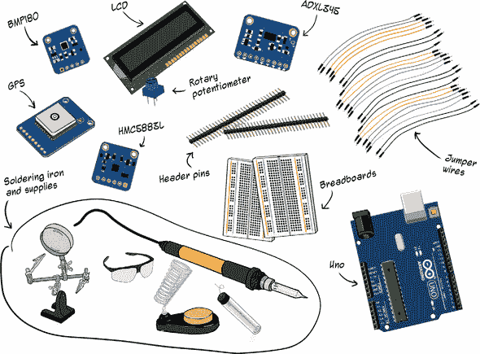


在我们迄今为止的实验中，我们已经能够收集一些关于周围世界的有趣但简单的数据，例如温度（图 7.1）或环境光强度。通过监听基本数字信号（高 vs. 低）的变化，我们可以判断是否按下了按钮。

##### 图 7.1\. 使用简单的模拟传感器如 TMP36，你可以通过在不同时间点（A、B、C）采样信号的电压来获得单个数据点（温度）的值。

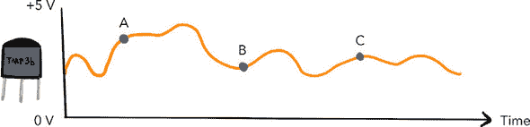

但比单一流传模拟信号能传达的信息要多得多。事实上，许多有趣的数据相当复杂，需要更精细的协调(figure 7.2)。如果你想同时检测三个方向上的物理运动——比如从加速度计？从 GPS 芯片读取信息？精确的指南针坐标和航向？更复杂的数据需要更结构化、更复杂的组件间数字通信方法。

##### 图 7.2\. 加速度计、指南针和 GPS 模块等传感器产生的复杂数字数据需要更复杂的数据交换方法。

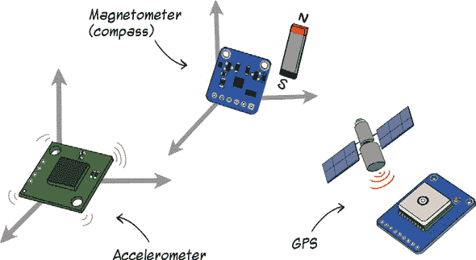

### 7.1\. 并行和串行通信数字数据

串行通信：这是一个单一的概念，有着无数的表现形式。其核心的单一概念非常简单：*串行*仅仅意味着信息——数据——是逐比特发送的，一个比特接着一个比特。这与*并行*通信形成对比，在并行通信中，多个比特同时发送(figure 7.3)。

##### 图 7.3\. 在串行通信（顶部）中，逐个比特按顺序发送。相比之下，并行通信（底部）同时传输多个比特。

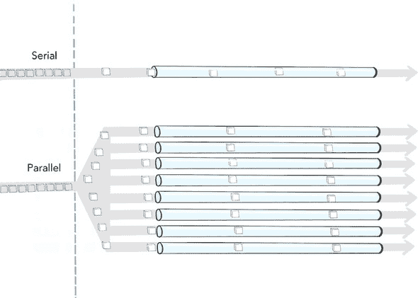

并行通信的好处可能相当明显：如果你可以打开闸门同时抛出一大批比特，为什么还要一次抛出一个比特呢？确实，并行通信可以非常快。但也有一些需要注意的问题。

实际上，你已经看到了并行通信的一个缺点。还记得第五章中的 LCD 计时器实验[kindle_split_013.html#ch05]吗？那个电路使用了一个并行 LCD 组件。回想一下电路。它的一个特点是需要一大群电线。其中四条电线负责将数据并行发送到 LCD，而这个电路只使用了 LCD 上可能的八个并行数据引脚中的四个。并行的第一个缺点：大量的电线。

并行硬件也比串行硬件需要更多的物理比特和部件。更多的电线导致更昂贵、更复杂的电路——更多的部件意味着有更多可能损坏的东西。

同时控制所有这些并行比特并确保它们同时到达同一地点也很棘手。最终，并行的复杂性可能比它的价值更大。而串行，尽管简单，已经足够快了。串行无处不在：HDMI、USB、以太网。串行是大量电子组件的数据交换方法。那么，让我们来谈谈串行。

### 7.2\. 串行通信的基本原理

虽然串行通信的核心概念并不难理解——一次一位沿着电线传输——但实际上它发生的方式有很多。这些位应该以多快的速度移动？每个数据分组（*帧*）由多少位组成？错误是如何检测和纠正的？如果有超过两个组件进行通信，数据是如何发送（*寻址*）到正确的组件的？是否有一个组件（*主控*）负责多个连接的组件？

在同一串行通信通道（或总线）上对话的所有组件，需要就如何进行对话达成一致（图 7.4）——它们需要使用相同的*协议*。有大量的串行协议，可能会让人感到不知所措。好消息是，在业余电子组件中只有少数几种是常用的。掌握基本异步串行、I²C，也许还有 SPI 的概念，你就能处于良好的状态。如果你特别谨慎，请注意，几乎所有低级复杂性都可以通过像 Johnny-Five 这样的库为你抽象出来。

##### 图 7.4\. 为了使用串行通信交换数据，设备需要知道如何相互交谈。

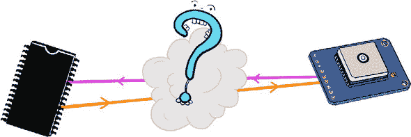

### 7.3\. 异步串行通信

当人们提到*串行*而没有进一步说明时，他们通常指的是*异步串行通信*——两个设备在它们之间进行（TX）和（RX）数据传输（图 7.5）。然而，即使是这个简单的设置也需要一些规则。

##### 图 7.5\. 异步串行数据交换：两个连接的设备中的每一个都可以将数据（TX）发送到另一个组件，并从另一个组件接收（RX）数据。注意，一个设备的 TX 连接到另一个设备的 RX，反之亦然。像 Adafruit 的 GPS 扩展板这样的组件就是使用异步串行通信来传输数据的例子。

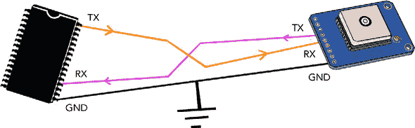

*异步*串行之所以被称为异步，是因为组件之间没有共享的管理时钟信号。每个设备都必须是自己时间的守护者。这没问题，但组件之间必须就每单位时间内发送多少位达成共识。换句话说，每个组件需要知道一个数据位将花费多长时间——例如，信号保持 HIGH 多长时间来表示单个 1 位值？（如果没有这个信息，接收器如何能够区分两个连续的 1 位和一个单一的、长时间的 1 位？）。位速度通常以每秒比特数（*bps*）或*波特率*来表示。

但等等，还有更多！数据不是以无尽的 1 和 0 的流发送的。相反，数据被封装在简短的段中，称为*帧*。发送的每个数据帧都由几个部分组成：数据本身（5-9 位），还有一个起始位，一个停止位（或两个），以及可能（但不常）一个*奇偶校验位*来帮助检测错误（图 7.6）。

##### 图 7.6\. 异步串行数据帧。一个起始位后跟 5-9 位数据位。可能使用奇偶校验位进行错误检测。然后一个或两个停止位表示帧的结束。

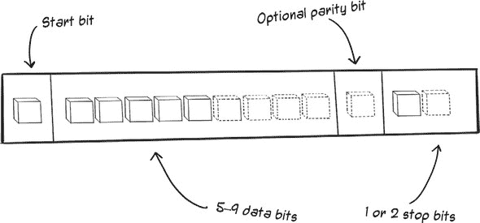

每个异步协议配置定义了其数据帧的具体结构以及波特率。例如，9600/8N1，这是一个常见的协议配置，表示数据速率为 9600 波特，8 位数据块，无奇偶校验位，一个停止位(图 7.7)。

##### 图 7.7\. 9600/8N1 的数据帧结构：起始位，8 个数据位，无奇偶校验位，一个停止位

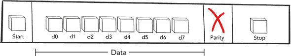

| |
| --- |

**Firmata，串行，以及 Johnny-Five 的工作方式的一些更多内容**

Johnny-Five 的架构在暴露的、高级的 JS API 组件和实际写入和从连接组件读取数据的底层 I/O 实现之间做出了明确的区分。

Johnny-Five 假设兼容的开发板能够执行一组 I/O 操作。例如，`Led` 类内部的逻辑假设可以执行对引脚的数字写入（将其设置为 HIGH 或 LOW），但它并不关心 *如何* 执行该数字写入。相反，定义这些操作实际如何进行的责任在于兼容的 *I/O 插件*。

当你实例化一个 `Board` 对象时，你可以选择声明要使用哪个 I/O 插件。例如，如果你想使用 Johnny-Five 与 Tessel 2 板（我们将在下一章中这样做）一起使用，你可以设置一个 `io` 选项属性。

##### 列表 7.1\. 使用 Johnny-Five 的不同 I/O 插件

```
const five = require('johnny-five');
const Tessel = require('tessel-io'); // A third-party I/O plugin module
 for J5
const board = new five.Board({
  io: new Tessel() // tell Johnny-Five to use this I/O plugin
});
```

你可能已经注意到，到目前为止，我们还没有在我们的 `Board` 实例化中提供 `io` 选项。如果未设置此选项，Johnny-Five 默认使用 *Firmata* 进行 I/O。默认的 Firmata I/O 层与一系列 Arduino 板兼容，包括你的 Uno。

当你在主机计算机上运行 Johnny-Five Node.js 脚本时，是 Firmata 将你的应用程序逻辑转换为发送到板子的 I/O 命令。它也在板上作为固件运行，并在相反方向进行转换：将数据从板子发送回主机计算机。

Firmata 的执行是异步串行操作的例子。Firmata 数据以 8 位块（8N1）的形式在主机计算机和 Arduino 板之间以快速波特率传输。当你执行主机计算机上的 Uno 兼容 Johnny-Five Node.js 程序时（“兼容”意味着它使用默认的 Firmata I/O），Firmata 数据将通过连接的 USB 线缆发送和接收。(毕竟，USB 代表通用 *串行* 总线！)在 Arduino 端，接收和发送串行 Firmata 数据由 Uno 单个板载通用异步接收/发送器 (UART) 处理(图 7.8)。

##### 图 7.8\. UART 是一种专门用于异步串行通信和并行到串行转换的硬件。

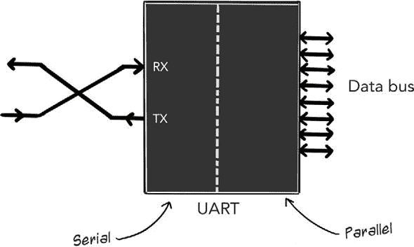

对于好奇者：尽管 Firmata 协议定义了消息的结构，并且 Firmata 实现处理这些消息的打包和处理，但通过计算机的 USB 端口进行串行数据交换的实际机械部分是由一个名为 node-serialport 的 npm 包支持的。


#### 7.3.1\. UARTs

*通用异步接收/发送器* (UART) 是一种用于处理异步串行通信的硬件设备 (图 7.8)。UART 可以接收大量的并行数据——比如说，来自几个 I/O 引脚或其他来源的数据——对其进行处理，并以所需的串行协议输出。反之亦然：UART 也可以解码传入的串行数据并将其作为并行数据提供。并行输入，串行输出——反之亦然。UART 可以配置为使用不同类型的异步串行：不同的波特率等。这使得 UART 非常灵活，是很有用的硬件。

在这种情况下，术语 *晶体管-晶体管逻辑* (TTL) 指的是通过 UART 进行异步串行通信的使用。在 TTL 中，逻辑 HIGH 被表示为微控制器的 Vcc（在 Uno 的情况下为 +5 V），而 LOW 被表示为 0 V——也就是说，电压范围始终限制在适合手头微控制器的电压范围内。


**TTL 的多重含义**

术语 *晶体管-晶体管逻辑* (TTL) 通常指的是使用晶体管进行逻辑构建数字电路的方法——例如，AND 门、逻辑反相器、XOR 门等。在 TTL 组件中使用的标准电压看起来很熟悉：+5 V 表示逻辑 HIGH，0 V 表示 LOW。TTL 集成电路，尤其是与广受欢迎的德州仪器 7400 系列兼容的集成电路，在 1990 年代被广泛使用。尽管它们已被其他技术取代，用于大多数复杂的批量生产电子产品（例如，*互补金属氧化物半导体*，简称 *CMOS*），但它们仍然非常可用，并且对于爱好项目或更简单的嵌入式系统很有用。

可能会让人困惑，术语 *TTL* 也被应用于一种可以连接到其他设备或电路而无需任何额外翻译或接口的设备或电路。在这种情况下，它表示两个设备之间的信号将使用 HIGH (+5 V) 和 LOW (0 V) 逻辑电平进行逻辑通信。正是这种用法导致了将异步串行通信交替称为 *TTL 串行* 的惯例。


您的忠实 Arduino Uno 拥有一个 UART（更准确地说，它的 ATmega 328P 微控制器有一个 UART）。当在您的宿主计算机上执行 Johnny-Five 脚本时，Uno 的 UART 正在忙于接收和发送 Firmata 格式的消息。

这里存在潜在的冲突。假设你有一个想要在你的项目中使用的设备组件，它使用异步串行通信数据。但你的 Arduino Uno 的 UART 已经被用于 Firmata 通信所占用，这是为了使 Johnny-Five 程序能够运行。

幸运的是，有办法！当 UART 在硬件中实现时，它执行的工作确实更高效、更快，但也可以在软件中模拟。所谓的*软件串行*允许你通过那些在硬件级别通常不支持异步串行的微控制器引脚进行通信。软件串行可能会占用处理器资源，并且它的速度不如 UART 快，但它可以*足够快*并且能完成工作。

#### 7.3.2\. 使用 GPS 扩展板尝试软件串行


##### 你需要准备的东西


+   1 个面包板

+   1 个 Adafruit Ultimate GPS 扩展板

+   红色、黑色、黄色和白色跳线

+   Arduino Uno 和 USB 线


这里开始变得有趣——第一次连接 GPS 并看到传入的数据，感觉非常棒。使用 Arduino Uno 读取 GPS 数据过去感觉有点神秘——需要大量复制粘贴 Arduino 代码，并依赖于社区成员编写的低级库。它确实有效，但对于非 C 语言专家来说并不直观。

然而，如今使用 Johnny-Five 与 GPS 交互变得如此流畅，几乎感觉像魔法。你的小 GPS 芯片正在监听*卫星*！难以相信如此复杂的设备可以用几行清晰的 JavaScript 代码进行控制和采样。技术真酷。


**GPS 数据和 NMEA 句子**

许多 GPS 芯片输出的数据符合称为 NMEA 0183 的标准。国家海洋电子协会（NMEA）维护此标准，该标准定义了从你可能在海上航行船只上找到的硬件（如声纳、陀螺仪、海上雷达和 GPS）的数据结构。

NMEA 数据以 ASCII 字符形式通过异步串行进行通信——ASCII 字符是 7 位，非常适合数据字节——这些字符被组装成逗号分隔的*NMEA 句子*。尽管标准确实提到了特定的配置（4800 8N1），但 NMEA 数据可以通过各种配置发送。Adafruit 的 GPS 扩展板默认为 9600 波特率，但一些 GPS 模块可以传输得更快。

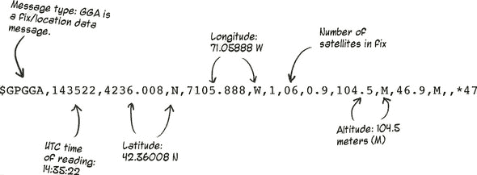

样本 NMEA 句子及其一些字段解释。从 GPS 传输的数据以符合 NMEA 标准的逗号分隔 ASCII 格式发送。

Johnny-Five 的`GPS`类使用软件串行从 GPS 硬件解析 NMEA 句子，并将它们组织成方便的属性，如`latitude`（纬度）和`longitude`（经度）。


好消息是，使用 GPS 扩展板构建电路只需要最少的连接。你会发现，辅助电子组件通常已经集成在扩展板上——电容器、电阻器等等——只留下电源和数据连接需要连接。

反过来，你现在需要学习焊接。Adafruit GPS 扩展板需要焊接在引脚上，以便你可以将其插入面包板(图 7.9)。焊接并不难，但像任何新的核心生活技能一样，你可能需要尝试几次才能熟练掌握。

##### 图 7.9\. 在你可以在面包板上使用它之前，GPS 需要焊接一些引脚。

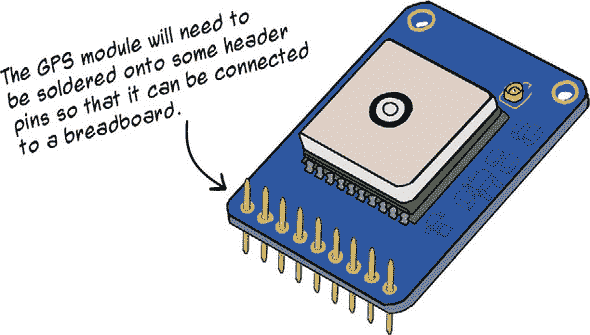

#### 7.3.3\. 学习焊接！

*焊料*是一种金属合金，用于在金属碎片之间形成——*熔接*——永久连接(图 7.10)。焊料的熔点低于你的组件腿和连接，允许它在这些连接周围流动，液态，而不损坏它们。一旦它硬化——这几乎瞬间发生——你就得到了一个永久连接。它有点像导电金属胶水。焊料像电线一样，卷在卷轴上，细长。

##### 图 7.10\. 焊料像线一样卷在卷轴上。

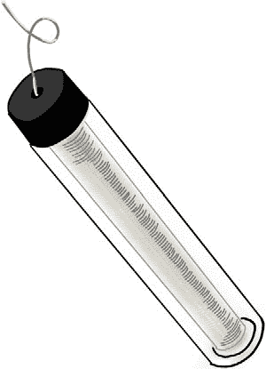

为了提供熔化焊料并形成这些连接所需的热量，你需要一个*烙铁*(图 7.11)。烙铁的价格从 10 美元(美国)到几百美元不等。不出所料，你得到的就是你付出的。便宜的烙铁表现得很便宜，不可调节。但如果你还没有准备好投资一个高质量的模型，一个便宜的烙铁也能很好地完成任务。

##### 图 7.11\. 一款普通的廉价烙铁。便宜的那些通常没有温度控制设置——它们只是保持一种热度。

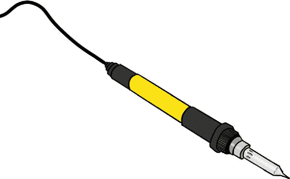

确保你的烙铁有一个*支架*，当它不在你手中时可以放进去(图 7.12)。你还需要海绵来清洁烙铁尖端，在焊接之间以及给尖端上锡（稍后会有更多介绍）。好的焊接海绵是黄铜的，但普通的家用海绵也行。如果你使用纤维素家用海绵，确保在使用烙铁之前将其弄湿。

##### 图 7.12\. 当烙铁不用时，需要一个支架来固定它，并保护周围的东西免受烧毁。

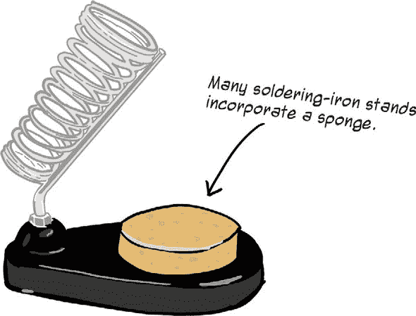

##### 组装你的焊接套件

如果必要的焊接材料清单看起来很繁琐(图 7.13)，你可能考虑购买一个“学习焊接”套件，由在线电子产品零售商销售，其中包含你需要的多数物品，还有一个实践项目。

##### 图 7.13\. 开始焊接所需的关键物品

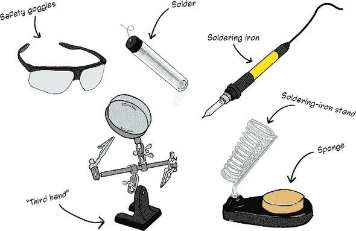

传统上，焊锡是由含有高比例铅的合金制成的。正如你可能知道的，铅对人类有害。自 2006 年以来，欧盟通过《有害物质限制指令》(RoHS)限制了电子中使用铅，这几乎消除了制造焊锡中使用铅。无铅焊锡无疑对人类和地球都有好处，但它也稍微有点难以操作——它不像含铅焊锡那样流动顺畅。无铅和含铅焊锡都可用；有些人认为学习使用含铅焊锡比使用无铅焊锡更容易。

你可能还想买一卷焊锡吸球(也称为*脱焊线*)。这种编织铜线充当化学真空吸尘器，用于去除不良焊点：重新加热焊点，并使用焊锡吸球吸取多余的焊锡。

##### 如何焊接，一步一步来

在开始焊接之前，请完全阅读这些说明，这样你就准备好了，可以大显身手：

1.  在开始之前，使用三爪夹具(图 7.14)或其它方法来固定你的工作台，并让你的双手自由——将排针插入面包板并将板子放置在适当位置也是一种选择。准备好你预计需要的工具和零件，这样你就不需要在之后手忙脚乱地拿着热焊锡枪了。

    ##### 图 7.14。在焊接之前固定你的组件。三爪夹具是完成这项工作的方便工具。

    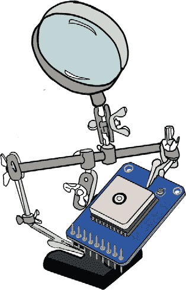

1.  插上你的焊锡枪并让它加热几分钟。现在，特别是如果你有一个价格低廉的型号，再等几分钟——也就是说，要有耐心。使用不够热的焊锡枪是令人沮丧和烧焦电路板的原因。

1.  准备(加锡)你的焊锡枪尖端。在焊锡枪的尖端熔化一点焊锡，然后在你的海绵上擦掉多余的焊锡。这应该在你的焊锡枪上留下一个闪亮的、明亮的尖端。如果你将焊锡接触到焊锡枪的尖端时焊锡不轻易熔化，那么焊锡枪不够热。等待几分钟再试一次。

1.  用你的主手握住焊锡枪，用另一只手握住焊锡。将热焊锡枪的尖端压在排针和连接垫上大约一秒钟(图 7.15)。

    ##### 图 7.15。将焊锡枪的尖端放在金属连接垫和引脚上，以加热它们。

    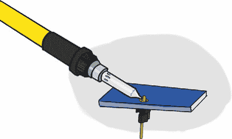

1.  保持焊锡枪的位置，并将焊锡的末端涂在接合点的另一侧(图 7.16)。你不会直接用焊锡枪熔化焊锡——焊锡会与加热的引脚和板子连接接触。保持你的焊锡枪在引脚的底部；忽略将焊锡枪向上移动到焊锡的诱惑。

    ##### 图 7.16。加热的引脚会使焊锡熔化并围绕接合点流动。

    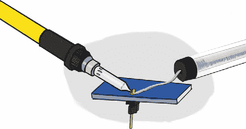

1.  焊料会熔化并围绕焊点流动。一旦你得到一个漂亮的火山形状的焊料堆（图 7.17），取下烙铁，哇！你会发现随着时间的推移，焊料似乎自然而然地“想要”流向那个火山形状。

    ##### 图 7.17\. 一个良好的焊接连接看起来像一个小焊料火山。

    

焊接并不复杂，但要完全做对可能需要几轮。YouTube 和互联网是你的朋友：有大量的视频和教程教你如何焊接。这是一种如果你看到它在运动中可能更容易理解技能。SparkFun 的“通孔焊接”教程清晰易懂（[`mng.bz/cv1Z`](http://mng.bz/cv1Z)）。

| |
| --- |

**焊接新手常见挑战**

就像任何新的物理技能一样，焊接需要一段时间才能掌握。以下是一些可能让你慢下来的常见事情：

+   ***你知道烙铁很热，但它似乎“不想”熔化焊料，或者说，“它就是不起作用”*—** 确保你保持烙铁尖端*镀锡*，也就是说，涂上一点焊料。你可以通过尖端变得闪亮来判断尖端是否镀锡。如果你的烙铁尖端是黑色或哑光纹理，它已经氧化了，你需要*重新镀锡*。这个过程可能很繁琐：你需要让焊料熔化，这样它才能覆盖尖端，但未镀锡的尖端部分不会引起使焊料正确流动的化学反应。花点时间，耐心，正确地完成这个过程，使用海绵帮助引导焊料并擦掉多余的焊料。最好的办法是防止这种情况发生：在每焊接几个接头后检查烙铁，如果任何地方开始看起来氧化，就使用额外的焊料进行修补。注意，无铅焊料会使你的烙铁氧化得比含铅焊料快得多。

+   ***烧黑、变形或烧焦的电路板*—** 如果你不使用过多的热量，焊料不会损坏组件，但很容易因为将烙铁接触到电路板（而不是金属连接），使用过高的温度设置，长时间将烙铁对准组件，等等，而搞砸。通过练习你会变得更好。通常看起来烧焦的电路板或组件仍然可以正常工作，但有时你可能发现你真的烧毁了某个东西。慢慢来，仔细瞄准，并在便宜的组件上尝试你的第一次焊接任务，以防万一。

+   ***焊接接头不工作*—** 如果焊料不足（“冷焊”）的接头不会导电——重新插上烙铁再试一次。另一个常见问题是意外使用过多的焊料，并将连接焊接到相邻的连接上，导致电路出现各种问题。过多的焊料可以用*焊料吸球*清理。

+   ***焊锡根本无法粘附到你试图粘附的东西上*——** 焊接是一个化学过程。你不能在非金属表面如塑料上焊接，甚至一些金属也不可焊接。


#### 7.3.4\. 构建 GPS 电路

一旦将引脚头焊接到 GPS 扩展板上，构建电路就变得简单了。将 GPS 插入面包板。将电源和 GND 分别连接到 Arduino Uno 的 5V 和 GND 引脚。将板的 TX 引脚连接到 Arduino Uno 的 11 号引脚，RX 连接到 10 号引脚(图 7.18)。

##### 图 7.18\. GPS 电路布线图

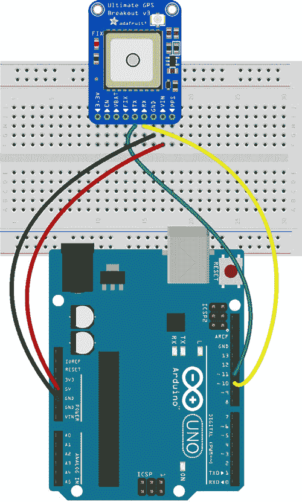

##### 使用 Johnny-Five 读取 GPS 数据

所需的代码简单得令人惊叹。在你的 Johnny-Five 工作目录中，创建一个名为 gps.js 的新文件，并添加以下代码。

##### 列表 7.2\. Johnny-Five GPS

```
const five = require('johnny-five');
const board = new five.Board();

board.on('ready', function () {
  const gps = new five.GPS([11, 10]);           *1*

  board.repl.inject({
    gps: gps                                    *2*
  });
});
```

+   ***1* 软件串行仅在这些引脚——并且只有这些引脚——上支持 Uno。**

+   ***2* 使 GPS 对象（gps）在 REPL 中可用**

一旦 GPS 板连接到电源，它就会开始尝试获取卫星定位。直到它有定位，你将看到板载 LED 大约每秒闪烁一次。

GPS 内置了天线，但如果没有暴露在广阔的天空区域，它将无法获取卫星定位。很可能会需要你外出。幸运的是，这个要求可能不会太麻烦——拿起你的笔记本电脑、Arduino Uno 和面包板，到户外待几分钟。然而，当我测试这个代码时，外面是 24 华氏度（F）并且下着雪球。或者你可能正在使用台式电脑，这不太可能适合户外使用。

你可能在大窗户旁边，有清晰的视野看到天空时会有所帮助，或者你可能能够使用更长的 USB 线，这样你的 Arduino Uno 和面包板可以放在户外，而你的电脑在室内。

获取一个稳定的（“冷启动”）卫星定位大约需要 30-60 秒。

“但是等等，”你说，“我的手机可以在几秒钟内获取我的 GPS 位置……并且它可以在室内工作。怎么回事？”

你的智能手机使用一些额外的技巧来确定你的位置：它相对于本地手机塔和附近的 WiFi 网络的位置。实际上，为了你的手机能够获得真正的 GPS 锁定——卫星类型的——这可能需要与这些独立芯片一样长或更长的时间——长达几分钟。

一旦你的 GPS 芯片有了卫星定位，板载 LED 将停止快速闪烁，减慢到每 15 秒闪烁一次。你启动 gps.js 脚本的时间无关紧要——在芯片有定位之前或之后——但显然，直到定位稳定之前，位置数据将不可用：

```
$ node gps.js
```

假设你已经有了修复方案，现在你可以开始与你的 GPS 交互并记录数据，如下面的列表所示。

##### 列表 7.3\. 光敏电阻数据记录输出

```
1479058386733 Device(s) /dev/cu.usbmodem1411
1479058386761 Connected /dev/cu.usbmodem1411
1479058388413 Repl Initialized
>> gps.latitude
42.38
>>
```

好吧，太酷了——几乎太简单了！你可以尝试检查你的`gps`对象上的其他属性，比如`longitude`。有关你可以做什么的最新信息，请参阅 Johnny-Five GPS 文档([`johnny-five.io/api/gps/`](http://johnny-five.io/api/gps/))。

很好。你已经掌握了使用软件串行实现的基本异步串行连接。让我们看看串行还能做什么。

### 7.4\. 同步串行通信

异步串行简单且有用，但并不适合所有情况。为了考虑到每个组件时钟之间可能存在的小差异，每个数据块都必须被起始位和停止位包围，也许还会加入一个奇偶校验位。这是一个相当大的开销：最佳情况（一个起始位，一个停止位，无奇偶校验），传输 8 位信息需要 10 位。UART 硬件复杂，软件实现较慢且占用处理器资源。在组件之间整理波特率和其他细节可能会很棘手。最后，异步串行实际上只适合让两个设备进行通信。

同步串行协议在数据连接之外还增加了一个共享时钟线，用于同步组件。由于时钟信号决定了数据传输的速度，因此不需要事先配置组件的数据速率。某些同步串行协议还使得在同一通信总线上多个设备之间的通信变得可能且方便。但也存在一些缺点；例如，你即将遇到的 SPI 和 I²C 协议都需要连接的线尽可能短——例如，你不能合理地使用 I²C 通过 20 英尺的电缆进行通信。

#### 7.4.1\. 串行外设接口（SPI）

串行外设接口（SPI）是一种同步串行协议，最初由摩托罗拉在 20 世纪 80 年代开发。它允许一个“主”设备控制并协调自身与一个或多个“从”设备之间的数据交换。对于一对一的主从连接，可以使用最少的三个线（图 7.19），但如果有多于一个的从设备，则需要四条或更多的线（图 7.20）。

##### 图 7.19\. 在一个简单的 SPI 配置中——一个主设备，一个从设备——数据交换可以使用最少的三个线：一个由主设备管理的共享时钟线（SCK）、主设备输出从设备输入（MOSI）和主设备输入从设备输出（MISO）。

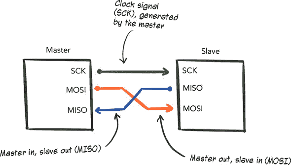

##### 图 7.20\. 当添加更多设备时，至少需要一条额外的线——从设备选择（SS），尽管某些 SPI 配置可能需要为每个从设备一个 SS 线。

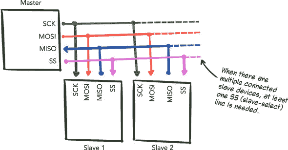

SPI 最大的优点是它允许实现真正快速的数据传输速率。接收硬件也比 UART 简单得多。SD 卡存储卡是 SPI 协议在实际应用中的流行例子。

SPI 组件对业余爱好者来说非常容易获得。例如，Johnny-Five 支持某些 SPI 气压计。此外，我们将在第十章（kindle_split_020.html#ch10）中使用具有 SPI 接口的 LCD 模块（诺基亚 5110）。但 SPI 组件并不像 I²C 这样的主流协议那么常见。这就是我们将关注的焦点。

| |
| --- |

**关于术语的补充说明**

我并不喜欢使用过时的**主从**术语来描述电子和计算机科学中的某些隐喻。但在串行协议中，这种术语却无处不在——例如，它在像**MOSI**和**MISO**这样的缩写中根深蒂固。因此，我这里不情愿地使用**主从**语言，否则可能会导致混淆。

注意，在这些关于不同串行配置的讨论中，开发板上的串行硬件扮演着“主”的角色，而连接的设备则是“从”。


#### 7.4.2\. I²C

**集成电路间通信**（通常写作**I²C**，发音为“I-squared-C”）是由飞利浦半导体（现在是恩智浦）创建的一种同步串行协议。尽管它的速度并不比 SPI 快，但 I²C 通过灵活性和简单性来弥补这一点——只需两条线（图 7.21）！

##### 图 7.21\. 无论连接了多少个设备，使用 I²C 时始终只有两条线：SCL（时钟）和 SDA（数据）。

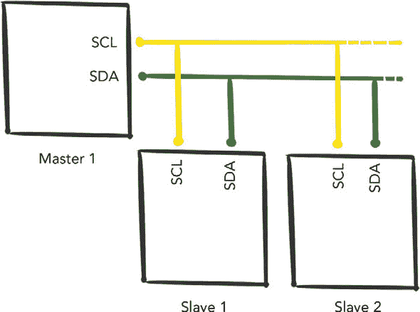

在 I²C 中，你可以在单条总线上连接多达，哦，大约一千个设备（如果你使用 10 位寻址，则是 1008 个；更常见的 7 位寻址允许最多 127 个）。这意味着你回到了异步串行的连接简单性——最少的线缆——但你得到了同步串行的好处——多个设备和无需预先配置。

所有连接组件的数据都通过单一的 SDA（串行数据）线传输。第二条线是 SCL（串行时钟），它像 SDA 一样被所有连接组件共享。将每个设备连接到 SDA 和 SCL 线（并给它们一些电源！），你就可以开始了。


**I²C 设备如何相互通信**

因为通常有很多 I²C 组件连接在同一个总线上，所以 I²C 消息必须更加结构化，并且需要某种机制来控制交通。总线上的一个或多个**主**设备拥有这种权限。活动的主设备（总线上可以有多个主设备，但任何给定时间只能有一个主设备处于**活动**状态）生成时钟信号，并告知其他设备何时发送或接收数据。

为了开始这个过程，活动的主设备首先发送一个**地址**帧（以下图中左侧的第一个帧）以确定哪个连接的从设备需要执行后续操作。


I²C 帧的高级结构

总线上的每个连接设备都有自己的、唯一的地址。通常，这是一个 7 位地址，完整的（8 位）地址帧由 7 位地址位后跟一个 R/W（读/写）位组成。R/W 位指定指示的设备应该读取还是写入数据。然后，被寻址的设备预期会发送一个单 ACK 位来指示所有系统正常工作。然后可以发送数据帧，每个帧后面跟着一个 ACK 位。所有这些都是在共享时钟信号的协调下进行的。

协议细节的输入输出稍微复杂一些——例如，你需要使用 10 位地址来发挥 1008 设备总线的最大作用（7 位数字不超过 127，每个设备都需要一个唯一的地址），而读取从从设备的过程的精确机制需要识别诸如从哪个内存寄存器读取等问题。如果你想了解更多，我推荐 Sparkfun 的 “I²C” 教程 ([`learn.sparkfun.com/tutorials/i2c`](https://learn.sparkfun.com/tutorials/i2c))。

许多 I²C 设备带有硬件定义的地址。这意味着你不能更改设备的地址：如果你有另一个具有相同（硬连线）地址的设备，你将无法将它们放在同一个总线上。但有些设备具有可配置的地址。

| |
| --- |

#### 7.4.3. 使用 I²C 磁力计制作数字罗盘

| |
| --- |

##### 你需要准备的东西


+   1 个 Arduino Uno 和 USB 线

+   1 个 HMC5883L 磁力计（罗盘）5 V 兼容的解析板，例如 Adafruit 的

+   1 个半尺寸面包板

+   红色、黑色、黄色和白色跳线

| |
| --- |

Honeywell HMC5883L 是一种流行的 I²C 三轴 *磁力计* 芯片——即罗盘——可在 Adafruit 的 5 V 兼容解析板上找到。确定你的方向只需片刻，结合 Johnny-Five 的 `Compass` 类和一个以 Honeywell 芯片为中心的解析板。

你将再次需要练习你的焊接技能——解析板需要在将其插入面包板之前焊接到引脚头上 (图 7.22)。

##### 图 7.22. 罗盘解析板，就像 GPS 解析板一样，需要焊接到引脚头上。

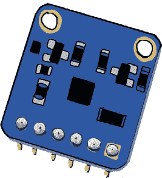

| |
| --- |

##### 注意操作电压！

HMC5883L 解析板可以从各种电子分销商处获得，但请确保你选择的板子可以承受 5 V 的电压。许多板子，包括 Sparkfun 的变体，都是为 3.3 V 逻辑电压而设计的。将 3.3 V 罗盘连接到 Arduino 的 5 V 电源和引脚输出可能会烧毁芯片。Adafruit 的 HMC5883L 解析板有一个板载 *电源调节器*，这使得它可以从 3–5 V DC 供电——它是一个所谓的 “5 V 安全” 组件。尽管有方法使 3.3 V 组件在 5 V 板（如 Uno）上安全工作，但这需要一些额外的步骤和硬件，所以现在请确保你有一个 5 V 兼容的解析板。

| |
| --- |

与 GPS 解析板一样，一旦焊好引脚，这个电路的布线就很简单了：将解析板的 SDA 引脚连接到 Uno 的 A4 引脚，将 SCL 连接到 Uno 的 A5 引脚。将 VIN 连接到 Arduino 的 5 V 电源，并将地线引脚连接到 GND (图 7.23)。

##### 图 7.23. 罗盘布线图

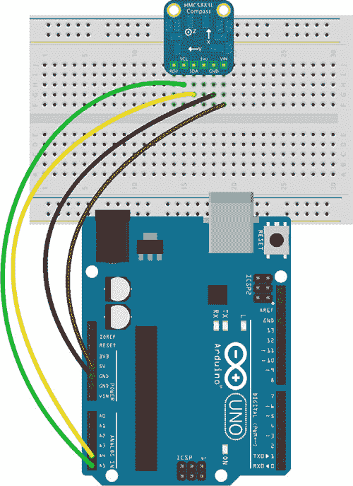

| |
| --- |

##### Arduino Uno 上的 I²C 硬件支持

注意，这个电路的引脚编号不是随意的：Uno 的 A4 和 A5 引脚支持硬件 I²C；其他引脚不支持。Uno 的 A4 引脚提供 SDA；A5 是 SCL。

| |
| --- |

Johnny-Five 的`Compass`类支持多种不同的芯片，因此在实例化时，你需要让它知道使用哪个特定的控制器；参见列表 7.4。Johnny-Five `Compass`文档标识了支持的组件([`johnny-five.io/api/compass/`](http://johnny-five.io/api/compass/))。你不需要定义罗盘连接到的引脚，因为连接 I²C 设备到 Uno 板只有一种方式（引脚 A4 和 A5）。

##### 列表 7.4\. 使用特定控制器实例化`Compass`

```
const compass = new five.Compass({ controller: 'HMC5883L' });
```

使用`controller`选项来区分不同支持的硬件是 Johnny-Five 组件类中的一种常见模式。你第一次在第四章中看到它，与 TMP36 模拟温度传感器一起。

在你的 Johnny-Five 工作目录中，创建一个名为 compass.js 的文件，如下所示。

##### 列表 7.5\. compass.js：使用 Johnny-Five 读取 HMC5883L 数据

```
const five = require('johnny-five');
const board = new five.Board();

board.on('ready', () => {
  const compass = new five.Compass({ controller: 'HMC5883L' });      *1*
  compass.on('change', () => {                                       *2*
    console.log(compass.bearing);                                    *3*
  });
});
```

+   **1** 为 HMC588L 芯片实例化罗盘

+   **2** 罗盘对象实例，像大多数其他 J5 组件对象一样，有一个 change 事件。

+   **3** 罗盘属性是一个包含罗盘方向信息的对象。

现在运行脚本：

```
$ node compass.js
```

当板子和 REPL 初始化后，你会在终端看到如下输出：

```
$ node compass.js
1479310483561 Device(s) /dev/cu.usbmodem1411
1479310483570 Connected /dev/cu.usbmodem1411
1479310485230 Repl Initialized
>> { name: 'East', abbr: 'E', low: 84.38, high: 95.62, heading: 94 }
{ name: 'East', abbr: 'E', low: 84.38, high: 95.62, heading: 91 }
```

每个正在记录的`bearing`对象包含几个属性（`abbr`、`heading`等）。如果这个数字罗盘有一个输出，它会更加出色——我们现在就来做。

### 7.5\. 汇总：摇动切换多传感器小部件

这个下一个实验将几个 I²C 传感器组合在一起，并在 LCD 上显示输出。这里传感器足够多，一次性在 LCD 上显示所有输出比较困难，所以我们将会使用加速度计来创建一个摇动切换显示功能。通过摇动设备，你可以切换在 LCD 上显示的数据：一个显示温度和压力数据的屏幕，或者一个显示当前罗盘方向的屏幕。

A4 和 A5 是 Arduino Uno 上唯一的 I²C 兼容引脚，但这完全没问题——I²C 协议允许在单个总线上连接大量设备。也就是说，你可以只用这两个引脚来控制多个 I²C 设备。

| |
| --- |

##### 你需要准备的东西


+   1 Arduino Uno 和 USB 线

+   1 HMC5883L（罗盘）5 V-friendly 分线板，例如 Adafruit 的

+   1 16x2 LCD：并行或 Johnny-Five 兼容的 I²C LCD，例如 Grove 兼容的 JHD1313M1

+   Adafruit 5 V-ready BMP180 分线板（I²C 温度、大气压力传感器）

+   Adafruit ADXL345 三轴加速度计

+   跳线

+   2 半尺寸面包板或 1 个全尺寸面包板

| |
| --- |
| |

**混合和匹配传感器**

这个实验的代码和接线细节基于供应清单中提到的物品，但你也可以混合使用其他 Johnny-Five 支持的 I²C 传感器：

+   其他“多”传感器（结合温度、压力、高度计，有时还有湿度）：BME 280、BMP 280、HTU21D 等。有关更多支持的 I²C 设备，请参阅 Johnny-Five 的“多”API 页面：[`johnny-five.io/api/multi/`](http://johnny-five.io/api/multi/)。

+   其他加速度计。有关更多支持的 I²C 加速度计，请参阅 Johnny-Five 的“加速度计”API 页面：[`johnny-five.io/api/accelerometer/`](http://johnny-five.io/api/accelerometer/)。

当然，你需要将代码示例修改为适用于你选择的硬件的正确控制器。

注意，这些传感器中的大多数都安装在需要你焊接引脚的扩展板上。


如果你手头有 Johnny-Five 支持的 I²C LCD，如 Grove RGB LCD 模块，那么你很幸运：连接 I²C LCD 非常简单。在这个电路中，并行 LCD 也可以正常工作，但正如你所知，它需要更多的电线。

#### 7.5.1\. 第 1 步：将指南针与 LCD 输出结合

图 7.24 中的接线图显示了如何在两个面包板上定位指南针和 LCD。（随着你向这个项目中添加传感器，单个面包板上将没有足够的空间。）


##### 为什么在这个实验中不使用 GPS？

在这个多传感器项目中使用 GPS 模块似乎是个不错的想法。然而，Johnny-Five 对软件串行的支持相对较新，实现软件串行的一些复杂性意味着很难预测传感器将要传输多少数据（数据交换在这一点上不像 I²C 那样结构化）。正因为如此，在撰写本文时，将 GPS 与其他传感器或输出结合可能会引起 LCD 显示的垃圾数据问题和其他不可预测的行为。


##### 图 7.24\. 接线图，第 1 步。带有指南针扩展板的面包板上的电线排列是为了为以后要添加的传感器留出空间。

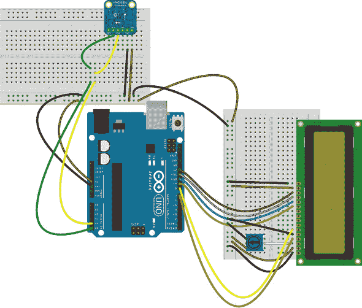

##### 配置磁偏角以获得更好的精度

我喜欢用指南针方向做的一件事是，将其校正为我的本地*磁偏角*。指南针总是给出相对于*磁北*的读数，而磁北相对于真北（地理北）的位置因你所在地球表面的位置而异。在我的地区，真北大约比磁北西 14 度——也就是说，这里的磁偏角为-14.28 度。你可以通过访问[www.magnetic-declination.com](http://www.magnetic-declination.com)来找到你的磁偏角——我们将在设备的代码中使用它。

##### 构建多传感器代码

创建一个名为 multi-sensor.js 的脚本，并从以下配置代码开始。

##### 列表 7.6\. multi-sensor.js：配置

```
const five           = require('johnny-five');

const DECLINATION    = -14.28;                   *1*
const UPDATE_FREQ_MS = 1000;                     *2*
var lastDisplay    = null;                       *3*

const board          = new five.Board();
```

+   ***1* 您当地的磁偏角：这应该是从[www.magnetic-declination.com](http://www.magnetic-declination.com)获取的值。**

+   ***2* 更新 LCD 显示的频率**

+   ***3* 跟踪 LCD 上最后显示的内容**

接下来，添加一个辅助函数来校正罗盘读取的本地偏差。以下偏差校正函数中的算术将确保返回的值是一个有效的 0 到 360 度之间的度数测量值。

##### 列表 7.7\. multi-sensor.js: 校正偏差

```
function correctForDeclination (heading, declination) {                   *1*
  var corrected = heading + declination; // Recall: declination may be negative
  corrected += 360;                                                       *2*
  while (corrected >= 360) {                                              *3*
    corrected -= 360;
  }
  return corrected;
}
```

+   ***1* 此函数校正一个（数字）航向的本地偏差。**

+   ***2* 确保校正后的值是正数**

+   ***3* 从校正值中减去 360（度）的单位，直到它小于 360**

现在，一个格式化辅助函数用于格式化从项目传感器中读取的 `readings`。在这个第一轮中，如下所示，它将格式化 `heading` 属性——我们很快会用罗盘的数据填充它。

##### 列表 7.8\. multi-sensor.js: 显示罗盘航向的格式

```
function formatDisplay (readings) {                                *1*
  var displayLine1, displayLine2;
  displayLine1 = 'HEADING: ';
  displayLine2 = Math.round(readings.heading) + ':circle:';        *2*
  return [displayLine1, displayLine2];
}
```

+   ***1* 读取一个读取对象，并返回在 LCD 的两条线上显示的内容**

+   ***2* :circle: 是一个可以在 LCD 上显示的特殊字符。**

现在，让我们完成这一轮代码。

##### 列表 7.9\. multi-sensor.js: 显示罗盘航向

```
/* ... */
function correctForDeclination (heading, declination) { /** ... **/ }
function formatDisplay (readings) { /** ... **/ }

board.on('ready', () => {
  const compass        = new five.Compass({ controller: 'HMC5883L' });
  const lcd            = new five.LCD({ pins: [7, 8, 9, 5, 6, 12] });     *1*

  lcd.useChar('circle');                                                  *2*

  function update () {
    var display = formatDisplay({
      heading: correctForDeclination(compass.heading, DECLINATION),       *3*
    });
    if (!lastDisplay || (lastDisplay.join('') != display.join(''))) {     *4*
      lcd.clear();
      lcd.cursor(0, 0).print(display[0]);
      lcd.cursor(1, 0).print(display[1]);
      lastDisplay = display;                                              *5*
    }
  }

  board.loop(UPDATE_FREQ_MS, update);                                     *6*
});
```

+   ***1* 实例化一个并行 LCD**

+   ***2* 告诉 LCD 使用特殊的圆圈字符（作为度数标记）**

+   ***3* 校正罗盘读取的偏差，并将结果填充到 readings.heading 中**

+   ***4* 显示值是否已更改？如果是，则更新 LCD。**

+   ***5* 跟踪最后显示的内容**

+   ***6* 设置一个循环，每 UPDATE_FREQ_MS 毫秒（本例中为 1000 毫秒）调用一次更新**

通过每秒只检查一次数据（`board.loop` 频率）并且只有在数据发生变化时才重新打印到 LCD，可以提高性能并避免过度的 LCD 闪烁。

尝试一下：

```
$ node multi-sensor.js
```

你应该在 LCD 上看到罗盘航向——调整了磁偏差并四舍五入到最接近的整数度。它应该每秒更新一次，因为罗盘被重新定位。

#### 7.5.2\. 第 2 步：将多传感器添加到设备中

Johnny-Five 的 `Multi` 组件类旨在用于像 BMP180 这样的设备，这些设备将多个传感器组合成一个包。图 7.25 展示了 Adafruit 的 BMP180 分线板，它包含温度和大气压力传感器。像 GPS 和罗盘一样，BMP180 板在使用面包板之前需要焊接在引脚头上。

##### 图 7.25\. Adafruit 的 BMP180 分线板

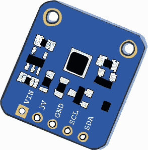

一个 `Multi` 对象作为一个容器，用于各种传感器组件，并允许你以协调的方式与之交互。每个包含的传感器都映射到其适当的 J5 组件类。例如，以下实例

```
const multi          = new five.Multi({ controller: 'BMP180' });
```

将包含以下实例属性：

+   `thermometer`—一个指向 Johnny-Five `Thermometer` 实例的温度传感器

+   `barometer`—一个指向 Johnny-Five `Barometer` 实例的压力传感器

BMP180 使用 I²C 进行通信，这意味着你可以将其连接到已经由罗盘使用的共享 SDA 和 SCL 线。图 7.26)。

##### 图 7.26\. 添加 BMP180 扩展板到电路的布线图

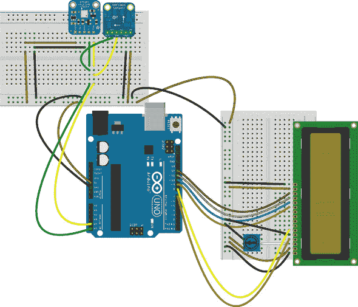

#### 7.5.3\. 步骤 3：更新显示以显示温度和压力

同时显示温度、大气压力和罗盘方向会占用 LCD 有限的 16x2 字符空间。如果我们将显示分成两个屏幕，会更好：一个用于显示温度和压力，另一个用于显示罗盘方向。在我们的第一个版本中，将无法在两个屏幕之间切换——它只会显示温度和压力——但我们将在几分钟后回到这一点。

首先，在文件顶部附近添加一个额外的变量：

```
var altDisplay     = false;
```

这是一种简单的方法，帮助程序确定显示哪个屏幕——温度和压力，还是罗盘方向。

现在，更新显示格式化函数，如以下列表所示。

##### 列表 7.10\. multi-sensor.js：更新显示格式化

```
function formatDisplay (readings, altDisplay) {                           *1*
  var displayLine1, displayLine2;
  if (altDisplay) {                                                       *2*
    displayLine1 = 'HEADING: ';
    displayLine2 = Math.round(readings.heading) + ':circle:';
  } else {
    displayLine1 = 'TEMP/PRESSURE:';
    displayLine2 = readings.temperature.toFixed(1) + ':circle:F';
    displayLine2 += ' / ' + Math.round(10 * readings.pressure) + 'mb';    *3*
  }
  return [displayLine1, displayLine2];
}
```

+   ***1* 更新以接受 altDisplay 参数（布尔值）。**

+   ***2* 此分支将在此代码版本中永远不会执行（它始终为假）。**

+   ***3* 压力单位为 kPa；乘以 10 并四舍五入以获得更熟悉的毫巴**

接下来，更新板的 `ready` 回调：实例化一个 `Multi` 传感器并将更多属性传递给显示格式化函数，如以下列表所示。

##### 列表 7.11\. multi-sensor.js：更新板的 `ready` 回调

```
board.on('ready', () => {
  const compass        = new five.Compass({ controller: 'HMC5883L' });
  const lcd            = new five.LCD({ controller: 'JHD1313M1' });
  const multi          = new five.Multi({ controller: 'BMP180' });        *1*

  lcd.useChar('circle');

  function update () {
    var display = formatDisplay({
      temperature: multi.thermometer.F,                                   *2*
      heading    : correctForDeclination(compass.heading, DECLINATION),
      pressure   : multi.barometer.pressure                               *3*
    },
    altDisplay);                                                          *4*
    if (!lastDisplay || (lastDisplay.join('') != display.join(''))) {
      lcd.clear();
      lcd.cursor(0, 0).print(display[0]);
      lcd.cursor(1, 0).print(display[1]);
      lastDisplay = display;
    }
  }

  board.loop(UPDATE_FREQ_MS, update);
});
```

+   ***1* 为 BMP180 实例化一个 Multi 对象**

+   ***2* 从 BMP180 的温度值添加一个温度属性，单位为华氏度**

+   ***3* 从 BMP180 的压力传感器添加一个压力属性**

+   ***4* 传递（目前始终为假）的 altDisplay 值**

现在尝试以下操作：

```
$ node multi-sensor.js
```

你应该在 LCD 屏幕上看到当前的温度和压力（但不是罗盘方向）。

#### 7.5.4\. 步骤 4：使用加速度计添加摇动切换显示功能

加速度计测量加速度和方向变化。通过监控加速度计的加速度——超过 1 G 的力——你可以创建一个摇动以更改显示的功能。

Adafruit 的 ADXL345 三轴加速度计扩展板（图 7.27）是一个 5 V 兼容的加速度计组件，提供 I²C 和 SPI 接口。尽管该板上的连接支持两种串行协议，但 Johnny-Five 对其的支持仅使用 I²C 接口（仅限）。

##### 图 7.27\. Adafruit 的 ADXL345 三轴加速度计扩展板。它可以连接到 I²C 总线（通过 SDA 和 SCL 引脚）或者，如图中所示，一些引脚作为双重功能使用，一个四线 SPI 设置（通过 CS、SDO、SDA 和 SCL 引脚）。

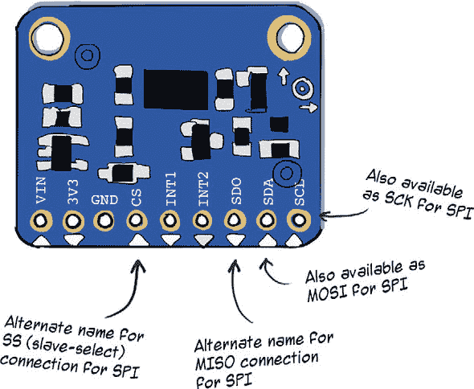

将加速度计添加到电路中（图 7.28），一旦它焊接在排针上，连接到面包板上的共享 SDA 和 SCL 行。

##### 图 7.28\. 添加加速度计到电路的布线图

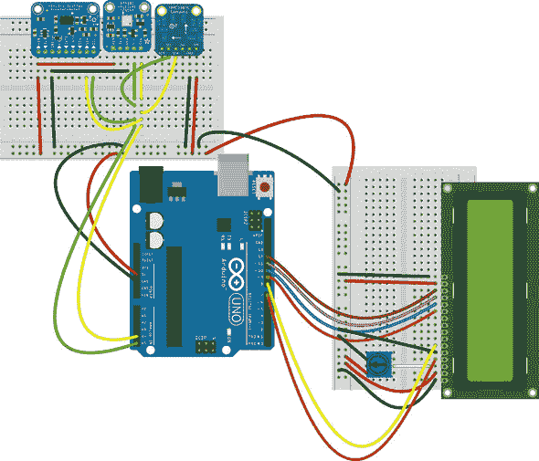

Johnny-Five `加速度计`类提供了对加速度计的支持（你猜对了，J5 组件类可能开始感觉过时了）。

为了实现摇动交换显示功能，我们将绑定到`加速度计`实例的`加速度`事件，该事件在设备加速度读数发生变化时触发，并查看它是否超过了一个大致的阈值，这表明有快速的摇动动作。

编辑以下代码。

首先，在文件顶部附近添加额外的变量来设置摇动阈值（以 G 为单位）并跟踪最后一次检测到的摇动，用于去抖动：

```
const SHAKE_THRESHOLD = 1.15;
var lastJiggleTime = null;
```


**检测和去抖动“摇动”**

一个`加速度计`对象的`加速度`事件会在加速度读数变化时触发。在粗略、非科学的实验中，我发现应该注册为摇动的合理阈值大约是 1.15 G。如果你发现这太敏感或需要太剧烈的摇动，你可以在代码中调整阈值。

真实的摇动动作会在几次设备读数期间产生波动加速度值。也就是说，在短时间内，会连续触发多个`加速度`事件，多次读取，读数超过阈值。如果我们每次加速度计报告的加速度超过阈值时都切换显示，那么显示会疯狂地来回闪烁。

相反，我们需要对交换进行*去抖动*，防止它过于频繁地发生。我们可以通过跟踪最后一次显示交换的时间，并确保我们不会比每秒一次更频繁地交换它来实现这一点。


在`ready`回调函数内部，实例化加速度计：

```
const accel          = new five.Accelerometer({ controller: 'ADXL345' });
```

在`ready`回调函数内部，添加一个`加速度`事件的处理程序，如下所示。

##### 列表 7.12\. multi-sensor.js: 加速度处理程序

```
accel.on('acceleration', () => {
  if (accel.acceleration > SHAKE_THRESHOLD) {                           *1*
    var jiggleTime = Date.now();
    if (!lastJiggleTime || jiggleTime > (lastJiggleTime + 1000)) {      *2*
      altDisplay     = !altDisplay;                                     *3*
      lastJiggleTime = Date.now();                                      *4*
      update();                                                         *5*
    }
  }
});
```

+   ***1* 如果当前加速度属性的值超过 G 阈值...**

+   ***2* 如果在过去 1000 毫秒内没有交换显示...**

+   ***3* 翻转 altDisplay 的值。**

+   ***4* 记录交换发生的时间。**

+   ***5* 更新显示。**

完成了！运行。

```
$ node multi-sensor.js
```

初始时，你应该在 LCD 上看到温度和压力信息显示。拿起带有传感器的面包板，给它一个快速的摇动：你应该看到 LCD 切换到罗盘航向显示。

到现在为止，你可能已经开始注意到房间里有一头大象。你刚刚构建了一个类似定向仪的设备...它通过电缆连接到你的笔记本电脑或计算机。没有主机机器上的计算能力，Arduino 及其附加组件是无能为力的——这就是 Node.js 进程执行的地方。当然，这对于穿越森林的远足来说是一个非常荒谬的设置。同样，你在第六章中构建的机器人只能在其 USB 电缆允许的范围内移动。

是时候摆脱束缚了。在下一章中，我们将开始解放我们的项目，让它们自由发展。

| |
| --- |

**替换 I²C LCD：一个案例研究**

组合传感器电路的布线很拥挤，需要两个面包板。

如果你手头有一个 I²C 兼容的 LCD 显示器（我就是这样），你可以用那个代替并行显示器。我使用了一个 Grove 兼容的 I²C LCD（零件编号，JHD1313M1）。Grove 是由 Seeed Studio 制造的组件系统，所有组件都共享相同的连接器——但是，唉，这些连接器与引脚或面包板不兼容。你可以购买连接器适配器，但在我这个例子中，我进行了一些家庭式手术：我切掉了连接器，并将四根多股线（VCC、GND、SCL 和 SDA，就像任何其他 I²C 设备一样）焊接到了更容易插入面包板的实心连接线上。

结果电路释放了大量 Uno 引脚，整体上更加简单。I²C 是减少您需要支持的项目的组件的物理开发板 I/O 引脚数量的理想协议。

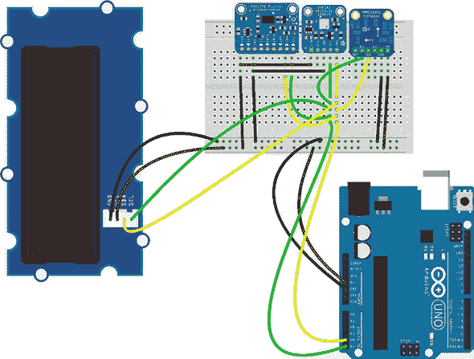

使用 Grove I²C LCD 组件的布线图。它可以与其他连接的传感器共享相同的 SDA 和 SCL 线。

对定向代码的唯一更改是在 LCD 的实例化上。而不是这样，

```
const lcd = new five.LCD({ pins: [7, 8, 9, 5, 6, 12] });
```

使用这个：

```
const lcd = new five.LCD({controller: 'JHD1313M1'});
```

| |
| --- |

### 摘要

+   虽然简单的模拟信号足以满足基本传感器数据，但读取更高级组件的数据需要一种更结构化的信息交换方式。

+   并行通信在本质上很快，但可能会很麻烦。串行通信——一次一个比特——是业余电子学中交换数据的首选方法。

+   异步串行很常见，但需要两个设备事先配置协议特定设置，并且限制为两个设备。

+   TTL（晶体管-晶体管逻辑）是开发板上使用的异步串行类型。UART 硬件使得在板上实现快速 TTL 串行成为可能，但这种类型的串行通信也可以在软件中模拟（软件串行）。

+   同步串行协议在通信总线上增加了一条共享时钟线。SPI 是一种需要三到四条（数据线和时钟线）线的协议；更受欢迎的 I²C 协议只需要两条线。

+   可以将串行组件组合起来制作有趣且功能强大的项目。尽管只有两个设备可以通过异步（TTL）串行连接交换数据，但可以将许多设备添加到相同的 SPI 或 I²C 总线上，从而更有效地使用开发板的 I/O 引脚。

+   I²C 可以在一个总线上支持多达 1008 个设备（使用 10 位地址）。总线上的每个设备都需要一个唯一的地址。

+   串行数据交换的支持通常在硬件级别提供（软件串行仿真是明显的例外）。在开发板上，这通常取决于微控制器或处理器提供的串行支持。

+   串行连接仅在某些引脚上可用。对于 Arduino Uno，I²C 支持在引脚 A4（SDA）和 A5（SCL）上，SPI 在引脚 10（SS）、11（MOSI）、12（MISO）和 13（SCK）上。

## 第八章\. 无线项目

*本章涵盖*

+   为什么业余电子项目需要电线，以及如何摆脱它们

+   在不同平台上使用 Johnny-Five 与不同的 I/O 插件

+   配置和使用 Tessel 2 开发平台

+   适应 3.3 V 逻辑电平和不同的引脚配置

+   无线部署代码到 Tessel 2

+   利用 Node.js 和 npm 生态系统为 Tessel 2 创建更复杂的软件

+   使用电池让 Tessel 2 完全摆脱电线


**对于本章，你需要以下物品：**

+   1 个 Tessel 2 开发板

+   1 根 USB A 到 USB micro 线

+   1 个标准 LED 灯，任何颜色

+   1 个 100 V 电阻

+   1 个 Adafruit BMP180 多传感器扩展板

+   以下任何一个：

    +   3 个公头引脚

    +   2 根 22 号规格、实心导线

    +   9 V 电池和夹子

+   焊锡铁和配件

+   1 个 USB 5 V 电源适配器或类似设备，为 Tessel 2 供电

+   1 个 USB 电池（有时称为*移动电源*）

+   跳线

+   1 个半尺寸面包板

+   从第六章（kindle_split_014.html#ch06）中的巡游机器人（电机驱动电路和底盘）

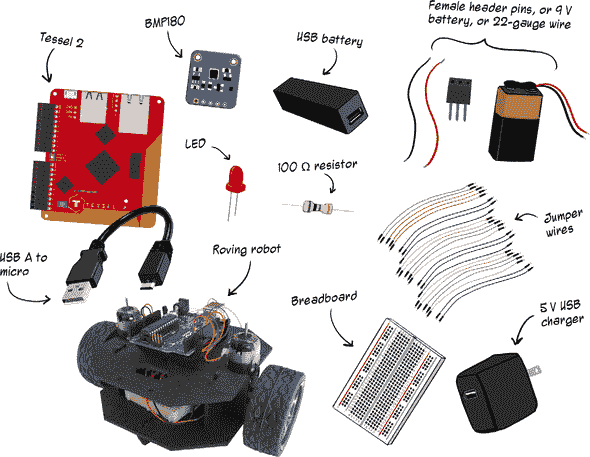


我们正在构建的东西变得越来越复杂和强大，但有一个限制因素：它们物理上连接到计算机。这些基于 Arduino Uno 的 Johnny-Five 项目缺乏物理独立性——它们完全依赖于主机计算机进行逻辑指令和电源。对于某些类型的项目，这种束缚的主机-客户端设置并不是问题。但为了进一步发展，为了创建 JavaScript 控制的、自主的、自包含的项目——为了摆脱电线——你需要扩大你的硬件视野。

Arduino Uno 上使用的 ATmega328P 微控制器过于受限，无法运行完整的操作系统或原生执行 JavaScript。如果你想用 JavaScript 控制 Uno，你必须使用外部且更强大的东西——一个*主机*——来代表板执行 JavaScript。

在主机上，JavaScript 程序中的逻辑需要转换为受限制的微控制器可以理解的指令。然后，这些指令需要传达给 Uno，它充当一个薄的*客户端*。同样，来自 Uno 的数据——传感器读数等——需要传达回主机进行处理（图 8.1）。

##### 图 8.1\. 这段来自第一章（kindle_split_008.html#ch01）的代码概述了自动风扇小部件的理论主机-客户端通信。在你迄今为止的实验中，Arduino Uno 充当了一个薄的客户端，而你的计算机作为主机。


在 Johnny-Five 中，格式化和交换主机和客户端之间的指令和数据是*I/O 层*的工作。

Arduino，包括 Uno，是 Johnny-Five 的特殊案例：Firmata 提供了 I/O 层，并在 Johnny-Five 中默认可用。也就是说，当您实例化一个`Board`对象时，除非您告诉它否则（使用选项），Firmata（通过 USB）将用于 I/O。您在之前的章节中一直在使用这种默认的 I/O。

### 8.1. 为什么您一直处于连接状态

到目前为止，您一直使用物理 USB 连接线为您的项目供电，因为 USB 连接提供了 I/O 交换和电源供应的双重功能。要断开连接，您需要以不同的方式满足这些要求——I/O 和电源，因此让我们深入了解内部的工作原理。

#### 8.1.1. 数据交换、I/O 层和 I/O 插件

虽然 Johnny-Five 定义了 API 和组件的逻辑行为，但数据指令如何在 Johnny-Five 应用程序和硬件之间交换则留给*I/O 层*。这就是 Johnny-Five 保持平台无关性的方式：它将这些细节留给兼容的*I/O 插件*。

到目前为止，您还没有使用任何 Johnny-Five I/O 插件，因为常见的 Arduino，包括 Uno，是 Johnny-Five 的特殊案例。当您实例化`Board`对象而不指定要使用的 I/O 时，Johnny-Five 默认通过 USB 使用 Firmata——这就是为什么它“直接工作”的原因。与其他平台的 I/O 插件不同，它们必须单独安装，Firmata 与 Johnny-Five 一起提供（技术上讲：它是一个依赖项）。这可能会让人感觉 Firmata 和琐碎的 I/O 细节是 Johnny-Five 代码的一部分，但实际上并非如此。当您在其他平台上尝试 Johnny-Five 时，您会看到您必须安装适当的 I/O 插件。关于这一点，稍后会有更多介绍。

在您迄今为止的 Arduino Uno 主机-客户端 Johnny-Five 设置中，USB 电缆充当了交换串行 Firmata 格式消息的脐带。这就是您一直处于物理连接状态的一个原因。

#### 8.1.2. USB 作为电源

项目中的电路需要某种电源。您一直使用的 USB 连接提供稳定的 5V 电源。除了少数需要比开发板能提供的更多电流或电压的感应电路——如电机和伺服机构——之外，您一直依赖 USB 电缆供电以及数据交换。

| |
| --- |

**开发板的直流电源**

Arduino Uno 内置了一个直流圆筒形插孔，您可以使用它将 Arduino 连接到壁挂式直流适配器。这种“壁挂式电源适配器”无处不在，它将基于墙面的交流电转换为许多电子设备所需的直流电。

早期的壁挂式电源适配器具有圆筒形插孔，可以插入从答录机到您自己的开发板（如 Uno）的任何设备。

![0218fig01_alt.jpg]

Uno 有一个直流输入圆筒形插孔用于供电

大多数开发板（包括 Uno）都有内置的 *电压调节器* 用于其电源输入，这意味着可以通过直流电源为 Uno 提供从 9 V 到超过 20 V 的电压，并且它会将其调节到所需的 5 V。

电压调节器需要提供比其目标输出电压更高的电压。就像 LED 一样，调节器本身存在正向电压降——板上的功率调节电路消耗了一些输入电压。在 Uno 的例子中，为了得到稳定的 5 V，至少需要 7 V 的输入电压。

任何具有中心正极性、5.5 mm x 2.5 mm 插头（最常见的尺寸）的 9 V–12 V DC 适配器都适用于为 Uno 提供电力。


此符号表示电源适配器具有中心正极性。也就是说，插头尖端具有正极性，而套筒是负极。大多数直流电源适配器都具有中心正极性——这正是你为 Uno 和通常其他开发板供电所需要的那种。

并非所有适配器上都打印有极性符号。这很遗憾，因为你不能假设某个适配器具有中心正极性——没有默认值，尽管中心正极性更为常见。

我手头备有直流电源适配器和 5 V USB 充电器，以便在项目中使用。这些适配器早已从它们原始的消费电子产品中分离出来，在为各种原型和项目提供电力方面变得非常方便。

| |
| --- |

#### 8.1.3\. 无线项目通信选项

正如你所见，项目使用线缆有两个主要原因：数据交换和电力。我们将稍后解决电力问题，但首先让我们看看创建不需要物理连接数据连接的项目的方法。

##### 无线主机-客户端设置

某些具有受限微控制器的开发板提供了无线通信功能，如 WiFi 或蓝牙。

执行 JavaScript 逻辑需要一个主机，但主机和客户端之间可以通过无线方式交换数据和指令——从而消除了物理 USB 数据连接的需求（图 8.2）。

##### 图 8.2\. 与 Uno 一样，这些板具有受限的微控制器，但两者都可以无线通信。

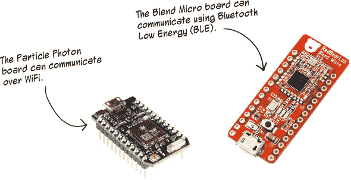

例如，Blend Micro 板可以通过使用 blend-micro-io I/O 插件和板上的 BLEFirmata 固件无线地与 Johnny-Five 一起使用。你将在 第十二章 中遇到另一个具有 BLE 功能的小型板，Espruino 的 Puck.js。

##### 嵌入式 JavaScript

另一类开发板具有从受限到中等复杂性的微控制器，并针对运行 JavaScript、JavaScript 的某些子集或类似 JavaScript 的代码进行了优化。这些板上的微控制器不适合运行完整的操作系统，但往往具有高效能、低成本和小型化——所有这些都是嵌入式系统的理想特性。

工作流程因平台而异。在某些情况下，您编写的 JavaScript 可能会被编译成其他东西（更底层和高效的代码）然后再被烧录到设备上。在其他情况下，板上的微控制器可能能够直接执行 JavaScript 的某些子集——这意味着您使用 JavaScript 编写代码，但您可能无法访问每种语言的所有功能（图 8.3）。我们将在第十章中重新探讨受限的嵌入式 JavaScript 平台。

##### 图 8.3\. 这类设备将受限的微控制器与优化的 JavaScript 和类似 JavaScript 的运行时版本相结合。我们将在第十章中探讨 Pico 和 Element。 

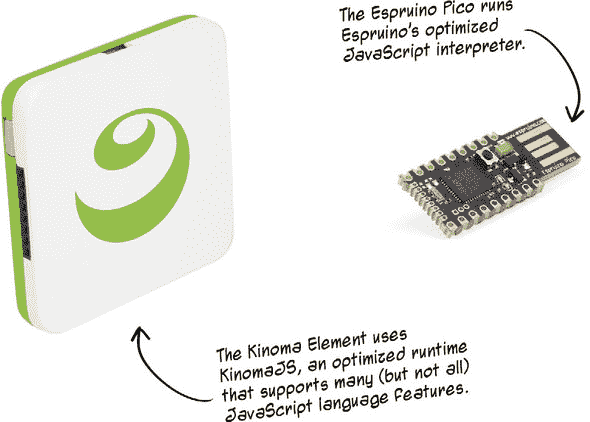

##### 使用微型计算机（SBC）控制客户端

单板计算机（SBC）能够运行真正的多任务操作系统，并在处理能力和板载外围设备支持方面提供多种选择。它们可以做很多事情，包括运行 Node.js，但相应地，它们比其他嵌入式项目开发板更耗电、更昂贵，体积也更大。

在单板计算机（SBC）中，计算机和开发板之间的界限可能变得模糊：一些，如流行的 Raspberry Pi 系列，将通用计算功能与类似开发板的 I/O 结合在一块板上。这算作嵌入式逻辑执行，还是作为主机-客户端设置的微型变体（Pi 的处理器作为主机来控制 I/O）？事情变得更加复杂，因为您可以使用 Raspberry Pi 控制连接到 Pi 自身 USB 端口的一个 Arduino——一个微型主机-客户端设置。我们将在第十一章中探讨更多 SBC。

### 8.2\. 使用 Tessel 2 实现无线的项目

Tessel 2 ([`tessel.io/`](https://tessel.io/)) 是一个以 Node.js 和 npm 软件包管理器为中心的开源开发平台（硬件和软件都是开源的）。除了您已经习惯的基本 I/O 类型——数字、模拟、PWM、I²C 等等——Tessel 2 还提供了一些高级外围设备，如 USB 端口、以太网，以及——欢呼！——WiFi。（Tessel 2 是目前唯一可用的 Tessel 型号，所以我会通常直接称之为 Tessel。）

##### 图 8.4\. Tessel 2 开源开发板


Tessel 是一个有趣且实用的硬件设备。根据“能够运行真实操作系统”的标准，它将属于 SBC 类别的设备——它预装了 *OpenWrt*，这是一个常见于路由器的 Linux 发行版。

但开发工作流程更像是主机-客户端设置和嵌入式 JavaScript 设备：你在电脑上编写代码，并将其部署到 Tessel 上，而不是在 Tessel 上编写代码。尽管 Tessel 运行 OpenWrt 并附带一些我们将要检查的实用软件，但它比像 Raspberry Pi 这样的 SBC 平台更受限制。它只有 64 MB 的 RAM 和 32 MB 的 Flash 空间用于程序。这比基于 ATmega328P 的板如 Uno 上可用的空间大得多，但与典型的桌面计算机相比，它不在同一个水平上。

在使用 Johnny-Five 为 Uno 开发项目后，你会发现 Tessel 的许多人体工程学方面都很熟悉。确实，如果你习惯于使用 Node.js 进行开发，那么与 Tessel 一起工作的机制会感觉非常熟悉。 

Tessel 与 Arduino Uno 之间有一个重要的区别需要注意：Tessel 在 3.3 V 下运行，而 Uno 是 5 V。

| |
| --- |

##### Tessel 2 是 3.3 V

Tessel 2 在 3.3 V 下运行。你需要考虑到这一点来设计电路，并确保使用 3.3 V 兼容的组件。将 5 V 组件或电源插入 Tessel 2 的引脚可能会损坏电路。不用担心：我们会随着进展逐步介绍细节。

| |
| --- |

### 8.3\. 设置你的 Tessel

| |
| --- |

##### 你需要准备的东西

![note.jpg]

+   1 个 Tessel 2

+   1 条 USB 线：USB A 到 USB micro

| |
| --- |

要让 Tessel 准备好冒险，你需要用 USB 线将其连接到你的笔记本电脑上，就像与 Uno 一样。但是有一些很大的不同。首先，你将要编写的 JavaScript 代码将上传到 Tessel 本身并运行——Tessel 不需要主机来为它思考。此外，Tessel 有 WiFi，所以一旦设置好，你就不需要一直将其插入 USB——你可以无线部署到它上面。

| |
| --- |

**Tessel 和 Node.js LTS**

Tessel 支持 Node.js 的长期支持（LTS）版本，截至写作时是 6.11（到你阅读时，它可能已经大大前进）。本书中的代码示例将假设至少是 6.11 版本，示例脚本将使用该版本中可用的语言功能。比当前 LTS 版本更新的 Node.js 版本可能不与 Tessel 兼容。

注意，Tessel 上运行的 Node.js 版本可能与你系统的 Node.js 版本不同（并且更旧）。一旦你的 Tessel 配置完成，你可以使用`t2 version`命令查看它正在运行的 Node.js 版本以及固件版本（稍后将有更多关于`t2`工具的介绍）。

| |
| --- |

#### 8.3.1\. 配置 Tessel

以下说明可能会让设置步骤感觉比较长，但在大多数情况下这个过程只需要几分钟。

##### 步骤 1：安装 CLI

安装用于从你的电脑控制 Tessel 的命令行界面（CLI）。这应该作为一个全局 npm 包安装，你需要在终端中输入以下命令：

```
$ npm install -g t2-cli
```

模块安装完成后，您将能够在终端中使用 `t2` 命令来控制您的 Tessel。


##### `t2` 与 `t2-cli`

npm 模块名为 `t2-cli`，但它提供的命令是 `t2`。


##### 第 2 步：连接、查找并重命名您的 Tessel

将您的 Tessel 上的 USB 微型端口连接到电脑上的 USB 端口。这将给 Tessel 提供电源，您应该会看到 LED 闪烁（这需要大约 30 秒）。

使用以下命令在终端中查找 Tessel：

```
$ t2 list
```

您应该看到类似以下的内容。

##### 列表 8.1\. `t2 list`

```
$ t2 list
INFO Searching for nearby Tessels...
     USB    Tessel-02A397D5D8A4
```

哈哈！但 `Tessel-02A397D5D8A4` 并不是很有吸引力。幸运的是，使用此命令重命名您的 Tessel 简单得就像做饼一样：

```
t2 rename <name>
```

我决定将我的 Tessel 命名为 `sweetbirch`。您可以选择自己的名字。

##### 列表 8.2\. `t2 rename`

```
$ t2 rename sweetbirch
INFO Looking for your Tessel...
INFO Connected to Tessel-02A397D5D8A4.
INFO Renaming Tessel-02A397D5D8A4 to sweetbirch
INFO Changed name of device Tessel-02A397D5D8A4 to sweetbirch
```

##### 第 3 步：将 Tessel 连接到 WiFi 并配置

使用以下命令将您的 Tessel 连接到 WiFi 网络：

```
$ t2 wifi -n <network-name> -p <password>
```


##### Tessel 的 WiFi 兼容性

通常，使用单个命令就可以轻松地将 Tessel 连接到典型的 2.4 GHz 家庭 WiFi 网络。但请注意，Tessels 目前还不兼容 5 GHz 网络。如果您遇到问题，请访问 Tessel 的 WiFi 连接设置页面 ([`tessel.github.io/t2-start/wifi.html`](http://tessel.github.io/t2-start/wifi.html)) 获取更多信息。


最后，配置 Tessel 以便您可以通过 WiFi 从您的电脑发送代码到它：

```
$ t2 provision
```

配置后的 `t2 list` 命令输出应显示 Tessel 既可以通过 USB 连接，也可以通过 WiFi（局域网）可用，如以下列表所示。

##### 列表 8.3\. 配置后的 `t2 list`

```
$ t2 list
INFO Searching for nearby Tessels...
     USB    sweetbirch
     LAN    sweetbirch
```

##### 第 4 步：更新您的 Tessel

Tessel 的固件会不时发布更新。请确保您拥有最新版本，通过运行以下命令：

```
$ t2 update
```

如果有可用的更新，此过程可能需要几分钟。

确保您的 Tessel 仍然连接到 USB 并已启动。要在您的 Tessel 上运行 LED 闪烁代码，首先按照以下列表初始化项目。

##### 列表 8.4\. 初始化闪烁 LED Tessel 项目

```
$ t2 init
INFO Initializing new Tessel project for JavaScript...
INFO Created ".npmrc".
INFO Created ".tesselinclude".
INFO Created "package.json".
```


**`t2 init` 命令**

`t2-cli` npm 包的新版本要求您在将项目代码部署到您的 Tessel 之前，在项目目录中运行 `t2 init` 命令。您只需这样做一次（每个项目一次）。如果您忘记运行 `t2 init`，您将收到一条有用的消息：

```
$ t2 run index.js
INFO Looking for your Tessel...
INFO Connected to sweetbirch.
WARN This project is missing an ".npmrc" file!
WARN To prepare your project for deployment, use the command:
WARN
WARN t2 init
WARN
WARN Once complete, retry:
WARN
WARN t2 run index.js
```


#### 8.3.2\. “Hello World” LED 在 Tessel 上闪烁

您可以直接使用 JavaScript 控制 Tessel，这正是 Tessel 的用途。创建一个名为 hello-tessel.js 的文件，并在其中添加以下列表中的 LED 闪烁代码。此脚本将使 Tessel 的内置板载 LED 闪烁。

##### 列表 8.5\. hello-tessel.js

```
const tessel = require('tessel');     *1*

tessel.led[2].on();                   *2*

setInterval(function () {
  tessel.led[2].toggle();
  tessel.led[3].toggle();
}, 100);                              *3*

console.log("I'm blinking! (Press CTRL + C to stop)");
```

+   ***1* 导入 tessel 硬件接口**

+   ***2* 首先打开板载 LED 之一**

+   ***3* 每 100 毫秒切换 LED**

现在，你可以使用`t2 run <file>`命令在 Tessel 上运行 LED 闪烁代码，如下所示。在代码部署并开始运行后，你应该看到 Tessel 的两个板载 LED 快速闪烁。

##### 列表 8.6\. `t2 run`

```
$ t2 run hello-tessel.js --lan
INFO Looking for your Tessel...
INFO Connected to sweetbirch.
INFO Building project.
INFO Writing project to RAM on sweetbirch (89.088 kB)...
INFO Deployed.
INFO Running hello-tessel.js...
I'm blinking! (Press CTRL + C to stop)
```

| |
| --- |

##### `--lan`标志

Johnny-Five 脚本如果通过 LAN（WiFi）连接部署到 REPL（使用`console.log()`）会表现得更好。`t2 run`命令的`--lan`标志指定应该使用 WiFi 连接（而不是有线`usb`连接）。

| |
| --- |

##### 理解“Hello Tessel”示例

在 hello-tessel.js 代码中有些看起来熟悉的东西，但一些细节是 Tessel 特有的（与使用 Johnny-Five 控制 Uno 相比）。

代码中的第一件事是引入一个名为`tessel`的库的要求：

```
var tessel = require('tessel');
```

留意观察者可能会注意到这一点很奇怪：你从未使用`npm install`安装过这样的库，或者以其他方式使其在你的电脑上的代码中可用。Tessel 2 硬件 API 文档（[`mng.bz/Ror5`](http://mng.bz/Ror5)）解释了这个`require`语句：

> *当你*在 Tessel 2 上执行的脚本中`require('tessel')`*时，这会加载一个与 Tessel 2 硬件接口的库，包括引脚、端口和 LED...*

这里一个重要的部分是短语“在 Tessel 2 上执行”。这是真的：如果你尝试在自己的电脑上用 Node.js 运行 hello-tessel.js 脚本，你不会走得太远——你会遇到一个关于缺少模块的错误。你也不会在 npm 上找到`tessel`包。相反，`tessel`是一个预安装在 Tessel 板上的 JavaScript API 库，因此对在 Tessel 2 上运行的脚本可用。

通过`tessel`对象开启和切换 Tessel 板上的 LED 灯，看起来有点像使用 Johnny-Five 的`Led`对象，但又不完全一样：

```
tessel.led[2].on();
tessel.led[2].toggle();
tessel.led[3].toggle();
```

`tessel`对象让你可以访问 Tessel 板上的端口和引脚，暴露了一个硬件 API 来与之交互。这是一个比 Johnny-Five 更底层的 API：你可以读取和写入数字、模拟和串行数据，但没有更高层次的对象来封装，比如温度传感器。Tessel 2 硬件 API 文档提供了更多相关信息（[`mng.bz/Ror5`](http://mng.bz/Ror5)）。

#### 8.3.3\. 使用 Tessel 闪烁外部 LED

| |
| --- |

##### 你需要

![note.jpg]

+   1 个 Tessel 2

+   1 个 USB 到 USB-micro 线缆

+   1 个标准 LED

+   1 个 100 V 电阻

+   跳线

+   1 个全尺寸面包板

| |
| --- |

按照古老的闪烁 LED“Hello World”传统，让我们进一步深入 Tessel，使用这个经典的第一个电路。这个例子不是闪烁板载 LED，而是使用外部连接的 LED。虽然这个实验范围有限，但它会介绍你如何进行 Tessel 项目的工作流程和结构。

| |
| --- |

**Tessel 项目结构**

与你用 Uno 编写的单次、独立脚本不同，你将把每个 Tessel 实验结构化为一个合适的 Node.js 项目：

+   每个实验都将有自己的工作目录。

+   你将使用 package.json 文件来管理依赖项。

+   实验的主要（入口）脚本将命名为 index.js。

如果你熟悉使用 Node.js 编写软件，这个结构看起来会很熟悉。

| |
| --- |

##### 设置 Johnny-Five Tessel 项目

在编写任何代码之前，设置项目的工作区域。你需要创建一个目录并使用 `npm init` 命令设置 package.json 文件。打开终端并执行以下命令：

```
mkdir t2-blink
cd t2-blink
npm init -y
```

运行 `npm init` 通常会引导你通过一系列交互式问题来设置项目。添加 `-y` 标志将跳过这些步骤并使用默认设置创建 package.json 文件。如果你不关心项目的特定配置细节，这是一个更快开始的方式。一旦你运行了 `npm init`，你将有一个 package.json 文件。

##### 连接 3.3 V LED 电路

虽然你之前已经构建了一个基本的 LED 闪烁电路，但为了调整 Tessel 的 3.3 V 供电电压，需要进行一些算术运算。电路与你在 第三章 中构建的 Uno 的基本 LED 电路相似（图 8.5），但你将需要一个不同的限流电阻来适应 Tessel 的 3.3 V 逻辑。

##### 图 8.5\. Uno 的原始基本 LED 电路。Uno 工作电压为 5.5 V，而 Tessel 是 3.3 V 设备。电路需要调整以适应 Tessel 的不同电压。

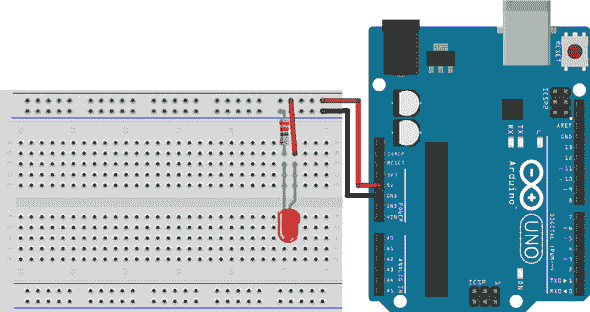

在 第三章 中，你通过考虑 Uno 的工作电压（5 V）和 LED 正向电压的近似值（约 1.8 V）来计算串联电路中单个 LED 所需的限流电阻。你得到了以下结果：

```
5.0 V (supply voltage)
– 1.8 V (red LED forward voltage)
--------------------------------
= 3.2 V ("remaining" voltage in the circuit)
```

为 LED 设定 20 mA 的电流，然后你使用了欧姆定律：

```
Resistance (R) = Voltage (V) / Current (I)
            R  = 3.2 V        / 0.02 A
------------------------------------------
               = 160 *V*
```

160 V 不是一个常见的电阻值，所以你将其四舍五入到 220 V（这是一个常见值）。

调整 Tessel 上的 3.3 V 供电值：

```
3.3 V (supply voltage)
– 1.8 V (red LED forward voltage)
--------------------------------
= 1.5 V ("remaining" voltage in the circuit)

Resistance (R) = Voltage (V) / Current (I)
            R  = 1.5 V        / 0.02 A
------------------------------------------
               = 75 *V*
```

75 V 不是一个常见的电阻值，但 100 V 是——一个 100 V 的电阻在这里就足够了！在 5 V 电路中，所需的电阻值较低是有道理的：LED 电压降后剩余的电压较少。

按照 Tessel LED 连接图（图 8.6）所示连接电路。

##### 图 8.6\. 将 LED 的阳极连接到 Tessel 的端口 A，引脚 5，将阴极连接到端口 A 的 GND 连接。


##### 编写 LED 闪烁代码

在 第二章 中，使用 Johnny-Five 为 Arduino Uno 编写的闪烁 LED 实验使用了以下代码。

##### 列表 8.7\. led.js

```
const five = require('johnny-five');
const board = new five.Board();        *1*

board.on('ready', () => {              *2*
  const led = new five.Led('13');      *3*
  led.blink(500);                      *4*
});
```

+   ***1* 使用无非默认选项的 Board 对象实例化**

+   ***2* 当板子准备好...**

+   ***3* 实例化一个连接到引脚 13 的 Led 对象**

+   ***4* 闪烁 LED**

要使此代码与 Tessel 一起工作，不需要做太多更改。你需要考虑两件事：

+   Tessel 需要不同的 I/O 层支持才能与 Johnny-Five 协同工作。您需要确保您的`Board`对象使用`tessel-io`进行 I/O（而不是默认的`firmata`）。

+   需要更新的 LED 连接到的引脚编号。

首先在您的`t2-blink`工作目录中运行以下命令：

```
$ npm install --save johnny-five tessel-io
```

这将本地安装`johnny-five`和`tessel-io`包，并将依赖项保存到 package.json 文件中。您已经熟悉`johnny-five`包。`tessel-io`是 Johnny-Five 为 Tessel 提供的 I/O 插件。

在同一目录下创建一个名为 index.js 的文件，并添加以下代码。

##### 列表 8.8\. index.js

```
const five = require('johnny-five');
const Tessel = require('tessel-io');          *1*
const board = new five.Board({
  io: new Tessel()                            *2*
});

board.on('ready', () => {
  const led = new five.Led('A5');             *3*
  led.blink(500);
});
```

+   ***1* 需要 tessel-io 包**

+   ***2* 告诉板使用 tessel-io 进行 I/O**

+   ***3* LED 连接到 Tessel 的端口 A，引脚 5。**

这段代码与 Uno 兼容代码非常相似。唯一的不同是 I/O 插件和引脚编号。请使用`t2 run`命令尝试运行它：

```
$ t2 run index.js
```

您应该看到类似于以下列表的输出，并且 LED 应该开始闪烁。

##### 列表 8.9\. 在 Tessel 上运行 LED 闪烁代码

```
$ t2 run index.js
INFO Looking for your Tessel...
INFO Connected to sweetbirch.
INFO Building project.
INFO Writing project to RAM on sweetbirch (746.496 kB)...
INFO Deployed.
INFO Running index.js...
1484926245789 Device(s) Tessel 2 (Tessel-02A397D5D8A4)
1484926245946 Connected Tessel 2 (Tessel-02A397D5D8A4)
1484926246003 Repl Initialized
>>
```

#### 8.3.4\. 探索 Tessel 的引脚和功能

与 Arduino Uno 类似，Tessel 上的不同引脚执行不同的功能。Tessel 上有 16 个 I/O 引脚，分布在两个端口之间（图 8.7）。

##### 图 8.7\. Tessel 的引脚分为两个“端口”，每个端口有 8 个 I/O 引脚。

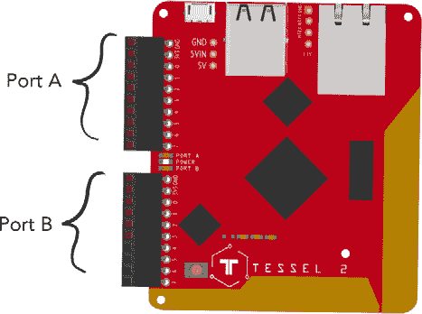

引脚编号为 A0–A7（在端口 A 上）和 B0–B7（在端口 B 上）。每个物理端口顶部两个引脚提供电源连接（GND 和 3.3 V）。其他功能，如 I²C、SPI 和 UART（异步/TTL 串行），在特定引脚上得到支持（图 8.8）。

##### 图 8.8\. Tessel 2 引脚及其功能。任何编号的引脚都可以用作数字 I/O。

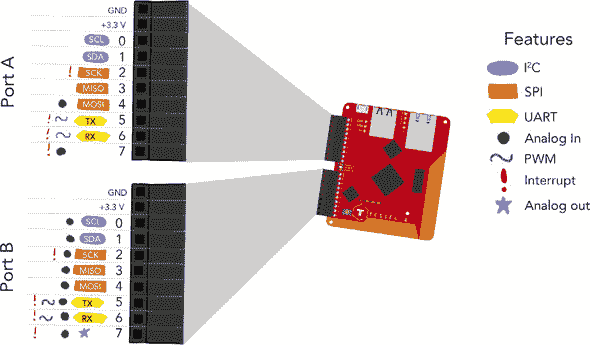

尽管所有引脚都可以用作数字 I/O 引脚，但模拟输入（ADC）在引脚 A4 和 A7 以及所有端口 B 引脚上可用。您还可以看到一些引脚支持中断（这意味着它们可以用于“监听”按钮按下或其他需要准确检测从低电平到高电平或反之的变动的应用）。一些引脚支持 PWM，但并非所有引脚都支持。

引脚 B7 有一个我们尚未遇到的功能：模拟*输出*。该引脚可以提供数字到模拟转换（DAC）。我们不会直接探索这个功能，但在 Tessel 上它是可用的。

### 8.4\. Tessel 上的无线路由项目

嘿，等等！LED 示例仍然需要连接。接下来，您将开始移除一些电线。

首先，您需要将 Tessel 从您的计算机上断开连接，但使用电源插座供电。


##### 您需要准备


+   1 Tessel 2

+   5 V–12 V USB 充电器

+   1 LED

+   1 100 V 电阻

+   1 半尺寸面包板

|  |

**Tessel 的墙电源**

如果您的 Tessel 没有附带 USB 直流适配器，您可以使用 5 V USB 充电器（如平板电脑或手机充电器）为 Tessel 供电。

与 Arduino Uno 的直流输入插孔一样，Tessel 的 USB 微型连接也具有电源调节器，可以将输入电压调节到所需的 3.3 V。标准的 5 V（USB 电压）正好适合输入电压。

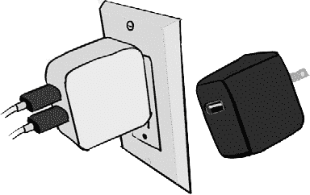

提供直流 5 V 电压的 USB 墙上适配器很常见。它们特别受欢迎，因为手机和平板电脑的充电器。

| |
| --- |

只是为了证明你可以做到，你将稍微修改 LED 闪烁代码，使其 LED 闪烁。你可以这样做，因为 LED 连接到 Tessel 上的一个 PWM 功能引脚。

要进行此更改，请在 index.js 中找到以下行：

```
led.blink(500);
```

用这个替换它：

```
led.pulse(500);
```

现在，将你的 Tessel 插入任何你喜欢的电源插座，只要它在你电脑所在的同一 WiFi 网络范围内。在尝试向其部署代码之前，请给它一些时间来启动。

现在，回到你的电脑上，你可以尝试以稍微不同的方式部署。在你的工作目录中，执行以下命令：

```
t2 push index.js
```

`t2 push` 命令与 `t2 run` 命令不同。使用 `t2 run` 时，Node.js 进程将在 Tessel 上执行，直到主机计算机终止该进程（通常通过 Ctrl-C）。使用 `t2 push` 时，程序将被烧录到 Tessel 上，并且只要 Tessel 有电就会一直运行。如果你拔掉 Tessel 并再次插上，它将恢复执行程序。

现在，你有一个在某处闪烁的 LED，但这并不特别令人兴奋。是时候构建一个功能更强大、可以连接到 Tessel 上 Node.js 生态系统的项目了。你可以将 Tessel 用作独立的气象站：从一个或多个传感器读取数据，并通过运行本地 Web 服务器来提供这些数据（图 8.9）。

##### 图 8.9\. Tessel 作为迷你气象站的神经中枢。运行在 Tessel 上的 Node.js 应用程序将读取 BMP180 多传感器数据，并运行 Web 服务器，以便同一 WiFi 网络上的其他计算机可以在 Web 浏览器中查看天气信息。

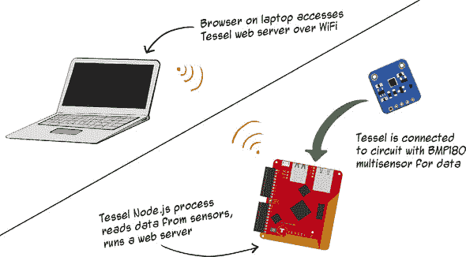

#### 8.4.1\. 无线数据：远程气象站

| |
| --- |

##### 你需要


+   1 个 Tessel 2

+   1 根 USB-micro 到 USB-A 线缆

+   1 个 5 V–12 V USB 充电器

+   1 个 Adafruit BMP180 I²C 多传感器

+   跳线

+   1 个半尺寸面包板

| |
| --- |

在 第七章 中使用的 Adafruit I²C 传感器有一个很酷的功能：它们在 5 V 和 3.3 V 下都很高兴。它们的分线板每个都包含电压调节器硬件，可以处理电平转换——也就是说，它们可以处理 3.3 V 和 5 V 微控制器的不同逻辑电平电压。你可以像使用 Arduino Uno 一样轻松地使用这些传感器。

电路很简单：将 BMP180 I²C 传感器按照 图 8.10 所示连接到 Tessel。

##### 图 8.10\. 将 BMP180 I²C 传感器连接到电源（A 端口的 GND 和 3.3 V 引脚）、SCL（A0）和 SDA（A1）。

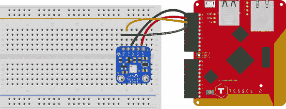

在你的终端应用程序中，设置一个新的工作项目目录，并像 LED 示例一样安装依赖项：

```
mkdir t2-weather
cd t2-weather
npm init -y
npm install --save johnny-five tessel-io
```

创建一个名为 index.js 的文件并添加以下代码。

##### 列表 8.10\. index.js

```
const five = require('johnny-five');
const Tessel = require('tessel-io');

const board = new five.Board({
  io: new Tessel()                                         *1*
});

board.on('ready', () => {
  const weatherSensor = new five.Multi({
    controller: 'BMP180'
  });
  weatherSensor.thermometer.on('change', function () {     *2*
    console.log(this.F);                                   *3*
  });
});
```

+   ***1* 不要忘记指定 tessel-io 作为 I/O 层。**

+   ***2* 当传感器的温度实例上触发变化事件时...**

+   ***3* ...记录当前的华氏温度**

与之前的 LED-闪烁代码一样，将 I/O 抽象化到 Johnny-Five 核心组件中使得这段代码看起来几乎与你在 Arduino Uno 上使用 I²C 传感器的方式相同。实际上，这里唯一的区别在于创建 `Board` 对象时传递了不同的 I/O 插件选项。你不需要与引脚号打交道，因为 `board` 已经知道 Tessel 上哪些引脚支持 I²C（并且它将默认使用端口 A）。

上述代码通过 `weatherSensor` 访问 `thermometer` 实例。一个用于控制器 `BMP180` 的 `Multi` 对象实例包含 `thermometer` 和 `barometer` 属性，这些属性是代表 BMP180 的温度和压力传感器的组件类实例的引用。每个多传感器组件独立生成事件，事件也会汇总到 `Multi` 实例中：

```
weatherSensor.on('change', () => {
  // This will get invoked any time ANY of the multi component's sensors
  // have a change
});

weatherSensor.barometer.on('change', () => {
  // This gets invoked only when the barometer's reading changes
});
```

Johnny-Five（如 `Buttons` 和 `Leds`）中的其他 *collection* 组件类以类似的方式运行。

由于目前你的 Tessel 通过 USB 连接，使用 `t2 run` 在 Tessel 上尝试运行脚本：

```
$ t2 run index.js --lan
```

你应该看到类似这样的内容：

```
$ t2 run index.js --lan
INFO Looking for your Tessel...
INFO Connected to sweetbirch.
INFO Building project.
INFO Writing project to RAM on sweetbirch (440.832 kB)...
INFO Deployed.
INFO Running index.js...
1487876926840 Device(s) Tessel 2 (sweetbirch)
1487876926995 Connected Tessel 2 (sweetbirch)
1487876927051 Repl Initialized
>> 72.14
72.32
72.14
72.32
```

要使用传感器的读数做一些有用的事情——一些更直观和可视化的东西——你将利用 Tessel 支持 npm 包和执行更复杂的 Node.js 代码的能力——让我们看看如何构建一个网络应用程序。

##### 在 Tessel 上构建更复杂的应用程序

要从 Tessel 服务器上提供网页内容，你需要创建一些额外的文件。至少，你需要从一个基本的 HTML 文档开始。

在 t2-weather 目录内创建一个名为“app”的目录。在该目录内创建一个 index.html 文件，如下面的目录结构所示。

##### 列表 8.11\. 到目前为止的项目目录和文件结构

```
t2-weather/
 app
 index.html
 index.js
 node_modules
 package.json
```

打开 index.html 并添加以下内容。

##### 列表 8.12\. index.html

```
<!DOCTYPE html>
<html lang="en">
 <head>
  <title>Current Conditions</title>
 </head>
 <body>
  <h1>Current Conditions</h1>
  <p>Data coming soon!</p>
 </body>
</html>
```

当你在 Tessel 上执行代码时，Tessel 会知道复制并使用你正在运行的脚本以及为项目安装的 Node.js 模块。但是，如果你需要使用这些项目之外的资源，你需要明确地告诉它。你可以通过在你的项目根目录中放置一个 .tesselinclude 文件来实现这一点。

创建一个 .tesselinclude 文件并添加以下内容：

```
app/
```

.tesselinclude 中的每一行都是一个 *glob*，一个用于匹配文件的模式。例如，`app/` 匹配 app 目录中的所有文件。这将确保当 Tessel 部署时，它会复制 app 目录中的所有文件。

添加 .tesselinclude 之后，你的文件结构应该看起来像这样。

##### 列表 8.13\. 包含 .tesselinclude 的项目目录和文件结构

```
t2-weather/
 .tesselinclude
 app
 index.html
 index.js
 node_modules
 package.json
```

接下来，你将分两步构建一个 Web 应用程序来显示气象站数据：

1.  你将通过将 Express ([`expressjs.com/`](http://expressjs.com/)) Web 应用程序框架与内置的 Node.js 模块相结合来设置一个基本的静态 Web 服务器。这将提供基本的网页，它将成为气象站数据的容器。

1.  你将在 Tessel（即网络服务器）上设置一个 socket.IO 服务器，并从客户端（从浏览器中运行的 JavaScript）连接到它。你还将使用一些 CSS 和结构化标记来美化 HTML。

##### 设置静态 Web 服务器

你将通过在你的应用程序代码中启动一个基本的静态 Web 服务器来开始简单。在这里，“静态”意味着 Web 服务器将交付资产（如 HTML、图像、JavaScript 等），而不会对它们执行任何动态的服务器端处理——它只会从指定的目录中交付请求的文件。

首先，安装 `express` Web 框架。确保你处于 t2-weather 目录中，并在终端中执行以下命令：

```
$ npm install --save express
```

现在回到 index.js 脚本，将以下代码添加到文件顶部。

##### 列表 8.14\. index.js

```
const five = require('johnny-five');
const Tessel = require('tessel-io');
const express = require('express');                          *1*

const path = require('path');                                *2*
const http = require('http');
const os = require('os');

var app = express();                                         *3*
app.use(express.static(path.join(__dirname, '/app')));       *4*
var server = new http.Server(app);                           *5*

const board = new five.Board({
  io: new Tessel()
});

board.on('ready', () => {
  const weatherSensor = new five.Multi({
    controller: 'BMP180'
  });                                                       *6*
  server.listen(3000, () => {                               *7*
    console.log(`http://${os.networkInterfaces().wlan0[0].address}:3000`);
  });
});
```

+   ***1* 需要 Express**

+   ***2* 需要一些内置的 Node.js 模块**

+   ***3* 实例化一个新的 Express 应用程序**

+   ***4* 告诉应用程序从 app/ 目录中提供静态资产**

+   ***5* 创建一个 HTTP 服务器并将应用程序传递给它**

+   ***6* 从上一个版本中省略或注释掉 console.log 行**

+   ***7* 使服务器在端口 3000 上监听请求**

由于它们内置在 Node.js 中，因此没有必要使用 `npm install` 安装 `os`、`path` 或 `http` 模块。

尝试一下！

```
$ t2 run index.js --lan
```

你应该看到以下结果。

##### 列表 8.15\. 运行 index.js

```
$ t2 run index.js
INFO Looking for your Tessel...
INFO Connected to sweetbirch.
INFO Building project.
INFO Writing project to RAM on sweetbirch (933.376 kB)...      *1*
INFO Deployed.
INFO Running index.js...
1487884455497 Device(s) Tessel 2 (sweetbirch)
1487884455635 Connected Tessel 2 (sweetbirch)
1487884455691 Repl Initialized
>> http://192.168.1.16:3000                                    *2*
```

+   ***1* 随着你添加更多的依赖项，应用程序正在变得更大。**

+   ***2* 这是 Tessel 的内部地址，并且正在积极监听 HTTP 端口。**

你现在可以打开一个 Web 浏览器并查看控制台日志中记录的 URL（确保你使用输出中显示的 URL——而不是前面示例输出中显示的 URL）。

| |
| --- |

**Tessel 的 IP 地址**

为了使这个实验工作，你的 Tessel 需要连接到与你的计算机相同的网络。这可能是 WiFi 网络，如设置部分中讨论的那样，尽管 Tessel 也有一个以太网端口。

连接到网络会导致 Tessel 被分配自己的 IP 地址，你需要知道这个地址才能访问其上运行的 Web 服务器。在 index.js 代码中的以下行方便地显示了这一点：

```
console.log(`http://${os.networkInterfaces().wlan0[0].address}:3000`);
```

你可以将终端应用程序中的输出复制并粘贴到浏览器的 URL 框中。在浏览器中访问输出 URL 将渲染当前的 index.html 文件 (图 8.11)。

| |
| --- |

##### 图 8.11\. 没有什么花哨的！在浏览器中导航到 Tessel 的 IP 地址和端口会显示 index.html 文件，但目前它还没有做什么。

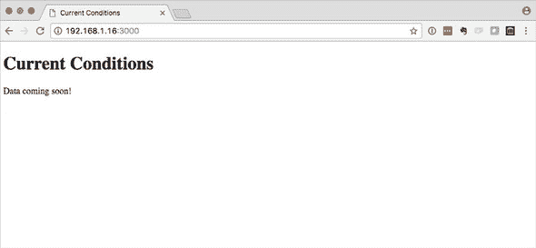

##### 使用 Socket.IO 显示实时数据

对于一个简单的 Web 应用，一个选项是在提供的 HTML 文档的标记中包含当前的传感器值。这是一个完全有效的方法，并且遵循传统的 HTTP 模型：浏览器负责请求服务器更多的数据，形式为完整的文档（网页）请求。副作用是，用户必须在浏览器中重新加载页面才能看到新的读取值。

有更好的方法！

WebSocket API 是一个网络标准，允许客户端（浏览器）和服务器通过单个 TCP *socket*进行异步消息交换。每个都可以向对方推送消息，从而实现近乎实时数据的交换。

WebSocket 被许多浏览器支持，但并非所有浏览器。为了填补这些空白，你将使用 Socket.IO，这是一个 API，当浏览器支持 WebSocket 时（当浏览器支持时），它会使用 WebSocket，但它有一长串其他回退传输来模拟 WebSocket 行为。简而言之，它使得使用 WebSocket 功能变得简单且无忧。

使用 Socket.IO，当传感器读取值发生变化时，socket 服务器可以将新数据“推送”到客户端（假设客户端正在监听并使用更新的数据）。最终效果是，你可以在浏览器中频繁更新传感器读取值，而无需重新加载页面。

第一步是安装`socket.io` npm 包：

```
npm install --save socket.io
```

接下来，使用以下代码更新 index.js 的内容。

##### 列表 8.16\. index.js

```
const five     = require('johnny-five');
const Tessel   = require('tessel-io');
const express  = require('express');
const SocketIO = require('socket.io');                    *1*

const path = require('path');
const http = require('http');
const os   = require('os');

const app    = new express();
const server = new http.Server(app);
const socket = new SocketIO(server);                      *2*
app.use(express.static(path.join(__dirname, '/app')));

const board = new five.Board({ io: new Tessel() });

board.on('ready', () => {
  const weatherSensor = new five.Multi({
    controller: 'BMP180',
    freq: 5000                                            *3*
  });

  socket.on('connection', client => {                     *4*
    weatherSensor.on('change', () => {
      client.emit('weather', {
        temperature: weatherSensor.thermometer.F,
        pressure: (weatherSensor.barometer.pressure * 10)
      });
    });
  });

  server.listen(3000, () => {
    console.log(`http://${os.networkInterfaces().wlan0[0].address}:3000`);
  });
});
```

+   ***1* 需要 socket.io 库**

+   ***2* 创建 socket.io 服务器**

+   ***3* 让 Johnny-Five 将传感器读取频率降低到五秒**

+   ***4* 为客户端请求连接时注册回调**

将传感器读取频率降低到每五秒一次，可以保持性能在合理范围内，并为客户端通过 socket 接收新数据的频率设定一个合理的阈值。每五秒是 socket 服务器触发更新的最大频率，因为只有当传感器读取值发生变化时，`weather`事件才会被触发。

让我们更仔细地检查以下列表中的 Socket.IO `connection`处理。

##### 列表 8.17\. index.js

```
// Register a callback for when a client (browser) tries to connect.
// The callback is passed a reference to the `client`
socket.on('connection', client => {
  // Listen for change events on the J5 Multi (representing the BMP180)
  weatherSensor.on('change', () => {
    // Emit a `weather` event on the client
    // And pass an object representing current sensor values
    // The client can listen for this event and handle it accordingly
    client.emit('weather', {
      // This is the temperature in Fahrenheit;
      // change to `C` if you'd prefer Celsius
      temperature: weatherSensor.thermometer.F,
      // Multiplying by 10 converts the sensor's readings in kilopascals
      // to more commonly used millibar units
      pressure: (weatherSensor.barometer.pressure * 10)
    });
  });
});
```


##### 代码非生产级

这些示例中的代码被简化到最小，以保持清晰和简洁。这对于在家原型设计来说是不错的，但 index.js 中的代码并不是为生产准备的。在一个“真实”的代码库中，你想要确保 socket 服务器不会随意接受每个传入的连接，要强制执行最大连接数，等等。此外，尽管 index.html 标记包含有效的 HTML，但它缺少一些可访问性和润色细节，并且在 CSS 中可以更加关注支持旧版浏览器和多样化的浏览环境（如移动设备）。


如果没有利用它的客户端，socket 服务器将不会太有用。首先，你需要通过添加一些结构化标记来准备 HTML 以显示传感器值，如下一个列表所示。

##### 列表 8.18\. index.html

```
<!DOCTYPE html>
<html lang="en">
<head>
  <script src="/socket.io/socket.io.js"></script>                    *1*
  <link rel="stylesheet" href="style.css" type="text/css" />         *2*
  <title>Current Conditions</title>
</head>
<body>

  <main role="main">                                                 *3*
    <h1>Current Conditions</h1>
    <div class="row">
      <div class="col">
        <div class="data">
          <h2>Temperature</h2>
          <span class="data--value" id="temperature">--.--</span>    *4*
          <small class="data--unit">F</small>
        </div>
      </div>
      <div class="col">
        <div class="data">
          <h2>Pressure</h2>
          <span class="data--value" id="pressure">---.--</span>
          <small class="data--unit">mBar</small>
        </div>
      </div>
    </div>
  </main>

 </body>
</html>
```

+   ***1* 包含客户端 socket.io JavaScript**

+   ***2* 你将很快创建这个 CSS 文件。**

+   ***3* 在某些容器元素中标记内容，这些元素将渲染为行**

+   ***4* .data—value spans 将会被填充上传感器数据。**

这一行可能让你感到困惑：

```
<script src="/socket.io/socket.io.js"></script>
```

那个 JavaScript 文件“神奇地”是从哪里来的？

在 index.js 中，你通过提供一个 `server` 实例启动了 socket.io，这使得客户端代码可以通过服务器自动在 /socket.io/socket.io.js 上提供。

关于这一行：

```
<link rel="stylesheet" href="style.css" type="text/css" />
```

你现在将创建那个样式表。在 t2-weather 目录中，导航到 app 子目录并创建一个名为 style.css 的文件。向其中添加以下代码。

##### 列表 8.19\. style.css

```
html {
  font-family    : "Helvetica Neue", "Helvetica", "Arial", san-serif;
}
.row {
 display         : flex;
 justify-content : center;
 max-width       : 48rem;
 margin          : auto;
}
.row .col {
 margin          : auto;
 padding         : 2rem;
}
h1, h2 {
 margin          : 0;
 text-align      : center;
}
h2 {
 font-size       : 1.5rem;
}
small {
 color           : #999;
 font-size       : 0.65em;
}
.data {
 padding         : 1.5rem;
 background-color: #eee;
 border-radius   : 10px;
 font-size       : 3rem;
}
.data--value {
 font-weight     : bold;
}
.connected { /* Make font color green to show that websockets updating works
     */
 color           : #093;
}
```


**CSS flexbox**

这里的 CSS 使用了“flexible box”布局模式，也就是 *flexbox*。Flexbox 允许你安排和定位元素，而不会因为浮动和塌陷边距的混淆。Flexbox 越来越受到良好的支持，但如果你在使用 Internet Explorer，布局可能会有些奇怪（然而，Edge 浏览器确实支持 flexbox）。如果这一切听起来很陌生，不要担心。这里的 CSS 只是样式化网页，并不关键于理解项目的功能。


##### 列表 8.20\. 项目的完整文件和目录结构

```
t2-weather/
 .tesselinclude
 app
 index.html
 style.css
 index.js
 node_modules
 package.json
```

现在，最后的关键部分。客户端需要连接到 socket 服务器，监听相关事件（在这种情况下是 `weather`），并以某种有用的方式响应它们。回到 index.html，并在 `</body>` 标签之前添加以下代码到文件中。

##### 列表 8.21\. index.html

```
<script>
  window.addEventListener('DOMContentLoaded', function () {       *1*
    var socket = io();                                            *2*
    socket.on('weather', updateData);                             *3*
  });
  function updateData (data) {                                    *4*
    ['temperature', 'pressure'].forEach(function (dataPoint) {
      document.getElementById(dataPoint).innerHTML =
       data[dataPoint].toFixed(2);
    });
    document.querySelectorAll('.data--value').forEach(function (el) {
      el.classList.add('connected');
    });
  }
</script>
```

+   ***1* 当页面的 DOM 完全加载...**

+   ***2* 创建 Socket.IO 客户端。**

+   ***3* 注册天气事件的回调函数。**

+   ***4* 处理天气事件的处理器函数：解析更新后的数据并更新页面显示**

让我们更仔细地看看前面的代码。

当 DOM 加载完成后，你需要创建一个 Socket.IO 客户端，并告诉它在发生 `weather` 事件时调用回调函数 (`updateData`)：

```
window.addEventListener('DOMContentLoaded', function () {
  var socket = io();
  socket.on('weather', updateData);
});
```


##### io()函数是从哪里来的？

`io` 函数，用于初始化 Socket.IO 客户端，通过包含 /socket.io/socket.io.js 脚本来全局提供。


`updateData` 函数接受更新的 `data` 对象，并更新页面的 DOM 以包含新值，如下面的列表所示。

##### 列表 8.22\. updateData() 详细信息

```
// `data` is an object containing a `temperature` and `pressure` properties
function updateData (data) {
  ['temperature', 'pressure'].forEach(function (dataPoint) {
    document.getElementById(dataPoint).innerHTML = data[dataPoint].toFixed(2);
  });
  document.querySelectorAll('.data--value').forEach(function (el) {
    el.classList.add('connected');
  });
}
```

首先，更新具有 IDs `temperature` 和 `pressure` 的 HTML 元素——它们的 HTML 内容分别设置为温度和压力传感器的值：

```
['temperature', 'pressure'].forEach(function (dataPoint) {
  document.getElementById(dataPoint).innerHTML = data[dataPoint].toFixed(2);
});
```

传感器值被格式化为小数点后显示两位数字。

然后，作为一个视觉提示，额外的类`connected`被添加到`#temperature`和`#pressure`元素上（CSS 将其设置为绿色文本），以显示数据正在通过套接字接收：

```
document.querySelectorAll('.data--value').forEach(function (el) {
  el.classList.add('connected');
});
```

| |
| --- |

**DOM 操作代码，jQuery 风格**

为了避免过度依赖客户端，index.html 中的 JavaScript 直接使用浏览器 DOM API；例如，`document.querySelectorAll()`。但很多人更熟悉 jQuery 风格的语法，这使得 DOM 遍历和操作更易于阅读和直观。

如果你喜欢，可以使用 jQuery。为此，你需要添加一个`<script>`标签来包含它。使用他们 CDN 托管的代码([`code.jquery.com/`](https://code.jquery.com/))是推荐的，这样你就不必将另一个文件添加到应用目录中。

更新后的 index.html 脚本可能看起来像这样：

```
$(function () {
  var socket = io();
  socket.on('weather', updateData);
});
function updateData (data) {
  $('#temperature').html(data.temperature.toFixed(2));
  $('#pressure').html(data.pressure.toFixed(2));
  $('.data--value').addClass('connected');
}
```

| |
| --- |

准备好了！你可以将连接到墙式电源的 Tessel 放置在无线网络范围内的任何地方。然后，再次从你的电脑上，输入这个命令：

```
t2 run index.js --lan
```

打开浏览器到控制台指示的 URL(图 8.12)。

##### 图 8.12. 温度和压力值在浏览器中实时更新，通过 websockets。

![08fig12_alt.jpg]

##### t2 push deployment for full independence

记住，当使用`t2 run`部署项目时，Tessel 仍然对你的电脑有一些依赖：只要没有从你的电脑终止，该进程就会在 Tessel 上运行。使用`t2 push`，Tessel 可以达到完全自主。

记下你的 Tessel 当前的 IP 地址和 Web 服务器端口。如果你需要提醒，再次运行`t2 run index.js`并复制记录的 IP 地址和端口组合到你可以访问的地方。通过`t2 push`部署时，你将无法再看到`console.log`的输出。

现在，运行这个命令：

```
$ t2 push index.js
```

你应该看到以下输出。

##### 列表 8.23. t2 push 输出

```
$ t2 push index.js
INFO Looking for your Tessel...
INFO Connected to sweetbirch.
INFO Building project.
INFO Writing project to Flash on sweetbirch (1400.832 kB)...
INFO Deployed.
INFO Your Tessel may now be untethered.
INFO The application will run whenever Tessel boots up.
INFO      To remove this application, use "t2 erase".
INFO Running index.js...
```

给 Tessel 几秒钟的时间来启动网络服务器并开始工作，然后在你的浏览器中查看气象站网页（在 Tessel 的 IP 地址，端口 3000）。

即使你的 Tessel 失去电力，一旦恢复电力并启动，它将开始运行气象站脚本。Tessel 不再需要你的电脑了。

| |
| --- |

##### 让它停止

你可以使用`t2 erase`让 Tessel 停止运行气象站程序。

| |
| --- |

### 8.5. 使用电池为项目供电

还剩下一根线：一个为 Tessel 及其电路提供电力的墙式连接。

为项目供电有多种选择，如墙式电源、碱性或可充电家用电池、多种锂离子电池或太阳能板。这些选项可能会让人感到不知所措。让我们稍微分析一下。

首先，究竟需要为哪些设备供电？对于像气象站这样的项目，Tessel 本身（开发板、微控制器、处理器）需要供电，Tessel 随后以 3.3V 的电压为 BMP180 扩展板供电。在这种情况下，自然地会想到为开发板供电，并假设开发板将作为整个电路及其组件的电源。

当项目电路对电源需求不大时，这是一个很好的概念，但当项目包含电机或其他电流消耗大的组件时，情况就不同了。在第六章中，漫游机器人的电路包含两个直流电机，所需的电流超过了 Arduino Uno 引脚可以直接提供的电流。那个项目包括一个辅助电源来驱动电机：一个 9V 碱性电池（图 8.13）。

##### 图 8.13。在第六章中，用于机器人的双电机设置使用了外部电源为直流电机供电：一个 9V 电池。

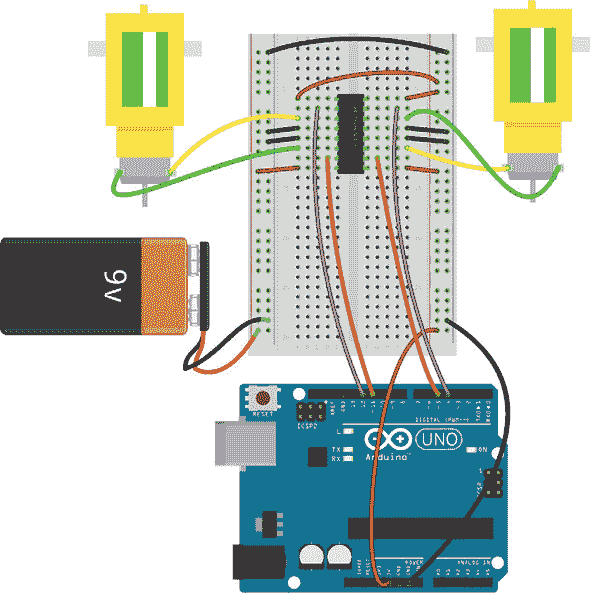

在任何情况下，你选择的为项目提供电源的设备都需要为整个项目供电——有时所有电流都会流经开发板，有时则不会，这取决于电路中的内容。

对于你第一次尝试完全使用电池供电的自由，我们将使用一个*USB 移动电源*。也许你手头已经有一个：这些小巧的电源包通常用于为移动手机和平板电脑提供额外的电量。它们通过 USB 提供稳定的 5V 电流，并且可以用 USB 壁式充电器轻松充电。它们作为移动设备的备用电池非常棒，同时也非常适合为可以运行 5V 电源的项目供电。

| |
| --- |

**电池容量**

给定电池中的“电量”是以电流随时间的变化来衡量的。电池的容量是以其额定电压下的*安时（Ah）*来衡量的，或者在家庭电池的背景下，是*毫安时（mAh）*。一个 1.5V、容量为 500mAh 的电池应该能够在 1.5V 下提供 100mA 的稳定电流 5 小时。或者提供 10mA 的稳定电流 50 小时。

当然，事情并没有那么简单。电池的实际容量受许多变量影响：放电率（较高的放电率会导致总容量降低）、环境温度（电池不喜欢寒冷）、电池充电后的时间（电池会自然且缓慢地放电）、电池的化学成分等等。

消费者 1.5AA 电池的容量可以从 400mAh 到 3000mAh 以上不等，这取决于它们的化学成分和其他因素。这是一个很大的范围！

我目前拥有的 USB 移动电源中最强大的一个提供 8000mAh（8 安时）。在另一端，我的一些小型锂聚合物（LiPo）电池只有几百 mAh。

Tessel（不是特别低功耗的板）和电机的功耗需要更高容量的电池，如 USB 砖块，而将 Arduino Nano（一个小巧高效的 Arduino 板）和低功耗温度传感器结合在一起的项目可以在较低容量的 LiPo 上运行良好。

| |
| --- |

#### 8.5.1\. 使用 Tessel 的电池供电机器人

| |
| --- |

##### 你需要什么


+   1 Tessel 2

+   1 从第六章构建的漫游机器人底盘

+   1 个带有 USB 微型连接的 USB“电源银行”电池

+   3 个女性接插件引脚*或*一段实心导线（22 号实心导线是理想的）（可选）

+   焊接枪和材料

| |
| --- |

通过进行一些小的修改，你可以在第六章中用 Arduino Uno 构建的机器人可以摆脱（线缆）。这不会感觉更像一个真正的机器人吗？

为了解放机器人，你需要做以下事情：

1.  在 Tessel 上焊接一些连接，为电机提供一个 5 V 电源（可选）

1.  将电路中的 Uno 替换为 Tessel

1.  初始化一个项目工作目录，将漫游机器人代码复制到新项目中，并调整电机驱动引脚的引脚号

##### 为电机供电

在第六章中，漫游机器人的电机由 9 V 电池供电。Tessel 的 3.3 V 工作电压太低，无法为电机供电——而且，引脚上的电流限制也会造成问题。但 Tessel 板提供了访问 5 V 电源的途径，有足够的电流来完成工作（图 8.14）。关键是访问它——你需要做一些焊接工作。

##### 图 8.14\. Tessel 可以从这里突出显示的电源引脚提供 5 V 电源。

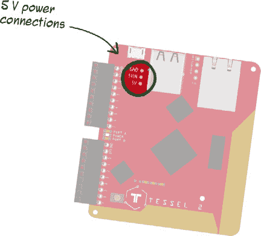

最灵活的选项是将*女性接插件*焊接在 Tessel 上的三个电源引脚上，从而产生可重复使用的“插座”，你可以将跳线电缆插入其中（8.15）。

焊接女性接插件（图 8.16）与焊接男性断开式接插件略有不同：你将板翻转过来，并在底部焊接引脚。使用一块胶带将引脚固定在顶部，以防你翻转板时掉落。

##### 图 8.15\. 将女性接插件焊接在 5 V 电源引脚上提供了方便的可重复使用的插槽，用于跳线。

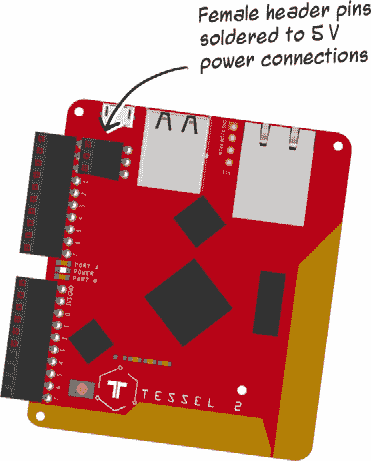

##### 图 8.16\. 要将女性接插件焊接在板上，将板翻转并焊接在底部。你需要一块胶带将引脚固定在顶部，以便你在焊接时保持位置。

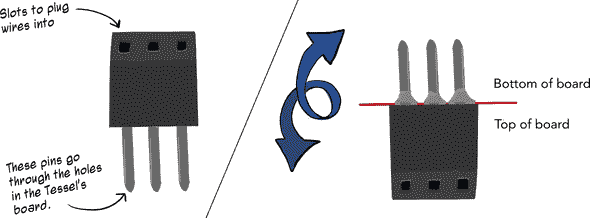

或者，你也可以将导线焊接在+5 V 和 GND 引脚上（图 8.17）。然而，这会导致永久性连接的导线。

##### 图 8.17\. 将实心导线焊接在电源引脚上也是一种选择。

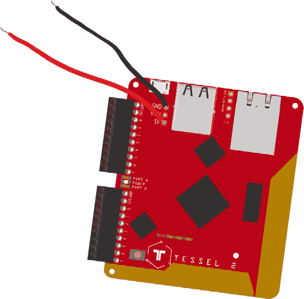

如果这看起来太麻烦，你可以选择为这个项目使用两个电源：现有的 9 V 电池用于电机电源轨，USB 电池为 Tessel 供电——下一节提供了每个的接线图。


##### 不要从 3.3 V 电源给电机供电

Tessel 的 3.3 V 电源引脚既不能提供电机所需的电压也不能提供电流。不要尝试直接从 Tessel 的 3.3 V 引脚给电机供电。

| |
| --- |

##### （重新）构建机器人电路

取下由 Uno 供电的机器人底盘的顶部（图 8.18），以便可以访问内部，并将电路更改为使用 Tessel 而不是 Uno。如果你已经将连接焊接到 Tessel 的 5 V 电源，则按照图 8.19 所示构建电路。如果你选择继续使用 9 V 电池，则按照图 8.20 所示布线电路。

##### 图 8.18。通过将第六章的漫游机器人中的 Uno 替换为 Tessel，做一些布线调整，并将 USB 电池插入 Tessel，你可以创建一个无需接线的漫游机器人。

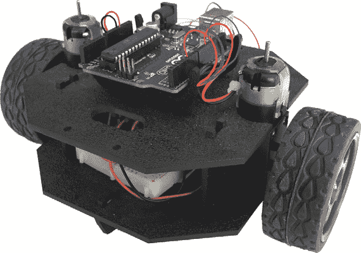

##### 图 8.19。使用 Tessel 及其 5 V 电源的漫游机器人电路。Tessel 的 5 V 电源需要为两个电源轨供电——确保使用额外的（红色）跳线（靠近顶部）将电源轨的正列连接在一起。

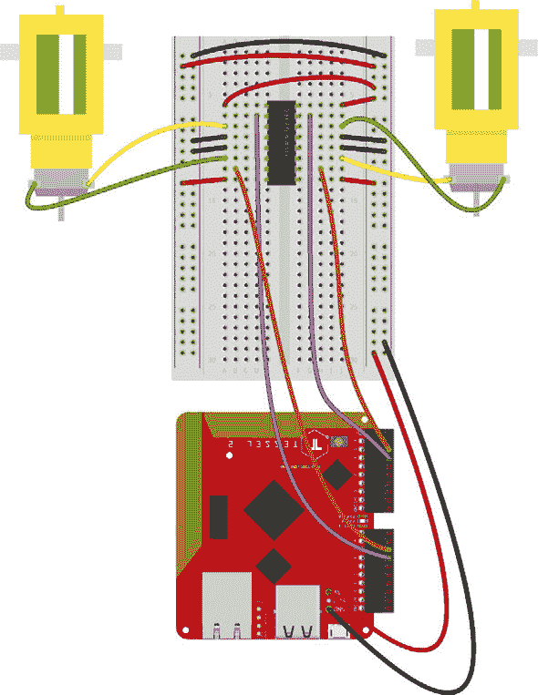

##### 图 8.20。使用两个电源的漫游电路：Tessel 的 3.3 V 和 9 V 电池为电机供电。

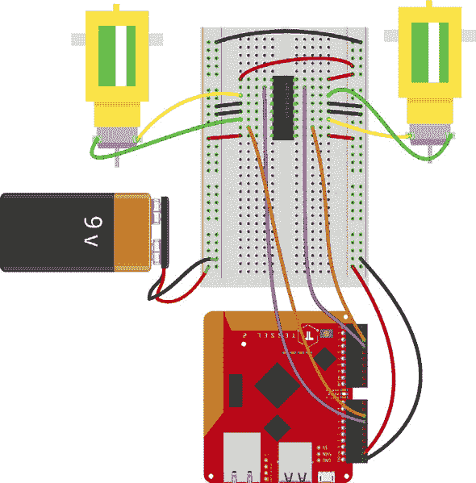

##### 更新漫游代码

创建一个工作目录并安装一些依赖项。在终端中（确保你不在 t2-weather 或任何其他现有项目目录内），输入以下命令：

```
mkdir t2-rover
cd t2-rover
npm init -y
npm install --save johnny-five tessel-io keypress
```

`keypress`包用于捕获键盘输入，因此可以使用箭头键控制机器人。

将两个机器人脚本复制到 t2-rover 目录中——index.js 和 Rover.js（或翻回第六章以找到源代码）。在文本编辑器中打开 index.js 文件并做出以下更改：

1.  在文件顶部添加`require`对`tessel-io`：

    ```
    const Tessel = require('tessel-io');
    ```

1.  更新`board`实例化以指定 I/O 插件：

    ```
    const board = new five.Board({ io: new Tessel() });
    ```

1.  更新电机引脚：

    ```
    const motors = new five.Motors([
      { pins: { dir: 'A4', pwm: 'A5' }, invertPWM: true },
      { pins: { dir: 'B4', pwm: 'B5' }, invertPWM: true }
    ]);
    ```

就这样！你的机器人已经准备就绪，无需接线。将 Tessel 板放置在之前放置 Uno 的漫游机器人上。插入 USB 电源（如果你使用的是 9 V 电池，也请插入）并使用胶带或魔术贴将其固定在机器人底盘上。确保 Tessel 已完全启动并在局域网中可见（使用`t2 list`确保）。然后运行以下命令：

```
$ t2 run index.js --lan
```

你应该能够使用箭头键从你的电脑上控制你的机器人，并且漫游机器人应该能够比用 USB 线连接时走得更远。

通过本章的实验，你看到了如何开始让你的项目摆脱物理束缚。现在你已经超越了基础。是时候给你更多的工具来发明你自己的实验，创造以前从未创造过的事物。

| |
| --- |

**电压和电机驱动器**

基于 Arduino Uno 的机器人使用了 5V 逻辑电平，电机由电池提供 9V 的电力。记住，这里有两个电源——一个用于电机驱动器的逻辑，另一个用于为电机本身供电。

在基于 Tessel 的设置中，电机驱动器连接到 3.3V 逻辑电平，电机只获得 5V 的电压（除非你使用 9V 电池）。电机驱动器在 3.3V 逻辑电平上工作，因为 3.3V 的高电平足以在 5V 电机驱动器设备上注册为逻辑高电平——很多时候你可以使用 5V 逻辑电平与 3.3V 电平一起使用，因为 5V 设备的有效高电压范围通常包括 3.3V。

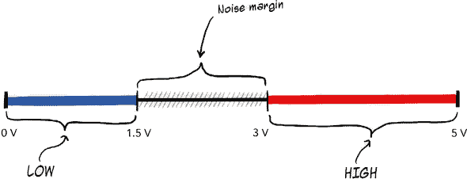

3.3V 逻辑有时与具有 5V 逻辑电平的组件兼容。5V 逻辑电平设备解释为高电平的电压范围通常包括 3.3V。也就是说，一个+3.3V 的信号（来自 3.3V 设备的逻辑高电平）将在 5V 设备上被解释为高电平，因为它在其高电压范围内。

你会注意到，在 5V 电压下，电机不如在 9V 电压下那样灵活。这是可以预料的。但它们仍然足够好，可以四处移动。

| |
| --- |

### 摘要

+   项目需要有线连接的两个主要原因：数据和通信交换以及电力。

+   使用 Johnny-Five 与 Arduino Uno 结合使用是主机-客户端设置的例子。主机计算机和 Uno 之间必须始终存在连接。一些受限制的硬件，如 Photon Particle，可以无线与 Johnny-Five 通信，但仍需要一个主机计算机来进行思考。

+   Tessel 2 是一个开源平台，它直接在板上运行嵌入式 Linux 和 Node.js。Tessel 可以在没有主机计算机的情况下独立执行代码。

+   Tessel 2 在 3.3V 电压下运行。它有两个 8 针端口，并支持不同引脚上的不同功能。

+   对于大多数项目来说，编写 Johnny-Five 脚本所需的适应主要是针对 Tessel 与 Uno（或在不同平台之间移植）使用`tessel-io` I/O 插件，并更改组件的引脚编号。

+   由于 Tessel 可以原生运行 Node.js 并支持 npm 包，因此可以在 Tessel 上创建复杂的高级应用程序并直接执行它们。

+   为项目供电有许多选择。到目前为止，你已经使用了墙上的电源、碱性电池和 USB 电源宝。USB 电池很方便，因为它们有多个用途，包括为移动设备充电，而且使用起来也很简单。

## 第九章. 创建你自己的东西

*本章涵盖*

+   使用现有的、低电压的消费电子产品创建自己的混合体的无限可能性

+   创建你自己的发明步骤：原型设计、迭代和调试

+   使用光电耦合器隔离电路

+   分析数据表和其他软件和固件实现，为组件创建自己的软件支持

+   使用自定义 Johnny-Five 插件和 J5 Collection 混入封装组件行为

+   管理复杂的传感器：处理复杂数据和管理配置

| |
| --- |


**对于本章，你需要以下内容：**

+   1 个 Tessel 2

+   1 套遥控插座

+   1 个 SparkFun 3.3 V APDS-9960 分线板

+   焊接铁和配件

+   用于调试电路的按钮和/或 LED（可选）

+   6 个光电耦合器（光隔离器），例如 4N25

+   6 个 100 V 电阻

+   1 个全尺寸面包板

+   跳接线

+   1 个万用表

+   0.1″公头断开式引脚

+   22AWG 实心线（可选，用于焊接遥控电路）

硬件工具包（第九章）（可选，未显示 22AWG 实心线）

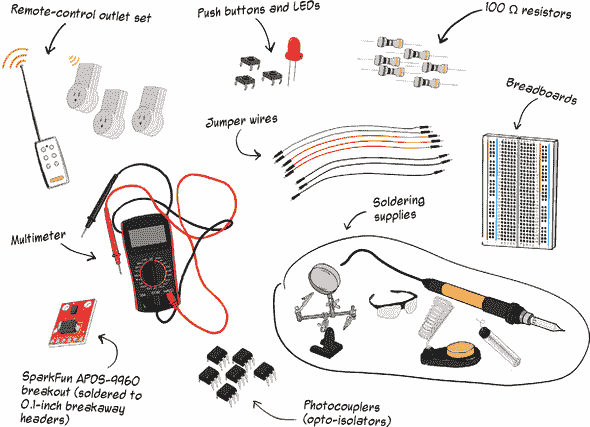

| |
| --- |

你已经远远超越了点亮 LED 的世界，可能正渴望开始构建以前未曾构建过的电子设备，规划自己的路线。让我们通过一个完整示例项目的全过程进行一次巡礼——重混一个遥控插座开关——从构思、原型设计、故障排除、迭代和改进。你将不再依赖于现有的电路图、说明书和软件，而是将在项目的某些部分开辟自己的道路。

本章中的项目将让你接触到比早期实验更多的软件复杂性。根据你的 JavaScript 熟练程度，这可能会达到一个甜蜜点，或者可能会觉得超出了你现在的承受范围。如果太多，那也没关系：总是可以从现有的组件支持中组合项目。

现实世界的项目有起有落。需要一点勇气才能跳入更复杂的项目，面对未知。最终使其工作是非常甜蜜的回报，我希望你能学会享受这种冒险。

### 9.1. 消费电子产品黑客技术

在我的电子专业知识增长过程中，最令人兴奋的时刻之一（如果你能原谅这个糟糕的双关语）是我意识到自己拥有足够的基本知识来摆弄现有的消费电子产品：使它们变得更好，或者发明创造性的混合体——挠一挠可能出现的任何发明家的痒处。如果你家里有一个闲置的电子小玩意儿已经执行了相同的功能，为什么还要设计、购买零件并费力地构建电路呢？

#### 9.1.1. 修改射频控制的插座开关

在房间里四处走动以打开（或关闭）几个单独的灯具可能会很麻烦，尤其是如果它们的开关位置不方便。无线控制的插座插头开关可以很方便。大约 20 美元就可以买到一套带有遥控器的三个（图 9.1）。

##### 图 9.1\. 在五金店和家居中心，遥控插座套装既便宜又容易买到。遥控单元由低压电池供电。

![09fig01.jpg]

拿着电池供电的遥控器，你可以单独打开或关闭每个已插入的开关（以及它们插入的灯）。这比在房间里物理地绕一圈要好。但还有一些事情可以改进。

至少用我有的这个型号，不可能同时打开或关闭所有开关（以及它们的灯）。每个都必须单独切换。

更有趣的是，如果能够以其他方式，比如自动化的方式触发灯光，那岂不是很好？也许你希望灯光在变暗时打开，或者从家里的另一个房间，或者使用你梦想中的其他形式的输入。

好消息！这些小遥控器内部的电路既简单又强大——低压，低电流。它们很容易理解，如果你弄错了什么，可能也不会对你造成太大的伤害。让我们开始破解。使用遥控器的内部组件，你可以组装出自己的个性化设备。

| |
| --- |

**务必小心！**

虽然许多低压、电池供电的消费电子产品电路是良性的，但每个设备都不同，你需要运用常识。

除非你是合格的电工，*不要*打开或更改遥控器系统的插座组件——将你的破解限制在遥控器单元上。插座插入墙壁，我在电子探索中有一个政策，那就是永远不接触主电源——这让我远离了医院。

在处理电子设备时，请取出电池。并且始终，始终远离电容器。即使没有连接到电源，它们也能保持电荷很长时间。

| |
| --- |

##### 拆卸遥控器单元

你需要拆卸遥控器组件。你的遥控器单元可能略有不同，但为了拆卸我拥有的遥控器，我取下了两个小螺丝。在盒子里，我只找到了几样东西（图 9.2）：

+   3 V 的硬币电池（在这个遥控器中是锂 CR2032）

+   可以按压的物理按钮，它们都连接在一个柔软的塑料床上

+   一个包含按钮触点、电池触点和状态 LED（以及其他东西，如无线电发射器）的小电路板

+   一个可伸缩的天线，连接到电路板上

##### 图 9.2\. 拆卸后的遥控器

![09fig02_alt.jpg]

每个按钮在电路板上都对应一个垫片，其形状像锯齿状。当上面的按钮被按下时，它会在锯齿状的两边之间建立连接，完成电路。你可以通过使用跳线并触摸锯齿状的一端到两边来自己连接电路，就像一个单独按下的按钮一样（图 9.3）。

##### 图 9.3\. 当按钮被按下时，它会与下面的锯齿状触点的两边接触。你可以通过用跳线连接两边来重现这种效果。

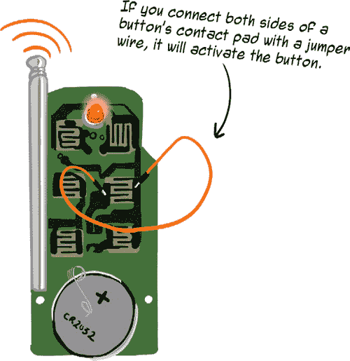

##### 增加遥控电路

锯齿状的一侧连接到地。你需要确定哪一侧是那一侧，以便你可以正确地连接你自己的“按钮”（也就是说，不是反的）。最好的方法是使用万用表，但如果你现在不想购买万用表，你可以尝试将 LED 的引脚触摸到按钮触点的每一侧，看看它何时亮起——在那个时刻，LED 的阴极接触的那一侧就是接地侧（图 9.4）。记住，如果你不小心让 LED 流过太多电流或反向连接，你可能会损坏 LED。

##### 图 9.4\. 没有万用表？你可能可以使用 LED 来确定按钮触点的哪一侧是接地侧。LED 是一种二极管——只有当它在电路中正确对齐时才会允许电流流动。当它亮起时，这意味着它的阴极位于按钮的接地侧。

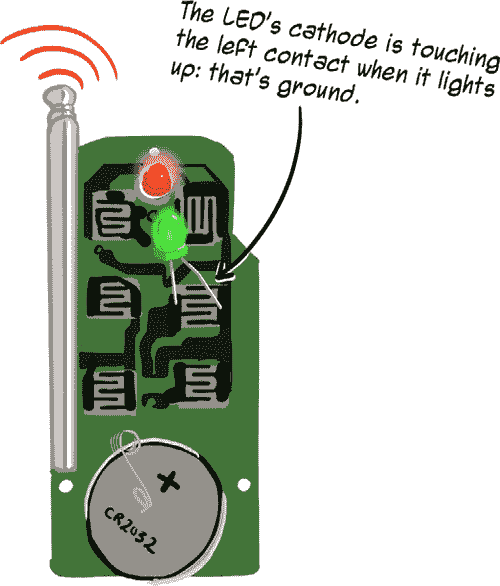


**掌握万用表**

万用表，可以测量电压、电流和电阻，是电子爱好者工具箱中的必备工具。它们价格低廉——可承受的业余品质的万用表价格低于 20 美元。

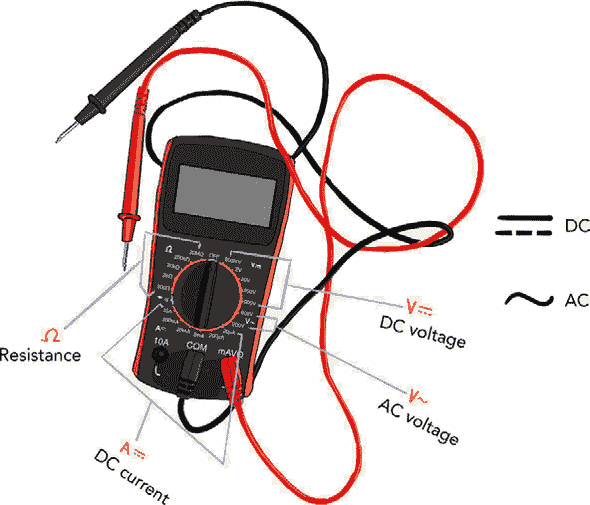

万用表允许你测量电阻、电流和电压。

在我们当前的实验中，你可以通过观察锯齿状两边的电压电位差来确定按钮接触垫片的哪一侧连接到地。为此，将万用表设置为直流电压设置。我选择了 20 V——根据其电池，设备应在 3 V 左右运行。20 V 设置可以显示高达 20 V 的电压读数；设备的电压略高于我的 2 V 设置，无法使用。

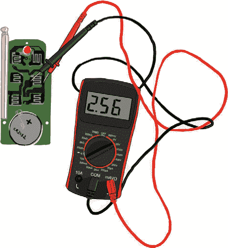

将万用表设置为适当的直流电压设置时，当接地探针位于按钮触点的接地侧时，读数将是正数。

当你将万用表的探针接触到按钮触点的每一侧时，你应该在设备上看到电压读数。如果数字是负数，交换探针。一旦你看到正数读数——我的大约是 2.5 V——你就找到了正极（红色探针连接）和负极（黑色探针连接）。为每个按钮连接做笔记。

控制器一开始可能看起来令人畏惧，但万用表是检查电路和调试电路的好帮手。SparkFun 的“如何使用万用表”教程是一个很好的教程：[`mng.bz/9f03`](http://mng.bz/9f03)。


下一步可能需要一些独创性，具体取决于你设备电路板的细节：你需要将电线连接到每个按钮的 Z 字形两侧（每个按钮两根电线）。随后，你将能够通过控制这些电线之间的连接和断开来开启和关闭遥控开关。

如果你很幸运，可以直接将电线焊接在按钮的接触垫上（图 9.5）。在我的情况下，遥控器的*印刷电路板*（PCB）——一块专门为该产品制造的板，上面有*丝网印刷*的连接和连接不同元件的*走线*——这使得任务变得具有挑战性。尽管按钮接触是导电的，但焊锡不会粘附在其上。尽管我尽力了，但我所取得的成果只是在电线上涂抹焊锡，弄脏了它们。使用电工胶带将电线固定在垫子上既令人沮丧又麻烦，而且总是从我手中脱落。

##### 图 9.5\. 理想的情况是将电线直接焊接在每个按钮接触垫的两侧。

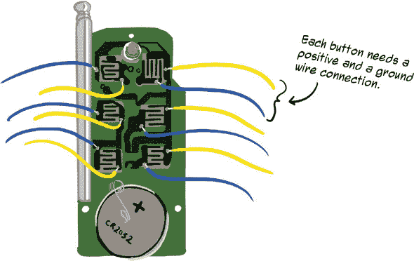

最后，通过使用我的万用表，我找到了电路板上的孔，这些孔对应于按钮接触点。这些孔仍然不能焊接焊锡，但它们作为锚点，我可以将电线插入下面的面包板中（图 9.6）。

##### 图 9.6\. 我自制的布线解决方案，利用了特定电路板的结构

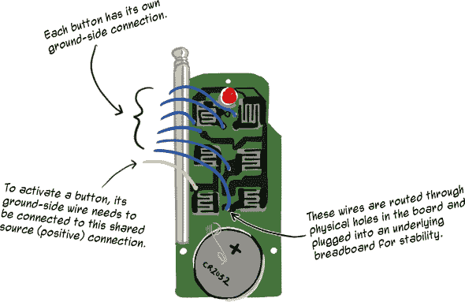

结果表明，电路板上的每个按钮都有自己的独立接地连接（蓝色电线——图 9.6 中的顶部六根）。但所有按钮都通过走线连接到单个共享的正电源（黄色电线——图 9.6 中的底部）。要激活任何一个按钮，必须通过将按钮的特定接地连接连接到共享的正电源来完成电路。


**学习在发明时保持耐心**

当你在开辟新道路并发明自己的东西时，每个项目中至少有一个点事情不会按预期进行（说实话，可能更多）。这可能是一种失望。无论是焊接电线到连接点的问题，还是无法插入面包板的组件，你都需要富有创造力和思考才能克服它。

尽量不要急躁或慌乱——当然，这比听起来容易！这都是经验的一部分。尽量使用合适的工具来完成工作，即使这意味着将你的项目放在一边几天，等待你在线订购的工具或部件通过邮寄到达。即使你手头有必要的材料，有时休息一下也是一个好主意。

这还只是开始！随着你继续学习，你会学会预见某些问题。你也会构建你的工具集，所以当你需要修复故障或进行故障排除时，你将有更多的选择。你还将学会从头开始构建项目真正需要多长时间：这可能会比你想象的要长！

| |
| --- |

如果你想要实验，你可以将几个瞬态开关（按钮）连接到按钮线上，并使用这些开关来建立连接，从而打开或关闭遥控器开关（图 9.7）。

##### 图 9.7\. 如果你愿意，你可以连接一个或多个你的有线按钮到按钮上以测试它。


到目前为止，这已经是一个有趣的练习，用于理解事物是如何工作的，但你可能已经意识到这并没有完成任何有用的任务。它仍然需要人类手指的戳击来操作控件。相反，让我们设计它，以便你可以根据你想要的任何输入或逻辑来控制设备。

##### 使用光电耦合器来隔离电路

当与其他电子设备中的电路进行接口时，最好将目标设备的电源和电路组件与你的开发板和电路隔离。你不想让遥控器中的电流或电压的不可预测性损坏开发板电路中的电子设备，反之亦然。你希望你的开发板及其连接的设备能够*控制*通过遥控器的电流流动（为不同的按钮建立和断开连接），但你不想实际上*连接*到遥控器的电路（图 9.8）。

##### 图 9.8\. 对于遥控器上的每个按钮，你希望能够使用 Tessel 作为类似开关的控制器来按下和释放按钮。你希望当在点 1 和点 2（输入端）之间施加电流时，电流能够在点 3 和点 4（输出端，遥控器端）之间流动，但你不想让两个电路在物理上连接。

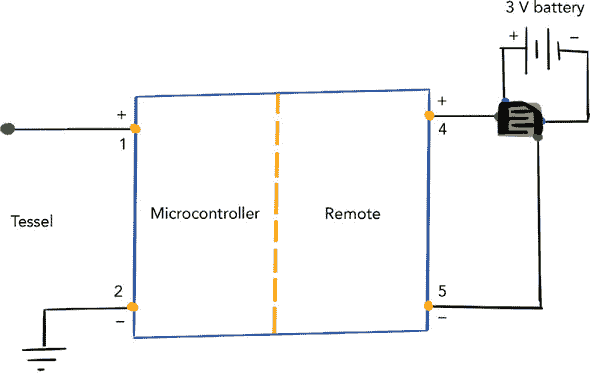

这就是光电耦合器组件（字面意义上）发光的地方。当电流在光电耦合器组件输入端的两个引脚之间流动时，允许电流在输出端的两个引脚之间流动。也就是说，输出端的开关是关闭的（图 9.9）。如果你觉得这个概念有点像晶体管的工作方式——一个小的输入电流允许电流在两个其他引脚之间流动——你是正确的。但在这个案例中，输入电流通过不“接触”它来激活输出晶体管。相反，内部 LED 由流经输入引脚的电流供电。输出端的晶体管是光敏的，当光线照射到它时，会激活（关闭开关）。

##### 图 9.9\. 电流施加到光电耦合器的输入端会激活内部红外 LED。LED 发出的光照射到光敏晶体管上，激活它并允许电流在输出端流动。

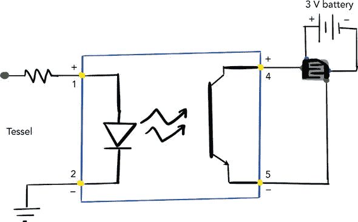

正如你看到的一些其他组件一样，光电耦合器有许多不同的名称：你可能会看到它们被称为*光电耦合器*或*光电隔离器*。

### 9.2. 使用 Johnny-Five 组件插件控制遥控器开关

你第一次尝试远程控制遥控器（哦，它变得很抽象了！）将涉及使用现有的 Johnny-Five 功能，但以新的方式组合它们。

在这个第一次迭代中，你将使其能够通过 Tessel 上运行的应用逻辑控制每个开/关开关——虚拟地按下按钮。

#### 9.2.1. 开关项目原型设计

而不是一次性连接所有光耦合器和开关——在我的情况下是六个光耦合器和相关组件——从电路的一个部分开始并确保它工作可能是有帮助的。然后你可以编写一些不够完善的代码来检查事物是否按预期运行，然后再进行任何精细调整。

这个**原型设计**过程可以帮助你在深入之前，在小规模上验证你的方法并排除问题。

##### 原型设计硬件

按照图 9.10 所示连接第一组开/关按钮。图 9.10。黄色电线应连接到正按钮连接，黑色电线连接到负极（在我的情况下，所有黄色电线都连接到相同的共享正极源）。确保光耦合器上指示引脚 1 的圆点方向正确。将两个光耦合器的引脚 2 连接到地。

##### 图 9.10. 第一组开/关按钮的布线图

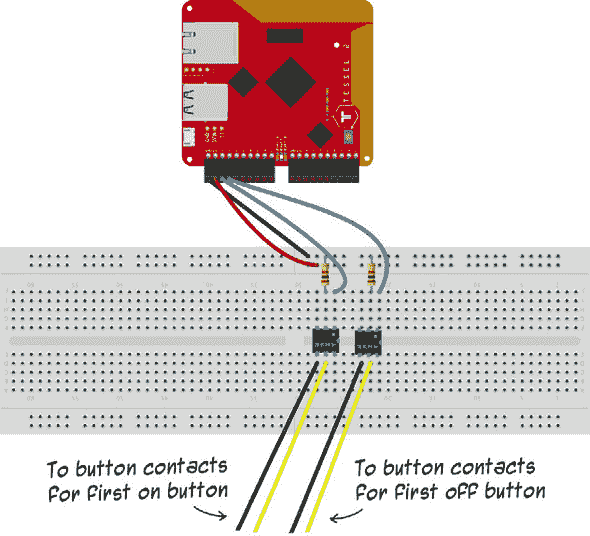

通过一个 100 欧姆电阻将第一个光耦合器的引脚 1 连接到 Tessel 的引脚 A0，将引脚 2 连接到 GND。这里需要限流电阻，因为光耦合器内部有一个 LED。将光耦合器的引脚 5 连接到第一个开关的*开*按钮的正极，将引脚 4 连接到该按钮的地线。

以类似的方式连接第二个光耦合器，但将其连接到 Tessel（源）侧的引脚 A1 和第一个开关的*关*按钮的正极和地线。

##### 原型设计软件

这里有一些需要考虑的事情。在遥控器上“按下按钮”意味着什么？按钮按下所建立的连接不会永远保持连接，也不是瞬间的脉冲——想想人类手指按下然后释放按钮。事实上，在我的遥控器上，我过去注意到，如果我按得太快——释放得太快——开关并不总是响应。这里涉及到一点按下并保持。

你可以通过软件通过启用按钮的连接并通过光电耦合器保持一段时间，比如半秒钟，然后再关闭它来模仿这一点。通过查看实际代码可能更容易理解这一点。让我们开始吧。

首先，设置项目：

```
mkdir remote-switches
cd remote-switches
npm init -y
```

接下来，安装标准依赖项并创建一个 index.js 文件：

```
npm install --save johnny-five tessel-io
touch index.js
```

与使用高级的 Johnny-Five 组件类如 `Led` 不同，你将直接写入数字值——HIGH（1）或 LOW（0）到 A0 和 A1 引脚。一个引脚可以被配置为数字输出引脚，如下所示：

```
board.pinMode('A0', five.Pin.OUTPUT);
```

一旦配置完成，就可以像这样写入：

```
board.digitalWrite('A0', 1); // set HIGH (3.3V on Tessel)
board.digitalWrite('A0', 0); // set LOW (0V)
```

要“按下”第一个开关的按钮，你需要将引脚 A0 设置为 HIGH——“打开”光电耦合器，允许电流通过第一个按钮。500 毫秒后，你再次将 A0 设置为 LOW，断开电路连接并“释放”按钮。

将以下原型切换代码添加到 index.js 中。

##### 列表 9.1\. 原型按钮按下代码

```
const five = require('johnny-five');
const Tessel = require('tessel-io');

const board = new five.Board({ io: new Tessel() });

const switchPins = {                                   *1*
  on: 'A0',
  off: 'A1'
};
const pressDuration = 500;                             *2*

board.on('ready', () => {

  board.pinMode(switchPins.on, five.Pin.OUTPUT);       *3*
  board.pinMode(switchPins.off, five.Pin.OUTPUT);

  const pressButton = function (pin) {
    board.digitalWrite(pin, 1);                        *4*
    setTimeout(() => {
      board.digitalWrite(pin, 0);
    }, pressDuration);                                 *5*
  };
  const turnOn = function () {
    pressButton(switchPins.on);
  };
  const turnOff = function () {
    pressButton(switchPins.off);
  };

  board.repl.inject({                                  *6*
    turnOn: turnOn,
    turnOff: turnOff
  });
});
```

+   ***1* 这两个引脚连接到两个光电耦合器的源端。**

+   ***2* “按下并保持”按钮 500 毫秒以确保开关激活**

+   ***3* 将 A0 和 A1 配置为数字输出引脚**

+   ***4* 要按下按钮，首先将相关的光电耦合器引脚设置为 HIGH。**

+   ***5* 然后在将引脚再次设置为 LOW 之前，为 pressDuration（500 毫秒）设置超时。**

+   ***6* 在原型设计阶段，将 turnOn 和 turnOff 方法提供给 REPL 使用。**

尝试一下。通过局域网将代码部署到 Tessel（你需要通过局域网部署，以便 REPL 能够工作）：

```
$ t2 run index.js --lan
```

尝试从 REPL 调用 `turnOn()` 和 `turnOff()` 函数。注意，这两个函数都返回 `undefined`——这是正常的，不是错误。

```
1492612088185 Available Tessel 2 (sweetbirch)
1492612088341 Connected Tessel 2 (sweetbirch)
1492612088415 Repl Initialized
>> turnOn()
undefined
>> turnOff()
undefined
```

这样做应该会“按下”远程控制器的开/关按钮，并打开/关闭相关的墙壁插座。

##### 构建电路的其余部分

一旦你更有信心你的第一个电路正在按预期工作，就可以像 图 9.11 所示那样扩展它。确保注意每个光电耦合器的方向。

##### 图 9.11\. 完成的开关/光电耦合器接线图。光电耦合器的输出应该连接到按钮接触线。

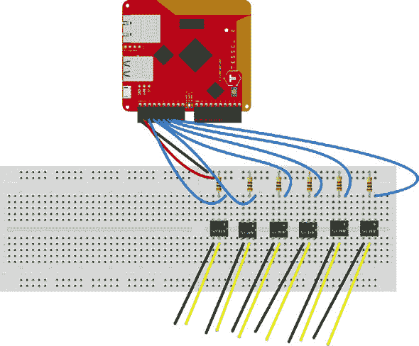

#### 9.2.2\. 编写 RemoteSwitch 插件

现在你已经完善了电路，是时候完善代码了。你可以在应用程序的主模块（index.js）中封装每个三个开/关开关组合的行为，而不是有一个杂乱无章的代码集合。通过移除组件特定的代码，你可以在 index.js 中简单地实例化一个 `RemoteSwitch` 对象，用于每个开/关对（或者你的远程控制器有多少个开关对）并随意打开或关闭它们。

让我们一步步地创建一个可重用的 Johnny-Five 组件插件。


##### Johnny-Five 组件插件与组件类

内置 *组件类* 如 `Led` 和 `Motor` 是 Johnny-Five 的核心部分。创建一个新的组件类需要对 Johnny-Five 代码库本身进行更改。另一方面，*组件插件* 可以创建，而无需对 Johnny-Five 进行任何修改——因此术语 *插件*。组件插件的结构与组件类代码的结构有许多相似之处，但这两者——组件类与组件插件——是不同的东西，所以不要混淆（你正在制作一个 *插件*）！


##### 组件插件结构基础

在 remote-switches 目录中创建一个新的文件名为 RemoteSwitch.js，用于包含插件模块。模块的结构将开始如下所示。这个骨架结构遵循 Johnny-Five 组件插件约定，使其模块化和灵活。

##### 列表 9.2\. RemoteSwitch.js：起点

```
module.exports = function (five) {                                 *1*
  return (function () {
    function RemoteSwitch (opts) { /* ... */ }                     *2*
    RemoteSwitch.prototype.toggle = function (turnOn) {};          *3*
    RemoteSwitch.prototype.on = function () {};
    RemoteSwitch.prototype.off = function () {};
    return RemoteSwitch;
  }());
};
```

+   ***1* 消费模块提供对 Johnny-Five（five）的引用。**

+   ***2* 这将初始化一个新的 RemoteSwitch 对象（这是它的构造函数）。**

+   ***3* 你将添加三个原型方法来控制开关组件。**

`RemoteSwitch` 模块没有直接依赖 Johnny-Five。相反，它将其导出函数的参数作为一个 Johnny-Five 对象引用。这样，插件就可以在包含它的任何 Johnny-Five 对象之上工作。传递的 Johnny-Five 对象可能包含配置了 Tessel I/O 插件的 `board`，或者它可能有一个带有 Firmata I/O 层的 Arduino，或者可能是其他东西——这样插件就不必关心物流或有效的引脚编号等任何事情。传递的 Johnny-Five 对象将负责这些，让你可以自由处理手头的逻辑。

插件需要有一个构造函数，它可以接受一些选项，执行它需要进行的任何设置，并注册到 Johnny-Five。当你完成时，`RemoteSwitch` 的实例化将看起来像这样：

```
const switch1 = new RemoteSwitch({ pins: { on: 'A0', off: 'A1' } });
```

你接下来将工作在这个构造函数上。

##### 编写插件代码

将以下代码添加到 `RemoteSwitch.js`。

##### 列表 9.3\. RemoteSwitch.js：构造函数

```
module.exports = function (five) {
  return (function () {
    function RemoteSwitch (opts) {
      if (!(this instanceof RemoteSwitch)) {                            *1*
        return new RemoteSwitch(opts);
      }
      five.Board.Component.call(this, opts = five.Board.Options(opts)); *2*

      // opts.pins should contain two properties, `on` and `off`,
      // defining their pin numbers, respectively
      this.pins     = opts.pins;
      this.duration = 500;
      this.isOn     = undefined;                                        *3*
      this.isActive = false;                                            *4*

      this.io.pinMode(this.pins.on, this.io.MODES.OUTPUT);              *5*
      this.io.pinMode(this.pins.off, this.io.MODES.OUTPUT);
    }
    // ...
  }());
};
```

+   ***1* 这个（样板）模式确保函数使用“new”关键字调用。**

+   ***2* 注册组件**

+   ***3* 在一开始，技术上你不知道开关是开启还是关闭。**

+   ***4* 当开关的一个按钮被激活（按下）时，isActive 为 true。**

+   ***5* 将开关的开启和关闭引脚配置为数字输出引脚。**

现在是时候添加切换开关开启和关闭的方法了。

##### 列表 9.4\. RemoteSwitch.js：原型方法

```
module.exports = function (five) {
  return (function () {
    function RemoteSwitch (opts) { /* we already wrote this */ };

    RemoteSwitch.prototype.toggle = function (turnOn) {
      if (this.isActive) { return false; }                      *1*
      this.isActive = true;                                     *2*
      if (typeof turnOn === 'undefined') {
        turnOn = !this.isOn;                                    *3*
      }
      const pin = (turnOn) ? this.pins.on : this.pins.off;      *4*
      this.io.digitalWrite(pin, 1);
      setTimeout(() => {
        this.io.digitalWrite(pin, 0);
        this.isActive = false;                                  *5*
        this.isOn = !!turnOn;                                   *6*
      }, this.duration);
    };
    RemoteSwitch.prototype.on = function () {
      this.toggle(true);
    };
    RemoteSwitch.prototype.off = function () {
      this.toggle(false);
    };
  }());
};
```

+   ***1* 如果开关已经处于激活（忙碌）状态，则不会激活开关**

+   ***2* 表示开关当前处于激活状态**

+   ***3* 如果缺少 turnOn，则确定切换行为**

+   ***4* 确定要激活开关的哪个引脚（开启或关闭）**

+   ***5* 开关不再处于激活状态；isActive 应该再次设置为 false**

+   ***6* 跟踪开关的当前状态**

您会注意到一切都与 `toggle` 方法有关。单个 `toggle` 参数 `turnOn` 定义了会发生什么。如果是真值，开关会打开。如果是假值，开关会关闭。如果是 *缺失的* (`undefined`)，开关将从当前状态切换。为了支持该功能，开关的当前状态存储在 `isOn` 属性中。

为了防止远程设备尝试同时发送两个信号，使用 `isActive` 属性作为标志。如果 `isActive` 为真，则 `toggle` 不会写入任何引脚。

##### 将 index.js 重构为使用 RemoteSwitch

您现在可以将 index.js 更新为包含以下代码。

##### 列表 9.5\. 重构后的 index.js

```
const five = require('johnny-five');
const Tessel = require('tessel-io');
const RemoteSwitch = require('./RemoteSwitch')(five);         *1*

const board = new five.Board({ io: new Tessel() });

board.on('ready', () => {
  const switch1 = new RemoteSwitch({
    pins : { on: 'A0', off: 'A1' }
  });
  const switch2 = new RemoteSwitch({
    pins: { on: 'A2', off: 'A3' }
  });
  const switch3 = new RemoteSwitch({
    pins: { on: 'A4', off: 'A5' }
  });
  board.repl.inject({
    switch1: switch1,
    switch2: switch2,
    switch3: switch3
  });
});
```

+   ***1* 导入 RemoteSwitch 模块并将其传递五个参考**

尝试一下：

```
t2 run index.js --lan
```

一旦它开始运行，您就可以在 REPL 中与开关对象交互：

```
1492618175517 Available Tessel 2 (sweetbirch)
1492618175671 Connected Tessel 2 (sweetbirch)
1492618175746 Repl Initialized
>> switch1.on()
undefined
>> switch1.off()
undefined
>> switch2.on()
undefined
```

##### 迭代：排队和回调

目前，如果 `isActive` 为真，则 `RemoteSwitch` 实例上的 `toggle` 方法不会做任何事情——也就是说，它不允许多个同时的开关激活。缺点是，按照目前的编写方式，如果在开关已经激活时发生，`toggle` 命令将被有效地丢弃并忽略。假设出于某种原因，您想多次闪烁开关，并在 index.js 中有如下代码来尝试完成这个任务：

```
for (var i = 0; i < 10; i++) {
  switch1.toggle();
}
```

开关确实会按预期切换一次。但随后的九次 `toggle` 调用会立即发生——在第一次调用激活开关之后（因此，当 `isActive` 为 `true` 时）。它们会被忽略。因此，开关只会切换一次，而不是十次。

您可以通过在开关激活时加入简单的 FIFO 排队（先进先出——类似于“按接收顺序回答电话”）来修复这个问题。这只需要几行代码。

当你在那里时，你还可以向 `RemoteSwitch` 的方法添加一些 *回调* 支持，如下一列表所示。这与其他 J5 组件保持一致，并使得在开关命令（开/关/切换）完成时注册一个要调用的函数成为可能。目前这只是一个额外的功能，但将来会很有用。

##### 列表 9.6\. 完整的 `RemoteSwitch` 插件

```
module.exports = function (five) {
  return (function () {
    function RemoteSwitch (opts) {
      if (!(this instanceof RemoteSwitch)) {
        return new RemoteSwitch(opts);
      }
      five.Board.Component.call(this, opts = five.Board.Options(opts));

      this.pins     = opts.pins;
      this.duration = opts.duration || 500;
      this.isOn     = undefined;
      this.isActive = false;
      this.queue    = [];                                               *1*

      this.io.pinMode(this.pins.on, this.io.MODES.OUTPUT);
      this.io.pinMode(this.pins.off, this.io.MODES.OUTPUT);
    }

    RemoteSwitch.prototype.toggle = function (turnOn, callback) {       *2*
      if (this.isActive) {                                              *3*
        this.queue.push([turnOn, callback]);
        return;
      }
      this.isActive = true;
      if (typeof turnOn === 'undefined') {
        turnOn = !this.isOn;
      }
      const pin = (turnOn) ? this.pins.on : this.pins.off;
      this.io.digitalWrite(pin, 1);
      setTimeout(() => {
        this.io.digitalWrite(pin, 0);
        this.isActive = false;
        this.isOn = !!turnOn;
        if (typeof callback === 'function') {                           *4*
          callback();
        }
        if (this.queue.length) {                                        *5*
          this.toggle.apply(this, this.queue.shift());
        }
      }, this.duration);
    };

    RemoteSwitch.prototype.on = function (callback) {                   *6*
      this.toggle(true, callback);
    };
    RemoteSwitch.prototype.off = function (callback) {
      this.toggle(false, callback);
    };
    return RemoteSwitch;
  }());
};
```

+   ***1* 实例化一个空数组来存储排队的“命令”**

+   ***2* 现在接受回调**

+   ***3* 如果开关忙碌，则将项目推入队列**

+   ***4* 切换动作完成：如果有回调，则调用**

+   ***5* 如果队列中有下一个项目，则调用 toggle**

+   ***6* 开关和关闭处理函数接受一个回调参数并将其传递给切换**

现在如果您将以下代码添加到 index.js 中，它应该按预期工作：

```
for (var i = 0; i < 10; i++) {
  switch1.toggle(); // This will cause the switch to toggle 10 times
}
```


##### 您的硬件可能不同

根据我们编写的软件，开关应该切换 10 次。然而，值得注意的是，可能存在硬件限制，这可能会阻止这种情况的发生。例如，你的遥控器的电子设备可能不允许开关频繁切换。


到目前为止，你已经黑入了消费电子产品，构建了一个小型原型，并将其扩展为一个更精致的电路，其中包含一个定制的 Johnny-Five 组件插件用于输出（开关）。

你可以用你之前看到的一些输入设备来触发你的`RemoteSwitch`组件。你可以使用光敏电阻，当房间变暗时触发开关。你可以使用运动或接近传感器，当你的猫经过时打开它们（并在一定时间后自动关闭）。但是，当你一心想要用 Johnny-Five 不支持的一种输入方式来控制开关时会发生什么？那时怎么办？

### 9.3. 编写复杂硬件的软件

有这样一个吸引我注意的 I²C 设备。Avago APDS-9960 设备（图 9.12）包含多个传感器：一个 RGB 环境光传感器、一个接近传感器和一个复杂的手势传感器。SparkFun 销售基于该芯片的廉价（约 15 美元）分线板。真 neat！一个手势传感器！这是一个控制你远程开关灯的有趣方式。为什么还要按按钮，当你可以像魔术师一样在空中滑动呢？

##### 图 9.12. APDS-9960 将三个传感器集成在一个封装中，包括一个手势传感器。SparkFun 提供了一块使芯片工作更简单的分线板。


问题在于，当我偶然发现 APDS-9960 时，并没有现成的 Johnny-Five 支持。没有手势传感器的组件类。这意味着你需要创建那个支持！当你想使用的软件不存在时，你有两个选择：替换另一个有支持的硬件，或者自己创建那个支持。

#### 9.3.1. 项目：为 APDS-9660 手势传感器添加 Johnny-Five 支持

APDS-9960 将考验你的能力（它是一个复杂的设备），但你为它创建的插件的高级结构将与`RemoteSwitch`相似。以下的项目流程基于真实经验，并突出了在创建硬件新支持时遇到的一些常见阶段、挫折和结果。

要构建支持，你需要做以下事情：

1.  定义目标和范围

1.  收集关于 APDS-9960 的信息并进行研究

1.  构建一个快速的原型

1.  定义 API 界面和插件生命周期

1.  编写插件的代码

1.  测试插件是否工作

1.  完成项目，将本章早些时候的`RemoteSwitch`与 APDS-9960 插件集成

##### 手势传感器插件的目标

在插上电线、焊接或编写代码之前，首先要问自己你想要完成什么。

你想要为 APDS-9960 手势传感器创建一个 Johnny-Five 组件插件。一个合理的 API，与其它 Johnny-Five 组件保持一致，应该包括暴露手势事件，这些事件可以被应用程序代码监听和响应。

范围之外的内容是什么？鉴于 APDS-9960 手势传感器的复杂性，不要尝试支持其它的传感器。同样，为了节省开发时间和减少麻烦，你将直接硬编码许多默认设置和功能支持，这些可以在以后通过其他方式管理，例如通过传递给插件的选项。

设计代码以便在多个硬件平台上使用是一个良好的目标，同时也要考虑到未来的灵活性。编写一个符合 Johnny-Five 组件插件约定的模块——例如`RemoteSwitch`——将有助于实现跨平台的目标。注意常量的管理方式，关注 API 表面的一致性，并保持方法模块化，将有助于使软件更容易修改和扩展。

你将基于 Tessel 编写这个手势传感器支持。没有理由认为它不会在其他（3.3 V）Johnny-Five 兼容平台上工作，但在这个项目中你不会花费时间去进行超出 Tessel 的测试。

##### 收集有关 APDS-9960 的信息

在明确了目标和范围之后，是时候收集信息了。有许多问题需要回答：

+   ***物理硬件和协议*—** 设备的工作电压是多少？有哪些引脚和连接？它使用哪种通信协议？

+   ***通信*—** 从设备读取数据和写入数据的具体细节是什么？

+   ***配置和设置*—** 初始化设备、设置默认值和启用所需功能需要采取哪些步骤？

+   ***数据*—** 设备产生了哪些类型的数据？你如何解释和处理这些数据？

在探索之旅的第一站，你需要阅读 SparkFun 的 APDS-9960 连接指南和文档([`mng.bz/MapU`](http://mng.bz/MapU))。SparkFun 为 APDS-9960 提供的分线板为你处理了一些硬件层面的繁琐工作——跳线和电源连接。结果板可以像你遇到的其他 I²C 组件一样布线。但有一个额外的连接：一个中断能力的引脚。我们稍后会回到这一点。另一个非常重要的细节是，这个设备在 3.3 V 下运行——这对 Tessel 来说完全没问题，但不要尝试将其连接到 5 V 的 Arduino。

接下来，获取 APDS-9960 的数据表并进行扫描([`mng.bz/by50`](http://mng.bz/by50))。好消息是，APDS-9960 的数据表相当出色，作为数据表来说。但请注意，它仍然是一个非平凡设备的数据表：如果初次浏览让你感到眼花缭乱，请不要慌张。完整阅读第 1 页——这是一个很好的总结。从数据表中，你可以获取到设备硬编码的 I²C 地址等重要细节（它是`0x39`；见第 8 页）。

通过审查现有的 APDS-9960 软件和固件支持，你可以获得很大的优势。SparkFun 的 Shawn Hymel 编写了一个完整且出色的开源 Arduino 库（仅适用于 3.3 V Arduino！），它支持设备的每个功能([`mng.bz/8gE7`](http://mng.bz/8gE7))。它非常出色：易于阅读且注释详尽。Arduino 库和数据表之间的交叉引用详细说明了与设备一起工作的其他一些细节。

##### 如何使用 APDS-9960

在生成手势数据之前，APDS-9960 硬件需要初始化并启用其手势模式。从概念上讲，这是一个两步的过程。

首先，有一个*设置*阶段，在这个阶段，默认值和设置被写入 APDS-9960 上的多个不同寄存器。随后，有一个*启用*阶段，在这个阶段，手势模式被激活（而不是设备其他传感器的模式），并且一些特定于手势的设置被写入更多的寄存器(图 9.13)。

##### 图 9.13。在这个简化的部分状态机表示中，插件对象实例最初处于`new`状态。通过`setup`方法，它进入`initialized`状态，此时 APDS-9960 设备已初始化但未主动感应手势。`enable`方法启用了设备上的手势模式。

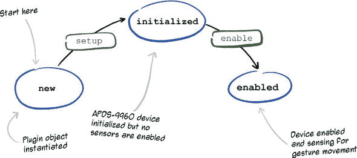

用一个非常粗略、不准确的比喻来说：*设置*就像打开芯片并启动它，而*启用*就像在设备上启动一个特定手势的应用程序。尽管你的实现将仅支持手势感应——这意味着启用总是在设置之后立即发生，无需用户干预——保持这两个阶段的不同将使以后添加额外的传感器支持更容易。

在设置和启用过程中，需要写入哪些寄存器和什么值？所有这些信息都在数据表中；需要时间、耐心和细致的注意力来组织它们。

设置和启用完成后，APDS-9960 将积极感应手势运动。当设备感应到运动并开始产生数据时，它将*将中断引脚拉低*，表示已检测到手势。也就是说，连接到分线板中断引脚的 Tessel 引脚上的电压将从 3.3 V 变为 0 V。从高到低的所谓*下降沿*是软件应该从设备读取手势数据的信号。

手势数据表示由一系列 4 字节的数据集组成，每个数据集包含每个方向（上、下、左、右）的 1 字节（一个从 0 到 255 的值）。通过分析这些值在每个方向上的变化，可以推导出手势的整体方向。

当设备检测到手势动作时，它会将中断引脚拉低，然后开始将数据集存入内存寄存器。设备上为此预留了 128 字节的空间——最多可以存储 32 个 4 字节的数据读取——数据以 FIFO（先进先出）的方式放入这些寄存器中（图 9.14）。

##### 图 9.14。有 128 字节的 FIFO RAM 可用，起始内存地址为 0xFC，用于存储手势数据。在这个例子中，FIFO 队列中有三个数据集可用。一个数据集由四个字节组成，每个字节代表不同方向的数据——上、下、左和右。

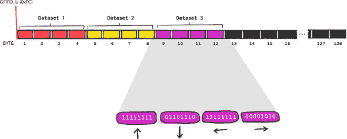

当控制设备——你的 Tessel——从这些寄存器中读取数据字节时，它就会释放空间，更多的数据可以被推入 FIFO RAM。这个过程会持续进行——控制器读取，设备将更多数据放入 FIFO——直到没有更多的手势数据进入，FIFO 被清空。然后，数据可以被控制设备处理（图 9.15）。


##### 技术上讲：中断

技术上讲，当检测到手势数据时，设备将触发一个中断，因为你在启用步骤中将其配置为这样做。APDS-9960 具有高度可配置性，手势中断是一个可选功能。更技术性地，它将在 FIFO RAM 中放入四个数据集（样本）后触发中断。确切的中断触发时间，是的，也是可配置的。


##### 图 9.15。随着研究的深入，该插件的有限状态机变得更加详细。当检测到中断时，插件实例进入读取周期阶段，然后进入处理阶段，最后返回到激活监听状态。

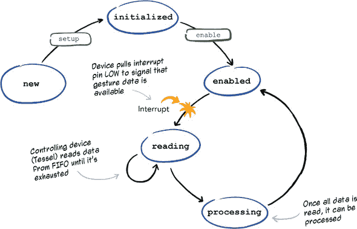

##### 构建一个概念验证原型

在着手插件实现之前，需要进行一次合理性检查。你将建立一个工作区，连接芯片，并确保可以与它建立 I²C 通信。这将使你在进入更注重细节的开发阶段时更有信心。

连接 APDS-9960 扩展板很简单，但首先需要在其上焊接引脚头。按照图 9.16 所示连接。中断引脚连接到 Tessel 的 A2 引脚，这是一个具有中断能力的引脚。

##### 图 9.16。APDS-9960 扩展板的布线图

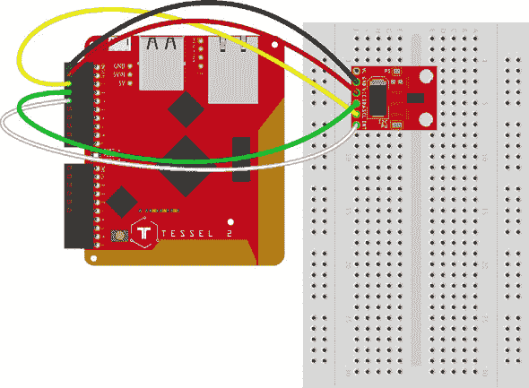

创建一个新的项目工作区并安装这些依赖项：

```
mkdir gesture
cd gesture
npm init -y
npm install johnny-five tessel-io
```

同时也将 RemoteSwitch.js 文件复制到手势目录中，你稍后会再次使用它。


**创建和共享电路和布线图**

为了创建本书中使用的布线图，我使用了开源的 Fritzing 软件 ([`fritzing.org/home/`](http://fritzing.org/home/))，它可在 Mac、Windows 和 Linux 平台上使用。它包含各种部件，包括你可以用来构建图表的板子和组件。此外，像 SparkFun 和 AdaFruit 这样的部件制造商经常为他们的产品提供 Fritzing 部件。例如，我能在 SparkFun 的 Fritzing_Parts 存储库中找到一个 APDS-9960 的部件 ([`mng.bz/Hsa2`](http://mng.bz/Hsa2))。

使用 Fritzing 可以创建原理图以及图表，尽管我发现它有点挑剔。在原理图和 PCB 设计软件领域，Autodesk 的 EAGLE 是一个更强大的选择。不出所料，它有一个学习曲线，但它被广泛使用，如果你想尝试的话，还有一个跨平台的免费版本 ([www.autodesk.com/products/eagle/free-download](http://www.autodesk.com/products/eagle/free-download))。

KiCad EDA 是另一个跨平台的开源原理图和 PCB 设计软件选项 ([`kicad-pcb.org/`](http://kicad-pcb.org/))。

如果你热衷于尝试模拟电子电路——不是高级的断出板和微控制器，而是像电容器、逻辑门、晶体管和变压器这样的基础知识——你可能想尝试 iCircuit App ($9.99)，适用于 iOS、Android 和 Windows（桌面和手机）。这不是一个静态绘图或制图应用。相反，它是一个实时模拟引擎，允许你在更改电路时看到真正发生的事情。

| |
| --- |

APDS-9960 的许多寄存器之一是一个只读的 `DEVICE_ID` 寄存器，地址为 `0x92`（数据手册第 25 页）。当你从该地址读取一个字节时，你应该始终得到值 `0xAB` (图 9.17)。这对于你进一步操作芯片来说并不有用，但它是一个方便的方式来确保 I²C 通信正在工作，并且你确实连接到了 APDS-9960。

##### 图 9.17\. 在 APDS-9960 的地址 0x92 上的 `DEVICE_ID` 寄存器中的值应该始终是 `0xAB`（二进制中的 `10101011`）。

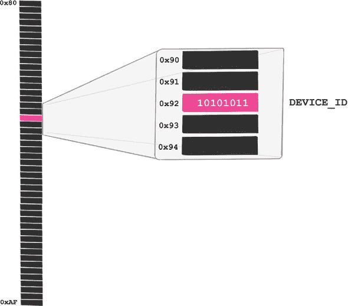

创建一个名为 i2c-test.js 的文件，并将以下代码添加到其中。

##### 列表 9.7\. 测试与 APDS-9960 的连接

```
const five = require('johnny-five');
const Tessel = require('tessel-io');
const board = new five.Board({ io: new Tessel() });

board.on('ready', () => {
  board.i2cConfig({ address: 0x39 });                                      *1*
  board.i2cReadOnce(0x39, 0x92, 1, data => {                               *2*
    if (data[0] !== 0xAB) { // DEVICE_ID register should return 0xAB       *3*
      throw new Error('Unable to establish connection with APDS9960');
    } else {
      console.log('Connected to APDS-9960!');
    }
  });
});
```

+   ***1* 使用从机地址 0x39 开始 I²C 通信。这是 APDS-9960 的硬编码 I²C 地址。**

+   ***2* 从地址 0x39 的设备 0x92 寄存器中读取 1 个字节**

+   ***3* 如果该寄存器不包含数据 0xAB，则表示出了问题。**


##### 默认 I²C 接口

Tessel 有两个 I²C 接口。Johnny-Five 通过 `tessel-io`，如果没有在 `board.i2cConfig()` 传递的选项中指定，将自动使用 A 端口的接口。

| |
| --- |
| |

**Johnny-Five 的 I²C 功能**

`i2cReadOnce(address, register, bytesToRead, handler(arrayOfBytes))` 方法从指定的 `register` 寄存器开始读取给定的 `bytesToRead` 字节数。读取完成后，回调函数被调用并传递一个字节数组。

`i2cReadOnce` 与相关方法 `i2cRead` 不同。正如其名所示，`i2cReadOnce` 只会 *读取一次*，而 `i2cRead` 将会 *持续* 从指定的地址/寄存器组合中读取。如果你想要反复从相同的寄存器（们）读取以观察变化，`i2cRead` 会很有用。在你的情况下，你将使用 APDS-9960 的中断功能来通知你何时有新的手势数据，而不是使用 `i2cRead` 进行轮询。

这些 I²C 实用方法的实际底层实现——这些方法也出人意料地包括向 I²C 设备写入的能力——取决于活动的 I/O 插件。在 Tessel 的情况下，这是由`tessel-io`处理的；对于 Arduino，这里将是由 Firmata 来完成繁重的工作。

| |
| --- |

在你的连接 Tessel 和 APDS-9960 电路板上尝试这段测试代码：

```
$ t2 run i2c-test.js --lan
```

一旦你成功看到日志消息“已连接到 APDS-9960！”就到了继续前进并构建组件插件的时候了。

##### 编写 APDS9960 插件

创建一个名为 APDS9960.js 的文件，并从以下列表中显示的代码开始。为了完成插件的代码，你将填充这些部分。

##### 列表 9.8。APDS9960.js 的起点

```
// Dependencies
const Emitter = require('events').EventEmitter;
const util    = require('util');

/** CONSTANTS HERE **/

module.exports = function (five) {
  return (function () {
    /**
     * @param {Object} opts Options: pin, address
     * pin denotes interrupt pin connection
     *
     * Sample initialization:
     * var gesture = new APDS9960('A2');
     * var gesture = new APDS9960({ pin: 'A2'});
     * gesture.on('up', () => { ...do something ...});
     */
    function APDS9960 (opts) {
      // Constructor: Set up instance properties and kick off initialization
    }

    // Extend Node.js' EventEmitter class so that our object can emit events
    util.inherits(APDS9960, Emitter);

    /* Reset this instance's current gesture data */
    APDS9960.prototype.resetGesture = function () { };

    /* `setup` and `enable` are invoked from the constructor */
    APDS9960.prototype.setup = function (callback) { };
    APDS9960.prototype.enable = function () { };

    /* When interrupt is pulled LOW, `readGesture` reads data out of the
     * FIFO until the data are exhausted, then invokes `processGesture`
     * and `decodeGesture` to process the resulting data
     */
    APDS9960.prototype.readGesture = function () { };

    /* `processGesture` performs some computations over read data and
     * determines some ratios and deltas in the directional samples.
     */
    APDS9960.prototype.processGesture = function () { };

    /* Using `deltas` computed by `processGesture`, "decodes" the
     * information into a gesture (up, down, left, right) when possible
     * and emits events.
     */
    APDS9960.prototype.decodeGesture = function () { };

    return APDS9960;
  }());
};
```

高级 API 中的方法表示完整的状态机（图 9.18）。现在你需要实现这些方法。

##### 图 9.18。该插件的有限状态机现在已完整。下一步是实现它。

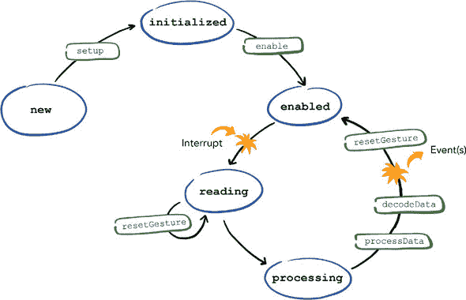

##### 常量和配置设置

你将首先定义一些常量，因为有很多。但不要慌张。APDS9960.js 中的常量定义了寄存器地址、位掩码、默认值以及一些其他配置位和组件。

确定需要写入哪些寄存器以设置和启用设备是一项注重细节的练习，需要参考数据手册（并在可能的情况下查看其他软件实现）。

图 9.19 展示了在设置和启用过程中写入的一些寄存器。一些寄存器的值被设置为简单的合理默认值，例如 `GPENTH`，其设置为 `40` 的二进制表示。其他寄存器被禁用——`GOFFSET_U` 被设置为 `0x00`。还有一些是位掩码，一次设置多个标志——配置值（`GCONF1`，`GCONF2`）。

##### 图 9.19。设置和启用过程中写入的 APDS-9960 寄存器的样本

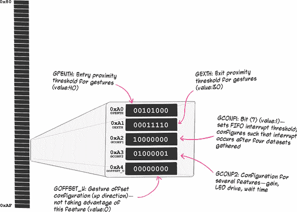

| |
| --- |

##### 使用位掩码管理功能配置

APDS-9960 插件使用 *掩码* 来管理 APDS-9960 上的配置设置——几个配置值通常包含在一个字节中，不同的位位置对应不同功能的值。几个掩码标志通过按位或运算组合成多功能的字节。

例如，地址为 `0xA3` 的寄存器（`GCONF2`）包含三个功能的配置（图 9.20）。

##### 图 9.20\. `GCONF` 寄存器中的不同位范围对应不同的设置。例如，位置 6 和 5 的两个位设置手势增益。位 7 未使用。

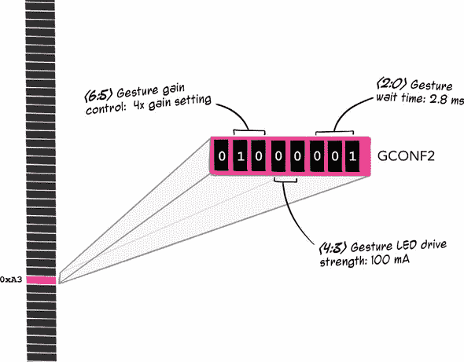

再次提醒你，MDN 关于位运算符和掩码的出色文章（[`mng.bz/CLvy`](http://mng.bz/CLvy)）。


按照以下列表填写常量。

##### 列表 9.9\. APDS9960 常量

```
const REGISTERS = {
  ENABLE   : 0x80, // Enable different sensors/features (p.20)
  WTIME    : 0x83, // Wait time config value (p.21)
  PPULSE   : 0x8E, // Proximity pulse count and length (p.23)
  CONFIG2  : 0x90, // Second configuration register (p.24), for LED boost
  DEVICE_ID: 0x92, // Contains device ID (0xAB) (p.25)
  GPENTH   : 0xA0, // Entry proximity threshold for gestures (p.27)
  GEXTH    : 0xA1, // Exit proximity threshold for gestures (p.28)
  GCONF1   : 0xA2, // Gesture config 1: gesture detection masking (p.28)
  GCONF2   : 0xA3, // G config 2: gain, LED drive, gesture wait time (p.29)
  GOFFSET_U: 0xA4, // Gesture offset (up) (p.30)
  GOFFSET_D: 0xA5, // Gesture offset (down) (p.30)
  GPULSE   : 0xA6, // Gesture Pulse count and length (p.31)
  GOFFSET_L: 0xA7, // Gesture offset (left) (p.30)
  GOFFSET_R: 0xA9, // Gesture offset (right) (p.31)
  GCONF4   : 0xAB, // Gesture config 4: interrupts, mode enable (p.32)
  GFLVL    : 0xAE, // Gesture FIFO level: # of datasets in FIFO (p.32)
  GSTATUS  : 0xAF, // Gesture status; bit 0 indicates available data (p.33)
  GFIFO_U  : 0xFC, // 1st FIFO register in (RAM)—read data from here (p.33)
};

const FLAGS = {
  GFIFOTH  : 0b10000000, /* FIFO threshold: trigger interrupt after
                            4 datasets in FIFO (GCONF1 <7:6> p.28) */
  GGAIN    : 0b01000000, /* Gesture gain control:
                            4x (GCONF2 <6:5> p.29) */
  GLDRIVE  : 0b00000000, /* Gesture LED drive strength:
                          * 100mA (GCONF2 <4:3> p.29) */
  GWTIME   : 0b00000001, /* Gesture wait time:
                            2.8ms (GCONF2 <2:0> p.29) */
  GPLEN    : 0b11000000, /* Gesture pulse length:
                            32μs (GPULSE <7 :6> p.31) */
  GPULSE   : 0b00001001, /* Gesture pulse count:
                            10 (9 + 1) (GPULSE <5:0> p.31) */
  GVALID   : 0b00000001, /* GSTATUS register value
                            indicates valid data if 0th bit is 1 */
  PPLEN    : 0b10000000, /* Proximity pulse length:
                            16μs (PPULSE <7 :6> p.23) */
  PPULSE   : 0b10001001, /* Proximity pulse count:
                            10 (9 + 1) (PPULSE <5:0> p.23) */
  LED_BOOST: 0b00110000, /* LED drive boost:
                            300% (CONFIG2 <5:4> p.24) */
  GIEN     : 0b00000010, /* Gesture interrupt enable:
                            yes (GCONF4 <1> p.32) */
  GMODE    : 0b00000001, /* Gesture mode:
                            yes! (GCONF4 <0> p.32) */
  ENABLE   : 0b01001101, /* Enable features:
                            Gesture, Wait, Proximity, Power on
                            (ENABLE, p.20) */
};

// During setup, (value) is written to each register (key)
const SETUP_DEFAULTS = {
  ENABLE   : 0x00,          /* Disable all things,
                              effectively turning the chip off (p. 20) */
  GPENTH   : 40,            // Entry proximity threshold
  GEXTH    : 30,            // Exit proximity threshold
  GCONF1   : FLAGS.GFIFOTH, // FIFO interrupt threshold
  GCONF2   : FLAGS.GGAIN | FLAGS.GLDRIVE | FLAGS.GWTIME, // Gesture gain,
   LED drive, wait time
  GOFFSET_U: 0x00,          // no offset
  GOFFSET_D: 0x00,          // no offset
  GOFFSET_L: 0x00,          // no offset
  GOFFSET_R: 0x00,          // no offset
  GPULSE   : FLAGS.GPLEN | FLAGS.GPULSE // pulse count and length,
};

// During enable, each (value) is written to register (key)
const ENABLE_VALUES = {
  WTIME  : 0xFF,                       /* Wait time between cycles in
                                          low-power mode: 2.78ms (p. 21) */
  PPULSE : FLAGS.PPLEN | FLAGS.PPULSE, // Proximity pulse length and count
  CONFIG2: FLAGS.LED_BOOST,
  GCONF4 : FLAGS.GIEN | FLAGS.GMODE,
  ENABLE : FLAGS.ENABLE
};

// For processing read data
const GESTURE_THRESHOLD_OUT = 30;
const GESTURE_SENSITIVITY = 10;
```


##### 技术上讲：它是如何实际工作的

APDS-9960 通过检测内置红外 LED 反射回的能量变化来感应“手势”。这个 LED 的配置细节——驱动它的功率、脉冲次数以及每个脉冲在检测周期中的持续时间——在定义的配置值中经常出现。


#### 9.3.2\. 实现构造函数和初始化方法

接下来，你将完善构造函数以及初始化和启用设备进入手势模式的方法。

构造函数的基本结构与 `RemoteSwitch` 构造函数相同。构造函数还启动了设置和启用，如下一列表所示。

##### 列表 9.10\. APDS9960：构造函数和手势数据重置

```
function APDS9960 (opts) {
  if (!(this instanceof APDS9960)) {
    return new APDS9960(opts);
  }
  five.Board.Component.call(this, opts = five.Board.Options(opts));        *1*
  this.interruptState = 1; // Interrupt is active LOW                      *2*
  opts.address        = opts.address || I2C_ADDR;                          *3*
  this.address        = opts.address;                                      *4*
  this.io.i2cConfig(opts); // Get I2C comms started for the device         *5*

  this.io.i2cReadOnce(this.address, REGISTERS.DEVICE_ID, 1, data => {
    if (data[0] !== DEVICE_ID) { // DEVICE_ID register should return 0xAB
      throw new Error('Unable to establish connection with APDS9960');
    }
  });
  this.resetGesture();                                                     *6*
  this.setup(this.enable);                                                 *7*
}

util.inherits(APDS9960, Emitter);

APDS9960.prototype.resetGesture = function () {
  this.gestureData = {
    raw: [],
    deltas: {},
    movements: { // A gesture can have movements along more than one axis
      vertical  : false,
      horizontal: false,
      up        : false,
      down      : false,
      left      : false,
      right     : false
    },
    valid: false, // Was gesture decoding successful?
    direction: undefined
  };
};
```

+   ***1* 将组件注册到活动板上**

+   ***2* 中断将从高电平拉到低电平以激活；初始值为高电平（1）**

+   ***3* 准备 I²C 地址以传递给 i2cConfig**

+   ***4* 同时保留组件对象上的 I²C 地址**

+   ***5* this.io 是对活动板实例的引用。**

+   ***6* 重置（初始化）手势保持数据对象**

+   ***7* 启动设置（随后是启用）**

接下来是初始化方法：`setup` 和 `enable`。

##### 列表 9.11\. APDS9960：填写 `setup` 和 `enable`

```
APDS9960.prototype.setup = function (callback) {
  for (var rKey in SETUP_DEFAULTS) {                                       *1*
    this.io.i2cWrite(this.address,
      REGISTERS[rKey], [SETUP_DEFAULTS[rKey]]);
  }
  if (typeof callback === 'function') {
    callback.call(this);                                                   *2*
  }
};

APDS9960.prototype.enable = function () {
  // Set up interrupt handling
  this.io.pinMode(this.pin, this.io.MODES.INPUT);                          *3*
  // Interrupts from device are active LOW—when pin goes LOW we should act
  this.io.digitalRead(this.pin, data => {                                  *4*
    if (data !== this.interruptState && data === 0) {                      *5*
      this.readGesture();
    }
    this.interruptState = data;
  });
  for (var rKey in ENABLE_VALUES) {                                        *6*
    this.io.i2cWrite(this.address,
      REGISTERS[rKey], [ENABLE_VALUES[rKey]]);
  }
};
```

+   ***1* 将设备设置的默认值（SETUP_DEFAULTS）写入各个寄存器**

+   ***2* 调用回调（在这个例子中是 enable）**

+   ***3* 将连接的中断配置为数字输入引脚**

+   ***4* 从中断引脚连续读取值**

+   ***5* 当中断从高电平变为低电平时，调用 readGesture**

+   ***6* 与设置类似，为手势模式特定的功能写入配置**

##### 读取传感器数据

在初始化和设置代码就绪后，让我们着手插件的核心部分：读取和处理手势数据。当中断引脚变为低电平时，`readGesture` 被调用，从 APDS-9960 读取数据。

##### 列表 9.12\. 读取手势数据

```
APDS9960.prototype.readGesture = function () {
  // GSTATUS value determines whether valid data is available (p.33)
  this.io.i2cReadOnce(this.address, REGISTERS.GSTATUS, 1, status => {
    if (status & FLAGS.GVALID === FLAGS.GVALID) {
      // There should be valid data in the FIFO
      // GFLVL will report how many datasets are in the FIFO (p.32)
      this.io.i2cReadOnce(this.address, REGISTERS.GFLVL, 1, fifoLevel => {
        // Read the number of 4-byte samples indicated by sampleCount
        // And split them out into their directional components
        this.io.i2cReadOnce(this.address,
          REGISTERS.GFIFO_U, (fifoLevel * 4), rawData => {
            for (var i = 0; i < rawData.length; i += 4) {
              this.gestureData.raw.push({
                up   : rawData[i],
                down : rawData[i + 1],
                left : rawData[i + 2],
                right: rawData[i + 3]
              });
            }
            return this.readGesture(); // Keep reading data...
          });
      });
    } else { // No (more) data to gather about this gesture
      this.processGesture();
      this.decodeGesture();
      this.resetGesture();
    }
  });
};
```

首先，`readGesture`从`GSTATUS`寄存器读取一个字节。如果该寄存器中的值最低位（0 位）设置为`1`，那么你就可以开始了：可以从 FIFO 中读取有效数据。但是有多少数据？`GFLVL`（手势 FIFO 级别）寄存器的值将告诉你此刻 FIFO 中有多少数据集样本可用。然后它继续从 FIFO 寄存器中读取这么多样本，这些寄存器从`GFIFO_U`（地址 0xFC）开始。

回想一下，每个数据集是四个字节（每个方向一个字节），所以需要从 FIFO 中读取的总字节数是`fifoLevel * 4`。`readGestures`再次使用`i2cReadOnce`方法，这次读取`fifoLevel * 4`个字节而不是一个字节。然后它遍历每个完整的数据集，将对应于每个方向的单独字节放入`raw`数据结构中，以供后续处理。然后它再次调用自己（递归地）以查看是否有更多数据可供读取（图 9.21）。

##### 图 9.21。读取周期首先检查`GSTATUS`寄存器中的 0 位是否为`1`。如果是，则读取`GFLVL`以查看有多少样本可用（0101，即 5），然后从 FIFO 中读取指示的数量。循环继续，直到`GSTATUS<0>`为`0`。

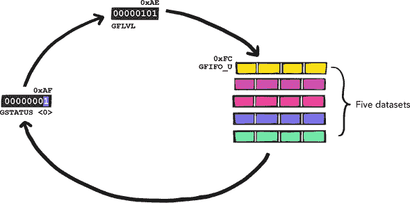

这个循环会一直重复，直到`GSTATUS`寄存器的值指示没有剩余的有效数据可读取——第一个条件失败，执行继续在`else`子句中。当数据读取周期完成时，开始处理这些数据。

##### 处理和解码手势数据

您的 APDS9960 插件中的方法区分了*处理*和*解码*手势数据（图 9.22）。

##### 图 9.22。`processData`对数据进行算术运算；`decodeData`从计算结果中派生出手势方向并触发事件。最后，在实例上重置手势数据对象，以便它准备好收集下一个手势的数据。

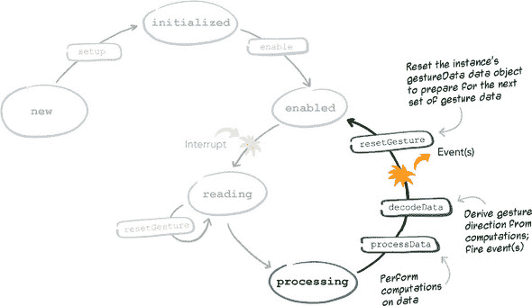

在处理步骤中，会发生数学运算。完整的原始样本集合被过滤，只包括每个方向上的值都超过定义的阈值常数的读取值。然后，在每个轴（上下和左右）上计算读取值随时间变化的比率（变化量）。

##### 列表 9.13。处理手势数据

```
APDS9960.prototype.processGesture = function () {
  const raw = this.gestureData.raw;
  const directionDelta = function (el1, el2, dir1, dir2) {                 *1*
    var el2r = ((el2[dir1] - el2[dir2]) * 100) / (el2[dir1] + el2[dir2]);
    var el1r = ((el1[dir1] - el1[dir2]) * 100) / (el1[dir1] + el1[dir2]);
    return el2r - el1r;
  };
  const exceedsThreshold = raw.filter(sample => {                          *2*
    return (sample.up > GESTURE_THRESHOLD_OUT &&
            sample.down > GESTURE_THRESHOLD_OUT &&
            sample.left > GESTURE_THRESHOLD_OUT &&
            sample.right > GESTURE_THRESHOLD_OUT);
  });
  if (!exceedsThreshold.length || raw.length < 4) {                        *3*
    // If not enough data or none exceed threshold, nothing to do
    // This will result in gesture data being ignored and discarded
    return false;
  }

  const first = exceedsThreshold[0];
  const last = exceedsThreshold[exceedsThreshold.length - 1];
  const deltas = {
    upDown: directionDelta(first, last, 'up', 'down'),
    leftRight: directionDelta(first, last, 'left', 'right')
  };
  this.gestureData.deltas = deltas;                                        *4*
};
```

+   ***1* 通过比较不同方向读取值的比率来计算变化量**

+   ***2* 过滤样本，只包括那些读取值超过阈值的样本**

+   ***3* 确保存在有效数据可处理**

+   ***4* 最终，计算出一些变化量**

最后，在下述列表中的解码步骤将`processGesture`方法计算出的变化量转换为整体手势的派生方向。然后它触发相应的事件——`上`、`下`、`左`或`右`——或者，如果它无法确定一个清晰的单个手势方向，它将触发一个通用的`gesture`事件，如下一列表所示。

##### 列表 9.14。解码手势数据

```
APDS9960.prototype.decodeGesture = function () {
  const deltas = this.gestureData.deltas;
  const verticalMotion = Math.abs(deltas.upDown);
  const horizontalMotion = Math.abs(deltas.leftRight);
  if (verticalMotion > GESTURE_SENSITIVITY) { // Determine meaningful
   movement on vertical axis
    this.gestureData.valid = true;
    this.gestureData.movements.vertical = true;
    this.gestureData.movements.up = (deltas.upDown >= 0);
    this.gestureData.movements.down = (deltas.upDown < 0);
  }
  if (horizontalMotion > GESTURE_SENSITIVITY) { // Determine meaningful
   movement on horizontal axis
    this.gestureData.valid = true;
    this.gestureData.movements.horizontal = true;
    this.gestureData.movements.left = (deltas.leftRight >= 0);
    this.gestureData.movements.right = (deltas.leftRight < 0);
  }
  if (this.gestureData.valid) {
    if (verticalMotion > horizontalMotion) {
      this.gestureData.direction = (this.gestureData.movements.up) ?
        'up' : 'down';
    } else {
      this.gestureData.direction = (this.gestureData.movements.left) ?
      'left' : 'right';
    }
  }
  // Emit a directional event if there is a direction
  if (this.gestureData.direction) {
    this.emit(this.gestureData.direction, this.gestureData);
  }
  // Always emit a generic gesture event, even if decoding failed
  this.emit('gesture', this.gestureData);
};
```

这样，插件的代码就完成了！

#### 9.3.3\. 集成手势传感器和远程开关

你现在可以编辑 index.js 来添加一些快速测试代码，如下所示。在你进行大组合步骤——连接远程开关之前，你可以测试不同的滑动方向事件并将它们记录到控制台。

##### 列表 9.15\. APDS9960 测试驱动

```
const five = require('johnny-five');
const Tessel = require('tessel-io');
const Gesture = require('./APDS9960')(five);

const board = new five.Board({ io: new Tessel() });

board.on('ready', () => {
  const gesture = new Gesture({ pin: 'A2'});
  gesture.on('right', () => console.log('right'));
  gesture.on('left', () => console.log('left'));
  gesture.on('up', () => console.log('up'));
  gesture.on('down', () => console.log('down'));
});
```

在 Tessel 上运行 index.js (`t2 run index.js --lan`) 并尝试将你的手移至手势传感器上方——最佳距离大约八英寸（20 厘米）。

##### 结合 APDS9960 和 RemoteSwitch

你已经拥有了使用手势传感器和 `RemoteSwitch` 控制单个开关开/关组合的原料。例如，你可以做如下所示的事情。

##### 列表 9.16\. 使用手势传感器控制单个开关的 APDS9960

```
const five = require('johnny-five');
const Tessel = require('tessel-io');
const Gesture = require('./APDS9960')(five);
const RemoteSwitch = require('./RemoteSwitch')(five);

const board = new five.Board({ io: new Tessel() });

board.on('ready', () => {
  const gesture = new Gesture({ pin: 'A2'});
  const switch1 = new RemoteSwitch({ pins : { on: 'A3', off: 'A4' } });
  gesture.on('right', () => switch1.on());
  gesture.on('left', () => switch2.on());
});
```

到目前为止，一切顺利。但最初提出的目标之一不是能够一次性打开或关闭所有开关吗？好消息是，你即将实现这一点。另一个消息是，你需要再迈出一步才能实现这一点。

##### 协调多个开关的挑战

`RemoteSwitch` 的设计考虑到了需要错开开关激活的需求：它将当其中一个按钮已经激活时到达的“命令”排队，将它们放入一个 FIFO 队列，并在不再激活时执行下一个排队的命令。此外，它将在完成一个命令后调用提供的回调函数。因此，你可以放心地执行以下列表中的代码，不用担心开关会相互干扰。

##### 列表 9.17\. 由 `RemoteSwitch` 实例管理的按钮对有一个队列

```
switch1.on();   // Happens right away
switch1.off();  // Gets queued
switch1.on();   // Gets queued
switch1.off(() => console.log('hi!')); // Gets queued; logs 'hi!' to the
 console when it's done
```

然而，遗憾的是，存在一个缺点：每个开关对之间的排队是单独管理的。不同的 `RemoteSwitch` 实例之间互不相识；请参见以下列表。

##### 列表 9.18\. 每个 `RemoteSwitch` 都有自己的队列

```
switch1.on();   // Happens right away
switch1.off();  // Gets queued in `switch1`'s queue
switch2.on();   // `switch2`'s queue is empty...happens right away (uh oh)
switch3.on();   // `switch3`'s queue is empty...happens right away (oh dear)
```

很可能 `switch2` 和 `switch3` 会尝试在 `switch1` 仍然忙碌时激活——相当于同时按下遥控器上的多个按钮。这可能不是什么好事。`RemoteSwitch` 是这样设计的，每个开关对之间互不相识。这是一个很好的硬件抽象的提示，但我们的现实是，多个开关对正在共享单个遥控设备上的同一发射器。

##### 使用集合控制多个开关

哎呀，项目中的另一个转折点。你可以拆分 `RemoteSwitch` 并重新编写它以处理多组开关及其混合队列。或者，你可以在应用程序特定逻辑中编写一些管理多个开关对的代码。

这两种选择都有缺点。在不破坏现有 API 或过度复杂化它的前提下适应 `RemoteSwitch` 会很麻烦（如果您是从零开始，这个选项看起来会更吸引人）。将相关逻辑直接放入主应用程序代码中会显得很丑陋且分散注意力。经过一番思考，我决定采用一种实用——虽然有些拼凑——的第三种方案，该方案利用了 Johnny-Five 的 `Collection` 混合。

内置 *集合类* 如 `Motors`（您在第六章中看到过）利用 Johnny-Five 的 `Collection` 混合，该混合提供了在单个容器-like 对象内管理多个组件的功能。您可以使用此混合提供的某些功能来创建一个可以管理多个 `RemoteSwitch` 对象的组件。完成后，您将能够在主应用程序模块中编写如下列表所示的代码。

##### 列表 9.19\. 使用 `RemoteSwitches`

```
const switches = new RemoteSwitches([
  new RemoteSwitch({ pins : { on: 'A3', off: 'A4' } }),
  new RemoteSwitch({ pins: { on: 'A5', off: 'A6' } }),
  new RemoteSwitch({ pins: { on: 'A7', off: 'B0' } })
]);
// You can act on all switches at once...
switches.on(); // Turn all switches on
// Or a single switch...
switches.off(1); // Turn the second switch off
```

在您的当前工作目录中创建一个名为 RemoteSwitches.js 的文件，并添加以下代码。

##### 列表 9.20\. `RemoteSwitches`

```
const util    = require('util');

module.exports = function (five, RemoteSwitch) {
  return (function () {
    function RemoteSwitches (opts) {
      if (!(this instanceof RemoteSwitches)) {
        return new RemoteSwitches(opts);
      }
      // RemoteSwitch is the "type" of each individual component object
      // that will be managed by this RemoteSwitches instance
      Object.defineProperty(this, 'type', { value: RemoteSwitch });
      // Make it go: register and initialize the collection component objects
      five.Collection.call(this, opts);
      this.isActive = false; 1((CO11-1))
      this.queue = [];
    }
    // Use the Collection mixin
    util.inherits(RemoteSwitches, five.Collection);

    // The nuts-and-bolts logic for (de-)activating a given switch
    // Note that this is not on the prototype (inaccessible externally)
    const write = function (whichSwitch, turnOn) {
      if (this.isActive) {
        this.queue.push([whichSwitch, turnOn]);
        return;
      }
      this.isActive = true;
      // An individual RemoteSwitch object's "toggle" method
      // is invoked
      whichSwitch.toggle.call(whichSwitch, turnOn, () => {
        this.isActive = false;
        if (this.queue.length) {
          write.apply(this, this.queue.shift());
        }
      });
    };

    // Prototype methods take optional `idx` argument to designate which
    // switch to activate. If not provided, all switches will be affected.
    RemoteSwitches.prototype.toggle = function (idx, turnOn) {
      if (typeof idx !== 'undefined' && this[idx]) {
        write.call(this, this[idx], turnOn);
      } else {
        this.each(whichSwitch => write.call(this, whichSwitch, turnOn));
      }
    };

    RemoteSwitches.prototype.on = function (idx) { this.toggle(idx, true); };
    RemoteSwitches.prototype.off = function (idx) { this.toggle(idx, false); };
    return RemoteSwitches;
  }());
};
```

#### 9.3.4\. 整合整个项目

所有组件现在都已准备就绪，可以创建一个综合项目，将软件和电路模块结合成一个手势控制遥控器。

按照如图 9.23 所示的方式组合两个电路——遥控和手势。光电耦合器的输出端应连接到遥控器的按钮触点。请注意，光电耦合器现在连接到 Tessel 的不同引脚，以腾出 APDS-9960 的空间。

##### 图 9.23\. 显示 APDS-9960 分线板和按钮/光电耦合器电路组合的布线图。

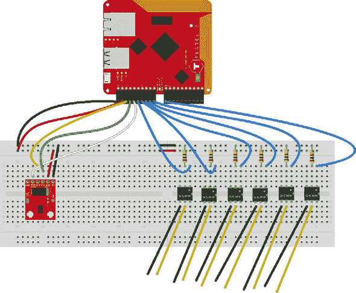


##### 使用全尺寸面包板

如果您使用的是全尺寸面包板，如图 9.23 所示，请确保按照板长中部的说明连接电源轨：电源轨连接在中部有断裂。

您可以将全尺寸面包板想象成两个半尺寸面包板拼接在一起。


##### 最终确定软件

您的 `gesture` 目录现在应包含以下内容：

+   ***APDS9960.js_*—** 手势传感器插件

+   ***RemoteSwitch.js*—** (单个) 远程开关插件

+   ***RemoteSwitches.js*—** 远程开关集合

+   ***index.js*—** 应用逻辑

为了为 APDS-9960 连接腾出空间，光电耦合器的连接必须向下移动几个引脚（参见图 9.23）——这些更新的引脚编号在 index.js 的最终版本中已考虑，如下一列表所示。

##### 列表 9.21\. 在 index.js 中整合所有内容

```
const five = require('johnny-five');
const Tessel = require('tessel-io');
const Gesture = require('./APDS9960')(five);
const RemoteSwitch = require('./RemoteSwitch')(five);
const RemoteSwitches = require('./RemoteSwitches')(five, RemoteSwitch);    *1*

const board = new five.Board({ io: new Tessel() });

board.on('ready', () => {
  const gesture = new Gesture({ pin: 'A2'});
  const switches = new RemoteSwitches([
    new RemoteSwitch({ pins : { on: 'A3', off: 'A4' } }),
    new RemoteSwitch({ pins: { on: 'A5', off: 'A6' } }),
    new RemoteSwitch({ pins: { on: 'A7', off: 'B0' } })
  ]);
  gesture.on('up', () => switches.on());                                   *2*
  gesture.on('down', () => switches.off());
  gesture.on('right', () => switches.on(1));
  gesture.on('left', () => switches.off(1));
});
```

+   ***1* 需要 RemoteSwitches 模块**

+   ***2* 您当然可以更改哪些手势对应哪些开关行为。**

这是一项大量工作！但这里有一些稳固的结果。你无疑在你的电子黑客经验之柱上刻下了几个胜利的凹槽。当然，到处都是电线，这是我们稍后将要解决的问题，当我们探讨不同外形尺寸的项目外壳时。

说到外形尺寸，你一直非常关注 Arduino Uno 和 Tessel，两者都使用 Johnny-Five。但 JavaScript 控制的硬件选项还有很多。是时候认识一些其他玩家了。

### 摘要

+   电池供电、低压消费电子产品通常可以被重新用于你自己的项目中的部件和组件（前提是你小心操作！）。光电耦合器组件可以帮助隔离这些电子产品中的电路与你的微控制器电路。

+   发明需要独创性，但也需要坚持和耐心。它通常需要创造性思维来解决意外的问题。

+   数据表可能数据密集到令人难以承受，但它们是至关重要的，随着时间的推移，你会学会如何快速在其中找到关键信息——比如内存寄存器地址和配置步骤。

+   即使是个人爱好项目，也可以从有组织的开发方法中受益：确定目标和范围、研究、原型设计和迭代。

+   将行为封装成模块化、组件级别的块是良好的开发实践，特别是对于抽象和跨平台支持。使用 Johnny-Five，你可以创建组件插件，你也利用了`Collection`混入。
