## 第四部分\. 在其他环境中使用 JavaScript 与硬件

本书的这一部分探讨了你可以使用 JavaScript 控制硬件的其他环境，并展望了未来。

你将从第十章开始，研究高度受限设备上的 JavaScript 和类似 JavaScript 的环境，使用 Espruino Pico 和 Kinoma Element 设备进行一些实验原型设计。

第十章 10 和第十一章 11 都介绍了一套可重复使用的步骤，用于快速了解新平台。在第十一章 11 中，我们将把注意力转向更强大的硬件：具有板载 I/O 功能的一般用途单板计算机（SBC）。你将使用 Raspberry Pi 3 和 BeagleBone Black 开始，并将一些 Johnny-Five 实验适配到这两个平台上。

第十二章提供了物联网生态系统其他部分的品尝，并检查了在网页浏览器内可能实现的内容。你将使用云服务打包和部署 Johnny-Five 应用程序到 BeagleBone Black，并使用 Espruino Puck.js 设备探索 Web 蓝牙和物理网络的尖端。

当你完成本书的这一部分时，你的 JavaScript on Things 工具箱将装备齐全，你将准备好进入充满勇气和灵感的 JavaScript 和嵌入式系统世界。

## 第十章\. JavaScript 和受限硬件

*本章涵盖*

+   JavaScript 能力的嵌入式硬件平台与主机-客户端和单板计算机（SBC）平台相比

+   熟悉新开发平台的步骤

+   检查两个代表性的嵌入式 JavaScript 平台：Espruino Pico 和 Kinoma Element

+   使用 Espruino Pico 开发项目

+   使用 Nokia 5110 LCD 显示屏和 Espruino `Graphics`库制作文本和形状

+   重复使用可靠的组件：以新的方式在不同的平台上使用 BMP180 多传感器和 HMC5883L 指南针

+   对 Kinoma Element 的案例研究视角

在本书的前半部分，通过使用连接的 Arduino Uno——一个**主机-客户端**设置——展示了电子基础知识。然而，在过去的几章中，你已经遇到了 Tessel 2，它具有在 OpenWrt 操作系统内原生运行 Node.js 的能力——这是一个**单板计算机**（SBC）设置。

现在我们将探讨第三类 JavaScript 控制的平台：具有对 JavaScript（或通常是类似 JavaScript 的东西）的原生支持的受限嵌入式硬件。为了在如此有限的硬件资源上完成这一壮举，这些平台往往依赖于高度优化的自定义 JavaScript 引擎。

这些设备正在快速发展，进入（和退出）市场的速度比印刷品能捕捉到的要快。就在此刻，Espruino 平台——我们很快就会看到 Espruino Pico——似乎保持着强劲的动力 (图 10.1)。Kinoma Element——也将在我们的调查中——已经处于预发布状态有一段时间了。尽管 Kinoma 的嵌入式运行时被吹捧为支持大多数 ECMAScript 6 功能的早期先驱，但 Element 产品可能最终不会起飞。由于变化如此之快，很难说。

##### 图 10.1\. 两个嵌入式 JavaScript 平台：Espruino Pico 和 Kinoma Element

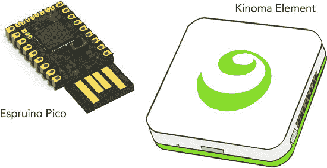

对于将物联网硬件和软件信息印刷在纸上的情况，其过时几乎是肯定的，这就是为什么本章更多地关注嵌入式 JavaScript 平台上的常见任务和谜题。具体产品和平台来来去去，但有一些常见的研发步骤可以帮助你快速熟悉你选择的产品。


**对于本章，你需要以下物品：**

+   1 个 Espruino Pico

+   1 个 Kinoma Element

+   1 个 USB 微型线缆

+   18 个（每条 9 个）0.1″ 阳性断开式引脚

+   1 个 USB 2.0 A 到 USB A 雌性（也称为 USB 延长线）线缆

+   1 个 Adafruit BMP180 I²C 多传感器扩展板

+   1 个诺基亚 5110 84x48 LCD 显示模块

+   1 个 100 V 电阻

+   1 个 Adafruit HMC5883L 磁力计（指南针）扩展板

+   1 个全尺寸面包板

+   跳线

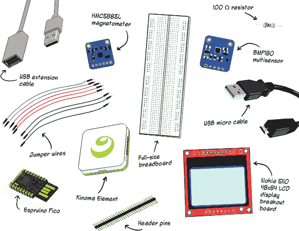


### 10.1\. Espruino Pico 平台

Espruino Pico 的内存和计算能力比 Tessel 2 要少。没有 WiFi 和 USB 外设支持，那么为什么还要使用它呢？因为它在其它方面表现出色：它更便宜，它更小巧，它更可靠，它节能——这些都是低功耗嵌入式平台的标志。

*Espruino* 既可以描述硬件家族本身，也可以描述预装在 Espruino 设备上的固件运行时解释器。Espruino-解释器支持大多数 JavaScript 功能，但并非全部。例如，你不能省略分号，正则表达式也不受支持。

很重要要区分 JavaScript 和 JavaScript 式的 Node.js：这不是 Node.js，所以你不能使用 Johnny-Five 或任何 npm 模块。

相反，Espruino 提供了自己的 JavaScript API 用于与硬件 I/O 交互 ([www.espruino.com/Reference#software](http://www.espruino.com/Reference#software)). 你现在已经有足够的经验，API 的某些方面可能听起来很熟悉——例如，有一个 `analogRead` 函数，它接受一个引脚号作为参数。还有 Espruino 特有的模块，它们封装了特定电子组件的行为，正如你将看到的。

在更深入地检查 Pico 之前，你需要将其设置好，并运行一个 Hello World LED 闪烁脚本。

#### 10.1.1\. 设置 Pico

Pico 需要焊接在排针上（图 10.2）。您的 Pico 可能附带排针，如果没有，您将需要两根九针的排针。

##### 图 10.2。Pico 有 18 个引脚（每行 9 个），间距为 0.1 英寸——与面包板兼容。它们需要焊接在排针上。Pico 板的一端设计成可以直接插入 USB 端口。

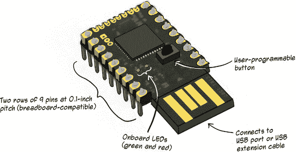

Pico 可以直接插入 USB 端口。一些版本的 Pico 有一个额外的 USB 微型连接，但您可能只能使用 USB A 连接。这可能很方便，因为您可以直接将 Pico 插入电脑，但如果您想在面包板上使用 Pico（当您想要尝试任何 I/O 引脚时这是必要的）就会有点棘手。Pico 设计成连接到 USB A 母接头。您可以使用市场上销售的 USB 延长线来获得 Pico 需要的 USB A 到 USB A 母接头连接（图 10.3）。

##### 图 10.3。您可以使用 USB 延长线将 Pico 连接到您的电脑，使 Pico 可以放置在面包板上。Pico 的 USB 端插入 USB A 母接头。

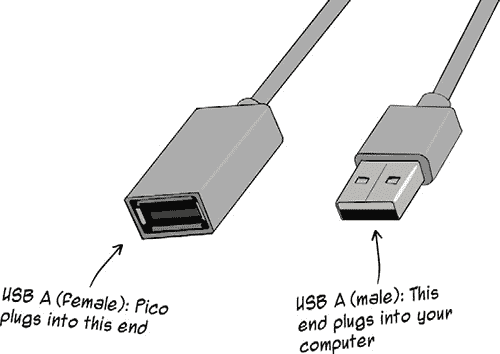

Espruino 家族的发展变化非常快，在这里包括详尽的设置说明似乎是愚蠢的。相反，请访问[`espruino.com`](https://espruino.com)开始使用。

这些是基本步骤，在将 Pico 插入 USB 后：

1.  为您的平台准备 Pico：

    1.  Mac 用户可能不需要做任何事情。

    1.  Windows 用户可能需要驱动程序。

    1.  Linux 用户可能需要调整权限。

1.  安装 Espruino IDE Chrome 应用（如果您还没有安装 Chrome 浏览器，还需要安装 Chrome 浏览器）。

1.  启动 Chrome 应用，连接并更新 Pico 的固件。

为了实验 Pico，您将使用 Espruino 的基于 Web 的 IDE（Chrome 应用）——这意味着您将在 Chrome 应用内连接到、与 Pico 通信并部署代码到 Pico。

##### 图 10.4。Espruino Chrome 应用 IDE

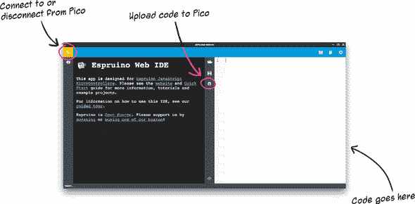

在应用界面的左侧，您会看到一个类似终端的控制台区域。一旦连接到 Pico，您可以直接在这里输入表达式，有点像 Node.js 解释器或 Johnny-Five REPL。右侧是一个可以编写脚本的区域。

#### 10.1.2. Hello World LED 闪烁

让我们通过 LED 闪烁来试一试。在这个实验中，您将使用 Pico 的板载 LED 之一，因此您可以直接将 Pico 插入 USB 端口，或者使用 USB 延长线将其放在面包板上：选择由您决定。

Espruino 脚本在全局级别提供了一系列变量，这些变量与平台功能和引脚相关。这包括用于 Pico 内置红色和绿色 LED 的变量`LED1`和`LED2`（图 10.5）。

##### 图 10.5\. 此实验将使 Pico 的板载 LED（一个红色，一个绿色）交替闪烁。LED 的访问通过全局变量 `LED1` 和 `LED2` 提供。

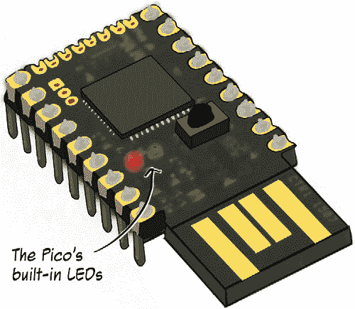

启动 Espruino IDE Chrome 应用程序并连接到 Pico。将以下列表中的代码输入屏幕的代码组合区域（右侧）并点击中间的发送到 Espruino 图标（图 10.6）。

##### 列表 10.1\. 点亮 Pico 的 LED

```
var ledStatus = false;
function toggleLED () {
  if (!ledStatus) {
    digitalWrite(LED1, 1);               *1*
    digitalWrite(LED2, 0);
  } else {
    digitalWrite(LED1, 0);
    digitalWrite(LED2, 1);
  }
  ledStatus = !ledStatus;
  setTimeout(toggleLED, 500);            *2*
}

toggleLED();                             *3*
```

+   ***1* LED1（板载红色 LED）和 LED2（绿色）在 Pico 脚本中可用。**

+   ***2* 使用 setTimeout 每隔 500 毫秒调用自身函数**

+   ***3* 开始切换**

##### 图 10.6\. 将 LED-闪烁代码输入到 Espruino IDE 中（字体大小增加以提高可见性）

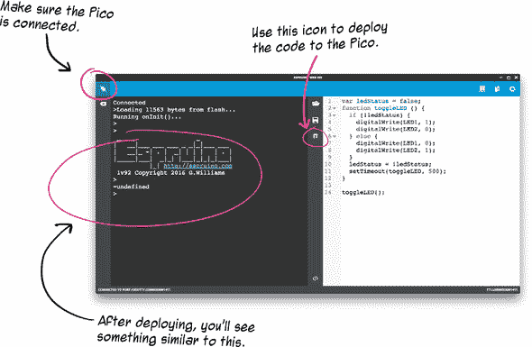

此示例使用 Espruino 的 `digitalWrite` 函数交替设置 LED 为高电平和低电平。一旦将代码部署到 Pico 上，你应该看到 Pico 的红色和绿色 LED 依次闪烁。你还会在 IDE 窗口的左侧看到一些输出。

### 10.2\. 了解新平台

现在你已经动手实践了，让我们回顾一下。你是如何知道 Pico 有两个内置 LED（红色和绿色），以及你是如何知道存在变量 `LED1` 和 `LED2` 的？到现在为止，像 `digitalWrite` 这样的函数名称表示向数字输出写入逻辑电平这样的约定可能看起来很合理。但它可能仍然显得有些神奇或随机。从哪里开始呢？

当面对一个新的平台时，你可以应用一系列侦探步骤来让你迅速上手。你现在将解决这些问题来了解 Pico，但你也可以在未来重新使用它们来评估不同的嵌入式平台：

1.  发现平台的核心特性

1.  查找引脚图或硬件图

1.  了解配置和开发工作流程

1.  查找示例和简单教程，并动手实践

1.  使用参考 API 文档

让我们看看这些中的每一个。

#### 10.2.1\. 发现平台的核心特性

在你甚至接触到新的开发板或平台之前，你可能想要对其整体功能有一个大致的了解。

通常，关键细节会在制造商或供应商的网站上总结。在 Pico 的情况下，Pico 的网页上列出的特性列表为我们提供了信息：它是一个 3.3 V 设备，外形小巧（33 毫米 x 15 毫米），由 STM32F401CDU6 微控制器供电（不，我的猫并没有只是走过我的键盘；ST——制造商——有非浪漫但非常精确的命名规范），并且使用 ARM Cortex M4 处理器（[www.espruino.com/Pico](http://www.espruino.com/Pico)）。

在关键特性列表中还有关于功耗的要点（图 10.7）。即使这里引用的具体数字没有给你留下深刻印象，你也能看出他们正在强调其节能特性。

##### 图 10.7\. Espruino Pico 的关键特性，列在 Espruino 的网站上


该设备上有 22 个 GPIO 引脚，包括 3 个 I²C 接口和 3 个（硬件）SPI 接口——对于这么小的设备来说，这已经很不错了。如果你点击进入微控制器的数据手册（[`mng.bz/i7r8`](http://mng.bz/i7r8)），你可以看到这要归功于 STM32F401D/E 系列微控制器（首页有关于通信接口的部分）。

有几个其他特性也值得注意。一个是向 5 V 逻辑的普遍性致敬——“所有 GPIO 都能承受 5 伏（Arduino 兼容）”——这对于我们这些经常在这两者之间切换的人来说是一种善意。输出始终是 3.3 V，但 5 V 输入不会让 Pico 心烦。

另一个值得注意的细节是：尽管 18 个引脚（两排各 9 个）的间距为面包板标准的 0.1 英寸，但一个短端上的 8 个引脚间距仅为 0.05 英寸（图 10.8）。在探索中你不会使用这些引脚，因为它们不容易插入面包板，但你可以获得物理垫片来使其成为可能。

##### 图 10.8. Pico 的 8 个 I/O 引脚间距为 0.05 英寸：太窄，无法插入面包板。

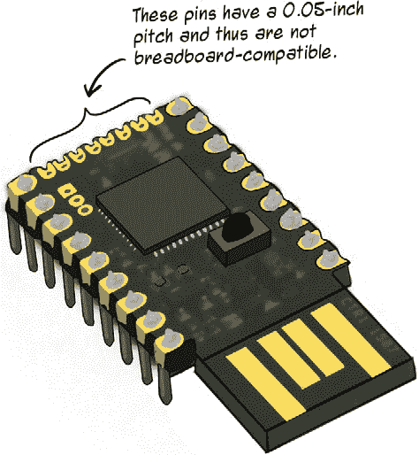

当然，这个特定功能列表没有提到这是一个由 JavaScript 驱动的设备，这确实很重要，但你可以从 Espruino 的主页（[www.espruino.com](http://www.espruino.com)）中清楚地看出这一点。

| |
| --- |

**ARM Cortex M 微控制器和嵌入式 JavaScript**

Espruino Pico 和 Kinoma Element 都基于 ARM Cortex M 系列的微控制器。正如 ATmega 微控制器被用于各种 Arduino 兼容的主机-客户端类板（如 Arduino Uno 及其同类），ARM Cortex M 微控制器在包括 Element 和 Pico 在内的嵌入式平台类别中非常受欢迎。ARM 的网站声称，已有数十亿个设备使用了 Cortex M 系列的产品。

Cortex M 系列的 32 位微控制器在低功耗下（大多数预测性并不便宜）优于 8 位 ATmegas。嵌入式 JavaScript（或类似 JavaScript）的运行时需要比 8 位 ATmega 提供的更多处理能力。

随着你继续尝试新的平台，你可能会继续遇到 Cortex M 变体。

| |
| --- |

另一个值得了解的是平台的经济和许可模式。硬件或软件（或两者）是开源的还是专有的？如果你考虑在商业上使用平台、扩展硬件或软件，或以其他方式为平台做出贡献，这可能很重要。（Espruino 平台是完全开源的。）

#### 10.2.2. 寻找引脚图

也许是因为我对地图的喜爱，但找到和分析板上的引脚图通常是事情真正变得清晰的时候。这些图显示了哪些引脚可以做什么：通信接口、PWM、电源引脚等等。

从 Pico 的图示 (图 10.9) 中，我们可以注意几个要点（在 Espruino 的 Pico 文档页面查看更大尺寸的详细内容：[www.espruino.com/Pico](http://www.espruino.com/Pico)）。首先，引脚编号不是连续的；它们跳来跳去，你会在你将使用的两个侧面都找到 A 和 B 引脚。你还可以看到几乎每个 GPIO 引脚都支持 PWM。最后，你可以看到哪些引脚具有硬件支持的 I²C 和 SPI，以及哪些可以支持 ADC（模拟到数字转换）。

##### 图 10.9\. Espruino Pico 引脚图细节


合理的整体引脚布局（硬件设计）和高质量的引脚图可以带来更好的开发体验。

#### 10.2.3\. 了解配置和工作流程

代码是如何编写的？如何部署的？设备是如何管理、配置和更新的？它是否支持你的操作系统？配置过程是否令人沮丧且繁琐？这可能是一个持续头痛的迹象。

在 Pico 的情况下，我们采取了推荐的路线，使用 Chrome 应用 IDE。这可能很方便——代码编写、设备管理和部署都在一个地方，但如果你是那种对自家的编辑器或 IDE 写 JavaScript 有偏爱的人，这可能会让你抓狂。

获取高级软件结构的感觉：是否有插件或其他模块化组件？是否有面向硬件的通用 API？Espruino 两者都有。

#### 10.2.4\. 寻找示例和教程

接下来是逐步通过一些 Hello World 示例，你已经用 Pico 做过这个了。当实验一个新的平台时，找出完成一些常见任务的方法，比如闪烁 LED、从模拟传感器读取数据、与显示屏一起工作以及控制 I²C 设备。理想情况下，你将在这一步亲自动手，感受在开发过程中与平台交互的真实感觉。

一旦你理解了整体的大致情况，并看过（尝试过）一些应用示例，查阅参考文档可以帮助你填补细节。

#### 10.2.5\. 使用参考 API 文档

如果你浏览 Espruino 的 API 文档（10.10），你会看到熟悉的 JavaScript 类——`String`、`Math`、`Boolean`、`JSON`——以及与硬件相关的 Espruino 特定类：`I2C`、`SPI`、`WLAN`。《全局》部分列出了 Espruino 脚本可用的硬件函数，如 `digitalWrite()`，以及一些标准的 JavaScript 全局功能，如 `setTimeout()` 和 `eval()`。

还有一个页面列出了 Espruino 可用的模块以及如何使用它们 ([www.espruino.com/Modules](http://www.espruino.com/Modules))。随着我们对 Pico 的深入了解，我们将进一步探讨这一点。

当你更多地了解一个平台并积累经验时，你会发现自己在从寻找现成示例、概念和教程的学习阶段，过渡到参考阶段，在这个阶段你正在寻找如何完成特定任务的详细信息。

##### 图 10.10\. Espruino 的 API 文档在[www.espruino.com/Reference](http://www.espruino.com/Reference)

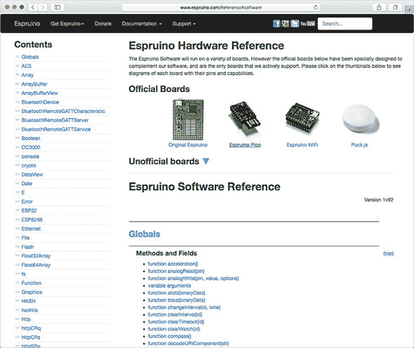

### 10.3\. 在 Pico 上进行实验

接下来，你将尝试使用 Pico 进行一些实验。首先，你将重新访问 BMP180 天气多传感器，但你会将其与 Nokia 5110 LCD 显示组件结合使用，构建一个外观漂亮的、自包含的迷你气象站。

#### 10.3.1\. Pico 和 BMP180 多传感器


##### 你需要什么


+   1 Espruino Pico

+   1 全尺寸面包板

+   1 USB 延长线

+   1 BMP180 扩展板

+   跳线


由于你正在使用 Web IDE，使用 Espruino 模块与使用 Espruino 代码中的`require()`语句一样简单，只需指定你想要的模块名称。这些模块为不同类型的组件提供了封装支持。而且，太好了，有一个现有的模块用于你信任的 BMP180 温度和压力多传感器。该模块被称为`BMP085`，因为它也与类似的 BMP085 传感器兼容。一旦导入模块，你就可以使用它提供的 API 与 BMP180 传感器进行交互。让我们看看这会是什么样子。

##### BMP085 Espruino 模块

这个实验将记录从 I²C BMP180 传感器获取的当前温度（摄氏度）和压力（帕斯卡）。

从 BMP180 读取数据的代码并不复杂，正如你在列表 10.2 中看到的。它使用了公开的`I2C1`全局变量来配置一个 I²C 接口，然后将其传递给`BMP085`模块的`connect`方法。

正如你所看到的，Johnny-Five 提供了几个用于执行连续、周期性操作（如传感器读取）的结构，例如`board.loop`。但在这里你并没有使用 Johnny-Five。相反，你将遵循 Espruino 的约定，它使用`setInterval`进行重复的 I/O 操作。

##### 列表 10.2\. 使用 BMP085 Espruino 模块

```
I2C1.setup({ scl: B6, sda: B7});                                *1*
var bmp = require('BMP085').connect(I2C1);                      *2*
setInterval(function () {
  bmp.getPressure(function (readings) {                         *3*
    console.log('Pressure: ' + readings.pressure + ' Pa');
    console.log('Temperature: ' + readings.temperature + ' C');
  });
}, 1000);                                                       *4*
```

+   ***1* 使用 B6 引脚作为 SCL 和 B7 引脚作为 SDA 设置 Pico 的第一个 I²C 接口（I²C1）**

+   ***2* 需要 BMP085 模块并调用其 connect 函数，使用 I²C1 接口**

+   ***3* 实例化的 bmp 对象的 getPressure 方法是异步的；注册一个回调...**

+   ***4* 每秒（1000 毫秒）执行一次传感器读取**

你如何知道 B6 和 B7 引脚分别支持 I²C SCL 和 SDA？从引脚分配(图 10.11)中可以看出。

##### 图 10.11\. Espruino Pico 和 BMP180 传感器的接线图

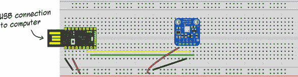

##### 构建 BMP180 电路

为了构建这个，你需要在全尺寸面包板上放置 Pico 并使用 USB 延长线。构建图 10.11 中所示的电路。

目前，设置可能看起来有点混乱。“为什么要把 BMP180 传感器放在 Pico 那么远的地方？”你可能合理地想知道。这里有一个方法：产生的间隙将允许在未来的实验中扩展此电路以容纳诺基亚 5110 LCD 组件。

| |
| --- |

##### 全尺寸面包板连接

如果这是你第一次使用全尺寸面包板，请注意，从电气连接的角度来看，它实际上是由两个半尺寸面包板首尾相连组成的。全尺寸面包板的一个问题是，电源轨在板的中部有断开连接（图 10.12）。

| |
| --- |

##### 图 10.12\. 不要忘记！全尺寸面包板上的电源轨在板的中部有断开连接。

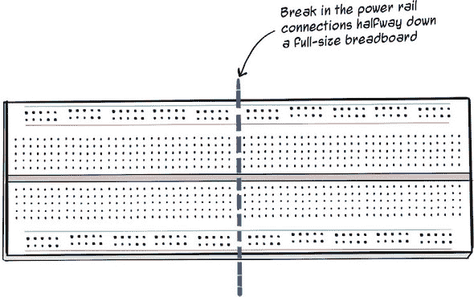

##### 部署代码

将 代码清单 10.2 中的代码输入到 IDE 的右侧，然后点击发送到 Espruino 的向上箭头图标以在 Pico 上执行代码。记录的压力和温度将出现在 IDE 窗口的控制台/终端（左侧）侧（图 10.13）。

##### 图 10.13\. 一旦将 BMP180 脚本上传到 Pico，你应该每秒在屏幕左侧看到一次输出日志。

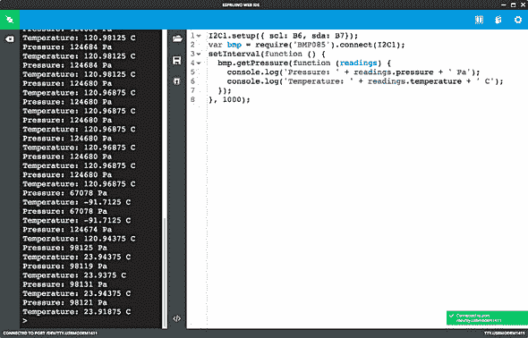

#### 10.3.2\. Pico 和诺基亚 5110 LCD

| |
| --- |

##### 你需要


+   1 个 Espruino Pico

+   1 个诺基亚 5110 48x84 LCD 开发板

+   1 个全尺寸面包板

+   1 个 100 V 电阻

+   跳线

| |
| --- |

诺基亚 5110 48x84 像素显示屏（图 10.14）最初用于流行的诺基亚 51xx 系列手机，这些手机始于 20 世纪 90 年代末（顺便说一句，它们是很好的手机——它们以耐用性、出色的电池寿命和易用性而闻名）。诺基亚 5110 LCD 单元在网上可以以低至 6 美元的价格找到，但它们在每件约 10 美元的地方更容易找到。它们是很好的小部件：48x84 像素并不是无限的面积，但它比我们迄今为止看到的 16x2 多得多。有空间绘制、动画和做有趣的事情。

##### 图 10.14\. 诺基亚 5110 LCD 具有由其飞利浦半导体 PCD8544 驱动器提供的 48x84 像素分辨率和 SPI 接口。显示屏在此处是正立的。

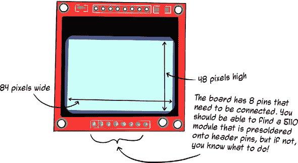

该显示屏由名为 PCD8544 的飞利浦半导体驱动器控制，这种组件通常具有那种不令人难忘的方式。PCD8544 为显示屏提供 SPI 接口，而且（太好了！）还有一个 Espruino 模块用于此控制器。

你将首先使用诺基亚 5110 独自创建一个视觉倒计时计时器，然后你将结合 BMP180 来制作一个小型气象站。

| |
| --- |

**诺基亚 5110/PCD8544 引脚图**

不同的 PCD8544/Nokia 5110 模块有不同的引脚图！在尝试遵循图 10.15 中的布线图之前，请检查你板上的引脚标记。图 10.15 的连接应该印在板上。

电路图中所使用的布局基于 SparkFun 产品页面上可用的 5110 变体([`mng.bz/IId1`](http://mng.bz/IId1))，连接方式如图所示。值得注意的是，SparkFun 模块的引脚排列与 Espruino 网站上“Pico LCD 显示 Hello World”教程中假设的引脚排列不同([`mng.bz/604s`](http://mng.bz/604s))，但 SparkFun 记录的布局似乎更为常见。

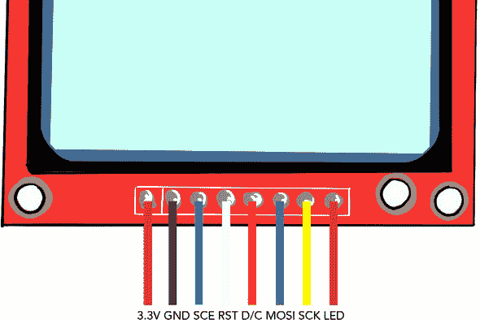

本章中的接线图基于诺基亚 5110 的 SparkFun 版本，并假设引脚排列如图所示。检查您的 5110 的引脚排列，并在它们不同的情况下调整电路中的连接。

请参阅表 10.1 了解具体哪些 LCD 模块引脚连接到 Pico 的哪些引脚。

| |
| --- |

##### 将 LCD 连接到 Pico

保持 BMP180 从上一个实验中的连接——你将在一分钟后再次使用它——并将诺基亚 5110 连接到全尺寸面包板上的空闲部分，如图图 10.15（并在表 10.1 中总结）所示。

##### 图 10.15\. 将诺基亚 5110 LCD 组件添加到电路中的接线图

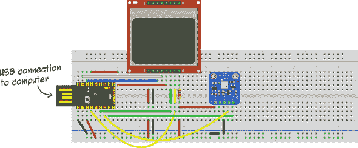

##### 表 10.1\.诺基亚 5110 LCD 连接

| LCD 模块引脚 | LCD 引脚功能 | 连接到 Pico 引脚 | 图中电线颜色 |
| --- | --- | --- | --- |
| VCC 或 Vin | 3.3 V 电源 | 3.3 V | 红色 |
| GND | 地 | GND | 黑色 |
| CE 或 SCE | SPI 芯片选择 | B14 | 蓝色 |
| RST | 复位 | B15 | 白色 |
| DC 或 D/C | 数据/命令 | B13 | 橙色 |
| MOSI 或 DN | SPI 主出，从入 | B10 | 绿色 |
| SCK 或 SCLK | SPI 时钟 | B1 | 黄色 |
| LED | LED 背光 3.3 V 电源 | 3.3 V，通过 100 Ω 电阻 | 红色 |
| |

**接线图和美观**

如果你研究图 10.15，你会注意到一些细节，这些细节既指向清晰度，也指向美观，无论是在电路图本身还是在结果电路中。

例如，注意电源连接（红色电线）。BMP180 和诺基亚 5110 的背光 LED 现在共享一个正电源连接。LCD 的背光 LED 电源通过一个 100 Ω 电阻连接——它是一个 LED，所以这个 100 Ω 的电阻值对于 3.3 V 电路来说是一个很好的选择。

请记住，全尺寸面包板的电源轨在面包板长边的中部有断开（全尺寸面包板实际上相当于两个半尺寸板粘在一起）。因此，图中多出的短地线：它将地电源连接到板的另一半地轨，桥接了连接间隙。

当你与电路图打交道时，你经常会看到为了保持电路外观“整洁”而做出的折衷方案，比如那个分割的接地连接。另一个例子在图 10.15 中，是诺基亚 5110 的 D/C（数据/命令模式）的橙色电线；连接被分成两段，这样它就不会在视觉上与其他组件或电线重叠。其他连接在使用单独的电线完成连接之前，被桥接在面包板的中央缺口上。

实现相同结果电路的方法有很多。如果你想要节省时间或所需的电线，每个多线连接都可以用一根单独的电线来完成。

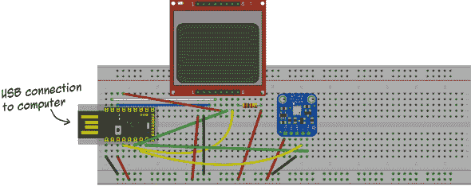

同样的电路，没有为了整洁而做折衷方案

| |
| --- |

##### 使用诺基亚 5110 制作视觉倒计时器

为了熟悉诺基亚 5110 和 Espruino 的`Graphics`功能，这个实验创建了一个 10 秒的定时器，它使用 LCD 上的动画进度条显示进度（图 10.16）。当然，你可以在代码中调整定时器的持续时间。定时器通过按下 Pico 的内置小按钮启动。

##### 图 10.16\. 定时器的显示。填充的矩形是“动画”的，并且随着时间的流逝向右增长。

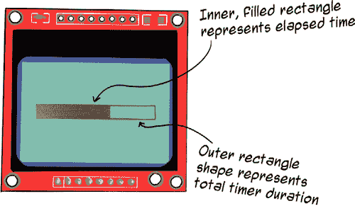

##### Espruino PCD8544 模块

要为定时器编写程序，你将使用 Espruino PCD8544 模块。代码首先设置一些变量，创建一个初始化函数来设置定时器（10.3），如下所示。

##### 列表 10.3\. 设置定时器

```
var lcd;
var progress      = 0; // Current timer progress
var frameDuration = 200; // ms (5fps)
var timerSeconds  = 10;
var timerLength   = timerSeconds * 1000 / frameDuration;       *1*
var timerActive   = false;                                     *2*

function onInit () {
  SPI1.setup({ sck: B3, mosi: B5 });                           *3*
  lcd = require('PCD8544').connect(SPI1, B13, B14, B15);       *4*
}

onInit();                                                      *5*
```

+   ***1* 确定定时器持续多长时间（“滴答”或“帧”数）**

+   ***2* 跟踪定时器是否正在运行**

+   ***3* 为 LCD 配置 SPI 接口**

+   ***4* 使用 PCD8544 Espruino 模块实例化表示 LCD 的对象**

+   ***5* 调用 onInit()函数开始工作**

接下来，你需要找到一种让用户激活定时器的方法。你可以使用 Pico 的板载按钮作为触发器，通过使用一些 Espruino 全局优点：`setWatch(function, pin, options)`函数和虚拟`BTN`引脚来启动定时器。

`setWatch()`函数提供了中断类似的行为，允许你注册一个回调，当监视引脚的值发生变化时被调用。在列表 10.4 中，`setWatch()`用于持续监视`BTN`。在启动定时器之前，代码确保没有其他定时器正在运行，然后重置定时器的`progress`并开始操作。

| |
| --- |

##### 中断类似的行为？

`setWatch`函数提供了中断类似的行为。技术细节在 Espruino 的 API 文档中解释了 setWatch（[`mng.bz/EE71`](http://mng.bz/EE71)）：“内部，中断将引脚状态变化的时间写入队列，而提供给`setWatch`的函数只从主消息循环中执行。”

| |
| --- |

##### 列表 10.4\. 启动定时器

```
// variables
function onInit() { /* ... */ }
setWatch (function (e) {
  if (!timerActive) {
    progress = 0;
    setInterval(draw, frameDuration);           *1*
    timerActive = true;
  }
},
  BTN,                                          *2*
  { repeat: true });                            *3*
```

+   ***1* 每个 frameDuration（200 ms）调用一次 draw 函数**

+   ***2* setWatch 的第二个参数指定要监视的引脚——Pico 的板载按钮。**

+   ***3* 第三个参数是选项，这里指定监视应无限期进行（重复：true）。**

计时器通过重复调用名为`draw`的函数在计算间隔内运行。但`draw`函数是什么？你需要编写它！你的`draw`函数的任务将包括增加计时器的进度并在 LCD 屏幕上渲染其比例进度。

PCD8544 模块的`connect`方法返回的对象——在您的代码中分配给变量`lcd`——提供了一些 LCD 特定的方法，如`flip()`，它将缓冲区当前内容显示在屏幕上，以及`setContrast()`——该方法做的是它听起来会做的事情。此外，该对象继承自 Espruino 的`Graphics`库（[www.espruino.com/Graphics](http://www.espruino.com/Graphics)），为你提供了将文本字符串渲染到屏幕上以及绘制线条和形状的工具。

清单 10.5 中的`draw`函数使用`drawRect(x1, y1, x2, y2)`方法绘制表示总计时时间的框的轮廓。然后使用`fillRect(x1, y1, x2, y2)`绘制一个代表到目前为止经过时间的填充进度条。`draw`函数真正需要做的数学计算就是确定填充矩形应该有多宽——LCD 可用的 84 个水平像素中有多少代表已经过去的时间比例。这是计算并分配给`rightEdge`变量的。总结一下：绘制一个空矩形——进度条的轮廓，垂直居中于屏幕上，然后在其中绘制一个计算宽度的填充矩形。

##### 清单 10.5\. 绘制计时器

```
// ...
function draw () {
  progress++;
  if (progress > timerLength) {                                  *1*
    clearInterval();
    timerActive = false;
  }

  var rightEdge = Math.floor((progress / timerLength) * 84) - 1; *2*
  lcd.clear();
  lcd.drawRect(0, 19, 83, 27);                                   *3*
  lcd.fillRect(0, 19, rightEdge, 27);                            *4*
  lcd.flip();                                                    *5*
}
```

+   ***1* 如果计时器完成，关闭它并停止**

+   ***2* 计算填充进度条的右侧 x 轴位置**

+   ***3* 使用 drawRect(x1, y1, x2, y2)绘制一个垂直居中、高度为 8 px 的空框**

+   ***4* 使用 fillRect(x1, y1, x2, y2)来绘制表示到目前为止进度的填充框**

+   ***5* 将所有内容绘制到 LCD 屏幕上**

将计时器代码粘贴到 Espruino IDE 的右侧，连接到 Pico，并上传代码。按下 Pico 的按钮以开始计时。

如果你想调整代码，你可以改变计时器的持续时间，或者当计时器完成时，让 LCD 显示一条消息，例如。

#### 10.3.3\. 使用 Pico 构建高效能的气象设备

你在构建迷你气象设备方面变得越来越专业，现在又有一个新设备可以加入你的装备库。通过将你的老朋友 BMP180 传感器与诺基亚 5110 显示屏结合，你可以组装成一个独立、格式良好的低功耗气象设备（图 10.17）。

##### 图 10.17\. 天气小工具的输出将显示温度和空气压力，格式良好。

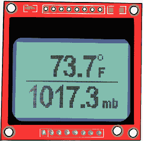

如果你跟随着前两个实验，你已经有了所需的电路：BMP180 和诺基亚 5110 连接到 Pico 上的全尺寸面包板上(图 10.18)。你将依赖 Espruino `Graphics` 库的一些更多功能，以便你可以绘制矢量字体和更多形状来格式化数据显示，并将生成的代码部署到 Pico 的闪存中，以便 Pico 在提供电源时可以独立运行程序。

##### 图 10.18\. 使用 Espruino 的 `Graphics` 支持创建形状和绘制文本字符串

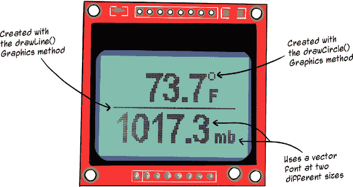

与计时器一样，你将首先设置一些变量和一个初始化函数，如列表 10.6 所示。如果对当地海拔（以米为单位）进行调整，BMP180 的压力读数将更加准确。`getSeaLevel` 方法，可在 `BMP085` 模块的 `connect()` 函数返回的对象上使用，为你提供了一个方便的方式来执行海拔校正。请注意，这里使用 `getPressure` 方法同时读取压力和温度。确保将下一列表中的 `altitude` 变量的值调整为你的当地海拔（以米为单位）。

##### 列表 10.6\. 设置天气小工具

```
var altitude = 300; // Local altitude in meters: CHANGE ME!
var lcd;

function onInit () {
  clearInterval();
  I2C1.setup({ scl: B6, sda: B7});
  var bmp180 = require('BMP085').connect(I2C1);
  SPI1.setup({ sck: B3, mosi: B5 });
  lcd = require('PCD8544').connect(SPI1, B13, B14, B15, function () {    *1*
    setInterval(function () {
      bmp180.getPressure(function (readings) {
        draw(readings.temperature,
             bmp180.getSeaLevel(readings.pressure, altitude));           *2*
      });
    }, 1000);
  });
}

onInit();                                                                *3*
```

+   ***1* 一旦设置好 LCD，然后启动 setInterval。**

+   ***2* 使用当前温度和调整后的海拔压力调用 draw。**

+   ***3* 不要忘记调用 onInit 函数！**

##### 直线、圆和带有 Espruino 图形的文本

与计时器一样，你需要编写 `draw` 函数。列表 10.7 中的代码使用了来自 `Graphics` 库的更多形状绘制方法：`drawLine(x1, y1, x2, y2)` 和 `drawCircle(x, y, radius)` (图 10.18)。它还利用了一些获取尺寸的方法：例如 `getWidth()` 和 `getHeight()`，它们分别返回显示器的可用区域，以像素为单位，对于 x 和 y 轴。最后，`stringWidth(str)` 使用当前字体设置计算给定字符串的像素宽度。

让我们谈谈字体。有一个可用的位图字体，其字符大小为 4 x 6 像素。要使用位图字体，你使用 `setFontBitmap()` 方法使其成为活动字体。然而，在这个例子中，你将使用矢量字体。矢量字体可以用于各种大小——它可以缩放。`setFontVector(size)` 方法将活动字体设置为具有 `size` 像素高度的缩放矢量字体。

在下面的`draw`函数中有很多数字。它看起来有点挑剔，但这里的一切都是简单的像素运算，用于定位文本和形状的元素。请注意，绘图函数中的字符串“mb”（*毫巴*的缩写）是“手工调整字距的”，因为我发现用这种字体大小一次性绘制字符串会使字母难以辨认。

##### 列表 10.7. 渲染天气显示

```
function draw (temperature, pressure) {
  lcd.clear();
  // Convert temperature to Fahrenheit and format to one decimal place
  var tempString = (temperature * (9 / 5) + 32).toFixed(1);
  // Convert pressure from pascals to millibars and format to one decimal
   place
  var pressString = (pressure / 100).toFixed(1);

  // Draw a vertically centered line across the display
  lcd.drawLine(0, (lcd.getHeight() / 2), lcd.getWidth(),
   (lcd.getHeight() / 2));

  // Set the active font to 18 pixels high
  lcd.setFontVector(18);
  // Calculate the pixel width of the temperature value at 18px font
  var tempWidth  = lcd.stringWidth(tempString);
  // Calculate the pixel width of the pressure value at 18px font
  var pressWidth = lcd.stringWidth(pressString);
  // The temperature will be horizontally centered
  // Determine the x coordinate for where the value should be displayed
  var xTemp      = ((lcd.getWidth() - tempWidth) / 2);

  // Render the temperature at point (xTemp, 2)
  lcd.drawString(tempString, xTemp, 2);
  // Render a degree symbol (circle) of radius 2px
  // at point (xTemp + tempWidth + 4, 5)
  // The center of the circle will be 4px to the right of the
  // end of the temperature value string
  lcd.drawCircle(xTemp + tempWidth + 4, 5, 2);
  // Render the pressure value left-aligned, 2px below vertical center
  lcd.drawString(pressString, 0, (lcd.getHeight() / 2 + 2));

  // Set a smaller font for the unit characters
  lcd.setFontVector(8);
  // Draw an "F" to denote Fahrenheit
  lcd.drawString('F', xTemp + tempWidth + 2, 12);
  // Draw "mb" (millibar) string.
  lcd.drawString('m', pressWidth + 3, (lcd.getHeight() / 2 + 12));
  lcd.drawString('b', pressWidth + 12, (lcd.getHeight() / 2 + 12));
  lcd.flip();
}
```

将天气小部件的所有代码放入 Espruino IDE 的代码部分，并使用“发送到 Espruino”图标在 Pico 上运行代码。直到从电脑的 USB 端口拔掉它，它将显示温度和压力。

但你可以做得更好！在 IDE 的左侧，输入命令`save()`并按 Enter 键。这将把代码闪存到 Pico 上。现在，每当 Pico 有电时，它将恢复运行此代码。尝试通过将 Pico 插入 USB 电源，如手机充电器，来测试它。

| |
| --- |

##### 功耗和 LCD 的背光

为了使天气小部件更加节能，你可能考虑断开 LCD 的 LED 背光连接电源。在黑暗的房间里你将无法阅读 LCD，但它将消耗更少的电力。

| |
| --- |

### 10.4. 在 Kinoma Element 平台上进行实验

为了重复平台探索的过程，我们将简要地看看另一个嵌入式 JavaScript 平台：Kinoma Element。

Element 是一个小型、由 JavaScript 驱动的物联网平台，拥有 16 个可编程引脚（图 10.19）。像 Espruino Pico 一样，它价格低廉——Element 的价格大约是 20 美元或稍多一点。同样，像 Pico 一样，它没有其更加强大（且昂贵）的兄弟产品的所有功能——你不会在板上找到 USB、以太网、SD 卡或其他外围设备，但它以一个高效的小包装提供了物联网产品所需的基本组件。此外，它还内置了 WiFi 支持。

##### 图 10.19. Kinoma Element

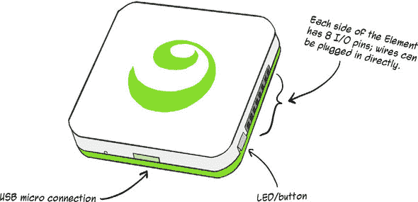

#### 10.4.1. Element 的核心功能

芯片制造商 Marvell 生产 Element（[`mng.bz/w1lR`](http://mng.bz/w1lR)），它具有 Marvell MW302 系统级芯片（SoC），该芯片使用 200 MHz 的 ARM Cortex M4。板、外壳、JavaScript 运行时和框架软件都是开源的。

要在只有 512 KB RAM 的情况下原生运行 JavaScript，Element 使用一种称为 XIP（原地执行）的技术。Element 运行 FreeRTOS，这是一个精简和最小化的开源操作系统。板的供电电压是 3.3 V。

Element 被封装在一个外壳中，这使得它看起来更像是一个成品设备（外壳设计也是开源的）。它没有专门的电源引脚，你可以根据需要将 Element 的任何 16 个引脚（每侧 8 个）配置为 3.3 V 或地。

Kinoma 使用自己的（Apache 许可的）JavaScript 引擎 XS6，除了少数例外，声称与 ES6 兼容。请注意，Element 的 IDE 软件适用于 Mac 和 Windows（beta），但未提供 Linux 支持。

#### 10.4.2. 引脚布局和硬件图

Element 的引脚布局相当简单（图 10.20）。在 I/O 功能支持方面，它比 Pico 简单；例如，有两个 I²C 接口，但没有 SPI 支持。另一方面，确定哪些引脚做什么要简单得多，编号也容易跟随。

##### 图 10.20. Kinoma Element 的引脚布局图


#### 10.4.3. 配置、管理、工作流程

Element 是一个整洁、自包含的包，不需要任何焊接或准备。跳线可以直接插入其中。

配置和工作流程与 Pico 类似，因为有一个 IDE 用于配置、编写和部署。如果您手头有 Element，可以查看快速入门指南以获取详细信息（[`mng.bz/84cS`](http://mng.bz/84cS)），但以下是一般步骤：

1.  下载并安装 Kinoma Code IDE。

1.  在您的 WiFi 网络上设置 Element。

1.  应用固件更新。

在 Kinoma Code IDE（图 10.21）中开发的 Element 代码项目可以通过 USB 或 WiFi b/g/n 部署。设置涉及将 Element 连接到您的本地 WiFi 网络。它将被分配自己的 IP 地址。

##### 图 10.21. Kinoma Code IDE 软件

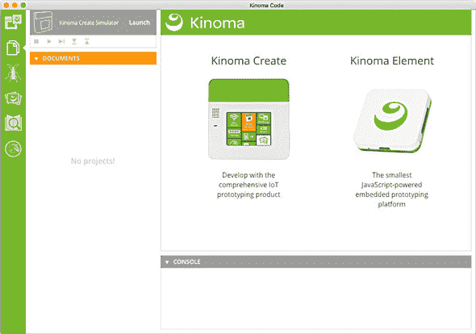

Element 的应用项目具有一定的结构。例如，每个项目都必须包含一个 project.json 文件，该文件定义了入口点——将在设备上执行的脚本。入口点默认为 main.js。

与 Espruino 类似，Kinoma 提供了一些全局对象来帮助您与硬件交互，并且有模块封装组件行为的概念。用于控制硬件组件的 Kinoma 模块被称为*闪烁灯库*（BLLs），它们涉及通过（内置的）*引脚*模块与硬件交互。您可以使用 CommonJS 风格的`require`语句将其他 JS 文件拉入您的项目，以及任何内置或自定义的 BLL 模块（但请记住，这并不是 Node.js：您不能使用 npm 模块）。

#### 10.4.4. 示例和教程

Kinoma 网站上有一些 Element 的代码示例：[`mng.bz/1BaB`](http://mng.bz/1BaB)。查看闪烁 LED 的示例代码([`mng.bz/5t61`](http://mng.bz/5t61))，可以立即看出 Kinoma 项目的结构比某些其他平台更为正式（图 10.22）。闪烁 LED 需要通过一个 project.json 文件来定义项目，一个 main.js（入口点）来初始化板子并配置 LED 的引脚，以及一个 led.js BLL 模块，它通过`toggle`方法提供闪烁的逻辑支持。（项目中的.project 文件和 XML 文件似乎是用于 Kinoma 网站特定的构建和元数据支持。）

##### 图 10.22. 闪烁 LED 的 Kinoma 示例项目的源代码。Kinoma 项目的结构比 Espruino 项目更为复杂。

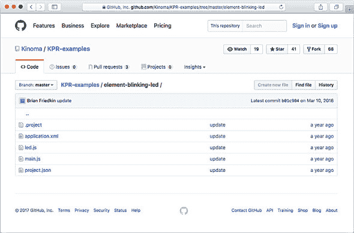

你还需要在聚会上自带 LED 灯和电阻，因为板上没有明显的 LED 灯可以使用。这个项目 main.js 文件中的代码假设你使用的是 9 号和 10 号引脚（接地），但并未提供接线图。

你将在稍后了解更多关于 Kinoma main.js 脚本中代码的样子。

#### 10.4.5. API 参考

Kinoma 模块提供了硬件交互的 API。最相关的模块是`Pins`，它提供了基本的 I/O 支持，包括你预期的类型：数字和模拟输入输出；脉冲宽度调制（PWM）；串行（例如 I²C）。你可以在 Kinoma 网站上找到程序员指南([`mng.bz/w1lR`](http://mng.bz/w1lR))。

#### 10.4.6. 案例研究项目：实时更新的指南针读数


##### 你需要准备的东西


+   1 Kinoma Element

+   1 USB A to USB micro 线缆

+   1 面包板

+   1 HMC5883L 磁力计扩展板

+   跳接线


Element 内置 WiFi 和 Web 实用库，比 Pico 更明显地可以作为 Web 服务器使用。

在这个实验中，你将查看使用 Element 创建项目的高级过程，制作一个自定义 BLL 来支持 HMC5883L I²C 磁力计（指南针）。你将使用 Kinoma 的 WebSocket 模块在 Element 上运行 WebSocket 服务器，当指南针方向改变时可以发出变化。最后，你将构建一个 HTML 文档，该文档将连接到 Element 的 WebSocket 服务器，并在指南针方向改变时更新（图 10.23）。

##### 图 10.23. 浏览器显示的细节，显示指南针方向。指南针方向将实时更新，无需刷新浏览器。在这种情况下，当前方向是 190.62 度——稍微偏西。


HMC5883L 模块将被连接到面包板上。通过旋转面包板，你可以改变磁力计的方向，并在浏览器中实时看到更新的方向。


**WebSocket 浏览器支持**

你之前已经遇到过 WebSocket 协议。在第八章中，你使用了 Tessel 2 气象站应用程序中的 socket.IO 来显示实时更新的温度和压力。Socket.IO 为支持 WebSocket 的浏览器使用 WebSocket，对于不支持 WebSocket 的浏览器，它将回退到其他方法。

在这个例子中，你将使用 WebSocket 的正确用法：不支持 WebSocket 的浏览器中应用程序将无法工作。如今，浏览器中缺少 WebSocket 支持的情况极为罕见，因此你不太可能遇到问题。

| |
| --- |

##### 构建电路

将 HMC5883L 放置在面包板上，并按图 10.24 所示连接到 Element。断出板上的 SDA 和 SCL 引脚连接到 Element 的 13 号和 14 号引脚，如图图 10.20 中的引脚图所示，它们支持 I²C。Element 上的任何引脚都可以配置为电源或地；这里使用 11 号和 12 号引脚是因为它们靠近 I²C 引脚。

##### 图 10.24\. Kinoma Element 和 HMC5883L

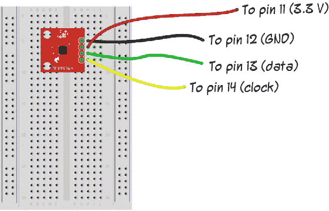

##### 项目结构

Element 实时指南针项目由四个文件组成(图 10.25)：

+   包含 Kinoma 项目元数据的 package.json 文件

+   一个 main.js 文件，作为应用程序的主要模块（入口点）

+   一个 HMC5883L.js 文件，这是用于指南针的自定义 Kinoma BLL 模块

+   一个 index.html 文件，这是客户端代码——你在网页浏览器中查看它

##### 图 10.25\. Element 实时指南针项目的结构。main.js 文件提供应用程序逻辑和 WebSocket 服务器，依赖于 HMC5883L.js 中的 BLL 支持与磁力计交互。project.json 文件定义了项目，使用 Kinoma 约定。Index.html 在您的计算机上的网页浏览器中运行，并显示实时更新的指南针方向。

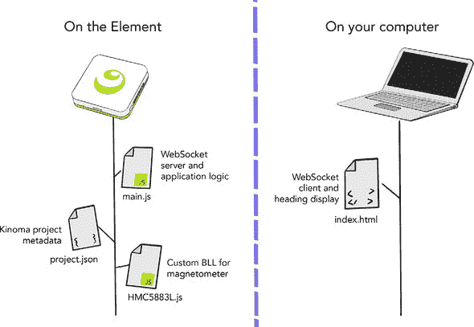

首先，创建 package.json 文件并输入一些元数据，如下一列表所示。

##### 列表 10.8\. project.json

```
{
  "id": "compass.websockets.lyza.com",       *1*
  "title": "hmc5883L",
  "Element": {
    "main": "main"                           *2*
  }
}
```

+   ***1* ID 字符串应根据文档中的说明采用“点域名样式”。**

+   ***2* 应用程序的入口点将是 main.js。**

##### 创建应用程序的结构

Kinoma 项目应用程序模块——在这个例子中是 main.js——有一个通用结构。它们需要导出一个`default`函数，该函数实现一些事件处理器，例如`onLaunch()`和`onQuit()`。启动处理器配置板上的引脚并启动应用程序。

该模块的基本结构如下。

##### 列表 10.9\. main.js 的结构

```
import Pins from 'pins';                                                   *1*
import { WebSocketServer } from 'websocket';                               *2*

var formatMsg = heading => JSON.stringify({ heading: heading.toFixed(2) });*3*
var main = {
  onLaunch () {                                                            *4*
    Pins.configure({
      // Configure the HMC5883L via a custom BLL module that still needs
       to be written
    }, success => {                                                        *5*
      if (success) {
        // Set up a WebSocket server
        // read compass headings and emit changes
      } else {
        // Handle failure with the built-in `trace` function
        trace('Failed to configure\n');
      }
    });
  }
};

export default main;
```

+   ***1* 这是内置的 Pins 模块，Kinoma 应用中的许多功能都依赖于它。**

+   ***2* Kinoma 有一个内置的 websocket 模块；你需要使用其中的 WebSocketServer。**

+   ***3* 这是一个用于格式化指南针头部的便利函数（尚未使用）。**

+   ***4* onLaunch()将在启动时自动调用。**

+   ***5* Pins.configure 接受一个回调函数，当它完成时调用。**

一旦自定义 HMC5883L 模块准备就绪，你将返回并填写 main.js 中的空白。

##### HMC5883L 的自定义 BLL

BLL（或闪烁灯库）封装了与 Kinoma 兼容的组件行为在一个模块中。BLL 模块需要执行某些操作。根据 Kinoma 文档，BLL 至少需要导出一个定义其使用的引脚类型的 `pins` 对象、一个 `configure` 函数和一个 `close` 函数。

下面的列表显示了完成的 HMC5883L BLL 模块的部分内容。

##### 列表 10.10\. BLL 代码细节

```
// From datasheet: various register addresses for the device
var registers = {
  CRA: 0x00,
  CRB: 0x01,
  MODE: 0x02,
  READ: 0x03,
};

/* ... */

// Required export object
// Configure the pins involved as I2C at address 0x1E (from datasheet)
exports.pins = {
  compass: {type: 'I2C', address: 0x1E }
};

// Required export function
exports.configure = function () {
  this.compass.init(); // Get I2C going
  // Derived from Johnny-Five Compass class support for HMC5883Ls
  this.compass.writeByteDataSMB(registers.CRA, 0x70);                     *1*
  this.compass.writeByteDataSMB(registers.CRB, 0x40);
  this.compass.writeByteDataSMB(registers.MODE, 0x00);
};

// Required export function
exports.close = function () {
  this.compass.close(); // Cleanup; boilerplate
};

// Can be invoked repeatedly to read data from sensor
exports.read = function () {
  // Derived from Johnny-Five Compass class, again
  var bytes = this.compass.readBlockDataSMB(registers.READ, 6, 'Array');  *2*
  var data = {                                                            *3*
    x: int16(bytes[0], bytes[1]),                                         *4*
    y: int16(bytes[4], bytes[5]),
    z: int16(bytes[2], bytes[3])
  };
  return toHeading(data.x, data.y);                                       *5*
};
```

+   ***1* writeByteDataSMB() 由 Kinoma I²C API 提供；它从特定的寄存器地址读取。**

+   ***2* readBlockDataSMB()，同样来自 API，用于从 READ 寄存器获取六个字节的数组。**

+   ***3* HMC5883L 的数据由三个轴的每个轴的两个字节组成。**

+   ***4* int16() 是一个实用函数，用于从两个字节中创建一个 16 位整数（实现未显示）。**

+   ***5* toHeading() 使用数学从数据中推导出航向（实现未显示）。**


**HMC5883L Kinoma BLL 模块的贡献者**

我自己拼凑了这个 BLL，作为探索 BLL 模块和 I²C 在 Element 上如何工作的一个尝试，但代码大量借鉴了现有的工作。它实际上是 Johnny-Five 对该传感器的支持逻辑的移植（[`mng.bz/TxHV`](http://mng.bz/TxHV)），由 Johnny-Five 的发明者 Rick Waldron 编写。Johnny-Five 的代码反过来依赖于 Arduino 的早期实现（[`mng.bz/nB4V`](http://mng.bz/nB4V)），而 Arduino 的实现又依赖于该设备的数据表（[`mng.bz/j67k`](http://mng.bz/j67k)）。

这种复杂的血统在开源软件中是常见的，但作为提醒，始终检查你的许可证并确保你遵守它们。此外，对你的工作的灵感来源表示感谢。


列表 10.10 只显示了完成的 BLL 的一部分。完整的 5883L BLL 可以在本书的代码仓库中找到。如果你想构建这个实验，你需要它：将其放置在其他项目文件相同的目录中。

##### 完成应用程序代码

在完成 BLL 后，main.js 中依赖于 BLL 的部分可以填充。如下一个列表所示，`onLaunch` 处理程序通过传递一个设置对象到 `Pins.configure()` 来在 Element 上设置指南针传感器。

##### 列表 10.11\. 配置引脚

```
/* ... */
var main = {
  onLaunch () {
    Pins.configure({
      compass: {
        require: 'HMC5883L',                    *1*
        pins: {
          compass: { sda: 13, clock: 14 },
          ground: { pin: 12, type: 'Ground' },
          power: { pin: 11, type: 'Power' }
        }
      },
    }, success => {   } );                      *2*
  }
};
```

+   ***1* 自定义 BLL 模块，按文件名，无扩展名**

+   ***2* 回调函数**

你还需要将一个回调函数作为第二个参数传递给 `Pins.configure()`。

在那个回调函数中，你首先需要启动一个 WebSocket 服务器，如下一个列表所示。此代码使用了内置的 Kinoma `WebSocketServer` API（`WebSocketServer` 在 列表 10.9 中是必需的）。

##### 列表 10.12\. WebSocket 服务器设置

```
/* ... */
var main = {
  onLaunch () {
    Pins.configure({
      /* ... */
    }, success => {
      if (success) {
        const clients = new Set();                         *1*
        const wss = new WebSocketServer(80);               *2*
        let lastResult = 0;                                *3*

        wss.onStart = client => { // When a client (browser) connects
          clients.add(client);
          // Immediately send the latest compass heading
          client.send(formatMsg(lastResult));
          // Clean up when closing later
          client.onclose = () => clients.remove(client);
        };
      }
    });
  }
};
```

+   ***1* 支持 ES6 功能，因此可以使用 Set**

+   ***2* 在 Element 的端口 80 上启动 WebSocket 服务器**

+   ***3* 保存最后的指南针航向读取**

列表 10.12 中的代码在客户端连接时发出初始航向读取，但航向读取最初是如何获得的，以及当读取值发生变化时客户端如何接收更新？以下列表中显示的 main.js 的最后几行代码负责处理这些事情。

##### 列表 10.13\. 读取和更新航向

```
/* ... */
var main = {
  onLaunch () {
    Pins.configure({
      /* ... */
    }, success => {
      if (success) {
        /* ... */
        Pins.repeat('/compass/read', 500, result => {       *1*
          if (Math.abs(result - lastResult) >= 0.5) {       *2*
            clients.forEach(recipient => {                  *3*
              recipient.send(formatMsg(result));
            });
          }
          lastResult = result;
        });
      }
    });
  }
};
```

+   ***1* 每 500 次读取**

+   ***2* 如果新的结果（航向，以度为单位）与上次结果相差某个阈值...**

+   ***3* ...它已经发生了有意义的改变。将新值发送给每个已连接的客户端。**

| |
| --- |

**BLL 中的函数作为路径**

BLL 中的函数通过路径在外部引用：

```
Pins.repeat('/compass/read', 500, result => { });
```

在这里，`/compass/read` 是 BLL 模块中 `read` 函数的“路径”。这里的代码每 500 毫秒重复调用一次 `read`，并且一个回调函数接收最新读取操作的 `result`。请参见 列表 10.13 中的演示。

| |
| --- |

##### 客户端代码（HTML）

最后，您需要一个 HTML 页面作为 WebSocket 客户端，并实时显示航向。此页面可以在浏览器中查看。

##### 列表 10.14\. 显示航向的客户端代码（HTML 页面）

```
<!doctype html>
<html lang="en">
  <head>
    <meta charset="utf-8">
    <title>Live Compass Heading</title>
    <style>
      #compass {                                                 *1*
        text-align: center;
        font-size: 2em;
        font-family: "Helvetica", sans-serif;
        margin: 2em;
      }
    </style>
    <script>
      window.addEventListener('load', function () {              *2*
        var ws = new WebSocket('ws://10.0.0.17:80');             *3*
        ws.onmessage = function (message) {                      *4*
          var data = JSON.parse(message.data);
          document.getElementById('direction').innerHTML = data.heading;
        };
      });
    </script>
  </head>
  <body>
    <div id="compass">
      <label for="direction">Compass Heading</label><div id="direction">...
       </div>
    </div>
  </body>
</html>
```

+   ***1* 航向显示的样式**

+   ***2* 在加载时连接到 WebSocket 服务器**

+   ***3* 重要！您需要将其更改为您自己的 Element 的 IP 地址。**

+   ***4* 当新数据到来时，更新 #direction 元素中的 HTML 以显示新的航向**

##### 部署航向代码

通过 Kinoma Code IDE 将代码部署到 Element。请注意，在这个例子中，index.html 文件不是从 Element 服务器上提供的。相反，您需要在 Element 运行航向应用程序后，在浏览器中打开该文件。如果您还没有这样做，请参阅 Element 快速入门指南 ([`mng.bz/84cS`](http://mng.bz/84cS))，了解如何从 Kinoma Code IDE 连接到并部署代码到您的 Element 的逐步说明。

一旦代码部署并运行，您就可以在浏览器中打开 index.html 文件，并旋转连接有罗盘的面包板，以实时查看显示更新。

### 摘要

+   嵌入式 JavaScript 平台使用优化的硬件和固件来执行 JavaScript 的子集。Kinoma 和 Espruino 都维护自己的开源 JavaScript 引擎（分别称为 KinomaJS 和 Espruino JavaScript），以实现这一点。

+   嵌入式 JS 平台通常具有更复杂的处理器——通常是 32 位——但仍然对内存和程序空间有显著的限制。

+   Espruino 的开源产品系列包括 Pico，这是一个尺寸较小的开发板。Espruino 项目可以利用 Espruino 特定的模块来处理不同类型的组件。

+   Kinoma Element 是另一个由 JavaScript 驱动的开源设备。为 Element 创建项目涉及使用称为 BLL（闪烁灯库）的组件模块。

+   虽然有许多平台选项，但你可以通过以下步骤加快学习新平台的速度：了解核心细节、查找硬件和引脚信息、理解工作流程、尝试示例和寻找 API 文档。

## 第十一章\. 使用 Node.js 和微型计算机构建

*本章涵盖*

+   在单板计算机（SBC）平台上开始 Node.js 硬件开发

+   收集组件并设置 Raspberry Pi 3 Model B 系统

+   在 Raspberry Pi 上 GPIO 的工作原理，以及使用 JavaScript 控制它的不同选项

+   将 Johnny-Five 气象站应用程序适配到多个不同的平台——Tessel 2、Raspberry Pi、Arduino 和 BeagleBone Black

+   使用 GPIO 丰富的 BeagleBone Black 开源 SBC

单板计算机（SBCs）是小型动力强大的设备，将通用计算与嵌入式系统的特性相结合（图 11.1）。这些小巧的计算机将众多外围设备和好东西打包进一个小巧的封装中：多个 USB 端口、蓝牙、WiFi、以太网——这些都是你从台式电脑上期望的功能。但它们有几个特性非常适合嵌入式应用：它们的尺寸减小、价格较低、GPIO 支持以及相对的电力效率（虽然它们不像更简单的嵌入式平台那样节能，但它们确实比台式电脑兄弟需要更少的电力）。

##### 图 11.1\. 单板计算机（SBCs），从左到右：带有 Arduino 扩展板的 Intel Edison 模块、Raspberry Pi 2 Model B 和 BeagleBone Black

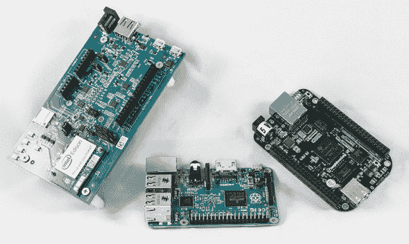

这不是你第一次在这本书中看到 SBCs，但让我们广泛地回顾一下 SBC 是什么。这个术语没有正式的定义，但 SBC 平台通常具有以下特点：

+   运行高级操作系统；在大多数情况下，如果你选择的话，可以安装不同的操作系统（通常是 Linux，但并非总是如此）

+   提供类似桌面电脑的通用功能，例如支持 USB 外设、显示器、声音等

+   提供 GPIO 选项，尽管这些有时会排在平台其他功能的后面

在这个类别中，Raspberry Pi 平台是当之无愧的巨头，这是一系列广受欢迎的单板计算机。因此，我们将在本章的大部分内容中深入探讨 Node.js 和 Raspberry Pi 3 Model B。但我们也将对 BeagleBone Black 板进行简要的浏览，作为本 SBC 类别中平台的第二个示例。

| |
| --- |


**对于本章，你需要以下内容：**

+   1 Raspberry Pi 3 Model B 和 5 V 电源

+   1 microSD 卡和适配器

+   1 Adafruit T-Cobbler、SparkFun Pi Wedge 或类似产品，或一套公对母跳线

+   1 标准 LED，任何颜色

+   1 100 V 电阻

+   1 Adafruit BMP180 多传感器扩展板

+   跳线

+   1 BeagleBone Black

+   1 Arduino Uno

+   1 半尺寸面包板

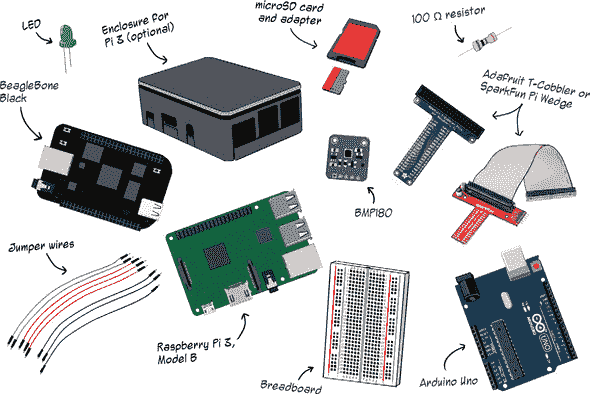

| |
| --- |
| |

**Tessel 2 和单板计算机的定义**

Tessel 2 几乎是一个独立的设备类别。它的 USB 外设、网络功能和高级操作系统（OpenWrt Linux）似乎暗示了单板计算机（SBC）的领域。然而，它的有限 RAM 和闪存存储，以及缺乏类似桌面的外设支持（如显示器），表明它是为嵌入式应用而设计的。

那么它是不是一个单板计算机？我倾向于认为是有条件的“是”，但如果你对 *SBC* 的定义明确包括能够插入显示器并用作台式计算机的能力，那么就不是！

| |
| --- |

### 11.1. 与微型计算机一起工作

单板计算机当然比它们更简单的开发板兄弟更复杂。它们也可以相应地更复杂，需要设置和配置。在许多情况下，你将在软件和硬件领域都面临大量的选择。不过，别慌张：使用预刷了 *NOOBS*（新开箱即用软件）的 SD 卡将 Raspberry Pi 3 从零开始到全速运行可以非常简单。但你需要卷起你的 Linux 衣袖，花些时间在终端上，以整理出一个舒适、以 Node.js 为中心的流程。

别紧张。如果我们检查的任何 SBC（Raspberry Pi 3 和 BeagleBone Black）的设置步骤出现问题，你总是可以从头开始，而不会造成不可修复的损害。

| |
| --- |

**单板计算机、嵌入式系统和（Debian）Linux**

在过去几年中，针对嵌入式和移动设备的 Linux 项目和发行版经历了大爆炸。例如，Tessel 运行的是最初为路由器开发的精简版 Linux：OpenWrt。

当我们深入研究高性能 SBC 时，你会看到需要做出决定——大多数平台都愿意运行多个不同的 Linux 发行版。

使用 Raspberry Pi，我们将坚持默认和最常见的选择：基于 Debian 的 Raspbian Linux。为了保持一致性，本章末尾的 BeagleBone Black 探索将使用 Debian Linux 重新刷新板子，而不是使用它随附的默认（Ångström）。

Debian 版本以《玩具总动员》的角色命名。在撰写本文时，Debian 稳定版是第 9 版（Stretch），但大多数嵌入式和单板计算机平台仍在使用第 8 版（Jessie）的构建。有时可以看到第 7 版（Wheezy）的构建，尽管它们变得越来越不常见。

| |
| --- |

#### 11.1.1. Raspberry Pi 平台

Raspberry Pi (图 11.2) 到处都是。Arduino 平台对于简单的开发板来说是什么，Pi 平台对于单板计算机来说就是什么：无处不在。

##### 图 11.2. Raspberry Pi 2 Model B（左侧）、Raspberry Pi Zero（中心前景）和 Raspberry Pi 3 Model B（在盒子里，附带 SparkFun Pi Wedge）

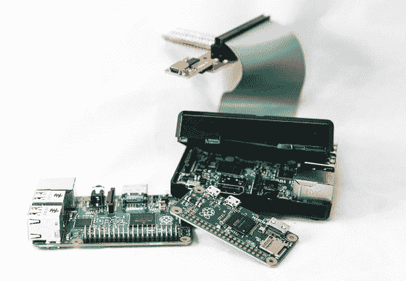

随着每个按顺序编号的 Pi 代（到目前为止有 1、2 和 3 代），该平台变得更加强大、高效、稳定，并且功能丰富。例外的是 Pi Zero 系列，它甚至更小、更便宜——但以牺牲一些性能和功能为代价。

尽管 Raspberry Pi 平台在功能和灵活性方面很强大，但并不总是电子初学者的理想选择。你可以用 Pi 做的众多事情可能会分散注意力，处理 Linux 管理和其他配置细节的任务也是如此。很容易陷入谷歌搜索的歧途，在论坛、项目想法和选项中浪费数小时。

此外，Pi 引脚排列相当复杂，有多个混淆的编号和命名系统。尽管引脚数量众多，但一些 GPIO 支持完全缺失。例如，没有板载的模数转换器（ADC）。其他关键的 GPIO 功能也有限。在 Raspberry Pi 3 Model B 的 40 个 GPIO 引脚中（图 11.3），只有两个是 PWM 功能的。

##### 图 11.3\. Raspberry Pi 3 Model B

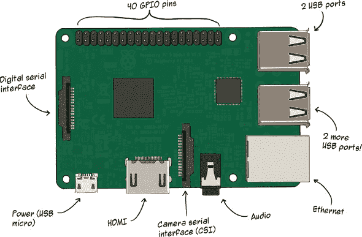

另一方面，您已经对基础知识有了足够的了解，一些潜在的陷阱可能不再那么令人生畏。Raspbian——Pi 的默认基于 Debian 的操作系统——被广泛使用，合理且可靠。由于有很多人使用 Pi，因此有许多资源旨在帮助即使是初学者也能得到帮助，而且有大量的论坛、维基、Stack Overflow 和博客文章等，以帮助您了解每一个细节。

##### 整理您的套件

以下部分提供了两种不同的设置基于 Raspberry Pi 3 Model B 的系统选项：

+   传统配置——配置 Raspberry Pi 的传统且更适合初学者的方式是将它视为台式计算机——插入 USB 鼠标、USB 键盘和 HDMI 显示器，然后直接工作。

+   无头配置——如果您不想为 Pi 配备那么多外围设备，您可以选择将其视为嵌入式系统。如果这个想法吸引您，那么无头配置部分就是为您准备的！

对于初次设置，来自所有主要在线电子零售商的 Pi 入门套件——虽然成本更高，但是一个不错的选择（与单独购买 Pi 板及其支持组件相比）。以下是在套件中寻找的一些事项：

+   预装 NOOBs 或 Raspbian 的 microSD 卡——最好还带有 SD 卡适配器，这样您就可以使用标准尺寸的卡读卡器/写卡器来更新卡的内容

+   外壳（机箱）——这为您的 Pi 提供了物理稳定性、保护，在某些情况下，还提供了优雅的外观。

+   电源供应——Pi 的电源连接是 USB 微型，因此您可以使用 5 V USB 设备充电器作为替代。然而，请注意，并非所有手机充电器都能满足 Pi 的电流需求：Pi 网站推荐一个可以提供 2.5 A 或更多电流的适配器。

+   提供更方便访问 Pi 的 GPIO 引脚的硬件——这些硬件以 Adafruit Cobbler、SparkFun Wedge 和其他类似选项的形式出现（图 11.4）。

##### 图 11.4\. 构建的 Raspberry Pi 3 Model B SparkFun 套件，带有 Pi Wedge，此处显示连接到面包板。同时显示的是 Adafruit T-Cobbler（右侧），它提供了与 Wedge 相同的功能。

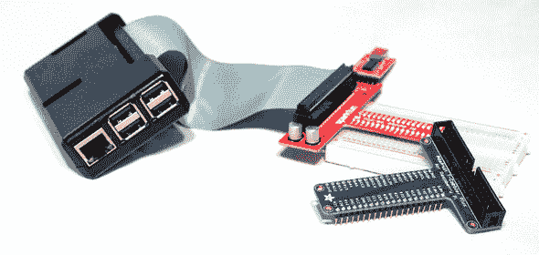

套件可能提供其他有用的配件——例如 SparkFun 套件包括 USB microSD 卡读卡器——但它们有一个缺点，就是经常包括你可能已经拥有的东西：面包板、跳线、LED 等。

一块单独的 Raspberry Pi 3 Model B 主板大约是 40 美元，而完整的套件大约是 90 美元。Adafruit 和 SparkFun 目前提供的 Pi 3 入门套件包含本节所需的所有部件。

| |
| --- |

**在 Pi 上制作 GPIO 连接**

Pi 的引脚是公的——如果你直接连接到它们，你需要公对母的跳线，你可能会得到一团糟和挫败感，因为 Pi 本身没有丝印信息。

有第三方硬件组件旨在使 Pi 的 GPIO 更容易使用。SparkFun 的 Pi Wedge 和 Adafruit 的 T-Cobbler 是两个例子：这些分线将引脚组织成更直观的分组（带有丝印提示）并提供面包板兼容的形态。你的 Pi 套件可能包含它们，或者可以单独购买。

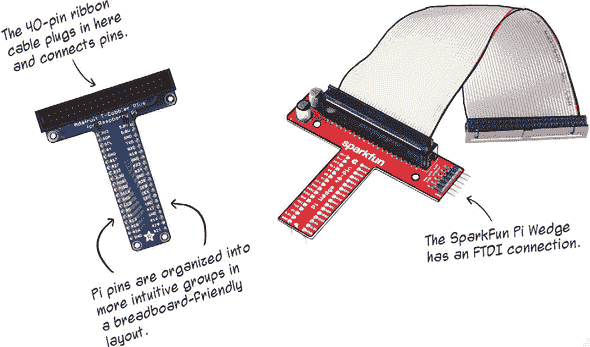

组装好的 Adafruit T-Cobbler 和 SparkFun Pi Wedge（带有连接的 40 引脚电缆）

| |
| --- |
| |

**FTDI（未来技术设备国际）**

FTDI 制造芯片，允许嵌入式设备和计算机之间进行异步串行通信。FTDI 芯片将来自设备的 TTL 或 RS-232 信号（RS-232 是另一种异步串行协议）转换为计算机可以理解的 USB 信号，反之亦然。FTDI 连接可以用来监控设备的串行输出。在某些情况下，它们也可以用来编程或控制设备。

SparkFun 的 Pi Wedge 包括一个 FTDI 接口。你还需要一根线或一个分线板来连接到 FTDI 引脚（一个带有迷你 USB 连接器的 SparkFun FTDI 分线板连接到 Pi Wedge，如图 11.4 所示）。

| |
| --- |
| |

##### 你需要什么


接下来是关于传统桌面式 Pi 设置和无头设置的步骤。你只需要选择其中一种选项，但无论你选择哪条路径，你都需要以下内容：

+   1 块 Raspberry Pi 3 Model B

+   1 个 5V USB 微型电源

+   1 个外壳（可选但推荐）

+   1 个 Adafruit T-Cobbler、SparkFun Pi Wedge 或类似产品；或者一套公对母跳线

| |
| --- |

#### 11.1.2\. 配置选项 1：传统方式

| |
| --- |

##### 你需要什么


除了上一节中列出的部件外，你还需要以下内容：

+   1 张预装了 NOOBS 或 Raspbian OS（带桌面）的 microSD 卡

+   1 个 USB 键盘

+   1 个 USB 鼠标

+   1 个显示器

+   1 条 HDMI 电缆用于显示器

| |
| --- |

此配置选项涉及连接外围设备和电源，并遵循屏幕上的说明。插入预先闪存的 NOOBS microSD 卡并通电。NOOBS 给你安装几个操作系统的选择。请选择第一个选项——Raspbian。安装过程需要几分钟。

一旦安装并配置了操作系统，你将能够启动到 PIXEL（Pi 改进的 Xwindows 环境，轻量级）环境。设置 WiFi 很简单：首先点击右上角菜单栏中的 WiFi 图标（图 11.5）。

##### 图 11.5\. PIXEL 桌面。注意右上角的 WiFi 图标。

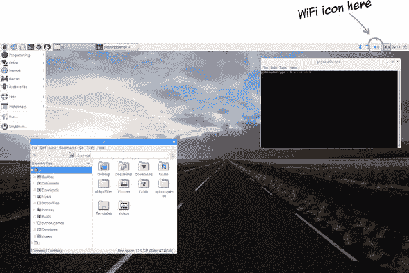

如果你希望在以后能够登录到你的 Pi，而无需直接在 Pi 上工作，你需要启用 SSH。为此，请使用“首选项”>“Raspberry Pi 配置”菜单选项。导航到“接口”选项卡，并点击 SSH 旁边的“启用”选项。点击“确定”以应用更改。

目前就到这里！如果你遇到任何困难，请前往 Raspberry Pi 软件指南（[`mng.bz/P8Hu`](http://mng.bz/P8Hu)），它有插图且用户友好。

#### 11.1.3\. 配置选项 2：无头

这种更精简、直接到核心的方法消除了对外围设备和电缆的需求。另一方面，这是一种不太常见的做法，它需要在终端中花费更多时间。Raspbian 是不断发展的，但以下步骤在 2017 年中期能够可靠地工作。

如果你已经使用桌面方法设置了 Pi，你可以跳过这一组步骤。你可以跳到 11.8 节。

| |
| --- |

##### 你需要什么


除了 11.1 节末尾列出的部件外，你还需要以下部件：

+   1 个 microSD 卡

+   1 个 SD 卡适配器

+   1 个 SD 卡读写器（或具有内置读卡器的计算机）

+   1 条以太网电缆

| |
| --- |

由于你将无头运行，你需要配置 Pi，以便以某种方式与之通信，因为你将缺少键盘和显示器。

首先，你需要创建一个可启动的 SD 卡，这样你就可以通过有线以太网连接到 Pi 进行 `ssh`。然后你将登录并使用命令行配置 WiFi。

##### 创建可启动的 Raspbian 磁盘镜像

你需要在 microSD 卡上安装操作系统，这样 Pi 才能启动：

1.  从 Raspbian 下载页面（[www.raspberrypi.org/downloads/raspbian/](http://www.raspberrypi.org/downloads/raspbian/)）下载 Raspbian（不是 NOOBS）（图 11.6）。

    ##### 图 11.6\. 从 Raspberry Pi 的 Raspbian 下载页面下载 Raspbian 的完整版本。

    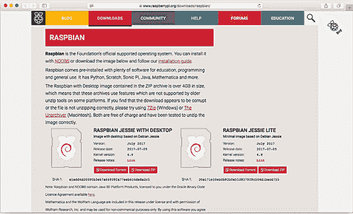

    大型下载完成后，解压生成的 zip 文件。如果一切顺利，你应该会得到一个 IMG 文件（一个可启动的磁盘镜像）。

    | |
    | --- |

    ##### 大型的 Raspbian zip 文件

    如 Raspbian 下载页面所示（图 11.6），生成的 zip 文件很大，您默认的解压工具可能无法完成解压任务（我的就不行）。如页面建议，如果遇到问题，请尝试 Mac 上的 The Unarchiver 或 Windows 上的 7Zip。

    | |
    | --- |

1.  创建可引导的 microSD 卡：

    1.  安装免费的应用程序 Etcher（[`etcher.io/`](https://etcher.io/)），适用于 Windows、Mac 或 Linux。这将允许您将 Raspbian IMG 文件烧录到 microSD 卡上。

    1.  将 microSD 卡插入 SD 卡适配器，然后将整个装置插入您的计算机或 SD 卡读卡器/写入器。

    1.  启动 Etcher 并按照步骤将 IMG 文件放置到 microSD 卡上（图 11.7）。

    ##### 图 11.7\. Etcher 是一个简单的实用程序：选择磁盘镜像文件，选择驱动器（它通常自动为您选择），然后开始。

    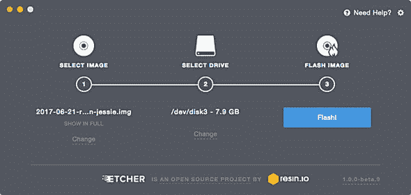

1.  向 microSD 卡添加文件以启用 SSH：

    1.  当 Etcher 完成操作——创建磁盘镜像需要几分钟时间——microSD 卡将从您的计算机中软弹出（卸载）。拔掉它，重新插上，然后打开引导分区（这可能是你能看到的唯一分区）。

    1.  创建一个名为“ssh”的空文件——没有扩展名——并将其放置在引导分区的顶层。这将启用 Pi 上的 SSH，否则在 Raspbian 中默认是禁用的。

1.  安装操作系统：

    1.  从您的计算机中弹出 SD 卡适配器，从适配器中取出 microSD 卡，并将其插入 Pi 3。

    1.  引导 Pi。

1.  通过以太网与您的 Pi 建立通信：

    1.  使用以太网线将 Pi 3 的以太网接口直接连接到您的无线路由器。

    1.  查找您的 Pi 的 IP 地址。您的 Pi 3 应该会自动分配一个 IP 地址（通过 DHCP），但您需要找出这个 IP 地址是什么。有很多种方法可以做到这一点。在 Google 上搜索“IP 扫描器”或“LAN 扫描器”，您将找到各种平台上的大量免费工具，或者您可以使用命令行工具。我使用 Mac 上的 LanScan（图 11.8）。目的是确定分配给您的 Pi 的 IP 地址。

    ##### 图 11.8\. 使用 LanScan for Mac，我可以看到 Raspberry Pi 的以太网接口被分配了 IP 地址 192.168.1.13。

    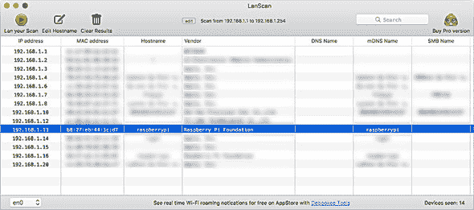

1.  一旦您获得了 Pi 的 IP 地址，打开终端并输入以下命令：

    ```
    $ ssh pi@<your Pi's IP>
    ```

| |
| --- |

##### 默认 Pi 用户名和密码

Raspberry Pi 的默认用户名是`pi`，密码是`raspberry`。更改`pi`用户的密码是个好主意。您可以通过在命令提示符下输入`passwd`并遵循屏幕上的说明来完成此操作。现在就做。

| |
| --- |

##### 在 Pi 上配置 WiFi

最后一步是为你的树莓派配置 WiFi，这样你就不必使用有线以太网连接。这涉及到对树莓派的`wpa_supplicant`设置进行操作。有时如果你直接编辑配置文件，可能会很棘手和令人沮丧。我发现最安全的方法是使用 wpa_cli 命令行工具：

| |
| --- |

##### 树莓派 3 的 WiFi 支持

树莓派 3，就像 Tessel 2 一样，不支持 5 GHz WiFi 网络。

| |
| --- |

1.  如果你还没有，请通过 SSH 连接到你的树莓派。

1.  通过输入以下命令启动一个交互式的 wpa_cli 会话：

    ```
    $ sudo wpa_cli
    ```

    这将使你进入交互模式。你可以在`>`提示符下输入后续命令。

1.  扫描可用的无线网络，以确保你的树莓派可以看到所需的 WiFi 网络。要这样做，输入以下内容：

    ```
    > scan
    ```

    然后输入以下内容，以查看扫描结果：

    ```
    > scan_results
    ```

    你的网络显示了吗？如果没有，检查你的路由器设置，确保它是一个兼容的 WiFi 网络（不是 5 GHz）。如果是，太好了！继续。

1.  执行以下每个命令以在树莓派的`wpa_supplicant`配置中添加、配置和启用所需的 WiFi 网络连接：

    ```
    > add_network 0
    > set_network 0 ssid "<your network's SSID>"
    > set_network 0 pwk "<your network's password>"
    > enable network 0
    > save_config
    ```

1.  按 Ctrl-C 退出 wpa_cli。

1.  为了验证它是否成功，输入以下内容：

    ```
    $ ifconfig wlan0
    ```

    如果一切正常，你应该会看到一个分配的 IP 地址（图 11.9）。

##### 图 11.9. 配置 WiFi 后，树莓派现在有两个 IP 地址——一个用于以太网接口，一个用于其 WLAN（WiFi）接口。

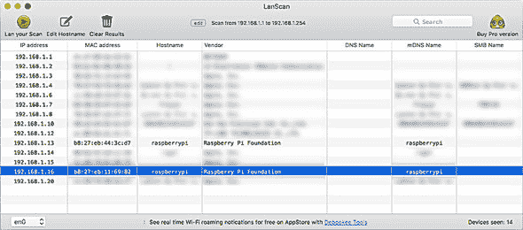

如果你喜欢，可以拔掉以太网连接。树莓派现在将自动连接到在此配置的 WiFi 网络，每次启动时都会连接。方便！

| |
| --- |

##### 如果你需要重新开始

如果你的树莓派运行不正常，或者你感到困惑或卡壳，重新开始并不太难。关闭树莓派电源，弹出 microSD 卡，然后用你想要的操作系统重新刷机：NOOBS 提供用户友好的可视化设置；Raspbian；或者任何其他你选择的兼容操作系统。从更新后的 SD 卡启动将给你一个全新的开始。

| |
| --- |

### 11.2. 学习关于树莓派 3

现在你已经配置了具有 WiFi 连接的树莓派，让我们首先应用第十章中概述的平台学习步骤，以更好地了解树莓派 3 平台的整体情况。

#### 11.2.1. 核心功能

单板计算机（SBCs）在处理能力上大大提升，与它们额外的功能相匹配。ARM 32 位 Cortex M 系列的微控制器是许多可以运行嵌入式 JavaScript 的平台的核心。使用完整的单板计算机，你将进一步提高处理器的性能。这些 32 位和 64 位处理器通常具有多个核心、3D 图形加速、更高的时钟速度和复杂的子系统。

树莓派 3 配备了四核 64 位 ARM（A8）CPU，运行频率为 1.2 GHz。这与 Arduino 的 20 MHz 8 位 ATmega 相比相去甚远（尽管这种比较可能不太恰当）。产品信息页上还列出了其他规格，包括 1 GB 的 RAM、板载 WiFi 和蓝牙、4 个 USB 端口、视频和立体声音频输出、HDMI 接口等（图 11.10）。更多信息请访问[树莓派 3 型号 B 产品页面](http://www.raspberrypi.org/products/raspberry-pi-3-model-b/)。

##### 图 11.10\. 树莓派网站上的树莓派 3 型号 B 规格亮点

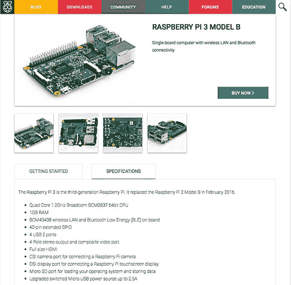

在 GPIO 方面，情况比较复杂。有多个 SPI 和 I²C 接口，引脚总数也很多。如前所述，没有 ADC 支持，PWM 也有限制。附加配件和某些外围设备可能需要连接到一些引脚上，这意味着根据你的配置，你可能无法访问所有 40 个引脚的 I/O。

由于树莓派 3 面向通用市场，其产品页面上的核心功能列表没有提到其 GPIO 逻辑电平电压为 3.3 V，但你应该知道：树莓派 3 是一个 3.3 V 的设备。

| |
| --- |

##### 严肃地说，树莓派是一个 3.3 V 的设备

不要将 5 V 电源连接到树莓派的任何引脚上，否则你可能会发现你的树莓派已经无法使用了。

| |
| --- |

#### 11.2.2\. GPIO 功能与引脚配置

树莓派的引脚配置很复杂。首先，引脚数量很多（40 个），有许多不同的引脚编号和命名方案，而且某个引脚可能已经被某个组件、过程或外围设备占用。例如，SPI 或 I²C 引脚这样的相关连接组并不一定在物理上是相邻的。pinout.xyz 网站是了解树莓派引脚细节的好资源。

以单个树莓派 GPIO 引脚的多种面貌为例，物理引脚 33（图 11.11）也被称为 BCM 13（博通引脚编号），其主要功能名称为 PWM1（它是具有 PWM 功能的引脚之一），以及 WiringPi 引脚 23。它还有几个功能性的别名，如`AVEOUT VID 9`。而且，它甚至可能用于 GPIO？如果你将并行外部显示器连接到树莓派上，它就是那些引脚之一。如果你想要使用 JTAG 调试接口或 SMI（二级存储接口）设备，它也可能是那些连接中使用的引脚之一。

##### 图 11.11\. pinout.xyz 是一个专门提供树莓派引脚信息网站。这个来自 pinout.xyz 的细节显示了物理引脚 33 的多个别名。

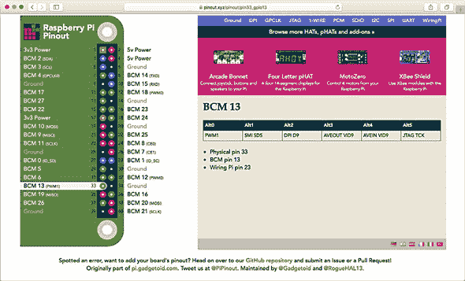

| |
| --- |

**SBC 和平台特定硬件术语**

看起来每个 SBC 平台都在物联网词汇中添加了更多的术语。就像 Arduino 兼容的扩展板被称为*盾牌*一样，适合树莓派的板通常被称为*帽子*，而与 BeagleBone Black 兼容的板则被称为*披风*。

| |
| --- |

#### 11.2.3\. 配置和工作流程

在 Pi 平台上，你可以做的和如何做几乎是没有边界的——毕竟，它是一个完整的计算机。让我们集中精力，关注以 Node.js 为中心的电子黑客配置的配置和工作流程选项。

到这一步，你应该有一个正在工作的 Pi——无论是作为独立计算机还是无头设备。为了使配置和工作流程更加稳定，你还需要完成以下三个步骤：

1.  确保 Pi 的软件是最新的。

1.  在 Pi 上安装一个可接受的 Node.js 版本。

1.  找出一种方法来编写代码并将其上传到 Pi 的文件系统。

##### 更新 Pi 的软件

确保 Pi 拥有最新的软件更新：

1.  通过 `ssh` 连接到 Pi（无头）或使用终端（桌面）。确保 Pi 已连接到互联网。

1.  运行以下命令：

    ```
    $ sudo apt update
    ```

    这可能需要几分钟才能完成。

1.  运行以下命令：

    ```
    $ sudo apt full-upgrade
    ```

    这可能需要几分钟才能完成其任务。

##### 升级 Pi 上的 Node.js

仍然登录到 Pi 或终端窗口中，尝试运行以下命令：

```
$ node --version
```

这将输出 Pi 上当前的 Node.js 版本。在撰写本文时，预安装的 Node.js 版本是 `v0.10.29`，这已经过时了。将其升级到 LTS（长期支持），这样我们就不需要在项目中遇到兼容性或安全问题：

1.  如果你还没有运行完整的系统更新（如前文所示），首先运行以下命令：

    ```
    $ sudo apt update
    ```

1.  通过执行以下命令下载并运行目标版本的 Node.js 设置脚本：

    ```
    $ curl -sL https://deb.nodesource.com/setup_6.x | sudo -E bash -
    ```

    在撰写本文时，LTS 版本是 v6.x。在你阅读本文时，这可能已经发生了变化，因此你可以将 URL 中的 `setup_6.x` 部分替换为适当的重大版本号。更多信息请参阅 NodeSource 二进制分发仓库 ([`github.com/nodesource/distributions`](https://github.com/nodesource/distributions))。

1.  安装 Node.js：

    ```
    $ sudo apt install -y nodejs
    ```

1.  通过运行以下命令验证是否成功：

    ```
    $ node --version
    ```

##### 管理 Pi 上的文件

你的 Pi 项目中的 JavaScript 文件和资源将在 Pi 上执行，并需要在 Pi 的文件系统中存在。不出所料，有无数种方法可以将你的文件上传到 Pi。以下是一些选项：

+   在 Pi 本身上编写文件。你可以使用基于终端的编辑器，如 `vi` 或 `nano`。或者，如果你为 Pi 配置了桌面环境，你可以使用预安装的 Leafpad 应用程序等 GUI 编辑器。或者，你可以安装任何数量的附加文本编辑应用程序。

+   使用实用程序将文件从你的计算机复制到 Pi。你可以使用 Unix 命令行工具 scp（安全复制）来移动文件，或者使用支持它的 GUI 应用程序，例如。

+   在 Pi 上设置一个文件服务器，以便你可以从网络上的其他计算机作为远程共享访问它。实现这一目标的一种可能方法就是使用 Samba (SMB) 服务器。

| |
| --- |

**在 Pi 上配置 Samba (SMB) 服务器**

让你的 Pi 文件易于访问的一种方法是在 Pi 上设置一个文件服务器。以下步骤设置了一个名为`projects`的 Samba（SMB）共享，该共享可以被`pi`用户读写访问。一旦配置完成，这个共享应该会出现在你的系统 Finder 或文件资源管理器中，作为一个网络驱动器。请注意，这些说明假设你对 Linux 命令行有一定的了解：

1.  以`pi`用户（无头）的身份使用`ssh`连接到 Pi，或使用终端应用程序（桌面）。

1.  确保你处于`pi`用户的家目录，通过输入以下命令：

    ```
    $pwd
    ```

    你应该看到以下输出：

    ```
    /home/pi
    ```

1.  创建一个目录来保存项目文件：

    ```
    $ mkdir projects
    ```

1.  安装 Samba：

    ```
    $ sudo apt install samba
    ```

1.  通过输入以下命令并按照提示操作，为`pi`用户设置 Samba 密码：

    ```
    $ sudo smbpasswd -a pi
    ```

1.  Samba 不使用系统密码；它维护自己的密码。

1.  编辑 Samba 配置文件。首先备份到你的家目录，以防万一：

    ```
    $ sudo cp /etc/samba/smb.conf ~/
    ```

1.  现在编辑配置：

    ```
    $ sudo vi /etc/samba/smb.conf
    ```

1.  （如果你更喜欢`nano`而不是`vi`，可以使用不同的编辑器。）滚动到文件的底部并添加以下行，包括`=`字符周围的空格：

    ```
    [projects]
        path = /home/pi/projects
        valid users = pi
        read only = No
    ```

1.  保存文件并退出。

1.  重新启动 Samba 服务：

    ```
    $ sudo service smbd restart
    ```

1.  如果喜欢，检查你的配置：

    ```
    $ testparm
    ```

你现在应该能够从同一网络上的其他计算机连接到 SMB 共享（在 Windows 文件资源管理器中使用映射网络驱动器或在 Mac 上使用连接到服务器或 Cmd-K）。连接字符串采用以下形式：

```
smb://user@host/sharename
```

你最终应该得到类似以下内容：

```
smb://pi@<your Pi's IP>/projects
```

Samba 共享有时可能不完美，你可能需要调整权限或用户元数据才能使其正常工作。如果你需要支持，网上有大量的用户论坛和帮助文章。

| |
| --- |
| |

##### 创建一个“项目”区域

在配置 Samba 服务器时，在侧边栏中创建名为“projects”的目录是步骤之一。即使你不在 Pi 上设置共享，也请创建一个目录来整理你即将进行的代码实验。本章的其余部分将假设存在一个`~/projects`目录（家目录内的“projects”目录）。

| |
| --- |

#### 11.2.4. 示例和教程

在 Raspberry Pi 上闪烁 LED 没有一种唯一的方法——选项几乎数不胜数。在这里，你将尝试几种方法，强调 JavaScript 选项。

| |
| --- |

##### 你需要的东西


+   1 个配置好的 Raspberry Pi 3

+   1 个 SparkFun Pi Wedge，Adafruit T-Cobbler 或类似产品；或公对母跳线

+   1 个标准 LED，任何颜色

+   1 个 100V 电阻

+   1 个面包板

+   跳线

| |
| --- |
| |

**正确使用`sudo`的方式**

由于 Raspbian 中与 GPIO 交互的权限较为保守，你可能需要使用`sudo`执行以下代码示例。例如，

```
$ sudo ./blink.sh
```

或者

```
$ sudo node index.js
```

如果没有`sudo`，你可能得到如下权限错误：

```
./blink.sh: line 4: /sys/class/gpio/gpio4/direction: Permission denied
./blink.sh: line 5: /sys/class/gpio/gpio4/value: Permission denied
./blink.sh: line 7: echo: write error: Operation not permitted
```

尝试只使用 `sudo` 来执行需要它的命令，例如执行这些脚本时。不要使用 `sudo` 来安装 npm 模块或创建文件等。如果你这样做，可能会创建具有奇怪权限的东西。如果有疑问，先尝试在不使用 `sudo` 的情况下执行一些操作，看看是否可行。

| |
| --- |

##### 构建 LED 电路

以下每个示例都使用相同的物理电路配置：LED 的阳极应连接到 Pi 的物理引脚 7（WiringPi 引脚 7，BCM 引脚 4）。阴极应连接到 GND 引脚。

接线图显示了直接连接到 Pi 的连接（图 11.12）、Adafruit 的 T-Cobbler（图 11.13）和 SparkFun 的 Pi Wedge（图 11.14）。

##### 图 11.12\. 使用公对母跳线直接连接 LED 到 Pi 引脚的接线图

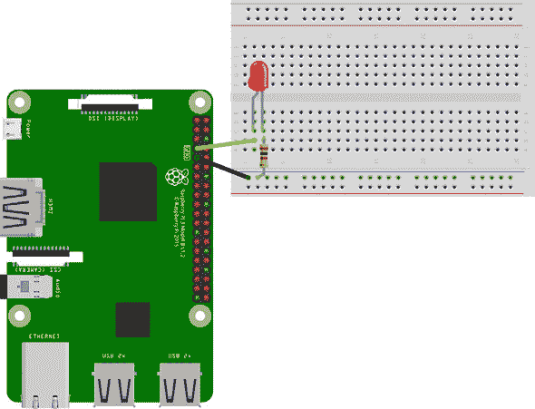

##### 图 11.13\. 使用 Adafruit 的 T-Cobbler 的接线图

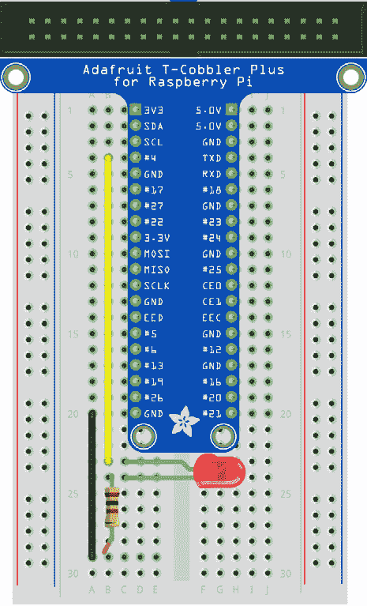

##### 图 11.14\. 使用 SparkFun 的 Pi Wedge 的接线图

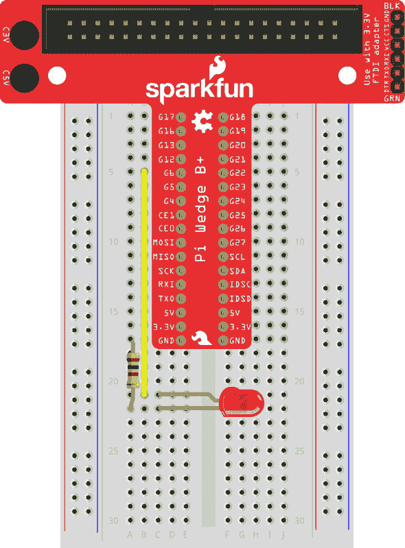

##### 使用 sysfs 闪烁 LED

*Sysfs* 是一个 Linux 伪文件系统，它将连接的设备和系统的配置组织成文件系统层次结构。sysfs 导出到用户空间中的每个实体都由一个目录表示。Sysfs 挂载在 /sys 上，并且从 /sys/class/gpio 中可以控制 Pi 的 GPIO 引脚。

对于你想要使用的每个引脚，你需要执行以下操作：

1.  导出引脚。这是通过将引脚号写入 /sys/class/gpio/export 文件并使用 BCM 编号方案来完成的。这将创建一个用于引脚的目录（`<pin_directory>`）。

1.  配置引脚，例如通过将值 `'in'` 或 `'out'` 写入 /sys/class/gpio/<pin_directory>/direction。

1.  与引脚交互，例如通过从 /sys/class/gpio/<pin_directory>/value 文件中读取或向其写入值。

1.  清理。通过将引脚号写入 /sys/class/gpio/unexport 文件来取消导出引脚。

通过示例可能更容易理解。闪烁连接到物理引脚 7、BCM GPIO 4 的 LED 一次——打开然后再次关闭——可以通过使用 shell 脚本来实现，如下面的列表所示。

要尝试 sysfs，在你的 ~/projects 目录内创建一个“blink-sysfs”目录。

##### 列表 11.1\. 一个用于闪烁连接的 LED 一次的 bash 脚本

```
#! /bin/bash
# Export the pin so we can work with it
echo "4" > /sys/class/gpio/export
# Set the pin up as an output pin
echo "out" > /sys/class/gpio/gpio4/direction
# Turn on the LED by setting the pin to HIGH ("1")
echo "1" > /sys/class/gpio/gpio4/value
# Do nothing for one second
sleep 1
# Turn off the pin by setting it to LOW ("0")
echo "0" > /sys/class/gpio/gpio4/value
sleep 1
# Unexport the pin to clean up after ourselves
echo "4" > /sys/class/gpio/unexport
```

要运行 blink.sh 脚本，你需要使文件可执行。你可以在 ~/projects/blink-sysfs 目录内运行以下命令来完成：

```
$ chmod +x ./blink.sh
```

现在通过输入以下内容来尝试：

```
$ sudo ./blink.sh
```

##### 使用 sysfs 和 Node.js 闪烁 LED

最后，这些只是文件系统操作，因此你也可以使用 Node.js 的内置 `fs` 模块来完成，如下一个列表所示。

##### 列表 11.2\. 使用 sysfs 和 Node.js 闪烁 LED

```
const fs = require('fs');
const sysfsPath = '/sys/class/gpio';
const ledPin = '4';                              *1*
const blinkTotal = 10;

var blinkCount = 0;
var ledStatus = false;

// Export and configure the pin as an output
fs.writeFileSync(`${sysfsPath}/export`, ledPin);
fs.writeFileSync(`${sysfsPath}/gpio${ledPin}/direction`, 'out');

var blinker = setInterval(() => {
  if (ledStatus) {
    // The LED is on. Turn it off.
    fs.writeFileSync(`${sysfsPath}/gpio${ledPin}/value`, '0');
    blinkCount++; // This completes one blink cycle
    if (blinkCount >= blinkTotal) {
      console.log('All done blinking');
      // Clean up after ourselves
      fs.writeFileSync(`${sysfsPath}/unexport`, '4');
      clearInterval(blinker);
    }
  } else {
    // The LED is off. Turn it on.
    fs.writeFileSync(`${sysfsPath}/gpio${ledPin}/value`, '1');
  }
  ledStatus = !ledStatus; // The LED has swapped status
}, 1000);
```

+   ***1* 注意，在这个例子中，引脚号和所有写入的值都是字符串。**

通过以下命令尝试：

```
$ sudo node index.js
```

| |
| --- |

**别忘了取消导出**

当你完成时，真的需要在 gpio 目录中 `unexport` 对象，否则下次你想使用该引脚时可能会遇到问题。当你尝试运行 Node.js 闪烁脚本时，如果看到类似这样的错误，很可能是因为引脚没有被正确地取消导出：

```
Error: EBUSY: resource
busy or locked, write
```

你可以在终端中执行以下命令来手动清理：

```
$ echo "4" > /sys/class/gpio/unexport
```


你可以用一本百科全书来填满所有你可以用 `sysfs` 做的事情，但让我们继续前进。了解 `sysfs` 是好的，但直接与之工作需要耐心，并且涉及一个学习曲线。

##### WiringPi

WiringPi 是一个抽象包装器，试图使引脚编号更合理，并且它暴露了一个更熟悉的 Arduino 风格的 API。它是用 C 编写的，但 Ruby 和 Python 库很受欢迎。有一个 npm 包提供了 Node.js 绑定：`wiring-pi`。

如果你想尝试一下，在你的 ~/projects 区域创建一个名为 blink-wiring-pi 的目录。在该目录内，运行以下命令：

```
$ npm install wiring-pi
```

然后创建一个名为 index.js 的文件，其内容如下所示。在这个脚本中，`status` 值在 `0` 和 `1` 之间切换，分别用于关闭和打开 LED。

##### 列表 11.3\. index.js

```
const wpi = require('wiring-pi');
const ledPin = 7;                             *1*
const blinkTotal = 10;
var blinkCount = 0;
var status = 1;                               *2*

wpi.setup('wpi');
wpi.pinMode(ledPin, wpi.OUTPUT);              *3*

var blinker = setInterval(() => {
  wpi.digitalWrite(ledPin, status);           *4*
  if (!status) {
    blinkCount++;
    if (blinkCount >= blinkTotal) {
      console.log('All done blinking!');
      clearInterval(blinker);
    }
  }
  status = +!status;                          *5*
}, 1000);
```

+   ***1* 与之前相同的物理引脚，但使用 WiringPi 编号，实际上它们是 JavaScript 数字（不是字符串）**

+   ***2* 注意状态是一个数字（0 或 1），而不是之前的布尔值。**

+   ***3* pinMode() 和 OUTPUT 常量与 Arduino 语言 API 相呼应。**

+   ***4* 这里的状态值要么是 1（高）要么是 0（低）。**

+   ***5* 取反状态值的布尔等效值并将其再次转换为数字（+ 操作符）**

要运行脚本，使用以下命令：

```
$ sudo node index.js`
```

##### Johnny-Five 与 raspi-io I/O 插件

为了完成闪烁的盛宴，我们将回到我们的老朋友 Johnny-Five。就像 `tessel-io` Johnny-Five I/O 插件使得使用 Johnny-Five 与 Tessel 成为可能一样，npm 包 `raspi-io` 允许你在 Raspberry Pi 上使用 J5。

在 ~/projects 目录中创建一个名为 blink-j5 的目录。

在 blink-j5 目录内，运行以下命令来安装 Johnny-Five 和 `raspi-io` 包：

```
$ npm install johnny-five raspi-io
```

对于你的下一个技巧，你将使用你尝试过的第一个 LED 脚本之一——从很久以前的 第二章——并将其修改为在 Pi 上工作，如下所示。所需更改仅包括和使用 `raspi-io` 插件来提供 I/O，以及更改 LED 的引脚编号。就是这样！

##### 列表 11.4\. 使用 Johnny-Five 闪烁 LED

```
const five = require('johnny-five');
const Raspi = require('raspi-io');                 *1*

const board = new five.Board({io: new Raspi()      *2*
});

board.on('ready', () => {
  const led = new five.Led(7);                     *3*
  var blinkCount = 0;
  const blinkMax = 10;

  led.blink(500, () => {
    blinkCount++;
    console.log(`I have changed state ${blinkCount} times`);
    if (blinkCount >= blinkMax) {
      console.log('I shall stop blinking now');
      led.stop();
    }
  });
});
```

+   ***1* 需要 raspi-io I/O 插件模块**

+   ***2* 使用 Raspi 对象进行 io**

+   ***3* 使用 WiringPi 编号方案**

`Raspi-io` 支持多种 Pi 引脚编号方案。作为 JavaScript `Number` 值传递的引脚自动被认为是 WiringPi 编号。但你也可以使用物理引脚编号和功能名称（如 `GPIO4`）。有关更多详细信息，请参阅插件的文档（[`github.com/nebrius/raspi-io`](https://github.com/nebrius/raspi-io)）。

#### 11.2.5\. API 文档

由于有无数种方式可以使用 Pi 控制硬件，因此没有单一的 API 文档来源。相反，我们将使用 Johnny-Five、Node.js 和 `raspi-io` I/O 插件，因此在我们探索时，您需要将那些 API 的文档网站放在手边。

### 11.3\. 为不同平台编写 Johnny-Five 应用程序

如 列表 11.4 所示，将 Johnny-Five 应用程序调整到不同的平台（例如从 Arduino Uno 迁移到 Raspberry Pi）可以非常简单。通常这只是一个选择正确的 I/O 插件和在代码中更新一些引脚编号的问题。

在本节接下来的几个实验中，您将调整第八章中为 Tessel 创建的基于 BMP180 的实时更新天气应用（图 11.15）。遵循您对单板计算机和 Raspberry Pi 3 的具体探索，您将首先在 Pi 3 上实现气象站，然后使其在 Arduino Uno 上工作。

##### 图 11.15\. 小型天气应用提供实时更新的温度和压力数据，可以在同一网络上的任何计算机上的浏览器中查看。

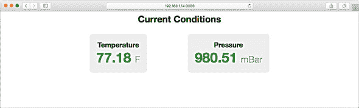

您可以在 GitHub 上的本书源代码库中找到天气站应用的 Tessel 版本的源代码。

#### 11.3.1\. 为 Pi 3 调整小型气象站

| |
| --- |

##### 您需要


+   1 个配置好的 Raspberry Pi 3

+   1 个 SparkFun Pi Wedge、Adafruit T-Cobbler 或类似的；或公对母跳线

+   1 个 BMP180 多传感器开发板

+   1 个面包板

+   跳线

| |
| --- |

作为复习，天气应用有两个主要组件：

+   服务器代码——这包括用于处理 I/O 和读取传感器数据的 Johnny-Five 代码，一个静态 web 服务器（使用 `express`），以及一个 socket.IO 服务器，它发出表示天气数据更新的事件（socket.IO 客户端可以监听这些事件）。

+   客户端代码——这是以单个 HTML 页面——index.html 的形式存在的，将由 `express` 静态 web 服务器提供。一旦在浏览器中加载，index.html 就会作为客户端连接到 socket.IO 服务器，以便接收和显示天气数据，而无需用户刷新页面。

这种模式——I/O 处理和基于浏览器的前端结合——可以重用来构建许多不同类型的物联网应用。这是一个值得保留在您口袋里的有用模式。

##### 构建电路

首先，您需要通过将 BMP180 开发板连接到您的 Pi 来构建电路。与闪烁的 LED 一样，具体操作将取决于您的设置。提供了直接连接到 Pi 的布线图（图 11.16）、SparkFun Pi Wedge (图 11.17）和 Adafruit 的 T-Cobbler (图 11.18）。

##### 图 11.16\. BMP180 的布线图，显示直接连接到 Pi

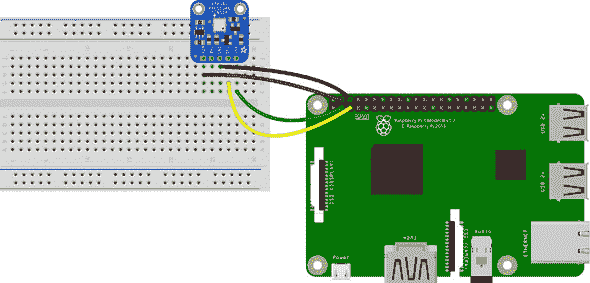

##### 图 11.17\. BMP180 和 SparkFun Pi Wedge 的布线图

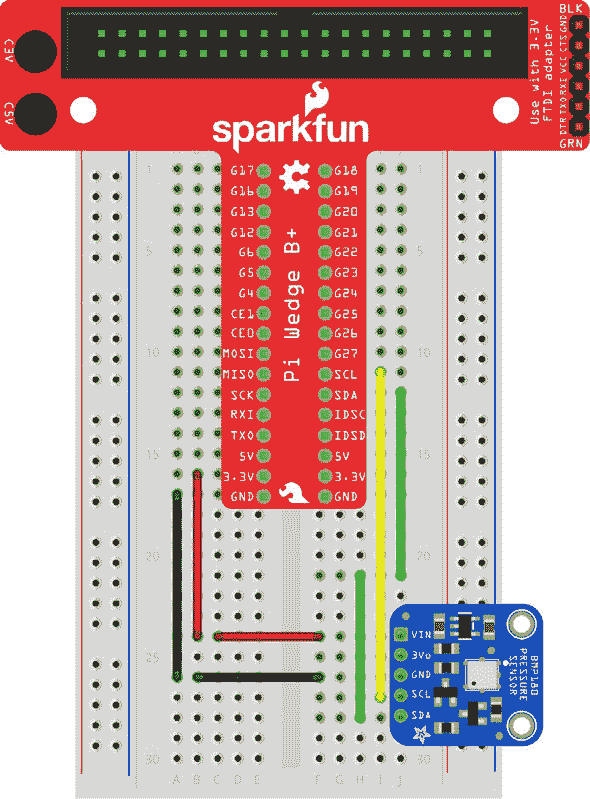

##### 图 11.18\. BMP180 和 Adafruit T-Cobbler 的接线图

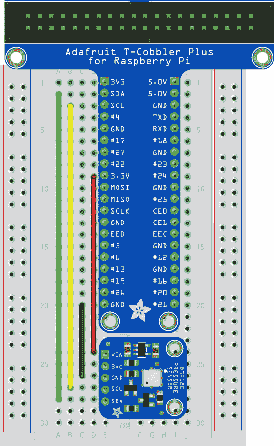


##### `Raspi-io` 和 I²C

BMP180 是 I²C。`Raspi-io` 支持 I²C，但要启用它，您需要在安装 `raspi-io` 后重启（如果您还没有重启的话）。（提示：`sudo reboot` 是一个方便的命令。）


##### 测试 BMP180

在适配 Tessel 的天气站软件之前，您将编写一个基本的脚本来将 BMP180 温度和压力数据记录到控制台。这将确认 Raspbian、`raspi-io`、I²C 和 BMP180 正在和谐地一起工作：

1.  建立工作区域。在您的 Pi 项目目录中创建一个名为“weather”的目录：

    ```
    $ mkdir weather
    ```

1.  在天气目录中，运行以下命令：

    ```
    $ npm install johnny-five raspi-io
    ```

1.  创建一个 index.js 文件，并用下一列表中的代码填充。

##### 列表 11.5\. 测试 Pi、Johnny-Five、`raspi-io` 和 BMP180

```
const five = require('johnny-five');
const Raspi = require('raspi-io');

const board = new five.Board({
  io: new Raspi()                     *1*
});

board.on('ready', () => {
  const bmp180 = new five.Multi({
    controller: 'BMP180'
  });
  bmp180.on('change', () => {
    var temperature = bmp180.thermometer.fahrenheit.toFixed(2);
    var pressure    = bmp180.barometer.pressure.toFixed(2);
    console.log(`${temperature}°F | ${pressure}kPa`);
  });
});
```

+   ***1* 再次使用 raspi-io 插件进行 I/O**

在前面的列表中，请注意，在 `Multi` 传感器组件（分配给 `bmp180` 变量）的实例化中，您不必指定 BMP180 连接到的引脚。`Raspi-io` “知道” Raspberry Pi 上具有 I²C 功能的引脚在哪里，并为您配置接口！这很方便。

尝试一下。仍然在天气目录中，运行以下命令：

```
$ sudo node index.js
```

您应该看到温度和压力数据记录到控制台，如下所示。

##### 列表 11.6\. 测试 BMP180 脚本的示例输出

```
>> 77.54°F | 98.05kPa
77.54°F | 98.05kPa
77.54°F | 98.05kPa
77.54°F | 98.05kPa
77.54°F | 98.06kPa
77.54°F | 98.05kPa
77.72°F | 98.06kPa
77.72°F | 98.06kPa
77.54°F | 98.05kPa
```

##### 进行 Pi 特定更改

现在您将对 Pi 进行一些特定更改。创建一个新的工作区域，一个名为“pi-weather”的目录。将书中 GitHub 仓库中的原始天气应用程序源文件复制到该目录中，但省略 .tesselinclude。您最终应该得到以下结构。

##### 列表 11.7\. 项目目录和文件结构

```
pi-weather/
 app
 index.html
 style.css
 index.js
 package.json
```


##### 不要复制 node_modules 目录

如果您不小心在 pi-weather 目录中（从之前与 Tessel 的实验中复制）得到了一个 node_modules 目录，请在继续之前将其删除：

```
$ rm -rf node_modules
```


代码中有两个地方需要更改：

+   package.json—您需要更新依赖项。

+   index.js—您需要使用 raspi-io 进行 I/O。

##### 更新 package.json 依赖项

首先编辑 package.json。它应该包含部分 `dependencies` 对象，其外观应类似于以下列表，尽管您的版本号可能不同。删除 `tessel-io` 依赖项，因为您不需要它用于 Raspberry Pi 版本。

##### 列表 11.8\. Tessel 项目的 package.json 依赖项

```
"dependencies": {
  "express": "⁴.14.1",
  "johnny-five": "⁰.10.4",
  "socket.io": "¹.7.3",         *1*
  "tessel-io": "⁰.9.0"          *2*
}
```

+   ***1* 如果 tessel-io 条目是最后一个，别忘了删除尾随的逗号。**

+   ***2* 删除此行。**

现在安装剩余的依赖项：

```
$ npm install
```

然后使用 `--save` 标志添加一个新的依赖项—`raspi-io`—并将更改写入 package.json 中的 `dependencies`：

```
$ npm install --save raspi-io
```

##### 更新 index.js

在 index.js 中需要做的更改很简单。

1.  替换此行，

    ```
    const Tessel   = require('tessel-io');
    ```

    使用这个：

    ```
    const Raspi   = require('raspi-io');
    ```

1.  将 `board` 实例化更新为使用 `raspi-io` 而不是 `tessel-io`，更改此行，

    ```
    const board = new five.Board({ io: new Tessel() });
    ```

    看起来像这样：

    ```
    const board = new five.Board({ io: new Raspi() });
    ```

生成的 index.js 内容应如下所示。

##### 列表 11.9\. 兼容 Pi 的 index.js 版本

```
const five     = require('johnny-five');
const Raspi   = require('raspi-io');
const express  = require('express');
const SocketIO = require('socket.io');

const path = require('path');
const http = require('http');
const os   = require('os');

const app    = new express();
const server = new http.Server(app);
const socket = new SocketIO(server);
app.use(express.static(path.join(__dirname, '/app')));

const board = new five.Board({ io: new Raspi() });

board.on('ready', () => {
  const weatherSensor = new five.Multi({
    controller: 'BMP180',
    freq: 5000
  });

  socket.on('connection', client => {
    weatherSensor.on('change', () => {
      client.emit('weather', {
        temperature: weatherSensor.thermometer.F,
        pressure: (weatherSensor.barometer.pressure * 10)
      });
    });
  });

  server.listen(3000, () => {
    console.log(`http://${os.networkInterfaces().wlan0[0].address}:3000`);
  });
});
```

在 app/index.html 中不需要做任何修改，因为那是客户端代码——它在用户的浏览器中运行，并且不受平台变化的影响。

在天气目录中使用此命令运行应用程序：

```
$ sudo node index.js
```

一旦服务器代码初始化，它将输出可以访问 Pi 同一网络上的天气显示的 URL（如下所示列表）。将您的计算机浏览器指向记录的 URL 以查看天气站的实际运行情况。

##### 列表 11.10\. 启动天气站应用程序时的示例输出

```
pi@raspberrypi:~/projects/weather $ sudo node index.js
1499532864338 Available RaspberryPi-IO
1499532864960 Connected RaspberryPi-IO
1499532864984 Repl Initialized
>> http://192.168.1.16:3000
```

#### 11.3.2\. 将迷你天气站适配到 Arduino Uno

使天气应用程序在其他 Johnny-Five 支持的平台上运行同样简单直接。将天气应用程序适配到连接到您自己的计算机的 Arduino Uno 上，而不是 Pi 上，是快速的工作。

| |
| --- |

##### 你需要


+   1 Arduino Uno

+   1 面板

+   1 BMP180 多传感器扩展板

+   跳线

| |
| --- |

1.  将应用程序的 Pi 版本——天气目录及其内容（不包括 node_modules 目录），复制到您的计算机上。

1.  编辑 package.json。移除 `raspi-io` 依赖项；Arduino 平台的 I/O 支持已内置到 Johnny-Five 中，不需要 I/O 插件。

1.  安装依赖项：

    ```
    $ npm install
    ```

1.  编辑 index.js 文件：

    1.  移除 `raspi-io` 的 `require` 语句。

    1.  修改 `board` 实例化。移除对 `Raspi` 的引用，使其如下所示：

        ```
        const board = new five.Board();
        ```

1.  将 BMP180 按照图 11.19（图 11.19）所示连接到 Arduino Uno。

##### 图 11.19\. BMP180 和 Arduino Uno 的接线图

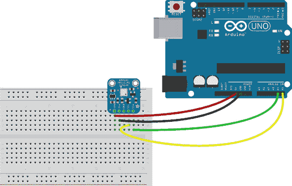

将 Uno 连接到您的计算机并运行应用程序。这里不需要 `sudo`：

```
$ node index.js
```

### 11.4\. 将 Raspberry Pi 作为主机使用

记住，Raspberry Pi 3 是一台“真正的”计算机，所以没有理由你不能将其作为主机在主机-客户端设置中使用，就像你用自己的计算机一样，配备自己的 Arduino。

| |
| --- |

##### 你需要


+   1 配置好的 Raspberry Pi 3

+   1 Arduino Uno

+   1 面板

+   1 BMP180 多传感器扩展板

+   跳线

| |
| --- |

1.  将 Arduino Uno 版本的天气应用程序代码（同样不包括 node_modules 目录）复制到 Pi 上。

1.  安装依赖项：

    ```
    $ npm install
    ```

1.  将连接到 BMP180（如图 11.23（图 11.23）所示）的 Arduino Uno 插入 Pi 的四个 USB 端口之一。

1.  运行应用程序：

    ```
    $ node index.js
    ```

    （这里不需要使用 `sudo`，因为你没有使用 Pi 的 GPIO。）

| |
| --- |

##### 使用 Raspberry Pi 3 和 Tessel 2 的天气站

没有任何技术原因阻止你将 Tessel 2 版本的天气应用程序部署到 Tessel 上（而不是从你的电脑上部署）。然而，首先，你需要在 Pi 上安装 `t2-cli` 并从它那里配置 Tessel，具体操作请参考 Tessel 的“安装 Tessel 2”页面 ([`tessel.github.io/t2-start/`](http://tessel.github.io/t2-start/))。

| |
| --- |

最终，Raspberry Pi 平台是一个充满选择和选项的广阔世界。Pi 3 本身就是一个真正的计算机，它具有作为主机在主机-客户端设置中的能力，这对于不想处理 Pi 的复杂 GPIO 来说特别方便。但如果你确实想深入研究 Pi 的板载 GPIO，当然有无数种方法可以完成任务。

### 11.5. 案例研究：BeagleBone Black

Pi 并非市场上唯一的游戏——还有许多其他的单板计算机（SBC）平台。为了了解它们之间的共性和差异，让我们简要地浏览一下 BeagleBone Black (图 11.20)，它是 BeagleBoard 家族中的一员。

##### 图 11.20. BeagleBone Black 单板计算机

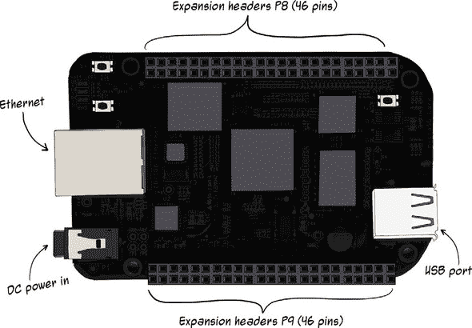

#### 11.5.1. 了解 BeagleBone Black

比较任何两个 SBC 常常是苹果和橙子的比较；不同的平台针对不同的应用。Pi 3 在 CPU 和外围设备竞赛中获胜（多核 CPU、更高的时钟速度、更多的 USB 端口等），但 BeagleBone Black 在 GPIO 功能方面超过了 Pi，并且在空闲时更加节能。BeagleBone Black 的 Rev C 版本还增加了 RAM：它有 4 GB。

另一个重要的区别是，尽管你可以在 Raspberry Pi 上运行的 Linux 发行版是开源的，但其硬件并非如此。Pi 由 Raspberry Pi 基金会独家制造，并包含一些闭源组件。相比之下，BeagleBoard 是开源硬件。

一块 BeagleBone Black 的价格大约是 55 美元。

##### 核心功能

如前所述，BeagleBone Black 的 CPU 是单核，运行速度为 1.0 GHz，比 Pi 3 的 1.2 GHz 慢。然而，它们都是 ARM v8 芯片，所以总体上并不太相似。如果你选择 Rev C 版本，你将获得 4 GB 的 RAM（旧版本有 512 MB）。与 Pi 一样，BeagleBone Black 有一个 microSD 插槽，但它还内置了 4 GB 的 eMMC 闪存存储。它有一个 USB 端口，一个 mini-HDMI 接口和一个以太网接口 (图 11.21)。

##### 图 11.21. BeagleBone Black 在 BeagleBoard 网站上的信息页面

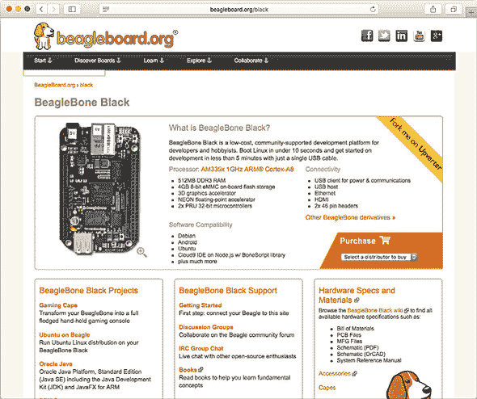

##### GPIO 功能和引脚配置

BeagleBone Black 拥有丰富的 GPIO。有 92 个（九十二个！）引脚。它支持 4 个 UART，65 个具有中断能力的数字 I/O 引脚，8 个 PWM 引脚和 7 个模拟输入。而 Pi 是一个同时做 GPIO 的计算机，而 BeagleBone 则更像是一个以 GPIO 为主的冠军，同时也能进行计算。

| |
| --- |

**BeagleBone Black 和非以太网连接选项**

基本版的 BeagleBone Black 没有内置 WiFi，但你可以使用第三方适配器添加支持。你可以在嵌入式 Linux Wiki 的 BeagleBone Black 页面上找到支持的 WiFi 适配器列表（[`mng.bz/Uj9d`](http://mng.bz/Uj9d)）。

另一种网络方法允许你通过 USB 连接 `ssh` 到你的 BeagleBone Black。这可能需要你安装一些驱动程序或调整一些其他配置；有关更多详细信息，请参阅 BeagleBoard 网站的“入门”页面（[`beagleboard.org/getting-started`](http://beagleboard.org/getting-started)）。

| |
| --- |

BeagleBone Black 的引脚分为两组 *扩展头*，每组有 46 个引脚。由于板的直流电源连接位于顶部，扩展头 P9 位于左侧，P8 位于右侧（至于 P1–P7 发生了什么：不知道）。与 Pi 类似，BeagleBone Black 的许多引脚可以扮演多个角色。

你将使用另一个 Johnny-Five I/O 插件来控制 BeagleBone Black 的 GPIO。图 11.22 展示了 `beaglebone-io` Johnny-Five I/O 插件支持的引脚及其功能。要使用 `beaglebone-io` 引用引脚，你需要在引脚的物理编号前加上头文件编号，例如 P9_11 表示 P9 头上的第 11 个引脚。由于你将只使用 I²C 接口，因此你不需要提供任何引脚编号——`beaglebone-io` 将自动使用引脚 `P9_19`（SCL）和 `P9_20`（SDA）。

| |
| --- |

##### BeagleBone Black 电压

BeagleBone Black 的模拟输入引脚仅接受高达 1.8 V 的输入电压。

| |
| --- |

重要的是要注意，图 11.22 中显示的引脚功能并不代表 BeagleBone Black 在这些引脚上提供的所有硬件支持，而是 `beaglebone-io` 插件提供的支持（用于 Johnny-Five 脚本）。

##### 图 11.22\. 通过 `beaglebone-io` Johnny-Five I/O 插件可用的 BeagleBone Black 引脚功能

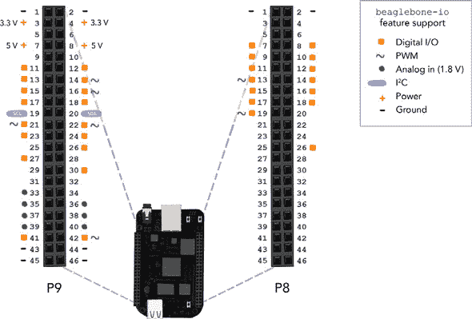

例如，这里没有显示 UART/TTL 串行支持，但 BeagleBone Black 确实有几个 UART。有时，寻找相关的引脚图可能会因为引脚实际功能取决于你如何使用它们而变得复杂。

| |
| --- |

##### BBB GPIO 超越 Johnny-Five

你计划在其他非 Johnny-Five 的环境中使用你的 BeagleBone Black 吗？你需要寻找一个更完整的引脚图。网上有大量的其他 BeagleBone Black 引脚图。BeagleBone Black 有 96 个引脚，每个引脚可以扮演五到六个不同的角色，并使用不同的命名约定进行引用。这可能会导致一些相当令人眼花缭乱的图表。请耐心一些：这真的是一大堆需要视觉上吸收的信息。

| |
| --- |

##### 配置和工作流程

一种配置 BeagleBone Black 的方法与本章前面提到的 Raspberry Pi 3 设置非常相似，只是没有 WiFi 设置（没有 WiFi 可配置）。

该板附带Ångström，一个嵌入式 Linux 发行版，但此设置过程将其替换为 Debian。有关创建可启动的 microSD（步骤在此处简化）的更多详细信息，请参阅之前的 Raspberry Pi 3 设置第 11.4 节：

1.  在[`beagleboard.org/latest-images`](http://beagleboard.org/latest-images)下载最新的 BeagleBone Debian 镜像。

1.  使用 Etcher 应用程序将镜像烧录到 SD 卡上。

1.  您不想反复从 SD 卡启动，所以您需要将操作系统镜像刷写到板载 eMMC 闪存中。这需要额外的、稍微有些麻烦的步骤：需要编辑一个配置文件。在您用 Debian 镜像刷写 SD 卡后，您的电脑可能无法读取它（我的电脑就是这种情况）。取而代之的是，您可以一次性直接从 SD 卡启动 BeagleBone Black，以便编辑那个配置文件：

    1.  将带有 Debian 镜像的 microSD 卡插入 BeagleBone Black。

    1.  使用以太网线将 BeagleBone Black 直接连接到您的路由器，然后为 BeagleBone Black 插上电源。BeagleBone Black 需要一两分钟的时间来启动并获取网络上的 IP 地址。

    1.  启动您的局域网或 IP 扫描工具以确定 BeagleBone Black 的 IP 地址。

    1.  从您的电脑上，在终端中，使用`debian`用户(`ssh`在此处使用的 Debian 镜像中默认启用)连接到 BBB：

        ```
        $ ssh debian@<BBB IP>
        ```

        该用户有一个默认密码，首次登录时会显示给您。

    1.  编辑相关的配置文件：

        ```
        $ sudo vi /boot/uEnv.txt
        ```

        （或者如果您不喜欢`vi`，可以使用您喜欢的编辑器）。在文件的底部附近找到以下行并取消注释它（移除`#`）：

        ```
        #cmdline=init=/opt/scripts/tools/eMMC/init-eMMC-flasher-v3.sh
        ```

        保存并退出文件。取消注释该行将允许 BeagleBone Black 在启动时运行一个脚本，该脚本将复制（刷写）SD 卡的内容到内置的 eMMC。

1.  现在，关闭 BeagleBone Black 的电源。在 SD 卡仍然插入的情况下，按住 BOOT/USER 按钮(图 11.23)并重新连接电源。继续按住按钮几秒钟，直到所有板载 LED 灯瞬间亮起。然后您可以松开按钮。

    ##### 图 11.23. BeagleBone Black 上的 BOOT/USER 按钮

    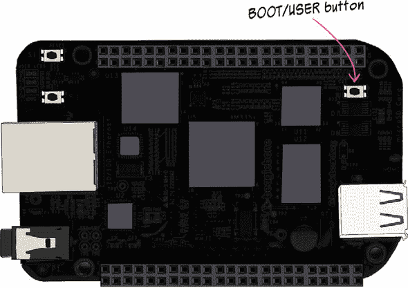

1.  eMMC 刷写过程需要一段时间——BeagleBoard 的网站表示需要 30-45 分钟。您可以通过所有 BeagleBone Black 的蓝色 LED 灯都熄灭来判断何时完成（坦白说，从它默认的闪烁中解脱出来是个令人欢迎的休息！）。

1.  关闭 BeagleBone Black 的电源并弹出 SD 卡。再次打开电源。

1.  从您的电脑上，以`debian`用户身份使用`ssh`连接到 BeagleBone Black。

1.  运行此命令：

    ```
    $ lsb_release -a
    ```

    您应该看到类似以下内容的输出：

    ```
    No LSB modules are available.
    Distributor ID:    Debian
    Description:    Debian GNU/Linux 8.7 (jessie)
    Release:    8.7
    Codename:    jessie
    ```

1.  要查看您拥有的 Node.js 版本，请运行此命令：

    ```
    $ node --version
    ```

    我得到了`v4.8.0`。

1.  如果您想更新 Node.js 版本，欢迎您这样做，但 v4.8.x 已经足够支持本节中其余的代码示例。

##### 示例和教程

接下来，你将使用 Johnny-Five 和`beaglebone-io`插件来给 BeagleBone Black 进行一次“Hello World”的 LED 式旋转，你可以访问板载 LED，因此这是一个快速的任务（无需电路）。

通过 SSH 连接到你的 BeagleBone Black，并创建一个工作区域（一个项目目录或类似）。在这个目录内，安装 Johnny-Five 和`beaglebone-io` I/O 插件：

```
$npm install johnny-five beaglebone-io
```

创建一个 index.js 文件，并添加以下列表的内容。

##### 列表 11.11\. 在 BeagleBone Black 上闪烁 LED

```
var five = require('johnny-five');
var BeagleBone = require('beaglebone-io');

var board = new five.Board({
  io: new BeagleBone()                 *1*
});

board.on('ready', function () {
  var led = new five.Led();            *2*
  led.blink(500);
});
```

+   ***1* 使用 beaglebone-io 插件**

+   ***2* 这里没有给出引脚编号：beaglebone-io 将自动使用板载 LED。**

现在运行它！与 Pi 一样，这里你需要`sudo`：

```
$ sudo node index.js
```

你现在应该能看到 BeagleBone Black 的一个蓝色 LED 每 500 毫秒闪烁一次。

##### API 文档

再次强调，你在这里选择的是 Johnny-Five 路线。`beaglebone-io`插件的文档包含了关于引脚支持和插件使用细节的重要信息([`github.com/julianduque/beaglebone-io`](https://github.com/julianduque/beaglebone-io))。

#### 11.5.2\. 为 BeagleBone 适配天气站


##### 你需要的东西


+   1 配置好网络连接的 BeagleBone Black 和电源

+   1 面包板

+   1 BMP180 多传感器扩展板

+   跳线


到现在为止，天气应用的总体适配模式已经变得熟悉：

1.  按照图 11.24 所示连接 BMP180 到 BeagleBone Black。

    ##### 图 11.24\. BMP180 和 BeagleBone Black 的接线图

    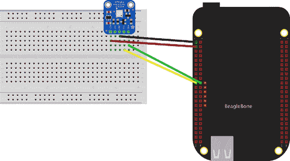

1.  在 BeagleBone Black 上创建一个天气目录，并将原始（Tessel 变体）的天气站源代码复制进去，不包括 node_modules。

1.  编辑 package.json 以移除`tessel-io`依赖项。

1.  运行`$ npm install`来安装依赖项。

1.  运行`$npm install --save beaglebone-io`来安装`beaglebone-io`插件并将其保存到 package.json。

1.  编辑 index.js：

    1.  移除`tessel-io`依赖项，并用`beaglebone-io`替换：

        ```
        const BeagleBone = require('beaglebone-io');
        ```

    1.  将`board`实例化改为使用`beaglebone-io`插件：

        ```
        const board = new five.Board({
          io: new BeagleBone()
        });
        ```

BeagleBone Black 还需要你几个快速技巧。

事实上，BeagleBone Black 默认情况下已经在端口`3000`上运行了一个服务器。它没有 WiFi，所以没有`wlan0`网络接口。为了解决这个问题，按照以下方式编辑`server.listen()`的代码。

##### 列表 11.12\. 更新的`server.listen()`

```
server.listen(4000, () => {                                               *1*
  console.log(`http://${os.networkInterfaces().eth0[0].address}:4000`);   *2*
});
```

+   ***1* 将端口号更改为其他值；4000 也可以。**

+   ***2* 这里使用`eth0`而不是`wlan0`，并且更新端口号。**

完成了！让它这样：

```
$ sudo node index.js
```

现在在你的电脑上的浏览器中打开登录的 URL。

将 I/O 细节隔离到 I/O 插件中使得 Johnny-Five 应用程序在不同平台之间相对便携。确实会冒出一些细节，比如 BeagleBone Black 上不可用的端口`3000`，但总体来说，在平台之间移动事物通常不会太糟糕。如果你愿意，你还可以运行天气应用程序的 Arduino 兼容变体，使用 BeagleBone Black 作为主机。SBCs 为你提供了一整个选项星座。

### 摘要

+   单板计算机（SBCs）增加了大量功能和通用优点，但它们比更受限制的平台消耗更多电力，配置和管理也更复杂。

+   Raspberry Pi 3 是第三代 Raspberry Pi 平台，它可以用于通用计算以及嵌入式应用。Raspbian 是基于 Debian 的 Linux 操作系统，专门针对 Pi 系列进行了优化。

+   SBCs 和 Node.js 开发的常见设置步骤包括刷写（或以其他方式安装或升级）操作系统、配置网络、更新 Node.js 版本以及建立文件系统工作流程。

+   `Sysfs` 是一个 Linux 伪文件系统，它允许通过虚拟目录和文件与连接的组件和硬件进行交互。

+   在 Raspberry Pi 上黑客攻击硬件有无数种方法，几乎涵盖了你能想到的任何编程语言的框架和库。

+   WiringPi 是 Raspberry Pi GPIO 的一个流行抽象，它用 C 语言编写，但还有其他几种语言的库。其他不是基于 WiringPi 的框架（包括`raspi-io`插件）支持 WiringPi 的引脚编号方案，因为它的 Arduino 模拟清晰度可能比其他编号方案更不令人困惑。

+   `raspi-io`和`beaglebone-io` I/O 插件分别在 Raspberry Pi 和 BeagleBone Black 平台上支持 Johnny-Five 兼容性。

+   将 Johnny-Five 应用程序适配为跨平台通常涉及交换 I/O 插件和更新引脚编号。通常这些是唯一必要的更改。

+   Raspberry Pi 也可以用于主机-客户端设置，充当主机。例如，它可以控制连接的 Arduino Uno（客户端）。

+   BeagleBone Black 是一个开源的单板计算机，其功能与 Raspberry Pi 3 大致相同，但更专注于嵌入式和 GPIO 应用。

## 第十二章\. 在云端、浏览器之外

*本章涵盖*

+   使用基于云的服务（resin.io）在设备群中部署和管理应用程序

+   用于与硬件交互的尖端 Web 平台技术，包括 Web 蓝牙和通用传感器 API

+   使用开放的 Eddystone 协议和蓝牙低功耗（BLE）信标构建物理 Web

+   使用 Web 蓝牙和 Puck.js 从网页控制硬件

+   从 BLE 设备读取数据和向其发送命令


**对于本章，你需要以下内容：**

+   1 BeagleBone Black 和 5 V 电源

+   1 Espruino Puck.js

+   1 Adafruit BMP180 多传感器扩展板

+   1 半尺寸面包板

+   跳线

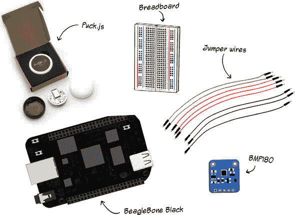


本章开启了一些宏伟的视野。然而，这种规模的宏伟与有限的篇幅相冲突。这里仅触及的一些主题是整个专业领域；关于每个主题的学习内容足以填满书籍、书架，甚至整个图书馆：安全性；网络标准流程；蓝牙和蓝牙低功耗(BLE)架构的复杂性；大规模部署和管理物联网设备。

因此，本章并不是学习旅程的终点，而是一个跳板，为后续的冒险做准备。它的一半揭开了基于云的物联网服务世界的面纱。另一半戴着未来主义者的帽子，探索了我们今天在网页和浏览器上能做什么，以及明天可能到来的是什么。


##### 代码尚未准备好用于生产

本章中的代码尚未准备好用于生产环境。为了追求清晰和简洁，这里牺牲了安全性、性能、优雅降级和可访问性。


### 12.1\. 物联网与云

本书主要关注说明核心电子原理和用 JavaScript 控制硬件。但云是物联网不可或缺的一部分——没有互联网就没有物联网。商业物联网云服务为发明家和企业家提供了将他们的物联网愿景变为现实的方法，提供支持服务，如数据存储、部署工具、RESTful API、分析、安全性、测试、基准测试、调试、监控、开发框架——哇！结果证明物联网是复杂的。而且，涉及到的术语真是太多了！

物联网云服务的概念本身已经模糊不清，而一些物联网公司的产品并不局限于软件。事实上，一些公司结合了物理硬件平台和他们的云服务，创造了一个从上到下的完整方案(图 12.1)。

##### 图 12.1\. Particle([`www.particle.io`](https://www.particle.io))和三星的 ARTIK 服务([`www.artik.io`](https://www.artik.io))是所谓的“端到端”物联网解决方案。


例如，Particle 制造了 Electron 板，该板具有板载 2G/3G 连接性。您可以通过蜂窝网络将代码部署到 Electron 板，并从 Electron 板读取数据——当然，这依赖于 Particle 的专有云服务进行部署和 I/O。在这种情况下，公司——Particle——提供了硬件（Electron 设备）、软件（您使用他们的 API 编程 Particle 板）和云基础设施（您使用他们的集中式基于网页的工具将代码部署到您的 Particle 设备群组）。

另一个所谓端到端产品提供的例子是三星的 ARTIK 平台。你可以单独使用 ARTIK 硬件“模块”之一——它们的 5 系列、7 系列和 10 系列板都是具备能力的 SBC，随 Fedora Linux 发行版发货——但硬件本身只是它们集成生态系统的一部分。他们希望你会选择使用他们的云服务。

这是一个深不可测的领域，如果你没有熟悉的标志来作为你航行的参考，可能会感到不知所措，而且有大量的术语和商业术语。为了减轻这种新颖的冲击，我们不会从头开始一个项目，而是将我们的老朋友，具有浏览器界面的迷你气象站，适配到 BeagleBone Black 上。

我们将使用相同的气象站应用程序代码——进行一些小的调整——但不是直接在设备上操作来管理操作系统和运行应用程序代码，我们将让 resin.io 为我们完成这项工作。

### 12.2\. 使用 resin.io 进行容器化部署

| |
| --- |

##### 你需要的东西


+   1 块 BeagleBone Black 和电源

+   1 根以太网线

+   1 张 microSD 卡和适配器

+   1 块面包板

+   1 块 BMP180 多传感器扩展板

+   跳线

| |
| --- |

Resin.io ([`resin.io/`](https://resin.io/))是一个提供将互联网连接的、已配置的 Linux 物联网设备进行*容器化*部署和管理的服务。这听起来有些复杂——这就是我之前警告过的一些术语——所以让我们从它试图解决的实际问题角度来解释它。

回想一下第十一章，SBC（如 BeagleBone Black）通常能够运行各种 Linux 版本，但为了这种灵活性所付出的代价是，Linux 的安装和管理可能会给基于 SBC 的工作流程增加一些开销（和痛苦）。从你首选的开发环境（如你的笔记本电脑）将代码文件上传到设备上可能是一项繁琐的工作。管理环境设置和配置可能是一个头疼的问题。你可能渴望迭代性地工作，使用熟悉的软件开发方法和工具（如 Git 进行版本控制）并与其他开发者协作。逐一设置所有这些可能需要时间和精力，或者甚至可能让你完全不知所措。

现在想象一下，如果你的物联网应用程序不仅需要在单个 BeagleBone（或 Pi，或其他 SBC）上运行，还需要在可能散布在州、省、国家地理分布的整个机队上运行。跟踪设备、保持同步、向每个设备发送正确的代码版本、监控设备故障、推送操作系统或安全更新——手动完成所有这些工作不会很好地扩展。然后还有所有那些由真实用户使用的软件和硬件产品的要求：分析（特定设备的使用量是多少？）、安全性（让我们确保用户的心率通过安全连接上传！），等等。

这里有很多事情在进行中。为了完成其中许多事情，resin.io（以及一些其他类似的服务）采用了几个关键策略：

+   ***容器化*—** 这里关键的想法是，你希望同样的应用程序在每一台设备上以相同的方式运行。Resin.io 使用 Docker 容器来干净、可靠地打包应用程序及其依赖项。你的应用程序容器将被部署到每个已配置的设备上。

+   ***配置*—** 某个设备需要能够获取 resin.io，识别自己，并接收应用程序更新。为了实现这一点，你需要从 resin.io 下载一个自定义磁盘镜像，并从它启动每个设备。一旦设备成功配置，它将出现在关联的 resin.io 应用程序的网页仪表板上，正如你很快就会看到的。

+   ***版本控制集成*—** 将代码推送到指定的 Git 仓库的特定远程位置会自动触发应用程序在所有连接的、已配置的设备上的重新部署。设置 resin.io 项目的部分工作是定义要使用哪个 Git 仓库作为应用程序源。


**容器，容器，容器！**

现在在互联网上，你几乎无法避免遇到某人在说关于容器的事情（通常含糊不清，但几乎总是赞誉有加）。你会读到容器是应用程序部署、安全性、性能、确保世界和平等问题的最佳解决方案，但更难找到的是关于容器究竟是什么以及它在实际中做什么的解释。

容器既用于封装和隔离应用程序及其正常运行所需的组件（依赖项、设置等）。单个服务器或计算设备可以同时运行多个独立的容器，而不会相互干扰。同样，相同的容器可以被部署到许多不同的计算机上，因为容器包含了定义应用程序环境及其所有依赖项所需的所有东西——因此，你可以确信应用程序将在不同的设备上以相同的方式运行。

Resin.io 使用 Docker 容器。Docker 是特定容器化技术平台的名字，也是创建该平台的公司。Docker 是目前行业中最受欢迎的容器技术。


一旦设置了 resin.io 项目和其设备，您就可以迭代地开发您的应用程序。当您将更改推送到您的 resin.io Git 远程仓库时，resin.io 会使用更新的代码重新构建应用程序的容器，并将该容器部署到所有连接的、已配置的应用程序设备上，无论它们在哪里（图 12.2）。

##### 图 12.2\. 运行应用程序的设备通过在每个设备上安装和启动定制的 resin.io OS 镜像进行配置。将应用程序代码推送到特定项目的 resin.io Git 远程仓库会触发应用程序容器的重新构建和重新部署到所有连接的、已配置的设备。

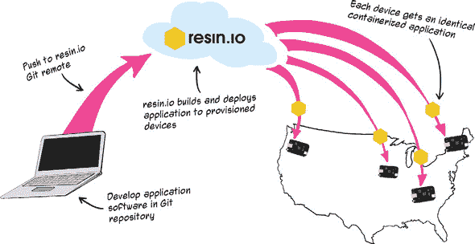


##### 快速掌握 Git

您的 resin.io 应用程序代码将在 Git 仓库中管理——您需要在您的计算机上安装 Git。git-scm 网站上的“安装 Git”部分记录了如何在多个不同的平台上完成此操作([`git-scm.com/book/en/v2/Getting-Started-Installing-Git`](https://git-scm.com/book/en/v2/Getting-Started-Installing-Git))。

虽然构建 resin.io 应用程序的说明中包含了您在 BeagleBone Black 上启动应用程序所需的全部 Git 命令，但了解 Git 的基本知识应该是每个开发者心理工具箱的一部分。学习 Git 基础知识只需要几分钟（尽管，说实话，精通 Git 需要一生的时间）。GitHub 有一个交互式教程([`try.github.io/levels/1/challenges/1`](https://try.github.io/levels/1/challenges/1))，还有大量的其他在线 Git 教育资源——其中许多是免费的。


#### 12.2.1\. 创建 resin.io 应用程序

您将为您的气象站软件创建一个 resin.io 应用程序，用于部署到您的 BeagleBone Black。Resin.io 提供了一个免费层，允许最多五个设备的部署和管理。前往[`resin.io/`](https://resin.io/)创建一个账户（图 12.3）。

##### 图 12.3\. 在 resin.io 上注册账户。

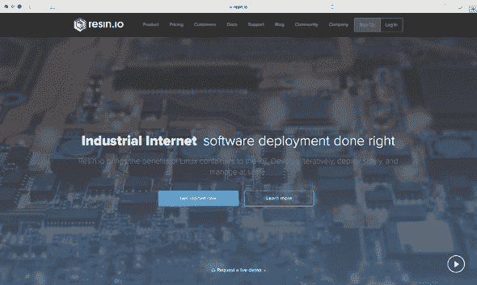

接下来，创建一个应用程序。系统会提示您输入应用程序的名称和设备类型。您可以根据喜好命名，我将其命名为`beagleweather`。在设备类型字段中，从长长的选项列表中选择`BeagleBone Black`（图 12.4）。


##### 没有 BeagleBone Black？

没有手头的 BeagleBone Black？如果您愿意，可以使用 Raspberry Pi 代替。您需要使用 Pi 版本的天气应用程序代码（在书籍 GitHub 仓库的第十一章文件夹中找到）——带有`raspi-io` I/O 插件——但其他步骤应该相同。哦，当然，确保在选择 resin.io 应用程序的设备类型时选择`Raspberry Pi 3`而不是`BeagleBone Black`。


##### 图 12.4\. 应用程序创建步骤的详细图，显示了支持的设备类型列表

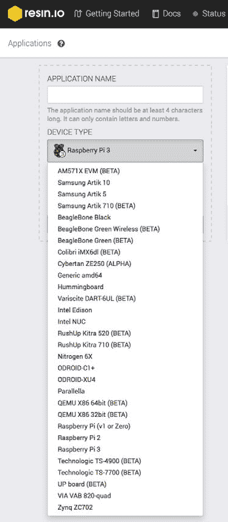

#### 12.2.2\. 配置 BeagleBone Black

Resin.io 为每个项目生成一个定制的*操作系统镜像*。resin.io 操作系统是一个轻量级的 Linux。它可以运行你的应用程序的 Docker 容器，并且还负责一些日常维护工作，如配置设备和监视部署的更新。

一旦你定义了你的 resin.io 应用程序，你可以继续下载生成的操作系统镜像（如图 12.5 所示提供了链接）并在你的设备上安装它（或者在我们的情况下，单个*设备*）。有关此处步骤的更多详细信息，请参阅第十一章 11.2.3 节： 

1.  下载操作系统镜像。

1.  使用 Etcher 应用程序，将 IMG 文件烧录到 microSD 卡上。

1.  将 microSD 卡插入 BeagleBone Black，并将 BeagleBone Black 的以太网接口连接到你的路由器。

1.  按住 USER/BOOT 按钮（图 12.6），并将电源插入 BeagleBone Black。继续按住按钮，直到 LED 灯疯狂闪烁。然后释放按钮。

##### 图 12.5\. resin.io 项目仪表板在为 BeagleBone Black 设备配置过程中的详细图。该设备由 resin.io 自动命名为“red-night”，正在安装特定于应用程序的 resin.io 操作系统镜像。

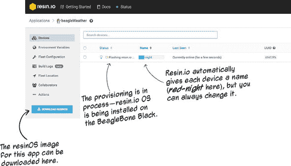

##### 图 12.6\. 按住 BeagleBone Black 的 BOOT/USER 按钮从 SD 卡启动。

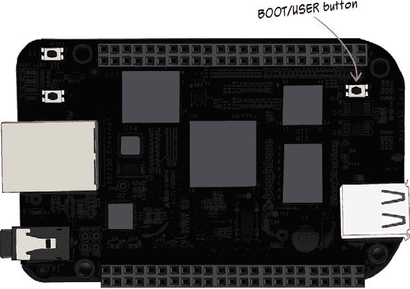

回到你的电脑上，几秒钟后你应该能在 resin.io 应用程序的仪表板上看到设备。从仪表板，你可以跟踪设备在配置过程中的进度。

#### 12.2.3\. 适配天气应用程序软件

要在配置好的 BeagleBone Black 上运行天气应用程序软件，还需要进行几个额外的步骤：

1.  为应用程序设置和配置 Git 仓库。

1.  配置应用程序的 Docker 容器。

1.  定义一个脚本以启动应用程序（在 package.json 中）。

1.  对软件本身进行一些调整。

1.  提交并推送到 GitHub。

1.  为应用程序提供一个公开的 URL。

##### 初始化 Git 仓库

首先，你需要建立一个工作区域。在你的电脑上创建一个目录来存放项目（例如`beagleweather`？）。

在这个目录内，通过运行以下命令初始化一个 Git 仓库：

```
$ git init
```

要部署你的应用程序，你需要能够将你的仓库的 master 分支推送到 resin.io。你需要添加一个 resin.io 特定的 Git 远程，以便以后可以推送到 resin.io。resin.io 方便地显示了你需要运行的精确命令来设置此远程：在你的应用程序仪表板的右上角找到它。在你的本地仓库中执行显示的命令（图 12.7）。

##### 图 12.7\. resin.io 应用程序仪表板的详细图，显示了添加应用程序的 resin.io Git 远程的命令位置

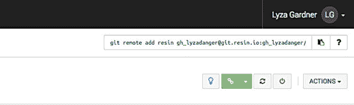

你可以通过运行此命令来查看你仓库的所有远程：

```
$ git remote -v
```

你应该看到类似以下输出：

```
resin    <your resin username>@git.resin.io:<your resin username>/
 beagleweather.git (fetch)
resin    <your resin username>@git.resin.io:<your resin username>/
 beagleweather.git (push)
```

接下来，将原始 BeagleBone 天气应用程序的源文件从复制到你的新工作 Git 项目目录中——index.js、package.json 以及应用目录及其内容。

##### 定义 Docker 应用容器

现在运行在你 BeagleBone Black 上的应用程序的基础 resin.io OS 由一个精简的 Linux 系统组成，并包含一些有用的支持工具。但你需要创建一个将在你的应用设备上运行的 Docker 容器，并告诉它如何表现以及做什么。

在你的项目目录中创建一个名为 Dockerfile.template 的文件（“template”扩展名允许在文件中使用某些方便的变量）并添加以下列表中的内容。列表的大部分是样板代码，直接来自 resin.io 的文档。

##### 列表 12.1\. Dockerfile.template

```
# base-image for node on any machine using a template variable
FROM resin/%%RESIN_MACHINE_NAME%%-node:6                                   *1*

# Defines our working directory in container
WORKDIR /usr/src/app

# Copies the package.json first for better cache on later pushes
COPY package.json package.json

# This install npm dependencies on the resin.io build server,
# making sure to clean up the artifacts it creates in order to reduce the
 image size.
RUN JOBS=MAX npm install --production --unsafe-perm && npm cache clean &&
 rm -rf /tmp/*

# This will copy all files in our root to the working  directory in the
 container
COPY . ./

# Enable systemd init system in container
ENV INITSYSTEM on

# server.js will run when container starts up on the device
CMD ["npm", "start"]                                                       *2*
```

+   ***1* 使用带有 Node.js，版本 6 的基础镜像**

+   ***2* 你需要定义一个 npm start 脚本来启动你的应用程序。**


##### 更多关于 resin.io 主机名、基础镜像和标签的信息

在 resin.io 的 Dockerfile 中，你可以指定关于设备、功能和 Linux 发行版和版本的大量详细信息。这里的内容太多，但如果你对此类内容感兴趣，resin.io 的文档非常详尽 ([`docs.resin.io/raspberrypi/nodejs/getting-started/`](https://docs.resin.io/raspberrypi/nodejs/getting-started/))。


##### 添加 npm start 脚本

这行代码出现在 Dockerfile.template 配置的末尾：

```
CMD ["npm", "start"]
```

这告诉构建器在容器启动后运行命令 `npm start`。你还没有 `start` 脚本，但你可以通过编辑 package.json 来轻松添加一个。

编辑 package.json 中的 `scripts` 字段，使其看起来像以下列表。

##### 列表 12.2\. package.json 脚本

```
"scripts": {
  "start": "node index.js",
  "test": "echo \"Error: no test specified\" && exit 1"
},
```

现在，当构建过程运行 `npm start` 命令时，它将产生与执行 `node index.js` 相同的效果——它将启动你的天气应用程序。

##### 调整应用代码

在完成之前，你需要对 index.js 进行两个小的修改。

Johnny-Five 的 REPL 和 resin.io 不兼容。你可以通过向板子实例化选项对象中添加一个属性 (`repl: false`) 来轻松禁用 REPL。

##### 列表 12.3\. 禁用 Johnny-Five REPL

```
const board = new five.Board({
  io: new BeagleBone(),
  repl: false
});
```

在 `server.listen()` 中为 Web 服务器定义的现有端口（`4000`）将正常工作，但你将执行一个很酷的技巧，所以将端口更改为 `80`。

##### 列表 12.4\. 将 Web 服务器端口更改为 80

```
server.listen(80, () => {
  console.log(`http://${os.networkInterfaces().eth0[0].address}:80`);
});
```

##### 提交和推送

将项目文件添加到 Git 中（确保你处于项目的顶级目录）：

```
$ git add index.js package.json Dockerfile.template app/
$ git commit -m "first commit"
```

现在，推送以触发到你的 BeagleBone Black 的部署：

```
$ git push resin master
```

第一次这样做时，可能需要几分钟（之后会更快）。您可以在 resin.io 仪表板上跟踪进度（图 12.8）。您将能够在计算机上的浏览器中查看应用，并使用其本地 IP 地址。

##### 图 12.8. 部署期间的 Resin.io 应用仪表板

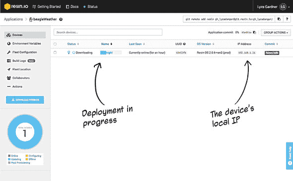

要迭代您的应用，您可以在本地仓库中做出更改，提交，并根据需要频繁地推送。

##### 为您的应用提供公共 URL

您已经为您的设备构建了许多基于 Web 的界面，但到目前为止，您只能从同一网络访问您的 Web 应用。Resin.io 有一个很酷的功能，可以为设备生成一个公共 URL，允许外部访问该设备的 80 端口（现在您知道为什么您更改了端口号了！）。

要为整个应用启用公共 URL，请从应用的仪表板中的操作部分进入（图 12.9）。

##### 图 12.9. 从应用的操作选项卡中启用应用的公共 URL

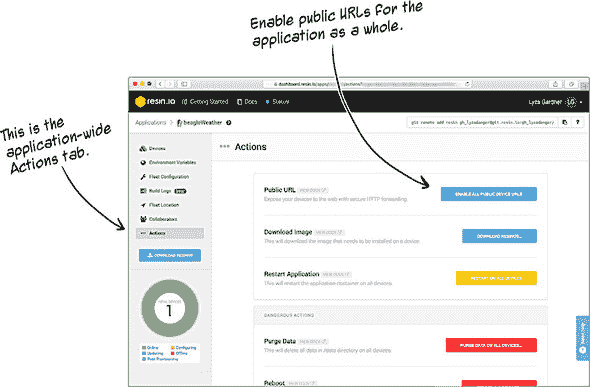

接下来，通过导航到设备部分并点击您想要管理的设备名称（在我的情况下是*red-night*）来进入设备特定的视图（图 12.10）。

##### 图 12.10. 通过导航到设备特定的操作选项卡来查看设备的公共 URL。

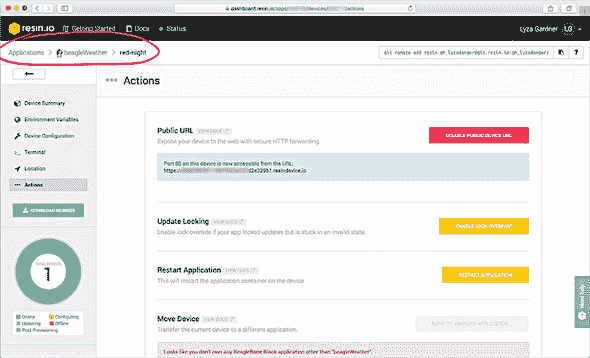

再次前往操作部分——这些操作仅针对此设备，而不是整个应用。您应该能够看到——并且，方便的是，可以点击——在您的 BeagleBone Black 上运行的应用的公共 URL（图 12.11）。

##### 图 12.11. 运行在 BeagleBone Black 上的气象站应用，通过由 resin.io 生成的公共 URL 访问

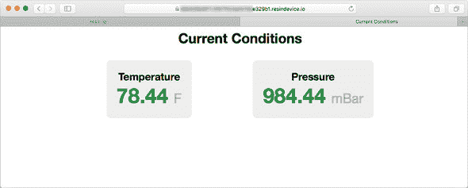

### 12.3. 硬件和网页浏览器

气象站应用利用了一个相对现代的 Web API，WebSocket（更准确地说，它使用`socket.IO`，该库在支持 WebSocket 的浏览器中使用 WebSocket API）。此 API 用于在客户端（浏览器）和服务器（在本例中运行在 BeagleBone Black 上）之间保持连接。服务器能够发出更新的传感器数据，客户端可以“听到”并相应地处理。但这仍然是间接的——浏览器依赖于服务器来处理与 BeagleBone Black 的 I/O 和附加传感器的实际交互。是否有可能在浏览器本身直接与硬件交互？

答案是复杂的——是“视情况而定”和“在某些浏览器中”的结合，还包含大量的“再稍等一会儿”。

毫无疑问，与几年前相比，网络在物理能力上要强大得多。不久前，您必须创建一个本地应用才能访问移动设备的位置服务或其摄像头，或发送推送通知。现在所有这些都可以在浏览器中完成。

网络平台是一个（庞大的）技术集合和 API。当然，有那些明星技术——HTML、ECMAScript 和 CSS（尽管技术上 CSS 不是一个单一的东西，而是一系列 *模块*）——但还有成百上千的其他部分：Web Workers、WebGL、XMLHttpRequest、Web Audio、WebSocket、WebRTC（我可以一直列举下去）。不同的技术和 API 在标准化过程中处于不同的阶段，有些甚至根本不在标准轨道上。

#### 12.3.1\. Web Bluetooth API

Web Bluetooth API 允许通过通用属性配置文件（GATT）与蓝牙低功耗（BLE）设备进行交互。在 W3C（万维网联盟，负责制定网络标准的主体）上有一个活跃的 Web Bluetooth 社区小组，并且它在 Chrome、Opera 和 Android 浏览器的一些版本中得到了实现。但它既不是标准，甚至还没有进入标准轨道（尽管它正朝着这个方向前进）。这很复杂。

Web Bluetooth 也遇到了典型的网络硬件 API 的障碍：安全问题。不需要天才就能想象出一些物理设备暴露在网络上可能带来的安全噩梦。到目前为止，Mozilla（Firefox）没有追求 Web Bluetooth 的实现，因为它对（当前的）安全模型不满意。

但别让这听起来很悲观，这些挑战对于提议的标准来说并不典型。只是很难预测 Web Bluetooth 在六个月或两年后会是什么样子。而且你今天就可以在 Chrome 中使用它。

#### 12.3.2\. 通用传感器 API

Web Bluetooth 不是镇上唯一的初出茅庐的、与硬件相关的网络 API（尽管它目前拥有最完整的浏览器实现）。W3C 的设备和传感器工作组（[`www.w3.org/2009/dap/`](https://www.w3.org/2009/dap/)) 负责创建与设备硬件、传感器、服务以及如相机、麦克风、接近传感器、原生地址簿、日历和原生消息应用等应用程序交互的 API。

该小组的通用传感器 API（[`www.w3.org/TR/generic-sensor/`](https://www.w3.org/TR/generic-sensor/))，目前处于草案阶段，定义了一个抽象的 `Sensor` 基类，它本身并不做任何事情，但旨在被特定组件的 API 扩展。一个例子是环境光传感器 API（也是一个草案，[`www.w3.org/TR/ambient-light/`](https://www.w3.org/TR/ambient-light/))），它定义了一个基于 `Sensor` 的接口，用于与环境光传感器交互。如果你审查了规范细节，可能不会感到惊讶，因为通用和其他传感器 API 的编辑之一是 Rick Waldron——Johnny-Five 的发明者。API 的组件行为封装确实与 Johnny-Five 抽象行为的方式相协调。

这些 API 并不关心硬件检测和连接的细节，更多的是定义一个高级 API 来与组件交互。因此，早期实现的周围光传感器依赖于内置硬件的存在（通常是设备的摄像头），以及浏览器相应地公开该硬件。周围光传感器在 Chrome 和 Microsoft Edge 中可用（在标志后面——您必须在浏览器的设置中明确启用它）。

#### 12.3.3\. 物理网

物理网是一种发现服务，极大地简化了通过简单的蓝牙低功耗信标与对象交互，利用了网络给予我们的一项伟大礼物：URL。

我们在很久以前（第一章）简要地探讨了物理网。当时设想的是具有信标功能的公交车站场景。信标不断广播一个 URL，该 URL 对应的页面可以追踪下一班公交车的到达情况（图 12.12）。

##### 图 12.12\. 在物理网中，附着或嵌入在物理对象上的低功耗蓝牙（BLE）信标广播与该设备交互相关的 URL。附近的用户可以检测并与之互动，在浏览器中打开其关联的网页。

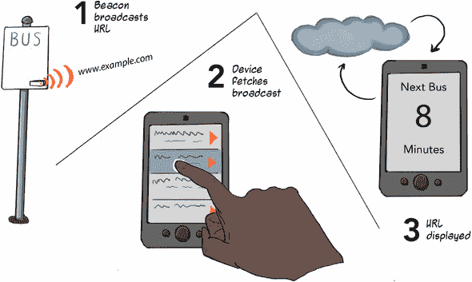

或者，假设您正在穿过一个雕塑花园。其中一些作品附近或上面有信标，广播一个指向包含该作品及其艺术家信息的网页的 URL。在您漫步时，您可以看到附近的信标，并选择与之互动，访问它所宣传的 URL。

谷歌正在推广物理网及其相关的开放 BLE 协议 Eddystone。因为技术要求非常直接——一个 BLE 设备只需使用某种协议广播一个 URL——所以硬件需求最小，信标电池可以持续很长时间。现在可用的 Android 和 iOS 应用程序允许您找到您附近的任何信标。

### 12.4\. 使用 Puck.js 探索蓝牙低功耗

Espruino 制造了一种设备，让您可以立即——今天！现在！——实验 Web Bluetooth 和物理网。Puck.js 是一个按钮形状的设备，运行 Espruino 解释器和通过 BLE 通信（图 12.13）。您将利用它来亲身体验 Web Bluetooth 和物理网。

##### 图 12.13\. Puck.js 是一个 BLE 信标设备，它像 Pico 一样运行 Espruino JavaScript 解释器。

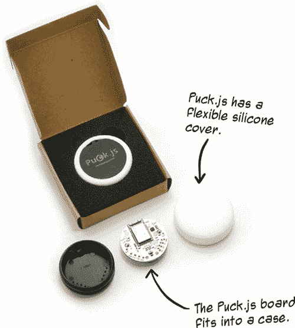

#### 12.4.1\. 核心功能

Puck.js 是基于一款超低功耗的 Nordic Semiconductor SoC（系统级芯片）构建的，该芯片包括蓝牙低功耗和 NFC 支持，以及一个与 Pico 不太相似的 ARM Cortex M4 CPU。尽管 Pico 和 Puck.js 都运行相同的底层 Espruino 软件，但 Puck.js 与 Pico 的通信方式不同：通过 BLE 而不是 Pico 的直接 USB 连接。

Puck.js 的板载组件包括内置磁力计、温度计和三个 LED（红色、绿色、蓝色）。红色 LED 还可以用作环境光传感器。

Puck.js 是一个由纽扣电池供电的 3.3V 设备。它大致相当于 Pico，尽管有些限制：时钟速度较慢，内存略少，I/O 引脚较少（图 12.14）。

##### 图 12.14\. Espruino 网站上列出的 Puck.js 的一些功能


Puck.js 有一个灵活的硅胶外壳。整个设备可以作为一个大按钮操作，当您按下它时会产生触觉点击声（并激活其内置按钮）。

#### 12.4.2\. GPIO 功能和引脚排布

Puck.js 具有各种 GPIO 功能，包括 I²C、PWM、SPI 和 ADC（图 12.15）。在这些实验中，您将使用其板载硬件（仅限板载硬件）。

##### 图 12.15\. Espruino.com 上 Puck.js 引脚排布的细节。引脚 D11 可以感应电容输入。任何引脚都提供 I²C、SPI 和 USART 支持（每个引脚支持一个硬件接口，但对于 I²C 和 SPI，软件支持是无限的）。

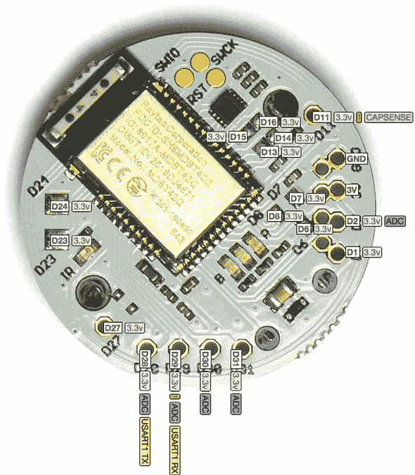

#### 12.4.3\. 配置和工作流程

前往 Espruino 的 Puck.js 入门指南：[`www.espruino.com/Puck.js+Quick+Start`](http://www.espruino.com/Puck.js+Quick+Start)。您需要拆卸设备以移除保护电池标签。

之后会发生什么取决于您的开发平台操作系统和 Web 蓝牙的当前状态。Mac OS 上的 Chrome 支持它——这很简单。Linux 用户可能需要额外一步，可能需要在 Chrome 中启用一个或两个标志。Windows（在 Chrome 中）的 Web 蓝牙支持可能即将到来（2017 年中期）。请参阅入门指南以获取最新信息。

如果您跟随了第十一章中的 Pico 实验，您可能已经安装了 Espruino Chrome 应用 IDE。如果没有，不要担心，因为您实际上可以使用位于[`www.espruino.com/ide`](https://www.espruino.com/ide)的基于 Web 的 IDE 来使用 Puck.js（无需安装）。Web IDE（图 12.16）与 Chrome 应用 IDE 几乎一模一样。

##### 图 12.16\. Espruino 的基于 Web 的 IDE

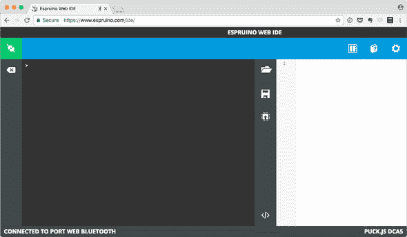


##### 如果您无法获得 Web 蓝牙支持...

在本章后面的部分，进行基于 Web 的 LED 和远程门铃实验需要支持 Web 蓝牙的浏览器。对于基本的 Hello World LED 闪烁，以及 Physical Web 示例，您不需要 Web 蓝牙支持——对于这些，Puck.js 可以在 IDE 内部进行控制。

如果您没有 Web 蓝牙支持，您将无法使用位于[`www.espruino.com/ide`](https://www.espruino.com/ide)的基于 Web 的 IDE。相反，您需要安装 Web IDE（有关详细信息，请参阅 Puck.js 的入门指南：[`www.espruino.com/Puck.js+Quick+Start`](http://www.espruino.com/Puck.js+Quick+Start)）。


还记得从 第十一章 中提到的，Espruino 代码编写涉及使用 Espruino 模块——封装的行为和支持，可以导入到 Espruino 脚本中。

有三种主要方式让 Puck.js 做某事：

+   一旦连接，Puck.js 将执行 IDE 界面左侧输入的任何命令，类似于 REPL 或控制台。

+   IDE 右侧编写的代码可以使用发送到 Espruino 的图标上传。

+   数据和命令可以通过 Web Bluetooth 发送到 Puck.js 并从 Puck.js 接收。这是在浏览器执行上下文中完成的，依赖于 Espruino 提供的少量客户端 JavaScript 库。（这种方法是 Puck.js 独有的，与其他 Espruino 板不同。）

#### 12.4.4\. 示例、教程和 API 文档

启动 IDE 并连接到你的 Puck.js，这样你就可以尝试 Hello World LED 闪烁并探索 Puck.js 的几个功能。

尝试在 IDE 的左侧输入以下命令之一。按下 Enter 后，命令将通过 BLE 发送到 Puck.js 并在那里执行：

+   使用 `LED1.set()` 打开板载红色 LED。

+   使用 `LED1.reset()` 关闭板载红色 LED。

+   尝试使用其他两个 LED：`LED2`（绿色）和 `LED3`（蓝色）执行前面的命令。

+   红色 LED 还可以作为环境光传感器。确保所有 LED 都已关闭（`LEDx.reset()`），然后尝试使用 `Puck.light()` 来获取环境光读数。尝试用手遮挡 Puck.js 并第二次发送 `Puck.light()` 命令，以查看差异。

+   尝试 `E.getTemperature()` 获取温度读数。`E` 是 Espruino 的实用类。温度应准确到约 +/-1 度（摄氏度）。

Espruino 的 API 文档（[`www.espruino.com/Reference`](http://www.espruino.com/Reference)）涵盖了所有 Espruino 设备可用的 API，以及 `Puck` 全局对象上公开的 Puck 特定功能。

#### 12.4.5\. 从网页控制 LED


##### 你需要


+   1 个 Puck.js

+   1 个支持 Web Bluetooth 的网络浏览器


正如你所见，你可以通过使用 IDE 控制 Puck.js：发送命令或编写脚本并将其部署到设备。这与 Espruino Pico 的流程类似。

但还有另一种方法：你可以在浏览器中的自己的代码中控制 Puck.js。在这个实验中，你将构建一个网页，允许用户通过点击浏览器中的按钮来打开和关闭 Puck.js 的红色 LED（图 12.17）。

##### 图 12.17\. 在支持 Web Bluetooth 的浏览器中，可以通过网页控制 Puck.js 的 LED。

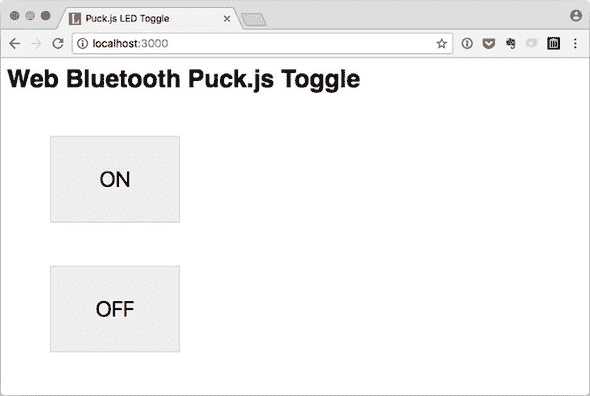

页面的 JavaScript 需要与 Puck.js 配对并与之通信（发送命令）使用 Web Bluetooth。

Espruino 通过提供一个小的客户端库（一个 JavaScript 文件）来简化这一部分，你可以在我们的页面上使用它。该库抽象了 Web Bluetooth API 的细节，提供了一个简单的接口，你可以使用它来配对并与 Puck.js 交互。

你可以在[`www.puck-js.com/puck.js`](https://www.puck-js.com/puck.js)找到这个客户端库。你需要在项目的 index.html 页面中包含它。


##### Web Bluetooth：仍然好奇？

如果你好奇 Web Bluetooth 在底层是如何工作的，你可以阅读 puck.js JavaScript 文件的源代码，它有很好的注释：[`www.puck-js.com/puck.js`](https://www.puck-js.com/puck.js)。


puck-js.com 的 JavaScript 库为你提供了连接和与 Puck.js 通信的实用工具，但你仍然需要编写自己的特定逻辑来处理按钮点击并向 Puck.js 发送命令来打开和关闭 LED。

##### 设置项目结构

首先，你需要建立一个工作区域——创建一个名为 led-toggle 的目录。然后，在该目录内运行以下命令：

```
$ npm install express
```

这就是唯一的依赖项目。

接下来，在 index.js 中创建一个应用程序入口点，它为 app/中的资源启动一个超级基本的静态 Web 服务器，如下面的列表所示。

##### 列表 12.5\. index.js

```
const express = require('express');
const path    = require('path');
const http    = require('http');

const app    = new express();
const server = new http.Server(app);

app.use(express.static(path.join(__dirname, '/app')));
server.listen(3000);
```

现在是时候创建应用程序的 HTML 页面了。为此，在项目中创建一个名为 app 的目录，并添加 index.html，其内容如下所示。

##### 列表 12.6\. index.html

```
<html>
 <head>
  <title>Puck.js LED Toggle</title>
  <style>
    h1 {
      font-family: "Helvetica";
    }
    button {
      display: block;
      width: 6em;
      height: 4em;
      margin: 2em;
      background-color: #eee;
      border: 1px solid #ccc;
      font-size: 1.75em;
    }
  </style>
 </head>
  <body>
  <h1>Web Bluetooth Puck.js Toggle</h1>
  <div id="message"></div>                                        *1*
  <button id="onButton">ON</button>
  <button id="offButton">OFF</button>
  <script src="https://www.puck-js.com/puck.js"></script>         *2*
  <script>                                                        *3*
    // ... TBD
  </script>
  </body>
</html>
```

+   ***1* 用于在 Web Bluetooth 不受支持时存储消息的容器**

+   ***2* 提供一个 Puck 对象，用于通过 Web Bluetooth 与 Puck.js 通信**

+   ***3* 应用程序客户端逻辑：你需要编写它！**

HTML 页面本身不做任何事情：它包含一些 CSS，并包含来自 puck-js.com 站点的脚本，该脚本允许你使用 Web Bluetooth 与 Puck.js 通信。它还包括 ON 和 OFF 按钮的标记，但目前它们还没有做任何事情。

##### 创建 LED 切换逻辑

让我们讨论一下 ON 和 OFF 按钮的点击处理器。当按钮被点击时，你需要向 Puck 发送一个命令来打开或关闭它的红色 LED。正如你在第 12.4.4 节中看到的，这是 Puck.js 需要执行的命令来打开红色 LED：

```
LED1.set();
```

这是你需要通过`puck.js`客户端库作为信使发送到 Puck.js 的命令。该命令需要作为字符串发送到 Puck.js，包括`\n`（换行符）字符。这是生成的命令字符串：

```
'LED1.set();\n'
```

要将此发送到 Puck.js，你将使用`Puck`对象的`write()`方法，这是在页面 JavaScript 中全局可用的，因为你包含了客户端的`puck.js`库（图 12.18）。

```
Puck.write('LED1.set();\n');
```

##### 图 12.18\. 你的浏览器执行的 JavaScript 在 `puck.js` 库提供的 `Puck` 对象上调用 `write()` 方法。该库使用 Web Bluetooth 将字符串发送到物理 Puck.js，并对其进行评估。字符串命令末尾的 `\n` 让 Puck.js 知道命令已完成；这几乎就像在虚拟 REPL 中输入并按 Enter 键一样。

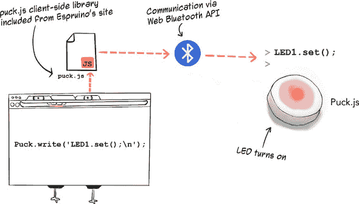

| |
| --- |

**Puck.js 究竟是什么意思？**

浏览器中有一个 `Puck` 对象，你可以在 Puck.js IDE 中向其发送命令，而 Puck.js 和 `puck.js` 完全是不同的事物。哎呀！

命名约定确实有点让人头昏脑胀。以下是一个总结：

+   Puck.js——Puck.js 物理设备本身

+   `puck.js`——Espruino 提供的客户端 JavaScript 库，用于在浏览器中通过 Web Bluetooth（BLE）与 Puck.js 设备通信

+   `Puck` 对象——令人困惑的是，这取决于代码执行的上下文，有两种（完全不同）的事物：

    +   在 IDE 或直接在 Puck.js 上运行的脚本中——它是 Espruino 的 `Puck` 全局类 ([`www.espruino.com/Reference#Puck`](http://www.espruino.com/Reference#Puck))，它为 Puck.js 添加了一些特定的硬件交互功能——也就是说，这些功能在其他 Espruino 板上不可用（例如使用 `Puck.light()` 从 Puck.js 的环境光传感器读取数据）

    +   在浏览器中，假设包含了 `puck.js` 客户端库——提供了一些通过 Web Bluetooth 与 Puck.js 通信的方法（例如 `Puck.write()` 和 `Puck.connect()`）。请记住，任何发送的命令都在 Puck.js 本身上的 Espruino 解释器中评估。

这意味着在浏览器脚本中——假设包含了 `puck.js` 客户端库——以下语句是有效的：

```
Puck.write('Puck.light();\n');
```

`Puck.write()` 在浏览器上下文中执行，这意味着它指的是包含的 `puck.js` 库提供的对象。但是，它通过 `write()` 发送的命令在 Puck.js 本身上评估：`Puck.light()` 中的 `Puck` 对象是对全局 Espruino `Puck` 对象的引用。呼！

| |
| --- |

以下列表定义了在 index.html 中的 `<script>` 标签之间放置的内容：点击事件监听器和发送到 Puck.js 的命令。

##### 列表 12.7\. 用于切换 LED 的事件监听器

```
window.addEventListener('load', () => {
  if ('bluetooth' in window.navigator) {
    const onButton = window.document.getElementById('onButton');
    const offButton = window.document.getElementById('offButton');
    onButton.addEventListener('click', () => Puck.write('LED1.set();\n'));
    offButton.addEventListener('click', () => Puck.write('LED1.reset();\n'));
  } else {
    const mEl = window.document.getElementById('message');
    mEl.innerHTML = "Looks like your browser doesn't support Bluetooth!";
  }
});
```

列表 12.7 中的模拟功能检测——`if ('bluetooth' in window.navigator)`——诚然是笨拙且天真的。仅仅因为浏览器暴露了 `navigator.bluetooth`，并不意味着它正确实现了 Puck.js 所需的功能。在 JavaScript 代码中，有一个名为 `checkIf-Supported()` 的函数，它提供了一个更正确、更全面的浏览器支持检查。不幸的是，该函数并未暴露给 `Puck` 对象——它不在你能够访问的任何作用域中——因此你不能直接调用它。

尝试一下！使用 `node index.js` 启动网络服务器，并打开一个支持 Web Bluetooth 的浏览器，访问 localhost:3000。

当你第一次点击按钮时，你会看到一个配对请求弹出，类似于图 12.19。一旦配对完成，你应该能够点击 ON 和 OFF，并看到 Puck.js 的红色 LED 灯亮起和熄灭。

##### 图 12.19. 当你第一次点击按钮时，你会被提示与 Puck.js 配对。

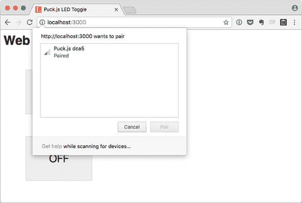

#### 12.4.6. 物理网和 Puck.js

| |
| --- |

##### 你需要什么


+   1 Puck.js

+   1 运行 Android 或 iOS 的移动设备

| |
| --- |

物理网由使用特定格式——Eddystone——的信标组成，用于广播相关的 URL，并且这些广播可以被运行在移动设备上的应用程序接收。

Puck.js 可以很容易地作为物理网兼容的信标。要启动这个过程，你需要做以下事情：

+   在移动设备上安装物理网发现实用程序，或在 Chrome 中启用此功能。

+   确定你希望 Puck.js 广播的 URL。

+   让 Puck.js 开始作为兼容的信标进行广告。

##### Eddystone 协议

Eddystone 是由 Google 创建的一个开放的 BLE 信标协议。物理网信标使用此格式来广播它们相关的 URL，并且客户端应用程序检测这些 Eddystone 信标。

Eddystone 非常简单。Eddystone 设备可以发送的信息种类很少——*帧类型*——，其中最相关的是`Eddystone-URL`。

| |
| --- |

**`Eddystone-URL`的长度限制**

`Eddystone-URL` URL 的最大长度为 17。这很紧凑。但它并不像听起来那么受限。还有一个单独的字节用于存储 URL 的*方案*前缀的表示（例如 https://www.，http://等）——这些字符不计入 17 个字符。此外，常见的顶级域名（.com，.org 等）可以用一个字符表示，留下 16 个字符。假设开发者会使用 URL 缩短器（如[`goo.gl`](https://goo.gl)）来最小化 URL 长度。

URL [`www.lyza.com`](https://www.lyza.com) 在其正常形式下有 20 个字符长，但它只需要 17 个可用字节中的 5 个。

| |
| --- |

##### 将 Puck.js 配置为信标

将 Puck.js 设置为 Eddystone 兼容的物理网信标几乎令人难以置信地简单。有一个`ble_eddystone` Espruino 模块正等着你！启动 Web IDE，连接到你的 Puck.js，并在 IDE 的左侧输入以下命令：

```
require("ble_eddystone").advertise("https://www.lyza.com");
```

（当然，你可以随意用你喜欢的任何 URL 替换我的域名 URL。）

断开 IDE 与 Puck.js 的连接，以便它能够以 Eddystone 格式开始广播。

##### 在你的移动设备上启用物理网发现

你可以使用运行 Android 或 iOS 的设备检测你的 Puck.js 物理网信标（图 12.20）；说明可以在物理网网站上找到（[`google.github.io/physical-web/try-physical-web`](https://google.github.io/physical-web/try-physical-web)）。一旦配置完成，你的移动设备应该能够看到你的 Puck.js 信标。

##### 图 12.20\. 通过 iOS 上的 Chrome 小部件支持物理网络。Puck.js 已配置为使用 Eddystone 协议广播 URL [`www.lyza.com`](https://www.lyza.com)。

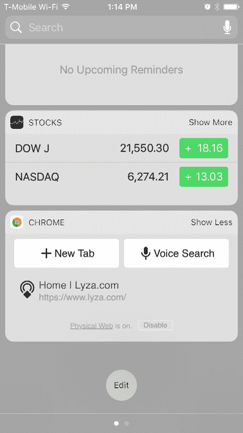

是时候以一声巨响（好吧，至少是一声叮当声）离开了。我们的最后一个实验将结合 Web Bluetooth、Web Audio 和从 Puck.js 发送的数据。

#### 12.4.7\. 基于网络的蓝牙门铃


##### 您需要什么


+   1 Puck.js

+   1 具有 Web Bluetooth 功能的网络浏览器


此实验在按下配对的 Puck.js 按钮时，在浏览器中播放（高质量）声音并显示视觉警报。将其视为基于网络的门铃。它利用 Web Audio API——另一个出色的网络 API——来加载和播放（公有领域）的铃声。

应用逻辑使用客户端 `puck.js` 库通过 Web Bluetooth 连接到 Puck.js，配置 Puck.js 监控其板载按钮，并解析 Puck.js 发出的数据——字符串输出将表示按钮按下。

##### 设置项目结构

首先建立一个工作区域。创建一个目录（“门铃”）并在该目录中安装 `express` 作为依赖项：

```
$ npm install express
```

创建 index.js，静态网络服务器。您可以在 列表 12.5 中重用代码，该代码将在端口 3000 上运行静态网络服务器。

##### 创建 HTML 和事件监听器

在门铃内部创建一个应用目录。添加一个包含以下内容的 index.html 文件。

##### 列表 12.8\. index.html

```
<html>
 <head>
  <title>Puck.js Remote Chime</title>
  <style>
    body {
      max-width: 90%;
      font-family: "Times New Roman";
      margin: 1em auto;
      color: #111;
      background-color: transparent;
      transition: background-color 0.5s ease-in-out;
    }
    .ding {
      background-color: #e60a62;
      transition: all 0.1s ease-in-out;
    }
    button {
      width: 100%;
      height: 100%;
      border: 5px solid #e60a62;
      font-family: "Times New Roman";
      text-transform: lowercase;
      font-variant: small-caps;
      background-color: transparent;
      font-size: 3em;
      font-weight: 600;
      cursor: pointer;
    }
    button:hover {
      color: #fff;
      border-color: #b5084d;
      background-color: #f62c7d;
    }
    .active {
      opacity: 0;
      transition: all 1s;
    }
  </style>
 </head>
  <body>
    <button id="goButton">Turn it on</button>
    <script src="https://www.puck-js.com/puck.js"></script>
    <script src="PuckChime.js"></script>
    <script>
      // ... add event listeners
    </script>
  </body>
</html>
```

如果现在在浏览器中查看 index.html，您将看到 图 12.21 中所示的内容，但此时它还没有任何功能。

##### 图 12.21\. 目前，index.html 显示了一个非常大的按钮，但它没有任何功能。

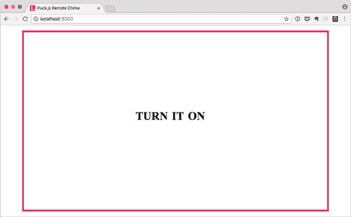

该按钮（`#goButton`）最终将有一个点击事件处理程序，将启用门铃。您可能想知道为什么需要这个额外的点击步骤——为什么不在页面加载时直接激活门铃？出于隐私和权限的原因，在浏览器允许蓝牙配对之前，需要有一个明确的用户界面操作——如果您在没有用户输入的情况下尝试这样做，您将得到一个错误。

index.html 文件包含一段 CSS。其中一些样式是为了格式化大的“开启”按钮，但也有样式在门铃响起时使屏幕闪烁，并在门铃激活后淡出“开启”按钮（`.active` 类）。

您现在可以在以下列表中的 `<script>` 内容中填写代码。此代码假设存在一个 `PuckChime` 类，其创建我们将在下一部分介绍。

##### 列表 12.9\. “开启”按钮的点击处理程序

```
window.addEventListener('load', () => {
  const onButton = window.document.getElementById('goButton');
  onButton.addEventListener('click', function () {
    var chime = new PuckChime();
    chime.init().then(() => {                  *1*
      onButton.classList.add('active');        *2*
    });
  });
});
```

+   ***1* 一旦 chime.init() Promise 解决，您就会知道 BLE Puck.js 铃声已成功设置。**

+   ***2* 您不再需要按钮，因此可以添加活动类使其淡出。**

##### 编写 `PuckChime` 类

与之前在 LED 控制网页中的点击事件处理器中发送单行命令给 Puck.js 相比，BLE 门铃的逻辑更为复杂。

将代码封装在新的文件 app/PuckChime.js 中的 `PuckChime` 类中是有意义的。`PuckChime` 的 API 接口在下面的列表中显示。你将在接下来的几个步骤中完成它。

##### 列表 12.10\. PuckChime 的 API 接口

```
class PuckChime {
  constructor () {

  }

  init () {
    /**
     * - establish connection to Puck.js
     * - reset Puck.js
     * - send command to Puck.js: observe builtin button for presses
     * - invoke `chime()` as aural/visual confirm when successful
     */
  }

  connect () {
    /**
     * - connect to Puck.js with BLE
     * - add an event handler for Puck.js `data` events
     */
  }

  send (cmd) {
    // format and send `cmd` to Puck.js
  }

  reset () {
    // send a `reset` command to Puck.js and wait 1.5 seconds for it to "take"
  }

  watchButton () {
    /**
     * send a command to Puck.js to watch its button for presses
     * and log (over Bluetooth) a string when button is pressed
     */
  }

  parseData (data) {
    /**
     * `data` event handler for incoming data chunks from Puck.js
     * - append `data` to buffer
     * - parse buffer into lines (split on `\n`)
     * - send each line (`cmd`) to `parseCommand()`
     */
  }

  parseCommand (cmd) {
    // if `cmd` is `CHIME`, invoke `chime()`
  }

  chime () {
    // play a chime sound and make visual chime
  }
}
```

让我们看看构造函数和 `init()` 方法如何在下一个列表中实现。

##### 列表 12.11\. `PuckChime`：构造函数和初始化方法

```
constructor () {
  this.connection = null;                              *1*
  this.dataBuffer = '';                                *2*
  this.sound = new Sound('/chime.mp3');                *3*
}

init () {
  return this.connect().then(() => {
    return new Promise((resolve, reject) => {
      this.reset()
      .then(this.watchButton.bind(this))
      .then(() => {
        this.chime();                                  *4*
        resolve();
      });
    });
  });
}
```

+   ***1* 保持与 Puck.js 的连接；它最初为 null，直到连接**

+   ***2* 用于存储和解析从 Puck.js 收到的数据的缓冲区**

+   ***3* Sound 是一个方便的类，用于使用 Web Audio API 加载和播放声音。**

+   ***4* 在 init 的工作完成后，调用 chime() 一次**

构造函数通过实例化一个 `Sound` 对象来准备声音—chime.mp3。如果 `Sound` 看起来像是一个突然出现的神奇类，而 chime.mp3 是一个神秘来源的文件，那么你是对的！请稍等；稍后会有更多关于它们的细节。

`init` 方法返回一个 `Promise`，当以下步骤完成时解析：

1.  与 Puck.js 建立连接

1.  Puck.js 已重置

1.  指示 Puck.js 监视其按钮的按下

只有当所有这些事情都完成时，`init()` 返回的 `Promise` 才会解析；`chime()` 也作为确认被调用（门铃在准备就绪时会响一次）。

继续前进，`connect()`、`send(cmd)`、`reset()` 和 `watchButton()` 方法与 Puck.js 通信，每个方法都返回一个 `Promise`。这些方法依赖于 Espruino 提供的客户端 `puck.js` 通信代码：

+   `connect()`—连接到 Puck.js 并为 Puck.js 的 `data` 事件添加一个事件处理器 (`parseData`)

+   `send(cmd)`—适当地格式化字符串 `cmd` 并将其发送到 Puck.js，通过将回调导向的 `connection.write()` 方法包装在 `Promise` 中以保持一致性

+   `reset()`—向 Puck.js 发送重置命令，并在解析它返回的 `Promise` 之前等待 1.5 秒，以便 Puck.js 再次准备好

+   `watchButton()`—向 Puck.js 发送更复杂的命令以设置对其内置按钮的监视

这些方法在下面的列表中进行了详细说明。

##### 列表 12.12\. 与 Puck.js 通信的方法

```
connect () {
  return new Promise ((resolve, reject) => {
    Puck.connect(connection => {
      this.connection = connection;
      this.connection.on('data', this.parseData.bind(this));
      resolve(this.connection);
    });
  });
}

send (cmd) {
  cmd = `\x10${cmd}\n`;
  return new Promise ((resolve, reject) => {
    this.connection.write(cmd, () => { resolve(cmd); });
  });
}

reset () {
  return new Promise((resolve, reject) => {
    this.send('reset()').then(() => { setTimeout(resolve, 1500); });
  });
}

watchButton () {
  const cb = "function() { Bluetooth.println('CHIME'); LED1.set();
   setTimeout(() => LED1.reset(), 250);}";
  const opts = "{repeat:true,debounce:250,edge:'rising'}";
  const cmd = `setWatch(${cb},BTN,${opts});`;
  return this.send(cmd);
}
```

让我们仔细看看 `watchButton()` 发送的命令——格式化后相当复杂——并更好地了解发送和接收 Puck.js 数据和命令的情况。

正如你在 第 12.4.5 节 的网络控制 LED 示例中看到的，在从浏览器发送命令到 Puck.js 之前，需要将命令格式化为字符串。在更简单的 LED 实验中，这是通过调用 `Puck.write()`（见 图 12.18）来完成的。

在这个更复杂的情况下，数据双向传输时，你将建立一个持久连接（在 `connect()` 方法中）。一旦建立连接，就使用 `connection.write()` 向 Puck.js 发送命令。通过 `connection` 上的发出 `data` 事件从 Puck.js 接收数据（图 12.22），这些事件由注册的 `data` 事件处理器 `parseData()` 处理。我们稍后会讨论这一点。

##### 图 12.22\. 在门铃示例中的双向通信中，使用 `puck.js` 客户端库在浏览器和 Puck.js 之间建立持久连接。可以通过连接向 Puck.js 发送命令，并且 Puck.js 通过蓝牙输出的任何输出都会在连接上触发一个 `data` 事件。

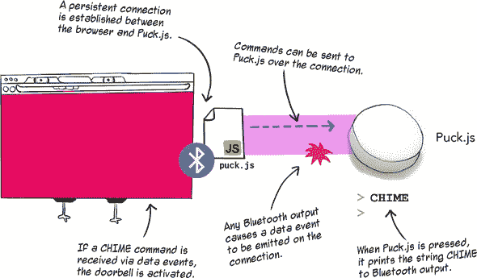

`PuckChime` 对象向 Puck.js 发送两个命令：在初始化阶段发送一个 `reset()` 命令以清除 Puck.js 中的任何蜘蛛网或异常，然后在 `watchButton()` 中发送一个更复杂的命令。在该方法中构建的命令，去除了所有的字符串性，并忽略了换行符约束，在以下列表中展开。它使用了 Espruino 全局 `setWatch(<callback>, <pin>, [<options>])` 函数。

##### 列表 12.13\. Puck.js 命令，展开

```
setWatch(
  function () {                        *1*
    Bluetooth.println('CHIME');        *2*
    LED1.set();                        *3*
    setTimeout(() => {                 *4*
      LED1.reset();
    }, 250);
  },
  BTN,                                 *5*
  {
    repeat: true,                      *6*
    debounce: 250,                     *7*
    edge: 'rising'                     *8*
  }
);
```

+   ***1* setWatch() 的第一个参数：一个回调函数**

+   ***2* 通过蓝牙记录字符串 CHIME；这将触发一个 `data` 事件**

+   ***3* 打开红色 LED**

+   ***4* 250 毫秒后再次关闭红色 LED**

+   ***5* 要监视的引脚**

+   ***6* 重复监视这个引脚**

+   ***7* 对引脚（按钮）进行去抖动，以 250 毫秒为间隔，避免每次按下时触发多次或干扰之前的按下**

+   ***8* 触发上升沿——从 LOW 到 HIGH 的转换**

在 Puck.js 上注册的按钮按下回调通过蓝牙输出一个字符串，并且还会短暂点亮板载的红色 LED 作为视觉反馈。

当在蓝牙上输出某些内容时，Puck.js 会随时发出数据。这发生在按钮监视回调中执行 `Bluetooth.println('CHIME')` 时，但并非来自 Puck.js 的所有内容都将是一个 `CHIME` 命令。例如，在建立连接后，会自动生成几行调试和版本输出。这些行与你的逻辑无关，因此 `parseCommand(cmd)` 确保你有一个实际的 `CHIME` 字符串匹配。

在将命令输入到 `parseCommand()` 之前，你必须从其他传入的数据中解析出“命令”。数据以块的形式传入，因此 `parseData()` 处理器必须保持一个简单的缓冲区，并将传入的字符串数据拆分成行——由 `\n`（换行符）字符分隔。这些行分别传递给 `parseCommand()`，以查看它们是否确实代表一个有效的命令——`CHIME` 是你唯一的有效命令。请参见以下列表。

##### 列表 12.14\. 从 Puck.js 解析数据

```
parseData (data) {
  this.dataBuffer += data;
  var cmdEndIndex = this.dataBuffer.indexOf('\n');
  while (~cmdEndIndex) {                                                   *1*
    var cmd = this.dataBuffer.substr(0, cmdEndIndex).replace(/\W/g, '');   *2*
    this.parseCommand(cmd);                                                *3*
    this.dataBuffer = this.dataBuffer.substr(cmdEndIndex + 1);             *4*
    cmdEndIndex = this.dataBuffer.indexOf('\n');
  }
}

parseCommand (cmd) {
  if (cmd.match('CHIME')) {
    this.chime();
  }
}
```

+   ***1* -1 是唯一一个在位运算非（~）操作符面前产生 0（false）的值。**

+   ***2* 移除任何非字母数字字符，以防控制字符被挤入**

+   ***3* 将此行传递给 parseCommand() 以查看它是否意味着什么**

+   ***4* 从数据缓冲区的开头剪切当前命令并查看是否有更多行**

`PuckChime` 类中的最后一个方法是 `chime()` 本身。在构造函数中实例化的 `Sound` 对象被播放（使用 `play()`），并且添加了一个类 — `.ding` — 到 `body` 元素上，然后在 500 毫秒后移除，如下所示。`.ding` 类通过暂时改变整个页面的背景颜色，在浏览器中创建一个视觉门铃声。 

##### 列表 12.15。门铃本身

```
chime () {
  window.document.body.classList.add('ding');
  this.sound.play();
  window.setTimeout(() => {
    window.document.body.classList.remove('ding');
  }, 500);
}
```

##### Web Audio 和 Sound 类

`Sound` 是一个 JavaScript 类，它封装了在构造函数中传递给它的 `url` 处加载和播放声音文件。它使用 Web Audio API。其源代码在 列表 12.16 中重现；您可以将它放在 PuckChime.js 文件的顶部。或者，您可以在本书的 GitHub 仓库中找到整个 PuckChime.js 源代码，包括 `Sound` 类。

在托管 PuckChime.js 源代码的同一目录中，您还可以找到 chime.mp3 声音文件——或者您也可以使用自己的声音文件（如果您提供了不同的文件名，别忘了更新 `PuckChime` 构造函数中的 `Sound` 实例化）。

##### 列表 12.16。`Sound` 类

```
class Sound {
  constructor (url) {
    // Context in which to do anything related to audio.
    // It is prefixed with `webkit` in some browsers
    const AudioContext = window.AudioContext || window.webkitAudioContext;
    this.url = url;
    this.context = new AudioContext();
    this.buffer = null;
  }
  /**
   * Using XMLHttpRequest, Load the audio file at this.url
   * decode and store it in this.buffer
   * @return Promise resolving to this.buffer
   */
  load () {
    return new Promise((resolve, reject) => {
      if (this.buffer) { resolve(this.buffer); }
      var request = new window.XMLHttpRequest();
      request.open('GET', this.url, true);
      request.responseType = 'arraybuffer';
      request.onload = () => {
        this.context.decodeAudioData(request.response, soundBuffer => {
          this.buffer = soundBuffer;
          resolve(this.buffer);
        });
      };
      request.send();
    });
  }
  /**
   * Load an AudioBuffer, then create an AudioBufferSourceNode to play it.
   * Connect the AudioBufferSourceNode to the destination (output)
   */
  play () {
    this.load().then(buffer => {
      // Create a new AudioBufferSourceNode which can play sound from
      // a buffer (AudioBuffer object)
      const source = this.context.createBufferSource();
      source.buffer = buffer;
      // Connect the AudioBufferSourceNode to the destination
      // (e.g. your laptop's speakers)
      source.connect(this.context.destination);
      source.start(0);
    });
  }
}
```

Web Audio API 功能强大，相应地也有些复杂。MDN 的 Web Audio API 文档非常全面：[`developer.mozilla.org/en-US/docs/Web/API/Web_Audio_API`](https://developer.mozilla.org/en-US/docs/Web/API/Web_Audio_API)。

##### 尝试门铃

概括来说，Puck.js 门铃项目应包含以下文件：

+   index.js — 一个简单的网络服务器。

+   app/index.html — 包含大“开启”按钮的样式和标记，以及按钮的点击事件处理程序以初始化门铃（`PuckChime` 对象）。它还包括与 Puck.js 通信的 Puck.js 客户端 JavaScript 库，以及 PuckChime.js。

+   app/PuckChime.js — 包含 `Sound` 和 `PuckChime` 类。

+   app/chime.mp3（或您选择的另一个声音文件）—按门铃时播放的声音。

启动网络服务器：

```
$ node index.js
```

打开您的浏览器到 localhost:3000。同时打开浏览器中的 Web 检查器控制台，查看任何记录的消息或错误。当您点击“开启”按钮时，应该会弹出一个配对请求（图 12.23）。

##### 图 12.23。点击“开启”按钮将提示与 Puck.js 配对。

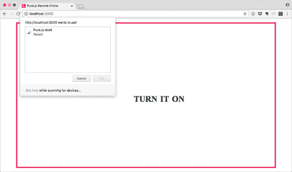

配对后，初始化过程需要几秒钟——您将在控制台中看到一些日志。如果您听到门铃声音播放并且屏幕短暂地闪烁粉红色，那么您就会知道它已经完成并且成功（图 12.24）。

##### 图 12.24。当按下 Puck.js 的按钮时，铃声响起，屏幕闪烁着亮粉色——甚至可以说它非常明亮——短暂地。

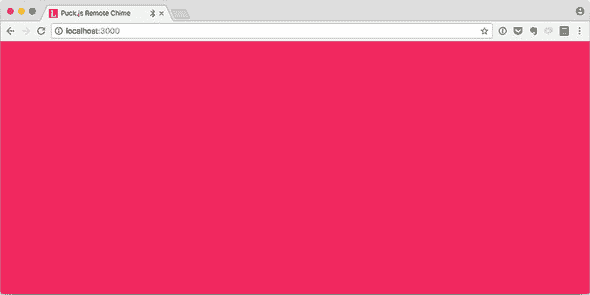

### 12.5。拓展 JavaScript 和硬件的边界

这个 BLE 门铃实验很好地说明了在物理设备和 JavaScript 世界中的前沿在哪里。Puck.js 运行 Espruino 解释器，它几乎但并不完全是完整的 JavaScript——有优化措施使其能够在这样的受限硬件上执行 JavaScript。Web Bluetooth 在一些浏览器中工作，但也有一些不足之处。在撰写本文时，你必须在每次页面刷新时重新配对，这真是个麻烦。你可能会发现它在调试困难的情况下间歇性地不可靠。

但 Puck.js 的存在，以及 Web Bluetooth 在某些浏览器中的实现，都是非常引人注目的，而且这比 12 或 18 个月前有了巨大的飞跃。Johnny-Five（在 2017 年迎来了五周年纪念日）持续的热度和 I/O 插件增长表明，JavaScript 开发者对这些领域的兴趣依然强烈。这种对将 JavaScript 和其他网络技术与其他物理设备融合的兴趣也体现在物联网硬件的 Node.js 兼容云管理选项激增上，特别是在能够运行 Linux 的 SBC 设备类别中。

建立电子黑客能力并不意味着要深入而僵化地树立一个标志。JavaScript 不必是你的锤子，你的教条式单一方法。相反，它可以作为一个探索的范例，一个熟悉的眼镜，通过它来审视不熟悉的事物。JavaScript 确实可以带你到达你需要去的地方。但对于其他情况，一个开放和好奇的心态是无价的。

因此，我鼓励你不仅通过 JavaScript 继续学习，而且在你越来越熟悉之后，也要进一步探索。了解更多关于不同串行协议的工作原理，深入了解位操作，学习编写基于 C 的固件。尽管说 C 语言很简单可能会显得有些轻率，但它确实是可以接触的：许多人发现 Arduino 编程语言（非常粗略地说，基本上是 C++ 加上一些额外的硬件控制功能）是通往 C++ 熟练程度的有帮助的入门途径。

尝试。构建。提问。了解技术。故意破坏。知道即使这是你第一次构建电路和与物理 I/O 一起工作，你也能想出如何构建你梦想中的事物。快乐黑客！

### 摘要

+   近年来，针对管理部署物联网应用的云服务激增，许多服务针对企业用户。许多这些针对具备 Linux 功能的单板计算机（SBC）的服务提供对 Node.js 的支持。

+   容器化是一种将应用程序及其依赖项从环境变化的变幻莫测中隔离出来的方法，它是物联网应用部署的流行选择。

+   Web Bluetooth API 尚未正式纳入官方网络标准轨道，但已在几个浏览器中存在实现。其中一些功能尚未完善，而且安全和权限模型仍然存在争议。

+   Espruino 提供了一个小的客户端 JavaScript 库，该库使用 Web Bluetooth 与 Puck.js 进行通信。

+   通用传感器 API 及其进一步的基于此的传感器 API，例如环境光传感器 API，正处于标准定义的早期阶段，但它们正在积极开发中。

+   要参与物理网，一个 BLE 设备可以使用开放的 Eddystone 协议来广播一个 URL。附近拥有兼容发现软件的用户可以浏览并与之交互这些信标。
