## 第一章\. 介绍 Angular

*本章涵盖*

+   Angular 框架的高级概述

+   使用 Angular CLI 生成新项目

+   开始使用 Angular 模块和组件

+   介绍示例应用程序 ngAuction

Angular 是由 Google 维护的开源 JavaScript 框架。它是其流行的前身 AngularJS 的完全重写。Angular 的第一个版本于 2016 年 9 月以 Angular 2 的名称发布。不久之后，名称中的数字 *2* 被移除，现在它只是 *Angular*。每年两次，Angular 团队会发布这个框架的主要版本。未来的版本将包括新功能，性能更优，并生成更小的代码包，但框架的架构很可能保持不变。

Angular 应用程序可以使用 JavaScript（使用 ECMAScript 5 或更高版本的语法）或 TypeScript 进行开发。在本书中，我们使用 TypeScript；我们在附录 B 中解释了我们选择它的原因。


##### 注意

在本书中，我们假设您了解 JavaScript 和 HTML 的语法，并理解网络应用程序由什么组成。我们还假设您了解 CSS。如果您不熟悉 TypeScript 的语法和 ECMAScript 的最新版本，我们建议您首先阅读附录 A 和附录 B，然后继续阅读本章。如果您是使用 Node.js 工具进行开发的初学者，请阅读附录 C。

|  |

##### 注意

本书中的所有代码示例都经过 Angular 6 测试，并且应该无需任何更改即可与 Angular 7 兼容。您可以从[`github.com/Farata/angulartypescript`](https://github.com/Farata/angulartypescript)下载代码示例。我们将在第二章中提供如何运行每个代码示例的说明。


本章首先简要概述了 Angular 框架。然后我们将开始编码——我们将使用 Angular CLI 工具生成我们的第一个项目。最后，我们将介绍在阅读本书时将构建的示例应用程序 ngAuction。

### 1.1\. 为什么选择 Angular 进行 Web 开发？

Web 开发者使用不同的 JavaScript 框架和库，其中最流行的是 Angular、React 和 Vue.js。您可以在很多文章和博客文章中找到比较它们的文章，但这样的比较是没有根据的，因为 React 和 Vue.js 是不提供完整解决方案的库，用于开发和部署完整的 Web 应用程序，而 Angular 则提供了这样的完整解决方案。

如果你为你的项目选择了 React 或 Vue.js，你还需要选择其他支持路由、依赖注入、表单、应用程序捆绑和部署的产品。最终，你的应用程序将包含由资深开发者或架构师挑选的多个库和工具。如果这位开发者决定离开项目，找到替代者将不会容易，因为新员工可能不熟悉项目中使用的所有库和工具。

Angular 框架是一个平台，它包含了开发部署 Web 应用程序所需的所有内容，包括电池。只要新人员了解 Angular，替换一个 Angular 开发者与另一个开发者一样容易。

从技术角度来看，我们喜欢 Angular，因为它是一个功能齐全的框架，你可以直接使用它来完成以下任务：

+   使用 Angular CLI 在几秒钟内生成一个新的单页 Web 应用程序

+   创建一个由一组可以松散耦合通信的组件组成的 Web 应用程序

+   使用强大的路由器安排客户端导航

+   注入并轻松替换 *服务*，这些服务是你在其中实现数据通信或其他业务逻辑的类

+   通过可注入的单例服务安排状态管理

+   清晰地分离 UI 和业务逻辑

+   将你的应用程序模块化，以便在应用程序启动时只加载核心功能，其他模块按需加载

+   使用 Angular Material 库创建现代外观的 UI

+   实现响应式编程，你的应用程序组件不会拉取可能尚未准备好的数据，而是订阅数据源并在数据可用时接收通知

话虽如此，我们需要承认 React 和 Vue.js 相对于 Angular 有一个优势。尽管 Angular 适合创建单页应用程序，其中整个应用程序都在这个框架中开发，但 React 和 Vue.js 编写的代码可以包含到任何 Web 应用程序中，无论使用了什么其他框架来开发任何单页或多页 Web 应用程序。

当 Angular 团队发布一个目前称为 `@angular/elements` 的新模块时，这个优势将消失（见 [`github.com/angular/angular/tree/master/packages/elements`](https://github.com/angular/angular/tree/master/packages/elements)）。然后你将能够将你的 Angular 组件打包成自定义元素（见 [`developer.mozilla.org/en-US/docs/Web/Web_Components/Custom_Elements`](https://developer.mozilla.org/en-US/docs/Web/Web_Components/Custom_Elements)），这些元素可以嵌入到任何用 JavaScript 编写的现有 Web 应用程序中，无论是否使用了其他库。

### 1.2. 为什么要在 TypeScript 中开发而不是在 JavaScript 中？

你可能想知道，为什么不在 JavaScript 中开发？既然 JavaScript 已经是一种语言，为什么还需要使用另一种编程语言呢？你不会找到关于为 Java 或 C# 应用程序开发额外语言的文章，对吧？

原因在于在 JavaScript 中开发并不特别高效。比如说，一个函数期望一个`string`类型的参数，但开发者错误地通过传递一个数值来调用它。在 JavaScript 中，这种错误只能在运行时捕获。Java 或 C#编译器甚至不会编译类型不匹配的代码，但 JavaScript 是一种动态类型语言，变量的类型可以在运行时改变。

虽然 JavaScript 引擎通过变量的值来猜测类型做得相当不错，但在不知道类型的情况下，开发工具的帮助能力有限。在中型和大型应用程序中，这种 JavaScript 的不足降低了软件开发者的生产力。

在大型项目中，良好的 IDE 上下文相关帮助和重构支持非常重要。在静态类型语言中，IDE 可以在瞬间重命名变量或函数名出现的所有实例，但在不支持类型的 JavaScript 中则不行。如果你在函数或变量名上犯了一个错误，它会以红色显示。如果你向函数传递了错误数量的参数（或错误的类型），错误也会以红色显示。IDE 还提供了出色的上下文相关帮助。TypeScript 代码可以通过 IDE 进行重构。

TypeScript 遵循最新的 ECMAScript 规范，并在此基础上增加了类型、接口、装饰器、类成员变量（字段）、泛型、枚举、`public`、`protected`和`private`等关键字，以及更多。您可以在 GitHub 上的 TypeScript 路线图[`github.com/Microsoft/TypeScript/wiki/Roadmap`](https://github.com/Microsoft/TypeScript/wiki/Roadmap)中查看 TypeScript 未来版本将带来哪些新功能。

TypeScript 接口允许您声明自定义类型。接口有助于防止在应用程序中使用错误类型的对象导致的编译时错误。

生成的 JavaScript 代码易于阅读，看起来像是手写的代码。Angular 框架本身是用 TypeScript 编写的，Angular 文档（见[`angular.io`](https://angular.io)）、文章和博客中的大多数代码示例也是使用 TypeScript 编写的。2018 年，Stack Overflow 开发者调查([`insights.stackoverflow.com/survey/2018`](https://insights.stackoverflow.com/survey/2018))显示 TypeScript 是第四受欢迎的语言。如果您想看到更多科学证据，证明 TypeScript 比 JavaScript 更高效，请阅读“是否需要类型化：JavaScript 中可检测错误的量化”（Zheng Gao 等人，ICSE 2017）这项研究，可在[`earlbarr.com/publications/typestudy.pdf`](http://earlbarr.com/publications/typestudy.pdf)找到。

| |
| --- |

**作者的实际经验**

我们在 Farata Systems 公司工作，多年来我们使用 Adobe Flex（目前是 Apache Flex）框架开发了相当复杂的软件。Flex 是一个建立在强类型、编译型 ActionScript 语言之上的高效框架，应用程序部署在 Flash Player 浏览器插件（一个虚拟机）中。

当网络社区开始远离使用浏览器插件时，我们花了两年时间试图找到 Flex 框架的替代品。我们尝试了不同的基于 JavaScript 的框架，但我们的开发者的生产力严重下降。最终，我们看到了隧道尽头的曙光，这是 TypeScript 语言、Angular 框架和 Angular Material UI 库的结合。


### 1.3. Angular 概述

Angular 是一个基于组件的框架，任何 Angular 应用都是一个组件树（想象一下视图）。每个视图都由组件类的实例表示。一个 Angular 应用有一个根组件，它可能有子组件。每个子组件可能有它自己的子组件，依此类推。

想象一下你需要用 Angular 重写 Twitter 应用。你可以从你的网页设计师那里获取一个原型，并从将其拆分为组件开始，如图 1.1 所示。带有粗边的顶层组件包含多个子组件。中间，你可以看到一个 New Tweet 组件位于两个 Tweet 组件实例之上，而 Tweet 组件本身又有回复、转发、点赞和直接消息的子组件。

##### 图 1.1. 将原型拆分为组件

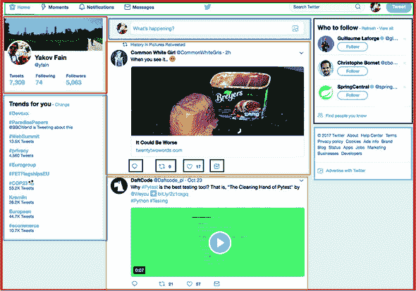

父组件可以通过将值绑定到子组件的属性来向其子组件传递数据。子组件不知道数据来自哪里。子组件可以通过发出事件将数据传递给父组件（而不需要知道父组件是谁）。这种架构使组件自包含且可重用。

在 TypeScript 中编写时，一个 *组件* 是一个被装饰器 `@Component()` 注解的类，其中你指定了组件的 UI（我们在 附录 B 的 B.10 节，“装饰器”中解释了装饰器，附录 B）。

```
@Component({
    ...
}
export class AppComponent {
    ...
})
```

你应用的大部分业务逻辑都是在服务中实现的，服务是没有 UI 的类。Angular 将创建你的服务类实例，并将它们注入到你的组件中。你的组件可能依赖于服务，而你的服务可能依赖于其他服务。一个 *服务* 是一个实现某些业务逻辑的类。Angular 使用我们在 第五章 中讨论的依赖注入（DI）机制将服务注入到你的组件或其他服务中。

组件被分组到 Angular 模块中。一个*模块*是一个带有`@NgModule()`装饰器的类。一个典型的 Angular 模块是一个小的类，除非你想编写手动引导应用程序的代码——例如，如果一个应用程序包含一个遗留的 AngularJS 应用程序。`@NgModule()`装饰器列出了应包含在此模块中的所有组件和其他工件（服务、指令等）。以下列表显示了一个示例。

##### 列表 1.1\. 包含一个组件的模块

```
@NgModule({
  declarations: [
    AppComponent               *1*
   ],
  imports: [
    BrowserModule
  ],
  bootstrap: [AppComponent]    *2*
 })
export class AppModule { }
```

+   ***1* 声明 AppComponent 属于此模块**

+   ***2* 声明 AppComponent 是一个根组件**

要编写一个简约的 Angular 应用程序，你可以创建一个`AppComponent`并将其列在`@NgModule()`的`declarations`和`bootstrap`属性中。一个典型的模块列出了几个组件，并且根组件在模块的`bootstrap`属性中指定。列表 1.1 还列出了`BrowserModule`，这对于在浏览器中运行的应用程序是必需的。

组件是 Angular 架构的核心。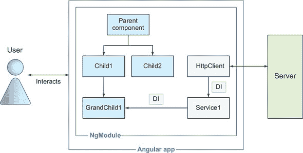显示了由四个组件和两个服务组成的示例 Angular 应用程序的高级图，所有这些都被打包在一个模块中。Angular 将它的`HttpClient`服务注入到你的应用`Service1`中，后者反过来又注入到`GrandChild1`组件中。

##### 图 1.2\. Angular 应用程序的示例架构


每个组件的 HTML 模板要么内联在组件内部（`@Component()`的`template`属性），要么使用`templateUrl`属性从组件引用的文件中。后者提供了代码和 UI 之间的清晰分离。同样的规则也适用于样式组件。你可以使用`styles`属性内联样式，或者提供 CSS 文件的位置在`styleURLs`中。以下列表显示了某些搜索组件的结构。

##### 列表 1.2\. 示例组件的结构

```
@Component({
  selector: 'app-search',                       *1*
   templateUrl: './search.component.html',      *2*
   styleUrls: ['./search.component.css']        *3*
 })
export class SearchComponent {
  // Component's properties and methods go here
}
```

+   ***1* 其他组件的模板可以使用标签<app-search>。**

+   ***2* 模板代码在此文件中。**

+   ***3* 组件的样式在此文件中（可能还有其他文件）。**

`selector`属性中的值定义了可以在其他组件模板中使用的标签名称。例如，根应用组件可以包含一个子搜索组件，如下所示。

##### 列表 1.3\. 在应用组件中使用搜索组件

```
@Component({
  selector: 'app-root',
  template: `<div>
             <app-search></app-search>         *1*
            </div>`,
  styleUrls: ['./app.component.css'],
})
export class AppComponent {
    ...
}
```

+   ***1* AppComponent 的 UI 包括 SearchComponent 的 UI。**

列表 1.3 使用内联模板。注意，对于多行模板，使用反引号符号而不是引号（参见附录 A 中的 A.3 节）。

Angular 框架非常适合开发单页应用程序（SPAs），在这种应用程序中，整个浏览器页面不会被刷新，只有页面（视图）的某个部分可能会在用户浏览应用程序时替换另一个部分。这种客户端导航是通过 Angular 路由来安排的。如果您想在组件的 UI 中为渲染其子组件分配一个区域，您可以使用一个特殊的标签，`<router-outlet>`。例如，在应用程序启动时，您可能在这个出口显示主组件，如果用户点击产品链接，出口内容将被产品组件替换。

To arrange navigation within a child component, you can allocate the `<router-outlet>` area in the child as well. Chapters 3 and 4 explain how the router works.


**Angular 应用程序的 UI 组件**

Angular 团队发布了一个名为 Angular Material 的 UI 组件库（见 [`material.angular.io`](https://material.angular.io)）。在撰写本文时，它基于 Material Design 指南（见 [`material.io/guidelines`](https://material.io/guidelines)）提供了超过 30 个精心设计的 UI 组件。我们建议在项目中使用 Angular Material 组件，如果您需要除 Angular Material 之外更多组件，可以使用 PrimeNG、Kendo UI、DevExtreme 或其他第三方库。您还可以使用流行的 Bootstrap 库与 Angular 应用程序一起使用，我们将在第二章的 ngAuction 示例中展示如何做到这一点。从第七章开始，您将重写 ngAuction，用 Angular Material 组件替换 Bootstrap 组件。

|  |

**移动设备上的 Angular**

Angular 的渲染引擎是一个独立的模块，允许第三方供应商创建自己的渲染引擎，该引擎针对非浏览器平台。组件的 TypeScript 部分保持不变，但 `@Component` 装饰器的 `template` 属性的内容可能包含 XML 或其他用于渲染原生组件的语言。

例如，您可以使用 Native-Script 框架的 XML 标签编写组件的模板，该框架作为 JavaScript 和原生 iOS 及 Android UI 组件之间的桥梁。另一个自定义 UI 渲染器允许您使用 Angular 与 React Native，这是为 iOS 和 Android 创建原生（非混合）UI 的另一种方式。


我们之前提到，新的 Angular 应用程序可以在几秒钟内生成。让我们看看 Angular CLI 工具是如何做到这一点的。

### 1.4. 介绍 Angular CLI

Angular CLI 是一个用于管理应用程序整个生命周期的 Angular 项目的工具。它作为代码生成器，极大地简化了新项目创建以及现有应用程序中生成新组件、服务和路由的过程。您还可以使用 Angular CLI 为开发和生产部署构建代码包。Angular CLI 不仅为您生成样板项目，还会安装 Angular 框架及其所有依赖项。

Angular CLI 已成为启动新 Angular 项目的既定方式。您将使用包管理器 npm 安装 Angular CLI。如果您不熟悉包管理器，请阅读附录 C。要在计算机上全局安装 Angular CLI 以供多个项目使用，请在终端窗口中运行以下命令：

```
npm install @angular/cli -g
```

安装完成后，Angular CLI 即可生成新的 Angular 项目。

#### 1.4.1\. 生成新的 Angular 项目

CLI 代表 *命令行界面*，安装 Angular CLI 后，您可以从终端窗口运行 `ng` 命令。Angular CLI 理解许多命令行选项，您可以通过运行 `ng help` 命令查看所有选项。您将首先使用 `ng new` 命令生成一个新的 Angular 项目。创建一个名为 hello-cli 的新项目：

```
ng new hello-cli
```

此命令将创建一个目录，名为 hello-cli，并生成一个包含一个模块、一个组件以及所有必需配置文件的项目，包括包含所有项目依赖项的 package.json 文件（有关详细信息，请参阅附录 C）。生成这些文件后，Angular CLI 将启动 npm 以安装 package.json 中指定的所有依赖项。当此命令完成后，您将看到一个名为 hello-cli 的新目录，如图 1.3 所示。

| |
| --- |

##### 提示

假设您有一个 Angular 5 项目，并希望切换到 Angular 的最新版本。您不需要手动修改 package.json 文件中的依赖项。运行 `ng update` 命令，如果已安装最新版本的 Angular CLI，则 package.json 中的所有依赖项都将更新。从一种 Angular 版本更新到另一种 Angular 版本的过程在[`update.angular.io`](https://update.angular.io)中描述。

| |
| --- |

##### 图 1.3\. 新生成的 Angular 项目


我们将在第二章中回顾 hello-cli 目录的内容，但让我们构建并运行此项目。在终端窗口中，切换到 hello-cli 目录并运行以下命令：

```
ng serve
```

Angular CLI 将花费大约 10–15 秒将 TypeScript 编译成 JavaScript 并构建应用程序包。然后 Angular CLI 将启动其开发服务器，准备在端口 4200 上提供服务。您的终端输出可能看起来像图 1.4。

##### 图 1.4\. 使用 `ng serve` 构建包

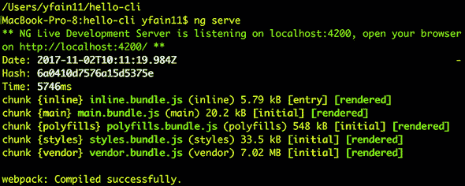

现在，将你的网络浏览器指向 http://localhost:4200，你将看到应用的登录页面，如图 1.5 所示。

##### 图 1.5. 在浏览器中运行应用

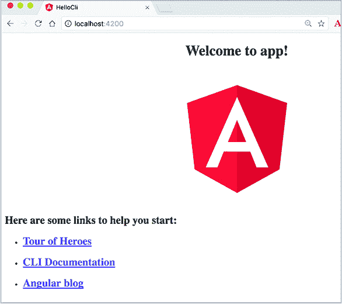

恭喜！你创建、配置、构建并运行了你的第一个 Angular 应用，而且没有写一行代码！

`ng serve` 命令在内存中构建包而不生成文件。在项目开发过程中，你只需运行一次 `ng serve`，然后继续编写代码。每次你修改并保存文件时，Angular CLI 都会在内存中重建包（这需要几秒钟），你将立即看到代码修改的结果。以下 JavaScript 包被生成：

+   inline.bundle.js 是一个由 Webpack 加载器使用的文件，用于加载其他文件。

+   main.bundle.js 包含你的代码（组件、服务等）。

+   polyfills.bundle.js 包含 Angular 运行在旧浏览器中所需的填充代码。

+   styles.bundle.js 包含你的应用中的 CSS 样式。

+   vendor.bundle.js 包含 Angular 框架及其依赖项的代码。

对于每个包，Angular CLI 都会生成一个源映射文件，以便调试原始 TypeScript，尽管浏览器将运行生成的 JavaScript。不要被 vendor.bundle.js 的大尺寸吓到——这是一个开发构建，当构建生产包时，其大小将显著减少。

| |
| --- |

**Webpack 和 Angular CLI**

目前，Angular CLI 使用 Webpack（见 [`webpack.js.org`](http://webpack.js.org)）来构建包，并使用 `webpack-dev-server` 来提供应用服务。当你运行 `ng serve` 时，Angular CLI 会运行 `webpack-dev-server`。从 Angular 7 开始，Angular CLI 提供了一个选项，可以使用 Bazel 进行打包。在初始项目构建之后，如果开发者继续在项目上工作，Bazel 可以比 Webpack 快得多地重建包。

| |
| --- |
| |

**ng new 的一些有用选项**

当你使用 `ng new` 命令生成一个新项目时，你可以指定一个选项来改变生成的内容。如果你不希望为应用程序组件样式生成一个单独的 CSS 文件，请指定 inline-style 选项：

```
ng new hello-cli --inline-style
```

如果你不想为应用程序组件模板生成一个单独的 HTML 文件，请使用 inline-template 选项：

```
ng new hello-cli --inline-template
```

如果你不想为单元测试生成文件，请使用 skip-tests 选项：

```
ng new hello-cli --skip-tests
```

如果你计划在你的应用中实现导航，请使用路由选项生成一个额外的模块，你将在其中配置路由：

```
ng new hello-cli --routing
```

要获取完整选项列表，请运行 `ng help new` 命令或阅读 Angular CLI Wiki 页面 [`github.com/angular/angular-cli/wiki`](https://github.com/angular/angular-cli/wiki)。

| |
| --- |

#### 1.4.2. 开发和生产构建

`ng serve`命令在内存中打包了应用，但没有生成文件，也没有优化你的 Hello CLI 应用。你将使用`ng build`命令来生成文件，但现在让我们开始讨论包大小优化和两种编译模式。

在你浏览器的开发者工具中打开网络标签页，你会看到浏览器不得不加载几兆字节的代码来渲染这个简单的应用。在开发模式下，应用的大小不是一个问题，因为你在本地运行服务器，浏览器加载这个应用需要超过一秒钟，如图 1.6 所示 figure 1.6。

##### 图 1.6\. 运行未优化的应用

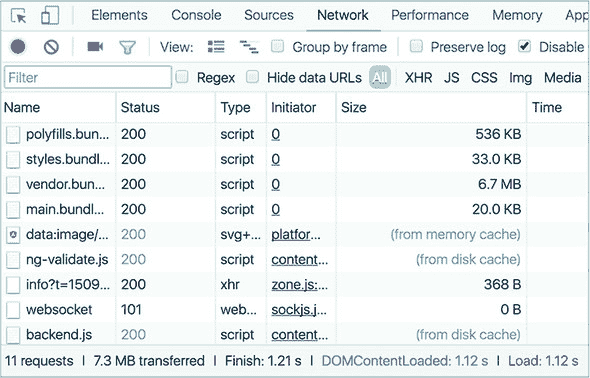

现在想象一个用户使用移动设备通过普通的 3G 连接浏览互联网。加载相同的 Hello CLI 应用需要 20 秒钟。很多人无法忍受等待 20 秒来加载除了 Facebook（地球上 30%的人口生活在 Facebook 上）以外的任何应用。在上线之前，你需要减小包的大小。

在构建包时应用`--prod`选项将通过优化你的代码产生更小的包（如图 1.6 所示 figure 1.6）。它将重命名你的变量为单个字母，删除注释和空行，并删除大部分未使用的代码。可以从应用包中移除的另一段代码是 Angular 编译器。是的，`ng serve`命令将编译器包含在了供应商的.bundle.js 中。但是，当你为生产构建应用时，你将如何从部署的应用中移除 Angular 编译器？

### 1.5\. JIT 与 AOT 编译

让我们回顾一下`app.component.html`的代码。大部分由标准的 HTML 标签组成，但有一行是浏览器无法理解的：

```
Welcome to {{title}}!
```

这些双大括号表示在 Angular 中将值绑定到字符串中，但这一行必须由 Angular 编译器（称为`ngc`）编译，以将绑定替换为浏览器可以理解的内容。组件模板可以包含其他 Angular 特定的语法（例如，结构指令`*ngIf`和`*ngFor`），在请求浏览器渲染模板之前需要编译。

当你运行`ng serve`命令时，模板编译是在浏览器内进行的。在浏览器加载你的应用包之后，Angular 编译器（打包在 vendor.bundle.js 中）从 main.bundle.js 中编译模板。这被称为*即时*（JIT）编译。这个术语意味着编译发生在包到达浏览器时。

JIT 编译的缺点包括以下内容：

+   在加载包和渲染 UI 之间存在一个时间间隔。这段时间用于 JIT 编译。对于像 Hello CLI 这样的小型应用，这段时间是微不足道的，但在现实世界的应用中，JIT 编译可能需要几秒钟，因此用户需要等待更长的时间才能看到你的应用。

+   Angular 编译器必须包含在 vendor.bundle.js 中，这会增加应用的大小。

在生产中使用 JIT 编译是不推荐的，你希望在创建包之前将模板预编译成 JavaScript。这就是“提前时间”（AOT）编译的原理。

AOT 编译的优势如下：

+   浏览器可以在应用加载后立即渲染 UI。不需要等待代码编译。

+   `ngc` 编译器不包括在 vendor.bundle.js 中，你应用的结果大小可能会更小。

为什么使用“可能”而不是“将会”？从包中移除 `ngc` 编译器应该总是导致应用大小减小，对吧？并不总是这样。编译后的模板比使用简洁的 Angular 语法的模板要大。Hello CLI 的大小肯定会更小，因为只有一个编译行。但在具有大量视图的大应用中，编译后的模板可能会增加应用的大小，甚至比包含在包中的 `ngc` 的 JIT 编译应用还要大。无论如何，你应该使用 AOT 模式，因为用户会更快地看到你应用的初始着陆页。

| |
| --- |

##### 注意

你可能会惊讶地看到，一个用 `tsc` 编译良好的应用出现了 `ngc` 编译器错误。原因是 AOT 要求你的代码是静态可分析的。例如，你不能在模板中使用的属性上使用 `private` 关键字，也不允许有默认导出。修复 `ngc` 编译器报告的错误，并享受 AOT 编译的好处。

| |
| --- |

无论你选择 JIT 还是 AOT 编译，你最终都会决定进行优化的生产构建。你该如何做？

#### 1.5.1\. 使用--prod 选项创建包

当你使用 `--prod` 选项构建包时，Angular CLI 会执行代码优化和 AOT 编译。通过在 Hello CLI 项目中运行以下命令来查看其效果：

```
ng serve --prod
```

在你的浏览器中打开应用，并检查网络标签页，如图 1.7 所示。现在相同应用的压缩后大小仅为 108 KB。

##### 图 1.7\. 使用 AOT 运行优化后的应用

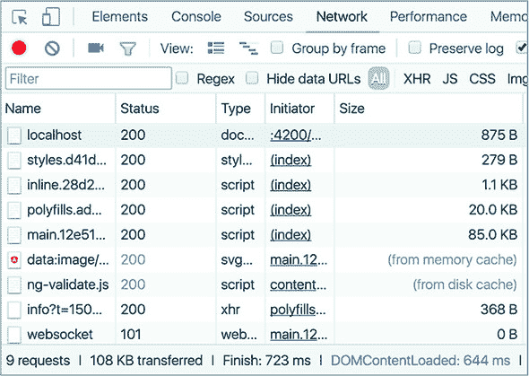

展开包含包大小的列——开发服务器甚至为你做了 gzip 压缩。包的文件名包括每个包的哈希码。Angular CLI 在每次生产构建时都会计算一个新的哈希码，以防止浏览器在部署新应用版本到生产时使用缓存的版本。

你难道不应该总是使用 AOT 吗？理想情况下，你应该这样做，除非你使用了某些在 AOT 编译期间产生错误的第三方 JavaScript 库。如果你遇到这个问题，可以通过以下命令关闭 AOT 编译，以构建包：

```
ng serve --prod --aot false
```

图 1.8 显示，与图 1.7 中的 AOT 编译应用相比，大小和加载时间都有所增加。

##### 图 1.8\. 不使用 AOT 运行优化后的应用

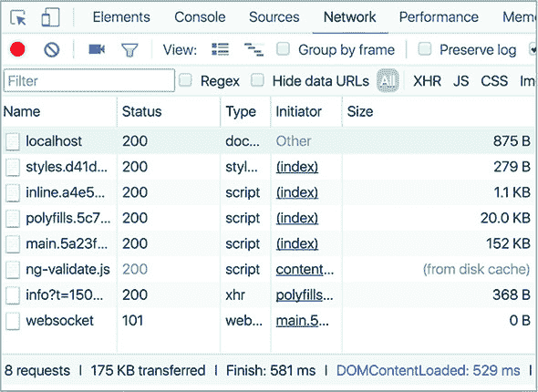

#### 1.5.2\. 在磁盘上生成包

您之前使用的是 `ng serve` 命令，该命令在内存中构建包。当您准备好生成生产文件时，请改用 `ng build` 命令。`ng build` 命令在 dist 目录中生成文件（默认情况下），但包的大小不会进行优化。

使用 `ng build --prod`，生成的文件将进行优化但不会压缩，因此您需要在之后对包应用 gzip 压缩。我们将在第十二章的第 12.5.3 节中介绍构建生产包和在 Node.js 服务器上部署应用程序的过程。

在 dist 目录中构建文件后，您可以将它们复制到您使用的任何 Web 服务器上。阅读您 Web 服务器的产品文档，如果您知道如何在您的服务器上部署 index.html 文件，那么 Angular 应用程序包也应该放在这里。

本节的目标是让您开始使用 Angular CLI，我们将在第二章中继续介绍其内容。第一个生成的应用程序相对简单，并不能展示 Angular 的所有功能；下一节将为您提供一些关于如何在 Angular 中实现这些功能的想法。

### 1.6. 介绍示例 ngAuction 应用程序

为了使这本书更具实用性，我们每章开始时都会向您展示一些小应用程序，这些应用程序展示了 Angular 语法或技术，而在大多数章节的末尾，您将使用新概念在一个实际应用程序中。您将看到组件和服务是如何组合成一个实际应用程序的。

想象一个在线拍卖（让我们称它为 ngAuction），人们可以浏览和搜索产品。当结果显示时，用户可以选择产品并进行出价。最新出价的信息将由服务器推送给所有订阅此类通知的用户。

浏览、搜索和出价的功能将通过向使用 Node.js 开发的服务器中的 RESTful 端点发送请求来实现。服务器将使用 WebSockets 推送有关用户出价和其他用户出价的通知。图 1.9 展示了 ngAuction 的示例工作流程。

##### 图 1.9. ngAuction 工作流程

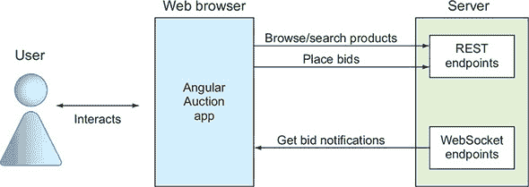

图 1.10 展示了 ngAuction 首页的第一个版本在桌面计算机上的渲染方式。最初，您将使用灰色占位符而不是产品图片。

##### 图 1.10. 突出显示组件的 ngAuction 首页

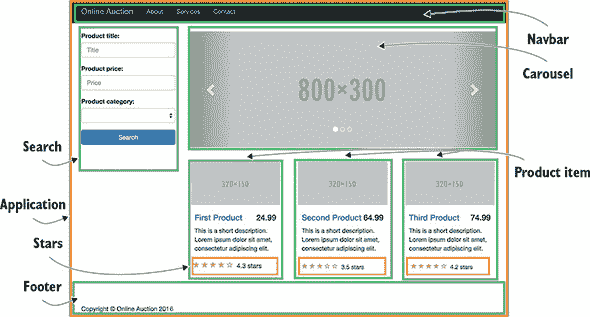

您将使用 Bootstrap 库提供的响应式 UI 组件（见 [`getbootstrap.com`](http://getbootstrap.com)），因此在家页在移动设备上的渲染可能如图 1.11 所示。

##### 图 1.11. 智能手机上的在线拍卖首页

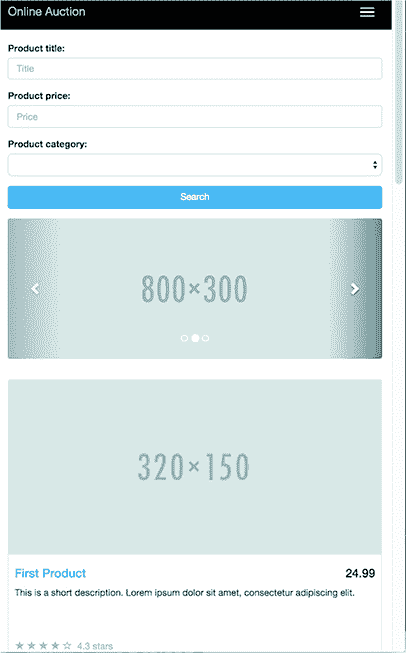

从 第七章 开始，您将重新设计 ngAuction，完全移除 Bootstrap 框架，用 Angular Material 和 Flex Layout 库来替换它。重构后的 ngAuction 的主页将看起来像 图 1.12。

##### 图 1.12\. 重新设计的 ngAuction

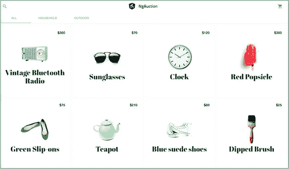

Angular 应用程序的开发归结为创建和组合组件。在 第二章 中，您将使用 Angular CLI 生成此项目和其组件及服务，而在 第七章 中，您将重构其代码。图 1.13 展示了 ngAuction 应用程序的工程结构。

##### 图 1.13\. 在线拍卖应用的工程结构

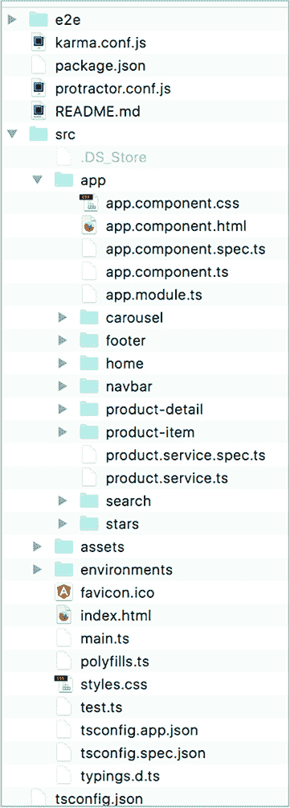

在 第二章 中，您将开始创建 ngAuction 的初始版本着陆页，并在随后的章节中，您将不断添加功能，展示各种 Angular 功能和技术。


##### 注意

我们建议您使用像 WebStorm（价格低廉）或 Visual Studio Code（免费）这样的 IDE 开发 Angular 应用程序。它们提供自动完成功能，提供方便的搜索，并集成了终端窗口，这样您就可以在 IDE 内完成所有工作。


### 摘要

+   Angular 应用程序可以使用 TypeScript 或 JavaScript 开发。

+   Angular 是一个基于组件的框架。

+   TypeScript 源代码必须在部署之前转换为 JavaScript。

+   Angular CLI 是一个伟大的工具，它可以帮助您快速启动项目。它支持在开发中捆绑和提供您的应用程序，并为生产准备构建。
