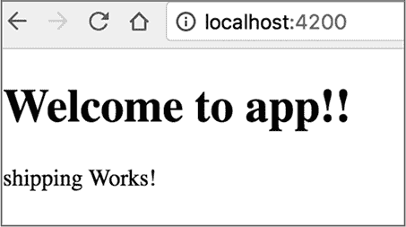
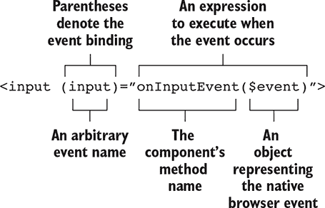
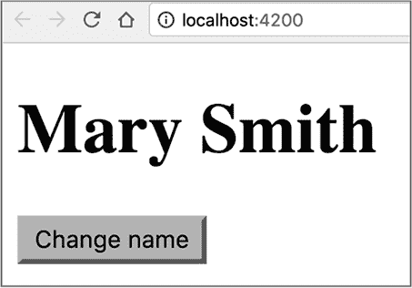
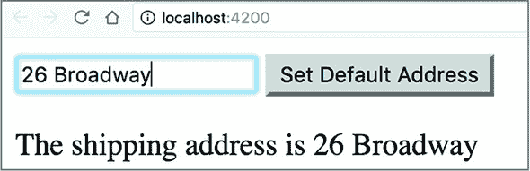
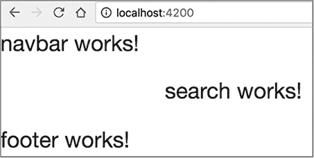
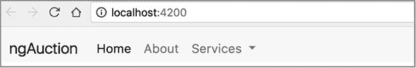
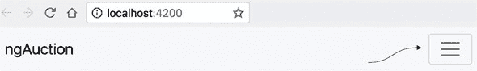
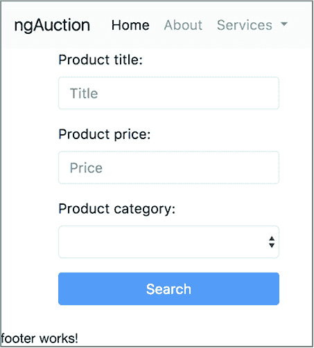
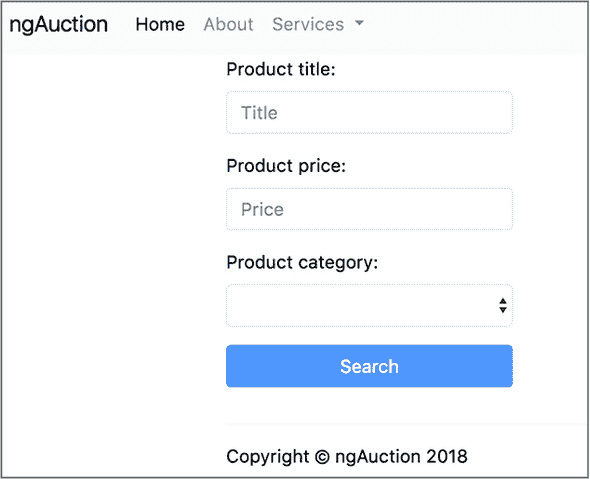
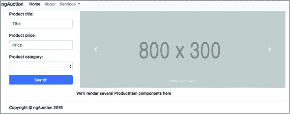

## 第二章. Angular 应用的主要工件

*本章涵盖*

+   理解组件、指令、服务、模块和管道

+   使用 Angular CLI 生成组件、指令、服务和路由

+   查看 Angular 数据绑定

+   构建 ngAuction 应用的第一个版本

在本章中，我们将首先解释 Angular 应用主要工件的作用。我们将向你介绍每一个，并展示 Angular CLI 如何生成这些工件。然后我们将概述 Angular CLI 配置文件，你可以在这里修改你的项目设置。

之后，我们将讨论如何在 Angular 中实现数据绑定。在本章结束时，你将开发 ngAuction 应用的初始版本，你将在整本书中继续对其进行工作。

### 2.1. 组件

组件，任何 Angular 应用的主要工件，是一个带有视图（UI）的类。要将一个类转换为组件，你需要用 `@Component()` 装饰器对其进行装饰。一个组件可以由一个或多个文件组成——例如，一个扩展名为 .ts 的文件，其中包含组件类，一个 .css 文件包含样式，一个 .html 文件包含模板，以及一个 .spec.ts 文件包含组件的测试代码。

你不必将每个组件的代码分割到这些文件中。例如，你可以将一个组件放在一个文件中，包含内联样式和模板，并且没有测试的文件。无论有多少文件代表你的组件，它们都应该位于同一个目录中。

任何组件都属于应用的一个确切模块，你必须将组件类的名称包含在模块文件中 `@NgModule()` 装饰器的 `declarations` 属性中。在 第一章 中，我们已经将 `AppComponent` 列在 `AppModule` 中。


**Angular CLI 的 ng generate 命令**

即使在生成新项目之后，你仍然可以使用 Angular CLI 通过使用 `ng generate` 命令或其别名 `ng g` 来生成工件。以下是一些你可以与 `ng g` 命令一起使用的选项：

+   **`ng g c`——** 生成一个新的组件。

+   **`ng g s`——** 生成一个新的服务。

+   **`ng g d`——** 生成一个新的指令。

+   **`ng g m`——** 生成一个新的模块。

+   **`ng g application`——** 在同一个项目中生成一个新的应用。这个命令是在 Angular 6 中引入的。

+   **`ng g library`——** 从 Angular 6 开始，你可以生成一个库项目。

这不是一个应用，但它可以包括服务和组件。

每个这些命令都需要一个参数，例如项目的名称，来生成。要获取完整的选项和参数列表，请运行 `ng help generate` 命令或参考 Angular CLI 文档。

这里是使用 `ng g` 命令的一些示例：

+   `ng g c product` 将在 src/app/product 目录中为新的产品组件生成四个文件，并将 `ProductComponent` 类添加到 `@NgModule` 的 `declarations` 属性中。

+   `ng g c product -is --it --spec false` 将在 src/app/product 目录中生成一个包含内联样式和模板的单个文件 product.component.ts，且不包含测试，并将 `ProductComponent` 添加到 `@NgModule` 的 `declarations` 属性中。

+   `ng g s product` 将生成包含用 `@Injectable` 装饰的类的文件 product.service.ts，以及位于 src/app 目录中的 product.service.spec.ts 文件。

`ng g s product -m app.module` 将生成与前面命令相同的文件，并将 `ProductService` 添加到 `@NgModule` 的 `providers` 属性中。


让我们在第一章中创建的 Hello CLI 项目中添加一个产品组件，通过在该项目的根目录中运行以下命令：

```
ng g c product --is --it --spec false
```

此命令将在 src/app/product 目录中创建 product.component.ts 文件。

##### 列表 2.1\. product.component.ts

```
@Component({
  selector: 'app-product',
  template: `
  <p>
  product Works!                                      *1*
   </p>
  `,
  styles: []
})
export class ProductComponent implements OnInit {     *2*

  constructor() { }

  ngOnInit() {}                                       *3*
 }
```

+   ***1* 默认要渲染的文本**

+   ***2* 实现 OnInit 需要在类中实现 ngOnInit() 方法。**

+   ***3* 生命周期方法**

生成的 `@Component()` 装饰器具有 `app-product` 选择器，带有内联 HTML 的 `template` 属性，以及用于内联 CSS 的 `styles` 属性。其他组件可以通过使用 `<app-product>` 标签将你的产品组件包含在其模板中。

列表 2.1 中的类有一个空的构造函数和一个方法，`ngOnInit()`，这是组件生命周期方法之一。如果实现，`ngOnInit()` 将在构造函数中的代码之后调用。`OnInit` 是需要实现 `ngOnInit()` 的生命周期接口之一。我们将在第九章的 9.2 节中介绍组件生命周期。


##### 注意

`@Component()` 装饰器还有一些其他属性，我们将在使用它们的时候讨论。`@Component()` 装饰器的所有属性都描述在 [`angular.io/api/core/Component`](https://angular.io/api/core/Component)。

|  |

**使用选择器前缀**

列表 2.1 中的组件选择器以 `app-` 为前缀，这是应用程序的默认前缀。对于库项目，默认前缀是 `lib-`。一个好的做法是想出一个更具体的、能更好地识别你的应用程序的前缀。你的项目名为 Hello CLI，因此你可能希望给你的所有组件都加上 `hello-` 前缀。为此，在生成组件时使用 `-prefix` 选项：

```
ng g c product -prefix hello
```

该命令将生成一个具有 `hello-product` 选择器的组件。确保所有生成的组件都有一个特定前缀的一个更简单的方法是在文件 .angular-cli.json（或从 Angular 6 开始的 angular.json）中指定前缀，这将在本章后面讨论。


如果你打开 app.module.ts 文件，你会看到 `ProductComponent` 已经被你的 `ng g c` 命令导入并添加到 `declarations` 部分：

```
@NgModule({
  declarations: [
    AppComponent,
    ProductComponent
  ],
  imports: [
    BrowserModule
  ],
  providers: [],
  bootstrap: [AppComponent]
})
export class AppModule { }
```

新生成的`ProductComponent`类被添加到`@NgModule()`的`declarations`属性中。在这本书的每一章中，我们都会继续使用组件，这样你就有机会学习 Angular 组件的各种功能。

| |
| --- |

**什么是元数据？**

TypeScript 装饰器允许你通过提供关于装饰实体的元数据来修改类、属性或方法（或其参数）的行为，而无需更改它们的代码。一般来说，*元数据*是关于数据的额外信息。例如，在 MP3 文件中，音频是数据，但艺术家名称、歌曲标题和专辑封面是元数据。MP3 播放器包括元数据处理器，可以读取元数据并在播放歌曲时显示其中的一些信息。

在类的情况下，元数据指的是关于类的额外信息。例如，`@Component()`装饰器告诉 Angular（元数据处理器）这不是一个普通类，而是一个组件。Angular 根据`@Component()`装饰器属性中提供的信息生成额外的 JavaScript 代码，将类转换为 UI 组件。`@Component()`装饰器不会改变装饰类的内部结构，而是添加一些描述类的数据，以便 Angular 编译器可以正确生成组件的最终代码。

在类属性的情况下，`@Input()`装饰器告诉 Angular 这个类属性应该支持绑定，并能够从父组件接收数据。你将在第八章的 8.2.1 节中学习关于`@Input()`装饰器的更多内容。

在底层，装饰器是一个将一些数据附加到装饰元素上的函数。有关更多详细信息，请参阅附录 B 中的 B.10 节。

| |
| --- |

组件是一个具有 UI 的类，而服务是一个实现应用程序业务逻辑的类。让我们熟悉一下服务。

### 2.2\. 服务

为了更清晰地分离代码，我们通常不会为获取或操作数据的代码使用组件。注入式服务是处理数据的正确位置。一个组件可能依赖于一个或多个服务。第五章介绍了 Angular 中依赖注入的工作原理。在这里，我们将向您展示服务和组件是如何协同工作的。

让我们从在共享文件夹中生成一个服务开始，假设这个服务将被多个组件使用。为了确保`@NgModule()`的`providers`属性会更新为新生成的服务，请使用以下选项：

```
ng g s shared/product -m app.module
```

新文件 product.service.ts 将在 src/app/shared 目录下生成：

```
@Injectable()
export class ProductService {
  constructor() { }
}
```

因此，app.module.ts 文件将被更新以包含此服务的提供者：

```
@NgModule({
...
  providers: [ProductService]
})
export class AppModule { }
```

接下来，在 `ProductService` 中实现一些具有所需业务逻辑的方法。请注意，生成的 `ProductService` 类被 `@Injectable()` 装饰器注解。为了使 Angular 实例化并将此服务注入到任何组件中，请将以下参数添加到组件的构造函数中：

```
constructor(productService: ProductService){
  // start using the service, e.g. productService.getMyData();
}
```

服务并不是唯一没有 UI 的工件。指令也没有自己的 UI，但它们可以附加到组件的 UI 上。


**Angular 6 的新特性**

从 Angular 6 开始，`ng g s` 命令生成一个带有 `Injectable()` 装饰器的类：

```
@Injectable({
  provideIn: 'root'
})
```

`provideIn: 'root'` 允许您跳过在 `NgModule()` 装饰器的 `providers` 属性中指定服务的步骤。


### 2.3\. 指令

将 Angular 指令视为 HTML 增强器。指令允许您教一个旧的 HTML 元素新的技巧。*指令* 是一个带有 `@Directive()` 装饰器的类。您将在第十一章的第 11.7 节（section 11.7）中看到 `@Directive()` 装饰器的使用。

指令不能有自己的 UI，但可以附加到组件或常规 HTML 元素上以改变它们的视觉表示。Angular 中有两种类型的指令：

+   ***结构型*—** 指令改变组件模板的结构。

+   ***属性型*—** 指令改变单个组件或 HTML 元素的行性行为或视觉表示。

例如，使用结构型 `*ngFor` 指令，您可以遍历数组（或其他集合），并为数组中的每个项目渲染一个 HTML 元素。以下列表使用 `*ngFor` 指令遍历 `products` 数组，并为每个产品渲染一个 `<li>` 元素（假设有一个接口或 `Product` 类，其中有一个 `title` 属性）。

##### 列表 2.2\. 使用 `*ngFor` 迭代产品

```
@Component({
  selector: 'app-root',
  template: `<h1>All Products</h1>
  <ul>
    <li *ngFor="let product of products">       *1*
      {{product.title}}                         *2*
     </li>
  </ul>
  `})
export class AppComponent {

  products: Product[] = [];                     *3*

 // the code to populate products is removed for brevity
}
```

+   ***1* 为每个产品渲染 <li>**

+   ***2* 每个 <li> 元素显示产品标题。**

+   ***3* *ngFor 遍历此数组。**

以下元素使用结构型 `*ngIf` 指令根据 `hasError()` 方法返回的（true 或 false）来显示或隐藏 `<mat-error>` 元素，该方法检查表单字段 `title` 中的值是否具有无效的最小长度：

```
<mat-error *ngIf="formModel.hasError('minlength', 'title')" >Enter at least 3
     characters</mat-error>
```

在本章后面讨论双向绑定时，我们将使用属性 `ngModel` 指令将 `<input>` 元素中的值绑定到类变量 `shippingAddress`：

```
<input type='text' placeholder="Enter shipping address"
   [(ngModel)]="shippingAddress">
```

您还可以创建自定义属性指令，这在产品文档 [`angular.io/guide/attribute-directives`](https://angular.io/guide/attribute-directives) 中有描述。

另一个没有自己的 UI 但可以在组件模板中转换值的工件是管道。

### 2.4\. 管道

*管道* 是一个模板元素，允许您将一个值转换成期望的输出。通过在要转换的值后添加垂直线（`|`）和管道名称来指定管道：

```
template: `<p>Your birthday is {{ birthday | date }}</p>`
```

在前面的示例中，`birthday`变量的值将被转换为默认格式的日期。Angular 附带了许多内置管道，每个管道都有一个实现其功能的类（例如，`DatePipe`），以及你可以在模板中使用的名称（例如`date`）：

+   `UpperCasePipe`允许你通过在模板中使用`| uppercase`将输入字符串转换为大写。

+   `LowerCasePipe`允许你通过在模板中使用`| lowercase`将输入字符串转换为小写。

+   `DatePipe`允许你通过使用`| date`来以不同的格式显示日期。

+   `CurrencyPipe`通过使用`| currency`将数字转换为所需的货币。

+   `AsyncPipe`通过使用`| async`来展开提供的`Observable`流中的数据。你将在第 6.5 节中找到使用`async`的代码示例，该节位于第六章。

一些管道不需要输入参数（例如`uppercase`），而一些则需要（例如`date:'medium'`）。你可以链式调用任意数量的管道。以下代码片段展示了如何以中等日期格式和大写形式（例如，JUN 15, 2001, 9:43:11 PM）显示`birthday`变量的值：

```
template=
  `<p>{{ birthday | date: 'medium' | uppercase}}</p>`
```

如你所见，实际上无需编写任何代码，你就可以将日期转换为所需的格式，并显示为大写（请参阅 Angular `DatePipe`文档中的日期格式，[`mng.bz/78lD`](http://mng.bz/78lD)）。

除了预定义的管道外，你还可以创建自定义管道，这些管道可以包含特定于你应用程序的代码。创建自定义管道的过程在[`angular.io/guide/pipes`](https://angular.io/guide/pipes)中描述。本章的代码示例包括一个演示如何将华氏度转换为摄氏度并返回的自定义管道的应用程序。

现在你已经知道你的应用程序可以包含组件、服务、指令和管道。所有这些元素都必须在你的应用程序模块中声明。

### 2.5. 模块

Angular 模块是一个用于存放一组相关组件、服务、指令和管道的容器。你可以将模块视为一个实现应用程序业务领域特定功能的包，例如运输或计费模块。小型应用程序的所有元素都可以位于一个模块中（根模块），而大型应用程序可能包含多个模块（功能模块）。所有应用程序都必须至少有一个在应用程序启动时启动的根模块。

从语法角度来看，Angular 模块是一个带有`@NgModule()`装饰器的类。要在应用程序启动时加载根模块，请在你的应用程序的 main.ts 文件中调用`bootstrapModule()`方法。

```
platformBrowserDynamic().bootstrapModule(AppModule);
```

Angular 框架本身被拆分为模块。包括一些 Angular 模块是必须的（例如，`@angular/core`），而一些模块是可选的。例如，如果你计划使用 Angular 表单 API 和进行 HTTP 请求，你应该在 package.json 文件中添加`@angular/forms`和`@angular/common/http`，并在你的应用根模块中包含`FormsModule`和`HttpClientModule`，如下面的列表所示。

##### 列表 2.3\. 示例根模块

```
@NgModule({
  declarations: [
    AppComponent              *1*
   ],
  imports: [                  *2*
     BrowserModule,
    FormsModule,
    HttpClientModule
  ],
  bootstrap: [AppComponent]   *3*
 })
export class AppModule { }
```

+   ***1* 此模块中包含的唯一组件**

+   ***2* 其他本应用所需的模块**

+   ***3* 应用启动时加载的顶级组件**

如果你决定将应用拆分为几个模块，除了根模块外，你还需要创建*功能模块*，下文将介绍。

#### 2.5.1\. 功能模块

一个 Angular 应用可能由根模块和功能模块组成。你可以在功能模块中实现应用的一个特定功能（例如，运输）。而 Web 应用的根模块的`@NgModule()`装饰器必须包含`BrowserModule`，功能模块则包含`CommonModule`。功能模块可以被其他模块导入。功能模块的`@NgModule()`装饰器不包含`bootstrap`属性，因为启动整个应用是根模块的责任。

下面的列表生成一个名为 Hello Modules 的小型应用，并向其中添加一个名为`ShippingModule`的功能模块。

##### 列表 2.4\. 生成项目和功能模块

```
ng new hello-modules      *1*
 cd hello-modules
ng g m shipping           *2*
```

+   ***1* 生成名为 hello-modules 的新项目**

+   ***2* 生成名为 shipping 的新功能模块**

此应用将有一个功能模块，其内容如下所示，位于文件 src/app/shipping/shipping.module.ts 中。

##### 列表 2.5\. 生成的功能模块

```
@NgModule({
  imports: [
    CommonModule           *1*
   ],
  declarations: []
})
export class ShippingModule { }
```

+   ***1* 功能模块导入 CommonModule 而不是 BrowserModule**

现在让我们生成一个新的运输组件，并指示 Angular CLI 将其包含到`ShippingModule`中：

```
ng g c shipping -it -is -m shipping
```

此命令生成文件 shipping/shipping.component.ts，其中包含装饰过的类`ShippingComponent`，一个内联模板和一个空的`styles`属性。该命令还将它添加到`ShippingModule`的`declarations`部分。运输组件的代码如下所示。

##### 列表 2.6\. 生成的运输组件

```
@Component({
  selector: 'app-shipping',
  template: `
  <p>
  shipping Works!                                     *1*
   </p>
  `,
  styles: []
})
export class ShippingComponent implements OnInit {    *2*

  constructor() { }

  ngOnInit() {}                                       *3*
 }
```

+   ***1* 默认模板**

+   ***2* 实现 OnInit 生命周期接口**

+   ***3* 此生命周期钩子在构造函数之后被调用。**

注意到运输组件的选择器：`app-shipping`。你将在`AppComponent`的模板中使用这个名称。

你的运输模块代码将包括运输组件，其外观如下所示。

##### 列表 2.7\. 生成的运输模块

```
@NgModule({
  imports: [
    CommonModule
  ],
  declarations: [ShippingComponent]
})
export class ShippingModule { }
```

特殊模块可以声明自己的组件和服务，但要使所有或部分组件和服务对其他模块可见，你需要导出它们。在这种情况下，你需要向发货模块添加一个`exports`部分，使其看起来如下所示。

##### 列表 2.8\. 导出发货组件

```
@NgModule({
  imports: [
    CommonModule
  ],
  declarations: [ShippingComponent],
  exports: [ShippingComponent]             *1*
 })
export class ShippingModule { }
```

+   ***1* 从模块中导出组件**

外部模块将只能看到在`exports`中明确提到的发货模块的成员。发货模块可能包含其他成员，如类、指令和管道。如果你没有在`exports`部分中列出它们，这些成员将保持私有，并从应用的其他部分隐藏。现在你应该将发货模块包含在根模块中。

##### 列表 2.9\. 将发货模块添加到根模块

```
@NgModule({
  declarations: [
    AppComponent
  ],
  imports: [
    BrowserModule,
    ShippingModule         *1*
   ],
  providers: [],
  bootstrap: [AppComponent]
})
export class AppModule { }
```

+   ***1* 将发货模块添加到根模块**

要让浏览器在根组件中渲染发货组件，你可以在`AppComponent`的模板中添加`<app-shipping>`标签。

##### 列表 2.10\. 添加发货组件

```
@Component({
  selector: 'app-root',
  template: `
  <h1>Welcome to {{title}}!!</h1>
  <app-shipping></app-shipping>          *1*
   `,
  styles: []
})
export class AppComponent {
  title = 'app';
}
```

+   ***1* 将 ShippingComponent 添加到根组件的模板**

使用`ng serve`运行此应用，并在浏览器中打开 http://localhost:4200。你会看到从根模块渲染的`AppComponent`和从发货模块渲染的`ShippingComponent`，如图 2.1 所示。

##### 图 2.1\. 运行双模块应用



“欢迎使用 app!!”是位于根模块中的`AppComponent`发出的问候，而“shipping Works!”则来自位于你的功能模块中的`ShippingComponent`。这是一个相当简单的例子，但它说明了你可以如何*模块化*一个应用，使其特定功能位于一个单独的可重用模块中，并由单独的开发者（们）开发。

你的应用模块可以在应用启动时预先加载，就像 Hello Modules 项目中所做的那样，或者按需加载，例如当用户点击特定的链接时。在第 4.3 节中，你将看到具有懒加载模块的示例应用。

到现在为止，你知道组件由 TypeScript 代码和 UI（模板）组成。接下来要学习的概念是如何在数据通过编程方式或用户与应用交互的结果发生变化时同步代码和 UI。

### 2.6\. 理解数据绑定

Angular 有一个名为*数据绑定*的机制，允许你保持组件属性与视图同步。在本节中，我们将解释数据绑定是如何与属性和事件一起工作的。

Angular 支持两种类型的数据绑定：*单向*（默认）和*双向*。在单向数据绑定中，数据在一个方向上同步：要么是从类成员变量（属性）到视图，要么是从视图事件到类变量或处理事件的函数。Angular 在其变更检测周期中更新绑定，这在第九章的第 9.1 节 section 9.1 中解释。

#### 2.6.1\. 绑定属性和事件

要在模板的字符串中显示类变量的值，请使用双大括号。如果一个类有一个名为`name`的变量，你可以这样显示它的值：

```
<h1>Hello {{name}}!</h1>
```

这也被称为*插值*，你可以在这些双大括号内使用任何有效的表达式。

使用方括号将类变量的值绑定到 HTML 元素或 Angular 组件的属性。以下示例将类变量`isValid`的值绑定到 HTML `<span>`元素的`hidden`属性：

```
<span [hidden]="isValid">This field is required</span>
```

注意方括号位于等号左侧。如果`isValid`变量的值为`false`，则`span`元素的文本不会隐藏，用户将看到消息“此字段为必填项。”一旦`isValid`变量的值变为`true`，文本“此字段为必填项”将变为隐藏。

上述示例说明了从类变量到视图的单向绑定。接下来的列表将展示从视图到类成员（如方法）的单向绑定。

要将事件处理函数分配给事件，请在组件的模板中将事件名称放在括号内。以下列表展示了如何将`onClickEvent()`函数绑定到`click`事件，以及将`onInputEvent()`函数绑定到`input`事件。

##### 列表 2.11\. 带有处理器的两个事件

```
<button (click)="onClickEvent()">Get Products</button>            *1*

<input placeholder="Product name" (input)="onInputEvent()">       *2*
```

+   ***1* 如果按钮被点击，调用 onClickEvent()方法。**

+   ***2* 一旦输入字段的值发生变化，就调用 onInputEvent()方法。**

当括号中指定的事件被触发时，双引号中的表达式将被重新评估。在列表 2.11 中，表达式是函数，因此每次触发相应的事件时都会调用它们。

如果你对分析事件对象的属性感兴趣，请将`$event`参数添加到方法处理器中。特别是，事件对象的`target`属性表示事件发生的 DOM 节点。事件对象的实例仅在绑定作用域内（即在事件处理器方法中）可用。图 2.2 展示了如何读取事件绑定语法。

##### 图 2.2\. 事件绑定语法



括号中的事件被称为**绑定目标**。您可以将函数绑定到今天存在的任何标准 DOM 事件（参见 Mozilla 开发者网络文档中的“事件参考”，[`mzl.la/1JcBR22`](http://mzl.la/1JcBR22)）或未来将要引入的事件。

括号用于将标准 DOM 事件以及组件的自定义事件进行绑定。例如，假设您有一个可以发出自定义事件 `lastPrice` 的价格报价组件。以下代码片段显示了如何将 `lastPrice` 事件绑定到类方法 `priceQuoteHandler()`：

```
<price-quoter (lastPrice)="priceQuoteHandler($event)">?</price-quoter>
```

您将在第八章（kindle_split_017.xhtml#ch08）和第 8.2.2 节（kindle_split_017.xhtml#ch08lev2sec2）中学习如何创建发出自定义事件的组件。

#### 2.6.2\. 单向和双向数据绑定实例

让我们运行并回顾本章附带的项目绑定中的两个简单应用程序。如果您使用 Angular 5 代码示例，这两个应用程序 `oneway` 和 `twoway` 通过在文件 .angular-cli.json 中的 `apps` 数组中创建两个元素来配置。如果您使用 Angular 6 代码示例，这两个应用程序在文件 angular.json 中配置。


**配置 Angular CLI 项目**

在 Angular 6 之前，生成的项目包括配置文件 .angular-cli.json，它允许您指定源代码的位置，哪个目录将包含编译后的代码，在哪里可以找到您项目的资源，以及第三方库（如果有）所需的代码和样式在哪里，等等。Angular CLI 在生成您的应用程序工件、构建和运行测试时使用此文件的属性。

您可以在文档“Angular CLI 配置模式”中找到每个配置属性的完整和当前描述，该文档可在 [`github.com/angular/angular-cli/wiki/angular-cli`](https://github.com/angular/angular-cli/wiki/angular-cli) 找到。您将在本节中使用 `apps` 配置属性，并在第 2.7 节（#ch02lev1sec7）中使用 `styles` 和 `scripts` 属性。

从 Angular 6 开始，项目在 angular.json 文件中配置，其模式描述在 [`github.com/angular/angular-cli/wiki/angular-workspace`](https://github.com/angular/angular-cli/wiki/angular-workspace)。现在项目被视为一个工作区，它可以包含一个或多个具有自己配置的应用程序和库，但它们都共享位于单个目录中的依赖项：node_modules。


这两个应用程序将类似地配置——只有应用程序名称和引导这些应用程序的文件名称将不同，如下面的列表所示。

##### 列表 2.12\. Angular 5: 在 .angular-cli.json 中配置两个应用程序

```
"apps": [
  {
    "name": "oneway",                         *1*
     ...
    "main": "main-one-way-binding.ts",        *2*
   ...
  },
  {
    "name": "twoway",                         *3*
     ...
    "main": "main-two-way-binding.ts",        *4*
   ...
  }
  ]
```

+   ***1* 第一个应用程序的名称**

+   ***2* 第一个应用程序的引导文件**

+   ***3* 第二个应用程序的名称**

+   ***4* 第二个应用程序的引导文件**

因为这两个应用程序位于同一个项目中，所以您只需要运行一次 `npm install`。在 Angular 5 及更早版本中，您可以通过指定 `ng serve` 或 `ng build` 命令中的 `--app` 选项来捆绑和运行这些应用程序中的任何一个。`main-one-way-binding.ts` 文件包含从名为 `one-way` 的目录中引导应用程序模块的代码，而 `main-two-way-binding.ts` 文件则从本项目的 `two-way` 目录中引导应用程序模块。

在 Angular 5 中，如果您想将捆绑包构建到内存中，并使用名为 `oneway` 的应用程序启动开发服务器，以下命令将实现这一点：

```
ng serve --app oneway
```


##### 注意

如果您使用 Angular 6 版本的代码示例，则不需要 `--app` 选项：`ng serve oneway`。


如果您还希望 Angular CLI 打开浏览器到 http://localhost:4200，请将 `-o` 添加到前面的命令中：

```
ng serve --app oneway -o
```

在您的 IDE 中打开绑定项目，并在其终端窗口中运行 `npm i` 命令。在依赖项安装完成后，运行前面的命令以查看单向示例应用程序的实际效果。它将渲染如图 2.3 所示的页面。

##### 图 2.3\. 运行单向绑定应用程序



在 Angular 6 版本的代码示例中，`oneway` 和 `twoway` 应用程序在 `projects` 部分的 `angular.json` 文件中进行了配置。以下命令将运行 `oneway` 应用程序，渲染如图 2.3 所示的 UI。

```
ng serve oneway
```

以下列表显示了渲染此页面的 `AppComponent` 的代码。

##### 列表 2.13\. 单向绑定示例的 `AppComponent`

```
@Component({
  selector: 'app-root',
  template:`
  <h1>{{name}}</h1>                   *1*
   <button (click)="changeName()">    *2*
   Change name
  </button>
  `
})
export class AppComponent {
  name: string = "Mary Smith";

  changeName() {
  this.name = "Bill Smart";
  }
}
```

+   ***1* 初始时使用单向属性绑定来渲染类变量 `name` 的值**

+   ***2* 点击按钮通过单向事件绑定到 `changeName()` 方法来更新变量 `name` 的值为 "Bill Smart"。**

一旦用户点击按钮，`changeName()` 方法就会修改 `name` 的值，单向属性绑定随即生效，`name` 变量的新值将在页面上显示。

现在停止开发服务器（Ctrl-C），并运行名为 `twoway` 的应用程序：

```
ng serve --app twoway -o
```

此页面的模板包含以下 HTML 标签：`<input>`、`<button>` 和 `<p>`。在输入字段中输入 `26 Broadway`，您将看到如图 2.4 所示的页面。

##### 图 2.4\. 运行双向绑定示例应用程序



当输入字段中的值改变时，`<p>` 标签内的文本值会立即改变。如果您点击按钮，输入字段和段落的值将更改为 `"The shipping address is 123 Main Street"`。在这个应用程序中，您使用了双向绑定。应用程序组件的代码如下所示。

##### 列表 2.14\. 双向绑定示例

```
@Component({
  selector: 'app-root',
  template: `
  <input type='text'
   placeholder="Enter shipping address"
   [(ngModel)]="shippingAddress">                           *1*

  <button (click)="shippingAddress='123 Main Street'">
  Set Default Address
  </button>                                                 *2*
   <p>The shipping address is {{shippingAddress}}</p>
  `
})
export class AppComponent {
  shippingAddress: string;
}
```

+   ***1* 使用 ngModel 表示双向绑定**

+   ***2* 点击时更新 `shippingAddress` 的值**

您可以通过使用 Angular 的 `ngModel` 指令将输入字段的值绑定到 `shippingAddress` 变量：

```
[(ngModel)]="shippingAddress"
```

记住，方括号表示属性绑定，圆括号表示事件绑定。为了表示双向绑定，将模板元素的 `ngModel` 用方括号和圆括号同时包围。在上面的代码中，您指示 Angular 在输入字段中的值改变时立即更新 `shippingAddress` 变量，并在 `shippingAddress` 的值改变时立即更新输入字段的值。这就是双向绑定的含义。

当您输入 `26 Broadway` 时，`shippingAddress` 变量的值也在改变。按钮的点击会程序性地将地址更改为 123 Main Street，并且这个值会传播回输入字段。

在审查位于双向目录中的此应用程序代码时，请注意应用程序模块导入了 `FormsModule`，这是由于您使用了 `ngModel` 指令，它是 Forms API 的一部分，在 第七章 中介绍。

### 2.7\. 实战：开始使用 ngAuction

从现在开始，大多数章节将以一个实战部分结束，包含代码审查或开发 ngAuction 应用程序某个方面的说明，人们可以查看精选产品的列表，查看特定产品的详细信息，执行产品搜索，并监控其他用户的出价。我们将逐步向这个应用程序添加代码，以便您可以看到不同的 Angular 部分是如何结合在一起的。本书附带源代码包括各章节 ngAuction 文件夹中的此类实战部分的完成版本，但我们鼓励您亲自尝试这些练习（源代码可在 [`github.com/Farata/angulartypescript`](https://github.com/Farata/angulartypescript) 和 [www.manning.com/books/angular-development-with-typescript-second-edition](http://www.manning.com/books/angular-development-with-typescript-second-edition) 找到)。

本实战练习包含开发第一章[`kindle.split/010.xhtml#ch01`](https://kindle.split/010.xhtml#ch01)中介绍的示例拍卖初始版本的说明。您将首先生成一个新的 Angular CLI 项目，然后创建主页，将其拆分为 Angular 组件，并创建一个用于获取产品的服务。


##### 注意

本练习的完成版本位于 chapter2/ngAuction 目录中。要运行这个版本的 ngAuction，切换到 ngAuction 目录，运行 `npm install`，然后通过运行 `ng serve` 命令启动应用程序。我们假设您已经在您的计算机上安装了 Angular CLI 和 npm 软件包管理器。


#### 2.7.1\. ngAuction 的初始项目设置

让我们从零开始开发 ngAuction。实战练习中的每个部分都将包含一组您需要遵循的说明，以便您自己开发 ngAuction。

创建一个新的目录，并使用 Angular CLI 运行以下命令来生成一个新的项目—ngAuction：

```
ng new ngAuction --prefix nga --routing
```

+   **`ng new`**—生成一个新的项目。

+   **`--prefix nga`—** 生成的 .angular-cli.json 文件将具有 `prefix` 属性值 `nga`（对于 ngAuction）。生成的应用程序组件将具有 `nga-root` 选择器，而我们将为 ngAuction 生成的所有其他组件也将具有带有前缀 `nga-` 的选择器。

+   **`--routing`—** 您将在 第三章 中为 ngAuction 添加导航。`--routing` 选项将生成一个用于路由支持的样板模块。

在您的 IDE 中打开新创建的 ngAuction 目录，转到集成终端视图，并运行以下命令：

```
ng serve -o
```

此命令将构建包，启动开发服务器，并打开浏览器，浏览器将渲染页面，就像在 第一章 中 图 1.5 所示的 Hello CLI 应用程序一样。

在 第二章、第三章 和 第五章 中，您将使用 Bootstrap 4 框架（见 [`getbootstrap.com`](http://getbootstrap.com)）进行样式设计和在 ngAuction 中实现响应式网页设计。术语 *响应式网页设计*（RWD）意味着视图布局可以适应用户设备的屏幕大小。从 第七章 开始，您将使用 Angular Material 组件（见 [`material.angular.io`](https://material.angular.io)）重新设计 ngAuction 的 UI，并从该项目中移除 Bootstrap 框架。

因为 Bootstrap 库有 jQuery 和 Popper.js 作为依赖项，您需要在以下列表中运行命令来在 ngAuction 项目中安装它们。

##### 列表 2.15\. 安装 Bootstrap、jQuery 和 Popper.js

```
npm i bootstrap jquery popper.js --save-prod
```

| |
| --- |

##### 提示

如果您使用的是低于 5.0 的 npm，请使用 `--save` 选项而不是 `--save-prod`。在 npm 5 中，有快捷方式：`-P` 对应于 `--save-prod`（默认）和 `-D` 对应于 `--save-dev`。

| |
| --- |

当您需要使用来自外部 JavaScript 库的全局样式或脚本时，您可以将其添加到 .angular-cli.json 配置文件中，或者从 Angular 6 开始，添加到 angular .json 中。在您的案例中，Bootstrap 入门指南（见 [`getbootstrap.com/docs/4.1/getting-started`](https://getbootstrap.com/docs/4.1/getting-started)）指导您将 bootstrap.min.css 添加到应用的 index .html 文件中。但由于您使用 Angular CLI，您将把它添加到 .angular-cli.json 中的 `styles` 部分，所以看起来是这样的：

```
"styles": [
  "styles.css",
  "../node_modules/bootstrap/dist/css/bootstrap.min.css"
]
```

Bootstrap 文档还指导您添加 jQuery js/bootstrap.min.js 文件，并将它添加到 .angular-cli.json 中的 `scripts` 部分，如下所示：

```
"scripts": [
  "..node_modules/jquery/dist/jquery.min.js",
  "..node_modules/bootstrap/dist/js/bootstrap.min.js"
]
```

| |
| --- |

##### 提示

当您运行 `ng serve` 或 `ng build` 命令时，前面的脚本将被放置在 scripts.bundle.js 文件中。

| |
| --- |

#### 2.7.2\. 为 ngAuction 生成组件

你的 ngAuction 应用将包含几个 Angular 组件。在上一个部分，你使用根组件 app 生成了项目。现在，你将使用命令 `ng generate component`（或 `ng g c`）生成更多组件。在终端窗口中运行以下清单中的命令以生成 第一章 中的 图 1.10 所示的组件。

##### 清单 2.16\. 为 ngAuction 生成组件

```
ng g c home
ng g c carousel
ng g c footer
ng g c navbar
ng g c product-item
ng g c product-detail
ng g c search
ng g c stars
```

清单 2.12 中的每个组件都将生成在单独的文件夹中。打开 app.module.ts，你会看到 Angular CLI 也已经添加了导入语句并声明了所有这些组件。

现在，你将生成将在下一章为 ngAuction 提供数据的产物服务。运行以下命令以生成产物服务：

```
ng g s shared/product
```

将 `ProductService` 添加到 `@NgModule()` 的 `providers` 属性中：

```
@NgModule({
  ...
  providers: [ProductService],
  ...
})
export class AppModule { }
```


##### 提示

在编写或生成代码时，你可能注意到一些代码片段被标记为红色的波浪线。将鼠标悬停在这些行上以获取更多信息。这可能不是 TypeScript 编译器错误，而是 TSLint 对你的编码风格的投诉。运行命令 `ng lint --fix`，这些样式错误可以自动修复。


#### 2.7.3\. 应用组件

应用组件是 ngAuction 的根组件，并将托管所有其他组件。你的 app.component.html 将包括以下元素：顶部是导航栏，左侧是搜索，右侧是路由出口，底部是页脚。在第三章 中，你将使用 `<router-outlet>` 标签来渲染 `HomeComponent` 或 `ProductDetailComponent`，但在 ngAuction 的初始版本中，你将只在那里渲染 `HomeComponent`。用以下清单替换 app.component.html 的内容。

##### 清单 2.17\. `AppComponent` 模板

```
<nga-navbar></nga-navbar>                  *1*
<div class="container">
  <div class="row">
    <div class="col-md-3">                 *2*
       <nga-search></nga-search>           *3*
     </div>

    <div class="col-md-9">                 *4*
       <router-outlet></router-outlet>     *5*
     </div>
  </div>
</div>

<nga-footer></nga-footer>                  *6*
```

+   ***1* 导航栏组件位于顶部。**

+   ***2* Bootstrap 的 flex 网格的三列分配给了搜索组件。**

+   ***3* 渲染搜索组件**

+   ***4* 九列分配给了路由出口区域。**

+   ***5* 路由出口区域**

+   ***6* 页脚组件在底部渲染。**

你可能在 HTML 元素中看到一些不熟悉的 CSS 类——它们都来自 Bootstrap 框架。例如，样式 `col-md-3` 和 `col-md-9` 来自 Bootstrap 可伸缩网格布局系统，其中视口的宽度被分成 12 个不可见的列。你可以在 [`getbootstrap.com/docs/4.0/layout/grid`](https://getbootstrap.com/docs/4.0/layout/grid) 上阅读有关 Bootstrap 网格系统的信息。

默认情况下，Bootstrap 网格支持五个级别，用于不同用户设备宽度：`xs`、`sm`、`md`、`lg`和`xl`。例如，`md`代表中等设备（992 像素或更多），`lg`是 1200 像素或更多，依此类推。在你的应用组件中，你希望在中等或更大的视口中为搜索组件（`<nga-search>`）分配三列，并为`<router-outlet>`分配九列。

由于你没有指定当设备小于`md`时为`<nga-search>`分配多少列，浏览器将整个视口的宽度分配给你的搜索组件，`<router-outlet>`将在搜索下方渲染。你的应用组件的 UI 元素布局将根据用户屏幕的宽度不同而有所不同。

使用`ng serve -o`启动应用，浏览器将显示一个与图 2.5 所示页面相似的页面。

##### 图 2.5\. 运行 ngAuction 的第一个版本



这还不像是一个在线拍卖应用的着陆页，但至少在添加 Bootstrap 框架、生成组件和服务后，应用没有崩溃。保持此应用运行，并按照即将到来的说明继续添加代码，你将看到它如何逐渐变成一个更可用的网页。

#### 2.7.4\. 导航栏组件

典型的导航栏位于页面顶部，提供应用菜单。Bootstrap 框架为导航栏组件提供了多种样式，具体描述见[`getbootstrap.com/docs/4.0/components/navbar`](https://getbootstrap.com/docs/4.0/components/navbar)。将 navbar.component.html 的内容替换为以下列表。

##### 列表 2.18\. 导航栏组件模板

```
<nav class="navbar navbar-expand-lg navbar-light bg-light">               *1*
   <a class="navbar-brand" [routerLink]="['/']">ngAuction</a>             *2*
   <button class="navbar-toggler" type="button"
    data-toggle="collapse"
    data-target="#navbarSupportedContent"
    aria-controls="navbarSupportedContent"
    aria-expanded="false" aria-label="Toggle navigation>
    <span class="navbar-toggler-icon"></span>
  </button>

  <div class="collapse navbar-collapse"
    id="navbarSupportedContent">                                          *3*
     <ul class="navbar-nav mr-auto">
    <li class="nav-item active">
      <a class="nav-link" href="#">Home <span class="sr-
     only">(current)</span></a>
    </li>
    <li class="nav-item">
      <a class="nav-link" href="#">About</a>
    </li>
    <li class="nav-item dropdown">                                        *4*
       <a class="nav-link dropdown-toggle" href="#"
         id="navbarDropdown" role="button"
         data-toggle="dropdown" aria-haspopup="true" aria-expanded="false">
         Services
      </a>
    <div class="dropdown-menu" aria-labelledby="navbarDropdown">
      <a class="dropdown-item" href="#">Find products</a>                 *5*
       <a class="dropdown-item" href="#">Place order</a>
    <div class="dropdown-divider"></div>
      <a class="dropdown-item" href="#">Pay</a>
    </div>
    </li>
    </ul>
  </div>
</nav>
```

+   ***1* Bootstrap 的导航组件和 CSS 选择器**

+   ***2* Bootstrap 的 navbar-brand 表示你的拍卖品牌，点击时将路由到默认页面。**

+   ***3* Bootstrap 的折叠组件在小屏幕上以三个水平条的形式呈现。**

+   ***4* 服务下拉菜单**

+   ***5* 下拉菜单项**

保存此文件后，Angular CLI 将自动重新构建包，你的页面将类似于图 2.6 所示。

##### 图 2.6\. 渲染导航栏



如果你没有看到图 2.6 中显示的页面，而是浏览器只渲染了一个空页面，那会怎样？每次当你看到不期望看到的内容时，打开 Chrome 开发者工具，查看控制台标签页中是否有任何错误信息。

将浏览器窗口宽度缩小，菜单将折叠，在右侧显示三个水平条，如图 2.7 所示。

##### 图 2.7\. 折叠的导航栏菜单



#### 2.7.5\. 搜索组件

最终，你将实现`SearchComponent`以根据产品标题、价格或类别执行产品搜索。但在 ngAuction 的初始版本中，你只想渲染`SearchComponent`的视图。将 search.component.html 的内容替换为以下列表。

##### 列表 2.19\. 搜索组件模板

```
<form name="searchForm">
  <div class="form-group">                                          *1*
     <label for="productTitle">Product title:</label>
    <input type="text" id="productTitle"
      placeholder="Title" class="form-control">                     *1*
   </div>
  <div class="form-group">
    <label for="productPrice">Product price:</label>
    <input id="productPrice"
     name="productPrice" type="number" min="0"
     placeholder="Price" class="form-control">                      *1*
   </div>
  <div class="form-group">
    <label for="productCategory">Product category:</label>
    <select id="productCategory" class="form-control"></select>     *1*
   </div>
  <div class="form-group">
    <button type="submit"
    class="btn btn-primary btn-block">Search</button>               *1*
   </div>
</form>
```

+   ***1* 类选择器中的所有值都来自 Bootstrap 框架。**

渲染的应用程序如图 2.8 所示图 2.8。

##### 图 2.8\. 渲染搜索组件



现在，让我们处理页脚组件。

#### 2.7.6\. 页脚组件

你的页脚将仅显示版权信息。以下列表修改了 footer.component.html 的内容。

##### 列表 2.20\. 页脚组件模板

```
<div class="container">
  <hr>
  <footer>
   <div class="row">                             *1*
     <div class="col-lg-12">                     *1*
       <p>Copyright &copy; ngAuction 2018</p>
    </div>
   </div>
  </footer>
</div>
```

+   ***1* 类选择器中的所有值都来自 Bootstrap 框架。**

你的 ngAuction 应用程序渲染的首页如图 2.9 所示图 2.9。

##### 图 2.9\. 渲染页脚



#### 2.7.7\. 轮播组件

在 ngAuction 着陆页的顶部，你想要实现特色产品的幻灯片展示。为此，你将使用 Bootstrap 附带的自定义轮播组件（见[`getbootstrap.com/docs/4.0/components/carousel`](https://getbootstrap.com/docs/4.0/components/carousel)）。为了手动旋转幻灯片，轮播组件包括上一个/下一个控制（侧边的箭头）和当前幻灯片的指示器（底部的短横线）。

为了简化，你将使用灰色矩形而不是实际图像。方便的[`placeholder.com`](https://placeholder.com)服务返回指定大小的灰色矩形，在轮播图中，你将使用三个 800 x 300 px 的灰色矩形。

修改 carousel.component.html 的代码，使其看起来像以下列表。

##### 列表 2.21\. 轮播组件模板

```
<div id="myCarousel" class="carousel slide" data-ride="carousel">
  <ol class="carousel-indicators">
    <li data-target="#myCarousel" data-slide-to="0" class="active"></li>
    <li data-target="#myCarousel" data-slide-to="1"></li>
    <li data-target="#myCarousel" data-slide-to="2"></li>
  </ol>
  <div class="carousel-inner">
    <div class="carousel-item active">
              *1*
     </div>
  <div class="carousel-item">
              *2*
   </div>
  <div class="carousel-item">
              *3*
   </div>
  </div>
  <a class="carousel-control-prev" href="#myCarousel"
   role="button" data-slide="prev">                                        *4*
     <span class="carousel-control-prev-icon" aria-hidden="true"></span>
    <span class="sr-only">Previous</span>
  </a>
  <a class="carousel-control-next" href="#myCarousel"
   role="button" data-slide="next">                                        *5*
     <span class="carousel-control-next-icon" aria-hidden="true"></span>
    <span class="sr-only">Next</span>
  </a>
</div>
```

+   ***1* 第一张幻灯片是一个 800 x 300 px 的灰色矩形。**

+   ***2* 第二张幻灯片**

+   ***3* 第三张幻灯片**

+   ***4* 点击左箭头显示上一张图片。**

+   ***5* 点击右箭头显示下一张图片。**

现在，你需要为轮播图添加一些样式。因为它是一个自定义组件，你将在其 CSS 文件中添加`display: block`。你还想在轮播图的底部添加一些空间，这样其他组件就不会重叠。为了将这些样式应用于组件本身而不是其内部，你将使用代表轮播图的伪类选择器`:host`。为了确保幻灯片图像占据轮播图宿主`<div>`的整个宽度，将以下列表的样式添加到 carousel.component.css 文件中。

##### 列表 2.22\. carousel.component.css

```
:host {                        *1*
   display: block;             *2*
   margin-bottom: 10px;        *3*
 }

img {
  width: 100%;                 *4*
 }
```

+   ***1* 将样式应用于轮播组件，而不是其内部**

+   ***2* 将组件显示为占用整个宽度的块元素**

+   ***3* 在轮播图下方添加一些空间**

+   ***4* 图片应占据轮播图的整个宽度。**


**覆盖 Bootstrap 样式**

大多数 Bootstrap 框架样式都位于 node_modules/bootstrap/dist/css/bootstrap.css 文件中。如果您想覆盖一些默认样式，请查看 Bootstrap 如何定义它们，并决定您想更改什么。然后，在您的组件中定义与 Bootstrap 文件选择器匹配的 CSS 样式。

例如，轮播指示器以破折号的形式渲染，Bootstrap CSS 选择器 `.carousel-indicators li` 看起来如下：

```
.carousel-indicators li {
  position: relative;
  -webkit-box-flex: 0;
  -ms-flex: 0 1 auto;
  flex: 0 1 auto;
  width: 30px;
  height: 3px;
  margin-right: 3px;
  margin-left: 3px;
  text-indent: -999px;
  background-color: rgba(255, 255, 255, 0.5);
}
```

如果您想将指示器从破折号改为圆形，请向 carousel.component.css 添加以下样式：

```
.carousel-indicators li {
  width: 10px;
  height: 10px;
  border-radius: 100%;
}
```


如果在轮播组件中添加代码后，ngAuction 的渲染没有变化，仍然看起来像 图 2.9，请不要感到惊讶。这是因为您还没有将 `<nga-carousel>` 标签添加到任何父组件中。您将向主页组件添加 `<nga-carousel>`，这是您接下来要创建的。

#### 2.7.8\. 主页组件

您的应用组件模板包括 `<router-outlet>` 区域，在 `md`-size 视口上，该区域将位于 `<nga-search>` 的右侧。在 第三章 中，您将修改 ngAuction 以在 `<router-outlet>` 中渲染主页或产品详情组件，但到目前为止，您将渲染主页组件。您的主页组件将托管并渲染顶部的轮播组件，以及其下的几个产品。

修改生成的 home.component.html 的内容，使其看起来如下列表。

##### 列表 2.23\. 主页组件模板

```
<div class="row carousel-holder">
  <div class="col-md-12">
  <nga-carousel></nga-carousel>                          *1*
   </div>
</div>
<div class="row">
  We'll render several ProductItem components here       *2*
 </div>
```

+   ***1* 轮播组件位于主页组件的顶部。**

+   ***2* 在 第三章 中，您将用产品项组件替换此文本。**

第一个 `<div>` 托管轮播组件，第二个 `<div>` 显示文本，表明您计划在那里渲染多个产品项。尽管如此，您正在运行的 ngAuction 的 UI 仍未改变，您可能已经猜到这是由于您没有在应用组件中包含 `<nga-home>` 标签。您不会这样做。您将使用 Angular Router 在 `<router-outlet>` 区域内渲染 `HomeComponent`。

第三章 和 第四章 详细介绍了路由器——现在，您只需在生成的 app/app-routing.module.ts 文件中进行一个小改动，该文件包含以下列表中的行，用于路由配置。

##### 列表 2.24\. 配置路由

```
const routes: Routes = [];
```

将前面列表中的代码替换为以下列表中的代码。

##### 列表 2.25\. 将空路径映射到主页组件

```
const routes: Routes = [
  {
  path: '', component: HomeComponent
  }
];
```

这意味着如果基础 URL 后的路径为空（ngAuction 的 URL 在端口号后没有内容），则渲染 `HomeComponent`。您还需要在 app-routing.module.ts 文件中添加对 `HomeComponent` 的导入语句。

现在 ngAuction 的渲染如图 图 2.10 所示，轮播组件将运行灰色矩形的幻灯片展示。

##### 图 2.10\. 使用主页组件渲染 ngAuction



ngAuction 的初始版本已经准备好了。你可以开始缩小浏览器窗口的宽度，看看这个 UI 在小设备上是如何渲染的。一旦窗口宽度小于 992 像素（Bootstrap `md`尺寸的值），浏览器将更改页面布局，将整个窗口宽度分配给搜索组件，而主页组件将在搜索组件下方渲染。这就是响应式网页设计的实际应用。

### 摘要

+   一个 Angular 应用程序由组件的层次结构表示，这些组件被打包成模块。

+   每个 Angular 组件都包含一个用于 UI 渲染的模板和一个实现组件功能的类。

+   模板和样式可以是内联的，也可以存储在单独的文件中。

+   即使项目已经生成，Angular CLI 也是一个有用的工具。

+   数据绑定是一种机制，用于保持组件的 UI 和底层类中的值同步。

+   你可以在 Angular 项目中使用第三方 JavaScript 库。
