## 第三章\. 路由基础

*本章涵盖*

+   配置父路由和子路由

+   在导航从一个路由到另一个路由时传递数据

+   配置和使用子路由

在单页应用（SPA）中，网页不会重新加载，但其部分可能会改变。您可能希望向此应用程序添加导航，以便根据用户操作更改页面内容区域（称为*路由出口*）。Angular 路由器允许您配置和实现此类导航，而无需执行完整的页面重新加载。

通常，您可以将*路由器*视为一个负责应用程序视图状态的对象。每个应用程序都有一个路由器对象，您需要配置应用程序的路由。

在本章中，我们将讨论 Angular 路由的主要功能，包括在父组件和子组件中配置路由、向路由传递数据以及向 HTML 锚点元素添加路由支持。

ngAuction 应用现在有一个主页视图；您将添加第二个视图，以便如果用户点击主页上的产品标题，页面内容将更改以显示所选产品的详细信息。在任何给定时间，用户将在`<router-outlet>`区域看到`HomeComponent`或`ProductDetailComponent`之一。

### 3.1\. 路由基础

你可以将单页应用（SPA）视为一组状态，例如主页、产品详情和运输。每个状态代表同一 SPA 的不同视图。

图 3.1 展示了 ngAuction 应用的着陆页，其中顶部有一个导航栏（一个组件），左侧有一个搜索表单（另一个组件），底部有一个页脚（另一个组件），并且您希望这些组件始终可见。

##### 图 3.1\. ngAuction 应用主页上的组件

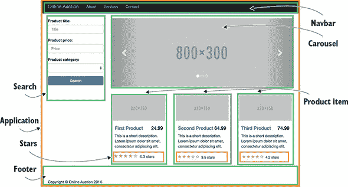

除了始终可见的部分之外，还有一个内容区域（见图 3.2），最初将显示`<nga-home>`组件及其子组件，但也可以根据用户操作显示其他视图。要显示其他视图，您需要配置路由，使其能够在出口处显示不同的视图，用一种视图替换另一种视图。您将为要在该区域显示的每个视图分配一个组件。这个内容区域由`<router-outlet>`标签表示。

| |
| --- |

##### 小贴士

页面上可以有多个出口。我们将在第四章的 4.2 节中介绍这一点。

| |
| --- |

##### 图 3.2\. 分配更改视图的区域

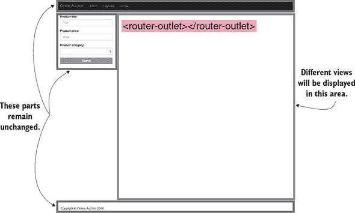

路由器负责管理客户端导航，在本章的后面部分我们将提供一个路由器的高级概述。在非 SPA 世界中，网站导航是通过向服务器发出一系列请求来实现的，通过向浏览器发送适当的 HTML 文档来刷新整个页面。在 SPA 中，渲染组件的代码已经位于客户端（除了在第四章第 4.3 节中涵盖的懒加载场景之外），您需要用另一个视图替换一个视图。

当用户在应用程序中导航时，应用程序仍然可以向服务器发出请求以检索或发送数据。有时一个视图（UI 代码和数据组合）已经将所需的所有内容下载到浏览器中。其他时候，视图将通过发出 AJAX 请求或通过 WebSockets 与服务器进行通信。每个视图都会有一个在浏览器地址栏中显示的唯一 URL。我们将在下一节讨论这一点。

### 3.2\. 位置策略

在任何给定时间，浏览器的地址栏显示当前视图的 URL。一个 URL 可以包含不同的部分，或称为段。它以协议开始，后跟域名，并且可能包括端口号。需要传递给服务器的参数可能跟在问号之后（这对于 HTTP `GET`请求是正确的），如下所示：[`mysite.com:8080/auction?someParam=1234`](http://mysite.com:8080/auction?someParam=1234)。

在非 SPA 中，更改前面 URL 中的任何字符会导致向服务器发出新的请求。在 SPA 中，您需要能够修改 URL 而无需强制浏览器进行服务器端请求，以便应用程序可以在客户端定位适当的视图。Angular 提供了两种位置策略来实现客户端导航：

+   **`HashLocationStrategy`—** 在 URL 中添加一个哈希符号（#），哈希符号之后的 URL 段唯一标识了用作网页片段的视图。这种策略与所有浏览器兼容，包括旧浏览器。

+   **`PathLocationStrategy`—** 这种基于`History` API 的策略仅在支持 HTML5 的浏览器中工作。这是 Angular 中的默认位置策略。

#### 3.2.1\. 基于哈希的导航

使用基于哈希的导航的示例 URL 显示在图 3.3 中。将哈希符号右侧的任何字符进行更改不会直接导致服务器端请求，而是在哈希之后导航到由路径（带或不带参数）表示的视图。哈希符号充当基础 URL 和所需内容的客户端位置之间的分隔符。

##### 图 3.3\. 解构 URL

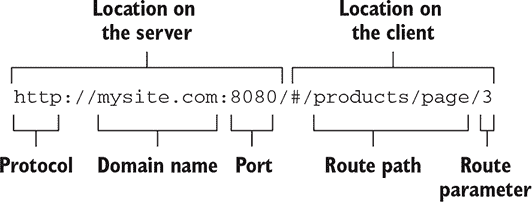

尝试导航一个像 Gmail 这样的 SPA 并观察 URL。对于收件箱，它看起来像这样：[`mail.google.com/mail/u/0/#inbox`](https://mail.google.com/mail/u/0/#inbox)。现在转到已发送文件夹，URL 的哈希部分将从 *inbox* 更改为 *sent*。客户端 JavaScript 代码调用必要的函数以显示已发送视图。但为什么当切换到已发送框时，Gmail 应用仍然显示“正在加载...”的消息？已发送视图的 JavaScript 代码仍然可以向服务器发出 AJAX 请求以获取新数据，但它不需要从服务器加载任何额外的代码、标记或 CSS。

要使用基于哈希的导航，`@NgModule()` 必须包含 `providers` 值（我们将在第五章的 5.2 节中讨论提供者），如下所示。

##### 列表 3.1\. 使用哈希位置策略

```
import {HashLocationStrategy, LocationStrategy} from "@angular/common";
...
@NgModule({
...
  providers:[{provide: LocationStrategy, useClass: HashLocationStrategy}]  *1*
 })
```

+   ***1* 提供者需要，以便 Angular 注入支持哈希位置策略的服务。**

#### 3.2.2\. 基于 History API 的导航

浏览器的 `History` API 允许你通过用户导航历史记录来回移动，以及通过编程方式操作历史堆栈（请参阅 Mozilla 开发者网络中的“操作浏览器历史记录”，[`mng.bz/i64G`](http://mng.bz/i64G)）。特别是，`pushState()` 方法用于在用户导航你的单页应用（SPA）时附加一个段到基本 URL。

考虑以下 URL：[`mysite.com:8080/products/page/3`](http://mysite.com:8080/products/page/3)（注意没有哈希符号）。URL 段 *products/page/3* 可以通过程序将（附加）到基本 URL，而不使用哈希标签。如果用户从第 3 页导航到第 4 页，应用程序的代码将推送 URL 段 *products/page/4*，并将之前访问过的 *products/page/3* 保存到浏览器历史记录中。

Angular 免去了你显式调用 `pushState()` 的麻烦——你只需配置 URL 段并映射到相应的组件。基于 `History` API 的位置策略，你需要告诉 Angular 在你的应用程序中用作基本 URL 的内容，以便它能够正确地附加客户端 URL 段。如果你想在非根路径上提供 Angular 应用，你必须执行以下操作：

+   将 `<base>` 标签添加到 index.html 的头部，例如 `<base href="/mypath">`，或在运行 `ng build` 时使用 `--base-href` 选项。Angular CLI 生成的项目在 index.html 中包含 `<base href="/">`。

+   在根模块中为 `APP_BASE_HREF` 常量分配一个值，并将其用作 `providers` 值。以下列表使用 `/` 作为基本 URL，但它可以是表示基本 URL 结尾的任何 URL 段。

##### 列表 3.2\. 为基于 `History` 的 API 添加支持

```
import { APP_BASE_HREF } from '@angular/common';
...
@NgModule({
...
  providers:[{provide: APP_BASE_HREF, useValue: '/mypath'}]      *1*
 })
class AppModule { }
```

+   ***1* 提供者需要，以便路由正确解析 URL。**

`APP_BASE_HREF`影响路由器如何解析应用程序内`routerLink`属性和`router.navigate()`调用，而`<base href=". . .">`标签影响浏览器在加载静态资源（如`<link>`、`<script>`和``标签）时解析 URL 的方式。

### 3.3\. 客户端导航的构建块

让我们熟悉使用 Angular 路由实现客户端导航的主要概念。路由是通过`RouterModule`配置的。如果您的应用程序需要路由，请确保您的`package.json`文件包含依赖项`@angular/router`。Angular 包含许多支持导航的类——例如，`Router`、`Route`、`Routes`、`ActivatedRoute`等。您将路由配置在类型为`Route`的对象数组中，如下一列表所示。此数组中的每个元素都是类型为`Route`的对象。

##### 列表 3.3\. 路由配置示例

```
const routes: Routes = [
    {path: '',        component: HomeComponent},               *1*
     {path: 'product', component: ProductDetailComponent}      *2*
 ];
```

+   ***1* 默认渲染 HomeComponent**

+   ***2* 如果 URL 包含产品片段，则渲染 ProductDetailComponent**

由于路由配置是在模块级别完成的，因此您需要让应用程序模块了解`@NgModule()`装饰器中的路由。如果您为根模块声明路由，请使用`forRoot()`方法，例如，如下所示。

##### 列表 3.4\. 让根模块了解路由

```
import { BrowserModule } from '@angular/platform-browser';
import { RouterModule } from '@angular/router';
...
@NgModule({
  imports: [BrowserModule,
            RouterModule.forRoot(routes)],      *1*
     ...
})
```

+   ***1* 为应用程序根模块创建一个路由模块和一个服务**

如果您使用带有`--routing`选项的 Angular CLI 命令`ng new`生成了应用程序（正如您在第二章的手动部分所做的那样），您将获得一个单独的文件`app-routing.module.ts`，您可以在其中配置路由，如下一列表所示。

##### 列表 3.5\. 具有路由支持的独立模块

```
const routes: Routes = [                            *1*
   { path: '', component: HomeComponent},
  { path: 'product', component: ProductDetailComponent}
];

@NgModule({
  imports: [RouterModule.forRoot(routes)],          *2*
   exports: [RouterModule]                          *3*
 })
export class AppRoutingModule {}
```

+   ***1* 配置路由**

+   ***2* 为应用程序根模块创建一个路由模块和一个服务**

+   ***3* 使此模块可从其他模块访问**

如果您正在为功能模块配置路由（而不是根模块），请使用`forChild()`方法，该方法也会创建一个路由模块，但不会创建路由服务（`forRoot()`应该已经创建了服务），如下一列表所示。

##### 列表 3.6\. 为功能模块创建路由模块

```
@NgModule({
  imports: [CommonModule,
            RouterModule.forChild(routes)]       *1*
     ...
})
export class MyFeatureModule {}
```

+   ***1* 创建路由模块但不创建路由服务**

让我们从简单的应用程序开始，该应用程序说明了路由。假设您想创建一个根组件，该组件在页面顶部有两个链接，分别是“首页”和“产品详情”。应用程序应根据用户点击的链接渲染`HomeComponent`或`ProductDetailComponent`。`HomeComponent`将渲染文本“首页组件”，而`ProductDetailComponent`将渲染“产品详情组件”。最初，网页应显示`HomeComponent`，如图 3.4 所示。

##### 图 3.4\. 带有红色背景的首页组件

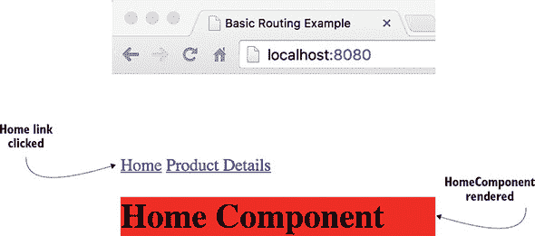

用户点击产品详情链接后，路由器应显示`ProductDetailComponent`，如图 3.5 所示。

##### 图 3.5\. 以青色背景渲染的产品详情组件

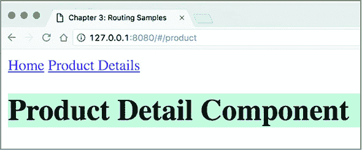

你可以在图 3.4 和 3.5 中看到这些路由的 URL 看起来如何。这个基本应用的主要目标是熟悉路由器，因此组件将非常简单，如下面的列表所示。

##### 列表 3.7\. `HomeComponent`

```
@Component({
    selector: 'home',
    template: '<h1 class="home">Home Component</h1>',
    styles: ['.home {background: red}']})               *1*
 export class HomeComponent {}
```

+   ***1* 以红色背景渲染此组件**

`ProductDetailComponent`的代码看起来很相似，如以下列表所示，但它使用的是青色背景而不是红色。

##### 列表 3.8\. `ProductDetailComponent`

```
@Component({
    selector: 'product',
    template: '<h1 class="product">Product Detail Component</h1>',
    styles: ['.product {background: cyan}']})                        *1*
 export class ProductDetailComponent {}
```

+   ***1* 以青色背景渲染此组件**

`Routes`类型只是`Route`接口中定义的类型对象的集合，如下一个列表所示。

##### 列表 3.9\. Angular 的`Route`接口

```
export interface Route {
    path?: string;
    pathMatch?: string;
    matcher?: UrlMatcher;
    component?: Type<any>;
    redirectTo?: string;
    outlet?: string;
    canActivate?: any[];
    canActivateChild?: any[];
    canDeactivate?: any[];
    canLoad?: any[];
    data?: Data;
    resolve?: ResolveData;
    children?: Routes;
    loadChildren?: LoadChildren;
    runGuardsAndResolvers?: RunGuardsAndResolvers;
}
```

你可以向`forRoot()`或`forChild()`函数传递一个配置对象，该对象只填充了几个属性。在基本应用中，你使用在`Route`接口中定义的两个属性：`path`和`component`。我们将在名为 app.routing.ts 的文件中这样做，如下面的列表所示。

##### 列表 3.10\. app.routing.ts

```
const routes: Routes = [
    {path: '',        component: HomeComponent},               *1*
     {path: 'product', component: ProductDetailComponent}      *2*
 ];

export const routing = RouterModule.forRoot(routes);           *3*
```

+   ***1* HomeComponent 映射到一个包含空字符串的路径，这隐式地使其成为默认路由。**

+   ***2* 如果 URL 在基本 URL 后有产品段，则在路由出口中渲染 ProductDetail-Component**

+   ***3* 调用 invokes forRoot()并导出路由配置，以便根模块可以导入**

下一步是创建一个根组件，它将包含在主页和产品详情视图之间导航的链接。以下列表显示了位于 app.component.ts 文件中的根`AppComponent`。

##### 列表 3.11\. app.component.ts

```
@Component({
    selector: 'app-root',
    template: `
      <a [routerLink]="['/']">Home</a>                         *1*
       <a [routerLink]="['/product']">Product Details</a>      *2*
       <router-outlet></router-outlet>                         *3*
     `
})
export class AppComponent {}
```

+   ***1* 创建一个绑定 routerLink 到空路径的链接**

+   ***2* 创建一个绑定 routerLink 到路径/product 的链接**

+   ***3* `<router-outlet>`指定了页面中路由将渲染组件的区域（一次一个）。**

`routerLink`周围的方括号表示属性绑定，而右侧的括号表示一个包含一个元素的数组（例如，`['/']`）。第二个锚标签将`routerLink`属性绑定到为/product 路径配置的组件。匹配的组件将在标记为`<router-outlet>`的区域渲染，在这个应用中位于锚标签下方。

没有组件知道路由配置，因为它属于模块的业务，如下面的列表所示。

##### 列表 3.12\. app.module.ts

```
...
import {routing} from './app.routing';                                      *1*

@NgModule({
    imports:      [ BrowserModule,
                    routing ],                                              *2*
     declarations: [ AppComponent,
                    HomeComponent,
                    ProductDetailComponent],
    providers:[{provide: LocationStrategy, useClass: HashLocationStrategy}],*3*
     bootstrap:    [ AppComponent ]
})
class AppModule {}
```

+   ***1* 导入路由配置**

+   ***2* 将路由配置添加到@NgModule()**

+   ***3* 让依赖注入机制知道你想要 HashLocationStrategy**

模块的`providers`属性是一个注册提供者的数组（本例中只有一个），用于依赖注入，这将在第五章中介绍。在此阶段，您只需知道，尽管默认的位置策略是`PathLocationStrategy`，但您希望 Angular 使用`HashLocationStrategy`类进行路由（注意图 3.5 中 URL 中的哈希符号）。

在本章附带的项目 router-samples 中，我们在.angular-cli.json 文件中配置了多个应用程序。本节中描述的应用程序名称为*basic*，您可以通过在终端窗口中输入以下命令来运行它：

```
ng serve --app basic -o
```

| |
| --- |

##### 注意

在 Angular 6 中，.angular-cli.json 文件已重命名为 angular.json。另外，如果您决定运行此应用的 Angular 6 版本（它包含书中的代码示例），则不需要`--app`选项：`ng serve basic -o`。

| |
| --- |
| |

##### 提示

不要忘记在项目 router-samples 中运行`npm install`。

| |
| --- |

在基本的路由代码示例中，我们使用 HTML 锚标签中的`routerLink`来安排导航。但如果您需要在不要求用户点击链接的情况下以编程方式安排导航呢？

### 3.4\. 使用`navigate()`导航到路由

让我们修改基本的代码示例，使用`navigate()`方法进行导航。您将添加一个按钮，该按钮也将导航到`ProductDetailComponent`，但这次不使用 HTML 锚点。

以下列表重用了上一节中的路由配置，但在`AppComponent`的构造函数中注入的`Router`实例上调用了`navigate()`方法。

##### 列表 3.13\. 使用`navigate()`

```
@Component({
  selector: 'app',
  template: `
    <a [routerLink]="['/']">Home</a>
    <a [routerLink]="['/product']">Product Details</a>
    <button (click)="navigateToProductDetail()>Product Details    *1*
     </button>
    <router-outlet></router-outlet>
  `
})
class AppComponent {

    constructor(private _router: Router){}                        *2*

    navigateToProductDetail(){
        this._router.navigate(["/product"]);                      *3*
     }
}
```

+   ***1* 点击此按钮将调用 navigateToProductDetail()方法。**

+   ***2* Angular 会将 Router 实例注入到 router 变量中。**

+   ***3* 以编程方式导航到配置的产品路由**

在列表 3.13 中，用户需要点击按钮才能转到产品路由。但导航可以不要求用户操作实现——只需在需要时从您的应用程序代码中调用`navigate()`方法。例如，您可以强制应用程序导航到登录路由，如果用户未登录。

默认情况下，当用户使用路由器导航时，浏览器的地址栏会发生变化。如果您不想显示当前路由的 URL，请使用`skipLocationChange`指令：

```
<a [routerLink]="['/product']" skipLocationChange>Product Details</a>
```

在这种情况下，即使用户导航到`product`路由，URL 仍然保持为 http://localhost:4200/#/。为了以编程方式达到相同的效果，请使用以下语法：

```
this._router.navigate(["/product"], {skipLocationChange: true});
```

| |
| --- |

**处理 404 错误**

如果用户在您的应用程序中输入一个不存在的 URL，路由器将无法找到匹配的路由，并在浏览器控制台打印错误消息，让用户困惑为什么没有发生导航。考虑创建一个应用程序组件，该组件将在应用程序无法找到匹配组件时显示。

例如，您可以创建一个名为 _404Component 的组件，并使用通配符路径`**`进行配置：

```
[
  {path: '',        component: HomeComponent},
  {path: 'product', component: ProductDetailComponent},
  {path: '**', component: _404Component}
])
```

通配符路由配置必须是路由数组中的最后一个元素。路由器始终将通配符路由视为匹配，因此通配符路由之后的任何路由都不会被考虑。


### 3.5. 传递数据到路由

基本路由应用程序展示了如何在路由出口区域显示不同的组件，但您通常还需要向组件传递一些数据。例如，如果应用程序组件显示产品列表，并且您想导航到产品详情路由，您需要将产品 ID 传递到代表目标路由的组件。在这种情况下，您需要在路由配置中的`path`属性中添加一个参数。在以下列表中，您更改了`product`路由的配置，以指示当 URL 段包含`'product'`之后的值时（冒号表示路径的变量部分 - `:id`），必须渲染`ProductDetailComponent`。

##### 列表 3.14. `Routes`配置

```
const routes: Routes = [
    {path: '',        component: HomeComponent},
    {path: 'product/:id', component: ProductDetailComponent}    *1*
 ];
```

+   ***1* 如果 URL 包含 product 片段后跟一个值，则渲染 ProductDetailComponent 并将其值传递给它**

因此，您的应用程序组件需要将产品 ID 的值包含在`routerLink`中，以确保如果用户选择此路由，产品 ID 的值将被传递到`ProductDetailComponent`。应用程序的新版本可能看起来如下所示。

##### 列表 3.15. app.component.ts

```
@Component({
    selector: 'app-root',
    template: `
        <a [routerLink]="['/']">Home</a>
        <a [routerLink]="['/product', productId]">Product Detail</a>   *1*
         <router-outlet></router-outlet>
    `
})
class AppComponent {
  productId = 1234;                                                    *2*
 }
```

+   ***1* 如果用户点击此链接，导航到产品路由，传递 productId 的值**

+   ***2* 设置 productId 属性的值**

第二个`routerLink`绑定到包含路径的静态部分/product 和代表产品 ID 的值`/:id`的两个元素数组。数组元素构建了传递给`RouterModule.forRoot()`方法的路由配置中指定的路径。对于产品详情路由，Angular 将构造 URL 段/product/1234。

要查看此应用程序的实际运行情况，请在您的终端窗口中运行以下命令：

```
ng serve --app params -o
```

#### 3.5.1. 从 ActivatedRoute 中提取参数

如果父组件可以将参数传递给路由，则表示目标路由的组件应该能够接收它。指示 Angular 将 `ActivatedRoute` 实例注入到表示目标路由的组件的构造函数中。`ActivatedRoute` 实例将包括传递的参数以及路由的 URL 段和其他属性。新版本的组件，它能够渲染产品详情并接收参数，将被称为 `ProductDetailComponent`，它将获得一个 `ActivatedRoute` 对象的注入，如下所示。

##### 列表 3.16\. `ProductDetailComponentParam`

```
@Component({
  selector: 'product',
  template: `<h1 class="product">Product Detail for Product: {{productID}}</h1>`,*1*
   styles: ['.product {background: cyan}']
})
export class ProductDetailComponent {
  productID: string;

  constructor(route: ActivatedRoute) {                                           *2*
     this.productID = route.snapshot.paramMap.get('id');                         *3*
   }
}
```

+   ***1* 显示接收到的产品 ID**

+   ***2* 将此组件的构造函数中注入的 ActivatedRoute 对象。**

+   ***3* 获取名为 id 的参数的值并将其分配给 productID 类变量，该变量通过绑定在模板中使用**

图 3.6 展示了产品详情视图在浏览器中的渲染方式。注意 URL：路由将产品/:id 路径替换为 /product/1234。

##### 图 3.6\. 产品详情路由接收了产品 ID `1234`。

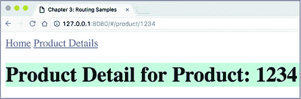


**将参数传递给路由**

在此应用中，您使用 `ActivatedRouteSnapshot` 类型的 `snapshot` 属性来检索参数的值。`snapshot` 表示“一次性操作”，此属性用于参数传递给路由时永远不会改变的场景。在您的应用中，它之所以有效，是因为父路由中的产品 ID 永远不会改变，始终是 `1234`。但是，如果您尝试手动更改 图 3.6 中显示的 URL（例如，将其更改为 /product/12345），则 `ProductDetailComponent` 不会反映参数的变化。

在某些情况下，参数值在导航到路由后仍然会不断变化。例如，`AppComponent` 渲染产品列表，用户可以选择不同的产品。`AppComponent` 和 `ProductDetailComponent` 都在同一窗口中渲染。在这种情况下，您需要订阅 `ActivatedRoute.paramMap` 属性，而不是使用 `snapshot` 属性，因为每次用户点击不同的产品时，它都会发出新的值，例如：

```
route.paramMap.subscribe(
  params => this.productID = params.get('id')
);
```

您将在 第六章 的 6.6 节 中看到此示例。


让我们回顾一下 Angular 在渲染应用程序主页面时在幕后执行的步骤：

> **1**.  检查每个 `routerLink` 的内容。
> 
> **2**.  连接数组中指定的值。如果数组项是一个表达式，则评估此表达式（如 `productId`）。最后，将 `APP_BASE_HREF` 的值追加到结果字符串的开头。
> 
> **3**.  `RouterLink` 指令如果附加到 `<a>` 元素上，则会添加 `href` 属性；否则，它只监听 `click` 事件。

图 3.7 显示了应用程序主页的快照，其中 Chrome 开发者工具面板已打开。因为配置的主路由的`path`属性为空字符串，所以 Angular 没有向页面基本 URL 添加任何内容。但是，产品详情链接下的锚点已经转换为常规 HTML 标签。当用户点击产品详情链接时，路由器将附加一个哈希符号并将/product/1234 添加到基本 URL，从而使产品详情视图的绝对 URL 成为 http://localhost:4200/#/product/1234。

##### 图 3.7\. 浏览器中的 Angular 编译代码

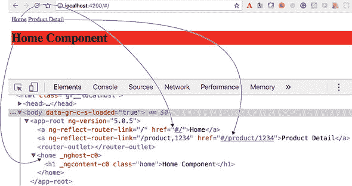


##### 注意

在本节中，您学习了如何将动态数据传递给路由——这些数据可能在运行时发生变化。有时，您需要将静态数据传递给路由（不改变的数据）。您可以通过在路由配置中使用`data`属性将任何任意数据传递给路由。您将在第四章的 4.3.1 节中看到一个这样的示例。


有时，您需要传递给路由可选查询参数，这些参数不是路由配置的一部分。让我们看看如何传递查询参数。

#### 3.5.2\. 将查询参数传递给路由

您可以使用查询参数（问号后的 URL 段），如下面的 URL 所示：http://localhost:4200/products?category=sports。查询参数不限于特定的路由，如果您想在导航时通过`routerLink`传递它们，您可以这样做：

```
<a [routerLink]="['/products']" [queryParams]="{category:'sports'}">?
      Sports products </a>
```

因为查询参数不限于特定的路由，并且可以被任何活动路由访问，所以路由配置不需要包括它们：

```
{path: 'products', component: ProductDetailComponent}
```

要使用程序化导航传递查询参数，您需要访问`Router`对象。代码可能看起来像以下列表。

##### 列表 3.17\. 注入和访问`Router`对象

```
constructor (private router: Router) {}                           *1*
showSportingProducts() {
   this.router.navigate(['/products'],                            *2*
                         {queryParams: {category: 'sports'}});
}
```

+   ***1* 注入 Router 对象**

+   ***2* 在`Router`对象上调用 navigate()**

在此示例中，您传递了一个包含一个查询参数的对象；但您也可以指定多个参数。

要在目标组件中接收查询参数，您将再次使用`ActivatedRoute`对象。

##### 列表 3.18\. 接收查询参数

```
@Component({
  selector: 'product',
  template: `<h1 class="product">Showing products in {{productCategory}}</h1>
     `,
  styles: ['.product {background: cyan}']
})
export class ProductDetailComponent {
  productCategory: string;

  constructor(route: ActivatedRoute) {
     this.productCategory = route.snapshot.queryParamMap.get('category');  *1*
   }
}
```

+   ***1* 提取名为 category 的查询参数**

要查看此代码示例的实际效果，请运行以下命令：

```
ng serve --app queryparams -o
```

### 3.6\. 子路由

一个 Angular 应用程序是由具有父子关系的组件组成的树。子组件可以有自己的路由，但所有路由都在任何组件之外配置。想象一下，您想启用`ProductDetailComponent`（`AppComponent`的子组件）显示产品描述或卖家信息。此外，同一产品可能有多个卖家，因此您需要传递卖家 ID 以显示卖家详情。以下列表通过使用`Route`的`children`属性为子路由`ProductDetailComponent`配置路由。

##### 列表 3.19\. 配置子路由

```
const routes: Routes = [
  {path: '',            component: HomeComponent},
  {path: 'product/:id', component: ProductDetailComponent,
    children: [                                                         *1*
       {path: '',           component: ProductDescriptionComponent},    *2*
       {path: 'seller/:id', component: SellerInfoComponent}             *3*
     ]}
];
```

+   ***1* 此属性配置 ProductDetailComponent 的路由。**

+   ***2* ProductDescriptionComponent 默认存在。**

+   ***3* 从 ProductDetailComponent，用户可以导航到 SellerInfoComponent。**

在这里，`children` 属性是路径为 product/:id 的路由配置的一部分。在导航到 `product` 路由时，您传递产品 ID，然后，如果用户决定导航到 `seller`，您将卖家 ID 传递给 `SellerInfoComponent`。

图 3.8 展示了用户在根组件上点击产品详情链接后应用程序的外观，这将渲染 `ProductDetailComponent`（子组件），默认显示 `ProductDescriptionComponent`，因为后者组件被配置为空 `path` 属性。

##### 图 3.8\. 产品描述路由

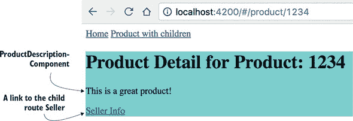

图 3.9 展示了用户点击产品详情链接然后点击卖家信息后的应用程序。


##### 注意

如果您正在阅读这本书的电子版，您会看到卖家信息显示在黄色背景上。我们故意这样做是为了稍后在本章中讨论组件的样式。


##### 图 3.9\. 子路由渲染 `SellerInfo`

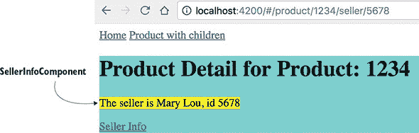

为了实现 图 3.8 和 图 3.9 中显示的视图，您需要修改 `ProductDetailComponent`，使其也具有两个子组件 `SellerInfoComponent` 和 `ProductDescriptionComponent`，以及自己的 `<router-outlet>`。 图 3.10 展示了您将要实现的组件层次结构。

##### 图 3.10\. 路由层次结构

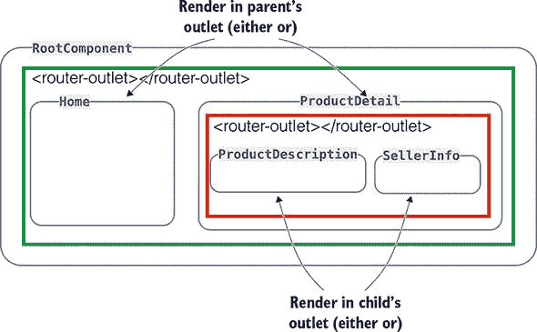

以下三个列表显示了 `ProductDetailComponent`、`ProductDescriptionComponent` 和 `SellerInfoComponent` 的代码。`ProductDetailComponent` 的新版本有自己的出口，可以在其中显示 `ProductDescriptionComponent`（默认）或 `SellerInfoComponent`。

##### 列表 3.20\. product.detail.component.ts

```
@Component({
    selector: 'product',
    styles: ['.product {background: cyan}'],
    template: `
      <div class="product">
        <h1>Product Detail for Product: {{productId}}</h1>
        <router-outlet></router-outlet>                                   *1*
         <p><a [routerLink]="['./seller', sellerId]">Seller Info</a></p>  *2*
       </div>
    `
})
export class ProductDetailComponent {
  productId: string;
  sellerId = 5678;

  constructor(route: ActivatedRoute) {
    this.productId = route.snapshot.paramMap.get('id');
  }
}
```

+   ***1* ProductDetailComponent 为其子组件逐个渲染分配了自己的路由出口区域。**

+   ***2* 当用户点击此链接时，Angular 将 /seller/5678 段添加到现有 URL 并渲染 SellerInfoComponent。**

当用户点击带有子组件的产品链接时，URL 中会添加 product/1234 段。路由器在配置对象中找到与此路径匹配的内容，并在出口处渲染 `ProductDetailComponent`。

用户导航到 `ProductDetailComponent`，默认情况下根据路由配置渲染 `ProductDescriptionComponent`。然后，用户点击卖家信息链接，URL 将在哈希符号后包含 product/1234/seller/5678 段，如 图 3.11 所示。

##### 图 3.11\. 卖家组件的 URL

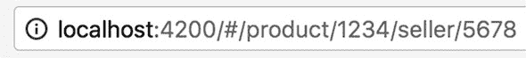

路由将在配置对象中找到一个匹配项，并在子组件的 `<router-outlet>` 中渲染 `SellerInfoComponent`。`ProductDescriptionComponent` 的代码很简单，如下所示。

##### 列表 3.21\. product.description.component.ts

```
@Component({
    selector: 'product-description',
    template: '<p>This is a great product!</p>'
})
export class ProductDescriptionComponent {}
```

因为 `SellerInfoComponent` 期望接收卖家 ID，所以它的构造函数需要一个类型为 `ActivatedRoute` 的参数来获取卖家 ID，如下所示，就像你在 `ProductDetailComponent` 中做的那样。

##### 列表 3.22\. seller.info.component.ts

```
@Component({
    selector: 'seller',
    template: 'The seller is Mary Lou, id {{sellerID}} ',
    styles: [':host {background: yellow}']                    *1*
 })
export class SellerInfoComponent {
   sellerID: string;

   constructor(route: ActivatedRoute){                        *2*
      this.sellerID = route.snapshot.paramMap.get('id');      *3*
    }
}
```

+   ***1* 使用伪类 :host 在黄色背景上显示此组件的内容。**

+   ***2* 注入 Activated-Route 对象**

+   ***3* 获取传递的 id 的值并将其分配给 sellerID 以进行渲染**

可以使用 `:host` 伪类选择器与使用阴影 DOM（在第八章第 8.5.1 节中讨论）创建的元素一起使用，这为组件提供了更好的封装。尽管并非所有网络浏览器都支持阴影 DOM，但 Angular 默认模拟阴影 DOM。在这里，你使用 `:host` 将黄色背景颜色应用到 `SellerInfoComponent`。在模拟模式下，`:host` 选择器被转换为一个基于属性的随机生成的选择器，如下所示：

```
[ng-host-f23ed] {
  background: yellow;
}
```

属性（在此处，`ng-host-f23ed`）附加到表示组件的元素。组件的阴影 DOM 样式不会与全局 DOM 的样式合并，组件的 HTML 标签的 ID 也不会与 DOM 的 ID 冲突。

要运行此代码示例，请在路由-samples 项目的终端窗口中输入以下命令：

```
ng serve --app child -o
```


**深度链接**

*深度链接* 是创建指向网页内特定内容而不是整个页面的链接的能力。在基本的路由应用程序中，你已经看到了深度链接的例子：

+   URL http://localhost:4200/#/product/1234 不仅链接到产品详情页面，还链接到一个表示具有 ID `1234` 的特定产品视图。

+   URL http://localhost:4200/#/product/1234/seller/5678 深入链接。它显示了具有 ID `5678` 的卖家信息，该卖家销售具有 ID `1234` 的产品。

你可以通过从在 Chrome 中运行的应用程序复制链接 http://localhost:4200/#/product/1234/seller/5678 并将其粘贴到 Firefox 或 Safari 中来轻松看到深度链接的实际应用。但是有一个注意事项。使用 `PathLocationStrategy` 时，当你直接在浏览器地址栏中输入路由的直接 URL，它仍然会向服务器发出请求，服务器找不到名为你的路由的资源（这是正确的）。这将导致 404 错误。当请求的资源未找到时，配置你的 web 服务器将重定向到你的应用程序的 index.html。这将使你的 Angular 应用程序重新获得控制权，并且路由将被正确解析。Angular CLI 开发服务器已经配置了重定向。

|  |

**路由事件**

当用户导航您的应用程序时，Angular 会分发事件，例如`NavigationStart`、`NavigationEnd`等。大约有一打路由事件，如果需要，您可以拦截任何一个。在第六章的 6.6 节中，您将看到一个使用路由事件来决定何时显示和隐藏进度条的示例，如果导航速度慢的话。为了调试目的，您可以使用`enableTracing`选项在浏览器控制台中记录路由事件（它仅在根模块中工作）：

```
RouterModule.forRoot(
  routes,
  {enableTracing: true}
)
```

| |
| --- |

现在您已经学习了路由的基本功能，让我们看看如何在 ngAuction 应用程序中应用它们。

### 3.7\. 动手：为在线拍卖添加导航

| |
| --- |

##### 备注

本章的源代码可以在[`github.com/Farata/angulartypescript`](https://github.com/Farata/angulartypescript)和[www.manning.com/books/angular-development-with-typescript-second-edition](http://www.manning.com/books/angular-development-with-typescript-second-edition)找到。

| |
| --- |

这个动手练习从我们在第二章中停止的地方开始。到目前为止，您已经部分实现了 ngAuction 的着陆页；您的目标是让几个产品项在轮播组件下渲染，使着陆页看起来如图 3.12 所示。

##### 图 3.12\. 带有产品的 ngAuction 着陆页

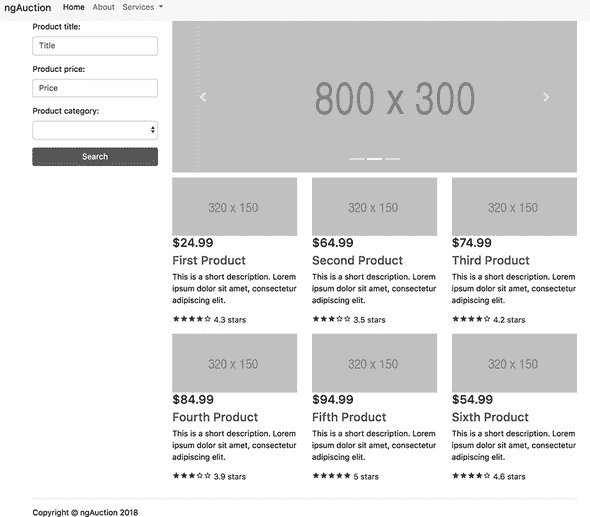

此视图的数据将由`ProductService`提供。这个动手练习包含了将`ProductService`注入到`HomeComponent`中的说明。您还将实现导航，以便当用户点击产品标题时，`Router`将在`<router-outlet>`区域渲染`ProductDetail`组件。

您的`ProductService`将包含关于产品的硬编码数据。将`ProductService`作为`HomeComponent`构造函数的参数将指示 Angular 实例化和注入产品对象到该组件。

作为起点，您将使用位于 chapter3/ngAuction 文件夹中的项目，该项目大部分与 chapter2/ngAuction 相同，只是增加了一个：shared/product.service.ts 文件包含提供产品数据的代码。

要开始这个练习，请在您的 IDE 中打开 chapter3/ngAuction 文件夹，并通过运行`npm install`命令安装项目依赖。

#### 3.7.1\. ProductService

`ProductService`包含关于产品和获取它们的 API 的硬编码数据。让我们回顾以下列表中所示的 product.service.ts 中的代码（为了简洁，我们删除了大部分硬编码数据）。

##### 列表 3.23\. product.service.ts

```
export class Product {                                        *1*
   constructor(
    public id: number,
    public title: string,
    public price: number,
    public rating: number,
    public description: string,
    public categories: string[]) {
  }
}

export class ProductService {                                 *2*

  getProducts(): Product[] {                                  *3*
     return products.map(p => new Product(p.id, p.title,
      p.price, p.rating, p.description, p.categories));
  }

  getProductById(productId: number): Product {                *4*
     return products.find(p => p.id === productId);
  }
}

const products = [                                            *5*
   {
    'id': 0,
    'title': 'First Product',
    'price': 24.99,
    'rating': 4.3,
    'description': 'This is a short description.
    Lorem ipsum dolor sit amet, consectetur adipiscing elit.',
    'categories': ['electronics', 'hardware']
  },
  {
    'id': 1,
    'title': 'Second Product',
    'price': 64.99,
    'rating': 3.5,
    'description': 'This is a short description.
    Lorem ipsum dolor sit amet, consectetur adipiscing elit.',
    'categories': ['books']
  }];
  }
```

+   ***1* 产品实例将通过 ProductService 的方法返回。**

+   ***2* ProductService 类提供了一个获取产品的 API。**

+   ***3* 此方法返回所有硬编码的产品。**

+   ***4* 此方法根据 productId 返回一个产品。**

+   ***5* 包含硬编码产品的数组**

简而言之，你将添加代码，让 Angular 创建 `ProductService` 类的实例，并将其注入到 `ProductItemComponent` 和 `ProductDetailComponent` 中，以便它们可以在服务上调用 `getProducts()` 和 `getProductById()` 方法。

#### 3.7.2\. ProductItemComponent

图 3.13 展示了六个产品，每个都是一个 `ProductItemComponent` 的实例。

##### 图 3.13\. 六个 `ProductItemComponent` 实例

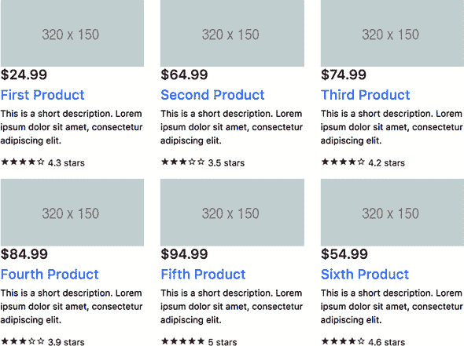

`ProductItemComponent` 知道如何根据其父组件（`HomeComponent`）提供的产品渲染一个产品。将 product-item.component.ts 修改如下所示。

##### 列表 3.24\. product-item.component.ts

```
import {Component, Input} from '@angular/core';
import {Product} from '../shared/product.service';

@Component({
  selector: 'nga-product-item',
  templateUrl: './product-item.component.html',
  styleUrls: ['./product-item.component.css']
})
export class ProductItemComponent {

  @Input() product: Product;          *1*
 }
```

+   ***1* 此输入属性将从父组件接收产品。**

要渲染的产品将通过 `ProductItemComponent` 的属性 `product`（带有 `@Input()` 装饰器）传递给它。`@Input()` 属性在 第 8.2.1 节中描述，位于 第八章。

使用以下列表中的内容修改 product-item.component.html。

##### 列表 3.25\. product-item.component.html

```
<div class="thumbnail">
  
  <div class="caption">
    <h4 class="float-right">{{product.price | currency}}</h4>              *1*
     <h4><a [routerLink]="['/products', product.id]">{{product.title}}</a> *2*
     </h4>
    <p>{{product.description}}</p>
  </div>
  <!--  <div class="ratings">                                              *3*
     <nga-stars [rating]="product.rating"></nga-stars>
  </div> -->
</div>
```

+   ***1* 应用货币管道进行格式化**

+   ***2* 产品标题变成了导航到产品详情的链接。**

+   ***3* 评分组件已被注释并将在以后添加。**

注意，你将产品的 `price`、`title` 和 `id` 属性绑定到组件的模板中。你还使用了一个 Angular 内置管道，`currency`，来格式化价格。目前，你将 `<nga-stars>` 组件注释掉，因为 `StarsComponent` 的代码尚未准备好。注意，`product.title` 是一个 `routerLink`，当用户点击它时将导航到 `ProductDetailComponent`。`ProductItemComponent` 的实例将由 `HomeComponent` 托管，你将在下一部分更新它。

#### 3.7.3\. HomeComponent

home 组件将

+   使用注入的 `ProductService` 检索所有特色产品并将它们存储在 `products` 数组中。

+   为 `products` 数组中每个找到的产品渲染 `ProductItemComponent`。

在 第 2.7.8 节中，位于 第二章，你实现了 `HomeComponent` 的第一个版本，并将其添加到模板中。现在，你需要修改构造函数以注入 `ProductService` 并在 `ngOnInit()` 方法中检索产品。将 home.component.ts 中的代码修改如下所示。

##### 列表 3.26\. home.component.ts

```
import {Component, OnInit} from '@angular/core';
import {Product, ProductService} from '../shared/product.service';

@Component({
  selector: 'nga-home',
  templateUrl: './home.component.html',
  styleUrls: ['./home.component.css']
})
export class HomeComponent implements OnInit {

  products: Product[]=[];
  constructor(private productService: ProductService) { }       *1*

  ngOnInit() {                                                  *2*
     this.products = this.productService.getProducts();         *3*
   }
}
```

+   ***1* 注入 ProductService**

+   ***2* 实现在构造函数之后调用的生命周期方法 ngOnInit()**

+   ***3* 使用 ProductService 检索产品**

当 Angular 实例化 `HomeComponent` 时，它会注入 `ProductService` 的实例。因为使用了 `private` 标识符，生成的 JavaScript 将会有一个实例变量，`productService`。

Angular 在构造函数之后调用组件生命周期方法 `ngOnInit()`，你将在那里调用 `getProducts()` 方法。在第九章的 9.2 节中，我们将讨论组件生命周期方法，你将看到为什么 `ngOnInit()` 是获取数据的正确位置。

修改 home.component.html 文件，使用结构指令 `*ngFor` 遍历数组 `products` 并渲染每个产品。

##### 列表 3.27\. home.component.html

```
<div class="row">
  <div class="col-md-12">
    <nga-carousel></nga-carousel>                               *1*
   </div>
</div>
<div class="row">
  <div *ngFor="let product of products"                         *2*
             class="col-sm-4 col-lg-4 col-md-4">                *3*
     <nga-product-item [product]="product"></nga-product-item>  *4*
   </div>
</div>
```

+   ***1* 轮播组件位于顶部。**

+   ***2* 遍历 products 数组**

+   ***3* 为每个组件分配 Bootstrap 弹性网格的四列**

+   ***4* 为每个产品渲染 <nga-product-item> 组件**

每个产品在网页上由相同的 HTML 片段表示。因为有多件产品，所以需要多次渲染相同的 HTML。组件模板内部使用 `NgFor` 指令来遍历数据集合中的项目列表，为每个项目渲染 HTML 标记。在组件模板中，`*ngFor` 代表 `NgFor` 指令。

因为 `*ngFor` 指令位于 `<div>` 内部，每次循环迭代都会渲染一个包含相应 `<nga-product-item>` 内容的 `<div>`。要将产品实例传递给 `ProductItemComponent`，你使用方括号进行属性绑定：

```
<nga-product-item [product]="product">
```

左侧的 `[product]` 指的是 `<nga-product-item>` 组件内部的名为 `product` 的属性，而右侧的 `product` 是在 `*ngFor` 指令中即时声明的本地模板变量，作为 `let product`。

Bootstrap 的网格样式 `class="col-sm-4 col-lg-4 col-md-4"` 指示浏览器将 `<div>` 的宽度平均分成 4 列（12 列中的 4 列），分配给小、大和中等设备上的每个产品，如图 3.14 所示。尝试移除此类，看看它如何影响 UI。

##### 图 3.14\. 使用 Bootstrap 网格分割 `<div>` 宽度

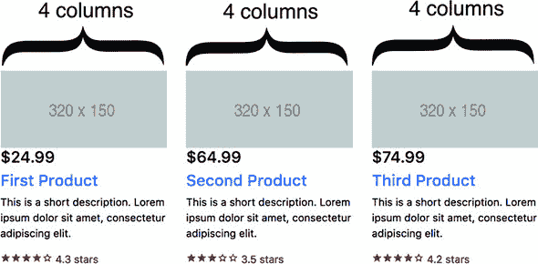

运行 `ng serve -o` 命令，你将看到在轮播图中渲染了六个产品，如图 3.14 所示，但产品评分中不会有任何星星。我们将在下一部分处理星星。

#### 3.7.4\. 星级组件

`StarsComponent` 将渲染星星以显示产品评分，如图 3.15 所示。

##### 图 3.15\. 星级组件


在 ngAuction 的着陆页上，`StarsComponent` 将是 `ProductItemComponent` 的子组件。最终，我们还会在 `ProductDetailComponent` 中重用它。

修改生成的 stars.component.ts 文件的代码，使其看起来如下。

##### 列表 3.28\. stars.component.ts

```
import {Component, Input, OnInit} from '@angular/core';
@Component({
  templateUrl: 'stars.component.html',
  styleUrls: ['./stars.component.css'],
  selector: 'nga-stars'
})
export class StarsComponent implements OnInit {
  @Input() count = 5;                              *1*
   @Input() rating = 0;                            *2*
   stars: boolean[] = [];                          *3*

  ngOnInit() {                                     *4*
     for (let i = 1; i <= this.count; i++) {

      this.stars.push(i > this.rating); // push true or false

    }
  }
}
```

+   ***1* 使用 @Input 装饰属性 count（在第八章的 8.1.2 节中介绍）以便父组件可以使用属性绑定来分配其值**

+   ***2* 使用 @Input 装饰属性 rating 的原因相同**

+   ***3* 此数组的每个元素对应一个单独的星形。**

+   ***4* 根据父组件提供的评分初始化星形数组为布尔值**

`count`属性指定要渲染的星形总数。如果父组件没有提供此输入属性的值，则默认渲染五个星形。如果需要，`StarsComponent`可以渲染更多或更少的星形。以下列表显示了如何渲染七个星形。

##### 列表 3.29\. 渲染七个星形

```
<nga-stars [rating]="product.rating"       *1*
            [count]="7"></nga-stars>       *2*
```

+   ***1* 将 7 绑定到 count 输入属性**

+   ***2* 将产品评分绑定到<nga-stars>组件的 rating 输入属性**

`stars`数组中具有`false`值的元素表示没有颜色的星形，而具有`true`值的元素表示填充颜色的星形。`rating`属性存储平均产品评分，该评分确定应该填充颜色的星形数量以及应该保持空白的星形数量。

Bootstrap 4 框架不包含渲染星形的图像。有多个流行的图标字体库（Material Design Icons、Font Awesome、Octicons 等）；我们将使用 Material Design Icons。为了在项目中本地化它们，按照以下方式安装这些图标：

```
npm i  material-design-icons
```

然后将这些字体添加到`.angular-cli.json`文件的`styles`部分，如下所示列表。

##### 列表 3.30\. .angular-cli.json 的样式部分

```
"styles": [
  "styles.css",
  "../node_modules/bootstrap/dist/css/bootstrap.min.css",
  "../node_modules/material-icons/css/material-design-icons.min.css"     *1*
 ]
```

+   ***1* 添加 Material Design 图标**

修改 stars.component.html 的内容，使其看起来如下所示列表。

##### 列表 3.31\. stars.component.html

```
<p>
  <span *ngFor="let isEmpty of stars"          *1*
         class="material-icons">               *2*
            {{ isEmpty ? 'star_border' :       *3*
                         'star_rate' }}        *4*
   </span>
  <span>{{ rating }} stars</span>
</p>
```

+   ***1* 遍历布尔数组 stars 并应用填充或空白的星形**

+   ***2* 使用 material-icons 样式**

+   ***3* 填充颜色的 Material Design 星形称为 star_rate。**

+   ***4* 一个空的星形样式称为 star_border。**

注意你如何绑定一个或另一个 CSS 类（使用双大括号）。为了样式化星形图标，将以下样式添加到 stars.component.css 文件中。

##### 列表 3.32\. stars.component.css

```
:host {
  display: block;
}

.material-icons {            *1*
   display: inline-block;
  font-size: inherit;
  height: 16px;
  width: 16px;
}
```

+   ***1* 样式化星形图标**

`ProductItemComponent`将是`StarsComponent`的父组件。为了使其成为`ProductItemComponent`的子组件，取消注释之前创建的 product-item.component.html 文件中的`<div>`。

##### 列表 3.33\. 添加带有<nga-stars>组件的<div>

```
<div class="ratings">                                     *1*
  <nga-stars [rating]="product.rating"></nga-stars>       *2*
 </div>
```

+   ***1* 将星形设置为深红色（请参阅下一列表中的 CSS）**

+   ***2* 将产品评分绑定到<nga-stars>组件的输入属性**

CSS 选择器`ratings`将在 product-item.component.css 文件中定义。您将使用以下列表中的样式在 product-item.component.css 文件中将星形设置为深红色并添加一些填充。

##### 列表 3.34\. product-item.component.css

```
.ratings {
  color: darkred;      *1*
 }

img {
  width: 100%;         *2*
 }
```

+   ***1* 设置颜色为深红色**

+   ***2* 确保图像不会相互重叠**

您将此样式添加到 `StarsComponent` 的父组件中，以便在子组件中需要时选择不同的星级颜色。如果另一个组件需要渲染星级，您可以在那里选择另一种颜色。现在您的 `ProductItemComponent` 为每个子产品渲染评分，如图 3.14 所示。

是时候使用 `Router` 实现导航了。

#### 3.7.5\. ProductDetailComponent

在 第二章 中，您生成了路由模块，但它只有一个配置的路由，如您在以下列表中看到的，它渲染 `HomeComponent`。

##### 列表 3.35\. app-routing.module.ts

```
import {NgModule} from '@angular/core';
import {Routes, RouterModule} from '@angular/router';
import {HomeComponent} from "./home/home.component";

const routes: Routes = [                          *1*
   {
    path: '', component: HomeComponent
  }
];

@NgModule({
  imports: [RouterModule.forRoot(routes)],        *2*
   exports: [RouterModule]                        *3*
 })
export class AppRoutingModule { }
```

+   ***1* 配置默认路由**

+   ***2* 为应用程序根模块创建一个路由模块和服务**

+   ***3* 重新导出 RouterModule，以便其他模块可以访问它**

您想添加另一个路由，以便当用户在 `ProductItemComponent` 中点击产品标题时，`Router` 将 `HomeComponent` 替换为 `ProductDetailComponent`。在此导航过程中，您想将所选产品的 ID 传递给 `ProductDetailComponent`。修改路由配置，使其看起来如下所示，并且不要忘记导入 `ProductDetailComponent`。

##### 列表 3.36\. 配置第二个路由

```
const routes: Routes = [
  { path: '', component: HomeComponent},
  { path: 'products/:productId', component: ProductDetailComponent}      *1*
 ];
```

+   ***1* 配置 URL 片段的路由，如 products/123**

`ProductDetailComponent` 将通过注入的 `ActivatedRoute` 从父组件接收所选产品 ID，然后向 `ProductService` 发送请求以检索产品详情。由于 `ProductDetailComponent` 将重用 Angular 在应用程序启动时为您创建的 `ProductService` 实例，因此将此服务添加到构造函数的参数中。修改 `product-detail.component.ts` 中的代码，使其看起来如下所示。

##### 列表 3.37\. product-detail.component.ts

```
import { Component, OnInit } from '@angular/core';
import {Product, ProductService} from '../shared/product.service';
import {ActivatedRoute} from '@angular/router';

@Component({
  selector: 'auction-product-detail',
  templateUrl: './product-detail.component.html',
  styleUrls: ['./product-detail.component.css']
})
export class ProductDetailComponent implements OnInit {

  product: Product;

  constructor(private route: ActivatedRoute,
              private productService: ProductService) { }          *1*

  ngOnInit() {
    const prodId: number = parseInt(
                   this.route.snapshot.params['productId']);       *2*
     this.product = this.productService.getProductById(prodId);    *3*
   }
}
```

+   ***1* 同时将 ActivatedRoute 和 ProductService 注入到构造函数中。**

+   ***2* 从 ActivatedRoute 中提取 productId 参数**

+   ***3* 在服务上调用 getProductById()，并提供 prodId 作为参数**

实例变量 `product` 的属性值将被绑定到组件模板，并由浏览器渲染。`ProductDetailComponent` 的模板将包含产品图片（一个灰色矩形）、产品价格、标题和描述。

修改 `product-detail.component.html` 的内容，使其看起来如下所示。

##### 列表 3.38\. product-detail.component.html

```
<div class="thumbnail">
  
  <div>
    <h4 class="float-right">{{ product.price }}</h4>              *1*
     <h4>{{ product.title }}</h4>                                 *2*
     <p>{{ product.description }}</p>                             *3*
   </div>
  <div class="ratings">                                           *4*
     <p><nga-stars [rating]="product.rating"></nga-stars></p>     *5*
   </div>
</div>
```

+   ***1* 在右侧渲染产品价格**

+   ***2* 渲染产品标题**

+   ***3* 渲染产品描述**

+   ***4* 使用类 ratings 以深红色渲染星级**

+   ***5* 使用绑定到组件属性 rating 的产品评分渲染 StarsComponent**

`ProductDetailComponent` 也使用了 `<nga-stars>`。为了改变一下，让我们在 `product-detail.component.css` 中添加以下列表的样式。

##### 列表 3.39\. product-detail.component.css

```
.ratings {
  color: darkgreen;         *1*
   padding-left: 10px;
  padding-right: 10px;
}
```

+   ***1* 将星级设置为深绿色**

使用 `ng serve -o` 运行应用——导航到产品详情视图将正常工作。点击第一个产品的标题，`Router` 将创建一个 `ProductDetailComponent` 的实例。浏览器将显示产品详情，如图 3.16 所示。

##### 图 3.16\. 渲染产品详情

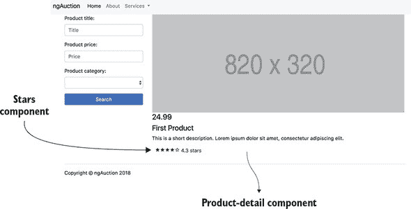

使用 `ng serve -o` 运行此应用以查看 ngAuction 的着陆页。请注意，在产品详情视图中，星星显示为深绿色，而在着陆页上，它们是深红色。

### 摘要

+   你可以在父组件和子组件中配置路由。

+   你可以在导航过程中向路由传递数据。

+   在导航过程中，路由器在由 `<router-outlet>` 标签定义的区域渲染组件。
