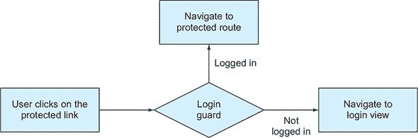
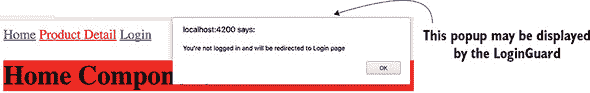
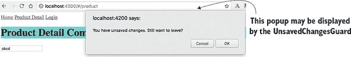
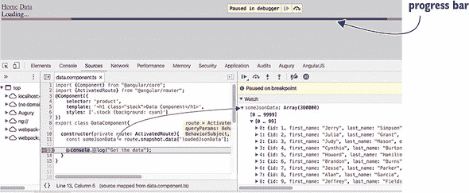
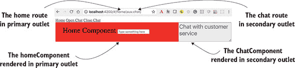
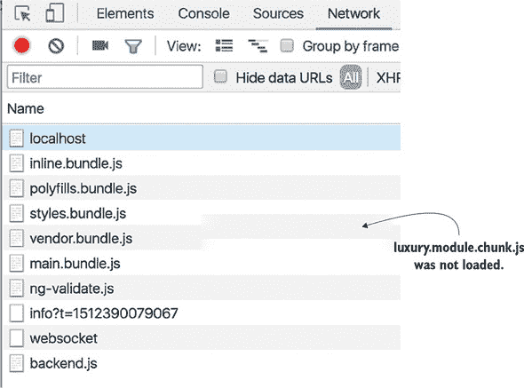
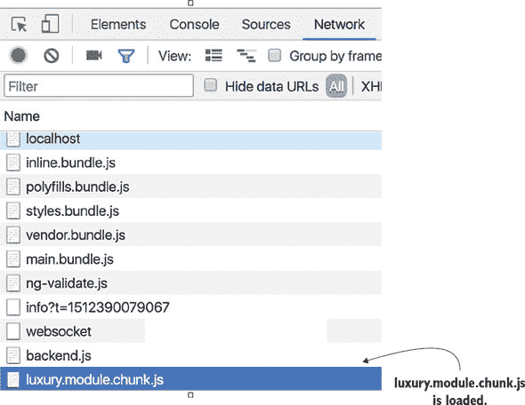

## 第四章\. 路由高级

*本章涵盖*

+   守卫路由

+   创建具有多个路由出口的组件

+   懒加载模块

本章涵盖了一些高级路由功能。您将学习如何使用路由守卫，这些守卫允许您限制对某些路由的访问，警告用户关于未保存的更改，并在允许用户导航到路由之前确保检索重要数据。

然后，我们将向您展示如何创建具有多个路由出口的组件。最后，您将了解如何懒加载模块——意味着只有当用户决定导航到某些路由时才会加载。

本章不包括 ngAuction 的动手实践部分。如果您急于从处理路由切换到学习其他 Angular 功能，您可以跳过本章，稍后再回来。

### 4.1\. 守卫路由

Angular 提供了几个 *守卫接口*，这些接口为您提供了一种中介导航到和从路由的方法。假设您有一个只有经过身份验证的用户才能访问的路由。换句话说，您想要守卫（保护）该路由。图 4.1 展示了一个工作流程，说明了登录守卫如何保护只有经过身份验证的用户才能访问的路由。如果用户未登录，应用程序将渲染登录视图。

##### 图 4.1\. 带有守卫的示例登录工作流程



这里有一些其他场景，在这些场景中守卫可以提供帮助：

+   只有当用户经过身份验证并有权这样做时才打开路由。

+   显示由多个组件组成的多部分表单，并且只有当当前部分输入的数据有效时，用户才被允许导航到表单的下一部分。

+   如果用户尝试从路由导航离开，提醒用户关于未保存的更改。

+   只有在填充了某些数据结构之后才允许导航到路由。

这些是守卫接口：

+   `CanActivate` 允许或禁止导航到路由。

+   `CanActivateChild` 中介导航到子路由。

+   `CanDeactivate` 允许或禁止从当前路由导航离开。

+   `Resolve` 确保在导航到路由之前检索所需的数据。

+   `CanLoad` 允许或禁止懒加载模块。

第 3.3 节 和 第三章 提到，`Routes` 类型是一个符合 `Route` 接口的项的数组。到目前为止，您已经使用了如 `path` 和 `component` 这样的属性来配置路由。现在，您将了解如何中介导航到或从路由，并确保在导航到路由之前检索某些数据。让我们从添加一个当用户想要导航到路由时将工作的守卫开始。

#### 4.1.1\. 实现 CanActivate 守卫

想象一个带有链接的组件，只有已登录的用户才能导航到。为了保护此路由，您需要创建一个新的类（例如，`LoginGuard`），该类实现`CanActivate`接口，该接口声明一个方法，`canActivate()`。在此方法中，您实现验证逻辑，该逻辑将返回`true`或`false`。如果守卫的`canActivate()`返回`true`，则用户可以导航到该路由。您需要将此守卫分配给`canActivate`属性，如下所示。

##### 列表 4.1\. 使用`canActivate`守卫配置路由

```
const routes: Routes = [
    ...
    {path: 'product',
     component: ProductDetailComponent,
     canActivate: [LoginGuard]}              *1*
 ];
```

+   ***1* LoginGuard 将调解对 ProductDetailComponent 的导航。**

因为`Route`的`canActivate`属性接受一个数组作为值，所以如果您需要检查多个条件以允许或禁止导航，您可以分配多个守卫。

让我们创建一个简单的应用程序来展示您如何保护`product`路由，防止未登录的用户访问。为了使示例简单，您不会使用身份验证服务，而是会随机生成登录状态。以下类实现了`CanActivate`接口。`canActivate()`函数将包含返回`true`或`false`的代码。如果函数返回`false`（用户未登录），则应用程序不会导航到该路由，将显示警告，并将用户导航到登录视图。

##### 列表 4.2\. login.guard.ts

```
@Injectable()
export class LoginGuard implements CanActivate {

    constructor(private router: Router) {}                                     *1*

    canActivate() {
        // A call to the actual login service would go here
        // For now we'll just randomly return true or false

        let loggedIn = Math.random() < 0.5;                                    *2*

        if (!loggedIn) {                                                       *3*
             alert("You're not logged in and will be redirected to Login page");
            this.router.navigate(["/login"]);                                  *4*
         }

        return loggedIn;
    }
}
```

+   ***1* 注入 Router 对象**

+   ***2* 随机生成登录状态**

+   ***3* 条件显示“未登录”消息**

+   ***4* 重定向到登录页面**

此`canActivate()`函数的实现将随机返回`true`或`false`，模拟用户的登录状态。

下一步是将此守卫用于路由配置。以下列表显示了如何为具有主页和产品详情路由的应用程序配置路由。后者受`LoginGuard`保护。

##### 列表 4.3\. 使用守卫配置一个路由

```
export const routes: Routes = [
    {path: '',        component: HomeComponent},
    {path: 'login',   component: LoginComponent},
    {path: 'product', component: ProductDetailComponent,
                      canActivate: [LoginGuard]}            *1*
];
```

+   ***1* 将守卫添加到产品路由**

您的`LoginComponent`将非常简单——它将显示文本“请在此处登录”，如下所示。

##### 列表 4.4\. login.component.ts

```
@Component({
  selector: 'home',
  template: '<h1 class="home">Please login here</h1>',
  styles: ['.home {background: greenyellow}']
})
export class LoginComponent {}
```

Angular 将使用其 DI 机制实例化`LoginGuard`类，但您必须在此类需要注入的提供者列表中提及此类。将`LoginGuard`名称添加到`@NgModule()`中的提供者列表。

##### 列表 4.5\. 将守卫添加到模块的提供者

```
@NgModule({
    imports:      [BrowserModule, RouterModule.forRoot(routes)],
    declarations: [AppComponent, HomeComponent,
                   ProductDetailComponent, LoginComponent],
    providers:    [LoginGuard]                                 *1*
     bootstrap:    [AppComponent]
})
```

+   ***1* 将守卫类添加到提供者列表，以便 Angular 可以实例化和注入它**

您的根组件模板将如下所示。

##### 列表 4.6\. `AppComponent`的模板

```
template: `
        <a [routerLink]="['/']">Home</a>
        <a [routerLink]="['/product']">Product Detail</a>
        <a [routerLink]="['/login']">Login</a>                *1*
         <router-outlet></router-outlet>
    `
```

+   ***1* 登录页面**

要查看此应用程序的实际运行情况，请运行以下命令：

```
ng serve --app guards -o
```

图 4.2 显示了用户点击产品详情链接后发生的情况，但`LoginGuard`决定用户未登录。

##### 图 4.2\. 点击产品详情链接是受保护的



点击“确定”将关闭带有警告的弹出窗口，并导航到 /login 路由。在 图 4.2 中，你实现了 `canActivate()` 方法，但没有向其提供任何参数。但此方法可以与可选参数一起使用：

```
canActivate(destination: ActivatedRouteSnapshot, state: RouterStateSnapshot)
```

`ActivatedRouteSnapshot` 和 `RouterStateSnapshot` 的值将由 Angular 自动注入，如果您想分析当前路由的状态，这可能非常有用。例如，如果您想了解用户尝试导航到的路由名称，您可以这样做：

```
canActivate(destination: ActivatedRouteSnapshot, state: RouterStateSnapshot) {
      console.log(destination.component.name);
   ...
}
```

`CanActivate` 守卫控制谁可以进入，但你如何控制用户是否应该被允许从路由中导航？你为什么需要这个？

#### 4.1.2\. 实现 CanDeactivate 守卫

`CanDeactivate` 接口调解从路由导航的过程。当您想警告用户视图中有一些未保存的更改时，此守卫非常有用。为了说明这一点，您将更新上一节的应用程序并添加一个输入字段到 `ProductDetailComponent`。如果用户在此字段中输入某些内容，然后尝试从该路由导航，您的 `CanDeactivate` 守卫将显示“您想要保存更改”的警告，如下所示。

##### 列表 4.7\. 带有输入字段的 `ProductDetailComponent`

```
@Component({
  selector: 'product',
  template: `<h1 class="product">Product Detail Component</h1>
             <input placeholder="Enter your name" type="text"
             [formControl]="name">`,                           *1*
   styles: ['.product {background: cyan}']
})
export class ProductDetailComponent {
   name: FormControl = new FormControl();                      *2*
 }
```

+   **1* 将变量 name 绑定到来自表单 API 的指令**

+   **2* 从表单 API 创建 FormControl 实例**

列表 4.7 使用表单 API，这在第十章（[kindle_split_019.xhtml#ch10](https://example.org/kindle_split_019.xhtml#ch10)）和第十一章（[kindle_split_020.xhtml#ch11](https://example.org/kindle_split_020.xhtml#ch11)）中有介绍。到目前为止，您只需要知道您创建 `FormControl` 类的实例并将其绑定到 `<input>` 元素。在您的守卫中，您将使用 `FormControl.dirty` 属性来了解用户是否在输入字段中输入了任何内容。以下列表创建了一个 `UnsavedChangesGuard` 类，该类实现了 `CanDeactivate` 接口。

##### 列表 4.8\. `UnsavedChangesGuard` 实现 `CanDeactivate`

```
@Injectable()
export class UnsavedChangesGuard
                  implements CanDeactivate<ProductDetailComponent> {       *1*

  canDeactivate(component: ProductDetailComponent) {                       *2*

    if (component.name.dirty) {                                            *3*
       return window.confirm("You have unsaved changes. Still want to leave?"
     );
    } else {
      return true;
    }
  }
}
```

+   **1* 为 ProductDetailComponent 实现 CanDeactivate 守卫**

+   **2* 实现 CanDeactivate 守卫所需的 canDeactivate() 方法**

+   **3* 检查输入控件的内容是否已更改**

`CanDeactivate` 接口使用参数化类型，你使用 TypeScript 泛型语法指定：`<ProductDetailComponent>`。`canDeactivate()` 方法可以与多个参数一起使用（见 [`angular.io/api/router/CanDeactivate`](https://angular.io/api/router/CanDeactivate)），但你将只使用一个：要保护的组件。

如果用户在输入字段中输入了任何值—`if (component.name.dirty)`—你将显示一个带有警告的弹出窗口。你需要从上一节的应用程序中添加一些额外的功能。首先，将 `CanDeactivate` 守卫添加到路由配置中。

##### 列表 4.9\. 向路由添加 `CanDeactivate` 和 `CanDeactivate` 守卫

```
const routes: Routes = [
    {path: '',        component: HomeComponent},
    {path: 'login',   component: LoginComponent},
    {path: 'product', component: ProductDetailComponent,
        canActivate: [LoginGuard],                           *1*
         canDeactivate: [UnsavedChangesGuard]}               *2*
 ];
```

+   **1* 将 LoginGuard 添加到产品路由**

+   ***2* 将 UnsavedChangesGuard 添加到产品路由**

下一个列表中包括了模块中提供者列表中的新保护器。

##### 列表 4.10\. 指定保护器的提供者

```
@NgModule({
    ...
    providers: [LoginGuard,               *1*
                UnsavedChangesGuard]      *2*
 })
```

+   ***1* 添加 LoginGuard 提供者**

+   ***2* 添加 UnsavedChangesGuard 提供者**

运行此应用程序 (`ng serve --app guards -o`)，访问 /product 路由，并在输入字段中输入一些内容。然后，尝试点击应用程序中的另一个链接或浏览器的后退按钮。你将看到 图 4.3 中显示的消息。

##### 图 4.3\. 未保存更改保护器正在工作



现在你已经知道如何控制路由的导航。接下来要确保的是，当路由所需的数据尚未准备好时，用户不会过早地导航到该路由。

#### 4.1.3\. 实现解析保护器

假设你导航到一个产品详情组件，该组件会发起一个 HTTP 请求以检索数据。连接速度慢，需要两秒钟来检索数据。这意味着用户将看到空组件两秒钟，然后数据才会显示。这不是一个好的用户体验。如果服务器请求返回错误呢？用户将在看到错误消息后查看空组件。这就是为什么在所需数据到达之前甚至不渲染组件可能是一个好主意。

如果你想要确保在用户导航到某个路由之前，某些数据结构已经被填充，创建一个允许在路由激活之前获取数据的 `Resolve` 保护器。一个 *resolver* 是一个实现了 `Resolve` 接口的类。其 `resolve()` 方法中的代码加载所需的数据，并且只有在数据到达后，路由器才会导航到该路由。

让我们回顾一个将有两个链接的应用程序：主页和数据。当用户点击数据链接时，它必须渲染 `DataComponent`，这需要在用户看到这个视图之前加载大量数据。为了预加载数据（一个 48 MB 的 JSON 文件），你将创建一个实现 `Resolve` 接口的 `DataResolver` 类。路由配置如下所示。

##### 列表 4.11\. 带有解析器的路由

```
const routes: Routes = [
  {path: '',        component: HomeComponent},
  {path: 'mydata', component: DataComponent,
    resolve:{                                   *1*
       loadedJsonData: DataResolver             *2*
     }
  }
];
```

+   ***1* 配置 mydata 路由的解析保护器**

+   ***2* 指定预加载数据的类**

注意，`HomeComponent` 没有保护器。你只为渲染 `DataComponent` 的路由配置了 `DataResolver`。Angular 将在用户每次导航到 `mydata` 路由时调用其 `resolve()` 方法。因为你将解析对象属性的名称命名为 `loadedJsonData`，你将能够在 `DataComponent` 中使用 `ActivatedRoute` 对象访问预加载数据，如下所示：

```
activatedRoute.snapshot.data['loadedJsonData'];
```

下面的代码显示了您的解析器代码。在此代码中，您使用了尚未介绍的一些语法元素，例如 `@Injectable()`（在第五章中解释），`HttpClient`（在第十二章中介绍），以及 `Observable`（在第四章附录 D 和第六章中介绍），但我们仍然想回顾这个代码示例，因为它与路由器有关。

##### 列表 4.12\. data.resolver.ts

```
@Injectable()                                                  *1*
 export class DataResolver implements Resolve<string[]>{

    constructor ( private httpClient: HttpClient){}            *2*

    resolve(): Observable<string[]>{                           *3*

      return this.httpClient
                 .get<string[]>("./assets/48MB_DATA.json");    *4*
     }
}
```

+   ***1* 将此服务标记为可注入**

+   ***2* 注入 HttpClient 服务以读取数据**

+   ***3* 实现了 resolve() 方法**

+   ***4* 从文件中读取数据**

您的解析器类是一个可注入的服务，它实现了 `Resolve` 接口，该接口要求实现一个 `resolve()` 方法，该方法可以返回一个 `Observable`、一个 `Promise` 或任何任意对象。

| |
| --- |

##### 小贴士

因为解析器是一个服务，所以您需要在 `@NgModule()` 装饰器中声明其 *provider*（在第五章的 5.2 节 中介绍）。

| |
| --- |

在这里，您使用 `HttpClient` 服务读取包含 360,000 条随机数据记录的文件。`HttpClient.get()` 方法返回一个 `Observable`，您的 `resolve()` 方法也是如此。Angular 为解析器生成代码，该代码自动订阅到可观察对象并将发出的数据存储在 `ActivatedRoute` 对象中。

在 `DataComponent` 的构造函数中，您提取解析器加载的数据并将其存储在变量中。在这种情况下，您不显示或处理数据，因为您的目标是展示解析器在 `DataComponent` 渲染之前加载了数据。图 4.4 显示了构造函数中的断点处的调试器。请注意，数据已在 `DataComponent` 的构造函数中加载并可用。UI 将在您的构造函数中的代码完成后渲染。

##### 图 4.4\. 数据已加载。



此应用的源代码位于 `resolver` 目录中，您可以通过运行 `ng serve --app resolver -o` 来查看其运行情况。

每次您导航到 `mydata` 路由时，文件将被重新加载，并且用户将看到来自 Angular Material UI 组件库的进度条 (`mat-progress-bar`)。您将在第五章的 5.6 节 中介绍这个库。第五章。

进度条用于 `AppComponent` 的模板中，但 `AppComponent` 如何知道何时开始显示进度条以及何时从 UI 中移除它？路由器在导航期间触发事件，例如 `NavigationStart`、`NavigationEnd` 以及其他一些事件。您的 `AppComponent` 订阅到这些事件，当 `NavigationStart` 被触发时，进度条显示，在 `NavigationEnd` 时移除，如下面的列表所示。

##### 列表 4.13\. app.component.ts

```
@Component({
  selector: 'app-root',
  template: `
    <a [routerLink]="['/']">Home</a>
    <a [routerLink]="['mydata']">Data</a>
    <router-outlet></router-outlet>
    <div *ngIf="isNavigating">                      *1*
       Loading...
      <mat-progress-bar mode="indeterminate"></mat-progress-bar>
    </div>
    `
})
export class AppComponent {

  isNavigating = false;                             *2*

  constructor (private router: Router){             *3*
     this.router.events.subscribe(                  *4*
       (event) => {
        if (event instanceof NavigationStart){
          this.isNavigating=true;                   *5*
         }

        if (event instanceof NavigationEnd) {
          this.isNavigating=false;                  *6*
         }
      }
    );
  }
}
```

+   ***1* 根据 isNavigating 标志条件性地显示/隐藏进度条**

+   ***2* 初始时 isNavigating 标志为 false。**

+   ***3* 注入路由对象**

+   ***4* 订阅路由事件**

+   ***5* 如果触发 NavigationStart，则将标志设置为 true**

+   ***6* 如果触发 NavigationEnd，则将标志设置为 false**


##### 小贴士

为了避免反复读取如此大的文件，你可以在第一次读取后将其数据缓存到内存中。如果你对如何做到这一点感兴趣，请查看位于 data.resolver2.ts 文件中的另一个版本的解析器的代码。该解析器使用来自 data.service.ts 的可注入服务，因此在下一次点击时，不是读取文件，而是从内存缓存中检索数据。由于数据服务是单例的，它将存活于`DataComponent`的创建和销毁之间，缓存的数据仍然可用。

|  |

**重新加载活动路由**

你可以使用`runGuardsAndResolvers`和`onSameUrlNavigation`选项配置并重新运行已激活的路由的守卫和解析器。

假设用户访问了`mydata`路由，并在一段时间后想要通过再次点击数据链接来重新加载同一路由中的数据。以下列表中的`routes`配置通过重新应用守卫和解析器来实现这一点：

```
const routes: Routes = [
  {path: '',        component: HomeComponent},
  {path: 'mydata', component: DataComponent,
    resolve: {
      mydata: DataResolver
    },
    runGuardsAndResolvers: 'always'                     *1*
   }
];

export const routing = RouterModule.forRoot(routes,
  {onSameUrlNavigation: "reload"}                       *2*
```

+   ***1* 总是运行守卫和解析器**

+   ***2* 当用户导航到同一路由时重新加载组件**


你可以在产品文档中了解有关其他守卫的信息，请参阅[`angular.io/guide/router#milestone-5-route-guards`](https://angular.io/guide/router#milestone-5-route-guards)。

现在，我们将继续介绍另一个主题：如何创建一个包含多个 `<router-outlet>` 的视图。

### 4.2\. 开发具有多个路由出口的单页应用（SPA）

ngAuction 目录包含实现第三章（kindle_split_012.xhtml#ch03）动手实践部分功能的 ngAuction 代码。

到目前为止，在所有路由代码示例中，你使用的组件都有一个单一的标签`<router-outlet>`，Angular 根据配置的路由渲染视图。现在，你将看到如何配置和渲染位于同一组件中的同级路由中的视图。让我们考虑一些多出口视图的用例：

+   想象一个类似仪表板的 SPA，它有几个专用区域（出口），每个区域可以渲染多个组件（一次一个）。出口 A 可以显示你的股票组合，无论是以表格还是图表的形式，而出口 B 则显示最新的新闻或广告。

+   假设你想要向 SPA 添加一个聊天区域，以便用户在保持当前路由激活的同时与客户服务代表进行交流。你想要添加一个独立的聊天路由，允许用户同时使用这两个路由，并能够从一个路由切换到另一个路由。

在 Angular 中，你可以通过不仅有一个 *主* 出口，还有一个命名的 *次级* 出口来实现这两种场景，这些出口与主出口同时显示。

为了区分主出口和次级出口的组件渲染，你需要添加另一个 `<router-outlet>` 标签，但这个出口必须有一个名称。例如，以下代码片段定义了主出口和聊天出口：

```
<router-outlet></router-outlet>                      *1*
 <router-outlet name="chat"></router-outlet>         *2*
```

+   ***1* 主出口**

+   ***2* 次级（命名）出口**

图 4.5 展示了用户点击“主页”链接然后点击“打开聊天”链接后同时打开两个路由的应用程序。左侧显示了主出口中 `HomeComponent` 的渲染，右侧显示了在命名出口中渲染的 `ChatComponent`。点击“关闭聊天”链接将移除命名出口的内容（你向 `HomeComponent` 添加了一个 HTML `<input>` 字段，向 `ChatComponent` 添加了一个 `<textarea>`，这样在用户在主页和聊天路由之间切换时更容易看到哪个组件具有焦点）。

##### 图 4.5\. 使用次级路由渲染聊天视图



注意辅助路由 URL 中的括号，http://localhost:4200/#home(aux:chat)。与使用正斜杠从父路由中分离子路由不同，辅助路由表示为括号中的 URL 段。此 URL 告诉你 home 和 chat 是兄弟路由。

聊天路由的配置指定了 `ChatComponent` 必须渲染的出口名称，如下面的列表所示。

##### 列表 4.14\. 为两个出口配置路由

```
export const routes: Routes = [
  {path: '',  redirectTo: 'home', pathMatch: 'full'},          *1*
   {path: 'home', component: HomeComponent},                   *2*
   {path: 'chat', component: ChatComponent, outlet: "aux"}     *3*
 ];
```

+   ***1* 将空路径重定向到主页路由**

+   ***2* 如果 URL 包含主页，则在主出口中渲染 HomeComponent**

+   ***3* 如果 URL 包含聊天，则在名为 aux 的出口中渲染 ChatComponent**

在此配置中，我们想向您介绍 `redirectTo` 属性。`HomeComponent` 将在两种情况下渲染：要么默认在基本 URL 上，要么如果 URL 只包含 /home 段，如 http://localhost:4200/home。`pathMatch: 'full'` 表示客户端部分的 URL 必须正好是 /，所以如果你输入了 URL http://localhost:4200/product/home，它不会重定向到 `home`。

应用程序组件的模板可能看起来如下所示。

##### 列表 4.15\. 具有两个出口的组件模板

```
template: `
      <a [routerLink]="['']">Home</a>                                    *1*
       <a [routerLink]="['', {outlets: { aux: 'chat'}}]">Open Chat</a>   *2*
       <a [routerLink]="[{outlets: { aux: null }}]">Close Chat</a>       *3*
       <br/>
      <router-outlet></router-outlet>                                    *4*
       <router-outlet name="aux"></router-outlet>                        *5*
   `
```

+   ***1* 一个链接用于导航到主出口的默认路由**

+   ***2* 一个链接用于导航到名为 aux 的出口中的聊天路由**

+   ***3* 一个链接用于从 UI 中移除名为 aux 的出口**

+   ***4* 此区域分配给主出口。**

+   ***5* 此区域分配给名为 aux 的次级出口。**

注意这里有两个出口：一个主出口（未命名）和一个次级出口（命名）。当用户点击“打开聊天”链接时，你指示 Angular 在名为 `aux` 的出口中渲染配置为 `chat` 的组件。要关闭次级出口，请将 `null` 而不是路由名称分配给它。

如果你想以编程方式导航到（或关闭）命名出口，请使用 `Router.navigate()` 方法：

```
navigate([{outlets: {aux: 'chat'}}]);
```

要查看此应用在两个路由出口处的实际效果，请在路由-samples 项目中运行以下命令：

```
ng serve --app outlets -o
```

路由器还可以帮助你解决另一个问题。为了使应用更具响应性，你想要最小化浏览器加载以显示应用着陆页的代码量。你真的需要在应用启动时加载每个路由的所有代码吗？

#### 4.2.1\. 懒加载模块

以前，我们的一位作者正在为一个欧洲汽车制造商的网站工作。有一个名为“欧洲交付”的菜单项，供美国公民使用，他们可以飞往欧洲的汽车工厂，在那里取走他们的新车，然后花两周时间驾驶自己的车，享受欧洲的一切。之后，汽车将被运往美国。这样的旅行可能需要花费数千美元，正如你可以想象的那样，不会有很多网站访客对探索这个选项感兴趣。那么，为什么要把支持“欧洲交付”菜单的代码包含在这个网站的着陆页中，从而增加初始页面大小？

一个更好的解决方案是创建一个单独的欧洲交付模块，只有当用户点击菜单项时才会下载，对吧？一般来说，Web 应用的着陆页应该只包含用户访问网站时必须存在的最小核心功能。

任何中型或大型应用都应该分成几个模块，其中每个模块实现某些功能（计费、运输等），并且按需*懒加载*。在第二章中，第 2.5.1 节，你看到了一个分成两个模块的应用，但两个模块都在应用启动时加载。在本节中，我们将向你展示如何懒加载一个模块。

让我们创建一个包含三个链接的应用：主页、产品详情和豪华商品。想象一下，豪华商品需要与普通产品不同地处理，你希望将此功能分离到一个名为 `LuxuryModule` 的功能模块中，该模块将有一个名为 `LuxuryComponent` 的组件。大多数应用用户收入有限，很少会点击豪华商品链接，因此没有必要在应用启动时加载豪华模块的代码。你将*懒加载*它——只有当用户点击豪华商品链接时才会加载。这种方式对于在较差的连接区域使用的移动应用尤为重要——根模块的代码必须只包含核心功能。`LuxuryModule` 的代码如下所示。

##### 列表 4.16\. luxury.module.ts

```
@NgModule({
    imports: [CommonModule,                        *1*
         RouterModule.forChild([                   *2*
         {path: '', component: LuxuryComponent}    *3*
     ])],
    declarations: [LuxuryComponent]
})

export class LuxuryModule {}
```

+   ***1* 导入 CommonModule 作为功能模块所需的模块**

+   ***2* 使用 forChild() 方法配置此功能模块的默认路由**

+   ***3* 默认情况下，渲染其唯一组件，LuxuryComponent**

在下一个列表中，`LuxuryComponent` 的代码仅显示在黄色（暗示金色）背景上的文本“高级组件”。

##### 列表 4.17\. luxury.component.ts

```
@Component({
    selector: 'luxury',
    template: `<h1 class="gold">Luxury Component</h1>`,      *1*
     styles: ['.gold {background: yellow}']                  *2*
 })
export class LuxuryComponent {}
```

+   ***1* 应用 CSS 选择器 gold**

+   ***2* 声明 CSS 选择器 gold**

以下列出的是根模块的代码。

##### 列表 4.18\. app.module.ts

```
@NgModule({
  imports: [BrowserModule,
    RouterModule.forRoot([                                              *1*
       {path: '',        component: HomeComponent},
      {path: 'product', component: ProductDetailComponent},
      {path: 'luxury', loadChildren: './luxury.module#LuxuryModule'}    *2*
     ])
  ],
  declarations: [AppComponent, HomeComponent, ProductDetailComponent],
  providers:[{provide: LocationStrategy, useClass: HashLocationStrategy}],
  bootstrap: [AppComponent]
})
export class AppModule {}
```

+   ***1* 为根模块配置路由**

+   ***2* 使用 loadChildren 组件进行懒加载，而不是使用 component 属性**

注意，`imports` 部分只包括 `BrowserModule` 和 `RouterModule`。功能模块 `LuxuryModule` 没有列在这里。此外，根模块在其 `declarations` 部分没有提到 `LuxuryComponent`，因为该组件不是根模块的一部分。当路由器从根和功能模块解析路由配置时，它将正确地将 `luxury` 路径映射到在 `LuxuryModule` 中声明的 `LuxuryComponent`。

你不是将 `path` 映射到组件，而是使用 `loadChildren` 属性，提供要加载的模块的路径和名称。请注意，`loadChildren` 的值不是一个类型化的模块名称，而是一个字符串。根模块不了解 `LuxuryModule` 类型；但是当用户点击“高级项目”链接时，加载模块将解析这个字符串，并从前面显示的 luxury .module.ts 文件中加载 `LuxuryModule`。

为了确保支持 `LuxuryModule` 的代码在应用启动时不会被加载，Angular CLI 将其代码放置在单独的包中。在你的项目 router-samples 中，这个应用在 .angular-cli.json 中配置为名为 `lazy`。你可以通过运行以下命令来构建包：

```
ng serve --app lazy -o
```

终端窗口将打印有关包的信息，如下所示。

##### 列表 4.19\. 由 ng serve 构建的包

```
chunk {inline} inline.bundle.js (inline)
chunk {luxury.module} luxury.module.chunk.js ()     *1*
 chunk {main} main.bundle.js (main) 33.3 kB
chunk {polyfills} polyfills.bundle.js (polyfills)
chunk {styles} styles.bundle.js (styles)
chunk {vendor} vendor.bundle.js (vendor)
```

+   ***1* 为懒加载的包构建了单独的包。**

第二行显示，你的高级模块被放置在一个名为 luxury.module.chunk.js 的单独包中。


##### 注意

当你运行 `ng build --prod` 时，懒加载模块的包名称是数字，而不是名称。在代码示例中，高级模块的默认包名称将是零后跟一个生成的哈希码，例如 0.0797fe80dbf6edcb363f.chunk.js。如果你的应用有两个懒加载模块，它们将被放置在以 0 和 1 分别开始的包中。


如果你打开浏览器到 localhost:4200 并检查开发者工具中的网络标签，你将不会在那里看到这个模块。参见 图 4.6。

##### 图 4.6\. 高级模块未加载



点击“高级项目”链接，你会看到浏览器进行了额外的请求并下载了 `LuxuryModule` 的代码，如 图 4.7 底部所示。高级模块已被加载，并且 `LuxuryComponent` 已在路由出口中渲染。

##### 图 4.7\. 点击按钮后加载了高级模块



这个简单的示例并没有显著减少初始下载的大小。但使用懒加载技术构建大型应用程序可以减少可下载代码的初始大小数百千字节或更多，从而提高应用程序的感知性能。*感知性能* 是用户对应用程序性能的看法，提高它很重要，尤其是在从移动设备上通过慢速网络加载应用程序时。

在我们过去的一个项目中，经理表示新开发的网页应用的首页必须加载得非常快。我们问：“有多快？”他给我们发了一个链接到某个应用：“和这个一样快。”我们点击链接，发现一个风格很好的网页，菜单以四个大方块的形式呈现。这个页面确实加载得非常快。点击任何一个方块后，选定的模块需要超过 10 秒才能进行懒加载。这就是感知性能的实际应用。

| |
| --- |

##### 小贴士

尽可能使您的应用程序的根模块尽可能小。将应用程序的其余部分拆分为懒加载模块，用户将称赞您应用程序的性能。

| |
| --- |

#### 4.2.2\. 预加载器

假设您在实现懒加载后，在初始应用启动时节省了一秒钟。但当用户点击奢侈品链接时，他们仍然需要等待这一秒钟，以便浏览器加载您的奢侈品模块。如果用户不需要等待这一秒钟，那就太好了。使用 Angular 预加载器，您可以一石二鸟：减少初始下载时间 *并且* 在处理懒加载路由时获得即时响应。

使用 Angular 预加载器，您可以执行以下操作：

+   在用户与您的应用交互时，在后台预加载所有懒加载模块

+   在路由配置中指定预加载策略

+   通过创建一个实现 `PreloadingStrategy` 接口的类来实现自定义预加载策略

Angular 提供了一个名为 `PreloadAllModules` 的预加载策略，这意味着在您的应用程序加载后，Angular 会立即在后台加载所有包含懒加载模块的包。这不会阻塞应用程序，用户可以继续使用应用程序而不会出现任何延迟。只需将此预加载策略作为 `forRoot()` 的第二个参数添加即可，如下所示。

##### 列表 4.20\. 添加预加载策略

```
RouterModule.forRoot([
   {path: '',        component: HomeComponent},
   {path: 'product', component: ProductDetailComponent},
   {path: 'luxury', loadChildren: './luxury.module#LuxuryModule' }
 ],
   {
     preloadingStrategy: PreloadAllModules       *1*
    })
```

+   ***1* 添加 PreloadAllModules 预加载策略**

在此代码更改之后，网络标签将显示 luxury.module.chunk.js 也已被加载。大型应用程序可能包含数十个懒加载模块，您可能需要制定一些自定义策略，以确定哪些懒加载模块应该预加载，哪些不应该。

假设您有两个懒加载模块，`LuxuryModule` 和 `SuperLuxuryModule`，并且您只想预加载第一个。您可以在 `luxury` 路径的配置中添加一些布尔变量（例如，`preloadme: true`）：

```
{path: 'luxury', loadChildren: './luxury.module#LuxuryModule', data:
{preloadme: true} }
{path: 'luxury', loadChildren: './superluxury.module#SuperLuxuryModule' }
```

您的自定义预加载器可能看起来像以下列表。

##### 列表 4.21\. 一个示例自定义预加载类

```
@Injectable()
export class CustomPreloadingStrategy implements PreloadingStrategy {  *1*

  preload(route: Route,
          load: () => Observable<any>): Observable<any> {              *2*
     return (route.data && route.data['preloadme']) ?                  *3*
       load(): empty();                                                *4*
   }
}
```

+   ***1* 创建一个实现 PreloadingStrategy 接口的类**

+   ***2* 将返回一个 Observable 的回调函数传递给 preload()方法**

+   ***3* 检查每个路由配置的数据对象上的 preloadme 属性值。如果存在且其值为 preloadme: true，则调用 load()回调函数。**

+   ***4* 无需预加载—返回一个空的 Observable**

因为`CustomPreloadingStrategy`是一个可注入的服务，您需要将其添加到根模块的`@NgModule`装饰器中的`providers`属性。不要忘记在`forRoot()`方法中将您自定义预加载器的名称作为参数指定。

### 摘要

+   使用守卫来介导客户端导航。

+   如果需要，可以在同一组件中创建多个`<router-outlet>`标签。

+   通过实现懒加载技术来最小化您应用的初始大小。
