## 第五章\. Angular 中的依赖注入

*本章涵盖*

+   介绍依赖注入作为设计模式

+   理解 Angular 如何实现 DI

+   注册对象提供者和使用注入器

+   将 Angular Material UI 组件添加到 ngAuction

第四章讨论了路由器，现在 ngAuction 应用程序知道如何从主页导航到产品详情页。在本章中，我们将专注于 Angular 如何自动化创建对象和从其构建块组装应用程序的过程。

一个 Angular 应用程序是一组组件、指令和服务，它们可能相互依赖。尽管每个组件都可以显式实例化其依赖项，但 Angular 可以使用其依赖注入（DI）机制来完成这项工作。

我们将从这个章节开始，确定 DI 解决的问题，并回顾 DI 作为软件工程设计模式的优点。然后，我们将通过一个依赖于`ProductService`的示例`ProductComponent`来具体说明 Angular 如何实现 DI 模式。您将了解如何编写可注入的服务以及如何将其注入到另一个组件中。

之后，您将看到一个示例应用程序，演示了 Angular DI 如何通过仅更改一行代码来轻松地用一个组件依赖项替换另一个组件依赖项。在本章末尾，我们将通过一个实际操作练习来构建 ngAuction 的下一个版本，该版本使用 Angular Material UI 组件。

*设计模式*是解决某些常见任务的推荐。给定设计模式可以根据您使用的软件以不同的方式实现。在第一部分，我们将简要介绍两种设计模式：依赖注入和控制反转（IoC）。

### 5.1\. 依赖注入模式

如果您曾经编写过一个接受对象作为参数的函数，那么您已经编写了一个实例化此对象并将其*注入*到函数中的程序。想象一个负责运输产品的配送中心。一个跟踪已运输产品的应用程序可以创建一个`Product`对象并调用一个创建并保存运输记录的函数：

```
var product = new Product();
createShipment(product);
```

`createShipment()`函数依赖于`Product`对象实例的存在，这意味着`createShipment()`函数有一个依赖项：`Product`。但该函数本身并不知道如何创建`Product`。调用脚本应通过某种方式创建并（想象一下*注入*）将此对象作为参数传递给函数。

从技术上讲，您正在将`Product`对象的创建与其使用解耦——但上述两行代码都位于同一脚本中，因此这不是真正的解耦。如果您需要将`Product`替换为`MockProduct`，在这个简单示例中只需进行少量代码更改。

假设`createShipment()`函数有三个依赖项（例如产品、运输公司和履约中心），并且每个依赖项都有自己的依赖项呢？在这种情况下，为`createShipment()`函数创建不同的对象集将需要更多的手动代码更改。是否有可能要求某人为你创建依赖项（及其依赖项）的实例？

这就是依赖注入模式的内容：如果对象 A 依赖于一个由标记（一个唯一的 ID）标识的对象 B，对象 A 不会显式地使用`new`操作符来实例化 B 指向的对象。相反，它将从操作环境中注入 B。

对象 A 只需要声明，“我需要一个名为 B 的对象；请有人给我提供它？”对象 A 不请求特定的对象类型（例如，`Product`），而是将注入的责任委托给标记 B。看起来对象 A 不想控制创建实例，并准备好让框架控制这个过程，不是吗？


**控制反转模式**

控制反转（Inversion of Control，IoC）比依赖注入（DI）更为通用。不是让你的应用程序使用框架（或软件容器）中的某个 API，而是框架创建并供应应用程序需要的对象。IoC 模式可以以不同的方式实现，DI 是提供所需对象的一种方式。Angular 扮演着 IoC 容器的角色，可以根据你的组件声明提供所需的对象。


### 5.2. Angular 应用程序中 DI 的优点

在我们探索 Angular DI 实现的语法之前，让我们看看使用注入对象而不是使用`new`操作符实例化对象的优点。Angular 提供了一种机制，有助于注册和实例化组件依赖项。简而言之，DI 帮助你以松耦合的方式编写代码，并使你的代码更具可测试性和可重用性。


**Angular 中注入的内容**

在 Angular 中，你注入服务或常量。*服务*是 TypeScript 类的实例，没有 UI，仅实现应用程序的业务逻辑。*常量*可以是任何值。通常，你会注入 Angular 服务（如`Router`或`ActivatedRoute`）或与服务器通信的自己的类。你将在第 5.6 节中看到一个注入常量的例子。服务可以在组件或另一个服务中注入。


#### 5.2.1. 松耦合和可重用性

假设你有一个使用 `ProductService` 类获取产品详情的 `ProductComponent`。在没有 DI 的情况下，你的 `ProductComponent` 需要知道如何实例化 `ProductService` 类。这可以通过多种方式完成，例如使用 `new`，在单例对象上调用 `getInstance()`，或者调用某个工厂函数 `createProductService()`。在任何情况下，`ProductComponent` 都会与 `ProductService` 变得 *紧密耦合*，因为用这个服务的另一个实现替换 `ProductService` 需要在 `ProductComponent` 中进行代码更改。

如果你需要在另一个使用不同服务获取产品详情的应用中重用 `ProductComponent`，你必须修改代码，例如 `productService = new AnotherProductService()`。依赖注入（DI）允许你通过避免组件和服务知道如何创建它们的依赖项来解耦应用组件和服务。

Angular 文档使用了 *token* 的概念，它是一个表示要注入的对象的任意键。通过指定提供者，你可以将 tokens 映射到值以进行 DI。*provider* 是对 Angular 的一个指令，说明如何创建一个对象实例以供将来注入到目标组件、服务或指令中。考虑以下示例，一个 `ProductComponent` 的例子，它注入了 `ProductService`。

##### 列表 5.1\. `ProductService` 注入到 `ProductComponent`

```
@Component({
  providers: [ProductService]                       *1*
 })
class ProductComponent {
  product: Product;

  constructor(productService: ProductService) {     *2*

    this.product = productService.getProduct();     *3*
   }
}
```

+   ***1* 将 ProductService token 指定为一个注入提供者**

+   ***2* 注入由 ProductService token 表示的对象**

+   ***3* 使用注入对象的 API**

通常，token 的名称与要注入的对象的类型相匹配，所以 列表 5.1 是一个简写，指示 Angular 使用同名的类提供 `ProductService` token。长版本看起来像这样：`providers:[{provide: ProductService, useClass: ProductService}]`。你对 Angular 说，“如果你看到一个构造函数使用 `ProductService` token 的类，注入 `ProductService` 类的实例。”

使用 `@Component()` 或 `@NgModule` 的 `provide` 属性，你可以将相同的 token 映射到不同的值或对象（例如，在其他人开发真实服务类的同时模拟 `ProductService` 的功能）。


##### 注意

你已经在第三章的第 3.1.2 节中使用了 `providers` 属性，但它是在 `@NgModule()` 模块级别上定义的，而不是在组件级别上。


现在你已经将 `providers` 属性添加到 `ProductComponent` 的 `@Component()` 装饰器中，Angular 的 DI 模块将知道它需要实例化一个 `ProductService` 类型的对象。

下一个问题是什么时候创建服务的实例？这取决于你为该服务指定的装饰器。在列表 5.1 中，你是在`@Component()`装饰器内部指定提供者的。这告诉 Angular 在创建`ProductComponent`时创建`ProductService`的实例。如果你在`@NgModule()`装饰器内部的`providers`属性中指定`ProductService`，那么服务实例将在应用级别上创建为一个单例，这样所有组件都可以重用它。

`ProductComponent`不需要知道要使用`ProductService`类型的具体实现——它将使用指定为提供者的任何对象。对`ProductService`对象的引用将通过构造函数参数注入，并且不需要在`ProductComponent`中显式实例化`ProductService`。只需像列表 5.1 中那样使用它，该列表调用由 Angular 魔法般创建的`ProductService`实例上的服务方法`getProduct()`。

如果你需要使用`ProductService`类型的不同实现来重用相同的`ProductComponent`，请更改提供者行，如`providers: [{provide: ProductService, useClass: AnotherProductService}]`。你将在第 5.5 节中看到一个更改可注入服务的例子。现在 Angular 将实例化`AnotherProductService`，但使用`ProductService`的`ProductComponent`代码不需要修改。在这个例子中，使用依赖注入增加了`ProductComponent`的可重用性，并消除了它与`ProductService`的紧密耦合。

#### 5.2.2\. 可测试性

依赖注入增加了你组件的独立可测试性。如果你想对你的代码进行单元测试，你可以轻松地注入模拟对象。比如说，你需要给你的应用程序添加一个登录功能。你可以创建一个`LoginComponent`（用于渲染 ID 和密码字段），它使用一个`LoginService`，该服务应连接到某个授权服务器并检查用户的权限。在单元测试`LoginComponent`时，你不想因为授权服务器宕机而导致测试失败。

在单元测试中，我们经常使用模拟对象来模仿真实对象的行为。使用依赖注入框架，你可以创建一个模拟对象`MockLoginService`，它不连接到授权服务器，而是为具有特定 ID/密码组合的用户分配硬编码的访问权限。使用依赖注入，你可以写一行代码将`MockLoginService`注入到你的应用程序的登录视图中，而无需等待授权服务器就绪。你的测试将获得注入到你的应用程序登录视图中的`MockLoginService`实例（如图 5.1 所示），并且你的测试不会因为无法控制的问题而失败。

| |
| --- |

##### 注意

在第十四章的实践部分[kindle_split_023.xhtml#ch14]，你会看到如何对可注入服务进行单元测试。

| |
| --- |

##### 图 5.1\. 测试中的依赖注入

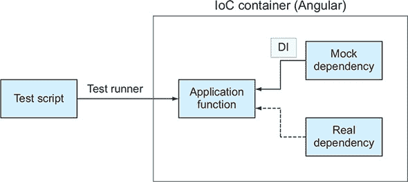

### 5.3. 注入器和提供者

现在你已经对依赖注入作为一种通用的、软件工程设计模式有了简要的介绍，让我们来探讨在 Angular 中实现 DI 的具体细节。特别是，我们将讨论注入器和提供者等概念。

每个组件都可以有一个`Injector`实例，该实例可以将对象或原始值注入到组件中。任何 Angular 应用程序都有一个根注入器，对所有模块都可用。为了让注入器知道要注入的内容，你指定提供者。注入器会将提供者中指定的对象或值注入到组件的构造函数中。提供者允许你将自定义类型（或令牌）映射到该类型的具体实现（或值）。

| |
| --- |

##### 注释

尽管急切加载的模块没有自己的注入器，但延迟加载的模块有一个自己的子根注入器，它是父模块注入器的直接子节点。你将在第 5.7 节中看到一个延迟加载模块的注入示例。

| |
| --- |
| |

##### 小贴士

在 Angular 中，你只能通过类的构造函数参数将服务注入到类中。如果你看到一个无参数构造函数的类，这保证这个类中没有注入任何内容。

| |
| --- |

我们将在本章的几个代码示例中使用`ProductComponent`和`ProductService`。如果你的应用程序有一个实现特定类型（如`ProductService`）的类，你可以在`@NgModule()`装饰器中在应用程序级别为该类指定提供者对象，如下所示：

```
@NgModule({
  ...
  providers: [{provide: ProductService, useClass: ProductService}]
})
```

当令牌名称与类名相同时，你可以使用简短表示法在模块中指定提供者：

```
@NgModule({
  ...
  providers: [ProductService]
})
```

`providers`行指示注入器如下：“当你需要构造一个具有`ProductService`类型参数的对象时，创建一个注册类的实例以注入到该对象中。”当 Angular 实例化一个将`ProductService`令牌作为组件构造函数参数的组件时，它将实例化和注入`ProductService`，或者只是重用现有实例并注入它。在这种情况下，我们将为整个应用程序拥有一个服务单例实例。

如果需要为特定令牌注入不同的实现，请使用较长的表示法：

```
@NgModule({
  ...
  providers: [{provide: ProductService, useClass: MockProductService}]
})
```

`providers`属性可以在`@Component()`注解中指定。在`@Component()`中`ProductService`提供者的简短表示法如下：

```
@Component({
  ...
 providers: [ProductService]
})
export class ProductComponent{

    constructor(productService: ProductService) {}
    ...
}
```

你可以使用与模块相同的长期表示法为提供者指定。如果提供者在组件级别指定，Angular 将在组件实例化期间创建并注入`ProductService`实例。

多亏了提供者，注入器知道要注入什么；现在你需要指定*在哪里*注入服务。对于类，这归结为声明一个构造函数参数，指定令牌为其类型。前面的代码片段展示了如何注入由`ProductService`令牌表示的对象。构造函数将保持不变，无论指定为提供者的`ProductService`的具体实现是什么。

`providers`属性是一个数组。如果需要，你可以为不同的服务指定多个提供者。以下是一个指定`ProductService`令牌提供者对象的单元素数组的示例：

```
[{provide: ProductService, useClass: MockProductService}]
```

`provide`属性将令牌映射到实例化可注入对象的函数。此示例指示 Angular 在`ProductService`令牌作为构造函数参数使用的地方创建`MockProductService`类的实例。Angular 的注入器可以使用类或工厂函数进行实例化和注入。你可以使用以下属性声明提供者：

+   **`useClass`—** 将令牌映射到类，如前例所示

+   **`useFactory`—** 将令牌映射到工厂函数，该函数根据某些标准实例化对象

+   **`useValue`—** 将`string`或特殊的`InjectionToken`映射到任意值（非基于类的注入）

你如何在代码中决定使用这些属性中的哪一个？在下一节中，你将熟悉`useClass`属性。第 5.6 节说明了`useFactory`和`useValue`。

### 5.4\. 一个简单的 Angular DI 应用程序

现在你已经看到了许多与 Angular DI 相关的代码片段，让我们构建一个小型应用程序，将所有这些组件整合在一起。这将为你使用 ngAuction 应用程序中的 DI 做准备。

#### 5.4.1\. 注入产品服务

你将创建一个简单的应用程序，使用`ProductComponent`来渲染产品详情，并使用`ProductService`来提供产品数据。如果你使用书中提供的可下载代码，此应用程序位于 di-samples/basic 目录中。在本节中，你将构建一个生成图 5.2 中所示页面的应用程序。

##### 图 5.2\. 一个示例 DI 应用程序

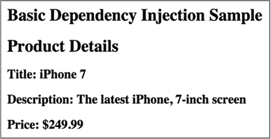

`ProductComponent`可以通过声明构造函数参数的类型来请求注入`ProductService`对象：

```
constructor(productService: ProductService)
```

图 5.3 展示了一个使用这些组件的示例应用程序。

##### 图 5.3\. 将`ProductService`注入到`ProductComponent`


`AppModule`有一个根组件`AppComponent`，它包含`ProductComponent`，该组件依赖于`ProductService`。注意`import`和`export`语句。`ProductService`类的定义以`export`语句开始，以便其他组件可以访问其内容。

在组件级别上定义的 `providers` 属性（参见图 5.3）（#ch05fig03）指示 Angular 在创建 `ProductComponent` 时提供 `ProductService` 类的一个实例。`ProductService` 可能会与某些服务器通信，请求网页上选择的产品详情，但我们现在将跳过这部分内容，专注于如何将此服务注入到 `ProductComponent` 中。以下列表从根组件开始实现了 图 5.3 中的组件。

##### 列表 5.2\. app.component.ts

```
import {Component} from '@angular/core';
@Component({
  selector: 'app-root',
  template: `<h1>Basic Dependency Injection Sample</h1>
             <di-product-page></di-product-page>`           *1*
 })
export class AppComponent {}
```

+   ***1* 将 <di-product-page> 组件添加到模板中**

根据 `<di-product-page>` 标签，你可以猜测有一个具有此值的选择器的组件。此选择器在 `ProductComponent` 中声明，其依赖项 `ProductService` 通过构造函数注入，如下一列表所示。

##### 列表 5.3\. product.component.ts

```
import {Component} from '@angular/core';
import {ProductService, Product} from "./product.service";

@Component({
  selector: 'di-product-page',                     *1*
   template: `<div>
  <h1>Product Details</h1>
  <h2>Title: {{product.title}}</h2>
  <h2>Description: {{product.description}}</h2>
  <h2>Price: \${{product.price}}</h2>
</div>`,
  providers: [ProductService]                      *2*
 })

export class ProductComponent {
  product: Product;

  constructor(productService: ProductService) {    *3*

    this.product = productService.getProduct();
  }
}
```

+   ***1* 指定此组件的选择器**

+   ***2* providers 属性的简写告诉注入器实例化 ProductService 类。**

+   ***3* Angular 实例化了 ProductService 并将其注入此处。**

在 列表 5.3 中，你使用 `ProductService` 类作为具有相同名称的类型的一个标记，因此你可以使用简写而不需要显式映射 `provide` 和 `useClass` 属性。当指定提供者时，你将可注入对象的标记与其实现分开。尽管在这种情况下，标记的名称与类型的名称相同——`ProductService`——但映射到该标记的代码可以位于名为 `ProductService`、`OtherProductService` 或其他名称的类中。用另一个实现替换一个实现归结为更改 `providers` 行。

`ProductComponent` 的构造函数在服务上调用 `getProduct()` 并将返回的 `Product` 对象的引用放置在 `product` 类变量中，该变量用于 HTML 模板。通过使用双大括号，将 `Product` 类的 `title`、`description` 和 `price` 属性绑定。

product-service.ts 文件包含了两个类的声明：`Product` 和 `ProductService`，如以下列表所示。

##### 列表 5.4\. product-service.ts

```
export class Product {                            *1*
   constructor(
    public id: number,
    public title: string,
    public price: number,
    public description: string) {
  }
}

export class ProductService {

  getProduct(): Product {                         *2*
     return new Product(0, "iPhone 7", 249.99,
           "The latest iPhone, 7-inch screen");
  }
}
```

+   ***1* Product 类代表一个产品（一个值对象）。它在此脚本之外使用，因此将其导出。**

+   ***2* 为了简单起见，getProduct() 方法总是返回具有硬编码值的相同产品。**

在实际应用中，`getProduct()` 方法必须从外部数据源获取产品信息，例如通过向远程服务器发出 HTTP 请求。

要运行此示例，请执行 `npm install` 并运行以下命令：

```
ng serve --app basic -o
```

浏览器将打开窗口，如图 5.2（#ch05fig02）中所示。`ProductService` 的实例被注入到 `ProductComponent` 中，该组件渲染服务提供的产品详情。

在下一节中，您将看到装饰了 `@Injectable()` 的 `ProductService`，这仅在服务本身有依赖项时才需要。它指示 Angular 为此服务生成额外的元数据。在示例中不需要 `@Injectable()` 装饰器，因为 `ProductService` 没有其他依赖项被注入，并且 Angular 不需要额外的元数据来将 `ProductService` 注入到组件中。


**使用 @Inject() 的替代 DI 语法**

在我们的示例中，提供者将令牌映射到类，注入的语法很简单：使用构造函数参数的类型作为令牌，Angular 将为提供的类型生成所需的元数据：

```
constructor(productService: ProductService)
```

有一种替代的、更冗长的语法，可以使用装饰器 `@Inject()` 来指定令牌：

```
constructor(@Inject(ProductService) productService)
```

在这种情况下，您不需要指定构造函数参数的类型，而是使用 `@Inject()` 装饰器来指示 Angular 为 `ProductService` 生成元数据。在基于类的注入中，您不需要使用这种冗长的语法，但有些情况下您必须使用 `@Inject()`，我们将在 5.6.1 节 中讨论这一点。


#### 5.4.2\. 注入 HttpClient 服务

通常，一个服务需要通过 HTTP 请求获取必要的数据。`ProductComponent` 依赖于 `ProductService`，它使用 Angular DI 机制进行注入。如果 `ProductService` 需要执行 HTTP 请求，它将有一个 `HttpClient` 对象作为其依赖项。`ProductService` 需要导入 `HttpClient` 对象以进行注入；`@NgModule()` 必须导入 `HttpClientModule`，它定义了 `HttpClient` 提供者。`ProductService` 类应该有一个构造函数来注入 `HttpClient` 对象。图 5.4 显示 `ProductComponent` 依赖于具有其自身依赖项的 `ProductService`：`HttpClient`。

##### 图 5.4\. 一个依赖项可以有自己的依赖项。

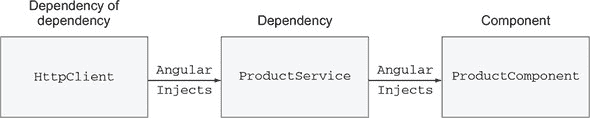

以下列表说明了将 `HttpClient` 对象注入到 `ProductService` 以及从 products.json 文件中检索产品的过程。

##### 列表 5.5\. 将 `HttpClient` 注入到 `ProductService`

```
import {HttpClient} from '@angular/common/http';
import {Injectable} from "@angular/core";

@Injectable()
export class ProductService {
    constructor(private http: HttpClient) {                   *1*
       let products = http.get<string>('products.json')       *2*
                     .subscribe(...);                         *3*
     }
```

+   ***1* 注入 HttpClient**

+   ***2* 使用 HTTP GET**

+   ***3* 订阅 HTTP 请求的结果**

因为 `ProductService` 有自己的可注入依赖项，所以您需要用 `@Injectable()` 装饰它。在这里，您将一个服务注入到另一个服务中。类构造函数是注入点，但您在哪里声明注入 `HttpClient` 类型对象的提供者？所有必需的提供者都声明在 `HttpClientModule` 中。您只需将其添加到您的 `AppModule` 中，如下所示。

##### 列表 5.6\. 添加 `HttpClientModule`

```
import { HttpClientModule} from '@angular/common/http';      *1*
 ...
@NgModule({
  imports: [
    BrowserModule,
    HttpClientModule                                         *2*
   ],
  declarations: [AppComponent],
  bootstrap: [AppComponent]
})
```

+   ***1* 在根模块中导入 HttpClientModule**

+   ***2* 将 HttpClientModule 添加到导入部分**


##### 注意

第十二章 解释了 `HttpClient` 的工作原理。


从 Angular 6 开始，`@Injectable()` 装饰器允许你指定 `provideIn` 属性，这可能让你免于显式声明服务的提供者。以下列表显示了如何指示 Angular 自动创建模块级别的 `ProductService` 提供者。

##### 列表 5.7\. 使用 `provideIn`

```
@Injectable(
  provideIn: 'root'
)
export class ProductService {
...
}
```

现在你已经看到了如何将对象注入到组件中，让我们看看使用 Angular DI 替换一个服务实现为另一个实现需要什么。

### 5.5\. 简化注入服务切换

在本章早期，我们提到 DI 模式允许你将组件与其依赖项解耦。在前一节中，你将 `ProductComponent` 从 `ProductService` 中解耦。现在让我们模拟另一个场景。

假设你已经开始使用一个 `ProductService` 进行开发，该服务应从远程服务器获取数据，但服务器的数据源尚未准备好。与其修改 `ProductService` 中的代码以引入硬编码的数据进行测试，你将创建另一个类：`MockProductService`。

为了说明从一种服务切换到另一种服务有多容易，你将创建一个小型应用程序，该应用程序使用两个 `ProductComponent` 实例。最初，第一个将使用 `MockProductService`，第二个使用 `ProductService`。然后，通过一行更改，你将使它们都使用同一个服务。图 5.5 显示了应用程序如何渲染使用 `ProductService` 不同实现的两个产品组件。

##### 图 5.5\. 两个组件和两个产品

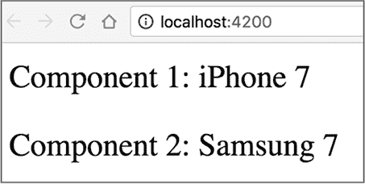

iPhone 7 产品由 `Product1Component` 渲染，而 Samsung 7 由 `Product2Component` 渲染。这个应用程序专注于使用 Angular DI 切换产品服务，因此我们保持了组件和服务简单。本章附带的应用程序中组件和服务位于单独的文件中，但我们把所有相关代码放在以下列表中。

##### 列表 5.8\. 两个产品和两个服务

```
// a value object
class Product {
  constructor(public title: string) {}
}

// services
class ProductService {                                                   *1*
   getProduct(): Product {
    return new Product('iPhone 7');
  }
}

class MockProductService  {                                              *1*
   getProduct(): Product {
    return new Product('Samsung 7');
  }
}

// product components
@Component({
  selector: 'product1',
  template: 'Product 1: {{product.title}}'})
class Product1Component {
  product: Product;

  constructor(private productService: ProductService) {                  *2*
     this.product = productService.getProduct();
  }
}

@Component({
  selector: 'product2',
  template: 'Product 2: {{product.title}}',
  providers: [{provide: ProductService, useClass: MockProductService}]   *3*
 })
class Product2Component {
  product: Product;

  constructor(private productService: ProductService) {                  *4*
     this.product = productService.getProduct();
  }
}

@Component({
  selector: 'app-root',
  template: `
    <product1></product1>
    <p>
    <product2></product2>
  `
})
class AppComponent {}                                                    *5*

@NgModule({
  imports:      [BrowserModule],
  providers:    [ProductService],                                        *6*
   declarations: [AppComponent, Product1Component, Product2Component],
  bootstrap:    [AppComponent]
})
class AppModule { }
```

+   ***1* 不良设计**

+   ***2* 由于在此组件级别没有声明提供者，它将使用应用级别的提供者。**

+   ***3* 仅在组件级别为 ProductComponent2 声明提供者**

+   ***4* ProductComponent2 获取 MockProductService，因为其提供者在组件级别已指定。**

+   ***5* 浏览器渲染 AppComponent 的两个子组件**

+   ***6* 声明应用级别的提供者**


##### 小贴士

列表 5.8 中有两行被标记为不良设计。阅读“面向抽象编程”的侧边栏以获取解释。


如果一个组件不需要特定的 `ProductService` 实现，那么在父组件级别或 `@NgModule()` 中指定了提供者的情况下，就没有必要显式声明其提供者。在 列表 5.8 中，`Product1Component` 没有声明自己的 `ProductService` 提供者，Angular 将在应用级别找到它。

但每个组件都可以自由覆盖在应用或父组件级别做出的`providers`声明，如`Product2Component`所示。每个组件都有自己的注入器，在`Product2Component`的实例化过程中，这个注入器将看到组件级别的提供者并将注入`MockProductService`。这个注入器甚至不会检查应用级别上是否有相同标记的提供者。

如果你决定`Product2Component`应该获取`ProductService`的注入实例，请从其`@Component()`装饰器中移除`providers`行。

从现在开始，无论何时需要注入`ProductService`类型且在组件级别未指定`providers`行，Angular 都会实例化并注入`ProductService`。在做出上述更改后运行应用程序，组件将呈现如图 5.6 所示。

##### 图 5.6\. 两个组件和一个服务

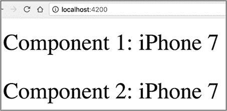

要查看此应用程序的实际运行情况，请运行以下命令：

```
ng serve --app switching -o
```

假设你的应用程序有数十个使用`ProductService`的组件。如果每个组件都使用`new`运算符实例化此服务，你需要进行数十次代码更改。使用 Angular DI，你能够通过更改`providers`声明中的一行来切换服务。


**面向抽象编程**

在面向对象编程中，建议按照接口或*抽象*编程。因为 Angular DI 模块允许你替换可注入对象，所以如果你能声明一个`ProductService`接口并将其指定为提供者，那将很棒。然后你会编写几个实现此接口的具体类，并根据需要将它们切换到`providers`声明中。

你可以在 Java、C#、PHP 和其他面向对象的语言中这样做。问题是，在将 TypeScript 代码转换为 JavaScript 后，接口被移除了，因为 JavaScript 不支持它们。换句话说，如果`ProductService`被声明为接口，下面的构造函数将是错误的，因为 JavaScript 代码对`ProductService`一无所知：

```
constructor(productService: ProductService)
```

但 TypeScript 支持抽象类，其中可以有一些方法被实现，而有些则是抽象的——声明但未实现。然后，你需要实现一些具体的类，这些类扩展了抽象类并实现了所有抽象方法。例如，你可以有如下所示的类：

```
export abstract class ProductService{                         *1*
   abstract getProduct(): Product;                            *2*
}

export class MockProductService extends ProductService{       *3*
   getProduct(): Product {
    return new Product('Samsung 7');
   }
}

export class RealProductService extends ProductService{       *4*
   getProduct(): Product {
    return new Product('iPhone 7');
  }
}
```

+   ***1* 声明一个抽象类**

+   ***2* 声明一个抽象方法**

+   ***3* 创建抽象类的第一个具体实现**

+   ***4* 创建抽象类的第二个具体实现**

注意，如果你的抽象类没有实现任何方法（如本例所示），你可以使用关键字`implement`而不是`extend`。

好消息是，你可以在构造函数中使用抽象类的名称，在 JavaScript 代码生成期间，Angular 将根据提供者声明使用特定的具体类。正如这个侧边栏中声明的 `ProductService`、`MockProductService` 和 `RealProductService` 类一样，这将允许你编写如下内容：

```
@NgModule({
  providers: [{provide: ProductService, useClass: RealProductService}],
  ...
})
export class AppModule { }

@Component({...})
export class Product1Component {
  constructor(productService: ProductService) {...};
  }
}
```

在这里，你同时在令牌和构造函数的参数中使用了抽象。在 列表 5.8 中，`ProductService` 是某些功能的具体实现，这种情况并不适用。如果你决定从服务的一个具体实现切换到另一个，替换提供者的方式与之前描述的方式相同。

在 列表 5.8 中，你将 `ProductService` 和 `MockProductService` 类声明为具有相同名称的方法 `getProducts()`。如果你使用了抽象类方法，TypeScript 编译器会给出错误，如果你尝试实现一个具体类但遗漏了一个抽象方法的实现。这就是为什么 列表 5.8 中的两行被标记为不良设计。


如果你的组件或模块无法将令牌映射到类，但需要应用一些业务逻辑来决定实例化哪个类呢？此外，如果你只想注入一个原始值而不是一个对象呢？

### 5.6\. 使用 useFactory 和 useValue 声明提供者

通常情况下，当需要在实例化对象之前应用一些应用逻辑时，会使用工厂函数。例如，你可能需要决定实例化哪个对象，或者你的对象可能有一个需要在你创建实例之前初始化的带有参数的构造函数。让我们修改上一节中的应用程序，以说明工厂和值提供者的使用。

下面的列表显示了 `Product2Component` 的修改版本，你可以在 di-samples 应用程序的工厂目录中找到它。它展示了如何编写一个工厂函数并将其用作注入器的提供者。这个工厂函数根据 `boolean` 标志 `isProd` 创建 `ProductService` 或 `MockProductService`，该标志指示是否在生产或开发环境中运行，如下面的列表所示。

##### 列表 5.9\. product.factory.ts

```
export function productServiceFactory (isProd: boolean) {        *1*
   if (isProd) {?                                                *2*
     return new ProductService();?
  } else {?
    return new MockProductService();?
  }?
}
```

+   ***1* 将 isProd 的值注入到工厂函数中**

+   ***2* 根据 isProd 的值实例化服务**

你将使用 `useFactory` 属性来指定 `ProductService` 令牌的提供者。因为这个工厂函数需要一个参数（一个依赖项），你需要告诉 Angular 从哪里获取这个参数的值，你可以使用一个特殊的属性 `deps` 来做到这一点，如下面的列表所示。

##### 列表 5.10\. 将工厂函数指定为提供者

```
{provide: ProductService,? useFactory: productServiceFactory,   *1*
                           deps: ['IS_PROD_ENVIRONMENT']}       *2*
```

+   ***1* 此函数用于实例化服务**

+   ***2* 此工厂函数的依赖项**

在这里，你指示 Angular 向你的工厂函数注入由 `IS_PROD_ENVIRONMENT` 令牌指定的值。如果工厂函数有多个参数，你可以在 `deps` 数组中列出相应的令牌。

如何为表示为字符串的令牌提供一个静态值？你可以通过使用 `useValue` 属性来实现。以下是如何将值 `true` 与 `IS_PROD_ENVIRONMENT` 令牌关联起来的示例：

```
{provide: 'IS_PROD_ENVIRONMENT', useValue: true}
```

注意，你将一个字符串令牌映射到一个硬编码的原始值，这在现实世界的应用程序中不是你通常会做的事情。让我们使用 Angular CLI 在 src/environments 目录中生成的环境文件中的环境变量来找出你的应用程序是在开发模式还是生产模式下运行。此目录有两个文件：environment.prod.ts 和 environment.ts。以下是 environment.prod.ts 的内容：

```
export const environment = {
  production: true
};
```

environment.ts 文件有类似的内容，但将 `production` 环境变量赋值为 `false`。如果你没有使用 `ng serve` 或 `ng build` 中的 `--prod` 选项，则 environment.ts 中定义的环境变量可以在你的应用程序代码中使用。当你使用 `--prod` 构建包时，可以在 environment.prod.ts 中使用定义的变量：

```
{provide: 'IS_PROD_ENVIRONMENT', useValue: environment.production}
```

在环境文件中，你可以定义你需要的任何变量，并使用点符号在应用程序中访问它们，例如 `environment.myOtherVar`。

使用 `useFactory` 和 `useValue` 的提供者的整个应用程序模块代码如下所示。

##### 列表 5.11\. 使用 `useFactory` 和 `useValue` 的提供者

```
...
import {ProductService} from './product.service';
import {productServiceFactory} from './product.factory';
import {environment} from '../../environments/environment';

@NgModule({
  imports:      [BrowserModule],
  providers: [{provide: ProductService,?

  useFactory: productServiceFactory,                                       *1*
                                         deps: ['IS_PROD_ENVIRONMENT']},   *2*
               {provide: 'IS_PROD_ENVIRONMENT',
              useValue: environment.production}],                          *3*
   declarations: [AppComponent, Product1Component, Product2Component],
  bootstrap:    [AppComponent]
})
export class AppModule {}
```

+   ***1* 将 productServiceFactory 工厂函数映射到 ProductService 令牌**

+   ***2* 指定要注入到工厂函数中的参数**

+   ***3* 将环境文件中的值映射到 IS_PROD_ENVIRONMENT 令牌**

你可以在 di-samples 项目的 factory 目录中找到实现 `useFactory`、`useValue` 以及环境变量 `production` 的应用程序的完整代码。首先，按照以下方式运行此应用程序：

```
ng serve --app factory -o
```

在开发环境中，工厂函数提供 `MockProductService`，浏览器渲染显示三星的两个组件。现在，以生产模式运行相同的应用程序：

```
ng serve --app factory --prod -o
```

这次，`environment.production` 的值是 `true`，工厂提供了 `ProductService`，浏览器渲染了两个 iPhone。

总结一下，提供者可以将令牌映射到类、工厂函数或任意值，以便注入器知道要注入哪些对象或值。类或工厂可能有自己的依赖项，因此提供者应指定所有这些依赖项。图 5.7 展示了提供者与示例应用程序的注入器之间的关系。

##### 图 5.7\. 使用依赖注入依赖项

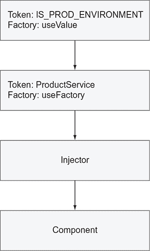

你可以将值注入到一个字符串令牌（如`IS_PROD_ENVIRONMENT`）中，这很棒，但这可能潜在地造成问题。如果你的应用使用了别人的模块，而这个模块恰好也有一个名为`IS_PROD_ENVIRONMENT`的令牌，但在这里注入了不同含义的值，会发生什么？这里存在一个命名冲突。使用 JavaScript 字符串，在任何给定时间，内存中只有一个位置分配给`IS_PROD_ENVIRONMENT`，你无法确定会注入什么值。

#### 5.6.1\. 使用 InjectionToken

为了避免使用硬编码的字符串作为令牌引起的冲突，Angular 提供了一个`InjectionToken`类，它比使用字符串更可取。想象一下，你想创建一个可以从不同的服务器（如开发、生产和质量保证）获取数据的组件，并且你想将服务器的 URL 字符串注入到名为`BackendUrl`的令牌中。而不是注入 URL 字符串令牌，你应该创建一个`InjectionToken`的实例，如下一列表所示。

##### 列表 5.12\. 使用`InjectionToken`而不是字符串令牌

```
import {Component, Inject, InjectionToken} from '@angular/core';

export const BACKEND_URL  = new InjectionToken('BackendUrl');              *1*

@Component({
  selector: 'app-root',
  template: '<h2>The value of BACKEND_URL is {{url}}</h2>',
  providers: [{provide:BACKEND_URL, useValue: 'http://myQAserver.com'}]    *2*
 })
export class AppComponent {
  constructor(@Inject(BACKEND_URL) public url) {}                          *3*
 }
```

+   ***1* 实例化 InjectionToken**

+   ***2* 声明一个提供者以将值注入到令牌中**

+   ***3* 将[`myQAserver.com`](http://myQAserver.com)注入到 BACKEND_URL 令牌中**

在这里，你将字符串`BackendUrl`包装成一个`InjectionToken`的实例。然后，在这个组件的构造函数中，而不是注入一个模糊的字符串类型，你注入一个指向`InjectionToken`具体实例的`BACKEND_URL`。即使另一个模块的代码也有`new InjectionToken('BackendUrl')`，它也将是不同的对象。

`BACKEND_URL`不是一个类型，所以你不能将你的`InjectionToken`实例指定为构造函数参数的类型。你会得到一个编译错误：

```
constructor(public url: BACKEND_URL)  // error
```

这就是为什么你没有指定`AppComponent`构造函数的参数类型，而是使用`@Inject(BACKEND_URL)`装饰器来让 Angular 知道要注入哪个对象。

| |
| --- |

##### 提示

你不能注入 TypeScript 接口，因为它们在转译的 JavaScript 代码中没有表示。

| |
| --- |

你知道提供者可以在组件和模块级别定义，并且模块级别的提供者可以在整个应用中使用。当你的应用有多个模块时，事情会变得复杂。在功能模块的`@NgModule`中声明的提供者是否也会在根模块中可用，或者它们会被隐藏在功能模块内部？

#### 5.6.2\. 模块化应用中的依赖注入

每个根应用模块都有自己的注入器。如果你将你的应用拆分为几个急切加载的功能模块，它们将重用根模块的注入器，所以如果你在根模块中声明了`ProductService`的提供者，任何其他模块都可以在 DI 中使用它。

如果在功能模块中声明了一个提供者——它是否对应用注入器可用？这个问题的答案取决于你如何加载功能模块。

如果一个模块是急速加载的，其提供者可以在整个应用程序中使用，但每个懒加载的模块都有自己的注入器，不暴露提供者。在懒加载模块的 `@NgModule()` 装饰器中声明的提供者仅在该模块内可用，而不是整个应用程序。让我们考虑两种不同的场景：一个带有懒加载模块，另一个带有急速加载模块。

### 5.7\. 懒加载模块中的提供者

在本节中，你将实验懒加载模块内声明的提供者。你将从第 4.3 节的修改后的应用程序开始，该应用程序位于 第四章。这次，你将添加一个可注入的 `LuxuryService` 并在 `LuxuryModule` 中声明其提供者。`LuxuryService` 将类似于以下列表。

##### 列表 5.13\. luxury.service.ts

```
import {Injectable} from '@angular/core';
@Injectable()
export class LuxuryService {

  getLuxuryItem() {                                     *1*
     return "I'm the Luxury service from lazy module";
  }
}
```

+   ***1* 此服务有一个方法。**

`LuxuryModule` 声明了此服务的提供者，如下面的列表所示。

##### 列表 5.14\. luxury.module.ts

```
@NgModule({
    ...
    declarations: [LuxuryComponent],      *1*
     providers: [LuxuryService]           *2*
 })

export class LuxuryModule {}              *3*
```

+   ***1* 此模块有一个组件。**

+   ***2* 声明 LuxuryService 的提供者**

+   ***3* 导出模块以使其在其他模块中可见**

`LuxuryComponent` 将使用此服务，如下面的列表所示。

##### 列表 5.15\. luxury.component.tss

```
@Component({
    selector: 'luxury',
    template: `<h1 class="gold">Luxury Component</h1>
               The luxury service returned {{luxuryItem}} `,
    styles: ['.gold {background: yellow}']
})
export class LuxuryComponent {
  luxuryItem: string

  constructor(private luxuryService: LuxuryService) {}         *1*

  ngOnInit() {
    this.luxuryItem = this.luxuryService.getLuxuryItem();      *2*
   }
}
```

+   ***1* 注入 LuxuryService**

+   ***2* 在 LuxuryService 上调用一个方法**

记住，`AppModule` 懒加载 `LuxuryModule`，正如你可以在下一个列表中看到的那样。

##### 列表 5.16\. 根模块

```
@NgModule({
  imports: [ BrowserModule,
    RouterModule.forRoot([
       ...
       {path: 'luxury',
          loadChildren: './lazymodule/luxury.module#LuxuryModule'} ]      *1*
       )
  ],
  bootstrap: [AppComponent]
})
export class AppModule {}
```

+   ***1* 使用引号指定模块以进行懒加载**

运行此应用程序将懒加载 `LuxuryModule`，`LuxuryComponent` 将注入 `LuxuryService` 并调用其 API。

以下列表尝试从根模块（这两个模块属于同一项目）将 `LuxuryService` 注入到 `HomeComponent` 中。

##### 列表 5.17\. home.component.ts

```
import {Component} from '@angular/core';
import {LuxuryService} from "./lazymodule/luxury.service";

@Component({
  selector: 'home',
  template: '<h1 class="home">Home Component</h1>',
  styles: ['.home {background: red}']
})
export class HomeComponent {

  constructor (luxuryService: LuxuryService) {})        *1*
 }
```

+   ***1* 将 LuxuryService 注入到另一个模块的组件中**

你不会得到任何编译器错误，但如果运行修改后的应用程序，你会得到运行时错误“没有 LuxuryService 提供者！”根模块无法访问懒加载模块中声明的提供者，该模块有自己的注入器。

### 5.8\. 在急速加载的模块中的提供者

让我们在上一节中描述的项目中添加一个 `ShippingModule`，但这个模块将被急速加载。类似于 `LuxuryModule`，`ShippingModule` 将有一个组件和一个名为 `ShippingService` 的可注入服务。你想看看根模块是否也可以使用在急速加载的 `ShippingModule` 中声明的 `ShippingService` 提供者，如下面的列表所示。

##### 列表 5.18\. shipping.module.ts

```
// imports are omitted for brevity
@NgModule({
  imports: [
    CommonModule,
    RouterModule.forChild([                                     *1*
              {path: 'shipping', component: ShippingComponent}
     ])],
  declarations: [ShippingComponent],
  providers: [ShippingService]
})
export class ShippingModule { }
```

+   ***1* 为功能模块添加路由**


##### 提示

在 第 2.5.1 节 中 第二章，`ShippingModule` 还在 `@NgModule()` 装饰器中包含了 `exports: [ShippingComponent]`。你必须在那里导出 `ShippingComponent`，因为它被用于位于 `AppModule` 中的 `AppComponent` 模板。在这个例子中，你只在 `ShippingModule` 内部使用 `ShippingComponent`，因此不需要导出。

| |
| --- |

`ShippingComponent` 接收 `ShippingService` 注入，并将调用其 `getShippingItem()` 方法，该方法返回硬编码的文本，“我是来自运输模块的运输服务。”

##### 列表 5.19\. shipping.component.ts

```
import {Component, OnInit} from '@angular/core';
import {ShippingService} from './shipping.service';

@Component({
  selector: 'app-shipping',
  template: `<h1>Shipping Component</h1>
             The shipping service returned {{shippingItem}}`,
  styles: []
})
export class ShippingComponent implements OnInit {

  shippingItem: string;

  constructor(private shippingService: ShippingService) {}              *1*

  ngOnInit() {
       this.shippingItem = this.shippingService.getShippingItem();      *2*
   }
}
```

+   ***1* 注入 ShippingService**

+   ***2* 使用 ShippingService**

图 5.8 展示了项目的结构和根 `AppModule` 的内容。在第 17 行，你预加载了 `ShippingModule`，在第 18 行，你懒加载了 `LuxuryModule`。

| |
| --- |

##### 注意

到你阅读这段内容的时候，第 9-11 行的函数可能不再需要，第 17 行的 `ShippingModule` 预加载可能看起来像这样：`{path: 'shipping', loadChildren: () => ShippingModule}`。但在写作的时候，第 17 行使用函数会导致 AOT 编译时出错。

| |
| --- |

##### 图 5.8\. 使用功能模块的应用模块

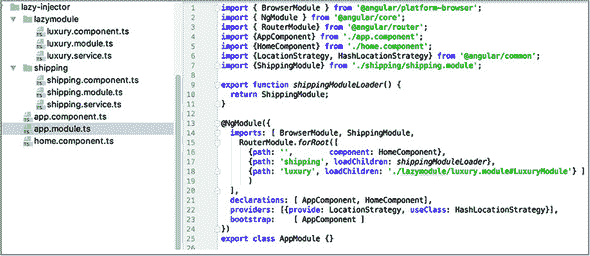

要查看此应用程序的实际运行情况，请运行以下命令：

```
ng serve --app lazyinjection -o
```

点击运输详情链接会显示 `ShippingService` 返回的数据，如图 5.9 所示。即使你没有在根应用模块中声明 `ShippingService` 的提供者，`ShippingService` 仍然被注入到 `ShippingComponent` 中。

##### 图 5.9\. 导航到运输模块

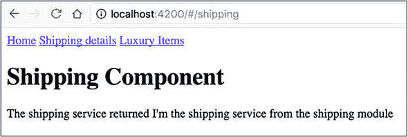

这证明了这样一个事实：预加载模块的提供者与根模块的提供者合并。换句话说，Angular 为所有预加载模块有一个单一的注入器。

### 5.9\. 实践：在 ngAuction 中使用 Angular Material 组件

| |
| --- |

##### 注意

本章的源代码可以在 [`github.com/Farata/angulartypescript`](https://github.com/Farata/angulartypescript) 和 [www.manning.com/books/angular-development-with-typescript-second-edition](http://www.manning.com/books/angular-development-with-typescript-second-edition) 找到。

| |
| --- |

在 第三章 的实践部分，你在 ngAuction 中使用了依赖注入。你将 `ProductService` 提供者添加到 `@NgModule()` 中，并且这个服务被注入到 `HomeComponent` 和 `ProductDetailComponent` 中。在 `ngAuction` 的最终版本中，你也将 `ProductService` 注入到 `SearchComponent` 中。

在本节中，我们不会专注于 DI，而是向您介绍现代外观的 UI 组件 Angular Material 库。目标是替换 ngAuction 登录页面上的 HTML 元素，使用 Angular Material (AM) UI 组件。你仍然会在 ngAuction 的这个版本中保留 Bootstrap 库，但从第七章（kindle_split_016.xhtml#ch07）开始，你将完全重写 ngAuction，使其仅使用 AM 组件。

你将从第三章（kindle_split_012.xhtml#ch03）中的 ngAuction 作为起点，逐步用 AM 对应元素替换 HTML 元素，这样登录页面看起来就像图 5.10（#ch05fig10）中所示。

##### 图 5.10\. 带有 Angular Material 组件的 ngAuction

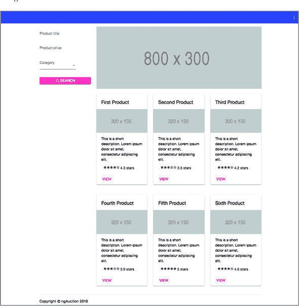

#### 5.9.1\. Angular Material 库简要概述

Angular Material 是由 Google 开发的一个 UI 组件库，基于定义良好设计原则和一致用户体验的 Material Design 指南（参见[`material.io/guidelines`](https://material.io/guidelines)）。这些指南提供了关于如何设计 Web 或移动应用 UI 的建议。

AM 提供了超过 30 个 UI 组件和四个预构建主题。*主题*是一组调色板，每个调色板定义了颜色的一系列阴影，当一起使用时看起来很好（参见[`material.io/guidelines/style/color.html`](https://material.io/guidelines/style/color.html)），如图 5.11（#ch05fig11）所示。

##### 图 5.11\. 样例材料设计调色板

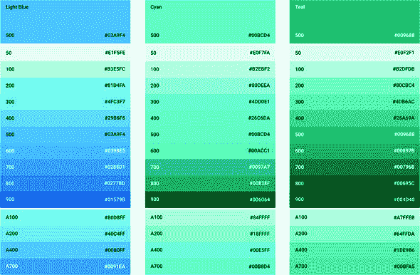

数字 500 的颜色是调板的主色。我们将在第七章（kindle_split_016.xhtml#ch07）的动手实践部分向你展示如何自定义调色板。在撰写本文时，AM 提供了四个预构建主题：`deeppurple-amber`、`indigo-pink`、`pink-bluegrey`和`purple-green`。向你的应用添加主题的一种方法是在 index.html 中使用`<link>`标签：

```
<link href="../node_modules/@angular/material/prebuilt-themes/indigo-
     pink.css" rel="stylesheet">?
```

或者，你可以按照以下方式将主题添加到全局 CSS 文件（styles.css）中：

```
@import '~@angular/material/prebuilt-themes/indigo-pink.css';
```

任何使用 AM 构建的应用都可以为 UI 组件指定以下颜色：

+   **`primary`—** 主要颜色

+   **`accent`—** 次要颜色

+   **`warn`—** 用于错误和警告

+   **`foreground`—** 用于文本和图标

+   **`background`—** 用于组件背景

在为你的应用 UI 进行样式设计时，大部分情况下你不会指定颜色名称或代码，就像在常规 CSS 中做的那样。你将使用前面提到的关键字之一。


##### 小贴士

在第七章（kindle_split_016.xhtml#ch07）的动手实践部分，你将开始使用 CSS 扩展 SaaS 进行样式设计。


以下行显示了如何添加带有指定主题主色的 AM 工具栏组件：

```
<mat-toolbar color="primary"></mat-toolbar>
```

如果你决定切换到不同的主题，不需要更改前面的代码——`<mat-toolbar>`将使用新选择主题的主要颜色。

AM 组件包括输入字段、单选按钮、复选框、按钮、日期选择器、工具栏、网格列表、数据表等。有关组件的当前列表，请参阅产品文档[`material.angular.io`](https://material.angular.io)。一些组件作为标签添加到组件模板中，一些作为指令。无论如何，AM 组件的名称都以前缀 `mat-` 开头。

下面的列表展示了如何创建一个包含链接和带图标的按钮的工具栏。

##### 列表 5.20\. 使用 Angular Material 创建工具栏

```
<mat-toolbar color="primary">?              *1*
   <a [routerLink]="['/']">Home</a>?

  <button mat-icon-button>                  *2*
     <mat-icon>more_vert</mat-icon>         *3*
 ?  </button>?
</mat-toolbar>
```

+   ***1* AM 主题颜色为主色调的工具栏**

+   ***2* 带有图标的按钮**

+   ***3* 将 Google Material 图标 more_vert 放置在按钮上**

在这里，你使用了两个 AM 标签 `<mat-toolbar>` 和 `<mat-icon>`，以及一个指令 `mat-icon-button`。每个 AM 组件都打包在一个功能模块中，你需要在 `AppModule` 的 `@NgModule()` 装饰器中导入所需的 AM 组件的模块。你将在对 ngAuction 进行改观的同时看到如何这样做。


##### 小贴士

如果你想在你的电脑上构建 ngAuction 的新版本，请将 chapter3/ngAuction 目录复制到另一个位置，在那里运行 `npm install`，并遵循下一节中的说明。


#### 5.9.2\. 将 AM 库添加到项目中

首先，你需要通过在项目根目录中运行以下命令来安装 AM 库所需的三个模块：

```
npm i @angular/material @angular/cdk @angular/animations
```

在这个版本的 ngAuction 中，你将使用预构建的 `indigo-pink` 主题，所以用以下行替换 styles.css 文件的内容：

```
@import '~@angular/material/prebuilt-themes/indigo-pink.css';
```


##### 小贴士

从 Angular CLI 6 开始，你可以使用一个命令将 AM 库添加到你的项目中：`ng add @angular/material`。此命令将安装所需的包并修改应用程序中几个文件的代码，因此你需要做的输入更少。我们没有使用此命令，因为我们想将在这个应用程序中使用的所有 AM 组件保留在一个单独的功能模块中。


#### 5.9.3\. 添加带有 AM 组件的功能模块

AM 组件被打包为功能模块，你应该只添加你的应用程序需要的模块，而不是添加整个 AM 库的内容。你可以将所需的模块添加到根应用程序模块中，或者创建一个单独的模块并在其中列出所有所需的组件。

在这个版本的 ngAuction 中，你将保留 ngAuction 的 UI 组件在一个单独的模块中。通过运行以下命令生成一个新的 `AuctionMaterialModule`：

```
ng g m AuctionMaterial
```

此命令将在 app/auction-material/auction-material.module.ts 文件中生成功能模块的样板代码。修改此文件的代码，使其看起来像以下列表。

##### 列表 5.21\. AM UI 组件的功能模块

```
import { NgModule } from '@angular/core';
import { CommonModule } from '@angular/common';

import {MatToolbarModule} from '@angular/material/toolbar';          *1*
import {MatIconModule} from '@angular/material/icon';
import {MatMenuModule} from '@angular/material/menu';
import {MatButtonModule} from '@angular/material/button';
import {MatInputModule} from '@angular/material/input';
import {MatSelectModule, } from '@angular/material/select';
import {MatCardModule} from '@angular/material/card';
import {MatFormFieldModule} from '@angular/material/form-field';
import {BrowserAnimationsModule}
               from '@angular/platform-browser/animations';          *2*

@NgModule({
  imports: [
    CommonModule                                                     *3*
   ],
  exports: [                                                         *4*
    MatToolbarModule, MatIconModule, MatMenuModule, MatButtonModule,
    MatInputModule, MatSelectModule, MatCardModule,
    MatFormFieldModule, BrowserAnimationsModule
  ]
})
export class AuctionMaterialModule { }
```

+   ***1* 只导入 ngAuction 需要的 AM 模块**

+   ***2* 此模块声明了动画服务的提供者。**

+   ***3* 这是一个功能模块，因此需要导入 CommonModule。**

+   ***4* 重新导出 AM 模块，以便它们可以在 ngAuction 的其他模块中使用**

现在，打开 app.module.ts（ngAuction 的根模块）并将您的 `AuctionMaterialModule` 功能模块添加到 `@NgModule()` 的 `imports` 属性中，如以下列表所示。

##### 列表 5.22\. 添加 AM 功能模块

```
import {AuctionMaterialModule} from "./auction-material/auction-material.module";
...
@NgModule({
  ...
  imports: [
    ...
    AuctionMaterialModule        *1*
   ]
  ...
})
```

+   ***1* 将 AM 功能模块添加到根模块**

现在是构建和运行 ngAuction 的好时机：

```
ng serve -o
```

您现在还看不到 ngAuction UI 中的任何变化，但请保持开发服务器运行，以便在下一节添加更多代码时，登录页面的外观将逐渐改变。

#### 5.9.4\. 修改 NavbarComponent 的外观

导航栏组件是一个带有菜单的黑色栏。您将首先替换 navbar.component.html 中的现有内容，以使用 `<mat-toolbar>`，它最终将包含拍卖的菜单。删除此文件中的当前内容，并在那里添加一个空工具栏：

```
<mat-toolbar color="primary"></mat-toolbar>
```

在进行更改时，请注意您正在运行的 ngAuction 的用户界面——现在它有一个空的蓝色工具栏。您希望工具栏包含指向主页的链接和一个通过按钮点击激活的弹出菜单。按钮应包含一个有三个垂直点的图标（见图 5.14），并且指令 `mat-icon-button` 将普通按钮转换为可以包含 `<mat-icon>` 的按钮。对于图像，您将使用 `more_vert`，这是在 [`material.io/icons`](https://material.io/icons) 免费提供的 Google 物料图标之一。

通过修改 navbar.component.html 的内容来添加链接和按钮，使其与以下列表匹配。

##### 列表 5.23\. 向工具栏添加链接和图标按钮

```
<mat-toolbar color="primary">

<a [routerLink]="['/']">ngAuction</a>       *1*

<button mat-icon-button >                   *2*
   <mat-icon>more_vert</mat-icon>
</button>

</mat-toolbar>
```

+   ***1* 添加一个链接以导航到默认路由**

+   ***2* 添加一个看起来像三个垂直点的按钮**

现在，工具栏将看起来像图 5.12。

##### 图 5.12\. 一个带有损坏图标的工具栏


您指定了图标名称 `more_vert`，但未将 Google 物料图标添加到 index.html 中。将以下内容添加到 index.html 的 `<head>` 部分：

```
<link href="https://fonts.googleapis.com/icon?family=Material+Icons"
       rel="stylesheet">
```

现在，`more_vert` 图标已正确显示在按钮上，如图图 5.13 所示。

##### 图 5.13\. 一个带有固定图标的工具栏


下一步是将此按钮推到工具栏的右侧，无论屏幕宽度如何。您将在链接和按钮之间添加一个 `<div>` 来填充空间。将以下样式添加到 navbar.component.css：

```
.fill {
  flex: 1;
}
```

默认情况下，工具栏具有 CSS 弹性盒布局（见[`css-tricks.com/snippets/css/a-guide-to-flexbox`](https://css-tricks.com/snippets/css/a-guide-to-flexbox)）。样式 `flex:1` 表示“将整个宽度分配给 HTML 元素。”

在 navbar.component.html 中，在 `<a>` 和 `<button>` 标签之间放置 `<div>`：

```
<div class="fill"></div>
```

现在按钮已经推到最右边，如图图 5.14 所示。

##### 图 5.14\. 将按钮推到右边


到目前为止，点击按钮不打开菜单有两个原因：

+   您还没有创建菜单。

+   你还没有将菜单链接到按钮。

来自第三章 chapter 3 的 ngAuction 应用程序有三个链接：关于、服务和联系。让我们将它们转换成一个弹出菜单。每个菜单项都将有一个图标（`<mat-icon>`）和文本。在 Angular Material 中，菜单由 `<mat-menu>` 表示，它可以包含一个或多个项目，例如 `<button mat-menu-item>` 组件。

将以下列表中的代码添加到 navbar.component.html 中的 `</mat-toolbar>` 标签之后。

##### 列表 5.24\. 声明弹出菜单的项目

```
<mat-menu #menu="matMenu">             *1*
   <button mat-menu-item>              *2*
     <mat-icon>info</mat-icon>
    <span>About</span>
  </button>
  <button mat-menu-item>               *3*
     <mat-icon>settings</mat-icon>
    <span>Services</span>
  </button>
  <button mat-menu-item>               *4*
     <mat-icon>contacts</mat-icon>
    <span>Contact</span>
  </button>
</mat-menu>
```

+   ***1* 使用 AM 菜单控件**

+   ***2* 第一菜单项**

+   ***3* 第二菜单项**

+   ***4* 第三菜单项**

每个 `<mat-icon>` 使用 Google Material 图标中的一个（`info`、`settings` 和 `contacts`）。请注意，你声明了一个局部模板变量 `#menu,` 来引用此菜单，并将其分配给 AM `matMenu` 指令。本身，`<mat-menu>` 不会渲染任何内容，直到它通过 `matMenuTriggerFor` 指令附加到一个组件上。要将此菜单附加到你的工具栏按钮，将 `menu` 模板变量绑定到 `matMenuTriggerFor` 指令。更新按钮如下所示：

```
<button mat-icon-button [matMenuTriggerFor]="menu">
  <mat-icon>more_vert</mat-icon>
</button>
```


##### 注意

你可以用 `<a [routerLink]>` 链接替换 `<button>` 标签。


如果你现在点击工具栏按钮，它将显示菜单，如图 5.15 figure 5.15 所示。

##### 图 5.15\. 工具栏菜单


#### 5.9.5\. 修改 SearchComponent UI

`SearchComponent` 模板将包含一个包含三个控件（一个文本输入、一个数字输入和一个选择下拉菜单）的表单，这些控件将使用 `matInput` 指令（它们应放置在 `<mat-form-field>` 内部）和 `<mat-select>` 实现。为了使搜索按钮突出，你还将添加一个 `mat-raised-button` 指令和搜索图标到这个按钮。

修改 search.component.html 文件中的代码，使其看起来如下所示。

##### 列表 5.25\. search.component.html

```
<form #f="ngForm">                                               *1*
  <mat-form-field>                                               *2*
     <input matInput
           type="text"
           placeholder="Product title"
           name="title" ngModel>
  </mat-form-field>

  <mat-form-field>                                               *3*
      <input matInput
           type="number"
           placeholder="Product price"
           name="price" ngModel>
  </mat-form-field>

  <mat-form-field>                                               *4*
     <mat-select placeholder="Category" name="category" ngModel>
      <mat-option *ngFor="let c of categories"
                 [value]="c">{{ c }}</mat-option>
    </mat-select>
  </mat-form-field>

  <button mat-raised-button color="accent" type="submit">        *5*
     <mat-icon>search</mat-icon>SEARCH
  </button>
</form>
```

+   ***1* 使用模板驱动的表单 API**

+   ***2* 第一表单字段**

+   ***3* 第二表单字段**

+   ***4* 第三表单字段**

+   ***5* 表单的提交按钮**

`ngForm` 和 `ngModel` 指令是定义在 `FormModule`（在第十章 chapter 10 的 10.2.1 节 section 10.2.1 中描述）中的模板驱动表单的一部分，并且你需要将其添加到 `AppModule` 中的 `@NgModule()` 装饰器中，如下面的列表所示。

##### 列表 5.26\. 添加对 Forms API 的支持

```
import {FormsModule} from '@angular/forms';
@NgModule({
  ...
  imports: [
   ...
    FormsModule         *1*
   ]
})
```

+   ***1* 添加对模板驱动表单 API 的支持**

让我们确保 UI 正确渲染。目前，在小屏幕上，它看起来像 figure 5.16。

##### 图 5.16\. 搜索表单中的按钮未对齐

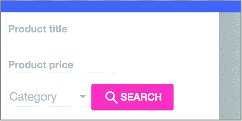

`mat-form-field` 组件和 `mat-select` 下拉菜单应占据搜索组件的整个宽度。你还需要在表单控件之间添加更多空间。

将以下列表中的样式添加到 search.component.css 文件中。

##### 列表 5.27\. search.component.css 的片段

```
mat-form-field, mat-select, [mat-raised-button] {
  display: block;
  margin-top: 16px;
  width: 100%;
}
```

`display: block;` 告诉浏览器将搜索组件渲染为标准的 `<div>`。现在搜索表单已经很好地对齐，如图 5.17 所示。

##### 图 5.17\. 搜索表单


在这个版本的 ngAuction 中，搜索按钮不会执行搜索，搜索表单也不会进行输入验证。你将在第十一章的第 11.8 节中修复这个问题，在我们讨论 Angular 表单 API 之后。

#### 5.9.6\. 用图片替换轮播组件

在撰写本文时，Angular Material 还没有轮播组件。在实际项目中，你会在第三方库中找到轮播组件，例如 PrimeNG 库（[www.primefaces.org/primeng/#/carousel](http://www.primefaces.org/primeng/#/carousel)），但在 ngAuction 的这个版本中，你将用静态图片替换轮播组件。

用以下代码替换 carousel.component.html 的内容：

```

```

现在，浏览器在轮播组件的位置显示一个灰色矩形。你本可以保留 Bootstrap 轮播组件，但仅仅为了轮播组件而加载整个 Bootstrap 库并不值得。目标是逐步切换到 AM 组件。

#### 5.9.7\. 使用间距进行更多修复

通过向 app.component.css 添加以下样式，让我们在工具栏和其他组件之间添加一些空间：

```
.container {
  margin-top: 16px;
}
```

现在，在轮播组件和产品项之间添加一些空间。修改 home.component.css 文件，使其看起来像以下代码（`display:block` 用于将此自定义组件渲染为 `<div>`）：

```
:host {
  display: block;
}

auction-carousel {
  margin-bottom: 16px;
}
```

#### 5.9.8\. 在 ProductItemComponent 中使用 mat-card

下一步是将你的产品以瓷砖的形式显示，每个 `<nga-product-item>` 将使用 `<mat-card>` 组件。为了在卡片内渲染每个产品，修改 product-item.component.html 文件的内容，使其看起来像以下列表。

##### 列表 5.28\. product-item.component.html

```
<mat-card>                                                      *1*
   <mat-card-title>{{ product.title }}</mat-card-title>         *2*
          *3*
   <mat-card-content>
    {{product.description}}                                     *4*
   </mat-card-content>
  <mat-card-actions>
    <a mat-button color="accent"
       [routerLink]="['/products', product.id]">VIEW</a>        *5*
   </mat-card-actions>
</mat-card>
```

+   ***1* 定义了 AM <mat-card> 组件的内容**

+   ***2* 产品标题位于顶部。**

+   ***3* 产品图片**

+   ***4* 产品描述**

+   ***5* 一个链接用于导航到产品详情**

#### 5.9.9\. 为 HomeComponent 添加样式

你的 `HomeComponent` 包含几个 `ProductItemComponent` 的实例。现在让我们向 home.component.css 添加更多样式，以便以 CSS 风格 `flex` 显示并对齐产品。将以下列表的样式添加到 home.component.css 中。

##### 列表 5.29\. home.component.css

```
.product-grid {
  display: flex;                           *1*
   flex-wrap: wrap;
  margin: 0 -8px;
}

nga-product-item {
  margin: 0 8px 16px;
  flex-basis: calc(100% / 3 - 16px);       *2*
 }
```

+   ***1* 使用 CSS flexbox**

+   ***2* 每个组件分配屏幕宽度的三分之一加上边距**

现在 ngAuction 的着陆页看起来更现代，如之前在图 5.10 中所示。它不仅比第三章中的 ngAuction 版本看起来更好，而且它的控件（搜索表单、菜单）对用户的操作提供了快速和动画响应。尝试将焦点放在搜索字段之一，你会看到字段提示如何移动到顶部。搜索按钮也显示了涟漪效果。

你没有改变第三章中展示的图 3.16 的产品详情页的外观。看看你是否能自己做到这一点。当所有标准 UI 元素都被 AM 组件替换后，你可以从 package.json 和.angular-cli.json（或者如果你使用 Angular 6，从 angular.json）中移除对 Bootstrap 库的依赖。

### 摘要

+   提供者注册对象以供将来注入。

+   你可以声明一个提供者，它不仅可以使用一个类，还可以使用一个函数或原始值。

+   注射器形成了一个层次结构，如果 Angular 在组件级别找不到请求类型的提供者，它将尝试通过遍历父级注射器来找到它。

+   懒加载的模块有自己的注射器，并且声明在懒加载模块内部的提供者对根模块不可用。

+   Angular Material 提供了一套看起来现代的 UI 组件。
