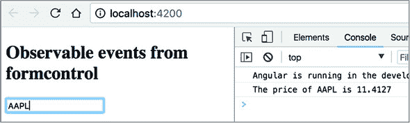
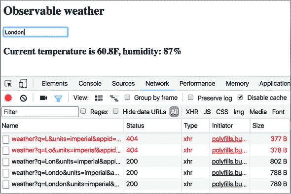
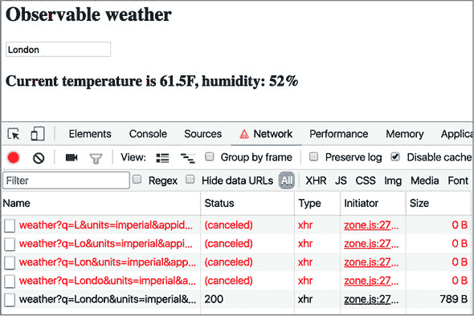
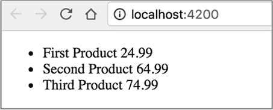
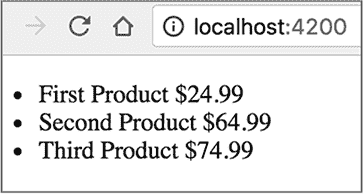
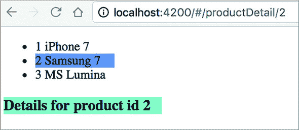

## 第六章\. Angular 中的响应式编程

*本章涵盖*

+   将事件作为观察者处理

+   在 Angular `Router`和表单中使用观察者

+   在 HTTP 请求中使用观察者

+   通过丢弃不需要的 HTTP 响应来最小化网络负载

前五章的目标是使用 Angular 快速启动应用程序开发。在这些章节中，我们讨论了如何从头开始生成新项目，包括模块、路由和依赖注入。在本章中，我们将向您展示 Angular 如何支持一种*响应式*编程风格，其中您的应用程序对用户发起的更改或异步事件（如来自路由器、表单或服务器的数据到达）做出的反应。您将了解哪些 Angular API 支持数据推送并允许您订阅基于 RxJS 的观察者数据流。

| |
| --- |

##### 注意

如果您不熟悉 RxJS 库的概念，如观察者、观察者、操作符和订阅，请在继续本章之前阅读附录 D。

| |
| --- |

Angular 提供了可用于实现各种场景的现成观察者：处理事件、订阅路由的参数、检查表单的状态、处理 HTTP 请求等。您将看到一些使用 Angular 观察者的示例，但以下每一章都包含响应式代码。

您可能会说，任何 JavaScript 应用程序都可以使用事件监听器并提供回调来处理事件，但我们将向您展示如何将事件视为随时间向观察者推送值的**数据流**。您将编写代码来**订阅**观察者事件流并在观察者对象中处理它们。您将能够对事件应用一个或多个操作符，在它移动到观察者时进行处理，这是使用常规事件监听器所不可能的。

| |
| --- |

##### 注意

本章的源代码可以在[`github.com/Farata/angulartypescriptand`](https://github.com/Farata/angulartypescriptand) [www.manning.com/books/angular-development-with-typescript-second-edition](http://www.manning.com/books/angular-development-with-typescript-second-edition)找到。您可以在名为 observables 的目录中找到本节使用的代码示例。在您的 IDE 中打开此目录，并运行`npm install`以安装 Angular 及其依赖项。当需要时，我们提供有关如何运行代码示例的说明。

| |
| --- |

让我们先讨论如何使用和不使用观察者来处理事件。

### 6.1\. 不使用观察者处理事件

每个 DOM 事件都由包含描述事件属性的对象表示。Angular 应用程序可以处理标准 DOM 事件，也可以发出自定义事件。一个 UI 事件的处理器函数可以用可选的`$event`参数声明。对于标准 DOM 事件，你可以使用浏览器`Event`对象的任何函数或属性（参见 Mozilla 开发者网络文档中的“事件”，[`mzl.la/1EAG6iw`](http://mzl.la/1EAG6iw))）。

在某些情况下，你可能对读取事件对象的属性不感兴趣，例如，当页面上只有一个按钮被点击，而这正是你所关心的。在其他情况下，你可能想了解特定的信息，比如当`keyup`事件被派发时，在`<input>`字段中输入了什么字符。下面的代码示例展示了如何处理 DOM 的`keyup`事件并打印出触发此事件的输入字段的值。

##### 列表 6.1\. 处理 keyup 事件

```
template:`<input id="stock" (keyup)="onKey($event)">`        *1*
 ...

onKey(event:any) {
  console.log("You have entered " + event.target.value);     *2*
 }
```

+   ***1* 绑定到 keyup 事件**

+   ***2* 事件处理方法**

在这个代码片段中，你只关心`Event`对象的一个属性：`target`。通过应用*对象解构*（参见附录 A 中的第 A.9.1 节），`onKey()`处理程序可以通过使用花括号和函数参数来即时获取`target`属性的引用：

```
onKey({target}) {
  console.log("You have entered " + target.value);
}
```

如果你的代码派发了一个自定义事件，它可以携带应用程序特定的数据，并且事件对象可以是强类型的（不是`any`类型）。你将在第八章列表 8.4 中看到如何指定自定义事件的类型。

一个传统的 JavaScript 应用程序将派发的事件视为一次性的事件；例如，一次点击导致一次函数调用。Angular 提供了一种不同的方法，你可以将任何事件视为随时间发生的数据的可观察流。例如，如果用户在`<input>`字段中输入了几个字符，每个字符都可以被视为可观察流的一次发射。

你可以订阅可观察的事件，并指定在每次新值发出时调用的代码，以及可选的错误处理和流完成的代码。通常，你会指定多个链式 RxJS 操作符，然后调用`subscribe()`方法。

为什么我们需要将 RxJS 操作符应用于来自 UI 的事件？让我们考虑一个使用事件绑定来处理用户在输入股票符号以获取其价格时派发的多个`keyup`事件的例子：

```
<input type='text' (keyup) = "getStockPrice($event)">
```

这种技术对于处理用户输入时派发的多个事件是否足够好？想象一下，前面的代码被用来获取 AAPL 股票的报价。当用户输入第一个`A`时，`getStockPrice()`函数将向服务器发送请求，如果存在这样的股票，服务器将返回`A`的价格。然后用户输入第二个`A`，这将导致另一个服务器请求`AA`的报价。这个过程会重复进行，直到`AAP`和`AAPL`。

这不是你想要的。为了延迟`getStockPrice()`的调用，你可以将其放在`setTimeout()`函数中，例如，延迟 500 毫秒，以给用户足够的时间输入几个字母：

```
const stock = document.getElementById("stock");

  stock.addEventListener("keyup", function(event) {
    setTimeout(function() {
      getStockPrice(event);
    }, 500);
  }, false);
```

如果用户在输入字段中继续输入，不要忘记调用`clearTimeout()`并启动另一个计时器。

关于在调用 `getStockPrice()` 之前预处理事件的几个函数的组合，有没有优雅的解决方案？如果用户输入缓慢，在 500 毫秒的间隔内只能输入 AAP，第一个请求 AAP 发送到服务器，500 毫秒后发送第二个请求 AAPL。如果客户端返回一个 `Promise` 对象，程序无法丢弃第一个 HTTP 请求的结果，并且可能会因不想要的 HTTP 响应而过载网络。

使用 RxJS 处理事件为你提供了一个名为 `debounceTime` 的方便操作符，该操作符使得可观察对象仅在经过指定时间（例如 500 毫秒）且数据生产者（在我们的例子中是 `<input>` 字段）在此期间没有产生新值时才发出下一个值。无需清除和重新创建计时器。此外，`switchMap` 操作符允许轻松取消等待挂起请求（例如，`getStockPrice()`）的可观察对象，如果可观察对象发出新值（例如，用户持续输入）。Angular 可以提供什么来处理具有订阅者的输入字段事件？

### 6.2\. 将 DOM 事件转换为可观察对象

在 Angular 应用程序中，你可以使用一个特殊的类 `ElementRef` 直接访问任何 DOM 元素，我们将使用这个特性来说明如何订阅任意 HTML 元素的事件。你将创建一个应用程序，它将订阅用户输入股票符号以获取其价格的 `<input>` 元素，如前所述。

要将一个 DOM 事件转换为可观察对象流，你需要执行以下操作：

> **1**. 获取 DOM 对象的引用。
> 
> **2**. 使用 `Observable.fromEvent()` 创建一个可观察对象，提供 DOM 对象和要订阅的事件的引用。
> 
> **3**. 订阅此可观察对象并处理事件。

在一个常规的 JavaScript 应用中，要获取 DOM 元素的引用，你使用 DOM 选择器 API，`document.querySelector()`。在 Angular 中，你可以使用 `@ViewChild()` 装饰器从组件模板中获取元素的引用。

为了唯一标识模板元素，你将使用以哈希符号开始的局部模板变量。以下代码片段使用局部模板变量 `#stockSymbol` 作为 `<input>` 元素的 ID：

```
<input type="text" #stockSymbol placeholder="Enter stock">
```

如果你需要在 TypeScript 类内部获取前一个元素的引用，你可以使用 `@ViewChild('stockSymbol')` 装饰器，以下列表中的应用程序展示了如何做到这一点。注意，你只导入那些你实际使用的 RxJS 成员。

##### 列表 6.2\. fromevent/app.component.ts

```
import {AfterViewInit, Component, ElementRef, ViewChild} from '@angular/core';
import {Observable} from "rxjs";
import {debounceTime, map} from 'rxjs/operators';

@Component({
  selector: "app-root",
  template: `
    <h2>Observable events</h2>
    <input type="text" #stockSymbol placeholder="Enter stock" >
  `
})
export class AppComponent implements AfterViewInit {

  @ViewChild('stockSymbol') myInputField: ElementRef;                       *1*

  ngAfterViewInit() {                                                       *2*

    let keyup$: =
          Observable.fromEvent(this.myInputField.nativeElement, 'keyup');   *3*

        let keyupValue$ = keyup$
      .pipe(
         debounceTime(500),                                                 *4*
          map(event => event['target'].value))                              *5*
       .subscribe(stock => this.getStockQuoteFromServer(stock));            *6*
   }

    getStockQuoteFromServer(stock: string) {

      console.log(`The price of ${stock} is
 ${(100 * Math.random()).toFixed(4)}`);                                   *7*
   }
}
```

+   ***1* 声明一个名为 myInputField 的属性，该属性包含对 <input> 字段的引用**

+   ***2* 将代码放置在 ngAfterViewInit() 组件生命周期方法中**

+   ***3* 从 keyup 事件创建可观察对象**

+   ***4* 等待可观察对象发射暂停 500 毫秒**

+   ***5* 将 DOM 事件转换为 target.value 属性，该属性包含用户输入的股票代码**

+   ***6* 对可观察对象发出的每个值调用 getStockQuoteFromServer() 方法**

+   ***7* 打印生成的随机股票价格**


##### 小贴士

从 Angular 6 开始，不再使用 `Observable.fromEvent()`，只需写 `fromEvent()`。

|  |

##### 注意

在 列表 6.2 中，订阅事件的代码放置在 `ngAfterViewInit()` 组件生命周期方法中，Angular 在组件的 UI 初始化时调用此方法。你将在第九章 ch09 的 第 9.2 节 中了解组件生命周期方法。


你可以通过运行以下命令来查看此代码示例的实际效果：

```
ng serve --app fromevent -o
```

打开浏览器的控制台并开始输入股票代码。根据你打字的速度，你将在控制台中看到一条或几条报告股票价格的消息。

你可以将任何 DOM 事件转换为可观察对象，但直接使用 `ElementRef` 访问 DOM 是不被推荐的，因为这可能会带来一些安全漏洞（有关详细信息，请参阅 [`angular.io/api/core/ElementRef`](https://angular.io/api/core/ElementRef)）。那么，更好的方法是订阅 DOM 对象中的值变化吗？

### 6.3\. 使用表单 API 处理可观察事件

Angular 表单 API（在第十章 chapters 10 和第十一章 11 中介绍）提供了现成的可观察对象，用于推送有关整个表单或表单控件发生的所有重要事件的通告。以下有两个示例：

+   **`valueChanges`—** 这个属性是一个可观察对象，当表单控件的值发生变化时，它会发出数据。

+   **`statusChanges`—** 这个属性是一个可观察对象，它发出表单控件或整个表单的有效性状态。状态从有效变为无效或反之亦然。

在本节中，我们将向您展示如何使用 `valueChanges` 属性与 HTML `<input>` 元素一起使用。

`FormControl` 类是表单处理的基本块之一，它表示一个表单控件。默认情况下，每当表单控件的值发生变化时，底层的 `FormControl` 对象会通过其 `valueChanges` 属性（类型为 `Observable`）发出一个事件，你可以订阅它。

让我们通过使用表单 API 订阅 `<input>` 字段的 `input` 事件并生成股票报价来重写上一节的 app。表单元素可以通过 `formControl` 指令绑定到组件属性，你将使用它而不是直接访问 DOM 对象。

以下列表在调用 `subscribe()` 之前应用了 RxJS `debounceTime` 操作符，指示 `this.searchInput.valueChanges` 可观察对象在用户 500 毫秒内没有输入任何内容时发出数据。

##### 列表 6.3\. formcontrol/app.component.ts

```
import {Component} from '@angular/core';
import {FormControl} from '@angular/forms';
import {debounceTime} from 'rxjs/operators;

@Component({
  selector: 'app-root',
  template: `
       <h2>Observable events from formcontrol</h2>
      <input type="text" placeholder="Enter stock"
             [formControl]="searchInput">                          *1*
     `
})
export class AppComponent {

  searchInput = new FormControl('');

  constructor() {
    this.searchInput.valueChanges                                  *2*
       pipe(debounceTime(500))                                     *3*
       .subscribe(stock => this.getStockQuoteFromServer(stock));   *4*
   }

  getStockQuoteFromServer(stock: string) {
    console.log(`The price of ${stock} is ${(100 * Math.random()).toFixed(4)}
     `);
  }
}
```

+   ***1* 将此 <input> 元素链接到组件属性 searchInput**

+   ***2* valueChanges 属性是一个可观察对象。**

+   ***3* 在发出 `<input>` 元素的内容之前等待 500 毫秒的静默时间**

+   ***4* 订阅可观察对象**

您的 `subscribe()` 方法为 `Observer` 提供了一个方法（没有错误或流完成处理程序）。`searchInput` 控制器生成的流中的每个值都传递给 `getStockQuoteFromServer()` 方法。在现实世界的场景中，此方法会向服务器发出请求（您将在 第 6.4 节 中看到这样的应用程序），但您的方法只是生成并打印一个随机的股票价格。

如果您没有使用 `debounceTime` 操作符，`valueChanges` 将会在用户每次输入字符后发出值。图 6.1 展示了您启动此应用程序并在输入字段中输入 `AAPL` 后会发生什么。

##### 图 6.1\. 获取 AAPL 的价格



要查看此应用程序的实际运行情况，请在终端中运行以下命令：

```
ng serve --app formcontrol -o
```

| |
| --- |

##### 注意

您可能会争辩说，您可以通过简单地绑定到 `change` 事件来实现此示例，该事件会在用户完成输入股票符号并将焦点从输入字段移出时触发。这是真的，但在许多场景中，您可能希望从服务器获得即时响应，例如在用户输入时检索和过滤数据集合。

| |
| --- |

在 代码示例 6.3 中，您没有向服务器发送任何网络请求以获取价格报价——您在用户的计算机上生成随机数。即使用户输入了错误的股票符号，此代码示例也会调用 `Math.random()`，这对应用程序的性能影响微乎其微。在现实世界的应用程序中，用户的输入错误可能会生成网络请求，在返回错误输入的股票符号的报价时引入延迟。您将如何处理丢弃不想要的请求的结果？

### 6.4\. 使用 `switchMap` 抛弃不想要的 HTTP 请求的结果

可观察对象相较于承诺的优势之一是可观察对象可以被取消。在前一节中，我们提供了一个场景，即一个打字错误可能导致服务器请求返回不希望的结果。实现主从视图是请求取消的另一个用例。比如说，当用户点击产品列表中的一行以查看必须从服务器检索的产品详情时。然后他们改变主意并点击另一行，这会发出另一个服务器请求；在这种情况下，理想情况下应该丢弃挂起的请求的结果。

在 Angular 中，HTTP 请求返回可观察对象。让我们看看如何通过创建一个在用户在输入字段中输入时发出 HTTP 请求的应用程序来丢弃挂起的 HTTP 请求的结果。我们将使用两个可观察流：

+   由搜索 `<input>` 字段产生的可观察流

+   用户在搜索字段中输入时产生的 HTTP 请求的可观察流

对于这个示例，您将使用位于 [`openweathermap.org`](http://openweathermap.org) 的免费天气服务，该服务为全球各地的城市提供天气请求的 API。要使用此服务，请访问 OpenWeatherMap 并接收一个应用程序 ID (`appid`)。此服务以 JSON 格式返回天气信息。例如，要获取伦敦当前的华氏温度 (`units=imperial`)，URL 可能如下所示：[`api.openweathermap.org/data/2.5/find?q=London&units=imperial&appid=12345`](http://api.openweathermap.org/data/2.5/find?q=London&units=imperial&appid=12345)。

您将通过将基本 URL 与输入的城市名称和应用程序 ID 连接来构建请求 URL。当用户输入城市名称的字母时，代码会订阅事件流并发出 HTTP 请求。如果在上一个响应返回之前发出新的请求，`switchMap` 操作符（在 附录 D 中的 第 D.8 节 解释）将取消并丢弃先前的内部可观察对象（因此先前的 HTTP 请求的结果永远不会到达浏览器），并将新的请求发送到这个天气服务。以下列表中的示例还使用了 `FormControl` 指令从用户输入城市名称的输入字段生成可观察的流。

##### 列表 6.4\. weather/app.component

```
@Component({
  selector: "app-root",
  template: `
    <h2>Observable weather</h2>
    <input type="text" placeholder="Enter city" [formControl]="searchInput">
    <h3>{{weather}}</h3>
  `
})
export class AppComponent implements OnInit{
  private baseWeatherURL = 'http://api.openweathermap.org/data/2.5/weather?q=';
  private urlSuffix: = "&units=imperial&appid=12345";

  searchInput = new FormControl();
  weather: string;

  constructor(private http: HttpClient) {}

  ngOnInit() {                                                            *1*

    this.searchInput.valueChanges
      .pipe(switchMap(city => this.getWeather(city)))                     *2*
       .subscribe(
        res => {
          this.weather =                                                  *3*
             `Current temperature is  ${res['main'].temp}F, ` +
            `humidity: ${res['main'].humidity}%`;
        },
        err => console.log(`Can't get weather. Error code: %s, URL: %s`,
                             err.message, err.url)
      );
  }

  getWeather(city: string): Observable<any> {                             *4*
     return this.http.get(this.baseWeatherURL + city + this.urlSuffix)
      .pipe(catchError( err => {                                          *5*
         if (err.status === 404){
          console.log(`City ${city} not found`);
          return Observable.empty()}                                      *6*
         })
      );
  }
}
```

+   ***1* 在 `ngOnInit()` 中创建订阅，该函数在组件属性初始化后调用**

+   ***2* `switchMap` 操作符从输入字段中获取输入值（第一个可观察对象）并将其传递给 `getWeather()` 方法，该方法向天气服务发出 HTTP 请求。**

+   ***3* 使用温度和湿度信息初始化天气变量**

+   ***4* `getWeather()` 方法构建 URL 并定义 HTTP GET 请求。**

+   ***5* 如果用户输入的城市不存在，则拦截错误**

+   ***6* 为了使应用程序继续运行，在发生 404 错误时返回一个空的观察对象**


##### 小贴士

从 TypeScript 2.7 开始，您需要在声明或构造函数中初始化类变量：例如，`weather = ''`。如果您不想这样做，请将 TypeScript 编译器的 `strictPropertyInitialization` 选项设置为 `false`。


注意 列表 6.4 中的两个可观察对象：

+   `FormControl` 指令从输入字段事件（`this.searchInput.valueChanges`）创建一个可观察对象。

+   `getWeather()` 也返回一个可观察对象。

当外部可观察对象（在这种情况下为 `FormControl`）生成数据传递给内部可观察对象（`getWeather()` 函数）时，我们经常使用 `switchMap` 操作符：可观察对象 1 -> `switchMap(function)` -> 可观察对象 2 -> `subscribe()`。

如果 Observable1 推送了新值，但内部 Observable2 还没有完成，Observable2 会被取消。我们正在从当前的内部观察者切换到新的观察者，`switchMap`操作符会取消订阅挂起的 Observable2 并重新订阅以处理 Observable1 产生的新值。

在列表 6.4 中，如果 UI 的观察者流在`getWeather()`返回的观察者发出值之前推送了下一个值，`switchMap`会杀死`getWeather()`的观察者，从 UI 获取城市的新值，并再次调用`getWeather()`。取消`getWeather()`会导致`HttpClient`丢弃缓慢且未及时完成的挂起 HTTP 请求的结果。

`subscribe()`方法只有一个用于处理来自服务器的数据的回调，其中您可以从返回的 JSON 中提取温度和湿度。如果用户请求一个不存在的城市，这个天气服务提供的 API 会返回 404。您在`catchError`操作符中拦截并处理这个错误。想象一下，一个打字慢的用户在尝试查找伦敦的天气时输入了`Lo`。对`Lo`的 HTTP 请求发出，返回了 404，然后您创建了一个空的观察者，以便`subscribe()`方法得到一个空的结果，这并不是一个错误。

要运行此应用，您需要首先在[`api.openweathermap.org`](http://api.openweathermap.org)获取您自己的密钥（需要一分钟），并将列表 6.4 中的代码中的 12345 替换为您自己的密钥。然后您可以使用以下命令运行此应用：

```
ng serve --app weather -o
```

浏览器将在 http://localhost:4200 打开应用，渲染一个包含单个输入字段的窗口，您可以在其中输入城市名称。图 6.2 显示了在具有快速 200 Mbps 互联网连接的计算机上键入单词*London*时的网络流量。

##### 图 6.2. 不进行节流获取天气



在这种情况下，进行了六次 HTTP 请求并返回了 HTTP 响应。阅读前两行的查询。对于城市`L`和`Lo`的请求返回了 404。但对于`Lon`、`Lond`、`Londo`和`London`的请求则成功完成，每个请求都返回了数百字节，不必要地拥塞了网络。将这些字节加起来——总共是 3,134 字节，但在快速网络上的用户甚至都不会注意到这一点。

现在让我们模拟一个慢速网络并验证丢弃不需要的结果是否有效。在慢速互联网连接上，每个 HTTP 请求需要超过 200 毫秒才能完成，但用户一直在打字，挂起的 HTTP 请求的响应应该被丢弃。

Chrome 开发者工具的网络标签页有一个下拉菜单，默认选项为 Online，这意味着使用完整的连接速度。现在，让我们通过选择 Slow 3G 选项来模拟慢速连接。重新输入单词 *London* 会产生多个 HTTP 请求，但现在连接变慢了，挂起的请求的结果被丢弃，并且永远不会到达浏览器，如图 6.3 所示。请注意，这次你收到了 789 字节，这比 3,134 字节要好得多。

##### 图 6.3\. 使用节流获取天气



通过非常少的编程，你可以通过消除浏览器处理你感兴趣的城市的四个 HTTP 响应的需求来节省带宽，这些城市可能甚至不存在。只需添加一行 `switchMap`，你就能完成很多事情。确实，使用好的框架或库，你写的代码更少。Angular 管道还允许你用更少的手动编码实现更多功能，在下一节中，你将了解 `AsyncPipe`，它将消除调用 `subscribe()` 的需求。

### 6.5\. 使用 AsyncPipe

第 2.5 节 在 第二章 中介绍了管道，它们用于组件模板中，可以在模板内直接转换数据。例如，`DatePipe` 可以将日期转换为指定的格式并显示。管道放置在模板中的竖线之后，例如：

```
<p> Birthday: {{birthday | date: 'medium'}}</p>
```

在此代码片段中，`birthday` 是一个类型为 `Date` 的组件属性。Angular 提供了一个 `AsyncPipe`，它可以接受类型为 `Observable` 的组件属性，自动订阅它，并在模板中渲染结果。

下一个列表声明了一个类型为 `Observable<number>` 的 `numbers` 变量，并用一个每秒发出连续数字的观察者初始化它。`take(10)` 操作符将限制发射到前 10 个数字。

##### 列表 6.5\. asyncpipe/app.component.ts

```
import {Component} from '@angular/core';
import 'rxjs/add/observable/interval';
import {take} from 'rxjs/operators';
import {Observable} from "rxjs";

@Component({
  selector: "app-root",
  template: `{{numbers$ | async}}`         *1*
 })
export class AppComponent {

  numbers$: Observable<number> =
             Observable.interval(1000)     *2*
                .pipe(take(10));           *3*
 }
```

+   ***1* 自动订阅可观察的数字**

+   ***2* 每秒发出连续数字**

+   ***3* 只取 0 到 9 之间的 10 个数字**

| |
| --- |

##### 提示

从 Angular 6 开始，不再使用 `Observable.interval()`，只需写 `interval()`。

| |
| --- |

如 附录 D 中所述，要从可观察对象获取数据，我们需要调用 `subscribe()` 方法。在 列表 6.5 中，没有显式调用 `subscribe()`，但请注意模板中的 `async` 管道。`async` 管道会自动订阅 `numbers` 可观察对象，并显示可观察对象推送的从 0 到 9 的数字。要查看此示例的实际效果，请运行以下命令：

```
ng serve --app asyncpipe -o
```

这是一个相当简单的例子，它永远不会抛出任何错误。在现实世界的应用中，事情会发生，你应该使用 `catch` 操作符向可观察对象添加错误处理，就像你在上一节中的天气示例中所做的那样。

现在，让我们考虑另一个使用`async`管道的应用程序。这次，你将调用一个返回产品观察者数组的函数，并使用`async`管道来渲染其值。此应用程序将使用可注入的`ProductService`，其`getProducts()`方法返回`Product`对象的观察者数组，如以下列表所示。

##### 列表 6.6\. asyncpipe-products/product.service.ts

```
import {Injectable} from '@angular/core';
import {Observable} from "rxjs";
import 'rxjs/add/observable/of';

export interface Product {                          *1*
    id: number;
   title: string;
   price: number
}

@Injectable()
export class ProductService {

  products: Product[] = [                           *2*
     {id: 0, title: "First Product", price: 24.99},
    {id: 1, title:"Second Product", price: 64.99},
    {id: 2, title:"Third Product", price: 74.99}
  ];

  getProducts(): Observable<Product[]> {

    return Observable.of(this.products);            *3*
   }
}
```

+   ***1* 定义产品类型**

+   ***2* 填充产品数组**

+   ***3* 将产品数组转换为观察者**


##### 提示

从 Angular 6 开始，只需写`of()`而不是`Observable.of()`。


下一个列表显示了获取`ProductService`注入并调用`getProducts()`的应用组件，它返回一个观察者。请注意，那里没有显式调用`subscribe()`——你在模板中使用`async`管道。在这个组件中，你使用 Angular 的结构指令`*ngFor`遍历产品，并为每个产品渲染带有产品标题和价格的`<li>`元素，如以下列表所示。

##### 列表 6.7\. asyncpipe-products/app.component.ts

```
import {Component} from '@angular/core';
import {Product, ProductService} from "./product.service";
import {Observable} from "rxjs";

@Component({
  selector: "app-root",
  template: `
       <ul>
         <li *ngFor="let product of products$ | async">     *1*
            {{product.title}} {{product.price}}             *2*
          </li>
       </ul>
    `
})
export class AppComponent {

  products$: Observable<Product[]>;                         *3*

  constructor(private productService: ProductService) {}

  ngOnInit() {

    this.products$ = this.productService.getProducts();     *4*
   }
}
```

+   ***1* 遍历产品并将它们通过异步管道进行订阅**

+   ***2* 渲染产品标题和价格**

+   ***3* 使用泛型语法声明观察者`products$`以进行类型检查**

+   ***4* 将值分配给`products$**`

重要的是要理解`getProducts()`函数返回一个空的观察者（observable），它还没有发出任何内容，并且你将其分配给`products$`变量。在订阅`products$`之前，不会向此组件推送任何数据，并且`async`管道在模板中执行此操作。

要查看此应用程序的实际运行情况，请运行以下命令：

```
ng serve --app asyncpipe-products -o
```

图 6.4 显示了浏览器将如何渲染产品。

##### 图 6.4\. 渲染观察者产品



由于我们正在讨论管道，让我们应用 Angular 内置的`currency`管道来显示美元价格。只需在`product.price`之后添加`currency`管道即可：

```
{{product.title}} {{product.price | currency : "USD"}}
```

你可以在[`angular.io/api/common/CurrencyPipe`](https://angular.io/api/common/CurrencyPipe)上阅读更多关于`currency`管道及其参数的信息。图 6.5 显示了浏览器在应用货币管道后如何渲染美元产品。

##### 图 6.5\. 渲染观察者产品




**使用 async as**

使用异步管道（async pipes），你可以使用特殊的语法`async as`来避免在模板中创建多个订阅。考虑以下代码，它在模板中创建了两个订阅，假设存在一个名为`product$`的观察者：

```
<div>
  <h4>{{ (product$ | async).price}}</h4>            *1*
   <p>{{ (product$ | async).description }}</p>      *2*
 </div>
```

+   ***1* 第一次订阅**

+   ***2* 第二次订阅**

以下代码通过创建一个局部模板变量`product`，该变量将存储单个订阅的引用，并在同一模板的多个位置重用它来重写之前的代码：

```
<div *ngIf="product$ | async as product">      *1*
   <h4>{{ product.price}}</h4>                 *2*
   <p>{{ prod                                  *2*
```

+   ***1* 创建订阅并将其存储在产品变量中**

+   ***2* 使用名为 product 的订阅**


现在，让我们看看在路由器导航过程中如何使用可观察属性。

### 6.6\. 可观察属性和路由器

Angular 路由器在多个类中提供了可观察属性。有没有简单的方法可以找到它们？最快的方法是打开你感兴趣的类的类型定义文件（见附录 B（kindle_split_026.xhtml#app02））。通常，IDEs 在上下文（右键单击）菜单中提供选项，以便转到所选类的声明。让我们以 `ActivatedRoute` 类为例，看看它的声明。它位于 router_state.d.ts 文件中（我们为了简洁起见删除了一些内容），如下所示。

##### 列表 6.8\. `ActivatedRoute` 的一个片段

```
export declare class ActivatedRoute {
    url: Observable<UrlSegment[]>;
    queryParams: Observable<Params>;
    fragment: Observable<string>;
    data: Observable<Data>;
    snapshot: ActivatedRouteSnapshot;
    ...
    readonly paramMap: Observable<ParamMap>;
    readonly queryParamMap: Observable<ParamMap>;
}
```

在第三章的第 3.4 节（kindle_split_012.xhtml#ch03lev1sec4）中，你将 `ActivatedRoute` 注入到 `ProductDetailComponent` 中，以便在导航期间接收路由参数。当时，你使用了 `ActivatedRoute` 的 `snapshot` 属性来获取父路由的值。如果你需要获取永远不会改变的参数，这种技术效果很好。但是，如果父路由中的参数随时间变化，你需要订阅一个可观察的属性，如 `paramMap`。

为什么父参数的值会改变？想象一个显示产品列表的组件，当用户选择一个产品时，应用会导航到显示产品详情的路由。通常，这些用例被称为 *主-详细信息通信*。

当用户第一次点击产品时，路由器执行以下步骤：

> **1**. 实例化 `ProductDetailComponent`
> 
> **2**. 将 `ProductDetailComponent` 组件附加到 DOM 对象
> 
> **3**. 在路由出口处渲染 `ProductDetailComponent` 组件
> 
> **4**. 将参数（例如，产品 ID）传递给 `ProductDetailComponent`

如果用户在父组件中选择另一个产品，前三个步骤将不会执行，因为 `ProductDetailComponent` 已经实例化，附加到 DOM 上，并且由浏览器渲染。路由器将只传递一个新的产品 ID 到 `ProductDetailComponent`，这就是为什么订阅 `paramMap` 是最佳做法。以下列表实现了这个场景，从 `AppComponent` 开始。

##### 列表 6.9\. master-detail/app.component.ts

```
interface Product {                                                   *1*
   id: number;
  description: string;
}

@Component({
  selector: 'app-root',
  template: `
        <ul style="width: 100px;">
           <li *ngFor="let product of products"
            [class.selected]="product === selectedProduct"
            (click) = onSelect(product)>                              *2*
               <span>{{product.id}} {{product.description}} </span>
           </li>
       </ul>

        <router-outlet></router-outlet>
    `,
  styles:[`.selected {background-color: cornflowerblue}`]
})
export class AppComponent {

  selectedProduct: Product;

  products: Product[] = [
    {id: 1, description: "iPhone 7"},
    {id: 2, description: "Samsung 7"},
    {id: 3, description: "MS Lumina"}
  ];

  constructor(private _router: Router) {}                             *3*

  onSelect(prod: Product): void {
    this.selectedProduct = prod;
    this._router.navigate(["/productDetail", prod.id]);               *4*
   }
}
```

+   ***1* 定义产品类型**

+   ***2* 当用户选择一个项目时，调用 onSelect() 处理程序**

+   ***3* 注入路由器以便可以使用其 navigate() 方法**

+   ***4* 导航到产品详情路由**

此应用的路由配置如下：

```
[
 {path: 'productDetail/:id', component: ProductDetailComponent}
]
```

以下列表展示了 `ProductDetailComponent` 订阅 `paramMap` 的代码。

##### 列表 6.10\. master-detail/product.detail.component.ts

```
@Component({
  selector: 'product',
  template: `<h3 class="product">Details for product id {{productId}}</h3>`,*1*
   styles: ['.product {background: cyan; width: 200px;} ']
})
export class ProductDetailComponent {

  productId: string;

  constructor(private route: ActivatedRoute) {

    this.route.paramMap
      .subscribe(                                                           *2*
         params => this.productId = params.get('id'));                      *3*
   }
}
```

+   ***1* 将 productId 的值嵌入到标题中**

+   ***2* 订阅 paramMap 可观察属性**

+   ***3* 从当前产品 ID 中提取并将其分配给 productId 属性以在 UI 中显示**

现在 `ProductDetailComponent` 将根据用户选择渲染识别当前产品的文本。图 6.6 展示了用户在列表中选择第二个产品后 UI 的外观。要查看此应用程序的实际运行情况，请运行以下命令：

```
ng serve --app master-detail -o
```

##### 图 6.6\. 实现主从场景



在 第七章 中，您将重写 ngAuction，您将看到 Flex Layout 库中的 `ObservableMedia` 类如何通知您屏幕尺寸的变化（例如，用户减小窗口宽度）。此可观察对象在根据智能手机和平板电脑等较小设备的视口宽度更改 UI 布局时也非常方便。

### 摘要

+   使用可观察的数据流简化了异步编程。您可以根据需要订阅和取消订阅流。

+   使用 `async` 管道是订阅可观察对象的首选方式。

+   `async` 管道会自动取消订阅可观察对象。

+   使用 `switchMap` 操作符结合 `HttpClient` 可以让您轻松丢弃挂起 HTTP 请求的不想要的输出。
