## 第七章\. 使用 Flex Layout 布局页面

*本章涵盖*

+   使用 Flex Layout 库实现响应式网页设计

+   使用 `ObservableMedia` 服务

+   根据视口大小更改布局

当涉及到开发网络应用程序时，你需要决定你是否将为桌面和移动版本创建单独的应用程序，或者是否在所有设备上重用相同的代码。前者方法允许你使用移动设备上的原生控件，从而使 UI 看起来更自然，但你需要为每个应用程序维护代码的单独版本。后者方法是使用单个代码库并实现 *响应式网页设计*（RWD），以便 UI 布局将适应设备屏幕尺寸。


##### 注意

术语 RWD 是由 Ethan Marcotte 在文章“Responsive Web Design”（可在 [`alistapart.com/article/responsive-web-design`](http://alistapart.com/article/responsive-web-design) 查找）中提出的。


有第三种方法：除了你的在桌面上工作的网络应用程序之外，开发一个 *混合* 应用程序，这是一个在移动浏览器中运行但也可以调用移动设备原生 API 的网络应用程序。

在本章中，你将了解如何使用响应式设计（RWD）方法使你的应用程序在大屏幕和小屏幕上看起来美观且功能齐全。第六章 介绍了当应用程序中发生某些重要事件时可以推送通知的可观察对象。让我们看看你是否可以使用可观察对象来通知你用户屏幕尺寸的变化，并根据用户设备视口的宽度更改 UI 布局。使用智能手机的用户和使用大屏幕的用户应该看到相同应用程序的不同布局。

我们将向你展示如何使用 Flex Layout 库来实现 RWD，以及如何使用其 `ObservableMedia` 服务来节省你编写大量 CSS。

最后，你将开始重写 ngAuction 应用程序，展示你所学到的许多技术，主要目标是移除应用程序中的 Bootstrap，仅使用 Angular Material 和 Flex Layout 库。

### 7.1\. Flex Layout 和 ObservableMedia

想象一下，你已经布局了应用程序的 UI，它在用户具有 1200 像素或更宽的宽度分辨率的显示器上看起来很棒。如果用户在具有 640 像素视口宽度的智能手机上打开此应用程序会发生什么？根据设备的不同，它可能只会渲染应用程序 UI 的一部分，在底部添加一个水平栏，或者缩小 UI 以适应小视口，使应用程序难以使用。或者考虑另一种场景：具有大屏幕的用户缩小浏览器窗口，因为他们需要在显示器上放置另一个应用程序。

要实现 RWD，您可以使用 CSS 媒体查询，由 `@media` 规则表示。在您的应用 CSS 中，您可以包含一组媒体查询，为不同的屏幕宽度提供不同的布局。浏览器会持续检查当前窗口宽度，一旦宽度超过 `@media` 规则中设置的 *断点*（例如，宽度小于 640 像素），就会应用新的页面布局。

实现灵活布局的另一种方法是使用 CSS Flexbox 和媒体查询（参见 [`mng.bz/6B42`](http://mng.bz/6B42)）。您的应用 UI 被设计成一系列灵活的盒子，如果浏览器无法水平（或垂直）地容纳 Flexbox 内容，内容将被渲染在下一行（或列）中。

您还可以借助 CSS Grid 实现 RWD（参见 [`mng.bz/k29F`](http://mng.bz/k29F)）。Flexbox 和 CSS Grid 都需要您对 `@media` 规则有良好的理解。

Angular Flex Layout 库（参见 [`github.com/angular/flex-layout`](https://github.com/angular/flex-layout)）是一个 UI 布局引擎，用于实现响应式 Web 设计，而无需在您的 CSS 文件中编写媒体查询。该库提供了一套简单的 Angular 指令，内部应用 `flexbox` 布局规则，并提供 `ObservableMedia` 服务，该服务通知您的应用用户设备视口的当前宽度。

Angular Flex Layout 相比于标准 CSS API 具有以下优势：

+   它生成跨浏览器的 CSS。

+   它提供了一个对 Angular 友好的 API，用于使用指令和可观察者处理媒体查询。


##### 注意

在本节中，我们提供了 Flex 布局库的简要描述，以便您快速入门。有关更多详细信息和大纲，请参阅 Flex 布局文档，网址为 [`github.com/angular/flex-layout/wiki`](https://github.com/angular/flex-layout/wiki)。


Flex 布局库提供了两个 API：静态和响应式。静态 API 允许您使用指令来指定容器及其子元素的布局属性。响应式 API 增强了静态 API 指令，使您能够实现响应式 Web 设计（RWD），以便应用布局根据不同的屏幕尺寸进行变化。

#### 7.1.1\. 使用 Flex 布局指令

Flex 布局库中有两种类型的指令：一种用于容器，另一种用于其子元素。容器的指令用于对其子元素进行对齐。子指令应用于由 Flex 布局管理的容器的子元素。使用子指令，您可以指定每个子元素的顺序、它所占的空间量以及一些其他属性，如 表 7.1 所示。

##### 表 7.1\. 常用 Flex 布局指令

| 指令 | 描述 |
| --- | --- |
| *容器指令* |   |

|

+   fxLayout

| 指令指示元素使用 CSS Flexbox 来布局子元素。 |
| --- |

|

+   fxLayoutAlign

| 以特定方式（向左、向底、均匀分布等）对齐子元素。允许的值取决于附加到同一容器元素的 fxLayout 值——请参阅 Angular Flex Layout 文档。 |
| --- |

|

+   fxLayoutGap

| 控制子元素之间的空间。 |
| --- |
| *子指令* |   |

|

+   fxFlex

| 控制子元素在父容器中占据的空间量。 |
| --- |

|

+   fxFlexAlign

| 允许根据 fxLayoutAlign 指令在父容器中选择性更改子元素的定位。 |
| --- |

|

+   fxFlexOrder

| 允许更改子元素在父容器中的顺序。例如，当从桌面切换到移动屏幕时，可以使用它将重要组件移动到可见区域。 |
| --- |
|  |

##### 注意

子指令期望位于一个带有容器指令的 HTML 元素内部。


让我们看看如何使用 Flex Layout 库将两个`<div>`元素在一行中并排对齐。首先，你需要将 Flex Layout 库及其依赖项`@angular/cdk`添加到你的项目中：

```
npm i @angular/flex-layout @angular/cdk
```

下一步是将`FlexLayoutModule`添加到根`@NgModule()`装饰器中，如下所示。

##### 列表 7.1\. 添加`FlexLayoutModule`

```
import {FlexLayoutModule} from '@angular/flex-layout';
@NgModule({
  imports: [
    FlexLayoutModule
    //...
  ]
})
export class AppModule {}
```

以下列表创建了一个组件，该组件从左到右显示相邻的`<div>`元素。

##### 列表 7.2\. flex-layout/app.component.ts

```
@Component({
  selector: 'app-root',
  styles: [`
    .parent {height: 100px;}
    .left   {background-color: cyan;}
    .right  {background-color: yellow;}
  `],
  template: `
    <div class="parent" fxLayout="row" >        *1*
       <div fxFlex class="left">Left</div>      *2*
       <div fxFlex class="right">Right</div>    *2*
     </div>
  `
})
export class AppComponent {}
```

+   ***1* fxLayout 指令将<div>转换为 flex 布局容器，其中子元素水平分配（在一行中）。**

+   ***2* fxFlex 指令指示每个子元素在父容器中占据相等的空间。**

要查看此应用程序的实际效果，请运行以下命令：

```
ng serve --app flex-layout -o
```

图 7.1 展示了浏览器如何渲染子元素。每个子元素占据容器可用宽度的 50%。

##### 图 7.1\. 两元素在一行中对齐

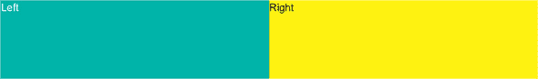

要使右 div 比左 div 占据更多空间，你可以将所需的空间值分配给子`fxFlex`指令。以下模板使用子级指令`fxFlex`将 30%的可用宽度分配给左子元素，70%分配给右子元素：

```
<div fxLayout="row" class="parent">
  <div fxFlex="30%" class="left">Left</div>
  <div fxFlex="70%" class="right">Right</div>
</div>
```

现在，UI 渲染如图图 7.2 所示。

##### 图 7.2\. 右元素比左元素占据更多空间。

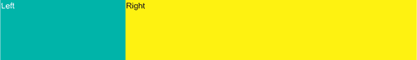

要将容器子元素的布局从行更改为列，将容器的布局方向从行更改为列，如`fxLayout="column"`：

```
<div fxLayout="column" class="parent">
  <div fxFlex="30%" class="left">Left</div>
  <div fxFlex="70%" class="right">Right</div>
</div>
```

图 7.3 展示了子元素如何垂直渲染。

##### 图 7.3\. 容器元素的列布局

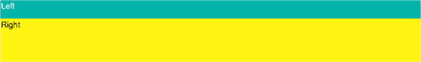

说到在宽屏上，你有足够的空间水平地渲染左右组件并排，但如果用户在较小的屏幕上打开相同的应用程序，你希望自动更改布局为垂直，以便右组件显示在左组件下方。

Flex 布局库中的每个指令都可以选择性地有一个 *后缀*（媒体查询规则的别名），用于指定它应该应用于哪个屏幕尺寸。例如，`flexLayout.sm` 指令的后缀是 `.sm`，这意味着它只应在屏幕宽度较小时应用。这些别名对应于在《Material Design 指南》中定义的宽度断点（见 [`mng.bz/RmLN`](http://mng.bz/RmLN)）：

+   **`xs`—** 超小（小于 599 像素）

+   **`sm`—** 小（560–959 像素）

+   **`md`—** 中等（960–1279 像素）

+   **`lg`—** 大（1280–1919 像素）

+   **`xl`—** 超大（1920–5000 像素）

下一个列表更改了您的应用程序，使其父容器在中等和大型屏幕上水平排列其子元素，而在小设备上垂直排列。

##### 列表 7.3\. 添加 `.sm` 后缀

```
<div class="parent"
        fxLayout="row"                                  *1*
         fxLayout.sm="column" >                         *2*
       <div fxFlex="30%" class="left">Left</div>
      <div fxFlex="70%" class="right">Right</div>
    </div>
```

+   ***1* 默认情况下，子元素按行对齐。**

+   ***2* 在小屏幕尺寸下，子元素垂直对齐。**

为了说明这将如何改变布局，您将使用 Chrome 开发者工具，它在其工具栏左侧有一个图标，允许您切换设备。对于桌面，小尺寸意味着窗口宽度在 600 到 959 像素之间。图 7.4 显示了宽度为 960（仍然是中等尺寸）时的 UI 渲染。

##### 图 7.4\. 在宽度为 960 像素的中等设备上的渲染

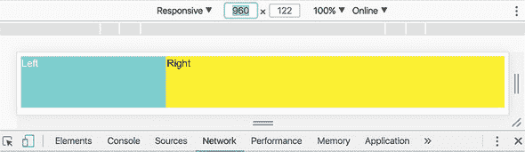

让我们越过断点，将宽度更改为 959 以模拟小设备。图 7.5 显示布局已从水平变为垂直。

##### 图 7.5\. 在宽度为 959 像素的小设备上的渲染

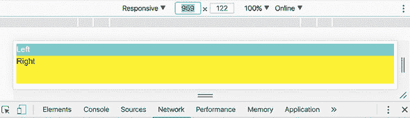

将宽度更改为小于 600 的任何值将导致切换回水平布局，因为您没有指定对于超小设备（`.xs` 后缀），布局应保持垂直。您可以添加超小（`xs`）设备的垂直布局：

```
<div fxLayout="row" class="parent"
     fxLayout.sm="column"
     fxLayout.xs="column">
```

您还可以将小于（`lt-`）和大于（`>-`）后缀应用于媒体查询别名。例如，如果您使用 `lt-md` 别名，相应的布局将应用于小屏幕和超小屏幕。在您的应用程序中，您可以指定在宽度小于中等的任何屏幕上，应应用列布局：

```
<div fxLayout="row" class="parent"
     fxLayout.lt-md="column">
```

使用断点，您可以在组件模板中静态定义您的 UI 应如何布局。如果您不仅想更改容器内的布局，还想根据屏幕尺寸有条件地显示或隐藏某些子元素，怎么办？为了根据屏幕尺寸动态决定浏览器应如何渲染，您将使用 Flex Layout 库提供的 `ObservableMedia` 服务。

#### 7.1.2\. ObservableMedia 服务

`ObservableMedia` 服务允许订阅屏幕大小变化并程序化地更改应用程序的外观和感觉。例如，在大型屏幕上，你可能会决定显示额外信息。为了避免在小屏幕上渲染不必要的组件，你可以订阅 `ObservableMedia` 发射的事件，如果屏幕大小变得更大，你可以渲染更多组件。

要实现此功能，导入 `ObservableMedia` 服务并订阅其 `Observable` 对象。以下列表显示了如何使用 `async` 管道订阅关于屏幕大小变化的通知，并在控制台打印当前大小。

##### 列表 7.4\. observable-media/app.component.ts

```
import {Component} from '@angular/core';
import {ObservableMedia} from '@angular/flex-layout';
import {Observable} from 'rxjs';
import {map} from 'rxjs/operators';

@Component({
  selector: 'app-root',
  template: `<h3>Watch the breakpoint activation messages in the console.
  </h3>
  <span *ngIf="showExtras$ | async">                             *1*
   Showing extra info on medium screens</span>
  `
})
export class AppComponent {
  showExtras$: Observable<boolean>;

  constructor(private media: ObservableMedia) {                  *2*
     this.showExtras$ = this.media.asObservable()                *3*
       .pipe(map(mediaChange => {
           console.log(mediaChange.mqAlias);
           return mediaChange.mqAlias === 'md'? true: false;     *4*
           })
      );
  }
}
```

+   ***1* 根据 showExtras$ 的值显示/隐藏文本；async 管道订阅 showExtras$***

+   ***2* 注入 ObservableMedia 服务***

+   ***3* 订阅屏幕大小变化时发射的 Observable***

+   ***4* showExtras$ 在屏幕为中等时发射 true。***

| |
| --- |

##### 注意

注意 `*ngIf` 结构指令的使用。如果 `showExtras$` 可观察对象发射 `true`，则将 span 添加到 DOM 中。如果它发射 `false`，则从 DOM 中移除 span。

| |
| --- |

`media.asObservable()` 发射的值具有 `MediaChange` 类型，该类型包含 `mqAlias` 属性，它包含表示当前宽度的值——`lg` 表示大或 `md` 表示中等。

要查看 列表 7.4 的实际效果，运行以下命令，并打开浏览器的控制台：

```
ng serve --app observable-media -o
```

当屏幕大小为 `md`（中等）时，你会看到文本“在中等屏幕上显示额外信息”。将浏览器窗口的宽度缩小到 `sm` 大小，此文本将被隐藏。要查看当前的 CSS 媒体查询和 `mediaChange` 类的其他属性，请将日志语句更改为 `console.log(mediaChange);`。

在 列表 7.4 中，你明确声明了一个 `showExtras$` 可观察对象并订阅它，因为你想要监控 `MediaChange`。但可以通过使用以下列表中所示的 `ObservableMedia.isActive()` API 来简化此代码。

##### 列表 7.5\. 使用 `ObservableMedia.isActive()` API

```
import {Component} from '@angular/core';
import {ObservableMedia} from '@angular/flex-layout';

@Component({
  selector: 'app-root',
  template: `<h3>Using the ObservableMedia.isActive() API</h3>
  <span *ngIf="this.media.isActive('md')">                        *1*
    Showing extra info on medium screens</span>
  `
})
export class AppComponent {
  constructor(public media: ObservableMedia) {}
}
```

+   ***1* 仅在当前视口宽度为 md 时显示文本***

在本章后面的实践部分，你将创建 ngAuction 的新版本，该版本将使用 Flex 布局库和 `ObservableMedia` 实现响应式设计。

| |
| --- |

**实现响应式设计的其他选项**

Flex 布局库可能对初学者有吸引力，因为它易于使用。但它在 Angular 应用中创建响应式布局的解决方案并非唯一。这里有一些其他选项：

+   Angular CDK（组件开发套件）包包括布局模块。安装了 `@angular/cdk` 包之后，你可以使用 `LayoutModule` 和 `BreakpointObserver` 或 `MediaMatcher` 类来监控视口大小的变化。此外，由于 Angular CDK 是 Flex 布局的同级依赖，通过直接使用 Angular CDK，你将使用一个库而不是两个。

+   在撰写本文时，Flex Layout 库仍处于测试版，其创建者经常在新版测试版中引入破坏性更改。如果您不使用 Angular 的最新版本，Flex Layout 可能不支持您使用的 Angular 版本。例如，Flex Layout 库不支持 Angular 4。

为了最小化应用程序中使用的库的数量，考虑使用 CSS Flexbox 和 CSS Grid 实现响应式设计。此外，使用浏览器原生支持的 CSS 总是比使用任何 JavaScript 库更高效。我们推荐 Wes Bos 提供的免费 CSS Grid 视频课程，可在 [`cssgrid.io`](https://cssgrid.io) 获取。

| |
| --- |

### 7.2\. 实践：重写 ngAuction

从本章开始，您将从零开始重写 ngAuction。新的 ngAuction 将从一开始就使用 Angular Material，并包括图像，而不仅仅是灰色矩形。搜索组件将由工具栏上的小图标表示，您将添加购物车功能。用户将能够对产品进行竞标，并在他们出价获胜时购买产品。

#### 7.2.1\. 为什么要从头开始重写 ngAuction 应用程序？

您可能会想，“我们已经在 第二章、第三章 和 第五章 中对 ngAuction 进行了工作。为什么不一如既往地继续构建相同的应用程序？” 在前几章中，目标是温和地介绍 Angular 框架的主要组件，而不让您被应用程序架构、实现响应式设计和定制主题的信息所压倒。

在前几章中开发的 ngAuction 应用程序很好地实现了该目标。这次重写将展示真实世界 Angular 应用程序的最佳开发实践。您希望实现以下目标：

+   创建一个模块化应用程序，其中每个视图都是一个懒加载的模块。

+   使用 Angular Material 进行 UI 设计，用 SaaS 说明了主题定制的示例。

+   使用 Flex Layout 库。

+   移除对 Bootstrap 和 JQuery 库的依赖。

+   从首页移除搜索框，以更好地利用屏幕空间。

+   将共享组件和服务保存在单独的文件夹中。

+   使用可注入服务说明状态管理，然后使用 NgRx 库重新实现。

+   创建单元测试和端到端测试的脚本。

您在本章中不会实现所有这些功能，但您将开始着手。

在这个应用程序中，您将使用 Flex Layout 库及其之前介绍的 `ObservableMedia` 服务来实现响应式设计。在大型屏幕上，ngAuction 的首页将每行显示四个产品，如图 7.6 所示 图 7.6。

##### 图 7.6\. 在大屏幕上渲染 ngAuction

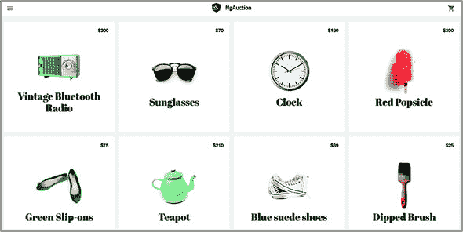

| |
| --- |

##### 注意

我们从 Google 应用中借用了数据和图像，展示了 Polymer 库（见 [`mng.bz/Y5d9`](http://mng.bz/Y5d9)）。

| |
| --- |

应用将使用 `async` 管道订阅 `ObservableMedia` 服务，并在窗口宽度变为中等大小时自动将布局更改为每行三个产品，如图 7.7 所示。

##### 图 7.7\. 在中等屏幕上渲染 ngAuction

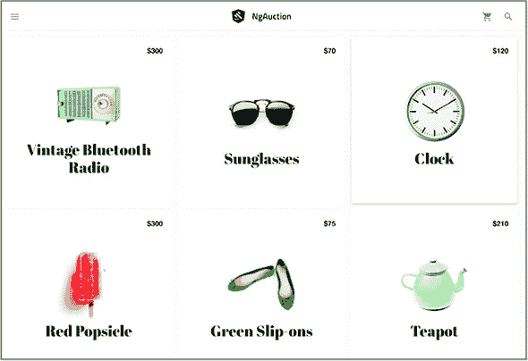

在小屏幕上，应用将切换到两列布局，如图 7.8 所示。

##### 图 7.8\. 在小屏幕上渲染 ngAuction

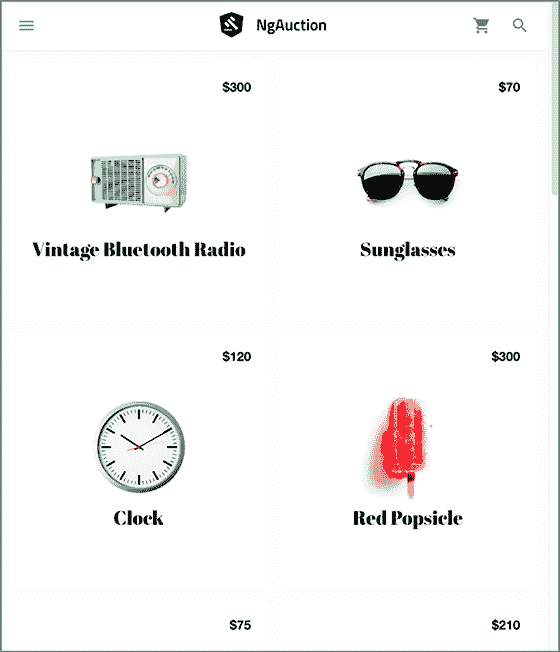

应用在渲染在超小屏幕（单列布局）和超大屏幕（五列布局）时也会更改其布局。

#### 7.2.2\. 生成新的 ngAuction 应用


##### 注意

本章的源代码可以在 [`github.com/Farata/angulartypescript`](https://github.com/Farata/angulartypescript) 和 [www.manning.com/books/angular-development-with-typescript-second-edition](http://www.manning.com/books/angular-development-with-typescript-second-edition) 找到。


这次，你将使用 Angular CLI 的 `new` 命令并带有选项来生成项目。新的 ngAuction 将使用 Sass 预处理器进行样式，并使用 SCSS 语法。你还想指定 `nga-` 前缀，因此每个新生成的组件在其选择器中都将具有此前缀：

```
ng new ng-auction --prefix nga --style scss
```


##### 注意

我们将在下一节“使用 Sass 创建自定义 Angular Material 主题”中讨论使用 SCSS 的优点。


切换到 ng-auction 目录并运行以下命令以将 Angular Material 和 Flex Layout 库添加到项目中：

```
npm install @angular/material @angular/cdk     *1*
npm i @angular/flex-layout                     *2*
```

+   ***1* 安装 Angular Material 库和组件开发工具包。Angular Material 库还需要动画包，该包在项目生成时已被 Angular CLI 安装。**

+   ***2* 安装 Flex Layout 库**

Angular Material 库附带四个预构建主题，你已经在第五章的 5.6.1 节（kindle_split_014.xhtml#ch05lev2sec5）中尝试了其中一个。但如果你需要的 UI 主题不符合预构建主题怎么办？

#### 7.2.3\. 使用 Sass 创建自定义 Angular Material 主题

如果你想要为你的应用创建一个自定义 Angular Material 主题，请阅读位于 [`material.angular.io/guide/theming`](https://material.angular.io/guide/theming) 的主题指南。在本节中，我们只为你提供我们为自定义 ngAuction 主题创建的 .scss 文件的代码审查。

当你生成 ngAuction 应用时，你使用了 `--style scss` 选项。这样做是为了通知 Angular CLI 你将不会使用 CSS 文件，而是将使用语法优美的样式表（Syntactically Awesome Style Sheets），也称为 Sass（见 [`sass-lang.com`](http://sass-lang.com)）。Sass 是 CSS 的扩展，具有自己的预处理器。Sass 的一些优点包括以下内容：

+   ***变量*—** 将样式分配给变量并在多个样式表中重用

+   ***嵌套*—** 用于嵌套 CSS 选择器的易于编写和阅读的语法

+   ***混入（Mixins）*—** 包含变量的样式块

Sass 提供了两种语法，Sass 和 SCSS，你将在本书中使用后者。如果你单独安装 SaaS，你需要运行你的 .scss 文件通过预处理器来编译它们成常规的 .css 文件，然后再部署。但是 Angular CLI 默认支持 Sass，因此预处理器在捆绑过程中完成其工作。


**SCSS 语法**

这里是 SCSS 语法的快速介绍：

+   ***变量（Variables）*—** 变量名以美元符号开头。以下代码片段声明并使用了变量 `$font-stack`：

    ```
    $font-stack: Helvetica, sans-serif;

    body {
      font: 100% $font-stack;
    }
    ```

    这个变量可以在多个地方使用，如果你决定将 Helvetica 字体更改为另一个字体，你只需在一个地方进行更改，而不是在每个使用它的 .css 文件中进行更改。

+   ***嵌套（Nesting）*—** 它是一种易于阅读的语法，用于编写嵌套 CSS 选择器。以下示例展示了如何将 `ul` 和 `a` 样式选择器嵌套在 `div` 选择器内部：

    ```
    div {
      ul {
        margin: 0;
      }
      a {
        display: block;
      }
    }
    ```

+   ***混入（Mixins）*—** 混入是一块 Sass 风格的代码块。混入可以通过 `@include` 添加到你的样式表中。混入也可以使用变量，并且可以作为带参数的函数调用，例如 `mat-palette($mat-red);`。

+   ***部分（Partials）*—** 部分是包含代码片段的文件，旨在由其他 Sass 文件导入。部分必须以下划线开头，例如 _theme.scss。当你导入一个部分时，下划线是不需要的，例如 `@import './theme';` 部分不会编译成单独的 CSS 文件——它们的内容只作为导入它们的 .scss 文件的一部分进行编译。

+   ***导入（Imports）*—** `@import` 语句允许你导入其他文件中的样式。虽然 CSS 也有一个 `@import` 关键字，但它会对每个文件进行额外的 HTTP 请求。使用 Sass，所有导入在预处理期间都会合并成一个单一的 CSS 文件，因此只需要一个 HTTP 请求来加载 CSS。


在你的 ngAuction 应用中，你将创建一个样式目录，将生成的 styles.scss 文件移到那里，并添加一个额外的部分，_theme.scss。_theme.scss 的内容如下所示。你使用在导入的文件 _theming.scss 中定义的 `$mat-cyan` 调色板。

##### 列表 7.6\. _theme.scss

```
@import '~@angular/material/theming';
$nga-primary: mat-palette($mat-cyan);                                   *1*
$nga-accent:  mat-palette($mat-cyan, A200, A100, A400);                 *2*
$nga-warn:    mat-palette($mat-red);                                    *3*

$nga-theme:   mat-light-theme($nga-primary, $nga-accent, $nga-warn);    *4*

$nga-background: map-get($nga-theme, background);                       *5*
$nga-foreground: map-get($nga-theme, foreground);                       *6*

$nga-typography: mat-typography-config();                               *7*
```

+   ***1* 声明一个用于主要调色板的变量，并用 $mat-cyan 调色板初始化**

+   ***2* 声明并初始化一个用于强调调色板的变量，指定 $mat-cyan 的默认、较浅和较深的色调**

+   ***3* 声明并初始化一个用于警告调色板的变量**

+   ***4* 创建主题（包含所有调色板的 Sass 对象）**

+   ***5* 声明并初始化背景调色板变量**

+   ***6* 声明并初始化前景调色板变量**

+   ***7* 声明并初始化用于排版的变量**

在 _theme.scss 文件中，你使用了青色为主要的和强调调色板。你可以在 node_modules/@angular/material/_theming.scss 中找到它们的定义。

在以下列表中，你将在 styles.scss 中添加样式，从导入前面的 _theme.scss 开始。

##### 列表 7.7\. styles.scss

```
@import './theme';
@import url('https://fonts.googleapis.com/icon?family=Material+Icons');    *1*
 @import url('https://fonts.googleapis.com/css?family=Titillium+Web:600'); *2*
 @import url('https://fonts.googleapis.com/css?family=Abril+Fatface');     *3*

// Be sure that you only ever include this mixin once!
@include mat-core();                                                       *4*

@include angular-material-theme($nga-theme);                               *5*

// Global styles.
html {
  -moz-osx-font-smoothing: grayscale;
  -webkit-font-smoothing: antialiased;
  -webkit-box-sizing: border-box;
  -moz-box-sizing: border-box;
  box-sizing: border-box;
  height: 100%;
}

body {
  color: #212121;
  background-color: #f3f3f3;
  font-family: mat-font-family($nga-typography);
  line-height: mat-line-height($nga-typography, body-1);
  font-size: mat-font-size($nga-typography, body-1);
  height: 100%;
  margin: 0;
}
```

+   ***1* 导入 Google Material 图标**

+   ***2* 导入 Titillium Web 字体（你将用于工具栏标题和稍后用于出价值）**

+   ***3* 导入 Abril Fatface 字体（你将用于产品标题）**

+   ***4* 导入 Angular Material 核心样式，这些样式不依赖于主题**

+   ***5* 加载在 _theme.scss 中配置的自定义主题**

styles.scss 和 _theme.scss 文件定义了整个应用的全球样式，你将在 .angular-cli.json 文件的 `styles` 属性中指定它们。在 ngAuction 中，你还将为单个组件添加样式，_theme.scss 将在每个组件中重复使用。我们故意将样式定义分成两个文件，这样你就可以在组件中重复使用 _theme.scss（仅变量定义），而不必在 styles.scss 中重复核心样式、图像和字体。

现在自定义主题已配置，你可以开始为 ngAuction 的着陆页的 UI 工作了。

#### 7.2.4\. 在顶级组件中添加工具栏

图 7.6 展示了 ngAuction 的着陆页，其中包含 Material 工具栏和 `HomeComponent`。更准确地说，它包括工具栏和一个 `<router-outlet>` 标签，你在其中渲染 `HomeComponent`。让我们从创建工具栏的第一个版本开始。这个工具栏将包括左边的菜单图标，中间的 ngAuction 标志，以及右边的购物车图标。它不包括搜索按钮（你将在第十一章的 11.8 节 中添加该按钮）并且看起来像 图 7.9。

##### 图 7.9\. 工具栏

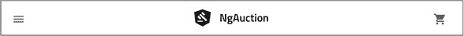

在左侧，你使用 Google Material 图标 `menu`，在右侧，`shopping_cart`。对于标志，你将 Google Material 的 `gavel` 图标放在类似 Angular 标志的形状上方，并将其保存为 logo.svg 文件，该文件包含在本书的源代码中。

如你在第五章的动手实践部分所学，要使用 Angular Material 组件，你应该在应用的根模块的 `imports` 部分中包含相应的模块。在你的工具栏中，你需要 `MatToolbarModule`、`MatButtonModule` 和 `MatIconModule`。由于你将使用 Flex Layout 库，你还需要将 `FlexLayoutModule` 添加到根模块。稍后在本节中，你将使用 `HttpClient` 读取产品数据，因此需要将 `HttpClientModule` 添加到根模块。

将 CLI 生成的 app.module.ts 更新为包含以下列表中的模块。

##### 列表 7.8\. app.module.ts

```
import {BrowserModule} from '@angular/platform-browser';
import {NgModule} from '@angular/core';
import {MatButtonModule} from '@angular/material/button';
import {MatIconModule} from '@angular/material/icon';
import {MatToolbarModule} from '@angular/material/toolbar';
import {FlexLayoutModule} from '@angular/flex-layout';
import {HttpClientModule} from '@angular/common/http';
import {AppComponent} from './app.component';

@NgModule({
  declarations: [
    AppComponent
  ],
  imports: [
    BrowserModule,
    MatButtonModule,       *1*
     MatIconModule,        *1*
     MatToolbarModule,     *1*
     FlexLayoutModule,     *2*
     HttpClientModule      *3*
   ],
  providers: [],
  bootstrap: [AppComponent]
})
export class AppModule {}
```

+   ***1* 添加 Angular Material 库中所需的模块**

+   ***2* 添加 Flex Layout 模块**

+   ***3* 添加 HttpClientModule—you’ll use HttpClient for getting the product data**

将生成的 app.component.html 替换为以下列表。

##### 列表 7.9\. app.component.html

```
<mat-toolbar class="toolbar">
  <button class="toolbar__icon-button" mat-icon-button>       *1*
     <mat-icon>menu</mat-icon>
  </button>

  <div class="toolbar__logo-title-group"
       fxLayout
       fxLayoutAlign="center center">                         *2*
     <a routerLink="/"                                        *3*
        fxLayout>
      
    </a>
    <a class="toolbar__title"                                 *4*
        routerLink="/">NgAuction</a>
  </div>

  <div fxFlex></div>                                          *5*

  <button mat-icon-button class="toolbar__icon-button         *6*
                    toolbar__shopping-cart-button">
    <mat-icon>shopping_cart</mat-icon>
  </button>

</mat-toolbar>

<!--<router-outlet></router-outlet>-->                        *7*
```

+   ***1* 带有图标的菜单按钮**

+   ***2* 在工具栏中心显示标志**

+   ***3* 将标志转换为可点击的链接，配置路由后显示 HomeComponent**

+   ***4* 将 ngAuction 文本转换为可点击的链接**

+   ***5* 填充物，将购物车图标推到右边**

+   ***6* 带有图标的购物车按钮**

+   ***7* 你将保持路由出口被注释，直到你配置路由。**

为了使工具栏看起来像图 7.9，你需要将以下列表的样式添加到 app.component.scss 文件中。

##### 列表 7.10\. app.component.scss

```
@import '../styles/theme';                                *1*
:host {                                                   *2*
   display: block;
  height: 100%;
}

.toolbar {                                                *3*
   background-color: mat-color($nga-background, card);
  position: relative;
  box-shadow: 0 1px mat-color($nga-foreground, divider);
}

.toolbar__logo-title-group {                              *4*
   position: absolute;
  right: 50%;
  left: 50%;
}

.toolbar__logo {                                          *5*
   height: 32px;
  margin-right: 16px;
}

.toolbar__title {                                         *6*
   color: mat-color($nga-foreground, text);
  font-family: 'Titillium Web', sans-serif;
  font-weight: 600;
  text-decoration: none;
}

.toolbar__icon-button {                                   *7*
   color: mat-color($nga-foreground, icon);
}

.toolbar__shopping-cart-button {                          *8*
   margin-right: 8px;
}
```

+   ***1* 导入你的自定义主题**

+   ***2* 使用 Angular 伪选择器:host 来样式化托管 AppComponent 的组件**

+   ***3* 应用与该主题中 Material 卡片组件相同的背景（在你的主题中是白色）**

+   ***4* 样式化标志名称**

+   ***5* 样式化标志图像**

+   ***6* 样式化工具栏标题**

+   ***7* 样式化图标前景**

+   ***8* 样式化购物车按钮**

运行`ng serve`命令将渲染看起来像图 7.9 的 ngAuction 应用。

你已经渲染了一个工具栏 UI，现在你需要显示工具栏下的产品。首先，你需要创建一个`ProductService`来提供产品数据，然后你将创建一个`HomeComponent`来渲染这些数据。让我们从`ProductService`开始。

#### 7.2.5\. 创建产品服务

产品服务需要数据。在现实世界的应用中，数据将由服务器提供，你将在第十二章中这样做。现在，你将只使用包含产品信息的 JSON 文件。产品图片也将位于客户端。本书附带的一些代码示例包括 src/data/products.json 文件，其一个片段如下所示。

##### 列表 7.11\. src/data/products.json 的一个片段

```
[
  {
    "id": 1,
    "description" : "Isn't it cool when things look old, but they're not...",
    "imageUrl" : "data/img/radio.png",
    "price" : 300,
    "title" : "Vintage Bluetooth Radio"
  },
  {
    "id": 2,
    "description" : "Be an optimist. Carry Sunglasses with you at all times..
     .",
    "featured" : true,
    "imageUrl" : "data/img/sunnies.png",
    "price" : 70,
    "title" : "Sunglasses"
  }
  ...
  ]
```

此文件包含位于 data/img 文件夹中的产品图片的 URL。如果你正在跟随并尝试自己构建 ngAuction，请将 src/data 目录从本书附带代码复制到你的项目中，并将行`"data"`添加到.app 属性`.angular-cli.json`文件中的`assets`。

你将在多个组件中使用`ProductService`类；你将在 src/app/shared/services 文件夹中生成它。你将在稍后在这个文件夹中添加其他可重用服务（例如`SearchService`）。你将使用以下 Angular CLI 命令生成`ProductService`：

```
ng generate service shared/services/product
```

然后你将添加此服务的提供者到 app.module：

```
...
import {ProductService} from './shared/services/product.service';

@NgModule({
  ...
  providers: [ProductService]
})
export class AppModule {}
```


**最佳实践**

`ProductService`的导入语句相当长，并且指向实现此服务文件的路径。随着你的应用程序的增长，模块中的服务数量以及导入语句的数量也会增加，这会污染模块代码。

在 services 文件夹中创建名为 index.ts 的文件，如下所示：

```
import {Product, ProductService} from './product.service';

export {Product, ProductService} from './product.service';
```

您导入 `Product` 和 `ProductService` 类，并立即重新导出它们。现在，app.module 中的导入语句可以简化为如下所示：

```
import {Product, ProductService} from './shared/services';
```

如果您只有一个重新导出的类，这可能看起来有些过度。但如果您在服务文件夹中有多个类，您可以只写一个导入语句来导入所有类、函数或变量——例如：

```
import { ProductService, Product, SearchService } from './shared/services';
```

请记住，这仅在具有此类重新导出的文件名为 index.ts 时才有效。


product.service.ts 文件包含 `Product` 接口和 `ProductService` 类。`Product` 接口定义了 `ProductService` 类的方法返回的对象类型：`getAll()` 和 `getById()`。您的 `ProductService` 代码如下所示。

##### 列表 7.12\. product.service.ts

```
import {Injectable} from '@angular/core';
import {HttpClient} from '@angular/common/http';
import {Observable} from 'rxjs';
import {map} from 'rxjs/operators';

export interface Product {                                            *1*
   id: number;
  title: string;
  price: number;
  imageUrl: string;
  description: string;
}

@Injectable()
export class ProductService {
  constructor(private http: HttpClient) {}                             *2*

  getAll(): Observable<Product[]> {                                    *3*
     return this.http.get<Product[]>('/data/products.json');
  }

  getById(productId: number): Observable<Product> {                    *4*
     return this.http.get<Product[]>('/data/products.json')
  .pipe(
    map(products => <Product>products.find(p => p.id === productId));  *5*
   )
  }
}
```

+   ***1* 定义产品类型**

+   ***2* 注入 HttpClient 对象**

+   ***3* 此函数声明了一个可以返回所有产品对象的 Observable。**

+   ***4* 此函数声明了一个可以按 ID 返回产品的 Observable。**

+   ***5* map() 查找与函数参数匹配的产品 ID。**

因为您没有真实的数据服务器，这两个方法都读取整个 products.json 文件，并且 `getById()` 方法还将 `find()` 应用于产品数组以找到匹配的 ID。


**最佳实践**

您将 `Product` 类型定义为接口而不是类。因为 JavaScript 不支持接口，编译后的代码将不包括 `Product`。如果您将 `Product` 定义为类，TypeScript 编译器会将 `Product` 类转换为 JavaScript 函数或类，并将其包含在可执行代码中。将类型定义为 TypeScript 接口而不是类可以减小可执行代码的大小。


在下一节中，您将创建包含 `HomeComponent` 的功能模块——`ProductService` 的第一个消费者。

#### 7.2.6\. 创建主页模块

您希望将每个视图创建为功能模块。这将允许您按需加载它们，并且每个视图的代码将作为单独的包构建。按照以下方式生成功能主页模块：

```
ng generate module home
```

此命令将在 src/app/home 目录下创建一个包含 home.module.ts 文件的目录，其内容如下所示。

##### 列表 7.13\. home.module.ts

```
import {NgModule} from '@angular/core';
import {CommonModule} from '@angular/common';

@NgModule({
  imports: [
    CommonModule
  ],
  declarations: []
})
export class HomeModule {}
```

您可以使用以下命令生成主页组件：

```
ng generate component home
```

运行此命令后，Angular CLI 将打印出已生成四个文件（主页组件）和一个文件被更新（主页模块）——`HomeComponent` 被添加到模块的 `@NgModule` 装饰器的 `declarations` 部分中：

```
create src/app/home/home.component.scss (0 bytes)
create src/app/home/home.component.html (23 bytes)
create src/app/home/home.component.spec.ts (614 bytes)
create src/app/home/home.component.ts (262 bytes)
update src/app/home/home.module.ts (251 bytes)
```

在此模块中，您将使用 Flex 布局库，因此您想要配置默认路由以便它渲染 `HomeComponent`。此外，您将使用 Angular Material 库中的 `<mat-grid-list>` 组件来显示产品。将所需的代码添加到 home.module.ts 中，使其看起来如下所示。

##### 列表 7.14\. modified home.module.ts

```
import {NgModule} from '@angular/core';
import {CommonModule} from '@angular/common';
import {RouterModule} from '@angular/router';
import {FlexLayoutModule} from '@angular/flex-layout';
import {MatGridListModule} from '@angular/material/grid-list';
import {HomeComponent} from './home.component';

@NgModule({
  imports: [
    CommonModule,
    RouterModule.forChild([                    *1*
       {path: '', component: HomeComponent}
    ]),
    FlexLayoutModule,                          *2*
     MatGridListModule                         *3*
   ],
  declarations: [HomeComponent]
})
export class HomeModule {}
```

+   ***1* 为您的功能模块添加路由配置**

+   ***2* 添加 Flex Layout 库**

+   ***3* 添加 <mat-grid-list> 所需的 Angular Material 模块**

下一步是更新生成的 home.component.ts 文件中的 `HomeComponent`。您将向此组件注入两个服务：`ProductService` 和 `ObservableMedia`。您将调用 `ProductService` 上的 `getAll()` 方法以获取产品数据。`ObservableMedia` 将监视视口宽度以相应地更改 UI 布局。更具体地说，产品数据将以网格形式显示，而 `ObservableMedia` 服务将根据当前视口宽度将网格中的列数从一列变为五列。`HomeComponent` 的代码如下所示。

##### 列表 7.15\. home.component.ts

```
import {Observable} from 'rxjs';
import {map} from 'rxjs/operators';

import {Component} from '@angular/core';
import {ObservableMedia} from '@angular/flex-layout';
import {Product, ProductService} from '../shared/services';

@Component({
  selector: 'nga-home',
  styleUrls: [ './home.component.scss' ],
  templateUrl: './home.component.html'
})
export class HomeComponent {
  readonly columns$: Observable<number>;                                   *1*
   readonly products$: Observable<Product[]>;                              *2*

  readonly breakpointsToColumnsNumber = new Map([                          *3*
    [ 'xs', 1 ],
    [ 'sm', 2 ],
    [ 'md', 3 ],
    [ 'lg', 4 ],
    [ 'xl', 5 ],
  ]);

  constructor(private media: ObservableMedia,
              private productService: ProductService) {                    *4*
     this.products$ = this.productService.getAll();                        *5*

    this.columns$ = this.media.asObservable()                              *6*
       .pipe(
        map(mc => <number>this.breakpointsToColumnsNumber.get(mc.mqAlias)) *7*
       );
  }
}
```

+   ***1* 提供网格列数的 observable**

+   ***2* 产品的可观察量**

+   ***3* 将媒体查询别名映射到网格中的列数**

+   ***4* 注入 ObservableMedia 和 ProductService**

+   ***5* 获取所有产品的数据**

+   ***6* 将 ObservableMedia 对象转换为 Observable**

+   ***7* 根据发出的媒体查询别名获取网格列数；<number> 表示从对象转换为数字**

`ProductService` 上的 `getAll()` 方法初始化了类型为 `Observable` 的 `product$` 变量。您在这里看不到 `subscribe()` 方法的调用，因为您将在 home 组件的模板中使用 `async` 管道。

`ObservableMedia` 的作用是向组件发送媒体查询别名，指示用户设备视口的当前宽度。如果视口是浏览器中的窗口并且用户调整大小，则此宽度可能会变化。如果用户在智能手机上运行此应用程序，视口的宽度不会改变，但 `HomeComponent` 仍然需要知道它以渲染产品网格。

现在您需要将生成的 home.component.html 模板替换为显示产品网格的行和列的标记。对于网格，您将使用来自 Angular Material 库的 `<mat-grid-list>` 组件。每个网格单元格的内容将在 `<mat-grid-tile>` 组件中渲染。

在此模板中，您将使用两次 `async` 管道。第一个 `async` 管道将订阅发出网格中列数的 observable，第二个管道将订阅发出产品数据的 observable。home.component.html 文件的代码如下所示。

##### 列表 7.16\. home.component.html

```
<div class="grid-list-container">
  <mat-grid-list [cols]="columns$ | async"                                 *1*
                  gutterSize="16">
    <mat-grid-tile class="tile" *ngFor="let product of products$ | async"> *2*
       <a class="tile__content"                                            *3*
          fxLayout="column"
         fxLayoutAlign="center center"
         [routerLink]="['/products', product.id]">                         *4*

        <span class="tile__price-tag"
              ngClass.xs="tile__price-tag--xs">                            *5*
           {{ product.price | currency:'USD':'symbol':'.0' }}
        </span>

        <div class="tile__thumbnail"
             [ngStyle]="{'background-image': 'url(' + product.imageUrl + ')'}"></div>

        <div class="tile__title"
             ngClass.xs="tile__title--xs"
             ngClass.sm="tile__title--sm">{{ product.title }}</div>
      </a>
    </mat-grid-tile>
  </mat-grid-list>
</div>
```

+   ***1* 订阅列数并将其绑定到 <mat-grid-list> 的 cols 属性**

+   ***2* 使用 products$ observable 中的数据为每个产品渲染一个 <mat-grid-tile>**

+   ***3* 将每个瓷砖的内容包裹在 <a> 标签中，将瓷砖转换为可点击的链接**

+   ***4* 点击瓷砖将导航到路径 /products，并传递所选产品的 id 作为参数。**

+   ***5* 对于额外小视口，添加 tile__price-tag--xs 中定义的样式**


##### 注意

在这个版本的 ngAuction 中没有实现导航到商品详情屏幕。点击商品瓷砖将在浏览器控制台产生错误。


我们想对 列表 7.16 中的最后一个注释进行更多解释。这个 `<span>` 元素被设置为 `tile__price-tag` 中定义的样式，但如果视口的尺寸变为额外小（`xs`），Flex Layout 的 `ngClass.xs` 指令将添加 `tile__price-tag--xs` 中定义的样式。如果你比较 `tile__price-tag` 和 `tile__price-tag--xs` 样式的定义，你会在 列表 7.17 中看到，合并这两个样式意味着将字体大小从 16 px 更改为 14 px。


##### 小贴士

我们在命名一些样式时使用 `__` 和 `--` 符号，这是按照块、元素、修饰符（BEM）方法（见 [`getbem.com`](http://getbem.com)）推荐的。


要完成 `HomeComponent`，你需要在 home.component .scss 中添加一些样式。

##### 列表 7.17\. home.component.scss

```
@import '../../styles/theme';                               *1*
:host {
  display: block;
}

.grid-list-container {
  margin: 16px;
}

.tile {
  background-color: mat-color($nga-background, card);       *2*

  &:hover {
    @include mat-elevation(4);                              *3*
     transition: .3s;
  }
}

.tile__content {
  display: block;
  height: 100%;
  width: 100%;
  padding: 16px;
  position: relative;
  text-align: center;
  text-decoration: none;
}

.tile__price-tag {                                          *4*
   color: mat-color($nga-foreground, text);
  font-size: 16px;
  font-weight: 700;
  position: absolute;
  right: 20px;
  top: 20px;
}

.tile__price-tag--xs {                                      *5*
   font-size: 14px;
}

.tile__thumbnail {
  background: no-repeat 50% 50%;
  background-size: contain;
  height: 50%;
  width: 50%;
}

.tile__title {                                              *6*
   color: mat-color($nga-foreground, text);
  font-family: 'Abril Fatface', cursive;
  font-size: mat-font-size($nga-typography, display-1);     *7*
   line-height: mat-line-height($nga-typography, display-1);
}

.tile__title--sm {                                          *8*
   font-size: mat-font-size($nga-typography, headline);
  line-height: mat-line-height($nga-typography, headline);
}

.tile__title--xs {                                          *9*
   font-size: mat-font-size($nga-typography, title);
  line-height: mat-line-height($nga-typography, title);
}
```

+   ***1* 导入你的自定义主题**

+   ***2* 使瓷砖的背景颜色与 Angular Material 卡片（白色）相同**

+   ***3* 如果用户将鼠标悬停在瓷砖上，通过添加阴影效果（由 mat-elevation mixin 返回）将瓷砖提升到 4 级**

+   ***4* 商品价格标签的默认样式**

+   ***5* 商品价格标签的额外小视口样式**

+   ***6* 商品标题的默认样式**

+   ***7* 根据 Material Design 规范，使用 Display 1 字体样式而不是指定硬编码的大小**

+   ***8* 针对小型视口的商品标题样式**

+   ***9* 针对额外小视口的商品标题样式**

`HomeComponent` 已准备好。你需要在工具栏下渲染它，需要做什么？

#### 7.2.7\. 配置路由

在这个动手实践的最初，我们提到 ngAuction 的每个视图都将是一个独立的模块，并且你已经创建了 `HomeComponent` 作为模块。现在你需要为这个模块配置路由。创建一个 src/app/app.routing.ts 文件，内容如下：

```
import {Route} from '@angular/router';
export const routes: Route[] = [
  {
    path: '',
    loadChildren: './home/home.module#HomeModule'
  }
];
```

正如你所见，你使用了第四章中 4.3 节解释的懒加载模块的语法。你需要在 app.module.ts 中通过调用 `Router.forRoot()` 来加载这个配置：

```
...
import {RouterModule} from '@angular/router';
import {routes} from './app.routing';

@NgModule({
  ...
  imports: [
    ...
    RouterModule.forRoot(routes)
  ]
  ...
})
export class AppModule { }
```

最后一步是取消注释 app.component.html 中最后一行带有 `<router-outlet>` 标签的行，这样应用程序组件模板的布局如下：

```
<mat-toolbar>...</mat-toolbar>

<router-outlet></router-outlet>
```

落地页的编码部分已完成。

#### 7.2.8\. 运行 ngAuction

新的 ngAuction 的第一个版本已准备好，所以让我们构建开发包并看看它在浏览器中的样子。运行 `ng serve` 产生如图 7.10 所示的输出。

##### 图 7.10\. 使用 `ng serve` 打包 ngAuction

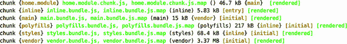

注意第一行：Angular CLI 将主模块放置在单独的包中。它之所以这样做，是因为在配置路由时，你使用了懒加载模块的语法，但当你打开浏览器到 http://localhost:4200 时，你会看到主模块已经被加载，如图 7.11 所示。

##### 图 7.11\. 运行 ngAuction

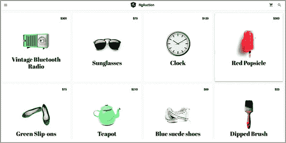

主模块被急切地加载，因为它被配置为默认路由（映射到空路径）。ngAuction 的着陆页已经准备好了，除了工具栏上没有搜索按钮。你将在第十一章的 11.8 节 中添加它。

| |
| --- |

##### 小贴士

如果你点击任何产品瓷砖，浏览器控制台会显示错误，例如“无法匹配任何路由。URL 段：'products/2'。”这个错误将在你开发产品详情页后，第九章的 ngAuction 版本中消失。

| |
| --- |

### 摘要

+   你可以保持单个代码库的 web 应用，该应用将根据用户设备的可用宽度采用其 UI。

+   Flex 布局库允许你订阅关于视口宽度变化的通知，并应用相应的 UI 布局。

+   Flex 布局库包括 `ObservableMedia` 类，它可以通知你关于视口当前宽度的信息，让你免于为此编写 CSS。
