## 第八章. 实现组件通信

*本章涵盖*

+   创建松耦合组件

+   父组件如何将数据传递给子组件，反之亦然

+   实现组件通信的中介者设计模式

一个 Angular 应用是由组件表示的视图树。在设计组件时，你需要确保它们是自包含的，同时有一些方式可以相互通信。在本章中，我们将重点关注组件如何以松耦合的方式相互传递数据。

首先，我们将向你展示一个父组件如何通过绑定到它们的输入属性将数据传递给其子组件。然后，你将看到子组件如何通过其输出属性通过发射事件将数据发送给父组件。

我们将继续使用一个示例，该示例应用中介者设计模式来安排没有父子关系的组件之间的数据交换。中介者可能是任何基于组件的框架中最重要的设计模式。

### 8.1. 组件间通信

图 8.1 展示了一个由编号和不同形状的组件组成的视图，这有助于更容易地参考。其中一些组件包含其他组件（我们称外部的为*容器*），而其他的是同级的。为了避免与任何特定的 UI 框架相关联，我们避免了使用像输入字段、下拉菜单和按钮这样的 HTML 元素，但你可以将这些扩展到你的实际应用视图。

##### 图 8.1. 一个视图由组件组成。


当你设计一个由多个组件组成的视图时，它们彼此知道的越少，越好。比如说，一个用户在组件 4 中点击按钮，这个按钮需要在组件 5 中启动一些操作。是否有可能在不让组件 4 知道组件 5 存在的情况下实现这个场景？是的，可以。

你已经通过使用依赖注入看到了松耦合组件的例子。现在我们将通过使用绑定和事件展示另一种实现相同目标的技术。

### 8.2. 输入和输出属性

将 Angular 组件想象成一个带有出口的黑盒。其中一些被标记为`@Input()`，而其他被标记为`@Output()`。你可以创建一个具有任意数量输入和输出的组件。

如果一个 Angular 组件需要从外部世界接收值，你可以将这些值的提供者绑定到组件的相应输入上。它们是从哪里接收的？组件不需要知道。组件只需要知道当这些值提供时该如何处理它们。

如果一个组件需要将值传递到外部世界，它可以通过其输出属性*发射事件*。它们被发射到谁那里？组件不需要知道。任何感兴趣的人都可以订阅组件发射的事件。

让我们实现这些松耦合原则。首先，你将创建一个`OrderProcessorComponent`，它可以接收来自父组件的订单请求。

#### 8.2.1\. 输入属性

使用`@Input()`装饰器注解的组件输入属性用于从父组件获取数据。想象一下，你想创建一个用于下单购买股票的 UI 组件。它将知道如何连接到证券交易所，但在本讨论输入属性的上下文中这不相关。你想要确保`OrderProcessorComponent`通过其带有`@Input()`装饰器的属性从其他组件接收数据。你的`OrderProcessorComponent`将如下所示。

##### 列表 8.1\. order.component.ts

```
@Component({
    selector: 'order-processor',
    template: `
    <span *ngIf="!!stockSymbol">                        *1*
        Buying {{quantity}} shares of {{stockSymbol}}
    </span>
  `,
    styles:[`:host {background: cyan;}`]
})
export class OrderProcessorComponent {
    @Input() stockSymbol: string;                       *2*
     @Input() quantity: number;                         *3*
 }
```

+   ***1* 只有当 stockSymbol 为真值时才显示文本**

+   ***2* 声明输入属性以接收股票代码**

+   ***3* 声明输入属性以接收数量**

`OrderProcessorComponent`不知道谁将为这些属性提供值，这使得该组件完全可重用。

接下来，我们将查看`AppComponent`，它是你的应用程序中`OrderComponent`的父组件。`AppComponent`允许用户在输入字段中输入股票代码，输入的值通过属性绑定传递给`OrderProcessorComponent`。以下列表显示了`AppComponent`的代码。

##### 列表 8.2\. input/app.component.ts

```
@Component({
  selector: 'app-root',
  template: `
    <input type="text" placeholder="Enter stock (e.g. AAPL)"
            (change)="onChangeEvent($event)">                 *1*

    <order-processor [stockSymbol]="stock"                    *2*
                      [quantity]="numberOfShares">            *3*
     </order-processor>
  `
})

export class AppComponent {
  stock: string;
  readonly numberOfShares = 100;                              *4*

  onChangeEvent({target}): void {                             *5*
     this.stock = target.value;                               *6*
   }
}
```

+   ***1* 当用户将焦点从输入字段移除（改变事件）时，调用事件处理器并传递事件对象给它**

+   ***2* 将子组件的输入属性 stockSymbol 绑定到属性 stock 的值**

+   ***3* 将子组件的属性 quantity 的值绑定到属性 numberOfShares 的值**

+   ***4* 你不能在类属性中使用关键字 const；使用 readonly。**

+   ***5* 从作为参数给出的事件对象中提取属性目标值**

+   ***6* 将输入字段中输入的值分配给属性 stock**

`<order-processor>`组件的两个属性都用方括号包围，表示属性绑定。如果你在`OrderProcessorComponent`内部更改`stockSymbol`或`quantity`的值，这不会影响父组件的属性值。属性绑定是单向的：从父组件到子组件。

要查看此应用程序的实际效果，请在第八章的`inter-component`文件夹中运行`npm install`，然后运行以下命令：

```
ng serve --app input -o
```


**最佳实践**

尽管我们赞扬 TypeScript 允许指定变量类型，但我们没有声明`numberOfShares`属性的类型。因为我们用数值初始化了它，TypeScript 编译器将在初始化时使用*类型推断*来猜测`NumberOfShares`的类型。在公共 API 中明确声明类型，例如，公共类属性、函数参数和返回类型等。


图 8.2 展示了用户在输入字段中输入 `IBM` 后的浏览器窗口。`OrderProcessorComponent` 接收了输入值 `100` 和 `IBM`。

##### 图 8.2. `OrderProcessorComponent` 接收值。

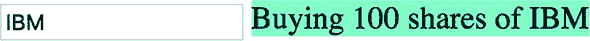

如何让组件拦截输入属性 `stockSymbol` 值变化时的时刻以执行一些额外的处理？一个简单的方法是将 `stockSymbol` 转换为一个设置器。如果你想在组件的模板中使用 `stockSymbol`，也要创建一个获取器，如下面的列表所示。

##### 列表 8.3. 添加设置器和获取器

```
...
private _stockSymbol: string;                    *1*

@Input() set stockSymbol(value: string)          *2*

  if (value !== undefined) {
    this._stockSymbol = value;
    console.log(`Buying ${this.quantity} shares of ${value}`);
  }
}

get stockSymbol(): string {                      *3*
   return this._stockSymbol;
}
```

+   ***1* 此私有变量无法从模板中访问。**

+   ***2* 定义一个输入属性为设置器**

+   ***3* 定义一个获取器以便从模板中访问 stockSymbol**

当此应用程序启动时，变更检测机制将初始化视为绑定变量 `stockSymbol` 的变更。设置器被调用，为了避免为未定义的 `stockSymbol` 发送订单，你在设置器中检查其值。

| |
| --- |

##### 注意

在 第 9.2.1 节 中，我们将展示如何在 第九章 中拦截输入属性的变更而不使用设置器。

| |
| --- |

#### 8.2.2. 输出属性和自定义事件

Angular 组件可以使用 `EventEmitter` 对象派发自定义事件。这些事件将由组件的父组件消费。`EventEmitter` 是 `Subject` 的一个子类（在附录 D 中解释），它可以作为观察者和观察对象，但通常你只使用 `EventEmitter` 来派发自定义事件，这些事件在父组件的模板中处理。

| |
| --- |

**最佳实践**

如果你需要一个既是观察者又是观察对象的对象，请使用 RxJS 的 `BehaviorSubject`。你将在 第 8.3.2 节 中看到如何做到这一点。在未来的版本中，`EventEmitter` 的内部实现可能会改变，因此最好只用于派发自定义事件。

| |
| --- |

假设你需要编写一个连接到证券交易所并显示股票价格的 UI 组件。除了显示价格外，该组件还应发送包含最新价格的事件，以便其父组件可以处理它并应用业务逻辑到变化的价格。让我们创建一个 `PriceQuoterComponent` 来实现这样的功能。在这个组件中，你不会连接到任何金融服务器，而是使用随机数生成器来模拟价格的变化。

在 `PriceQuoterComponent` 中显示变化的价格相当直接——你将 `stockSymbol` 和 `lastPrice` 属性绑定到组件的模板中。

您将通过组件的`@Output`属性发出自定义事件来通知父组件最新的价格。不仅您会在价格变化时立即触发事件，而且此事件还将携带一个负载：一个包含股票符号及其最新价格的对象。负载的类型将被定义为`PriceQuote`接口，如下所示。

##### 列表 8.4\. iprice.quote.ts

```
export interface PriceQuote {
  stockSymbol: string;
  lastPrice: number;
}
```

`PriceQuoterComponent`将生成随机报价，并且每两秒发出一次。

##### 列表 8.5\. price.quoter.component.ts

```
@Component({
  selector: 'price-quoter',
  template: `<strong>Inside PriceQuoterComponent:
                  {{priceQuote?.stockSymbol}}                             *1*
                   {{priceQuote?.lastPrice | currency: 'USD'}}</strong>`,
  styles: [`:host {background: pink;}`]
})
export class PriceQuoterComponent {
  @Output() lastPrice = new EventEmitter<PriceQuote>();                   *2*

  priceQuote : PriceQuote;

  constructor() {
    Observable.interval(2000)                                             *3*
       .subscribe(data =>{
        this.priceQuote = {
          stockSymbol: "IBM",
          lastPrice: 100 * Math.random()
        };

        this.lastPrice.emit(this.priceQuote);}                            *4*
       )
  }
}
```

+   ***1* 问号代表安全导航操作符。**

+   ***2* 输出属性 lastPrice 由 EventEmitter 对象表示，该对象向父组件发出 lastPrice 事件。**

+   ***3* 通过每两秒调用生成随机数的函数来模拟价格变化，并填充 priceQuote 对象**

+   ***4* 通过输出属性发出新价格；lastPrice 事件携带 PriceQuote 对象作为负载**

`priceQuote?`中的安全导航操作符确保如果`priceQuote`对象尚未可用，模板中的代码不会尝试访问未初始化的`priceQuote`对象的属性。


##### 提示

我们使用了`Observable.interval()`而不是`setInterval()`，因为后者是仅适用于浏览器的 API。从 Angular 6 开始，请使用`interval()`而不是`Observable.interval()`。


下一个列表展示了父组件将如何接收和处理来自`<price-quoter>`组件的`lastPrice`。

##### 列表 8.6\. app.component.ts

```
@Component({
  selector: 'app-root',
  template: `
    AppComponent received: {{priceQuote?.stockSymbol}}
                           {{priceQuote?.lastPrice | currency:'USD'}}
   <price-quoter (lastPrice)="priceQuoteHandler($event)">             *1*
</price-quoter>
     `
})
export class AppComponent {
  priceQuote : IPriceQuote;

  priceQuoteHandler(event: IPriceQuote) {                             *2*
     this.priceQuote = event;
  }
}
```

+   ***1* AppComponent 接收 lastPrice 事件并调用 priceQuoteHandler，将接收到的对象作为参数传递。**

+   ***2* 接收 IPriceQuote 对象并使用其属性填充 AppComponent 的相关属性**

运行此示例，您将看到价格在每两秒更新一次，在`PriceQuoterComponent`（粉色背景）以及`AppComponent`（白色背景）中，如图图 8.3 所示。

##### 图 8.3\. 运行输出属性示例


要查看此应用的运行情况，请运行以下命令：

```
ng serve --app output -o
```


**事件冒泡**

Angular 不提供支持事件冒泡的 API。如果您尝试在`<price-quoter>`元素上而不是其父元素上监听`lastPrice`事件，事件将不会在那里冒泡。在以下代码片段中，`lastPrice`事件不会到达`<div>`，因为它是`<price-quoter>`的父元素：

```
<div (lastPrice)="priceQuoteHandler($event)">
  <price-quoter></price-quoter>
</div>
```

如果事件冒泡对您的应用很重要，不要使用`EventEmitter`；请使用原生的 DOM 事件。以下代码片段展示了`PriceQuoterComponent`如何使用支持冒泡的`CustomEvent`（来自 Web API）：

```
@Component(...)
class PriceQuoterComponent {
  stockSymbol = "IBM";
  price;

  constructor(element: ElementRef) {
    setInterval(() => {
       let priceQuote: IPriceQuote = {
        stockSymbol: this.stockSymbol,
        lastPrice: 100 * Math.random()
      };

      this.price = priceQuote.lastPrice;

      element.nativeElement
          .dispatchEvent(new CustomEvent('lastPrice', {
            detail: priceQuote,
            bubbles: true
          }));
    }, 1000);
  }
}
```

Angular 注入一个`ElementRef`对象，该对象有一个指向代表`<price-quoter>`的 DOM 元素的引用，然后通过调用`element.nativeElement.dispatchEvent()`来触发一个`CustomEvent`。在这里，事件冒泡将起作用，但使用`ElementRef`仅在基于浏览器的应用程序中有效，与非 HTML 渲染器不兼容。

下面的`AppComponent`处理`<div>`中的`lastPrice`事件，它是`<price-quoter>`组件的父组件。请注意，`priceQuoteHandler()`参数的类型是`CustomEvent`，您可以通过`detail`属性访问其有效载荷：

```
@Component({
  selector: 'app',
  template: `
    <div (lastPrice)="priceQuoteHandler($event)">
      <price-quoter></price-quoter>
    </div>
    <br>
    AppComponent received: {{stockSymbol}}
                           {{price | currency: 'USD'}}
  `
})
class AppComponent {

  stockSymbol: string;
  price: number;

  priceQuoteHandler(event: CustomEvent) {
    this.stockSymbol = event.detail.stockSymbol;
    this.price = event.detail.lastPrice;
  }}
```


我们已经确定每个 UI 组件应该是自包含的，并且不应该依赖于其他 UI 组件的存在，使用`@Input()`和`@Output()`装饰器可以创建可重用组件。但是，如果两个组件彼此不了解，如何安排它们之间的通信呢？

### 8.3. 实现中介者设计模式

使用中介者设计模式可以实现松散耦合组件之间的通信，根据维基百科的定义，该模式“定义了一组对象如何交互”([`en.wikipedia.org/wiki/Mediator_pattern`](https://en.wikipedia.org/wiki/Mediator_pattern))。我们将通过类比连接玩具积木来解释这究竟意味着什么。

想象一个孩子正在玩搭建积木（想象成组件）的游戏，这些积木“不知道”彼此的存在。今天这个孩子（中介者）可以用一些积木搭建一座房子，明天他们将从相同的积木中构建一艘船。


##### 注意

中介者的作用是确保组件根据当前任务正确地组合在一起，同时保持松散耦合。


回到 Web UI 领域，我们将考虑两种情况：

+   当组件有共同父组件时的通信安排

+   当组件没有共同父组件时的通信安排

#### 8.3.1. 使用共同父组件作为中介者

让我们回顾本章的第一幅图，再次展示在图 8.4。除了组件 1 之外，每个组件都有一个父组件（容器），它可以充当中介者的角色。顶级中介者是容器 1，它负责确保其直接子组件 2、3 和 6 在需要时能够进行通信。另一方面，组件 2 是组件 4 和 5 的中介者。组件 3 是组件 7 和 8 的中介者。

##### 图 8.4. 视图由组件组成。

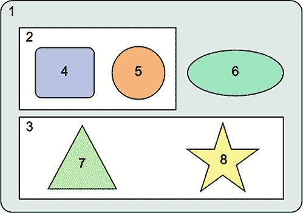

中介者需要从组件接收数据并将其传递给另一个组件。让我们回到监控股票价格的例子。

想象一个交易员正在监控几只股票的价格。在某个时刻，交易员点击了股票符号旁边的购买按钮，向证券交易所下单。你可以轻松地将购买按钮添加到上一节中的 `PriceQuoterComponent`，但这个组件不知道如何下单购买股票。`PriceQuoterComponent` 将通知调解器（`AppComponent`），交易员此时想要购买特定的股票。

调解器应该知道哪个组件可以放置购买订单，以及如何将股票符号和数量传递给它。图 8.5 展示了 `AppComponent` 如何在 `PriceQuoterComponent` 和 `OrderComponent` 之间进行通信调解。


##### 注意

发射事件的工作方式类似于广播。`PriceQuoterComponent` 通过 `@Output()` 属性发射事件，而不需要知道谁将接收它们。`OrderComponent` 等待其 `@Input()` 属性的值发生变化，作为下单的信号。


##### 图 8.5\. 调解通信

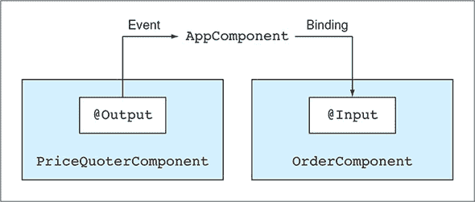

为了演示调解器模式的应用，让我们编写一个小型应用程序，该应用程序由 图 8.5 中显示的两个组件组成。您可以在调解器父目录中找到此应用程序，该目录包含以下文件：

+   ***istock.ts*—** 定义表示股票的值对象的 `Stock` 接口

+   ***price.quoter.component.ts*—** `PriceQuoterComponent`

+   ***order.component.ts*—** `OrderComponent`

+   ***app.component.ts*—** 包含 `<price-quoter>` 和 `<order-processor>` 的模板中的父组件（调解器）

+   ***app.module.ts*—** `AppModule` 类

你将在两种情况下使用 `Stock` 接口：

+   为了表示由 `PriceQuoterComponent` 发射的事件的有效负载

+   为了表示通过绑定传递给 `OrderComponent` 的数据

以下列表显示了 istock.ts 文件的内容。

##### 列表 8.7\. istock.ts

```
export interface Stock {
  stockSymbol: string;
  bidPrice: number;
}
```

下一个列表中展示的 `PriceQuoterComponent` 有一个购买按钮和 `buy` 输出属性。它仅在用户点击购买按钮时发射 `buy` 事件。

##### 列表 8.8\. price.quoter.component.ts

```
@Component({
  selector: 'price-quoter',
  template: `<strong>
               <button (click)="buyStocks()">Buy</button>
               {{stockSymbol}} {{lastPrice | currency: "USD"}}
             </strong>
            `,
  styles:[`:host {background: pink; padding: 5px 15px 15px 15px;}`]
})
export class PriceQuoterComponent {
  @Output() buy: EventEmitter<Stock> = new EventEmitter();    *1*

  stockSymbol = "IBM";
  lastPrice: number;

  constructor() {
    Observable.interval(2000)
      .subscribe(data =>
      this.lastPrice = 100 * Math.random());
  }

  buyStocks(): void {

    let stockToBuy: Stock = {
      stockSymbol: this.stockSymbol,
      bidPrice: this.lastPrice
    };

    this.buy.emit(stockToBuy);                                *2*
   }
}
```

+   ***1* 购买输出属性将用作自定义购买事件。**

+   ***2* 发射自定义购买事件**

当调解器（`AppComponent`）从 `<price-quoter>` 接收到 `buy` 事件时，它从该事件中提取有效负载并将其分配给 `stock` 变量，该变量绑定到 `<order-processor>` 的输入参数，如下列所示。

##### 列表 8.9\. app.component.ts

```
@Component({
  selector: 'app-root',
  template: `
    <price-quoter (buy) = "priceQuoteHandler($event)">    *1*
     </price-quoter>

    <order-processor
           [stock] = "receivedStock">                     *2*
     </order-processor>
  `
})
export class AppComponent {
  receivedStock: Stock;

  priceQuoteHandler(event: Stock) {
    this.receivedStock = event;
  }
}
```

+   ***1* 当调解器接收到购买事件时，它将调用事件处理器。**

+   ***2* 将从 `<price-quoter>` 接收到的股票传递给 `<order-processor>`。**

当 `OrderComponent` 上的 `buy` 输入属性的值发生变化时，其设置器将显示消息“已放置订单...”，显示 `stockSymbol` 和 `bidPrice`。

##### 列表 8.10\. order.component.ts

```
@Component({
  selector: 'order-processor',
  template: `{{message}}`,
  styles:[`:host {background: cyan;}`]
})
export class OrderComponent {

  message = "Waiting for orders...";

  @Input() set stock(value: Stock) {                    *1*
     if (value && value.bidPrice != undefined) {
      this.message = `Placed order to buy 100 shares    *2*
                        of ${value.stockSymbol} at
                       \$${value.bidPrice.toFixed(2)}`;
    }
  }
}
```

+   ***1* 通过此设置器接收股票对象**

+   ***2* 准备在模板中显示的消息**

 展示了当 IBM 股票价格为 36.53 美元时，用户点击购买按钮后发生的情况。`PriceQuoterComponent` 在左侧渲染，而 `OrderComponent` 在右侧。它们是自包含的、松散耦合的，并且仍然可以通过 `AppComponent` 中介相互通信。

##### 图 8.6\. 运行中介示例

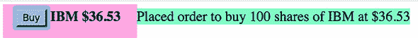

要查看此应用程序的实际运行情况，请运行以下命令：

```
ng serve --app mediator-parent -o
```

中介设计模式也适合 ngAuction。想象一下对热门产品的拍卖战最后几分钟。用户监控频繁更新的出价，并点击按钮提高他们的出价。

#### 8.3.2\. 使用可注入服务作为中介

在上一节中，您看到了兄弟组件如何使用它们的父组件作为中介。如果组件没有相同的父组件或不是同时显示的（路由器可能此时不会显示所需的组件），您可以使用可注入服务作为中介。每当组件被创建时，中介服务就会被注入，组件可以订阅服务发出的事件（与 `OrderComponent` 所使用的 `@Input()` 参数相反）。

| |
| --- |

**多组件 UI 的真实世界示例**

在现实世界的 Web 应用中，您可以找到许多由多个组件组成的 UI。我们将向您展示一个从公开网站 [www.forex.com](http://www.forex.com) 获取的 UI，该网站提供了一个用于货币交易的 Web 平台。交易员可以实时监控多种货币对的报价（例如，美元和欧元），并在价格合适时下单购买货币。

这是您可以在 [`mng.bz/M9Af`](http://mng.bz/M9Af) 找到的交易员屏幕的快照。

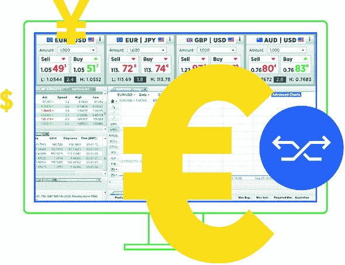

来自 forex.com 的示例交易员屏幕

我们不知道创建此 UI 时使用了哪个 JavaScript 框架（如果有的话），但我们可以清楚地看到它由多个组件组成。如果我们需要在 Angular 中开发这样的应用程序，我们会创建一个 `CurrencyPairComponent`，并在顶部放置其四个实例。下面，我们会使用其他组件，例如 `PopularMarketComponent`、`WatchListComponent` 等。

在 `CurrencyPairComponent` 中，我们会创建两个子组件：`SellComponent` 和 `BuyComponent`。它们的买卖按钮会发出一个自定义事件，该事件会被父 `CurrencyPairComponent` 接收，然后父组件需要与 `OrderComponent` 通信以放置买卖订单。但如果 `CurrencyPairComponent` 和 `OrderComponent` 没有共同的父组件，谁将作为它们通信的中介？

| |
| --- |

 展示了一个场景图，表示组件 5 需要向组件 6 和 8 发送数据。如您所见，它们没有共同的父组件，因此您使用可注入服务作为中介。

##### 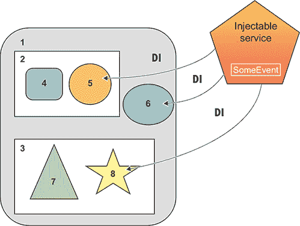


同一个服务实例将被注入到组件 5、6 和 8 中。组件 5 可以使用服务的 API 提供一些数据，而组件 6 和 8 将在实例化后立即订阅数据。通过在组件 6 和 8 的构造函数中创建订阅，您确保无论这些组件何时创建，它们都会立即从服务中获取数据。

让我们考虑一个实际例子来说明这是如何工作的。想象您有一个 UI，您可以通过在组件的输入框中输入产品名称来搜索产品。您希望提供在 eBay 或 Amazon 上搜索产品的功能。最初，您将渲染 eBay 组件，但如果用户对 eBay 提供的交易不满意，他们会在 Amazon 上寻找相同的产品。图 8.8 展示了用户在搜索字段中输入 `aaa` 作为产品名称后的该应用 UI。最初，渲染了 eBay 组件，并接收 aaa 作为要搜索的产品。

##### 图 8.8\. 在 eBay 上搜索产品 aaa

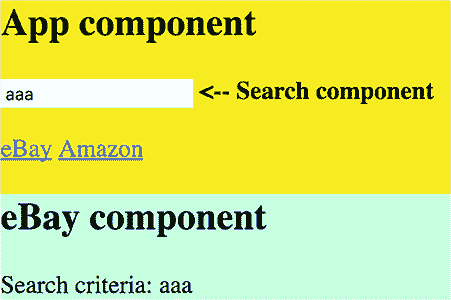

假设 eBay 提供了 aaa 的详细信息和定价，但用户不满意并点击链接在 Amazon 上寻找相同的产品。您的 UI 有两个链接，一个用于 eBay，另一个用于 Amazon。当用户点击 Amazon 链接时，路由器销毁 eBay 组件并创建 Amazon 组件。您希望保持应用程序状态，以便用户不需要重新输入产品名称，并且 Amazon 组件必须渲染显示 aaa——保存的搜索条件，如图 8.9 所示。

##### 图 8.9\. 在 Amazon 上搜索产品 aaa

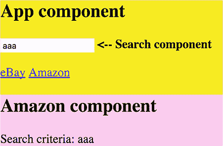

如果用户改变主意，决定在 Amazon 上搜索不同的产品，然后返回 eBay，新的搜索条件必须在 eBay 组件中显示。

因此，您需要实现两个功能：

+   搜索、eBay 和 Amazon 组件之间的通信。

+   状态管理，以便在用户在 eBay 和 Amazon 之间导航时保留最新的搜索条件。

该应用的代码位于 mediator-service-subject 文件夹中，并包含以下文件：

+   ***app.component.ts*—** 最高级组件 `AppComponent`

+   ***app.module.ts*—** 包含路由配置的 `AppModule`

+   ***state.service.ts*—** 存储应用状态的注入式服务

+   ***search.component.ts*—** 带有 `<input>` 字段的 `SearchComponent`

+   ***amazon.component.ts*—** `AmazonComponent`

+   ***ebay.component.ts*—** `EbayComponent`

`AppComponent` 作为 `SearchComponent` 的父组件，提供 eBay 和 Amazon 组件的两个链接，并包含 `<router-outlet>`，如下所示。

##### 列表 8.11\. app.component.ts

```
@Component({
  selector: 'app-root',
  template: ` <div class="main">
               <h2>App component</h2>

               <search></search>  <b><-- Search component</b>   *1*
                <p>

               <a [routerLink]="['/']">eBay</a>                 *2*
                <a [routerLink]="['/amazon']">Amazon</a>        *2*
                <router-outlet></router-outlet>                 *3*
               </div>`,
  styles: ['.main {background: yellow}']
})

export class AppComponent {}
```

+   ***1* 用户在此处输入产品名称。**

+   ***2* 用于导航的链接**

+   ***3* eBay 或 Amazon 组件在链接下方渲染。**

`AppModule` 按如下方式加载路由配置：

```
RouterModule.forRoot([
    {path: '',        component: EbayComponent},
    {path: 'amazon', component: AmazonComponent}])
]
```

您想要创建一个可注入的 `StateService`，它将接受来自 `SearchComponent` 的搜索条件并将其发送给其订阅者（eBay 或 Amazon 组件）。在 附录 D 中，我们解释了 RxJS 的 `Subject` 如何工作。它包含可观察对象和观察者，将满足您的需求，但不会记住已发出的值（搜索条件）。您可以为 `SearchComponent` 提供的值创建一个单独的变量来存储，但有一个更好的解决方案。

RxJS 库包括 `BehaviorSubject`，它支持 `Subject` 的功能——并且它会重新发出最新的已发出值。让我们看看它如何在您的应用中工作：

> **1**. 用户输入 `aaa`，`SearchComponent` 调用 `StateService` 的 API 以将 `aaa` 发送到订阅者，最初是一个 eBay 组件。`BehaviorSubject` 发出 `aaa` 并记住它（存储应用状态）。
> 
> **2**. 用户导航到 Amazon 组件，该组件立即订阅了相同的 `BehaviorSubject`，重新发出 `aaa`。

下一个列表显示了 `StateService` 的代码。

##### 列表 8.12\. state.service.ts

```
@Injectable()
export class StateService {

  private stateSubject: BehaviorSubject<string> = new BehaviorSubject(''); *1*

  set searchCriteria(value: string) {                                      *2*

    this.stateSubject.next(value);                                         *3*
   }

  getState(): Observable<string> {                                         *4*
     return this.stateSubject.asObservable();
  }
}
```

+   ***1* 创建一个 `BehaviorSubject` 实例以重新向新订阅者发出最后一个发出的值**

+   ***2* SearchComponent 将调用此方法。**

+   ***3* 向订阅者发出搜索条件**

+   ***4* 返回主题的可观察对象的引用**

`getState()` 方法返回 `BehaviorSubject` 的可观察部分，这样 eBay 或 Amazon 组件就可以订阅它。技术上，这些组件可以直接订阅主题，但如果它们有对您的 `BehaviorSubject` 的引用，它们可以使用 `next()` API 在主题的观察者上发出数据。您希望允许 eBay 或 Amazon 组件仅使用 `subscribe()` API——这就是为什么您将只提供来自 `BehaviorSubject` 的可观察属性引用的原因。


##### 注意

我们使用了 `Injectable()` 装饰器，但在这里它是可选的，因为我们没有将其他服务注入到 `StateService` 中。如果我们向这个服务注入 `HttpClient` 或任何其他服务，使用 `Injectable()` 就是必需的。


下一个列表显示了 `SearchComponent` 的代码。您使用表单 API 订阅 `valueChanges` 可观察对象，如 第六章 中所述。请注意，您将 `StateService` 注入到该组件中，并且当用户在输入字段中键入时，您将值分配给 `StateService` 上的 `searchCriteria` 属性。`searchCriteria` 属性实现为一个设置器，将用户输入的值发送到 `stateSubject` 的订阅者，如下面的列表所示。

##### 列表 8.13\. search.component.ts

```
@Component({
  selector: "search",
  template: `
      <input type="text" placeholder="Enter product"
             [formControl]="searchInput">
    `
})
export class SearchComponent {

  searchInput: FormControl;

  constructor(private state: StateService) {

    this.searchInput = new FormControl('');

    this.searchInput.valueChanges                                  *1*
       .pipe(debounceTime(300))
      .subscribe(searchValue =>
                    this.state.searchCriteria = searchValue);      *2*
   }
}
```

+   ***1* 一个发出输入字段内容的可观察对象**

+   ***2* 将输入值传递给 StateService**

下面的列表显示了 `EbayComponent` 的代码，它注入了 `StateService` 并订阅了 `stateSubject` 的可观察对象。

##### 列表 8.14\. ebay.component.ts

```
@Component({
  selector: 'product',
  template: `<div class="ebay">
                <h2>eBay component</h2>
               Search criteria: {{searchFor$ | async}}    *1*
                </div>`,
  styles: ['.ebay {background: cyan}']
})
export class EbayComponent {

  searchFor$: Observable<string>;

  constructor(private state: StateService){               *2*

      this.searchFor$ = state.getState();                 *3*
   }
}
```

+   ***1* 异步管道自动订阅 observable searchFor$。**

+   ***2* 注入 StateService**

+   ***3* 将可观察对象存储在类变量中**


##### 注意

`AmazonComponent` 中的代码应该是相同的，但在本章附带源代码中，我们保留了一个更冗长的版本，它使用 `subscribe()` 和 `unsubscribe`，这样您就可以比较并欣赏 `async` 管道的好处。


当创建 eBay（或 Amazon）组件时，它会获取 `stateSubject` 的现有状态并显示它。图 8.10 展示了示例应用中组件之间的通信方式。


##### 注意

这个示例应用不仅说明了您如何使用可注入服务作为中介来安排组件间的通信，还展示了您如何在小型和中型应用中跟踪应用状态。如果您的应用很大，请考虑使用 NgRx 库实现应用状态，如第十五章所述。第十五章。


##### 图 8.10\. 应用的工作流程

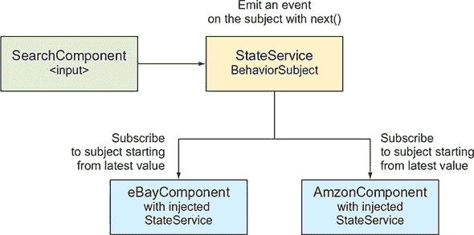

要查看此应用的实际运行情况，请运行以下命令：

```
ng serve --app mediator-service -o
```

您还可以观看一个简短的视频，解释这个应用是如何工作的：[`mng.bz/oE0s`](http://mng.bz/oE0s)。


##### 提示

在确定您的中介、可重用组件以及它们之间的通信方式之前，不要开始实现您应用的 UI 组件。


现在您知道父组件可以在不知道其内容或存在的情况下将数据传递给其他组件。但如果父组件知道它有一个实现了特定 API 的子组件；父组件能否直接在子组件上调用此 API？

### 8.4\. 暴露子组件的 API

您已经学习了父组件如何通过绑定到输入属性来将其数据传递给子组件。但还有其他情况，当父组件只需要使用子组件公开的 API 时。我们将向您展示一个示例，说明父组件如何从模板和父组件的 TypeScript 代码中调用子组件的 API。

让我们创建一个简单的应用，其中子组件有一个 `greet()` 方法，该方法将由父组件调用。特别是，父组件在其模板中包含以下行：

```
<child name= "John" #child1></child>
<button (click) = "child1.greet()">Invoke greet() on child 1</button>
```

本地模板变量旨在在模板中使用。在上面的代码中，父组件的模板在子组件 `#child1` 上调用 `greet()` 方法。

您也可以从 TypeScript 中调用子组件的 API。让我们创建两个相同的子组件实例来演示如何做到这一点：

```
<child name= "John" #child1></child>
<child name= "Mary" #child2></child>
```

这些实例的 DOM 引用将分别存储在模板变量 `#child1` 和 `#child2` 中。现在您可以在 TypeScript 类中声明一个属性，并用 `@ViewChild()` 装饰它，这样您就可以从 TypeScript 代码中使用这些对象。当您需要子组件的引用时，`@ViewChild()` 装饰器非常有用。

你可以这样从模板变量 `#child1` 将子组件的引用传递到 TypeScript 变量 `firstChild`：

```
@ViewChild('child1')
firstChild: ChildComponent;
...
this.firstChild.greet();
```

`@ViewChildren()` 装饰器将为你提供相同类型的多个子组件的引用。让我们编写一个小应用程序来展示这些装饰器的使用。子组件的代码位于 `childapi/child.component.ts` 文件中，如下所示。

##### 列表 8.15\. child.component.ts

```
@Component({
  selector: 'child',
  template: `<h3>Child {{name}}</h3>`

})
export class ChildComponent {

  @Input() name: string;

  greet() {
    console.log(`Hello from ${this.name}`);
  }
}
```

父组件将包含两个子组件实例，并使用 `@ViewChild()` 和 `@ViewChildren()` 装饰器。使用这两个装饰器的父组件的完整代码如下所示。

##### 列表 8.16\. app.component.ts

```
@Component({
  selector: 'app-root',
  template: `
    <h1>Parent</h1>
    <child name = "John" #child1></child>
    <child name = "Mary" #child2></child>

    <button (click) = "child2.greet()">
            Invoke greet() on child 2
    </button>
    <button (click) = "greetAllChildren()">
            Invoke greet() on both children
    </button>
  `
})
export class AppComponent implements AfterViewInit {
  @ViewChild('child1')
  firstChild: ChildComponent;                                  *1*

  @ViewChildren(ChildComponent)
  allChildren: QueryList<ChildComponent>;                      *2*

  ngAfterViewInit() {                                          *3*
     this.firstChild.greet();                                  *4*
   }

  greetAllChildren() {
     this.allChildren.forEach(child => child.greet());         *5*
   }
}
```

+   ***1* 获取第一个子组件实例的引用**

+   ***2* 获取两个子组件的引用（返回子组件列表）**

+   ***3* 使用生命周期钩子 ngAfterViewInit()**

+   ***4* 在第一个子组件上调用 greet() 方法**

+   ***5* 在两个子组件上调用 greet() 方法**

| |
| --- |

##### 注意

在这个类中，你使用组件生命周期钩子 `ngAfterViewInit()` 来确保在子组件渲染后使用子组件的 API。有关更多详细信息，请参阅 第九章第 9.2 节。


如果你运行此应用程序，浏览器将渲染 图 8.11 中所示的窗口。

##### 图 8.11\. 访问子组件 API

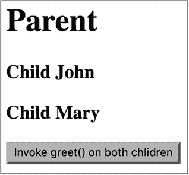

你还将在浏览器控制台中看到以下行：

```
Hello from John
```

在应用程序启动时，John 被问候，但为了公平起见，两个子组件都应该被问候。点击按钮将使用整个子组件列表的引用并产生以下输出：

```
Hello from John
Hello from Mary
```

要查看此应用程序的实际运行效果，请运行以下命令：

```
ng serve --app childapi -o
```

你已经使用了不同的技术进行组件通信来发送数据或调用 API，但你能否从一个组件发送一个 HTML 片段到另一个组件中使用？

### 8.5\. 使用 ngContent 在运行时投影模板

在某些情况下，父组件需要在运行时在子组件中渲染任意标记，你可以在 Angular 中使用 *投影* 来实现这一点。你可以通过使用 `ngContent` 指令将父组件模板的一部分投影到其子组件模板上。这是一个两步的过程：

> **1**. 在子组件的模板中，包含 `<ng-content></ng-content>` 标签（*插入点*）。
> 
> **2**. 在父组件中，包含你想要投影到子组件插入点之间的 HTML 片段，这些标签代表子组件（例如，`<my-child>`）：
> 
> ``template: ` ... <my-child> <div>将此 div 传递给子组件</div> </my-child> ...``

在此示例中，父组件不会渲染放置在 `<my-child>` 和 `</my-child>` 之间的内容。列表 8.17 和 8.18 展示了这种技术。请注意，这两个组件都声明了一个具有相同名称的 CSS 样式选择器 `.wrapper`，但每个都定义了不同的背景颜色。这展示了 Angular 在样式封装方面能提供什么，下一节将进行描述。

考虑一个有两个组件的例子——父组件和子组件。父组件将传递一个 HTML 片段给子组件进行渲染。子组件的代码如下所示。

##### 列表 8.17\. child.component.ts

```
import {Component, ViewEncapsulation} from "@angular/core";
@Component({
  selector: 'child',
  styles: ['.wrapper {background: lightgreen;}'],        *1*
   template: `
    <div class="wrapper">
     <h2>Child</h2>
      <div>This content is defined in child</div>
      <p>
      <ng-content></ng-content>                          *2*
     </div>
  `,
  encapsulation: ViewEncapsulation.Native                *3*
 })
export class ChildComponent {}
```

+   ***1* 用于在浅绿色背景上渲染 UI 的类选择器**

+   ***2* 来自父组件的内容在这里显示。**

+   ***3* 对于样式，使用 ViewEncapsulation.Native 模式（我们将在下一节中解释视图封装模式）。**

父组件的代码如下所示。

##### 列表 8.18\. app.component.ts

```
@Component({
  selector: 'app-root',
  styles: ['.wrapper {background: deeppink;}'],                 *1*
   template: `
    <div class="wrapper">
     <h2>Parent</h2>
      <div>This div is defined in the Parent's template</div>
      <child>
        <div ><i>Child got this line from parent </i></div>     *2*
       </child>
    </div>
  `,
  encapsulation:ViewEncapsulation.Native
})
export class AppComponent {}
```

+   ***1* 用于在浅绿色背景上渲染 UI 的类选择器**

+   ***2* 内容将被投影到子组件的模板上。**

在 Chrome 浏览器中使用以下命令运行此应用：

```
ng serve --app projection1 -o
```

Chrome 浏览器将渲染 图 8.12 中所示的 UI。

##### 图 8.12\. 使用 `ViewEncapsulation.Native` 运行 projection1 应用

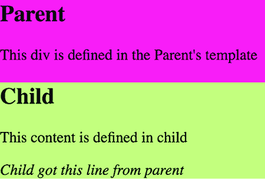

文本“子组件从父组件获取了这一行”是从 `AppComponent` 投影到 `Child-Component` 的。你可能想知道为什么你想在 Chrome 浏览器中运行这个应用：因为你指定了 `ViewEncapsulation.Native`，假设浏览器支持 Shadow DOM，而 Chrome 支持这项功能。下一节将提供更多细节。


##### 注意

`ViewEncapsulation` 模式与投影无关，可以在任何组件中使用，但我们想使用具有不同样式的父组件和子组件的应用来介绍这个功能。


#### 8.5.1\. 视图封装模式

JavaScript 模块允许你在脚本中引入范围，这样它们就不会污染浏览器或任何其他执行环境中的全局空间。那么 CSS 呢？想象一下，父组件和子组件意外地声明了具有相同 CSS 类选择器名称的样式，但定义了不同的背景颜色。浏览器会使用不同的背景渲染组件，还是两个组件都会有相同的背景？

简而言之，Shadow DOM 在浏览器中引入了 CSS 样式的范围和 DOM 节点的封装。Shadow DOM 允许你隐藏所选组件的内部结构，使其不显示在全局 DOM 树中。Shadow DOM 在 Eric Bidelman 的文章“Shadow DOM v1: Self-Contained Web Components”中有很好的解释，该文章可在 [`mng.bz/6VV6`](http://mng.bz/6VV6) 找到。

我们将使用上一节中的应用来展示 Shadow DOM 和 Angular 的 `ViewEncapsulation` 模式是如何工作的。`@Component()` 装饰器的 `encapsulation` 属性可以有三个值之一：

+   **`ViewEncapsulation.Native`—** 这可以与支持 Shadow DOM 的浏览器一起使用。

+   **`ViewEncapsulation.Emulated`—** 默认情况下，Angular 模拟 Shadow DOM 支持。

+   **`ViewEncapsulation.None`—** 如果样式有相同的选择器，最后一个获胜。


##### 提示

有关 CSS 特异性的更多信息，请参阅[`css-tricks.com/specifics-on-css-specificity`](https://css-tricks.com/specifics-on-css-specificity)。


如前所述，父组件和子组件都使用 `.wrapper` 样式。在一个普通的 HTML 页面中，这意味着子组件的 `.wrapper` 的 CSS 规则将覆盖父组件的。让我们看看你是否能封装子组件中的样式，这样它们就不会与父组件的样式冲突，即使它们的名称相同。

图 8.13 展示了在 `ViewEncapsulation.Native` 模式下打开开发者工具面板时运行的运行中的应用程序。浏览器为父元素和子元素创建了 `#shadow-root` 节点（见右侧的两个 `#shadow-root` 节点）。如果你是在彩色版（电子书）中阅读这本书，你会看到 `.wrapper` 样式将 `<app-root>` 的背景涂成深粉色。子组件也有使用浅绿色颜色的 `.wrapper` 样式，但这不会影响父组件。样式是封装的。子组件的 `#shadow-root` 作用就像一堵墙，阻止子组件的样式覆盖父组件的样式。只有当你确信你的应用程序的用户将使用支持 Shadow DOM 的浏览器时，你才能使用 `ViewEncapsulation.Native`。

##### 图 8.13\. 浏览器创建两个 `#shadow-root` 节点

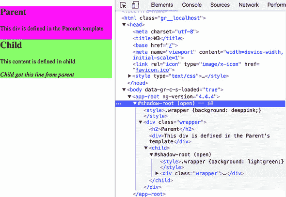

图 8.13 展示了将 `encapsulation` 属性的值更改为 `ViewEncapsulation.Emulated` 后发生的情况。Angular 默认使用此模式，因此效果与未向 `@Component()` 装饰器添加 `encapsulation` 属性相同。DOM 在 `<app-root>` 元素内部没有任何 `#shadow-root` 节点，但 Angular 为父元素和子元素生成额外的属性以区分父元素和子元素的样式。Angular 修改组件样式中的所有 CSS 选择器，以包含生成的属性：

```
<div _ngcontent-c0="" class="wrapper">       *1*
 ...
<div _ngcontent-c1="" class="wrapper">       *2*
```

+   ***1* `<app-root>` 组件中的样式**

+   ***2* `<child>` 组件中的样式**

UI 以相同的方式渲染，使用不同的背景颜色渲染这些组件，如图 8.14 所示，但与图 8.13 相比，底层代码并不相同。

##### 图 8.14\. 使用 `ViewEncapsulation.Emulated` 运行 projection1 应用程序

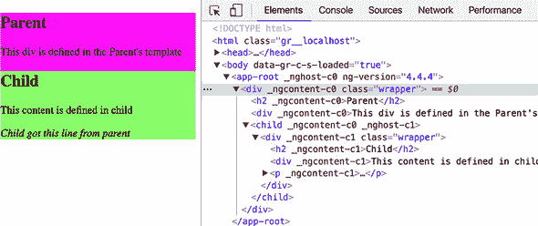

图 8.15 展示了将封装设置为 `ViewEncapsulation.None` 时运行的相同示例。在这种情况下，子组件的 `wrapper` 获胜，整个窗口都显示为子组件的浅绿色背景。

##### 图 8.15\. 使用 `ViewEncapsulation.None` 运行 projection1 应用程序

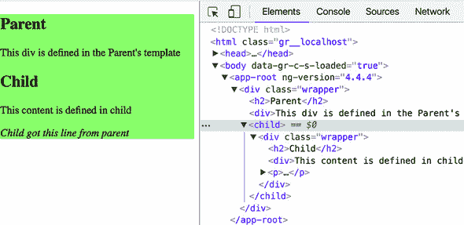

现在你已经了解了封装模式和基本投影，你可能想知道是否可以将内容投影到组件模板的多个区域。

#### 8.5.2\. 投影到多个区域

一个组件的模板中可以包含多个 `<ng-content>` 标签。让我们考虑一个例子，其中子组件的模板被分为三个区域：标题、内容和页脚，如图 8.16 所示。标题和页脚的 HTML 标记可以由父组件投影，而内容区域可以在子组件中定义。为了实现这一点，子组件需要包含两个由父组件填充的单独的 `<ng-content></ng-content>` 对，分别是标题和页脚。

##### 图 8.16\. 运行 projection2 应用


为了确保页眉和页脚内容将在正确的 `<ng-content>` 区域中渲染，你将使用 `select` 属性，它可以是一个有效的 CSS 选择器（CSS 类、标签名等）。子组件的模板可能看起来像这样：

```
<ng-content select=".header"></ng-content>
<div>This content is defined in child</div>
<ng-content select=".footer"></ng-content>
```

从父组件到达的内容将通过选择器进行匹配，并在相应的区域中渲染。我们创建了一个单独的应用程序在文件夹 projection2 中，以说明投影到多个区域。以下列表显示了子组件。

##### 列表 8.19\. child.component.ts

```
@Component({
  selector: 'child',
  styles: ['.wrapper {background: lightgreen;}'],
  template: `
    <div class="wrapper">
     <h2>Child</h2>
      <ng-content select=".header"></ng-content><p>

      <div>This content is defined in child</div><p>

      <ng-content select=".footer"></ng-content>
    </div>
  `
})
export class ChildComponent {}
```

注意，你现在有两个 `<ng-content>` 插槽——一个带有选择器 `.header`，另一个带有 `.footer`。父组件将不同内容投影到每个插槽。为了使这个例子更具动态性，你使用绑定在标题中显示今天的日期，如下面的列表所示。

##### 列表 8.20\. app.component.ts

```
@Component({
  selector: 'app-root',
  styles: ['.wrapper {background: deeppink;}'],
  template: `
  <div class="wrapper">
    <h2>Parent</h2>
    <div>This div is defined in the Parent's template</div>
    <child>

      <div class="header">                                           *1*
         <i>Child got this header from parent {{todaysDate}}</i>     *2*
       </div>

      <div class="footer">                                           *3*
          <i>Child got this footer from parent</i>
      </div>
    </child>
  </div>
`
})
export class AppComponent {
  todaysDate = new Date().toLocaleDateString();
}
```

+   ***1* 将此 div 投影到具有标题选择器的子元素上**

+   ***2* 将当前日期绑定到投影的内容**

+   ***3* 将此 div 投影到具有页脚选择器的子元素上**


##### 注意

投影的 HTML 只能绑定在父作用域中可见的属性，因此你无法在父组件的绑定表达式中使用子组件的属性。


要查看此示例的实际效果，请运行以下命令：

```
ng serve --app projection2 -o
```

运行此应用将渲染图 8.16 中显示的页面。

使用 `<ng-content>` 和 `select` 属性可以创建一个具有多个区域视图的通用组件，这些区域从父组件获取其标记。


**投影与直接绑定到 innerHTML 的比较**

或者，你可以通过将组件绑定到 `innerHTML` 来编程更改组件的 HTML 内容：

```
<p [innerHTML]="myComponentProperty"></p>
```

但是，出于以下原因，使用 `<ng-content>` 而不是绑定到 `innerHTML` 更可取：

+   `innerHTML` 是一个浏览器特定的 API，而 `<ng-content>` 是平台无关的。

+   使用 `<ng-content>`，你可以定义多个插槽，其中 HTML 片段将被插入。

+   `<ng-content>` 允许你将父组件的属性绑定到投影的 HTML 中。


### 摘要

+   父组件和子组件应避免直接访问彼此的内部结构，而应通过输入和输出属性进行通信。

+   组件可以通过其输出属性发出自定义事件，并且这些事件可以携带特定于应用程序的有效负载。

+   通信无关组件之间应使用中介者设计模式进行安排。一个公共父组件或可注入的服务可以作为中介。
