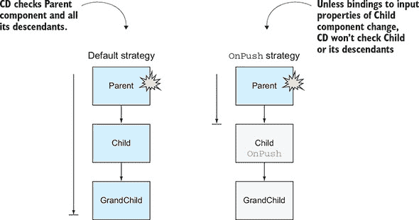
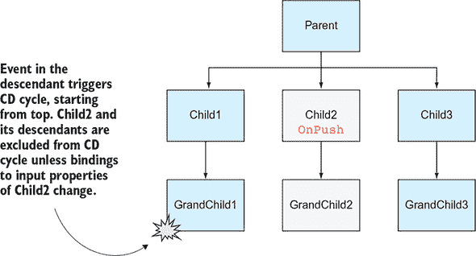
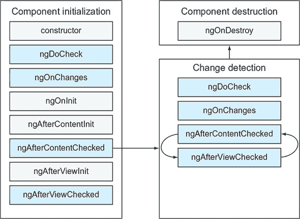
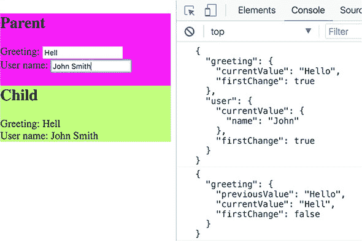
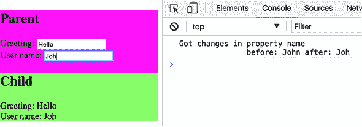
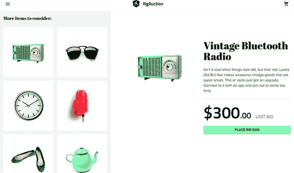

## 第九章\. 变化检测和组件生命周期

*本章涵盖*

+   Angular 如何知道需要 UI 更新

+   审查组件生命周期中的里程碑

+   在组件生命周期钩子中编写代码

你迄今为止开发的全部应用程序在用户或程序更新组件属性时都正确地更新了 UI。Angular 是如何知道何时更新 UI 的？在本章中，我们将讨论变化检测（CD）机制，该机制监控你的应用程序的异步事件并决定是否更新 UI。

我们还将讨论 Angular 组件的生命周期以及你可以使用的回调方法钩子，以提供特定于应用程序的代码，在组件创建、生命周期和销毁期间拦截重要事件。

最后，我们将继续在 ngAuction 上工作。这次，你将添加显示产品详情的视图。

### 9.1\. 变化检测的高级概述

当用户使用你的应用程序时，事情会发生变化，组件属性的值（模型）会得到修改。大多数变化都是异步发生的——例如，用户点击按钮，从服务器接收数据，可观察者开始发出值，脚本调用`setTimeout()`函数，等等。Angular 需要知道异步操作的结果何时可用，以便相应地更新 UI。

对于自动 CD，Angular 使用 zone.js（Zone）库。Angular 订阅 Zone 事件以触发 CD，从而保持组件的模型和 UI 同步。CD 周期由浏览器中发生的任何异步事件启动。变化检测器跟踪组件、服务等中做出的所有异步调用；当它们完成时，它会从上到下遍历组件树，以查看任何组件的 UI 是否需要更新。


##### 注意

CD 机制将组件属性的变化应用到其 UI 上。CD 永远不会更改组件属性的值。


zone.js 库是 Angular 项目中依赖之一。它让你免于手动编写代码来更新 UI，但从 Angular 5 开始，使用 Zone 是可选的。为了说明 zone.js 的作用，让我们做一个实验：你将首先创建一个由 Zone 管理的简单项目，然后你将关闭 Zone。该项目包括以下列表中所示的`AppComponent`。

##### 列表 9.1\. Zone 处于开启状态

```
@Component({
  selector: 'app-root',
  template: `<h1>Welcome to {{title}}!</h1>`
})
export class AppComponent {

  title = 'app';

  constructor() {
    setTimeout(() => {this.title = 'Angular 5'}, 5000);     *1*
   }
}
```

+   ***1* 异步调用代码，以便 Zone 在五秒后更新 UI**

运行此应用程序将渲染“欢迎使用 app！”五秒后，消息更改为“欢迎使用 Angular 5！”让我们将 main.ts 文件中的应用程序引导代码更改为使用 Angular 5 中引入的空 Zone 对象`noop`：

```
platformBrowserDynamic().bootstrapModule(AppModule, {ngZone: 'noop'});
```

现在运行相同的应用程序将渲染“欢迎使用 app！”并且这条消息将永远不会改变。你刚刚关闭了 Zone，应用程序没有更新 UI。


##### 注意

您仍然可以通过在应用程序构造函数中注入`ApplicationRef`服务并在更新`title`属性值后调用其`tick()`方法来启动 CD。

| |
| --- |

一个 Angular 应用程序的结构是一个视图（组件）的树，根组件位于树的顶部。当 Angular 编译组件模板时，每个组件都会获得自己的变更检测器。当 Zone 启动 CD 时，它进行单次遍历，从根到叶组件，检查每个组件的 UI 是否需要更新（有关 CD 在开发与生产模式下的差异，请参阅 9.2 节末尾的侧边栏“生命周期钩子、变更检测和生产模式”）。在每次异步属性更改时，有没有一种方法可以指示变更检测器不要访问每个组件？

#### 9.1.1\. 变更检测策略

对于 UI 更新，Angular 提供了两种 CD 策略：`Default`和`OnPush`。如果所有组件都使用`Default`策略，则无论更改发生在何处，Zone 都会检查整个组件树。

如果特定组件声明了`OnPush`策略，则只有在组件的输入属性绑定发生变化，或者组件使用`AsyncPipe`且相应的可观察对象开始发出值时，Zone 才会检查该组件及其子组件。

如果一个采用`OnPush`策略的组件更改了其模板中绑定的一个属性值，则不会启动变更检测周期。要声明`OnPush`策略，请将以下行添加到`@Component()`装饰器中：

```
changeDetection: ChangeDetectionStrategy.OnPush
```

展示了使用三个组件（父组件、子组件和孙组件）的`OnPush`策略的效果。假设父组件的一个属性被修改了。CD 将从检查该组件及其所有后代开始。

##### 图 9.1\. 变更检测策略



图 9.1 的左侧展示了默认 CD 策略：检查所有三个组件是否有更改。右侧展示了当子组件具有`OnPush` CD 策略时会发生什么。CD 从顶部开始，但看到子组件已声明`OnPush`策略。如果没有输入属性的绑定发生变化，并且没有使用`AsyncPipe`的可观察对象发出值（例如，通过`ActivatedRoute`参数），则 CD 不会检查子组件或孙组件。

图 9.1 展示了一个只有三个组件的小型应用程序，但现实世界的应用程序可以有数百个组件。使用`OnPush`策略，您可以选择不针对树中的特定分支进行 CD。

图 9.2 展示了由 GrandChild1 组件中的事件引起的 CD 周期。尽管这个事件发生在左下角的叶子组件中，但 CD 周期是从顶部开始的；它对每个分支都进行了执行，除了那些从具有`OnPush` CD 策略的组件起源且对此组件输入属性没有变化的分支。从 CD 周期中排除的组件显示在白色背景上。

##### 图 9.2\. 从 CD 周期中排除一个分支



这只是一个关于 CD 机制的简要概述。如果你需要调整 UI 密集型应用程序的性能，例如包含数百个不断变化值的网格数据，你应该深入了解 CD。关于更改检测的深入覆盖，请参阅 Maxim Koretskyi 在[`mng.bz/0YqE`](http://mng.bz/0YqE)上发表的文章“关于 Angular 中更改检测你需要知道的一切”。

通常，将`OnPush`作为每个组件的默认 CD 策略是个好主意。如果你发现某个组件的 UI 没有按预期更新，请检查代码，要么切换回`Default`更改检测策略，要么通过注入`ChangeDetectorRef`对象并使用其 API 手动启动 CD 遍历（见[`angular.io/api/core/ChangeDetectorRef`](https://angular.io/api/core/ChangeDetectorRef)）。

如果你有一个运行缓慢且有很多变化模板元素的组件，多次更改检测的遍历是否会导致这种缓慢？

#### 9.1.2\. 配置更改检测

列表 9.2 展示了如何通过启用 Angular 调试工具来配置更改检测。将 main.ts 中的应用程序启动代码更改为以下内容。

##### 列表 9.2\. 启用 Angular 调试工具

```
import {platformBrowserDynamic} from '@angular/platform-browser-dynamic';
import {AppModule} from './app/app.module';
import {ApplicationRef} from '@angular/core';
import {enableDebugTools} from '@angular/platform-browser';

platformBrowserDynamic().bootstrapModule(AppModule).then((module) => {
  const applicationRef = module.injector.get(ApplicationRef);            *1*
   const appComponent = applicationRef.components[0];                    *2*
   enableDebugTools(appComponent);                                       *3*
 });
```

+   ***1* 获取启动应用程序的引用**

+   ***2* 获取应用程序顶层组件的引用**

+   ***3* 启用 Angular 调试工具**

启动你的应用程序，然后在浏览器控制台中输入以下命令：

```
ng.profiler.timeChangeDetection({record: true})
```

现在，你的应用程序将开始报告每个 CD 周期所花费的时间，如图 9.3 所示。

##### 图 9.3\. 配置更改检测


我们已经涵盖了更改检测，现在让我们熟悉组件的私有生活。

### 9.2\. 组件生命周期

在 Angular 组件的生命周期中会发生各种事件：它被创建、响应不同的事件，并被销毁。正如上一节所述，当组件被创建时，CD 机制开始监控它。组件被初始化、添加到 DOM 中并由浏览器渲染。之后，组件的状态（其属性值）可能会改变，导致 UI 的重渲染，最终组件被销毁。

图 9.4 显示了你可以添加自定义代码以拦截生命周期事件的方法（方法）。如果 Angular 在你的应用程序中看到任何这些方法被实现，它将调用它们。

##### 图 9.4\. 组件的生命周期钩子



在浅灰色背景上显示的回调函数只会被调用一次，而在深色背景上的回调函数可以在组件的生命周期内被多次调用。用户在初始化阶段完成后看到组件。然后变更检测机制确保组件的属性与其 UI 保持同步。如果组件由于路由导航或结构指令（如 `*ngIf`）从 DOM 树中移除，Angular 将启动销毁阶段。

当组件实例正在创建时，构造函数首先被调用，但在构造函数中组件的属性尚未初始化。构造函数的代码完成后，Angular 将调用以下回调 *如果你实现了它们*：

+   **`ngOnChanges()`—** 当父组件修改（或初始化）绑定到子组件输入属性的值时被调用。如果组件没有输入属性，则不会调用 `ngOnChanges()`。

+   **`ngOnInit()`—** 在第一次调用 `ngOnChanges()` 之后被调用，如果有的话。尽管你可能在构造函数中初始化一些组件变量，但组件的属性尚未准备好。当 `ngOnInit()` 被调用时，组件属性已经被初始化，这就是为什么这个方法主要用于初始数据获取。

+   **`ngDoCheck()`—** 在变更检测器的每次遍历中调用。如果你想实现一个自定义的变更检测算法或添加一些调试代码，请在 `ngDoCheck()` 中编写它。但请注意，在 `ngDoCheck()` 方法中放置任何代码都可能影响你应用程序的性能，因为此方法在变更检测周期的每次遍历中都会被调用。

+   **`ngAfterContentInit()`—** 当子组件的状态初始化并且投影完成时被调用。只有在你组件的模板中使用了 `<ng-content>` 时，这个方法才会被调用。

+   **`ngAfterContentChecked()`—** 在变更检测周期中，如果用于投影内容的绑定发生变化，并且组件从父组件获取了更新后的内容，则在此方法上调用该组件。

+   **`ngAfterViewInit()`—** 在组件的视图完全初始化后调用。我们在第八章的 8.4 节 中使用了它。

+   **`ngAfterViewChecked()`—** 当变更检测机制检查组件模板的绑定是否有任何更改时被调用。由于在此或其他组件中的修改，此回调可能被多次调用。

+   **`ngOnDestroy()`—** 当组件正在销毁时被调用。使用此回调来清理不需要的资源，例如，取消显式创建的订阅或移除计时器。

每个生命周期回调都在接口中以不带前缀 `ng` 的回调名称声明。例如，如果你计划在 `ngOnChanges()` 回调中实现功能，请将 `implements OnChanges` 添加到你的类声明中。

让我们考虑一些代码示例，以说明生命周期钩子的使用。以下代码列表说明了 `ngOnInit()` 的使用。

##### 列表 9.3\. 在 `ngOnInit()` 中获取数据

```
@Input() productId: number;                                              *1*

constructor(private productService: ProductService) { }                  *2*

ngOnInit() {

   this.product = this.productService.getProductById(this.productId);    *3*
   }
```

+   ***1* 声明输入属性**

+   ***2* 注入服务，但在构造函数中不使用它**

+   ***3* 在 ngOnInit() 中使用服务以确保 productId 已初始化**

此代码使用输入属性 `productId` 的值作为 `getProductById()` 方法的参数。如果你在构造函数中调用了 `getProductById()`，则 `productId` 属性尚未初始化。到 `ngOnInit()` 被调用时，`productId` 已初始化，你可以安全地调用 `getProductById()`。

当组件被销毁时，会调用 `ngOnDestroy()` 钩子。例如，当你使用路由器从组件 A 导航到组件 B 时，组件 A 会被销毁，而组件 B 被创建。如果你在组件 A 中创建了一个显式的订阅，别忘了在 `ngOnDestroy()` 中取消订阅。此钩子也由 Angular 服务支持。

#### 9.2.1\. 在 `ngOnChanges` 钩子中捕获更改

现在我们将编写一个小型应用程序，它使用 `ngOnChanges()` 并说明了绑定对原始值与对象值的不同影响。此应用程序将包括父组件和子组件，后者将有两个输入属性：`greeting` 和 `user`。第一个属性是 `string` 类型，第二个属性是一个具有一个属性 `name` 的 `Object`。要理解 `ngOnChanges()` 回调可能或可能不被调用，你需要熟悉可变与不可变值的概念。


**可变与不可变值**

JavaScript 字符串是原始数据类型，它们是 *不可变的*—当字符串值在内存的某个位置创建时，你无法在那里更改它。考虑以下代码片段：

```
let greeting = "Hello";
greeting = "Hello Mary";
```

第一行在内存中创建值 `Hello`。第二行不会改变该地址的值，而是在不同的内存位置创建新的字符串 `Hello Mary`。现在你有两个字符串在内存中，每个都是不可变的。

如果 `greeting` 变量绑定到组件的输入属性，那么其绑定已更改，因为此变量的值最初在内存的一个位置，然后地址发生了变化。

JavaScript 对象（以及函数和数组）是*可变的*，并且存储在堆内存中，而对象引用仅存储在栈上。在某个内存位置创建对象实例后，当堆内存中对象属性的值发生变化时，栈上对此对象的引用不会改变。考虑以下代码：

```
var user = {name: "John"};
user.name = "Mary";
```

在第一行之后，对象被创建，`user` 对象实例的引用存储在栈内存中，并指向某个内存位置。字符串 `"John"` 在另一个内存位置创建，`user.name` 变量知道它在内存中的位置。

在上述代码片段的第二行执行后，新的字符串 `"Mary"` 在另一个位置创建。但引用变量 `user` 仍然存储在栈上的相同位置。换句话说，您修改了对象的内容，但没有改变指向此对象的引用变量的值。要使对象不可变，每当任何属性发生变化时，都需要创建对象的新实例。

|  |

##### 提示

您可以在 [`mng.bz/bzL4`](http://mng.bz/bzL4) 上了解更多关于 JavaScript 数据类型和数据结构的信息。


让我们在子组件中添加 `ngOnChanges()` 钩子来演示它是如何拦截输入属性修改的。此应用程序具有父组件和子组件。子组件有两个输入属性（`greeting` 和 `user`）。父组件有两个输入字段，用户可以修改它们的值，这些值绑定到子组件的输入属性。让我们看看 `ngOnChanges()` 是否会被调用以及它将获取哪些值。父组件的代码如下所示。

##### 列表 9.4\. app.component.ts

```
@Component({
  selector: 'app-root',
  styles: ['.parent {background: deeppink}'],
  template: `
     <div class="parent">
       <h2>Parent</h2>
       <div>Greeting: <input type="text" [(ngModel)]="myGreeting">        *1*
        </div>
       <div>User name: <input type="text" [(ngModel)]="myUser.name">      *2*
        </div>
       <child [greeting]="myGreeting"                                     *3*
              [user]="myUser">                                            *4*
        </child>
    </div>
  `
})
export class AppComponent {
  myGreeting = 'Hello';
  myUser: {name: string} = {name: 'John'};
}
```

+   ***1* 使用双向绑定同步输入问候语和 myGreeting**

+   ***2* 使用双向绑定同步输入用户名和 myUser.name**

+   ***3* 将 myGreeting 绑定到子组件的输入属性 greeting**

+   ***4* 将 myUser 绑定到子组件的输入属性 user**

子组件通过其输入变量从父组件接收值。该组件实现了 `OnChanges` 接口。在 `ngOnChanges()` 方法中，每当任何输入变量的绑定发生变化时，立即打印接收到的数据，如下所示。

##### 列表 9.5\. child.component.ts

```
@Component({
  selector: 'child',
  styles: ['.child {background: lightgreen}'],
  template: `
    <div class="child">
      <h2>Child</h2>
      <div>Greeting: {{greeting}}</div>
      <div>User name: {{user.name}}</div>
    </div>
  `
})
export class ChildComponent implements OnChanges {         *1*
   @Input() greeting: string;
  @Input() user: {name: string};

  ngOnChanges(changes: {[key: string]: SimpleChange}) {    *2*

    console.log(JSON.stringify(changes, null, 2));
  }
}
```

+   ***1* 实现了 OnChanges 接口**

+   ***2* 当输入属性的绑定发生变化时，Angular 会调用 ngOnChanges()**

当 Angular 调用 `ngOnChanges()` 时，它提供一个包含修改后的输入属性旧值和新值以及表示这是否是第一次绑定更改的标志的 `SimpleChange` 对象。您使用 `JSON.stringify()` 来美化打印接收到的值。

让我们看看在 UI 中更改 `greeting` 和 `user.name` 是否会导致子组件上调用 `ngOnChanges()`。我们运行了此应用程序，删除了单词 *Hello* 的最后一个字母，并将用户名从 John 更改为 John Smith，如图 图 9.5 所示。

##### 图 9.5\. `ngOnChanges()` 在问候语更改后调用



初始时，`ngOnChanges()` 对两个属性都进行了调用。注意 `"firstChange": true`——这是绑定中的第一次更改。在我们删除问候语 *Hello* 中的字母 *o* 之后，`ngOnChanges()` 再次被调用，并且 `firstChange` 标志变为 `false`。但是，将用户名从 *John* 更改为 *John Smith* 并没有调用 `ngOnChanges()`，因为可变对象 `myUser` 的绑定没有改变。

要查看此应用程序的实际运行情况，请在项目生命周期中运行 `npm install`，然后运行以下命令：

```
ng serve --app lifecycle -o
```

当仅对象属性更改时，Angular 不会更新输入属性的绑定，这就是为什么子组件上的 `ngOnChanges()` 没有被调用。但是，更改检测机制仍然捕获了更改。这就是为什么属性 `user.name` 的新值 `"John Smith"` 已经在子组件中渲染的原因。

| |
| --- |

##### 提示

将 `changeDetection: ChangeDetectionStrategy.OnPush` 添加到 `ChildComponent` 的模板中，并且其 UI 不会反映父组件用户名的更改。绑定到子组件的 `user` 属性没有改变；因此，更改检测器甚至不会访问子组件以进行 UI 更新。

| |
| --- |

您可能赞赏更改检测器正确更新 UI，但您仍然需要以编程方式捕获用户名更改的瞬间并实现一些处理此更改的代码？

#### 9.2.2\. 在 ngDoCheck 钩子中捕获更改

假设您想捕获 JavaScript 对象发生变异的瞬间。让我们将前述部分的子组件重写为使用 `ngDoCheck()` 回调而不是 `ngOnChanges()`。目标如下：

+   捕获绑定到 `Input()` 属性的对象发生变异的瞬间。

+   找出绑定对象的哪个属性发生了变化。

+   获取更改属性的旧值。

+   获取此属性的新的值。

为了实现这些目标，您将实现 `DoCheck` 接口并使用 Angular 的 `KeyValueDiffers`、`KeyValueChangeRecord` 和 `KeyValueDiffer`。您想监控 `user` 对象及其属性。

首先，您将注入 `KeyValueDiffers` 服务，该服务实现了各种 Angular 艺术品的差异策略。其次，您需要创建一个 `KeyValueDiffer` 类型的对象，该对象将专门监控 `user` 对象的更改。当发生更改时，您将获得一个包含 `key`、`previousValue` 和 `currentValue` 属性的 `KeyValueChangeRecord` 类型的对象。新的子组件代码如下所示。

##### 列表 9.6\. child.component-docheck.ts

```
import {
  DoCheck, Input, SimpleChange, Component, KeyValueDiffers,
  KeyValueChangeRecord, KeyValueDiffer} from "@angular/core";

@Component({
  selector: 'child',
  styles: ['.child {background: lightgreen}'],
  template: `
    <div class="child">
      <h2>Child</h2>
      <div>Greeting: {{greeting}}</div>
      <div>User name: {{user.name}}</div>
    </div>
  `
})
export class ChildComponent implements DoCheck {
  @Input() greeting: string;
  @Input() user: {name: string};

  differ: KeyValueDiffer<string, string>;                                  *1*

  constructor(private _differs: KeyValueDiffers) { }                       *2*

  ngOnInit() {
   this.differ = this._differs.find(this.user).create();                   *3*
   }

  ngDoCheck() {                                                            *4*

    if (this.user && this.differ) {

      const changes = this.differ.diff(this.user);                         *5*

      if (changes) {
        changes.forEachChangedItem(                                        *6*
           (record: KeyValueChangeRecord<string, string>) =>
            console.log(`Got changes in property ${record.key}             *7*
                before: ${record.previousValue} after: ${record.currentValue}
     `));
      }
    }
  }
}
```

+   ***1* 声明一个用于存储差异的变量**

+   ***2* 注入用于监控更改的服务**

+   ***3* 初始化用于存储用户对象差异的差异变量**

+   ***4* 实现回调 ngDoCheck()**

+   ***5* 检查用户对象属性是否已更改**

+   ***6* 获取每个用户属性的更改记录**

+   ***7* 在控制台打印更改**

`diff()`方法返回一个包含更改记录的`KeyValueChanges`对象，并提供诸如`forEachAddedItem()`、`forEachChangedItem()`、`forEachRemovedItem()`等方法。在你的组件中，你只对捕获更改感兴趣，因此你使用`forEachChangedItem()`，它返回每个更改属性的`KeyValueChangeRecord`。

`KeyValueChangeRecord`接口定义了`key`、`currentValue`和`previousValue`属性，你可以在控制台打印这些属性。图 9.6 显示了在用户名输入字段中删除原始的*John*字母*n*之后发生的情况。

##### 图 9.6\. `ngDoCheck()`在变更检测器的每次遍历之后被调用。



捕获用户名更改似乎不是一个实用的用例，但某些应用程序确实需要在属性值更改时调用特定的业务逻辑。例如，金融应用程序可能需要记录交易员每一步的操作。如果交易员在$101 的价格下下了一个买单，然后立即将价格更改为$100，那么这必须在日志文件中跟踪。这可能是一个捕获此类更改并在`DoCheck()`回调中添加日志的好用例。

要查看此应用程序的实际运行情况，在生命周期/app.module.ts 文件中，将子组件的导入语句修改为`import {ChildComponent} from "./child.component-docheck";`并运行以下命令：

```
ng serve --app lifecycle -o
```


##### 警告

我们再次提醒您：只有在找不到其他拦截数据更改的方法时才使用`ngDoCheck()`，因为它可能会影响您应用程序的性能。

|  |

**生命周期钩子、变更检测和生产模式**

在本章开头，我们提到变更检测器从组件树顶部到底部进行一次遍历，以查看组件的 UI 是否需要更新。如果你的应用程序以生产模式运行，这是正确的，但在开发模式（默认）下，变更检测器进行两次遍历。

如果你运行本书中的大多数应用程序时打开浏览器的控制台，你会看到一个消息，表明 Angular 正在开发模式下运行，该模式在框架内执行断言和其他检查。其中一种断言验证变更检测遍历不会导致任何绑定（例如，你的代码在组件生命周期回调期间不会在 CD 周期中修改 UI）。如果你的代码试图在生命周期回调中从 UI 更改 UI，Angular 将抛出异常。

当你准备好进行生产构建时，请开启生产模式，这样变更检测器只会进行一次遍历，并且不会执行额外的绑定检查。要启用生产模式，请在调用`bootstrap()`方法之前在你的应用中调用`enableProdMode()`。启用生产模式还将导致应用性能更好。

| |
| --- |

现在我们已经涵盖了组件生命周期的所有重要部分，让我们继续在 ngAuction 上工作。

### 9.3. 实践：将产品视图添加到 ngAuction

在第七章中，你创建了 ngAuction 的首页。在本节中，你将创建产品视图，它将在用户点击首页中产品瓷砖之一时渲染。图 9.7 显示了如果用户选择复古蓝牙收音机，产品视图将如何显示。

##### 图 9.7. 产品视图



除了右侧收音机的信息外，左侧还有其他推荐的产品，你希望用户考虑。当展示产品描述时，亚马逊使用相同的营销技术。你可能已经在亚马逊的产品页面上看到过“更多考虑的商品”或“经常一起购买”的部分。根据视口大小，推荐产品可以在产品视图的左侧或底部渲染。

图 9.7 中显示的视图将实现为`ProductComponent`，它将包括两个子组件：`ProductDetailComponent`和`ProductSuggestionComponent`。在产品视图中，你将使用 Flex 布局库，以便 UI 布局能够调整到用户设备视口的可用宽度。

还有一件事：你的产品视图将作为一个懒加载的功能模块来实现，这在第四章的 4.3 节中有详细解释。第四章。让我们开始吧。

| |
| --- |

##### 注意

如果你通过第七章中实践部分的解释和说明创建了 ngAuction 的这个版本，你可以继续在这个应用上工作。你将在 chapter9/ng-auction 文件夹中找到实现了产品视图的 ngAuction 的完整版本。

| |
| --- |

#### 9.3.1. 创建产品组件和模块

你将首先通过运行以下命令生成一个`ProductModule`功能模块：

```
ng g m product
```

该命令将创建包含 product.module.ts 文件的 product 文件夹。因为你将在产品视图中使用 Flex 布局库，所以将`FlexLayoutModule`添加到`@NgModule()`装饰器的`imports`属性中，如下所示。

##### 列表 9.7. product.module.ts

```
import {NgModule} from '@angular/core';
import {CommonModule} from '@angular/common';
import {FlexLayoutModule} from '@angular/flex-layout';

@NgModule({
  imports: [
    CommonModule,
    FlexLayoutModule
  ],
  declarations: []
})
export class ProductModule { }
```

这个功能模块将包含三个组件：`ProductComponent`、`ProductDetailComponent`和`ProductSuggestionComponent`。后两个将是子组件，你希望它们位于产品文件夹下的单独子文件夹中。你将使用以下命令生成这些组件：

```
ng g c product
ng g c product/product-detail
ng g c product/product-suggestion
```

这些命令将生成三个组件，并将它们的名称添加到产品模块的 `declarations` 属性中。当用户在主页组件中点击特定的产品瓷砖时，您将懒加载 `ProductModule`。为此，您将为 `products/:productId` 路径配置一个额外的路由，因此 `app.component.ts` 文件将如下所示。

##### 列表 9.8\. app.routing.ts

```
import {Route} from '@angular/router';
export const routes: Route[] = [
  {
    path: '',
    loadChildren: './home/home.module#HomeModule'
  },
  {
    path: 'products/:productId',
    loadChildren: './product/product.module#ProductModule'
  }
];
```

现在您可以继续实现支持产品视图的组件。

#### 9.3.2\. 实现产品组件

您的 `ProductComponent` 将作为两个子组件 `ProductDetailComponent` 和 `ProductSuggestionComponent` 的包装器。产品组件实现了以下功能：

+   它应该是产品模块的默认路由。

+   它应该接收从主页组件传递的产品 ID。

+   它应该获取 `ProductService` 对象的引用以接收产品详情。

+   它应根据视口宽度管理其子元素的布局。

要在用户导航到产品视图时渲染 `ProductComponent`，您需要将以下内容添加到 `ProductModule` 中。

##### 列表 9.9\. product.module.ts

```
...
import {RouterModule} from '@angular/router';

@NgModule({
  imports: [
   ...
    RouterModule.forChild([
      {path: '', component: ProductComponent}
    ])
  ],
  ...
})
export class ProductModule {}
```

在上一节中，您在根模块中配置了路径 `'products/:productId'` 的路由，这意味着 `ProductComponent` 必须接收请求的产品 ID。您还需要在 `ProductComponent` 的构造函数中注入 `ProductService`，如下所示。

##### 列表 9.10\. product.component.ts

```
import { filter, map, switchMap} from 'rxjs/operators';
import { Component } from '@angular/core';
import { ActivatedRoute } from '@angular/router';
import { Observable } from 'rxjs';
import { Product, ProductService } from '../shared/services';

@Component({
  selector: 'nga-product',
  styleUrls: [ './product.component.scss' ],
  templateUrl: './product.component.html'
})
export class ProductComponent {
  product$: Observable<Product>;
  suggestedProducts$: Observable<Product[]>;

  constructor(
    private route: ActivatedRoute,
    private productService: ProductService
  ) {
    this.product$ = this.route.paramMap
      .pipe(
        map(params => parseInt(params.get('productId') || '', 10)),      *1*
        filter(productId => !!productId),                                *2*
        switchMap(productId => this.productService.getById(productId))   *3*
      );

    this.suggestedProducts$ = this.productService.getAll();              *4*
  }
}
```

+   ***1* 获取产品 ID**

+   ***2* 确保产品 ID 是一个有效的数字**

+   ***3* 切换到检索指定产品详细信息的观察者**

+   ***4* 初始化用于填充建议产品的观察者**

此组件从 `ActivatedRoute` 对象接收产品 ID。在 第六章 的 第 6.6 节 中，您看到了直接订阅 `paramMap` 的代码。在这种情况下，您没有显式调用 `subscribe()` 方法，但将在模板中使用 `async` 管道。这就是为什么您在 `map` 操作符中使用 `parseInt()` 将给定的参数从字符串转换为数字的原因。

如果用户在 URL 中输入字母字符而不是产品 ID，例如 http://localhost:4200/products/abc？在这种情况下，`parseInt()` 返回 `NaN`，您将在 `filter` 操作符中使用双感叹号语法 `!!productId` 来捕获它。非字母字符不会通过 `filter` 操作符。

数字产品 ID 将被提供给 `switchMap` 操作符，该操作符切换到由 `getById()` 方法返回的观察者。要获取建议的产品，您将调用 `getAll()` 方法。


##### 注意

之前我们提到`ngOnInit()`是获取数据的正确位置，但在这个代码示例中，你在构造函数中这样做。这会造成问题吗？在这个情况下不会，因为`getById()`和`getAll()`都没有使用在构造函数中初始化的组件属性。

|  |

**作业**

`ProductComponent`的代码可以进行一些改进，我们希望您自己实现它们。

您的产品组件调用`productService.getAll()`来检索推荐产品。这并不完全正确。假设您选择了太阳镜。产品详情组件将显示太阳镜的描述，并且太阳镜也将作为推荐产品显示。看看您能否修改产品组件的实现，使其不会推荐用户已经选择的产品。

如果您在产品页面上浏览器中输入无效的产品 ID（例如 http://localhost:4200/products/abc），您将看不到任何错误，因为`filter()`运算符将忽略此请求，但页面将只渲染推荐产品。为了以用户友好的方式处理这种情况，创建一个解析守卫，如果服务找不到提供 ID 的产品，则取消导航并通知用户。例如，您可以使用 Angular Material snack-bar 组件进行通知（见[`mng.bz/1hx1`](http://mng.bz/1hx1))。


产品组件的模板将在 product.component.html 文件中实现。它将托管`<nga-product-detail>`和`<nga-product-suggestion>`组件，并将产品数据传递给它们以进行渲染，如下所示列表所示。

##### 列表 9.11\. product.component.html

```
<div class="wrapper"
     fxLayout="column"
     fxLayout.>-md="row-reverse">                      *1*

  <nga-product-detail
      fxFlex="auto"                                    *2*
       fxFlex.>-md="65%"
      *ngIf="product$ | async as product"              *3*
       [product]="product">                            *4*
   </nga-product-detail>

  <nga-product-suggestion
      fxFlex="auto"
      fxFlex.>-md="35%"
      *ngIf="suggestedProducts$ | async as products"   *5*
       [products]="products">                          *6*
   </nga-product-suggestion>
</div>
```

+   ***1* 在大于中等视口的屏幕上，在右侧显示产品详情，在左侧显示推荐产品**

+   ***2* 足够的空间来渲染此组件，但不要更多**

+   ***3* 如果产品生成了一个值，将其放入局部模板变量 product 中**

+   ***4* 将产品对象传递给<nga-product-detail>进行渲染**

+   ***5* 如果 suggestedProducts$生成了一个值，将其放入局部模板变量 products 中**

+   ***6* 将产品传递给<nga-product-suggestion>进行渲染。**


**最佳实践**

列表 9.11 使用了`async as`语法进行订阅。`async as product`意味着“定义局部模板变量`product`，并将发射的值存储在那里。”这种语法在您需要多次引用发射对象时很有用。如果没有`async as`语法，它可以写成这样：

```
*ngIf = "product$ | async"
[product] = "product$ | async"
```

这样就会创建两个订阅而不是一个，您想要避免这种情况，尤其是如果订阅会触发副作用，如 HTTP 请求或一些额外的处理，如过滤或排序大量数据。

|  |

##### 注意

从现在起，为了节省本书的空间，我们不会包括包含 ngAuction 组件样式的 .scss 文件的内容。请参考本书附带代码示例，可在 [`github.com/Farata/angulartypescript`](https://github.com/Farata/angulartypescript) 和 [www.manning.com/books/angular-development-with-typescript-second-edition](http://www.manning.com/books/angular-development-with-typescript-second-edition) 找到。


#### 9.3.3\. 实现产品详情组件

`ProductDetailComponent` 是一个展示组件，其中不包含业务逻辑，并通过其输入属性渲染提供的产品。它是 `ProductComponent` 的子组件，如下面的列表所示。

##### 列表 9.12\. product-detail.component.ts

```
@Component({
  selector: 'nga-product-detail',
  styleUrls: ['./product-detail.component.scss'],
  templateUrl: './product-detail.component.html'
})
export class ProductDetailComponent {
  @Input() product: Product;
}
```

该组件的模板如下所示。它使用 Flex Layout 库的指令支持响应式网页设计（RWD）。

##### 列表 9.13\. product-detail.component.html

```
<div class="wrapper"
     ngClass.lt-md="wrapper--lt-md"
     ngClass.>-md="wrapper-->-md"
     fxLayout="row"
     fxLayoutAlign="center"
     fxLayout.xs="column"
     fxLayoutAlign.xs="center center">                                       *1*

  <div fxFlex="50%">                                                         *2*
     
  </div>

  <div fxFlex="50%">                                                         *3*
     <div class="info">
      <h1 class="info__title">{{product?.title}}</h1>
      <div class="info__description">{{product?.description}}</div>
      <div class="info__bid">
        <span>
          <span class="info__bid-value"                                      *4*
                 ngClass.lt-md="info__bid-value--lt-md">
                {{product?.price | currency: 'USD': 'symbol': '.0'}}</span>
          <span class="info__bid-value-decimal"
                ngClass.lt-md="info__bid-value-decimal--lt-md">.00</span>
        </span>
        <span class="info__bid-label">LAST BID</span>
      </div>

      <button class="info__bid-button"
              mat-raised-button                                              *5*
               color="accent">
        PLACE BID {{(product?.price + 5) | currency: 'USD': 'symbol': '.0'}} *6*
       </button>
    </div>
  </div>
</div>
```

+   ***1* 在水平和垂直方向上居中子组件的内容**

+   ***2* 视口的一半用于产品图片。**

+   ***3* 视口的一半用于标题、描述和竞标控制。**

+   ***4* 最后的竞标金额**

+   ***5* 使用 Angular Material 的按钮**

+   ***6* 用户可以以 $5 的增量进行竞标。**

在这个版本的拍卖中，你不需要实现竞标功能。你将在第十三章（kindle_split_022.xhtml#ch13）的手动操作部分完成这项工作。

由于你使用了 Angular Material 库中的 `mat-raised-button`，请将 `MatButtonModule` 添加到产品模块

##### 列表 9.14\. product.module.ts

```
....
import {MatButtonModule} from '@angular/material/button';
@NgModule({
  imports: [
    ...
    MatButtonModule
  ]
  ...
})
export class ProductModule {}
```

#### 9.3.4\. 实现产品推荐组件

在现实世界的在线商店或拍卖中，产品推荐组件会显示用户可能考虑购买的同类别相似产品。在这个版本的 ngAuction 中，你将在“更多考虑项目”的标题下显示所有你的产品（你只有十几个），就像你在图 9.7 左侧看到的那样图 9.7。

`ProductSuggestionComponent` 是 `ProductComponent` 的第二个子组件，`product-suggestion.component.ts` 文件的内容如下所示。

##### 列表 9.15\. product-suggestion.component.ts

```
import { map, startWith } from 'rxjs/operators';
import { Component, Input } from '@angular/core';
import { ObservableMedia } from '@angular/flex-layout';
import { Observable } from 'rxjs';
import { Product } from '../../shared/services';

@Component({
  selector: 'nga-product-suggestion',
  styleUrls: [ './product-suggestion.component.scss' ],
  templateUrl: './product-suggestion.component.html'
})
export class ProductSuggestionComponent {
  @Input() products: Product[];
  readonly columns$: Observable<number>;
  readonly breakpointsToColumnsNumber = new Map([                          *1*
    [ 'xs', 2 ],
    [ 'sm', 3 ],
    [ 'md', 5 ],
    [ 'lg', 2 ],
    [ 'xl', 3 ],
  ]);

  constructor(private media: ObservableMedia) {                            *2*
     this.columns$ = this.media.asObservable()
      .pipe(
        map(mc => <number>this.breakpointsToColumnsNumber.get(mc.mqAlias)),
        startWith(3) // bug workaround                                     *3*
      );
  }
}
```

+   ***1* 为不同视口大小设置网格列数**

+   ***2* 从 Flex Layout 库注入 ObservableMedia 服务**

+   ***3* 根据媒体查询别名获取网格列数**

`ProductSuggestionComponent` 的代码与在第七章（kindle_split_016.xhtml#ch07）的手动操作部分为 ngAuction 开发的 `HomeComponent` 的代码类似。在这种情况下，你根据视口大小使用不同的网格列数，考虑到屏幕的大部分将被 `ProductDetailComponent` 占用。产品推荐组件的模板如下所示。

##### 列表 9.16\. product-suggestion.component.html

```
<div class="info__title" fxLayout="row">
   More items to consider:
</div>

<mat-grid-list [cols]="columns$ | async" gutterSize="16px">        *1*

  <mat-grid-tile class="tile" *ngFor="let product of products">    *2*
     <a class="tile__content"
       fxLayout
       fxLayoutAlign="center center"

       [routerLink]="['/products', product.id]">                   *3*

      <div class="tile__thumbnail"
           [ngStyle]="{'background-image':
'url(' + product.imageUrl + ')'}"></div>
    </a>
  </mat-grid-tile>
</mat-grid-list>
```

+   ***1* 使用异步管道订阅列**

+   ***2* 对于每个产品，渲染一个包含产品信息的锚标签中的瓷砖**

+   ***3* 如果用户点击瓷砖，则显示另一个产品信息**

由于你使用了 Angular Material 库中的`<mat-grid-list>`，请将`MatGridListModule`添加到产品模块中。

##### 列表 9.17\. product.module.ts

```
....
import { MatGridListModule } from '@angular/material/grid-list';
@NgModule({
  imports: [
    ...
    MatGridListModule
  ]
  ...
})
export class ProductModule {}
```

要运行实现路由和产品视图的 ngAuction 版本，请使用以下命令：

```
ng serve -o
```

在 Chrome Dev Tools 中打开网络标签页，点击其中一个产品。你会看到产品模块的代码和资源是懒加载的。

在第十一章（[kindle_split_020.xhtml#ch11](https://kindle_split_020.xhtml#ch11)）的动手实践部分，你将添加搜索功能和类别标签，以便轻松按类别过滤产品。

### 摘要

+   变更检测机制自动监控组件属性的变化，并相应地更新 UI。

+   你可以标记应用程序组件树中选定的分支，使其排除在变更检测过程之外。

+   在组件生命周期钩子中编写应用程序代码，确保此代码与 UI 更新同步执行。
