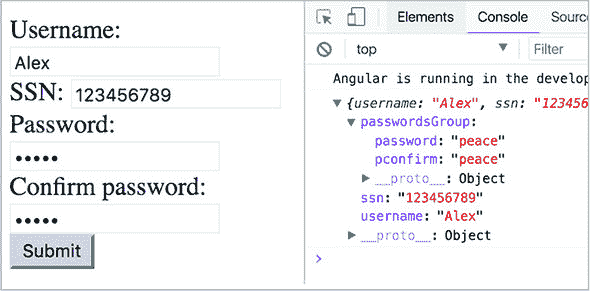
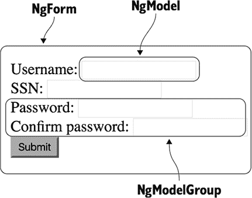
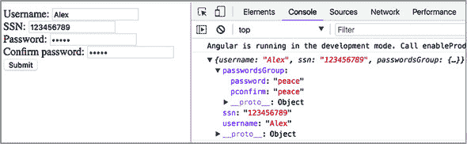
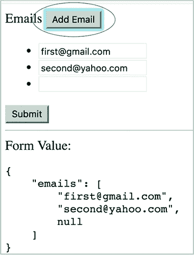

## 第十章\. 介绍表单 API

*本章涵盖*

+   理解 Angular 表单 API

+   使用模板驱动表单

+   使用响应式表单

HTML 提供了显示表单、验证输入值以及将数据提交到服务器的基本功能。但 HTML 表单可能不足以满足现实世界的应用需求，这些应用需要一种程序化处理输入数据、应用自定义验证规则、显示用户友好的错误信息、转换输入数据格式以及选择将数据提交到服务器的方式的方法。对于商业应用来说，在选择 Web 框架时，最重要的考虑因素之一是它处理表单的能力如何。

Angular 为处理表单提供了丰富的支持。它不仅超越了常规的数据绑定，还将表单字段视为一等公民，并提供了对表单数据的精细控制。在本章中，我们将向您介绍两个表单 API：模板驱动和响应式。

### 10.1\. 两个表单 API

每个由 Angular 驱动的表单都有一个底层模型对象，用于存储表单数据。在 Angular 中处理表单有两种方法：*模板驱动*和*响应式*。这两种方法分别作为两个不同的 API（一组指令和 TypeScript 类）公开。

使用 *模板驱动* API，表单完全通过组件的模板使用指令编程，模型对象由 Angular 隐式创建。模板定义了表单的结构、字段格式和验证规则。由于在定义表单时你受限于 HTML 语法，因此模板驱动方法仅适用于简单表单。

使用响应式 API，你需要在 TypeScript 代码中显式创建模型对象，然后使用特殊指令将 HTML 模板元素链接到该模型的属性。你使用 `FormControl`、`FormGroup` 和 `FormArray` 类显式构建表单模型对象。在模板驱动方法中，你不会直接访问这些类，而在响应式方法中，你显式创建这些类的实例。对于非平凡表单，响应式方法是一个更好的选择。

在开始使用之前，模板驱动和响应式 API 都需要显式启用。要启用响应式表单，请将 `ReactiveFormsModule` 从 `@angular/forms` 添加到 `NgModule` 的 `imports` 列表中。对于模板驱动表单，如以下示例所示，导入 `FormsModule`。

##### 列表 10.1\. 准备使用模板驱动表单 API

```
...
import { FormsModule} from '@angular/forms';

@NgModule({
  imports: [ BrowserModule,
             FormsModule]        *1*
   ...
})
class AppModule {}
```

+   ***1* 添加了对模板驱动表单 API 的支持**

是时候更详细地讨论这两个 API 了。

### 10.2\. 模板驱动表单

使用模板驱动 API，你只能在组件的模板中使用指令。这些指令包含在 `FormsModule` 中：`NgModel`、`NgModelGroup` 和 `NgForm`。我们将简要介绍这些指令，然后应用模板驱动方法到示例注册表单中。

#### 10.2.1\. 表单指令

本节简要介绍了 `FormsModule` 的三个主要指令：`NgModel`、`NgModelGroup` 和 `NgForm`。我们将向您展示它们如何在模板中使用，并突出它们最重要的功能。

##### NgForm

`NgForm` 是表示整个表单的指令。它自动附加到每个 `<form>` 元素上。`NgForm` 隐式创建一个 `FormGroup` 类的实例，该实例表示模型并存储表单数据（关于 `FormGroup` 的更多内容将在本章后面介绍）。`NgForm` 自动发现所有带有 `NgModel` 指令的子 HTML 元素，并将它们的值添加到表单模型对象中。

您可以将隐式创建的 `NgForm` 对象绑定到局部模板变量，以便在模板内部访问 `NgForm` 对象的值，如下面的列表所示。

##### 列表 10.2\. 将 `NgForm` 绑定到模板变量

```
<form #f="ngForm"></form>            *1*

<pre>{{ f.value | json }}</pre>      *2*
```

+   ***1* 声明一个局部模板变量 f 并将其绑定到 ngForm**

+   ***2* 显示表单模型中的值**

局部模板变量 `f` 指向 `<form>` 元素上附加的 `NgForm` 实例。然后您可以使用 `f` 变量来访问 `NgForm` 对象的实例成员。其中之一是 `value`，它表示一个包含所有表单字段当前值的 JavaScript 对象。您可以通过标准的 `json` 管道传递它，以在页面上显示表单的值。

`NgForm` 截获标准 HTML 表单的 `submit` 事件并阻止自动表单提交。相反，它发出自定义的 `ngSubmit` 事件：

```
<form #f="ngForm" (ngSubmit)="onSubmit(f.value)"></form>
```

这通过事件绑定语法订阅 `ngSubmit` 事件。`onSubmit` 处理器是在组件中定义的一个具有任意名称的方法，当 `ngSubmit` 事件发出时会被调用。为了将所有表单的值作为参数传递给此方法，请使用局部模板变量（例如，`f`）来访问 `NgForm` 的 `value` 属性。

##### NgModel

第二章第 2.6.2 节 讨论了如何使用 `NgModel` 指令进行双向数据绑定。但在表单 API 中，`NgModel` 扮演着不同的角色：它标记了应该成为表单模型一部分的 HTML 元素。

在表单 API 的上下文中，`NgModel` 表示表单上的单个字段。如果一个 HTML 元素包含 `ngModel`，Angular 会隐式创建一个 `FormControl` 类的实例，该实例表示模型并存储字段数据（关于 `FormControl` 的更多内容将在本章后面介绍）。请注意，表单 API 不需要为 `ngModel` 分配值，也不需要围绕此属性使用任何类型的括号，如下面的列表所示。

##### 列表 10.3\. 将 `NgModel` 指令添加到 HTML 元素

```
<form #f="ngForm">
  <input type="text"
         name="username"        *1*
          ngModel>              *2*
 </form>
```

+   ***1* 名称属性是必需的，这样您可以在代码中访问其值。**

+   ***2* 确保此 <input> 字段包含在表单模型对象中**

`NgForm.value` 属性指向包含所有表单字段值的 JavaScript 对象。字段名称属性的值成为 `NgForm.value` 中对应属性的属性名。


##### 注意

虽然实现表单指令的类名首字母大写，但在模板中它们的名称应该以小写字母开头（例如，`NgForm` 与 `ngForm`）。


##### NgModelGroup

`NgModelGroup` 表示表单的一部分，允许您将表单字段分组在一起。像 `NgForm` 一样，它隐式创建了一个 `FormGroup` 类的实例。`NgModelGroup` 在存储在 `NgForm.value` 中的对象内部创建一个嵌套对象。`NgModelGroup` 的所有子字段都成为嵌套对象的属性，如下所示。

##### 列表 10.4\. 嵌套表单

```
<form #f="ngForm">
  <div ngModelGroup="passwords">                                       *1*
     <input type="text" name="password" ngModel>
    <input type="text" name="pconfirm" ngModel>
  </div>
</form>

<!-- Access the values from the nested object-->
<pre>Password: {{ f.value.passwords.password }}</pre>                  *2*
 <pre>Password confirmation: {{ f.value.passwords.pconfirm }}</pre>    *2*
```

+   ***1* ngModelGroup 属性需要一个字符串值，该值成为表示嵌套表单的属性名。**

+   ***2* 使用嵌套对象 passwords 作为参考，访问密码和 pconfirm 表单控件的值**

表 10.1 包含了在模板驱动表单中使用的指令摘要。

##### 表 10.1\. 模板驱动表单指令

| 指令 | 描述 |
| --- | --- |
| NgForm | 隐式创建的指令，表示整个表单 |
| ngForm | 在模板中使用，用于将模板元素（例如，<form>）绑定到 NgForm，通常分配给本地模板变量 |
| NgModel | 隐式创建的指令，用于标记要包含在表单模型中的 HTML 元素 |
| ngForm | 在模板中的表单元素（例如，<input>）中使用，以包含在表单模型中 |
| name | 在模板中的表单元素中使用，用于指定其在表单模型中的名称 |
| NgModelGroup | 隐式创建的指令，表示表单的一部分，例如密码和确认密码字段 |
| ngModelGroup | 在模板中使用，用于为表单的一部分命名，以便将来引用 |
| ngSubmit | 拦截 HTML 表单的提交事件 |

#### 10.2.2\. 将模板驱动 API 应用到 HTML 表单

让我们创建一个简单的用户注册表单，应用模板驱动表单 API。您还将添加验证逻辑并启用对 `ngSubmit` 事件的程序性处理。您将从创建模板开始，然后处理 TypeScript 部分。首先，修改标准的 HTML `<form>` 元素以匹配以下列表。

##### 列表 10.5\. Angular 感知表单

```
<form #f="ngForm"                                     *1*
       (ngSubmit)="onSubmit(f.value)">                *2*
         <!-- Form controls will be added here -->
</form>
```

+   ***1* 将 NgForm 绑定到本地模板变量**

+   ***2* 提交表单，将表单模型传递给事件处理器**

本地模板变量 `f` 指向 DOM 中 `<form>` 元素附加的 `NgForm` 对象。您需要此变量来访问表单的属性（例如 `value` 和 `valid`），并检查表单在特定字段中是否有错误。

`ngSubmit` 事件由 `NgForm` 触发。您不需要监听标准的提交事件，因为 `NgForm` 会拦截提交事件并阻止其传播。这防止了表单自动提交到服务器，从而导致页面刷新。相反，`NgForm` 会触发它自己的 `ngSubmit` 事件。

`onSubmit()` 方法将处理 `ngSubmit` 事件，并将此方法添加到组件的类中。它接受一个参数——表单的值，这是一个普通的 JavaScript 对象，它保存表单上所有字段的值。接下来，添加 `username` 和 `ssn` 字段（SSN 是每个美国居民都有的唯一 ID）。

##### 列表 10.6\. 用户名和 ssn 字段

```
<div>Username: <input type="text" name="username" ngModel></div>      *1*
 <div>SSN:      <input type="text" name="ssn"      ngModel></div>     *2*
```

+   ***1* ngModel 属性使这个 <input> 元素成为 NgForm 的一部分。您还添加了具有值 username 的 name 属性。**

+   ***2* 对 ssn 字段进行类似的更改**

现在您将添加输入和确认密码的字段。因为这些字段相关且表示相同的值，所以将它们组合成一个组是自然的。将两个密码包装在一个单独的对象中对于实现一个验证器很有用，该验证器检查两个密码是否相同，如下所示（您将在第 11.3.1 节中看到如何实现，见第十一章）。

##### 列表 10.7\. 密码字段

```
<div ngModelGroup="passwordsGroup">                *1*
   <div>Password: <input type="password"
                  name="password" ngModel></div>   *2*
   <div>Confirm password: <input type="password"   *2*
                  name="pconfirm" ngModel></div>   *2*
 </div>
```

+   ***1* ngModelGroup 指令指示 NgForm 在表单的值对象内创建一个嵌套对象，以保存子字段。**

+   ***2* 密码和 pconfirm 字段的更改与 ngModelGroup 类似，但 name 属性的值不同。**

提交按钮与表单的纯 HTML 版本相同：

```
<button type="submit">Submit</button>
```

现在您已经完成了模板，您将在以下列表中将其用于组件。

##### 列表 10.8\. 使用模板驱动的表单 API 的组件

```
@Component({
  selector: 'app-root',
  template: `
    <form #f="ngForm" (ngSubmit)="onSubmit(f.value)">                        *1*
       <div>Username:        <input type="text"     name="username" ngModel>
       </div>
      <div>SSN:             <input type="text"     name="ssn"      ngModel>
      </div>
      <div ngModelGroup="passwordsGroup"> 2((CO8-2))                         *2*
         <div>Password:        <input type="password" name="password" ngModel>
         </div>
         <div>Confirm password: <input type="password" name="pconfirm"  ngModel>
         </div>
      </div>
      <button type="submit">Submit</button>
    </form>
  `
})
export class AppComponent {
  onSubmit(formData) {                                                       *3*
     console.log(formData);
  }
}
```

+   ***1* 将 NgForm 绑定到本地模板变量并提交表单**

+   ***2* 为密码创建一个嵌套组**

+   ***3* onSubmit 事件的处理器方法**

`onSubmit()` 事件处理器接受一个参数：表单模型值，一个包含字段值的对象。如您所见，处理器不使用 Angular 特定的 API。根据模型上的有效性标志，您可以决定是否将 `formData` 发送到服务器。在这个例子中，您将其打印到控制台。

要查看此应用程序的实际运行情况，请在 form-samples 目录中运行 `npm install`，然后运行以下命令：

```
ng serve --app template -o
```

填写表单并点击提交按钮。模型对象的值将在浏览器控制台中打印出来，如图 10.1 所示。

##### 图 10.1\. 运行模板驱动的注册表单



图 10.2 显示了一个应用了表单指令的示例注册表单。每个表单指令都被圈出，以便您可以查看构成表单的内容。展示如何使用表单指令的完整运行应用程序位于模板驱动目录中。

##### 图 10.2\. 注册表单上的表单指令




##### 注意

本章的源代码可以在 [`github.com/Farata/angulartypescript`](https://github.com/Farata/angulartypescript) 和 [www.manning.com/books/angular-development-with-typescript-second-edition](http://www.manning.com/books/angular-development-with-typescript-second-edition) 找到。


### 10.3\. 响应式表单

创建响应式表单比创建模板驱动表单需要更多步骤。简而言之，您需要执行以下步骤：

> **1**. 在声明组件的 `NgModule()` 中导入 `ReactiveFormsModule`。
> 
> **2**. 在您的 TypeScript 代码中，创建一个 `FormGroup` 模型对象的实例以存储表单的值。
> 
> **3**. 创建一个 HTML 表单模板，添加响应式指令。
> 
> **4**. 使用 `FormGroup` 的实例来访问表单的值。

将 `ReactiveFormsModule` 添加到 `@NgModule()` 装饰器中是一个简单的操作。

##### 列表 10.9\. 添加响应式表单支持

```
import { ReactiveFormsModule } from '@angular/forms';
@NgModule({
  ...
  imports: [
    ...
    ReactiveFormsModule        *1*
   ],
  ...
})
```

+   ***1* 导入支持响应式表单的模块**

现在我们来谈谈如何创建表单模型。

#### 10.3.1\. 表单模型

表单模型是一种数据结构，用于存储表单的数据。它可以由 `FormControl`、`FormGroup` 和 `FormArray` 类构建。例如，以下代码示例声明了一个类型为 `FormGroup` 的类属性，并用一个新对象初始化它，该对象将包含您表单的表单控件实例。

##### 列表 10.10\. 创建表单模型对象

```
myFormModel: FormGroup;
  constructor() {
    this.myFormModel = new FormGroup({    *1*
       username: new FormControl(''),     *2*
       ssn: new FormControl('')           *2*
     });
  }
```

+   ***1* 创建表单模型实例**

+   ***2* 向表单模型添加表单控件**

##### FormControl

`FormControl` 是一个原子表单单元。它通常对应于一个单独的 `<input>` 元素，但它也可以表示一个更复杂的 UI 组件，如日历或滑块。一个 `FormControl` 实例存储了它对应的 HTML 元素的当前值、元素的验证状态以及它是否已被修改。以下是如何创建一个控制器的示例，将初始值作为构造函数的第一个参数传递：

```
let city = new FormControl('New York');
```

您还可以通过附加一个或多个内置或自定义验证器来创建 `FormControl`。第十一章介绍了表单验证，但以下代码示例展示了如何将两个内置的 Angular 验证器附加到表单控件上。

##### 列表 10.11\. 向表单控件添加验证器

```
let city = new FormControl('New York',              *1*
                 [Validators.required,              *2*
                  Validators.minLength(2)]);        *3*
```

+   ***1* 创建具有初始值“纽约”的表单控件**

+   ***2* 向表单控件添加必填验证器**

+   ***3* 向表单控件添加最小长度验证器**


##### 注意

您可以在模板中添加`formControl`指令，而无需将其包裹在`NgForm`指令内——例如，它可以与独立的`<input>`元素一起使用。您可以在第六章的第 6.3 节中找到一个这样的例子。


##### `FormGroup`

`FormGroup`是一组`FormControl`对象，代表整个表单或其部分。`FormGroup`聚合组中每个`FormControl`的值和有效性。如果组中的一个控制项无效，则整个组变为无效。以下列表显示了使用`FormGroup`来表示表单或其部分的使用方法。

##### 列表 10.12\. 通过实例化`FormGroup`创建表单模型

```
myFormModel: FormGroup;
  constructor() {
    this.myFormModel = new FormGroup({        *1*
       username: new FormControl(''),
      ssn: new FormControl(''),
      passwordsGroup: new FormGroup({         *2*
         password: new FormControl(''),       *3*
         pconfirm: new FormControl('')        *4*
       })
    });
  }
```

+   ***1* 这个`FormGroup`实例代表整个表单。**

+   ***2* 这个`FormGroup`实例代表表单的一部分，将两个密码控制项组合在一起。**

+   ***3* 声明并初始化密码表单控制**

+   ***4* 声明并初始化密码确认的`pconfirm`控制**

在第 10.3.6 节中，您将看到创建嵌套表单模型的简化语法。

##### `FormArray`

当您需要以编程方式向表单（或从表单中）添加（或删除）控制项时，请使用`FormArray`。它与`FormGroup`类似，但有一个`length`变量。`FormGroup`代表整个表单或表单的固定子集，而`FormArray`通常代表可以增长或缩小的表单控制项集合。例如，您可以使用`FormArray`允许用户输入任意数量的电子邮件。以下列表显示了支持此类表单的模型。

##### 列表 10.13\. 将`FormArray`添加到`FormGroup`

```
let myFormModel = new FormGroup({    *1*
   emails: new FormArray([           *2*
     new FormControl()               *3*
   ])
});
```

+   ***1* `FormGroup`实例代表整个表单。**

+   ***2* 这个`FormArray`最初包含一个电子邮件控制。**

+   ***3* 将`FormControl`实例添加到电子邮件数组中**

在第 10.3.4 节中，我们将向您展示一个应用程序，允许用户在运行时添加更多电子邮件控制，以便用户可以输入多个电子邮件。

#### 10.3.2\. 响应式指令

响应式方法还要求您在组件模板中使用指令，但这些指令与模板驱动 API 中的指令不同。响应式指令随`ReactiveFormsModule`一起提供，并以`form`为前缀——例如，`formGroup`（注意小写的`f`）。

您不能在模板中创建一个绑定到响应式指令的局部模板变量，并且这不是必需的。在模板驱动表单中，模型是隐式创建的，局部模板变量会为您提供访问模型或其属性的方法。在响应式表单中，您在 TypeScript 中显式创建一个模型，并且不需要在组件模板中访问模型。

反应式指令 `formGroup` 和 `formControl` 使用方括号中的属性绑定语法将 DOM 元素绑定到模型对象。通过名称将 DOM 元素链接到 TypeScript 模型属性的指令是 `formGroupName`、`formControlName` 和 `formArrayName`。它们只能在带有 `formGroup` 指令标记的 HTML 元素内部使用。让我们看看表单指令。

##### formGroup

`formGroup` 指令将表示整个表单模型的 `FormGroup` 类的实例绑定到顶级表单的 DOM 元素，通常是 `<form>`。在组件模板中，使用小写的 `f` 来表示 `formGroup`，在 TypeScript 中，使用大写的 `F` 创建 `FormGroup` 类的实例。所有附加到子 DOM 元素上的指令都将位于 `formGroup` 的作用域内，并且可以通过名称链接模型实例。要在模板中使用 `formGroup` 指令，您需要首先在组件的 TypeScript 代码中创建 `FormGroup` 的实例，如下面的列表所示。

##### 列表 10.14\. 将 `FormGroup` 绑定到 HTML 表单

```
@Component({
  selector: 'app-root',
  template: `
    <form [formGroup]="myFormModel">                     *1*
     </form>
  `
})
class AppComponent {
  myFormModel = new FormGroup({                          *2*
                 // form controls are created here });
}
```

+   ***1* 将表单模型实例绑定到 formGroup 指令**

+   ***2* 创建表单模型实例**

##### formGroupName

`formGroupName` 指令可用于在模板中链接表单内的嵌套组。在父 `formGroup` 指令的作用域中使用 `formGroupName` 来链接其子 `FormGroup` 实例。下一个列表显示了如何定义使用 `formGroupName` 的表单模型。

##### 列表 10.15\. 使用 `formGroupName`

```
@Component({
  ...                                                          *1*
  template: `<form [formGroup]="myFormModel">                  *2*
                <div formGroupName="dateRange">...</div>
              </form>`
})
class FormComponent {
  myFormModel = new FormGroup({                                *3*
     dateRange: new FormGroup({                                *4*
       from: new FormControl(),
      to  : new FormControl()
    })
  })
}
```

+   ***1* 绑定表示整个表单的 FormGroup**

+   ***2* 将此 <div> 链接到在 myFormModel 中定义的名为 dateRange 的 FormGroup**

+   ***3* 此 FormGroup 使用模板中的 formGroup 指令绑定到 DOM 元素。**

+   ***4* 使用模板中的 formGroupName 指令将名为 dateRange 的子 FormGroup 绑定到 DOM 元素。**

##### formControlName

`formControlName` 必须在 `formGroup` 指令的作用域中使用。它将单个 `FormControl` 实例链接到 DOM 元素。让我们继续添加来自上一节中 `dateRange` 模型的示例代码。组件和表单模型保持不变。您只需要添加带有 `formControlName` 指令的 HTML 元素来完成模板。

##### 列表 10.16\. 完成的表单模板

```
<form [formGroup]="myFormModel">
  <div formGroupName="dateRange">
    <input type="date" formControlName="from">      *1*
     <input type="date" formControlName="to">       *2*
   </div>
</form>
```

+   ***1* from 是模型嵌套组 dateRange 中的一个属性名。**

+   ***2* to 是模型嵌套组 dateRange 中的一个属性名。**

与 `formGroupName` 指令类似，您指定要链接到 DOM 元素的 `FormControl` 的名称。同样，这些是在定义表单模型时选择的名称。

##### formControl

`formControl` 指令用于单个表单控件或单控件表单，当你不想使用 `FormGroup` 创建表单模型，但仍想使用表单 API 的功能，如验证和由 `FormControl.valueChanges` 属性提供的响应式行为时。你可以在第六章的 6.4 节 的天气应用中看到它。以下列表展示了从表单 API 视角来看该示例的精髓。

##### 列表 10.17\. `FormControl`

```
@Component({
   ...
   template: `<input type="text" [formControl]="weatherControl">`     *1*
 })
class FormComponent {
  weatherControl: FormControl = new FormControl();                    *2*

  constructor() {
    this.weatherControl.valueChanges                                  *3*
         .pipe(
          debounceTime(500),
          switchMap(city => this.getWeather(city))
        )
        .subscribe(weather => console.log(weather));
  }
}
```

+   ***1* 对于不是 `FormGroup` 部分的独立 `FormControl`，你不能使用 formControlName 指令。使用带有属性绑定的 formControl。**

+   ***2* 不使用 FormGroup 定义表单模型，而是创建一个独立的 `FormControl` 实例。**

+   ***3* 使用 valueChanges 可观察对象从表单中获取值。**

你可以使用 `ngModel`（如第二章的 2.6.2 节）来同步用户输入的值与组件的属性；但由于你正在使用表单 API，你可以使用其响应式功能。在 列表 10.18 中，你将两个 RxJS 操作符应用到 `valueChanges` 属性返回的可观察对象上，以改善用户体验。

#### 10.3.3\. 将响应式 API 应用到 HTML 表单

让我们将用户注册表单从 10.2.2 节 重构为使用响应式表单 API。以下列表使用响应式表单 API，首先在 TypeScript 中创建一个模型对象。

##### 列表 10.18\. 使用响应式 API 创建表单模型

```
@Component(...)
class AppComponent {
  myFormModel: FormGroup;                    *1*

  constructor() {
    this.myFormModel = new FormGroup({       *2*
       username: new FormControl(),
      ssn: new FormControl(),
      passwordsGroup: new FormGroup({        *3*
         password: new FormControl(),
        pconfirm: new FormControl()
      })
    });
  }

  onSubmit() {
    console.log(this.myFormModel.value);     *4*
   }
}
```

+   ***1* 声明一个组件属性 myFormModel 以保存对表单模型的引用**

+   ***2* 创建表单模型的一个实例**

+   ***3* 为密码字段创建一个嵌套组**

+   ***4* 打印表单模型的值**

`myFormModel` 属性保存了对 `FormGroup` 实例的引用。你将在组件模板中将此属性绑定到 `formGroup` 指令。`myFormModel` 属性通过实例化一个模型类进行初始化。你在父 `FormGroup` 中为表单控件指定的名称将在组件的模板中使用，以通过 `formControlName` 和 `formGroupName` 指令将模型链接到 DOM 元素。

`passwordsGroup` 属性表示一个嵌套的 `FormGroup`，它封装了密码和确认密码字段。将它们的值作为一个单独的对象进行验证将会很方便。

| |
| --- |

##### 注意

在响应式 API 中，`onSubmit()` 方法不需要参数，因为你可以通过组件的 `myFormModel` 属性访问表单值。

| |
| --- |

现在模型已经定义，你可以编写绑定到你的模型对象的 HTML 标记。

##### 列表 10.19\. 将 HTML 绑定到模型

```
<form [formGroup]="myFormModel"                                          *1*
       (ngSubmit)="onSubmit()">
  <div>Username: <input type="text" formControlName="username"></div>    *2*
   <div>SSN:      <input type="text" formControlName="ssn"></div>        *2*

  <div formGroupName="passwordsGroup">                                   *3*
     <div>Password: <input type="password"
                          formControlName="password"></div>              *4*

    <div>Confirm password: <input type="password"
                           formControlName="pconfirm"></div>             *4*
   </div>
  <button type="submit">Submit</button>
</form>
```

+   ***1* 使用 formGroup 指令将 <form> 元素绑定到 myFormModel**

+   ***2* formControlName 链接输入字段到模型中定义的相应 `FormControl` 实例。**

+   ***3* 使用 formGroupName 将模型的嵌套 FormGroup 链接到 DOM 元素**

+   ***4* 使用 formControlName 指令将密码输入字段和 pconfirm 链接起来**

此响应式版本的注册表单的行为与模板驱动的版本相同，但内部实现不同。要查看此应用程序的实际运行情况，请在您的 IDE 中打开 form-samples 目录，并运行以下命令：

```
ng serve --app reactive -o
```

填写表单，并点击提交。包含输入值的对象将在浏览器控制台中打印出来，如图 10.3 所示 链接。

##### 图 10.3\. 运行响应式注册表单



这是一个相当简单的表单，具有预定义的控件，但如果你想在运行时动态添加表单控件怎么办？

#### 10.3.4\. 动态向表单添加控件

当您事先知道特定表单中的所有控件时，您可以使用 `formControlName` 指令将每个模板表单元素与 `FormGroup` 实例的相应属性关联起来。但如果你想要能够动态添加/删除控件，你需要一种不同的方式来链接控件名称与模型属性。通过使用 `FormArray` 而不是 `FormGroup`，您可以指定一个数组索引作为相应模板元素的名称。

让我们看看一个示例，允许用户拥有具有任意数量电子邮件控件的表单。首先，您将定义一个模型，该模型将包含一个名为 `emails` 的 `FormArray`，它最初将只有一个用于输入电子邮件的表单控件。

##### 列表 10.20\. 在表单模型中使用 `FormArray`

```
@Component(...)
class AppComponent {
  formModel: FormGroup = new FormGroup({      *1*
     emails: new FormArray([                  *2*
       new FormControl()                      *3*
     ])
  });
  ...
```

+   ***1* 创建一个将表示表单的 FormGroup**

+   ***2* 为电子邮件表单控件创建一个 FormArray**

+   ***3* 向 emails 数组添加单个表单控件**

在模板中，您将创建一个 `<ul>` HTML 元素，并使用 `formArrayName` 指令将其链接到模型的 `emails` 数组。然后，您将使用 `*ngFor` 迭代此数组，为该数组中的每个表单控件渲染一个 `<li>` 元素。您的模板还将有一个添加电子邮件按钮，如果用户点击它，您将向 `emails` 数组添加一个新的 `FormControl`，如下一列表所示。

##### 列表 10.21\. 在模板中迭代 `FormArray`

```
<ul formArrayName="emails">                                                *1*
   <li *ngFor="let e of formModel.get('emails').controls; let i = index">  *2*

     <input [formControlName]="i">                                         *3*
   </li>
</ul>
<button type="button" (click)="addEmail()">Add Email</button>              *4*
```

+   ***1* 将 emails 数组链接到 <ul> 元素**

+   ***2* 迭代 emails 数组并为每个数组元素创建一个 <li> 和 <input> 字段**

+   ***3* 使用 emails 数组元素索引作为相应 <input> 元素的名称**

+   ***4* 定义点击事件处理程序**

在 Angular 模板中，`*ngFor` 指令允许您访问一个特殊的 `index` 变量，该变量在迭代集合时存储当前索引。`*ngFor` 循环中的 `let i` 语法允许您自动将 `index` 值绑定到循环内可用的局部模板变量 `i`。

`formControlName` 指令将 `FormArray` 中的 `FormControl` 与当前渲染的 DOM 元素链接；但不是指定一个名称，而是使用变量 `i` 的当前值。当用户点击“添加电子邮件”按钮时，你的组件会将一个新的 `FormControl` 实例添加到 `FormArray` 中：

```
this.formModel.get('emails').push(new FormControl());
```

在 dynamic-form-controls 目录中，你可以找到在每次点击“添加电子邮件”按钮时动态添加电子邮件表单控件的完整代码。要查看此示例的实际效果，请运行以下命令：

```
ng serve --app dynamic -o
```

图 10.4 展示了用户点击“添加电子邮件”后此表单的外观。第二个电子邮件字段是通过向名为 `emails` 的 `FormArray` 添加一个新的 `FormControl` 实例动态添加的，并且页面上的每个控件都是从该数组渲染的。

##### 图 10.4. 可增长的电子邮件控件表单



### 10.4. 表单 API 指令摘要

你已经在模板驱动和响应式表单中使用了许多不同的 Forms API 指令。表 10.2 列出了它们的作用。

##### 表 10.2. 表单 API 指令

| 指令 | 描述 |
| --- | --- |
| *响应式表单的指令* |
|   | FormGroup | 表示整个表单或子表单的类；在组件的 TypeScript 代码中创建其实例。其 API 在 [`angular.io/api/forms/FormGroup`](https://angular.io/api/forms/FormGroup) 中描述。 |
|   | formGroup | 在模板中使用，将模板元素（例如，<form>）绑定到显式创建的 FormGroup；通常它被分配给在组件中声明的变量。 |
|   | formGroupName | 在模板中使用，将一组模板元素（例如，<div>）绑定到显式创建的 FormGroup。 |
|   | FormControl | 表示单个表单控件的值、验证器和有效性状态；在组件的 TypeScript 代码中创建其实例。其 API 在 [`angular.io/api/forms/FormControl`](https://angular.io/api/forms/FormControl) 中描述。 |
|   | formControl | 在模板中使用，将单个 HTML 元素绑定到 FormControl 的实例。 |
|   | formControlName | 在表单元素中的模板中使用，将单个 FormControl 实例链接到 HTML 元素。 |
|   | FormArray | 允许你动态创建一组表单控件，并使用数组索引作为控件名称。你在 TypeScript 代码中创建 FormArray 的实例。其 API 在 [`angular.io/api/forms/FormArray`](https://angular.io/api/forms/FormArray) 中描述。 |
|   | formArrayName | 在模板中使用，作为 FormArray 实例的引用。 |
| *模板驱动表单的指令* |
|   | NgForm | 隐式创建的指令，代表整个表单；它创建一个 FormGroup 实例。其 API 在 [`angular.io/api/forms/NgForm`](https://angular.io/api/forms/NgForm) 中描述。 |
|   | ngForm | 在模板中使用，用于将模板元素（例如，<form>）绑定到 NgForm；通常，它被分配给局部模板变量。 |
|   | NgModel | 隐式创建的指令，用于标记要包含在表单模型中的 HTML 元素。其 API 在 [`angular.io/api/forms/NgModel`](https://angular.io/api/forms/NgModel) 中描述。 |
|   | ngModel | 在表单元素模板中（例如，<input>）使用，以包含在表单模型中。 |
|   | name | 在表单元素模板中使用，以指定其在表单模型中的名称。 |
|   | NgModelGroup | 隐式创建的指令，代表表单的一部分，如密码和确认密码字段。其 API 在 [`angular.io/api/forms/NgModelGroup`](https://angular.io/api/forms/NgModelGroup) 中描述。 |
|   | ngModelGroup | 在模板中使用，用于为表单的一部分命名，以便将来引用。 |
| *模板驱动和响应式表单* |
|   | ngSubmit | 拦截 HTML 表单的提交事件。 |

注意，在组件模板中使用的任何指令的名称都以小写字母开头。实现指令的底层类的名称以大写字母开头。在模板驱动表单中，你不需要显式创建这些类的实例，但在响应式表单中，你需要根据需要在使用 TypeScript 代码时实例化它们。

本章中的所有代码示例都说明了用户在表单中输入数据的使用案例，但通常你需要用现有数据填充表单。

### 10.5\. 更新表单数据

在某些场景中，表单需要在用户交互之前填充。例如，你可能需要创建一个用于编辑从服务器或其他来源检索到的产品数据的表单。另一个例子是实现主从关系——例如，在列表中选择一个产品应在表单中显示其详细信息。

Angular 表单 API 提供了多个用于更新表单模型的函数，包括 `reset()`、`setValue()` 和 `patchValue()`。`reset()` 函数重新初始化表单模型并重置模型上的标志，如 `touched`、`dirty` 等。`setValue()` 函数用于更新表单模型中的所有值。`patchValue()` 函数用于需要更新表单模型选定属性的情况。让我们创建一个简单的应用程序，它将包含以下列表中所示的模式。

##### 列表 10.22\. 创建表单模型

```
this.myFormModel = new FormGroup({
      id: new FormControl(''),
      description: new FormControl(''),
      seller: new FormControl('')
    });
```

你的应用程序还将有三个按钮：填充、更新描述和重置。相应地，填充按钮使用 `setValue()` 来填充具有表单模型中每个控件值的对象。

##### 列表 10.23\. 用于填充表单的数据

```
{
  id: 123,
  description: 'A great product',
  seller: 'XYZ Corp'
}
```

更新描述按钮使用 `patchValue()` 从下一列表中的对象进行部分表单更新（仅描述）。

##### 列表 10.24\. 用于更新描述的数据

```
{
  description: 'The best product'
}
```

重置按钮会从表单中删除所有数据并重置表单模型上的所有标志。你的应用的代码如下所示。

##### 列表 10.25\. AppComponent

```
@Component({
  selector: 'app-root',
  template: `
    <form [formGroup]="myFormModel">                                         *1*
       <div>Product ID: <input type="text" formControlName="id"></div>
      <div>Description: <input type="text" formControlName="description"></div>
      <div>Seller:      <input type="text" formControlName="seller"></div>
    </form>
    <button (click)="updateEntireForm()">Populate</button>                   *2*
     <button (click)="updatePartOfTheForm()">Update Description</button>     *3*
     <button (click)="myFormModel.reset()">Reset</button>                    *4*
   `
})
export class AppComponent {
  myFormModel: FormGroup;

  constructor() {
    this.myFormModel = new FormGroup({                                      *5*
       id: new FormControl(''),
      description: new FormControl(''),
      seller: new FormControl('')
    });
  }

  updateEntireForm() {
    this.myFormModel.setValue({                                             *6*
       id: 123,
      description: 'A great product',
      seller: 'XYZ Corp'
    });
  }
  updatePartOfTheForm() {
    this.myFormModel.patchValue({                                           *7*
       description: 'The best product'
    });
  }
}
```

+   ***1* 将表单模型绑定到 formGroup**

+   ***2* 一个用于调用 setValue() 的按钮**

+   ***3* 一个用于调用 patchValue() 的按钮**

+   ***4* 一个用于调用 reset() 的按钮**

+   ***5* 创建一个表单模型对象**

+   ***6* 在表单模型上调用 setValue()**

+   ***7* 在表单模型上调用 patchValue()**

此应用的代码位于 populate 目录中。要查看其运行情况，请运行以下命令：

```
ng serve --app populate -o
```


##### 注意

你不能在使用 `FormArray` 的表单中使用 `setValue()`。对于此类表单，你需要使用 `patchValue()`，然后在对表单模型调用 `setControl()` 方法来重置 `FormArray`。


如果一个表单有多个控件，你的代码可能包含很多 `new` 操作符来创建表单元素的实例。有没有一种方法可以避免在代码中污染 `new` 语句？

### 10.6\. 使用 FormBuilder

注入式服务 `FormBuilder` 简化了表单模型的创建。它与直接使用 `FormControl`、`FormGroup` 和 `FormArray` 类没有提供任何独特功能，但它的 API 更简洁，可以节省你重复实例化对象的时间。

让我们重构用户注册表单中的代码，第 10.3.3 节。模板将保持完全相同，但以下列表使用 `FormBuilder` 来构建表单模型。

##### 列表 10.26\. 使用 `FormBuilder` 创建 `formModel`

```
constructor(fb: FormBuilder) {        *1*
   this.myFormModel = fb.group({      *2*
     username: [''],                  *3*
     ssn: [''],
    passwordsGroup: fb.group({        *4*
       password: [''],
      pconfirm': ['']
    })
  });
}
```

+   ***1* 注入 FormBuilder 服务。**

+   ***2* FormBuilder.group() 使用传递给它的配置对象创建一个 FormGroup。**

+   ***3* 每个 FormControl 都使用可能包含初始控件值及其验证器的数组进行实例化。**

+   ***4* 与 FormGroup 类似，FormBuilder 允许你创建嵌套组。**

`FormBuilder.group()` 方法接受一个对象作为最后一个参数，该对象包含额外的配置参数。如果需要，你可以用它来指定组级别的验证器。

正如你所见，使用 `FormBuilder` 配置表单模型更加简洁，它基于配置对象而不是需要显式实例化控件类。

要查看此应用的运行情况，请运行命令 `ng serve --app formbuilder -o`。现在你了解了如何处理表单模型和模板，你可能想知道如何确保在表单中输入的值是有效的。这是下一章的主题。

### 摘要

+   Angular 为表单操作提供了两个 API：模板驱动和响应式。

+   模板驱动方法更容易、更快速地配置，但功能有限。

+   响应式方法让你对表单有更多的控制，表单可以在运行时创建或修改。
