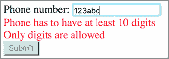
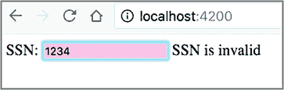
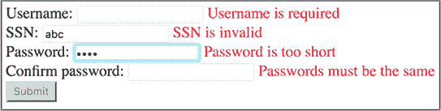
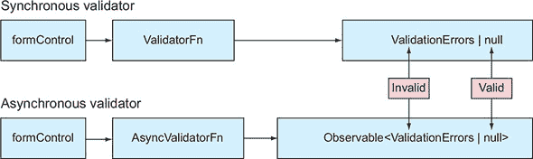
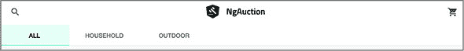
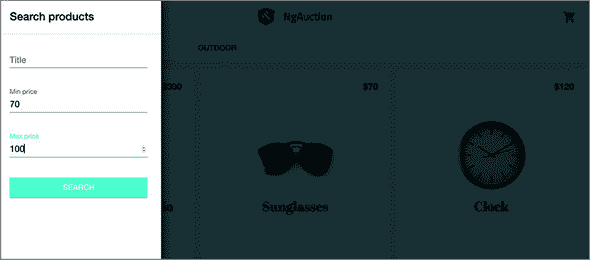
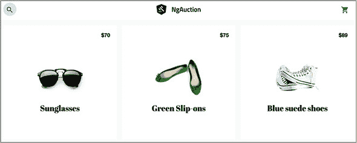
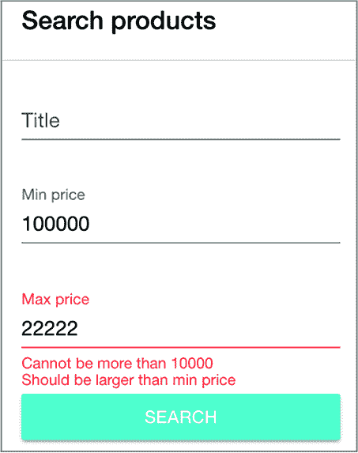
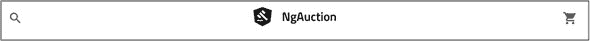

## 第十一章. 验证表单

*本章涵盖*

+   使用内置表单验证器

+   创建自定义验证器

+   处理同步和异步验证

用户填写表单并点击提交，期望应用程序以某种方式处理数据。在 Web 应用程序中，数据通常被发送到服务器。通常，用户会收到一些数据回传（例如，搜索结果），但有时，数据只是保存在服务器的存储中（例如，创建新订单）。在任何情况下，数据都应该是有效的，以便服务器的软件能够正确地执行其工作。

例如，应用程序不能在没有在登录表单中提供用户 ID 和密码的情况下登录用户。这两个字段都是必需的——否则，表单无效。您甚至不应允许用户在填写所有必需字段之前提交此表单。如果密码不包含至少 8 个字符，包括一个数字、一个大写字母和一个特殊字符，则用户注册表单可能被认为是无效的。

在本章中，我们将向您展示如何使用内置验证器在 Angular 中验证表单以及如何创建自定义表单。在本章末尾，您将开发 ngAuction 的新版本，该版本将包含三个字段。输入的值将首先进行验证，然后才会提交以查找符合输入标准的商品。

我们将首先通过使用响应式表单来探索内置验证器，然后转向模板驱动型验证器。

### 11.1. 使用内置验证器

Angular 表单 API 包含 `Validators` 类，其中包含静态函数，如 `required()`、`minLength()`、`maxLength()`、`pattern()`、`email()` 等。这些内置验证器可以通过指定指令 `required`、`minLength`、`maxLength`、`pattern` 和 `email` 分别在模板中使用。`pattern` 验证器允许您指定一个正则表达式。

验证器是符合以下列表中接口的函数。

##### 列表 11.1. `ValidatorFn` 接口

```
interface ValidatorFn {
  (c: AbstractControl): ValidationErrors | null;
}
```

如果验证器函数返回 null，则表示没有错误。否则，它将返回一个类型为 `{[key: string]: any}` 的 `ValidationErrors` 对象，其中属性名（错误名称）是字符串，而值（错误描述）可以是任何类型。

验证器函数应声明一个类型为 `AbstractControl`（或其子类）的单个参数，并返回一个对象字面量或 null。在那里，你实现业务逻辑以验证用户输入。`AbstractControl` 是 `FormControl`、`FormGroup` 和 `FormArray` 的超类；因此，可以为所有模型类创建验证器。

使用响应式表单 API，您可以在创建表单或表单控件时提供验证器，也可以在运行时动态附加验证器。下面的列表显示了将 `required` 验证器附加到由变量 `username` 表示的表单控件的示例。

##### 列表 11.2. 附加 `required` 验证器

```
import { FormControl, Validators } from '@angular/forms';
...
let username = new FormControl('', Validators.required);       *1*
```

+   ***1. 将所需的验证器附加到 FormControl**

在这里，构造函数的第一个参数是控件的初始值，第二个是验证器函数。您还可以将多个验证器附加到表单控件上。

##### 列表 11.3\. 附加两个验证器

```
let username = new FormControl('',
           [Validators.required, Validators.minLength(5)]);      *1*
```

+   ***1* 将必填和最小长度验证器附加到 FormControl**

要查询表单或表单控件的验证状态，请使用 `valid` 属性，它可以是两个值之一，`true` 或 `false`：

```
let isValid: boolean = username.valid;
```

上一行检查表单控件中输入的值是否通过附加到该控件的全部验证规则。如果任何规则失败，您将获得由验证器函数生成的错误对象，如下一个列表所示。

##### 列表 11.4\. 获取验证器的错误

```
let errors: {[key: string]: any} = username.errors;    *1*
```

+   ***1* 获取验证器报告的所有错误**

使用 `hasError()` 方法，您可以检查表单或控件是否有特定错误，并条件性地显示或隐藏相应的错误信息。

现在我们来看看如何在模板驱动的表单中应用内置验证器。您将创建一个应用，说明如何为 `required`、`minLength` 和 `pattern` 验证器显示或隐藏错误信息。如果用户输入无效的电话号码，此应用的 UI 可能看起来像 图 11.1。

##### 图 11.1\. 展示验证错误



应用组件的模板将包括位于 `<input>` 下的 `<div>` 元素，其中包含错误信息。如果电话号码有效或其值未输入（*pristine*），则 `<div>` 将被隐藏，如下面的列表所示。提交按钮将保持禁用状态，直到用户输入一个通过所有验证器的值。

##### 列表 11.5\. 条件性地显示和隐藏错误

```
@Component({
  selector: 'app-root',
  template: `
    <form #f="ngForm" (ngSubmit)="onSubmit(f.value)" >
      <div>
        Phone Number:
        <input type="text" name="telephone" ngModel
               required                                                  *1*
                pattern="[0-9]*"                                         *2*
                minlength="10"                                           *3*
                #phone="ngModel">                                        *4*
         <div [hidden]="phone.valid || phone.pristine">                  *5*
           <div class="error" [hidden]="!phone.hasError('required')">    *6*
                Phone is required</div>
          <div class="error" [hidden]="!phone.hasError('minlength')">    *7*
                Phone has to have at least 10 digits</div>
          <div class="error" [hidden]="!phone.hasError('pattern')">      *8*
                Only digits are allowed</div>
        </div>

      </div>
      <button type="submit" [disabled]="f.invalid">Submit</button>       *9*
     </form>
  `,
  styles: ['.error {color: red}']
})
export class AppComponent {
  onSubmit(formData) {
    console.log(formData);
  }
}
```

+   ***1* 添加必填验证器**

+   ***2* 添加模式验证器以允许仅数字**

+   ***3* 添加最小长度验证器**

+   ***4* 局部变量 #phone 提供了对该控件模型值的访问。**

+   ***5* 如果表单控件有效或 pristine，则隐藏错误部分**

+   ***6* 如果输入了值然后删除，则显示错误信息**

+   ***7* 如果值违反最小长度要求，则显示错误信息**

+   ***8* 如果值不匹配正则表达式，则显示错误信息**

+   ***9* 在表单有效之前禁用提交按钮**

要查看此应用的运行情况，请在名为 form-validation 的项目文件夹中运行 `npm install`，然后运行以下命令：

```
ng serve --app threevalidators -o
```


**验证错误对象**

验证器返回的错误由一个具有描述错误名称属性的 JavaScript 对象表示。属性值可以是任何类型，并且可能提供额外的错误详细信息。例如，标准的 `Validators.minLength()` 验证器返回的错误对象如下所示：

```
{
  minlength: {
    requiredLength: 7,
    actualLength: 5
  }
}
```

此对象有一个名为`minlength`的属性，表示最小长度无效。此属性的值也是一个具有两个字段的对象：`requiredLength`和`actualLength`。这些错误详情可用于显示友好的错误消息。并非所有验证器都提供错误详情。有时，该属性仅指示已发生错误。在这种情况下，该属性被初始化为`true`。

以下代码片段展示了内置`Validators.required()`错误对象的示例：

```
{
  required: true
}
```

在第 11.6 节中，您将找到一个如何从`ValidationErrors`对象中提取错误描述的示例。


表 11.1 提供了由`Validators`类提供的 Angular 内置验证器的简要描述。

##### 表 11.1\. 内置验证器

| 验证器 | 描述 |
| --- | --- |
| min | 值不能小于指定的数字；它只能与响应式表单一起使用。 |
| max | 值不能大于指定的数字；它只能与响应式表单一起使用。 |
| required | 表单控件必须有一个非空值。 |
| requiredTrue | 表单控件必须具有 true 值。 |
| email | 表单控件值必须是一个有效的电子邮件地址。 |
| minLength | 表单控件必须具有最小长度的值。 |
| maxLength | 表单控件不能超过指定的字符数。 |
| pattern | 表单控件值必须匹配指定的正则表达式。 |

在验证电话号码的代码示例中，验证器会在用户输入每个字符后检查值。是否可以控制验证何时开始？

### 11.2\. 控制验证开始的时间

在 Angular 5 之前，验证器会在表单控件中的每个值更改时执行其工作。现在，您可以使用`updateOn`属性，这使您能够更好地控制验证过程。当您附加验证器时，您可以指定验证应该何时开始。`updateOn`属性可以取以下值之一：

+   **`change`—** 这是默认模式，验证器会在值更改时立即检查值。您在上一节验证电话号码时看到了这种行为。

+   **`blur`—** 当控件失去焦点时检查值的有效性。

+   **`submit`—** 当用户提交表单时检查有效性。

要尝试使用模板驱动的表单使用这些选项，请将`[ngModelOptions]= "{updateOn:'blur'}"`添加到列表 11.5 中的电话输入字段，这样当用户将焦点从该控件移开时，才会进行验证。要当提交按钮被点击或按下 Enter 键时开始验证，请使用选项`[ngModelOptions]="{updateOn:'submit'}"`。


##### 注意

如果您使用列表 11.5 中的示例，并使用选项`updateOn: 'submit'`，请移除条件禁用提交按钮的代码或使用 Enter 键来测试验证。


在反应式 API 的情况下，你可以按如下方式设置表单的更新模式。

##### 列表 11.6\. 使用反应式 API 在失焦时应用验证器

```
let telephone = new FormControl('',
           [{validators: Validators.minLength(10),    *1*
              updateOn:'blur'});                      *2*
```

+   ***1* 将 minLength 验证器附加到 FormControl**

+   ***2* 当焦点从 FormControl 中移出时验证值**

你还可以使用属性 `ngFormOptions` 在表单级别指定更新模式，如下面的列表所示。

##### 列表 11.7\. 使用模板驱动 API 在失焦时应用验证器

```
<form #f="ngForm"
      (ngSubmit)="onSubmit(f.value)"
      [ngFormOptions]="{updateOn: 'blur'}">        *1*
   ...
</form>
```

+   ***1* 当焦点从一个表单控件移出时，每个表单控件都会被验证。**

内置验证器适用于基本验证，但如果你需要应用特定于应用程序的逻辑来决定输入的值是否有效呢？

### 11.3\. 反应式表单中的自定义验证器

你可以在 Angular 中创建自定义验证器。与内置验证器类似，自定义验证器应遵守以下列表中的接口。

##### 列表 11.8\. 自定义验证器必须遵守的接口

```
interface ValidatorFn {
  (c: AbstractControl): ValidationErrors | null;        *1*
 }
```

+   ***1* 在出错的情况下，返回 ValidationErrors 对象；否则，返回 null**

你需要声明一个函数，该函数接受控制类型（`FormControl`、`FormGroup` 或 `FormArray`）的实例，并返回 `ValidationErrors` 对象或 null。下面的列表显示了检查控件值是否为有效的社会安全号码（SSN）的自定义验证器示例。

##### 列表 11.9\. 一个示例自定义验证器

```
function ssnValidator(control: FormControl): ValidationErrors | null {   *1*
   const value = control.value || '';                                    *2*
   const valid = value.match(/^\d{9}$/);                                 *3*
   return valid ? null : { ssn: true };                                  *4*
 }
```

+   ***1* 验证 FormControl 并返回一个错误对象或 null**

+   ***2* 如果可用，则获取控件值，否则使用空字符串**

+   ***3* 将值与表示 SSN 九位格式的正则表达式进行匹配**

+   ***4* 如果值是无效的 SSN，则返回错误对象；错误名称是 ssn**

你可以像附加内置验证器一样附加自定义验证器到表单控件，如下面的列表所示。

##### 列表 11.10\. 将自定义验证器附加到表单控件

```
@Component({
  selector: 'app-root',
  template: `
    <form [formGroup]="myForm">
      SSN: <input type="text" formControlName="socialSecurity">
         <span [hidden]="!myForm.hasError('ssn', 'socialSecurity')">     *1*
             SSN is invalid
         </span>
    </form>
  `
})
export class AppComponent {
  myForm: FormGroup;

  constructor() {
    this.myForm = new FormGroup({
      socialSecurity: new FormControl('', ssnValidator)                  *2*
     });
  }
}
```

+   ***1* 如果 socialSecurity 表单控件有名为 ssn 的错误，则显示错误信息**

+   ***2* 附加你的自定义 ssnValidator**

你将看到一个输入字段，需要你输入九位数字以消除错误信息。

你的 `ssnValidator` 返回一个错误对象，指示 SSN 值存在问题：`{ ssn: true }`。你将错误文本“SSN 无效”添加到 HTML 模板中。`ValidationErrors` 对象可以包含更具体的错误描述，例如 `{ssn: {description: 'SSN is invalid'}}`，你可以使用 `getError()` 方法获取错误描述。下面的列表显示了修改后的 `ssnValidator` 和模板。

##### 列表 11.11\. 在自定义验证器中添加错误描述

```
function ssnValidator(control: FormControl): {[key: string]: any} {
  const value: string = control.value || '';
  const valid = value.match(/^\d{9}$/);
  return valid ? null : {ssn: {description: 'SSN is invalid'}};            *1*
 }

@Component({
  selector: 'app',
  template: `
    <form [formGroup]="myForm">
      SSN: <input type="text" formControlName="socialSecurity">
           <span [hidden]="!myForm.hasError('ssn', 'socialSecurity')">     *2*
              {{myForm.getError('ssn', 'socialSecurity')?.description}}    *3*
            </span>
    </form>
  `
})
class AppComponent {
  myForm: FormGroup;

  constructor() {
    this.form = new FormGroup({
      'socialSecurity': new FormControl('', ssnValidator)
    });
  }
}
```

+   ***1* 创建一个包含错误描述的特定对象**

+   ***2* 从错误的描述属性中获取错误信息**

+   ***3* 如果 socialSecurity 表单控件获得了名为 ssn 的错误，则显示错误信息**


##### 注意

在 列表 11.10 中，你使用了 Angular 的 *安全导航操作符*，它由一个问号表示，可以在组件模板中使用。`getError()` 调用后的问号表示“如果 `getError()` 返回的对象是未定义或 null，则不要尝试访问 `description` 属性”，这意味着当输入的值有效时。如果你没有使用安全导航操作符，此代码将为有效的 SSN 值产生运行时错误“无法读取 null 的属性 `description`”。


如果你运行此应用，浏览器将显示一个空白的输入字段和消息“SSN 无效”，但用户没有机会输入任何值。在显示验证错误消息之前，始终检查表单控件是否 `dirty`（已被修改）。`<span>` 元素应如下所示。

##### 列表 11.12\. 使用 `dirty` 标志

```
<span [hidden]="!(myForm.get('socialSecurity').dirty                   *1*
                    && myForm.hasError('ssn', 'socialSecurity'))">
        {{myForm.getError('ssn', 'socialSecurity')?.description}}
 </span>
```

+   ***1* 检查表单控件是否已被修改**

现在我们给这个表单添加一些样式。Angular 的表单 API 提供了多个 CSS 类，它们与表单上的相应标志协同工作：`.ng-valid`、`.ng-invalid`、`.ng-pending`、`.ng-pristine`、`.ng-dirty`、`.ng-untouched` 和 `.ng-touched`。在代码示例中，如果值无效且已修改，你想要将输入字段的背景色改为浅粉色，如下面的列表所示。

##### 列表 11.13\. 为输入字段添加样式

```
@Component({
  selector: 'app-root',
  template: `
    <form [formGroup]="myForm">
      SSN: <input type="text" formControlName="socialSecurity"
                  class="social">                                       *1*
       <span [hidden]="!(myForm.get('socialSecurity').dirty
                        && myForm.hasError('ssn', 'socialSecurity'))">
             {{myForm.getError('ssn', 'socialSecurity')?.description}}
      </span>
    </form>
  `,
  styles:[`.social.ng-dirty.ng-invalid {                                *2*
               background-color: lightpink;                             *3*
             }`]
})
```

+   ***1* 添加 CSS 选择器 social**

+   ***2* 字段是否已修改且无效？**

+   ***3* 将背景色改为浅粉色**

展示 `ssnValidator` 在响应式表单中使用的应用程序位于 reactive-validator 目录中，你可以按照以下方式运行它：

```
ng serve --app reactive-validator -o
```

图 11.2 展示了如果值无效，浏览器将如何渲染此应用。

##### 图 11.2\. 显示验证错误和更改背景颜色



现在你已经知道如何为单个表单控件创建自定义验证器，让我们考虑另一个场景：验证一组表单控件。

### 11.4\. 验证一组控件

你可以通过将验证器函数附加到 `FormGroup` 而不是单个 `FormControl` 来验证一组表单控件。以下列表创建了一个 `equalValidator`，确保在示例用户注册表单上的密码和密码确认字段具有相同的值。

##### 列表 11.14\. `FormGroup` 的一个示例验证器

```
function equalValidator({value}: FormGroup): {[key: string]: any} {
  const [first, ...rest] = Object.keys(value || {});                 *1*
   const valid = rest.every(v => value[v] === value[first]);         *2*
   return valid ? null : {equal: true};                              *3*
 }
```

+   ***1* 使用剩余参数，获取 FormGroup.value 的所有属性名称**

+   ***2* 遍历属性值以检查它们是否相等**

+   ***3* 如果相等，则返回 null；否则，返回一个具有 equal 错误名称的错误对象**

前述函数的签名符合 `ValidatorFn` 接口：第一个参数是 `FormGroup` 类型，它是 `AbstractControl` 的子类，返回类型是一个对象字面量。注意，你在这个函数参数中使用对象解构来从 `FormGroup` 对象的实例中提取 value 属性。

你还在函数的第一行使用了数组解构和剩余参数，这样你可以遍历 `FormGroup.value` 的属性。你从值对象中获取所有属性的名称，并将它们保存在两个变量 `first` 和 `rest` 中。`first` 是一个属性，将用作参考值——所有其他属性的值必须等于它才能使验证通过。`rest` 包含所有其他属性的名称。

最后，验证器函数返回 `null`，如果组中的值相同，或者返回一个错误对象，否则。让我们在示例用户注册表单中应用 `ssnValidator` 和 `equalValidator`。以下列表显示了修改后的 `AppComponent` 类的代码。

##### 列表 11.15\. 修改后的用户注册表单的表单模型

```
export class AppComponent {
  formModel: FormGroup;

  constructor(fb: FormBuilder) {                        *1*
     this.formModel = fb.group({                        *2*
       username: ['', Validators.required],             *3*
       socialSecurity: ['', ssnValidator],              *4*
       passwordsGroup: fb.group({                       *5*
       password: ['', Validators.minLength(5)],         *6*
       pconfirm: ['']                                   *7*
     }, {validator: equalValidator})                    *8*
    });
  }

  onSubmit() {
      console.log(this.formModel.value);
  }
}
```

+   ***1* 注入 FormBuilder 服务**

+   ***2* 创建表单模型对象**

+   ***3* 创建 username 控件并附加 required 验证器**

+   ***4* 创建 socialSecurity 控件并附加 ssnValidator**

+   ***5* 为密码和密码确认控件创建子组 passwordsGroup**

+   ***6* 创建密码控件，应用 minLength 验证器**

+   ***7* 创建用于确认密码的 pconfirm 控件**

+   ***8* 将 equalValidator 附加到 passwordsGroup 以确保输入的两个密码相同**

当用户输入无效值时，为了显示验证错误，你将在模板中每个表单控件旁边添加一个 `<span>` 元素。根据 `hasError()` 方法的返回值，错误文本将被显示或隐藏，如下所示。

##### 列表 11.16\. 用户注册组件的模板和样式

```
template: `
    <form [formGroup]="formModel" (ngSubmit)="onSubmit()">
      <div>
        Username: <input type="text" formControlName="username">
        <span class="error"
              [hidden]="!formModel.hasError('required', 'username')">       *1*
               Username is required</span>
      </div>

      <div>
        SSN: <input type="text" formControlName="socialSecurity">
        <span class="error"
              [hidden]="!formModel.hasError('ssn', 'socialSecurity')">      *2*
               SSN is invalid</span>
      </div>

      <div formGroupName="passwordsGroup">
        <div>
          Password: <input type="password" formControlName="password">
          <span class="error"
                [hidden]="!formModel.hasError('minlength',
                ['passwordsGroup', 'password'])">                         *3*
                 Password is too short</span>
        </div>

        <div>
          Confirm password: <input type="password" formControlName="pconfirm">
          <span class="error"
                [hidden]="!formModel.hasError('equal', 'passwordsGroup')">  *4*
                 Passwords must be the same</span>
        </div>
      </div>

      <button type="submit" [disabled]="formModel.invalid">Submit</button>
    </form>
  `,
  styles: ['.error {color: red;} ']
```

+   ***1* 如果 username 控件的值无效，显示错误信息**

+   ***2* 如果 socialSecurity 控件的值无效，显示错误信息**

+   ***3* 如果密码控件的值无效，显示错误信息**

+   ***4* 如果密码不相同，显示错误信息**

注意你如何访问表单模型的 `hasError()` 方法。它接受两个参数：你想要检查的验证错误名称和表单模型中的控件名称。在 `username` 的例子中，它是最顶层 `FormGroup` 的直接子控件，代表表单模型，因此你指定控件的名称。但 `password` 字段是嵌套 `FormGroup` 的子控件，所以控件的路径被指定为一个字符串数组：`['passwordsGroup', 'password']`。第一个元素是嵌套组的名称，第二个是 `password` 字段的名称本身。

你可以在 group-validators 目录中找到此应用的代码。要查看此应用的实际效果，请运行以下命令：

```
ng serve --app groupvalidators -o
```

图 11.3 展示了由单个字段（用户名、SSN 和密码）以及表单组中的无效值产生的错误消息，以及密码不匹配时的无效值。

##### 图 11.3\. 显示多个验证错误



### 11.5\. 检查表单控件的状态和有效性

你已经使用了 `valid`、`invalid` 和 `errors` 等控制属性来检查字段状态。在本节中，我们将探讨许多其他有助于改进用户体验的属性。

#### 11.5.1\. 已触摸和未触摸表单控件

除了检查控件的有效性之外，你还可以使用 `touched` 和 `untouched` 属性来检查表单控件是否被用户访问。如果用户使用键盘或鼠标将焦点放入表单控件，然后移出焦点，则此控件变为 `touched`；而焦点保持在控件中，它仍然是 `untouched`。这可以在显示错误消息时很有用——如果表单控件中的值无效，但用户从未访问过它，你可以选择不使用红色突出显示它，因为用户甚至没有尝试输入值。以下列表显示了一个示例。

##### 列表 11.17\. 使用 touched 属性

```
<style>.hasError {border: 1px solid red;}</style>       *1*
<input type="text" required                             *2*
        name="username" ngModel #c="ngModel"            *3*
        [class.hasError]="c.invalid && c.touched">      *4*
```

+   ***1* 定义了一个 CSS 选择器，用于用红色突出显示无效表单控件的边框**

+   ***2* 为用户名字段添加了必需的验证器**

+   ***3* 启用字段对 Forms API 的支持，并将 NgModel 指令实例的引用保存在局部模板变量 c 中**

+   ***4* 条件性地将 hasError CSS 选择器应用到 <input> 元素**


##### 注意

在 11.5.1 节 中讨论的所有属性都适用于模型类 `FormControl`、`FormGroup` 和 `FormArray`，以及模板驱动的指令 `NgModel`、`NgModelGroup` 和 `NgForm`。


注意最后一行的 CSS 类绑定示例。如果右侧的表达式为 `true`，则条件性地将 `hasError` CSS 类应用到元素上。如果你只使用了 `c.invalid`，则边框会在页面渲染时立即高亮显示；但这可能会让用户感到困惑，尤其是如果页面有很多字段。相反，你可以添加一个额外的条件：字段必须被触摸。现在，字段只有在用户访问并离开该字段后才会高亮显示。

#### 11.5.2\. 原始和脏字段

另一对有用的属性是 `pristine` 和 `dirty`。`pristine` 表示用户从未与表单控件交互。`dirty` 表示表单控件的初始值已被修改，无论焦点在哪里。这些属性可以用来显示或隐藏验证错误。


##### 注意

第 11.5.2 节中的所有属性都有相应的 CSS 类（`ng-touched`和`ng-untouched`、`ng-dirty`和`ng-pristine`、`ng-valid`和`ng-invalid`），当相应的属性为`true`时，这些类会自动添加到 HTML 元素上。这些类可以用来为特定状态下的元素设置样式。


#### 11.5.3. 等待字段

如果你为一个控件配置了异步验证器，`pending`属性可能会很有用。它表示当前的有效性状态是否未知。这发生在异步验证器仍在进行中，你需要等待结果时。这个属性可以用来显示进度指示器。

对于响应式表单，`statusChanges`属性的类型是`Observable`，它发出三个值之一：`VALID`、`INVALID`和`PENDING`。

### 11.6. 在响应式表单中动态更改验证器

使用响应式表单 API，你可以在运行时更改表单或其控件附加的验证器。你可能需要实现一个场景，根据一个控件的用户输入，另一个控件的验证规则应该被更改。你可以使用`setValidators()`和`updateValueAndValidity()`函数来实现这一点。

想象一个包含两个控件：国家和电话的表单。如果用户在“国家”字段中输入`USA`，你希望允许输入不带国家代码的电话号码，并且电话号码至少要有 10 个字符。对于其他国家，需要国家代码，并且电话号码至少要有 11 个字符。换句话说，你需要根据“国家”字段的输入动态设置电话的验证器。以下列表展示了如何实现：你订阅了“国家”字段的`valueChanges`属性，并根据所选国家将验证器分配给“电话”字段。

##### 列表 11.18. 动态更改验证器

```
@Component({
  selector: 'app-root',
  template: `
    <form [formGroup]="myFormModel">
      Country: <input type="text" formControlName="country">
      <br>
      Phone: <input type="text" formControlName="phone">

      <span class="error" *ngIf="myFormModel.controls['phone'].invalid &&
                                 myFormModel.controls['phone'].dirty">     *1*
             Min length: {{this.myFormModel.controls['phone']
            .getError('minlength')?.requiredLength}}
           </span>
    </form>
  `,
  styles: ['.error {color: red;}']
})
export class AppComponent implements OnInit{
  myFormModel: FormGroup;

  countryCtrl: FormControl;
  phoneCtrl: FormControl;

    constructor(fb: FormBuilder) {
      this.myFormModel = fb.group({                                        *2*
         country: [''],
        phone: ['']
      });
    }

    ngOnInit(){
      this.countryCtrl = this.myFormModel.get('country') as FormControl;   *3*
       this.phoneCtrl = this.myFormModel.get('phone') as FormControl;      *4*

      this.countryCtrl.valueChanges.subscribe( country => {                *5*
           if ('USA' === country){
            this.phoneCtrl.setValidators([Validators.minLength(10)]);      *6*
           }else{
            this.phoneCtrl.setValidators([Validators.minLength(11)]);      *7*
           }
          this.phoneCtrl.updateValueAndValidity();                         *8*
         }
      );
    }
}
```

+   ***1* 仅当电话被修改且无效时显示错误信息**

+   ***2* 使用 FormBuilder 创建表单模型**

+   ***3* 获取国家控件实例的引用**

+   ***4* 获取电话控件实例的引用**

+   ***5* 订阅国家控件的更改**

+   ***6* 为美国设置电话验证器**

+   ***7* 为其他国家设置电话验证器**

+   ***8* 向 valueChanges 的订阅者发出更新后的验证器**

要查看此应用程序的实际效果，请运行以下命令：

```
ng serve --app dynamicvalidator -o
```

到目前为止，你一直在客户端执行验证，但如果你想要对表单值进行服务器端验证怎么办？

### 11.7. 异步验证器

异步验证器可以通过向远程服务器发出请求来检查表单值。与同步验证器一样，异步验证器是函数。主要区别在于异步验证器应返回一个 `Observable` 或 `Promise` 对象。图 11.4 比较了同步和异步验证器应实现的接口。它显示了 `formControl` 的验证器，但同样适用于 `AbstractControl` 的任何子类。

##### 图 11.4\. 比较同步和异步验证器




##### 小贴士

如果表单控件既有同步验证器又有异步验证器，则只有在值通过所有同步验证器后，才会调用异步验证器。


本章附带代码中包含一个名为 async-validator 的目录，它使用同步和异步验证器来验证 SSN。对于同步验证，您将重用您在 第 11.3 节 中创建的 `ssnValidator()` 函数。该验证器检查用户是否在表单控件中输入了九位数字。

现在，您还希望调用一个服务，该服务将检查输入的 SSN 是否授权用户在美国工作。根据您的规则，如果一个人的 SSN 中包含序列 123，他们可以在美国工作。以下列表创建了一个包含此类异步验证器的 Angular 服务。

##### 列表 11.19\. 带有异步验证器的服务

```
@Injectable()
export class SsnValidatorService {

  checkWorkAuthorization(field: AbstractControl):
                           Observable<ValidationErrors | null> {     *1*

    // In the real-world app you'd make an HTTP call to server
    // to check if the value is valid

    return Observable.of(field.value.indexOf('123') >=0 ? null       *2*
             : {work: " You're not authorized to work"});            *3*
   }
}
```

+   ***1* 此函数正确实现了异步验证器接口。**

+   ***2* 返回一个空的 `Observable`——验证通过**

+   ***3* 返回一个 ValidationErrors 对象的可观察对象——验证失败**

以下列表创建了一个组件，除了同步的 ssn`Validator()`，还将异步验证器 `checkWorkAuthorization()`附加到表单控件。

##### 列表 11.20\. async-validator/app.component.ts

```
function ssnValidator(control: FormControl): {[key: string]: any} {      *1*
   const value: string = control.value || '';
  const valid = value.match(/^\d{9}$/);
  return valid ? null : {ssn: true};
}

@Component({
  selector: 'app-root',
  template: `
    <form [formGroup]="myForm">
      <h2>Sync and async validation demo </h2>

      Enter your SSN: <input type="text" formControlName="ssnControl">
       <span *ngIf ="myForm.hasError('ssn', 'ssnControl');
       else validSSN"> SSN is invalid.</span>                          *2*

       <ng-template #validSSN> SSN is valid</ng-template>                *3*

       <span *ngIf ="myForm.hasError('work', 'ssnControl')">
       {{myForm.get('ssnControl').errors.work}}</span>                 *4*
     </form>
  `
})
export class AppComponent{

  myForm: FormGroup;

  constructor(private ssnValidatorService: SsnValidatorService) {
    this.myForm = new FormGroup({
      ssnControl: new FormControl('',
                    ssnValidator,                                        *5*
                    ssnValidatorService.checkWorkAuthorization.bind
                    (ssnValidatorService))                             *6*
     });
  }
}
```

+   ***1* 同步验证器**

+   ***2* 在出错的情况下，显示 <span> 中的文本；否则，从模板 validSSN 显示**

+   ***3* 定义了模板 validSSN**

+   ***4* 提取名为 work 的错误描述**

+   ***5* 将同步验证器附加到 ssnControl**

+   ***6* 将异步验证器附加到 ssnControl**

异步验证器作为模型类构造函数的第三个参数传递。如果您需要多个同步或异步验证器，请将数组作为第二个和/或第三个参数指定。

通常，HTML `<template>` 元素用于指定在页面加载时不会被浏览器渲染但可以在稍后由 JavaScript 渲染的内容。Angular `<ng-template>` 指令具有相同的目的。在您的组件中，`<ng-template>` 的内容是“SSN 是有效的”，它在页面加载时不会被渲染。Angular 指令 `*ngIf` 将在输入的 SSN 有效时渲染它，使用模板变量 `validSSN` 作为参考。

当分配异步验证器 `checkWorkAuthorization()` 时，您想确保此方法在服务 `ssnValidatorService` 的上下文中运行。这就是为什么您使用了 JavaScript 函数 `bind()`。要查看此应用的运行情况，请运行以下命令：

```
ng serve --app async-validator -o
```

尝试输入带有和不带有 123 序列的 SSN，以查看不同的验证消息。


##### 注意

此示例的源代码还包括一个额外的异步验证器 `checkWorkAuthorizationV2()`，因为它不符合 图 11.4 中显示的接口，所以无法附加到表单控件。我们添加此验证器只是为了展示您可以为验证表单值调用任何函数。


### 11.8\. 模板驱动的表单中的自定义验证器

在模板驱动的表单中，您只能使用指令来指定验证器，因此需要将验证器函数包装到指令中。以下列表创建了一个指令，它包装了来自 第 11.3 节 的同步 SSN 验证器。

##### 列表 11.21\. `SsnValidatorDirective`

```
@Directive({                     *1*
   selector: '[ssn]',            *2*
   providers: [{
    provide: NG_VALIDATORS,      *3*
     useValue: ssnValidator,
    multi: true
  }]
})
class SsnValidatorDirective {}
```

+   ***1* 使用 @Directive 装饰器声明一个指令**

+   ***2* 定义指令的选择器以用作 HTML 属性**

+   ***3* 将 ssnValidator 注册为 NG_VALIDATORS 提供者**

`ssn` 选择器周围的方括号表示该指令可以用作属性。这很方便，因为您可以将此属性添加到任何 `<input>` 元素或表示为自定义 HTML 元素的 Angular 组件中。

在 列表 11.20 中，您使用预定义的 `NG_VALIDATORS` Angular 标记注册验证器函数。这个标记反过来由 `NgModel` 指令注入，`NgModel` 获取附加到 HTML 元素上的所有验证器的列表。然后，`NgModel` 将验证器传递给它隐式创建的 `FormControl` 实例。相同的机制负责运行验证器；指令只是配置它们的不同方式。`multi` 属性允许您将多个值与同一个标记关联。当标记注入到 `NgModel` 指令中时，`NgModel` 获取一个值列表而不是单个值。这使得您能够传递多个验证器。

这里是如何使用 `SsnValidatorDirective` 的示例：

```
<input type="text" name="my-ssn" ngModel ssn>
```

您可以在模板验证器目录中找到说明指令验证器的完整运行应用程序。要查看此应用的运行情况，请运行以下命令：

```
ng serve --app template-validator -o
```

第十章 介绍了 Forms API 的基础知识。在本章中，我们解释了如何验证表单数据。现在是时候修改 ngAuction 并添加一个搜索表单，以便用户可以搜索产品。


##### 注意

本章的源代码可在 [`github.com/Farata/angulartypescript`](https://github.com/Farata/angulartypescript) 和 [www.manning.com/books/angular-development-with-typescript-second-edition](http://www.manning.com/books/angular-development-with-typescript-second-edition) 找到。


### 11.9\. 向 ngAuction 添加搜索表单

您对 ngAuction 的新版本进行了相当多的修改。主要新增的是新的搜索组件，您在其中使用 Angular 表单 API。您还将添加带有产品类别的标签，因此 ngAuction 的顶部部分将类似于图 11.5 所示。

##### 图 11.5\. 新的搜索图标和产品类别标签



要从任何其他应用视图返回主页，用户应点击 ngAuction 标志。当用户点击搜索图标时，搜索表单组件将从左侧滑动，用户可以在此处输入搜索条件，如图 11.6 所示。

##### 图 11.6\. 搜索表单组件



用户点击搜索按钮后，应用程序将调用 `ProductService .search()`；搜索表单组件将滑出屏幕；用户将看到由搜索结果组件渲染的符合搜索条件的商品。注意，在图 11.7 所示的搜索结果视图中没有显示带有类别的标签。这是因为来自不同类别的产品可以满足搜索条件——例如，价格在 70 美元到 100 美元之间。

##### 图 11.7\. 搜索结果视图



在本节中，我们不会提供实现所有代码更改的详细说明，因为这需要很多页面来描述。我们将对新的搜索表单组件和搜索结果组件进行代码审查。然后，我们将突出显示在整个 ngAuction 代码中做出的其他重要更改。

#### 11.9.1\. 搜索表单组件

您在项目的共享目录中创建了搜索表单组件，以防在应用程序的其他部分需要搜索功能。搜索表单组件的模板包含一个包含三个输入字段（`标题`、`最低价格`和`最高价格`）的表单。

这些字段以及相应的验证错误信息（`<mat-error>`）都被包裹在 Angular Material `<mat-form-field>` 中，占位符属性中的值（或如果有，字段标签）变成一个浮动标签，如下面的列表所示。

##### 列表 11.22\. search-form.component.html

```
<h1 class="title">Search products</h1>
<form class="form" [formGroup]="searchForm" (ngSubmit)="onSearch()">
  <mat-form-field class="form__field">
    <input matInput type="text" placeholder="Title"                        *1*
            formControlName="title">
    <mat-error>Title is too short</mat-error>                              *2*
   </mat-form-field>

  <mat-form-field class="form__field">
    <input matInput type="number" placeholder="Min price"                  *3*
                     formControlName="minPrice">
    <mat-error>Cannot be less than 0</mat-error>                           *4*
   </mat-form-field>

  <mat-form-field class="form__field">
    <input matInput type="number" placeholder="Max price"                  *5*
         formControlName="maxPrice" [errorStateMatcher]="matcher">         *6*
     <mat-error *ngIf="searchForm.controls['maxPrice'].hasError('min')">
               Cannot be less than 0</mat-error>                           *7*
     <mat-error *ngIf="searchForm.controls['maxPrice'].hasError('max')">   *8*
                Cannot be more than 10000</mat-error>
    <mat-error *ngIf="searchForm.hasError('minLessThanMax')">              *9*
                Should be larger than min price</mat-error>
  </mat-form-field>

  <button class="form__submit" color="primary"
          mat-raised-button>SEARCH</button>
</form>
```

+   ***1* 标题表单控件**

+   ***2* 验证错误信息用于标题**

+   ***3* 最低价格控件**

+   ***4* 验证错误信息用于负值**

+   ***5* 最高价格控件**

+   ***6* 匹配器控制何时显示验证错误。**

+   ***7* 如果值是负数，将显示错误信息**

+   ***8* 如果值大于最高价格，将显示错误信息**

+   ***9* 如果输入的最高价格小于最低价格，将显示错误信息**

在 TypeScript 代码中，您将为 `标题` 字段附加一个至少需要两个字符的验证器。如果输入的值无法通过验证器，`<mat-error>` 将显示错误信息。`最低价格` 字段有一个不允许负数的验证器。

但 `最大价格` 字段有三个验证器和三个相应的错误消息：第一个在值是负数时显示，第二个在输入的价格大于 10,000 时显示，第三个在输入的 `最大值` 小于 `最小值` 时显示。

您将在搜索表单组件的 TypeScript 代码中创建一个名为 `minLessThanMaxValidator` 的自定义验证器。因为此验证器需要两个字段的值，所以您将把它附加到整个表单而不是单个表单控件。因此，对于 `<mat-error>` 中的此验证器，您在表单控件而不是表单中调用 `hasError()`。

默认情况下，当值无效且用户与控件交互时显示验证错误。`最大价格` 字段是特殊的，因为其中一个验证器应该在 `最小价格` 字段中的值也被输入时启动。为了指定此验证器何时检查值，您将在搜索表单组件的 TypeScript 代码中实现 `ErrorStateMatcher` 接口。如果输入的值未通过一个或多个验证器，将显示相应的错误消息，如图 11.8 所示。

##### 图 11.8\. 显示两个验证错误



`search-form.component.ts` 文件包含装饰类 `SearchFormComponent` 和自定义验证器 `minLessThanMaxValidator`。表单模型使用 `FormBuilder` 创建。

当用户点击搜索按钮时，路由器导航到搜索结果组件，并将搜索条件作为查询参数传递（参见第 3.5.2 节中的第三章）。搜索结果组件实现了搜索功能。您还发出一个自定义的 `search` 事件，如以下列表所示，通知 `AppComponent` 可以关闭搜索面板。

##### 列表 11.23\. search-form.component.ts

```
@Component({
  selector: 'nga-search-form',
  styleUrls: [ './search-form.component.scss' ],
  templateUrl: './search-form.component.html',
  changeDetection: ChangeDetectionStrategy.OnPush
})
export class SearchFormComponent {
  @Output() search = new EventEmitter();
  readonly matcher = new ShowOnFormInvalidStateMatcher();                *1*
   readonly searchForm: FormGroup;

  constructor(fb: FormBuilder, private router: Router) {
    this.searchForm = fb.group({                                         *2*
       title   : [, Validators.minLength(2)],
      minPrice: [, Validators.min(0)],
      maxPrice: [, [Validators.min(0), Validators.max(10000)]]
    }, {
      validator: [ minLessThanMaxValidator ]
    });
  }

  onSearch(): void {                                                     *3*
     if (this.searchForm.valid) {
      this.search.emit();                                                *4*
       this.router.navigate([ '/search-results' ],                       *5*
         queryParams: withoutEmptyValues(this.searchForm.value)          *6*
       });
    }
  }
}

export class ShowOnFormInvalidStateMatcher implements
ErrorStateMatcher {                                                    *7*
   isErrorState(control: FormControl | null,
  form: FormGroupDirective | null): boolean {
    return !!((control && control.invalid) ||
    (form && form.hasError('minLessThanMax')));
  }
}

function withoutEmptyValues(object: any): any {                          *8*
   return Object.keys(object).reduce((queryParams: any, key) => {
    if (object[key]) { queryParams[key] = object[key]; }
    return queryParams;
  }, {});
}

function minLessThanMaxValidator(group: FormGroup):                      *9*
                                  ValidationErrors | null {
  const minPrice = group.controls['minPrice'].value;
  const maxPrice = group.controls['maxPrice'].value;

  if (minPrice && maxPrice) {
    return minPrice <= maxPrice ? null : { minLessThanMax: true };
  } else {
    return null;
  }
}
```

+   ***1* 控制何时显示最大价格验证错误的对象**

+   ***2* 创建带有验证器的表单模型**

+   ***3* 用户点击了搜索按钮。**

+   ***4* 向应用程序组件发送事件以关闭搜索表单组件**

+   ***5* 在查询参数中不发送空值**

+   ***6* 导航到搜索结果，传递搜索条件**

+   ***7* 当表单或控件无效时报告错误**

+   ***8* 创建一个只包含具有值的属性的查询参数对象**

+   ***9* 用于比较最小和最大价格的自定义验证器**

`matInput` 指令具有 `errorStateMatcher` 属性，该属性接受 `ErrorStateMatcher` 对象的实例。此对象必须实现 `isErrorState()` 方法，该方法接受表单控件和表单，并具有应用程序逻辑以决定是否显示错误消息。在这种情况下，如果控件值无效或 `minLessThanMax` 验证器返回错误，则此函数返回 `true`（显示错误）。

在搜索产品时，注意 URL，它将包含搜索参数。例如，如果你在标题字段中输入`red`并点击搜索，你将调用`Router.navigate()`，URL 将变为 localhost:4200/search-results?title=red。函数`withoutEmptyValues()`确保如果某些搜索参数没有被使用（例如，最小和最大价格），它们将不会出现在查询参数中。


##### Note

在第十章的 ngAuction 中，主组件包含了`<mat-grid-list>`来渲染产品列表。在这个版本的 ngAuction 中，我们将网格列表提取到一个单独的产品网格组件中，现在它被两个组件复用：分类和搜索结果（两者都属于主模块）。


#### 11.9.2\. 搜索结果组件

搜索结果组件通过`ActivatedRoute`对象的`queryParams`可观察属性接收查询参数。使用`switchMap`操作符，你将`queryParams`可观察对象发出的值传递给另一个可观察对象，即`ProductService`上的`search()`方法，如下所示。

##### 列表 11.24\. search-results.component.ts

```
@Component({
  selector: 'nga-search',
  styleUrls: [ './search-results.component.scss' ],
  templateUrl: './search-results.component.html',
  changeDetection: ChangeDetectionStrategy.OnPush
})
export class SearchResultsComponent {
  readonly products$: Observable<Product[]>;                              *1*

  constructor(
    private productService: ProductService,
    private route: ActivatedRoute
  ) {
    this.products$ = this.route.queryParams.pipe(                         *2*
       switchMap(queryParams => this.productService.search(queryParams))  *3*
     );
  }
}
```

+   ***1* 声明一个用于产品的可观察对象**

+   ***2* 将 RxJS 可管道操作符包装到 pipe()函数中**

+   ***3* 将接收到的参数传递给 search()方法**

如果你需要关于`switchMap`操作符的复习，请参阅附录 D 中的第 D.8 节。你可以在第 D.4.1 节中了解可管道操作符。

搜索结果组件的模板包含了产品网格组件，并使用异步管道来展开`products$`可观察对象，如下所示。

##### 列表 11.25\. search-results.component.html

```
<div class="grid-list-container">
  <nga-product-grid [products]="products$ | async"></nga-product-grid>
</div>
```

产品网格组件通过其输入参数接收产品，如下所示：

```
@Input() products: Product[];
```

然后它按照第九章中 9.3.4 节的描述渲染了网格。

#### 11.9.3\. 其他代码重构

我们不会提供其他经过重构的 ngAuction 组件的完整代码列表，而是突出显示更改。我们鼓励你阅读本章附带 ngAuction 的代码。如果你对代码有具体问题，可以在[`forums.manning.com/forums/angular-development-with-typescript-second-edition`](https://forums.manning.com/forums/angular-development-with-typescript-second-edition)的书籍论坛上发帖。

##### 显示和隐藏搜索表单组件

在 ngAuction 的第 2、3 和 4 章，搜索组件始终存在于 UI 中，占据了屏幕宽度的 25%。为什么即使用户没有搜索产品，它也占用这么多空间？在这个应用的版本中，搜索表单组件由一个小搜索图标表示，它是应用工具栏的一部分，如 图 11.9 所示。

##### 图 11.9. 工具栏中的搜索图标



Angular Material 提供了用于侧导航的组件，你可以使用这些组件向全屏应用添加可折叠的侧边内容。你使用 `<mat-sidenav-container>` 组件，它作为侧导航面板（搜索表单组件）和 ngAuction 工具栏的结构容器。`<mat-sidenav>` 代表添加的侧边内容——在你的情况下是搜索表单组件，如下面的列表所示。

##### 列表 11.26. app.component.html 的片段

```
<mat-sidenav-container>                                                *1*
   <mat-sidenav #sidenav>                                              *2*
     <nga-search-form (search)="sidenav.close()"></nga-search-form>    *3*
   </mat-sidenav>

  <mat-toolbar class="toolbar">
    <button mat-icon-button                                            *4*
             class="toolbar__icon-button"
            (click)="sidenav.toggle()">                                *5*
       <mat-icon>search</mat-icon>                                     *6*
     </button>

    <!-- The markup for the logo and shopping cart is omitted -->

  </mat-toolbar>

  <router-outlet></router-outlet>
</mat-sidenav-container>
```

+   ***1* 将侧边栏和工具栏包裹在 <mat-sidenav-container> 中**

+   ***2* 将搜索表单组件包裹在 <mat-sidenav> 中**

+   ***3* 在搜索事件中，关闭带有搜索表单组件的侧边栏**

+   ***4* 声明一个带有图标的按钮**

+   ***5* 点击图标按钮切换侧边栏（在这种情况下是打开它）。**

+   ***6* 使用由 Google Material icons 提供的名为 search 的图标**

##### 重构主页模块

在 第九章，ngAuction 有一个主页模块和一个主页组件。主页模块仍然存在，但不再有主页组件。你将其功能拆分为三个组件：类别、搜索结果和产品网格组件。类别组件在导航栏下方渲染。在类别组件下方，浏览器渲染封装了搜索结果组件的产品网格组件。

路由也发生了变化，现在的路由配置如下所示。

##### 列表 11.27. 路由的修改配置

```
const routes: Route[] = [
  { path: '', pathMatch: 'full', redirectTo: 'categories' },         *1*
   { path: 'search-results', component: SearchResultsComponent },    *2*
   { path: 'categories',
    children: [
      { path: '', pathMatch: 'full', redirectTo: 'all' },            *3*
       { path: ':category', component: CategoriesComponent },        *4*
     ]
  }
];
```

+   ***1* 默认情况下，重定向到无组件的类别路由**

+   ***2* 为搜索结果组件添加路由**

+   ***3* 默认情况下，重定向到类别/all 路由**

+   ***4* 为带有参数的类别组件添加路由**

在此代码中，你使用所谓的*无组件路由* `categories`，它没有将特定组件映射到路径。它消耗 URL 片段，并将其提供给其子组件。默认情况下，片段 *categories* 和 *all* 将合并为 categories/all。

传递给无组件路由的参数会进一步传递到子路由。在你的情况下，如果 URL 片段 *categories* 后面有参数，它将通过 `:category` 路径传递给 `CategoriesComponent`。

##### 类别组件

类别组件是主页模块的一部分。它使用标准的 HTML `<nav>` 元素，该元素旨在包含一组用于导航的链接。为了使这些链接更美观，您将 Angular Material 的 `mat-tab-nav-bar` 指令添加到 `<nav>` 元素中。在第九章中，主页组件渲染了产品网格，但现在用户将看到带有产品类别名称的标签页。用户可以点击标签页来选择所有产品或属于特定类别的产品，产品网格组件将渲染它们。类别组件的模板如下所示。

##### 列表 11.28\. categories.component.html

```
<nav class="tabs" mat-tab-nav-bar>                                       *1*
   <a mat-tab-link                                                       *2*
      *ngFor="let category of categoriesNames$ | async"                  *3*
      #rla="routerLinkActive" routerLinkActive                           *4*
      [active]="rla.isActive"
     [routerLink]="['/categories', category]">                           *5*
      {{ category | uppercase }}                                         *6*
   </a>
</nav>

<div class="grid-list-container">
  <nga-product-grid [products]="products$ | async"></nga-product-grid>
 </div>                                                                  *7*
```

+   ***1* 将 mat-tab-nav-bar 添加到标准的 HTML <nav> 标签**

+   ***2* 每个标签页标题都是一个链接。**

+   ***3* 遍历类别名称以为每个名称创建一个 <a> 标签**

+   ***4* 路由链接活动状态显示当前哪个链接是激活的。**

+   ***5* 导航到 categories 路由，传递类别名称作为参数**

+   ***6* 链接文本（标签页标题）是大写的。**

+   ***7* 产品网格组件获取要渲染的产品数组。**

接下来是类别组件的 TypeScript 代码。它使用 `ProductService` 获取用作标签页标题的类别名称的唯一名称。它还使用相同的服务来检索所有类别或所选类别的产品。

##### 列表 11.29\. categories.component.ts

```
@Component({
  selector: 'nga-categories',
  styleUrls: [ './categories.component.scss' ],
  templateUrl: './categories.component.html',
  changeDetection: ChangeDetectionStrategy.OnPush
})
export class CategoriesComponent {
  readonly categoriesNames$: Observable<string[]>;                     *1*
   readonly products$: Observable<Product[]>;

  constructor(
    private productService: ProductService,
    private route: ActivatedRoute
  ) {
    this.categoriesNames$ =
         this.productService.getDistinctCategories().pipe(
             map(categories => ['all', ...categories]));               *2*

    this.products$ = this.route.params.pipe(
      switchMap(({ category }) => this.getCategory(category)));        *3*
   }

  private getCategory(category: string): Observable<Product[]> {
    return category.toLowerCase() === 'all'
      ? this.productService.getAll()                                   *4*
       : this.productService.getByCategory(category.toLowerCase());    *5*
   }
}
```

+   ***1* 用作标签页标题的类别名称**

+   ***2* 创建一个包含类别名称的数组，第一个是“全部”**

+   ***3* 获取属于所选类别的产品**

+   ***4* 获取所有产品，因为用户点击了“全部”**

+   ***5* 获取对应的产品，因为用户点击了具有特定类别名称的标签页**

这完成了 ngAuction 的代码审查。要查看其效果，请在项目目录中运行 `npm install`，然后运行 `ng serve -o`。

### 摘要

+   Angular 随带提供了一些内置验证器，并且您可以创建尽可能多的自定义验证器。

+   您可以使用同步和异步验证器验证用户输入。

+   您可以控制验证何时发生。
