## 第十二章\. 使用 HTTP 与服务器交互

*本章涵盖*

+   使用 HttpClient 服务工作

+   使用 Node 和 Express 框架创建简单的网络服务器

+   开发与 Node 服务器通信的 Angular 客户端

+   拦截 HTTP 请求和响应

Angular 应用程序可以与任何支持 HTTP 的网络服务器通信，无论使用什么服务器端平台。在本章中，我们将向你展示如何使用 Angular 提供的`HttpClient`服务。你将了解如何使用`HttpClient`进行 HTTP GET 和 POST 方法。你还将学习如何拦截 HTTP 请求以实现跨切面关注点，例如全局错误处理。

本章首先简要概述 Angular 的`HttpClient`服务，然后你将使用 Node.js 和 Express.js 框架创建一个网络服务器。该服务器将提供本章大多数代码示例所需的数据。

最后，你将了解如何实现 HTTP 拦截器并在传输大型资产时报告进度。

### 12.1\. HttpClient 服务概述

基于浏览器的网络应用异步运行 HTTP 请求，因此用户界面保持响应，用户可以在服务器处理 HTTP 请求的同时继续使用应用程序。异步 HTTP 请求可以使用回调、承诺或观察者来实现。尽管承诺可以帮助你摆脱回调地狱（参见附录 A 的 A.12.2 节），但它有以下缺点：

+   使用承诺发出的挂起请求无法取消。

+   当承诺解决或拒绝时，客户端将收到数据或错误消息，但在两种情况下都将是单一的数据块。JavaScript 承诺不提供处理随时间分块连续交付的数据流的方法。

观察者没有这些缺点。在第六章的 6.4 节中，我们演示了如何取消使用观察者发出的 HTTP 请求，在第十三章中，你将了解服务器如何使用 WebSockets 向客户端推送数据流。

Angular 通过`HttpClient`服务支持 HTTP 通信，该服务来自`@angular/common/http`包。如果你的应用程序需要 HTTP 通信，你需要将`HttpClientModule`添加到`@NgModule()`装饰器的`imports`部分。

如果你查看类型定义文件@angular/common/http/src/client.d.ts，你会看到`get()`、`post()`、`put()`、`delete()`以及许多其他方法返回一个`Observable`，应用程序需要订阅以获取数据。要使用`HttpClient`服务，你需要将其注入到服务或组件中。

| |
| --- |

##### 注意

如 第五章 所述，每个可注入的服务都需要一个提供者声明。`HttpClient` 的提供者声明在 `HttpClientModule` 中，因此你不需要在你的应用程序中声明它们。


以下列表展示了调用 `HttpClient` 服务的 `get()` 方式的一种方法，传递一个 URL 作为 `string`。在这里，你检索的是类型为 `Product` 的产品。

##### 列表 12.1\. 发送 HTTP GET 请求

```
interface Product {                                                       *1*
     id: number,
    title: string
}
...
constructor(private httpClient: HttpClient) { }                           *2*

ngOnInit() {
  this.httpClient.get<Product>('/product/123')                            *3*
       .subscribe(
        data => console.log(`id: ${data.id} title: ${data.title}`),       *4*
         (err: HttpErrorResponse) => console.log(`Got error: ${err}`)     *5*
       );
}
```

+   ***1* 定义 Product 类型**

+   ***2* 注入 HttpClient 服务**

+   ***3* 声明 get() 请求**

+   ***4* 订阅 get() 的结果**

+   ***5* 如果有错误，则记录错误**

在 `get()` 方法中，你没有指定完整的 URL（例如 http://localhost:8000/product），假设 Angular 应用请求的是它部署在同一服务器上的服务器，因此可以省略 URL 的基本部分。请注意，在 `get<Product>()` 中，你使用了 TypeScript 泛型（参见 附录 B 中的 B.9 节），以指定 HTTP 响应体中预期的数据类型。类型注解不会强制或验证服务器返回的数据形状；它只是让其他代码知道预期的服务器响应。默认情况下，响应类型是 `any`，TypeScript 编译器将无法对返回对象上访问的属性进行类型检查。

你的 `subscribe()` 方法接收并打印浏览器控制台中的数据。默认情况下，`HttpClient` 预期数据为 JSON 格式，数据会自动转换为 JavaScript 对象。如果你期望非 JSON 数据，请使用 `responseType` 选项。例如，你可以像以下列表所示从文件中读取任意文本。

##### 列表 12.2\. 指定返回数据类型为字符串

```
let someData: string;
this.httpClient
    .get<string>('/my_data_file.txt', {responseType: 'text'})            *1*
     .subscribe(
        data => someData = data,                                         *2*
         (err: HttpErrorResponse) => console.log(`Got error: ${err}`)    *3*
      );
```

+   ***1* 指定响应体类型为字符串**

+   ***2* 将接收到的数据分配给一个变量**

+   ***3* 如果有错误，则记录错误**


##### 提示

`post()`, `put()`, 和 `delete()` 方法的使用方式类似于 列表 12.2，通过调用这些方法之一并订阅结果来实现。


现在，让我们创建一个应用程序，从 JSON 文件中读取一些数据。

### 12.2\. 使用 HttpClient 读取 JSON 文件

为了说明 `HttpClient.get()`，你的应用程序将读取包含 JSON 格式产品数据的文件。创建一个包含以下列表中所示 products.json 文件的新文件夹。

##### 列表 12.3\. 文件数据/products.json

```
[
  { "id": 0, "title": "First Product", "price": 24.99 },
  { "id": 1, "title": "Second Product", "price": 64.99 },
  { "id": 2, "title": "Third Product", "price": 74.99}
]
```

文件夹 data 和 products.json 文件成为你的应用程序的资产，需要包含在项目包中，因此你需要在 .angular-cli.json 文件（或从 Angular 6 开始的 angular.json）中的应用程序的 `assets` 属性中添加此文件夹，如下一个列表所示。

##### 列表 12.4\. .angular-cli.json 的片段

```
"assets": [
  "assets",      *1*
   "data"        *2*
 ],
```

+   ***1* 由 Angular CLI 生成的默认资产文件夹的名称**

+   ***2* 添加到项目中资产文件夹的名称**

让我们创建一个应用，它将显示如图图 12.1 所示的产品数据。

##### 图 12.1\. 渲染 products.json 的内容

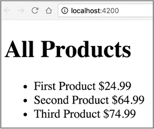

您的应用组件将使用`HttpClient.get()`来发出 HTTP GET 请求，并且您将声明一个`Product`接口来定义预期产品数据的结构。`get()`返回的可观察对象将通过`async`管道在模板中展开。`app.component.ts`文件位于 readfile 文件夹中，其内容如下所示。

##### 列表 12.5\. app.component.ts

```
interface Product {                                                   *1*
   id: string;
  title: string;
  price: number;
}

@Component({
  selector: 'app-root',
  template: `<h1>Products</h1>
  <ul>
    <li *ngFor="let product of products$ | async">                    *2*
       {{product.title }}: {{product.price | currency}}               *3*
     </li>
  </ul>
  `})
export class AppComponent{

  products$: Observable<Product[]>;                                   *4*

  constructor(private httpClient: HttpClient) {                       *5*
     this.products$ = this.httpClient
                         .get<Product[]>('/data/products.json');      *6*
   }
}
```

+   ***1* 声明产品类型**

+   ***2* 使用 async 管道遍历可观察的产品并自动订阅它们**

+   ***3* 渲染产品标题和以货币格式表示的价格**

+   ***4* 声明一个针对产品的类型化的可观察对象**

+   ***5* 注入 HttpClient 服务**

+   ***6* 指定预期数据的类型进行 HTTP GET 请求**

| |
| --- |

##### 注意

在此应用中，您不使用生命周期钩子`ngOnInit()`来获取数据。这不是犯罪，因为此代码不使用任何可能在组件构造期间未初始化的组件属性。此数据获取将在构造函数之后异步执行，当`async`管道订阅`products$`可观察对象时。

| |
| --- |

要查看此应用的运行情况，请在客户端目录中运行`npm install`，然后运行以下命令：

```
ng serve --app readfile -o
```

这并不太难，对吧？打开 Chrome 开发者工具，您将看到 HTTP 请求和响应及其头部，如图图 12.2 所示。

##### 图 12.2\. 监控 HTTP 请求和响应


此应用演示了如何发出没有参数且使用默认 HTTP 请求头的 HTTP GET 请求。如果您想添加额外的头和查询参数，请使用提供额外参数的重载版`get()`方法，您可以在其中指定额外的选项。以下列表显示了如何使用`HttpHeaders`和`HttpParams`类请求来自同一 products.json 文件的数据，并传递额外的头和查询参数。

##### 列表 12.6\. 向 GET 请求添加 HTTP 头部和查询参数

```
constructor(private httpClient: HttpClient) {
    let httpHeaders = new HttpHeaders()                                    *1*
       .set('Content-Type', 'application/json')
       .set('Authorization', 'Basic QWxhZGRpb');

    let httpParams = new HttpParams()                                      *2*
       .set('title', "First");

    this.products$ = this.httpClient.get<Product[]>('/data/products.json',
      {                                                                    *3*
       headers: httpHeaders,
      params: httpParams
    });
```

+   ***1* 创建带有两个额外头部的 HttpHeaders 对象**

+   ***2* 创建一个包含一个查询参数的对象（它可以是任何对象字面量）**

+   ***3* 将头部和查询参数作为 get()的第二个参数传递**

由于您只是读取文件，传递查询参数没有太多意义，但如果您需要向知道如何通过标题搜索产品的服务器端点发出类似请求，代码将相同。使用链式`set()`方法，您可以添加所需数量的头部或查询参数。

运行列表 12.7 将渲染来自 products.json 的相同数据，但请求的 URL 和 HTTP 头部将有所不同。图 12.3 使用箭头突出显示与图 12.2 相比的差异。

##### 图 12.3\. 监控修改后的 HTTP 请求

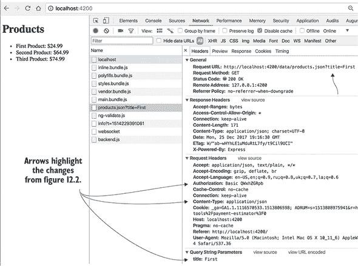

您可能想知道如何向服务器发送数据（例如，使用 HTTP POST）。要编写这样的应用程序，您需要一个可以接受您数据的服务器。在第 12.4.2 节中，您将创建一个使用`HttpClient.post()`的应用程序，但首先让我们使用 Node.js 和 Express.js 框架创建一个 Web 服务器。

### 12.3\. 使用 Node、Express 和 TypeScript 创建 Web 服务器

Angular 可以与任何平台上的 Web 服务器进行通信，但我们在本书中决定创建并使用 Node.js 服务器，以下是一些原因：

+   没有必要学习一门新的编程语言来理解代码。

+   Node 允许您创建独立的应用程序（例如服务器）。

+   使用 Node 可以让您继续用 TypeScript 编写代码，因此我们不必解释如何在 Java、.NET 或其他任何语言中创建 Web 服务器。

您将开始使用 Node 和 Express 框架编写一个基本的 Web 服务器。然后，您将编写另一个可以使用 HTTP 协议提供 JSON 数据的 Web 服务器。在这个服务器准备就绪后，您将创建一个可以消费其数据的 Angular 客户端。


##### 注意

本章的源代码可以在[`github.com/Farata/angulartypescript`](https://github.com/Farata/angulartypescript)和[www.manning.com/books/angular-development-with-typescript-second-edition](http://www.manning.com/books/angular-development-with-typescript-second-edition)找到。


#### 12.3.1\. 创建一个简单的 Web 服务器

在本节中，您将使用 Node 和 Express([`expressjs.com`](http://expressjs.com))框架和 TypeScript 创建一个 Web 服务器。本章附带代码中有一个名为 server 的目录，其中包含一个具有自己的 package.json 文件的项目，该文件不包含任何 Angular 依赖项。此文件的`dependencies`和`devDependencies`部分如下所示。

##### 列表 12.7\. 服务器在 package.json 中的依赖项

```
"dependencies": {
    "express": "⁴.16.2",            *1*
     "body-parser": "¹.18.2"        *2*
   },
  "devDependencies": {
    "@types/express": "⁴.0.39",     *3*
     "@types/node": "⁶.0.57",       *4*
     "typescript": "².6.2"          *5*
   }
```

+   ***1* Express.js 框架**

+   ***2* Express.js 的请求体解析器**

+   ***3* Express.js 的类型定义文件**

+   ***4* Node.js 的类型定义文件**

+   ***5* TypeScript 编译器的本地版本**

您可以在附录 B 中的 B.12 部分了解类型定义文件。您将在第 12.4 节中使用 body-parser 包从请求对象中提取数据。


##### 注意

您安装 TypeScript 编译器的本地版本，以防您需要保留全局安装的不同版本的`tsc`编译器。此外，您不应期望持续集成服务器有一个全局的`tsc`可执行文件。要使用本地的`tsc`版本，您可以在 package.json 的`scripts`部分添加一个自定义 npm 脚本命令（`"tsc": "tsc"`）并通过运行`npm run tsc`命令来启动编译器。


因为你会用 TypeScript 编写服务器代码，所以它需要被转译，所以以下列表添加了 tsconfig.json 文件，其中包含了 `tsc` 编译器的选项。

##### 列表 12.8\. 服务器 tsconfig.json

```
{
  "compilerOptions": {
    "module": "commonjs",        *1*
     "outDir": "build",          *2*
     "target": "es6"             *3*
   },
  "exclude": [
    "node_modules"               *4*
   ]
}
```

+   ***1* 根据 CommonJS 规范转译模块**

+   ***2* 将 .js 文件保存到构建目录中**

+   ***3* 使用 ES6 语法转译为 .js 文件**

+   ***4* 不转译位于 node_modules 目录中的代码**

通过指定模块的 CommonJS 语法，你确保 `tsc` 将 `import * as express from "express";` 这样的语句转译为 Node 所需的 `const express = require ("express");`。

以下列表显示了文件 my-express-server.ts 中的简单 Web 服务器代码。此服务器通过将三个路径—/、/products 和 /reviews—映射到相应的回调函数，实现了对 HTTP `GET` 请求的服务器端路由。

##### 列表 12.9\. my-express-server.ts

```
import * as express from "express";
const app = express();                                                      *1*

app.get('/', (req, res) => res.send('Hello from Express'));                 *2*

app.get('/products', (req, res) => res.send('Got a request for products')); *3*

app.get('/reviews', (req, res) => res.send('Got a request for reviews'));   *4*

const server = app.listen(8000, "localhost", () => {                        *5*

   console.log(`Listening on localhost:8000`);
});
```

+   ***1* 实例化了 Express.js**

+   ***2* 匹配根路由的 GET 请求**

+   ***3* 匹配 /products 路由的 GET 请求**

+   ***4* 匹配 /reviews 路由的 GET 请求**

+   ***5* 在 localhost:8000 上开始监听并执行肥箭头函数中的代码**

运行 `npm install`；通过运行 `tsc` 转译所有代码示例，包括 my-express-server.ts；然后通过运行以下命令启动此服务器：

```
node build/my-express-server
```

| |
| --- |

##### 注意

如果你没有全局安装 TypeScript 编译器，你可以运行其本地版本，./node_modules/typescript/bin/tsc，或者将 `"tsc: "tsc"` 行添加到 package.json 的 `scripts` 部分，并像这样运行它：`npm run tsc`。

| |
| --- |

你将在控制台看到“Listening on localhost:8000”的消息，现在你可以根据在浏览器中输入的 URL 请求产品或评论，如图 12.4 所示。

##### 图 12.4\. 使用 Express 的服务器端路由

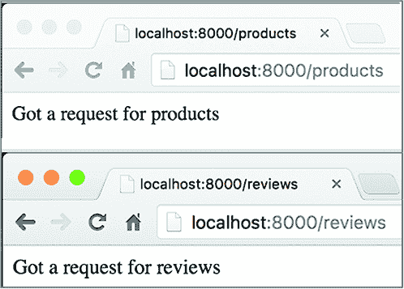

| |
| --- |

##### 注意

要调试 Node 应用程序，请参考你 IDE 的文档。如果你想调试 TypeScript 代码，别忘了在 Node 项目的 tsconfig.json 文件中设置 `"sourceMap": true` 选项。

| |
| --- |

这个服务器响应简单的文本消息，但你是如何创建一个可以响应 JSON 格式数据的服务器的呢？

#### 12.3.2\. 提供 JSON 服务

要以 JSON 格式将 JavaScript 对象（如产品）发送到浏览器，你将在响应对象上使用 Express 函数 `json()`。你的 REST 服务器位于 rest-server.ts 文件中，它可以提供所有产品或特定产品（通过 ID）。在这个服务器中，你将创建三个端点：/ 作为根路径，/api/products 作为所有产品的路径，以及 /api/products/:id 作为包含产品 ID 的路径。`products` 数组将包含三个硬编码的 `Product` 类型的对象，这些对象将通过调用 Express 框架提供的 `res.json()` 转换为 JSON 格式。

##### 列表 12.10\. rest-server.ts

```
import * as express from "express";
const app = express();

interface Product {                                                        *1*
     id: number,
    title: string,
    price: number
}

const products: Product[] = [                                              *2*
    {id: 0, title: "First Product", price: 24.99},
    {id: 1, title: "Second Product", price: 64.99},
    {id: 2, title: "Third Product", price: 74.99}
];

function getProducts(): Product[] {                                        *3*
     return products;
}

app.get('/', (req, res) => {                                               *4*
     res.send('The URL for products is http://localhost:8000/api/products');
});

app.get('/api/products', (req, res) => {                                   *5*
     res.json(getProducts());                                              *6*
});

function getProductById(productId: number): Product {                      *7*
     return products.find(p => p.id === productId);
}

app.get('/api/products/:id', (req, res) => {                               *8*
     res.json(getProductById(parseInt(req.params.id)));                    *9*
 });

const server = app.listen(8000, "localhost", () => {
    console.log(`Listening on localhost:8000`);
});
```

+   ***1* 定义了 Product 类型**

+   ***2* 创建包含产品数据的三个 JavaScript 对象的数组**

+   ***3* 返回所有产品**

+   ***4* 将文本提示作为对基础 URL GET 请求的响应**

+   ***5* 当 GET 请求包含 URL 中的/api/products 时，调用 getProducts()**

+   ***6* 将产品转换为 JSON 并返回给浏览器**

+   ***7* 通过 ID 返回产品。这里，你使用数组的 find()方法。**

+   ***8* GET 请求附带了一个参数。其值存储在请求对象的 params 属性中。**

+   ***9* 将产品 ID 从字符串转换为整数，调用 getProductById()，并发送 JSON 回**

如果之前运行的 my-express-server 还在运行，请使用 Ctrl-C 停止它，然后使用以下命令启动 rest-server：

```
node build/rest-server
```

在浏览器中输入`http://localhost:8000/api/products`，你应该会看到如图 12.5 所示的 JSON 格式的数据。

##### 图 12.5\. 服务器对 http://localhost:8000/api/products 的响应

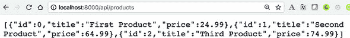

图 12.6 显示了输入 URL http://localhost:8000/api/products/1 后的浏览器窗口。这次，服务器只返回具有值为`1`的`id`的产品数据。

##### 图 12.6\. 服务器对 http://localhost:8000/api/products/1 的响应

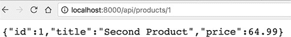

你的 REST 服务器已准备就绪。现在让我们看看如何在 Angular 应用程序中发起 HTTP GET 请求并处理响应。

### 12.4\. 将 Angular 和 Node 结合在一起

在上一节中，你创建了 rest-server.ts 文件，该文件无论客户端是使用框架编写还是用户在浏览器中直接输入 URL，都会响应 HTTP GET 请求并返回产品详情。在本节中，你将编写一个 Angular 客户端，该客户端将发出 HTTP GET 请求并将产品数据视为由你的服务器返回的`Observable`数据流。


##### 注意

只是一个提醒：Angular 应用程序和 Node 服务器是两个独立的项目。服务器代码位于名为 server 的目录中，Angular 应用程序位于 client 目录中的另一个项目中。


#### 12.4.1\. 服务器上的静态资源

部署在服务器上的典型 Web 应用程序包括静态资源（例如，HTML、图像、CSS 和 JavaScript 代码），当用户输入应用程序的 URL 时，浏览器需要加载这些资源。从服务器的角度来看，Web 应用程序的 Angular 部分被视为*静态资源*。Express 框架允许你指定静态资源所在的目录。

让我们创建一个新的服务器：rest-server-angular.ts。在上一个节段的 rest-server.ts 文件中，你没有指定静态资源的目录，因为没有在服务器上部署客户端应用程序。在新服务器中，你添加以下列表中的行。

##### 列表 12.11\. 指定静态资源所在的目录

```
import * as path from "path";                                     *1*

app.use('/', express.static(path.join(__dirname, 'public')));     *2*
```

+   ***1* 添加 Node 路径模块以处理目录和路径**

+   ***2* 将公共子目录指定为静态资源的位置**

与 rest-server.ts 不同，您只需将基本 URL (/) 映射到公共目录，Node 将默认从那里发送 index.html。浏览器加载 index.html，然后加载在 `<script>` 标签中定义的其余捆绑包。

| |
| --- |

##### 注意

由 Angular CLI 生成的原始 index.html 文件不包含 `<script>` 标签，但当你运行 `ng build` 或 `ng serve` 命令时，它们将创建一个包含所有捆绑包和其他资产的新的 index.html 版本。

| |
| --- |

当浏览器请求静态资源时，Node 将在当前目录的 public 子目录中查找它们——这是您启动此服务器时的构建目录。在这里，您使用 Node 的 `path.join()` API 确保以跨平台的方式创建绝对文件路径。在下一节中，我们将介绍 Angular 客户端并将其捆绑包部署在公共目录中。rest-server-angular.ts 中的 REST 端点与 rest-server.ts 中的相同：

+   / 服务器提供 index.html，其中包含加载 Angular 应用的代码。

+   /api/products 提供所有产品。

+   /api/products/:id 通过其 ID 提供一个产品。

rest-server-angular.ts 文件的完整代码将在下一列表中展示。

##### 列表 12.12\. rest-server-angular.ts

```
import * as express from "express";
import * as path from "path";                                     *1*

const app = express();

app.use('/', express.static(path.join(__dirname, 'public')));     *2*

interface Product {
    id: number,
    title: string,
    price: number
}

const products: Product[] = [
    {id: 0, title: "First Product", price: 24.99},
    {id: 1, title: "Second Product", price: 64.99},
    {id: 2, title: "Third Product", price: 74.99}
];

function getProducts(): Product[] {
    return products;
}

app.get('/api/products', (req, res) => {                         *3*
     res.json(getProducts());
});

function getProductById(productId: number): Product {
    return products.find(p => p.id === productId);
}

app.get('/api/products/:id', (req, res) => {                     *4*
     res.json(getProductById(parseInt(req.params.id)));
});

const server = app.listen(8000, "localhost", () => {             *5*
     console.log(`Listening on localhost:8000`);
});
```

+   ***1* 添加了提供用于处理文件和目录路径实用工具的路径模块**

+   ***2* 对于根路径，指定提供静态资源的目录**

+   ***3* 配置 HTTP GET 请求的端点**

+   ***4* 为 HTTP GET 请求配置另一个端点**

+   ***5* 启动服务器**

新服务器已准备好为 Angular 客户端提供 JSON 数据，让我们启动它：

```
node build/rest-server-angular
```

尝试使用基本 URL http://localhost:8000 向此服务器发出请求将返回 404 错误，因为包含静态资产的目录中没有 index.html 文件：您尚未将 Angular 应用部署到那里。您的下一个任务是创建并部署将消费 JSON 格式数据的 Angular 应用。

#### 12.4.2\. 在 Angular 应用中消费 JSON

您的 Angular 应用将位于名为 client 的目录中。在之前的章节中，您使用 `ng serve` 在内存中构建捆绑包来启动所有 Angular 应用，但这次您还将使用 `ng build` 命令生成文件中的捆绑包。然后您将使用 npm 脚本来自动化在 12.4.1 节 中创建的 Node 服务器中的这些捆绑包的部署。

在开发模式下，您将继续使用运行在端口 4200 的 Angular CLI 开发服务器来提供 Angular 应用。但数据将来自另一个由 Node 和 Express 驱动的网络服务器，该服务器将在端口 8000 上运行。图 12.7 展示了这种双服务器配置。

##### 图 12.7\. 开发模式下的两个服务器

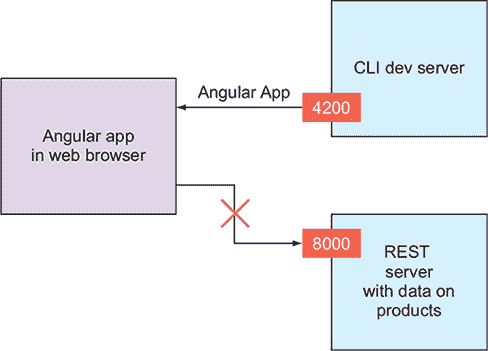

| |
| --- |

##### 注意

*剧透警告*：当客户端应用从一台服务器提供并尝试直接访问另一台服务器时，我们会遇到一个问题。当我们到达那里时，我们会解决这个难题。


当 Angular 的 `HttpClient` 对象向一个 URL 发起请求时，响应会以 `Observable` 的形式返回，客户端的代码可以通过使用 `subscribe()` 方法或使用在 第 6.5 节 中引入的 `async` 管道来处理它。使用 `async` 管道是首选的，但我们将展示两种方法，以便你可以欣赏 `async` 的优势。

让我们从这样一个应用开始，它从 rest-server-angular 服务器检索所有产品，并使用 HTML 无序列表 (`<ul>`) 来渲染它们。你可以在这个应用中找到 app.component.ts 文件，它位于 client/src/app/restclient 目录中。

##### 列表 12.13\. restclient/app.component.ts

```
// import statements omitted for brevity
interface Product {                                                     *1*
   id: number,
  title: string,
  price: number
}

@Component({
  selector: 'app-root',
  template: `<h1>All Products</h1>
  <ul>
    <li *ngFor="let product of products">
       {{product.title}}: {{product.price | currency}}                  *2*
     </li>
  </ul>
  {{error}}
  `})
export class AppComponent implements OnInit {

  products: Product[] = [];
  theDataSource$: Observable<Product[]>;                                *3*
   productSubscription: Subscription;                                   *4*
   error: string;                                                       *5*

  constructor(private httpClient: HttpClient) {                         *6*
     this.theDataSource$ = this.httpClient
              .get<Product[]>('http://localhost:8000/api/products');    *7*
   }

  ngOnInit() {
    this.productSubscription = this.theDataSource$
      .subscribe(                                                       *8*
         data => this.products = data,                                  *9*
         (err: HttpErrorResponse) =>
          this.error = `Can't get products. Got ${err.message}`         *10*
       );
  }
}
```

+   ***1* 声明产品的类型**

+   ***2* 使用货币管道来渲染价格**

+   ***3* 声明由 HttpClient 返回的数据的观察者**

+   ***4* 声明订阅属性——你需要从观察者中取消订阅**

+   ***5* 在这里显示 HTTP 请求的错误（如果有）**。

+   ***6* 注入 HttpClient**

+   ***7* 声明发起 HTTP GET 请求产品的意图**

+   ***8* 对产品发起 HTTP GET 请求**

+   ***9* 将接收到的产品添加到数组中**

+   ***10* 将错误消息的值设置为一个变量，以便在 UI 上渲染**


##### 注意

你没有使用 `ngOnDestroy()` 显式地取消订阅观察者，因为一旦 `HttpClient` 获取到响应（或错误），底层的 `Observable` 就会完成，因此观察者会自动取消订阅。


你已经在上一节中启动了服务器。现在，通过运行以下命令来启动客户端：

```
ng serve --app restclient -o
```

浏览器没有渲染任何产品，控制台显示了一个 404 错误，但如果你在 `AppComponent` 中使用了完整的 URL（例如，http://localhost:8000/api/products），浏览器控制台将显示以下错误：

```
Failed to load http://localhost:8000/api/products:
  No 'Access-Control-Allow-
     Origin' header is present on the requested resource.
  Origin 'http://localhost:4200' is therefore not allowed access.
```

这是因为你违反了同源策略（见 [`mng.bz/2tSb`](http://mng.bz/2tSb)）。这种限制是为在浏览器中运行的客户端设置的作为一种安全机制。假设你访问并登录了 bank.com，然后在另一个标签页中打开了 badguys.com。同源策略确保来自 badguys.com 的脚本无法访问你在 bank.com 的账户。

你的 Angular 应用是从 http://localhost:4200 加载的，但试图访问 URL http://localhost:8000。除非运行在端口 8000 的服务器被配置为允许来自 http://localhost:4200 的客户端访问，否则浏览器不允许这样做。当你的客户端应用在 Node 服务器上部署时，你不会遇到这个错误，因为客户端应用将加载在端口 8000 上运行的服务器，并且这个客户端将向同一服务器发送数据请求。

在第十三章的动手实践部分 chapter 13，您将使用 Node.js CORS 包（见 [`github.com/expressjs/cors`](https://github.com/expressjs/cors)）来允许来自其他源客户端的请求，但如果您需要向第三方服务器发送请求，这可能不是一个选项。在开发模式下，有一个更简单的解决方案来解决同源限制。您将使用运行在端口 4200 的服务器作为客户端请求运行在端口 8000 的服务器的代理。同源策略不适用于服务器到服务器的通信。在下一节中，您将了解如何在客户端配置此类代理。

#### 12.4.3\. 配置客户端代理

在开发模式下，您希望继续使用 Angular CLI 附带的具有热重载功能和快速重建内存中的应用程序包的服务器。另一方面，您希望能够向其他服务器发送请求。

在底层，Angular CLI 开发服务器使用 Webpack 开发服务器，它可以作为代理，在浏览器与其他服务器之间进行通信。您只需在 Angular 项目的根目录中创建一个 proxy-conf.json 文件，在那里您将配置开发服务器应重定向到另一个服务器的 URL 片段。在您的例子中，您希望将任何包含 URL 片段 /api 的请求重定向到运行在端口 8000 的服务器，如下面的列表所示。

##### 列表 12.14\. proxy-conf.json

```
{
  "/api": {                                   *1*
     "target": "http://localhost:8000",       *2*
     "secure": false                          *3*
   }
}
```

+   ***1* 修改包含 /api 的 URL 的所有请求**

+   ***2* 将这些请求重定向到该 URL**

+   ***3* 目标连接不需要 SSL 证书。**


##### 注意

使用代理文件允许您轻松地在本地和远程服务器之间切换。只需更改 `target` 属性的值，让您的本地应用程序从远程服务器检索数据。您可以在 [`mng.bz/fLgf`](http://mng.bz/fLgf) 上了解更多关于 Angular CLI 代理支持的信息。


您需要在上一节的应用程序中进行一些小的修改。您应该将后端服务器的完整 URL（http://localhost:8000/api/products）替换为端点的路径（/api/products）。请求产品的代码将看起来像您尝试访问从 Angular CLI 开发服务器下载的应用程序上的 /api/products 端点：

```
this.theDataSource = this.httpClient
              .get<Product[]>('/api/products');
```

但开发服务器将识别 URL 中的 /api 片段，并将此请求重定向到运行在端口 8000 的另一个服务器，如图 12.8 所示（与图 12.7 进行比较）。

##### 图 12.8\. 使用代理的两个服务器

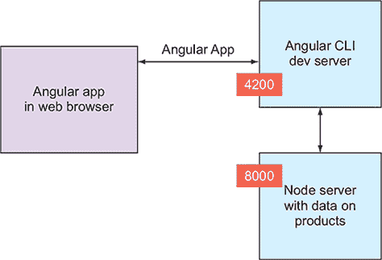

要查看修改后的应用程序的实际效果，您需要使用 `--proxy-config` 选项，提供配置代理参数的文件名：

```
ng serve --app restclient --proxy-config proxy-conf.json -o
```


##### 注意

如果您在配置代理参数时忘记提供代理文件的名称，您将收到 404 错误，因为 /api/products 请求不会被重定向，并且端口 4200 运行的服务器中没有这样的端点。


打开您的浏览器到 http://localhost:4200，您将看到 图 12.9 中显示的 Angular 应用程序。

##### 图 12.9\. 通过代理从 Node 服务器检索所有产品


注意数据来自运行在端口 4200 的服务器，该服务器从运行在端口 8000 的服务器获取数据。图 12.8 说明了此数据流。

在开发模式下，使用 Angular CLI 代理可以一石二鸟：在代码更改时热重载您的应用程序，并且无需部署到另一个服务器即可访问数据。

现在让我们看看如何用 `async` 管道替换产品的显式订阅。

#### 12.4.4\. 使用异步管道订阅可观察对象

我们在 第六章 的 6.5 节 中介绍了 `AsyncPipe`（或在模板中使用时称为 `async`）。`async` 可以接收一个 `Observable` 作为输入，自动订阅它，并在组件被销毁时取消订阅。要查看此功能的工作原理，请在 列表 12.13 中进行以下更改：

+   将 `products` 变量的类型从 `Array` 更改为 `Observable`。

+   删除变量 `theDataSource$` 的声明。

+   在代码中删除对 `subscribe()` 的调用。您将 `get()` 方法返回的 `Observable` 分配给 `products`。

+   将 `async` 管道添加到模板中的 `*ngFor` 循环。

以下列表实现了这些更改（请参阅文件 restclient/app.component.asyncpipe.ts）。

##### 列表 12.15\. app.component.asyncpipe.ts

```
import { HttpClient} from '@angular/common/http';
import {Observable, EMPTY} from 'rxjs';
import {catchError} from 'rxjs/operators';
import {Component} from "@angular/core";

interface Product {
  id: number,
  title: string,
  price: number
}

@Component({
  selector: 'app-root',
  template: `<h1>All Products</h1>
  <ul>
    <li *ngFor="let product of products$ | async">                              *1*
       {{product.title }} {{product.price | currency}}
    </li>
  </ul>
  {{error}}
  `})
export class AppComponentAsync{

  products$: Observable<Product[]>;
  error: string;
  constructor(private httpClient: HttpClient) {
    this.products$ = this.httpClient.get<Product[]>('/api/products')            *2*
       .pipe(
        catchError( err => {                                                    *3*
           this.error = `Can't get products. Got ${err.status} from ${err.url}`;*4*
           return EMPTY;
          });                                                                   *5*
  }
}
```

+   ***1* 异步管道订阅并展开 observable products$ 中的产品**

+   ***2* 使用 HttpClient.get() 初始化观察者**

+   ***3* 在错误到达异步管道之前拦截错误**

+   ***4* 处理可能出现的错误**

+   ***5* 返回一个空的观察者，这样订阅者就不会被销毁**

运行此应用程序将产生与 图 12.9 中显示相同的输出。

到目前为止，您已经直接将 `HttpClient` 实例注入到组件中，但更常见的是将 `HttpClient` 注入到服务中。让我们看看如何做到这一点。

#### 12.4.5\. 将 HttpClient 注入到服务中

Angular 提供了一种简单的方法来分离业务逻辑实现和渲染 UI。业务逻辑应在服务中实现，UI 在组件中实现，并且您通常在一个或多个注入到组件中的服务中实现所有 HTTP 通信。例如，与 第十一章 一起提供的 ngAuction 应用程序具有注入 `HttpClient` 服务的 `ProductService` 类。您将一个服务注入到另一个服务中。

`ProductService` 使用 `HttpClient` 读取 products.json 文件，但它也可以像上一节中那样从远程服务器获取产品数据。`ProductService` 注入到 ngAuction 的组件中。检查 ngAuction 中 第十一章 伴随的 `ProductService` 和 `CategoriesComponent` 的源代码，你将识别出 图 12.10 中显示的模式。

##### 图 12.10\. 将依赖注入到服务和组件中

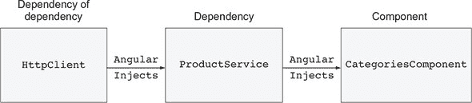

来自 ngAuction 的 `ProductService` 的下一个列表是封装业务逻辑和 HTTP 通信到服务中的一个示例。

##### 列表 12.16\. ngAuction 的 `ProductService` 的一个片段

```
@Injectable()
export class ProductService {
  constructor(private http: HttpClient) {}                                 *1*

  getAll(): Observable<Product[]> {
    return this.http.get<Product[]>('/data/products.json');                *2*
   }

  getById(productId: number): Observable<Product> {
    return this.http.get<Product[]>('/data/products.json')                 *2*
       .pipe(
        map(products => products.find(p => p.id === productId))
      );
  }

  getByCategory(category: string): Observable<Product[]> {
    return this.http.get<Product[]>('/data/products.json').pipe(           *2*
       map(products => products.filter(p => p.categories.includes(category)))
     );
  }

  getDistinctCategories(): Observable<string[]> {
   return this.http.get<Product[]>('/data/products.json')                  *2*
     .pipe(
      map(this.reduceCategories),
      map(categories => Array.from(new Set(categories))),
    );
  }
  // Other code is omitted for brevity
}
```

+   ***1* 将 HttpClient 注入到 ProductService**

+   ***2* 调用 HttpClient.get()**

| |
| --- |

##### 注意

在前面的 列表 12.19 中，你使用 RxJS 可管道操作符在 `pipe()` 方法中（参见 附录 D 中的 部分 D.4.1）。

| |
| --- |

来自 `CategoriesComponent` 的下一个列表是使用该组件中先前服务的一个示例。

##### 列表 12.17\. ngAuction 的 `CategoriesComponent` 的一个片段

```
@Component({
  selector: 'nga-categories',
  styleUrls: [ './categories.component.scss' ],
  templateUrl: './categories.component.html'
})
export class CategoriesComponent {
  readonly categoriesNames$: Observable<string[]>;
  readonly products$: Observable<Product[]>;

  constructor(
    private productService: ProductService,                              *1*
     private route: ActivatedRoute
  ) {
    this.categoriesNames$ = this.productService.getDistinctCategories()  *2*
         .pipe(map(categories => ['all', ...categories]));

    this.products$ = this.route.params.pipe(
      switchMap(({ category }) => this.getCategory(category)));
  }

  private getCategory(category: string): Observable<Product[]> {
    return category.toLowerCase() === 'all'
      ? this.productService.getAll()                                     *2*
       : this.productService.getByCategory(category.toLowerCase());      *2*
   }
}
```

+   ***1* 将 ProductService 注入**

+   ***2* 使用 ProductService**

`ProductService` 的提供者在 ngAuction 的根模块的 `@NgModule()` 装饰器中在应用级别声明。在第十三章的实践部分 chapter 13，你将 ngAuction 分割成两个项目，客户端和服务器，并且将使用 Node 和 Express 框架编写网络服务器。一个 Angular 应用（捆绑和资产）如何部署在 web 服务器上？

#### 12.4.6\. 使用 npm 脚本在服务器上部署 Angular 应用

在服务器上部署客户端代码的过程应该是自动化的。至少，部署一个 Angular 应用包括运行几个命令来构建捆绑包，并用新代码替换先前部署的代码（index.html、JavaScript 捆绑包和其他资产）。部署可能还包括运行测试脚本和其他步骤。

JavaScript 开发者使用各种工具来自动化运行部署任务，如 Grunt、gulp、npm 脚本等。在本节中，我们将向您展示如何使用 npm 脚本进行部署。我们喜欢使用 npm 脚本，因为它们易于使用，并且提供了一种简单的方法来自动化以预定义顺序运行命令序列。此外，您已经安装了 npm，因此无需安装其他软件来自动化您的部署工作流程。

为了说明部署过程，你将使用来自第 12.3.1 节的 rest-server-angular 服务器，你将在其中部署来自第 12.3.4 节的 Angular 应用。部署后，你不再需要配置代理，因为服务器和客户端代码都将部署在同一台运行 http://localhost:8000 的服务器上。在浏览器中输入此 URL 后，用户将看到之前在图 12.9 中展示的产品数据。

npm 允许你在 package.json 中添加`scripts`属性，其中你可以为终端命令定义别名。例如，你不必输入长命令`ng serve --app restclient --proxy-config proxy-conf.json`，你可以在 package.json 的脚本部分定义一个 start 命令，如下所示：

```
"scripts": {
  "start": "ng serve --app restclient --proxy-config proxy-conf.json"
}
```

现在，你只需在控制台中输入`npm start`即可。npm 支持十几个开箱即用的脚本命令（有关详细信息，请参阅 npm-scripts 文档，[`docs.npmjs.com/misc/scripts`](https://docs.npmjs.com/misc/scripts)）。你还可以添加针对你的开发和部署工作流程的新自定义命令。

其中一些脚本需要手动运行（例如`npm start`），而一些脚本如果具有`post`和`pre`前缀则会自动调用（例如，`post-install`）。如果`scripts`部分中的任何命令以`post`前缀开头，它将在该前缀之后指定的相应命令运行后自动执行。

例如，如果你定义了命令`"postinstall": "myCustomInstall.js"`，每次你运行`npm install`时，脚本 myCustomInstall.js 将自动运行。同样，如果一个命令具有`pre`前缀，那么这样的命令将在该前缀之后命名的命令之前运行。

如果你定义了 npm 脚本所不知道的自定义命令，你需要使用一个额外的选项：`run`。比如说，你定义了一个自定义命令`startDev`，如下所示：

```
"scripts": {
  "startDev": "ng serve --app restclient --proxy-config proxy-conf.json"
}
```

要运行该命令，你需要在终端窗口中输入以下内容：`npm run startDev`。为了自动化运行一些自定义命令，使用相同的`post`和`pre`前缀。

让我们看看如何创建一个可运行的命令序列，用于在 Node 服务器上部署 Angular 应用。打开 client 目录下的 package.json 文件，你将找到四个自定义命令：`build`、`postbuild`、`predeploy`和`deploy`。以下列表显示了运行单个命令`npm run build`时会发生什么：

##### 列表 12.18。client/package.json 的一个片段

```
"scripts": {
  "build": "ng build --prod --app restclient",                                   *1*
   "postbuild": "npm run deploy",                                                *2*
   "predeploy": "rimraf ../server/build/public && mkdirp ../server/build/public",*3*
   "deploy": "copyfiles -f dist/** ../server/build/public"                       *4*
 }
```

+   ***1* ng build 命令将在默认目录 dist 中创建 restclient 应用的生成版本。**

+   ***2* 由于存在 postbuild 命令，它将自动启动并尝试运行部署命令。**

+   ***3* 由于还有一个 predeploy 命令，它将在 postbuild 之后和 deploy 之前运行。**

+   ***4* 最后，执行部署命令。**

我们将在一分钟内解释`predeploy`和`deploy`命令的作用，但我们的主要信息是，启动一个单独的命令导致了在指定顺序中运行四个命令。创建一系列部署命令很容易。

| |
| --- |

##### 小贴士

如果你使用 AOT 编译构建包，并且只使用标准的 Angular 装饰器（没有自定义的），你可以在 polyfills.ts 文件中注释掉`import 'core-js/es7/reflect';`这一行来进一步优化你应用中 JavaScript 的大小。这将减小生成的 polyfill 包的大小。

| |
| --- |

通常，部署过程会删除之前部署的文件所在的目录，创建一个新的空目录，并将新文件复制到这个目录中。在你的部署脚本中，你使用三个 npm 包来执行这些操作，无论你使用的是 Windows、Unix 还是 macOS 平台：

+   **`rimraf`——** 删除指定的目录及其子目录

+   **`mkdirp`——** 创建一个新的目录

+   **`copyfiles`——** 从源复制文件到目标

在 package.json 的 devDependencies 部分中检查，你会看到`rimraf`、`mkdirp`和`copyfiles`。

| |
| --- |

##### 小贴士

目前，Angular CLI 使用 Webpack 来构建包。Angular CLI 7 将包含新的构建工具。特别是，它将包括 Closure Compiler，它产生更小的包。

| |
| --- |

本章附带代码位于两个兄弟目录中：client 和 server。你的`predeploy`命令会删除服务器/build/public 目录的内容（这是你将部署 Angular 应用的地方），然后创建一个新的空公共目录。`&&`符号允许你定义运行多个脚本的命令。

`deploy`命令将客户端/dist 目录的内容（应用的包和资源）复制到服务器/build/public。

在现实生活中，你可能需要在远程服务器上部署一个 Angular 应用，所以使用 package copyfiles 将不会工作。考虑使用 SCP 实用程序（见[`en.wikipedia.org/wiki/Secure_copy`](https://en.wikipedia.org/wiki/Secure_copy)），它可以从本地计算机安全地传输文件到远程计算机。

如果你可以从终端窗口手动运行一个实用程序，你也可以使用 npm 脚本来运行它。在第十四章中，你将学习如何编写测试脚本。将测试运行器包含到构建过程中可能只需将`&& ng test`添加到你的`predeploy`命令中。如果你发现了一些有用的 gulp 插件，为它创建一个 npm 脚本，例如，`"myGulpCommand" : "gulp SomeUsefulTask"`。

为了验证你的部署脚本是否工作，请执行以下步骤：

> **1**. 在服务器目录中运行以下命令以启动服务器：
> 
> `node build/rest-server-angular`
> 
> **2**. 在客户端目录中，运行构建和部署脚本：
> 
> `npm run build`
> 
> 检查服务器/构建/公共目录——客户端的包应该在那里。
> 
> **3**. 打开浏览器访问 http://localhost:8000，你的 Angular 应用将从 Node 服务器加载，显示三个产品，如图 12.9 所示 figure 12.9。

我们已经描述了创建和运行网络服务器、创建和运行 Angular 应用程序（以开发模式运行）以及部署到服务器的整个过程。你的 Angular 应用程序使用 `HttpClient` 服务发出 HTTP GET 请求从服务器检索数据。现在让我们看看如何发出 HTTP POST 请求将数据发送到服务器。

### 12.5\. 向服务器发送数据

HTTP POST 请求用于向服务器发送新数据。使用 `HttpClient`，发送 POST 请求与发送 GET 请求类似。调用 `HttpClient.post()` 方法表明你打算向指定的 URL 发送数据，但请求是在调用 `subscribe()` 时发出的。


##### 注意

对于更新服务器上的现有数据，使用 `HttpClient.put()`；对于删除数据，使用 `HttpClient.delete()`。


#### 12.5.1\. 创建处理 POST 请求的服务器

你需要一个能够处理客户端发出的 POST 请求的网络服务器和端点。本章附带的服务器代码包括一个位于 rest-server-angular-post.ts 文件中的 /api/product 端点，用于添加新产品。因为你的目标不是拥有一个能够添加和保存产品的完整功能服务器，所以 /api/product 端点将简单地记录控制台上的已发布数据并向客户端发送确认消息。

发送到请求体的数据将到达，你需要能够解析它以提取数据。npm 包 body-parser 知道如何在 Express 服务器中这样做。如果你在服务器目录中打开 package.json，你将在依赖项部分找到 body-parser。你的服务器代码的整个代码如下所示。

##### 列表 12.19\. rest-server-angular-post.ts

```
import * as express from "express";
import * as path from "path";
import * as bodyParser from "body-parser";                           *1*

const app = express();

app.use('/', express.static(path.join(__dirname, 'public')));

app.use(bodyParser.json());                                          *2*

app.post("/api/product", (req, res) => {                             *3*

  console.log(`Received new product
               ${req.body.title} ${req.body.price}`);                *4*

  res.json({'message':`Server responded: added ${req.body.title}`}); *5*
 });

const server = app.listen(8000, "localhost", () => {
  const {address, port} = server.address();
  console.log(`Listening on ${address}: ${port}`);
});
```

+   ***1* 添加 body-parser 包**

+   ***2* 创建解析器将 req.body 的负载转换为 JSON**

+   ***3* 创建处理 POST 请求的端点**

+   ***4* 记录 POST 请求的负载**

+   ***5* 向客户端发送确认消息**

你的服务器期望以 JSON 格式接收负载，并且它将以包含一个属性 `message` 的 JSON 对象的形式发送响应。通过在服务器目录中运行以下命令来启动此服务器（不要忘记运行 `tsc` 来编译它）：

```
node build/rest-server-angular-post
```


**测试 RESTful API**

当你使用 REST 端点创建网络服务器时，你应该测试它们以确保在开始编写任何客户端代码之前端点能够正常工作。你的 IDE 可能提供这样的工具。例如，WebStorm IDE 在“工具”菜单下有一个“测试 RESTful Web 服务”的菜单项。在输入所有测试服务器的数据后，这个工具看起来如下所示。

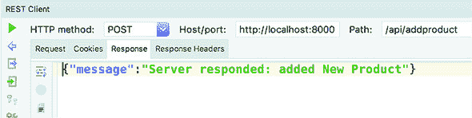

使用 WebStorm 的 Test RESTful 客户端

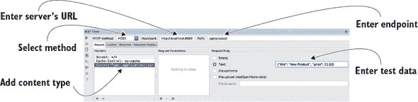

服务器响应

按下绿色播放按钮，你将在响应选项卡下看到你的/api/product 端点的响应，如图所示的下图。

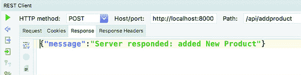

服务器响应

如果你的 IDE 没有提供这样的测试工具，请使用名为 Advanced REST Client 的 Chrome 扩展程序（[`install.advancedrestclient.com/#/install`](https://install.advancedrestclient.com/#/install)）或名为 Postman 的工具（[www.getpostman.com](http://www.getpostman.com)）。


现在你已经创建、启动并测试了 Web 服务器，让我们编写将新产品发布到该服务器的 Angular 客户端。

#### 12.5.2\. 创建用于发送 POST 请求的客户端

你的 Angular 应用将渲染一个简单的表单，用户可以在其中输入产品标题和价格，如图 12.11 所示。

##### 图 12.11\. 添加新产品的 UI


在填写完表单并点击添加产品按钮后，服务器将响应按钮下显示的确认消息。

在这个应用中，你将使用模板驱动的表单 API，你的表单将要求用户输入新产品标题和价格。在按钮点击时，你将调用`HttpClient.post()`方法，然后是`subscribe()`。

这个 Angular 应用的代码位于 restclientpost 子目录下的 client 目录中。如下所示。

##### 列表 12.20\. app.component.ts

```
import {Component} from "@angular/core";
import {HttpClient, HttpErrorResponse} from "@angular/common/http";

@Component({
  selector: 'app-root',
  template: `<h1>Add new product</h1>
     <form #f="ngForm" (ngSubmit) = "addProduct(f.value)" >
       Title: <input id="productTitle" name="title" ngModel>
       <br>
       Price: <input id="productPrice" name="price" ngModel>
       <br>
       <button type="submit">Add product</button>
     </form>
     {{response}}
  `})
export class AppComponent {

  response: string;

  constructor(private httpClient: HttpClient) {}

  addProduct(formValue) {

    this.response='';

    this.httpClient.post<string>("/api/product",                *1*
                                  formValue)                    *2*
       .subscribe(                                              *3*
         data =>  this.response = data['message'],              *4*
         (err: HttpErrorResponse) =>                            *5*
             this.response = `Can't add product. Error code:
              ${err.message} ${err.error.message}`
      );
  }
}
```

+   ***1* 声明发起 POST 请求的意图**

+   ***2* 提供 POST 有效负载**

+   ***3* 发起 HTTP POST 请求**

+   ***4* 获取服务器的响应**

+   ***5* 处理错误**

当用户点击添加产品时，应用会发起 POST 请求并订阅服务器响应。`formValue`包含一个 JavaScript 对象，其中包含在表单中输入的数据，`HttpClient`会自动将其转换为 JSON 对象。如果数据已成功发布，服务器将返回一个包含`message`属性的 JSON 对象，该属性通过数据绑定进行渲染。

如果服务器响应错误，你将在 UI 中显示它。注意，你使用`err.message`和`err.error.message`来提取错误描述。第二个属性可能包含额外的错误详情。修改服务器的代码，使其返回字符串而不是 JSON，UI 将显示详细的错误信息。

要查看此应用的实际运行情况，请在项目 client 中运行以下命令：

```
ng serve --app restclientpost --proxy-config proxy-conf.json -o
```

你现在知道如何发送 HTTP 请求和处理响应，你的应用中可能会有很多这样的请求。有没有一种方法可以拦截所有这些请求以提供一些额外的处理，比如显示/隐藏进度条，或者记录请求？

### 12.6\. HTTP 拦截器

Angular 允许你为应用程序中所有 HTTP 请求和响应的预处理和后处理创建 HTTP 拦截器。它们对于实现诸如日志记录、全局错误处理、身份验证等跨切面关注点非常有用。我们想强调的是，拦截器在请求发出之前或在 UI 上渲染响应之前工作。这给你提供了一个机会来实现某些错误的重试场景或防止未授权访问的尝试。

要创建一个拦截器，你需要编写一个实现`HttpInterceptor`接口的服务，这要求你实现一个方法：`intercept()`。Angular 将为这个回调提供两个参数：`HttpRequest`和`HttpHandler`。第一个参数包含被拦截的请求对象，你可以克隆并修改它。第二个参数用于通过调用`handle()`方法将修改后的请求转发到后端或链中的另一个拦截器（如果有的话）。

| |
| --- |

##### 注意

`HttpRequest`和`HttpResponse`对象是不可变的，而“修改”一词意味着创建并传递这些对象的新实例。

| |
| --- |

下面的列表中显示的拦截器服务不会修改输出的`HttpRequest`，而只是简单地将其内容打印到控制台并原样传递。

##### 列表 12.21\. 一个简单的拦截器

```
@Injectable()
export class MyFirstInterceptor implements HttpInterceptor {

  intercept(req: HttpRequest<any>, next: HttpHandler): Observable<HttpEvent<any>> {
    // Clone and modify your HTTPRequest using req.clone()
    // or perform other actions here

    console.log("I've intercepted your HTTP request! ${JSON.stringify(req)}`);

    return next.handle(req);
  }
}
```

在列表 12.21 中，你转发`HttpRequest`，但你可以修改其头部或参数，并返回修改后的请求。`next.handle()`方法在请求完成时返回一个可观察对象，如果你想同时修改 HTTP 响应，可以在`next.handle()`返回的流上应用额外的 RxJS 操作符。

`intercept()`方法接收`HttpRequest`对象并返回，不是`HttpResponse`对象，而是`HttpEvent`的可观察对象，因为 Angular 将`HttpResponse`实现为一个`HttpEvent`值的流。

`HttpRequest`和`HttpResponse`都是不可变的，如果你想修改它们的属性，你需要先克隆它们，如下面的列表所示。

##### 列表 12.22\. 修改 `HTTPRequest`

```
intercept(req: HttpRequest<any>, next: HttpHandler): Observable<HttpEvent<any
     >> {
    const modifiedRequest = req.clone({
      setHeaders: { ('Authorization', 'Basic QWxhZGRpb') }
    });
    return next.handle(modifiedRequest);
  }
```

因为拦截器是一个可注入的服务，不要忘记在`@NgModule()`装饰器中声明其提供者以`HTTP_INTERCEPTORS`令牌：

```
providers: [{provide: HTTP_INTERCEPTORS,
             useClass: MyFirstInterceptor, multi: true}]
```

`multi: true`选项告诉你`HTTP_INTERCEPTORS`是一个多提供者令牌——一组服务可以代表相同的令牌。你可以注册多个拦截器，Angular 将注入所有这些拦截器：

```
providers: [{provide: HTTP_INTERCEPTORS,
               useClass: MyFirstInterceptor, multi: true},
            {provide: HTTP_INTERCEPTORS,
               useClass: MySecondInterceptor, multi: true}]
```

| |
| --- |

##### 注意

如果你定义了多个拦截器，它们将按照定义的顺序被调用。

| |
| --- |

为了说明拦截器的工作原理，让我们创建一个带有`HttpInterceptor`的应用程序，该拦截器将拦截并记录服务器返回的所有错误。对于客户端，你将重用第 12.5.2 节中显示的应用程序，该应用程序如图 12.11 所示，添加日志服务和拦截器以在控制台记录错误。

你将稍微修改前一个章节中的服务器以随机生成错误。你可以在 rest-server-angular-post-errors.ts 文件中找到服务器的完整代码。现在，它将不再只是响应成功消息，而是随机返回一个错误，如下所示。

##### 列表 12.23\. 模拟服务器错误

```
if (Math.random() < 0.5) {                                                *1*
     res.status(500);
    res.send({'message': `Server responded: error adding product
                          ${req.body.title}`});
} else {                                                                  *2*
     res.send({'message': `Server responded: added ${req.body.title}`);
}
```

+   ***1* 返回状态为 500 的 HTTP 响应**

+   ***2* 返回成功的 HTTP 响应**

按以下方式启动此服务器：

```
node build/rest-server-angular-post-errors
```

你的 Angular 应用位于拦截器目录中，并包含一个作为两个类实现的日志服务：`LoggingService` 和 `ConsoleLoggingService`。`LoggingService` 是一个抽象类，它声明了一个方法，`log()`。

##### 列表 12.24\. logging.service.ts

```
@Injectable()
export abstract class LoggingService {

  abstract log(message: string): void;
}
```

因为这个类是抽象的，所以不能被实例化，你将创建如下所示的 `ConsoleLoggingService` 类。

##### 列表 12.25\. console.logging.service.ts

```
@Injectable()
export class ConsoleLoggingService implements LoggingService{

   log(message:string): void {
        console.log(message);
   }
}
```

你可能想知道为什么你会为这样一个简单的日志服务创建一个抽象类。这是因为在实际应用中，你可能不仅想在浏览器的控制台中引入日志，还可能在服务器上引入。拥有一个抽象类将允许你将其用作声明提供者的令牌：

```
providers: [{provide: LoggingService, useClass: ConsoleLoggingService}]
```

之后，你可以创建一个名为 `ServerLoggingService` 的类，该类实现了 `LoggingService`，并且要从控制台日志切换到服务器日志，你需要更改提供者，而无需修改使用它的组件：

```
providers: [{provide: LoggingService, useClass: ServerLoggingService}]
```

如果你的拦截器收到错误，你会做以下操作：

> **1**.  在控制台上记录它。
> 
> **2**.  将 `HttpErrorResponse` 替换为包含错误消息的新实例 `HttpResponse`。
> 
> **3**.  返回新的 `HttpResponse`，以便客户端可以向用户显示它。

拦截器类将在 `HttpHandler.next()` 返回的可观察对象上使用 `catchError` 操作符，你将在其中实现这些步骤。你的拦截器在 logging.interceptor.service.ts 文件中实现。

##### 列表 12.26\. logging.interceptor.service.ts

```
import {Injectable} from "@angular/core";
import {HttpErrorResponse, HttpEvent, HttpHandler,
      HttpInterceptor, HttpRequest, HttpResponse} from "@angular/common/http";
import {Observable, of} from "rxjs";
import {catchError} from 'rxjs/operators';
import {LoggingService} from "./logging.service";

@Injectable()
export class LoggingInterceptor implements HttpInterceptor {

  constructor(private loggingService: LoggingService) {}                        *1*

  intercept(req: HttpRequest<any>, next: HttpHandler):
Observable<HttpEvent<any>> {
    return next.handle(req)                                                     *2*
       .pipe(
        catchError((err: HttpErrorResponse) =>                                  *3*
           this.loggingService.log(`Logging Interceptor: ${err.error.message}`);*4*
           return of(new HttpResponse(                                          *5*
               {body:{message: err.error.message}}));                           *6*
          })
      );
  }
}
```

+   ***1* 注入控制台日志服务**

+   ***2* 将请求转发到服务器，将响应转发到客户端**

+   ***3* 捕获服务器返回的响应错误**

+   ***4* 在控制台上记录错误消息**

+   ***5* 用 `HttpResponse` 替换 `HttpErrorResponse`**

+   ***6* 新的 `HttpResponse` 将包含错误消息。**

应用程序组件的代码没有拦截器类的引用，如下所示。它将始终接收包含服务器成功添加新产品或错误消息的消息的 `HttpResponse` 对象。

##### 列表 12.27\. app.component.ts

```
import {Component} from "@angular/core";
import {HttpClient} from "@angular/common/http";
import {Observable} from "rxjs";
import {map} from "rxjs/operators";

@Component({
  selector: 'app-root',
  template: `<h1>Add new product</h1>
  <form #f="ngForm" (ngSubmit) = "addProduct(f.value)" >
    Title: <input id="productTitle" name="title" ngModel>
    <br>
    Price: <input id="productPrice" name="price" ngModel>
    <br>
    <button type="submit">Add product</button>
  </form>
  {{response$ | async}}                                                    *1*
   `})
export class AppComponent {

  response$: Observable<string>;                                           *2*

  constructor(private httpClient: HttpClient) {}

  addProduct(formValue){
    this.response$=this.httpClient.post<{message: string}>("/api/product", *3*
       formValue)
      .pipe(
        map (data=> data.message)                                          *4*
       );
  }
}
```

+   ***1* 渲染从服务器接收到的任何消息（包括错误）**

+   ***2* 这个可观察对象是拦截器的响应。**

+   ***3* 期望服务器对 HTTP POST 的响应为 {message: string}**

+   ***4* 提取消息属性的文本**

当你将此应用与上一节中的应用进行比较时，请注意，你不需要在组件中处理错误，该组件将消息渲染到 UI 上。现在`LoggingInterceptor`将处理所有 HTTP 错误。

要查看此应用的实际运行情况，请运行以下命令并监控浏览器控制台中的日志消息。

```
ng serve --app interceptor --proxy-config proxy-conf.json -o
```

此应用应能给你一个如何实现跨切面关注点，如全局错误日志服务，用于所有 HTTP 响应的思路，而无需修改任何使用`HttpClient`服务的应用程序组件或服务。

HTTP 请求是异步的，可以生成多个你可能想要拦截和处理的事件。让我们看看如何做到这一点。

### 12.7\. 进度事件

有时上传或下载某些资产（如大型数据文件或图像）需要时间，你应该让用户了解进度。`HttpClient`提供了包含资产总大小、当前已上传或下载的字节数等信息的事件。

要启用进度事件跟踪，请使用带有选项`{reportProgress: true}`的`HttpRequest`对象发出请求。例如，你可以发出一个 HTTP GET 请求来读取 my_large_file.json 文件。

##### 列表 12.28\. 使用事件跟踪进行 GET 请求

```
const req = new HttpRequest('GET',                      *1*
                         './my_large_file.json',        *2*
                         { reportProgress: true });     *3*
 httpClient.request(req).subscribe(                     *4*
        // Handle progress events here);
```

+   ***1* 声明发起 GET 请求的意图**

+   ***2* 指定要读取的文件**

+   ***3* 启用进度事件**

+   ***4* 发起请求**

在`subscribe()`方法中，检查发射的值是否是你感兴趣的事件类型，例如`HttpEventType.DownloadProgress`或`HttpEventType.UploadProgress`。这些事件具有`loaded`属性，表示当前已传输的字节数，以及`total`属性，表示传输的总大小。

下一个应用展示了如何处理进度事件以计算和显示文件下载的百分比。此应用包含一个大的 48 MB JSON 文件。在此情况下，文件内容无关紧要。图 12.12 显示了文件下载完成后应用的状态。左侧的百分比在文件通过`HttpClient`加载时正在变化。此应用还会在浏览器的控制台中报告进度。

##### 图 12.12\. 读取文件时的进度报告

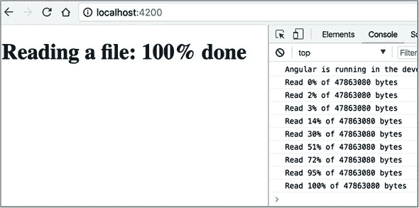

此应用位于 progressevents 目录中，app.component.ts 文件的内容如下所示。

##### 列表 12.29\. app.component.ts

```
import {HttpClient, HttpEventType, HttpRequest} from '@angular/common/http';
import {Component} from "@angular/core";

@Component({
  selector: 'app-root',
  template: `<h1>Reading a file: {{percentDone}}% done</h1>                *1*
   `})
export class AppComponent{

  mydata: any;
  percentDone: number;

  constructor(private httpClient: HttpClient) {

    const req = new HttpRequest('GET',                                     *2*
                                './data/48MB_DATA.json',                   *3*
                                {reportProgress: true});                   *4*

    httpClient.request(req)
    .subscribe(data => {
      if (data.type === HttpEventType.DownloadProgress) {                  *5*
         this.percentDone = Math.round(100 * data.loaded / data.total);))  *6*
         console.log(`Read ${this.percentDone}% of ${data.total} bytes`);
      } else {
        this.mydata = data                                                 *7*
       }
    });
  }
}
```

+   ***1* 渲染当前百分比**

+   ***2* 声明发起 GET 请求的意图**

+   ***3* 指定要读取的文件**

+   ***4* 启用进度事件跟踪**

+   ***5* 检查进度事件的类型**

+   ***6* 计算当前百分比**

+   ***7* 发射的值不是进度事件**

要查看此应用的实际运行情况，请运行以下命令：

```
ng serve --app progressevents -o
```

这个应用总结了使用 HTTP 与 Web 服务器通信的内容。在下一章中，您将看到 Angular 客户端如何使用 WebSockets 与 Web 服务器通信。

### 摘要

+   Angular 自带`HttpClient`服务，该服务支持与 Web 服务器的 HTTP 通信。

+   `HttpClient`的公共方法返回一个`Observable`对象，并且只有当客户端订阅它时，才会向服务器发出请求。

+   Angular 客户端可以与使用不同技术实现的 Web 服务器通信。

+   您可以拦截并替换 HTTP 请求和响应，以实现跨切面关注点。
