## 第十四章\. 测试 Angular 应用程序

*本章涵盖*

+   使用 Jasmine 框架进行单元测试

+   识别 Angular 测试库中的主要工件

+   测试服务、组件和路由器

+   使用 Karma 测试运行器对 Web 浏览器运行单元测试

+   使用 Protractor 框架进行端到端测试

为了确保您的软件没有错误，您需要对其进行测试。即使您的应用程序今天没有错误，在您修改现有代码或引入新代码后，它可能明天会有错误。即使您没有更改特定模块的代码，它也可能因为另一个模块或运行时环境的变化而无法正常工作。您的应用程序代码需要定期重新测试，并且该过程应该自动化。您应该在开发周期的早期就准备测试脚本并开始运行它们。

本章介绍了针对 Web 应用程序前端的两种主要测试类型：

+   ***单元测试*—** 断言一个小块代码接受预期的输入数据并返回预期的结果。单元测试是关于测试独立的代码片段，特别是公共接口。

+   ***端到端测试*—** 断言整个应用程序按最终用户期望的方式工作，并且所有应用程序部分都正确地相互交互。

单元测试用于测试小型、独立代码单元的业务逻辑。它们运行得相当快，您将比端到端测试更频繁地运行单元测试。端到端（e2e）测试模拟用户操作（如按钮点击）并检查应用程序是否按预期运行。在端到端测试期间，您不应运行单元测试脚本。


##### 注意

还有一些集成测试，用于检查多个应用程序成员是否可以通信。与单元测试模拟依赖项（例如，HTTP 响应）不同，集成测试使用真实的依赖项。要将单元测试转换为集成测试，不要使用模拟。


我们将从介绍 Jasmine 的单元测试基础开始，然后展示如何使用 Angular 测试库与 Jasmine 结合。之后，您将了解如何使用 Protractor，这个用于端到端测试的库。在章节的末尾，我们将向您展示如何编写和运行端到端脚本以测试 ngAuction 的产品搜索工作流程。

### 14.1\. 单元测试

本书作者在为各种客户的大型项目中担任顾问。相当常见的是，这些项目在没有单元测试的情况下编写。我们将描述一个典型的场景，我们在多次场合都遇到过这种情况。

一个大型应用程序可能经过几年的演变。一些最初编写应用程序的开发者已经离开了。一个新的开发者加入了项目，并需要快速学习代码并跟上进度。

一个新的业务需求出现，新团队成员开始着手处理它。他们在现有的 `doSomething()` 函数中实现了这个需求，但 QA 团队又提出了另一个问题，报告说应用在看似无关的区域出现了问题。经过进一步的研究，很明显，应用出现问题是因为在 `doSomething()` 中所做的代码更改。新开发者不了解某个业务条件，无法对此进行解释。

如果单元测试（或端到端测试）是用 `doSomething()` 的原始版本编写的，并且作为每个构建的一部分运行，这种情况就不会发生。此外，原始单元测试将作为 `doSomething()` 的文档。尽管编写单元测试看起来像是一项额外的、耗时的工作，但从长远来看，它可能会为你节省更多的时间。

我们喜欢 Google 工程师 Elliotte Rusty Harold 在他的某次演讲中给出的定义——一个单元测试应该验证一个已知、固定的输入产生一个已知、固定的输出。如果你为一个内部使用其他依赖项的函数提供固定的输入，那么这些依赖项应该被模拟，这样单个单元测试脚本就可以测试一个独立的代码单元。

已经创建了几个专门用于编写单元测试的框架，Angular 文档推荐使用 Jasmine 来实现这一目的（请参阅 Angular 文档，[`mng.bz/0nv3`](http://mng.bz/0nv3)）。我们将从 Jasmine 的简要概述开始。

#### 14.1.1\. 了解 Jasmine

Jasmine ([`jasmine.github.io/`](https://jasmine.github.io/)) 允许你实现一种 *行为驱动开发*（BDD）过程，该过程建议任何软件单元的测试都应从该单元期望的行为来指定。使用 BDD，你使用自然语言结构来描述你认为代码应该做什么。你以简短句子的形式编写单元测试规范（specs），例如：“StarsComponent 发射评分更改事件。”

由于测试的含义很容易理解，因此它们可以作为你的程序文档。如果其他开发者需要熟悉你的代码，他们可以从阅读单元测试代码开始，以了解你的意图。使用自然语言描述测试的另一个优点是：它很容易对测试结果进行推理，如图 14.1 所示。

##### 图 14.1\. 使用 Jasmine 的测试运行器运行测试

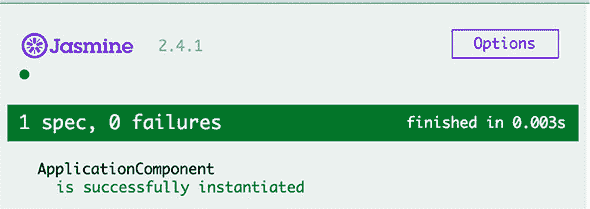

| |
| --- |

##### 提示

尽管 Jasmine 自带基于浏览器的测试运行器，但你将使用一个基于命令行的测试运行器 Karma，它可以轻松集成到你的应用的自动化构建过程中。

| |
| --- |

在行为驱动开发（BDD）框架中，一个测试被称为 *规范*，一个或多个规范的组合称为 *套件*。套件是通过 `describe()` 函数定义的——这就是你描述你要测试的内容的地方。套件中的每个规范都编程为一个 `it()` 函数，它定义了待测试代码的预期行为以及如何测试它。以下列表显示了一个示例。

##### 列表 14.1\. 简单的 Jasmine 测试套件

```
describe('MyCalculator', () => {                        *1*
   it('should know how to multiply', () => {            *2*
     // The code that tests multiplication goes here
  });
  it('should not divide by zero', () => {               *3*
     // The code that tests division by zero goes here
  });

});
```

+   ***1* 套件描述和实现套件的函数**

+   ***2* 测试乘法的规范**

+   ***3* 测试除法的规范**

测试框架有一个 *断言* 的概念，它是一种询问测试表达式是否为真或假的方式。如果断言返回 `false`，则框架抛出错误。在 Jasmine 中，断言是通过 `expect()` 函数指定的，后跟 *匹配器*：`toBe()`、`toEqual()` 等。这就像你正在写一个句子，“我期望 2 加 2 等于 4”：

```
expect(2 + 2).toEqual(4);
```

匹配器实现了实际值和预期值之间的布尔比较。如果匹配器返回 `true`，则规范通过。如果你期望测试结果不包含某个特定值，只需在匹配器前添加关键字 `not`：

```
expect(2 + 2).not.toEqual(5);
```


##### 注意

你可以在类型定义文件 @types/jasmine/index.d.ts 中找到完整的匹配器列表，该文件位于 node_modules 目录中。Angular 测试库添加了更多匹配器，列在 [`mng.bz/hx5u`](http://mng.bz/hx5u)。


在 Angular 中，测试套件的名称与测试文件下的文件名相同，名称后添加 .spec 后缀。例如，文件 application.spec.ts 包含 application.ts 的测试脚本。图 14.2 显示了一个可以位于 app.component.spec.ts 文件中的最小化测试套件；它断言变量 `app` 是 `AppComponent` 的实例。断言是期望加上匹配器。

##### 图 14.2\. 最小化测试套件

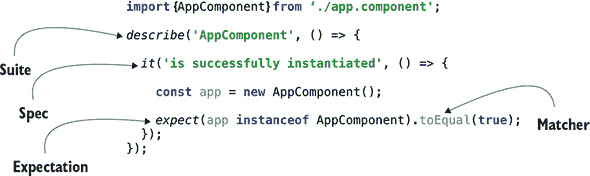

图 14.2 显示了一个包含单个规范的测试套件。如果你从 `describe()` 和 `it()` 中提取文本并将它们放在一起，你会得到一个清楚地表明你在这里测试什么的句子：“ApplicationComponent 成功实例化。”如果其他开发者需要知道你的规范测试了什么，他们可以阅读 `describe()` 和 `it()` 中的文本。每个测试都应该具有自描述性，以便它可以作为程序文档。


##### 提示

虽然图 14.2 中显示的测试是由 Angular CLI 生成的，但它相当无用，因为 `AppComponent` 无法成功实例化的可能性几乎为零。


图 14.2 中的代码实例化了 `AppComponent` 并期望表达式 `app instanceof AppComponent` 评估为 `true`。从 `import` 语句中，你可以猜测这个测试脚本位于与 `AppComponent` 相同的目录中。


##### 注意

在 Angular 应用程序中，你将每个测试脚本保存在与被测试的组件（或服务）相同的目录中，因此如果你需要在另一个应用程序中重用组件，所有相关文件都位于一起。如果你使用 Angular CLI 生成组件或服务，测试的样板代码（.spec.ts 文件）将在同一目录中生成。

| |
| --- |

如果你想在每次测试之前执行一些代码（例如准备测试依赖项），你可以在 `setup` 函数 `beforeAll()` 和 `beforeEach()` 中指定它，它们将分别在套件或每个测试用例之前运行。如果你想在套件或每个测试用例完成后立即执行一些代码，请使用 `teardown` 函数 `afterAll()` 和 `afterEach()`。

让我们看看如何在单元测试 TypeScript 类时应用 Jasmine API。

#### 14.1.2\. 为类编写测试脚本

假设你有一个具有一个 `counter` 属性和两个方法的 `Counter` 类，这两个方法允许增加或减少该属性的值。

##### 列表 14.2\. counter.ts

```
export class Counter {

  counter = 0;              *1*

  increment() {             *2*
     this.counter++;
  }

  decrement() {             *3*
     this.counter--;
  }
}
```

+   **1** 一个类属性

+   **2** 一个用于增加值的函数

+   **3** 一个用于减少值的函数

你想在这里进行单元测试吗？你想要确保 `increment()` 方法将 `counter` 的值增加一，而 `decrement()` 方法将此值减少一。使用 Jasmine 术语，你想要编写一个包含两个测试用例的测试套件。

记住，一个测试用例应该测试一个独立的功能部分，因此每个测试用例都应该创建 `Counter` 类的一个实例，并只调用其一个方法。counter.spec.ts 文件的第一个版本如下所示。

##### 列表 14.3\. counter.spec.ts

```
import {Counter} from './counter';
describe("Counter", ()=> {                             *1*
   it("should increment the counter by 1", () => {     *2*
        let cnt = new Counter();                       *3*
        cnt.increment();                               *4*
        expect(cnt.counter).toBe(1);                   *5*
     });

  it("should decrement the counter by 1", () => {
      let cnt = new Counter();
      cnt.decrement();
      expect(cnt.counter).toBe(-1);
    });
});
```

+   **1** 测试套件声明表示你将测试 Counter。

+   **2** 首个测试用例检查增加功能是否正常。

+   **3** 设置阶段创建一个 Counter 的新实例。

+   **4** 调用被测试的函数

+   **5** 声明期望、断言和匹配器

你的每个测试用例都有类似的功能。设置阶段创建 `Counter` 类的一个新实例，然后调用要测试的方法，最后使用 `expect()` 方法声明期望。在一个测试用例中，你期望 `counter` 为 `1`，在另一个中为 `-1`。

这个测试套件将工作，但你在这里有一些代码重复：每个测试用例都重复了 `Counter` 的实例化。在你测试脚本的重构版本中，你将删除从测试用例中移除的 `Counter` 实例化，并在测试之前执行它。看看以下列表中的新测试版本。这是正确的吗？

##### 列表 14.4\. 重构后的 counter.spec.ts

```
import {Counter} from './counter';

describe("Counter", () => {

  let cnt = new Counter();                         *1*

  it("should increment the counter by 1", () => {
       cnt.increment();
       expect(cnt.counter).toBe(1);
    }
  );

  it("should decrement the counter by 1", () => {
      cnt.decrement();
      expect(cnt.counter).toBe(-1);
    }
  );
});
```

+   **1** 在测试用例之前实例化 Counter

这个测试是不正确的。你的测试套件将创建一个 `Counter` 的实例，第一个测试用例将 `counter` 的值增加到 `1`，正如预期的那样。但当第二个测试用例减少 `counter` 时，其值变为 `0`，尽管匹配器期望它为 `-1`。

您测试脚本的最终版本，如下一列表所示，通过在 Jasmine 的 `beforeEach()` 函数内部创建 `Counter` 实例来修复了这个错误。

##### 列表 14.5\. counter.spec.ts 的最终版本

```
import {Counter} from './counter';

describe("Counter", () => {

  let cnt: Counter;??

  beforeEach(() => cnt = new Counter())?;         *1*

  it("should increment the counter by 1", () => {
       cnt.increment();
       expect(cnt.counter).toBe(1);
    }
  );

  it("should decrement the counter by 1", () => {
      cnt.decrement();
      expect(cnt.counter).toBe(-1);
    }
  );
});
```

+   ***1* 在 beforeEach() 中实例化 Counter**

现在这个脚本正确地指导 Jasmine 在运行您的套件中的每个 spec 之前创建一个新的 `Counter` 实例。让我们看看如何运行它。

### 14.2\. 使用 Karma 运行 Jasmine 脚本

对于不使用 Angular CLI 的项目，您需要执行大量的手动配置才能运行 Jasmine 测试。在没有 Angular CLI 的情况下，您需要按照以下方式安装 Jasmine 及其类型定义文件： 

```
npm install jasmine-core @types/jasmine --save-dev
```

然后您需要创建一个包含脚本标签以加载 Jasmine 和您的规格（TypeScript 代码需要预先编译成 JavaScript）的 test.html 文件。最后，您需要手动在每个您关心的浏览器中加载 test.html 并观察您的测试是否通过或失败。

但从命令行运行单元测试是一个更好的选择，因为这样您可以集成测试到项目构建过程中。这是使用名为 Karma 的命令行测试运行器（见 [`karma-runner.github.io`](https://karma-runner.github.io)）的主要原因之一。除了这个好处之外，Karma 还具有多个有用的插件，并且可以与许多 JavaScript 测试库一起使用，以针对所有主要浏览器进行测试。

Karma 用于测试使用或未使用框架编写的 JavaScript 代码。Karma 可以运行测试以检查您的应用程序是否在多个浏览器（Chrome、Firefox、Internet Explorer 等）中正常工作。在非 Angular CLI 项目中，您可以按照以下列表安装 Karma 和 Jasmine、Chrome 以及 Firefox 的插件。

##### 列表 14.6\. 安装 Karma

```
npm install karma karma-jasmine --save-dev           *1*
npm install karma-chrome-launcher --save-dev         *2*
npm install karma-firefox-launcher --save-dev        *3*
```

+   ***1* 安装 Karma 及其 Jasmine 插件**

+   ***2* 在 Chrome 中安装插件**

+   ***3* 在 Firefox 中安装插件以进行测试**

然后您需要为项目准备一个配置文件，即 karma.conf.js，但您被 Angular CLI 宠坏了，因为它为您安装并配置了测试 Angular 应用所需的所有内容，包括 Jasmine 和 Karma。我们使用 Angular CLI 创建了一个新项目，并将上一节中描述的代码添加到测试 `Counter` 类中。您将在 hello-jasmine 目录中找到这个项目。图 14.3 展示了该项目的结构，标记了所有与测试相关的文件和目录。

##### 图 14.3\. hello-jasmine 项目

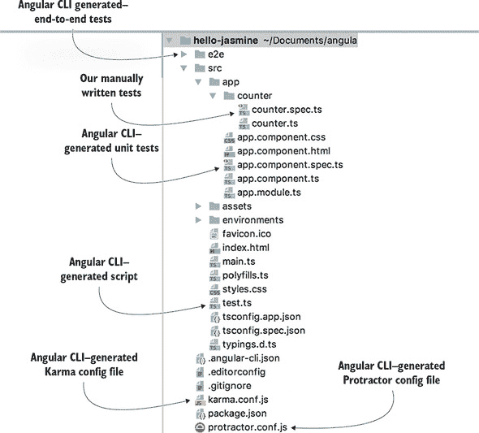

在顶部，您可以看到 e2e 目录，在底部，是用于端到端测试的 protractor.conf.js 文件，这些都是在第 14.4 节中描述的。

`counter.spec.ts` 文件是上一节中描述的手动编写的测试脚本。`app.component.spec.ts` 文件是由 Angular CLI 为测试 `AppComponent` 生成的，您将在第 14.3.1 节中看到其内容。

生成的 test.ts 文件是主要的测试脚本，它加载所有测试脚本。当你运行 `ng test` 命令时，karma.conf.js 文件被 Karma 运行器使用，该命令编译并运行单元测试。测试编译完成后，`ng test` 使用编译后的脚本 test.js 加载 Angular 测试库和所有 .spec.ts 文件，并启动 Karma 运行器。图 14.4 显示了在 hello-jasmine 项目中运行 `ng test` 命令的输出。

##### 图 14.4\. 在 hello-jasmine 项目中运行 `ng test`

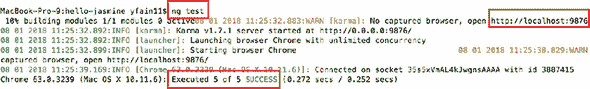

要运行测试，Karma 启动 Chrome 浏览器（Angular CLI 配置的唯一一个），并运行五个成功结束的测试。为什么是五个？你在 `counter.spec.ts` 文件中只写了两个测试，对吧？Angular CLI 还生成了 app.component.spec.ts 文件，其中包含包含三个 `it()` 函数定义的测试套件。Karma 执行所有扩展名为 .spec.ts 的文件。

| |
| --- |

##### 注意

Angular CLI 项目包含 karma-jasmine-html-reporter 包，如果你想通过浏览器查看测试结果，请打开 URL http://localhost:9876。

| |
| --- |

你现在不想从 app.component.spec.ts 运行测试，所以让我们将其关闭。如果你想让测试运行器跳过一些测试，将它们的 spec 函数从 `it()` 重命名为 `xit()`。在这里，*x* 代表 *exclude*。如果你想跳过整个测试套件，将 `describe()` 重命名为 `xdescribe()`。

如果你从 app.component.spec.ts 中排除测试套件，测试将自动重新运行，报告显示两个测试成功运行（你为 `Counter` 编写的那些），三个 spec 被跳过（由 Angular CLI 生成的那些）：

```
Chrome 63.0.3239 (Mac OS X 10.11.6): Executed 2 of 5 (skipped 3)
 SUCCESS (0.03 secs / 0.002 secs)
```

随着 spec 数量的增加，你可能只想执行其中一些以更快地看到结果。将 spec 函数从 `it()` 重命名为 `fit()`（*f* 代表 *force*）将只执行这些测试，跳过其余的。

| |
| --- |

**你知道如何测试，但为什么还不清楚**

假设你知道如何测试 `Counter` 类的方法，但你可能仍然有一个价值百万美元的问题：为什么测试像 `increment()` 和 `decrement()` 这样简单的函数？它们不是总是能正常工作吗？在现实世界中，事情会发生变化，曾经简单的事情变得不再那么简单。

假设 `decrement()` 函数的业务逻辑发生了变化，新的要求是不允许 `counter` 小于 `2`。开发者将 `decrement()` 代码更改为以下样子。

```
decrement(){
    this.counter >2 ? this.counter--: this.counter;
  }
```

突然，你有两条可能的*执行路径*：

+   当前计数器的值大于 `2`。

+   当前计数器的值等于 `2`。

如果你为 `decrement()` 编写了单元测试，那么下次你运行 `ng test` 时，它将失败，如下所示：

```
Chrome 63.0.3239 (Mac OS X 10.11.6)
    Counter should decrement the counter by 1
 FAILED                                              *1*
 Expected 0 to be -1\.                                *2*
     at Object.<anonymous> chapter14/hello-jasmine/
    src/app/counter/counter.spec.ts:18:27)
    ...
```

+   ***1* 文本描述了失败的 spec。**

+   ***2* 断言失败，因为被测试的代码没有减少等于零的计数器。**

您的单元测试失败是一个好事，因为它告诉您应用程序逻辑中发生了变化——在 `decrement()` 中。现在开发者应该查看发生了什么，并向测试套件中添加另一个 spec，以便您有两个 `it()` 块来测试 `decrement()` 的两个执行路径，以确保它始终正常工作。

在现实世界中，业务需求经常变化，如果开发者在没有为新功能提供单元测试的情况下实现它们，您的应用程序可能会变得不可靠，并且会让您（或生产支持工程师）在夜间无法入睡。

|  |

##### 提示

失败测试的输出可能不易阅读，因为它可能包含多行错误堆栈跟踪。考虑使用名为 Wallaby 的持续测试工具（见 [`wallabyjs.com/docs`](https://wallabyjs.com/docs)），它会在您的 IDE 中显示一个简短的错误消息，紧邻失败的 spec 代码。

|  |

##### 注意

在 第十二章，12.3.6 节中，我们解释了如何通过运行一系列 npm 脚本来自动化构建过程。如果您将 `ng test` 添加到构建命令中，如果任何单元测试失败，构建将被终止。例如，构建脚本可以看起来像这样："build": "ng test && ng build"。


很好，Angular CLI 生成了一个可用的 Karma 配置文件，但有时您可能希望根据项目需求对其进行修改。

#### 14.2.1. Karma 配置文件

当 Angular CLI 生成一个新项目时，它包括预先配置好的 karma.conf.js 文件，用于在 Chrome 浏览器中运行 Jasmine 单元测试。您可以在 [`mng.bz/82cQ`](http://mng.bz/82cQ) 上阅读所有可用的配置选项，但我们将仅突出一些您可能希望在项目中修改的选项。以下列出的是生成的 karma.conf.js 文件。

##### 列表 14.7\. Angular CLI 生成的 karma.conf.js 文件

```
module.exports = function (config) {
  config.set({
    basePath: '',
    frameworks: ['jasmine', '@angular/cli'],
    plugins: [
      require('karma-jasmine'),
      require('karma-chrome-launcher')                 *1*
       require('karma-jasmine-html-reporter'),
      require('karma-coverage-istanbul-reporter'),     *2*
       require('@angular/cli/plugins/karma')           *3*
     ],
    client:{
      clearContext: false // leave Jasmine Spec Runner
                          // output visible in browser
    },
    coverageIstanbulReporter: {
      reports: [ 'html', 'lcovonly' ],
      fixWebpackSourcePaths: true
    },
    angularCli: {
      environment: 'dev'
    },
    reporters: ['progress',                            *4*
                 'kjhtml'],                            *5*
     port: 9876,                                       *6*
     colors: true,
    logLevel: config.LOG_INFO,
    autoWatch: true,
    browsers: ['Chrome'],                              *7*
     singleRun: false                                  *8*
   });
};
```

+   ***1* 包含 Chrome 测试插件**

+   ***2* 包含代码覆盖率报告器**

+   ***3* 包含 Angular CLI 的 Karma 插件**

+   ***4* 在控制台上报告测试进度**

+   ***5* 使用 karma-jasmine-html-reporter**

+   ***6* 在此端口上运行 HTML 报告器**

+   ***7* 列出测试中使用的浏览器**

+   ***8* 以监视模式运行**


##### 注意

如果您想让 Karma 在控制台打印每个完成的 spec 的消息，请在 package.json 中添加 karma-mocha-reporter 作为 `devDependency`，将 `require('karma-mocha-reporter')` 行添加到 karma.conf.js 中，并用 `mocha` 替换 `progress` 报告器。如果您在持续集成（CI）服务器上运行测试，请使用可以将测试结果写入 JUnit XML 格式文件的 karma-junit-reporter。


此配置文件仅使用 Chrome 插件，但在现实世界的应用程序中，您希望在多个浏览器中运行测试。下一节将向您展示如何将 Firefox 添加到测试中使用的浏览器列表。

Karma 可以使用 Istanbul 报告器来报告你的代码测试覆盖率，你可以运行以下命令来生成覆盖率报告：

```
ng test --code-coverage
```

这将创建一个名为 coverage 的目录，其中包含一个加载覆盖率报告的 index.html 文件。例如，你的 hello-jasmine 项目包含一个 `AppComponent` 和 `Counter` 类，它们完全被单元测试覆盖。生成的报告如图 14.5 所示。

##### 图 14.5. hello-jasmine 项目的测试覆盖率报告

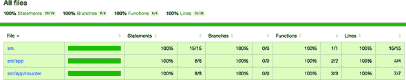

| |
| --- |

##### 注意

一些组织对代码覆盖率有严格的规则，例如至少 90% 的代码必须被单元测试覆盖，否则构建将失败。为了强制执行这种覆盖率，安装 npm 包 karma-istanbul-threshold 并将 `istanbulThresholdReporter` 部分添加到 karma.conf.js 中。更多详情请参阅 [`mng.bz/544u`](http://mng.bz/544u)。

| |
| --- |

#### 14.2.2. 在多个浏览器中进行测试

通常，开发者不会在多个浏览器中手动测试每个代码更改。Chrome 是开发模式的首选浏览器，当测试人员报告你的应用程序在 Chrome 中运行良好，但在 Safari、Firefox 或 Internet Explorer 中产生错误时，你可能会感到不愉快。为了消除这些惊喜，你应该在所有对用户重要的浏览器中运行单元测试。

幸运的是，使用 Karma 设置起来相当简单。假设你想要 Karma 不仅在 Chrome 中运行测试，还要在 Firefox 中运行（你必须在电脑上安装 Firefox）。首先，安装 karma-firefox-launcher 插件：

```
npm i karma-firefox-launcher --save-dev
```

然后，在 karma.conf.js 的 `plugins` 部分中添加以下行：

```
require('karma-firefox-launcher'),
```

最后，将 Firefox 添加到 karma.conf.js 中的 `browsers` 列表中，使其看起来如下：

```
browsers: ['Chrome', 'Firefox'],
```

| |
| --- |

##### 小贴士

如果你需要在 Linux 服务器上设置 CI 环境，你可以安装 Xvfb（一个虚拟显示服务器）或使用 *无头浏览器*（一个没有 UI 的浏览器）。例如，你可以指定 `ChromeHeadless` 来使用无头 Chrome 浏览器。

| |
| --- |

现在，如果你运行 `ng test` 命令，它将在 Chrome 和 Firefox 中运行测试。为每个你关心的浏览器安装 Karma 插件，这将消除“但在 Chrome 中运行良好！”这样的惊喜。

我们已经介绍了编写和运行单元测试的基础。让我们看看如何对 Angular 组件、服务和路由进行单元测试。

### 14.3. 使用 Angular 测试库

Angular 内置了一个测试库，它包括一些 Jasmine 函数的包装器，并添加了 `inject()`、`async()`、`fakeAsync()` 等函数。

要测试 Angular 组件，你需要使用 `TestBed` 工具的 `configureTestingModule()` 方法创建和配置测试用例的 Angular 模块，这允许你声明模块、组件、提供者等。例如，配置测试模块的语法类似于配置 `@NgModule()`，如下所示。

##### 列表 14.8\. 为您的应用配置测试模块

```
beforeEach(async(() => {                    *1*
   TestBed.configureTestingModule({         *2*
     declarations: [
      AppComponent                          *3*
     ],
  }).compileComponents();                   *4*
 }));
```

+   ***1* 在每个规范之前异步运行此代码**

+   ***2* 配置测试模块**

+   ***3* 列出测试组件**

+   ***4* 编译组件**

`beforeEach()` 函数在测试套件的设置阶段使用。通过它，你可以指定每个测试可能需要的所需模块、组件和提供者。`async()` 函数在 Zone 中运行，可以与异步代码一起使用。`async()` 函数不会完成，直到其所有异步操作都已完成或指定的超时时间已通过。

在 Angular 应用中，组件是“神奇地”创建的，服务被注入，但在测试脚本中，你需要显式实例化组件并调用 `inject()` 函数或 `TestBed.get()` 函数来注入服务。如果被测试的函数调用了异步函数，你应该将这些函数包裹在 `async()` 或 `fakeAsync()` 中。

`async()` 将在 Zone 中运行被测试的函数（s）。如果你的测试代码使用了超时、观察者或承诺，请将其包裹在 `async()` 中，以确保在所有异步函数完成后调用 `expect()` 函数。如果不这样做，`expect()` 可能会在异步函数的结果到来之前执行，从而导致测试失败。`async()` 函数等待异步代码完成，这是一个好事。另一方面，这样的等待可能会减慢测试速度，而 `fakeAsync()` 函数允许你消除等待。

`fakeAsync()` 识别代码中测试的计时器，并用立即执行的函数替换 `setTimeout()`、`setInterval()` 或 `debounceTime()` 中的代码，就像它们是同步的，并按顺序执行它们。它还通过 `tick()` 和 `flush()` 函数提供了更精确的时间控制，这些函数允许你快进时间。

你可以选择提供以毫秒为单位的时间值进行快进，因此无需等待，即使异步函数使用了 `setTimeout()` 或 `Observable.interval()`。例如，如果你有一个使用 RxJS 操作符 `myInputField.valueChanges.debounceTime(500).subscribe()` 的输入字段，你可以编写 `tick (499)` 来快进 499 毫秒，然后断言订阅者没有接收到输入字段中输入的数据。

你只能在 `fakeAsync()` 中使用 `tick()` 函数。不带参数调用 `tick()` 表示你希望随后的代码在所有挂起的异步活动完成后执行。

要查看本节中的测试示例，请打开本章附带的项目 unit-testing-samples，运行 `npm install`，然后运行 `ng test`。

让我们看看 Angular 测试库的一些 API，从审查由 Angular CLI 生成的 app.component.spec.ts 文件的代码开始。

#### 14.3.1\. 测试组件

组件是带有模板的类。如果一个组件的类包含实现某些应用程序逻辑的方法，您可以像测试任何其他函数一样测试它们。但更常见的是，您会测试 UI，以确保绑定正常工作，并且组件模板显示预期的数据。

在底层，Angular 组件由两部分组成：类的实例和 DOM 元素。技术上，当您为一个组件编写单元测试时，它更像是一个集成测试，因为它必须检查组件类的实例和 DOM 对象是否同步工作。

Angular 测试库提供了`TestBed.createComponent()`方法，该方法返回一个`ComponentFixture`对象，它使您能够访问渲染模板的组件和原生 DOM 对象。

要访问组件实例，您可以使用`ComponentFixture.componentInstance`属性，要访问 DOM 元素，使用`ComponentFixture.nativeElement`。如果您想访问固定装置的 API（例如，访问组件的注入器、运行 CSS 查询选择器、查找样式或子节点或触发事件处理器），请使用其`DebugElement`，如`ComponentFixture.debugElement.componentInstance`和`ComponentFixture.debugElement.nativeElement`，分别。图 14.6 说明了`ComponentFixture`对象的一些属性，这些属性也存在于`debugElement`中。

##### 图 14.6\. `ComponentFixture`的属性

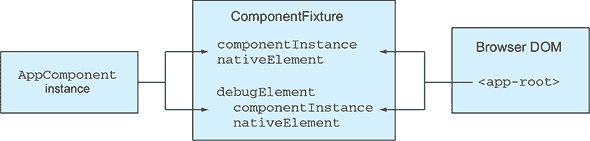

要更新绑定，您可以通过在固定装置上调用`detectChanges()`方法来触发组件上的更改检测周期。更改检测更新 UI 后，您可以运行`expect()`函数来检查渲染的值。

在配置测试模块后，您通常执行以下步骤来测试组件：

> **1**. 调用`TestBed.createComponent()`来创建组件。
> 
> **2**. 使用对`componentInstance`的引用来调用组件的方法。
> 
> **3**. 调用`ComponentFixture.detectChanges()`来触发更改检测。
> 
> **4**. 使用对`nativeElement`的引用来访问 DOM 对象并检查它是否具有预期的值。


##### 注意

如果您想自动触发更改检测，您可以通过配置测试模块中的`ComponentFixtureAutoDetect`服务的提供者来实现。尽管这似乎比手动调用`detectChanges()`更好，但此服务仅注意异步活动，不会对组件属性的同步更新做出反应。


让我们检查生成的`app.component.spec.ts`文件的代码，看看它是如何执行这些步骤的。这个由 Angular CLI 生成的脚本声明了一个包含三个规格的测试套件：

> **1**. 检查组件实例是否已创建。
> 
> **2**. 检查该组件有一个值为`app`的`title`属性。
> 
> **3**. 检查 UI 中是否有文本为“欢迎使用 app!”的`<h1>`元素

代码如下所示。

##### 列表 14.9\. app.component.spec.ts

```
import { TestBed, async } from '@angular/core/testing';          *1*
import { AppComponent } from './app.component';

describe('AppComponent', () => {
  beforeEach(async(() => {                                       *2*
     TestBed.configureTestingModule({                            *3*
       declarations: [
        AppComponent
      ],
    }).compileComponents();                                      *4*
   }));
  it('should create the app', async(() => {
    const fixture = TestBed.createComponent(AppComponent);       *5*
     const app = fixture.debugElement.componentInstance;         *6*
     expect(app).toBeTruthy();                                   *7*
   }));
  it(`should have as title 'app'`, async(() => {
    const fixture = TestBed.createComponent(AppComponent);
    const app = fixture.debugElement.componentInstance;
    expect(app.title).toEqual('app');
  }));
  it('should render title in a h1 tag', async(() => {
    const fixture = TestBed.createComponent(AppComponent);
    fixture.detectChanges();                                     *8*
     const compiled = fixture.debugElement.nativeElement;        *9*
     expect(compiled.querySelector('h1').textContent)
                       .toContain('Welcome to app!');            *10*
   }));
});
```

+   ***1* 从 Angular 测试库导入所需的模块**

+   ***2* 将组件编译包装成 async()**

+   ***3* 在设置阶段，异步地在 Zone 中配置测试模块**

+   ***4* 将组件编译成内联样式和模板**

+   ***5* 实例化 AppComponent**

+   ***6* 获取组件实例的引用**

+   ***7* 检查将 app 转换为布尔值的结果为 true**

+   ***8* 触发更改检测以更新组件的 DOM 对象**

+   ***9* 获取 DOM 对象的引用**

+   ***10* 检查 DOM 对象是否包含包含此文本的<h1>元素**

注意，实例化组件的函数被包装在`async()`中。这是因为组件可以有自己的模板和样式文件，而读取文件是一个异步操作。

调用`detectChanges()`触发更改检测，更新 DOM 元素上的绑定。在此之后，你可以查询 DOM 元素的内容，以确保 UI 显示预期的值。


##### 注意

目前，Angular CLI 通过重复调用`createComponent()`生成测试。更好的解决方案是编写另一个`beforeEach()`函数并在那里创建固定装置。


在新创建的项目中运行`ng test`将报告所有测试通过。浏览器将在 http://localhost:9876 打开，你将看到图 14.7 中显示的测试报告。

##### 图 14.7\. `ng test`的成功运行

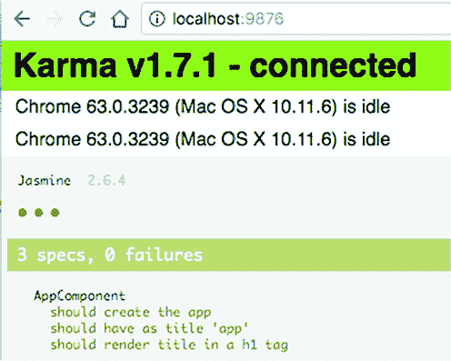

让我们看看如果你将 AppComponent 中的`title`属性值从`app`更改为`my app`会发生什么。因为`ng test`在监视模式下运行，测试将自动重新运行，你将在控制台看到关于两个失败的规格的消息，规格列表将看起来像图 14.8（如果你有电子书，失败的规格将以红色显示）。

##### 图 14.8\. 包含失败的规格列表

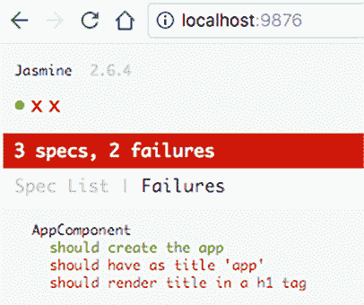

第一个失败的规格消息是“AppComponent 应该有标题‘app’”，第二个消息是“AppComponent 应该在 h1 标签中渲染标题。”这些是在`it()`函数中提供的消息。点击任何失败的规格将打开另一个页面，提供更多细节和堆栈跟踪。


##### 提示

请记住，如果你的组件使用生命周期钩子，它们不会自动调用。你需要显式调用它们，就像`app.ngOnInit()`一样。


让我们在下一个列表中添加另一个规格，以确保如果 AppComponent 类中的`title`属性发生变化，它将在 UI 中正确渲染。

##### 列表 14.10\. 更新`title`的规格

```
it('should render updated title', async(() => {
  const fixture = TestBed.createComponent(AppComponent);
  const app = fixture.debugElement.componentInstance;
  app.title = 'updated app!';                                *1*
   fixture.detectChanges();                                  *2*
   const compiled = fixture.debugElement.nativeElement;
  expect(compiled.querySelector('h1').textContent)
          .toContain('Welcome to updated app!');             *3*
 }));
```

+   ***1* 更新标题属性**

+   ***2* 强制更改检测**

+   ***3* 检查 UI 是否反映了更新的标题**

现在 `ng test` 将运行这个额外的规格，并报告它已成功完成。在本节中，你使用了为 `AppComponent` 生成的测试，但你在实践部分将看到另一个测试组件的脚本。

一个典型的组件使用服务进行数据处理，你创建模拟服务，返回硬编码（且相同）的值，以便专注于测试组件的功能。组件的规范应该只测试组件；服务应该单独测试。

#### 14.3.2\. 测试服务

服务是一个包含一个或多个方法的类，你只对公共方法进行单元测试，这些方法反过来可能调用私有方法。在 Angular 应用中，你在 `@Component` 或 `@NgModule` 中指定服务的提供者，以便 Angular 可以正确实例化和注入它们。在测试脚本中，你也在设置阶段在 `TestBed.configureTestingModule()` 内声明测试服务的提供者。

此外，如果你在 Angular 应用中可以在类构造函数中使用提供者的令牌来注入服务，在测试中，注入方式不同。例如，你可以显式调用 `inject()` 函数。另一种实例化和注入服务的方法是使用 `TestBed.get()` 方法，它使用根注入器，如 图 14.9 所示。如果服务提供者在根测试模块中指定，这将有效。

##### 图 14.9\. 将服务注入测试脚本


组件级注入器可以使用如下方式：

```
fixture.debugElement.injector.get(ProductService);
```

让我们通过运行以下 Angular CLI 命令来生成一个产品服务：

```
ng g s product
```

此命令将生成 product.service.ts 和 product.service.spec.ts 文件。后者将包含以下列表中显示的样板代码。

##### 列表 14.11\. product.service.spec.ts

```
import { TestBed, inject } from '@angular/core/testing';
import { ProductService } from './product.service';

describe('ProductService', () => {
  beforeEach(() => {
    TestBed.configureTestingModule({
      providers: [ProductService]                  *1*
     });
  });

  it('should be created',
     inject([ProductService],                      *2*
             (service: ProductService) => {
               expect(service).toBeTruthy();}      *3*
      )
  );
});
```

+   ***1* 配置提供者**

+   ***2* 注入服务**

+   ***3* 实现测试逻辑**

如果你需要注入多个服务，`inject()` 函数将列出 DI 令牌数组，后跟与令牌名称对应的参数列表的函数：

```
inject([ProductService, OtherService],
    (prodService: ProductService, otherService: OtherService) => {...})
```

当你向 `ProductService` 类添加方法时，你可以像之前测试 `Counter` 类中的方法一样测试它们，但你需要考虑一个特殊情况，即当服务依赖于另一个服务，例如 `HttpClient` 时。在单元测试期间向服务器发送 HTTP 请求会减慢测试速度。此外，你不想因为服务器故障而导致单元测试失败。记住，单元测试是为了测试独立的代码片段。

本章附带代码包括单元测试示例项目和一个名为 readfile 的应用。它包括 `ProductService`，该服务使用 `HttpClient` 读取 data/products.json 文件，如下所示列表。

##### 列表 14.12\. 在服务中读取 data/products.json

```
export class ProductService {

  constructor(private httpClient: HttpClient ) {}                      *1*

  getProducts(): Observable<Product[]> {                               *2*
     return this.httpClient.get<Product[]>('/data/products.json');
  }
}
```

+   ***1* 注入 HttpClient**

+   ***2* 读取文件**

让我们为 `getProducts()` 方法编写一个单元测试。你不希望测试失败，如果有人删除了 data/products.json 文件，因为这并不意味着 `getProducts()` 中存在问题。你将使用 `HttpClientTestingModule` 中的 `HttpTestingController` 来模拟 `HttpClient`。`HttpTestingController` 不会发出 HTTP 请求，但允许你使用硬编码的数据来模拟它。

要将硬编码的数据添加到响应体中，你将使用 `HttpTestingController.flush()` 方法，要模拟错误，你将使用 `HttpTestingController.error()`，如下面的列表所示。

##### 列表 14.13\. product.service.spec.ts

```
import {TestBed, async} from '@angular/core/testing';
import {HttpClientTestingModule, HttpTestingController }
from '@angular/common/http/testing';
import {ProductService} from './product.service';
import {Product} from './product';

describe('ProductService', () => {
  let productService: ProductService;
  let httpMock: HttpTestingController;

  beforeEach(() => {
    TestBed.configureTestingModule({
      imports: [HttpClientTestingModule],                                 *1*
       providers: [ProductService]
    });

    productService = TestBed.get(ProductService);                         *2*
     httpMock = TestBed.get(HttpTestingController);                       *3*
   });

  it('should successfully get products', async(() => {
    const productData: Product[] =
         [{ "id": "0", "title": "First Product", "price": 24.99 }];       *4*
     productService.getProducts()
           .subscribe(res => expect(res).toEqual(productData));           *5*

    let productsRequest = httpMock.expectOne('/data/products.json');
    productsRequest.flush(productData);                                   *6*
   }));

  it('should return error if request for products failed', async( () => {
    const errorType = 'CANNOT_LOAD_PRODUCTS' ;                            *7*
     productService.getProducts()
      .subscribe(() => {},                                                *8*
           errorResponse =>
                expect(errorResponse.error.type).toEqual(errorType));     *9*

    let productsRequest = httpMock.expectOne('/data/products.json');

    productsRequest.error(new ErrorEvent (errorType));                    *10*
   }));

  afterEach(() => httpMock.verify());                                     *11*
 });
```

+   ***1* 将 HttpClientTestingModule 添加到测试模块**

+   ***2* 注入 ProductService**

+   ***3* 注入 HttpTestingController**

+   ***4* 准备硬编码的产品数据**

+   ***5* 订阅响应并断言结果**

+   ***6* 将产品数据发送到客户端**

+   ***7* 准备错误消息**

+   ***8* 不处理产品数据**

+   ***9* 断言接收到了预期的错误**

+   ***10* 将错误发送到客户端**

+   ***11* 断言没有挂起的请求**

在第一个规范中，你为单个产品硬编码数据，然后调用 `getProducts()` 并订阅响应。


##### 注意

Jasmine 提供了一个 `spyOn()` 函数，可以拦截指定的函数（例如，`getProducts()`），你可以在其中返回一个包含预期数据的存根对象。但使用这样的存根不会发出 HTTP 请求。因为使用了 `HttpTestingController`，HTTP 请求会被发出并被 `HttpTestingController` 拦截，它不会向读取 products.json 发出真实的 HTTP 请求，而是将硬编码的产品数据通过 HTTP 机制发送。


你期望 `getProducts()` 方法对 /data/products .json 发出单个请求并返回其模拟，这就是 `expectOne()` 的作用。如果没有发出此类请求，或者发出了多个此类请求，规范将失败。

使用真实的 `HttpClient` 服务，调用 `subscribe()` 方法会导致接收数据或错误，但使用 `HttpTestingController`，订阅者将不会收到任何数据，直到你调用 `flush()` 或 `error()`。在这里，你将在响应体中提供硬编码的数据。

当 Karma 打开浏览器并显示测试结果时，你可以在“源”标签页中打开 Chrome Dev Tools，找到你的 spec 文件的源代码，并添加断点来调试你的测试代码，就像调试任何 TypeScript 代码一样。特别是，如果你在 列表 14.13 中调用 `flush()` 的行上放置断点，你会看到它在 `subscribe()` 中的代码之前被调用。

`verify()` 方法测试了所有 HTTP 请求，并且没有挂起的请求。你会在每个规范运行后的清理阶段断言这一点。

注意，每个规格中的代码都被包装在 `async()` 函数中。这确保了您的 `expect()` 调用将在规格中的所有异步调用完成后进行。


##### 提示

您可以在 Angular 测试文档中阅读有关用模拟、存根和间谍替换真实服务的其他技术的信息，请参阅 [`angular.io/guide/testing`](https://angular.io/guide/testing)。


现在我们来看看如何测试路由。

#### 14.3.3\. 测试使用路由的组件

如果组件包含路由，您可能想要测试不同的导航功能。例如，您可能想要测试路由是否正确地导航到它应该去的地方，参数是否正确传递到目标组件，以及守卫是否不允许未经授权的用户访问某些路由。

为了测试路由相关的功能，Angular 提供了 `RouterTestingModule`，它可以拦截导航但不加载目标组件。对于测试，你需要路由配置；你可以使用应用程序中使用的相同配置，或者创建一个仅用于测试的单独配置。如果您的路由配置包含许多组件，后者可能是一个更好的选择。

用户可以通过与应用程序交互或直接在浏览器地址栏中输入 URL 来导航应用程序。`Router` 对象负责在您的应用程序代码中实现的导航，而 `Location` 对象表示地址栏中的 URL。这两个对象协同工作。

要测试路由是否正确导航您的应用程序，请在您的规格说明中调用 `navigate()` 和 `navigateByUrl()`，如果需要，传递参数。`navigate()` 方法接受一个包含路由和参数的数组作为参数，而 `navigateByUrl()` 接受一个表示您想要导航到的 URL 段的字符串。

如果您使用 `navigate()`，您指定配置的路径和路由参数（如果有的话）。如果路由配置正确，它应该更新浏览器地址栏中的 URL。为了说明这一点，您将重用 第三章 中一个应用程序的代码，但您将添加规格文件。在该应用程序中，`AppComponent` 的路由配置包括路径 /product/:id，如下面的列表所示。

##### 列表 14.14\. app.routing.ts 的一部分

```
export const routes: Routes = [
  {path: '',            component: HomeComponent},                *1*
   {path: 'product/:id', component: ProductDetailComponent}       *2*
 ];
```

+   ***1* 默认路由**

+   ***2* 带有参数的路由**

当用户点击产品详情链接时，应用程序将导航到 `ProductDetailComponent`，如下面的列表所示。

##### 列表 14.15\. app.component.ts

```
@Component({
  selector: 'app-root',
  template: `
        <a [routerLink]="['/']">Home</a>
        <a id="product" [routerLink]="['/product', productId]">   *1*
            Product Detail</a>
        <router-outlet></router-outlet>
    `
})
export class AppComponent {
  productId = 1234;                                               *2*
 }
```

+   ***1* 导航到产品详情视图的链接**

+   ***2* 要传递给产品详情视图的值**

在 `app.component.spec.ts` 文件中，您将测试当用户点击产品详情链接时，URL 包含段 /product/1234。您将通过使用 `TestBed.get()` API 注入 `Router` 和 `Location` 对象。为了模拟点击产品详情链接，您需要获取相应的 DOM 对象，这可以通过使用 `By.css()` API 实现。实用类 `By` 有 `css()` 方法，它使用提供的 CSS 选择器匹配元素。因为您的应用程序组件有两个链接，所以您将 `id=product` 分配给产品详情链接，这样您就可以通过调用 `By.css('#product')` 来获取它。

为了模拟点击链接，你使用 `triggerEventHandler()` 方法并传入两个参数。第一个参数的值为 `click`，代表点击事件。第二个参数的值为 `{button: 0}`，代表事件对象。`RouterLink` 指令期望的值应包含表示鼠标按钮的 `button` 属性，其中零表示左鼠标按钮，如下所示。

##### 列表 14.16\. app.component.spec.ts

```
// imports omitted for brevity
describe('AppComponent', () => {
  let fixture;
  let router: Router;
  let location: Location;

    beforeEach(async(() => {
      TestBed.configureTestingModule({
        imports: [RouterTestingModule.withRoutes(routes)],                *1*
         declarations: [
          AppComponent, ProductDetailComponent, HomeComponent
        ]}).compileComponents();
    }));

  beforeEach(fakeAsync(() => {
    router = TestBed.get(Router);                                         *2*
     location = TestBed.get(Location);                                    *3*
     fixture = TestBed.createComponent(AppComponent);
    router.navigateByUrl('/');
    tick();
    fixture.detectChanges();                                              *4*
   }));

  it('can navigate and pass params to the product detail view',
   fakeAsync(() => {
    const productLink = fixture.debugElement.query(By.css('#product'));   *5*
     productLink.triggerEventHandler('click', {button: 0});               *6*
     tick();
    fixture.detectChanges();
    expect(location.path()).toEqual('/product/1234');                     *7*
   }));
});
```

+   ***1* 加载路由配置**

+   ***2* 注入 Router 对象**

+   ***3* 注入 Location 对象**

+   ***4* 触发变更检测**

+   ***5* 获取产品详情链接的访问权限**

+   ***6* 点击链接**

+   ***7* 检查断言**

`fakeAsync()` 函数包装导航代码（异步操作），而 `tick()` 函数确保在您运行断言之前异步导航完成。

图 14.10 展示了前面脚本执行的动作序列。

##### 图 14.10\. 测试导航步骤

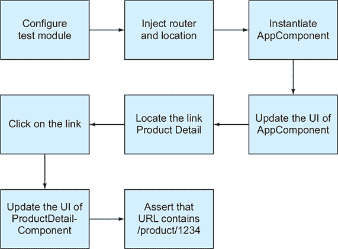

`ng test` 命令将在单元测试样本项目中运行所有单元测试，该项目包含三个应用程序。所有八个规范都应该成功完成。第八个规范将报告“AppComponent 可以导航并将参数传递到产品详情视图”。

| |
| --- |

##### 注意

要将单元测试集成到您的自动化构建过程中，请通过在 12.3.6 节中描述的 npm 构建脚本中添加 `&& ng test` 来将 `ng test` 命令集成到构建过程中。第十二章。

| |
| --- |

单元测试在路由守卫中实现的功能是另一个实际用例。在第四章（kindle_split_013.xhtml#ch04）中，我们介绍了 `CanActivate`、`CanDeactivate` 和 `Resolve` 等守卫。因为守卫是服务，您可以像前节中解释的那样单独测试它们。

这就结束了我们对单元测试基础知识的介绍。单元测试断言您的 Angular 应用程序中的每个工件在独立情况下按预期工作。但您如何确保几个组件、服务和其它工件在没有手动测试每个工作流的情况下能够良好协作呢？

### 14.4\. 使用 Protractor 进行端到端测试

端到端（E2E）测试是通过模拟用户与应用的交互来测试整个应用工作流程。例如，下订单的过程可能涉及多个组件和服务。您可以创建一个端到端测试来确保此工作流程按预期行为。此外，如果在单元测试中您正在模拟依赖项，端到端测试将使用真实的依赖项。

要手动测试特定的工作流程，例如登录功能，质量保证工程师准备一个有效的 ID/密码，打开登录页面，输入 ID/密码，然后点击登录按钮。之后，质量保证工程师希望断言您的应用着陆页已成功渲染。测试人员还可以运行另一个测试以确保如果输入错误的 ID/密码，着陆页不会渲染。这是登录工作流程端到端测试的手动方式。

Protractor 是一个测试库，允许您在不手动执行的情况下模拟用户操作来测试应用工作流程。您仍然需要准备测试数据和编写测试逻辑，但测试将在没有人工交互的情况下运行。

默认情况下，Protractor 使用 Jasmine 语法进行测试，除非您手动配置另一个支持的框架（见[`mng.bz/d64d`](http://mng.bz/d64d)）。因此，您的端到端测试脚本将使用已经熟悉的`describe()`和`it()`块以及额外的 API。

#### 14.4.1. Protractor 基础

在手动测试应用工作流程时，用户通过输入数据、选择选项和点击按钮来“驾驶”网络浏览器。Protractor 基于 Selenium WebDriver（见[`www.seleniumhq.org/docs/03_webdriver.jsp`](http://www.seleniumhq.org/docs/03_webdriver.jsp)），它可以根据提供的脚本自动驱动浏览器。Protractor 还包括用于定位 UI 元素的 Angular 特定 API。

在您的设置中，Protractor 将在同一台机器上运行网络浏览器和测试，因此您需要为要在其中运行测试的浏览器安装 Selenium WebDriver。另一种选择是为测试设置一台单独的机器并在那里运行 Selenium Server。Selenium 为不同的编程语言提供了 WebDriver 的实现，Protractor 使用的是 WebDriverJS。

当你使用 Angular CLI 生成一个新项目时，它包括 Protractor 及其配置文件以及包含示例测试脚本的 e2e 目录。在 Angular 6 之前，e2e 目录包含三个文件，如图 14.11 所示。figure 14.11。从 Angular 6 开始，生成的 e2e 目录包括配置文件 protractor .conf.js。

##### 图 14.11. Angular CLI 生成的 E2E 代码

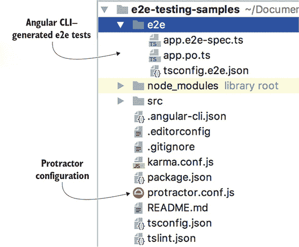

| |
| --- |

##### 提示

从 Angular CLI 6 开始，当你生成一个新项目时，它包括两个应用：一个是您的应用项目，另一个应用包含基本的端到端测试。

| |
| --- |

你通过输入 `ng e2e` 命令来运行 E2E 测试，该命令根据 protractor.conf.js 文件中的配置加载测试脚本。该文件默认假设所有 E2E 测试脚本都位于 e2e 目录中，并且应用程序必须在 Chrome 中启动。

##### 列表 14.17\. protractor.conf.js 的一个片段

```
specs: [
  './e2e/**/*.e2e-spec.ts'       *1*
 ],
capabilities: {
  'browserName': 'chrome'        *2*
 },
directConnect: true              *3*
```

+   ***1* 测试脚本的位置**

+   ***2* 在哪个浏览器中运行你的应用程序**

+   ***3* 直接连接到浏览器而不通过服务器**

`ng e2e` 命令构建应用程序包，启动 Node 实例，并加载测试脚本、Protractor 和 Selenium WebDriver。Protractor 在浏览器（s）中启动你的应用程序，并且你的测试脚本通过 Protractor 和 WebDriverJS 的 API 与浏览器进行通信。图 14.12 展示了本章示例中使用的 E2E 测试玩家。

##### 图 14.12\. 由 Angular CLI 生成的 E2E 代码

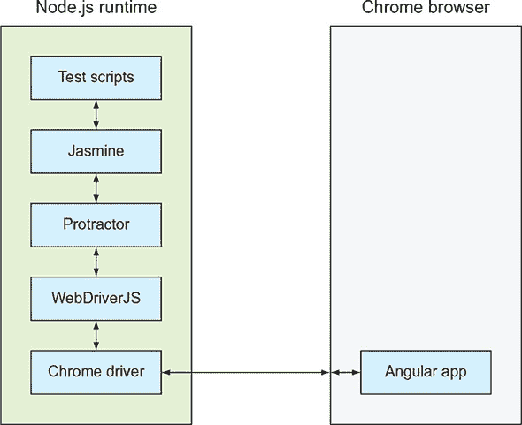

在运行测试脚本之前，Protractor 将浏览器特定的驱动程序（例如，ChromeDriver）解压缩到 node_modules/webdriver-manager/selenium 文件夹中，以便 Selenium WebDriver 可以正确地与浏览器通信。在测试期间，Protractor 将启动浏览器，测试完成后，Protractor 将关闭它。

Protractor 可以使用在不同单元测试框架中创建的脚本（Jasmine 是默认的一个），并且每个框架可能都有不同的 API 用于定位和表示页面元素。为了避免你在决定切换到另一个单元测试框架时更改 E2E 脚本，Protractor 提供了一个 API（见 [www.protractortest.org/#/api](http://www.protractortest.org/#/api)），它可以与所有支持的框架一起工作：

+   `browser` 提供了一个 API 来控制浏览器，例如 `getCurrentUrl()`、`wait()` 等。

+   `by` 是一个定位器，用于通过 ID、CSS、按钮或链接文本等方式在 Angular 应用程序中查找元素。

+   `element` 提供了一个 API，用于在网页上查找和操作单个元素。

+   `element.all` 用于查找和操作元素集合，例如，遍历 HTML 列表或表格的元素。


##### Tip

`$("selector")` 是 `element(by.css("selector"))` 的别名，而 `$$("selector")` 是 `element.all(by.css("selector"))` 的别名。


虽然在 Angular 应用程序中你可以使用结构化指令 `*ngFor` 来渲染一组 UI 元素，但在测试中你应该使用 `element.all` 来引用和查找集合中的元素。


##### Tip

虽然 Protractor 定义了自己的 API，但它也暴露了 WebDriver API，例如 `browser.takeScreenshot()`。


E2E 测试在浏览器中加载真实的应用程序，定位页面上的元素，并且可以程序化地点击按钮和链接，用数据填写表单，将它们提交到服务器，然后再定位结果页面上的元素以确保它们具有预期的内容。你可以使用以下方法之一编写 E2E 测试：

+   在同一脚本中，使用它们的 ID 或 CSS 类定位 DOM 元素，并断言应用程序逻辑是否正确。ID 或 CSS 类可能会随时间变化，因此如果您有多个脚本测试同一页面，您需要相应地更新每个脚本。

+   通过在一个文件中编写期望和断言，在另一个文件中编写与 UI 元素交互并调用应用程序 API 的代码，实现 *页面对象* 设计模式（见 [`martinfowler.com/bliki/PageObject.html`](https://martinfowler.com/bliki/PageObject.html)）。页面对象可以实现与整个页面或其部分（例如，工具栏）的 UI 交互，并且可以被多个测试重用。如果 HTML 元素的 CSS 发生变化，您需要修改单个页面对象脚本。

使用第一种方法编写的测试难以阅读，因为它们没有提供理解页面实现了哪些工作流程的简单方法。您将使用第二种方法，其中所有 UI 交互都在页面对象（.po.ts 文件）中实现，而断言的规范在脚本（.e2e-spec.ts 文件）中。这种方法减少了代码重复，因为如果多个规范需要访问相同的 HTML 元素，您不需要复制粘贴元素定位器。页面对象可以作为模拟重要工作流程（如 `login()` 或 `getProducts()`）的单一位置，而不是将这些活动分散在测试中。

让我们看看 Angular CLI 为新项目生成的端到端测试。

#### 14.4.2\. Angular CLI 生成的测试

当您使用 Angular CLI 生成新项目时，它创建一个名为 e2e 的目录，该目录包含三个文件：

+   ***app.po.ts*—** `AppComponent` 的页面对象

+   ***app.e2e-spec.ts*—** 生成的 `AppComponent` 的端到端测试

+   ***tsconfig.e2e.json*—** TypeScript 编译器选项

app.po.ts 文件包含一个简单的 `AppPage` 类，其中只有两个方法，如 列表 14.18 所示。第一个方法包含导航到组件根页面的代码，第二个方法包含通过 CSS 定位 HTML 元素并获取其文本的代码。这个页面对象是唯一包含通过 CSS 定位元素的代码的地方。

##### 列表 14.18\. 生成的 app.po.ts 文件

```
import {browser, by, element} from 'protractor';
export class AppPage {
  navigateTo() {
    return browser.get('/');                            *1*
   }

  getParagraphText() {
    return element(by.css('app-root h1')).getText();    *2*
   }
}
```

+   ***1* 导航到默认路由**

+   ***2* 从 <h1> 元素获取文本**

app.e2e-spec.ts 文件的代码如 列表 14.19 所示。这个测试看起来与上一节中显示的单元测试非常相似。请注意，此文件不包括直接与 HTML 页面交互的代码；它使用页面对象的 API。

##### 列表 14.19\. 生成的 app.e2e-spec.ts 文件

```
import {AppPage} from './app.po';

describe('e2e-testing-samples App', () => {
  let page: AppPage;

  beforeEach(() => {
    page = new AppPage();                                            *1*
   });

  it('should display welcome message', () => {
    page.navigateTo();                                               *2*
     expect(page.getParagraphText()).toEqual('Welcome to app!');     *3*
   });
});
```

+   ***1* 创建页面实例**

+   ***2* 导航到默认路由**

+   ***3* 断言 getParagraphText() 返回的文本是正确的**

因为 app.e2e-spec.ts 不包含任何元素定位器，所以测试逻辑很容易理解：您导航到着陆页面并检索段落的内容。您可以使用命令 `ng e2e` 运行前面的 E2E 测试。


##### 注意

E2E 测试的运行速度比单元测试慢，您不希望在每次保存文件时都运行它们，就像上一节中使用的 `ng test` 一样。此外，您可能不想为每个工作流程创建 E2E 测试，而是识别最重要的测试并只为它们运行测试。


现在您已经看到了生成的测试是如何工作的，您可以编写自己的 E2E 测试。

#### 14.4.3\. 测试登录页面

上一节中的 E2E 测试没有包含需要数据输入和导航的工作流程。在本节中，您将为使用表单和路由的应用程序编写测试。本章附带的项目中包含一个名为 e2e-testing-samples 的项目，其中有一个简单的应用程序，具有登录页面和主页。此应用程序的路由配置如下所示。

##### 列表 14.20\. 路由配置

```
[{path: '', redirectTo: 'login', pathMatch: 'full'},      *1*
  {path: 'login', component: LoginComponent},             *2*
  {path: 'home', component: HomeComponent}]               *3*
```

+   ***1* 将基本 URL 重定向到登录页面**

+   ***2* 渲染登录组件**

+   ***3* 渲染主页组件**

`HomeComponent` 的模板只有一行：

```
<h1>Home Component</h1>
```

以下列表中的登录组件包含一个登录按钮和一个包含两个输入 ID 和密码字段的表单。如果用户将 `Joe` 作为 ID 和 `password` 作为密码输入，则您的应用程序将导航到主页；否则，它将停留在登录页面并显示消息“无效的 ID 或密码”。

##### 列表 14.21\. login.component.ts

```
@Component({
  selector: 'app-home',
  template: `<h1 class="home">Login Component</h1>
  <form #f="ngForm" (ngSubmit)="login(f.value)">                    *1*
     ID: <input name="id" ngModel/><br>
    PWD: <input type="password" name="pwd" ngModel=""/><br>
    <button type="submit">Login</button>
    <span id="errMessage"
          *ngIf="wrongCredentials">Invalid ID or password</span>    *2*
   </form>
  `
})
export class LoginComponent {
  wrongCredentials = false;
  constructor(private router: Router) {}                            *3*

  login(formValue) {
    if ('Joe' === formValue.id && 'password' === formValue.pwd) {
      this.router.navigate(['/home']);                              *4*
       this.wrongCredentials = false;
    } else {
      this.router.navigate(['/login']);                             *5*
       this.wrongCredentials = true;
    }
  }
}
```

+   ***1* 登录表单**

+   ***2* 无效登录消息**

+   ***3* 路由注入**

+   ***4* 导航到主页**

+   ***5* 导航到登录页面**

您的测试位于 e2e 目录中，包括两个页面对象，login.po.ts 和 home.po.ts，以及一个规范，login.e2e-spec.ts。主页面的页面对象包含一个返回头部文本的方法。以下列表显示了 home.po.ts。

##### 列表 14.22\. home.po.ts

```
import {by, element} from 'protractor';
export class HomePage {
  getHeaderText() {
    return element(by.css('h1')).getText();
  }
}
```

登录页面对象使用定位器来获取表单字段和按钮的引用。`login()` 方法模拟用户操作：输入 ID 和密码并点击登录按钮。`navigateToLogin()` 方法指示浏览器访问配置到登录组件的 URL——例如，http://localhost:4200/login。`getErrorMessage()` 方法返回页面可能存在或不存在登录错误消息。以下列表显示了 login.po.ts。

##### 列表 14.23\. login.po.ts

```
import {browser, by, element, $} from 'protractor';

export class LoginPage {

  id = $('input[name="id"]');                    *1*
   pwd = $('input[name="pwd"]');                 *1*
   submit = element(by.buttonText('Login'));     *1*
   errMessage = element(by.id('errMessage'));    *1*

  login(id: string, password: string): void {
    this.id.sendKeys(id);                        *2*
     this.pwd.sendKeys(password);                *2*
     this.submit.click();                        *3*
   }

  navigateToLogin() {
    return browser.get('/login');                *4*
   }

  getErrorMessage() {
    return this.errMessage;                      *5*
   }
}
```

+   ***1* 使用 $ 作为 element(by.css()) 的别名定位页面元素**

+   ***2* 输入提供的 ID 和密码**

+   ***3* 点击登录按钮**

+   ***4* 导航到登录页面**

+   ***5* 返回登录错误消息**

此页面对象使登录过程易于理解。`sendKey()` 方法用于模拟数据输入，而 `click()` 模拟按钮点击。

现在我们来回顾登录工作流程的测试套件。它实例化了登录页面对象，并包含两个规范：一个用于测试成功的登录，另一个用于失败的登录。

第一个规范指示 Protractor 导航到登录页面并使用硬编码的数据 `Joe` 和 `password` 登录用户。如果登录成功，应用将导航到主页，你通过检查浏览器中的 URL 是否包含 /home 来断言这一点。你还断言渲染的页面包含标题“主页组件。”

失败登录的规范断言应用停留在登录页面，并显示错误消息。注意以下列表中，此脚本没有直接与 UI 交互的代码。

##### 列表 14.24\. login.e2e-spec.ts

```
import {LoginPage} from './login.po';
import {HomePage} from './home.po';
import {browser} from 'protractor';

describe('Login page', () => {
  let loginPage: LoginPage;
  let homePage: HomePage;

  beforeEach(() => {
    loginPage = new LoginPage();                                     *1*
   });

  it('should navigate to login page and log in', () => {             *2*
     loginPage.navigateToLogin();                                    *3*
     loginPage.login('Joe', 'password');                             *4*

    const url = browser.getCurrentUrl();                             *5*
     expect(url).toContain('/home');                                 *6*

    homePage = new HomePage();                                       *7*
     expect(homePage.getHeaderText()).toEqual('Home Component');     *8*
   });

  it('should stay on login page if wrong credentials entered',
   () => {                                                           *9*
     loginPage.navigateToLogin();
    loginPage.login('Joe', 'wrongpassword');                         *10*

    const url = browser.getCurrentUrl();
    expect(url).toContain('/login');                                 *11*
     expect(loginPage.getErrorMessage().isPresent()).toBe(true);     *12*
   });
});
```

+   ***1* 实例化登录页面对象**

+   ***2* 成功登录的规范**

+   ***3* 导航到登录页面**

+   ***4* 使用正确的凭据登录**

+   ***5* 获取浏览器的 URL**

+   ***6* 断言 URL 包含 /home**

+   ***7* 实例化主页对象**

+   ***8* 断言页面标题正确**

+   ***9* 失败登录的规范**

+   ***10* 执行失败的登录**

+   ***11* 断言应用仍然显示登录页面**

+   ***12* 断言错误消息显示**

`LoginComponent` 使用 `*ngIf` 结构性指令有条件地显示或隐藏登录错误消息，你的失败的登录规范断言错误消息出现在页面上。

有时在执行断言之前需要等待某些操作完成。例如，你的页面对象中的 `login()` 方法以按钮点击结束，成功的登录规范包含断言 URL 包含 /home。

这个断言始终为真，因为你的登录过程几乎瞬间完成，因为它没有连接到认证服务器来检查用户凭据。在现实世界中，认证可能需要几秒钟，而针对 /home 的断言可能会在 URL 变为 /home 之前运行，导致测试失败。

在这些情况下，你可以调用 `browser.wait()` 命令，其中你可以指定要等待的条件。在实战部分，你将编写一个测试，点击搜索按钮，该按钮会为产品发起一个 HTTP 请求，这需要一些时间来完成。在那里，你将使用一个辅助函数，在执行断言之前等待 URL 发生变化。

使用 `ng e2e` 命令运行此测试，你会看到 Protractor 如何短暂地打开 Chrome 浏览器，填写表单，并点击登录按钮。终端窗口显示输出，你可以在图 14.13 中看到。

##### 图 14.13\. 运行登录应用的端到端测试

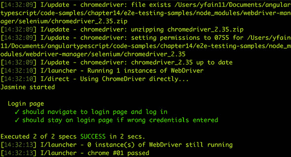

你的端到端测试中的两个规范都通过了。如果你想看到测试失败，请从 `HomeComponent` 的模板中删除 `<h1>` 标签，或者在 `LoginComponent` 中将有效的凭据修改为除 `Joe` 和 `password` 之外的其他任何内容。更改 `LoginComponent` 模板中表单字段的名称也会导致测试失败，因为 WebDriver 定位器无法在登录页面上找到这些元素。

本章提供了足够的材料，帮助你开始对 Angular 应用进行单元和端到端测试。Jasmine 和（尤其是）Protractor 都提供了更多可以在测试中使用的 API。要获取更详细的覆盖范围，请查看书籍 *Testing Angular Applications*（Jesse Palmer 等著，Manning，2018），详细信息请见 [www.manning.com/books/testing-angular-applications](http://www.manning.com/books/testing-angular-applications)。


**在端到端测试中使用 async 和 await**

Protractor 使用 WebDriverJS。它的 API 完全是异步的，并且它的函数返回承诺。所有异步操作（例如，`sendKey()` 和 `click()`）都通过 WebDriver 承诺管理器放入待处理的承诺队列中，称为 *控制流队列*，以确保断言（如 `expect()` 函数）在异步操作之后运行。

由于 WebDriver 承诺管理器不会立即执行异步函数，而是将其放入队列中，因此很难调试此代码。这就是为什么 WebDriver 的承诺管理器正在被弃用，你可以使用 `async` 和 `await` 关键字来确保流程正确同步（有关详细信息，请参阅 [`mng.bz/f72u`](http://mng.bz/f72u)）。

例如，以下代码声明了一个 `login()` 方法。

```
async login(id: string, password: string) {    *1*
   await this.id.sendKeys(id);                 *2*
   await this.pwd.sendKeys(password);          *2*
   await this.submit.click();                  *2*
 }
```

+   ***1* 声明该函数返回一个承诺**

+   ***2* 等待承诺解决或拒绝**

你不能与 WebDriver 的承诺管理器一起使用 `async`/`await` 关键字，因此你需要通过在 protractor.conf.js 中添加以下选项来关闭它：

```
SELENIUM_PROMISE_MANAGER: false
```


如果你熟悉了 Protractor 和 Selenium 生态系统的组合，并希望为你的应用找到更简单的端到端测试解决方案，请查看 Cypress 框架，可在 [`www.cypress.io`](https://www.cypress.io) 找到。它是一个新但非常有前途的框架。同时，让我们向 ngAuction 添加一些 Protractor 端到端测试。

### 14.5\. 实践：向 ngAuction 添加端到端测试

本练习的目标是为 ngAuction 应用添加一个端到端测试，你可以在本章提供的源代码中的 ng-auction 文件夹中找到它。我们从第十三章（kindle_split_022.xhtml#ch13）中提取了 ngAuction 项目，并添加了产品搜索工作流程的端到端测试。此测试将使用 $10 到 $100 的价格范围来断言从服务器检索到的匹配产品在浏览器中渲染。

| |
| --- |

##### 注意

本章的源代码可以在[`github.com/Farata/angulartypescript`](https://github.com/Farata/angulartypescript)和[www.manning.com/books/angular-development-with-typescript-second-edition](http://www.manning.com/books/angular-development-with-typescript-second-edition)找到。


在运行此端到端测试之前，您需要在服务器目录中运行`npm install`，使用`tsc`命令编译代码，并通过运行以下命令启动服务器：

```
node build/main
```

现在，您已准备好审查和运行位于 ngAuction 客户端目录中的测试。

#### 14.5.1\. 产品搜索工作流程的端到端测试

要执行产品搜索，实际用户需要完成以下步骤：

> **1**. 打开 ngAuction 的着陆页。
> 
> **2**. 点击左上角的搜索按钮，以便搜索面板显示出来。
> 
> **3**. 输入产品的搜索条件。
> 
> **4**. 点击搜索按钮以查看搜索结果。
> 
> **5**. 浏览符合搜索条件的商品。

您的端到端测试将包括位于 e2e 目录中的两个文件：`search.po.ts`文件中的页面对象和`search.e2e-spec.ts`文件中的测试套件。所有断言都将编程在`search.e2e-spec.ts`文件中，但页面对象将实现以下逻辑步骤：

> **1**. 找到搜索按钮并点击它。
> 
> **2**. 使用数据填写搜索表单。
> 
> **3**. 点击搜索按钮。
> 
> **4**. 等待服务器返回并在浏览器中渲染产品。
> 
> **5**. 检查浏览器是否渲染了产品。

为了确保您的搜索会返回一些产品，您的测试将使用从$10 到$100 的广泛价格范围作为搜索条件。

在几种情况下，您将检查浏览器 URL 是否如您预期的那样，因此我们将提醒您在 ngAuction 的`home.module.ts`中如何配置路由，如下列所示。

##### 列表 14.25\. 来自 home 模块的路由配置

```
[
  {path: '', pathMatch: 'full', redirectTo: 'categories'},
  {path: 'search', component: SearchComponent},
  {path: 'categories',
    children: [
      { path: '', pathMatch: 'full', redirectTo: 'all'},
      { path: ':category', component: CategoriesComponent},
    ]
  }
]
```

让我们先识别将参与我们测试的 HTML 元素。`app.component.html`文件包含以下列表中的搜索按钮标记。

##### 列表 14.26\. 工具栏上的搜索按钮

```
<button mat-icon-button
        id="search"                      *1*
         class="toolbar__icon-button"
        (click)="sidenav.toggle()">
  <mat-icon>search</mat-icon>
</button>
```

+   ***1* 添加的 ID 简化了定位此按钮的代码。**

您的页面对象将包含以下列表中的行以定位按钮并点击它。

##### 列表 14.27\. `SearchPage`类的开始

```
export class SearchPage {
  performSearch(minimalPrice: number, maximumPrice: number) {     *1*
     const searchOnToolbar = element(by.id('search'));            *2*
     searchOnToolbar.click();                                     *3*
    ...
  }
}
```

+   ***1* 一种按价格范围搜索产品的搜索方法**

+   ***2* 定位搜索按钮**

+   ***3* 点击按钮以显示搜索表单**

点击按钮后，搜索表单会显示，您会找到最小和最大价格字段并填写提供的价格，如下列所示。

##### 列表 14.28\. 输入搜索条件

```
const minPrice = $('input[formControlName="minPrice"]');   *1*
 const maxPrice = $('input[formControlName="maxPrice"]');  *1*
 minPrice.sendKeys(minimalPrice);                          *2*
 maxPrice.sendKeys(maximumPrice);                          *2*
```

+   ***1* 定位价格表单字段**

+   ***2* 填写一些表单字段**

如果用户手动这样做，搜索表单将看起来像图 14.14。

##### 图 14.14\. 带有搜索条件的表单

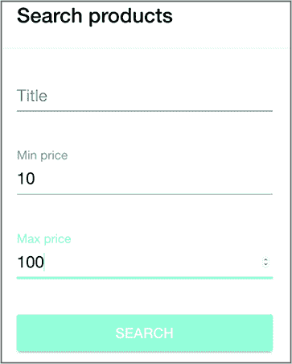

现在搜索条件已经输入，你需要定位并点击表单的搜索按钮以执行产品搜索。如果你运行 ngAuction，输入最小和最大价格为$10 和$100，然后点击搜索按钮，结果视图将显示产品，浏览器 URL 将看起来像这样：http://localhost:4200/search?minPrice=10&maxPrice=100。

但在 HTTP 请求完成并 URL 改变之前需要一点时间。真实用户会耐心等待直到搜索结果出现。但在你的测试脚本中，如果你尝试在按钮点击后立即断言 URL 包含搜索段，这个断言可能对也可能不对，这取决于你的服务器响应速度有多快。

你不需要担心从第 14.4.3 节的`login.po.ts`登录延迟，因为那里没有发起服务器请求，URL 也瞬间改变。这次，你希望在从`performSearch()`方法返回之前等待 URL 改变。

你将使用`ExpectedConditions`类，其中你可以定义要等待的条件。然后，通过调用`browser.wait()`，你可以等待预期条件变为真——否则，测试将因超时而失败。以下代码示例定位并点击搜索按钮，然后等待 URL 改变以包含/search 段。

##### 列表 14.29\. 点击表单的搜索按钮

```
const searchOnForm = element(by.buttonText('SEARCH'));     *1*
 searchOnForm.click();                                     *2*
 const EC = protractor.ExpectedConditions;                 *3*
 const urlChanged = EC.urlContains('/search');             *4*
 browser.wait(urlChanged, 5000,                            *5*
              'The URL should contain /search');           *6*
```

+   ***1* 定位搜索按钮**

+   ***2* 点击搜索按钮**

+   ***3* 声明预期条件的常量**

+   ***4* 使用 urlContains() API 检查预期条件**

+   ***5* 等待预期条件最多 5 秒或失败**

+   ***6* 超时时的显示消息**

此代码等待最多 5 秒钟，如果 URL 没有改变，则失败，并打印出图 14.15 中显示的消息。你可能需要根据你电脑上产品搜索的速度来增加超时值。

##### 图 14.15\. 测试在超时失败。

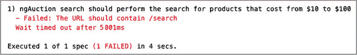

如果用户手动搜索了价格在$10 到$100 之间的产品，结果视图可能看起来像图 14.16。

##### 图 14.16\. 搜索结果视图

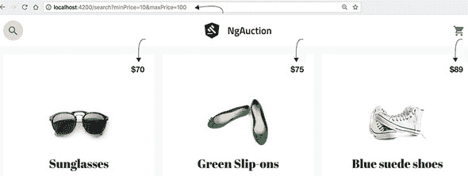

如果由测试脚本启动的搜索操作返回产品，你将提取第一个产品的价格，以便稍后（在规范中）你可以断言产品价格符合搜索条件。因为搜索可能返回一系列产品，所以你会使用`element.all` API 的别名`$$`来访问它们。

每个产品都有如图 14.17 所示的`tile__price-tag`样式，该图是从 Chrome Dev Tools 面板的 Element 选项卡中获取的，当时产品网格正在显示。你将使用`tile__price-tag`样式来定位产品。

##### 图 14.17\. 价格的 CSS 选择器

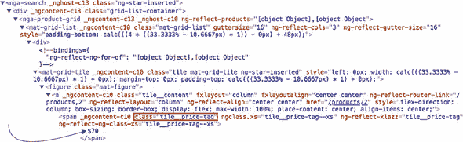

当提取产品价格时，您需要将其转换为数字。在 ngAuction 中，产品价格以包含美元符号的字符串形式呈现，例如图 14.17 中的“$70”。但您需要其数值表示，以便规范可以断言价格在指定的范围内。`getFirstProductPrice()`方法包含从字符串中删除美元符号并将其转换为整数值的代码，如下一列表所示。

##### 列表 14.30\. 获取第一个产品的价格

```
getFirstProductPrice() {
  return $$('span[class="tile__price-tag"]')               *1*
     .first().getText()                                    *2*
     .then((value) => {                                    *3*
         return parseInt(value.replace('$', ''), 10);      *4*
     });
}
```

+   ***1* 使用 element.all 查找产品**

+   ***2* 获取第一个产品的文本**

+   ***3* Protractor 的 API 返回 promises，因此应用 then()**

+   ***4* 将产品价格转换为数字并返回**

您的页面对象的完整代码如下所示。

##### 列表 14.31\. search.po.ts

```
import {protractor, browser, by, element, $, $$} from 'protractor';

export class SearchPage {

  performSearch(minimalPrice: number, maximumPrice: number) {
     const searchOnToolbar = element(by.id('search'));
     searchOnToolbar.click();                                              *1*

     const minPrice = $('input[formControlName="minPrice"]');
     const maxPrice = $('input[formControlName="maxPrice"]');
     minPrice.sendKeys(minimalPrice);                                      *2*
     maxPrice.sendKeys(maximumPrice);                                      *2*

     const searchOnForm = element(by.buttonText('SEARCH'));
     searchOnForm.click();                                                 *3*
     const EC = protractor.ExpectedConditions;
     const urlChanged = EC.urlContains('/search');                         *4*
      browser.wait(urlChanged, 5000, 'The URL should contain "/search"');  *5*
   }

   navigateToLandingPage() {                                               *6*
     return browser.get('/');
  }

  getFirstProductPrice() {
    return $$('span[class="tile__price-tag"]')                             *7*
       .first().getText()                                                  *8*
       .then((value) => {return parseInt(value.replace('$', ''), 10);});   *9*
   }
}
```

+   ***1* 点击工具栏中的搜索图标**

+   ***2* 在搜索表单中填写最小和最大价格**

+   ***3* 点击表单上的搜索按钮**

+   ***4* 声明一个预期条件**

+   ***5* 等待最多 5 秒的预期条件**

+   ***6* 声明一个导航到着陆页的方法**

+   ***7* 定位所有价格元素**

+   ***8* 提取第一个产品的价格**

+   ***9* 将价格转换为数字**

现在我们来回顾位于 search.e2e-spec.ts 文件中的测试套件的代码。

搜索工作流程的测试套件包含一个规范，该规范使用页面对象并在工作流程的每个步骤中添加断言。规范首先导航到 ngAuction 的着陆页，然后断言页面的 URL 包含段 /categories/all。

然后，规范通过在页面对象上调用`performSearch()`方法并传递`10`和`100`作为搜索的价格范围来执行测试。在此方法完成后，它执行三个断言以检查结果页面的 URL 是否包含段 /search?minPrice=10&maxPrice=100，以及第一个产品的价格是否大于$10 且小于$100。此测试套件的代码如下所示。

##### 列表 14.32\. search.e2e-spec.ts

```
import {SearchPage} from './search.po';
import {browser} from 'protractor';

describe('ngAuction search', () => {
  let searchPage: SearchPage;

  beforeEach(() => {
    searchPage = new SearchPage();                                      *1*
   });

  it('should perform the search for products that cost from $10 to $100',  ()
      => {
    searchPage.navigateToLandingPage();
    let url =  browser.getCurrentUrl();
    expect(url).toContain('/categories/all');                           *2*

    searchPage.performSearch(10, 100);                                  *3*
     url =  browser.getCurrentUrl();
    expect(url).toContain('/search?minPrice=10&maxPrice=100');          *4*

    const firstProductPrice = searchPage.getFirstProductPrice();        *5*
     expect(firstProductPrice).toBeGreaterThan(10);                     *6*
     expect(firstProductPrice).toBeLessThan(100);                       *7*
   });
});
```

+   ***1* 实例化页面对象**

+   ***2* 断言着陆页的 URL**

+   ***3* 搜索产品**

+   ***4* 断言搜索结果的页面 URL**

+   ***5* 获取第一个产品的价格**

+   ***6* 声明价格大于 10**

+   ***7* 声明价格小于 100**

在终端窗口中，切换到客户端目录，运行`npm install`，然后使用`ng e2e`命令运行测试。测试将成功完成，您将看到图 14.18 中显示的消息。

##### 图 14.18\. 产品搜索测试成功。

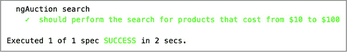

要使测试失败，修改规范以测试没有产品返回的情况，使用介于$1 和$5,000,000 之间的价格范围。您的 ngAuction 并非为苏富比而创建，您也不携带贵重物品。

### 摘要

+   单元测试运行得很快，但大多数应用业务逻辑应该使用端到端测试进行测试。

+   当你在编写测试时，让它们失败以确认其失败报告易于理解。

+   运行单元测试应该是你自动化构建过程的一部分，但端到端测试则不应如此。
