## 第十五章\. 使用 ngrx 维护应用状态

*本章涵盖*

+   Redux 数据流的简要介绍

+   使用 ngrx 库维护你的应用状态

+   探索中介设计模式的另一种实现

+   在 ngAuction 中使用 ngrx 实现状态管理

你已经到达了最后一章，你几乎准备好加入一个 Angular 项目了。上一章内容容易阅读，但这一章将需要你全神贯注；我们即将呈现的材料有很多动态部分，你需要很好地理解它们是如何协同工作的。

ngrx 是一个可用于在 Angular 应用中管理状态的库（见[`github.com/ngrx`](https://github.com/ngrx)）。它是基于 Redux 的原则构建的（另一个流行的状态管理库），但通知层是使用 RxJS 实现的。尽管 Angular 有其他管理应用状态的方法，但 ngrx 在中型和大型应用中越来越受欢迎。

在你的应用中使用 ngrx 库来管理状态值得吗？它确实有好处，但它们不是免费的。你应用的复杂性可能会增加，代码也会变得更加难以理解，对于任何新加入项目的人来说。在这一章中，我们介绍了 ngrx 库，这样你就可以决定它是否是你管理应用状态的正确选择。在实践部分，我们对使用 ngrx 进行状态管理的 ngAuction 的另一个版本进行了详细的代码概述。

### 15.1\. 从便利商店到 Redux 架构

想象一下，你是一家便利商店的骄傲所有者，该商店销售各种产品。你还记得你是如何开始的吗？你租了一个空地（商店处于*初始状态*）。然后你购买了货架并订购了产品。之后，多个供应商开始运送这些产品。你雇佣了员工，他们按照一定的顺序将这些产品摆放在货架上，改变了商店的状态。然后你挂出了盛大开幕的标志，并用许多五彩缤纷的气球装饰了地方。顾客开始光顾你的商店购买产品。

当商店开业时，一些产品放在货架上，一些在顾客的购物车中。一些顾客在收银台排队，那里有商店员工。可以说，在任意时刻，你的商店都有*当前状态*。

如果顾客采取*行动*，例如购买五瓶水，收银员扫描条形码，这会*减少*库存中瓶子的数量——它会更新状态。如果供应商运送新产品，你的店员会相应地更新库存（状态）。

你的 Web 应用程序也可以维护一个存储应用程序状态的商店。就像一个真正的商店，在任何给定时间，你的应用程序的*store*都有一个当前的*state*。一些数据集合可能包含从服务器检索的特定数据，并且可能被用户修改。一些单选按钮被选中，用户选择了一些产品并导航到由特定 URL 表示的一些路由。

如果用户与 UI 交互，或者服务器发送新数据，这些*actions*应该要求商店对象更新状态。为了跟踪状态变化，当前状态对象永远不会更新，而是创建状态对象的新实例。

#### 15.1.1\. 什么是 Redux？

*Redux* 是一个开源的 JavaScript 库，为 JavaScript 应用程序提供了一个状态容器（见[`mng.bz/005X`](http://mng.bz/005X)）。它是在 Facebook 上创建的，作为 Flux 架构的实现（见[`mng.bz/jrXy`](http://mng.bz/jrXy)）。最初，与 React 框架一起工作的开发者使 Redux 变得流行，但由于它是一个 JavaScript 库，因此可以在任何 JavaScript 应用程序中使用。

Redux 基于以下三个原则：

+   ***存在单一真相来源。*** 存储在单个商店中，你的应用程序包含可以表示为对象树的状态。

+   ***状态是只读的。*** 当发出一个动作时，reducer 函数不会更新，而是克隆当前状态并根据动作更新克隆的对象。

+   ***状态变化是通过纯函数进行的。*** 你编写 reducer 函数（s），它接受一个动作和当前状态对象，并返回一个新的状态。

在 Redux 中，数据流是单向的：

> **1**.  应用组件在商店上派发动作。
> 
> **2**.  reducer（一个纯函数）接收当前状态对象，然后克隆、更新并返回它。
> 
> **3**.  应用组件订阅商店，接收新的状态对象，并相应地更新 UI。

图 15.1 展示了单向 Redux 数据流。

##### 图 15.1\. Redux 数据流

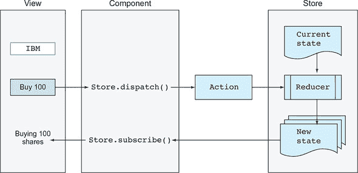

一个*action*是一个 JavaScript 对象，它有一个`type`属性，描述了在应用程序中发生的事情，例如用户想要购买 IBM 股票。除了`type`属性外，动作对象还可以有一个可选的属性，包含应该以某种方式更改应用程序状态的数据有效载荷。以下列表显示了示例。

##### 列表 15.1\. 购买 IBM 股票的动作

```
{
  type: 'BUY_STOCK',                         *1*
   stock: {symbol: 'IBM', quantity: 100}     *2*
 }
```

+   ***1* 动作类型**

+   ***2* 动作有效载荷**

此对象仅描述动作并提供有效载荷。它不知道状态应该如何改变。谁知道？reducer。

一个 *reducer* 是一个 *纯函数*，它指定了状态应该如何改变。reducer 从不改变当前状态，而是创建一个新的（并且更新过的）状态版本。状态对象是不可变的。reducer 创建状态对象的副本并返回一个新的引用。从 Angular 的角度来看，这是一个绑定变更事件，所有相关方将立即知道状态已更改，而无需在整个状态树中进行昂贵的值检查。


##### 注意

您的状态对象可以包含数十个属性和嵌套对象。克隆状态对象创建了一个浅拷贝，而不在内存中复制每个未修改的状态属性，因此内存消耗最小，并且不需要花费太多时间。您可以在[`mng.bz/3271`](http://mng.bz/3271)上了解创建浅状态拷贝的理由。


一个 reducer 函数具有以下列表中所示的签名。

##### 列表 15.2\. 一个 reducer 签名

```
function (previousState, action): State {...}     *1*
```

+   ***1* 一个 reducer 函数返回一个新的状态。**

是否应该让 reducer 函数实现像放置订单这样的应用功能，这需要与外部服务交互？不，因为 reducer 是用来更新和返回应用状态的——例如，要购买的股票是 `"IBM"`。实现应用逻辑需要与 reducer 外部环境交互；它会导致 *副作用*，而纯函数不能有副作用。

Reducer 可以实现与状态变化相关的最小应用逻辑。例如，假设用户决定取消一个订单，这需要在状态对象上重置某些字段。主要应用逻辑仍然保留在您的应用代码中（例如，在服务中），除非 Redux 灵感库的具体实现提供了一个专门用于具有副作用代码的位置。在本章中，我们使用 ngrx 库，它建议使用 Angular 服务与所谓的 *effects* 结合使用，这些 *effects* 位于存储之外，可以作为存储和服务之间的桥梁。

#### 15.1.2\. 为什么将应用状态存储在单一位置很重要

最近，本书的一位作者为一家大型汽车制造商的一个网络项目工作。这是一个允许潜在买家通过从超过一千个套餐和选项（如型号、内饰和外观颜色、底盘长度等）中进行选择来配置汽车的网络应用。该应用开发了许多年。软件模块使用 JavaScript、jQuery、Angular、React 和 Handlebars 编写，在服务器上使用 HTML 模板引擎 Thymeleaf。

从用户的角度来看，这是一个由多个步骤组成的流程，最终根据所选选项配置和定价汽车。但内部，过程是从一个模块切换到另一个模块，每个模块都需要知道前一步的选择，以显示可用的选项。

换句话说，每个模块都需要知道应用程序的当前状态。根据任何特定模块中使用的软件，当前用户选择被存储在以下之一中：

+   URL 参数

+   HTML `data*` 属性

+   浏览器的本地和会话存储

+   Angular 服务

+   React 存储

新的要求出现了，创建了新的 JIRA 工作项并分配了任务，然后开始实施。一次又一次，看似简单的新的需求实施变成了耗时且昂贵的任务。祝你好运向经理解释为什么在页面 B 显示价格需要半天时间，尽管这个价格已经在页面 A 中已知，或者页面 B 中使用的状态对象没有期望有价格属性，如果在页面 A 中价格是 URL 的一部分，页面 B 期望从本地存储中获取当前状态。从头开始重写不是选项。如果应用程序状态以统一的方式实现并存储在单个位置，那就容易多了！

| |
| --- |

##### 提示

如果你开始开发一个新项目，请特别注意应用程序状态的实现方式，这将在长期内对你有很大帮助。

| |
| --- |

### 15.2. 介绍 ngrx

ngrx 是一个受 Redux 启发的库。你可以将其视为在 Angular 应用程序中管理应用程序状态的 Redux 模式的实现。与 Redux 类似，它实现了单向数据流，并具有 store、actions 和 reducers。它还使用了 RxJS 的发送通知和订阅通知的能力。

大型企业应用程序通常在服务器端实现消息架构，其中一块软件通过某个消息服务器或消息总线向另一块软件发送消息。你可以将 ngrx 视为一个客户端消息系统。用户点击一个按钮，应用程序就会发送一个消息（例如，分发一个动作）。由于这个按钮点击，应用程序的状态发生了变化，而 ngrx 的 `Store` 向订阅者发送消息，将下一个值发射到一个可观察的流中。

在第 15.1 节中，我们描述了三个 Redux 原则：

+   唯一真相源。

+   状态是只读的。

+   状态变化是通过纯函数实现的。

在 ngrx 中，应用程序状态通过 `Store` 服务访问，这是一个状态的可观察对象和动作的观察者。在 store.d.ts 文件中声明的 `Store` 类如下所示：

```
class Store<T> extends Observable<T> implements Observer<Action>
```

除了声明一个新的原则，ngrx 架构还包括 *effects*，这些 effects 用于与应用程序的其他部分通信的代码，例如执行 HTTP 请求。使用 ngrx selectors，你可以订阅状态对象特定分支的变化。还有对路由和实体集合的支持，这在 CRUD 操作中可能很有用。

我们将开始 ngrx 介绍，从其主要参与者：store、actions 和 reducers。

#### 15.2.1. 熟悉 store、actions 和 reducers

让我们看看如何在具有两个按钮的简单应用程序中使用 ngrx，这两个按钮可以增加或减少计数器的值。此应用程序的第一个版本不管理状态，如下所示。

##### 列表 15.3\. 没有 ngrx 的计数器应用程序

```
import {Component} from '@angular/core';
@Component({
  selector: 'app-root',
  template: `
     <button (click)="increment()">Increment</button>
     <button (click)="decrement()">Decrement</button>
     <p>The counter: {{counter}}</p>                   *1*
   `
})
export class AppComponent {
  counter = 0;

  increment() {
    this.counter++;                                    *2*
   }

  decrement() {
    this.counter--;                                    *3*
   }
}
```

+   ***1* 显示计数器的值**

+   ***2* 增加计数器**

+   ***3* 减少计数器**

你想要更改此应用程序，使其 ngrx 存储管理`counter`变量的状态，但首先你需要在项目中安装 ngrx 存储：

```
npm i @ngrx/store
```

`Store`充当状态的容器，分发操作是更新状态的唯一方式。计划是实例化`Store`对象，并将应用程序逻辑（增加和减少计数器）从组件中移除。你的`decrement()`和`increment()`方法将向`Store`分发操作。

操作由 ngrx reducer 处理，它将更新计数器的状态。你的`counter`变量的类型将从`number`变为`Observable`，为了在 UI 中获取和渲染其发出的值，你需要订阅`Store`。

`Action`对象中唯一的必需属性是`type`，对于你的应用程序，你将声明操作类型如下：

```
const INCREMENT = 'INCREMENT';
const DECREMENT = 'DECREMENT';
```

下一步是为你想要在存储中保留的每份数据创建一个 reducer 函数。在你的情况下，只是计数器的值，所以你会创建一个 reducer，使用`switch`语句根据接收到的操作类型更新状态，如下所示。记住，reducer 函数接受两个参数：状态和操作。

##### 列表 15.4\. reducer.ts

```
import { Action } from '@ngrx/store';
export const INCREMENT = 'INCREMENT';
export const DECREMENT = 'DECREMENT';

export function counterReducer(state = 0, action: Action) {     *1*
     switch (action.type) {                                     *2*
         case INCREMENT:
            return state + 1;                                   *3*

        case DECREMENT:
            return state - 1;                                   *4*

        default:
            return state;                                       *5*
     }
}
```

+   ***1* 计数器（状态）的初始值是零。**

+   ***2* 检查操作类型**

+   ***3* 通过增加计数器来更新状态**

+   ***4* 通过减少计数器来更新状态**

+   ***5* 如果提供了未知操作，则返回现有状态**

重要的是要注意，reducer 函数不会修改提供的状态，而是返回一个新的值。状态保持不可变。

现在，你需要通知根模块你将使用`counterReducer()`函数作为存储的 reducer，如下所示。

##### 列表 15.5\. app.module.ts

```
import {BrowserModule} from '@angular/platform-browser';
import {NgModule} from '@angular/core';
import {AppComponent} from './app.component';
import {counterReducer} from "./reducer";
import {StoreModule} from "@ngrx/store";

@NgModule({
  declarations: [
    AppComponent
  ],
  imports: [
    BrowserModule,
    StoreModule.forRoot({counterState: counterReducer})      *1*
   ],
  providers: [],
  bootstrap: [AppComponent]
})
export class AppModule {}
```

+   ***1* 让存储知道应用程序的 reducer**

在此代码中，你配置应用程序级别的存储以提供指定`counterReducer`作为 reducer 函数名称的对象，以及`counterState`作为此 reducer 应保持状态的性质。

最后，你需要更改组件的代码以分发类型为`INCREMENT`或`DECREMENT`的操作，具体取决于用户点击哪个按钮。你还将把`Store`注入到你的组件中，并订阅其可观察对象，每次计数器变化时都会发出值，如下所示。

##### 列表 15.6\. app.component.ts

```
import {Component} from '@angular/core';
import {Observable} from "rxjs";
import {select, Store} from "@ngrx/store";
import {INCREMENT, DECREMENT} from "./reducer";

@Component({
  selector: 'app-root',
  template: `
     <button (click)="increment()">Increment</button>
     <button (click)="decrement()">Decrement</button>
     <p>The counter: {{counter$ | async}}</p>          *1*
   `
})
export class AppComponent {
  counter$: Observable<number>;                        *2*

  constructor(private store: Store<any>) {
    this.counter$ = store.select('counterState');      *3*
   }

  increment() {
    this.store.dispatch({type: INCREMENT});            *4*
   }

  decrement() {
    this.store.dispatch({type: DECREMENT});            *5*
   }
}
```

+   ***1* 使用异步管道订阅可观察对象**

+   ***2* 声明存储可观察对象的引用变量**

+   ***3* select() 发射 counterState 的变化。**

+   ***4* 分发 INCREMENT 动作**

+   ***5* 分发 DECREMENT 动作**

注意，动作是一个对象（例如，`{type: INCREMENT}`），在这个应用中，动作对象没有负载。您也可以将动作视为消息或命令。在下一节中，您将定义每个动作为一个具有两个属性（类型和负载）的类。

在此组件中，您使用 `select` 操作符（在 ngrx `Store` 中定义），它允许您观察状态对象。其参数的名称必须与在 `StoreModule.forRoot()` 函数中使用的状态对象属性名称匹配。


##### **注意**

通过在模块中调用 `StoreModule.forRoot({counterState: counterReducer})` 方法将 `counterReducer` 分配给存储。`AppComponent` 通过在存储上分发动作或使用存储上的 `select` 操作符与 `counterReducer` 进行通信。


带有 ngrx 存储的应用将具有与原始应用相同的行为，并根据用户的操作增加和减少计数器。

现在，让我们检查您的存储是否真的是单一事实来源。您将在下一个列表中添加一个子组件，该组件将显示从存储接收到的当前计数器值，并在应用启动后 10 秒，子组件将分发 `INCREMENT` 动作。

##### **列表 15.7\. child.component.ts**

```
import {Component} from '@angular/core';
import {select, Store} from "@ngrx/store";
import {Observable} from "rxjs";
import {INCREMENT} from "../reducer";

@Component({
  selector: 'app-child',
  template: `
    <h3> Child component </h3>
    <p>
      The counter in child is {{childCounter$ | async}}
    </p>
  `,
  styles: []
})
export class ChildComponent {

    childCounter$: Observable<number>;

    constructor(private store: Store<any>) {                          *1*
         this.childCounter$ = store.pipe(select('counterState'));     *2*

        setTimeout(() => this.store.dispatch({type: INCREMENT}),      *3*
             10000);
    }
}
```

+   ***1* 注入存储**

+   ***2* 订阅存储**

+   ***3* 在 10 秒内，分发 INCREMENT 动作**

剩下的只是将 `<app-child>` 标签添加到 `AppComponent` 的模板中。图 15.2 展示了用户点击增加按钮三次后的应用。父组件和子组件都显示了从存储中获取的相同计数器值（单一事实来源）。应用启动后 10 秒，`ChildComponent` 分发 `INCREMENT` 动作，两个组件都将显示增加后的计数器。

##### **图 15.2\. 运行计数器应用**

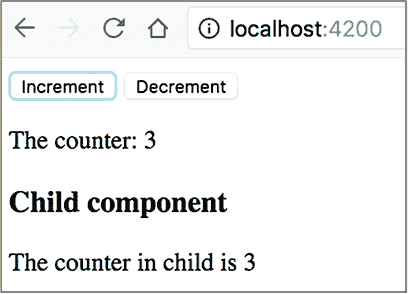

要查看此应用的实际运行情况，请打开项目 counter，运行 `npm install`，然后运行 `ng serve -o`。


##### **注意**

ngrx 库包括示例应用（见 [`mng.bz/7F9x`](http://mng.bz/7F9x)），它允许您使用 Google Books API 维护书籍收藏。本章附带的本章 ngAuction 应用也可以作为 ngrx 的演示，尽管这两个应用都没有使用 ngrx 提供的每个 API。


计数器应用是一个相当基本的示例，只有一个还原函数。在实际应用中，存储可能有多个还原器，每个还原器将负责状态对象的一部分。在实践部分，新的 ngAuction 版本将包含多个还原器。


**消除事件冒泡的需求**

这是您在 第八章 的 8.3.1 节 中看到的图表。

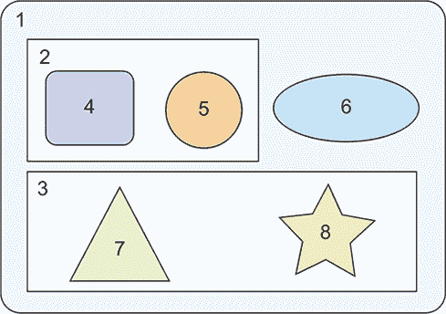

视图由组件组成

假设组件 7 可以发射一些在组件 6 中需要的数据。如果您使用常见的父组件进行组件间通信，您需要通过组件 7 的`@Output`属性发射一个事件；父组件 3 会订阅这个事件并通过其`@Output`属性重新发射；然后组件 1 会订阅这个事件，并通过绑定将有效载荷传递给组件 6。

使用 ngrx 存储消除了编写这一系列不幸事件的需要。组件 7 发射存储的动作，组件 6 使用选择器来接收它。无论在特定视图中组件嵌套的层级有多少，这种简单、相同的组件间通信模型都是适用的。组件 7 和 6 唯一需要的是存储对象的引用。

此图没有提供关于这八个组件做什么的任何细节，但您可以假设 1、2 和 3 是*容器组件*，它们包含其他组件并实现与应用逻辑交互的子组件、父组件和服务。其余的是*表现组件*，可以接收数据、发送数据并在 UI 上呈现数据。一些作者建议只有容器组件应该管理状态并与存储进行通信。我们不同意这种观点，因为状态不仅仅是关于存储和共享数据——它还涉及到存储 UI 的状态，这是任何类型组件的一部分。


在计数器示例中，存储管理的是由数字表示的应用状态，但您注意到存储还扮演了另一个角色吗？在第八章的第 8.3.2 节中，我们向您展示了可注入服务如何扮演中介的角色。在计数器应用中，ngrx 存储的主要目标是管理应用状态，但它还扮演了另一个角色：作为父组件和子组件之间的中介。

在第八章中，中介是一个带有 RxJS `BehaviorSubject`的服务，您使用了组件来发送和接收数据。使用 ngrx 时，您不需要手动创建`BehaviorSubject`，因为`Store`对象既可以用来发射值，也可以用来订阅它们。

要通知`BehaviorSubject`关于新值的信息，您使用`next()`，而要通知存储关于新状态的信息，您使用`dispatch()`。在两种情况下，都要订阅可观察对象以获取新状态。图 15.3 比较了第八章中的列表 8.13 中的`EbayComponent`的代码（在左侧）与使用 ngrx 的`ChildComponent`（在右侧）。它们看起来很相似，不是吗？

##### 图 15.3. `EbayComponent`与`ChildComponent`的比较

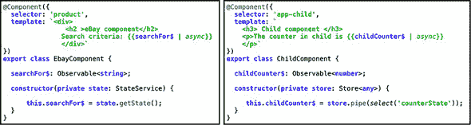

我们可以说，`StateService`（左侧）和`Store`（右侧）各自作为单一的真实来源。但是，大型非 ngrx 应用中有多个可注入服务，它们存储不同的状态片段，会有多个真实来源。在 ngrx 应用中，`Store`服务始终是单一的真实来源，它可能有多个状态片段。

现在再看看列表 15.4 中的 reducer，它是一个不需要使用任何外部资源来更新状态的纯函数。如果计数器的值是由服务器提供的呢？reducer 可以使用外部资源，因为它会使 reducer 变得*不纯*，不是吗？这就是 ngrx effects 发挥作用的地方，我们将在下一节讨论它们。

#### 15.2.2\. 熟悉 effect 和 selectors

Reducers 是*纯函数*，执行简单的操作：接收状态和动作并创建一个新的状态。但是你需要在某个地方实现业务逻辑，例如调用服务、向服务器发送请求等。你需要实现*有副作用的函数*，这通常在 effect 类中完成。

*Effects*是存在于 store 之外的可注入类，用于实现具有副作用的函数，而不会破坏单向数据流。ngrx effects 是一个单独的包，你需要运行以下命令将它们添加到你的项目中：

```
npm i @ngrx/effects
```

如果一个组件派发了一个需要与外部资源通信的动作，这个动作可以被`Effects`对象捕获，它将处理这个动作并在 reducer 上派发另一个动作。例如，一个 effect 可以从商店接收一个`LOAD_PRODUCTS`动作，调用`loadProducts()`，当数据加载完成后，派发`LOAD_PRODUCTS_SUCCESS`或`LOAD_PRODUCTS_FAILURE`动作之一。reducer 将捕获它并相应地更新状态。图 15.4 展示了使用 effect 的 ngrx 数据流。

##### 图 15.4\. 带有 effect 的 ngrx 数据流

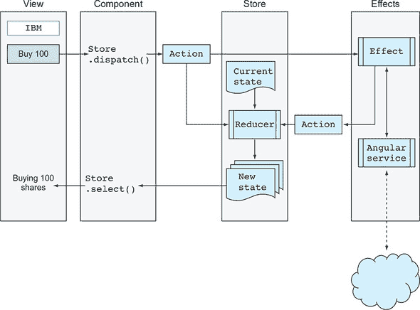

要理解这个图，想象一下用户点击了“购买 100”按钮。组件会在商店上派发一个动作，这个动作可以被 reducer、effect 或两者处理。一个 effect 可以访问外部服务并派发另一个动作。在任何情况下，reducer 最终都负责创建一个新的状态，组件可以使用 selector 获取它并相应地更新 UI（例如，渲染“购买 100 股”的消息）。

| |
| --- |

##### 注意

我们想强调的是，尽管动作可以在 reducer 和 effect 中处理，但只有 reducer 可以改变应用的状态。

| |
| --- |

如果你比较图 15.4 和图 15.1 中分别展示的 Redux 和 ngrx 数据流，你会注意到效果存在于存储之外。它们可以与其他 Angular 服务通信，反过来，这些服务也可以与外部服务器通信，如果需要的话。图 15.1 中的另一个不同之处在于，视图会使用`subscribe()`来接收最新状态；15.4 展示了可以使用选择器函数检索整个状态对象或其部分的`select()`方法。

在 Redux 和 ngrx 中，组件在存储上派发动作。Redux 动作仅在 reducer 中处理，但在 ngrx 中，一些动作在 reducer 中处理，一些在效果中处理，还有一些两者都处理。例如，如果组件派发`LOAD_PRODUCTS`，reducer 可以捕获它来设置状态属性`loading`为 true，这将导致显示进度指示器。效果可以接收相同的`LOAD_PRODUCTS`动作并对产品进行 HTTP 请求。

你知道要派发一个应该由 reducer 处理的动作，组件会调用`Store.dispatch()`，但效果如何派发动作？效果返回一个包含一些有效载荷的观察者。在你的效果类中，你将声明一个或多个用`@Effect`装饰器注解的类变量。每个效果都将应用`ofType`运算符，以确保它只对指定的动作类型做出反应，如下面的列表所示。

##### 列表 15.8\. 带有效果的类片段

```
@Injectable()
export class MyEffects {
...
@Effect()
loadProducts$ = this.actions$
.pipe(ofType(LOAD_PRODUCTS),
.switchMap(this.productService.getProducts()))
...
}
```

在这个例子中，`@Effect`装饰器将可观察属性`loadProducts$`标记为`LOAD_PRODUCTS`类型动作的处理程序，并调用`getProducts()`，它返回一个`Observable`。然后，根据发出的值，效果将派发另一个动作（例如，成功或失败）。你将在下一节中看到如何做到这一点。一般来说，你可以将效果视为原始动作和 reducer 之间的中间件，如图 15.5 所示。

##### 图 15.5\. 数据流中的效果

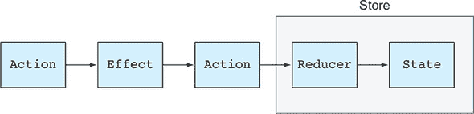

在你的应用模块类中，你需要为根模块添加到`@NgModule`装饰器的`EffectsModule.forRoot()`，或者为功能模块添加`EffectsModule.forFeature()`。

我们不想让你被 ngrx 背后的理论压倒，所以让我们继续开发一个使用 ngrx 存储、带有有效载荷的动作、reducer、效果和选择器的应用。

#### 15.2.3\. 使用 ngrx 重构中介器应用

在本节中，你将重构第八章第 8.3.2 节（kindle_split_017.xhtml#ch08lev2sec4）中创建的应用。那个应用有一个搜索字段和两个链接，eBay 和 Amazon。你将通过用 ngrx 存储替换维护应用状态的`SearchService`注入式来重构它。为了说明效果和服务之间的通信，你将添加`ProductService`，它将生成搜索结果：包含输入搜索标准在其名称中的产品。

新版本的应用位于介质文件夹中。它将使用以下 ngrx 构建块：

+   用于存储和检索应用状态、搜索查询和结果的数据存储

+   用于处理类型为`SEARCH`和`SEARCH_SUCCESS`的动作的 reducer

+   处理类型为`SEARCH`和`SEARCH_SUCCESS`的动作的效果

+   用于检索整个状态对象、搜索查询或搜索结果的选择器

图 15.6 显示了用户在`SearchComponent`的搜索字段中输入`aaa`后的介质应用。

##### 图 15.6\. 在 eBay 上进行的`aaa`搜索结果

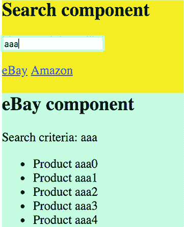

##### 店存状态

此应用的状态对象将包含两个属性：搜索查询（例如，`aaa`）和搜索结果（例如，五个产品）。你将在以下列表中声明类型以表示你应用的状态。

##### 列表 15.9\. 介质应用的状态

```
export interface State {
  searchQuery: string;           *1*
   searchResults: string[];      *2*
 }
```

+   ***1* SearchComponent 分发的 SEARCH 动作的有效负载**

+   ***2* 在调用 ProductService.getProducts()后，效果分发的 SEARCH_SUCCESS 的有效负载**

##### 动作

在计数器应用中，动作不包含有效负载；它们增加或减少计数器。这次不同。`SEARCH`动作可以有有效负载（例如`aaa`），`SEARCH_SUCCESS`也可以有有效负载（例如五个产品）。这就是为什么仅声明表示动作类型的常量是不够的，你将把每个动作包裹在一个具有有效负载作为参数的构造函数的类中。动作将在以下列表中声明的 actions.ts 文件中声明。

##### 列表 15.10\. actions.ts

```
import {Action} from '@ngrx/store';
export const SEARCH = '[Product] search';                         *1*
 export const SEARCH_SUCCESS = '[Product] search success';        *1*

export class SearchAction implements Action {                     *2*
   readonly type = SEARCH;

  constructor(public payload: {searchQuery: string}) {}
}

export class SearchSuccessAction implements Action {              *3*
   readonly type = SEARCH_SUCCESS;

  constructor(public payload: {searchResults: string[]}) {}
}

export type SearchActions = SearchAction | SearchSuccessAction;   *4*
```

+   ***1* 声明动作类型**

+   ***2* 代表带有有效负载的搜索动作的类**

+   ***3* 代表带有有效负载的搜索成功动作的类**

+   ***4* 声明联合搜索动作类型**

注意动作定义中的文本`[Product]`。在实际应用中，你可能会有多个`SEARCH`动作——一个用于产品，一个用于订单等。通过在动作描述前加上`[Product]`，你创建了一个命名空间，使代码更易于阅读。具有命名空间的动作有助于在任何给定时刻理解哪些动作被分发。

actions.ts 的最后一行使用了在附录 B 中 B.11 节描述的 TypeScript 联合操作符。在这里，你定义了将在 reducer 签名中使用的`SearchActions`类型，这样 TypeScript 编译器就知道在 reducer 的`switch`语句中允许哪些动作。

##### 作为动作创建者的 SearchComponent

动作已声明，但有人必须创建和分发它们。在你的应用中，以下列表中显示的`SearchComponent`将在用户输入搜索条件后创建和分发类型为`SEARCH`的动作。

##### 列表 15.11\. search.component.ts

```
@Component({
  selector: 'app-search',
  template: `
    <h2>Search component</h2>
    <input type="text" placeholder="Enter product"
                       [formControl]="searchInput">`,
  styles: ['.main {background: yellow}']
})
export class SearchComponent {

  searchInput: FormControl;

  constructor(private store: Store<any>) {
    this.searchInput = new FormControl('');

    this.searchInput.valueChanges                                             *1*
      .pipe(debounceTime(300),
            tap(value => console.log(`The user entered ${value}`)))
      .subscribe(searchValue => {
          this.store.dispatch(new SearchAction({ searchQuery: searchValue }));*2*
    });
  }
}
```

+   ***1* 订阅表单控制的可观察对象**

+   ***2* 实例化和分发带有有效负载的 SEARCH 类型动作**

分派的动作将被还原器捕获，它将更新状态对象上的 `searchQuery` 属性。

| |
| --- |

##### 注意

我们将在本节后面讨论另一个动作创建器，即 `SearchEffects` 类。


##### Reducer

在 列表 15.12 中显示的还原器中，你声明了一个描述你的应用程序状态结构的接口，并创建了一个表示初始状态的对象。`reducer()` 函数将接受初始或当前不可变状态，并使用 `switch` 语句根据动作类型创建并返回一个新的状态。

##### 列表 15.12\. reducers.ts

```
import {SearchActions, SEARCH, SEARCH_SUCCESS} from './actions';
export interface State {                                            *1*
   searchQuery: string;
  searchResults: string[];
}

const initialState: State = {                                       *2*
   searchQuery: '',
  searchResults: []
};

export function reducer(state = initialState, action: SearchActions): State {
  switch (action.type) {

    case SEARCH: {                                                  *3*
       return {                                                     *4*
        ...state,
         searchQuery: action.payload.searchQuery,                   *5*
         searchResults: []                                          *5*
       }
    }

    case SEARCH_SUCCESS: {                                          *6*
       return {
        ...state,                                                   *7*
         searchResults: action.payload.searchResults                *8*
       }
    }

    default: {
      return state;                                                 *9*
     }
  }
}
```

+   ***1* 声明状态对象的结构**

+   ***2* 创建一个表示初始状态的对象**

+   ***3* 这个动作由组件分派。**

+   ***4* 将现有状态值复制到新状态对象中**

+   ***5* 使用新值更新两个状态属性**

+   ***6* 这个动作将由效果分派。**

+   ***7* 将现有状态值复制到新状态对象中**

+   ***8* 使用新值更新一个状态属性**

+   ***9* 如果分派了意外的动作，则返回当前状态**

| |
| --- |

##### 提示

如果在一个 `case` 子句中使用了未在联合类型 `SearchActions` 中声明的动作类型（例如，`SEARCH22`），TypeScript 编译器将返回一个错误。

| |
| --- |

TypeScript 联合类型的更精确名称是 *区分联合*。如果一个联合中的所有类型都有一个共同的类型属性，TypeScript 编译器就可以通过这个属性来区分类型。它知道在 `case` 语句中引用的是联合中的哪个特定类型，并为负载属性建议正确的类型。

为了克隆状态对象并更新其一些属性，你使用在 附录 A 的 A.7 节中描述的扩展操作符。注意，状态属性将使用动作负载的值进行更新。

##### Effects

在这个应用中，你将有一个效果，它将使用 `ProductService` 注入式来获取产品。为了简化说明，你不会从外部服务器或文件加载产品。你的 `ProductService`，如下所示，将生成并返回五个产品的可观察对象。它使用 RxJS 的 `delay` 操作符来模拟一秒钟的延迟，就像产品来自远程计算机一样。

##### 列表 15.13\. product.service.ts

```
@Injectable()
export class ProductService {

  static counter = 0;                                                 *1*

  getProducts(searchQuery: string): Observable<string[]> {

    const productGenerator = () =>
                `Product ${searchQuery}${ProductService.counter++}`;  *2*
     const products = Array.from({length: 5}, productGenerator);      *3*

    return Observable.of(products).pipe(delay(1000));                 *4*
   }
}
```

+   ***1* 连接到搜索查询的计数器是一个产品名称。**

+   ***2* 一个生成产品名称的函数**

+   ***3* 使用 productGenerator() 创建一个五个元素的数组**

+   ***4* 返回一秒延迟后的产品可观察对象**

你的 `SearchEffects` 类将声明一个效果，`loadProducts$`，它将分派具有产品数组作为负载的 `SEARCH_RESULTS` 效果。你想要确保这个效果只有在存储分派了 `SEARCH` 效果时才会获取产品，所以你使用了 ngrx 操作符 `ofType(SEARCH)`。

此效果从 `actions$` 可观察对象发出的类型为 `SEARCH` 的动作（搜索查询）中提取有效负载，并使用 `switchMap` 将其传递给内部可观察对象（`getProducts()` 方法）。最后，效果将派发类型为 `SEARCH_RESULTS` 的动作，并带有有效负载，所有这些都可以在下面的列表中看到。

##### 列表 15.14\. effects.ts

```
@Injectable()
export class SearchEffects {

  @Effect()
  loadProducts$ = this.actions$                                           *1*
     .ofType(SEARCH)                                                      *2*
     .pipe(
      map((action: SearchAction) => action.payload),                      *3*
       switchMap(({searchQuery})
                   => this.productService.getProducts(searchQuery)),      *4*
       map(searchResults => new SearchSuccessAction({searchResults}))     *5*
     );

  constructor(private actions$: Actions,                                  *6*
               private productService: ProductService) {}                 *7*
 }
```

+   ***1* 使用流/可观察对象初始化 loadProducts$ 效应**

+   ***2* 仅当存储派发了 SEARCH 动作时执行搜索**

+   ***3* 从类型为 SEARCH 的动作中提取有效负载**

+   ***4* 根据指定的搜索查询获取产品**

+   ***5* 使用其有效负载派发类型为 SEARCH_SUCCESS 的动作**

+   ***6* 注入 ngrx Actions 可观察对象**

+   ***7* 注入 ProductService**

在此示例中，你假设 `getProducts()` 总是会发出产品，但你可以在观察者中添加 `catchError()` 函数，在那里你会发出报告错误的动作。你将在 列表 15.31 中看到 `catchError()` 的使用。


##### 提示

虽然在读取数据时使用 `switchMap` 放弃不需要的结果是可以的，但如果编写执行添加、更新或删除操作的效应，请使用 `concatMap`。这将防止在更新记录的过程中一个请求正在进行更新，另一个请求到来时可能出现的竞争条件。使用 `concatMap`，所有请求将依次到达服务。


在某些情况下，你可能想创建一个处理动作但不需要派发另一个动作的效应。例如，你可能想创建一个仅记录动作的效应。在这种情况下，你需要将一个 `{dispatch: false}` 对象传递给 `@Effect` 装饰器：

```
@Effect({ dispatch: false })
logAction$ = this.actions$
    .pipe(
      tap( action => console.log(action))
    );
```

##### 选择器

在现实世界的应用程序中，状态对象可以表示为嵌套属性的树，你可能只想获取存储状态的特定部分，而不是获取整个状态对象并手动遍历其内容。让我们看看应用程序组件如何通过使用选择器来获取特定状态属性的值。

首先，使用 `createFeatureSelector()` 方法获取顶级功能状态的选择器。然后，使用此选择器作为其他更具体选择器的起点，使用 `createSelector()` 方法，该方法返回用于选择状态切片的回调函数。你的应用程序的选择器在 selectors.ts 文件中声明。

##### 列表 15.15\. selectors.ts

```
import {createFeatureSelector, createSelector} from '@ngrx/store';
import {State} from './reducers';

export const getState = createFeatureSelector<State>('myReducer');    *1*
export const getSearchQuery = createSelector(getState,
                                 state => state.searchQuery);         *2*
export const getSearchResults = createSelector(getState,
                                 state => state.searchResults);       *3*
```

+   ***1* 创建顶级状态的选择器**

+   ***2* 创建用于搜索查询状态属性的选择器**

+   ***3* 创建用于搜索结果状态属性的选择器**

`createFeatureSelector()` 方法的参数是在模块中指定的还原器名称。在 `@NgModule` 装饰器中，你将看到以下行：

```
StoreModule.forRoot({myReducer: reducer})
```

因此，为了获取此还原器的引用，你将编写 `createFeatureSelector ('myReducer');`。

让我们回顾一下你到目前为止所取得的成就：

> **1**. 你声明了表示 `SEARCH` 和 `SEARCH_RESULTS` 类型动作的类。
> 
> **2**. `SearchComponent` 可以发送类型为 `SEARCH` 的动作。
> 
> **3**. 还原器可以处理两种动作类型。
> 
> **4**. 你声明了可以获取产品和发送类型为 `SEARCH_RESULTS` 的动作的效果。
> 
> **5**. 你声明了选择器以获取应用状态的片段。

为了完成循环，你将使用 eBay 和 Amazon 组件中的选择器来渲染搜索标准和检索到的产品。下面的列表只显示了 `EbayComponent` 的代码（`AmazonComponent` 的代码看起来相同）。

##### 列表 15.16\. ebay.component.ts

```
@Component({
  selector: 'app-ebay',
  template: `
    <div class="ebay">
      <h2>eBay component</h2>
      Search criteria: {{searchFor$ | async}}                           *1*

      <ul>
        <li *ngFor="let p of searchResults$ | async ">{{ p }}</li>      *2*
       </ul>
    </div>`,
  styles: ['.ebay {background: cyan}']
})
export class EbayComponent {

  searchFor$ = this.store.select(getSearchQuery);                       *3*

  searchResults$ = this.store.select(getSearchResults);                 *4*

  constructor(private store: Store<State>) {}                           *5*
 }
```

+   ***1* 订阅发出搜索标准的可观察对象并渲染它**

+   ***2* 订阅发出产品并渲染它们**

+   ***3* 在存储上调用 getSearchQuery() 选择器**

+   ***4* 在存储上调用 getSearchResults() 选择器**

+   ***5* 注入存储**

`EBayComponent` 的代码简洁，不包含任何应用逻辑。使用 ngrx，你需要编写更多的代码，但你的 Angular 组件中的每个方法都变成了发送动作的命令或检索数据的选择器，每个命令都会改变你应用的状态。

完成应用-ngrx 通信还有一步。你需要在应用模块中注册存储和效果。下一个列表中显示的模块还包括路由配置，因此用户可以在 eBay 和 Amazon 组件之间导航。

##### 列表 15.17\. app.module.ts

```
@NgModule({
  imports: [BrowserModule, CommonModule, ReactiveFormsModule,
    RouterModule.forRoot([
      {path: '',        component: EbayComponent},          *1*
       {path: 'amazon', component: AmazonComponent}]),      *1*

    StoreModule.forRoot({myReducer: reducer}),              *2*
     EffectsModule.forRoot([SearchEffects]),                *3*
         StoreDevtoolsModule.instrument({
                   logOnly: environment.production}),       *4*
   ],
  declarations: [AppComponent, EbayComponent, AmazonComponent, SearchComponent],
  providers: [
    ProductService,
    {provide: LocationStrategy, useClass: HashLocationStrategy}
  ],
  bootstrap:[AppComponent]
})
export class AppModule {}
```

+   ***1* 配置路由**

+   ***2* 注册存储并将其链接到还原器**

+   ***3* 注册效果**

+   ***4* 启用 Redux DevTools 的使用**

在下一节中，我们将向你展示如何使用 Chrome 扩展 Redux DevTools 监控状态，以及 `instrument()` 方法的作用。

下面的列表中的应用程序组件与第八章中介器示例中的相同 chapter 8。列表 8.10 包含注释，所以我们在这里不会描述它。

##### 列表 15.18\. app.component.ts

```
@Component({
  selector: 'app-root',
  template: ` <div class="main">
              <app-search></app-search>
              <p>
              <a [routerLink]="['/']">eBay</a>
              <a [routerLink]="['/amazon']">Amazon</a>
              <router-outlet></router-outlet>
              </div>`,
  styles: ['.main {background: yellow}']
})
export class AppComponent {}
```

要查看此应用的运行情况，请在项目中介器中运行 `npm install`，然后运行 `ng serve -o`。


**ngrx 还能提供什么**

你的中介器应用使用了 `@ngrx/store` 和 `@ngrx/effects` 包，这些包可以解决你大部分的状态管理需求。在实战部分，你还将使用 `@ngrx/router-store`，它提供了连接和监控 Angular `Router` 的绑定。还有其他一些包：

+   `@ngrx/entity` 是一个用于管理记录集合的实体状态适配器。

+   `@ngrx/schematics` 是一个脚手架库，它提供了生成 ngrx 相关代码的蓝图。

考虑自行探索这些包。所有 ngrx 包的 API 都在 [`mng.bz/362y`](http://mng.bz/362y) 中描述。


现在我们来看看如何使用 Redux DevTools 监控应用状态。

#### 15.2.4\. 使用 ngrx store DevTools 监控状态

由于你将状态管理操作委托给 ngrx，你需要一个工具来监控运行时的状态变化。Redux DevTools 浏览器扩展程序以及 `@ngrx/store-devtools` 包用于应用状态仪表化。首先，安装 `@ngrx/store-devtools`：

```
npm install @ngrx/store-devtools
```

其次，添加 Chrome 扩展程序 Redux DevTools（Firefox 也有这样的插件）。

第三，将仪表化代码添加到应用模块中。例如，对于默认配置的仪表化，你可以在 `@NgModule` 装饰器的导入部分添加以下行：

```
StoreDevtoolsModule.instrument()
```

`StoreDevtoolsModule` 必须在 `StoreModule` 之后添加。如果你想在生产环境中最小化其开销以添加仪表化，可以使用以下方式使用 `environment` 变量：

```
StoreDevtoolsModule.instrument({
  logOnly: environment.production
})
```

在生产环境中，将 `logOnly` 标志设置为 `true`，这不会包括诸如派发和重新排序动作、在页面重新加载之间持久化状态和动作历史等工具，这些工具会引入明显的性能开销。你可以在 [`mng.bz/cOwC`](http://mng.bz/cOwC) 找到 `logOnly: true` 关闭的完整功能列表。

`instrument()` 方法可以接受在 node_modules/@ngrx/store-devtools/src/config.d.ts 文件中定义的 `StoreDevtoolsConfig` 类型的参数。下面的代码示例展示了如何添加仪表化，这将允许监控最多 25 个最近动作，并在生产环境中以仅日志模式工作。

##### 列表 15.19\. 使用两个配置选项添加仪表化

```
StoreDevtoolsModule.instrument({
    maxAge: 25,                            *1*
     logOnly: environment.production       *2*
 })
```

+   ***1* 在浏览器扩展程序中保留最后 25 个状态**

+   ***2* 限制浏览器扩展程序在生产环境中仅以日志模式运行**

你也可以通过向 `instrument()` 方法提供 `features` 参数来限制 Chrome Redux 扩展程序的一些功能。有关配置 ngrx 仪表化和支持的 API 的更多详细信息，请参阅 [`mng.bz/3AXe`](http://mng.bz/3AXe)，但在这里我们将向你展示一些 Chrome Redux 扩展程序的截图，以说明 ngrx 存储 DevTools 的一些功能。


##### 小贴士

如果你运行了你的应用，但 Chrome Redux 面板显示一个带有消息“未找到存储”的黑色窗口，请在浏览器中刷新页面。


启动应用会在存储中创建初始状态。图 15.7 展示了你启动中介应用并在输入字段中输入 `aaa` 后的屏幕。动作序列从 `@ngrx/store` 和 `@ngrx/effects` 包内部派发的两个 `init` 动作开始，你选择左侧的 `@ngrx/store/init` 动作和右上角的“状态”按钮。状态属性 `searchQuery` 和 `searchResults` 都是空的。要查看派发搜索动作后的应用状态，请点击此动作。

##### 图 15.7\. 已选择存储 `init` 动作。

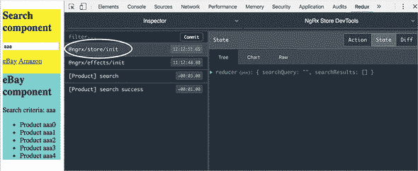

将 `init` 操作视为应用程序可以订阅并在应用程序启动时实现一些逻辑的钩子——例如，你可以检查用户是否已登录。如果你的应用程序使用具有自己的 reducer 的懒加载模块，你也可能看到每个新加载模块的 `@ngrx/store/update-reducer` 操作，并且其 reducer 将被添加到存储 reducer 集合中。

 展示了点击右上角的操作按钮后的屏幕，并显示了最新操作的类型和负载：

> **1**. 最新操作是 `"[Product] search success"`。
> 
> **2**. 已选择操作标签页。
> 
> **3**. 操作负载存储在状态属性 `searchResults` 中。
> 
> **4**. 操作类型是 `"[Product] search success"`。

##### 图 15.8\. 操作标签页视图

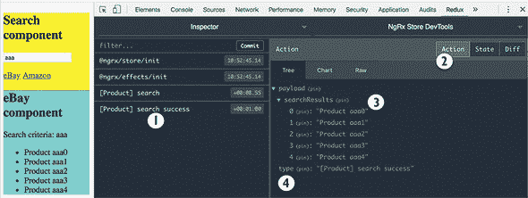

| |
| --- |

##### 提示

如果你的状态对象有多个分支，通过点击`(pin)`，你可以在浏览操作时将某个状态片段固定在顶部。

| |
| --- |

如图 15.9 所示，点击状态按钮后，你可以看到你的状态变量 `searchQuery` 和 `searchResults` 的当前值：

> **1**. 最新操作是 `"[Product] search success"`。
> 
> **2**. 已选择状态标签页。
> 
> **3**. 搜索条件存储在状态属性 `searchQuery` 中。
> 
> **4**. 搜索结果存储在状态属性 `searchResults` 中。

##### 图 15.9\. 状态标签页视图

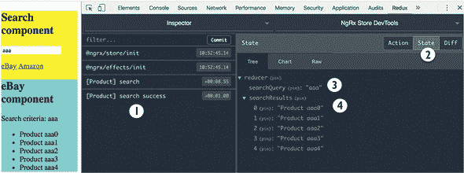

如果状态标签页显示整个状态对象，点击“差异”按钮将显示特定操作导致的变化。如图 15.10 所示，如果没有选择操作，差异标签页将显示最新操作所做的状态更改：

> **1**. 最新操作是 `"[Product] search success"`。
> 
> **2**. 已选择差异标签页。
> 
> **3**. 状态属性 `searchResults` 的内容不同。

##### 图 15.10\. 已选择差异标签页。

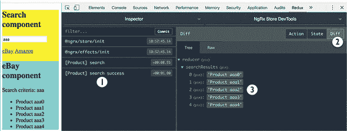

在调试应用程序时，开发者经常需要重新创建应用程序的某个状态，一种方法是刷新页面并通过点击按钮、选择列表项等方式重复用户操作。使用 Redux DevTools，你可以回到过去并重新创建某个状态，而无需刷新页面——你可以跳转到某个操作发生后的状态，或者跳过某个操作。

当你选择一个操作，如图 15.11 所示，你会看到跳转和跳过按钮，然后点击跳过将划掉所选操作，你的运行中的应用程序将反映这一变化。顶部将显示清除按钮，点击它将从列表中删除此操作。跳转按钮将跳转到所选操作的特定应用程序状态。Redux DevTools 将显示此刻的状态属性，并且应用程序的 UI 将相应地重新渲染：

> **1**. 已点击此操作的跳过按钮。
> 
> **2**. 已选择状态标签页。
> 
> **3**. 搜索查询是 `aaabbb`。
> 
> **4**. 状态属性 `searchResults` 对于 `aaabbb` 产品没有显示任何结果。
> 
> **5**. 没有点击“清理”按钮。

##### 图 15.11\. 跳过了 [产品] 搜索成功的动作

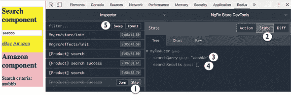

我们已经向你展示了 ngrx 存储 DevTools 的主要功能，但要更好地理解这个工具，我们鼓励你花些时间自己尝试操作。

#### 15.2.5\. 监控路由状态

当用户导航应用时，路由器渲染组件，更新 URL，并在需要时传递参数或查询字符串。在幕后，路由器对象代表路由的当前状态，而 `@ngrx/router-store` 包允许你在 ngrx 存储中跟踪路由状态。

此包不会改变 Angular `Router` 的行为，你可以在组件中继续使用 `Router` API，但由于存储应该是单一的真实来源，你可能还想考虑在那里表示路由状态。在任何给定的时间，ngrx 存储可以让你访问诸如 `url`、`params`、`queryParams` 等许多其他路由属性。

与任何其他状态属性一样，你需要在 ngrx 存储中添加一个还原器，好消息是，你不需要在应用中实现它，因为 `routerReducer` 在 `@ngrx/router-store` 中定义。要添加路由状态支持，首先安装此包：  

```
npm i @ngrx/router-store
```

之后，将 `StoreRouterConnectingModule` 添加到 `NgModule` 装饰器中，并将 `routerReducer` 添加到还原器列表中。`StoreRouterConnectingModule` 保存当前的路由状态。在导航期间，在调用路由守卫之前，路由存储会分派类型为 `ROUTER_NAVIGATION` 的动作，该动作携带 `RouterStateSnapshot` 对象作为其负载。

要获取应用中的 `routerReducer`，你需要执行两个步骤：

> **1**. 通过将值分配给属性 `StoreRouterConnectingModule.stateKey` 来给它一个名称。
> 
> **2**. 使用上一步的值作为 `routerReducer` 的名称。

以下列表展示了如何将 `StoreRouterConnectingModule` 添加到应用模块中。在这里，你使用 `myRouterReducer` 作为 `routerReducer` 的名称。

##### 列表 15.20\. 应用模块片段

```
import {StoreRouterConnectingModule, routerReducer}
  from '@ngrx/router-store';
...
@NgModule({
  imports: [
   ...
      StoreModule.forRoot({myReducer: reducer, ?
                           myRouterReducer: routerReducer}),      *1*
     StoreRouterConnectingModule.forRoot({
      stateKey: 'myRouterReducer'                                 *2*
     })
  ]
   ...
})
export class AppModule { }
```

+   ***1* 将路由还原器添加到 StoreModule**

+   ***2* 在状态键属性中存储还原器的名称**

现在，状态属性 `myRouterReducer` 可以用来访问路由状态。这个属性的值会在每次路由导航时更新。

15.2.3 节中的应用没有包含路由状态监控，但本章附带源代码中还有一个名为 mediator-router 的另一个应用，它确实监控路由状态。运行此应用并打开 Redux DevTools 面板。然后导航到 Amazon 路由，你将看到应用状态对象中的 `ROUTER_NAVIGATION` 动作和 `myRouterReducer` 属性，如图 15.12 所示。


##### 提示

通过点击底部工具栏的下箭头，QA 工程师可以保存当前应用程序的状态并将其发送给开发者，开发者可以将它加载到 Redux 扩展（上箭头）中，以重现报告为错误的场景。


##### 图 15.12\. Redux DevTools 中的`RouterStateSnapshot`对象

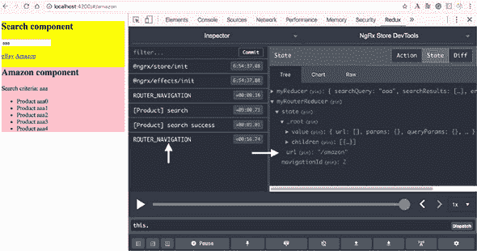

展开 RouterStateSnapshot 的节点；它有大量的属性。这个对象如此之大，甚至可能使 Redux DevTools 崩溃。通常，你只需要监控少量路由状态属性，这就是路由状态序列化器派上用场的地方。

要实现序列化器，定义一个类型，它将只包含`RouterStateSnapshot`中你想要监控的属性。然后编写一个实现`RouterStateSerializer`接口的类，`@ngrx/router-store`将开始使用它。此接口要求你实现`serialize()`回调，在那里你应该解构提供的`RouterStateSnapshot`以提取你关心的那些属性。

一些属性，如`url`，在顶层可用，而其他属性，例如`queryParams`，位于`RouterStateSnapshot.root`属性之下。中介路由项目在`serializer.ts`文件中实现了路由状态序列化器，如下所示。

##### 列表 15.21\. serializer.ts

```
import { RouterStateSerializer } from '@ngrx/router-store';
import {Params, RouterStateSnapshot} from '@angular/router';

interface MyRouterState {                                        *1*
   url: string;
  queryParams: Params;
}

export class MyRouterSerializer
        implements RouterStateSerializer<MyRouterState> {        *2*

  serialize(routerState: RouterStateSnapshot): MyRouterState {

    const {url, root: {queryParams}} = routerState;              *3*

    return {url, queryParams};                                   *4*
   }
}
```

+   ***1* 定义要监控的路由状态属性**

+   ***2* 创建一个实现 RouterStateSerializer 的类**

+   ***3* 使用解构来获取你需要的属性**

+   ***4* 返回包含 url 和 queryParams 属性的对象**

现在，Redux DevTools 将只显示`url`和`queryParams`的值。要获取路由状态对象的值，使用`select()`运算符。下一个列表显示了在中介路由项目中如何实现它。

##### 列表 15.22\. app.component.ts

```
export class AppComponent {
  constructor(store: Store<any>) {
    store
      .select(state => state.myRouterReducer)              *1*
       .subscribe(routerState =>
           console.log('The router state: ', routerState));
  }
}
```

+   ***1* 提取路由状态切片**

如果你想在你的效果类中处理路由状态动作，创建一个处理类型为`ROUTER_NAVIGATION`的动作的效果。以下是从中介路由项目的`effects.ts`文件中的代码片段，展示了如何在效果中实现它。

##### 列表 15.23\. effects.ts 的一个片段

```
@Injectable()
export class SearchEffects {

...

  @Effect({ dispatch: false })                 *1*
   logNavigation$ =
    this.actions$.pipe(
      ofType('ROUTER_NAVIGATION'),             *2*
       tap((action: any) => {
        console.log('The router action in effect:', action.payload);
      })
    );

  constructor(private actions$: Actions,
              private productService: ProductService) {}
}
```

+   ***1* 此效果不派发自己的动作。**

+   ***2* 监听 ROUTER_NAVIGATION 动作**

在某些情况下，你可能在效果类内部安排导航。为此，如下所示，你可以继续使用路由 API，而不需要 ngrx 的帮助。

##### 列表 15.24\. 在 effects 中导航

```
@Effect({ dispatch: false })
navigateToAmazon$ =
  this.actions$.pipe(
    ofType('GOTO_AMAZON')                    *1*
     tap((action: any) => {
      this.router.navigate('/amazon');       *2*
     })
  );
```

+   ***1* 监听 GOTO_AMAZON 动作**

+   ***2* 导航到/amazon 路由**

这就结束了我们对 ngrx 的介绍，但在本章的动手实践部分，你将看到如何在 ngAuction 应用程序中使用它。

### 15.3\. 使用 ngrx 还是不使用 ngrx

最近，我们的一位客户解释了他们存储状态的需求。在他们应用中，状态由一个包含嵌套数组的大型对象表示，每个数组存储作为图表渲染的数据。应用检索其中一个数组，执行一些计算，并渲染图表。未来，他们计划添加新的图表和数组。

客户询问使用具有 `BehaviorSubject` 的单例 Angular 服务是否比 ngrx 在此用例中提供更不可扩展的解决方案。他补充说，在 ngrx 中，他们可以使用具有其 reducer 的单独数组（状态片段），这可以使得添加新的数组和图表更容易，因为 ngrx 会自动从单个 reducer 创建一个全局状态对象。

让我们看看 ngrx 是否能有所帮助。首先，如果他们需要大量数据来渲染不直接使用数据的图表，将计算移动到服务器以避免在内存中保留大型对象并在浏览器中计算数字是有意义的。但如果是他们仍然想在客户端实现所有数据处理的呢？

使用 Angular 服务方法时，具有嵌套数组的对象会增长并变得难以维护。在单独的 reducer/数组的情况下，将它们添加到状态中并推理状态会更容易。

但是，使用 ngrx 方法时，状态对象也会增长，他们需要添加更多的 reducer 和 selector 来处理增长。使用 Angular 服务方法时，他们可以添加更多用于获取状态片段的方法，或者将单例服务拆分为多个服务——主要服务存储数据，而单独的服务（每个图表一个）从主服务获取和处理数据。

ngrx 和服务方法都可以完成工作并保持可维护性。如果应用尚未使用 ngrx，仅仅因为图表而使用 ngrx 是没有意义的。

#### 15.3.1. 比较 ngrx 与 Angular 服务

好的，有没有什么用例表明 ngrx 在状态管理方面比 Angular 服务方法有优势？让我们比较一下状态管理的三个主要特性：

+   单一事实来源可能意味着两件事：

    1.  每组数据只有一个副本。使用 Angular 服务和 `BehaviorSubject` 可以轻松实现这一点。

    1.  有一个对象保存了所有应用数据。这是 Redux/ngrx 方法的一个独特特性，它使得 Redux DevTools 成为可能。这对于具有跨模块交互和大量共享数据的大型应用来说是一个非常有价值的特性。如果没有单一的状态对象，几乎是不可能的。DevTools 允许导出/导入应用整个状态，如果你需要重现用户或 QA 工程师发现的错误。但在现实世界中，状态变化会触发副作用，并且不会将应用恢复到完全相同的状态。

+   状态只能由 reducer 修改，因此你可以轻松地定位和调试与状态相关的问题。但如果你在 Angular 服务中使用 `BehaviorSubject` 来保存数据，你也能做到这一点。没有 `BehaviorSubject`，很难识别所有可以修改状态的任务，但有了 `BehaviorSubject`，你可以在一个地方设置断点。此外，通过将 `map` 操作符应用于 `BehaviorSubject`，你可以像在 reducer 中一样处理所有数据修改。

+   使用 ngrx 和特定的选择器，你可以生成一个派生状态，它结合了存储对象不同部分的数据，并且它可以被缓存。你同样可以在 Angular 服务中轻松做到这一点。定义一个服务，它注入其他服务，使用 `combineLatest` 或 `withLatestFrom` 操作符聚合它们的值，然后发出“派生”状态。

如果你想要所有这些功能，从 ngrx 开始可能更容易，因为 ngrx 强制执行这些功能。如果没有强制执行的纪律，你的单例服务可能很快就会从 30 行代码变成一个难以维护的怪物，拥有数百行代码。如果你不确定最佳实践是否可以在你的团队中强制执行，请选择 ngrx，它为你的应用程序提供了一个定义良好的结构。


##### 小贴士

你可以不用编写创建 store、effects、actions 等代码，而是使用 Angular CLI 生成它们，但首先需要安装 ngrx 蓝图（也称为 schematics）。你可以在 [`mng.bz/7W30`](http://mng.bz/7W30) 了解如何使用 `@ngrx/schematics`。如果你的项目是由 Angular CLI 6 或更高版本生成的，你可以使用以下命令将 NGRX 元素添加到项目中：


```
ng add @ngrx/store
ng add @ngrx/effects
```

#### 15.3.2\. 状态突变问题

这些问题确实存在，但 Angular 提供了你所需的一切来解决它们。在你的项目中，所有 Angular 组件都使用 `OnPush` 变更检测策略。当你需要修改组件的数据时，创建一个新的对象实例并将其绑定到组件的 `@Input`。

有时候使用默认的变更检测策略更有意义。例如，你可能需要创建一个动态表单，其内容根据其他表单控件中输入的值而变化。控件值作为可观察对象（作为 `valueChanges`）公开，如果你的组件使用 `OnPush`，并且所有其他组件属性都是 RxJS `Subject`s，那么使用 RxJS 操作符表达逻辑会使代码过于复杂。

代码确实可能很复杂，但通常它没有禁用 `OnPush` 策略并直接突变组件状态的好处。那么就别用 `OnPush`。在罕见的情况下，你甚至可以手动使用 `ChangeDetectorRef` 触发变更检测。

这些技术不能替代不可变的 ngrx 状态，它们也不提供与 ngrx 相同的数据控制级别。但它们有助于避免由状态突变引起的问题。

#### 15.3.3\. ngrx 代码更难阅读

动作和还原器引入了间接性，如果不小心使用，会迅速使你的代码变得复杂。新员工需要花费更多的时间才能使你的应用变得高效，因为每个组件都不能孤立地理解。你可能会说，任何不使用 ngrx 的 Angular 应用也是如此，但我们对此持不同意见，原因有两个。

首先，组件和服务在每一个 Angular 应用中看起来几乎一样，但每个 ngrx 项目都有自己的方法来实现和组织动作、还原器、存储选择器和效果。动作可以被定义为变量、类、接口和枚举。它们可以直接作为 ES 模块成员暴露，或者分组到类中。同样适用于还原器。

第二，支持动作和还原器需要编写额外的代码，这些代码在你的应用中原本是不存在的——这不仅仅是将现有应用代码从组件移动到 ngrx 实体。如果你的组件已经很复杂，使用 ngrx 可能会使代码难以阅读。

#### 15.3.4\. 学习曲线

ngrx 显著增加了学习曲线。你需要学习 `@ngrx/store` 和 `@ngrx/effects` 包是如何工作的。你可能还想要学习 `@ngrx/entity` 包，它有助于规范化关系数据。如果你有与关系数据库一起工作的经验，你知道如何轻松地将位于相关表中的数据连接起来。使用 `@ngrx/entity` 可以消除创建嵌套 JavaScript 对象（例如，具有嵌套订单的客户对象）和编写复杂还原器的需求。

你还需要熟悉 RxJS 库。这并不是什么火箭科学，但如果你已经在学习 Angular、TypeScript 和所有工具，那么推迟添加你可以不用的库会更明智。

#### 15.3.5\. 结论

好的库是那些让你写更少代码的库。目前，ngrx 需要你编写大量的额外代码，但我们希望 ngrx 的未来版本将更容易实现和理解。同时，关注一个有前途的状态管理库 NGXS（见 [`ngxs.gitbooks.io/ngxs`](https://ngxs.gitbooks.io/ngxs)），它不需要你像 ngrx 那样编写那么多代码，并且基于 TypeScript 装饰器。另一个名为 ngrx-data ([`mng.bz/h6Nc`](http://mng.bz/h6Nc)) 的新项目承诺以更少的编码支持 ngrx/Redux 的工作流程。

从使用 `BehaviorSubject` 的单例可注入服务来管理状态开始。这种方法可能满足你的所有需求。观看 Yakov Fain 的视频“当 ngrx 是过度时”（[www.youtube.com/watch?v=xLTIDs0CDCM](http://www.youtube.com/watch?v=xLTIDs0CDCM)），其中他比较了两个使用和不使用 ngrx 管理状态的小型应用。给你的应用添加 ngrx 从来不晚，所以不要试图过早地解决你尚未面临的问题。

现在让我们看看如何在你的 ngAuction 应用中使用 ngrx。

### 15.4\. 实践：在 ngAuction 中使用 ngrx

本章附带的自带 ngAuction 应用使用 ngrx 进行状态管理。它是模块化的，具有根模块 `AppModule` 和两个功能模块，`HomeModule` 和 `ProductModule`。由于您的功能模块是懒加载的，我们已为每个模块添加了目录存储，该存储又包含其自己的子目录：actions、effects 和 reducers，如图 15.13 所示。尽管此项目有三个名为 store 的目录，但运行中的应用将有一个包含来自每个模块合并状态的单一存储。

##### 图 15.13。应用和 home 模块中的状态分支

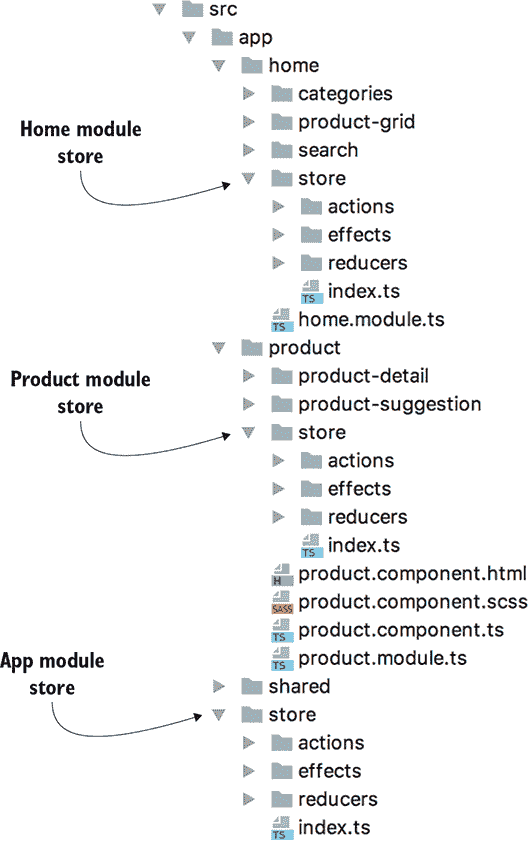

在每个文件夹中——actions、effects 和 reducers——我们都有与特定状态切片相关的单独文件。例如，您可以在这些文件夹中找到一个单独的 search.ts 文件，它实现了每个文件夹中的相应搜索功能。

应用状态不仅可以表示数据（例如最新的搜索查询或结果），还可以表示 UI 的状态（例如，加载指示器是否显示或隐藏）。您可能还想知道路由的当前状态和浏览器显示的 URL。

图 15.14 展示了运行中的 ngAuction 的组合状态。以粗体斜体显示的还原器名称，箭头指向每个还原器处理的状态属性。特别是，`products` 还原器的 `loading` 属性可能代表进度指示器的状态。我们还将使用 `router` 还原器添加路由支持。

##### 图 15.14。ngAuction 的组合状态对象

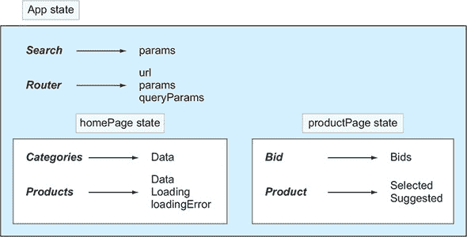

路由还原器是特殊的，因为您不需要在您的应用中实现它，因为它在 `@ngrx/router-store` 中定义，将在下一节中介绍。您的 ngAuction 在 package.json 中将 `@ngrx/router-store` 包作为依赖项。

图 15.15 展示了 ngAuction 启动后用户导航到特定产品页面时的 Redux DevTools 截图。注意那里的路由属性。图 15.15 中的应用状态与图 15.14 中所示的状态结构相匹配：

+   已选择状态选项卡。

+   您可以看到状态的一个 `search` 切片，一个 `router` 切片，一个 `homePage` 切片和一个 `productPage` 切片。

##### 图 15.15。Redux DevTools 中的 ngAuction 状态


要运行本章附带的自带 ngAuction，您需要打开两个终端窗口，一个用于客户端，一个用于服务器。进入服务器目录，并在那里运行 `npm install`。然后，使用 `tsc` 命令编译代码，并使用 `node build/main` 命令启动服务器。之后，在客户端目录中打开另一个单独的终端窗口，并运行 `npm install` 命令，然后运行 `ng serve`。我们建议您保持 Redux DevTools 打开以监控应用状态变化。


##### 注意

为了使本节的长度相对较短，我们将仅回顾实现首页模块状态管理的代码，并给你一个关于路由状态的简要概述。产品模块的状态管理以类似的方式实现。


ngAuction 使用四个 ngrx 模块：`StoreModule`、`EffectsModule`、`StoreRouterConnectingModule`和`StoreDevtoolsModule`，并且每个模块的包都包含在 package.json 的依赖项部分。让我们回顾应用模块中与路由相关的代码。

#### 15.4.1\. 将路由状态支持添加到应用模块

当你选择一个产品时，路由会导航到相应的产品视图，URL 也会相应地改变——例如，http://localhost:4200/products/1。选择另一个产品将改变路由状态，你还可以将这些类型的更改绑定到应用状态。下一个列表显示了来自 app.module.ts 的代码片段，重点关注与路由状态支持相关的代码。

##### 列表 15.25\. app.module.ts

```
import {EffectsModule} from '@ngrx/effects';
import {StoreRouterConnectingModule, routerReducer}
                from '@ngrx/router-store';                       *1*
 import {StoreModule} from '@ngrx/store';
import {StoreDevtoolsModule} from '@ngrx/store-devtools';
import {environment} from '../environments/environment';
import {reducers,
         RouterEffects,                                          *2*
          SearchEffects} from './store';
...
@NgModule({
  imports: [
   ...
    StoreModule.forRoot({...reducers, router: routerReducer}),   *3*
     StoreRouterConnectingModule.forRoot({                       *4*
       stateKey: 'router'                                        *5*
     }),
    StoreDevtoolsModule.instrument({
      name: 'ngAuction DevTools',
      logOnly: environment.production
    }),
    EffectsModule.forRoot([RouterEffects, SearchEffects]),       *6*
     ...
  ],
   ...
})
export class AppModule {
```

+   ***1* 导入 store 模块和路由状态的 reducer**

+   ***2* 导入路由效果**

+   ***3* 将 routerReducer 添加到应用 reducer 集合**

+   ***4* 添加路由状态支持**

+   ***5* 将路由状态属性命名为 router**

+   ***6* RouterEffects 监听路由事件并派发由 routerReducer 处理的 ngrx 动作。**


##### 提示

下一个部分提供了更多关于加载 reducer 的行的详细信息，同时回顾了首页模块的 index.ts 文件的代码。


在 store 中，路由状态的名字由映射到路由 reducer 的属性名（例如，`router`）定义。在你的应用中，你将使用默认的`routerReducer`并将其添加到应用 reducer 集合中：

```
StoreModule.forRoot({...reducers, router: routerReducer}),
```

`stateKey`属性值的用途是在 store 中找到路由状态并将其连接到 Redux DevTools，以便在调试期间进行时间旅行。分配给`stateKey`（在你的情况下是`router`）的值必须与提供给`forRoot()`方法的 reducer 映射中使用的属性名匹配。要访问路由状态的特定属性，你可以使用 ngrx `select`运算符在由`router`变量表示的对象上。

访问整个路由状态可能会导致 Redux DevTools 崩溃，这就是我们创建自定义路由状态序列化器的原因，以保持 store 中只有你需要的状态属性。在 shared/services/router-state-serializer.service.ts 文件中，我们实现了一个序列化器，它返回一个只包含`url`、`params`和`queryParams`的对象。如果我们没有实现这个序列化器，图 15.14 中显示的路由状态将包含大量的嵌套属性。

#### 15.4.2\. 在首页模块中管理状态

当 home 模块被懒加载时，其 reducer 被注册到 store 中，并且其状态对象与根状态合并。为了实现这一点，请在以下列表中添加以下行到 home.module.ts 文件中声明 store、reducer 和 effects。

##### 列表 15.26\. home.module.ts 的一个片段

```
import {CategoriesEffects, ProductsEffects, reducers} from './store';
...
@NgModule({
  imports: [
  ...
   StoreModule.forFeature('homePage', reducers),                         *1*
    EffectsModule.forFeature([ CategoriesEffects, ProductsEffects ])     *2*
   ]
```

+   ***1* 为功能 home 模块注册 reducer**

+   ***2* 为功能 home 模块注册 effects**


##### Tip

`forFeature()` 和 `forRoot()` 方法之间的区别在于后者还设置了 `StoreModule` 中服务的所需提供者。


home 模块在 store/reducers/products.ts 和 store/reducers/categories.ts 文件中有 reducer。请注意，您不是从特定文件导入 reducer，而是从 store 目录导入，并且您可以猜测该目录有一个名为 index.ts 的文件，该文件将多个文件中的 reducer 合并并重新导出。您将在本节稍后看到 index.ts 的内容。

##### 产品动作

在 ngAuction 中，`CategoriesComponent` 作为 home 视图的容器，在 home 视图中渲染类别标签和产品网格。图 15.16 显示 `"[Products] Load All"` 是应用发出的第一个动作。然后它发出 `"[Categories] Load"`。当数据加载完成后，效果会发出两个额外的动作：`"[Products] Load All Success"` 和 `"[Categories] Load Success"`。

##### 图 15.16\. 从所有类别加载产品

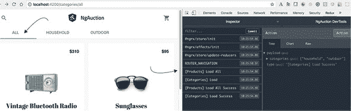

类别动作在 home/store/actions/categories.ts 文件中声明，产品动作在 home/store/actions/products.ts 文件中声明。我们只回顾 home/store/actions/products.ts 的内容；类别动作以类似的方式声明。

在 ngAuction 中，每个包含动作的文件通常由三个逻辑部分组成：

+   包含定义动作类型的字符串常量的 `enum`。您可以在 [`mng.bz/sTmp`](http://mng.bz/sTmp) 了解 TypeScript 枚举。

+   实现了 `Action` 接口的动作类（每个动作一个类）。

+   结合所有动作类的联合类型。您将在 reducer 和 effects 中使用此类型，以便 TypeScript 编译器可以检查动作类型是否正确，例如 `ProductsActionTypes.Load`。

下面的列表展示了在 home/store/actions/products.ts 文件中如何声明动作。

##### 列表 15.27\. home/store/actions/products.ts

```
import {Action} from '@ngrx/store';
import {Product} from '../../../shared/services';

export enum ProductsActionTypes {                                      *1*
   Load = '[Products] Load All',
  Search = '[Products] Search',
  LoadFailure = '[Products] Load All Failure',
  LoadSuccess = '[Products] Load All Success',
  LoadProductsByCategory = '[Products] Load Products By Category'
}

export class LoadProducts implements Action {                          *2*
   readonly type = ProductsActionTypes.Load;                           *3*
}

export class LoadProductsByCategory implements Action {                *2*
   readonly type = ProductsActionTypes.LoadProductsByCategory;         *3*
   constructor(public readonly payload: {category: string}) {}         *4*
}

export class LoadProductsFailure implements Action {                   *2*
   readonly type = ProductsActionTypes.LoadFailure;                    *3*
   constructor(public readonly payload: {error: string}) {}            *4*
}

export class LoadProductsSuccess implements Action {                   *2*
   readonly type = ProductsActionTypes.LoadSuccess;                    *3*
   constructor(public readonly payload: {products: Product[]}) {}      *4*
}

export class SearchProducts implements Action {                        *2*
   readonly type = ProductsActionTypes.Search;                         *3*
   constructor(public readonly payload:
                          {params: {[key: string]: any}}) {}           *4*
}

export type ProductsActions                                            *5*
   = LoadProducts | LoadProductsByCategory | LoadProductsFailure
  | LoadProductsSuccess | SearchProducts;
```

+   ***1* 将允许的动作类型声明为字符串常量的枚举**

+   ***2* 声明动作的类**

+   ***3* 声明动作类型**

+   ***4* 使用构造函数参数声明动作有效载荷**

+   ***5* 声明允许的动作的联合类型**

如您所见，一些动作类只包含动作类型，而另一些则包含有效载荷。

##### CategoriesComponent

与第十四章 版本 相比，`CategoriesComponent` 的代码已更改。与状态管理相关的 categories.component.ts 文件片段显示在 列表 15.28 中。在 `CategoriesComponent` 的构造函数中，你订阅了路由参数。当此组件接收到分类值时，它要么分发动作以加载所有分类的产品，要么只加载所选的一个。

##### 列表 15.28\. categories.component.ts 的片段

```
import {
  getCategoriesData, getProductsData,                              *1*
   LoadCategories, LoadProducts, LoadProductsByCategory,           *2*
   State
} from '../store';

@Component({...})
export class CategoriesComponent implements OnDestroy {
  readonly categories$: Observable<string[]>;
  readonly products$: Observable<Product[]>;

  constructor(private route: ActivatedRoute,
              private store: Store<State>) {                       *3*
     this.products$ = this.store.pipe(select(getProductsData));
    this.categories$ = this.store.pipe(                            *4*
      select(getCategoriesData),
       map(categories => ['all', ...categories])                   *5*
     );

    this.productsSubscription = this.route.params.subscribe(
      ({ category }) => this.getCategory(category)                 *6*
     );
    this.store.dispatch(new LoadCategories());                     *7*
   }

  private getCategory(category: string): void {
    return category.toLowerCase() === 'all'
      ? this.store.dispatch(new LoadProducts())                    *8*
       : this.store.dispatch(new LoadProductsByCategory(           *9*
                     {category: category.toLowerCase()}));
  }
}
```

+   ***1* 导入 ngrx selectors**

+   ***2* 导入 ngrx actions**

+   ***3* 注入 Store 对象**

+   ***4* 订阅要渲染为标签的分类**

+   ***5* 将所有元素添加到分类名称数组中**

+   ***6* 加载所选或所有分类**

+   ***7* 分发动作以加载分类**

+   ***8* 分发动作以加载所有产品**

+   ***9* 分发动作以按分类加载产品**

##### 产品还原器

主模块有两个还原器：一个用于产品，一个用于分类。以下列表显示了产品和分类的还原器和选择器。

##### 列表 15.29\. home/store/reducers/products.ts

```
import {Product} from '../../../shared/services';
import {ProductsActions, ProductsActionTypes} from '../actions';

export interface State {                                                   *1*
   data: Product[];
  loading: boolean;
  loadingError?: string;
}

export const initialState: State = {                                       *2*
   data: [],
  loading: false
};

export function reducer(state = initialState, action: ProductsActions): State
      {
  switch (action.type) {
    case ProductsActionTypes.Load: {                                       *3*
       return {
        ...state,
        loading: true,                                                     *4*
         loadingError: null
      };
    }

    case ProductsActionTypes.LoadSuccess: {                                *5*
       return {
        ...state,
        data: action.payload.products,                                     *6*
         loading: false,
        loadingError: null
      };
    }

    case ProductsActionTypes.LoadFailure: {                                *7*
       return {
        ...state,
        data: [],                                                          *8*
         loading: false,
        loadingError: action.payload.error                                 *9*
       };
    }

    default: {
      return state;
    }
  }
}

export const getData = (state: State) => state.data;                       *10*
export const getDataLoading = (state: State) => state.loading;             *10*
export const getDataLoadingError = (state: State) => state.loadingError;)  *10*
```

+   ***1* 声明产品状态的结构**

+   ***2* 初始状态没有产品，加载标志为假。**

+   ***3* 处理 Load 动作**

+   ***4* 更新加载标志，因为加载开始**

+   ***5* 处理 LoadSuccess 动作**

+   ***6* 加载产品 - 使用数据更新状态。**

+   ***7* 处理 LoadFailure 动作**

+   ***8* 如果有的话，删除产品数据**

+   ***9* 更新错误信息**

+   ***10* 返回状态属性的访问器**

产品状态对象有三个属性：包含产品的数组、控制加载指示器的标志，以及如果有任何错误信息的文本。当还原器接收到类型为 `Load` 的动作时，它创建一个新的状态对象，并更新 `loading` 属性，该属性可以被组件用于显示进度指示器。

如果已经分发了 `LoadSuccess` 动作，则表示产品已成功检索。还原器从动作的 `payload` 属性中提取它们，并更新状态对象的 `data` 和 `loading` 属性。`LoadFailure` 动作表示产品无法检索，还原器从状态对象中删除数据（如果有），更新错误信息，并关闭 `loading` 标志。

在产品还原器脚本的末尾，你可以看到三条包含如何访问产品状态对象中数据的函数。你在这里定义这些函数，以保持它们与 `State` 接口声明在一起。这些访问器用于创建在 index.ts 中定义的选择器。


##### 注意

产品还原器没有代码用于请求数据。记住，与外部存储方通信的代码放在了效果中。


##### index.ts 在主页还原器中的作用

通常，名为 index.ts 的文件用于重新导出在单独文件中声明的多个成员。这样，如果另一个脚本需要这样的成员，你可以从这个目录中导入这个成员，而不需要知道特定文件的完整路径。在重新导出成员时，你可以给他们新的名称并将它们组合成新的类型。

home/store/reducers/index.ts 文件中有 `import * as fromProducts from './products';` 这一行，要访问从 products.ts 文件导出的成员，你可以使用别名 `fromProducts` 作为引用——例如，`fromProducts.State` 或 `fromProducts.getData()`。考虑到这一点，让我们回顾以下列表中 home/store/reducers/index.ts 文件的代码。

##### 列表 15.30\. home/store/reducers/index.ts

```
import {createFeatureSelector, createSelector} from '@ngrx/store';
import * as fromRoot from '../../../store';                         *1*
 import * as fromCategories from './categories';                    *1*
 import * as fromProducts from './products';                        *1*

export interface HomeState {                                        *2*
   categories: fromCategories.State;
  products: fromProducts.State;
}

export interface State extends fromRoot.State {                     *3*
   homePage: HomeState;                                             *4*
 }

export const reducers = {                                           *5*
   categories: fromCategories.reducer,
  products: fromProducts.reducer
};

// The selectors for the home module

export const getHomeState =
                createFeatureSelector<HomeState>('homePage');
export const getProductsState =
                createSelector(getHomeState, state => state.products);
export const getProductsData =
                createSelector(getProductsState, fromProducts.getData);
export const getProductsDataLoading =
                createSelector(getProductsState, fromProducts.getDataLoading);
export const getProductsDataLoadingError =
                createSelector(getProductsState, fromProducts.getDataLoadingError);
export const getCategoriesState =
                createSelector(getHomeState, state => state.categories);
export const getCategoriesData =
                createSelector(getCategoriesState, fromCategories.getData);
```

+   ***1* 导入各种导出成员并给它们起别名**

+   ***2* 结合类别和产品的状态**

+   ***3* 通过从根 State 扩展来声明 State 类型**

+   ***4* 声明一个名为 homePage 的功能，用于与 StoreModule 或 createFeatureSelector() 一起使用**

+   ***5* 将类别和产品的 reducers 结合起来**

此脚本从创建描述性别名名称（例如，`fromRoot`）开始，这样在知道特定成员来自哪里的情况下阅读代码就更容易了。然后你声明一个 `HomeState` 接口，它结合了在产品类别和类别的 reducer 中声明的所有 `State` 接口的属性。

应用程序商店包含一个状态对象，它可能是一个包含多个分支的复杂对象。每个分支都是由模块 reducer 创建的。当在商店上触发动作时，它会通过每个已注册的 reducer，找到必须处理这个动作的 reducer。reducer 创建一个新的状态并更新全局应用程序状态的相应分支。

在这里，你通过声明扩展 `State` 根并添加一个新的 `homePage` 属性来创建家模块分支的表示。你在 `createFeatureSelector()` 和 列表 15.26 中使用了这个属性来注册模块家的状态对象。当组合应用程序商店时，ngrx 将 `homePage` 对象添加到其中。

导出的 `reducers` 成员结合了产品和类别的 reducer。现在再次查看 列表 15.25 中的应用程序模块，它有以下一行：

```
StoreModule.forRoot({...reducers, router: routerReducer})
```

初始时，商店找到并调用每个模块 reducer，它返回相应的状态对象。这就是组合应用程序状态是如何创建的。以下来自 index.ts 的代码片段将 `categories` 和 `products` 的名称分配给状态的不同切片：

```
export const reducers = {
  categories: fromCategories.reducer,
  products: fromProducts.reducer
};
```

在脚本末尾，你声明并导出所有可以用于检索家模块状态切片的选择器。请注意，你使用在各自的 reducer 文件中声明的状态访问器函数。

##### 产品效果

在主模块中，效果位于文件 home/store/effects/categories.ts 和 home/store/effects/products.ts 中，在下面的列表中，我们回顾了后者的代码。`ProductsEffects` 类声明了三个效果：`loadProducts$`、`loadByCategory$` 和 `searchProducts$`。

##### 列表 15.31\. home/store/effects/products.ts

```
import {Injectable} from '@angular/core';
import {Actions, Effect, ofType} from '@ngrx/effects';
import {Action} from '@ngrx/store';
import {Observable, of} from 'rxjs';
import {catchError, map, switchMap} from 'rxjs/operators';

import {Product, ProductService} from '../../../shared/services';
import {LoadProductsByCategory, LoadProductsFailure,
     LoadProductsSuccess, ProductsActionTypes, SearchProducts} from '../actions';

@Injectable()
export class ProductsEffects {

  constructor(
    private readonly actions$: Actions,
    private readonly productService: ProductService) {}

  @Effect()
  loadProducts$: Observable<Action> = this.actions$
    .pipe(
      ofType(ProductsActionTypes.Load),                                     *1*
       switchMap(() => this.productService.getAll()),                       *2*
       handleLoadedProducts()                                               *3*
     );

  @Effect()
  loadByCategory$: Observable<Action> = this.actions$
    .pipe(
      ofType<LoadProductsByCategory>(                                       *4*
ProductsActionTypes.LoadProductsByCategory),                              *4*
       map(action => action.payload.category),                              *5*
       switchMap(category => this.productService.getByCategory(category)),  *6*
       handleLoadedProducts()                                               *7*
     );

  @Effect()
  searchProducts: Observable<Action> = this.actions$
    .pipe(
      ofType(ProductsActionTypes.Search),                                   *8*
       map((action: SearchProducts) => action.payload.params),
      switchMap(params => this.productService.search(params)),
      handleLoadedProducts()
    );
}

const handleLoadedProducts = () =>                                          *9*
   (source: Observable<Product[]>) => source.pipe(
    map(products => new LoadProductsSuccess({products})),
    catchError(error => of(new LoadProductsFailure({ error })))
  );
```

+   ***1* 仅处理加载操作**

+   ***2* 尝试加载所有产品**

+   ***3* 分发 LoadProductsSuccess 或 LoadProductsFailure**

+   ***4* 仅处理按类别加载产品操作**

+   ***5* 从有效载荷中提取类别**

+   ***6* 尝试按提供的类别加载产品**

+   ***7* 分发 LoadProductsSuccess 或 LoadProductsFailure**

+   ***8* 仅处理搜索操作**

+   ***9* 分发 LoadProductsSuccess 或 LoadProductsFailure 的函数**

注意 `<LoadProductsByCategory>` 类型注解在 `ofType` 操作符中的使用。这是声明动作有效载荷类型的一种方法。显式声明类型（如 `map((action: SearchProducts)`) 是另一种实现方式。

图 15.17 展示了分发类型为 `LoadSuccess` 的动作后的状态：

> **1**.  搜索状态为空。
> 
> **2**.  路由状态显示 URL 和参数。
> 
> **3**.  在分发加载成功后，类别状态将被填充。
> 
> **4**.  产品状态包含从服务器检索到的数据。
> 
> **5**.  `loading` 标志为 `false`。
> 
> **6**.  没有错误。

##### 图 15.17\. 分发 `LoadSuccess` 动作后的状态

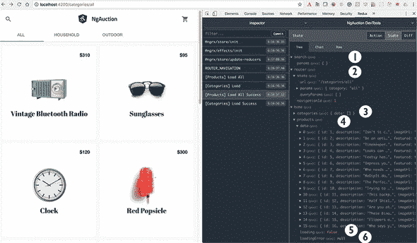

如同往常，效果分发的动作将由 reducer 处理，reducer 将使用数据或错误信息更新状态。

#### 15.4.3\. 单元测试 ngrx reducer

单元测试与状态相关的功能相当简单，因为只有 reducer 可以更改应用状态。记住，reducer 是一个纯函数，如果提供的参数相同，它总是返回相同的输出。

因为每个动作都由一个类表示，所以你只需要实例化动作对象并调用相应的 reducer，向 reducer 提供状态和动作对象。之后，你断言测试下的状态属性具有预期的值。例如，主模块有一个用于产品的 reducer，如下所示定义状态对象。

##### 列表 15.32\. 主模块状态中的产品切片

```
export interface State {
  data: Product[];            *1*
   loading: boolean;          *2*
   loadingError?: string;     *3*
 }
```

+   ***1* 当前产品存储于此。**

+   ***2* 如果此标志为真，UI 应显示进度指示器。**

+   ***3* 如果加载失败，错误信息将存储于此。**

让我们回顾 home/store/reducers/products.spec.ts 文件的代码，如下所示列表，它使用此状态对象并断言 `loading` 标志被 `LoadProducts` 和 `LoadProductsSuccess` 动作正确处理。

##### 列表 15.33\. home/store/reducers/products.spec.ts

```
import {LoadProducts, LoadProductsSuccess} from '../actions';
import {initialState, reducer} from './products';

describe('Home page', () => {
  describe('product reducer', () => {
    it('sets the flag for a progress indicator while loading products',
() => {
      const loadAction = new LoadProducts();                              *1*
      const loadSuccessAction = new LoadProductsSuccess({products: []});  *2*

      const beforeLoadingState = reducer(initialState, {} as any);        *3*
       expect(beforeLoadingState.loading).toBe(false);                    *4*

      const whileLoadingState = reducer(beforeLoadingState, loadAction);  *5*
       expect(whileLoadingState.loading).toBe(true);                      *6*

      const afterLoadingState = reducer(whileLoadingState,
                                        loadSuccessAction);               *7*
       expect(afterLoadingState.loading).toBe(false);                     *8*
     });
  });
});
```

+   ***1* 实例化 LoadProducts 动作**

+   ***2* 实例化 LoadProducts 操作**

+   ***3* 使用初始状态调用还原器**

+   ***4* 断言加载的初始值为假**

+   ***5* 提供当前状态和 Load 动作调用还原器**

+   ***6* 断言加载标志为真**

+   ***7* 提供当前状态和 LoadSuccess 动作调用还原器**

+   ***8* 断言加载标志为假**

当你使用初始状态调用还原器时，你提供一个空对象并将其转换为 `any` 类型，因此无论提供的动作如何，还原器都必须返回一个有效的状态。检查还原器的代码，并注意 `switch` 语句中的 `default` 情况。运行 `ng test` 命令，Karma 将报告它已成功执行。

列表 15.33 规范测试是否正确处理了状态对象中的 `loading` 属性，而不必担心动作负载。但如果你为具有负载的动作编写测试，创建一个包含硬编码数据的存根对象来模拟负载，并调用相应的还原器。

这标志着我们对添加到 ngAuction 主模块的 ngrx 代码的审查结束。我们鼓励您自己完成产品模块的代码审查；其与 ngrx 相关的代码类似。

### 摘要

+   应用状态应该是不可变的。

+   应用逻辑可以从组件中移除，并放置在效果和服务中。

+   组件的方法应该只发送命令（动作）并订阅数据以进行进一步渲染。

+   虽然 ngrx 的学习曲线很陡峭，但使用 ngrx 可能会导致更好的代码组织，这在大型应用中尤为重要。

### Angular 6, 7 及更高版本

作者在 Angular 处于早期 alpha 版本时开始编写这本书的第一版。每个新的 Alpha、Beta 和 Release Candidate 都充满了破坏性变更。编写第二版更容易，因为 Angular 成为一个成熟且功能完整的框架。新的大版本每半年发布一次，从一个版本切换到另一个版本并不困难。每个新版本都会与 Google 内部使用的约 600 个 Angular 应用进行测试，以确保向后兼容性。

我们想强调 Angular 6 或未来版本计划引入的一些新功能：

+   ***Angular Elements*—** Angular 是开发单页应用程序的一个很好的选择，但创建一个可以添加到现有网页的控件并不是一个简单的任务。Angular Elements 包允许您创建一个自启动的 Angular 组件，该组件由自定义网络元素托管（见 [www.w3.org/TR/custom-elements/](http://www.w3.org/TR/custom-elements/)），可以在任何 HTML 页面上使用。简单来说，您可以定义新的 DOM 元素并将它们注册到浏览器中。在撰写本文时，除 Internet Explorer 外的所有主流浏览器都原生支持自定义元素；对于 IE，您应使用 polyfills。假设有一个使用 JavaScript 和 jQuery 构建的现有网络应用程序。该应用程序的开发者将能够在该应用程序的页面上使用 Angular 组件（打包为自定义元素）。例如，如果您构建了一个报价组件，Angular Elements 将生成一个可以添加到 HTML 页面的脚本，并且您的组件可以在 HTML 页面上使用。以下是一个示例：

    ```
    <price-quoter stockSymbol="IBM"></price-quoter>
    ```

    如您所猜，`stockSymbol` 是 Angular 报价组件的 `@Input` 参数。如果该组件通过其 `@Output` 属性发出自定义事件，则您的网页可以使用标准浏览器 API `addEventListener()` 来监听它们。据我们看来，这个杀手级特性将为 Angular 框架打开许多企业之门。Angular Elements 将在 Angular 7 中正式发布。

+   ***Ivy 渲染器*—** 这是一款新渲染器的代号，它可以使应用程序的体积更小，编译速度更快。Hello World 应用程序的大小仅为 7 KB（压缩后）和 3 KB（gzip 压缩后）。在构建包的过程中，Ivy 渲染器将消除未使用的代码，这与目前优化包的方式不同。Ivy 渲染器将在 Angular 8 中引入。

+   ***Bazel 和 Closure Compiler*—** Bazel 是一个快速构建系统，用于构建谷歌几乎所有软件，包括他们用 Angular 编写的 300 多个应用程序。Bazel 使发布可以作为 npm 包分发的 Angular 代码变得更加容易。Closure Compiler 是用于创建几乎所有谷歌网络应用程序的 JavaScript 艺术品的打包优化器。与 Webpack 和 Rollup 打包器相比，Closure Compiler 生成更小的包，并且在死代码消除方面做得更好。默认情况下，Angular CLI 项目使用 Webpack 4，与旧版本相比，它产生的包更小。

+   ***组件开发工具包 (CDK)*—** 此包已被 Angular Material 库使用，该库提供了 30+ 个 UI 组件。Angular 6 引入了树形组件，适用于显示层次数据。新的灵活覆盖组件会根据视口大小自动调整大小和位置。徽章组件可以显示通知标记。如果你不想使用 Angular Material，但想构建自己的 UI 组件库并控制页面布局，你可以使用 CDK。CDK 包含多个子包，包括覆盖、布局、滚动、表格和树。例如，CDK 表格处理行和列，但没有自己的样式。尽管 Angular Material 为 CDK 表格添加了样式，但你可以根据公司指南创建自己的样式。CDK 支持响应式网页设计布局，消除了使用 Flex Layout 或学习 CSS Grid 的需要。Angular 7 通过仅渲染适合屏幕的项来为大量元素列表添加虚拟滚动。Angular 7 还增加了拖放支持。

+   ***Angular CLI*—** .angular-cli.json 文件已重命名为 angular.json，其结构也发生了变化。`ng update @angular/cli` 命令自动将现有的 .angular-cli.json 转换为 angular.json。`ng update @angular/core` 命令更新项目中 package.json 的依赖项到 Angular 的最新版本。如果你需要将现有项目升级到 Angular 6，请阅读 Yakov Fain 的博客，“我如何将十几个项目迁移到 Angular 6 然后到 7”，在 [`mng.bz/qZwC`](http://mng.bz/qZwC)。从 Angular 6 升级到 7 不应需要代码更改。`ng new library <name>` 命令生成一个用于创建库而不是应用程序的项目。此命令将生成一个带有构建系统和测试基础设施的库项目。`ng add` 命令可以将包添加到你的项目中，除了 `npm install` 所做的之外，它还可以修改项目中的一些文件，这样你就不需要手动操作。例如，以下命令将安装 Angular Material，将预构建主题添加到 angular.json，将 Material 设计图标添加到 index.html，并将 `BrowserAnimationsModule` 添加到 `@NgModule()` 装饰器中：

    ```
    ng add @angular/material
    ```

+   *原理图和* `ng update`——Angular CLI 使用名为* Schematics* 的技术生成工件，该技术使用代码模板为您的项目生成各种工件。如果您决定创建自己的模板并让 Angular CLI 使用它们，Schematics 将帮助您完成这项工作。`ng update` 命令会自动更新您的项目依赖项并执行自动版本修复。使用 Schematics，您将能够创建自己的代码转换，类似于`ng update`。但您会发现 Angular 6 附带的一些新预构建模板。例如，要为已经包含示例 Angular Material 导航栏代码的`root-nav`组件生成所有文件，您可以运行以下命令：

    ```
    ng generate @angular/material:materialNav --name=root-nav
    ```

我们期待所有将使 Angular 变得更好的新功能！

因此，我们想感谢您阅读我们的书籍。我们希望您喜欢它，并留下积极的反馈，这样 Manning 就会在将来邀请我们编写新版本。
