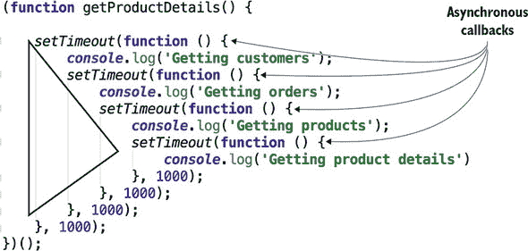

## 附录 A. ECMAScript 概述

ECMAScript 是一种脚本语言的规范。ECMAScript 语法被应用于多种语言中，其中最流行的实现是 JavaScript。ECMAScript 规范的第一版于 1997 年发布，第六版于 2015 年最终确定。这一版被称为 ES6 或 ES2015。与它的前身 ES5 相比，ES6 引入了大量新特性，附录中涵盖的大部分语法都是关于 ES6 语法的。ES7 于 2016 年最终确定，ES8 于 2017 年确定。ES7 和 ES8 并没有引入很多新的语法元素，但附录的末尾我们将介绍 ES8 的 async/await 语法。

在撰写本文时，大多数网络浏览器完全支持引入了最显著语法添加的 ES6 规范。您可以通过访问 ECMAScript 兼容性网站 [`mng.bz/ao59`](http://mng.bz/ao59) 来查看 ES6 支持的当前状态。即使您的应用程序的用户使用的是较旧的浏览器，您今天也可以在 ES6/7/8 中进行开发，并使用 Traceur、Babel 或 TypeScript 等转换器将使用最新语法的代码转换为 ES5 版本。

我们假设您熟悉 ES5 语法和 API，我们将仅涵盖 ECMAScript 新版本中引入的一些新特性。在本附录中，我们经常将 ES5 中的代码片段与它们的 ES6 等价物进行比较，但 ES6 并没有废弃任何旧语法，因此您可以在未来的网络浏览器或独立的 JavaScript 引擎中安全地运行遗留的 ES5 代码。

### A.1. 如何运行代码示例

本附录的代码示例以 .js 扩展名的 JavaScript 文件形式提供。通常，这些代码示例会在控制台产生一些输出，因此您需要打开浏览器控制台来查看输出。您可以创建一个简单的 HTML 文件，并使用 `<script>` 标签在其中包含特定的 .js 文件。

另一个选择是使用 CodePen（请参阅 [`codepen.io`](https://codepen.io)）。该网站允许您快速编写、测试和分享使用 HTML、CSS 和 JavaScript 的应用程序。为了节省您的输入，我们将提供大多数代码示例的 CodePen 链接，您可以只需点击链接，查看所选代码示例的实际效果，并根据需要对其进行修改。如果代码示例在控制台产生输出，只需点击 CodePen 窗口底部的“控制台”即可查看。

让我们回顾一下 ECMAScript 在 JavaScript 中实现的一些相对较新的特性。

### A.2. 变量和 this 的作用域

ES5 中的作用域机制相当复杂。无论我们使用 `var` 关键字在哪里声明变量，声明都会被移动到执行上下文（例如，一个函数）的顶部。这被称为 *提升*（有关提升的更多信息，请参阅 [`mng.bz/3x9w`](http://mng.bz/3x9w)）。`this` 关键字的用法也不像 Java 或 C# 等语言那样直接。

ES6 通过引入 `let` 关键字消除了这种提升混淆（将在下一节讨论），并通过使用箭头函数解决了 `this` 混淆问题。让我们更仔细地看看提升和 `this` 问题。

#### A.2.1\. 变量声明的提升

在 JavaScript 中，所有使用 `var` 关键字的变量声明都会被移动到执行上下文的顶部，即使变量是在代码块内部声明的。看看以下简单示例，它将变量 `i` 声明在 `for` 循环内部，但也在外部使用：

```
function foo() {

   for (var i=0; i<10; i++) {

   }

  console.log("i=" + i);
}

foo();
```

运行此代码将打印 `i=10`。变量 `i` 即使看起来似乎只应在循环内部使用，但在循环外部仍然可用。JavaScript 会自动将变量声明提升到顶部。

在前面的示例中，提升没有造成任何损害，因为只有一个名为 `i` 的变量。然而，如果在函数内部和外部声明了具有相同名称的两个变量，这可能会导致令人困惑的行为。考虑列表 A.1，它在全局作用域中声明了变量 `customer`。稍后，我们将在局部作用域中引入另一个 `customer` 变量，但现在让我们将其注释掉。

##### 列表 A.1\. 变量声明的提升

```
var customer = "Joe";
(function () {
    console.log("The name of the customer inside the function is "  +
    customer);
   /*  if (true) {
         var customer = "Mary";
     } */
})();
console.log("The name of the customer outside the function is "  + customer);
```

全局变量 `customer` 在函数内部和外部都是可见的，运行此代码将打印以下内容：

```
The name of the customer inside the function is Joe
The name of the customer outside the function is Joe
```

取消注释在花括号内声明和初始化 `customer` 变量的 `if` 语句。现在我们有两个具有相同名称的变量——一个在全局作用域中，另一个在函数作用域中。控制台输出现在不同了：

```
The name of the customer inside the function is undefined
The name of the customer outside the function is Joe
```

原因是，在 ES5 中，变量声明被提升到作用域的顶部（最顶层括号内的表达式），但带有值的变量初始化则不会。当创建变量时，其初始值是 `undefined`。第二个未定义的 `customer` 变量的声明被提升到表达式的顶部，`console.log()` 打印了函数内部声明的变量值，这覆盖了全局变量 `customer` 的值。^([1]) 函数声明也会提升，因此我们可以在声明之前调用函数：

> ¹
> 
> 在 CodePen 上查看：[`mng.bz/cK9y`](http://mng.bz/cK9y)。

```
doSomething();

function doSomething() {
   console.log("I'm doing something");
}
```

另一方面，函数表达式被视为变量初始化，因此不会提升。以下代码片段将为 `doSomething` 变量产生 `undefined`：

```
doSomething();

var doSomething = function() {
   console.log("I'm doing something");
}
```

让我们看看 ES6 如何帮助我们处理作用域问题。

#### A.2.2\. 使用 let 和 const 的块级作用域

使用 ES6 的 `let` 关键字而不是 `var` 声明变量，允许变量具有块级作用域。下一个列表显示了一个示例。

##### 列表 A.2\. 块级作用域的变量

```
let customer = "Joe";
  (function () {
      console.log("The name of the customer inside the function is "  +
customer);
      if (true) {
       let customer = "Mary";
        console.log("The name of the customer inside the block is "  +
customer);
      }
  })();

console.log("The name of the customer in the global scope is "  + customer);
```

现在，两个 `customer` 变量具有不同的作用域和值，并且此程序将打印以下内容：

```
The name of the customer inside the function is Joe
The name of the customer inside the block is Mary
The name of the customer in the global scope is Joe
```

简单来说，如果我们正在开发一个新应用程序，我们不使用 `var`。我们使用 `let`。`let` 关键字允许我们多次将值分配给变量。唯一例外的是 `for` 循环。使用 `let` 声明循环变量可能会导致性能问题。

如果我们想要声明一个初始化后其值不会改变的变量，我们使用 `const` 关键字来声明常量。常量也支持块作用域。

`let` 和 `const` 之间的唯一区别是后者不允许更改分配的值。最佳实践是使用 `const` 开始声明变量；如果我们看到这个值需要改变，我们就将 `const` 替换为 `let`。列表 A.2 应该使用 `const` 而不是 `let`，因为我们从未重新分配过两个 `customer` 变量的值.^([2])

> ²
> 
> 在 CodePen 上查看：[`mng.bz/fkJd`](http://mng.bz/fkJd)

### A.3\. 模板字面量

ES6 引入了一种新的字符串字面量语法，它可以包含嵌入的表达式。这个特性被称为 *字符串插值*。

在 ES5 中，我们会使用连接来创建一个包含字符串字面量和变量值的字符串：

```
const customerName = "John Smith";
console.log("Hello" + customerName);
```

在 ES6 中，模板字面量由反引号包围，我们可以在字面量中嵌入表达式，只需将它们放在大括号之间，并以前面加上美元符号即可。在下一个代码片段中，变量 `customerName` 的值被嵌入到字符串字面量中：

```
const customerName = "John Smith";
console.log(`Hello ${customerName}`);

function getCustomer() {
  return "Allan Lou";
}
console.log(`Hello ${getCustomer()}`);
```

这段代码的输出如下所示：^([3])

> ³
> 
> 在 CodePen 上查看：[`mng.bz/Ey30`](http://mng.bz/Ey30)

```
Hello John Smith
Hello Allan Lou
```

在前面的例子中，我们将变量 `customerName` 的值嵌入到模板字面量中，然后嵌入 `getCustomer()` 函数返回的值。我们可以在大括号之间放置任何有效的 JavaScript 表达式，以嵌入任何有效的 JavaScript 表达式。

#### A.3.1\. 多行字符串

在我们的代码中，字符串可以跨越多行。使用反引号，我们可以编写多行字符串，而无需将它们连接或使用反斜杠字符：

```
const message = `Please enter a password that
               has at least 8 characters and
               includes a capital letter`;

console.log(message);
```

生成的字符串将把所有空格视为字符串的一部分，因此输出将看起来像这样：^([4])

> ⁴
> 
> 在 CodePen 上查看：[`mng.bz/1SSP`](http://mng.bz/1SSP)。

```
Please enter a password that
               has at least 8 characters and
               includes a capital letter
```

### A.4\. 可选参数和默认值

在 ES6 中，我们可以为函数参数（参数）指定默认值，如果函数调用时没有提供值，则将使用这些默认值。比如说，我们正在编写一个计算税款的函数，它接受两个参数：年收入和居住州。如果未提供州值，我们希望使用佛罗里达州作为默认值。

在 ES5 中，我们需要在函数体开始时检查是否提供了状态值；如果没有提供，则使用佛罗里达州：

```
function calcTaxES5(income, state) {

    state = state || "Florida";

    console.log("ES5\. Calculating tax for the resident of " + state +
                                      " with the income " + income);
}

calcTaxES5(50000);
```

这段代码的输出如下：

```
"ES5\. Calculating tax for the resident of Florida with the income 50000"
```

在 ES6 中，我们可以直接在函数签名中指定默认值：

```
function calcTaxES6(income, state = "Florida") {

  console.log("ES6\. Calculating tax for the resident of " + state +
                                  " with the income " + income);
}

calcTaxES6(50000);
```

输出看起来类似：^([5])

> ⁵
> 
> 在 CodePen 上查看：[`mng.bz/U51z`](http://mng.bz/U51z)。

```
"ES6\. Calculating tax for the resident of Florida with the income 50000"
```

而不是为可选参数提供一个硬编码的值，我们可以调用一个返回一个值的函数：

```
function calcTaxES6(income, state = getDefaultState()) {
console.log("ES6\. Calculating tax for the resident of " + state +
            " with the income " + income);
};

function getDefaultState() {
return "Florida";
}

calcTaxES6(50000);
```

只需记住，每次我们调用`calcTaxES6()`时，都会调用`getDefaultState()`函数，这可能会产生性能影响。这种可选参数的新语法意味着我们编写的代码更少，代码也更容易理解。

### A.5\. 箭头函数表达式、this 和 that

ES6 引入了箭头函数表达式，它为匿名函数提供了一种更短的表示法，并为`this`变量添加了词法作用域。在某些其他编程语言（如 C#和 Java）中，类似的语法被称为*lambda 表达式*。

箭头函数表达式的语法由参数、粗箭头符号（`=>`）和函数体组成。如果函数体只有一个表达式，我们甚至不需要大括号。如果单表达式函数返回一个值，则不需要编写`return`语句——结果会隐式返回：

```
let sum = (arg1, arg2) => arg1 + arg2;
```

多行箭头函数表达式的主体应该用大括号括起来，并使用显式的`return`语句：

```
(arg1, arg2) => {
  // do something
  return someResult;
}
```

如果箭头函数没有任何参数，则使用空括号：

```
() => {
  // do something
  return someResult;
}
```

如果函数只有一个参数，则括号不是必需的：

```
arg1 => {
  // do something
}
```

在以下代码片段中，我们将箭头函数表达式作为参数传递给数组的`reduce()`方法来计算总和，以及`filter()`来打印偶数：

```
const myArray = [1, 2, 3, 4, 5];

console.log( "The sum of myArray elements is " +
                 myArray.reduce((a,b) => a+b));  // prints 15

console.log( "The even numbers in myArray are " +
                 myArray.filter( value => value % 2 === 0)); // prints 2 4
```

现在你已经熟悉了箭头函数的语法，让我们看看它们如何简化与`this`对象引用的工作。

在 ES5 中，确定`this`关键字所引用的对象并不总是简单的事情。在网上搜索“JavaScript this and that”，你会找到多个帖子，人们抱怨`this`指向“错误”的对象。`this`引用的值可能因函数的调用方式和是否使用了严格模式而不同（请参阅 Mozilla 开发者网络上的严格模式文档[`mng.bz/VNVL`](http://mng.bz/VNVL)）。我们将首先说明这个问题，然后展示 ES6 提供的解决方案。

考虑以下代码列表，它每秒调用一次匿名函数。该函数打印提供给`StockQuoteGenerator()`构造函数的股票符号的随机生成价格。

##### 列表 A.3\. `this`和`that`

```
function StockQuoteGenerator(symbol) {
    // this.symbol = symbol;
     const that = this;
     that.symbol = symbol;

     setInterval( function () {
         console.log("The price of " + that.symbol
                 + " is " + Math.random());
     }, 1000);
 }
 const stockQuoteGenerator = new StockQuoteGenerator("IBM");
```

在列表 A.3 中注释掉的行展示了在匿名函数中需要值时，使用`this`的错误方式。如果我们没有在`that`中保存`this`的值，并在匿名函数中使用`this.symbol`，它将打印`undefined`而不是`IBM`。你会在函数在`setInterval ()`内部调用时看到这种行为，同样，如果函数在任何回调中调用，也会出现这种行为。在回调内部，`this`将指向全局对象，这与`StockQuoteGenerator()`构造函数定义的`this`不同.^([6]) 确保函数在特定`this`对象中运行的另一种解决方案是使用 JavaScript 的`call()`、`apply()`或`bind()`函数。

> ⁶
> 
> 在 CodePen 上查看：[`mng.bz/cK70`](http://mng.bz/cK70)。


##### 注意

如果你不太熟悉 JavaScript 中的`this`问题，请查看 Richard Bovell 的文章，“清晰理解 JavaScript 的`this`，并掌握它”在[`mng.bz/ZQfz`](http://mng.bz/ZQfz)。


以下列表展示了消除在`that`中存储`this`的需要的箭头函数解决方案。

##### 列表 A.4\. 粗箭头函数

```
function StockQuoteGenerator(symbol) {
      this.symbol = symbol;
      setInterval( () => {
                 console.log("The price of " + this.symbol
                         + " is " + Math.random());
              }, 1000);
}

const stockQuoteGenerator = new StockQuoteGenerator("IBM");
```

列表 A.4 将正确解决`this`引用。作为`setInterval ()`参数传递的箭头函数使用封装上下文的`this`值，因此它将识别`IBM`为`this.symbol`的值。

### A.6\. 剩余操作符

在 ES5 中，编写具有可变数量参数的函数需要使用特殊的`arguments`对象。此对象类似于数组，并包含与传递给函数的参数相对应的值。隐式的`arguments`变量可以在任何函数中作为局部变量处理。

剩余操作符表示函数中的可变数量参数，并且它必须是参数列表中的最后一个。如果函数参数的名称以三个点开头，函数将获取剩余的参数作为一个数组。ES6 的剩余操作符用三个点（...）表示。

例如，我们可以使用单个变量名和剩余操作符将多个客户传递给一个函数：

```
function processCustomers(...customers) {
  // implementation of the function goes here
}
```

在这个函数内部，我们可以像处理任何数组一样处理`customers`数据。想象一下，我们需要编写一个计算税款的函数，该函数必须使用第一个参数`income`调用，然后是任何数量的表示客户名称的参数。列表 A.5 展示了如何使用 ES5 和 ES6 语法处理可变数量的参数。`calcTaxES5()`函数使用名为`arguments`的对象，而`calcTaxES6()`函数使用 ES6 剩余操作符。

##### 列表 A.5\. 剩余操作符

```
// ES5 and arguments object
  function calcTaxES5() {

      console.log("ES5\. Calculating tax for customers with the income ",
                             arguments[0]);   // income is the first element

      // extract an array starting from 2nd element
      var customers = [].slice.call(arguments, 1);

      customers.forEach(function (customer) {
          console.log("Processing ", customer);
      });
  }

  calcTaxES5(50000, "Smith", "Johnson", "McDonald");
  calcTaxES5(750000, "Olson", "Clinton");

// ES6 and rest operator
  function calcTaxES6(income, ...customers) {
      console.log(`ES6\. Calculating tax for customers with the income ${income}`);

      customers.forEach( (customer) => console.log(`Processing ${customer}`));
  }

  calcTaxES6(50000, "Smith", "Johnson", "McDonald");
  calcTaxES6(750000, "Olson", "Clinton");
```

两个函数，`calcTaxES5()`和`calcTaxES6()`，产生相同的结果:^([7])

> ⁷
> 
> 在 CodePen 上查看：[`mng.bz/I2zq`](http://mng.bz/I2zq)。

```
ES5\. Calculating tax for customers with the income 50000
Processing Smith
Processing Johnson
Processing McDonald
ES5\. Calculating tax for customers with the income 750000
Processing Olson
Processing Clinton
ES6\. Calculating tax for customers with the income 50000
Processing Smith
Processing Johnson
Processing McDonald
ES6\. Calculating tax for customers with the income 750000
Processing Olson
Processing Clinton
```

然而，在处理客户方面存在差异。因为 `arguments` 对象不是一个真正的数组，所以在 ES5 版本中，我们必须使用 `slice()` 和 `call()` 方法创建一个数组，以提取从 `arguments` 的第二个元素开始的客户名称。ES6 版本不需要我们使用这些技巧，因为剩余运算符给我们一个客户的常规数组。使用剩余参数使代码更简单、更易读。

### A.7\. 扩展运算符

ES6 扩展运算符也用三个点（...）表示，就像剩余运算符一样，但与剩余运算符可以将可变数量的参数转换为数组不同，扩展运算符可以执行相反的操作：将数组转换为值或函数参数的列表。


##### 提示

如果你看到等号右侧有三个点，那就是扩展运算符。等号左侧的三个点表示剩余运算符。


假设我们有两个数组，我们需要将第二个数组的元素添加到第一个数组的末尾。使用扩展运算符，这只需要一行代码：

```
let array1= [...array2];
```

在这里，扩展运算符提取 `myArray` 的每个元素并将其添加到新数组中（这里，方括号表示“创建一个新数组”）。我们也可以按照以下方式创建数组的副本：

```
array1.push(...array2);
```

使用扩展运算符在数组中找到最大值也很简单：

```
const maxValue = Math.max(...myArray);
```

在某些情况下，我们想要克隆一个对象。例如，假设我们有一个存储我们应用状态的对象，并且当状态属性之一发生变化时，我们想要创建一个新的对象。我们不想修改原始对象，但想通过修改一个或多个属性来克隆它。实现不可变对象的一种方法是通过使用 `Object.assign()` 函数。以下列表首先创建对象的克隆，然后创建另一个克隆，同时更改 `lastName`。

##### 列表 A.6\. 使用 `assign()` 进行克隆

```
// Clone with Object.assign()
const myObject = {name: "Mary" , lastName: "Smith"};
const clone = Object.assign({}, myObject);
console.log(clone);

// Clone with modifying the `lastName` property
const cloneModified = Object.assign({}, myObject, {lastName: "Lee"});
console.log(cloneModified);
```

如以下列表所示，扩展运算符提供了更简洁的语法来实现相同的目标。

##### 列表 A.7\. 使用 `spread` 进行克隆

```
// Clone with spread
const myObject = { name: "Mary" , lastName: "Smith"};
const cloneSpread = {...myObject};
console.log(cloneSpread);

// Clone with modifying the `lastName`
const cloneSpreadModified = {...myObject, lastName: "Lee"};
console.log(cloneSpreadModified);
```

我们的 `myObject` 有两个属性：`name` 和 `lastName`。即使我们或其他人向 `myObject` 添加更多属性，克隆 `myObject` 并修改 `lastName` 的那行代码仍然会正常工作。^([8])

> ⁸
> 
> 在 CodePen 中查看：[`mng.bz/X2pL`](http://mng.bz/X2pL)。

在 第十五章 中，我们向您展示了如何处理不可变状态对象。在那里，我们使用扩展运算符来克隆状态对象。

### A.8\. 生成器函数

当浏览器执行 JavaScript 函数时，它会连续运行，不会打断自己的流程。但生成器函数的执行可以被暂停和恢复多次。生成器函数可以将控制权交回调用脚本，该脚本在同一个线程上运行。

一旦生成器函数中的代码达到`yield`关键字，它就会被挂起，调用脚本可以通过在生成器上调用`next()`来恢复函数的执行。要将普通函数转换为生成器，我们需要在`function`关键字和函数名之间放置一个星号。以下是一个示例：

```
function* doSomething() {

  console.log("Started processing");

  yield;

  console.log("Resumed processing");
}
```

当我们调用这个函数时，它不会立即执行函数代码，而是返回一个特殊的`Generator`对象，该对象作为迭代器。以下行不会打印任何内容：

```
var iterator = doSomething();
```

要开始执行函数的主体，我们需要在生成器上调用`next()`方法：

```
iterator.next();
```

在前面的行之后，`doSomething()`函数将打印“Started processing”并由于`yield`运算符而暂停。再次调用`next()`将打印“Resumed processing。”

当我们需要编写一个函数来生成一系列数据，但又想控制何时处理下一个流值时，生成器函数非常有用。想象一下，我们需要一个函数来检索并生成指定股票符号（如 IBM）的股票价格。如果股票价格低于指定的值（限制价格），我们想购买这只股票。

下一个列表中的生成器函数`getStockPrice()`通过使用`Math.random()`生成随机价格来模拟这种场景。

##### 列表 A.8\. `getStockPrice()`

```
function* getStockPrice(symbol) {

  while (true) {
    yield Math.random()*100;

    console.log(`resuming for ${symbol}`);
  }
}
```

如果`yield`之后有值，它会被返回给调用者，但函数还没有完成。即使`getStockPrice()`函数有一个无限循环，它也只有在调用`getStockPrice()`的脚本在生成器上调用`next()`时才会产生（返回）价格，如下面的列表所示。

##### 列表 A.9\. 调用`getStockPrice ()`

```
function* getStockPrice(symbol) {

  while (true) {
    yield Math.random()*100;

    console.log(`resuming for ${symbol}`);
  }
}

const priceGenerator = getStockPrice("IBM");              *1*

const limitPrice = 15;                                    *2*
 let price = 100;

while (price > limitPrice) {                              *3*

   price = priceGenerator.next().value;                   *4*
    console.log (`The generator returned ${price}`);
}

console.log(`buying at ${price} !!!`);                    *5*
```

+   ***1* 创建了生成器对象，但没有执行 getStockPrice()函数的主体**

+   ***2* 将限制价格设置为 15 美元，初始价格设置为 100 美元**

+   ***3* 持续请求股票价格，直到它们低于 15 美元**

+   ***4* 请求下一个价格并将其打印到控制台**

+   ***5* 如果价格低于 15 美元，循环结束，程序将打印一条关于购买股票及其价格的消息。**

运行列表 A.9 将打印出类似以下内容：

```
The generator returned 61.63144460879266
resuming for IBM
The generator returned 96.60782956052572
resuming for IBM
The generator returned 31.163037824444473
resuming for IBM
The generator returned 18.416578718461096
resuming for IBM
The generator returned 55.80756475683302
resuming for IBM
The generator returned 14.203652134165168
buying at 14.203652134165168 !!!
```

注意消息的顺序。当我们对`priceGenerator`调用`next()`方法时，暂停的`getStockPrice()`方法的执行会从`yield`下面的行恢复，打印出`"resuming for IBM"`。尽管控制流已经离开了函数，然后又回来，`getStockPrice()`仍然记得`symbol`的值是`IBM`。当`yield`运算符将控制权返回给外部脚本时，它会创建一个堆栈快照，以便记住所有局部变量的值。当生成器函数恢复执行时，这些值还没有丢失.^([9])

> ⁹
> 
> 在 CodePen 上查看：[`mng.bz/4d40`](http://mng.bz/4d40).

使用生成器，你可以将某些操作的实现（如获取价格报价）与这些操作产生的数据的消费分离。数据的消费者会懒加载评估结果，并决定是否需要请求更多数据。

### A.9\. 解构

创建对象的实例意味着在内存中构建它们。术语 *解构* 指的是将对象拆分。在 ES5 中，我们可以通过编写一个函数来解构任何对象或集合。ES6 引入了解构赋值语法，允许我们通过指定一个 *匹配模式*，以简单的表达式从对象的属性或数组中提取数据。通过示例更容易解释，我们将在下面进行演示。

#### A.9.1\. 对象解构

假设一个 `getStock()` 函数返回一个具有 `symbol` 和 `price` 属性的 `Stock` 对象。在 ES5 中，如果我们想要将这些属性的值分配给单独的变量，我们需要首先创建一个变量来存储 `Stock` 对象，然后编写两个语句将对象属性分配给相应的变量：

```
var stock = getStock();
var symbol = stock.symbol;
var price = stock.price;
```

从 ES6 开始，我们只需要在左侧写一个匹配模式，并将 `Stock` 对象分配给它：

```
let {symbol, price} = getStock();
```

在等号左侧看到花括号有点不寻常，但这匹配表达式的语法的一部分。当我们看到左侧的花括号时，我们会认为它们是一个代码块，而不是对象字面量。以下列表演示了从 `getStock()` 函数获取 `Stock` 对象并将其解构为两个变量的过程。

##### 列表 A.10\. 对象解构

```
function getStock() {

    return {
        symbol: "IBM",
        price: 100.00
    };
}

let {symbol, price} = getStock();

console.log(`The price of ${symbol} is ${price}`);
```

运行该脚本将打印以下内容：

```
The price of IBM is 100
```

换句话说，我们在一个赋值表达式中将一组数据（在这种情况下是对象属性）绑定到一组变量（`symbol` 和 `price`）。即使 `Stock` 对象有超过两个属性，前面的解构表达式仍然有效，因为 `symbol` 和 `price` 会匹配模式。匹配表达式只列出我们感兴趣的属性变量。^([10])

> ¹⁰
> 
> 在 CodePen 中查看：[`mng.bz/CI47`](http://mng.bz/CI47)。

列表 A.10 之所以有效，是因为变量的名称与 `Stock` 属性的名称相同。让我们将 `symbol` 改为 `sym`：

```
let {sym, price} = getStock();
```

现在，我们会得到一个错误“symbol 未定义”，因为 JavaScript 不知道对象的 `symbol` 属性应该分配给变量 `sym`。这是一个错误匹配模式的例子。如果我们真的想将名为 `sym` 的变量映射到 `symbol` 属性，我们可以为 `symbol` 引入一个别名：

```
let {sym: symbol, price} = getStock();
```

如果我们在左侧提供比对象属性数量更多的变量，额外的变量将获得 `undefined` 的值。如果我们添加一个 `stockExchange` 变量在左侧，它将被初始化为 `undefined`，因为 `getStock()` 返回的对象中没有这样的属性：

```
let {symbol, price, stockExchange} = getStock();
console.log(`The price of ${symbol} is ${price} ${stockExchange}`);
```

如果我们将前面的解构赋值应用到同一个 `Stock` 对象上，控制台输出将如下所示：

```
The price of IBM is 100 undefined
```

如果我们想让 `stockExchange` 变量有一个默认值，例如 `"NASDAQ"`，我们可以将解构表达式重写如下：

```
let {symbol, price, stockExchange = "NASDAQ"} = getStock();
```

我们还可以解构嵌套对象。列表 A.11 创建了一个表示微软股票的嵌套对象，并将其传递给 `printStockInfo()` 函数，该函数从这个对象中提取股票符号和证券交易所的名称。

##### 列表 A.11\. 解构嵌套对象

```
let msft = {
     symbol: "MSFT",
     lastPrice: 50.00,
     exchange: {                                              *1*
          name: "NASDAQ",
         tradingHours: "9:30am-4pm"
     }
 };

 function printStockInfo(stock) {
     let {symbol, exchange: {name}} = stock;                  *2*
      console.log(`The ${symbol} stock is traded at ${name}`);
 }

 printStockInfo(msft);
```

+   ***1* 嵌套对象**

+   ***2* 解构嵌套对象以获取证券交易所的名称**

运行前面的脚本将打印以下内容：^([11])

> ¹¹
> 
> 在 CodePen 上查看：[`mng.bz/Xauq`](http://mng.bz/Xauq)。

```
The MSFT stock is traded at NASDAQ
```

假设我们正在编写一个处理浏览器 DOM 事件的函数。在 HTML 部分，我们调用此函数，并将事件对象作为参数传递。事件对象有多个属性，但我们的处理函数只需要 `target` 属性来识别触发此事件的组件。解构语法使这变得很容易：

```
<button id="myButton">Click me</button>
...
document
  .getElementById("myButton")
  .addEventListener("click", ({target}) =>
                            console.log(target));
```

注意函数参数中的解构语法 `{target}`.^([12])

> ¹²
> 
> 在 CodePen 上查看：[`mng.bz/Dj24`](http://mng.bz/Dj24)。

#### A.9.2\. 解构数组

数组解构与对象解构的工作方式非常相似，但我们需要使用方括号而不是花括号。在解构对象时，我们需要指定与对象属性匹配的变量，而在数组中，我们指定与数组索引匹配的变量。以下代码将两个数组元素的值提取到两个变量中：

```
let [name1, name2] = ["Smith", "Clinton"];
console.log(`name1 = ${name1}, name2 = ${name2}`);
```

输出将如下所示：

```
name1 = Smith, name2 = Clinton
```

如果我们想提取这个数组的第二个元素，匹配的模式将如下所示：

```
let [, name2] = ["Smith", "Clinton"];
```

如果一个函数返回一个数组，解构语法将其转换为具有多个返回值的函数，如 `getCustomers()` 函数所示：

```
function getCustomers() {
    return ["Smith", , , "Gonzales"];
}

let [firstCustomer, , , lastCustomer] = getCustomers();
console.log(`The first customer is ${firstCustomer} and the last one is ${las
     tCustomer}`);
```

现在让我们将数组解构与剩余参数结合起来。假设我们有一个包含多个客户的数组，但我们只想处理前两个。下面的代码片段展示了如何做到这一点：

```
let customers = ["Smith", "Clinton", "Lou", "Gonzales"];
let [firstCust, secondCust, ...otherCust] = customers;

console.log(`The first customer is ${firstCust} and the second one is ${secon
     dCust}`);
console.log(`Other customers are ${otherCust}`);
```

这是该代码产生的控制台输出：

```
The first customer is Smith and the second one is Clinton
Other customers are Lou, Gonzales
```

在类似的情况下，我们可以将匹配模式与剩余参数一起传递给函数：

```
var customers = ["Smith", "Clinton", "Lou", "Gonzales"];

function processFirstTwoCustomers([firstCust, secondCust, ...otherCust]) {

  console.log(`The first customer is ${firstCust} and the second one is ${sec
     ondCust}`);
  console.log(`Other customers are ${otherCust}`);

}

processFirstTwoCustomers(customers);
```

输出将相同：

```
The first customer is Smith and the second one is Clinton
Other customers are Lou,Gonzales
```

总结来说，解构的优势在于，当我们需要用位于对象属性或数组中的数据初始化一些变量时，我们可以编写更少的代码。

### A.10\. 使用 forEach()、for-in 和 for-of 迭代

我们可以使用不同的 JavaScript 关键字和 API 来遍历对象集合。在本节中，我们将向您展示如何使用 `for-of` 循环。我们将将其与 `for-in` 循环和 `forEach()` 函数进行比较。

#### A.10.1\. 使用 forEach() 方法

考虑以下代码，它遍历一个包含四个数字的数组。这个数组还有一个额外的 `description` 属性，它被 `forEach()` 忽略：

```
var numbersArray = [1, 2, 3, 4];
numbersArray.description = "four numbers";

numbersArray.forEach((n) => console.log(n));
```

脚本的输出如下所示：

```
1
2
3
4
```

`forEach()`方法接受一个函数作为参数，并正确地打印出数组中的四个数字，忽略`description`属性。`forEach()`的另一个限制是它不允许我们提前退出循环。我们需要使用`every()`方法代替`forEach()`，或者想出其他方法来实现这一点。让我们看看`for-in`循环如何帮助。

#### A.10.2\. 使用 for-in 循环

`for-in`循环遍历对象和数据集合的*属性名*。在 JavaScript 中，任何对象都是键值对的集合，其中*键*是属性名，*值*是属性值。数组有五个属性：四个用于数字，一个用于`description`。让我们遍历这个数组的属性：

```
var numbersArray = [1, 2, 3, 4];
numbersArray.description = "four numbers";

for (let n in numbersArray) {
  console.log(n);
}
```

上述代码的输出如下所示：

```
0
1
2
3
description
```

通过调试器运行此代码显示，这些属性都是`string`类型。要查看属性的值，请使用`numbersArray[n]`表示法打印数组元素：

```
var numbersArray = [1, 2, 3, 4];
numbersArray.description = "four numbers";

for (let n in numbersArray) {
    console.log(numbersArray[n]);
}
```

现在的输出看起来像这样：

```
1
2
3
4
four numbers
```

如您所见，`for-in`循环遍历了所有属性，而不仅仅是数据，这可能不是您需要的。让我们尝试新的`for-of`语法。

#### A.10.3\. 使用 for-of

ES6 引入了`for-of`循环，允许我们遍历数据，而不管数据集合具有哪些其他属性。如果需要，我们可以使用`break`关键字跳出这个循环：

```
var numbersArray = [1, 2, 3, 4];
numbersArray.description = "four numbers";

console.log("Running for-of for the entire array");
for (let n of numbersArray) {
  console.log(n);
}

console.log("Running for-of with a break");
for (let n of numbersArray) {
  if (n > 2) break;

  console.log(n);
}
```

此脚本产生以下输出：^([13])

> ¹³
> 
> 在 CodePen 中查看：[`mng.bz/53DO`](http://mng.bz/53DO)。

```
Running for-of for the entire array
1
2
3
4
Running for-of with a break
1
2
```

`for-of`循环可以与任何可迭代对象一起工作，包括`Array`、`Map`、`Set`以及其他。字符串也是可迭代的。以下代码逐个字符打印字符串`"John"`的内容：

```
for (let char of "John") {
  console.log(char);
}
```

### A.11\. 类和继承

虽然 ES5 支持面向对象编程和继承，但使用 ES6 类，代码更易于阅读和编写。

在 ES5 中，对象可以从头创建，也可以从其他对象继承。默认情况下，所有 JavaScript 对象都是从`Object`继承的。这种对象继承是通过一个称为`prototype`的特殊属性实现的，它指向这个对象的祖先。这被称为*原型继承*。例如，要创建一个从对象`Tax`继承的`NJTax`对象，我们可以编写如下内容：

```
function Tax() {
  // The code of the tax object goes here
}

function NJTax() {
  // The code of New Jersey tax object goes here
}

NJTax.prototype = new Tax();       *1*

var njTax = new NJTax();
```

+   **1** 从 Tax 继承 NJTax

ES6 引入了`class`和`extends`关键字，使语法与其他面向对象的语言（如 Java 和 C#）保持一致。以下代码展示了上述代码的 ES6 等效版本：

```
class Tax {
  // The code of the tax class goes here
}

class NJTax extends Tax {
  // The code of New Jersey tax object goes here
}

let njTax = new NJTax();
```

`Tax`类是一个祖先或*超类*，而`NJTax`是一个后代或*子类*。我们也可以说`NJTax`类与`Tax`类有“是”的关系。换句话说，`NJTax`是`Tax`。您可以在`NJTax`中实现额外的功能，但`NJTax`仍然是“是”或“是一种”`Tax`。同样，如果我们创建一个从`Person`继承的`Employee`类，我们可以说`Employee`是`Person`。

我们可以创建一个或多个对象实例，如下所示：

```
var tax1 = new Tax();          *1*
 var tax2 = new Tax();         *2*
```

+   ***1* Tax 对象的第一个实例**

+   ***2* Tax 对象的第二个实例**


##### 注意

类声明不会提升。您需要先声明类，然后再使用它。


这些对象中的每一个都将具有存在于`Tax`类中的属性和方法，但它们将具有不同的*状态*；例如，第一个实例可能为年收入为 50,000 美元的客户创建，第二个为年收入为 75,000 美元的客户创建。每个实例都会共享在`Tax`类中声明的相同方法副本，因此没有代码重复。

在 ES5 中，我们也可以通过在对象原型上声明方法而不是在对象内部声明方法来避免代码重复：

```
function Tax() {
  // The code of the tax object goes here
}

Tax.prototype = {
  calcTax: function() {
    // code to calculate tax goes here
  }
}
```

JavaScript 仍然是一种具有原型继承的语言，但 ES6 允许我们编写更优雅的代码：

```
class Tax() {
  calcTax() {
    // code to calculate tax goes here
  }
}
```


**类成员变量不受支持**

ES6 语法不允许您声明类成员变量，就像在 Java、C#或 TypeScript 中那样。以下语法*不支持*：

```
   class Tax {
     var income;
}
```


#### A.11.1\. 构造函数

在实例化过程中，类会执行放置在特殊方法中的代码，这些方法称为*构造函数*。在 Java 和 C#等语言中，构造函数的名称必须与类的名称相同；但在 ES6 中，我们通过使用`constructor`关键字来指定类的构造函数：

```
class Tax {

  constructor(income) {
    this.income = income;
  }
}

var myTax = new Tax(50000);
```

构造函数是一个特殊的方法，它只执行一次：当对象被创建时。`Tax`类没有声明单独的类级`income`变量，而是在`this`对象上动态创建它，用构造函数参数的值初始化`this.income`。`this`变量指向当前对象的实例。

下一个示例展示了我们如何创建`NJTax`子类的一个实例，向其构造函数提供`50,000`的收入：

```
class Tax {
    constructor(income) {
       this.income = income;
    }
}

class NJTax extends Tax {
    // The code specific to New Jersey tax goes here
}

let njTax = new NJTax(50000);

console.log(`The income in njTax instance is ${njTax.income}`);
```

此代码片段的输出如下：

```
The income in njTax instance is 50000
```

因为`NJTax`子类没有定义自己的构造函数，所以在`NJTax`实例化时，会自动调用`Tax`超类的构造函数。如果子类定义了自己的构造函数，则不会发生这种情况。您将在下一节中看到这样的示例。

#### A.11.2\. `super`关键字和`super`函数

`super()` 函数允许子类（后代）从超类（祖先）调用构造函数。`super` 关键字用于调用在超类中定义的方法。列表 A.12 说明了 `super()` 和 `super` 的用法。`Tax` 类有一个 `calculateFederalTax()` 方法，而它的 `NJTax` 子类添加了 `calculateStateTax()` 方法。这两个类都有自己的 `calcMinTax()` 方法版本。

##### 列表 A.12\. `super()` 和 `super`

```
 class Tax {
     constructor(income) {
        this.income = income;
     }

     calculateFederalTax() {
         console.log(`Calculating federal tax for income ${this.income}`);
     }

     calcMinTax() {
         console.log("In Tax. Calculating min tax");
         return 123;
     }
 }

 class NJTax extends Tax {
    constructor(income, stateTaxPercent) {
        super(income);
        this.stateTaxPercent=stateTaxPercent;
    }

    calculateStateTax() {
        console.log(`Calculating state tax for income ${this.income}`);
    }

     calcMinTax() {
         let minTax = super.calcMinTax();
         console.log(`In NJTax. Will adjust min tax of ${minTax}`);
     }
 }

 const theTax = new NJTax(50000, 6);

 theTax.calculateFederalTax();
 theTax.calculateStateTax();

 theTax.calcMinTax();
```

运行此代码会产生以下输出^(14))

> ^(14)
> 
> 在 CodePen 中查看：[`mng.bz/6e9S`](http://mng.bz/6e9S)。

```
Calculating federal tax for income 50000
Calculating state tax for income 50000
In Tax. Calculating min tax
In NJTax. Will adjust min tax of 123
```

`NJTax` 类有一个显式定义的构造函数，带有两个参数，`income` 和 `stateTaxPercent`，我们在实例化 `NJTax` 时提供这些参数。为了确保 `Tax` 的构造函数被调用（它设置了对象的 `income` 属性），我们从子类的构造函数中显式调用它：`super(income)`。如果没有这一行，运行 列表 A.12 将会报告错误；我们必须通过调用函数 `super()` 从派生构造函数中调用超类的构造函数。

调用超类中代码的另一种方式是使用 `super` 关键字。`Tax` 和 `NJTax` 都有 `calcMinTax()` 方法。`Tax` 超类中的方法根据联邦税法计算基本最低金额，而子类版本的此方法使用基本值并对其进行调整。这两个方法具有相同的签名，因此我们有一个 *方法重写* 的例子。

通过调用 `super.calcMinTax()`，我们确保在计算州税时考虑了基本联邦税。如果我们没有调用 `super.calcMinTax()`，子类的 `calcMinTax()` 方法版本将适用。方法重写通常用于在不更改其代码的情况下替换超类中方法的函数。


**关于类和继承的警告**

ES6 类仅是提高代码可读性的语法糖。在底层，JavaScript 仍然使用原型继承，这允许你在运行时动态地替换祖先，而一个类只能有一个祖先。尽量避免创建深层继承层次，因为它们会降低代码的灵活性，并在需要时使重构变得复杂。

虽然使用 `super` 关键字可以让你调用祖先中的代码，但你应该尽量避免使用它，以避免后代和祖先对象之间的紧密耦合。后代对祖先了解得越少，越好。


#### A.11.3\. 静态变量

如果我们需要一个由多个类实例共享的类属性，我们需要在类声明之外创建它。在 列表 A.13 中，静态变量 `counter` 通过调用 `printCounter()` 方法可以从对象 `A` 的两个实例中访问。但如果我们尝试在实例级别访问变量 `counter`，它将是未定义的。

##### 列表 A.13\. 共享类属性

```
class A {
  printCounter(){
    console.log("static counter=" + A.counter);
  };
}

A.counter = 25;

let a1 = new A();
a1.printCounter();
console.log("In the a1 instance counter=" + a1.counter);

let a2 = new A();
a2.printCounter();
console.log("In the a2 instance counter=" + a2.counter);
```

那段代码产生以下输出：^[15])

> ^[(15)]
> 
> 在 CodePen 中查看：[`mng.bz/lCXD`](http://mng.bz/lCXD)。

```
static counter=25
In the a1 instance counter=undefined
static counter=25"
In the a2 instance counter=undefined
```

#### A.11.4. 访问器、设置器和方法定义

对象的获取器和设置器方法的语法在 ES6 中并不新，但在介绍定义新语法的语法之前，让我们先回顾一下。设置器和获取器将函数绑定到对象属性。考虑对象字面量 `Tax` 的声明和使用：

```
const Tax = {
  taxableIncome: 0,
  get income() {return this.taxableIncome;},
  set income(value) { this.taxableIncome = value}
};

Tax.income=50000;
console.log("Income: " + Tax.income); // prints Income: 50000
```

| |
| --- |

##### 注意

注意，您使用点符号分配和检索 `income` 的值，就像它是 `Tax` 对象的一个已声明的属性一样。

| |
| --- |

在 ES5 中，我们需要使用 `function` 关键字，例如 `calculateTax = function(){...}`。在 ES6 中，我们可以在任何方法定义中省略 `function` 关键字：

```
const Tax = {
    taxableIncome: 0,
    get income() {return this.taxableIncome;},
    set income(value) {this.taxableIncome = value},
    calculateTax() {return this.taxableIncome*0.13}
};

Tax.income = 50000;
console.log(`For the income ${Tax.income} your tax is ${Tax.calculateTax()}`);
```

那段代码的输出如下：^[16])

> ^[(16)]
> 
> 在 CodePen 中查看：[`mng.bz/5729`](http://mng.bz/5729)。

```
For the income 50000 your tax is 6500
```

获取器和设置器为处理属性提供了一个方便的语法。例如，如果我们决定在 `income` 获取器中添加一些验证代码，使用 `Tax.income` 语句的脚本就不需要更改。坏处是 ES6 不支持类中的私有变量，因此没有任何东西阻止程序员直接访问在获取器或设置器中使用的变量（例如 `taxableIncome`）。我们将在第 A.13 节中讨论隐藏（封装）变量。

### A.12. 异步处理

在 ECMAScript 的先前实现中安排异步处理时，我们必须使用 *回调*，即作为另一个函数参数传递的函数。回调可以同步或异步调用。

之前，我们向 `forEach()` 方法传递了一个回调函数以进行同步调用。在向服务器发送 AJAX 请求时，我们传递一个回调函数，当从服务器收到结果时异步调用该函数。

#### A.12.1. 回调地狱

让我们考虑一个从服务器获取有关一些已订购产品的数据的例子。它从一个异步调用开始，以获取客户信息，然后对于每个客户，我们需要再次调用以获取订单。对于每个订单，我们需要获取产品，最后的调用将获取产品详情。

在异步处理中，我们不知道这些操作中的每一个何时完成，因此我们需要编写回调函数，在先前的操作完成后调用。让我们使用 `setTimeout()` 函数来模拟延迟，就像每个操作需要一秒钟来完成。图 A.1 展示了这段代码可能的样子。

##### 图 A.1. 回调地狱或死亡金字塔



| |
| --- |

##### 注意

使用回调被认为是一种反模式，也称为死亡金字塔，如左边的图 A.1 所示。在我们的代码示例中，我们有四个回调，这种嵌套级别使得代码难以阅读。在实际应用中，金字塔可能会迅速增长，使得代码非常难以阅读和调试。

| |
| --- |

在图 A.1 中运行代码将每隔一秒打印以下消息：^(17)。

> ^(17)
> 
> 在 CodePen 中查看：[`mng.bz/DAX5`](http://mng.bz/DAX5)。

```
Getting customers
Getting orders
Getting products
Getting product details
```

#### A.12.2\. ES6 承诺

当你按下咖啡机上的按钮时，你不会立即得到一杯咖啡。你得到一个承诺，你将在稍后得到一杯咖啡。如果你没有忘记提供水和磨碎的咖啡，这个承诺将被*解决*，你可以在大约一分钟后享用咖啡。如果你的咖啡机没有水或咖啡，这个承诺将被*拒绝*。整个过程是异步的，你可以在咖啡被煮制的同时做其他事情。

JavaScript 承诺允许我们避免嵌套调用，并使异步代码更易于阅读。`Promise`对象代表异步操作的最终完成或失败。在创建`Promise`对象之后，它将等待并监听异步操作的结果，并通知我们操作是成功还是失败，以便我们可以相应地继续下一步。`Promise`对象代表操作的将来结果，它可以处于以下状态之一：

+   ***Fulfilled*—** 操作成功完成。

+   ***Rejected*—** 操作失败并返回错误。

+   ***Pending*—** 操作正在进行中，既未完成也未拒绝。

我们可以通过向其构造函数提供两个函数来实例化一个`Promise`对象：一个是在操作成功时调用的函数，另一个是在操作失败时调用的函数。考虑一个包含`getCustomers()`函数的脚本，如下所示。

##### 列表 A.14\. 使用承诺

```
function getCustomers() {

  return new Promise(
     function (resolve, reject) {

      console.log("Getting customers");
        // Emulate an async server call here
      setTimeout(function() {
        var success = true;
        if (success) {
          resolve("John Smith");                              *1*
         } else {
          reject("Can't get customers");                      *2*
         }
      }, 1000);

     }
  );
}

getCustomers()
  .then((cust) => console.log(cust))                          *3*
   .catch((err) => console.log(err));                         *4*
 console.log("Invoked getCustomers. Waiting for results");
```

+   ***1* 获取客户**

+   ***2* 发生错误时调用**

+   ***3* 当承诺得到满足时调用**

+   ***4* 当承诺被拒绝时调用**

`getCustomers()`函数返回一个`Promise`对象，该对象使用具有`resolve`和`reject`作为构造函数参数的函数进行实例化。在代码中，如果我们收到客户信息，我们将调用`resolve()`。为了简单起见，`setTimeout()`模拟了一个持续一秒的异步调用。我们还硬编码了`success`标志为`true`。在现实世界的场景中，我们可以使用`XMLHttpRequest`对象发出请求，如果结果成功检索，则调用`resolve()`，如果发生错误，则调用`reject()`。

在列表 A.14 的底部，我们将`then()`和`catch()`方法附加到`Promise()`实例上。这两个方法中只有一个会被调用。当我们从函数内部调用`resolve("John Smith")`时，它会导致接收`"John Smith"`作为其参数的`then()`被调用。如果我们将`success`的值改为`false`，`catch()`方法将被调用，其参数包含`"Can't get customers"`：

```
Getting customers
Invoked getCustomers. Waiting for results
John Smith
```

注意，在打印`"John Smith"`之前，会打印消息`"Invoked getCustomers. Waiting for results"`。这证明了`getCustomers()`函数是异步工作的.^([18])

> ¹⁸
> 
> 在 CodePen 中查看：[`mng.bz/5rf3`](http://mng.bz/5rf3).

每个 promise 代表一个异步操作，我们可以将它们连接起来以确保特定的执行顺序。让我们在下面的列表中添加一个`getOrders()`函数，它可以找到提供的客户的订单，并将`getOrders()`与`getCustomers()`连接起来。

##### 列表 A.15\. 连接 promise

```
function getCustomers() {

  return new Promise(
     function (resolve, reject) {

      console.log("Getting customers");
        // Emulate an async server call here
      setTimeout(function() {
        const success = true;
        if (success){
          resolve("John Smith");                           *1*
         }else{
          reject("Can't get customers");
        }
      }, 1000);

     }
  );
  return promise;
}

function getOrders(customer) {

  return new Promise(
     function (resolve, reject) {

        // Emulate an async server call here
      setTimeout(function() {
        const success = true;
        if (success) {
          resolve(`Found the order 123 for ${customer}`);  *2*
         } else {
          reject("Can't get orders");
        }
      }, 1000);

     }
  );
}
getCustomers()
  .then((cust) => {
           console.log(cust);
           return cust;
        })
  .then((cust) => getOrders(cust))                         *3*
   .then((order) => console.log(order))
  .catch((err) => console.error(err));                     *4*
 console.log("Chained getCustomers and getOrders. Waiting for results");
```

+   ***1* 当成功获取客户时调用**

+   ***2* 当客户的订单成功时调用**

+   ***3* 与 getOrders()连接**

+   ***4* 处理错误**

这段代码不仅声明并连接了两个函数，还展示了我们如何在控制台打印中间结果。列表 A.15 的输出如下（注意，从`getCustomers()`返回的客户被正确地传递给了`getOrders()`）:^([19])

> ¹⁹
> 
> 在 CodePen 中查看：[`mng.bz/6z5k`](http://mng.bz/6z5k).

```
Getting customers
Chained getCustomers and getOrders. Waiting for results
John Smith
Found the order 123 for John Smith
```

我们可以使用`then()`链式调用多个函数调用，并为所有链式调用只有一个错误处理脚本。如果发生错误，它将通过整个`then`链传播，直到找到一个错误处理器。错误发生后，不会调用任何`then`。

将列表 A.15 中的`success`变量的值更改为`false`将导致打印消息`"Can't get customers"`，并且`getOrders()`方法不会被调用。如果我们移除这些控制台打印，检索客户和订单的代码看起来干净且易于理解：

```
getCustomers()
  .then((cust) => getOrders(cust))
  .catch((err) => console.error(err));
```

添加更多的`then`不会使这段代码的可读性降低（将其与图 A.1 中显示的“灾难金字塔”进行比较）。

#### A.12.3\. 同时解析多个 promise

另一个需要考虑的案例是相互之间不依赖的异步函数。比如说，我们需要以任意顺序调用两个函数，但只有在它们都完成之后，我们才需要执行某些操作。`Promise`对象有一个`all()`方法，它接受一个 promise 的可迭代集合，并执行（解析）所有这些 promise。因为`all()`方法返回一个`Promise`对象，所以我们可以将`then()`或`catch()`（或两者）添加到结果中。

想象一个需要执行多个异步调用来获取天气、股市新闻和交通信息的网络门户。如果我们想在所有这些调用完成之后才显示门户页面，`Promise.all()`就是我们所需要的：

```
Promise.all([getWeather(),
             getStockMarketNews(),
             getTraffic()])
.then( (results) => { /* render the portal GUI here */ })
.catch(err => console.error(err)) ;
```

请记住，`Promise.all()`只有在所有 promise 都解析后才会解析。如果其中一个拒绝，控制权将转到`catch()`处理器。

与回调函数相比，promises 使我们的代码更加线性且易于阅读，并且它们代表了应用程序的多个状态。在负面方面，promises 不能被取消。想象一个没有耐心的用户多次点击按钮以从服务器获取一些数据。每次点击都会创建一个 promise 并发起一个 HTTP 请求。没有方法可以只保留最后一个请求并取消未完成的请求。

`Promise` 对象进化的下一步是 `Observable` 对象，这将在未来的 ECMAScript 规范中介绍；在 第五章 中，我们解释了如何今天使用它。

使用 promises 的 JavaScript 代码更容易阅读，但如果仔细查看 `then()` 函数，你会看到你仍然需要提供一个稍后将被调用的回调函数。关键字 `async` 和 `await` 是 JavaScript 异步编程语法的下一进化步骤。

#### A.12.4\. async 和 await

关键字 `async` 和 `await` 是在 ES8（也称为 ES2017）中引入的。它们允许我们将返回 promises 的函数当作同步函数来处理。下一行代码只有在上一行代码完成后才会执行。重要的是要注意，等待异步代码完成是在后台发生的，并且不会阻塞程序其他部分的执行：

+   `async` 是一个关键字，用于标记返回 promise 的函数。

+   `await` 是一个关键字，我们将其放置在 `async` 函数调用之前。这指示 JavaScript 引擎在异步函数返回结果或抛出错误之前，不要继续执行下一行。JavaScript 引擎将 `await` 关键字右侧的表达式内部包装成一个 promise，并将方法的其他部分包装成一个 `then()` 回调函数。

为了说明 `async` 和 `await` 关键字的使用，以下列表重用了 `getCustomers()` 和 `getOrders()` 函数，这些函数内部使用 promises 来模拟异步处理。

##### 列表 A.16\. 声明使用 promises 的两个函数

```
function getCustomers() {

    return new Promise(
        function (resolve, reject) {

            console.log("Getting customers");
            // Emulate an async call that takes 1 second to complete
            setTimeout(function() {
                const success = true;
                if (success){
                    resolve("John Smith");
                } else {
                    reject("Can't get customers");
                }
            }, 1000);
        }
    );
}

function getOrders(customer) {

    return new Promise(
        function (resolve, reject) {

            // Emulate an async call that takes 1 second
            setTimeout(function() {
                const success = true;   // change it to false

                if (success){
                    resolve( `Found the order 123 for ${customer}`);
                } else {
                    reject(`getOrders() has thrown an error for ${customer}`);
                }
            }, 1000);
        }
    );
}
```

我们想要链式调用这些函数调用，但这次我们不会像处理 promises 那样使用 `then()` 调用。我们将创建一个新的函数 `getCustomersOrders()`，它内部调用 `getCustomers()`，并在完成时调用 `getOrders()`。

我们将在调用 `getCustomers()` 和 `getOrders()` 的行中使用 `await` 关键字，这样代码将在继续执行之前等待每个函数完成。我们将使用 `async` 关键字标记 `getCustomersOrders()` 函数，因为它将在内部使用 `await`。以下列表声明并调用了函数 `getCustomersOrders()`。

##### 列表 A.17\. 声明和调用 `async` 函数

```
(async function getCustomersOrders() {                   *1*
   try {
      const customer = await getCustomers();             *2*
       console.log(`Got customer ${customer}`);
      const orders = await getOrders(customer);          *3*
       console.log(orders);
  } catch(err) {                                         *4*
       console.log(err);
  }
})();

console.log("This is the last line in the app.
  Chained getCustomers() and getOrders() are still
  running without blocking the rest of the app.");       *5*
```

+   ***1* 使用 `async` 关键字声明函数**

+   ***2* 使用 `await` 调用异步函数 `getCustomers()`，这样下面的代码在函数完成之前不会执行**

+   ***3* 使用 await 调用异步函数 getOrders()，因此下面的代码将在函数完成之前不会执行**

+   ***4* 处理错误**

+   ***5* 此代码在异步函数外部运行。**

如你所见，此代码看起来像是同步的。它没有回调，并且逐行执行。错误处理使用标准的`try`/`catch`块进行。

运行此代码将产生以下输出：

```
Getting customers
This is the last line in the app.
  Chained getCustomers() and getOrders() are still
  running without blocking the rest of the app.
Got customer John Smith
Found the order 123 for John Smith
```

注意到关于代码最后一行的消息是在客户名称和订单号之前打印的。尽管这些值稍后异步检索，但这个小应用程序的执行没有被阻塞，脚本在异步函数`getCustomers()`和`getOrders()`完成执行之前已经到达了最后一行.^([20])

> ²⁰
> 
> 在 CodePen 中查看：[`mng.bz/pSV8`](http://mng.bz/pSV8)。

### A.13\. ES6 模块

在任何编程语言中，将代码拆分为模块有助于将应用程序组织成逻辑上可能可重用的单元。模块化应用程序允许软件开发者更有效地将编程任务分配给多个开发者。开发者可以决定哪些 API 应该由模块对外暴露，哪些应该内部使用。

ES5 没有用于创建模块的语言结构，因此我们必须求助于以下选项之一：

+   手动实现一个模块设计模式作为立即初始化的函数。

+   使用 AMD ([`mng.bz/JKVc`](http://mng.bz/JKVc)) 或 CommonJS ([`mng.bz/7Lld`](http://mng.bz/7Lld)) 标准的第三方实现。

CommonJS 是为了模块化在浏览器外运行的 JavaScript 应用程序（如 Node.js 中编写的那些，在 Google 的 V8 引擎下部署）而创建的。AMD 主要用于在浏览器中运行的应用程序。

你应该将你的应用程序拆分为模块，以使你的代码更易于维护。除此之外，你还应该最小化在应用程序启动时加载到客户端的 JavaScript 代码量。想象一下典型的在线商店。当用户打开应用程序的主页时，你需要加载处理支付的代码吗？如果他们从未点击“下订单”按钮呢？将应用程序模块化以便按需加载代码会很好。RequireJS 可能是实现 AMD 标准的最受欢迎的第三方库；它允许你定义模块之间的依赖关系，并在浏览器中按需加载它们。

从 ES6 开始，模块已经成为语言的一部分，这意味着开发者将停止使用第三方库来实现各种标准。如果一个脚本使用了`import`和/或`export`关键字，它就成为一个模块。


##### 注意

ES6 模块允许你避免污染全局作用域，并限制脚本及其成员（类、函数、变量和常量）的可见性，仅限于那些导入它们的模块。

|  |

**ES6 模块和全局作用域**

假设我们有一个多文件项目，其中一个文件包含以下内容：

```
class Person {}
```

由于我们没有从这个文件导出任何内容，它不是一个 ES6 模块，`Person` 类的实例将在全局作用域中创建。如果你在同一项目中已经有另一个脚本也声明了 `Person` 类，TypeScript 编译器将在前面的代码中给出错误，指出你正在尝试声明一个已存在的重复项。

在前面的代码中添加 `export` 语句会改变情况，并且这个脚本变成了一个模块：

```
export class Person {}
```

现在，`Person` 类型的对象不会在全局作用域中创建，它们的作用域将仅限于那些导入 `Person` 的脚本（其他 ES6 模块）。在第 1 和 2 章中，我们介绍了 Angular 模块，这些模块（与 ES6 模块相反）作为属于一起的 Angular 艺术品的注册表。


#### A.13.1\. 导入和导出

一个 *模块* 只是一个实现特定功能并导出（或导入）公共 API 的 JavaScript 文件，以便其他 JavaScript 程序可以使用它。没有特殊的关键字来声明特定文件中的代码是一个模块。只需使用 `import` 和 `export` 关键字，你就可以将一个脚本转换为 ES6 模块。

`import` 关键字使一个脚本能够声明它需要使用另一个脚本导出的成员。同样，`export` 关键字让你声明模块应该暴露给其他脚本的变量、函数和类。使用 `export` 关键字，你可以使选定的 API 对其他模块可用。未明确导出的模块的函数、变量和类仍然是模块的私有成员。

ES6 提供了两种 `export` 使用类型：命名和默认。使用命名导出，你可以在模块的多个成员（如类、函数和变量）之前使用 `export` 关键字。以下文件（tax.js）中的代码导出了 `taxCode` 变量和 `calcTaxes()`、`fileTaxes()` 函数，但 `doSomethingElse()` 函数对外部脚本来说是隐藏的：

```
export let taxCode = 1;

export function calcTaxes() { }

function doSomethingElse() { }

export function fileTaxes() { }
```

当一个脚本导入命名的导出模块成员时，它们的名称必须放在大括号中。`main.js` 文件说明了这一点：

```
import {taxCode, calcTaxes} from 'tax';

if (taxCode === 1) { // do something }

calcTaxes();
```

在这里，`tax` 指的是模块的文件名，减去文件扩展名。大括号表示解构。从 tax.js 导出的模块导出了三个成员，但我们只对导入 `taxCode` 和 `calcTaxes` 感兴趣。

可以将导出的模块成员之一标记为 `default`，这意味着这是一个匿名导出，另一个模块可以在其 `import` 语句中给它任何名称。导出函数的 my_module.js 文件可能看起来像这样：

```
export default function() { // do something }      *1*

export let taxCode;
```

+   ***1* 无分号**

`main.js` 文件在分配默认名称 `coolFunction` 给默认导出时同时导入了命名和默认导出：

```
import coolFunction, {taxCode} from 'my_module';
coolFunction();
```

注意，你不需要在 `coolFunction`（默认导出）周围使用花括号，但需要在 `taxCode`（命名导出）周围使用。一个导入使用 `default` 关键字导出的类、变量或函数的脚本可以给它们新的名称，而无需使用任何特殊的关键字：

```
import aVeryCoolFunction, {taxCode} from 'my_module';

aVeryCoolFunction();
```

但要给命名导出起别名，我们需要写点像这样：

```
import coolFunction, {taxCode as taxCode2016} from 'my_module';
```

`import` 模块语句不会导致导出代码的复制。导入作为引用。一个导入模块或成员的脚本不能修改它们，如果导入模块中的值发生变化，新的值会立即反映在它们被导入的所有地方。我们在本书的每一章中都使用了导入语句，这样你就有机会很好地了解如何使用 ES6 模块。


##### 小贴士

在 Angular 应用中不要使用默认导出，因为在编译时（AoT）你将会遇到错误。

