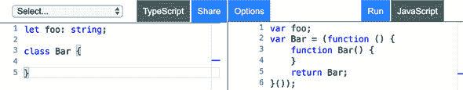
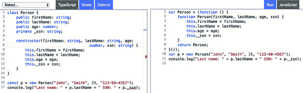
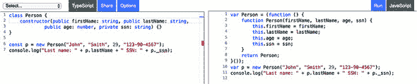
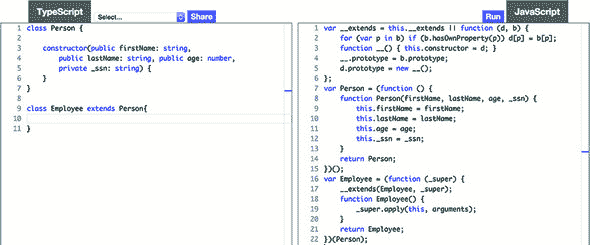
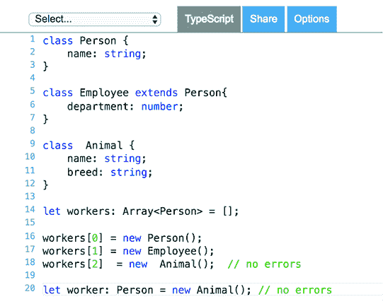
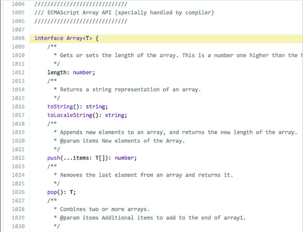

## 附录 B. TypeScript 基础知识

TypeScript 由微软于 2012 年发布，其核心开发者是 Anders Hejlsberg。他也是 Turbo Pascal 和 Delphi 的作者之一，并且是 C#的首席架构师。在本附录中，我们将介绍 TypeScript 语法的核心元素。

我们还将向您展示如何将 TypeScript 代码转换为 JavaScript（ES5），以便它可以在任何 Web 浏览器或独立的 JavaScript 引擎中执行。本附录并不提供 TypeScript 的完整覆盖。有关完整信息，请参阅[www.typescriptlang.org/docs/home.html](http://www.typescriptlang.org/docs/home.html)上的 TypeScript 文档。此外，TypeScript 支持附录 A 中描述的所有语法结构，因此我们在此不再重复。

### B.1\. 转译器的作用

Web 浏览器不理解任何语言，除了 JavaScript。如果源代码是用 TypeScript 编写的，那么在您可以在 JavaScript 引擎（无论是浏览器还是独立引擎）中运行它之前，必须将其*转译*为 JavaScript。

*转译*意味着将一种语言的程序源代码转换为另一种语言的源代码。许多开发者更喜欢使用“编译”这个词，所以像“TypeScript 编译器”和“将 TypeScript 编译成 JavaScript”这样的短语也是有效的。

图 B.1 展示了左侧的 TypeScript 代码及其由 TypeScript 转译器生成的右侧 ES5 版本的 JavaScript 代码。在 TypeScript 中，我们声明了一个类型为`string`的变量`foo`，但转译后的版本没有类型信息。在 TypeScript 中，我们声明了一个名为`Bar`的类，它在 ES5 语法中以类似类的模式转译。

##### 图 B.1\. 将 TypeScript 转换为 ES5



您可以通过访问 TypeScript playground 在[www.typescriptlang.org/play](http://www.typescriptlang.org/play)来亲自尝试。如果我们指定 ES6 作为转换的目标，生成的 JavaScript 代码将会有所不同；您将在右侧看到`let`和`class`关键字。

将 Angular 与静态类型的 TypeScript 结合使用可以简化 Web 应用程序的开发。良好的工具和静态类型分析器可以显著减少运行时错误数量并缩短上市时间。当您的 Angular 应用程序完成时，将包含大量的 JavaScript 代码；尽管在 TypeScript 中开发可能需要您编写更多的代码，但通过节省测试和重构的时间以及最小化运行时错误数量，您将获得收益。

### B.2\. 开始使用 TypeScript

微软已经开源了 TypeScript，并在 GitHub 上托管了 TypeScript 仓库，网址为[`github.com/Microsoft/TypeScript/wiki/Roadmap`](https://github.com/Microsoft/TypeScript/wiki/Roadmap)。你可以使用 npm 安装 TypeScript 编译器。TypeScript 网站[www.typescriptlang.org](http://www.typescriptlang.org)提供了语言文档，并有一个托管在网页上的 TypeScript 编译器（在 Playground 菜单下），你可以在这里交互式地输入 TypeScript 代码并将其编译为 JavaScript，如图 B.1 所示。在左侧输入 TypeScript 代码，其 JavaScript 版本（ES5）将在右侧显示。点击运行按钮执行转换后的代码（如果代码有输出，可以在浏览器控制台查看）。

这样的交互式工具足以学习语言语法，但为了实际开发，你需要更好的工具以提高生产力。你可能决定使用 IDE 或文本编辑器，但本地安装 TypeScript 编译器对于开发是必须的。我们将在附录中向你展示如何安装 TypeScript 编译器并运行代码示例，使用的是 Node JavaScript 引擎。

我们假设你已经在计算机上安装了 Node.js 和 npm。如果你还没有安装，请参阅附录 C。

#### B.2.1\. 安装和使用 TypeScript 编译器

我们将使用 Node.js 的 npm 包管理器来安装 TypeScript 编译器。要在全局范围内安装，请在终端窗口中运行以下 npm 命令：

```
npm install -g typescript
```

`-g`选项将在你的计算机上全局安装 TypeScript 编译器，因此它可以从终端窗口中的所有项目中访问。要检查 TypeScript 编译器的版本，请运行以下命令：

```
tsc
 --version
```

如前所述，用 TypeScript 编写的代码必须转换为 JavaScript，以便网页浏览器能够执行它。TypeScript 代码保存在以.ts 扩展名命名的文件中。假设你编写了一个脚本并将其保存到 main.ts 文件中。以下命令将 main.ts 转换为 main.js：

```
tsc main.ts
```

你还可以生成源映射文件，将 TypeScript 程序中的行映射到生成的 JavaScript 中的对应行。有了源映射，你可以在浏览器中运行 TypeScript 代码时设置断点，即使它执行的是 JavaScript。要将 main.ts 转换为 main.js 并生成源映射文件 main.js.map，请运行以下命令：

```
tsc --sourcemap main.ts
```

如果浏览器打开了开发者工具面板，它将加载源映射文件以及 JavaScript 文件，你可以在那里调试 TypeScript 代码，就像浏览器运行 TypeScript 一样。

在编译过程中，TypeScript 编译器会从生成的代码中移除所有不被 JavaScript 支持的 TypeScript 类型、接口和关键字。通过提供编译器选项，你可以生成符合 ES3、ES5、ES6 或更新语法的 JavaScript。

这是将代码转换为 ES5 兼容语法的步骤（`--t`选项指定目标语法）：

```
tsc --t ES5 main.ts
```

您可以通过提供`-w`选项来以监视模式启动 TypeScript 编译器。在此模式下，每次您修改并保存代码时，它都会自动转换为相应的 JavaScript 文件。要编译并监视当前目录中的所有.ts 文件，请运行以下命令：

```
tsc -w *.ts
```

编译器将编译所有 TypeScript 文件，打印错误消息（如果有）到控制台，并继续监视文件的变化。一旦文件发生变化，`tsc`将立即重新编译它。


##### 注意

通常，我们在 IDE 中关闭 TypeScript 自动编译。对于 Angular 应用程序，我们使用 Angular CLI 来编译和打包整个项目。IDE 使用 TypeScript 代码分析器来突出显示错误，即使没有编译。


`tsc`提供了数十种编译选项，描述在[`mng.bz/rf14`](http://mng.bz/rf14)。您可以预先配置编译过程（指定源和目标目录、生成源映射等）。项目目录中存在 tsconfig.json 文件意味着您可以在命令行中输入`tsc`，编译器将读取所有选项从 tsconfig.json。以下是一个 Angular 项目的 tsconfig.json 文件示例。

##### 列表 B.1\. tsconfig.json

```
{
    "compilerOptions": {
        "baseUrl": "src",                 *1*
         "outDir": "./dist",              *2*
         "sourceMap": true,               *3*
         "moduleResolution": "node",      *4*
         "noEmitOnError": true,           *5*
         "target": "es5",                 *6*
         "experimentalDecorators": true   *7*
     }
}
```

+   ***1* 将位于 src 目录中的.ts 文件转换为**

+   ***2* 将生成的.js 文件保存到 dist 目录**

+   ***3* 生成源映射**

+   ***4* 根据基于 Node 的项目结构查找模块**

+   ***5* 如果任何文件有编译错误，则不会生成 JavaScript 文件**

+   ***6* 将.ts 文件转换为 ES5 语法**

+   ***7* 必须支持装饰器**

每个 Angular/TypeScript 应用程序都使用与类或类成员（如`@Component()`和`@Input()`）一起的装饰器。我们将在本附录的后面讨论装饰器。

如果您想排除项目中的一些文件不进行编译，请向 tsconfig.json 添加`exclude`属性。这样您可以排除 node_modules 目录的全部内容：

```
"exclude": [
    "node_modules"
  ]
```

#### B.2.2\. TypeScript 作为 JavaScript 的超集

TypeScript 支持 ES5、ES6 和更新的 ECMAScript 语法。只需将具有 JavaScript 代码的文件名扩展名从.js 更改为.ts，它就会成为有效的 TypeScript 代码。作为 JavaScript 的超集，TypeScript 为 JavaScript 添加了多个有用的功能。我们将在下面回顾它们。

### B.3\. 如何运行代码示例

要在您的计算机上本地运行此附录中的代码示例，请执行以下步骤：

> **1**.  从[`nodejs.org/en/download/`](https://nodejs.org/en/download/)安装 Node.js（使用当前版本）。
> 
> **2**.  将[`github.com/Farata/angulartypescript`](https://github.com/Farata/angulartypescript)存储库克隆或下载到任何目录。
> 
> **3**.  在命令窗口中，切换到该目录，然后转到 code-samples/appendixB 子目录。
> 
> **4**.  通过运行`npm install`在本地安装项目依赖项（TypeScript 编译器）。
> 
> **5**.  使用本地安装的 TypeScript 编译器将所有代码示例编译到 dist 目录，通过运行 `npm run tsc` 实现，这将把 src 目录中的所有代码示例转换到 dist 目录。
> 
> **6**.  要运行特定的代码示例（例如 fatArrow.js），请使用以下命令：`node dist/fatArrow`。

### B.4\. 可选类型

你可以声明变量并为所有或其中一些变量提供类型。以下两行是有效的 TypeScript 语法：

```
let name1 = 'John Smith';

let name2: string = 'John Smith';
```


##### Tip

在第二行，指定类型 `string` 是不必要的。因为变量是用字符串初始化的，TypeScript 会推断出 `name2` 的类型是 `string`。


如果你使用类型，TypeScript 的转换器可以在开发过程中检测到类型不匹配，IDE 将提供代码补全和重构支持。这将提高你在任何中等规模项目上的生产力。即使你不在声明中使用类型，TypeScript 也会根据分配的值猜测类型，并在之后进行类型检查。这被称为类型 *推断*。

以下 TypeScript 代码片段显示，你不能将数值赋给原本打算为 `string` 的 `name1` 变量，即使它最初没有声明类型（JavaScript 语法）。在用字符串值初始化这个变量之后，推断类型不会让你将数值赋给 `name1`：

```
let name1 = 'John Smith';
name1 = 123;                 *1*
```

+   ***1* 将不同类型的值赋给变量在 JavaScript 中是有效的，但在 TypeScript 中由于推断类型的原因是无效的。**

在 TypeScript 中，你可以声明具有类型的变量、函数参数和返回值。有四个关键字用于声明基本类型：`number`、`boolean`、`string` 和 `void`。最后一个表示函数声明中没有返回值。变量可以具有 `null` 或 `undefined` 类型的值，类似于 JavaScript。

下面是一些使用显式类型声明的变量的例子：

```
let salary: number;
let isValid: boolean;
let customerName: string = null;
```


##### 注意

从 TypeScript 2.7 版本开始，你需要在声明时初始化变量，或者在构造函数中初始化（成员变量）。


所有这些类型都是 `any` 类型的子类型。你也可以显式声明一个变量，指定 `any` 作为其类型。在这种情况下，不会应用推断类型。这两个声明都是有效的：

```
let name2: any = 'John Smith';
name2 = 123;
```

如果变量使用显式类型声明，编译器将检查它们的值以确保它们与声明匹配。TypeScript 包含其他在浏览器交互中使用的类型，例如 `HTMLElement` 和 `Document`。如果你定义了一个类或接口，它可以用作变量声明中的自定义类型。我们将在后面介绍类和接口，但首先让我们熟悉 TypeScript 函数，这是 JavaScript 中最常用的结构。

### B.5\. 函数

TypeScript 函数和函数表达式与 JavaScript 函数类似，但你可以显式声明参数类型和返回值。让我们编写一个 JavaScript 函数来计算税费。它将有三个参数，并将根据州、收入和受抚养人数来计算税费。对于每个受抚养人，根据个人居住的州，个人有权获得 500 美元或 300 美元的税费减免。该函数如下所示。

##### 列表 B.2\. 在 JavaScript 中计算税费

```
function calcTax(state, income, dependents) {
    if (state === 'NY') {
        return income * 0.06 - dependents * 500;
    } else if (state === 'NJ') {
        return income * 0.05 - dependents * 300;
    }
}
```

假设一个收入为 50,000 美元的人居住在新泽西州，并且有两个受抚养人。让我们调用 `calcTax()`：

```
let tax = calcTax('NJ', 50000, 2);
```

`tax` 变量得到 `1,900` 的值，这是正确的。即使 `calcTax()` 没有为函数参数声明任何类型，你也可以根据参数名称猜测它们。现在让我们以错误的方式调用它，为受抚养人数传递一个 `string` 类型的值：

```
var tax = calcTax('NJ', 50000, 'two');
```

你只有在调用此函数时才会发现问题。`tax` 变量将具有 `NaN` 值（不是一个数字）。仅仅因为你没有机会显式指定参数的类型，就悄悄地引入了一个错误。下一个列表将此函数重写为 TypeScript，为参数和返回值声明类型。

##### 列表 B.3\. 在 TypeScript 中计算税费

```
function calcTax(state: string, income: number, dependents: number): number {

    if (state === 'NY'){
        return income * 0.06 - dependents * 500;
    } else if (state ==='NJ'){
        return income * 0.05 - dependents * 300;
    }
}
```

现在没有任何方法可以犯同样的错误，并为受抚养人数传递一个 `string` 类型的值：

```
let tax: number = calcTax('NJ', 50000, 'two');
```

TypeScript 编译器将显示一个错误信息，说“类型 `string` 的参数不能分配给类型 `number` 的参数。”此外，函数的返回值声明为 `number`，这阻止你将税费计算的结果分配给非数字变量：

```
let tax: string = calcTax('NJ', 50000, 'two');
```

编译器会捕获这个错误，产生错误信息“类型‘number’不能分配给类型‘string’：var tax: string。”这种在编译期间进行的类型检查可以在任何项目中为你节省大量时间。

#### B.5.1\. 默认参数

在声明函数时，你可以指定默认参数值。例如：

```
function calcTax(income: number, dependents: number, state: string = 'NY'): n
     umber{
    // the code goes here
}
```

你甚至不需要更改 `calcTax()` 函数体中的任何一行代码。现在你可以自由地用两个或三个参数调用它：

```
let tax: number = calcTax(50000, 2);
// or
let tax: number = calcTax(50000, 2, 'NY');
```

两次调用的结果将相同。

#### B.5.2\. 可选参数

在 TypeScript 中，你可以通过在参数名称后附加一个问号来轻松地将函数参数标记为可选。唯一的限制是可选参数必须在函数声明中最后出现。当你为具有可选参数的函数编写代码时，你需要提供应用程序逻辑来处理可选参数未提供的情况。

让我们修改以下列表中的税费计算函数：如果没有指定受抚养人，则不会对计算出的税费应用任何减免。

##### 列表 B.4\. 在 TypeScript 中计算税费，已修改

```
function calcTax(income: number, state: string = 'NY', dependents?: number):
     number{

    let deduction: number;

    if (dependents) {
        deduction = dependents * 500;
    }else {
      deduction = 0;
    }

    if (state === 'NY') {
        return income * 0.06 - deduction;
    } else if (state === 'NJ') {
        return income * 0.05  - deduction;
    }
}

let tax: number = calcTax(50000, 'NJ', 3);
console.log(`Your tax is ${tax}`);

tax = calcTax(50000);
console.log(`Your tax is ${tax}`);
```

注意`dependents?: number`中的问号。现在函数会检查`dependents`的值是否提供。如果没有提供，则将 0 赋值给`deduction`变量；否则，每个受抚养人扣除 500。

运行前面的脚本将产生以下输出：

```
Your tax is 1000
Your tax is 3000
```


##### 注意

TypeScript 支持附录 A 中第 A.5 节中描述的胖箭头表达式语法。

|  |

**函数重载**

JavaScript 不支持函数重载，因此不可能有多个具有相同名称但参数列表不同的函数。TypeScript 支持函数重载，但由于代码必须转换为单个 JavaScript 函数，因此重载的语法并不优雅。

你可以声明一个只有一个主体且只有一个签名的函数，其中需要检查参数的数量和类型，并执行相应的代码部分：

```
function attr(name: string): string;
function attr(name: string, value: string): void;
function attr(map: any): void;
function attr(nameOrMap: any, value?: string): any {
  if (nameOrMap && typeof nameOrMap === "string") {
      // handle string case
  } else {
      // handle map case
  }
  // handle value here
}
```


### B.6\. 类

如果你熟悉 Java 或 C#，你将熟悉它们经典形式的类和继承概念。在这些语言中，类的定义作为单独的实体（如蓝图）加载到内存中，并由该类的所有实例共享。如果一个类从另一个类继承，则使用两个类的组合蓝图来实例化对象。

TypeScript 是 JavaScript 的超集，它只支持*原型继承*，你可以通过将一个对象附加到另一个对象的*原型*属性来创建继承层次结构。在这种情况下，创建了一个动态的*对象*继承（或更确切地说，是链接）。

在 TypeScript 中，`class`关键字是简化编码的语法糖。最终，你的类将被转换为具有原型继承的 JavaScript 对象。在 JavaScript 中，你可以声明一个构造函数并使用`new`关键字来实例化它。在 TypeScript 中，你也可以声明一个类并使用`new`运算符来实例化它。

一个类可以包含构造函数、字段（属性）和方法。声明的属性和方法通常被称为*类成员*。我们将通过一系列代码示例来展示 TypeScript 类的语法，并将它们与等效的 ES5 语法进行比较。

让我们创建一个简单的`Person`类，该类包含四个属性以存储姓名、年龄和社会安全号码（美国公民和居民的唯一标识符）。在图 B.2 的左侧，你可以看到声明和实例化`Person`类的 TypeScript 代码；在右侧是`tsc`编译器生成的 JavaScript 闭包。通过为`Person`函数创建闭包，TypeScript 编译器启用了暴露和隐藏`Person`对象元素的功能。

##### 图 B.2\. 将 TypeScript 类转换为 JavaScript 闭包



TypeScript 还支持类构造函数，允许你在创建对象时初始化对象变量。类构造函数在对象创建期间只调用一次。图 B.2 的左侧显示了 `Person` 类，它使用 `constructor` 关键字用构造函数提供的值初始化类的字段。

#### B.6.1\. 访问修饰符

JavaScript 没有声明变量或方法为 *私有*（对外部代码隐藏）的方式。要隐藏对象中的属性（或方法），你需要创建一个闭包，该闭包既不将此属性附加到 `this` 变量，也不在闭包的返回语句中 `returns` 它。

TypeScript 提供了 `public`、`protected` 和 `private` 关键字，以帮助你在开发阶段控制对对象成员的访问。默认情况下，所有类成员都具有公共访问权限，并且可以从类外部可见。如果一个成员用 `protected` 修饰符声明，它在类及其子类中可见。声明为 `private` 的类成员仅在类内部可见。

让我们使用 `private` 关键字隐藏 `_ssn` 属性的值，使其不能从 `Person` 对象外部直接访问。我们将向您展示两种声明使用访问修饰符的类的版本。类的较长版本如下所示。

##### 列表 B.5\. 使用私有属性

```
class Person {
    public firstName: string;
    public lastName: string;
    public age: number;
    private _ssn: string;

    constructor(firstName: string, lastName: string, age: number, ssn: string
     ) {
        this.firstName = firstName;
        this.lastName = lastName;
        this.age = age;
        this._ssn = ssn;
    }
}

const p = new Person("John", "Smith", 29, "123-90-4567");
console.log("Last name: " + p.lastName + " SSN: " + p._ssn);
```

注意，私有变量的名称以下划线开头：`_ssn`。这是私有属性的命名约定。

列表 B.5 的最后一行尝试从外部访问 `_ssn` 私有属性，因此 TypeScript 代码分析器会给你一个编译错误：“属性 `_ssn` 是私有的，并且只能在类 ‘Person’ 中访问。”但除非你使用 `--noEmitOnError` 编译器选项，否则有错误的代码仍然会被转换为 JavaScript：

```
const Person = (function () {
    function Person(firstName, lastName, age, _ssn) {
        this.firstName = firstName;
        this.lastName = lastName;
        this.age = age;
        this._ssn = _ssn;
    }
    return Person;
})();

const p = new Person("John", "Smith", 29, "123-90-4567");
console.log("Last name: " + p.lastName + " SSN: " + p._ssn);
```

`private` 关键字只在 TypeScript 代码中使其私有，但生成的 JavaScript 代码仍然会将类的所有属性和方法视为公共的。

TypeScript 还允许你在构造函数参数中提供访问修饰符，如下列 `Person` 类的简短版本所示。

##### 列表 B.6\. 使用访问修饰符

```
class Person {

    constructor(public firstName: string,
        public lastName: string, public age: number,  private _ssn: string) {
    }
}

const p = new Person("John", "Smith", 29, "123-90-4567");
```

当你使用具有访问修饰符的构造函数时，TypeScript 编译器将其视为创建并保留与构造函数参数匹配的类属性的指令。你不需要显式声明和初始化它们。`Person` 类的简短和长版本生成相同的 JavaScript，但我们建议使用如 图 B.3 所示的较短的语法。

##### 图 B.3\. 使用 `constructor` 转译 TypeScript 类



#### B.6.2\. 方法

当在类中声明一个函数时，它被称为*方法*。在 JavaScript 中，你需要在对象的原型上声明方法，但使用类时，你通过指定一个名称后跟括号和花括号来声明方法，就像在其他面向对象的语言中一样。

下一个代码列表显示了如何声明和使用一个具有一个参数且没有返回值的`doSomething()`方法的`MyClass`类。

##### 列表 B.7\. 创建一个方法

```
class MyClass {

   doSomething(howManyTimes: number): void {
      // do something here
   }
}

const mc = new MyClass();
mc.doSomething(5);
```


**静态和实例成员**

列表 B 7 中的代码以及图 B.2 中显示的类首先创建了一个类的实例，然后使用指向此实例的引用变量来访问其成员：

```
mc.doSomething(5);
```

如果使用`static`关键字声明了一个类属性或方法，其值将在类的所有实例之间共享，并且你不需要创建一个实例来访问静态成员。而不是使用引用变量（例如`mc`），你将使用类的名称：

```
class MyClass{

   static doSomething(howManyTimes: number): void {
      // do something here
   }
}

MyClass.doSomething(5);
```

如果你实例化了一个类，并且需要在同一类中声明的另一个方法中调用类方法，不要使用`this`关键字（例如，`this.doSomething(5)`），但仍然使用类名，例如`MyClass.doSomething(10);`。


#### B.6.3\. 继承

JavaScript 支持基于原型的*对象继承*，其中一个对象可以将另一个对象作为其原型，这发生在运行时。TypeScript 有`extends`关键字用于类的继承，就像 ES6 和其他面向对象的语言一样。但在转换为 JavaScript 时，生成的代码使用原型继承的语法。

图 B.4 显示了如何创建一个扩展`Person`类的`Employee`类（第 9 行）。在右侧，你可以看到转换后的 JavaScript 版本，它使用原型继承。TypeScript 代码版本更简洁，更容易阅读。

##### 图 B.4\. TypeScript 中的类继承



让我们在下一个列表中向`Employee`类添加一个构造函数和一个`department`属性。

##### 列表 B.8\. 使用继承

```
class Employee extends Person {
    department: string;                                          *1*

    constructor(firstName: string, lastName: string,             *2*
            age: number, _ssn: string, department: string) {

        super(firstName, lastName, age, _ssn);                   *3*

        this.department = department;
    }
}
```

+   ***1* 声明一个属性部门**

+   ***2* 创建一个具有额外部门参数的构造函数**

+   ***3* 声明构造函数的子类必须使用 super()调用超类的构造函数。**

如果你在一个子类类型的对象上调用在超类中声明的函数，你可以使用这个方法的名字，就像它在子类中声明的一样。但有时你想要特别调用超类的方法，这时你应该使用`super`关键字。

`super` 关键字有两种用法。在派生类的构造函数中，你可以将其作为方法调用。你还可以使用 `super` 关键字来特别调用超类的方法。它通常与方法重写一起使用。例如，如果超类及其子类都有 `doSomething()` 方法，子类可以重用超类中编写的功能，并添加其他功能：

```
doSomething() {
    super.doSomething();

    // Add more functionality here
}
```

### B.7\. 接口

JavaScript 不支持接口，在其他面向对象的语言中，接口用于引入一个 API 必须遵守的 *代码契约*。契约的一个例子可以是类 X 声明它实现了接口 Y。如果类 X 没有实现接口 Y 中声明的方法，则视为违反契约且无法编译。

TypeScript 包含了 `interface` 和 `implements` 关键字来支持接口，但接口不会转换成 JavaScript 代码。它们只是帮助你在开发过程中避免使用错误的数据类型。

在 TypeScript 中，我们使用接口有两个原因：

+   声明一个定义包含多个属性的定制类型的接口。然后声明一个具有这种类型参数的方法。编译器将检查作为参数给出的对象是否包含接口中声明的所有属性。

+   声明一个包含抽象（未实现）方法的接口。当一个类声明实现了这个接口时，该类必须为所有抽象方法提供实现。

让我们通过示例应用这两种模式。

#### B.7.1\. 使用接口声明自定义类型

当你使用 JavaScript 框架时，你可能会遇到需要某种配置对象作为函数参数的 API。为了找出这个对象中必须提供哪些属性，要么打开 API 的文档，要么阅读框架的源代码。在 TypeScript 中，你可以声明一个包含所有必须存在于配置对象中属性及其类型的接口。

让我们看看如何在 `Person` 类中实现这一点，该类包含一个带有四个参数的构造函数：`firstName`、`lastName`、`age` 和 `ssn`。这次，在下面的列表中，你将声明一个包含这四个成员的 `IPerson` 接口，并且你将修改 `Person` 类的构造函数以使用这种自定义类型的对象作为参数。

##### 列表 B.9\. 声明一个接口

```
interface IPerson {
    firstName: string;
    lastName: string;
    age: number;
    ssn?: string;                                       *1*
 }

class Person  {
    constructor(public config: IPerson) {}              *2*
 }

let aPerson: IPerson = {                                *3*
     firstName: "John",
    lastName: "Smith",
    age: 29
}

let p = new Person(aPerson);                            *4*
 console.log("Last name: " + p.config.lastName );
```

+   ***1* 声明一个带有 ssn 作为可选成员（注意问号）的 IPerson 接口**

+   ***2* Person 类有一个类型为 IPerson 的参数的构造函数。**

+   ***3* 创建一个与 IPerson 兼容的 aPerson 对象字面量**

+   ***4* 实例化 Person 对象，提供一个类型为 IPerson 的对象作为参数**

TypeScript 具有结构化类型系统，这意味着如果两个不同的类型包含相同的成员，则认为这些类型是兼容的。在 列表 B.9 中，即使你没有指定 `aPerson` 变量的类型，它仍然会被认为与 `IPerson` 兼容，并可以在实例化 `Person` 对象时用作构造函数参数。如果你更改 `IPerson` 的任何一个成员的名称或类型，TypeScript 编译器将报告错误。

`IPerson` 接口没有定义任何方法，但 TypeScript 接口可以包含方法签名而不包含实现。

#### B.7.2\. 使用 `implements` 关键字

可以在类声明中使用 `implements` 关键字来宣布该类将实现特定的接口。假设你有一个如下声明的 `IPayable` 接口：

```
interface IPayable {
  increase_cap: number;

  increasePay(percent: number): boolean
}
```

现在 `Employee` 类可以声明它实现了 `IPayable` 接口：

```
class Employee implements IPayable {
    // The implementation goes here
}
```

在深入细节之前，让我们回答这个问题：为什么不在类中直接编写所有必要的代码，而不是将部分代码分离到一个接口中？假设你需要编写一个应用程序，允许为你的组织中的员工增加薪酬。

你可以创建一个 `Employee` 类（它扩展了 `Person` 类）并在其中包含 `increaseSalary()` 方法。然后业务分析师可能会要求你添加为为你的公司工作的承包商增加薪酬的能力。但承包商由他们的公司名称和 ID 表示；他们没有薪酬的概念，并且按小时支付工资。

你可以创建另一个类，`Contractor`（不是从 `Person` 继承），它包含一些属性和一个 `increaseHourlyRate()` 方法。现在你有两个不同的 API：一个用于增加员工的薪酬，另一个用于增加承包商的薪酬。更好的解决方案是创建一个通用的 `IPayable` 接口，并让 `Employee` 和 `Contractor` 类为这些类提供不同的 `IPayable` 实现，如下面的列表所示。

##### 列表 B.10\. 使用多个接口实现

```
interface IPayable {                                                      *1*

  increasePay(percent: number): boolean
}

class Person {                                                            *2*
     // properties are omitted for brevity
}

class Employee extends Person implements IPayable {                       *3*

    increasePay(percent: number): boolean {                               *4*

        console.log(`Increasing salary by ${percent}`);
        return true;
    }
}

class Contractor implements IPayable {
    increaseCap:number = 20;                                              *5*

    increasePay(percent: number): boolean {                               *6*
         if (percent < this.increaseCap) {
            console.log(`Increasing hourly rate by ${percent}`);
            return true;
        } else {
            console.log(`Sorry, the increase cap for contractors is
                     ${this.increaseCap}`);
            return false;
        }
    }
}

const workers: IPayable[] = [];                                          *7*
 workers[0] = new Employee();
workers[1] = new Contractor();

workers.forEach(worker => worker.increasePay(30));                       *8*
```

+   **1**  `IPayable` 接口包含了 `increasePay()` 方法的签名，该签名将由 `Employee` 和 `Contractor` 类实现。

+   **2**  `Person` 类作为 `Employee` 类的基类。

+   **3**  `Employee` 类从 `Person` 继承并实现了 `IPayable` 接口。一个类可以实现多个接口。

+   **4**  `Employee` 类实现了 `increasePay()` 方法。员工的薪酬可以增加任何金额，因此该方法将在控制台上打印消息并返回 true（允许增加）。

+   **5**  `Contractor` 类包含一个属性，将薪酬增加的上限设置为 20%。

+   **6**  `Contractor` 类中 `increasePay()` 方法的实现不同，使用超过 20 的参数调用 `increasePay()` 将导致显示“Sorry”消息并返回 false。

+   ***7* 声明 IPayable 类型的数组允许你放置任何实现了 IPayable 类型的对象。**

+   ***8* 现在你可以对 workers 数组中的任何对象调用 increasePay()方法。注意，使用具有单个 worker 参数的胖箭头表达式时，不需要使用括号。**

运行前面的脚本会在浏览器控制台产生以下输出：

```
Increasing salary by 30
Sorry, the increase cap for contractors is 20
```


**为什么使用 implements 关键字声明类？**

如果你从`Employee`或`Contractor`的声明中移除`implements Payable`，代码仍然可以工作，编译器也不会对向`workers`数组添加这些对象的行提出抱怨。编译器足够智能，能够看到即使类没有显式声明`implements IPayable`，它也正确地实现了`increasePay()`。

但如果你移除`implements IPayable`并尝试更改任何类中`increasePay()`方法的签名，你将无法将此类对象放入`workers`数组中，因为该对象将不再是`IPayable`类型。此外，没有`implements`关键字，IDE 支持（如重构）将会失效。


### B.8\. 泛型

TypeScript 支持参数化类型，也称为**泛型**，可以在各种场景中使用。例如，你可以创建一个可以接受任何类型值的函数；但在调用时，在特定的上下文中，你可以显式指定一个具体类型。

再举一个例子：一个数组可以存储任何类型的对象，但你可以在数组中指定允许的特定对象类型（例如，`Person`类的实例）。如果你尝试添加不同类型的对象，TypeScript 编译器将生成一个错误。

以下代码示例声明了一个`Person`类及其子类`Employee`和一个`Animal`类。然后它实例化每个类并尝试将它们存储在声明为泛型类型的`workers`数组中。泛型类型通过将它们放在尖括号中（如`<Person>`）来表示。

##### 列表 B.11\. 使用泛型类型

```
class Person {
    name: string;
}

class Employee extends Person {
    department: number;
}

class Animal {
    breed: string;
}

let workers: Array<Person> = [];

workers[0] = new Person();
workers[1] = new Employee();
workers[2] = new Animal();  // compile-time error
```

通过将`workers`数组声明为泛型类型`<Person>`，你宣布了你的计划只存储`Person`类或其子类的实例。尝试将`Animal`类的实例存储在同一个数组中会导致编译时错误。


**名义和结构类型系统**

如果你熟悉 Java 或 C#中的泛型，你可能觉得你已经理解了这个语法。但是有一个注意事项。虽然 Java 和 C#使用的是**名义**类型系统，TypeScript 使用的是**结构**类型系统。在名义类型系统中，类型是根据它们的名称进行检查的，但在结构类型系统中，是根据它们的结构进行检查的。

在名义类型系统中，以下行将导致错误：

```
let person: Person = new Animal();
```

在结构化类型系统中，只要类型的结构相似，你就可以将一个类型的对象赋值给另一个类型的变量。让我们通过向 `Animal` 类添加 `name` 属性来举例说明。



结构化类型系统在行动

现在 TypeScript 编译器不会对将 `Animal` 对象赋值给类型为 `Person` 的变量而报错。类型为 `Person` 的变量期望一个具有 `name` 属性的对象，而 `Animal` 对象恰好有这个属性。这并不是说 `Person` 和 `Animal` 代表了相同的类型，但这两个类型是兼容的。另一方面，尝试将 `Person` 对象赋值给类型为 `Animal` 的变量将导致编译错误“类型 Person 中缺少属性 breed”：

```
let worker: Animal = new Person(); // compilation error
```


你可以使用泛型类型与任何对象或函数吗？不。对象或函数的创建者必须允许这个特性。如果你在 GitHub 上打开 TypeScript 的类型定义文件 (lib.d.ts) 并搜索“interface Array”，你将看到 `Array` 的声明，如图 B.5 所示。类型定义文件将在本附录的后面进行解释。

##### 图 B.5\. 描述 `Array` API 的 lib.d.ts 片段



第 1008 行的 `<T>` 作为一个占位符用于实际类型。这意味着 TypeScript 允许你使用 `Array` 声明一个类型参数，编译器将检查你在程序中提供的特定类型。在本节前面，我们指定了 `<Person>` 作为 `let workers: Array<Person>` 中的泛型 `<T>` 参数。但由于 JavaScript 不支持泛型，你不会在转译器生成的代码中看到它们。这只是一种在编译时为开发者提供额外安全网的机制。

你可以在 图 B.5 的第 1022 行看到另一个 `T`。当泛型类型与函数参数一起指定时，不需要使用尖括号。但在 TypeScript 中没有 `T` 类型。这里的 `T` 意味着 `push` 方法允许你将特定类型的对象推入数组，如下面的示例所示：

```
workers.push(new Person());
```

你也可以创建自己的支持泛型的类和函数。接下来的列表定义了一个 `Comparator<T>` 接口，它声明了一个 `compareTo()` 方法，在方法调用期间期望提供具体的类型。

##### 列表 B.12\. 创建一个使用泛型的接口

```
interface Comparator<T> {                                                 *1*
     compareTo(value: T): number;
}

class Rectangle implements Comparator<Rectangle> {                        *2*

    constructor(private width: number, private height: number) {};

    compareTo(value: Rectangle): number {                                 *3*
         if (this.width * this.height >= value.width * value.height) {
            return 1;
        } else  {
            return -1;
        }
    }
}

let rect1: Rectangle = new Rectangle(2,5);
let rect2: Rectangle = new Rectangle(2,3);

rect1.compareTo(rect2) === 1? console.log("rect1 is bigger"):
                            console.log("rect1 is smaller");              *4*

class Programmer implements Comparator<Programmer> {                      *5*

    constructor(public name: string, private salary: number) {};

    compareTo(value: Programmer): number {                                *6*
         if (this.salary >= value.salary) {
            return 1;
        } else  {
            return -1;
        }
    }
}

let prog1: Programmer = new Programmer("John",20000);
let prog2: Programmer = new Programmer("Alex",30000);

prog1.compareTo(prog2)===1? console.log(`${prog1.name} is richer`):
                           console.log(`${prog1.name} is poorer`) ;       *7*
```

+   ***1* 声明一个具有泛型类型的 Comparator 接口**

+   ***2* 创建一个实现 Comparator 的类，指定具体的类型为 Rectangle**

+   ***3* 实现比较矩形的函数**

+   ***4* 比较矩形（类型 T 被擦除并替换为 Rectangle）**

+   ***5* 创建一个实现 Comparator 的类，指定具体的类型为 Programmer**

+   ***6* 实现比较程序员的函数**

+   ***7* 比较程序员（类型 T 被擦除并替换为 Programmer）**

### B.9\. 只读修饰符

ES6 引入了可以应用于变量的 `const` 关键字，但不能应用于类或接口的属性。你不能这样写：

```
class Person {
    const name: = "Mary";  // compiler error
}

const p = new Person();  // no errors
```

TypeScript 添加了一个可以应用于类属性的 `readonly` 关键字：

```
class Person {
    readonly name = "Mary";  // no errors
}
```

你只能在声明时或类构造函数中初始化 `readonly` 属性。现在，如果你尝试编写修改 `name` 属性值的代码，TypeScript 编译器（或静态分析器）将报告一个错误：

```
class Person {
    readonly name = "Mary";

    changeName() {
        this.name = "John";  // compiler error
    }
}
```

但是，创建一个不可变对象是应用 `readonly` 修饰符的一个更有趣的使用场景。在某些情况下，尤其是在 Angular 应用中，你可能想确保一个对象是不可变的，并且不小心修改对象。让我们尝试将 `readonly` 应用到一个对象属性上：

```
class Person {

    readonly bestFriend: { name: string } = {name: "Mary"};

    changeFriend() {
        this.bestFriend = { name: "John" }; // compiler error
    }

    changeFriendName() {
        this.bestFriend.name = "John";      // no errors
    }
}
```

尝试将另一个对象分配给 `bestFriend` 变量会导致编译错误，因为 `bestFriend` 被标记为 `readonly`。但是，更改由 `bestFriend` 表示的对象的内部属性仍然是允许的。为了禁止这样做，使用 `readonly` 修饰符对对象的每个属性进行修饰：

```
class Person {

    readonly bestFriend: { readonly name: string } = {name: "Mary"};

    changeFriend() {
        this.bestFriend = { name: "John" }; // compiler error
    }

    changeFriendName(newName: string) {
        this.bestFriend.name = "John";      // compiler error
    }
}
```

在 Angular 应用中，你可能希望将应用程序状态存储在一个绑定到组件输入属性的不可变对象中。为了强制在属性更改时创建一个新的对象实例，编写一个函数来创建一个带有属性修改的对象副本（参见附录 A 中的 A.7 节中的代码示例）。

如果一个对象有多个属性，为它们中的每一个添加 `readonly` 修饰符是一项繁琐的工作，你可以使用只读映射类型来代替。以下示例使用 `type` 关键字定义一个新的类型，并使用泛型为 `Readonly` 类提供一个具体的对象：

```
type Friend = Readonly<{ name: string, lastName: string }>;

class Person {

     bestFriend: Friend = {name: "Mary", lastName: "Smith"};

    changeFriend() {
        this.bestFriend = { name: "John" }; // compiler error
    }

    changeFriendName() {
        this.bestFriend.name = "John";     // compiler error
        this.bestFriend.lastName = "Lou";  // compiler error
    }
}
```

### B.10\. 装饰器

“元数据”这个术语有不同的定义。流行的定义是元数据是关于数据的数据。我们将元数据视为描述和增强代码的数据。在内部，TypeScript 装饰器是特殊的函数，用于添加增强类、属性、方法或参数功能的元数据。TypeScript 装饰器以一个 `@` 符号开始。

装饰器存在于 TypeScript 中，并且是在 ECMAScript 中提出的。为了正确地转译它们，在 tsconfig.json 文件中添加以下行以在 TypeScript 转译器中启用实验性功能：

```
"experimentalDecorators": true
```

在本节中，我们将向您展示如何创建一个简单的装饰器，该装饰器将打印它附加到的类的信息。

假设你想创建一个装饰器 `UIComponent()`，它可以接受一个 HTML 片段作为参数。装饰器应该能够打印接收到的 HTML 并理解附加实体的属性——例如，一个类。以下列表实现了这一点。

##### 列表 B.13\. 一个自定义的 `UIComponent` 装饰器

```
function UIComponent (html: string) {
    console.log(`The decorator received ${html} \n`);

    return function(target) {
        console.log(`Creating a UI component from \n ${target} ` );
    }
}

@UIComponent('<h1>Hello Shopper!</h1>')
class Shopper {

    constructor(private name: string) {}
}
```

`UIComponent()` 函数有一个 `string` 参数，并返回另一个函数，该函数打印隐含变量 `target` 的内容，该变量知道装饰器附加到的工件。如果您将此代码编译成 ES5 语法并运行它，控制台上的输出将如下所示：

```
The decorator received <h1>Hello Shopper!</h1>

Creating a UI component from
 function Shopper(name) {
        this.name = name;
    }
```

如果将相同的代码编译成 ES6，输出将不同，因为 ES6 支持类：

```
The decorator received <h1>Hello Shopper!</h1>

Creating a UI component from
 class Shopper {
    constructor(name) {
        this.name = name;
    }
}
```

在底层，TypeScript 使用 `reflect-metadata` 库来查询装饰器附加到的工件的结构。这个简单的装饰器知道您想要渲染的 HTML 以及您的类有一个名为 `name` 的成员变量。如果您是框架的开发者，需要渲染 UI，这个装饰器的代码可能会很有用。创建自定义装饰器的过程在 TypeScript 文档中描述，请参阅 [`mng.bz/gz6R`](http://mng.bz/gz6R)。

要将 TypeScript 类转换为 Angular 组件，您需要使用 `@Component()` 装饰器对其进行装饰。Angular 将内部解析您的注解并生成代码，将所需的行为添加到 TypeScript 类中。要将类变量转换为可以接收值的组件属性，您使用 `@Input()` 装饰器：

```
@Component({
  selector: 'order-processor',
  template: `
    Buying {{quantity}} shares}
  `
})
export class OrderComponent {

  @Input() quantity: number;

}
```

在此示例中，`@Component()` 装饰器定义了 `OrderComponent` 类的选择器和模板（UI）。`@Input()` 装饰器使 `quantity` 属性能够通过绑定从父组件接收值。当您使用装饰器时，应该有一个装饰器处理器可以解析装饰器内容并将其转换为运行时（浏览器 JavaScript 引擎）可以理解的代码。Angular 包含 `ngc` 编译器，它执行装饰器处理器的职责。

要使用 Angular 装饰器，请在您的应用程序代码中导入它们的实现。例如，如下导入 `@Component()` 装饰器：

```
import { Component } from '@angular/core';
```

Angular 内置了一套装饰器，但 TypeScript 允许您创建自己的装饰器，无论您是否使用 Angular。

### B.11\. 联合类型

在 TypeScript 中，您可以根据两个或多个现有类型声明一个新的类型。例如，您可以声明一个变量，它可以接受字符串值或数字：

```
let padding: string | number;
```

虽然 TypeScript 支持 `any` 类型，但前面的声明与 `let padding: any` 的声明相比提供了一些好处。在下面的列表中，我们将回顾 TypeScript 文档中 [`mng.bz/5742`](http://mng.bz/5742) 中的一个代码示例。此函数可以向提供的字符串添加左填充。填充可以是字符串，该字符串必须预接在提供的参数之前，或者是指定预接字符串的空格数。

##### 列表 B.14\. `union.ts` 与 `any` 类型

```
function padLeft(value: string, padding: any ) {                       *1*
     if (typeof padding === "number") {                                *2*
         return Array(padding + 1).join(" ") + value;
    }
    if (typeof padding === "string") {                                 *3*
         return padding + value;
    }
    throw new Error(`Expected string or number, got '${padding}'.`);   *4*
 }
```

+   ***1* 提供字符串和类型为 any 的填充**

+   ***2* 对于数字参数，生成空格**

+   ***3* 对于字符串，使用连接**

+   ***4* 如果第二个参数既不是字符串也不是数字，则抛出错误**

以下是一些调用 `padLeft()` 的示例：

```
console.log( padLeft("Hello world", 4));         // returns "    Hello world"
console.log( padLeft("Hello world", "John says "));// returns "John says Hell
     o world"

console.log( padLeft("Hello world", true)); // runtime error
```

但如果你将 `padding` 的类型改为字符串或数字的联合类型，当你尝试使用除了字符串或数字之外的任何内容调用 `padLeft()` 时，编译器将报告错误。这也会消除抛出异常的需要。新的 `padLeft()` 函数版本更加健壮，如下面的列表所示。

##### 列表 B.15\. union.ts 使用联合类型

```
function padLeft(value: string, padding: string | number ) {      *1*
     if (typeof padding === "number") {
        return Array(padding + 1).join(" ") + value;
    }
    if (typeof padding === "string") {
        return padding + value;
    }
}
```

+   ***1* 只允许将字符串或数字作为第二个参数**

现在用错误的类型（例如，`true`）调用 `padLeft()` 作为第二个参数将返回编译错误：

```
console.log( padLeft("Hello world", true)); // compilation error
```

使用联合类型的另一个好处是 IDE 具有自动完成功能，它会提示你允许的参数类型，因此你甚至没有机会犯这样的错误。在 第十五章 的 15.2.3 节 中，还有一个使用联合类型的实际示例。

### B.12\. 使用类型定义文件

类型定义文件的目的在于描述一个 JavaScript 库（或脚本）的 API，并提供该 API 所提供的类型。比如说，你想要在你的 TypeScript 代码中使用流行的 JavaScript 库 Lodash。如果你的项目中有一个 Lodash 类型定义文件，TypeScript 静态分析器就会知道 Lodash 函数期望的类型，如果你提供了错误类型，你将得到编译时错误。此外，IDE 也会为 Lodash API 提供自动完成功能。

最初，一个 TypeScript 社区在 [`definitelytyped.org`](http://definitelytyped.org) 创建了一个名为 *DefinitelyTyped* 的 TypeScript 定义文件仓库。2016 年，微软在 npmjs.org 上创建了一个名为 `@types` 的组织，我们现在使用的就是这个组织。这个组织拥有超过 5,000 个针对各种 JavaScript 库的类型定义文件。

任何类型定义文件名的后缀都是 *d.ts*，你使用 npm 安装类型定义文件。例如，要安装 Lodash 的类型定义文件，请运行以下命令：

```
npm i @types/lodash --save-dev
```

这将在你的项目 node_modules/@types 目录中下载 Lodash 定义，并更新 package.json 文件，因此你不需要再次运行此命令。

当你安装 Angular 时，你会在运行 `npm install` 命令后，在 node_modules/@angular 文件夹的子文件夹中找到 Angular 模块中的定义文件，如 第一章 中所述。所有必需的 d.ts 文件都包含在 Angular npm 包中，因此不需要单独安装。在你的项目中存在定义文件将允许 TypeScript 编译器确保在调用 Angular API 时你的代码使用正确的类型。

例如，Angular 应用程序是通过调用 `bootstrapModule()` 方法启动的，将应用程序的根模块作为参数传递给它。application_ref.d.ts 文件包含以下对该函数的定义：

```
abstract bootstrapModule<M>(moduleType: Type<M>,
compilerOptions?: CompilerOptions | CompilerOptions[]): Promise<NgModuleRef<M>>;
```

通过阅读此定义，您（以及`tsc`编译器）知道此函数可以通过一个必需的模块参数`Type<M>`和一个可选的编译器选项数组来调用。如果 application_ref.d.ts 不是您项目的一部分，TypeScript 编译器会允许您使用错误的参数类型调用`bootstrapModule`函数，或者完全不传递任何参数，这会导致运行时错误。但是，由于存在 application_ref.d.ts，TypeScript 会在编译时生成错误，显示“提供的参数与调用目标签名不匹配。”类型定义文件还允许 IDE 在您编写调用 Angular 函数或分配对象属性值的代码时显示上下文相关的帮助。


**显式指定类型定义文件**

要显式指定位于 node_modules/@types 目录中的类型定义文件，请将所需的文件添加到 tsconfig.json 的`types`部分。以下是一个示例：

```
"compilerOptions": {
   ...
  "types": ["es6-shim", "jasmine"],
}
```


在过去，我们使用特殊的类型定义管理器`tsd`和`Typings`来安装类型定义文件，但这些管理器不再需要。如果您的应用程序使用其他第三方 JavaScript 库，请使用 npm 安装它们的类型定义文件，以获取编译器帮助和 IDE 中的自动完成功能。

### B.13\. 使用 TSLint 控制代码风格

代码检查器有助于确保代码符合接受的编码风格。使用 TSLint，您可以强制执行指定的规则和编码风格。例如，您可以将 TSLint 配置为检查您的项目中的 TypeScript 代码是否正确对齐和缩进，所有接口的名称是否以大写 I 开头，类名是否使用驼峰式命名法，等等。

您可以使用以下命令全局安装 TSLint：

```
npm install tslint -g
```

要在项目目录中安装 TSLint 节点模块，请运行以下命令：

```
npm install tslint
```

您想要应用到代码中的规则在 tslint.json 配置文件中指定，该文件是通过运行`tslint init`生成的：

```
{
 "defaultSeverity": "error",
 "extends": [
     "tslint: recommended"
 ],
 "jsRules": {},
 "rules": {},
 "rulesDirectory": []
}
```

TSLint 附带了一个包含推荐规则的文件，但您可以使用您偏好的自定义规则。您可以在 node_modules/tslint/lib/configs/recommended.js 文件中查看推荐规则。核心 TSLint 规则在[`mng.bz/xx6B`](http://mng.bz/xx6B)上有文档说明。您的 IDE 可能默认支持使用 TSLint 进行代码检查。如果您使用 Angular CLI 生成了项目，它已经包含了 TSLint。
