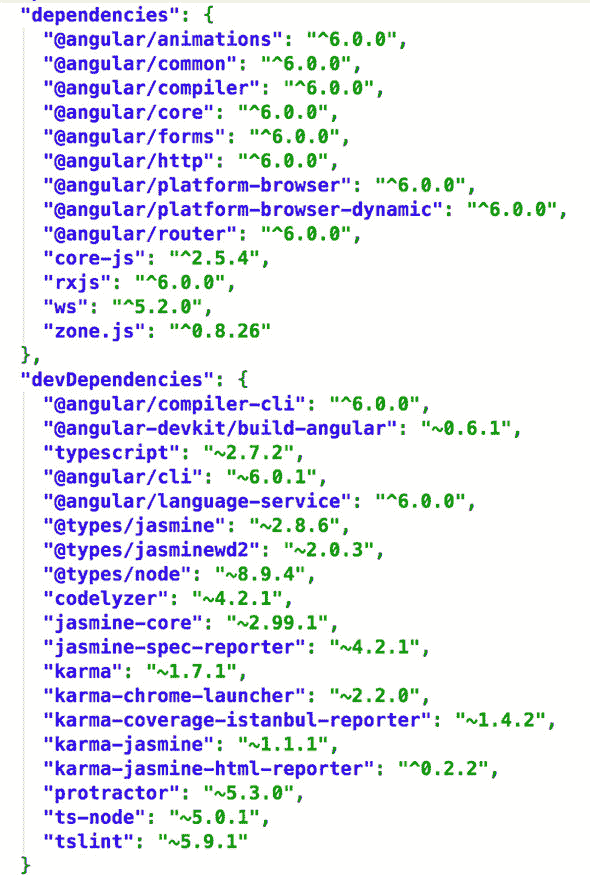
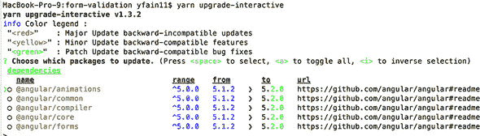

## 附录 C. 使用 npm 包管理器

本附录概述了我们使用 npm 包管理器安装 Angular 及其依赖项所使用的工具。

在本书的大部分内容中，我们使用 Node.js 来安装软件。Node.js（或简称 *Node*）不仅仅是一个框架或库：它也是一个 JavaScript 运行时环境。我们使用 Node 运行时来运行各种工具，如 npm 或在没有浏览器的情况下启动 JavaScript 代码。我们还使用 npm 脚本来自动化构建、测试和部署 Angular 应用。

要开始，请从 [`nodejs.org`](https://nodejs.org) 下载并安装当前版本的 Node.js。安装完成后，打开你的终端或命令窗口，并输入以下命令：

```
node --version
```

此命令应打印出已安装的 Node 版本，例如，10.3.0。Node 包含包管理器 npm，我们使用它从位于 [www.npmjs.com](http://www.npmjs.com) 的 npm 注册处安装 Angular 和其他包。此存储库托管 Angular 以及超过 400,000 个其他 JavaScript 包。


**Node.js 框架**

Node.js 也是一个可以用来开发在浏览器外运行的 JavaScript 程序的框架。你可以在 JavaScript 或 Typescript 中开发 Web 应用的服务器端。我们使用 Node.js 和 Express 框架在 第十二章 中编写了一个 Web 服务器。Google 为 Chrome 浏览器开发了一个高性能的 V8 JavaScript 引擎，它也可以用来运行使用 Node.js API 编写的代码。Node.js 框架包括用于与文件系统交互、访问数据库、监听 HTTP 请求等的 API。


要安装一个 JavaScript 库，运行命令 `npm install`，或简写为 `npm i`。假设你想本地安装 TypeScript 编译器。在任何目录中打开终端，并运行以下命令：

```
npm i typescript
```

在此命令完成后，你将看到一个名为 node_modules 的新子目录，其中安装了 TypeScript 编译器。npm 总是在 node_modules 目录中安装包。如果不存在这样的目录，npm 将创建它。

如果你想全局安装一个包，请添加 `-g` 选项：

```
npm i typescript -g
```

这次 TypeScript 编译器将不会安装到当前目录，而是安装到 Node.js 安装目录的 lib/node_modules 子目录中。

如果你想要安装特定版本的包，请将版本号添加到 `@` 符号之后的包名中。例如，要全局安装 Typescript 2.9.0，请使用以下命令：

```
npm i typescript@2.9.0 -g
```

所有 `npm install` 命令的可用选项都描述在 [`docs.npmjs.com/cli/install`](https://docs.npmjs.com/cli/install)。

在某些情况下，您可能希望在本地和全局范围内安装相同的包。例如，您可能已经在本地安装了 TypeScript 编译器 2.7，并在全局范围内安装了 TypeScript 2.9。要运行此编译器的全局版本，您可以在终端或命令窗口中输入 `tsc` 命令，要运行本地安装的编译器，您可以从项目目录使用以下命令：

```
node_modules/.bin/tsc
```

一个基于 Node 的典型项目可能有多重依赖项，我们不希望每次都运行单独的 `npm i` 命令来安装每个包。创建一个 package.json 文件是指定所有项目依赖项的更好方式。

### C.1\. 在 package.json 中指定项目依赖项

要启动一个新的基于 Node 的项目，创建一个新的目录（例如，my-node-project），打开您的终端或命令窗口，并将当前工作目录更改为新创建的目录。然后运行 `npm init -y` 命令，这将创建 package.json 配置文件的初始版本。通常，`npm init` 在创建文件时会询问几个问题，但 `-y` 标志使其接受所有选项的默认值。以下示例显示了在空的 my-node-project 目录中运行此命令：

```
$ npm init -y
Wrote to /Users/username/my-node-project/package.json:

{
  "name": "my-node-project",
  "version": "1.0.0",
  "description": "",
  "main": "index.js",
  "scripts": {
    "test": "echo \"Error: no test specified\" && exit 1"
  },
  "keywords": [],
  "author": "",
  "license": "ISC"
}
```

大多数生成的配置要么是为了将项目发布到 npm 注册表，要么是在将包作为另一个项目的依赖项安装时使用。我们只会使用 npm 来管理项目依赖项并自动化开发和构建过程。

因为我们不会将其发布到 npm 注册表，所以请移除除 `name`、`description` 和 `scripts` 之外的所有属性。还要添加一个 `"private": true` 属性，因为它不是默认创建的。这将防止包意外发布到 npm 注册表。package.json 文件应如下所示：

```
{
  "name": "my-node-project",
  "description": "",
  "private": true,
  "scripts": {
    "test": "echo \"Error: no test specified\" && exit 1"
  }
}
```

`scripts` 配置允许您指定可以在命令窗口中运行的命令别名。默认情况下，`npm init` 创建了 `test` 别名，可以像这样运行：`npm test`。生成的脚本命令包括双 ampersands，`&&`，它们用作命令之间的分隔符。当您运行 `npm test` 时，它将运行两个命令：`echo "Error: no test specified"` 和 `exit -1`。npm 脚本支持大约一打命令名称，如 `test`、`start` 等。这些命令的列表可以在 [`docs.npmjs.com/misc/scripts`](https://docs.npmjs.com/misc/scripts) 找到。

您可以使用任何名称创建自己的命令别名：

```
"scripts": {
    "deploy": "copyfiles -f dist/** ../server/build/public",
  }
```

因为 `deploy` 是一个自定义别名名称，您需要通过添加关键字 `run` 来运行此命令：

```
npm run deploy
```

在第十二章的 12.3.6 节中，我们讨论了如何编写 npm 脚本来在 Web 服务器上构建和部署应用程序。

如果你使用`npm init`命令生成 package.json，它将缺少两个重要的部分：`dependencies`和`devDependencies`。让我们看看 Angular 项目的依赖项是如何指定的。图 C.1 显示了典型 Angular 项目 package.json 文件的一个片段。

##### 图 C.1\. package.json 中的 Angular 依赖项



它看起来可能令人畏惧，但好消息是，你不需要记住所有这些软件包及其版本，因为你会使用 Angular CLI 生成项目，它将创建包含正确内容的 package.json 文件。

`dependencies`部分列出了运行你的应用程序所需的所有软件包。正如你所见，Angular 框架以以`@angular`开头的几个软件包的形式出现。你可能不需要安装所有这些软件包。例如，如果你的应用程序不使用表单，那么就没有必要在 package.json 中包含`@angular/forms`。

`devDependencies`部分列出了需要在开发者的计算机上安装的所有软件包。它包括几个软件包，但在生产服务器上不需要任何这些软件包。在生产机器上不需要测试框架或 TypeScript 编译器，对吧？

要使用 npm 安装单个软件包，列出该软件包的名称。例如，要将 Lodash 库添加到你的 node_modules 目录，运行以下命令：

```
npm i lodash
```

要将软件包添加到 node_modules 并添加相应的依赖项到你的 package.json 文件的`dependencies`部分，你可以明确指定`--save-prod`选项：

```
npm i lodash --save-prod
```

你也可以使用缩写`-P`代替`--save-prod`。如果没有指定任何选项，`npm i lodash`命令将更新 package.json 文件的`dependencies`部分。

要将软件包添加到 node_modules 并添加相应的依赖项到你的 package.json 文件的`devDependencies`部分，使用`--save-dev`选项：

```
npm i protractor --save-dev
```

你也可以使用缩写`-D`代替`--save-dev`。

有时，GitHub 上的一个软件包可能包含一个重要的错误修复，而这个修复尚未在 npmjs.org 上发布。如果你想要从 GitHub 安装这样的软件包，你需要将 package.json 依赖项中的版本号替换为其在 GitHub 上的位置。将依赖项改为包含 GitHub 组织名称和存储库名称应该允许你安装此库的 GitHub 版本的最新构建。例如：

```
"@angular/flex-layout": "angular/flex-layout-builds"
```

前面的配置将有效，假设 Flex Layout 库的 master 分支没有代码问题阻止 npm 安装它。

### C.2\. 语义版本控制

Angular 版本编号使用一组称为*语义版本控制*的规则。包的版本由三个数字组成——例如，6.1.2。第一个数字表示一个主要版本，它包括新功能和 API 中的潜在破坏性更改。第二个数字代表一个次要版本，它引入了向后兼容的 API 但没有破坏性更改。第三个数字表示向后兼容的补丁，包含错误修复。

再看看上一节中的图 C.1。每个包都有一个三位数的版本号，其中许多还有额外的符号：`^` 或 `~`。如果指定的版本只有三位数字，这意味着你指示 npm 安装确切的那个版本。例如，package.json 中的以下行告诉 npm 安装 Angular CLI 版本 6.0.5，即使有更新的版本也不安装：

```
"@angular/cli": "6.0.5"
```

在那个 package.json 文件中的许多包版本前都有一个帽子符号 `^`。例如：

```
"@angular/core": "⁶.0.0"
```

这意味着如果你允许 npm 安装 6 版本的最新次要版本，如果可用。如果 Angular Core 包的最新版本是 6.2.1，它将被安装。

波浪号 `~` 表示你想要安装给定主版本和次要版本的最新补丁：

```
"jasmine-core": "~2.99.1"
```

你可以在版本号中使用许多其他符号与 npm 一起使用——有关详细信息，请参阅[`mng.bz/YnyW`](http://mng.bz/YnyW)。

### C.3. Yarn 作为 npm 的替代品

Yarn（请参阅[`yarnpkg.com`](https://yarnpkg.com)）是另一个可以作为 npm 替代使用的包管理器。在版本 5 之前，npm 速度较慢，这是我们开始使用更快的 Yarn 的原因之一。

现在 npm 也很快了，但 Yarn 还有一个额外的优势：它创建了一个 yarn.lock 文件，该文件跟踪项目中安装的包的确切版本。假设你的 package.json 文件有一个`"@angular/core": "⁶.0.0"`依赖项，并且你的项目中没有 yarn.lock 文件。如果 6.1.0 版本可用，它将被安装，并且会创建一个包含关于 6.1.0 版本记录的 yarn.lock 文件。如果你一个月后运行`yarn install`，并且如果项目中存在 yarn.lock 文件，Yarn 将使用它并安装 6.1.0 版本，即使 6.2.0 版本可用。

以下是从 yarn.lock 中摘录的片段，显示尽管 package.json 中对`@angular/core`包的依赖项设置为`⁶.0.0`，但安装了`6.0.2`版本：

```
"@angular/core@⁶.0.0":
  version "6.0.2"
  resolved "https://registry.yarnpkg.com/@angular/core/-/core-
     6.0.2.tgz#d183..."
  dependencies:
    tslib "¹.9.0"
```

在团队设置中，你应该将 yarn.lock 文件提交到版本控制仓库，以确保团队中的每个成员都有相同版本的包。

npm 也会创建 package-lock.json 文件，但如果运行`npm install`，npm 并不是设计为安装此文件中列出的确切包版本（参见[`github.com/npm/npm/issues/17979`](https://github.com/npm/npm/issues/17979)）。好消息是，从版本 5.7 开始，npm 支持`npm ci`命令，该命令忽略 package.json 中列出的版本，但安装 package-lock.json 文件中列出的版本。

如果在某个时候你决定升级包，并覆盖 yarn.lock 中存储的版本，请运行`yarn upgrade-interactive`命令，如图 C.2 所示。图 C.2。

##### 图 C.2\. 使用 Yarn 升级包版本



Yarn 与你的项目 package.json 文件协同工作，因此无需任何额外的配置。你可以在[`yarnpkg.com/en/docs`](https://yarnpkg.com/en/docs)了解更多关于使用 Yarn 的信息。

| |
| --- |

##### 小贴士

你可以要求 Angular CLI 在安装新生成项目的依赖项时使用 Yarn 而不是 npm。从 Angular CLI 6 开始，你可以通过以下命令来完成：

```
ng config --global cli.packageManager yarn
```

如果你使用较旧的 Angular CLI 版本，请使用以下命令：

```
ng set --global packageManager=yarn
```

| |
| --- |
