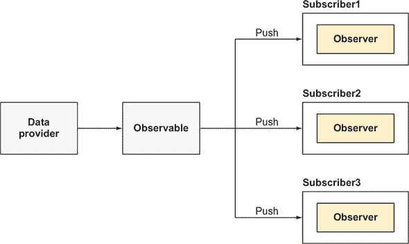
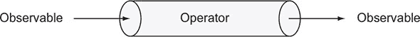
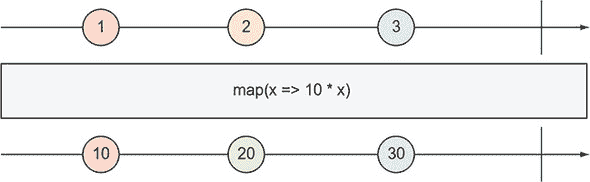
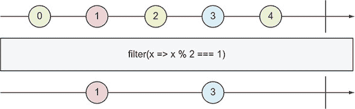
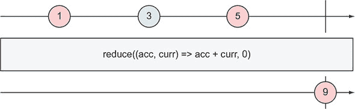
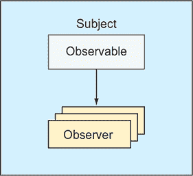
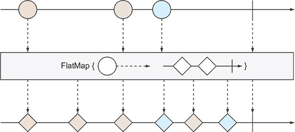
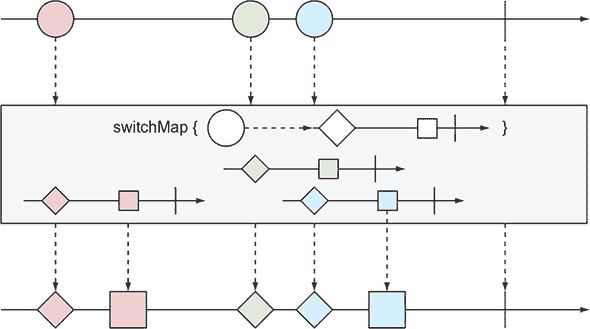

## 附录 D. RxJS 基础知识

*同步编程*相对简单，因为你的代码的每一行都是在执行前一行之后。如果你在第 25 行调用一个返回值的函数，你可以将返回值用作第 26 行调用的函数的参数。

*异步编程*极大地增加了代码的复杂性。在第 37 行，你可以调用一个异步函数，该函数将在稍后返回值。你能否在第 38 行调用一个使用前一个函数返回值的函数？简短的答案是，“这取决于。”

本附录是 RxJS 6 库的介绍，该库可以与任何基于 JavaScript 的应用程序一起使用。它在编写和组合异步代码方面表现出色。因为 Angular 内部使用 RxJS 库，所以我们决定在这本书中添加一个入门指南。

第一个反应式扩展库（Rx）是由 Erik Meijer 在 2009 年创建的。Rx.NET 旨在用于使用 Microsoft .Net 技术的应用程序。然后 Rx 扩展被移植到多种语言中，在 JavaScript 领域，RxJS 6 是这个库的当前版本。


##### 注意

虽然 Angular 依赖于 RxJS 并且没有它无法工作，但 RxJS 本身是一个独立的库，可以在任何 JavaScript 应用程序中使用。


让我们通过考虑一个简单的例子来看看编程中的反应式意味着什么：

```
let a1 = 2;?
let b1 = 4;??
let c1 = a1 + b1;  // c1 = 6??
```

这段代码将变量`a1`和`b1`的值相加，`c1`等于`6`。现在让我们给这段代码添加几行，修改`a1`和`b1`的值：

```
let a1 = 2;?
let b1 = 4;??
let c1 = a1 + b1;  // c1 = 6??

a1 = 55;       // c1 = 6 but should be 59 ?
b1 = 20;       // c1 = 6 but should be 75
```

当`a1`和`b1`的值发生变化时，`c1`不会对这些变化做出反应，其值仍然是`6`。你可以编写一个函数来添加`a1`和`b1`的值，并调用它以获取`c1`的最新值，但这将是一种*命令式*的编码风格，其中你指定何时调用函数来计算总和。

如果`c2`能在`a1`或`b1`发生变化时自动重新计算，那岂不是很好？想象一下像 Microsoft Excel 这样的电子表格程序，你可以在 C1 单元格中输入一个公式`=sum(a1, b1)`，当 A1 和 B1 发生变化时，C1 会立即做出反应。换句话说，你不需要点击任何按钮来刷新 C1 的值——数据是推送到这个单元格的。

在*反应式*编程风格中（与命令式相对），数据的变化驱动着代码的调用。反应式编程是关于创建响应式、事件驱动的应用程序，其中可观察的事件流被推送到订阅者，他们观察和处理这些事件。

在软件工程中，观察者/可观察对象是一个众所周知的模式，并且非常适合任何异步处理场景。但响应式编程远不止是观察者/可观察模式的实现。可观察流可以被取消，它们可以通知流的结束，并且从数据生产者到订阅者的数据推送过程中可以通过应用一个或多个可组合的算子进行转换。

### D.1\. 熟悉 RxJS 术语

我们想要观察数据，这意味着存在一个数据生产者——一个使用 HTTP 或 WebSockets 发送数据的服务器，一个用户输入数据的 UI 输入字段，一个智能手机中的加速度计等等。一个*可观察对象*是一个函数（或对象），它获取生产者数据并将其推送到订阅者。一个*观察者*是一个对象（或函数），它知道如何处理可观察对象推送的数据，如图 D.1 所示。

##### 图 D.1\. 从可观察对象到观察者的数据流



RxJS 的主要参与者如下：

+   ***可观察对象*—** 随时间推送数据的流

+   ***观察者*—** 可观察流消费者

+   ***订阅者*—** 将观察者与可观察对象连接

+   ***算子*—** 数据转换函数

我们将通过展示这些参与者使用的多个示例来介绍每个参与者。要全面了解，请参阅可在[`reactivex.io/rxjs`](http://reactivex.io/rxjs)找到的 RxJS 文档。


**热和冷可观察对象**

有两种可观察对象：热和冷。主要区别在于，一个冷可观察对象为每个订阅者创建一个数据生产者，而一个热可观察对象首先创建一个数据生产者，每个订阅者从订阅的那一刻起从该生产者获取数据。

让我们比较在 Netflix 上观看电影和去电影院。把自己想象成一个观察者。任何决定在 Netflix 上观看*碟中谍*的人都会得到整部电影，无论他们何时按下播放按钮。Netflix 为你创建一个新的生产者来流式传输电影。这是一个冷可观察对象。

如果你去电影院，放映时间是下午 4 点，那么生产者是在下午 4 点创建的，流式传输开始。如果有些人（订阅者）迟到，他们会错过电影的开始，只能从到达的那一刻开始观看。这是一个热可观察对象。

一个冷可观察对象在代码调用其上的`subscribe()`函数时开始产生数据。例如，你的应用程序可能声明一个提供服务器上 URL 的可观察对象以获取某些产品。请求只有在订阅时才会进行。如果另一个脚本向服务器发出相同的请求，它将获得相同的数据集。

热可观察者即使在没有订阅者对数据感兴趣的情况下也会产生数据。例如，你的智能手机中的加速度计会产生关于设备位置的数据，即使没有应用程序订阅这些数据。服务器可以产生最新的股票价格，即使没有用户对这种股票感兴趣。

本附录中的大多数示例都是关于冷可观察者。


### D.2\. 可观察者、观察者和订阅者

如前所述，可观察者一次从数据源（一个套接字、一个数组、UI 事件）获取一个数据元素。更准确地说，可观察者知道如何做三件事：

+   向观察者发出下一个元素

+   在观察者上抛出错误

+   通知观察者流已结束

因此，观察者对象提供了最多三个回调函数：

+   处理可观察者发出的下一个元素的函数

+   处理可观察者抛出错误的函数

+   处理流结束的函数

订阅者通过调用 `subscribe()` 方法将可观察者与观察者连接起来，通过调用 `unsubscribe()` 方法断开连接。订阅可观察者的脚本必须提供知道如何处理产生的元素的观察者对象。假设你创建了一个由变量 `someObservable` 表示的可观察者和一个由变量 `myObserver` 表示的观察者。你可以按如下方式订阅这样的可观察者：

```
let mySubscription: Subscription = someObservable.subscribe(myObserver);
```

要取消订阅，请调用 `unsubscribe()` 方法：

```
mySubscription.unsubscribe();
```

可观察者如何与提供的观察者进行通信？通过在观察者对象上调用以下函数：

+   `next()`，用于将下一个数据元素推送到观察者

+   `error()`，用于将错误信息推送到观察者

+   `complete()`，向观察者发送关于流结束的信号

你将在 D.5 节 中看到使用这些函数的示例。

### D.3\. 创建可观察者

RxJS 提供了多种创建可观察者的方式，具体取决于数据生产者的类型——例如，DOM 事件的 数据生产者、数据集合、自定义函数、WebSocket 等。

这里有一些创建可观察者的 API 示例：

+   **`of(1,2,3)`—** 将数字序列转换为 `Observable`

+   **`Observable.create(myObserver)`—** 返回一个 `Observable`，该 `Observable` 可以调用您创建并作为参数提供的 `myObserver` 上的方法

+   **`from(myArray)`—** 将由 `myArray` 变量表示的数组转换为 `Observable`。你还可以使用任何可迭代数据集合或生成函数作为 `from()` 的参数。

+   **`fromEvent(myInput, 'keyup')`—** 将由 `myInput` 表示的 HTML 元素的 `keyup` 事件转换为 `Observable`。第六章 中有一个使用 `fromEvent()` API 的示例。

+   **`interval(1000)`—** 每秒发出一个连续整数（0,1,2,3...）


##### 提示

有一个提议要将`Observable`引入 ECMAScript 的未来版本。见[`github.com/tc39/proposal-observable`](https://github.com/tc39/proposal-observable)。


让我们创建一个将发出 1、2 和 3 的可观察对象，并订阅此可观察对象。

##### 列表 D.1\. 发出`1,2,3`

```
of(1,2,3)
    .subscribe(
        value => console.log(value),                *1*
         err => console.error(err),                 *2*
         () => console.log("Streaming is over")     *3*
 );
```

+   ***1* 处理可观察对象发出的值**

+   ***2* 处理错误**

+   ***3* 处理流完成消息**

注意你向`subscribe()`传递了三个胖箭头函数。这三个函数的组合是你的观察者的实现。第一个函数将为可观察对象发出的每个元素调用。第二个函数在发生错误时调用，提供表示错误的对象。第三个函数不接受任何参数，将在可观察对象流结束时调用。运行此代码示例将在控制台产生以下输出：^([1])

> ¹
> 
> 在 CodePen 中查看：[`mng.bz/MwTz`](http://mng.bz/MwTz)。打开底部的控制台视图以查看输出。

```
1
2
3
Streaming is over
```


##### 注意

在附录 A 中，我们讨论了使用`Promise`对象，该对象只能调用在`then()`函数中指定的事件处理器一次。将`subscribe()`方法视为在`Promise`对象上调用`then()`的替代品，但`subscribe()`的回调不仅调用一次，而是对每个发出的值都调用一次。


### D.4\. 熟悉 RxJS 算子

当数据元素从可观察对象流向观察者时，你可以应用一个或多个 *算子*，这些是可以在将元素提供给观察者之前处理每个元素的函数。每个算子接受一个可观察对象作为输入，执行其操作，并返回一个新的可观察对象作为输出，如图 D.2 所示。

##### 图 D.2\. 算子：输入可观察对象，输出可观察对象



因为每个算子接受一个可观察对象并创建一个可观察对象作为其输出，所以算子可以被链式调用，以便每个可观察对象元素在传递给观察者之前可以经过几个转换。

RxJS 提供了大约 100 种不同的算子，它们的文档可能并不总是容易理解。从积极的一面来看，文档经常用宝石图来展示算子。你可以在[`mng.bz/2534`](http://mng.bz/2534)上熟悉宝石图的语法。图 D.3 显示了 RxJS 手册如何使用宝石图来展示`map`算子（见[`mng.bz/65G7`](http://mng.bz/65G7)）。

##### 图 D.3\. map 算子



在顶部，一个弹珠图显示了一条水平线，其中形状代表了一串传入的可观察元素流。接下来，展示了特定操作符的作用。在底部，你看到另一条水平线，表示应用操作符后的输出可观察流。垂直线代表流的结束。当你看这个图时，把时间想象成从左到右移动。首先，发出了值 1，然后时间过去，发出了值 2，然后时间过去，发出了值 3，然后流结束。

`map`操作符接受一个转换函数作为参数，并将其应用于每个传入的元素。图 D.3 展示了将每个传入元素的值乘以 10 的`map`操作符。

现在让我们熟悉一下`filter`操作符的弹珠图，如图 D.4 所示。`filter`操作符接受一个函数谓词作为参数，如果发出的值满足条件则返回`true`，否则返回`false`。只有满足条件的值才会传递给订阅者。这个特定的图使用了粗箭头函数来检查当前元素是否为奇数。偶数不会进一步传递到链中的观察者。

##### 图 D.4\. filter 操作符



操作符是可组合的，你可以将它们链起来，以便可观察发出的项在到达观察者之前可以由一系列操作符处理。


**已弃用的操作符链式调用**

在 RxJS 6 之前，你可以使用操作符之间的点来链式调用操作符。


##### 列表 D.2\. 可链式操作符

```
const beers = [
    {name: "Stella", country: "Belgium", price: 9.50},
    {name: "Sam Adams", country: "USA", price: 8.50},
    {name: "Bud Light", country: "USA", price: 6.50}
];

from(beers)
    .filter(beer => beer.price < 8)                     *1*
     .map(beer => `${beer.name}: $${beer.price}`)       *2*
     .subscribe(
        beer => console.log(beer),
        err => console.error(err)
);

console.log("This is the last line of the script");
```

+   ***1* 应用 filter 操作符**

+   ***2* 点链式调用 map 操作符**

从 RxJS 6 开始，链式调用操作符的唯一方法是通过使用`pipe()`方法，将逗号分隔的操作符作为参数传递。下一节将介绍*可连接*操作符。

#### D.4.1\. 可连接操作符

*可连接*操作符是那些可以使用`pipe()`函数链式调用的操作符。我们将首先讨论点链式操作符，以解释为什么在 RxJS 中引入了可连接操作符。

如果你安装了版本 6 之前的 RxJS，你可以从`rxjs/add/operator`目录导入点链式操作符。例如：

```
import 'rxjs/add/operator/map';
import 'rxjs/add/operator/filter';
```

这些操作符修补了`Observable.prototype`的代码，并成为该对象的一部分。如果你后来决定从处理可观察流代码中移除，比如说`filter`操作符，但你忘记了移除相应的导入语句，那么实现`filter`的代码仍然会是`Observable.prototype`的一部分。当打包器尝试消除未使用的代码（*摇树优化*）时，它们可能会决定保留`Observable`中的`filter`操作符代码，即使它没有被应用在应用中。

RxJS 5.5 引入了可连接的操作符，这是不修改`Observable`的纯函数。您可以使用 ES6 导入语法（例如，`import {map} from 'rxjs/operators'`）导入操作符，然后将它们包装到一个`pipe()`函数中，该函数接受可变数量的参数，或链式操作符。

列表 D.2 中的订阅者将接收到与侧边栏“已弃用的操作符链”中的相同数据，但这是一个更好的版本，从树摇的角度来看，因为它使用了可连接的操作符。此列表包括导入语句，假设 RxJS 已本地安装。

##### 列表 D.3\. 使用可连接的操作符

```
import {map, filter} from 'rxjs/operators';            *1*
 import {from} from 'rxjs';                            *2*
 ...
from(beers)
    .pipe(                                             *3*
          filter(beer => beer.price < 8),
         map(beer => `${beer.name}: $${beer.price}`)
      )
    .subscribe(
        beer => console.log(beer),
        err => console.error(err)
);
```

+   ***1* 导入 from() 函数**

+   ***2* 从 rxjs/operators 而不是 rxjs/add/operator 导入可连接的操作符**

+   ***3* 将可连接的操作符包装到 pipe() 函数中**

现在如果您从列表 D.2 中删除`filter`行，打包器（如 Webpack 4）的树摇功能可以识别导入的函数没有被使用，并且`filter`操作符的代码将不会包含在包中.^([2])

> ²
> 
> 在 CodePen 中查看：[`mng.bz/RqO5`](http://mng.bz/RqO5)。

默认情况下，`from()`函数返回一个同步的可观察对象，但如果您想要一个异步的，请使用第二个参数指定一个异步调度程序：

```
from(beers, Scheduler.async)
```

在前面的代码示例中，进行此更改将首先打印“这是脚本的最后一行”，然后才会发出啤酒信息。您可以在[`mng.bz/744Y`](http://mng.bz/744Y)了解更多关于调度程序的信息。

现在我们想介绍`reduce`操作符，它允许您聚合由可观察对象发出的值。`reduce`操作符的宝石图显示在图 D.5 中。此图显示了一个发出 1、3 和 5 的可观察对象，`reduce`操作符将它们相加，产生累积值为 9。

##### 图 D.5\. reduce 操作符



`reduce` 操作符有两个参数：一个累加函数，其中我们指定如何聚合值，以及累加函数使用的初始（种子）值。图 D.5 显示使用了 0 作为初始值，但如果我们将其更改为 10，累积的结果将是 19。

如您在图 D.5 中看到的那样，累加函数也有两个参数：

+   `acc` 存储当前累积的值，该值对每个发出的元素都可用。

+   `curr` 存储当前发出的值。

以下列表创建了一个从`beers`数组中生成的可观察对象，并对每个发出的元素应用两个操作符：`map`和`reduce`。`map`操作符从一个`beer`对象中提取其价格，而`reduce`操作符则将这些价格相加。

##### 列表 D.4\. 使用 `map` 和 `reduce` 操作符

```
const beers = [
    {name: "Stella", country: "Belgium", price: 9.50},
    {name: "Sam Adams", country: "USA", price: 8.50},
    {name: "Bud Light", country: "USA", price: 6.50},
    {name: "Brooklyn Lager", country: "USA", price: 8.00},
    {name: "Sapporo", country: "Japan", price: 7.50}
];

from(beers)
    .pipe(
      map(beer =>  beer.price),                                  *1*
       reduce( (total, price) => total + price, 0)               *2*
     )
    .subscribe(
        totalPrice => console.log(`Total price: ${totalPrice}`)  *3*
 );
```

+   ***1* 将啤酒对象转换为其价格**

+   ***2* 计算所有啤酒的总价**

+   ***3* 打印所有啤酒的总价**

运行此脚本将生成以下输出：

```
Total price: 40
```

在这个脚本中，我们正在添加所有价格，但我们可以对聚合值应用任何其他计算，例如计算平均值或最大价格。

当可观察对象完成时，`reduce`操作符会发出聚合结果。在这个例子中，这是自然发生的，因为我们从一个有限元素数量的数组创建了一个可观察对象。在其他场景中，我们需要显式调用观察者的`complete()`方法；你将在下一节中看到如何做到这一点.^([3])

> ³
> 
> 在 CodePen 中查看：[`mng.bz/68fR`](http://mng.bz/68fR)。

本节中的代码示例已经将数组转换成可观察对象，并神奇地将数组元素推送到观察者。在下一节中，我们将向你展示如何通过在观察者上调用`next()`函数来推送元素。


**调试可观察对象**

`tap`操作符可以对源可观察的每个值执行副作用（例如，记录一些数据），但返回的观察者与源相同。特别是，这些操作符可以用于调试目的。

假设你有一系列操作符，并想在应用某个操作符前后查看可观察的值。`tap`操作符将允许你记录这些值：

```
import { map, tap } from 'rxjs/operators';

myObservable$
  .pipe(
    tap(beer => console.log(`Before: ${beer}`)),
    map(beer => `${beer.name}, ${beer.country}`),
    tap(beer => console.log(`After: ${beer}`))
  )
  .subscribe(...);
```

在这个例子中，你在`map`操作符应用前后打印了发出的值。`tap`操作符不会改变可观察数据——它将其传递给下一个操作符或`subscribe()`方法。


### D.5\. 使用观察者 API

一个*观察者*是一个实现一个或多个这些函数的对象：`next()`、`error()`和`complete()`。让我们使用一个对象字面量来展示一个观察者，但稍后在本节中，我们将使用箭头函数的简化语法：

```
const beerObserver = {
  next: function(beer) { console.log(`Subscriber got ${beer.name}`)},
  error: function(err) { console.err(error)},
  complete: function() {console.log("The stream is over")}
}
```

我们可以使用`create`方法创建一个可观察对象，传递一个表示观察者的参数。当可观察对象被创建时，它还不知道将提供哪个具体对象。这将在订阅时才知道：

```
const beerObservable$ = Observable.create( observer => observer.next(beer));
```

这个特定的观察者认为“当有人订阅我的啤酒时，他们会提供一个具体的啤酒消费者，而我将向这个人推送一个啤酒对象。”在订阅时，我们将一个具体的观察者提供给我们的可观察对象：

```
beerObservable$.subscribe(beerObserver);
```

观察者将获得啤酒，并在控制台打印类似以下内容：

```
Subscriber got Stella
```

下一个列表有一个完整的脚本，展示了创建观察者、可观察对象和订阅的过程。`getObservableBeer()`函数创建并返回一个可观察对象，该对象将遍历啤酒数组，并通过调用`next()`将每个啤酒对象推送到观察者。之后，我们的可观察对象将在观察者上调用`complete()`，表示不会有更多的啤酒。

##### 列表 D.5\. 使用`Observable.create()`

```
function getObservableBeer(){

    return Observable.create( observer => {                 *1*

      const beers = [
        {name: "Stella", country: "Belgium", price: 9.50},
        {name: "Sam Adams", country: "USA", price: 8.50},
        {name: "Bud Light", country: "USA", price: 6.50},
        {name: "Brooklyn Lager", country: "USA", price: 8.00},
        {name: "Sapporo", country: "Japan", price: 7.50}
      ];

         beers.forEach( beer => observer.next(beer));       *2*

         observer.complete();                               *3*
         }
    );
}

getObservableBeer()
   .subscribe(                                              *4*
      beer => console.log(`Subscriber got ${beer.name}`),
     error => console.err(error),
        () => console.log("The stream is over")
);
```

+   ***1* 创建并返回可观察对象**

+   ***2* 将每个啤酒推送到观察者**

+   ***3* 将流结束消息推送到观察者**

+   ***4* 订阅到可观察对象，以三个胖箭头函数的形式提供观察者对象**

下一个脚本输出的结果如下：^([4])

> ⁴
> 
> 在 CodePen 中查看：[`mng.bz/Q7sb`](http://mng.bz/Q7sb).

```
Subscriber got Stella
Subscriber got Sam Adams
Subscriber got Bud Light
Subscriber got Brooklyn Lager
Subscriber got Sapporo
The stream is over
```

在我们的代码示例中，我们在观察者上调用 `next()` 和 `complete()`。但请记住，可观察对象只是一个数据推送者，总有一个数据生产者（在我们的例子中是啤酒数组）可能会生成错误。在这种情况下，我们会调用 `observer.error()`，并且流会完成。有一种方法可以在订阅者端拦截错误以保持流的状态，这在 D.9 节 中讨论。

需要注意的是，我们的数据生产者（啤酒数组）是在 `getObservableBeer()` 可观察对象内部创建的，这使得它成为一个冷可观察对象。WebSocket 可以是另一个生产者的例子。想象一下，我们在服务器上有一个啤酒数据库，并且可以通过 WebSocket 连接请求它们（我们在这里可以使用 HTTP 或任何其他协议）：

```
Observable.create((observer) => {
  const socket = new WebSocket('ws://beers');
  socket.addEventListener('message', (beer) => observer.next(beer));
  return () => socket.close(); // is invoked on unsubscribe()
});
```

对于冷可观察对象，如果查询条件（在我们的例子中，显示所有啤酒）相同，每个订阅者将获得相同的啤酒，无论订阅的时间如何。

### D.6\. 使用 RxJS Subject

RxJS `Subject` 是一个包含可观察对象和观察者（s）的对象。这意味着你可以使用 `next()` 向其观察者（s）推送数据，也可以订阅它。`Subject` 可以有多个观察者，这使得它在需要实现 *多播* 时很有用——向多个订阅者发送值，如图 D.6 所示。

##### 图 D.6\. RxJS `Subject`



假设你有一个 `Subject` 的实例和两个订阅者。如果你向主题推送一个值，每个订阅者都会收到它：

```
const mySubject$ = new Subject();

const subscription1 = mySubject$.subscribe(...);?
const subscription2 = mySubject$.subscribe(...);?
...
?mySubject$.next(123); // each subscriber gets 123
```

以下示例有一个 `Subject` 和两个订阅者。第一个值被发送到两个订阅者，然后其中一个取消订阅。第二个值被发送到一个活跃的订阅者。

##### 列表 D.6\. 一个主题和两个订阅者

```
const mySubject$ = new Subject();

const subscriber1 = mySubject$
    .subscribe( x => console.log(`Subscriber 1 got ${x}`) );      *1*

const subscriber2 = mySubject$
    .subscribe( x => console.log(`Subscriber 2 got ${x}`) );      *2*

mySubject$.next(123);                                             *3*

subscriber2.unsubscribe();                                        *4*

mySubject$.next(567);                                             *5*
```

+   ***1* 创建第一个订阅者**

+   ***2* 创建第二个订阅者**

+   ***3* 向订阅者推送值 123（我们有两个订阅者）**

+   ***4* 取消第二个订阅者的订阅**

+   ***5* 向订阅者推送值 567（现在我们只有一个订阅者）**

运行此脚本在控制台产生以下输出：^([5])

> ⁵
> 
> 在 CodePen 中查看：[`mng.bz/jx16`](http://mng.bz/jx16).

```
Subscriber 1 got 123
Subscriber 2 got 123
Subscriber 1 got 567
```


##### 小贴士

有一个命名约定，即以美元符号结束 `Observable` 或 `Subject` 类型的变量名。


现在让我们考虑一个更实际的例子。一家金融公司有交易员可以下单买卖股票。每当交易员下单时，它必须交给两个脚本（订阅者）：

+   知道如何向证券交易所下订单的脚本

+   知道如何向跟踪所有交易活动的交易委员会报告每个订单的脚本

以下清单，用 TypeScript 编写，展示了如何确保当交易者放置订单时，两个订阅者都能立即收到订单。我们创建了一个名为 `orders` 的 `Subject` 实例，并且每次我们调用它的 `next()` 方法时，两个订阅者都会收到订单。

##### 列表 D.7\. 广播交易订单

```
enum Action{                                                             *1*
     Buy = 'BUY',
    Sell = 'SELL'
}

class Order{                                                             *2*
     constructor(public orderId: number, public traderId: number,
    public stock: string, public shares: number, public action:Action){}
}

const orders$ = new Subject<Order>();                                    *3*

class Trader {                                                           *4*

    constructor(private traderId:number, private traderName:string){}

    placeOrder(order: Order){
        orders$.next(order);                                             *5*
     }
}

const stockExchange = orders$.subscribe(                                 *6*
     ord => console.log(`Sending to stock exchange the order to
    ${ord.action} ${ord.shares} shares of ${ord.stock}`));
const tradeCommission = orders$.subscribe(                               *7*
     ord => console.log(`Reporting to trade commission the order to
    ${ord.action} ${ord.shares} shares of ${ord.stock}`));

const trader = new Trader(1, 'Joe');
const order1 = new Order(1, 1,'IBM',100,Action.Buy);
const order2 = new Order(2, 1,'AAPL',100,Action.Sell);

trader.placeOrder( order1);                                              *8*
trader.placeOrder( order2);                                              *9*
```

+   ***1* 使用枚举声明允许订单执行的操作**

+   ***2* 代表订单的类**

+   ***3* 仅与订单对象一起工作的主题实例**

+   ***4* 代表交易者的类**

+   ***5* 当订单被放置时，将其推送到订阅者**

+   ***6* 股票交易所订阅者**

+   ***7* 交易佣金订阅者**

+   ***8* 放置第一订单**

+   ***9* 放置第二订单**

运行 清单 D.6 产生以下输出:^([6])

> ⁶
> 
> 在 CodePen 中查看：[`mng.bz/4PIH`](http://mng.bz/4PIH)。

```
Sending to stock exchange the order to BUY 100 shares of IBM
Reporting to trade commission the order to BUY 100 shares of IBM
Sending to stock exchange the order to SELL 100 shares of AAPL
Reporting to trade commission the order to SELL 100 shares of AAPL
```


##### 注意

在 清单 D.6 中，我们使用了 TypeScript 枚举，这允许我们定义有限数量的常量。将买卖操作放在 `enum` 中提供了额外的类型检查，以确保我们的脚本只使用允许的操作。如果我们使用像 `"SELL"` 或 `"BUY"` 这样的字符串常量，开发者在创建订单时可能会拼写错误（`"BYE"`）。通过声明 `enum Action`，我们限制可能的行为为 `Action.Buy` 或 `Action.Sell`。尝试使用 `Action.Bye` 将导致编译错误。

|  |

##### 小贴士

我们用 TypeScript 编写了 清单 D.6，但如果您想看到它的 JavaScript 版本，请在包含此附录的项目中运行 `npm install` 和 `tsc` 命令。原始代码位于 subject-trader.ts 文件中，编译版本位于 subject-trader.js 中。


第六章 包含了一个使用 `BehaviorSubject` 的示例——这是 `Subject` 的一个特殊版本，它总是将其最后或初始值发送给新订阅者。

### D.7\. `flatMap` 操作符

在某些情况下，您需要将可观察对象发出的每个项视为另一个可观察对象。外部可观察对象发出内部可观察对象。这意味着您需要编写嵌套的 `subscribe()` 调用（一个用于外部可观察对象，另一个用于内部可观察对象）吗？不，您不需要。`flatMap` 操作符会自动订阅外部可观察对象的每个项。

一些操作符在 RxJS 文档中解释得不够好，我们建议您参考通用 ReactiveX (reactive extensions) 文档以获得澄清。`flatMap` 操作符在 [`mng.bz/7RQB`](http://mng.bz/7RQB) 上有更好的解释，该文档指出 `flatMap` 用于“将可观察对象发出的项转换为可观察对象，然后将这些可观察对象的输出扁平化为单个可观察对象。” 该文档包括图 D.7 中所示的宝石图。

##### 图 D.7\. `flatMap` 操作符



如您所见，`flatMap` 操作符从外部可观察对象（圆圈）中取出一个发出的项目，并将其内容（菱形内部的可观察对象）展开到扁平化的输出可观察对象流中。`flatMap` 操作符合并内部可观察对象的发出，因此它们的项可能交错。

列表 D.8 有一个发出饮料的可观察对象，但这次它发出的是盘而不是单个饮料。第一个盘装的是啤酒，第二个是软饮料。每个盘都是一个可观察对象。我们希望将这些两个盘转换为包含单个饮料的输出流。

##### 列表 D.8\. 使用 `flatMap` 展开嵌套可观察对象

```
function getDrinks() {

    const beers$ = from([                                                  *1*
         {name: "Stella", country: "Belgium", price: 9.50},
        {name: "Sam Adams", country: "USA", price: 8.50},
        {name: "Bud Light", country: "USA", price: 6.50}
    ], Scheduler.async);

    const softDrinks$ = from([                                             *2*
         {name: "Coca Cola", country: "USA", price: 1.50},
        {name: "Fanta", country: "USA", price: 1.50},
        {name: "Lemonade", country: "France", price: 2.50}
    ], Scheduler.async);

    return Observable.create( observer => {
            observer.next(beers$);                                         *3*
             observer.next(softDrinks$);                                   *4*
             observer.complete();
        }
    );
}

// We want to "unload" each palette and print each drink info

getDrinks()
  .pipe(flatMap(drinks => drinks))                                         *5*
   .subscribe(                                                             *6*
       drink => console.log(`Subscriber got ${drink.name}: ${drink.price}`),
      error => console.err(error),
      () => console.log("The stream of drinks is over")
  );
```

+   ***1* 从啤酒创建一个异步可观察对象**

+   ***2* 从软饮料创建一个异步可观察对象**

+   ***3* 使用 next() 发出啤酒可观察对象**

+   ***4* 使用 next() 发出软饮料可观察对象**

+   ***5* 将饮料盘中的饮料卸载到合并的可观察对象中**

+   ***6* 订阅到合并的可观察对象**

这个脚本将产生如下所示的输出：^([7])

> ⁷
> 
> 在 CodePen 中查看：[`mng.bz/F38l`](http://mng.bz/F38l)。

```
Subscriber got Stella: 9.5
Subscriber got Coca Cola: 1.5
Subscriber got Sam Adams: 8.5
Subscriber got Fanta: 1.5
Subscriber got Bud Light: 6.5
Subscriber got Lemonade: 2.5
The stream of observables is over
```

除了卸载饮料盘之外，`flatMap` 操作符还有其他用途吗？另一个您可能想要使用 `flatMap` 的场景是当您需要执行多个 HTTP 请求时，第一个请求的结果应该传递给第二个请求，如下面的列表所示。在 Angular 中，HTTP 请求返回可观察对象，如果没有 `flatMap()`，这可以通过嵌套的 `subscribe` 调用来完成（这是一种不好的风格）。

##### 列表 D.9\. 在 Angular 中订阅 HTTP 请求

```
this.httpClient.get('/customers/123')
  .subscribe(customer => {
              this.httpClient.get(customer.orderUrl)
              .subscribe(response => this.order = response)
  })
```

`HttpClient.get()` 方法返回一个 `Observable`，更好的编写前面代码的方式是使用 `flatMap` 操作符，它会自动订阅，展开第一个可观察对象的内容，并执行另一个 HTTP 请求：

```
import {flatMap} from 'rxjs/operators';
...
httpClient.get('/customers/123')
    .pipe(
        flatMap(customer => this.httpClient.get(customer.orderUrl))
    )
    .subscribe(response => this.order = response);
```

因为 `flatMap` 是 `map` 的一个特例，您可以在将可观察对象扁平化到公共流时指定一个转换函数。在前面的例子中，我们将值 `customer` 转换为一个函数调用 `HttpClient.get()`。

让我们考虑使用 `flatMap` 的另一个例子。这是一个之前使用的主题-交易员示例的修改版本。这个例子是用 TypeScript 编写的，并使用了两个 `Subject` 实例：

+   **`traders$`—** 这个 `Subject` 跟踪交易员。

+   **`orders$`—** 这个 `Subject` 在 `Trader` 类内部声明，并跟踪特定交易员放置的每个订单。

您是想要监控所有交易员下单的经理。没有 `flatMap`，您需要订阅 `traders$`（外部可观察对象）并为每个主题创建一个嵌套的 `orders$`（内部可观察对象）订阅。使用 `flatMap` 允许您只写一个 `subscribe()` 调用，该调用将接收每个交易员的一个流中的内部可观察对象，如下面的列表所示。

##### 列表 D.10\. 两个主题和 `flatMap`

```
enum Action{                                                        *1*
     Buy = 'BUY',
    Sell = 'SELL'
}

class Order{
    constructor(public orderId: number, public traderId: number,
         public stock: string, public shares: number, public action: Action){}
}

let traders$ = new Subject<Trader>();                               *2*

class Trader {

    orders$ = new Subject<Order>();                                 *3*

    constructor(private traderId: number,
    public traderName: string) {}
}

let tradersSubscriber = traders$.subscribe
(trader => console.log(`Trader ${trader.traderName} arrived`));

let ordersSubscriber = traders$                                     *4*
   .pipe(flatMap(trader => trader.orders$))                         *5*
   .subscribe(ord =>                                                *6*
        console.log(`Got order from trader ${ord.traderId}
       to ${ord.action} ${ord.shares} shares of ${ord.stock}`));

let firstTrader = new Trader(1, 'Joe');
let secondTrader = new Trader(2, 'Mary');

traders$.next(firstTrader);
traders$.next(secondTrader);

let order1 = new Order(1,1,'IBM',100,Action.Buy);
let order2 = new Order(2,1,'AAPL',200,Action.Sell);
let order3 = new Order(3,2,'MSFT',500,Action.Buy);

// Traders place orders
firstTrader.orders$.next(order1);
firstTrader.orders$.next(order2);
secondTrader.orders$.next(order3);
```

+   ***1* 使用 TypeScript 枚举来定义动作类型**

+   ***2* 声明交易者的 `Subject`**

+   ***3* 每个交易者都有自己的订单 `Subject`。**

+   ***4* 从外部可观察对象 `traders$` 开始**

+   ***5* 从每个交易者实例中提取内部可观察对象**

+   ***6* 函数 `subscribe()` 接收一个订单流。**


##### 注意

包含字符串常量的枚举定义了动作类型。您可以在 [`mng.bz/sTmp`](http://mng.bz/sTmp) 了解 TypeScript 枚举。


在这个程序版本中，`Trader` 类没有 `placeOrder()` 方法。我们只有通过 `orders$` 可观察对象使用 `next()` 方法将订单推送到其观察者。记住，`Subject` 既有可观察对象也有观察者。

下一个展示的是这个程序的输出：

```
Trader Joe arrived
Trader Mary arrived
Got order from trader 1 to BUY 100 shares of IBM
Got order from trader 1 to SELL 200 shares of AAPL
Got order from trader 2 to BUY 500 shares of MSFT
```

在我们的例子中，订阅者将在控制台打印订单，但在现实世界的应用程序中，它可能调用另一个函数，该函数将订单提交给证券交易所执行。8]

> ⁸
> 
> 在 CodePen 中查看：[`mng.bz/4qC3`](http://mng.bz/4qC3)。

### D.8\. `switchMap` 操作符

而 `flatMap` 会展开并合并外部可观察对象值中的 *所有数据*，而 `switchMap` 操作符处理外部可观察对象中的数据，如果外部可观察对象发出新值，则会取消正在处理的内部订阅。`switchMap` 操作符更容易通过其水滴图来解释，如图 D.8 所示。

##### 图 D.8\. `switchMap` 操作符



对于阅读本书印刷版的人来说，我们需要说明外部可观察对象中的圆圈是红色、绿色和蓝色（从左到右）。外部可观察对象发出红色圆圈，`switchMap` 将内部可观察对象的项目（红色菱形和正方形）发射到输出流中。红色圆圈在内部可观察对象完成处理之后没有中断地被处理，因为绿色圆圈是在内部可观察对象处理完成后发出的。

情况与绿色圆圈不同。`switchMap` 成功展开了绿色菱形并发出它，但蓝色圆圈在绿色正方形被处理之前到达。绿色内部可观察对象的订阅被取消，绿色正方形从未被发射到输出流中。`switchMap` 操作符 *切换* 到处理蓝色内部可观察对象。

清单 D.11 包含两个可观察对象。外部可观察对象使用 `interval()` 函数，每秒发出一个连续数字。借助 `take` 操作符，我们限制其输出为两个值：`0` 和 `1`。这些值分别传递给 `switchMap` 操作符，内部可观察对象以 400 毫秒的间隔发出三个数字。

##### 清单 D.11\. 两个可观察对象和 `switchMap`

```
let outer$ = interval(1000)               *1*
                .pipe(take(2));           *2*

let combined$ = outer$
    .pipe(switchMap((x) => {
            return interval(400)          *3*
               .pipe(
                 take(3),
                 map(y => `outer ${x}: inner ${y}`)
              )
          })
      );
```

+   ***1* 外部可观察对象**

+   ***2* 此 `take` 操作符将仅从流中获取前两个项目。**

+   ***3* 内部可观察对象**

```
combined$.subscribe(result => console.log(`${result}`));
```

下一个展示的是 清单 D.10 的输出：

```
outer 0: inner 0
outer 0: inner 1
outer 1: inner 0
outer 1: inner 1
outer 1: inner 2
```

注意，第一个内部可观察对象没有发出其第三个值 `2`。以下是时间线：

> **1**. 外部可观察对象发出 `0`，内部在 400 毫秒后发出 `0`。
> 
> **2**. 800 毫秒后，内部可观察对象发出 `1`。
> 
> **3**. 1000 毫秒后，外部可观察对象发出 `1`，内部可观察对象被取消订阅。
> 
> **4**. 第二个外部值的三个内部发射没有中断，因为它没有发出任何新的值。

如果你将 `flatMap` 替换为 `switchMap`，内部可观察对象将为每个外部值发出三个值，如下所示：^([9])

> ⁹
> 
> 在 CodePen 中查看：[`mng.bz/Y9IA`](http://mng.bz/Y9IA)。

```
outer 0: inner 0
outer 0: inner 1
outer 0: inner 2
outer 1: inner 0
outer 1: inner 1
outer 1: inner 2
```

你很少会编写发出整数的内外部可观察对象。第六章 解释了 `switchMap` 操作符的一个非常实用的用途。

想象一下，一个用户在一个输入字段中输入（外部可观察对象），并且每次 `keyup` 事件都会发起 HTTP 请求（内部可观察对象）。图 D.8 中的圆圈是用户输入的三个字符。内部可观察对象是为每个字符发出的 HTTP 请求。如果用户在第二个 HTTP 请求尚未完成时输入了第三个字符，内部可观察对象将被取消并丢弃。


##### 小贴士

如果你想要根据指定的时间间隔定期调用另一个函数，`interval()` 函数很有用。例如，`interval(1000).subscribe(n => doSomething())` 将导致每秒调用一次 `doSomething()` 函数。


### D.9\. 使用 `catchError` 处理错误

《响应式宣言》（见 [www.reactivemanifesto.org](http://www.reactivemanifesto.org)）声明，一个响应式应用应该是弹性的，这意味着应用应该实施一个程序来确保在出现故障时保持其存活。一个可观察对象可以通过在观察者上调用 `error()` 函数来发出错误，但当调用 `error()` 方法时，流会完成。

RxJS 提供了几个操作符来拦截和处理错误，在它到达观察者的 `error()` 方法上的代码之前：

+   **`catchError(error)`—** 拦截错误，你可以实现一些业务逻辑来处理它

+   **`retry(n)`—** 重试错误操作最多 *n* 次

+   **`retryWhen(fn)`—** 根据提供的函数重试错误操作

接下来，我们将向你展示如何使用可连接的 `catchError` 操作符的例子。在 `catchError` 操作符内部，你可以检查错误状态并相应地做出反应。列表 D.12 展示了如何拦截错误，如果错误状态是 500，则切换到不同的数据生产者以获取缓存的数据。如果接收到的错误状态不是 500，此代码将返回一个空的观察者，数据流将完成。在任何情况下，观察者的 `error()` 方法都不会被调用。

##### 列表 D.12\. 使用 `catchError` 拦截错误

```
.pipe(
   catchError(err => {
    console.error("Got " + err.status + ": " + err.description);

    if (err.status === 500){
        console.error(">>> Retrieving cached data");

        return getCachedData();  // failover
    } else{
      return EMPTY;  // don't handle the error
    }
}))
```

列表 D.13 展示了完整的示例，其中我们订阅了来自主数据源——`getData()`——的啤酒流，该流随机生成状态为 500 的错误。`catchError` 操作符拦截此错误并切换到备用源：`getCachedData()`。

##### 列表 D.13\. 使用 `catchError` 实现故障转移

```
function getData(){
  const beers = [
      {name: "Sam Adams", country: "USA", price: 8.50},
      {name: "Bud Light", country: "USA", price: 6.50},
      {name: "Brooklyn Lager", country: "USA", price: 8.00},
      {name: "Sapporo", country: "Japan", price: 7.50}
  ];

  return Observable.create( observer => {
      let counter = 0;
      beers.forEach( beer => {
            observer.next(beer);                               *1*
             counter++;

            if (counter > Math.random() * 5) {                 *2*
                 observer.error({
                    status: 500,
                    description: "Beer stream error"
                  });
            }
          }
      );

      observer.complete();}
  );
}

// Subscribing to data from the primary source
getData()
  .pipe(
     catchError(err => {                                       *3*
       console.error(`Got ${err.status}: ${err.description}`);
      if (err.status === 500){
          console.error(">>> Retrieving cached data");
          return getCachedData();                              *4*
       } else{
        return EMPTY;                                          *5*
       }
    }),
    map(beer => `${beer.name}, ${beer.country}`)
  )
  .subscribe(
      beer => console.log(`Subscriber got ${beer}`),
      err => console.error(err),
      () => console.log("The stream is over")
  );

function getCachedData(){                                      *6*
   const beers = [
      {name: "Leffe Blonde", country: "Belgium", price: 9.50},
      {name: "Miller Lite", country: "USA", price: 8.50},
      {name: "Corona", country: "Mexico", price: 8.00},
      {name: "Asahi", country: "Japan", price: 7.50}
  ];

  return Observable.create( observer => {
      beers.forEach( beer => {
              observer.next(beer);
          }
      );

      observer.complete();}
  );
}
```

+   ***1* 从主数据源发出下一个啤酒**

+   ***2* 随机生成状态为 500 的错误**

+   ***3* 在错误到达观察者之前拦截错误**

+   ***4* 转换到备用数据源**

+   ***5* 不处理非 500 状态的错误；返回一个空的 observable 以完成流**

+   ***6* 备用数据源以实现故障转移**

该程序的输出可能如下所示:^([10])

> ¹⁰
> 
> 在 CodePen 中查看：[`mng.bz/QBye`](http://mng.bz/QBye).

```
Subscriber got Sam Adams, USA
Subscriber got Bud Light, USA
Got 500: Beer stream error
>>> Retrieving cached data
Subscriber got Leffe Blonde, Belgium
Subscriber got Miller Lite, USA
Subscriber got Corona, Mexico
Subscriber got Asahi, Japan
The stream is over
```
