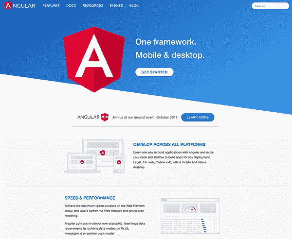
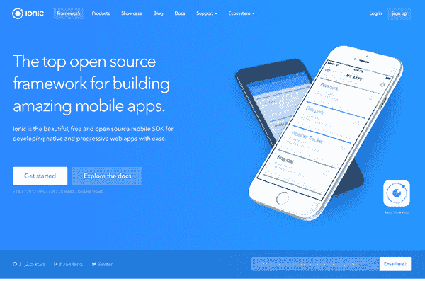
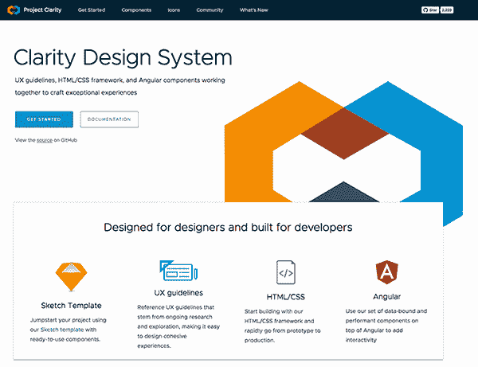
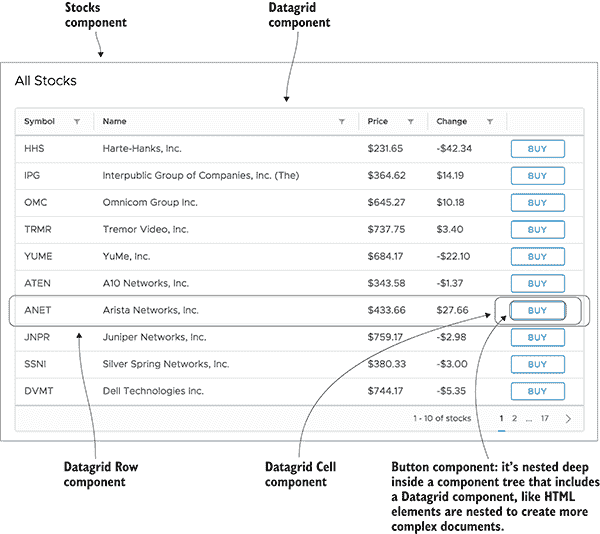
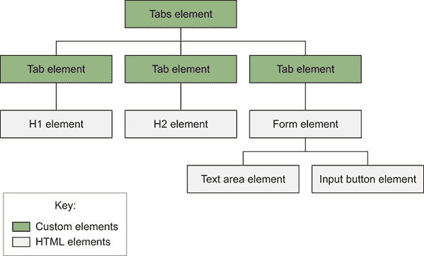
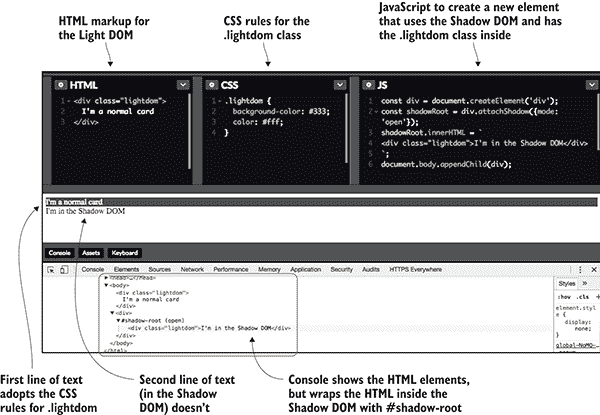
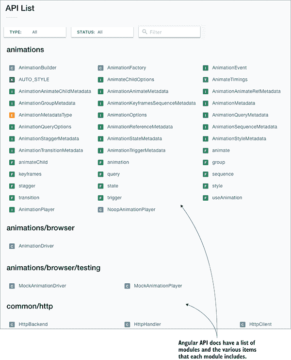
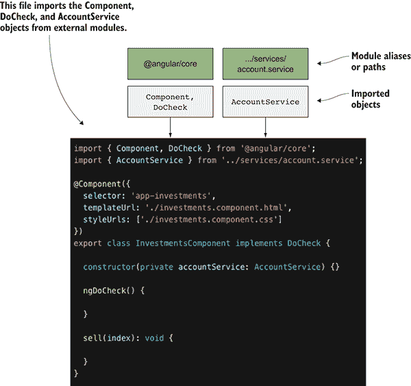

# 1

Angular：一个现代 Web 平台

**本章涵盖**

+   Angular 作为现代应用程序的平台

+   选择 Angular 的关键原因

+   Angular 的架构以及组件如何构成其基础

+   AngularJS 与 Angular 的区别

+   ES2015 和 TypeScript 以及 Angular 如何使用它们

Angular 是一个现代 Web 应用程序平台，承诺为开发者提供一套全面的工具和能力，以构建大型、健壮的应用程序。Angular 的核心价值主张是使构建适用于几乎所有平台的应用程序成为可能——无论是移动、Web 还是桌面。Angular 团队不仅专注于构建一个健壮的应用程序框架，还构建了一个完整的生态系统。

所有这些内容有点多，这也是 Angular 成为如此令人兴奋的技术之一的原因。让我们先仔细看看为什么你会选择 Angular 作为下一个项目的开发工具。

## 1.1 为什么选择 Angular？

构建能够满足用户需求的应用程序并非易事。应用程序的质量和复杂性不断增长，用户对质量和功能的需求也在增加。Angular 的存在是为了帮助开发者交付满足这些需求的应用程序。

如果你还没有确定 Angular 作为首选工具，让我们快速概述一些你应该认真考虑 Angular 的主要原因。一些内容在 1.3 节中有更详细的介绍，但以下是我经验中的主要亮点：

+   *受网络标准启发，由现代功能增强* — 任何今天构建 Web 应用程序的人都知道，有无数不同的方式和想法来设计应用程序。Angular 尝试围绕常见标准（如利用最新的 JavaScript 语言功能）设计和开发其框架及开发过程，使用现代功能（如采用 TypeScript 进行类型强制）。

+   *包含开发工具，提供定制选项* — Angular 通过其 CLI 工具（用于生成、构建、测试和部署应用程序）提供了一个共同的开发者体验，同时使这些相同的工具易于集成到定制解决方案（如定制构建工具链）和第三方工具（如不同的编辑器或 IDE）中。

+   *强大的生态系统和庞大的社区* — 存在着越来越多的第三方库、UI 库、博客文章和活动。Angular 的庞大和活跃社区提供了一个很好的学习基础，并应增强人们对它将继续保持有价值技术的信心。

+   *由 Google 赞助，开源社区驱动*—Google 有一支工程师、经理和传教士团队，他们专门致力于将 Angular 带给 Google 的其余部分和整个网络社区。在 Google 内部，有成千上万的“内部客户”依赖 Angular，Angular 团队利用这些经验来指导未来的开发，并收到了大量的外部贡献，这些贡献共同塑造了 Angular 的未来（你也可以加入其中！）。

Angular 不仅仅是一个为世界上一些顶级网站提供动力的 JavaScript 库。我对开源社区充满热情，并倡导人们将其作为日常例行公事的一部分参与项目。Angular 社区中的项目是我投入大量精力和贡献的地方，我也邀请你加入我。虽然我确实参与了 Angular 项目本身，但我主要贡献于 Angular 生态系统中的项目，例如 Clarity，一个 UI 组件库和设计语言。

你可能是一位试图弄清楚 Angular 是否满足你需求的开发者，或者你可能是一位试图理解这项技术角色、或试图弄清楚如何改进你当前应用程序的经理。无论你从哪里开始，Angular 生态系统都有很多可以提供的。

## 1.2 你将学到什么

本书旨在全面地介绍 Angular，但它也旨在让你了解生态系统的各个方面。方法始终是经验性的，你将学习一个主题，并通过自己构建它来观察概念如何变得生动。本书结束时，你应该能够制作高质量的 Angular 应用程序，并拥有构建职业和应用程序的基础知识和经验。

本书的关键要点包括以下内容：

+   *Angular 的工作原理*—我们将探讨一些关键内部概念，这些概念使得它成为构建应用程序的一个非常有吸引力的平台。你将学习这些概念，并通过构建示例来展示它们作为功能应用程序的一部分。

+   *如何构建应用程序*—在大多数章节中，我们将一步步地通过一些真实世界的例子进行讲解。代码示例全面，并针对每一章设定了特定的目标。

+   *了解生态系统*—每个例子都使用了一些第三方库和功能。这有助于你看到更真实的发展体验，并为构建你自己的应用程序打下基础。

+   *从我的经验中获得实用见解*—在许多例子及其说明中，我分享了我从经验中得到的实用建议，包括避免某些事情的建议（即使这些代码是合法的）以及当有多种方法可供选择时如何进行选择。

到本书结束时，你应该能够使用 Angular 设计和构建网络应用。如果你对技术方面不太感兴趣（也许是一个管理者），你仍然可以从中获得很多相同的教训，以获得 Angular 的工作方式和它为你的项目提供的内容的稳固参考框架。

在这本书中，有一些内容我无法涵盖，但这并不意味着你不能从它们相关的许多事物中学习。以下*不是*本书涵盖的核心主题：

+   *如何编写库* — 这本书侧重于如何使用 Angular 构建应用，从许多方面来看，构建库有不同的指南和建议。那将是另一本书的内容。但如果你不知道如何构建应用，构建库也会很困难。

+   *每个可用的 API 和功能* — 本书没有涵盖许多 API 和功能，主要是因为它们很少被使用。我相信这本书将使你能够提升自己的技能，以便在项目需要时快速学习这些附加功能。

+   *如何设计你的应用和* *用户体验原则* — 这是一个非常大的主题，我无法全面涵盖。我已经在章节示例中尝试展示了几种不同的想法和模式，以给你一些启发，但这些都往往是基于个人观点的。我希望你能花时间比较每种设计，并知道由于这些是示例而非实际项目，因此可能会有局限性。

Angular 是一个不断发展的项目，具有新的功能和有时是现有功能的弃用。我已经非常小心地确保所教授的概念是核心思想，这些思想不太可能改变（尽管它们可能会得到增强）。如果有任何更改破坏了一些示例代码或概念，请检查每个章节或本书的 GitHub 项目，或者论坛，其中应该有一个已知更改和错误列表。

为了更好地理解 Angular 在当今网络中的影响，让我们回顾几年前的历史，看看是什么带我们来到这里。

## 1.3 从 AngularJS 到 Angular 的旅程

网络应用在 2009-2010 年左右成熟，当时 Web 2.0 的潮流最终让位于更好的应用方法和框架。术语*网络应用*也因此变得更加精确，这或许在很大程度上得益于 HTML5 和 EcmaScript 5（JavaScript 的基础）的标准化，它主要关注构建几乎完全在浏览器中运行的稳健应用的能力。

2009 年，Miško Hevery 宣布了 AngularJS，这成为构建网络应用最受欢迎的框架（如果不是*最*受欢迎的），AngularJS 项目被引入谷歌，并于 2010 年 10 月正式发布了 1.0 版本。当时还有许多其他可行的框架，但 AngularJS 与广泛的开发者群体产生了共鸣。

Angular 2 版本于 2014 年 9 月正式宣布，历时两年（加上宣布之前的一些时间）开发。它于 2016 年 9 月以 Angular 2 版本发布，Angular 4 于 2017 年 3 月发布。Angular 团队将继续按照每六个月一次的节奏提供主要版本，重点关注易于升级。根据你阅读的时间，Angular 6 或甚至 10 可能是最新的版本。

但你阅读这本书不是为了了解过去——你对构建现代 Web 应用程序感兴趣。也许你已经构建了 Angular 1 应用程序，或者甚至从 Angular 2 的一些指南开始。本书的重点是构建现代 Web 应用程序，Angular 提供了优雅地完成这一目标的平台。

在整本书中，我会偶尔提到 AngularJS，以帮助有经验的读者建立联系，但当我使用没有数字的*Angular*时，我始终指的是 Angular 2 或更高版本。查看[`angular.io`](https://angular.io) (图 1.1)获取更多信息。



**图 1.1** Angular 网站是关于文档、活动和 Angular 的一切的绝佳资源。

## 1.4 Angular：一个平台，而不是一个框架

框架和平台之间有一些重要的区别。通常，*框架*只是用于构建应用程序的代码库，而*平台*则更加全面，包括框架之外的工具和支持。AngularJS 专注于在浏览器中构建 Web 应用程序，显然是一个框架。它有一个庞大的第三方模块生态系统，可以轻松地用于向应用程序添加功能，但核心只是构建浏览器中的 Web 应用程序。

Angular 附带了一个更精简的核心库，并且将附加功能作为单独的包提供，可以根据需要使用。它还拥有许多工具，这些工具使其超越了简单的框架，包括以下内容：

+   专门用于应用程序开发、测试和部署的 CLI

+   在许多后端服务器平台上提供离线渲染功能

+   基于桌面、移动和浏览器的应用程序执行环境

+   完备的 UI 组件库，例如 Material Design

其中一些功能在 AngularJS 中以某种形式存在，但大多数是社区解决方案，并在 AngularJS 之后添加。相比之下，Angular 是考虑到这些平台功能而开发的。

这些部分仍在完善中，并将继续发展成为更稳健的选项。

### 1.4.1 Angular CLI

现代开发通常需要设置许多工具才能开始一个项目，这导致了更多工具的诞生，以帮助管理这些工具。一个典型的项目需要管理构建过程（资产优化）、测试（单元测试和端到端测试）以及本地开发支持（本地服务器）。

Angular CLI（通常简称为 CLI）是构建提供这些功能以及更多功能的 Angular 应用的官方工具链。本书使用 CLI 进行所有示例，并鼓励你在自己的项目中使用它。你可以自己构建构建工具，但这仅在 CLI 无法满足你的需求时才建议。

你可以使用 npm 安装 CLI。它确实需要你安装一个较新的 NodeJS 版本才能正常运行：

```
npm install -g @angular/cli 
```

CLI 有许多有助于 Angular 应用程序开发的特性。以下是主要特性：

+   *生成新的项目骨架—*你不必从现有项目创建新项目或自己创建所有文件，CLI 会为你生成一个包含基本应用程序的完整项目。

+   *生成新的应用程序组件—*需要一个新的组件？很简单；它可以为你生成文件。它可以生成组件、服务、路由和管道，并且它还会在构建过程中自动确保它们完全连接。

+   *管理整个构建工具链—*因为文件在提供给客户端（如 TypeScript 编译）之前需要被处理，所以 CLI 会处理你的源文件并将它们构建成用于开发或生产的优化版本。

+   *提供本地主机开发服务器—*CLI 处理构建流程，然后启动一个监听 localhost 的服务器，以便你可以查看结果，并具有实时重新加载功能。

+   *集成代码检查和格式化代码—*通过使用 CLI 对你的代码进行风格和语义错误检查，CLI 可以帮助强制执行代码质量，并且它还可以自动将你的代码格式化为特定的风格规则。

+   *支持运行单元测试和端到端测试—*测试至关重要，因此 CLI 为运行单元测试设置了 Karma，并与 Protractor 合作执行端到端测试。它将自动捕获并执行新生成的测试。

你可以为 CLI 添加其他功能和能力。要查看完整的功能列表，你可以运行 `ng help` 来输出当前的帮助文档。你还可以在 [`cli.angular.io`](https://cli.angular.io) 上了解更多关于 CLI 的信息。

### 1.4.2 服务器渲染和编译器

在 Angular 中，编译输出与浏览器解耦，这使得 Angular 应用可以在不同的环境中渲染，例如服务器或桌面应用程序。这种设计模式有许多很好的副作用，因为 Angular 能够在客户端和服务器上渲染，这使得它更加灵活，并开辟了许多不同的机会。

这里有两个因素在起作用——首先，Angular 的解耦编译器，然后是可选的通用渲染支持。要启用通用渲染，需要一个解耦的编译器，因为你可以根据环境实现不同的渲染模式。

Angular 中的编译器是整个解决方案中非常重要的一部分。它负责解析数据绑定、注册事件处理程序，并为组件渲染出结果 HTML。

“服务器端渲染”这个术语涉及到这样一个观点：运行执行 Angular 代码的 JavaScript 引擎的位置不应该很重要。应该能够以浏览器 JavaScript 引擎、NodeJS 或甚至更不常见的引擎（如 Java 的 Nashorn 引擎）的方式，在通用环境中运行 Angular。这极大地增加了 Angular 的使用方式。

这为什么很重要？让我们探索一些主要的使用案例：

+   *服务器端渲染以实现更快的加载速度*——如今，移动设备是访问互联网的主要方式，而移动连接通常速度慢且不可靠。服务器端渲染选项允许您在服务器上解析数据绑定和渲染组件，这样发送给用户的初始负载就可以预先初始化。它还可以优化并发送必要的字节以实现快速初始加载时间，并在需要时懒加载其他资源。

+   *浏览器中的性能*——JavaScript 的一个主要痛点是它是单线程的，这意味着 JavaScript 一次只能处理一条指令。在现代浏览器中，一种称为 Web Workers 的新技术允许 Angular 将编译器的一些执行推送到另一个进程。这意味着可以发生更多的处理，并且它使得动画和用户交互更加平滑。

+   *搜索引擎优化（SEO）*——人们非常关注搜索引擎如何爬取重量级的 JavaScript 应用程序。通用渲染意味着我们可以检测爬虫并为它们渲染网站，这样内容就可以准备好了，无需担心爬虫是否执行 JavaScript（有些会，有些不会）。这无疑将增强 Angular 应用程序的 SEO 努力。

+   *多平台支持*——许多开发者希望使用其他平台作为他们的后端，例如.NET 或 PHP。如果有一个支持的渲染器，Angular 可以在所选平台上编译。Angular 将提供对 NodeJS 的支持，但社区正在积极构建和维护对其他平台（如 Java 和 Go）的渲染支持。

所有这些在构建 Web 应用程序中已经存在了多年，Angular 提供了一个全面的解决方案。好处是您不需要做很多工作就能在您的应用程序中启用这些功能。

这是在撰写本文时的一个发展领域，正确设置它是一个高级话题，我无法深入探讨。但 Angular 文档和 CLI 正在不断改进，以向您展示如何轻松地整合这些类型的优势。

### 1.4.3 移动和桌面功能

渲染能力使 Angular 能够与原生移动和桌面应用程序协同工作。像 Cordova 这样的工具已经存在了一段时间；它们允许你创建*混合*应用程序——Web 应用程序被包裹在某种类型的原生壳中。但 Angular 的渲染设计使得支持渲染到不同的原生平台成为可能。

最大的价值在于你可以在你的 Angular 应用程序之间共享大量代码，即使有些是为构建移动应用程序而设计的，而有些则是 Web 应用程序。这在大型团队中尤其有价值。

Angular 的移动和桌面功能是编译器设计的扩展。以下工具都在 Angular 的核心之外，但使用 Angular 的设计来驱动一些强大的设计模式：

+   *Ionic（移动）—*这个出色且流行的混合应用程序框架（图 1.2）已更新以与 Angular 兼容。数百万个移动应用程序都是使用 Ionic 创建的，它主要专注于构建混合应用程序。UI 组件都是为在浏览器中运行而设计的，但看起来和感觉像原生 UI 组件。

+   *原生脚本（移动）—*这是另一个流行的移动框架，可以创建原生移动应用程序。原生脚本实现了原生 UI 组件，但允许你编写 Angular 组件来描述你的应用程序。

+   *React Native（移动、桌面）—*从名字上看，你会正确地假设 React Native 实际上是 React 框架生态系统的一部分。但通过自定义渲染，可以使用 React Native 工具生成原生移动应用程序。



**图 1.2**  Ionic 是一个流行的强大移动框架，适用于 Angular。

+   *Windows 通用（桌面）—*Windows 支持使用 JavaScript 构建原生 Windows 应用程序。你可以使用 Angular 作为应用程序层，但仍需构建原生 Windows 应用程序。

+   *电子（桌面）—*基于 NodeJS 的 Electron 是一个非常流行的跨平台应用程序框架。它实现了一套 API 来钩入原生操作系统，并允许你利用 Angular 来驱动应用程序的内部逻辑。

+   *渐进式 Web 应用程序（移动、桌面）—*渐进式 Web 应用程序（PWA）的功能并不仅限于 Angular。它们本质上是关于模糊 Web 和原生之间的界限。截至本文撰写时，它们处于实验性支持状态。这是构建未来应用程序的一个令人兴奋的潜在途径。

这些不同的选项支持了 Angular 中解耦编译器的强大功能。这也意味着可能会出现许多、许多更多的示例和用例，允许你构建几乎在任何地方都能运行的 Angular 应用程序。

### 1.4.4 UI 库

为 Angular 构建的 UI 库目录正在不断增长。它们为开发者提供了易于消费的 UI 组件集合。你无需自己构建图表或标签组件，可以使用众多预构建选项之一。

根据你团队的大小和技能组合，实现自己的 UI 组件可能会很具挑战性。制作真正可重用和加固的 UI 组件是困难的。这些组件很少是使你的应用程序真正独特的东西，因此很难花费时间和金钱来构建它们。

这些库非常丰富。数量众多，以至于我无法涵盖所有选项。你会注意到它们提供的功能有很多重叠，因此比较它们可能会很困难。我们将探讨一些最受欢迎的选项，但我建议在选择选项之前进行额外的调查：

+   *Angular Material ([`github.com/angular/material2`](https://github.com/angular/material2)) —* Material Design 是由 Google 创建的官方设计规范。它在现实世界对象的概念中有着深厚的根基，因此得名 Material。Angular Material 是 Angular 团队提供的官方 UI 组件库，并根据设计规范实现了多个 UI 组件。它拥有开源许可。

+   *Covalent ([`teradata.github.io/covalent`](https://teradata.github.io/covalent)) —* 这个库通过添加许多额外的组件和能力扩展了 Angular Material 项目，但仍保留了 Material Design 的原则。它是 Teradata 的工作成果。它拥有开源许可。

+   *Clarity ([`vmware.github.io/clarity`](https://vmware.github.io/clarity)) —* 如 图 1.3 所示，这个库来自 VMware。它被设计为一个库和 Web 应用程序的设计规范。它包含许多特定于 Angular 的组件，还有一些图标和一个通用的 CSS 框架。它拥有开源许可。

+   *ng-bootstrap ([`ng-bootstrap.github.io`](https://ng-bootstrap.github.io)) —* 基于 Bootstrap CSS 框架，ng-bootstrap 根据 Bootstrap 的设计实现了组件。它是由创建 AngularJS UI Bootstrap 项目的同一团队构建的。它拥有开源许可。

+   *Kendo UI ([`www.telerik.com/kendo-angular-ui/`](https://www.telerik.com/kendo-angular-ui/)) —* 来自 NativeScript 的同一公司，Kendo UI 是一个集成到许多不同框架中的 UI 库。该公司正在构建一套专为 Angular 定制的原生 UI 组件。它拥有商业许可。

+   *PrimeNG ([www.primefaces.org/primeng/](http://www.primefaces.org/primeng/)) —* PrimeNG 是由 PrimeTek 开发的 UI 组件丰富集合，拥有超过 60 个组件。它提供了许多主题，并专为移动设备和桌面设计。它拥有开源许可。

+   *Wijmo ([`wijmo.com/angular2/`](http://wijmo.com/angular2/)) — 包含一些非常复杂的数据网格组件，Wijmo 实现了这一系列 Angular 组件，而不需要像 jQuery 这样的其他库的支持。该 UI 库具有商业许可证。



**图 1.3** 清晰度设计系统是 Angular UI 库中最受欢迎的之一。

+   *Ionic ([`ionic.io`](http://ionic.io)) — 主要针对移动端，Ionic 是一个包含易于主题化、原生设备集成、实用服务和自身 CLI（应用程序开发工作流程）的组件库。该公司还提供移动应用程序开发的商业服务。它具有开源许可证。

+   *Fuel-UI ([`fuelinteractive.github.io/fuel-ui/`](http://fuelinteractive.github.io/fuel-ui/)) — 由 Fuel Travel 提供的另一个基于 Bootstrap CSS 框架的组件、指令和管道集。它具有开源许可证。

你当然不需要使用 UI 库，但大多数开发者会发现它们很有用。任何合理的 UI 库都应该经过相当充分的测试，让你能更多地关注使你的应用程序独特的地方。

## 1.5 组件架构

许多现代应用程序都采用了基于组件的方法来开发应用程序。目的是以独立的方式设计你应用程序的每一部分，以限制程序各个部分之间的耦合和重复。在许多方面，*组件*是在你的应用程序中创建自定义 HTML 元素的一种方式。

思考组件架构的最简单方法之一是查看一个包含大量离散部分的页面示例，并检查各个部分是如何相互关联的。图 1.4 展示了未来章节的一个示例，并直观地分解了各种组件部分。



**图 1.4** 通过展示组件如何嵌套和组合以创建更复杂的布局来展示组件架构

图表显示了本书章节示例中的一个独立部分，说明了几个组件如何组合在一起创建这个显示。你可以看到各个部分相互独立，但它们也共同工作以创建项目列表。它们之间显然存在层次关系。右侧的组件列表显示了每个组件与其他组件之间的父子关系，这正是 HTML 元素在页面上协同工作的基本方式。

HTML 本身是一种组件语言。每个元素都有一定的角色和功能，并且它们可以轻松嵌套以创建更复杂的功能。它们是隔离的，但仍然可以轻松地操作以完成当前所需的任何任务。一些元素协同工作。例如，`INPUT`元素在`FORM`内部使用，以描述一组输入控件。许多元素在发生某些事情时也可以发出事件；例如，`FORM`在表单提交时可以发出事件。这允许你根据触发的事件将额外的逻辑连接到 HTML 元素，这是前端应用程序开发的基础。

希望组件架构看起来相当容易接近，并且与你对网络的当前理解保持一致。目的是将应用程序的各个部分（尤其是视觉 UI 元素）分解成离散的、模块化的组件。

实现组件架构有许多方法，正如许多网络应用程序库（如 React 和 Ember）所证明的那样。Angular 有一个非常明显的基于组件的架构（所有 Angular 应用程序都是组件）。React 和 Ember 也为其应用程序提供了对组件的一级支持。那些有 jQuery 经验的人也可以想象 jQuery 插件在概念上可以类似于组件，尽管它们并不那么一致或规范。甚至 Web 2.0 时代的基礎概念（想想小工具！）也是围绕构建组件来展开的。

### 1.5.1 组件的关键特性

组件有一些概念驱动着它们的设计和架构。本节将更详细地探讨这些概念，但也要关注 Angular 如何在整本书的实践中应用这些概念：

+   *封装* — 将组件逻辑保持在单一位置

+   *隔离* — 将组件内部隐藏对外部行为者

+   *可复用性* — 允许以最小的努力进行组件复用

+   *事件驱动* — 在组件的生命周期中发出事件

+   *可定制* — 使其可能对组件进行样式化和扩展

+   *声明式* — 使用具有简单声明性标记的组件

当我们构建组件时，上述原则是我们设计最佳组件时应该考虑的。这些概念以前以各种形式存在，但很少全部被明确实现并标准化为网络平台。

互联网标准组织（W3C），作为网络的主要标准机构，正在制定官方的 Web 组件规范。为了实现网络组件的完整愿景，需要几个标准：

+   自定义元素（封装、声明式、可复用性、事件驱动）

+   阴影 DOM（隔离、封装、可定制）

+   模板（封装、隔离）

+   JavaScript 模块（封装、隔离、可复用性）

到目前为止，该规范并未在所有浏览器中得到完全采用，并且可能永远不会得到完全采用。标准也可能发生变化，但在这里深入探讨规范的细节并不至关重要。重要的是，这四个概念是组件理念的核心。让我们更详细地探讨它们，看看它们如何使组件架构成为可能。

#### 自定义元素

HTML 是网络的通用语言，因为它以相当简洁的元素集描述了页面内容。作为一种标记语言，它是一种描述内容的声明性方式。*自定义元素*意味着能够通过我们自己的附加元素扩展 HTML，增加可能性的词汇表。你可以在[www.w3.org/TR/custom-elements/](http://www.w3.org/TR/custom-elements/)上阅读关于官方规范的更多信息。

自定义元素的官方规范旨在允许开发者创建新的 HTML 元素，这些元素本质上可以自然地、本地地融合到 DOM 中。换句话说，使用自定义元素应该与其他任何 HTML 元素的使用没有区别。例如，想象你想创建一个实现标签页界面的自定义元素。你可能会想创建如下代码所示的自定义元素，并在图 1.5 中：

```
<tabs>
  <tab title="About">
    <h1>This is the about tab</h1>
  </tab>
  <tab title="Profile">
    <h2>This is the profile tab</h2>
  </tab>
  <tab title="Contact Us">
    <form>
      <textarea name="message"></textarea>
      <input type="submit" value="Send">
  </tab>
</tabs> 
```

这看起来和感觉就像自然的 HTML，因为这些将会有两个自定义元素：`tab`s 和`tab`元素。这里的真正价值在于实现标签页的简便性。使用 jQuery，你最终会创建大量的`div`元素，应用多个自定义 ID 或类，并在其上添加一些 JavaScript。

这些标签页也可以发出事件。例如，每当活动标签更改时，可能会有一个`tabChange`事件。你的应用程序中的任何内容都可以监听此事件并相应地采取行动。每个自定义元素都可以实现任何看似对组件生命周期实用的数量的事件。

自定义元素也可以实现自己的样式，因此标签页可以默认具有特定的外观和感觉。任何使用标签页的人都可以编写自己的 CSS 来修改它以适应特定的使用场景，但自定义元素可以有一个默认的外观，就像许多 HTML 元素一样。

自定义元素拥有构建组件所需的大量功能。实际上，我们可以在自定义元素上停止，并且相当满意。它为我们提供了一种*声明性*的方式来创建*可重用*的组件，该组件*封装*了组件的内部机制，使其与应用程序的其他部分隔离开来，但可以发出*事件*以使其他组件能够钩入组件的生命周期。Angular 在其组件实现中使用了这些概念。



**图 1.5** 自定义元素适合于正常的 HTML 层次结构，但可以实现新的行为。

Angular 提供自己的机制来创建自定义元素，这实际上就是一个 Angular 组件。每个 Angular 组件都是一个自定义元素，并满足我们期望从自定义元素获得的四个原则（以及更多）。

### 1.5.2 Shadow DOM

尽管名字听起来有些不吉利，但当你试图在组件内部隔离样式行为时，*Shadow DOM*实际上是你的最佳朋友。Shadow DOM 是一个独立的文档对象模型（DOM）树，与典型的 CSS 继承分离，允许你在 Shadow DOM 内部和外部之间创建一个屏障。例如，如果你在 Shadow DOM 内部有一个按钮，而在外部也有一个按钮，那么在 Shadow DOM 外部编写的按钮 CSS 不会影响其内部的按钮。这对于 Angular 来说很重要，因为它允许我们更好地控制 CSS 如何影响组件的显示方式。

CSS 是一种强大的语言，但大多数 Web 开发者都遇到过 CSS 样式意外修改了除目标元素之外的其他元素的问题，尤其是在添加外部 CSS 源时。Shadow DOM 提供了一种真正封装组件 HTML 和 CSS 的方法，使其与其他页面部分分离，这被称为 Light DOM。你可以在[www.w3.org/TR/shadow-dom](http://www.w3.org/TR/shadow-dom)上阅读官方规范。

开发者应该熟悉标准的 Light DOM，它定义了与元素样式和可见性相关的标准 DOM 行为。当你编写一个 CSS 规则时，CSS 选择器是唯一限制哪些元素接收特定样式的途径。在大多数情况下，CSS 都是通过某种系统方法编写的，以明确 CSS 样式如何应用。这导致了众多优秀的 CSS 网格和组件框架的出现，如 Bootstrap 和 Foundation。它还为我们提供了一系列 CSS 选择器命名法，如 CSS 的可伸缩模块化架构（SMACSS）和块元素修饰符（BEM）。尽管我们已经找到了管理 Light DOM 的方法，但这并没有改变根本的行为，即有人仍然可能通过添加一个不遵循指南的规则来破坏整个应用程序。

由于 CSS 选择器的贪婪特性，总是试图匹配尽可能多的元素，因此在用 CSS 进行页面样式缩放时一直伴随着痛苦。与 Light DOM 相比，Shadow DOM 赋予我们能力将 DOM 的一部分移入一个新领域，这个新领域不会与 Light DOM 样式交互。

在许多科幻故事中，人物可能会以某种方式被困在现实的一个新维度中，这个维度与正常现实分离，他们通常无法通过现实之间的某种“桥梁”进行交互。同样，我喜欢将使用 Shadow DOM 视为将当前上下文转移到与 Light DOM 非常有限连接的新维度，因此允许我们编写在无法修改其他样式的条件下渲染的 CSS 和 HTML。

开发者可以创建一个新的 Shadow DOM（称为 *阴影根*），这将切割出一个与 Light DOM 有限交互的独立 DOM 树。您仍然需要将此根作为节点附加到 DOM 树中。*阴影边界* 是 Light DOM 和 Shadow DOM 之间的线。有许多细微差别和功能使得某些形式的样式可以针对边界内或边界外，但我会将这些细节留给你，如果需要的话再深入研究。

在 图 1.6 中，您可以看到一个简单的示例，其中图像中间输出的第一行文本具有黑色背景和白色文字，而第二行文本（位于阴影根内）没有。



**图 1.6**  Shadow DOM 示例，其中来自阴影根之外的风格不会跨越边界并应用于内部元素

Shadow DOM 为浏览器中样式和模板提供了最佳封装形式。它能够以某种方式隔离组件的内部，使得外部样式和脚本不会意外地附加并修改它。它确实提供了一些定制功能，允许您跨越阴影边界进行通信。这些功能在我们想要构建复杂且可重用的组件时尤为重要，这些组件可以完全自包含样式。

不幸的是，Shadow DOM 的支持可能不是所有浏览器都提供，可能需要 polyfill。第四章将更详细地探讨这个问题，但 Angular 允许我们编写使用 Shadow DOM、Shadow DOM 的模拟版本或仅 Light DOM 的组件。

### 1.5.3 模板

*模板* 是一个强大的功能，它允许我们创建用于组件中的独立 DOM 片段。我们的自定义元素需要某种内部结构，并且我们通常需要能够重用这种标记。理想情况下，这不应该使主文档杂乱无章，HTML5 引入了一个新的 `template` 标签来帮助我们。您可以在 [`www.w3.org/TR/html5/semantics-scripting.html#the-template-element`](https://www.w3.org/TR/html5/semantics-scripting.html#the-template-element) 阅读规范。

在模板内部编写的任何标记都只是一个不属于当前页面的片段，除非它被显式初始化。换句话说，如果你查看 DOM 树，模板中的内容不会出现。如果你的标记包含 CSS、内联脚本、图像元素或其他通常触发浏览器操作的元素，这些操作将不会在模板使用之前运行。

模板通常与 Shadow DOM 一起使用，因为它允许你定义模板，然后将其注入到 shadow root 中。没有模板，Shadow DOM API 将需要我们逐个节点地注入内容。它们也被 Angular 作为组件生命周期和编译过程的一部分使用，允许 Angular 在数据变化和需要重新编译时保持模板的隔离、惰性副本作为数据。

模板的作用与整体组件架构很好地融合，并与 Shadow DOM 和自定义元素协同工作。它们提供了一层封装，允许你定义一个在需要时才激活的模板，从而将模板与应用程序的其他部分隔离开来。

### 1.5.3 JavaScript 模块

无论是 HTML 还是 JavaScript，传统上都没有在应用程序生命周期中加载额外文件或资产的原生方法。你必须确保所有需要的文件在页面加载时都已加载，或者使用一些通常依赖于发起 XHR 请求或向页面添加新脚本标签的解决方案。尽管这些方法有效，但它们并不特别优雅，也不总是容易使用。

今天，我们在 JavaScript 中有模块和模块加载器，这为在整个应用程序生命周期中加载和执行代码提供了原生方法，而不仅仅是页面加载时。以前，开发者必须提前构建包含所有资产的 Web 应用程序包，并将整个包交付给用户。模块（图 1.7）为我们提供了许多有趣的功能，其中许多对使用过具有包或模块功能的其他语言的开发者来说都很熟悉，比如 Java、Python 或 Go。



**图 1.7** Angular 提供了包含所有你需要构建应用程序的服务和对象的模块（如动画），但首先你必须导入它们。

本质上，模块并不是严格意义上的组件技术。模块是可以用来生成组件、创建可重用服务或执行 JavaScript 能做的任何其他事情的独立 JavaScript 代码块。它们本质上是封装应用程序代码并选择应用程序其他部分可以使用的内容的一种方式。



**图 1.8** 从不同模块使用导入将对象加载到文件中

在 JavaScript 中，一个模块是任何包含 `export` 关键字的 JavaScript 代码文件。模块导出它们想要暴露给应用程序的值，并且可以保持内部逻辑的其他部分私有。然后，为了使用导出的值，你必须首先从另一个模块中导入它（图 1.8）。

在 图 1.8（来自后续章节的片段）中，我们首先从外部模块导入一些东西，这些模块是本文件中其余代码所依赖的。`Component` 和 `DoCheck` 对象是从 @angular/core 包（它是我们的 node 模块目录的一部分）导入的，而 `AccountService` 是基于提供的文件路径导入的。

这些模块之所以强大，是因为它们 *封装* 了单个 JavaScript 文件的全部内容，形成一个单一的整体。它们 *隔离* 代码，并允许开发者有条件地导出值以共享。它们还通过定义在 JavaScript 应用程序中共享值的通用机制来支持 *可重用性*，这在之前只能通过直接在全局作用域上放置值或通过创建一些非标准的服务来管理依赖注入来实现，就像 Angular 1 所做的那样。

HTML 导入是一个类似的概念，它作为 HTML 规范的一部分被提出，将提供类似的功能。但很可能会采用 JavaScript 模块而不是 HTML 导入。有一些库使用 HTML 导入，例如 Polymer，通过使用 polyfill 库来实现。

Angular 本身完全围绕模块的概念构建。源代码广泛使用它们。当你编写自己的应用程序时，建议你也使用它们。执行 Angular 应用程序本质上是在加载一个包含应用程序引导逻辑的模块，然后它开始加载和触发其他模块。虽然不推荐，但可以使用 ES5 语法编写不使用模块的 Angular 应用程序，这将在下文中讨论。

## 1.6 现代 JavaScript 和 Angular

Angular 被设计用来利用许多相对较新的网络平台特性。其中大部分在 2015 年随着 ES2015（也称为 ES6，但我会使用其官方名称 ES2015）的发布成为 JavaScript 规范的一部分；其他特性在撰写本文时仍在开发中，但很可能在未来版本中得到采用。

这些特性在许多地方都有很好的介绍，所以我就不详细说明了。尽管它们可以与 AngularJS 一起使用，但 Angular 是设计用来利用这些功能的。我将快速介绍一些最重要的方面，即以下内容：

+   类

+   装饰器

+   模块

+   模板字符串

让我们来看一个所有这些特性共同作用时的例子，然后回顾一下它们是如何组合在一起的。以下列表是一个功能性强但简单的 Angular 组件，你将在本书中看到更多使用相同概念但更复杂方式的例子。

**列表 1.1** 现代 JavaScript 语法

```
import {Component} from '@angular/core';     
```

```
 @Component({     
```

```
 selector: 'my-component',
 template: `
```

```
<div>     
 <h4>{{title}}</h4>
</div>     
`     
})
export class MyComponent {     
```

```
 constructor() {
 this.title = 'My Component';
 }
}      
```

让我们从底部开始，然后逐步进行。在 ES2015 中，类被引入作为一种定义对象的新方法，实际上它是一个函数。类用于创建组件、指令、管道和服务，尽管它们也可以以其他方式使用。使用 `class` 关键字创建 `MyComponent` 类，它是一个具有名为 `title` 的属性的对象。

类是 JavaScript 中创建对象的语法糖。它们没有为 JavaScript 引入新的继承类型，这一点很重要要记住。熟悉其他语言中类对象的开发者可能会意外地将概念带入 JavaScript，但在这个情况下，类的概念并没有改变 JavaScript 中原型继承的工作方式。

在类内部有一个特殊的方法叫做 `constructor()`。当创建对象的新副本时，它会立即执行。只要你的方法命名为 `constructor()`，它就会在创建过程中被使用。

类也很有用，因为它们有助于确保关键字 `this` 引用对象本身。关键字 `this` 是 JavaScript 中常见的障碍，类有助于确保其行为更加一致。

`export` 关键字表示文件是一个模块。任何模块都被隔离到一个私有空间中，除非值被导出，否则它将不可用于其他文件或模块。这打破了 JavaScript 中值的全局作用域，并在模块之间提供了适当的分离。因为 `MyComponent` 类被导出，所以它可以被导入到另一个模块中（此处未显示）。

在文件顶部，`import` 语句从 `angular/core` 模块中导入 `Component` 值，这使得它可以在本模块中使用。

然后在中间，我们使用 `@Component` 装饰器，这是一种向类添加元数据的方式。装饰器总是以 @ 符号开头，Angular 使用这些装饰器来理解声明的类的类型。在这种情况下，它是一个组件，Angular 将根据这个装饰器知道如何渲染组件。还有其他几个装饰器，例如 `Injectable` 和 `Pipe`，我们将在稍后看到它们的作用。

最后，装饰器接受一个包含与组件本身相关的元数据的对象。在这个例子中，它有两个属性用于选择器和内联 HTML 模板。装饰器定义了可以传递给这里的属性，但它们允许你自定义 Angular 处理类的方式。

### 1.6.1 可观察对象

除了新的语法之外，*可观察对象* 是 JavaScript 应用程序管理异步活动的新模式。它们也是 JavaScript 语言中要原生实现的功能的草案，因此这个模式有了一定的分量。RxJS 是我们将用来帮助我们实现应用程序中可观察对象的库。

*Promise*是另一种帮助处理异步调用的结构，例如，用于进行 API 请求很有用。Promise 的一个主要限制是它们只对一次调用周期有用。例如，如果你想在用户点击事件上让 Promise 返回一个值，那么这个 Promise 将在第一次点击时解决。但你可能对处理*每个*用户点击动作感兴趣。通常，你会使用事件监听器来处理这种情况，这允许你在一段时间内处理事件。这是一个重要的区别：可观察对象就像事件处理器一样，它们会随着时间的推移持续处理数据，并允许你连续处理那个数据流。

响应式编程是可观察对象提供的更高层次的名字，它是一种处理异步数据流的模式。如果你这么想，一个 Web 应用中的许多事物实际上都是异步数据流。用户在表单输入中输入按键实际上是一系列单个字符的流。计时器和间隔生成随时间推移的活动流。WebSockets 随时间流过数据。这很简单，但挑战在于如何理解这一切。

Angular 经常使用可观察对象模式，掌握基础知识是有用的。在本书的整个过程中，你会在多个地方看到可观察对象，它们都以相同的基本方式工作。我们不会在这里担心构造可观察对象。相反，我们将专注于当它们被提供给你时如何使用它们。

要使用可观察对象，你需要订阅数据流，并传递一个函数，该函数会在有新数据时运行。我们将在第二章中看到这个操作的示例，当我们发起 HTTP 请求时，但让我们先快速看一下一些语法：

```
this.http.get('/api/user').subscribe(user => {
    // Do something with the user record
}, (error) => {
    // Handle the error
}) 
```

这个片段正在使用 HTTP 库来发起一个`get`请求，该请求返回一个可观察对象。然后我们订阅这个可观察对象，当数据返回或错误被处理时，我们的回调函数就会被触发。它与 Promise 没有太大区别，只不过可观察对象可以继续发送数据。让我们看一个不同的例子：

```
this.keyboardService.keypress().subscribe(key => {
    // Do something with the key record
}, (error) => {
    // Handle the error
}) 
```

在这个例子中，假设`keyboardService.keypress()`返回一个可观察对象，并发出有关按下哪个键的详细信息。这就像一个事件监听器，只不过它以流的形式出现。

可观察对象的另一个有趣的能力是它们可以组合成多种组合。可观察对象可以组合、扁平化成一个，过滤，等等。我们将在第九章中看到一个示例，我们将合并两个可观察对象流，并在一个地方处理它们发出的数据。在这本书中，我们不会使用许多更复杂的功能，但你可能对它们是如何工作的感兴趣，所以我推荐阅读《RxJS in Action》（www.manning.com/books/rxjs-in-action）这本书。

## 1.7 TypeScript 和 Angular

Angular 本身是用 TypeScript 编写的，它是 JavaScript 的超集，引入了强制类型信息的能力。它可以与任何版本的 JavaScript 一起使用，因此你可以用它与任何 ES3（这不是一个打字错误）或更新的版本一起使用。

TypeScript 的基本价值主张是它可以对变量持有的值类型施加限制。例如，一个变量可能只能持有数字，或者它可能持有字符串数组。JavaScript 有类型（不要让任何人告诉你不是这样！），但变量没有类型，所以你可以将任何类型的值存储在任何变量中。这也催生了各种比较运算符，如 `==` 用于松散相等或 `===` 用于严格相等。

TypeScript 可以帮助在它们影响应用程序之前捕获许多简单的语法错误。有时你可以编写有效的 JavaScript，但现实世界表明，有效的语法并不总是意味着有效的行为。以下是一个例子：

```
var bill = 20;
var tip = document.getElementById('tip').value; // Contains '5'
console.log(bill + tip); // 205 
```

这个片段展示了简单的小费计算器示例，其中你从输入元素中获取值并将其添加到账单中，以获取总付款金额。这里的问题是 `tip` 变量实际上是一个字符串（因为它是一个文本输入）。将数字和字符串相加可能是新 JavaScript 开发者最常见的陷阱之一，尽管这可能会发生在任何人身上。如果你使用 TypeScript 来强制类型，这段代码可以编写为警告这种常见的错误：

```
var bill: number = 20;
var tip: number = document.getElementById('tip').value; // 5, error!
var total: number = bill + tip; // error! 
```

在这里，我们使用 TypeScript 声明所有这些变量必须各自持有数字值，通过使用 `:number`。这是一个简单的语法，位于 JavaScript 内部，告诉 TypeScript 变量应该持有哪种类型的值。`tip` 值将报错，因为它被分配了一个字符串，然后总值将报错，因为它尝试将数字和字符串类型相加，结果是一个字符串。

对于经验丰富的 JavaScript 开发者来说，这可能是明显的错误，但你有多少次让新开发者参与你的代码库？你有多少次重构你的代码？你能确保在维护应用程序的过程中，你的应用程序仍在传递相同的值类型吗？没有 TypeScript，你在使用每个值之前必须进行严格的比较检查。

许多开发者都在 wonder 为什么他们应该费心学习和使用 TypeScript。在我看来，以下是使用 TypeScript 的主要理由：

+   *使你的代码更清晰 —* 具有类型的变量更容易理解，因为其他开发者（或六个月后的你自己）不必太费脑筋就能想清楚变量应该是什么。

+   *启用更智能的编辑器 —* 当你使用 TypeScript 与支持编辑器时，你将获得代码的自动 IntelliSense 支持。当你编写代码时，编辑器可以建议已知的变量或函数，并告诉你它期望的类型值。

+   *在运行代码前捕获错误—*TypeScript 会在你运行浏览器中的代码之前捕获语法错误，帮助你减少编写无效代码时的反馈循环。

+   *完全可选—*当你需要时可以使用类型，也可以选择在不重要的地方省略它们。

我希望你已经认可了 TypeScript 的价值。如果没有，我希望你在阅读本书的过程中能更仔细地审视它。本书在示例中使用 TypeScript，以提供更多的清晰度并进一步展示 TypeScript 的强大功能。随着我们在示例中使用功能，我会尝试提供关于 TypeScript 特性和功能的额外见解，但你始终可以在 [www.typescriptlang.org/docs/tutorial.html](http://www.typescriptlang.org/docs/tutorial.html) 上学习所有你需要知道的内容。

即使你选择不在你的应用程序中使用 TypeScript 进行类型检查，你仍然可以使用 TypeScript 来编译你的应用程序。因为 Angular CLI 已经内部使用了 TypeScript，你可能在使用它而自己却不知道。如果你决定构建自己的构建工具，TypeScript 仍然是一个值得考虑的编译器选项。

如果你想知道是否在 Angular 应用程序中使用 TypeScript 是必需的，技术上答案是无需。有方法可以编写不使用 TypeScript 的应用程序，并在一定程度上避免使用 TypeScript。但出于故意，这部分内容并未被文档化，因为 Angular 有许多功能在没有使用 TypeScript 的情况下无法正常工作。如果你担心它难以学习，请不要担心。它很简单，本书中我会在几个地方解释一些你可能之前未曾见过的 TypeScript 的细微差别。

## 摘要

本章介绍了 Angular 作为开发平台，而不仅仅是应用框架。Angular 有许多特性和功能。以下是一个简要总结：

+   Angular 是一个平台，内置了许多关键元素，如工具、UI 库和测试，这些都可以轻松集成到你的应用程序项目中。

+   应用程序本质上是由组件组合而成的。这些组件建立在封装、隔离和可重用性的核心原则之上，应该具有事件、可定制性和声明性。

+   ES6 和 TypeScript 为 Angular 的架构和语法提供了很多基础，使其成为一个无需构建大量自定义语言功能的强大框架。
