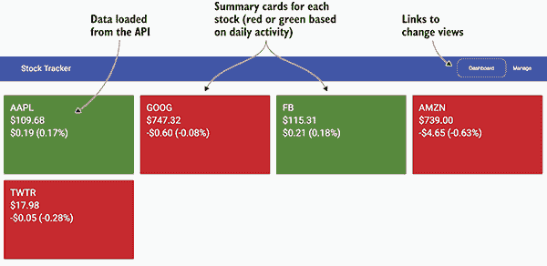
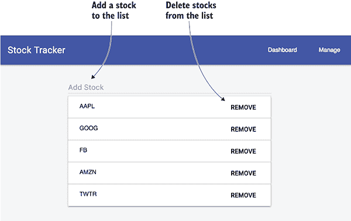
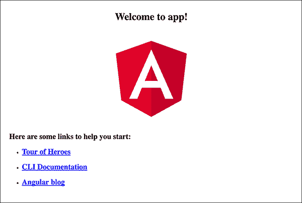
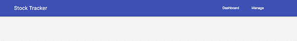
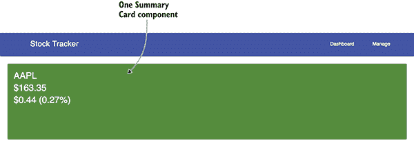
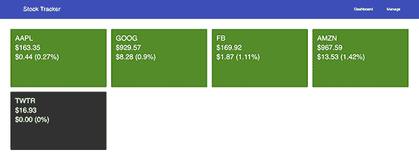
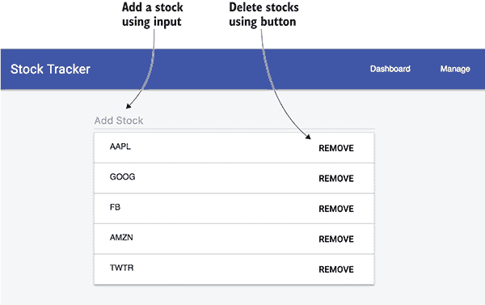

# 2

构建你的第一个 Angular 应用程序

**本章涵盖**

+   Angular 组件及其如何构成你的应用程序的基础

+   使用装饰器定义多种类型的组件

+   学习如何使用服务在应用程序中共享数据

+   设置路由以显示不同的页面

在本章中，你将从零开始构建一个完整的 Angular 应用程序，同时学习 Angular 的主要概念。你将看到 TypeScript 的某些功能在实际应用中的表现，以及 JavaScript 的新功能和即将推出的功能。

这个项目将保持专注和简单，同时仍然代表了你将在典型应用程序中使用的许多功能。你将创建的应用程序是一个股票跟踪应用程序，数据来自 Yahoo! Finance。它将能够获取当前的股票价格，从列表中添加或删除股票，并根据当天的盈亏调整视觉显示。

在本章中，我们将逐步构建这个应用程序。我们将专注于通过示例应用程序，以足够的细节来理解本章中的各个部分和复杂性：

+   *引导* *应用程序 —* 要启动应用程序，我们将使用 *引导* 功能在加载完成后启动一切。这发生在应用程序生命周期中一次，我们将引导 App 组件。

+   *创建组件 —* Angular 全是关于 *组件*，我们将为不同的目的创建几个组件。我们将了解它们是如何构建的，以及它们如何嵌套以创建复杂的应用程序。

+   *创建服务和使用 HttpClient* — 为了代码重用，我们将把一些帮助管理股票列表的逻辑封装到一个 *服务* 中，并使用 Angular 的 HttpClient 服务来加载股票报价数据。

+   *在模板中使用管道和指令* — 使用 *管道*，我们可以在显示过程中将数据从一种格式转换为另一种格式，例如将时间戳格式化为本地日期格式。*指令* 是修改模板中 DOM 元素行为的实用工具，例如重复部分或条件性地显示元素。

+   *设置路由* — 大多数应用程序都需要允许用户在应用程序中导航的能力，通过使用 *路由器*，我们可以了解如何在不同的组件之间进行路由。

使用有限的代码，你可以创建一个健壮的应用程序，执行多个复杂任务。后续章节将详细介绍每个单独的功能，以更全面地了解 Angular 提供的一切。

你应该熟悉 ES2015 以及 JavaScript 语言的最新功能。我不会详细介绍新的语言结构，例如导入或类。我建议花些时间阅读 Mozilla 开发者网络 ([`developer.mozilla.org/en-US/docs/Web/JavaScript`](https://developer.mozilla.org/en-US/docs/Web/JavaScript)) 以获取更多详细信息，或者选择一本书来阅读。

## 2.1 预览章节项目

当我们完成时，应用应该看起来像你在图 2.1 和 2.2 中看到的那样。在我们构建它们之前，我们会简要地介绍各个部分，这样你就能看到它们是如何组合在一起的。

首先，有一个 API 从 Yahoo! Finance 加载当前的股票价格数据；它在 Heroku 上部署，但本章没有涵盖，但你可以在 [`github.com/angular-in-action/api`](https://github.com/angular-in-action/api) 上查看 API 的代码。它是一个标准的 REST API，不需要身份验证。我们将创建一个服务来帮助我们访问和从 API 加载数据。

当应用加载时，它会显示仪表板页面 (figure 2.1)，其中包含一系列卡片。每个卡片包含一个股票、当前价格和当天的价格变动（以货币值和百分比表示）。卡片的背景将为红色表示负变动，绿色表示正变动，或灰色表示无变动。这些卡片是组件的实例，它们接收股票数据并确定如何渲染卡片。



**图 2.1** — 股票跟踪应用的仪表板页面，包含链接和摘要卡片

最后，顶部的导航栏有两个链接，一个是仪表板，另一个是管理视图，这允许在视图之间进行一般导航。我们将使用 Angular Router 来设置这些路由并管理浏览器如何确定显示哪个视图。

当你在导航栏中点击管理链接时，你会看到管理页面 (figure 2.2)，其中列出了股票。在这里，你可以通过点击删除按钮来删除任何股票。你也可以通过在文本区域中输入股票代码并按 Enter 键来添加新的股票。



**图 2.2** — 股票跟踪应用的管理页面，包含更改要显示的符号列表的表单

这个页面是一个单独的组件，但它包含一个表单，用户输入更改后立即更新。可以通过在输入字段中输入新的股票代码并按 Enter 键来扩展列表，或者通过点击删除按钮来减少列表。在两种情况下，符号列表都会立即更改，如果你回到仪表板，你会看到更新的列表出现。

这个项目有一些限制，你应该知道。为了保持示例的专注和简单，有一些细节没有包含在应用中：

+   *没有坚持* — 每次你在浏览器中刷新应用时，股票列表都会重置为默认列表。

+   *缺乏* *错误检查* — 一些情况可能会引发错误或导致异常行为，例如尝试添加一个不存在的股票。

+   *没有单元测试* — 对于这个示例，我专注于代码，并故意省略了单元测试，这些将在后面介绍。

这个示例旨在为您提供 Angular 应用构建的概述——而不是提供一个坚不可摧的应用。我在本章末尾提供了一些有趣的挑战，以及许多可以想象的可能功能。

## 2.2 设置项目

我们将使用 Angular CLI 从头开始构建这个示例。如果您需要查看这个项目的代码，可以在 GitHub 上找到[`github.com/angular-in-action/stocks`](https://github.com/angular-in-action/stocks)，每个步骤都有标签，这样您可以使用 Git 跟踪，或者您可以复制章节中的内容。

如果您还没有设置 Angular CLI，请回到第一章并设置它。本书中使用的是 CLI 版本 1.5，所以如果您使用的是旧版本，您可能需要升级。

在终端中，从一个您想要在其中生成新项目文件夹的目录开始。然后您可以使用以下命令生成新项目，并启动开发服务器：

```
ng new stocks
cd stocks
ng serve 
```

这将花费一些时间，因为 CLI 从 npm 安装了多个包，这取决于您网络的速率以及注册表的繁忙程度。一旦完成，您可以使用浏览器在 http://localhost:4200 查看应用。您应该看到一个简单的页面，上面写着有关这是一个新的 Angular 应用的内容，如图 2.3 所示。新项目的默认内容会随着时间的推移而变化，所以如果看起来有点不同，请不要担心。



**图 2.3**  CLI 生成了一个包含一些默认内容的空白应用。

如果您看到类似的屏幕，那么一切应该都设置好了，准备就绪。这不是最令人兴奋的示例，但它为您自动设置了一些东西。我们现在将浏览已经生成的内容以及它是如何显示这个简单信息的。

## 2.3 基本应用骨架

CLI 生成了一个包含许多文件的新项目。我们暂时将关注最重要的文件，并随着时间的推移了解更多关于其他文件的信息。需要注意的是，CLI 以特定的方式生成文件，更改文件位置或名称可能会导致 CLI 失败。目前，我建议您在更熟悉之前不要移动文件，除非您计划稍后构建自己的工具。随着时间的推移，CLI 生成的确切文件和文件名可能会发生变化，所以如果您遇到任何问题，请查看 CLI 的变更日志和文档。

项目包含几个目录和文件。主要文件列在表 2.1 中，以及它们在应用程序中的通用角色。这些大多数是针对开发各个方面的配置，例如代码风格检查规则、单元测试配置和 CLI 配置。

**表 2.1**  CLI 生成的项目顶级内容及其角色

| **资产** | **角色** |
| --- | --- |
| e2e | 端到端测试文件夹，包含一个基本的存根测试 |
| node_modules | 标准的 NPM 模块目录，不应在此处放置代码 |
| src | 应用程序的源目录 |
| .editorconfig | 编辑器配置默认值 |
| .angular-cli.json | 关于此项目的 CLI 配置文件 |
| karma.conf.js | Karma 单元测试运行器的配置文件 |
| package.json | 标准的 NPM 包清单文件 |
| protractor.conf.js | Protractor 端到端测试运行器的配置文件 |
| README.md | 标准的 README 文件，包含启动信息 |
| tsconfig.json | TypeScript 编译器的默认配置文件 |
| tslint.json | TypeScript 代码风格检查的配置文件 |

在本章中，你将只修改位于 src 目录内的文件，该目录包含所有应用程序代码。表 2.2 列出了 src 目录内生成的所有资产。这看起来可能有很多文件，但它们各自都扮演着角色，如果你不确定某个文件的作用，现在就先不要动它。

**表 2.2** src 目录的内容及其角色

| **资产** | **角色** |
| --- | --- |
| app | 包含主要应用程序组件和模块 |
| assets | 用于存储静态资源（如图片）的空目录 |
| environments | 环境配置，允许你为不同的目标（如开发或生产）构建 |
| favicon.ico | 作为浏览器收藏夹图标显示的图片 |
| index.html | 应用程序的根 HTML 文件 |
| main.ts | 网络应用程序代码的入口点 |
| polyfills.ts | 导入一些在特定浏览器上正确运行 Angular 所需的常见 polyfills |
| styles.css | 全局样式表 |
| test.ts | 单元测试的入口点，不属于应用程序部分 |
| tsconfig.app.json | 应用的 TypeScript 编译器配置 |
| tsconfig.spec.json | 单元测试的 TypeScript 编译器配置 |
| typings.d.ts | 类型定义配置 |

现在你已经对生成的内容有了大致的了解，我们将检查构成应用程序逻辑的一些关键文件。下一节将更详细地探讨 Angular 如何将应用程序目录的内容渲染到你在屏幕上看到的结果。

## 2.4 Angular 渲染基本应用程序

在我们开始构建应用程序之前，你需要了解这个基本脚手架是如何工作的，以及我们需要添加什么。这是一个快速浏览，以便你尽可能快地开始，所以请期待在本书后面的内容中会有更深入和细致的探讨。在第三章中，我们将花更多的时间来探讨这些主题，以获得对如何构建一切的更深入理解。

Angular 至少需要一个组件和一个模块。一个 *组件* 是 Angular 应用程序的基本构建块，它类似于任何其他 HTML 元素。一个 *模块* 是 Angular 将应用程序的不同部分组织成一个 Angular 可以理解的单一单元的方式。你可能将组件想象成 LEGO® 砖块，它们可以有多种不同的形状、大小和颜色，而模块则是 LEGO® 砖块包装的方式。组件用于功能性和结构，而模块用于包装和分发。

### 2.4.1 App 组件

我们将从查看 src/app/app.component.ts 文件开始。这个文件包含了一个被称为 *App 组件* 的内容，它是应用程序的根组件。在 LEGO® 的术语中，你可以将这个组件想象成你用来开始构建的大绿色平台。下面的列表显示了组件的代码。再次强调，具体的代码可能会随时间而变化，所以如果它略有不同，请不要担心——它将具有相同的基本要求。

**列表 2.1** 生成 App 组件（src/app/app.component.ts）

```
import { Component } from '@angular/core';     
```

```
 @Component({     
```

```
 selector: 'app-root',
 templateUrl: './app.component.html',
 [styleUrls: ['./app.component.css']](#c02-codeannotation-0002)
})     
export class AppComponent {     
```

```
 title = 'app works!';
}      
```

如果你是 TypeScript 新手，那么列表中可能包含一些不熟悉的语法，所以让我们仔细看看代码的每个部分。首先，你导入 `Component` 注解。它用于通过添加与组件相关的详细信息来装饰 App 组件，但这些信息不是其控制器逻辑的一部分，即 `AppComponent` 类。Angular 会查看这些注解，并使用它们与 `AppComponent` 控制器类一起在运行时创建组件。

`@Component` 注解通过接受一个对象来声明这个类是一个组件。它有一个选择器属性，用于声明组件的 HTML 选择器。这意味着组件在模板中使用时，会通过添加一个 HTML 标签 `<app-root></app-root>` 来实现。

`templateUrl` 属性声明了一个指向包含 HTML 模板的模板的链接。同样，`styleUrls` 属性包含了一个指向任何应为此组件加载的 CSS 文件的链接数组。`@Component` 注解可以有更多属性，你将在本章中看到更多关于这些属性的使用。

最后，你可以看到 `AppComponent` 类有一个名为 `title` 的单个属性。其值是你应该在浏览器中看到的值，因此这是最终出现在浏览器中的值的来源。Angular 极大地依赖于 ES2015 类来创建对象，并且 Angular 中的几乎所有实体都是通过类和注解创建的。

现在，让我们通过打开 src/app/app.component.html 来查看与 App 组件相关的标记，如下所示：

```
<h1>
  {{title}}
</h1> 
```

如您所见，这只是一个简单的标题标签，但其中定义了双大括号之间的 `title` 属性。这是一种常见的绑定值到模板的方式（也许您熟悉 *Mustache 模板*），这意味着 Angular 将用组件中 `title` 属性的值替换 `{{title}}`。这被称为 *插值*，常用于在模板中显示数据。

我们已经查看过 App 组件，但现在我们需要查看 App 模块，以了解如何使用 Angular 进行连接和渲染。

### 2.4.2 应用模块

App 模块是一种打包方式，有助于告诉 Angular 可用哪些内容进行渲染。就像大多数食品项目都有包装来描述内部的各种成分和其他重要值一样，模块描述了渲染模块所需的各种依赖项。

应用程序中至少有一个模块，但出于不同的原因（稍后介绍），可以创建多个模块。在这种情况下，这是之前提到的 App 组件以及大多数应用程序所需的其他功能（如路由、表单和 HttpClient）。

CLI 为我们生成了模块，因此我们可以在 src/app/app.module.ts 中查看它，如下所示。再次强调，这些内容可能会随时间变化，但结构和目的保持不变。

**列表 2.2**  App 模块（src/app/app.module.ts）

```
import { BrowserModule } from '@angular/platform-browser';     
```

```
import { NgModule } from '@angular/core';     

import { AppComponent } from './app.component';     
```

```
 @NgModule({     
```

```
 declarations: [
```

```
 AppComponent
 [],](#c02-codeannotation-0007)
 imports: [
```

```
 BrowserModule,
 [],](#c02-codeannotation-0008)
 [providers: [],](#c02-codeannotation-0009)
```

```
 [bootstrap: [AppComponent]](#c02-codeannotation-0010)
```

```
})
export class AppModule { }     
```

就像组件一样，模块也是一个具有装饰器的对象。这里的对象称为 `AppModule`，而 `NgModule` 是装饰器。第一个块是导入大多数应用程序通用的任何 Angular 依赖项以及 App 组件。

`NgModule` 装饰器接受一个具有几个不同属性的对象。`declarations` 属性用于提供一个组件和指令列表，以便在整个应用程序中可用。

`imports` 属性是一个数组，包含此模块所依赖的其他模块——在本例中是浏览器模块（一组必需的功能）。如果您包含其他模块，例如第三方模块或您自己创建的模块，它们也需要在此列出。

下一个属性是 `providers` 属性，默认为空。任何创建的服务都需要在此列出，我们将在稍后看到如何进行此操作。

最后，`bootstrap` 属性定义了在运行时启动哪些组件。通常，这将是相同的 App 组件，CLI 已经为我们设置好了。`bootstrap` 属性应与下一节中启动的组件相匹配。

我们编写的代码为 Angular 创建了一个配置，以便它查看和理解如何渲染。接下来要查看的是启动时执行的代码，这被称为 *启动*。

### 2.4.3 启动应用程序

应用程序必须在运行时引导以启动渲染过程。到目前为止，我们只声明了代码，但现在我们将看到它是如何执行的。CLI 负责连接基于 webpack 的构建工具。

首先，查看 .angular-cli.json 文件。你会看到一个应用程序数组，其中一个属性是 `main` 属性。默认情况下，它指向 src/app/main.ts 文件。这意味着当应用程序构建时，它将自动调用 main.ts 文件的内容作为第一组指令。

main.ts 文件的作用是引导 Angular 应用程序。main.ts 文件的内容包含在以下列表中，并且只包含几个基本指令。

**列表 2.3** 启动时调用的主文件（src/app/main.ts）

```
import { platformBrowserDynamic } from '@angular/platform-browser-dynamic';     
```

```
import { enableProdMode } from '@angular/core';     
import { environment } from './environments/environment';     
import { AppModule } from './app/';     

if (environment.production) {     
```

```
 enableProdMode();
}     

platformBrowserDynamic().bootstrapModule(AppModule);     
```

第一部分导入了一些依赖项，特别是 `platformBrowserDynamic` 和 `AppModule`。名称有点长，但 `platformBrowserDynamic` 对象用于告诉 Angular 正在加载哪个模块，在这种情况下是之前提到的 `AppModule`。我在书中稍后介绍了模块的渲染，但到目前为止，重要的是要理解这是代码开始执行的地方。

通过查看 index.html 文件，我们可以审查最后一件事情。如果你记得 App 组件代码，有一个 `app-root` 选择器用于在标记中识别组件。你应该在 src/index.html 文件中看到以下内容：

```
<body>
  <app-root></app-root>
</body> 
```

一旦应用程序通过 列表 2.3 中的代码引导，Angular 将寻找 `app-root` 元素并将其替换为渲染的组件。这就是你在 图 2.1 中看到的内容，但在加载一切的同时，你会看到一个“正在加载...”的消息。在组件渲染之前，所有资产都需要加载和初始化，这可能需要一点时间。这被称为 *即时编译*（JiT），意味着所有内容都是按需在浏览器中加载和渲染的。JiT 仅适用于开发，可能在未来的版本中被移除。

我想添加一些小的细节，帮助我们通过添加一些基本的 CSS 和标记来设计应用程序的其余部分。首先，我们需要向我们的 src/index.html 添加两个链接标签：

```
<link rel="stylesheet" href="//storage.googleapis.com/code.getmdl.io/1.0.1/material.indigo-orange.min.css">
<link rel="stylesheet" href="//fonts.googleapis.com/icon?family=Material+Icons"> 
```

这将加载一些字体图标和应用程序的全局样式，这些样式基于 Material Design Lite 项目。这是你可以加载外部样式库或其他资产引用的一种方式。

我们希望给我们的应用程序添加一些全局样式。将以下内容添加到 src/styles.css 文件中——它将为应用程序提供一个浅灰色背景：

```
body {
  background: #f3f3f3;
} 
```

最后，我们想要设置一些基本标记来构建我们的应用程序。让我们用以下列表中的标记替换 src/app/app.component.html 文件的内容。

**列表 2.4** 基本标记脚手架（src/app/app.component.html）

```
<div class="mdl-layout mdl-js-layout mdl-layout--fixed-header">
  <header class="mdl-layout__header">
    <div class="mdl-layout__header-row">
      <span class="mdl-layout-title">Stock Tracker</span>
      <div class="mdl-layout-spacer"></div>
      <nav class="mdl-navigation mdl-layout--large-screen-only">
        <a class="mdl-navigation__link">Dashboard</a>
        <a class="mdl-navigation__link">Manage</a>
      </nav>
    </div>
  </header>
  <main class="mdl-layout__content" style="padding: 20px;">

  </main>
</div> 
```

这个标记基于 Material Design Lite 设计风格，用于创建基本的工具栏和主体。工具栏包含标题和两个链接（目前处于非活动状态），应该看起来像图 2.4。



**图 2.4** 修改后的基本脚手架以使用 Material Design Lite 标记

好的，我们已经使用 CLI 创建了基本的应用程序脚手架，看到了 App 组件、App 模块和引导逻辑，并找到了渲染组件的标记。恭喜你，你已经制作了你的第一个 Angular 应用程序！好吧，我知道这还不是那么令人印象深刻——但这是每个 Angular 应用程序的基本部分。在接下来的章节中，我们将从这个基本应用程序开始，逐步构建到完整的股票跟踪示例。要开始，你将学习如何创建一个从 API 加载数据的 Angular 服务。

## 2.5 构建服务

*服务* 是对象，它们抽象了一些你计划在多个地方重用的常用逻辑。由于它们是对象，它们可以执行你需要它们做的任何事情。使用 ES2015 模块，这些类被导出，因此任何组件都可以按需导入它们。它们也可以有函数，甚至静态值，如字符串或数字，作为在应用程序的各个部分之间共享数据的方式。

另一种思考服务的方式是将它们视为可共享的对象，你的应用程序的任何部分都可以按需导入。它们能够抽象一些逻辑或数据（例如从源加载某些数据所需的逻辑），因此很容易在任何组件中使用。

尽管服务通常有助于管理数据，但它们并不局限于任何特定的工作。服务的目的是使代码可重用。一个服务可能是一组需要共享的常用方法。你可以有各种“辅助方法”，例如解析数据格式或需要在多个地方运行的认证逻辑，你不想反复编写。

在应用程序中，你将需要有一个股票列表，用于仪表板和管理页面。这是一个使用服务来帮助管理和在不同组件间共享数据的完美场景。

CLI 为我们提供了一种创建具有所需脚手架的服务的好方法。它还将为该服务生成一个简单的服务和一个测试存根。要生成一个服务，你运行以下命令：

```
ng generate service services/stocks 
```

CLI 会生成 src/app/services 目录下的文件。它包含最基本的服务，该服务不执行任何操作。让我们继续填写整个服务的代码，并了解它是如何工作的。你最终将补充以下列表中的代码。股票服务将有一个包含股票代码列表的数组，并公开一组方法来检索或修改股票列表。

**列表 2.5** 股票服务（src/app/services/stocks.service.ts）

```
import { Injectable } from '@angular/core';     
```

```
import { HttpClient } from '@angular/common/http';     

[let stocks: Array<string> = ['AAPL', 'GOOG', 'FB', 'AMZN', 'TWTR'];     ](#c02-codeannotation-0016)
```

```
let service: string = 'https://angular2-in-action-api.herokuapp.com';     

export interface StockInterface {     
```

```
 symbol: string;
 lastTradePriceOnly: number;
 change: number;
 changeInPercent: number;
}     

@Injectable()     
```

```
export class StocksService {     
```

```
 constructor(private http: HttpClient) {}
```

```
 get() {
```

```
 return stocks.slice();
 }

 add(stock) {
```

```
 stocks.push(stock);
 return this.get();
 }

 remove(stock) {
```

```
 stocks.splice(stocks.indexOf(stock), 1);
 return this.get();
 }

 load(symbols) {
```

```
 if (symbols) {
 return this.http.get<Array<StockInterface>>(service + '/stocks/snapshot?symbols=' + symbols.join());
 }
 }
} 
```

服务首先需要导入其依赖项；一个是服务的装饰器，另一个是 HttpClient 服务。然后它声明两个变量；一个是跟踪股票符号列表，另一个是 API 端点 URL。

然后定义并导出 `StockInterface` 接口供其他组件使用。这提供了 TypeScript 对股票对象应包含内容的定义，TypeScript 使用它来确保数据的使用保持一致。我们将在以后使用它来确保在它们被使用时正确地为我们股票对象进行类型化。

`StocksService` 类被导出并由 `Injectable` 装饰器装饰。装饰器用于设置适当的连接，以便 Angular 知道如何在其他地方使用它，所以如果你忘记包含装饰器，类可能无法注入到你的应用程序中。

在构造函数方法中，使用 TypeScript 技术声明一个名为 `http` 的私有变量，并给它一个 HttpClient 类型。Angular 可以检查类型定义并确定如何将请求的对象注入到类中。如果你是 TypeScript 新手，请记住，每次你在变量声明后看到冒号，你都是在定义应该分配给该变量的对象类型。

该服务包含四个方法。`get()` 方法是一个简单的返回 `stocks` 数组当前值的函数，但它总是返回一个副本而不是直接值。这样做是为了封装股票值并防止它们被直接修改。`add()` 方法向 `stocks` 数组添加一个新项目并返回新修改后的值。`remove()` 方法将从 `stocks` 数组中删除一个项目。

最后，`load()` 方法调用 HttpClient 服务来加载当前股票价格数据。HttpClient 服务被调用并返回一个可观察对象（observable），这是一个用于处理异步事件（如 API 调用中的数据）的构造。我们在第一章中简要介绍了可观察对象，将在其他章节中看到更多，但这是你第一次看到它们在实际操作中的样子。

HttpClient 有一个小功能，作为 `get()` 方法的一部分出现，并被放置在两个尖括号之间：

```
this.http.get<Array<StockInterface>>(... 
```

这被称为 *类型变量*，是 TypeScript 的一个特性，允许你告诉 `http.get()` 方法它应该期望什么类型的对象，在这种情况下，它将期望得到一个符合 `StockInterface`（我们的股票对象）的对象数组。这是可选的，但如果尝试访问不存在的属性，它对编译器非常有帮助。

我们还需要进行一个额外的步骤，因为命令行界面（CLI）不会自动将服务注册到 App 模块中，我们还需要将 HttpClient 注册到应用程序中。打开 src/app/app.module.ts 文件，并在顶部附近添加这两个导入：

```
import { HttpClientModule } from '@angular/common/http';
import { StocksService } from './services/stocks.service'; 
```

这将导入 Stocks 服务和`HttpClientModule`到文件中，但我们需要将`HttpClientModule`注册到应用程序中。找到在 NgModule 中定义的导入部分，并像下面这样更新它以包括`HttpClientModule`：

```
 imports: [
    BrowserModule,
    HttpClientModule
  ], 
```

现在我们需要将新的`StocksService`注册到`providers`属性中，以通知 Angular 它应该对模块可用：

```
providers: [StocksService], 
```

你的服务已经配置好并准备好使用，但我们还没有在我们的应用程序中使用它。下一节将探讨如何使用它。

此服务并不复杂。它主要设计用于抽象数组的修改，以便它不会被直接修改，并从 API 加载数据。当应用程序运行时，`stocks`数组可以被修改，并且更改将反映在仪表板和管理组件中，正如你很快就会看到的。因为它被导出，所以当需要时很容易导入。

现在，你将创建一个使用一些默认指令并允许可配置属性修改组件显示的组件。

## 2.6 创建你的第一个组件

你已经看到了一个基本组件（App 组件）。现在，你将构建一个更复杂的组件，该组件使用一些指令和管道，并有一个属性。我们将创建一个显示股票价格信息基本摘要卡的组件。

此组件将只从其父组件接收要显示的数据，并根据输入值修改自己的显示。例如，父组件将传递特定股票的当前数据，而摘要组件将使用每日变化来确定背景应该是绿色还是红色，这取决于股票是上涨还是下跌。

本组件的关键目标如下：

+   接收股票数据并显示

+   根据当天的活动更改背景颜色（增长时为绿色，减少时为红色）

+   格式化值以正确显示，例如货币或百分比值

图 2.5 显示了组件的位置，我们甚至将其连接到从 API 加载数据。最终，我们将实例化多个此组件的副本，以显示每个股票的卡片。



**图 2.5** 单个显示股票数据的摘要组件

显然，当你运行此操作时，股票价值将根据最新数据而变化，但你可以看到显示当前数据的卡片。让我们深入了解构建这张卡片，然后我们将逐步讲解它是如何产生这个输出的各个部分。

返回终端并运行以下命令：

```
ng generate component components/summary 
```

CLI 将在 src/app/components/summary 目录内生成一个新的组件。我们首先必须创建 src/app/components 目录，因为 CLI 不会自动为你创建缺失的文件夹。这有助于将组件组织到单个目录中，尽管你也可以选择在其他地方生成它们。

现在组件的内容与 App 组件最初出现时的内容非常相似。它包含一个空的 CSS 文件、基本的 HTML 模板、测试占位符以及已经初始化并带有组件注解的空类。

我们将首先设置组件的模板，然后我们将创建控制器来管理它。打开`src/app/components/summary/summary.component.html`文件，将其内容替换为以下列表中的内容。

**列表 2.6** 摘要组件模板

```
[<div class="mdl-card stock-card mdl-shadow--2dp" [ngClass]="{increase: isPositive(), decrease: isNegative()}" style="width: 100%;">     ](#c02-codeannotation-0025)
```

```
 <span>
    <div class="mdl-card__title">
      <h4 style="color: #fff; margin: 0">
 {{stock?.symbol?.toUpperCase()}}<br />
```

```
 {{stock?.lastTradePriceOnly | currency:'USD':'symbol':'.2'}}<br />
```

```
 {{stock?.change | currency:'USD':'symbol':'.2'}} ({{stock?.changeInPercent | percent:'.2'}})
```

```
 </h4>
    </div>
  </span>
</div> 
```

模板包含一些标记来结构化卡片，使其看起来像一张材料设计卡片。如果我们查看第一行，我们会看到这个片段作为`div`元素上的一个属性：

```
[ngClass]="{increase: isPositive(), decrease: isNegative()}" 
```

这是一个特殊类型的属性，称为指令。*指令*允许您修改模板中 DOM 元素的行为和显示。把它们想象成 HTML 元素上的属性，可以导致元素改变其行为，例如禁用 HTML 输入元素的`disabled`属性。指令使得添加一些条件逻辑或以其他方式修改模板的行为或渲染方式成为可能。

NgClass 指令能够向元素添加或移除 CSS 类。它被分配了一个值，这个值是一个包含 CSS 类名的属性对象，这些属性映射到控制器上的一个方法（待编写）。如果方法返回 true，它将添加该类；如果为 false，它将被移除。在这个片段中，卡片在当天交易为正时将获得`increase` CSS 类，在为负时将获得`decrease` CSS 类。

Angular 内置了一些指令，您将在本章中看到更多。指令通常接受一个表达式（如本例中的我们的对象），该表达式由 Angular 评估并传递给指令。表达式可能评估为布尔值或其他原始值，或者解析为一个函数调用，该函数调用将在指令运行之前执行以返回一个值。根据表达式的值，指令可能会做不同的事情，例如根据表达式是 true 还是 false 来显示或隐藏。

我们之前看到了一个插值的例子，但现在有一个更复杂的例子，用于显示股票的符号。控制器预期有一个名为`stock`的属性，它是一个包含各种值的对象：

```
{{stock?.symbol?.toUpperCase()}} 
```

双大括号语法是显示页面中某些值的方式。这被称为*插值*，如果您还记得之前的内容，这要复杂一些。大括号之间的内容被称为*Angular 表达式*，它将与控制器（如指令）进行评估，这意味着它将尝试在控制器上找到一个属性来显示。如果失败，通常它会抛出一个错误，但安全导航运算符`?.`将在属性缺失时静默失败，并且不会显示任何内容。

此代码块将显示股票符号，但为大写形式。大多数 JavaScript 表达式都是有效的 Angular 表达式，尽管有些事情是不同的，例如安全导航运算符。调用原型方法（如 `toUpperCase()`）的能力仍然存在，这就是它能够将文本渲染为大写的原因。

下一个插值显示了最后交易价格，并添加了一个名为 *管道* 的另一个功能，这些管道直接添加到表达式中以格式化输出。插值表达式通过管道符号 `|` 扩展，然后通过冒号 `:` 分隔的命名管道进行配置（可选）。价格值返回为普通浮点数（如 111.8），这与货币格式不同，货币应显示为 $111.80：

```
{{stock?.lastTradePriceOnly | currency:'USD':'symbol':'.2'}} 
```

管道只修改显示之前的数据，并不改变控制器中的值。在这段代码中，双大括号表示您希望将存储在 `stock.lastTradePriceOnly` 属性中的数据绑定以显示。数据通过货币管道传输，该管道根据美元数值将值转换为金融数字，并四舍五入到两位小数。现在让我们看看下一行：

```
{{stock?.change | currency:'USD':'symbol':'.2'}} ({{stock?.changeInPercent | percent:'.2'}}) 
```

下一行也有两个不同的插值绑定，使用货币或百分比管道。第一个将转换为相同的货币格式，但第二个将百分比作为小数（如 0.06）转换成 6%。Angular 文档可以详细说明所有可用的选项以及如何为每个管道使用它们。

此模板单独不起作用；它需要一个控制器来连接数据和方法。让我们打开 `src/app/components/summary/summary.component.ts` 文件，并替换您在以下列表中看到的代码。

**列表 2.7** 摘要组件控制器

```
import { Component, Input } from '@angular/core';     
```

```
 @Component({     
```

```
 selector: 'summary',
 [styleUrls: ['./summary.component.css'],](#c02-codeannotation-0030)
 templateUrl: './summary.component.html'
})     
export class SummaryComponent {     
```

```
 @Input() stock: any;
```

```
 isNegative() {
```

```
 return (this.stock && this.stock.change < 0);
 }

 isPositive() {
```

```
 return (this.stock && this.stock.change > 0);
 }
} 
```

此控制器导入依赖项，这几乎是任何用 TypeScript 编写的文件的第一个代码块。组件元数据描述了选择器、链接样式和链接模板文件，这些构成了组件。我们稍后将向样式添加一些 CSS。

摘要控制器类以一个名为 `stock` 的属性开始，该属性前带有 `Input` 注解。这表示此属性将由父组件提供，并将其传递给摘要。属性通过属性绑定到元素，如您在此处所见——此示例将设置父组件的 `stockData` 的值在摘要组件的 `stock` 属性中：

```
<summary [stock]="stockData"></summary> 
```

因为输入是通过绑定属性传递的，所以它将评估表达式并将其传递到该属性中，以便摘要组件可以消费。Angular 表达式在存在绑定时表现相同。它们试图在控制器中找到对应值以绑定到属性。

最后，有两个方法用于检查股票值是正数还是负数。股票也可能是中性的，所以这是默认状态，只有当股票发生变化时，其中一个方法才会返回 `true`。这些方法由 NgClass 指令使用，如模板中之前所述，以确定是否添加特定的 CSS 类。

我们想要添加的最后部分是 CSS 类本身。Angular 有一些有趣的方式来封装 CSS 样式，以确保它们只应用于单个组件。我们稍后会深入探讨具体细节，但请打开 src/app/components/summary/summary.component.css 文件，并添加样式，如下面的列表所示。

**列表 2.8** 摘要组件 CSS 样式

```
:host .stock-card {     
```

```
 background: #333333; 
}
:host .stock-card.increase {     
```

```
 background: #558B2F;
  color: #fff;
}
:host .stock-card.decrease {     
```

```
 background:#C62828;
  color: #fff;
} 
```

这是一种典型的 CSS，尽管你可能以前没有见过或使用过 `:host` 选择器。因为组件需要尽可能自包含，它们依赖于第一章中讨论的 Shadow DOM 概念。当 Angular 渲染此组件时，它会修改输出以确保 CSS 选择器是唯一的，并且不会意外地干扰页面上的其他元素。这种行为是可以配置的，但稍后我们会介绍。

主选择器是一种指定您希望样式应用于宿主元素的途径，因此在这种情况下，它将查看摘要组件元素本身，而不是其内容。这里 CSS 的主要目的是确定摘要组件的背景颜色。

我们已经走过了摘要组件的生成过程，并构建了一个功能组件。让我们快速使用它来了解一下它的行为。

查看 src/app/app.module.ts 文件，你会看到 CLI 已经修改了模块，使其包含在 App 模块中的摘要组件。这里没有需要做的事情，但我想要指出这一点。

现在查看 src/app/app.component.ts 并更新为以下列表的内容。这将包括股票服务，并使用它将股票数据存储到属性中。然后我们将使用它来显示摘要卡片。

**列表 2.9** 应用组件控制器

```
import { Component } from '@angular/core';
import { StocksService, StockInterface } from './services/stocks.service';
     
```

```
 @Component({
  selector: 'app-root',
  templateUrl: './app.component.html',
  styleUrls: ['./app.component.css']
})
export class AppComponent {
 stocks: Array<StockInterface>;
```

```
 constructor(service: StocksService) {
    service.load(['AAPL']).subscribe(stocks => {
 this.stocks = stocks;
```

```
 });
  }
} 
```

在这里，我们将加载的股票数据存储在一个名为 `stocks` 的属性中。我们还提供了一些类型信息，这些信息是从我们的股票服务中导入的，这样 TypeScript 就知道期望什么类型的值。最后，我们不是将数据记录到控制台，而是将其存储在 `stocks` 属性中。

现在，我们需要更新 src/app/app.component.html 文件以使用摘要组件。以下是您需要从模板中更新的片段：

```
<main class="mdl-layout__content" style="padding: 20px;" *ngIf="stocks">
  <summary [stock]="stocks[0]"></summary>
</main> 
```

添加的第一行是 `*ngIf="stocks"`，这是一个指令，只有当表达式为真时才会渲染元素内的内容。在这种情况下，它不会渲染摘要组件，直到股票数据被加载。

中间行显示了单个摘要组件的实例化，`stocks`数组的第一个值绑定到`stock`属性上。数据以数组形式返回，因此我们直接访问第一个值。回想一下在摘要组件中声明的输入值，它也命名为`stock`。

保存此文件并运行应用后，它应该最终显示一张包含苹果股票当前数据的单个摘要卡片。我们已经创建了第一个组件，并在应用内部显示了它！

接下来，你将创建另一个组件，并将其与摘要组件一起使用，以创建显示股票列表及其当前状态的仪表板。

## 2.7 使用组件和服务的组件

我们已经准备好将之前创建的摘要组件和股票服务合并成一个可工作的仪表板组件。这个组件将包含应用的一个完整页面，正如你在图 2.6 中看到的那样。这个组件将使用股票服务来管理数据的加载，然后使用摘要组件的副本显示每一支股票。



**图 2.6** 仪表板组件连接了加载数据并显示五个摘要组件实例

我们将看到如何正确地编排一个完整的视图，而不是我们迄今为止的孤立示例。要开始，我们可以再次使用 CLI 来生成另一个组件：

```
ng generate component components/dashboard 
```

这将在`src/app/components/dashboard`目录中输出新的 HTML、CSS、控制器和单元测试文件。它还将组件添加到 App 模块中，使其立即可使用。让我们通过修改`src/app/app.component.html`文件中的内容来重置我们的工作项目，以显示这个新组件：

```
 <main class="mdl-layout__content" style="padding: 20px;">
    <dashboard></dashboard>
  </main> 
```

这应该显示应用中的默认组件消息，因为这是 CLI 生成的默认代码。我们还需要从应用组件控制器中移除一些逻辑；它现在应该看起来像这里所示。这移除了应用组件本身中的导入和股票数据的加载，我们将在稍后将其放入仪表板中。将`src/app/app.component.ts`的内容替换为以下内容：

```
import { Component } from '@angular/core';

@Component({
  selector: 'app-root',
  templateUrl: './app.component.html',
  styleUrls: ['./app.component.css']
})
export class AppComponent {} 
```

太好了！我们现在已经清理了应用组件，准备开始构建仪表板。我们的首要任务是设置仪表板控制器。它的任务是使用股票服务来加载数据，并使其可供组件使用。

打开`src/app/components/dashboard/dashboard.component.ts`控制器，并用以下列表中的代码替换它。

**列表 2.10** 仪表板控制器

```
import { Component, OnInit } from '@angular/core';     
```

```
import { StocksService, StockInterface } from '../../services/stocks.service';     

@Component({
  selector: 'dashboard',
  templateUrl: './dashboard.component.html',
  styleUrls: ['./dashboard.component.css']
})
export class DashboardComponent implements OnInit {     
```

```
 stocks: Array<StockInterface>;
```

```
 symbols: Array<string>;
```

```
 constructor(private service: StocksService) {
```

```
 this.symbols = service.get();
 }

 ngOnInit() {
```

```
 this.service.load(this.symbols).subscribe(stocks => this.stocks = stocks);
 }
} 
```

控制器首先导入 `Component` 注解和 `OnInit` 接口。如果你之前没有实现接口，接口是一种强制类包含所需方法的手段——在这种情况下，名为 `ngOnInit` 的方法。随着项目规模的增大，利用 TypeScript 强制代码类型和接口的能力是有帮助的。

`DashboardComponent` 类是组件控制器，它声明必须实现 `OnInit` 的要求。如果不实现，TypeScript 将无法编译代码并抛出错误。它有两个属性：一个股票数组和一个表示要显示的股票符号的字符串数组。最初它们是空数组，因此我们需要将它们加载以使组件能够渲染。

`constructor` 方法在组件创建时立即运行。它将 Stocks 服务导入到 `service` 属性，然后从它请求当前的股票符号列表。这是因为这是一个同步操作，直接从内存中加载一个值。

但我们不会在构造函数中从服务加载数据，原因有很多。我们将在本书的后面深入探讨这些复杂性，但主要原因是由于组件的渲染方式。构造函数在组件渲染的早期阶段触发，这意味着通常，值还没有准备好被消费。组件暴露了多个生命周期钩子，允许你在渲染的各个阶段执行命令，从而让你对何时发生事件有更大的控制权。

在我们的代码中，我们使用 `ngOnInit` 生命周期钩子调用服务来加载股票数据。它使用在构造函数中加载的股票符号列表。然后我们订阅等待结果返回并将它们存储在 `stocks` 属性中。这使用了处理异步请求的可观察方法。我们将在稍后深入探讨可观察对象。这里我们使用它们是因为 HttpClient 为我们返回了一个可观察对象，以便接收响应。尽管它是一个单一的事件，但它被暴露为一个数据流。

现在我们需要通过添加模板来完成组件。打开 src/app/components/dashboard/dashboard.component.html 文件，并用以下列表的内容替换它。

**列表 2.11** Dashboard 组件模板

```
<div class="mdl-grid">
 <div class="mdl-cell mdl-cell--12-col" *ngIf="!stocks" style="text-align: center;">
```

```
 Loading
 </div>
 <div class="mdl-cell mdl-cell--3-col" *ngFor="let stock of stocks">
```

```
 [<summary [stock]="stock"></summary>](#c02-codeannotation-0049)
```

```
 </div>
</div> 
```

模板包含一些类，用于使用 Material Design Lite UI 框架的网格结构。模板还包含另一个 NgIf 属性，在加载数据时显示加载消息，就像我们之前使用的那样。一旦股票数据从 API 返回，加载消息将被隐藏。

然后我们看到另一个具有新指令 NgFor 的元素。像 NgIf 一样，它以`*`开头，表达式类似于你会在传统的 JavaScript `for`循环中使用的表达式。表达式包含`let stock of stocks`，这意味着它将遍历`stocks`数组中的每个项目，并通过名为`stock`的局部变量暴露它。再次强调，这是你在 JavaScript `for`循环中会看到的行为，但应用于 HTML 元素上下文中。

NgFor 将为每个股票项目创建 Summary 组件的一个实例。它将股票数据绑定到组件中。每个 Summary 组件的副本与其他组件不同，并且它们不会直接共享数据。

你现在已经完成了仪表板视图，它使用服务和另一个组件来渲染体验。当你现在运行应用程序时，你应该看到五个默认股票作为页面上的单独卡片出现。网格布局应该将它们排列成四列。

接下来，你将构建一个新的组件，该组件具有一个表单，用于管理在显示股票时使用的股票符号列表。

## 2.8 带有表单和事件的组件

我们想要管理显示的股票，因此我们需要添加另一个具有用于编辑股票列表的表单的组件（图 2.7）。此表单将允许用户输入要添加到列表中的新股票符号，并将有一个当前股票列表，其中包含一个按钮，可以从中删除股票。这个股票列表在整个应用程序中共享，因此任何更改都会在其他地方复制。



**图 2.7** 具有用于添加项目并删除现有股票按钮的 Manage 组件

表单在应用程序中至关重要，Angular 自带内置支持用于构建具有许多功能的复杂表单。Angular 中的表单由任意数量的*控件*组成，这些控件是表单可能包含的各种输入和字段（如文本输入、复选框或某些自定义元素）。

让我们从生成用于管理视图的新组件开始。使用 CLI 运行以下命令，并记住，这将自动将组件注册到 App 模块中，使其准备好使用：

```
ng generate component components/manage 
```

现在更新 src/app/app.component.html 文件，并更改主元素的内容，如以下代码所示，以便 Manage 组件在应用程序中显示。然后当你运行应用程序时，它将显示任何新组件的默认消息：

```
<main class="mdl-layout__content" style="padding: 20px;">
  <manage></manage>
</main> 
```

我们还需要将`FormsModule`添加到我们的应用程序中，因为我们将要使用 Angular 自动包含的表单功能。打开 src/app/app.module.ts 文件并添加一个新的导入：

```
import { FormsModule } from '@angular/forms'; 
```

然后更新模块的导入定义，声明`FormsModule`，如下所示：

```
imports: [
  BrowserModule,
  HttpClientModule,
  FormsModule,
], 
```

让我们开始制作我们的 Manage 组件，通过更新控制器添加一些逻辑。在 图 2.7 中，你会看到我们需要加载存储在内存中的符号列表。还需要有两个方法：一个用于处理股票的删除，另一个用于将新的股票符号添加到列表中。

打开 src/app/components/manage/manage.component.ts 并更新它以匹配以下列表。这将包括为该视图所需的额外方法和设置。

**列表 2.12** Manage 组件控制器

```
import { Component } from '@angular/core';     
```

```
 import { StocksService } from '../../services/stocks.service';     

@Component({     
```

```
 selector: 'manage',
 templateUrl: './manage.component.html',
 [styleUrls: ['./manage.component.css']](#c02-codeannotation-0051)
})     
export class ManageComponent {     
```

```
 symbols: Array<string>;
 stock: string;

 constructor(private service: StocksService) {
```

```
 this.symbols = service.get();
 }

 add() {
```

```
 this.symbols = this.service.add(this.stock.toUpperCase());
 this.stock = '';
 }

 remove(symbol) {
```

```
 this.symbols = this.service.remove(symbol);
 }
} 
```

如常，我们首先导入组件的依赖项。然后使用 `@Component` 注解声明组件元数据。接着声明 `class` 对象，其中包含两个属性：第一个是从股票服务检索到的符号数组，第二个是用于存储输入值的属性。我们将在模板中看到 `stock` 属性是如何与输入字段关联的，但这是它首次定义的地方。

构造函数使用服务获取股票符号数组并将其存储在 `symbols` 属性上。这不需要 `OnInit` 生命周期钩子，因为它是对内存中存在的数据进行同步请求。

然后有两个方法用于向列表中添加或删除符号。服务始终返回 `stocks` 符号数组的副本，因此我们必须使用服务方法来管理列表（该列表封装在服务中，不能直接修改）。`add` 方法将向符号列表添加新项，然后将修改后的列表存储到符号列表中。相反，`remove` 方法将从数组中删除项并刷新控制器中的符号列表。

此控制器满足了处理表单操作的需求，但现在我们需要创建模板来显示表单及其内容。打开 src/app/components/manage/manage.component.html 并添加以下列表中的内容。

**列表 2.13** Manage 组件模板

```
<div class="mdl-grid">
  <div class="mdl-cell mdl-cell--4-col"></div>
  <div class="mdl-cell mdl-cell--4-col">
 <form style="margin-bottom: 5px;" (submit)="add()">
```

```
 [<input name="stock" [(ngModel)]="stock" class="mdl-textfield__input" type="text" placeholder="Add Stock" />](#c02-codeannotation-0057)
```

```
 </form>
    <table class="mdl-data-table mdl-data-table--selectable mdl-shadow--2dp" style="width: 100%;">
      <tbody>
 <tr *ngFor="let symbol of symbols">
```

```
 <td class="mdl-data-table__cell--non-numeric">{{symbol}}</td>
```

```
 <td style="padding-top: 6px;">
 <button class="mdl-button" (click)="remove(symbol)">Remove</button>
```

```
 </td>
        </tr>
      </tbody>
    </table>
  </div>
  <div class="mdl-cell mdl-cell--4-col"></div>
</div> 
```

在这个模板中，只有相当数量的标记用于网格布局。任何以 `mdl-` 开头的类都是 Material Design Lite 的网格和 UI 库提供的样式的一部分。

第一个有趣的章节是表单，它有一个我们之前没有见过的属性类型。`(submit)="add()"` 属性是添加事件监听器的方式，称为 *事件绑定*。当表单提交时（通过按 Enter 键完成），它将调用 `add` 方法。任何被括号包围的属性都是事件绑定，事件名称应与不带 *on* 的事件名称匹配（`onsubmit` 是 `submit`）。

表单包含一个单独的输入元素，它还有一个新的属性类型。`[(ngModel)]="stock"`属性是一个双向绑定，它将在输入值或控制器中的属性值发生变化时同步两者的值。这样，当用户在文本字段中键入时，值将立即对控制器可用。当用户按下 Enter 键时，`submit`事件触发，并使用`stock`属性的值添加新的符号。我将在稍后更详细地介绍表单概念，但这是您对简单表单构建的第一次预览。

下一个部分使用 NgFor 遍历符号列表。我之前已经介绍了它是如何工作的，所以这里不再详细说明。对于每个符号，它将创建一个名为`symbol`的局部变量，创建一个新的表格行以绑定值，以及一个用于删除项目的按钮。

`remove`按钮包含另一个事件绑定，这次是处理点击事件。`(click)="remove(symbol)"`属性向点击事件添加了一个事件监听器，并将调用控制器中的`remove`方法，传递符号。因为按钮有多个实例，每个实例都会传递局部变量，以便知道要删除哪个符号。

最后的任务是为应用程序添加路由，以激活两个视图的路由，使其像两个不同的页面一样操作。

## 2.9 应用程序路由

应用程序的最后一部分是*路由*，它配置了应用程序可以渲染的不同页面。大多数应用程序都需要某种形式的路由，以便在预期的时间显示应用程序的正确部分。Angular 有一个与 Angular 架构配合良好的路由器，通过将组件映射到路由。

路由器通过在模板中声明一个出口来工作，这是最终渲染的组件将被显示的地方。将出口视为内容的默认占位符，直到内容准备好显示，它将是空的。

为了设置我们的路由，我们将管理组件和仪表板组件链接到两个路由。我们将自己处理配置，因为 CLI 不支持在此特定版本中设置路由。首先，在`src/app/app.routes.ts`创建一个新文件，并用以下列表中的代码填充它。

**列表 2.14** 应用程序路由配置

```
import { Routes, RouterModule } from '@angular/router';     
```

```
 import { DashboardComponent } from './components/dashboard/dashboard.component';     
```

```
import { ManageComponent } from './components/manage/manage.component';     

const routes: Routes = [     
```

```
 {
 path: '',
 component: DashboardComponent
 },
 {
 path: 'manage',
 component: ManageComponent
 }
[];     ](#c02-codeannotation-0063)

export const AppRoutes = RouterModule.forRoot(routes);     
```

此文件的主要目的是配置应用程序的路由，我们首先导入`RouterModule`和路由类型定义。`RouterModule`用于激活路由器，并在初始化时接受路由配置。我们还导入了两个可路由组件，即仪表板和管理组件，这样我们就可以在路由配置中正确地引用它们。

路由被定义为对象数组，这些对象至少有一个属性——在本例中是两个，一个是 URL 路径，一个是组件。对于第一个路由，没有路径，因此它充当应用程序索引（将是 http://localhost:4200），并链接到仪表板组件。第二个路由提供了一个 URL 路径为 manage（将是 http://localhost:4200/manage），并链接到管理组件。这可能是你用 Angular 做的最常见类型的路由，尽管有许多配置和嵌套路由的方法。

最后，我们创建了一个新的值`AppRoutes`，它被分配给`RouterModule.forRoot(routes)`的结果。我们将在稍后进一步探讨`forRoot`方法的行为，但这是一个向模块传递配置的方法。在这种情况下，我们传递了路由数组。我们导出这个值，以便我们可以将其导入到我们的 App 模块中并注册它。

打开 src/app/app.module.ts 文件，并在导入的末尾添加一行新行，导入你在上一个文件中创建的`AppRoutes`对象：

```
import { AppRoutes } from './app.routes'; 
```

现在更新模块的`imports`属性，以包含`AppRoutes`对象。这将注册路由器模块和我们的配置到应用程序中：

```
 imports: [
    BrowserModule,
    HttpClientModule,
    FormsModule,
    AppRoutes
  ], 
```

最后一步是声明一个路由器渲染的位置，并更新链接以使用路由器进行导航。最后一次打开 src/app/app.component.html 文件，进行一些修改。首先，你将更改主元素的内容，使其包含一个不同的元素，即路由器出口：

```
<main class="mdl-layout__content" style="padding: 20px;">
  <router-outlet></router-outlet>
</main> 
```

这声明了路由器应在应用程序中渲染组件的具体位置。这正是我们在构建组件时放置组件的地方，因此应该很清楚这是最佳位置。

然后我们需要更新链接以使用一个新的指令来设置路由之间的导航。RouterLink 指令绑定到一个路径数组，用于构建 URL：

```
<nav class="mdl-navigation mdl-layout--large-screen-only">
  <a class="mdl-navigation__link" [routerLink]="['/']">Dashboard</a>
  <a class="mdl-navigation__link" [routerLink]="['/manage']">Manage</a>
</nav> 
```

指令解析数组并尝试匹配已知路由。一旦匹配到路由，它将向锚标签添加一个`href`属性，以正确链接到该路由。

路由器能够进行更高级的配置，例如嵌套路由、接受参数和拥有多个出口。我将在第七章中更详细地介绍路由器。

现在项目已完成，你可以在浏览器中重新加载应用程序以查看其运行，如之前预览的那样。恭喜！你已经运行了一个有效的 Angular 应用程序，现在你可以尝试让它做更多的事情。

## 摘要

恭喜你完成了一个功能性的 Angular 应用程序！我们快速地介绍了许多 Angular 功能，但你现在应该了解如何将各个部分组装成一个应用程序。以下是一些主要收获的快速回顾：

+   Angular 应用程序是包含组件树的组件。根应用程序在页面加载时启动以初始化应用程序。

+   组件是一个带有 `@Component` 注解的 ES6 类，它为 Angular 添加了元数据以便正确渲染该类。

+   服务也是 ES6 模块，并且应该设计为可移植性。任何 ES6 类都可以使用，即使它不是专门为 Angular 设计的。

+   指令是修改模板的属性，例如 NgIf，它根据表达式的值有条件地显示或隐藏 DOM 元素。

+   Angular 内置了表单支持，包括自动验证、分组以及将数据绑定到任何表单控件的能力，以及使用事件。

+   Angular 中的路由是基于路径映射到组件的。路由将渲染单个组件，并且该组件也将能够渲染它需要的任何附加组件。
