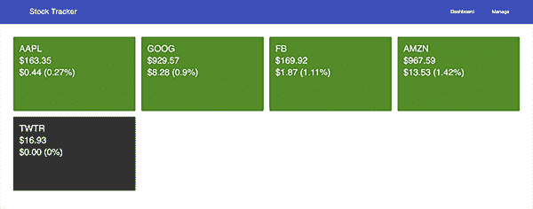
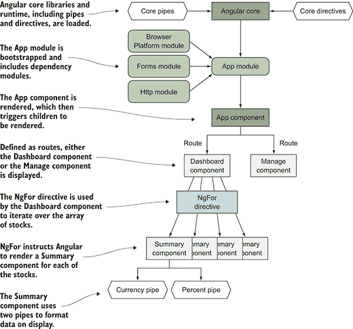
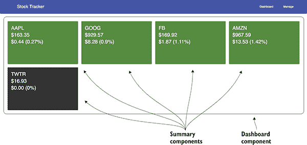
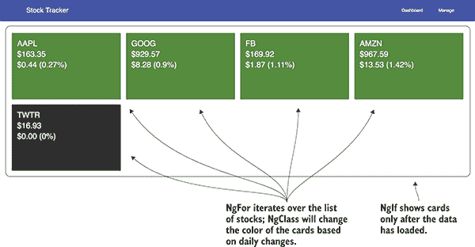
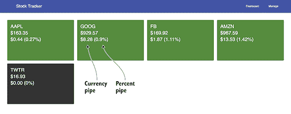
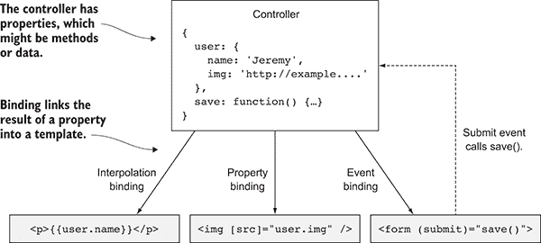
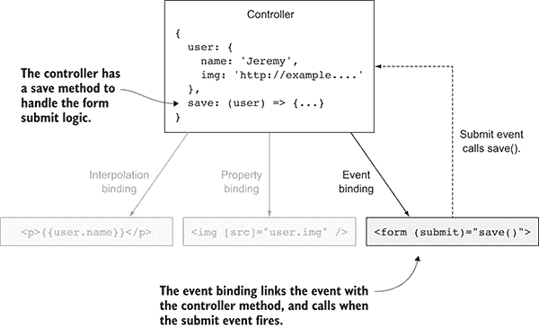

# 3

应用程序的基本要素

**本章涵盖**

+   Angular 如何将代码组织成模块

+   应用程序的渲染方式

+   Angular 中的实体类型

+   Angular 的模板语法和功能

+   变更检测和依赖注入

本章涵盖了 Angular 应用程序的基本要素，以便您了解所有内容是如何结合在一起的。这将是一个很好的基础知识参考。

它专注于概念，没有编码项目。您可能急于开始编码，我当然理解这一点。我建议您花时间完整阅读本章，但您也可以从每个部分的头几段开始浏览。

在大学期间，我在德国留学，并有幸进行了一些旅行。我参加了很多旅行，但有两件事我记忆犹新：一次是德国南部的盐矿之旅，另一次是意大利佛罗伦萨的乌菲齐博物馆之旅。我了解了很多关于盐矿的有趣事实，但我对采矿没有真正的背景。另一方面，我一直在上艺术史课程，这使得乌菲齐博物馆的经历更加令人满意。

我希望您已经阅读了第二章，它提供了 Angular 的实战之旅，因为我会将其作为参考，在我们讨论应用程序基本要素时使用。这可能感觉有点像盐矿之旅，您快速跑过并看到了一些有趣的事物。现在我将填补背景故事，给您一个更完整的 Angular 图景，让您拥有自己的乌菲齐体验。

第二章可能看起来相当简单，或者可能很难保持所有内容清晰。与大多数技术一样，有很多潜在的学习内容，但大多数并不是你日常会用到的东西。我在学习 Angular 时有过清晰和困惑的时刻，而大多数情况下问题是我一次专注于太多事情，而不是专注于核心问题并从这里构建。

基于这次经验，我将更详细地为您讲解第二章应用程序的关键方面，并讨论其中的核心概念。我将添加一些更多概念，最终为您提供一个更全面的 Angular 应用程序视图以及它在屏幕上的渲染方式。

图 3.1 展示了第二章的股票应用程序。如果您想再次看到这个示例的实际操作，请访问 [`angular-in-action.github.io/stocks/`](https://angular-in-action.github.io/stocks/)。您可能还记得用于生成此应用程序的一些内容，包括几个组件、一个服务、指令等。让我们来看看 Angular 中的这些实体，并更好地理解它们的作用。



**图 3.1**  第二章的股票应用程序，我们将用它来更详细地描述 Angular 概念

## 3.1 Angular 中的实体

Angular 有几种顶级实体类型，您在第二章中都已经看到了。但我们没有在它们如何打包和渲染到应用程序的上下文中给予它们太多关注。

这些不同的实体具有特定的角色和能力，您将使用它们的各种组合来创建您的应用程序。以下是类型的快速概述：

+   *模块* — 帮助您将依赖项组织成离散单元的对象

+   *组件* — 将组成您应用程序结构和大部逻辑的新元素

+   *指令* — 修改元素以赋予它们新功能或改变行为的对象

+   *管道* — 在渲染之前格式化数据的函数

+   *服务* — 填充特定角色（如数据访问或辅助工具）的可重用对象

在 Angular 中，您所写的大部分内容都将属于这五种类型之一（好吧，我确信有一些例外）。查看第二章中的库存应用程序，我们可以看到这些不同实体是如何发挥作用的。图 3.2 概述了实体之间的基本关系以及它们最终是如何结合在一起的。



**图 3.2** — 实体及其在应用程序执行过程中的利用方式

如您所见，所有这些实体最终合并为一个应用程序，并生成最终的用户体验。我经常会提到这些实体类型，所以让我们更深入地了解每一个。

### 3.1.1 模块

*模块* 是存储相关实体以方便重用和分发的容器。Angular 本身由几个模块组成，您所消耗的任何外部库也将被打包成模块。

在 Angular 中有两种模块，我们需要明确它们的区别。有 JavaScript 模块（特别是 ES2015 中添加到语言中的模块，而不是其他模块系统如 CommonJS 和 AMD），然后是 Angular 模块。

JavaScript 模块是语言结构，是一种将代码分离到不同文件的方法，这些文件可以根据需要加载。我们在代码中大量使用 JavaScript 模块，但它们不是 Angular 模块。第二章中我们编写的每个 TypeScript 文件都是一个 JavaScript 模块，因为它要么导入了某些值，要么导出了某些值。

虽然 JavaScript 模块是语言结构，但 Angular 模块是用于组织类似实体组（如所有需要路由的东西）的逻辑结构，并且由 Angular 用于理解需要加载的内容以及存在的依赖项。回想一下第二章，您的应用程序有一个 App 模块，它包含所有用于 Angular 渲染的应用程序逻辑。必须始终有一个 App 模块，但您的应用程序可能还会有其他模块——无论是官方 Angular 模块、第三方模块还是您可能创建的其他模块。

模块是通过创建一个类并用 `@NgModule` 装饰器装饰它来声明的。以下列表显示了为第二章股票示例创建的模块。

**列表 3.1** — 第二章的 App 模块

```
@NgModule({     
```

```
 declarations: [
```

```
 AppComponent,
 SummaryComponent
 [],](#c03-codeannotation-0002)
 imports: [
```

```
 BrowserModule,
 FormsModule,
 HttpModule
 [],](#c03-codeannotation-0003)
 [providers: [StocksService],](#c03-codeannotation-0004)
```

```
 [bootstrap: [AppComponent]](#c03-codeannotation-0005)
```

```
}) 
export class AppModule { }     
```

这个模块声明是由 CLI 为我们生成的（尽管我们也可以自己编写），它向 Angular 提供关键信息，以便它能够理解如何渲染和加载应用程序。`@NgModule` 装饰器包含 App 模块的元数据，而空类则充当存储数据的容器。

`declarations` 数组包含应用程序主模块希望向整个应用程序提供所有组件和指令的列表。同样，`providers` 数组包含你希望向整个应用程序提供所有服务的列表。

`imports` 数组包含了这个模块所依赖的其他模块的列表。如果你遇到另一个模块无法加载的问题，这是你首先需要检查的地方，看看它是否已注册到 Angular。

为了开始渲染，Angular 还需要知道要在屏幕上渲染哪些组件，它查看 `bootstrap` 数组以获取此列表。几乎总是，这只会包含一个组件，但在一些罕见的情况下，你可能需要在加载时渲染多个组件。

这里列出的属性中还有一些你没有看到，但它们的使用频率较低。当它们与我们的用例相关时，我会介绍它们。

### 3.1.2 组件

理解组件对于理解 Angular 至关重要，正如理解单词对于语言至关重要。在我们深入技术实现细节之前，本节将重点关注组件的角色和设计。

*组件* 是一个封装的元素，它维护自己的内部逻辑，以决定如何渲染某些输出，例如我们第二章中的 Summary 组件。在 HTML 中，一个选择元素可以被视为一个组件。使用 Angular，我们通过组件创建自己的 HTML 元素，尽管它们不仅仅是那样。组件可以拥有任何数量的能力或属性，你可以定义。

作为复习，以下是第一章中讨论的组件的关键原则，在那里我们看到了一些使构建组件成为可能的前端技术。这些原则侧重于组件的最佳设计方式和它们在 Angular 中的行为：

+   *封装* — 保持组件逻辑的隔离

+   *隔离* — 保持组件内部隐藏

+   *可重用性* — 允许以最小的努力重用组件

+   *基于事件* — 在组件的生命周期中发出事件

+   *可定制* — 可以为组件进行样式设计和扩展

+   *声明式* — 使用简单的声明性标记的组件

组件可能不会实现所有这些原则，但它们确实应该是你思考的指南针。这也有助于跟踪组件之间的关系——你可以将多个组件嵌套在一起以组成更复杂的交互。

让我们以一个仅使用 HTML 元素的登录表单为例。你从一个`form`元素开始，它包裹整个表单结构。这为表单内其余元素提供了上下文，但它不提供任何用户可以与之交互的 UI 元素。为此，我们需要使用一个文本输入来输入用户名，一个密码输入来输入密码，以及某种类型的按钮来触发表单操作。在图 3.3 中，我们有一个包含这些元素的基本表单示例。


**图 3.3** Facebook 上的登录表单，其中包含多个嵌套元素以生成单个表单

表单事件提供了访问表单内输入值的能力。这类似于 Angular 中的数据绑定概念，其中一个元素的价值与另一个元素连接起来。然后表单有一个提交按钮，当点击时，触发表单的提交事件。

这应该是一个相当标准的 HTML，但现在让我们看看一组类似排列的 Angular 组件。在第二章中，我们有一个包含多个 Summary 组件实例的 Dashboard 组件。在图 3.4 中，我概述了两种组件类型。



**图 3.4** 嵌套组件来自第二章的仪表盘屏幕

Dashboard 组件持有所有股票的数据，并将这些信息绑定到各个 Summary 组件中。每个 Summary 组件使用提供的股票数据来显示自己。仪表盘数据中的任何变化都会导致子 Summary 组件被更新。

组件的基本交互是从父组件向下推送数据，通常通过绑定，以及向上回传，通常通过事件。组件之间还有其他通信方式（我将在稍后更详细地介绍），但你在使用 Angular 的大部分时间将用于将组件树组合成一个有意义的界面。

### 3.1.3 指令

Angular 倾向于直接将逻辑和能力放入应用程序的 HTML 标记中，而指令是教授 HTML 元素新技能的强大工具。

你过去可能使用过 jQuery 插件来增强现有元素的新行为。有无数插件可以将常规元素转换为幻灯片、标签和其他东西。这些插件的工作方式是，它们取一个现有元素并应用新的功能，例如使图片在模态窗口中打开。

同样，指令可以将一个普通元素转换并赋予它一些自然不存在的额外能力。想象一下，你正在构建一个表单，其中用户不小心点击任何链接进行导航是很重要的。你可以创建一个指令，根据用户是否已经开始使用表单或是否已经完成它来禁用链接，并且它将内部修改锚链接以禁用`href`，从而禁用链接的可点击性。

让我们再次回顾第二章，看看我们是如何使用不同的指令来赋予常规元素新技能的。图 3.5 显示了仪表板视图中使用的指令，其中包括 NgFor、NgClass 和 NgIf。该图注解了这些指令如何改变元素的行为。

这里有一个添加指令的例子，该指令将根据属性值中的值（称为表达式）来渲染或移除元素：

```
<div *ngIf="!stocks"> 
```



**图 3.5** 第二章股票应用中使用的指令

`*ngIf` 是一个指令，它被用作元素的属性，并且会评估它所分配的值（关于这一点，将在第 3.6 节中进一步讨论）。在这种情况下，如果表达式为真，它将渲染元素——否则它将从 DOM 中移除。NgIf 赋予元素条件渲染或被移除的能力，这可能是 JavaScript 在网页上最常见的使用方式。

指令分为三类：属性指令、结构指令和组件。我们已经讨论了组件，并且应该明白组件是如何向 HTML 添加新功能，使其也成为一种指令的。但是，组件是特殊的，因为它们是唯一具有模板的指令类型，因此我建议将它们视为一种独立的实体。

属性指令类似于我们之前的例子，它们会修改元素的外观或行为。NgClass 指令是 Angular 提供的一个例子，我们在第二章中看到了它。存在许多内置的属性指令，因此你不必构建很多自己的。通常，它们通过改变它们所关联的元素的各个属性来实现，例如，NgClass 指令会改变附加的类列表。大多数指令都是属性指令。

另一方面，结构指令根据某些条件修改 DOM 树。在第二章中，我们也看到了 NgIf 作为条件显示 DOM 元素的方式，以及 NgFor 作为遍历项目列表并显示它们的方式。由于它们很灵活，Angular 中内置的结构指令类型较少。它们通过向或从页面添加或删除 DOM 元素来实现。

我们在第二章中使用了三个指令，如图 3.5 所示。NgIf 用于在数据加载前隐藏卡片列表。NgFor 用于遍历每个股票并创建 N 个副本。然后使用 NgClass 根据股票价格的正负变化来更改卡片背景。但我们没有详细讨论一些其他指令。

Angular 提供的首要默认指令包括以下内容（还有由表单和路由模块提供的一些）：

+   *NgClass* — 有条件地应用一个类到元素

+   *NgStyle* — 有条件地应用一组样式到元素

+   *NgIf* — 有条件地插入或从 DOM 中删除一个元素

+   *NgFor* — 遍历一个项目集合

+   *NgSwitch* — 有条件地显示一组选项中的一个

如果在股票应用中没有指令，我们就必须编写 JavaScript 来动态创建多个摘要卡片，而且随着时间的推移，这会变得更加难以管理。指令使生活变得更加容易，因为它们通过修改元素来赋予它新的功能，而无需使用 JavaScript 动态进入模板并实时修改它。我们不必使用像 jQuery 这样的东西来修改 DOM，并将我们的逻辑放在外部、分离的位置。

### 3.1.4 管道

通常，你希望以不同于存储格式的格式显示数据。通常，你希望将日期存储为时间戳值，但这并不特别用户友好。使用管道，我们可以在渲染过程中转换视图中的数据，而不会改变底层数据值。

使用管道字符（`|`）将管道添加到模板表达式中。例如，你可以有一个看起来像这样的表达式：

```
{{user.registered_date | date:'shortDate'}} 
```

左侧的表达式与我们本章中看到的一致，但在右侧添加管道后，则会对表达式的值应用转换。在这种情况下，它将使用日期管道来格式化用户的注册日期。它还接受一个选项；冒号（`:`）表示下一个值作为管道的配置选项传递。在这个例子中，你传递了一个配置选项，该选项根据`'shortDate'`格式来格式化日期，我将在稍后介绍。

在股票应用中，我们使用了货币和百分比管道来显示内容。图 3.6 指出了使用的管道。



**图 3.6** 管道在股票应用中的使用

Angular 自带一套默认管道，涵盖了众多常见用例。默认管道始终可用，无需注入或导入，因此我们可以在模板中使用它们。通过添加管道字符和管道名称来使用管道。

使用管道会改变数据渲染的方式，但不会改变属性的值。它会创建输出值的副本，对其进行修改，并显示最终的结果值。例如，FB 股票的价格存储为一个数字，但在渲染时，该值的副本会被转换为字符串，并格式化为货币形式。

我喜欢尽可能创建自己的管道来处理格式化。这样做的好处是逻辑容易重用，并且可以将代码从组件控制器中分离出来。每次进行任何类型的数据格式化时，都应该考虑它是否可以成为一个管道。你可能会只创建少量管道，因为它们通常是可重用且易于共享的。

### 3.1.5 服务

最后一个主要实体类型是服务，它们是在应用程序中跨组件重用 JavaScript 逻辑片段的一种方式。开发者经常需要编写一些执行重复性任务的代码，我们不希望它在各个地方重复。有时这些服务是访问数据（如我们在第二章中构建的）的网关，而有时它们更像是辅助函数，例如自定义排序算法。我将在第 3.4 节中更深入地讨论依赖注入，以解释这些服务是如何被提供和共享的。

Angular 提供了一些内置的服务，许多第三方模块也会公开服务。在第二章中，我们构建了一个使用 Angular Http 服务请求数据的服务——我们创建了一个 Angular 服务的包装器，以便我们更容易在应用程序中使用它。尽管以下列表中的代码已被简化以突出 HttpClient 服务的使用，但让我们再次查看这个代码片段。

**列表 3.2** 股票服务，简化版

```
import { Injectable } from '@angular/core';     
```

```
import { HttpClient } from '@angular/common/http';     

let service: string = 'https://angular2-in-action-api.herokuapp.com';

@Injectable()
export class StocksService {

 constructor(private http: HttpClient) {}
```

```
 load(symbols) {
```

```
 if (symbols) {
 return this.http.get(service + '/stocks/snapshot?symbols=' + symbols.join());
 }
 }
} 
```

在这个例子中，我移除了一些与使用 HttpClient 服务无关的额外代码。首先将 HttpClient 导入到文件中，然后通过控制器将其注入到`StocksService`中。这些步骤是在 Angular 中使服务可由对象使用的方法。例如，如果这是一个组件控制器，相同的两个步骤也会适用。

`load()`方法使用 HttpClient 服务进行`GET`请求，但它构建了正确的 URL 来调用，这使得在其他地方使用它更容易。服务是放置此类逻辑的理想场所，这种逻辑简化了代码的使用，并使其可重用。

服务也是数据访问的理想场所，而组件控制器则不是。在 Angular 中，关注点分离的原则适用，并且保持单个实体专注于单一任务对于可维护性和可测试性非常重要。创建只做一件事且做得好的服务。

我经常为任何与组件控制器没有固有联系的东西或可以轻松抽象到组件外部的东西编写服务。有时我可能只在一个地方使用一个服务，但它有助于更好地组织代码的逻辑和意图，同时也有助于集中测试。如果将来我需要重用那个服务，它已经准备好了。我发现编写另一个服务比过度设计现有服务要容易。

现在我们已经掌握了 Angular 中的主要实体，我们可以讨论它们如何在应用程序的渲染过程中结合在一起。

## 3.2 Angular 开始渲染应用的方式

Angular CLI 生成了一个相当简单的 app，在屏幕上显示一条消息，正如我们在第二章中看到的。许多事情结合在一起才能使那条简单的消息出现，尽管我们很快介绍了应用是如何运行的，但我们还需要花更多的时间和精力深入了解细节。

在 Angular 中，CLI 生成了一个相当轻量级的 app。它可能稍微小一些，但 easiest to consider the generated app as the base for future development, and I’ll often refer to it as the *base app*. 我们将关注当你运行 `ng new app-name` 时生成的 app。

Angular 有一个启动机制，用于启动渲染。图 3.7 显示了在引导过程中涉及的主要实体以及基于基础应用的渲染内容。


**图 3.7**  Angular 如何将基础应用渲染到浏览器中

页面加载立即，引导程序被调用以开始 Angular 的执行。你可能想知道引导是如何开始的？CLI 使用 webpack 进行构建，并将所有 JavaScript 编译后添加为 script 标签到 index.html 的底部。（如果你对 webpack 的编译方式感兴趣，可以在 [`webpack.github.io/`](https://webpack.github.io/) 上了解更多。）这时，它将运行代码以开始你的应用。

现在 Angular 已经启动，它加载你的 App 模块，并读取任何需要加载和启动的附加依赖项。在基础应用中，Browser 模块在进一步执行之前被加载到应用程序中。

然后 Angular 渲染 App 组件，这是你应用程序的根元素。当这个 App 组件渲染时，任何子组件也会作为组件树的一部分进行渲染。这就像 DOM 树，但任何特殊的 Angular 模板语法都必须由 Angular 进行渲染。在渲染过程中，它还将解析绑定并为声明任何内容的任何内容设置事件监听器。一旦完成这些，完整的应用程序应该被渲染出来，并可供用户开始交互。

应用程序的生命周期在用户开始使用应用程序时继续，应用程序将开始做出反应。当用户在应用程序中导航时，屏幕上的组件将被移除，新的组件将被加载和渲染。对用户做出反应和渲染组件树的周期将继续，直到应用程序关闭。

图 3.7 没有详细说明组件树如何成为应用程序，我们将在第四章中更详细地了解这一点。

## 3.3 编译器的类型

Angular 提供了两种类型的编译器，称为即时编译器（JiT）和预编译器（AoT）。它们的主要区别在于编译器的工具和时机，这可能会改变应用程序的行为以及它如何被提供给用户。

在 JiT 编译中，这意味着应用程序的编译仅在所有资源都加载完毕后才会发生在浏览器中。这意味着在页面最初加载和能够看到内容之间会有延迟。你可以在第二章的示例中看到这一点，因为有一个相当基本的“加载”信息显示，直到一切准备就绪并且编译器运行完毕。

另一方面，AoT 是一种在发送到浏览器之前渲染内容的方法。这意味着一旦应用程序资源加载完成，用户将接收到显示内容所需的确切内容，而无需任何加载信息。

另一个重大区别是，与 JiT 相比，应用程序在执行之前必须加载编译器库，而 AoT 版本能够从发送中删除此负载，从而实现更快的加载体验。

在 AoT 中，我们能够在应用程序在服务之前编译的情况下执行许多有趣的优化。它提供的另一个可能性是应用程序的服务器端渲染，这对于预渲染具有用户特定数据的应用程序可能很有用。

你应该努力确保你的应用程序使用 AoT 编译器进行编译，因为每次你为生产构建应用程序时，它都会使用 AoT 编译器。在 Angular 的未来版本中，一旦 AoT 编译对于开发足够快，JiT 编译器可能会被完全移除。

在本书的所有开发中，我们将使用 JiT，因为它渲染和预览应用程序的速度要快得多。我们还将介绍如何设置 AoT 编译，并在为生产目的构建应用程序时获得其好处。

## 3.4 依赖注入

除了最基本的代码之外，所有代码都依赖于使用来自应用程序其他部分的对象。问题是，随着代码库的增大，确保各个部分被封装同时仍然易于访问变得更加困难。因此，许多编程语言或框架都有某种机制来促进对象的跟踪和共享。

有许多方法可以组织您的代码，以便您能够轻松地共享对象。*依赖注入*（DI）是一种获取对象的模式，它使用注册表来维护可用对象列表，并允许您请求所需的对象。您不必传递对象，而可以在需要时请求所需的对象。

您可能想知道这与使用 JavaScript 模块导入和导出有何不同。为什么在 JavaScript 现在有了模块的情况下，我们还需要另一种方法来传递代码？依赖注入不应与 JavaScript 模块导入混淆。Angular 需要能够跟踪应用程序的哪些部分需要特定的服务。JavaScript 没有意识到依赖项是如何相互关联的，这可能是理解如何最佳组装依赖项的有用信息。此外，使用 Angular 注入依赖项将解决任何额外的依赖项。

DI 系统有几个关键部分。首先是 *injector*。这是 Angular 提供用于请求和注册依赖项的服务。注入器通常在幕后工作，但偶尔会直接使用。大多数时候，您将通过在属性上声明类型注解来调用注入器。您可能还记得在第二章中我们如何像这样注入 HttpClient 服务：

```
constructor(private http: HttpClient) {} 
```

因为我们声明类型为 `HttpClient`（Angular 中已知的服务），应用程序将使用注入器来确保 `http` 属性包含 HttpClient 服务的实例。这看起来像是魔法，但这仅仅是一种别名您想要请求的依赖项，而不直接调用注入器 API 的方式。

DI 的第二部分是 *providers*。提供者负责创建请求的对象的实例。注入器知道可用提供者的列表，并根据名称（上面是 HttpClient），调用提供者的工厂函数并返回请求的对象。

在 NgModule 的 `providers` 数组中注册的任何内容都可以在您的应用程序代码中注入。您可以在任何地方注入，但我更喜欢使用 TypeScript 方法，正如我们之前看到的，其中构造函数属性被注解为要注入的特定类型的服务。或者，您可以使用 `@Inject` 装饰器来注入 Http 服务，如下所示：

```
constructor(private @Inject(HttpClient) http) {} 
```

这个装饰器将依赖注入与 TypeScript 类型信息以相同的方式连接起来。无论哪种方式，您都会得到相同的结果。

提供者不必暴露给根模块，而可以仅使特定组件或组件树可见。我们将在第六章中更详细地探讨这一点，但到目前为止，您应该知道 DI 有很多可以利用的力量。

现在我们来看看 Angular 如何了解应用程序中的更改，以及这如何导致应用程序重新渲染。

## 3.5 变更检测

简而言之，*变更检测*是保持数据和渲染视图之间同步的机制。更改总是从模型到视图的下传，Angular 采用从父组件到子组件的单向传播更改。这有助于确保如果父组件发生变化，任何子组件也会因为潜在关联数据而被检查。

Angular 将运行变更检测过程来检查自上次运行过程以来值是否已更改。JavaScript 没有保证通知对象任何更改的方法，因此 Angular 运行此过程。虽然运行这些检查可能听起来很重，但有一些优化允许这个过程在几毫秒内发生。

为了实现这一点，当 Angular 渲染一个组件时，它会创建一个特殊类，称为*变更检测器*。这个类负责跟踪组件数据的状态，并在变更检测运行之间检测是否有任何值发生了变化。

当在组件中检测到值的变化时，它将更新该组件，并可能更新任何子组件。此外，由于 Angular 应用程序是组件树，Angular 可以确定哪些组件可能会受到更改的影响，并限制涉及的工作。

Angular 有两种触发更改的方式。默认模式会在每次变更检测过程中遍历整个树以寻找更改。OnPush 模式告诉 Angular，组件只关心从父组件输入到组件中的任何值的更改，并赋予 Angular 在已知父组件未更改的情况下跳过在变更检测期间检查组件的能力。

变更检测由事件、接收 HTTP 响应或计时器/间隔触发。最好的理解方式是，每当发生异步操作时，变更检测过程开始确定可能发生了什么更改，因为同步调用已经在 Angular 的正常渲染流程中处理了。可以这样想：你可以打开你的车，但直到你挂上档位，踩下油门或刹车，车辆都处于闲置状态，等待驾驶员给它一些事情做。

如果我们回顾组件树的设计方式，你会记得树是如何将数据推送到子组件，以及事件是如何将数据向上冒泡的。变更检测是允许组件在父组件中的数据发生变化时更新的机制，并确保视图和数据同步。

## 3.6 模板表达式和绑定

组件始终有一个模板，因此它是我们深入研究模板如何塑造应用程序行为的逻辑起点。与构建 Web 应用程序的许多其他方法不同，Angular 允许将逻辑和定制直接放置到模板中，这使得模板更加声明式。一开始这可能会让您感到有些奇怪，但我发现这是一种优雅的应用程序设计方式。当然，可能会出现一些陷阱，但请保持开放的心态，看看它是如何被 Angular 所接受的。有时人们认为这是将表示层和业务逻辑混合在一起，这在某种程度上是正确的，但它允许我们编写更干净的代码。

模板本身是普通的 HTML，但通过 Angular 的一些能力，HTML 标记获得了全新的生命。模板可以利用存储在模板逻辑中的控制器中的值。我们在第二章中看到了一些模板，它们演示了几个概念：

+   *插值* — 在页面上显示内容

+   *属性和属性绑定* — 将组件控制器中的数据链接到其他元素的属性或属性

+   *事件绑定* — 向元素添加事件监听器

+   *指令* — 修改元素的行为或添加额外的结构

+   *管道* — 在显示在页面上之前格式化数据

在整个模板中，您会看到模板**表达式**。这些类似于普通的 JavaScript 表达式（任何可以用分号结束的语句），并且所有值都会相对于组件控制器进行解析。与 JavaScript 中的表达式相比，模板表达式有一些额外的功能和限制：

+   它们无法访问全局变量，如`console`或`window`。

+   它们不能用于向变量赋值（除了在事件中）。

+   它们不能使用`new`、`++`、`--`、`|`和`&`运算符。

+   它们提供了新的运算符：`|`用于管道和 Elvis 运算符`?.`用于允许空属性。

模板表达式用于三个地方：用于插值、属性绑定和事件绑定。插值绑定，就像我们在本节中看到的例子一样，是属性绑定的简写。

让我们假设我们有一个控制器，它有一个`user`属性和一个`save`方法。在页面上，我们想要显示用户的姓名和简介图片，并有一个表单，以便他们可以更新他们的详细信息。基本结构可能看起来像图 3.8。我们将使用这个例子来了解数据是如何从控制器流到模板的，或者事件是如何从模板流到控制器的。



**图 3.8**  控制器如何将数据绑定到模板中进行插值、属性和事件绑定，每个都使用不同的语法

绑定是数据或方法从模板中的控制器使用的通道；它们允许控制器中的数据流入模板，或者从模板调用事件回控制器。

让我们更详细地了解绑定和 Angular 提供的模板功能，然后我们将看到它们是如何应用到我们章节示例中的。

### 3.6.1 插值

*插值*可能是 Angular 中最常用的模板语法类型。我们在第二章中多次使用它，但没有深入探讨其工作原理。插值解析绑定并在页面上以字符串形式显示结果值。

绑定通过获取一个表达式，评估它，并用结果替换绑定来工作。这与电子表格可以取一个公式（例如，添加单元格列的值）类似，通过将公式与存储在电子表格中的数据解析来计算结果值，然后在单元格中显示该值（代替公式）。以下是我们的插值示例：

```
<p>{{user.name}}</p> 
```

插值始终使用`{{value}}`语法将数据绑定到模板中。对于使用过 mustache 模板的人来说，这是一个熟悉的模式，因为双大括号之间的任何内容都会被评估以渲染一些文本。以下是一些将值绑定到视图中的有效插值表达式：

```
<!-- 1\. Calculates the value of two numbers, adds to 30 -->
{{10 + 20}}
<!-- 2\. Outputs a string "Just a simple string" -->
{{'Just a simple string'}}
<!-- 3\. Binds into an attribute value, to link to profile -->
<a href="/users/{{user.user_id}}">View Profile</a>
<!-- 4\. Outputs first and last name -->
{{user.first_name}} {{user.last_name}}
<!-- 5\. Calls a method in the controller that should return a string -->
{{getName()}} 
```

前两个表达式评估简单值。然而，大多数时候，您将引用组件中的值来显示或评估，正如您在前面的代码中的五个示例中所看到的。这些表达式在组件的上下文中进行评估，这意味着您的组件控制器应该有一个名为`user`的属性和一个`getName()`方法。表达式上下文是视图如何解析特定值的方式，因此`{{user.name}}`是根据控制器中的`user.name`属性解析的，如图 3.8 所示。

接下来，我们将探讨属性绑定及其如何用于修改我们想要以某种方式动态化的元素属性。

### 3.6.2 属性绑定

除了插值之外，另一种绑定类型是*属性绑定*，它允许您将值绑定到元素的属性上以修改其行为或外观。这可以包括诸如`class`、`disabled`、`href`或`textContent`等属性。属性绑定还允许您绑定到自定义组件属性（称为*inputs*——在第四章中详细讨论）。例如，如果您从数据库中加载一个包含图像 URL 的记录，您可以将该 URL 绑定到一个`img`元素上以显示该图像：

```
 
```

实际上，插值是绑定到元素`textContent`属性的简写。它们在许多情况下都可以完成相同的事情，因此您可以选择使用最自然的感觉。

属性绑定的语法是将属性放在括号内的元素上（`[]`）。名称应与属性匹配，通常为驼峰式，如 `textContent`。我们可以将插值模板重写为使用属性绑定，如下所示：

```
`<p [textContent]="user.name"></p>` 
```

插值是元素 `textContent` 属性的属性绑定的快捷方式。

与插值类似，绑定是在组件上下文中评估的，因此绑定将引用控制器的属性。这里你有 `[src]="user.img"` 属性绑定，它与 `src="{{user.img}}"` 做的是同样的事情。两者都会评估表达式并将值绑定到图像的 `src` 属性，但语法不同。属性绑定不使用花括号，并将引号内的所有内容作为表达式进行评估。我在将数据绑定到属性时几乎总是使用属性绑定而不是插值。

重新说明：插值是元素 `textContent` 属性的属性绑定的快捷方式。我们可以将我们的插值示例重写如下：

```
<p `[textContent]="user.name"></p>` 
```

这会导致在这种情况下渲染用户名称的相同输出，但这种方式并不常见，因为它使得创建较长的文本字符串更困难。此外，大多数开发者会发现插值版本更易于阅读和简洁。这可能会让您对插值的工作方式有新的认识，因为底层，插值以这种方式评估其自己的绑定。

使用 `[]` 语法绑定到元素的属性，而不是属性。这是一个重要的区别，因为属性是 DOM 元素的属性。这使得可以使用任何有效的 HTML 元素属性（例如 `img` 的 `src` 属性）。您不是将数据绑定到属性，而是直接将数据绑定到元素属性，这非常高效。

注意，即使 HTML 属性不是驼峰式，属性有时也是驼峰式。例如，表格单元格元素的 `rowspan` 属性暴露为元素的 `rowSpan` 属性。如果您进行插值，可以使用 `rowspan="{{rows}}"`；如果您进行属性绑定，则必须使用 `[rowSpan]="rows"`。我知道这可能会有些令人困惑，所以当您调试绑定时，请务必检查名称是否匹配。

### 3.6.3 特殊属性绑定

有几种特殊的属性绑定用于设置元素的类和样式属性。它们与您通常绑定的许多属性都不同，因为这些属性包含一个类或样式的列表，而不是设置单个属性，Angular 有特殊的语法来设置这些属性。

元素上的类属性是一个`DOMTokenList`，它是一个花哨的数组。你可以使用`[class]="getClass()"`并设置一个类或类的字符串，但这会与元素上已设置的任何类发生冲突。通常，你想要切换一个单独的类，你可以通过在属性中使用`[class.className]`语法来实现。它将看到属性绑定的`class.`前缀并知道你正在绑定一个名为`className`的特定类。让我们看看一个例子以及它是如何渲染的：

```
<!-- isActive() returns true or false in order to set active class -->
<h1 class="leading" [class.active]="isActive()">Title</h1>
<!-- Renders to the following -->
<h1 class="leading accent">Title</h1> 
```

类绑定语法用于针对特定类来添加或从元素中删除。它也仅添加到现有类中，而不是完全替换它们，就像你使用`[class]="getClass()"`那样。

同样，`style`属性是一个`CSSStyleDeclaration`对象，它是一个特殊对象，它包含所有 CSS 属性。Angular 有相同类型的语法来设置单个样式属性。使用`[style.styleName]`你可以设置任何有效 CSS 样式的值。例如

```
<!-- getColor() returns a valid color -->
<h1 [style.color]="getColor()">Title</h1>
<h1 [style.line-height.em]="'2'">Title</h1>
<!-- Renders to the following -->
<h1 style="color: blue;">Title</h1>
<h1 style="line-height: 2em;">Title</h1> 
```

这里可以使用任何有效的 CSS 属性，并且它将直接在元素上渲染为`style`值。你注意到第二个例子有一个第三项，`.em`吗？对于接受单位的属性，你可以使用这种语法来声明由表达式返回的值的单位。你也可以省略它，让表达式返回单位。

我发现这些特殊绑定在简单或边缘情况下非常有用，在这些情况下我需要做出简单的更改。我通常使用 NgClass 或 NgStyle，因为如果你试图在同一个元素上更改多个类或样式规则，这种语法就会变得繁琐。

### 3.6.4 属性绑定

一些元素属性不能直接绑定，因为某些 HTML 元素具有属性，这些属性并不是作为元素的属性提供的。`aria`（可访问性）属性就是这样一个例子，它不会作为属性添加到元素中。

你总是可以在开发者工具中检查元素以查看可用的属性。这是验证你是否可以绑定到特定属性的最快方式。一旦你验证了该属性没有作为属性公开，你就有了一个 Angular 支持的替代语法来绑定这些属性。

`aria`属性用于向辅助设备指示有关元素的信息，例如`aria-required`，它标记输入为提交所必需。通常，你会使用这样的属性：

```
`<input id="username" type="text" aria-required="true" />` 
```

想象这个字段可能并不总是必需的，因为你的表单可能需要根据情况提供用户名或电子邮件。如果你尝试做`aria-required="{{isRequired()}}"`或`[aria-required]="isRequired()"`，你会得到模板解析错误。因为这个属性不是属性，所以不能直接绑定。

解决方案是使用特殊的属性绑定语法，它看起来像属性绑定，但你在方括号中放入属性名称，并带有前缀`attr.`，如下所示：

```
<input id="username" type="text" [attr.aria-required]="isRequired()" /> 
```

Angular 现在将绑定到属性而不是不存在的属性。没有多少属性不是也是属性，但如果你遇到模板解析错误，你的绑定不是一个已知的原生属性，那么你很可能绑定到了这些属性之一。

在大多数情况下，你不需要使用属性绑定，但很可能你偶尔会需要它们。

### 3.6.5 事件绑定

到目前为止，所有数据都是从组件流向模板元素的。这对于显示数据来说很棒，但我们需要一种方法让模板中的元素能够反向绑定到组件。好消息是 JavaScript 内置了一个很好的机制，通过使用*事件*来向上传递数据。

当人们使用应用程序时，他们会通过与它们交互生成各种事件。每次他们移动鼠标、点击、键入或触摸屏幕时，JavaScript 都会生成事件。你可能之前已经编写过事件监听器，我们将使用 Angular 的事件绑定来做同样的事情。你也可以创建自己的事件，并在需要时触发它们。

首先，让我们通过一些通用用例来了解事件绑定的使用场景。当用户登录你的应用时，他们会填写登录凭证并提交表单（通常是通过按 Enter 键或点击按钮）。事件是*表单提交*，你希望这个事件触发组件中的某些行为。传统上，你会创建一个监听表单提交事件的监听器，但使用 Angular，我们可以创建一个绑定，它会调用组件控制器中的方法来处理事件（图 3.9）。



**图 3.9** 事件绑定将模板中的事件与控制器中的方法关联起来。

事件绑定的语法使用括号`()`来绑定到已知事件。你将在括号内使用事件名称，不包含名称中的*on*部分。例如，对于一个表单提交事件，你会这样写：

```
<form (submit)="save()">...</form> 
```

这将在表单上创建一个事件监听器，当表单提交时，会在组件控制器中调用`save()`方法。上下文很重要，因为事件绑定只绑定到当前组件，但如果你可以触发事件，并且如果父元素和组件正在监听，这些事件会冒泡到它们。如果你需要 HTML 中可用标准事件的参考，[`developer.mozilla.org/en-US/docs/Web/Events`](https://developer.mozilla.org/en-US/docs/Web/Events)是一个极好的参考。第四章将更深入地介绍事件。

组件和指令可以发出它们自己的事件，你可以监听这些事件。第四章将详细探讨如何实现这一点，但让我们也看看第二章的一个例子。在管理视图中，我们有一个表单，允许你添加新的股票。这是表单的再次展示：

```
<form style="margin-bottom: 5px;" (submit)="add()">
  <input name="stock" [(ngModel)]="stock" class="mdl-textfield__input" type="text" placeholder="Add Stock" />
</form> 
```

它分为两部分：具有 `submit` 事件绑定的 `form` 元素和包含用户通过键盘输入的数据的 `input`。当用户按下 Enter 键时，表单提交事件触发，调用控制器中的 `add()` 方法。该方法检查输入框中的值并将股票添加到列表中。所有这些都是由 `submit` 事件触发的。

我们还看到了一种特殊的绑定语法：双向绑定方法。它结合了属性和事件绑定语法，Angular 喜欢称之为“盒子里的香蕉”（如果你输入 `[()]` 并发挥想象力，它确实有点像那样）。熟悉 AngularJS 的人会熟悉它如何允许你在模板或控制器中值变化时同步绑定值。它是通过执行常规属性绑定并在幕后为你设置事件绑定来实现的。你只能在与表单元素一起使用 `NgModel`，但可以在属性上使用双向绑定语法。通常，你只想在绝对需要时才限制使用这种双向绑定。

事件绑定对于组件和模板之间的通信方式以及组件之间如何相互通信非常重要。事件绑定的语法和概念相当简单，但可以用于更复杂的编排，以增强组件之间的通信。

## 摘要

在本章中，我们已对 Angular 的基础知识进行了全面覆盖。本章应作为本书剩余部分的参考指南。主要收获如下：

+   一个 Angular 应用程序是一棵组件树，并且始终有一个根应用程序组件。

+   各种实体类型（模块、组件、指令、管道、服务）各自具有特定的角色和目的。

+   Angular 有两种类型的编译器，即时编译（AoT）和即时编译（JiT），以提供不同的方式来渲染应用程序。

+   依赖注入对于 Angular 跟踪应用程序中的所有对象并在请求时使它们可用是基本的。

+   当用户输入或其他事件导致异步变化时，变更检测会保持组件与模型数据的一致性。

+   模板包含几种类型的绑定：用于显示数据的插值绑定、用于修改元素属性的属性绑定、用于修改元素非属性值的属性绑定以及用于处理事件的事件绑定。
