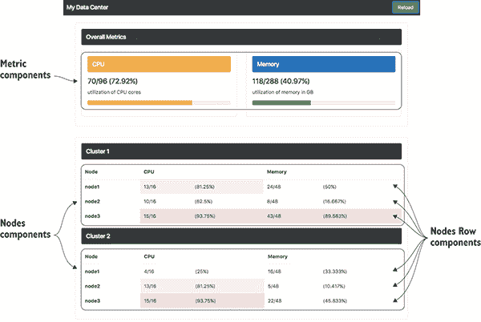
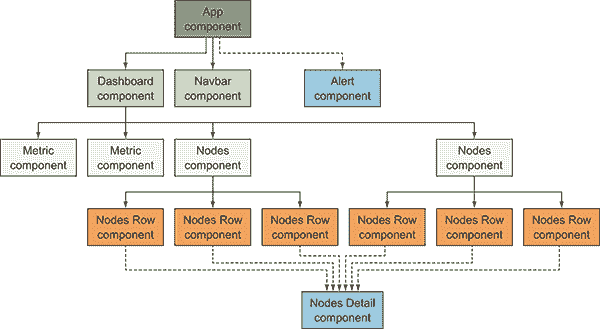
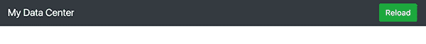
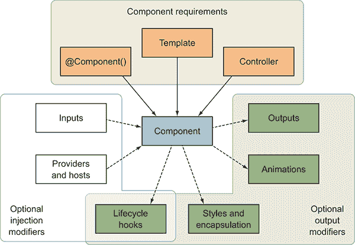
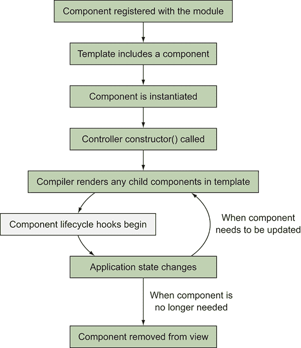
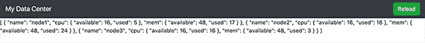
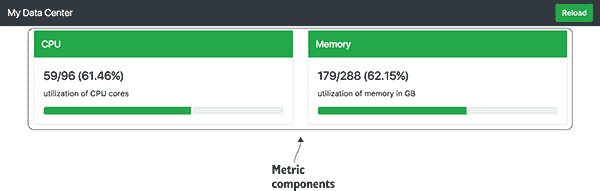
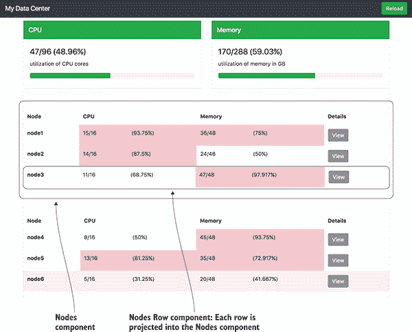

# 4

组件基础知识

**本章涵盖**

+   组件的基础知识和它们的作用

+   `@Component` 装饰器和它最重要的属性

+   渲染组件

+   使用输入和输出将数据传递到组件中

+   使用模板和样式自定义组件

+   使用投影将内容注入到组件中

组件对于 Angular 应用程序的结构至关重要，几乎每个功能都以某种方式与它们相关联。毕竟，没有组件就无法创建 Angular 应用程序。这意味着能够利用组件的能力对任何开发者来说都是至关重要的。它们如此重要，以至于我在下一章中专门讨论了涉及组件的更多高级主题。

您在第二章的示例中看到了一些组件的实际应用，但在这章中，我们将从组件的基础知识开始，以确保您对它们的声明和设计有一个清晰的概述。然后，我们将探讨您最常使用的组件的一些附加功能。

一个组件包括一个模板，这是用于描述其视觉布局和行为的 HTML 标记。我们将探讨如何充分利用这些模板，了解它们是如何渲染的，以及如何为它们提供个性化的样式。

组件还会创建一个视图，这是用户可以与之交互的组件的渲染结果，它由渲染组件模板组成。模板可能包含对其他组件的引用，这将触发它们在父组件的渲染过程中也被渲染。如第三章所述，Angular 应用程序是一个以 App 组件为起点的组件树。

在本章中，我们将构建一个看起来逼真的仪表板，其中包含多个组件，我们将使用模拟数据来简化实现，并专注于组件本身。让我们设置这个示例。

## 4.1 设置本章示例

在本章中，我们将构建一个组件树，这些组件将通过各种方式相互通信和共享信息。除了 App 组件外，我们还将创建七个（是的，七个）其他组件。您可以在图 4.1 中看到应用程序的视觉输出，其中每种类型的组件都被识别出来。

如您所见，这是一个虚构的数据中心仪表板，显示了底部的两个集群（每个集群有三个节点）以及 CPU 和内存使用的综合指标。所有数据每 15 秒随机生成一次，但当使用量超过预期水平时，颜色也会从绿色变为红色。右上角还有一个重载按钮，可以生成一组新的数据，以便您可以看到组件更新其行为。

由于 Angular 应用程序是一个组件树，我们可以可视化组件之间的关系，正如你在图 4.2 中看到的那样。这一点很重要，因为尽管组件是独立声明的，但它们相互构建以创建用户的整体应用程序和体验。

这棵树显示了组件之间的关系，其中一条线指向子组件。这棵树中的两个组件有虚线——它们是按需动态创建在页面上的，并不总是存在。节点详情组件有六条虚线，因为任何节点行组件都可以触发它显示。

我们稍后还会查看组件树的部分，以了解各种组件是如何通信的。HTML 元素的嵌套方式与 Angular 实例化和渲染它们的方式直接相关，因此对于任何编写 HTML 的人来说，理解这个树是如何构建的应该是相当自然的。



**图 4.1** 完成后的应用程序，其中标注了三种组件类型



**图 4.2** 组件树显示了每个组件实例之间的关系

### 4.1.1 获取代码

要开始，我们将从 GitHub 获取代码，以便我们准备好正确的设置。你可以通过运行以下命令使用`git`克隆仓库：

```
git clone -b start https://github.com/angular-in-action/datacenter.git 
```

或者，你可以从[`github.com/angular-in-action/datacenter/archive/start.zip`](https://github.com/angular-in-action/datacenter/archive/start.zip)下载它。

打开目录并确保运行`npm install`以获取所有依赖项。这可能需要一点时间，但之后你应该可以通过运行`ng serve`来查看应用程序。

本章将使用 ng-bootstrap 项目，该项目可在[`ng-bootstrap.github.io`](https://ng-bootstrap.github.io)找到。这是 Angular 的流行 Bootstrap CSS 和组件框架的实现。我们将仅使用可用 UI 库的一小部分，但它是一个流行的选项，并将让你了解它如何用于你自己的项目。

我们已经有一个基本的 Navbar 组件，用于显示顶部菜单。当你查看运行中的应用程序时，结果应该是一个灰色 navbar 粘附在页面顶部，就像你在图 4.3 中看到的那样。



**图 4.3** 带有重载按钮的应用程序 Navbar

这就带我们到了这样一个点，我们有一个基本功能的应用程序，只有一个组件在显示。在我们构建下一步之前，让我们回顾一下组件在我们应用程序中的生命周期和角色。

## 4.2 组件的组成和生命周期

组件有一个生命周期，从它们的初始实例化开始，一直持续到它们被销毁并从应用程序中移除。在我们理解生命周期之前，我们应该更仔细地看看组件中包含的内容。

随着时间的推移，掌握组件的组成对于创建更复杂和高效的 Angular 应用程序至关重要。我见过拥有数百到数千个组件的大型、真实世界的 Angular 应用程序，这些应用程序的质量在很大程度上是组件设计得好的副产品。

组件有几个不同的部分组合在一起，创建出用户可以与之交互的最终 UI，如 图 4.4 所示。



**图 4.4** — 组成并影响组件行为的理念

当我们使用 CLI 生成组件时，它会创建一组包含在渲染过程中组合的资源的文件。以下是组成组件的主要内容的列表：

+   *组件元数据装饰器* — 所有组件都必须使用 `@Component()` 装饰器进行注解，以便正确地将组件注册到 Angular 中。元数据包含许多属性，有助于修改组件的行为或渲染方式。

+   *控制器* — 控制器是带有 `@Component()` 装饰器的类，它包含组件的所有属性和方法。大部分逻辑都存在于控制器中。

+   *模板* — 没有模板的组件就不是组件。组件的标记定义了用户可以看到的 UI 的布局和内容，模板的渲染版本将查看控制器中的值以绑定任何数据。

任何有效的组件都必须存在这三个部分。此外，还有一些可选的功能可以与组件一起使用，以在某些情况下增强它们。前两个是向组件注入值的理念，其余的是修改结果组件行为、外观或与其他组件交互的理念：

+   *提供者和宿主* — 如果服务尚未在根模块级别提供，则可以直接将服务注入到组件中。您还可以控制这些服务的发现方式和它们可用的地方。

+   *输入* — 组件可以通过组件输入接受传递给它们的数据，这使得父组件能够直接将数据绑定到子组件中，这是向下传递组件树数据的一种方式。

+   *样式和封装* — 可选地，组件可以包含一组仅应用于组件的 CSS 样式。这为组件的设计提供了一层封装，因为组件样式不需要全局注入。组件可以配置样式注入和封装到应用程序中的方式。

+   *动画* —Angular 提供了一个动画库，使得对组件的过渡和动画进行样式化变得简单，并且可以定义关键帧或动画状态来切换。

+   *输出* —输出是与事件链接的属性，可以用来监听数据变化或其他父组件可能感兴趣的事件，也可以用来在组件树中共享数据。

+   *生命周期钩子* —在组件的渲染和生命周期中，你可以使用各种钩子来触发应用程序逻辑的执行。例如，你可以在组件实例化时运行初始化逻辑，并在销毁时运行清理逻辑。你还可以使用这些钩子将数据带入组件，因此生命周期钩子与输入和输出都很好地协同工作。

这里还有一些未涵盖的功能，但你总是可以在文档中找到它们，并且我们将在需要时使用它们。你可以通过查看[`angular.io/api/core/Component`](https://angular.io/api/core/Component)文档中额外的`@Component`装饰器属性来获取详细信息。

现在你已经知道了组件的组成部分，我们可以更容易地查看组件的生命周期，并了解它们如何在屏幕上渲染。

### 4.2.1 组件生命周期

组件从创建到删除都有生命周期，理解这个流程将有助于你设计高质量的组件。组件的生命周期行为可能会因所使用的构建工具而略有不同，但在大多数情况下，该工具将是 Angular CLI。

在图 4.5 中，你可以看到组件生命周期中发生的主要阶段。第一个主要动作是将组件注册到 App 模块中。这通常是因为我们将组件声明为 NgModule 元数据的一部分，并在应用程序引导期间发生，但组件也可以在应用程序运行时动态注册。当组件被注册时，它创建一个组件工厂类并将其存储以供以后使用。

然后，在应用程序生命周期中，将会有某些东西请求该组件。这通常是因为组件在模板中被找到，编译器需要该组件，但有时组件也可能被手动请求。此时，需要加载组件的一个实例。有一个组件注册表，其中包含属于该模块的组件，Angular 将查找相关的组件并检索其组件工厂，该工厂是在应用程序运行之前使用 CLI 在编译过程中生成的。这个特殊类知道如何实例化组件的新实例。

当组件实例化时，会读取元数据并触发构造函数方法。任何构造逻辑都会在组件的生命早期运行，您应该小心不要放置任何可能依赖于子组件可用的逻辑，因为模板还没有被解析。



**图 4.5** 应用运行期间的组件生命周期

组件元数据将被 Angular 完全处理，包括解析组件模板、样式和绑定。如果模板包含任何子组件，这些子组件也将启动相同的生命周期，但它们不会阻止此组件继续渲染。

在这个时刻，我们已经初始化了组件，开始了一个周期，其中子组件被完全渲染，应用程序状态发生变化，组件被更新。在这个周期中，生命周期钩子会触发，以提醒您在安全执行某些操作的重要时刻。例如，有一个生命周期钩子会告诉您任何输入是否已更改；另一个会告诉您所有子组件是否已完全解析（以防您有依赖于它们的逻辑）。

在某个时刻，组件可能不再在应用程序中需要。在那个时刻，Angular 将销毁组件（及其所有子组件）。任何新的实例都需要从组件工厂类中重新创建，就像我们之前看到的那样。

### 4.2.2 生命周期钩子

在应用程序渲染过程和响应用户输入时，可以使用各种钩子在各个检查点运行代码。当您需要在执行代码之前知道某些条件为真时，这些钩子非常有用，例如确保子组件已初始化，或者当检测到变化时。

在第二章中，我们看到了`OnInit`生命周期钩子的实际应用。它在周期早期运行，但在所有绑定都解析完毕之后，因此可以更安全地知道所有数据都对组件可用。

只有当组件中定义了生命周期钩子时，Angular 才会运行生命周期钩子。生命周期钩子不同于事件监听器——它们是具有特定名称的特殊方法，如果定义了，会在组件的生命周期中调用。

生命周期钩子的命名方式与您在表 4.1 中看到的一样，但您在控制器中实现钩子时，也需要以`ng`作为前缀。`OnInit`需要实现为`ngOnInit()`方法。

**表 4.1** 生命周期钩子和它们的作用列表

| **生命周期钩子** | **作用** |
| --- | --- |
| `OnChanges` | 任何输入绑定更改时都会触发。它将提供一个对象（`SimpleChange`），其中包含当前值和上一个值，以便您可以检查更改的内容。这主要用于读取绑定值的变化。 |
| `OnInit` | 这在组件完全初始化后运行一次（尽管不一定是在所有子组件都准备好之后），即在第一个 `OnChanges` 钩子之后。这是进行任何初始化代码的最佳位置，例如从 API 加载数据。 |
| `OnDestroy` | 在组件完全移除之前，`OnDestroy` 钩子允许你运行一些逻辑。这在你需要停止监听传入的数据或清除计时器时非常有用。 |
| `DoCheck` | 每次变更检测运行以确定应用程序是否需要更新时，`DoCheck` 生命周期钩子允许你实现自己的变更检测类型。 |
| `AfterContentInit` | 当任何内容子组件已完全初始化后，此钩子将允许你执行完成设置内容子组件所需的任何初始工作，例如，如果你需要验证传入的内容是否有效。 |
| `AfterContentChecked` | 每次 Angular 检查内容子组件时，都可以运行此钩子，这样你可以实现额外的变更检测逻辑。 |
| `AfterViewInit` | 此钩子允许你在所有视图子组件已初始渲染后运行逻辑。这让你知道整个组件树已经完全初始化并且可以被操作。 |
| `AfterViewChecked` | 当 Angular 检查组件视图以及任何视图子组件已被检查时，你可以实现额外的逻辑来确定是否发生了变化。 |

`OnInit`、`OnChanges` 和 `OnDestroy` 钩子是最常用的生命周期钩子。`DoCheck`、`AfterContentChecked` 和 `AfterViewChecked` 钩子最有用，可以跟踪在任意变更检测过程中需要运行的逻辑，并在必要时做出响应。`OnInit`、`AfterContentInit` 和 `AfterViewInit` 钩子主要用于在组件的初始渲染期间运行逻辑以设置其状态，并且每个钩子确保了不同级别的组件完整性（例如，它是否已准备好或子组件是否也已准备好）。

你可能想知道内容子组件和视图子组件之间的区别。让我们简要地谈谈组件是如何嵌套的以及这如何影响组件的渲染。

### 4.2.3 组件嵌套

因为 Angular 是一个组件树，你将在组件内部嵌套其他组件。有两种嵌套组件的方式，并且根据它们的渲染方式有不同的名称。再次查看图 4.1 中的章节示例，你会看到组件是如何嵌套在一起以创建更复杂的界面的。

通常，组件通过在另一个组件的模板中声明来嵌套。任何嵌套在另一个模板内部的组件都称为 *视图子组件*，之所以这样命名是因为模板代表了组件的视图，因此在该视图中是一个子组件。视图子组件是在组件模板内部声明的。

有时组件会接受要插入其模板中的内容，这被称为 *内容子组件*，之所以这样命名，是因为这些组件作为内容插入到组件内部，而不是直接在模板中声明。当使用组件时，内容子组件是在开标签和闭标签之间声明的。

让我们举一个例子，以确保我们可以看到区别。想象我们有一个 UserProfile 组件，其模板如下：

```
<user-avatar [avatar]="avatar"></user-avatar>
<ng-content></ng-content> 
```

第一行使用了一个组件 UserAvatar，它是一个视图子组件。注意它在组件模板中的声明方式。然后是 NgContent 元素——我将在后面更详细地介绍它，但简单来说，它是一个渲染额外内容的地方。通过 NgContent 传递的任何组件都会被视为内容子组件。当我们使用 UserProfile 组件时，其使用方式可能如下所示：

```
<user-profile [avatar]="user.avatar">
  <user-details [user]="user"></user-details>
</user-profile> 
```

当我们使用 UserProfile 组件时，我们通过在开标签和闭标签之间声明它，将另一个组件 User­Details 传递给该组件。这就是内容子组件如何传递给组件，并将其放置在 UserProfile 组件中的 NgContent 元素所在的位置。

在我们的示例中，我们有两个嵌套组件，UserAvatar 作为视图子组件，UserDetails 作为内容子组件。这种区别在于它们的声明位置，与组件本身的设计无关。

通常，单个组件的代码应专注于其自身业务，而无需过多关注子组件（无论是哪种类型）。但有一些用例，你会构建一个需要区分这些类型组件及其子组件的组件。关注点始终是使组件过于耦合，但有时这是不可避免的，甚至可能是希望的（例如，Tabs 和 Tab 组件一起工作以创建标签界面），因此这种区分可能很重要。

现在我们已经涵盖了组件背后的许多高级概念，我们可以回到我们的示例。下一步是创建我们的第二个组件，并生成一些数据以供显示。

## 4.3 组件类型

基本上只有一种组件类型，但我喜欢根据它们的作用将其分为四个类别。所有组件都是声明并按基本相同的方式运行的，但它们可以以不同的方式实例化，可能包含或不包含状态，或者与其他应用方面的耦合使其与其他组件不同。

我认为这些分类对于描述组件的作用和提供关于它们应该如何设计的总体指导是有用的。这不应被视为必须遵循的严格规则集——你肯定会构建不符合这些指南的组件，这是完全可以接受的。将这些想法放在心里，我相信它们会很有帮助。以下是组件的四个角色以及我给它们取的名字：

+   *App 组件* — 这是根应用程序组件，每个应用程序只有一个这样的组件。

+   *显示组件* — 这是一个无状态的组件，它反映了传递给它的值，使其具有高度的复用性。

+   *数据组件* — 这是一个通过从外部源加载数据来帮助将数据带入应用程序的组件。

+   *路由组件* — 当使用路由器时，每个路由都会渲染一个组件，这使得组件本质上与路由相关联。

Angular 没有提供这样的标准命名法来表示组件的不同角色，因此您无法根据这些名称搜索相关内容。真正的价值在于理解，通常最好为您的组件指定特定的角色，而不是试图让它们做太多事情。让我们更详细地看看这些不同的角色以及为什么它们被指定为不同的组。

#### App 组件

App 组件是一个特殊案例组件。正如您所知，每个 Angular 应用程序都是从渲染一个组件开始的，如果您使用了 CLI，它将是 AppComponent（但如果您更改了名称，它可以是任何名称）。

这里是我为您推荐的 App 组件的指导方针：

+   *保持简单* — 如果可能，不要在组件中放入任何逻辑。更像是容器。如果 App 组件没有复杂的依赖行为，那么更容易重用和优化其他组件。

+   *用于应用程序布局脚手架* — 模板是组件的主要部分，您将在本章后面看到我们如何在这个组件中创建主要的应用程序布局。

+   *避免加载数据* — 通常您会避免在这个组件中加载数据，因为我喜欢将数据加载得更接近使用该数据的组件。您可能需要加载一些全局数据（例如用户会话），尽管这也可以单独完成。在不太复杂的应用程序中，您可能需要加载数据，因为抽象化较小的应用程序可能更复杂。

在我看来，最好的规则是尽可能保持 App 组件的简单性。通常，我只有一个模板和一个空控制器。目的是避免在应用程序控制器中做太多的“全局”类型逻辑和配置，以增加其他组件的模块化，并保持逻辑在需要它的组件内部。

#### 显示组件

显示组件的角色可能是您在构建 Angular 专业技能时最常见的一个。这些组件通常用于渲染内容，并且通常提供必要的数据来显示。大多数第三方组件都将扮演这个角色，因为它是最解耦的组件类型。

这里是为 Display 组件建议的主要指导方针：

+   *解耦* — 确保组件与其他组件没有实际的耦合，除了在需要时可能作为输入传递数据到它。

+   *使其尽可能灵活* — 避免使这些组件过于复杂，并添加大量的配置和选项。随着时间的推移，你可能会增强它们，但我发现最好是从简单开始，然后逐步添加。

+   *不要加载数据* — 总是通过输入绑定接受数据，而不是通过 HTTP 或服务动态加载数据。

+   *拥有干净的 API* — 接受输入绑定以将数据输入组件，并发出任何需要推送到其他组件的动作的事件。

+   *可选地使用服务进行配置* — 有时候你可能需要提供配置默认值，而不是在每次使用组件时都要声明首选项，你可以使用设置应用程序默认值的服务。

有时候，让你的组件更加隔离和具体以显示输出可能会感觉过度。组件越封装和隔离，就越容易重用。

我经常发现，当我开始重构一些代码时，我首先会识别出代码中可以独立显示的各个部分。我可能会注意到很多重复的代码片段，它们大多具有相同的功能，并将它们重构为一个单一组件。

这些组件通常在控制器中有一个模板和很少的逻辑。这是完全可以接受的，因为它允许你轻松地在应用程序中重用模板片段。

#### 数据组件

数据组件负责加载数据或管理数据。大多数应用程序需要从外部来源（HTTP 或用户输入）获取数据，最好将其包含在数据组件中，而不是显示组件中。我发现大多数开发者首先构建这些组件，然后最终开始将部分抽象为路由或显示组件类型。

数据组件主要关于处理、检索或接受数据。通常，它们依赖于服务来处理数据的加载，正如我们在第二章中看到的。以下是一些关于数据组件的考虑因素：

+   *使用适当的生命周期钩子* — 为了进行初始数据加载，始终利用最佳的生命周期钩子来触发数据的加载或持久化。我们将在本章后面更详细地探讨这一点。

+   *不要担心可重用性* — 这些组件不太可能被重用，因为它们有特殊的作用来管理数据，这很难解耦。

+   *设置显示组件* — 考虑这个组件如何加载其他显示组件所需的数据，并处理来自用户交互的任何数据。

+   *在内部隔离业务逻辑* — 这可以是一个存储应用程序业务逻辑的好地方，因为每次你管理数据时，你很可能会处理一个针对特定用例的特定实现。

我试图限制处理数据的组件数量，以避免创建太多的专用组件。每个应用程序都是不同的，也许你也利用了一个不错的 UI 库，不需要创建很多自己的显示组件，因此，你为应用程序编写的代码可能更侧重于数据组件（尽管整体应用程序仍将包含大量由第三方模块提供的显示组件）。

#### 路由组件

路由组件是直接链接到路由的任何组件。这些组件不太可重用，通常是为应用程序中的特定路由专门创建的。

这些组件也通常遵循数据组件的原则，因为路由通常需要为新视图加载更多数据。我区分它们的原因是，单个路由可能渲染出多个数据组件，例如在具有多个组件加载度量信息的仪表板中。

路由组件应主要遵循以下指南：

+   *路由模板脚手架* — 路由将渲染此组件，因此这是放置与路由关联的模板的最合逻辑的地方。

+   *加载数据或依赖数据组件* — 根据路由的复杂性，路由组件可能为路由加载数据或依赖一个或多个数据组件来完成这项工作。如果你不确定，我建议最初在路由组件中加载数据，并在视图变得更加复杂时解耦。

+   *处理路由参数* — 在导航过程中，很可能会遇到路由参数（例如正在查看的内容项的 ID），这是处理这些参数的最佳位置，这些参数通常决定了从后端加载哪些内容。

每个你可以导航到的路由都链接到一个组件，因此你创建的路由组件数量直接关联到你添加到应用程序中的路由数量。你可以为不同的路由路由到相同的组件，但这并不常见。

## 4.4 创建数据组件

我们将首先创建一个组件，以帮助我们管理数据。这是一个数据中心仪表板，因此它提供的数据主要是对数据中心健康至关重要的各种度量值的数值。我们将创建一个名为“仪表板组件”的组件，它将托管我们的数据并在应用程序中显示它。

目前我们将直接将原始数据打印到屏幕上，直到我们创建其他组件。在本节结束时，你的应用程序应该看起来像图 4.6。



**图 4.6** 具有仪表板组件的应用程序，该组件生成随机数据集并显示原始数据

首先，使用 CLI 生成一个新的组件。然后我们将逻辑添加到控制器中，并看到几个生命周期钩子的实际应用。这将是一个很好的数据组件的例子，因为它将处理整个应用程序的数据，而不会过多地处理内容的显示：

```
ng generate component dashboard 
```

现在打开`src/app/dashboard/dashboard.component.ts`文件，并用以下列表中的内容替换其内容。

**列表 4.1** Dashboard 组件控制器

```
import { Component, OnInit, OnDestroy } from '@angular/core';     

interface Metric {     
```

```
 used: number,
 available: number
};     
interface Node {     
 name: string,
 cpu: Metric,
 mem: Metric
};     

@Component({
  selector: 'app-dashboard',
  templateUrl: './dashboard.component.html',
  styleUrls: ['./dashboard.component.css']
})
export class DashboardComponent implements OnInit, OnDestroy {     
```

```
 cpu: Metric;
```

```
 mem: Metric;
 [cluster1: Node[];](#c04-codeannotation-0003)
 [cluster2: Node[];](#c04-codeannotation-0003)
 interval: any;

 ngOnInit(): void {
```

```
 this.generateData();

 this.interval = setInterval(() => {
 this.generateData();
 }, 15000);
 }

 ngOnDestroy(): void {
```

```
 clearInterval(this.interval);
 }

  generateData(): void {
    this.cluster1 = []; 
    this.cluster2 = [];
    this.cpu = { used: 0, available: 0 };
    this.mem = { used: 0, available: 0 };
    for (let i = 1; i < 4; i++) this.cluster1.push(this.randomNode(i));
    for (let i = 4; i < 7; i++) this.cluster2.push(this.randomNode(i));
  }

  private randomNode(i): Node {
    let node = {
      name: 'node' + i, 
      cpu: { available: 16, used: this.randomInteger(0, 16) }, 
      mem: { available: 48, used: this.randomInteger(0, 48) }
    };
    this.cpu.used += node.cpu.used;
    this.cpu.available += node.cpu.available;
    this.mem.used += node.mem.used;
    this.mem.available += node.mem.available;

    return node;
  }

  private randomInteger(min: number = 0, max: number = 100): number {
    return Math.floor(Math.random() * max) + 1;
  }
} 
```

我们首先导入`OnInit`和`OnDestroy`接口，我们在创建控制器时使用这些接口来为 TypeScript 编译器提供更好的智能，以便了解什么构成了有效的控制器实现。在这种情况下，`OnInit`和`OnDestroy`是接口，它们告诉 TypeScript 必须分别实现`ngOnInit`和`ngOnDestroy`方法。

为了增加额外的清晰度，`Metric`和`Node`接口描述了我们用于数据的结构。这是可选的，但我建议利用接口来正确执行代码，因为接口有助于随着时间的推移维护代码。该组件有五个属性，其中四个包含仪表板的数据值，最后一个用于维护对间隔的引用，以便稍后可以清除它。

然后，我们使用`NgOnInit`生命周期钩子生成数据，并设置一个每 15 秒生成新数据集的间隔。当 Dashboard 组件从应用程序中移除时，也使用`NgOnDestroy`生命周期钩子来清除间隔。任何使用间隔的时候，你都会想要确保在不再需要它时清除间隔，否则随着时间的推移，你将创建内存泄漏，因为即使导航到另一个页面，间隔仍然会继续存在。

其余的代码是一组用于生成数据的方法，我不会详细说明。它将为两个集群中的六个节点生成内存和 CPU 指标，并汇总总利用率指标。随着我们构建下一个几个组件，如何利用这些数据将变得更加明显。

现在在组件模板中，该模板位于文件`src/app/dashboard/dashboard.component.html`中，我们将原始数据绑定到屏幕上，以便我们可以看到它是如何生成的。用以下单个插值绑定替换该文件的原始内容，该绑定将数据绑定到一个簇：

```
<p>{{cluster1 | json}}</p> 
```

我们还没有将仪表板添加到我们的应用程序中，所以打开`src/app/app.component.html`文件，并将仪表板添加到模板的底部，如下所示。它应该看起来像本节前面看到的图 4.3：

```
<app-navbar></app-navbar>
<app-dashboard></app-dashboard> 
```

至此，Dashboard 组件的内容就到这里了——目前是这样。在本章的后面部分，当我们构建更多用于显示数据的组件时，我们将向 Dashboard 添加更多内容，从下一个组件开始，该组件将显示 CPU 和内存指标，并通过输入接受数据。

## 4.5 使用组件的输入

当你创建自己的组件时，你可以定义可以接受通过属性绑定输入的属性。任何默认 HTML 元素属性也可以绑定到组件，但你可以定义组件可以用来管理其生命周期或显示的附加属性。

我们在第二章中看到了这一点，以下是我们用于将股票数据绑定到摘要组件的代码片段。你看到股票属性周围的方括号，表示值绑定到在股票属性中找到的数据：

```
<summary [stock]="stock"></summary> 
```

默认情况下，组件的所有属性都不是立即可绑定的，正如你之前看到的。它们必须声明为输入，以便允许属性进行绑定。一个原因是我们要封装我们的组件，最好不要自动公开所有属性。另一个原因是 Angular 需要知道哪些属性存在，以便它可以正确处理将值连接到组件的线路。

在我们的应用程序中，我们想显示整个数据中心的一些度量数据。这如图 4.7 所示，这是我们在本节中将要完成的工作的结果。这些组件的作用是显示整个数据中心的 CPU 和内存度量信息。因为这些组件之间唯一的区别是数据，我们将使其可重用，使用输入将数据传递到组件中。



**图 4.7** 在与不同数据共享相同显示的应用中添加度量组件

### 4.5.1 输入基础

在我们进一步深入研究之前，让我们构建一个具有输入的组件，并看看它的实际效果。使用 CLI 生成一个新组件，如下所示：

```
ng generate component metric 
```

我们首先将查看组件控制器，因此打开 src/app/metric/metric.component.ts 文件，并更新为以下列表中的内容。

**列表 4.2** 度量组件控制器

```
import { Component, Input } from '@angular/core';     
```

```
 @Component({
  selector: 'app-metric',
  templateUrl: './metric.component.html',
  styleUrls: ['./metric.component.css']
})
export class MetricComponent {
 @Input() title: string = '';
```

```
 @Input() description: string = '';
 @Input('used') value: number = 0;
 @Input('available') max: number = 100;

 isDanger() {
```

```
 return this.value / this.max > 0.7;
 }
} 
```

度量组件首先导入 `Input` 装饰器，该装饰器用于装饰任何你想定义为输入的属性。在这种情况下，我们声明了四个输入，这意味着该组件的所有属性都可用于绑定。然后我们实现了一个简单的 `isDanger()` 方法，它将告诉我们利用率是否超过 70%，因此我们可以以不同的方式显示度量。

前两个属性是 `title` 和 `description`。`Input` 装饰器位于前面，它将根据属性的名称使每个属性可用于绑定。尽管我为每个属性声明了类型，但重要的是要注意，它们在运行时并不验证输入是否与该类型匹配。你仍然需要清理输入或处理无效值。

最后两个属性将可选值传递给`Input`装饰器，这是一种更改绑定中使用的属性名称的方法，从组件内部使用的名称。这允许我们将`used`属性别名到`value`属性，将`available`属性别名到`max`属性。当你绑定到度量组件时，你将使用绑定`[used]="node.used"`，但在组件内部它将使用属性`value`。

你可能会听到一些人提到*组件 API*，他们谈论的是组件输入。因为这是将数据传递到组件中的主要方式，所以它就像一个如何在应用程序中消费组件的合同。能够重命名输入对于代码清晰度有益，因为它允许你以不同的方式暴露绑定，与内部实现不同。但我建议为了简单和调试，使名称保持一致。

我还建议你确保你的输入绑定和属性名称尽可能清晰。为了节省字符而使属性名称短通常不值得，因为开发者如果不深入代码，就不知道该属性是关于什么的。

随着你构建更多组件并在更大的项目上工作，你可能会开始创建在项目和应用程序之间重复使用的组件。这也是 Angular 的一个核心原则——使组件的重复使用变得容易。

现在，让我们设置度量组件模板，并且我们将使用 ng-bootstrap 进度条组件作为如何消费具有输入的另一个组件的示例。打开`src/app/metric/metric.component.html`文件，并将其更新为以下列表的内容。

**列表 4.3** 度量组件模板

```
<div class="card card-block">
  <div class="card-body">
 [<nav class="navbar navbar-dark bg-primary mb-1" [ngClass]="{'bg-danger': isDanger(), 'bg-success': !isDanger()}">](#c04-codeannotation-0009)
```

```
 <h1 class="navbar-brand mb-0">{{title}}</h1>
```

```
 </nav>
 <h4 class="card-title">{{value}}/{{max}} ({{value / max | percent:'1.0-2'}})</h4>
```

```
 <p class="card-text">
 {{description}}
```

```
 </p>
 [<ngb-progressbar [value]="value" [max]="max" [type]="isDanger() ? 'danger' : 'success'"></ngb-progressbar>](#c04-codeannotation-0013)
```

```
 </div>
</div> 
```

此模板在很短的空间内使用了大量的 Angular 模板语法功能。首先，我们使用 bootstrap CSS 样式创建度量组件的卡片布局，因此卡片类来自 bootstrap。

在此模板中，所有绑定都将解析为在控制器中定义的四个输入属性，但请注意，我们使用的是属性名称，而不是传递给`Input`的任何别名名称。

`nav`元素用于创建包含标题的顶部标题栏。使用 NgClass，它将根据整体值的使用量应用`bg-danger`或`bg-success`类。

有几个基本的插值绑定，例如`title`、`value`、`max`和`description`。我们还有一个更复杂的插值表达式的示例，它将`value`除以`max`并将其格式化为百分比。

最后，我们有一个使用 ng-bootstrap 进度条组件的示例。根据进度条的文档，它接受我们声明的三个绑定，为 `value`、`max` 和 `type` 提供绑定。`value` 和 `max` 是数字，而 `type` 是用于着色条形的引导类（如 `danger` 或 `success`）。

进度条是一个设计良好的组件的绝佳例子。它有一组清晰的输入属性。它不需要太多的努力来消费，并内部化了大部分逻辑。

因为我们在之前将 ng-bootstrap 模块添加到我们的 App 模块中，所以所有由 ng-bootstrap 提供的组件都可以使用，而无需为它们做出任何特殊请求。大多数第三方库体验都将类似，一旦你将第三方模块添加到你的应用中，你的应用就可以轻松消费第三方提供的值。

让我们将这个指标组件显示在屏幕上。打开 src/app/dashboard/dashboard.component.html 文件，并用以下列表中的代码替换其内容。记住，仪表板组件包含现在可以绑定到组件中的数据。

**列表 4.4** 使用指标组件

```
<div class="container mt-2">
  <div class="card card-block">
    <nav class="navbar navbar-dark bg-inverse mb-1">
      <h1 class="navbar-brand mb-0">Overall Metrics</h1>
    </nav>
    <div class="row">
 <app-metric class="col-sm-6"
```

```
 [[used]="cpu.used"](#c04-codeannotation-0014)
 [[available]="cpu.available"](#c04-codeannotation-0014)
 [[title]="'CPU'"](#c04-codeannotation-0014)
 [[description]="'utilization of CPU cores'">](#c04-codeannotation-0014)
 </app-metric>
 <app-metric class="col-sm-6"
```

```
 [[used]="mem.used"](#c04-codeannotation-0015)
 [[available]="mem.available"](#c04-codeannotation-0015)
 [[title]="'Memory'"](#c04-codeannotation-0015)
 [[description]="'utilization of memory in GB'">](#c04-codeannotation-0015)
 </app-metric>
    </div>
  </div>
</div> 
```

在这里，我们定义了一些标记来为引导样式创建一个新的容器和用于显示的卡片块。真正有意义的是使用了指标组件。注意，我们仍然能够将一个类应用到元素上，因为它在渲染时被当作一个常规的 HTML 元素处理。

我们在组件中定义的四个属性被列为一个属性，并带有括号包围的绑定语法。记住，这是告诉 Angular 对父组件（仪表板组件）中的表达式进行评估并返回其值给子组件（指标组件）的语法。因为它们被标记为输入，我们可以将这些属性绑定到非标准 HTML 属性上。对于 `used` 和 `available` 属性，我们将其绑定到 `cpu` 和 `mem` 控制器值上的相应属性。然后对于 `title` 和 `description`，我们提供一个字符串字面量，因为它们被评估为一个表达式。

你注意到这个组件更通用了吗？它接受它需要显示的四个输入，甚至包括一些文本。我们可以轻松地多次使用相同的组件，并为每个指标提供独特的显示。这通常比制作许多几乎执行相同任务的组件更受欢迎。

### 4.5.2 截获输入

我们目前盲目地接受传递给组件的任何值，并使用它们而不进行任何验证。很容易忘记验证或清理数据输入，尤其是在构建组件树并确信正在传递的数据类型时。

问题在于，随着应用程序的增长或组件以新的方式被重用，跟踪输入变得更加困难。在可能的情况下尝试验证输入也是良好的实践，以加固你的组件。

例如，如果我们将绑定到一个度量组件的值的类型更改错误，度量组件将会有一些问题。自己试一试。将 `[used]="cpu.used"` 改为 `[used]="'fail'"`。这会将绑定更改为传递一个字符串而不是一个数字。度量组件将抛出一个错误，因为最终它将尝试将字符串和数字相除，这是无效的。

我喜欢使用一个方法来拦截需要通过获取和设置方法进行验证的输入。这是一个 JavaScript 中已经存在了一段时间的功能，但我直到最近才看到它被广泛使用。

这里的主要思想是，而不是直接绑定到一个属性，你将输入绑定到设置方法，该方法将真实值存储在一个私有属性上，这样你就可以保护它免受直接访问。设置方法也是你运行任何验证逻辑的地方。然后你使用获取方法在任何请求时返回私有属性的值。

让我们修改我们的度量组件，使用这种方法来验证输入值并保护我们的模板免受非数字值的除法错误。打开 `src/app/metric/metric.component.ts` 文件，将其更改为以下列表中的内容。

**列表 4.5** 度量组件拦截输入

```
export class MetricComponent {
  @Input() title: string;
  @Input() description: string;
 private _value: number = 0;
```

```
 private _max: number = 100;

 @Input('used')
```

```
 set value(value: number) {
 if (isNaN(value)) value = 0;
 this._value = value;
 }

 get value(): number { return this._value; }
```

```
 @Input('available')
```

```
 set max(max: number) {
 if (isNaN(max)) max = 100;
 this._max = max;
 }

 get max(): number { return this._max; }
```

```
 isDanger() {
    return this.value / this.max > 0.7;
  }
} 
```

如果你之前没有使用过获取或设置方法，它们是前面带有 `get` 或 `set` 关键字的函数。方法的名字必须与属性的名称匹配，所以在这个例子中 `get` `value(){}` 将会在任何请求 `this.value` 属性时被调用。同样，任何将新值存储到 `this.value` 中的操作都会调用 `set` `value(value){}` 方法，并传递存储的值。

我们首先创建了两个新的私有属性，`_value` 和 `_max`。使用 `private` 关键字，TypeScript 将确保它们不会直接暴露在控制器中，因此它们不能在这个控制器之外被修改。名称前的下划线是一个常见的约定，用来通知开发者该属性被认为是私有的。

我们实现了值设置方法，并使用 `Input` 装饰器对其进行装饰。这注册了一个普通的 `input` 属性，但在绑定到组件时，它将通过这个函数传递。该函数会检查值是否为数字——如果不是，它将将其设置为 `0` 并将此值存储在 `_value` 属性上。然后我们实现了获取方法来检索 `_value` 属性。我们对 `max` 属性也做了同样的基本处理，但如果输入无效，则将其默认设置为 `100`。

我们现在已经保护了输入，防止了无效值，但还有其他场景你可能想要拦截值。你可能想在它们被使用之前格式化一些值，例如确保单词首字母大写。

这种方法的主要问题是每次你使用 getter 方法读取属性时，它都会运行 getter 方法内的逻辑。在大多数情况下，这可能不是什么大问题，比如如果你只是返回一个私有属性，就像我们在这里做的那样，但如果你有更复杂的逻辑，这些函数可能会对渲染速度产生影响。另外，不要在 getter 函数中进行任何修改！这样做会导致意外的行为，因为你无法确定 getter 函数会被调用多少次。

我们还有另一种方法来拦截和修改输入，当它们进入组件时，但首先我们将看看如何在组件内部进行内容投影。

## 4.6 内容投影

想象一下，你创建了一个 Card 组件，并且希望卡片内容区域能够灵活地接受开发者需要插入的任何类型的标记。我们可以通过使用*内容投影*来实现这一点，它允许我们声明将外部内容插入到我们的组件中的位置。

内容投影是 Angular 从 Web 组件中实现的一个概念。如果我们考虑显示组件的作用，接受标记以在组件内部显示的需求相当普遍。标签页、卡片、导航栏、模态框、对话框、侧边栏——可以接受通用一组标记以在组件内部显示的 UI 元素类型清单可以继续下去。

因为我们想要创建可重用的显示组件，内容投影是我们需要使用的关键功能。好消息是它相对简单易实现，所以让我们看看它是如何发挥作用的。

我们将构建两个组件，帮助我们创建一个表格来显示服务器集群中的每个节点。如果你这么想，表格已经使用了内容投影，因为你创建了一个表格，然后在标题内嵌套行，然后在行内插入单元格。参见图 4.8。

使用 CLI 生成两个新的组件，一个用于 Nodes 组件，另一个用于 Nodes Row 组件：

```
ng generate component nodes
ng generate component nodes-row 
```



**图 4.8**　Nodes 组件使用内容投影来显示节点行组件

我们将首先让 Nodes 组件启动并运行，我们只从模板开始。控制器是空的，对于这个用例，我们不需要任何控制器逻辑来使用内容投影。打开 src/app/nodes/nodes.component.html，并用以下列表替换其内容。

**列表 4.6**　Nodes 组件模板

```
<thead>
  <tr>
    <th>Node</th>
 [<th [colSpan]="2">CPU</th>](#c04-codeannotation-0021)
```

```
 [<th [colSpan]="2">Memory</th>](#c04-codeannotation-0021)
    <th>Details</th>
  </tr>
</thead>
<ng-content></ng-content>     
```

您可以看到这个模板包含表格标题的标记。我想指出的是，这里使用了属性绑定到一个非标准名称；在这种情况下，属性是 `colspan`，但元素上的属性是 `colSpan`。在这里使用绑定的唯一好处是，通常您需要绑定到一个表达式而不是一个静态值，所以您不会这样做。

真正有趣的部分是 NgContent 元素，它告诉 Angular 这个组件有一个内容插入点。当有人使用这个元素并在元素内部嵌套额外的标记时，它将被放置在 NgContent 元素当前所在的位置。这允许您精确地选择内容插入的位置（因此得名 *插入点*）。

我们很快就会看到它是如何工作的，但我们需要对组件装饰器进行一个小小的修改。打开 `src/app/nodes/nodes.component.ts` 文件，将选择器更改为以下内容：

```
selector: '[app-nodes]', 
```

我们在这里更改选择器，使其查找属性 `app-nodes` 而不是名为 `app-nodes` 的元素。选择器可以接受任何有效的 CSS 选择器。在这种情况下，我们使用属性 CSS 选择器来定位具有 `app-nodes` 属性的元素。我们这样做是为了能够将此组件应用到另一个元素上。

节点组件创建我们的表格标题，现在我们需要创建一个处理显示内容单个行的组件。打开 `src/app/nodes-row/nodes-row.component.html` 文件，并用以下列表中的代码替换其内容。

**列表 4.7** 节点行组件模板

```
<th scope="row">{{node.name}}</th>
[<td [class.table-danger]="isDanger('cpu')">     ](#c04-codeannotation-0023)
```

```
 {{node.cpu.used}}/{{node.cpu.available}}
</td>
<td [class.table-danger]="isDanger('cpu')">
 ({{node.cpu.used / node.cpu.available | percent}})
```

```
</td>
<td [class.table-danger]="isDanger('mem')">
  {{node.mem.used}}/{{node.mem.available}}
</td>
<td [class.table-danger]="isDanger('mem')">
  ({{node.mem.used / node.mem.available | percent}})
</td>
<td><button class="btn btn-secondary">View</button></td> 
```

模板由一组显示各种数据的表格单元格组成。数据单元格使用特殊的 `class` 绑定，如果值超过 70% 的阈值，则条件性地应用 `table-danger` CSS 类到单元格。它还包含一个绑定，将值分割以产生利用率百分比，并使用百分比管道格式化值。

现在您可能正在想，组件必须通过输入接收 `node` 对象，因为，正如我们之前讨论的，仪表板组件持有所有数据。为了使其工作，我们需要正确设置我们的组件控制器，并实现在此模板中调用的 `isDanger()` 方法。为此，打开 `src/app/nodes-row/nodes-row.component.ts` 文件，并用以下列表中的内容替换其内容。

**列表 4.8** 节点行组件控制器

```
import { Component, Input } from '@angular/core';

@Component({
 [selector: '[app-nodes-row]',](#c04-codeannotation-0025)
```

```
 templateUrl: './nodes-row.component.html',
  styleUrls: ['./nodes-row.component.css']
})
export class NodesRowComponent {
 @Input() node: any;
```

```
 isDanger(prop) {
```

```
 [return this.node[prop].used / this.node[prop].available > 0.7;](#c04-codeannotation-0027)
 }
} 
```

我们还想使用属性选择器来为这个组件，因此相应地更新选择器。然后我们设置 `node` 属性作为输入，以便我们可以将值绑定到这个组件中，并实现 `isDanger()` 方法来计算使用是否超过我们设定的 70% 阈值。

这个组件没有内容插入，因为它只描述了一个表格行。但由于我们会多次使用它，因此将其抽象成一个独立的组件是谨慎的。这使得它成为一个完美的例子，即一个显示组件根据提供的输入数据修改其显示。

现在，我们可以看到这两个组件在行动中的效果。打开 `src/app/dashboard/dashboard.component.html` 文件，并将以下列表中的代码添加到模板的底部（不要删除任何内容——添加它）。

**列表 4.9** 使用节点和节点行组件的仪表板

```
<div class="container mt-2">
  <div class="card card-block">
    <div class="card-body">
      <nav class="navbar navbar-dark bg-inverse mb-1">
        <h1 class="navbar-brand mb-0">Cluster 1</h1>
      </nav>
 <table app-nodes class="table table-hover">
```

```
 [<tr app-nodes-row *ngFor="let node of cluster1" [node]="node"></tr>](#c04-codeannotation-0029)
```

```
 </table>
      <nav class="navbar navbar-dark bg-inverse mb-1">
        <h1 class="navbar-brand mb-0">Cluster 2</h1>
      </nav>
      <table app-nodes class="table table-hover">
        <tr app-nodes-row *ngFor="let node of cluster2" [node]="node"></tr>
      </table>
    </div>
  </div>
</div> 
```

仪表板现在实现了另一个包含两个集群表格的部分。因为我们使用了属性选择器来定位表格元素上的节点组件，所以它将在表格内部应用组件模板。这将插入节点组件模板中的表格头元素，但它也包含 NgContent 插入点。

表格有一个子元素，即表格行元素，节点行组件应用于该行。它还有一个 `ngFor` 来遍历给定集群中的所有节点，因此每个表格将创建三个实例。最后，表格行还有一个绑定来捕获特定的节点值。表格行显示了几个不同的 Angular 功能协同工作，以便轻松迭代列表并显示抽象为组件的表格行。

我们已经在一个地方注入了内容，但如果我们想有多个插入点怎么办？我们可以通过命名我们的插入点来实现这一点。为了演示，让我们用子元素替换我们绑定度量组件标题和描述的方式。

打开 `src/app/metric/metric.component.html` 并更新它以反映以下列表中的代码。我们可以通过添加一个具有 CSS 选择器的属性来使用多个 NgContent 元素，用于定位。

**列表 4.10** 具有内容投影的度量组件模板

```
<div class="card card-block">
  <div class="card-body">
    <nav class="navbar navbar-dark bg-primary mb-1" [ngClass]="{'bg-danger': isDanger(), 'bg-success': !isDanger()}">
 <h1 class="navbar-brand mb-0">**<ng-content select="metric-title"></ng-content>**</h1>
```

```
 </nav>
    <h4 class="card-title">{{value}}/{{max}} ({{value / max | percent:'1.0-2'}})</h4>
    <p class="card-text">
 **<ng-content select="metric-description"></ng-content>**
    </p>
    <ngb-progressbar [value]="value" [max]="max" [type]="isDanger() ? 'danger' : 'success'"></ngb-progressbar>
  </div>
</div> 
```

我们已经用 NgContent 元素替换了插值绑定，在两种情况下它都有一个 `select` 属性。这是一个 CSS 选择器，Angular 在渲染时会查找它以确定要插入什么内容。在这种情况下，我们期望有两个元素，`metric-title` 和 `metric-description`。

这意味着度量组件需要通过这些名称有两个子元素来正确显示该内容，但如果缺少这些子元素，它将显示为空白。您可以使用其他 CSS 选择器，并且它将根据这些选择器定位元素，例如类名或属性。

我们还应该从组件中移除标题和描述输入，因此打开 `src/app/metric/metric.component.ts` 并删除这两行：

```
@Input() title: string;
@Input() description: string; 
```

现在我们需要更新我们的仪表板组件，使用这些新元素而不是直接绑定到属性，因为从度量组件中移除它们后，它将抛出错误。打开 src/app/dashboard/dashboard.component.html 并修改部分，如下所示。

**列表 4.11** 将度量信息投影到组件中

```
<div class="container mt-2">
  <div class="row">
    <app-metric class="col-sm-6" [used]="cpu.used" [available]="cpu.available">
 <metric-title>CPU</metric-title>
```

```
 <metric-description>utilization of CPU cores</metric-description>
```

```
 </app-metric>
    <app-metric class="col-sm-6" [used]="mem.used" [available]="mem.available">
      <metric-title>Memory</metric-title>
      <metric-description>utilization of memory in GB</metric-description>
    </app-metric>
  </div>
</div> 
```

如您在此处所见，我们已经用我们通过 NgContent 选择属性声明的名称替换了 `title` 和 `description` 绑定，使用自定义元素。结果的用户界面看起来相同，但它确实将元素按照它们的位置插入，因此您可以在元素内部嵌套更多的标记。

现在如果您运行代码，您将收到 Angular 的编译错误。它将尝试解析这些新元素，识别出它们不是已注册的组件，并抛出错误。我们可以通过在 App 模块中设置一些配置来修复这个问题，告诉 Angular 不要对找到它不理解元素感到不安。

打开 src/app/app.module.ts 文件并做两个小的修改。第一个是导入 `NO_ERRORS_SCHEMA` 对象从 `@angular/core`：

```
import { NgModule, NO_ERRORS_SCHEMA } from '@angular/core'; 
```

然后，您将在 NgModule 定义中添加一个名为 `schemas` 的新属性。在 `bootstrap` 属性之后添加它，如下所示：

```
 bootstrap: [AppComponent],
  schemas: [NO_ERRORS_SCHEMA]
}) 
```

Angular 现在将禁用对未知元素的错误抛出，并允许您根据元素名称创建内容插入点。或者，您可以使用其他 CSS 选择器（如类或属性）而不需要这个模式修复。我发现元素在许多情况下更易于访问且更清晰，所以我仍然建议这样做。您唯一失去的是未知组件名称的错误处理，这通常有助于捕获您的标记中的错误。

内容投影功能强大且非常有用，适用于充当显示组件角色的组件。如您所见，您可以使用命名或未命名的内容插入点来包含提供给组件模板的标记，所有这些只需使用 NgContent 元素即可。

这就完成了关于组件的第一章，在下一章中，我们将深入探讨更高级的主题，例如如何优化变更检测并监视输入的变化。

## 摘要

在本关于组件的第一章中，您学到了很多关于组件基础和许多有用的构建不同目的组件的方法。组件是任何 Angular 应用程序的构建块，Angular 的其他每个功能都以某种方式源自它们。我们已经涵盖了

+   组件是包含组件类、用 HTML 实现的模板以及与组件相关联的 CSS（用于设置组件样式）的独立元素。

+   组件可以在应用程序内部扮演各种角色。这些角色是我所说的应用程序、显示、数据和路由组件。尽管它们不是铁的规则，但最好设计您的组件以处理一组单独的任务，以保持它们的专注。

+   `@Component`装饰器具有多种配置能力，尽管你不太可能在同一个组件中使用它们全部，但你肯定会在某个时候需要利用其中大部分。

+   我谈到了如何使用`Input`装饰器或`inputs`属性定义的输入属性将数据传递给组件。你也看到了输入属性在组件类的构造方法中不可用，但在 NgOnInit 组件生命周期事件处理器中可用。

+   组件有时需要接受额外的标记并在组件内部显示它，这被称为*内容投影*。你看到了如何使用 NgContent 将外部内容插入到你的组件中。
