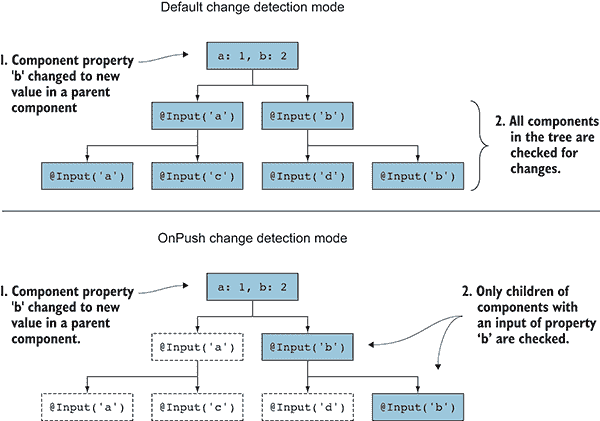
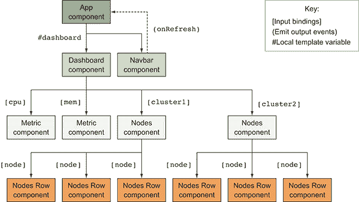
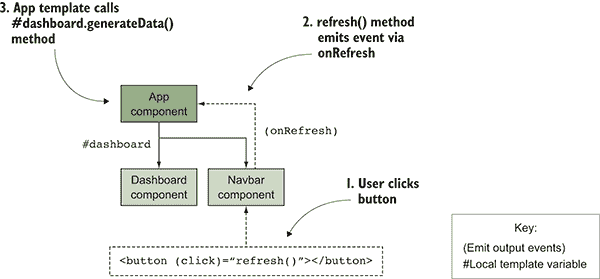

# 5

高级组件

**本章涵盖**

+   如何处理和优化变更检测

+   不同组件之间的通信

+   样式化和样式封装的不同方式

+   动态即时渲染组件

第四章涵盖了组件的许多基础知识，但还有更多内容！在这里，我们将深入研究在构建更有趣的应用程序时将派上用场的额外功能。

我们将更详细地探讨变更检测的工作原理，并查看如何使用 OnPush 能力来减少 Angular 需要执行的工作量以提高渲染效率。

虽然组件可以使用输入和输出，但还有其他方式让组件相互通信。我们将探讨为什么您可能选择使用不同的方法以及如何实现它。

有三种主要方式为组件渲染样式，选择不同的模式可能会对组件的显示方式产生重大影响。您可能希望尽可能内部化 CSS 样式，或者您可能不想内部化任何样式，而是使用全局 CSS 样式。

最后，我们将探讨如何动态渲染组件，以及为什么您可能想要这样做。这并不常见，但在某些时刻它是有用的。

如第四章所述，我强烈建议您保持组件的专注。随着我们更多地了解组件功能，您会发现避免过度加载组件非常重要。

本章将继续使用第四章的示例，因此请参考它以了解如何设置示例。所有内容都将建立在您所学的基础上，因此示例将扩展以展示组件的更多高级功能。

我可以几乎 100%的确定性说没有任何组件会使用每一个单独的能力，因为这很可能会使其无法正常工作。然而，掌握这些额外的概念将帮助您编写更复杂和动态的应用程序。让我们先从查看变更检测和如何优化性能开始。

## 5.1 变更检测与优化

Angular 附带一个变更检测框架，该框架确定当输入发生变化时组件何时需要渲染。组件需要对其组件树中某处所做的更改做出反应，而它们改变的方式是通过输入。

变更总是由某些异步活动触发的，例如当用户与页面交互时。当这些变更发生时，应用程序状态或数据发生变化的机会（尽管没有保证）存在。以下是一些示例：

+   用户点击按钮以触发表单提交（用户活动）。

+   每隔*x*秒触发一个间隔来刷新数据（间隔或定时器）。

+   回调、可观察对象或承诺被解决（XHR 请求、事件流）。

这些都是事件或异步处理程序，但它们可能来自不同的来源。我们将在其他章节中深入探讨可观察对象和 XHR 请求的行为方式，但在这里我们好奇的是用户操作和间隔触发器如何在 Angular 中引起变化。

Angular 必须知道发生了异步活动，但 JavaScript 中的 `setInterval` 和 `setTimeout` API 是在 Angular 的意识之外发生的。Angular 已经对 `setInterval` 和 `setTimeout` 的默认实现进行了猴子补丁，以便在间隔或超时解决时正确触发 Angular 的变化检测。同样，当在 Angular 中处理事件绑定时，它知道要触发变化检测。如果你在 Angular 之外编写需要触发变化检测的代码，有一些特殊的事情要做，但这里不会涉及。

一旦触发变化检测机制，它将从组件树的顶部开始，检查每个节点以查看组件模型是否已更改并需要渲染。这就是为什么必须让输入属性为 Angular 所知，否则它将无法知道如何检测更改。

Angular 有两种变化检测模式：默认和 OnPush。默认模式将在每个变化检测周期中始终检查组件的变化。Angular 已经高度优化了此过程，使其运行这些检查非常高效——在大多数情况下只需几毫秒。当数据在组件之间容易突变时，这一点很重要，并且确保应用程序中的值没有变化可能很困难。

你还可以使用 OnPush 模式，该模式明确告诉 Angular，这个组件只有在其中一个组件输入发生变化时才需要检查变化。这意味着如果父组件没有变化，那么可以知道子组件的输入不会变化，因此可以跳过该组件（以及任何孙组件）的变化检测。仅仅因为输入发生了变化并不意味着组件本身必须发生变化；也许输入是一个具有变化属性的但组件不使用的对象。跟踪你的应用程序中的数据结构可以帮助优化值传递和变化检测触发的方式。

图 5.1 展示了两种变化检测类型。想象有一个具有两个属性的组件树，属性 `'b'` 通过某些用户输入被更改。默认模式将在组件中更新值，然后检查其下所有组件的变化。OnPush 模式只检查具有特定于更改属性的输入绑定的子组件，并跳过检查其他组件。



**图 5.1**  变化检测默认从顶部开始，按树形结构向下进行，或者使用 OnPush 仅在具有更改输入的树形结构中向下进行。

我建议花时间阅读关于变更检测的详细信息，可以从帮助创建它的其中一人 Victor Savkin 那里了解：[`vsavkin.com/change-detection-in-angular-2-4f216b855d4c`](https://vsavkin.com/change-detection-in-angular-2-4f216b855d4c)。

我们的 Nodes Row 组件是使用 OnPush 的候选者，因为所有内容都是通过输入进入组件的，并且组件的状态始终与传入的值相关联（例如，如果利用率超过 70% 并且需要应用危险类）。打开 `src/app/nodes-row/nodes-row.component.ts`，我们将对其进行一些小的调整（见以下列表），以启用 OnPush。

[**列表 5.1**] 使用 OnPush 的 Nodes Row 组件

```
import { Component, Input, ChangeDetectionStrategy } from '@angular/core';     
```

```
 @Component({
  selector: '[app-nodes-row]',
  templateUrl: './nodes-row.component.html',
  styleUrls: ['./nodes-row.component.css'],
 changeDetection: ChangeDetectionStrategy.OnPush
```

```
}) 
```

就这样！导入并声明组件的 changeDetection 属性为 OnPush，现在你的组件只有在输入发生变化时才会进行变更检测。这种策略是组件元数据的一个属性，默认设置为默认模式（信不信由你！）。

现在我们可以将相同的更改应用到我们的 Metric 组件上，因为它在渲染时也只反映提供的输入值。试着亲自对那个文件做同样的更改。

使用 OnChanges 生命周期钩子拦截和检测变更还有另一种方法，因为我们已经在 Metric 组件中通过 getter/setter 方法拦截了输入，所以让我们再次修改它以使用 OnChanges 和 OnPush 模式。

打开 `src/app/metric/metric.component.ts` 并将其更新为你在列表 5.2 中看到的代码。它用 OnChanges 生命周期钩子替换了 getter 和 setter 方法，并使用了 OnPush 模式。

**列表 5.2** 使用 OnPush 模式和 `OnChanges` 生命周期钩子的度量组件

```
import { Component, Input, ChangeDetectionStrategy, OnChanges } from '@angular/core';     
```

```
 @Component({
  selector: 'app-metric',
  templateUrl: './metric.component.html',
  styleUrls: ['./metric.component.css'],
 changeDetection: ChangeDetectionStrategy.OnPush
```

```
})
export class MetricComponent implements OnChanges {     
```

```
 @Input('used') value: number = 0;
```

```
 @Input('available') max: number = 100;

 ngOnChanges(changes) {
```

```
 if (changes.value && isNaN(changes.value.currentValue)) this.value = 0;
 if (changes.max && isNaN(changes.max.currentValue)) this.max = 0;
 }

  isDanger() {
    return this.value / this.max > 0.7;
  }
} 
```

如果你自己实现了 OnPush 模式，它应该从导入策略辅助工具开始，然后添加 `changeDetection` 属性。在这里，你还需要导入 `OnChanges` 接口并声明类以实现它。

我们仍然需要声明我们的输入属性，所以我们回到之前的方法，不使用 getter 和 setter 方法来声明它们。`ngOnChanges` 方法实现了 OnChanges 生命周期钩子，它提供了一个对象作为参数，该对象包含任何已更改的输入，然后可以访问它们的当前和先前值。例如，如果父组件中只更改了 `value` 输入，那么在生命周期钩子上将只设置 `change.value` 属性。

在`OnChange`生命周期钩子内部，我们运行相同的检查以确定值是否为数值，如果验证失败，则重置值。需要注意的是，任何对输入的更改都会传播到任何子组件（如果有）。使用这种方法的价值在于，我们不是创建私有属性，同时拦截和验证输入，并且逻辑不会在组件请求属性时运行。它只会在特定组件的输入发生变化时为该组件运行生命周期钩子。

如果你需要在每次在组件上运行变更检测时（无论是否使用 OnPush），都可以使用 DoCheck 生命周期钩子。这允许你运行一些逻辑，可以检查 Angular 无法自动检测的组件中存在的更改。如果你需要触发你自己的类型的变化检测，这个生命周期钩子将帮助你做到这一点。它不太常用，但请务必注意其存在，以便在 OnChanges 无法满足你的需求的情况下使用。

在本节中，我们通过仅在输入发生变化时检查它们来优化了节点行和度量组件的变更检测。度量组件现在还使用 OnChanges 生命周期钩子来验证输入，这可以更高效，并挂钩到变更检测生命周期。

## 5.2 组件间的通信

通信组件之间有几种方式，我们已经在输入作为从父组件向子组件传递数据的方式进行了深入探讨。但这并不给我们提供向上通信到父组件或树中的其他组件（如果不是直接后代）的方式。

当你考虑构建你的组件时，尤其是高度模块化的组件，它们在发生某些事情时可能会需要发出事件，以便其他组件可以轻松地利用知道其他地方正在发生的事情。例如，你可以创建一个标签组件，并发出一个描述当前可见标签的事件。另一个组件可能对知道标签选择何时发生变化感兴趣，这样你就可以更新该组件的状态，例如一个基于当前标签的上下文帮助信息的附近面板。

你已经看到输入是推动数据沿着组件树向下传递给子组件的方式，而事件则是将数据和通知向上传递给父组件的方式。当以这种方式使用时，Angular 将这些事件视为输出。我们将使用输出通知父组件何时发生变化，这样我们就可以对这些事件做出反应。

此外，我们将在本节中探讨几种使用其他组件的方法：使用视图子组件（它让你访问组件控制器中的子组件控制器）和使用局部变量（它让你在组件的模板中访问子组件控制器）。每种方法都有不同的设计，可能在多个用例中都适用，但我们将通过我们的应用程序来展示每个方法的作用。

让我们再次查看我们的应用程序组件树，但这次我们将注释输入和通信流程(图 5.2)。我们希望能够点击 Navbar 组件中的按钮，使其在仪表板中生成数据（如刷新按钮）。Navbar 组件和 Dashboard 组件是 App 组件的子组件，那么我们如何让它们进行通信呢？使用事件和局部模板变量来实现这一点相当简单。



**图 5.2** 组件共享数据、发出事件以及通过局部变量访问其他组件

在图 5.2 中，你可以看到 Dashboard 组件将数据绑定到所有子组件，而 Nodes 组件也将一些数据绑定到其子组件。但所有数据都是从 Dashboard 组件流向子组件的。

然而，使用 Navbar 组件时，我们需要一种与 Dashboard 组件通信的方式，告诉它再次生成数据。我们将使用一个输出事件`(onRefresh)`，当用户点击刷新按钮时，它会通知 App 组件。然后一旦 App 组件检测到按钮被点击，它可以通过告诉 Dashboard 重新生成数据来处理该事件，这是通过在模板中使用局部变量引用 Dashboard 控制器来实现的。

### 5.2.1 输出事件和模板变量

为了说明这一点是如何工作的，我们需要对我们的 Navbar 和 App 组件做一些修改。让我们首先打开`src/app/navbar/navbar.component.ts`文件。我们需要声明一个输出事件，就像我们声明输入一样，这样 Angular 就能理解如何注册和处理该事件，如下面的列表所示。

**列表 5.3** 使用输出的 Navbar 组件

```
import { Component, Output, EventEmitter } from '@angular/core';     
```

```
 @Component({
  selector: 'app-navbar',
  templateUrl: './navbar.component.html',
  styleUrls: ['./navbar.component.css']
})
export class NavbarComponent  {
 @Output() onRefresh: EventEmitter<null> = new EventEmitter<null>();
```

```
 refresh() {
```

```
 this.onRefresh.emit();
 }
} 
```

我们首先导入`Output`装饰器和`EventEmitter`工厂对象。我们需要这两个来设置输出事件。`EventEmitter`是一个特殊对象，它帮助我们发出与 Angular 的变更检测一起工作的自定义事件。

接下来，我们声明一个新的属性`onRefresh`，并给它添加`@Output()`装饰器。这将通知 Angular 现在有一个基于属性名称的事件输出，这将允许我们然后在模板中使用事件绑定来监听此事件，如`(onRefresh)="..expression.."`。与`@Input()`装饰器一样，你可以选择性地传递一个别名来更改用于事件绑定的事件名称。

输出类型为`EventEmitter<null>`，这意味着这个变量将持有不发出任何数据的`EventEmitter`。可选地，它可以声明发出数据，例如包含事件触发时刻的日期对象。

到目前为止，我们已经正确地连接了输出，但我们仍然需要想出一个方法来发出刷新事件。我们已经在 Navbar 组件中添加了`refresh()`方法来调用`EventEmitter`对象提供的`onRefresh.emit()`方法。这将触发事件并通知父组件，该组件正在监听。

现在我们需要将点击事件绑定添加到 Navbar 按钮，以便它能够触发自定义输出事件。打开 src/app/navbar/navbar.component.html 文件，并更新按钮行以包含点击处理程序，如下所示。它应该调用`refresh()`方法：

```
<button class="btn btn-success" type="button" **(click)="refresh()****"**>Reload</button> 
```

在 navbar 中点击“重新加载”按钮现在将触发`refresh()`方法，然后它会发出自定义输出事件`onRefresh`。您可以在图 5.3 中看到发生了什么。



**图 5.3**  组件树概述，用户点击按钮并通过输出事件触发数据刷新

我们的应用组件（Navbar 和 Dashboard 的父组件）现在在用户点击按钮时会收到警报，但我们还没有实现事件绑定来捕获和响应它。为了做到这一点，打开 src/app/app.component.html 文件，并修改它如下：

```
<app-navbar (onRefresh)="dashboard.generateData()"></app-navbar>
<app-dashboard #dashboard></app-dashboard> 
```

在第一行，我们添加了事件绑定以响应`onRefresh`输出事件，但它需要调用来自 Dashboard 组件的方法。因为 Dashboard 组件有生成数据的方法，我们需要一种从 App 组件调用它的方法。第二行在 Dashboard 组件的模板上添加了`#dashboard`。这表示一个局部模板变量，可以通过变量`dashboard`访问，它引用 Dashboard 组件控制器，这样我们就可以从 Dashboard 组件调用方法——它允许我们在 App 组件模板的任何地方调用来自 Dashboard 组件的方法，即使我们不在 Dashboard 组件内部。但只有公共方法可用——例如，像`randomInteger()`这样的私有方法不可用。

如果没有组件监听该事件，那么它*将不会*在组件树中传播。输出事件只发送到父组件，与像点击或按键这样的常规 DOM 事件（它们会沿着 DOM 树传播）不同。

这个事件发射技巧允许我们在模板的另一个部分使用一个组件，在这种情况下，我们使用它来处理`onRefresh`事件，通过从 Dashboard 组件调用`dashboard.generateData()`方法。这对于访问同一模板中存在的组件来说非常方便。主要的缺点是它只允许你从模板访问组件控制器，而不是从控制器访问，这意味着 App 组件控制器不能直接调用 Dashboard 组件的方法。幸运的是，还有另一种方法，即使用 View Child 来引用另一个组件。

### 5.2.2 使用 View Child 引用组件

为了在父控制器内部访问子组件的控制器，我们可以利用`ViewChild`将这个控制器注入到我们的组件中。这为我们提供了对子控制器的直接引用，因此我们可以从 App 组件控制器实现调用 Dashboard 组件。

`ViewChild`是一个控制器属性装饰器，类似于`Inject`或`Output`，它告诉 Angular 用对特定子组件控制器引用填充该属性。它仅限于注入子组件，所以如果你尝试注入一个不是直接后代的组件，它将提供一个未定义的值。

让我们通过更新 App 组件来查看这个功能，使其获取 Dashboard 组件的引用并直接处理 Navbar 发出的`onRefresh`事件。打开 src/app/app.component.ts 文件，将其替换为列表 5.4 中看到的内容。

**列表 5.4** App 组件控制器

```
import { Component, ViewChild } from '@angular/core';     
```

```
import { DashboardComponent } from './dashboard/dashboard.component';     
```

```
 @Component({
  selector: 'app-root',
  templateUrl: './app.component.html',
  styleUrls: ['./app.component.css']
})
export class AppComponent {
 @ViewChild(DashboardComponent) dashboard: DashboardComponent;
```

```
 refresh() {
```

```
 this.dashboard.generateData();
 }
} 
```

在我们导入`ViewChild`装饰器之后，我们还需要导入`DashboardComponent`本身。我们需要确保它在编译期间可用，并且我们可以直接引用它。

然后，App 组件获得一个单一的属性，`dashboard`。`@ViewChild()`装饰器位于前面，我们传递对`DashboardComponent`的引用，这样 Angular 就能确切知道要使用哪个组件。我们还给这个属性指定了`DashboardComponent`的类型，因为它是一个该控制器的实例。

最后，我们添加了一个`refresh()`方法，它调用 Dashboard 组件控制器来生成数据。与模板变量方法相比，这为我们提供了在模板中可能难以或不可能完成的工作的机会。

我们需要更新 App 组件模板，以调用新的控制器方法而不是使用模板变量。回到 src/app/app.component.html，你应该将内容更改为以下内容：

```
<app-navbar (onRefresh)="refresh()"></app-navbar>
<app-dashboard></app-dashboard> 
```

现在模板不再引用 Dashboard 组件，而是当输出事件被触发时调用 App 组件的`refresh`方法。结果是相同的——Dashboard 将生成一组新的数据——但方法不同。

你可能想知道应该使用哪种方法，这主要取决于你希望将逻辑存储在哪里。如果你需要做的不仅仅是访问子控制器的属性或方法，那么你可能需要使用`ViewChild`方法。这确实会在两个组件之间造成耦合，在可能的情况下应该避免。但如果可以直接在模板中引用子控制器并调用方法，这样可以节省代码并减少耦合。

## 5.3 组件样式化和封装模式

Angular 可以使用不同的渲染方式，这会改变组件的样式化方式。组件通常被设计来管理自己的状态，这包括组件显示所需的视觉样式。几乎总是有一些全局 CSS 样式，你将应用它们来为你的应用程序提供默认样式的功能基础，但组件可以保留自己的样式，这些样式将在与应用程序其他部分隔离的情况下渲染。

如果你为组件添加 CSS 样式，这些样式不会全局暴露，你将避免处理来自一个组件的 CSS 规则覆盖另一个组件的情况。有一种方法可以将组件样式渲染到全局样式，但这只在少数情况下推荐使用。

向组件添加样式有多种方式。最好以相同的方式在你的所有组件中添加样式，因为混合和匹配可能会产生一些有趣（有时是意外的）副作用。如果你使用了一个执行不同操作的第三方库，这可能会带来潜在的挑战，所以请关注你的依赖项如何工作，以确保它们不会发生冲突。

### 5.3.1 向组件添加样式

样式可以通过多种方式添加。你始终可以使用全局方法添加 CSS，即在应用程序的 index.html 文件中包含链接的 CSS 文件，或在`.angular-cli.json`文件的`styles`属性中引用该文件（我们已经为 Ng-bootstrap 做了这件事）。这些样式是通用的，并将应用于页面中任何匹配的元素。这对于需要到处使用的常见和共享样式来说很好，但当你想要有独立定义自己样式的组件时，这就不太好了。

为了更好地隔离我们的样式，我们可以使用以下方法之一——这些是添加特定于单个组件的样式的途径：

+   *内联 CSS* — 组件模板可以包含内联 CSS 或 style 属性来设置元素的样式。这些是在使用 Angular 或其他技术时添加样式规则到 HTML 元素的默认方式。

+   *组件链接 CSS* — 使用组件的`styleUrls`属性和指向外部 CSS 文件的链接。Angular 将加载 CSS 文件并将规则注入到你的应用的`style`元素中。

+   *组件内联 CSS* — 使用组件的`styles`属性和 CSS 规则数组，Angular 会将规则注入到你的应用的`style`元素中。

让我们看看这些不同的方法如何在示例中使用。这里有一个简单的组件，它从五个不同的方法中应用了样式：

+   全局 CSS 规则

+   内联 CSS `style` 元素

+   内联 `style` 声明

+   组件 `styles` 属性

+   组件 `styleUrls` 属性链接到 CSS 文件

我们将修改导航栏中的 Reload 按钮以具有不同的背景颜色，这样我们就可以看到这些不同的方法是如何应用的。我们首先向 CLI 为每个组件生成的 CSS 文件中添加一些 CSS，该文件通过 `styleUrls` 属性链接。打开 src/app/navbar/navbar.component.css 文件，并添加以下 CSS 规则：

```
.btn { background-color: #e32738; } 
```

这覆盖了由 bootstrap CSS 库设置的全球颜色，并给我们的按钮一个红色（而不是默认的绿色）。注意，页面上的其他按钮（在 Nodes Row 组件中）没有改变，即使它们也应用了 `.btn` 类。我们将在稍后解释这是如何发生的，但这是 Angular 封装功能的视觉结果。

接下来，我们将通过更新 src/app/navbar/navbar.component.ts 文件中的组件元数据来添加一些样式，使用以下 `styles` 属性：

```
@Component({
  selector: 'app-navbar',
  templateUrl: './navbar.component.html',
 styleUrls: ['./navbar.component.css'],
  styles: [`.btn { background-color: #999999; }`]
}) 
```

`styles` 属性让我们提供一组字符串（这里我们使用反引号字符来创建一个字符串字面量），这些字符串应包含有效的 CSS 规则。现在当你查看应用程序时，它应该看起来像是一个灰色按钮。这意味着 `styles` 属性内的样式将覆盖通过 `styleUrls` 属性加载的 CSS 文件中的任何样式。这里的技巧是，最后声明的将获胜，所以当你既有 `styles` 和 `styleUrls` 时，最后声明的将覆盖第一个，无论使用哪一个，这取决于编译的方式。（在撰写本文时，CLI 如果你在 CLI 中声明了 `styles` 和 `styleUrls`，会发出警告，但它似乎仍然可以工作。）

现在打开 src/app/navbar/navbar.component.html 中的导航栏模板，并将以下样式元素添加到模板中：

```
<style>.btn { background-color: #3274b8; }</style> 
```

保存后，应用程序将重新加载，突然你的按钮现在变成了蓝色，这意味着内联样式声明将覆盖通过 `styles` 或 `styleUrls` 属性提供的任何值。

添加样式的最后一种方式是直接在元素本身上使用 `style` 属性。仍然在组件模板中，修改按钮以包含此内联 CSS 声明，使按钮变为紫色：

```
<button class="btn btn-success" type="button" **style="background-color: #8616f6"** (click)="refresh()">Reload</button> 
```

这个练习向我们展示了，如果 CSS 规则在所有这些地方都设置了不同的值，你可能会对哪个规则被应用感到惊讶。需要注意的是，使用 `!important` 值将使该特定规则高于其他任何规则，如果你敢使用它的话。如果同一规则在多个地方声明，以下是根据规则应用的优先级顺序，每个项目都会覆盖其下方的规则：

1.  1 内联样式属性规则

1.  2 模板中的内联样式块规则

1.  3 组件`styles`规则或`styleUrls`规则（如果两者都有，则最后声明的具有优先级）

1.  4 全局 CSS 规则

使用内联样式声明的规则始终是最高优先级的规则。这可能是预期的，因为除了声明`!important`值之外，内联样式通常由浏览器赋予最高优先级。模板中的样式块是下一个最高优先级。然后是组件`styles`数组或`styleUrls`外部文件中声明的规则，最后是全球样式。

所有 CSS 规则都添加到文档头部的新`style`元素中。当应用渲染时，组件将被加载，这些样式将被添加到文档头部。但根据封装模式的不同，这些样式的渲染方式可能会改变样式的处理方式。

重要提示：所有这些指南都是基于使用 CLI 进行构建的。有可能改变构建过程并获得不同的优先级或结果，只是让你知道。现在让我们看看不同的封装模式是如何工作的，以及为什么我们可能想要更改默认设置。

### 5.3.2 封装模式

Angular 希望确保你可以构建模块化的组件，这些组件可以轻松共享。一个关键能力是确保组件的 CSS 样式不会溢出到应用的其余部分，这被称为*样式封装*。你有没有使用过包含一些 CSS 的第三方库，这些 CSS 与你的应用程序中的其他内容冲突，导致某些内容显示不正确？很可能是你遇到了这种情况，Angular 提供了一些选项来避免这种情况。

直到最近，还没有确定的方法来封装特定 DOM 元素的 CSS 样式或 HTML 元素。最常见的方法是使用特定的类命名约定，正如在大多数流行的 CSS 库中找到的那样。这些约定为 CSS 类提供了一种特定的命名法，限制了相同类在其他地方被使用的可能性。尽管这些方法通常有效，但无法保证类名或样式不会冲突，并且它不会为内部 HTML 元素提供封装。

进入 Shadow DOM，这是官方的浏览器原生封装样式标准。Shadow DOM 为我们提供了一套良好的功能，以确保我们的样式不会冲突并渗入或渗出组件，尽管它可能不支持旧版浏览器。如果你需要复习 Shadow DOM，请参考第一章。

Angular 为视图提供了三种封装模式。在早期的样式示例中，你使用的是默认的模拟模式。

+   *None* — 在视图渲染过程中没有使用封装，组件的 DOM 受 CSS 的正常规则约束。当模板注入到应用中时，不会修改模板，除了从模板中移除任何 CSS 样式元素到文档头部。

+   *模拟* — 模拟封装通过在运行时向 CSS 规则添加唯一 CSS 选择器来模拟样式封装。CSS 可以轻松地从全局 CSS 规则中级联到组件中。

+   *原生* — 使用原生 Shadow DOM 进行样式和标记封装，并提供最佳的封装。所有样式都注入到 shadow root 中，因此本地化到组件。组件声明的任何模板或样式都不会在组件外部可见。

每种封装模式以不同的方式应用样式，因此了解封装模式和样式渲染视图的方式很重要。无论使用哪种封装模式，应用样式的顺序都是一致的，但底层样式注入和修改应用的方式确实会改变。

现在，让我们更详细地看看不同的模式，它们的行为方式，以及为什么你可能决定选择不同于默认模式的模式。当我们查看每种模式时，尝试在 Metric 组件中设置模式，并检查它在页面中渲染时的输出，以了解它是如何将样式添加到文档头部的。

#### 无封装模式

如果你在组件中未设置封装，你将绕过任何原生或模拟的 Shadow DOM 功能。它将组件渲染到 HTML 文档中，就像你直接将 HTML 标记写入 body 一样。这是没有样式的组件的默认模式。

要设置此模式，你需要使用组件元数据的 `encapsulation` 属性来设置，当然，你需要从 `@angular/core` 中导入 `ViewEncapsulation` 枚举：

```
encapsulation: ViewEncapsulation.None 
```

一旦设置了模式，为组件声明的任何样式都将从组件模板提升到文档头部，这是对标记的唯一实际修改。`style` 元素以原样移动到文档头部，这是一种注入全局 CSS 规则的方式。另一个稍后渲染的组件可能会注入一个竞争 CSS 规则，因此渲染顺序也很重要。

这里总结了为什么你可能使用或避免使用无封装模式的组件的原因：

+   *样式泄漏* — 有时应用程序设计时使用了 CSS 库，其中封装每个组件的内部样式是不必要或不受欢迎的。如果你没有将样式放入你的组件中，那么封装可能不是必要的。

+   *全局样式泄漏* — 由于缺乏封装，标题元素的全球背景样式被应用，这可能或可能不是期望的行为。

+   *模板未修改* — 因为这种模式以原样注入模板（在重新定位样式之后），你的 DOM 元素将不会应用任何特殊转换。

当使用无封装模式时，你不能使用任何特殊的 Shadow DOM 选择器，如 `:host` 或 `::shadow`。因为这些选择器没有上下文，因为没有启用任何 Shadow DOM（原生或模拟）功能。

现在让我们看看模拟模式，并比较其行为。

#### 模拟 Shadow DOM 封装模式

模拟模式通过向 HTML 标记和 CSS 规则添加独特属性来对任何样式应用一些转换，通过使它们独特来增加 CSS 规则的特定性。因为这不是真正的封装，所以被称为 *模拟*，但它具有许多相同的优点。这是 Angular 组件的默认模式，无论它们如何在组件中声明样式（无论它们如何在组件中声明）。

模拟模式主要关于防止组件中的样式泄漏到全局规则（当不使用封装时会发生这种情况）。为了实现这一点，视图将通过使用独特的属性来渲染模板和样式，以增加组件内部 CSS 规则的特定性。模拟模式是默认模式，但如果你想显式声明它，你会在组件元数据上设置该属性：

`encapsulation: ViewEncapsulation.Emulated`。

在渲染过程中，样式首先从组件模板或组件属性中提取出来。然后生成一个独特的属性，类似于 `_ngcontent-ofq-3`。它使用 `_ngcontent` 前缀和一个独特的后缀，以便每个组件都可以有一个独特的 CSS 选择器。相同组件的多个实例具有相同的独特属性。最后，视图通过向组件 DOM 节点添加独特属性并将其添加到 CSS 选择器规则中来渲染。

这里简要概述一下模拟封装模式的行为以及你为什么想要（或不想）使用它：

+   *样式隔离* — 样式和标记的渲染会添加独特的属性，以确保 CSS 规则不与全局样式冲突。

+   *样式泄漏* — 全局样式仍然可以泄漏到组件中，这可以用来允许共享常见的样式。如果全局规则中添加了规则，而你不想让它们泄漏到组件中，这可能会与组件冲突。

+   *独特选择器* — 渲染的 DOM 获得一个独特的属性，这意味着如果你想在组件中应用全局样式，你需要相应地编写 CSS 选择器。

现在让我们通过查看原生模式及其如何使用 Shadow DOM 来完成封装模式的讨论。

#### 原生 Shadow DOM 封装模式

Shadow DOM 是一种强大的工具，用于封装从应用其余部分中分离的标记和样式。Angular 可以使用 Shadow DOM 将所有内容注入，而不是将其放入主文档中。这意味着模板和样式确实与应用的其余部分隔离。

原生浏览器对 Shadow DOM 的支持有限，可以在 [`caniuse.com/#feat=shadowdom`](http://caniuse.com/#feat=shadowdom) 检查。Shadow DOM 的好处可能不会扩展到你需要支持的 所有浏览器，但有一个很好的 polyfill 可以在 [`webcomponents.org/polyfills/shadow-dom/`](http://webcomponents.org/polyfills/shadow-dom/) 中提供支持。即使有 polyfill，较旧的浏览器可能仍然不受支持，因此你应该考虑所有需求。

当组件渲染时，它会在组件中创建一个 shadow root。模板被注入到 shadow root 中，以及来自兄弟和任何父组件的样式。对于文档的其余部分，这个 shadow root 保护了内容不被组件外部可见。

Angular 希望嵌套组件能够共享样式，但通过 shadow root，Angular 通过将它们注入到 shadow root 中使这些样式对组件可用。

这里是对原生模式工作方式及其为什么可能或可能不想使用它的总结：

+   *使用 Shadow DOM* — 对于真正的封装，原生选项是最好的选择。它将保护你的组件免受文档样式的干扰，并将标记封装起来。

+   *父级和兄弟级样式渗透* — 由于 Angular 渲染组件的方式，它还会注入父级和兄弟级组件的样式，这可能导致样式渗透（你可能不希望发生）的问题。

+   *有限支持* — 浏览器对 Shadow DOM 的支持有限，可能需要使用 polyfill 来允许其在应用程序中使用。

到目前为止，我们已经探讨了如何将数据绑定到组件的视图中。这对于动态注入数据和修改视图属性非常重要。我们还探讨了如何使用事件绑定从视图回调到组件，这可以用来更新值或调用方法。我们还探讨了样式化组件和封装样式的各种方法。

我们已经覆盖了很多内容，但现在我们将探讨 Angular 指令和管道。它们提供了修改我们视图中数据或元素显示的额外选项，并为模板添加了额外的逻辑。

## 5.4 动态渲染组件

应用程序有时需要根据当前应用程序状态动态渲染组件。你可能不知道屏幕上需要哪个组件，或者可能是用户交互需要在新页面上显示新的组件。

你已经看到了一些相当常见的情况，在这些情况下，动态组件通常是一个很好的解决方案。例如

+   显示动态内容的页面模态

+   条件显示的警报

+   可能会动态扩展内容量的轮播或选项卡

+   需要之后删除的折叠内容

这些情况都有一个共同点：它们不一定需要在屏幕上，或者依赖于它们自身能力之外的条件。Angular 给我们使用较低级别的 API 的能力，这些 API 允许我们按需渲染一个模板中尚未存在的组件。

我将展示两个使用 ng-bootstrap 生成模态框的示例，然后讨论如何使用 Angular 的 API 创建一个警报组件来自行完成所有操作。使用 ng-bootstrap，大部分魔法都隐藏在一个有用的服务背后，但它将使我们能够在手动构建之前快速获得所需的功能。

### 5.4.1 使用 Ng-bootstrap 模态框动态组件

让我们从生成一个新的组件开始。这个组件将在你点击节点行组件中的查看按钮时显示节点的详细信息。我们将称这个组件为节点详情组件：

```
ng generate component nodes-detail 
```

现在用代码替换组件的控制器，该控制器位于 src/app/nodes-detail/nodes-detail.component.ts，替换为列表 5.5 中的代码。这个控制器有类似的逻辑来判断节点是否超出了其利用率。这是将在模态框内部打开的组件，并且只有在被调用时才会加载。

**列表 5.5** 节点详情组件控制器

```
import {Component, Input} from '@angular/core';
import {NgbActiveModal} from '@ng-bootstrap/ng-bootstrap';     
```

```
 @Component({
  selector: 'app-nodes-detail',
  templateUrl: './nodes-detail.component.html',
  styleUrls: ['./nodes-detail.component.css']
})
export class NodesDetailComponent {
 @Input() node;
```

```
 constructor(public activeModal: NgbActiveModal) {}
```

```
 isDanger(prop) {
    return this.node[prop].used / this.node[prop].available > 0.7;
  }

  getType(prop) {
    return (this.isDanger(prop)) ? 'danger' : 'success';
  }
} 
```

Ng-bootstrap 库提供了一个有用的服务，名为 NgbActiveModal，它是模态控制器的实例，用于加载节点详情组件。它将允许我们在需要时关闭模态框，无论是按需还是基于用户操作。当我们添加这个组件的模板时，这一点将更加明显。

与迄今为止的其他组件不同，这个组件将不会从父模板中调用。但我们需要传递一个数据输入给它，所以我们仍然需要声明输入属性。

现在我们需要模板来使组件功能化。打开 src/app/nodes-detail/nodes-detail.component.html，并用以下列表替换现有的代码。

**列表 5.6** 节点详情组件模板

```
<div class="modal-header">
 <button type="button" class="close" aria-label="Close" (click)="activeModal.dismiss()">
```

```
 <span aria-hidden="true">&times;</span>
  </button>
  <h4 class="modal-title">{{node.name}}</h4>
</div>
<div class="modal-body container">
  <div class="col-xs-6">
 [<app-metric [used]="node.cpu.used" [available]="node.cpu.available">](#c05-codeannotation-0019)
```

```
 <metric-title>CPU</metric-title>
 </app-metric>
  </div>
  <div class="col-xs-6">
 [<app-metric [used]="node.mem.used" [available]="node.mem.available">](#c05-codeannotation-0020)
```

```
 <metric-title>Memory</metric-title>
 </app-metric>
  </div>
</div> 
```

在这里有很多标记需要用于显示带有 Bootstrap CSS 样式的模态框，但它有一个包含标题和关闭按钮的模态框头部，以及包含两个度量组件的主体。请注意，我们可以在动态组件内部使用任何已注册到我们的应用程序模块中的组件，这很方便。

记得在我们的控制器中有一个名为 `activeModal` 的属性，它是一个 NgbActiveModal 服务的实例。我们在模板中使用它来调用 `dismiss` 方法，这将关闭模态框本身。这就是为什么我们在控制器中包含了这个属性。您还可以看到 `node` 属性，这是我们的唯一输入绑定，它被用来显示数据或将数据传递到其他组件。

此组件的内容与应用程序的其他部分相当相似，所以我们不需要在上面花费时间。我们现在感兴趣的是如何从 Nodes Row 组件触发模态的打开。打开 `src/app/nodes-row/nodes-row.component.html` 文件，并在按钮中添加以下事件绑定：

```
<td><button class="btn btn-secondary" (click)="open(node)">View</button></td> 
```

现在我们需要打开 `src/app/nodes-row/nodes-row.component.ts` 并实现这个新方法。以下列表中的代码包含了更新的控制器，并且变更已经为您标注。

**列表 5.7**  Nodes Row 组件模板中添加的模态

```
import { Component, Input, ChangeDetectionStrategy } from '@angular/core';
import { NgbModal } from '@ng-bootstrap/ng-bootstrap';     
```

```
import { NodesDetailComponent } from '../nodes-detail/nodes-detail.component';     
```

```
 @Component({
  selector: '[app-nodes-row]',
  templateUrl: './nodes-row.component.html',
  styleUrls: ['./nodes-row.component.css'],
  changeDetection: ChangeDetectionStrategy.OnPush
})
export class NodesRowComponent {
  @Input() node: any;

 constructor(private modalService: NgbModal) {}
```

```
 isDanger(prop) {
    return this.node[prop].used / this.node[prop].available > 0.7;
  }

 open(node) {
```

```
 const modal = this.modalService.open(NodesDetailComponent);
 modal.componentInstance.node = node;
 }
} 
```

在这里，我们导入 NgbModal 服务，这将允许我们创建一个新的模态。我们在 Nodes Detail 组件中看到了 NgbActiveModal 服务，一旦模态及其组件被创建，它将允许 Nodes Detail 组件引用活动的模态实例。我们还需要导入 Nodes Detail 组件。构造函数还将 `modalService` 属性设置为 NgbModal 服务的实例。

在 `open()` 方法中，我们传递一个节点数据的引用以供使用。然后我们使用 `modalService` 创建一个新的模态实例，该实例将渲染的组件作为参数。它将新创建的组件的引用存储在 `componentInstance` 属性中，这使得我们可以设置在点击时传入的 `node` 输入绑定。

这就连接了我们触发模态所需的所有内容。但是，如果您尝试它，模态可能还不会正常工作，因为还有一些小的细节需要实现，这将允许我们打开这个模态。

首先，打开 `src/app/dashboard/dashboard.component.html` 文件，并在模板底部添加以下代码行——我们需要为 Modal 服务提供一个渲染组件的位置：

```
<template ngbModalContainer></template> 
```

这是一个占位符模板元素，它上面有 NgbModalContainer 指令，这告诉 Ng-bootstrap 在模板中的哪个位置渲染此组件。组件必须在模板的某个位置进行渲染，这是 Ng-bootstrap 定义渲染位置的方式。

其次，我们需要向我们的 App 模块添加一个新的条目。当 CLI 处理 Angular 时，它需要知道可能被动态渲染的组件有哪些，因为它将不同地处理它们。打开 `src/app/app.module.ts` 文件，并在 NgModule 装饰器中添加一行新内容：

```
entryComponents: [NodesDetailComponent], 
```

条目组件是指需要在浏览器中动态渲染的任何组件，这还包括与路由链接的组件（关于这一点将在第七章中详细介绍）。CLI 默认会尝试优化组件，并且不包含组件工厂类。但是，为了动态渲染，需要组件工厂类来渲染，因此这告诉 CLI 编译器如何在构建时正确处理它。

这个例子对于 Ng-bootstrap 的模态实现来说有点具体，所以它只能让我们对如何构建自己的动态组件有有限的了解。

### 5.4.2 动态创建组件并渲染

Ng-bootstrap 模态示例是一个创建模态的好方法，但它抽象了一些能力。我们想直接看到它是如何工作的，并将基于我们到目前为止对组件的了解来创建我们自己的动态渲染组件。

当我们动态渲染一个组件时，Angular 需要一些东西。它需要知道要渲染哪个组件，在哪里渲染它，以及它可以从哪里获取它的副本。所有这些都在任何模板的编译过程中发生，但在这个情况下我们没有模板，必须自己调用 API。我们将使用以下 Angular 功能来处理此过程：

+   `ViewContainerRef`——这是对 Angular 理解的应用程序中元素的引用，它为我们提供了一个可以渲染组件的参考点。

+   `ViewChild`——这将使我们能够将控制器中的元素引用为`ViewContainerRef`类型，从而获得渲染组件所需的 API 访问权限。

+   `ComponentFactoryResolver`——这是一个 Angular 服务，它为我们提供任何已添加到入口组件列表中的组件的组件工厂（这是渲染所必需的）。

在构建我们的示例时，您将看到这三个功能协同工作。我们将构建一个当数据刷新时出现的警告框，并在一段时间后自行消失。这将让我们了解如何动态渲染组件并将其从页面上删除，这与你从 Ng-bootstrap 模态服务中获得的效果非常相似。

首先，生成一个新的组件。从命令行运行以下命令来设置这个新组件：

```
ng generate component alert 
```

这个组件的模板将会很简单；它包含一些带有 bootstrap 风格的标记，用于创建一个警告框并绑定最后刷新的日期。打开 src/app/alert/alert.component.html 文件，并用以下内容替换其内容：

```
<div class="container mt-2">
  <div class="alert alert-warning" role="alert">
    The data was refreshed at {{date | date:'medium'}}
  </div>
</div> 
```

同样，组件控制器将除了单个输入属性外为空。打开 src/app/alert/alert.component.ts 文件，并用以下列表中的代码替换其内容。

**列表 5.8**  警告组件控制器

```
import { Component, Input } from '@angular/core';

@Component({
  selector: 'app-alert',
  templateUrl: './alert.component.html',
  styleUrls: ['./alert.component.css']
})
export class AlertComponent {
  @Input() date: Date;
} 
```

到目前为止，一切顺利。这个组件没有我们在这个章节中没有看到过的特殊之处，所以我将进入下一步。因为这个组件将会被动态渲染，我们需要将其添加到`entryComponents`列表中，所以再次打开 src/app/app.modules.ts 文件，并将其添加到列表中。到这一点，我们的组件本身已经准备好被动态渲染了：

```
entryComponents: [
  NodesDetailComponent,
  AlertComponent
], 
```

现在我们可以开始工作，触发组件在屏幕上渲染的机制。与模态示例类似，我们需要在我们的应用程序中创建一个模板元素，以便用于渲染，因此打开 src/app/dashboard/dashboard.component.html 文件，并更新它以包含以下模板：

```
<app-navbar (onRefresh)="refresh()"></app-navbar>
<ng-template #alertBox></ng-template>
<app-dashboard></app-dashboard> 
```

`#alertBox` 属性是另一个模板局部变量，我们可以用它来稍后识别这个元素。这将是我们渲染组件旁边的元素。打开 src/app/app.component.ts 文件，并用以下列表中的代码替换它。

**列表 5.9**  应用程序组件控制器

```
import { Component, ViewChild, ComponentFactoryResolver, ComponentRef, ViewContainerRef } from '@angular/core';     
```

```
import { DashboardComponent } from './dashboard/dashboard.component';
import { AlertComponent } from './alert/alert.component';     
```

```
 @Component({
  selector: 'app-root',
 templateUrl: './app.component.html',
  styleUrls: ['./app.component.css']
})
export class AppComponent {
 alertRef: ComponentRef<AlertComponent>;
```

```
 @ViewChild(DashboardComponent) dashboard: DashboardComponent;
 @ViewChild('alertBox', {read: ViewContainerRef}) alertBox: ViewContainerRef;

 constructor(private ComponentFactoryResolver: ComponentFactoryResolver) {}
```

```
 alert(date) {
```

```
 if (!this.alertRef) {
 const alertComponent = this.ComponentFactoryResolver.resolveComponentFactory(AlertComponent);
 this.alertRef = this.alertBox.createComponent(alertComponent);
 }

 this.alertRef.instance.date = date;
 this.alertRef.changeDetectorRef.detectChanges();

 setTimeout(() => this.destroyAlert(), 5000);
 }

 destroyAlert() {
```

```
 if (this.alertRef) {
 this.alertRef.destroy();
 delete this.alertRef;
 }
 }

  refresh() {
    this.dashboard.generateData();
  }
} 
```

这可能一开始看起来很复杂，所以让我们分解一下。它的工作方式和构造方式相当简单。

首先，我们必须导入一些额外的对象，我们将在进行过程中查看它们的角色。我们还导入了 Alert 组件本身，这样我们就可以在渲染期间正确地引用它。

然后我们添加两个属性，`alertRef` 是指向 Alert 组件的组件引用（这是声明的类型）。我们希望有这个引用，这样我们就可以跟踪警报，并在需要时将其删除。第二个属性是另一个视图子组件，称为 `alertBox`。`ViewChild` 语法不同，因为它允许我们传入一个字符串来通过该名称引用一个本地模板变量，然后“读取”它作为特定类型的实体——在这种情况下，是一个 `ViewContainerRef`。它将根据模板变量获取元素，并将其解析为 `ViewContainerRef` 类型。这将使我们能够访问一个关键的 API。这些只是属性，到目前为止，还没有实例化。

构造函数将 `ComponentFactoryResolver` 属性设置为工厂解析器服务，这是我们渲染组件之前查找组件工厂类副本所需的。

这里的主要魔法发生在 `alert()` 方法内部。我们将逐行分析。首先，它检查是否已经在 `alertRef` 上存储了某些内容（这意味着 Alert 组件已经被创建），如果是这样，它就会跳过创建另一个警报，并继续更新绑定。但是，如果还没有 Alert 组件，它就使用 `ComponentFactoryResolver.resolveComponentFactory()` 方法来获取组件工厂的实例（这似乎有点多余，但这是 API 名称）。此时，组件将以原始形式（尚未渲染）可用。

下一行使用 `alertBox` 从我们之前收到的工厂实例创建组件。记住，`alertBox` 是我们将注入组件的元素的实例，它被 `ViewContainerRef` 实例包装。此时，组件将被渲染到声明模板元素的模板中。

接下来的两行（在条件之外）设置了组件的绑定数据，然后触发变更检测以运行。因为我们手动更改了绑定数据，所以我们需要通知 Angular 检查某些内容（这不同于 Angular 的典型渲染过程！）。

最后，设置一个超时，在五秒后调用`deleteAlert`方法，这样警报就不会永远留在屏幕上。如果我们更仔细地查看这个方法，你可以看到它将检查是否存在警报组件的现有实例。如果是的话，它将使用所有组件都有的`destroy()`方法将其从页面上移除。

如果你尝试运行这个示例，你会发现它还没有工作。我们遗漏了一个重要的步骤！我们没有任何地方调用应用程序组件的`alert()`方法，所以它不会出现。为了做到这一点，我们将从仪表板组件中发出一个事件，当数据生成时触发，同时附带更新时的戳记。

打开`src/app/dashboard/dashboard.component.ts`。我们将添加一个新的输出事件。确保在文件顶部导入`Output`和`EventEmitter`对象。然后添加一个新属性，就像你在这里看到的那样：

```
@Output() onRefresh: EventEmitter<Date> = new EventEmitter<Date>(); 
```

现在在`generateData()`方法中，将此行添加到方法末尾：

```
this.onRefresh.emit(new Date()); 
```

这在仪表板组件中设置了一个新的输出事件，并且这次我们在发射阶段传递了一些数据。我们可以在应用程序组件中捕获这些信息，并将其传递给我们的警报组件。现在这很简单——我们只需要再次更新`src/app/app.component.html`文件，通过添加一个事件绑定到仪表板组件：

```
<app-dashboard (onRefresh)="alert($event)"></app-dashboard> 
```

哇！我们的警报组件现在应该在每次数据生成事件后出现，无论你是否点击右上角的按钮，还是等待 15 秒自动重新生成。它还会在五秒后自动关闭警报。

这是对动态组件的一次快速浏览。除了这种方法之外，还有几种不同的方法可以生成组件，但这是一个你可以用在你的应用程序中的可靠方法。

## 摘要

我们在本章中非常忙碌。我们涵盖了关于组件的大量内容，包括它们的工作原理、各种功能以及更多。以下是本章中我们讨论的内容：

+   我们更详细地研究了变更检测，以及如何利用`OnPush`模式更好地优化组件渲染时的性能。

+   我们研究了几个生命周期事件处理器。还有许多其他的事件处理器，它们也有自己的用例：

+   `OnInit`生命周期钩子在构造函数之后以及输入属性可用时只触发一次。

+   `OnChanges`生命周期钩子在输入属性更改时触发。

+   `OnDestroy`生命周期钩子在组件即将从页面上移除时触发。

+   我们讨论了如何使用输出属性和内置的`EventEmitter`在组件之间进行通信，以及如何将子组件作为视图子组件引用。

+   我们讨论了使用 CSS 对组件进行样式设计，以及不同的封装模式如何影响页面上的内容渲染方式。

+   我们通过两个示例来结束本次讨论，展示了如何动态渲染组件。第一个示例是一个预构建的服务，使用 Ng-bootstrap 模态服务按需渲染我们的组件，而第二个示例则完全由我们自行管理。
