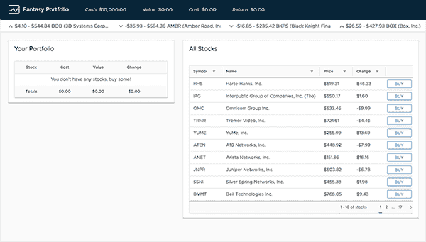
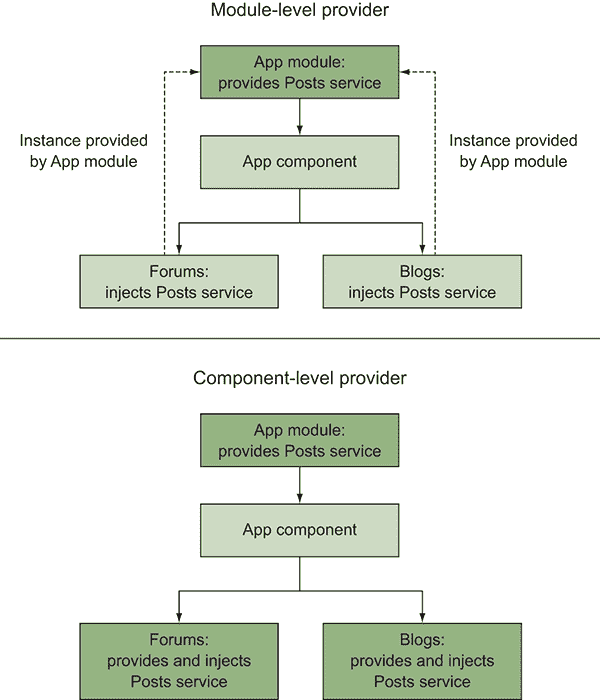
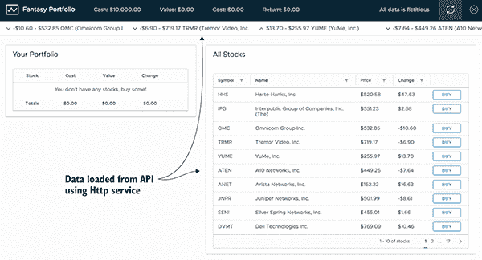
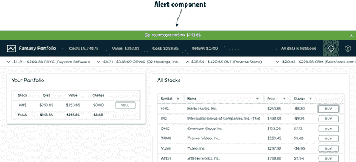

# 6

服务

**本章涵盖**

+   服务及其角色

+   创建许多不同类型的服务

+   使用服务来帮助检索和管理数据

+   用服务替换控制器中的逻辑

+   理解依赖注入如何与服务一起工作

在第 4-5 章中，我们有了仪表板组件，它为应用程序的其余部分生成了一些数据。但这仅仅是因为我们不想在示例中引入更多的复杂性。在大多数情况下，这并不理想，因为这种逻辑难以重用，并使组件变得不必要地复杂。

你的应用程序将需要管理许多任务，其中许多任务将超出组件的责任范围，例如管理数据访问、管理应用程序范围内的配置以及实用函数。Angular 的 HttpService 是一个很好的例子，它使得在不重复实现的情况下重用制作 HTTP 请求的逻辑变得容易。尽管 Angular 和许多库为你提供了可以消费的服务，但你也可以也应该创建自己的服务。

*服务* 基本上是 JavaScript 对象，它们以其他应用程序部分可以轻松消费的方式提供常用逻辑。例如，需要用户登录的应用程序将需要一个服务来帮助管理用户状态。或者你可能有一个服务，它帮助管理如何向你的 API 发送请求，并将必要的逻辑封装在使用的组件之外。

在你的应用程序中共享的代码几乎总是最好放在服务中。在 Angular 中，大多数情况下，服务也是你可以通过依赖注入将其注入到控制器中的东西，尽管没有确切的定义来界定什么使一个对象成为服务。

为了帮助你，我想出了几种松散的分类，这些分类在提供关于服务可以创建的各种方式的见解方面非常有用。一个服务可能适合这些类别中的多个，但我通常尽量使我的服务专注于这些角色之一：

+   *可注入*的服务是典型的 Angular 服务，为应用程序提供功能并与 Angular 的 DI 系统一起工作以注入到组件中。一个例子是处理如何从 API 加载数据的服务。

+   *不可注入*的服务是未与 Angular 的 DI 系统绑定且仅导入到文件中的 JavaScript 对象。这可以用来在 Angular 的 DI 之外使服务可用，例如在应用程序的主文件中。

+   *辅助*服务是使使用组件或功能更容易的服务。一个例子是帮助管理当前页面上活动的警报的服务。

+   *数据*服务用于在应用程序中共享数据。一个例子是包含登录用户数据的对象。

在第四章中，将数据逻辑提取到服务中，以将其与组件分离会更合适。在第五章中，我们讨论了设计组件以专注于特定角色，这应该包括保持控制器专注于通过将责任委托给服务来管理数据的最低限度的任务。*组件*用于显示 UI，而*服务*旨在帮助管理数据或其他可重用的逻辑片段。

服务的目标是负责一组特定的任务，这反过来又帮助保持应用程序其他方面的专注。服务的大小并不像保持其专注于任务那样重要。

我们将探讨使用服务的方法，我还命名了一些我认为最常见的服务模式。

## 6.1 设置章节示例

我们将构建一个使用生成数据的应用程序，这些数据每分钟变化几次，以模拟真实市场的变化（见图 6.1）。你将能够买卖股票，但与真实股票市场不同，如果你输光了所有资金，你总是可以重置你的账户。



**图 6.1** 由服务驱动的幻想投资组合股票交易应用程序

股票价格随着时间的推移稳步变化（好或坏），就像真实的股票市场一样。股票 API 自动处理这些变化，所以每次请求数据时，它都会用新的值刷新。如果你持有股票几分钟，你很容易就能赚钱或亏钱。如果你想看看你的投资组合表现如何，第二天检查一下，看看你是否做出了好的或坏的投资，因为价值可能已经上升或下降了 25%。你的投资组合也会被保存，所以如果你稍后回来，它会记住你的状态，但你也可以在亏得太多时从头开始。

我们将使用几个服务来帮助我们管理这个应用程序。首先，我们将创建一个服务来帮助管理用户的账户数据，例如他们购买了哪些股票以及他们在账户中剩余多少钱。另一个服务将帮助我们向应用程序提供配置数据，告诉我们 API 服务位于何处。我们将在服务中使用 Angular 的 Http 库来帮助我们从 API 加载数据。最后，我们将创建一个服务来帮助我们管理在本地存储中的数据存储，以便在重新加载之间保持体验。每个服务都符合章节引言中讨论的某个类别。

与之前的章节不同，这次我们将从一个已经设置了一些组件的应用程序开始，这样我们可以专注于构建服务，而不必担心实现之前章节中已经涵盖的其他方面。一些代码片段被注释掉了，因为如果启用它们，将会抛出错误，我们将在构建支持这些服务的服务时取消注释它们。

在本章中，我们将使用来自 VMware 团队中的 Clarity UI 库。它建立在 Bootstrap 4 的 CSS 网格和布局之上，但提供了一个符合他们公司指南的设计规范。我们将使用一些组件，你可以快速了解这个特定的 UI 库与其他章节中使用的库相比是如何表现的。

### 6.1.1 获取章节文件

设置这个章节项目你有两种选择。你可以从 GitHub 下载项目作为 zip 文件，或者使用 Git 克隆仓库。如果你使用 Git，请运行以下命令：

```
git clone -b start https://github.com/angular-in-action/portfolio.git 
```

或者，你也可以从[`github.com/angular-in-action/portfolio/archive/start.zip`](https://github.com/angular-in-action/portfolio/archive/start.zip)下载并解压项目文件。无论哪种方式，你现在都应该在电脑上有一个代码副本，你还需要安装项目的 node 模块。导航到目录并运行以下命令来安装模块，然后预览项目：

```
npm install
ng serve 
```

初始时，应用程序看起来有点空，因为它不能正确渲染，直到我们设置服务来帮助管理数据。正如你在图 6.2 中看到的那样，应用程序有一个基本的布局，包括一个页眉和两个卡片。


**图 6.2** 本章示例的起点；使用页眉和卡片作为占位符

目前大部分显示内容都被注释掉了（因为在这个阶段会抛出很多错误），所以我们只能看到框架。随着我们生成服务，数据将开始出现，就像你在图 6.1 中看到的那样。然而，布局和结构相当直接，如果你对使用 Clarity UI 库感兴趣，可以查看它。

### 6.1.2 示例数据

这个应用程序需要股票数据，我会快速介绍它是如何生成并提供给应用程序的。应用程序加载的股票列表是纽约证券交易所技术股票的一个子集，大约有 160 只股票。你可能认识其中的一些股票，但不是全部；它们是真实的公司和符号。但是，与每个相关的价格都是随机分配的。有一个后端进程每 5 秒钟更改价格值。计算是加权的，所以大多数变化是 1-2 美分的变动，但股票也可以在 5 秒内迅速上涨到 40 美分，尽管这种情况很少发生。

我们将创建一个服务，帮助我们从远程服务加载数据到我们的应用程序中。使用它，我们将定期刷新应用程序中的数据，以向用户展示最新的股票数据。

你还可以通过查看 API 项目 [`github.com/angular-in-action/api`](https://github.com/angular-in-action/api) 来查看驱动 API 变化的代码。你也可以自己本地运行服务，但这在这里没有涵盖。如果你需要帮助，最好在 API 存储库上发布一个问题。你不太可能需要自己运行它，但如果你想要调整其行为或服务不可用，你可能需要这样做。

好的，让我们开始构建一些服务。我们将从一个帮助我们加载股票价格的服务开始，这样我们就可以在我们的应用程序中开始看到数据了。

## 6.2 创建 Angular 服务

我们将构建我们的第一个服务，它将帮助我们维护我们的幻想投资组合的账户信息。它将帮助向应用程序的其他部分提供有关账户中可用资金、已投资金额、当前拥有的股票清单等信息。这个服务的重点是管理账户，就像你管理银行或投资账户一样。

应用程序已经为你生成了一个文件，但如果你要自己创建一个新的服务，你可以像这里看到的那样使用 CLI。最后一个参数是服务的名称，它既用于文件名也用于类名，因此这将生成一个名为 `AccountService` 的服务：

```
ng generate service account 
```

在 图 6.3 中，你可以看到我们正在努力实现的结果。标题很快将显示用户的一些基本账户信息。


**图 6.3** 创建账户服务的结果是在顶部栏中显示账户信息。

打开 src/app/services/account.service.ts。我们将添加一些基本属性，通过替换其内容为以下列表中看到的内容来实现。我们将在整个应用程序中多次扩展这个服务，但这将帮助我们开始展示一些基本数据。

**列表 6.1** 账户服务基础

```
import { Injectable } from '@angular/core';     
```

```
import { Stock } from './stocks.model';     

const defaultBalance: number = 10000;     
```

```
 @Injectable()     
```

```
export class AccountService { 
 private _balance: number = defaultBalance;
```

```
 private _cost: number = 0;
 private _value: number = 0;
 [private _stocks: Stock[] = [];](#c06-codeannotation-0004)

 get balance(): number { return this._balance; }
```

```
 get cost(): number { return this._cost; }
 get value(): number { return this._value; }
 [get stocks(): Stock[] { return this._stocks; }](#c06-codeannotation-0005)

 purchase(stock: Stock): void {
```

```
 stock = Object.assign({}, stock);
 if (stock.price < this.balance) {
 this._balance = this.debit(stock.price, this.balance);
 stock.cost = stock.price;
 this._cost = this.credit(stock.price, this.cost);
 stock.change = 0;
 this._stocks.push(stock);
 this.calculateValue();
 }
 }

 sell(index: number): void {
 [let stock = this.stocks[index];](#c06-codeannotation-0006)
 if (stock) {
 this._balance = this.credit(stock.price, this.balance);
 this._stocks.splice(index, 1);
 this._cost = this.debit(stock.cost, this.cost);
 this.calculateValue();
 }
 }

 init() {
```

```
     
 }

 reset() {
 [this._stocks = [];](#c06-codeannotation-0007)
 this._balance = defaultBalance;
 this._value = this._cost = 0;
 }

 calculateValue() {
 this._value = this._stocks
 .map(stock => stock.price)
 .reduce((a, b) => {return a + b}, 0);
 }

 private debit(amount: number, balance: number): number {
```

```
 return (balance * 100 - amount * 100) / 100;
 }

 private credit(amount: number, balance: number): number {
 return (balance * 100 + amount * 100) / 100;
 }
} 
```

这个服务包含几个属性和方法来管理账户。在顶部，我们导入我们的依赖项，包括 `Injectable` 装饰器和 `Stock` 接口（它描述了股票的类型信息）。声明了 `defaultBalance` 常量，因为最终我们将在几个地方使用它，并希望有一个地方可以引用它。

`Injectable` 装饰器用于将类连接到 Angular 依赖注入系统。它不接收任何参数，就像 `Component` 装饰器一样。任何你想注册到 DI 的类，你都需要用 `Injectable` 装饰器来装饰。这不会立即使服务在其他地方可用——我们很快就会看到这一点。

类的其余部分实现了账户服务的逻辑，包括拥有一些不能直接操作的私有属性和用于读取这些属性值的获取器方法。

该服务公开了两个方法：一个用于购买股票，另一个用于销售股票。这个应用程序的一个重要方面是您只能购买单个股票实例，这简化了我们应用程序的几个其他方面。账户服务将保留已购买股票及其价格列表，当它们被出售时，可以计算该投资的回报。

最后几个方法用于计算各种值，例如所有股票的当前价值或借方和贷方，以及重置这些值。在 JavaScript 中，添加或减去浮点数有时会导致奇怪的结果，例如 0.1+0.2=0.30000000000000004——如果您搜索这个话题，会发现很多关于这个问题的讨论。为了避免这种行为，货币值首先转换为分，然后进行数学运算，然后再转换回货币。

我们想使用这个服务在页眉中显示数据，页眉是在 App 组件中定义的。我们需要使其可用，以便 App 组件模板可以从账户服务中读取属性值。打开 src/app/app.component.ts 文件，并修改其顶部部分以匹配以下列表中的内容。现在文件的其他部分将保持不变。

**列表 6.2**  App 组件消费账户服务

```
import { Component, OnInit, OnDestroy } from '@angular/core';
import { AccountService } from './services/account.service';

@Component({
  selector: 'app-root',
  templateUrl: './app.component.html',
 styleUrls: ['./app.component.css']
})
export class AppComponent implements OnInit, OnDestroy {

 constructor(private accountService: AccountService) {}
```

```
 // skipping some content

 reset(): void {
```

```
 this.accountService.reset();
 }

// file continues 
```

在构造函数方法中，Angular 可以使用属性的类型注解来确定应该分配给该属性的内容。在这个例子中，这意味着依赖注入系统将提供一个 `AccountService` 的副本，并将其存储在 `accountService` 属性上。我们稍后会进一步探讨它是如何工作的，但首先让我们完成我们的第一个服务。

我们在 `reset` 方法中使用账户服务，这将允许用户点击按钮重新开始模拟。在这个列表中，我也跳过了很多代码，以便专注于更改。

为了使账户服务可注入，我们需要确保它在提供者数组中已注册。打开 src/app/app.module.ts 文件并导入账户服务：

```
import { AccountService } from './services/account.service'; 
```

然后在 NgModule 中，将 `AccountService` 添加到 `providers` 数组：

```
providers: [
  LocalStorageService,
  CurrencyPipe,
  AccountService,
] 
```

这是将服务连接起来以便消费的第二部分，因为它使组件（或更具体地说，注入器）了解如何注入服务。如果您不将服务添加到 `providers` 数组中，依赖注入系统将永远不会知道它，并且无法编译该服务。

我们需要快速查看我们的投资和股票组件，以便我们可以实现股票的购买和销售。这两个组件几乎需要以相同的方式使用账户服务。

股票组件通过输入绑定（从应用程序组件传递过来）获取所有股票的列表，并有一个购买股票的按钮。它使用分页数据网格，使用户能够查看所有股票的整个列表，而无需一次性显示所有股票。当点击购买按钮时，我们需要调用账户服务的 `purchase` 方法。为此，我们需要打开 `src/app/stocks/stocks.component.ts` 文件并实现 `buy` 方法：

```
buy(stock): void {
  this.accountService.purchase(stock);
} 
```

投资组件显示用户目前拥有的股票列表，并查看账户服务以获取这些信息。它不是使用绑定，而是查看服务以确定拥有的股票列表是否已更改，并且在点击卖出按钮时调用账户服务的 `sell` 方法。我们需要对投资组件进行更改以支持这两种情况。

打开 `src/app/investments/investments.component.ts` 并将其内容替换为以下列表中看到的代码。

**列表 6.3** 投资组件控制器

```
import { Component, DoCheck } from '@angular/core';
import { AccountService } from '../services/account.service';

@Component({
  selector: 'app-investments',
  templateUrl: './investments.component.html',
  styleUrls: ['./investments.component.css']
})
export class InvestmentsComponent implements DoCheck {     
```

```
 cost: number = 0;
  value: number = 0;
  change: number = 0;
  stocks: any = [];

 constructor(private accountService: AccountService) {}
```

```
 ngDoCheck() {
```

```
 if (this.accountService.stocks.length !== this.stocks.length) {
 this.stocks = this.accountService.stocks;
 }
 if (this.cost !== this.accountService.cost || this.value !== this.accountService.value) {
 this.cost = this.accountService.cost;
 this.value = this.accountService.value;
 this.change = this.accountService.value - this.accountService.cost;
 }
 }

 sell(index): void {
```

```
 this.accountService.sell(index);
 }
} 
```

投资控制器不接受用户购买的股票列表的输入绑定，因此它实现了 `DoCheck` 生命周期钩子。如果您还记得第四章，这个钩子会在任何更改检测运行时执行。

在 `ngDoCheck` 方法中，我们首先检查拥有的股票列表是否已更改，如果是，则更新内部的 `stocks` 值。然后我们检查服务上的本地 `cost` 或 `value` 属性是否已更改，如果是，则更新我们的内部属性。这是一种从服务中获取值并将它们存储在组件中的方法。这允许我们维护一个内部状态，只有当服务中的值发生变化时，该状态才会改变，就像输入绑定一样。

我们还实现了 `sell` 方法，以便卖出股票的按钮调用账户服务来卖出项目。一旦项目卖出，账户服务将更新其自身的值，然后更改检测将触发 `ngDoCheck` 方法运行并更新当前值。

查看这些组件的模板，看看模板是如何直接绑定到存储在服务上的值的。这是完全有效的，当这些值发生变化时，更改检测仍然会触发。

最后，通过取消注释 `src/app/app.component.html` 文件中的具有 `header-nav` 类的 `div` 来更新文件。这将显示顶部栏，现在它将填充来自账户服务的值。

现在我们已经看到了一个服务的实际应用，我们可以花更多的时间来查看服务是如何被注入的。

## 6.3 依赖注入和注入树

服务通常依赖于 Angular 的依赖注入系统，这是我们能够在组件中包含依赖的方式。为了了解服务是如何注入到您的应用程序中的，我们应该进一步挖掘 DI 的工作原理。基本规则并不复杂，但它们确实允许您创建一些有趣且可能复杂的场景（有意或无意）。

您已经在所有章节的示例中看到了它的工作情况，在最后一节中，我们将 Account 服务注入到 Investments 组件中，就像您在这里看到的那样：

```
constructor(private accountService: AccountService) {} 
```

第三章讨论了依赖注入的基本原理。*依赖注入* 通过拥有一个注入器（当请求依赖项时可以注入依赖项的实体）和一个提供者（知道如何构建和实例化对象的实体）来工作。一个模块拥有该模块内部所有实体的顶级注入器。

在第四章中，我们看到了组件是如何构建成组件树，其中 App 组件是根组件，其他组件都由此衍生。我们还没有讨论的事实是，每个组件都有一个注入器。

每次在组件元数据中声明 `providers` 数组时，该组件将获得自己的注入器。对于一个没有声明任何提供者的组件，它将共享其父组件（或如果它没有父组件，则是父组件的父组件，依此类推）的注入器。这与事件冒泡的方式类似——注入器将遍历注入器树，直到找到所需的内容（或者在找不到时抛出错误）。

这是分层注入系统的基础，这是一个对前一段描述的更华丽的称呼。注入器在层次结构中创建（与组件树相对应的注入器树），但它们还允许我们隔离应用程序的哪些部分可以注入特定的对象，甚至可以覆盖更高阶注入器的工作方式。

在大型应用程序中，隔离对于管理复杂性和防止冲突变得更加重要。想象一个大型应用程序，比如会计程序或电子商务平台。在这种情况下，多个团队在同一应用程序上工作是很现实的，而且很可能某些服务的名称完全相同。如果这些服务都在最高级别注册，它们将发生冲突。但是，如果它们得到适当的管理和在较低级别注册，更接近它们的使用位置，那么冲突就可以避免。这就是隔离原则在起作用。



**图 6.4** 模块级别的提供者从模块中注入，而组件级别的提供者在组件树中的相应级别创建单个实例。高亮块是提供服务的位置。

在图 6.4 中，左侧显示如果您在模块级别声明 Posts 服务的提供者，它对该模块内的任何内容都是可用的。当 Blogs 或 Forum 组件请求注入服务时，它会通过组件注入器层次结构向上到 App 组件，然后到 App 模块以找到提供者。这两个组件都获取到同一实例的服务引用，因为服务是由同一个提供者提供的。

在右侧，Forums 和 Blogs 组件都提供并注入了 Posts 服务，因此它们不需要向上到层次结构中查找服务，这意味着它们正在获取单独创建的实例。尽管 App 模块有提供者，但它从未被触及，因为这两个组件都提供了相同名称的服务。

这意味着没有所有依赖项的单个全局注册表（与 NodeJS 模块是包的平面列表不同），而是（可能）有多个注入器，每个注入器维护自己的列表。这为我们提供了在平面依赖项列表中找不到的灵活性。

我们还能够在一个树节点处重映射提供者。像我们之前提到的 Posts 服务示例一样，想象一下 Forums 组件想要注入服务的不同版本（可能是由于重构或需要传递一个不是服务的值）。使用这种语法，我们可以提供不同的类，该类将以相同的名称注入：

```
providers: [
  { provide: PostsService, useClass: PostsServiceV2 }
], 
```

根据您需要修改提供者的具体方式，有几种不同的方法可以覆盖提供者。表 6.1 列出了提供者及其它们所启用的基本示例和不同能力。

**表 6.1** 使用次要值或实现覆盖提供者的方法

| **提供者类型** | **用途** |
| --- | --- |
| 别名 | 您可以让注入器将一个服务重映射到另一个服务。如果您不能直接修改组件但需要更改服务，这可能很有用。它不会创建服务的新实例。 |
|  | `providers: [{provide: PostsService, useExisting: PostsServiceV2}]` |
| 类 | 注入器可以在现有服务的地方注入不同服务的新实例。如果您想用新实例替换现有服务，这很有用。 |
|  | `providers: [{provide: PostsService, useClass: PostsServiceV2}]` |
| 工厂 | 在某些情况下，您可能需要使用工厂模式自己构建服务的实例，通常是因为在构建过程中需要配置类型值，而这个值在事先是未知的。您需要创建一个工厂函数，该函数返回服务的新实例，并由注入器使用。您必须声明该服务需要注入的任何依赖项。 |
|  | `providers: [{provide: PostsService, useFactory: PostsServiceFactory, deps: [HttpClient]}]` |
| 值 | 一个值可以用来替代服务，这意味着你不需要创建一个完整的类。例如，一个静态值已经注入，比如配置对象，而你希望在运行时覆盖它。你也可以用一个简单的对象定义来替换服务，这在测试期间的模拟特别有用。 |
|  | `providers: [{provide: PostsService, useValue: PostsServiceV2}]` |

有一个需要注意的细微差别：当你注册提供者时，对象的名称被捕获为一个令牌，并在以后查找值时使用。虽然你在`providers`数组中传递服务本身的引用，但内部 DI 使用服务的名称作为令牌来查找该服务。

当我们注入一个服务并给它一个类型值时，内部依赖注入（DI）会根据该类型的名称查找服务，并返回相应的值。在我们覆盖默认提供者值的情况下，DI 会理解返回覆盖的值。

为什么我们想在 JavaScript 中使用依赖注入而不是常规模块加载？通常有几个关键原因会让你想要让你的服务可注入：

+   它允许你专注于消费服务，而不必担心如何创建它们。

+   它为你解决了外部依赖，简化了消费。

+   测试你的 Angular 实体更容易，因为你总是可以注入一个模拟服务而不是真实的服务。

+   它可以让你在不担心应用程序的其他部分可能在何处也注入服务的情况下控制服务的注入。

+   它为每个注入树提供了一个干净的服务实例。

依赖注入（DI）功能强大，对于我们的应用程序易于管理至关重要，但如果你总是尝试结合这些功能，跟上这些细微差别可能会有些挑战。以下是一些关于 DI 和服务的注意事项：

+   *在最低级别注入*— 不要将所有内容都添加到 App 模块的`providers`数组中，尝试将其添加到最低组件的`providers`数组中。这将最小化服务的“表面面积”，使其仅对可能使用它的组件可用。

+   *明智地为服务命名*— 给你的服务起有语义和有意义的名字。PostsService 可能已经足够清晰，或者根据上下文可能是 BlogPostsService。我发现，与猜测一个名为 BPService 的服务可能是什么相比，多打几个字符更容易，尤其是在多个人在开发你的应用程序时。

+   *保持服务专注*— 不要创建一个包含大量能力并注入到各个地方的大服务，而是创建一个合理数量的服务，执行特定的任务。你的服务越长，维护和测试就越困难，它很可能会在你的应用程序中变得混乱。

+   *保持服务有意义*—*在保持服务专注的同时，你还需要平衡添加另一个服务的实用性。你是否需要一个只使用一次的服务？这可能会增加很少的好处而带来更多的复杂性，所以要在服务数量和它们的作用之间找到合适的平衡。

+   *使用一致的模式*—*为了保持一致性，为你的服务遵循相同的设计。例如，如果你有多个处理 REST API 调用的服务，你可能会希望给它们提供相同类型的操作，比如 `get` 来加载一个对象，或者 `save` 来存储一条记录。

这就总结了你可能想要了解的 Angular 中关于依赖注入的大部分内容。它可以用多种方式使用，这使得它既灵活又强大。但也可以在某些不需要或不可用依赖注入的场景中绕过它，正如我们接下来将要发现的那样。

## 6.4 无依赖注入的服务

现在你已经看到了如何结合使用服务和依赖注入，让我们来看看绕过依赖注入的服务。在某些情况下，你可能不需要使用依赖注入，或者你可能需要一个在 Angular 完全准备好之前就可以使用的服务。例如，你可能想创建一个在 Angular 开始之前可以用来设置配置的服务，或者你可能想创建一个用于通用操作的辅助服务。

这种方法使用 JavaScript 模块在文件之间导出和导入值。这与你在任何项目中使用 JavaScript 模块的方式没有区别。简而言之，大多数时候，你会使你的服务可注入。没有太多理由不这样做，除非你的服务在 Angular 的应用程序生命周期之外使用。可以这样想：如果 Angular 尚未开始渲染应用程序，那么 Angular 就无法为你注入一个服务来使用。

我们将构建一个具有静态方法的类，用于获取和设置配置值，以便在整个应用程序中使用。我们不会将其制作成一个可注入的服务，因为我们想在应用程序启动之前使用它——我们想在 Angular 开始渲染之前设置配置值，这样在 Angular 需要时就不会有配置值未设置的情况发生。

首先，打开 src/app/services/config.service.ts 文件，并使用以下列表中的代码替换其内容。这是一个基本的静态类，用于维护配置，尽管在这个例子中我们只有一个属性。

**列表 6.4** 不使用依赖注入的配置服务

```
export class ConfigService {
  private _api: string;

  static set(property, value) {
    this['_' + property] = value;
  }

  static get(property) {
    return this['_' + property];
  }
} 
```

在这个服务中，有一个属性用于存储 API 的 URL，以及两个静态方法用于获取和设置该属性。根据需要，我们可以添加更多属性，但在这个应用程序中，我们只使用这种配置。你可以用很多种方式编写这个服务，但关键在于它是一个普通的 JavaScript 类，并且不使用依赖注入。

现在，让我们在应用程序引导之前在 src/main.ts 文件中设置这个值。打开文件，并在当前导入之后添加以下列表中的粗体两行。

**列表 6.5** 主文件

```
import { enableProdMode } from '@angular/core';
import { platformBrowserDynamic } from '@angular/platform-browser-dynamic';

import { AppModule } from './app/app.module';
import { environment } from './environments/environment';
**import { ConfigService } from './app/services/config.service';**

**ConfigService.set('api', 'https://angular-in-action-portfolio.firebaseio.com/stocks.json');**

if (environment.production) {
  enableProdMode();
}

platformBrowserDynamic().bootstrapModule(AppModule); 
```

如果你还记得，main.ts 文件是应用程序的入口点。这是应用程序启动时首先执行的代码，因此这将立即设置 API URL。这允许我们在应用程序中的任何时候使用 Config 服务来获取这个值。

你当然可以使用 DI 来创建一个处理配置的服务，但如果你需要尽早设置配置，这是一个你可能考虑的替代方案。

现在，我们将使用这个 Config 服务在另一个服务中，该服务将管理加载股票数据，我们将深入研究 Angular 提供的 HttpClient 服务。

## 6.5 使用 HttpClient 服务

Angular 自带 HttpClient 服务，可以帮助从 API 请求数据。我们在第二章示例应用程序中看到了 Http 服务的作用，但我们需要给它更多的关注。此外，我们将使用我们创建的 Config 和 Account 服务来使应用程序的大部分其他部分开始工作。

HttpClient 是它自己的模块的一部分，所以你必须确保它在你的项目中。它是 @angular/common 包的一部分，你可能已经安装了，如果没有，请使用 npm 安装它。如果你使用自己的工具和模块加载器，如 SystemJS，你必须确保它知道这个模块。

被认为是最佳实践的是永远不要在组件控制器中直接使用 HttpClient（尽管许多文章甚至文档可能展示了这种情况），因为这有助于创建关注点的分离。这就是为什么我们将创建一个新的服务，该服务将使用 HttpClient 服务并从控制器中抽象一些逻辑。

HttpClient 服务使用可观察对象来处理响应的各个方面。因为它返回一个可观察对象，你也可以使用 RxJS 来将其转换为承诺（这里没有涵盖，但在 RxJS 文档中可以找到），尽管我通常不鼓励这样做，除非有充分的理由。

到本节结束时，应用程序将看起来像图 6.5，其中数据被加载，数据最终将填充到卡片中。它将在数据网格和价格指示器中显示股票列表。



**图 6.5** 使用 HttpClient 和股票服务加载到应用程序中的数据

要开始，打开 src/app/services/stocks.service.ts 并将其内容替换为以下列表中的内容。

**列表 6.6** 包装 HttpClient 服务使用的股票服务

```
import { Injectable } from '@angular/core';     
```

```
import { HttpClient } from '@angular/common/http';     
import { ConfigService } from './config.service';     
import { Stock } from './stocks.model';     

@Injectable()
export class StocksService {     
```

```
 constructor(private http: HttpClient) { }
```

```
 getStocks() {
```

```
 return this.http.get<Array<Stock>>(ConfigService.get('api'));
 }
} 
```

Stocks 服务主要提供一项功能：便于加载数据。我们通过一个使用 HttpClient 服务请求数据并返回结果订阅的方法来保持对此的关注。它首先导入依赖项，正如你现在所期望的，这包括我们之前创建的 Config 服务和来自 @angular/common/http 包的 HttpClient 服务。然后 `StockService` 类被装饰为 `Injectable`。

构造函数将 HttpClient 服务注入到类中，但请注意我们并没有对 Config 做同样的事情，因为它不是一个可注入的服务，记住——它只是一个具有静态方法的对象，因此我们可以直接调用它。

现在服务的重要部分是 `getStocks` 方法。当它被调用时，它将返回 HttpClient 将创建的响应的可观察对象，这样我们就可以在其他地方使用 `subscribe` 来获取响应数据。HttpClient 有其他 HTTP 动词的方法，如 `post`、`put` 和 `delete`。你可以在[`angular.io/guide/http`](https://angular.io/guide/http)的文档中了解更多信息。这里没有错误处理，因为那需要在方法的调用位置进行处理。

在某些方面，这个简单的服务抽象掉了 HttpClient 在我们的组件中的使用，因为我们不应该关心数据是从哪里来的。控制器应该请求数据并从服务中接收数据，而不是必须构造 URL 并直接进行 HTTP 请求。这在大多数编程范式中被认为是最佳实践。

当所有这些放在一起时，我们将使用 `getStocks` 方法来设置我们的 HTTP 请求，然后订阅它以触发请求并处理响应。请注意，调用 `getStocks` 不会触发 HTTP 请求——只有当我们订阅它时，它才会触发。打开 src/app/app.component.ts 文件，并用以下列表中的代码替换它。

**列表 6.7**  App 组件控制器以使用 Stocks 服务

```
import { Component, OnInit, OnDestroy } from '@angular/core';
import { AccountService } from './services/account.service';
import { Stock } from './services/stocks.model';     
```

```
import { StocksService } from './services/stocks.service';     

@Component({
  selector: 'app-root',
  templateUrl: './app.component.html',
  styleUrls: ['./app.component.css'],
  providers: 
 [StocksService
  ]
})
export class AppComponent implements OnInit, OnDestroy {
  refresh: boolean = true;
  stocks: Stock[] = [];
  interval: any;

  constructor(
    private accountService: AccountService, 
 private stocksService: StocksService) {}
```

```
 ngOnInit() {
```

```
 this.load();

 this.interval = setInterval(() => {
 if (this.refresh) {
 this.load();
```

```
 }
 }, 15000);
 }

 toggleRefresh(): void {
```

```
 this.refresh = !this.refresh;
 }

 ngOnDestroy() {
```

```
 clearInterval(this.interval);
 }

  reset(): void {
    this.accountService.reset();
  }

 private load() {
```

```
 this.stocksService.getStocks().subscribe(stocks => {
 this.stocks = stocks;
 }, error => {
 console.error(`There was an error loading stocks: ${error}`);
 });
 }
} 
```

在我们可以使用服务之前，必须将其导入并添加到 `providers` 数组中。然后它作为构造函数的参数注入到组件中。这与我们为 Account 服务所做的是同一件事，只是在这里我们是在组件本身中做的。这意味着只有 App 组件及其任何子组件才能访问此服务，而不是整个模块。

当 App 组件初始化时，它将调用 `ngOnInit` 方法一次性加载数据，然后设置一个间隔每 15 秒重新加载。请注意，在重新加载之前，它还会检查 `refresh` 属性是否为 true，因为我们会有一个切换来可选地禁用数据刷新。当组件被销毁时，我们使用 `ngOnDestroy` 来清除间隔以防止内存泄漏。

`load`方法是一个私有方法，它使用 Stocks 服务来加载数据。我们调用`getStocks().subscribe()`来构造 HTTP 请求并触发它。当收到响应时，我们将结果存储在`stocks`属性上。我们还有一个错误处理器，如果发生错误，它会将错误记录到控制台。

我们将要进行的最后一步是取消 src/app/app.component.html 文件中除第一行包含 alert 组件之外的所有内容的注释。这样做将使所有组件现在都出现在我们的应用程序中，并填充了数据！你会注意到 App 组件将数据绑定到不同的组件中，如下面的示例代码所示。每次数据重新加载时，绑定都会更新，组件将刷新其数据副本并显示：

```
<app-ticker [stocks]="stocks"></app-ticker> 
```

由于我们创建了一个服务来处理构建 HTTP 请求以加载数据的复杂性，我们使控制器保持得更加专注。组件不需要知道数据是如何返回的——它可能是硬编码的或动态加载的——它只知道如何请求服务中的数据。当你有数据访问时，你想要遵循这个模式。组件确实需要理解如何处理来自服务的响应，在这种情况下，组件只需要理解它得到了一个可观察对象。

你可能会在你的应用程序中创建几个这样的服务，随着时间的推移，你可能会想出你喜欢的特定模式来重复使用。我发现创建一个基本的 HttpClient 服务并将其扩展以创建针对各种 API 端点的特定服务是有用的。你为服务选择的设计可以极大地取决于 API 设计。

虽然 HttpClient 是加载数据最常用的服务，但你的应用程序仍然可以使用其他协议，如 Websockets、推送通知或其他 API，例如音频录制。服务可以被设计为抽象每个数据源的复杂性，并允许组件保持专注。

现在，让我们看看我们如何可以拦截请求和响应来处理我们想要执行额外工作的情况，比如添加常见的头信息或针对特定类型的响应。我们可以轻松地从共同点转换请求和响应，这是强大的。

### 6.5.1 HttpInterceptor

通常，你会在它们在其他地方处理之前拦截 HTTP 请求或响应。例如，你可能想要向特定域的所有出站请求添加一个授权头，或者你可能想要捕获任何错误响应并将它们记录下来。HttpClient 通过创建一个实现`HttpInterceptor`接口的服务，提供了一个很好的方式来拦截请求和响应，用于这些类型的目的。

在我们的情况下，当股票 API 数据返回时，我们希望在其中添加一些逻辑，以便我们可以更新我们的账户余额。当我们购买一些股票时，股票的当前价值和我们的投资组合会在账户服务中进行跟踪。当我们从 API 获取最新数据时，我们希望也更新账户服务的状态，以反映最新的定价（并且我们希望我们赚了钱而不是亏了钱）。

`HttpInterceptor` 的构建方式与大多数 Angular 服务类似，但它必须有一个名为 `intercept` 的方法。你将始终拦截请求，然后可选地跟随它以拦截响应。为了看到这个动作，让我们创建一个拦截器，它将拦截对股票数据的任何请求，并使用最新价格更新账户服务。使用以下命令生成一个新的服务：

```
ng generate service services/interceptor 
```

打开位于 src/services/interceptor.service.ts 的新文件，并用以下列表中的值替换其内容。

**列表 6.8** HTTPInterceptor

```
import { Injectable } from '@angular/core'; 
import { Observable } from 'rxjs/Observable';
import 'rxjs/add/operator/do';
import { HttpEvent, HttpInterceptor, HttpResponse, HttpHandler, HttpRequest } from '@angular/common/http';
import { AccountService } from './account.service';
import { Stock } from './stocks.model';
import { ConfigService } from './config.service';

@Injectable()
export class StocksInterceptor implements HttpInterceptor {     
```

```
 constructor(private accountService: AccountService) {}

 intercept(req: HttpRequest<any>, next: HttpHandler): Observable<HttpEvent<any>>
```

```
 const request = req.clone();
```

```
 request.headers.append('Accept', 'application/json');
```

```
 return next.handle(request).do(event => {
```

```
 if (event instanceof HttpResponse && event.url === ConfigService.get('api')) {
```

```
 const stocks = event.body as Array<Stock>;
```

```
 let symbols = this.accountService.stocks.map(stock => stock.symbol);
```

```
 stocks.forEach(stock => {
 this.accountService.stocks.map(item => {
 if (stock.symbol === item.symbol) {
 item.price = stock.price;
 item.change = ((stock.price * 100) - (item.cost * 100)) / 100;
 }
 });
 });
 this.accountService.calculateValue();

 return stocks;
 }
 });
  }
} 
```

需要一些设置，我们可以慢慢来。在我们导入依赖项之后，我们使用 `Injectable` 声明一个服务，并使其实现 `HttpInterceptor` 接口。此接口检查我们的类上是否有 `intercept` 方法，如果没有，则抛出编译错误。我们还需要访问账户服务，因此我们在构造函数中注入它。

`intercept` 方法将在任何 HTTP 请求中被调用，并且你将获得两个参数。第一个是 `HttpRequest` 对象，它包含有关被调用 URL、有效载荷、任何头信息等的数据。第二个参数是 `HttpHandler` 对象，这是我们告诉 Angular 我们已经完成请求修改的方式。如果我们不这样做，请求将失败。

````If we want to make changes to the request before it’s fired, we would modify those values at the top of the `intercept` method. The `HttpRequest` object is immutable, so if you want to modify a request you have to first clone the object, as we do here. Then we add a new header to the request to say we want to accept JSON data. You can review all the properties for the request at [`angular.io/api/common/http/HttpRequest`](https://angular.io/api/common/http/HttpRequest).    Once we’ve made our changes to the request, we then need to tell Angular to handle them. The `HttpHandler` object has a method called `handle` (aptly named) that will take our modified request and pass it along to the HttpClient to use for making the HTTP request.    We could end it here if we only wanted to modify the request, but because we also want to use the response, we’re using the RxJS operator `do` to run our custom logic on the response after it arrives. The `do` operator allows us to do actions that receive the data on the stream, but don’t modify the response itself. This is appropriate in this case because we only want to use the response to modify the Account service, and it would also make sense in a case where you’d do something like logging or caching of the response. If you wanted to modify the response object directly, you’d most likely use the RxJS `map` operator to modify the stream.    Once we’re inside of our `do` method, we grab a copy of the data and then implement some logic to look through the stocks we’ve purchased in the Account service and update their current price and value based on the latest prices. When the Account service gets the updated values, the portfolio values will update.    Now that we have our interceptor, we need to correctly set it up so the application is aware of it. Because there may be multiple interceptors, we have to declare our service provider in a different manner. It will be declared in the App module `providers` array, but in this case we’re going to use a *multiprovider*. That means you can provide a new service that gets bundled into a list of other providers. This makes sense if you want to have more than one interceptor (which is possible), but want to be able to refer to all interceptors as a single entity.    Open up src/app/app.module.ts and import the `HTTP_INTERCEPTORS` token:    ``` import { HttpClientModule, HTTP_INTERCEPTORS } from '@angular/common/http';  ```    Modify the `providers` array like this:    ``` providers: [   LocalStorageService,   CurrencyPipe,   AccountService,   {     provide: HTTP_INTERCEPTORS,     useClass: StocksInterceptor,     multi: true   } ],  ```    Here we use an object that will attach our `StocksInterceptor` to the list of `HTTP_INTERCEPTORS`. This allows us to define multiple interceptors, all to be added to the same list, which is a realistic scenario.    There are so many potential uses for `HttpInterceptors`, and in my experience they’re often the best solution. Although this example is useful, the best uses are when you want to apply changes to all HTTP requests or responses. In this case, we’re only applying the response logic if the URL matches our stock endpoint, so it could be better to handle this logic elsewhere. But I like this interceptor because the logic it powers is about the Account service and not directly about the Stocks service, so it makes sense to separate it like this. That said, I’d recommend that you use interceptors when you need to apply logic to more than one type of request or response, or when the additional action is beyond the scope of the normal service.    Next we’ll take a look at helper services that have a more limited role in the application and are primarily there to keep complexity down or reduce code duplication.    ## 6.6 Helper services    As you build your application, you may see some code start to reappear in various places. That’s what all services help to reduce, but sometimes you’ll find that some code feels out of place and needs to be extracted into a service. When you do that, you’re creating a service that exposes helper functions to simplify your components. We haven’t seen much of this in our examples yet because our applications have been fairly compact.    Imagine you have some custom sorting logic that you want to use when the user selects various filters for a list of items, but that the logic might be used in multiple components. That would be an example of reusing the same logic in multiple places, but also extracting the complexities from the component level to a service to keep your components focused.    I have a few ways to identify code that would be good to be extracted into a helper service. First, if I have to unit test similar logic in multiple places, I know there’s a chance to simplify my application and my tests. I also look for code that’s particularly difficult to read, often because it’s nested several blocks deep. That kind of code becomes challenging to unit test (though you might also want to think about how to reduce the depth as well). Finally, I try to keep track of code that does tasks that are secondary to the primary goal of a function, such as a block that has to do some JSON parsing and validation before being stored on the model.    In our application we’d like to make it easy to access local storage so we can cache the current application state. I think of it as a data access helper service. Getting and storing data in local storage isn’t terribly difficult, except we’re putting in JSON data that has to be parsed or stringified before local storage can handle it.    We’ll create a local storage service to help us manage accessing and storing JSON data and then update our application to check for any cached data on initialization. This will allow us to remember the purchase history for the user (in the current browser only).    Open up app/src/services/local-storage.service.ts and add the code from the following listing. This is a fairly simple service, but it helps us abstract these steps from the controllers.    **Listing 6.9** Local storage service    ``` import { Injectable } from '@angular/core';  @Injectable() export class LocalStorageService {  get(key: string, fallback: any) { ```    ```  let value = localStorage.getItem(key);  return (value) ? JSON.parse(value) : fallback;  }   set(key: string, value: any) { ```    ```  localStorage.setItem(key, JSON.stringify(value));  } }  ```    This class is much more basic than the Stocks service, but it still performs an important function. The `get` method lets us request an entry from local storage based on a key and parse it into an object for us. It also accepts a fallback value, which is returned if there is no cached data. The `set` method stores some data into local storage but will stringify the data before it’s stored, because local storage only stores strings.    This service is built assuming that you want to store objects or arrays into storage, but you can also store some primitive values like numbers or strings. If you wanted to better handle some of those data formats, it would require more complexity, and later on you could easily expand the service to handle those situations without having to change any of your current uses. That’s another great benefit to abstracting this type of logic: You can improve upon it and give it more capabilities as long as you support the current functionality.    In order to use this service, we’ll want to cache the application state anytime users buy or sell stocks. That’s handled by our Account service, so we’ll want to open up src/app/services/account.service.ts and add the bold sections in the following listing. The entire file is included for your convenience.    **Listing 6.10** Account service using Local storage service    ``` import { Injectable } from '@angular/core'; import { Stock } from './stocks.model'; **import { LocalStorageService } from './local-storage.service';** ```    ```  const defaultBalance: number = 10000;  @Injectable() export class AccountService {   private _balance: number = defaultBalance;   private _cost: number = 0;   private _value: number = 0;   private _stocks: Stock[] = [];   **constructor(private localStorageService: LocalStorageService) {}** ```    ```  get balance(): number { return this._balance; }  get cost(): number { return this._cost; }   get value(): number { return this._value; }   get stocks(): Stock[] { return this._stocks; }    purchase(stock: Stock): void {     stock = Object.assign({}, stock);     if (stock.price < this.balance) {       this._balance = this.debit(stock.price, this.balance);       stock.cost = stock.price;       this._cost = this.credit(stock.price, this.cost);       stock.change = 0;       this._stocks.push(stock);       this.calculateValue();  **this.cacheValues();** ```    ```  }   }    sell(index: number): void {     let stock = this.stocks[index];     if (stock) {       this._balance = this.credit(stock.price, this.balance);       this._stocks.splice(index, 1);       this._cost = this.debit(stock.cost, this.cost);       this.calculateValue();  **this.cacheValues();**     }   }    calculateValue() {     this._value = this._stocks       .map(stock => stock.price)       .reduce((a, b) => {return a + b}, 0);   }    **init() {** ```    ```  [**this._stocks = this.localStorageService.get('stocks', []);**](#c06-codeannotation-0039)  **this._balance = this.localStorageService.get('balance', defaultBalance);**  **this._cost = this.localStorageService.get('cost', 0);**  **}**  reset() {     this._stocks = [];     this._balance = defaultBalance;     this._value = this._cost = 0;  **this.cacheValues();**   }   **private cacheValues() {** ```    ```  **this.localStorageService.set('stocks', this.stocks);**  **this.localStorageService.set('balance', this.balance);**  **this.localStorageService.set('cost', this.cost);**  **}**   private debit(amount: number, balance: number): number {     return (balance * 100 - amount * 100) / 100;   }    private credit(amount: number, balance: number): number {     return (balance * 100 + amount * 100) / 100;   } }  ```    As you should expect by now, we start by importing the service into our file and then inject it into the class. I hope you’re wondering how this works, since there is no `providers` array like in the components. Services must be injected somewhere into a provider, and before you started, the Local storage service was already added to the app module’s `providers` array. See src/app/app.module.ts to confirm that the Local storage service is imported and added into the `providers` array. That means this provider is available anywhere in this module, so the Account service can inject it.    We added the new method `cacheValues` to our list of private methods, which will call the Local storage service to save the requested properties. Then both the `purchase` and `sell` methods call `cacheValues` to save the application state.    The last method is an `init` method, and this is used to initialize the data from local storage if it was stored previously. Otherwise, it uses the default values and starts the application with a fresh session. This doesn’t get called automatically, because this isn’t a lifecycle hook like NgOnInit. I’ll address this in a moment.    Since we moved the local storage work into a helper service, it’s much easier to use and allows us to keep the Account service more focused as well. You could imagine extracting the Account service’s debit and credit methods into a helper service if you needed to do a lot of financial calculations. I find opportunities for helper services easy to spot after I’ve written some code, though not always obvious when I first write the code.    The last little change we’ll make is to call the `init` method, which we’ll do from the App component. Open up the src/app/app.component.ts file and add a call to the `init` method as the first line of `ngOnInit`, like this:    ``` ngOnInit() {     this.accountService.init();     this.load();          this.interval = setInterval(() => {       if (this.refresh) {         this.load();       }     }, 15000);   }  ```    This will initialize the data from local storage when you start up the application, allowing you to continue an existing session. The Account service is already injected, so we need to use it.    These kinds of helper services can take many different forms, so don’t worry too much about making them until you see similar or repeated logic in multiple places or a code snippet is clearly best separated. As you create more Angular applications, you’ll get better at creating services earlier on, but I suggest focusing on components first and refactoring to services after you get more familiar.    ## 6.7 Services for sharing    There are many ways to deal with application data and sharing state, as we’ve already seen in our components in previous chapters’ examples. Remember, the primary way to pass data between components is through using input or event bindings, but another option is to store data in a service and use dependency injection to make it available anywhere it’s needed.    What you do is externalize some data into a service, and anywhere you need to use it, you inject that service. If you use it in a component’s template with data bindings, then change detection will automatically catch any changes on the service and render. Alternatively, you can implement your own change detection in cases where that might be needed using the `DoCheck` lifecycle hook (similar to what we did earlier).    The service can share data and also methods. You may want to protect access to data, similar to the Config service, or you may make it more public. Over time, as you build larger and more complex applications, you’ll likely want to ensure that you lock down the way your services expose data so it doesn’t get messed up.    We’re going to create a small service to help us display alerts when certain events occur, as you see in figure 6.6.      **Figure 6.6** Alert component and service appears on purchase      For example, when the user purchases or sells a stock, we can show an alert with the details of the exchange. Open up the src/app/services/alert.service.ts file and update it to match the code in the following listing.    **Listing 6.11** Alert service    ``` import { Injectable } from '@angular/core';  @Injectable() export class AlertService {  show: boolean = false; ```    ```  type: string = 'info';  message: string;  timer: any;    alert(message: string, type: string = 'info', autohide: number = 5000) {       ```    ```  alert(message: string, type: string = 'info', autohide: number = 5000) {  this.show = true;  this.type = type;  this.message = message;  if (this.timer) {  clearTimeout(this.timer);  }  if (autohide) {  this.timer = setTimeout(() => {  this.close();  }, autohide);  }  }   close() { ```    ```  this.show = false;  } }  ```    The Alert service contains three properties that describe whether the alert is visible, what type it is, and the message to display. These values are initialized with default values, and the `alert` method accepts arguments that will change the state. The `close` method changes the state to disable the alert. This service exposes three properties and two methods that mutate those properties.    This service doesn’t do anything on its own—it has to be linked to the Alert component to bind these properties into the component’s behaviors. I’ve already set up the component template to correctly bind these values where needed if the service is injected into the component, which is what we need to do next. Open up src/app/alert/alert.component.ts—we need to import and inject the service. At the top of the file, make sure to import like you see here:    ``` import { AlertService } from '../services/alert.service';  ```    Then the class needs to inject the service in the constructor method, like this:    ``` export class AlertComponent {   constructor(private service: AlertService) { } }  ```    While we’re looking at the Alert component, note that the template found in src/app/alert/alert.component.html is already trying to reference the service to bind to these properties, such as `*ngIf="service.show"`. The template directly references the values in the service, so if the service property changes, so will the binding.    Now that the Alert component and service are wired up, we can start to use the alerts, right? Not quite. We haven’t yet registered the provider, so we need to add it to the App module. Open up src/app/app.module.ts and import the Alert service:    ``` import { AlertService } from './services/alert.service';  ```    Then add it to the `providers` array to make it available to the application for injection:    ``` providers:   AlertService,  LocalStorageService,  CurrencyPipe, // ... rest of the providers  ```    The App component template should still have the Alert component commented out, so we need to fix that. Open up src/app/app.component.html and uncomment the top line so it will render:    ``` <app-alert></app-alert>  ```    Now we need to call the Alert service and have it trigger an alert! We’ll do this in two different places. In the Account service, we’ll show an alert when you buy or sell a stock, and in the App component, we’ll show an alert when you toggle the refresh or reset the app state.    While we’re still in the App component, let’s add the first set of alerts. Update the `toggleRefresh` method to call the service, like you see here:    ```  toggleRefresh(): void {     this.refresh = !this.refresh;     let onOff = (this.refresh) ? 'on' : 'off';     this.alertService.alert(`You have turned automatic refresh ${onOff}`, 'info', 0);   }  ```    This calls the Alert service, passing in a message and type and disabling the auto close feature. Likewise, modify the `reset` method like this:    ```  reset(): void {     this.accountService.reset();     this.alertService.alert(`You have reset your portfolio!`);   }  ```    This calls the service but only sets a message and leaves the other defaults in place. Now we can implement the alerts in the Account service. Open up src/app/services/account.service.ts and import the Alert service:    ``` import { AlertService } from './alert.service';  ```    Then make sure to inject the service onto the controller constructor:    ```  constructor(private localStorageService: LocalStorageService,     private alertService: AlertService) {}  ```    Now update the `purchase` and `sell` methods, as you see in the following listing.    **Listing 6.12** Account service with alerts    ```  purchase(stock: Stock): void {     // ... The rest of the method should remain       this.cacheValues();  [this.alertService.alert(`You bought ${stock.symbol} for $${stock.price}`, 'success'); ```    ```  } else {  this.alertService.alert(`You have insufficient funds to buy ${stock.symbol}`, 'danger');     }   }    sell(index: number): void {       // ... The rest of the method should remain       this.cacheValues();  this.alertService.alert(`You sold ${stock.symbol} for $${stock.price}`, 'success'); ```    ```  } else {  this.alertService.alert(`You do not own the ${stock.symbol} stock.`, 'danger');  ```  #B  ```  }   }  ```    Now when the user purchases or sells a stock, the Alert service will get called and trigger the alert to display. In each use, it passes a different message and type based on the circumstances. If you run the application at this point, you’ll now see the alert slide in when you buy and sell.    That completes the Alert component and service, and it allows us to easily display an alert from anywhere in the application. We already have a service that shares data, the Account service, but I want to cover one more service and look at it from this perspective. I suggest that you go back and look at the Account service more closely, see how it shares data and makes it available, and consider the pros and cons that it may bring.    Using a service like you see here couples the service and component and means that you can only have one instance of the Alert component. If you had more than one, they’d share the same state, and you’d get multiple copies of the same alert. You could design the service to manage multiple components with some logic if you wanted to, but I suggest thinking about other options.    Although I demonstrate services for sharing data and state here and in chapter 2, I want to emphasize that this can be a tricky approach to scale as you build your application. It can also be problematic if you don’t provide the service at the module level, or if you provide it again (by accident of course) elsewhere and get a different copy.    Let’s wrap up services by looking at a few less-common services provided by Angular and how you can learn to use them.    ## 6.8 Additional services    Angular has a few other services you can use, like the Http service. To find all the services Angular has to offer, the API documentation lists hundreds of objects that Angular exposes. Sadly, none of them is listed as a service. But here’s a little secret: Some of those objects can be used like services!    When you view the API documentation ([`angular.io/api`](https://angular.io/api)), you’ll notice the API is coded with different categories, including Pipe, Class, Function, and Decorator. What this list includes is everything that Angular itself exports, which means you can import any of these items and use them, and some of them can even be injected.    One example is the Location service, which is a class by definition, but acts as a service by providing functionality to read and write values to the browser’s URL. Another example is the Date pipe, which can be used to format dates outside of a template. As you explore the API, you’ll find other entities that can be used as a service. Although you could import and use any of the API entities, many are only useful in specific situations or for Angular’s implementation details.    I’ll use the Currency pipe in our example. You’ll recall that we show an alert when you buy or sell a stock that shows the sales price. We want to format that number, as we do when we use the Currency pipe in a template. But that isn’t possible because the message is set inside a service.    If you remember from our previous chapter examples, the Currency pipe is used like in the following code snippet. It has a binding value and then the pipe symbol with various arguments to configure how it will process the values. In this case, the configuration formats the value in USD, with a dollar symbol, and formats the value to two decimal points:    ``` {{stock.price | currency:'USD':true:'.2'}}  ```    I want to point out that the Currency pipe is already added as a provider in the App module, which means we can use it with dependency injection in our services. Open up src/app/services/account.service.ts. We’re going to start by importing the Currency pipe. Add the following to the imports at the top of the file:    ``` import { CurrencyPipe } from '@angular/common';  ```    We need to inject the Currency pipe directly into the service through the `constructor`:    ```  constructor(private localStorageService: LocalStorageService,     private alertService: AlertService,     private currencyPipe: CurrencyPipe) {}  ```    Now we can use this pipe in our service when a stock is bought or sold. Look for the line in the `purchase` method that calls the Alert service and modify it to the following:    ``` this.alertService.alert(`You bought ${stock.symbol} for ` + this.currencyPipe.transform(stock.price, 'USD', true, '.2'), 'success');  ```    Likewise, find the corresponding line in the `sell` method and modify it like this:    ``` this.alertService.alert(`You sold ${stock.symbol} for ` + this.currencyPipe.transform(stock.price, 'USD', true, '.2'), 'success');  ```    That’s all we need to do to use the Currency pipe. Pipes always have a `transform` method, which is how the pipe is internally processed when the template encounters a pipe, and because we’re calling the pipe directly, we follow the same process. It takes the input value (which in the template would be the binding value) as the first argument, and then additional arguments are passed in the same as if it were used in the template.    There are many more services and capabilities in the API that you’ll find uses for over time that I don’t have room to cover. But before you build a service, you can look through the API to see if Angular exposes something that handles it already.    ## Summary    We’ve gone through a lot of capabilities for services and how they work. Services are fundamental for Angular applications, and you’ll be building or using many of them. Here is a quick recap of what you’ve learned in this chapter:    *   Services are best for taking on specific tasks, such as data access and managing configuration. *   Services can be injected anywhere in the application as long as they’ve been registered with a provider. *   Angular provides an HttpClient service that helps manage making XHR requests, and you can wrap your own services around it to simplify data access. *   Services can hold values that get propagated, but you need to be aware of the injection tree to avoid getting different copies of the service. *   A class could be used like a service, without having to use dependency injection, but it should be limited to only situations that make sense. *   Angular exposes many entities in the API that you can use in your application, such as a Location service for managing URLs.    Next up, we’ll talk about routing and how to create different types of navigation for your Angular application.````
