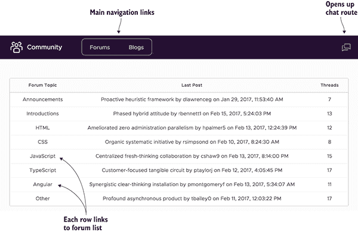
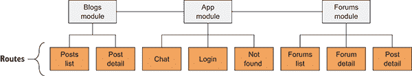
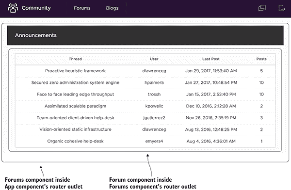
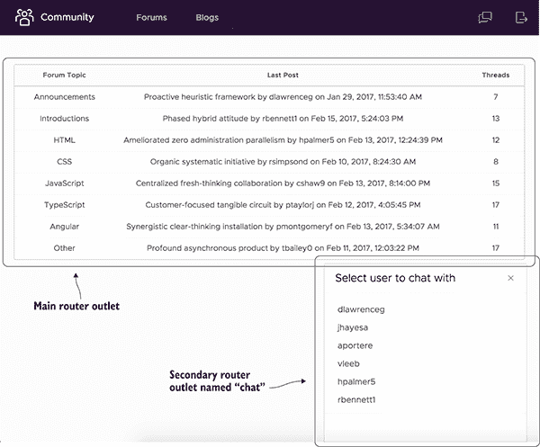
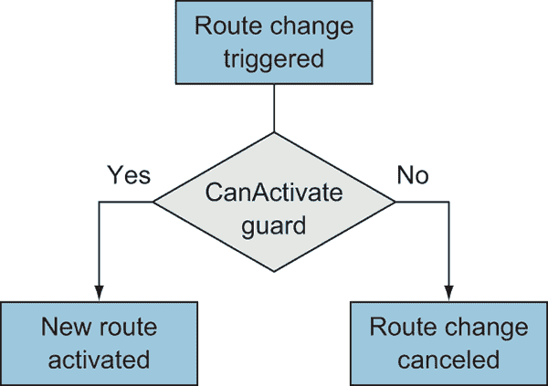
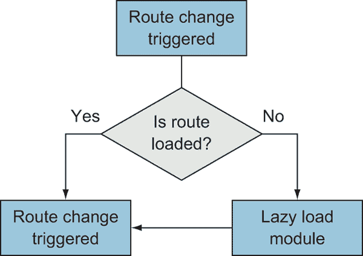

# 7

路由

**本章涵盖**

+   路由是什么以及如何创建它们的示例

+   不同的导航模式及其优点

+   如何保护页面不被未经授权的访问

+   将代码组织成模块

+   使用二级路由进行多路由

大多数应用程序在应用程序的生命周期中都需要能够在不同的页面之间导航的能力。通常，一个应用程序至少有几个基本页面，例如登录页面、主页、用户账户页面等等。“路由”这个术语用来描述应用程序在用户导航时更改页面内容的能力。我们之前的章节示例没有使用路由；它们被限制为一次性显示所有内容。

互联网已经形成了一种使用 URL 来维护用户当前位置的成熟模式。这传统上是通过浏览器从服务器请求页面，服务器响应必要的 HTML、CSS 和 JavaScript 资源来实现的。当单页应用程序（SPA）变得可行时，路由的作用必须完全转移到浏览器，通过允许 JavaScript 操作浏览器中的当前 URL 来维护应用程序内的当前位置，即使应用程序完全在浏览器中运行。

Angular 提供了一个全面的路由库，使得创建简单和复杂的导航模式变得简单。Angular 的路由库使我们能够轻松地定义路由，并取代了服务器处理基于当前 URL 显示内容的需要。我不再使用“页面”这个词来描述用户可以访问的不同位置，而是使用“视图”这个词来描述这些不同的上下文，例如登录视图或仪表板视图。

你将看到如何将应用程序结构化为不同的功能模块的示例。到目前为止，我们只为我们的应用程序创建了一个模块。当我们引入路由到我们的应用程序中时，应用程序的复杂性和大小很可能会增加。我们将看到如何创建不同的模块，以使应用程序的不同部分相互分离。尽管我们可以在其他章节中这样做，但本章示例在不同功能之间的分离最为明显。

我们首先要做的是设置好本章的示例。

## 7.1 设置本章示例

在本章中，我们将搭建一个基本的社区网站，用户可以在网站上浏览论坛、博客，并与其他用户聊天（图 7.1）。我已经创建了显示这些功能的组件和服务，但省略了使其通过路由功能化的能力。

在示例中，有一个论坛部分，您可以查看论坛中的所有主题，然后查看特定主题的所有帖子。还有一个博客部分，您可以查看可以单独查看的博客帖子列表。最后，还有一个聊天功能，它会在其他内容上方弹出，让您在浏览网站其他部分的同时与自动机器人聊天。该应用程序还具有登录功能，如果您导航到未知的 URL，则会显示错误页面。

这些功能中的每一个至少有一个路由，通常更多。让我们看看本章中我们将构建的简短路由列表。这些路由代表应用程序中的重要位置，用户可以到达：

+   论坛列表，也作为默认视图

+   单个论坛，显示主题列表

+   单个主题，显示主题中的帖子

+   博客帖子列表

+   单个博客帖子

+   选择与其他用户聊天的聊天框

+   与其他用户聊天的聊天框

+   登录视图

+   未找到错误视图



**图 7.1** 具有论坛、博客和聊天章节的社区应用程序示例

由于我已经创建了应用程序的大部分内容，我们将从下载现有代码开始，无论是使用 Git 还是从 GitHub 下载存档。这有助于我们专注于仅添加路由所需的必要部分。如果您使用 Git，则可以运行以下命令：

```
git clone -b start https://github.com/angular-in-action/community.git 
```

否则，您应该从 GitHub 下载并解压项目：[`github.com/angular-in-action/community/archive/start.zip`](https://github.com/angular-in-action/community/archive/start.zip)。现在您应该在您的计算机上有一个代码副本。您还需要安装项目的 node 模块。导航到目录并运行以下命令以安装模块并预览项目：

```
npm install
ng serve 
```

初始时，应用程序看起来是空的，但当我们开始设置路由时，页面将开始工作。它应该看起来像您在图 7.2 中看到的那样。该应用程序的数据存储在几个静态 TypeScript 文件（命名为 data.ts）中，只是为了避免为这个演示构建 API 并保持其快速。我还通过避免允许用户创建新的论坛帖子或博客帖子的复杂性来简化了应用程序。您从本章中获得的路由知识将帮助您在下一章介绍表单后轻松添加这些功能。


**图 7.2** 基于起点应用应呈现的样子

现在您已经获得了文件和所有设置，让我们开始创建我们的第一组路由！

## 7.2 路由定义和路由设置

Angular 路由器依赖于几个基本概念，但它非常灵活，你可以创建许多不同类型的导航体验的组合。路由器负责协调用户在点击和与应用程序交互时的导航选项。

在最基本的情况下，路由器根据当前 URL 渲染组件，例如，让主视图上的 Home 组件渲染。它还允许你创建子路由，其中只有组件的内部部分根据路由而改变，例如，当页面上有始终存在的常用部分，但内部内容根据 URL 交换时。它还可以支持位于当前路由“之上”的辅助路由，并且具有完全独立的路由历史，如实时支持聊天框。

我们的第一步是将路由器包含到项目中，然后我们将创建我们的第一个几个路由，如下所示：

+   `/login` — 显示登录页面

+   `/` — 如果加载根页面，则重定向到默认的/forums 页面

+   `**` — 匹配任何未定义的路由的回退，如 404 页面

本节的目标是设置好路由器，设置默认路由，并定义一个回退路由。你可能会在所有使用路由器的项目中遵循这些步骤。

Angular 路由器作为一个单独的包（@angular/router）被包含，CLI 将其作为 npm 包的一部分包含，但实际上并没有将其加载到应用程序模块中。如果你有一个没有模块包的项目，你可以通过 npm 像这样安装它：

```
npm install --save @angular/router 
```

当我们包含路由器时，我们还需要定义一组适用于我们应用程序的路由。首先，我们将有两个路由。第一个是登录界面，你应该注意到应用中相应的登录组件。第二个是 404 未找到页面，该页面在应用中也有相应的 NotFound 组件。

所有路由都必须定义，定义仅是一个具有至少一个属性的基本对象。你可以使用十几个属性来定义路由，但典型的路由包含一个路径（或 URL）和一个组件（根据路径显示的组件）。我们将在本章中看到一些其他属性的应用，但首先我们将关注这两个。

让我们在设置应用程序中的路由器时首先定义登录路由。打开 src/app/app.module.ts 文件，并将以下导入添加到文件中——这包括路由器模块和一个描述如何定义路由的接口：

```
import { RouterModule, Routes } from '@angular/router'; 
```

现在我们可以定义我们的第一个路由了。创建一个包含以下值的新变量，然后我们将查看这两个变量以了解它们定义的路由类型。你可以在最后一个`import`语句之后放置这个变量：

```
const appRoutes: Routes = [
  { path: 'login', component: LoginComponent },
  { path: '', redirectTo: '/forums', pathMatch: 'full' }, 
  { path: '**', component: NotFoundComponent },
]; 
```

`appRoutes`变量，它被类型化为`Routes`，是一个简单对象的数组。这些对象可以有不同的属性，我们将在本章中使用其中许多属性。你可以在这里看到所有属性：[`angular.io/api/router/Routes`](https://angular.io/api/router/Routes)。表 7.1 列出了本章中我们将使用的属性，其中大部分。

**表 7.1** 本章中使用的路由属性及其用途

| **属性** | **可接受值** | **用途** |
| --- | --- | --- |
| `path` | 字符串，或通配符匹配器** | 定义用于路由的 URL 路径；如果路由嵌套，则附加到任何父路径上 |
| `component` | 组件的引用 | 识别与特定路由相关联的组件 |
| `redirectTo` | 另一个有效路由的字符串 | 从一个路由（路径）重定向用户到`redirectTo`中定义的路由 |
| `pathMatch` | ‘full’，‘prefix’ | 确定匹配策略，是否匹配路由的完整或部分 URL |
| `children` | 路由数组 | 列出作为此路由子路由加载的路由 |
| `outlet` | 命名出口的字符串 | 告诉路由在特定的路由出口中加载 |
| `loadChildren` | 模块的路径字符串 | 允许你在请求特定路由时懒加载新的模块 |
| `canActivate` | 守卫引用的数组 | 允许你在某些条件下防止使用路由，例如未登录 |

第一个路由是最基本的，也可能是最常见的路由类型。它定义了当在 URL 中找到某个路径时，Angular 应该渲染指定的组件。路径不能以反斜杠开头。此路由意味着如果浏览器位于 URL http://localhost:4200/login，它将渲染 Login 组件。

第二种路由是一个重定向路由。Angular 允许你将路径重定向到其他 URL，就像你可能在你后端服务器上做的那样。`redirectTo`属性定义了要导航的新 URL，而`pathMatch`属性声明在重定向触发之前路径必须完全匹配。如果你想重定向一个路径及其所有子路径，可以将`pathMatch`设置为`'prefix'`值。在这种情况下，根路径 http://localhost:4200/将重定向到 http://localhost:4200/forums。我们还没有实现论坛链接，所以它将渲染第三种路由。

第三种路由与第一种类似，因为它定义了一个路径和一个组件，但带有两个星号的路径使其成为一个通配符、捕获所有类型的路由。如果你访问 Angular 不知道的任何路由，例如 http://localhost:4200/not-a-route，它将渲染 NotFound 组件。

你可能想在应用程序中有一个通配符路由来防止导航错误。我建议从一开始就在所有应用程序中设置一个类似于 NotFound 组件的组件。

我们已经定义了我们的路由。现在我们需要设置路由以使用它们。在模块的 `imports` 部分中，你需要添加路由模块，就像你在这里看到的那样。我已经加粗了添加的新行：

```
 imports: [
    BrowserModule,
    FormsModule,
    ClarityModule.forRoot(),
    ForumsModule,
 **RouterModule.forRoot(appRoutes)**
  ], 
```

我们所做的是在我们的应用程序中包含了路由，并使用 `forRoot()` 方法声明我们在主 App 模块中使用路由。它还接受一个参数，这个参数应该是该模块声明的路由数组。如果你在这里不传递任何内容，路由将不知道任何你的路由，所以这是将配置传递给路由的方式。

最后一步是确保你的应用程序中某个地方有一个路由出口组件。你可能想知道这些组件将渲染在哪个地方。如果你还记得第二章的内容，路由需要知道为给定路由渲染内容的地点，而路由出口就是标记位置。你的应用程序中至少需要一个路由出口。

打开 `src/app/app.component.html` 文件，你会注意到它包含用于标题和导航的标记，以及一个内容区域，目前该区域只包含一个标题元素。由于导航将在所有路由之间保持一致，它存在于路由出口之外。这意味着我们不需要在每个路由中重新定义导航，我倾向于将其视为一个始终处于活动状态的“全局模板”。通常，全局导航或页脚是很好的候选者，但任何你需要复制粘贴到每个组件中的内容可能最好放在全局模板中。

将标题元素替换为以下元素以定义路由出口。我已经为你加粗了更改：

```
<div class="content-container">
  <div class="content-area">
 **<router-outlet></router-outlet>**
  </div>
</div> 
```

当你运行应用程序时，访问 `http://localhost:4200`，你应该在屏幕上看到 NotFound 组件被渲染。在地址栏中输入 *http://localhost:4200/login* 并导航到该页面，你应该看到 Login 组件被渲染。

到目前为止，我们已经看到了基本的路由定义、通配符匹配器以及如何设置带有出口的路由库。每次使用路由时，你都会经历这些基本步骤。在某些应用程序中，你可能甚至不需要它就变得比这更复杂！

但大多数时候，你需要导航到不同的 URL 并传递信息，如 ID 以导航到特定项目。现在让我们看看如何构建具有参数的路由，同时查看如何使用功能模块与我们的应用程序一起使用。

## 7.3 功能模块和路由

Angular 功能模块的目的是创建易于维护的隔离代码，并将逻辑上相关的内容放在一起。当你有可以分割的应用程序的不同部分时，这被认为是一种最佳实践。我认为最重要的好处是代码的隔离，但它还可以帮助创建测试、优化构建过程以及实现路由的懒加载（这是我们目前更感兴趣的）。

功能模块可以包含功能集的路由定义（见图 7.3）。例如，我们的应用论坛部分应该是一个独立的功能模块，所有与论坛相关的路由都可以在其中定义。这样最好地实现了解耦，因此我们不需要在功能模块外部定义路由。



**图 7.3** 路由由不同的模块定义。

本章示例有两个额外的模块：论坛模块和博客模块。论坛模块包含网站论坛部分的组件和服务，而博客模块有自己的组件和服务来渲染博客部分。它们已经在仓库中创建好了，如果你之前没有花时间研究功能模块，你可以查看 src/app/forums 和 src/app/blogs 目录中的它们。

我们可以在我们的功能模块中声明一些路由，但我们必须像上一步一样包含路由器并定义路由。我们将介绍一个关键的区别，但为了开始，打开 src/app/forums/forums.module.ts 文件并导入路由器模块：

```
import { RouterModule, Routes } from '@angular/router'; 
```

现在我们将创建另一个包含路由定义的数组。在最后的`import`语句之后，创建以下路由定义变量：

```
const forumsRoutes: Routes = [
  { path: 'forums', component: ForumsComponent }
]; 
```

这将定义一个路由，通过渲染论坛组件来显示网站上可用的论坛列表。现在我们需要将这个路由列表注册到路由器中，但我们需要使用稍微不同的语法来使其适用于功能模块。在论坛模块的`imports`部分，添加与加粗部分相同的路由器模块：

```
imports: [
  BrowserModule,
  FormsModule,
  ClarityModule.forChild(),
 **RouterModule.forChild(forumsRoutes),**
], 
```

在这里，我们使用`forChild()`而不是`forRoot()`，因为我们正在声明属于导入模块的路由，而不是主 App 模块的路由。否则，过程是相同的，路由定义遵循相同的规则。

功能模块已经作为导入之一包含在 App 模块中。你必须将功能模块导入主 App 模块才能激活它。一旦保存这些更改，你就可以通过访问 http://localhost:4200/forums 来查看论坛页面。

当你规划你的应用程序时，我发现最好的做法是寻找将功能组织到单独模块的机会。总是有可能在以后将事物移动到功能模块中，但如果你知道你将会有几个可以组织的关键功能，你可以在开发早期设置模块。

当尝试确定哪些事物属于一起时，我经常查看我期望我的应用程序拥有的 URL 结构。在本章示例中，我期望将功能放在/forums 和/blogs 作为两个独立的根路径下，因此它们是它们自己模块的好候选者。

## 7.4 路由参数

URL 被设计用来存储信息，有时这些信息会告诉你重要的细节，例如要加载的资源 ID 或其他状态数据。根据你想要如何结构化你的 URL，值可能是路径的一部分或查询的一部分。

我们将在稍后查看如何使用查询变量；现在让我们专注于如何使用 URL 参数来指示记录 ID。在我们的示例中，我们有一个论坛列表显示，我们希望点击一个论坛来查看其中的帖子。这些路由的 URL 可能如下所示：

```
/forums/1-announcement 
```

这里的不同之处在于，这个 URL 的第二部分将根据我们想要查看的论坛而变化，因为它包含别名（即 ID 和标题的组合）。Angular 通过路由参数支持这一点，这些参数易于实现。首先，让我们向我们的论坛模块添加一个新的路由，以表示带有参数的路径。打开`src/app/forums/forums.module.ts`文件，并将一个新的路由添加到`forumsRoutes`数组中，正如你在这里加粗看到的那样：

```
const forumsRoutes: Routes = [
  { path: 'forums', component: ForumsComponent },
 **{ path: 'forums/:forum_alias', component: ForumComponent }**
]; 
```

在这里，我们定义了一个带有参数的路径，这个参数是我们想声明的任何名称，前面跟着冒号（`:`）符号。这将尝试匹配以*forums*开头的任何路由，并且路径的第二部分可以是任何值，但如果路径有第三个部分，路由器就不会匹配到这个路由。

### 7.4.1 使用 routerLink 在模板中创建链接

为了允许用户在应用程序中导航，我们需要创建与 Angular 路由器协同工作的链接。实现这一点的办法是使用 Angular 在你想成为可点击链接的元素上使用的特殊`routerLink`指令。

让我们在顶部导航栏中添加一个`routerLink`来链接到论坛页面，并查看如何使用基本实现创建链接。打开`src/app/app.component.html`并更新包含当前无效链接到论坛的行，使用`routerLink`，正如你在这里加粗看到的那样：

```
<a class="nav-link" **routerLink="/forums"**><span class="nav-text">Forums</span></a> 
```

在这个`routerLink`的使用中，它接受一个包含适当路径的字符串。如果路径以正斜杠开头，它将把 URL 视为从域名开始的绝对路径。它也可以是一个不带斜杠的相对路径。这可能是使用`routerLink`最常见的方式。

我们在第二章中看到了 `routerLink`，但让我们花点时间来谈谈它为什么存在以及它做了什么。为了方便导航，链接必须知道要访问哪个 URL，通常 `href` 是一个锚标签的属性，它向浏览器提供这个信息。当你使用 `href` 与链接一起时，浏览器将从服务器请求一个新的 URL，这不是我们想要的。在 Angular 中，`routerLink` 是一个属性指令，表示预期的导航路由，并允许 Angular 路由器处理实际的导航。简而言之，如果你使用 `href` 来链接到一个页面，即使它是一个有效的 Angular 路由，它也会触发从服务器加载页面，这比使用路由要慢得多。这是客户端路由的一个主要原则。

创建链接只需要这些，但你也可以使用 `routerLink` 绑定一个表达式来创建更动态的链接。为了演示这一点，我们将从论坛列表添加一个链接来加载单个论坛页面。打开 src/forums/forums/forums.component.html（是的，我知道文件路径有点冗余）并更新表格行中的 `NgFor` 以包含一个 `routerLink` 来链接到论坛：

```
<tr *ngFor="let forum of forums" **[routerLink]="[forum.alias]"**> 
```

你会注意到在这种情况下，我们正在绑定一个值到它（通过使用 `[]` 符号包裹）。当你绑定一个值时，它期望一个路径段数组，它将使用这个数组来构造完整的 URL。在这种情况下，我们在这个数组中设置了论坛别名值。默认情况下，它将路由视为相对于当前 URL 的相对路径，这意味着它将附加到当前路由。在这个页面上，URL 是 /forums，每个链接将通过别名路由到论坛，例如 /forums/1-announcements。

我喜欢用这种方式使用 `routerLink`，对于没有参数的任何路径，当有参数时，我喜欢将值数组绑定到 `routerLink`。我发现这样更容易阅读，但你可以根据自己的方法来决定。

注意，我们还在表格行元素上放置了一个 `routerLink`，这在传统上不是一个链接。Angular 足够智能，可以在任何带有 `routerLink` 的元素上添加正确的点击事件监听器来处理导航，所以你可以自由地使用它。但请注意，它不会向任何非锚标签的元素添加 `href` 属性。

### 7.4.2 在组件中访问路由参数

现在我们需要将路由参数信息传递到我们的论坛组件中，以便它知道要显示哪个论坛。通常，你会使用这个路由参数信息来调用你的某个服务来加载数据，我们在这里也会这样做。

Angular 提供了一个包含当前活动路由元数据的服务的功能。它为你提供了丰富的信息，详情请参阅 [`angular.io/api/router/ActivatedRoute`](https://angular.io/api/router/ActivatedRoute)。它包含诸如当前 URL、查询或路由参数（及其当前值）、任何子路由或父路由的信息等详细信息。

使用此服务，我们将访问当前的参数信息。打开 src/app/forums/forum/forum.component.ts，并按以下列表更新类。它将注入新的服务并处理获取路由参数的访问。

**列表 7.1** 论坛组件获取路由参数

```
export class ForumComponent implements OnInit {
  forum: Forum;

 constructor(
 private route: ActivatedRoute,
```

```
 private router: Router,
    private forumsService: ForumsService) { }

  ngOnInit() {
 this.route.params.subscribe((params: Params) => {
```

```
 [this.forum = this.forumsService.forum(params['forum_alias']);](#c07-codeannotation-0003)
```

```
 [if (!this.forum) this.router.navigate(['/not-found']);](#c07-codeannotation-0004)
```

```
 });
  }
} 
```

当用户导航到如/forums/1-announcements 之类的页面时，该组件会被激活。我们首先将活动路由注入到`route`属性中，将路由服务注入到`router`属性中。您通常需要在文件顶部导入它们，但应该已经为您完成了。

在`OnInit`内部，我们创建了一个订阅来监听参数何时发生变化。`ActivatedRoute`返回的许多值都作为可观察对象公开，因此您需要订阅以获取值。主要原因是当您有嵌套路由，其中父路由和子路由同时激活时，父组件可以订阅以获取任何子路由加载时的更新。

您订阅的`params`可观察对象将返回一个`Params`对象类型，这允许您访问诸如`params['forum_alias']`之类的属性。然后我们使用我们的服务通过传递 params 中的论坛别名来获取请求的论坛，并将其设置为`forum`属性。

仅因为向组件提供了参数，并不能保证提供的别名是有效的，这是我们应处理的情况。因此，如果论坛不存在，我们将用户重定向到未找到页面。

在本章的其余部分，我们将在需要访问参数时随时编写相同的基基本活动路由可观察对象。还有其他方法可以访问页面上的当前参数，但它们有一些弱点，通常不使用或推荐。一个例子是使用 promise 而不是可观察对象一次性获取值，但缺点是您只会得到一次参数，如果路由改变而没有重新创建组件，组件就不会知道新的参数。

如果您熟悉可观察对象，您可能已经注意到我们没有从`params`可观察对象中取消订阅，因为可观察对象通常在组件被销毁后持续存在，就像事件监听器一样。通常，您应该手动取消订阅，否则您最终会得到内存泄漏，但在这个情况下这是允许的，因为 Angular 会在活动路由不再活动时立即销毁此可观察对象。如果您愿意，您可以在组件的`OnDestroy`钩子中取消订阅。

在这一点上，如果您访问 http://localhost:4200/forums，您应该能够点击一个论坛，并看到该论坛的标题出现在一个新页面中，URL 也会改变。尝试几个论坛以确保值根据您查看的论坛而变化。

现在我们需要查看单个论坛中的线程，我们将使用子路由来帮助我们定义这些与特定论坛组织上相关的路由。

## 7.5 子路由

每个路由只有一个组件可能会有些限制，并且可能会在多个组件之间重新声明常用部分，从而增加额外的复杂性。我们讨论了顶级导航栏如何在所有路由中保持活跃和可见，因为它存在于路由出口之外。我们可以将这个相同的原理应用到我们的路由上，这样路由的一部分即使在您在子路由之间导航时也会保持活跃。

例如，在我们的应用程序中有一个包含论坛标题头部的 Forum 组件（图 7.4）。无论您是在查看线程列表还是在查看特定线程，它都将保持活跃。您可以想象这个头部栏也可以包含常见功能，例如在此论坛中创建新线程的按钮或报告垃圾邮件的按钮。



**图 7.4** — 子路由在父组件内部渲染，正如您在这里看到的，Forums 组件托管着 Forum 组件。

我们刚刚定义了一条路径，路径为 /forums/:forum_alias。当我们开始查看我们论坛中的特定线程时，我们将继续使用这个路径基础，并且我们希望它看起来像这样：/forums/:forum_alias/:thread_alias。当你查看这里的 URL 结构时，它显示你期望论坛别名和线程别名都能正确导航，这是一个使用子路由的好地方。

基于此，您可以看到子路由始终共享其父路由的路径，并为新的子路由扩展它。以下是一个基本列表，显示了这些不同路由之间的关系：

+   */forums* — 论坛组件，顶级路由

+   */forums/:forum_alias* — 子路由，用于显示特定的论坛

+   */forums/:forum_alias/:thread_alias* — 也是特定论坛的子路由，显示特定的线程

子路由通过创建另一个本地化的父组件的路由出口来工作，然后所有子路由都将在这个新的路由出口内部渲染。图 7.4 展示了在我们的例子中嵌套路由出口将如何工作，通过有两个路由和组件同时活跃。尽管没有限制您可以有嵌套路由出口的数量，但根据我的经验，我建议不要超过三个，因为定义更多子路由的正确路由会变得更加具有挑战性。

让我们从添加这个新的路由出口开始，这应该有助于您看到子路由将去哪里，然后我们将定义这些路由。打开 src/app/forums/forum/forum.component.html，并在文件底部添加一个新的路由出口：

```
<header class="header">
  <div class="branding">
    <span class="title">{{forum?.title}}</span>
  </div>
</header>
**<router-outlet></router-outlet>** 
```

这定义了任何子组件将被渲染的位置，所以即使在子组件路由活跃时，标题也会始终被渲染。现在你可以将我们的路由视为两个级别：App 组件中的路由出口和这个本地化的路由出口。

接下来，我们将定义我们的路由，然后我们可以退后一步，看看一切是如何结合在一起的。打开 src/app/forums/forums.module.ts 并更新 `forumsRoutes` 以匹配以下列表。

**列表 7.2** 带有子路由的论坛模块路由

```
const forumsRoutes: Routes = 
  { path: 'forums', component: ForumsComponent },
  { 
    path: 'forums/:forum_alias', 
    component: ForumComponent,
 [children: [
```

```
 { path: '', component: ThreadsComponent },
```

```
 { path: ':thread_alias', component: ThreadComponent }
```

```
 ]
  }
]; 
```

在这里，我们为 forums/:forum_alias 路由添加了一个新的 `children` 属性。这就是我们表示我们想要加载到论坛组件的新路由出口中的路由的方式。

我们添加了两个路由。第一个有一个空路径，当我们在父路由上时将渲染。这将显示属于论坛的线程列表。第二个是通过接受线程别名参数来显示单个线程。这两个路由现在是论坛路由的子路由。

子路由也有助于说明在获取路由参数时使用可观察对象的重要性。父组件即使在子组件可能被销毁的情况下仍然保持活跃和可见。

现在我们可以完善 Thread 和 Threads 组件的功能，以便加载正确的数据并链接到线程。我们首先帮助 Threads 组件加载要显示的正确线程列表。打开 src/app/forums/threads/threads.component.ts 并按照以下列表进行更新。

**列表 7.3** 线程组件获取线程列表

```
export class ThreadsComponent implements OnInit {
  threads: Thread[];

 constructor(private route: ActivatedRoute, private forumsService: ForumsService) { }

 ngOnInit() {
```

```
 this.route.params.subscribe((params: Params) => {
 [this.threads = this.forumsService.forum(params['forum_alias']).threads;](#c07-codeannotation-0008)
 });
 }
} 
```

这几乎与我们从 Forum 组件获取参数和加载数据的方式相同。唯一的真正区别是我们从服务中获取线程而不是论坛数据。这种模式将会重复，我不会过多地详细说明。

接下来，打开 src/app/forums/threads/threads.component.html 文件，我们将为单个线程路由添加一个 `routerLink`。用以下内容替换现有的表格行：

```
<tr *ngFor="let thread of threads" [routerLink]="[thread.alias]"> 
```

注意，这又是一个相对链接，所以它将线程别名附加到当前 URL 上，就像 /forums/:forum_alias/:thread_alias。这将激活正确的路由。

现在我们能够导航到特定的线程，我们只需更新 Thread 组件以获取活动路由，以便访问参数。由于路由的激活方式，这会有所不同，让我们看看。打开 src/app/forums/thread/thread.component.ts 并按照以下列表进行更新。

**列表 7.4** 线程组件加载线程并访问父路由

```
export class ThreadComponent implements OnInit {
  forum: Forum;
  thread: Thread;

  constructor(private route: ActivatedRoute, private forumsService: ForumsService) { }     

 ngOnInit() {
```

```
 this.route.params.subscribe((params: Params) => {
 [let forum = this.route.snapshot.parent.params['forum_alias'];](#c07-codeannotation-0010)
```

```
 [this.thread = this.forumsService.thread(forum, params['thread_alias']);](#c07-codeannotation-0011)
```

```
 });
  }
} 
```

如往常一样，我们注入活动路由并订阅 `params`。但在本路由中，我们有访问父路由信息的能力，因为当前活动路由信息不包含我们需要的所有参数。活动路由信息包含这些信息，所以我们查看 `snapshot` 属性以深入了解父路由。一旦我们得到它，我们就使用服务来加载线程的数据。

你可能会想知道为什么我们不需要对其他子路由做同样的事情。因为这个子路由没有路径（记住我们定义的路径为 ''），它将与父路由共享 `params` 和路径。在设计 URL 时，你需要记住这一点。

确保你已经保存了更改并再次预览应用程序。在这个时候，你应该能够点击顶部导航栏中的论坛链接来查看论坛，选择一个论坛进行查看，然后选择一个特定的线程。我们已经通过添加一个新的路由出口并将它们定义为该路由的子路由来创建了两个子路由。

有时你需要的东西类似于子路由，但又与特定的父路由断开连接。让我们深入了解二级路由，讨论它们是什么，以及如何使用它们。

## 7.6 二级路由

在桌面应用程序中，电子邮件应用程序（如 Outlook 或 Apple Mail）通常会打开一个新窗口来编写新电子邮件，用户可以在窗口之间切换以继续工作。Gmail 有一个功能允许你在应用程序内部的一个小窗口中创建新电子邮件，同时继续在应用程序的其他部分导航——这与二级路由的概念相同。*二级路由*旨在允许用户在继续使用电子邮件应用程序的同时草拟电子邮件。

这些是二级路由的例子，有时也称为 *辅助* 路由，其中应用程序的一部分出现，但保持与主应用程序不同的状态。聊天、帮助或文档窗口也是二级路由的例子。

Angular 支持这些类型的路由，它们的行为就像为一系列路由有一个新的根级路由出口。虽然通常一个就足够满足大多数用例，但你仍然可以创建多个二级路由出口。二级路由的规则基本上与其他路由相同，但有时我们可能需要指定额外的细节以确保使用正确的路由出口，如图 7.5 所示。



**图 7.5** 主出口和二级路由出口可以同时激活，并且可以独立于彼此改变它们的路由状态。

在这个例子中，我们想要有一个聊天功能，允许任何用户打开一个与另一个用户的聊天框，就像你在图 7.5 中看到的那样。这将位于当前页面的顶部，以便用户可以继续浏览网站并阅读论坛或博客文章。

### 7.6.1 定义二级路由

打开 `src/app/app.component.html` 并在文件底部添加一行，包含另一个路由出口。这个出口有一个 `name` 属性，允许我们将加载的路线目标到这个出口而不是主出口：

```
<router-outlet name="chat"></router-outlet> 
```

接下来，我们需要定义一些将附加到这个路由的路线。它们如下所示：

+   */users* 这将显示你可以与之聊天的用户列表。

+   `*/users/:username —*` 这将是与其他用户聊天的体验。

打开 `src/app/app.module.ts` 并更新 `appRoutes` 以包含这两个新路由，正如你在这里加粗看到的那样：

```
const appRoutes: Routes = [
  { path: 'login', component: LoginComponent },
  **{ path: 'users', component: ChatListComponent, outlet: 'chat', },**
 **{ path: 'users/:username', component: ChatComponent, outlet: 'chat', },**
  { path: '', redirectTo: '/forums', pathMatch: 'full' },
  { path: '**', component: NotFoundComponent },
]; 
```

注意它们有一个路径和组件，就像其他路由一样，但我们还声明了 `outlet` 属性。这就是我们告诉路由器在名为 `chat` 的新路由出口中渲染此组件的方式。注意我们也可以在二级路由中使用路由参数，因此我们将能够以相同的方式访问这些参数。我还将这些路由放在重定向和通配符路由之前，因为那些路由旨在充当后备路由。

应用程序右上角有两个按钮：一个用于聊天的语音气泡按钮和一个注销按钮（我们很快将实现）。我们想在语音气泡按钮上添加一个 `routerLink` 以打开这个聊天框。回到 `app.component.html` 文件并更新围绕图标的链接，正如你在这里加粗看到的那样：

```
<a class="nav-link nav-icon" **[routerLink]="[{outlets: { chat: ['users']}}]"**>
        <clr-icon shape="talk-bubbles"></clr-icon>
      </a> 
```

在这里，我们使用 `routerLink` 属性的绑定版本，并传递一个包含对象的数组。这里的语法更冗长，因为我们必须传递额外的数据以便路由器理解这是一个二级路由。该对象包含 `outlets` 属性，它然后有一个将出口名称映射到特定路由请求的对象。在这种情况下，我们传递 `{chat: ['users']}`，这告诉它使用聊天出口，然后转到用户路径。这种模式将重复用于使用二级路由，因此你将看到更多结构示例。

到目前为止，我们有一个二级路由和触发它的方法。查看应用程序并点击右上角的语音气泡图标以打开一个包含用户列表的新窗口。它允许你选择一个要交谈的用户，但不会导航到与该用户的聊天窗口。现在让我们添加在二级路由内导航的能力。

### 7.6.2 在二级路由之间导航

一旦你在二级路由中渲染组件，你仍然可以使用相同的规则将不同的路由链接在一起。只要使用相对链接，你就不必指定出口。路由的上下文将由路由器理解，这将有助于简化你的链接。

只要提供绝对路径（例如 /forums），你就可以将主路由从二级路由更改。从二级路由使用绝对路径将更改主出口，但二级路由将保持在同一路由上。

要使这个功能正常工作，让我们打开 `src/app/chat-list/chat-list.component.html` 并更新链接以启动聊天。当你点击一个用户名时，它会设置一个名为 `talkTo` 的属性，并带有该用户名。然后我们希望导航到一个带有该用户名的相对路径，因为我们定义了二级路由为 `/users/:username`。向链接中添加加粗的 `routerLink`：

```
<a class="btn btn-sm btn-link btn-primary" *ngIf="talkTo" **[routerLink]="[talkTo]"**>Start Chat with {{talkTo}}</a> 
```

绑定现在将用户导航到聊天组件，与该用户进行有趣的讨论。但聊天组件还没有访问路由参数来知道与哪个用户交谈，因此我们需要将其添加到我们的聊天组件中。

打开 `src/app/chat/chat.component.ts` 并更新构造函数和 `ngOnInit`，如下所示。控制器的其余部分专注于处理聊天体验。

**列表 7.5**  聊天组件访问路由参数

```
 constructor(
 private route: ActivatedRoute,
```

```
 private router: Router,
    private chatBotService: ChatBotService,
    private userService: UserService) { }

 ngOnInit() {
```

```
 this.route.params.subscribe((params: Params) => {
 [this.messages = [];](#c07-codeannotation-0013)
 this.user = this.userService.getUser();
 [this.guest = params['username'];](#c07-codeannotation-0013)
 });
 } 
```

这并没有什么新奇的，除了它设置了组件模型以拥有新的聊天体验。你可以查看组件控制器的其余部分以了解其行为，但在这个阶段，聊天框将开始正常工作。你可以输入一条消息并按 Enter，然后三秒钟后，另一个“用户”将回复一些轶事。这显然不是一个真实的聊天体验，但我想要让它更真实。

### 7.6.3 关闭次要路由和程序化路由

所有美好的事物都有结束的时候，在某个时候你将需要退出这个次要路由。例如，你可能会在某个时候结束聊天会话。我们可以关闭次要路由，如果我们需要它回来，我们只需再次打开它。要关闭次要路由，你只需将当前路由设置为 null，这样就会将其移除。

我还想向你展示如何使用程序化（或命令式）路由。有时你可能需要控制器或服务为你更改路由，而不是总是等待用户点击带有 `routerLink` 的元素。

如果你查看聊天和聊天列表组件模板，你会注意到文件顶部附近有一个关闭按钮。目前它有一个点击处理程序来调用 `close()` 方法，该方法目前是空的。虽然你可以使用 `routerLink`，但我想在这里演示程序化导航。

打开 `src/app/chat/chat.component.ts` 和 `src/app/chat-list/chat-list.component.ts` 文件，并更新 `close` 方法，如下所示。你还需要确保在构造函数中正确注入路由（提示：聊天组件已经有了，但聊天列表没有）：

```
close() {
  this.router.navigate([{outlets: {chat: null}}]);
} 
```

路由服务提供了一个 `navigate` 方法，其语法与 `routerLink` 完全相同。在这种情况下，我们声明聊天出口应导航到 null，这告诉 Angular 移除次要路由。我们将在下一个程序化路由用例中看到，但我通常发现尽可能使用 `routerLink` 而不是程序化路由是最好的。

现在次要路由已被清除，没有其他清理工作。它将从应用程序中移除，要再次打开它，只需用一个新的有效路由重新激活即可。

我建议你在它们提供最大价值时才使用二级路由。在正确的情况下，它们非常有用，但最好保持简单。类似于避免过多的嵌套子路由，添加过多的二级路由会增加可以避免的复杂性。

我们现在有点问题。我们允许任何用户无论是否登录都可以打开与其他用户的聊天窗口。使用路由，我们可以通过满足某些条件来保护路由不被激活，从而防止未经授权的访问。

## 7.7 路由守卫以限制访问

Angular 允许你控制允许路由渲染的条件，这通常是为了防止应用程序进入不良状态。例如，你不应该允许未经认证的用户查看需要他们登录的应用程序部分，否则他们可能会遇到很多错误。

*守卫*就像路由更改的生命周期钩子，允许应用程序在更改发生之前验证某些条件或加载数据，正如你在图 7.6 中看到的那样。当触发路由更改（无论是用户点击链接还是应用程序程序化更改路由）时，Angular 将检查是否注册了任何守卫。例如，如果未经认证的用户尝试加载显示已登录用户账户详情的页面，应用程序应实现一个守卫来在激活路由之前检查用户的登录状态。术语*激活*用来描述路由是否允许加载。



**图 7.6** 守卫在路由激活之前运行，可以阻止访问。

有几种类型的守卫，在管理路由激活时提供了不同的选项。它们被定义为服务，然后链接到特定的路由以生效。这允许你多次使用相同的守卫。以下是五种类型的守卫及其基本角色：

+   *CanActivate*—用于确定路由是否可以被激活（例如用户验证）

+   *CanActivateChild*—与 CanActivate 相同，但专门用于子路由

+   *CanDeactivate*—用于确定当前路由是否可以被停用（例如，防止在不确认的情况下离开未保存的表单）

+   *CanLoad*—用于在加载之前确定用户是否可以导航到懒加载的模块

+   *Resolve*—用于访问路由数据并将数据传递给组件的提供者列表

我们将实现一个针对聊天路由的守卫，以便用户必须先登录。从该列表中，`CanActivate`守卫是我们完成此任务的最佳选择。

我们将生成一个新的服务来解决此问题，因此运行以下命令来设置`AuthGuard`服务：

```
ng generate service services/auth-guard 
```

现在打开`src/app/services/auth-guard.service.ts`文件，并用以下列表中的代码替换其内容。

**列表 7.6** 限制路由访问的 `AuthGuard` 服务

```
import { Injectable } from '@angular/core';     
```

```
import { CanActivate, Router, ActivatedRouteSnapshot, RouterStateSnapshot } from '@angular/router';     
import { UserService } from './user.service';     

@Injectable()
export class AuthGuardService implements CanActivate {     
```

```
 constructor(
```

```
 private userService: UserService,
 private router: Router) {}

 canActivate(route: ActivatedRouteSnapshot, state: RouterStateSnapshot) {
```

```
 if (!this.userService.isGuest()) {
```

```
 return true;
 } else {
```

```
 [this.router.navigate(['/login'], {](#c07-codeannotation-0019)
 queryParams: {
 return: state.url
 }
 });
 return false;
 }
  }
} 
```

它就像一个正常的服务一样开始，通过导入依赖项，我们想要实现 `CanActivate` 接口以确保我们正确设置了我们的服务。构造函数将 `UserService` 和 `Router` 注入到对象中，这允许我们在服务内部访问路由器。

`canActivate` 方法必须使用此名称实现，因为 Angular 正在期待这种方式。这就是为什么接口实现是有用的；如果设置不正确，它将警告你。它接收两个参数：首先是当前激活路由的快照，其次是应用程序尝试激活的新路由。在这个例子中，我只使用了新路由的元数据，但它们允许你检查当前路由和请求的路由详细信息。

一旦进入方法内部，我们检查 `UserService` 以查看用户是否已登录。如果是，我们返回 `true` 告诉守卫允许激活路由是可接受的。否则，我们告诉路由导航到登录路由，并且我们还传递一个包含一些元数据的对象。我们稍后会更详细地查看它。

到目前为止，我们已经实现了守卫以返回 `true` 或 `false`，这取决于用户是否有效。如果不是，它将重定向到登录屏幕。在登录过程之后，我们希望将他们重定向回他们尝试查看的页面，这就是元数据对象发挥作用的地方。让我们再次看看它：

```
this.router.navigate(['/login'], {
  queryParams: { 
    return: state.url
  }
}); 
```

路由器接受一个可选对象作为第二个参数，在这里我们使用它来设置一个查询参数。这些变量位于问号之后的 URL 中，就像这里加粗显示的那样：

```
/login**?return=/forums(chat:user).** 
```

我们使用它来记住用户尝试导航到的 URL，通过查看 `state.url` 属性（这是路由器尝试激活但未能激活的路由）。这是登录流程中的常见模式，你当然也可以以相同的方式使用查询参数来处理许多其他原因。

这就是我们的守卫；现在我们需要将其应用到一些路由上。为此，我们将更新 `src/app/app.module.ts` 文件中的 `appRoutes`；以下内容需要加粗。我们需要首先导入新的 `AuthGuardService`，然后为路由添加一个新的 `canActivate` 属性以进行安全保护：

```
**import { AuthGuardService } from './services/auth-guard.service';**

const appRoutes: Routes = [
  { path: 'login', component: LoginComponent },
  { path: 'users', component: ChatListComponent, outlet: 'chat', **canActivate: [AuthGuardService]** },
  { path: 'users/:username', component: ChatComponent, outlet: 'chat', **canActivate: [AuthGuardService]** },
  { path: '', redirectTo: '/forums', pathMatch: 'full' },
  { path: '**', component: NotFoundComponent },
]; 
```

我们还需要将 `AuthGuardService` 添加到我们的应用程序提供者列表中，以便应用程序知道它的存在。像这样在模块提供者数组中添加它：

```
 providers: [
 **AuthGuardService,**
    UserService
  ], 
```

我们现在已将服务作为守卫附加到我们的聊天路由上。如果你预览应用程序并尝试打开聊天，它将重定向你到登录屏幕。守卫在聊天路由完全激活之前触发，因此组件永远不会渲染，所以你不必担心该组件有未经认证的用户。

我们希望更新登录组件，以帮助用户在登录后重定向回请求的 URL。对于这个登录表单，你可以使用任何值。只要输入任何随机的用户名和密码，它就高兴。它还会将登录持久化到 localStorage 中，所以它会记住你。使用以下列表中的内容更新`src/app/login/login.component.ts`文件。

**列表 7.7** 登录组件，登录后重定向

```
import { Component } from '@angular/core';     
```

```
import { UserService } from '../services/user.service';     
import { Router, ActivatedRoute } from '@angular/router';     

@Component({
  selector: 'app-login',
  templateUrl: './login.component.html',
  styleUrls: ['./login.component.css']
})
export class LoginComponent {
  username: string = '';
  password: string = '';
  return: string = '';

 constructor(
```

```
 private userService: UserService,
 private router: Router,
 private route: ActivatedRoute) {}

 ngOnInit() {
```

```
 this.route.queryParams
 .subscribe(params: Query => {
 [this.return = params['return'] || '/forums';](#c07-codeannotation-0022)
 if (!this.userService.isGuest()) {
 this.go();
 }
 });
 }

 login() {
```

```
 if (this.username && this.password) {
 this.userService.login(this.username);
 this.go();
 }
 }

 private go() {
```

```
 this.router.navigateByUrl(this.return);
 }
} 
```

在导入依赖项并将服务注入到组件中之后，你将实现另一个可观察对象来获取`queryParams`，就像你获取路由`params`一样。因为这是一个不同类型的值，你必须订阅激活路由的不同属性。

在回调内部，从 URL（或如果不存在，则设置为/forums）获取返回 URL。然后它检查用户是否已经登录，并立即重定向到页面。这是为了帮助那些已经登录但意外地 landed on the login page 的人。

当用户点击登录按钮时，组件会调用`login()`方法，并通过调用用户服务和重定向来处理用户登录。然后`go()`方法调用`router.navigateByUrl()`方法，这与典型的`router.navigate()`方法不同，因为它接受一个字符串。因为我们从 URL 获取返回路径，所以它将依赖于路由来解析 URL 并确定正确的 URL。

现在，我们需要更新注销功能，这将从`UserService`中移除当前用户状态。服务已经存在来处理这个问题，但我们需要启用按钮以调用该服务。

首先打开`src/app/app.component.ts`并更新注销按钮的链接，就像这里加粗显示的那样：

```
<a class="nav-link nav-icon" **(click)="logout()" *ngIf="!userService.isGuest()"**>
  <clr-icon shape="logout"></clr-icon>
</a> 
```

如果用户是访客，这将禁用注销按钮，并调用`logout`方法来处理注销。我们可能遇到的问题是，如果你已经激活了聊天出口，然后点击注销，它不会关闭次要聊天出口。那是因为它只在路由激活时进行检查，所以我们需要手动检查它是否打开并关闭它。

为了解决这个问题，我们需要对`UserService`进行一些小的修改。打开`src/app/services/user.service.ts`。首先确保导入 Router 和 ActivatedRoute 服务：

```
import { Router } from '@angular/router'; 
```

然后我们想要像这里看到的那样将这些依赖注入到构造函数中：

```
constructor(private router: Router) {} 
```

最后，我们需要更新带有加粗部分的`logout`方法，这将始终确保在注销时关闭路由出口：

```
logout() {
  username = '';
  guest = true;
  localStorage.setItem('username', '');
 **this.router.navigate([{outlets: {chat: null}}]);**
} 
```

这是之前用来关闭聊天出口的相同代码，我们在这里运行它以确保出口被关闭。如果它目前不活跃，则不会发生任何事情。

当你必须处理应用程序状态，如已登录用户或表单时，你很可能会需要守卫。它们非常有帮助，但像大多数事情一样，最好适量使用。你可以在同一路由上拥有多个守卫，但守卫越多，跟踪应用程序逻辑就越困难。

另一方面，你应该确保使用守卫而不是直接在组件控制器中添加逻辑来检查用户是否可以激活路由。组件应尽可能少地关注路由配置（显然的例外是从 URL 中获取参数信息）。

我们最后一个主要功能是将 Angular 模块仅在需要时懒加载到应用程序中，这可以提升大型应用程序的初始加载时间。

## 7.8 懒加载

如果你正在构建应用程序并使用功能模块来组织代码，那么你可以使用*懒加载*（或*异步加载*）与路由(图 7.7)。这样做将允许整个模块仅在需要时加载，这可以节省核心包的文件大小，甚至可能限制只有有权使用它的人（如管理模块）的访问。

如果你还没有将你的应用程序组织成不同的模块，那么将它们懒加载到应用程序中是不可能的，因为没有逻辑隔离。基本思想是 Angular 构建过程可以分析代码路径并根据其使用情况优化代码，以生成不同的文件，但它依赖于 Angular 模块作为确定代码关系的主要方式。



**图 7.7** 懒加载模块仅在请求路由时发生，并且必须在路由激活之前加载。

在我们的章节示例中，我们有三个模块（不包括 Angular 或第三方模块）：

+   AppModule

+   ForumsModule

+   BlogsModule

AppModule 是我们的主要应用程序，ForumsModule 直接导入到 AppModule 中。但我们还没有导入 BlogsModule，当我们想要懒加载时，我们不想直接将模块导入到我们的应用程序中。

让我们通过设置 BlogsModule 来自行查看这个功能。打开 src/app/app.module.ts 并更新路由，如下所示（加粗）：

```
const appRoutes: Routes = [
  { path: 'login', component: LoginComponent },
  { path: 'users', component: ChatListComponent, outlet: 'chat', canActivate: [ AuthGuardService ] },
  { path: 'users/:username', component: ChatComponent, outlet: 'chat', canActivate: [ AuthGuardService ] },
 **{ path: 'blogs', loadChildren: 'app/blogs/blogs.module#BlogsModule' },**
  { path: '', redirectTo: '/forums', pathMatch: 'full' },
  { path: '**', component: NotFoundComponent },
]; 
```

新的路由包含一个路径和博客，`loadChildren`属性用于定义当浏览器尝试访问以/blogs 开头的任何 URL 时应该懒加载的模块的路径。`loadChildren`属性接受一个指向实际模块文件的文件路径，从 src 目录开始，不包括.ts 扩展名。然后有一个哈希(#)符号，后面跟着模块名称。这种特殊语法让 Angular 知道该模块的位置和名称，以便它可以正确地创建它。

这是你需要做的所有配置，以启用模块的懒加载，但我们还需要对 BlogsModule 做一些工作，以便它按预期工作。到目前为止，它还没有声明任何路由，这意味着这还不能工作。

在`AppModule`和`ForumsModule`中，我们在文件中创建了一个变量，并将路由存储在同一个文件中。但你也可以创建一个所谓的*路由模块*来存储这个配置。如果你的配置很复杂，并且你想要保持你的模块文件更干净，这可能是有利的。

我个人发现，如果我的应用程序很小，路由模块只是额外的文件，但当我的应用程序变大时，它们就更有意义了。我认为保持声明路由的一致性比选择哪种路由更重要。但如果你需要一个通用的指南，那么我建议如果你有超过三个模块，就使用路由模块。选择权在你。

当你使用 Angular CLI 创建模块时，你可以通过添加`--routing`标志来让它为你生成一个路由模块：

```
ng generate module mymodule --routing 
```

由于 BlogsModule 已经存在，我们需要手动为博客模块创建路由模块。在`src/app/blogs`下创建一个新的文件`blogs-routing.module.ts`，并添加以下列表中的内容。

**列表 7.8**　博客路由模块

```
import { NgModule } from '@angular/core';     
```

```
import { Routes, RouterModule } from '@angular/router';     

import { BlogsComponent } from './blogs/blogs.component';     
import { BlogComponent } from './blog/blog.component';     

const routes: Routes = [     
```

```
 { path: '', component: BlogsComponent },
 { path: ':post_id', component: BlogComponent }
[];     ](#c07-codeannotation-0026)

@NgModule({
 [imports: [RouterModule.forChild(routes)],](#c07-codeannotation-0027)
```

```
 [exports: [RouterModule],](#c07-codeannotation-0027)
  providers: []
})
export class BlogsRoutingModule { } 
```

这个模块与普通模块有点不同，因为它只专注于设置路由所需的必要部分。在你导入所有依赖项之后，你仍然会声明一个包含路由的变量，就像在其他示例中那样。注意，这些路径不包含 blogs 前缀，因为我们已经在我们的懒加载路由定义中定义了该前缀。这些路由很简单，因为它们映射到一个要渲染的组件。

最后，我们在模块的`imports`中声明了`RouterModule.forChild()`方法，就像我们在`ForumsModule`中做的那样。然后我们也在`exports`中添加了 RouterModule，这使得路由指令可以用于这个模块的模板。

我们在这里没有声明任何重定向或回退路由。那是因为我们在`AppModule`中定义的那个仍然会捕获任何未知的 URL。路由可以在应用程序的任何地方声明，Angular 会尝试匹配到最佳的 URL，这展示了良好 URL 规划的重要性。

为了使用路由模块，我们需要将其导入到我们的 BlogsModule 中。打开`src/app/blogs/blogs.module.ts`并在此处添加新的导入行：

```
import { BlogsRoutingModule } from './blogs-routing.module'; 
```

然后我们需要像这样将其添加到模块的导入中：

```
 imports: [
    CommonModule,
    BlogsRoutingModule,
  ], 
```

这样就完成了路由模块的设置，如果你是用 CLI 生成的，那么文件已经为你准备好了，你可以添加你的路由。现在我们想要通过在导航栏的博客部分添加一个链接来使用 BlogsModule。已经有一个链接了，所以我们只需要添加`routerLink`。打开`src/app/app.component.html`并更新链接到博客：

```
<a class="nav-link" **routerLink="/blogs"**><span class="nav-text">Blogs</span></a> 
```

现在当你运行应用程序并点击导航栏中的“博客”时，它将带你进入“博客”部分。如果你打开开发者工具，你还可以观察 HTTP 请求，以查看博客模块是按需异步加载的。当你本地工作时，这发生得非常快，所以不应该有任何延迟，但从远程服务器下载该文件会有轻微的延迟。

博客组件的其他部分已经为你设置了 `routerLink`，但如果你愿意，可以停下来回顾一下。那里没有我们之前没有做过几次的新内容。

这就总结了你可能需要在大多数应用程序中使用的主要 Angular 路由功能。尽管有一些功能我没有涵盖到，但我很少有机会使用本章未详细说明的功能。

在结束这一章之前，我想回顾一下我从经验中总结的一些关于构建良好路由和使用 Angular 路由的最佳实践。

## 7.9 路由最佳实践

关于如何设计应用程序的 URL 结构，已经有很多争论，我对构成良好设计的一些方面有特别强烈的看法。也有人争论 URL 设计是否真的那么重要，因为大多数时候用户不会在地址栏中输入 URL。

我不能强迫你遵循任何特定的规则，但我确实想与你分享我的信念和经验。我相信 URL 设计对于优质应用程序至关重要。良好的 URL 结构使应用程序更容易维护，可以帮助用户导航你的网站，并应有助于维护导航状态。就像你可能花时间规划页面布局一样，你也应该花时间规划应用程序的 URL 结构。

我建议以下作为最佳实践，这些实践我已经在我的应用程序中实施，并相信它们最有可能为你提供一个坚实的基础：

+   *保持 URL 短小* — 当可能时，URL 应该只长到需要那么长。随着应用程序的增长，这可能有点棘手，所以从一开始就保持警惕是保持进度最佳的方式。你的 URL 可能需要考虑一些 SEO 因素，我建议你保持简单。

+   *优先使用路径参数* — 查询变量的使用应限制于短暂的状态数据，例如搜索过滤器变量。当你使用 URL 中的 ID 或资源别名时，它们几乎总是路径参数。

+   *倾向于拼写单词* — 我强烈倾向于不缩写变量或路径，因为这更难阅读，而且一些缩写并不总是清晰易懂。尽管你应该保持 URL 短小，但你不应该缩短你使用的单词。

+   *使用连字符来分隔多词—*URL 的可读性很重要，如果你将多个单词放在一起（例如 /forums/2-introductions/89-cloned-didactic-knowledge-user），在单词之间使用连字符是最容易阅读的方式。这也便于解析。

+   *限制使用二级路由—*虽然二级路由很有趣，但它们增加了复杂性。如果一个二级路由只与某些应用程序路由相关，那么你就需要跟踪何时启用或禁用该二级路由。例如，如果你有一个银行应用程序，并且有一个用于开设新账户的二级路由，你需要注意用户的行为，并确定何时可能适合关闭它。

+   *仔细考虑为你的用例选择正确的守卫—*有五种类型的守卫，有时它们可以弯曲以执行不同的任务。要清楚你的守卫的目的，并使用正确的守卫。

+   *使用功能模块以便可以使用懒加载—*功能模块对于代码隔离很有帮助，但能够懒加载模块非常有用。与后来不得不重构以使用懒加载相比，从功能模块开始而不使用懒加载要容易得多。

+   *保持简单—*这一点适用于所有事物，但我认为这是路由中最重要的基本原则。如果你只需要 10 条具有更好参数的路由，而你却有了 100 条路由，事情会迅速失控。时刻寻找简化所有事物的途径！

Angular 路由器的规则相当直接，大部分复杂性都来自于这些功能的组合。这就是 Angular 路由器及其设计的内在力量。它既简单又能够处理复杂场景。我警告不要无谓地将简单场景变得复杂，但一旦你对路由器有所掌握，你将能够构建处理任何用例的路由。

## 摘要

Angular 路由器非常强大，但其基本原理足够简单，可以快速掌握并付诸实践。我们已经讨论了服务的大量功能及其工作方式。服务对于 Angular 应用程序是基本的，你将构建或使用许多服务。以下是你学到的快速回顾：

+   RouterModule 需要包含在任何使用路由的模块中。当你将其设置在 AppModule 中时，你调用`forRoot()`方法来为应用程序设置它。

+   路由定义为包含适用于这些路由的属性的数组，例如路径、要渲染的组件和/或子路由。

+   路由可以接受参数，无论是路径还是作为查询变量，这样你就可以使用不同参数重用路由。这些参数通过激活路由详情提供给组件控制器。

+   使用 `routerLink`，你可以将任何元素链接到特定的路由。它可以提供一个包含有效路径的基本字符串，或者你也可以使用绑定语法来传递作为数组的额外数据。

+   子路由在父组件内部渲染，并允许你重用代码，例如共享通用导航或解析数据。

+   次级路由对于创建独立且与主路由分离的路由很有用。这对于无论你在哪个页面上都活跃的体验很有用，例如文档窗口。

+   使用守卫来限制对路由的访问，在激活路由之前解析数据，或防止路由被停用。你必须创建一个服务并将其包含在路由定义中，以启用守卫。

+   功能模块可以被懒加载到应用程序中，这让你能够减少最初下载给用户的代码文件大小。它仅在用户导航到属于功能模块的路由时才加载模块。

在下一章中，我们将深入探讨表单，并使其易于捕获用户输入。
