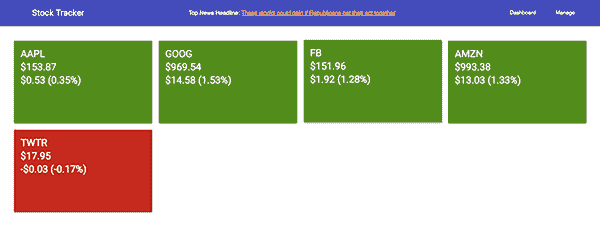
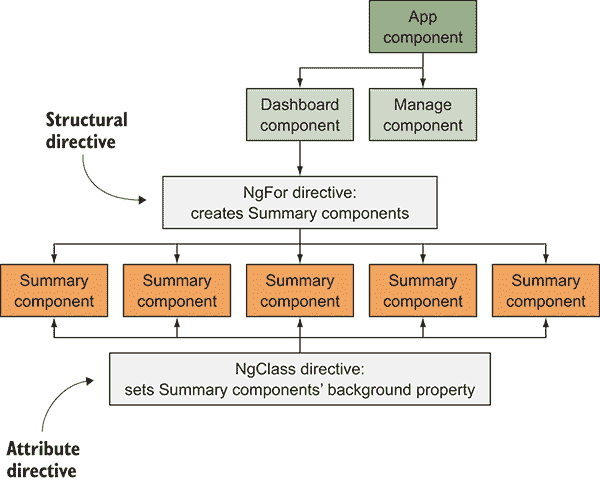
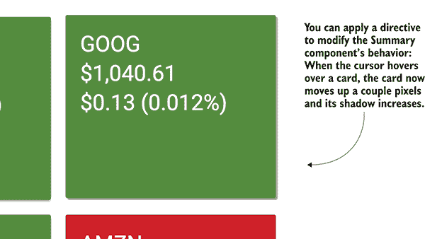
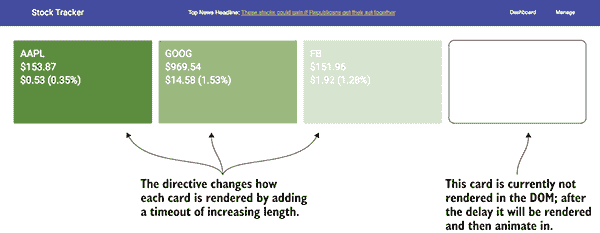
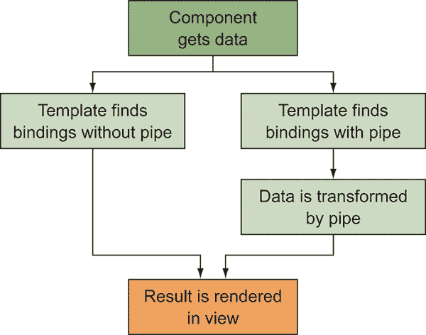
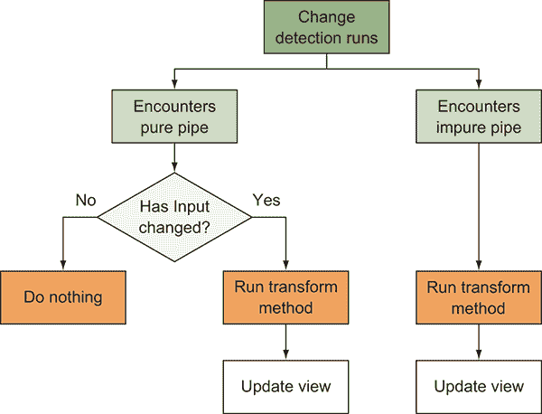
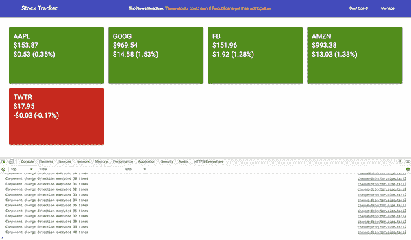
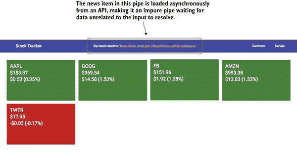

# 8

构建自定义指令和管道

**本章涵盖**

+   如何创建你自己的指令

+   结构性指令和属性指令之间的区别

+   如何使用指令来修改另一个组件

+   如何制作自定义管道

+   管道纯度是什么以及如何设计有状态或无状态的管道

Angular 附带了许多指令和管道，以覆盖最广泛的使用场景。第三章介绍了默认设置，因此你可以回顾它们是什么以及如何使用。这包括 NgFor 和 NgIf 等指令，用于遍历列表或条件显示项目，以及 Currency 和 Number 等管道，用于格式化货币或数字显示。

本章重点介绍创建自定义指令和管道，并讨论为什么你可能需要创建它们。内置的管道和指令可能满足许多用例，但有时你的应用程序需求将受益于自定义实现，使使用更加方便。

有两种自定义指令，它们各自有自己的用例和能力。我们将创建一个修改元素某些属性的指令，一个修改组件默认行为的指令，以及一个改变元素添加到页面方式的指令。

同样，我们还将构建一些自定义管道来展示它们能为你提供什么价值。就像指令一样，根据你的需求，你可以构建两种类型的管道。我们将创建三个不同的管道来展示它们有用的场景，并讨论最佳实践和性能设计。

打包的指令和管道覆盖了大部分主要用例，但通常开发者需要自己制作。我发现构建应用程序的早期阶段往往可以不使用任何指令完成，但一旦我开始注意到重复或不必要的复杂性，我就开始创建自己的。有时我并不总是看到设计自定义管道或指令的最佳方式，直到我已经构建了一些需要改进的其他东西。

因此，在本章中，我将探讨将自定义管道和指令添加到第二章示例应用程序中的视角，你应该已经熟悉这个应用程序。我相信在现有应用程序的上下文中，更容易看到它们的作用和价值，而不是仅仅构建孤立的示例。

完全诚实地说，仅通过在组件中添加更多逻辑，就完全有可能永远不创建自己的指令或管道——那么为什么还要费这个劲呢？主要原因适用于指令和管道：

+   *重用和减少*——而不是每个组件都必须实现类似的逻辑，它可以被抽象出来并轻松重用。这也减少了代码足迹并有助于标准化逻辑。

+   *可维护性和专注的组件*——组件有时会成为与组件本身无关的代码和逻辑的垃圾场。将这些移除可以使维护组件变得更加容易。

+   *可测试性* — 将所有内容分解成更小的模块意味着你可以创建更小的测试用例并限制排列组合。

当然，确实有一些场景下需要使用自定义指令或管道，或者这是最佳解决方案。例如，当我们需要创建一些自定义表单验证时，自定义指令是有用的，正如我们将在下一章中探讨的那样。

你需要创建自己的情况的数量会因项目而异，我发现我创建过的一次通常对其他项目也很有用。

## 8.1 设置章节示例

在本章中，我们将从第二章的股票应用程序示例中添加一些自定义管道和指令。这样做将帮助我们在此章节中减少需要审查的新事物的数量，同时给我们一些有用的示例。

如果你跳过了第二章或者不记得那个例子中的具体内容，该应用程序是一个基本的股票跟踪应用程序。它显示股票列表及其当前状态，并允许你添加或从该列表中删除项目。它还会从服务中加载真实数据。我们不会对应用程序的行为方式做出任何重大改变，但我们将通过使用自定义管道和指令来简化一些事情。你可以在图 8.1 中看到它将是什么样子。



**图 8.1** — 本章我们将构建的内容扩展了第二章的示例。

无论你是否已经有了第二章的样本，我们都会从一个新的仓库开始。要使用 Git 下载，克隆仓库并使用以下命令检查起始点：

```
git clone https://github.com/angular-in-action/stocks-enhanced
cd stocks-enhanced
git checkout start 
```

否则，你可以从[`github.com/angular-in-action/stocks-enhanced/archive/start.zip`](https://github.com/angular-in-action/stocks-enhanced/archive/start.zip)下载归档文件并解压文件。

如同往常，你需要运行 `npm install` 来下载所有依赖项。然后运行 `ng serve` 来启动本地开发服务器。

## 8.2 创建自定义指令

指令有两种类型：*结构*和*属性*。它们的声明和使用方式基本上是相同的，但它们有一个关键的区别，你已经在之前的章节中看到过。当我们想要更改元素的一个属性（如背景颜色或高度）时，我们需要使用属性指令。但如果我们想要控制元素本身在页面上的渲染方式，我们将依赖于结构指令。

我们有一些用例，我们希望元素仅在特定条件为真时出现在页面上，特别是加载指示器。这是一个很好的例子，说明了我们如何使用指令来改变元素的渲染方式。同样，我们也需要动态地改变一个元素的背景颜色，我们通过使用指令修改元素上的类来实现这一点。

更具体地说，回想一下，你必须用`*`前缀来修饰`ngIf`——例如，`*ngIf="loaded = true"`. 这意味着 NgIf 是一个结构指令，能够控制 DOM 元素是否渲染。另一方面，`ngClass`指令是一个属性指令，当使用时没有`*`，例如`[ngClass]="{active: true}"`。NgClass 仅修改元素的属性——在这种情况下，应用了 CSS 类，但不会渲染 DOM。

区别在于结构指令添加或删除 DOM 元素的能力。这类似于构建的概念：你可以重新设计现有的建筑（属性指令）或处理建筑本身的创建（结构指令）。结构指令可以渲染 DOM，而属性指令只能修改属性。结构 NgIf 指令可以根据提供的条件值确定 DOM 元素是否渲染。NgClass 属性指令不会创建元素，而是更改元素的类列表。

在图 8.2 中，你可以看到属性指令如何修改组件，以及结构指令如何创建（或销毁）组件。在本章的示例中，NgFor 结构指令创建了 Summary 组件的多个实例，而 NgClass 属性则修改了这些相同实例的背景颜色。



**图 8.2**  结构或属性指令如何修改 DOM

因此，结构指令和属性指令之间的主要区别在于，结构指令旨在修改元素的 DOM 树，而属性指令旨在仅修改单个元素的属性或 DOM。在本章中，我们将构建这两种类型的示例。

记住，结构和属性指令都没有模板。技术上，*组件*是第三种类型的指令，并且是唯一具有模板的类型。如果你需要为你的实现使用模板，你应该使用组件。

指令可以像组件一样注入服务，这让你能够访问一些有趣的功能。如果你有自定义服务，你的指令可以利用它们来处理诸如判断用户是否登录以及有条件地显示或隐藏内容等用例。

我们将首先构建一个属性指令，然后是一个用于修改组件的第二个属性指令，最后是一个结构指令。让我们开始吧！

### 8.2.1 创建属性指令

我们的第一个指令将帮助我们管理 Summary 组件的颜色，这是显示当前股票信息的卡片。结果不会改变用户的视觉体验，但会抽象出这种能力以便它可以被重用。目前，Summary 控制器包含由 NgClass 指令使用的逻辑，根据当天的价值变化将背景颜色更改为绿色或红色。

虽然这不一定是一个问题，但我们可以将其抽象成它自己的属性指令，以防我们以后想再次使用它。这是属性指令的一个很好的用途，因为它只是管理应用于元素的类列表，如图 8.3 所示。


**图 8.3** 指令可以修改元素的背景属性，因此组件不需要管理逻辑。

Angular CLI 允许我们快速生成指令框架，所以我们将使用以下命令来生成我们需要的文件——文件将被放置在 src/app/directives 目录中：

```
ng generate directive directives/card-type 
```

与组件一样，它也会为你添加指令到 App 模块中，节省一点工作量。我们将实现这个指令，使其也接受一个包含组件使用的股票数据的输入，这样我们就可以检测到正确的类来附加。

让我们继续创建我们的指令。打开 src/app/directives/card-type.directive.ts 并将其内容替换为以下列表中所示的内容。

**列表 8.1** 卡片类型指令

```
import { Directive, ElementRef, Input, OnInit } from '@angular/core';     
```

```
 @Directive({     
```

```
 [selector: '[cardType]'](#c08-codeannotation-0002)
})
export class CardTypeDirective implements OnInit {     
 @Input() cardType: number = 0;
```

```
 @Input() increaseClass = 'increase';
 @Input() decreaseClass = 'decrease';

 constructor(private el: ElementRef) {}
```

```
 ngOnInit() {
```

```
 if (this.cardType) {
 if (this.cardType >= 0) {
 this.el.nativeElement.classList.add(this.increaseClass);
 this.el.nativeElement.classList.remove(this.decreaseClass);
 } else if (this.cardType <= 0) {
 this.el.nativeElement.classList.add(this.decreaseClass);
 this.el.nativeElement.classList.remove(this.increaseClass);
 } else {
 this.el.nativeElement.classList.remove(this.increaseClass);
 this.el.nativeElement.classList.remove(this.decreaseClass);
 }
 }
 }
} 
```

你首先应该注意到这与组件看起来多么相似，因为组件实际上是一种具有模板的特殊类型的指令。指令使用它们应用到的元素的模板，而不是拥有自己的模板。

指令首先导入我们需要的一些内容，然后我们有 `Directive` 装饰器。在这里，我们只定义了选择器 `[cardType]`，这是将其作为元素属性工作的 CSS 形式。这个装饰器应用于导出的类 `CardTypeDirective`。

指令可以接受输入，我们定义了一些属性来接受输入绑定。通过定义一个与指令选择器同名的内容，我们就可以绑定到指令，例如 `<div [cardType]="stock"></div>`。`cardType` 属性将接受一个数字，并且根据数字是正数还是负数，将应用适当的类。其他两个输入允许某人更改应用的类名，并且如果选择不定义它们，它们有默认值。这使得这个指令比所有内容都硬编码更灵活和可重用。

构造函数用于注入一个包含对应用指令的元素的引用的属性。然后我们在生命周期钩子中使用它根据 `cardType` 数字是正数还是负数来更改类。如果卡片既不是正数也不是负数，则不会应用任何类。

现在，让我们使用这个指令并看看它如何工作。打开 `src/app/components/summary/summary.component.html` 并更新模板的第一行，如下所示，这将移除 NgClass 并添加卡片上的淡入动画：

```
<div class="mdl-card stock-card mdl-shadow--2dp" [cardType]="stock.change" [@fadeIn]="'in'" style="width: 100%;"> 
```

你也可以打开 `src/app/components/summary/summary.component.ts` 文件，并将控制器中的 `isNegative` 和 `isPositive` 方法移除，因为它们不再被使用。我们没有最终使用 `increaseClass` 或 `decreaseClass` 输入绑定，但你也可以尝试一下。

当你在这个时候运行代码时，你应该实际上看不到任何变化，除了卡片在加载时淡入的动画。我们能够将逻辑重构为一个单独的指令，使其更灵活且易于复用，同时不会破坏当前实现。

指令的主要作用是促进复用。`cardType` 属性指令通过将使用 NgClass 的具体实现解耦为一个更抽象的指令，该指令接受一个数字以添加相同的类来实现这一点。你可能最初不会用这些类型的小指令来构建你的应用程序，但要注意这种复用机会。

本例的另一个关键方面是如何通过移除对组件本身不必要逻辑来简化 Summary 组件。尽管之前的方式本质上并没有什么不好，但它确实要求 Summary 组件包含管理添加类的方法。再次强调，寻找机会保持组件的专注性，并通过将不必要的功能移至外部来简化它们的角色。

### 8.2.2 使用事件修改带有指令的组件

`cardType` 指令被用来修改一个 `div` 元素，但我们也可以将自定义指令应用到组件上以修改它们。很多时候，你会使用外部组件库，并希望它们能以稍微不同的方式工作。在一定程度上，你可以修改这些组件而无需自己重新实现它们。这不需要不同类型的指令——它仍然是一个属性指令——但它确实展示了你可以如何修改自己没有编写的组件。

让我们假设 Summary 卡本身是一个第三方组件，我们并没有自己编写。我们不喜欢它默认的行为方式，我们可以创建一个指令来让我们改变其默认行为或添加新功能。从根本上讲，这与在普通 HTML 元素上放置指令没有区别，但人们很少考虑这种方法而不是直接修改第三方库。在我们的特定例子中，我们想在悬停时给卡片添加悬停效果和阴影，以使其具有独特的感受。

图 8.4 中的示例对于展示如何在不直接修改组件的情况下修改组件非常有用。我们将添加事件监听器来处理鼠标事件并覆盖背景颜色。



**图 8.4**  处理悬停事件并间接修改组件的指令

要开始，我们需要生成另一个指令。在终端中运行以下命令以创建 CardHover 指令：

```
ng generate directive directives/card-hover 
```

现在打开 src/app/directives/card-hover.directive.ts 文件，并用以下列表中的代码替换其内容。

**列表 8.2**  CardHover 指令

```
import { Directive, ElementRef, OnInit, HostListener } from '@angular/core';     
```

```
 @Directive({
 [selector: '[cardHover]'](#c08-codeannotation-0007)
```

```
})
export class CardHoverDirective implements OnInit {
  card: any;

  constructor(private el: ElementRef) {} 

 ngOnInit() {
```

```
 this.card = this.el.nativeElement.querySelector('.mdl-card');

 if (this.card.classList.contains('increase')) {
 this.card.style.backgroundColor = 'rgb(63,81,181)';
 } else if (this.card.classList.contains('decrease')) {
 this.card.style.backgroundColor = 'rgb(255,171,64)';
 } else {
 this.card.style.backgroundColor = '';
 }
 }

 @HostListener('mouseover') onMouseOver() {
```

```
 this.card.style.boxShadow = '2px 2px 1px #999';
 this.card.style.top = '-2px';
 }

 @HostListener('mouseout') onMouseOut() {
 this.card.style.boxShadow = '';
 this.card.style.top = '';
 }
} 
```

这个指令的结构与之前的类似，包括导入依赖项和定义选择器属性。这个指令的重点是 `ngOnInit`、`onMouseOver` 和 `onMouseOut` 这三个方法。

在 `ngOnInit` 方法中，我们首先通过查询元素来获取卡片引用。然后我们检查类以确定股价是正数还是负数，并将元素的背景颜色属性更改为覆盖组件提供的默认值。

然后在 `onMouseOver` 和 `onMouseOut` 方法中，我们更改样式以给卡片添加阴影并将它们稍微向上移动，使它们看起来稍微悬停在页面之上。事件监听器是通过使用 `@HostListener` 装饰器触发的，它接受一个参数用于监听的事件。这是一个事件绑定，但通过指令的上下文完成。有许多情况下你需要一个指令来监听事件以处理你的逻辑。

要使用这个指令，我们只需更新 src/app/components/dashboard/dashboard.component.html 文件中 Summary 组件的使用，如下所示：

```
<summary [stock]="stock" cardHover></summary> 
```

只需添加属性，新的行为就会附加到 Summary 组件上，新的背景颜色应该会随着悬停效果一起出现。这个指令专门设计用来修改现有元素，我认为这是解决组件不完全按我们需求执行问题的良好解决方案。

这个例子展示了修改组件的一种方法，但你也可以实现一个 `Input` 来捕获数据，以便在需要比仅元素本身更多的数据时进行额外的处理。

这两个属性指令示例描述了在考虑如何为最大影响定制自己的指令时相互作用的多个概念。有时它们需要尽可能通用以实现最大重用，但像我们在这里所做的那样，为特定用例创建它们通常很有用。

您可能想知道为什么我们使用 JavaScript 来更改元素样式。我们当然可以编写一些 CSS 来处理一些逻辑，因为已经应用了适当的类名以供选择器使用。但我想要展示使用 JavaScript 进行元素操作的使用，因为您可以使用它比 CSS 做更多的事情。请记住您的用例和需求，如果您只能使用 CSS，那么这完全没问题，但指令为您提供了访问整个元素和 DOM API 的权限。

让我们转换话题，讨论另一种类型的指令，它允许我们操作元素本身的存在。

### 8.2.3 创建结构性指令

结构性指令允许您修改元素的 DOM 树，而不仅仅是元素本身。这包括能够移除元素并用其他内容替换它，创建额外的元素等等。

如本章前面所讨论的，结构性指令的使用场景更为有限，而 NgIf、NgFor 和 NgSwitch 的内置示例可能已经提供了您所需的一切。

但您仍然想了解它，对吧？让我们创建一个指令，该指令将延迟元素渲染一定数量的毫秒。您可以使用此功能使元素淡入页面——在我们的例子中，我们希望每张卡片有不同的延迟，以便它们按顺序淡入，如图 8.5 所示。



**图 8.5** 添加延迟指令以使卡片依次淡入

我们将创建一个，然后回到一个关键点，即为什么它们在使用时总是以一个 `*` 符号开头。在我们通过示例了解之后，这会更容易理解。

首先，通过在终端运行以下命令来创建一个新的指令：

```
ng generate directive directives/delay 
```

打开 src/app/directives/delay.directive.ts 文件，并用以下列表中的代码替换其内容。

**列表 8.3** 延迟指令

```
import { Directive, Input, TemplateRef, ViewContainerRef } from '@angular/core';     
```

```
 @Directive({
  selector: '[delay]'
})
export class DelayDirective {
 @Input() set delay(ms: number) {
```

```
 setTimeout(() => {
 this.viewContainer.createEmbeddedView(this.templateRef);
 }, ms);
 }

 constructor(
```

```
 private templateRef: TemplateRef<any>,
 private viewContainer: ViewContainerRef
 ) { }
} 
```

在此指令中，我们正在导入依赖项，其中 `Input`、`TemplateRef` 和 `ViewContainerRef` 是必需的。`TemplateRef` 和 `ViewContainerRef` 分别是引用我们指令附加到的元素的模板以及包含它的视图的引用。

当 Angular 渲染结构指令时，它创建一个占位符空间，称为*嵌入式视图*，指令可以决定在这个新的视图容器中插入什么。使用`ViewContainerRef`，我们可以访问这个视图并创建任意数量的视图。`ViewContainerRef`的文档可以在[`angular.io/api/core/ViewContainerRef`](https://angular.io/api/core/ViewContainerRef)找到，这是一个深入了解 Angular 中视图工作方式的好地方。但主要点是，我们最终得到一个空容器，我们可以向其中添加一个或多个视图。

在渲染视图容器后，它将模板提取出来，使其从页面上移除，但仍然可以通过`TemplateRef`访问和可用。这意味着 Angular 不会渲染模板，除非我们的指令明确调用必要的渲染方法。这就是如何处理元素的底层渲染。

现在在我们的构造函数中注入这两个引用，这样我们就可以在 setter 方法中使用它们。`Input`被定义为 setter（这是 JavaScript 的一个特性），并使用与选择器相同的名称，因此我们可以轻松地将数据绑定到指令中。`delay`属性接受一个数字，表示延迟渲染元素的毫秒数。这个数字立即传递给一个`setTimeout`函数，该函数在指定的延迟后调用下一行：

```
this.viewContainer.createEmbeddedView(this.templateRef); 
```

这一行是我们创建视图容器中的新视图，并传递模板引用以进行渲染的地方。这就是 NgIf 在底层通过检查传递给 NgIf 的值的真伪性来创建或清除视图的方式。

现在回到结构指令中的`*`的问题。在我们的属性指令中，我们没有`TemplateRef`或`ViewContainerRef`，而`*`是描述给 Angular 的语法方式，表示这个指令需要在元素渲染之前捕获模板并创建视图容器。这个指令的使用方式是`*delay="1000"`，表示在显示之前延迟 1 秒。

让我们在 Summary 组件中使用这个功能，所以打开`src/app/components/dashboard/dashboard.component.html`并更新迭代卡的模板：

```
<div class="mdl-cell mdl-cell--3-col" *ngFor="let stock of stocks; index as i">
  <summary [stock]="stock" *delay="i * 100" cardTone></summary>
</div> 
```

我们已经扩展了 NgFor，使其也能创建一个变量`i`，该变量在循环中持有当前索引，然后我们将索引乘以 100 并传递给 Delay 指令。这将按顺序延迟每个卡的显示 100 毫秒，并且，与 Summary 组件上的动画相结合，它也将优雅地动画化。

结构指令比属性指令稍微复杂一些，因为你是在处理 Angular 视图而不是已经渲染的元素。幸运的是，结构指令适用的用例相对较少。

你创建的大多数指令可能都是属性类型的。我在我的工作中发现这一点是正确的，而且一般来说，NgFor、NgIf 和 NgSwitch 提供的功能覆盖了大多数结构指令的使用场景。我所见到的许多结构指令的例子，与这三个内置指令一样，执行了相同的基本任务，并具有一些定制的能力。例如，许多数据表组件都有自己的 NgFor 实现，与数据表更好地集成，并可以帮助提供分页等功能。

随着你越来越多地使用指令，你可能还需要花更多时间熟悉与视图和渲染元素相关的 Angular API。如果你的需求需要，你将能够实现更复杂的场景。

我们已经完成了自定义指令，现在让我们看看管道，以及我们如何可以创建自定义的方式来格式化我们的数据，以便在显示之前。

## 8.3 创建自定义管道

*管道*基本上是一种格式化数据的方式，根据你拥有的数据，你可能发现创建自己的管道集来简化模板是有用的。管道通常简单且易于实现，如果它们可以节省你重复的格式化逻辑，那么你应该创建自己的。

管道是在数据被渲染到页面之前传递数据的函数。这与组件有 OnInit 生命周期钩子来处理组件渲染前的逻辑类似，管道为绑定做同样的事情。你可以看到当存在或不存在管道时，Angular 如何处理绑定。图 8.6。



**图 8.6**  数据在模板绑定渲染之前通过管道传递。

在本章的示例中，有几个使用货币和百分比管道来格式化数据的例子。这些都是管道如何变得非常有价值的简单但很好的例子。想象一下，如果你的应用程序需要支持不同的货币，货币管道可以找出每种货币通常是如何格式化的。

基本上有两种类型的管道：纯管道和不纯管道。*纯管道*不维护任何状态信息，而*不纯管道*维护状态。

纯管道和不纯管道的渲染方式也不同，如图 8.7 所示。纯管道仅在传递到管道中的输入值发生变化时运行，这使得它更高效，因为它不会经常运行。另一方面，不纯管道会在每次变更检测运行时执行，因为不纯管道具有可能发生变化的状态，无论输入是否发生变化，都会渲染不同的输出。



**图 8.7**  Angular 如何处理纯管道和不纯管道

如果你开始构建管道，理解这一点非常重要。选择使管道为纯管道或不纯管道可能会对管道的执行方式以及应用程序的性能产生重大影响。

我们将构建纯管道和不纯管道的示例，但你应该始终尝试构建纯管道。我敢打赌，98%的所有自定义管道都是纯的——或者应该是纯的。当我们构建不纯管道时，我们将更详细地探讨为什么是这样，因为将状态存储在管道中很棘手，并且使其实现更加复杂。

让我们构建一个帮助我们显示股票变动信息的管道，并且我们将使其成为一个纯管道。

### 8.3.1 创建纯管道

因为几乎你创建的每个管道都将是一个纯管道，所以让我们先看看如何为我们的应用程序创建一个。管道不像指令那样复杂，因为它们是在值被渲染到模板之前修改值的一种方式。纯管道之所以被称为纯管道，是因为它们实现了一个*纯函数*——一个不维护任何内部状态，并且对于相同的输入返回相同输出的函数。

纯函数对于性能很重要，因为 Angular 不需要在每次变化检测生命周期中运行它们，除非输入值已更改。这可以节省相当多的开销，出于性能原因。

纯管道实现为一个接受绑定值和可能传递的任何额外参数的单个函数。这个方法被称为`transform`，因为它接受输入值，执行某种类型的转换，并返回一个结果。

我们将创建一个自定义管道，用于处理显示股票价格变动和百分比数据。目前，我们已经在 Summary 组件模板中实现了这个功能，我们希望替换掉下面这个长行：

```
{{stock?.change | currency:'USD':true:'.2'}} ({{stock?.changeInPercent | percent}}) 
```

用这个：

```
{{stock | change}} 
```

原文相当长——想象一下在多个地方写它。我们可能会遇到输出不一致的问题，所以我们要创建一个可以使其可重用和更干净的管道。

让我们创建一个新的管道，称为 Change 管道，以简化这个片段。正如你所期望的，有一个使用 CLI 生成新管道的方法。使用终端，运行以下命令：

```
ng generate pipe pipes/change 
```

新文件生成在 src/app/pipes 目录下。让我们打开 src/app/pipes/change.pipe.ts，并用以下列表中的代码替换它。

**列表 8.4** Change 管道

```
import { Pipe, PipeTransform } from '@angular/core';     
```

```
import { CurrencyPipe, PercentPipe } from '@angular/common';     
import { StockInterface } from '../services/stocks.service';     
 @Pipe({     
```

```
 name: 'change'
})     
export class ChangePipe implements PipeTransform {     
```

```
 constructor(private currencyPipe: CurrencyPipe, private percentPipe: PercentPipe) {}
```

```
 transform(stock: StockInterface, showPercent: boolean = true): any {
```

```
 let value = `${this.currencyPipe.transform(stock.change, 'USD', 'symbol', '.2')}`;
 if (showPercent) {
 value += ` (${this.percentPipe.transform(stock.changeInPercent, '.2')})`;
 }
 return value;
  }
} 
```

这个管道使用了 Currency 和 Percent 管道，并且首先导入所有依赖项。`@Pipe`装饰器表示我们正在创建一个管道，我们给它一个`name`属性来定义管道的名称——这需要是唯一的，所以请仔细考虑。

当类被定义时，它还实现了`PipeTransform`接口，以帮助确保我们正确构建管道。构造函数随后将 Currency 和 Percent 管道注入到类中，这样我们就可以使用它们了。

最后，实际的工作发生在 `transform` 方法中，它接受一个或多个参数。第一个是传递给管道的值，它总是由绑定提供，并且预期是一个 `stock` 对象。其余的参数是可能按需传递的可选参数，它们是可选的，因为接口不需要它们。在这种情况下，我们声明一个参数 `showPercent`，作为一个布尔值，表示我们是否想要添加百分比值。然后方法使用所需的格式构造一个字符串，并将其返回以供显示。

我们将 `transform` 方法实现为一个纯函数。每次你向它传递相同的参数时，你都会得到相同的输出。如果值有可能会改变，它就不是纯函数或纯管道。

现在我们可以将其用于我们的 Summary 组件。打开 src/app/components/summary/summary.component.html 并将最后一行中的 `stock.change` 改为以下内容：

```
{{stock | change}} 
```

我们能够将带有两个插值绑定的长行简化为一个。注意，我们没有向它传递任何参数，因为默认情况下它将显示百分比变化。你可以通过将管道调用改为传递布尔值来禁用此功能，如下所示：

```
`{{stock | change:false}}` 
```

创建任何纯管道都将遵循这个基本框架，显著的变化将在于你如何转换值。确保返回一个字符串或可以转换成字符串的值。你不应该返回数组或对象，例如。

当我们创建一个不纯的管道并看到它是如何被应用程序生命周期调用的，管道纯度的价值就变得更加明显。现在让我们看看这个，并创建两个示例来了解它们在什么情况下是有用的。

### 8.3.2 创建不纯管道

有时候，你想要格式化数据的方式依赖于管道的状态或值本身——它以这种方式实现了 `transform` 方法，即它不总是提供相同的输出，即使输入相同。

由于这种设计，不纯的管道会在每次变更检测生命周期中执行，无论输入本身是否已更改。这是唯一知道最终绑定结果是否已更改（记住，它可能依赖于某些会改变结果的其他状态）以及 Angular 是否需要更新渲染视图的方法。

Angular 提供的异步管道是一个不纯的管道，并且有一个很好的用例。它允许你将一个可观察对象或承诺传递给管道，当异步返回一个值时，结果将被评估。它本质上是在监听 `async` 事件（取决于类型）触发后直接显示该值。你可以用它来调用返回承诺的 API，将承诺传递给与异步管道绑定的绑定，值将在 API 返回值后出现。

为了更好地理解异步管道的行为，我发现实现一个记录它被调用次数到控制台的管道很有帮助，并且最终输出就是你将在 图 8.8 中看到的。这告诉你包含此管道的组件进行了多少次变更检测。



**图 8.8**  变更检测管道，每次组件被检查变更时都会发出警报

首先使用终端生成一个新的管道。我们将创建一个名为 ChangeDetector 的新管道：

```
ng generate pipe pipes/change-detector 
```

打开新创建的管道 src/app/pipes/change-detector.pipe.ts。将其替换为以下列表中的内容。

**列表 8.5**  变更检测管道

```
import { Pipe, PipeTransform } from '@angular/core';

@Pipe({     
```

```
 name: 'changeDetector',
 pure: false
})     
export class ChangeDetectorPipe implements PipeTransform {
 count: number = 0;
```

```
 transform(value: any, args?: any): any {
```

```
 this.count++;
 console.log(`Component change detection executed ${this.count} times`);
 return value;
 }
} 
```

此管道默认不转换任何值。我们首先在装饰器中将 `pure` 属性设置为 `false`，以告诉 Angular 这个管道是不纯的，并且必须始终重新评估。然后我们存储一个包含数值的属性来保存它被调用的次数。最后，`transform` 方法增加计数，输出一条消息，并返回未更改的值。

如果这是一个纯管道，它只会当绑定值改变时增加计数，但这将运行更多次。为了确切知道运行了多少次，让我们将它放在 App 组件上。

打开 src/app/app.component.html 并更新包含标题的行，如下所示：

```
<span class="mdl-layout-title">{{'Stock Tracker' | changeDetector}}</span> 
```

这将字符串 `'Stock Tracker'` 绑定到 ChangeDetector 管道，如果你打开控制台，它应该会输出很多像 `"Component change detection executed 32 times"` 这样的消息。实际的数字可能会略有不同，如果你对你的应用程序进行了自定义。

现在想象一下，这个转换方法做了更多困难的工作。也许你有一个大数组要扫描以找到如何将键映射到值，并且性能可能不是最优的。你可能甚至有一个异步调用来处理。这些都是创建不纯管道时可能遇到的潜在陷阱，就像你在 图 8.9 中看到的那样。



**图 8.9**  一个不纯管道的示例，通过在管道本身维护状态，在页面顶部加载新闻

我认为这个例子很好地说明了发生了什么，但关于完成任务的例子呢？我们可以构建另一个不纯管道，它接受一个值然后通过 HTTP 请求加载新闻，就像你在 图 8.9 中看到的那样。

使用以下命令生成一个新的管道，然后替换 src/app/pipes/news.pipe.ts 中的内容为以下列表中的代码：

```
ng generate pipe pipes/news 
```

**列表 8.6**  不纯新闻管道

```
import { Pipe, PipeTransform } from '@angular/core';
import { StocksService } from '../services/stocks.service';

@Pipe({     
```

```
 name: 'news',
 pure: false
})     
export class NewsPipe implements PipeTransform {
 cachedSource: string = '';
```

```
 news: string = 'loading...';

  constructor(private service: StocksService) {}

 transform(source: string, args?: any): any {
```

```
 if (source !== this.cachedSource) {
 this.cachedSource = source;
 this.service.getNewsSnapshot(source).subscribe(news => {
 this.news = `<a href="${news.url}" target="_blank">${news.title}</a>`;
```

```
 });
 }

 return this.news;
 }
} 
```

这个管道再次被声明为一个不纯管道，并且它有两个有状态的属性来保存源和结果新闻标题。

`transform`方法更为复杂。它在每次变更检测运行时都会执行，因此我们通过首先检查输入源是否已更改来创建一个屏障，因为我们缓存了最后提供的源。如果值已更改（或首次提供），我们将通过 HTTP 请求来加载新闻数据。一旦数据返回，我们就使用`title`更新`news`属性的值，并将其渲染出来。

你可能会想知道 Angular 是如何知道 API 请求何时完成的。好吧，因为我们底层使用了 Angular HttpClient 服务，Angular 知道响应何时完成，这触发了另一轮变更检测。因为这是一个不纯的管道，它会再次运行，并将`news`值渲染出来。

我们需要将其放入模板中才能运行，所以打开`src/app/app.component.html`并添加一些额外的行到标题中，如下面的列表所示，其中加粗的部分。

**列表 8.7**　带有新闻管道的应用程序标题

```
<header class="mdl-layout__header">
  <div class="mdl-layout__header-row">
    <span class="mdl-layout-title">{{'Stock Tracker' | changeDetector}}</span>
    **<div class="mdl-layout-spacer"></div>**
 **<span>Top News Headline: <span [innerHTML]="'cnbc' | news"></span></span>**
    <div class="mdl-layout-spacer"></div>
    <nav class="mdl-navigation mdl-layout--large-screen-only">
      <a class="mdl-navigation__link" [routerLink]="['/']">Dashboard</a>
      <a class="mdl-navigation__link" [routerLink]="['/manage']">Manage</a>
    </nav>
  </div>
</header> 
```

在这里，我们只是添加了一个渲染顶级新闻标题的位置。如果你想要获取不同的新闻源，可以传递几个不同的值：

+   `the-wall-street-journal`

+   `bloomberg`

+   `cnbc`

+   `financial-times`

+   `the-new-york-times`

现在当你预览应用程序时，你应该看到新闻标题出现在页面顶部，并有一个链接到文章。每当应用程序组件被渲染（每次加载时只渲染一次），它都会从 API 请求新闻。如果将其放在渲染更频繁或重复渲染的同一页面的其他类型组件上可能会很危险。

这个例子中重要的是，将其实现为一个组件而不是管道会更好。实际上，没有太多理由将其做成管道。

虽然不纯管道很有趣，但我确实认为如果你能避免的话应该避免使用它们。即使是异步管道在生产环境中使用也有问题，因为它使得错误处理变得困难。它们是为了帮助解决一小部分用例而设计的，也许主要用于开发，但它们使得应用程序逻辑更加复杂和难以预测。

## 摘要

你已经成功创建了几个指令和管道！这些技能对于代码复用和使代码专注于特定任务非常有用。以下是本章的关键要点：

+   指令有三种类型：属性、结构和组件。

+   属性指令是最常见的创建方式，非常适合修改现有元素。

+   结构性指令不太常见，旨在用于修改 DOM 元素的存在或结构。

+   纯管道非常有用，允许你使用纯函数在输出之前转换一个值。

+   不纯管道允许你在管道内部维护状态，但它们会在每次变更检测检查时运行，如果可能的话应避免使用。
