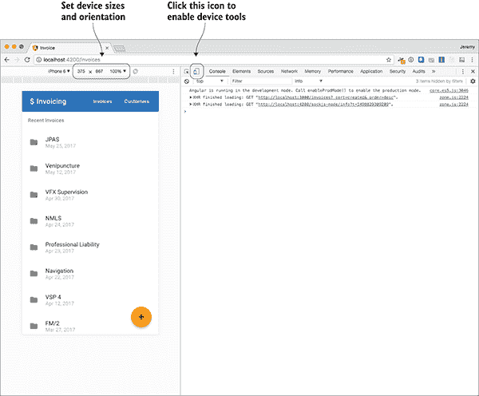
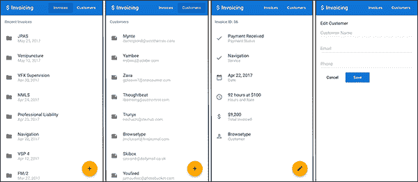
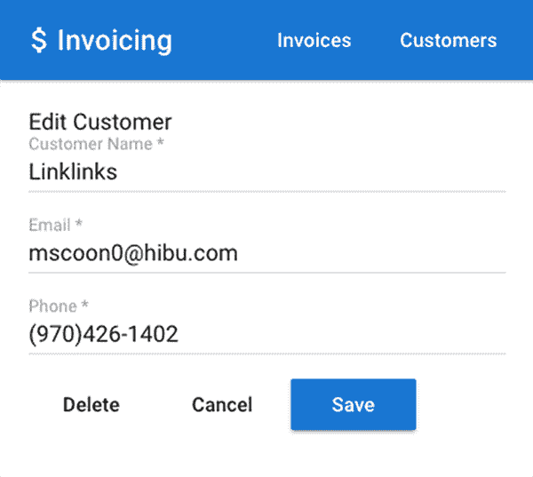
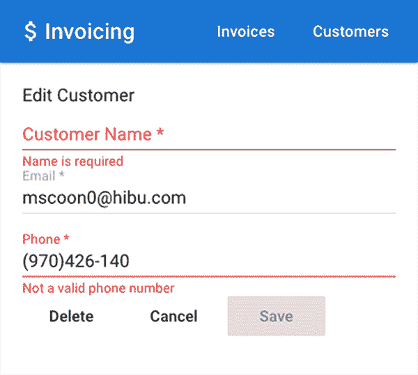
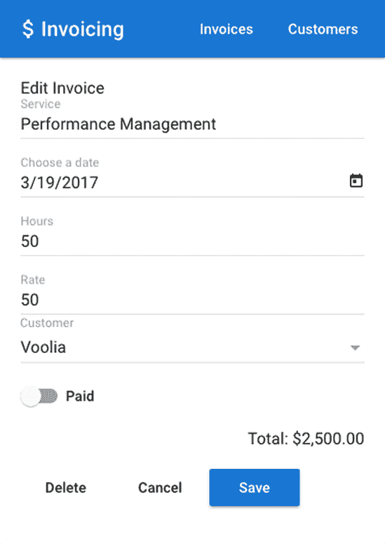
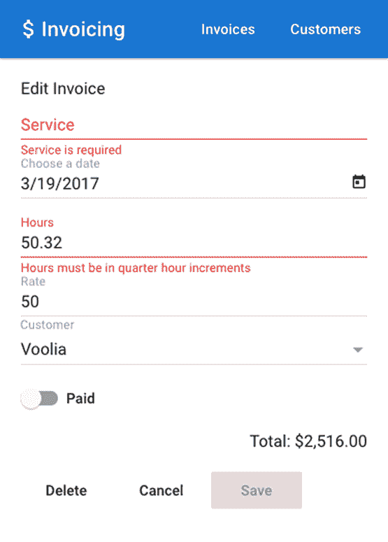
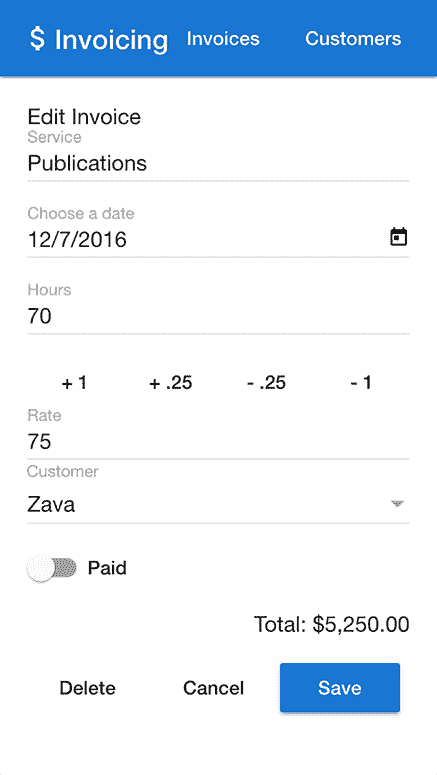

# 9

表单

**本章涵盖**

+   使用 Angular 的表单库创建表单

+   在使用响应式表单或模板表单之间做出决定

+   使用自定义逻辑验证表单

+   访问数据和观察输入变化

+   提交表单数据并优雅地处理错误

+   创建自定义表单控件

几乎每个应用程序都以某种方式使用表单，即使只是做一些简单的事情，比如登录或管理设置。HTML 默认提供了一些表单元素，如输入、选择和按钮，Angular 提供了一种方法来使用这些原生元素并为其添加一些功能。我们在之前的几个例子中使用了表单，但在本章中，我们将更深入地探讨它们。

Angular 提供了两种构建表单的方法：*响应式表单*和*模板表单*。我将在稍后详细讨论它们之间的区别，尽管它们主要在于你是在控制器中还是在模板中定义表单。你不必局限于只选择其中一种表单，但通常应用程序会尝试保持与其中之一的一致性。

使用模板表单时，我们将看到如何主要使用 NgModel 指令来描述你的表单，该指令用于定义表单结构。使用响应式表单时，你自己在控制器中声明表单结构，然后模板将其渲染出来。

尽管表单可能变得非常复杂，但所有领域的基本原则都是相当标准的。有表单控件（如输入、选择等字段，它们持有值），还有表单按钮（如保存、取消或重置）。当在 Angular 中处理表单时，基本原则保持一致，无论表单变得多么复杂。

经常会有这样的情况，表单需要使用额外的第三方组件来帮助，例如日期选择器或范围滑块。浏览器可能实现了一些新的表单控件，但它们很少是标准的，其他浏览器可能根本不支持它们。尽管我们不会专注于创建类似表单控件的自定义组件，但有许多优秀的库提供了额外的功能，或者你可以通过查阅文档来构建自己的自定义表单控件。我个人只有在绝对必要时才会创建这些组件，这种情况很少发生。

## 9.1 设置本章示例

我们将构建一个新的应用程序，帮助我们管理发票和客户。想象一下，你是一名自由职业者或小型企业主，你需要管理客户。这个应用程序将是一个很好的工具，用于跟踪发送发票并确保你得到支付（这很重要，对吧？）。

表单本身故意不复杂，但它们确实简洁地展示了表单的大部分需求。你可以将本章中看到的示例转换为更大的、更复杂的表单，而无需学习额外的概念。唯一的区别通常在于规模。

该应用程序还针对移动设备形态进行了设计，这与我们之前的示例形成了一个很好的小转折。它使用来自 Teradata 的 Covalent UI 库，该库扩展了 Angular Material Design 库的概念。如果您不知道，移动浏览器通常对最新的 HTML5 输入类型（如搜索或数字字段）的支持最好，这些我们将用于我们的示例。我建议您在本章中使用 Chrome。

Chrome 的开发者工具中有一个有用的设备模拟器，如图 9.1 所示，我建议您在构建和使用此应用程序时使用它。它允许您模拟各种移动设备的尺寸，并了解您的应用程序在这些尺寸上的外观。它并不真正以真实的方式模拟设备，但它确实提供了一个方便的预览方式。



**图 9.1** 使用 Chrome 开发者工具中的设备工具模拟移动设备。

如其他示例一样，这个示例也托管在 GitHub 上，您可以通过克隆仓库来获取源代码。确保我们在开始时检查正确的标签，这样您就可以一起编码，或者查看最新的 master 分支以获取最终版本：

```
git clone https://github.com/angular-in-action/invoice 
cd invoice
git checkout start 
```

否则，您可以从[`github.com/angular-in-action/invoice/archive/start.zip`](https://github.com/angular-in-action/invoice/archive/start.zip)下载存档文件，并解压这些文件。

当您启动应用程序时，您会注意到已经存在许多服务和组件。我提前提供了大部分代码，这样我们就可以专注于表单的关键功能。即使表单组件也存在，它们使用了标准的 HTML 表单。当您尝试保存它们时，它们目前不会执行任何操作，这正是我们将在本章中更新和实现的内容。

您需要运行`npm install`来安装所有依赖项，然后运行`ng serve`来启动本地开发服务器。但这还不是全部。此应用程序还有一个本地 API 服务器，我们同样需要运行。您需要打开另一个终端会话并运行以下命令：

```
npm run api 
```

这将启动一个本地服务器，提供我们的应用程序数据。当您保存和编辑记录时，数据将持久保存在名为 db.json 的本地文件中，这对于我们的应用程序很重要。

当您运行示例时，浏览器控制台可能会有一些警告——您可以安全地忽略这些警告。它们指的是本章示例中不需要的功能。

现在，在我们进入表单之前，让我们回顾一下应用程序的其余部分。

### 9.1.1 在开始之前回顾应用程序

该应用程序中有六个可路由视图。让我们简要地谈谈其中一些不包含表单的视图。我们将专注于本章中的两个路由；我们将使用模板驱动表单构建其中一个表单，另一个使用响应式表单。让我们看看应用程序的几个屏幕。

图 9.2 展示了应用程序的一些屏幕，例如列表、详细和表单视图。有两个列表视图，一个用于客户，一个用于发票。这两个列表视图都相当简单，因为它们从 API 加载一个列表并渲染它。它们还包括一个按钮，可以带您进入表单以创建新记录。您可以在发票和客户组件中看到这两个视图。



**图 9.2** 仿制在移动设备大小的发票应用程序屏幕。从左到右：发票列表、客户列表、发票详细视图和客户表单。

客户和发票的详细视图也非常相似，因为它们只是显示给定记录的相关数据。还有一个按钮允许您编辑该记录。您可以在发票和客户组件中预览这些视图。

最后，我们将要工作的两个视图是表单视图。客户或发票表单将允许您创建或编辑现有记录，所需的表单字段已经通过标准 HTML 提供。我们将更新这些表单和控制器以处理保存、删除和取消事件。这些可以在 InvoiceForm 和 CustomerForm 组件中找到。

在组件内部，您会看到一些新内容。`TdLoading`指令是 Covalent 库中的一个功能，用于在加载数据时显示加载指示器。`MdInput`指令将使输入符合 Material Design 规范。还有几个以`Md-`开头的其他元素，它们都是来自 Material Design 库的 UI 组件，用于结构或控件。最好查阅 Covalent 和 Material Design 文档，以解决您可能对这些工具的使用有疑问的问题。请注意 package.json 文件中使用的特定版本，并确保您正确地查找它。

对于客户和发票 API 也有服务。您可能想审查它们，作为扩展一个服务以创建另一个服务的方法。发票和客户服务都扩展了 Rest 服务，该服务实现了所需的 API 调用。特殊实例（发票和客户）提供了一个属性，该属性由 Rest 服务用于构造 URL。

好的，让我们使用模板驱动方法创建客户表单。

## 9.2 模板驱动表单

我们已经在我们的几个示例中使用了模板驱动表单，关键标志是您在表单控件上看到`NgModel`指令。AngularJS 开发者将熟悉本节中描述的模式。

模板表单之所以得名，主要是因为表单控件是在组件的模板中定义的。在这种情况下，您可以将模板视为最终决定哪些内容是表单的一部分。例如，如果您在页面上有一个作为表单一部分并连接到表单控件的`input`元素，那么它也将由控制器定义。

表单的主要目标是能够同步视图中的数据与控制器中的数据，以便可以提交进行处理。次要目标是执行验证、通知错误以及处理取消等其他事件。

因为表单形式主要定义在模板层，这也意味着验证错误主要是通过模板来管理的。我们将探讨如何添加验证并提醒用户关于无效字段。

在 图 9.3 中，你可以看到我们将在此部分构建的客户表单。这三个字段将是表单数据的一部分，并允许我们捕获输入以进行处理。

要开始，我们需要开始处理我们的表单控件并将它们连接起来，以便使用 `NgModel` 在控制器和模板之间绑定模型。

### 9.2.1 使用 NgModel 将模型数据绑定到输入

让我们从单个表单控件开始，看看将其转换为 Angular 可以使用的内容需要什么。在 CustomerForm 组件中，你应该看到这个输入：

```
<input mdInput placeholder="Customer Name" value=""> 
```



**图 9.3** 客户表单，包含三个字段以绑定数据

目前它只是一个普通的表单元素（使用 `MdInput` 使其成为 Material Design），但通过添加 `NgModel` 指令，我们可以将其转换为 Angular 表单控件。在这个过程中，我们还可以删除 `value` 属性，因为它不再需要：

```
<input name="customer" mdInput placeholder="Customer Name" **[(ngModel)]="customer.name"**> 
```

`NgModel` 指令是表单模块的一部分，并确保表单控件的值基于控制器中的 `customer` 属性值设置。但是，当它在视图中更改时，它也会将其值设置到控制器中。如果你查看控制器，将没有这样的属性，`NgModel` 将为你创建它。

你应该记得之前章节中的 `[()]` 语法，但为了刷新你的记忆，它是在 Angular 中进行双向数据绑定的一种方式。这意味着控制器现在将有一个名为 `customer` 的属性，如果视图或控制器更改该值，另一个也会立即更新。AngularJS 开发者会很好地了解这个概念，它也存在于 Angular 中。

让我们继续使用 `NgModel` 将所有表单控件连接起来。在 CustomerForm 模板中，我们需要修改现有的表单控件，如下所示。打开 src/app/customer-form/customer-form.component.html 并更新它。

**列表 9.1** 使用 NgModel 的 CustomerForm

```
<md-card-content>
  <md-input-container>
 [<input name="customer" mdInput placeholder="Customer Name" **[(ngModel)]="customer.name"**>](#c09-codeannotation-0001)
```

```
 </md-input-container>
  <md-input-container>
 [<input name="email" mdInput type="email" placeholder="Email" **[(ngModel)]="customer.email"**>](#c09-codeannotation-0001)
```

```
 </md-input-container>
  <md-input-container>
 [<input name="phone" mdInput type="tel" placeholder="Phone" **[(ngModel)]="customer.phone"**>](#c09-codeannotation-0002)
```

```
 </md-input-container>
{{customer | json}}     
```

```
</md-card-content> 
```

在这些表单控件中，我们现在使用 `NgModel` 来实现双向绑定。请注意，我们还将模型值设置为 `customer` 属性的一部分，因此数据存储在一个对象中。除了只有一个控件的表单外，强烈建议始终使用此类模型。这有助于我们稍后能够将所有客户数据存储在同一个对象上，而不是控制器的不同属性中。

到目前为止，这不会对我们的表单产生任何显著的可见变化，但它会在后台更改输入值时向客户模型添加新属性。如果你观察客户插值绑定，你会看到当表单输入中的值发生变化时，模型也会更新。

使用 `NgModel` 有几点需要注意。首先，你始终使用双向绑定语法与之一起使用——否则它不起作用。其次，使用 `NgModel` 时，输入应该始终有一个名称，因为它需要内部信息。最后，你注意到省略了 `value` 属性，因为 `NgModel` 会覆盖它，所以最好将其省略。

保存这些更改，然后转到客户列表，选择一个，点击右下角的编辑图标以查看表单。你还应该检查浏览器控制台，以确保没有输入错误。

这很好，因为我们的主要对象基本上已经完成。我们只需添加 `NgModel`，当进行更改时，我们的表单元素现在在模板和控制器中都被跟踪。下一步是开始验证这些表单字段。利用 `NgModel` 的力量，我们可以跟踪表单字段的验证状态，并向用户报告有意义的错误。

### 9.2.2 使用 NgModel 验证表单控件

HTML 已经提供了一些内置的表单验证，可以添加到表单元素中，例如 `required` 或 `minlength`。Angular 与这些属性一起工作，并且会自动根据它们验证输入。

让我们以我们的客户姓名输入字段为例。我们所需做的只是添加额外的 `required` 属性来验证输入，强制对此字段进行验证：

```
<input name="customer" mdInput placeholder="Customer Name" [(ngModel)]="customer.name" **required**> 
```

当表单控件具有无效值时，我们还可以检查字段的状态，并显示关于错误的提示信息，如图 9.4 所示。



**图 9.4**  带有验证错误的客户表单

是时候为所有字段设置验证，并查看如何访问这些字段的状态了。根据以下列表中加粗的内容更新 CustomerForm 模板片段。

**列表 9.2**  使用 NgModel 验证 CustomerForm 字段

```
<md-input-container>
 [<input name="customer" mdInput placeholder="Customer Name" [(ngModel)]="customer.name" **required #name="ngModel"**>](#c09-codeannotation-0005)
```

```
 **<md-error *ngIf="name.touched && name.invalid">**
 **Name is required**
 **</md-error>**
</md-input-container>
<md-input-container>
  <input name="email" mdInput type="email" placeholder="Email" [(ngModel)]="customer.email" **required #email="ngModel"**>
 **<md-error *ngIf="email.touched && email.invalid"> **
```

```
 **A valid email is required**
 **</md-error>**
</md-input-container>
<md-input-container>
  <input name="phone" mdInput type="tel" placeholder="Phone" [(ngModel)]="customer.phone" **required #phone="ngModel" minlength="7"**>
 **<md-error *ngIf="phone.touched && phone.errors?.required"> **
```

```
 **Phone number is required**
 **</md-error>**
 **<md-error *ngIf="phone.touched && phone.errors?.minlength">** 
 **Not a valid phone number**
 **</md-error>**
</md-input-container> 
```

现在表单控件每个都带有 `required` 属性和本地模板变量。电话号码还有一个 `minlength` 属性，因为我们期望电话号码至少有七个数字。我们在组件章节中使用了本地模板变量来访问模板中其他控制器中的值，这里也是同样的情况。例如，`#name="ngModel"` 是将模板变量 `name` 定义为对 `NgModel` 结果的引用的方式，即表单控件数据。记住，模板变量仅在定义它们的模板内有效，因此你无法从控制器中访问它们。

此表单控件数据是 Angular 中的 FormControl 类型，您可以在 API 文档中查看以了解更多关于它能为您做什么的信息。它有许多属性，例如`valid`、`invalid`、`pristine`和`dirty`。这些是布尔值，您可以使用它们轻松地确定某事是真是假。参见表 9.1 以了解最有用的表单控件属性。

**表 9.1** 表单控件验证属性

| **属性** | **含义** |
| --- | --- |
| `valid` | 表单控件对所有验证都是有效的。 |
| `invalid` | 表单控件至少有一个无效的验证。 |
| `disabled` | 表单控件被禁用，无法与之交互。 |
| `enabled` | 表单控件处于启用状态，可以点击或编辑。 |
| `errors` | 一个对象，要么包含有无效验证的键，要么当所有验证都有效时为 null。 |
| `pristine` | 表单控件尚未被用户更改。 |
| `dirty` | 表单控件已被用户更改。 |
| `touched` | 表单控件曾获得焦点，然后焦点离开了该字段。 |
| `untouched` | 表单控件尚未获得焦点。 |

`MdError` 元素来自 Material Design 库，当`NgIf`为真时显示一个小的验证错误。例如，`*ngIf="email.touched && email.invalid"`会在表单控件无效且用户离开该字段焦点时显示错误。（作为旁注，如果值是从数据库加载的但无效，则前面的验证将失败，因此您应该考虑您应用程序的需求。）这很好，因为错误不会立即出现，而只有在用户尝试用无效值离开字段时才会出现。您可以使用表 9.1 中属性的不同的组合来确定何时显示验证错误。当您创建新项目时，所有必填字段都将无效，但只有在用户尝试编辑它们之前不会显示验证错误。

注意电话号码的验证消息有两个不同的验证：`required`和`minlength`。然后我们能够查看控件的错误对象，以确定是否特定的验证失败，并显示适当的消息。在这种情况下，如果用户留空，它会提示该字段是必填的，但如果用户只输入了四个字符，它会显示至少需要七个数字。

还值得注意的是，Angular 会根据表单控件的验证状态应用各种 CSS 类。这些类与 表 9.1 中的属性相对应，但前面带有 ``ng- 前缀。例如，一个无效的表单控件将应用 `ng-invalid` 类。如果你想在没有任何特殊工作的情况下为有效或无效的控件定制样式，这将非常有用。我们在这里没有这样做，但你当然可以利用这一点。一些 Angular UI 库可能自带对这些类的支持。``

````Though this validation is helpful, it’s still possible to submit the form with invalid values. We’ll prevent this from happening in a moment, but first I want to wrap up validation by creating our own validation directive.    ### 9.2.3 Custom validation with directives    The validation for our phone number is somewhat lacking. We really would want it to enforce not just the length but also that the content matches a known phone format. Unfortunately, even the `tel` input type doesn’t do that for us, so we’ll have to implement our own custom validation using a directive. Our best effort so far has been to enforce a `minlength` validation, but that only cares about the number of characters, not the actual value.    Although there is the `pattern` validation attribute in HTML, which allows you to declare a regular expression to validate the input, it’s not very usable and doesn’t work in all browsers.    We’ll need to create two things to make this happen: a customer validator function and a directive that uses the validator function. Start by creating a new directory at src/app/validators; then create a file inside it named phone.validator.ts, and add the code from the following listing.    **Listing 9.3** Phone validator    ``` import { AbstractControl, ValidatorFn } from '@angular/forms';  const expression = /((\(\d{3}\) ?)|(\d{3}-))?\d{3}-\d{4}/;      ```    ```  export function PhoneValidator(): ValidatorFn {      ```    ```  [return (control: AbstractControl): { [key: string]: any } => {](#c09-codeannotation-0010) ```    ```  const valid = expression.test(control.value) && control.value.length < 14; ```    ```  return valid ? null : { phone: true };   }; }  ```    This is a bit terse, so let’s look at it step by step. First, we’re defining a regular expression that should validate the primary phone number formats. You could select a different expression if your needs require. Then we’re exporting a function that will return a function. The `ValidatorFn` interface expects that this returned function will accept a control as a parameter and return either null or an object with validation errors.    Our `PhoneValidator` function will return the real validation function to use during the validation. It accepts a single argument, which is the form control. For the most part, you only care about the `control.value` property, which holds the current value of the form control. Then inside of the validation function, it tests the current value against the expression and returns either null, to mean it’s valid, or an object if it’s invalid, with a property explaining what is invalid.    If it returns an object, it expects you to give it a property with a value. Here it’s a Boolean, but it could be any value you want to expose. Normally, I find Boolean is suitable unless you want to also provide the error message as a string. You can access the value in the local template `control.errors` property.    To use this validator we need to create a directive. Using the Angular CLI, generate a new directive like so:    ``` ng generate directive validators/phone  ```    Now open src/app/validators/phone.directive.ts and add the code found in the following listing to it. This will take the validator function we created a moment ago and make it possible to apply it to an element as an attribute.    **Listing 9.4** Phone validator directive    ``` import { Directive } from '@angular/core'; import { Validator, AbstractControl, NG_VALIDATORS } from '@angular/forms'; import { PhoneValidator } from './phone.validator';  @Directive({  [selector: '[phone][ngModel]',](#c09-codeannotation-0012) ```    ```  [providers: [{ provide: NG_VALIDATORS, useExisting: PhoneDirective, multi: true }]](#c09-codeannotation-0013) ```    ``` }) export class PhoneDirective implements Validator {      ```    ```  private validator = PhoneValidator(); ```    ```  [validate(control: AbstractControl): { [key: string]: any } {](#c09-codeannotation-0016) ```    ```  return this.validator(control);  } }  ```    This is also a bit terse, but what we’re doing is implementing the necessary pieces to wire up the directive to Angular’s list of validators and implement the same interface. We start by defining the selector to expect to have both phone and `NgModel` attributes on the form control. This means if you just put `phone` as an attribute, it won’t use this directive for validation, because `NgModel` is required.    The directive also has a `providers` array and uses a multiprovider, which allows a single token (like `NG_VALIDATORS`) to have multiple dependencies. `NG_VALIDATORS` contains a list of default validation dependencies, and this extends that list by adding one more of our own. This isn’t very common, but it’s required in this situation.    Our directive then exports a class, which implements the `Validator` interface. This expects that there will be a `validate` method defined in the class, which we have done. We also have a property that holds an instance of our `validator` function that we imported, and then inside of the `validate` method we call our custom validator and pass in the control.    There’s a bit of juggling of the form control in this custom validation process, but when you look at these two files together, it should be clearer how they relate to one another. To implement this new `validator` directive, we need to update our `phone` form control, as you see in the following listing.    **Listing 9.5** Updated phone form control    ``` <md-input-container>  [<input name="phone" mdInput type="tel" placeholder="Phone" [(ngModel)]="customer.phone" required **phone** #phone="ngModel">](#c09-codeannotation-0017) ```    ```  <md-error ***ngIf="phone.touched && phone.errors?.phone"**> ```    ```  Not a valid phone number   </md-error> </md-input-container>  ```    The form control removes the `minlength` attribute and replaces it with the `phone` attribute. This makes the form control now aware of the phone validation, and when the number isn’t a correct phone number we can tell by looking at the `errors.phone` property. Recall our `validator` function returns an object with `{phone: true}`, so this is where we see it returned to us. We also removed the additional error message for it being required, as our new validation covers that scenario as well.    To review, when we add the `phone` attribute, the `NgModel` will validate using the Phone validator directive. Internally, the Phone validator directive registers itself with the default list of validators that `NgModel` knows about by declaring the multiprovider (a special kind of provider that can be registered more than once) for `NG_VALIDATORS`. It then implements a `validate` method, which calls the `validator` function we created at the beginning. There are a few steps here, but that’s the price we pay for the flexibility provided by Angular’s platform.    Congrats! You’ve now got a custom validation directive that you can reuse on any form control, or you can create additional ones for different scenarios. Now we need to wrap up this form by handling events to either submit, cancel, or delete.    ### 9.2.4 Handling submit or cancel events    We’ve got all the data and validation we would like on this form, so now it’s time to handle the various events that might happen with it. The most important is to handle the submit event, but also we want to allow the user to cancel from saving the edits or delete the record if it exists.    The controller already implements all the methods we need to handle these scenarios, so we just need to write up our form to call them properly. You can review the methods in there and see how they work.    The first thing we should do is update our form element. Angular does another thing to forms that isn’t visible by default. It automatically implements an `NgForm` on a form even if you don’t declare a directive (unlike how you have to declare `NgModel`). When it does this, it essentially attaches an `NgForm` controller that then maintains the form controls in the form.    `NgForm` provides a couple of features we’ll need; the first is that it can tell us if the entire form is valid (not just an individual field) and help us implement an event binding for submitting the form. Find the `form` element at the top of the CustomerForm template and update it to have these additional values shown in bold:    ``` <form *ngIf="customer" **#form="ngForm" (ngSubmit)="save()"**>  ```    First we create another template variable and reference the NgForm controller. This is the same idea we used for our form controls with NgModel, except this local template variable will reference the entire form. Then we have an `(ngSubmit)` event handler to call the `save` method.    Now we just need to update our buttons at the bottom to call the correct methods. The following code in bold contains the pieces to add to the buttons in the `card actions` element near the bottom:    ``` <md-card-actions>   <button type="button" md-button **(click)="delete()" *ngIf="customer.id"**>Delete</button>   <button type="button" md-button **(click)="cancel()"**>Cancel</button>   <button type="submit" md-raised-button color="primary" **[disabled]="form.invalid"**>Save</button> </md-card-actions>  ```    The first two buttons are standard buttons, so we just use the `click` event binding to call the appropriate method. The delete button is hidden if we’re creating the record by checking whether there is an ID, which is only set after creation. The submit button doesn’t have an event binding, because that’s already being handled by `ngSubmit`. But we do bind to the `disabled` property and look at the `form.invalid` property to determine if the entire form is invalid.    That about wraps up template-driven forms. Everything about our form was described in the template, primarily by adding `NgModel` directives to our form controls. Using local template variables that referenced the `NgModel` of a control, we could inspect the validation errors for a field and show appropriate error messages. We also were able to build a custom validator for phone numbers that works like any default validation attribute. Finally, we handled the submit event and checked the validation of the overall form before enabling the submit button. Not too bad for a modest amount of code! The final version of the customer form can be seen here in the following listing.    **Listing 9.6** Final customer form template    ``` <div *tdLoading="'customer'">   <form *ngIf="customer" #form="ngForm" (ngSubmit)="save()">     <md-card>       <md-card-header>Edit Customer</md-card-header>       <md-card-content>         <md-input-container>           <input name="customer" mdInput placeholder="Customer Name" [(ngModel)]="customer.name" required #name="ngModel">           <md-error *ngIf="name.touched && name.invalid">             Name is required  </md-error>         </md-input-container>         <md-input-container>           <input name="email" mdInput type="email" placeholder="Email" [(ngModel)]="customer.email" required #email="ngModel">           <md-error *ngIf="email.touched && email.invalid">             A valid email is required           </md-error>         </md-input-container>         <md-input-container>           <input name="phone" mdInput type="tel" placeholder="Phone" [(ngModel)]="customer.phone" required phone #phone="ngModel">           <md-error *ngIf="phone.touched && phone.errors?.required">             Phone number is required           </md-error>           <md-error *ngIf="phone.touched && phone.errors?.phone">             Not a valid phone number           </md-error>         </md-input-container>       </md-card-content>       <md-card-actions>         <button type="button" md-button (click)="delete()" *ngIf="customer.id">Delete</button>         <button type="button" md-button (click)="cancel()">Cancel</button>         <button type="submit" md-raised-button color="primary" [disabled]="form.invalid">Save</button>       </md-card-actions>     </md-card>   </form> </div>  ```    Now it’s time to implement the other form for creating or editing an invoice in the reactive form style. It will approach the form from the controller first and have less logic in the template to manage.    ## 9.3 Reactive forms    The alternative to template-driven forms, *reactive* forms, is the other way to design your forms in Angular. The name *reactive* comes from the style of programming known as reactive, where you have immutable data structures and your views never mutate them directly. That means no two-way binding is allowed.    The basic idea is that your form has a copy of the original model that it uses while the user is editing the form, and upon saving, you trigger an action like saving it to the database and update the original model. Template-driven forms only have one shared model, and because values are being constantly synced between the two, there may be timing issues of values changing in multiple places.    One of my favorite aspects of reactive forms is that you can use an observable to watch a particular form control for changes. I might do this to handle a task like autocomplete, for example. It’s been useful for me on several occasions, and template-driven forms don’t have a good way to do this.    Reactive forms still have a template, because you need to define the markup associated with the form. The main difference in the template is you won’t use `NgForm` or `NgModel` on any of the form controls; instead we’ll use a different directive to link a particular form control in the template to the corresponding form control declared in the controller.    There are a few other differences in the way that reactive forms behave. Because template-driven forms employ two-way binding concepts, they’re inherently asynchronous in their handling. During the rendering of a template-driven form, the `NgModel` directive is building the form up for you behind the scenes. This takes more than one change detection cycle, though, causing potential race conditions where you expect a form element to be registered but it hasn’t yet. This doesn’t happen with reactive forms, because you define the form in your controller, so it’s not dependent on change detection cycles.    The challenges with timing of template-driven forms tend to only appear when you try to access form controls or the form itself too early, and require you to wait until the `AfterViewInit` lifecycle hook to ensure the view has fully rendered. The Angular documentation covers some details about the differences and virtues of each approach as well and is worth reviewing: [`angular.io/guide/forms`](https://angular.io/guide/forms).    Setting aside some of the internal mechanical differences, let’s focus on what reactive forms look like. In a template-driven form the `NgModel` builds the form controls, but with reactive we need to define our form programmatically in the controller. When you settle on using one form approach, it’s not easy or advisable to mix them in the same form, though you could in different forms.    In this section, we’ll build the InvoiceForm component form, and you can see the result in figure 9.5. It has more fields, but visually isn’t all that different from the last form.    Let’s start by building the entire form for our InvoiceForm component. We already have the markup ready to go, so we need to define it for Angular.    ### 9.3.1 Defining your form    The first step is to define the form for our invoice, and this is done to ensure that the controller is aware of all of the aspects of the form. This will define a separate model that exists just for the form. When we load the invoice data from the API, we’ll load it into the form, rather than directly bind the form to it like we saw with `NgModel`.    Angular provides a service called FormBuilder, which is a helpful tool to build a reactive form. We’ll use this to build the description of our form. It lets us define each of the form controls and any validations we want to apply to them.    We’ll be editing the InvoiceForm component in this section, so start by opening src/app/invoice-form/invoice-form.component.ts and update the constructor like you see in listing 9.7. This only includes the top portion of the file—to focus on the changing pieces, which are in bold.      **Figure 9.5** Invoice form with more controls, built in reactive style      **Listing 9.7** Using FormBuilder to define the form    ``` export class InvoiceFormComponent implements OnInit {  **invoiceForm: FormGroup; ** ```    ```  invoice: Invoice;   customer: Customer;   customers: Customer[];   total = 0;    constructor(     private loadingService: TdLoadingService,     private invoicesService: InvoicesService,     private router: Router,     private dialogService: TdDialogService,     private customersService: CustomersService,     private formBuilder: FormBuilder,     private route: ActivatedRoute) {   **this.invoiceForm = this.formBuilder.group({** ```    ```  **id: [''],**  **service: ['', Validators.required],**  [**customerId: ['', Validators.required],**](#c09-codeannotation-0021) ```    ```  **rate: ['', Validators.required],**  **hours: ['', Validators.required],**  **date: ['', Validators.required],**  [**paid: ['']**](#c09-codeannotation-0022) ```    ```  **});**      }  ```    To begin, we set a property on the controller to hold our form. It’s of the `FormGroup` type, which is an object designed to hold various form controls together. Then inside of the constructor, we’ll use the FormBuilder service to build a group of controls.    It accepts an object that contains properties with the name of the control set to an array that holds at least one value. The first value is the value it should hold, which we’re defaulting to empty for all of them. For some properties, we only define the default value. For other properties, we can add additional items to the array that must be validator functions. We’ll create a custom one in a little bit, but for now we’re assigning the required validation to each.    That’s all we need to do to define our form. But it will always be a blank form, so when we’re editing a record we need to load the data into the form. We do this in the `OnInit` lifecycle hook where we load the data. In the following listing, you can see the snippet for the data loading and add the bolded line that sets the form state based on the data.    **Listing 9.8** Setting the form state    ``` this.route.params.map((params: Params) => params.invoiceId).subscribe(invoiceId => {   if (invoiceId) {     this.invoicesService.get<Invoice>(invoiceId).subscribe(invoice => {  **this.invoiceForm.setValue(invoice); ** ```    ```  this.invoice = invoice;       this.loadingService.resolve('invoice');     });   } else {     this.invoice = new Invoice();     this.loadingService.resolve('invoice');   } });  ```    The `invoiceForm` has a `setValue` method, which takes a data model and sets properties based on that. Otherwise, it’s a new form, and the default values were already declared earlier in the controller when we defined the form. In the case where we’re editing and have an existing invoice, it gets set into the form after it’s been loaded from the API.    Now we need to update our template so the form controls are aware of this form and its data.    ### 9.3.2 Implementing the template    The form controls in our template are currently unaware of our reactive form, and this step is about linking the form controls in the template and form controls defined in the controller. Form controls in a template exist like a normal HTML form by default. But for this all to work right, they need to know about the form and its current state so they can display properly.    The InvoiceForm template has a couple of UI components from Material Design: a date picker and a slide toggle. These act like normal form elements, and you can learn more about them in the documentation.    Much as we used `NgModel` to link a form control to the form, we’ll use a different directive called `FormControlName`. This will indicate which form control should be bound into that element, based on the name provided when we built the form.    Open src/app/invoice-form/invoice-form.component.html and make the additions to the form controls, as you see in bold in the following listing, to wire up the controls.    **Listing 9.9** InvoiceForm template with form controls    ``` <div *tdLoading="'invoice'">  [<form *ngIf="invoice" **[formGroup]="invoiceForm"**>](#c09-codeannotation-0023) ```    ```  <md-card>       <md-card-header>Edit Invoice</md-card-header>       <md-card-content>         <md-input-container>  <input name="service" mdInput type="text" placeholder="Service" **formControlName="service"**> ```    ```  </md-input-container>         <md-input-container>  [<input mdInput [mdDatepicker]="picker" placeholder="Choose a date" **formControlName="date"**>](#c09-codeannotation-0026) ```    ```  <button type="button" mdSuffix [mdDatepickerToggle]="picker"></button>         </md-input-container>         <md-datepicker #picker></md-datepicker>         <md-input-container>           <input name="hours" mdInput type="number" placeholder="Hours" **formControlName="hours"**>         </md-input-container>         <md-input-container>           <input name="rate" mdInput type="number" placeholder="Rate" **formControlName="rate"**>         </md-input-container>         <div>           <md-select name="customerId" placeholder="Customer" **formControlName="customerId"**>             <md-option [value]="customer.id" *ngFor="let customer of customers">{{customer?.name}}</md-option>           </md-select>         </div>         <div class="toggler">  <md-slide-toggle **formControlName="paid"**>Paid</md-slide-toggle> ```    ```  </div>         <div class="total">           Total: {{total | currency:'USD':true:'.2'}}         </div>       </md-card-content>       <md-card-actions>         <button type="button" md-button>Delete</button>         <button type="button" md-button>Cancel</button>         <button type="submit" md-raised-button color="primary">Save</button>       </md-card-actions>     </md-card>   </form> </div>  ```    The first step is to use the `FormGroup` directive to bind the form we declared to the form element. If you miss this step, the form won’t know about the model you defined. Then we just linked the form controls with the name used when we built the form, and at this point the form will now render properly. We’ll have to work out the details of saving in a little bit, but otherwise it’s a fully functional form.    Now I think it would be nice for us to display the invoice total in the page so users know the invoice total based on the rate and hours input. We can do this by observing form controls, so let’s see how we can use that.    ### 9.3.3 Watching changes    Unlike in template-driven forms, our reactive form controller has the source of truth for the form state, and it gives us the ability to observe a form or a single control for changes. This lets us run logic that might be useful, such as validation or saving progress.    In our case, we want to display the total invoice amount at the bottom, and that requires multiplying the `hours` and `rate`. Each form control exposes an observable that we can use to subscribe to changes, and we’ll use it to get both `hours` and `rate` values.    The template already has a place for the total at the bottom, but it shows 0 all the time. Although we could try to do math directly in the interpolation binding, it gets a little bit messy and harder to test. We’d rather handle this in the controller.    Using the form, we can get a specific control using `invoiceForm.get('hours')`. You pass a string that’s the name of the form control, and you get the instance of that control. This instance provides a number of properties and capabilities, one of which is the `valueChanges` observable.    Let’s make this work by adding a little bit to the end of the `OnInit` method. You can see the snippet to add here in the following listing.    **Listing 9.10** Observing state changes in the form    ``` Observable.combineLatest(   this.invoiceForm.get('rate').valueChanges,   this.invoiceForm.get('hours').valueChanges ).subscribe(([rate = 0, hours = 0]) => {   this.total = rate * hours; });  ```    This snippet might be new to you, but we’re using the `combineLatest` operator from RxJS. This operator takes two observables, which are references to the stream of value changes of the `rate` and `hours` controls, and merges them into one. We can then get the latest values from the stream and multiply them to get the current total.    Imagine you had more complex math here, such as adding in taxes, or perhaps there was another value to plug in. Doing math in the interpolation binding directly would quickly get out of hand, and this provides you direct access to run calculations when values change. This is also a pattern of reactive, because in this case you’re reacting to changes in the form state and updating the total.    When you use `invoiceForm.get('rate')`, you’re also able to access the same properties from table 9.1 (form control status properties). You can check whether the control is `valid`, `pristine`, `touched`, or what errors exist. This might be helpful for you to do additional validation or checks.    We can also implement our own validator functions as we did before and see how to plug them into the form.    ### 9.3.4 Custom validators with reactive forms    Previously, when we implemented custom validation, we created both a validation function and a directive. With reactive forms, we only need to create the validation function and then add it into the form when we create it with FormBuilder.    We’ll update our validation messages as well to use the validation rules we defined, as you see in figure 9.6.      **Figure 9.6** Validation rules in the invoice form      Imagine our invoicing application had the restriction that hours had to be always rounded to the quarter hour—like 1 hour, 1.25, 1.5, 1.75, or 2\. It should not allow values like 1.1 or 1.7\. This is fairly common when invoicing by time, and the way we enforce this is to validate the `hours` input and see if it’s valid by quarter hour.    We’ll build a validator function like we did previously, but we won’t have to wrap it up in a directive. Start by making a new file at src/app/validators/hours.validator.ts, and add the code from the following listing to it.    **Listing 9.11** Hour validator    ``` import { AbstractControl, ValidatorFn } from '@angular/forms';  [export function HoursValidator(control: AbstractControl) : { [key: string]: any } {     ](#c09-codeannotation-0028) ```    ```  return (Number.isInteger(control.value * 4)) ? null : { hours: true }; ```    ``` }  ```    This is very succinct, but in contrast to the previous validator, we’re directly exporting the validation function. When we created a custom validator earlier for a directive, we needed a function to return a validator function, whereas here we export the validator function directly. When the validator function runs, it multiplies the value by 4 and checks if it is an integer. That means any valid hourly increment will multiply an integer by 4 and return null for valid. Otherwise, it returns the object with the key and Boolean.    Now we need to make our form aware of this validation function, and that’s done when we construct the form using FormBuilder. In the component controller, update the form definition like you see in the following listing. You’ll need to import the `HoursValidator` function into the file.    **Listing 9.12** Using HoursValidator    ``` this.invoiceForm = this.formBuilder.group({   id: [''],   service: ['', Validators.required],   customerId: ['', Validators.required],   rate: ['', Validators.required],  [hours: ['', **[Validators.required, HoursValidator]**],](#c09-codeannotation-0030) ```    ```  date: ['', Validators.required],   paid: [''] });  ```    Because we’re directly constructing the form, we just need to pass the custom validation function into the control. Notice how the `hours` control also now has an array for the second item in the array. That’s because if you have multiple validators, they need to be grouped here. The form control takes the default value, synchronous validators, and asynchronous validators as a third array item.    We haven’t looked at async validators, but the only difference is that they might take a moment to run. Imagine you needed a validator that checked whether a username was already taken; that probably requires making an API call. The only difference when you implement an async validator is that you need to return a promise or observable, and Angular handles it.    We’d also like to show validation errors in the template, so we’ll need to add the same type of error messages we saw earlier. But the way we access the form elements to check their validity is slightly different.    Open the template again and update the fields with error messages, as you see in the following listing.    **Listing 9.13** Validation messages    ``` <md-card-content>   <md-input-container>     <input name="service" mdInput type="text" placeholder="Service" formControlName="service">  **<md-error *ngIf="invoiceForm.get('service').touched && invoiceForm.get('service').invalid"> ** ```    ```  **Service is required**  **</md-error>**   </md-input-container>   <md-input-container>     <input mdInput [mdDatepicker]="picker" placeholder="Choose a date" formControlName="date">     <button type="button" mdSuffix [mdDatepickerToggle]="picker"></button>     **<md-error *ngIf="invoiceForm.get('date').touched && invoiceForm.get('date').invalid">**  **Date is required**  **</md-error>**   </md-input-container>   <md-datepicker #picker></md-datepicker>   <md-input-container>     <input name="hours" mdInput type="number" placeholder="Hours" formControlName="hours">     **<md-error *ngIf="invoiceForm.get('hours').touched && invoiceForm.get('hours').invalid">**  **Hours must be in quarter hour increments**  **</md-error>**   </md-input-container>   <md-input-container>     <input name="rate" mdInput type="number" placeholder="Rate" formControlName="rate">     **<md-error *ngIf="invoiceForm.get('rate').touched && invoiceForm.get('rate').invalid">**  **Hourly rate is required**  **</md-error>**   </md-input-container>   <div>  <md-select name="customerId" placeholder="Customer" formControlName="customerId"> ```    ```  [<md-option [value]="customer.id" *ngFor="let customer of customers">{{customer?.name}}</md-option>](#c09-codeannotation-0032)  </md-select>   </div>   <div class="toggler">     <md-slide-toggle formControlName="paid">Paid</md-slide-toggle>   </div>   <div class="total">     Total: {{total | currency:'USD':true:'.2'}}   </div> </md-card-content>  ```    Here we’ve added the same `MdError` to display errors, except we use `invoiceForm.get('rate')` to access the form control. The same properties from the earlier table are still available to you, but instead of having a local template variable to get a reference to it, we reference it from the form itself.    Now that we have the form validated as we would like, we need to be able to submit it. Let’s see how that’s done with reactive forms now.    ### 9.3.5 Handling submit or cancel events    The final step is to submit the form when it’s ready. The steps are almost identical, except we manage the data in a different way before we submit it to the service. The `NgSubmit` event binding is still available for us to capture submit events to handle, so we’ll use that again.    Open the InvoiceForm component template again and update the form element like you see here in bold:    ``` <form *ngIf="invoice" [formGroup]="invoiceForm" **(ngSubmit)="save()"**>  ```    While you have the template open, let’s also wire up the buttons at the bottom. Add the bolded parts to your buttons:    ``` <md-card-actions>   <button type="button" md-button **(click)="delete()" *ngIf="invoice.id"**>Delete</button>   <button type="button" md-button **(click)="cancel()"**>Cancel</button>   <button type="submit" md-raised-button color="primary" **[disabled]="invoiceForm.invalid"**>Save</button> </md-card-actions>  ```    Here we’re implementing the click handlers on the delete and cancel buttons, and also disabling the save button unless the form is valid. Notice how we’re using the `InvoiceForm` properties to determine the form state, similar to how we used `NgForm` with template-driven forms.    The last step is to update the `save` method in the controller so it gets its data from the form. Because the data was bound into the form when we loaded the component, we need to extract it back out before we save. Update the `save` method as you see here in bold:    ``` save() {   if (this.invoice.id) {     this.invoicesService.update<Invoice>(this.invoice.id, **this.invoiceForm.value**).subscribe(response => {       this.viewInvoice(response.id);     });   } else {     this.invoicesService.create<Invoice>(**this.invoiceForm.value**).subscribe(response => {       this.viewInvoice(response.id);     });   } }  ```    You can see that when we need to get the data back out of the form, we can look at the `invoiceForm.value` property. This gives us an object representing the same form model with the values for each field. We pass this into the service to either create or update a record and see our values being saved correctly.    We’re now finished with our invoice form, and you can see both the controller and template in listings 9.14 and 9.15 to ensure you have everything correct.    **Listing 9.14** InvoiceForm component controller    ``` import { Component, OnInit } from '@angular/core'; import { ActivatedRoute, Params, Router } from '@angular/router'; import { TdLoadingService, TdDialogService } from '@covalent/core'; import { FormBuilder, FormGroup, Validators } from '@angular/forms'; import { InvoicesService, Invoice, CustomersService, Customer } from '@aia/services'; import { Observable } from 'rxjs/Observable'; import 'rxjs/add/observable/combineLatest'; import { HoursValidator } from '../validators/hours.validator';  @Component({   selector: 'app-invoice-form',   templateUrl: './invoice-form.component.html',   styleUrls: ['./invoice-form.component.css'] }) export class InvoiceFormComponent implements OnInit {   invoiceForm: FormGroup;   invoice: Invoice;   customer: Customer;   customers: Customer[];   total = 0;    constructor(     private loadingService: TdLoadingService,     private invoicesService: InvoicesService,     private router: Router,     private dialogService: TdDialogService,     private customersService: CustomersService,     private formBuilder: FormBuilder,     private route: ActivatedRoute) {        this.invoiceForm = this.formBuilder.group({         id: [''],         service: ['', Validators.required],         customerId: ['', Validators.required],         rate: ['', Validators.required],         hours: ['', [Validators.required, HoursValidator]],         date: ['', Validators.required],         paid: ['']       });      }    ngOnInit() {     this.loadingService.register('invoice');     this.loadingService.register('customers');      this.customersService.query().subscribe(customers => {       this.customers = customers;  this.loadingService.resolve('customers');     });      this.route.params.map((params: Params) => params.invoiceId).subscribe(invoiceId => {       if (invoiceId) {         this.invoicesService.get<Invoice>(invoiceId).subscribe(invoice => {           this.invoiceForm.setValue(invoice);           this.invoice = invoice;           this.loadingService.resolve('invoice');         });       } else {         this.invoice = new Invoice();         this.loadingService.resolve('invoice');       }     });      Observable.combineLatest(       this.invoiceForm.get('rate').valueChanges,       this.invoiceForm.get('hours').valueChanges     ).subscribe(([rate = 0, hours = 0]) => {       this.total = rate * hours;     });   }    save() {     if (this.invoice.id) {       this.invoicesService.update<Invoice>(this.invoice.id, this.invoiceForm.value).subscribe(response => {         this.viewInvoice(response.id);       });     } else {       this.invoicesService.create<Invoice>(this.invoiceForm.value).subscribe(response => {         this.viewInvoice(response.id);       });     }   }    delete() {     this.dialogService.openConfirm({       message: 'Are you sure you want to delete this invoice?',       title: 'Confirm',       acceptButton: 'Delete'     }).afterClosed().subscribe((accept: boolean) => {       if (accept) {         this.loadingService.register('invoice');         this.invoicesService.delete(this.invoice.id).subscribe(response => {           this.loadingService.resolve('invoice');           this.invoice.id = null;           this.cancel();         });       }  });   }    cancel() {     if (this.invoice.id) {       this.router.navigate(['/invoices', this.invoice.id]);     } else {       this.router.navigateByUrl('/invoices');     }   }    private viewInvoice(id: number) {     this.router.navigate(['/invoices', id]);   }  }  ```    **Listing 9.15** InvoiceForm component template    ``` <div *tdLoading="'invoice'">   <form *ngIf="invoice" [formGroup]="invoiceForm" (ngSubmit)="save()">     <md-card>       <md-card-header>Edit Invoice</md-card-header>       <md-card-content>         <md-input-container>           <input name="service" mdInput type="text" placeholder="Service" formControlName="service">           <md-error *ngIf="invoiceForm.get('service').touched && invoiceForm.get('service').invalid">             Service is required           </md-error>         </md-input-container>         <md-input-container>           <input mdInput [mdDatepicker]="picker" placeholder="Choose a date" formControlName="date">           <button type="button" mdSuffix [mdDatepickerToggle]="picker"></button>           <md-error *ngIf="invoiceForm.get('date').touched && invoiceForm.get('date').invalid">             Date is required           </md-error>         </md-input-container>         <md-datepicker #picker></md-datepicker>         <md-input-container>           <input name="hours" mdInput type="number" placeholder="Hours" formControlName="hours">           <md-error *ngIf="invoiceForm.get('hours').touched && invoiceForm.get('hours').invalid">             Hours must be in quarter hour increments           </md-error>         </md-input-container>         <md-input-container>  <input name="rate" mdInput type="number" placeholder="Rate" formControlName="rate">           <md-error *ngIf="invoiceForm.get('rate').touched && invoiceForm.get('rate').invalid">             Hourly rate is required           </md-error>         </md-input-container>         <div>           <md-select name="customerId" placeholder="Customer" formControlName="customerId">             <md-option [value]="customer.id" *ngFor="let customer of customers">{{customer?.name}}</md-option>           </md-select>         </div>         <div class="toggler">           <md-slide-toggle formControlName="paid">Paid</md-slide-toggle>         </div>         <div class="total">           Total: {{total | currency:'USD':true:'.2'}}         </div>       </md-card-content>       <md-card-actions>         <button type="button" md-button (click)="delete()" *ngIf="invoice.id">Delete</button>         <button type="button" md-button (click)="cancel()">Cancel</button>         <button type="submit" md-raised-button color="primary" [disabled]="invoiceForm.invalid">Save</button>       </md-card-actions>     </md-card>   </form> </div>  ```    That covers the majority of what you need to know about both reactive and template-driven forms. There are certainly more minor features that exist for additional cases, but this foundation should get you building forms, and you can learn about other features as you go.    ### 9.3.6 Which form approach is better?    That is a trick question, to my mind, though you probably want a bit more of an explanation. Rather than tell you to use one and never the other, I’ll share from my experience why I use both.    Excluding the mechanical differences of the two form libraries, I find the most important aspect is how they approach defining the form. The patterns they employ can work in most situations.    Most of the time I suggest reactive forms. I like the guarantees reactive provides and the way you define the model and let the template react. I prefer my templates to reflect state, not create state. By that I mean how `NgModel` creates the controls for you behind the scenes and binds data up to the controller. If you need an answer, I would recommend reactive forms, if you really pinned me down.    But you may have noticed this is the first time we’ve seen reactive forms in the book. Sometimes it’s simpler to use `NgModel`, especially when it’s a single form field. In simple scenarios, I find template-driven forms to be more approachable with low overhead, but when a form becomes more complex, then I recommend reactive forms.    I think the most important thing is to be consistent in your applications. Although you can mix and match as much as you like, there’s a mental drawback to that when you write and test them.    Before I close out the chapter, let’s see how to implement your own form controls in cases where your application needs controls that don’t exist out of the box or in libraries.    ## 9.4 Custom form controls    There are scenarios where your application requires a different form control that isn’t defined in HTML or in a third-party library. All form controls have a few basic requirements, and Angular already implements them for the built-in HTML form elements.    Regardless of whether you use reactive or template-driven forms, there has to be some logic to write up the native HTML element (or custom component) with the forms library. There are essentially two places to track the current value of a form control: in the form and the control. Angular provides the `ControlValueAccessor` interface as a way to implement a custom control that works with forms, which we’ll use in conjunction with the Angular Material library components to create our own custom control.    In our application, there are several candidates for creating custom form controls, but we’ll be transforming the current `hours` input field from the invoice form into a custom form control. We’ll implement some basic features that make it easier to use, but also encapsulate the internal logic of the control.    As you see in figure 9.7, the `hours` form field now has several buttons underneath that help you dial in the value by smaller increments. As you change the values, the form element will continue to validate and update the total invoice value at the bottom, as you would expect.    Our first step is to create a new component to house our custom control. To do this, use the CLI as you see here:    ``` ng generate component hours-control  ```    Once the component is created, open the src/app/hours-control/hours-control.component.ts file and replace the contents with what you see in listing 9.16. There’s a lot happening in this file, so we’ll look at the various pieces closely.      **Figure 9.7** New `hours` custom control that connects with Angular forms      **Listing 9.16** HoursControl controller    ``` import { Component, forwardRef } from '@angular/core'; import { ControlValueAccessor, NG_VALIDATORS, NG_VALUE_ACCESSOR, FormControl } from '@angular/forms'; import { HoursValidator } from '../validators/hours.validator';  @Component({   selector: 'app-hours-control',   templateUrl: './hours-control.component.html',   styleUrls: ['./hours-control.component.css'],  providers: [{ ```    ```  provide: NG_VALUE_ACCESSOR,  useExisting: forwardRef(() => HoursControlComponent),  multi: true  }, {  provide: NG_VALIDATORS,  useExisting: forwardRef(() => HoursControlComponent),  multi: true  [}]](#c09-codeannotation-0033) }) export class HoursControlComponent implements ControlValueAccessor {      ```    ```  hours = 0; ```    ```  validateFn = HoursValidator;  onChange = (v: any) => {};   update() { ```    ```  this.onChange(this.hours);  }   keypress($event) { ```    ```  if ($event.key === 'ArrowUp') {  this.setValue(.25);  } else if ($event.key === 'ArrowDown') {  this.setValue(-.25);  }  }   setValue(change: number) { ```    ```  this.hours += change;  this.update();  }   validate(control: FormControl) { ```    ```  return this.validateFn(control);  }   writeValue(value: any) { ```    ```  if (value !== undefined) {  this.hours = value;  }  }     registerOnChange(fn) { ```    ```  this.onChange = fn;  }   registerOnTouched() {} ```    ``` }  ```    There’s a lot happening here in a short amount of space, so let’s break things down. The HoursControl component implements the `ControlValueAccessor` interface, which ensures that your form control is designed to work correctly with Angular forms. It requires that a control implements the three methods found at the end of the controller: `writeValue`, `registerOnChange`, and `registerOnTouched`.    The `writeValue` method is used by Angular to pass a value into the form control from the form itself. This is similar to binding a value into the component, though it works with the form controls like `NgModel,` and it passes the value from the form into the control.    The `registerOnChange` method accepts a function that the form library will pass in that your control needs to call whenever the value changes. It stores this function on the `onChange` property of the controller, and the default `noop` function is defined so the component compiles correctly. In other words, it gives you a method to call that passes the current form value up to the form.    The `registerOnTouch` method isn’t implemented here, but it allows you to accept a method to handle touch events. This might be useful on controls that have some kind of touch impact, such as a toggle switch. But there isn’t much for us to implement for a form control that takes a number input.    In the component metadata, we see some providers are declared. Recall that we did something similar when we created our directive for validation. Here we have to declare two providers—the first is to register this component with `NG_VALUE_ACCESSOR`. This marks this component as a form control and registers it with dependency injection so Angular can access it later. The second is to register the component with `NG_VALIDATORS`. This control has validation internally, so we need to register the control on the validators provider for Angular to access later.    Because the control has a `validate` method, Angular can call this method to determine whether the control is valid or not. This is the same as with creating a `Validator` directive as we did earlier in listing 9.4. In this case, though, we import the `HoursValidator` function and reuse it inside the component.    The rest of the methods are there to handle the internal actions of the control. The `update` method is responsible for calling the change event handler, which will alert the form that the control’s internal state value has changed. The `keypress` method is just a nice feature that allows us to bind to the `keyup` event, and if the user pressed up or down arrows, it will increment or decrement the current value by 0.25\. Finally, the `setValue` method is called by the row of buttons to add or subtract from the current value.    In summary, this component really has three roles. First, it implements an internal model to track the current value of the control (the number of hours) and allows that value to be manipulated by buttons or keypresses. Second, it provides validation and ensures the number provided is to a quarter of an hour. Third, it wires up the necessary methods for Angular forms to be made aware of the current state of the control.    Next we need to look at the template, so let’s go ahead and implement it so we can see everything together. Open src/app/hours-control/hours-control.component.html and replace its contents with the code from the following listing.    **Listing 9.17** HoursControl template    ``` <md-input-container>  <input name="hours" mdInput type="number" placeholder="Hours" ```    ```  [[(ngModel)]="hours" hours (keyup)="keypress($event)"](#c09-codeannotation-0043)  #control="ngModel" (change)="update()">  <md-error *ngIf="control.touched && control.invalid"> ```    ```  Hours must be a number in increments of .25  </md-error> </md-input-container> <div layout="row">  <button type="button" md-button flex (click)="setValue(1)">+ 1</button> ```    ```  <button type="button" md-button flex (click)="setValue(.25)">+ .25</button>  <button type="button" md-button flex (click)="setValue(-.25)">- .25</button>   <button type="button" md-button flex (click)="setValue(-1)">- 1</button>       </div>  ```    In our template, we encapsulate the entire form control that we want to provide, which includes the buttons and the original input box. Because we’re still accepting text input, we use a standard `input` element. But we’re also setting up the `NgModel`, a validation directive (which we’ll create next), and two event bindings for `keyup` and change.    This control has built-in error validation and uses the same Angular Material patterns we saw earlier in the chapter. It shows a message if the control is invalid, and if the control has been focused on. It’s nice that the validation messaging is built in, because it doesn’t need to be implemented later. If you have the same controls in many places with the same validation, this might be useful. If you want to ensure that this control is more reusable, with different validation types, this might not be ideal.    The last set of elements is the buttons that add or subtract from the current state. When they’re clicked, the internal hours model is updated, and the form is alerted to the change as well.    There’s a bit of CSS that we need to add for the control to look correct, so open src/app/hours-control/hours-control.css and add the code from the following listing.    **Listing 9.18** HoursControl stylings    ``` :host {     width: 100%;     display: block; } md-input-container {     width: 100%; } button {     padding: 0;     min-width: 25%; }  ```    This makes sure that a few pieces of the control play nicely with the UI library, since we’ve changed the way it usually expects elements to be laid out.    You probably noticed that we have a validation directive for hours on the input, but we haven’t created a directive version of this validator yet. That’s simple to do, and we need to do so before we use this control. Create a new directive by running the following command:    ``` ng generate directive validators/hours  ```    Then open the directive file at src/app/validators/hours.directive.ts and replace its contents with the code in the following listing.    **Listing 9.19** Hours validation directive    ``` import { Directive } from '@angular/core'; import { Validator, AbstractControl, NG_VALIDATORS } from '@angular/forms'; import { HoursValidator } from './hours.validator';  @Directive({  [selector: '[hours][ngModel]',](#c09-codeannotation-0046) ```    ```  providers: [{ provide: NG_VALIDATORS, useExisting: HoursDirective, multi: true }] }) export class HoursDirective implements Validator {   private validator = HoursValidator;    validate(control: AbstractControl): { [key: string]: any } {       return this.validator(control);   } }  ```    This directive looks almost identical to the one we created earlier, except it references the `HoursValidator` function. I recommend reviewing the details from listing 9.3 for specifics if you have any questions.    Now we have everything we need to use our new control. This control is meant to be used in the InvoiceForm component, so open the template found at src/app/invoice-form/invoice-form.component.html and replace the existing hours input element with our newly created form control, as you see here in bold in the snippet of the whole template:    ``` <md-datepicker #picker></md-datepicker> **<app-hours-control formControlName="hours"></app-hours-control>** <md-input-container>   <input name="rate" mdInput type="number" placeholder="Rate" formControlName="rate"> </md-input-container>  ```    Because this is a custom form control, we can use it with reactive forms or template-driven forms without issue. Congratulations! You’ve created your own control and can now make as many as you want.    But wait—there are a couple of caveats to building your own controls, and to this particular example. Custom controls seem like a great idea, but they can also be a lot of work to build properly. For example, does your custom control work well on mobile or touch devices? Does it have proper support for screen readers and other accessibility requirements? Does it work in multiple applications or is it too custom for your application? These are important questions to ask, and also to verify whether your controls work for the largest set of users. One of the major reasons I advocate using an existing UI library is that the good libraries will have solved these issues ahead of time for you.    Before going off to build a custom control, see if you can think clearly about the user experience and determine whether an existing control could be used instead of a new one. Users tend to struggle more with custom form elements that they haven’t seen before, so it can be very practical to adjust the application slightly so it can use already existing controls before you make a new one.    Because this chapter is using a specific UI library, I’ve implemented the form controls in a way that fits with that library. Therefore, it’s limited to being used only with Angular Material, which may limit the use of your control. On the other hand, if you can expect to always use Angular Material (or the UI library of choice), then the custom control may be saving you a lot of repetition.    At the time of writing, the Angular Material library doesn’t support creating your own form controls that work nicely with the input container. (See [`github.com/angular/material2/issues/4672`](https://github.com/angular/material2/issues/4672).) This is why I ultimately encapsulated the entire form control and surrounding markup. It makes the example more verbose than you might need, so you should consider how to simplify your form controls if possible.    This example uses a standard `input` element inside, which is why `NgModel` was used, but in many custom form controls you may not have an input, so you wouldn’t use `NgModel`. In those cases, you simply make sure that as the control state changes (such as a toggler that goes from true to false), you call the change handler so the form knows the state changes.    That wraps up forms, both reactive and template-driven, as well as creating your own controls. Forms are very important to most applications, and you should now have the tools to craft feature-rich and usable forms.    ## Summary    We’ve built two forms, in both the reactive and template-driven styles in this chapter. Along the way we also managed to learn about most of what forms have to offer. Here’s a brief summary of the key takeaways:    *   Template-driven forms define the form using `NgModel` on form controls. *   You can apply normal HTML validation attributes, and `NgModel` will automatically try to validate based on those rules. *   Custom validation is possible through a custom validator function and directive, which gets registered with the built-in list of validators. *   The `NgForm` directive, though it can be transparent, exposes features to help manage submit events and overall form validation inspection. *   Reactive forms are different in that you define the form model in the controller and link form controls using `FormControlName`. *   You can observe the changes of a form control with reactive forms and run logic every time a new value is emitted. *   Reactive forms declare validation in the controller form definition, and creating custom validations is easier because they don’t require a directive. *   Ultimately, both form patterns are available to you. I tend to use reactive forms, especially as the form gets more complex. *   Creating a new form control requires implementing the `ControlValueAccessor` methods and registering it with the controls provider.````
