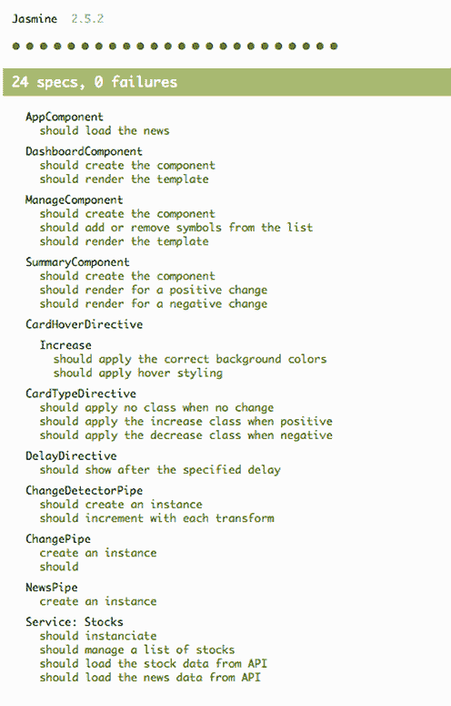

# 10

测试你的应用程序

**本章涵盖**

+   测试你的 Angular 应用程序的价值

+   如何设置和创建单元测试以测试单个部分

+   指令、服务、组件和管道的单元测试策略

+   如何实现端到端测试以测试整个应用程序

+   其他测试策略

我们构建的所有应用程序都能从测试中受益。有些开发者害怕编写测试，而另一些开发者可能想知道为什么我没有从一开始就涵盖测试。我认为测试是必不可少的，尽管它需要一套新的概念和工具，这就是为什么我等到现在才讲。

Angular 被设计成高度可测试的，使用 Angular CLI 创建的项目会自动为我们设置基本的测试脚手架和工具。在本章中，我们将使用 CLI 提供的工具和配置。有使用其他工具经验的开发者可以选择自己设置其他东西，并使用本章中的思想和概念与这些工具一起使用。

当开发者谈论*测试*时，他们通常指的是*单元测试*。如果你不熟悉单元测试，这些是在隔离状态下测试应用程序单个部分（单元）的方法。例如，我们将测试一个组件，而无需在完整的应用程序中渲染，以及一个管道在没有在模板中使用的情况下进行测试。如果我们将单元测试与制造汽车进行比较，它就像在组装成整车之前，单独测试每个部分，如轮子、电子设备、引擎等。这是我们将在本章中详细探讨的第一种测试类型。

*端到端*（e2e）测试，也称为*集成*测试，是一种测试整个应用程序的方法。与单独隔离每个单元相反，这些测试用于确保所有部分协同工作。在我们的汽车类比中，这就像进行一次试驾并断言所有部件确实协同工作得很好。

如果你以前从未测试过你的代码，编写好的测试将降低维护应用程序所需的努力水平，并让你更有信心它按预期运行。不同的项目有不同的要求，但进行*无*测试通常意味着你要么每次更改都手动测试所有内容，要么人们无法依赖你的应用程序。根据谁决定你应用程序的测试策略，你应该确保主张花时间和精力编写高质量的测试，以确保一切正常工作。

测试在 Angular 中是一个如此大的主题，以至于有一本专门介绍它的书，名为《Testing Angular Applications》（Manning，2018）。我在这里非常快速地涵盖了大量的基础知识，但还有更多可以深入研究的内容，我建议你看看这本书。你可以在[`www.manning.com/books/testing-angular-applications`](https://www.manning.com/books/testing-angular-applications)找到它。

在本章中，我们将重点介绍如何为组件、服务、管道和指令编写单元测试。我们还将创建一些端到端测试，以导航和检查页面上的元素。这将非常实用，因此为了让我们开始，让我们设置示例。

## 10.1 测试工具和设置本章示例

股票跟踪应用程序再次出现，因为它具有最佳的测试组合。我们将使用第八章中创建的自定义管道和指令的版本，这样我们也可以测试它们。

我们不会修改应用程序的行为（除了几个示例，测试会向我们展示如何改进我们的代码）——我们只会将代码添加到各种测试文件中。当我们生成新的组件、管道、指令或其他内容时，Angular CLI 已经为我们生成了测试文件，因此我们只需实现测试即可。

此代码位于不同的仓库中，你可以使用 Git 如下获取它：

```
git clone https://github.com/angular-in-action/testing 
cd testing
git checkout start 
```

否则，你可以从[`github.com/angular-in-action/testing/archive/start.zip`](https://github.com/angular-in-action/testing/archive/start.zip)下载归档文件并解压文件。

如同往常，你需要运行`npm install`来下载所有依赖项，然后你可以运行`ng serve`来启动本地开发服务器。我已经清除了所有测试，这样你就可以轻松运行命令。它将提到一个错误，例如“Executed 0 of 0”，但一旦我们创建了一个测试，这个错误就会消失——所以现在你可以忽略它。

让我们来看看 Angular 自带的各种测试工具。

### 10.1.1 测试工具

Angular 提供了一套有见地的工具选择，用于创建和运行测试。一些工具仅适用于单元测试或端到端测试，而另一些则适用于两者。测试必须在真实浏览器中运行，因为这是 Web 应用程序执行的环境，因此有一些技术能够使测试执行 JavaScript 代码。

Jasmine 是第一个工具。它是一个用于编写测试的框架。Jasmine 是 JavaScript（或在我们的情况下是 TypeScript），但它能够连接到浏览器，使用浏览器的 JavaScript 引擎执行测试。当我们在本章中编写测试时，你将始终使用 Jasmine 框架。一个*测试*最终由任何设置和拆除特定测试案例所需的代码组成，然后是一组期望，以验证你的代码按预期行为。例如，你将使用管道转换一些文本，以查看它是否返回预期的结果。你可以在[`jasmine.github.io/`](https://jasmine.github.io/)了解更多关于 Jasmine 的信息。

接下来是 Karma，这是一个最初由 Angular 团队创建的工具，用于帮助执行单元测试。Karma 可以控制任何类型的框架，但它已经配置好了，可以直接与 Angular CLI 一起控制 Jasmine。它可以做一些有趣的事情，比如同时运行多个浏览器的测试，并为持续集成工具提供功能。你可以在[`karma-runner.github.io/1.0/index.html`](https://karma-runner.github.io/1.0/index.html)了解更多关于 Karma 的信息。

Protractor 是下一个工具。它旨在通过帮助管理测试运行方式（如 Karma）以及通过提供一个额外的测试框架，该框架与 Jasmine 一起使用来测试和控制浏览器，就像真实用户可能做的那样来帮助运行端到端类型的测试。它是基于 WebDriver 的，这是一个关于如何通过自动化控制浏览器的规范。更多了解请访问[www.protractortest.org](http://www.protractortest.org)。

你可能已经注意到，所有这些工具都需要浏览器，你有一些选择可以使用哪些浏览器。我通常推荐使用 Chrome 进行本地开发，因为它开箱即用，但你也应该了解如何使用这些工具在不同的浏览器上测试，以确保一切正常。不是所有浏览器都支持相同的功能或以完全相同的方式表现，所以请记住这一点。

在幕后还有一些其他的小工具；它们是这些主要工具的插件。本章的目的不是涵盖所有可能的配置方式。我们将专注于开箱即用的功能，随着你的需求变化，你可以扩展到更复杂的场景。

## 10.2 单元测试

我将从单元测试开始，因为很可能你会编写比其他类型的测试更多的单元测试。它们是你可以为应用程序编写的最低级别的测试——它们验证最小的部分是否按预期工作。记得之前提到的在汽车组装前测试每个组件的类比，以确保车辆使用的是高质量零件。

你可以用多种方式编写单元测试，但 Angular 有一些在大多数场景中都适用的通用指南。从根本上说，编写单元测试有两种方式：

+   创建真正隔离的单元测试，其中你自己构建实体

+   使用 Angular 渲染测试床模块以渲染实体并验证行为

真正隔离的单元测试最适合管道和，通常，服务，其中你在 Angular 之外创建类的实例。这意味着你将无法使用依赖注入，你将看到你可以如何模拟或手动注入依赖项。这些测试非常快，并将你的测试表面积减少到最低水平。如果你可以使用这种方法编写测试，建议你这样做。

测试床模块测试更为复杂，但更适合在需要验证在 Angular 应用程序上下文中渲染内容时使用组件和有时是指令。在这种情况下，你实际上是在创建一个临时的 Angular 应用程序，它包含运行所需的最小数量的东西。正如你可以想象的那样，这些运行速度略慢，但提供了更多构建测试的能力。

### 10.2.1 单元测试的结构

所有单元测试都共享一些基本概念，所以让我们先从更仔细地查看单元测试的基本结构开始。每个测试都有几个部分，其中一些是可选的。这一切都来自 Jasmine 测试框架，所以如果你需要更多关于某个部分的背景信息，你总是可以查看 Jasmine 文档。

部分如下：

+   `describe`—一个用于包含覆盖相同整体实体的测试集的容器，例如描述管道的测试套件。

+   `it`—一个用于描述单个功能的单个测试的容器，例如测试处理保存的特定组件方法。

+   `expect`—一种断言值满足预期要求的方式，例如方法响应必须等于 true。

+   `beforeEach`/`beforeAll`—这些是在每个单独的测试之前或所有测试之前执行代码的一种方式，例如设置逻辑来为每个测试构造实体的新实例。它们只适用于定义它们的 Describe 块内。

+   `afterEach`/`afterAll`—这些允许你在每个测试之后或所有测试之后执行代码，例如在测试之间清理任何内容或重置任何共享状态。它们只适用于定义它们的 Describe 块内。

在大多数测试中，你会使用所有这些，除了 `afterEach`/`afterAll` 块。你将想要确保每个测试都使用你想要测试的对象的干净实例来设置，而 `beforeEach` 通常是最实际的方法。

让我们开始编写一些测试，看看一切是如何运作的。我们首先关注纯管道，这样我们可以看到最基本的测试类型以及这些部分是如何一起工作的。

### 10.2.2 测试管道

管道通常是测试中最容易的事情，尤其是纯管道。因为它们是只实现一个函数的简单类，我们可以轻松地运行它们，而无需创建一个完整的 Angular 应用程序。

我认为直接进入测试并逐步了解基本步骤是最好的。我们将从编写我们的 Change 管道测试开始，该测试可以在 src/app/pipes/change.pipe.ts 找到。这个管道是纯的，唯一困难的地方是它作为服务注入了两个其他管道。打开 src/app/pipes/change.pipe.spec.ts 中的测试规范文件，并用以下列表中的内容替换其内容。

**列表 10.1** 修改管道测试

```
import { ChangePipe } from './change.pipe';     
```

```
import { CurrencyPipe, PercentPipe } from '@angular/common';     

describe('ChangePipe', () => {     
```

```
 const currencyPipe = new CurrencyPipe('en-us');
```

```
 const percentPipe = new PercentPipe('en-us');
 const pipe = new ChangePipe(currencyPipe, percentPipe);
 const stock = {
 symbol: 'abc',
 lastTradePriceOnly: 10,
 change: 1,
 changeInPercent: 0.05
 };

 it('create an instance', () => {
```

```
 expect(pipe).toBeTruthy();
```

```
 });

 it('should transform a stock value', () => {
 expect(pipe.transform(stock)).toEqual(`$1.00 (5.00%)`);
 stock.change = -3.45;
 stock.changeInPercent = -0.0345;
 expect(pipe.transform(stock)).toEqual(`-$3.45 (-3.45%)`);
  });
}); 
```

这个测试首先导入构建 Change 管道所需的组件，因为它依赖于 Currency 和 Percent 管道，所以这些也被导入。然后你创建一个 `describe` 块来包裹文件的其余部分，因为所有其余的内容都将位于 Change 管道的上下文中。注意，`describe` 块接受两个参数：一个字符串和一个函数。字符串用于测试套件日志记录，以帮助确定测试是如何运行的，而函数则在测试计划运行时执行。

在 `describe` 块内部，你设置了一些变量，用于手动创建 Change 管道的实例。在单独构建这些实体时，你必须使用新操作符来实例化实例，并将任何配置传递给对象构造函数。还有一个变量用于存储样本 `stock` 对象，你稍后会用它来验证行为。

第一个 `it` 块描述了一个简单的测试，以确保管道创建成功。通常，有一个简单的测试来验证在创建过程中没有抛出错误是非常有用的。注意，`it` 语句接受两个参数，一个字符串和一个函数，就像 `describe` 块一样。在这种情况下，当测试运行时，字符串会被添加到控制台输出的 `describe` 块中，这样你就可以跟踪 `describe` 块和通过或失败的特定测试。

在 `it` 块内部，有一个单独的 `expect` 语句。这是触发成功或失败的测试语句。如果管道构建不正确，它将标记此测试为失败，并提供相关的错误信息。

下一个 `it` 块通过传递样本 `stock` 对象并期望它等于特定的字符串来测试 `transform` 方法。我还更改了 `stock` 对象的值，并用负值测试它，以验证这种情况。你可以编写一系列断言来测试各种场景，这在 `transform` 方法更复杂时非常有用。

现在需要运行测试，你可以通过在命令行中运行 `ng test` 命令来完成。这将打开一个新的浏览器窗口，显示测试结果（类似于你在图 10.1 中看到的结果），以及命令行中的结果。恭喜你，你已经编写了你的第一个测试！

这个测试测试了 Change 管道的每一行，我们可以通过生成测试覆盖率报告来查看。你可以通过运行带有 `–cc` 标志的测试命令来生成覆盖率报告，如下所示：

```
`ng test –cc` 
```

它将生成一个名为 coverage 的新目录，您可以在浏览器中查看报告。这允许您以可视化的方式查看哪些代码行被执行或未执行，并有助于识别您可能遗漏的区域。但这并不一定意味着您的测试是全面的。您可能以某种方式测试代码，使其仅在通过条件下执行，但如果您提供不同的参数，它可能会失败。在编写测试时，请注意这一点。

测试一个不纯的管道并没有什么特别之处，除了您必须跟踪一些状态。您可以通过查看章节示例的最终版本来查看其他管道测试，并看到更多示例的实际操作。

### 10.2.3 测试服务、存根和模拟 HTTP 请求

服务是另一种类型的实体，有时可以通过创建一个隔离的实体来测试。我们将为我们的服务这样做，尽管您将开始看到为什么这对许多测试来说可能是一个棘手的事情。

一些服务可能几乎没有依赖项。在这种情况下，我们的 Stocks 服务只有一个：Angular 的 HttpClient 服务。技巧在于我必须手动构建 HttpClient 服务，这是可能的，但如果您有很多依赖项，这可能会变得难以控制。我们将在下一节中查看如何使用测试模块，您还可以查看这个项目的最终版本，其中包含测试模块版本的此测试的注释。



**图 10.1** 完整的测试规范报告来自章节示例

因为这项服务使用 HttpClient 服务，所以我们还需要提供一个模拟 HTTP 请求的解决方案。我们不希望在单元测试中执行真实的 HTTP 调用，因为它们速度慢、不可预测，并且需要可用的真实 API。幸运的是，Angular 提供了一种拦截 HTTP 请求的方法，并允许我们发送回一个我们可以测试的模拟响应体。因为 Angular 对 HttpClient 服务进行了广泛的测试，我们希望相信 Angular 的测试足以确保 HttpClient 服务正常工作，但这让我们可以测试以确保我们使用 HttpClient 服务的正确实现。

在我们创建这个测试之前，让我们看看我提前包含的模拟对象。文件 src/app/services/stocks.mock.ts 包含几个我们可以在整个应用程序中重用的变量。文件的一个片段如下所示。您需要具有与 API 预期响应相匹配的实际对象，因此我将它们存储在这个文件中。您将在剩余的测试中多次导入各种模拟。

**列表 10.2** 股票模拟数据样本

```
[export const MockSymbolsList: string[] = ['AAPL', 'GOOG', 'FB', 'AMZN', 'TWTR'];     ](#c10-codeannotation-0006)
```

```
export const MockNewsResponse: any = {     
```

```
 "author": "Kelli B. Grant",
    "title": "Happy about hitting that $435M Powerball jackpot? Congratulations — now here's your tax bill",
    ... more data
};
[export const MockStocksResponse: any[] =      
```

```
 {
        "symbol": "AAPL",
        ... more data
    },
    {
        "symbol": "GOOG",
        ... more 
    } 
```

我们将在各种测试中使用这些对象，具体取决于我们要测试的内容。它们是真实对象，我已经将它们包含在项目中，以便我们可以使用已知的数据来测试。它们是 JSON 对象，因此与使用的原始数据相同，而不是任何其他内容的模拟。

现在，让我们来看一下测试。打开 src/app/services/stocks.service.spec.ts 并将其内容替换为以下列表中的代码。这个测试将创建服务的一个实例，拦截 HTTP 请求，并提供模拟响应。

**列表 10.3** 股票服务测试

```
import { TestBed, inject } from '@angular/core/testing';
import { HttpClientTestingModule, HttpTestingController } from '@angular/common/http/testing';
import { StocksService } from './stocks.service';
import { MockStocksResponse, MockSymbolsList, MockNewsResponse } from './stocks.mock';

describe('Service: Stocks', () => {     
```

```
 const baseUrl = 'https://angular2-in-action-api.herokuapp.com';
 let service, http;

 beforeEach(() => {
```

```
 TestBed.configureTestingModule({
 [imports: [ HttpClientTestingModule ],](#c10-codeannotation-0010)
 [providers: [ StocksService ]](#c10-codeannotation-0010)
 });

 service = TestBed.get(StocksService);
 http = TestBed.get(HttpTestingController);
 });

 afterEach(() => {
```

```
 http.verify();
 });

 it('should instantiate', () => {
```

```
 expect(service).toBeTruthy();
 });

 it('should manage a list of stocks', () => {
```

```
 expect(service.get()).toEqual(MockSymbolsList);
 service.add('TEST');
 [expect(service.get()).toEqual([...MockSymbolsList, 'TEST']);](#c10-codeannotation-0013)
 service.remove('TEST');
 expect(service.get()).toEqual(MockSymbolsList);
 });

 it('should load the stock data from API', (done) => {
```

```
 service.load(MockSymbolsList).subscribe(result => {
 expect(result).toEqual(MockStocksResponse);
 done();
 });

 const request = http.expectOne(baseUrl + '/stocks/snapshot?symbols=' + MockSymbolsList.join(','));
 request.flush(MockStocksResponse);
 });

 it('should load the news data from API', (done) => {
```

```
 service.getNewsSnapshot('abc').subscribe(result => {
 expect(result).toEqual(MockNewsResponse);
 done();
 });

 const request = http.expectOne(baseUrl + '/stocks/news/snapshot?source=abc');
 request.flush(MockNewsResponse);
 });
}); 
```

在这个测试中还有更多的事情在进行，但其中大部分都与模拟 Http 所需的设置有关。`describe` 块首先声明了一些仅在这些测试中包含的变量。然后 `beforeEach` 块构建了一个测试模块，这样我们就可以使用依赖注入（手动设置需要注入依赖项的测试通常很困难）来正确实例化服务。我们将在下一节中更详细地讨论这个测试模块，但到目前为止，可以将其视为创建一个临时的 Angular 模块并获取服务引用以便测试消费的有用方式。

`afterEach` 块用于运行一个测试来验证没有未正确解决的额外 HTTP 请求。这有助于避免测试发起一个未预期的 HTTP 请求，因为这可能表明测试存在问题或调用的方法没有得到充分测试。

然后我们有一个简单的测试来检查服务是否已实例化，还有一个测试来检查符号的操作。如果服务未能加载，那可能是因为依赖项发生了变化或是一个在此处会被捕获的编码错误。由于符号操作方法会改变符号列表，因此它们很容易测试。测试首先检查服务是否获取到预期的默认股票列表，添加一个新项目并验证它是否被保留，最后将其删除并进行验证。

#### 模拟 HTTP 请求

最后两个测试非常相似，因为它们都涉及发起 HTTP 请求。让我们仔细地走过第一个，第二个随着我们的进行也会变得清晰。

当我们声明 `it` 块时，我们首先也将 `done` 参数传递给测试函数。我们将使用它来告诉测试何时完成——否则它就会不同步。我们将做的是通过我们的服务触发一个 HTTP 请求，然后稍后调用一个将触发响应的服务，这样我们就可以在发起 HTTP 请求之前处理一些设置。

第一步是使用服务发起一个 HTTP 请求，就像你在这里看到的那样：

```
service.load(MockSymbolsList).subscribe(result => {
  expect(result).toEqual(MockStocksResponse);
  done();
}); 
```

这意味着我们想要调用`load`方法，订阅响应，并在它返回时验证它是否符合我们的预期。最后，它调用`done`函数来告诉测试已完成。这将使可观察者立即订阅，但由于我们导入了`HttpClientTestingModule`，它不会立即发起请求，从而允许此代码块之后的代码执行。

然后，我们使用`HttpTestingController`（它是`HttpClientTestingModule`的一部分，我们在`beforeEach`中注入了它），并声明我们期望调用一个 URL。我们构建预期的 URL，将其传递给`http.expectOne`，然后测试将知道要寻找这个 URL。如果由于某种原因未能请求，`afterEach`将验证它没有被调用并抛出错误。这是以下代码的第一行，第二行告诉测试最终`flush`或解决此 URL 的任何挂起请求，并带有一个要发送的有效负载参数：

```
const request = http.expectOne(baseUrl + '/stocks/snapshot?symbols=' + MockSymbolsList.join(','));
request.flush(MockStocksResponse); 
```

由于我们的服务应该已经发起了这个请求，在这个时候，结果应该像真实响应一样返回。订阅方法将发出`MocksStockResponse`对象（因为`flush`方法发送的就是这个），然后测试将验证匹配以完成测试。新闻测试遵循相同的模式。

这完成了我们对服务的测试。你可以扩展这个测试套件来测试不同的边缘情况，例如服务器返回 500 状态错误，或者服务器返回无效的正文。这些额外的测试将帮助你识别服务的弱点。就目前而言，这个服务主要假设一切正常工作，并且可以使其更加健壮。

#### 模拟服务

在我们为组件编写测试之前，我们希望模拟`Stocks`服务。这将有助于简化我们的其他测试，因为我们的模拟不会调用 HTTP，这使我们能够避免在每个调用服务获取数据的组件中进行 HTTP 模拟。

模拟可以以多种方式创建和使用。Angular 允许我们使用依赖注入在真实事物的地方替换模拟，这使得模拟非常容易使用。甚至可以模拟除了服务之外的其他实体，尽管它们不太常见，且本章未涉及。

关于如何和什么要模拟有许多观点，我不想在这里陷入争论。我通常建议保持简单，最初只构建必要的部分。模拟是额外的代码，需要维护，因为它们需要与你的服务保持同步，所以请保持它们简单和轻量。有些人认为你应该为特定的测试模拟任何依赖项，但你应该意识到这会带来构建和维护的成本。

让我们通过向`src/app/services/stocks.service.stub.ts`添加一个新文件并包含以下列表中的内容来创建我们的模拟。它将创建一个新的类，使用模拟数据，并公开与真实服务相同的方法。

**列表 10.4** 占位符 Stocks 服务

```
import { Observable } from 'rxjs/Rx';
import { HttpClient } from '@angular/common/http';
import { MockNewsResponse, MockStocksResponse, MockSymbolsList } from './stocks.mock';
import { StocksService } from './stocks.service';

export class StubStocksService extends StocksService {     
```

```
 constructor() {
```

```
 super({} as HttpClient);
 }

 [load(symbols: string[]) {](#c10-codeannotation-0018)
```

```
 return Observable.of(MockStocksResponse);
 }

 getNewsSnapshot(source: string) {
 return Observable.of(MockNewsResponse);
 }
} 
```

这个占位符是通过扩展 Stocks 服务创建的，这样我们就不必实现所有方法。这使我们能够专注于仅编写我们需要更改的方法的代码。因为我们正在扩展方法，所以我们还需要在构造函数中调用 `super` 方法来传递依赖项。这里有趣的是，我们传递了一个空对象，但将其转换为 HttpClient 服务，这样编译器就会高兴，但实际上并不需要使用真实的服务。我们同样为 getNewsSnapshot 创建了相同的行为。

Stocks 服务定义了 `add`、`remove` 和 `get` 方法，这些方法不需要进行占位符处理，因为它们在没有副作用的情况下工作得很好。通常，你可以在测试中使用真实服务或其方法。以下是一些常见服务副作用及其原因的列表：

+   *异步* — 如果存在异步事件，测试必须以处理该行为的方式进行编写。这可能会使测试变得更具挑战性，但为这些事件编写占位符可以消除这种挑战。

+   *外部依赖项* — 当实体需要外部依赖项（如 Http 服务）时，可能需要跳过额外的步骤来设置，而占位符可以避免这种情况。

+   *内部状态* — 有时服务或实体具有需要你在测试中操作的内部状态，但服务没有公开。占位符可以公开额外的逻辑，允许你修改该状态。

+   *重定向* — 任何实体试图将用户从当前上下文重定向的情况通常都会破坏测试。占位符可以防止位置变化。这对于处理用户身份验证等测试通常是一个挑战。

在创建占位符之前仔细考虑是否需要它。大多数应用程序将受益于至少为一些服务提供占位符，但并非所有内容都适合作为占位符。例如，假设你有一个从 localStorage 读取和设置的服务；这个服务的范围非常集中，并且没有前述列表中给出的任何副作用，因此它是一个很好的候选者，可能不需要进行占位符处理。

如果你更喜欢始终使用 TypeScript 的严格类型，如果占位符没有实现与真实服务完全相同的接口，你可能会遇到问题。你可以通过编写占位符以返回具有相同类型的值来纠正这一点，或者你可以在测试中放宽代码的类型安全性。

### 10.2.4 测试组件和使用测试模块

组件是应用程序的构建块，它们有两个我们感兴趣测试的关键部分：控制器和视图。我们可以测试控制器中的单个方法（例如从服务加载数据的方法），但我们还想要验证模板上的行为（例如是否正确显示了数据）。因为我们的测试包括测试这两者，设置组件测试需要额外的步骤。

当我们想要测试一个组件时，我们需要首先创建一个测试模块，这是一个微型 Angular 应用程序，包含设置和运行所需的最小内容。你导入和包含在测试模块中的内容越多，运行测试的速度就越慢，测试的隔离性就越低。技术上，你可以在每个测试之前引导正常的 Angular 应用程序，但这与单元测试的概念相悖，并且会使你的测试显著变慢。

测试模块的设置发生在测试的`beforeEach`语句中，并且与定义常规 Angular 模块非常相似。你可以声明一系列提供者、导入、声明等，然后可以获取一些目标组件的引用，以便于测试。

要看到这个功能在实际中的运用，让我们为组件编写第一个测试。管理组件是一个很好的起点，所以打开 src/app/components/manage/manage.component.spec.ts 文件，并包含以下列表中的代码。

**列表 10.5** 管理组件测试

```
import { ComponentFixture, TestBed } from '@angular/core/testing';
import { FormsModule } from '@angular/forms';

import { ManageComponent } from './manage.component';
import { StocksService } from '../../services/stocks.service';
import { StubStocksService } from '../../services/stocks.service.stub';
import { MockSymbolsList } from '../../services/stocks.mock';

describe('ManageComponent', () => {
 let component: ManageComponent;
```

```
 let fixture: ComponentFixture<ManageComponent>;
 let el: HTMLElement;

 beforeEach(() => {
```

```
 TestBed.configureTestingModule({
 imports: [
 FormsModule,
 [],](#c10-codeannotation-0020)
 declarations: [
 ManageComponent
 [],](#c10-codeannotation-0020)
 providers: [
 { provide: StocksService, useClass: StubStocksService }
 []](#c10-codeannotation-0020)
 });
 }))

 beforeEach(() => {
```

```
 fixture = TestBed.createComponent(ManageComponent);
 component = fixture.componentInstance;
 el = fixture.debugElement.nativeElement;
 fixture.detectChanges();
 });

  it('should create the component', () => {
    expect(component).toBeTruthy();
  });

 it('should add or remove symbols from the list', () => {
```

```
 expect(component.symbols).toEqual(MockSymbolsList);
 component.stock = 'ABC';
 component.add();
 [expect(component.symbols).toEqual([...MockSymbolsList, 'ABC']);](#c10-codeannotation-0022)
 component.remove('ABC');
 expect(component.symbols).toEqual(MockSymbolsList);
 });

 it('should render the template with a list of stocks', () => {
```

```
 const items = el.querySelectorAll('td.mdl-data-table__cell--non-numeric');

 for (let i = 0; i < items.length; ++i) {
 [expect(items[i].innerHTML).toContain(MockSymbolsList[i]);](#c10-codeannotation-0023)
 }
 });
}); 
```

这个测试包含通常的`import`块，其中包含来自 Angular 的`ComponentFixture`和`TestBed`对象。我们将使用这些对象来创建测试模块并引导组件。当 Angular CLI 生成组件测试时，它将为你创建一个具有测试模块的测试，类似于你在这里看到的那样。`describe`块包含一些变量引用，稍后我们将为它们赋值。然后你需要在测试模块中添加任何额外的组件所需的组件。在这个例子中，我们要求表单模块，因为我们使用了 NgModel，以及股票服务，并且存根服务作为股票服务注入。

`TestBed.configureTestingModule`方法将设置一个包含基本 Angular 服务（如默认管道和指令）的模块，并返回一个`TestBed`对象。如果你没有使用 Angular CLI，你可能需要调用`compileComponents`方法（有关详细信息，请参阅 Angular 文档）。

下一个`beforeEach`块使用`TestBed`创建要测试的组件的实例，并将组件实例和原生 DOM 元素分配给变量。`fixture.detectChanges`方法用于手动触发变更检测并确保组件反映了它们当前的状态——否则状态可能不准确。第一个测试是另一个简单的检查，以查看组件是否正确创建。

第二个测试练习了用于操作符号列表的组件方法。在这种情况下，Manage 组件实现调用模拟服务而不是真实服务，因为我们已经在测试模块提供者中声明了这一点。测试很简单：它检查默认的符号数组与模拟值，添加然后删除一个项目，并检查符号列表是否按预期构建。我喜欢将这种测试称为*控制器单元测试*，因为它直接使用控制器方法。

最终测试检查渲染视图，以查看组件是否按预期显示了数据。它使用 DOM 元素查询所有行，并验证每个符号是否在 DOM 中显示。我喜欢将这种测试称为*视图单元测试*，因为它观察视图的渲染输出。有时一个测试会做两件事，但我试图保持它们集中。

这总结了组件测试的主要原则，包括创建测试模块、包括或模拟依赖项、渲染组件以及测试控制器或视图。

#### 模拟指令或组件和使用 DebugElement

有时候你不想在测试中渲染指令或子组件。在这个例子中，我们的 Delay 指令给我们带来了一些麻烦，因为它延迟了项目的渲染，我们的测试要么等待它完成，要么以其他方式绕过它。但我们可以模拟 Delay 指令，让它立即显示。当我们直接测试它时，我们会得到 Delay 指令工作的测试覆盖率。

我们想测试仪表盘组件，它加载了一些内容。为了只关注仪表盘组件，我们还将模拟 Summary 组件，因为它有动画可能会妨碍测试。

还有一种方法可以查看渲染视图，即使用 Angular 的`DebugElement`。与直接使用原生 DOM 元素相比，`DebugElement`给我们提供了一些额外的选项，其中最强大的是允许我们根据指令而不是仅 CSS 选择器查询元素。我们将在本例中看到如何使用它。

让我们为仪表盘组件创建测试。打开 src/app/components/dashboard/dashboard.component.spec.ts 文件，并用以下列表中的内容替换它。我们将模拟 Summary 组件和`Delay`指令，并使用`DebugElement`和指令进行查询。

**列表 10.6** 仪表盘组件测试

```
/* tslint:disable:no-unused-variable */
import { ComponentFixture, TestBed } from '@angular/core/testing';
import { By } from '@angular/platform-browser';
import { DebugElement, Directive, Input, TemplateRef, ViewContainerRef, Component } from '@angular/core';

import { DashboardComponent } from './dashboard.component';
import { CardTypeDirective } from '../../directives/card-type.directive';
import { CardHoverDirective } from '../../directives/card-hover.directive';
import { StocksService } from '../../services/stocks.service';
import { StubStocksService } from '../../services/stocks.service.stub';
import { MockSymbolsList } from '../../services/stocks.mock';

@Directive({     
```

```
 [selector: '[delay]'](#c10-codeannotation-0024)
})     
class StubDelayDirective {     
 @Input() set delay(ms: number) { this.viewContainer.createEmbeddedView(this.templateRef); }
 constructor(private templateRef: TemplateRef<any>, private viewContainer: ViewContainerRef) { }
}     

@Component({     
```

```
 selector: 'summary',
 template: '<div class="mdl-card">{{stock}}</div>'
})     
class StubSummaryComponent {     
 @Input() stock;
}     

describe('DashboardComponent', () => {
  let component: DashboardComponent;
  let fixture: ComponentFixture<DashboardComponent>;
  let de: DebugElement;

  beforeEach(() => {
    TestBed.configureTestingModule({
      declarations: 
        DashboardComponent,
 [StubSummaryComponent,
```

```
 StubDelayDirective,
 CardTypeDirective,
 CardHoverDirective,
      ],
      providers: [
        { provide: StocksService, useClass: StubStocksService }
      ]
    });
  });

  beforeEach(() => {
    fixture = TestBed.createComponent(DashboardComponent);
    component = fixture.componentInstance;
 de = fixture.debugElement;
```

```
 expect(component.stocks).toBeFalsy();
 fixture.detectChanges();
 expect(component.stocks).toBeTruthy();
  });

  it('should create the component', () => {
    expect(component).toBeTruthy();
  });

 it('should render the template', () => {
```

```
 expect(de.query(By.css('.mdl-cell')).properties.innerHTML).not.toContain('Loading');
 expect(de.queryAll(By.directive(StubSummaryComponent)).length).toEqual(MockSymbolsList.length);
 });
}); 
```

我在这个测试中将`Delay`指令占位符内联放置，因为我在其他地方不会用到它。我发现除非你需要在多个地方重用占位符，比如在股票服务中，否则保留它在本地是有用的。这个占位符所做的只是实现一个立即渲染视图而不延迟的指令，但它确实有相同的选择器以确保它在组件中使用。真正的延迟组件在测试中会引起问题，因为它不会立即渲染，如果我们等待它完成，可能需要一段时间，这取决于项目数量。

同样，我们也将摘要组件占位符内联声明，因为它在其他地方没有使用，它是一个实现组件最小接口的简单组件。该组件接受单个输入（如果我们没有添加输入，它将无法编译），并且期望有一个带有`mdl-card`类的元素。

因为这是一个隔离的测试，我们将占位符作为测试模块的一部分声明，并包括其他没有异步特性的指令的真实版本。如果我们不包括它们，测试会抱怨无法渲染这些指令。在`beforeEach`中，我们还放置了几个`expect`语句，检查组件渲染后股票是否已加载。

这里的主要测试对视图运行两个`expect`断言。仪表板组件没有很多方法可以用来测试控制器，除了`OnInit`，它加载数据。因为那是在`beforeEach`块中检查的，所以我们可以专注于视图。测试使用`TestBed`实例中的`DebugElement`，并使用查询能力根据 CSS 选择器检查元素。第一个查询检查加载文本不再显示。第二个查询查找所有属于占位符摘要组件类型的元素（记住，组件是指令）。这些查询使用`By`对象为您构造选择器，基于指令或 CSS 选择器。`DebugElement`还允许您访问元素属性，如`innerHTML`属性。

我建议选择使用原生的 DOM 元素或`DebugElement`方法来检查组件视图。混合使用是可以的，但一致性是一个良好的目标。

#### 使用输入和动画测试组件

有时我们的组件有输入，我们需要在测试中处理这些输入。例如，摘要组件接受股票价值的输入，我们想要确保它按预期渲染，即使股票价格已经上涨或下跌。

摘要组件也有一个动画，允许它淡入，我们的测试模块需要能够处理这种情况。Angular 允许我们绕过动画，这样它们就不会干扰快速运行的测试。

到现在为止，摘要组件的测试已经很熟悉了，所以我们只关注新的部分。打开 `src/app/components/summary/summary.component.spec.ts` 并使用以下列表中的代码。

**列表 10.7**  摘要组件测试

```
import { ComponentFixture, TestBed } from '@angular/core/testing';
import { NoopAnimationsModule } from '@angular/platform-browser/animations';     
```

```
 import { CurrencyPipe, PercentPipe } from '@angular/common';
import { SummaryComponent } from './summary.component';
import { CardTypeDirective } from '../../directives/card-type.directive';
import { ChangePipe } from '../../pipes/change.pipe';

describe('SummaryComponent', () => {
  let component: SummaryComponent;
  let fixture: ComponentFixture<SummaryComponent>;
  let el: HTMLElement;

  beforeEach(() => {
    TestBed.configureTestingModule({
      imports: 
 [NoopAnimationsModule
```

```
 ],
      declarations: [
        SummaryComponent,
        ChangePipe,
        CardTypeDirective,
      ],
      providers: [
        CurrencyPipe,
        PercentPipe
      ]
    });
  });

  beforeEach(() => {
    fixture = TestBed.createComponent(SummaryComponent);
    component = fixture.componentInstance;
    el = fixture.debugElement.nativeElement;
  });

  it('should create the component', () => {
    expect(component).toBeTruthy();
  });

  it('should render for a positive change', () => {
 component.stock = { symbol: 'abc', lastTradePriceOnly: 10, change: .25, changeInPercent: 0.025 };
```

```
 fixture.detectChanges();

 const content = el.querySelector('.mdl-card h4').innerHTML;
```

```
 expect(content).toContain('ABC');
 expect(content).toContain('$10.00');
 expect(content).toContain('$0.25 (2.50%)');
  });

  it('should render for a negative change', () => {
    component.stock = { symbol: 'abc', lastTradePriceOnly: 8.34, change: -1.43, changeInPercent: -0.0243 };
    fixture.detectChanges();

    const content = el.querySelector('.mdl-card h4').innerHTML;
    expect(content).toContain('ABC');
 expect(content).toContain('$8.34');
    expect(content).toContain('-$1.43 (-2.43%)');
  });
}); 
```

使用 `NoopAnimationsModule` 来支持组件所需的动画依赖项，但在运行时，动画不会动画化。这对于测试用例来说很好，因为动画需要时间并且会减慢测试速度。如果你想要测试动画，你可能希望使用端到端风格测试来执行测试。

为了处理输入的测试，我们将它当作一个普通属性来处理。实际上，它确实是一个普通属性，只不过当它被使用时，它有从绑定接收数据的能力。在我们的测试中，我们主要关注它是如何工作的，而不是绑定是否工作。我们在仪表板组件中测试了绑定，所以我们可以相信它将有一个绑定。在测试中，我们将 `stock` 属性设置为一个已知值，然后运行变更检测来更新视图。

然后，我们通过检查视图的内容并检查根据股票数据渲染的值是否符合预期来检查视图。我们还有一个测试来验证不同的股票数据仍然可以按预期渲染结果。

#### 使用路由测试组件

最后还有一个组件需要测试，那就是 App 组件，它包含一个我们需要在测试中处理的路由出口。App 组件还有一个导航栏，它渲染了我们要测试的最新新闻条目。在测试它时，它与任何其他组件没有太大区别。这个组件直接使用的任何东西都需要以某种方式导入或模拟，包括设置路由和使用模拟服务。

让我们来看看包含路由出口的组件测试，看看它与其他组件有什么不同。打开 `src/app/app.component.spec.ts` 并将其内容替换为以下列表中的内容。

**列表 10.8**  App 组件测试

```
import { TestBed, ComponentFixture } from '@angular/core/testing';
import { RouterModule } from '@angular/router';
import { APP_BASE_HREF } from '@angular/common';

import { AppComponent } from './app.component';
import { ChangeDetectorPipe } from './pipes/change-detector.pipe';
import { NewsPipe } from './pipes/news.pipe';
import { StocksService } from './services/stocks.service';
import { StubStocksService } from './services/stocks.service.stub';
import { MockNewsResponse } from './services/stocks.mock';

describe('AppComponent', () => {
  let component: AppComponent;
  let fixture: ComponentFixture<AppComponent>;
  let el: HTMLElement;
  beforeEach(() => {
    TestBed.configureTestingModule({
      imports: [
 [RouterModule.forRoot([]),](#c10-codeannotation-0033)
```

```
 ],
      declarations: [
        AppComponent,
        ChangeDetectorPipe,
        NewsPipe,
      ],
      providers: 
        { provide: StocksService, useClass: StubStocksService },
 [{ provide: APP_BASE_HREF, useValue: '/' }
```

```
 ]
    });
  });

  beforeEach(() => {
    fixture = TestBed.createComponent(AppComponent);
    component = fixture.debugElement.componentInstance;
    el = fixture.debugElement.nativeElement;
    expect(component).toBeTruthy();
    fixture.detectChanges();
  });

 it('should load the news', () => {
```

```
 expect(el.innerHTML).toContain(MockNewsResponse.title);
 });
}); 
```

这个测试的设置与其他测试类似，只是它设置了路由模块。路由模块使路由出口和路由链接指令对测试模块可用，以便渲染。它还要求我们提供 `APP_BASE_HREF`，但需要用值覆盖它。它可以是一个有效的路径，但几乎总是希望使用 `/`。

然后，在测试中，我们检查组件是否在视图中渲染了模拟新闻标题。这是一种快速验证新闻管道是否运行并使用模拟股票服务返回模拟新闻数据的方法。

这就完成了我们在这个示例中组件的测试。随着你构建更复杂的组件，测试也将变得更加复杂。这是一个很好的理由，要创建许多较小的组件而不是几个大的组件，所以请记住这一点。此外，如果你有良好的关注点分离（例如数据访问在服务中，渲染视图在组件中），你可以更容易地存根这些不同的方面并编写针对较小范围的测试。

### 10.2.5 指令测试

指令可能是最难测试的东西，因为它们是元素的修饰符。通过将它们附加到元素或组件上并验证视图是否相应地更改来测试指令。它们可以附加到你的应用程序中的真实组件上，但我更喜欢为测试创建一个存根组件以简化测试场景。

我们将使用两种不同的方法进行测试。第一种是通过传递一个构造的组件来创建指令。第二种是允许测试模块为我们构造它。

你可能选择自己构建它的原因是你可以直接在指令上调用元素。否则，指令在测试模块中不易访问。

我们将在这个部分查看三个指令中的两个进行测试。第三个指令没有提供任何新内容，但你可以查看 GitHub 仓库中的测试。第一个测试将是针对 CardHover 属性指令，第二个将是针对 Delay 结构指令。

让我们从 CardHover 指令开始。在这个测试中，我们将自己创建指令，但仍然需要一个测试模块来设置存根组件。回想一下，这是为了帮助我们封装确定卡片是否被悬停的逻辑，以及修改 Summary 组件的默认颜色。打开`src/app/directives/card-hover.directive.spec.ts`并使用以下列表中的代码来完成测试。

**列表 10.9** CardHover 指令测试

```
import { Component, ElementRef } from '@angular/core';
import { By } from '@angular/platform-browser';
import { TestBed, ComponentFixture } from '@angular/core/testing';
import { CardHoverDirective } from './card-hover.directive';

@Component({     
```

```
 template: `<div cardHover class="mdl-card decrease">Content</div>`
})     
class MockComponent {}     

describe('CardHoverDirective', () => {
  let directive: CardHoverDirective;
  let card: HTMLElement;

 beforeEach(() => {
```

```
 TestBed.configureTestingModule({
 declarations: [
 MockComponent,
 []](#c10-codeannotation-0037)
 });
 });

  beforeEach(() => { 
 const fixture = TestBed.createComponent(MockComponent);
```

```
 card = fixture.debugElement.query(By.css('[cardHover]')).nativeElement;
     
 directive = new CardHoverDirective(new ElementRef(fixture.debugElement.nativeElement));
```

```
 directive.ngOnInit();
  });

  it('should apply the correct background colors', () => {
 expect(card.style.backgroundColor.replace(/ /g, '')).toContain('rgb(255,171,64)');
```

```
 card.classList.remove('decrease');
 card.classList.add('increase');
 directive.ngOnInit();
 expect(card.style.backgroundColor.replace(/ /g, '')).toContain('rgb(63,81,181)');
 card.classList.remove('increase');
 directive.ngOnInit();
 expect(card.style.backgroundColor).toEqual('');
  });

  it('should apply hover styling', () => {
 directive.onMouseOver();
```

```
 expect(card.style.top).toEqual('-2px');
 directive.onMouseOut();
 expect(card.style.top).toEqual('');
  });
}); 
```

与组件相比，当你比较这个测试时，有很多熟悉的部分，但差异很重要。首先，我们创建一个具有预期类和结构以及应用了指令的存根组件。测试模块被创建并设置，以便可以正确实例化存根组件。

在下一个`beforeEach`块中，我们执行两个重要任务。首先，我们从测试模块获取编译后的组件，然后创建一个新的 CardHover 指令实例。请注意，指令期望一个包含`ElementRef`的参数，`ElementRef`是对组件原生 DOM 元素的包装。指令存在于测试模块之外，因此我们必须直接调用生命周期方法，例如`directive.ngOnInit`。

现在我们有了这个指令，我们可以通过查看渲染的卡片并检查其背景颜色是否与当前应用于卡片的预期值匹配来测试它。我们直接操作元素，然后再次运行 `ngOnInit` 生命周期钩子来模拟变化。请注意，我们不需要使用 fixture 来运行变更检测，因为我们通过自己创建指令绕过了测试模块。

最后一个测试直接调用两个鼠标事件方法，并验证当它们触发时，卡片的样式是否符合预期。任何需要测试的方法都可以像这样直接调用，但前提是在手动创建时能够获取指令的引用。

尽管我们通过自己创建它来测试了这个指令，但通常更喜欢使用测试模块来设置环境。这确保了事物被正确连接，可以使生活变得稍微容易一些，但代价是直接调用指令方法。如果你想要验证方法内部，可能需要创建一组直接调用指令的测试，然后使用测试模块进行其余部分的测试。

#### 在测试中处理异步任务

我们将要编写的最后一个测试还展示了我们在测试中处理异步任务的两个方法。我们将测试延迟指令，该指令等待渲染组件一定数量的毫秒。与 Http 服务允许我们模拟响应并在测试中处理它的方式不同，我们需要使用 Angular 的两个选项之一来确保测试在异步事件发生时也能正确执行所有操作。

Angular 提供了一种模拟异步事件的方法，特别是间隔和超时，并提供了一种在继续执行之前等待异步事件最终完成的方法。我们将使用这两种方法各写两次相同的测试，以便你可以并排看到它们。默认情况下，Jasmine 假设测试是同步的，但确实提供了一个可选的 `done` 回调对象，你可以使用它来处理异步任务，但使用 Angular 的测试工具，这通常是不必要的，并且建议使用这里展示的两个选项。

延迟指令测试位于 src/app/directives/delay.directive.spec.ts。打开它，并用以下列表中的代码替换其内容。

**列表 10.10** 延迟指令测试

```
import { Component } from '@angular/core';
import { TestBed, ComponentFixture, fakeAsync, async, tick } from '@angular/core/testing';
import { DelayDirective } from './delay.directive';

@Component({     
```

```
 template: `<div *delay="delay"><h1>DELAYED</h1></div>`
})     
class MockComponent {     
 delay = 10;
}     

describe('DelayDirective', () => {
  let fixture: ComponentFixture<MockComponent>;
  let el: HTMLElement;

  beforeEach(() => {
 TestBed.configureTestingModule({
```

```
 declarations: [
 MockComponent,
 DelayDirective
 []](#c10-codeannotation-0043)
 });
  });

  beforeEach(() => {
    fixture = TestBed.createComponent(MockComponent);
    el = fixture.debugElement.nativeElement;
  });

 it('should show after the specified delay using fakeAsync', fakeAsync(() => {
```

```
 expect(el.innerHTML).not.toContain('DELAYED');
 fixture.detectChanges();
 tick(10);
 expect(el.innerHTML).toContain('DELAYED');
 }));

 it('should show after the specified delay using async', async(() => {
```

```
 expect(el.innerHTML).not.toContain('DELAYED');
 fixture.detectChanges();
 fixture.whenStable().then(() => {
 fixture.detectChanges();
 expect(el.innerHTML).toContain('DELAYED');
 });
 }));
}); 
```

在这个例子中，我们创建了一个存根组件，并确保它实现了延迟指令。我们将延迟设置为 10 毫秒，这样在运行测试时不会造成长时间的延迟。如果我们将其设置为 1 秒，测试执行将暂停 1 秒——这是不希望的。然后通过声明模拟组件和延迟指令来配置测试模块。

第一次测试使用`fakeAsync`处理程序来包装测试的执行。它通过为测试返回一个同步函数来运行，同时也暴露了额外的`tick`对象。在`fakeAsync`处理程序内部，你可以运行期望来验证在初始化时，指令不会显示组件的内容，然后调用`tick`来触发任何计时器事件。我们传递`tick(10)`来在 10 毫秒处触发计时器事件，这是我们在模拟组件中配置的值。如果你有多个计时器事件，你可以使用`tick`来逐步通过不同的计时器事件并验证每个步骤之间的行为。`tick`函数仅在`fakeAsync`处理程序内部可用。

第二次测试使用`async`处理程序，它处理告诉测试等待某些异步活动解决。在这里，我们使用`fixture.whenStable().then()`来处理等待 10 毫秒，以便组件完全渲染，因为指令延迟了渲染。在`then`承诺处理程序内部，我们运行我们的期望来查看组件是否已渲染。这种方法的一个缺点是超时等待延迟设置的时间，如果你有很多测试做类似的事情，这会大大减慢你的测试速度。

我建议尽可能使用`fakeAsync`，但请注意，它不能帮助你处理 HTTP 调用。当你使用代码中的异步调用时，确保考虑如何最好地测试它，并尽量避免尽可能多地嵌套或同时进行异步调用。这些会增加测试复杂性，也可能使你的组件更难实现。

这完成了这个应用的单元测试。现在它有 25 个测试，如果你运行代码覆盖率分析，它声称已经测试了 100%的代码。经验丰富的开发者知道这并不意味着测试覆盖了每个场景或边缘情况，因为许多这些测试可以扩展以验证更多的错误条件，例如。

现在我们将退出单元测试，并专注于如何使用端到端测试一次性测试整个应用，以模拟真实用户启动应用。

## 10.3 端到端测试

虽然你应用的所有单元都在独立运行时工作得很好，但这并不一定保证它们作为一个整体或与真实世界的数据源一起工作。端到端测试是通过像真实用户一样控制应用来测试应用整体的方式。

端到端测试旨在从用户的角度模拟相同的体验，其中他们点击链接、在输入字段中输入，以及其他方式与应用交互。在编写端到端测试时，保持你的注意力集中在这个点上很重要，因为这意味着你应该只编写用户真实可行的测试。例如，当你在不同页面之间导航时，你应该让测试点击导航栏中的链接，而不是在浏览器中更改 URL。

我认为思考端到端测试的最佳方式是考虑用户在使用你的应用程序时成功所必需的几个应用程序路径。例如，如果你的应用程序是基于创建发票的，那么考虑测试用户创建、编辑、管理或删除他们发票的主要路径。你可能还希望关注关键路径，如注册服务、登录流程和其他类似的临界任务。

起初可能并不明显，但创建和维护端到端测试的成本可能更高。这些测试可能听起来是编写最全面的测试类型，但现实是它们比单元测试更难编写和维护。它们也不像单元测试那样提供明确的保证——端到端测试中的失败可能或可能不意味着存在问题。由于它们有更多变量，如真实的后端和单元测试中受控的状态变化，因此它们可能难以一致地重复。端到端测试的执行速度也比单元测试慢得多，因为它们需要加载整个应用程序，因此预期它们需要更多时间。

我喜欢提醒大家，端到端测试之所以困难，是因为你必须控制许多变量，而不是因为它们本质上难以编写。想象一下你正在测试一个论坛应用程序。你需要一个可以信赖的测试用户，该用户可以登录并发布消息。但是当这个测试用户发布消息时会发生什么？它是否出现在网站上？也许你可以在一个测试或预发布环境中运行测试，而不是在真实的生产网站上，但这需要有一个测试或预发布网站可用。这样的考虑使得测试的编排变得具有挑战性。系统越大，与所有参与应用程序的各方就如何设置和管理这种测试进行协商就越重要。

考虑到这些潜在的挑战，你可能对测试非关键或很少使用的流程不太感兴趣。成本可能对你来说太高，以至于你不必担心测试那些仅使用 1%的网站部分。

尽管如此，让我们继续前进，为我们的股票应用程序编写一些端到端测试。我们很幸运，我们的应用程序简单且无状态。每次我们重新加载，应用程序都会重置，但这对于大多数应用程序来说并不典型，所以也要记住这一点。

Angular CLI 为使用 Protractor 运行端到端测试提供了内置的脚手架，Protractor 是一个使用 WebDriver API 远程控制浏览器的工具。Protractor 是为 AngularJS 编写的，有一些功能不支持 Angular 2+应用程序（有关更多详细信息，请参阅 Protractor 文档，见[`protractortest.org`](http://protractortest.org)）。记住，如果你尝试使用 Protractor 中不工作的功能，它可能只适用于 AngularJS。

当 Angular CLI 生成项目时，它会创建一个名为 e2e 的目录，其中包含一组适用于默认应用的基本测试。我们将稍后更新它，包含四个测试，以验证仪表盘和管理页面是否正确加载，然后测试添加和删除股票。

在我们编写测试之前，我们将创建一个名为 *页面对象* 的东西，这是一种定义你想要测试的页面方面的一种方式，它允许你编写看起来更干净的测试。我们不得不编写类似于 CSS 选择器的东西，称为 *页面定位器*，它们负责在页面上找到与页面交互的元素。

Protractor 提供了两个重要的对象用于查找元素：`element` 和 `by`。通过使用它们的各种组合，你可以在页面上找到一个元素，找到多个元素，找到一个列表然后从中选择一个特定的项目，等等。`element` 对象返回一个包装器内的元素（类似于 jQuery 对元素所做的操作）并暴露了一些有用的方法来执行点击元素等操作。`element` 还接受一个参数，应该使用 `by` 对象，这有助于你构建类似元素查询的东西。你可以使用 `by.css('.someClass')` 通过 CSS 选择器定位一个元素。这被称为 *页面定位器*。

让我们通过编写一些代码来看看这个动作。在 e2e 目录下创建一个新的文件 dashboard.po.ts，并使用以下列表中的代码。这是 `DashboardPage` 对象，它很简单。页面越大，它可能包含的东西就越多。

**列表 10.11** 仪表盘页面对象

```
import { element, by } from 'protractor';     
```

```
 export class DashboardPage {
 navigateTo() {
```

```
 return element(by.linkText('Dashboard')).click();
 }

 getCards() {
```

```
 return element.all(by.css('.mdl-cell'));
 }
} 
```

作为一段独立的代码，这可能会在最初看起来有些奇怪，但它相当直接。Protractor 给我们 `element` 和 `by` 对象，这些对象用于在页面上查找元素。`element` 类似于一个元素包装器对象，而 `by` 对象暴露了基于 CSS 选择器、链接文本、按钮名称或输入名称等标准查找元素的方法。这些是你将用来像真实用户一样交互的基本调用。

我们定义了一个类，它给我们一些帮助我们导航或选择元素的方法。首先，`navigateTo` 方法在导航栏中查找 `Dashboard` 链接并触发其上的 `click` 事件，这会触发导航到该页面。`getCards` 方法查找页面上所有具有 `mdl-cell` 类的元素，这恰好是包含股票项目的所有卡片。

让我们继续创建另一个 `ManagePage`。在 e2e 目录下创建另一个文件 manage.po.ts，并包含以下列表中的代码。

**列表 10.12** 管理页面对象

```
import { element, by } from 'protractor';

export class ManagePage {
 navigateTo() {
```

```
 return element(by.linkText('Manage')).click();
 }

 getSymbols() {
```

```
 return element.all(by.css('.mdl-data-table__cell--non-numeric'));
 }

 getRemoveButton(index) {
```

```
 return element.all(by.buttonText('Remove')).get(index);
 }

 getAddInput() {
```

```
 return element(by.name('stock'));
 }
} 
```

在这个页面对象中还有一些其他的东西，因为我们有在这个页面上添加和删除股票的能力。类以一个`navigate`方法开始，该方法点击导航栏中的管理链接。下一个方法`getSymbols`找到包含股票符号的所有表格单元格。然后`getRemoveButton`方法接受一个索引值，并将基于该行的符号的删除按钮点击。最后，`getAdd­Input`找到股票名称输入字段。

Protractor 在其 API 中提供了更多选项，所以我建议你查阅文档以获取完整详情。利用页面定位器可以给你提供许多在页面上查找元素以进行交互的选项。

好吧——现在我们可以编写测试了。想法是测试易于阅读，代码读起来非常类似于用户的操作；它们应该覆盖用户在使用应用程序时的期望。打开`e2e/app.e2e-spec.ts`文件，并用以下列表中的代码替换其内容。

**列表 10.13** 应用程序端到端测试

```
import { DashboardPage } from './dashboard.po';
import { ManagePage } from './manage.po';
import { protractor, browser, by, element } from 'protractor';

describe('Stock App', () => {
  let dashboard: DashboardPage;
  let manage: ManagePage;

 beforeEach(() => {
```

```
 dashboard = new DashboardPage();
 manage = new ManagePage();
 browser.get('/');
 });

 it('should load the dashboard default list', () => {
```

```
 dashboard.navigateTo();
 dashboard.getCards().then(stocks => {
 expect(stocks.length).toEqual(5);
 });
 });

 it('should load the manage stocks view', () => {
```

```
 manage.navigateTo();
 manage.getSymbols().then(symbols => {
 expect(symbols.length).toEqual(5);
 });
 });

 it('should add a new stock and be updated in dashboard', () => {
```

```
 dashboard.navigateTo();
 dashboard.getCards().then(stocks => {
 expect(stocks.length).toEqual(5);
 });

 manage.navigateTo();
 manage.getAddInput().sendKeys('MSFT', protractor.Key.RETURN);
 expect(manage.getSymbols().last().getText()).toEqual('MSFT');

 dashboard.navigateTo();
 dashboard.getCards().then(stocks => {
 expect(stocks.length).toEqual(6);
 });
 });

 it('should remove a stock and be updated in dashboard', () => {
```

```
 dashboard.navigateTo();
 dashboard.getCards().then(stocks => {
 expect(stocks.length).toEqual(5);
 });

 manage.navigateTo();
 manage.getRemoveButton(0).click();
 expect(manage.getSymbols().first().getText()).not.toEqual('AAPL');

 dashboard.navigateTo();
 dashboard.getCards().then(stocks => {
 expect(stocks.length).toEqual(4);
 });
 });
}); 
```

注意测试是如何使用与单元测试中相同的`describe`、`beforeEach`和`it`块编写的。这是因为我们正在使用 Jasmine 作为测试框架来描述测试，这有助于保持事情熟悉。在`beforeEach`阶段，我们为管理和仪表板页面构造一个新的页面对象，然后告诉浏览器加载主页面。

第一个测试检查仪表板本身是否以预期的卡片数量加载。它是通过导航到页面并查询卡片列表来做到这一点的。注意它是一个承诺，因为可能需要等待一些时间以触发任务。Protractor 通常足够智能，会在执行代码之前等待页面稳定下来，然后我们在回调中运行我们的期望。第二个测试类似，但它会转到管理页面并检查符号列表。

第三个和第四个测试操作状态并验证在添加或删除符号后它是否正确渲染。它们都从验证仪表板具有预期的卡片数量开始，然后导航到管理页面。测试要么添加或删除符号，然后导航回仪表板以验证是否反映了更改。

通常你会根据功能将测试拆分。在这个应用程序中，有一个主要功能：查看和管理股票列表。如果你有额外的功能，比如创建账户、登录过程，或者可能是一个新闻页面，那么每个功能最好都组织到自己的文件中。

这使我们了解了编写端到端测试的基本知识，并展示了它们的主要作用和价值。尽管它们有一些缺点并且可能难以维护，但它们像真实用户一样测试系统，并允许你将主要用户流程和目标编码到一系列测试中。

在结束本章之前，我想讨论一些人们在现实场景中关于测试的常见问题。过于频繁地，开发者没有投资于测试或陷入测试正确方法的困境。尽管这些答案是我的观点，但我认为它们值得考虑。

## 10.4 附加测试策略

当我教授测试时，有时学生的反应是测试工作量很大。许多问题归结为询问测试是否值得努力。假设你像我一样认为测试很重要，那么你如何决定要实施哪些策略和测试，哪些可以安全地忽略？

根据你的经验和项目要求，你可能有很多问题，例如以下这些：

+   测试多少才算足够？

+   我什么时候编写测试？

+   我应该写端到端测试还是单元测试？

+   如果我没有时间编写测试怎么办？

+   其他类型的测试呢？

我不能给你提供适用于所有项目的明确答案，但我愿意分享我的一些测试策略。关于测试有许多策略和观点。两个极端如下：

+   那些主张在创建实际代码之前为每一行代码编写测试的人

+   认为测试是浪费时间并减缓开发的人

在这个范围内，我更接近前者，但我也认识到有些测试价值很小，而且有其他确保代码行为的方法。你会发现我的大多数观点都是务实的，介于两个极端之间。

### 10.4.1 测试多少才算足够？

这是一个经常被问及的问题，但很少有人知道如何回答。有时人们想要具体的代码覆盖率指标，并认为这已经足够，而其他人则希望测试覆盖应用程序的重要方面。我不相信有魔法公式，但我认为有一个简单的方法可以确定你是否进行了足够的测试。

想象一下，你的应用程序目前平均每天有 100 人使用。该应用程序相对简单，已经使用了几个月，并且只有几个错误报告。你可能会对应用程序及其行为感到自信——但这只是你的直觉，这不应该是你决定是否进行足够测试的方式。

你应该做的是使用使用指标和错误记录工具来分析数据，看看用户是否成功使用你的应用程序或收到错误。用数据来告诉你应用程序的质量，以及了解人们如何使用它。你可以使用类似 Google Analytics 这样的工具来跟踪用户并向你报告指标；这需要一些设置并关注报告。有许多优秀的工具——寻找最适合你需求的网络分析和错误跟踪工具。

开发者以 IWFM 综合症（“对我有效”）而闻名。我想你和我一样，都曾犯过这种综合症的错。这就是为什么你对质量的直觉实际上是一个借口，用来忽视测试而不是衡量质量。你必须记住，你的用户正在使用与你不同的计算机、浏览器和网络连接速度。

当你使用数据来衡量时，你可以更好地了解你的用户，并在错误发生时捕捉到它们。此外，用户更有可能离开你的应用程序而不是报告一个错误，所以并不是因为没有人抱怨就意味着它运行正确。

### 10.4.2 我应该在什么时候编写测试？

鸡生蛋还是蛋生鸡？测试在前还是实现在前？像 TDD（测试驱动开发）这样的策略建议你在编写任何实际代码之前应该先编写测试。其他方法则主张先编写实现，然后再想出如何编写测试来支持实现。

在实现之前编写测试的目的是确保你在编写代码之前清楚地思考实现过程。假设你能在心中正确地想象出实现过程，先编写测试，然后再编写实现。对我来说，这里最大的缺点是它假设你能够清楚地想象出实现过程——如果你错了，你不得不重新编写测试。

先编写实现再编写测试的目的是为了节省你的时间，因为你首先关注的是实现，然后才是测试。你可能不需要在开始编码之前计划得那么仔细，因此这通常更快。那里最大的缺点是可能会错过细微之处，并编写出确认有缺陷行为的测试。例如，如果你的代码没有处理边缘情况，而你又没有编写测试来检查它，测试仍然会通过。

我对此的看法是介于两者之间。我倾向于在构建特定功能时编写测试，但我不担心总是提前编写。这通常是因为我还在与具有复杂响应的 API 一起工作，它们与我的工作同时进行。我建议你不要等到最后再回头写一大堆测试。当你这样做时，你往往会编写出验证你实现的测试，这可能意味着如果你没有正确考虑潜在的情况，你可能会编写出验证有缺陷行为的测试。

### 10.4.3 我应该编写端到端测试还是单元测试？

我听说过这样的论点，如果你写好了一种类型的测试，那么应用程序不需要不同类型的测试。这种观点通常意味着开发者对创建特定类型的测试有信心，并且不觉得其他类型的测试会同样有价值。

我相信你应该至少编写一些端到端测试，但主要关注单元测试。记住每种类型测试的作用，并编写最能验证该行为的类型。例如，如果你想验证 API 是否按预期返回数据，你需要编写端到端测试。同样，如果你想确保在广泛的输入值下管道能够正常工作，单元测试是最合理的。

端到端测试可能具有挑战性，因为它们是在真实数据源上运行的，如果你正在创建或删除数据库中的对象，你必须正确处理，以免搞乱系统。如果一个端到端测试失败，它可能会在系统中留下测试数据，并且没有正确清理。

简而言之，除非变得过于复杂，否则优先考虑单元测试——然后创建端到端测试。端到端测试应专注于用户流程，单元测试应专注于特定实体的行为。

### 10.4.4 如果我没有时间写测试怎么办？

通常这种论点只会在你独自编写一个相当小的应用程序，并且你对代码非常了解时出现。现实是，你的记忆是有限的，没有进行广泛的手动测试，很难对不会破坏其他任何东西的更改有信心。

如果你稍微换一种思维方式，你可能没有时间浪费在不写测试上，如果你考虑手动测试应用程序可能花费的时间损失，或者处理客户报告的 bug 的支持成本。

可能你完成了一个项目，几个月甚至几年后需要再次回到它。你对这个项目的记忆可能会大大减弱，你的编码风格也可能发生了变化。没有测试，你就是在盲目地更改代码，并寄希望于最好的结果。我认为这就像*牛仔式编程*。

我不喜欢处理支持问题或手动测试我的应用程序。当我修复一个 bug 时，我会尝试编写一个测试来验证该 bug 不会再次发生。我建议你也养成这个习惯，并且你可以慢慢地添加测试，在你没有测试的地方。

我知道有时项目只是概念验证，有时客户没有足够的预算来覆盖适当测试应用程序的时间。但概念验证往往会变成生产应用程序，客户会不断回来要求更改，很快应用程序就会失去控制。我鼓励你争取时间或预算，将测试作为优先事项。你的未来自己（以及老板或客户）会感谢你的。

### 10.4.5 关于其他类型的测试怎么办？

这里没有涵盖的其他测试类型可能对你很有用。这些包括诸如*可用性*测试（观察用户完成一系列任务以查看他们是否可以轻松完成）、*跨浏览器兼容性*测试（分析应用程序在各种浏览器中的渲染方式，并记录任何差异）、以及*性能*测试（分析应用程序的效率，加载所需时间以及其他影响实际和感知性能的因素）。

你可以测试的事情如此之多，以至于你可能会轻易地花所有时间编写测试而不是改进应用程序。而不是告诉你需要采用哪些类型的测试，我提供以下想法供你考虑：

+   *自动化缓慢或手动流程* — 这通常与测试相关，但也适用于其他方面，如构建应用程序。例如，如果你在验证代码在不同浏览器中正确运行上花费了大量精力，那么从长远来看，构建一个能够在多个浏览器（如使用 selenium 网格服务）中自动运行测试的测试基础设施可能会更好。

+   *测试不能失败的区域* — 考虑登录或注册的过程。如果这些失败，你会很快失去用户，这可能会成为一个重大问题。你可能会考虑如何持续测试失败，例如进行自动测试，每五分钟尝试登录一个用户，并报告失败情况。

+   *跟踪错误和活动* — 很少有用户会麻烦报告错误或联系支持，即使在付费产品上也是如此。你不能假设用户会告诉你关于错误的信息，因此你应该考虑跟踪应用程序中的错误（前端和后端），以便你可以看到用户面临的问题，并找出如何修复它们。

+   *根据需要添加其他类型的测试* — 没有必要启动一个新项目并构建所有可能的测试类型。相反，当发现痛点时，应用新的测试类型。例如，如果你收到报告称某些页面在不同浏览器中看起来不同，你可能会采用*视觉差异*测试，这有助于自动化页面的外观，以便你可以识别出不一致或变化的情况。

+   *基于用户和结果进行测试* — 了解你的用户以及你期望他们获得的结果，并找出哪些测试有助于增加你对用户需求得到满足的信心。如果你期望用户的结果是他们会注册你的服务，那么你应该广泛测试营销和注册页面。

测试是一个很大的主题，它远远超出了 Angular 的范畴。Web 应用程序有许多潜在的测试和验证区域。好的应用程序将找到测试范围的正确组合，首先测试最关键和最薄弱的区域，然后随着时间的推移扩展测试覆盖范围。

## 摘要

在本章中，我们对测试进行了快速浏览，并对我们的库存跟踪应用程序进行了实际数量的测试：

+   单元测试和端到端测试是你可以为 Angular 编写的两种主要测试类型。单元测试是为了验证应用程序的各个部分在独立工作时是否正常工作，而端到端测试则是验证应用程序作为一个整体是否正常工作。

+   管道通常是最容易进行单元测试的，因为它们通常是纯函数，容易传递参数。

+   服务可以很容易地进行测试，特别是如果它们的依赖性最小的话。如果可能的话，手动构建服务进行测试是首选的，并且最好也为其他测试编写存根服务。

+   组件是你将要测试的主要构建块——通过直接测试控制器方法或测试视图的渲染方式——并且它们依赖于使用测试模块来实例化一个轻量级的 Angular 应用程序。

+   测试指令与组件测试非常相似，只是你需要测试它们如何通过观察渲染组件的变化来修改组件。

+   端到端测试可以编写成以典型用户的方式与应用程序交互，通过点击或输入字段。端到端测试维护起来比较困难，因此它们应该设计成首先测试最关键的功能。

+   还有许多其他类型的测试和考虑因素，但大多数通用的 Web 开发实践都可以轻松应用于 Angular 应用程序，并且在必要时推荐添加。
