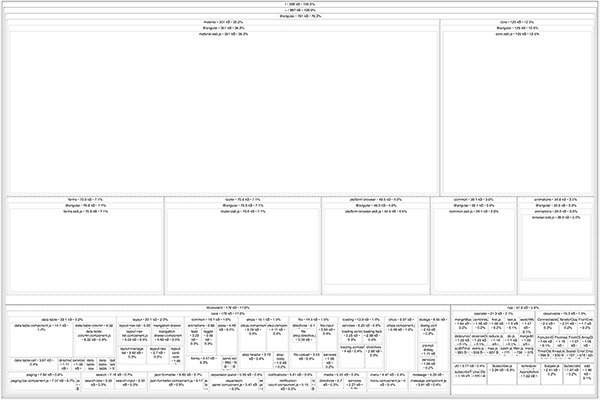

# 11

生产环境中的 Angular

**本章涵盖**

+   如何正确构建 Angular 以用于生产环境

+   架构应用程序以实现最佳实践的途径

+   检查您的最终包以确定依赖项如何影响您的应用程序

+   部署选项和示例 Dockerfile

因此，您已经构建了您的应用程序——接下来是什么？这是一个棘手的问题，但我们将尝试在本章中解开它。您可以做或关注很多事情，但并非所有事情在所有项目中都是必要的。有许多通用的 Web 开发事项您可以做，例如在您的服务器上启用 gzip，以及一些特定于 Angular 的事项，例如确保您使用即时编译运行构建。

我们通过运行`ng serve`来开发应用程序的方式对于开发来说是完全可接受的，但对于生产来说则不可接受。开发服务器不是为处理真实 Web 流量而设计的，可能会暴露漏洞，并且可能会在没有警告的情况下轻易崩溃。您将想要使用一个加固的 Web 服务器来托管您的应用程序。

您可能正在为客户或企业编写应用程序。我在这两个领域都有经验可以分享。例如，在企业环境中，通常会有不同的约束或不同团队之间更大的责任分离。

我将涵盖许多重要的生产主题，但请记住，总有改进的空间，并且几乎有无限种方式来编排构建应用程序的工具。本章重点介绍大多数应用程序应该做的事情，并为您提供一个良好的知识基础，以便应用于您可能正在工作的任何独特或定制环境中。

## 11.1 为生产构建 Angular

在本书的整个过程中，我们一直在进行应用程序的开发构建。当我们想在真实环境中部署我们的应用程序时，这不会对我们有太大的帮助——它包含大量额外的代码，没有优化，并且需要清理。我们的目标是优化最终构建资产，以便尽可能小和高效。我们还想确保文件可以尽可能快地下载。

请记住，Angular 一直在不断发展，新版本将添加额外的功能和平台及工具的变化。我预计本章中的所有内容在原则上都将随着时间的推移保持准确，但确实有一些具体细节将会发生变化，因此请关注发布情况，并在新功能到来时利用改进。 

### 11.1.1 生产构建

CLI 提供了一个*生产构建*选项，它为构建生成的最终代码添加了多个优化步骤。在开发过程中，我们尽可能快地做所有事情，但代价是文件大小更大。这完全没问题，因为您正在本地服务器上工作，发送 5MB 并不太慢——但对于使用 3G 移动连接的人来说，这将是无法忍受的慢。

您可以通过运行以下 CLI 命令来运行生产构建：

```
ng build --prod 
```

CLI 将构建资源并将它们放入一个名为 dist 的目录中。这些文件现在已准备好作为一组静态资源部署到您的目标服务器。我稍后会详细介绍这一点，但 CLI 使生成这些资源变得非常简单。

当它进行生产构建时，会发生一些重要的事情（请注意，随着 CLI 工具的演变，此列表可能会发生变化）：

+   *使用生产环境* — 如果您已使用环境配置目标，则在构建过程中将自动使用生产版本。

+   *使用压缩* — 通过运行工具来最小化文件，以减少执行任务所需的字节数。

+   *打包资源* — 而不是每个文件单独加载，它将它们分割成更小的包。这些包根据用途分组，例如将供应商文件放在一个包中，polyfills 放在另一个包中，应用程序放在另一个包中，等等。

+   *设置基本*`href` — 如果您计划将应用程序部署到域的根目录之外，您必须设置基本`href`以匹配文件路径。您可以通过传递`--base-href`标志来配置它。

+   *文件名哈希化* — 为了防止缓存问题，文件使用唯一的哈希值命名，这样当您部署新版本时，浏览器不会忽略更新并使用其内部缓存。

+   *文件复制* — 任何静态资源，如 CSS、图像或字体，都将复制到 dist 目录中。

+   *摇树优化* — 这些包本身通过摇树优化进行优化，这是一个从包中删除不可达或未调用的代码的过程。由于 ES2015 模块，工具可以确定哪些代码行被执行或未执行，并“摇出”未使用的部分。这是一个复杂的功能，并且截至本文撰写时，有一些已知问题需要修复。

+   *AoT 编译* — 启用提前编译组件模板，有助于加快初始渲染时间，并允许 Angular 不传输大量用于编译的额外代码。

您可以通过使用标志来禁用其中的一些功能，例如`aot=false`，并且您可以通过查看 CLI 文档来了解其他标志，以启用其他功能，如翻译或替代输出目录。

### 11.1.2 优化目标浏览器

您是否为要针对的浏览器制定了一个计划？如果没有，您应该弄清楚您计划支持哪些浏览器的哪些版本。在持续更新的浏览器时代，持续评估您支持的浏览器以及它们可能存在的缺陷变得很重要。

默认情况下，在项目中包含 polyfills 以填补缺失特性的差距，并且您可以自定义使用的内容。如果您对支持的浏览器以及应用程序使用的功能有很好的了解，您可以自定义 polyfills。

文件 src/polyfills.ts 包含一个导入到项目中的 polyfills 列表。其中一些可能需要，但其他一些可能不需要。你需要评估你的代码库来确定，但检查一下是否可以移除其中的一些以优化包大小。

### 11.1.3 进阶式网络应用（Progressive Web Apps）

进阶式网络应用（Progressive Web Apps，简称 PWAs）是一类具有一些特定功能的特定应用程序。它们旨在帮助提供快速加载的移动体验网络应用，同时也可以离线工作。你可以在[`developers.google.com/web/progressive-web-apps`](https://developers.google.com/web/progressive-web-apps)上了解更多关于它们的信息。

在撰写本文时，Angular 仍在开发使用 Angular 制作 PWA 的工具。Angular 专门为此工作而建立的网站([`mobile.angular.io`](http://mobile.angular.io))值得关注。随着它从 alpha 状态发展到稳定功能，你可以期待通过 CLI（正如它已经做到的那样）提供工具。该网站应提供如何尝试它的说明。

目标是使 Angular 应用程序能够简单部署为 PWAs，并且 Angular 文档已经是这个想法的一个工作示例。在 Angular 中支持 PWA 对需要在移动环境中工作的应用程序是一个巨大的推动。

### 11.1.4 国际化（i18n）

Angular 内置了对提供应用程序本地化翻译的支持，但这相当长，并不是每个应用程序都需要它。Angular 关于国际化的文档([`angular.io/guide/i18n`](https://angular.io/guide/i18n))非常详尽，这是 Angular 社区预计将在未来几年投资和改进的领域。由于该指南中已经覆盖得很好，我将更多地讨论概念而不是实现。

翻译是困难和耗时的，但对于许多人来说是不可避免的。Angular 无法提供实际进行翻译工作的支持——即转换一种语言到另一种语言所需的工作——但它被设计成适合典型的翻译工作流程。基本思想是，所有文本消息——模板中用语言编写的任何内容——都可以从应用程序中提取出来，翻译，然后为不同的语言重新编译。

这里是实现应用程序中 i18n 的典型步骤。通常，你越早设置你的 i18n 流程，实施和维护就会越容易：

1.  1 识别和格式化应用程序中的任何静态消息。根据你的偏好和翻译管理方式，有多种方法可以做到这一点。

1.  2 使用 CLI (`ng xi18n`) 从应用程序中提取消息，这将生成一个 Xliff 1.2（默认）、Xliff 2 或 XMB 格式的文件。

1.  3 翻译员的工作是手动将原始语言的消息列表翻译成另一种语言。请预期这一步骤需要花费时间，并且你需要确定负责这项工作的人员（可能是你，也可能是你团队的一员，或者团队外部的人）。

1.  4 使用 CLI 构建应用程序的新版本，并定义在编译期间使用的翻译文件（`ng build --i18n-file`）。这将输出一个完整的构建，其中模板内的翻译消息已被替换。

到本文撰写时，一个主要的限制是翻译不能动态加载到运行中的应用程序中。这些消息在构建过程中被硬编码到输出结果中。如果你有多个语言，你必须为每种语言构建一次，传递适当的 i18n 文件。这当然是一个潜在的改进领域，因此我再次建议你查阅文档，看看它是否变得更加灵活。

### 11.1.5 使用替代构建工具

虽然空间限制了我不能在这里涵盖所有场景，但许多人正在为 Angular 开发各种替代构建工具，从使用不同的模块加载器（如 SystemJS）到不同的摇树优化器（如 Rollup）。

这些工具都试图优化构建过程的各个方面，同时提供自己的解决方案。如果你的项目越大，或者某个特定方面需要优化的重要性越高，你可能就越需要考虑额外的工具。

虽然选择使用自己的构建工具路线当然是一个可行的选项，但在大多数情况下，我强烈建议你使用 CLI。这是一个节省时间的工具，它随着 Angular 平台的发展而不断成长。

在 CLI 可用之前，我最初设置了自家的工具，维护起来非常费时。我可能对某些事情有完全的控制权，但代价是花费更多的时间和精力。我也与那些使用 Grunt 或 Gulp 维护自己工具的项目合作过，我发现它们为项目添加了大量代码来管理 CLI 提供的相同任务。不可避免的是，通常只有一个人理解构建工具，这使得其他人难以理解正在发生的事情。

如果你有自己的需求，考虑将 Angular CLI 作为流程的一部分使用，而不是复制其行为，特别是那些与其构建应用程序的方式相关的行为。如果你想在构建后进行额外的处理，最好在 CLI 运行后进行。

在撰写本文时，CLI 正在被重新设计为一个更完整的软件开发工具包（SDK），以便更好地集成到定制解决方案和工具中。我预计这将演变成一个更强大的工具集，提供更大的灵活性和更多的选择。

### 11.1.6 服务器端渲染或预渲染

一些应用程序有重要的需求，例如搜索引擎优化（SEO），这意味着它们需要被搜索引擎轻松抓取。或者，可能快速查看页面内容很重要（就像我们在第七章中的论坛和聊天应用程序示例中那样）。

Angular 有一个名为 platform-server 的包，它提供了一种在服务器上渲染 Angular 的方法。就像 PWA 支持，在撰写本文时，它仍在积极开发中。您可以在 [`github.com/angular/universal`](https://github.com/angular/universal) 上了解更多信息。这种方法的目的是在服务器上渲染您应用程序的页面，这对爬虫和用户来说都是最好的。用户将比现在更早地看到页面内容，因为渲染版本会在初始内容显示后启动 Angular。

想想一个博客文章可能看起来怎样，你可能会开始阅读，但直到 Angular 在后台完成其余资源的加载，点击链接的能力将会延迟。Angular 足够智能，能够捕获这些事件，并在后台加载完成后重新播放它们，这样就不会阻止用户交互——这主要是关于在 Angular 启动之前显示内容。

这对许多应用程序可能非常有用，但对其他应用程序的价值不大。您的用例将决定它对您的有用性，但预计服务器端渲染将成为 Angular 平台未来版本中的一个重要功能。截至 Angular 4，渲染是官方构建过程的一部分，但仍有许多路线图任务要解决。

### 11.1.7 构建管道

那些简单地将文件上传到远程服务器并让其运行的日子已经过去了。大多数应用程序，包括使用 Angular 构建的应用程序，都需要构建工具和编排来构建生产版本。今天，我们有广泛的工具来帮助处理称为 *持续集成和交付*（CI/CD）的过程。有许多方法可以解决构建编排问题，但基本通常包括一系列工具，这些工具会自动运行以验证您应用程序的特定构建，运行测试，为生产构建它，并将其推送到生产环境。

Angular 本身使用一系列工具来辅助框架的自动化测试，并且由于它是一个开源项目，它可以自由地这样做。许多工具为开源项目提供免费账户，或者如果您想尝试它们，可以提供试用账户。在这里，我不会专注于任何特定的工具，而是会关注您应该考虑将哪些类型的事情放入自己的管道中。

与构建管道相关的 Angular 并没有什么特别之处，除了 Angular 计划从 Google 生态系统推出一系列工具，这些工具在工具稳定时将是应用程序可以利用的绝佳选择。请注意发布说明和项目公告，因为更多 CI/CD 工具的添加肯定会是一个主要的功能。

## 11.2 Angular 架构选择

如果你没有在编写代码之前规划应用程序的架构，你就错过了一个思考有助于你以后的设计选择的机会。审查你的架构并考虑你可以做出的简化或优化选择，即使晚些时候也比没有好。

本节涵盖了编写应用程序时可能被认为是最佳实践列表的内容，你应该在大多数情况下遵循这些方法。它们都会对你的应用程序的质量、性能或稳定性产生影响。

这些也都是你在构建应用程序时需要持续做出的选择。它们不是你一次性采取的步骤，而是你应该在构建和维护应用程序时应用的原则。

### 11.2.1 懒加载路由

当谈到使你的应用程序快速加载和运行时，*懒加载*路由可能是你可以采取的最重要的一步。性能的最大衡量标准之一是应用程序加载并准备好与用户交互所需的时间。

在这条路上有许多里程碑，但用户能够更快地开始使用你的应用程序，他们留下来的可能性就越大。这在移动设备上尤其如此，因为缓慢的加载和渲染会在几秒钟后迅速降低用户留存率。

当你审视你的应用程序时，考虑每个路由的结构。你可能希望将默认路由捆绑在一起而不进行懒加载，但大多数其他路由可能都是将其分离到自己的模块并懒加载的好候选者。

第七章第 7.8 节涵盖了懒加载，所以请回顾那个部分以刷新关于其工作原理和如何在应用程序中应用的具体细节。我的建议是将每个路由都做成自己的功能模块（除了默认路由，如主页和可能登录页面）。当你这样做时，构建文件将根据每个路由分成许多不同的文件，只有核心包在应用程序加载时加载。其余的将在用户在应用程序中导航时加载。

想象一下，如果你的应用程序有 10 个路由和一些共享服务和组件。这 10 个路由可能代表了应用程序代码重量的 60-70%（不包括库），因此通过提取它们可以实现显著的节省。每个应用程序都会有所不同，但路由越多，潜在节省的可能性就越大。

您还可以考虑预加载懒加载的模块，这是一种在初始路由加载后，在后台下载模块的方式。这意味着后续路由将更快地渲染，但这确实会加载应用程序文件。如果您在移动设备上，如果您的应用程序非常大或者很少加载路由，这可能不是很好。

如果不明确使用，也有策略仅预加载特定模块，但这需要一些额外的定制配置。这两项策略都由前 Angular 核心成员 Victor Savkin 在[`vsavkin.com/angular-router-preloading-modules-ba3c75e424cb`](https://vsavkin.com/angular-router-preloading-modules-ba3c75e424cb)上进行了很好的阐述。

### 11.2.2 减少外部依赖

外部库有很多有用的，但任何事物都有代价。总是存在权衡，但这是您应该仔细考虑的事情。如果您包含一个依赖项，请准备好跟踪它在您的应用程序中的使用情况。

在所有早期的章节示例中，我都包含了一些外部依赖项，如 UI 库。这些库提供了巨大的价值，因为我们不必自己构建和实现这些功能。这就是包含外部依赖项的全部原因。

从另一方面来看，您包含的依赖项越多，您的应用程序就会变得越大。您对这些依赖项几乎没有控制权，我们中的许多人几乎没有花时间仔细检查它们，如果不是完全没有的话。

有一些工具和技术可以帮助您检查这些依赖项在您的应用程序中的影响。然而，大多数时候，您需要运用常识并限制自己只关注最重要的依赖项。我对依赖项的主要担忧如下。

#### 安全问题

库通常被视为黑盒，它们可能包含安全漏洞。密切关注它们并审查它们。依赖项也可能导入额外的子依赖项，这可能会使安全漏洞难以跟踪。

您可以查看 Node Security 项目以帮助跟踪 Node 模块中已知的漏洞，请访问[`nodesecurity.io/opensource`](https://nodesecurity.io/opensource)。这是一个免费工具，尽管它也有一些付费解决方案。它会检查您的项目 package.json 文件，并将其与漏洞数据库进行比较。

#### 质量和大小

并非每个依赖都是针对生产用途编写的。许多依赖之所以被编写，是因为它们解决了某个问题，并且被发布供他人使用。始终衡量它们对您应用程序的影响，并在存在多个选项的情况下确保评估它们——或者看看自己动手做是否更好。

我经常通过查看依赖项的测试类型和质量来审查依赖项。遗憾的是，许多依赖项没有任何测试，或者测试不足。这是因为事情往往被迅速发布，作为一种爱好。

就尺寸影响而言，您可以使用一个名为 source-map-explorer 的工具，如图 11.1 所示，来查看每个目录和文件对您整体捆绑包尺寸的影响。



**图 11.1** source-map-explorer 允许您查看您捆绑包中每个部分的尺寸，以识别潜在的优化。

要使用 source-map-explorer，您需要使用以下命令在您的系统上安装它：

```
npm install -g source-map-explorer 
```

然后，您需要构建应用程序，但请确保您使用带有 sourcemaps 的方式构建它。您可以进行生产构建，但切换 sourcemaps 为开启（在生产构建中默认是关闭的）：

```
ng build --prod --sourcemap=true 
```

这会将您的文件输出到 dist 目录中，然后您可以通过运行以下命令来检查各种捆绑文件，其中第二个参数是要分析的文件名：

```
source-map-explorer dist/vendor.4e84f21c95c687f96a48.bundle.js 
```

将打开一个浏览器窗口，看起来像图 10.1。图像中的文本相当小，但您可以点击各种文件并放大到该包的内部。例如，图 10.1 显示，第八章示例中的 Angular Material 包占供应商捆绑包的约 35%，而 Covalent 占约 18%，RxJS 占约 6%。了解这一点是有帮助的——您想看到模块对您捆绑包尺寸的影响。运行此工具针对所有您的捆绑输出文件，并查看哪些组件最大，或者 polyfill 有多重。

#### 兼容性和可支持性

外部依赖不一定得到维护。当出现问题时，您能信任它们会被修复吗？一个例子是 TypeScript，它添加了 Angular 所依赖的功能。

有几种方法可以确定可支持性，而且这样做在很大程度上是主观的。我个人喜欢花时间在项目网站上，通常是 GitHub，看看它有多活跃。是否有许多没有响应的 bug 报告？关于提交活动呢？仅仅因为过去几个月没有活动并不意味着它已经被放弃。一些项目会显示有用的徽章来声明依赖是否得到积极维护。

与之相反，打开一个问题并询问项目是否活跃，我发现找到一个小改进来做出贡献会更好。您可以通过添加几行到文档或 README 文件中来实现这一点，但目标是给项目提供一些价值，并使其成为一个容易合并的贡献。总是有可以改进的文档，所以利用这一点来赢得维护者的一丝好感，并了解他们的响应性。

当谈到兼容性时，您需要确保您有良好的测试环境。验证事物是否正常工作的唯一方法是测试，并且您希望尽可能自动化这一点。

另一个有用的项目是 Green Keeper，它可以帮助你自动将项目更新到最新版本。它还尝试使用较新版本运行你的测试，以帮助确定是否存在任何破坏性变化——良好的测试对于这一点来说至关重要。你可以在 [`greenkeeper.io`](https://greenkeeper.io) 找到该项目。

#### 尽量减少导入的项目

当你决定需要外部依赖项时，通常有方法可以优化它在你的应用程序中的使用。设计良好的库允许你只导入你需要的特定部分，而不是整个库。任何额外的导入项都可能成为最终构建中的死代码。这因库而异，但一个例子是 RxJS，它允许你导入你需要的特定项目，而不是整个库。同样，Covalent UI 和 Angular Material 库都允许你根据需要导入库的特定部分，而不是整个包。这可以节省总体代码量，我也喜欢这种做法，因为它可以明确指定要导入的内容。

从长远来看，如果你能够优化你的包文件以删除任何未使用的代码，这可能不会成为一个问题。但在此期间，实践尽可能少地导入项目，并专注于你真正需要的东西，仍然是一个好主意。

### 11.2.3 保持更新

当 Angular 4 发布时，几乎每个应用程序都可以升级而不会引起任何需要处理的破坏性变化。考虑到 Angular 2 和 4 之间所做的更改和改进的数量，这相当令人印象深刻。

其中一项关键改进与 Angular 编译器有关，由于它在底层进行了优化，应用程序包的大小显著减小。节省量因应用程序而异，但据估计，编译器可以将组件的大小减少约 60%。应用程序要实现这些节省，只需更新即可！

随着 Angular 的发展，这种类型的场景将继续存在。Angular 库将不断发展和优化自身，构建工具将变得越来越智能，而使用最新和更高版本的人将能够利用这些好处。

正如我之前强调的，Angular 更多的是一个平台，而不仅仅是一个框架。工具、各种库和其他生态系统组件的组合正在不断改进。我曾与 Angular 团队坐下来讨论优先事项和目标，优化是一个始终出现的话题。

这里的要点是不要将自己锁定在 Angular 的某个版本上并忘记升级。跟踪开发笔记并享受定期的增量发布。主要版本可能每六个月发布一次，可能包含一些破坏性更改。Angular 希望最小化破坏性更改的数量，并为保持最新版本提供清晰的升级路径。这确实意味着随着时间的推移对您的应用程序进行更改，但如果不这样做，您就会失去所有潜在的好处。此外，您可能容易受到已报告并解决的任何安全问题的攻击。

## 11.3 部署

部署应用程序有无数种潜在方式，关于哪种方式最好也有很多意见。您可能必须与特定的选项合作，因为这是您公司或团队一直使用的，或者您可能能够选择自己的。无论如何，一些基本要点是一致的。本节探讨了这些考虑因素和几种部署方法。我希望它能作为您制定自己的部署策略的有用指南。

无论您计划使用哪个服务器，您都应该确保一些事情设置正确以正常工作：

+   *gzip 压缩* — 配置您的服务器以启用 gzip 压缩发送文件。gzip 是大多数浏览器支持的简单配置值，可以显著减少通过网络发送的文件大小。节省的量各不相同，但 30% 或更多并不罕见。

+   *通过重写 URL 回退到 index.html* — 任何单页应用程序（Angular 或其他）都需要服务器处理重写 URL 以提供索引文件，即使请求了其他文件也是如此。想象一下，您到达 example.com/blog/my-post-123。服务器将首先在 /blog/my-post-123 位置查找资产，但该文件不存在，因为它只是一个 Angular 路由。相反，服务器需要回退到发送 index.html 文件，以便 Angular 可以执行。

+   *CORS 或反向代理* — 许多 API 都运行在不同的域名（甚至子域名）上，因此很容易在 API 服务器中启用 CORS 头部。或者，您可以使用反向代理来映射 URL，以便它们通过您的域名代理到另一个域名。

根据您的服务器，可能还有其他优化或配置可供您使用。这里提出的建议并不全面，因此最好进一步研究一下您的服务器提供了哪些功能。

一旦您运行了 CLI `build` 命令，您就可以将 dist 目录放在处理服务静态文件的服务器上。您应该自动化这个过程，但有一些方法可以在 GitHub pages、Heroku 或 Firebase 等服务上免费部署它。

这是最常见且最简单的方法，但有时你可能想要将其封装在容器中并以此方式部署。以下示例使用 nginx 服务器构建一个包含应用程序文件的容器。你可以在你的项目目录中创建一个名为 Dockerfile 的文件，并使用列表 11.1 中的代码。你还需要在你的目录中有一个 nginx.conf 文件，如列表 11.2 所示。

**列表 11.1** 样本 nginx Dockerfile

```
FROM nginx

COPY ./nginx.conf /etc/nginx/nginx.conf
COPY ./dist /usr/share/nginx/html 
```

**列表 11.2** 样本 nginx 配置

```
events {}
http {
  server {
    listen       80;
    server_name  myapp;

    # Redirect to index if file not found
 location / {
        root   /usr/share/nginx/html;
        index  index.html index.htm;
        try_files $uri$args $uri$args/ /index.html;
    }
    # Additional configurations go here
  }
} 
```

前面的两个列表将允许你构建一个包含 nginx 以服务你的应用程序的容器。假设你在机器上安装了 Docker，你可以运行以下命令来构建和运行容器：

```
ng build --prod
docker build . -t myapp
docker run -p 80:8080 myapp 
```

配置这个 Dockerfile 有多种方式，这只是一个基本的入门级示例。你还可以微调 nginx 配置，包括处理错误页面和调整 gzip 设置。

因为 Angular 为你提供了构建的静态资源，将它们注入到许多不同的服务器环境中很容易。

恭喜！你已经设计、构建并现在部署了你的 Angular 应用程序！在这个时候，你可以要么放松享受你的成功，要么开始你的下一个项目！

## 摘要

本章涵盖了构建和部署 Angular 到生产环境的许多细节。你可以做很多细致的工作，并且有很多优化机会。随着时间的推移，Angular 平台将添加新的功能，你将想要利用这些功能。以下是本章涵盖的关键亮点：

+   Angular CLI 提供了一个生产构建选项，在构建你的应用程序最终包资源时会执行多项任务。它可以优化并移除死代码，实现缓存破坏名称，并提供一个包含你应用程序所需一切内容的目录。

+   一些最佳实践包括懒加载你的路由和只导入必要的库组件。随着你向应用程序添加更多依赖项，可能会增加你的包大小，或者影响你维护应用程序的能力。

+   部署到服务器上很容易，因为你得到了最终的渲染资源。你可以将这些静态文件打包到容器中，或者包含在其他服务器环境中。确保你已经处理了回退到 index.html 文件和其他服务器考虑事项。
