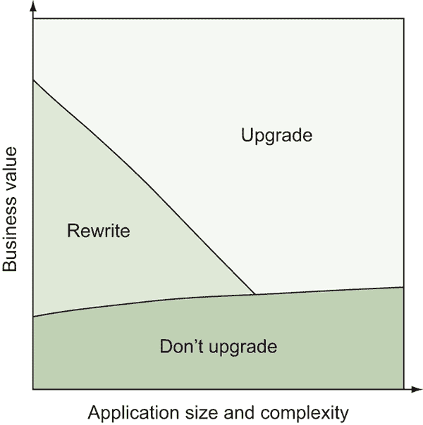

# A

附录：从 AngularJS 升级到 Angular

AngularJS（版本 1.x）是有史以来最受欢迎和最广泛使用的框架之一，许多用其构建的应用至今仍在运行。只要有一批开发者提交问题和补丁，它就会继续得到支持，但未来的发展方向无疑是升级到 Angular（2.x 或更新版本）。本附录讨论了在现有 AngularJS 应用中前进的策略，旨在帮助你明确在决定下一步行动时有哪些选择。

升级到 Angular 需要投资和计划。两者之间有许多概念上的相似之处，但 Angular 是从 AngularJS 完全重写的，并改变了一些重要的设计模式。在大多数情况下，“升级”的能力并不简单，需要仔细考虑。

你有三个基本选择：不升级、从头开始重写，或者进行增量升级。每个选项都有其优点和缺点，因此你需要权衡自己的需求与它们。我已经按照从最不可能到最可能的选择顺序排列了它们。

我还在应用的业务价值与其复杂度的谱系上为你绘制了选项图。图 1 只是一个示例，并不一定反映你应用的现实情况，但它的目的是给你一些思考如何考虑选择的视角。

图 1 选项图，根据业务价值与应用复杂度绘制

尽管我认为每个人都应该升级或重写，但权衡技术挑战与你的业务需求同样重要。做出改变总是有成本的，你想要确保你准确估计并最小化这一成本。

让我们从第一个选项开始：不要升级，继续使用 AngularJS。

## A.1 选项 1：不升级

我觉得这是一个不太常被考虑的选项，但你*可以*决定不升级你的应用到 Angular。这听起来可能与我们这本书所讨论的内容相悖，某种程度上确实如此，但现有应用有许多需要考虑的因素，这可能会使它成为最可行的选项。

这里列举了一些你可能考虑仅仅维持现有应用而不是升级的各种原因：

+   非常大的应用可能非常复杂，以至于考虑进行重大更改的想法很难接受。请小心不要以你的应用太大而无法升级为借口，因为升级是绝对可能的，但也许应用在现有设计中投入了太多的资源，改变的成本可能难以承担。

+   有些应用程序非常稳定，不需要做很多工作。甚至可能没有人再积极工作了。这对于不是你业务关键路径的应用程序尤其如此，例如内部工具。也许你的努力应该花在构建或改进更重要的应用程序上。

+   一些应用程序必须支持旧版浏览器，升级到 Angular 可能会破坏支持。随着大多数旧浏览器被供应商弃用、退役或具有自动升级机制，这一点已经变得不那么有说服力了。例如，根据你的客户类型，今天支持 IE8 对某些应用程序来说是可能的，但这也令人沮丧，因为该浏览器容易受到攻击且过时。

我认为这归结为一个问题：你的应用程序是否有任何强烈的商业或技术原因不升级？如果有，权衡它们与你的客户现实情况以及对他们最好的情况。使用过时或不安全的浏览器的客户对他们来说是不利的，也许正确的决定是不支持这样的场景。但这可能需要改变视角。

如果这里的最终决定是放弃应用程序而不升级，你必须非常清楚后果。但你也可以期待，只要还有一定数量的用户在使用 AngularJS，它就会得到支持。查看 AngularJS 网站，看看是否有任何具体的截止日期或保证，但截至写作时，还没有设定停止 AngularJS 维护的计划。

如果你处于企业环境中，这可能是一个最简单的选择。它可以让你免于参与业务发展周期、资源规划和其他公司可能实施的过程。但无论你扮演什么角色或你的公司有多大，关键是要专注于为什么不要升级的理由，而不是为什么要升级的理由。遗留应用程序是生活的事实，但根据经验，我知道应用程序升级得越早，就越有可能得到维护——否则，它往往会慢慢消失在遗忘之中。但也许那才是最好的道路。

无论怎样，请答应我，你不会用 AngularJS**开始**新的项目！利用这本书的知识，用 Angular 创建新的应用程序。

## A.2 选项 2：从头开始重写

你的下一个选择是重新开始，丢弃现有的应用程序。一些开发者会喜欢这个想法，而其他人可能会对仅仅丢弃所有这些工作的想法感到反感。

如果你决定准备好跃跃欲试并升级到 Angular，重写你的应用程序有许多优点。其中大多数适用于决定在一段时间内升级任何应用程序，但这里有一些 Angular 特有的注意事项要提及：

+   您不必处理任何遗留代码。AngularJS 做了一些最终被证明会导致问题的操作，例如过度依赖双向数据绑定。如果您的应用程序正在运行较旧的 AngularJS 版本，那么升级可能比您运行最新版本时是一个更大的任务。

+   新的应用程序可以使用最佳实践进行重建，这些实践如果您在升级现有应用程序时可能会与之抗争。即使您之前没有 TypeScript，您也可以从头开始使用 TypeScript。

+   由于您可以将重写视为重新构思应用程序目的和目标的机会，因此实现新功能或删除旧功能会更容易。

当然，这种方法也有其缺点，并且它们通常被忽视：

+   重写意味着您必须从头开始一切，包括重新思考您的构建管道、重新设计您的测试等等。

+   如果您依赖于任何 AngularJS 库，它们可能不存在于 Angular 中，或者可能有所不同。如果您需要寻找替代方案、编写自己的库或重新设计应用程序，这将增加您的努力水平。

+   通过重写很难完全复制具有相同功能和特性的应用程序。几乎可以肯定，某些功能的行为会发生改变，即使是非常轻微的改变，这也可能对您的用户造成问题。

当应用程序足够小，可以在合理的时间内进行重写时（合理的定义各不相同，但一个好的经验法则是几周而不是几个月），我更喜欢这个选项。逐步升级一个小型应用程序最终可能会花费您更多的时间和精力，但请确保您能够考虑到应用程序的稳定性，并且不要为了用户体验而牺牲。

重写的主要目标应该是构建一个能够解决您业务需求的最佳 Angular 应用程序。如果您主要关注技术方面，那么您的努力可能会对业务产生负面影响。这在企业环境中尤其如此，因为期望通常由产品经理和客户设定和管理。

这在最初的企业环境中往往是一个有问题的选择。通常的想法是，“如果它没有坏，就不要修复它。”但您可以根据未来的目标和结果来为重写辩护。我提出论点，如果我们今天不采用新技术，我们将来将不得不付出更多代价来迁移应用程序。再次强调，业务目标应该驱动决策，但通常业务目标包括长期成功，因此技术选择也应该支持这一点。

## A.3 选项 3：逐步升级

最终的选择是开始一个增量升级过程，这意味着部分使用 AngularJS 运行你的应用程序，另一部分使用 Angular。这是允许你在逐步将应用程序的部分组件转换为 Angular 的同时，维护当前应用程序的策略。

我认为这是最常见的情况，因为任何具有商业价值和一定复杂性的应用程序都会符合这个类别。以下是增量升级的一些优点：

+   你可以逐步逐块迁移应用程序，这样现有的应用程序仍然可以正常工作。

+   工具存在，可以并行运行这两个版本，并且足够灵活，允许你采用几种不同的方法来处理重构。

+   它允许开发者专注于使用 Angular 构建新功能，而无需重写旧功能。

当然，还有一些负面因素你应该知道：

+   你最终会在应用程序中同时加载 Angular 和 AngularJS，这会增加应用程序的大小。

+   编写不佳的 AngularJS 应用程序迁移起来更困难，可能需要一些工作来简化这个过程。

+   如果你没有正确规划和执行，可能会在升级过程中卡住，永远无法完全完成。你需要能够全身心投入，以确保用户在长期内不会得到糟糕的体验。

我认为大多数应用程序都属于这个类别，你可能会想了解更多关于最佳升级方法的信息。Angular 文档对升级工具的介绍相当全面，我不打算在这里重复介绍，但它没有讨论你可以使用的一些方法。

我强烈建议你确保你的 AngularJS 应用程序首先是与最新的 AngularJS 版本保持一致，并遵循样式指南。如果你在这个领域有一些工作要做，你应该首先投资于这个领域。

一旦你有一个设计良好的 AngularJS 应用程序，Victor Savkin 提出了两种非常好的方法，他称之为 *水平* 和 *垂直切片*。他有一系列在线文章关于升级 AngularJS 应用程序，从这里开始：[`blog.nrwl.io/ngupgrade-in-depth-436a52298a00`](https://blog.nrwl.io/ngupgrade-in-depth-436a52298a00)。它概述了升级的额外步骤，我强烈推荐。那里还列出了书籍，你可能觉得有用。

水平切片的想法是尝试升级 AngularJS 应用程序中最低、最可重用的组件。这包括像 UI 组件和不是路由组件的组件。想法是这些底层组件已经相当解耦，你可以直接用用 Angular 编写的版本替换它们。这样做的好处是你可以一次只更改一个组件。

垂直切片是指同时更改给定路由的每个组件的方法。这意味着路由组件及其依赖项将需要同时更改。这很有益处，因为你永远不会在同一个路由中混合 Angular 和 AngularJS，但这意味着升级每个路由可能需要更多的时间投入。

在大多数情况下，我建议使用垂直切片，因为将 Angular 和 AngularJS 混合在同一个路由中更难以推理和调试。垂直切片还意味着你可以一次性升级并使整个页面工作，虽然每个增量步骤可能需要更长的时间，但总体上由于需要更少的步骤，可能会更快。

## 摘要

将 AngularJS 应用程序升级到 Angular 不是一个轻率做出的决定。你应该仔细考虑选项，并理解你的业务和技术需求：

+   你可以选择完全不升级，并信任 AngularJS 提供的支持。那些不在关键业务路径上的稳定应用可能是合适的选择。

+   或者，你可以选择一次性将整个应用程序重写为 Angular。这可能适用于较小的应用程序或那些可以在不中断当前应用程序开发的情况下承受全面重构的应用程序。

+   逐步升级是大多数应用的首选方案，因为它允许你逐步将组件从 AngularJS 更新到 Angular。水平（从树的最底层组件向上工作）和垂直（为每个升级步骤处理整个路由）切片策略是思考如何进行升级的最佳方式。
