## 第一部分. 欢迎来到 Node

Node 现在是一个成熟的 Web 开发平台。在第一章到 3 章中，您将了解 Node 的主要功能，包括如何使用核心模块和 npm。您还将看到 Node 如何使用现代 JavaScript，以及如何从头开始构建 Web 应用程序。阅读这些章节后，您将对 Node 能做什么以及如何创建自己的项目有一个坚实的理解。

## 第一章. 欢迎来到 Node.js

*本章涵盖*

+   什么是 Node.js？

+   定义 Node 应用程序

+   使用 Node 的优势

+   异步和非阻塞 I/O

Node.js 是一个异步、事件驱动的 JavaScript 运行时，它提供了一个强大而简洁的标准库。它由 Node.js 基金会管理和支持，该基金会是一个具有开放治理模式的行业联盟。目前有两个活跃支持的 Node 版本：长期支持（LTS）和当前版本。如果您想了解更多关于 Node 如何管理的相关信息，官方网站提供了丰富的文档([`nodejs.org/`](https://nodejs.org/))。

自从 Node.js 在 2009 年出现以来，JavaScript 已经从一种几乎不被容忍的以浏览器为中心的语言转变为各种软件开发中最重要的语言之一。这部分是由于 ECMAScript 2015 的推出，它解决了语言先前版本中的几个关键问题。Node 使用基于 ECMAScript 第六版的 Google V8 JavaScript 引擎，有时称为 ES6，缩写为 ES2015。这也得益于 Node、React 和 Electron 等创新技术，这些技术使得 JavaScript 可以在任何地方使用：从服务器到浏览器，以及原生移动应用程序。甚至像微软这样的大公司也在拥抱 JavaScript，微软甚至为 Node 的成功做出了贡献。

在本章中，您将了解更多关于 Node、其事件驱动的非阻塞模型以及 JavaScript 成为优秀的通用编程语言的一些原因。首先，让我们看看一个典型的 Node Web 应用程序。

### 1.1. 一个典型的 Node Web 应用程序

Node 和 JavaScript 的一般优势之一是它们的单线程编程模型。线程是常见的错误来源，尽管一些最近的编程语言，包括 Go 和 Rust，试图提供更安全的并发工具，但 Node 仍然保留了浏览器中使用的模型。在基于浏览器的代码中，我们编写一系列依次执行的指令；代码不会并行执行。然而，这对于用户界面来说是没有意义的：用户不希望等待缓慢的操作，如网络或文件访问完成。为了解决这个问题，浏览器使用事件：当你点击一个按钮时，会触发一个事件，并运行一个之前已定义但尚未执行的功能。这避免了线程编程中的一些问题，包括资源死锁和竞争条件。

#### 1.1.1. 非阻塞 I/O

在服务器端编程的上下文中这意味着什么？情况类似：I/O 请求，如磁盘和网络访问，也是相对较慢的，所以我们不希望运行时在读取文件或通过网络发送消息时阻塞业务逻辑的执行。为了解决这个问题，Node 使用三种技术：事件、异步 API 和非阻塞 I/O。*非阻塞 I/O* 是从 Node 程序员的角度来看的一个低级术语。这意味着你的程序可以在做其他事情的同时请求网络资源，然后，当网络操作完成时，将运行一个回调来处理结果。

图 1.1 展示了一个典型的 Node 网络应用程序，该程序使用 Web 应用程序库 Express 来处理商店的订单流程。浏览器发出购买产品的请求，然后应用程序检查当前的库存，为用户创建账户，发送电子邮件收据，并发送 JSON HTTP 响应。同时，还有其他事情发生：发送电子邮件收据，并使用户的详细信息更新数据库。代码本身很简单，是命令式 JavaScript，但运行时是并发的，因为它使用了非阻塞 I/O。

##### 图 1.1. Node 应用程序中的异步和非阻塞组件

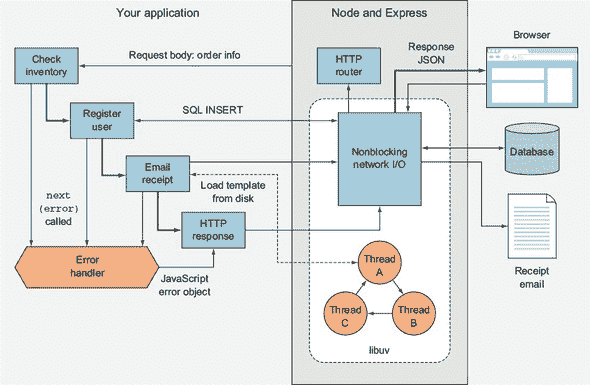

在 图 1.1 中，数据库是通过网络访问的。在 Node 中，这种网络访问是非阻塞的，因为 Node 使用一个名为 libuv ([`libuv.org/`](http://libuv.org/)) 的库来提供对操作系统非阻塞网络调用的访问。这在 Linux、macOS 和 Windows 中的实现方式不同，但你只需要关心你友好的 JavaScript 数据库库。当你编写 `db.insert(query, err => {})` 这样的代码时，Node 在底层进行高度优化的非阻塞网络操作。

磁盘访问类似，但有趣的是并不完全相同。当生成电子邮件收据并从磁盘读取电子邮件模板时，libuv 使用线程池来提供使用非阻塞调用的错觉。管理线程池一点也不好玩，但编写 `email.send('template.ejs', (err, html) => {})` 的确更容易理解。

使用异步 API 和非阻塞 I/O 的真正好处是，Node 可以在这些相对较慢的过程发生时做其他事情。尽管你只有一个线程、单进程的 Node 网络应用程序在运行，但它可以同时处理来自可能成千上万的网站访问者的多个连接。要理解这一点，你需要看看事件循环。

#### 1.1.2. 事件循环

现在让我们聚焦于图 1.1 的一个具体方面：响应浏览器请求。在这个应用中，Node 的内置 HTTP 服务器库，即核心模块 http.Server，通过结合流、事件和 Node 的 HTTP 请求解析器（这是原生代码）来处理请求。这会在你的应用中触发一个回调函数的执行，该回调函数是通过 Express ([`expressjs.com/`](https://expressjs.com/)) 网络应用库添加的。运行的回调函数会导致数据库查询执行，最终应用通过 HTTP 以 JSON 格式响应。整个过程使用了至少三个非阻塞的网络调用：一个用于请求，一个用于数据库，另一个用于响应。Node 是如何调度所有这些非阻塞网络操作的？答案是事件循环。图 1.2 展示了事件循环是如何用于这三个网络操作的。

##### 图 1.2. 事件循环

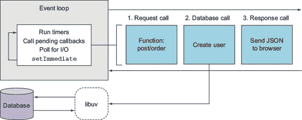

事件循环以一个方向运行（它是一个先进先出队列）并经过几个阶段。图 1.2 展示了循环每次迭代运行的重要阶段的简化集合。首先，定时器执行，这些是使用 JavaScript 函数`setTimeout`和`setInterval`安排的定时器。接下来，I/O 回调运行，如果任何 I/O 从非阻塞网络调用中返回，那么你的回调就会在这里被触发。轮询阶段是获取新的 I/O 事件的地方，然后使用`setImmediate`安排的回调在最后运行。这是一个特殊情况，因为它允许你在队列中已经存在的当前 I/O 回调之后立即安排一个回调。这个阶段可能听起来很抽象，但你应该记住的是，尽管 Node 是单线程的，但它确实为你提供了编写高效和可扩展代码的工具。

在过去的几页中，你可能已经注意到示例是使用 ES2015 箭头函数编写的。Node 支持许多新的 JavaScript 特性，所以在继续之前，让我们看看你可以使用哪些新的语言特性来编写更好的代码。

### 1.2. ES2015、Node 和 V8

如果你曾经使用过 JavaScript 并且因为缺乏类和奇怪的作用域规则而感到沮丧，那么你很幸运：Node 已经修复了这些问题中的大多数！你现在可以创建类，使用`const`和`let`（而不是`var`）可以解决作用域问题。截至 Node 6，你可以使用默认函数参数、剩余参数、`spread`操作符、`for...of`循环、模板字符串、解构、生成器等等。关于 Node 对 ES2015 支持的详细总结可以在[`node.green`](http://node.green)找到。

首先，让我们看看类。ES5 及更早版本需要使用原型对象来创建类似类的结构：

```
function User() {
  // constructor
}

User.prototype.method = function() {
  // Method
};
```

使用 Node 6 和 ES2015，你现在可以使用类来编写相同的代码：

```
class User {
  constructor() {}
  method() {}
}
```

这段代码更简洁，也更易于阅读。但不仅如此：Node 还支持子类化、`super` 和静态方法。对于那些熟悉其他语言的开发者来说，采用类语法使得 Node 比我们当时只能使用 ES5 时更容易上手。

Node 4 及以上版本中另一个重要的特性是 `const` 和 `let` 的加入。在 ES5 中，所有变量都是用 `var` 创建的。`var` 的问题在于它定义了函数或全局作用域中的变量，因此你无法在 `if` 语句、`for` 循环或其他块中定义块级变量。

|  |
| --- |

**我应该使用 const 还是 let？**

当决定是否使用 `const` 或 `let` 时，你几乎总是想要 `const`。因为你的大部分代码将使用你自己的类的实例、对象字面量或不变的值，所以你大部分时间都可以使用 `const`。即使具有可变属性的对象的实例也可以用 `const` 声明，因为 `const` 只意味着引用是只读的，并不意味着值是不可变的。

|  |
| --- |

Node 还具有原生的 promises 和 generators。*Promises* 被许多库支持，允许你以流畅的接口风格编写异步代码。你可能已经熟悉流畅的接口：如果你曾经使用过 jQuery 或甚至 JavaScript 数组这样的 API，你肯定见过。以下简短的例子展示了如何在 JavaScript 中通过链式调用操作数组：

```
[1, 2, 3]
  .map(n => n * 2)
  .filter(n => n > 3);
```

*Generators* 用于给异步 I/O 提供同步编程风格。如果你想看看 Node 中 generators 的实际例子，可以看看 Koa Web 应用程序库（[`koajs.com/`](http://koajs.com/)）。如果你在 Koa 中使用 promises 或其他 generators，你可以对值进行 yield 而不是嵌套回调。

Node 中另一个有用的 ES2015 特性是 *模板字符串*。在 ES5 中，字符串字面量不支持插值或多行。现在通过使用反引号符号（`` ` ``），你可以插入值并将字符串跨越多行。这在为 Web 应用快速生成 HTML 时非常有用：

```
this.body = `
  <div>
    <h1>Hello from Node</h1>
    <p>Welcome, ${user.name}!</p>
  </div>
`;
```

在 ES5 中，前面的例子将不得不这样写：

```
this.body = '\n';
this.body += '<div>\n';
this.body += '  <h1>Hello from Node</h1>\n';
this.body += '  <p>Welcome, ' + user.name + '</p>\n';
this.body += '<div>\n';
```

旧式语法不仅代码量更多，而且更容易引入错误。对 Node 开发者来说特别重要的最后一个大特性是箭头函数。*箭头函数* 可以让你简化语法。例如，如果你正在编写一个只有一个参数并返回值的回调函数，你可以几乎不使用任何语法就写出来：

```
[1, 2, 3].map(v => v * 2);
```

在 Node 中，我们通常需要两个参数，因为回调函数的第一个参数通常是错误对象。在这种情况下，你需要使用括号包围参数：

```
const fs = require('fs');
fs.readFile('package.json',
  (err, text) => console.log('Length:', text.length)
);
```

如果您需要在函数体中使用多行，则需要使用花括号。箭头函数的价值不仅在于简化的语法；它与 JavaScript 作用域有关。在 ES5 及之前版本中，在其它函数内部定义函数会使`this`引用成为全局对象。以下是一个受此问题影响的 ES5 风格类：

```
function User(id) {
// constructor
  this.id = id;
}

User.prototype.load = function() {
  var self = this;
  var query = 'SELECT * FROM users WHERE id = ?';
  sql.query(query, this.id, function(err, users) {
  self.name = users[0].name;
  });
};
```

分配`self.name`的行不能写成`this.name`，因为函数的`this`将是全局对象。过去，一种解决方案是在父函数或方法的入口点将变量分配给`this`。但箭头函数绑定正确。在 ES2015 中，前面的示例可以重写为更直观的形式：

```
class User {
  constructor(id) {
    this.id = id;
  }

  load() {
    const query = 'SELECT * FROM users WHERE id = ?';
    sql.query(query, this.id, (err, users) => {
    this.name = users[0].name;
    });
}
}
```

您不仅可以使用`const`更好地模拟数据库查询，而且也不需要笨拙的`self`变量。ES2015 有许多其他出色的功能，使 Node 代码更具可读性，但让我们看看在 Node 中是什么在驱动这些功能，以及它与您已经查看的非阻塞 I/O 功能有何关联。

#### 1.2.1. Node 和 V8

Node 由 V8 JavaScript 引擎驱动，该引擎由 Chromium 项目为 Google Chrome 开发。V8 的显著特点是它可以直接编译成机器码，并且包含代码优化功能，有助于保持 Node 的快速运行。在第 1.1.1 节中，我们讨论了 Node 的另一个主要原生部分，libuv。该部分处理 I/O；V8 负责解释和运行您的 JavaScript 代码。要使用 libuv 与 V8 一起，您需要使用 C++绑定层。图 1.3 显示了构成 Node 的所有单独的软件组件。

##### 图 1.3. Node 的软件栈

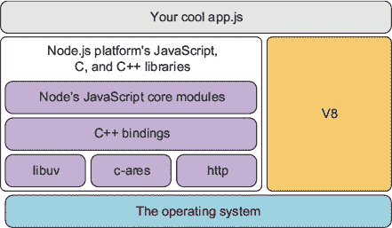

Node 可用的具体 JavaScript 功能因此取决于 V8 支持的内容。这种支持通过功能组进行管理。

#### 1.2.2. 与功能组一起工作

Node 根据 V8 提供的内容包含 ES2015 功能。功能被分组为*已发布*、*已测试*和*进行中*。默认情况下，已发布功能是开启的，但已测试和进行中可以通过命令行标志启用。如果您想使用已测试功能，这些功能几乎完成但 V8 团队尚未认为完全完成，那么您可以使用`--harmony`标志运行 Node。然而，进行中的功能稳定性较低，需要特定的功能标志来启用。Node 的文档建议通过搜索`in progress`来查询当前可用的进行中功能：

```
node --v8-options | grep "in progress"
```

列表将在 Node 版本之间有所不同。Node 本身也有一个版本计划，该计划定义了哪些 API 可用。

#### 1.2.3. 理解 Node 的发布计划

Node 的版本分为长期支持（LTS）、当前版本（Current）和夜间版本（Nightly）。LTS 版本将获得 18 个月的支持和 12 个月的维护支持。版本发布遵循语义版本控制（SemVer）。SemVer 为版本分配主版本号、次版本号和补丁版本号。例如，6.9.1 的主版本号是 6，次版本号是 9，补丁号是 1。每次你看到 Node 的主版本号发生变化时，这意味着一些 API 可能与你的项目不兼容，你需要重新测试它们与这个版本的 Node。此外，在 Node 的版本发布术语中，主版本号的增加意味着一个新的当前版本已经发布。夜间构建每 24 小时自动生成，包含最新的更改，但通常仅用于测试 Node 的最新功能。

你使用的版本取决于你的项目和组织。有些人可能更喜欢长期支持版本（LTS），因为更新频率较低：这在大企业中可能效果很好，因为这些企业发现管理频繁更新比较困难。但如果你想要最新的性能和功能改进，当前版本（Current）是一个更好的选择。

### 1.3. 安装 Node

安装 Node 最简单的方法是使用[`nodejs.org`](https://nodejs.org)上的安装程序。使用 Mac 或 Windows 安装程序安装最新的当前版本（在撰写本文时为版本 6.5）。你可以自己下载源代码，或者使用操作系统的包管理器进行安装。Debian、Ubuntu、Arch、Fedora、FreeBSD、Gentoo 和 SUSE 都有相应的包。还有 Homebrew 和 Smart-OS 的包。如果你的操作系统没有相应的包，你可以从源代码构建。

|  |
| --- |

##### 注意

附录 A 提供了关于安装 Node 的更多详细信息。

|  |
| --- |

包的完整列表可以在 Node 的网站上找到 ([`nodejs.org/en/download/package-manager/`](https://nodejs.org/en/download/package-manager/))，源代码在 GitHub 上 ([`github.com/nodejs/node`](https://github.com/nodejs/node))。如果你想在不需要下载的情况下查看源代码，将 GitHub 源代码添加书签是值得的。

安装 Node 后，你可以在终端中直接通过输入`node -v`来尝试它。这将打印出你刚刚下载和安装的 Node 版本。接下来，创建一个名为 hello.js 的文件，其内容如下：

```
console.log("hello from Node");
```

保存文件，通过输入`node hello.js`来运行它。恭喜你——你现在可以开始用 Node 编写应用程序了！

|  |
| --- |

**在 Windows、Linux 和 macOS 上快速入门**

如果你总的来说对编程还比较新手，并且还没有一个偏好的文本编辑器，那么 Node 的一个不错的选择是 Visual Studio Code ([`code.visualstudio.com/`](https://code.visualstudio.com/))。它是微软开发的，但它是开源的，可以免费下载，并且支持 Windows、Linux 和 macOS。

Visual Studio Code 中的一些适合初学者的功能包括 JavaScript 语法高亮和 Node 核心模块完成，这样你的 JavaScript 看起来会更清晰，你可以在键入时看到支持的方法和对象的列表。你还可以打开一个命令行界面，在 Node 中只需输入`Node`即可调用。这对于运行 Node 和 npm 命令很有用。Windows 用户可能更喜欢这种方式而不是使用 cmd.exe。我们已经在 Windows 和 Visual Studio Code 上测试了列表，所以你不需要任何特殊的东西来运行示例。

要开始，你可以遵循 Visual Studio Code Node.js 教程([`code.visualstudio.com/docs/runtimes/nodejs`](https://code.visualstudio.com/docs/runtimes/nodejs))。

|  |
| --- |

当你安装 Node 时，你也会获得一些内置工具。Node 不仅仅是解释器：它是一套完整的工具，构成了 Node 平台。让我们更详细地看看 Node 附带的一些工具。

### 1.4\. Node 的内置工具

Node 自带内置的包管理器，核心 JavaScript 模块支持从文件和网络 I/O 到 zlib 压缩的一切，以及调试器。npm 包管理器是这个基础设施的关键部分，所以让我们更详细地看看它。

如果你想要验证 Node 是否已正确安装，你可以在命令行上运行`node -v`和`npm -v`。这些命令显示了您已安装的 Node 和 npm 的版本。

#### 1.4.1\. npm

npm 命令行工具可以通过输入`npm`来调用。你可以用它从中央 npm 注册表安装包，但你也可以用它来查找和分享你自己的开源和闭源项目。注册表中的每个 npm 包都有一个网站，显示 readme 文件、作者和下载统计信息。

虽然这并不涵盖所有内容，但 npm 也是 npm, Inc.——这家公司运营 npm 服务，并为商业企业提供服务。这包括托管私有 npm 包：你可以支付每月费用来托管你公司的源代码，这样你的 JavaScript 开发者就可以轻松地使用 npm 安装它。

当使用 npm install 命令安装包时，你必须决定你是要将它们添加到当前项目还是全局安装。全局安装的包通常用于工具，通常是你在命令行上运行的程序。gulp-cli 包就是一个很好的例子。

要使用 npm，在将包含你的 Node 项目的目录中创建一个 package.json 文件。创建 package.json 文件的最简单方法就是使用 npm 为你完成。在命令行中输入以下内容：

```
mkdir example-project
cd example-project
npm init -y
```

如果你打开 package.json，你会看到一个简单的 JSON 文件，它描述了你的项目。如果你现在从[www.npmjs.com](http://www.npmjs.com)安装一个模块并使用`--save`选项，npm 将自动更新你的 package.json 文件。你可以通过输入`npm install`或简写为`npm i`来尝试它：

```
npm i --save express
```

如果你打开你的 package.json 文件，你应该在 `dependencies` 属性下看到添加了 `express`。此外，如果你查看 node_modules 文件夹，你会看到一个 express 目录。这包含你刚刚安装的 Express 版本。你也可以使用 `--global` 选项全局安装模块。你应该尽可能使用本地模块，但全局模块对于你希望在 Node JavaScript 代码之外使用的命令行工具非常有用。一个可以使用 npm 安装的命令行工具示例是 ESLint ([`eslint.org/`](http://eslint.org/))。

当你刚开始使用 Node 时，你通常会使用 npm 的包。Node 包含许多有用的内置库，这些库被称为 *核心模块*。让我们更详细地看看这些模块。

#### 1.4.2\. 核心模块

Node 的核心模块与其他语言的标准库类似；这些是编写服务器端 JavaScript 所需的工具。JavaScript 标准本身不包含用于处理网络或文件 I/O 的任何内容，正如大多数服务器端开发者所知。Node 至少需要添加文件和 TCP/IP 网络的功能，才能成为一个可行的服务器端语言。

##### 文件系统

Node 随带一个文件系统库（fs、path）、TCP 客户端和服务器（net）、HTTP（http 和 https）以及域名解析（dns）。有一个有用的断言库，主要用于编写测试（assert），还有一个操作系统库用于查询有关平台的信息（os）。

Node 还有一些独特的库。事件模块是一个用于处理事件的简单库，它被用作 Node 许多 API 的基础。例如，流模块使用事件模块来提供处理数据流的抽象接口。因为 Node 中的所有数据流都使用相同的 API，你可以轻松地组合软件组件；如果你有一个文件流读取器，你可以通过 zlib 转换器压缩数据，然后将数据通过文件流写入器写入文件。

以下列表展示了如何使用 Node 的 fs 模块创建可以管道传输到另一个流（gzip）以转换数据的读写流——在这种情况下，通过压缩数据。

##### 列表 1.1\. 使用核心模块和流

```
const fs = require('fs');
const zlib = require('zlib');
const gzip = zlib.createGzip();
const outStream = fs.createWriteStream('output.js.gz');

fs.createReadStream('./node-stream.js')
  .pipe(gzip)
  .pipe(outStream);
```

##### 网络

一段时间里，我们曾经说创建一个简单的 HTTP 服务器是 Node 的真正 Hello World 示例。要在 Node 中构建服务器，你只需要加载 http 模块并给它一个函数。该函数接受两个参数：传入的请求和传出的响应。下一个列表展示了你可以在终端中运行的示例。

##### 列表 1.2\. 使用 Node 的 http 模块编写 Hello World

```
const http = require('http');
const port = 8080;

const server = http.createServer((req, res) => {
  res.end('Hello, world.');
});

server.listen(port, () => {
  console.log('Server listening on: http://localhost:%s', port);
});
```

将 列表 1.2 保存为 `hello.js` 并使用 `node hello.js` 运行它。如果你访问 http://localhost:8080，你应该能看到第 4 行的消息。

Node 的核心模块既精简又强大。你通常只需使用这些模块就能完成很多事情，甚至无需从 npm 安装任何东西。有关核心模块的更多信息，请参阅[`nodejs.org/api/`](https://nodejs.org/api/).

最后一个内置工具是调试器。下一节将介绍 Node 的调试器及其示例。

#### 1.4.3. 调试器

Node 包含一个支持单步执行和 REPL（读取-评估-打印循环）的调试器。调试器通过使用网络协议与你的程序通信来工作。要使用调试器运行你的程序，请在命令行中使用`debug`参数。假设你正在调试列表 1.2：

```
node debug hello.js
```

然后，你应该会看到以下输出：

```
< Debugger listening on [::]:5858
connecting to 127.0.0.1:5858 ... ok
break in node-http.js:1
> 1 const http = require('http');
  2 const port = 8080;
  3
```

Node 已经调用了你的程序，并通过在端口 5858 上连接来调试它。在这个时候，你可以输入`help`来查看可用命令列表，然后输入`c`来继续程序执行。Node 总是以*中断*状态启动程序，所以你总是需要在做其他任何事情之前继续执行。

你可以通过在代码的任何位置添加一个`debugger`语句来使调试器中断。当遇到`debugger`语句时，调试器将停止，允许你发出命令。想象一下，你已经编写了一个创建新用户账户的 REST API，而你创建用户代码似乎没有将新用户的密码散列持久化到数据库中。你可以在`User`类的`save`方法中添加`debugger`，然后逐条指令地查看发生了什么。

|  |
| --- |

**交互式调试**

Node 支持 Chrome 调试协议。要使用 Chrome 的开发者工具调试脚本，请在运行程序时使用`--inspect`标志：

```
node --inspect --debug-brk
```

这将使 Node 启动调试器并在第一行中断。它会在控制台打印一个 URL，你可以在 Chrome 中打开它，以便使用 Chrome 内置的调试器。Chrome 的调试器允许你逐行执行代码，并显示每个变量和对象中的值。它是一个比输入`console.log`更好的替代方案。

|  |
| --- |

调试将在第九章中详细介绍。如果你想现在尝试，最好的起点是 Node 的调试器手册页([`nodejs.org/api/debugger.html`](https://nodejs.org/api/debugger.html)).

到目前为止，在本章中，我们讨论了 Node 的工作原理以及它为开发者提供了什么。你可能也迫不及待地想了解人们在生产中用 Node 做什么。下一节将探讨你可以用 Node 制作的程序类型。

### 1.5. Node 程序的三种主要类型

Node 程序可以分为三种典型类型：网络应用程序、命令行工具和守护进程、桌面应用程序。网络应用程序包括提供单页应用程序、REST 微服务和全栈网络应用程序的简单应用程序。你可能已经使用过用 Node 编写的命令行工具——例如 npm、Gulp 和 webpack。守护进程是后台服务。一个很好的例子是 PM2 ([www.npmjs.com/package/pm2](http://www.npmjs.com/package/pm2)) 进程管理器。桌面应用程序通常是用 Electron 框架编写的软件([`electron.atom.io/`](http://electron.atom.io/))，它将 Node 作为基于网络的桌面应用程序的后端。例如包括 Atom ([`atom.io/`](https://atom.io/)) 和 Visual Studio Code ([`code.visualstudio.com/`](https://code.visualstudio.com/)) 文本编辑器。

#### 1.5.1. 网络应用程序

Node 是服务器端 JavaScript，因此它作为构建网络应用程序的平台是有意义的。通过在客户端和服务器上运行 JavaScript，可以在每个环境中实现代码的重用。Node 网络应用程序通常使用 Express 等框架编写([`expressjs.com/`](http://expressjs.com/))。第六章 回顾了 Node 可用的主要服务器端框架。第七章 专门介绍 Express 和 Connect，第八章 则是关于网络应用程序模板。

你可以通过创建一个新的目录并安装 Express 模块来快速创建一个 Express 网络应用程序：

```
mkdir hello_express
cd hello_express
npm init -y
npm i express --save
```

接下来，将以下 JavaScript 代码添加到名为 server.js 的文件中。

##### 列表 1.3. 一个 Node 网络应用程序

```
const express = require('express');
const app = express();

app.get('/', (req, res) => {
  res.send('Hello World!');
});

app.listen(3000, () => {
  console.log('Express web app on localhost:3000');
});
```

现在输入 `npm start`，你将有一个运行在端口 3000 上的 Node 网络服务器。如果你在浏览器中打开 http://localhost:3000，你将能够看到 `res.send` 行中的文本。

Node 也是前端开发世界的一个重要部分，因为它是将其他语言如 TypeScript 转换为 JavaScript 的主要工具。转译器将一种高级语言编译成另一种高级语言；这与将高级语言编译成低级语言的传统编译器形成对比。第四章 专门介绍前端构建系统，我们探讨了使用 npm 脚本、Gulp 和 webpack。

并非所有网络开发都涉及构建网络应用程序。有时你需要做一些事情，比如从旧网站中提取数据，以便在重建时使用。我们包括了附录 B，它全部关于网络爬取，作为展示如何使用 Node 的 JavaScript 运行时与文档对象模型 (DOM) 交互的一种方式，同时也展示了如何在典型的 Express 网络应用程序的舒适区之外使用 Node。如果你只想快速制作一个基本的网络应用程序，第三章 提供了一个关于构建 Node 网络应用程序的独立教程。

#### 1.5.2. 命令行工具和守护进程

Node 用于编写命令行工具，如进程管理器和 JavaScript 转译器，这些工具被 JavaScript 开发者使用。但它也被用作编写方便的命令行工具的便捷方式，这些工具可以执行其他任务，包括图像转换和媒体播放控制的脚本。

这里有一个简单的命令行示例，你可以尝试。创建一个名为 cli.js 的新文件，并添加以下行：

```
const [nodePath, scriptPath, name] = process.argv;
console.log('Hello', name);
```

使用 `node cli.js yourName` 运行脚本，你会看到 `Hello yourName`。这是通过使用 ES2015 解构来从 `process.argv` 中提取第三个参数实现的。`process` 对象对每个 Node 程序都可用，并构成了当用户运行你的程序时接受参数的基础。

你可以使用 Node 命令行程序做几件事情。如果你在程序的开始处添加一行以 `#!` 开头，并授予它执行权限 (`chmod +x cli.js`)，那么你可以让 shell 在调用程序时使用 Node。现在你可以像运行任何其他 shell 脚本一样运行你的 Node 程序。对于类 Unix 系统，你可以使用如下行：

```
#!/usr/bin/env node
```

通过这种方式使用 Node，你可以用 Node 替换你的 shell 脚本。这意味着 Node 可以与任何其他命令行工具一起使用，包括后台程序。Node 程序可以通过 cron 调用，或作为守护进程在后台运行。

如果这些都对你来说是新的，不要担心：第十一章 chapter 11 介绍了编写命令行工具，并展示了这类程序如何发挥 Node 的优势。例如，命令行工具大量使用流作为通用 API，而流是 Node 最强大的功能之一。

#### 1.5.3\. 桌面应用

如果你一直在使用 Atom 或 Visual Studio Code 文本编辑器，那么你一直在使用 Node。Electron 框架使用 Node 作为后端，因此每当需要磁盘或网络访问等 I/O 操作时，Electron 都会使用 Node。Electron 还使用 Node 来管理依赖项，这意味着你可以将 npm 包添加到 Electron 项目中。

如果你现在想快速尝试 Electron，你可以克隆 Electron 仓库并启动一个应用：

```
git clone https://github.com/electron/electron-quick-start
cd electron-quick-start
npm install && npm start
curl localhost:8081
```

要了解如何使用 Electron 编写应用，请翻到第十二章 chapter 12。

#### 1.5.4\. 适合 Node 的应用

我们已经介绍了一些可以使用 Node 构建的应用类型，但 Node 在某些类型的应用上表现出色。Node 通常用于创建实时网络应用，这可能意味着从面向用户的应用，如聊天服务器，到收集分析的后端。由于函数在 JavaScript 中是一等对象，并且 Node 内置了事件模型，因此编写异步实时程序比其他脚本语言更自然。

如果你正在构建传统的模型-视图-控制器（MVC）Web 应用程序，Node 可以很好地完成这项工作。流行的博客引擎都是用 Node 构建的，例如 Ghost ([`ghost.org/`](https://ghost.org/)); Node 现在是一个经过验证的平台，用于构建这类 Web 应用程序。其开发风格与用 PHP 构建的 WordPress 不同，但 Ghost 支持类似的功能，包括模板和多用户管理区域。

Node 还可以做其他语言中很难做到的事情。它基于 JavaScript，并且可以在 Node 中运行浏览器 JavaScript。复杂的客户端应用程序可以适配在 Node 服务器上运行，允许服务器预先渲染 Web 应用程序，这可以加快浏览器中的页面渲染时间，并便于搜索引擎。

最后，如果你在考虑构建桌面或移动应用程序，你应该尝试 Electron，它由 Node 提供支持。现在，随着 Web 用户界面与桌面体验一样丰富，Electron 桌面应用程序可以与原生 Web 应用程序相媲美，并缩短开发时间。Electron 还支持三个主要平台，因此你可以在 Windows、Linux 和 macOS 之间重用代码。

### 1.6\. 总结

+   节点是一个事件驱动且非阻塞的平台，用于构建 JavaScript 应用程序。

+   V8 用作 JavaScript 运行时。

+   libuv 是提供快速、跨平台、非阻塞 I/O 的本地库。

+   Node 有一个小型的标准库，称为核心模块，它为 JavaScript 添加了网络和磁盘 I/O。

+   Node 自带调试器和依赖管理器（npm）。

+   Node 用于构建 Web 应用程序、命令行工具，甚至桌面应用程序。

## 第二章\. Node 编程基础

*本章涵盖*

+   将代码组织成模块

+   使用回调处理一次性事件

+   使用事件发射器处理重复事件

+   实现串行和并行流控制

+   使用流控制工具

与许多开源平台不同，Node 易于设置，对内存和磁盘空间的要求不高。不需要复杂的集成开发环境或构建系统。然而，一些基本知识在开始时将非常有帮助。在本章中，我们讨论了新 Node 开发者面临的两项挑战：

+   如何组织你的代码

+   异步编程是如何工作的

在本章中，你将学习重要的异步编程技术，这将使你能够紧密控制应用程序的执行方式。你将学习

+   如何响应一次性事件

+   如何处理重复事件

+   如何编排异步逻辑

我们将首先介绍如何通过使用*模块*来处理代码组织的问题，这是 Node 保持代码组织并便于重用的方式。

### 2.1\. 组织和重用 Node 功能

当创建一个应用程序时，无论是 Node 还是其他，你通常会达到一个点，将所有代码放入一个文件中会变得难以管理。当这种情况发生时，如图 2.1 所示的传统方法是将包含大量代码的文件取出来，尝试通过将相关的逻辑分组并移动到单独的文件中来组织它。

##### 图 2.1\. 如果将你的代码组织成目录和单独的文件，而不是将应用程序保存在一个长文件中，那么导航你的代码会更简单。

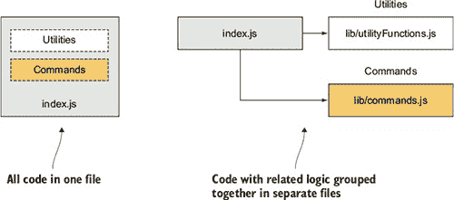

在某些语言实现中，例如 PHP 和 Ruby，从另一个文件（我们称之为 *包含文件*）中引入逻辑（我们称之为 *包含文件*）可能意味着该文件中执行的所有逻辑都会影响全局作用域。在包含文件中创建的任何变量和声明的任何函数都可能覆盖应用程序中创建和声明的变量和函数。

假设你在 PHP 中编程；你的应用程序可能包含以下逻辑：

```
function uppercase_trim($text) {
  return trim(strtoupper($text));
}
include('string_handlers.php');
```

如果你的 string_handlers.php 文件也尝试定义一个 `uppercase_trim` 函数，你会收到以下错误：

```
Fatal error: Cannot redeclare uppercase_trim()
```

在 PHP 中，你可以通过使用 *命名空间* 来避免这种情况，而 Ruby 通过 *模块* 提供类似的功能。然而，Node 通过不提供一种简单的方式来意外地污染全局命名空间，从而避免了这种潜在问题。

| |
| --- |

##### PHP 命名空间，Ruby 模块

PHP 命名空间在 PHP 语言手册中有讨论：[`php.net/manual/en/language.namespaces.php`](http://php.net/manual/en/language.namespaces.php)。Ruby 模块在 Ruby 文档中有解释：[`ruby-doc.org/core-2.3.1/Module.html`](http://ruby-doc.org/core-2.3.1/Module.html)。

| |
| --- |

节点模块将代码捆绑起来以供重用，但它们不会改变全局作用域。例如，假设你正在使用 PHP 开发一个开源内容管理系统（CMS）应用程序，并且你想使用一个不使用命名空间的第三方 API 库。这个库可能包含一个与你的应用程序中相同名称的类，这会破坏你的应用程序，除非你更改应用程序或库中的类名。然而，更改应用程序中的类名可能会给其他使用你的 CMS 作为他们项目基础的开发者带来问题。在库中更改类名将要求你在应用程序的源树中更新库时记住重复这个技巧。命名冲突是一个最好完全避免的问题。

节点模块允许你选择从包含的文件中暴露给应用程序的哪些函数和变量。如果模块返回多个函数或变量，模块可以通过设置一个名为 `exports` 的对象的属性来指定这些函数或变量。如果模块只返回一个函数或变量，则可以设置 `module.exports` 属性。 展示了这是如何工作的。

##### 图 2.2\. `module.exports` 属性或 `exports` 对象的设置允许模块选择与应用程序共享的内容。

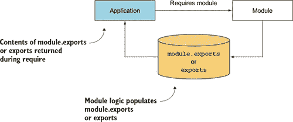

如果这听起来有点复杂，不要担心；我们将在本章中通过几个示例来讲解。通过避免全局作用域的污染，Node 的模块系统避免了命名冲突并简化了代码重用。然后，模块可以被发布到 npm（包管理器）注册表，这是一个在线的、可用的 Node 模块集合，并与 Node 社区共享，而无需担心使用模块的人会覆盖其他模块的变量和函数。

为了帮助你将逻辑组织到模块中，我们涵盖了以下主题：

+   你可以如何创建模块

+   模块在文件系统中的存储位置

+   创建和使用模块时需要注意的事项

让我们通过启动一个新的 Node 项目并创建一个简单的模块来深入学习 Node 模块系统。

### 2.2\. 开始一个新的 Node 项目

创建一个新的 Node 项目很简单：创建一个文件夹，然后运行 `npm init`。就这样！`npm` 命令会问你几个问题，你可以对它们都回答“是”。以下是一个完整的示例：

```
mkdir my_module
cd my_module
npm init -y
```

`-y` 标志表示“是”。这意味着 npm 将使用默认值创建一个 package.json 文件。如果你想有更多的控制权，请去掉 `-y` 标志，npm 将会引导你回答一系列关于项目许可证、作者姓名等问题。完成这些后，查看 package.json 的内容。你可以手动编辑它，但请记住，它必须是有效的 JSON 格式。

现在你有一个空项目，你可以创建自己的模块。

#### 2.2.1\. 创建模块

模块可以是单个文件，也可以是包含一个或多个文件的目录，正如你在图 2.3 中看到的。如果模块是一个目录，那么将被评估的模块目录中的文件通常命名为 index.js（尽管这可以被覆盖：参见第 2.5 节）。

##### 图 2.3\. 可以通过使用文件（示例 1）或目录（示例 2）来创建 Node 模块。


要创建一个典型的模块，你需要创建一个文件，该文件定义了 `exports` 对象上的属性，可以是任何类型的数据，如字符串、对象和函数。

为了展示如何创建一个基本的模块，让我们看看如何向名为 currency.js 的文件添加一些货币转换功能。这个文件，如以下列表所示，将包含两个函数，用于将加拿大元转换为美元，反之亦然。

##### 列表 2.1\. 定义 Node 模块（currency.js）

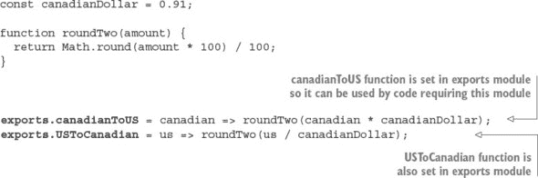

注意，只有 `exports` 对象的两个属性被设置。因此，只有两个函数，`canadianToUS` 和 `USToCanadian`，可以被应用程序包括模块访问。变量 `canadianDollar` 作为私有变量，影响 `canadianToUS` 和 `USToCanadian` 中的逻辑，但应用程序不能直接访问它。

要使用你的新模块，使用 Node 的 `require` 函数，该函数将模块的路径作为参数。Node 执行同步查找以定位模块并加载文件内容。Node 查找文件的顺序是首先核心模块，然后是当前目录，最后是 node_modules。

|  |
| --- |

**关于 require 和同步 I/O 的注意事项**

`require` 是 Node 中可用的少数几个同步 I/O 操作之一。由于模块经常被使用，并且通常包含在文件的顶部，因此使 `require` 同步有助于保持代码整洁、有序和可读。

避免在应用程序的 I/O 密集部分使用 `require`。任何同步调用都会阻塞 Node 执行任何操作，直到调用完成。例如，如果你正在运行一个 HTTP 服务器，如果你在每次传入请求时都使用 `require`，那么你会遭受性能损失。这通常是为什么 `require` 和其他同步操作仅在应用程序最初加载时使用的原因。

|  |
| --- |

在下一个列表中，展示了 test-currency.js，你 `require` 了 currency.js 模块。

##### 列表 2.2\. 引入模块（test_currency.js）

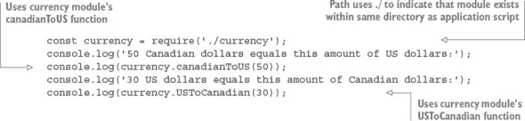

引入以 ./ 开头的模块意味着，如果你在名为 currency_app 的目录中创建名为 test-currency.js 的应用程序脚本，那么如图 2.4 所示的 currency.js 模块文件也需要存在于 currency_app 目录中。在引入时，假定 .js 扩展名，所以如果你希望的话可以省略它。如果你不包括 .js，Node 也会检查 .json 文件。JSON 文件被加载为 JavaScript 对象。

##### 图 2.4\. 当你在模块 `require` 的开始处放置 ./ 时，Node 将在执行程序文件相同的目录中查找。

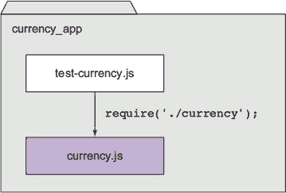

在 Node 定位并评估你的模块之后，`require` 函数返回模块中定义的 `exports` 对象的内容。然后你可以使用模块返回的两个函数来执行货币转换。

如果你想要组织相关的模块，你可以将模块放入子目录中。例如，如果你想将货币模块放入名为 lib/ 的文件夹中，你可以通过将 `require` 的行更改为以下内容来实现：

```
const currency = require('./lib/currency');
```

填充模块的 `exports` 对象为你提供了一个简单的方法来在单独的文件中分组可重用代码。

### 2.3\. 通过使用 module.exports 调整模块创建的细节

虽然使用函数和变量填充 `exports` 对象对于大多数模块创建需求来说是合适的，但有时你可能希望模块偏离这种模式。

例如，之前创建的货币转换模块可以重写为返回单个 `Currency` 构造函数，而不是包含函数的对象。面向对象的实现可能如下所示：

```
const Currency = require('./currency');
const canadianDollar = 0.91;
const currency = new Currency(canadianDollar);
console.log(currency.canadianToUS(50));
```

从 `require` 返回一个函数而不是一个对象，如果这是你从模块中需要的唯一东西，会使你的代码更加优雅。

要创建一个返回单个变量或函数的模块，你可能认为你需要将 `exports` 设置为你想要返回的内容。但这不会起作用，因为 Node 预期 `exports` 不会被重新分配给任何其他对象、函数或变量。下一个列表中的模块代码尝试将 `exports` 设置为一个函数。

##### 列表 2.3\. 模块无法按预期工作

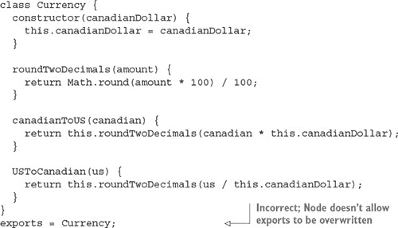

要使先前的模块代码按预期工作，你需要将 `exports` 替换为 `module.exports`。`module.exports` 机制允许你导出一个变量、函数或对象。如果你创建了一个同时填充了 `exports` 和 `module.exports` 的模块，`module.exports` 将被返回，而 `exports` 将被忽略。

|  |
| --- |

**真正导出的内容**

在你的应用程序中最终导出的是 `module.exports`。`exports` 被设置为对 `module.exports` 的全局引用，它最初被定义为可以添加属性的空对象。`exports.myFunc` 是 `module.exports.myFunc` 的简写。

因此，如果 `exports` 被设置为其他任何内容，它就会破坏 `module.exports` 和 `exports` 之间的 *引用*。因为 `module.exports` 是被导出的内容，`exports` 将不再按预期工作——它不再引用 `module.exports`。如果你想保持这个链接，你可以按照以下方式再次使 `module.exports` 引用 `exports`：

```
module.exports = exports = Currency;
```

根据你的需求，使用 `exports` 或 `module.exports`，你可以将功能组织到模块中，并避免不断增长的应用程序脚本中的陷阱。

|  |
| --- |

### 2.4\. 通过使用 node_modules 文件夹重用模块

在文件系统中按相对于应用程序的方式要求模块存在，对于组织特定于应用程序的代码很有用，但对于你希望在应用程序之间重用或与他人共享的代码来说并不那么有用。Node 包含一个独特的代码重用机制，允许在不了解它们在文件系统中的位置的情况下要求模块。这个机制就是使用 node_modules 目录。

在早期的模块示例中，你要求 ./currency。如果你省略了 ./ 并简单地要求 currency，Node 将遵循如图 2.5 所示的某些规则来搜索此模块。

##### 图 2.5\. 寻找模块的步骤

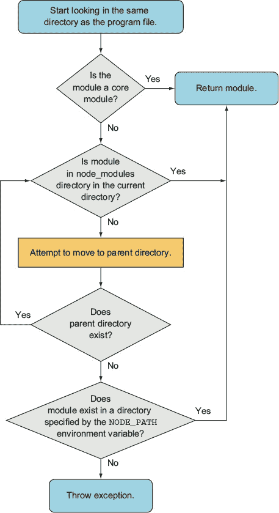

`NODE_PATH` 环境变量提供了一种指定 Node 模块替代位置的方法。如果使用，Windows 上的 `NODE_PATH` 应该设置为用分号分隔的目录列表，在其他操作系统上用冒号分隔。

### 2.5\. 探索注意事项

尽管 Node 的模块系统本质上是简单的，但你应该注意两个要点。

首先，如果一个模块是一个目录，该模块目录中将被评估的文件必须命名为 index.js，除非模块目录中的名为 package.json 的文件有其他指定。要指定 index.js 的替代方案，package.json 文件必须包含定义一个具有 `main` 键的对象的 JavaScript 对象表示法（JSON）数据，该键指定了模块目录内主文件的路径。图 2.6 展示了一个总结这些规则的流程图。

##### 图 2.6\. 将 package.json 文件放置在模块目录中，允许你使用除 index.js 之外的文件定义你的模块。


这里是一个 package.json 文件指定 currency.js 是主文件的示例：

```
{
  "main": "currency.js"
}
```

另一点需要注意的则是 Node 能够将模块缓存为对象。如果一个应用程序中的两个文件需要相同的模块，第一个 `require` 会将返回的数据存储在应用程序内存中，这样第二个 `require` 就不需要访问和评估模块的源文件。这意味着在同一个进程中使用 `require` 加载的模块返回的是同一个对象。想象一下，你构建了一个 MVC 网络应用程序，其中有一个主应用程序对象。你可以设置该应用程序对象，导出它，然后在整个项目中的任何地方 `require` 它。如果你已经向应用程序对象添加了有用的配置值，那么你可以从其他文件中访问这些值，前提是目录结构如下：

```
project
   app.js
   models
      post.js
```

图 2.7 展示了它是如何工作的。

##### 图 2.7\. 网络应用程序中的共享应用程序对象

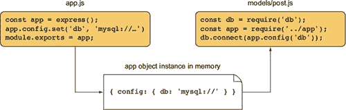

熟悉 Node 的模块系统最好的方法就是与之互动，亲自验证本节所描述的行为。现在你已经对模块的工作原理有了基本的了解，让我们继续学习异步编程技术。

### 2.6\. 使用异步编程技术

如果你曾经进行过前端网络编程，其中界面事件（如鼠标点击）触发逻辑，那么你已经进行过异步编程。服务器端异步编程没有不同：发生事件触发响应逻辑。在 Node 世界中，用于管理响应逻辑的两种流行模型是回调和事件监听器。

*回调* 通常定义了针对一次性响应的逻辑。例如，如果你执行一个数据库查询，你可以指定一个回调来确定如何处理查询结果。回调可以显示数据库结果，根据结果执行计算，或者使用查询结果作为参数执行另一个回调。

另一方面，*事件监听器*是与一个概念实体（一个*事件*）相关联的回调。为了比较，鼠标点击是在浏览器中处理的事件，当有人点击鼠标时。例如，在 Node 中，当发起 HTTP 请求时，HTTP 服务器会发射一个`request`事件。你可以监听该`request`事件的发生，并添加响应逻辑。在下面的示例中，当使用`Event-Emitter.prototype.on`方法将事件监听器绑定到服务器时，`handle-Request`函数将在发射`request`事件时被调用：

```
server.on('request', handleRequest)
```

Node HTTP 服务器实例是一个*事件发射器*的例子，这是一个可以继承的类（`Event-Emitter`），它增加了发射和处理事件的能力。Node 的核心功能中的许多方面都继承自`EventEmitter`，你也可以创建自己的事件发射器。

既然我们已经确定了在 Node 中响应逻辑通常以两种方式组织，你现在可以通过学习以下内容来了解这一切是如何工作的：

+   如何使用回调处理一次性事件

+   如何使用事件监听器响应重复事件

+   如何处理异步编程的一些挑战

让我们首先看看处理异步代码最常见的一种方式：使用回调。

### 2.7\. 使用回调处理一次性事件

*回调*是一个函数，作为参数传递给异步函数，它描述了异步操作完成后要执行的操作。在 Node 开发中，回调的使用频率比事件发射器更高，而且它们的使用很简单。

为了演示在应用程序中使用回调，让我们看看如何创建一个简单的 HTTP 服务器，该服务器执行以下操作：

+   异步拉取存储为 JSON 文件的最近帖子标题

+   异步拉取基本 HTML 模板

+   组装包含标题的 HTML 页面

+   将 HTML 页面发送给用户

结果将与图 2.8 相似。

##### 图 2.8\. 从 JSON 文件中提取标题并返回网页的 HTML 响应

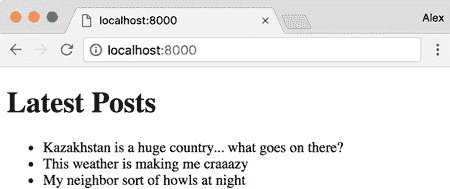

下面的列表中显示了 JSON 文件（titles.json），它格式化为包含帖子标题的字符串数组。

##### 列表 2.4\. 帖子标题列表

```
[
  "Kazakhstan is a huge country... what goes on there?",
  "This weather is making me craaazy",
  "My neighbor sort of howls at night"
]
```

下面的 HTML 模板文件（template.html）仅包含插入博客帖子标题的基本结构。

##### 列表 2.5\. 用于渲染博客标题的基本 HTML 模板

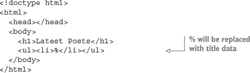

拉取 JSON 文件并渲染网页的代码如下（blog_recent.js）。

##### 列表 2.6\. 在简单应用程序中使用回调

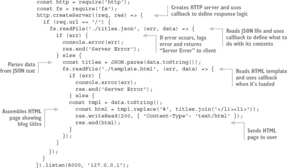

此示例嵌套了三个级别的回调：

```
http.createServer((req, res) => { ...
  fs.readFile('./titles.json', (err, data) => { ...
    fs.readFile('./template.html', (err, data) => { ...
```

使用三个级别并不坏，但回调级别的数量越多，你的代码看起来就越混乱，重构和测试就越困难，因此限制回调嵌套是好的。通过创建处理回调嵌套各个级别的命名函数，你可以以需要更多行代码的方式表达相同的逻辑，但可能更容易维护、测试和重构。以下列表在功能上等同于列表 2.6。

##### 列表 2.7\. 通过创建中间函数减少嵌套

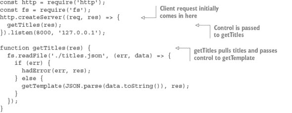

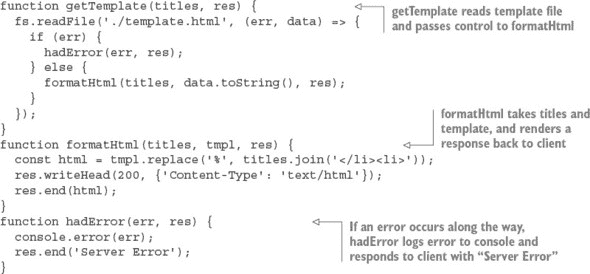

你也可以使用 Node 开发中的另一个常见习语来减少由`if/else`块引起的嵌套：从函数中提前返回。以下列表在功能上相同，但通过提前返回避免了进一步的嵌套。它还明确表示函数不应该继续执行。

##### 列表 2.8\. 通过提前返回减少嵌套


现在你已经学会了如何使用回调来处理一次性的事件，例如在读取文件和 Web 服务器请求时定义响应，让我们继续通过使用事件发射器来组织事件。

|  |
| --- |

**Node 的异步回调约定**

大多数 Node 内置模块使用两个参数的回调：第一个参数用于错误，如果发生错误，第二个参数用于结果。错误参数通常缩写为`err`。

这里是一个这种常见函数签名的典型示例：

```
const fs = require('fs');
fs.readFile('./titles.json', (err, data) => {
  if (err) throw err;
  // do something with data if no error has occurred
});
```

|  |
| --- |

### 2.8\. 使用事件发射器处理重复事件

事件发射器会触发事件，并包括在触发时处理这些事件的能力。一些重要的 Node API 组件，如 HTTP 服务器、TCP 服务器和流，都是作为事件发射器实现的。你也可以创建自己的。

正如我们之前提到的，事件是通过使用监听器来处理的。一个*监听器*是将事件与一个回调函数关联起来，每当事件发生时，该回调函数就会被触发。例如，Node 中的 TCP 套接字有一个名为`data`的事件，每当套接字上有新数据可用时就会触发：

```
socket.on('data', handleData);
```

让我们看看如何使用`data`事件来创建一个回声服务器。

#### 2.8.1\. 一个示例事件发射器

在回声服务器中发生重复事件的简单示例。当你向回声服务器发送数据时，它会将数据回显，如图 2.9 所示：

##### 图 2.9\. 回声服务器重复发送给它的数据

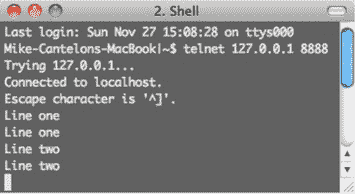

列表 2.9 显示了实现回声服务器的代码。每当客户端连接时，就会创建一个套接字。套接字是一个事件发射器，你可以使用`on`方法添加监听器，以响应`data`事件。这些`data`事件会在套接字上有新数据可用时被发射。

##### 列表 2.9\. 使用`on`方法响应事件

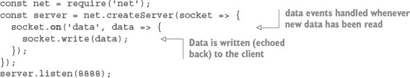

你可以通过输入以下命令来运行这个回声服务器：

```
node echo_server.js
```

在 echo 服务器运行后，你可以通过输入以下命令来连接到它：

```
telnet 127.0.0.1 8888
```

每次从你的连接 telnet 会话向服务器发送数据时，它都会被回显到 telnet 会话中。

|  |
| --- |

##### Windows 上的 Telnet

如果你使用的是 Microsoft Windows 操作系统，telnet 可能默认未安装，你需要自己安装它。TechNet 提供了各种 Windows 版本的说明：[`mng.bz/egzr`](http://mng.bz/egzr)。

|  |
| --- |

#### 2.8.2\. 响应只应发生一次的事件

可以定义监听器来重复响应事件，如前一个示例所示，或者可以定义监听器来只响应一次。以下使用`once`方法的列表修改了之前的 echo 服务器示例，使其只回显发送给它的第一块数据。

##### 列表 2.10\. 使用`once`方法响应单个事件


#### 2.8.3\. 创建事件发射器：发布/订阅示例

在上一个例子中，你使用了内置的 Node API，该 API 使用事件发射器。然而，Node 的内置事件模块允许你创建自己的事件发射器。

以下代码定义了一个具有单个监听器的`channel`事件发射器，该监听器响应有人加入频道的事件。请注意，你使用`on`（或，可选地，较长的形式`addListener`）向事件发射器添加监听器：

```
const EventEmitter = require('events').EventEmitter;
const channel = new EventEmitter();
channel.on('join', () => {
  console.log('Welcome!');
});
```

然而，这个`join`回调永远不会被调用，因为你还没有发射任何事件。你可以在列表中添加一行来触发一个事件，使用`emit`函数：

```
channel.emit('join');
```

|  |
| --- |

##### 事件名称

事件是具有任何字符串值的键：`data`、`join`或`一些疯狂长的事件名称`。只有一个名为`error`的事件是特殊的，你很快就会看到它。

|  |
| --- |

让我们看看如何使用`EventEmitter`来创建一个通信通道，从而实现自己的发布/订阅逻辑。如果你运行列表 2.11 中的脚本，你将拥有一个简单的聊天服务器。聊天服务器频道作为响应客户端发出的`join`事件的发射器来实现。当客户端加入频道时，加入监听器逻辑反过来会向频道添加一个额外的客户端特定监听器，用于`broadcast`事件，该事件将向客户端套接字写入任何广播的消息。事件类型的名称，如`join`和`broadcast`，完全是任意的。如果你愿意，可以为这些事件类型使用其他名称。

##### 列表 2.11\. 使用事件发射器实现的简单发布/订阅系统

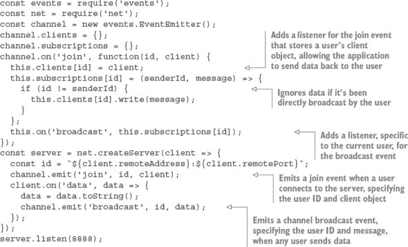

在你的聊天服务器运行后，打开一个新的命令行并输入以下代码以进入聊天：

```
telnet 127.0.0.1 8888
```

如果你打开几个命令行，你会看到在其中一个命令行中输入的任何内容都会被回显到其他命令行中。

这个聊天服务器的问题在于，当用户关闭他们的连接并离开聊天室时，他们留下了一个监听器，该监听器将尝试向不再连接的客户端写入。这当然会生成一个错误。为了解决这个问题，你需要将以下列表中的监听器添加到`channel`事件发射器中，并添加逻辑到服务器的`close`事件监听器以发出通道的`leave`事件。`leave`事件移除了最初为客户端添加的`broadcast`监听器。

##### 列表 2.12\. 创建一个监听器以在客户端断开连接时进行清理

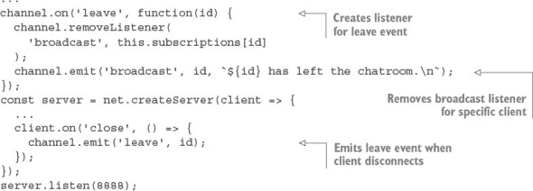

如果出于某种原因你想阻止聊天但不想关闭服务器，你可以使用`removeAllListeners`事件发射器方法来移除特定类型的所有监听器。以下代码展示了如何在我们的聊天服务器示例中实现这一点：

```
channel.on('shutdown', () => {
  channel.emit('broadcast', '', 'The server has shut down.\n');
  channel.removeAllListeners('broadcast');
});
```

然后，你可以添加对触发关闭的聊天命令的支持。为此，将`data`事件的监听器更改为以下代码：

```
client.on('data', data => {
  data = data.toString();
  if (data === 'shutdown\r\n') {
    channel.emit('shutdown');
  }
  channel.emit('broadcast', id, data);
});
```

现在当任何聊天参与者将`shutdown`输入到聊天中时，它将导致所有参与者被踢出。

| |
| --- |

**错误处理**

在创建事件发射器时，你可以使用的一个约定是发出一个`error`类型的事件而不是直接抛出错误。这允许你通过设置一个或多个监听器来定义自定义事件响应逻辑。

以下代码展示了错误监听器如何通过在控制台记录来处理发出的错误：

```
const events = require('events');
const myEmitter = new events.EventEmitter();
myEmitter.on('error', err => {
  console.log(`ERROR: ${err.message}`);
});
myEmitter.emit('error', new Error('Something is wrong.'));
```

如果在发出`error`事件类型时未定义此事件类型的监听器，事件发射器将输出堆栈跟踪（一个程序指令列表，直到错误发生时执行）并停止执行。堆栈跟踪指示由`emit`调用的第二个参数指定的错误类型。这种行为是`error`类型事件独有的；当发出其他事件类型，并且它们没有监听器时，不会发生任何事情。

如果在未提供`error`对象作为第二个参数的情况下发出`error`类型的事件，堆栈跟踪将指示一个`未捕获的，未指定的'error'事件`错误，并且你的应用程序将停止。你可以使用一个已弃用的方法来处理这个错误——你可以通过以下代码定义一个全局处理程序来定义自己的响应：

```
process.on('uncaughtException', err => {
  console.error(err.stack);
  process.exit(1);
});
```

作为替代方案，如域([`nodejs.org/api/domain.html`](http://nodejs.org/api/domain.html))正在开发中，但它们尚未被认为是生产就绪的。

| |
| --- |

如果你想要为连接到聊天的用户提供当前连接用户数的计数，你可以使用以下`listeners`方法，它返回给定事件类型的监听器数组：

```
channel.on('join', function(id, client) {
const welcome = `
  Welcome!
    Guests online: ${this.listeners('broadcast').length}
  `;
  client.write(`${welcome}\n`);
  ...
```

为了增加事件发射器拥有的监听器数量，并避免 Node 在监听器超过 10 个时显示的警告，你可以使用`setMaxListeners`方法。以你的通道事件发射器为例，你使用以下代码来增加允许的监听器数量：

```
channel.setMaxListeners(50);
```

#### 2.8.4. 扩展事件发射器：文件监控示例

如果你想要扩展事件发射器的行为，你可以创建一个新的 JavaScript 类，该类继承自事件发射器。例如，你可以创建一个名为`Watcher`的类，该类处理放置在指定文件系统目录中的文件。然后，你使用这个类创建一个工具来监控目录（将放置在其中的文件重命名为小写，然后将文件复制到另一个目录中）。

在设置好`Watcher`对象之后，你需要扩展从`EventEmitter`继承的方法，如下所示的两个新方法。

##### 列表 2.13. 扩展事件发射器的功能

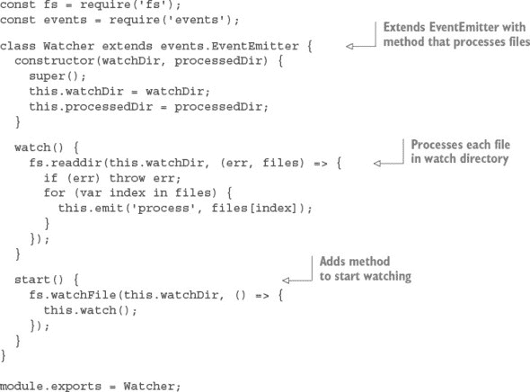

`watch`方法遍历目录，处理找到的任何文件。`start`方法开始目录监控。监控使用 Node 的`fs.watchFile`函数，因此当被监控目录发生变动时，`watch`方法会被触发，遍历被监控目录并为每个找到的文件发出一个`process`事件。

现在你已经定义了`Watcher`类，你可以通过以下代码创建一个`Watcher`对象来使用它：

```
const watcher = new Watcher(watchDir, processedDir);
```

使用你新创建的`Watcher`对象，你可以使用从事件发射器类继承的`on`方法来设置处理每个文件的逻辑，如以下代码片段所示：

```
watcher.on('process', (file) => {
  const watchFile = `${watchDir}/${file}`;
  const processedFile = `${processedDir}/${file.toLowerCase()}`;
  fs.rename(watchFile, processedFile, err => {
    if (err) throw err;
  });
});
```

现在所有必要的逻辑都已经就绪，你可以使用以下代码开始目录监控：

```
watcher.start();
```

将`Watcher`代码放入脚本中并创建监控和完成目录后，你应该能够通过使用 Node 运行脚本，将文件放入监控目录，然后在完成目录中看到文件出现，重命名为小写。这是事件发射器可以成为一个有用的类来创建新类的示例。

通过学习如何使用回调来定义一次性异步逻辑以及如何使用事件发射器来重复派发异步逻辑，你离掌握 Node 应用程序行为控制更近一步。然而，在一个回调或事件发射器监听器中，你可能想要包含执行额外异步任务的逻辑。如果这些任务执行的顺序很重要，你可能面临一个新的挑战：如何在一系列异步任务中精确控制每个任务的执行时机。

在我们讨论如何控制任务执行时机之前——将在第 2.10 节中介绍——让我们看看你在编写异步代码时可能会遇到的一些挑战。

### 2.9. 异步开发中的挑战

在创建异步应用程序时，你必须密切关注应用程序的流程，并密切关注应用程序状态：事件循环的条件、应用程序变量以及程序逻辑执行过程中发生变化的任何其他资源。

例如，Node 的事件循环跟踪尚未完成处理的异步逻辑。只要存在未完成的异步逻辑，Node 进程就不会退出。对于像 Web 服务器这样的应用程序，持续运行的 Node 进程是理想的行为，但并不希望命令行工具等在一段时间后结束的程序继续运行。事件循环跟踪任何数据库连接，直到它们被关闭，防止 Node 退出。

如果你不小心，应用程序变量也可能意外改变。列表 2.14 展示了异步代码执行顺序可能导致混淆的一个例子。如果示例代码是同步执行的，你会期望输出是“颜色是蓝色。”然而，由于示例是异步的，`color`变量的值在`console.log`执行之前就改变了，输出是“颜色是绿色。”

##### 列表 2.14\. 范围行为可能导致错误

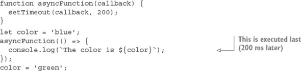

要“冻结”`color`变量的内容，你可以修改你的逻辑并使用 JavaScript 闭包。在列表 2.15 中，你将`asyncFunction`的调用包裹在一个接受`color`参数的匿名函数中。然后你立即执行这个匿名函数，传递给它`color`的当前内容。通过将`color`作为匿名函数的参数，它变成了该函数作用域内的局部变量，当`color`的值在匿名函数外部改变时，局部版本不受影响。

##### 列表 2.15\. 使用匿名函数保留全局变量的值

```
function asyncFunction(callback) {
  setTimeout(callback, 200);
}

let color = 'blue';

(color => {
  asyncFunction(() => {
    console.log('The color is', color);
  });
})(color);

color = 'green';
```

这只是你在 Node 开发中会遇到许多 JavaScript 编程技巧之一。

|  |
| --- |

##### 闭包

更多关于闭包的信息，请参阅 Mozilla JavaScript 文档：[`developer.mozilla.org/en-US/docs/JavaScript/Guide/Closures`](https://developer.mozilla.org/en-US/docs/JavaScript/Guide/Closures)。

|  |
| --- |

现在你已经了解了如何使用闭包来控制你的应用程序状态，让我们来看看如何顺序执行异步逻辑，以保持应用程序的流程控制。

### 2.10\. 异步逻辑的顺序

在异步程序的执行过程中，一些任务可以在任何时候发生，独立于程序的其他部分正在做什么，而不会引起问题。但有些任务应该在某些其他任务之前或之后发生。

Node 社区将异步任务组的顺序概念称为*流控制*。有两种类型的流控制：*串行*和*并行*，如图 2.10 所示。

##### 图 2.10\. 异步任务的串行执行在概念上类似于同步逻辑：任务按顺序执行。然而，并行任务不需要一个接一个地执行。

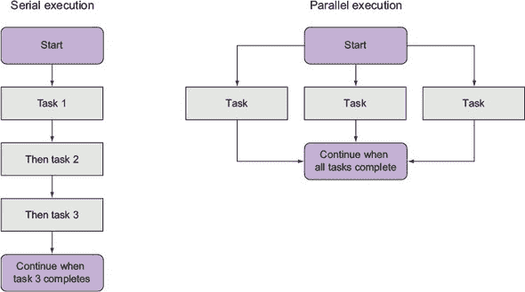

需要依次发生的任务被称为 *串行*。一个简单的例子是创建目录的任务和将文件存储在其中的任务。您不能在创建目录之前存储文件。

不需要依次发生的任务被称为 *并行*。这些任务相对于彼此开始和结束的时间并不一定重要，但它们应该在进一步逻辑执行之前全部完成。一个例子是下载多个文件，这些文件稍后将被打包成 zip 存档。文件可以同时下载，但所有下载应该在创建存档之前完成。

跟踪串行和并行流程控制需要程序化记账。当您实现串行流程控制时，您需要跟踪当前正在执行的任务或维护一个未执行任务队列。当您实现并行流程控制时，您需要跟踪已执行完成的任务数量。

流程控制工具为您处理记账，这使得分组异步串行或并行任务变得容易。尽管许多社区创建的附加组件处理异步逻辑的排序，但自己实现流程控制可以消除神秘感，并帮助您更深入地理解如何处理异步编程的挑战。

在以下章节中，我们将向您展示

+   何时使用串行流程控制

+   如何实现串行流程控制

+   如何实现并行流程控制

+   如何使用第三方模块进行流程控制

让我们先看看在异步世界中何时以及如何处理串行流程控制。

### 2.11\. 何时使用串行流程控制

要按顺序执行大量异步任务，您可以使用回调函数，但如果您有很多任务，您将不得不组织它们。如果您不这样做，您将因为过多的回调嵌套而得到杂乱的代码。

以下代码是使用回调函数按顺序执行任务的示例。该示例使用 `setTimeout` 来模拟需要时间执行的任务：第一个任务需要一秒钟，下一个任务需要半秒钟，最后一个任务需要十分之一秒。`setTimeout` 只是一个人工模拟；在实际代码中，您可能正在读取文件、发起 HTTP 请求等。尽管这段示例代码很短，但它可能有点杂乱，而且没有简单的方法来程序化地添加另一个任务。

```
setTimeout(() => {
  console.log('I execute first.');
  setTimeout(() => {
    console.log('I execute next.');
    setTimeout(() => {
      console.log('I execute last.');
    }, 100);
  }, 500);
}, 1000);
```

或者，您可以使用流程控制工具，例如 Async ([`caolan.github.io/async/`](http://caolan.github.io/async/)) 来执行这些任务。Async 使用简单，并且得益于拥有一个小型代码库（仅有 837 字节，已压缩和最小化）。您可以使用以下命令安装 Async：

```
npm install async
```

现在，使用下一列表中的代码重新实现之前的代码片段，使用串行流程控制。

##### 列表 2.16\. 使用社区创建的附加组件进行串行控制

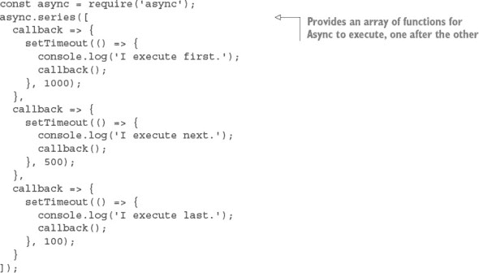

虽然使用流程控制的实现意味着代码行数更多，但它通常更容易阅读和维护。你可能不会一直使用流程控制，但如果遇到想要避免回调嵌套的情况，它是一个提高代码可读性的实用工具。

现在你已经看到了使用专用工具进行串行流程控制的示例，让我们看看如何从头开始实现它。

### 2.12\. 实现串行流程控制

要使用串行流程控制按顺序执行多个异步任务，你首先需要将这些任务按执行顺序放入一个数组中。如图 2.11 所示，这个数组充当一个队列：当你完成一个任务时，你会从数组中按顺序提取下一个任务。

##### 图 2.11\. 串行流程控制的工作原理

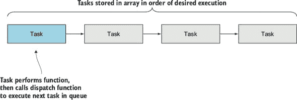

每个任务都以函数的形式存在于数组中。当任务完成时，任务应调用处理函数来指示错误状态和结果。在这个实现中，如果存在错误，处理函数将停止执行。如果没有错误，处理函数将从队列中提取下一个任务并执行它。

为了演示串行流程控制的实现，你将创建一个简单的应用程序，该应用程序从随机选择的 RSS 源中显示单个文章的标题和 URL。可能的 RSS 源列表指定在一个文本文件中。应用程序的输出将类似于以下文本：

```
Of Course ML Has Monads!
http://lambda-the-ultimate.org/node/4306
```

我们的示例需要使用 npm 注册表中的两个辅助模块。首先，打开命令提示符，然后输入以下命令以创建示例目录并安装辅助模块：

```
mkdir listing_217
cd listing_217
npm init -y
npm install --save request@2.60.0
npm install --save htmlparser@1.7.7
```

`request` 模块是一个简化的 HTTP 客户端，你可以使用它来获取 RSS 数据。`htmlparser` 模块具有将原始 RSS 数据转换为 JavaScript 数据结构的功能。

接下来，在你的新目录中创建一个名为 index.js 的文件，其中包含以下代码。

##### 列表 2.17\. 在简单应用程序中实现的串行流程控制


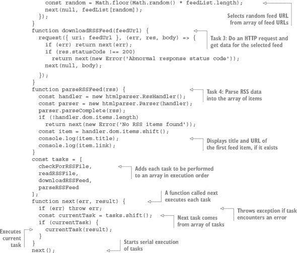

在尝试应用程序之前，在应用程序脚本相同的目录中创建文件 rss_feeds.txt。如果你没有现成的源，你可以尝试 Node blog 的源，其地址为 [`blog.nodejs.org/feed/`](http://blog.nodejs.org/feed/)。将 RSS 源的 URL 放入文本文件中，每行一个。创建此文件后，打开命令行并输入以下命令以切换到应用程序目录并执行脚本：

```
cd listing_217
node index.js
```

如此例实现所示，串行流程控制是一种在需要时将回调函数投入使用的做法，而不是简单地嵌套它们。

现在你已经知道了如何实现串行流程控制，让我们看看如何并行执行异步任务。

### 2.13\. 实现并行流程控制

要并行执行多个异步任务，你再次需要将任务放入一个数组中，但这次任务的顺序不重要。每个任务应调用一个处理函数，该函数将增加已完成任务的数目。当所有任务都完成后，处理函数应执行一些后续逻辑。

对于并行流控制示例，你将创建一个简单的应用程序，该应用程序读取文本文件的内容，并输出文件中单词使用的频率。读取文本文件的内容将使用异步的`readFile`函数，因此可以并行执行多个文件读取。图 2.12 显示了该应用程序的工作方式。

##### 图 2.12\. 使用并行流控制实现多个文件中单词使用的频率计数

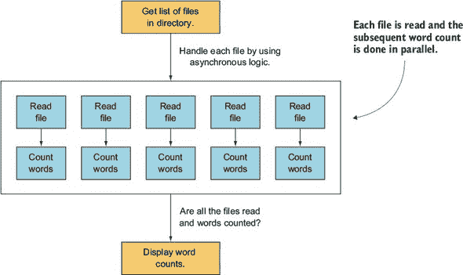

输出看起来类似于以下文本（尽管它可能更长）：

```
would: 2
wrench: 3
writeable: 1
you: 24
```

打开命令行提示符，输入以下命令以创建两个目录——一个用于示例，另一个包含你想要分析的文本文件：

```
mkdir listing_218
cd listing_218
mkdir text
```

接下来，在 listing_218 目录中创建一个名为 word_count.js 的文件，其中包含以下代码。

##### 列表 2.18\. 在简单应用程序中实现并行流控制

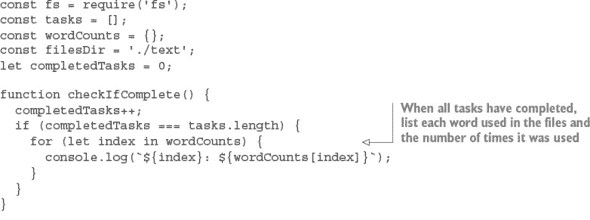

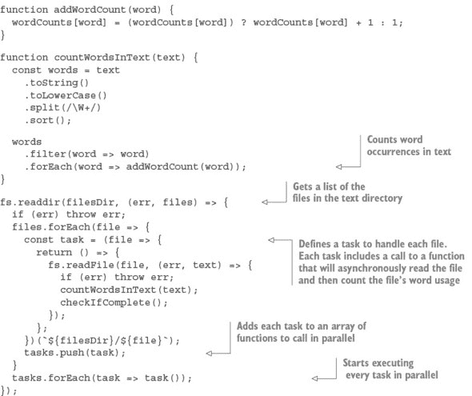

在尝试应用程序之前，在之前创建的文本目录中创建一些文本文件。然后打开命令行，输入以下命令以切换到应用程序目录并执行脚本：

```
cd word_count
node word_count.js
```

现在你已经了解了串行和并行流控制的工作原理，让我们看看如何使用社区创建的工具，这些工具允许你轻松地在应用程序中受益于流控制，而无需自己实现。

### 2.14\. 使用社区工具

许多社区插件提供了方便的流控制工具。一些流行的插件包括 Async、Step 和 Seq。尽管每个都值得检查，但我们将再次使用 Async 作为另一个示例。

| |
| --- |

##### 流控制社区插件

有关流控制社区插件的更多信息，请参阅 Werner Schuster 和 Dio Synodinos 在 InfoQ 上的文章“虚拟面板：如何在 JavaScript 中生存异步编程”：[`mng.bz/wKnV`](http://mng.bz/wKnV)。

| |
| --- |

列表 2.19 是一个示例，展示了如何在脚本中使用 Async 按顺序执行任务，该脚本使用并行流控制同时下载两个文件，然后归档它们。

| |
| --- |

##### 以下示例在 Microsoft Windows 中无法工作

由于 Windows 操作系统没有自带`tar`和`curl`命令，以下示例在该操作系统中无法工作。

| |
| --- |

在此示例中，我们使用串行控制确保在归档之前完成下载。

##### 列表 2.19\. 在简单应用程序中使用社区插件流控制工具

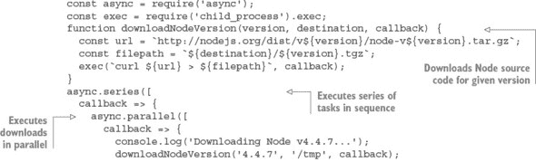

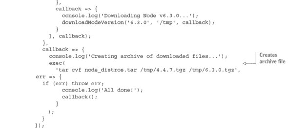

脚本定义了一个辅助函数，用于下载任何指定的 Node 源代码版本。然后执行两个连续的任务：并行下载两个版本的 Node 以及将下载的版本捆绑成一个新的存档文件。

### 2.15. 摘要

+   节点模块可以被组织成可重用的模块。

+   `require` 函数用于加载模块。

+   `module.exports` 和 `exports` 对象用于在模块内部共享函数和变量。

+   package.json 文件用于指定依赖项以及哪个文件被导出为主文件。

+   异步逻辑可以通过嵌套回调、事件发射器和流程控制工具进行控制。

## 第三章。什么是 Node 网络应用程序？

*本章涵盖*

+   创建一个新的网络应用程序

+   构建 RESTful 服务

+   持久化数据

+   使用模板

本章全部关于 Node 网络应用程序。阅读本章后，你将了解 Node 网络应用程序的样子以及如何开始构建它们。你将做现代网络开发者在构建应用程序时所做的所有事情。

你将构建一个名为 *later* 的网络应用程序，该应用程序灵感来源于流行的“稍后阅读”网站，如 Instapaper ([www.instapaper.com](http://www.instapaper.com)) 和 Pocket ([getpocket.com](http://getpocket.com))。这包括启动一个新的 Node 项目，管理依赖项，创建 RESTful API，将数据保存到数据库中，并使用模板制作界面。这听起来可能很多，但你将在后续章节中再次探索本章中的每个想法。

图 3.1 展示了结果应该看起来像什么。

##### 图 3.1. 一个“稍后阅读”网络应用程序


左侧的“稍后阅读”页面已经从目标网站中移除了所有导航，保留了主要内容和标题。更重要的是，文章被永久保存在数据库中，这意味着你可以在未来某个日期阅读它，而此时原始文章可能已无法检索。

在构建网络应用程序之前，你应该创建一个新的项目。下一节将展示如何从头开始创建 Node 项目。

### 3.1. 理解 Node 网络应用程序的结构

一个典型的 Node 网络应用程序具有以下组件：

+   package.json——一个包含依赖项列表和运行应用程序的命令的文件

+   public/——一个静态资产文件夹，例如 CSS 和客户端 JavaScript

+   node_modules/——项目依赖项安装的地方

+   一个或多个包含你的应用程序代码的 JavaScript 文件

应用程序代码通常进一步细分为以下部分：

+   app.js 或 index.js——设置应用程序的代码

+   models/——数据库模型

+   views/——用于渲染应用程序页面的模板

+   controllers/ 或 routes/——HTTP 请求处理器

+   middleware/——中间件组件

没有规则规定你的应用程序应该如何构建：大多数 Web 框架都很灵活，需要配置。但这个模板是大多数项目中都会找到的一般轮廓。

如果你练习，学习如何做这件事会容易得多，所以让我们看看如何以经验丰富的 Node 程序员的方式创建一个骨架 Web 应用程序。

#### 3.1.1\. 开始一个新的 Web 应用程序

要创建一个新的 Web 应用程序，你需要创建一个新的 Node 项目。如果你想刷新记忆，请参考第二章，但为了回顾，你需要创建一个目录并使用默认值运行 `npm init`：

```
mkdir later
cd later
npm init -fy
```

现在你有一个新的项目；接下来是什么？大多数人会添加一个来自 npm 的模块，使 Web 开发更容易。Node 有一个内置的 http 模块，它有一个服务器，但使用减少命令行 Web 开发任务样板代码的东西更容易。让我们看看如何安装 Express。

##### 添加依赖项

要向项目中添加依赖项，请使用 `npm install`。以下命令安装了 Express：

```
npm install --save express
```

现在如果你查看 package.json，你应该会看到 Express 已经被添加。以下片段显示了相关部分：

```
"dependencies": {
  "express": "⁴.14.0"
}
```

Express 模块位于项目的 node_modules/ 文件夹中。如果你想从项目中卸载 Express，你可以运行 `npm rm express --save`。这将将其从 node_modules/ 中删除，并更新 package.json 文件。

##### 一个简单的服务器

Express 专注于用 HTTP 请求和响应来建模你的应用程序，它是使用 Node 的内置 http 模块构建的。要创建一个基本的应用程序，你需要使用 `express()` 创建一个应用程序实例，添加一个路由处理程序，然后将应用程序绑定到一个 TCP 端口。以下是一个完整的示例：

```
const express = require('express');
const app = express();

const port = process.env.PORT || 3000;

app.get('/', (req, res) => {
  res.send('Hello World');
});

app.listen(port, () =>
  console.log(`Express web app available at localhost: ${port}`);
};
```

这并不像听起来那么复杂！将此代码保存到名为 index.js 的文件中，并通过输入 `node index.js` 来运行它。然后访问 http://localhost:3000 来查看结果。为了避免记住每个应用程序的运行方式，大多数人使用 npm 脚本来简化这个过程。

##### npm 脚本

要将你的服务器启动命令 (`node index.js`) 保存为 npm 脚本，请打开 package.json 并在 `scripts` 下添加一个名为 `start` 的新属性：

```
"scripts": {
  "start": "node index.js",
  "test": "echo \"Error: no test specified\" && exit 1"
},
```

现在，你可以通过输入 `npm start` 来运行你的应用程序。如果你看到错误，因为你的机器上端口 3000 已经被使用，你可以通过运行 `PORT=3001 npm start` 使用不同的端口。人们使用 npm 脚本做各种事情：构建客户端包、运行测试和生成文档。你可以放任何你喜欢的东西在那里；它基本上是一个迷你脚本调用工具。

#### 3.1.2\. 比较其他平台

为了比较，这里展示了等效的 PHP Hello World 应用程序：

```
<?php echo '<p>Hello World</p>'; ?>
```

它适合一行，易于理解，那么更复杂的 Node 示例有什么好处呢？区别在于编程范式：在 PHP 中，你的应用程序是一个 *页面*；在 Node 中，它是一个服务器。Node 示例对请求和响应有完全的控制权，因此你可以做各种事情而无需配置服务器。如果你想使用 HTTP 压缩或 URL 重定向，你可以将这些功能作为应用程序逻辑的一部分来实现。你不需要将 HTTP 和应用程序逻辑分开；它们成为你应用程序的一部分。

你不需要一个单独的 HTTP 服务器配置，你可以将其放在同一个地方，这意味着同一个目录。这使得 Node 应用程序易于部署和管理。

另一个使 Node 应用程序易于部署的功能是 npm。因为依赖项是按项目安装的，所以你不会在同一系统上的项目之间遇到冲突。

#### 3.1.3\. 接下来是什么？

现在你已经熟悉了使用 `npm init` 创建项目和用 `npm install --save` 安装依赖项，你可以快速创建新项目。这很好，因为它意味着你可以尝试新想法而不会弄乱其他项目。如果你想尝试一个热门的新网络框架，那么创建一个新的目录，运行 `npm init`，然后从 npm 安装模块。

在所有这些准备工作就绪后，你就可以开始编写代码了。在这个阶段，你可以将 JavaScript 文件添加到你的项目中，并使用 `require` 加载你用 `npm --save` 安装的模块。让我们专注于大多数网络开发者接下来会做的事情：添加一些 RESTful 路由。这将帮助你定义应用程序的 API 并确定需要哪些数据库模型。

### 3.2\. 构建 RESTful 网络服务

你的应用程序将是一个 RESTful 网络服务，允许以类似 Instapaper 或 Pocket 的方式创建和保存文章。它将使用一个受原始 Readability 服务（[www.readability.com](http://www.readability.com)）启发的模块，将混乱的网页转换为优雅的文章，你可以稍后阅读。

当设计 RESTful 服务时，你需要考虑你需要哪些操作，并将它们映射到 Express 的路由中。在这种情况下，你需要能够保存文章、获取它们以便阅读、获取所有文章的列表以及删除不再需要的文章。这对应以下路由：

+   `POST /articles`—创建一篇新文章

+   `GET /articles/:id`—获取单个文章

+   `GET /articles`—获取所有文章

+   `DELETE /articles/:id`—删除一篇文章

在涉及数据库和网页界面的问题之前，让我们专注于使用 Express 创建 RESTful 资源。你可以使用 cURL 向示例应用程序发出请求，以熟悉它，然后进行更复杂的操作，例如存储数据，使其更像一个真正的网络应用程序。

以下列表是一个简单的 Express 应用程序，它通过使用 JavaScript 数组存储文章来实现这些路由。

##### 列表 3.1\. RESTful 路由示例

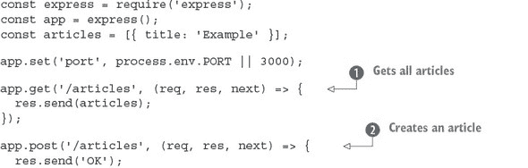

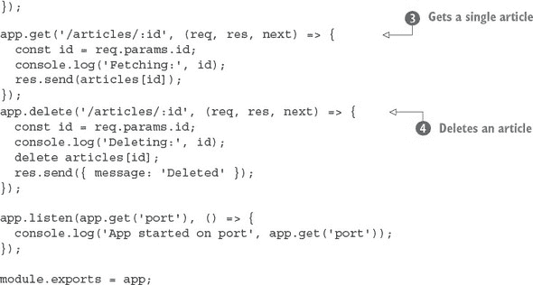

将此列表保存为`i`ndex.js`，然后您应该能够使用`node index.js`运行它。要使用此示例，请按照以下步骤操作：

```
mkdir listing3_1
cd listing3_1
npm init -fy
run npm install --save express@4.12.4
```

在第二章中更详细地探讨了创建新的 Node 项目。

| |
| --- |

**运行示例和进行更改**

要运行这些示例，每次编辑代码后请确保重新启动服务器。您可以通过按 Ctrl-C 结束 Node 进程，然后输入`node index.js`再次启动它来做到这一点。

示例以代码片段的形式呈现，因此您应该能够按顺序组合它们以生成一个可工作的应用程序。如果您无法运行它，请尝试从[`github.com/alexyoung/nodejsinaction`](https://github.com/alexyoung/nodejsinaction)下载本书的源代码。

| |
| --- |

列表 3.1 包含一个内置的样本数据数组，该数组用于通过 Express 的`res.send`方法以 JSON 格式响应所有文章！[](Images/circ1.jpg)。Express 会自动将数组转换为有效的 JSON 响应，因此非常适合快速创建 REST API。

此示例还可以使用相同的原则响应单个文章！[](Images/circ3.jpg)。您甚至可以使用标准的 JavaScript `delete` 关键字和一个在 URL 中指定的数字 ID 来删除文章！[](Images/circ4.jpg)。您可以通过将它们放入路由字符串（`/articles/:id`）并在其中获取值来从 URL 中获取值，即`req.params.id`。

列表 3.1 不能创建文章！[](Images/circ2.jpg)，因为为此它需要一个请求体解析器；您将在下一节中了解这一点。首先，让我们看看如何使用 cURL（[`curl.haxx.se`](http://curl.haxx.se)）使用此示例。

在`node index.js`示例运行后，您可以使用浏览器或 cURL 向其发送请求。要获取一篇文章，请运行以下代码片段：

```
curl http://localhost:3000/articles/0
```

要获取所有文章，您需要向/articles 发送请求：

```
curl http://localhost:3000/articles
```

您甚至可以删除一篇文章：

```
curl -X DELETE http://localhost:3000/articles/0
```

但为什么我们说您不能创建文章呢？主要原因是在实现 POST 请求时需要*解析请求体*。Express 曾经附带一个内置的请求体解析器，但由于有太多的实现方式，开发者选择将其作为一个单独的依赖项。

请求体解析器知道如何接受 MIME 编码的（*多用途互联网邮件扩展*）POST 请求体，并将它们转换为可以在您的代码中使用的数据。通常，您会得到易于处理的 JSON 数据。每当您在网站上提交表单时，请求体解析器就会在服务器端软件的某个地方发挥作用。

要添加官方支持的请求体解析器，请运行以下 npm 命令：

```
npm install --save body-parser
```

现在，在文件的顶部附近加载 body parser，如下所示。如果你在跟随，你可以将其保存到与 listing 3.1 (listing3_1) 相同的文件夹中，但我们也在书籍的源代码中保存了它（ch03-what-is-a-node-web-app/listing3_2）。

##### 列表 3.2\. 添加 body parser

![Images/03lis02_alt.jpg]

这增加了两个有用的功能：JSON 主体解析 ![Images/circ1.jpg] 和表单编码的主体 ![Images/circ2.jpg]。它还提供了一个创建文章的基本实现：如果你发送一个名为 `title` 的字段的 POST 请求，一个新的文章将被添加到文章数组中！以下是 cURL 命令：

```
curl --data "title=Example 2" http://localhost:3000/articles
```

现在你离构建一个真正的网络应用程序不远了。你只需要两样东西：一种在数据库中永久保存数据的方法，以及一种生成网络上找到的文章的可读版本的方法。

### 3.3\. 添加数据库

没有预定义的方法可以将数据库添加到 Node 应用程序中，但这个过程通常涉及以下步骤：

1.  决定你想要使用的数据库。

1.  查看 npm 上实现驱动程序或对象关系映射 (ORM) 的流行模块。

1.  使用 `npm -save` 将模块添加到你的项目中。

1.  创建封装数据库访问的 JavaScript API 的模型。

1.  将模型添加到你的 Express 路由中。

在添加数据库之前，让我们继续关注 Express，通过设计步骤 5 中的路由处理代码来继续关注 Express。应用程序 Express 部分的 HTTP 路由处理程序将对数据库模型进行简单的调用。以下是一个示例：

```
app.get('/articles', (req, res, err) => {
  Article.all(err, articles) => {
    if (err) return next(err);
    res.send(articles);
  });
});
```

在这里，HTTP 路由是用于获取所有文章的，因此模型方法可能是 `Article.all`。这取决于你的数据库 API；典型的例子是 `Article.find({}, cb)`，^([1]) 和 `Article.fetchAll().then(cb)`。^([2]) 注意，在这些例子中，`cb` 是 *callback* 的缩写。

> ¹
> 
> Mongoose: [`mongoosejs.com`](http://mongoosejs.com)
> 
> ²
> 
> Bookshelf.js [`bookshelfjs.org`](http://bookshelfjs.org)

考虑到有如此多的数据库，你如何决定使用哪一个？继续阅读，了解我们为什么在这个例子中使用 SQLite 的原因。

|  |
| --- |

**选择哪个数据库？**

对于我们的项目，我们将使用 SQLite ([www.sqlite.org](http://www.sqlite.org))，以及流行的 sqlite3 模块 ([`npmjs.com/package/sqlite3`](http://npmjs.com/package/sqlite3))。SQLite 很方便，因为它是一个进程内数据库：你不需要在你的系统上安装一个在后台运行的服务器。你添加的任何数据都会写入一个文件，该文件在应用程序停止和重新启动后仍然保留，因此它是开始使用数据库的好方法。

|  |
| --- |

#### 3.3.1\. 创建自己的模型 API

文章应该被创建、检索和删除。因此，你需要以下方法来为 `Article` 模型类提供支持：

+   `Article.all(cb)`—返回所有文章。

+   `Article.find(id, cb)`—给定一个 ID，找到相应的文章。

+   `Article.create({ title, content }, cb)`—创建一个具有标题和内容的文章。

+   `Article.delete(id, cb)`—通过 ID 删除文章。

您可以使用 sqlite3 模块实现所有这些功能。此模块允许您使用 `db.all` 获取多行结果，使用 `db.get` 获取单行。首先您需要一个数据库连接。

以下列表展示了如何在 Node 中使用 SQLite 实现这些功能。此代码应保存为同一文件夹中的 `db.js` 文件。Node 将加载该模块，然后使用它来获取每篇文章，查找特定文章，以及删除文章。

##### 列表 3.3\. `Article` 模型

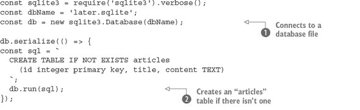

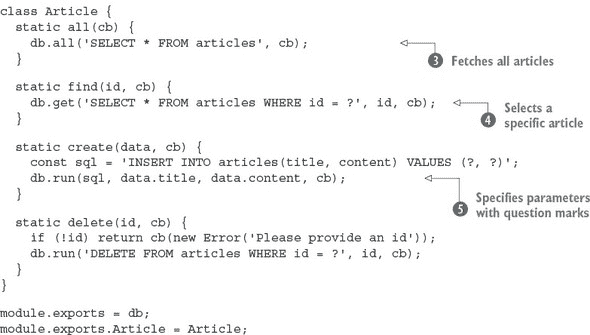

在此示例中，创建了一个名为 `Article` 的对象，它可以使用标准 SQL 和 sqlite3 模块创建、获取和删除数据。首先，使用 `sqlite3.Database` 打开数据库文件，然后创建一个文章表。`IF NOT EXISTS` SQL 语法在这里很有用，因为它意味着您可以重新运行代码，而不会意外删除和重新创建文章表。

当数据库和表就绪时，应用程序就绪以进行查询。要获取所有文章，您使用 sqlite3 的 `all` 方法。要获取特定文章，使用带值的问号查询语法；sqlite3 模块将 ID 插入查询中。最后，您可以使用 `run` 方法插入和删除数据。

为了使此示例正常工作，您需要使用 `npm install --save sqlite3` 安装 sqlite3 模块。在编写时，它的版本是 3.1.8。

现在基本数据库功能已经就绪，您需要将其添加到来自列表 3.2 的 HTTP 路由中。

下一列表展示了如何添加除 POST 之外的所有方法。（您将单独处理 POST，因为它需要使用您尚未设置的易读性模块。）

##### 列表 3.4\. 将 `Article` 模型添加到 HTTP 路由

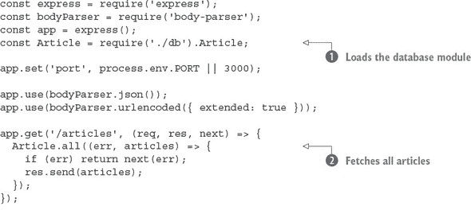

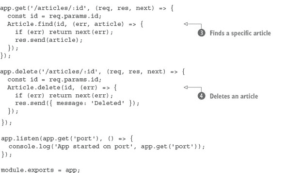

列表 3.4 假设您已将 列表 3.3 保存为 db.js 文件在同一目录下。Node 将加载该模块，然后使用它来获取每篇文章，查找特定文章，以及删除文章。

最后要做的事情是添加创建文章的支持。为此，您需要能够下载文章并使用神奇的易读性算法处理它们。您需要的是 npm 中的一个模块。

#### 3.3.2\. 使文章可读并保存以备后用

现在您已经构建了一个 RESTful API，并且数据可以持久化到数据库中，您应该添加将网页转换为简化的“阅读视图”版本的代码。您不需要自己实现这一功能；相反，您可以使用 npm 中的一个模块。

如果您在 npm 中搜索 *readability*，您会发现相当多的模块。让我们尝试使用 node-readability（在撰写本文时版本为 1.0.1）。使用 `npm install node-readability --save` 安装它。该模块提供了一个异步函数，它下载一个 URL 并将 HTML 转换为简化表示。以下代码片段显示了如何使用 node-readability；如果您想尝试它，请将代码片段添加到 index.js 中，除了 列表 3.5：

```
const read = require('node-readability');
const url = 'http://www.manning.com/cantelon2/';
read(url, (err, result)=>  {
  // result has .title and .content
});
```

可以使用 node-readability 模块与您的数据库类一起使用，通过 `Article.create` 方法保存文章：

```
read(url, (err, result) => {
  Article.create(
    { title: result.title, content: result.content },
    (err, article) => {
      // Article saved to the database
    }
  );
});
```

要在应用程序中使用此功能，打开 index.js 文件并添加一个新的 `app.post` 路由处理程序，用于下载和保存文章。结合您在 Express 中学到的关于 HTTP POST 和 body parser 的所有知识，以下列表提供了示例。

##### 列表 3.5\. 生成可读文章并保存

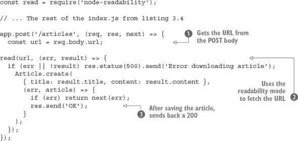

在这里，您首先从 POST 主体中获取 URL ![Images/circ1.jpg]，然后使用 node-readability 模块获取 URL ![Images/circ2.jpg]。您通过使用您的 `Article` 模型类来保存文章。如果发生错误，您将错误处理传递给 Express 中间件堆栈 ![Images/circ3.jpg]；否则，将文章的 JSON 表示发送回客户端。

您可以通过使用 `--data` 选项来发送一个 POST 请求，使其与这个示例一起工作：

```
curl --data "url=http://manning.com/cantelon2/" http://localhost:3000/articles
```

在前一节中，您添加了一个数据库模块，创建了一个围绕它的 JavaScript API，并将其绑定到 RESTful HTTP API。这是一项大量工作，它将成为您作为后端开发人员努力的主要部分。随着您在本书中查看 MongoDB 和 Redis，您将在本书的后面部分了解更多关于数据库的内容。

现在您不仅可以保存文章，还可以以编程方式检索它们，因此您将添加一个网络界面，以便您可以阅读文章。

### 3.4\. 添加用户界面

在 Express 项目中添加界面涉及几个方面。首先是使用模板引擎；我们将很快向您展示如何安装一个并渲染模板。您的应用程序还应提供静态文件，例如 CSS。在渲染模板和编写任何 CSS 之前，您需要知道如何使之前示例中的路由处理程序在必要时同时响应 JSON 和 HTML。

#### 3.4.1\. 支持多种格式

到目前为止，您已经使用 `res.send()` 来向客户端发送 JavaScript 对象。您使用 cURL 来发送请求，在这种情况下 JSON 很方便，因为它在控制台中易于阅读。但为了真正使用应用程序，它还需要支持 HTML。您如何支持两者？

基本技术是使用 Express 提供的 `res.format` 方法。它允许您的应用程序根据请求响应正确的格式。要使用它，提供一个包含响应所需方式的函数的格式列表：

```
res.format({
  html: () => {
    res.render('articles.ejs', { articles: articles });
  },
  json: () => {
    res.send(articles);
  }
});
```

在这个片段中，`res.render` 将会在 views 文件夹中渲染 articles.ejs 模板。但为了使其工作，你需要安装一个模板引擎并创建一些模板。

#### 3.4.2\. 渲染模板

可用的模板引擎有很多，其中一种简单且易于学习的是 EJS（嵌入式 JavaScript）。从 npm 安装 EJS 模块（在写作时 EJS 版本为 2.3.1）：

```
npm install ejs --save
```

现在 `res.render` 可以渲染格式化过的 EJS HTML 文件。如果你将 列表 3.4 中的 `app.get('/articles')` 路由处理器的 `res.send (articles)` 替换掉，在浏览器中访问 http://localhost:3000/articles 应该会尝试渲染 articles.ejs。

接下来，你需要在 views 文件夹中创建 articles.ejs 模板。下面的列表显示了一个你可以使用的完整模板。

##### 列表 3.6\. `文章`列表模板

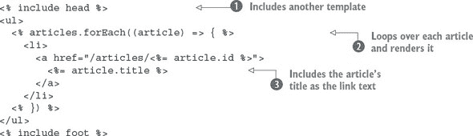

文章列表模板使用了一个头部  和页脚模板，这些模板作为代码示例中的片段包含在内。这是为了避免在每个模板中重复头部和页脚。文章列表通过使用标准的 Java-Script `forEach` 循环进行迭代，然后使用 EJS `<%= value %>` 语法将文章 ID 和标题注入到模板中 。

以下是一个示例头部模板，保存为 views/head.ejs：

```
<html>
  <head>
    <title>Later</title>
  </head>
  <body>
    <div class="container">
```

这是对应的页脚（保存为 views/foot.ejs）：

```
    </div>
  </body>
</html>
```

`res.format` 方法也可以用来显示特定的文章。从这里开始，事情开始变得有趣，因为为了让这个应用程序有意义，文章应该看起来整洁且易于阅读。

#### 3.4.3\. 使用 npm 管理客户端依赖

模板就绪后，下一步是添加一些样式。与其创建样式表，不如重用现有的样式，你甚至可以使用 npm 来这样做！流行的 Bootstrap ([`getbootstrap.com/`](http://getbootstrap.com/)) 客户端框架可在 npm ([www.npmjs.com/package/bootstrap](http://www.npmjs.com/package/bootstrap)) 上找到，因此将其添加到这个项目中：

```
npm install bootstrap --save
```

如果你查看 node_modules/bootstrap/，你会看到 Bootstrap 项目的源代码。然后，在 dist/css 文件夹中，你会找到 Bootstrap 伴随的 CSS 文件。要在你的项目中使用这些文件，你需要能够提供静态文件服务。

##### 提供静态文件

当你需要将客户端 JavaScript、图像和 CSS 发送到浏览器时，Express 有一些内置的中间件称为 `express.static`。要使用它，你需要将其指向包含静态文件的目录，然后这些文件将可供浏览器访问。

在主 Express 应用程序文件（index.js）的顶部附近，有一些加载项目所需中间件的代码行：

```
app.use(bodyParser.json());
app.use(bodyParser.urlencoded({ extended: true }));
```

要加载 Bootstrap 的 CSS，使用 `express.static` 在正确的 URL 上注册文件：

```
app.use(
  '/css/bootstrap.css',
  express.static('node_modules/bootstrap/dist/css/bootstrap.css')
);
```

现在，你可以在模板中添加 /css/bootstrap.css 以获取一些酷炫的 Bootstrap 样式。以下 views/head.ejs 应该看起来像这样：

```
<html>
  <head>
    <title>later;</title>
    <link rel="stylesheet" href="/css/bootstrap.css">
  </head>
  <body>
    <div class="container">
```

这只是 Bootstrap 的 CSS；Bootstrap 还附带其他文件，包括图标、字体和 jQuery 插件。您可以将这些文件添加到您的项目中，或者使用工具将它们全部打包起来，以便更容易加载。

##### 使用 npm 和客户端开发做更多的事情

之前的例子是使用 npm 通过浏览器库的简单示例。Web 开发者通常会下载 Bootstrap 的文件，然后手动将它们添加到他们的项目中，尤其是那些从事简单静态网站设计的网页设计师。

但现代前端开发者使用 npm 下载库并在客户端 JavaScript 中加载它们。借助 Browserify ([`browserify.org/`](http://browserify.org/)) 和 webpack ([`webpack.github.io/`](http://webpack.github.io/)) 等工具，您将获得 npm 安装和 `require` 加载依赖项的所有功能。想象一下，您不仅可以在 Node 代码中，还可以在前端开发代码中键入 `const React = require('react')`！这超出了本章的范围，但它为您展示了通过结合 Node 编程和前端开发的技术可以解锁的强大功能。

### 3.5. 摘要

+   您可以使用 `npm init` 和 Express 快速从头开始构建一个 Node 网络应用程序。

+   安装依赖项的命令是 `npm install`。

+   Express 允许您使用 RESTful API 创建网络应用程序。

+   选择合适的数据库和数据库模块需要一些前期调查，并取决于您的需求。

+   SQLite 对于小型项目来说很方便。

+   EJS 是在 Express 中渲染模板的一种简单方法。

+   Express 支持许多模板引擎，包括 Pug 和 Mustache。
