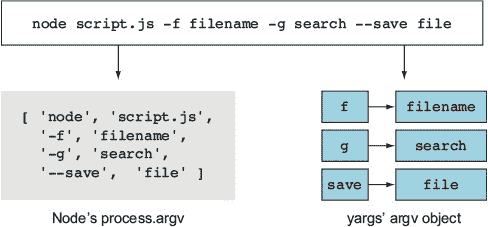
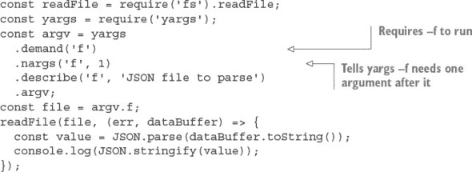
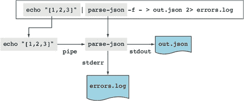
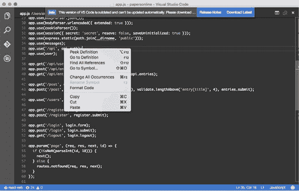
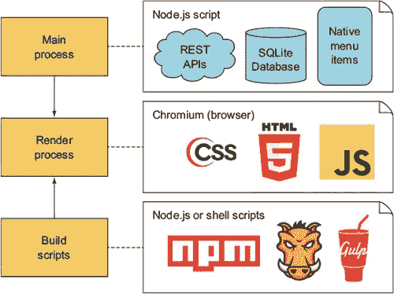
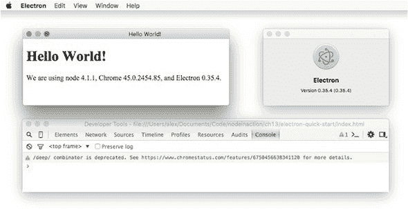
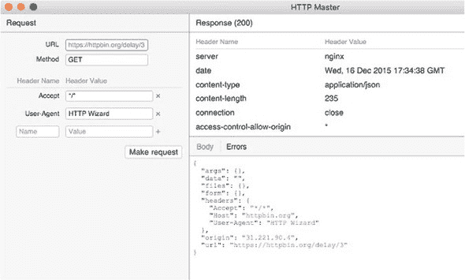
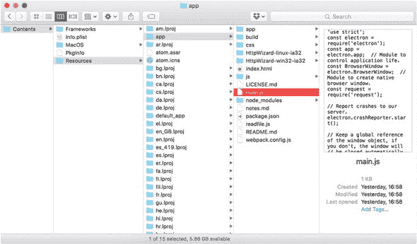

## 第三部分：超越 Web 开发

数百万的人依赖于用 Node 构建的应用程序。如果你曾经使用过 Slack 或 Visual Studio Node，你就使用过由 Node 提供动力的应用程序。这部分介绍了 Electron 和用于用 Node 编写命令行工具的模块。如果你曾经想要为 Linux、macOS 或 Windows 制作应用程序，现在你可以做到了。

## 第十一章：编写命令行应用程序

*本章涵盖*

+   通过使用常见约定设计命令行应用程序

+   通过管道进行通信

+   使用退出码

Node 命令行实用工具被广泛应用于各个领域，从项目自动化工具，如 Gulp 和 Yeoman，到 XML 和 JSON 解析器。如果你曾经想知道如何使用 Node 构建命令行工具，这一章将向你展示你需要知道的一切来开始。你将学习 Node 程序如何接受命令行参数以及如何通过管道处理 I/O。我们还包含了有助于你更有效地使用命令行的 shell 小贴士。

虽然使用 Node 构建命令行工具并不难，但遵循社区约定很重要。这一章包括了这些约定中的许多，这样你就能编写其他人可以使用而无需过多文档的工具。

### 11.1. 理解约定和哲学

命令行开发的一个重要部分是理解现有程序使用的约定。作为一个现实世界的例子，看看 Babel：

```
Usage: babel [options] <files ...>

Options:

  -h, --help                           output usage information
  -f, --filename [filename]            filename to use when reading from stdin
[ ... ]
  -q, --quiet                          Don't log anything
  -V, --version                        output the version number
```

在这里有几个要点值得注意。第一个是使用 `-h` 和 `--help` 打印帮助：这是一个许多程序使用的标志。第二个标志是 `-f` 用于文件名——这是一个容易记忆的助记符。许多标志都是基于助记符的。使用 `-q` 进行安静输出也是一个流行的约定，同样 `-v` 用于显示程序的版本。你的应用程序应该包括这些标志。

然而，这个用户界面不仅仅是一个约定。使用连字符和双连字符 (`--`) 的做法得到了开放组实用约定（Utility Conventions）的认可。1 这份文件甚至指定了它们应该如何使用：

> ¹
> 
> “开放组基础规范第 7 版”，[`pubs.opengroup.org/onlinepubs/9699919799/basedefs/V1_chap11.html`](http://pubs.opengroup.org/onlinepubs/9699919799/basedefs/V1_chap11.html)。

+   ***指南 4—*** 所有选项都应该以 `-` 分隔符字符开头。

+   ***指南 10—*** 第一个不是选项参数的 `--` 参数应该被接受为分隔符，表示选项的结束。任何随后的参数都应该被视为操作数，即使它们以 `-` 字符开头。

命令行应用程序设计的另一个方面是哲学。这可以追溯到 UNIX 的创造者，他们希望设计“小巧、锋利”的工具，这些工具可以与简单的基于文本的界面一起使用。

> *这是 UNIX 哲学：编写只做一件事并且做得好的程序。编写可以一起工作的程序。编写可以处理文本流的程序，因为这是一个通用的接口。*
> 
> *Doug McIlroy^([2])*
> 
> ²
> 
> Unix 哲学基础”， [www.catb.org/~esr/writings/taoup/html/ch01s06.html](http://www.catb.org/~esr/writings/taoup/html/ch01s06.html)。

在本章中，我们提供了一个关于 shell 技术和 UNIX 约定的广泛概述，以便你可以设计其他人可以使用的命令行工具。我们还提供了 Windows 特定使用的指导，但就大部分而言，你的 Node 工具应该默认是跨平台的。

| |
| --- |

**Shell 技巧：获取帮助**

如果你在使用 shell 时遇到困难，尝试输入 `man <cmd>`。这将加载该命令的手册页。

如果你记不住命令的名称，可以使用 `apropos <cmd>` 来搜索系统命令的数据库。

| |
| --- |

### 11.2\. 介绍 parse-json

对于 JavaScript 程序员来说，一个最简单且有用的应用程序是读取 JSON 并在它有效时打印它。通过遵循本章，你将重新创建这个工具。

让我们从这个应用程序的命令行应该是什么样子开始。以下代码片段显示了如何调用这样的程序：

```
node parse-json.js -f my.json
```

你需要做的第一件事是弄清楚如何从命令行获取 `-f my.json`；这些是程序的参数。你还需要从标准输入读取输入。继续阅读以了解如何完成这两件事。

### 11.3\. 使用命令行参数

大多数但并非所有命令行程序都接受参数。Node 有一个内置的方式来处理这些参数，但 npm 上的第三方模块提供了额外的功能。你需要这些功能来实现一些广泛使用的约定。继续阅读以了解更多。

#### 11.3.1\. 解析命令行参数

可以通过使用 `process.argv` 数组来访问命令行参数。数组中的项是在运行命令时传递给 shell 的字符串。因此，如果你拆分了命令，就可以弄清楚数组中的每个项是什么。`process.argv[0]` 项是 `node`，`process.argv[1]` 项是 `parse-json.js`，`[2]` 是 `-f`，以此类推。

如果你以前使用过命令行应用程序，你可能见过带有 `-` 或 `--` 的参数。这些前缀是向应用程序传递选项的特殊约定：`--` 表示选项名称的完整字符串，而 `-` 表示选项名称的单个字符。`npm` 命令行二进制文件是这种约定的一个很好的例子，其中 `-h` 和 `--help`。

| |
| --- |

**参数约定**

其他参数约定如下：

+   `--version` 打印应用程序的版本

+   `-y` 或 `--yes` 使用任何缺失选项的默认值

| |
| --- |

为参数添加别名，如 `-h` 和 `–-help`，在添加了对多个选项的支持后会使解析变得困难，但幸运的是有一个名为 *yargs* 的模块用于解析参数。以下代码片段显示了 yargs 在最简单情况下的工作方式。你所需要做的就是引入 yargs，然后访问 `argv` 属性来检查传递给脚本的参数：

```
const argv = require('yargs').argv;
console.log({ f: argv.f });
```

图 11.1 显示了 Node 内置的命令行参数与 yargs 生成的对象之间的差异。

##### 图 11.1\. Node 的 argv 与 yargs 的比较



虽然选项对象很有用，但它并没有为验证参数和生成使用文本提供太多结构。下一节将展示如何描述和验证参数。

#### 11.3.2\. 验证参数

yargs 模块包括用于验证参数的方法。以下列表展示了如何使用 yargs 解析您的 JSON 解析器所需的`-f`参数，并使用`describe`和`nargs`方法强制执行预期的参数格式。

##### 列表 11.1\. 使用 yargs 解析命令行参数



使用 yargs 比操作`process.argv`数组更容易，而且更好，因为可以强制执行规则。列表 11.1 使用`demand`强制一个参数，然后声明它需要一个参数，这个参数将是解析的 JSON 文件。为了使程序更容易使用，您还可以使用 yargs 提供使用文本。这里的约定是在传递`-h`或`--help`时打印使用文本。您可以使用 yargs 添加这些，如下面的代码片段所示：

```
yargs
  // ...
  .usage('parse-json [options]')
  .help('h')
  .alias('h', 'help')
  // ...
```

现在，您的 JSON 解析器可以接受文件参数并处理文件。然而，对于这个项目来说，文件处理还没有完成，因为它还需要接受 stdin。继续阅读，了解如何使用常见的 UNIX 约定来完成这一点。

|  |
| --- |

**Shell 技巧：历史记录**

您的 shell 存储了您之前输入的命令记录。输入`history`来查看记录；这通常被别名`h`。

|  |
| --- |

#### 11.3.3\. 将 stdin 作为文件传递

如果文件参数以连字符（`-f -`）给出，这意味着从 stdin 获取数据。这是另一个常见的命令行约定。您可以使用 mississippi 包轻松完成此操作。但是，在调用`JSON.parse`之前，您必须将所有管道到您的应用程序的数据连接起来，因为它期望一个完整的 JSON 字符串来解析。使用 mississippi 模块，示例现在看起来如下所示。

##### 列表 11.2\. 从 stdin 读取文件

```
#!/usr/bin/env node
const concat = require('mississippi').concat;
const readFile = require('fs').readFile;
const yargs = require('yargs');
const argv = yargs
  .usage('parse-json [options]')
  .help('h')
  .alias('h', 'help')
  .demand('f') // require -f to run
  .nargs('f', 1) // tell yargs -f needs 1 argument after it
  .describe('f', 'JSON file to parse')
  .argv;
const file = argv.f;
function parse(str) {
  const value = JSON.parse(str);
  console.log(JSON.stringify(value));
}

if (file === '-') {
  process.stdin.pipe(concat(parse));
} else {
  readFile(file, (err, dataBuffer) => {
    if (err) {
      throw err;
    } else {
      parse(dataBuffer.toString());
    }
  });
}
```

此代码加载 mississippi 并将其命名为`concat`。然后使用`concat`与 stdin 流。因为 mississippi 接受一个接收最终完整数据集的函数，所以原始的列表 11.1 中的`parse`函数仍然可以使用。这仅在文件名为`-`时进行。

### 11.4\. 使用 npm 共享命令行工具

您希望他人能够使用的任何应用程序都应该能够通过 npm 轻松安装。使 npm 能够识别命令行应用程序的最简单方法是在 package.json 中使用`bin`字段。此字段使得 npm 安装的可执行文件对当前项目的任何脚本都可用。如果使用`npm install --global`，`bin`字段还会告诉 npm 全局安装可执行文件。这不仅仅对 Node 开发者有用，对任何可能想要使用您的脚本的任何人也是如此。

这个片段和列表 11.2 中的`#!/usr/bin/env node`行就是本章中 JSON 解析器示例所需的所有内容：

```
...
    "name": "parse-json",
    "bin": {
      "parse-json": "index.js"
    },
...
```

如果你使用`npm install –global`安装此包，它将使 parse-json 命令在系统范围内可用。要尝试它，打开一个终端（或在 Windows 中的命令提示符）并输入`parse-json`。请注意，即使在 Windows 上，这也适用，因为 npm 会自动安装一个包装器，使其在 Windows 上透明地工作。

### 11.5\. 使用管道连接脚本

parse-json 程序很简单——它接受文本并验证它。如果你有其他想要与之一起使用的命令行工具怎么办？想象一下，你有一个程序可以为 JSON 文件添加语法高亮。如果 JSON 首先被解析然后高亮显示，那就太好了。在本节中，你将了解管道，它可以做所有这些以及更多。

你将使用 parse-json 和其他程序通过管道执行复杂的工怍流程。Windows 和 Unix shell 不同，但幸运的是，两者的重要部分是相同的。在调试期间会出现一些差异，但它们不应该影响你编写命令行应用程序时的情况。

#### 11.5.1\. 将数据管道输入到 parse-json

连接命令行应用程序的主要方式称为*管道*。管道是将一个应用程序的 stdout 连接到另一个进程的 stdin 流。它是进程间通信的核心组件：使程序能够相互通信。你可以在 Node 中使用`process.stdin`访问 stdin，因为它是一个可读流。查看以下代码以解析来自 stdin 的 JSON：

```
echo "[1,2,3]" | parse-json -f –
```

注意到`|`字符。这告诉 shell，`echo '{}'`应该将其输出发送到 parse-json 的 stdin。

|  |
| --- |

**Shell 技巧：键盘快捷键**

现在你已经看到了管道的工作方式，你可以通过将`history`与`grep`结合来搜索命令历史：

```
history | grep node
```

访问先前命令的更好方法是使用键盘上的上箭头和下箭头。人们经常这样做——但还有更好的方法！输入 Ctrl-R 以递归搜索命令历史。这让你可以根据部分文本匹配查找长命令。

这里有一些快捷键：Ctrl-S 执行正向搜索，Ctrl-G 终止搜索。你还可以使用这些快捷键更有效地编辑文本：Ctrl-W 删除单词，ALT-F/B 向前或向后移动一个单词，Ctrl-A/E 移动到行的开始或结束。

|  |
| --- |

#### 11.5.2\. 与错误和退出码一起工作

目前程序没有输出任何内容。但如果你给它错误的数据，你怎么知道它能够成功完成，即使你不知道可执行文件的预期输出？答案是退出码。你可以看到你运行的最后一个命令的退出码，但请注意，由于管道，`echo`和`node`命令被视为一个单独的命令单元。

在 Windows 上，你可以使用以下方法检查退出码：

```
echo %errorlevel%
```

在 UNIX 上，你可以使用以下命令查看退出码：

```
echo $?
```

如果命令成功，它有一个退出代码为 0（零）。所以如果你向脚本提供错误的 JSON，它应该以非零值退出：

```
parse-json -f invalid.json
```

如果你运行这个程序，它将以非零状态退出并打印出错误信息，表明原因。这是因为当错误被抛出但未被捕获时，Node 会自动退出并打印错误信息。

##### 错误流

虽然将输出打印到控制台可能很有用，但将其保存到文件以便阅读更好，因为你可以将其保留用于调试目的。幸运的是，你可以通过 shell 重定向 stdout 流来实现这一点：

```
echo 'you can overwrite files!' > out.log
echo 'you can even append to files!' >> out.log
```

当你尝试使用无效的 JSON 时，parse-json 保存错误信息是有意义的：

```
parse-json -f invalid.json >out.log
```

但这样做不会记录任何错误。一旦你理解了 stderr 和 stdout 之间的区别，这将是预期的行为：

+   stdout 是供其他命令行应用程序消费的。

+   stderr 是供开发者消费的。

当调用`console.error`或抛出错误时，Node 会将日志记录到 stderr。这与`echo`不同，`echo`将日志记录到 stdout，就像`console.log`一样。有了这些知识，你可能希望将 stderr 重定向到文件而不是 stdout。幸运的是，这是一个简单的更改。

stdin、stdout 和 stderr 流分别与 0 到 2 的数字相关联。stderr 的流号为 2。你可以通过使用`2> out.log`来重定向它，这告诉 shell 你想要重定向的流号以及放置输出的文件：

```
parse-json -f invalid.json 2> out.log
```

重定向输出是管道所做的，但使用的是进程而不是文件。以下是一个示例片段：

```
node -e "console.log(null)" | parse-json
```

你正在记录`null`并将其通过管道传递给 parse-json。在这里，`null`不会被记录到控制台，因为它只被传递到下一个命令。假设你做类似的事情，但使用`console.error`：

```
node -e "console.error(null)" | parse-json
```

你会看到一个错误，因为没有文本被发送到 parse-json 进行消费。`null`被记录到 stderr 并将打印到控制台。*数据*应该通过 stdout 而不是 stderr 进行管道传输。

图 11.2 展示了如何使用管道和编号输出流来连接程序，然后将输出路由到单独的文件中。

##### 图 11.2. 结合管道和输出流



Node 还有一个用于处理管道的 API。它基于 Node 流，因此你可以用它来处理实现了 Node 流类的任何东西。继续阅读，了解更多关于 Node 中管道的信息。

| |
| --- |

**Shell 技巧：清除一行**

其中一些命令相当长；当你需要删除一个长命令但又不想运行它时，你会怎么做？一个有用的快捷键是 Ctrl-U，它可以删除当前行。如果你输入 Ctrl-Y，你会得到该行，所以你可以像使用复制和粘贴一样使用这些键盘命令。

| |
| --- |

#### 11.5.3. 在 Node 中使用管道

你现在将通过使用 Node 的 API 来学习管道的工作原理。为此，你需要编写一个简短的脚本，显示程序运行所需的时间，而不会中断管道。

一个程序可以通过等待 stdin 关闭然后管道传输结果到 stdout 来监控管道而不会中断它。因为 Node 程序在没有更多输入可消费时结束，所以你可以在程序退出时打印一条消息。以下是一个示例，你可以将其保存为 time.js 来尝试：

```
process.stdin.pipe(process.stdout);
const start = Date.now();
process.on('exit', () => {
  const timeTaken = Date.now() - start;
  console.error(`Time (s): ${timeTaken / 1000}`);
});
```

通过再次将数据管道传输到 stdout，你可以在管道命令的中间放置 time.js，并且它们仍然可以正常工作！实际上，parse-json 和 time.js 都可以很容易地与管道一起使用。例如，这显示了解析 JSON 并发送数据所需的时间：

```
parse-json -f test.json | node time.js
```

现在你已经对输出内容以及如何从其他应用程序获取输入有了基本的了解，你可以开始制作更复杂的应用程序。但首先，我们应该讨论在进程之间管道传输时的计时问题。

|  |
| --- |

**Shell 技巧：完成**

除了提供命令历史记录外，大多数 shell 在按下 Tab 键时能够匹配命令或文件。有些甚至允许你使用 Alt-?查看完成情况。

|  |
| --- |

#### 11.5.4\. 管道和命令执行顺序

当你使用管道命令时，每个命令都会立即开始执行。命令之间不会以任何方式等待彼此。这意味着管道传输的数据不会等待任何命令退出，你只能消费它给出的数据。因为命令不会等待，所以你无法知道前一个命令是如何退出的。

假设你只想在 JSON 成功解析时记录一条消息。为此，你需要新的运算符。`&&`和`||`运算符在 shell 中的行为与在 JavaScript 中使用数字时的行为相似。使用`&&`会在前一个退出代码为零时执行下一个命令，而`||`会在退出代码为非零数时执行下一个命令。

让我们看看如何编写一个小脚本，当进程通过 stderr 退出时记录一条消息。重要的是要注意，这与`echo`不同，因为它是在 stderr 上打印——它是为开发者使用而不是其他程序而设计的。你只需要监听`process`退出事件，然后将参数写入 stderr：

```
process.stdin.pipe(process.stdout);
process.on('exit', () => {
  const args = process.argv.slice(2);
  console.error(args.join(' '));
});
```

使用`&&`，如果 JSON 解析成功，你可以调用 exit-message.js：

```
parse-json -f test.json && node exit-message.js "parsed JSON successfully"
```

但是，exit-message.js 不会获取 parse-json 的输出。`&&`运算符必须等待 parse-json.js 完成，以确定是否应该执行下一个命令。在使用`&&`时，没有像管道那样自动重定向。

##### 重定向输入

你已经看到了如何重定向输出，但你也可以以类似的方式重定向输入。这虽然是一个罕见的需求，但如果可执行程序不接受文件名作为参数，它可能是一个宝贵的资产。如果你想使命令读取文件到 stdin，使用`<filename`来完成：

```
parse-json -f - <invalid.json
```

通过结合两种重定向形式，你可以使用临时文件来恢复 parse-json 的输出：

```
parse-json -f test.json >tmp.out &&
  node exit-message.js "parsed JSON successfully" <tmp.out
```

现在你已经学会了如何处理流、退出码和命令顺序，你应该能够为你的包编写使用 Node 命令的脚本。下一节将演示如何使用管道结合 Browserify 和 UglifyJS。

| |
| --- |

**Shell 小贴士：清除显示**

你有时可能会将二进制数据发送到终端，并基本上将其破坏。就像《黑客帝国》中的一个场景，乱码字符会出现在各个地方。在这种情况下，你可以按 Ctrl-L 来刷新显示，或者输入 `reset` 来重置终端。

| |
| --- |

### 11.6. 解释现实世界的脚本

你现在可以开始编写自己的 package.json 文件中的 `scripts` 字段了。作为一个例子，让我们看看如何结合 npm 中的 browserify 和 uglifyjs 包。Browserify ([`browserify.org/`](http://browserify.org/)) 是一个应用程序，它将 Node 模块打包起来以便在浏览器中使用。UglifyJS ([`github.com/mishoo/UglifyJS2`](https://github.com/mishoo/UglifyJS2)) 是一个应用程序，它将 JavaScript 文件压缩，以便在发送到浏览器时占用更少的带宽和时间。你的脚本将处理一个名为 main.js 的文件（在本书的 ch11-command-line/snippets/uglify-example 列表中找到），将其连接起来以便在浏览器中使用，然后压缩连接后的脚本：

```
{
  "devDependencies": {
    "browserify": "13.3.0",
    "uglify-js": "2.7.5"
  },
  "scripts": {
    "build": "browserify -e main.js > bundle.js && uglifyjs bundle.js > bundle.min.js"
  }
}
```

你可以通过输入 `npm run build` 来运行构建脚本。本例中的构建脚本会生成 bundle.js。然后，如果创建 bundle.js 成功，脚本会创建 bundle.min.js。通过使用 `&&` 操作符，你可以确保只有在第一阶段成功的情况下，第二阶段才会运行。

使用本章中展示的技术，你可以创建和使用命令行应用程序。记住，你总是可以使用命令行将其他语言的脚本组合在一起——如果你有一个有用的 Python、Ruby 或 Haskell 命令行程序，你可以轻松地与你的 Node 程序一起使用。

### 11.7. 摘要

+   命令行参数可以从 process.argv 中读取。

+   如 yargs 这样的模块使得解析和验证参数变得更加容易。

+   在 package.json 文件中定义 npm 脚本是一种方便地将脚本添加到你的 Node 项目的快捷方式。

+   通过使用标准 I/O 管道，数据被读取和写入到命令行程序中。

+   标准输入、输出和错误可以被重定向到不同的进程和文件。

+   程序会发出退出码，用于确定它们是否成功运行。

+   命令行程序遵循其他用户期望的既定惯例。

## 第十二章. 使用 Electron 征服桌面

*本章涵盖*

+   使用 Electron 构建桌面应用程序

+   显示桌面菜单

+   发送桌面通知

+   创建跨平台构建

在上一章中，您学习了如何使用 Node 构建命令行工具。然而，Node 正在开始成为另一个领域的突出人物：桌面软件。程序员越来越多地利用网络技术来解决跨平台开发的问题。在本章中，您将学习如何基于原生桌面功能、Node 和客户端网络技术制作桌面网络应用程序。您可以在 Linux、macOS 和 Windows 上开发和运行此应用程序。您还将使用与客户端-服务器网络应用程序开发不太脱离的模型中的 Node 模块。

### 12.1. 介绍电子

*电子*，最初被称为原子壳，允许您使用网络技术构建桌面应用程序。应用程序和用户界面由您使用 HTML、CSS 和 JavaScript 创建，但一些桌面软件的“难点”已经为您提供了。以下是一些包括的内容：

+   自动更新

+   崩溃报告

+   微软 Windows 安装程序

+   调试

+   原生菜单和通知

一些著名的应用程序是用电子制作的。第一个是 Atom，GitHub 的文本编辑器，但更近期的应用程序包括流行的聊天服务 Slack 和微软的 Visual Studio Code，如图 12.1 所示。figure 12.1。

##### 图 12.1. Visual Studio Code 的应用程序窗口和原生上下文菜单



您应该尝试一些这些应用程序，看看使用电子可以实现哪些类型的事情。想到有了 Node 和 JavaScript 技能，您可以构建引人注目的桌面软件，这令人兴奋。

#### 12.1.1. 电子的堆栈

在开始使用电子之前，您应该熟悉电子如何与 Node、HTML 和 CSS 结合。一个电子应用程序具有以下组件：

+   ***主进程——*** 启动应用程序并提供对原生 Node 模块的访问的 Node 脚本

+   ***渲染进程——*** 由 Chromium 管理的网页

然而，一个真实的应用程序还有几个其他的依赖。前面的列表可以扩展如下：

+   包括主进程

+   连接到原生数据库（例如，SQLite）

+   与 Web API 通信

+   读取和写入任何本地文件（例如，配置文件）

+   提供对原生功能的访问（例如，上下文菜单）

+   包括渲染进程

+   显示使用您首选的客户端技术（例如，React 或 Angular）的现代丰富网络应用程序

+   触发原生功能（例如，上下文菜单和通知）

+   提供构建脚本

+   使用您首选的构建系统（Grunt、Gulp、npm 脚本）生成前端 JavaScript

+   准备分发版本

图 12.2 展示了典型 Electron 应用程序三个主要部分的概述。正如你所见，Node 用于运行主进程并与操作系统通信，包括打开文件、读写数据库以及与网络服务通信。尽管渲染过程中的大部分重点都在 UI 上，但 Node 仍然用于应用程序架构的关键部分。

##### 图 12.2。典型 Electron 应用程序的主要部分



#### 12.1.2。界面设计

现在你已经看到了 Electron 应用程序的主要组件，让我们来看看如何设计合适的界面。Electron 应用程序基于 HTML、CSS 和 Java-Script，因此你不能引入原生小部件。想象一下，你想要制作一个类似 Mac 风格的原生界面。你可以通过使用 CSS 渐变来伪造 macOS 工具栏。通过 CSS 可以使用 macOS 和 Windows 提供的原生字体，你甚至可以调整抗锯齿效果，使其看起来像原生应用程序。你也可以为某些 UI 组件移除文本选择，并使 UI 支持拖放。目前，大多数 Electron 应用程序使用的 CSS 与 macOS 和 Windows 的颜色、边框样式、图标和渐变相同。

一些应用程序在复制原生体验方面做得更多；一个例子是 N1 邮件应用程序（[`github.com/nylas/N1`](https://github.com/nylas/N1)）。其他应用程序，如 Slack（[`slack.com/`](https://slack.com/)），有自己的独特品牌和身份，足够干净，无需太多修改就能在各个平台上良好工作。

当你构建自己的 Electron 应用程序时，你必须决定哪种方法适合你的项目。如果你想制作一个看起来像使用原生桌面小部件的应用程序，你必须创建适合每个平台的样式。这需要更多的时间来设计每个目标 UI。你的客户可能更喜欢它，但这也可能导致在部署新功能时产生更多开销。

在下一节中，你将使用 Electron 应用程序的骨架来创建一个新的应用程序。这是使用 Electron 构建新项目的标准方式。

### 12.2。创建 Electron 应用程序

要开始使用 Electron，最简单的方法是使用 GitHub 上的 electron-quick-start 项目（[`github.com/atom/electron-quick-start`](https://github.com/atom/electron-quick-start)）。这个小型仓库包含了运行基本 Electron 应用程序所需的依赖项。

要使用它，请检出仓库并使用 npm 安装依赖项：

```
git clone https://github.com/atom/electron-quick-start
cd electron-quick-start
npm install
```

下载完成后，你可以使用 `npm start` 启动主进程。将此项目作为你其余 Electron 应用程序的基础是安全的；你不需要从头创建自己的项目。

当应用程序启动时，你应该会看到一个包含网页和 Chromium 开发者工具的窗口。如果你是一个使用 Chrome 的网页开发者，这可能不会显得那么令人兴奋：应用程序看起来像是一个没有 CSS 渲染的网页。但在幕后还有很多工作要做，才能使这一切工作。 展示了它在 macOS 中的样子。

##### 图 12.3\. 在 macOS 中运行的 electron-quick-start 项目



这是一个自包含的 macOS 应用程序包：它包含了一个与我的系统上运行的不同的 Node 版本，并且有自己的菜单项和关于窗口。

到目前为止，你可以通过使用 HTML、JavaScript 和 CSS 在 index.html 中开始构建你的 web 应用程序。但作为一个 Node 程序员，你可能渴望使用 Node 做些事情，所以让我们先看看如何做到这一点。

Electron 内置了一个名为 *remote* 的模块，该模块通过进程间通信（IPC）在渲染进程和主 Node 进程之间进行通信。远程模块甚至可以提供对 Node 模块的访问。要尝试它，请将一个名为 readfile.js 的文件添加到您的 Electron 项目中，并在以下列表中添加代码。

##### 列表 12.1\. 一个简单的 Node 模块

```
const fs = require('fs');

module.exports = (cb) => {
  fs.readFile('./main.js', { encoding: 'utf8' }, cb);
};
```

现在打开 index.html 并将其修改为添加一个具有 ID `source` 的元素，以及一个加载 readfile.js 的脚本，如以下列表所示。

##### 列表 12.2\. 从渲染进程加载 Node 模块

```
<!DOCTYPE html>
<html>
  <head>
    <meta charset="UTF-8">
    <title>Hello World!</title>
  </head>
  <body>
    <h1>Hello World!</h1>
    <pre id="source"></pre>
    <script>
var readfile = require('remote').require('./readfile');
readfile(function(err, text) {
  console.log('readfile:', err, text);
  document.getElementById('source').innerHTML = text;

});
    </script>
  </body>
</html>
```

列表 12.2 使用远程模块加载 readfile.js 并在主进程中运行它。两个进程之间的交互无缝，所以它看起来与使用标准 Node 模块并没有太大的不同。唯一的真正区别是使用了 `require('remote').require(file)`。

### 12.3\. 构建完整的桌面应用程序

现在你已经看到了如何创建一个基本的 Electron 应用程序以及如何使用 Node 模块，让我们更进一步，看看如何构建一个具有原生功能的完整桌面应用程序。你将创建的应用程序旨在成为一个用于制作和查看 HTTP 请求的开发者工具。把它想象成请求模块的 GUI ([www.npmjs.com/package/request](http://www.npmjs.com/package/request))。

虽然你可以使用纯 HTML、JavaScript、CSS 和 Node 构建 Electron 应用程序，但在这个例子中，你将使用现代前端开发工具来使应用程序更易于维护和扩展。以下是你将使用的内容列表：

+   以 electron-quick-start 作为项目的基础

+   请求模块用于发送 HTTP 请求

+   用于用户界面代码的 React

+   Babel 用于将现代 ES6 转换为浏览器友好的 ES5

+   webpack 用于构建客户端应用程序

图 12.4 展示了完成的应用程序应该看起来是什么样子。

##### 图 12.4\. HTTP Master Electron 应用程序



接下来，你将学习如何使用 webpack 和 Babel 设置基于 React 的项目。

#### 12.3.1\. 引入 React 和 Babel

在使用复杂的前端构建新应用时，最大的挑战是设置如 React 和 Babel 这样的库，并构建一个可维护的构建系统。你有许多选择，包括 Grunt、Gulp 和 webpack。而且，使事情更加困难的是，这些库会随时间变化，因此书籍和教程很快就会过时。

为了缓解前端开发的快节奏世界，我们指定了每个依赖的确切版本，因此你应该能够遵循教程并获得类似的结果。如果你迷失了方向，可以使用如 Yeoman ([`yeoman.io/`](http://yeoman.io/)) 这样的工具生成骨架应用。然后你可以修改它，使其像本章概述的应用一样工作。

#### 12.3.2\. 安装依赖

创建一个新的 electron-quick-start 项目。为了回顾，你必须从 GitHub 克隆项目：

```
git clone https://github.com/atom/electron-quick-start
cd electron-quick-start
npm install
```

现在安装 react、react-dom 和 babel-core：

```
npm install --save-dev react@0.14.3 react-dom@0.14.3 babel-core@6.3.17
```

接下来，你需要安装 Babel 插件。主要的一个是 babel-preset-es2015，对于一个仅限于 Chromium 的项目来说可能有些过度，但包括它会使你更容易实验 Chromium 尚不支持 ES2015 特性。使用以下命令进行安装：

```
npm install --save-dev babel-preset-es2015@6.3.13
npm install --save-dev babel-plugin-transform-class-properties@6.3.13
```

此插件为 Babel 添加 JSX 支持：

```
npm install --save-dev babel-plugin-transform-react-jsx@6.3.13
```

然后安装 webpack：

```
npm install --save-dev webpack@1.12.9
```

你还需要为 webpack 使用 babel-loader：

```
npm install --save-dev babel-loader@6.2.0
```

现在大多数依赖项都已准备就绪，向你的项目中添加一个 .babelrc 文件。它告诉 Babel 使用 ES2015 和 React 插件：

```
{
  "plugins": [
    "transform-react-jsx"
  ],
 "presets": ["es2015"]
}
```

最后，打开 package.json 并更新 `scripts` 属性以包含 webpack 调用：

```
"scripts": {
  "start": "electron main.js",
  "build": "node_modules/.bin/webpack --progress --colors"
},
```

这允许应用程序通过 `npm run build` 构建。Webpack 插件可用于 React 热加载，但这里我们不涉及。如果你想在文件更改时自动构建客户端代码，可以使用 fswatch 或 nodemon 等工具。

#### 12.3.3\. 设置 webpack

要使用 webpack，你需要一个 webpack.config.js 文件。将其添加到项目的根目录。基本格式是 JavaScript，使用 Node-style CommonJS 模块：

```
const webpack = require('webpack');
module.exports = {
  setting: 'value'
};
```

我们的项目需要设置以查找 React 文件 (.jsx)，加载入口点 (/app/index.jsx)，然后将输出放置在 Electron UI 可以找到的地方（js/app.js）。React 文件也必须通过 Babel 处理。将这些要求结合起来，产生以下列表中的文件。

##### 列表 12.3\. webpack.config.js

```
const webpack = require('webpack');
module.exports = {
  module: {
    loaders: [
     { test: /\.jsx?$/, loaders: ['babel-loader'] }
    ]
  },
  entry: [
    './app/index.jsx'
  ],
  resolve: {
    extensions: ['', '.js', '.jsx']
  },
  output: {
    path: __dirname + '/js',
    filename: 'app.js'
  }
};
```

在此列表中，webpack 通过 `module.loaders` 属性告诉 Babel 使用 Babel 转换 .jsx（React）文件。Babel 已经在 .babelrc 中设置好，以处理 React 文件。接下来，使用 `entry` 属性定义 React 代码的主要入口点。这很有效，因为 React 组件基于 HTML 元素。因为 HTML 元素必须有一个父节点，一个单独的入口点可以涵盖整个应用程序。

`resolve.extensions` 属性告诉 webpack .jsx 文件必须被视为模块。如果你使用 `import {Class} from 'class'` 这样的语句，它将检查 class.js 和 class.jsx。

最后，`output` 属性告诉 webpack 将输出文件写入何处。这里我使用了 js/，但你可以使用任何对 Electron UI 可访问的路径。

现在是开始充实 React 应用程序的好时机。让我们先看看主入口点以及它如何引入请求和响应 UI 元素。

### 12.4. React 应用程序

在 图 12.4 中，你看到了这个应用程序的预览。它有两个主要的 UI 组件组，可以分成七个项目：

+   请求

+   URL：字符串

+   方法：字符串

+   头部：字符串对的集合

+   响应

+   HTTP 状态码

+   头部：字符串对的集合

+   主体：字符串

+   错误：字符串

但在 React 中，你不能并排渲染两个东西：它们需要被单个父级包含。你需要一个顶级应用对象，它包含请求和响应的 UI 元素。

给定 `Request` 和 `Response` 类（你将在稍后实现），`App` 类本身应如下所示。

##### 列表 12.4. `App` 类

```
import React from 'react';
import ReactDOM from 'react-dom';
import Request from './request';
import Response from './response';

class App extends React.Component {
  render() {
    return (
      <div className="container">
        <Request />
        <Response />
      </div>
    );
  }
}
ReactDOM.render(<App />, document.getElementById('app'));
```

将此文件保存为 app/index.jsx。它首先加载 `Request` 和 `Response` 类，然后在 div 中渲染它们。最后一行使用 ReactDOM 渲染 `App` 类的 DOM 节点。React 允许你使用 `<App />` 引用 `App` 类。

要使这生效，你还需要定义 `Request` 和 `Response` 组件。

#### 12.4.1. 定义请求组件

`Request` 类接受 URL 和 HTTP 方法的输入，然后使用 Node 请求模块生成一个请求。它通过 JSX 渲染界面，但与上一个示例不同，它不是直接使用 ReactDOM 渲染元素；这是在 app/index.jsx 中的主应用类中包含时发生的。

以下列表（app/request.js）包含了完整类的代码。我们已删除编辑标题的功能以缩短示例的长度；对于包含标题编辑等更多功能的示例，请参阅我们的 HTTP Wizard GitHub 仓库 ([`github.com/alexyoung/http-wizard`](https://github.com/alexyoung/http-wizard))。

##### 列表 12.5. `Request` 类

```
import React from 'react';
import Events from './events';

const request = remote.require('request');

class Request extends React.Component {
  constructor(props) {
    super(props);
    this.state = { url: null, method: 'GET' };
  }

  handleChange = (e) => {
    const state = {};
    state[e.target.name] = e.target.value;
    this.setState(state);
  }

  makeRequest = () => {
    request(this.state, (err, res, body) => {
      const statusCode = res ? res.statusCode : 'No response';
      const result = {
        response: `(${statusCode})`,
        raw: body ? body : '',
        headers: res ? res.headers : [],
        error: err ? JSON.stringify(err, null, 2) : ''
      };

      Events.emit('result', result);
      new Notification(`HTTP response finished: ${statusCode}`)
    });
  }

  render() {
    return (
      <div className="request">
        <h1>Request</h1>
        <div className="request-options">
          <div className="form-row">
            <label>URL</label>
            <input
              name="url"
              type="url"
              value={this.state.url}
              onChange={this.handleChange} />
          </div>
          <div className="form-row">
            <label>Method</label>
            <input
              name="method"
              type="text"
              value={this.state.method}
              placeholder="GET, POST, PATCH, PUT, DELETE"
              onChange={this.handleChange} />
          </div>
          <div className="form-row">
            <a className="btn" onClick={this.makeRequest}>Make request</a>
          </div>
        </div>
      </div>
    );
  }
}

export default Request;
```

列表的大部分内容由 `render` 方法的 HTML 组成。在介绍如何构建 UI 之前，让我们先关注其余部分。首先，我们在 app/events.jsx 中使用 Node 的 `EventEmitter` 的子类来在组件之间进行通信。以下片段是 app/events.jsx：

```
import { EventEmitter } from 'events';
const Events = new EventEmitter();
export default Events;
```

注意，`Request` 是 `React.Component` 的子类。它定义了一个构造函数，用于设置默认状态：`state` 属性在 React 中是特殊的，只能在构造函数中这样设置。在其他地方，你必须使用 `this.setState`。

`handleChange` 方法根据 HTML 元素的 `name` 属性设置状态。要了解这是如何工作的，请跳转到 `render` 方法中的 URL `<input>` 元素：

```
<input
  name="url"
  type="url"
  value={this.state.url}
  onChange={this.handleChange} />
```

这里指定的名称用于在编辑时设置 URL。设置状态也会导致 `render` 运行，React 将更新值属性以反映更新的状态。让我们继续看看这个类是如何使用请求模块的。

这个类是运行在网页中的客户端代码，所以你需要一种方法来访问请求模块以发起 HTTP 请求。Electron 提供了一种方法来加载远程模块，而不需要任何不必要的样板代码。在类的顶部附近，你使用全局 `remote` 对象来引入 Node 请求模块：

```
const request = remote.require('request');
```

然后在 `makeRequest` 中，可以通过简单的 `request()` 调用来发起 HTTP 请求。请求的参数已经在类的状态中设置，所以你只需要处理请求完成时运行的回调。在这里，这非常少的命令式代码：类的状态基于请求的结果设置，然后结果被发射出来，以便 `Response` 组件可以使用它。还会显示桌面通知；如果请求缓慢，用户将通过操作系统通知弹出窗口进行视觉通知：

```
new Notification(`HTTP response finished: ${statusCode}`)
```

图 12.5 展示了一个典型的通知。

##### 图 12.5\. 桌面通知

![Images/12fig05_alt.jpg]

现在，让我们看看 `Response` 组件是如何显示 HTTP 响应的。

#### 12.4.2\. 定义响应组件

`Response` 组件监听 `result` 事件，然后将其状态设置为包含上次请求的结果。它通过使用表格显示标题，div 显示请求正文和任何错误来显示结果。

以下列表显示了整个 `Response` 组件。此文件位于 app/response.jsx。

##### 列表 12.6\. `Response` 组件

```
import React from 'react';
import Events from './events';
import Headers from './headers';

class Response extends React.Component {
  constructor(props) {
    super(props);
    this.state = { result: {}, tab: 'body' };
  }

  componentWillUnmount() {
    Events.removeListener('result', this.handleResult.bind(this));
  }

  componentDidMount() {
    Events.addListener('result', this.handleResult.bind(this));
  }

  handleResult(result) {
    this.setState({ result: result });
  }

  handleSelectTab = (e) => {
    const tab = e.target.dataset.tab;
    this.setState({ tab: tab });
  }

  render() {
    const result = this.state.result;
    const tabClasses = {
      body: this.state.tab === 'body' ? 'active' : null,
      errors: this.state.tab === 'errors' ? 'active' : null,
    };
    const rawStyle = this.state.tab === 'body'
      ? null
      : { display: 'none' }
    const errorsStyle = this.state.tab === 'errors'
      ? null
      : { display: 'none' };

    return (
      <div className="response">
        <h1>Response <span id="response">{result.response}</span></h1>
        <div className="content-container">
          <div className="content">
            <div id="headers">
              <table className="headers">
                <thead>
                  <tr>
                    <th className="name">Header Name</th>
                    <th className="value">Header Value</th>
                  </tr>
                </thead>
                <Headers headers={result.headers} />
              </table>
            </div>
            <div className="results">
              <ul className="nav">
                <li className={tabClasses.body}>
                  <a data-tab='body' onClick={this.handleSelectTab}>Body</a>
                </li>
                <li className={tabClasses.errors}>
                  <a data-tab='errors' href="#" onClick={this.handleSelectTab}>Errors</a>
                </li>
              </ul>
              <div
                className="raw"
                id="raw"
                style={rawStyle}>{result.raw}</div>
              <div
                className="raw"
                id="error"
                style={errorsStyle}>{result.error}</div>
            </div>
          </div>
        </div>
      </div>
    );
  }
}

export default Response;
```

`Response` 组件没有处理 HTTP 响应的特定代码；它通过各种 HTML 元素显示其状态。它能够通过绑定一个 `onclick` 事件到 `handleSelectTab` 方法来切换标签页，该方法通过使用属性 (`data-tab`) 在正文和错误之间切换。

`Response` 组件使用另一个组件 `Headers` 来渲染 HTTP 响应头。将组件分解成越来越小的组件是 React 中的标准做法。每个头的值通过属性传递给子组件；在 React 中，这些被称为 *props* 或 *属性*：

```
<Headers headers={result.headers} />
```

以下列表显示了 `Headers` 组件。此文件位于 app/headers.jsx。

##### 列表 12.7\. `Headers` 组件

```
import React from 'react';

class Headers extends React.Component {
  render() {
    const headers = this.props.headers || {};
    const headerRows = Object.keys(headers).map((key, i) => {
      return (
        <tr key={i}>
          <td className="name">{key}</td>
          <td className="value">{headers[key]}</td>
        </tr>
      );
    });

    return (
      <tbody className="header-body">
        {headerRows}
      </tbody>
    );
  }
}

export default Headers;
```

注意在 `render()` 方法的顶部附近是如何访问 props 的，在 `this.props.headers`。

#### 12.4.3\. React 组件之间的通信

`Request`和`Response`类相当隔离；它们专注于解决特定的任务，而不直接相互调用。React 有其他更复杂的状态管理方法，但它们超出了本章的范围。这个示例应用程序不需要复杂通信机制，因为它只有两个主要组件，所以它使用 Node 的`EventEmitter`来通信。

要以这种方式使用`EventEmitter`，在它自己的文件中实例化它，然后导出实例。这个文件是本章示例项目中的 app/events.jsx：

```
import { EventEmitter } from 'events';
const Events = new EventEmitter();
export default Events;
```

现在组件可以要求`events`并发出事件或附加监听器来通信。`Request`组件在`makeRequest`方法中这样做，使用 HTTP 请求的结果：

```
Events.emit('result', result);
```

然后在`Response`类中，你可以在组件的生命周期早期设置一个监听器来捕获结果：

```
componentWillUnmount() {
  Events.removeListener('result', this.handleResult.bind(this));
}
```

随着应用程序的增长，这种模式变得越来越难以维护。一个特别的问题是跟踪事件名称。因为它们是字符串，所以很容易忘记它们或写错。这种模式的扩展是使用事件名称的常量列表。如果你再次扩展这种模式以分割分发事件和存储数据的责任，你最终会得到类似于 Facebook 的 Redux 状态容器([`redux.js.org/`](http://redux.js.org/))的东西，这就是为什么许多 React 程序员使用它来设计和构建大型应用程序的原因。

### 12.5. 构建和分发

现在你已经有一个可用的桌面应用程序，你可以将其捆绑成 macOS、Linux 和 Windows 版本。使用 Electron 进行应用分发有三个阶段：

1.  将 Electron 应用重命名为你的应用程序名称和图标

1.  将你的应用程序打包成一个文件

1.  为每个平台创建一个二进制文件

电子快速入门项目已经几乎适合分发。你只需将你的代码复制到 macOS 中的 Electron 的 Contents/Resources/app 文件夹，或在 Windows 和 Linux 中的 electron/resources/app。

但手动复制文件并不是构建可分发二进制文件的最佳方式。一个更可靠的方法是使用 Max Ogden 的 electron-packager ([www.npmjs.com/package/electron-packager](http://www.npmjs.com/package/electron-packager))。这个包提供了一个用于为 Windows、Linux 和 macOS 构建可执行文件的命令行工具。

#### 12.5.1. 使用 Electron Packager 构建

要安装 electron-packager，全局安装它。这将允许你为任何你想为特定平台创建二进制文件的项目构建：

```
npm install electron-packager –g
```

安装后，你可以从你的应用程序目录中运行它。你必须使用应用程序的路径、应用程序名称、平台、架构（32 位或 64 位）和 Electron 版本来调用它：

```
electron-packager . HttpWizard --version=1.4.5
```

这将下载 Electron 版本 1.4.5 并为所有支持的平台和架构生成二进制文件。这可能需要一些时间（Electron 大约 40 MB），但完成后，你将拥有可以在所有主要操作系统上运行的二进制文件。

|  |
| --- |

**隐藏开发者工具**

在共享构建之前，您应该删除或更改 main.js 中打开 Chromium 开发工具的行：

```
mainWindow.webContents.openDevTools();
```

或者，您可以使用标志将其包装起来，在开发应用程序时隐藏它：

```
if (process.env.NODE_ENV === 'debug') {
  mainWindow.webContents.openDevTools();
}
```

|  |
| --- |

#### 12.5.2\. 打包

要进一步提高应用程序的性能，您可以使用 Atom Shell 存档打包客户端和 Node JavaScript 文件([`github.com/atom/asar`](https://github.com/atom/asar))。这些存档被称为*asar 文件*，它们类似于 UNIX 的`tar`命令。它们隐藏了您的 JavaScript，但不足以阻止人们解码包，因此您不能用它真正混淆代码。但它们解决了在 Windows 中由于深层嵌套依赖项而导致的文件名过长的问题。

在 Electron 中，Chromium 可以读取 asar 文件以及 Node，因此您不需要做任何特殊的事情来支持它。此外，electron-packager 可以使用`--asar`命令行选项为您创建 asar 包。

图 12.6 展示了未使用 asar 打包的应用程序的外观。

##### 图 12.6\. 典型的 Electron 应用程序包的内容



注意，您可以打开 JavaScript 文件来查看源代码。Electron 应用程序中唯一的二进制文件是资源，如图像或二进制 Node 模块。

要使用 asar 文件生成构建，您可以使用带有`--asar`标志的 electron-packager：

```
electron-packager . HttpWizard --version=0.36.0 --asar=true
```

这是最简单的方法，因为 electron-packager 会运行所有必要的命令。要手动完成，您需要安装 asar，然后需要调用命令行工具来创建一个包：

```
npm install -g asar
asar pack path-to-your-app/ app.asar
```

在您拥有 asar 存档后，下载您想要支持的平台的 Electron 二进制文件([`github.com/atom/electron/releases`](https://github.com/atom/electron/releases))，并将存档添加到资源目录中，如图 12.6 所示。运行应用程序的可执行文件或包应该会导致您的应用程序运行。

通过编辑供应商提供的二进制文件，也是 Electron 应用程序品牌化的方式。您可以通过这种方式更改应用程序的名称和图标。如果您运行未经修改的 Electron 二进制文件，它将提供一个窗口，允许您运行使用 electron-quick-start 存储库制作的 Electron 应用程序。

### 12.6\. 总结

+   使用 Electron，您可以使用 Node、JavaScript、HTML 和 CSS 制作桌面应用程序。

+   您可以生成原生菜单和通知，而无需使用 C++、C#或 Objective-C。

+   如果您有有用的 Node 模块，您可以在 Electron 应用程序的 UI 中从客户端 JavaScript 中使用它们。

+   Electron 使用完整的浏览器，因此您可以使用最新的 Java-Script 技术，如 React 或 Angular 来构建 UI。
