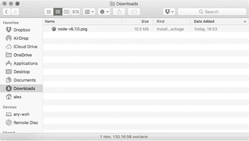
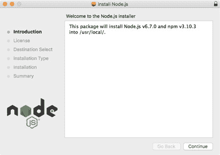
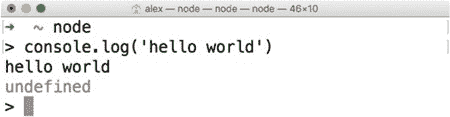
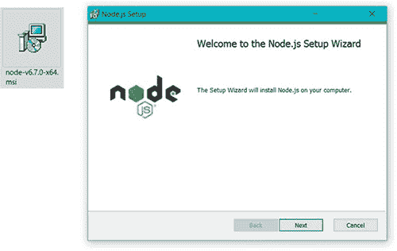
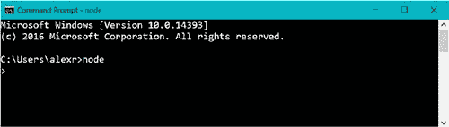

## 附录 A. 安装 Node

本附录提供了有关安装 Node.js 的更多详细信息。如果您对 Node 比较陌生，我们建议使用预构建包安装它。我们为每个主要操作系统解释了这一点。

根据您的需求，您可以使用其他方式安装 Node。如果您对 Node 更有经验或具有特定的 DevOps 需求，请跳过并查看其他安装 Node 的方式。

### A.1\. 使用安装程序安装 Node

Node 有两个安装程序和几个预构建的二进制包。如果您使用 macOS 或 Windows，您可以使用二进制文件或安装程序。二进制包包含可执行文件，但安装程序有安装向导，可以帮助您将 Node 安装到系统中的易于找到的位置，当您在终端中运行 node 或 npm 等命令时。

如果您是 Node 的新手，请使用安装程序。所有版本都可以在 Node 的网站下载部分（[`nodejs.org/en/download/`](https://nodejs.org/en/download/)）找到。

#### A.1.1\. macOS 安装程序

对于 macOS，从 Node 的网站下载 64 位 .pkg 文件（[`nodejs.org/en/download/`](https://nodejs.org/en/download/)）。您可以使用 LTS 或 Current 版本。您应该会看到一个包文件，如图 A.1（#app01fig01）所示。

##### 图 A.1\. 安装程序 .pkg 文件

下载安装程序后，双击它以打开安装向导（图 A.2）。

##### 图 A.2\. 安装向导

点击“继续”按钮并按照说明操作；默认选项将正确安装 Node。安装过程完成后，您应该能够打开一个终端并输入 `node` 来运行 Node REPL。图 A.3（#app01fig03）显示了它应该看起来是什么样子。

##### 图 A.3\. Node 的 REPL

下一个部分包括为 Windows 用户提供的相同说明。

#### A.1.2\. Windows 安装程序

在 Node 下载页面（[`nodejs.org/en/download/`](https://nodejs.org/en/download/)）上，点击 Windows 安装程序图标，或点击 Windows 安装程序 .msi 链接。有 32 位和 64 位选项，但您可能想要 64 位。文件下载完成后，双击它以运行安装向导，如图 A.4（#app01fig04）所示。

##### 图 A.4\. Windows .msi 安装程序

接受所有默认选项，然后打开 cmd.exe 以尝试 Node REPL。图 A.5（#app01fig05）显示了 Windows 中的 Node REPL。

##### 图 A.5\. Windows 中的 Node REPL

如果您通常不这样安装软件或不想全局安装 Node，请继续阅读以了解 Node 可以以其他方式安装。

### A.2\. 使用其他方式安装 Node

您可以从源代码、通过操作系统的包管理器或使用 Node 版本管理器安装 Node。如果您从源代码安装，您需要一个工作的构建系统和已安装的 Python。

#### A.2.1\. 从源代码安装 Node

您可以从 nodejs.org 下载页下载 Node 的源代码，但也可以通过 GitHub 上的 Git 获取 ([`github.com/nodejs/node`](https://github.com/nodejs/node))。完整的构建指南也位于 GitHub 上的 node/Building.md ([`github.com/nodejs/node/blob/master/BUILDING.md`](https://github.com/nodejs/node/blob/master/BUILDING.md))。构建 Node 时，您需要以下先决条件：

+   ***Linux—*** Python 2.6 或 2.7，gcc 和 g++ 4.8 或更高版本，或者 clang 和 clang++ 3.4 或更高版本。在类似 Debian 的发行版中，最简单的方法是使用构建基本包，或者在其他发行版中找到其等效包。

+   ***macOS—*** Xcode 和命令行工具，这些可以通过 Xcode 安装。

+   ***Windows—*** Python 2.6 或 2.7，Visual C++ 构建工具，Visual Studio 2015 更新 3。

当您的构建工具准备就绪时，您可以在类 UNIX 操作系统中运行 `./configure` 和 `make`。在 Windows 上，您可以运行 `.\vcbuild nosign`。

#### A.2.2\. 使用包管理器安装 Node

如果您使用 Linux 或 macOS，您可能希望使用包管理器安装 Node。这可以使更新 Node 更容易。例如，如果您使用的是 Linux 网络服务器，您可能想安装 Node 以便自动获取安全更新。

Node 的网站列出了大量为提供 Node 作为包的操作系统提供的安装说明 ([`nodejs.org/en/download/package-manager/`](https://nodejs.org/en/download/package-manager/))。例如，在 Debian 和 Ubuntu 基础系统上，您可以从 NodeSource 二进制发行版仓库获取 Node。它有自己的 GitHub 仓库，其中包含更多详细信息 ([`github.com/nodesource/distributions`](https://github.com/nodesource/distributions))。

在 macOS 上，您可以使用 Homebrew 安装 Node ([`brew.sh/`](http://brew.sh/))。如果您已安装 Homebrew，只需运行 `brew install node` 即可。

Node 也可以从 Docker Hub 获取。如果您在 Dockerfile 中添加 `FROM node:argon`，您将获得安装到镜像中的 Node 的 LTS 版本。
