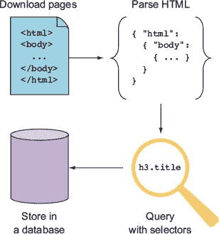
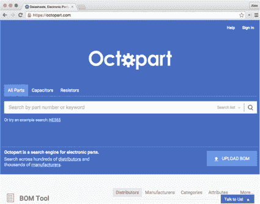
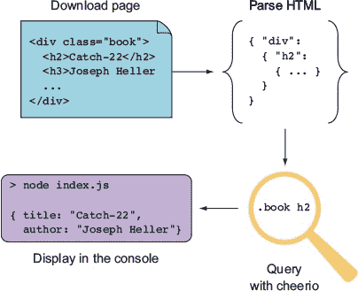
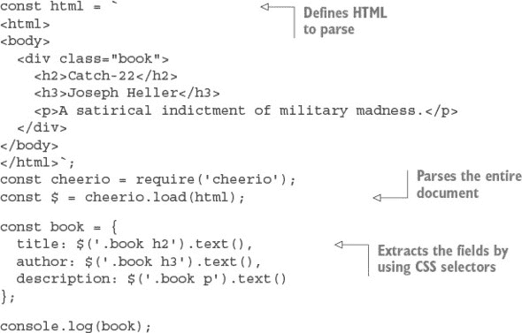
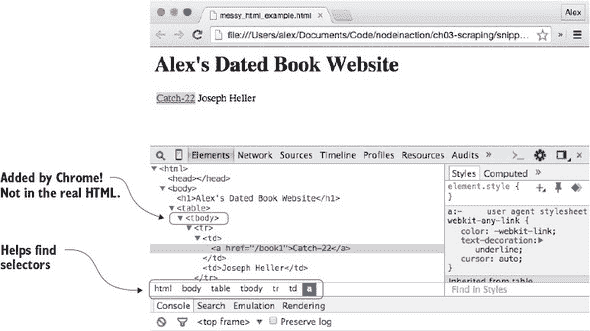
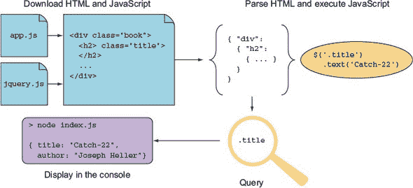
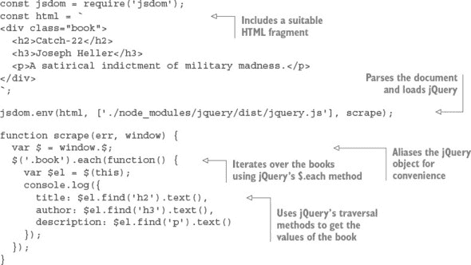
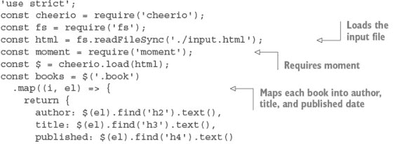
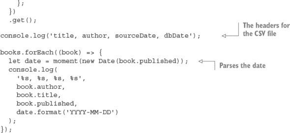

## 附录 B. 使用爬取自动化网络

*本附录涵盖*

+   从网页创建结构化数据

+   使用 cheerio 进行基本的网络爬取

+   使用 jsdom 处理动态内容

+   解析和输出结构化数据

在上一章中，你学习了某些通用的 Node 编程技术，但现在我们将开始专注于网络开发。网络爬取是做这件事的理想方式，因为它需要服务器端和客户端编程技能的结合。爬取就是使用编程技术理解网页并将它们转换为结构化数据。想象一下，你被分配了一个任务，要创建一个目前只是由一组过时的静态 HTML 页面组成的图书出版商网站的新版本。你想要下载这些页面并分析它们以提取所有书籍的标题、描述、作者和价格。你不想手动做这件事，所以你编写了一个 Node 程序来完成它。这就是*网络爬取*。

Node 在爬取方面表现卓越，因为它在基于浏览器的技术和通用脚本语言的力量之间取得了完美的平衡。在本章中，你将学习如何使用 HTML 解析库根据 CSS 选择器提取有用的数据，甚至可以在 Node 进程中运行动态网页。

### B.1\. 理解网络爬取

*网络爬取*是从网站中提取有用信息的过程。这通常涉及下载所需的页面，解析它们，然后使用 CSS 或 XPath 选择器查询原始 HTML。查询的结果随后作为 CSV 文件导出或保存到数据库中。图 B.1 展示了从开始到结束的爬取过程。

##### 图 B.1\. 爬取和存储内容的步骤



由于成本或资源限制，网络爬取可能违反某些网站的使用条款。如果成千上万的爬虫同时访问一个运行在老旧且缓慢服务器上的网站，服务器可能会被关闭。在爬取任何内容之前，你应该确保你有权访问和复制该内容。你可以技术上检查网站的 robots.txt ([www.robotstxt.org](http://www.robotstxt.org)) 文件以获取此信息，但你应该首先联系网站的所有者。在某些情况下，网站的所有者可能邀请你索引其信息——可能是作为更大规模网络开发合同的一部分。

在本节中，你将了解人们如何使用爬虫处理真实网站，然后你将查看允许 Node 成为网络爬取强者的所需工具。

#### B.1.1\. 网络爬取的用途

Web scraping 的一个很好的例子是垂直搜索引擎 Octopart ([`octopart.com/`](https://octopart.com/))。如图 B.2 所示，Octopart 索引了电子分销商和制造商，以便人们更容易找到电子产品。例如，你可以根据电阻、公差、功率额定值和外壳类型搜索电阻。这样的网站使用网络爬虫下载内容，使用抓取工具理解内容并提取有趣的价值（例如，电阻的公差），并使用内部数据库存储处理后的信息。

##### 图 B.2\. Octopart 允许用户搜索电子元件。



Web scraping 不仅仅用于搜索引擎，它还被应用于日益增长的数据科学和数据新闻领域。数据记者使用数据库来制作故事，但由于有大量数据存储在不易访问的格式中，他们可能会使用诸如 web scraping 之类的工具来自动收集和处理数据。这使得记者能够以新的方式呈现信息，通过数据可视化技术，包括信息图表和交互式图表。

#### B.1.2\. 必需的工具

为了进入正题，你需要一些易于访问的工具：一个网络浏览器和 Node。浏览器是其中最实用的抓取工具之一——如果你可以右键点击并选择“检查元素”，你就已经迈出了理解网站并将其转换为原始数据的一半。下一步是使用 Node 解析页面。在本章中，你将了解两种类型的解析器：

+   轻量级且宽容：cheerio

+   一个关注 Web 标准的文档对象模型（DOM）模拟器：jsdom

这两个库都是通过 npm 安装的。你可能还需要解析松散结构的人读数据格式，如日期。我们将简要介绍 Java-Script 的`Date.parse`和 Moment.js。

第一个例子使用了 cheerio，这是一种快速解析大多数静态网页的方法。

### B.2\. 使用 cheerio 进行基本的 Web 抓取

cheerio 库（[www.npmjs.com/package/cheerio](http://www.npmjs.com/package/cheerio)），由 Felix Böhm 编写，非常适合抓取，因为它结合了两个关键特性：快速的 HTML 解析，以及类似 jQuery 的 API 用于查询和操作 HTML。

假设你需要从一个出版社网站上提取有关书籍的信息。该出版社还没有公开书籍详细信息的 API，因此你需要下载其网站上的页面，并将它们转换为包含作者姓名和书名的可用的 JSON 输出。图 B.3 显示了使用 cheerio 进行抓取的工作原理。

##### 图 B.3\. 使用 cheerio 进行抓取



下面的列表包含一个使用 cheerio 的小型抓取器。已经包括了示例 HTML，所以你不必担心如何下载页面本身。

##### 列表 B.1\. 提取书籍的详细信息



列表 B.1 使用 cheerio 通过`cheerio.load()`方法和 CSS 选择器解析硬编码的 HTML 文档。在这个简单的例子中，CSS 选择器简单明了，但现实世界的 HTML 通常要混乱得多。不幸的是，结构不良的 HTML 是不可避免的，您的网络爬虫技能体现在想出巧妙的方法来提取您需要的值。

理解糟糕的 HTML 需要两个步骤。第一步是可视化文档，第二步是定义针对您感兴趣元素的选择器。您使用 cheerio 的功能来恰当地定义选择器。

幸运的是，现代浏览器提供了一个点选解决方案来查找选择器：如果您的浏览器有开发工具，您通常可以右键单击并选择“检查元素”。不仅您会看到底层的 HTML，浏览器还应显示一个针对元素的选择器表示。

假设您正在尝试从一个使用表格但没有方便 CSS 类的古怪网站中提取书籍信息。HTML 可能看起来像这样：

```
<html>
  <body>
    <h1>Alex's Dated Book Website</h1>
    <table>
      <tr>
        <td><a href="/book1">Catch-22</a></td>
        <td>Joseph Heller</td>
      </tr>
    </table>
  </body>
</html>
```

如果您在 Chrome 中打开它并右键单击标题，您会看到类似图 B.4 的内容。

##### 图 B.4\. 在 Chrome 中查看 HTML



HTML 下方的白色条形显示“html body table tbody tr td a”——这几乎就是您需要的选择器。但并不完全正确，因为真正的 HTML 没有`tbody`。Chrome 插入了这个元素。当您使用浏览器可视化文档时，您应该准备好根据真正的底层 HTML 调整您发现的内容。这个例子表明，您需要在一个表格单元格内搜索链接以获取标题，下一个表格单元格是相应的作者。

假设前面的 HTML 存储在一个名为 messy_html_example.html 的文件中，以下列表将提取标题、链接和作者。

##### 列表 B.2\. 处理糟糕的 HTML


您使用 fs 模块来加载 HTML；这样您就不必在示例中不断打印 HTML。实际上，您的数据源可能是一个实时网站，但数据也可能来自文件或数据库。在文档被解析后，您使用`first()`来获取带有锚点的第一个表格单元格。要获取锚点的 URL，您使用 cheerio 的`attr()`方法；它从元素中返回一个特定属性，就像 jQuery 一样。`eq()`方法也很有用；在这个列表中，它被用来跳过第一个 td，因为第二个包含作者的文本。

|  |
| --- |

**网络解析风险**

使用 cheerio 这样的模块是一种快速且简单的方法来解析网络文档。但请注意您尝试解析的内容类型。例如，它可能会在二进制数据上抛出异常，因此在使用 Node.js 网络应用程序时可能会崩溃。如果您的爬虫嵌入在同一个进程中，这将是危险的。

在通过解析器传递内容之前最好检查内容类型，你可能还希望考虑在你的 Node 进程中运行你的网络爬虫以减少任何严重崩溃的影响。

|  |
| --- |

cheerio 的一个限制是它只允许你与文档的静态版本一起工作；它用于处理纯 HTML 文档，而不是使用客户端 JavaScript 的动态页面。在下一节中，你将学习如何使用 jsdom 在你的 Node 应用程序中创建类似浏览器的环境，以便执行客户端 JavaScript。

### B.3\. 使用 jsdom 处理动态内容

*jsdom* 是网络爬虫的梦想工具：它下载 HTML，根据在典型浏览器中找到的 DOM 解释它，并运行客户端 JavaScript。你可以指定要运行的客户端 JavaScript，这通常意味着包括 jQuery。这意味着你可以将 jQuery（或你自己的自定义调试脚本）注入到任何页面中。图 B.5 展示了 jsdom 如何结合 HTML 和 JavaScript 使其他难以爬取的内容变得可访问。

##### 图 B.5\. 使用 jsdom 进行爬取



jsdom 确实有一些缺点。它并不是一个完美的浏览器模拟，它的速度比 cheerio 慢，HTML 解析器很严格，所以它可能无法处理编写糟糕的标记的页面。然而，一些网站没有客户端 JavaScript 支持就没什么意义，因此对于某些爬取任务来说，它是一个不可或缺的工具。

jsdom 的基本用法是通过 `jsdom.env` 方法。以下列表展示了如何使用 jsdom 通过注入 jQuery 并提取有用值来爬取一个页面。

##### 列表 B.3\. 使用 jsdom 进行爬取



要运行 列表 B.3，你需要将 jQuery 本地保存并安装 jsdom.^([1]) 你可以使用 npm 安装这两个模块。这些模块分别称为 jsdom ([www.npmjs.com/package/jsdom](http://www.npmjs.com/package/jsdom)) 和 jQuery ([www.npmjs.com/package/jquery](http://www.npmjs.com/package/jquery))。一切设置完成后，此代码应打印出 HTML 片段的标题、作者和描述。

> ¹
> 
> jsdom 6.3.0 是撰写本文时的当前版本。

`jsdom.env` 方法用于解析文档并注入 jQuery。jQuery 通过从 npm 下载它来注入，但你也可以提供内容分发网络 (CDN) 或你的文件系统上的 jQuery URL；jsdom 会知道该怎么做。`jsdom.env` 方法是异步的，需要回调来工作。回调接收错误和窗口对象；窗口对象是你访问文档的方式。在这里，窗口的 jQuery 对象已经被别名化，因此可以很容易地用 `$` 访问。

使用 jQuery 的 `.each` 方法与选择器一起使用，以遍历每一本书。这个例子只有一本书，但它证明了 jQuery 的遍历方法确实是可用的。通过使用 jQuery 的遍历方法也可以访问每本书的每个值。

列表 B.3 与之前的 cheerio 示例 列表 B.1 类似，但主要区别在于 jQuery 已经由 Node 在当前进程中解析和运行。列表 B.1 使用 cheerio 提供类似的功能，但 cheerio 提供了自己的类似 jQuery 的层。在这里，您正在运行旨在在浏览器中运行的代码，就像它真的在浏览器中运行一样。

`jsdom.env` 方法仅适用于处理静态页面。要解析使用客户端 JavaScript 的页面，您需要使用 `jsdom.jsdom`。这个同步方法返回一个可以与其他 jsdom 工具一起操作的窗口对象。以下列表使用 jsdom 解析带有 `script` 标签的文档，并使用 `jsdom.jQueryify` 使抓取更加容易。

##### 列表 B.4\. 使用 jsdom 解析动态 HTML

![Images/blis04_alt.jpg]

列表 B.4 需要安装 jQuery，因此如果您手动创建此列表，您需要使用 `npm init` 和 `npm install --save jquery jsdom` 设置一个新的项目。它使用一个简单的 HTML 文档，其中您正在寻找的有用值是使用 `script` 标签中的客户端 JavaScript 动态插入的。

这次，使用的是 `jsdom.jsdom` 而不是 `jsdom.env`。它是同步的，因为文档对象是在内存中创建的，但在您尝试查询或操作它之前不会做很多事情。为此，您使用 `jsdom.jQueryify` 将您的特定版本的 jQuery 插入文档中。在 jQuery 加载并运行后，回调函数将被执行，它会查询文档以获取您感兴趣的数据，并将它们打印到控制台。输出结果如下所示：

```
{ title: 'Catch-22', author: 'Joseph Heller' }
```

这证明了 jsdom 已经调用了必要的客户端 JavaScript。现在想象这是一个真正的网页，您将看到为什么 jsdom 如此强大：即使是使用很少的静态 HTML 和像 Angular 和 React 这样的动态技术构建的网站也可以被抓取。

### B.4\. 理解原始数据

在您最终从页面获取有用的数据后，您需要对其进行处理，以便将其保存到数据库或用于 CSV 等导出格式。您抓取的数据将是未结构化的纯文本或使用微格式编码。

*微格式* 是一种轻量级的基于标记的数据格式，用于地址、日历和事件以及标签或关键词等。您可以在 microformats.org 找到已建立的微格式。以下是一个表示为微格式的名称示例：

```
<a class="h-card" href="http://example.com">Joseph Heller</a>
```

微格式相对容易解析；使用 cheerio 或 jsdom，一个简单的表达式如 `$('.h-card').text()` 就足以提取 *约瑟夫·海勒*。但纯文本需要更多的工作。在本节中，您将了解如何解析日期，然后将它们转换为更友好的数据库格式。

大多数网页不使用微格式。在日期值方面，这是一个问题但可能可以管理的领域。日期可以以许多格式出现，但通常在给定网站上是一致的。在确定格式后，您可以解析并格式化日期。

JavaScript 有一个内置的日期解析器：如果您运行`new Date('2016 01 01')`，将返回一个`Date`实例，对应于 2016 年 1 月 1 日。支持的输入格式由`Date.parse`确定，它基于 RFC 2822 ([`tools.ietf.org/html/rfc2822#page-14`](http://tools.ietf.org/html/rfc2822#page-14))或 ISO 8601 ([www.w3.org/TR/NOTE-datetime](http://www.w3.org/TR/NOTE-datetime))。其他格式可能有效，并且通常值得尝试使用源数据查看会发生什么。

另一种方法是使用正则表达式匹配源数据中的值，然后使用`Date`构造函数创建新的`Date`对象。构造函数的签名如下：

```
new Date(year, month[,day[,hour[,minutes[,seconds[,millis]]]]]);
```

JavaScript 中的日期解析通常足够处理许多情况，但在日期重新格式化方面会失败。解决这个问题的一个很好的方法是 Moment.js ([`momentjs.com`](http://momentjs.com))，这是一个日期解析、验证和格式化库。它有一个流畅的 API，因此可以像这样链式调用：

```
moment().format("MMM Do YY"); // Sep 7th 15
```

这对于将抓取数据转换为与 Microsoft Excel 等程序兼容的 CSV 文件非常有用。想象一下，您有一个包含书籍标题和出版日期的网页。您想将这些值保存到数据库中，但您的数据库要求日期格式为 YYYY-MM-DD。以下列表显示了如何使用 Moment 与 cheerio 来完成此操作。

##### 列表 B.5\. 解析日期并生成 CSV





列表 B.5 需要安装 cheerio、Moment 和 books。它以 HTML（来自 input.html）作为输入，然后输出 CSV。HTML 中的日期应位于`h4`元素中，如下所示：

```
<div>
  <div class="book">
    <h2>Catch-22</h2>
    <h3>Joseph Heller</h3>
    <h4>11 November 1961</h4>
  </div>
  <div class="book">
    <h2>A Handful of Dust</h2>
    <h3>Evelyn Waugh</h3>
    <h4>1934</h4>
  </div>
</div>
```

在刮削器加载输入文件后，它加载了 Moment，然后通过使用 cheerio 的`.map`和`.get`方法将每本书映射到一个简单的 JavaScript 对象。`.map`方法遍历每一本书，回调函数通过使用`.find`选择器遍历方法提取你感兴趣的所有元素。为了将结果文本值作为数组获取，使用`.get`。

列表 B.5 通过使用`console.log`输出 CSV。首先打印标题，然后通过遍历每一本书的循环记录每一行。日期通过使用 Moment 转换为与 MySQL 兼容的格式；首先使用`new Date`解析日期，然后使用 Moment 进行格式化。

在你习惯了解析和格式化日期之后，你可以将类似的技术应用到其他数据格式上。例如，货币和距离测量可以通过正则表达式捕获，然后使用更通用的数字格式化库（如 Numeral）进行格式化（[www.npmjs.com/package/numeral](http://www.npmjs.com/package/numeral)）。

### B.5. 摘要

+   网络抓取是将有时结构不良的网页自动转换为计算机友好的格式（如 CSV 或数据库）的过程。

+   网络抓取不仅用于垂直搜索引擎，也用于数据新闻学。

+   如果你打算抓取一个网站，你应该先获得许可。你可以通过检查网站的 robots.txt 文件和联系网站所有者来实现这一点。

+   主要工具包括静态 HTML 解析器（cheerio）和能够运行 JavaScript 的解析器（jsdom），以及用于找到你感兴趣的元素的正确 CSS 选择器的浏览器开发者工具。

+   有时数据本身格式不佳，因此你可能需要解析日期或货币等事物，以便它们能与数据库兼容。
