## 附录 C. Connect 官方支持的中间件

Connect 是 Node 内置的 HTTP 客户端和服务器模块的最小包装器。Connect 的作者和贡献者还生产了官方支持的中间件组件，这些组件实现了大多数 Web 框架使用的低级功能，包括像 cookie 处理、请求体解析、会话、基本认证和跨站请求伪造（CSRF）等。本附录演示了所有官方支持的模块，以便您可以使用它们构建无需大型框架的轻量级 Web 应用程序。

### C.1\. 解析 cookies、请求体和查询字符串

Node 的核心不提供解析 cookies、缓冲请求体或解析复杂查询字符串等高级 Web 应用程序概念的模块，因此 Connect 模块实现了这些功能。本节涵盖了四个解析请求数据的模块：

+   ***cookie-parser—*** 将来自 Web 浏览器的 cookies 解析到`req.cookies`

+   ***qs—*** 将请求 URL 查询字符串解析到`req.query`

+   ***body-parser—*** 消耗并解析请求体到`req.body`

我们将要查看的第一个模块是 cookie-parser。这个模块使得检索网站访问者浏览器存储的数据变得容易，这样您可以读取诸如授权状态、网站设置等内容。

#### C.1.1\. cookie-parser：解析 HTTP cookies

`cookie-parser`模块支持常规 cookies、签名 cookies 和特殊的 JSON cookies ([www.npmjs.com/package/cookie-parser](http://www.npmjs.com/package/cookie-parser))。默认情况下，使用常规未签名的 cookies，填充`req.cookies`对象。如果您想支持签名 cookies，这有助于防止 cookies 被篡改，您需要在创建`cookie-parser`实例时传递一个密钥字符串。

| |
| --- |

##### 在服务器端设置 cookies

`cookie-parser`模块不提供设置输出 cookies 的任何辅助函数。为此，您应使用`res.setHeader()`函数，并将`Set-Cookie`作为头名称。将 Node 的默认`res.setHeader()`函数与特殊处理的`Set-Cookie`头连接起来，以便它按预期工作。

| |
| --- |

##### 常规 cookies

要读取 cookies，您需要加载模块，将其添加到中间件堆栈中，然后在请求中读取 cookies。以下列表说明了这些步骤。

##### 列表 C.1\. 读取请求中发送的 cookies

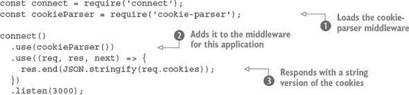

此示例加载中间件组件 。请记住，您需要使用`npm install cookie-parser`安装中间件才能使其工作。接下来，它将 cookie 解析器的一个实例添加到该应用程序的中间件堆栈中 。最后一步是将 cookies 作为字符串发送回浏览器 ，以便您可以查看其工作情况。

如果你运行这个示例，你需要在请求中设置 cookies。如果你在浏览器中访问 http://localhost:3000，你可能不会看到太多；它应该返回一个空对象（`{}`）。你可以使用 cURL 设置一个 cookie，如下所示：

```
curl http://localhost:3000/ -H "Cookie: foo=bar, bar=baz"
```

##### 已签名的 cookies

已签名的 cookies 更适合敏感数据，因为可以验证 cookie 数据的完整性，有助于防止中间人攻击。当有效时，已签名的 cookies 将放在`req.signedCookies`对象中。有两个单独的对象背后的原因是它显示了开发者的意图。如果你将已签名和未签名的 cookies 放在同一个对象中，可以制作一个常规 cookie 来包含模仿已签名 cookie 的数据。

一个已签名的 cookie 看起来像这样`s:tobi.DDm3AcVxE9oneYnbmpqxoy[...]`^([1]),其中点(`.`)左侧的内容是 cookie 的值，右侧的内容是在服务器上使用 SHA-256 HMAC（基于哈希的消息认证码）生成的秘密哈希。当 Connect 尝试取消签名 cookie 时，如果值或 HMAC 被更改，它将失败。

> ¹
> 
> 已签名的值已被缩短。

假设，例如，你设置了一个带有`name`键和`luna`值的已签名 cookie。`cookieParser`将 cookie 编码为`s:luna.PQLM0wNvqOQEObZX[...]`。哈希部分在每个请求上都会进行检查，当 cookie 完整发送时，它将作为`req.signedCookies.name`可用：

```
$ curl http://localhost:3000/ -H "Cookie:
name=s:luna.PQLM0wNvqOQEObZXU[...]"
{}
{ name: 'luna' }
GET / 200 4ms
```

如果 cookie 的值发生变化，如下一个`curl`命令所示，`name`cookie 将作为`req.cookies.name`可用，因为它不是有效的。它可能仍然用于调试或特定于应用程序的目的：

```
$ curl http://localhost:3000/ -H "Cookie:
name=manny.PQLM0wNvqOQEOb[...]"
{ name: 'manny.PQLM0wNvqOQEOb[...]' }
{}
GET / 200 1ms
```

`cookieParser`的第一个参数是用于签名 cookies 的秘密。在下面的列表中，秘密是*tobi is a cool ferret*。

##### 列表 C.2\. 解析已签名的 cookies

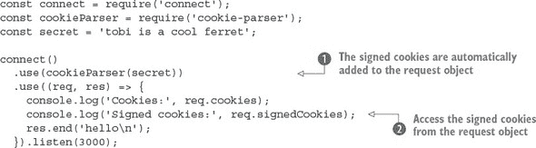

在这个例子中，由于将`secret`参数传递给了`cookieParser`中间件组件，所以已签名的 cookies 被自动解析![Images/circ1.jpg]。值可以在`request`对象上访问![Images/circ2.jpg]。cookie-parser 模块还通过`signedCookie`和`signedCookies`方法提供了 cookie 解析功能。

在继续之前，让我们看看如何使用这个示例。与列表 C.1 一样，你可以使用带有`-H`选项的`curl`发送一个 cookie。但是，为了使其被视为已签名的 cookie，它需要以某种方式进行编码。

Node 的 crypto 模块用于在`signedCookie`方法中取消签名 cookies。如果你想测试列表 C.2 并签名一个 cookie，你需要安装`cookie-signature`，然后使用相同的秘密签名一个字符串：

```
const signature = require('cookie-signature');
const message = 'luna';
const secret = 'tobi is a cool ferret';
console.log(signature.sign(message, secret);
```

现在如果签名或消息被修改，服务器将能够检测到。除了已签名的 cookies，此模块还支持 JSON 编码的 cookies。下一节将展示它们是如何工作的。

##### JSON cookies

特殊的 JSON Cookie 以 `j:` 为前缀，这通知 Connect 它打算被序列化为 JSON。JSON Cookie 可以是已签名的或未签名的。

诸如 Express 这样的框架可以使用此功能为开发者提供更直观的 Cookie 接口，而不是要求他们手动序列化和解析 JSON Cookie 值。以下是一个 Connect 解析 JSON Cookie 的示例：

```
$ curl http://localhost:3000/ -H 'Cookie: foo=bar,
bar=j:{"foo":"bar"}'
{ foo: 'bar', bar: { foo: 'bar' } }
{}
GET / 200 1ms
```

如前所述，JSON Cookie 也可以被签名，如下面的请求所示：

```
$ curl http://localhost:3000/ -H "Cookie:
cart=j:{\"items\":[1]}.sD5p6xFFBO/4ketA1OP43bcjS3Y"
{}
{ cart: { items: [ 1 ] } }
GET / 200 1ms
```

##### 设置输出 Cookie

如前所述，cookie-parser 模块不提供通过 `Set-Cookie` 头部将输出头部写入 HTTP 客户端的任何功能。但是，Connect 通过 `res.setHeader()` 函数提供了对多个 `Set-Cookie` 头部的显式支持。

假设您想设置一个名为 `foo` 的 Cookie，其字符串值为 `bar`。Connect 允许您通过调用 `res.setHeader()` 在一行代码中完成此操作。您还可以设置 Cookie 的各种选项，例如其过期日期，如第二个 `setHeader()` 调用所示：

```
var connect = require('connect');

connect()
  .use((req, res) => {
    res.setHeader('Set-Cookie', 'foo=bar');
    res.setHeader('Set-Cookie',
      'tobi=ferret; Expires=Tue, 08 Jun 2021 10:18:14 GMT'
    );
  res.end();
})
.listen(3000);
```

如果您使用 `curl` 的 `--head` 标志检查服务器发送回 HTTP 请求的头部，您可以看到 `Set-Cookie` 头部被设置为预期的那样：

```
$ curl http://localhost:3000/ --head
HTTP/1.1 200 OK
Set-Cookie: foo=bar
Set-Cookie: tobi=ferret; Expires=Tue, 08 Jun 2021 10:18:14 GMT
Connection: keep-alive
```

这就是使用 HTTP 响应发送 Cookie 的全部内容。您可以在 Cookie 中存储任何类型的文本数据，但通常在客户端存储单个会话 Cookie，以便您可以在服务器上拥有完整的用户状态。这种会话技术封装在 express-session 模块中，您将在本附录的后面了解它。

现在您已经可以处理 Cookie，您可能渴望处理其他接受用户输入的常用方法。接下来的两个部分将涵盖解析查询字符串和请求体，您会发现尽管 Connect 相对底层，但您仍然可以像更复杂的 Web 框架一样获得相同的功能，而无需编写大量代码。

#### C.1.2\. 解析查询字符串

接受输入的一种方法是通过使用 `GET` 参数。您在 URL 后面放置一个问号，后面跟着由与符号分隔的参数列表：

```
http://localhost:3000/page?name=tobi&species=ferret
```

此类 URL 可以通过设置为使用 `GET` 方法的表单或通过应用程序模板中的锚点元素呈现给您的应用程序。您可能已经看到它被用于分页。

在 Connect 应用程序中传递给每个中间件组件的请求对象包括一个 `url` 属性，但您想要的是 URL 的最后一部分：即问号之后的部分。Node 内置了 URL 解析模块，因此您可以使用 `url.parse` 来获取查询字符串。但是 Connect 也需要解析 URL，因此它设置了一个包含解析版本的内部属性。

推荐用于解析查询字符串的模块是 qs ([www.npmjs.com/package/qs](http://www.npmjs.com/package/qs))。此模块不是 Connect 的官方支持模块，并且通过 npm 提供了替代方案。要使用 qs 和类似模块，您需要从自己的中间件组件中调用其 `.parse()` 方法。

##### 基本用法

以下列表使用 `qs.parse` 方法创建一个对象，该对象存储在 `req.query` 属性上，以便后续中间件组件使用。

##### 列表 C.3\. 解析查询字符串


此示例使用自定义中间件组件来获取解析后的 URL，使用 `qs.parse`  进行解析，然后在后续组件中显示它。

假设您正在设计一个音乐库应用程序。您可以提供一个搜索引擎，并使用查询字符串来构建搜索参数，如下所示：

```
/songSearch?artist=Bob%20Marley&track=Jammin.
```

此示例查询生成一个 `res.query` 对象，如下所示：

```
{ artist: 'Bob Marley', track: 'Jammin' }
```

`qs.parse` 方法支持嵌套数组，因此复杂的查询字符串，如 `?images[]=foo.png&images[]=bar.png`，会产生如下对象：

```
{ images: [ 'foo.png', 'bar.png' ] }
```

当 HTTP 请求中没有提供查询字符串参数时，例如 `/songSearch`，`req.query` 将默认为空对象：

```
{}
```

高级框架，如 Express，通常内置查询字符串解析，因为这对于 Web 开发来说是一个常见的需求。Web 框架的另一个常见功能是解析请求主体，这样您就可以接受通过表单提交的数据。下一节将解释如何解析请求主体、处理表单和文件上传，并验证这些请求以确保它们是安全的。

#### C.1.3\. body-parser：解析请求主体

大多数 Web 应用程序都必须接受和处理用户输入。这可能来自表单，甚至在 RESTful API 的情况下来自其他程序。HTTP 请求和响应统称为 *HTTP 消息*。消息的格式由一系列头和消息体组成。在 Node Web 应用程序中，体通常是一个流，并且可以用各种方式编码：来自表单的 POST 请求通常为 `application/x-www-form-urlencoded`，而 RESTful JSON 请求可能是 `application/json`。

这意味着您的 Connect 应用程序需要能够解码表单编码数据、JSON 或甚至使用 gzip 或 deflate 压缩数据的中间件。在本节中，我们将展示如何执行以下操作：

+   处理表单输入

+   解析 JSON 请求

+   根据内容和大小验证主体

+   接受文件上传

##### 表单

假设您想通过表单接受您应用程序的注册信息。您只需在将访问 `req.body` 对象的任何其他中间件之前添加 body-parser 组件 ([www.npmjs.com/package/body-parser](http://www.npmjs.com/package/body-parser))。 展示了这是如何工作的。

##### 图 C.1\. body-parser 如何处理表单

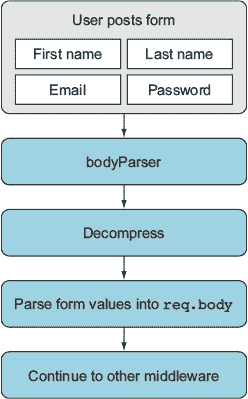

以下列表显示了如何使用 body-parser 模块处理来自表单的 HTTP `POST` 请求。

##### 列表 C.4\. 解析表单请求

![Images/clis04_alt.jpg]

要使用此示例，您需要安装 body-parser 模块^([2]), 然后您需要一种方法来使用 URL 编码的 body 发送简单的 HTTP 请求。最简单的方法是使用带有`-d`选项的`curl`:

> ²
> 
> 我们使用了版本 1.11.0。

```
curl -d name=tobi http://localhost:3000
```

这应该会导致服务器显示`您发送了: {"name":"tobi"}`。为了使这生效，body 解析器被添加到中间件堆栈 ![Images/circ1.jpg]，然后解析后的 body 在`req.body`中转换为字符串 ![Images/circ2.jpg]，以便更容易显示。`urlencoded`请求体解析器接受 UTF-8 编码的字符串，并且它会自动解压缩使用 gzip 或 deflate 编码的请求体。

在此示例中，传递给 body 解析器的选项是`extended: false`。当设置为`true`时，此选项会导致 body 解析器使用另一个库来解析查询字符串格式。这允许您在表单中使用更复杂、嵌套、类似 JSON 的对象。其他选项将在下一节中介绍，您将了解如何验证请求。

##### 验证请求

body-parser 模块附带的所有解析器都支持两种验证请求的选项：`limit`和`verify`。`limit`选项允许您阻止超过一定大小的请求：默认为 100 KB，因此如果您想接受更大的表单，可以将其增加。如果您正在制作类似内容管理系统或博客的东西，人们可能会输入有效但较长的字段，这将很有用。

`verify`选项允许您使用一个函数来验证请求。如果您想获取原始请求体并检查其格式是否正确，这很有用。例如，您可以使用此选项确保接受 XML 的 API 方法始终以正确的 XML 头开始。以下列表显示了如何使用这两个选项。

##### 列表 C.5\. 验证表单请求

![Images/clis05_alt.jpg]

注意，应该使用`throw`关键字抛出一个`Error`对象 ![Images/circ1.jpg]。body-parser 模块在解析请求之前会捕获这些错误，因此它会将错误回传给 Connect。在创建了一个请求验证函数之后，您需要通过使用`verify`选项将此函数传递给 body-parser 中间件组件 ![Images/circ3.jpg]。

请求体大小限制是以字节为单位的；这里相当小，只有 10 字节 ![Images/circ2.jpg]。您可以通过使用之前的`curl`命令并使用更大的名称值来轻松地看到请求太大时会发生什么。另外，如果您想看到当验证错误被抛出时会发生什么，请使用`curl`发送另一个值而不是`name`。

##### 为什么需要限制？

让我们看看一个恶意用户如何使一个易受攻击的服务器变得无用。首先，创建以下名为 server.js 的小型 Connect 应用程序，它除了使用`bodyParser()`中间件组件解析请求体之外，什么都不做：

```
const connect = require('connect');
const bodyParser = require('body-parser');

connect()
  .use(bodyParser.json({ limit: 99999999, extended: false }))
  .use((req, res, next) => {
    res.end('OK\n');
  })
  .listen(3000);
```

现在创建一个名为 dos.js 的文件，如下所示。你可以看到恶意用户如何仅通过写入几个兆字节的 JSON 数据来利用 Node 的 HTTP 客户端攻击前面的 Connect 应用程序：

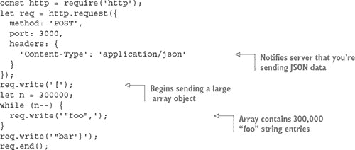

启动服务器并运行攻击脚本：

```
$ node server.js &
$ node dos.js
```

如果你使用 `top(1)` 观察 `node` 进程，你应该会看到随着 dos.js 的运行，它开始使用更多的 CPU 和 RAM。这是不好的，但幸运的是，这正是所有 body 解析中间件组件接受 `limit` 选项的原因。

##### 解析 JSON 数据

如果你使用 Node 制作 Web 应用程序，你将需要处理大量的 JSON。body-parser 模块的 JSON 解析器在之前的例子中已经展示了一些实用的选项。以下列表显示了如何解析 JSON 并使用结果值。

##### 列表 C.6\. 验证表单请求

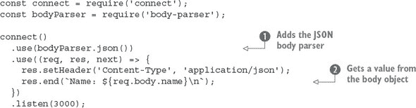

在 JSON 解析器加载后 ，你的请求处理器可以将 `req.body` 值作为 JavaScript 对象而不是字符串来处理。此示例假设已发送一个具有 `name` 属性的 JSON 对象，并且它将在响应中发送该值 。这意味着你的请求必须具有 `Content-Type` 为 `application/json`，并且你需要发送有效的 JSON。默认情况下，`json` 中间件组件使用严格的解析，但你可以通过将其设置为 `false` 来放宽编码要求。

|  |
| --- |

**设置 JSON Content-Type 选项**

你需要了解的一个选项是 `type`。这允许你更改将被解析为 JSON 的 `Content-Type`。在下面的例子中，我们使用默认值，即 `application/json`。但在某些情况下，你的应用程序可能需要与不发送此头信息的 HTTP 客户端交互，所以请小心。

|  |
| --- |

以下 `curl` 请求可以用来向你的应用程序提交数据，并将包含 `username` 属性设置为 `tobi` 的 JSON 对象发送：

```
curl -d '{"name":"tobi"}' -H "Content-Type: application/json"
http://localhost:3000
Name: tobi
```

##### 解析 multipart <form> 数据

body-parser 模块不处理 multipart 请求体。你需要处理 multipart 消息以支持文件上传，因此任何如上传用户头像这样的操作都需要 multipart 支持。

Connect 没有官方支持的 multipart 解析器，但一些流行的解析器维护得很好。两个例子是 busboy ([www.npmjs.com/package/busboy](http://www.npmjs.com/package/busboy)) 和 multiparty ([www.npmjs.com/package/multiparty](http://www.npmjs.com/package/multiparty))。这两个模块都有相关的 connect 模块：connect-busboy 和 connect-multiparty。之所以这样，是因为 multipart 解析器本身依赖于 Node 的底层 HTTP 模块，因此它们可以被广泛的应用框架使用。它们并不是专门绑定到 Connect 的。

以下列表基于 multiparty，将在控制台打印出上传文件的详细信息。

##### 列表 C.7\. 处理上传的文件

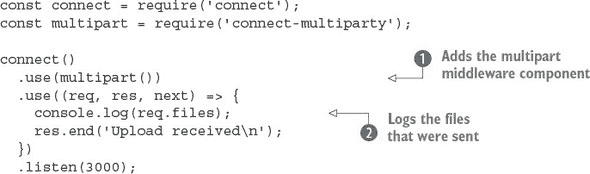

这个简短的示例添加了 multiparty 中间件组件  并记录接收到的文件 。文件将被上传到临时位置，所以当你应用程序完成使用这些文件时，你必须使用 fs 模块删除这些文件。

要使用此示例，请确保你已经安装了 connect-multiparty.^([3]) 然后启动服务器，并使用`curl`的`-F`选项发送一个文件：

> ³
> 
> 我们使用版本 1.2.5 来测试这个示例。

```
curl -F file=@index.js http://localhost:3000
```

文件名放在`@`符号之后，并且它前面有一个字段名。字段名将在`req.files`对象中可用，因此你可以区分不同的上传文件。

如果你查看应用程序的输出，你会看到类似于以下示例输出的内容。正如你所看到的，`req.files.file.path`将可用于你的应用程序，你可以重命名磁盘上的文件，将数据传输到工作进程进行处理，上传到内容分发网络，或者做任何你的应用程序需要的其他事情：

```
{ fieldName: 'file',
  originalFilename: 'index.js',
  path: '/var/folders/d0/_jqj3lf96g37s5wrf79v_g4c0000gn/T/60201-p4pohc.js',
  headers:
   { 'content-disposition': 'form-data; name="file"; filename="index.js"',
     'content-type': 'application/octet-stream' },
```

虽然 body-parser 可以处理压缩，但你可能想知道如何压缩发出的响应。继续阅读，了解可以减少你的带宽账单并让你的 Web 应用感觉更快的压缩中间件组件。

#### C.1.4\. 压缩：压缩发出的响应

在前面的章节中，你可能已经注意到，体解析器可以解压缩使用 gzip 或 deflate 的请求。Node 自带一个用于处理压缩的核心模块，名为 zlib，它用于实现压缩和解压缩方法。压缩中间件组件([www.npmjs.com/package/compression](http://www.npmjs.com/package/compression))可以用于压缩发出的响应，这意味着你的服务器发送的数据可以被压缩。

Google 的 PageSpeed Insights 工具建议启用 gzip 压缩，^([4]) 如果你查看开发工具中浏览器发出的请求，你应该看到许多网站发送了压缩的响应。压缩会增加 CPU 开销，但由于纯文本和 HTML 等格式压缩得很好，它可以提高你网站的性能并减少带宽使用。

> ⁴
> 
> 有关更多信息，请参阅[`developers.google.com/speed/docs/insights/EnableCompression`](https://developers.google.com/speed/docs/insights/EnableCompression)。

|  |
| --- |

**Deflate 或 gzip？**

有两个压缩选项可能会让人感到困惑。你可能想知道哪个最好，以及为什么会有两个。嗯，根据标准（RFC 1950 和 RFC 2616），它们都使用相同的压缩算法，但它们在处理头部和校验和的方式上有所不同。

不幸的是，一些浏览器不能正确处理 deflate，所以一般的建议是使用 gzip。在解析体的情况下，最好能够支持两者，但如果你正在压缩服务器的输出，使用 gzip 以确保安全。

|  |
| --- |

压缩模块会检测来自 `Accept-Encoding` 头字段的接受编码。如果该字段不存在，则使用身份编码，意味着响应不会被修改。否则，如果该字段包含 `gzip`、`deflate` 或两者都包含，则响应将被压缩。

##### 基本用法

你通常应该在 Connect 堆栈中添加压缩，因为它封装了 `res.write()` 和 `res.end()` 方法。

在以下示例中，内容将被压缩：

```
const connect = require('connect');
const compression = require('compression');
connect()
  .use(compression({ threshold: 0 }))
  .use((req, res) => {
    res.setHeader('Content-Type', 'text/plain');
    res.end('This response is compressed!\n');
  })
  .listen(3000);
```

要运行此示例，你需要从 npm 安装压缩模块。然后，启动服务器并尝试使用设置 `Accept-Encoding` 为 `gzip` 的 `curl` 发送请求：

```
$ curl http://localhost:3000 -i -H "Accept-Encoding: gzip"
```

`-i` 参数使 cURL 显示头信息，因此你应该看到 `Content-Encoding` 设置为 `gzip`。输出应该是乱码的，因为压缩数据不会是标准字符。尝试不带 `-i` 选项通过 `gunzip` 来管道化它以查看输出：

```
$ curl http://localhost:3000 -H "Accept-Encoding: gzip" | gunzip
```

这功能强大且相对简单易设，但你并不总是想压缩服务器发送的所有内容。要跳过压缩，你可以使用自定义过滤器函数。

##### 使用自定义过滤器函数

默认情况下，`compression` 在默认的 `filter` 函数中包含 `text/*`、`*/json` 和 `*/java-script` MIME 类型，以避免压缩这些数据类型：

```
exports.filter = function(req, res){
  const type = res.getHeader('Content-Type') || '';
  return type.match(/json|text|javascript/);
};
```

要改变这种行为，你可以在选项对象中传递一个 `filter`，如下面的代码片段所示，这将仅压缩纯文本：

```
function filter(req) {
  const type = req.getHeader('Content-Type') || '';
  return 0 === type.indexOf('text/plain');
}
connect()
  .use(compression({ filter: filter }));
```

##### 指定压缩和内存级别

Node 的 zlib 绑定提供了调整性能和压缩特性的选项，并且它们也可以传递给 `compression` 函数。

在以下示例中，压缩 `level` 设置为 `3` 以实现更快的压缩但压缩效果较低，`memLevel` 设置为 `8` 以使用更多内存来实现更快的压缩。这些值完全取决于你的应用程序及其可用的资源。有关详细信息，请参阅 Node 的 zlib 文档：

```
connect()
  .use(compression({ level: 3, memLevel: 8 }));
```

这就是全部内容。接下来，我们将探讨覆盖核心 Web 应用需求的中间件，例如日志记录和会话。

### C.2\. 实现核心 Web 应用功能

Connect 旨在实现并提供内置中间件以满足最常见的 Web 应用需求，这样它们就不需要每个开发者反复重新实现。核心 Web 应用功能，如日志记录、会话和虚拟主机，都由 Connect 提供。

在本节中，你将了解五个有用的中间件组件，你可能会在应用程序中使用它们：

+   ***morgan—*** 提供灵活的请求日志

+   ***serve-favicon—*** 处理 /favicon.ico 请求，无需你费心

+   ***method-override—*** 允许无能力的客户端透明地覆盖 `req.method`

+   ***vhost—*** 在单个服务器上设置多个网站（虚拟主机）

+   ***express-session—*** 管理会话数据

到目前为止，您已经创建了您自己的自定义日志中间件，但 Connect 维护者提供了一个名为 Morgan 的灵活解决方案，因此让我们首先探索它。

#### C.2.1\. morgan: 记录请求

Morgan 模块 ([www.npmjs.com/package/morgan](http://www.npmjs.com/package/morgan)) 是一个灵活的请求记录中间件组件，具有可定制的日志格式。它还具有缓冲日志输出以减少磁盘写入的选项，以及如果您想将日志记录到控制台以外的其他位置（如文件或套接字）时指定日志流。

##### 基本用法

要在您的应用程序中使用 Morgan，请将其作为函数调用，以返回一个中间件函数，如下所示列表所示。

##### 列表 C.8\. 使用 Morgan 模块进行日志记录

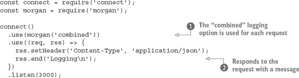

要使用此示例，您需要从 npm 安装 Morgan 模块.^([5]) 它将模块添加到中间件堆栈的顶部  并然后输出简单的文本响应 。通过使用 `combined` 记录格式参数 ，此 Connect 应用程序将输出 Apache 日志格式。这是一个灵活的格式，许多命令行工具都可以解析，因此您可以将日志通过日志处理应用程序运行，以生成有用的统计数据。如果您尝试从不同的客户端（如 `curl`、`wget` 和浏览器）发出请求，您应该在日志中看到用户代理字符串。

> ⁵
> 
> 我们使用了版本 1.5.1。

`combined` 记录格式定义如下：

```
:remote-addr - :remote-user [:date[clf]] ":method :url
HTTP/:http-version" :status :res[content-length] ":referrer" ":user-agent"
```

每个 `:something` 部分 *标记*，在日志条目中它们将包含正在记录的 HTTP 请求的实时值。例如，一个简单的 `curl(1)` 请求将生成一个类似于以下日志行的记录：

```
127.0.0.1 - - [Thu, 05 Feb 2015 04:27:07 GMT]
                    "GET / HTTP/1.1" 200 - "-"
                    "curl/7.37.1"
```

##### 自定义日志格式

您还可以创建自己的日志格式。为此，传递一个自定义的标记字符串。例如，以下格式将输出类似 `GET /users 15 ms` 的内容：

```
connect()
  .use(morgan(':method :url :response-time ms'))
  .use(hello)
  .listen(3000);
```

默认情况下，以下标记可用于使用（注意，头部名称不区分大小写）：

+   `:req[header]` 示例：`:req[Accept]`

+   `:res[header]` 示例：`:res[Content-Length]`

+   `:http-version`

+   `:response-time`

+   `:remote-addr`

+   `:date`

+   `:method`

+   `:url`

+   `:referrer`

+   `:user-agent`

+   `:status`

您甚至可以定义自定义标记。您只需向 `connect.logger.token` 函数提供一个标记名称和回调函数即可。例如，假设您想记录每个请求的查询字符串。您可能定义如下：

```
var url = require('url');
morgan.token('query-string', function(req, res){
  return url.parse(req.url).query;
});
```

Morgan 模块除了默认格式外，还提供了预定义的格式，例如 `short` 和 `tiny`。另一个预定义的格式是 `dev`，它为开发环境生成简洁的输出，适用于你通常是网站上的唯一用户且不关心 HTTP 请求的详细信息的情况。此格式还会根据类型对响应状态码进行颜色编码：状态码在 200 范围内的响应为绿色，300 范围内的为蓝色，400 范围内的为黄色，500 范围内的为红色。这种颜色方案非常适合开发使用。

要使用预定义的格式，你需要在 `logger()` 中提供名称：

```
connect()
  .use(morgan('dev'))
  .use(hello);
  .listen(3000);
```

现在你已经知道了如何格式化日志输出，让我们看看你可以提供给它的选项。

##### 日志选项：stream，immediate 和 buffer

如前所述，你可以使用选项来调整 morgan 的行为。

其中一个选项是 `stream`，它允许你传递一个 Node `Stream` 实例，日志将写入该实例而不是 stdout。这允许你通过使用从 `fs.createWriteStream` 创建的 `Stream` 实例将日志输出定向到自己的日志文件，独立于服务器的输出。

当你使用这些选项时，通常建议还包括 `format` 属性。以下示例使用自定义格式，并带有 `append` 标志将日志记录到 /var/log/myapp.log，这样在应用程序启动时文件不会被截断：

```
const fs = require('fs');
const morgan = require('morgan');
const log = fs.createWriteStream('/var/log/myapp.log', { flags: 'a' })
connect()
  .use(morgan({ format: ':method :url', stream: log }))
  .use('/error', error)
  .use(hello)
  .listen(3000);
```

另一个有用的选项是 `immediate`，它在接收到请求时立即写入日志行，而不是等待响应。如果你正在编写一个长时间保持请求打开的服务器，并且想知道连接何时开始，或者你可能用它来调试应用程序的关键部分。像 `:status` 和 `:response-time` 这样的令牌不能使用，因为它们与响应相关。要启用立即模式，将 `immediate` 的值传递为 `true`，如下所示：

```
const app = connect()
  .use(connect.logger({ immediate: true }))
  .use('/error', error)
  .use(hello);
```

日志部分到此结束！接下来，我们将查看 favicon-serving 中间件组件。

#### C.2.2\. serve-favicon：地址栏和书签图标

*favicon* 是浏览器在地址栏和书签中显示的微小网站图标。为了获取这个图标，浏览器会向 /favicon.ico 的文件发送请求。通常最好尽快提供 favicon 文件，这样其余的应用程序就可以简单地忽略它们。serve-favicon 模块([www.npmjs.com/package/serve-favicon](http://www.npmjs.com/package/serve-favicon))默认显示 Connect 的图标。这可以通过传递其他图标的参数来配置。此 favicon 如图 C.2 所示。

##### 图 C.2\. 一个 favicon

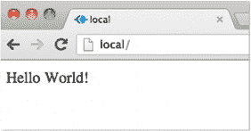

##### 基本用法

serve-favicon 中间件组件可以被放置在堆栈的顶部，这会导致后续的任何日志组件忽略 favicon 请求。图标被缓存在内存中以实现快速响应。

以下示例显示 serve-favicon 通过传递文件路径作为唯一参数发送 .ico 文件：

```
const connect = require('connect');
const favicon = require('serve-favicon');
connect()
  .use(favicon(__dirname + '/favicon.ico'))
  .use((req, res) => {
    res.end('Hello World!\n');
  });
```

注意，你需要一个名为 favicon.ico 的文件来测试这一点。可选地，你可以传递一个 `maxAge` 参数来指定浏览器应该在内存中缓存 favicon 的时间长度。

接下来，我们有一个另一个小但很有用的中间件组件：method-override。它提供了在客户端功能有限时伪造 HTTP 请求方法的方法。

#### C.2.3\. method-override：伪造 HTTP 方法

有时候使用超出常见 `GET` 和 `POST` 方法的 HTTP 动词是有用的。想象一下你正在构建一个博客，并希望允许人们创建、更新和删除文章。说 `DELETE` /article 比说 `GET` 或 `POST` 更自然。不幸的是，并非每个浏览器都理解 `DELETE` 方法。

一个常见的解决方案是允许服务器从查询参数、表单值以及有时甚至 HTTP 头部中获取有关要使用哪个 HTTP 方法的提示。这样做的一种方式是添加 `<input type=hidden>` 并将其值设置为要使用的方程序名。然后服务器可以检查该值并假装它是请求方法。

大多数 Web 框架都支持这种技术，而 `method-override` 模块（[www.npmjs.com/package/method-override](http://www.npmjs.com/package/method-override)）是使用 Connect 实现它的推荐方式。

##### 基本用法

默认情况下，HTML 输入名称是 `_method`，但你可以向 `methodOverride` 传递一个自定义值，如下面的代码片段所示：

```
connect()
const connect = require('connect');
const methodOverride = require('method-override');
connect()
  .use(methodOverride('__method__'))
  .listen(3000)
```

为了展示 `methodOverride()` 的实现方式，让我们看看如何创建一个用于更新用户信息的小型应用程序。该应用程序由一个表单组成，当浏览器提交表单并由服务器处理时，它会返回一个简单的成功消息，如图 C.3 所示。

##### 图 C.3\. 使用 methodoverride 在浏览器中模拟 `PUT` 请求以更新表单

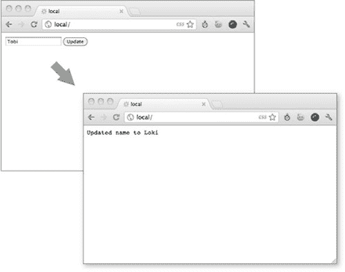

该应用程序通过使用两个独立的中间件组件来更新用户数据。在 `update` 函数中，当请求方法不是 `PUT` 时，会调用 `next()`。如前所述，大多数浏览器不尊重表单属性 `method="put"`，所以以下列表中的应用程序将无法正常工作。

##### 列表 C.9\. 一个损坏的用户更新应用程序

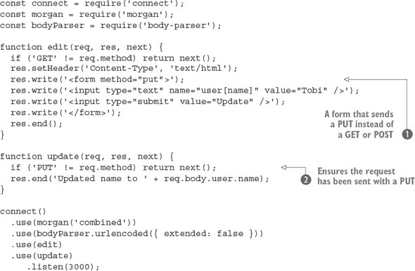

在这个例子中，已经设置了一个表单，它将向服务器发送 `PUT` 。该表单应该将数据发送到 `update` 函数，但只有当它以 `PUT` 发送时 。你可以尝试使用不同的浏览器和 HTTP 客户端；你可以使用 `-X` 选项通过 `curl` 发送 `PUT`。

为了提高浏览器支持，你将添加 `method-override` 模块。这里在表单中添加了一个额外的输入，其名称为 `_method`，并在 `bodyParser()` 方法下方添加了 `methodOverride()`，因为它引用 `req.body` 以访问表单数据。

##### 列表 C.10\. 使用 method-override 支持 HTTP `PUT`

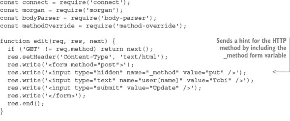


如果你运行这个示例，你应该会看到你现在可以从几乎任何浏览器发送 `PUT` 请求。

##### 访问原始 req.method

`methodOverride()` 修改了原始的 `req.method` 属性，但 Connect 会复制原始方法，你可以始终使用 `req.originalMethod` 访问它。之前的表单会输出如下值：

```
console.log(req.method);
  // "PUT"
console.log(req.originalMethod);
  // "POST"
```

为了避免包含额外的表单变量，HTTP 头部也得到了支持。不同的供应商使用不同的头部，因此你可以创建支持多个头部字段名的服务器。如果你想要支持假设特定头部的客户端工具和库，这将有所帮助。在下面的示例中，支持了三个头部字段名：


基于头部进行路由是一个常见的任务。一个很好的例子是支持虚拟主机。你可能见过 Apache 服务器在你想在较少的 IP 地址上托管多个网站时执行此操作。Apache 和 Nginx 可以根据 `Host` 头部确定应该服务哪个网站。

Connect 也可以这样做，比你想象的要简单。继续阅读，了解虚拟主机和 vhost 模块。

#### C.2.4\. vhost: 虚拟主机

vhost（虚拟主机）模块 ([www.npmjs.com/package/vhost](http://www.npmjs.com/package/vhost)) 是一个简单、轻量级的中间件组件，它通过 `Host` 请求头部路由请求。这项任务通常由反向代理执行，然后它将请求转发到运行在本地不同端口的 Web 服务器。`vhost` 组件通过将控制权传递给与 `vhost` 实例关联的 Node HTTP 服务器来完成这项任务。

##### 基本用法

与大多数中间件一样，只需一行代码就可以启动 `vhost` 组件。它接受两个参数：第一个是这个 `vhost` 实例将与之匹配的主机字符串。第二个是在创建匹配主机名的 HTTP 请求时将使用的 `http.Server` 实例（所有 Connect 应用程序都是 `http.Server` 的子类，因此应用程序实例也可以使用）：

```
const connect = require('connect');
const server = connect();
const vhost = require('vhost');
const app = require('./sites/expressjs.dev');
server.use(vhost('expressjs.dev', app));
server.listen(3000);
```

为了使用前面的 ./sites/expressjs.dev 模块，它应该将 HTTP 服务器分配给 `module.exports`，如下面的示例所示：

```
const http = require('http')
module.exports = http.createServer((req, res) => {
  res.end('hello from expressjs.com\n');
});
```

##### 使用多个 vhost 实例

与任何其他中间件一样，你可以在一个应用程序中使用 `vhost` 多次，将多个主机映射到它们相关的应用程序：

```
const app = require('./sites/expressjs.dev');
server.use(vhost('expressjs.dev', app));
const app = require('./sites/learnboost.dev');
server.use(vhost('learnboost.dev', app));
```

而不是像这样手动设置 `vhost` 中间件，你可以从文件系统中生成一个主机列表。以下是一个示例，其中 `fs.readdirSync()` 方法返回一个目录条目数组：

```
const connect = require('connect')
const fs = require('fs');
cons app = connect()
const sites = fs.readdirSync('source/sites');
sites.forEach((site) => {
  console.log('  ... %s', site);
  app.use(vhost(site, require('./sites/' + site)));
});
app.listen(3000);
```

使用 `vhost` 而不是反向代理的好处是简单性。它允许你将所有应用程序作为一个单一单元来管理。这对于服务多个较小的网站，或者服务主要由静态内容组成的网站来说很理想，但它也有一个缺点，那就是如果某个网站导致崩溃，所有你的网站都会被关闭（因为它们都在同一个进程中运行）。

接下来，我们将查看 Connect 提供的最基本的中间件组件之一：会话管理组件，命名为 express-session。

#### C.2.5\. express-session: 会话管理

网络应用程序处理会话的方式取决于不同的需求。例如，一个重要的选择是存储后端：一些应用程序受益于高性能数据库，如 Redis；而其他应用程序则需要简单性，并使用与主应用程序相同的数据库。express-session 模块([www.npmjs.com/package/express-session](http://www.npmjs.com/package/express-session))提供了一个可以扩展以适应不同数据库的 API。它既健壮又易于扩展，因此拥有许多社区支持的扩展。在本节中，您将学习如何使用基于内存的版本和 Redis。

首先，让我们看看如何设置中间件并探索可用的选项。

##### 基本用法

列表 C.11 实现了一个小型应用程序，该应用程序计算给定用户访问页面的次数。数据存储在用户的会话中。默认情况下，cookie 名称为 connect.sid，并且它被设置为`httpOnly`，这意味着客户端脚本无法访问其值。会话中的数据在服务器上以内存形式存储。列表显示了在 Connect 中使用 express-session 的基本用法.^([6])

> ⁶
> 
> 这是在 express-session 1.10.2 版本上进行的测试。

##### 列表 C.11\. 在 Connect 中使用会话

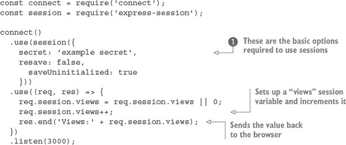

这个简短的示例首先设置了会话，然后操作一个名为 `views` 的单个会话变量。首先，会话中间件组件使用所需的选项进行初始化：`secret`、`resave` 和 `saveUninitialized` 。`secret` 选项是必需的，它决定了用于标识会话的 cookie 是否被签名。`resave` 选项用于强制在每次请求时保存会话，即使它没有发生变化。某些会话存储后端需要这个选项，因此您在启用之前需要检查。最后一个选项 `saveUninitialized` 会导致即使没有保存任何值也会创建一个会话。如果您想遵守在保存 cookie 之前需要获得同意的法律，您可以关闭此选项。

##### 设置会话过期日期

假设您希望会话在 24 小时后过期，仅在 HTTPS 使用时发送会话 cookie，并配置 cookie 名称。您可以通过在表达式对象上设置 `expires` 或 `maxAge` 属性来控制会话的持续时间：

```
const hour = 3600000
req.session.cookie.expires = new Date(Date.now() + hour * 24);
req.session.cookie.maxAge = hour * 24;
```

当使用 Connect 时，您通常会设置 `maxAge`，指定从该时间点开始的一段时间（以毫秒为单位）。这种表示未来日期的方法通常更直观地写成 `new Date(Date.now() + maxAge)`。

现在会话已经设置好了，让我们看看在处理会话数据时可用的方法和属性。

##### 使用会话数据

Express-session 数据管理 API 很简单。其基本原理是，当请求完成时，分配给 `req.session` 对象的任何属性都会被保存；然后它们会在同一用户（浏览器）的后续请求中加载。例如，保存购物车信息就像将一个对象分配给 `cart` 属性一样简单，如下所示：

```
req.session.cart = { items: [1,2,3] };
```

当你在后续请求中访问 `req.session.cart` 时，`.items` 数组将是可用的。因为这是一个常规的 JavaScript 对象，你可以在后续请求中对嵌套对象调用方法，就像以下示例中那样，并且它们会按预期保存：

```
req.session.cart.items.push(4);
```

有一个重要的事情需要记住，这个会话对象在请求之间会被序列化为 JSON，所以 `req.session` 对象有与 JSON 相同的限制：不允许循环属性，不能使用 `function` 对象，`Date` 对象不能正确序列化，等等。在使用会话对象时，请记住这些限制。

Connect 会自动为你保存会话数据，但内部它调用的是 `Session#save([callback])` 方法，这个方法也作为公共 API 提供。另外两个有用的方法是 `Session#destroy()` 和 `Session#regenerate()`，它们通常在验证用户时使用，以防止会话固定攻击。当你使用 Express 构建应用程序时，你会使用这些方法进行身份验证。

现在让我们继续操作会话 cookie。

##### 操作会话 cookie

Connect 允许你为会话提供全局 cookie 设置，但也可以通过 `Session#cookie` 对象操作特定的 cookie，该对象默认为全局设置。

在你开始调整属性之前，让我们看看如何通过将每个属性写入响应 HTML 中的单独 `<p>` 标签来扩展先前的会话应用程序，如下所示：

```
...
res.write('<p>views: ' + sess.views + '</p>');
res.write('<p>expires in: ' + (sess.cookie.maxAge / 1000) + 's</p>');
res.write('<p>httpOnly: ' + sess.cookie.httpOnly + '</p>');
res.write('<p>path: ' + sess.cookie.path + '</p>');
res.write('<p>domain: ' + sess.cookie.domain + '</p>');
res.write('<p>secure: ' + sess.cookie.secure + '</p>');
...
```

Express-session 允许按会话基础程序化地更改所有 cookie 属性（如 `expires`、`httpOnly`、`secure`、`path` 和 `domain`）。例如，你可以这样在 5 秒内使一个活跃的会话过期：

```
req.session.cookie.expires = new Date(Date.now() + 5000);
```

对于过期设置，有一个更直观的 API 是 `.maxAge` 访问器，它允许你相对于当前时间以毫秒为单位获取和设置值。以下代码也会在 5 秒后使会话过期：

```
req.session.cookie.maxAge = 5000;
```

剩余的属性，`domain`、`path` 和 `secure`，限制了 cookie 的 *作用域*，通过域名、路径或安全连接来限制，而 `httpOnly` 阻止客户端脚本访问 cookie 数据。这些属性可以以相同的方式操作：

```
req.session.cookie.path = '/admin';
req.session.cookie.httpOnly = false;
```

到目前为止，你一直在使用默认的内存存储来存储会话数据，所以让我们看看如何连接替代数据存储。

##### 会话存储

在之前的示例中，我们一直在使用内置的`MemoryStore`会话存储。它是一个简单的内存数据存储，非常适合运行应用程序测试，因为它不需要其他依赖项。但在开发和生产中，最好有一个持久、可扩展的数据库作为您的会话数据后端；否则，每次重启服务器时，您都会丢失会话。

几乎任何数据库都可以作为会话存储，但对于这种易变数据，低延迟的键/值存储效果最好。Connect 社区为数据库创建了几种会话存储，包括 CouchDB、MongoDB、Redis、Memcached、PostgreSQL 等。

在这里，您将使用 connect-redis 模块与 Redis 一起使用([`www.npmjs.com/package/connect-redis`](https://www.npmjs.com/package/connect-redis))。Redis 是一个很好的后端存储，因为它支持键过期、提供出色的性能，并且易于安装。

调用`redis-server`以确保您已安装 Redis：

```
$ redis-server
[11790] 16 Oct 16:11:54 * Server started, Redis version 2.0.4
[11790] 16 Oct 16:11:54 * DB loaded from disk: 0 seconds
[11790] 16 Oct 16:11:54 * The server is now ready to accept
connections on port 6379
[11790] 16 Oct 16:11:55 - DB 0: 522 keys (0 volatile) in 1536 slots HT.
```

接下来，您需要通过将其添加到您的 package.json 文件并运行`npm install`，或者直接执行`npm install --save connect-redis`来安装 connect-redis。^([7]) connect-redis 模块导出一个函数，该函数应该传递给`connect`，如下面的列表所示。

> ⁷
> 
> 我们在编写这本书时使用了 2.2.0 版本。

##### 列表 C.12\. 使用 Redis 作为会话存储

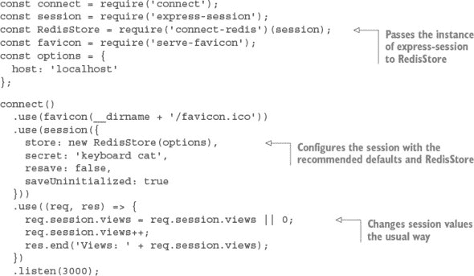

此示例设置了一个使用 Redis 的会话存储。将`connect`引用传递给`connect-redis`允许它从`connect.session.Store.prototype`继承。这很重要，因为在 Node 中，单个进程可能同时使用多个模块的多个版本；通过传递您的特定 Connect 版本，您可以确保 connect-redis 使用正确的副本。

将`RedisStore`实例传递给`session()`作为`store`值，您想要使用的任何选项，例如会话的键前缀，都可以传递给`RedisStore`构造函数。完成这两个步骤后，您就可以像使用`MemoryStore`一样访问会话变量。关于这个示例的一个小细节是，我们包括了 favicon 中间件组件以防止会话变量被两次增加；否则，每次浏览器获取页面和/favicon.ico 时，`views`值看起来都会增加 2。

呼呼！`session`有很多内容要涵盖，但这完成了所有核心概念中间件。接下来，我们将介绍处理 Web 应用程序安全的内置中间件。这对于需要保护其数据的应用程序来说是一个重要主题。

### C.3\. 处理 Web 应用程序安全

正如我们多次提到的，Node 的核心 API 故意是低级的。这意味着在构建 Web 应用程序时，它不提供内置的安全或最佳实践。幸运的是，Connect 中间件组件实现了这些安全实践。

本节将向您介绍三个可以从 npm 安装的与安全相关的模块：

+   ***basic-auth—*** 为保护数据提供 HTTP 基本认证

+   ***csurf—*** 实现对跨站请求伪造（CSRF）攻击的保护

+   ***errorhandler—*** 在开发期间帮助您调试

首先，让我们看看如何设置一个使用 basic-auth 提供 HTTP 基本认证的应用程序。

#### C.3.1\. basic-auth: HTTP 基本认证

在 第四章 中，您创建了一个粗略的基本认证中间件组件。好吧，结果证明，几个 Connect 模块可以为您做这件事。如前所述，基本认证是一种简单的 HTTP 认证机制，应该谨慎使用，因为除非基本认证通过 HTTPS 提供，否则用户凭证对攻击者来说很容易被拦截。话虽如此，它对于向小型或个人应用程序添加快速且简单的认证可能很有用。

当您的应用程序使用 basic-auth 模块时，当用户第一次尝试连接到您的应用程序时，网络浏览器会提示输入凭证，如图 C.4 所示。

##### 图 C.4\. 基本认证提示

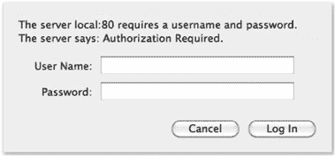

##### 基本用法

basic-auth 模块 ([www.npmjs.com/package/basic-auth](http://www.npmjs.com/package/basic-auth)) 允许您从 HTTP `Authorization` 头字段获取凭证。以下列表显示了如何使用您自己的密码验证函数。

##### 列表 C.13\. 使用基本认证模块

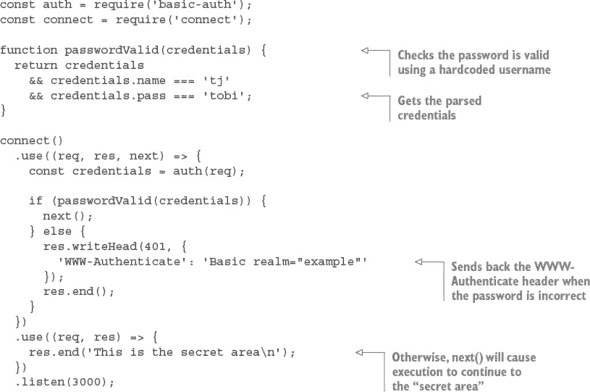

basic-auth 模块仅提供认证过程中的 `Authorization` 头字段解析部分。您必须自己通过在中间件组件中调用它来检查密码，然后当认证失败时，basic-auth 模块会发送正确的头。此示例在认证成功时调用 `next()`，以便执行继续到应用程序的保护部分。

##### curl 的一个示例

现在尝试使用 `curl` 向服务器发送 HTTP 请求，您将看到您未授权：

```
$ curl http://localhost:3000 -i
HTTP/1.1 401 Unauthorized
WWW-Authenticate: Basic realm="Authorization Required"
Connection: keep-alive
Transfer-Encoding: chunked
Unauthorized
```

使用相同的请求和 HTTP 基本认证凭证（注意 URL 的开头）将提供访问权限：

```
$ curl --user tj:tobi http://localhost:3000 -i
HTTP/1.1 200 OK
Date: Sun, 16 Oct 2011 22:42:06 GMT
Cache-Control: public, max-age=0
Last-Modified: Sun, 16 Oct 2011 22:41:02 GMT
ETag: "13-1318804862000"
Content-Type: text/plain; charset=UTF-8
Accept-Ranges: bytes
Content-Length: 13
Connection: keep-alive
I'm a secret
```

继续本节的网络安全主题，让我们看看 csurf 模块，该模块旨在帮助防止跨站请求伪造攻击。

#### C.3.2\. csurf: 跨站请求伪造保护

跨站请求伪造（CSRF）是一种攻击形式，它利用了网络浏览器对网站的信任。攻击通过让您的应用程序上的已认证用户访问攻击者创建或破坏的另一个网站来实现，然后代表用户进行请求，而用户并不知道这一点。

通过一个示例更容易理解这个过程。假设在您的应用程序中，请求`DELETE /account`将触发用户的账户被销毁（尽管仅在用户登录时）。现在假设该用户访问了一个恰好容易受到 CSRF 攻击的论坛。攻击者可以发布一个脚本，发出`DELETE /account`请求，从而销毁用户的账户。这对您的应用程序来说是一个糟糕的情况，而 csurf 模块可以帮助防止这种攻击。

csurf 模块（[`www.npmjs.com/package/csurf`](https://www.npmjs.com/package/csurf)）通过生成一个 24 字符的唯一 ID，即*认证令牌*，并将其分配给用户的会话作为`req.session._csrf`来实现。然后，可以将此令牌包含为名为`_csrf`的隐藏表单输入，CSRF 组件可以在提交时验证令牌。此过程对每次交互都会重复。

##### 基本用法

为了确保 csurf 可以访问`req.body._csrf`（隐藏输入值）和`req.session._csrf`，您需要确保在 body-parser 和 express-session 之后添加模块的中间件函数，如下面的列表所示.^([8])

> ⁸
> 
> 我们使用 csurf 1.6.6 测试了这个示例。

##### 列表 C.14\. CSRF 保护

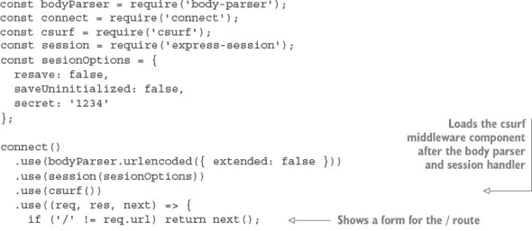

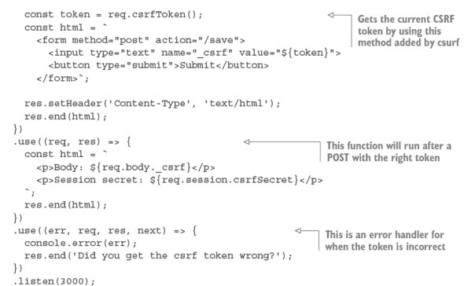

要使用 csurf，您必须首先加载 body-parser 和 session 中间件组件。此示例显示了一个表单，其中包含一个带有当前 CSRF 令牌的文本字段。此令牌将导致某些方法类型的所有请求根据会话中的密钥进行检查。您可以使用`req.csrf-Token`获取当前令牌，这是 csurf 添加的方法。带有无效令牌的帖子将由 csurf 自动标记，因此我们包括了一个“令牌成功”处理程序和一个错误处理程序。此示例使用文本字段，以便您可以看到如果更改它会发生什么。

这个示例显示，csurf 会自动对某些类型的请求启动。这是通过传递给 csurf 的`ignoreMethods`选项定义的。默认情况下，HTTP `GET`、`HEAD`和`OPTIONS`被忽略，但如果需要，您可以添加其他方法。

网络开发的另一个方面是确保在生产环境和开发环境中都提供详尽的日志和详细的错误报告。让我们看看 errorhandler 模块，它正是为此而设计的。

#### C.3.3\. errorhandler：在开发期间显示错误

errorhandler 模块（[www.npmjs.com/package/errorhandler](http://www.npmjs.com/package/errorhandler)）非常适合开发，它根据`Accept`头字段提供详尽的 HTML、JSON 和纯文本错误响应。它旨在在开发期间使用，不应成为生产配置的一部分。

##### 基本用法

通常，这个组件应该是最后使用的，以便它可以捕获所有错误：

```
connect()
  .use((req, res, next) => {
    setTimeout(function () {
       next(new Error('something broke!'));
     }, 500);
  })
  .use(errorhandler());
```

##### 接收 HTML 错误响应

如果你使用这里显示的设置在你的浏览器中查看任何页面，你会看到一个像图 C.5 中显示的 Connect 错误页面，显示错误消息、响应状态和整个堆栈跟踪。

##### 图 C.5. 在 Web 浏览器中显示的默认 errorhandler HTML

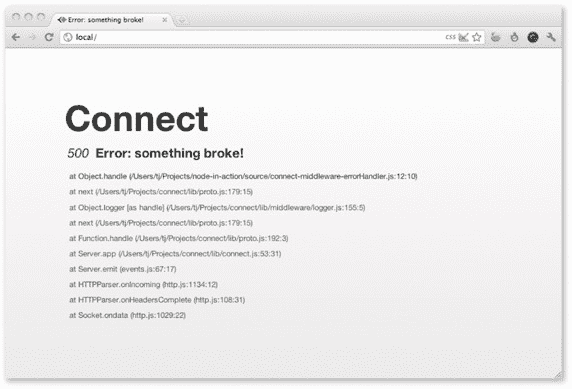

##### 接收纯文本错误响应

现在假设你正在测试使用 Connect 构建的 API。以大量 HTML 响应远非理想，所以默认情况下`errorHandler()`将以`text/plain`响应，这对于命令行 HTTP 客户端（如`curl(1)`）来说是非常理想的。这在上面的标准输出中得到了说明：

```
$ curl localhost:3000 -H "Accept: text/plain"
Error: something broke!
    at Object.handle (/Users/tj/Projects/node-in-action/source
    /connect-middleware-errorHandler.js:12:10)
    at next (/Users/tj/Projects/connect/lib/proto.js:179:15)
    at Object.logger [as handle] (/Users/tj/Projects/connect
    /lib/middleware/logger.js:155:5)
    at next (/Users/tj/Projects/connect/lib/proto.js:179:15)
    at Function.handle (/Users/tj/Projects/connect/lib/proto.js:192:3)
    at Server.app (/Users/tj/Projects/connect/lib/connect.js:53:31)
    at Server.emit (events.js:67:17)
    at HTTPParser.onIncoming (http.js:1134:12)
    at HTTPParser.onHeadersComplete (http.js:108:31)
    at Socket.ondata (http.js:1029:22)
```

##### 接收 JSON 错误响应

如果你发送一个带有`Accept: application/json` HTTP 头部的 HTTP 请求，你将得到以下 JSON 响应：

```
$ curl http://localhost:3000 -H "Accept: application/json"
{"error":{"stack":"Error: something broke!\n
            at Object.handle (/Users/tj/Projects/node-in-action
            /source/connect-middleware-errorHandler.js:12:10)\n
            at next (/Users/tj/Projects/connect/lib/proto.js:179:15)\n
            at Object.logger [as handle] (/Users/tj/Projects
            /connect/lib/middleware/logger.js:155:5)\n
            at next (/Users/tj/Projects/connect/lib/proto.js:179:15)\n
            at Function.handle (/Users/tj/Projects/connect/lib/proto.js:192:3)\n
            at Server.app (/Users/tj/Projects/connect/lib/connect.js:53:31)\n
            at Server.emit (events.js:67:17)\n
            at HTTPParser.onIncoming (http.js:1134:12)\n
            at HTTPParser.onHeadersComplete (http.js:108:31)\n
            at Socket.ondata (http.js:1029:22)","message":"something broke!"}}
```

我们已经对 JSON 响应添加了额外的格式化，使其在页面上更容易阅读，但当 Connect 发送 JSON 响应时，它会被`JSON.stringify()`方法很好地压缩。

你现在感觉像是一个 Connect 安全专家了吗？可能还不是，但你应该已经掌握了足够的基础知识来使你的应用程序安全。现在让我们继续到一个常见的 Web 应用程序功能：提供静态文件。

### C.4\. 提供静态文件

提供静态文件是许多 Web 应用程序的共同需求，但 Node 的核心并没有提供。幸运的是，通过一些简单的模块，Connect 在这里也为你提供了支持。

在本节中，你将了解 Connect 的两个更多官方支持的模块——这次将重点放在从文件系统提供文件上。这些类型的功能由 Apache 和 Nginx 等 HTTP 服务器提供，但通过一点配置，你可以将它们添加到你的 Connect 项目中：

+   ***serve-static—*** 从给定的根目录从文件系统中提供文件

+   ***serve-index—*** 当请求目录时提供漂亮的目录列表

首先，我们将向您展示如何通过使用 server-static 模块用一行代码来提供静态文件。

#### C.4.1\. serve-static：自动向浏览器提供文件

serve-static 模块([www.npmjs.com/package/serve-static](http://www.npmjs.com/package/serve-static))实现了一个高性能、灵活、功能丰富的静态文件服务器，支持 HTTP 缓存机制、`Range`请求等。它还包括对恶意路径的安全检查，默认不允许访问以点开头的隐藏文件，并拒绝有毒的`null`字节。本质上，serve-static 是一个安全且符合规范的静态文件提供中间件组件，确保与各种 HTTP 客户端的兼容性。

##### 基本用法

假设你的应用程序遵循从名为./public 的目录提供静态资产的典型场景。这可以通过一行代码实现：

```
app.use(serveStatic('public'));
```

在这种配置下，serve-static 将根据请求 URL 检查 ./public/ 中存在的常规文件。如果文件存在，响应的 `Content-Type` 字段值将默认基于文件的扩展名，并且数据将被传输。如果请求的路径不表示文件，则将调用 `next()` 回调，允许后续中间件（如果有的话）处理请求。

为了测试它，创建一个名为 ./public/foo.js 的文件，并使用 `console.log('tobi')`，然后通过使用带有 `-i` 标志的 `curl(1)` 向服务器发送请求，告诉它打印 HTTP 头部信息。你会看到 HTTP 缓存相关的头部字段被适当地设置，`Content-Type` 反映了 .js 扩展名，并且内容被传输：

```
$ curl http://localhost/foo.js -i
HTTP/1.1 200 OK
Date: Thu, 06 Oct 2011 03:06:33 GMT
Cache-Control: public, max-age=0
Last-Modified: Thu, 06 Oct 2011 03:05:51 GMT
ETag: "21-1317870351000"
Content-Type: application/javascript
Accept-Ranges: bytes
Content-Length: 21
Connection: keep-alive
console.log('tobi');
```

因为请求路径被原样使用，目录内的文件将按预期提供服务。例如，你可能在服务器上有一个 `GET /javascripts/jquery.js` 请求和一个 `GET /stylesheets/app.css` 请求，分别会服务 ./public/javascripts/jquery.js 和 ./public/stylesheets/app.css 文件。

##### 使用 serve-static 和挂载

有时，应用程序会在路径名前加上 /public、/assets、/static 等前缀。使用 Connect 实现的挂载概念，从多个目录中提供服务静态文件变得简单。只需将应用挂载到你想要的位置。如 第五章 中所述，中间件本身并不知道它被挂载，因为前缀已被移除。

例如，当 serve-static 挂载在 /app/files 上时，对 `GET /app/files/js/jquery.js` 的请求对中间件来说将表现为 `GET /js/jquery`。这对于前缀功能来说效果很好，因为 /app/files 不会成为文件解析的一部分：

```
app.use('/app/files', connect.static('public'));
```

原始的 `GET /foo.js` 请求将不再有效，因为除非存在挂载点，否则中间件不会被调用，但前缀版本 `GET /app/files/foo.js` 将会传输文件：

```
$ curl http://localhost/foo.js
Cannot get /foo.js
$ curl http://localhost/app/files/foo.js
console.log('tobi');
```

##### 绝对路径与相对路径目录

请记住，传递给 serve-static 的路径相对于当前工作目录。将 `"public"` 作为路径传递将本质上解析为 `process.cwd() + "public"`。

然而，有时你可能想在指定基本目录时使用绝对路径，`__dirname` 变量有助于实现这一点：

```
app.use('/app/files', connect.static(__dirname + '/public'));
```

##### 当请求目录时提供服务 index.html

serve-static 的另一个有用功能是它能够提供服务 index.html 文件。当一个目录请求被发起，并且该目录中存在 index.html 文件时，它将被提供服务。

为网页应用程序资源提供服务静态文件是有用的，例如 CSS、JavaScript 和图片。但如果你想允许人们从目录列表中下载任意文件列表怎么办？这就是 serve-index 的用武之地。

#### C.4.2\. serve-index：生成目录列表

serve-index 模块 ([www.npmjs.com/package/serve-index](http://www.npmjs.com/package/serve-index)) 是一个小型目录列表组件，它为用户提供了一种浏览远程文件的方式。图 C.6 展示了该组件提供的界面，包括搜索输入字段、文件图标和可点击的面包屑。

##### 图 C.6\. 使用 Connect 的 `directory()` 中间件组件提供目录列表

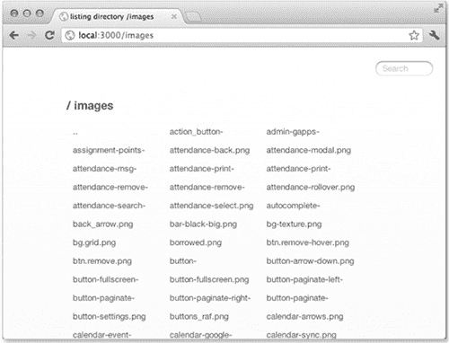

##### 基本用法

此组件旨在与 serve-static 一起工作，它将执行文件提供；serve-index 简单地提供列表。设置可以像以下代码片段那样简单，其中请求 `GET /` 提供了 ./public 目录：

```
const connect = require('connect');
const serveStatic = require('serve-static');
const serveIndex = require('serve-index');

connect()
  .use(serveIndex('public'))
  .use(serveStatic('public'))
  .listen(3000);
```

##### 使用 directory() 进行挂载

通过使用中间件挂载，你可以将服务器静态和 serve-index 模块前缀添加到任何你喜欢的路径，例如以下示例中的 `GET /files`。在这里，`icons` 选项用于启用图标，`hidden` 选项对两个组件都启用，以便查看和提供隐藏文件：

```
connect()
  .use('/files', serveIndex('public', { icons: true, hidden: true }))
  .use('/files', serveStatic('public', { hidden: true }))
  .listen(3000);
```

现在可以轻松地浏览文件和目录。
