## 第一部分：Node 基础

Node 拥有一个极小的标准库，旨在为模块开发者提供最低级别的 API 以构建。尽管相对容易找到第三方模块，但许多任务可以在没有它们的情况下完成。在接下来的章节中，我们将深入研究多个核心模块，并探讨如何将它们用于实际应用。

通过加强对这些模块的理解，你将反过来成为一个更加全面的 Node 程序员。你还将能够更有信心和更深入地分析第三方模块。

## 第一章：入门

*本章涵盖*

+   为什么选择 Node？

+   Node 的主要特性

+   构建 Node 应用程序

Node 已迅速成为了一个可行且确实高效的 Web 开发平台。在 Node 出现之前，JavaScript 在服务器端还只是一种新颖的技术，而对于其他脚本语言来说，非阻塞 I/O 则需要特殊的库。有了 Node，这一切都发生了改变。

非阻塞 I/O 和 JavaScript 的结合非常强大：我们可以在同一个进程中异步地处理文件的读写、网络套接字等，所有这些都具有 JavaScript 回调的自然和表达性特征。

本书面向中级 Node 开发者，因此本章是一个快速回顾。如果你想要对 Node 的基础知识进行彻底的了解，那么请参阅我们的配套书籍，*Node.js in Action*（由 Mike Cantelon、Marc Harter、TJ Holowaychuk 和 Nathan Rajlich 编写；Manning Publications，2013 年）。

在本章中，我们将介绍 Node，它是什么，它是如何工作的，以及为什么它是你无法离开的东西。在 第二章 中，你将通过查看 Node 的全局变量——每个 Node 进程可用的对象和方法——来尝试一些技术。

|  |
| --- |

**预飞检查**

*Node In Practice* 是一本食谱风格的书籍，面向中级和高级 Node 开发者。尽管本章涵盖了一些入门材料，但后续章节会迅速深入。如果你想要对 Node 的基础知识进行彻底的了解，请参阅我们的配套书籍，*Node.js in Action*。

|  |
| --- |

### 1.1\. 了解 Node

Node 是一个用于开发网络应用的 *平台*。它基于 V8，即 Google 的 JavaScript 运行时引擎。Node 不仅仅是 V8，Node 平台的一个重要部分是其核心库。这包括从 TCP 服务器到异步和同步文件管理的一切。本书将教会你如何正确使用这些模块。

但首先：为什么使用 Node，何时应该使用它？让我们通过查看 Node 在哪些场景中表现出色来探讨这个问题。

#### 1.1.1\. 为什么选择 Node？

假设你正在构建一个广告服务器，每分钟分发数百万条广告。Node 的非阻塞 I/O 将是这种情况下极具成本效益的解决方案，因为服务器可以充分利用可用的 I/O，而无需你编写特殊的低级代码。此外，如果你已经有一个能够编写 JavaScript 的网络团队，那么他们应该能够为 Node 项目做出贡献。一个典型的、更重的网络平台不会有这些优势，这就是为什么像微软这样的公司尽管拥有像 .NET 这样的优秀技术栈，也会为 Node 做出贡献。Visual Studio 用户可以安装 Node 特定的工具^([1])，这些工具增加了对 Intelli-Sense、性能分析甚至 npm 的支持。微软还开发了 WebMatrix ([`www.microsoft.com/web/webmatrix/`](http://www.microsoft.com/web/webmatrix/))，它直接支持 Node，也可以用来部署 Node 项目。

> ¹ 查看 [`nodejstools.codeplex.com/`](https://nodejstools.codeplex.com/).

Node 通过拥抱非阻塞 I/O 作为提高某些类型应用程序性能的一种方式。JavaScript 的传统事件驱动实现意味着它具有相对方便且易于理解的语法，适合异步编程。在典型的编程语言中，I/O 操作会阻塞执行，直到完成。Node 的异步文件和网络 API 意味着在相对较慢的 I/O 操作完成的同时，处理仍然可以发生。图 1.1 展示了如何使用异步网络和文件系统 API 执行不同的任务。

##### 图 1.1\. 使用 Node 构建的广告服务器

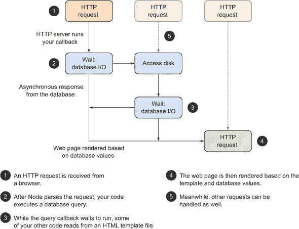

在 图 1.1 中，一个新的 HTTP 请求已被 Node 的 `http` 模块接收并解析 。然后广告服务器的应用程序代码使用异步 API（传递给数据库读取函数的回调）进行数据库查询 。当 Node 等待此操作完成时，广告服务器能够从磁盘读取模板文件 。这个模板将用于显示合适的网页。一旦数据库请求完成，模板和数据库结果将用于生成响应 。

当这一切发生时，其他请求也可能正在撞击广告服务器，并且它们将根据可用资源进行处理 。在开发广告服务器时无需考虑线程，你只需通过使用标准的 JavaScript 编程技术，就能使 Node 非常高效地使用服务器的 I/O 资源。

Node 在其他场景中也表现出色，例如网络 API 和网络爬虫。如果你正在下载和提取网页内容，那么 Node 是完美的选择，因为它可以被诱导模拟 DOM 并运行客户端 JavaScript。同样，Node 在这里也有性能优势，因为爬虫和网络蜘蛛在网络和文件 I/O 方面成本较高。

如果你正在生成或消费 JSON API，Node 是一个很好的选择，因为它使处理 JavaScript 对象变得容易。Node 的 Web 框架（如 Express，[`expressjs.com`](http://expressjs.com)）使创建 JSON API 变得快速且友好。我们对此有详细的介绍在第九章。

Node 不仅限于 Web 开发。你可以创建任何你喜欢的 TCP/IP 服务器。例如，一个通过网络游戏服务器将游戏状态广播到多个玩家的 TCP/IP 套接字，可以在发送数据给玩家的同时执行后台任务，比如维护游戏世界。第七章探讨了 Node 的网络 API。

|  |
| --- |

**何时使用 Node**

为了让你像真正的 Node 主义者一样思考，下表提供了 Node 适合的应用程序示例。

| Node 的优势 |
| --- |
| 场景 | Node 的优势 |
| --- | --- |
| 广告分发 |

+   高效地分发小块信息

+   处理可能缓慢的网络连接

+   易于扩展到多个处理器或服务器

|

| 游戏服务器 |
| --- |

+   使用易于理解的 JavaScript 语言来模拟业务逻辑

+   不使用 C 语言编写满足特定网络需求的程序

|

| 内容管理系统，博客 |
| --- |

+   适合有客户端 JavaScript 经验的团队

+   容易创建 RESTful JSON API

+   轻量级服务器，复杂的浏览器 JavaScript

|

|  |
| --- |

#### 1.1.2\. Node 的主要特点

Node 的主要特点是它的标准库、模块系统和 npm。当然，还有更多，但在这本书中，我们将专注于教你如何使用 Node 的这些部分。我们会使用第三方库，但我们会看到 Node 的许多内置功能。

事实上，Node 最强大和最有力的特性是其标准库。这实际上是两部分：一组二进制库和核心模块。二进制库包括`libuv`，它为网络和文件系统提供快速的运行循环和非阻塞 I/O。它还有一个 HTTP 库，所以你可以确信你的 HTTP 客户端和服务器是快速的。

图 1.2 是 Node 内部结构的高级概述，展示了所有东西是如何各就各位的。

##### 图 1.2\. Node 在上下文中的关键部分

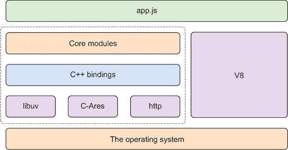

Node 的核心模块大多是用 JavaScript 编写的。这意味着如果你对任何东西不理解或者想更深入地了解，你可以阅读 Node 的源代码。这包括网络、高级文件系统操作、模块系统和流等特性。还包括 Node 特有的特性，如使用 cluster 模块同时运行多个 Node 进程，以及将代码段包裹在基于事件的错误处理器中，称为*域*。

下几节将更详细地介绍每个核心模块，从`events` API 开始。

##### EventEmitter：事件 API

每个 Node 开发者迟早会遇到`EventEmitter`。一开始它似乎只是库作者需要使用的东西，但实际上它是 Node 大多数核心模块的基础。流、网络和文件系统 API 都源自它。

你可以通过继承`EventEmitter`来创建自己的基于事件的 API。假设你正在开发一个 PayPal 支付处理模块，你可以使其基于事件，这样`Payment`对象的实例会发出`paid`和`refund`等事件。通过这种方式设计类，你可以将其与应用程序逻辑解耦，这样你就可以在多个项目中重用它。

我们有一个专门介绍事件的章节：更多内容请参阅第四章。`EventEmitter`的另一个有趣之处在于它被用作`stream`模块的基础。

##### stream: 可扩展 I/O 的基础

流继承自`EventEmitter`，可以用来模拟具有不可预测吞吐量的数据——例如，网络连接，其中数据速度可能会根据网络上其他用户的行为而变化。使用 Node 的`stream` API 允许你创建一个接收关于连接事件的对象：当有新数据到来时发出`data`事件，没有更多数据时发出`end`事件，以及发生错误时发出`error`事件。

与将大量回调函数传递给可读流构造函数相比，这样做会变得很混乱，你可以订阅你感兴趣的事件。流可以被管道连接起来，因此你可以有一个流类，它从网络读取数据，然后将数据通过管道传输到另一个流，将其转换成其他形式。这可能是从 XML API 转换成 JSON 的数据，使得在 JavaScript 中使用它变得更加容易。

我们非常喜欢流，因此我们专门为它们编写了一整章。跳转到第五章开始深入了解。你可能认为事件和流听起来很抽象，尽管这是真的，但值得注意的是，它们被用作 I/O 模块（如`fs`和`net`）的基础。

##### fs: 文件操作

Node 的文件系统模块能够使用非阻塞 I/O 读写文件，但它也提供了同步方法。你可以使用`fs.stat`来获取文件信息，其同步版本是`fs.statSync`。

如果你想要以超级高效的方式使用流来处理文件内容，那么可以使用`fs.createReadStream`来返回一个`ReadableStream`对象。关于这方面的更多信息，请参阅第六章。

##### net: 创建网络客户端和服务器

网络模块是`http`模块的基础，可以用来创建通用的网络客户端和服务器。尽管 Node 开发通常被认为是基于 Web 的，但第七章展示了如何创建 TCP 和 UDP 服务器，这意味着你不仅限于 HTTP。

##### 全局对象和其他模块

如果你有一些使用 Node 制作 Web 应用程序的经验，也许是用 Express 框架，那么你可能已经在不知不觉中使用了`http`、`net`和`fs`核心模块。其他内置特性可能不是那么引人注目，但对于使用 Node 创建程序来说却至关重要。

一个例子是全球对象和方法的理念。例如，`process`对象允许你通过访问标准 I/O 流将数据管道输入和输出到 Node 程序中。就像 Unix 和 Windows 脚本一样，你可以将数据`cat`到 Node 程序中。无处不在的`console`对象，受到所有 JavaScript 开发者的喜爱，也被视为一个全局对象。

Node 的模块系统也是全球功能的一部分。第二章中包含了展示如何使用这些特性的技术。

现在你已经看到了一些核心模块，是时候看到它们在实际中的应用了。示例将使用`stream`模块生成文本流的统计数据，你将能够用它处理文件和 HTTP 连接。如果你想了解更多关于 Node 中流或 HTTP 的基础知识，请参考《Node.js 实战》。

### 1.2. 构建一个 Node 应用程序

我们不会深入更多的理论，而是会展示如何构建一个 Node 应用程序。但这不仅仅是一个应用程序：它使用了 Node 的一些关键特性，如模块和流。这将是一次快速而深入的 Node 之旅，所以请启动你最喜欢的文本编辑器和终端，准备就绪。

在接下来的 10 分钟内，你将学到以下内容：

+   如何创建一个新的 Node 项目

+   如何编写你自己的流类

+   如何编写一个简单的测试并运行它

流非常适合处理数据，无论是读取、写入还是转换。想象一下，你想将数据库中的数据转换为另一种格式，比如 CSV。你可以创建一个流类，它接受来自数据库的输入并将其作为 CSV 流输出。这个新的 CSV 流可以连接到 HTTP 请求，这样你就可以直接将 CSV 流到浏览器。同一个类甚至可以连接到可写文件流——你甚至可以将流分叉来创建文件并发送到网页浏览器。

在这个例子中，流类将接受文本输入，根据正则表达式计算单词匹配，然后在流发送完毕时通过事件发出结果。你可以用它来计算文本文件中的单词匹配，或者从网页中读取数据并计算段落标签的数量——这取决于你。首先我们需要创建一个新的项目。

#### 1.2.1. 创建一个新的 Node 项目

你可能想知道专业 Node 开发者是如何创建新项目的。多亏了 npm，这个过程非常直接。虽然你可以创建一个 JavaScript 文件并运行`node file.js`，但我们将使用`npm init`来创建一个带有 package.json 文件的新项目。创建一个新的目录，`cd`进入它，然后运行`npm init`：


习惯于输入这些命令：您会经常这样做！当 npm 提示时，您可以按 Return 接受默认值。在您写下第一行 JavaScript 代码之前，您已经看到了 Node 的一个主要特性——npm——是多么酷。它不仅用于安装模块，还用于管理项目。

|  |
| --- |

**何时使用 package.json 文件**

您可能有一个小脚本的思路，并想知道是否真的需要 package.json 文件。这并不总是必要的，但通常您应该尽可能多地创建它们。

Node 开发者更喜欢小型模块，在 package.json 中表达依赖关系意味着无论项目多小，将来在您的机器上或在其他人的机器上安装都非常容易。

|  |
| --- |

现在是时候编写一些 JavaScript 代码了。在下一节中，您将创建一个新的 JavaScript 文件，该文件实现了一个流。

#### 1.2.2\. 创建流类

创建一个名为 countstream.js 的新文件，并使用 `util.inherits` 从 `stream.Writable` 继承并实现所需 `_write` 方法。太快了吗？让我们放慢速度。完整的源代码在下面的列表中。

##### 列表 1.1\. 一个计数可写流

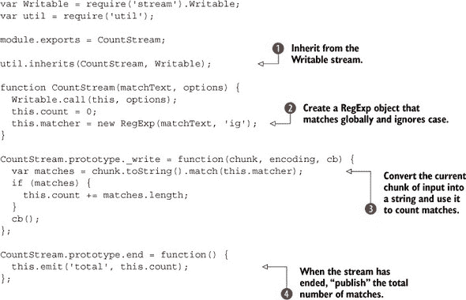

这个例子说明了本书中后续示例的工作方式。我们展示了一段代码片段，并对其底层代码进行了注释。例如，类的前一部分使用 `util.inherits` 方法从 `Writable` 基类继承！。这个例子在这里不会完全展开——关于编写自己的流的更多信息，请参阅第五章技术 30。现在，只需关注正则表达式是如何传递给构造函数！并用于在类实例中流动文本计数！。Node 的 `Writable` 类会为我们调用 `_write`，所以我们目前不需要担心这一点。

|  |
| --- |

##### 流和事件

在列表 1.1 中有一个事件，`total`。这是我们编写的——您也可以自己编写。流继承自 `EventEmitter`，因此它们具有相同的 `emit` 和 `on` 方法。

|  |
| --- |

当没有更多数据时，Node 的 `Writable` 基类也会调用 `end`！。这个流可以按需实例化和管道连接。在下一节中，您将看到如何使用 `pipe` 连接它。

#### 1.2.3\. 使用流

现在您已经看到了如何创建流类，您可能迫不及待地想尝试一下。创建另一个文件，index.js，并添加下一列表中所示的代码。

##### 列表 1.2\. 使用 `CountStream` 类

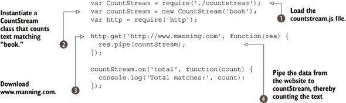

您可以通过输入 `node index.js` 来运行此示例。它应该显示类似 `Total matches: 24` 的内容。您可以通过更改它获取的 URL 来进行实验。

这个例子从列表 1.1 加载模块，然后使用文本`'book'`实例化它 。它还使用 Node 的标准`http`模块从网站下载文本 ，然后将结果通过我们的`CountStream`类进行管道传输 。

这里重要的是`res.pipe(countStream)`。当你进行管道传输时，数据的大小或网络是否缓慢并不重要：`CountStream`类将尽职尽责地计数匹配项，直到数据处理完毕。这个 Node 程序*不会*首先下载整个文件！它是逐块处理文件的。这就是这里的大事，也是 Node 开发的一个关键方面。

回顾一下，图 1.3 总结了您到目前为止创建新 Node 项目所做的工作。首先，您创建了一个新目录，并运行了`npm init` ，然后创建了 JavaScript 文件 ，最后运行了代码 。

##### 图 1.3. 创建新的 Node 项目的三个步骤

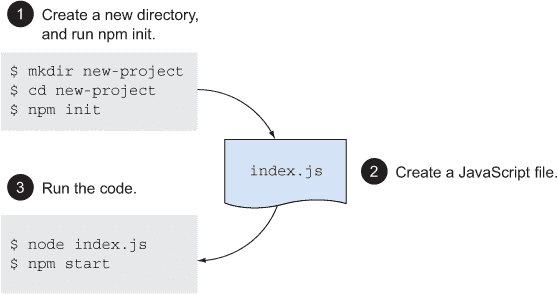

Node 开发的重要部分之一是测试。下一节将通过测试`CountStream`来总结这个例子。

#### 1.2.4. 编写测试

我们可以不使用任何第三方模块为`CountStream`编写一个简短的测试。Node 自带了一个内置的`assert`模块，因此我们可以用它来进行快速测试。打开 test.js 并添加下面的代码。

##### 列表 1.3. 使用`CountStream`类

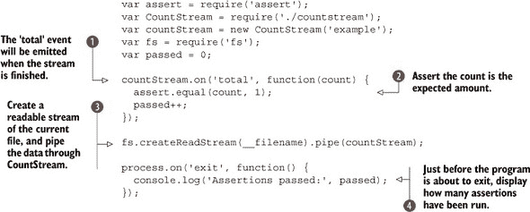

这个测试可以用`node test.js`运行，你应该在控制台看到打印出`Assertions passed: 1`。实际上，这个测试读取当前文件并通过`CountStream`传递数据。它可能会调用 Ouroboros，但这是一个有用的例子，因为它给我们提供了我们了解的内容——我们可以始终确信有一个匹配的单词*example*。

|  |
| --- |

##### 断言

Node 自带了一个名为`assert`的断言库。可以通过直接调用模块来制作一个基本的测试 – `assert(expression)`。

|  |
| --- |

测试首先监听`total`事件，该事件由`CountStream`的实例发出 。这是一个很好的地方来断言匹配的数量应该与预期相同 。打开了一个表示当前文件的可读流，并将其通过我们的类进行管道传输 。在程序结束前，我们打印出触发了多少断言 。

这很重要，因为如果`total`事件从未触发，那么`assert.equal`根本不会运行。我们没有方法知道回调中的测试是否运行，因此使用了一个简单的计数器来展示 Node 编程可能需要从您可能熟悉的其他编程语言和平台上获取的模式。

如果你感到疲倦，可以在这里休息一下，但我们的项目还有一些甜头。Node 开发者喜欢在命令行上使用 npm 运行测试和其他脚本。打开 package.json 并将`"test"`属性更改为如下所示：

```
"scripts": {
    "test": "node test.js"
},
```

现在，你只需输入 `npm test` 就可以运行测试。当你有很多测试且运行它们更复杂时，这非常有用。测试、测试运行器和异步测试问题都在第十章（kindle_split_020.html#ch10）中有所涉及。

|  |
| --- |

**npm 脚本**

可以通过编辑 package.json 来配置 `npm test` 和 `npm start` 命令。你还可以运行任意命令，这些命令通过 `npm run command` 调用。你所需要做的只是设置 `scripts` 下的一个属性，就像列表 1.4 一样。

这对于特定类型的测试或维护程序很有用——例如 `npm run integration-tests`，或者甚至 `npm run seed-data`。

|  |
| --- |

根据你之前对 Node 的经验，这个例子可能有些复杂，但它捕捉了 Node 开发者的思考方式和利用 Node 带来的强大资源的方式。

现在，你已经看到了一个 Node 项目的构建方式，我们已经完成了 Node 的复习课程。下一章介绍了我们的第一套技术，这是本书格式的主要内容。它涵盖了所有 Node 程序都可以使用的全局功能的工作方式。

### 1.3\. 摘要

在本章中，你学习了关于 *Node.js in Practice* 的内容——它涵盖了什么以及它如何专注于 Node 令人印象深刻的内置核心模块，如网络模块和文件系统模块。

你还了解到了使 Node 运行的原因以及如何使用它。我们涵盖的一些主要点是

+   何时使用 Node，以及 Node 如何构建在非阻塞 I/O 之上，允许你编写标准的 JavaScript 但获得出色的性能优势。

+   Node 的标准库被称为其 *核心模块*。

+   核心模块的功能——如网络协议的 I/O 任务，以及与文件和更通用的功能（如流）的工作。

+   如何快速启动一个新的 Node 项目，包括 package.json 文件，以便添加依赖项和脚本。

+   如何使用 Node 强大的 `stream` API 处理数据。

+   流继承自 `EventEmitter`，因此你可以发出并响应你想要在应用程序中使用的任何事件。

+   如何仅使用 npm 和 `assert` 模块编写小型测试——你可以在不安装任何第三方库的情况下测试想法。

最后，我们希望你能从我们的入门级应用程序中学到一些东西。使用基于事件的 API、非阻塞 I/O 和流确实是 Node 的核心，但利用 Node 的独特工具（如 package.json 文件和 npm）也同样重要。

现在是时候介绍技术了。下一章介绍了你甚至不需要加载就可以使用的功能：全局对象。

## 第二章\. 全局变量：Node 的环境

*本章涵盖*

+   使用模块

+   不需要任何模块就能做的事情

+   进程和控制台对象

+   定时器

全局对象在所有模块中都是可用的。它们是通用的。无论你是在编写网络程序、命令行脚本还是网络应用程序，你的程序都将能够访问这些对象。这意味着你可以始终依赖像 `console.log` 和 `__dirname` 这样的功能——这两个功能在本章中都有详细解释。

本章的目标是介绍 Node 的全局对象和方法，帮助你了解所有 Node 进程可用的功能。这将帮助你更好地理解 Node 以及它与操作系统的关系，以及它与浏览器等其他 JavaScript 环境的比较。

Node 提供了一些重要的内置功能，即使不加载任何模块也是如此。除了 ECMAScript 语言提供的功能外，Node 还包含几个 *宿主对象*——Node 提供的对象，以帮助程序执行。

一个关键的全球对象是 `process`，它用于与操作系统通信。Unix 程序员将熟悉标准 I/O 流，并且可以通过 Node 的流式 API 通过 `process` 对象访问这些流。

另一个重要的全局对象是 `Buffer` 类。这是因为它包含了 JavaScript 传统的二进制数据支持不足的问题。随着 ECMAScript 标准的发展，这个问题正在得到解决，但到目前为止，大多数 Node 开发者仍然依赖于 `Buffer` 类。有关缓冲区的更多信息，请参阅第三章 [kindle_split_012.html#ch03]。

一些全局变量是每个模块的独立实例。例如，`module` 在每个 Node 程序中都是可用的，但它是当前模块的局部变量。由于 Node 程序可能由多个模块组成，这意味着给定的程序有多个不同的 `module` 对象——它们的行为像全局变量，但位于 *模块作用域* 内。

在下一节中，你将学习如何加载模块。与模块相关的对象和方法是全局的，因此它们始终可用并准备好使用。

### 2.1\. 模块

模块可以用来组织更大的程序和分发 Node 项目，因此熟悉安装和创建它们的基本技术很重要。

#### 技巧 1 安装和加载模块

无论你是在使用 Node 提供的核心模块还是 npm 的第三方模块，模块的支持都内置在 Node 中，并且始终可用。

##### 问题

你想从 npm 加载第三方模块。

##### 解决方案

使用命令行工具 npm 安装模块，然后使用 `require` 加载模块。以下列表显示了一个安装 `express` 模块的示例。

##### 列表 2.1\. 使用 npm

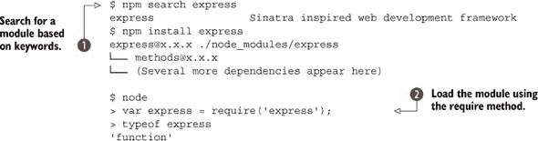

##### 讨论

npm 命令行工具与 Node 一起分发，可用于搜索、安装和管理包。网站 [`npmjs.org`](https://npmjs.org) 提供了另一个搜索模块的界面，每个模块都有自己的页面，显示相关的说明文件和依赖项。

一旦知道了模块的名称，安装就变得简单：键入 `npm install module-name`  它将被安装到 ./node_modules 中。模块也可以“全局”安装——运行 `npm install -g module_name` 将其安装到全局文件夹中。在 Unix 系统上，这通常是 /usr/local/lib/node_modules。在 Windows 上，它应该在 `node.exe` 二进制文件所在的任何位置。

模块安装后，可以使用 `require('module-name')` 来加载它 。`require` 方法通常会返回一个对象或一个方法，具体取决于模块是如何设置的。

|  |
| --- |

**搜索 npm**

默认情况下，npm 会搜索每个模块的 package.json 文件中的多个字段。这包括模块的名称、描述、维护者、URL 和关键词。这意味着简单的搜索如 `npm search express` 会产生数百个结果。

您可以通过使用正则表达式来减少匹配的数量。将搜索词用斜杠括起来以触发 npm 的正则表达式匹配：`npm search /^express$/`

然而，这仍然有限。幸运的是，有一些开源模块可以改进内置的搜索命令。例如，Gorgi Kosev 的 `npmsearch` 会使用它自己的相关性排名来排序结果。

|  |
| --- |

是否全局安装模块的问题对于开发可维护的项目至关重要。如果其他人需要参与您的项目，那么您应该考虑将模块作为依赖项添加到项目 package.json 文件中。保持项目依赖项紧密管理将使得在依赖项的新版本发布时更容易维护它们。

#### 技术二：创建和管理模块

除了安装和分发开源模块外，“本地”模块还可以用来组织项目。

##### 问题

您希望将项目拆分成单独的文件。

##### 解决方案

使用 `exports` 对象。

##### 讨论

Node 的模块系统为在多个文件之间分割代码提供了一个解决方案。它与 C 中的 `include` 或 Ruby 和 Python 中的 `require` 非常不同。主要区别在于 Node 中的 `require` 返回一个对象，而不是将代码加载到当前命名空间中，就像 C 预处理器会发生的那样。

在 技术 1 中，您看到了如何使用 npm 安装模块，以及如何使用 `require` 来加载它们。尽管 npm 不是唯一管理模块的工具，但 Node 基于 CommonJS Modules/1.1 规范（[`wiki.commonjs.org/wiki/Modules/1.1`](http://wiki.commonjs.org/wiki/Modules/1.1)）提供了一个内置的模块系统。

这允许对象、函数和变量从一个文件导出并在其他地方使用。`exports` 对象始终存在，尽管本章专门探讨了全局对象，但它实际上并不是全局的。更准确地说，`exports` 对象位于模块作用域内。

当一个模块围绕一个单一类构建时，模块的用户将更喜欢键入 `var MyClass = require('myclass');` 而不是 `var MyClass = require('myclass').MyClass`，因此您应该使用 `module.exports`。列表 2.2 展示了这是如何工作的。这与使用 `exports` 对象不同，它要求您设置一个属性来导出某些内容。

##### 列表 2.2\. 导出模块

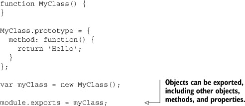

列表 2.3 展示了如何导出多个对象、方法或值，这是一种通常用于导出多个内容的实用库技术。

##### 列表 2.3\. 导出多个对象、方法和值

```
exports.method = function() {
  return 'Hello';
};

exports.method2 = function() {
  return 'Hello again';
};
```

最后，列表 2.4 展示了如何使用 `require` 加载这些模块以及如何使用它们提供的功能。

##### 列表 2.4\. 使用 require 加载模块

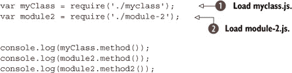

注意，加载本地模块始终需要一个路径名——在这些示例中，路径只是 ./. 如果没有它，Node 将尝试在 $NODE_PATH 中找到匹配的模块，然后是 ./node_modules、$HOME/.node_modules、$HOME/.node_libraries 或 $PREFIX/lib/node。

在 列表 2.4 中注意，./myclass 会自动展开为 ./myclass.js ，而 ./module-2 会展开为 ./module-2.js 。

该程序的输出如下：

```
Hello
Hello
Hello again
```

| |
| --- |

**哪个模块？**

要确定 Node 将加载的确切模块，请使用 `require.resolve(id)`。这将返回一个完全展开的文件名。

| |
| --- |

一旦加载了一个模块，它就会被缓存。这意味着多次加载它将返回缓存的副本。这通常很高效，并有助于在项目中大量重用模块，而无需担心使用 `require` 时产生开销。您不必集中加载所有依赖项，可以安全地对该模块调用 `require`。

| |
| --- |

**卸载模块**

虽然自动缓存模块适合 Node 开发中的许多用例，但可能存在一些罕见的情况，您可能想要卸载一个模块。`require.cache` 对象使这成为可能。

要从缓存中删除一个模块，请使用 `delete` 关键字。需要模块的完整路径，您可以使用 `require.resolve` 获取。例如：

```
delete require.cache[require.resolve('./myclass')];
```

这应该返回 `true`，这意味着模块已被卸载。

| |
| --- |

在下一个技巧中，您将学习如何将相关模块分组并一次性加载它们。

#### 技巧 3 加载一组相关模块

Node 可以将目录视为模块，这为逻辑上分组相关模块提供了机会。

##### 问题

您希望将相关文件分组在目录下，并且只需通过一次 `require` 调用即可加载。

##### 解决方案

创建一个名为 index.js 的文件来加载每个模块并将它们作为一组导出，或者在该目录中添加一个 package.json 文件。

##### 讨论

有时，一个模块在逻辑上可能是自包含的，但将其分成几个文件仍然是有意义的。你将在 npm 上找到的大多数模块都是这样编写的。Node 的模块系统通过允许目录作为模块来支持这一点。最简单的方法是创建一个名为 index.js 的文件，该文件包含一个 `require` 语句来加载每个文件。下面的列表演示了这是如何工作的。

##### 列表 2.5\. group/index.js 文件

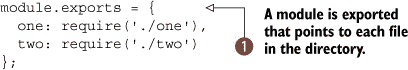

group/one.js 和 group/two.js 文件可以随后按需导出值或方法 。下面的列表显示了此类文件的示例。

##### 列表 2.6\. group/one.js 文件

```
module.exports = function() {
  console.log('one');
};
```

需要使用文件夹作为模块的代码可以使用单个 `require` 语句一次性加载所有内容。下面的列表演示了这一点。

##### 列表 2.7\. 加载模块组的文件


列表 2.7 的输出应如下所示：

```
one
two
```

这种方法通常用作架构技术来构建 Web 应用程序。相关项目，如控制器、模型和视图，可以保存在不同的文件夹中，以帮助在应用程序中分离关注点。图 2.1 展示了按照这种风格构建应用程序的方法。

##### 图 2.1\. 作为模块的文件夹

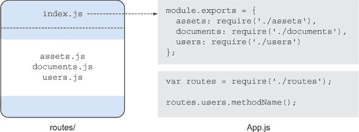

Node 还提供了一种支持此模式的替代技术。将一个 package.json 文件添加到目录中可以帮助模块系统一次性确定如何加载目录中的所有文件。该 JSON 文件应包含一个 `main` 属性，指向一个 JavaScript 文件。这实际上是 Node 在加载模块时默认查找的文件——如果没有 package.json，它将接着查找 index.js。下面的列表显示了 package.json 文件的示例。

##### 列表 2.8\. 包含模块的目录的 package.json 文件


|  |
| --- |

**文件扩展名**

当加载文件时，Node 配置为搜索具有 .js、.json 和 .node 扩展名的文件。可以使用 `require.extensions` 数组来告诉 `require` 加载具有其他扩展名的文件。当 Node 的模块系统将目录视为模块时，也会考虑这一点。

此功能在 Node 的文档中被标记为已弃用，但模块系统也被标记为“锁定”，因此它不应该消失。如果你想使用它，你应该首先检查 Node 的文档。^([1]) 如果你只是尝试从具有不寻常扩展名的旧系统加载 JavaScript 文件，那么它可能适合实验。

> ¹ 查看 [`nodejs.org/api/globals.html#globals_require_extensions`](http://nodejs.org/api/globals.html#globals_require_extensions)。

|  |
| --- |

`require` API 提供了许多管理文件的方法。但当你想要加载相对于当前模块或模块保存的目录中的内容时怎么办？请继续阅读以了解 技巧 4 的解释。

#### 技巧 4：处理路径

有时候你需要根据相对位置打开文件。Node 提供了确定当前文件、目录和模块路径的工具。

##### 问题

你想访问一个不由模块系统处理的文件。

##### 解决方案

使用 `__dirname` 或 `__filename` 确定文件的路径。

##### 讨论

有时候你需要从文件中加载数据，这些文件显然不应该由 Node 的模块系统处理，但你需要考虑当前脚本的路径——例如，一个 Web 应用程序中的模板。在这种情况下，`__dirname` 和 `__filename` 变量非常有用。

运行以下列表将打印这些值的输出。

##### 列表 2.9\. 路径变量


大多数开发者使用简单的字符串连接将这两个变量与路径片段连接起来：`var view = __dirname + '/views/view.html';`。这在 Windows 和 Unix 上都适用——Windows API 足够智能，可以自动将反斜杠转换为本地格式，因此你不需要特殊处理来支持这两个操作系统。

如果你确实想确保路径正确连接，可以使用 Node 的 `path` 模块中的 `path.join` 方法：`path.join(__dirname, 'views', 'view.html');`。

除了模块管理之外，还有全局可用的对象用于写入标准 I/O 流。下一组技巧将探讨 `process.stdout` 和 `console` 对象。

### 2.2\. 标准 I/O 和 console 对象

可以使用 Unix 或 Windows 的命令行工具将文本导入到 Node 进程中。本节包括处理这些标准 I/O 流的技术，以及如何正确使用 `console` 对象来完成各种与日志记录相关的任务。

#### 技巧 5 读取和写入标准 I/O

每当你需要将数据输入和输出到程序中时，一个有用的技巧是使用 `process` 对象来读取和写入标准 I/O 流。

##### 问题

你想将数据从 Node 程序中导入导出。

##### 解决方案

使用 `process.stdout` 和 `process.stdin`。

##### 讨论

`process.stdout` 对象是一个可写流，用于 `stdout`。我们将在第五章（kindle_split_014.html#ch05）中更详细地介绍流，但就目前而言，你需要知道它是每个 Node 程序都可以访问的 `process` 对象的一部分，并且对于显示和接收文本输入非常有用。

下一个列表显示了如何从另一个命令中读取文本，处理它，然后再输出。

##### 列表 2.10\. 路径变量

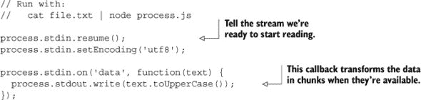

每次从输入流中读取一段文本时，它都会通过 `toUpperCase()` 转换，然后写入输出流。 显示了数据如何从一个操作系统进程流过你的 Node 程序，然后流出到另一个程序。在终端中，这些程序将通过管道（`|`）符号连接起来。

##### 图 2.2\. 使用 `stdio` 的简单程序中的数据流。

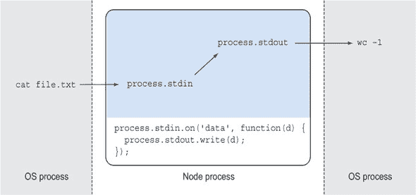

这种基于 *管道* 的方法在处理 Unix 中的输入时效果很好，因为许多其他命令都是设计成这样工作的。这给 Node 程序带来了类似乐高积木的模块化，从而促进了重用。

如果你只想打印消息或错误，Node 通过 `console` 对象提供了一个专门为此目的而设计的更简单的 API。下一技术将解释如何使用它，以及一些不太明显的功能。

#### 技巧 6 记录消息

从程序中记录信息和错误的最简单方法是通过使用 `console` 对象。

##### 问题

你希望将不同类型的消息记录到控制台。

##### 解决方案

使用 `console.log`、`console.info`、`console.error` 和 `console.warn`。务必利用这些方法提供的内置格式化功能。

##### 讨论

`console` 对象有几种方法可以用来输出不同类型的消息。它们将被写入相关的输出流，这意味着你可以在 Unix 系统上相应地管道化它们。

尽管基本用法是 `console.log('message')`，但其中还包含了更多功能。变量可以被插入，或者简单地与字符串字面量一起追加。这使得记录显示原始值或对象内容的消息变得极其容易。以下列表演示了这些功能。

##### 列表 2.11\. 路径变量

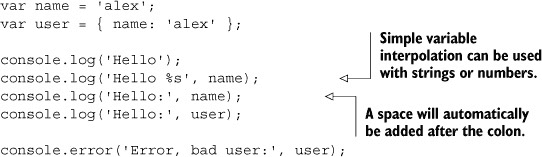

列表 2.11 的输出如下所示：


当消息字符串被格式化时，使用 `util.format`。表 2.1 显示了支持的格式化占位符。

##### 表 2.1\. 格式化占位符

| 占位符 | 类型 | 示例 |
| --- | --- | --- |
| %s | 字符串 | '%s', 'value' |
| %d | 数字 | '%f', 3.14 |
| %j | JSON | '%j', { name: 'alex' } |

这些格式化占位符很方便，但仅仅能够简单地在 `console.log` 消息中包含对象，而不需要手动追加字符串，这也是记录消息的一个方便方法。

`info` 和 `warn` 方法是 `log` 和 `error` 的同义词。`log` 和 `error` 之间的区别在于使用的输出流。在 技巧 5 中，你看到了 Node 如何使标准输入和输出流对所有程序可用。它还通过 `process.stderr` 暴露标准错误流。`console.error` 方法将写入此流，而不是 `process.stdout`。这意味着你可以在终端或 shell 脚本中重定向 Node 进程的 `error` 消息。

如果你以前面的列表使用 `2> error-file.log` 运行，错误消息将被重定向到 `error-file.log`。其他消息将像往常一样打印到控制台：

```
node listings/globals/console-1.js 2> errors-file.log
```

`2` 处理器指向错误流；`1` 是标准输出。这意味着你可以将错误重定向到日志文件，而无需在 Node 程序中打开文件，或者使用特定的日志模块。传统的 shell 重定向对于许多项目来说已经足够好了。

|  |
| --- |

**标准流**

标准流有三种类型：stdin、stdout 和 stderr。在 Unix 终端中，这些通过数字来引用。`0` 用于标准输入，`1` 用于标准输出，`2` 用于标准错误。

对于 Windows 系统也是如此：从命令提示符运行程序并添加 `2> errors-file.log` 将会将错误信息发送到 `errors-file.log`，就像 Unix 一样。

|  |
| --- |

##### 堆栈跟踪

`console` 对象的另一个特性是 `console.trace()`。此方法在当前执行点生成堆栈跟踪。生成的堆栈跟踪包括调用异步回调的代码的行号，这有助于报告那些否则难以追踪的错误。例如，在事件监听器内部生成的跟踪将显示事件是从哪里触发的。第五章 中的技巧 28 详细探讨了这一点。

`console` 的另一个稍微高级一些的用法是其基准测试功能。继续阅读以详细了解。

#### 技巧 7：基准测试程序

Node 使得无需任何额外工具即可进行程序基准测试。

##### 问题

您需要基准测试一个运行缓慢的操作。

##### 解决方案

使用 `console.time()` 和 `console.timeEnd()`。

##### 讨论

在你作为 Node 程序员职业生涯中，你将会有这样的时刻：试图确定某个特定操作为何运行缓慢。幸运的是，`console` 对象自带一些内置的基准测试功能。

调用 `console.time('label')` 记录当前时间（以毫秒为单位），然后稍后调用 `console.timeEnd('label')` 显示从该点开始的时间长度。时间（以毫秒为单位）将自动打印在标签旁边，因此您不需要单独调用 `console.log` 来打印标签。

列表 2.12 是一个接受命令行参数的简短程序（有关处理参数的更多信息，请参阅技巧 9），其中包含基准测试以查看文件输入读取的速度。

##### 列表 2.12\. 基准测试一个函数

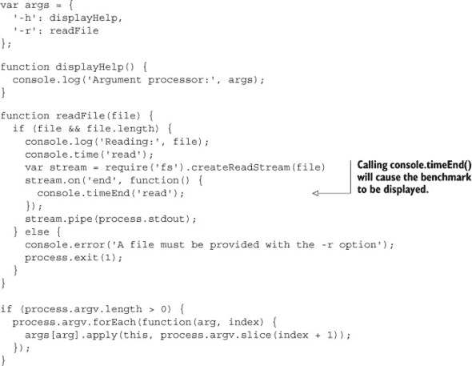

使用多个带有不同标签的 `console.time` 交错调用，可以执行多个基准测试，这对于探索复杂、嵌套的异步程序的性能非常完美。

这些函数基于 `Date.now()` 计算持续时间，提供毫秒级的精度。为了获得更精确的基准测试，可以使用第三方 `benchmark` 模块（[`npmjs.org/package/benchmark`](https://npmjs.org/package/benchmark)）与 `microtime` 模块（[`npmjs.org/package/microtime`](https://npmjs.org/package/microtime)）一起使用。

`process` 对象用于处理标准 I/O 流，并且使用得当，`console` 可以处理许多初学者可能会用第三方模块解决的问题。在下一节中，我们将进一步探讨 `process` 对象，看看它是如何帮助与更广泛的操作系统集成的。

### 2.3\. 操作系统和命令行集成

可以使用 `process` 对象获取有关操作系统的信息，并使用退出代码和信号监听器与其他进程通信。本节包含一些更高级的技术，用于使用这些功能。

#### 技巧 8 获取平台信息

节点提供了一些内置方法用于查询操作系统功能。

##### 问题

您需要根据操作系统或处理器架构运行特定平台的代码。

##### 解决方案

使用 `process.arch` 和 `process.platform` 属性。

##### 讨论

Node JavaScript 通常具有可移植性，因此您不太可能需要根据操作系统或进程架构进行分支。但您可能希望针对特定操作系统功能定制项目，或者简单地收集有关脚本在哪些系统上执行的统计数据。某些包含对二进制库绑定绑定的基于 Windows 的模块可以在 32 位和 64 位版本的二进制之间切换。下一个列表显示了如何支持这一点。

##### 列表 2.13\. 基于架构的分支

```
switch (process.arch) {
  case 'x64':
    require('./lib.x64.node');
    break;
  case 'ia32':
    require('./lib.Win32.node');
    break;
  default:
    throw new Error('Unsupported process.arch:', process.arch);
}
```

通过 `process` 模块也可以从系统中获取其他信息。其中一个方法是 `process.memoryUsage()`—它返回一个对象，包含三个属性，描述了进程当前的内存使用情况：

+   **`rss`** —常驻集大小，即进程在 RAM 中持有的内存部分

+   **`heapTotal`** —动态分配可用内存

+   **`heapUsed`** —已使用的堆内存量

下一个技术将更详细地探讨处理命令行参数。

#### 技巧 9 传递命令行参数

Node 提供了一个简单的 API 用于命令行参数，您可以使用它将选项传递给程序。

##### 问题

您正在编写一个需要从命令行接收简单参数的程序。

##### 解决方案

使用 `process.argv`。

##### 讨论

`process.argv` 数组允许您检查是否向您的脚本传递了任何参数。因为它是一个数组，您可以使用它来查看传递了多少参数，如果有。前两个参数是 `node` 和脚本的名称。

列表 2.14 展示了使用 `process.argv` 的一种方法。此示例遍历 `process.argv` 并将其切片以“解析”带有选项的参数标志。您可以使用 `node arguments.js -r arguments.js` 运行此脚本，并且它会打印出其自身的源代码。

##### 列表 2.14\. 操作命令行参数

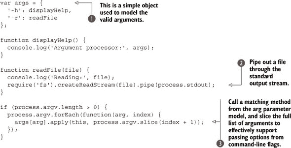

`args` 对象  包含脚本支持的每个开关。然后使用 `createReadStream`  将文件 `pipe` 到标准输出流。最后，使用 `Function.prototype.apply`  执行 `args` 中命令行开关引用的函数。

尽管这是一个玩具示例，但它说明了在不依赖第三方模块的情况下，`process.argv` 可以多么方便。由于它是一个 JavaScript `Array`，因此它非常容易处理：您可以使用 `map`、`forEach` 和 `slice` 等方法轻松处理参数。

| |
| --- |

**复杂参数**

对于更复杂的程序，请使用选项解析模块。最流行的两个是 `optimist` ([`npmjs.org/package/optimist`](https://npmjs.org/package/optimist)) 和 `commander` ([`npmjs.org/package/commander`](https://npmjs.org/package/commander))。`optimist` 将参数转换为 `Object`，这使得它们更容易操作。它还支持默认值、自动使用生成和简单的验证，以确保已提供某些参数。`commander` 略有不同：它使用一个抽象的 *程序* 概念，允许您使用链式 API 指定程序接受的参数。

| |
| --- |

良好的 Unix 程序在需要时处理参数，并且它们也会通过返回合适的状态码来退出。下一个技巧将展示如何以及何时使用 `process.exit` 来表示程序的完成成功或失败。

#### 技巧 10 退出程序

Node 允许您在程序终止时指定退出码。

##### 问题

您的 Node 程序需要以特定的状态码退出。

##### 解决方案

使用 `process.exit()`。

##### 讨论

退出状态码在 Windows 和 Unix 中都具有重要意义。其他程序会检查退出状态以确定程序是否正确运行。当编写参与更大系统的 Node 程序时，这一点尤为重要，并且有助于后续的监控和调试。

默认情况下，Node 程序返回 `0` 退出状态。这意味着程序已正确运行并终止。任何非零状态都被视为错误。在 Unix 中，通常使用 `$?` 在 shell 中访问此状态码。Windows 的等效项是 `%errorlevel%`。

列表 2.15 展示了对 列表 2.14 的修改，当未指定 `-r` 选项的文件名时，程序会以相关的状态码干净地退出。

##### 列表 2.15\. 返回有意义的退出状态码

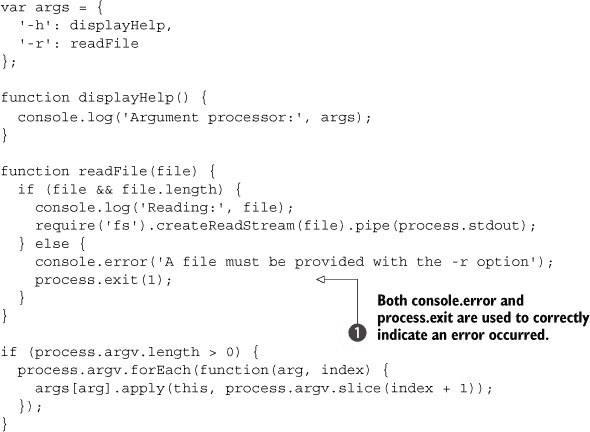

运行 列表 2.15 后，在 Unix 终端中键入 `echo $?` 将显示 `1`。请注意，`console.error`  用于输出错误消息。这将导致消息被写入 `process.stderr`，这使得脚本的用户可以轻松地将错误消息管道到某个地方。

| |
| --- |

**具有特殊含义的退出码**

在《高级 Bash 脚本指南》（[`tldp.org/LDP/abs/html/index.html`](http://tldp.org/LDP/abs/html/index.html)）中，有一个专门讨论带有特殊含义的退出状态码的页面，称为带有特殊含义的退出状态码（[`tldp.org/LDP/abs/html/exitcodes.html`](http://tldp.org/LDP/abs/html/exitcodes.html)）。这试图概括错误代码，尽管在脚本语言之外没有标准的状态码列表，非零表示发生了错误。

|  |
| --- |

由于许多 Node 程序是异步的，有时您可能需要显式调用`process.exit()`或关闭 I/O 连接，以使 Node 进程优雅地结束。例如，使用 Mongoose 数据库库（[`mongoosejs.com/`](http://mongoosejs.com/)）的脚本需要在 Node 进程能够退出之前调用`mongoose.connection.close()`。

您可能需要跟踪挂起的异步操作的数量，以确定何时调用`mongoose.connection.close()`或另一个数据库模块的等效操作是安全的。大多数人使用一个简单的计数器变量来做这件事，在异步操作开始之前增加它，然后在它们的回调触发后减少它。一旦它达到`0`，关闭连接就是安全的。

开发正确程序的一个重要方面是创建信号处理程序。继续阅读以了解 Node 如何实现信号处理程序以及何时使用它们。

#### 技巧 11 响应信号

节点程序可以响应其他进程发送的信号。

##### 问题

您需要响应其他进程发送的信号。

##### 解决方案

使用发送到`process`对象的信号事件。

##### 讨论

大多数现代操作系统使用信号作为向程序发送简单消息的一种方式。信号处理程序通常用于在后台运行的程序中，因为这可能是在它们之间通信的唯一方式。在其他情况下，它们也可以在您最可能编写的程序类型中很有用——考虑一个在接收到`SIGTERM`时干净地关闭其数据库连接的 Web 应用程序。

`process`对象是一个`EventEmitter`，这意味着您可以向其添加事件监听器。为 POSIX 信号名称添加监听器应该可以工作——在 Unix 系统上，您可以通过输入`man sigaction`来查看所有信号的名字。

信号监听器使您能够满足 Unix 程序的预期行为。例如，许多服务器和守护进程在接收到`SIGHUP`信号时会重新加载配置文件。下一个列表显示了如何将监听器附加到`SIGHUP`。

##### 列表 2.16\. 为 POSIX 信号添加监听器

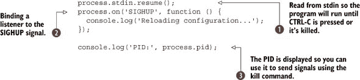

在对标准输入进行任何操作之前，应该调用`resume`以防止 Node 立即退出。接下来，在`process`对象上添加对`SIGHUP`事件的监听器！[](2.jpg)。最后，显示当前进程的 PID！[](3.jpg)。

一旦代码清单 2.16 中的程序开始运行，它将显示进程的 PID。可以使用`kill`命令与 PID 一起发送进程信号。例如，`kill-HUP 94962`将向 PID `94962`发送`HUP`信号。如果你发送另一个信号，或者只输入`kill 94962`，那么进程将退出。

重要的是要意识到，信号可以从任何进程发送到任何其他进程，无论权限如何。你的 Node 进程可以通过使用`process.kill(pid, [signal])`向另一个进程发送信号——在这种情况下，`kill`并不意味着进程将被“杀死”，而只是发送了一个特定的信号。这个方法是以 C 标准库中`signal.h`函数的名称命名的。

图 2.3 展示了信号如何在操作系统中从任何进程产生，并且可以被你的 Node 进程接收。

##### 图 2.3. 信号从进程产生，并通过事件监听器处理。

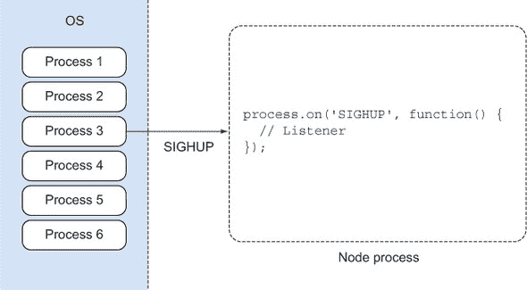

你不必在 Node 程序中响应信号，但如果你正在编写一个长时间运行的网络服务器，那么信号监听器可以非常有用。支持像`SIGHUP`这样的信号将使你的程序更自然地融入现有系统。

Node 的吸引力很大一部分在于其异步 API 和非阻塞 I/O 特性。有时可能需要模拟这种行为——比如在自动化测试中——或者简单地强制代码稍后执行。在下一节中，我们将探讨 Node 如何实现 JavaScript 定时器，这些定时器支持此类功能。

### 2.4. 使用定时器延迟执行

Node 实现了 JavaScript 定时器函数`setTimeout`、`setInterval`、`clearTimeout`和`clearInterval`。这些函数是全局可用的。尽管它们是 Mozilla 定义的 JavaScript 的一部分，但它们并未在 ECMAScript 标准中定义。相反，定时器是 HTML DOM Level 0 规范的一部分。

#### 技巧 12 使用`setTimeout`延迟执行函数

使用 Node 的`setTimeout`全局方法可以在延迟后运行代码一次。

##### 问题

你想在延迟后执行一个函数。

##### 解决方案

使用`setTimeout`，并在必要时使用`Function.prototype.bind`。

##### 讨论

`setTimeout`最基本的使用很简单：传递一个要执行的函数和延迟（以毫秒为单位）：

```
setTimeout(function() {
  console.log('Hello from the past!');
}, 1000);
```

这看起来很简单且人为，但你会在测试中看到它被最常使用，在这些测试中，正在测试异步 API，并且需要一个小延迟来模拟现实世界的行为。Node 支持 JavaScript 定时器，正是为了应对这种情况。

可以通过使用`Function.prototype.bind`轻松地将方法传递给`setTimeout`。这可以用来绑定第一个参数到`this`，或者更常见的是，绑定方法所属的对象。以下列表展示了如何使用`bind`与一个简单的对象结合使用。

##### 代码清单 2.17. 将`setTimeout`与`Function.prototype.bind`结合使用

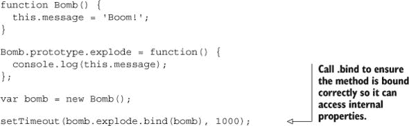

绑定确保方法内部的代码可以访问对象的内部属性。否则，`setTimeout` 将导致方法以 `this` 绑定到全局对象的方式运行。绑定方法可能比创建新的匿名函数更易于阅读。

要取消计划中的函数，保留由 `setTimeout` 返回的 `timeoutId` 引用，然后调用 `clearTimeout(timeoutId)`![1.jpg]。下面的列表展示了 `clearTimeout`。

##### 列表 2.18\. 使用 `clearTimeout` 来防止计划中的函数

![033fig02_alt.jpg]

|  |
| --- |

**回调函数何时运行？**

尽管你可以指定回调在毫秒级的时间运行，但 Node 并不完全 *那么* 精确。它可以保证回调将在指定时间后运行，但可能会稍微晚一些。

|  |
| --- |

除了延迟执行外，你还可以定期调用函数。下一技术将讨论如何通过使用 `setInterval` 来实现这一点。

#### 技术第 13 条：使用计时器定期运行回调

Node 也可以使用 `setInterval` 定期运行回调，其工作方式与 `setTimeout` 类似。

##### 问题

你想要以固定的时间间隔运行一个回调函数。

##### 解决方案

使用 `setInterval` 和 `clearInterval` 来停止计时器。

##### 讨论

`setInterval` 方法在浏览器中已经存在多年，在 Node 中与客户端类似。回调将在指定的延迟后或稍后执行，并在 I/O 之后的事件循环中运行（以及任何对 `setImmediate` 的调用，如第 14 技术所述技术 14）。

下面的列表展示了如何将 `setInterval` 与 `setTimeout` 结合起来，以按顺序调度两个函数执行。

##### 列表 2.19\. 使用 `setInterval` 和 `setTimeout` 结合

![034fig01.jpg]

`setInterval` 方法本身返回计时器的引用，可以通过调用 `clearInterval` 并传递引用来停止计时器。列表 2.19 使用第二次调用 `setTimeout` ![1.jpg] 来触发一个在第一个计时器之后 500 毫秒运行的第二个间隔计时器。

由于 `setInterval` 阻止程序退出，在某些情况下，你可能希望在程序没有做其他事情时退出程序。例如，假设你正在运行一个程序，该程序应该在复杂操作完成后退出，并且你希望使用 `setInterval` 定期监控它。一旦复杂操作完成，你就不想再监控它了。

而不是调用 `clearInterval`，Node 0.10 允许你在复杂操作完成之前任何时候调用 `timerRef.unref()`。这意味着你可以使用 `setTimeout` 或 `setInterval` 来执行不发出完成信号的操作。

列表 2.20 使用 `setTimeout` 来模拟一个长时间运行的操作，该操作将在计时器显示进程内存使用情况时保持程序运行。一旦达到超时延迟，程序将退出 *而不* 调用 `clearTimeout`。

##### 列表 2.20\. 保持计时器活动直到程序干净退出

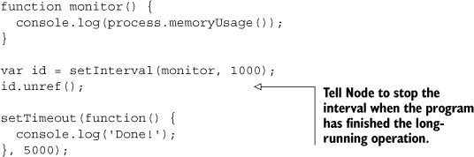

在没有合适的地方调用 `clearInterval` 的情况下，这非常有用。

一旦你掌握了计时器，你将遇到需要以尽可能短的时间延迟运行回调的情况。使用延迟为零的 `setTimeout` 不是一个最佳解决方案，尽管这似乎是明显的策略。在下一个技巧中，你将看到如何在 Node 中使用 `process.nextTick` 正确地做到这一点。

#### 技巧 14 安全地管理异步 API

有时你只想稍微延迟一个操作。在传统的 JavaScript 中，使用带有小延迟值的 `setTimeout` 可能是可以接受的。Node 提供了一个更有效的解决方案：`process.nextTick`。

##### 问题

你想编写一个返回 `EventEmitter` 实例的方法或接受一个回调，该回调有时会调用异步 API，但并非在所有情况下。

##### 解决方案

使用 `process.nextTick` 包装同步操作。

##### 讨论

`process.nextTick` 方法允许你将回调放置在运行循环的下一个周期的开头。这意味着这是一种轻微延迟某种方法的方式，因此它比仅仅使用延迟为零的 `setTimeout` 更有效率。

这可能很难想象为什么这很有用，但考虑以下示例。列表 2.21 展示了一个返回 `EventEmitter` 的函数。想法是提供一个以事件为中心的 API，允许 API 的用户根据需要订阅事件，同时能够内部运行异步调用。

##### 列表 2.21\. 使用事件错误地触发异步方法

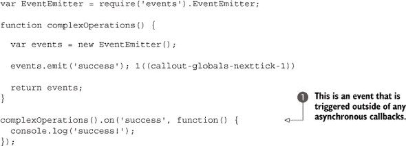

运行此示例将无法在示例末尾触发 `success` 监听器 。为什么会出现这种情况？嗯，事件是在监听器订阅之前发出的。在大多数情况下，事件会在某些异步操作的回调内部发出，但有时提前发出事件是有意义的——例如，在验证参数并发现包含错误时，这样 `error` 可以非常快速地发出。

为了纠正这个微妙的缺陷，任何发出事件的代码部分都可以用 `process.nextTick` 包装。以下列表通过使用返回 `EventEmitter` 实例的函数，然后发出一个事件来演示这一点。

##### 列表 2.22\. 在 `process.nextTick` 内部触发事件

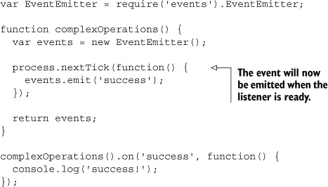

Node 的文档建议 API 应始终是 100% 异步或同步。这意味着如果你有一个接受回调并可能异步调用它的方法，那么你应该在 `process.nextTick` 中包装同步情况，这样用户就可以依赖执行顺序。

列表 2.23 使用异步调用来从磁盘读取文件。一旦读取了文件，它会在内存中保留一个缓存版本。后续调用将返回缓存版本。在返回缓存版本时，使用`process.nextTick`以确保 API 仍然表现出异步行为。这使得在终端中的输出按照预期的顺序读取。

##### 列表 2.23\. 创建始终异步 API 的错觉

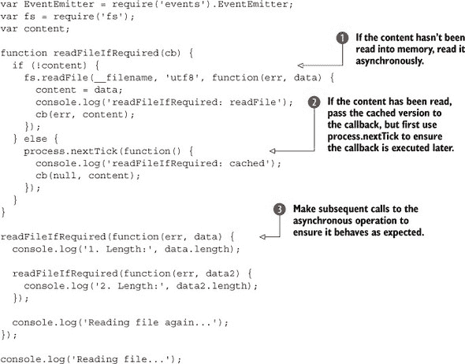

在这个例子中，通过使用`fs.readFile`读取文件并将其缓存到内存中，然后为每个后续调用返回它的一个副本！[](1.jpg)，这是通过多次调用一个过程来实现的！[](3.jpg)，这样您就可以比较非阻塞文件系统操作与`process.nextTick`的行为。

##### 可视化事件循环：setImmediate 和 process.maxTickDepth

`setImmediate`和`clearImmediate`全局函数接受一个回调和可选参数，并且会在任何即将到来的 I/O 事件之后、`setTimeout`和`setInterval`之前运行。

以这种方式添加的回调会被推送到队列中，并且每次运行循环只会执行一个回调。这与`process.nextTick`不同，后者会在运行循环的每次迭代中触发`process.maxTickDepth`个回调。

使用`process.nextTick`传递的回调通常在当前事件循环的末尾运行。可以安全运行的回调数量由`process.maxTickDepth`控制，默认值为 1000，以允许 I/O 操作继续处理。

图 2.4 说明了每个定时函数在事件循环的单次迭代中的位置。

##### 图 2.4\. 在事件循环上调度`nextTick`

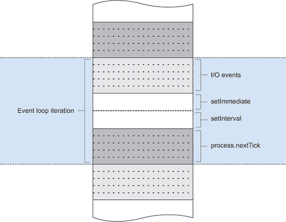

当您创建自己的类和方法，并且它们的行为是异步的，请使用`process.nextTick`来保持行为的一致性和可预测性。

Node 对基于浏览器的 JavaScript 定时器的实现与它的事件循环和非阻塞 I/O 很好地结合在一起。尽管这些函数通常用于测试异步代码，但深入了解`setTimeout`、`setImmediate`和`process.nextTick`何时执行将提供对事件循环的掌握。

### 2.5\. 摘要

在本章中，您已经看到了一些内置在 Node 程序中而无需加载模块的令人惊讶的强大功能。下次您想要将相关的模块组合在一起时，您可以创建一个 index.js 文件，如技术 3 所述。如果您需要读取标准输入，可以使用`process`对象的`stdin`属性（技术 5）。

除了`process`对象之外，还有一个经常被忽视的`console`对象，它将帮助您调试和维护程序（技术 6）。

在下一章中，你将学习有关缓冲区的内容。缓冲区非常适合处理二进制数据，这在传统上被视为 JavaScript 的弱点。缓冲区还支撑了 Node 的一些强大功能，如流。

## 第三章：缓冲区：处理位、字节和编码

*本章涵盖*

+   缓冲数据类型的介绍

+   改变数据编码

+   将二进制文件转换为 JSON

+   创建自己的二进制协议

JavaScript 在历史上对二进制支持不佳。通常，解析二进制数据会涉及各种字符串技巧来提取所需的数据。没有良好的机制在 JavaScript 中处理原始内存是 Node 核心开发者在项目开始获得动力时必须解决的问题之一。这主要是出于性能原因。所有原始内存都累积在`Buffer`数据类型中。

缓冲区是堆的原始分配，以类似数组的方式暴露给 JavaScript。它们是全局暴露的，因此不需要导入，可以将其视为另一种 JavaScript 类型（如`String`或`Number`）：


如果你没有太多处理二进制数据的经验，不要担心；这一章旨在对新手友好，同时也为那些对概念更熟悉的人提供帮助。我们将涵盖简单和更高级的技术：

+   将`Buffer`转换为不同的编码

+   使用`Buffer` API 将二进制文件转换为 JSON

+   编码和解码自己的二进制协议

让我们先看看如何更改缓冲区的编码。

### 3.1. 改变数据编码

如果没有指定编码，文件操作和许多网络操作将返回`Buffer`数据。以下`fs.readFile`为例：


但很多时候你已经知道文件的编码，将数据作为编码字符串获取更有用。在本节中，我们将探讨在`Buffer`和其他格式之间进行转换。

#### 技巧 15：将缓冲区转换为其他格式

默认情况下，Node 的核心 API 返回一个缓冲区，除非指定了编码。但缓冲区可以轻松转换为其他格式。在接下来的技术中，我们将探讨如何转换缓冲区。

##### 问题

你想将一个`Buffer`转换为纯文本。

##### 解决方案

`Buffer` API 允许你将`Buffer`转换为字符串值。

##### 讨论

假设我们有一个我们知道是纯文本的文件。为了我们的目的，我们将称这个文件为 names.txt，并且它将在文件的每一行包含一个人的名字：

```
Janet
Wookie
Alex
Marc
```

如果我们使用文件系统（`fs`）API 中的方法来加载文件，我们默认会得到一个`Buffer`（`buf`）

```
var fs = require('fs');
fs.readFile('./names.txt', function (er, buf) {
  console.log(buf);
});
```

当输出日志时，它显示为一系列八位字节（使用十六进制表示）：

```
<Buffer 4a 61 6e 65 74 0a 57 6f 6f 6b 69 65 0a 41 6c 65 78 0a
                      4d 61 72 63 0a>
```

这并不很有用，因为我们知道文件是纯文本。`Buffer`类提供了一个名为`toString`的方法，可以将我们的数据转换为 UTF-8 编码的字符串：

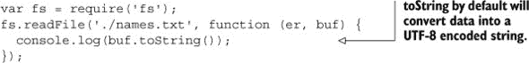

这将产生与我们的原始文件相同的输出：

```
Janet
Wookie
Alex
Marc
```

但因为我们知道这些数据仅由 ASCII 字符组成，^([1)) 我们也可以通过将编码更改为 ASCII 而不是 UTF-8 来获得性能上的好处。为此，我们将编码类型作为 `toString` 的第一个参数提供：

> ¹ 查看 [`en.wikipedia.org/wiki/ASCII`](http://en.wikipedia.org/wiki/ASCII)。

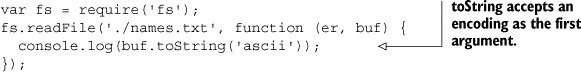

`Buffer` API 提供了其他编码，如 `utf16le`、`base64` 和 `hex`，你可以通过查看 `Buffer` API 在线文档了解更多信息.^([2])

> ² 查看 [`nodejs.org/api/buffer.html`](http://nodejs.org/api/buffer.html)。

#### 技巧 16 使用缓冲区更改字符串编码

除了转换缓冲区，你还可以利用缓冲区将一种字符串编码转换为另一种编码。

##### 问题

你想要将一个字符串编码转换为另一个编码。

##### 解决方案

Node `Buffer` API 提供了一种更改编码的机制。

##### 讨论

##### 示例 1：创建基本身份验证头

有时构建一个数据字符串并更改其编码是有帮助的。例如，如果你想要从使用基本身份验证的服务器请求数据，^([3))，你需要使用 Base64 编码发送用户名和密码：

> ³ 查看 [`en.wikipedia.org/wiki/Basic_access_authentication`](http://en.wikipedia.org/wiki/Basic_access_authentication)。


在应用 Base64 编码之前，基本身份验证凭据将用户名和密码组合在一起，使用冒号 `:` 分隔。在我们的例子中，我们将使用 `johnny` 作为用户名，`c-bad` 作为密码：


现在我们必须将其转换为 `Buffer`，以便将其转换为另一种编码。缓冲区可以通过字节分配，正如我们之前通过简单地传递一个数字（例如，`new Buffer(255)`）所看到的。它们也可以通过传递字符串数据来分配：


|  |
| --- |

**指定编码**

当使用字符串分配 `Buffer` 时，它们被认为是 UTF-8 字符串，这通常是您想要的。但您可以使用第二个可选的编码参数指定传入数据的编码：

```
new Buffer('am9obm55OmMtYmFk', 'base64')
```

|  |
| --- |

现在我们已经将数据作为 `Buffer`，我们可以通过使用 `toString('base64')` 将其转换回 Base64 编码的字符串：


这个过程也可以被压缩，因为可以直接在返回的 `Buffer` 实例上调用实例方法，并且可以省略 `new` 关键字：

```
var encoded = Buffer(user + ':' + pass).toString('base64');
```

##### 示例 2：处理数据 URI

数据 URI^([4]) 是使用 `Buffer` API 有帮助的另一个例子。数据 URI 允许资源使用以下方案内联嵌入到网页中：

> ⁴ 查看 [`en.wikipedia.org/wiki/Data_URI_scheme`](http://en.wikipedia.org/wiki/Data_URI_scheme)。

```
data:[MIME-type][;charset=<encoding>[;base64],<data>
```

例如，这张猴子的 PNG 图像可以表示为一个数据 URI：

```
data:image/png;base64,iVBORw0KGgoAAAANSUhEUgAAACsAAAAoCAYAAABny...
```

当在浏览器中读取时，数据 URI 将显示如图 3.1 所示的我们的灵长类动物。

##### 图 3.1\. 浏览器中读取的数据 URI 显示猴子图像


让我们看看如何使用`Buffer` API 创建数据 URI。在我们的灵长类例子中，我们使用了一个 MIME 类型为`image/png`的 PNG 图像：

```
var mime = 'image/png';
```

二进制文件可以使用 Base64 编码表示，所以让我们为这个设置一个变量：

```
var encoding = 'base64';
```

使用我们的 MIME 类型和编码，我们可以构建数据 URI 的开始部分：

```
var mime = 'image/png';
var encoding = 'base64';
var uri = 'data:' + mime + ';' + encoding + ',';
```

我们需要添加实际的数据。我们可以使用`fs.readFileSync`来同步读取我们的数据并返回内联数据。`fs.readFileSync`将返回一个`Buffer`，然后我们可以将其转换为 Base64 字符串：

```
var encoding = 'base64';
var data = fs.readFileSync('./monkey.png').toString(encoding);
```

让我们把所有这些放在一起，编写一个输出数据 URI 的程序：

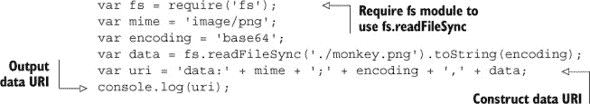

这个程序的输出将是

```
data:image/png;base64,iVBORw0KGgoAAAANSUhEUgAAACsAAAAoCAYAAABny...
```

让我们改变一下场景。如果你有一个数据 URI 但想将其写入实际文件，我们会再次使用我们的猴子例子。首先，我们`split`数组以仅获取数据：^([5])

> ⁵ 这并不是对所有数据 URI 都有规定性的，因为逗号可能出现在其他地方。

```
var uri = 'data:image/png;base64,iVBORw0KGgoAAAANSUhEUgAAACsAAAAo...';
var data = uri.split(',')[1];
```

然后，我们可以使用我们的`data`字符串并指定编码来创建一个`Buffer`：

```
var buf = Buffer(data, 'base64');
```

接下来，我们使用`fs.writeFileSync`将此同步写入磁盘，指定文件名和`Buffer`：

```
fs.writeFileSync('./secondmonkey.png', buf);
```

将这个例子全部放在一起看起来是这样的：

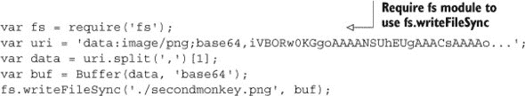

在我们的默认图像查看器中打开，这将给我们猴子，如图图 3.2 所示。

##### 图 3.2\. 从数据 URI 生成的 secondmonkey.png 文件


大多数时候，当你处理 Node 中的`Buffer`对象时，你会将其转换为其他格式，有时你会更改编码。但你也可能发现自己必须处理二进制文件格式，而`Buffer` API（我们将在下一节中探讨）提供了一套丰富的工具来处理这种格式。

### 3.2\. 将二进制文件转换为 JSON

与二进制数据打交道有点像解谜。通过阅读数据含义的规范来获取线索，然后你必须外出将那些数据转换成你应用中可用的东西。

#### 技巧 17 使用缓冲区转换原始数据

如果你能利用二进制格式在 Node 程序中做些有用的事情会怎样？在本技巧中，我们将深入探讨如何使用二进制数据将常见的文件格式转换为 JSON。

##### 问题

你想将二进制文件转换为更易用的格式。

##### 解决方案

Node API 通过`Buffer`类扩展了 JavaScript，提供了一个用于原始二进制数据访问的 API 以及处理二进制数据的工具。

##### 讨论

为了我们示例的目的，即文件转换，你可以将这个过程视为图 3.3。

##### 图 3.3\. 将二进制数据转换为更易用/可编程的格式

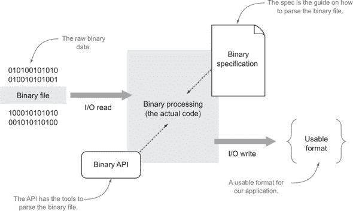

使用二进制规范作为指南和二进制 API 作为实现转换的机制，以更可用的格式读取、处理和写入二进制数据。这并不是二进制数据的唯一用途。例如，你可以对二进制协议进行处理，以传递消息，图表将有所不同。

对于我们的技术，我们将要处理的二进制文件格式是 DBase 5.0 (.dbf)。这种格式可能听起来有些陌生，但（为了将其置于上下文中）它曾经是一种流行的数据库格式，现在仍然被广泛用于地理空间数据的归属。你可以将其视为一个简化的 Excel 电子表格。我们将要使用的样本位于 buffers/world.dbf。

该文件包含世界各国的地理空间信息。不幸的是，如果你在文本编辑器中打开它，它将不会很有用。

|  |
| --- |

##### 为什么我们要深入探讨一个我可能永远不会使用的二进制格式？

尽管我们可以选择许多二进制格式，但 DBase 5.0 是一种可以教会你许多不同方法来处理读取二进制文件的问题的格式，这些问题在许多其他格式中都很常见。此外，对于来自网络开发背景的人来说，二进制格式可能不太熟悉，所以我们花了一些时间来专注于读取二进制规范。如果你已经熟悉，请随意浏览。

|  |
| --- |

由于我们想在 Node 应用程序中使用它，JSON 将是一个好的格式选择，因为它可以在 JavaScript 中原生解析，并且类似于原生 JavaScript 对象。这如图 3.4 所示。

##### 图 3.4\. 使用 `FileSystem` API 读取二进制数据到 Node.js，使用 `Buffer` API 转换为更易用的 JSON 格式。

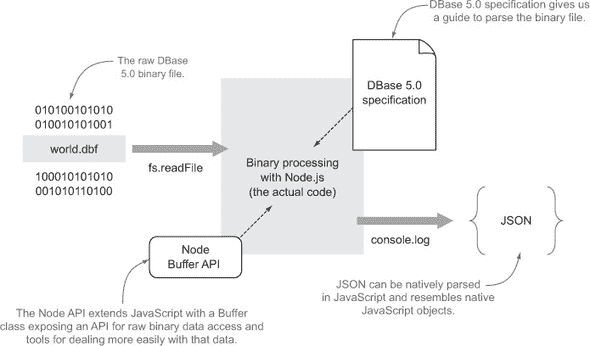

图 3.5 展示了我们想要进行的转换示例：左侧是在文本编辑器中打开的原始二进制文件，右侧是转换后的 JSON 格式。

##### 图 3.5\. 我们转换的最终结果

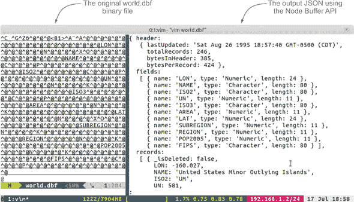

##### 文件头

在我们开始解决这个问题之前，我们需要进行一些研究，以找出我们想要处理的二进制格式的规范。在我们的案例中，从搜索引擎查询中找到了一些类似的规范。对于 DBase 5.0，我们将使用的主要规范可以在 [`mng.bz/i7K4`](http://mng.bz/i7K4) 找到。

规范的第一部分被称为 *头*。许多二进制格式将使用头作为存储文件元数据的地方；表 3.1 显示了 DBase 5.0 的规范看起来是什么样子。

##### 表 3.1\. DBase 5.0 文件头规范

| 字节 | 内容 | 描述 |
| --- | --- | --- |
| 0 | 1 字节 | 有效的 dBASE for Windows 表格文件；位 0-2 指示版本号... |
| 1-3 | 3 字节 | 最后更新的日期；采用 YYMMDD 格式 |
| 4-7 | 32 位数字 | 表中的记录数 |
| 8-9 | 16 位数字 | 文件头中的字节数 |
| 10-11 | 16 位数字 | 记录中的字节数 |
| ... | ... | ... |
| 32-n 每个字节 | 32 字节 | 字段描述符数组 |
| n+1 | 1 字节 | 0Dh 存储为字段终止符 |

让我们看一下第一行。

| 字节 | 内容 | 描述 |
| --- | --- | --- |
| 0 | 1 字节 | 有效的 dBASE for Windows 表文件；位 0-2 表示版本号 ... |

这一行告诉我们位于位置 0 的字节包含描述中指定的信息。那么我们如何访问位置 0 的字节呢？幸运的是，使用缓冲区这非常简单。

在 Node 中，*除非您为读取的数据指定特定的编码*，否则您将得到一个 Node `Buffer`，如本例所示：

```
var fs = require('fs');

fs.readFile('./world.dbf', function (er, buf) {
  Buffer.isBuffer(buf); // true
});
```

`fs.readFile` 不是获取缓冲区回显的唯一方法，但为了简单起见，我们将使用该方法，以便在读取后以对象的形式获取整个缓冲区。这种方法可能不适合大型二进制文件，您可能不希望一次性将整个缓冲区加载到内存中。在这种情况下，您可以使用 `fs.createReadStream` 流式传输数据，或者使用 `fs.read` 手动一次读取文件的一部分。还应注意的是，缓冲区不仅限于文件；它们几乎存在于您可以从数据流中获取数据的地方（例如，HTTP 请求上的请求数据）。

如果您想查看缓冲区的字符串表示形式，简单的 `buf.toString()` 调用就足够了（默认为 UTF-8 编码）。如果您知道要拉取的数据只是文本，这会很好：


在我们的情况下，`buf.toString()` 会和用文本编辑器打开 world.dbf 文件一样糟糕：不可用。我们首先需要理解二进制数据。

|  |
| --- |

##### 注意

从现在开始，每当您看到我们的变量 `buf`，它指的是一个 `Buffer` 实例，因此是 Node `Buffer` API 的一部分。

|  |
| --- |

在我们讨论的表中，我们提到了字节位置 0。Node 中的缓冲区与 JavaScript 数组非常相似，但索引是内存中的字节位置。因此，字节位置 0 是 `buf[0]`。在 `Buffer` 语法中，`buf[0]` 与位置 0 的字节、八位字节、无符号 8 位整数或正有符号 8 位整数同义。

对于这个例子，我们并不真正关心存储关于这个特定字节的任何信息。让我们继续到下一个字节定义。

| 字节 | 内容 | 描述 |
| --- | --- | --- |
| 1-3 | 3 字节 | 最后更新的日期；YYMMDD 格式 |

这里有一些有趣的东西：最后更新的日期。但这个规范并没有告诉我们更多，只是它有 3 个字节，并且是 YYMMDD 格式。所有这些都是说，您可能不会在一个地方找到您想要的所有东西。随后的网络搜索得到了以下信息：

> *每个字节都包含一个二进制数。YY 被加到一个 1900 十进制基数上，以确定实际年份。因此，YY 的可能值从 0x00-0xFF，这允许从 1900-2155 的范围。*^([6])
> 
> > ⁶参见[`www.dbase.com/Knowledgebase/INT/db7_file_fmt.htm`](http://www.dbase.com/Knowledgebase/INT/db7_file_fmt.htm)。

这更有帮助。让我们看看如何在 Node 中解析它：

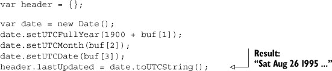

在这里，我们使用一个 JavaScript `Date`对象，并将其年份设置为 1900 加上从`buf[1]`中提取的整数。我们使用位置 2 和 3 的整数来设置月份和日期。由于 JSON 不存储 JavaScript `Date`类型，我们将它存储为一个 UTC `Date`字符串。

让我们暂停一下，回顾一下。正如这里所示，“Sat Aug 26 1995...”是解析 world.dbf 二进制数据的一部分到 JavaScript 字符串的结果。随着我们继续，我们将看到更多这样的例子。

| 字节 | 内容 | 描述 |
| --- | --- | --- |
| 4-7 | 32 位数字 | 表中的记录数 |

下一个定义给我们提供了两个线索。我们知道字节从偏移量 4 开始，它是一个 32 位数字，最低有效字节在前。由于我们知道这个数字不应该是负数，我们可以假设它是一个正的有符号整数或无符号整数。在`Buffer` API 中，两者都以相同的方式访问：


`buf.readUInt32LE`将从偏移量 4 处读取一个无符号 32 位整数，采用小端格式，这与我们之前描述的相符。

下两个定义遵循类似的模式，但它们是 16 位整数。以下是它们的定义。

| 字节 | 内容 | 描述 |
| --- | --- | --- |
| 8-9 | 16 位数字 | 头部中的字节数 |
| 10-11 | 16 位数字 | 记录中的字节数 |

这里是对应的代码：


本节头文件规范与代码之间的转换在图 3.6 中展示。

##### 图 3.6。头部：使用 Node `Buffer` API 从规范到代码的转换

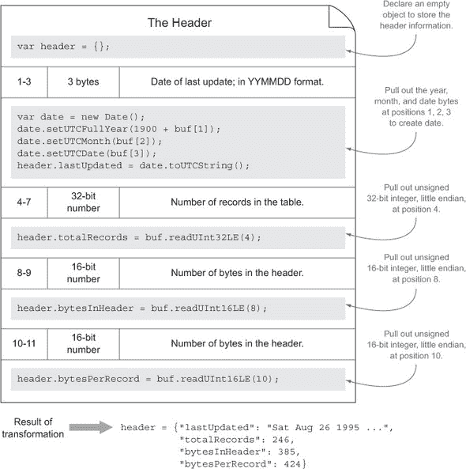

##### 字段描述符数组

对于这个例子，在 world.dbf 文件的头文件中只剩下一个相关的信息。它是以下行中看到的字段定义，包括类型和名称信息。

| 字节 | 内容 | 描述 |
| --- | --- | --- |
| 32-n each | 32 字节 | 字段描述符数组 |
| n+1 | 1 字节 | 以 0Dh 存储的字段终止符 |

从这里我们知道每个字段描述都是以 32 字节的信息存储的。由于这个数据库可能有一个或多个数据字段，我们将知道它何时结束，当我们遇到第二行中显示的 1 字节字段终止符（0Dh）时。让我们编写一个结构来处理这个问题：

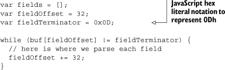

在这里，我们以 32 字节为单位循环缓冲区，直到我们遇到表示为十六进制记法的`fieldTerminator`。

现在我们需要处理每个字段描述符的信息。规范中还有一个专门为此目的的表格；我们例子的相关信息在表 3.2 中展示。

##### 表 3.2。DBase 5.0 字段描述符数组规范

| 字节 | 内容 | 描述 |
| --- | --- | --- |
| 0-10 | 11 字节 | 字段名称（ASCII，零填充） |
| 11 1 | 字节 | 字段类型（ASCII，C，N 等） |
| ... | ... | ... |
| 16 | 1 字节 | 字段长度（二进制） |

注意，字节的索引从 0 开始，即使我们在读取文件时已经远远超过了字节位置 0。如果我们从每个记录开始重新开始，那将很棒，这样我们就可以更紧密地遵循规范。`Buffer`提供了一个`slice`方法，我们可以用它来做这件事：

```
var fields = [];
var fieldOffset = 32;
var fieldTerminator = 0x0D;

while (buf[fieldOffset] != fieldTerminator) {
  var fieldBuf = buf.slice(fieldOffset, fieldOffset+32);
  // here is where we parse each field
  fieldOffset += 32;
}
```

`buf.slice(start, end)`与标准数组切片方法非常相似，因为它返回从`start`到`end`的缓冲区索引。但它不同之处在于它不返回数据的新副本。它只返回那些点的数据快照。所以如果你以任何方式在切片缓冲区中操作数据，*它也会在原始缓冲区中被操作*。

使用我们新的`fieldBuf`在每个迭代中从零开始索引，我们可以不进行额外的头脑数学运算来接近规范。让我们看看第一行。

| 字节 | 内容 | 描述 |
| --- | --- | --- |
| 0-10 | 11 字节 | 字段名称（ASCII，零填充） |

这是提取字段名称的代码：


默认情况下，`buf.toString()`假设`utf8`，但 Node `Buffer`s 也支持其他编码，包括`ascii`，这正是我们的规范所要求的。`buf.toString()`还允许你传入你想要转换的范围。我们还必须`replace()`掉如果字段小于 11 字节则填充的零字符，这样我们就不会在我们的名称中结束于零填充字符（\u0000）。

> ⁷参见[`nodejs.org/api/buffer.html#buffer_buffer`](http://nodejs.org/api/buffer.html#buffer_buffer)。

下一个相关的字段是字段数据类型。

| 字节 | 内容 | 描述 |
| --- | --- | --- |
| 11 | 1 字节 | 字段类型（ASCII，C，N 等） |

但字符 C 和 N 对我们来说还没有实际意义。在规范的下文中，我们将得到这些类型的定义，如表 3.3 所示。

##### 表 3.3\. 字段类型规范

| 数据类型 | 数据输入 |
| --- | --- |
| C（字符） | 所有 OEM 代码页字符 |
| N（数字） | - . 0 1 2 3 4 5 6 7 8 9 |

将这些数据转换为我们的应用程序相关的类型会很好。JavaScript 不使用语言*字符*或*数字*，但它确实有*String*和*Number*；在我们解析实际记录时，让我们记住这一点。目前，我们可以将其存储在一个小的查找对象中，稍后进行转换：

```
var FIELD_TYPES = {
  C: 'Character',
  N: 'Numeric'
}
```

现在我们有了查找表，我们可以在继续转换二进制数据时提取相关信息：


`buf.toString()`将给我们一个 ASCII 字符，然后我们在哈希中查找以获取完整的类型名称。

解析剩余文件中每个字段描述所需解析的唯一其他信息是字段大小。

| 字节 | 内容 | 描述 |
| --- | --- | --- |
| 16 | 1 字节 | 字段长度（二进制） |

我们现在写下这个熟悉的代码：


该字段描述符数组部分规范和代码之间的转换在图 3.7 中得到了说明。

##### 图 3.7. 字段描述符数组：使用 Node `Buffer` API 从规范到代码的转换

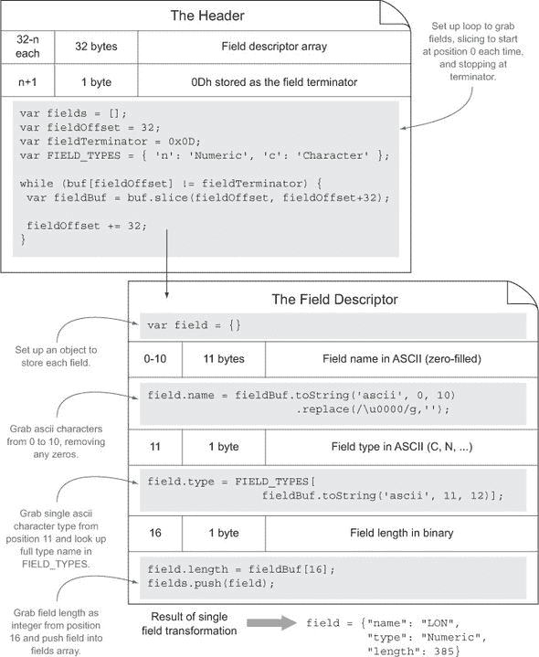

##### 记录

现在我们已经解析了头部，包括字段描述符，我们还有另一部分要处理：实际的记录数据。规范告诉我们这一点：

> *记录在表文件中跟随头部。如果记录未被删除，则数据记录之前有一个字节，即空格（20h）；如果记录被删除，则有一个星号（2Ah）。字段没有字段分隔符或记录终止符地打包到记录中。文件的末尾由一个字节标记，即文件结束标记，OEM 代码页字符值为 26（1Ah）。*

让我们将其分解以进行讨论：

> *记录在表文件中跟随头部。*

虽然我们可以在`fieldOffset`之后跟踪字节位置，但头部有一个表示头部字节数的字段，我们将其存储为`header.bytesInHeader`。因此，我们知道我们需要从这里开始：

```
var startingRecordOffset = header.bytesInHeader;
```

从我们对头部的解析中，我们还学到了一些其他东西。第一点是数据中存在多少条记录，我们将其存储为`header.totalRecords`。第二点是每条记录分配了多少字节，我们将其存储为`header.bytesPerRecord`。知道从哪里开始，迭代多少次，以及每次迭代跳多少有助于我们设置一个处理每个记录的优雅的`for`循环：

```
for (var i = 0; i < header.totalRecords; i++) {
  var recordOffset = startingRecordOffset +
                        (i * header.bytesPerRecord);
  // here is where we parse each record
}
```

现在，在每次迭代的开始，我们知道我们想要开始的字节位置存储为`recordOffset`。让我们继续阅读规范：

> *如果记录未被删除，则数据记录之前有一个字节，即空格（20h）；如果记录被删除，则有一个星号（2Ah）。*

接下来，我们必须检查第一个字节以查看记录是否被删除：


与我们在头部文件中测试`fieldTerminator`类似，这里我们测试整数是否匹配`0x2A`或 ASCII 的“星号”字符。让我们继续阅读：

> *字段没有字段分隔符或记录终止符地打包到记录中。*

最后，我们可以提取实际的记录数据。这提取了从解析字段描述符数组中学到的信息。我们为每个字段存储了`field.type`、`field.name`和`field.length`（以字节为单位）。我们希望将名称作为记录中的键，其值是转换到正确类型的该长度字节数据。让我们用简单的伪代码来看看：

```
record[name] = cast type for (characters from length)
e.g.
record['pop2005'] = Number("13119679")
```

我们还希望对每条记录的每个字段进行此类类型转换，因此我们使用另一个`for`循环：

```
for (var j = 0; j < fields.length; j++) {
  var field = fields[j];
  var Type = field.type == 'Numeric' ? Number : String;
  record[field.name] = Type(buf.toString('ascii', recordOffset,
                              recordOffset+field.length).trim());
  recordOffset += field.length;
}
```

我们遍历每个字段：

> **1**. 首先，我们找出要将值转换为哪种 JavaScript 类型，并将其存储在变量`Type`中。
> 
> **2**. 然后，我们使用`buf.toString`从`recordOffset`到下一个`field.length`提取字符。我们还需要`trim()`数据，因为我们不知道是否所有字节都用于存储相关数据，或者只是填充了空格。
> 
> **3**. 最后，我们将`recordOffset`增加`field.length`，以便在再次进入`for`循环时，我们保持下一个字段的起始位置。

本记录部分的规范与代码之间的转换在图 3.8 中得到了说明。

##### 图 3.8. 记录：使用 Node `Buffer` API 将规范转换为代码

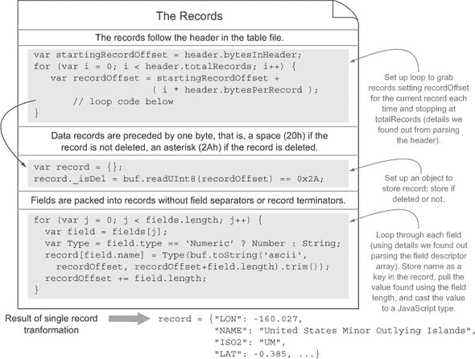

你还在吗？我希望如此。完整的代码示例在图 3.9 中展示。

##### 图 3.9. 将 DBF 文件解析为 JSON 的完整代码

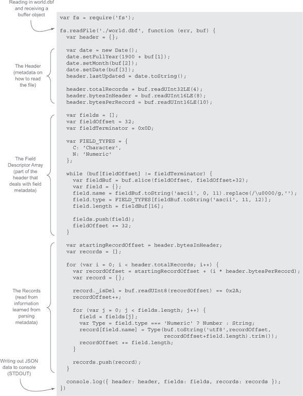

使用 Node 的`Buffer` API，我们能够将二进制文件转换为可用的 JSON 格式。运行此应用程序的输出如下所示：

```
{ header:
   { lastUpdated: 'Sat Aug 26 1995 21:55:03 GMT-0500 (CDT)',
     totalRecords: 246,
     bytesInHeader: 385,
     bytesPerRecord: 424 },
  fields:
   [ { name: 'LON', type: 'Numeric', length: 24 },
     { name: 'NAME', type: 'Character', length: 80 },
     { name: 'ISO2', type: 'Character', length: 80 },
     { name: 'UN', type: 'Numeric', length: 11 },
     { name: 'ISO3', type: 'Character', length: 80 },
     { name: 'AREA', type: 'Numeric', length: 11 },
     { name: 'LAT', type: 'Numeric', length: 24 },
     { name: 'SUBREGION', type: 'Numeric', length: 11 },
     { name: 'REGION', type: 'Numeric', length: 11 },
     { name: 'POP2005', type: 'Numeric', length: 11 },
     { name: 'FIPS', type: 'Character', length: 80 } ],
  records:
    { _isDel: false,
       LON: -160.027,
       NAME: 'United States Minor Outlying Islands',
       ISO2: 'UM',
       UN: 581,
       ISO3: 'UMI',
       AREA: 0,
       LAT: -0.385,
       SUBREGION: 0,
       REGION: 0,
       POP2005: 0,
       FIPS: '' },
     { _isDel: false,
       LON: 35.278,
       NAME: 'Palestine',
       ISO2: 'PS',
       UN: 275,
       ISO3: 'PSE',
       AREA: 0,
       LAT: 32.037,
       SUBREGION: 145,
       REGION: 142,
       POP2005: 3762005,
       FIPS: '' },
       ...
 }
```

几乎神奇的是，一个不可读的二进制文件被转换成了一个不仅可读，而且可用的数据格式，可以用来进行更多转换。当然，这并不是魔法，而是投入时间学习二进制格式并使用可用的工具进行转换。`Buffer` API 提供了很好的工具来完成这项工作。

|  |
| --- |

**使用 fs 方法**

我们也可以选择使用`fs.writeFile`及其相关方法将生成的代码写入文件。[^a 就像 Node 中的大多数 API 可以读取缓冲区对象一样，大多数也可以写入缓冲区对象。在我们的情况下，我们没有得到一个缓冲区，而是一个 JSON 对象，因此我们可以使用`JSON.stringify`结合`fs.writeFile`将数据写入：

> ^a 参见[`nodejs.org/api/fs.html`](http://nodejs.org/api/fs.html)。

```
fs.writeFile('world.json', JSON.stringify(result), ...
```

|  |
| --- |

二进制文件格式可以很有趣去破解。`Buffer`的另一个有趣且实用的用途是处理二进制协议，我们将在下一部分探讨。

### 3.3. 创建自己的二进制协议

当你阅读二进制文件并从中理解其含义时，感觉就像破解了一道代码。编写自己的谜题并解码它们同样有趣。当然，这不仅仅是为了乐趣。使用一个定义良好的二进制协议可以是一种紧凑且高效的数据传输方式。

#### 技巧 18：创建自己的网络协议

在这个技术中，我们将涵盖一些处理二进制数据的额外方面，例如位掩码和协议设计。我们还将探讨压缩二进制数据。

##### 问题

你想要创建一个高效的消息传输方式，无论是在网络中还是在进程中。

##### 解决方案

JavaScript 和 Node 的`Buffer` API 为你提供了创建自己的二进制协议的工具。

##### 讨论

要创建一个二进制协议，你首先必须定义你想要通过网络或进程发送的信息类型以及你将如何表示这些信息。就像你在上一技巧中学到的那样，一个规范为这一过程提供了一个很好的路线图。

对于这种技术，我们将开发一个简单且紧凑的数据库协议。我们的协议将包括

+   使用位掩码来确定将消息存储在哪个数据库中

+   将数据写入特定的键，该键将是一个介于 0-255（一个字节）的无符号整数

+   使用 zlib 压缩任何长度的消息

表 3.4 显示了我们可以如何编写规范。

##### 表 3.4\. 简单键值数据库协议

| 字节 | 内容 | 描述 |
| --- | --- | --- |
| 0 | 1 字节 | 根据哪些位被激活，确定将数据写入哪个数据库。每个位位置代表一个从 1 到 8 的数据库。 |
| 1 | 1 字节 | 一个字节的未签名整数（0-255），用作数据库键，以存储数据。 |
| 2-n | 0-n 字节 | 要存储的数据，可以是使用 deflate（zlib）压缩的任意数量的字节。 |

##### 通过操作位来选择数据库

我们的协议规定，第一个字节将用于表示哪些数据库应该记录传输的信息。在接收端，我们的主要数据库将是一个简单的多维数组，将包含八个数据库的位置（因为一个字节中有八个位）。这可以用 JavaScript 中的数组字面量简单地表示：

```
var database = [ [], [], [], [], [], [], [], [] ];
```

无论哪些位被激活，都将指示哪些数据库或数据库将存储接收到的消息。例如，数字`8`在二进制中表示为`00001000`。在这种情况下，我们将信息存储在数据库 4 中，因为第四位是开启的（位是从右到左读取的）。

|  |
| --- |

##### 零索引数组

在 JavaScript 中，数组是零索引的，所以数据库 4 在数组位置 3，但为了避免复杂化，我们故意将我们的数据库称为 1 到 8，而不是 0 到 7，以更接近我们的语言在讨论字节的位时。

|  |
| --- |

如果你好奇一个数字在 JavaScript 中的二进制表示，你可以使用内置的`toString`方法，将其第一个参数设置为`2`：


数字可以有多个位被激活；例如，20 在二进制中表示为`00010100`，对于我们的应用程序来说，这意味着我们想要在数据库 3 和 5 中存储消息。

那么，我们如何测试任何给定数字的哪些位被激活了呢？为了解决这个问题，我们可以使用一个位掩码。位掩码代表我们感兴趣的测试的位模式。例如，如果我们想知道是否应该在数据库 5 中存储一些数据，我们可以创建一个第五位被激活的位掩码。在二进制中，这将看起来像`00010000`，这是数字 32（或十六进制表示为`0x20`）。

我们接下来必须测试我们的位掩码与一个值，JavaScript 包含各种位运算符^([8]) 来完成这个任务。其中一个是 `&`（位与）运算符。`&` 运算符的行为类似于 `&&` 运算符，但它不是测试两个条件都为真，而是测试两个位都打开（有 1 而不是 0）并且在该情况下保持位打开（或 1）：

> ⁸ 查看 [`developer.mozilla.org/en-US/docs/JavaScript/Reference/Operators/Bitwise_Operators`](https://developer.mozilla.org/en-US/docs/JavaScript/Reference/Operators/Bitwise_Operators)。

```
  000101000
& 000100000
-----------
  000100000
```

两个值都打开了位位置 5，所以使用 `&` 时它仍然保持打开状态。有了这个知识，我们可以看到，如果一个值与位掩码进行比较，并且它有相同的位或位打开，那么它将是位掩码。有了这个信息，我们可以设置一个简单的条件来测试：

```
if ((value & bitmask) === bitmask) { .. }
```

很重要，`&` 表达式必须被括号包围；否则，由于操作符优先级，会首先检查位掩码的相等性.^([9])

> ⁹ 查看 [`developer.mozilla.org/en-US/docs/JavaScript/Reference/Operators/Operator_Precedence`](https://developer.mozilla.org/en-US/docs/JavaScript/Reference/Operators/Operator_Precedence)。

为了测试我们二进制协议中接收到的第一个字节，我们想要设置一个与我们的数据库索引相对应的位掩码列表。如果位掩码匹配，我们知道该索引的数据库将需要写入数据。每个位置的“打开”位是一个数组

```
var bitmasks = [ 1, 2, 4, 8, 16, 32, 64, 128 ]
```

这对应于：

```
1        2        4        8        16       32       64       128
-----------------------------------------------------------------------
00000001 00000010 00000100 00001000 00010000 00100000 01000000 10000000
```

现在我们知道，如果一个字节在我们的位掩码数组中匹配 `1`，它将匹配数据库 1 或数组位置 0。我们可以设置一个简单的循环来测试每个位掩码与第一个字节的值：

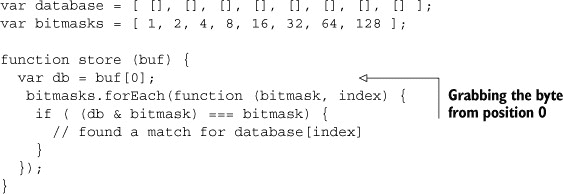

在一开始处理位可能很棘手，但一旦你更了解它们是如何工作的，它们就变得更容易管理。到目前为止，我们所涵盖的所有内容不仅可在 Node 中使用，也可在浏览器 JavaScript 中使用。我们已经足够远，可以确定我们应该将我们的传入数据放在哪个数据库中；我们仍然需要找出应该将数据存储在哪个键中。

##### 查找存储数据的键

这是我们的例子中最简单的一部分，因为你已经从之前的技术中学到了这一点。在我们开始之前，让我们看看之前在 表 3.4 中定义的规范的相关部分。

| 字节 | 内容 | 描述 |
| --- | --- | --- |
| 1 | 1 字节 | 一个字节的未签名整数（0–255），用作数据库键来存储数据。 |

我们知道我们将在字节位置 1 接收到一个字节的无符号整数（0-255），它将被用作数据库键来存储数据。我们故意将数据库设置为一个多维数组，其中第一个维度是数据库。现在我们可以使用第二个维度作为存储键和值的地方，因为键是数字，所以数组可以工作.^([10])让我们通过一个例子来说明这一点，以下是存储在第一个和第三个数据库中键`0`的值`'foo'`的情况：

> ^([10])尽管在 ECMAScript 6 中出现了更理想的替代方案。

```
[
  ['foo'],
  [],
  ['foo'],
  [],
  [],
  [],
  [],
  []
]
```

要从位置 1 获取键值，我们可以使用现在可能已经熟悉的`readUInt8`方法：


让我们将其添加到我们之前构建的主要代码示例中：

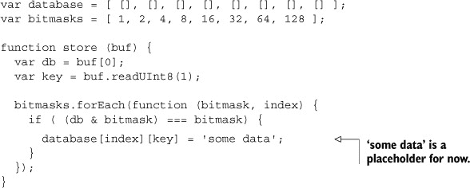

现在我们能够解析数据库及其中的键，我们可以开始解析实际要存储的数据。

##### 使用 zlib 解压缩数据

在通过网络发送字符串/ASCII/UTF-8 数据时进行压缩是一个明智的想法，因为压缩可以真正减少带宽的使用。在我们的简单数据库协议中，我们假设要存储的数据已经被压缩了；让我们查看规范以了解相关描述。

Node 包含一个内置的`zlib`模块，该模块公开了`deflate`（压缩）和`inflate`（解压缩）方法。它还包括 gzip 压缩。为了避免接收到格式不正确的消息，我们可以检查接收到的消息确实已经正确压缩，如果没有，我们将拒绝解压缩它。通常，zlib“deflated”数据的第一个字节是`0x78`^(11)，因此我们可以相应地进行测试：

> ^([11])一个更健壮的实现应该进行更多的检查；请参阅[`tools.ietf.org/html/rfc6713`](http://tools.ietf.org/html/rfc6713)。


现在我们知道我们很可能会处理压缩数据，我们可以使用`zlib.inflate`来解压缩它。我们还需要使用`buf.slice()`来获取消息的数据部分（因为留下前两个字节会导致错误）：

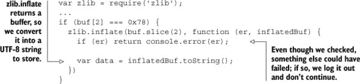

我们已经拥有了使用我们的简单数据库协议在数据库中存储数据的所有必要条件。让我们将所有组件组合起来：

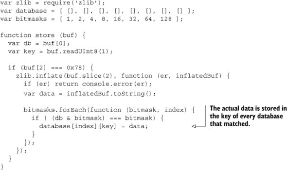

现在我们已经有了存储一些数据的代码。我们可以通过以下方式生成消息：

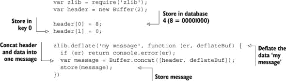

我们可以编写一个示例，通过 TCP 发送消息并进行更多的错误处理。但让我们把这留给你在后面的章节中学习 Node 网络时作为练习来处理。

### 3.4. 摘要

在本章中，你学习了关于缓冲区的内容以及如何使用`toString`方法将缓冲区转换为不同的编码字符串。我们深入探讨了使用`Buffer` API 将二进制文件转换为更易用的事物这一复杂任务。最后，我们通过创建自己的协议并学习位掩码和压缩来享受了一些乐趣。

我们在 Node 中介绍了缓冲区的一些常见用法，难度各异，希望这能让你更舒适地使用它们，并充分利用它们。去尝试进行二进制格式转换，并在 NPM 上发布你的作品，或者可能有一个更适合你业务需求的协议正在等待被编写。

在下一章中，我们将探讨 Node 的另一个核心部分——事件。

## 第四章：事件：精通`EventEmitter`及其他

*本章涵盖*

+   使用 Node 的`EventEmitter`模块

+   管理错误

+   第三方模块如何使用`EventEmitter`

+   如何使用事件与域

+   `EventEmitter`的替代方案

Node 的`events`模块目前只包含一个类：`EventEmitter`。这个类在 Node 的内置模块和第三方模块中都被使用。它对许多 Node 程序的整体架构做出了贡献。因此，理解`EventEmitter`及其使用方法非常重要。

这是一个简单的类，如果你熟悉 DOM 或 jQuery 事件，那么你理解起来应该不会有太多困难。在使用 Node 时，主要考虑的是错误处理，我们将在技术 21 中探讨这一点。

`EventEmitter`可以用各种方式使用——它通常用作解决各种问题的基类，从构建网络服务器到构建应用程序逻辑。鉴于它被用作 Express 等流行 Node 模块中关键类的基础，了解它的工作原理对于编写与现有模块良好协作的惯用代码非常有用。

在本章中，你将学习如何使用`EventEmitter`创建自定义类，以及它在 Node 和开源模块中的使用方式。你还将学习在使用`EventEmitter`时遇到的问题，并了解一些替代方案。

### 4.1. 基本用法

要使用`EventEmitter`，必须从基类继承。本节包括从`EventEmitter`继承的技术，以及将其混合到已经从另一个基类继承的其他类中的技术。

#### 技术第十九章：从`EventEmitter`继承

这种技术演示了如何基于`EventEmitter`创建自定义类。通过理解这个技术中的原则，你将学会如何使用`EventEmitter`，以及如何更好地使用基于它的模块。

##### 问题

你想使用基于事件的方法来解决一个问题。你有一个类，你希望它在异步事件发生时进行操作。

Web、桌面和移动用户界面有一个共同点：它们都是基于事件的。事件是处理本质上异步的输入（人类输入）的一个很好的范例。为了展示`EventEmitter`的工作原理，我们将以音乐播放器为例。它实际上不会播放音乐，但这个底层概念是学习如何使用事件的一个很好的方式。

##### 解决方案

在 Node 中使用事件的一个典型例子是从 `EventEmitter` 继承。这可以通过使用一个简单的原型类来实现——只需记住在您的新的构造函数中调用 `EventEmitter` 的构造函数。

第一段代码展示了如何从 `EventEmitter` 继承。

##### 列表 4.1\. 从 `EventEmitter` 继承

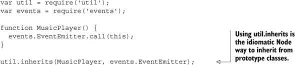

##### 讨论部分

简单构造函数和 `util.inherits` 的组合是创建定制事件类最简单、最常见的方式。下一段代码扩展了前面的列表，展示了如何使用 `on` 方法来发射和绑定监听器。

##### 列表 4.2\. 从 `EventEmitter` 继承

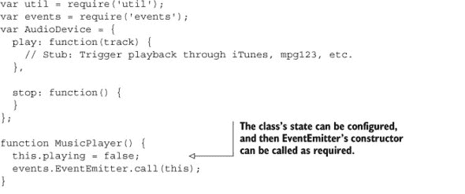

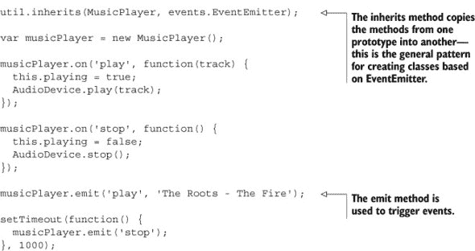

这可能看起来不多，但假设我们需要在 `play` 触发时做其他事情——也许用户界面需要更新。这可以通过简单地向 `play` 事件添加另一个监听器来支持。以下列表展示了如何添加更多监听器。

##### 列表 4.3\. 添加多个监听器

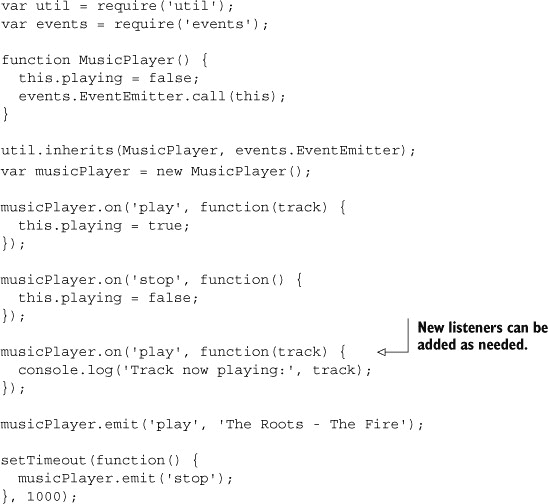

监听器也可以被移除。`emitter.removeListener` 用于移除特定事件的监听器，而 `emitter.removeAllListeners` 则移除所有监听器。您需要将监听器存储在一个变量中，以便在移除特定监听器时能够引用它，这与使用 `clearTimeout` 移除定时器类似。下一段代码展示了这一过程。

##### 列表 4.4\. 移除监听器

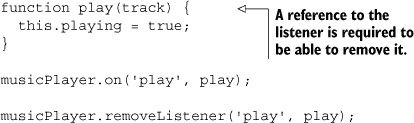

`util.inherits` 通过包装 ES5 方法 `Object.create` 来工作，它将一个原型中的属性继承到另一个原型中。Node 的实现还设置了 `super_` 属性中的超构造函数。这使得访问原始构造函数变得容易得多——在 `util.inherits` 使用后，您的原型类将通过 `YourClass.super_` 访问 `EventEmitter`。

您也可以只响应一次事件，而不是每次事件触发时都响应。为此，请使用 `once` 方法附加一个监听器。当事件可以多次触发，但您只关心它发生一次时，这很有用。例如，您可以将 列表 4.3 更新为跟踪播放事件是否已被触发：

```
musicPlayer.once('play', {
  this.audioFirstStarted = new Date();
});
```

当从 `EventEmitter` 继承时，在构造函数中使用 `events.EventEmitter.call(this)` 是一个好主意，以运行 `EventEmitter` 的构造函数。这样做的原因是，如果正在使用域，它将实例附加到 `domain` 上。要了解更多关于域的信息，请参阅技巧 22。

我们在这里介绍的方法——on、emit 和 removeListener——是 Node 开发的基石。一旦你掌握了`EventEmitter`，你会发现它在各个地方都有出现：在 Node 的内置模块中，以及更远的地方。使用`net.createServer`创建 TCP/IP 服务器将返回一个基于`EventEmitter`的服务器，甚至全局的`process`对象也是一个`EventEmitter`的实例。此外，像`Express`这样的流行模块也是基于`EventEmitter`的——你实际上可以创建一个 Express 的`app`对象，并调用`app.emit`来在 Express 项目中发送消息。

#### 技巧 20 混入 EventEmitter

有时继承并不是使用`EventEmitter`的正确方式。在这些情况下，混合`EventEmitter`可能有效。

##### 问题

这是技巧 19 的另一种选择。而不是使用`EventEmitter`作为基类，你可以将其方法复制到另一个类中。当你有一个现有的类并且不能轻易地重新设计它以直接继承自`EventEmitter`时，这很有用。

##### 解决方案

使用 for-in 循环足以从`prototype`的一个复制属性到另一个。这样，你可以从`EventEmitter`复制必要的属性。

##### 讨论

这个例子可能看起来有些牵强，但有时确实有必要复制`EventEmitter`的属性，而不是以通常的方式从它继承。这种方法更类似于混入，或多重继承；如下一列表所示进行演示。

##### 列表 4.5. 混入 `EventEmitter`

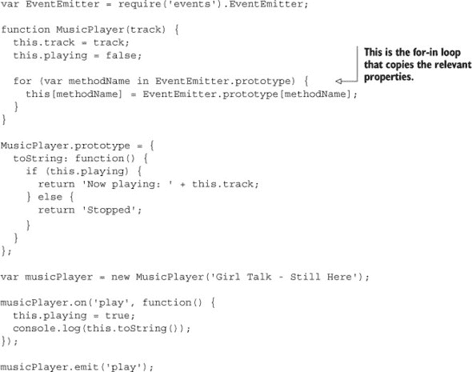

野外的多重继承的一个例子是 Connect 框架.^([1]) 核心的`Server`类从多个来源继承，在这种情况下，Connect 作者决定创建他们自己的属性复制方法，如下一列表所示。

> ¹ 查看 [`www.senchalabs.org/connect/`](http://www.senchalabs.org/connect/)。

##### 列表 4.6. Connect 的 utils.merge

```
exports.merge = function(a, b){
  if (a && b) {
    for (var key in b) {
      a[key] = b[key];
    }
  }
  return a;
};
```

当你已经有了一个可以受益于事件但不容易成为`EventEmitter`直接后代的成熟类时，这种技术可能很有用。

一旦你从`EventEmitter`继承，你将需要处理错误。下一节将探讨处理由`EventEmitter`类生成的错误的技术。

### 4.2. 错误处理

尽管大多数事件都同等对待，但`error`事件是一个特殊情况，因此被不同对待。本节探讨了处理错误的两种方式：一种是将监听器附加到`error`事件上，另一种是使用域从一组`EventEmitter`实例中收集错误。

#### 技巧 21 管理错误

使用`EventEmitter`的错误处理有其自己的特殊规则，必须遵守。这项技术解释了错误处理是如何工作的。

##### 问题

你正在使用`EventEmitter`，并希望优雅地处理错误发生的情况，但它不断抛出异常。

##### 解决方案

要防止 `EventEmitter` 在发出 `error` 事件时抛出异常，请向 `error` 事件添加监听器。这可以通过自定义类或任何继承自 `EventEmitter` 的标准类来完成。

##### 讨论

要处理错误，将监听器绑定到 `error` 事件。以下列表通过构建音乐播放器示例来演示这一点。

##### 列表 4.7\. 基于事件的错误

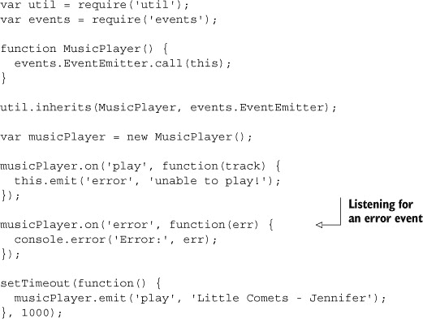

这个例子可能很简单，但它很有用，因为它应该能帮助你意识到 `EventEmitter` 如何处理错误。它感觉像是一个特殊情况，确实如此。以下摘录来自 Node 文档：

> *当 `EventEmitter` 实例遇到错误时，典型的操作是发出一个 `error` 事件。错误事件在 Node 中被视为特殊情况。如果没有监听器，则默认操作是打印堆栈跟踪并退出程序。*

你可以通过从 列表 4.7 中移除 `'error'` 处理程序来尝试这个方法。应该在控制台显示堆栈跟踪。

从语义上看，这样做是有意义的——否则，如果没有错误处理程序，可能会出现潜在危险的活动而未被注意到。事件名称，或称为内部所提到的 *type*，必须恰好为 `error`——额外的空格、标点符号或大写字母都不会被视为 `error` 事件。

这种约定意味着基于事件的错误处理代码具有很高的一致性。它可能是一个特殊情况，但这是一个值得注意的情况。

#### 技巧 22 使用域管理错误

处理多个 `EventEmitter` 实例的错误可能感觉像是一项艰巨的工作 ... 除非使用域！

##### 问题

你正在处理多个非阻塞 API，但难以有效地处理错误。

##### 解决方案

Node 的 `domain` 模块可用于集中处理一组异步操作的错误，包括发出未处理的 `error` 事件的 `EventEmitter` 实例。

##### 讨论

Node 的 `domain` API 提供了一种将现有非阻塞 API 和异常包装在错误处理程序中的方法。这有助于集中处理错误，并在使用多个相互依赖的 I/O 操作的情况下特别有用。

列表 4.8 通过使用两个 `EventEmitter` 后代构建在音乐播放器示例之上，展示了如何使用单个错误处理程序来处理不同对象的错误。

##### 列表 4.8\. 使用 `domain` 管理错误


域可以与 `EventEmitter` 后代、网络代码以及异步文件系统方法一起使用。

为了可视化域的工作方式，想象一下 `domain.run` 回调围绕你的代码，即使回调内部的代码触发的事件发生在它之外。任何抛出的错误仍然会被域捕获。图 4.1 说明了这个过程。

##### 图 4.1\. 域帮助捕获错误并以 `EventEmitter-style` API 处理它们。


没有域名，使用 `throw` 抛出的任何错误都可能使解释器处于未知状态。域名避免了这种情况，并有助于你更优雅地处理错误。

现在你已经知道了如何从 `EventEmitter` 继承并处理错误，你应该开始看到它可以用到的各种有用的方式。下一节通过介绍一些高级使用模式和解决与事件相关的程序结构问题的更高级解决方案来扩展这些技术。

### 4.3\. 高级模式

本节提供了一些最佳实践技术，用于解决在使用 `EventEmitter` 时发现的结构问题。

#### 技巧 23 反射

有时你需要动态地响应 `EventEmitter` 实例的变化，或者查询其监听者。这项技术解释了如何做到这一点。

##### 问题

你需要捕获监听者被添加到发射器时的时刻，或者查询现有的监听者。

##### 解决方案

要跟踪监听者的添加，`EventEmitter` 会发出一个特殊事件，称为 `new-Listener`。添加到该事件的监听者将接收到事件名称和监听者函数。

##### 讨论

在某些方面，编写好的 Node 代码和 *优秀的* Node 代码之间的区别在于对 `EventEmitter` 的深入理解。能够正确地反射 `EventEmitter` 对象会带来一系列创建更灵活和直观 API 的机会。实现这一点的动态方式之一是通过 `new-Listener` 事件，当使用 `on` 方法添加监听者时发出。有趣的是，这个事件是通过 `EventEmitter` 本身发出的——它是通过使用 `emit` 实现的。

下一个列表展示了如何跟踪 `newListener` 事件。

##### 列表 4.9\. 跟踪新监听者


尽管在这个例子中 `'a listener'` 没有被明确发出，但 `newListener` 事件仍然会触发。由于监听者的回调函数以及事件名称都被传递，这是为需要访问原始监听函数的事物创建简化公共 API 的绝佳方式。列表 4.10 通过在添加 `pulse` 事件的监听者时自动启动计时器来演示这个概念。

##### 列表 4.10\. 基于新监听者自动触发事件


我们可以更进一步，通过调用 `emitter.listeners(event)` 来查询 `EventEmitter` 对象的监听者。一次无法返回所有监听者列表。整个列表在技术上在 `this._events` 对象中是可用的，但这个属性应被视为私有。监听者方法目前返回一个 `Array` 实例。如果给定的事件添加了多个监听者，这可以用来迭代多个监听者——可能是为了在异步过程结束时移除它们，或者简单地检查是否添加了任何监听者。

在有事件数组可用的情况下，`listeners` 方法将有效地返回 `this._events[type].slice(0)`。在数组上调用 slice 是创建数组 *副本* 的 JavaScript 快捷方式。文档中提到，这种行为可能会在未来改变，所以如果你真的想创建附加监听器的副本，那么请自己调用 slice 以确保你真的得到一个副本，而不是发射器实例中的数据结构的引用。

列表 4.11 为 `Pulsar` 类添加了一个 `stop` 方法。当调用 `stop` 时，它会检查是否有任何监听器；如果没有，则抛出错误。检查监听器是防止错误使用的好方法，但你不必在自己的代码中这样做。

##### 列表 4.11\. 查询监听器

```
Pulsar.prototype.stop = function() {
  if (this.listeners('pulse').length === 0) {
    throw new Error('No listeners have been added!');
  }
};

var pulsar = new Pulsar(500, 5);

pulsar.stop();
```

#### 技巧 24 检测和利用 EventEmitter

许多成功的开源 Node 模块都是基于 `EventEmitter` 构建的。了解 `EventEmitter` 被使用的地方以及如何利用它是有用的。

##### 问题

你正在处理一个包含多个组件的大型项目，并希望在它们之间进行通信。

##### 解决方案

当你使用 Node 的标准模块或开源库时，寻找 emit 和 on 方法。例如，Express 的 `app` 对象有这些方法，它们非常适合在应用程序内发送消息。

##### 讨论

通常当你在一个大型项目中工作时，有一个主要组件是问题域的核心。如果你使用 Express 构建一个 Web 应用程序，那么 `app` 对象就是这样一种组件。快速检查源代码显示，该对象混合了 `EventEmitter`，因此你可以利用事件在项目中的不同组件之间进行通信。

列表 4.12 展示了一个基于 Express 的示例，其中监听器绑定到事件上，然后当访问特定路由时，事件被触发。

##### 列表 4.12\. 在 Express 中重用 `EventEmitter`


这可能看起来有些牵强，但如果路由定义在另一个文件中呢？在这种情况下，除非它被定义为全局变量，否则你无法访问 `app` 对象。

基于 `EventEmitter` 的另一个流行项目是 Node Redis 客户端 ([`npmjs.org/package/redis`](https://npmjs.org/package/redis))。`RedisClient` 实例继承自 `EventEmitter`。这允许你挂钩到有用的事件，如 `error` 事件，如下一列表所示。

##### 列表 4.13\. 在 `redis` 模块中重用 `EventEmitter`


在使用路由分离技术将路由存储在几个文件中的情况下，你实际上可以通过调用 `res.app.emit(event)` 来发送事件。这允许路由处理程序将消息发送回 `app` 对象本身。

这可能看起来像一个非常具体的 Express 示例，但其他流行的开源模块也是基于 `EventEmitter` 构建的——只需寻找 emit 和 on 方法。记住，Node 的内部模块，如 `process` 对象和 net.create-Server 继承自 `EventEmitter`，而编写良好的开源模块通常也会从这些模块继承。这意味着基于事件解决架构问题的范围非常广泛。

这个例子还突出了围绕 `EventEmitter` 构建项目的另一个好处——异步过程可以尽快响应。如果 `hello-alert` 事件执行一个非常慢的操作，比如发送电子邮件，那么浏览页面的用户可能不想等待这个过程完成。在这种情况下，你可以在后台有效地执行较慢的操作的同时渲染请求的页面。

Node Redis 客户端对 `EventEmitter` 的使用非常出色，作者为每个方法编写了文档，说明了它们的功能。这是一个好主意——如果有人加入你的项目，他们可能会发现很难全面了解正在使用的事件。

#### 技巧 25 对事件名称进行分类

一些项目的事件实在太多了。这个技巧展示了如何处理由输入错误的事件名称引起的错误。

##### 问题

你正在失去对程序中事件的跟踪，并且担心可能太容易在某个地方写错事件名称，从而造成难以追踪的错误。

##### 解决方案

解决这个问题的最简单方法就是使用一个对象作为所有事件名称的中心字典。这为项目中的每个事件创建了一个集中位置。

##### 讨论

跟踪散布在整个项目中的事件名称很困难。一种管理方法是保持每个事件名称在一个地方。列表 4.14 展示了如何使用对象根据本章前面的示例对事件名称进行分类。

##### 列表 4.14\. 使用对象对事件名称进行分类


虽然 `EventEmitter` 是 Node 标准库的一个基本组成部分，并且是许多问题的优雅解决方案，但它可能是大型项目中许多错误的来源，因为人们可能会忘记特定事件的名称。一种解决方法是避免将事件作为字符串编写。相反，可以使用一个对象，其属性引用事件名称字符串。

如果你正在编写可重用的开源模块，你应该考虑将其作为公共 API 的一部分，这样人们就可以轻松地获得事件名称的集中列表。

有其他观察者模式实现避免了使用字符串事件名称来有效地进行事件类型检查。在下一个技巧中，我们将探讨一些通过 npm 可用的实现。

虽然 `EventEmitter` 在 Node 项目中提供了广泛的解决方案，但还有其他实现。下一节将介绍一些流行的替代方案。

### 4.4\. 第三方模块和扩展

`EventEmitter` 实质上是一个 *观察者模式* 实现。这个模式还有其他解释，可以帮助将 Node 程序扩展到多个进程或网络中运行。接下来的技巧介绍了 Node 社区创建的一些更流行的替代方案。

#### 技巧 26 替代 EventEmitter

`EventEmitter` 拥有一个优秀的 API，并且在 Node 程序中运行良好，但有时一个问题需要稍微不同的解决方案。这项技术探讨了 `EventEmitter` 的几种替代方案。

##### 问题

你正在尝试解决的问题并不完全适合 `EventEmitter`。

##### 解决方案

根据你试图解决的问题的确切性质，有几种 `EventEmitter` 的替代方案：发布/订阅、AMQP 和 `js-signals` 是一些在 Node 中有良好支持的流行替代方案。

##### 讨论

`EventEmitter` 类是 *观察者模式* 的一个实现。一个相关的模式是发布/订阅，其中发布者发送消息，这些消息被分类到类中，发送给订阅者，而无需知道订阅者的详细信息。

发布/订阅模式在需要横向扩展的情况下通常很有用。如果你需要在多台服务器上运行多个 Node 进程，那么像 AMQP 和 ØMQ 这样的技术可以帮助实现这一点。它们都是专门设计来解决这个问题类的，但如果你已经在使用 Redis，那么可能不如使用 Redis 发布/订阅 API 方便。

如果你需要在分布式集群中进行横向扩展，那么像 RabbitMQ ([`www.rabbitmq.com/`](http://www.rabbitmq.com/)) 这样的 AMQP 实现将运行良好。`rabbitmq-nodejs-client` ([`github.com/adrai/rabbitmq-nodejs-client`](https://github.com/adrai/rabbitmq-nodejs-client)) 模块提供了一个发布/订阅 API。下面的列表展示了 Node 中 RabbitMQ 的一个简单示例。

##### 列表 4.15\. 在 Node 中使用 RabbitMQ


ØMQ ([`www.zeromq.org/`](http://www.zeromq.org/)) 在 Node 社区中更为流行。Justin Tulloss 和 TJ Holowaychuk 的 `zeromq.node` 模块 ([`github.com/JustinTulloss/zeromq.node`](https://github.com/JustinTulloss/zeromq.node)) 是一个流行的绑定。下面的列表展示了这个 API 的简单性。

##### 列表 4.16\. 在 Node 中使用 ØMQ

```
var zmq = require('zmq');
var push = zmq.socket('push');
var pull = zmq.socket('pull');

push.bindSync('tcp://127.0.0.1:3000');
pull.connect('tcp://127.0.0.1:3000');
console.log('Producer bound to port 3000');

setInterval(function() {
  console.log('sending work');
  push.send('some work');
}, 500);

pull.on('message', function(msg) {
  console.log('work: %s', msg.toString());
});
```

如果你已经在 Node 中使用 Redis，那么尝试一下 Pub/Sub API ([`redis.io/topics/pubsub`](http://redis.io/topics/pubsub)) 是值得的。列表 4.17 展示了使用 Node Redis 客户端 ([`github.com/mranney/node_redis`](https://github.com/mranney/node_redis)) 的一个示例。

##### 列表 4.17\. 在 Node 中使用 Redis Pub/Sub


最后，如果你不寻找发布/订阅，那么你可能想看看`js-signals`([`github.com/millermedeiros/js-signals`](https://github.com/millermedeiros/js-signals))。此模块是一个不使用字符串作为信号名的消息系统，对尚未存在的事件进行分发或监听将引发错误。

列表 4.18 显示了`js-signals`如何发送和接收消息。注意信号是对象的属性，而不是字符串，并且监听器可以接收任意数量的参数。

##### 列表 4.18\. 使用 Redis Pub/Sub 与 Node


如第 25 项技术 technique 25 中提到的，`js-signals`提供了一种使用属性作为信号名的方法，但在此情况下，如果未注册的监听器被分发或绑定，模块将引发错误。这种方法更像是“强类型”事件，与大多数发布/订阅和事件观察器实现非常不同。

### 4.5\. 摘要

在本章中，你学习了如何通过继承和多继承使用`EventEmitter`，以及如何在有和无域的情况下管理错误。你还看到了如何集中管理事件名，开源模块如何建立在`EventEmitter`之上，以及一些替代方案。

你应该从本章中吸取的教训是，尽管`EventEmitter`通常用作继承的基类，但它也可以混合到现有类中。此外，尽管`EventEmitter`是许多问题的绝佳解决方案，并在 Node 的内部结构中得到广泛应用，但有时其他解决方案可能更优。例如，如果你使用 Redis，那么你可以利用其发布/订阅实现。最后，`EventEmitter`并非没有问题；管理大量事件名可能导致错误，而现在你知道如何通过使用作为事件名的属性的对象来避免这种情况。

在下一章中，我们将探讨一个相关主题：流。流是基于事件驱动的 API 构建的，因此你将能够在那里使用一些这些`EventEmitter`技术。

## 第五章\. 流：节点最强大且最被误解的功能

*本章涵盖*

+   流是什么以及如何使用它们

+   如何使用 Node 的内置流 API

+   Node 0.8 及以下版本中使用的流 API

+   自 Node 0.10 以来捆绑的流原始类

+   测试流的策略

流是用于管理和建模数据的事件驱动 API，并且非常高效。通过利用`EventEmitter`和 Node 的非阻塞 I/O 库，`stream`模块允许在数据可用时动态处理数据，并在不再需要时释放它。

数据流的概念并不新鲜，但它是一个重要的概念，并且对 Node 至关重要。在第四章之后，掌握流是成为真正 Node 开发高手道路上的下一步。

`stream` 核心模块提供了构建基于事件的流类的抽象工具。你可能会使用实现流的模块，而不是自己创建。但为了充分利用流，了解它们真正的工作方式非常重要。本章的设计目标就是理解流、使用 Node 的内置流 API，以及最终创建和测试你自己的流。尽管 `stream` 模块在概念上具有抽象性质，但一旦你掌握了主要概念，你将开始看到流在各个方面的应用。

下一节提供了对流的概述，并讨论了 Node 0.10 版本支持的两种 API。

### 5.1\. 流简介

在 Node 中，流是一个由多个不同对象遵循的 *抽象接口*。当我们谈论流时，我们指的是一种做事的方式——在某种程度上，它们是一种协议。流可以是可读的或可写的，并且使用 `EventEmitter` 的实例实现——有关事件的内容，请参阅第四章。流提供了在对象之间创建数据流的方法，并且可以像乐高积木一样模块化组合。

#### 5.1.1\. 流的类型

流总是涉及某种类型的 I/O，并且可以根据它们处理的 I/O 类型进行分组。以下类型的流来自 James Halliday 的 `stream-handbook` ([`github.com/substack/stream-handbook/`](https://github.com/substack/stream-handbook/))，将给你一个关于你可以用流做什么的广泛概念：

+   ***内置*** —Node 的许多核心模块实现了流接口；例如，`fs.createReadStream`。

+   ***HTTP*** —虽然技术上属于网络流，但有一些流模块旨在与各种网络技术一起工作。

+   ***解析器*** —历史上解析器一直是使用流实现的。Node 的流行第三方模块包括 XML 和 JSON 解析器。

+   ***浏览器*** —Node 的事件驱动流已扩展到浏览器中，为与客户端代码的接口提供了独特的机会。

+   ***音频*** —James Halliday 编写了一些具有流接口的创新音频模块。

+   ***RPC (远程过程调用)*** —通过网络发送流是实现进程间通信的有用方式。

+   ***测试*** —有流友好的测试库，以及用于测试流本身的工具。

+   ***控制、元数据和状态*** —流还有更抽象的用途，以及专为操作和管理其他流而设计的模块。

要理解流为什么重要，首先考虑在没有流的情况下处理数据会发生什么。让我们通过比较 Node 的异步、同步和基于流的 API 来更详细地探讨这一点。

#### 5.1.2\. 何时使用流

当使用`fs.readFileSync`以同步方式读取文件时，程序将会阻塞，并且所有数据都将被读入内存。使用`fs.readFile`将防止程序阻塞，因为它是一个异步方法，但它仍然会将整个文件读入内存。

如果有一种方法可以告诉`fs.readFile`将数据块读入内存，处理它，然后请求更多数据，那将是溪流的作用所在。

当处理大文件时，内存会成为一个问题——例如压缩的备份存档、媒体文件、大型日志文件等。您可以使用带有合适缓冲区的`fs.read`来读取整个文件，一次读取特定长度的数据。或者，更理想的是，您可以使用`fs.createReadStream`提供的流式 API。图 5.1（#ch05fig01）说明了使用`fs.createReadStream`一次只读取文件的一部分，与使用`fs.readFile`读取整个文件相比。

##### 图 5.1\. 使用可流式 API 意味着 I/O 操作可能使用更少的内存。


溪流的设计本身就是异步的。而不是将整个文件读入内存，只会读取一定量的数据（即缓冲区的大小），执行所需的操作，然后将结果写入输出溪流。这种方法几乎可以与 Node 的惯用方法相媲美。更重要的是，溪流是用普通的 JavaScript 实现的。以`fs.createReadStream`为例——它提供了一个更可扩展的解决方案，但最终只是用更好的 API 封装了简单的文件系统操作。

Node 的流式 API 感觉非常符合惯用方法，但溪流在计算机科学中已经存在很长时间了。在下一节中，我们将简要地考察这一历史，以便为您了解溪流的起源和用途提供一些背景信息。

#### 5.1.3\. 历史

那么，溪流是从哪里起源的呢？在历史上，计算机科学中的溪流（stream）被用来解决与 Node 中的溪流类似的问题。例如，在 C 语言中，表示文件的标准方式是通过使用溪流。当一个 C 程序启动时，它可以访问标准输入输出溪流。在 Node 中，标准输入输出溪流也是可用的，并且可以用来允许程序在 shell 中处理大量数据。

传统上，溪流被用来实现高效的解析器。在 Node 中也是如此：`node-formidable`模块（[`github.com/felixge/node-formidable`](https://github.com/felixge/node-formidable)）被 Connect 用来通过溪流高效地解析表单数据，而像 Node 的`redis`模块（[`npmjs.org/package/redis`](https://npmjs.org/package/redis)）这样的数据库模块则使用溪流来表示与服务器的连接，并通过按需解析来响应。

如果你熟悉 Unix，你可能已经知道流了。如果你使用过管道或 I/O 重定向，那么你已经使用过流了。你可以将 Node 流想象成 Unix 管道——除了数据是通过函数而不是命令行程序过滤外。下一节将解释 Node 中流的演变，直到 0.10 版本，那时它们发生了重大变化。

##### 旧流与新流

流是 Node 的核心模块的一部分，因此与早期版本保持向后兼容。截至本文撰写时，Node 的版本为 0.10，其流 API 已经发生了重大变化。尽管它仍然保持向后兼容，但新的流语法在某些方面比早期版本更严格，但最终更灵活。这归结为`pipe`的行为——管道现在必须从`Readable`流开始，并在`Writable`流结束。在 Node 早期版本中发现的`util.pump`方法现在已被弃用，转而采用新的`pipe`语义。

Node 中流的演变源于使用基于事件的 API 以高效方式解决非阻塞 I/O 问题的愿望。像`util.pump`这样的旧解决方案试图在智能使用“drain”事件中找到效率——这是可写流清空且可以再次安全写入时发出的。这听起来很像暂停流，而处理暂停流是 0.10 之前的流 API 无法有效处理的事情。

现在，Node 已经达到一个核心开发者已经看到人们使用流解决的问题类型的点，因此新的 API 由于新的流原语类而更加丰富。表 5.1 显示了从 Node 0.10 开始可用的类摘要。

##### 表 5.1. *streams2*中可用的类摘要

| 名称 | 用户方法 | 描述 |
| --- | --- | --- |
| stream.Readable | _read(size) | 用于生成数据的 I/O 源 |
| stream.Writable | _write(chunk, encoding, callback) | 用于写入底层输出目标 |
| stream.Duplex | _read(size), _write(chunk, encoding, callback) | 可读且可写的流，如网络连接 |
| stream.Transform | _flush(size), _transform(chunk, encoding, callback) | 一种双工流，以某种方式更改数据，对匹配输入数据大小与输出大小没有限制 |

学习如何利用流，当与实现流的第三方模块一起工作时，将带来回报。在下一节中，将检查一些流行的面向流的模块。

#### 5.1.4. 第三方模块中的流

在 Node 中，流的主要用途是为类似 I/O 的源创建基于事件的 API；解析器、网络协议和数据库模块是关键示例。当需要组合时，使用流实现网络协议可能很方便——想想如果数据可以通过 `gzip` 模块的单次调用通过 `pipe` 传递，向网络协议添加数据压缩会有多容易。

同样，可以流式传输数据的数据库库可以更有效地处理大量结果集；而不是将所有结果收集到一个数组中，一次可以流式传输一个项目。

Mongoose MongoDB 模块 ([`mongoosejs.com/`](http://mongoosejs.com/)) 有一个名为 `QueryStream` 的对象，可以用来流式传输文档。`mysql` 模块 ([`npmjs.org/package/mysql`](https://npmjs.org/package/mysql)) 也可以流式传输查询结果，尽管这个实现目前还没有实现 `stream.Readable` 类。

你还可以在其他地方找到更多关于流的创造性用法。James Halliday 的 `baudio` 模块（参见 图 5.2）可以用来生成行为就像任何其他流的音频流——音频数据可以通过 `pipe` 路由到其他流，并通过标准音频软件进行录音回放：

##### 图 5.2\. James Halliday（substack）的 `baudio` 模块支持音频流的生成（来自 [`github.com/substack/baudio`](https://github.com/substack/baudio)）。


```
var baudio = require('baudio');

var n = 0;
var b = baudio(function (t) {
  var x = Math.sin(t * 262 + Math.sin(n));
  n += Math.sin(t);
  return x;
});
b.play();
```

当选择用于你的 Node 项目的网络或数据库库时，我们强烈建议确保它有一个可流式传输的 API，因为它将帮助你编写更优雅的代码，同时可能提供性能优势。

所有流类共同的一点是它们都继承自 `EventEmitter`。这一点将在下一节中探讨。

#### 5.1.5\. 流继承自 EventEmitter

每个 `stream` 模块基类都会发出各种事件，这些事件取决于基类是否是可读的、可写的或两者都是。流继承自 `EventEmitter` 的这一事实意味着你可以绑定到各种标准事件来管理流，或者创建你自己的自定义事件来表示更特定于领域的操作。

当与 `stream.Readable` 实例一起工作时（参见 表 5.2 以获取选择流基类的指导），`readable` 事件很重要，因为它表示流已准备好调用 `stream.read()`。

##### 表 5.2\. 选择流基类

| 问题 | 解决方案 |
| --- | --- |
| 你想要包装一个具有可流式传输 API 的底层 I/O 源。 | Readable |
| 你想要将程序输出用于其他地方，或在程序内部的其他地方发送数据。 | Writable |
| 你想要以某种方式通过解析来更改数据。 | Transform |
| 你想要包装一个可以接收消息的数据源。 | Duplex |
| 你想要从流中提取数据而不改变它，从测试到分析。 | PassThrough |

将监听器附加到 `data` 将使流的行为类似于旧的流 API，其中当数据可用时，数据会传递给 `data` 监听器，而不是通过调用 `stream.read()`。

`error` 事件在 技巧 28 中有详细说明。如果流在接收数据时遇到错误，将会发出此事件。

`end` 事件表示流已接收到文件结束字符的等效字符，并且不会接收更多数据。还有一个 `close` 事件表示底层资源已被关闭，这与 `end` 不同，Node API 文档指出并非所有流都会发出此事件，因此一个经验法则是绑定到 `end`。

`stream.Writable` 类将表示流结束的语义更改为 `close` 和 `finish`。这两个之间的区别在于，当调用 `writable.end()` 时会发出 `finish` 事件，而 `close` 表示底层 I/O 资源已被关闭，这并不总是必需的，这取决于底层流的性质。

当将流传递给 `stream.Readable.prototype.pipe` 方法时，会发出 `pipe` 和 `unpipe` 事件。这可以用来调整流在 `pipe` 时的行为。监听器将目标流作为第一个参数接收，因此可以检查此值以改变流的行为。这是一个更高级的技术，在 技巧 37 中有介绍。

| |
| --- |

**关于本章的技术**

本章中的所有技术都使用 *streams2* API。这是 Node 0.10 和 0.12 中找到的新 API 风格的昵称。如果你使用 Node 0.8，可以通过 `readable-stream` 模块支持向前兼容性 ([`github.com/isaacs/readable-stream`](https://github.com/isaacs/readable-stream))。

| |
| --- |

在下一节中，你将学习如何使用流解决实际问题。首先，我们将讨论一些 Node 的内置流，然后我们将继续创建全新的流并进行测试。

### 5.2\. 内置流

Node 的核心模块本身是使用 `stream` 模块实现的，因此很容易开始使用流而无需构建自己的类。下一个技巧将通过文件系统和网络流 API 介绍一些这种功能。

#### 技巧 27 使用内置流创建静态 Web 服务器

Node 的核心模块通常具有可流式接口。它们可以比它们的同步替代方案更有效地解决许多问题。

##### 问题

你希望以高效的方式将文件从网络服务器发送到客户端，并且这种方式能够扩展到大型文件。

##### 解决方案

使用 `fs.createReadStream` 打开文件并将其 *stream* 发送到客户端。可选地，可以通过另一个流将结果 `stream.Readable` 进行 `pipe` 操作以处理如压缩等功能。

##### 讨论

Node 的核心模块`fs`和`net`都提供了可流式接口。`fs`模块有辅助方法来自动创建可流式类的实例。这使得使用流来解决一些基于 I/O 的问题相当直接。

要了解流的重要性并将其与非流代码进行比较，请考虑以下使用 Node 核心模块制作的简单静态文件 Web 服务器的示例：

```
var http = require('http');
var fs = require('fs');

http.createServer(function(req, res) {
  fs.readFile(__dirname + '/index.html', function(err, data) { //
     if (err) {
      res.statusCode = 500;
      res.end(String(err));
    } else {
      res.end(data);
    }
  });
}).listen(8000);
```

尽管此代码使用了非阻塞的`fs.readFile`方法，但它可以通过使用`fs.createReadStream`来轻松改进。原因是它会将整个文件读入内存。这在小文件中可能看起来是可以接受的，但如果你不知道文件有多大呢？静态 Web 服务器通常需要提供可能很大的二进制资产，因此需要一个更灵活的解决方案。

以下列表演示了一个流式静态 Web 服务器。

##### 列表 5.1。一个使用流的简单静态 Web 服务器


这个例子使用的代码比第一个版本少，并且提高了效率。现在，而不是将整个文件读入内存，一次只读取一个缓冲区并将其发送到客户端。如果客户端连接速度慢，网络流将通过请求 I/O 源暂停，直到客户端准备好更多数据来表示这一点。这被称为*背压*，是使用流为您的 Node 程序带来的额外好处之一。

我们可以将这个例子进一步扩展。流不仅高效且可能更具有语法上的优雅，而且它们也是可扩展的。静态 Web 服务器通常使用 gzip 压缩文件。下一个列表将此功能添加到之前的示例中，使用流。

##### 列表 5.2。一个使用 gzip 的静态 Web 服务器


现在如果您在浏览器中打开 http://localhost:8000 并使用其调试工具查看网络操作，您应该会看到内容是通过 gzip 进行传输的。图 5.3 展示了运行示例后浏览器报告的内容。

##### 图 5.3。网络检查器确认内容已被压缩。


这可以通过几种其他方式来扩展——您可以使用所需的任何数量的`pipe`调用。例如，文件可以通过 HTML 模板引擎进行管道传输，然后压缩。只需记住，一般模式是`readable.pipe(writable)`。

注意，这个例子被简化了，以说明流的工作原理，但不足以实现一个生产级的 HTTP 资产服务器。

现在您已经看到了如何使用流来解决常见问题的详细示例，是时候看看拼图中的另一部分：错误处理。

#### 技巧 28 流错误处理

流类继承自`EventEmitter`，这意味着合理的错误处理是标准配置。这项技术解释了如何处理由流生成的错误。

##### 问题

您想捕获由流生成的错误。

##### 解决方案

添加一个`error`监听器。

##### 讨论

`EventEmitter`的标准行为是在发出`error`事件时抛出异常——除非有监听器附加到`error`事件上。监听器的第一个参数将是引发错误的错误，它是`Error`对象的一个后代。

以下列表显示了一个故意生成的错误及其合适的`error`监听器示例。

##### 列表 5.3\. 在流中捕获错误


在这里，我们尝试打开一个不存在的文件 ，这会触发一个`'error'`事件。传递给处理器的错误对象  通常会有额外的信息来帮助追踪错误。例如，`stack`属性可能包含行号信息，并且可以调用`console.trace()`来生成完整的堆栈跟踪。在列表 5.3 中，`console.trace()`将显示跟踪到 Node 的`events.js`核心模块中的`ReadStream`实现。这意味着你可以看到错误最初是在哪里发出的。

现在你已经看到了 Node 的一些核心模块是如何使用流的，下一节将探讨第三方模块是如何使用它们的。

### 5.3\. 第三方模块和流

流是 Node 中最典型的特性之一，因此，在开源的 Node 环境中，几乎到处都能看到可流式接口的应用。在接下来的技术中，你将学习如何使用一些流行 Node 模块中找到的可流式接口。

#### 技术第二十九章：使用第三方模块中的流

许多开源开发者已经认识到流的重要性，并将流式接口集成到他们的模块中。在这个技术中，你将学习如何识别这样的实现，并使用它们更有效地解决问题。

##### 问题

你想知道如何使用 npm 下载的流行第三方模块中的流。

##### 解决方案

查看模块的文档或源代码，以确定它是否实现了可流式 API，以及如何使用它。

##### 讨论

我们选择了三个流行的模块作为实现流式接口的第三方模块的示例。这次对野外的流的引导应该能给你一个很好的想法，了解开发者是如何使用流的，以及你如何在你的项目中利用流。

在下一节中，你将发现一些使用流行的 Web 框架 Express 的关键方法。

##### 使用 Express 中的流

Express Web 框架([`expressjs.com/`](http://expressjs.com/))实际上在 Node 的核心 HTTP 模块周围提供了一个相对轻量级的包装。这包括`Request`和`Response`对象。Express 使用它自己的方法和值装饰这些对象，但底层对象是相同的。这意味着你在技术 27 中学到的关于向浏览器流式传输数据的一切都可以在这里重用。

一个简单的 Express *路由*示例——一个为特定的 HTTP 方法和 URL 运行的回调——使用`res.send`来响应一些数据：

```
var express = require('express');
var app = express();

app.get('/', function(req, res) {
  res.send('hello world');
});

app.listen(3000);
```

`res` 对象实际上是一个 *响应* 对象，它继承自 Node 的 `http.Server-Response`。在 技术 27 中您看到，可以使用 `pipe` 方法将 HTTP 请求流式传输。Express 以一种允许缓冲区和对象与 `res.send` 方法一起工作，并且对于流，您仍然可以使用 `pipe` 方法的方式构建。

列表 5.4 是一个 Express 网络应用程序，它将使用 Express 3 运行，并通过使用 `pipe` 从自定义可读流中流式传输内容。

##### 列表 5.4\. 使用流的 Express 应用程序


我们的定制可读流 `StatStream` 继承自 `stream.Readable`  并实现了 `_read` 方法，该方法仅发送内存使用数据 。每当您想要创建一个可读流时，都必须实现 `_read` 方法。当将响应发送回浏览器时，流可以被管道传输到 Express 提供的 `res` 对象  而无需额外的工作。

Express 3 中附带 `send` 模块的实现使用了 `fs.createReadStream`，如 技术 27 中所述。以下示例代码取自 `send` 的源代码：

```
SendStream.prototype.stream = function(path, options){
  TODO: this is all lame, refactor meeee
  var self = this;
  var res = this.res;
  var req = this.req;

  pipe
  var stream = fs.createReadStream(path, options);
  this.emit('stream', stream);
  stream.pipe(res);
```

正确处理像 HTTP `Content-Range` 头部这样的东西需要更多的工作，但这个片段展示了利用内置的流式 API，如 `fs.createReadStream`，可以导致足够强大的解决方案，足以支撑主要开源项目。

##### 使用 Mongoose 与流结合

Mongoose 模块（[`mongoosejs.com/`](http://mongoosejs.com/））为 MongoDB 数据库服务器（[http://www.mongodb.org/](http://www.mongodb.org/））提供了一个名为 `QueryStream` 的接口，该接口提供了类似 Node 0.8 风格的流式查询结果。这个类在内部使用，允许使用 `stream` 方法进行结果流式传输。以下代码展示了将查询结果通过一个假设的可写流进行管道传输的示例：

```
User
  .where('role')
  .equals('admin')
  .stream()
  .pipe(writeStream);
```

这种模式——使用一个类来封装外部 I/O 源的流式行为，然后通过简单的调用暴露流——是 Node 核心模块所采用的风格，并且受到第三方模块作者的欢迎。通过 streams2 API 使用可继承的简单抽象类，这一点已经变得更加清晰。

##### 使用 MySQL 与流结合

第三方 `mysql` 模块（[`npmjs.org/package/mysql`](https://npmjs.org/package/mysql)）通常被 Node 开发者视为一个低级模块，应该与更复杂的库（如 Sequelize [`www.sequelizejs.com/`](http://www.sequelizejs.com/) 对象关系映射器（ORM））一起构建。但 `mysql` 模块本身不应被低估，并且支持使用 `pause` 和 `resume` 进行流式传输结果。以下是一个基本 API 风格的示例：

```
var query = connection.query('SELECT * FROM posts');
query
.on('result', function(row) {
  connection.pause();
  processRow(row, function() {
    connection.resume();
  });
});
```

这个流式 API 使用特定领域的事件名称——还有一个 `'fields'` 事件。要暂停结果流，必须调用 `connection.pause`。这会向底层的 MySQL 连接发出信号，表示结果应暂时停止，直到接收者准备好接收更多数据。

##### 摘要

在这个技巧中，你看到了一些流行的第三方模块如何使用流。它们的特点是处理 I/O——HTTP 和数据库连接都是基于网络或文件的协议，两者都可能涉及网络连接和文件系统操作。一般来说，寻找实现流式接口的 Node 网络和数据库模块是个好主意，因为它们有助于扩展程序，并以可读、惯用的风格编写代码。

现在你已经了解了如何使用流，你可能迫不及待地想学习如何创建自己的流。下一节将介绍使用每个基流类的方法，并展示如何正确地从它们继承。

### 5.4. 使用流基类

Node 的基流类为解决流最擅长的那些问题提供了模板。例如，`stream.Transform` 非常适合解析数据，而 `stream.Readable` 则非常适合将底层 API 封装成流式接口。

下一个技巧解释了如何从流基类继承，然后进一步的技巧将详细介绍如何使用每个基类。

#### 技巧 30 正确地从流基类继承

Node 的流基类可以用作创建新模块和子类的起点。了解每个基类解决的问题以及如何正确地从它们继承是很重要的。

##### 问题

你希望通过创建流式 API 来解决问题，但不确定使用哪个基类以及如何使用它。

##### 解决方案

确定与当前问题最接近的基类，并使用 `Object.prototype.call` 和 `util.inherits` 从它继承。

##### 讨论

Node 的流基类（已在表 5.1 中总结），应作为创建自己的流式类或模块的基础。它们是 *抽象类*，这意味着在使用之前你必须实现它们的方法。这通常通过继承来完成。

所有流基类都位于 `stream` 核心模块中。这五个基类是 `Readable`、`Writable`、`Duplex`、`Transform` 和 `PassThrough`。从根本上说，流要么是可读的，要么是可写的，但 `Duplex` 流两者都是。如果你考虑 I/O 接口的行为——网络连接可以是可读的也可以是可写的。例如，如果 `ssh` 只能发送数据，那就特别没有用。

`Transform` 流建立在 `Duplex` 流之上，但也会以某种方式改变数据。一些 Node 内置模块使用 `Transform` 流，因此它们在本质上很重要。一个例子是 `crypto` 模块。

表 5.2 提供了一些提示，帮助你选择要使用哪个基类。

##### 从基类继承

如果你已经了解了 JavaScript 中的继承，你可能想通过使用 `MyStream.prototype = new stream.Readable();` 来从流基类继承。这被认为是一种不良做法，更好的做法是使用 ECMAScript 5 的 `Object.create` 模式。此外，必须运行基类的构造函数，因为它提供了必要的设置代码。下一个示例展示了这种模式。

##### 列表 5.5\. 从 `stream.Readable` 基类继承


Node 包含一个名为 `util.inherits` 的实用方法，它可以替代 `Object.create` 使用，但两种方法都被 Node 开发者广泛使用。这个例子使用 `Object.create` 方法  而不是 `util.inherits`，这样你可以看到 `util.inherits` 是如何工作的。

注意，在 列表 5.5 中，`options` 参数  被传递给原始的 `Readable` 构造函数。这很重要，因为 Node 支持一组标准的选项来配置流。对于 `Readable`，选项如下：

+   ***`highWaterMark`*** — 在暂停从底层数据源读取之前，存储在内部缓冲区中的字节数。

+   ***`encoding`*** — 导致缓冲区自动解码。可能的值包括 `utf8` 和 `ascii`。

+   ***`objectMode`*** — 允许流以对象流的形式行为，而不是字节流。

`objectMode` 选项允许 JavaScript 对象由流处理。技术 31 中提供了一个示例。

##### 摘要

在这个技术中，你已经看到了如何使用 Node 的流基类来创建自己的流实现。这涉及到使用 `util.inherits` 来设置类，然后使用 `.call` 来调用原始构造函数。我们还介绍了一些这些基类使用的选项。

正确地从基类继承是一回事，但实际实现一个流类又是另一回事。技术 31 详细解释了对于 `Readable` 基类的实现，但在这个特定情况下，它涉及到实现一个名为 `_read` 的方法，用于从底层数据源读取数据并将其 `push` 到由基类本身管理的内部队列中。

#### 技术编号 31 实现可读流

可读流可以用来提供围绕 I/O 源的灵活 API，也可以作为解析器。

##### 问题

你希望使用可流式 API 包装 I/O 源，该 API 提供了一个比底层数据可能的更高层次的接口。

##### 解决方案

通过从 `stream.Readable` 类继承并创建一个 `_read(size)` 方法来实现可读流。

##### 讨论

实现一个自定义的 `stream.Readable` 类在需要围绕底层数据源的高级抽象时非常有用。例如，我（亚历克斯）正在做一个项目，客户发送了包含数百万条记录的 JSON 文件，这些记录通过换行符分隔。我决定编写一个快速的 `stream.Readable` 类，该类读取缓冲区中的数据，每当遇到换行符时，使用 `JSON.parse` 来解析记录。

下一个示例展示了如何使用 `stream.Readable` 来解析以换行符分隔的 JSON 记录。

##### 列表 5.6\. JSON 行解析器


列表 5.6 使用了一个构造函数，`JSONLineReader` ，它继承自 `stream.Readable` ，以从文件中读取和解析 JSON 行。`JSONLineReader` 的源也将是一个可读流，因此绑定了一个 `readable` 事件的监听器，这样 `JSONLineReader` 的实例就知道何时开始读取数据 。

`_read` 方法  检查缓冲区是否为空 ，如果是，则从源读取更多数据并将其添加到内部缓冲区。然后当前行索引递增，如果找到行结束符，则从缓冲区中裁剪出第一行 。一旦找到完整的行，它将使用 `object` 事件进行解析和发射 ——类的用户可以绑定到这个事件以接收在源流中找到的每一行 JSON。

当运行此示例时，文件中的数据将通过类的实例流动。内部，数据将被排队。每当执行 `source.read` 时，将返回最新的“数据块”，这样就可以在 `JSONLineReader` 准备好时对其进行处理。一旦读取了足够的数据并找到换行符，数据将被分割到第一个换行符，然后通过调用 `this.push`  收集结果。

一旦调用 `this.push`，`stream.Readable` 将排队结果并将其转发到消费流。这允许流通过使用 `pipe` 进一步由可写流处理。在这个例子中，使用自定义的 `object` 事件发射 JSON 对象。此示例的最后几行附加了一个事件监听器来处理这些结果 。

`Readable.prototype._read` 方法的 `size` 参数是**建议性的**。这意味着底层实现可以使用它来知道要获取多少数据——这并不总是需要的，所以你不必总是实现它。在先前的例子中，我们解析了整行，但某些数据格式可以分块解析，在这种情况下，大小参数将很有用。

在我基于此示例的原始代码中，我使用生成的 JSON 对象来填充数据库。数据还被重定向并压缩到另一个文件中。使用流使得在最终项目中编写和读取都变得既简单又方便。

列表 5.6 中的示例使用了字符串，但对象呢？大多数直接处理 I/O 的流（如文件、网络协议等）将使用原始字节或字符字符串。但有时创建 JavaScript 对象的流很有用。列表 5.7 展示了如何安全地继承自 `stream.Readable` 并传递 `objectMode` 选项来设置处理 JavaScript 对象的流。

##### 列表 5.7\. 配置为使用 `objectMode` 的流


列表 5.7 中的 `MemoryStream` 示例使用对象作为数据，因此将 `objectMode` 作为选项传递给 `Readable` 构造函数 。然后使用 `process.memoryUsage` 生成一些合适的数据 。当这个类的实例发出 `readable` 信号 ，表示它已准备好被读取时，内存使用数据就会被记录到控制台。

当使用 `objectMode` 时，流的底层行为会改变，以移除内部缓冲区合并和长度检查，并在读取和写入时忽略大小参数。

#### 技巧 32 实现可写流

可写流可以用来将数据输出到底层的 I/O 溢出。

##### 问题

你可能想要使用一个你想要用流式接口包装的 I/O 目标来输出程序数据。

##### 解决方案

从 `stream.Writable` 继承并实现一个 `_write` 方法，以将数据发送到底层资源。

##### 讨论

正如你在 技巧 29 中看到的，许多第三方模块为网络服务和数据库提供了流式接口。遵循这一趋势是有利的，因为它允许你的类与 `pipe` API 一起使用，这有助于保持代码块的可重用性和解耦。

你可能只是想实现一个可写流作为 `pipe` 链的终点，或者实现一个不受支持的 I/O 资源。一般来说，你需要正确地继承自 `stream.Writable`——有关推荐的实现方式，请参阅 技巧 30，然后添加一个 `_write` 方法。

`_write` 方法需要做的只是当数据被写入时调用一个提供的回调。以下代码显示了方法参数和示例 `_write` 实现的整体结构：


`_write` 方法提供一个回调 ，你可以在写入完成后调用它。这允许 `_write` 是异步的。这里简单使用的 `customWriteOperation` 方法  仅作为示例——在实际实现中，它将执行底层的 I/O。这可能涉及通过套接字与数据库通信，或将数据写入文件。提供给回调的第一个参数应该是一个错误 ，这样 `_write` 就可以在需要时传播错误。

Node 的`stream.Writable`基类不需要知道数据是如何被写入的，它只关心操作是否成功。可以通过传递一个`Error`对象到`callback`来报告失败。这将导致`error`事件被触发。记住，这些`stream`基类是从`EventEmitter`继承的，所以您通常应该添加一个监听器到`error`来捕获并优雅地处理任何错误。

下一个列表展示了一个`stream.Writable`类的完整实现。

##### 列表 5.8\. 可写流的示例实现


这个简短的例子将输入文本转换为绿色文本。可以通过运行`node writable.js`或通过管道将文本通过它来使用`cat file.txt | node writable.js`。

虽然这是一个简单的例子，但它说明了实现流式类是多么容易，所以您下次想要使存储数据的某个东西与`pipe`一起工作时应该考虑这样做。

|  |
| --- |

**数据块和编码**

`write`函数的`encoding`参数仅在字符串而不是缓冲区被使用时相关。可以通过在实例化可写流时传递的选项中将`decodeStrings`设置为`false`来使用字符串。

流并不总是处理`Buffer`对象，因为某些实现已经优化了字符串的处理，所以在某些情况下直接处理字符串可能更有效。

|  |
| --- |

#### 技术 33 使用双向流进行数据传输和接收

双向流允许数据传输和接收。这项技术将向您展示如何创建自己的双向流。

##### 问题

您想要创建一个可读可写的 I/O 源的可流式接口。

##### 解决方案

从`stream.Duplex`继承并实现`_read`和`_write`方法。

##### 讨论

双向流是`Writable`和`Readable`流的组合，这些流在技术 31 和 32 中进行了解释。因此，双向流需要从`stream.Duplex`继承，并为`_read`和`_write`方法提供实现。请参阅技术 30 以了解如何从流基类继承。

列表 5.9 展示了一个小的`stream.Duplex`类，它从`stdin`和`stdout`读取和写入数据。它提示输入数据，然后使用 ANSI 转义码为颜色写入数据。

##### 列表 5.9\. 一个双向流


在列表 5.9 中的`HungryStream`类将显示一个提示，等待输入，然后返回带有 ANSI 颜色代码的输入。为了跟踪提示的状态，使用了一个名为`waiting`的内部属性。当 Node 自动调用`_write`方法时，将`waiting`属性设置为`false`，表示已收到输入，然后将带有颜色代码的数据推送到内部缓冲区。最后，自动传递给`_write`的回调函数被执行。

当类等待数据时，`_read`方法推送一条充当提示的消息。可以通过将标准输入流通过`HungryStream`的一个实例管道化，然后再通过标准输出流返回来使其交互式。

双工流的好处是它们可以位于管道的中间。一个更简单的方法是使用`stream.PassThrough`基类，它只传递数据，允许你插入管道的中间并跟踪数据流过时的状态。图图 5.4 显示了数据块如何通过双工流对象从输入流流向输出流。

##### 图 5.4\. 一个双工流


野外的几个`stream.Duplex`实现实现了`_write`方法，但将`_read`方法保留为空白占位符。这纯粹是为了利用双工流作为可以通过管道增强其他流行为的工具。例如，Naomi Kyoto 的`hiccup`([`github.com/naomik/hiccup`](https://github.com/naomik/hiccup))可以用来模拟底层 I/O 源的缓慢或不规则行为。这种流的新颖用法在编写自动化测试时非常有用。

双工流对于将可读流管道连接到可写流并分析数据非常有用。转换流专门设计用于更改数据；接下来介绍`stream.Transform`和`_transform`方法。

#### 技巧 34 使用转换流解析数据

流长期以来一直被用作创建高效解析器的方法。在 Node 中可以使用`stream.Transform`基类来完成此操作。

##### 问题

你希望使用流以内存高效的方式将数据转换为另一种格式。

##### 解决方案

继承自`stream.Transform`并实现`_transform`方法。

##### 讨论

表面上，转换流听起来有点像双工流。它们也可以位于管道链的中间。区别在于，它们预期会转换数据，并且通过编写`_transform`方法来实现。此方法的签名与`_write`类似——它接受三个参数，`chunk`、`encoding`和`callback`。当数据被转换后，应执行回调，这允许转换流异步解析数据。

列表 5.10 展示了一个转换流，它可以解析（尽管是简化的）CSV 数据。CSV 应包含逗号分隔的值，没有额外的空格或引号，并应使用 Unix 行结束符。

##### 列表 5.10\. 使用转换流实现的 CSV 解析器


解析 CSV 涉及跟踪几个变量——当前值、文件的标题和当前行号 。为此，可以使用具有合适属性的`stream.Transform`子类。`_transform`实现  是此示例中最复杂的一部分。它接收一块数据，使用`for`循环逐字符迭代 。如果字符是逗号，则保存当前值（如果有的话） 。如果当前字符是换行符，则将行转换为 JSON 表示 。此示例是同步的，因此可以在方法末尾安全地执行提供给`_transform`的回调 。已包含`toObject`方法，以便更容易地将标题和值的内部表示转换为 JavaScript 对象 。

示例中的最后一行创建了一个可读的 CSV 数据文件流，并将其通过 CSV 解析器，然后该输出再次通过`stdout`管道传输，以便可以查看结果 。这也可以通过压缩模块直接支持压缩 CSV 文件，或者你可以想到使用`pipe`和流进行任何其他操作。

此示例并未实现现实世界中 CSV 文件可能包含的所有内容，但它确实展示了使用`stream.Transform`构建流式解析器并不复杂，这取决于文件格式或协议。

现在你已经学会了如何使用基类，你可能想知道列表 5.10 中的`options`参数是用来做什么的。下一节将详细介绍如何使用选项来优化流吞吐量，并详细说明一些更高级的技术。

### 5.5\. 高级模式和优化

流基类接受各种选项来定制其行为，其中一些选项可用于调整性能。本节包含优化流的技巧，使用较旧的流 API，根据输入调整流，以及测试流。

#### 技巧 35 优化流

内置流和用于构建自定义流的类允许配置内部缓冲区大小。了解如何优化此值以获得所需性能特性是有用的。

##### 问题

你想从文件中读取数据，但担心速度或内存性能。

##### 解决方案

优化流缓冲区大小以适应应用程序的需求。

##### 讨论

内置的流函数接受一个缓冲区大小参数，这使得可以根据给定的应用程序调整性能特征。`fs.createReadStream` 方法接受一个 `options` 参数，它可以包含一个 `bufferSize` 属性。此选项传递给 `stream.Readable`，因此它将控制用于在文件被用于其他地方之前临时存储文件数据的内部缓冲区。

由 `zlib.createGzip` 创建的流是 `streams.Transform` 的一个实例，而 `Zlib` 类为其存储数据创建了自己的内部缓冲区对象。控制这个缓冲区的大小也是可能的，但这次选项属性是 `chunkSize`。Node 的文档有一个关于优化 zlib 内存使用的部分，^([1]) 基于 zlib/zconf.h 头文件中的文档，这是实现 zlib 本身所使用的低级源代码的一部分。

> ¹ 请参阅“内存使用调整”——[`nodejs.org/docs/latest/api/all.html#all_process_memoryusage`](http://nodejs.org/docs/latest/api/all.html#all_process_memoryusage).

在实践中，根据缓冲区大小推动 Node 的流以展示不同的 CPU 性能特征相当困难。但为了说明这个概念，我们包含了一个小的基准测试脚本，其中包含了一些关于测量流性能的有趣想法。接下来的列表尝试收集关于内存和经过时间的统计数据。

##### 列表 5.11\. 流的基准测试


这是一个很长的例子，但它只是使用了一些 Node 内置的功能来收集不同缓冲区大小的流随时间变化的内存统计数据。`benchStream` 函数执行了大部分工作，并多次执行。它使用 `hrtime` 记录当前时间 ，这比 `Date.now()` 返回的测量更精确。输入流是 Unix 字典文件，它通过 gzip 流管道传输，然后输出到文件 。然后 `benchStream` 使用 `setInterval` 对内存使用进行周期性检查 。当输入流结束时 ，将根据压缩前后的值计算内存使用量。

`run` 函数将输入文件的缓冲区和 gzip 缓冲区加倍  以展示对内存和随时间读取流所需时间的影響。当输入文件的读取完成时，将打印内存使用量和经过时间 。输入文件由 `benchStream` 函数返回，这样 `run` 就可以在基准测试完成后轻松调用。`run` 函数将被反复调用 ，具体取决于传递给它的第一个参数 。

注意，已经使用了 `process.hrtime` 来准确基准测试经过时间。此方法可用于基准测试，因为它很精确，并且接受一个 `time` 参数来自动计算经过时间。

我（亚历克斯）用 20MB 的文件运行了这个程序，试图产生比 /usr/share/dict/words 更有趣的结果，并且我已经包括了结果的图表在 图 5.5 中。

##### 图 5.5. 流的内存使用图形表示


我发现当我尝试各种文件时，结果表明经过的时间远不如内存使用受影响大。这表明，通常使用较小的缓冲区并对内存使用更加谨慎是可取的，尽管这个测试应该与负载测试基准一起重复进行，才能真正看到 Node 处理这些缓冲区需要多长时间。

Node 有一个较旧的流 API，它对暂停流的语义不同。尽管应该尽可能使用较新的 API，但可以在较新的 API 旁边使用较旧的 API。下一个技巧将演示如何使用使用较旧 API 编写的模块。

#### 技巧 36 使用旧的流 API

在 Node 0.10（技术上为 0.9.4）之前，流有不同的 API。使用该 API 编写的代码可以通过将其包装成表现得像较新的 `stream.Readable` 类来与较新的 API 一起使用。

##### 问题

您想使用一个实现旧式流 API 并使用较新 API 的类的模块。

##### 解决方案

使用 `Readable.prototype.wrap`。

##### 讨论

较旧的流 API 有可读和可写流，但暂停流只是“建议性的”。这导致了一个不同的 API 设计，该设计不是基于较新的 streams2 类。随着人们逐渐意识到可流式类是多么有用，npm 上出现了大量模块。尽管较新的 API 解决了较旧设计中的关键问题，但仍有一些有用的模块尚未更新。

幸运的是，可以使用 `stream` 模块提供的 `Readable.prototype.wrap` 方法将较旧的类包装起来。它实际上将较旧的接口包装起来，使其表现得像较新的 `stream.Readable` 类——它有效地创建了一个使用较旧类作为其数据源的 `Readable` 实例。

列表 5.12 展示了一个使用较旧 API 实现并已用较新的 `Readable` 类包装的流示例。

##### 列表 5.12. 已被包装的旧式流


列表 5.12 中的示例展示了一个从 Node 0.8 流模块继承的简单类。`readable` 属性  是旧 API 的一部分，表示这是一个可读流。另一个表明这是遗留流的是 `data` 事件 。较新的 `Readable.prototype.wrap` 方法  是将所有这些转换为与 streams2 API 风格兼容的东西。最后，包装后的流被管道传输到 Node 0.10 流 。

现在您应该能够使用较旧的流与新的 API 一起使用了！

有时，流需要根据提供的输入类型改变其行为。下一个技巧将探讨实现这一点的各种方法。

#### 技巧 37 基于目标适应流

流类通常是为了解决特定问题而设计的，但通过检测流的使用方式，也有可能自定义它们的行为。

##### 问题

当流被管道传输到 TTY（用户的 shell）时，你希望流有不同的行为。

##### 解决方案

将监听器绑定到 `pipe` 事件，然后使用 `stream.isTTY` 来检查流是否绑定到终端。

##### 讨论

这项技术是适应流行为到其环境的具体示例，但一般方法也可以适应其他问题。有时检测流是否将输出写入 TTY 或其他（例如文件）是有用的，因为每种情况都希望有不同的行为。例如，当打印到 TTY 时，一些命令将使用 ANSI 颜色，但通常不建议在写入文件时这样做，因为奇怪的字符会弄乱结果。

Node 使检测当前进程是否连接到 TTY 变得简单——只需使用 `process.stdout.isTTY` 和 `process.stdin.isTTY`。这些是布尔属性，它们来自 Node 源代码中的 OS 级绑定（在 lib/tty.js 中）。

适应流输出的策略是创建一个新的 `stream.Writable` 类，并根据 `isTTY` 设置一个内部属性。然后添加一个监听器到 `pipe` 事件，该事件根据作为监听器回调的第一个参数传递的新管道流来改变 `isTTY`。

列表 5.13 通过使用两个类来演示这一点。第一个类，`MemoryStream`，继承自 `stream.Readable`，并基于 Node 的内存使用情况生成数据。第二个类，`OutputStream`，监视它所绑定的流，以便它能告诉可读流它期望的输出类型。

##### 列表 5.13\. 使用 `isTTY` 来适应流的行为


在内部，Node 使用 `isTTY` 来适应 `repl` 模块和 `readline` 接口的行為。列表 5.13 中的示例跟踪 `process.stdout.isTTY` 的状态  以确定原始输出流是什么，然后将该值复制到后续目的地 。当终端是 TTY 时，使用颜色 ；否则输出纯文本。

流，就像其他任何东西一样，都应该进行测试。接下来的技术介绍了一种为你的自定义流类编写单元测试的方法。

#### 技巧 38 测试流

就像你写的任何其他东西一样，强烈建议你测试你的流。这项技术解释了如何使用 Node 的内置 `assert` 模块来测试继承自 `stream.Readable` 的类。

##### 问题

你已经编写了自己的流类，并想要为它编写一个单元测试。

##### 解决方案

使用一些合适的样本数据来驱动你的流类，然后调用 `read()` 或 `write()` 来收集结果，并将它们与预期的输出进行比较。

##### 讨论

测试流的常见模式，在 Node 的源代码中使用，并被许多开源开发者使用，是使用样本数据驱动测试流，然后将最终结果与预期值进行比较。

这中最困难的部分可能是找到合适的数据进行测试。有时创建一个文本文件或测试术语中的*固定装置*很容易，可以通过管道将其用于驱动流。如果你正在测试一个面向网络的流，那么你应该考虑使用 Node 的 `net` 或 `http` 模块来创建“模拟”服务器，以生成合适的测试数据。

列表 5.14 是 技术 34 中的 CSV 解析器的修改版本；它已被转换为模块，以便我们可以轻松测试它。列表 5.15 是相关的测试，它创建了一个 `CSVParser` 实例，然后通过它推送一些值。

##### 列表 5.14\. `CSVParser` 流


`CSVParser` 类使用 `module.exports` 导出，以便单元测试  可以加载它。当在类的实例上调用 `push` 时，`_transform` 方法  将稍后运行。接下来是这个类的一个简单的单元测试。

##### 列表 5.15\. 测试 `CSVParser` 流


使用了固定文件 sample.csv 将数据管道传输到 `CSVParser` 实例。然后使用 `assert.deepEqual` 方法来轻松比较预期数组和实际数组。

一个监听器被附加到 `exit` ，因为我们想在运行断言之前等待流完成数据处理。然后从解析器中读取数据 ，并将其推送到数组中以进行断言检查 ——预期值首先定义 。这种模式在 Node 的自身流测试中使用，并且是测试框架如 Mocha 和 node-tap 提供的轻量级版本。

### 5.6\. 摘要

在本章中，你看到了内置的流式 API 的工作方式，如何使用 Node 提供的基类创建新的和独特的流，以及如何使用一些更高级的技术用流来结构化程序。正如你在 技术 36 中所看到的，构建新的流始于正确地从基类继承——别忘了测试这些流！有关测试的更多信息，请参阅 技术 38。

正如你所见，有一些关于流的创新用法，比如 substack 的 `baudio` 模块 ([`github.com/substack/baudio`](https://github.com/substack/baudio))，它通过声音波流进行交流。还有*两个*流 API：原始的 Node 0.8 及以下 API 和更新的 streams2 API。通过 `readable-stream` 模块 ([`github.com/isaacs/readable-stream`](https://github.com/isaacs/readable-stream)) 支持向前兼容性，通过包装流 (技术 36) 实现向后兼容性。

与流一起工作的很大一部分是处理文件。在下一章中，我们将详细探讨 Node 的文件系统处理。

## 第六章. 文件系统：文件同步和异步方法

*本章涵盖*

+   理解`fs`模块及其组件

+   配置文件和文件描述符的处理

+   使用文件锁定技术

+   递归文件操作

+   编写文件数据库

+   监控文件和目录

正如我们在前面的章节中提到的，Node 的核心模块通常坚持使用低级 API。这允许各种（甚至竞争的）高级概念（如 Web 框架、文件解析器和命令行工具）作为第三方模块存在。`fs`（或文件系统）模块也不例外。

`fs`模块通过提供

+   POSIX 文件 I/O 原语

+   文件流

+   批量文件 I/O

+   文件监控

与其他 I/O 模块（如`net`和`http`）相比，`fs`模块的独特之处在于它既有异步 API 也有同步 API。这意味着它提供了一个执行阻塞 I/O 的机制。文件系统也有同步 API 的原因很大程度上是因为 Node 本身的内部工作方式，即模块系统和`require`的同步行为。

本章的目标是向您展示一系列不同复杂度的技术，以便在处理文件系统模块时使用。我们将探讨

+   加载配置文件的异步和同步方法

+   文件描述符的处理

+   建议性文件锁定技术

+   递归文件操作

+   编写文件数据库

+   监控文件和目录变化

但在我们深入这些技术之前，让我们首先从高层次上了解您可以使用文件系统 API 做什么，以便捕捉其功能并提供一些关于哪个工具可能是最佳选择的见解。

### 6.1. fs 模块概述

`fs`模块包括常见 POSIX 文件操作的包装器，以及批量、流和监控操作。它还为许多操作提供了同步 API。让我们从高层次上浏览不同的组件。

#### 6.1.1. POSIX 文件 I/O 包装器

从宏观角度来看，文件系统 API 中的大多数方法都是围绕标准 POSIX 文件 I/O 调用（[`mng.bz/7EKM`](http://mng.bz/7EKM)）的包装。这些方法将具有类似的名字。例如，`readdir`调用（[`linux.die.net/man/3/readdir`](http://linux.die.net/man/3/readdir)）在 Node 中有`fs.readdir`的对应方法：

```
var fs = require('fs');
fs.readdir('/path/to/dir', function (err, files) {
  console.log(files); // [ 'fileA', 'fileB', 'fileC', 'dirA', 'etc' ]
});
```

表 6.1 显示了 Node 支持的 POSIX 文件方法列表，包括它们的功能描述。

##### 表 6.1. Node 支持的 POSIX 文件方法

| POSIX 方法 | fs 方法 | 描述 |
| --- | --- | --- |
| rename(2) | fs.rename | 更改文件名 |
| truncate(2) | fs.truncate | 截断或扩展文件到指定长度 |
| ftruncate(2) | fs.ftruncate | 与 truncate 相同，但接受文件描述符 |
| chown(2) | fs.chown | 修改文件所有者和组 |
| fchown(2) | fs.fchown | 与 chown 相同，但接受文件描述符 |
| lchown(2) | fs.lchown | 与 chown 相同，但不跟随符号链接 |
| chmod(2) | fs.chmod | 修改文件权限 |
| fchmod(2) | fs.fchmod | 与 chmod 相同，但接受文件描述符 |
| lchmod(2) | fs.lchmod | 与 chmod 相同，但不跟随符号链接 |
| stat(2) | fs.stat | 获取文件状态 |
| lstat(2) | fs.lstat | 与 stat 相同，但如果提供了链接信息而不是链接指向的内容，则返回信息 |
| fstat(2) | fs.fstat | 与 stat 相同，但接受文件描述符 |
| link(2) | fs.link | 创建硬链接 |
| symlink(2) | fs.symlink | 创建指向文件的符号链接 |
| readlink(2) | fs.readlink | 读取符号链接的值 |
| realpath(2) | fs.realpath | 返回规范化的绝对路径名 |
| unlink(2) | fs.unlink | 删除目录条目 |
| rmdir(2) | fs.rmdir | 删除目录 |
| mkdir(2) | fs.mkdir | 创建目录 |
| readdir(2) | fs.readdir | 读取目录内容 |
| close(2) | fs.close | 删除文件描述符 |
| open(2) | fs.open | 打开或创建文件以供读取或写入 |
| utimes(2) | fs.utimes | 设置文件访问和修改时间 |
| futimes(2) | fs.futimes | 与 utimes 相同，但接受文件描述符 |
| fsync(2) | fs.fsync | 将文件数据与磁盘同步 |
| write(2) | fs.write | 将数据写入文件 |
| read(2) | fs.read | 从文件中读取数据 |

POSIX 方法提供了一组常见文件操作的底层 API。例如，这里我们使用了一些同步 POSIX 方法将数据写入文件，然后检索这些数据：


当涉及到读写文件时，通常你不需要这么低的级别，而是可以使用流式或批量方法。

#### 6.1.2\. 流式传输

`fs` 模块提供了 `fs.createReadStream` 和 `fs.createWriteStream` 的流式 API。`fs.createReadStream` 是一个 `Readable` 流，而 `fs.createWriteStream` 是一个 `Writeable`。流式 API 可以通过 `pipe` 连接到其他流。例如，以下是一个使用流复制文件的简单应用程序：


当你想一次处理数据的一部分或想将数据源链接在一起时，文件流是有益的。要深入了解流，请查看第五章 chapter 5。

#### 6.1.3\. 批量文件 I/O

文件系统 API 还包括一些用于读取（`fs.readFile`）、写入（`fs.writeFile`）或追加（`fs.appendFile`）的批量方法。

批量方法在你想一次性将文件加载到内存或完全写入时很有用：


#### 6.1.4\. 文件监控

`fs`模块还提供了一些用于监视文件（`fs.watch`和`fs.watchFile`）的机制。当你想知道文件是否以某种方式发生变化时，这很有用。`fs.watch`使用底层操作系统的通知，使其非常高效。但是`fs.watch`可能在网络驱动器上很挑剔或者根本不起作用。在这种情况下，可以使用效率较低的`fs.watchFile`方法，它使用`stat`轮询。

我们将在本章的后面部分更详细地探讨文件监视。

#### 6.1.5\. 同步替代方案

Node 的同步文件系统 API 非常显眼。每个同步方法末尾都附加了一个大的`Sync`，这使得其目的难以忽视。同步方法适用于所有 POSIX 和批量 API 调用。一些例子包括`readFileSync`、`statSync`和`readdirSync`。`Sync`告诉你这个方法将阻塞你的单线程 Node 进程，直到它完成。一般来说，同步方法应该在首次设置应用程序时使用，而不是在回调中：


当然，规则也有例外，但重要的是理解使用同步方法对性能的影响。

|  |
| --- |

**测试服务器性能**

我们如何知道在 Web 服务器请求处理中的同步执行速度较慢？一个很好的测试方法是使用 ApacheBench ([`en.wikipedia.org/wiki/ApacheBench`](http://en.wikipedia.org/wiki/ApacheBench))。我们之前的例子显示了在每次请求上同步服务 10 MB 文件而不是在应用程序设置期间缓存时，性能下降了约 2 倍。以下是测试中使用的命令：

```
ab -n 1000 -c 100 "http://localhost:3000"
```

|  |
| --- |

在完成快速概述之后，我们现在可以开始了解一些你在与文件系统工作时将使用的技巧。

#### 技巧 39 加载配置文件

将配置保存在单独的文件中可能很有用，特别是对于在多个环境中运行的应用程序（如开发、测试和生产）。在这个技巧中，你将了解如何加载配置文件的来龙去脉。

##### 问题

你的应用程序将配置存储在单独的文件中，并且它依赖于在启动时拥有该配置。

##### 解决方案

使用同步文件系统方法在应用程序的初始设置中拉取配置。

##### 讨论

同步 API 的一个常见用途是在应用程序启动时加载配置或其他数据。假设我们有一个简单的配置文件，以 JSON 格式存储，如下所示：

```
{
  "site title": "My Site",
  "site base url": "http://mysite.com",
  "google maps key": "92asdfase8230232138asdfasd",
  "site aliases": [ "http://www.mysite.com", "http://mysite.net" ]
}
```

让我们首先看看我们如何以异步方式完成这个任务，这样你就可以看到差异。例如，假设`doThisThing`依赖于配置文件中的信息。异步地，我们可以这样写：


这将有效，对于某些设置可能是可取的，但也会导致所有依赖于配置的内容都嵌套在同一个级别。这可能会变得很丑陋。通过使用同步版本，我们可以更简洁地处理事情：


使用 `Sync` 方法的一个特点是，每当发生错误时，它都会被抛出：


|  |
| --- |

**关于 require 的注意事项**

我们可以在 Node 中将 JSON 文件作为模块 `require`，因此我们的代码甚至可以进一步缩短：

```
var config = require('./config.json');
doThisThing(config);
```

但这种方法有一个注意事项。模块在 Node 中全局缓存，所以如果我们还有另一个文件也 `require` `config.json` 并对其进行修改，那么在应用程序中使用该模块的所有地方都会进行修改。因此，当你想要修改对象时，建议使用 `readFileSync`。如果你选择使用 `require`，则将对象视为冻结（只读）；否则，你可能会遇到难以追踪的 bug。你可以通过使用 `Object.freeze` 显式地冻结一个对象。

|  |
| --- |

这与异步方法不同，异步方法使用错误参数作为回调的第一个参数：


在我们加载配置文件的示例中，我们更喜欢使应用程序崩溃，因为它没有那个文件就无法运行，但有时你可能想要处理同步错误。

#### 技巧 40：使用文件描述符

与文件描述符一起工作可能一开始会让人感到困惑，如果你没有处理过它们。这项技术作为介绍，展示了如何在 Node 中使用它们的几个示例。

##### 问题

你想要访问文件描述符来进行写入或读取。

##### 解决方案

使用 Node 的 `fs` 文件描述符方法。

##### 讨论

*文件描述符（FD）*是与操作系统管理的进程中的打开文件相关联的整数（索引）。当进程打开文件时，操作系统通过为每个文件分配一个唯一的整数来跟踪这些打开的文件，然后它可以使用这个整数来查找有关文件更多的信息。

虽然名字中带有 *文件*，但它涵盖的不仅仅是常规文件。文件描述符可以指向目录、管道、网络套接字和常规文件，仅举几例。Node 可以访问这些低级位。大多数进程都有一个标准的文件描述符集合，如表 6.2 所示。

##### 表 6.2\. 常见文件描述符

| 流 | 文件描述符 | 描述 |
| --- | --- | --- |
| stdin | 0 | 标准输入 |
| stdout | 1 | 标准输出 |
| stderr | 2 | 标准错误 |

在 Node 中，当我们想要写入 stdout 时，通常习惯使用 `console.log` 语法：

```
console.log('Logging to stdout')
```

如果我们使用 `process` 全局上可用的流对象，我们可以更明确地完成相同的事情：

```
process.stdout.write('Logging to stdout')
```

但还有另一种，远未广泛使用的方法，使用 `fs` 模块将内容写入 stdout。`fs` 模块包含一些方法，它们将 FD 作为第一个参数。我们可以使用 `fs.writeSync` 将内容写入文件描述符 1（或 stdout）：

```
fs.writeSync(1, 'Logging to stdout')
```

|  |
| --- |

##### 同步日志

`console.log` 和 `process.stdout.write` 实际上是在底层同步方法，前提是 TTY 是一个文件流

| |
| --- |

从 `open` 和 `openSync` 调用返回一个文件描述符作为数字：


文件系统文档中指定了处理文件描述符的多种方法。

通常，文件描述符更有趣的使用发生在你从父进程继承或创建子进程，其中描述符是共享或传递的情况下。我们将在稍后的章节中讨论这个问题。

#### 技巧 41 使用文件锁定

当协作进程需要访问一个保持文件完整性和数据不丢失的公共文件时，文件锁定非常有用。在这个技巧中，我们将探讨如何编写自己的文件锁定模块。

##### 问题

你想要锁定一个文件以防止进程篡改它。

##### 解决方案

使用 Node 的内置功能设置文件锁定机制。

##### 讨论

在单线程的 Node 进程中，文件锁定通常是你可以不必担心的事情。但你可能会有其他进程访问相同文件的情况，或者一个 Node 进程集群访问相同文件的情况。

在这些情况下，可能会发生竞争条件和数据丢失（更多关于此内容请参阅 [`mng.bz/yTLV`](http://mng.bz/yTLV)）。大多数操作系统提供强制锁（在内核级别强制执行）和咨询锁（不强制执行；这些只有在涉及的过程订阅相同的锁定方案时才起作用）。如果可能的话，通常更倾向于使用咨询锁，因为强制锁过于强硬，可能难以解锁（[`kernel.org/doc/Documentation/filesystems/mandatory-locking.txt`](https://kernel.org/doc/Documentation/filesystems/mandatory-locking.txt)）。

| |
| --- |

##### 使用第三方模块进行文件锁定

Node 没有内置直接锁定文件的支持（无论是强制锁还是咨询锁）。但可以使用 `flock` 等系统调用（[`linux.die.net/man/2/flock`](http://linux.die.net/man/2/flock)）进行文件的咨询锁定，这些调用在第三方模块中可用（[`github.com/baudehlo/node-fs-ext`](http://github.com/baudehlo/node-fs-ext)）。

| |
| --- |

你可以使用 *锁文件* 而不是直接使用 `flock` 等方法来锁定文件。锁文件是普通文件或目录，其 *存在* 表示其他资源当前正在使用，不应被篡改。创建锁文件需要是原子的（没有竞争条件）以避免冲突。由于是咨询性的，所有参与进程都必须遵守当锁文件存在时达成的相同规则。这如图 6.1 所示。

##### 图 6.1\. 使用锁文件在协作进程之间进行咨询锁定


假设我们有一个名为 config.json 的文件，该文件可能随时被任何数量的进程更新。为了避免数据丢失或损坏，更新进程可以创建一个 `config.lock` 文件，并在进程完成后将其删除。每个进程都会同意在更新之前检查锁文件的存在。

Node 提供了一些开箱即用的方法来执行此操作。我们将探讨几个选项：

+   使用独占标志创建锁文件

+   使用 `mkdir` 创建锁文件

让我们先看看如何使用独占标志。

##### 使用独占标志创建锁文件

`fs` 模块为涉及打开文件的所有方法（如 `fs.writeFile`、`fs.createWriteStream` 和 `fs.open`）提供了一个 `x` 标志。此标志告诉操作系统文件应以独占模式（`O_EXCL`）打开。当使用时，如果文件已存在，则文件将无法打开：


| |
| --- |

##### 打开文件时的标志组合

在打开文件时，你可以传递各种标志组合；要查看所有标志的列表，请参阅 `fs.open` 文档：[`nodejs.org/api/fs.html#fs_fs_open_path_flags_mode_callback`](http://nodejs.org/api/fs.html#fs_fs_open_path_flags_mode_callback)。

| |
| --- |

如果另一个进程已经创建了锁文件，我们希望失败。我们失败是因为我们不希望在另一个进程使用资源时篡改锁文件背后的资源。因此，在我们的情况下，拥有独占标志机制变得非常有用。但与其写入一个空文件，不如将 PID（进程 ID）放入此文件中，这样如果发生任何坏事，我们将知道哪个进程最后拥有锁：


##### 使用 mkdir 创建锁文件

如果锁文件位于网络驱动器上，独占模式可能工作得不好，因为某些系统不尊重网络驱动器上的 `O_EXCL` 标志。为了解决这个问题，另一种策略是将锁文件创建为一个目录。`mkdir` 是一个原子操作（无竞争），具有出色的跨平台支持，并且与网络驱动器配合良好。如果存在目录，`mkdir` 将失败。在这种情况下，PID 可以存储在该目录内的一个文件中：


##### 创建一个锁文件模块

到目前为止，我们已经讨论了几种创建锁文件的方法。我们还需要一个机制在我们完成时删除它们。此外，为了成为良好的锁文件公民，我们应该在进程退出时删除任何创建的锁文件。许多功能都可以封装在一个简单的模块中：


这里是一个示例用法：


要查看使用独占模式更完整功能的实现，请查看锁文件第三方模块（[`github.com/isaacs/lockfile`](https://github.com/isaacs/lockfile)）。

#### 技巧 42 递归文件操作

是否曾经需要删除目录及其所有子目录（类似于`rm -rf`）？给定一个路径创建目录和任何中间目录？在目录树中搜索特定文件？递归文件操作很有用，但很难做对，尤其是在异步操作中。但了解如何执行它们是掌握 Node 事件编程的良好练习。在这个技术中，我们将通过创建一个用于搜索目录树的模块来深入了解递归文件操作。

##### 问题

你想在目录树中搜索一个文件。

##### 解决方案

使用递归并结合文件系统原语。

##### Discussion

当一个任务跨越多个目录时，事情变得更有趣，尤其是在异步的世界中。你可以通过一次调用`fs.mkdir`来模拟`mkdir`命令行的功能，但对于像`mkdir -p`（对于创建中间目录很有用）这样的更复杂的事情，你必须递归地思考。这意味着我们问题的解决方案将取决于“相同问题的较小实例的解决方案”（“递归（计算机科学）”：[`en.wikipedia.org/wiki/Recursion_(computer_science)`](http://en.wikipedia.org/wiki/Recursion_(computer_science)))。

在我们的例子中，我们将编写一个查找模块。我们的查找模块将递归地在给定的起始路径中查找匹配的文件（类似于`find/start/path -name='file-in-question'`），并以数组的形式提供这些文件的路径。

假设我们有一个以下的目录树：


从根目录搜索模式`/file.*`将给我们以下结果：

```
[ 'dir-a/dir-b/dir-c/file-e.png',
  'dir-a/dir-b/file-c.js',
  'dir-a/dir-b/file-d.txt',
  'dir-a/file-a.js',
  'dir-a/file-b.txt' ]
```

那么，我们该如何构建它呢？首先，`fs`模块为我们提供了一些我们需要的基本操作：

+   **`fs.readdir/fs.readdirSync`** —给定一个路径，列出所有文件（包括目录）。

+   **`fs.stat/fs.statSync`** —提供有关指定路径上文件的信息，包括该路径是否是目录。

我们将公开同步（`findSync`）和异步（`find`）实现。`findSync`将像其他`Sync`方法一样阻塞执行，比其异步对应物稍快，但可能在非常大的目录树上失败（因为 JavaScript 还没有适当的尾调用：[`people.mozilla.org/~jorendorff/es6-draft.html#sec-tail-position-calls`](https://people.mozilla.org/~jorendorff/es6-draft.html#sec-tail-position-calls))。

|  |
| --- |

**为什么同步函数稍微快一些？**

同步函数不会延迟到以后，即使异步对应物发生得非常快。同步函数立即发生，当你已经在 CPU 上时，你保证只等待必要的 I/O 完成所需的时间。但同步函数将在等待期间阻止其他事情发生。

|  |
| --- |

另一方面，`find`可能会稍微慢一些，但不会在大型树中失败（因为由于调用是异步的，栈会定期清除）。`find`不会阻塞执行。

让我们先看看`findSync`的代码：


由于一切都是同步的，我们可以在最后使用`return`来获取所有结果，因为它永远不会到达那里，直到所有递归都完成。第一个发生的错误会抛出，如果需要，可以在 try/catch 块中捕获。让我们看看一个示例用法：


现在我们切换一下，看看如何使用`find`实现异步处理这个问题：


我们不能像同步版本那样直接`return`我们的结果；当我们知道我们已经完成时，我们需要用它们调用回调。为了知道我们已经完成，我们使用一个计数器（`asyncOps`）。我们还必须意识到，每当有回调时，确保我们有一个闭包在异步调用完成后我们期望的任何变量周围（这就是为什么我们从标准的`for`循环切换到`forEach`调用——更多关于这一点在[`mng.bz/rqEA`](http://mng.bz/rqEA)）。

我们的计数器（`asyncOps`）在我们执行异步操作（如`fs.readdir`或`fs.stat`）之前增加。在异步操作的回调中计数器会递减。具体来说，它会在任何其他异步调用之后递减（否则我们会过早地回到`0`）。在成功的情况下，当所有递归异步工作完成后，`asyncOps`会达到`0`，我们可以调用回调并返回结果（`if (asyncOps == 0) cb(null, results)`）。在失败的情况下，`asyncOps`永远不会达到`0`，并且其中一个错误处理程序已经被触发，并且已经调用回调返回了错误。

此外，在我们的例子中，我们不能确定`fs.stat`将是最后一个被调用的，因为我们可能有一个没有文件的目录链，所以我们在这两个地方进行检查。我们还有一个简单的`error`包装器，以确保我们永远不会调用回调超过一次，因为这将导致以后难以追踪的错误。如果您的异步操作返回一个值，如我们的示例或一个错误，确保您永远不会调用回调超过一次非常重要，因为这会导致以后难以追踪的错误。

| |
| --- |

##### 计数器的替代方案

计数器并不是唯一可以跟踪一组异步操作完成的机制。根据应用程序的要求，递归传递原始回调可能有效。例如，可以查看第三方`mkdirp`模块（[`github.com/substack/node-mkdirp`](https://github.com/substack/node-mkdirp)）。

| |
| --- |

现在我们有了异步版本（`find`），可以使用标准的 Node 风格回调签名来处理该操作的返回结果：

```
var finder = require('./finder');
finder.find(/file*/, '/path/to/root', function (err, results) {
  if (err) return console.error(err);
  console.log(results);
});
```

| |
| --- |

##### 并行操作的第三方解决方案

并行操作可能难以跟踪，并且容易成为 bug 的源头，因此你可能想使用像`async`（[`github.com/caolan/async`](https://github.com/caolan/async)）这样的第三方库来帮助。另一个选择是使用像`Q`（[`github.com/kriskowal/q`](https://github.com/kriskowal/q)）这样的 promises 库。

|  |
| --- |

#### 技巧 43：编写文件数据库

Node 的核心`fs`模块为你提供了构建复杂性的工具，就像你在上一个技术中看到的递归操作。它还使你能够执行其他复杂任务，例如创建文件数据库。在这个技术中，我们将编写一个文件数据库，以便查看`fs`模块中的其他部分，包括流式传输和协作。

##### 问题

你想要一个简单且快速的数据存储结构，并具有一些一致性保证。

##### 解决方案

使用内存数据库和只追加日志记录。

##### 讨论

我们将编写一个简单的键/值数据库模块。数据库将为当前状态提供内存访问以实现速度，并在磁盘上使用只追加存储格式以实现持久性。使用只追加存储将为我们提供以下：

+   ***高效的磁盘 I/O 性能*** — 我们始终写入文件的末尾。

+   ***耐用性*** — 文件的前一个状态永远不会以任何方式改变。

+   ***简单创建备份的方法*** — 我们可以在任何时刻复制文件以获取数据库在该点的状态。

文件中的每一行都是一个记录。记录只是一个具有两个属性（`key`和`value`）的 JSON 对象。`key`是一个表示对`value`查找的字符串。`value`可以是任何可序列化为 JSON 的内容，包括字符串和数字。让我们看看一些示例记录：

```
{"key":"a","value":23}
{"key":"b","value":["a","list","of","things"]}
{"key":"c","value":{"an":"object"}}
{"key":"d","value":"a string"}
```

如果一条记录被更新，文件中稍后也会找到具有相同键的新版本记录：

```
{"key":"d","value":"an updated string"}
```

如果一条记录已被删除，它稍后也会在文件中找到，值为`null`：

```
{"key":"b","value":null}
```

当数据库被加载时，日志将从顶部到底部流式传输，在内存中构建数据库的当前状态。记住，数据不会被删除，因此可以存储以下数据：

```
{"key":"c","value":"my first value"}
...
{"key":"c","value":null}
...
{"key":"c","value":{"my":"object"}}
```

在这种情况下，在某个时刻我们将`"my first value"`作为键`c`保存。后来我们删除了这个键。然后，最近，我们将键设置为`{"my":"object"}`。最近的条目将被加载到内存中，因为它代表了数据库的当前状态。

我们讨论了数据如何持久化到文件系统。接下来让我们谈谈我们将公开的 API：


让我们深入代码，开始构建这个模块。我们将编写一个`Database`模块来存储我们的逻辑。它将继承自`EventEmitter`，这样我们就可以向消费者发出事件（例如，当数据库加载了所有数据并且我们可以开始使用它时）：


我们想流式传输存储的数据，并在完成时发出“load”事件。流式传输将使我们能够处理正在读取的数据。流式传输也是异步的，允许宿主应用程序在数据加载时执行其他操作：


在从文件中读取数据时，我们发现所有存在的完整记录。

|  |
| --- |

##### 将我们的写入结构化以结构化我们的读取

当触发`readable`事件时，我们刚刚`pop()`的数据是什么？最后一个记录发现总是空字符串(`''`)，因为我们每行都以换行符(`\n`)结束。

|  |
| --- |

一旦我们加载了数据并发出`load`事件，客户端就可以开始与数据交互。让我们看看那些方法，从最简单的`get`方法开始：


让我们看看如何存储更新：


现在我们为删除键添加一些糖：


那里有一个简单的数据库模块。最后一件事：我们需要导出构造函数：

```
module.exports = Database;
```

可以在这个模块上做出各种改进，比如刷新写入([`mng.bz/2g19`](http://mng.bz/2g19))或在失败时重试。有关更完整的基于 Node 的数据库模块的示例，请查看`node-dirty`([`github.com/felixge/node-dirty`](https://github.com/felixge/node-dirty))或`nstore`([`github.com/creationix/nstore`](https://github.com/creationix/nstore))。

#### 技巧 44 监视文件和目录

当客户端通过 FTP 等将文件添加到目录中或修改文件后重新加载 Web 服务器时，是否需要处理文件？您可以通过监视文件更改来完成这两项操作。

Node 为文件监视提供了两种实现。我们将在这项技术中讨论两者，以便了解何时使用其中一个或另一个。但核心是，它们实现了相同的功能：监视文件（和目录）。

##### 问题

您想监视一个文件或目录，并在更改时执行操作。

##### 解决方案

使用`fs.watch`和`fs.watchFile`。

##### 讨论

在 Node 核心中很少看到同一目的的多个实现。Node 的文档建议，如果可能，您应首选`fs.watch`而不是`fs.watchFile`，因为它被认为更可靠。但`fs.watch`在操作系统之间并不一致，而`fs.watchFile`是一致的。为什么会有这种混乱？

##### 关于 fs.watch 的故事

Node 的事件循环通过操作系统来处理其单线程环境中的异步 I/O。这也提供了性能优势，因为操作系统可以立即通知进程某些新的 I/O 操作已准备好处理。操作系统有不同的方式来通知进程关于事件（这就是为什么我们有`libuv`）。文件监视工作的成果是`fs.watch`方法。

`fs.watch`将这些不同类型的事件系统结合成一个具有公共 API 的方法，以提供以下功能：

+   在文件更改事件始终被触发方面，这是一个更可靠的实现

+   一种更快的实现方式，因为通知在发生时立即传递给 Node

让我们看看下一个更老的方法。

##### 关于 `fs.watchFile` 的故事

文件监视的另一种，更老的实施方式称为 `fs.watchFile`。它没有接入通知系统，而是通过间隔轮询来查看是否发生了变化。

`fs.watchFile` 在检测变化方面并不完整，也不够快。但使用 `fs.watchFile` 的优点是它在各个平台之间是一致的，并且在网络文件系统（如 SMB 和 NFS）上工作得更可靠。

##### 哪个更适合我？

更推荐使用 `fs.watch`，但由于它在各个平台之间不一致，测试它是否按您期望的那样工作（并且最好有一个测试套件）是个好主意。

让我们编写一个程序来帮助我们玩转文件监视，并查看每个 API 提供了什么。首先，创建一个名为 watcher.js 的文件，内容如下：

```
var fs = require('fs');
fs.watch('./watchdir', console.log);
fs.watchFile('./watchdir', console.log);
```

现在在您的 watcher.js 文件所在的目录中创建一个名为 `watchdir` 的目录：

```
mkdir watchdir
```

然后，打开几个终端。在第一个终端中，运行

```
node watcher
```

在第二个终端中，切换到 `watchdir`：

```
cd watchdir
```

在您打开的两个终端（最好是并排打开）中，我们将在 `watchdir` 中进行更改，并查看 Node 是否能够检测到这些更改。让我们创建一个新的文件：

```
touch file.js
```

我们可以看到 Node 的输出：


好吧，所以现在我们创建了一个文件；让我们用相同的命令更新它的修改时间：

```
touch file.js
```

现在我们查看 Node 输出，我们看到只有 `fs.watch` 捕获了这个变化：

```
change file.js
```

因此，如果您在监视目录时使用 `touch` 更新文件对您的应用程序很重要，`fs.watch` 提供了支持。

| |
| --- |

##### `fs.watchFile` 和目录

在监视目录时，许多对文件的更新不会被 `fs.watchFile` 捕获。如果您想通过 `fs.watchFile` 获取这种行为，请监视单个文件。

| |
| --- |

让我们尝试移动我们的文件：

```
mv file.js moved.js
```

在我们的 Node 终端中，我们看到以下输出，表明两个 API 都检测到了变化：


这里的主要目的是使用您想要利用的确切用例来测试 API。希望这个 API 在未来会变得更加稳定。阅读文档以获取最新的开发信息 ([`nodejs.org/api/fs.html#fs_fs_watch_filename_options_listener`](http://nodejs.org/api/fs.html#fs_fs_watch_filename_options_listener))。以下是一些帮助导航的提示：

+   运行您的测试用例，优先使用 `fs.watch`。事件是否如您预期的那样被触发？

+   如果您打算监视单个文件，不要监视它所在的目录；您可能会触发更多的事件。

+   如果在更改之间比较文件状态很重要，`fs.watchFile` 提供了即时的解决方案。否则，您需要使用 `fs.watch` 手动管理状态。

+   虽然`fs.watch`在 Mac 上工作，但这并不意味着它会在 Linux 服务器上以完全相同的方式工作。确保开发和生产环境都经过测试以实现所需的功能。

去吧，明智地观察！

### 6.2. 摘要

在本章中，我们讨论了使用`fs`模块的多种技术。我们在查看配置文件加载和递归文件处理的同时，涵盖了异步和同步的使用。我们还探讨了文件描述符和文件锁定。最后，我们实现了一个文件数据库。

希望这已经扩展了你使用`fs`模块的一些概念的理解。以下是一些要点：

+   同步方法可能比它们的异步对应方法更优雅、更简单，但要注意性能问题，尤其是如果你正在编写服务器。

+   建议性文件锁定是一种有助于跨多个进程共享资源的机制，只要所有进程都遵循相同的合同。

+   需要在完成后获得某种响应的并行异步操作需要被跟踪。虽然了解如何使用计数器或递归技术是有帮助的，但考虑使用经过良好测试的第三方模块如`async`。

+   根据你将如何使用特定文件来确定采取哪种行动。如果它是一个大文件或可以分块处理，考虑使用流式方法。如果它是一个小文件或你需要等到整个文件加载完毕才能使用，考虑使用批量方法。如果你想更改文件的一个特定部分，你可能想坚持使用 POSIX 文件方法。

在下一章中，我们将探讨 Node 的另一种主要 I/O 形式：网络。

## 第七章：网络：Node 的真正“Hello, World”

*本章涵盖*

+   网络概念及其与 Node 的关系

+   TCP、UDP 和 HTTP 客户端和服务器

+   DNS

+   网络加密

Node.js 平台本身被誉为编写快速和可扩展网络应用程序的解决方案。要编写面向网络的软件，你需要了解网络技术和协议是如何相互关联的。在下一节中，我们解释了网络是如何围绕具有清晰边界的科技堆栈设计的；此外，Node 是如何实现这些协议以及它们的 API 看起来像什么。

在本章中，你将了解 Node 的网络模块是如何工作的。这包括`dgram`、`dns`、`http`和`net`模块。如果你对网络术语如*套接字*、*数据包*和*协议*不确定，那么不用担心：我们还介绍了关键的网络安全概念，为你提供网络编程的坚实基础。

### 7.1. 网络中的 Node

本节是关于网络介绍的。你将了解网络层、数据包、套接字——所有构成网络的东西。这些概念对于理解 Node 的网络 API 至关重要。

#### 7.1.1. 网络术语

网络术语很快就会变得令人不知所措。为了让大家达成共识，我们包括了表 7.1，它总结了本章将形成基础的主要概念。

##### 表 7.1\. 网络概念

| Term | Description |
| --- | --- |
| Layer | 代表一组相关网络协议的逻辑组。我们工作的应用层是最高层；物理层是最低层。 |
| HTTP | 超文本传输协议——建立在 TCP 之上的应用层客户端-服务器协议。 |
| TCP | 传输控制协议——允许客户端到服务器的双向通信，并在此基础上构建应用层协议，如 HTTP。 |
| UDP | 用户数据报协议——一种轻量级协议，通常在需要速度而牺牲可靠性的情况下选择。 |
| Socket | IP 地址和端口号的组合通常被称为套接字。 |
| Packet | TCP 数据包也称为*段*——数据块和头部信息的组合。 |
| Datagram | 与数据包相当的 UDP 协议。 |
| MTU | 最大传输单元——协议数据单元的最大大小。每一层都可以有一个 MTU：IPv4 至少为 68 字节，以太网 v2 为 1,500 字节。 |

要理解 Node 的网络 API，了解层、数据包、套接字以及网络由什么组成的所有其他事物至关重要。如果你不了解 TCP（传输控制协议）和 UDP（用户数据报协议）之间的区别，那么你很难知道何时使用这些协议。在本节中，我们介绍了你需要了解的术语，并进一步探讨了这些概念，以便你离开本节时有一个坚实的基础。

如果你负责实现运行在 HTTP 之上或甚至使用 UDP 的低延迟游戏代码的高级协议，那么你应该理解这些概念中的每一个。我们将在接下来的几节中详细分解这些概念。

##### 层

构成互联网和一般互联网技术的协议和标准堆栈可以建模为层。最低层代表物理媒体——以太网、蓝牙、光纤——针脚、电压和网络适配器的世界。作为软件开发者，我们工作在比底层硬件更高的层次。当我们使用 Node 与网络通信时，我们关注的是互联网协议（IP）套件中的*应用层*和*传输层*。

层最好通过视觉表示。图 7.1\图 7.1 将逻辑网络层与数据包相关联。低层的物理和数据链路层协议封装了高级协议。

##### 图 7.1\. 协议被分为七个逻辑层。数据包在连续的层中被协议封装。


数据包在连续的层中被协议包裹。一个 TCP 数据包，可能代表一系列 HTTP 请求中的部分数据包，包含在 IP 数据包的数据部分中，而这个 IP 数据包反过来又被以太网数据包包裹。回到图 7.1，HTTP 请求的 TCP 数据包穿越了传输层和应用层：TCP 是传输层，用于创建更高层的 HTTP 协议。其他层也参与其中，但我们并不总是知道每一层使用的是哪些具体的协议：HTTP 总是通过 TCP/IP 传输，但除此之外，可以使用 Wi-Fi 或以太网——你的程序不会知道区别。

展示了网络层是如何被每个协议包裹的。请注意，数据在层与层之间移动的步数永远不会超过一个——我们不会谈论传输层协议与网络层的交互。

##### 图 7.2\. 网络层包裹


当编写 Node 程序时，你应该认识到 HTTP 是通过 TCP 实现的，因为 Node 的`http`模块建立在`net`模块中找到的底层 TCP 实现之上。但你不需要了解以太网、10BASE-T 或蓝牙是如何工作的。

##### TCP/IP

你可能听说过 TCP/IP——这就是我们所说的*互联网协议套件*，因为传输控制协议（TCP）和互联网协议（IP）是这一标准定义的最重要和最早的协议。

在互联网协议中，主机通过 IP 地址来识别。在 IPv4 中，地址是 32 位的，这限制了可用的地址空间。IP 在过去十年中一直是争议的焦点，因为地址正在耗尽。为了解决这个问题，开发了一种新的协议版本，称为 IPv6。

你可以通过使用`net`模块使用 Node 建立 TCP 连接。这允许你实现核心模块不支持的应用层协议：IRC、POP，甚至 FTP 都可以使用 Node 的核心模块实现。如果你发现自己需要与非标准 TCP 协议通信，可能是你公司内部使用的某种协议，那么`net.Socket`和`net.createConnection`将使这项工作变得简单。

Node 支持多种方式同时支持 IPv4 和 IPv6：`dns`模块可以查询 IPv4 和 IPv6 记录，而`net`模块可以传输和接收 IPv4 和 IPv6 网络上的数据。

关于 IP 有趣的是，它不保证数据完整性或交付。为了可靠通信，我们需要一个传输层协议，如 TCP。有时，交付并不是*总是*必需的，尽管当然更受欢迎——在这些情况下，需要一个更轻量级的协议，这就是 UDP 的作用。下一节将更详细地探讨 TCP 和 UDP。

##### UDP 及其与 TCP 的比较

数据报是 UDP 中通信的基本单元。这些消息是自包含的，包含源地址、目标地址和一些用户数据。UDP 不保证交付或消息顺序，也不提供防止数据重复的保护。你将使用的大多数与 Node 程序一起使用的协议都将建立在 TCP 之上，但有时 UDP 很有用。如果交付不是关键，但需要性能，那么 UDP 可能是一个更好的选择。一个例子是流媒体视频服务，偶尔的故障可以作为增加更多吞吐量的可接受权衡。

TCP 和 UDP 都使用相同的网络层——IP。它们都为应用层协议提供服务。但它们非常不同。TCP 是一个面向连接且可靠的字节流服务，而 UDP 基于*数据报*，不保证数据的交付。

与此相对的是 TCP，它是一个全双工^([1])面向连接的协议。在 TCP 中，给定连接只有两个端点。在端点之间传递的信息的基本单元被称为*段*——数据块和头部的组合。当你听到*数据包*这个词时，通常指的是 TCP 段。

> ¹ 全双工：可以在同一连接中发送和接收消息。

尽管 UDP 数据包包含校验和，这有助于检测在数据报穿越互联网过程中可能发生的损坏，但不会自动重传损坏的数据包——如果需要，这取决于你的应用程序来处理。包含无效数据的数据包将被有效地静默丢弃。

每个数据包，无论是 TCP 还是 UDP，都有一个源地址和目标地址。但源地址和目标*程序*也同样重要。当你的 Node 程序连接到 DNS 服务器或接受传入的 HTTP 连接时，必须有一种方法来映射在网络中传输的数据包和生成它们的应用程序之间。要完全描述一个连接，你需要额外的信息。这被称为*端口号*——端口号和地址的组合称为套接字。继续阅读以了解更多关于端口号以及它们与套接字的关系。

##### 套接字

从程序员的视角来看，网络的基本单元是套接字。套接字是 IP 地址和端口号的组合——既有 TCP 套接字也有 UDP 套接字。正如你在上一节中看到的，TCP 连接是全双工的——打开到特定主机的连接允许通信流向该主机以及从该主机流向。尽管“套接字”这个词是正确的，但历史上“套接字”指的是伯克利套接字 API。

| |
| --- |

##### 伯克利套接字 API

1983 年发布的伯克利套接字是用于处理互联网套接字的 API。这是 TCP/IP 套件的原始 API。尽管其起源在于 Unix，但 Microsoft Windows 包括一个与伯克利套接字紧密遵循的网络堆栈。

| |
| --- |

对于标准的 TCP/IP 服务，有一些众所周知的端口号。它们包括 DNS、HTTP、SSH 等。这些端口号通常由于历史原因而通常是奇数。TCP 和 UDP 端口号是不同的，因此它们可以重叠。如果一个应用层协议需要 TCP 和 UDP 连接，那么惯例是使用相同的端口号来处理这两个连接。一个既使用 UDP 又使用 TCP 的协议示例是 DNS。

在 Node 中，你可以使用`net`模块创建 TCP 套接字，UDP 由`dgram`模块支持。其他网络协议也得到支持——DNS 是一个很好的例子。

以下几节将探讨 Node 核心模块中包含的应用层协议。

#### 7.1.2. Node 的网络模块

Node 提供了一套网络模块，允许你构建 Web 和其他服务器应用程序。在接下来的几节中，我们将介绍 DNS、TCP、HTTP 和加密。

##### DNS

域名系统（DNS）是为连接到互联网（或甚至私有网络）的资源提供命名的系统。Node 有一个名为`dns`的核心模块，用于查找和解析地址。与其他核心模块一样，`dns`具有异步 API。在这种情况下，实现也是异步的，除了某些由线程池支持的方法。这意味着 Node 中的 DNS 查询速度快，同时还有一个友好且易于学习的 API。

你通常不需要使用这个模块，但我们包括了一些技术，因为这个 API 非常强大，对于网络编程来说可能很有用。大多数应用层协议，包括 HTTP，都接受主机名而不是 IP 地址。

Node 还提供了我们更熟悉的网络协议模块——例如，HTTP。

##### HTTP

HTTP 对于大多数 Node 开发者来说都很重要。无论你是构建 Web 应用程序还是调用 Web 服务，你很可能以某种方式与 HTTP 交互。Node 的`http`核心模块建立在`net`、`stream`、`buffer`和`events`模块之上。它是低级的，但可以用来创建简单的 HTTP 服务器和客户端，而不需要太多的努力。

由于网络对于 Node 开发的重要性，我们包括了几个探索 Node 的`http`模块的技术。此外，当我们处理 HTTP 时，我们通常需要使用加密——Node 也通过`crypto`和`tls`模块支持加密。

##### 加密

你应该了解术语*SSL*——安全套接字层——因为它是指如何将安全的网页发送到网络浏览器。不过，不仅仅是 HTTP 流量被加密——其他服务，如电子邮件，也会加密消息。加密的 TCP 连接使用 TLS：传输层安全性。Node 的`tls`模块是使用 OpenSSL 实现的。

这种加密类型被称为*公钥加密学*。客户端和服务器都必须有私钥。然后服务器可以使其公钥可用，以便客户端可以加密消息。要解密这些消息，需要访问服务器的*私钥*。

Node 通过允许创建支持多个加密套件的 TCP 服务器来支持 TLS。TCP 服务器本身继承自`net.Server`——一旦你掌握了 Node 中的 TCP 客户端和服务器，加密连接只是这些原则的扩展。

如果你想使用 Node 部署 Web 应用程序，对 TLS 有扎实的理解是非常重要的。人们越来越关注安全和隐私，不幸的是，SSL/TLS 被设计成这样的方式，程序员的错误可能导致安全漏洞。

在我们继续本章的技术之前，我们想介绍 Node 网络的一个最终方面：Node 是如何提供异步 API 给那些在系统级别有时会阻塞的网络技术的。

#### 7.1.3\. 非阻塞网络和线程池

本节深入探讨了 Node 的底层实现，以了解网络是如何在底层工作的。如果你对网络上下文中“异步”的确切含义感到困惑，那么请继续阅读，以了解使 Node 的网络 API 工作的背景信息。

记住，在 Node 中，当 API 接受回调并立即返回时，它们被称为*异步*。在操作系统级别，I/O 操作也可以是异步的，或者它们可以是同步的，并使用线程包装以表现出异步性。

Node 采用几种技术来提供异步网络 API。主要的是非阻塞系统调用和线程池来包装阻塞系统调用。

在幕后，Node 的大部分网络代码是用 C 和 C++编写的——Node 源代码中的 JavaScript 代码为你提供了对`libuv`和`c-ares`提供的功能的异步绑定。

图 7.3 显示了 Apple 的 Instruments 工具记录了一个 Node 程序发起 50 个 HTTP 请求的活动。HTTP 请求是非阻塞的——每个请求都使用在主线程上运行的回调进行。

##### 图 7.3\. Node 在发起 HTTP 请求时的线程


对于 HTTP 和其他 TCP 连接，Node 能够通过系统级的非阻塞 API 访问网络。

当编写网络或文件系统代码时，Node 代码*看起来*是异步的：你传递一个函数给一个方法，该方法将在 I/O 操作达到所需状态时执行该函数。但对于文件操作，底层实现不是异步的：而是使用线程池。

在处理 I/O 操作时，了解非阻塞 I/O、线程池和异步 API 之间的区别对于真正理解 Node 的工作方式非常重要。

对于那些想了解更多关于 `libuv` 和网络的人来说，免费提供的书籍《libuv 简介》([`nikhilm.github.io/uvbook/networking.html#tcp`](http://nikhilm.github.io/uvbook/networking.html#tcp)) 中有一节关于网络，涵盖了 TCP、DNS 和 UDP。

接下来是第一组网络技术：TCP 客户端和服务器。

### 7.2：TCP 客户端和服务器

Node 有一个简单的 API 用于创建 TCP 连接和服务器。大多数最低级别的类和方法都可以在 `net` 模块中找到。在下一个技术中，你将学习如何创建 TCP 服务器并跟踪连接到它的客户端。酷的地方在于，像 HTTP 这样的高级协议是建立在 TCP API 之上的，所以一旦你掌握了 TCP 客户端和服务器，你就可以真正开始利用 HTTP API 的一些更微妙的功能。

#### 技巧 45：创建 TCP 服务器并跟踪客户端

`net` 模块构成了 Node 许多网络功能的基础。这个技术演示了如何创建一个 TCP 服务器。

##### 问题

你想要启动自己的 TCP 服务器，绑定到一个端口，并在网络上发送数据。

##### 解决方案

使用 `net.createServer` 创建服务器，然后调用 `server.listen` 来将其绑定到端口。要连接到服务器，可以使用命令行工具 `telnet` 或使用其客户端对应物 `net.connect` 创建进程内的客户端连接。

##### 讨论

`net.createServer` 方法返回一个对象，可以用来在给定的 TCP 端口上监听传入的连接。当客户端建立新的连接时，传递给 `net.createServer` 的回调将运行。这个回调接收一个连接对象，它扩展了 `EventEmitter`。

服务器对象本身是 `net.Server` 的一个实例，它只是 `net.Socket` 类的一个包装器。值得注意的是，`net.Socket` 是使用双工流实现的——关于流的更多信息，请参阅第五章。

在深入理论之前，让我们看看一个你可以运行并使用 `telnet` 连接到它的示例。下面的列表显示了一个简单的 TCP 服务器，它接受连接并将数据回显给客户端。

##### 列表 7.1：简单的 TCP 服务器


要尝试这个示例，运行 `node server.js` 来启动服务器，然后运行 `telnet localhost 8000` 使用 `telnet` 连接到它。你可以多次连接以查看 ID 递增。如果你断开连接，应该会打印出包含正确客户端 ID 的消息。

大多数使用 TCP 客户端和服务器的程序都会加载 `net` 模块 。一旦加载，就可以使用 `net.createServer` 创建 TCP 服务器，这实际上只是 `new net.Server` 的一个带有 `listener` 事件监听器的快捷方式。服务器实例化后，可以使用 `server.listen` 将其设置为在指定端口上监听连接 。

为了回显客户端发送的数据，使用 `pipe` 。套接字是流，因此你可以像在第五章中看到的那样使用标准流 API 方法。 

在这个例子中，我们通过递增一个“全局”值  来跟踪连接的客户端数量 ，该值用于跟踪客户端的数量。连接回调中创建的本地变量 `clientId` 存储在回调的作用域中，以跟踪每个已连接的客户端。

当客户端连接  或断开连接  时，将显示此值。传递给服务器回调的客户端参数实际上是一个套接字——你可以使用 `client.write` 向其写入，数据将通过网络发送。

需要注意的重要事项是添加到服务器回调中套接字上的任何事件监听器都将共享相同的范围——它将在回调内部创建任何变量的闭包。这意味着客户端 ID 对每个连接都是唯一的，你也可以存储其他客户端可能需要的值。这形成了客户端-服务器应用程序在 Node 中采用的一种常见模式。

下一个技术在这个例子基础上，通过在同一个进程中添加客户端连接来扩展。

#### 技术编号 46 使用客户端测试 TCP 服务器

Node 使在同一个进程中创建 TCP 服务器和客户端变得轻而易举——这是一种特别适用于测试你的网络程序的方法。在本技术中，你将学习如何创建 TCP 客户端，并使用它们来测试服务器。

##### 问题

你想测试一个 TCP 服务器。

##### 解决方案

使用 `net.connect` 连接到服务器的端口。

##### 讨论

由于 TCP 和 UDP 端口的工作方式，在同一个进程中创建多个服务器和客户端是完全可能的。例如，Node HTTP 服务器也可以在另一个端口上运行简单的 TCP 服务器，该端口允许远程管理 `telnet` 连接。

在 技术 45 中，我们演示了一个可以通过为每个客户端分配一个唯一 ID 来跟踪客户端连接的 TCP 服务器。现在让我们编写一个测试来确保它正确工作。

列表 7.2 展示了如何创建到进程内服务器的客户端连接，然后对服务器通过网络发送的数据运行断言。当然，从技术上讲，这并不是在真实网络中运行，因为所有操作都在同一个进程中完成，但它可以很容易地适应这种方式；只需将程序复制到服务器，并在客户端指定其 IP 地址或主机名即可。

##### 列表 7.2\. 创建 TCP 客户端以测试服务器


这是一个较长的示例，但它围绕一个相对简单的方法：`net.connect`。此方法接受一些可选参数来描述远程主机。这里我们只指定了端口号，但第二个参数可以是主机名或 IP 地址——`localhost`是默认值。它还接受一个回调，可以在客户端连接后用于向另一端写入数据。请记住，TCP 服务器是全双工的，所以两端都可以接收和发送数据。

在这个示例中，`runTest`函数将在服务器开始监听后运行一次。它接受一个预期的客户端 ID 和一个名为`done`的回调。当客户端连接、通过订阅`data`事件接收一些数据并断开连接时，回调将被触发。

无论客户端何时断开连接，都会触发`end`事件。我们将`done`回调绑定到这个事件。当测试在`data`回调中完成时，我们调用`client.end`来手动断开套接字，但是当服务器关闭连接时，也会触发`end`事件。

`data`事件是主要测试执行的地方。预期的消息被传递到`assert.equal`与传递给事件监听器的事件数据。数据是一个缓冲区，所以`toString`被调用以确保断言可以工作。一旦测试完成，并且触发了`end`事件，传递给`runTest`的回调将被执行。

|  |
| --- |

**错误处理**

如果你需要收集由 TCP 连接生成的错误，只需订阅`net.connect`返回的`EventEmitter`对象的`error`事件。如果不这样做，将会抛出异常；这是 Node 的标准行为。

不幸的是，在处理不同网络连接的集合时，这并不容易处理。在这种情况下，更好的技术是使用`domain`模块。使用`domain.create()`创建一个新的域将导致错误事件被发送到该域；然后你可以通过订阅域上的`error`事件在集中式错误处理器中处理它们。

更多关于域的信息，请参阅技术 21。

|  |
| --- |

我们在这里通过在回调中调用一个来使用两个`runTest`调用。一旦两者都运行，就会检查预期的断言数量，然后关闭服务器。

这个示例突出了两个重要的事情：客户端和服务器可以在进程中一起运行，并且 Node TCP 客户端和服务器易于单元测试。如果这个示例中的服务器是一个我们无法控制的远程服务，那么我们可以创建一个“模拟”服务器，专门用于测试我们的客户端代码。这构成了大多数开发者为使用 Node 编写的 Web 应用程序编写测试的基础。

在下一个技术中，我们将通过查看 Nagle 算法及其如何影响网络流量的性能特征来深入了解 TCP 网络。

#### 技巧 47 提高低延迟应用程序

尽管 Node 的 `net` 模块相对较高级，但它确实提供了一些低级功能访问。这方面的一个例子是对 `TCP_NODELAY` 标志的控制，它决定了是否使用 Nagle 算法。这项技术解释了 Nagle 算法是什么，何时应该使用它，以及如何为特定套接字关闭它。

##### 问题

你想在实时应用程序中提高连接延迟。

##### 解决方案

使用 `socket.setNoDelay()` 来启用 `TCP_NODELAY`。

##### 讨论

有时将事物批量移动比单独移动更有效率。每天有成千上万的产品在全球范围内运输，但它们并不是一个接一个地被携带——相反，它们根据最终目的地被分组在运输集装箱中。TCP 正是以这种方式工作的，而这个特性是由 Nagle 算法实现的。

Nagle 算法指出，当一个连接有尚未被确认的数据时，应该保留小的数据段。这些小数据段将被批量合并成更大的数据段，以便在接收方确认足够的数据后进行传输。

在传输许多小数据包的网络中，通过合并小的输出消息并发送它们一起，可以减少拥塞。但有时，延迟比其他所有因素都重要，因此传输小数据包很重要。

这对于交互式应用程序尤其如此，如 `ssh` 或 X 窗口系统。在这些应用程序中，应该无延迟地传递小消息，以创建实时反馈的感觉。图 7.4 说明了这个概念。

##### 图 7.4\. 当使用 Nagle 算法时，较小的数据包被收集到较大的有效载荷中。


某些类别的 Node 程序从关闭 Nagle 算法中受益。例如，你可能创建了一个 REPL，它在用户输入消息时逐个字符地传输，或者一个传输玩家位置数据的游戏。下面的列表显示了一个禁用 Nagle 算法的程序。

##### 列表 7.3\. 关闭 Nagle 算法


要使用此示例，请在终端中运行程序 `node nagle.js`，然后使用 `telnet 8000` 连接到它。服务器关闭 Nagle 算法 ，然后强制客户端使用字符模式 。字符模式是 Telnet 协议（RFC 854）的一部分，并且会在按下键时导致 Telnet 客户端发送数据包。

接下来，使用 `unref`  来使程序在没有更多客户端连接时退出。最后，使用 `data` 事件来捕获客户端发送的字符并将它们打印到服务器的终端 。

这种技术可以作为创建低延迟应用程序的基础，其中数据完整性很重要，因此排除了 UDP。如果你真的想对数据的传输有更多的控制，那么请继续阅读一些使用 UDP 的技术。

### 7.3. UDP 客户端和服务器

与 TCP 相比，UDP 是一个更简单的协议。这可能意味着你需要做更多的工作：而不是能够依赖数据的发送和接收，你必须适应 UDP 更易变的本性。UDP 适用于查询-响应协议，这就是为什么它被用于域名系统 (DNS)。它也是无状态的——如果你想传输数据，并且你更重视低延迟而不是数据完整性，那么 UDP 是一个好的选择。这听起来可能有些不寻常，但确实有一些应用程序符合这些特征：媒体流协议和在线游戏通常使用 UDP。

如果你想要构建一个视频流媒体服务，你可以通过 TCP 传输视频，但每个数据包都会有大量的开销来确保传输。使用 UDP，数据可能会丢失，但没有简单的发现方法，但在视频方面，你并不关心偶尔的故障——你只想尽可能快地获取数据。事实上，一些视频和图像格式可以承受一定程度的数据丢失：JPEG 格式对损坏的字节具有一定的容错性。

下一个技术将 Node 的文件流与 UDP 结合起来，创建一个简单的服务器，可以用来传输文件。尽管这可能会导致数据丢失，但在你更关心速度的情况下，它可能是有用的。

#### 技巧 48 使用 UDP 传输文件

这种技术实际上是将数据从流发送到 UDP 服务器，而不是创建一个通用的文件传输机制。你可以用它来学习 Node 的数据报 API 的基础知识。

##### 问题

你想使用数据报从客户端向服务器传输数据。

##### 解决方案

使用 `dgram` 模块创建数据报套接字，然后使用 `socket.send` 发送数据。

##### 讨论

发送数据报类似于使用 TCP 套接字，但 API 略有不同，数据报有自己的规则，反映了 UDP 数据包的实际结构。要设置服务器，请使用以下代码片段：


这个例子创建了一个将作为服务器  的套接字，并将其绑定到一个端口 。端口可以是任何你想要的，但在 TCP 和 UDP 中，前 1,023 个端口是特权端口。

客户端 API 与 TCP 套接字不同，因为 UDP 是一个 *无状态* 协议。你必须一次写入一个数据包，并且数据包（数据报）必须相对较小——小于 65,507 字节。数据报的最大大小取决于网络的最大传输单元 (MTU)。64 KB 是上限，但通常不使用，因为大的数据报可能会被网络无声地丢弃。

创建客户端套接字与服务器相同——使用 `dgram.createSocket`。发送数据报需要有效负载的缓冲区、表示消息在缓冲区中起始位置的偏移量、消息长度、服务器端口、远程 IP 以及一个可选的回调函数，当消息发送后将被触发：

```
var message = 'Sample message';
socket.send(new Buffer(message), 0, message.length, port, remoteIP);
```

列表 7.4 将客户端和服务器合并到一个程序中。要运行它，您必须发出两个命令：`node udp-client-server.js server` 来运行服务器，然后 `node udp-client-server.js client remoteIP` 来启动客户端。如果本地运行，则可以省略 `remoteIP` 选项；我们设计这个示例为单个文件，这样您可以轻松地将其复制到另一台计算机以测试通过互联网或本地网络发送数据。

##### 列表 7.4\. 一个 UDP 客户端和服务器


当您运行此示例时，它首先检查命令行选项以查看是否需要客户端或服务器 。它还接受客户端的可选参数，以便您可以连接到远程服务器 。

如果指定了客户端，则将通过创建一个新的数据报套接字来创建一个新的客户端 。这涉及到使用来自 `fs` 模块的读取流，以便我们有数据发送到服务器 ——我们使用了 `__filename` 来使其读取当前文件，但您也可以让它发送任何文件。

在发送任何数据之前，我们需要确保文件已被打开并且准备好读取，因此订阅了 `readable` 事件 。此事件的回调执行 `sendData` 函数。这将针对文件的每个块重复调用——文件是使用 `inStream.read`  逐块读取的，因为如果数据报太大，它们可能会被静默丢弃。使用 `socket.send` 方法将数据推送到服务器 。读取文件时返回的 `message` 对象是 `Buffer` 的实例，并且可以直接传递给 `socket.send`。

当所有数据都已读取后，最后一个块被设置为 `null`。调用 `socket.unref`  方法来使程序在套接字不再需要时退出——在这种情况下，一旦发送了最后一条消息。

| |
| --- |

**数据报包布局和数据报大小**

UDP 数据报相对简单。它们由源端口、目标端口、数据报长度、校验和以及有效负载数据组成。长度是数据包的总大小——头部大小加上有效负载的大小。在为 UDP 数据包决定应用程序的缓冲区大小时，您应该记住传递给 `socket.send` 的长度仅适用于缓冲区（有效负载），并且整个数据包大小必须在网络上的 MTU 之下。数据报的结构如下所示。


UDP 头部为 8 字节，后面跟着可选的有效负载，对于 IPv4 最多为 65,507 字节，对于 IPv6 最多为 65,527 字节。

| |
| --- |

服务器比客户端简单。它以相同的方式设置套接字 ，然后订阅两个事件。第一个事件是`message`，当接收到数据报时发出 。数据通过使用`process.stdout.write`写入终端。这比使用`console.log`更好，因为它不会自动添加新行。

当服务器准备好接受连接时，会发出`listening`事件 。显示一条消息以表明这一点，这样你知道可以安全地尝试连接客户端。

尽管这是一个简单的例子，但 UDP 与 TCP 的不同之处立即显而易见——你需要注意你发送的消息的大小，并意识到消息可能会丢失。尽管数据报有校验和，但丢失或损坏的数据包不会报告给应用层，这意味着可能发生数据丢失。通常，在确保完整性排在低延迟和吞吐量之后的情况下，最好使用 UDP 发送数据。

在下一个技巧中，你将看到如何通过向客户端发送消息来在此基础上构建示例，实际上是通过 UDP 设置双向通信通道。

#### 技巧 49 UDP 客户端/服务器应用程序

UDP 通常用于查询-响应协议，如 DNS 和 DHCP。这个技巧演示了如何将消息发送回客户端。

##### 问题

你已经创建了一个响应请求的 UDP 服务器，但你想向客户端发送消息。

##### 解决方案

一旦创建了一个服务器并且它已经接收到了消息，就根据传递给`message`事件的`rinfo`参数创建一个回客户端的数据报连接 *回*。可选地，通过组合客户端端口号和 IP 地址创建一个唯一的引用，以发送后续消息。

##### 讨论

聊天服务器是 Node 程序员的新网络编程的典型示例，但这个例子有一个转折——它使用 UDP 而不是 TCP 或 HTTP。

TCP 连接与 UDP 不同，这在 Node 的网络 API 设计中很明显。TCP 连接表示为双向事件的流，因此向发送者回送消息很简单——一旦客户端连接，你就可以在任何时候使用`client.write`向它写入消息。另一方面，UDP 是 *无连接* 的——消息是在没有与客户端的活跃连接的情况下接收的。

尽管有一些协议级别的相似之处，使你能够对客户端的消息做出响应，但是。TCP 和 UDP 连接都使用源端口和目的端口。给定一个合适的网络设置，根据这些信息打开回客户端的连接是可能的。在 Node 中，包含在每次`message`事件中的`rinfo`对象包含相关细节。图 7.5 显示了使用此方案在两个客户端之间消息的流动。

##### 图 7.5\. 尽管 UDP 不是全双工的，但给定两端的端口号，仍然可以在两个方向上创建连接。


列表 7.5 展示了一个客户端-服务器程序，允许客户端通过 UDP 连接到中心服务器并相互发送消息。服务器将每个客户端的详细信息存储在数组中，因此可以唯一地引用每个客户端。通过存储客户端的地址和端口，甚至可以在同一台机器上运行多个客户端——可以在同一台计算机上多次运行此程序。

##### 列表 7.5\. 向客户端发送消息


此示例基于 技术 48——您可以用类似的方式运行它。输入 `node udp-chat.js server` 以启动服务器，然后输入 `node udp-chat.js client` 以连接客户端。您应该运行多个客户端才能使其工作；否则，消息将无法路由到任何地方。

`readline` 模块已被用于以友好的方式捕获用户输入 。像您看到的许多其他核心模块一样，这个模块也是基于事件的。每当输入一行文本时，它都会触发 `line` 事件 。

在用户可以发送消息之前，会发送一个初始的 `join` 消息 。这只是为了让服务器知道它已经连接——服务器代码使用它来存储对客户端的唯一引用 。

`Client` 构造函数将 `socket.send` 包装在一个名为 `sendData` 的函数中 。这样，每当输入一行文本时，就可以轻松地发送消息。此外，当客户端本身收到消息时，它会在控制台打印出来并创建一个新的提示 

服务器接收到的消息  通过组合端口和远程地址  来创建对客户端的唯一引用。我们从 `rinfo` 对象中获取所有这些信息，并且可以在同一台机器上运行多个客户端，因为端口将是客户端的端口，而不是服务器监听的端口（这不会改变）。要了解这是如何可能的，请回想一下，UDP 头部包括源端口和目的端口，就像 TCP 一样。

最后，每当看到一条不是控制消息  的消息时，就会遍历每个客户端并发送该消息 。发送消息的客户端不会收到副本。因为我们已经将每个 `rinfo` 对象的引用存储在 `clients` 数组中，所以可以向客户端发送消息。

客户端-服务器网络是 HTTP 的基础。尽管 HTTP 使用 TCP 连接，但它与您迄今为止看到的协议类型略有不同：它是无状态的。这意味着您需要不同的模式来模拟它。下一节将详细介绍如何创建 HTTP 客户端和服务器。

### 7.4\. HTTP 客户端和服务器

今天，我们大多数人都在使用 HTTP——无论是生产或消费网络服务，还是构建 Web 应用程序。HTTP 协议是无状态的，建立在 TCP 之上，Node 的 HTTP 模块也是类似地建立在它的 TCP 模块之上。

当然，你可以使用自己用 TCP 构建的协议。毕竟，HTTP 是建立在 TCP 之上的。但由于 Web 浏览器和用于处理基于 Web 服务的工具的普遍存在，HTTP 对于涉及远程系统之间通信的许多问题来说是一个自然的选择。

在下一节中，你将学习如何使用 Node 的核心模块编写一个基本的 HTTP 服务器。

#### 技巧 50：HTTP 服务器

在这个技巧中，你将学习如何使用 Node 的 `http` 模块创建 HTTP 服务器。尽管这比使用建立在 Node 之上的 Web 框架要费时，但流行的 Web 框架通常在内部使用相同的技巧，并且它们公开的对象是从 Node 的标准类派生出来的。因此，理解底层模块和类对于广泛使用 HTTP 是有用的。

##### 问题

你想要运行 HTTP 服务器并对其进行测试。

##### 解决方案

使用 `http.createServer` 和 `http.createClient`。

##### 讨论

`http.createServer` 方法是创建一个新的 `http.Server` 对象的快捷方式，该对象从 `net.Server` 派生出来。HTTP 服务器被扩展以处理 HTTP 协议的各个元素——解析头部、处理响应代码，并在套接字上设置各种事件。Node 的 HTTP 处理代码的主要重点是解析；使用 Joyent 自己的 C 解析库的 C++ 包装器。这个库可以提取头部字段和值、Content-Length、请求方法、响应状态代码等等。

下面的列表显示了一个使用 `http` 模块的小型“Hello World” Web 服务器。

##### 列表 7.6\. 一个简单的 HTTP 服务器


`http` 模块包含 Node 的客户端和服务器 HTTP 类 。`http.createServer` 创建一个新的服务器对象并返回它。参数是一个回调函数，该函数接收 `req` 和 `res` 对象——分别是请求和响应 。如果你使用过像 Express 和 restify 这样的高级 Node Web 框架，你可能对这些对象很熟悉。

传递给 `http.createServer` 的监听器回调函数的有趣之处在于，它的行为与传递给 `net.createServer` 的监听器非常相似。实际上，机制是相同的——我们正在创建 TCP 套接字，但在其上叠加 HTTP。HTTP 协议与 TCP 套接字通信的主要概念区别是状态问题：HTTP 是一种无状态协议。创建和销毁 TCP 套接字 *按请求* 是完全可接受的，实际上也是典型的。这部分解释了为什么 Node 的底层 HTTP 实现是低级的 C++ 和 C：它需要快速且尽可能少地使用内存。

在 列表 7.6 中，监听器为每个请求运行。在 技术 45 中的 TCP 示例中，服务器在客户端连接期间保持连接打开。因为 HTTP 连接只是 TCP 套接字，我们可以像 列表 7.6 中的套接字一样使用 `res` 和 `req`：`res.write` 将写入套接字 ，并且可以通过 `res.writeHead` 写入头部信息 ，这是套接字连接和 HTTP API 明显分叉的地方——底层的套接字将在响应写入后立即关闭。

服务器设置完成后，我们可以通过 `server.listen` 来设置它监听一个端口 。

现在我们已经可以创建服务器了，让我们看看如何创建 HTTP 请求。`http.request` 方法将创建新的连接 ，并接受一个 `options` 参数对象和一个回调函数，当建立连接时将运行该回调函数。这意味着我们仍然需要将一个 `data` 监听器附加到回调函数传递的 *response* 上，以获取任何发送的数据。

`data` 回调确保服务器响应具有预期的格式：检查正文内容和状态码 。通过调用 `server.unref` 来停止服务器监听连接，当最后一个客户端断开连接时，这意味着脚本会干净地退出。这使得查看是否遇到任何错误变得容易。

HTTP 模块的一个小特性是 `http.STATUS_CODES` 对象。这允许通过查找整数状态码来生成可读的消息：`http.STATUS_CODES[302]` 将评估为 `Moved Temporarily`。

现在你已经看到了如何创建 HTTP 服务器，在下一个技术中，我们将探讨状态在 HTTP 客户端中的作用——尽管 HTTP 是无状态协议——通过实现 HTTP 重定向。

#### 技术 51 跟随重定向

Node 的 `http` 模块提供了一个方便的 API 来处理 HTTP 请求。但它不遵循重定向，由于重定向在网络上非常常见，因此掌握这项技术非常重要。你可以使用一个流行的第三方模块来处理重定向，比如 Mikeal Rogers 的流行 *request* 模块^([2))，但通过查看如何使用核心模块实现它，你会对 Node 有更深入的了解。

> ² [`npmjs.org/package/request`](https://npmjs.org/package/request)

在这个技术中，我们将探讨如何使用简单的 JavaScript 在多个请求之间保持状态。这允许正确地跟随重定向，而不会创建重定向循环或其他问题。

##### 问题

你想要下载页面，并在必要时跟随重定向。

##### 解决方案

一旦理解了协议的基本原理，处理重定向就相当直接。HTTP 标准定义了表示发生重定向的状态码，并且它还指出客户端应检测无限重定向循环。为了满足这些要求，我们将使用一个简单的原型类来保留每个请求的状态，在需要时进行重定向，并检测重定向循环。

##### 讨论

在这个例子中，我们将使用 Node 的核心`http`模块向一个我们知道将生成重定向的 URL 发起`GET`请求。为了确定给定的响应是否为重定向，我们需要检查返回的状态码是否以 3 开头。3xx 系列的所有状态码都表示发生了某种类型的重定向。

根据规范，这是我们需要处理的所有状态码的完整集合：

+   ***300*** —多种选择

+   ***301*** —永久移动

+   ***302*** —找到

+   ***303*** —另见

+   ***304*** —未修改

+   ***305*** —另见代理

+   ***307*** —临时重定向

每个这些状态码如何处理取决于应用程序。例如，对于搜索引擎来说，识别返回 301 状态码的响应可能非常重要，因为这表示搜索引擎的 URL 列表应该永久更新。对于这种技术，我们只需要跟随重定向，这意味着只需要一个语句就足以检查请求是否被重定向：`if (response.statusCode >= 300 && response.statusCode < 400)`。

测试重定向循环更为复杂。请求不能再独立存在——我们需要跟踪多个请求的状态。最容易的方法是使用一个包含实例变量以计算发生重定向次数的类。当计数器达到限制时，将引发错误。图 7.6 显示了如何处理 HTTP 重定向。

##### 图 7.6\. 重定向是循环的，请求将一直进行，直到遇到 200 状态码。


在编写任何代码之前，考虑我们需要什么样的 API 非常重要。由于我们已经确定应该使用“类”来管理状态，那么我们模块的用户将需要实例化这个类的实例。Node 的`http`模块是异步的，我们的代码也应该如此。这意味着为了获取结果，我们必须将一个回调传递给一个方法。

这个回调的签名应该使用与 Node 核心模块相同的格式，其中错误变量是第一个参数。以这种方式设计 API 的优势在于使错误处理变得简单直接。发起 HTTP 请求可能会导致多个错误，因此正确处理它们非常重要。

以下列表将所有这些内容组合起来以成功跟随重定向

##### 列表 7.7\. 发起一个跟随重定向的 HTTP `GET` 请求


运行此代码将显示最后获取的 URL 和请求被重定向的次数。尝试用几个 URL 来查看会发生什么：即使导致 DNS 错误的非存在 URL 也应该导致错误信息打印到`stderr`。

在加载必要的模块后，使用`Request`构造函数创建一个表示请求生命周期的对象。以这种方式使用类可以将实现细节整洁地封装起来，不让用户看到。同时，`Request.prototype.get`方法做了大部分工作。它设置了一个标准的 HTTP 请求，或者在需要时使用 HTTPS，然后每当遇到重定向时都会递归地调用自身。请注意，URL 必须被解析成一个对象，我们用它来创建与 Node 的`http`模块兼容的`options`对象。

检查请求协议（HTTP 或 HTTPS），以确保我们使用 Node 的`http`或`https`模块中的正确方法。一些服务器被配置为始终将 HTTP 流量重定向到 HTTPS。如果不检查协议，这个方法会反复获取原始 HTTP URL，直到达到`maxRedirects`——这是一个微不足道的错误，但很容易避免。

一旦收到响应，就会检查`statusCode`。只要没有达到`maxRedirects`，就会增加重定向次数。这个过程会一直重复，直到不再有 300 范围内的状态，或者遇到的重定向太多。

当最终请求完成（或者如果没有重定向，则是第一个请求）时，将运行用户提供的`callback`函数。这里使用了标准的 Node API 签名`error, result`，以保持与 Node 的核心模块的一致性。当达到`maxRedirects`或通过监听`error`事件创建 HTTP 请求时，将生成错误。

用户提供的回调函数在最后一个请求完成后运行，允许回调函数访问请求的资源。这是通过在最后一个请求的`end`事件触发后运行回调函数，并将事件处理程序绑定到当前的`Request`实例来处理的。绑定事件处理程序意味着它将能够访问用户可能需要的任何有用的实例变量——包括存储在`this.error`中的错误。

最后，我们创建一个`Request`实例来尝试这个类。如果你愿意，可以用它来访问其他 URL。

这种技术说明了一个重要的观点：状态很重要，尽管 HTTP 在技术上是一个无状态协议。一些配置错误的 Web 应用程序和服务器可以创建重定向循环，这会导致客户端无限期地获取 URL，直到被强制停止。

虽然 列表 7.7 展示了 Node 的 HTTP 和 URL 处理的一些功能，但它并不是一个完整的解决方案。对于更高级的 HTTP API，请查看 Mikeal Rogers 的 Request ([`github.com/mikeal/request`](https://github.com/mikeal/request))，这是一个广泛使用的简化 Node HTTP API。

在下一个技巧中，我们将剖析一个简单的 HTTP 代理。这扩展了在此处讨论的客户端和服务器技巧，并可以扩展以创建许多有用的应用程序。

#### 技巧 52 HTTP 代理

HTTP 代理的使用频率比你想象的要高——ISP 使用透明代理来提高网络效率，企业系统管理员使用缓存代理来减少带宽，Web 应用程序 DevOps 使用它们来提高其应用程序的性能。这个技巧只是触及了代理的表面——它捕获 HTTP 请求和响应，然后将它们镜像到目标位置。

##### 问题

你想要捕获并重新传输 HTTP 请求。

##### 解决方案

使用 Node 内置的 HTTP 模块来充当简单的 HTTP 代理。

##### 讨论

代理服务器提供了一定程度的重定向，这有助于各种有用的应用程序：缓存、日志和安全相关软件。这个技巧探讨了如何使用核心 `http` 模块来创建 HTTP 代理。从根本上说，所需的是一个捕获请求的 HTTP 服务器，然后是一个克隆它们的 HTTP 客户端。

`http.createServer` 和 `http.request` 方法可以捕获并重新传输请求。我们还需要解释原始请求，以便我们可以安全地复制它——`url` 核心模块有一个理想的 URL 解析方法，可以帮助我们做到这一点。

下一个列表展示了在 Node 中创建工作代理是多么简单。

##### 列表 7.8\. 使用 `http` 模块创建代理


要使用此示例，你的电脑需要一些配置。找到你的系统互联网选项，然后查找 HTTP 代理。从那里你应该能够将 `localhost:8080` 作为代理输入。或者，如果可能的话，在浏览器的设置中添加代理。一些浏览器不支持此操作；Google Chrome 将打开系统代理对话框。

图 7.7 展示了如何在 Mac 上配置代理。确保你点击“确定”，然后在主“网络”对话框中应用以保存设置。并且记得完成操作后禁用代理！

##### 图 7.7\. 要使用我们创建的 Node 代理，将 `localhost:8080` 设置为 Web 代理服务器。


一旦你的系统配置好使用代理，就可以在壳中使用 `node listings/network/proxy.js` 启动 Node 进程。现在当你访问网页时，你应该能看到连续的请求和响应被记录到控制台。

此示例通过首先使用`http`模块创建一个服务器  来工作。当浏览器发起请求时，将触发回调。我们使用了`url.parse`（`url`是另一个核心模块）来分离 URL 的各个部分，以便可以将它们作为参数传递给`http.request`。解析后的 URL 对象与`http.request`期望的参数兼容，因此这很方便 。

在请求的回调中，我们可以订阅需要重复回传给浏览器的事件。`data`事件很有用，因为它允许我们捕获来自服务器的响应，并通过`res.write`将其传递回客户端 。我们还通过关闭与浏览器的连接来响应服务器连接的结束 。状态码也是基于服务器的响应写回客户端的 。

客户端发送的任何数据也会通过订阅浏览器的`data`事件代理到远程服务器 。同样，浏览器原始请求也会监视`end`事件，以便将其反映回代理请求 。

最后，用作代理的 HTTP 服务器被设置为监听 8080 端口 。

此示例创建了一个特殊的服务器，它位于浏览器和浏览器想要与之通信的服务器之间。它可以扩展来做许多有趣的事情。例如，你可以根据远程客户端缓存和压缩图像文件，向移动浏览器发送高度压缩的图像。你甚至可以根据规则删除某些内容；一些广告拦截器和家长控制过滤器就是这样工作的。

我们到目前为止一直在使用 DNS，并没有真正过多地考虑它。DNS 使用 TCP 和 UDP 来支持其基于请求/响应的协议。幸运的是，Node 通过一个简洁的异步 DNS 模块为我们隐藏了这种复杂性。下一节将演示如何使用 Node 的`dns`模块发起 DNS 请求。

### 7.5\. 发起 DNS 请求

Node 的 DNS 模块位于`net`模块之外，在`dns`中。当使用`http`或`net`模块连接到远程服务器时，Node 会使用`dns.lookup`内部查找 IP 地址。

#### 技巧 53 发起 DNS 请求

Node 有多种方法来发起 DNS 请求。在这个技术中，你将学习如何以及为什么应该使用每种方法将域名解析为 IP 地址。

当你查询 DNS 记录时，结果可能包括不同记录类型的答案。DNS 是一个分布式数据库，所以它不仅仅用于解析 IP 地址——一些记录，如`TXT`，用于在 DNS 本身的基础上构建功能。

表 7.2 包含了每种类型及其相关的`dns`模块方法的列表。

##### 表 7.2\. DNS 记录类型

| 类型 | 方法 | 描述 |
| --- | --- | --- |
| A | dns.resolve | A 记录存储 IP 地址。它可以有一个关联的生存时间（TTL）字段，以指示记录应该更新的频率。 |
| TXT | dns.resolveTxt | 可以由其他服务用于在 DNS 之上构建的附加功能的文本值。 |
| SRV | dns.resolveSrv | 服务记录定义了服务的“位置”数据；这通常包括端口号和主机名。 |
| NS | dns.resolveNs | 用于名称服务器本身。 |
| CNAME | dns.resolveCname | 正常名称记录。这些设置为域名而不是 IP 地址。 |

##### 问题

你希望快速查找单个或多个域名。

##### 解决方案

`dns.lookup` 方法可以用来查找 IPv4 或 IPv6 地址。当查找多个地址时，使用 `dns.resolve` 可能更快。

##### 讨论

根据 Node 的文档，`dns.lookup` 是由线程池支持的，而 `dns.resolve` 使用的是 `c-ares` 库，这要快一些。`dns.lookup` API 稍微友好一些——它使用 `getaddrinfo`，这与系统上的其他程序更一致。确实，`Socket.prototype.connect` 方法，以及任何从 `net` 模块中的对象继承的 Node 的核心模块，都使用 `dns.lookup` 以保持一致性：


这个例子加载了 `dns` 模块 ，然后使用 `dns.lookup` 查找 IP 地址 。API 是异步的，因此我们必须传递一个回调来接收 IP 地址以及查找地址时引发的任何错误。请注意，必须提供域名，而不是 URL——这里不要包含 `http://`。

如果一切运行正确，你应该会看到 `68.180.151.75` 作为 IP 地址打印出来。相反，如果你在离线时运行前面的示例，那么应该会打印出一个相当有趣的错误：


错误对象包括一个标准错误代码  以及引发错误的系统调用 。你可以在程序中使用错误代码来检测这种错误何时被引发，并适当地处理它。同时，`syscall` 属性对我们程序员来说很有用：它表明错误是由操作系统提供的、位于我们 Node 代码之外的服务生成的。

现在比较一下使用 `dns.resolve` 的版本：


API 看起来与前面的示例相似，除了 `dns.resolve` 。你仍然会看到一个包含 `ECONNREFUSED` 的错误对象，如果 DNS 服务器无法到达，但这次结果不同：我们收到一个地址数组而不是单个结果。在这个例子中，你应该看到 `[ '68.180.151.75' ]`，但一些服务器可能返回多个地址。

Node 的 `dns` 模块灵活、友好且快速。它可以从不频繁的单个请求扩展到批量请求。

Node 网络套件的最后一部分需要查看的是可能最难学习，但矛盾的是，正确实现这一点是最重要的：加密。下一节介绍了使用 `tls` 和 `https` 模块的 SSL/TLS。

### 7.6. 加密

Node 的加密模块`tls`使用 OpenSSL 传输层安全性/安全套接字层（TLS/SSL）。这是一个公钥系统，其中每个客户端和服务器都有自己的私钥。服务器将其公钥公开，以便客户端可以以只有该服务器才能解密的方式加密后续通信。

`tls`模块被用作`https`模块的基础——这允许 HTTP 服务器和客户端通过 TLS/SSL 进行通信。不幸的是，TLS/SSL 是一个充满潜在陷阱的世界。Node 根据链接的 OpenSSL 版本可能支持不同的加密算法。你可以在使用`tls.createServer`创建服务器时指定你想要使用的加密算法，但我们建议除非你有这方面的专业知识，否则使用默认设置。

在下面的技术中，你将学习如何启动一个使用 SSL 和自签名证书的 TCP 服务器。之后，我们以一个技术结束本章，展示在 Node 中加密 Web 服务器通信是如何工作的。

#### 技术编号 54：使用加密的 TCP 服务器

TLS 可以用来加密使用`net.createServer`创建的服务器。这个技术演示了如何通过首先创建必要的证书，然后启动客户端和服务器来实现这一点。

##### 问题

你想要加密通过 TCP 连接发送和接收的通信。

##### 解决方案

使用`tls`模块启动客户端和服务器。使用 OpenSSL 设置所需的证书文件。

##### 讨论

在处理加密时，无论是 Web 服务器、邮件服务器还是任何基于 TCP 的协议，掌握的主要事情是如何正确设置密钥和证书文件。公钥加密依赖于公私钥对——客户端和服务器都需要一对。但还需要一个额外的文件：证书颁发机构（CA）的公钥。

在这个技术中，我们的目标是创建一个 TLS 客户端和服务器，在 TLS 握手后都报告`authorized`。当*双方*都验证了对方的身份时，会报告这种状态。当与 Web 服务器证书一起工作时，你的 CA 将是那些商业上分发证书的知名组织。但为了测试目的，你可以成为自己的 CA 并签名证书。这对于在不需要公开可验证证书的自己的系统之间进行安全通信也是很有用的。

这意味着在你可以运行任何 Node 示例之前，你需要证书。这需要 OpenSSL 命令行工具。如果你没有它们，你应该能够通过操作系统的包管理器或通过访问[www.openssl.org](http://www.openssl.org)来安装它们。

`openssl`工具将命令作为第一个参数，然后是后续的选项。例如，`openssl req`用于 X.509 证书签名请求（CSR）管理。要颁发由你控制的机构签名的证书，你需要执行以下命令：

+   ***`genrsa`*** —生成 RSA 证书；这是我们私钥。

+   ***`req`*** —创建 CSR。

+   ***`x509`*** —使用 CSR 签名私钥以生成公钥。

当过程被这样分解时，理解起来相当容易：证书需要一个权威机构并必须被签名，我们需要一个公钥和一个私钥。当创建一个针对商业证书颁发机构签名的公钥和私钥时，这个过程是相似的，如果你想要购买用于公共 Web 服务器的证书，你会这样做。

创建公钥和私钥的完整命令列表如下：


在创建私钥  之后，你将创建一个 CSR。当提示“通用名称”  时，输入你的计算机主机名，你可以在 Unix 系统的终端中通过输入 `hostname` 来找到它。这很重要，因为当你的代码发送或接收证书时，它将检查名称值与传递给 `tls.connect` 方法的 `servername` 属性是否匹配。

下一个列表读取服务器的密钥并使用 `tls.createServer` 启动一个服务器。

##### 列表 7.9\. 使用 TLS 加密的 TCP 服务器


列表 7.9 中的网络代码与 `net.createServer` 方法非常相似——这是因为 `tls` 模块继承自它。其余的代码用于管理证书，不幸的是，这个过程留给了我们处理，并且经常是程序员错误的来源，这可能会损害安全性。首先，我们加载私钥  和公钥 ，并将它们传递给 `tls.createServer`。我们还加载客户端的公钥作为证书颁发机构 ——当使用商业获得的证书时，这一步通常是不必要的。

当客户端连接时，我们希望向他们发送一些数据，但在这个示例中，我们真正想要看到的是客户端是否被授权 。客户端授权是通过设置 `requestCert` 选项  来强制执行的。

这个服务器可以用 `node tls.js` 运行——但是缺少了一些东西：一个客户端！下一个列表包含一个可以连接到这个服务器的客户端。

##### 列表 7.10\. 使用 TLS 的 TCP 客户端


客户端与服务器类似：加载私钥  和公钥 ，这次服务器被当作 CA  处理。服务器的名称通过使用 `os.hostname`  设置为与 CSR 中的通用名称相同的值——如果你将其设置为其他值，你可以手动输入名称。之后客户端连接，显示它是否能够授权证书，然后读取服务器发送的数据并将其管道传输到标准输出 。

|  |
| --- |

**测试 SSL/TLS**

在测试安全证书时，很难判断问题是否出在你的代码中或其他地方。一种解决方法是使用 `openssl` 命令行工具来模拟客户端或服务器。以下命令将启动一个连接到给定证书文件的客户端：

```
openssl s_client -connect 127.0.0.1:8000 \
 -CAfile ./server-cert.pem
```

`openssl` 工具将显示有关连接的大量额外信息。当我们编写本技巧中的示例时，我们使用它来确定我们生成的证书的通用名称值是错误的。

| |
| --- |

当你调用 `tls.createServer` 时，会实例化一个 `tls.Server` 对象。这个构造函数调用 `net.Server`——每个网络模块之间有一个清晰的继承链。这意味着 TLS 服务器与 `net.Server` 发射的事件是相同的。

在下一个技巧中，你将看到如何使用 HTTPS，以及这与 `tls` 和 `net` 模块的关系。

#### 技巧 55 加密 Web 服务器和客户端

虽然可以在 Apache 和 nginx 等其他 Web 服务器后面托管 Node 应用程序，但有时你将想要运行自己的 HTTPS 服务器。这个技巧介绍了 `https` 模块，并展示了它与 `tls` 模块的关系。

##### 问题

你想要运行一个支持 SSL/TLS 的服务器。

##### 解决方案

使用 `https` 模块和 `https.createServer`。

##### 讨论

要运行本技巧中的示例，你需要遵循创建合适的自签名证书的步骤，如技巧 54 中所述。一旦你设置了公钥和私钥，你就可以运行示例了。

以下列表显示了 HTTPS 服务器。

##### 列表 7.11\. 使用 TLS 加密的简单 HTTP 服务器


列表 7.11 中的服务器基本上与技巧 54 中的相同。再次强调，私钥  和公钥  被加载并传递给 `https.createServer`。

当浏览器请求页面时，我们检查 `req.socket.authorized` 属性以查看请求是否被授权。此状态将返回给浏览器。如果你想用浏览器尝试此操作，确保你在地址栏中输入 `https://`；否则它将不起作用。你会看到一个警告消息，因为浏览器将无法验证服务器的证书——这是正常的；因为你创建了服务器，所以你知道发生了什么。服务器将响应说你是 *未授权的*，因为它也无法授权你。

要创建一个可以连接到此服务器的客户端，请遵循下面的代码。

##### 列表 7.12\. HTTPS 客户端示例


此示例设置了客户端的私钥  和公钥 ，这是浏览器在发起安全请求时透明地执行的操作。它还将服务器设置为证书颁发机构 ，这通常是不需要的。用于 HTTP 请求的主机名是机器的当前主机名 。

一旦完成所有这些设置，就可以发起 HTTPS 请求。这是通过 `https.request` 完成的 。API 与 `http` 模块相同。在这个例子中，服务器将确保 SSL/TLS 授权程序是有效的，因此服务器将返回文本以指示连接是否完全授权。

在实际的 HTTPS 代码中，你可能不会创建自己的 CA。如果你有希望使用 HTTPS 进行通信的内部系统——可能是用于测试或通过互联网进行 API 请求——这可能会很有用。当你对公共网络服务器发起 HTTPS 请求时，Node 将能够为你验证服务器的证书，因此你不需要设置 `key`、`cert` 和 `ca` 选项。

`https` 模块还有一些其他特性——有一个 `https.get` 便捷方法，可以更轻松地发起 `GET` 请求。否则，这就结束了我们在 Node 中关于加密的技术集合。

| |
| --- |

**安全对**

在转向其他领域之前，还有一个美味的领域等待探索：`SecurePair`。这是 `tls` 模块中的一个类，可以用来创建一个安全的数据流对：一个读取和写入加密数据，另一个读取和写入明文。这可能会让你能够将任何内容流式传输到加密输出。

有一个便捷方法：`tls.createSecurePair`。当 `SecurePair` 建立安全连接时，它将触发一个 `secure` 事件，但你仍然需要检查 `cleartext.authorized` 以确保证书已被适当授权。

| |
| --- |

### 7.7. 概述

本章内容较多，但这是因为 Node 的网络编程很重要。Node 建立在优秀的网络编程基础上；缓冲区、流和异步 I/O 都有助于构建一个非常适合编写下一代面向网络程序的环境。

通过本章，你应该能够理解 Node 如何融入更广泛的网络软件世界。无论你是开发 Unix 守护进程、基于 Windows 的游戏服务器，还是下一个大型网络应用，你现在应该知道从哪里开始了。

众所周知，网络和加密密切相关。使用 Node 的 `tls` 和 `https` 模块，你应该能够编写可以与其他系统通信的网络客户端和服务器，而不必担心窃听者。

下一章是关于 Node 核心模块 `child_process` 的最后一章，它探讨了与其他命令行程序交互的技术。

## 第八章. 子进程：将外部应用程序与 Node 集成

*本章涵盖*

+   执行外部应用程序

+   分离子进程

+   Node 进程之间的进程间通信

+   使 Node 程序可执行

+   创建作业池

+   同步子进程

没有一个平台是孤岛。虽然用 JavaScript 编写一切很有趣，但我们可能会错过其他平台上已经存在的有价值的应用程序。以 GraphicsMagick 为例（[`www.graphicsmagick.org/`](http://www.graphicsmagick.org/)）：一个功能齐全的图像处理工具，非常适合调整刚刚上传的巨大个人资料照片。或者以 wkhtmltopdf（[`wkhtmltopdf.org/`](http://wkhtmltopdf.org/)）为例，一个无头 Webkit PDF 生成器，非常适合将 HTML 报告转换为 PDF 下载。在 Node 中，`child_process` 模块允许我们执行这些应用程序和其他应用程序（包括 Node 应用程序），以便与我们的程序一起使用。幸运的是，我们不必重新发明轮子。

`child_process` 模块提供了四种执行外部应用程序的方法。所有方法都是异步的。正确的方法将取决于你的需求，如图 8.1 所示。

##### 图 8.1\. 选择正确的方法


+   ***`execFile`*** —执行外部应用程序，给定一组参数，并在进程退出后回调带有缓冲输出的结果。

+   ***`spawn`*** —给定一组参数执行外部应用程序，并提供 I/O 流式接口和进程退出时的事件接口。

+   ***`exec`*** —在 shell 中执行一个或多个命令，并在进程退出后回调带有缓冲输出的结果。

+   ***`fork`*** —以独立进程执行 Node 模块，给定一组参数，提供类似于 `spawn` 的流式和事件接口，并在父进程和子进程之间设置一个进程间通信（IPC）通道。

在本章中，我们将深入了解如何充分利用这些方法，给出实际示例，说明你想要在每个地方使用哪种方法。稍后，我们将探讨一些其他技术，用于与子进程一起工作：分离进程、进程间通信、文件描述符和池化。

### 8.1\. 执行外部应用程序

在本节中，我们将探讨所有可以异步与外部程序工作的方式。

#### 技巧 56 执行外部应用程序

如果能够在用户上传的图片上运行一些图像处理（使用 ImageMagick），或者使用 xmllint 验证 XML 文件，那岂不是很好？Node 使得执行外部应用程序变得简单。

##### 问题

你想要执行一个外部应用程序并获取输出。

##### 解决方案

使用 `execFile`（见图 8.2）。

##### 图 8.2\. `execFile` 方法缓冲结果并提供回调接口。


##### 讨论

如果你想要运行一个外部应用程序并获取结果，使用 `execFile` 会使其变得简单直接。它会为你缓冲输出并提供回调中的结果和任何错误。假设我们想要运行参数为 `hello world` 的 `echo` 程序。使用 `execFile`，我们会这样做：


Node 是如何知道在哪里找到外部应用程序的？为了回答这个问题，我们需要查看底层操作系统中路径的工作方式。

#### 8.1.1\. 路径和 PATH 环境变量

Windows/UNIX 有一个 `PATH` 环境变量（envvar: [`en.wikipedia.org/wiki/PATH_(variable)`](http://en.wikipedia.org/wiki/PATH_(variable)))。`PATH` 包含了可执行程序存在的目录列表。如果一个程序存在于这些目录之一中，它可以不通过绝对或相对路径找到应用程序。

Node 在幕后使用 `execvp` 搜索应用程序，当没有提供绝对或相对位置时。我们可以在我们之前的例子中看到这一点，因为像 `echo` 这样的常见系统应用程序的目录通常已经存在于 `PATH` 中。

如果应用程序所在的目录不在 `PATH` 中，你需要像在命令行中一样明确地提供位置：

```
cp.execFile('./app-in-this-directory' ...
cp.execFile('/absolute/path/to/app' ...
cp.execFile('../relative/path/to/app' ...
```

要查看 `PATH` 中列出的目录，你可以在 Node REPL 中运行一个简单的单行命令：

```
$ node
> console.log(process.env.PATH.split(':').join('\n'))
/usr/local/bin
/usr/bin/bin
...
```

如果你想要避免将不在 `PATH` 中的外部应用程序的位置包含在内，一个选项是在你的 Node 应用程序内部将任何新的目录添加到 `PATH` 中。只需在 `execFile` 调用之前添加这一行：

```
process.env.PATH += ':/a/new/path/to/executables';
```

现在，任何在该新目录中的应用程序都可以不提供 `execFile` 的路径而访问。

#### 8.1.2\. 执行外部应用程序时的错误

如果你的外部应用程序不存在，你会得到一个 ENOENT 错误。这通常是由于应用程序名称或路径中的拼写错误导致的，结果是 Node 找不到该应用程序，如 图 8.3 所示。

##### 图 8.3\. 常见的子进程错误


如果外部应用程序确实存在但 Node 无法访问它（通常是由于权限不足），你会得到一个 EACCES 或 EPERM 错误。这通常可以通过以具有足够权限的用户运行你的 Node 程序或更改外部应用程序的权限以允许访问来缓解。

如果外部应用程序有一个非零的退出状态 ([`mng.bz/MLXP`](http://mng.bz/MLXP))，你也会得到一个错误，这用于指示应用程序无法执行它被分配的任务（在 UNIX 和 Windows 上）。Node 将提供退出状态作为错误对象的一部分，并且还会提供写入到 stdout 或 stderr 的任何数据：


当你只想执行一个应用程序并获取输出（或丢弃它）时，`execFile` 是很棒的，例如，如果你想使用 ImageMagick 运行图像处理命令，并且只关心它是否成功。但是，如果一个应用程序有大量的输出或者你想对返回的数据进行更多的实时分析，使用流是一个更好的方法。

#### 技巧 57：流和外部应用程序

想象一个使用外部应用程序输出的 Web 应用程序。当数据被提供时，你可以同时将其推送到客户端。流允许你在数据输出时从子进程中提取数据，而不是在数据缓冲后提供。如果你预计外部应用程序将输出大量数据，这将很有用。为什么？缓冲大量数据可能会占用大量内存。此外，这允许在数据可用时消费数据，从而提高响应速度。

##### 问题

你想执行一个外部应用程序并流式传输其输出。

##### 解决方案

使用 `spawn`（见图 8.4）。

##### 图 8.4\. `spawn` 方法返回一个用于 I/O 的流接口。


##### 讨论

`spawn` 方法具有与 `execFile` 类似的函数签名：

```
cp.execFile('echo', ['hello', 'world'], ...);
cp.spawn('echo', ['hello', 'world'], ...);
```

应用程序是第一个参数，而应用程序的参数/标志数组是第二个参数。但是，`spawn` 不会像提供已缓冲输出的回调那样接收参数，而是依赖于流：


由于 `spawn` 是基于流的，因此它非常适合处理大量输出或在读取数据时与数据交互。流的所有其他优点也适用。例如，`child.stdin` 是一个 `Writeable` 流，因此你可以将其连接到任何 `Readable` 流以获取数据。对于 `child.stdout` 和 `child.stderr`，它们是 `Readable` 流，可以连接到任何 `Writeable` 流。

| |
| --- |

##### API 对称性

`ChildProcess` API (`child.stdin`, `child.stdout`, `child.stderr`) 与父 `process` 流 (`process.stdin`, `process.stdout`, `process.stderr`) 具有很好的对称性。

| |
| --- |

#### 8.1.3\. 将外部应用程序连接起来

UNIX 精神的大部分内容是构建只做一件事并且做得很好的应用程序，然后通过一个公共接口（即纯文本）在这些应用程序之间进行通信。

让我们编写一个 Node 程序来举例说明这一点，通过使用 `spawn` 将三个处理文本流的简单应用程序组合在一起。`cat` 应用程序将读取文件并输出其内容。`sort` 应用程序将文件作为输入并按顺序提供输出。`uniq` 应用程序将排序后的文件作为输入，并输出没有重复行的排序文件。这如图 8.5 所示。

##### 图 8.5\. 使用 `spawn` 将外部应用程序连接起来


让我们看看如何使用 `spawn` 和流来实现这一点：


使用 `spawn` 的流接口允许无缝地与 Node 中的任何流对象一起工作，包括将外部应用程序连接起来。但有时我们需要底层 shell 的功能来执行外部应用程序的强大组合。为此，我们可以使用 `exec`。

| |
| --- |

##### 应用你所学的

您能想到一种避免使用 `cat` 程序的方法吗？基于您在第六章中学习的 `fs` 模块和流？

| |
| --- |

#### 技巧 58：在 shell 中执行命令

Shell 编程是构建实用脚本或命令行应用程序的常见方式。您可以使用 Bash 或 Python 脚本，但使用 Node，您可以使用 JavaScript。虽然您可以使用 `execFile` 或 `spawn` 手动执行子 shell，但 Node 提供了一个方便的、跨平台的方法供您使用。

##### 问题

您需要使用底层 shell 功能（如管道、重定向、文件块）来执行命令并获取输出。

##### 解决方案

使用 `exec`（见图 8.6）。

##### 图 8.6\. `exec` 方法在子 shell 中运行我们的命令。


##### 讨论

如果您需要在 shell 中执行命令，可以使用 `exec`。`exec` 方法使用 `/bin/sh` 或 `cmd.exe`（在 Windows 上）来运行命令。在 shell 中运行命令意味着您可以访问您特定 shell 提供的所有功能（如管道、重定向和后台运行）。

| |
| --- |

##### 单个命令参数

与 `execFile` 和 `spawn` 不同，`exec` 方法没有单独的参数/标志参数，因为在 shell 上可以运行多个命令。

| |
| --- |

例如，让我们将我们在上一技巧中使用的相同三个应用程序连接起来，生成一个排序后的唯一名称列表。但这次，我们将使用常见的 UNIX shell 功能，而不是流：


| |
| --- |

##### 关于 shell

UNIX 用户应记住，Node 使用映射到 `/bin/sh` 的任何内容进行执行。这通常在大多数现代操作系统上将是 Bash，但您可以选择将其重新映射到您喜欢的另一个 shell。需要管道功能的 Windows 用户可以使用流和 spawn，如技巧 57 中所述。

| |
| --- |

#### 8.1.4\. 安全性和 shell 命令执行

能够访问 shell 非常强大且方便，但应谨慎使用，尤其是在处理用户输入时。

假设我们正在使用 xmllint ([`xmlsoft.org/xmllint.html`](http://xmlsoft.org/xmllint.html))来解析和检测用户上传的 XML 文件中的错误，其中用户提供了一个模式进行验证：

```
cp.exec('xmllint --schema '+req.query.schema+' the.xml');
```

如果用户提供了“[`site.com/schema.xsd`](http://site.com/schema.xsd)”，它将被替换，并运行以下命令：

```
xmllint --schema http://site.com/schema.xsd the.xml
```

但由于参数包含用户输入，它很容易成为命令（或 shell）注入攻击的受害者（[`golemtechnologies.com/articles/shell-injection`](https://golemtechnologies.com/articles/shell-injection)）——例如，恶意用户提供了“; rm -rf / ;”，导致以下注释运行（*请勿在您的终端中运行此命令!*）：

```
xmllint --schema ; rm -rf / ; the.xml
```

如果您还没有猜到，这意味着“启动新命令（`;`），强制递归地删除文件系统根目录下的所有文件/目录（`rm -rf /`），并在其后跟有内容时结束命令（`;`）”。

换句话说，这种注入可能会删除 Node 进程在整个操作系统中具有权限访问的所有文件！这只是可以运行的命令之一。任何你的进程用户可以访问的（文件、命令等）都可以被利用。

如果你需要运行一个应用程序且不需要 shell 功能，使用`execFile`更安全（并且稍微快一点）：

```
cp.execFile('xmllint', ['--schema', req.query.schema, 'the.xml']);
```

在这里，由于不是在 shell 中运行，并且外部应用程序可能不理解该参数并会引发错误，因此恶意注入攻击会失败。

#### 技巧 59 分离子进程

Node 可以用来启动外部应用程序，然后允许它们独立运行。例如，假设你有一个在 Node 中的管理型 Web 应用程序，它允许你启动一个与云服务提供商的长运行同步进程。如果该 Node 应用程序崩溃，你的同步进程将被终止。为了避免这种情况，你需要分离外部应用程序，这样它就不会受到影响。

##### 问题

你有一个需要 Node 启动但随后能够退出而子进程仍然运行的长运行外部应用程序。

##### 解决方案

分离一个派生的子进程（见图 8.7）。

##### 图 8.7\. 分离的子进程独立于 Node 进程存在


##### 讨论

通常，任何子进程都会在父 Node 进程终止时被终止。子进程被称为*附加*到父进程。但是`spawn`方法包括将子进程*分离*并提升为进程组领导者的能力。在这种情况下，如果父进程被终止，子进程将继续运行直到完成。

当你想要 Node 设置长运行外部进程的执行，而你又不希望 Node 在启动后监视它时，这种场景很有用。

这是`detached`选项，可以作为`spawn`的第三个选项参数进行配置：

```
var child = cp.spawn('./longrun', [], { detached: true });
```

在这个例子中，`longrun`将被提升为进程组领导者。如果你运行这个 Node 程序并强制终止它（Ctrl-C），`longrun`将继续执行直到完成。

如果你没有强制终止，你会注意到父进程会一直存活，直到子进程完成。这是因为子进程的 I/O 连接到了父进程。为了断开 I/O，你必须配置`stdio`选项。

#### 8.1.5\. 在子进程和父进程之间处理 I/O

`stdio`选项定义了子进程的 I/O 将被重定向到何处。它接受一个数组或一个字符串作为值。字符串值只是简写，将扩展为常见的数组配置。

该数组结构使得*索引*对应于子进程中的文件描述符，而*值*指示特定文件描述符（FD）的 I/O 应重定向到何处。

| |
| --- |

##### 文件描述符是什么？

如果您对文件描述符感到困惑，请查看第六章中的技术 40 以获取介绍。

|  |
| --- |

默认情况下，`stdio`配置如下：

```
stdio: 'pipe'
```

这是对以下数组值的简写：

```
stdio: [ 'pipe', 'pipe', 'pipe' ]
```

这意味着文件描述符 0-2 将在`ChildProcess`对象上作为流（`child.stdio[0]`、`child.stdio[1]`、`child.stdio[2]`）可用。但由于 FD 0-2 通常指的是`stdin`、`stdout`和`stderr`，它们也作为现在熟悉的`child.stdin`、`child.stdout`和`child.stderr`流提供。

`pipe`值连接父进程和子进程，因为这些流保持打开状态，等待写入或读取数据。但为了使用这种技术，我们希望断开这两个进程的连接，以便退出 Node 进程。一种暴力方法是简单地销毁创建的所有流：

```
child.stdin.destroy();
child.stdout.destroy();
child.stderr.destroy();
```

虽然这会起作用，但鉴于我们不打算使用它们，最好从一开始就不创建流。相反，如果我们想将 I/O 导向其他地方，可以分配一个文件描述符，或者使用`ignore`完全丢弃它。

让我们看看使用这两个选项的解决方案。我们想要`ignore`文件描述符 0（`stdin`），因为我们不会向子进程提供任何输入。但让我们捕获文件描述符 1 和 2（`stdout`、`stderr`）的任何输出，以防我们稍后需要进行一些调试。以下是我们可以如何实现这一点：


这将断开子进程和父进程之间的 I/O。如果我们运行此应用程序，子进程的输出将最终出现在日志文件中。

#### 8.1.6. 引用计数和子进程

我们几乎完成了。子进程将继续存在，因为它已断开，并且 I/O 已从父进程断开。但父进程仍然保留对子进程的内部引用，并且不会退出，直到子进程完成并且引用被移除。

您可以使用`child.unref()`方法告诉 Node 不要将此子进程引用包含在其计数中。以下完整的应用程序现在将在启动子进程后退出：


为了回顾，断开进程需要三件事：

+   `detached`选项必须设置为`true`，以便子进程成为自己的进程领导者。

+   `stdio`选项必须配置为使父进程和子进程断开连接。

+   在父进程中使用`child.unref()`必须切断对子进程的引用。

### 8.2. 执行 Node 程序

可以使用任何先前的技术来执行 Node 应用程序。然而，在接下来的技术中，我们将专注于充分利用 Node 子进程。

#### 技术编号 60：执行 Node 程序

当在 Node 中编写 shell 脚本、实用程序或其他命令行应用程序时，将其制作成可执行文件对于方便使用和可移植性非常有用。如果您将命令行应用程序发布到 npm，这也很有用。

##### 问题

您想将 Node 程序制作成可执行脚本。

##### 解决方案

将文件设置为可由您的底层平台执行。

##### 讨论

Node 程序可以通过使用 `node` 可执行文件以任何我们已经描述的方式作为子进程运行：

```
var cp = require('child_process');
cp.execFile('node', ['myapp.js', 'myarg1', 'myarg2' ], ...
```

但在许多情况下，拥有独立的可执行文件更方便，您可以像这样使用您的应用程序：

```
myapp myarg1 myarg2
```

创建可执行文件的过程将根据您是在 Windows 还是 UNIX 上而有所不同。

##### Windows 上的可执行文件

假设我们有一个简单的单行 `hello.js` 程序，该程序会回显传递的第一个参数：

```
console.log('hello', process.argv[2]);
```

要运行此程序，我们输入

```
$ node hello.js marty
hello marty
```

要创建 Windows 可执行文件，我们可以创建一个简单的批处理脚本，调用 Node 程序。为了保持一致性，让我们称它为 `hello.bat`：


现在，我们可以通过简单地运行以下命令来执行我们的 hello.js 程序：

```
$ hello tom
hello tom
```

作为子进程运行需要 `.bat` 扩展名：

```
var cp = require('child_process');
cp.execFile('hello.bat', ['billy'], function (err, stdout) {
  console.log(stdout); // hello billy
});
```

##### UNIX 上的可执行文件

将 Node 程序转换为大多数 UNIX 系统上的可执行脚本，我们不需要像 Windows 一样单独的批处理文件；我们只需通过在文件顶部添加以下内容来修改 `hello.js` 本身：


然后为了真正使文件可执行，我们运行以下命令：

```
$ chmod +x hello.js
```

我们可以像这样运行命令：

```
$ ./hello.js jim
hello jim
```

该文件也可以重命名，使其看起来更像是一个独立程序：

```
$ mv hello.js hello
$ ./hello jane
hello jane
```

作为子进程执行此程序将与其命令行对应物看起来相同：

```
var cp = require('child_process');
cp.execFile('./hello', ['bono'], function (err, stdout) {
  console.log(stdout); // hello bono
});
```

|  |
| --- |

##### 在 npm 中发布可执行文件

对于包含可执行文件的包的发布，使用 UNIX 习惯，npm 将为 Windows 进行适当的调整。

|  |
| --- |

#### 技巧 61：Node 模块分叉

Web Workers ([`mng.bz/UG63`](http://mng.bz/UG63)) 为浏览器和 JavaScript 提供了一种优雅的方式来在主线程之外运行计算密集型任务，并在父进程和工作者之间内置通信流。这消除了将计算分解成片段以不破坏用户体验的痛苦工作。在 Node 中，我们有相同的概念，但 API 略有不同，使用 `fork`。这有助于我们将任何繁重的工作分离到单独的进程中，保持事件循环平稳运行。

##### 问题

您想管理独立的 Node 进程。

##### 解决方案

使用 `fork`（见图 8.8）。

##### 图 8.8。`fork` 命令在单独的进程中运行 Node 模块，并设置通信通道。


##### 讨论

有时候拥有独立的 Node 进程很有用。其中一种情况是计算。由于 Node 是单线程的，计算任务会直接影响整个进程的性能。这可能适用于某些工作，但当涉及到网络编程时，它将严重影响性能，因为当进程被占用时，请求无法得到服务。在分叉进程中运行这些类型的任务可以使主应用程序保持响应。分叉的另一个用途是共享文件描述符，其中子进程可以接受父进程接收到的传入连接。

Node 提供了一种很好的方式来在其他的 Node 程序之间进行通信。在底层，它设置了以下 `stdio` 配置：

```
stdio: [ 0, 1, 2, 'ipc' ]
```

这意味着默认情况下，所有输出和输入都是直接从父进程继承的；没有 `child.stdin`、`child.stdout` 或 `child.stderr`：

```
var cp = require('child_process');
var child = cp.fork('./myChild');
```

如果你想要提供一个类似于 `spawn` 默认的 I/O 配置（这意味着你得到 `child.stdin` 等），你可以使用 `silent` 选项：

```
var cp = require('child_process');
var child = cp.fork('./myChild', { silent: true });
```

|  |
| --- |

##### 进程间通信的内部机制

尽管存在许多机制来提供进程间通信（IPC；见 [`mng.bz/LGKD`](http://mng.bz/LGKD)），Node IPC 通道将使用 UNIX 域套接字 ([`mng.bz/1189`](http://mng.bz/1189)) 或 Windows 命名管道 ([`mng.bz/262Q`](http://mng.bz/262Q))。

|  |
| --- |

##### 与分叉的 Node 模块通信

`fork` 方法打开了一个 IPC 通道，允许 Node 进程之间进行消息传递。在子进程中，它暴露了 `process.on('message')` 和 `process.send()` 作为接收和发送消息的机制。在父进程中，它提供了 `child.on('message')` 和 `child.send()`。

让我们创建一个简单的回声模块，它将发送从父进程接收到的任何消息：


应用程序现在可以使用 `fork` 来消费此模块：


在进程之间发送数据保持类型信息，这意味着你可以通过电线发送任何有效的 JSON 值，并且它保留了类型：

```
child.send(230);
child.send('a string');
child.send(true);
child.send(null);
child.send({ an: 'object' });
```

##### 从分叉的 Node 模块断开连接

由于我们在父进程和子进程之间打开了一个 IPC 通道，两者都会保持活动状态，直到子进程断开连接（或以其他方式退出）。如果你需要断开 IPC 通道，你可以从父进程中显式地做到这一点：

```
child.disconnect();
```

#### 技巧 62 运行工作

当你需要运行 *常规* 计算工作，按需分叉进程将很快消耗你的 CPU 资源。更好的做法是保持一个可用的 Node 进程池，随时准备工作。这项技术将探讨这一点。

##### 问题

你有一些常规工作不想在主事件循环上运行。

##### 解决方案

使用 `fork` 并管理一个工作池。

##### 讨论

我们可以使用 `fork` 内置的 IPC 通道来创建处理计算密集型任务（或工作）的模式。它基于我们之前的技巧，但增加了一个重要的约束：当父进程向子进程发送任务时，它期望收到确切的一个结果。以下是这在父进程中的工作方式：


但接收结果只是可能的结果之一。为了使 `doWork` 函数具有弹性，我们将考虑

+   子进程由于任何原因退出

+   意外的错误（如关闭 IPC 通道或无法分叉）

在代码中处理这些将涉及更多的监听器：


这是一个好的开始，但我们面临的风险是在工作进程完成工作但后来退出或发生错误的情况下多次调用我们的回调。让我们添加一些状态并稍微整理一下：


到目前为止，我们只看了父进程。子工作进程接收一个工作，并在完成时向父进程发送一条确切的消息：

```
process.on('message', function (job) {
  // do work
  process.send(result);
});
```

#### 8.2.1\. 工作池

目前，我们的 `doWork` 函数每次需要执行一些工作时会启动一个新的子进程。这并不是免费的，正如 Node 文档所述：

> *这些子节点仍然是全新的 V8 实例。假设每个新节点至少需要 30ms 的启动时间和 10MB 的内存。也就是说，你不能创建成千上万的它们。*

一种高效地解决这个问题的方式不是每次你想执行一些计算密集型任务时都启动一个新的进程，而是维护一个可以处理负载的长运行进程池。

让我们扩展 `doWork` 函数，创建一个处理工作池的模块。以下是我们将添加的一些额外约束：

+   只启动与机器上的 CPU 数量相等的子工作进程。

+   确保新的工作能够获得一个可用的工作进程，而不是一个当前正在处理中的进程。

+   当没有可用的工作进程时，维护一个任务队列，以便在进程可用时执行。

+   按需进行进程的 `fork`。

让我们看看实现这个功能的代码：


|  |
| --- |

##### 应用所学知识

根据池的需求，可能还有其他约束，例如在失败时重试工作或终止长运行的工作。你将如何使用前面的示例来实现重试或超时？

|  |
| --- |

#### 8.2.2\. 使用 pooler 模块

假设我们想要根据用户对服务器的请求运行一个计算密集型任务。首先，让我们扩展我们的子工作进程来模拟一个密集型任务：


现在我们有一个要运行的样本子进程，让我们将所有这些与一个简单的应用程序结合起来，该应用程序使用 pooler 模块和工作模块：


池化可以节省启动和销毁子进程的开销。它利用了 `fork` 中内置的通信通道，使得 Node 能够有效地管理一组子进程中的工作。

|  |
| --- |

##### 进一步了解

要进一步研究工作池，请查看第三方 `compute-cluster` 模块（[`github.com/lloyd/node-compute-cluster`](https://github.com/lloyd/node-compute-cluster)）。

|  |
| --- |

我们已经讨论了异步子进程执行，这是当你需要处理多个 I/O 点时的情况，比如服务器。但有时你只是想依次执行命令，而不需要额外的开销。让我们看看下一个例子。

### 8.3\. 同步工作

非阻塞 I/O 对于保持事件循环流畅运行至关重要，无需等待一个难以管理的子进程完成。然而，当你想要阻塞时，它有额外的编码开销，这并不愉快。一个很好的例子是编写 shell 脚本。幸运的是，同步子进程也是可用的。

#### 技巧 63 同步子进程

同步子进程方法是 Node 场景中的新加入功能。它们首次在 Node 0.12 版本中引入，以高效且熟悉的方式解决了一个非常实际的问题：shell 脚本。在 Node 0.12 之前，使用了一些巧妙但性能不佳的技巧来获得类似同步的行为。现在，同步方法成为了一等公民。

在这项技术中，我们将涵盖子进程模块中所有可用的同步方法。

##### 问题

你想要同步执行命令。

##### 解决方案

使用`execFileSync`、`spawnSync`和`execFile`。

##### 讨论

到目前为止，我们希望这些同步方法看起来非常熟悉。实际上，它们在函数签名和目的上与我们在本章之前讨论的相同，只有一个重要区别——*当被调用时，它们会阻塞并运行到完成*。

如果你只想同步执行单个命令并获取输出，请使用`execFileSync`：


如果你想要同步执行多个命令，并且一个命令的输入依赖于另一个命令的输出，请使用`spawnSync`：


结果同步子进程包含发生了很多细节，这是使用`spawnSync`的另一个优点：


最后，还有`execSync`，它以同步方式执行子 shell 并运行给定的命令。当在 JavaScript 中编写 shell 脚本时，这可能会很有用：


这将输出以下内容：


##### 使用同步子进程方法进行错误处理

如果`execSync`或`execFileSync`返回非零退出状态，将会抛出异常。错误对象将包括我们使用`spawnExec`返回的所有内容。我们将能够访问重要信息，如状态码和`stderr`流：


该程序产生以下输出：

```
exit status was 1
stderr /usr/bin/cd: line 4:cd:
  non-existent-dir: No such file or directory
```

我们讨论了`execFile`和`execFileSync`中的错误处理。那么`spawnSync`呢？由于`spawnSync`返回运行进程时发生的所有内容，它不会抛出异常。因此，你需要负责检查成功或失败。

### 8.4. 摘要

在本章中，你学习了如何通过使用`child_process`模块在 Node 中集成外部应用程序的不同用法。以下是一些总结性的提示：

+   当你只需要执行外部应用程序时，使用`execFile`。它快速、简单，并且在与用户输入交互时更安全。

+   当你想对子进程的 I/O 做更多操作，或者当你预期进程会有大量输出时，使用`spawn`。它提供了一个很好的可流式接口，并且在与用户输入交互时也更安全。

+   当你想访问你的 shell 功能（管道、重定向、大块数据）时，使用`exec`。许多 shell 允许一次性运行多个应用程序。但是，在使用用户输入时要小心，因为将不受信任的输入放入`exec`调用中从不是个好主意。

+   当你想将 Node 模块作为独立进程运行时，请使用 `fork`。这允许计算和文件描述符处理（如传入套接字）由主 Node 进程之外处理。

+   将 `spawn` 生成的进程分离，以便在 Node 进程死亡后它们仍能存活。这允许 Node 被用来设置长时间运行的过程，并让它们独立运行。

+   将一组 Node 进程池化，并使用内置的 IPC 通道来节省每次 `fork` 时启动和销毁进程的开销。这对于构建 Node 进程的计算集群非常有用。

这标志着我们对 Node 基础知识的深入探究结束。我们专注于特定的核心模块功能，关注 Node 的惯用原则。在下一节中，我们的关注点将扩展到核心概念之外，进入现实世界的开发食谱。
