## 第二部分. 真实世界配方

在本书的第一部分，我们深入探讨了 Node 的标准库。现在，我们将更广泛地查看许多 Node 程序会遇到的真实世界配方。Node 最著名的是编写快速基于网络的程序（高性能 HTTP 解析，易于使用的框架如 Express），因此我们专门用了一章来介绍 Web 开发。

此外，还有章节帮助你通过测试预先了解 Node 程序的行为，以及通过调试进行事后分析。最后，我们为你部署应用程序到生产环境做好准备。

## 第九章. 网络：构建更精简、更强大的 Web 应用程序

*本章涵盖*

+   使用 Node 进行客户端开发

+   浏览器中的节点

+   服务器端技术及 WebSocket

+   将 Express 3 应用程序迁移到 Express 4

+   测试 Web 应用程序

+   全栈框架和实时服务

本章的目的是将你关于网络、缓冲区、流和测试的知识结合起来，用 Node 编写更好的 Web 应用程序。这里有基于浏览器的 JavaScript、服务器端代码和测试的实用技术。

Node 可以帮助你编写更好的 Web 应用程序，无论你的背景如何。如果你是客户端开发者，你会发现它可以帮助你更高效地工作。你可以用它来预处理客户端资源和管理客户端工作流程。如果你曾经想要快速启动一个 HTTP 服务器来构建单页 Web 应用程序的 CSS 或 CoffeeScript，或者甚至只是一个网站，那么 Node 是一个很好的选择。

本系列的前一本书《Node.js 实战》详细介绍了使用 Connect 和 Express 进行 Web 开发，以及像 Jade 和 EJS 这样的模板语言。在本章中，我们将在此基础上构建一些想法，因此如果你是 Node 的完全新手，我们建议你也阅读《Node.js 实战》。如果你已经在使用 Express，那么我们希望你在本章中能找到一些新内容；我们包括了结构化 Express 应用程序的技术，以便随着项目的增长和成熟，使它们更容易扩展。

本章的第一节介绍了一些关注浏览器的技术。如果你是一个困惑的前端开发者，因为你的客户端库需要 Node 而使用 Node，那么你应该从这里开始。如果你是一个希望将 Node 引入浏览器的服务器端开发者，那么请跳到技术 66 以了解如何在浏览器中使用 Node 模块。

### 9.1\. 前端技术

这一节全部关于 Node 及其与客户端技术的关系。你将看到如何在 Node 中使用 DOM，以及如何在 DOM 中使用 Node，并运行你自己的本地开发服务器。如果你是从网页设计背景来到 Node 的，那么这些技术应该能帮助你在我们深入服务器端示例之前，快速进入状态。但如果你是从服务器端背景来的，你可能想看看 Node 如何帮助自动化前端任务。

第一种技术展示了如何创建一个快速、静态的服务器，用于简单的网站或单页网页应用。

#### 技巧 64 静态站点的快速服务器

有时候你只是想启动一个网络服务器来工作于静态网站或单页网页应用。Node 是这一选择的好选择，因为它很容易启动网络服务器。它还可以很好地封装客户端工作流程，使得与他人协作更容易。你不必手动运行客户端 JavaScript 和 CSS 上的程序，而是可以编写其他人可以共享的 Node 程序。

这项技术介绍了三种启动网络服务器的方法：一个简短的 Connect 脚本、一个命令行网络服务器，以及一个使用 Grunt 的迷你构建系统。

##### 问题

你想要快速启动一个网络服务器，以便开发静态网站或单页应用。

##### 解决方案

使用 Connect，一个命令行网络服务器，或者像 Grunt 这样的客户端工作流程工具。

##### 讨论

纯粹的 HTML、JavaScript、CSS 和图片可以在没有服务器的情况下通过浏览器查看。但因为在大多数网页开发任务中，文件最终都会出现在某个服务器上，所以你通常需要一个服务器来制作静态网站。这是一项繁琐的任务，但并不需要这样！浏览器的能力也意味着你可以通过调用外部网页 API 来创建复杂的网页应用：单页网页应用，或所谓的*无服务器应用*。

在无服务器网页应用的情况下，你可以通过使用构建工具来预处理和打包客户端资源，从而更高效地工作。这项技术将向你展示如何启动一个用于开发静态站点的网络服务器，以及如何使用像 Grunt 这样的工具轻松启动一个小项目，而不会遇到太多麻烦。

虽然你可以使用 Node 内置的`http`模块来提供静态网站，但这需要做很多工作。你需要做诸如检测每个文件的内容类型并发送正确的 HTTP 头信息等事情。虽然`http`核心模块是一个坚实的基础，但你可以通过使用第三方模块来节省时间。

首先，让我们看看如何使用 Connect，即用于创建流行的 Express 网页框架的 HTTP 中间件模块，来启动一个网络服务器。第一个列表展示了这有多么简单。

##### 列表 9.1. 快速静态网络服务器

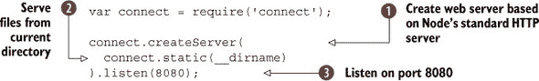

要使用 列表 9.1 中的示例，你需要安装 Connect。你可以通过运行 `npm install connect` 来完成，但创建一个 package.json 文件会更好，这样其他人更容易了解你的项目是如何工作的。即使你的项目是一个简单的静态网站，创建一个 package.json 文件也会帮助你的项目在未来成长。你需要记住的命令只有这些：`npm init` 和 `npm install --save connect`。第一个命令为当前目录创建一个清单文件，第二个命令将安装 Connect 并将其保存到新的 package.json 文件中的依赖列表中。记住这些，你将很快就能创建新的 Node 项目。

`createServer` 方法  是从 Node 的 `http.createServer` 衍生出来的，但它被 Connect 在幕后添加的一些东西所包装。用于服务当前目录中文件的 `static` 服务器中间件组件  被用来从当前目录 (`__dirname` 有两个下划线表示“当前目录”）中提供文件，但如果你愿意，你也可以更改目录。例如，如果你在 public/ 中有客户端资源，那么你可以使用 `connect.static(__dirname + '/public')`。

最后，服务器被设置为监听端口 8080 。这意味着如果你运行这个脚本并在浏览器中访问 http://localhost:8080/file.html，你应该能看到 file.html。

如果你从设计师那里收到了一堆 HTML 文件，并且你想使用服务器来查看它们，因为它们使用了以斜杠 (/) 开头的图像和 CSS 文件路径，那么你也可以使用命令行网络服务器。npm 上有这些服务器，它们都支持不同的选项。一个例子是 Jesse Keane 的 `glance`。你可以在 GitHub 上找到它 [`github.com/jarofghosts/glance`](https://github.com/jarofghosts/glance)，以及在 npm 上作为 `glance`。

要在命令行上使用 `glance`，请导航到包含你想要查看的 HTML 文件的目录。然后全局安装 `glance`，使用 `npm install --global glance`，并输入 `glance`。现在访问 http://localhost:61403/file，其中 *file* 是你想要查看的文件，你应该能在浏览器中看到它。

`glance` 可以通过多种方式配置——你可以使用 `--port` 将端口从 61403 改为其他值，并使用 `--dir` 指定要服务的目录。输入 `--help` 获取选项列表。它还有一些关于 404 错误的默认设置——图 9.1 展示了 404 错误的样貌。

##### 图 9.1\. Glance 内置了错误页面。


运行网络服务器的第三种方式是使用像 Grunt 这样的任务运行器。这允许你以其他人可以复制的方式自动化客户端任务。使用 Grunt 有点像前两种方法的结合：它需要一个像 Connect 这样的网络服务器模块和一个命令行工具。

要使用 Grunt 为客户端项目，你需要做三件事：

> **1**. 安装 `grunt-cli` 模块。
> 
> **2**. 创建一个 package.json 文件来管理您项目的依赖关系。
> 
> **3**. 使用一个运行 Web 服务器的 Grunt 插件。

第一步很简单：使用 `npm install -g grunt-cli` 将 `grunt-cli` 作为全局模块安装。现在您可以从包含它们的任何项目中运行 Grunt 任务，只需输入 `grunt` 即可。

接下来，为您的项目创建一个新的目录。切换到这个新目录并输入 `npm init`——您可以按 Return 键接受每个默认值。现在您需要安装一个 Web 服务器模块：`npm install --save-dev grunt grunt-contrib-connect` 就可以完成这项工作。

之前的命令还安装了 `grunt` 作为开发依赖。这样做的原因是它将 Grunt 锁定在当前版本——如果您查看 package.json，您会看到类似 `"grunt": "~0.4.2"` 的内容，这意味着 Grunt 首次安装的版本是 `0.4.2`，但在未来的 `0.4` 分支上将会使用新版本。Grunt 等模块的流行迫使 npm 支持一种称为 *依赖关系 peer* 的功能。依赖关系 peer 允许 Grunt 插件表达对 Grunt 特定版本的依赖，因此我们将使用的 Connect 模块实际上在其 package.json 文件中有一个 `peerDependencies` 属性。这种做法的好处是您可以确信插件将在 Grunt 变化时正常工作——否则，随着 Grunt API 的变化，插件可能会突然中断，而没有任何明显的原因。

|  |
| --- |

##### Grunt 的替代方案

在撰写本文时，Grunt 是 Node 最受欢迎的构建系统。但新的替代方案已经出现，并且正在迅速获得采用。一个例子是 Gulp ([`gulpjs.com/`](http://gulpjs.com/))，它利用了 Node 的流式 API，并且语法轻量，易于学习。

|  |
| --- |

如果这一切对您来说都是新的，我们包括了您项目应该看起来像的截图 图 9.2。

##### 图 9.2\. 使用 Grunt 的项目通常有一个 package.json 和一个 Gruntfile.js。

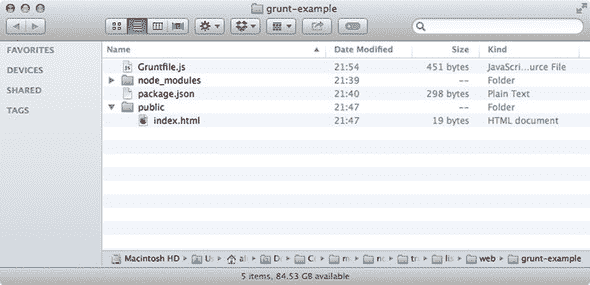

现在我们已经设置了一个新的项目，最后要做的就是创建一个名为 Gruntfile.js 的文件。这个文件包含了一组 `grunt` 将为您运行的任务列表。接下来的列表展示了一个使用 `grunt-contrib-connect` 模块的示例。

##### 列表 9.2\. 用于服务静态文件的 Gruntfile

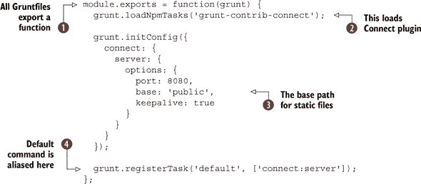

您还应该创建一个名为 `public` 的目录，并包含一个 index.html 文件——这个 HTML 文件可以包含您喜欢的内容。之后，从与 Gruntfile.js 相同的目录中输入 `grunt connect`，服务器应该会启动。您也可以直接输入 `grunt`，因为我们已经将默认任务设置为 `connect:server` 。

Gruntfile 使用 Node 的标准模块系统，并接收一个名为 `grunt` 的对象，可以用来定义任务。插件通过 `grunt.loadNpmTasks` 加载，允许您引用使用 npm 安装的模块 。大多数插件都有不同的选项，这些选项通过传递对象给 `grunt.initConfig` 来设置——我们已经定义了服务器端口和基本路径，您可以通过修改 `base` 属性来更改它们 。

使用 Grunt 启动 Web 服务器比编写一个微小的 Connect 脚本或运行`glance`要麻烦，但如果你看看 Grunt 的插件列表([`gruntjs.com/plugins`](http://gruntjs.com/plugins))，你会看到超过 2,000 个条目，涵盖了从构建优化的 CSS 文件到 Amazon S3 集成的所有内容。如果你曾经需要连接客户端 JavaScript 或生成图像精灵，那么很可能有一个插件可以帮助你自动化这个过程。

在下一个技术中，你将学习如何在 Node 中重用客户端代码。我们还将向你展示如何在 Node 进程中渲染网页内容。

#### 技巧 65 在 Node 中使用 DOM

经过一些工作，在 Node 中模拟浏览器是可能的。如果你想要制作网络爬虫——将网页转换为结构化内容的程序，这很有用。从技术上讲，这比看起来要复杂得多。浏览器不仅提供 JavaScript 运行时，还有在 Node 中不存在的文档对象模型（DOM）API。

围绕 DOM 的如此丰富的库集合有时很难想象没有它们就能解决问题。如果有一种方法可以在 Node 中运行像 jQuery 这样的库就好了！在这个技巧中，你将学习如何通过在 Node 程序中使用浏览器 JavaScript 来实现这一点。

##### 问题

你想在 Node 中重用依赖于 DOM 的客户端代码，或者渲染整个网页。

##### 解决方案

使用提供 DOM 层的第三方模块。

##### 讨论

W3C DOM 是一个定义良好的标准。当设计师在与浏览器不兼容性作斗争时，他们通常在处理这样一个事实：标准需要一定程度的解释，浏览器制造商自然会对标准进行略微不同的解释。如果你的目标只是运行依赖于 JavaScript DOM API 的 JavaScript，那么你很幸运：这些标准可以很好地重新创建，这样你就可以在 Node 中运行流行的客户端库。

解决这个问题的早期方案之一是`jsdom`([`github.com/tmpvar/jsdom`](https://github.com/tmpvar/jsdom))。此模块接受一个*环境*规范，然后提供一个`window`对象。如果你使用`npm install -g jsdom`安装它，你应该能够运行以下示例：

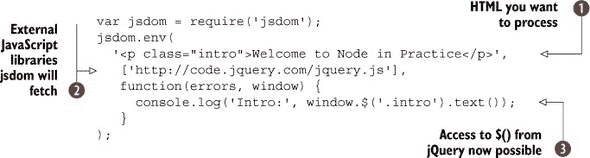

这个示例接受 HTML ，获取一些远程脚本 ，然后给你一个看起来非常像浏览器`window`对象的`window`对象 。它足够好，以至于你可以使用 jQuery 来操作 HTML 片段——jQuery 就像在浏览器中运行一样工作。这很有用，因为现在你可以编写处理 HTML 文档的脚本，就像你可能习惯的那样：而不是使用解析器，你可以使用你熟悉的工具查询和操作 HTML。这对于编写像网络爬虫这样的简洁代码非常有用，否则这将是令人沮丧和繁琐的。

其他人对 jsdom 的方法进行了迭代，简化了底层依赖。如果你真的只想以 jQuery 类似的方式处理 HTML，那么你可以使用`cheerio` ([`npmjs.org/package/cheerio`](https://npmjs.org/package/cheerio))。这个模块更适合网页抓取，所以如果你正在编写下载、处理和索引 HTML 的内容，那么`cheerio`是一个不错的选择。

在下面的示例中，你将看到如何使用`cheerio`处理来自真实网页的 HTML。实际的 HTML 来自 manning.com/index.html，但由于设计经常变化，我们在代码示例中保留了一份页面的副本。你可以在 cheerio-manning/index.html 中找到它。下面的列表打开 HTML 文件，并使用 CSS 选择器查询它，这是由`cheerio`提供的。

##### 列表 9.3\. 使用`cheerio`抓取网页

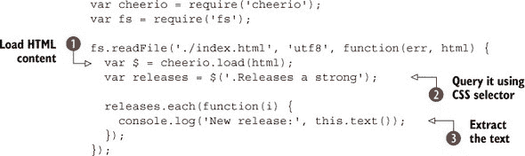

使用`fs.readFile`加载 HTML。如果你真的要这样做，你可能想要使用 HTTP 下载页面——你可以自由地将`fs.readFile`替换为`http.get`来通过网络获取 Manning 的索引页面。我们在第七章（kindle_split_016.html#ch07）、技术 51（kindle_split_016.html#ch07lev2sec10）“跟随重定向”中有一个详细的`http.get`示例。

一旦 HTML 被获取，它就会被传递给`cheerio.load` 。将结果设置为名为`$`的变量只是一种约定，如果你习惯了 jQuery，这将使你的代码更容易阅读，但你也可以给它起其他名字。

现在一切都已经设置好了，你可以查询 HTML；使用`$('.Releases a strong')` 来查询文档中最新发布的书籍。它们位于一个带有`Releases`类的`div`中，作为锚标签。

使用`releases.each`遍历每个元素，就像在 jQuery 中一样。回调的上下文被更改为当前元素，因此调用`this.text()`来获取节点包含的文本 。

由于 Node 拥有如此广泛的第三方模块，你可以使用这个例子来做各种惊人的事情。添加 Redis 进行缓存和排队处理网站，然后抓取结果并将其投放到 Elasticsearch，你就拥有了自己的搜索引擎！

现在你已经看到了如何在 Node 中运行针对浏览器的 JavaScript，但反过来呢？你可能有一些想要在客户端重用的 Node 代码，或者你可能只想使用 Node 的模块系统来组织你的客户端代码。就像我们可以在 Node 中模拟 DOM 一样，我们也可以在浏览器中做到这一点。在下一个技术中，你将学习如何通过在浏览器中运行你的 Node 脚本来实现这一点。

#### 技术编号 66 在浏览器中使用 Node 模块

Node 对 JavaScript 的一个卖点是可以将现有的浏览器编程技能用于服务器。但如果没有任何更改，如何在浏览器中重用 Node 代码呢？这难道不是很酷吗？这里有一个例子：你在 Node 中定义了数据模型，它们执行数据验证等操作，你希望在浏览器中重用它们，以便在数据无效时自动显示错误消息。

这几乎可能，但并不完全可能：不幸的是，浏览器有一些怪癖必须解决。此外，像 `require` 这样的重要功能在客户端 JavaScript 中不存在。在这个技术中，你将看到如何将针对 Node 的代码转换为与大多数网络浏览器一起工作。

##### 问题

你想使用 `require()` 来结构化你的客户端代码，或者在浏览器中重用整个 Node 模块。

##### 解决方案

使用像 Browserify 这样的程序，它能够将 Node JavaScript 转换为浏览器友好的代码。

##### 讨论

在这种技术中，我们将使用 Browserify ([`browserify.org/`](http://browserify.org/)) 将 Node 模块转换为浏览器友好的代码。其他解决方案也存在，但到目前为止，Browserify 是更成熟和流行的解决方案之一。尽管它不仅仅是为了支持 `require()` 而进行修补，它还可以转换依赖于 Node 的流和网络 API 的代码。你甚至可以使用它递归地将 npm 中的模块转换为浏览器模块。

为了了解它是如何工作的，我们首先来看一个简短的自包含示例。要开始，使用 npm 安装 Browserify：`npm install -g browserify`。一旦安装了 Browserify，你就可以使用 `browserify index.js -o bundle.js` 将你的 Node 模块转换为 Browser 脚本。任何 `require` 语句都会导致文件被包含在 bundle.js 中，所以你不应该更改此文件。相反，每次原始文件有更改时，都要覆盖它。

列表 9.4 展示了一个使用 `EventEmitter` 和 `utils.inherit` 来构建小型消息类基础的示例 Node 程序。

##### 列表 9.4\. 浏览器中的 Node 模块

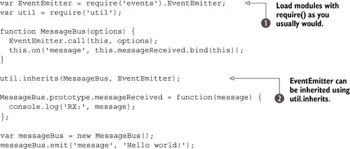

在这个脚本上运行 Browserify 会生成一个大约 1,000 行的包！但我们可以像在任何 Node 程序中一样使用 `require` ，我们熟悉和喜爱的 Node 模块将正常工作，如 列表 9.4 中通过使用 `util.inherits` 和 `EventEmitter`  所见。

使用 Browserify，你还可以使用 `require` 和 `module.exports`，这比手动操作 `<script>` 标签要好。上一个例子可以扩展为做到这一点。在 列表 9.5 中，Browserify 被用来创建一个客户端脚本，该脚本可以使用 `require` 加载 `MessageBus` 和 jQuery，并在消息发出时修改 DOM。

##### 列表 9.5\. 浏览器中的 Node 模块

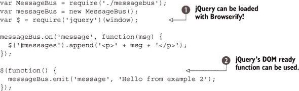

通过创建一个包含`jquery`作为依赖项的 package.json 文件，你可以使用 Browserify 加载 jQuery 。在这里，我们使用它来附加一个`DOMContentLoaded`监听器 并在接收到消息时将段落附加到容器元素中。

| |
| --- |

**源映射**

如果你使用 Browserify 生成的 JavaScript 文件出现错误，那么在堆栈跟踪中解开行号可能会很困难，因为这些行号指的是单体包中的行号。如果你在构建包时包含`--debug`标志，那么 Browserify 将生成指向原始文件和行号的映射。

这些映射需要一个兼容的调试器——你还需要告诉你的浏览器的调试工具使用它们。在 Chrome 中，你需要在 Chrome 的开发工具选项下选择“启用源映射”。

| |
| --- |

要使这生效，你只需要将`module.exports = MessageBus`添加到列表 9.4 的示例中，然后使用`browserify index.js -o bundle.js`生成包，其中 index.js 是列表 9.5。Browserify 将忠实地跟随 index.js 中的`require`语句，从`./node_modules`中拉入 jQuery 和从 messagebus.js 中的`MessageBus`类。

由于人们可能会忘记如何构建脚本，你可以在 package.json 文件中添加一个`scripts`条目，如下所示：`"build": "browserify index.js -o bundle.js"`。本书的可下载代码示例包括一个示例 package.json 文件和一个适合在浏览器中运行整个示例的 HTML 文件。

使用 Browserify 构建包还有另一种方法：将 Browserify 作为 Node 程序中的模块使用。要使用它，你需要创建一个`Browserify`实例 ，然后告诉它你想要构建哪些文件 ：


你可以将这些作为更复杂构建过程的一部分，或者将其放入 Grunt 任务中以自动化你的构建过程。现在你已经看到了如何在浏览器中使用 Node 模块以及如何在 Node 中模拟浏览器，现在是时候学习如何改进你的服务器端 Web 应用程序了。

### 9.2. 服务器端技术

本节包括构建 Web 应用程序的一般技术。如果你已经在使用 Express，那么你可以使用这些技术来改进你的 Express 程序的组织方式。Express 旨在保持简单，这使得它非常灵活，但有时并不容易看到如何以最佳方式使用它。我们创建的模式和解决方案来自于过去几年使用 Express 构建商业和开源 Web 应用程序的经验。我们希望它们能帮助你编写更好的 Web 应用程序。

| |
| --- |

##### Express 3 和 4

本节中的技术主要针对 Express 3。大多数都将与 Express 4 兼容，或者可能需要一些小的修改。有关迁移到 Express 4 的更多信息，请参阅技术编号 75。

| |
| --- |

#### 技术编号 67 Express 路由分离

Express 的文档和流行的教程通常将所有代码组织在一个文件中。在实际项目中，这最终会变得难以管理。这项技术使用 Node 的模块系统将相关路由分离到文件中，并包括绕过 Express `app` 对象位于不同文件中的方法。

##### 问题

您的主要 Express 应用程序文件变得非常大，您希望有更好的方式来组织所有这些路由。

##### 解决方案

使用路由分离将相关路由拆分为模块。

##### 讨论

Express 是一个极简框架，因此它不会在组织项目时手把手地引导你。如果你不留意，一开始简单的项目可能会变得难以管理。成功组织大型项目的秘诀是拥抱 Node 的模块系统。

首要的攻击途径是路由，但你也可以使用 Express 将这项技术应用到开发的各个方面。你甚至可以将应用程序视为自包含的 Node 模块，并在其他应用程序中挂载它们。

这是一些 Express 路由的典型示例：


完整的示例项目可以在 listings/web/route_separation/app_monolithic.js 中找到。它包含一组用于创建、查找和更新笔记的 CRUD 路由。这样的应用程序还会有其他 CRUD 路由：也许笔记可以组织到笔记本中，肯定会有一些用户账户管理，以及设置提醒等额外功能。一旦你有大约四到五个这样的路由集，应用程序文件可能会有数百行代码。

如果你将这个项目写成单个、大型的文件，那么它很容易出现许多问题。很容易在变量意外地成为全局而不是局部时出错，因此在某些条件下可能会遇到危险的副作用。Node 有一个内置的解决方案，可以应用于 Express 和其他 Web 框架：目录作为模块。

要使用模块重构路由，首先创建一个名为 `routes` 的目录，或者如果你更喜欢，可以创建一个名为 `controllers` 的目录。然后创建一个名为 index.js 的文件。在我们的例子中，它将是一个简单的三行文件，导出笔记路由：

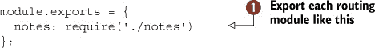

在这里，我们只有一个路由模块，可以使用 `require` 和相对路径加载。接下来，将整个路由集复制并粘贴到 routes/notes.js 中。然后删除路由定义部分——例如，`app.get('/notes',`，并用导出替换它：`module.exports.index = function(req, res) {}`。

重构后的文件应该看起来像下面的列表。

##### 列表 9.6\. 没有其他应用程序的路由模块

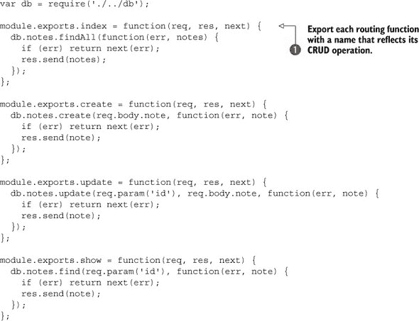

每个路由函数都使用 CRUD 启发的名称导出（index、create、update、show）。相应的 app.js 文件现在可以清理了。下面的列表展示了这可以看起来多么整洁。

##### 列表 9.7\. 重构后的 app.js 文件

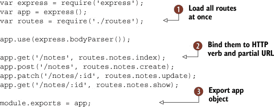

所有路由都可以一次性使用`require('./routes')`加载！。这既方便又整洁，因为减少了会弄乱 app.js 的`require`语句。您只需删除旧的路由回调并添加对每个路由函数的引用！。

不要在这个文件中放置`app.listen`调用；相反，导出`app`！。这使得测试应用程序更加容易。导出`app`对象的另一个优点是，您可以从应用程序的任何地方轻松加载`app.js`模块。Express 允许您获取和设置配置值，因此如果需要在路由之外的位置引用这些设置，使`app`可访问可能很有用。另外请注意，`res.app`在路由内部可用，因此您不需要经常传递`app`对象。

如果您想轻松加载 app.js 而不创建服务器，那么将应用程序文件命名为 app.js，并有一个单独的 server.js 文件，该文件调用`app.listen`。您可以在 package.json 中设置`server`属性以使用`node server.js`，这样人们就可以使用`npm start`启动应用程序——您也可以省略`server`属性，因为`node server.js`是默认的，但最好定义它，以便人们知道您希望他们如何使用它。

| |
| --- |

**将目录作为模块**

这种技术将所有路由放在一个目录中，然后通过一个 index.js 文件导出它们，这样就可以一次性使用`require('./routes')`来加载。

这种模式可以在其他地方重用。它非常适合组织中间件、数据库模块和配置文件。

有关使用目录作为模块来组织配置文件的示例，请参阅技术 69。

| |
| --- |

该技术的完整示例可以在`listings/web/route-separation`中找到，其中还包括了示例测试，以防您想对您自己的项目进行单元测试。

正确组织 Express 项目非常重要，但还有一些工作流程问题可能会减慢开发速度。例如，当您在 Web 应用程序上工作时，您通常会进行许多小的更改，然后刷新浏览器以查看结果。大多数 Node 框架要求在看到更改生效之前重启进程，所以下一个技术将探讨这是如何工作的以及如何有效地解决这个问题。

#### 技术编号 68：自动重启服务器

虽然 Node 自带了监控文件变化的工具，但使用它们进行高效工作可能需要大量工作。这项技术探讨了`fs.watch`，并介绍了一个流行的第三方工具，该工具可以在编辑文件时自动重启 Web 应用程序。

##### 问题

每次编辑文件时，您都需要重启您的 Node Web 应用程序。

##### 解决方案

使用文件监视器来自动重启应用程序。

##### 讨论

如果你习惯了像 PHP 或 ASP 这样的语言，Node 的进程内服务器模型可能会显得有些不寻常。Node 模型的一个主要区别在于，当文件发生变化时，你需要重启进程。如果你考虑一下`require`和 V8 的工作方式，那么这就有道理了——文件通常只加载和解释一次。

解决这个问题的一种方法是在文件发生变化时检测到这一点，然后重启应用程序。Node 很好地利用了非阻塞 I/O，非阻塞文件系统 API 的一个特性是可以使用监听器来等待特定事件。为了解决这个问题，你可以为你的项目中的所有文件设置文件系统事件处理器。然后，当文件发生变化时，你的事件处理器可以重启项目。

Node 在`fs`模块中提供了一个名为`fs.watch`的 API。在撰写本文时，这个 API 是不稳定的——这意味着它可能在 Node 的后续版本中发生变化。这种方法已在第六章、第 6.1.4 节中介绍。让我们看看它是如何与网络应用程序一起使用的。图 9.8 显示了一个可以监视和重新加载简单网络服务器的程序。

##### 列表 9.8\. 重新加载 Node 进程

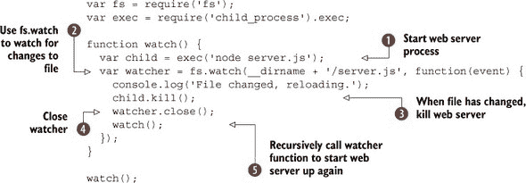

使用`fs.watch`监视文件变化稍微有些复杂，但你可以使用基于文件轮询而不是 I/O 事件的`fs.watchFile`。列表 9.8 的工作方式是启动一个子进程——在这种情况下是`node server.js`！[](1.jpg)，然后监视该文件的变化！[](2.jpg)。进程的启动和停止由`child_process`核心模块管理，使用`kill`方法停止子进程！[](3.jpg)。

在 Mac OS 上，我们发现最好也使用`watcher.close`停止监视文件！[](4.jpg)，尽管 Node 的文档表明`fs.watch`应该是“持久的”。一旦完成所有这些，`watch`函数就会递归调用以再次启动网络服务器！[](5.jpg)。

这个例子可以用如下服务器.js 文件运行：

```
var http = require('http');
var server = http.createServer(function(req, res) {
  res.writeHead(200, { 'Content-Type': 'text/plain' });

  res.end('This is a super basic web application');
});

server.listen(8080);
```

这确实可行，但并不十分优雅。而且它也不完整。大多数 Node 网络应用程序由多个文件组成，因此文件监视逻辑会变得更加复杂。仅仅递归遍历父目录是不够的，因为有许多你不想监视的文件——你不想监视`.git`中的文件，如果你正在编写 Express 应用程序，你可能也不想监视视图模板，因为它们在开发模式下按需加载且不缓存。

突然自动重启 Node 程序似乎不再那么简单，这就是第三方模块可以提供帮助的地方。解决这个问题的最广泛使用的模块之一是 Remy Sharp 的 `nodemon` ([`nodemon.io/`](http://nodemon.io/))。它默认情况下非常适合监视 Express 应用程序，您甚至可以使用它来自动重启任何类型的程序，无论是用 Node 编写还是 Python、Ruby 等等。

要尝试它，请输入 `npm install -g nodemon`，然后导航到包含 Node 网络应用程序的目录。如果您想使用一个小型示例脚本，可以使用我们来自 listings/web/watch/server.js 的示例。

通过输入 `nodemon server.js` 开始运行和监视 server.js，您会发现您可以编辑 `res.end` 中的文本，并且更改将在您下次加载 http://localhost:8080/ 时反映出来。

您可能会注意到在更改可见之前会有短暂的延迟——这仅仅是 Nodemon 在设置 `fs.watch`，或者如果您的操作系统上不可用，则为 `fs.watchFile`。您可以通过输入 `rs` 并按回车键强制它重新加载。

Nodemon 有一些其他功能可以帮助您在网页应用程序上工作。输入 `nodemon --help` 将显示命令行选项列表，但您可以通过创建一个 nodemon.json 文件来获得更大的、与版本控制系统友好的控制。这允许您指定要忽略的文件数组，您还可以通过使用 `execMap` 设置将文件扩展名映射到程序名称。Nodemon 的文档包括一个示例文件，说明了每个功能。

下一个列表是一个示例 Nodemon 配置，您可以将其适应到您自己的项目中。

##### 列表 9.9\. Nodemon 的配置文件

![214fig01.jpg]

基本选项允许您忽略特定的路径 ![1.jpg]，并列出要监视的多个路径 ![3.jpg]。此示例使用 `execMap` 自动运行带有 `--harmony` 标志的 `node` 以适用于所有 JavaScript 文件 ![2.jpg]。Nodemon 还可以设置环境变量——只需将一些值添加到 `env` 属性 ![4.jpg]。

> ¹ `--harmony` 用于启用 Node 可用的所有新 ECMAScript 功能。

一旦您的流程通过 Nodemon 流程化，接下来要做的就是改进您的项目配置。大多数项目都需要一定程度的配置——例如，包括数据库连接细节和远程 API 的授权凭证。下一项技术将探讨配置您的网络应用程序的方法，以便您可以轻松地将它部署到多个环境，以测试模式运行，甚至调整本地开发期间的行为。

#### 技巧 69 配置网络应用程序

这种技术探讨了配置 Node 网络应用程序的常见模式。我们将包括 Express 的示例，但您也可以将这些模式用于其他网络框架。

##### 问题

您有配置选项，这些选项在开发、测试和生产之间会有所不同。

##### 解决方案

使用 JSON 配置文件、环境变量或模块来管理设置。

##### 讨论

大多数 Web 应用程序都需要一些配置值才能正确运行：数据库连接字符串、缓存设置和电子邮件服务器凭据是典型的。存储应用程序设置的方法有很多，但在安装第三方模块之前，请考虑你的需求：

+   在版本控制仓库中留下数据库凭据是否可以接受？

+   你真的需要配置文件，还是可以将设置嵌入到应用程序中？

+   如何在不同的应用程序部分访问配置值？

+   你的部署环境是否提供了一种存储配置值的方法？

第一点取决于你的项目或组织的政策。如果你正在构建开源 Web 应用程序，你不想在公共仓库中留下数据库账户，因此配置文件可能不是最佳解决方案。你希望人们能够快速轻松地安装你的应用程序，但你不希望意外泄露你的密码。同样，如果你在一个拥有数据库管理员的大型组织中工作，他们可能不介意让每个人都直接访问数据库。

在这种情况下，你可以将配置值作为部署环境的一部分来设置。环境变量是配置 Unix 和 Windows 程序行为的标准方式，你可以使用 `process.env` 来访问它们。这个基本示例是使用 `NODE_ENV` 设置在部署环境之间切换。以下列表显示了 Express 用于存储配置值的模式。

##### 列表 9.10\. 配置 Express 应用程序


Express 有一个用于设置应用程序配置值的 API：`app.set`、`app.get`  和 `app.configure`。你还可以使用 `app.enable` 和 `app.disable` 来切换布尔值，以及使用 `app.enabled` 和 `app.disabled` 来查询它们。`app.configure` 块与 `if (process.env.NODE_ENV === 'development')`  和 `if (process.env.NODE_ENV === 'production')` 等价，所以如果你不想使用 `app.configure`，你实际上不需要它。它将在 Express 4 中被移除。如果你没有使用 Express，你只需查询 `process.env`。

`NODE_ENV` 环境变量由 shell 控制。如果你想以生产模式运行 列表 9.10，你可以输入 `NODE_ENV=production node config.js`，你应该会看到它打印出生产数据库字符串。你也可以输入 `export NODE_ENV=production`，这将导致应用程序在当前 shell 运行期间始终以生产模式运行。

我们使用 `PORT`  来设置端口的理由是因为这是 Heroku 默认使用的名称。这允许 Heroku 的内部 HTTP 路由器覆盖应用程序监听的端口。

你可以在代码中使用 `process.env` 而不是 `app.get`，但使用 `app` 对象感觉更干净。你不需要传递 `app`——如果你已经使用了来自 技术 67 的路由分离模式，那么你将通过 `res.app` 访问它。

如果你更愿意使用配置文件，最简单快捷的方法是使用文件夹作为模块技术与 JSON 文件结合。创建一个名为 config/ 的文件夹，然后创建一个 index.js 文件，并为每个环境创建一个 JSON 文件。下一个列表显示了 index.js 文件应该是什么样子。

##### 列表 9.11\. JSON 配置文件加载器

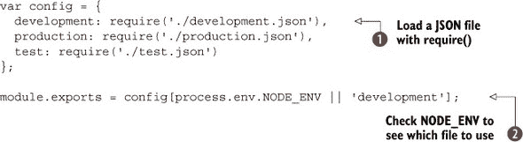

Node 的模块系统允许你使用 `require` 加载 JSON 文件 ，因此你可以加载每个环境的配置文件，然后使用 `NODE_ENV`  导出相关的配置。然后每当你需要访问设置时，只需使用 `var config = require('./config')`——你将得到一个包含当前环境设置的普通 JavaScript 对象。下一个列表显示了使用此技术的示例 Express 应用程序。

##### 列表 9.12\. 加载配置目录

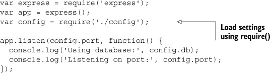

这几乎感觉像是作弊！你只需要调用 `require ('./config')`，你就有你的设置了。Node 的模块系统也应该缓存该文件，所以一旦你调用了 `require`，它就不需要再次评估 JSON 文件。你可以在应用程序的任何地方重复调用 `require('./config')`。

这种技术利用了 JavaScript 在对象上设置和访问值的轻量级语法，以及 Node 的模块系统。它适用于许多类型的项目。

配置还有另一种方法：使用第三方模块。在掌握最后一种技术之后，你可能认为这就足够了，但第三方模块可以提供很多功能，包括命令行选项解析。可能你经常需要在不同的选项之间切换，因此使用命令行选项覆盖应用程序设置是很有吸引力的。

网络框架 Flatiron ([`flatironjs.org/`](http://flatironjs.org/)) 有一个名为 `nconf` ([`npmjs.org/package/nconf`](https://npmjs.org/package/nconf)) 的应用程序配置模块，它可以处理配置文件、环境变量和命令行选项。每个都可以设置优先级，因此你可以使命令行选项覆盖配置文件。这是一个处理选项的统一框架。

下一个列表显示了如何使用 `nconf` 配置 Express 应用程序。

##### 列表 9.13\. 使用 `nconf` 配置 Express 应用程序


在这里，我们已告诉`nconf`优先考虑命令行选项，但如果可用，也会读取配置文件！[](1.jpg)。您不需要创建配置文件，如果您使用`nconf.save`，`nconf`可以为您创建一个。这意味着您可以让应用程序的用户更改设置并持久保存它们。当`nconf`配置为使用数据库保存设置时，这效果最好——它内置了 Redis 支持。

可以使用`nconf.set`！[](2.jpg)设置默认值。如果您在没有任何选项的情况下运行此示例，它应该使用端口 3000，但如果您以`node app.js --port 3001`启动它，它将使用您通过`--port`传递的内容。获取设置就像`nconf.get`！[](3.jpg)一样简单。

您不需要传递`nconf`对象！设置存储在内存中。您的项目中的其他文件可以通过使用`require`加载`nconf`并调用`nconf.get`来访问设置。下一个列表再次加载`nconf`，然后尝试访问`db`设置。

##### 列表 9.14\. 在应用程序的其他地方加载`nconf`

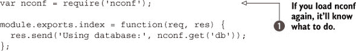

尽管看起来`var nconf = require('nconf')`可能返回一个干净的`nconf`副本，但实际上并不是这样！[](1.jpg)。

一个组织良好且配置仔细的 Web 应用程序仍然可能会出错。当您的应用程序崩溃时，您会希望日志帮助调试问题。下一个技术将帮助您改进应用程序处理错误的方式。

#### 技巧 70 精美的错误处理

这种技术探讨了使用`Error`构造函数来捕获和处理应用程序中的错误。

##### 问题

您希望集中处理错误以简化您的 Web 应用程序。

##### 解决方案

使用包含 HTTP 状态代码的错误类继承自`Error`，并使用中间件组件根据内容类型处理错误。

##### 讨论

JavaScript 有一个`Error`构造函数，您可以从它继承来表示特定类型的错误。在 Web 开发中，一些错误经常出现：不正确的 URL、查询参数或表单值的不正确参数，以及认证失败。这意味着您可以定义包含 HTTP 代码的错误，同时包含`Error`提供的典型内容。

而不是在 HTTP 路由器中根据错误条件进行分支，您应该调用`next(err)`。下一个列表显示了它是如何工作的。

##### 列表 9.15\. 将错误传递给中间件

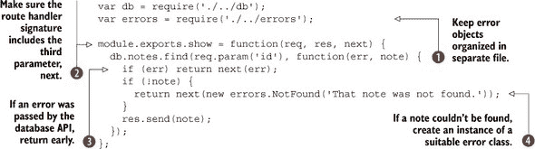

在这个例子中，错误类别已在单独的文件中定义！[](1.jpg)，您可以在列表 9.16 中找到它。路由处理程序包括一个第三个参数，`next`！[](2.jpg)，在之前技术中我们使用的标准`req, res`参数之后。

您的许多路由处理程序将加载数据库中的数据，无论是 MySQL、PostgreSQL、MongoDB 还是 Redis，因此此示例基于一个通用的异步数据库 API。如果数据库 API 遇到错误，则提前返回并调用 `next`，包括错误对象作为第一个参数。这将把错误传递给下一个中间件组件 。此路由处理程序还有一个额外的逻辑部分——如果数据库中没有找到笔记，则使用 `next` 实例化错误对象并传递 。

下一个列表展示了如何从 `Error` 继承。

##### 列表 9.16\. 继承错误并包含状态码

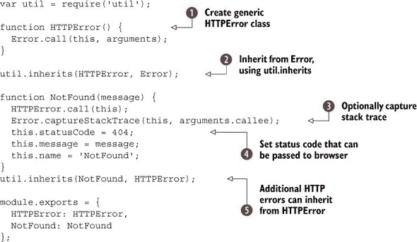

在这里，我们选择创建两个类。我们不仅定义了 `NotFound`，还创建了 `HTTPError`  并从它继承 。这样做是为了更容易追踪错误是否与 HTTP 相关，或者是否是其他原因。基本的 `HTTPError` 类从 `Error`  继承。

在 `NotFound` 错误中，我们捕获了堆栈跟踪以帮助调试 ，并设置了一个 `statusCode` 属性 ，该属性可以报告给浏览器。

下一个列表展示了如何在典型的 Express 应用程序中创建一个错误处理中间件组件。

##### 列表 9.17\. 使用错误处理中间件组件

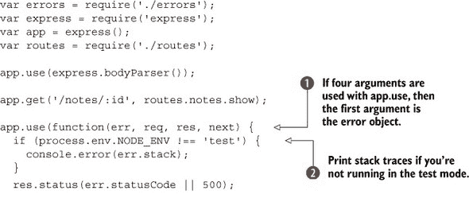

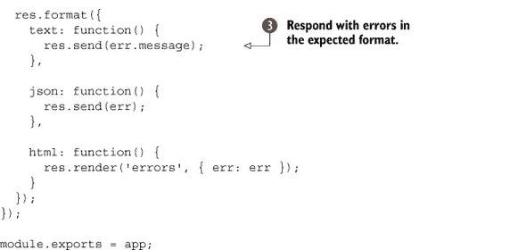

这个中间件组件相当简单，但它有一些在生产中我们发现效果很好的调整。要获取 `next` 传递的错误对象，请确保使用 `app.use` 回调的四参数形式 。此外，请注意，这个中间件组件位于链的末尾，因此您需要将其放在所有其他中间件和路由定义之后。

您可以条件性地打印堆栈跟踪，以便在测试预期错误时它们不可见 ——错误可能是测试的一部分，您不希望堆栈跟踪弄乱测试输出。

由于这将在主应用程序文件中集中处理错误，因此根据条件返回不同的格式是个好主意。如果您的应用程序同时提供 JSON API 和 HTML 页面，这很有用。您可以使用 `app.format` 来实现这一点 ，它通过检查请求的 `Accept` 头中的 MIME 类型来工作。JSON 响应可能不是必需的，但您的 API 可能会返回格式良好的错误，这些错误可以被客户端消费——当您请求 JSON 时，处理突然以 HTML 响应的 API 可能会很困难。

在您的测试中的某个地方，您应该检查这些错误是否按预期工作。以下片段显示了一个 Mocha 测试，确保当预期时返回 404，并且以预期的格式返回：

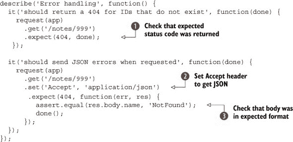

此代码片段包括两个请求。第一个检查我们是否得到一个 404 错误 ![1.jpg]，第二个设置 `Accept` 头部信息以确保我们得到 JSON ![2.jpg]。这是通过 SuperTest 实现的，它将在响应中返回 JSON，因此断言可以检查我们是否得到了我们期望的格式 ![3.jpg]。此示例的完整源代码可以在 listings/web/error-handling 中找到。

| |
| --- |

**错误电子邮件速查表**

如果你打算在应用程序中添加当发生意外错误时发送电子邮件通知的功能，以下是在电子邮件中包含以帮助调试的一些内容列表：

+   错误对象的字符串版本

+   `err.stack` 的内容——这是 Node 包含的错误对象的非标准属性

+   请求方法和 URL

+   如果有的话，Express 的 `req.route` 属性

+   远程 IP，在 Express 中为 `req.ip`

+   请求体，你可以使用 `inspect(req.body)` 将其转换为字符串

| |
| --- |

这种错误处理模式在 Express 应用程序中广泛使用，甚至内置在 restify 框架中（[`npmjs.org/package/restify`](https://npmjs.org/package/restify)）。如果你记得将错误对象传递给 `next`，你会发现测试和调试 Express 应用程序更容易。

错误也可以作为带有有用记录的电子邮件发送。为了最大限度地利用错误电子邮件，请在电子邮件中包含请求和错误对象，以便您可以确切地看到问题出在哪里。此外，您可能不想发送有关某些状态代码的错误详细信息，但这取决于您。

在这个技巧中，我们提到了将代码适配以与 REST API 一起工作。下一个技巧将更深入地探讨 REST 的世界，并为 Express 和 restify 提供示例。

#### 技巧 71 RESTful 网络应用程序

在某个阶段，您可能想向您的应用程序添加一个 API。这项技术完全是关于构建 RESTful API。这里有 Express 和 restify 的示例，以及如何创建使用正确 HTTP 动词和惯用 URL 的 API 的技巧。

##### 问题

你想在 Express、restify 或其他 Web 框架中创建一个 RESTful Web 服务。

##### 解决方案

使用正确的 HTTP 方法、URL 和头部信息来构建直观的 RESTful API。

##### 讨论

REST 代表 *表征状态转移*，^([2]) 除非你想在面试中给人留下深刻印象，否则记住这一点并没有太大的帮助。网络开发者通常将其与 SOAP（简单对象访问协议）相对比，SOAP 被视为一种更企业化、更严格的创建 Web API 的方式。实际上，确实存在严格的 REST API，但关键的区别在于 REST 在根本层面上拥抱 HTTP——HTTP 方法本身具有语义意义。

> ² 更多关于 REST 的信息，请参阅 Fielding 关于该主题的论文 [`mng.bz/7Fhj`](http://mng.bz/7Fhj)。

如果你曾经制作过基本的 HTML 表单，你应该熟悉使用`GET`和`POST`请求。在 REST 中，这些 HTTP 动词有特定的含义。例如，`POST`将*创建一个资源*，而`GET`意味着*获取一个资源*。

Node 开发者通常创建使用 JSON 的 API。JSON 是 Node 中生成和读取结构化数据格式最简单的方式，但它也适用于客户端 JavaScript。但是 REST 并不暗示 JSON——你可以自由使用任何数据格式。某些客户端和服务期望 XML，我们甚至见过那些与 CSV 和 Excel 等电子表格格式一起工作的。

所需的数据格式由请求的`Accept`头部指定。对于 JSON，应该是`application/json`，对于 XML 则是`application/xml`。还有其他有用的请求头部——`Accept-Version`可以用来请求 API 的不同版本。这允许客户端锁定到一个受支持的版本，同时你可以自由地改进服务器而不会破坏向后兼容性——你总是可以比人们更新客户端更快地更新你的服务器。

Express 在 Node 的`http`核心模块之上提供了一个轻量级层，但它不包括任何除内存会话和 cookie 之外的数据持久性功能。你必须决定使用哪个数据库和数据库模块。restify 也是如此：它不会自动将数据从 HTTP 映射到离线存储；你需要找到一种方法来实现这一点。

Restify 在表面上与 Express 相似。区别在于 Express 具有帮助你构建 Web 应用程序的功能，包括渲染模板。相反，restify 专注于构建 REST API，这带来了一组不同的要求。Restify 通过使用 HTTP 头部实现语义版本控制，使得轻松地为 API 的不同版本提供服务变得容易，并且有一个基于事件的 API 用于发射和监听与 HTTP 相关的事件和错误。它还支持节流，因此你可以控制响应的速度。

图 9.3 展示了一个典型的 RESTful API，它允许创建、读取、更新和删除*页面*对象。

##### 图 9.3\. 向 REST API 发送请求

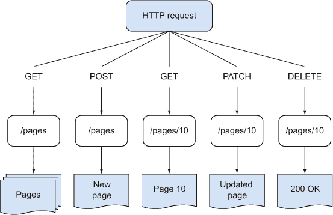

要开始构建 REST API，你应该考虑你的对象是什么。想象你正在构建一个内容管理系统：它可能包含页面、用户和图像。如果你想添加一个按钮，允许页面在“已发布”和“草稿”之间切换，并且如果你已经有一个支持`PATCH /pages/:id`请求的 REST API，你只需将按钮绑定到一些客户端 JavaScript 或一个将`{ state: 'published' }`或`{ state: 'draft' }`发送到`/pages/:id`的表单即可。如果你被提供了一个只有`PUT /pages/:id`的 Express 应用程序，那么你可能可以从现有实现中推导出`PATCH`的代码。

|  |
| --- |

**复数还是单数？**

当你设计 API 的 URI 端点时，你应该通常使用复数名词。这意味着 `/pages` 以及 `/pages/1` 用于特定页面，而不是 `/page/1`。如果端点是一致的，那么使用你的 API 会更容易。

你可能会发现有一些资源应该使用单数名词，因为只有一个这样的项目。如果语义上合理，可以使用单数名词，但使用时要保持一致。例如，如果你的 API 需要用户登录，并且你不想暴露唯一的用户 ID，那么 `/account` 可能是用户账户管理的合理端点，如果对于特定用户只有一个账户。

|  |
| --- |

表 9.1 展示了 HTTP 动词和典型响应。请注意，`PUT` 和 `PATCH` 有不同但相似的含义——`PATCH` 意味着修改资源中的某些字段，而 `PUT` 意味着 *替换* 整个资源。通过这种方式构建应用程序可能需要一些实践，但它很实用且易于测试，因此值得正确学习。如果你对这些 HTTP 术语不熟悉，那么在为你的应用程序设计 API 时，请使用 表 9.1。

##### 表 9.1\. 选择正确的 HTTP 动词

| 动词 | 描述 | 响应 |
| --- | --- | --- |
| GET /animals | 获取动物列表。 | 一组动物对象数组 |
| GET /animals/:id | 获取单个动物。 | 一个单个动物对象，或一个错误 |
| POST /animals | 通过发送单个动物的属性来创建一个动物。 | 新的动物 |
| PUT /animals/:id | 更新单个动物记录。所有属性将被替换。 | 更新的动物 |
| PATCH /animals/:id/ | 更新单个动物记录，但只更改指定的字段。 | 更新的动物 |

在 Express 应用程序中，这些 URL 和方法是通过路由映射的。路由指定 HTTP 动词和部分 URL。你可以将这些映射到任何你喜欢的函数，但如果你使用来自 技术 67 的路由分离模式，这是建议的，那么你应该使用与相关 HTTP 动词相近的方法名。列表 9.18 展示了 Express 中 RESTful 资源的路由，以及一些使其工作的必要配置。

##### 列表 9.18\. Express 中的 RESTful 资源

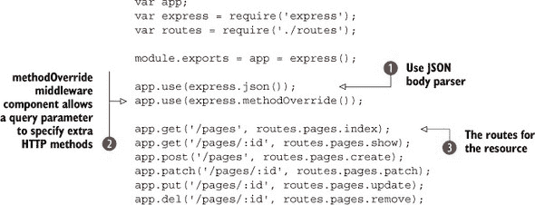

此示例使用了一些中间件来自动解析 JSON 请求 ，并且通过查询参数 `_method` 覆盖了 HTTP 方法 `POST` 。这意味着 `PUT`、`PATCH` 和 `DELETE` HTTP 动词实际上是由 `_method` 查询参数确定的。这是因为大多数浏览器只能发送 `GET` 或 `POST`，所以 `_method` 是许多 Web 框架使用的技巧。

列表 9.18 中的路由定义了每个常用的 RESTful 资源方法 。表 9.1 展示了这些路由如何映射到操作。

##### 表 9.2\. 将路由映射到响应

| 动词，URL | 描述 |
| --- | --- |
| GET /pages | 一组页面。 |
| GET /pages/:id | 包含指定 id 的页面的对象。 |
| POST /pages | 创建一个页面。 |
| PATCH /pages/:id | 加载 id 对应的页面，并更改一些字段。 |
| PUT /pages/:id | 替换 id 对应的页面。 |
| DELETE /pages/:id | 删除 id 对应的页面。 |

列表 9.19 是路由处理器的示例实现。它有一个通用的 Node 数据库 API——一个真实的 Redis、MongoDB、MySQL 或 PostgreSQL 数据库模块不会太远，所以你应该能够适应它。

##### 列表 9.19\. RESTful 路由处理器

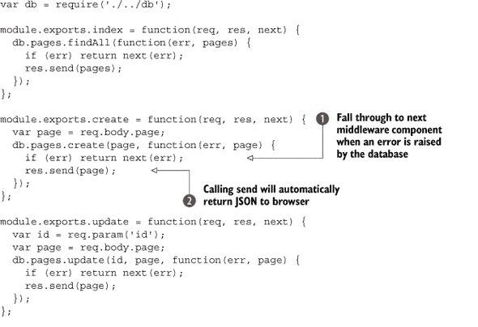


虽然这个例子很简单，但它说明了很重要的一点：你应该保持你的路由处理器轻量级。它们处理 HTTP，然后让代码的其他部分处理底层业务逻辑。这个例子中使用的另一个模式是错误处理——通过调用 `next(err)` 传递错误！。尽量将错误处理代码集中化和通用化——技术 70 有更多细节。 

要将 JSON 返回到浏览器，使用 `res.send()` 并传入一个 JavaScript 对象！。Express 知道如何将对象转换为 JSON，所以你只需要做这件事。

所有这些路由处理器都使用相同的模式：将查询或请求体映射到数据库可以使用的某个东西，然后调用相应的数据库方法。如果你使用 ORM 或 ODM——一个更抽象的数据库层——那么你可能会有类似于 `PATCH` 的东西！这可以是一个允许你只更新指定字段的 API 方法。关系数据库和 MongoDB 就是这么工作的。

如果你下载这本书的源代码，你将获得尝试完整示例所需的其他文件。要运行它，请输入 `npm start`。一旦服务器运行，你可以使用以下一些 Curl 命令与服务器通信。

第一个命令创建了一个页面：


首先，我们使用 `-H` 选项指定 `Content-Type`！。接下来，请求被设置为使用 `POST`，请求体作为 JSON 字符串包含在内！。URL 是 /pages，因为我们正在创建一个资源！。

Curl 是一个探索 API 的有用工具，一旦你理解了基本选项。需要记住的是 `-H` 用于设置头部，`-X` 用于设置 HTTP 方法，以及 `-d` 用于请求体。

要查看页面列表，只需使用 `curl http://localhost:3000/pages`。要更改内容，尝试使用 `PATCH`：

```
curl -H "Content-Type: application/json" \
  -X PATCH -d '{ "page": { "title": "The Moon" } }' \
  http://localhost:3000/pages/1
```

Express 在创建 RESTful 网络服务方面还有一些其他的技巧。记住，一些 REST API 使用其他数据格式，比如 XML？如果你两者都需要怎么办？你可以通过使用 `res.format` 来解决这个问题：

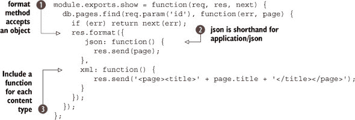

要使用 XML 而不是 JSON，你必须在请求中包含 `Accept` 头部。使用 Curl，你可以这样做：

```
curl -H 'Accept: application/xml' \
  http://localhost:3000/pages/1
```

只需记住，`Accept` 用于请求服务器提供特定的格式，而 `Content-Type` 用于告诉服务器你发送的格式。有时在单个请求中包含两者是有意义的！

现在你已经了解了 Express 中的 REST API 的工作方式，我们可以将其与 restify 进行比较。用于构建 Express 应用的模式可以用于 restify 项目。两个重要的模式是路由分离，如 技术 67 中所述，以及将应用程序定义在服务器之外的单独文件中（以便于测试和内部重用）。列表 9.20 是 列表 9.18 在 restify 中的对应版本。

##### 列表 9.20\. 一个 restify 应用

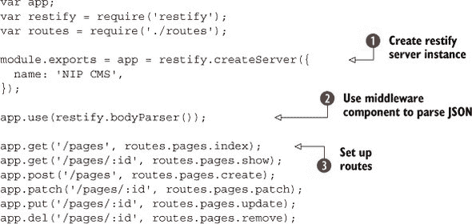

使用 restify，服务器实例通过一些初始配置选项创建 。你不必传递任何选项，但在这里我们指定了一个名称。这些选项实际上与 Node 内置的 `http.Server.listen` 相同，因此你可以传递 SSL/TLS 证书的选项，如果你想使用加密的话。restify 特有的选项，在 Express 中不可用，包括 `formatters`，它允许你设置 `res.send` 将用于自定义内容类型的函数。

此示例使用 `bodyParser` 解析请求体中的 JSON 。这就像上一个示例中的 Express 中间件组件。

路由定义与 Express 的定义相同 。实际的回调函数略有不同。列表 9.21 展示了 列表 9.19 的翻译。看看你是否能找出其中的差异。

##### 列表 9.21\. Restify 路由

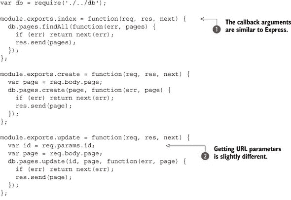

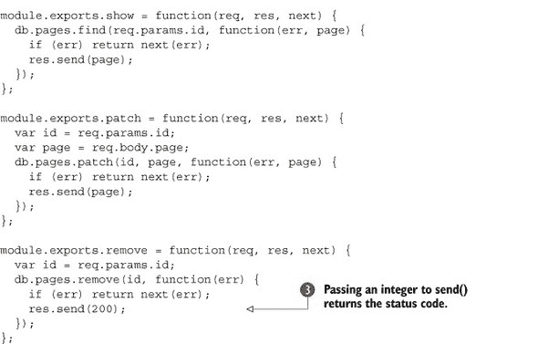

首先要注意的是路由处理程序的回调参数与 Express  相同。实际上，你几乎可以直接从 Express 应用中提取等效代码。尽管如此，也有一些差异：`req.param()` 不存在——你需要使用 `req.params` 代替，注意这是一个对象而不是一个方法 。与 Express 一样，使用整数调用 `res.send()` 将向客户端返回状态码 。

| |
| --- |

**使用其他 HTTP 头部**

在这个技术中，你已经看到了如何使用 `Content-Type` 和 `Accept` 头部来处理不同的数据格式。在构建 API 时，你应该考虑其他有用的头部。

其中一个受 restify 支持的头部是 `Accept-Version`。当你定义一个路由时，你可以包含一个可选的第一个参数，该参数包含选项，而不是通常的字符串。`version` 属性允许你的 API 根据不同的 `Accept-Version` 头部做出不同的响应。

例如，使用 `app.get({ path: '/pages', version: '1.1.8' })`，将 `.v1.pages` 路由绑定到特定版本 1.1.8。如果你必须在 2.0.0 中更改你的 API，那么你可以这样做而不会破坏旧客户端。

在 Express 应用程序中使用此标题没有任何阻碍，但在 restify 中会更简单。如果你决定采取这种方法，你应该了解 *major.minor.patch* 在语义版本控制中的工作方式 ([`semver.org/`](http://semver.org/))。

|  |
| --- |

如果你下载了完整示例并运行它（listings/web/restify），你可以尝试我们之前描述的一些 Curl 命令。创建、更新和显示应该以相同的方式工作。

了解 Express 和 restify 应用程序相似是有用的，因为你可以开始组合由这两个框架组成的应用程序。它们都基于 Node 的 `http` 模块，这意味着技术上你可以在 Express 中挂载一个 restify 应用程序使用 `app.use(restifyApp)`。如果 restify 应用程序在其自己的模块中，这会工作得很好——你可以使用 npm 安装它，或者将其放在自己的目录中。

Express 和 restify 都使用中间件，你会发现结构良好的应用程序具有松散耦合的中间件，可以在不同的项目中重用。在下一个技术中，你将看到如何编写自己的中间件，这样你就可以开始用有用的功能，如自定义日志记录来装饰应用程序。

#### 技巧 72 使用自定义中间件

你已经看到了中间件被用于错误处理，你也使用了一些 Express 的内置中间件。你还可以使用中间件为路由添加自定义行为；这可能添加了新功能，改进了日志记录，或者基于身份验证或权限控制访问。

中间件的好处是它可以提高你应用程序中的代码重用性。这个技术将教会你如何编写自己的中间件，这样你就可以在项目之间共享代码，并以更可读的方式组织项目。

##### 问题

你希望添加行为——以可重用和可测试的方式——当访问某些路由时被触发。

##### 解决方案

编写你自己的中间件。

##### 讨论

当你第一次开始使用 Express 时，中间件听起来像是一个复杂的概念，其他人用它来编写扩展 Express 的插件。但实际上，编写中间件是使用 Express 的基本部分，你应该尽快开始编写中间件。而且如果你能编写路由，那么你就可以编写中间件：它基本上是相同的 API！

在 技巧 70 中，你看到了如何使用中间件组件处理错误。错误处理是一个特殊情况——你必须包含一个第四个参数来捕获错误对象：`app.use(function(err, req, res, next) {`。对于其他中间件，你可以只使用三个参数，就像标准的路由处理程序一样。这是最简单的中间件组件：

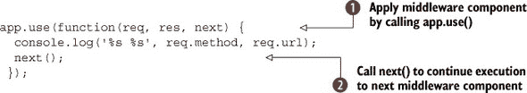

通过向`app.use`传递匿名回调 ，中间件组件将始终运行，除非之前的中间件组件未能调用`next`。当您的代码完成后，您可以调用`next` 来触发堆栈中的下一个中间件组件。这意味着两件事：支持异步 API，并且添加中间件的顺序很重要。

以下示例展示了您如何在中间件中使用异步 API。此示例基于根据会话中设置的用户 ID 加载用户的思想：

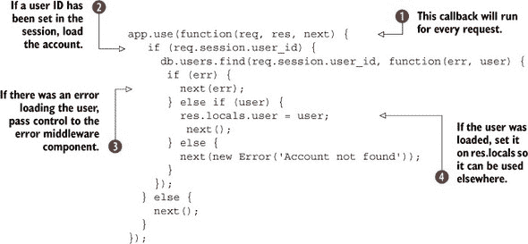

此中间件将对每个请求触发 。它从数据库中加载用户账户，但仅在会话中设置了用户的 ID 。加载用户的代码是异步的，因此`next`可以在短暂的延迟后调用。有几个地方会调用`next`：例如，如果在加载用户时遇到错误，`next`将带有错误调用 。

在这个例子中，加载的用户被设置为`res.locals`属性 。通过使用`res.locals`，您将能够在其他中间件、路由处理程序和模板中访问用户。

这不一定是最有效的使用中间件的方式。以这种方式包含匿名函数意味着它很难测试——您只能通过启动整个 Express 应用程序来测试中间件。您可能想编写更简单的单元测试，这些测试不使用 HTTP 请求，因此最好将此代码重构为函数。该函数将具有相同的签名，并像这样使用：


通过将所有中间件模块化 ，您可以从其他位置加载中间件，无论是完全不同的项目、测试代码，还是分离的路由中。这个功能将中间件解耦，以改善其可重用性。

如果您正在使用技术 67 中的路由分离模式，那么这样做是有意义的，因为中间件可以应用于可能定义在不同文件中的特定路由。假设您正在使用技术 71 中的 RESTful API 风格，并且您的*页面*资源只能由已登录用户更新，但应用程序的其他部分应该对任何人可访问。您可以这样限制对页面资源路由的访问：

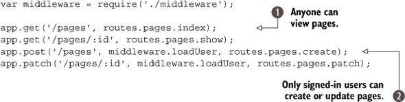

在这个片段中，为名为`pages`的资源定义了路由。一些路由对任何人可访问 ，但创建或更新页面仅限于系统上有账户的人 。这是通过在定义路由时将`loadUser`中间件组件作为第二个参数来实现的。实际上，可以使用多个参数——您可以有通用的用户加载路由，然后是一个更具体的权限检查路由，确保用户是管理员或拥有更改页面的必要权利。

图 9.4 展示了请求如何穿过几个回调，直到最终将响应发送回客户端。有时这可能会在其他中间件有机会运行之前完成响应——如果遇到错误并将其传递给 `next(err)`。

##### 图 9.4\. 请求可以穿过几个回调，直到最终响应被发送。

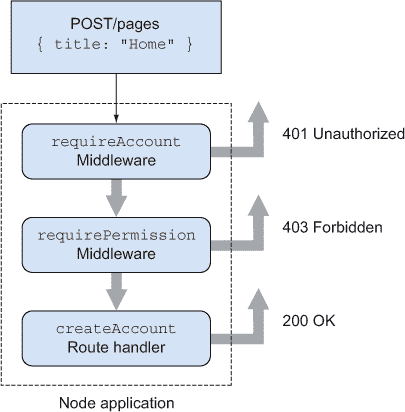

你甚至可以将中间件应用到路由批处理中。在 Express 应用程序中，常见到类似 `app.all('/admin/*', middleware.loadUser);` 的用法。

如果你使用模块来管理你的中间件，并通过将共享功能移动到单独的文件来简化路由处理程序，那么你会发现将中间件组织成模块成为组织应用程序的基本架构工具。

如果你正在设计一个新的 Express 应用程序，你应该从中间件的角度来思考。问问自己你将处理哪些类型的 HTTP 请求，以及它们可能需要什么样的过滤。

现在是时候将这些想法结合成一个工作示例了。列表 9.22 展示了处理包含 XML 的请求的一种方法。中间件被用来解析 XML，将其转换为普通的 JavaScript 对象。这意味着两件事：只有你代码的一小部分需要关心 XML，而且你还可以潜在地添加对其他数据格式的支持。

##### 列表 9.22\. 三种类型的中间件

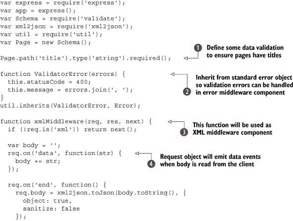

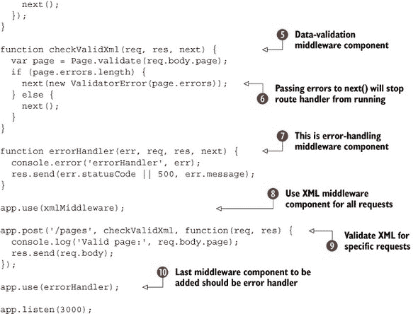

总结来说，这个示例定义了三个中间件组件来解析 XML，验证它，然后要么以 JSON 对象的形式响应，要么显示错误。我们在这里使用了一个任意的数据验证库 ![1.jpg]——你的数据库模块可能自带类似的功能。

路由处理 *页面* 资源，页面的预期格式是 XML。它作为请求体传递并进行验证。当将无效数据发送到服务器时，使用错误对象 `ValidatorError` ![2.jpg] 返回 400 错误。XML 解析器 ![3.jpg] 使用标准基于事件的 API ![4.jpg] 读取请求体。这个中间件组件对每个请求都进行调用 ![8.jpg]，因为它直接传递给 `app.use`，但它只有在 `Content-Type` 设置为 XML 时才会运行。

数据验证中间件组件 ![5.jpg] 确保页面标题已被设置——这只是一个我们选择的任意示例，用来说明这种验证是如何工作的。如果数据无效，当调用 `next` 时会传递一个 `ValidatorError` 实例 ![6.jpg]。这将触发错误处理中间件组件 ![7.jpg]。

只有在特定的请求中对数据进行验证。这是通过在定义 /pages 路由时传递 `checkValidXml` 来完成的 ![9.jpg]。

全局错误处理器是最后添加的中间件组件 ![10.jpg]。这应该是始终如此，因为中间件的执行顺序是按照定义的顺序。一旦调用 `res.send`，则不会进行更多处理，因此不会触发错误。

要尝试这个示例，请运行`node server.js`，然后使用`curl`将 XML 发布到服务器：

```
curl -H "Content-Type: application/xml" \
  -X POST -d '<page><title>Node in Practice</title></page>' \
  http://localhost:3000/pages
```

你应该尝试省略标题以确保引发 400 错误！

这种方法可以用于 XML、JSON、CSV 或你喜欢的任何其他数据格式。它非常适合最小化处理 XML 的代码，但还有其他方法可以在 Node 网络应用程序中编写解耦代码。在下一个技巧中，你将看到 Node 的一个基本功能——事件——如何被用作另一个有用的架构模式。

#### 技巧 73 使用事件解耦功能

在平均的 Express 应用程序中，大多数代码被组织成方法和模块。这可能在某些情况下使功能共享变得不方便，尤其是如果你想在你应用程序中整齐地分离关注点。这个技术以发送电子邮件作为例子，说明了一些不适合放入路由器、模型或视图中的东西。事件被用来解耦电子邮件和路由器，将电子邮件相关的代码保持在 HTTP 代码之外。

##### 问题

你想做一些与 HTTP 无关的事情，比如发送电子邮件，但不确定如何构建代码以便它能够整齐地解耦且易于测试。

##### 解决方案

使用易于访问的`EventEmitter`对象，例如 Express 的`app`对象。

##### 讨论

Express 和 restify 应用程序通常遵循模型-视图-控制器（MVC）模式。模型用于保存数据，控制器是路由处理器，视图是 views 目录中的模板。

有些代码并不适合整齐地归入这些类别。例如，你会把处理电子邮件的代码放在哪里？显然，电子邮件生成不属于路由，因为电子邮件与 HTTP 无关。但就像路由处理器一样，它确实需要模板。它也不是真正的模型，因为它不与数据库交互。

如果你把处理电子邮件的代码放入模型中会怎样？在这种情况下，给定一个`User`模型的实例，你希望在创建新账户时发送电子邮件。你可以在`User.prototype.registerUser`方法中放置电子邮件代码。问题是，你可能并不总是想在用户创建时发送电子邮件。在测试期间可能不方便，或者是一些周期性的维护任务。

为什么发送电子邮件并不完全适合模型或 HTTP 路由可以通过思考 SOLID 原则([`en.wikipedia.org/wiki/SOLID`](http://en.wikipedia.org/wiki/SOLID))来理解。有两个原则与我们相关：*单一职责原则*和*依赖倒置原则*。

单一职责原则规定，处理 HTTP 路由的类实际上真的不应该发送电子邮件，因为这些是不同的职责，不应该混合在一起。控制反转是依赖倒置的一种特定类型，可以通过移除直接调用来实现——而不是调用`emails.sendAccount-Creation`，你的电子邮件处理类应该响应事件。

对于 Node 程序员来说，事件是他们可用的重要工具之一。幸运的是，SOLID 原则表明我们可以通过移除我们的电子邮件代码，并用抽象和通用的事件来替换它，从而编写更好的 HTTP 路由器。这些事件然后可以被相关类响应。

图 9.5 显示了我们的理想化应用程序结构可能的样子。但我们如何实现这一点呢？以 Express 应用程序为例；它们通常没有合适的全局事件对象。你可以在某个中心位置技术上创建一个全局变量，比如调用`express()`的文件，但这会引入全局共享状态，这将破坏我们之前描述的原则。

##### 图 9.5\. 如果根据 SOLID 原则组织，应用程序可能更容易理解。

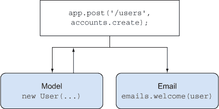

幸运的是，Express 在请求中包含对`app`对象的引用。路由处理程序，接受`req, res`参数，始终可以在`res.app`中访问`app`。`app`对象继承自`EventEmitter`，因此我们可以用它来广播事件发生。如果你的路由处理程序创建并保存了新用户，那么它也可以调用`res.app.emit('user:created', user)`，或者类似的东西——只要命名方案一致，你可以使用任何命名方案来表示事件。然后你可以监听`user:created`事件并相应地做出反应。这可能包括发送电子邮件通知，或者甚至记录有关用户的有用统计数据。

以下列表显示了如何在应用程序对象上监听事件。

##### 列表 9.23\. 使用事件来构建应用程序

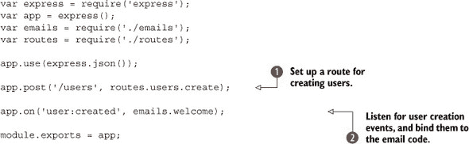

在此示例中定义了一个用于注册用户的路由，然后定义了一个事件监听器并将其绑定到一个发送电子邮件的方法。

路由在下一列表中显示。

##### 列表 9.24\. 发射事件

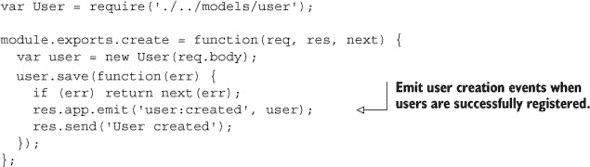

此列表包含`User`对象的示例模型。如果用户成功创建，则`app`对象上会发出`user:created`。本书的可下载代码包括一个更完整的示例，其中包含发送电子邮件的代码，但移除直接调用并遵循单一责任原则的基本原则在这里得到了体现。

在应用程序内部使用事件进行通信，当你需要使代码更容易让其他开发者理解时很有用。也有时候你需要与客户端代码进行通信。下一项技术将向你展示如何在 Node 应用程序中利用 WebSockets，同时仍然能够访问会话等资源。

#### 技巧 74 使用 WebSockets 与会话

Node 对实时 Web 有很强的支持。采用面向事件、异步 API 意味着支持 WebSockets 是一个自然的选择。此外，在同一进程中运行两个服务器是微不足道的：WebSocket 服务器和标准 Node HTTP 服务器可以愉快地共存。

这种技术展示了如何重用我们迄今为止与 WebSocket 服务器一起使用的 Connect 和 Express 中间件。如果你的应用程序允许用户登录，并且你想添加 WebSocket 支持，那么继续阅读以了解如何掌握 WebSocket 中的会话。

##### 问题

你想为现有的 Express 应用程序添加 WebSocket 支持，但你不确定如何访问会话变量，比如用户是否当前已登录。

##### 解决方案

在你的 WebSocket 服务器上重用 Connect 的 cookie 和 session 中间件。

##### 讨论

这种技术假设你对 WebSockets 有一定的了解。为了回顾：HTTP 请求是无状态的，相对较短的生命周期。它们非常适合下载文档，以及请求资源的状态改变。但关于从服务器到服务器的数据流怎么办呢？

某些类型的事件起源于服务器。想想一个网络邮件服务。当你创建并发送一条消息时，你将其推送到服务器，服务器将其发送给收件人。如果收件人正在查看他们的收件箱，他们的浏览器没有简单的方法来更新。他们可以使用 Ajax 请求定期检查新消息，但这并不优雅。服务器*知道*它有新的消息要发送给收件人，所以如果它能直接将那条消息推送到用户，那就更好了。

这就是 WebSocket 发挥作用的地方。它们在概念上类似于我们在第七章中看到的 TCP 套接字：在客户端和服务器之间建立了一个双向的桥梁。为此，你需要在标准的 Express 服务器或普通的 Node `http`服务器之外，还需要一个 WebSocket 服务器。图 9.6 说明了这在典型的 Node 网络应用中的工作方式。

##### 图 9.6\. 一个 Node 网络应用应该支持标准的 HTTP 请求和 WebSockets。

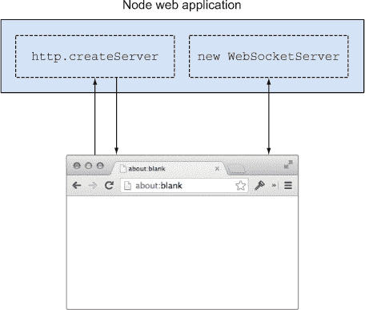

HTTP 请求是短暂的，有特定的端点，并使用`POST`和`PUT`等方法。WebSockets 是持久的，没有特定的端点，也没有方法。它们在概念上是不同的，但由于它们用于与同一应用程序通信，它们通常需要访问相同的数据。

这给会话带来了问题。我们之前看过的 Express 示例使用了中间件来自动加载会话。Connect 中间件基于 HTTP 请求和响应，那么我们如何将它们映射到持久且双向的 WebSockets 上呢？为了理解这一点，我们需要看看 WebSockets 和会话是如何工作的。

会话是基于包含在 cookie 中的唯一标识符加载的。cookie 会随每个 HTTP 请求一起发送。WebSockets 通过一个标准的 HTTP 请求启动，请求升级到 WebSocket。这意味着有一个点可以抓取请求中的 cookie，然后加载会话。对于每个 WebSocket，您都可以存储对用户会话的引用。现在您可以使用会话执行所有需要执行的操作：验证用户是否已登录，设置首选项，等等。

图 9.7 扩展了图 9.6，展示了如何通过结合用于解析 cookie 和加载会话的 Connect 中间件来使用 WebSockets。

##### 图 9.7\. 通过 WebSockets 访问会话

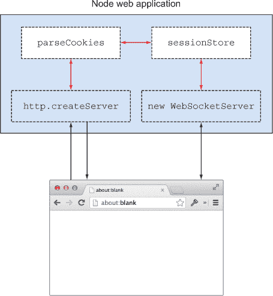

现在您已经知道了各个部分是如何配合工作的，那么您是如何构建它的呢？cookie 解析中间件组件可以在`express.cookieParser`中找到。这实际上是一个简单的方法，它从请求头中获取 cookie，然后将 cookie 字符串解析成单独的值。它接受一个参数，`secret`，这是用于签名 cookie 的值。一旦 cookie 被解密，您就可以从中获取会话 ID 并加载会话。

Express 中的会话是基于存储和检索值的异步 API 建模的。它们可以由数据库支持，或者您可以使用内置的基于内存的类。通过传递会话 ID 和回调函数到`sessionStore.get`，如果会话 ID 正确，则会加载会话。

在这个技术中，我们将使用`ws` WebSocket 模块([`www.npmjs.org/package/ws`](https://www.npmjs.org/package/ws))。这是一个快速但功能最少的实现，其 API 与 Socket.IO 非常不同。如果您想了解 Socket.IO，那么*Node in Action*有一些非常优秀的教程。在这里，我们使用一个更简单的模块，这样您就可以真正看到 WebSockets 是如何工作的。

要使`ws`加载会话，您需要解析 HTTP 升级请求中的 cookie，然后调用`sessionStore.get`。以下是一个完整示例，展示了它是如何工作的。

##### 列表 9.25\. 使用 WebSockets 的 Express 应用程序

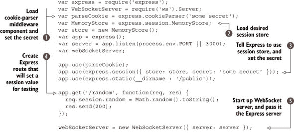

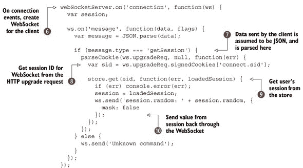

此示例首先加载和配置了 cookie 解析器！[](1.jpg)和会话存储！[](2.jpg)。我们使用签名 cookie，所以请注意，在稍后加载会话时使用`ws.upgradeReq.signedCookies`。

Express 已配置为使用会话中间件组件！[](3.jpg)，我们已创建了一个可用于测试的路由！[](4.jpg)。只需在浏览器中加载 http://localhost:3000/random，即可在会话中设置一个随机值，然后访问 http://localhost:3000/以查看它被打印出来。

`ws`模块通过使用普通的构造函数`WebSocketServer`来处理 WebSockets。要使用它，您需要用 Node HTTP 服务器对象实例化它——我们在这里传递了 Express 服务器！一旦服务器启动，它将在创建连接时发出事件！[](5.jpg)。

此示例的客户端代码向服务器发送 JSON，因此有一些代码用于解析 JSON 字符串并检查其是否有效 。这对于此示例来说并非完全必要，但我们包括它以展示 `ws` 在大多数实际情况下需要这种额外的工作才能使用。

一旦 WebSocket 服务器建立了连接，会话 ID 可以通过升级请求中的 cookies 访问 。这与 Express 在幕后所做的工作类似——我们只需要手动将升级请求的引用传递给 cookie-parser 中间件组件。然后使用会话存储的 `get` 方法加载会话 。一旦会话被加载，就会向客户端发送一条包含会话值的消息 。

运行此示例所需的关联客户端实现如下所示。

##### 列表 9.26\. 客户端 WebSocket 实现

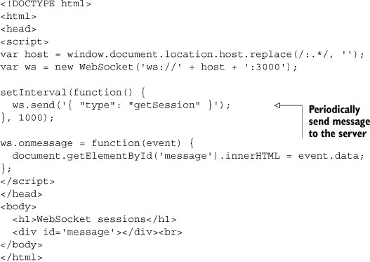

它所做的只是定期向服务器发送消息。直到你访问 http://localhost:3000/random，它将显示 `undefined`。如果你打开两个窗口，一个到 http://localhost:3000/random，另一个到 http://localhost:3000/，你将能够不断刷新随机页面，以便 WebSocket 视图显示新的值。

运行此示例需要 Express 3 和 `ws` 0.4——我们在书的全列表中包含了你需要的一切。

下一个技术提供了从 Express 3 迁移到 Express 4 的技巧。

#### 技巧 75 将 Express 3 应用程序迁移到 Express 4

本书是在 Express 4 发布之前编写的，因此我们的 Express 示例是以框架的 3 版本为基础编写的。我们包括这个技巧是为了帮助你迁移，同时也是为了让你看到版本 4 与之前版本的不同之处。

##### 问题

你有一个 Express 3 应用程序，并希望将其升级以使用 Express 4。

##### 解决方案

更新你的应用程序配置，安装缺失的中间件，并利用新的路由 API。

##### 讨论

从 Express 3 到 4 的大多数更新都经过了很长时间。某些更改已在 Express 3 的文档中提及，因此 API 变化并不令人意外，甚至大部分情况下也不太剧烈。你可能大部分时间都会花费在替换曾经与 Express 一起提供的中间件上，因为 Express 4 除了 `express.static` 之外不再有任何内置的中间件组件。

`express.static` 中间件组件使 Express 能够挂载包含 JavaScript、CSS 和图像资源的 `public` 文件夹。这被保留下来是因为它很方便，但其他中间件组件已经不再使用。这意味着如果你之前使用了 `bodyParser`，你需要使用 `npm install --save body-parser`。请参考表 9.1，其中包含旧中间件名称和较新的等效名称。只需记住，你需要使用 `npm install --save` 安装你需要的每个组件，然后在你的 app.js 文件中 `require` 它。

##### 表 9.3. 迁移 Express 中间件组件

| Express 3 | Express 4 npm 包 | 描述 |
| --- | --- | --- |
| bodyParser | body-parser | 解析 URL 编码和 JSON POST 请求体 |
| compress | compression | 压缩服务器的响应 |
| timeout | connect-timeout | 允许请求在耗时过长时超时 |
| cookieParser | cookie-parser | 从 HTTP 头部解析 cookies，并将结果留在 req.cookies 中 |
| cookieSession | cookie-session | 使用 cookies 提供简单的会话支持 |
| csrf | csurf | 向会话中添加一个令牌，可用于保护表单免受 CSRF 攻击 |
| error-handler | errorhandler | Connect 默认使用的错误处理器 |
| session | express-session | 简单的会话处理器，可以通过 *stores* 扩展，将会话写入数据库或文件 |
| method-override | method-override | 将新的 HTTP 请求方法映射到 _method 请求变量 |
| logger | morgan | 日志格式化 |
| response-time | response-time | 跟踪响应时间 |
| favicon | serve-favicon | 发送 favicons，包括一个内置的默认图标，如果你还没有的话 |
| directory | serve-index | 目录列表，类似于 Apache 的目录索引 |
| vhost | vhost | 允许路由匹配子域名 |

你可能不会使用这些模块中的大多数。在我的应用程序中，我（亚历克斯）通常只有 `body-parser`、`cookie-parser`、`csurf`、`express-session` 和 `method-override`，因此迁移并不困难。以下列表显示了一个使用这些中间件组件的小型应用程序。

##### 列表 9.27. Express 4 中间件

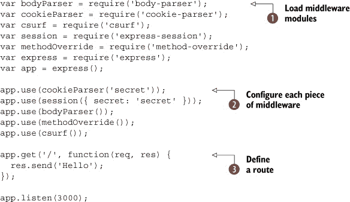

要安装 Express 4 和必要的中间件，你应该在新的目录中运行以下命令：

```
npm install --save body-parser cookie-parser \
            csurf express-session method-override \
            serve-favicon express
```

这将安装所有必需的中间件模块以及 Express 4，并将它们保存到 package.json 文件中。一旦你使用 `require` 加载了中间件组件![]，你就可以像在 Express 3 中一样使用 `app.use` 将它们添加到应用程序的堆栈中。路由处理器可以像在 Express 3 中一样添加![]。

|  |
| --- |

##### 官方迁移指南

Express 的作者编写了一份迁移指南，可在 GitHub 上的 Express wiki 中找到。^([3)] 这包括每个更改的快速概述。

> ³ [`github.com/visionmedia/express/wiki/Migrating-from-3.x-to-4.x`](https://github.com/visionmedia/express/wiki/Migrating-from-3.x-to-4.x)

|  |
| --- |

你不能再使用 `app.configure` 了，但停止使用它应该很容易。如果你使用 `app.configure` 只是为了特定环境执行某些操作，那么只需使用带有 `process.env.NODE_ENV` 的条件语句。以下示例假设有一个虚构的中间件组件 `logger`，它可以被设置为嘈杂，这在测试运行时可能不是所希望的：

```
if (process.env.NODE_ENV !== 'test') {
  app.use(logger({ verbose: true }));
}
```

新的路由 API 强调了可以在不同端点上挂载的微型应用程序的概念。这意味着你的 RESTful 资源可以省略 URL 中的资源名称。你不再需要编写 `app.get('/songs', songs.index)`，现在你可以编写 `songs.get('/', index)` 并使用 `app.use` 在 `/songs` 上挂载 `songs`。这与 技术 67 中的路由分离模式很好地结合在一起。

下一个列表展示了如何使用新的路由 API。

##### 列表 9.28. Express 4 中间件

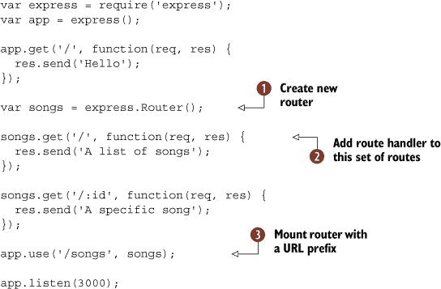

在创建了一个新的路由  之后，你可以像以前一样添加路由，使用 HTTP 动词如 `get` 。这个功能很酷，你还可以添加仅限于这些路由的中间件：只需调用 `songs.use`。在 Express 的旧版本中，这曾经更复杂。

一旦你设置了一个路由器，你可以使用 URL 前缀  来挂载它。这意味着你可以做诸如在不同的 URL 上挂载相同的路由处理程序以轻松地别名它们的事情。

如果你将路由器放在它们自己的文件中，并在你的主 app.js 文件中挂载它们，那么你甚至可以将路由器作为模块在 npm 上分发。这意味着你可以从可重用的路由器中组合应用程序。

我们关于 Express 4 的最后一件事是新的 `router.param` 方法。这允许你在某些路由参数存在时运行异步代码。假设你有 `'/songs/:song_id'`，而 `:song_id` 应该始终是数据库中有效的歌曲。使用 `route.param`，你可以在任何路由处理程序运行之前验证该值是否为数字并且存在于数据库中！

```
router.param('song_id', function(req, res, next, id) {
  Song.find(id, function(err, song) {
    if (err) {
      return next(err);
    } else if (!song) {
      return next(new Error('Song not found'));
    }
    req.song = song;
    next();
  });
});

router.get('/songs/:song_id', function(req, res, next) {
  res.send(req.song);
});
```

在这个例子中，`Song` 被假定为从数据库中获取歌曲的一个类。实际的路由处理程序现在非常简单，因为它只会在找到有效的歌曲时运行。否则，`next` 将会跳过执行并传递一个错误给错误处理中间件。

这部分关于网络应用程序开发技术的讨论就到这里。在我们进入下一章之前，还有一件重要的事情需要说明。就像其他所有事情一样，网络应用程序应该得到充分的测试。下一节将介绍我们在测试网络应用程序时发现的一些有用技术。

### 9.3. 测试网络应用程序

测试可能会感觉像是一项繁琐的工作，但它也可以是验证想法不可或缺的工具，尤其是当你没有用户界面创建网络 API 时。

第十章介绍了 Node 中的测试，技术 84 提供了一个测试 Web 应用的示例。在下一个技术中，我们将扩展这个示例来展示如何测试认证路由。

#### 技术编号 76：测试认证路由

测试框架如 Mocha 使测试易于阅读和编写，SuperTest 有助于保持与 HTTP 相关的测试整洁。但认证支持通常不会内置到这样的模块中。在这个技术中，你将学习一种处理测试中认证的方法，这种方法足够通用，可以与其他测试模块一起重用。

##### 问题

你想测试你的应用程序中基于会话的用户名和密码的部分。

##### 解决方案

在测试的设置阶段发送一个登录请求，然后重用 cookies 进行后续测试。

##### 讨论

一些 Web 框架和测试库为你处理会话，因此你可以测试路由而不必过多担心登录。这对于我们在这本书中之前使用过的 Mocha 和 SuperTest 来说并不成立，所以你需要了解一些关于会话如何工作的知识。

Express 从 Connect 使用的会话处理是基于 cookie 的。一旦 cookie 被设置，就可以用来加载用户的会话。这意味着要编写一个测试来访问应用程序的安全部分，你需要发送一个登录请求，获取 cookies，然后使用这些 cookies 进行后续请求。这个过程在图 9.8 中展示。

##### 图 9.8。你可以通过捕获 cookie 来测试认证路由。

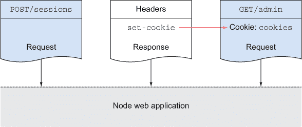

要编写访问认证路由的测试，你需要一个测试用户账户，这通常涉及到创建数据库固定值。你将在第十章和技术 87 中了解到固定值。

一旦数据准备就绪，你可以使用 SuperTest 之类的库向你的会话处理端点发送一个带有用户名和密码的`POST`请求。Cookies 是通过 HTTP 头部传输的，因此你可以从`res.headers['set-cookie']`中读取它们。你还应该进行断言以确保账户已登录。

现在任何新的请求只需要设置`Cookie`头部，使用`res.headers`中的值，你的测试用户就会登录。下一个列表展示了这是如何工作的。

##### 列表 9.29。测试认证请求

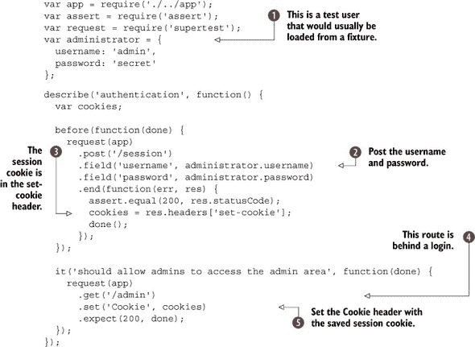

测试的第一部分加载所需的模块并设置一个示例用户。这通常会被存储在数据库中，或者通过固定值设置。接下来，使用用户名和密码发送一个`POST`请求。会话 cookie 将在`set-cookie`头部中可用。

要访问登录后的路由，请设置`Cookie`头部，使用之前保存的 cookies。你应该会发现请求被处理得就像用户正常登录一样。

通过查看 Connect 的会话中间件组件的工作方式，可以学会理解带有会话的测试的技巧。其他中间件在测试期间并不容易管理，所以下一个技巧引入了测试 *接口* 的概念，这将允许你在测试期间控制中间件。

#### 技巧 77 为中间件注入创建接口

中间件是灵活的和可组合的。这种模块化方法使得基于 Connect 的应用程序易于工作。但中间件也有一个缺点：可测试性。一些中间件使得路由本身难以测试。这个技巧通过创建 *接口* 来探讨如何解决这个问题。

##### 问题

你正在使用使你的应用程序难以测试的中间件。

##### 解决方案

找到在测试期间可以替换中间件的接口。

##### 讨论

术语 *接口* 是一种正式的描述代码中可以更改而不需要编辑原始代码的地方的方式。这个概念被扩展到适用于 JavaScript 等语言，由 Stephen Vance 在他的书 *Quality Code: Software Testing Principles, Practices, and Patterns* 中提出。^([4])

> ⁴ [`www.informit.com/store/quality-code-software-testing-principles-practices-9780321832986`](https://www.informit.com/store/quality-code-software-testing-principles-practices-9780321832986)
> 
> *在我们的代码中，接口为我们提供了控制该代码并在测试环境中执行它的机会。任何我们可以执行、覆盖、注入或控制的代码的地方都可能是一个接口。*

这的一个例子是 Connect 的 `csrf` 中间件组件。它创建了一个会话变量，可以包含在表单中以避免跨站请求伪造攻击。假设你有一个允许注册用户创建日历条目的网络应用程序。如果你的网站没有使用 CSRF 保护，有人可以创建一个网页，诱骗你的网站用户删除他们的日历项目。攻击可能看起来像这样：

```

```

用户的浏览器将尽职尽责地加载托管在外部站点上的图像源。但它以可能危险的方式引用你的站点。为了防止这种情况，每次请求都会生成一个随机令牌并将其插入到表单中。攻击者无法访问令牌，因此攻击被缓解。

不幸的是，仅仅将 `express.csrf` 添加到渲染表单的路由中并不完全可测试。测试无法在没有首先加载表单并刮除包含 CSRF 令牌的会话变量之前向路由处理程序发送帖子。

为了解决这个问题，你需要将 `express.csrf` 控制在自己的手中。重构它以创建一个接口：将其放置在一个包含你其他自定义中间件的模块中，然后在测试期间进行更改。你不需要测试 `express.csrf`，因为 Express 和 Connect 的作者已经为你做了这项工作——相反，你可以在测试期间更改其行为。

另外两个选项是可用的：检查`process.env.NODE_ENV`是否设置为`test`，然后分支到仅测试版本的 CSRF 中间件组件，或者修补`express.csrf`的内部结构，以便你可以提取密钥令牌。这两种方法都存在问题：第一种意味着你不能获得 100%的代码覆盖率——你的生产代码必须包含测试代码。第二种方法可能是脆弱的：它对 Connect 未来更改 CSRF 工作方式过于敏感。

我们将使用的基于缝隙的概念要求你创建一个中间件文件，如果你还没有的话。这只是一个将所有中间件组合成一个可以轻松加载的模块的文件。然后你需要创建一个函数，它围绕`express.csrf`包装，或者只是返回它。以下是一个基本示例。

##### 列表 9.30\. 控制中间件

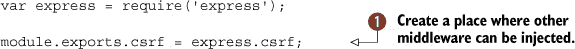

这只是导出原始的`csrf`中间件组件 ，但现在在测试期间注入不同的行为要容易得多。下面的列表显示了这样的测试可能的样子。

##### 列表 9.31\. 在测试期间注入新行为

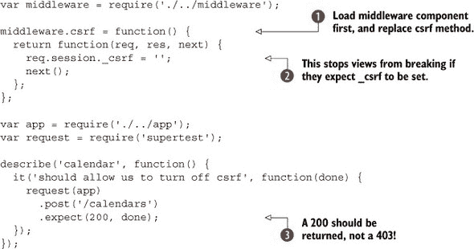

这个测试在加载其他任何内容之前加载我们的自定义中间件模块，然后替换`csrf`方法 。当它加载`app`并使用 Super-Test 发起请求时，Express 将使用我们注入的中间件组件，因为`middleware.js`将被缓存。`_csrf`值被设置，以防任何视图期望它 ，并且请求应该返回 200 而不是 403（禁止） 。

可能看起来我们并没有做很多事情，但通过重构`express.csrf`的加载方式，我们已经能够以更可测试的方式运行我们的应用程序。你可能更喜欢进行两次请求以确保`csrf`中间件组件被正常使用，但这项技术也可以用于其他事情。你可以控制任何中间件进行测试。如果你在测试期间不想运行某些内容，寻找允许你注入所需行为的缝隙，或者尝试使用简单的 JavaScript 或 Node 模式创建缝隙——你不需要复杂的依赖注入框架；你可以利用 Node 的模块系统。

下一个技术是在这些想法的基础上构建的，允许测试与远程服务的模拟版本进行交互。如果你正在为访问远程服务（如支付网关）的应用程序编写测试，这将使事情变得更容易。

#### 技巧 78 测试依赖于远程服务的应用程序

第三方模块可以帮助你将你的应用程序与 GitHub、Twitter 和 Facebook 等远程服务集成。但你是如何测试依赖于这些远程服务应用程序的呢？这项技术探讨了插入远程依赖项存根的方法，以使你的测试更快、更易于维护。

##### 问题

您正在使用社交网络进行身份验证，或者使用接受支付的服务，并且您不希望您的测试访问这些远程依赖。

##### 解决方案

找到您的应用程序、远程服务和您想要测试的内容之间的缝隙，然后插入您自己的 HTTP 服务器来模拟远程依赖的部分。

##### 讨论

大多数 Web 应用程序都需要，但很容易出错的事情之一是用户账户。使用支持 GitHub、Google、Facebook 和 Twitter 等公司提供的授权服务的 Node 模块既快又可能比创建定制解决方案更安全。

采用这些服务中的一个相对容易，但您如何测试它呢？在技术 76 中，您看到了如何编写认证路由的测试。这涉及到登录并保存会话 cookie，以便后续请求看起来是经过认证的。您不能使用相同的方法来测试远程服务，因为您的测试将不得不向真实的生产服务发出请求。您可以使用测试账户，但如果您想离线运行测试呢？

为了解决这个问题，您需要在您的应用程序和远程服务之间创建一个缝隙。每当您的应用程序尝试与远程服务通信时，您需要插入一个发出类似响应的假版本。在单元测试中，模拟对象模拟其他对象。您想要模拟一个服务。

您的应用程序需要满足以下两个要求才能实现这一点：

+   可配置的远程服务

+   可以替代远程服务的 Web 服务器

第一个条件意味着您的应用程序应该允许更改远程服务的 URL。如果它需要连接到[`auth.example.com/signin`](http://auth.example.com/signin)，那么在测试期间您需要指定 http://localhost:3001/signin。端口号完全由您决定——我们见过的一些解决方案使用一系列端口号，以便在相同的测试中同时运行多个服务。

第二个条件可以按您希望的任何方式处理。如果您使用 Express，您可以使用定义了有限路由集的 Express 服务器开始——只需要足够的路由和代码来模拟远程服务。这个服务器可以放在它自己的模块中，并在需要它的测试中加载。

实际上这不需要太多的代码，所以一旦您理解了原理，就不应该太难重用它来处理几乎任何 API。如果您试图模拟的 API 没有很好地记录，那么您可能需要捕获真实请求来了解它是如何工作的。

|  |
| --- |

**调查远程 API**

有时候远程 API 没有很好地记录。一旦您超越了基本的 API 调用，肯定会有一些部分不容易理解。在这种情况下，我们发现最好使用命令行工具如`curl`发出请求，并在 HTTP 日志工具中观察请求和响应。

如果你使用的是 Windows，那么 Fiddler ([`www.telerik.com/fiddler`](http://www.telerik.com/fiddler)) 是绝对必要的。它被描述为一个 HTTP 调试代理，并且也支持 HTTPS。

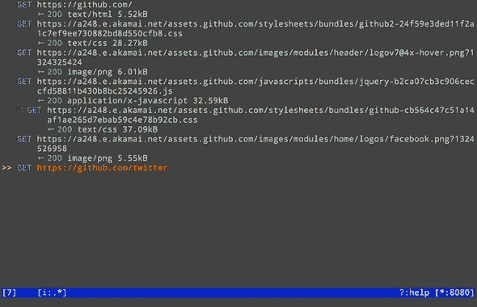

Glance 内置了错误页面。

对于 Linux 和 Mac OS，mitmproxy ([`mitmproxy.org/`](http://mitmproxy.org/)) 是一个强大的选择。它允许实时观察、转储、保存和重放 HTTP 流量。我们发现它非常适合调试我们自己的支持桌面应用程序的 Node.js 驱动的 API，以及了解某些流行支付网关的怪癖。

|  |
| --- |

在接下来的三个列表中，你将看到如何创建一个测试可以用来模拟 PayPal 的一些行为的 *模拟服务器*。第一个列表显示了应用程序本身。

##### 列表 9.32\. 一个使用 PayPal 的小型网店

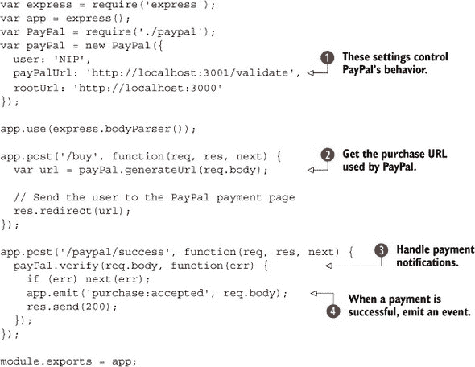

文件顶部附近的 `PayPal` 类传递的设置用于控制 PayPal 的行为。其中之一，`payPalUrl`，可能是 [`www.sandbox.paypal.com/cgi-bin/webscr`](https://www.sandbox.paypal.com/cgi-bin/webscr) 以测试 PayPal 的测试服务器。在这里，我们使用本地 URL，因为我们打算运行自己的模拟服务器。

如果这是一个真实的项目，你应该使用配置文件来存储这些选项。每个环境一个配置文件是有意义的。然后测试配置可以指向本地服务器，测试环境可以使用 PayPal 沙盒，而生产环境可以使用 PayPal.com。有关配置文件的更多信息，请参阅技术 69。

要进行支付，用户将被转发到 PayPal 的托管表单。我们的演示 `PayPal` 类具有生成此 URL 的能力，并且它将使用 `payPalUrl` 。此示例还展示了支付通知处理 ——在 PayPal 的术语中称为 IPN。

我们在这里添加的一个额外功能是调用 `emit` 。这使得测试变得更加容易，因为我们的测试现在可以监听 `purchase:accepted` 事件。这对于设置电子邮件处理也非常有用——有关更多信息，请参阅技术 73。

现在是模拟 PayPal 服务器。它需要做的只是处理 IPN 请求。它基本上需要说，“是的，那个购买已被验证。”它还可以选择性地报告错误，这样我们也可以测试我们自己的错误处理。下一个列表显示了这个微型模拟服务器的外观。

##### 列表 9.33\. 模拟 PayPal 的 IPN 请求

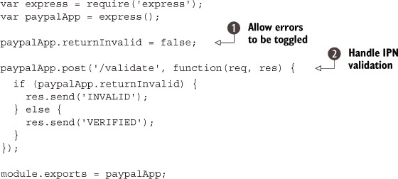

在实际生活中，PayPal 商店在销售流程接近尾声时从 PayPal 接收一个包含订单详情的 `POST` 请求。你需要接收那个订单并将其发送回 PayPal 进行验证。这可以防止攻击者构建一个 `POST` 请求，欺骗你的应用程序认为已进行了虚假购买。

此示例包括一个切换器，可以打开错误 。我们在这里不会使用它，但在实际项目中它很有用，因为您会想测试错误处理的方式。会有客户遇到错误，因此确保它们得到优雅的处理至关重要。

一切准备就绪后，我们只需发送回文本 `VERIFIED` 。这就是 PayPal 所做的全部——有时它可能会让人感到令人沮丧的晦涩难懂！

最后，让我们看看一个将所有这些内容结合在一起的测试。接下来的列表使用模拟 PayPal 服务器和我们的应用程序进行购买。

##### 列表 9.34\. 测试 PayPal

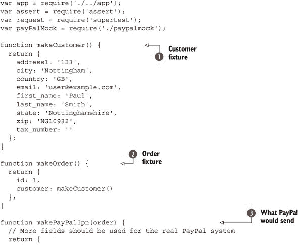


此测试设置了一个示例订单 ，它需要一个客户 。我们还创建了一个具有与 PayPal IPN 请求相同字段的对象——这是我们打算发送到我们的模拟 PayPal 服务器进行验证的。在每个测试的  和  之前，我们必须启动和停止模拟 PayPal 服务器。这是因为我们不希望在不必要时运行服务器——这可能会使其他测试行为异常。

当用户在我们的网站上填写订单表单时，它将被发布到一个生成 PayPal URL 的路由。PayPal URL 将将用户的浏览器转发到 PayPal 进行支付。列表 9.34 包含了这个测试 ，它生成的 URL 将以我们从 列表 9.32 的本地测试 PayPal URL 开头。

还有对 PayPal 发送的通知的测试 。这是我们关注的需要 PayPal 模拟服务器的测试。首先，我们必须向我们的服务器 `/paypal/success` 发送 `POST` 请求，并带上通知对象 ——这是 PayPal 通常会做的——然后我们的应用程序将向 PayPal 发送 HTTP 请求，这将击中模拟服务器，然后返回 `VERIFIED`。测试简单地确保返回 200，但它也能够监听 `purchase:accepted` 事件，这表示特定的购买已完成。

这可能看起来工作量很大，但一旦您的远程服务通过模拟服务器进行模拟，您将能够更有效地工作。您的测试运行得更快，您还可以离线工作。您还可以让模拟服务生成各种不同寻常的响应，如果这是您的目标之一，这将有助于您获得更好的测试覆盖率。

这是我们在本章中涵盖的最后一个与网络相关的技术。接下来的几节将讨论 Node 网络开发的最新趋势。

### 9.4\. 全栈框架

在本章中，您已经看到了如何使用 Node 的内置模块、Connect 和 Express 构建网络应用程序。有一类新兴的新框架被称为 *全栈框架*。它们提供了创建丰富、基于浏览器的应用程序所需的特性，例如数据绑定，同时也处理服务器端的问题，如建模业务逻辑和数据持久性。

如果你决心使用 Express，那么你仍然可以今天就开始使用全栈框架。*MEAN* 解决方案堆栈使用 MongoDB、Express、AngularJS 和 Node。可能存在许多 MEAN 实现，但 Linnovate 的 MEAN Stack ([`github.com/linnovate/mean`](https://github.com/linnovate/mean)) 目前是最受欢迎的。它包含 Mongoose 数据模型、Passport 授权和 Twitter Bootstrap 用户界面。如果你在一个已经熟悉 Bootstrap、AngularJS 和 Mongoose 的团队中工作，那么这是一个快速启动新项目的好方法。

书籍 *Getting MEAN*^([5]) 介绍了全栈开发，并涵盖了 Mongoose 模型、RESTful API 设计以及使用 Facebook 和 Twitter 的账户管理。

> ⁵ *Getting MEAN* by Simon Holmes: [`www.manning.com/sholmes/`](http://www.manning.com/sholmes/).

另一个基于 Express 和 MongoDB 的框架是 Derby ([`derbyjs.com/`](http://derbyjs.com/))。Derby 使用 Racer 而不是 Mongoose 来实现数据模型。这允许使用操作转换 (OT) 同步来自不同客户端的数据。OT 是专门为支持协作系统而设计的，因此 Derby 是开发受 Etherpad ([`etherpad.org/`](http://etherpad.org/)) 启发的软件的好选择。它还具有客户端功能，如模板和数据绑定。

如果你喜欢 Express 但想要更多功能，那么我们还没有介绍的一个选择是 PayPal 的 Kraken ([`krakenjs.com/`](http://krakenjs.com/))。这个框架通过添加配置、控制器、Grunt 任务和测试的子目录来为 Express 项目添加更多结构。它还支持开箱即用的国际化。

一些框架几乎完全专注于浏览器，仅使用 Node 进行敏感操作和数据持久化。一个流行的例子是 Meteor ([`www.meteor.com/`](https://www.meteor.com/))。像 Derby 和 MEAN Stack 一样，它使用 MongoDB，但创建者计划支持其他数据库。它基于 pub/sub 架构，其中 JSON 文档在客户端和服务器之间推送。客户端保留文档的内存副本——服务器发布文档集，而客户端订阅它们。这意味着浏览器中的大多数模型相关代码都可以同步编写。

Meteor 接受了反应式编程，这是一种目前在桌面开发领域流行的范式。这允许 *反应式计算* 与方法绑定。如果你将一个函数订阅到这样的值，当值改变时，函数将被重新运行。在实际应用中的总体效果是代码流线化——基本上减少了 pub/sub 管理和事件处理代码。

Hoodie ([`hood.ie/`](http://hood.ie/))是 Meteor 的竞争对手。它使用 CouchDB，适合移动应用，因为它在可能的情况下同步数据。几乎所有的事情都可以在本地发生。它内置了账户管理，就像`hoodie.account.signUp('alex@example.com', 'pass')`这样简单。甚至还有一个全局公共存储库，因此数据可以保存为特定用户使用，或者通过给定应用程序对所有人可用。

在 Node 网络框架场景中有很多活动，但我们还没有提到 Node 网络开发的另一个方面：实时开发。

### 9.5\. 实时服务

Node 是网络实时服务的自然选择。从广义上讲，这涉及三种类型的应用程序：统计服务器、协作服务和像游戏服务器这样的对延迟敏感的应用程序。

使用 Express 启动服务器并收集有关您的其他应用程序、服务器、天气传感器数据或喂狗机器人的数据并不困难。不幸的是，做得好并不简单。如果你每次有人玩你的免费 iOS 游戏时都记录一些东西，那么当每分钟有数千个事件发生时会发生什么？你如何扩展它，或者实时查看关键信息？

一些公司面临着巨大的这个问题，幸运的是，其中一些公司已经创建了开源工具，我们可以重用。一个例子是 Square 的 Cube ([`square.github.io/cube/`](http://square.github.io/cube/))。Cube 允许你收集带时间戳的事件，然后对它们进行度量。它使用 MongoDB，因此你可以将数据输出到生成图表的东西。Square 有一个用于可视化数据的解决方案，称为 Cubism.js ([`square.github.io/cubism/`](http://square.github.io/cubism/))，它实时渲染新值（见图 9.9）。

##### 图 9.9\. Cubism.js 实时显示时间序列值。


Etherpad 项目 ([`etherpad.org/`](http://etherpad.org/))是一个由 Node 驱动的协作文档编辑器。它允许用户在修改文档时聊天，并使用颜色编码变化，以便容易看到每个人在做什么。它基于本书中的一些模块：Mikeal Rogers 的`request`、Express 和 Socket.IO。

WebSockets 使得这些项目成为可能。没有 WebSockets，向客户端推送数据将会更加繁琐。Node 有一套丰富的 WebSockets 实现——Socket.IO ([`socket.io/`](http://socket.io/))是最受欢迎的，但也有`ws` ([`www.npmjs.org/package/ws`](https://www.npmjs.org/package/ws))，它声称是速度最快的 WebSocket 实现。

套接字和流之间存在平行关系；SocketStream ([`socketstream.org/`](http://socketstream.org/))旨在通过构建完全围绕流的 Web 应用程序来弥合差距。它使用 HTML5 `history.pushState` API 与单页应用程序、Connect 中间件以及与浏览器的代码共享。

### 9.6\. 摘要

在本章中，你已经看到了 Node 如何与现代 Web 开发相结合。它可以用于改进客户端工具——现在客户端开发者安装 Node 和 Node 构建工具已经成为常态。

Node 也被用于服务器端开发。Express 是主要的 Web 框架，但许多项目可以使用 Connect 的子集启动。其他框架与 Express 类似，但有不同的重点。Restify 是一个例子，可以用来创建严格的 RESTful API (技术 71)。

编写结构良好的 Express 应用程序意味着你应该采用 Node 社区已经采用的某些模式和习惯用法。这包括错误处理 (技术 70)、文件夹作为模块和路由分离 (技术 67) 以及通过事件解耦 (技术 73)。

在浏览器中使用 Node 模块 (技术 66) 和 Node 中的客户端代码 (技术 65) 也越来越普遍。

如果你想编写更好的代码，你应该尽快采用测试驱动开发。我们包括了一些使你能够测试诸如身份验证 (技术 76) 和模拟远程 API (技术 78) 的技术，但编写测试来思考新代码是提高你的 Node Web 应用程序的最好方法之一。你可以这样做的一种方式是，每次你想向 Web 应用程序添加新路由时，先编写测试。练习使用 Super-Test 或类似的 HTTP 请求库，并使用它来规划新的 API 方法、网页和表单。

下一章将向您展示如何编写更好的测试，无论是简单的脚本还是数据库驱动的 Web 应用程序。

## 第十章\. 测试：自信代码的关键

*本章涵盖*

+   断言、自定义断言和自动化测试

+   确保事物按预期失败

+   Mocha 和 TAP

+   测试 Web 应用程序

+   持续集成

+   数据库固定值

假设你想要向在线商店添加一种新的货币。首先，你会添加一个测试来定义预期的计算：小计、税和总计。然后你会编写代码使这个测试通过。本章将帮助你通过查看 Node 的内置测试功能来学习如何编写测试：`assert`模块和你可以设置在 package.json 文件中的测试脚本。我们还介绍了两个主要的测试框架：Mocha 和`node-tap`。

|  |
| --- |

**测试简介**

本章假设您在编写单元测试方面有一些经验。表 10.1 包含了所使用术语的定义；如果您想了解我们所说的断言、测试用例或测试框架是什么，可以参考此表。

##### 表 10.1\. 节点测试概念

| 术语 | 描述 |
| --- | --- |
| 断言 | 允许您测试表达式的逻辑语句。由 assert 核心模块支持；例如：assert.equal(user.email, 'name@example.com');。 |

| 测试用例 | 测试特定概念的断言之一或多个。在 Mocha 中，测试用例看起来像这样：it('should calculate the square of a number', function() { assert.equal(square(4), 16);

}); |

| 测试框架 | 运行测试并汇总输出的程序。生成的报告有助于诊断测试失败时的问题。在之前的示例基础上，使用 Mocha 的测试框架看起来像这样：var assert = require('assert'); var square = require('./square');

describe('平方数', function() {

it('should calculate the square of a number', function() {

assert.equal(square(4), 16);

});

it('should return 0 for 0', function() {

assert.equal(square(0), 0);

});

}); |

| 配置 | 在运行测试之前通常准备好的测试数据。假设您想测试用户账户系统。您可以预先定义用户及其密码，然后在测试中包含密码以确保用户可以正确登录。在 Node 中，JSON 是配置文件格式的流行格式，但您也可以使用数据库、SQL 转储或 CSV 文件。这取决于您的应用程序需求。 |
| --- | --- |
| 模拟 | 模拟另一个对象的对象。模拟通常用于替换在单元测试中既慢又难以运行的 I/O 操作；例如，从远程 Web API 下载数据或访问数据库。 |
| 存根 | 存根方法用于在测试期间替换功能。例如，用于与磁盘或远程 API 等 I/O 源通信的方法可以存根以返回预定义的数据。 |
| 持续集成服务器 | 持续集成服务器在项目通过版本控制服务器更新时自动运行测试。 |

对于测试的更详细介绍，*《单元测试的艺术，第二版》*（Roy Osherove，Manning，2013；[`manning.com/osherove2/`](http://manning.com/osherove2/)) 提供了编写可维护和可读性测试的逐步示例。*《通过示例的测试驱动开发》*（Kent Beck，Addison-Wesley，2002；[`mng.bz/UT12`](http://mng.bz/UT12)) 是另一本关于该主题的知名基础书籍。

|  |
| --- |

与 Node 一起工作的一个优点是，社区早期就采用了测试，所以没有缺少帮助你编写快速且可读的测试的模块。你可能想知道测试有什么好处，为什么我们在开发早期就编写它们。好吧，测试在做出承诺之前探索想法很重要——你可以把它们看作是小型的、灵活的实验。它们还传达了你的*意图*，这意味着它们有助于记录和扩展项目关键部分的想法。测试还可以通过允许你检查更改是否破坏了现有功能来帮助减少成熟项目的维护工作。

首先要了解的是 Node 的`assert`模块。此模块允许你定义一个期望，当它不满足时将抛出错误。表达和确认期望是测试的主要目的，所以你将在本章中看到很多断言。虽然你不必使用`assert`来编写测试，但它是一个内置的核心模块，类似于你在其他语言中可能使用过的断言库。本章的第一套技术都是关于断言的。

为了让每个人都能跟上进度，下一节包括了一个列表，列出了在测试工作中常用的术语。

### 10.1. 使用 Node 进行测试的介绍

为了让新来的自动化测试人员更容易理解，我们包括了表 10.1，该表定义了常见的术语。此表还概述了我们所说的特定术语，因为一些编程社区对相同的术语使用略有不同。

Node 直接支持的表 10.1 中的唯一功能是断言。其他功能是通过第三方库提供的——你将在技巧 86 中了解 CI 服务器，在技巧 87 中了解模拟和固定值。你不必使用所有这些工具来编写测试，实际上你只需使用断言模块就可以编写测试。下一节介绍了`assert`模块，这样你就可以开始编写基本测试了。

### 10.2. 使用断言编写简单测试

到目前为止，我们简要地提到断言用于测试表达式。但这究竟涉及什么？通常，断言是当条件不满足时引发异常的函数。失败的断言就像在商店里你的信用卡被拒绝一样——无论你尝试多少次，你的程序都不会运行。断言的想法已经存在很长时间了；甚至 C 语言也有断言。

在 C 语言中，标准库包括用于验证表达式的`assert()`宏。在 Node 中，我们有`assert`核心模块。还有其他断言模块，但`assert`是内置的，易于使用和扩展。

| |
| --- |

##### CommonJS 单元测试

`assert` 模块基于 CommonJS 单元测试 1.1 规范([`wiki.commonjs.org/wiki/Unit_Testing/1.1`](http://wiki.commonjs.org/wiki/Unit_Testing/1.1))。因此，尽管它是一个内置的核心模块，但你也可以使用其他断言模块。底层原则始终相同。

|  |
| --- |

本节介绍了 Node 的内置断言。通过遵循第一个技巧，你可以使用 `assert` 核心模块通过使用 `assert.equal` 来检查相等性，并通过使用 npm 脚本来自动化测试的运行.^([1])

> ¹ 这是由 package.json 文件中的 `scripts` 属性定义的。有关此功能的详细信息，请参阅 `npm help scripts`。

#### 技巧 79 使用内置模块编写测试

你是否曾经尝试为重要的功能编写快速测试，但发现自己迷失在测试库文档中？实际上开始编写测试可能很难；似乎有很多东西要学。如果你只是开始使用 `assert` 模块，那么你现在就可以编写测试，而无需任何特殊库。

当你编写一个小的模块且不想安装任何依赖项时，这会非常棒。这个技巧演示了如何编写干净、表达力强、单文件测试。

##### 问题

你对你的模块、类或函数的输入和输出值有一个清晰的认识，并且你希望当输出值与输入值不匹配时，这一点是明确的。

##### 解决方案

使用 `assert` 模块和 npm 脚本。

##### 讨论

Node 内置了一个断言模块。你可以将其视为一个用于检查预期结果与实际结果之间差异的工具包。内部是通过比较 *实际* 值与 *预期* 值来完成的。`assert.equal` 方法完美地展示了这一点：参数是 `actual, expected`。还有一个第三个可选参数：`message`。传递一个消息使得在测试失败时更容易理解发生了什么。

假设你正在编写一个在线商店，该商店计算订单价格，并且你已经以每件 $3.99 的价格卖出了三件商品。你可以确保使用以下方法正确计算价格：

```
assert.equal(
  order.subtotal, 11.97,
  'The price of three items at $3.99 each'
);
```

在只有一个必需参数的方法中，如 `assert(value)`，预期值是 `true`，因此它使用相同的模式。

要查看测试失败时会发生什么，请尝试运行下一个列表。

##### 列表 10.1\. `assert` 模块


在大多数测试文件中，你首先看到的是加载 `assert` 模块的代码！[](1.jpg)。`assert` 变量也是从 `assert.ok` 别名的一个函数——这意味着你可以使用 `assert()` 或 `assert.ok()`！[](2.jpg)。

容易忘记 `assert.equal` 的参数顺序，所以你可能发现自己经常查看 Node 的文档。实际上，参数的顺序并不重要——有些人可能觉得先列出预期值更容易，这样他们就可以扫描代码中的值——但是你应该保持一致。这就是为什么这个例子明确指出了 `actual` 和 `expected` 的命名！[](3.jpg)。

此测试有一个有意的错误函数 。你可以使用 `node assertions.js` 运行测试，它应该显示一个带有堆栈跟踪的错误：


这些堆栈跟踪可能难以阅读。但因为我们已经包含了一个与失败的断言相关的消息，我们可以看到错误的描述。我们还可以看到断言失败在文件 assertions.js 的第 7 行 。

`assert` 模块有许多其他有用的测试值方法。最重要的是 `assert.deepEqual`，它可以检查两个对象之间的相等性。这是很重要的，因为 `assert.equal` 只能比较浅层相等性。浅层相等性用于比较原始值，如字符串或数字，而 `deepEqual` 可以比较包含嵌套对象和值的对象。

当你编写返回复杂对象的测试时，你可能会发现 `deepEqual` 很有用。想想之前提到的在线商店示例。你的购物车可能看起来像这样：`{ items: [ { name: "Coffee beans", price: 4.95 } ], subtotal: 4.95 }`。这是一个包含购物车项目数组的对象，以及由另一个对象计算的小计。现在，为了检查这个整个对象与你在单元测试中定义的对象，你会使用 `assert.deepEqual`，因为它能够比较对象，而不仅仅是原始值。

`deepEqual` 方法可以在下一个列表中看到。

##### 列表 10.2\. 测试对象相等


此示例使用 `assert` 模块  来测试由构造函数创建的对象，以及一个假设的登录系统。登录系统意外地将普通用户加载为管理员 。

`assert.deepEqual` 方法  将遍历对象中的每个属性，以查看是否有任何不同的。当它遇到 `user.permissions.admin` 并发现值不同时，将抛出 `AssertionError` 异常。

如果你查看 `assert` 模块的文档，你会看到许多其他有用的方法。你可以使用 `notDeepEqual` 和 `notEqual` 来反转逻辑，甚至可以使用 `strictEqual` 和 `notStrictEqual` 来执行类似于 `===` 的严格相等检查。

测试还有另一个方面，那就是确保事情以我们期望的方式失败。下一个技巧将探讨测试失败。

#### 技巧 80 测试错误

程序最终都会失败，但当我们遇到失败时，我们希望它们产生有用的错误。这项技术是确保预期的错误被抛出，以及如何在测试期间引发异常。

##### 问题

你想测试你的错误处理代码。

##### 解决方案

使用 `assert.throws` 和 `assert.ifError`。

##### 讨论

我们作为 Node 开发者使用的约定之一是，异步方法应该将错误作为第一个参数返回。当我们设计自己的模块时，我们知道错误可能发生的地方。理想情况下，我们应该测试这些情况，以确保正确的错误被传递给回调。

下面的列表展示了如何确保错误没有被传递给异步函数。

##### 列表 10.3\. 处理异步 API 的错误


虽然 `assert.ifError` 可以同步工作，但将其用于测试传递错误给回调的异步函数在语义上是有意义的。列表 10.3 使用了一个名为 `readConfigFile` 的异步函数  来读取配置文件。实际上，这可能是网络应用的数据库配置，或者类似的东西。如果找不到文件，则返回默认值 。任何其他错误——这是重要的一部分——将被传递给回调 。

这意味着 `assert.ifError` 测试  可以轻松地检测是否发生了意外的错误。如果项目的结构发生变化，导致抛出了不寻常的错误，那么这个测试将捕获它，并在开发者发布可能危险的代码之前警告他们。

现在让我们来看看在测试期间抛出异常的情况。在我们的测试中，我们不必使用 `try` 和 `catch`，而是可以使用 `assert.throws`。

要使用 `assert.throws`，你必须提供要运行的函数和预期的错误构造函数。因为传递了一个函数，所以它与异步 API 一起使用效果很好，因此你可以用它来测试依赖于 I/O 操作的事情。

下一个列表展示了如何使用 `assert.throws` 与一个虚构的用户账户系统。

##### 列表 10.4\. 确保抛出异常


断言  检查以确保抛出了预期的异常。第一个参数是要测试的函数，在这种情况下是 `loginAdmin`，第二个是预期的错误 。

这突出了 `assert.throws` 的两个特点：它可以与异步 API 一起使用，因为它传递了一个函数，并且它期望某种类型的错误对象。当使用 Node 开发项目时，使用 `util.inherits` 从内置的 `Error` 构造函数继承是一个好主意。这允许人们轻松地捕获你的错误，如果需要，你可以用额外的属性来装饰它们，这些属性包括有用的附加信息。

在这种情况下，我们创建了 `PermissionError` ，这是一个清晰的名字，因此是自文档化的——如果有人在堆栈跟踪中看到 `PermissionError`，他们会知道出了什么问题。随后在 `login-Admin` 函数  中抛出了 `PermissionError`。

这种技术深入探讨了 `assert` 模块的错误处理。结合前面的技巧，你应该对如何使用断言测试各种情况有很好的理解。使用 `assert.equal` 你可以快速比较数字和字符串，这涵盖了检查发票中的价格或网络应用程序账户处理代码中的电子邮件地址等很多问题。很多时候，`assert.ok`（别名为 `assert()`）就足够了，因为它是一种快速便捷的检查真值表达式的手段。但如果你想要真正充分利用 `assert` 模块，还有最后一件事需要掌握；继续阅读以了解如何创建自定义断言。

#### 技巧 81 创建自定义断言

Node 的内置断言可以扩展以支持特定于应用程序的表达式。有时你会发现自己反复使用相同的代码来测试事物，似乎有更好的方法。例如，假设你正在使用正则表达式在`assert.ok`中检查有效的电子邮件地址。编写自定义断言可以解决这个问题，而且比你想象的要简单。学习如何编写自定义断言也将帮助你从内到外理解断言模块。

##### 问题

你在测试中重复了很多代码，如果只有正确的断言，这些代码是可以被替换的。

##### 解决方案

扩展内置的 `assert` 模块。

##### 讨论

`assert` 模块围绕一个单一函数构建：`fail`。`assert.ok` 实际上是通过逻辑反转调用 `fail`，所以看起来像这样：`if (!value) fail(value)`。如果你查看 `fail` 的工作方式，你会看到它只是抛出一个 `assert.AssertionError`：

```
function fail(actual, expected, message, operator, stackStartFunction) {
  throw new assert.AssertionError({
    message: message,
    actual: actual,
    expected: expected,
    operator: operator,
    stackStartFunction: stackStartFunction
  });
}
```

错误对象被添加了使测试报告者更容易分解失败位置和原因的属性。编写此模块的人知道其他人会想编写自己的断言，因此导出了`fail`函数，这意味着它可以被重用。

编写自定义断言涉及以下步骤：

> **1**. 定义一个与现有断言库签名类似的方法。
> 
> **2**. 当期望不匹配时调用 `fail`。
> 
> **3**. 测试以确保失败结果产生一个 `AssertionError`。

列表 10.5 将这些步骤组合起来定义一个自定义断言，以确保正则表达式匹配。

##### 列表 10.5\. 自定义断言


此示例加载断言模块  并定义一个名为 `match` 的函数，该函数运行 `assert.fail` 以在正则表达式不匹配实际值时生成正确的异常 。要记住的关键细节是定义参数列表，使其与其他断言模块中的方法保持一致——这里的示例基于 `assert.equal`。

列表 10.5 也包含了一些测试。实际上这些测试会在一个单独的文件中，但在这里它们展示了自定义断言的工作方式。首先我们检查它是否通过一个简单的测试，通过匹配字符串与正则表达式 ，然后使用 `assert.throws` 确保测试在应该失败时确实失败了 。

|  |
| --- |

**您自己的领域特定语言**

使用自定义断言只是创建您自己的测试领域特定语言（DSL）的一种技术。如果您发现测试用例之间有代码重复，那么完全可以将这些代码封装在函数或类中。

例如，`setUpUserAccount({ email: 'user@example.com' })` 比三到四行设置代码更易读，尤其是在测试用例之间重复时。

|  |
| --- |

这个例子可能看起来很简单，但了解如何编写自定义断言可以提高您对底层模块的了解。自定义断言可以帮助清理测试，其中期望由于将概念挤压到内置断言中而变得不那么表达。如果您想要能够说出像 `assert.httpStatusOK` 这样的东西，现在您就可以做到了！

将断言处理完毕后，是时候看看如何跨多个文件组织测试了。接下来的技术将介绍可以用来组织测试文件组并更轻松运行它们的测试工具。

### 10.3\. 测试工具

测试工具或自动化测试框架通常指的是一个设置运行时环境并运行测试，然后收集和比较结果的程序。由于它是自动化的，测试可以被包括持续集成（CI）服务器在内的其他系统运行，这在技术 86 中有所介绍。技术 86。

测试工具用于执行测试文件组。这意味着您可以使用单个命令轻松运行大量测试。这不仅使您更容易运行测试，也使您的合作者更容易。您甚至可能决定在开始任何其他事情之前，先为所有项目使用测试工具。接下来的技术将向您展示如何创建自己的测试工具，以及如何通过向 package.json 文件中添加脚本来节省时间。

#### 技术编号 82：使用测试工具组织测试

假设您正在处理一个项目，它一直在增长，使用单个测试文件开始感觉杂乱无章。它难以阅读，并导致混淆，进而导致错误。因此，您希望使用一些相关联的单独文件。也许您甚至希望一次运行一个测试文件，以帮助在出错时追踪问题。

测试工具解决了这个问题。

##### 问题

您希望编写组织成测试用例和测试套件的测试。

##### 解决方案

使用测试工具。

##### 讨论

首先，让我们考虑一下什么是测试框架。在 Node 中，测试框架是一个可以通过输入脚本名称来运行的命令行脚本。在最基本的情况下，它必须运行一组测试文件并显示发生的任何错误。我们不需要做任何特别的事情来做到这一点——失败的断言将抛出异常；否则程序将静默退出，返回代码为`0`。

这意味着基本的测试框架只是`node test/*.js`，其中 test/是一个包含一组测试文件的目录。我们可以做得更好。所有 Node 项目都应该有一个 package.json 文件。这个文件中的一个属性是`scripts`，其中一个默认脚本就是`test`。你在这里设置的任何字符串都将像 shell 命令一样执行。

下面的列表展示了一个包含测试脚本的示例 package.json 文件。

##### 列表 10.6\. 包含测试脚本的 package.json


将`node test-runner.js test.js test2.js`设置为`test`脚本 ，其他开发者现在可以通过输入`npm test`来运行你的测试。这比记住一个特定项目的命令要容易得多。

让我们通过查看测试框架是如何工作的来扩展这个例子。测试框架是一个 Node 程序，它运行测试文件组。因此，我们应该能够给这样的程序提供一个要测试的文件列表。每当测试失败时，它应该显示堆栈跟踪，这样我们就可以轻松地追踪失败的源头。

此外，它应该在测试失败时以非零返回代码退出。这允许以自动化的方式运行测试——其他软件可以轻松地看到测试是否失败，而无需解析测试的文本输出。这就是持续集成（CI）服务器的工作方式：每当代码提交到版本控制系统（如 Git）时，它们会自动运行测试。

下一个列表展示了这个系统应该看起来像的测试文件。

##### 列表 10.7\. 一个示例测试文件


`it`函数 看起来很奇怪，但它是一个全局函数，将由我们的测试框架提供。它给每个测试案例一个名称，这样在运行测试时更容易理解结果。包含失败的测试 以便我们可以看到测试失败时会发生什么。最后一个测试案例 即使在第二个测试失败的情况下也应该运行。

现在，最后一部分：下一个列表包含一个能够执行这些测试的程序。

##### 列表 10.8\. 以规定的方式运行测试


这个例子可以通过传递测试文件作为参数来运行：`node test-runner.js test.js test2.js test-n.js`。`it`函数被定义为全局 ，并被命名为`it`，这样测试及其输出在逻辑上读起来更合理。当结果被打印 时，这很有意义。

因为`it`接受一个测试用例名称和一个回调，所以回调可以在我们想要的任何条件下运行。在这种情况下，我们是在`try/catch`语句中运行它 ，这意味着我们可以捕获失败的断言并向用户报告错误 。

测试是通过在传递给命令行参数的每个文件上调用`require`来加载的 。在更完善的程序版本中，文件处理需要更复杂。例如，需要支持通配符表达式。

一个失败的测试用例会导致`exitCode`变量被设置为非零值。在退出处理程序中，这个值会通过`process.exit`返回给控制进程 。

尽管这是一个最小化的示例，但它可以用`npm test`运行，通过`it`为测试用例提供一点语法糖，改进了比简单的断言文件更详细的错误报告，并在出错时返回非零退出代码。这是大多数流行的 Node 测试框架（如 Mocha）的基础，我们将在下一节中探讨。

### 10.4 测试框架

如果你正在启动一个新项目，那么你应该尽早安装一个测试框架。假设你正在构建一个在线博客系统，或者可能是一个简单的内容管理系统。你希望允许人们登录，但只允许特定的用户访问管理界面。通过使用 Mocha 或`node-tap`这样的测试框架，你可以编写针对这些特定问题的测试：用户注册账户，以及管理员登录到管理界面。你可以为这些关注点创建单独的测试文件，或者将它们作为“用户账户测试”下的测试用例组来打包。

测试框架包括运行测试和其他使编写和维护测试更简单的脚本。本节介绍了 Mocha 测试框架在技巧 84 和测试任何协议（TAP；[`testanything.org/`](http://testanything.org/))在技巧 85 中的应用——这两个是 Node 社区中受欢迎的测试框架。Mocha 轻量级：它运行测试，提供三种结构测试用例的风格，^([2])并期望你使用 Node 的`assert`模块或另一个第三方模块。相反，实现了 TAP 的`node-tap`使用了一个包含断言的 API。

> ² Mocha 支持基于行为驱动开发（BDD）、测试驱动开发（TDD）和 Node 模块系统（exports）的 API 风格。

#### 技巧 83 使用 Mocha 编写测试

对于 Node 来说，有众多测试框架，因此选择合适的框架有些困难。Mocha 是一个受欢迎的选择，因为它维护得很好，并且具有合适的特性和约定的平衡。

通常，您会使用测试框架来组织项目的测试。您可能希望使用其他人熟悉的测试框架，这样他们可以轻松导航和协作，而无需学习新的模块。也许您只是想找到一种每次都以相同方式运行测试的方法，或者从自动化系统中触发它们。

##### 问题

您需要以其他开发者熟悉的方式组织测试，并使用单个命令运行测试。

##### 解决方案

使用 Node 的许多开源测试框架之一，如 Mocha。

##### 讨论

在您进行其他操作之前，必须从 npm 安装 Mocha。最佳安装方式是使用 `npm install --save-dev mocha`。`--save-dev` 选项会导致 npm 将 Mocha 安装到 `node_modules/` 并更新您的项目 package.json 文件，以包含 npm 中的最新版本。它将被保存为开发依赖项。

列表 10.9 展示了使用 Mocha 编写的简单测试示例。它使用 `assert` 核心模块进行断言，并且应该使用 `mocha` 命令行二进制文件来调用。您应该在 package.json 中的 `"test"` 属性中添加 `"./node_modules/mocha/bin/mocha test/*.js"`——有关如何做到这一点的更多详细信息，请参阅 技术 82。

| |
| --- |

**Mocha 版本**

我们在本章中使用的 Mocha 版本是 1.13.x。我们更倾向于在本项目本地安装 Mocha 来运行测试，而不是将其作为系统范围内的 Node 模块。这意味着可以使用 `./node_modules/mocha/bin/mocha test/*.js` 来运行测试，而不是仅仅输入 `mocha`。这允许不同的项目使用不同版本的 Mocha，以防 API 在主要版本之间发生重大变化。

另一种选择是使用 `npm install --global mocha` 全局安装 Mocha，然后通过输入 `mocha` 来运行项目的测试。如果它找不到任何测试，将会显示错误。

| |
| --- |

##### 列表 10.9\. 一个简单的 Mocha 测试


Mocha 提供了 `describe` 和 `it` 函数。`describe` 函数可以用来将相关的测试用例分组在一起，而 `it` 包含形成测试用例的断言集合 。

对于异步测试需要特殊处理。这涉及到在测试用例的回调中包含一个 `done` 参数 ，然后在测试完成后调用 `done()` 。在这个例子中，将在随机间隔后触发超时，这意味着我们需要在 `index.randomTimeout` 方法中调用 `done`。相应的测试文件将在下一列表中展示。

##### 列表 10.10\. 一个用于测试的示例模块


| |
| --- |

##### 控制同步和异步行为

如果没有将 `done` 作为参数传递给 `it`，那么 Mocha 将同步运行测试。内部，Mocha 会查看传递给 `it` 的回调函数的 `length` 属性，以确定是否包含参数。这就是它在异步和同步行为之间切换的方式。如果你包含一个参数，那么 Mocha 将等待 `done` 被调用，直到达到超时时间。

| |
| --- |

此模块定义了两种方法：一种用于平方数字  和另一种在随机时间后运行回调 。这足以展示 Mocha 的主要功能，如 列表 10.9 所示。

要为 Mocha 设置项目，我们在这个例子中使用的 index.js 文件应该在其自己的目录中，并且在同一级别应该有一个 package.json 文件，其中 `scripts` 属性的 `test` 子属性设置为 `"./node_modules/mocha/bin/mocha test/*.js"`。还应该有一个包含 `example_test.js` 的 test/directory。^([3]) 在所有这些就绪后，你可以使用 `npm test` 运行测试。

> ³ 文件可以命名为任何名称，只要它在 test/directory 目录下。

当运行测试时，你应该注意到一些点出现。这些标记着一个完成的测试用例。当测试用时超过预设的时间时，它们会改变颜色，表示运行速度比可接受的速度慢。由于 `index.randomTimeout` 防止第二个测试随机时间完成，因此有时 Mocha 会认为测试运行得太慢。你可以通过将 `--slow` 传递给 Mocha 来增加这个阈值，如下所示：`./node_modules/mocha/bin/mocha --slow 2000 test/*.js`。现在你不必为看似缓慢的测试感到内疚了！

| |
| --- |

**每个测试的断言**

在 列表 10.9 中，每个测试用例只有一个断言。有些人认为这是最佳实践——它可以导致可读性强的测试。

但我们更喜欢每个测试一个概念的思路。这种风格将测试用例构建在定义良好的概念周围，使用绝对必要的断言数量。这通常是一个小数字，但偶尔也可能超过一个。

| |
| --- |

要查看所有命令行选项，请输入 `node_modules/mocha/bin/mocha --help` 或访问 [`mochajs.org/`](http://mochajs.org/)。

我们在 列表 10.11 中包含了最终的 package.json 文件，以防你自己在编写时遇到困难。你可以使用 `npm install` 安装 Mocha 及其依赖项。

##### 列表 10.11\. Mocha 示例项目的 JSON 文件

```
{
  "name": "mocha-example-1",
  "version": "0.0.0",
  "description": "A basic Mocha example",
  "main": "index.js",

  "dependencies": {},
  "devDependencies": {
    "mocha": "~1.13.0"
  },
  "scripts": {
    "test": "./node_modules/mocha/bin/mocha --slow 2000 test/*.js"
  },
  "author": "Alex R. Young",
  "license": "MIT"
}
```

在这个技巧中使用了 `assert` 核心模块，但如果你愿意，可以将其替换为另一个断言库。其他库也可用，如 chai ([`npmjs.org/package/chai`](https://npmjs.org/package/chai)) 和 should.js ([`github.com/visionmedia/should.js`](https://github.com/visionmedia/should.js))。

Mocha 通常用于测试 Web 应用程序。在下一个技巧中，你将看到如何使用 Mocha 测试使用 Node 编写的 Web 应用程序。

#### 技巧 84 使用 Mocha 测试 Web 应用程序

假设你正在使用 Node 构建一个 Web 应用程序。你希望以允许你发送请求并接收响应的方式运行它——你想要发送 HTTP 请求来测试 Web 应用程序是否按预期工作。

##### 问题

你正在构建一个 Web 应用程序，并希望使用 Mocha 来测试它。

##### 解决方案

使用 Mocha 和标准 `http` 模块编写测试。考虑使用专为测试设计的 HTTP 模块来简化你的代码。

##### 讨论

要理解 Node 中的 Web 应用程序测试，关键是学会从 HTTP 的角度思考。这种技术从 Mocha 测试和 `http` 核心模块开始。一旦你理解了其中的原理并能以这种方式编写测试，我们将介绍一个第三方 HTTP 测试模块来演示如何简化此类测试。首先演示内置的 `http` 模块，因为它有助于了解幕后发生的事情，并确切了解如何构建此类测试。

以下列表显示了测试的外观。

##### 列表 10.12\. 一个 Mocha 测试用例的 Web 应用程序


这个例子是对一个可以平方数字的 Web 服务的测试。这是一个简单的 Web 服务，它期望 `GET` 请求并以纯文本响应。这个测试套件的目标是确保它返回预期的结果，并在发送无效数据时正确地引发错误。测试旨在模拟浏览器——或者更确切地说，其他 HTTP 客户端——为此，服务器和客户端都在同一个进程中运行。

要运行一个 Web 服务，你所需要做的就是使用 `http.create-Server()` 创建一个 Web 服务器。具体如何做在 列表 10.13 中有展示。在讨论那之前，让我们先完成对这个测试的查看。

测试首先通过创建一个用于发送 HTTP 请求的函数  来开始。这是为了减少测试用例中可能存在的重复。这个函数可以是它自己的模块，可以在其他测试文件中使用。在发送请求后，它监听响应对象上的 `data` 事件以存储服务器返回的任何数据 。然后它运行提供的回调 ，该回调是从测试用例中传递进来的。

图 10.1 展示了 Node 如何在同一个进程中运行服务器和客户端，以使 Web 应用程序测试成为可能。

##### 图 10.1\. Node 可以运行一个 Web 服务器并对它进行请求，以支持 Web 应用程序测试。


这里的一个例子是对 `/square` 方法的测试，确保 `4 * 4 === 16` 。一旦完成，我们也确保无效的 HTTP 查询参数会导致服务器响应 500 错误 。

在整个过程中使用了标准的断言模块，并使用 `res.statusCode` 来测试返回预期的状态码。

下一个列表显示了相应 Web 服务的实现。

##### 列表 10.13\. 一个可以平方数字的 Web 应用程序


在做任何其他事情之前，使用`http.createServer`创建一个服务器。在文件末尾附近，使用`.listen(8000)`使服务器启动并监听连接。每当收到与 URL 匹配/平方的请求时，就会解析 URL 以获取一个数值参数  ，然后将该数字平方并发送给客户端  。当预期的参数不存在时，将返回 500  。

列表 10.12 中可以改进的部分是`request`方法。我们不是围绕`http.request`定义包装器，而是可以使用专门为测试 Web 请求而设计的库。

我们选择的模块是 TJ Holowaychuk 编写的`SuperTest` ([`github.com/visionmedia/supertest`](https://github.com/visionmedia/supertest))，他也是 Mocha 的作者。还有其他类似的库。一般思路是简化 HTTP 请求并允许对请求进行断言。

你可以通过运行`npm install --save-dev supertest`将 SuperTest 添加到这个示例的开发依赖项中。

以下列表展示了如何使用`SuperTest`模块重构测试。

##### 列表 10.14。使用 SuperTest 重构的 Mocha 测试


虽然在功能上与列表 10.12 相同，但这个例子通过移除创建 HTTP 请求的样板代码来改进它。`SuperTest`模块更容易理解，并且允许用更少的代码表达断言，同时仍然保持异步。`SuperTest`期望一个 HTTP 服务器的实例  ，在这种情况下是我们想要测试的应用程序。一旦应用程序被传递给`SuperTest`的主要函数`request`，我们就可以使用`request().get`来发出`GET`请求。其他 HTTP 动词也得到支持，并且在使用`post()`与`send`方法时可以发送表单参数。

`SuperTest`的方法是可链式的，因此一旦发出请求，我们就可以使用`expect`来做出断言。此方法是多态的——它检查参数的类型并根据情况行事。如果你传递一个数字  ，它将确保 HTTP 状态是那个数字。正则表达式将使其检查响应体是否匹配  。这些期望非常适合这个测试的要求。

可以检查任何 HTTP 状态，因此当我们实际期望一个 500 时，我们可以测试它  。

虽然了解如何制作简单的 Web 应用程序并使用内置的`http`模块进行测试很有用，但我们希望你能看到第三方模块如`SuperTest`如何简化你的代码并使你的测试更清晰。

Mocha 捕捉了当前 Node 测试状态的潮流，但还有其他同样有效的方法。接下来的技术介绍了 TAP 和 Test Anything Protocol，由于 Node 的维护者和核心贡献者的支持。

#### 技巧 85：Test Anything Protocol

测试框架输出根据编程语言和测试框架而异。有一些努力旨在统一这些报告。Node 社区采纳的一个这样的努力是 Test Anything Protocol ([`testanything.org`](http://testanything.org))。使用 TAP 的测试将产生轻量级的流式结果，这些结果可以被兼容的工具消费。

假设你需要一个与 Test Anything Protocol 兼容的测试框架，这可能是因为你有使用 TAP 的其他工具，或者因为你已经从其他语言中熟悉了它。可能是因为你不喜欢 Mocha 的 API，想要一个替代方案，或者对 Node 中测试的其他解决方案感兴趣。

##### 问题

你希望使用一个旨在与其他系统互操作性的测试框架。

##### 解决方案

使用 Isaac Z. Schlueter 的 `tap` 模块。

##### 讨论

TAP 是独特的，因为它旨在通过指定实现者可以使用的协议来连接测试框架和工具。该协议是基于流的，轻量级且可读。与其他基于 XML 的更重的标准相比，TAP 实现和使用都很容易。

重要的是，`tap` 模块 ([`npmjs.org/package/tap`](https://npmjs.org/package/tap)) 是由 Node 的前维护者 Isaac Z. Schlueter 编写的。这是 Node 社区中一位极具影响力的人的重要认可。

本技术示例使用 技术 83 中使用的数字平方和随机超时模块，这样你可以比较 TAP 和 Mocha 中测试的外观。

以下列表显示了测试的外观。对于相应的模块，请参阅 列表 10.10。

##### 列表 10.15\. 使用 TAP 进行测试


这与 Mocha 示例不同，因为它不假设存在任何全局测试相关方法，如 `it` 和 `describe`：在执行任何其他操作之前，必须设置对 `tap.test` 的引用 。然后使用 `t.test()` 方法  定义测试，如果需要可以嵌套。嵌套允许将相关关注点分组，因此在这种情况下，我们为每个要测试的方法创建了一个测试用例。

`tap` 模块内置了断言，我们在整个测试文件中使用了这些断言 。一旦测试用例完成，必须调用 `t.end()` 。这是因为 `tap` 模块假设测试是异步的，所以 `t.end()` 可以在异步回调中调用。

另一种方法是使用 `t.plan` 。此方法表示预期有 `n` 个断言。一旦最后一个断言被调用，测试用例将完成运行。与上一个测试用例不同，第二个测试用例可以省略对 `t.end()` 的调用 。

此测试可以使用 `./node_modules/tap/bin/tap.js test/*_test.js` 运行。你可以将此行添加到 package.json 文件中 `scripts` 属性的 `test`，以便使用 `npm test` 运行。

如果你使用`tap`脚本运行测试，你会看到一些干净的输出，这些输出汇总了每个断言的结果。这是由`tap`的一个子模块`tap-results`生成的。`tap-results`模块的目的是从 TAP 流中收集行，并计算跳过、通过和失败的数量，以生成一个简化的报告；

```
ok test/index_test.js ................................... 3/3
total ................................................... 3/3

ok
```

由于`tap`模块的设计，你可以自由地使用`node test/index_test.js`来运行测试。这将打印出 TAP 流而不是：

```
# Alex's handy mathematics module
# square
ok 1 should be equal
# randomTimeout
ok 2 (unnamed assert)

1..2
# tests 2
# pass  2

# ok
```

使用`tap`模块编写的测试在测试失败时仍会向 shell 返回非零退出代码——你可以使用`echo $?`来查看退出代码。尝试使列表 10.15 中的测试故意失败并查看`$?`。

TAP 的设计围绕生成和消费流与 Node 的设计非常契合。在大多数项目中，测试必须与其他自动化系统交互，无论是部署系统还是 CI 服务器，这也是生活的一个事实。与这个协议一起工作比与重量级的 XML 标准一起工作要容易得多，所以希望它会越来越受欢迎。

图 10.2 说明了`node-tap`的一些子模块是如何用来测试程序的。控制从不同的模块转移到你的测试，然后回到你的程序，再通过报告器输出，报告器收集并分析结果。关于这一点，关键要认识到`node-tap`的子模块是可以重用和替换的——如果你不喜欢`tap-results`显示结果的方式，它可以被替换成其他东西。

##### 图 10.2. `node-tap`使用几个可重用的子模块来协调测试。


除了测试框架之外，现实世界的测试还依赖于几个更重要的工具和技术。下一节将向你展示如何使用持续集成服务器和数据库固定值，以及如何模拟 I/O。

### 10.5. 测试工具

当你在团队中工作时，你希望快速看到有人提交了破坏测试的更改。本节将帮助你设置持续集成服务器，以便你可以这样做。它还包括其他与项目相关的问题的技术，如使用测试数据库和模拟 Web 服务。

#### 技巧 86 持续集成

你的测试正在运行，但如果有人的更改导致项目崩溃会发生什么呢？持续集成（CI）服务器用于自动运行测试。由于大多数测试工具在失败时返回非零退出代码，它们在概念上足够简单。它们的真正价值在于它们可以轻松地连接到像 GitHub 这样的服务，并在测试失败时向团队成员发送电子邮件或即时消息。

##### 问题

你想看到团队成员提交了有问题的代码，这样你就不会不小心发布它。

##### 解决方案

使用持续集成服务器。

##### 讨论

你在一个团队中工作，并想查看测试何时开始失败。你已经使用了一个版本控制系统，如 Git，并希望在代码提交到受跟踪的仓库时运行测试。或者，你已经编写了一个开源项目，并想在 GitHub 或 Bitbucket 页面上表明它经过了良好的测试。

有许多流行的开源和专有持续集成服务。在这个技术中，我们将查看 Travis CI ([`travis-ci.org/`](https://travis-ci.org/))，因为它对开源项目是免费的，并且在 Node 社区中很受欢迎。如果你想安装本地的开源 CI 服务器，可以看看 Jenkins ([`jenkins-ci.org/`](http://jenkins-ci.org/))。

Travis CI 提供了一个链接到显示你的项目构建状态的图片。要添加项目，在 travis-ci.org 使用你的 GitHub 账户登录，然后转到 travis-ci.org/profile 中的个人资料页面。你会看到一个 GitHub 项目的列表，将开关切换到开启状态将导致仓库通过一个服务钩子更新，该钩子会在你向 GitHub 推送更新时通知 Travis CI。

一旦你完成了这些，你需要在仓库中添加一个 .travis.yml 文件，以告诉 Travis CI 代码所依赖的环境。你只需要设置 Node 版本。

让我们通过一个完整的示例，并在 Travis 上设置一个项目，以便你可以看到它是如何工作的。你需要三个文件：一个 package.json 文件，一个测试文件，以及 .travis.yml 文件。下面的列表显示了我们将要测试的文件。

##### 列表 10.16\. 一个简单的测试，用于尝试使用 Travis CI


这只是一个简单的测试 ，我们可以用它来查看 Travis CI 能做什么。运行后，它应该得到一个退出代码为零的结果——输入 `node test.js` 然后输入 `echo $?` 来查看退出代码。将此文件放在一个新目录中，这样你就可以稍后为它设置 Git 仓库。在那之前，我们需要创建一个 package.json 文件。下面的列表是一个简单的 package.json，允许使用 `npm test` 运行测试。

##### 列表 10.17\. 一个基本的 package.json 文件

```
{
  "name": "travis-example",
  "version": "0.0.0",
  "description": "A sample project for setting up Travis CI and Node.",
  "main": "test.js",
  "scripts": {
    "test": "node test.js"
  },
  "author": "Alex R. Young",
  "license": "MIT"
}
```

最后，你需要一个 .travis.yml 文件。它不需要做太多，只需告诉 Travis CI 你正在使用 Node。

##### 列表 10.18\. Travis CI 配置

```
language: node_js
 node_js:
   - "0.10"
```

现在，前往 GitHub.com 并登录；然后点击新建仓库以创建一个公共仓库。我们将其命名为 `travis-example`，这样人们就知道它纯粹是教育性的。遵循如何提交和推送项目到 GitHub 的说明——你需要在放置前面三个代码文件的目录中运行 `git init`，然后运行 `git add .` 和 `git commit -m 'Initial commit'`。然后使用 `git remote add <url>` 与 GitHub 给你的仓库 URL，并使用 `git push -u origin master` 推送。

前往 travis-ci.org/profile 中的你的个人资料，并将你的新项目切换到开启状态。你可能需要告诉 Travis CI 同步你的项目列表——页面顶部附近有一个按钮。

在你可以在 Travis CI 上看到任何测试运行之前，还有最后一步。在 test.js 中进行单个更改——如果你喜欢，可以添加另一个断言，然后提交并 `git push` 修改。这将导致 GitHub 向 Travis CI 发送 API 请求，从而运行你的测试。

Travis CI 知道如何运行 Node 测试——默认为 `npm test`。如果你将此技术应用于现有项目并且使用其他命令（例如 `make test`），则可以通过在 YML 文件中设置 `script` 值来更改 Travis CI 运行的命令。有关文档，请参阅“配置你的构建”部分（[`about.travis-ci.org/docs/user/build-configuration/#script`](http://about.travis-ci.org/docs/user/build-configuration/#script)）。

如果你访问 Travis CI 的主页，你现在应该看到一个包含测试运行详细信息的控制台日志。图 10.3 展示了成功的测试看起来是什么样子。

##### 图 10.3\. Travis CI 运行测试


现在你已经成功运行了测试，你应该编辑 test.js 以使测试失败，以查看会发生什么。

Travis 可以配置为使用你在现实世界项目中运行测试时预期的大多数东西——可以添加数据库和其他服务（[`about.travis-ci.org/docs/user/database-setup/`](http://about.travis-ci.org/docs/user/database-setup/)），甚至虚拟机。

为你的项目配置具有合适固定数据的数据库是测试最重要的部分之一。下一个技巧将展示如何为你的测试设置数据库。

#### 技巧 87 数据库固定数据

大多数应用程序都需要以某种方式持久化数据，并且测试数据是否正确存储非常重要。此技术探讨了在 Node 中处理数据库固定数据的三个解决方案：加载数据库转储、在测试期间创建数据和使用模拟。

##### 问题

你需要测试存储在数据库中的代码，或者执行某些其他类型的 I/O，例如通过网络发送数据。你不想在测试期间访问此 I/O 资源，或者你希望在测试之前预载数据。无论如何，你的应用程序高度依赖于 I/O 服务，并且你希望仔细测试你的代码如何与之交互。

##### 解决方案

在测试之前预载数据，或者模拟 I/O 层。

##### 讨论

代码编写得好不好，看它是否易于测试。执行 I/O 的代码本能地感觉难以测试，但如果 API 清晰解耦，则不应该如此。

例如，如果你的代码执行 HTTP 请求，那么正如你在之前的技巧中看到的，你可以在测试中运行一个定制的 HTTP 服务器来模拟远程服务。这被称为*模拟*。但有时你不想模拟 I/O。你可能希望编写测试，以便对真实数据库进行更改，尽管是一个测试可以安全地销毁和重新创建的数据库实例。这类测试被称为*集成测试*——它们“集成”不同的软件层以深入测试行为。

这种技术展示了两种处理集成测试数据库数据的方法；然后我们将通过演示如何使用模拟来扩大范围。首先：使用数据库转储预加载数据。

##### 数据库转储

使用数据库转储是数据库数据固定技术中的重型工具。你所需要的是在所有其他测试之前能够运行一些代码，以便清除数据库并插入一个原始副本。如果这些测试数据是从数据库转储的，那么你可以使用现有的数据库工具来准备和导出数据。

列表 10.19 使用 Mocha 和 MySQL，但你可以将相同的原理应用于其他数据库和测试框架。有关 Mocha 的更多信息，请参阅技巧 83。

##### 列表 10.19\. `assert`模块


此示例的基本原理是在其他测试之前运行数据库导入。如果你在自己的测试中使用这种方法，请确保导入首先清除数据库。关系型数据库可以使用`DROP TABLE IF EXISTS`等命令来完成此操作。

要实际运行此测试，需要在其他测试之前将文件名传递给`mocha`，并确保使用`test`环境。例如，如果列表 10.19 被命名为`test/init.js`，那么你可以在 shell 中运行以下命令：`NODE_ENV=test ./node_modules/.bin/mocha test/init.js test/**/*_test.js`。或者简单地将命令放在你的项目`package.json`文件下的`scripts`，`test`部分。

使用`ran`变量来确保导入器只运行一次。Mocha 的`before`函数用于运行导入器一次，但如果`test/init.js`意外在其他地方加载（可能是因为运行`mocha test/**/*.js`），那么导入将会发生两次。

要导入数据，定义了`loadFixture`函数并在`before`回调中运行。它接受一个文件名和一个回调，因此使用起来非常方便，可以异步操作。此外，还会进行额外的检查以确保导入只在`test`环境中运行。这里的理由是数据库设置将由应用程序的其他部分根据`NODE_ENV`设置，你不想通过覆盖开发或生产数据库的测试数据来丢失数据。

最后，导入数据的 shell 命令是通过  构建起来的，并使用`child_process`  运行。这取决于数据库——我们以 MySQL 为例，但类似的方法也可以与 MongoDB、PostgreSQL 或几乎任何具有命令行工具的数据库一起使用。

使用转储文件作为固定数据有一些好处：您可以使用您喜欢的数据库工具（我们喜欢 Sequel Pro）来编写测试数据，并且很容易理解它是如何工作的。如果您更改数据库的模式或与数据一起工作的“模型”类，那么您需要更新您的固定数据。

##### 使用您的 ORM 创建测试数据

另一种方法是程序化地创建数据。这种风格需要设置代码——在`before`回调或测试框架中的等效操作中运行——使用您的模型类创建数据库记录。

下一个列表显示了它是如何工作的。

##### 列表 10.20\. 使用 ORM 准备测试数据


此示例可以使用 Mocha 运行，尽管它没有使用真实的数据库层，但`User`类  模拟了您可能会在关系数据库或甚至是 NoSQL 数据库的库中看到的行为。定义了一个具有异步 API  的`save`函数，以便测试看起来接近现实世界的测试。

在将每个测试用例组合在一起的`describe`块中，定义了一个名为`user`的变量 。这将被以下一些测试用例使用。它在其作用域之上定义，以便它们都可以访问它，但也是因为我们希望在`before`块中异步持久化它。这会在测试用例之前运行 。

##### 模拟数据库

在本技术中将要讨论的最终方法是模拟数据库 API。尽管您应该始终编写*一些*集成测试，但您也可以编写根本不接触数据库的测试。相反，数据库 API 被抽象化。

| |
| --- |

**我应该为测试数据使用 ORM 吗？**

与列表 10.19 中的数据库转储示例类似，使用 ORM 创建测试数据对于需要真正与数据库服务器通信的集成测试非常有用。这比使用数据库转储需要更多的编程工作，但如果您想在 ORM 层中调用数据库之上的方法，这可能会很有用。这种技术的缺点是，数据库模式更改可能需要在多个测试文件中进行更改。

| |
| --- |

JavaScript 允许在定义对象之后修改它们。这意味着您可以使用自己的方法覆盖数据库模块的部分以返回测试数据。有一些库旨在使此过程更容易、更易于表达。一个做得特别好的模块是 Sinon.JS。下一个示例使用 Sinon.JS 和 Mocha 来模拟数据库模块。

列表 10.21 展示了一个示例，该示例模拟了一个使用 Redis 作为用户账户数据库的类。测试的目标是检查密码加密是否正确工作。

##### 列表 10.21\. 模拟数据库


这个例子是大型项目的一部分，包括 package.json 文件和正在被测试的 `User` 类——它可以在代码示例中找到，位于 `testing/mocha-sinon`。

在第三行你会注意到一些新内容：`sinon.mock` 包装了整个数据库模块 。这个数据库模块是我们定义的，它加载了 `node-redis` 模块，然后连接到数据库。在这个测试中，我们不想连接到真实的数据库，所以调用 `sinon.mock` 来代替它。这种方法可以应用于使用 MySQL、PostgreSQL 等其他项目的项目。只要你的项目设计成集中数据库配置，你就可以轻松地将其替换为模拟。

接下来我们设置一些我们想要用于这个用户的字段 。在一个集成测试中，这些字段将由数据库返回。我们不想在这里这样做，所以在 `before` 回调中，我们使用模拟来重新定义 Redis `hmget` 的行为 。模拟 API 是可链式的，所以我们可以通过使用 `.callsArgWith` 来链式定义我们想要 *我们的* 版本的 `hmget` 要做什么。

`.callsArgWith` 的语义可能令人困惑，所以这里有一个如何工作的分解。在 `User` 类中，`hmget` 被这样调用：

```
this.db.hmget('user:' + this.id, 'fields', function(err, fields) {
  this.fields = JSON.parse(fields);
  cb(err, this);
}.bind(this));
```

如你所见，它需要三个参数：记录键、要获取的哈希值，然后是一个接收可选错误对象和加载值的回调。当我们模拟这个时，我们需要告诉 Sinon.JS 如何响应。因此，`callsArgWith` 的第一个参数是回调的索引，它是 `2`，然后是回调应该接收的参数。我们传递 `null` 作为错误，并将用户字段序列化为 `strong`。这给了我们 `callsArgWith(2, null, JSON.stringify(fields))`。

这个测试很有用，因为测试的目的是确保用户可以登录，但只能使用正确的密码。登录代码实际上并不需要数据库访问，所以最好传递预定义的值，而不是麻烦去访问数据库。此外，因为代码将 JSON 序列化到 Redis，我们不需要专门的库来序列化和解码 JSON——我们可以使用内置的 `JSON` 对象。

现在你应该知道何时以及如何使用集成测试、模拟和存根。所有这些技术都将帮助你编写更好的测试，但只有在你正确使用它们的情况下。表 10.2 提供了这些技术的总结，并解释了何时使用每个技术。

##### 表 10.2\. 何时使用集成测试、模拟和存根

| 技术 | 何时使用 |
| --- | --- |
| 集成测试 | 这意味着测试模块组。在这里，我们使用这个术语来区分访问真实数据库的测试和以某种方式用兼容的 API 替换数据库访问的测试。你应该使用集成测试来确保你的数据库按预期运行。集成测试可以帮助验证性能，但这高度依赖于你的测试数据。它可能会使你的测试与数据库耦合得更紧密，这意味着如果你更改数据库或数据库 API，你可能还需要更改你的测试代码。 |
| 数据库导出 | 这是一种在测试前将数据（在测试前）预加载到测试数据库中的方法。这需要在准备数据时做大量的前期工作，并且如果数据库模式有任何更改，数据也需要维护。这种额外的工作量可以通过方法的简单性来抵消——你不需要任何特殊的工具来创建 SQL、Mongo 或其他数据文件。当你为已经拥有数据库的项目编写测试时，你应该使用这种技术。也许你正在从其他编程语言或平台迁移到 Node，并且正在使用现有的数据库。你可以将生产数据（注意移除或模糊任何个人信息或其他敏感信息）导入到你的项目仓库中，然后将其导出的数据库放入你的项目中。 |
| ORM 固件 | 在测试运行之前创建一个导入文件，而不是使用你的 ORM 模块在测试代码中创建和存储数据。这可能会随着时间的推移变得难以维护——任何模式更改都意味着测试必须仔细更新。你应该在测试算法与底层数据紧密相关的情况下使用这种技术。通过将数据靠近使用它的代码，任何相关的问题都可以更容易地理解和解决。 |
| 模拟和存根 | 模拟是模拟其他对象的对象。在本章中，你看到了 Sinon.JS，这是一个用于处理测试中模拟和存根的库。当你不希望访问 I/O 资源时，你应该使用模拟。例如，如果你正在为与支付提供商（如 WorldPay 或 Stripe）通信的代码编写测试，那么你会创建一些像 Stripe 的 API 一样行为，但实际上并不与 Stripe 通信的对象。通常，确保测试永远不会需要访问互联网是更安全的，所以任何触网的东西都应该被模拟。 |

下次你想测试连接远程 Web 服务的代码，或者你需要编写针对数据库运行的测试时，你应该知道该怎么做。如果你觉得这个部分很有趣，并且想了解更多，请继续阅读，以获取一些关于下一步学习什么的想法。

### 10.6. 进一步阅读

测试是一个大主题，尽管本章已经很长，但仍有一些重要的话题需要考虑。Node 社区继续探索编写更好测试的方法，并将这些想法带到客户端开发中。其中一项发展是 Browserify ([`browserify.org`](http://browserify.org))——这允许 Node 的模块模式和像 `EventEmitter` 和 `stream.Readable` 这样的核心模块在浏览器中使用。

一些 Node 开发者正在利用 Browserify 来编写更好的客户端测试。他们不仅可以利用流和 Node 的模块模式来更干净地管理依赖关系，还可以像在服务器上一样编写 Mocha 或 TAP 测试。Browserify 的作者 James Halliday 创建了 Testling，这是一个用于运行客户端测试的浏览器自动化模块。

除了持续集成服务器外，另一个有用的测试相关工具是覆盖率报告。这些报告分析代码，以查看在运行测试时项目中有多少部分被击中。可能会有函数、方法，甚至在`if`语句中的某些子句从未被执行，这意味着未经测试且可能存在错误的代码可能会被发布到生产环境中。

### 10.7. 摘要

在本章中，你学习了如何编写断言并扩展它们，以及如何使用两个流行的测试框架。在为你的 Node 项目编写测试时，你应该始终偏向于可读性——测试应该快速，但如果它们不传达意图，它们可能会在未来引起维护问题。

这里是对我们涵盖的主要点的回顾：

+   通过学习每个方法和如何确保错误得到正确处理来掌握 `assert` 模块。

+   使用 Mocha 和 `node-tap` 这样的测试工具来帮助使测试可读和维护。

+   为使用数据库的代码编写测试，通过加载数据或使用模拟和存根。

+   通过使用像 Sinon.JS 这样的第三方模块来改进模拟和存根。

+   为测试开发自己的领域特定语言——编写帮助保持测试用例精简和简洁的函数和类。

我们还没有涵盖的一个开发方面是调试 Node 程序。这可能是编写软件的一个重要部分，这取决于你的开发风格和背景。如果你对学习 Node 调试器的基础知识感兴趣，或者想了解更多，那么请继续阅读，深入了解使用 Node 进行调试。

## 第十一章. 调试：设计用于内省和解决问题

*本章涵盖*

+   处理未捕获的异常

+   检查 Node 应用程序

+   使用调试工具

+   分析应用程序和调查内存泄漏

+   使用 REPL 调查正在运行的过程

+   跟踪系统调用

理解在任何给定平台上错误是如何生成和处理的，对于构建稳定的应用程序至关重要。良好的错误内省和内置的测试是后来调试问题的最佳防御。在本章中，我们关注*如何准备*和*在事情出错时应该做什么*。

可能你的进程不断崩溃，或者它使用的内存比你预期的要多。也许它卡在 100%的 CPU 使用率上。我们将探讨这些以及其他你可能在 Node 应用程序中遇到的问题的调试解决方案。

在第一部分，我们将介绍 Node 应用程序的错误处理和检测设计。在下半部分，我们将探讨调试特定类型的问题。

### 11.1\. 设计用于自省

当我们设计应用程序时，我们需要思考如何处理错误。相关的错误日志记录和干预需要深思熟虑。同时，为了捕捉错误，还需要对错误可能发生的位置有良好的理解。在这本书中，我们已经涵盖了 Node 应用程序中可能发生的各种错误形式。让我们在这里全面了解所有这些类型。

#### 11.1.1\. 显式异常

显式异常是那些*明确地*由`throw`关键字触发的。它们清楚地表明出了问题：

```
function formatName (name) {
  if (!name) throw new Error("name is required");
  ...
}
```

显式异常由`try/catch`块处理：

```
try {
  formatName();
} catch (err) {
  console.log(err.message, err.stack);
}
```

如果你`throw`自己的异常，请记住以下指南：

+   `throw`只应在同步函数中使用；或者在异步函数中，在某些情况下，在异步操作发生之前使用是有意义的（例如 API 误用）。

+   总是`throw`一个`Error`对象或从`Error`继承的对象。使用简单的字符串（如`throw "Oh no!"`）不会生成堆栈跟踪，因此你将没有关于错误发生位置的信息。

+   不要在 Node 风格的回调函数中`throw`；堆栈上没有东西可以捕获它！相反，直接处理错误或将错误传递给可以正确处理错误的另一个函数。

|  |
| --- |

##### 恢复`throw`

如果结构支持，你可以恢复异步块中使用`throw`的能力；一些值得注意的例子是域、承诺或生成器。

|  |
| --- |

#### 11.1.2\. 隐式异常

*隐式异常*是指不是由`throw`关键字触发的任何运行时 JavaScript 错误。不幸的是，这些异常很容易悄悄地进入我们的代码。

一种常见的隐式异常是`ReferenceError`，它发生在无法找到变量或属性的引用时。

这里，我们看到一个无辜的`data`拼写错误导致了一个异常：

```
function (err, data) {
  res.write(dat); // ReferenceError: dat is not defined
}
```

另一种常见的隐式异常是`SyntaxError`，最著名的是在无效的 JSON 数据上使用`JSON.parse`时触发：

```
JSON.parse("undefined"); // SyntaxError: Unexpected token u
```

将`JSON.parse`包裹在`try/catch`块中是个好主意，尤其是如果你不控制输入的 JSON 数据。

|  |
| --- |

##### 早期捕捉隐式异常

早期捕捉隐式异常的一个好方法是利用代码检查工具，如 JSHint 或 JSLint。将它们添加到你的构建过程中有助于保持你的代码整洁。我们将在本章后面更多地讨论这个话题。

|  |
| --- |

#### 11.1.3\. 错误事件

在 Node 中，`error`事件可以从任何`EventEmitter`发出。如果未处理，Node 将**抛出**错误。如果没有处理，这些事件可能是最难调试的，因为很多时候它们是在异步操作（如流数据）期间触发的，那里的调用栈很小：

```
var EventEmitter = require('events').EventEmitter;
var ee = new EventEmitter();
ee.emit('error', new Error('No handler to catch me'));
```

这将输出以下内容：

```
events.js:72
  throw er; // Unhandled 'error' event
 ^
Error: No handler to catch me
  at Object.<anonymous> (/debugging/domain/ee.js:5:18)
  at Module._compile (module.js:456:26)
  at Object.Module._extensions..js (module.js:474:10)
  at Module.load (module.js:356:32)
  at Function.Module._load (module.js:312:12)
  at Function.Module.runMain (module.js:497:10)
  at startup (node.js:119:16)
  at node.js:902:3
```

幸运的是，我们知道这个错误是从哪里来的；毕竟，我们刚刚编写了代码！但在更大的应用程序中，我们可能有在 DNS 层触发的错误，而我们不知道哪个使用 DNS 的模块出了问题。

因此，当可能时，处理错误事件：

```
ee.on('error', function (err) {
  console.error(err.message, err.stack);
});
```

当你编写自己的`EventEmitter`时，请为你自己和 API 消费者行个方便，并为他们提供任何你向上传播的错误依赖的上下文。此外，在发出错误时使用`Error`对象而不是纯字符串，以便可以找到堆栈跟踪。

#### 11.1.4. 错误参数

在异步操作期间发生的错误作为回调函数的第一个参数提供。与之前我们讨论的错误不同，这些错误**不会直接**导致异常。但它们可能是许多隐式异常的来源：

```
fs.readFile('/myfile.txt', function (err, buf) {
  var data = buf.toString();
  ...
});
```

在这里，我们忽略了`readFile`返回的错误，可能假设我们总是会有一个文件数据的缓冲区来继续工作。不幸的是，有一天我们无法读取文件，我们有一个`ReferenceError`，因为`buf`未定义。

只处理异步错误更健壮。很多时候，这意味着简单地将错误传递给另一个可以优雅地处理错误的函数：

```
function handleError (err) {
  console.error('Failed:', err.message, err.stack);
}
fs.readFile('/myfile.txt', function (err, buf) {
  if (err) return handleError(err);
  var data = buf.toString();
  ...
});
```

有效处理这四种类型的错误将为你未来在调试问题时提供更好的数据。

尽管我们付出了最大的努力和工具支持，但我们仍然可能错过异常，导致服务器崩溃。让我们看看如何设计我们的应用程序来处理这些情况，以便我们能够快速处理和修复未捕获的异常。

#### 技巧 88 处理未捕获的异常

你如何有效地处理 Node 崩溃？当你与 Node 一起工作时，你首先发现的一件事是，每当未捕获异常时，它都会终止进程。了解这种行为存在的原因以及如何处理未捕获的异常，对于将健壮性构建到你的程序中非常重要。

##### 问题

你有一个未捕获的异常正在使你的进程崩溃。

##### 解决方案

记录异常，并优雅地关闭。

##### 讨论

有时异常未被捕获。当这种情况发生时，Node 默认会终止进程。这有一个很好的原因，我们稍后会回到这个问题，但首先让我们谈谈我们如何改变这种默认行为。

在`process`对象上设置`uncaughtException`处理程序后，Node 将执行处理程序而不是终止你的程序：

```
process.on('uncaughtException', function (err) {
  console.error(err);
});
```

是的！现在你的 Node 应用程序永远不会崩溃！虽然确实异常不会再使你的进程崩溃，但让 Node 程序继续运行的缺点很可能会超过其好处。如果你选择让应用程序继续运行，应用程序可能会泄漏资源并可能变得不稳定。

这是如何发生的？让我们看看一个我们打算长期运行的应用程序的例子：一个网络服务器。我们不会允许 Node 通过添加仅记录错误的`uncaughtException`处理程序来终止进程。你认为当我们处理用户请求时发生未捕获的异常会发生什么？


当请求进来时，会抛出一个异常，然后被`uncaught-Exception`处理程序捕获。请求会发生什么？它会*泄漏*，因为该连接将保持打开状态，直到客户端超时（我们也不再能访问`res`来给出响应）。

在图 11.1 中，你可以看到这种泄漏发生的示意图。如果我们没有异常，我们会没事，但由于我们有了异常，我们泄漏了资源。

##### 图 11.1\. 使用`uncaughtException`时泄漏资源


尽管这个例子被简化以使其清晰，未捕获的异常却是现实。大多数情况下，它将是无法正确关闭的套接字或文件的开销。未捕获的异常通常在代码中埋藏得更深，这使得确定正在泄漏的资源变得更加困难。

状态也可能受到影响，因为未捕获的异常会将你从当前上下文中移出，并将其置于一个完全不同的上下文中（`uncaughtException`处理程序），在那里你没有对对象的引用来清理东西。在我们的例子中，我们没有访问`res`对象来向客户端发送响应。

那么`uncaughtException`处理程序有什么好处呢？它使你的应用程序能够记录错误并优雅地重启。将`uncaughtException`处理程序视为在崩溃之前说再见的机会是明智的。记录错误，可能发送电子邮件或进行其他通知，然后优雅地关闭应用程序：


`uncaughtException`处理程序是最后的防线。理想情况下，异常应该在更接近源的地方被处理，以便采取行动防止泄漏和不稳定。为此，你可以使用域。

##### 使用域处理未捕获的异常

而`uncaughtException`会在整个应用程序代码库上撒网以捕获错误，域允许你控制由域监控的*代码部分*并更接近源处理异常（更多内容请参阅第四章）。让我们实现之前提到的相同的`uncaughtException`示例，但使用域代替：


使用域允许我们沙盒化我们的服务器代码，同时仍然可以访问`res`对象以向用户提供响应，这是对之前示例的改进。但尽管我们能够向用户提供响应并关闭连接，关闭进程仍然是最佳实践。

如果你使用域，保留一个`uncaughtException`处理程序作为所有错误的情况，这些错误可能通过你的某个域遗漏，或者你的域错误处理程序抛出异常而没有其他域来捕获它，这并不是一个坏主意。

让我们转向一种有助于在应用程序中建立内省并防止错误发生的方法：代码检查！

#### 技巧 89：检查 Node 应用程序

代码检查工具可以帮助捕捉到多种应用程序错误，当它们被正确调整时。在我们之前的例子中，我们拼写错误了`res`，这导致了一个未捕获的异常。尽管代码是*有效*的 JavaScript，但我们访问了一个未定义的变量。代码检查工具会捕捉到这个错误。

##### 问题

你想要捕捉潜在的编码错误和异常。

##### 解决方案

使用代码检查工具。

##### 讨论

让我们讨论如何设置一个应用程序以使用 Node 的 JSHint。JSHint 是一个活跃维护的代码检查工具，它为 JavaScript 代码库提供了一系列可定制的选项。

首先，我们假设你已经在你的项目中设置了一个 package.json 文件（如果没有：`npm init`）。接下来，让我们将`jshint`添加到我们的开发依赖中：

```
npm install jshint --save-dev
```

现在我们来配置 JSHint，让它知道它在处理什么。我们只需在项目根目录中抛出一个`.jshintrc`文件——它包含一个 JSON 配置。让我们看看 Node 项目的基本配置：


JSHint 有很多选项([`jshint.com/docs/options/`](http://jshint.com/docs/options/))，这些选项可以根据你的编码风格和意图调整规则，但这里仅展示了一些良好的基本默认设置。

要运行 JSHint，请将以下行添加到你的`package.json`文件中的`"scripts"`块（如果你没有`"scripts"`块，只需添加一个）：


你可以从项目根目录以这种方式运行 JSHint：

```
npm run lint
```

JSHint 会给出输出，告诉你它发现了什么错误，你可以纠正或更新选项以更好地适应你的编码风格和意图。类似于测试，当你在推送代码时运行代码检查工具是有帮助的，因为很容易忘记运行，而且可以自动化。

现在我们已经探讨了防止和有效处理应用程序错误的方法，让我们转而看看当问题发生时我们可以使用的调试工具。

### 11.2. 调试问题

我们有测试、日志和代码风格检查。当问题发生时，我们实际上如何调试和修复它们呢？幸运的是，有针对不同情况的各种工具。在本节中，我们将探讨在运行应用程序时可能遇到的各种可能不相关的问题，以及解决这些问题的技术。我们将从使用调试器开始，然后转向性能分析、内存泄漏、生产环境调试和跟踪。

#### 技巧 90 使用 Node 的内置调试器

当你需要逐步分析应用程序的状态时，调试器可以是一个无价的工具，Node 的内置调试器也不例外。Node 的内置工具允许你监视变量、通过断点暂停执行、进入和退出应用程序的某些部分、查看回溯、运行交互式上下文感知的 REPL，等等。

不幸的是，许多人因为一开始可能觉得命令行工具令人生畏而回避它。我们希望通过向您展示它提供的功能来打破这种观念，并展示它的强大之处。

##### 问题

你想运行调试器来设置断点、监视变量以及逐步执行你的应用程序。

##### 解决方案

使用 `node debug`。

##### 讨论

让我们用一个简单的程序来调试，以演示调试器的某些功能：

```
var a = 0;
function changeA () {
  a = 50;
}
function addToA (toAdd) {
  a += toAdd;
}
changeA();
addToA(25);
addToA(25);
```

要运行内置的调试工具，只需使用 `debug` 命令：

```
node debug myprogram
```

它将以调试器在第一行可执行代码上中断的方式启动应用程序：

```
< debugger listening on port 5858
connecting... ok
break in start.js:1
  1 var a = 0;
  2
  3 function changeA () {
debug>
```

要查看所有可用的命令和调试变量，你可以键入 `help`：

```
debug> help
Commands: run (r), cont (c), next (n), step (s), out (o),
backtrace (bt), setBreakpoint (sb), clearBreakpoint (cb),
watch, unwatch, watchers, repl, restart, kill, list, scripts,
breakOnException, breakpoints, version
```

要从默认的起始断点继续，只需键入 `cont`，或简写为 `c`。由于我们没有其他断点，应用程序将终止：

```
debug> cont
program terminated
debug>
```

但我们仍然在调试器中，并且可以通过使用 `run` 命令（简写为 `r`）再次重新启动应用程序。

```
debug> run
< debugger listening on port 5858
connecting... ok
break in start.js:1
  1 var a = 0;
  2
  3 function changeA () {
debug>
```

我们又回到了业务。我们还可以使用 `restart` 命令重新启动应用程序，或者如果我们需要，可以使用 `kill` 命令手动终止应用程序。

应用程序的核心是字母 *A*，因此让我们通过为它创建一个 `watch` 表达式来看看它在应用程序执行过程中的变化。`watch` 函数接受一个要监视的表达式作为参数：

```
debug> watch('a')
```

我们可以使用 `watchers` 命令来查看我们正在监视的所有内容的状态：

```
debug> watchers
  0: a = undefined
```

目前我们在赋值为 0 之前就暂停了，所以我们是 `undefined`。让我们使用 `next`(或简写为 `n`) 步入下一行：

```
debug> next
break in start.js:11
Watchers:
  0: a = 0

  9 }
  10
  11 changeA();
  12 addToA(25);
  13 addToA(25);
debug>
```

嗯，这很方便：调试器在我们步入下一部分时为我们输出了监视器。如果我们再次键入 `watchers`，我们会看到类似的输出：

```
debug> watchers
  0: a = 0
```

如果我们想删除一个监视表达式，我们可以使用 `unwatch` 命令，给出与创建它相同的表达式。

默认情况下，调试器将打印出当前暂停行前后的一两行，以提供上下文感。但有时我们想看到更多发生的事情。我们可以使用 `list` 命令，给出我们想要查看的当前暂停行周围的行数：

```
debug> list(5)
  6
  7 function addToA (toAdd) {
  8   a += toAdd;
  9 }
  10
  11 changeA();
  12 addToA(25);
  13 addToA(25);
  14
  15 });
debug>
```

我们目前在第 11 行，`changeA`函数。如果我们输入`next`，我们会移动到下一行，即`addToA`函数，但让我们更深入地调查`changeA`函数。要做到这一点，我们只需使用`step`命令（或简称`s`）：

```
debug> step
break in start.js:4
Watchers:
  0: a = 0

  2
  3 function changeA () {
  4   a = 50;
  5 }
  6
debug>
```

现在我们在这个函数中，我们可以使用`out`命令随时从中退出。一旦我们到达末尾，我们会自动退出，所以我们也可以使用`next`；让我们试试：

```
debug> next
break in start.js:5
Watchers:
  0: a = 50

  3 function changeA () {
  4   a = 50;
  5 }
  6
  7 function addToA (toAdd) {
debug>
```

如您所见，我们的监视器更新了，显示现在*a*是`50`。让我们进入下一行：

```
debug> next
break in start.js:12
Watchers:
  0: a = 50

  10
  11 changeA();
  12 addToA(25);
  13 addToA(25);
  14
debug>
```

现在我们回到了`changeA`函数之后的行。让我们再次进入这个下一个函数。你还记得那个命令吗？

```
debug> step
break in start.js:8
Watchers:
  0: a = 50

  6
  7 function addToA (toAdd) {
  8   a += toAdd;
  9 }
  10
debug>
```

让我们探索调试器的另一个有趣方面：内置的 REPL！我们可以通过使用`repl`命令来访问它：

```
debug> repl
Press Ctrl + C to leave debug repl
>
```

这是一个标准的 REPL，当你使用`repl`命令时，它了解其周围的上下文。因此，例如，我们可以输出`toAdd`参数的值：

```
> toAdd
25
```

我们还可以将状态引入应用程序。让我们创建一个全局的`b`变量：

```
> b = 100100
```

在许多方面，这表现得就像标准的 Node REPL 一样，所以你可以在那里做的很多事情，你在这里也可以做。

您可以随时使用 Ctrl-C 退出 REPL 模式。我们现在就做。你知道你已经退出了，因为你会回到你的调试提示符：

```
debug>
```

我们在 REPL 中停留了一段时间，所以当我们暂停时，我们可能失去了上下文。让我们再次使用`list`来找到我们的方向：

```
debug> list()
  3 function changeA () {
  4   a = 50;
  5 }
  6
  7 function addToA (toAdd) {
  *8 a += toAdd;*
  9 }
  10
  11 changeA();
  12 addToA(25);
  13 addToA(25);
```

哦，是的，没错，我们在第 8 行。嗯，你知道的，我们真正想要的是让`changeA`函数将`a`赋值为 100。这是一个如此美好的数字，与这样一个美好的字母相配！但我们忘记在开始调试器时这么做。没问题！我们可以使用`setBreakpoint`函数（或简称`sb`）在这里设置一个断点来保存我们的位置：

```
debug> setBreakpoint()
  3 function changeA () {
  4   a = 50;

  5 }
  6
  7 function addToA (toAdd) {
 *8   a += toAdd;
  9 }
  10
  11 changeA();
  12 addToA(25);
  13 addToA(25);
debug>
```

注意，现在我们的第 8 行旁边有一个星号(*)，表示我们在那里设置了一个断点。让我们更改代码文件中的那个函数并保存它：

```
function changeA () {
  a = 100;
}
```

回到我们的调试器中，我们可以重新启动应用：

```
debug> restart
program terminated<
debugger listening on port 5858
connecting... ok
Restoring breakpoint debug.js:8
break in start.js:1
  1 var a = 0;
  2
  3 function changeA () {
debug>
```

看起来我们的程序已经重新启动，我们设置的断点仍然有效。它获取了我们的更改吗？让我们看看：

```
debug> list(20)
  1 var a = 0;
  2
  3 function changeA () {
  4   a = 100;
  5 }
  6
  7 function addToA (toAdd) {
  8   a += toAdd;
  9 }
  10
  11 changeA();
  12 addToA(25);
  13 addToA(25);
  14
  15 });
debug>
```

另一种在应用程序代码中直接设置断点的方法是使用`debugger`关键字：

```
function changeA () {
  debugger;
  a = 100;
}
```

如果我们再次重新启动应用程序，我们将在任何`debugger`行上停止。我们也可以使用`clearBreakpoint`（或简称`cb`）来清除断点。

让我们看看另一个话题：未捕获的异常。让我们在`changeA`函数中引入一个讨厌的`ReferenceError`：

```
function changeA () {
  a = 100;
  foo = bar;
}
```

如果我们使用`restart`重新启动应用程序，然后使用`cont`跳过初始断点，我们的应用程序会因为未捕获的异常而崩溃。我们可以使用`breakOnException`来在这些异常上设置断点：

```
debug> breakOnException
debug>
```

现在，我们不会崩溃，而是首先中断，这样我们就可以在程序终止之前检查应用程序的状态并使用 REPL。

| |
| --- |

##### 有用的多文件调试器命令

这种场景只查看了一个不包含其他模块的单个文件。调试器还有一些在多个文件中非常有用的命令。使用`backtrace`（或简称`bt`）来获取当前暂停的任何行的调用栈。你还可以使用`scripts`来获取已加载的文件列表以及当前所在的文件指示器。

|  |
| --- |

如果你习惯了使用图形界面工具进行应用程序调试，那么内置的调试器一开始可能会感觉有些奇怪，但一旦你掌握了它的用法，它实际上非常灵活！只需在工作的地方快速输入一个`debugger`语句并启动它即可。

#### 技巧 91 使用 Node 检查器

想要使用 Chrome DevTools 界面进行内置调试器的所有操作吗？有一个模块可以做到这一点！它被称为`node-inspector`。在这个技巧中，我们将探讨如何设置它并开始调试。

##### 问题

你想使用 Chrome DevTools 调试 Node 应用程序。

##### 解决方案

使用`node-inspector`。

##### 讨论

Node 通过暴露一个调试端口允许远程调试，第三方模块和工具可以将其挂钩（包括内置的调试器）。一个流行的模块是`node-inspector`，它将 Node 的调试信息集成到 Chrome DevTools 界面中。

要设置`node-inspector`，只需安装它：

```
npm install node-inspector -g
```

不要忘记使用`-g`标志全局安装它。一旦安装，你可以通过运行以下命令来启动它：

```
node-inspector
```

现在`node-inspector`已经准备好并会告诉你如何访问它：

```
$ node-inspector
Node Inspector v0.7.0-2
  info - socket.io started
Visit http://127.0.0.1:8080/debug?port=5858 to start debugging.
```

然后，你可以在任何 Blink 浏览器（如 Chrome 或 Opera）中访问该 URL。但是，我们没有打开调试端口的 Node 程序来开始调试，因此我们收到一个错误消息，如图 11.2 所示。

##### 图 11.2. 未找到调试代理时的错误屏幕


让我们暂时让它运行，并编写一个小应用程序进行调试：

```
var http = require('http');

var server = http.createServer();
server.on('request', function (req, res) {
  res.end('Hello World');
});
server.listen(3000);
```

现在我们可以运行这个应用程序并暴露调试端口：

```
$ node --debug test.js
debugger listening on port 5858
```

我们的应用程序现在会告诉我们调试器正在 5858 端口监听。如果我们刷新我们的 Node 检查器网页，它会看起来更有趣，如图 11.3 所示。

##### 图 11.3. Node 检查器连接到调试器


我们可以使用检查器就像内置调试器一样设置断点和监视表达式。它还包括一个类似于 REPL 的控制台，允许你在应用程序暂停时检查其状态。

`node-inspector`和内置调试器之间的一个区别是 Node 不会自动在第一个表达式处中断。为了启用这一点，你必须使用`--debug-brk`标志：

```
node --debug-brk test.js
```

这会告诉调试器在第一条语句处中断，直到检查器可以单步执行或继续执行。如果我们重新加载检查器，我们可以看到它暂停在第一条语句，如图 11.4 所示。

##### 图 11.4. 使用`--debug-brk`标志


`node-inspector`正在不断发展以支持更多 Chrome DevTools 的功能。

我们已经探讨了两种在 Node 中使用调试工具的方法：命令行调试器和`node-inspector`。现在，让我们切换到另一个用于解决性能相关问题的工具：分析器。

#### 技巧 92 分析 Node 应用程序

分析性能的目的是回答这个问题：*我的应用程序在哪里花费了时间？*例如，你可能有一个长时间运行的 Web 服务器，当你访问特定的路由时，它会卡在 100%的 CPU 使用率。一开始，你可能想查看所有触及该路由的函数，看看是否有任何异常，或者你可以运行一个分析器，让 Node 告诉你它卡在了哪里。在这个技术中，你将学习如何使用分析器并解释结果。

##### 问题

你想知道你的应用程序在哪里花费了时间。

##### 解决方案

使用`node --prof`。

##### 讨论

Node 通过使用`--prof`命令行标志调用了底层的 V8 统计分析器。为了解释数据，理解它是如何工作的非常重要。

每两毫秒，分析器查看正在运行的应用程序，并记录当时正在执行的函数。这个函数可能是一个 JavaScript 函数，但它也可以来自 C++、共享库或 V8 垃圾回收。分析器将这些“tick”写入名为`v8.log`的文件中，然后由一个特殊的 V8 tick-processor 程序进行处理。

让我们看看一个简单的应用程序来了解它是如何工作的。这里有一个应用程序执行两种不同的任务——每两秒运行一个较慢的计算任务，并且更频繁地运行一个较快的 I/O 任务：

```
function makeLoad () {
  for (var i=0;i<100000000000;i++);
}
function logSomething () {
  console.log('something');
}

setInterval(makeLoad, 2000);
setInterval(logSomething, 0);
```

我们可以这样分析这个应用程序：

```
node --prof profile-test.js
```

如果我们让它运行大约 10 秒钟然后终止它，我们将在同一个目录下得到一个`v8.log`文件。日志本身并不太有帮助。让我们使用 V8 tick-processor 工具来处理日志。这些工具要求你在机器上从源代码构建 V8，但有一个方便的第三方模块允许你跳过这一步。只需运行以下命令来安装：

```
npm install tick -g
```

这将安装适合你操作系统的适当 tick 处理器，以便查看数据。然后你可以在与你的`v8.log`文件相同的目录中运行以下命令以获得一些更有帮助的输出：

```
node-tick-processor
```

你会得到类似以下输出的结果（为了显示结构而进行了缩写）：

```
Statistical profiling result from v8.log,
  (6404 ticks, 1 unaccounted, 0 excluded).

[Unknown]:
  ticks total nonlib name
      1  0.0%

[Shared libraries]:
  ticks total nonlib name
   4100 64.0%   0.0% /usr/lib/system/libsystem_kernel.dylib
   211   3.3%   0.0% /Users/wavded/.nvm/v0.10.24/bin/node
  ...

[JavaScript]:
  ticks total nonlib name
   1997 31.2%  96.4% LazyCompile: *makeLoad profile-test.js:1
   7     0.1%   0.3% LazyCompile: listOnTimeout timers.js:77
   5     0.1%   0.2% RegExp: %[sdj%]
  ...

[C++]:
  ticks total nonlib name

[GC]:
  ticks total nonlib name
      1  0.0%

[Bottom up (heavy) profile]:
  Note: percentage shows a share of a particular caller in
  the total amount of its parent calls.
  Callers occupying less than 2.0% are not shown.

  ticks parent name
  4100   64.0% /usr/lib/system/libsystem_kernel.dylib

  1997   31.2% LazyCompile: *makeLoad profile-test.js:1
  1997  100.0%   LazyCompile: ~wrapper timers.js:251
  1997  100.0%     LazyCompile: listOnTimeout timers.js:77
```

让我们看看每个部分代表什么：

+   ***未知*** —对于那个 tick，分析器无法找到与指针相关联的有意义的函数。这些在输出中都有记录，但除此之外帮助不大，可以安全忽略。

+   ***共享库*** —这些通常是底层的 C++/C 共享库；大量的 I/O 操作也在这里进行。

+   ***JavaScript*** —这通常是最有意思的部分；它包括你的应用程序代码以及 Node 和 V8 内部的原生 JavaScript 代码。

+   ***C++*** —这是 V8 中的 C++代码。

+   ***GC*** —这是 V8 垃圾回收器。

+   ***自下而上（繁重）分析*** — 这显示了分析器找到的最高调用者的更详细堆栈。

在我们的例子中，我们可以看到`*makeLoad`是热点的 JavaScript 函数，占用了 1997 个 tick：

```
[JavaScript]:
  ticks total nonlib name
   1997 31.2%  96.4% LazyCompile: *makeLoad profile-test.js:1
   7     0.1%   0.3% LazyCompile: listOnTimeout timers.js:77
   5     0.1%   0.2% RegExp: %[sdj%]
```

这是有意义的，因为它有一些繁重的计算。另一个值得注意的有趣部分是`RegExp: %[sdj%]`，它被`util.format`使用，而`util.format`被`console.log`使用。

分析器的任务是向您显示运行最频繁的函数。这并不一定意味着函数运行缓慢，但它确实意味着函数中发生了很多事情，或者它被频繁调用。结果应该作为线索，帮助您了解可以做什么来提高性能。在某些情况下，发现某些函数运行得很快可能会令人惊讶；在其他时候，这可能是预期的。分析是解决性能相关问题的谜题的一部分。

另一个可能导致性能相关问题的潜在来源是内存泄漏，尽管，显然它们首先是一个内存关注的问题，可能对性能产生影响。接下来让我们看看如何处理内存泄漏。

#### 技巧 93 调试内存泄漏

在 Ajax 和 Node 时代之前，并没有太多努力去调试 JavaScript 内存泄漏，因为页面浏览是短暂的。但内存泄漏可能发生，尤其是在 Node 程序中，服务器进程预计可以持续运行数天、数周或数月。您如何调试泄漏应用程序？我们将探讨一种在本地或生产环境中都有效的方法。

##### 问题

您想调试一个泄漏内存的程序。

##### 解决方案

使用`heapdump`和 Chrome DevTools。

##### 讨论

让我们编写一个泄漏应用程序来演示如何使用一些工具来调试内存泄漏。让我们创建一个 leak.js 程序：


我们如何知道这个应用程序的内存正在增长？我们可以坐着观察`top`或其他进程监控应用程序。我们还可以通过记录内存使用来测试它。为了获得准确的读取，让我们在记录内存使用之前强制进行垃圾回收。让我们将以下代码添加到我们的 leak.js 文件中：

```
setInterval(function () {
  gc();
  console.log(process.memoryUsage());
}, 10000)
```

为了使用`gc()`函数，我们需要通过运行带有`--expose-gc`标志的应用程序来暴露它：

```
node --expose-gc leak.js
```

现在，我们可以看到一些输出，清楚地显示我们的内存使用正在增长：

```
{ rss: 15060992, heapTotal: 6163968, heapUsed: 2285608 }
{ rss: 15331328, heapTotal: 6163968, heapUsed: 2428768 }
{ rss: 15495168, heapTotal: 8261120, heapUsed: 2548496 }
{ rss: 15585280, heapTotal: 8261120, heapUsed: 2637936 }
{ rss: 15757312, heapTotal: 8261120, heapUsed: 2723192 }
{ rss: 15835136, heapTotal: 8261120, heapUsed: 2662456 }
{ rss: 15982592, heapTotal: 8261120, heapUsed: 2670824 }
{ rss: 16089088, heapTotal: 8261120, heapUsed: 2814040 }
{ rss: 16220160, heapTotal: 9293056, heapUsed: 2933696 }
{ rss: 16510976, heapTotal: 10324992, heapUsed: 3085112 }
{ rss: 16605184, heapTotal: 10324992, heapUsed: 3179072 }
{ rss: 16699392, heapTotal: 10324992, heapUsed: 3267192 }
{ rss: 16777216, heapTotal: 10324992, heapUsed: 3293760 }
{ rss: 17022976, heapTotal: 10324992, heapUsed: 3528376 }
{ rss: 17117184, heapTotal: 10324992, heapUsed: 3635264 }
{ rss: 17207296, heapTotal: 10324992, heapUsed: 3728544 }
```

虽然我们知道我们的增长相当稳定，但我们并不真正知道从输出中“什么”正在泄漏。为此，我们需要拍摄一些堆快照，并将它们与我们的应用程序进行比较，看看有什么变化。我们将使用第三方`heapdump`模块([`github.com/bnoordhuis/node-heapdump`](https://github.com/bnoordhuis/node-heapdump))。`heapdump`模块允许我们以编程方式或通过向进程发送信号（仅限 UNIX）来拍摄快照。这些快照可以使用 Chrome DevTools 进行处理。

让我们先安装这个模块：

```
npm install heapdump --save-dev
```

然后将其包含在我们的 leak.js 文件中，并对其进行配置以每 10 秒输出一个堆快照：

```
var heapdump = require('heapdump');
var string = '1 string to rule them all';

var leakyArr = [];
var count = 2;
setInterval(function () {
  leakyArr.push(string.replace(/1/g, count++));
}, 0);

setInterval(function () {
  if (heapdump.takeSnapshot()) console.log('wrote snapshot');
}, 10000);
```

现在，每 10 秒钟，包含快照的进程的当前工作目录中就会写入一个文件。每次拍摄快照时都会自动执行垃圾回收。让我们运行我们的应用程序以写入几个快照然后终止它：

```
$ node leak3.js
wrote snapshot
wrote snapshot
```

现在我们可以看到写入了什么：

```
$ ls
heapdump-29701132.649984.heapsnapshot
heapdump-29711146.938370.heapsnapshot
```

文件以它们各自的日期时间戳保存。数字越大，快照越新。现在我们可以将这些文件加载到 Chrome DevTools 中。打开 Chrome，然后开发者工具，转到配置文件标签页，右键单击配置文件以加载快照文件（见图 11.5）。

##### 图 11.5\. 将堆快照加载到 Chrome DevTools 中


要比较我们的两个快照，让我们按我们获取它们的顺序加载它们（见图 11.6）。

##### 图 11.6\. 加载第二个快照进行比较


现在我们已经将它们加载，我们可以进行一些调查。让我们选择第二个，然后选择比较选项。Chrome 将自动选择之前的快照进行比较（见图 11.7）。

##### 图 11.7\. 使用比较视图


现在，我们可以在我们的视图中立即看到一些有趣的东西——很多字符串被创建并且没有被垃圾回收（见图 11.8）。

##### 图 11.8\. 检查快照之间的内存分配


因此我们可以看到字符串可能在这里是个问题。但哪些字符串被创建了？在这里，我们必须做一些调查。展开（字符串）树将首先显示最大的字符串——通常是应用程序源代码和 Node 核心和 V8 中使用的某些较大的字符串。但当我们向下滚动时，我们开始看到在我们的应用程序中生成的字符串，而且很多。通过点击一个，我们可以看到保留树，或其与其他对象的关系（见图 11.9）。

##### 图 11.9\. 深入到内存中创建的数据类型


在这个练习中，我们有一种预感，我们可能会在`leaky-Arr`变量中存储的字符串中泄漏。但这个练习显示了代码和检查内存使用工具之间的关系。作为一名开发者，你会了解你的源代码，你从 DevTools 中获得的线索将专门针对你的代码和模块。比较视图可以提供关于变化的精彩快照。

我们只讨论了创建快照的一种方法。你还可以向带有`heapdump`的进程发送 SIGUSR2（在*NIX 系统上）以随意拍摄快照：

```
kill -USR2 1120
```

只需记住，它将快照写入进程的当前工作目录，如果当前工作目录不可由进程用户写入，则将静默失败。

根据你的需求，你也可以编程地变得聪明。例如，你可以设置`heapdump`在达到某个内存阈值后或如果它以某个预期限制增长时拍摄快照。

在将快照写入磁盘时，你可以为生产环境中的堆快照付出一点性能代价。让我们把注意力转向另一个在生产环境中使用的技术，它具有最小的代价，并允许你检查应用程序状态：使用 REPL。

#### 技巧 94 使用 REPL 检查运行中的程序

将调试器附加到生产进程不是一个可行的选项，因为我们不希望暂停执行或为运行 V8 调试器添加性能税。那么我们如何调试实时或性能敏感的问题呢？我们可以使用 REPL 深入到进程并检查或更改状态。在这个技巧中，我们首先将查看 REPL 在 Node 中的工作方式，以及如何设置自己的 REPL 服务器和客户端。然后我们将转向检查运行中的进程。

##### 问题

你想与一个正在运行的进程交互以检查或更改其状态。

##### 解决方案

在进程中设置一个 REPL 并设置一个 REPL 客户端以访问。

##### 讨论

Node REPL 是一种很好的方式，可以用来在 JavaScript 和 Node 中进行实验。与 REPL 一起玩耍的最简单方法是运行 Node 而不带任何参数，如图 11.10 所示。

##### 图 11.10\. 样本 Node REPL 会话


但你可以使用内置的 `repl` 模块创建自己的 REPL。事实上，当你键入 `node` 时，Node 使用的是同一个模块。让我们创建自己的 REPL：


执行此程序创建了一个看起来和功能都与 `node` 相似的 REPL：

```
$ node repl-basic.js
> 10 + 20
30
>
```

但我们不需要使用进程的 `stdio` 进行输入和输出；我们可以使用 UNIX 或 TCP 套接字！这允许我们从外部连接到长时间运行的进程。让我们创建一个 TCP REPL 服务器：


现在如果我们启动我们的 REPL 服务器，它将监听端口 1337：

```
$ node repl-tcp.js
node repl listening on 1337
```

我们可以使用 TCP 客户端如 telnet 或 Netcat 连接到它。你可以在另一个终端窗口中这样做：

```
$ nc localhost 1337
> 10 + 20
30
> exit
$
```

那很酷！但它不像我们的基本 REPL（见图 11.11）或 `node` 命令：

##### 图 11.11\. 使用 Netcat 对 REPL 服务器进行操作


+   Tab 键不会自动完成可用的属性和变量。

+   我们没有 readline 支持，所以上箭头键不会给我们任何命令历史。

+   没有颜色或粗体输出。

原因有两个。首先，`repl` 模块无法确定我们正在运行一个 TTY（终端）会话，因此它提供了一个最小化的接口，避免了使用 ANSI/VT100 转义代码进行颜色和格式化。这些转义代码最终会成为像 Netcat 这样的客户端的噪音。其次，我们的客户端不像 TTY。它没有发送正确的输入代码以获得诸如自动完成行为或历史记录等好处。

为了改变这种行为，我们需要修改服务器和客户端。首先，为了发送正确的 ANSI/VT100 转义代码，例如颜色和粗体输出，我们需要将终端选项添加到我们的 REPL 配置中：


第二，为了获取输入自动完成和 readline，我们需要创建一个可以发送原始 TTY 输入到服务器的 REPL 客户端。我们可以使用 Node 创建它：


现在，我们可以启动带有终端支持的 REPL 服务器：

```
$ node repl-tcp-terminal.js
node repl listening on 1337
```

我们可以在另一个终端会话中使用我们的 REPL 客户端连接到服务器：

```
$ node repl-client.js
> 10 + 20
30
> .exit
$
```

现在，我们的 REPL 会话表现得就像我们正在运行 `node` 或基本的 REPL 一样。我们可以使用自动完成功能，访问我们的命令历史，并获得彩色输出。太棒了！

##### 检查运行中的进程

我们已经讨论了如何使用 `repl` 模块创建连接点并使用各种客户端访问它。我们这样做是为了让您熟悉在应用程序上设置 REPL 实例，以便您可以使用它们来检查运行中的进程。现在，让我们实际操作，使用 REPL 服务器仪表化现有应用程序，并使用我们创建的 REPL 客户端与之交互。

首先，让我们创建一个基本的 HTTP 服务器：

```
var http = require('http');
var server = http.createServer();
server.on('request', function (req, res) {
  res.end('Hello World');
});
server.listen(3000);
console.log('server listening on 3000');
```

这看起来应该很熟悉。但让我们通过添加以下代码将此服务器公开给我们的 REPL 服务器：


| |
| --- |

##### 关于 useGlobal 的说明

当启用时，每次你创建一个新的变量（如 `var a = 1`），它将被放入全局上下文（`global.a === 1`）。但 `a` 现在也将可以在事件循环中稍后运行的函数中访问。

| |
| --- |

我们通过在 `r.context` 上设置属性来公开服务器。我们可以将任何我们想要公开给 REPL 的内容与之交互。需要注意的是，我们也可以*覆盖*上下文中已经存在的内容。这包括所有标准 Node 全局变量，如 `global`、`process` 或 `Buffer`。

现在我们已经公开了我们的服务器，让我们看看我们如何检查和调试我们的 HTTP 服务器。首先，让我们启动我们的 HTTP 和 REPL 服务器：

```
$ node repl-app.js
server listening on 3000
repl listening on 1337
```

现在，让我们使用我们的 REPL 客户端来连接到服务器：

```
$ node repl-client.js
>
```

我们可以立即访问有用的信息。例如，我们可以看到我们的进程运行了多长时间，或者它的内存使用情况如何：


我们还公开了 `server` 对象，我们可以通过简单地输入 `server` 来访问它：

```
> server
{ domain: null,
  _events:
  ...
  _connectionKey: '4:0.0.0.0:3000' }
```

让我们看看当前有多少活动连接：

```
> server.connections
0
```

显然，在生产环境中这会更有趣，因为我们是我们唯一使用服务器的用户，我们还没有建立连接！让我们在我们的浏览器中访问 http://localhost:3000 并再次检查连接，看看它们是否有所变化：


这有效。让我们添加更复杂的仪表。你能想到一种方法来使用 REPL 开始计算进入我们服务器的请求数量吗？

| |
| --- |

##### 添加仪表

REPL 的一个强大功能是能够添加仪表来帮助我们理解应用程序的行为，因为它正在发生。这对于那些重启应用程序会丢失我们宝贵的状态且我们不知道如何重复问题的复杂问题特别有用。

| |
| --- |

由于我们的 HTTP 服务器是一个`EventEmitter`，我们可以添加另一个请求处理器，它将在每个请求上被调用，使用 REPL 来用我们想要的操作进行仪器化：


现在我们正在跟踪传入的请求。让我们在我们的浏览器上刷新几次，看看是否有效：

```
> numReqs
8
```

极好。由于我们可以访问请求对象，我们可以检查我们可用的任何请求信息：IP 地址、头部、路径等等。在这个例子中，我们暴露了一个 HTTP 服务器，但任何对象都可以放在你的应用程序中合适的位置。你甚至可以考虑编写一个模块，在 REPL 中暴露常用方法。

一些问题不能在应用层面解决，需要更深入的系统检查。通过追踪获得更深入理解的一种方法。

#### 技巧 95 追踪系统调用

理解底层系统调用的工作原理可以帮助你真正理解一个平台。例如，Python 和 Node 都具备执行 DNS 查找的功能，但在底层它们采取的方法不同。如果你想知道为什么一个的行为与另一个不同，追踪工具会向你展示这一点！

在本质上，追踪工具监控应用程序或多个应用程序正在进行的底层系统调用（通常是 C 函数名称、参数和返回值），并对数据进行有趣的处理（如记录或统计）。

追踪有助于生产。如果你有一个进程卡在 100%并且不确定原因，追踪器可以帮助暴露系统级别的底层状态。例如，你可能在这个例子中发现你超出了进程允许的打开文件数，所有 I/O 尝试都被拒绝，导致问题发生。由于追踪工具不像分析器那样影响性能，它们可以成为宝贵的资产。

##### 问题

你想了解你的应用程序在系统层面的发生情况。

##### 解决方案

使用针对操作系统的特定追踪工具进行深入检查。

##### 讨论

我们之前讨论的所有技术都是系统无关的。这个是针对操作系统的。有很多不同的工具，但大多数都是特定于操作系统的。在我们的例子中，我们将使用名为`strace`的 Linux 特定工具。类似工具也存在于 Mac OS X/Solaris（`dtruss`）和 Windows（`ProcessMonitor`：[`technet.microsoft.com/en-us/sysinternals/bb896645.aspx`](http://technet.microsoft.com/en-us/sysinternals/bb896645.aspx))）。

追踪程序本质上是在进程中进行系统调用的转储。如果你对底层操作系统不熟悉，准备学习吧！我们将通过追踪一个简单的应用程序来了解当我们运行它时在操作系统层面发生了什么，以学习如何阅读追踪日志。

让我们编写一个极其简单的程序来追踪：

```
console.log('hello world');
```

这看起来足够无辜。为了看到幕后发生的事情，让我们追踪这个：

```
sudo strace -o trace.out node hello
```

你会看到程序输出“hello world”并按预期退出。但我们也得到了 trace.out 中每个系统调用的转储。让我们检查那个文件。

在顶部，我们可以看到我们的第一个调用，这是有意义的。我们正在执行`/usr/bin/node`，传递给它`node`和`hello`参数：

```
execve("/usr/bin/node", ["node", "hello"], [/* 24 vars */]) = 0
```

如果你曾经想知道为什么`process.argv[0]`是`node`，`process.argv[1]`是我们 Node 程序的路径，现在你可以看到底层调用是如何进行的！`strace`输出告诉我们传递的参数和返回值。

要了解更多关于`execve`是什么（以及任何其他系统调用）的信息，如果可用，我们只需查看主机上的`man`页面（最佳选项），或者如果不可用，在网上查找：

```
man execve
```

| |
| --- |

##### 更多关于 man 命令的信息

手册页还包括一些有用的错误代码，例如，在操作系统上 ENOENT 或 EPERM 代表什么。许多这些错误代码可以在`openman`页面上找到。

| |
| --- |

让我们进一步检查这个文件。许多初始调用是加载`libuv`需要的共享库。然后我们到达我们的应用程序：

```
getcwd("/home/wavded", 4096) = 13
...
stat("/home/wavded/hello", 0x7fff082fda08) = -1
  ENOENT (No such file or directory)
stat("/home/wavded/hello.js",
  {st_mode=S_IFREG|0664, st_size=27, ...}) = 0
```

我们可以看到 Node 获取当前工作目录，然后查找要运行的文件。注意，我们没有使用.js 扩展名来执行我们的应用程序，所以 Node 首先查找名为“hello”的程序，但没有找到，然后查找 hello.js 并成功。如果我们使用.js 扩展名运行它，你就不会看到第一个 stat 调用。

让我们看看下一个有趣的片段：

```
open("/home/wavded/hello.js", O_RDONLY) = 9
fstat(9, {st_mode=S_IFREG|0664, st_size=27, ...}) = 0
...
read(9, "console.log('hello world')\n", 27) = 27
close(9) = 0
```

在这里，我们以只读模式打开 hello.js 文件并分配一个文件描述符。文件描述符是由操作系统分配的整数。但为了理解后续的调用，我们应该注意，`9`是 hello.js 的分配号，直到我们看到随后的`close`调用。

在`open`之后，我们接着看到一个`fstat`来获取文件的大小。然后我们在`read`行中读取文件的内容。`strace`输出还显示了我们用来存储文件的缓冲区内容。然后我们关闭文件描述符。

跟踪输出文件不会显示正在运行的应用程序代码。我们只看到正在运行的系统*效果*。也就是说，我们不会看到 V8 解析或执行我们的`console.log`，但我们会看到底层的写入到`stdout`。让我们看看下一个：

```
write(1, "hello world\n", 12) = 12
```

回想一下第六章，每个进程都有三个自动分配的文件描述符，分别是 stdin（0）、stdout（1）和 stderr（2）。我们可以看到这个`write`调用使用 stdout（1）来写入`hello world`。我们还看到`console.log`为我们添加了换行符。

我们程序最终在`trace.out`的最后一行退出：

```
exit_group(0)
```

这里的零（0）代表进程退出代码。在这种情况下，它是成功的。如果我们使用`process.exit(1)`或其他状态退出，我们会看到这个数字在这里反映出来。

##### 跟踪运行中的进程

到目前为止，我们已经使用`strace`启动并跟踪了一个程序，直到它退出。那么，如何连接到一个正在运行的进程呢？

在这里，我们只需获取进程的 PID：

```
ps ax | grep node
```

行首的第一个数字是我们的 PID：

```
32476 ? Ssl 0:08 /usr/bin/node long-running.js
```

一旦我们有了我们的进程 ID（PID），我们就可以对它运行`strace`：

```
sudo strace -p 32476
```

所有当前运行的系统调用都将输出到控制台。

这在调试 CPU 被卡住的实时问题时可以作为一个很好的第一道防线。例如，如果我们超出了进程的`ulimit`，这通常会导致 CPU 被卡住，因为`open`系统调用会不断失败。在进程上运行`strace`会迅速显示大量的`ENFILE`错误。并且从`openman`页面，我们可以看到一个关于错误的良好条目：

```
ENFILE The system limit on the total number of
open files has been reached.
```

| |
| --- |

##### 列出打开的文件

在这个情况下，我们可以使用另一个实用的 Linux 工具`lsof`，通过 PID 获取一个进程打开的文件列表，以便进一步调查我们现在打开了什么。

| |
| --- |

我们还可以让 CPU 达到 100%并打开`strace`，然后你会看到以下内容反复出现：

```
futex(0x7ffbe00008c8, FUTEX_WAKE_PRIVATE, 1) = 1
```

这大部分只是事件循环的噪音，很可能你的应用程序代码在某处陷入了无限循环。像`node --prof`这样的工具在这种情况下会有所帮助。

##### 关于其他操作系统工具

我们查看的实际系统调用在其他操作系统上可能会有所不同。例如，你会在 Linux 上看到`epoll`调用，你永远不会在 Mac OS X 上看到，因为`libuv`在 Mac 上使用`kqueue`。尽管大多数操作系统都有 POSIX 方法，如`open`，但函数签名和错误代码可能会有所不同。了解你托管和开发 Node 应用程序的机器，以便最好地使用跟踪工具！

| |
| --- |

##### 家庭作业！

制作一个简单的 HTTP 服务器并跟踪它。你能找出端口在哪里被绑定，连接在哪里被接受，以及响应在哪里写回客户端吗？

| |
| --- |

### 11.3. 摘要

在本章中，我们探讨了调试 Node 应用程序。首先，我们专注于错误处理和预防：

+   你是如何处理应用程序生成的错误的？

+   你是如何被通知崩溃的？你是否设置了域名或`uncaughtException`处理程序？

+   你是否在使用 lint 工具来帮助防止异常？

然后，我们专注于调试特定问题。我们使用了 Node 和第三方模块中可用的各种工具。重要的是要知道正确的工具，这样当问题出现时，你可以评估它并获得有用的信息：

+   你需要能够设置断点、监视表达式和逐步执行你的代码吗？使用内置的`debug`命令或`node-inspector`。

+   你需要查看你的应用程序在哪里花费时间吗？使用 Node 内置的剖析器（`node --prof`）。

+   你的应用程序是否使用了比预期更多的内存？请获取堆快照并检查结果。

+   你想在不停机或不受性能影响的情况下调查一个正在运行的过程吗？设置并使用 REPL 服务器。

+   你想查看正在进行的系统调用吗？使用你的操作系统的跟踪工具。

在下一章中，我们将深入探讨使用 Node 编写 Web 应用程序！

## 第十二章\. Node 在生产环境中的部署：安全部署应用程序

*本章涵盖*

+   将 Node 应用程序部署到自己的服务器

+   将 Node 应用程序部署到云提供商

+   管理生产环境中的包

+   记录

+   使用代理和集群进行扩展

一旦你构建并测试了 Node 应用程序，你将希望发布它。像 Heroku 和 Nodejitsu 这样的流行 PaaS（平台即服务）提供商使部署变得简单，但你也可以部署到私有服务器。一旦你的代码发布出去，你将需要应对意外错误、服务中断和错误，并监控性能。

本章向您展示如何安全地发布和维护 Node 程序。它涵盖了使用 Apache 和 nginx 的私有托管服务器、WebSockets、水平扩展、自动化部署、记录以及提高性能的方法。

### 12.1\. 部署

在本节中，你将学习如何将 Node 应用程序部署到流行的云提供商和自己的私有服务器。根据你应用程序或雇主的要求，你可能只会使用这些方法之一，但了解两者都是有益的。例如，Heroku 采用的基于 Git 的工作流程已经影响了人们将应用程序部署到他们控制的服务器上的方式，只要有一点知识，你就可以设置服务器而无需从 DevOps 专家那里寻求帮助。

我们首先介绍的技术基于 Windows Azure、Heroku 和 Nodejitsu。这可能是今天部署 Web 应用程序最简单的方法，云提供商提供了免费计划，使共享你的工作变得便宜且痛苦。

#### 技巧 96 将 Node 应用程序部署到云

该技术概述了如何使用 Node 与 PaaS 提供商，并提供了如何在生产环境中配置和维护应用程序的技巧。重点是部署和维护的实用方面，而不是定价或商业模式。

你可以免费试用 Heroku 和 Azure，所以如果你曾经想在云中运行 Node 应用程序，就跟随操作。

##### 问题

你已经构建了一个 Node Web 应用程序，并希望将其运行在服务器上供人们使用。

##### 解决方案

使用像 Heroku 或 Nodejitsu 这样的 PaaS 提供商。

##### 讨论

我们将探讨三种云部署选项：Nodejitsu、Heroku 和 Windows Azure。所有这些服务都允许你部署 Node Web 应用程序，但它们处理事情的方式略有不同。上传应用程序和配置应用程序的方法不同，尽管基本概念是相同的。

Nodejitsu 是一个有趣的案例，因为它专注于 Node。另一方面，Windows Azure 支持微软的软件开发工具、编程语言和数据库。Azure 甚至具有超越 Web 应用程序托管的功能，如数据库和 Active Directory 集成。Heroku 则依赖于一个丰富的合作伙伴社区，提供附加组件，而 Azure 则更像是一个全面服务提供。

如果您查看本书提供的源代码，您应该在 production/inky 中找到一个小的 Express 应用程序。这是我们用来研究这项技术的应用程序，您可以用它作为示例应用程序来尝试每个服务提供商。Nodejitsu 和 Azure 的文档包括基于 Node 的`http`模块的示例，但您真的需要有一个包含 package.json 的示例来了解典型 Node 应用程序的工作方式。

我们将要查看的第一个服务提供商是 Nodejitsu ([`www.nodejitsu.com/`](https://www.nodejitsu.com/))。Nodejitsu 总部位于纽约，在北美和西欧设有数据中心。Nodejitsu 成立于 2010 年，并得到了 Bloomberg Beta 基金的支持。

要开始使用 Nodejitsu，您需要注册一个账户。访问 Nodejitsu.com 并注册。如果您打算通过 Nodejitsu 发布开源项目，可以不选择定价计划进行注册。

Nodejitsu 有一个名为`jitsu`的命令行客户端。您可以使用`npm install -g jitsu`来安装它。一旦 npm 完成安装，您需要登录——输入`jitsu login`并输入您的用户名和密码。这将保存一个 API 令牌到一个名为~/.jitsuconf 的文件中，这样您的密码就不会在本地存储。图 12.1 展示了在终端中这个过程的样子。

##### 图 12.1\. `jitsu`命令行客户端允许您登录。


要部署一个应用程序，输入`jitsu deploy`。`jitsu`命令将提示您有关应用程序的问题，然后将其设置为在临时子域上运行。如果您使用的是 Express 应用程序，它将自动将`NODE_ENV`设置为生产环境，但您可以在 Web 界面中编辑此设置以及其他环境变量。实际上，Web 界面可以完成`jitsu`命令的大部分功能，这意味着您不一定需要一个开发者来执行基本维护任务，如重启应用程序。

图 12.2 展示了 Nodejitsu 的 Web 界面预览，该界面被称为*WebOps*。它允许您停止和启动应用程序，管理环境变量，回滚到应用程序的早期版本，甚至实时流式传输日志。

##### 图 12.2\. WebOps 管理界面


毫不奇怪，Nodejitsu 主要针对 Node 应用程序进行了优化，部署过程也受到了 npm 的强烈影响。如果您对 npm 和 package.json 文件有深入了解，并且您的项目都是 Node 应用程序，那么您在 Nodejitsu 上会感到宾至如归。

另一个受 Node 开发者欢迎的 PaaS 解决方案是 Heroku。Heroku 支持多种编程语言和平台，包括 Node，成立于 2007 年。自那以后，它已被 Salesforce.com 收购，并使用基于 Ubuntu 服务器的虚拟化解决方案。要使用 Heroku，你需要在 heroku.com 上注册。创建免费账户很容易，你甚至可以在免费层上运行生产应用程序。像域名别名和 SSL 这样的基本功能是付费的，所以不需要太多要求就能达到每月约 20 美元，但如果你不介意使用 Heroku 子域名，你可以免费运行。

一旦你创建了账户，你将需要从 toolbelt.heroku.com 安装 Heroku Toolbelt。它提供了 Linux、Mac OS X 和 Windows 的安装程序。安装完成后，你将拥有一个名为 `heroku` 的命令行客户端，可以用来创建和管理应用程序。在使用它之前，你必须登录；可以使用 `heroku login` 来完成登录，它的工作方式与 Nodejitsu 的 `jitsu` 命令非常相似。你只需要登录一次，因为它会存储一个用于后续请求的令牌。图 12.3 展示了它应该看起来是什么样子。

##### 图 12.3\. 使用 Heroku 登录


使用 Heroku 部署的下一步是准备你的仓库。你需要执行 `git init` 并提交你的项目。如果你正在使用我们的代码示例并且已经从 Git 中检出，那么你应该将你想要部署的具体项目从我们的工作树中复制出来。完整的步骤如下：

> **1**.  `git init`
> 
> **2**.  `git add.`
> 
> **3**.  `git commit -m 'Create new project'`
> 
> **4**.  `heroku create`
> 
> **5**.  `git push heroku master`

`heroku create` 命令设置了一个名为 `heroku` 的远程仓库，并且第一次向其推送 `git push` 将触发创建一个临时的 `herokuapp.com` 子域名。

如果你的应用程序可以通过 `npm start` 启动，它应该就能正常工作。如果不能，你可能需要在应用程序中添加一个名为 Procfile 的文件，该文件包含 `web: node yourapp.js`。此文件列出了应用程序需要运行的过程——它可能包括后台工作进程。

如果你正在使用一个期望 `NODE_ENV` 被设置的 Express 应用程序，那么你需要手动使用 Heroku 来做这件事。命令是 `heroku config:set NODE_ENV=production`，但请注意，这在使用 Nodejitsu 时是自动完成的。

我们将要讨论的最后一家 PaaS 提供商是 Windows Azure。Microsoft 的 Azure 平台可以通过完全的 Web 界面使用，但还有一个可以通过 `npm install -g azure-cli` 安装的命令行界面。图 12.4 展示了命令行工具的外观。

##### 图 12.4\. Azure CLI 工具


Azure 也提供了适用于 Linux、Mac OS X 和 Windows 的 SDK 下载。下载可在 [www.windowsazure.com/en-us/downloads/](http://www.windowsazure.com/en-us/downloads/) 找到。

要开始使用 Azure，你需要使用 Microsoft 账户登录到[www.windowsazure.com](http://www.windowsazure.com)。这个账户你也可以用于其他 Microsoft 服务，所以如果你已经有 Microsoft 的电子邮件账户，你应该能够登录。Azure 的注册流程有额外的安全步骤：使用信用卡和电话号码来验证你的账户，所以它比 Heroku 或 Nodejitsu 稍微繁琐一些。

一旦你创建了 Windows Azure 账户，你将想要访问门户页面。接下来，转到*计算*，*网站*，然后*快速创建*。只需记住你正在创建一个“网站”，你应该没问题——Microsoft 支持广泛的与他们的现有工具（如 Visual Studio）部分定制的服务，这些服务针对.NET 开发，所以对于 Mac 和 Unix 开发者来说可能会令人困惑。

一旦你的应用程序创建完成，你需要将其与源代码控制仓库关联起来。别担心，你可以使用 GitHub！在我们继续之前，请确认你正在查看类似图 12.5 的页面。

##### 图 12.5\. 创建网站后 Azure 的 Web 界面


|  |
| --- |

**云配置**

PaaS 提供商似乎都有自己的应用程序配置方法。当然，你可以将配置设置保存在你的代码或 JSON 文件中，但有时将它们存储在仓库之外是有用的。

例如，我们构建开源 Web 应用程序，我们也在 Heroku 上运行它们，因此我们将数据库密码保存在开源仓库之外，并使用`heroku config:set`代替。

|  |
| --- |

点击你的应用程序名称，选择*从源代码控制设置部署*，然后在右侧查找*站点 URL*。从这里，你将能够从大量的仓库和服务提供商中进行选择，但我们使用 GitHub 测试了我们的应用程序。Azure 抓取了代码并设置了一个 Node 应用程序——它是我们在 Heroku 上使用的相同 Express 代码（listings/production/inky），并且第一次就成功了。

表 12.1 展示了如何在讨论的每个云提供商上获取和设置配置值。

##### 表 12.1\. 设置环境变量

| 提供商 | 设置 | 移除 | 列表 |
| --- | --- | --- | --- |
| Nodejitsu | jitsu env set name value | jitsu env delete name | jitsu env list |
| Heroku | heroku config:set name=value | heroku config:unset name | heroku config |
| Azure | azure site appsetting add name=value | azure site appsetting delete name | azure site appsetting list |

尽管 Azure 的注册要求可能看起来不如 Heroku 和 Nodejitsu 方便，但它确实有一些好处：如果你在使用.NET，那么你可以使用你现有的工具。此外，微软的文档非常出色，包括 Linux 和 Mac OS X 的设置和部署指南([`www.windowsazure.com/en-us/documentation/articles/web-sites-nodejs-develop-deploy-mac/`](http://www.windowsazure.com/en-us/documentation/articles/web-sites-nodejs-develop-deploy-mac/))。

你自己的服务器、租用的服务器或便宜的虚拟主机都有它们自己的优势。如果你想完全控制你的服务器，或者如果你的企业已经拥有自己的服务器或数据中心，那么请继续阅读，了解如何将 Node 部署到你的服务器上。

#### 技巧 97 使用 Apache 和 nginx 与 Node 结合

将 Node 部署到运行 Apache 或 nginx 的私有服务器上是完全可能的，并且在某些情况下是推荐的。这种技术展示了如何在 Apache 和 nginx 后面运行 Node 程序。

##### 问题

你想在你的服务器上运行一个 Node Web 应用程序。

##### 解决方案

使用 Apache 或 nginx 代理和像 runit 这样的服务管理器。

##### 讨论

虽然 PaaS 解决方案易于使用，但有时你必须使用专用硬件，或者你可以完全控制的虚拟机。大型企业通常在其自己的数据中心有投资，因此切换到外部服务提供商是没有意义的。

虚拟化已经改变了 Web 托管。Linux 虚拟机已经是在线应用程序托管的关键解决方案好几年了，像 Amazon Elastic Compute Cloud 这样的服务使得按需创建和销毁服务变得容易。

因此，你可能会在某个时候面临将 Node 应用程序部署到需要配置和维护的服务器上的问题。如果你已经熟悉基本系统管理任务，那么你可以重用你现有的技能和软件。否则，你必须熟悉 Web 服务器守护进程以及用于保持 Node 程序运行和从错误中恢复的工具。

这种技术提供了 Apache 和 nginx 的示例。它们都是 Web 服务器，但它们的配置格式非常不同，并且它们是以不同的方式构建的。图 12.6 显示了在本节中我们将创建的基本服务器架构。

##### 图 12.6\. 与 Apache 或 nginx 一起运行的 Node 程序


实际上运行一个 Web 服务器并不是必要的——有方法可以使 Node 程序安全地访问端口 80。但我们假设你正在部署到一个已经存在网站的服务器。此外，有些人更喜欢从 Apache 或 nginx 服务静态资源。

对于这两个服务器，使用的技术是相同的：代理。以下列表展示了如何使用 Apache 来实现这一点。

##### 列表 12.1\. 使用 Apache 代理请求到 Node 应用程序


清单 12.1 中的指令应添加到您的 Apache 配置文件中。要找到正确的文件，在您的服务器上输入 `apache2 -V`，并查找 `HTTPD_ROOT` 和 `SERVER_CONFIG_FILE` 的值——将它们连接起来将给出正确的路径和文件。你可能不希望将所有请求都重定向到你的 Node 应用程序，因此你可以将代理设置添加到 `VirtualHost` 块中。

使用这三行，对 `/` 的请求现在将被代理到监听在端口 3000 的进程 。在这种情况下，该进程被假定为使用 `node server.js` 或 `npm start` 运行的 Node 程序，但从技术上讲，它可以是任何 HTTP 服务器。`LoadModule` 指令告诉 Apache 使用代理  和 HTTP 代理  模块。

如果你忘记启动 Node 进程，或者退出它，那么 Apache 将返回 503 错误。为了避免这种错误，你需要一种方法来保持 Node 进程运行，并在服务器启动时运行它。一种方法是用 runit ([`smarden.org/runit/`](http://smarden.org/runit/))。

如果你使用的是 Debian 或 Ubuntu，你可以使用 `apt-get install runit` 安装 runit。一旦它就绪，创建一个可以启动你的 Node 进程的 shell 脚本。首先，为你的项目创建一个目录：`sudo mkdir /etc/service/nodeapp`。然后，创建一个用于脚本的文件：`sudo touch /etc/service/nodeapp/run`。然后编辑该文件，使其看起来像下面的列表。

##### 列表 12.2\. 使用 `runit` 运行程序


我们的服务器使用 nvm ([`github.com/creationix/nvm`](https://github.com/creationix/nvm)) 来管理已安装的 Node 版本，因此我们将它的位置添加到 `$PATH` ；否则 shell 找不到 `node` 和 npm 的安装位置。你可能需要根据 `which node` 的输出进行修改，或者完全删除它。最后两行  只是将目录更改为你的 Node 项目的位置，然后使用 `npm start` 启动它。

应用程序可以使用 `sudo sv start /etc/service/nodeapp` 启动，并使用 `sudo sv stop /etc/service/nodeapp` 停止。一旦 Node 进程运行，你可以通过杀死它来测试它，然后检查它是否由 runit 自动重启。

现在你已经知道了 Apache 如何处理代理，以及如何保持进程运行，让我们看看 nginx。Nginx 通常用作 web 服务器，但从技术上讲，它是一个支持 HTTP、HTTPS 和电子邮件的反向代理服务器。为了使 nginx 代理到 Node 应用程序，你可以使用 `Proxy` 模块，它使用 `proxy_pass` 指令的方式与 Apache 类似。

清单 12.3 包含了 nginx 需要的设置。像 Apache 一样，你也可以将 `server` 块放在虚拟主机文件中。

##### 清单 12.3\. 使用 nginx 代理请求到 Node 应用程序


如果您在同一台服务器上有多个应用程序，则可以使用不同的端口，但在这里我们使用了 3000 。这个例子基本上与 Apache 相同——您告诉服务器要代理的位置，然后是端口。当然，这个例子也可以与 runit 结合使用。

如果您不想运行 Apache 或 nginx，则可以在没有网络服务器的情况下运行 Node 网络应用程序。继续阅读，了解如何使用防火墙规则和其他技术来完成此操作。

#### 技巧 98 在端口 80 上安全运行 Node

您仍然可以在没有 Apache 这样的网络服务器守护进程的情况下运行 Node。为此，您基本上需要将外部端口 80 转发到一个内部的无权限端口。这种技术在 Linux 中提供了一些实现方式。

##### 问题

您不想使用 Apache 或 nginx。

##### 解决方案

使用防火墙规则将端口 80 重定向到另一个无权限端口。

##### 讨论

在大多数操作系统中，绑定到端口 80 需要特殊权限。这意味着如果您尝试使用 `app.listen(80)` 而不是我们大多数示例中使用的端口 3000，您将看到 `Error: listen EACCES`。这是因为您的当前用户账户没有权限绑定到端口 80。

您可以通过运行 `sudo npm start` 来绕过这个限制，但这很危险。理想情况下，您希望您的 Node 程序以非 root 用户身份运行。

在 Linux 中，可以通过使用 `iptables` 将流量从端口 80 重定向到更高的端口号。Linux 使用 `iptables` 来管理防火墙规则，因此您只需要一个将端口 80 映射到 3000 的规则：

```
iptables -t nat -I PREROUTING -p tcp --dport\
    80 -j REDIRECT --to-port 3000
```

要使此更改永久生效，您需要将规则保存到一个文件中，该文件会在网络接口设置时运行。一般方法是将规则保存到一个文件中，例如 /etc/iptables.up.rules，然后编辑 /etc/network/interfaces 以使用它：

```
auto eth0
iface eth0 inet dhcp
  pre-up iptables-restore < /etc/iptables.up.rules
  post-down iptables-restore < /etc/iptables.down.rules
```

这在很大程度上取决于您的操作系统；这些规则是从 Debian 和 Ubuntu 的文档中改编的，但在其他 Linux 发行版中可能会有所不同。

这种技术的缺点是它将流量映射到监听该端口的任何进程。一个替代方案是授予 Node 二进制文件额外的能力。您可以通过安装 `libcap2` 来做到这一点。

在 Debian 和 Ubuntu 中，您可以使用 `sudo apt-get install libcap2-bin`。然后您只需要授予 Node 二进制文件访问特权端口的权限：

```
sudo setcap cap_net_bind_service=+ep /usr/local/bin/node
```

您可能需要更改 Node 的路径——如果您不确定它在哪，请检查 `which node` 的输出。使用能力来做到这一点的一个缺点是现在 `node` 二进制文件可以绑定到 1-1024 之间的所有端口，因此它不如将其限制在端口 80 上那样具体。

一旦您将能力应用到二进制文件上，它就会固定，直到文件更改。这意味着如果您升级 Node，您将需要再次运行此命令。

现在您的应用程序正在服务器上运行，您将希望确保它永远运行。有许多不同的方法可以实现这一点；下一个技巧概述了 runit 和 `forever` 模块。

#### 技巧 99 保持 Node 进程运行

程序不可避免地会崩溃，当这种情况发生时，这是不幸的。重要的是您如何处理故障——用户应该被告知，程序应该优雅地恢复。这项技术完全是关于无论发生什么情况都要保持节点程序运行。

##### 问题

您的程序在半夜崩溃了，直到您重新启动它，客户都无法使用该服务。

##### 解决方案

使用进程监控器自动重新启动节点程序。

##### 讨论

保持节点程序运行主要有两种方式：服务监控或管理其他节点程序的节点程序。第一种方法是一种通用的、特定于操作系统的技术。您已经在技术 97 中看到了 runit。Runit 支持服务监控，这意味着它会检测进程何时停止运行，并尝试重启它。

另一个守护进程管理器是 Upstart ([`upstart.ubuntu.com/`](http://upstart.ubuntu.com/))。如果您使用 Ubuntu，您可能已经见过 Upstart。要使用它，您需要一个配置文件，该文件描述了如何管理节点程序。列表 12.4 包含了一个示例，您可以根据您的服务器进行修改——它应该保存在 /etc/init/nodeapp.conf 中，其中 `nodeapp` 是您应用程序的名称。

##### 列表 12.4\. 使用 Upstart 管理节点程序


此配置文件告诉 Upstart，如果应用程序因任何原因而死亡，则重新启动应用程序 ([`upstart.ubuntu.com/wiki/Stanzas#respawn`](http://upstart.ubuntu.com/wiki/Stanzas#respawn))。它设置了一个类似于在终端中输入 `echo $PATH` 时在您的终端中看到的 `PATH` 。然后它声明程序应在运行级别 2 和 3 上运行 ——运行级别 2 通常是网络守护进程启动时。

|  |
| --- |

##### 运行级别

Unix 系统根据供应商的不同，处理运行级别的策略也不同。Linux 标准基规范将运行级别 2 描述为多用户模式，将 3 描述为具有网络的多用户模式。在 Debian 中，2-5 被分组为具有控制台登录和显示管理器的多用户模式。然而，Ubuntu 将运行级别 2 视为具有网络的可视化多用户模式，因此在使用 Upstart 之前，您应该检查您的系统如何实现运行级别。

|  |
| --- |

Upstart 的 `script` 段落允许您包含一个简短的脚本，这意味着您可以执行诸如将 `NODE_ENV` 设置为 `production` 之类的操作。应用程序本身是通过 `exec` 指令启动的。我们通过将标准输出和标准错误重定向到日志文件来提供了日志支持 。

与 runit 相比，设置 Upstart 可能需要更多的工作，但我们已经连续三年在生产环境中使用它而没有遇到任何问题。两者都比传统的停止/启动初始化脚本更容易设置和维护，但您还可以使用另一种技术：监控其他节点程序的节点程序。

Node 进程管理器通过使用一个小程序来确保另一个程序持续运行。这个程序很简单，因此比更复杂的 Web 应用程序更不容易崩溃。为此最流行的模块之一是 `forever` ([`www.npmjs.org/package/forever`](https://www.npmjs.org/package/forever))，它可以作为命令行程序或程序化使用。

大多数人通过命令行界面使用它。基本用法是 `forever start app.js`，其中 app.js 是你的 Web 应用程序。尽管如此，它还有很多其他选项：它可以管理日志文件，甚至可以将你的程序包装起来，使其表现得像守护进程。

要以守护进程的方式启动你的程序，请使用以下选项：

```
forever start -l forever.log -o out.log -e err.log app.js
```

这将启动 app.js，并创建一些额外的文件：一个用于存储活动进程当前 PID 的文件，一个日志文件和一个错误日志文件。一旦程序开始运行，你可以像这样优雅地停止它：

```
forever stop app.js
```

`forever` 可以与任何 Node 程序一起使用，但它通常被视为一个用于长时间运行 Web 应用的工具。命令行界面使其与其他 Unix 程序一起使用变得容易。

部署使用 WebSockets 的应用程序可能会带来一系列独特的要求。在使用 PaaS 提供商时可能会更困难，因为它们可以杀死持续时间超过一定秒数的请求。如果你使用 WebSockets，请查看下一项技术，以确保你的设置可以在生产中工作。

#### 技巧 100 在生产中使用 WebSockets

Node 对 WebSockets 非常出色——同一个进程可以同时服务标准的 HTTP 请求和较新的 WebSocket 协议。但具体如何部署在生产中使用 WebSockets 的程序呢？继续阅读以了解如何使用 Web 服务器和云提供商来完成这项任务。

##### 问题

你想在生产中使用 WebSockets。

##### 解决方案

确保你使用的服务提供商或代理支持 HTTP `Upgrade` 头。

##### 讨论

WebSockets 非常神奇，但仍然被托管提供商几乎当作二等公民对待。Nodejitsu 是第一个支持 WebSockets 的 PaaS 提供商，它使用 `node-http-proxy` ([`github.com/nodejitsu/node-http-proxy`](https://github.com/nodejitsu/node-http-proxy)) 来实现这一点。几乎所有的解决方案都涉及代理。要了解原因，你需要看看 WebSockets 的工作方式。

HTTP 实质上是一种无状态协议，这意味着服务器和客户端之间的所有交互都可以用包含所有所需状态的请求和响应来建模。这种封装级别导致了现代客户端/服务器 Web 应用的设计。

这种方法的缺点是，底层协议不支持长时间运行的全双工连接。有许多基于此类 TCP 连接的应用程序；视频流和会议、实时消息和游戏是突出的例子。随着网络浏览器的发展，以支持更丰富、更复杂的应用程序，我们自然地试图使用 HTTP 来模拟这些类型的应用程序。

WebSocket 协议是为了支持长连接而开发的，类似于 TCP。它通过使用标准的 HTTP 握手来工作，客户端通过这个握手来确认服务器是否支持 WebSockets。这个机制是通过一个名为`Upgrade`的新头来实现的。由于 HTTP 客户端和服务器通常会被各种非标准头信息轰炸，因此不支持`Upgrade`的服务器应该没问题——客户端只需回退到传统的 HTTP 轮询。

由于服务器必须以不同的方式处理 WebSocket 连接，因此实际上运行两个服务器是有意义的。在 Node 程序中，我们通常有一个`http.listen`用于我们的标准 HTTP 请求，还有一个“内部”WebSocket 服务器。

在技术 97 中，您看到了如何使用 nginx 与 Node 结合。示例中使用了代理来将请求从 nginx 传递到您的 Node 进程，这意味着 Node 进程可以绑定到不同于 80 的端口。通过使用相同的技巧，您可以让 nginx 支持 WebSockets。一个典型的`nginx.conf`配置可能如下所示。

##### 列表 12.5\. 向 nginx 添加 WebSocket 支持


添加`proxy_http_version 1.1`和`proxy_set_header Upgrade` 可以使 nginx 过滤 WebSocket 请求到您的 Node 进程。此示例还将跳过 WebSocket 请求的缓存。

既然我们提到了 Nodejitsu 支持 WebSockets，那么 Heroku 呢？嗯，您目前需要将其作为附加组件启用，这意味着您需要运行一个`heroku`命令：

```
heroku labs:enable websockets
```

Heroku 的 Web 服务器通常会在大约 75 秒后杀死请求，但启用此附加组件意味着带有`Upgrade`头的请求应该可以持续运行，直到网络允许。

有时候您可能无法轻松地使用 WebSockets。一个例子是 Apache 的旧版本，其中代理模块不支持它们。在这种情况下，使用一个在所有其他内容之前运行的代理服务器可能更好。

HAProxy ([`haproxy.1wt.eu/`](http://haproxy.1wt.eu/))是一个灵活的代理服务器。其用法与 nginx 类似，也是基于事件的，因此在 Node 社区中得到了广泛的应用。如果您使用的是 Apache 的旧版本，您可以根据诸如 URL 或头信息等选项将 Web 请求代理到 Apache 或 Node。

如果你想在 Debian 或 Ubuntu 上安装 HAProxy，可以使用 `sudo apt-get install haproxy`。一旦设置好，你需要编辑 /etc/default/haproxy 并设置 `ENABLED=1`——这仅仅是因为它附带默认配置，所以默认情况下是禁用的。列表 12.6 是一个示例配置，它可以将请求路由到运行在 3000 端口的 Node Web 应用程序，但可以从外部使用 80 端口访问。

##### 列表 12.6\. 使用 HAProxy 与 Node 应用程序


这应该与 WebSocket 一起工作，我们使用了较长的超时时间，这样 HAProxy 就不会关闭 WebSocket 连接，这些连接通常是长期存在的 。如果你运行一个监听 3000 端口的 Node 程序，那么在用 `sudo /etc/init.d/haproxy restart` 重启 HAProxy 后，你的应用程序应该可以通过 80 端口访问。

你可以使用 表 12.2 来找到适合你应用程序的 Web 服务器。

##### 表 12.2\. 比较服务器选项

| 服务器 | 功能 | 适用于 |
| --- | --- | --- |
| Apache |

+   快速的资产服务

+   与现有的 Web 平台（PHP、Ruby）配合良好

+   许多模块，如代理、URL 重写

+   虚拟主机

| 可能已经在服务器上 |
| --- |
| nginx |

+   基于事件的架构，非常快

+   易于配置

+   代理模块与 Node 和 WebSocket 配合良好

+   虚拟主机

| 在你想要托管 Node 应用程序的同时托管静态网站，但还没有设置 Apache 或旧服务器的情况下 |
| --- |
| HAProxy |

+   基于事件的，速度快

+   可以将路由到同一台机器上的其他 Web 服务器

+   与 WebSocket 配合良好。

| 扩展到集群以处理高流量网站，或复杂的异构设置 |
| --- |
| 原生 Node 代理 |

+   重复使用你的 Node 编程知识

+   灵活

| 如果你想扩展并且有一个技术精湛的 Node 团队，那么很有用 |
| --- |
|  |

**哪个服务器适合我？**

本章没有涵盖所有服务器选择——我们主要关注 Unix 服务器上的 Apache 和 nginx。即便如此，在这些选项之间做出选择可能仍然困难。我们包括了 表 12.2，这样你可以快速比较每个选项。

|  |
| --- |

你可以通过使用 `backend` 指令来给多个“后端”命名，让 HAProxy 了解它们。在 列表 12.7 中我们只有一个——`node_backend`。也可以运行 Apache，并根据域名将某些请求路由到它：

```
frontend http-in
  mode http
  bind *:80
  acl static_assets hdr_end(host) -i static.manning.com

backend static_assets
  mode http
  server www_static localhost:8080
```

如果你有现有的 Apache 虚拟主机——可能用于托管静态资产、博客和网站——并且你想要在同一台服务器上添加 Node，Apache 可以设置为监听不同的端口，这样 HAProxy 就可以位于其前面，然后将请求路由到端口 3000 的 Express 和端口 8080 的现有 Apache 网站。Apache 允许你使用 `Listen 8080` 指令更改端口。

您可以使用相同的 `acl` 选项根据 URL 路由 WebSocket。假设您已经在 Node 应用程序中将 WebSocket 服务器挂载到 /chat。您可以有服务器的一个特定实例，专门处理 WebSocket，并通过使用 `path_beg` 条件路由。以下列表显示了这是如何工作的。

##### 列表 12.7. 使用 HAProxy 与 WebSocket


HAProxy 可以根据许多参数匹配请求。这里我们使用了 `hdr(Upgrade) -i WebSocket` 来测试是否使用了 `Upgrade` 标头 。如您所见，这表示 WebSocket 握手。

通过使用 `path_beg` 并使用 `acl is_websocket` 标记匹配的路由 ，您现在可以根据前缀表达式 `if is_websocket` 路由请求。

所有这些 HAProxy 选项都可以组合起来路由请求到您的 Node 应用程序、Apache 服务器和特定的 WebSocket Node 服务器。这意味着您可以在完全不同的进程中运行 WebSocket，甚至另一个内部 Web 服务器。HAProxy 是扩展 Node 程序的绝佳选择——您可以在多个服务器上运行应用程序的多个实例。

HAProxy 提供了一个 `weight` 选项，允许您通过在 `backend` 中添加 `balance roundrobin` 来实现 *轮询* 负载均衡。

您可以最初部署应用程序，不需要 nginx 或 HAProxy 在前面，但一旦准备好，您可以通过使用代理来扩展。如果您目前没有性能问题，那么了解代理可以执行诸如将 WebSocket 路由到不同的服务器和处理轮询负载均衡等操作是有价值的。如果您已经有一个使用 Apache 2.2.x 的服务器，它不兼容代理 WebSocket，那么您可以在 Apache 前面放置 HAProxy。

如果您使用 HAProxy，您仍然需要使用像 runit 或 Upstart 这样的监控守护进程来管理您的 Node 进程，但这已被证明是一个极其灵活的解决方案。

我们还没有讨论的另一种方法是使用一个轻量级的 Node 程序作为代理本身。实际上，PaaS 提供商如 Nodejitsu 在幕后就是这样做的。

选择正确的服务器架构只是成功部署 Node 应用程序的第一步。您还应该考虑性能和可扩展性。接下来的三个技巧包括关于缓存和运行 Node 程序集群的建议。

### 12.2. 缓存和扩展

本节主要关于同时运行多个 Node 应用程序，但我们还包含了一种提供缓存详细信息的技巧。如果您可以让客户端做更多的工作，为什么不呢？

#### 技巧 101：HTTP 缓存

尽管 Node 以其高性能的 Web 应用程序而闻名，但您仍然有方法可以加快速度。缓存是主要的技巧，您在部署应用程序之前应该考虑缓存。本技巧介绍了 HTTP 缓存背后的概念。

##### 问题

你希望减少向你的应用程序发送请求所需的时间。

##### 解决方案

检查以确保你正确地使用了 HTTP 缓存。

##### 讨论

现代网络应用程序可能非常大：图像资源、字体、CSS、JavaScript 和 HTML 的总和构成了一个庞大的负载，分布在几个 HTTP 请求中。即使使用最佳的压缩工具，下载量仍然可能达到兆字节。为了避免要求用户等待他们在网站上进行的每个操作，最佳策略可能是完全消除下载的需求。

浏览器会在本地缓存内容，并且可以查看缓存以确定资源是否需要下载。这个过程由 *HTTP 缓存头部* 和条件请求控制。在这个技术中，我们将介绍缓存头部并解释它们是如何工作的，这样当你在 WebKit 检查器等调试工具中查看你的应用程序提供响应时，你就会知道预期的缓存头部。

主要的两个头部是 `Cache-Control` 和 `Expires`。`Cache-Control` 头部允许服务器指定一个指令来控制资源如何被缓存。基本指令如下：

+   ***`public`*** —允许在浏览器和服务器之间的任何中间代理中缓存。

+   ***`private`*** —仅允许浏览器缓存资源。

+   ***`no-store`*** —不要缓存资源（但某些客户端在特定条件下仍然会缓存）。

有关 `Cache-Control` 指令的完整列表，请参阅超文本传输协议 1.1 规范（[`www.w3.org/Protocols/rfc2616/rfc2616.html`](http://www.w3.org/Protocols/rfc2616/rfc2616.html)）。

`Expires` 头部告诉浏览器何时替换本地资源。日期应采用 RFC 1123 格式：`Fri, 03 Apr 2014 19:06 BST`。HTTP/1.1 规范指出，不应使用超过一年的日期，因此不要设置过远的未来日期，因为其行为是未定义的。

这两个头部允许服务器告诉客户端资源应该何时被缓存。大多数 Node 框架，如 Express，会为你设置这些头部——例如，Connect 部分的静态资源服务中间件会将 `maxAge` 设置为 `0` 以指示应该进行缓存验证。如果你在浏览器的调试工具中的网络控制台查看，你应该看到 Express 正在以 `Cache-Control: public, max-age=0` 和基于文件日期的 `Last-Modified` 日期提供静态资源。

Connect 的`static`中间件，位于`send`模块中，通过使用`stat.mtime.toUTCString`获取最后文件修改的日期来实现这一点。浏览器将为资源发送一个标准的 HTTP `GET`请求，并带有两个额外的请求头部：`If-Modified-Since`和`If-None-Match`。Connect 将检查`If-Modified-Since`与文件修改日期，并根据修改日期响应 HTTP 304。这样的 304 响应将没有主体，因此浏览器可以条件性地使用本地内容而不是再次下载资源。

图 12.7 从浏览器的角度展示了 HTTP 缓存的概览。

##### 图 12.7\. 浏览器要么使用本地缓存，要么根据前一个请求的头部信息进行条件请求。


条件缓存对于可能发生变化的大资产，如图片，非常适用，因为检查资源是否需要重新下载的`GET`请求成本要低得多。这被称为基于时间的条件请求。还有基于内容的条件请求，其中使用资源的摘要来查看资源是否已更改。

基于内容的条件请求使用 ETag。*ETag*是*实体标签*的缩写，允许服务器根据其内容验证缓存中的资源。Connect 的静态中间件生成 ETag 如下：

```
exports.etag = function(stat) {
  return '"' + stat.size + '-' + Number(stat.mtime) + '"';
};
```

现在对比一下 Express 如何为动态内容生成 ETag——这通常是使用`res.send`发送的内容，如 JavaScript 对象或字符串：

```
exports.etag = function(body){
  return '"' + crc32.signed(body) + '"';
};
```

第一个示例使用文件修改时间和大小来创建哈希。第二个使用基于内容的哈希函数。这两种技术都向浏览器发送基于内容的标签，但它们已经根据资源类型进行了性能优化。

静态服务器开发者面临压力，需要尽可能使服务器运行得更快。如果你使用 Node 的内置`http`模块，你必须考虑所有这些缓存头部信息，然后优化像 ETag 生成这样的东西。这就是为什么建议使用像 Express 这样的模块——它将根据合理的默认行为处理所需头部的细节，这样你就可以专注于开发你的应用程序。

缓存是一种优雅的性能提升方式，因为它有效地允许你通过让客户端做更多工作来减少流量。另一种选择是使用基于 Node 的 HTTP 代理在进程或服务器集群之间进行路由。继续阅读以了解如何做到这一点，或者跳转到技巧 103 以了解如何使用 Node 的 cluster 模块来管理多个 Node 进程。

#### 技巧 102 使用 Node 代理进行路由和扩展

本地开发很简单，因为你通常一次只运行一个 Node 应用程序。但生产服务器可以托管多个应用程序，并在多个 CPU 核心上运行相同的应用程序以提高性能。到目前为止，我们已经讨论了网页和代理服务器，但这项技术专注于纯 Node 服务器。

##### 问题

你想使用纯 Node 解决方案来托管多个应用程序，或者扩展应用程序。

##### 解决方案

使用像 Nodejitsu 的 `http-proxy` 这样的代理服务器模块。

##### 讨论

这种技术展示了如何使用 Node 程序来路由流量。它与技术 100 中的代理服务器示例类似，因此你可以将这些想法重新应用于 HAProxy 或 nginx。但有时在代码中表达路由逻辑可能比使用设置文件更容易。

此外，正如你在本书中之前所见，Node 程序作为一个单独的进程运行，通常不会充分利用可能具有多个 CPU 和 CPU 核心的现代服务器。因此，你可以使用这里的技术根据你的生产需求来路由流量，同时运行你应用程序的多个实例，以便更好地利用服务器的资源，减少响应延迟，并希望让你的客户满意。

Nodejitsu 的 `http-proxy` ([`www.npmjs.org/package/http-proxy`](https://www.npmjs.org/package/http-proxy)) 是围绕 Node 内置的 `http` 核心模块的一个轻量级包装器，它使得通过代码定义代理变得更容易。如果你跟随了我们的 Node 网络开发章节，你应该对基本用法很熟悉。下面的列表是一个简单的代理，它将流量重定向到另一个端口。

##### 列表 12.8\. 使用 `http-proxy` 将流量重定向到另一个端口


此示例通过使用 `http-proxy` 的 `target` 选项将流量重定向到端口 3000 。此模块是事件驱动的，因此可以通过设置错误监听器来处理错误 。代理服务器本身被设置为监听端口 9000 ，但我们只是使用它以便你可以轻松运行它——在生产中会使用端口 80。

传递给 `createProxyServer` 的选项可以定义其他路由逻辑。如果设置了 `ws: true`，则 WebSocket 将单独路由。这意味着你可以创建一个代理服务器，将 WebSocket 路由到某个应用程序，而将标准请求路由到其他地方。让我们通过一个更详细的示例来看看。下面的列表显示了如何将 WebSocket 请求路由到另一个应用程序。

##### 列表 12.9\. 分别路由 WebSocket 连接


此示例创建了两个代理服务器：一个用于网页请求，另一个用于 WebSocket 。主面向网页的服务器在 WebSocket 被初始化时发出 `upgrade` 事件，并且这个事件被拦截，以便请求可以被路由到其他地方 。

这种技术可以扩展为根据任何你喜欢的规则路由流量——如果你能从`request`对象中推断出某些信息，你可以相应地路由流量。同样的想法也可以用来将流量映射到多台机器。这允许你创建一个服务器集群，这有助于你扩展应用程序。以下列表可以用来代理到多个服务器。

##### 列表 12.10\. 使用服务器多个实例进行扩展


此示例使用一个包含每个代理服务器选项的数组，并为每个选项创建一个代理服务器实例！图片。然后你需要做的就是创建一个标准的 HTTP 服务器，并将请求映射到每个服务器！图片。此示例使用基本的轮询实现——在每个请求之后，计数器都会增加，所以下一个请求将被映射到不同的服务器。你可以轻松地将此示例重新配置为映射到任意数量的服务器。

在具有多个 CPU 和 CPU 核心的单个服务器上，映射此类请求可能很有用。如果你运行你的应用程序多次，并将每个实例设置为监听不同的端口，那么你的操作系统应该在每个不同的 CPU 核心上运行每个 Node 进程。此示例使用`localhost`，但你也可以使用另一个服务器，从而将应用程序在多个服务器之间进行集群。

与此技术使用额外服务器进行扩展相比，下一个技术使用 Node 的内置功能来管理同一 Node 程序的多个副本。

#### 技术 103 使用集群进行扩展和弹性

JavaScript 程序被认为是*单线程的*。它们实际上是否使用单线程取决于平台，但从概念上讲，它们作为单线程执行。这意味着你可能需要做额外的工作来扩展你的应用程序以利用多个 CPU 和核心。

这种技术演示了核心模块`cluster`，并展示了它与可扩展性、弹性和你的 Node 应用程序之间的关系。

##### 问题

你想提高你应用程序的响应时间，或者增加其弹性。

##### 解决方案

使用`cluster`模块。

##### 讨论

在技术 102 中，我们提到了在代理后面运行多个 Node 进程。在这个技术中，我们将解释这是如何在 Node 的一侧纯粹工作的。你可以使用这个技术中的想法，无论是否有代理服务器来负载均衡。无论如何，目标都是相同的：更好地利用可用的处理器资源。

图 12.8 显示了一个系统，该系统有两个 CPU，每个 CPU 有四个核心。一个 Node 程序正在该系统上运行，但只完全利用了一个核心。

##### 图 12.8\. 在单个核心上运行的 Node 进程


有原因使得图 12.8 并不完全准确。根据操作系统的不同，进程可能会在核心之间移动，尽管可以说 Node 程序是一个单独的进程，但它仍然使用多个线程。假设你启动了一个使用 MySQL 数据库、静态文件服务、用户会话等功能的 Express 应用程序。即使它将以单个进程运行，它仍然会有八个独立的线程。

我们被训练成将 Node 程序视为单线程的，因为 JavaScript 平台在概念上是单线程的，但幕后，Node 的库如`libuv`将使用线程来提供异步 API。这给了我们基于事件的编程风格，而无需担心线程的复杂性。

如果你正在部署 Node 应用程序，并想在多核、多 CPU 系统上获得更好的性能，那么你需要开始更多地思考 Node 在这一层面的工作方式。如果你在一个多核系统上运行单个应用程序，你希望得到图 12.9 中所示的效果。

##### 图 12.9。通过运行多个进程来利用更多核心。


在这里，我们在除了一个核心之外的所有核心上运行 Node 程序，其想法是保留一个核心供系统使用。你可以使用`os`核心模块来获取系统的核心数。在我们的系统中，运行`require('os').cpus().length`返回 4——这是我们的核心数，而不是 CPU 数——Node 的 API `cpus`方法返回一个表示每个核心的对象数组：

```
[{ model: 'Intel(R) Core(TM) i7-4650U CPU @ 1.70GHz',
   speed: 1700,
   times:
   { user: 11299970, nice: 0, sys: 8459650, idle: 93736040, irq: 0 } },
 { model: 'Intel(R) Core(TM) i7-4650U CPU @ 1.70GHz',
   speed: 1700,
   times:
   { user: 5410120, nice: 0, sys: 2514770, idle: 105568320, irq: 0 } },
 { model: 'Intel(R) Core(TM) i7-4650U CPU @ 1.70GHz',
   speed: 1700,
   times:
   { user: 10825170, nice: 0, sys: 6760890, idle: 95907170, irq: 0 } },
 { model: 'Intel(R) Core(TM) i7-4650U CPU @ 1.70GHz',
   speed: 1700,
   times:
   { user: 5431950, nice: 0, sys: 2498340, idle: 105562910, irq: 0 } } ]
```

有了这个信息，我们可以自动调整应用程序以扩展到目标服务器。接下来，我们需要一种方法来分叉我们的应用程序，使其可以以多个进程运行。假设你有一个 Express 网络应用程序：你如何安全地将其扩展，而无需完全重写它？主要问题是通信：一旦你开始运行应用程序的多个实例，它如何安全地访问共享资源，如数据库？对此有平台无关的解决方案，这需要一个大型的项目重写——pub/sub 服务器、对象代理、分布式系统——但我们将使用 Node 的`cluster`模块。

`cluster`模块提供了一种运行多个工作进程的方法，这些进程共享对底层文件句柄和套接字的访问。这意味着你可以用工作进程的工作主进程包装 Node 应用程序。如果你像在数据库中访问用户会话这样的操作，工作进程不需要访问共享状态；所有工作进程都将有权访问数据库连接，因此你不需要在进程之间设置任何通信。

列表 12.11 是使用 Express 应用程序进行集群的基本示例。我们只包含了加载主 Express 应用程序的 server.js 文件，即 app.js。这是我们构建 Node 网络应用程序的首选方法——使用`.listen(port)`设置服务器的部分与应用程序本身位于不同的文件中。在这种情况下，将服务器和应用程序分开还有额外的优点，即更容易将集群添加到项目中。

##### 列表 12.11\. 集群化 Node 网络应用程序


基本模式是加载`cluster`核心模块 ，然后确定应该使用多少核心 。`cluster.isMaster`允许代码在这是第一个（或*主进程*）时分支，然后使用`cluster.fork` 按需创建工人。

每个工人都会重新运行这段代码，因此当工人遇到`else`分支时，服务器可以运行特定于工人的代码 。在这个例子中，工人开始监听 HTTP 连接，从而启动 Express 应用程序。

本书代码示例中包含了这个代码的完整示例，可以在 production/inky-cluster 中找到。

如果你是一个 Unix 黑客，这一切都应该看起来非常熟悉。`fork()`的语义对 C 程序员来说很熟悉。它的工作方式是，每当使用系统调用`fork()`时，当前进程就会被克隆。子进程可以访问打开的文件、网络连接和内存中的数据结构。为了避免性能问题，使用了一种称为*写时复制*的系统。这允许相同的内存位置被使用，直到尝试写入，此时每个被克隆的进程都会收到原始内容的副本。进程被克隆后，它们是隔离的。

正确处理集群应用程序还需要一个额外的步骤：工人退出恢复。如果你的某个工人遇到错误并且进程结束，那么你将想要重新启动它。关于这一点很酷的是，任何其他活跃的工人仍然可以处理请求，因此集群不仅可以提高请求延迟，还可能提高正常运行时间。下面的列表是对列表 12.11 的修改，以从工人退出中恢复。

##### 列表 12.12\. 从工人意外死亡中恢复


`cluster`模块是事件驱动的，因此主进程可以监听像`exit` 这样的事件，表示工人已死亡。此事件的回调函数会接收到一个`worker`对象，因此你可以获取有关工人的有限信息。之后，你只需要再次`fork` ，你将回到完整的工人数量。

|  |
| --- |

**从主进程崩溃中恢复**

你可能想知道当主进程本身死亡时会发生什么。尽管主进程应该保持简单以降低这种情况发生的可能性，但崩溃仍然是可能的。为了最小化停机时间，你仍然应该使用像`forever`模块或 Upstart 这样的进程管理器来管理你的集群应用程序。这两种解决方案都在技巧 99 中进行了探讨。

| |
| --- |

你可以用 Express 应用程序运行这个示例，然后使用`kill`强制工作者退出。这样的会话记录应该看起来像这样：

```
Running 3 total workers
    Worker PID: 58733
    Worker PID: 58732
    Worker PID: 58734
    Worker 1 died
    Worker PID: 58737
```

三个工作者在运行直到发出`kill 58734`命令，然后一个新的工作者被派生出来并启动了`58737`。

一旦你设置了集群，还有一件事要做：基准测试。我们将使用`ab`（[`httpd.apache.org/docs/2.0/programs/ab.html`](http://httpd.apache.org/docs/2.0/programs/ab.html)），Apache 基准测试工具。它的使用方式如下：

```
ab -n 10000 -c 100 http://localhost:3000/
```

这一次使用 100 个并发请求发送了 10,000 个请求。在我们的系统上使用三个工作者每秒产生了 260 个请求，而单个进程版本每秒产生了 171 个请求。集群确实更快，但这真的像我们的 HAProxy 或 nginx 的轮询示例那样工作得一样好吗？

`cluster`模块的优势在于你可以用 Node 脚本来脚本化它。这意味着你的开发者应该能够理解它，而不是必须学习 HAProxy 或 nginx 的工作原理来进行负载均衡。使用额外的代理服务器进行负载均衡没有`cluster`那样的进程间通信选项——你可以使用`process.send`和`cluster.workers[id].on('message', fn)`在工作者之间进行通信。

但是具有专用负载均衡功能的代理有更广泛的负载均衡算法选择。就像所有事情一样，明智的做法是在测试 HAProxy、nginx 和 Node 的集群模块上投入时间，看看哪个最适合你的应用程序和你的团队。

此外，专门的负载均衡服务器可以代理多个服务器的请求——你可以从中央服务器代理到多个使用`cluster`核心模块以利用服务器多核 CPU 的 Node 应用程序服务器，这在技术上是可以实现的。

在这种异构设置中，你需要跟踪你的应用程序实例正在做什么。下一节专门介绍维护生产环境中的 Node 程序。

### 12.3. 维护

无论你的服务器架构多么稳固，你仍然需要维护你的生产系统。本节中的技术都是关于维护你的 Node 程序；首先，使用 npm 进行包优化。

#### 技巧 104：包优化

这种技术完全是关于 npm 以及它如何使部署更高效。如果你觉得你的模块文件夹可能有点大，那么继续阅读以获取一些解决问题的想法。

##### 问题

当你的应用程序发布到生产环境时，它似乎比预期的要大。

##### 解决方案

尝试使用一些 npm 的维护功能，如 `npm prune` 和 `npm shrinkwrap`。

##### 讨论

当你在 Heroku 上部署应用程序时，它会清楚地显示应用程序的大小：每次发布都会显示以兆字节为单位的 *slug size*，Heroku 上的最大大小为 300 MB。slug size 与依赖项密切相关，因此随着应用程序的增长和新依赖项的添加，你可能会注意到它会有显著的增加。

即使你不在 Heroku 上使用，你也应该意识到你的应用程序大小。它将影响你发布新代码的速度，而发布新代码应该尽可能快。当部署速度快时，发布错误修复和新功能就不再是那么繁琐，风险也更小。

一旦你检查了 package.json 中的依赖项并移除了不必要的依赖项，你还可以使用一些其他技巧来减小应用程序的大小。`npm prune` 命令会移除 package.json 中不再列出的包，但它也适用于依赖项本身，因此有时可以显著减小应用程序的存储占用。

你还应该考虑使用 `npm prune --production` 来从生产版本中移除 `devDependencies`。我们发现生产版本中有不需要的测试框架。如果你已经将 `./node_modules` 添加到 git 中，那么 Heroku 会为你运行 `npm prune`，但它目前不会运行 `npm prune --production`。

| |
| --- |

**为什么检查 ./node_modules？**

可能会有诱惑将 `./node_modules` 添加到 `.gitignore` 中，但不要这样做！当你正在开发将要部署的应用程序时，你应该在存储库中保留 `./node_modules`。这将帮助其他人运行你的应用程序，并使在生产环境中重现通过测试和所有其他内容的本地设置变得更加容易。

不要对通过 *npm* 发布的模块这样做。开源库在安装期间应使用 *npm* 来管理依赖项。

| |
| --- |

你还可以使用 `npm shrinkwrap` 命令来潜在地改进部署。这将创建一个名为 npm-shrinkwrap.json 的文件，该文件指定了每个依赖项的确切版本，但它不仅仅如此——它还会递归地捕获每个子模块的版本。npm-shrinkwrap.json 文件可以提交到你的存储库中，npm 在部署时会使用它来获取每个包的确切版本。

`shrinkwrap` 也可以用于协作，因为它意味着人们可以在开发过程中复制你电脑上已经存在的模块。当你独自工作了几个月后有人加入项目时，这会很有帮助。

一些 PaaS 提供商也提供了排除文件从部署的功能。例如，Heroku 可以接受一个 .slugignore 文件，它就像 .gitignore 一样工作——你可以创建一个像这样的文件来忽略测试和本地种子数据：

```
/test
/seed-data
/docs
```

通过利用 npm 内置的功能，你可以创建稳固且可维护的包，减少部署时间，并提高部署可靠性。

即使有一个配置良好、可扩展且部署周到的应用程序，你仍然会遇到问题。当事情出错时，你需要日志。继续阅读以了解处理日志文件和日志服务的技巧。

#### 技巧 105 记录和记录服务

当事情出错时——不是“如果”，而是“当”——你需要日志来揭示发生了什么。在典型的服务器上，日志是文本文件。但对于像 Heroku 和 Nodejitsu 这样的 PaaS 提供商呢？对于这些平台，你需要日志服务。

##### 问题

你想在自有的服务器上记录来自 Node 应用的日志，或者在 PaaS 提供商上。

##### 解决方案

要么将日志重定向到文件并使用 `logrotate`，要么使用第三方日志服务。

##### 讨论

在 Unix 中，一切都是文件，这在很大程度上决定了系统管理员和 DevOps 专家对日志文件的看法。日志只是文件：程序将数据流进它们，我们将数据流出。这种设置对我们这些生活在命令行的人来说很方便——通过 `grep`、`sed` 和 `awk` 等命令将文件管道化，即使是千兆大小的日志也能轻松处理。

因此，无论你做什么，你都会想要正确使用 `console.log` 和 `console.error`。了解 `err.stack` 也不会有害——Node 中的 `Error` 实例在定义时获得一个 `stack` 属性，这在调试生产中的问题时非常有帮助。有关编写日志的更多信息，请参阅第二章中的技巧 6（technique 6）。

使用 `console.error` 和 `console.log` 的好处是你可以将输出管道化到不同的位置。以下命令将数据从标准输出（`console.log`）重定向到 `application.log`，并将标准错误（`console.error`）重定向到 `errors.log`：

```
npm start 1> application.log 2> errors.log
```

你需要记住的是大于符号用于重定向输出，使用数字指定输出流：1 是标准输出，2 是标准错误。

过了一段时间，你的日志文件会变得很大。幸运的是，现代 Unix 系统通常自带日志轮转包。这将在一段时间内分割文件，并可选择压缩它们。`logrotate` 包可以在 Debian 或 Ubuntu 中使用 `apt-get install logrotate` 安装。一旦安装了它，你将为想要轮转的每一组日志文件需要一个配置文件。以下列表显示了一个示例配置，你可以根据你的应用程序进行定制。

##### 列表 12.13\. `logrotate` 配置


在列出你想要轮换的日志文件之后，你可以列出你想要使用的选项。`logrotate` 有许多选项，它们在 `man logrotate` 中有文档说明。这里列出的第一个选项 `daily`  只表示我们希望每天轮换文件。下一行使 `logrotate` 保持 20 个文件；之后文件将被删除 。第三个选项将确保旧日志文件被压缩，这样它们就不会占用太多空间 。

第四种选项，`copytruncate` ，对于使用简单标准 I/O 基于日志的应用程序来说更为重要。它使 `logrotate` 复制当前日志文件然后截断。这意味着你的应用程序不需要关闭和重新打开标准输出——它应该无需任何特殊配置就能正常工作。

使用标准 I/O 和 `logrotate` 对于单个服务器和简单应用程序来说效果很好，但如果你在集群中运行应用程序，可能会发现管理日志很困难。有一些 Node 模块专门用于日志记录，并提供针对集群的特定选项。有些人甚至更喜欢使用这些模块，因为它们以标准日志文件格式生成输出。

使用 `log4node` 模块 ([`github.com/bpaquet/log4node`](https://github.com/bpaquet/log4node)) 与使用 `console.log` 类似，但它具有使其在集群中使用更方便的功能。它为所有工作进程创建一个日志文件，并监听 USR2 信号以确定何时重新打开文件。它支持配置选项，包括日志级别和信息前缀，因此你可以在测试期间保持日志安静或在关键的生产系统中增加详细程度。

`winston` ([`github.com/flatiron/winston`](https://github.com/flatiron/winston)) 是一个支持多种传输方式的日志模块，包括 Cassandra，这允许你将日志写入进行集群化。这意味着如果你有一个每小时写入数百万条日志条目的应用程序，那么你可以使用多个服务器以更可靠的方式捕获日志。

`winston` 支持远程日志服务，包括商业服务如 Papertrail。Papertrail 和 Loggly（见 图 12.10）是商业服务，你可以将日志管道传输到这些服务，通常使用 syslogd 协议。它们还会索引日志，因此根据查询，搜索千兆字节日志的速度非常快。

##### 图 12.10\. Loggly 的仪表板


Loggly 这样的服务对于 Heroku 来说是绝对关键的。Heroku 只存储最后 5,000 条日志条目，这些条目在运行典型应用程序的几分钟内可能会被淹没。如果你已将 Node 应用程序部署到 Heroku，并使用 `console.log`、`log4node` 或 `winston`，那么你只需通过启用附加组件就能重定向你的日志。

使用 Heroku，可以通过选择计划名称并从你的项目目录运行`heroku addons:add Loggly:PlanName`来配置 Loggly。键入`heroku addons:open loggly`将打开 Loggly 的 Web 界面，但在 Heroku 的管理面板下的*资源*部分也有链接。使用标准 I/O 进行的任何日志记录都应该直接发送到 Loggly。

如果你正在使用`winston`，那么有可用的 Loggly 传输。一个是`winston-loggly`([`github.com/indexzero/winston-loggly`](https://github.com/indexzero/winston-loggly))，它可以用于通过非 Heroku 服务或你自己的私有服务器轻松访问 Loggly。

由于可以使用`winston.add(winston.transports.Loggly, options)`更改 Winston 传输，所以如果你已经在使用`winston`，你不需要做任何特殊的事情来支持 Loggly。

你可以使用与你的应用程序一起使用的日志记录标准：Syslog 协议（RFC 5424）。Syslog 消息包具有标准格式，所以你通常不会手动生成它们。像`winston`这样的模块通常支持 syslog，所以你可以与你的 Node 应用程序一起使用它，但使用它的两个主要好处是：第一个是消息具有标准化的日志级别，因此过滤日志更容易。一些例子包括级别 0，称为*紧急*，和级别 4，这是*警告*。第二个好处是协议定义了消息如何在网络上发送，这意味着你可以让你的 Node 应用程序与运行在远程服务器上的 syslog 守护程序通信。

一些日志服务，如 Loggly 和 Splunk，可以充当 syslog 服务器；或者，你可以在专用硬件或虚拟机上运行自己的守护程序。通过使用标准化的协议如 syslog，你可以根据需求变化在日志提供者之间切换。

这是关于 Node 特定生产问题的最后一个技术。下一节概述了一些与扩展性和弹性相关的问题。

### 12.4. 关于扩展性和弹性的进一步说明

在本章中，我们展示了如何使用代理和`cluster`模块来扩展 Node 程序。我们提到`cluster`的一个优点是更易于进程间通信。如果你在*独立的服务器*上运行应用程序，Node 进程如何进行通信？

一个简单的答案可能是 HTTP——你可以构建一个用于通信的内部 REST API。如果你需要更快的信息响应，甚至可以使用 WebSockets。当我们面临这个问题时，我们使用了 RabbitMQ([`www.rabbitmq.com/`](https://www.rabbitmq.com/))。这允许我们的 Node 应用程序实例通过共享的消息总线相互发送消息，从而在整个集群中分配工作。

该项目是一个使用 Node 程序下载和抓取内容的搜索引擎。工作被分类为爬虫、下载和抓取。Node 进程的集群会从队列中获取工作，然后将新任务推回队列。

npm 上有几种 RabbitMQ 客户端的实现——我们使用了 amqplib ([`www.npmjs.org/package/amqplib`](https://www.npmjs.org/package/amqplib))。还有 RabbitMQ 的竞争对手——zeromq ([`zeromq.org/`](http://zeromq.org/)) 是一个高度专注且简单的替代品。

另一个选择是使用托管发布/订阅服务。一个例子是 Pusher ([`pusher.com/`](http://pusher.com/))，它使用 WebSocket 来帮助扩展应用。这种方法的优点是 Pusher 可以发送任何消息，包括移动客户端。你不必将消息限制在 Node 程序中，可以创建消息通道，供网页、移动甚至桌面客户端订阅。

最后，如果你正在使用私有服务器，你需要监控资源使用情况。StrongLoop ([`strongloop.com/`](http://strongloop.com/)) 为 Node 提供了监控和集群工具，而 New Relic (New Relic) 也现在有了针对 Node 的特定功能。New Relic 可以帮助你分析实时应用中时间花费的地方，因此你可以用它来发现数据库访问、视图渲染和应用逻辑中的瓶颈。

使用像 Heroku、Nodejitsu 和 Microsoft 这样的服务提供商，以及 StrongLoop 和 New Relic 提供的工具，运行 Node 软件在生产环境中已经迅速成熟并变得完全可行。

### 12.5. 摘要

在本章中，你看到了如何在 PaaS 提供商上运行 Node，包括 Heroku、Nodejitsu 和 Windows Azure。你还学习了在私有服务器上运行 Node 的问题：安全访问端口 80（技术 98）以及 WebSocket 如何与生产需求相关（技术 100）。

无论你的代码有多快，如果你的应用很受欢迎，那么你可能会遇到性能问题。在我们的扩展部分，你已经学习了所有关于缓存（技术 101）、代理（技术 102）和用 `cluster` 扩展（技术 103）的内容。

为了确保你的应用稳定运行，我们在 npm 上包含了与维护相关的技术（技术 104）和日志记录（技术 105）。现在，如果出现任何问题，你应该有足够的信息来解决它。

现在，你应该知道如何构建 Node 网络应用并以可维护和可扩展的状态发布它们。
