## 第三部分：编写模块

在我们深入研究 Node 的核心库并探讨现实世界的解决方案时，我们一直在构建一个故事，这个故事引导我们进入 Node 生态系统最大的部分：通过第三方模块开发推动的社区驱动创新。核心提供了我们构建的乐高积木，而解决方案提供了构建时的工具和洞察力，因此我们最终构建的内容取决于我们自己！

我们还有最后一章，将带您了解构建模块并将其贡献给社区的所有细节。

## 第十三章：编写模块：掌握 Node 的核心

*本章涵盖*

+   规划模块

+   设置 package.json 文件

+   与依赖和语义版本一起工作

+   添加可执行脚本

+   测试模块

+   发布模块

不可否认，Node 的包管理器（npm）可能是迄今为止任何平台所拥有的 *最佳* 包管理器。npm 的核心是一套用于安装、管理和创建 Node 模块的工具。入门门槛低，没有繁琐的仪式。事情“自然而然”地“工作”得很好。如果您还没有被说服，我们希望这一章能鼓励您再次审视。

本章的副标题是“掌握 Node 的核心”。我们选择这个标题是因为用户贡献的模块构成了 Node 生态系统的绝大多数。核心团队早期就决定 Node 将有一个 *小* 的标准库，其中包含构建优秀模块所需的核心功能。我们知道理解这些核心功能对于构建模块至关重要，因此我们将这一章留到了最后。在 Node 中，您可能会发现针对特定协议或客户端的 5 或 10 种不同的实现，我们对此表示 *无妨*，因为这允许在该领域通过实验推动创新。

通过我们的实验，我们学到的一点是 *小型模块很重要*。大型模块往往难以维护和测试。Node 允许小型模块简单地组合在一起，以解决更多和更复杂的问题。

Node 的 require 系统基于 CommonJS（[`wiki.commonjs.org/wiki/Modules/1.1`](http://wiki.commonjs.org/wiki/Modules/1.1)），以避免依赖地狱的方式管理这些依赖。模块依赖于同一模块的不同版本是完全正常的，正如图 13.1 所示。

##### 图 13.1\. Node 避免依赖地狱

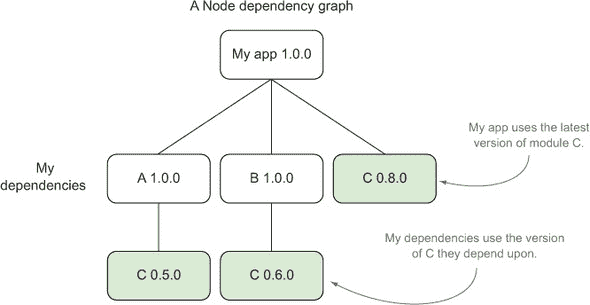

除了标准依赖之外，您还可以指定开发和同伴依赖（稍后详述），并让 npm 帮您检查这些依赖。

| |
| --- |

##### 依赖图

如果您想查看项目的依赖图，只需在项目根目录下输入 npm ls 即可获取列表。

| |
| --- |

在 npm 的历史早期，就决定了一个差异，即默认在本地级别管理依赖项，这是由 Ruby gem bundler 推广的。这将在你的项目内部捆绑模块（位于 node_modules 文件夹中），使得在多个项目中依赖地狱成为一个非问题，因为没有全局共享的模块状态。

| |
| --- |

##### 安装全局模块

如果你想要安装全局模块，可以使用 npm install -g module-name，这在需要系统级可执行文件时非常有用，例如。

| |
| --- |

希望我们已经激起了你对探索各种模块创建技术的兴趣！在本章中，我们将关注围绕以下内容的各种技术

+   有效地利用 package.json 文件

+   使用 npm 进行各种模块创建任务

+   开发模块的最佳实践

我们的技术将按照从空项目目录到完成并发布的 npm 模块的逻辑顺序进行。尽管我们试图将尽可能多的概念放入一个模块中，但你可能会发现你的模块可能只需要这些步骤中的一小部分。当我们无法将一个概念放入模块中时，我们将专注于一个隔离的使用案例来说明这一点。

### 13.1. 思考

我们想要构建什么样的 API？人们应该如何使用它？它有一个明确的目的吗？在我们开始编写模块时，我们需要问一些问题。在本节中，我们将探讨研究和验证模块想法的过程。但首先，让我们介绍一个我们想要解决的问题，这将为我们后续的进展提供背景。

#### 13.1.1. 更快的斐波那契模块

在 Node.js 早期历史中，最著名的批评之一（尽管可能有些误导）是“Node.js 是癌症”（[`pages.citebite.com/b2x0j8q1megb`](http://pages.citebite.com/b2x0j8q1megb)），作者认为在运行中的 Web 服务器上，Node 的单线程系统对 CPU 密集型任务的处理非常糟糕。

实现是一个常见的递归方法来计算斐波那契数列（[`en.wikipedia.org/wiki/Fibonacci_number`](http://en.wikipedia.org/wiki/Fibonacci_number)），可以如下实现：

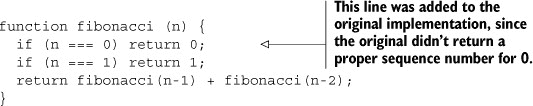

这种实现方法在 V8 中速度较慢，并且由于 JavaScript 中还没有适当的尾调用，它无法计算非常大的数字，因为会导致栈溢出。

让我们编写一个模块，帮助世界摆脱缓慢的斐波那契计算，以便从头到尾学习模块开发。

#### 技巧 106 为我们的模块规划

因此，我们想要开始编写一个模块。我们应该如何着手？在我们开始编写代码之前，我们能做些什么？事实证明，提前规划可以非常有帮助，并能在未来节省痛苦。让我们看看如何做好这一点。

##### 问题

你想要编写一个模块。在规划阶段，你应该采取哪些步骤？

##### 解决方案

研究现有内容，并确保你的模块只做一件事。

##### 讨论

明确阐述你模块的目的非常重要。如果你不能将其简化为一句话，它可能做得太多。这就是 Unix 哲学的一个重要方面发挥作用的地方：*让每个程序只做一件事，并且做好*。

##### 概览格局

首先，了解已经存在什么是有好处的。有人为我的问题实现了解决方案吗？我可以贡献那里吗？其他人是如何处理的？一个很好的方法是搜索 npmjs.org 或从命令行进行搜索：


让我们看看一些更有趣的结果：

```
fibonacci Calculates fibonacci numbers for one or endless iterations....
  =franklin 2013-05-01 1.2.3 fibonacci math bignum endless

fibonacci-async So, you want to benchmark node.js with fibonacci once...
  =gottox 2012-10-29 0.0.2

fibonacci-native A C++ addon to compute the nth fibonacci number.
  =avianflu 2012-03-21 0.0.0
```

在这里，我们可以看到三个不同实现的名称和描述。我们还看到了最后一次发布的版本和日期。看起来有几个版本较旧，版本号较低，这可能意味着 API 正在变化或仍在进行中。但顶部结果看起来在 1.2.3 版本下相当成熟，并且最近进行了更新。让我们通过运行以下命令来获取更多信息：

```
npm docs fibonacci
```

如果指定了，npm 文档命令将加载模块的主页，或者 npmjs 搜索结果，看起来像图 13.2。

##### 图 13.2\. npmjs.com 包详情页面

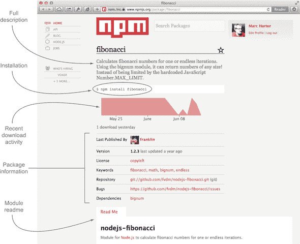

npmjs 结果页面有助于给出一个模块的整体印象。我们可以看到这个模块依赖于 bignum 模块，并且一年前进行了更新，我们可以查看其 README 以了解 API。

虽然这个模块看起来相当不错，但让我们创建一个模块作为实验，尝试一些处理斐波那契数列的其他想法。在我们的案例中，让我们创建一个模块，我们将在这个模块中尝试不同的实现，并使用纯 JavaScript（没有所需的 bignum 依赖项）来基准测试我们的结果。

##### 拥抱做好一件事

一个模块应该是简单且可插入的。在这种情况下，让我们尝试用一句话定义我们模块的目的：

> *尽可能快地使用 JavaScript 计算斐波那契数*

这是个相当不错的开始：它清晰且简洁。当这个概念不再适用时，我们就超出了我们的范围，可能需要写另一个扩展这个模块而不是添加更多内容的模块。对于这个项目，添加一个返回此函数结果的 Web 服务器端点可能更适合在一个依赖于这个模块的新模块中完成。

当然，这不是一个严格的要求，但它有助于我们明确模块的目的，并使我们的最终用户清楚。这个声明非常适合添加到我们的 package.json（我们稍后会看到）和我们的 README 文件顶部。

我们最终需要一个模块名称，虽然一开始不是必要的，但为了在未来的技术中引用它，让我们称我们的模块为 fastfib。现在就创建一个名为 fastfib 的目录，它将作为我们的项目目录：

```
mkdir fastfib && cd fastfib
```

现在我们已经定义了我们希望我们的模块做到的“一件事”，并且有了我们的裸项目目录，让我们通过下一个技术来验证我们的模块想法，看看它是否真的可行。

#### 技巧 107 证明我们的模块想法

因此，我们现在有了重点；接下来是什么？是时候证明我们的想法了。这是我们思考模块 API 表面的步骤。它是可用的吗？它是否实现了其目的？让我们看看这一点。

##### 问题

在证明模块想法时，你应该先编写什么代码？

##### 解决方案

通过 TDD 查看 API 表面。

##### 讨论

了解你希望你的模块如何工作是很重要的。在 fastfib 中，我们将同步计算斐波那契序列。我们能想到的最简单、最容易使用的 API 是什么？

```
fastfib(3) // => 2
```

对，只是一个简单的函数调用，返回结果。

在构建异步 API 时，建议使用 Node 回调签名，因为它将很好地与几乎任何控制流库一起工作。如果我们的模块是异步的，它将看起来像这样：

```
fastfib(3, function (err, result) {
  console.log(result); // => 2
});
```

我们有同步 API。在本章的开头，我们向您展示了一个我们想要改进的实现。由于我们想要一个基线来比较其他实现，让我们通过创建一个名为 recurse.js 的文件并将其放入 lib 文件夹中，将这个递归实现引入我们的项目中：

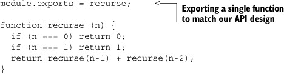

##### 定义入口点

每个模块都有一个*入口点*：当我们使用 require 关键字在其他地方调用它时得到的对象/函数/构造函数。由于我们知道我们将在 lib 目录内尝试不同的实现，我们不希望 lib/recurse.js 成为入口点，因为它可能会改变。

通常情况下，项目根目录下的 index.js 是最有意义的入口点。很多时候，让入口点尽可能最小化，仅将提供 API 所需的部分连接起来是有意义的。现在让我们创建这个文件：

```
module.exports = require('./lib/recurse');
```

现在当模块的消费者执行`require('fastfib')`时，他们将得到这个文件，进而得到我们的递归实现。然后我们只需在需要更改公开实现时切换这个文件。

##### 测试我们的实现

现在我们已经有了 fastfib 的第一个实现，让我们确保我们实际上有一个合法的斐波那契实现。为此，让我们创建一个名为 test 的文件夹，并在其中添加一个名为 index.js 的单个文件：

```
var assert = require('assert');
var fastfib = require ('../');

assert.equal(fastfib(0), 0);
assert.equal(fastfib(1), 1);
assert.equal(fastfib(2), 1);
assert.equal(fastfib(3), 2);
assert.equal(fastfib(4), 3);
assert.equal(fastfib(5), 5);
assert.equal(fastfib(6), 8);
assert.equal(fastfib(7), 13);
assert.equal(fastfib(8), 21);
assert.equal(fastfib(9), 34);
assert.equal(fastfib(10), 55);
assert.equal(fastfib(11), 89);
assert.equal(fastfib(12), 144);

// if we get this far we can assume we are on the right track
```

现在我们可以运行我们的测试套件，看看我们是否在正确的轨道上：

```
node test
```

我们没有抛出任何错误，所以看起来我们的实现至少是准确的。

##### 对我们的实现进行基准测试

现在我们已经定义了 fastfib 实现的 API 和测试，我们该如何确定它的速度有多快呢？为此，我们将使用 jsperf.com 项目背后的一个可靠 JavaScript 基准测试工具，称为 Benchmark.js（[`benchmarkjs.com/`](http://benchmarkjs.com/)）。让我们将其包含到我们的项目中：

```
npm install benchmark
```

让我们创建另一个名为 benchmark 的文件夹，并在其中添加一个 index.js 文件，代码如下：

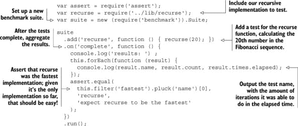

让我们现在从根模块目录运行我们的基准测试：

```
$ node benchmark
  results:
  recurse 392 5.491
```

看起来我们能够计算 recurse(20) 392 次在 ~5.5 秒内。让我们看看我们是否可以改进这一点。原始的递归实现没有尾调用优化，所以我们应该能够在这里获得提升。让我们在 lib 文件夹中添加另一个名为 tail.js 的实现，内容如下：

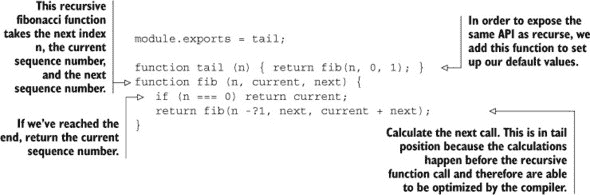

现在，将测试添加到 benchmark/index.js 文件中，看看通过在文件顶部添加实现我们是否做得更好：

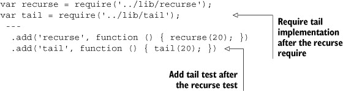

让我们看看我们做得怎么样：

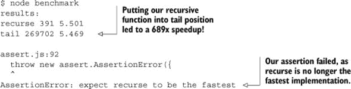

哇！尾递归真的帮助加快了我们的斐波那契计算。所以让我们将其切换为我们的默认实现，并在我们的主 index.js 文件中：

```
module.exports = require('lib/tail');
```

并确保我们的测试通过：

```
node test
```

没有错误；看起来我们仍然没问题。如前所述，由于 JavaScript 中尚未支持，适当的尾调用实现仍然会在堆栈太大时崩溃。所以让我们再尝试一个实现，看看我们是否能做得更好。为了避免在较大的数字序列上发生堆栈溢出，让我们创建一个迭代实现，并在 lib/iter.js 中创建它：

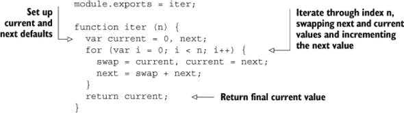

让我们将这个实现添加到 benchmark/index.js 文件中：

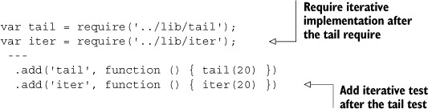

让我们看看我们做得怎么样：

```
$ node benchmark
  results:
  recurse 392 5.456
  tail 266836 5.455
  iter 1109532 5.474
```

迭代方法比尾递归版本快 4 倍，比原始函数快 2830 倍。看起来我们确实有一个快速斐波那契算法，并且已经证明了我们的实现。让我们更新 benchmark/index.js 文件以断言 iter 现在应该是最快的：

```
assert.equal(
  this.filter('fastest').pluck('name')[0],
  'iter',
  'expect iter to be the fastest'
);
```

然后更新我们的主 index.js 以指向我们最快的版本：

```
module.exports = require('./lib/iter');
```

并测试我们的实现是否仍然正确：

```
node test
```

仍然没有错误，所以我们没问题！如果我们后来发现 V8 优化尾调用流程比我们的迭代方法更快，我们的基准测试将失败，我们可以切换实现。现在让我们回顾一下我们的整体模块结构：

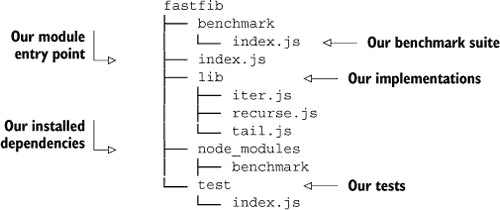

看起来我们已经证明了我们的想法。重要的是要吸取的教训是实验！尝试不同的实现！你很可能一开始不会做对，所以利用这个时间来实验，直到你满意为止。在这个特定的技术中，我们尝试了三种不同的实现，直到我们找到了一个。

现在来看看模块开发的下一步：设置 package.json 文件。

### 13.2\. 构建 package.json 文件

现在我们有一个我们喜欢的想法，并且我们已经证明我们的想法确实做了我们想要的事情，我们将通过 package.json 文件来描述这个模块。

#### 技巧 108 设置 package.json 文件

package.json 是管理你的模块核心数据、常用脚本和依赖项的中心文件。无论你最终是否发布你的模块，或者只是用它来管理你的内部项目，设置 package.json 都将有助于推动你的开发。在这个技术中，我们将讨论如何设置 package.json 以及如何使用 npm 来填充你的 package.json。

##### 问题

你需要创建一个 package.json 文件。

##### 解决方案

使用内置的 npm 工具。

##### 讨论

npm init 命令提供了一个很好的逐步界面来设置 package.json。让我们在我们的 fastfib 项目目录中运行此命令：

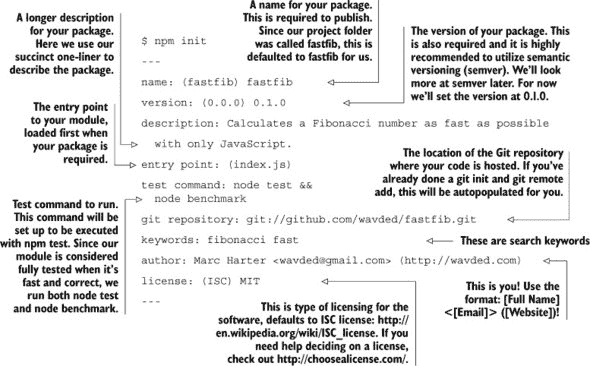

|  |
| --- |

##### 包选项

要详细了解每个包选项的详细信息，请运行 npm help json 查看官方文档([`www.npmjs.org/doc/json.html`](https://www.npmjs.org/doc/json.html))。

|  |
| --- |

当你设置用户配置($HOME/.npmrc)以预先填充值时，运行 npm init 会变得更加简单。以下是你可以设置的所有选项：

```
npm config set init.author.name "Marc Harter"
npm config set init.author.email "wavded@gmail.com"
npm config set init.author.url "http://wavded.com"
npm config set init.license "MIT"
```

使用这些选项，npm init 不会询问你作者，而是自动填充值。它还将默认许可协议为 MIT。

|  |
| --- |

##### 关于现有模块的说明

如果你已经在设置 package.json 文件之前安装了模块，npm init 足够智能，可以将它们添加到 package.json 中，并使用正确的版本！

|  |
| --- |

完成初始化后，你将在目录中拥有一个看起来像这样的漂亮的 package.json 文件：

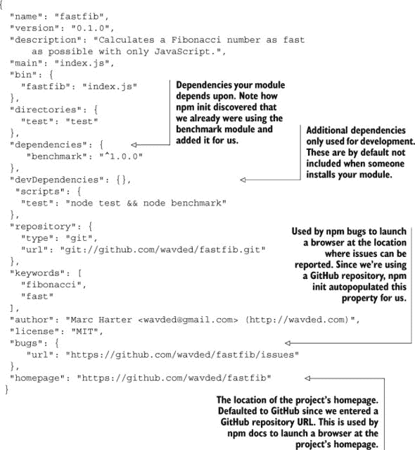

现在我们已经对 package.json 文件有了良好的开端，我们可以通过直接修改 JSON 文件或使用其他 npm 命令来修改文件的不同部分来添加更多属性。npm init 命令只是触及了我们可以用 package.json 文件做的事情的表面。随着我们继续前进，我们将查看我们可以添加的更多内容。

为了查看更多的 package.json 配置和模块开发的其它方面，让我们转到下一个技巧。

#### 技巧 109：处理依赖项

Node 在 npm 上发布了超过 80,000 个模块。在我们的 fastfib 模块中，我们已经利用了其中之一：基准模块。在 package.json 文件中明确定义依赖项有助于维护我们模块的完整性，无论是我们自己还是其他人安装和修改时。package.json 文件告诉 npm 在运行 npm install 时需要获取哪些依赖项以及获取哪个版本的依赖项。如果在 package.json 文件中未包含依赖项，将导致错误。

##### 问题

如何有效地管理依赖项？

##### 解决方案

使用 npm 保持 package.json 文件与模块需求同步。

##### 讨论

package.json 文件允许你定义四种类型的依赖项对象，如图 13.3 所示。

##### 图 13.3. 依赖项的不同类型

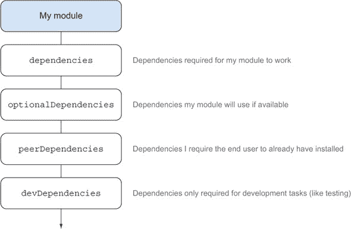

依赖项的类型如下所示：

+   ***dependencies*** —模块正常工作所必需的

+   ***devDependencies*** —仅用于开发，如测试、基准测试和服务器重新加载工具

+   ***optionalDependencies*** —不是你的模块正常工作所必需的，但可能在某些方面增强功能

+   ***peerDependencies*** —为了正常运行，需要安装另一个模块

让我们依次查看我们的项目，并在进行过程中讨论在 package.json 文件中添加和删除的内容。

##### 主依赖项和开发依赖项

目前使用 npm init 生成的 package.json 文件在 dependencies 对象中列出了 benchmark。如果我们查看我们的列表，由于几个原因，这并不成立。第一个原因是，我们的主入口点（index.js）在其 require 链中永远不会需要 benchmark，所以最终用户不需要它：

```
index.js requires ./lib/iter.js which requires nothing
```

第二个原因是，基准测试通常只是那些在我们模块上工作的人的开发专属事情。为了从我们的依赖中移除它，我们可以使用 npm remove 命令，并通过使用--save 标志将其从 package.json 文件中移除：

```
$ npm remove benchmark --save
  unbuild benchmark@1.0.0
```

然后，我们可以使用带有--save-dev 标志的 npm install 将其安装到我们的开发依赖中：

```
$ npm install benchmark --save-dev
  benchmark@1.0.0 node_modules/benchmark
```

现在如果我们查看我们的 package.json 文件，我们会看到 benchmark 现在是 devDependencies 对象的一部分：

```
"devDependencies": {
    "benchmark": "¹.0.0"
},
```

这是一种强制方式来展示如何使用 npm 移除和安装命令。我们也可以只是将 benchmark 移动到我们的文本编辑器中的 package.json 文件内，避免卸载和重新安装。

现在我们已经将 benchmark 放在了正确的位置，所以当其他人想要使用我们的模块时，它不会安装。

##### 可选依赖

可选依赖不是项目运行的必需品，但它们将与常规依赖项一起安装。与常规依赖项的唯一区别是，如果可选依赖*安装失败*，它将被忽略，并且模块应该继续正确安装。

这通常适用于可以通过包含原生插件来获得提升的模块。例如，hiredis 是用于提升 redis 模块性能的原生 C 插件。但它不能在所有地方安装，所以它*尝试*安装，但如果安装失败，redis 模块将回退到 JavaScript 实现。在父模块中检查依赖项的典型模式如下：

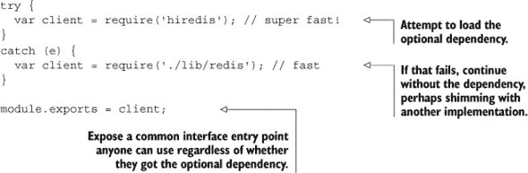

假设我们想要支持 fastfib 的更大范围的序列号。我们可以通过运行以下命令添加 bignum 原生插件来启用该功能：

```
npm install bignum --save-optional
```

然后，如果我们检测到 bignum 模块能够在我们的 index.js 文件中安装，我们可以选择性地使用那个迭代：

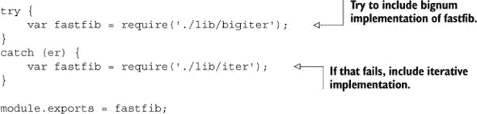

不幸的是，bignum 实现会慢得多，因为它不能被 V8 编译器优化。如果我们包含了这个可选依赖和实现，我们将违反我们拥有最快斐波那契的目标，所以现在我们先将其删除。但这说明了你可能想要如何使用可选依赖（例如，如果你想要支持尽可能高的斐波那契数作为目标）。

|  |
| --- |

##### 家庭作业

故意省略了 bignum 实现的代码和测试；尝试实现一个使用 bignum 的版本，并查看从我们的测试套件中获得什么性能基准。

|  |
| --- |

##### 同级依赖

依赖项（[`blog.nodejs.org/2013/02/07/peer-dependencies/`](http://blog.nodejs.org/2013/02/07/peer-dependencies/））是依赖项场景中的最新成员。依赖项告诉安装你的模块的人：“我期望这个模块存在于你的项目中，并且是这个版本，以便我的模块能够工作”。这种依赖项最常见的类型是插件。

一些有插件的流行模块包括

+   Grunt

+   Connect

+   winston

+   Mongoose

假设我们真的想添加一个 Connect 中间件组件，该组件在每个请求上计算一个斐波那契数；谁不会呢，对吧？为了使它工作，我们需要确保我们编写的 API 将针对正确的 Connect 版本工作。例如，我们可能相信对于 Connect 2，我们可以可靠地说我们的模块将工作，但我们不能为 Connect 1 或 3 做出保证。为此，我们可以在 package.json 文件中添加以下内容：

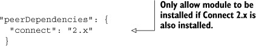

在这个技术中，我们探讨了在 package.json 文件中可以定义的四种依赖类型。如果你想知道¹.0.0 或 2.x 代表什么，我们将在下一个技术中深入探讨，但让我们首先谈谈更新现有依赖项。

##### 保持依赖项更新

保持模块健康也意味着保持你的依赖项更新。幸运的是，有一些工具可以帮助你做到这一点。一个内置的工具是 npm outdated，它将严格匹配你的 package.json 文件以及你依赖项中的所有 package.json 文件，以查看是否有任何更新的版本匹配。

让我们故意修改 package.json 文件，使基准模块过时，因为 npm install 给我们的是最新版本：

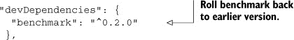

然后让我们运行 npm outdated 看看我们得到什么：

```
$ npm outdated
  Package  Current  Wanted  Latest  Location
  benchmark  1.0.0   0.2.2   1.0.0  benchmark
```

看起来我们目前安装的是 1.0.0，但根据我们刚刚修改的 package.json，我们想要匹配⁰.2.0 的最新包，这将给我们版本 0.2.2。我们还可以看到可用的最新包是 1.0.0。位置行将告诉我们它在哪里找到了过时的依赖项。

|  |
| --- |

##### 你直接需要的过时依赖项

有时，只查看你的过时依赖项，而不是子依赖项（在大型项目中可能会变得非常大），会更好。你可以通过运行`npm outdated --depth 0`来实现这一点。

|  |
| --- |

如果我们想更新到期望的版本，我们可以运行

```
npm update benchmark --save-dev
```

这将安装 0.2.2 并更新我们的 package.json 文件到⁰.2.2。

让我们再次运行 npm outdated：

```
$ npm outdated
  Package Current Wanted Latest Location
  benchmark 0.2.2  0.2.2  1.0.0 benchmark
```

看起来我们现在和我们的期望版本匹配了。如果我们想更新到最新版本怎么办？这很简单：我们可以安装最新的版本，并通过运行以下命令将其保存到我们的 package.json 中：

```
npm install benchmark@latest --save-dev
```

|  |
| --- |

##### 版本标签和范围

注意使用@latest 标签来获取模块的最新发布版本。npm 还支持指定版本和版本范围的能力！([`www.npmjs.org/doc/cli/npm-install.html`](https://www.npmjs.org/doc/cli/npm-install.html))

|  |
| --- |

我们到目前为止已经谈了一些关于版本号的内容，但它们确实需要一种独特的技巧，因为理解它们的意义和如何有效地使用它们非常重要。理解语义版本控制将帮助你更好地为你的模块和依赖项定义版本。

#### 技巧 110 语义版本控制

如果你不太熟悉语义版本控制，你可以在[`semver.org`](http://semver.org)上了解更多信息。图 13.4 捕捉了主要观点。

##### 图 13.4\. 语义版本控制

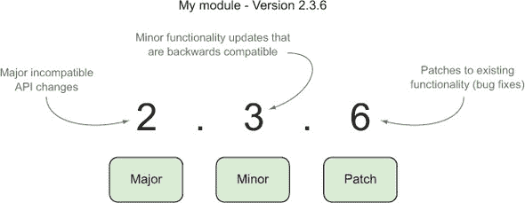

这里是如何在官方文档中描述的：^([1])

> ¹ 来自 [`semver.org/`](http://semver.org/).
> 
> *给定版本号 MAJOR.MINOR.PATCH，增加以下：*
> 
> > **1**.  *当进行不兼容的 API 更改时，使用 MAJOR 版本。*
> > 
> > **2**.  *当以向后兼容的方式添加功能时，使用 MINOR 版本。*
> > 
> > **3**.  *当进行向后兼容的 bug 修复时，使用 PATCH 版本。*

实际上，这些规则可以被忽略或松散地遵循，因为毕竟，*没有人强制*你的版本号。此外，许多作者喜欢在早期阶段玩弄他们的 API，并希望不要立即达到版本 24.0.0！但 semver 可以给你，作为模块作者和模块消费者，在版本号本身中提供关于自上次发布以来可能发生了什么的线索。

在这个技巧中，我们将探讨如何在 fastfib 库中有效地使用 semver。

##### 问题

你想在你的模块和依赖项中有效地使用 semver。

##### 解决方案

为了有一个安全的升级路径，并清楚地传达你的模块版本意图，你需要了解你底层项目。

##### 讨论

我们目前在项目中有一个开发依赖项，这在 package.json 文件中看起来像这样：

```
"devDependencies": {
    "benchmark": "¹.0.0"
},
```

这就是 npm 默认如何在 package.json 文件中包含版本的方式。这对于大多数模块作者的行为来说是个好主意：

+   如果版本小于 1.0.0，例如⁰.2.0，那么允许安装任何更高的 PATCH 版本。在先前的技巧中，我们看到这最终变成了 benchmark 模块的 0.2.2 版本。

+   如果版本是 1.0.0 或更高版本，例如¹.0.0，那么允许安装任何更高的 MINOR 版本。通常，1.0.0 被认为是稳定的，MINOR 版本在本质上不会破坏。

这意味着当另一个用户安装你的模块依赖项时，他们将会得到你版本范围内允许的最新版本。例如，如果 Benchmark.js 明天发布了 1.1.0 版本，尽管你目前机器上有 1.0.0 版本，但他们将会得到 1.1.0 版本，因为它仍然匹配版本范围。

|  |
| --- |

##### 版本运算符

Node 支持一系列特殊运算符来定制多个版本或版本范围。你可以在 semver 文档中查看它们（[`www.npmjs.org/doc/misc/semver.html`](https://www.npmjs.org/doc/misc/semver.html))。

|  |
| --- |

##### 依赖项版本控制

在编写模块时，使用用户将安装的特定版本号可以增加对依赖项的信心。这样，你知道你测试过的版本将在依赖链中运行相同。由于我们知道我们的测试套件与基准 1.0.0 兼容，让我们通过以下命令将其锁定为仅该版本：

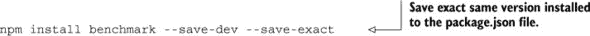

我们本可以手动更新我们的 package.json。让我们看看它现在的样子：


现在我们已经锁定我们的依赖项，我们可以始终使用 npm outdated 来查看是否存在新版本，然后使用--save-exact 标志通过 npm install 来更新我们的 package.json！

##### 模块版本化

如前所述，许多模块作者使用小于 1.0.0 的版本来表示 API 尚未完全实现，并且可能在后续版本中发生变化。通常，当版本号达到 1.0.0 时，模块将具有一定的稳定性，尽管 API 表面可能会增长，但现有功能不应有太大变化。这符合当模块保存到 package.json 文件时 npm 的行为。

目前我们在 package.json 文件中将我们的 fastfib 模块版本设为 0.1.0。它相当稳定，但在我们将其提升到 1.0.0 状态之前，可能还有其他我们想要做出的更改，所以我们将它保持在 0.1.0。

##### 变更日志

对于模块作者来说，有一个变更日志总结用户在发布新版本时应注意的内容也是有帮助的。以下是一个这样的格式：

```
Version 0.5.0?--?2014-04-03
---
added; feature x
removed; feature y [breaking change!]
updated; feature z
fixed; bug xx

Version 0.4.3?--?2014-03-25
---
```

在变更日志中应清楚地注明重大变更，特别是对于小版本，以便用户知道如何为更新做准备。一些作者喜欢在他们的主要 README 中保留变更日志或有一个单独的变更日志文件。

我们已经涵盖了关于版本化我们的依赖项和模块的一些理解和工具；让我们看看我们还能向模块的消费者暴露什么。

### 13.3. 最终用户体验

在我们将模块推出去供消费之前，测试它实际上是否工作会很好。当然，我们已经有了一个测试套件，所以我们知道我们的逻辑是合理的，但最终用户安装模块时的体验是什么？我们如何除了 API 之外向用户暴露可执行脚本？我们可以支持哪些版本的 Node？在本节中，我们将探讨这些问题，从添加可执行脚本开始。

#### 技巧 111 添加可执行脚本

想要在模块安装时暴露一个可执行文件吗？例如，Express 包括一个可以从命令行运行的 express 可执行文件，可以帮助初始化新项目：

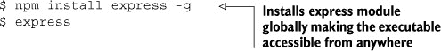

npm 本身是一个可安装的模块，具有 npm 可执行文件，我们已经在本章的各个地方使用过它。

可执行文件可以帮助最终用户以不同的方式使用你的模块。在本技巧中，我们将查看如何向 fastfib 添加一个可执行脚本，并将其包含在我们的 package.json 中，以便与我们的模块一起安装。

##### 问题

如何添加一个可执行脚本？

##### 解决方案

你如何为包添加命令行工具和脚本，并在 package.json 文件中链接它们？

##### 讨论

我们已经构建了 fastfib 模块，但如果我们想向最终用户公开 fastfib 可执行文件，让他们能够运行类似 fastfib 40 的命令并打印出第 40 个斐波那契数，会怎么样？这将允许我们的模块在命令行以及程序化方式下使用。

为了做到这一点，让我们创建一个包含 index.js 文件的 bin 目录，其中包含以下内容：

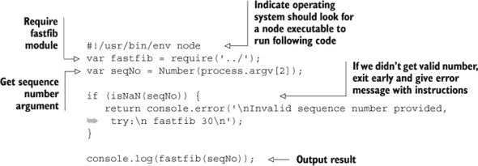

现在我们有了我们的应用程序可执行文件，我们如何将其作为 fastfib 命令公开，以便有人安装我们的模块时可以使用？为此，我们需要更新我们的 package.json 文件。在 main 下面添加以下行：

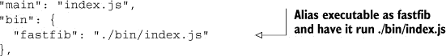

##### 使用 npm link 测试可执行文件

我们可以通过使用 npm link 来测试我们的可执行文件。link 命令将创建一个指向我们的实时模块的全局符号链接，模拟全局安装包，就像用户全局安装模块一样。

让我们从 fastfib 目录运行 npm link：

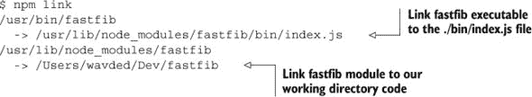

现在我们已经全局链接了我们的可执行文件，让我们试试它：

```
$ fastfib 40
  102334155
```

由于这些链接已经就位，任何编辑都会在全局范围内反映出来。让我们更新 bin/index.js 文件的最后一行来宣布我们的结果：

```
console.log('The result is', fastfib(seqNo));
```

如果我们再次运行 fastfib 可执行文件，我们会立即得到更新：

```
$ fastfib 40
  The result is 102334155
```

我们在我们的模块中添加了一个 fastfib 可执行文件。重要的是要注意，本技术中讨论的所有内容都是完全跨平台兼容的。Windows 没有符号链接或#!语句，但 npm 通过额外的代码包装可执行文件，以便在运行 npm link 或 npm install 时获得相同的行为。

链接是一个如此强大的工具，我们将在下一个技术中专门介绍它！

#### 技术编号 112：尝试模块

除了使用 npm link 在全局范围内测试我们的可执行文件外，我们还可以使用 npm link 在其他地方尝试我们的模块。比如说，我们想在另一个项目中尝试我们闪亮的新模块，看看它是否适用。我们不必发布我们的模块并安装它，我们只需链接到它，并像在另一个项目的上下文中使用它一样玩弄模块。

##### 问题

你想在发布模块之前尝试它，或者你想要修改你的模块并在另一个项目中测试这些更改，而不必首先重新发布。

##### 解决方案

使用 npm link

##### 讨论

在前一种技术中，我们展示了如何使用 npm link 来测试可执行脚本的运行行为。这表明我们可以在开发过程中测试我们的可执行文件，但现在我们想要模拟模块的本地安装，而不是全局安装。

让我们从设置另一个项目开始。由于我们本章从我们癌症般的斐波那契网络服务器实现开始，让我们从头到尾，创建一个小项目，将 fastfib 作为 Web 服务公开。

创建一个名为 fastfibserver 的新项目，并在其中放入一个名为 server.js 的单个文件，内容如下：

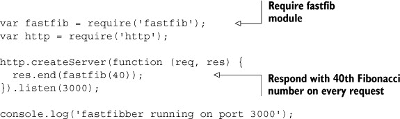

我们已经设置了服务器，但如果我们要运行 node server，它现在还不会工作，因为我们还没有在这个项目中安装 fastfib 模块。为此，我们使用 npm link：

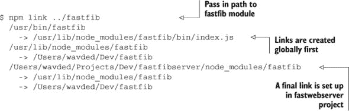

现在如果我们运行我们的 Web 服务器，它将成功运行：

```
$ node server
  fastfibber running on port 3000
```

访问我们的网站将给出第 40 个斐波那契数，如图 13.5 所示。

##### 图 13.5\. fastfibserver 的示例输出

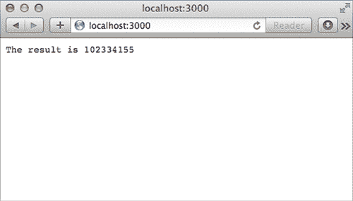

| |
| --- |

##### 另一种链接方式

由于我们在之前的技术中已经将我们的模块全局链接到 package.json 中，在 fastfib 项目中运行 npm link，我们也可以在 fastfibserver 项目中运行 npm link fastfib 来设置链接。

| |
| --- |

使用 npm link 也有助于在另一个模块的上下文中调试你的模块。在运行需要你的模块的项目时，会出现一些边缘情况，这些情况最好在运行项目时调试。一旦你 npm link 了模块，任何更改将立即生效，无需重新发布和重新安装。这允许你在调试时修复模块代码库中的问题。

到目前为止，我们已经定义并实现了我们的模块，包括测试，设置了我们的依赖项，锁定了我们依赖项和模块的版本，添加了命令行可执行文件，并练习了使用我们的模块。接下来，我们将看看 package.json 文件的另一个方面——engines 部分，以及跨多个 Node 版本测试我们的模块。

#### 技巧 113 在多个 Node 版本上测试

很遗憾，并不是每个人都能在 Node 版本发布时升级到最新版本。公司需要时间来适应所有代码到新版本，有些可能永远不会更新。了解我们的模块可以在哪些版本的 Node 上运行，以便 npm 知道谁可以安装和运行它，这一点很重要。

##### 问题

你想在多个版本的 Node 上测试你的模块，并且只想为这些版本安装你的应用程序。

##### 解决方案

通过在多个版本的 Node 上运行测试，确保 package.json 文件中的 engines 对象准确无误。

##### 讨论

我们在首次设置 package.json 时运行的 npm init 脚本不包括 engines 部分，这意味着 npm 将在任何版本的 Node 上安装它。乍一看，我们可能会认为这没问题，因为我们运行的是相当原始的 JavaScript 代码。但如果没有实际测试，我们真的不知道。

通常，补丁版本更新（例如 Node 0.10.2 到 0.10.3）不应该破坏你的模块。但至少测试你的模块在次要和主要版本更新之间是一个好主意，因为 V8 得到了相当大的升级，Node 的 API 可能会发生变化。目前，我们一直在使用 Node 的 0.10 分支，一切运行良好。所以，让我们从以下内容开始，将其添加到 package.json 文件的末尾：

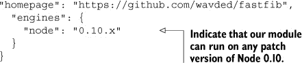

这只是一个开始，但实际情况似乎我们应该能够支持更早版本的 Node。我们如何测试这一点呢？

可用的流行选项有很多：

+   在您的机器上安装多个 Node 版本

+   使用 Travis CI 的多 Node 版本支持 ([`travis-ci.org/`](https://travis-ci.org/))

+   使用适用于您环境的第三方多版本测试模块（如 dnt—[`github.com/rvagg/dnt`](https://github.com/rvagg/dnt))

|  |
| --- |

##### 关于 Node 版本

在 Node 中，所有奇数版本的次要版本都被视为不稳定。因此，0.11.0 是 0.12.0 的不稳定版本，依此类推。您通常不需要测试任何现有的不稳定发布版本。通常，模块作者只会测试即将完成的最新不稳定版本。

|  |
| --- |

对于我们的技术，我们将专注于安装多个 Node 版本，因为这可以在测试 Node 即将发布的版本中的新功能以及测试我们的模块时派上用场。

我们将使用的工具是 nvm ([`github.com/creationix/nvm`](https://github.com/creationix/nvm); Windows 的对应版本是 nvmw: [`github.com/hakobera/nvmw`](https://github.com/hakobera/nvmw)). 以下说明将针对 nvm，但一旦安装，nvmw 的命令也将相似。

安装时，运行

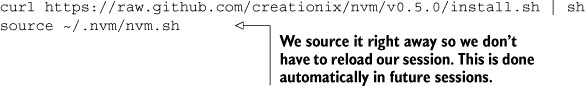

现在我们已经安装了它，让我们继续测试我们的 fastfib 模块的 Node 0.8 版本。首先让我们安装 Node 0.8：

```
$ nvm install 0.8
  ######################################################## 100.0%
  Now using node v0.8.26
```

nvm 去获取了 0.8 分支的最新版本以进行测试。如果我们想指定一个补丁，我们可以这样做，但现阶段这已经足够了。注意我们也在使用这个版本。我们可以通过运行以下命令来验证：

```
$ node -v
  v0.8.26
```

现在，所有 Node 和 npm 交互都在为 Node 0.8.26 定制的隔离环境中进行。如果我们要安装更多版本，它们将各自在它们自己的隔离环境中。我们使用 nvm use 在它们之间切换。例如，如果您想切换回系统安装的 Node 版本，您可以执行以下操作：

```
nvm use system
```

要回到 Node 版本 0.8.26：

```
nvm use 0.8
```

让我们在 0.8.26 上运行我们的测试套件，看看我们做得怎么样：

```
$ npm test

  > fastfib@0.1.0 test /Users/wavded/Dev/fastfib
  > node test && node benchmark

  results:
  recurse 432 5.48
  tail 300770 5.361
  iter 1109759 5.428
```

看起来不错！让我们更新我们的 package.json 以包括 0.8 版本：

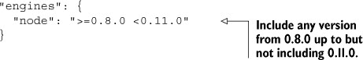

|  |
| --- |

##### 如果我的模块失去了对特定 Node 版本的支持怎么办？

这完全没问题。使用较旧版本 Node 的用户将获得适用于其版本的最新发布的支持包。

|  |
| --- |

我们已经测试了 Node 版本 0.10 和 0.8；请尝试测试您自己的几个其他版本。完成后，请切换回系统 Node 版本。

现在我们已经查看了一系列步骤，使我们的模块处于可用的状态，以便其他人使用，让我们发布它！

### 13.4\. 发布

在我们结束本章时，我们将通过查看在 npm 上公开发布模块或私下内部使用模块来关注模块的发布。

#### 技巧 114 发布模块

呼呼！我们已经通过许多不同的技术使我们的模块准备好发布。我们知道可能会有变化，但我们准备将我们的第一个版本发布到野外，以便在其他项目中作为依赖项使用。这项技术探讨了发布的各个方面。

##### 问题

您希望将您的模块公开发布。

##### 解决方案

如果你还没有注册 npm，请注册并发布。

##### 讨论

如果你第一次发布模块，你需要自己在 npm 上注册。幸运的是，这非常简单。运行以下命令并按照提示操作：

```
npm adduser
```

完成后，npm 会将你的凭据保存到.npmrc 文件中。

|  |
| --- |

##### 更改现有账户详情

adduser 命令也可以用来更改账户详情（除了用户名）并使用现有账户注册新安装。

|  |
| --- |

注册后，发布模块就像添加用户一样简单。但在我们深入之前，让我们了解一下发布模块时的一些良好实践。

##### 在发布之前

在发布之前，最重要的是回顾关于语义版本化的技巧 110：

+   你的版本号是否准确地反映了自上次推送以来的更改？如果你是第一次推送，这并不那么重要。

+   你在发布时更新了变更日志吗？虽然这不是必需的，但对于依赖你的项目的用户来说，这可以非常有帮助，让他们对这次发布可以期待什么有一个高层次的认识。

此外，检查你的测试是否通过，以避免发布有缺陷的代码。

##### 发布到 npm

一旦你准备好发布，只需从项目根目录运行以下命令即可：

```
npm publish
```

npm 会响应发布操作的成功或失败。如果成功，它将指示已推送到公共注册表的版本。

*你能感觉到 npm 希望你尽可能轻松地将模块发布出去吗？*

##### 撤销发布

虽然我们希望发布顺利进行，但有时我们会错过想要发布的某些内容，或者在实际发布后发现有些内容是错误的。建议你不要撤销模块（尽管存在这种能力）。原因是依赖该模块和/或版本的用户的获取将不再可能。

通常，修复问题，增加补丁版本，然后再次运行 npm publish。这样做的一个简单方法是运行以下命令：

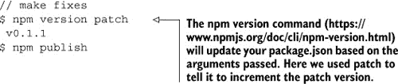

npm *不允许*你覆盖现有版本，因为这也会影响到已经下载了该特定版本的用户。

有一些情况下，你真的希望阻止用户使用特定版本。例如，可能在 0.2.5 及更高版本中修复了严重的安全漏洞，但你还有用户依赖于比这更早的版本。npm 可以通过使用 npm deprecate 来帮助你传达这一信息。

假设在未来，我们发现 fastfib 版本 0.2.5 及以下存在一个关键漏洞，我们想要警告使用这些模块的用户。我们可以运行以下命令：

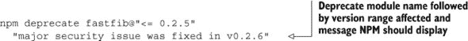

现在，如果任何用户安装了 fastfib 0.2.5 或更低版本，他们将收到 npm 指定的警告。

#### 技巧 115 保持模块私有

虽然开源可以是一个有趣且协作的环境，但有时你希望你的项目保持私有。这尤其适用于为客户完成的工作。在决定是否发布之前，先在内部构建一个模块也可能很有用。npm 可以保护你的模块，并为你保持其私有性。在这个技术中，我们将讨论如何配置你的模块以保持私有，以及如何在项目中包含私有模块。

##### 问题

你希望保持你的模块私有并内部使用。

##### 解决方案

在你的 package.json 文件中配置私有，并在内部共享。

##### 讨论

假设我们想让 fastfib 只在内部使用。为了确保它不会意外发布，我们在 package.json 文件中添加以下内容：

```
"private": true
```

这会告诉 npm 不要使用 npm publish 发布你的包。

这个设置对于特定客户端的项目来说效果很好。但如果你想在开发团队内部跨项目共享一组核心模块，那该怎么办呢？为此，有几个不同的选项。

##### 使用 Git 共享私有模块

npm 支持几种你可以分享内部模块的方式，这些方式设置起来非常简单。如果你使用 Git 仓库，npm 使这变得非常简单。

以 GitHub 为例（尽管它可以是 *任何* Git 远程）。假设我们的私有仓库位于

```
git@github.com:mycompany/fastfib.git
```

我们可以使用 npm install 将其包含在我们的 package.json 依赖项中（或直接修改 package.json）：

```
npm install git+ssh://git@github.com:mycompany/fastfib.git --save
```

非常棒！默认情况下，这将拉取 master 分支的内容。如果我们想指定一个特定的 commit-ish（标签、分支或 SHA-1—[`git-scm.com/book/en/Git-Internals-Git-Objects`](http://git-scm.com/book/en/Git-Internals-Git-Objects)），我们也可以这样做！以下是一些在 package.json 文件中的示例：


|  |
| --- |

##### 包含公开仓库

你可能已经猜到了，你还可以使用公开的 Git 仓库。如果你真的需要一些尚未发布到 npm 的功能或修复，这可能会很有帮助。更多示例，请参阅 package.json 文档（[`www.npmjs.org/doc/json.html#Git-URLs-as-Dependencies`](https://www.npmjs.org/doc/json.html#Git-URLs-as-Dependencies)）。

|  |
| --- |

##### 将私有模块作为 URL 共享

如果你没有使用 Git 或者希望你的构建系统输出包，你可以指定一个 npm 可以找到 tarball 的 URL 端点。要打包你的模块，你可以使用以下 tar 命令：

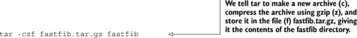

```
tar -czf fastfib.tar.gz fastfib
```

从这里，我们可以将这个文件上传到 web 服务器，并使用以下命令安装：

```
npm install http://internal-server.com/fastfib.tar.gz --save
```

|  |
| --- |

##### 关于公开端点的说明

尽管通常不常用，但包的 tarball 也可以与公开端点一起使用；通常来说，发布到 npm 更为方便和简单。

|  |
| --- |

##### 使用私有 npm 仓库共享模块

对于私有仓库，另一个选项是托管你自己的私有 npm 注册表，并让 npm publish 将内容推送到该仓库。为了实现 npm 的完整功能，这需要安装 CouchDB 的最新版本，而 CouchDB 又需要 Erlang。

由于这涉及到根据你的操作系统而定的各种技巧/头痛问题，我们在这里不会涵盖设置实例的过程。希望这个过程很快就会简化。如果你想进行实验，请查看 npm-registry-couchapp 项目 ([`github.com/npm/npm-registry-couchapp`](https://github.com/npm/npm-registry-couchapp))。

### 13.5. 摘要

第三方模块是创新发生的地方。npm 使得这一切变得简单而有趣！随着像 GitHub 这样的社交编码网站的兴起，模块的协作也变得容易。在本章中，我们探讨了模块开发的许多不同方面。让我们总结一下我们学到了什么。

在开始工作于一个模块时，考虑以下事项：

+   定义你的模块想法。你能用一句话总结它吗？

+   检查你的模块想法。是否已有其他模块在做你想要做的事情？使用 npm search 或 npmjs.org 进行搜索。

一旦你确定了一个想法，就证明它。从一个你想要与之合作的简单 API 开始。编写实现和测试，并在过程中安装任何需要的依赖项。

在你证明你的想法（或可能是在此期间）之后，考虑以下事项：

+   你已经初始化了 package.json 文件吗？运行 npm init 以获取表示当前项目状态的骨架。

+   与你的依赖项一起工作。有些是可选的，仅用于开发吗？确保在 package.json 文件中指明这一点。

+   检查 package.json 中的 semver 范围。你信任 package.json 文件中指定的版本范围吗？使用 npm outdated 检查更新。

+   你的代码将在哪些版本的 Node 上运行？使用 nvm 或像 Travis CI 这样的构建系统来检查。在 package.json 文件中指定版本范围。

+   在另一个项目中使用 npm link 尝试你的模块。

当你准备好发布时，只需使用 npm publish 即可。考虑为你的用户提供变更日志，并尝试遵循语义版本控制，这样用户对每个版本可以期待的内容有一个合理的了解。

这本书就到这里了！我们希望到这一点，你已经能够掌握 Node 的核心基础，了解如何在现实场景中应用这些基础，以及如何通过编写自己的 Node 模块（我们希望能在 npm 上看到！）来超越标准开发。

一个不断增长的 Node 社区可以帮你继续提升你的旅程。请查看附录，以充分利用这个社区。如果你对我们有任何具体问题，请访问 #nodejsinpractice Google 群组 ([`groups.google.com/forum/#!forum/nodejsinpractice`](https://groups.google.com/forum/#!forum/nodejsinpractice))，感谢阅读！
