## 简介

***本简介涵盖的内容包括***

+   介绍 Oracle 认证助理（OCA）Java SE 8 程序员 I 认证（考试编号 1Z0-808）

+   OCA Java SE 8 程序员认证的重要性

+   OCA Java SE 8 程序员 I 考试与 OCA Java SE 7 程序员 I 考试的比较

+   OCA Java SE 8 程序员 I 考试（1Z0-808）与 OCP Java SE 8 程序员 II 考试（1Z0-809）的比较

+   详细考试目标，与书籍章节相对应

+   关于考试准备和参加考试常见问题解答

+   介绍用于考试的测试引擎

本书专门针对希望获得 OCA Java SE 8 程序员 I 认证（考试编号 1Z0-808）的个人。它假设你已经熟悉 Java 并有一些使用经验。如果你对 Java 编程语言一无所知，我建议你从入门级书籍开始，然后再回到这本书。

### 1. 免责声明

本章中的信息来源于 [Oracle.com](http://www.Oracle.com)、公共网站和用户论坛。信息来自获得 Java 认证的真实人士，包括作者。已尽一切努力保持内容的准确性，但考试细节（包括考试目标、价格、考试通过分数、总题数、最大考试时间等）均受 Oracle 政策的约束。本书的作者和出版社不对因本书中包含的任何信息或因直接或间接使用此信息而造成的任何损失或损害负责。

### 2. OCA Java SE 8 程序员 I 认证简介

Oracle 认证助理（OCA）Java SE 8 程序员 I 考试（1Z0-808）涵盖了 Java SE 8 编程的基础知识，例如类和接口的结构、不同数据类型的变量、方法、运算符、数组、决策结构和循环。考试内容包括异常处理以及一些常用的 Java API 类，如 `String`、`StringBuilder` 和 `ArrayList`。本考试不包括许多 Java 8 特定的语言特性。它介绍了使用 lambda 表达式的函数式编程风格。它部分涵盖了新的日期和时间 API。

本考试是获得 Oracle 认证专业（OCP）Java SE 8 程序员头衔的两个步骤之一。它证明个人在 Java 编程语言方面拥有坚实的基础。表 1 列出了本考试的详细信息。

##### 表 1. OCA Java SE 8 程序员 I 考试（1Z0-808）的详细信息

| 考试编号 | 1Z0-808 |
| --- | --- |
| Java 版本 | 基于 Java 版本 8 |
| 题目数量 | 77 |
| 通过分数 | 65% |
| 时间长度 | 150 分钟 |
| 价格 | 美元 300 |
| 题型 | 多选题 |

### 3. OCA Java SE 8 程序员 I 认证的重要性

如图 1 所示，OCA Java SE 8 程序员 I 考试 (1Z0-808) 是您的 Java 认证路线图中的入门级考试。

##### 图 1. OCA Java SE 8 程序员认证是 Java 认证路线图中的入门级认证。

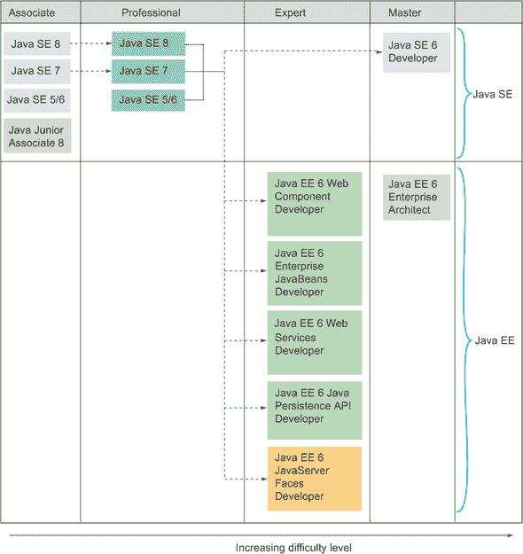

此考试是获得 OCP Java SE 8 程序员头衔的两个步骤之一。图 1 中的虚线和箭头表示认证的先决条件。OCP Java 程序员认证（任何 Java 版本）是获得 Java 中大多数其他高级认证的先决条件。

要获得 OCP Java SE 8 程序员头衔，您必须通过以下两个认证（顺序不限）：

+   OCA Java SE 8 程序员 I (1Z0-808)

+   OCP Java SE 8 程序员 II (1Z0-809)

|  |
| --- |

##### 注意

在撰写本文时，Oracle 将此考试作为通过 1Z0-809 考试的先决条件。之前，Oracle 允许以任何顺序通过 1Z0-808 和 1Z0-809 考试。即使此考试不是通过 1Z0-809 考试的先决条件，也强烈建议首先参加此考试。1Z0-808 考试涵盖 Java 的基础知识，而 1Z0-809 考试涵盖高级 Java 概念。

|  |
| --- |

Java 初级认证 (1Z0-811) 是 Oracle 于 2016 年推出的一项新认证。它是一项面向中学、两年制学院和四年制学院及大学学生的入门级认证。所有其他 Java 认证都是职业级认证。如图 1 所示，Java 认证轨迹提供在助理、专业、专家和大师类别下。

### 4. 比较 OCA Java 考试版本

本节将澄清关于 OCA Java 考试不同版本所存在的任何混淆。截至目前，Oracle 提供了三种版本的 OCA Java 认证：

+   OCA Java SE 8 程序员 I (考试编号：1Z0-808)

+   OCA Java SE 7 程序员 I (考试编号：1Z0-803)

+   OCA Java SE 5/SE 6 (考试编号：1Z0-850)

表 2 比较了这些考试的目标受众、Java 版本、题目数量、考试时长和及格分数。

##### 表 2. 比较考试：OCA Java SE 8 程序员 I、OCA Java SE 7 程序员 I 和 OCA Java SE 5/6

|   | OCA Java SE 8 程序员 I (1Z0-803) | OCA Java SE 7 程序员 I (1Z0-803) | OCA Java SE 5/SE 6 (1Z0-850) |
| --- | --- | --- | --- |
| 目标受众 | Java 程序员 | Java 程序员 | Java 程序员和 IT 管理员 |
| Java 版本 | 8 | 7 | 6 |
| 总题数 | 77 | 70 | 51 |
| 考试时长 | 150 分钟 | 120 分钟 | 115 分钟 |
| 及格分数 | 65% | 63% | 68% |

OCA Java SE 8 程序员 I 认证在 OCA Java SE 7 程序员 I 认证涵盖的主题基础上增加了以下主题：

+   Java 的特性和组件

+   包装类

+   三元构造

+   一些来自新 Java 8 日期和时间 API 的类

+   创建和使用 lambda 表达式

+   断言接口

图 2 展示了 OCA Java SE 8 和 OCA Java SE 7 程序员 I 考试目标的详细比较。以下是对图例的解释：

+   ***浅灰色背景—*** 主要考试目标。

+   ***中等灰色背景—*** 仅在 OCA Java SE 8 考试中涵盖。

+   ***深灰色背景—*** 尽管此子目标的文本或主要考试目标不同，但它被其他考试涵盖。

##### 图 2. 比较 OCA Java SE 8 程序员 I 和 OCA Java SE 7 程序员 I 认证的考试目标

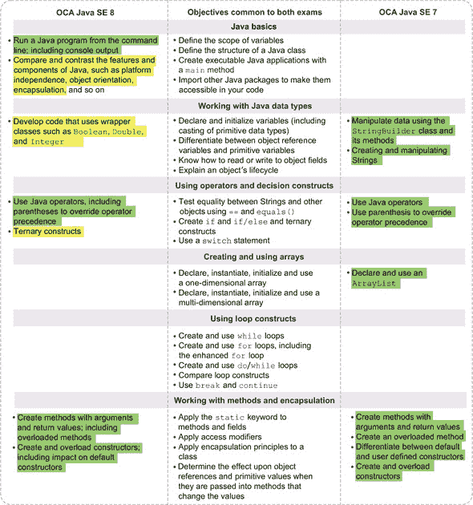

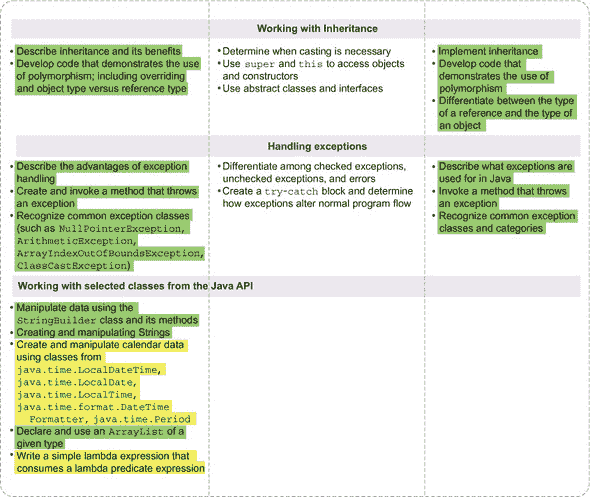

图 3 展示了 OCA Java SE 5/6（1Z0-850）和 OCA Java SE 7 程序员 I（1Z0-803）考试目标的详细比较。它显示了这些考试版本独有的目标和两者共有的目标。第一列显示了仅包含在 OCA Java SE 5/6（1Z0-850）中的目标，中间列显示了共同考试目标，右侧列显示了仅在 OCA Java SE 7 程序员 I（1Z0-803）中涵盖的考试目标。

##### 图 3. 比较 OCA Java SE 5/6 和 OCA Java SE 7 程序员 I 的考试目标

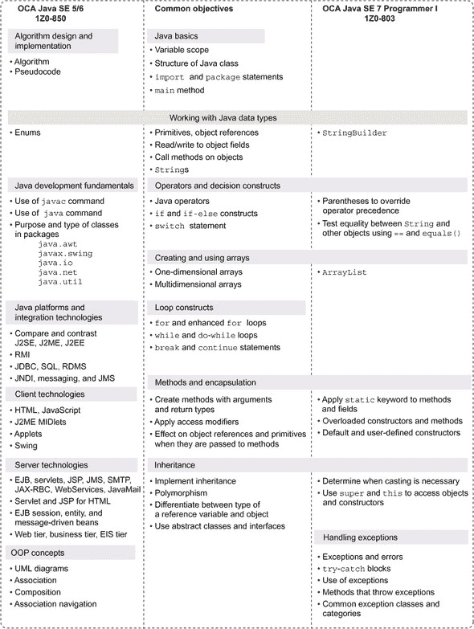

### 5. 下一步：OCP Java SE 8 程序员 II（1Z0-809）考试

在成功通过 OCA Java SE 8 程序员 I 考试后，下一步是参加 OCP Java SE 8 程序员 II 考试。OCP Java SE 8 程序员 II 认证是为具有 Java 编程语言高级技能的个人设计的。它涵盖了高级 Java 特性，如线程、并发、集合、Streams API、Java 文件 I/O、内部类、本地化等。

### 6. 完成考试目标，映射到书籍章节，并准备清单

表 3 包含了 OCA Java SE 8 程序员 I 考试的完整考试目标列表，这些目标来自 Oracle 的网站。所有目标都映射到涵盖它们的书籍章节和部分编号。

##### 表 3. 考试目标和子目标与章节和部分编号的映射

|   | 考试目标 | 包含在章节/部分 |
| --- | --- | --- |
| **1** | **Java 基础知识** | **第一章 和 第三章** |
| 1.1 | 定义变量的作用域 | 第 3.1 节 |
| 1.2 | 定义 Java 类的结构 | 第 1.1 节 |
| 1.3 | 使用主方法创建可执行的 Java 应用程序；从命令行运行 Java 程序，包括控制台输出 | 第 1.2 节 |
| 1.4 | 导入其他 Java 包以使它们在您的代码中可用 | 第 1.3 节 |
| 1.5 | 比较和对比 Java 的特性组件，例如平台无关性、面向对象、封装等 | 第 1.6 节 |
| **2** | **使用 Java 数据类型** | **第二章 和 第三章** |
| 2.1 | 声明和初始化变量（包括原始数据类型的类型转换） | 第 2.1 节 和 第 2.3 节 |
| 2.2 | 区分对象引用变量和原始变量 | 第 2.1 节 和 第 2.3 节 |
| 2.3 | 了解如何读取和写入对象字段 | 第 3.6 节 |
| 2.4 | 解释一个对象的生命周期（创建、通过重新赋值进行“解引用”和垃圾回收） | 第 3.2 节 |
| 2.5 | 开发使用包装类（如 Boolean、Double 和 Integer）的代码 | 第 2.5 节 |
| **3** | **使用运算符和决策构造** | **第二章, 第四章 和 第五章** |
| 3.1 | 使用 Java 运算符，包括括号来覆盖运算符优先级 | 第 2.4 节 |
| 3.2 | 使用 == 和 equals() 测试字符串和其他对象之间的相等性 | 第 4.1 节 和 第 4.5 节 |
| 3.3 | 创建 if 和 if/else 以及三元构造 | 第 5.1 节 |
| 3.4 | 使用 switch 语句 | 第 5.2 节 |
| **4** | **创建和使用数组** | **第四章** |
| 4.1 | 声明、实例化、初始化和使用一维数组 | 第 4.3 节 |
| 4.2 | 声明、实例化、初始化和使用多维数组 | 第 4.3 节 |
| **5** | **使用循环构造** | **第五章** |
| 5.1 | 创建和使用 while 循环 | 第 5.5 节 |
| 5.2 | 创建和使用 for 循环，包括增强型 for 循环 | 第 5.3 节 和 第 5.4 节 |
| 5.3 | 创建和使用 do-while 循环 | 第 5.5 节 |
| 5.4 | 比较循环构造 | 第 5.6 节 |
| 5.5 | 使用 break 和 continue | 第 5.7 节 |
| **6** | **使用方法和封装** | **第一章 和 第三章** |
| 6.1 | 创建具有参数和返回值的方法，包括重载方法 | 第 3.3 节 和 第 3.4 节 |
| 6.2 | 将 static 关键字应用于方法和字段 | 第 1.5 节 |
| 6.3 | 创建和重载构造函数，包括对默认构造函数的影响 | 第 3.5 节 |
| 6.4 | 应用访问修饰符 | 第 1.4 节 |
| 6.5 | 将封装原则应用于一个类 | 第 3.7 节 |
| 6.6 | 确定当将对象引用和原始值传递给会改变其值的方法时对它们的影响 | 第 3.8 节 |
| **7** | **处理继承** | **第一章 和 第六章** |
| 7.1 | 描述继承及其优势 | 第 6.1 节 和 第 6.2 节 |
| 7.2 | 开发演示多态使用的代码，包括重写和对象类型与引用类型 | 第 6.3 节 和 第 6.6 节 |
| 7.3 | 确定何时需要进行类型转换 | 第 6.4 节 |
| 7.4 | 使用 super 和 this 访问对象和构造函数 | 第 6.5 节 |
| 7.5 | 使用抽象类和接口 | 第 1.5 节、第 6.1 节、第 6.2 节 和 第 6.6 节 |
| **8** | **处理异常** | **第七章** |
| 8.1 | 区分检查异常、非检查异常和错误 | 第 7.2 节 |
| 8.2 | 创建 try-catch 块并确定异常如何改变正常程序流程 | 第 7.4 节 |
| 8.3 | 描述异常处理的优势 | 第 7.1 节 |
| 8.4 | 创建并调用抛出异常的方法 | 第 7.3 节 和 第 7.4 节 |
| 8.5 | 识别常见的异常类（如 NullPointerException、Arithmetic-Exception、ArrayIndexOutOfBoundsException、ClassCastException） | 第 7.5 节 |
| **9** | **使用 Java API 中的选定类** | **第四章 和 第六章** |
| 9.1 | 使用 StringBuilder 类及其方法操作数据 | 第 4.2 节 |
| 9.2 | 创建和操作字符串 | 第 4.1 节 |
| 9.3 | 使用 java.time.Local-DateTime、java.time.LocalDate、java.time.LocalTime、java.time.format.DateTimeFormatter 和 java.time.Period 类创建和操作日历数据 | 第 4.6 节 |
| 9.4 | 声明并使用特定类型的 ArrayList | 第 4.4 节 |
| 9.5 | 编写一个简单的 lambda 表达式，该表达式消费一个 lambda 谓词表达式 | 第 6.7 节 |

### 7\. 常见问题

当你开始考试准备或甚至考虑获得认证时，你可能会感到焦虑。本节可以通过回答关于考试准备和参加考试的一些常见问题来帮助你平静下来。

#### 7.1\. 关于考试准备的常见问题

本节回答了关于如何准备考试的常见问题，包括最佳方法、学习材料、准备时间、考试中的题型等。

##### OCA Java SE 8 程序员 I 级考试的考试详情是否会改变？

即使认证已经上线，Oracle 也可以更改认证的考试详情。这些更改可能包括考试目标、价格、考试时长、考试问题以及其他部分。在过去，Oracle 已经对认证考试进行了类似的更改。这些更改可能不是重大的，但当你开始准备考试时，始终建议检查 Oracle 的网站以获取最新的考试信息。

##### 准备这个考试的最佳方法是什么？

通常，考生会结合使用多种资源，如书籍、在线学习材料、关于考试的论文、免费和付费的模拟考试以及培训来准备考试。不同的组合对不同的人效果最好，没有一种完美的准备公式。根据培训或自学对你来说效果更好，你可以选择最适合你的方法。结合大量的代码实践和模拟考试。

##### 我如何知道我是否为考试做好了准备？

你可以通过在模拟考试中持续获得好成绩来确保你的考试准备情况。一般来说，在连续进行的约三到五次模拟考试中（越多越好）获得 80%以上的分数将确保你在真实考试中也能获得类似的分数。

##### 在真实考试之前我应该尝试多少次模拟考试？

理想情况下，你应该在尝试真正的考试之前至少尝试五次模拟考试。越多越好！

##### 我有两年的 Java 工作经验。我还需要为这个认证做准备吗？

重要的是要理解，实际使用 Java 获得的知识与通过这个认证考试所需的知识是不同的。Java 认证考试的作者使用多种技巧来测试你的知识。因此，你需要有结构化的准备和策略来在认证考试中取得成功。

##### 准备考试的理想时间是多长？

准备时间主要取决于你对 Java 的经验以及你可以用来准备的时间。平均而言，你需要大约 150 小时的课程学习，持续两到三个月来准备这次考试。再次强调，所需的学习时间取决于个人的学习曲线和背景。

保持你的考试准备一致性很重要。你不能学习一个月，然后间隔一个月或更长时间后重新开始。

##### 这个考试包括不计分的问题吗？

在任何 Oracle 考试中，你写的部分问题可能会被标记为不计分。Oracle 的政策规定，在考试过程中，你不会被告知哪些问题会被计分。你可能惊讶地发现，在 OCA Java SE 8 程序员 I 考试中的 77 个问题中，多达 7 个问题可能不计分。即使你回答了一些问题错误，你仍有机会获得 100%的分数。

Oracle 定期更新其所有认证考试的题库。这些不计分的问题可能用于研究和评估可以添加到考试中的新问题。

##### 我可以用模拟考试开始我的考试准备吗？

如果你非常熟悉 Java 语言特性，那么是的，你可以用模拟考试开始你的考试准备。这也有助于你了解在实际认证考试中可以期待的问题类型。但是，如果你在 Java 方面几乎没有经验，或者如果你对 Java 的语言特性不太熟悉，我不建议你从模拟考试开始。考试作者经常使用很多技巧来评估实际认证考试中的候选人。用模拟考试开始你的考试准备只会让你对 Java 概念感到困惑。

##### 我真的需要去认证吗？

是的，你应该这样做，简单的理由是雇主关心员工的认证。组织更倾向于有认证的 Java 开发者，而不是具有相似 IT 技能和经验的非认证 Java 开发者。认证还可以让你比没有认证的具有相似技能的同行获得更高的薪水。

##### 我需要做任何假设吗？

是的，Oracle 已经在其网站上发布了以下针对候选人的假设（如前所述，Oracle 可能会在没有任何事先通知的情况下更改考试细节或假设）：

+   *缺少`package`和`import`语句*——如果示例代码没有包含`package`或`import`语句，并且问题没有明确提到这些缺失的语句，那么假设所有示例代码都在同一个包中，并且存在导入语句来支持它们。

+   ***没有为类指定文件或目录路径名——*** 如果问题没有说明类的文件名或目录位置，那么假设以下之一， whichever will enable the code to compile and run：

    +   所有类都在一个文件中。

    +   每个类都包含在一个单独的文件中，所有文件都在一个目录中。

+   ***意外的换行符—*** 样本代码可能会有意外的换行符。如果你看到一行代码看起来像是被换行了，并且这造成了一个换行有意义的情境（例如，一个引号内的`String`字面量被换行），假设换行是同一行的扩展，该行不包含会导致编译失败的硬回车符。

+   ***代码片段—*** 代码片段是源代码的一个小部分，它在不包含其上下文的情况下呈现。假设所有必要的支持代码都存在，并且支持环境完全支持所显示代码及其省略环境的正确编译和执行。

+   ***描述性注释—*** 对描述性注释，如“setter 和 getters 在这里”，按字面意思理解。假设正确的代码存在，可以编译并成功运行以创建所描述的效果。

##### 我在考试中可以期待哪些类型或格式的题目？

考试使用不同格式的多项选择题，本节通过八个带有图例的示例题目来说明。

所有这些题型示例展示了以下主题集合可能如何使用不同的题型进行测试：

+   `main`方法的正确声明

+   传递命令行参数

+   重载方法

+   方法参数名称的重要性

+   可变参数变量的声明

**考试题型 1 (图 4)**—包括简单的代码，但答案选项可能复杂或令人困惑。

##### 图 4\. 考试题型 1

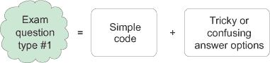

以下示例中的答案选项可能会让读者困惑，不知道命令行值是连接还是作为整数值相加：

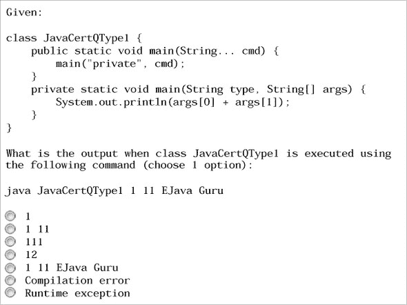

| |
| --- |

##### 注意

在本书中，每章末尾的样题和书末的全真模拟考试将答案选项以字母（例如，a–d）的形式呈现，以便于讨论。然而，在考试中，答案选项既不编号也不字母化。它们前面是单选按钮或复选框。单选按钮用于只有一个正确答案的问题，而复选框用于有多个正确答案的问题。

| |
| --- |

**考试题型 2 (图 5)**—没有代码的考试题目能让你从阅读代码中获得必要的休息。但回答它们并不总是那么容易。

##### 图 5\. 考试题型 2

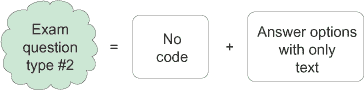

考试题型 2 的一个示例：

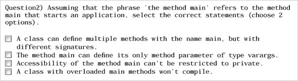

**考试题型 3 (图 6)**—阅读和理解大量代码可能很困难。关键是排除错误答案，快速找到正确答案。

##### 图 6\. 考试题型 3

示例：

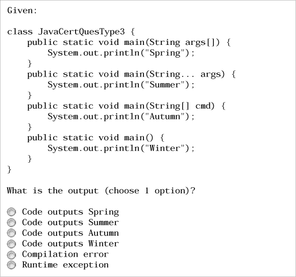

**考试题型 4 (图 7)**—这类问题是“填空题”的经典例子。

##### 图 7\. 考试题型 4

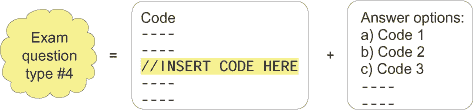

示例：

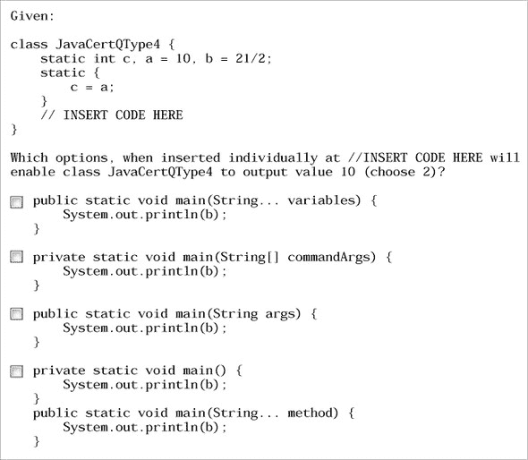

**考试题型 5 (图 8)**—此题型将包括代码、条件或两者兼而有之。答案选项将包括对代码中应用的变化及其结果。除非另有说明，否则您选择的答案选项中的变化将单独应用于代码或指定的情况。正确答案选项的结果不会涉及其他正确答案选项中建议的变化。

##### 图 8. 考试题型 5

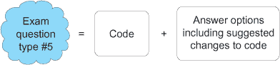

示例：

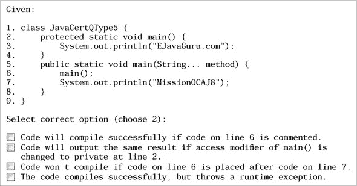

**考试题型 6 (图 9)**—因为您的思维模式是选择正确选项，所以请非常仔细地回答这类问题。我的个人建议：用一只手交叉手指来提醒自己需要选择*错误的*陈述。

##### 图 9. 考试题型 6

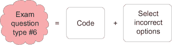

示例：

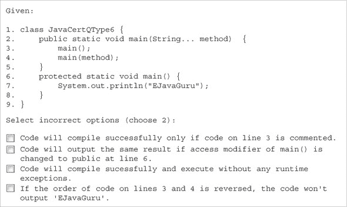

**考试题型 7 (图 10)**—此问题在问题文本中不会包括任何代码；它将声明需要使用答案选项中给出的代码实现的条件。

##### 图 10. 考试题型 7

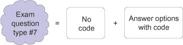

示例：

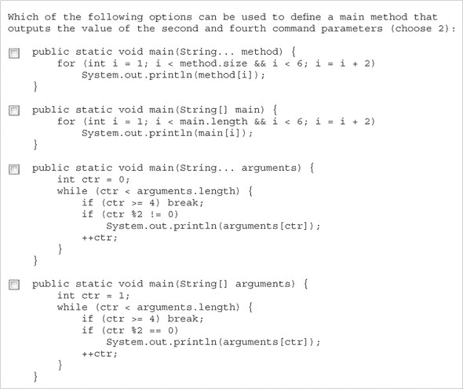

**考试题型 8 (图 11)**—此题型包括单个或多维数组的图示，陈述一个情况并要求您选择代码作为输入以获得所需的数组格式。

##### 图 11. 考试题型 8

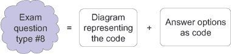

示例：

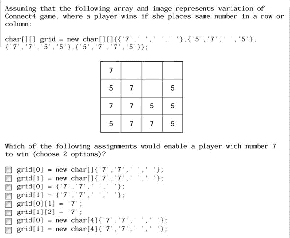

#### 7.2. 关于参加考试的问题解答

本节包含与考试注册、考试券、考试时的注意事项以及重考考试相关的一些常见问题列表。

##### 我在哪里以及如何参加这次考试？

您可以在 Oracle 测试中心或 Pearson VUE 授权测试中心参加这次考试。为了参加考试，您必须注册考试并购买考试券。以下选项可供选择：

+   直接注册考试并支付 Pearson VUE 费用

+   从 Oracle 购买考试券并在 Pearson VUE 注册参加考试

+   在 Oracle 测试中心注册

寻找您所在地区的最近测试中心，注册并安排考试日期和时间。大多数流行的计算机培训机构在其场所也设有测试中心。您可以在[www.pearsonvue.com/oracle/](http://www.pearsonvue.com/oracle/)找到 Pearson VUE 测试站点，其中包含有关查找测试中心和安排或重新安排考试的具体信息。在注册时，您需要提供以下详细信息，包括您的姓名、地址和联系电话：

+   考试标题和编号（OCA Java SE 8 程序员 I，1Z0-808）

+   在注册期间应应用的任何折扣代码

+   Oracle 测试 ID/考生 ID，如果您已经参加了任何其他 Oracle/Sun 认证考试

+   如果你的雇主在 Oracle 合作伙伴网络中（如果你的雇主在 Oracle 合作伙伴网络中，你可以找到公司 ID 并使用任何可用的考试费折扣）

##### 我需要携带我的照片身份证明或其他证明吗？

考试中心协调员会要求你至少提供两种身份证明，其中之一必须包含你的照片。如果有疑问，请通过电子邮件或电话与你的考试中心联系，并询问身份证明要求。

##### 考试券的有效期是多久？

每张考试券上都印有有效期。警惕任何声称可以在过期日期之后使用的折扣券。

##### 我可以在参加这次考试时参考笔记或书籍吗？

在参加这次考试时，你不能参考任何书籍或笔记。你不被允许携带任何空白纸用于草稿或甚至将手机带入测试隔间。

##### 在考试过程中标记问题的目的是什么？

通过标记问题，你可以有效地管理你的时间。不要在一个问题上花费太多时间。你可以在考试过程中标记一个难题，稍后再回答。考试结束时，你可以选择回顾标记问题的答案。此外，使用“上一题”和“下一题”按钮在问题之间导航通常很耗时。如果你不确定答案，可以标记它并在考试结束时回顾。

##### 我可以写下考试问题并随身携带吗？

不。考试中心不再提供你在考试期间可能需要的草稿纸。测试中心将提供可擦除或不可擦除的板子。如果你被提供的是不可擦除的板子，如果你需要，你可以要求另一块。

Oracle 对认证候选人以任何形式分发或传播记忆中的问题非常挑剔。如果 Oracle 发现这种情况发生，它可能会取消候选人的证书，永远禁止该候选人参加任何 Oracle 认证，通知雇主或采取法律行动。

##### 如果我在总时间之前或之后完成考试会发生什么？

如果你在大约的总考试时间结束前完成了考试，请修改你的答案并点击“提交”或“完成”按钮。如果你没有点击“提交”按钮并且用完了所有的考试时间，考试引擎将不再允许你修改任何考试答案，并将显示带有“提交”按钮的屏幕。

##### 考试结束后我会立即收到我的分数吗？

不，你不会。当你点击“提交”按钮后，大约半小时后屏幕会要求你登录到你的 Oracle 账户（CertView）以查看分数。它还包括你回答错误的话题。测试中心不会给你任何关于你的认证分数的纸质副本。证书本身将在六到八周内通过邮寄方式送达。

##### 如果我考试不及格，我可以重新参加考试吗？

这并不是世界末日。如果您失败了，请不要担心。您可以在 14 天后（而且世界不会知道这是重考）重新参加考试。

但您不能通过重考已通过考试来提高分数。同样，您也不能重考 Beta 考试。

### 8. 考试中使用的测试引擎

用于认证考试的测试引擎的用户界面相当简单。（与今天的网络、桌面和智能手机应用程序相比，甚至可以说是原始的。）

在您开始考试之前，您将需要接受 Oracle 认证候选人协议的条款和条件。您的计算机屏幕将显示所有这些条件，并给您一个接受这些条件的选择。只有接受这些条件，您才能开始答题。

这里是 Oracle 使用的测试引擎的功能：

+   *引擎用户界面分为三个部分—*测试引擎的用户界面分为以下三个部分：

    +   *静态上部部分—*显示问题编号、剩余时间和一个复选框以标记问题为复习

    +   *可滚动中间部分—*显示问题文本和答案选项

    +   *静态底部部分—*显示显示上一个问题、显示下一个问题、结束考试和查看标记问题的按钮

+   *每个问题都显示在单独的屏幕上—*考试引擎一次在屏幕上显示一个问题。它不会像可滚动的网页那样在单个屏幕上显示多个问题。我们尽力在不滚动或仅滚动很少的情况下显示完整的问题和答案选项。

+   *代码展示按钮—*许多问题包含代码。这些问题及其答案可能需要大量滚动才能查看。因为这可能相当不方便，所以这些问题包括一个代码展示按钮，该按钮在单独的窗口中显示代码。

+   *标记要复习的问题—*问题屏幕在左上角显示一个带有“标记为复习”文本的复选框。可以使用此选项标记问题。在考试结束时，可以快速复习标记的问题。

+   ***显示上一个和下一个问题的按钮—*** 测试包括在测试引擎底部显示上一个和下一个问题的按钮。

+   ***结束考试和查看标记问题的按钮—*** 引擎在测试引擎的底部显示结束考试和查看标记问题的按钮。

+   ***剩余时间—*** 引擎在屏幕右上角显示考试的剩余时间。

+   ***问题编号—*** 每个问题显示其序列号。

+   ***正确答案选项的数量—*** 每个问题显示应从多个选项中选择正确数量的选项。

我代表所有在 Manning 出版公司工作的人，祝您考试顺利，并希望您在考试中取得很好的成绩。
