## 第一章 Java 基础知识

| 本章涵盖的考试目标 | 你需要了解的内容 |
| --- | --- |
| [1.2] 定义 Java 类的结构。 | Java 类的结构，包括其组件：包和导入语句、类声明、注释、变量和方法。Java 类组件与 Java 源代码文件组件之间的区别。 |
| [1.3] 使用具有 main 方法的 Java 应用程序创建可执行文件；从命令行运行 Java 程序；包括控制台输出。 | 创建可执行 Java 应用程序的 main 方法的正确方法签名。传递给 main 方法的参数。 |
| [1.4] 将其他 Java 包导入到你的代码中以便使用。 | 理解包和导入语句。获取从包和接口导入类到自己的类中的正确语法和语义。 |
| [6.4] 应用访问修饰符。 | 将访问修饰符（public、protected、默认和 private）应用于类及其成员。确定这些修饰符的代码可访问性。 |
| [7.5] 使用抽象类和接口。 | 定义类、接口和方法作为抽象实体的含义。 |
| [6.2] 将静态关键字应用于方法和字段。 | 将字段和方法定义为静态成员的含义。 |
| [1.5] 比较和对比 Java 的特性如：平台无关性、面向对象、封装等。 | 与 Java 相关的特性和组件。 |

想象你正在建立一个与多个开发者合作的 IT 组织。为了确保工作顺利高效，你将为你的组织定义一个结构以及一组具有单独职责的部门。这些部门在需要时将相互协作。此外，根据保密性要求，你的组织的数据将根据需要提供给员工，或者你可以将特殊权限仅分配给组织的某些员工。这是组织如何通过一个明确的结构和一套规则来提供最佳结果的例子。

同样，Java 有一个明确的结构和层次。组织的结构和组件可以与 Java 的类结构和组件进行比较，组织的部门可以与 Java 包进行比较。限制组织中对某些数据的访问可以与 Java 的访问修饰符进行比较。组织的特殊权限可以与 Java 中的非访问修饰符进行比较。

在 OCA Java SE 8 程序员 I 考试中，你将被问到 Java 类的结构、包、导入类以及应用访问和非访问修饰符和 Java 的特性和组件。鉴于这些信息，本章将涵盖以下内容：

+   Java 类的结构和组件

+   理解可执行的 Java 应用程序

+   理解 Java 包

+   将 Java 包导入到你的代码中

+   应用访问和非访问修饰符

+   Java 的特性和组件

### 1.1\. Java 类和源代码文件的结构

| |
| --- |

[1.2] 定义 Java 类的结构

| |
| --- |
| |

##### 注意

当你看到像前面那样的认证目标时，这意味着在本节中我们将涵盖这个目标。同一个目标可能在本章或其他章节的多个部分中都有涉及。

| |
| --- |

本节涵盖了 Java 源代码文件 (.java 文件) 和 Java 类（使用关键字 `class` 定义）的结构和组件。它还涵盖了 Java 源代码文件和 Java 类之间的区别。

首先，先从对认证考试中对你有什么要求有一个清晰的理解开始准备考试。例如，尝试回答一个认证申请者的以下问题：“我遇到了‘类’这个术语的不同含义：类 `Person`、Java 源代码文件（Person.java）和存储在 Person.class 中的 Java 字节码。这些结构中哪一个在考试中？”要回答这个问题，请查看图 1.1，它包括了类 `Person`、文件 Person.java 和 Person.class 以及它们之间的关系。

##### 图 1.1\. 类文件 `Person` 与文件 Person.java 和 Person.class 之间的关系以及它们如何相互转换

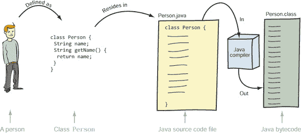

如图 1.1 所示，一个人可以被定义为一个类 `Person`。这个类应该位于一个 Java 源代码文件（Person.java）中。使用这个 Java 源代码文件，Java 编译器（Windows 上的 javac.exe 或 Mac OS X/Linux/UNIX 上的 javac）生成字节码（Java 虚拟机的编译代码）并将其存储在 Person.class 中。本考试目标的范围仅限于 Java 类（类 `Person`）和 Java 源代码文件（Person.java）。

#### 1.1.1\. Java 类的结构

OCA Java SE 8 程序员 I 考试将就 Java 源文件的结构和组件以及在其中可以定义的类或接口向你提问。图 1.2 展示了 Java 类文件的组件（接口将在第六章中详细讲解）。

##### 图 1.2\. Java 类的组件

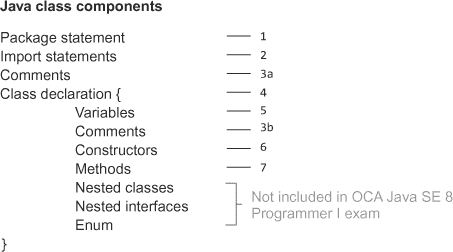

在本节中，我将讨论所有 Java 类文件组件。让我们从 `package` 语句开始。

| |
| --- |

##### 注意

本书中的代码不包含很多空格——它模仿了你在考试中会看到的代码类型。但当你处理实际项目时，我强烈建议你使用空格或注释来使你的代码可读。

| |
| --- |

##### 包声明

所有的 Java 类都是包的一部分。Java 类可以显式地定义在命名包中；否则，它将成为一个**默认**包的一部分，该包没有名称。

`package` 语句用于显式地定义类所在的包。如果一个类包含 `package` 语句，它必须是类定义中的第一个语句：

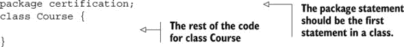

| |
| --- |

##### 注意

包的详细内容在本章的 1.3 节 中介绍。

| |
| --- |

`package` 语句不能出现在类声明中或类声明之后。以下代码将无法编译：

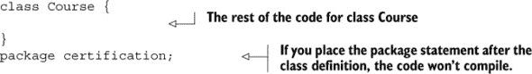

以下代码将无法编译，因为它在类定义中将 `package` 语句放在了内部：

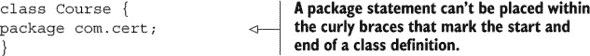

此外，如果存在，`package` 语句必须恰好出现在类中一次。以下代码将无法编译：

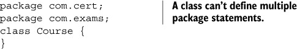

##### 导入语句

同一包中的类和接口可以相互使用，而无需在它们的名称前加上包名。但为了使用来自另一个包的类或接口，你必须使用它的完全限定名，即 `packageName.anySubpackageName.ClassName`。例如，类 `String` 的完全限定名是 `java.lang.String`。因为使用完全限定名可能会很繁琐，并且会使你的代码难以阅读，所以你可以使用 `import` 语句来在你的代码中使用类或接口的简单名称。

让我们通过一个示例类 `AnnualExam` 来看看这个，该类定义在 `university` 包中。类 `AnnualExam` 与类 `certification.ExamQuestion` 相关联，如图 1.3 所示的统一建模语言（UML）**类图**所示。

##### 图 1.3\. 类 `AnnualExam` 和 `ExamQuestion` 之间关系的 UML 表示


| |
| --- |

##### 注意

UML 类图表示应用程序的静态视图。它展示了实体，如包、类、接口及其属性（字段和方法），并描绘了它们之间的关系。它显示了哪些类和接口在包中定义。它描述了类和接口之间的继承关系。它还可以描述它们之间的关联——当一个类或接口定义了另一种类型的属性时。本章中所有的 UML 表示都是类图。考试不涵盖 UML 图。但使用这些快速简单的图可以简化 Java 实体之间的关系——无论是在考试中还是在你的实际项目中。

| |
| --- |
| |

##### 注意

在整本书中，**粗体字体**将用于指示我们正在讨论的代码的特定部分，或代码中的更改或修改。

| |
| --- |

这是类`AnnualExam`的代码：

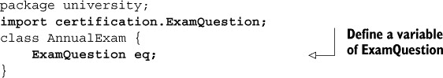

注意，`import`语句位于`package`语句之后，但在`class`声明之前。如果类`AnnualExam`未在包中定义，会发生什么？如果`AnnualExam`和`ExamQuestion`类如图 1.4 所示相关联，代码会有任何变化吗？

##### 图 1.4. 无包的类`AnnualExam`与`ExamQuestion`之间的关系


在这种情况下，类`AnnualExam`不是显式包的一部分，但类`ExamQuestion`是`certification`包的一部分。以下是类`AnnualExam`的代码：

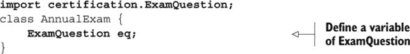

如前一个示例代码所示，类`AnnualExam`没有定义`package`语句，但它定义了`import`语句来导入`certification.ExamQuestion`类。

如果类中存在`package`语句，则`import`语句必须跟在`package`语句之后。保持`package`和`import`语句出现的顺序很重要。颠倒这个顺序会导致你的代码无法编译：


我们将在本章的 1.3 节中详细讨论`import`语句。

##### 注释

你也可以在 Java 代码中添加注释。注释可以出现在类中的多个位置。注释可以出现在`package`语句之前和之后，类定义之前和之后，以及方法定义之前和之后。注释有两种类型：多行注释和行尾注释。

多行注释跨越多行代码。它们以`/*`开始，以`*/`结束。以下是一个示例：


多行注释可以包含特殊字符。以下是一个示例：

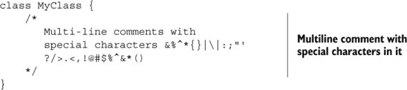

在前面的代码中，注释不是每行都以星号开头。但大多数时候，当你看到 Java 源代码文件（.java 文件）中的多行注释时，你会注意到它使用星号（`*`）在下一行开始注释。请注意，这不是必需的——这样做更多的是为了美观。以下是一个示例：

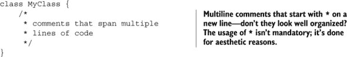

行尾注释以`//`开头，正如其名称所示，它们放置在代码行末或空白行上。`//`和行尾之间的文本被视为注释，你通常使用它来简要描述代码行。以下是一个示例：

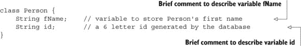

虽然在以下代码中使用多行注释不常见，但考试要求你了解代码是有效的：


当你在赋字符串值时在引号内包含多行注释，会发生以下情况：


当包含在双引号内时，多行注释被视为普通字符，而不是注释。因此，以下代码无法编译，因为分配给变量 `name` 的值是一个未闭合的字符串字面值：


在前面的 `package` 语句部分，您了解到如果存在，则 `package` 语句应该是类中代码的第一行。这个规则的唯一例外是注释的存在。注释可以出现在 `package` 语句之前。以下代码定义了一个 `package` 语句，其中包含多行和行尾注释：

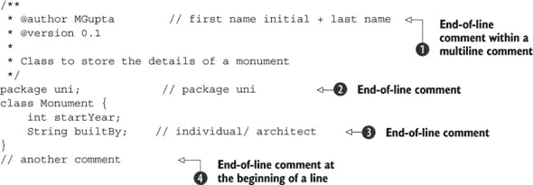

行  定义了多行代码中的行尾代码注释。这是可接受的。行尾代码注释被视为多行注释的一部分，而不是单独的行尾注释。行  和  定义了行尾代码注释。行  定义了行首的行尾代码注释，在类定义之后。

多行注释放置在 `package` 语句之前，这是可接受的，因为注释可以出现在代码的任何位置。

|  |
| --- |

**Javadoc 注释**

Javadoc 注释是 Java 源文件中以 `/**` 开始并以 `*/` 结束的特殊注释。这些注释由 Javadoc 工具处理，以生成您的 Java 源代码文件的 API 文档。要查看其工作情况，请比较类 `String` 的 API 文档及其源代码文件（String.java）。

|  |
| --- |

##### 类声明

类声明标志着类的开始。它可以像关键字 `class` 后跟类名这样简单：


类的声明由以下部分组成：

+   访问修饰符

+   非访问修饰符

+   类名

+   基类名称，如果该类扩展了另一个类

+   如果类实现了任何接口，则所有实现的接口

+   类体（类字段、方法、构造函数），包含在一对大括号 `{}` 内

如果您现在不理解这部分内容，请不要担心。我们将在准备考试的过程中详细讲解这些内容。

让我们通过一个例子来看看类声明的组成部分：

```
public final class Runner extends Person implements Athlete {}
```

前一个类声明的组成部分可以如图 1.5 所示进行说明。

##### 图 1.5. 类声明的组成部分

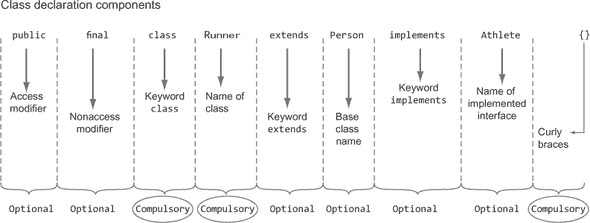

表 1.1 总结了必需和可选组件。

##### 表 1.1. 类声明的组成部分

| 必需 | 可选 |
| --- | --- |
| 关键字 class | 访问修饰符，例如 public |
| 类名 | 非访问修饰符，例如 final |
| 类体，由大括号 `{}` 标记 | 关键字 extends 以及基类的名称 |
|   | 关键字 implements 以及实现接口的名称 |

我们将在本章的 1.4 节 和 1.5 节 中详细讨论访问和非访问修饰符。

##### 类定义

*类* 是用于指定对象属性和行为的设计。对象的属性通过 *变量* 实现，行为通过 *方法* 实现。例如，可以将类视为移动电话的设计或规范，而移动电话是该设计的对象。可以使用相同的设计创建多个移动电话，就像 Java 虚拟机 (JVM) 使用类来创建其对象一样。你还可以将类视为一个模具，你可以使用它来创建有意义的和有用的对象。类是一个可以从中创建对象的规范。

让我们定义一个简单的类来表示移动电话：

```
class Phone {
    String model;
    String company;
    Phone(String model) {
        this.model = model;
    }
    double weight;
    void makeCall(String number) {
        // code
    }
    void receiveCall() {
        // code
    }
}
```

要点：

+   类名以关键字 `class` 开头。注意关键字 `class` 的大小写。Java 是大小写敏感的。`class`（小写 *c*）与 `Class`（大写 *C*）不同。你不能使用单词 `Class`（大写 *C*）来定义一个类。

+   类的状态是通过属性或实例变量定义的。

+   在定义类的方法之前，不一定必须定义所有属性（变量 `weight` 在 `Phone` 构造函数之后定义）。但这对于可读性来说远非最佳。

+   行为是通过方法定义的，这些方法可能包括方法参数。

+   类定义还可以包括注释和构造函数。

|  |
| --- |

##### 注意

类是一个可以从中创建对象的规范。

|  |
| --- |

##### 变量

在前一个示例中重新审视类 `Phone` 的定义。因为变量 `model`、`company` 和 `weight` 用于存储对象的状态（也称为 *实例*），它们被称为 *实例变量* 或 *实例属性*。每个对象都有自己的实例变量副本。如果你更改一个对象的实例变量的值，则同一名称的实例变量对另一个对象的值不会改变。实例变量是在类中定义的，但位于类中所有方法之外。

一个 *类变量* 或 `static` 变量的副本被类中的所有对象共享。`static` 变量在 1.5.3 节中有详细讨论，包括非访问修饰符 `static`。

##### 方法

再次回顾前面的示例。`makeCall` 和 `receiveCall` 方法是实例方法，通常用于操作实例变量。

如前所述，*类方法* 或 *静态方法* 可以用来操作 `static` 变量。

##### 构造函数

在前面的例子中，`Phone`类定义了一个单构造函数。类构造函数用于创建和初始化类的对象。一个类可以定义多个构造函数，这些构造函数接受不同的方法参数集。

#### 1.1.2\. Java 源代码文件的结构和组件

Java 源代码文件用于定义 Java 实体，例如类、接口、枚举和注解。

| |
| --- |

##### 注意

Java 注解不在考试范围内，因此本书不会讨论。

| |
| --- |

所有你的 Java 代码都应该定义在 Java 源代码文件中（以.java 结尾的文本文件）。考试涵盖了 Java 源代码文件结构的以下方面：

+   在 Java 源代码文件中定义类和接口

+   在同一 Java 源代码文件中定义单类或多接口

+   将`import`和`package`语句应用于 Java 源代码文件中的所有类

我们已经涵盖了第 1.1.1 节中类的详细结构和定义。让我们开始定义接口。

##### 在 Java 源代码文件中定义接口

接口指定了类需要实现的合约。你可以将实现接口比作签订合同。接口是一组相关方法和常量的组合。在 Java 8 之前，接口方法默认是抽象的。但从 Java 8 版本开始，接口中的方法可以定义默认实现。使用 Java 8，接口也可以定义`static`方法。

这里有一个快速例子，帮助你理解接口的本质。无论我们每个人拥有哪个品牌的电视，每台电视都提供了更改频道和调整音量的通用功能。你可以将电视机的控制面板比作接口，将电视机的设计比作实现接口控制的面板类。

让我们定义这个接口：

```
interface Controls {
    void changeChannel(int channelNumber);
    void increaseVolume();
    void decreaseVolume();
}
```

接口的定义以关键字`interface`开始。记住，Java 是区分大小写的，所以你不能使用单词`Interface`（带大写的*I*）来定义接口。本节提供了接口的简要概述。你将在第六章中详细了解接口。

##### 在单个 Java 源代码文件中定义单类和多类

你可以在 Java 源代码文件中定义一个类或一个接口，或者定义多个这样的实体。让我们从一个简单的例子开始：一个名为 Single-Class.java 的 Java 源代码文件，它定义了一个单独的类`SingleClass`：

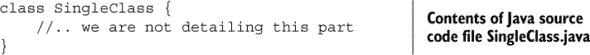

这里是一个 Java 源代码文件的例子，Multiple1.java，它定义了多个接口：

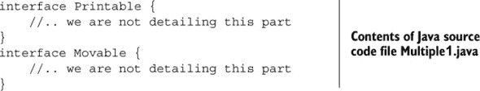

你也可以在同一个 Java 源代码文件中定义类和接口的组合。以下是一个例子：

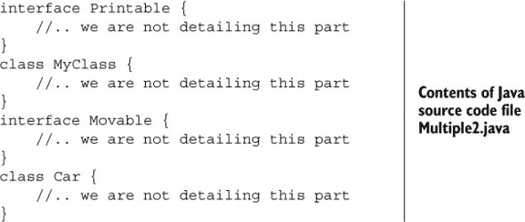

在单个 Java 源代码文件中定义多个类或接口不需要特定的顺序。

| |
| --- |

##### 考试技巧

类和接口可以在 Java 源代码文件中以任何顺序定义。

|  |
| --- |

当你在 Java 源文件中定义一个`public`类或接口时，类或接口的名称必须与 Java 源文件名称匹配。此外，源代码文件不能定义超过一个`public`类或接口。如果你尝试这样做，你的代码将无法编译，这会为你提供一个我称为*故事中的转折*的小型实践练习，如前言中所述。所有这些练习的答案都提供在附录中。

|  |
| --- |

**关于*故事中的转折*练习**

对于这些练习，我尝试使用本章中已覆盖的示例中的修改后的代码。*故事中的转折*标题指的是修改或调整后的代码。

这些练习将帮助你理解即使是微小的代码修改也能改变代码的行为。它们还应该鼓励你仔细检查考试中的所有代码。这些练习的原因是，在考试中，你可能会被问及多个看似需要相同答案的问题。但仔细检查后，你会发现这些问题略有不同，这将改变代码的行为和正确答案选项！

|  |
| --- |

##### *故事中的转折* 1.1

修改 Java 源代码文件`Multiple.java`的内容，并在其中定义一个公共接口。执行代码并查看这种修改如何影响你的代码。

问题：检查以下 Java 源代码文件`Multiple.java`的内容，并选择正确的选项：

```
// Contents of Multiple.java
public interface Printable {
    //.. we are not detailing this part
}
interface Movable {
    //.. we are not detailing this part
}
```

选项：

1.  一个 Java 源代码文件不能定义多个接口。

1.  一个 Java 源代码文件只能定义多个类。

1.  一个 Java 源代码文件可以定义多个接口和类。

1.  前面的类将无法编译。

如果你需要帮助设置系统以编写 Java，请参考 Oracle 的“入门”教程，[`docs.oracle.com/javase/tutorial/getStarted/`](http://docs.oracle.com/javase/tutorial/getStarted/)。

##### *故事中的转折* 1.2

问题：检查以下 Java 源代码文件`Multiple2.java`的内容，并选择正确的选项（s）：

```
// contents of Multiple2.java
interface Printable {
    //.. we are not detailing this part
}
class MyClass {
    //.. we are not detailing this part
}
interface Movable {
    //.. we are not detailing this part
}
public class Car {
    //.. we are not detailing this part
}
public interface Multiple2 {}
```

选项：

1.  代码无法编译。

1.  代码编译成功。

1.  移除`Car`类的定义将使代码编译成功。

1.  将`Car`类改为非公共类将使代码编译成功。

1.  将接口`Multiple2`改为非公共接口将使代码编译成功。

##### Java 源代码文件中包和导入语句的应用

在前面的章节中，我提到你可以在同一个 Java 源代码文件中定义多个类和接口。当你在这类 Java 文件中使用`package`或`import`语句时，这两个语句都适用于该源代码文件中定义的所有类和接口。

例如，如果你在 Java 源代码文件 Multiple.java 中包含一个`package`和一个`import`语句（如下面的代码所示），`Car`、`Movable`和`Printable`将变成同一包`com.manning.code`的一部分：

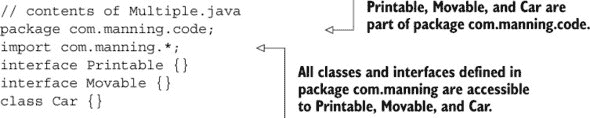

| |
| --- |

##### 考试提示

在同一 Java 源代码文件中定义的类和接口*不能*定义在单独的包中。使用`import`语句导入的类和接口对同一 Java 源代码文件中定义的所有类和接口都是可用的。

| |
| --- |

在下一节中，你将创建可执行 Java 应用程序——用于定义 Java 应用程序执行入口点的类。

### 1.2\. 可执行 Java 应用程序

| |
| --- |

[1.3] 使用具有`main`方法的可执行 Java 应用程序；从命令行运行 Java 程序；包括控制台输出。

| |
| --- |

OCA Java SE 8 程序员 I 级考试要求你理解可执行 Java 应用程序及其要求的意义，即什么使一个普通 Java 类成为可执行 Java 类。你还需要知道如何从命令行执行 Java 程序。

#### 1.2.1\. 可执行 Java 类与非可执行 Java 类

Java 虚拟机在 Java 类被使用时执行所有 Java 类吗？如果是这样，什么是非可执行 Java 类？

当一个可执行 Java 类交给 JVM 时，它将在类中的特定点开始执行——即`main`方法。JVM 将执行在`main`方法中定义的代码。你不能将一个非可执行 Java 类（没有`main`方法的类）交给 JVM 并要求它执行。在这种情况下，JVM 将不知道执行哪个方法，因为没有标记入口点。

通常，一个应用程序由多个类和接口组成，这些类和接口定义在多个 Java 源代码文件中。在这些文件中，程序员会将其中一个类指定为可执行类。程序员可以定义 JVM 启动应用程序时应执行的步骤。例如，程序员可以定义一个包含显示适当 GUI 窗口给用户和打开数据库连接代码的可执行 Java 类。

在图 1.6 中，类`Window`、`UserData`、`ServerConnection`和`UserPreferences`没有定义`main`方法。类`LaunchApplication`定义了一个`main`方法，是一个可执行类。

##### 图 1.6\. 类`LaunchApplication`是一个可执行 Java 类，但其余的`类——Window、UserData、ServerConnection`和`UserPreferences`则不是。

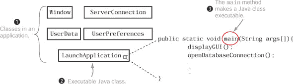

| |
| --- |

##### 注意

一个 Java 应用程序可以定义多个可执行类。当 JVM 开始执行时，我们会选择其中一个（并且恰好一个）。

| |
| --- |

#### 1.2.2\. `main`方法

创建可执行 Java 应用程序的第一个要求是创建一个方法签名（名称和方法参数）与以下定义的`main`方法相匹配的类：

```
public class HelloExam {
    public static void main(String args[]) {
        System.out.println("Hello exam");
    }
}
```

此`main`方法应遵守以下规则：

+   该方法必须被标记为`public`方法。

+   该方法必须被标记为`static`方法。

+   方法名称必须是`main`。

+   该方法的返回类型必须是`void`。

+   该方法必须接受一个`String`数组或`String`类型的可变参数（varargs）作为方法参数。

图 1.7 展示了前面的代码及其相关规则集。

##### 图 1.7\. 正确`main`方法的组成部分

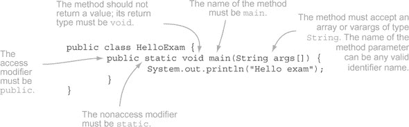

将传递给`main`方法的参数定义为`String`类型的可变参数（*varargs*）是有效的：

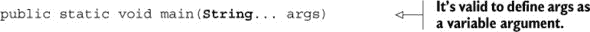

要定义一个可变参数变量，省略号（`...`）必须跟在变量类型后面，而不是变量本身（许多新程序员都会犯的错误）：


如前所述，传递给`main`方法的`String`数组名称不必是`args`才能使其成为正确的`main`方法。以下也是`main`方法的正确定义示例：


定义数组时，方括号`[]`可以跟在变量名或其类型后面。以下也是`main`方法的正确方法声明：


有趣的是，关键字`public`和`static`的位置可以互换，这意味着以下都是`main`方法的正确方法声明：


|  |
| --- |

##### 注意

虽然关键字`public static`和`static public`都是声明`main`方法的合法顺序，但`public static`更常见，因此更易读。

|  |
| --- |

在执行时，如图 1.7 所示的代码将输出以下内容：

```
Hello exam
```

如果一个类定义了一个与*该*`main`方法签名不匹配的`main`方法，则称为*重载方法*（重载方法将在第三章中详细讨论）。重载方法是具有相同名称但签名不同的方法。例如，`HelloExam`类可以定义多个名为`main`的方法：

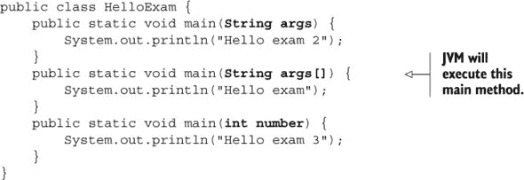

在执行时，JVM 将执行*该*`main`方法，结果输出`Hello exam`。

#### 1.2.3\. 从命令行运行 Java 程序

几乎所有 Java 开发者都使用集成开发环境（IDE）。然而，这个考试要求你理解如何使用命令提示符执行 Java 应用程序或可执行的 Java 类。因此，我建议你使用简单的文本编辑器和命令行（即使这可能是你永远不会在现实世界中使用的做法）。

|  |
| --- |

##### 注意

如果您需要帮助设置系统以使用命令提示符编译或执行 Java 应用程序，请参阅 Oracle 的详细说明[`docs.oracle.com/javase/tutorial/getStarted/cupojava/index.html`](http://docs.oracle.com/javase/tutorial/getStarted/cupojava/index.html)。

|  |
| --- |

让我们回顾一下图 1.7 中显示的代码：

```
public class HelloExam {
    public static void main(String args[]) {
        System.out.println("Hello exam");
    }
}
```

要使用命令提示符执行前面的代码，请输入命令`java HelloExam`，如图 1.8 所示。

##### 图 1.8\. 使用命令提示符执行 Java 应用程序


我提到`main`方法接受一个`String`数组作为方法参数。但您如何以及在哪里将数组传递给`main`方法呢？让我们修改之前的代码来访问和输出这个数组中的值：

```
public class HelloExamWithParameters {
    public static void main(String args[]) {
        System.out.println(args[0]);
        System.out.println(args[1]);
    }
}
```

现在，让我们使用命令提示符执行前面的代码，如图 1.9 所示。

##### 图 1.9\. 将命令参数传递给`main`方法

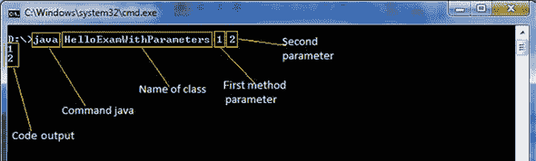

如您从图 1.9 所示的输出中可以看到，关键字`java`和类的名称并没有作为命令参数传递给`main`方法。OCA Java SE 8 程序员 I 级考试将测试您对关键字`java`和类名是否传递给`main`方法的知识。

|  |
| --- |

##### 考试技巧

传递给`main`方法的方法参数也称为命令行参数或命令行值。正如其名所示，这些值是从命令行传递给方法的。

|  |
| --- |

如果您在处理数组或`String`类时没有跟上代码，请不要担心；我们将在第四章中详细讲解`String`类和数组。

这里是下一个“故事转折”练习。在这个练习中，以及本书的其余部分，您将看到 Shreya、Harry、Paul 和 Selvan 这些名字，他们是假设的程序员，也在为这个认证考试学习。答案通常在附录中提供。

##### 故事转折 1.3

其中一位程序员 Harry 执行了一个程序，输出了`java one`。现在他正在试图找出以下哪个类输出了这些结果。鉴于他是使用命令`java EJava java one one`执行这个类的，你能帮助他找出正确的选项（们）吗？

1.  ```
    class EJava {
        public static void main(String sun[]) {
            System.out.println(sun[0] + " " + sun[2]);
        }
    }
    ```

1.  ```
    class EJava {
        static public void main(String phone[]) {
            System.out.println(phone[0] + " " + phone[1]);
        }
    }
    ```

1.  ```
    class EJava {
        static public void main(String[] arguments[]) {
            System.out.println(arguments[0] + " " + arguments[1]);
        }
    }
    ```

1.  ```
    class EJava {
        static void public main(String args[]) {
            System.out.println(args[0] + " " + args[1]);
        }
    }
    ```

|  |
| --- |

**与命令行参数的混淆**

如果您使用过像 C 这样的语言编程，您可能会对命令行参数感到困惑。像 C 这样的编程语言会将*程序*的名称作为命令行参数传递给`main`方法。但 Java 不会将*类*的名称作为参数传递给`main`方法。

|  |
| --- |

### 1.3\. Java 包

|  |
| --- |

[1.4] 将其他 Java 包导入到您的代码中以便使用

|  |
| --- |

这场考试涵盖了将包导入其他类。但凭借超过十五年的经验，我了解到在开始将其他包导入自己的代码之前，了解包是什么，包中定义的类与未定义在包中的类的区别，以及为什么需要在代码中导入包，这些都非常重要。

在本节中，您将学习 Java 包是什么以及如何创建它们。您将使用`import`语句，它允许您为在单独的包中定义的类和接口使用简单名称。

#### 1.3.1\. 需要包的原因

您认为为什么我们需要包？首先，回答这个问题：您是否记得在您的生命中认识过不止一个 Amit、Paul、Anu 或 John？Harry 认识不止一个 Paul（确切地说，是六个），他将他们分类为经理、朋友和堂兄弟。这些根据他们的位置和关系进行了子分类，如图 1.10 所示。图 1.10。

##### 图 1.10\. Harry 认识六个 Paul！

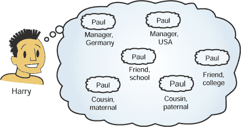

类似地，您可以使用包将一组相关的类和接口组合在一起（这里不会讨论枚举，因为它们在本考试中未涉及）。包还提供访问保护和命名空间管理。您可以为不同的项目创建单独的包来定义类，例如 Android 游戏和在线医疗保健系统。此外，您可以在这些包内创建子包，例如用于 GUI、数据库访问、网络等的不同子包。

|  |
| --- |

##### 注意

在实际项目中，您很少会与没有包的类或接口打交道。几乎所有开发软件的组织都有严格的包命名规则，这些规则通常会被记录下来。

|  |
| --- |

所有类和接口都是在包中定义的。如果您在类或接口中没有包含显式的`package`语句，它就是默认包的一部分。

#### 1.3.2\. 使用包语句在包中定义类

您可以通过将`package`语句作为代码中的第一个语句来表示一个类或接口是在包中定义的。以下是一个示例：

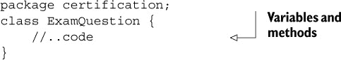

上述代码中的类在`certification`包中定义了一个`ExamQuestion`类。您也可以以类似的方式定义一个接口，例如`MultipleChoice`：

```
package certification;
interface MultipleChoice {

    void choice1();
    void choice2();
}
```

图 1.11 显示了一个 UML 类图，描述了包`certification`与类`ExamQuestion`和接口`MultipleChoice`之间的关系。

##### 图 1.11\. 显示包`certification`、类`ExamQuestion`和接口`MultipleChoice`之间关系的 UML 类图

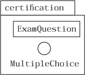

在前面的示例中，包的名称是`certification`。您可以使用这样的名称为只包含几个类和接口的小项目命名，但组织通常使用子包来定义**所有**它们的类。例如，如果 Oracle 的人要定义一个用于存储 Java Associate 考试问题的类，他们可能会使用包名`com.oracle.javacert.associate`。图 1.12 显示了其 UML 表示，以及相应的类定义。

##### 图 1.12\. 子包及其相应的类定义

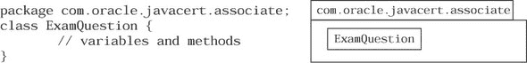

包由多个部分组成，从更通用的（左侧）到更具体的（右侧）。包名 `com.oracle.javacert.associate` 遵循 Oracle 推荐的包命名约定，并在 表 1.2 中展示。

##### 表 1.2\. 在包名 `com.oracle.javacert.associate` 中使用的包命名约定

| 包或子包名称 | 其含义 |
| --- | --- |

| com | 商业。常用的三个字母包缩写之一是

+   gov—for government bodies

+   edu—for educational institutions

|

| oracle | 组织名称 |
| --- | --- |
| javacert | Oracle 项目进一步分类 |
| associate | Java 认证进一步细分 |

##### 需要记住的规则

关于包的一些重要规则如下：

+   根据 Java 命名约定，包名应全部小写。

+   包和子包名称使用点 (`.`) 分隔。

+   包名遵循 Java 中有效标识符定义的规则。

+   对于在包中定义的类和接口，`package` 语句是 Java 源文件（.java 文件）中的第一个语句。例外情况是注释可以出现在 `package` 语句之前或之后。

+   每个 Java 源代码文件 (.java 文件) 中最多只能有一个 `package` 语句。

+   在 Java 源代码文件中定义的所有类和接口都在同一个包中定义。它们不能在单独的包中定义。

|  |
| --- |

##### 注意

类或接口的完全限定名是通过在其包名前加上其名称（用点分隔）来形成的。在图 1.11 中，`ExamQuestion` 类的完全限定名是 `certification.ExamQuestion`，在图 1.12 中是 `com.oracle.javacert.associate.ExamQuestion`。

|  |
| --- |

##### 目录结构和包层次结构

包中定义的类和接口的层次结构必须与代码中定义这些类和接口的目录层次结构相匹配。例如，`certification` 包中的 `ExamQuestion` 类应在名为`certification`的目录中定义。目录`certification`的名称和位置由图 1.13 中所示的规则所控制。

##### 图 1.13\. 匹配的目录结构和包层次结构


对于图 1.13 中所示的包示例，请注意，定义目录结构的基目录位置没有限制，如图 1.14 所示。

##### 图 1.14\. 定义目录结构对应包层次结构的基本目录位置没有限制。

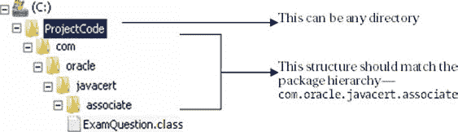

##### 设置打包类的类路径

要使 Java 运行时环境 (JRE) 能够找到您的类，请将包含您的打包 Java 代码的基本目录添加到类路径中。

例如，为了使 JRE 能够定位到前面例子中的`certification.ExamQuestion`类，将 C:\MyCode 目录添加到 classpath 中。为了使 JRE 能够定位到类`com.oracle.javacert.associate.ExamQuestion`，将 C:\ProjectCode 目录添加到 classpath 中。

| |
| --- |

##### 注意

如果你使用的是 IDE，你不需要麻烦设置 classpath。但我强烈建议你学习如何使用简单的文本编辑器以及如何设置 classpath。这可以在你的工作中有所帮助。考试期望你能够发现带有编译错误的代码，如果你没有学习如何在没有 IDE 的情况下做到这一点（IDE 通常包括代码自动纠正或自动完成功能），这并不容易。

| |
| --- |

#### 1.3.3\. 使用 import 语句的简单名称

`import`语句允许你使用*简单名称*而不是使用*完全限定名称*来引用定义在单独包中的类和接口。

让我们用一个现实生活中的例子来工作。想象一下你的家和你的办公室。家里的客厅和厨房可以相互引用，而不必提到它们存在于同一个家中。同样，在办公室里，隔间和会议室可以相互引用，而不必明确提到它们存在于同一个办公室。但是，如果没有说明它们存在于不同的家或办公室，Home 和 Office 就不能访问对方的房间或隔间。这种情况在图 1.15 中得到了表示。

##### 图 1.15\. 为了相互引用成员，Home 和 Office 应该指定它们存在于不同的地方。

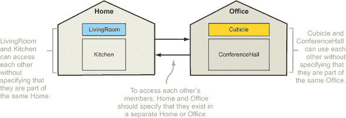

要引用隔间中的客厅，你必须指定其完整位置，如图图 1.16 的左侧所示。正如你可以从这张图中看到的，对客厅位置的重复引用使得对客厅的描述看起来繁琐且重复。为了避免这种情况，你可以在隔间中显示一个通知，说明所有对客厅的引用都指的是家中的客厅，之后可以使用其简单名称。Home 和 Office 就像 Java 包一样，这个通知相当于`import`语句。图 1.16 展示了在隔间中使用完全限定名称和简单名称对客厅的差别。

##### 图 1.16\. 在隔间中，可以通过使用其完全限定名称来访问客厅。如果你也使用`import`语句，也可以使用其简单名称来访问。


让我们在代码中实现前面的例子，其中`LivingRoom`和`Kitchen`类定义在`home`包中，而`Cubicle`和`ConferenceHall`类定义在`office`包中。类`Cubicle`使用（关联到）`home`包中的`LivingRoom`类，如图图 1.17 所示。

##### 图 1.17\. 定义在单独包中的`LivingRoom`和`Cubicle`类的 UML 表示，以及它们之间的关联

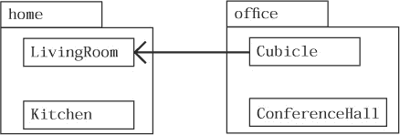

类 `Cubicle` 可以不使用 `import` 语句来引用类 `LivingRoom`：


类 `Cubicle` 可以通过使用 `import` 语句来使用类 `LivingRoom` 的简单名称：


|  |
| --- |

##### 注意

`import` 语句不会将导入类的内容嵌入到你的类中，这意味着*导入*更多类不会增加你自己的类的大小。

|  |
| --- |

#### 1.3.4\. 不使用 `import` 语句使用包类

可以使用完全限定的名称，而不使用 `import` 语句来使用包中的类或接口：


但如果你创建了多个在其他包中定义的接口和类的变量，使用完全限定的类名可能会使你的代码变得杂乱。*不要*在实际项目中使用这种方法。

|  |
| --- |

##### 考试技巧

使用 `java.lang` 包的成员不需要显式的 `import` 语句。此包中的类和接口在 *所有* 其他 Java 类、接口或枚举中自动导入。

|  |
| --- |

对于考试，重要的是要注意你不能使用 `import` 语句从不同包中访问具有相同名称的多个类或接口。例如，Java API 在两个常用包中定义了 `Date` 类：`java.util` 和 `java.sql`。要在类中定义这些类的变量，请使用变量声明中的完全限定名称：

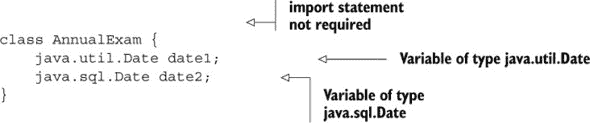

尝试在同一个类中使用 `import` 语句导入这两个类将无法编译：

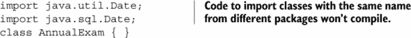

另一种方法（在实际项目中效果很好）是使用你使用频率较高的类或接口的 `import` 定义，并完全引用你偶尔使用的那个：

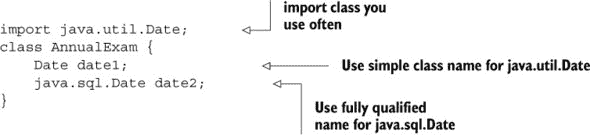

#### 1.3.5\. 导入单个成员与导入包的所有成员

你可以使用 `import` 语句导入包的单个成员或所有成员（类和接口）。首先，回顾一下 `certification` 包的 UML 表示，如图 1.18 所示。

##### 图 1.18\. `certification` 包的 UML 表示

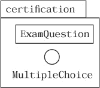

检查以下 `AnnualExam` 类的代码：

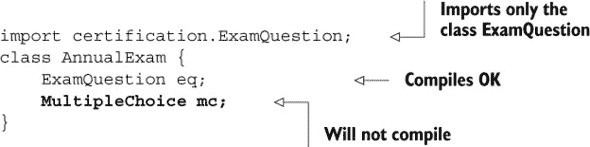

通过使用通配符，星号 (`*`)，你可以导入一个包的所有 `public` 成员、类和接口。比较以下类定义与 `AnnualExam` 类的以下定义：

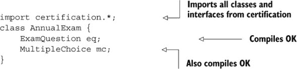

|  |
| --- |

##### 注意

当过度使用时，使用星号导入一个包的所有成员会有一个缺点。可能更难确定哪个导入的类或接口来自哪个包。

|  |
| --- |

当你使用 IDE 时，它可能会自动添加你在代码中引用的类和接口的 `import` 语句。

#### 1.3.6\. `import` 语句不会导入整个包树

你不能使用`import`语句中的星号导入子包中的类。例如，图 1.19 中的 UML 表示法描述了包含`Schedule`类和两个子包`associate`和`webdeveloper`的包`com.oracle.javacert`。包`associate`包含`ExamQuestion`类，而包`webdeveloper`包含`MarkSheet`类。

##### 图 1.19\. 包`com.oracle.javacert`及其子包的 UML 表示

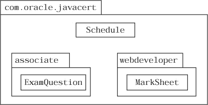

以下`import`语句只会导入`Schedule`类。它不会导入`ExamQuestion`和`MarkSheet`类：


同样，以下`import`语句会导入`associate`和`webdeveloper`包中的所有类：

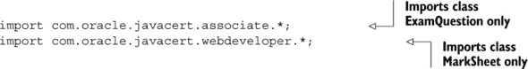

#### 1.3.7\. 从默认包导入类

如果你在类或接口中不包括包声明，会发生什么？在这种情况下，它们将成为一个*默认、无名称*包的一部分。这个默认包会自动导入你系统同一目录中定义的 Java 类和接口。

例如，未在显式包中定义的`Person`和`Office`类，如果它们定义在同一个目录中，则可以相互使用：

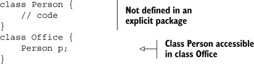

来自默认包的类无法在任何命名包的类中使用，无论它们是否定义在同一个目录中。

|  |
| --- |

##### 考试技巧

命名包的成员无法访问在*默认*包中定义的类和接口。

|  |
| --- |

#### 1.3.8\. 静态导入

你可以使用`import static`语句导入一个类的单个`static`成员或所有`static`成员。虽然可以通过实例访问，但最好通过在名称前加上类或接口名称来访问`static`成员。通过使用`static import`，你可以省略前缀，只需使用`static`变量或方法的名称。在以下代码中，类`ExamQuestion`定义了一个`public static`变量`marks`和一个`public static`方法`print`：

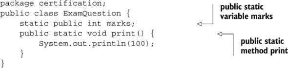

使用`import static`语句，可以在`AnnualExam`类中访问`marks`变量。`import`和`static`关键字的顺序不能颠倒：

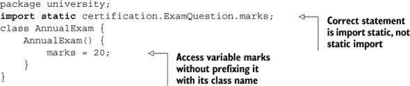

|  |
| --- |

##### 考试技巧

这个特性被称为*静态导入*，但其语法是`import static`。

|  |
| --- |

要在`AnnualExam`类中访问`ExamQuestion`类的所有`public`和`static`成员，而不需要单独导入每个成员，你可以使用`import static`语句中的星号：

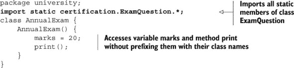

由于`marks`变量和方法`print`被定义为`public`成员，它们对`AnnualExam`类是可访问的。通过使用`import static`语句，你不需要在它们前面加上它们的类名。

|  |
| --- |

##### 注意

在实际项目中，避免过度使用静态导入；否则，代码可能会变得有些混乱，不清楚哪个导入组件来自哪个类。

|  |
| --- |

类、接口及其方法和变量的可访问性由它们的访问修饰符决定，这些将在下一节中介绍。

### 1.4\. Java 访问修饰符

| |
| --- |

[6.4] 应用访问修饰符

| |
| --- |

在本节中，我们将涵盖所有访问修饰符——`public`、`protected`和`private`——以及*默认访问*，这是当你不使用访问修饰符时的结果。我们还将探讨如何使用访问修饰符来限制同一包和不同包中类及其成员的可访问性。

#### 1.4.1\. 访问修饰符

让我们从一个例子开始。检查以下代码中`House`和`Book`类的定义以及图 1.20 中显示的 UML 表示。

##### 图 1.20\. 非公共类`Book`不能在包`library`外部访问。

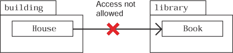

```
package building;
class House {}
package library;
class Book {}
```

根据当前的类定义，`House`类无法访问`Book`类。你能通过访问修饰符（在术语上）进行必要的更改，使`Book`类对`House`类可访问吗？

这一点不应该很难。从第 1.1 节中关于类声明的讨论中，你知道顶层类只能通过使用`public`或默认访问修饰符来定义。如果你使用访问修饰符`public`声明`Book`类，它将在定义它的包外部可访问。

| |
| --- |

##### 注意

顶层类是指不在任何其他类中定义的类。在另一个类中定义的类称为*嵌套*或*内部类*。嵌套和内部类不在 OCA Java SE 8 程序员 I 考试范围内。

| |
| --- |

##### 它们控制什么？

访问修饰符通过其他类和接口（在同一包或不同包中）控制类或接口的可访问性，包括其成员（方法和变量）。通过使用适当的访问修饰符，您可以限制对类或接口及其成员的访问。

##### 访问修饰符可以应用于所有类型的 Java 实体吗？

访问修饰符可以应用于类、接口及其成员（实例和类变量和方法）。局部变量和方法参数不能使用访问修饰符定义。尝试这样做将阻止代码编译。

##### 有多少种访问修饰符：三种还是四种？

程序员经常对 Java 中的访问修饰符数量感到困惑，因为*默认访问*不是使用显式关键字定义的。如果一个 Java 类、接口、方法或变量没有使用显式访问修饰符定义，那么它被认为是使用*默认访问*定义的，也称为*包访问*。

Java 有四个访问级别：

+   `public`（最不限制）

+   `protected`

+   默认

+   `private`（最限制）

为了理解所有这些访问级别，我们将使用相同的类集：`Book`、`CourseBook`、`Librarian`、`StoryBook` 和 `House`。图 1.21 使用 UML 表示法描述了这些类。

##### 图 1.21\. 一组类及其关系，以帮助您理解访问修饰符

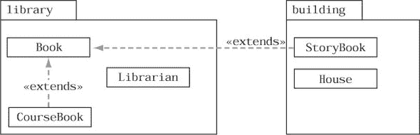

类 `Book`、`CourseBook` 和 `Librarian` 定义在包 `library` 中。类 `StoryBook` 和 `House` 定义在包 `building` 中。此外，类 `StoryBook` 和 `CourseBook`（在单独的包中定义）扩展了类 `Book`。使用这些类，我将展示类的可访问性和其成员在不同访问修饰符下的变化，从无关类到派生类，跨包。

在介绍每个访问修饰符时，我将向类 `Book` 添加一组实例变量和具有相关访问修饰符的方法。然后，在其它类中定义代码以访问类 `Book` 和其成员。

#### 1.4.2\. 公共访问修饰符

这是最不限制的访问修饰符。使用 `public` 访问修饰符定义的类和接口可以在所有包中访问，从派生类到无关类。

为了理解 `public` 访问修饰符，让我们将类 `Book` 定义为一个 `public` 类，并向其添加一个 `public` 实例变量（`isbn`）和一个 `public` 方法（`printBook`）。图 1.22 展示了 UML 表示法。

##### 图 1.22\. 理解 `public` 访问修饰符

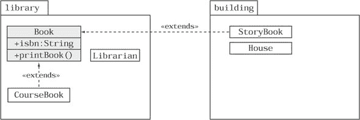

类 `Book` 的定义：

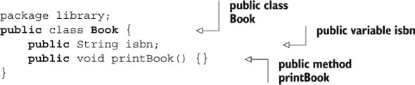

`public` 访问修饰符被认为是限制最少的，因此让我们尝试从类 `House` 访问 `public` 类 `Book` 和其 `public` 成员。我们将使用类 `House`，因为 `House` 和 `Book` 定义在不同的包中，并且它们是 *无关的*。

|  |
| --- |

##### 注意

本章中提到的“无关类”指的是没有共享继承关系的类。例如，如果 `House` 既不派生自 `Book`，`Book` 也不派生自 `House`，则类 `House` 和 `Book` 是无关的。

|  |
| --- |

类 `House` 在定义在同一个包中或作为派生类的情况下没有获得任何优势。

这是类 `House` 的代码：

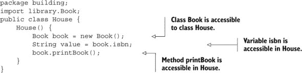

在前面的例子中，类 `Book` 和其 `public` 成员——实例变量 `isbn` 和方法 `printBook`——对类 `House` 可访问。它们也对其他类可访问：`StoryBook`、`Librarian`、`House` 和 `CourseBook`。图 1.23 展示了可以访问 `public` 类及其成员的类。

##### 图 1.23\. 可以访问公共类及其成员的类

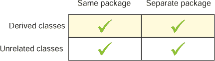

#### 1.4.3\. 受保护的访问修饰符

使用 `protected` 访问修饰符定义的类的成员可被访问

+   同一包中定义的类和接口

+   所有派生类，即使它们定义在单独的包中

让我们在类`Book`中添加一个`protected`实例变量`author`和一个方法`modifyTemplate`。图 1.24 显示了类的表示。

##### 图 1.24\. 理解`protected`访问修饰符

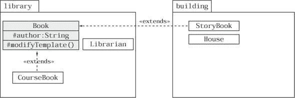

下面是类`Book`的代码（我故意省略了其`public`成员，因为在本节中它们不是必需的）：

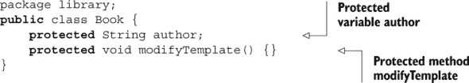

图 1.25 展示了来自同一包和不同包的类、派生类以及无关类如何访问类`Book`及其`protected`成员。

##### 图 1.25\. 从同一包和不同包中的无关和派生类访问类`Book`及其`protected`成员

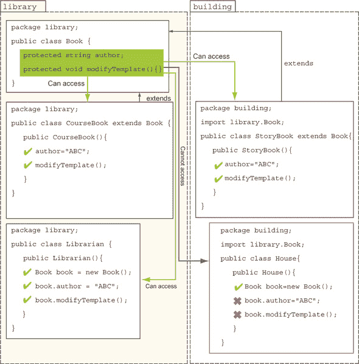

类`House`由于尝试访问方法`modifyTemplate`和变量`author`而无法编译。以下为编译错误信息：

```
House.java:8: modifyTemplate() has protected access in library.Book
        book.modifyTemplate();
            ^
```

|  |
| --- |

##### 注意

Java 代码由于语法错误而无法编译。在这种情况下，Java 编译器会通过行号和错误简短描述来通知有问题的代码。前面的代码是编译过程输出的。本书使用命令提示符来编译所有 Java 代码。

|  |
| --- |

一个派生类无论这些成员定义在哪个包中，都会继承其基类的`protected`成员。

注意，派生类`CourseBook`和`StoryBook`继承了类`Book`的`protected`成员变量`author`和方法`modifyTemplate()`。如果类`StoryBook`尝试使用引用变量实例化`Book`，然后尝试访问其`protected`变量`author`和方法`modifyTemplate()`，则无法编译：


|  |
| --- |

##### 考试技巧

一种简洁但又不失简单的表述前述规则的方式是：一个派生类可以继承并访问其基类中的`protected`成员，无论这些成员定义在哪个包中。一个位于单独包中的派生类不能通过引用变量访问其基类的`protected`成员。

|  |
| --- |

图 1.26 显示了可以访问类或接口`protected`成员的类。

##### 图 1.26\. 可以访问`protected`成员的类


#### 1.4.4\. 默认访问（包访问）

没有使用任何显式访问修饰符定义的类的成员具有`包访问性`（也称为`默认访问性`）。具有包访问的成员仅对定义在同一包中的类和接口是可访问的。默认访问也被称为`包私有`。将包想象成你的家，类想象成房间，房间里的东西想象成具有默认访问性的变量。这些东西并不局限于一个房间——它们可以访问你家中所有房间。但它们仍然属于你的家——你不会希望它们被家外的人访问。同样，当你定义一个包时，你可能希望使类中的成员对所有同一包中的其他类都是可访问的。

|  |
| --- |

##### 注意

尽管包私有访问权限与其他访问级别一样有效，但在实际项目中，它通常是由于经验不足的开发者忘记指定 Java 组件的访问模式而出现的结果。

| |
| --- |

让我们在 `Book` 类中定义一个具有默认访问权限的实例变量 `issueCount` 和一个方法 `issueHistory`。图 1.27 显示了包含这些新成员的类表示。

##### 图 1.27。理解默认访问权限的类表示


这是 `Book` 类的代码（我故意省略了它的 `public` 和 `protected` 成员，因为在本节中不需要它们）：


您可以看到来自同一包和不同包的类、派生类以及无关类如何访问 `Book` 类及其成员（变量 `issueCount` 和方法 `issueHistory`），如图 1.28 所示。

##### 图 1.28。来自同一包和不同包、派生类以及无关类的默认访问权限成员对 `Book` 类的访问


因为 `CourseBook` 和 `Librarian` 类与 `Book` 类定义在同一个包中，所以它们可以访问 `issueCount` 和 `issueHistory` 变量。因为 `House` 和 `StoryBook` 类没有与 `Book` 类位于同一个包中，所以它们无法访问 `issueCount` 和 `issueHistory` 变量。`StoryBook` 类抛出以下编译错误消息：

```
StoryBook.java:6: issueHistory() is not public in library.Book; cannot be accessed from outside package
        book.issueHistory();
            ^
```

类 `House` 对 `issueHistory()` 的存在一无所知——它将因以下错误消息而无法编译：

```
House.java:9: cannot find symbol
symbol  : method issueHistory()
location: class building.House
        issueHistory();
```

##### 定义具有默认访问权限的类 Book

如果我们定义一个具有默认访问权限的类会发生什么？如果该类本身具有默认（包）访问权限，其成员的可访问性会发生什么变化？

考虑这种情况：假设 Superfast Burgers 在一个美丽的岛屿上开设了一家新分店，并向来自世界各地的所有人提供免费餐点，这显然包括岛屿居民。但岛屿无法通过任何方式（空中和水路）进入。对于不居住在岛屿上的人来说，对这家特定的 Superfast Burgers 分店的意识有意义吗？这个例子的说明如图 1.29 所示。

##### 图 1.29。由于岛屿无法通过空中和水路进入，因此 Superfast Burgers 无法从岛屿外部访问。


岛屿在 Java 中就像一个包，Superfast Burgers 就像使用默认访问权限定义的类。就像 Superfast Burgers 无法从它存在的岛屿外部访问一样，具有默认（包）访问权限的类只能在定义它的包内部可见和可访问。它无法从其所在的包外部访问。

让我们重新定义具有默认（包）访问权限的类 `Book`，如下所示：


对于定义在同一个包中的类 `CourseBook` 和 `Librarian`，类 `Book` 的行为保持不变。但是，类 `Book` 不能被位于单独包中的类 `House` 和 `StoryBook` 访问。

让我们从类 `House` 开始。检查以下代码：


类 `House` 生成以下编译错误信息：

```
House.java:2: library.Book is not public in library; cannot be accessed from outside package
import library.Book;
```

这是类 `StoryBook` 的代码：


图 1.30 图 1.30 显示了哪些类可以访问具有默认（包）访问权限的类或接口的成员。

##### 图 1.30\. 可以访问默认（包）访问成员的类


由于许多程序员对使用 `protected` 和默认访问修饰符使哪些成员变得可访问感到困惑，考试提示提供了一个简单而有趣的规则来帮助您记住它们之间的区别。

| |
| --- |

##### 考试提示

默认访问可以与包私有（仅限于包内访问）相比较，而 `protected` 访问可以与包私有 + *子类*（“子类”指的是派生类）相比较。子类只能通过继承而不是通过引用（通过在对象上使用点操作符访问成员）来访问 `protected` 方法。

| |
| --- |

#### 1.4.5\. 私有访问修饰符

`private` 访问修饰符是最具限制性的访问修饰符。使用 `private` 访问修饰符定义的类的成员只能由自身访问。无论相关的类或接口是否来自另一个包或扩展了该类，`private` 成员在其定义的类之外都是不可访问的。`private` 成员只能由定义它们的类和接口访问。

让我们通过向类 `Book` 添加一个 `private` 方法 `countPages` 来看看这个行为。图 1.31 图 1.31 描述了使用 UML 的类表示。

##### 图 1.31\. 理解 `private` 访问修饰符


检查以下 `Book` 类的定义：


在任何包中定义的任何类（无论是否派生）都不能访问 `private` 方法 `countPages`。但让我们尝试从类 `CourseBook` 中访问它。我选择 `CourseBook` 是因为这两个类都在同一个包中定义，并且 `CourseBook` 扩展了类 `Book`。以下是 `CourseBook` 的代码：


因为类 `CourseBook` 尝试访问类 `Book` 的私有成员，所以它无法编译。同样，如果其他任何类（`StoryBook`、`Librarian`、`House` 或 `Course-Book`）尝试访问类 `Book` 的 `private` 方法 `countPages()`，它也无法编译。

这里有一个有趣的情况：你认为 `Book` 实例能否使用引用变量来访问其私有成员吗？以下代码无法编译——尽管变量 `b1` 的类型是 `Book`，但它试图在 `Book` 之外访问其私有方法 `countPages`：


图 1.32 展示了可以访问类 `private` 成员的类。

##### 图 1.32\. 没有类可以访问另一个类的 `private` 成员


|  |
| --- |

##### 注意

对于你的真实项目，确实可以使用 *Java 反射* 来访问类外部的私有成员。但 Java 反射不在考试范围内。所以在回答关于私有成员可访问性的问题时，不要考虑它。

|  |
| --- |

#### 1.4.6\. 访问修饰符和 Java 实体

每个访问修饰符都可以应用于所有 Java 实体吗？简单的答案是 *不*。 表 1.3 列出了 Java 实体及其可使用的访问修饰符。

##### 表 1.3\. Java 实体及其可应用的访问修饰符

| 实体名称 | public | protected | private |
| --- | --- | --- | --- |
| 顶级类、接口、枚举 | ✓ | χ | χ |
| 类变量和方法 | ✓ | ✓ | ✓ |
| 实例变量和方法 | ✓ | ✓ | ✓ |
| 方法参数和局部变量 | χ | χ | χ |

如果你尝试在 表 1.3 中为 X 编写组合，会发生什么？这些组合中的任何一个都无法编译。以下是代码：


在考试中要注意这些组合。在任何一个代码片段中插入这些小而无效的组合，仍然会让你相信你正在接受关于线程或并发等相对复杂主题的测试。

|  |
| --- |

##### 考试技巧

注意 Java 实体和访问修饰符的无效组合。这样的代码无法编译。

|  |
| --- |

##### 故事转折 1.4

以下任务分配给了一组程序员：“如何在包 `building` 中声明一个类 `Curtain`，使其在包 `building` 外不可见？”

这些是 Paul、Shreya、Harry 和 Selvan 提交的答案。你认为哪个是正确的，为什么？（你可以在附录中检查你的故事转折答案。）

| 程序员姓名 | 提交的代码 |
| --- | --- | --- | --- |
| Paul | 包 building; 公共类 Curtain {} |
| Shreya | 包 building; 受保护的类 Curtain {} |
| Harry | 包 building; 类 Curtain {} |
| Selvan | 包 building; 私有类 Curtain {} |

你的职位可能赋予你特殊的权限或责任。例如，如果你是一名 Java 开发者，你可能需要更新你的编程技能或在 Java 方面获得专业认证。同样，你可以通过使用 *非访问修饰符* 来赋予你的 Java 实体特殊的权限、责任和行为，这些内容将在下一节中介绍。

### 1.5\. 非访问修饰符

|  |
| --- |

[7.5] 使用抽象类和接口

|  |
| --- |
|  |

[6.2] 将静态关键字应用于方法和字段

|  |
| --- |

本节讨论非访问修饰符 `abstract`、`final` 和 `static`。访问修饰符控制类及其成员在类外和包外的可访问性。非访问修饰符改变 Java 类及其成员的默认行为。

例如，如果你将 `abstract` 关键字添加到类的定义中，它就不能被实例化。这就是非访问修饰符的神奇之处。

你可以用以下非访问修饰符来描述你的类、接口、方法和变量（尽管并非所有都适用于每个 Java 实体）：

+   `abstract`

+   `static`

+   `final`

+   `synchronized`

+   `native`

+   `strictfp`

+   `transient`

+   `volatile`

OCA Java SE 8 程序员 I 考试仅涵盖这些非访问修饰符中的三个：`abstract`、`final` 和 `static`，这些内容我将详细讲解。为了避免对其他修饰符的混淆，我在这里简要描述它们：

+   `synchronized`—一个 `synchronized` 方法不能被多个线程同时访问。你不能用这个修饰符标记类、接口或变量。

+   `native`—一个 `native` 方法调用并使用其他编程语言（如 C 或 C++）中实现的库和方法。你不能用这个修饰符标记类、接口或变量。

+   `transient`—当相应的对象被序列化时，`transient` 变量不会被序列化。`transient` 修饰符不能应用于类、接口或方法。

+   `volatile`—一个 `volatile` 变量的值可以被不同的线程安全地修改。类、接口和方法不能使用这个修饰符。

+   `strictfp`—使用此关键字定义的类、接口和方法确保使用浮点数进行的计算在所有平台上都是相同的。此修饰符不能与变量一起使用。

现在我们来看看考试中的三个非访问修饰符。

#### 1.5.1\. 抽象修饰符

当添加到类、接口或方法的定义中时，`abstract` 修饰符会改变其默认行为。因为它是一个非访问修饰符，所以 `abstract` 不会改变类、接口或方法的可访问性。

让我们通过 `abstract` 修饰符来检查每个这些行为的特性。

##### 抽象类

当 `abstract` 关键字作为具体类定义的前缀时，即使该类没有定义任何抽象方法，它也会将其转换为抽象类。以下代码是一个有效的抽象类示例：

```
abstract class Person {
    private String name;
    public void displayName() { }
}
```

抽象类不能被实例化，这意味着以下代码将无法编译：


这是前一个类抛出的编译错误：

```
University.java:4: Person is abstract; cannot be instantiated
    Person p = new Person();
               ^
1 error
```

|  |
| --- |

##### 考试技巧

一个抽象类可以或不可以定义一个抽象方法。但一个具体类不能定义一个抽象方法。

|  |
| --- |

##### 抽象接口

接口默认是一个抽象实体。Java 编译器会自动将`抽象`关键字添加到接口的定义中。因此，将`抽象`关键字添加到接口的定义中是多余的。以下接口的定义是相同的：


##### 抽象方法

一个`抽象`方法没有主体。通常，`抽象`方法由派生类实现。以下是一个例子：


| |
| --- |

##### 考试技巧

一个空体的方法不是`抽象`方法。

| |
| --- |

##### 抽象变量

不同的变量类型（实例、`静态`、局部和方法的参数）都不能定义为`抽象`。

| |
| --- |

##### 考试技巧

不要被试图将非访问修饰符`抽象`应用于变量的代码所欺骗。这样的代码无法编译。

| |
| --- |

#### 1.5.2\. final 修饰符

关键字`final`可以与类、变量或方法的声明一起使用。它不能与接口的声明一起使用。

##### final 类

被标记为`final`的类不能被另一个类扩展。如果`Person`类被标记为`final`，则`Professor`类将无法编译，如下所示：


##### final 接口

接口不能标记为`final`。接口默认是`抽象`的，标记为`final`将阻止你的接口编译：


##### final 变量

`final`变量不能重新赋值。它只能赋值一次。以下代码说明：


将前面的例子与以下尝试重新赋值给 final 变量的代码进行比较：


容易将向`final`变量重新赋值与在`final`变量上*调用*方法混淆，这可能会改变它所引用的对象的状态。如果引用变量被定义为`final`变量，你不能将其重新赋值为另一个对象，但可以调用此变量的方法（这些方法会修改其状态）：


##### final 方法

在基类中定义的`final`方法不能被派生类重写。检查以下代码：


如果派生类中的方法与其基类的方法具有相同的签名，则称为*重写方法*。重写方法将与多态一起在第六章中讨论。

#### 1.5.3\. 静态修饰符

非访问修饰符`静态`可以应用于变量、方法、类和接口的声明。我们将在接下来的章节中逐一考察它们。

##### 静态变量

`静态`变量属于一个类。它们对所有类的实例都是通用的，并不属于任何单个实例。`静态`属性独立于类的任何实例存在，即使没有创建类的实例也可以访问。你可以将`静态`变量与共享变量进行比较。一个`静态`变量被类中的所有对象共享。

| |
| --- |

##### 注意

一个类和一个接口都可以声明 `static` 变量。本节涵盖了在类中定义的 `static` 变量的声明和使用。第六章 详细介绍了接口及其 `static` 变量。

| |
| --- |

将 `static` 变量想象成一个由组织中的员工共享的公共银行保险库。每个员工都可以访问相同的银行保险库，因此一个员工所做的任何更改都会对所有其他员工可见，如 图 1.33 所示。

##### 图 1.33\. 比较共享银行保险库与 `static` 变量


图 1.34 定义了一个 `Emp` 类，该类定义了一个非 `static` 变量 `name` 和一个 `static` 变量 `bankVault`。

##### 图 1.34\. `Emp` 类的定义，包含 `static` 变量 `bankVault` 和非 `static` 变量 `name`


现在是测试我们到目前为止所讨论内容的时候了。下面的 `TestEmp` 类创建了 `Emp` 类（来自 图 1.34）的两个对象，并使用这些单独的对象修改变量 `bankVault` 的值：


在前面的代码示例中，`emp1.bankVault`、`emp2.bankVault` 和 `Emp.bank-Vault` 都引用了相同的 `static` 属性：`bankVault`。

| |
| --- |

##### 考试技巧

尽管你可以使用对象引用变量来访问 `static` 成员，但这样做并不建议。因为 `static` 成员属于类而不是单个对象，使用对象引用变量来访问 `static` 成员可能会使它们看起来属于一个对象。访问它们的最佳方式是使用类名。`static` 和 `final` 非访问修饰符可以一起使用来定义 *常量*（值不能改变的变量）。

| |
| --- |

在以下代码中，类 `Emp` 定义了常量 `MIN_AGE` 和 `MAX_AGE`：


虽然你可以将常量定义为非 `static` 成员，但通常的做法是将常量定义为 `static` 成员，因为这样做可以使常量值在对象和类之间共享。

##### `static` 方法

`static` 方法与对象无关，不能使用类的任何实例变量。你可以定义 `static` 方法来访问或操作 `static` 变量：


使用 `static` 方法定义 *实用方法* 是一种常见的做法，这些方法是通常操作方法参数以计算并返回适当值的函数：

```
static double interest(double num1, double num2, double num3) {
    return(num1+num2+num3)/3;
}
```

下面的实用 (`static`) 方法没有定义输入参数。方法 `averageOfFirst100Integers` 计算并返回数字 `1` 到 `100` 的平均值：


非私有 `static` 变量和方法会被派生类继承。`static` 成员不参与运行时多态。你无法在派生类中重写 `static` 成员，但可以重新定义它们。

如果你不知道继承和派生类，关于静态方法和它们行为的讨论可能会相当令人困惑。但如果你不理解所有这些内容，请不要担心。我将在第六章中介绍派生类和继承。现在，请注意，静态方法可以使用对象引用变量的名称和类名以类似于静态变量的方式访问。

##### 静态方法可以访问什么？

无论是静态方法还是静态变量都不能访问类的非静态变量和方法。但反之则不然：非静态变量和方法可以访问静态变量和方法，因为类的静态成员即使没有类的实例也存在。静态成员不允许访问实例方法或变量，这些方法或变量只有当创建了类的实例时才存在。

检查以下代码：


这是上一个类抛出的编译错误：

```
MyClass.java:3: nonstatic method count() cannot be referenced from a static context
    static int x = count();
                   ^
1 error
```

以下代码是有效的：


|  |
| --- |

##### 考试技巧

静态方法和变量不能访问类的实例成员。

|  |
| --- |

表 1.4 总结了静态和非静态成员的访问能力。

##### 表 1.4\. 静态和非静态成员的访问能力

| 成员类型 | 是否可以访问静态属性或方法？ | 是否可以访问非静态属性或方法？ |
| --- | --- | --- |
| 静态 | 是 | 否 |
| 非静态 | 是 | 是 |

##### 从空引用访问静态成员

因为静态变量和方法属于类而不是实例，所以你可以使用初始化为`null`的变量来访问它们。在考试中要注意这类问题。这样的代码不会抛出运行时异常（确切地说，是`NullPointerException`）。在以下示例中，引用变量`emp`被初始化为`null`：


|  |
| --- |

##### 考试技巧

你可以使用空引用来访问静态变量和方法。

|  |
| --- |
|  |

**静态类和接口**

认证考生经常询问有关静态类和接口的问题，所以我会快速在本节中介绍这些内容，以消除与它们相关的任何混淆。但请注意，静态类和接口是嵌套类和接口的类型，这些类型不包括在 OCA Java 8 程序员 I 考试范围内。

你不能使用关键字`static`来前缀顶级类或接口的定义。顶级类或接口是在另一个类或接口之外定义的。以下代码将无法编译：

```
static class Person {}
static interface MyInterface {}
```

但你可以定义一个类和一个接口作为另一个类的静态成员。以下代码是有效的：


|  |
| --- |

下一节将介绍导致 Java 在二十年前流行，并且至今仍具有强大影响力的 Java 特点。

### 1.6\. Java 的特点和组件

|  |
| --- |

[1.5] 比较和对比 Java 的功能和组件，例如：平台独立性、面向对象、封装等。

| |
| --- |

Java 编程语言于 1995 年发布。它主要开发用于与消费电子产品协同工作。但很快它就因为与网络浏览器的结合而变得非常流行，用于提供动态内容（使用小程序），这不需要为不同的平台重新编译。让我们开始了解 Java 的独特特性和组件，这些特性仍然使它成为一种流行的编程语言。

| |
| --- |

##### 注意

考试将询问与 Java 相关或无关的功能和组件。

| |
| --- |

#### 1.6.1. Java 的有效功能和组件

Java 相比其他语言和平台提供了多项优势。

##### 平台独立性

这个特性是 Java 自发布以来取得惊人增长的主要原因之一。它也被称作“一次编写，到处运行”（WORA）——这是 Sun Microsystems^(TM) 创造的一个口号，用以强调 Java 的平台独立性。

Java 代码可以在多个系统上执行，而无需重新编译。Java 代码被编译成 *字节码*，由 *虚拟机*——Java 虚拟机（JVM）执行。JVM 安装在不同的操作系统平台上，如 Windows、Mac 或 Linux。JVM 将字节码解释为特定于机器的指令以执行。JVM 的实现细节取决于机器，可能在不同平台上有所不同，但它们都以类似的方式解释相同的字节码。Java 编译器生成的字节码被所有带有 JVM 的平台支持。

其他流行的编程语言，如 C 和 C++，会将它们的代码编译到宿主系统中。因此，代码必须为不同的平台重新编译。

##### 面向对象

Java 模拟现实生活中的对象定义和行为。在现实生活中，状态和行为与对象相关联。同样，所有 Java 代码都是在类、接口或枚举中定义的。你需要创建它们的对象来使用它们。

##### 抽象

Java 允许你抽象对象，并在代码中只包含所需的属性和行为。例如，如果你正在开发一个跟踪一个国家人口的应用程序，你会记录一个人的姓名、地址和联系详情。但对于一个健康跟踪系统，你可能还想包括与健康相关的细节和行为。

##### 封装

使用 Java 类，你可以封装一个对象的状态和行为。类的状态或字段受到不受欢迎的访问和操作的防护。你可以控制对对象访问和修改的级别。

##### 继承

Java 允许其类继承其他类并实现接口。接口可以继承其他接口。这可以节省你重新定义通用代码的时间。

##### 多态

多态的直译意思是“多种形式”。Java 允许其类的实例对同一方法调用表现出多种行为。你将在第六章中详细了解这一点。章节链接。

##### 类型安全

在 Java 中，你必须在使用变量之前声明其数据类型 *before* 你才能使用它。这意味着你有一个编译时检查，确保你永远不会将错误类型的值赋给变量。

##### 自动内存管理

与其他编程语言如 C 或 C++ 不同，Java 使用垃圾回收器进行自动内存管理。它们从不再使用的对象中回收内存。这使开发者免于显式管理内存。它还防止了内存泄漏。

##### 多线程和并发

Java 自首次发布以来就支持多线程和并发——由其核心 API 中定义的类和接口提供支持。

##### 安全性

Java 包含多个内置的安全功能（尽管本考试并未涵盖所有内容），以控制对您资源的访问和程序的执行。

Java 是类型安全的，并包括垃圾回收功能。它提供安全的类加载，并且验证确保执行的是合法的 Java 代码。

Java 平台定义了多个 API，包括加密和公钥基础设施。在安全管理器控制下运行的 Java 应用程序可以控制对您资源的访问，如读取或写入文件。可以通过策略文件来控制对资源的访问。Java 允许您定义数字签名、证书和密钥库以保护代码和文件交换。已签名的代码用于执行。

Java 通过封装和数据隐藏等特性，确保了其对象的状态安全。Java 小程序在浏览器中执行，不允许代码下载到系统中，从而为浏览器及其运行系统提供了安全性。

#### 1.6.2. Java 的无关特性和组件

考试可能还会包括一些无关的术语。

##### 单线程

Java 支持使用内置的类和接口进行多线程编程。你可以创建和使用单线程，但 Java 语言本身不是单线程的。即使你创建了执行的单线程，Java 也会在单独的线程中执行自己的进程，如垃圾回收。Java 不是一个单线程的语言。

##### 与 JavaScript 相关

Java 与 JavaScript（除了名称相似之外）无关。JavaScript 是一种用于网页的编程语言，用于使网页具有交互性。

### 1.7. 摘要

本章从查看 Java 类的结构开始。尽管你应该知道如何使用 Java 类、Java 源代码文件（.java 文件）和 Java 字节码文件（.class 文件），但 OCA Java SE 8 程序员 I 考试只会就前两者的结构和组件进行提问——即类和源代码，而不是 Java 字节码。

我们讨论了 Java 类和 Java 源代码文件的组件。一个类可以定义多个组件，即`import`和`package`语句、变量、构造函数、方法、注释、嵌套类、嵌套接口、注解和枚举。Java 源代码文件（.java）可以定义多个类和接口。

然后，我们介绍了可执行和非可执行 Java 类之间的差异和相似之处。一个可执行 Java 类定义了 JVM 启动执行时的入口点（`main`方法）。`main`方法应该使用所需的方法签名定义；否则，该类将无法被分类为可执行 Java 类。

包用于将相关的类和接口分组在一起。它们还提供访问保护和命名空间管理。`import`语句用于从其他包中导入类和接口。如果没有`import`语句，类和接口应该通过它们的完全限定名（完整的包名加上类或接口名）来引用。

访问修饰符控制类及其成员在包内和包之间的访问。Java 定义了四个访问修饰符：`public`、`protected`、默认和`private`。当默认访问被分配给一个类或其成员时，它前面没有前缀。没有访问修饰符的缺失等于将类或其成员分配为默认访问。最不限制的访问修饰符是`public`，而`private`是最限制的。`protected`访问位于`public`和默认访问之间，允许包外派生类访问。

我们介绍了`abstract`和`static`非访问修饰符。一个类或一个方法可以被定义为`abstract`成员。`abstract`类不能被实例化。方法和变量可以被定义为`static`成员。一个类的所有对象共享相同的`static`变量副本，这些变量也被称为类级别变量。

最后，我们介绍了 Java 的特性和组件，使其成为流行的选择。

### 1.8. 复习笔记

本节列出了本章涵盖的主要要点。

Java 类和源代码文件的结构：

+   OCA Java SE 8 程序员 I 考试涵盖了 Java 类和 Java 源代码文件（.java 文件）的结构和组件。它不涵盖 Java 字节码文件（.class 文件）的结构和组件。

+   一个类可以定义多个组件。你听说过的所有 Java 组件都可以在 Java 类中定义：`import`和`package`语句、变量、构造函数、方法、注释、嵌套类、嵌套接口、注解和枚举。

+   本考试不涵盖嵌套类、嵌套接口、注解和枚举的定义。

+   如果一个类定义了`package`语句，它应该是类定义中的第一个语句。

+   `package`语句不能出现在类声明内或类声明之后。

+   如果存在，`package`语句应该在一个类中恰好出现一次。

+   `import`语句允许使用简单名称、类的非限定名称和接口。

+   不能使用`import`语句导入具有相同名称的多个类或接口。

+   一个类可以包含多个`import`语句。

+   如果一个类包含`package`语句，所有的`import`语句都应该跟在`package`语句之后。

+   如果存在，`import`语句必须放在任何类或接口定义之前。

+   注释是类的另一个组成部分。注释用于注释 Java 代码，并且可以在类中多个位置出现。

+   注释可以出现在`package`语句之前或之后，类定义之前或之后，以及方法定义之前、之内或之后。

+   注释有两种类型：多行注释和行尾注释。

+   注释可以包含任何特殊字符（包括 Unicode 字符集中的字符）。

+   多行注释跨越多行代码。它们以`/*`开始，以`*/`结束。

+   行尾注释以`//`开始，正如其名所示，放置在代码行或空白行的末尾。`//`和行尾之间的文本被视为注释。

+   类声明和类定义是 Java 类的一部分。

+   一个 Java 类可以定义零个或多个实例变量、方法和构造函数。

+   在类中，实例变量、构造函数和方法的定义顺序无关紧要。

+   一个类可以在定义方法之前或之后定义实例变量，并且仍然可以使用它。

+   一个 Java 源代码文件（.java 文件）可以定义多个类和接口。

+   只能在与源代码文件同名的文件中定义`public`类。

+   `package`和`import`语句适用于同一源代码文件（.java 文件）中定义的所有类和接口。

可执行的 Java 应用程序：

+   可执行的 Java 类是当传递给 Java 虚拟机（JVM）时，在类中的特定点开始执行其执行的类。这个执行点是`main`方法。

+   为了使一个类可执行，该类应该定义一个签名为`public static void main(String args[])`或`public static void main(String... args)`的`main`方法。`static`和`public`的位置可以互换，方法参数可以使用任何有效的名称。

+   一个类可以定义多个名为`main`的方法，只要这些方法的签名与前面提到的`main`方法的签名不匹配。这些*重载*版本不被认为是`main`方法。

+   `main`方法接受一个类型为`String`的数组，包含 JVM 传递给它的方法参数。

+   关键字`java`和类的名称不会被作为命令参数传递给`main`方法。

Java 包：

+   您可以使用包将相关的一组类和接口组合在一起。

+   默认情况下，不同包和子包中的所有类和接口对彼此不可见。

+   包和子包名称使用点分隔。

+   同一包中的所有类和接口对彼此可见。

+   `import` 语句允许使用其他包中定义的包装类和接口的简单名称。

+   您不能使用 `import` 语句访问来自不同包的具有相同名称的多个类或接口。

+   您可以使用 `import` 语句导入包的单个成员或所有成员（类和接口）。

+   您不能在 `import` 语句中使用通配符字符（星号 `*`）导入子包中的类。

+   来自默认包的类不能用于任何命名包装类，无论它是否定义在同一目录中。

+   您可以使用 `static import` 语句导入类的单个 `static` 成员或所有 `static` 成员。

+   在类中不能将 `import` 语句放在 `package` 语句之前。任何尝试这样做都会导致类编译失败。

+   默认包的成员只能被定义在同一系统目录上的类或接口访问。

Java 访问修饰符：

+   访问修饰符控制类及其成员在类和包外部可访问性。

+   Java 定义了四个访问级别：`public`、`protected`、默认和`private`。

+   Java 定义了三个访问修饰符：`public`、`protected` 和 `private`。

+   `public` 访问修饰符是最不限制的访问修饰符。

+   使用 `public` 访问修饰符定义的类及其成员对定义它们的包中的相关和不相关的类都是可访问的。

+   使用 `protected` 访问修饰符定义的类的成员对同一包中定义的类和接口以及所有派生类都是可访问的，即使它们定义在不同的包中。

+   未使用显式访问修饰符定义的类的成员具有包访问性（也称为默认访问性）。

+   具有包访问的成员只能被定义在同一包中的类和接口访问。

+   使用默认访问定义的类在其包外部不可访问。

+   使用 `private` 访问修饰符定义的类的成员只能在其定义的类中访问。无论相关的类或接口是否来自另一个包或扩展了该类，这都不重要。私有成员在其定义的类外部不可访问。

+   `private` 访问修饰符是最限制的访问修饰符。

非访问修饰符：

+   非访问修饰符改变 Java 类及其成员的默认属性。

+   本考试涵盖的非访问修饰符有 `abstract`、`final` 和 `static`。

+   当 `abstract` 关键字加在具体类的定义之前时，即使它没有定义任何 `abstract` 方法，也可以将其转换为 `abstract` 类。

+   `abstract` 类不能被实例化。

+   接口是隐式 `abstract` 的。Java 编译器自动将 `abstract` 关键字添加到接口的定义中（这意味着在接口定义中添加 `abstract` 关键字是多余的）。

+   `abstract` 方法没有主体。当一个非 `abstract` 类扩展了一个具有 `abstract` 方法的类时，它必须实现该方法。

+   变量不能定义为 `abstract` 变量。

+   `static` 修饰符可以应用于内部类、内部接口、变量和方法。内部类和接口不包含在本考试中。

+   方法不能同时定义为 `abstract` 和 `static`。

+   `static` 属性（字段和方法）对所有类的实例都是通用的，并不特定于类的任何实例。

+   `static` 属性独立于类的任何实例存在，即使没有创建类的实例也可以访问。

+   `static` 属性也被称为 *类字段* 或 *类方法*，因为它们被认为属于它们的类，而不是属于该类的任何实例。

+   可以使用引用对象变量的名称或类的名称来访问 `static` 变量或方法。

+   `static` 方法或变量不能访问类的非 `static` 变量或方法。但反之亦然：非 `static` 变量和方法可以访问 `static` 变量和方法。

+   `static` 类和接口是一种嵌套类和接口，但它们不包含在本考试中。

+   不能用 `static` 关键字前缀顶级类或接口的定义。顶级类或接口是在另一个类或接口之外定义的。

Java 的特性和组件：

+   ***面向对象—*** Java 模拟现实生活中的对象定义和行为。它使用类、接口或枚举来定义所有代码。

+   ***抽象—*** Java 允许你抽象对象，并在代码中只包含所需的属性和行为。

+   ***封装—*** 类的状态或字段受到不受欢迎的访问和操作的防护。

+   ***继承—*** Java 允许其类继承其他类并实现接口。接口可以继承其他接口。

+   ***多态—*** Java 允许其类的实例对同一方法调用表现出多种行为。

+   ***类型安全—*** 在 Java 中，在使用变量之前必须声明其数据类型。

+   ***自动内存管理—*** Java 使用垃圾回收器进行自动内存管理。它们从不再使用的对象中回收内存。

+   ***多线程和并发—*** Java 定义了类和接口，以使开发者能够开发多线程代码。

+   Java 不是一个单线程语言。

### 1.9\. 样例考试问题

> **Q1-1.**
> 
> 给定：
> 
> ```
> class EJava {
>     //..code
> }
> ```
> 
> 以下哪个选项可以编译？
> 
> 1.  ```
>     package java.oca.associate;
>     class Guru {
>         EJava eJava = new EJava();
>     }
>     ```
> 1.  
> 1.  ```
>     package java.oca;
>     import EJava;
>     class Guru {
>         EJava eJava;
>     }
>     ```
> 1.  
> 1.  ```
>     package java.oca.*;
>     import java.default.*;
>     class Guru {
>         EJava eJava;
>     }
>     ```
> 1.  
> 1.  ```
>     package java.oca.associate;
>     import default.*;
>     class Guru {
>         default.EJava eJava;
>     }
>     ```
> 1.  
> 1.  以上皆非
> 1.  
> **Q1-2.**
> 
> 以下编号的 Java 类组件列表没有特定的顺序。选择它们在任何 Java 类中出现的可接受顺序（选择所有适用的）：
> 
> 1.  注释
> 1.  
> 1.  `import`语句
> 1.  
> 1.  `package`语句
> 1.  
> 1.  方法
> 1.  
> 1.  类声明
> 1.  
> 1.  变量
> 1.  
> 1.  1, 3, 2, 5, 6, 4
> 1.  
> 1.  3, 1, 2, 5, 4, 6
> 1.  
> 1.  3, 2, 1, 4, 5, 6
> 1.  
> 1.  3, 2, 1, 5, 6, 4
> 1.  
> **Q1-3.**
> 
> 以下哪个示例定义了正确的 Java 类结构？
> 
> 1.  ```
>     #connect java compiler;
>     #connect java virtual machine;
>     class EJavaGuru {}
>     ```
> 1.  
> 1.  ```
>     package java compiler;
>     import java virtual machine;
>     class EJavaGuru {}
>     ```
> 1.  
> 1.  ```
>     import javavirtualmachine.*;
>     package javacompiler;
>     class EJavaGuru {
>         void method1() {}
>         int count;
>     }
>     ```
> 1.  
> 1.  ```
>     package javacompiler;
>     import javavirtualmachine.*;
>     class EJavaGuru {
>         void method1() {}
>         int count;
>     }
>     ```
> 1.  
> 1.  ```
>     #package javacompiler;
>     $import javavirtualmachine;
>     class EJavaGuru {
>         void method1() {}
>         int count;
>     }
>     ```
> 1.  
> 1.  ```
>     package javacompiler;
>     import javavirtualmachine;
>     Class EJavaGuru {
>         void method1() {}
>         int count;
>     }
>     ```
> 1.  
> **Q1-4.**
> 
> 给定以下 Java 源代码文件 MyClass.java 的内容，选择正确的选项：
> 
> ```
> // contents of MyClass.java
> package com.ejavaguru;
> import java.util.Date;
> class Student {}
> class Course {}
> ```
> 
> 1.  导入的类`java.util.Date`只能在`Student`类中访问。
> 1.  
> 1.  导入的类`java.util.Date`可以被`Student`和`Course`类访问。
> 1.  
> 1.  `Student`和`Course`两个类都定义在`com.ejava-guru`包中。
> 1.  
> 1.  只有`Student`类定义在`com.ejavaguru`包中。`Course`类定义在默认的 Java 包中。
> 1.  
> **Q1-5.**
> 
> 给定以下类`EJavaGuru`的定义，
> 
> ```
> class EJavaGuru {
>     public static void main(String[] args) {
>         System.out.println(args[1]+":"+ args[2]+":"+ args[3]);
>     }
> }
> ```
> 
> 如果使用以下命令执行`EJavaGuru`，它的输出是什么？
> 
> ```
> java EJavaGuru one two three four
> ```
> 
> 1.  `one:two:three`
> 1.  
> 1.  `EJavaGuru:one:two`
> 1.  
> 1.  `java:EJavaGuru:one`
> 1.  
> 1.  `two:three:four`
> 1.  
> **Q1-6.**
> 
> 以下哪个选项，当插入到`//INSERT CODE HERE`处时，将打印出`EJavaGuru`？
> 
> ```
> public class EJavaGuru {
>     // INSERT CODE HERE
>     {
>         System.out.println("EJavaGuru");
>     }
> }
> ```
> 
> 1.  `public void main (String[] args)`
> 1.  
> 1.  `public void main(String args[])`
> 1.  
> 1.  `static public void main (String[] array)`
> 1.  
> 1.  `public static void main (String args)`
> 1.  
> 1.  `static public main (String args[])`
> 1.  
> **Q1-7.**
> 
> “一次编写，到处运行”的含义是什么？选择正确的选项：
> 
> 1.  Java 代码可以由一个团队成员编写，并由其他团队成员执行。
> 1.  
> 1.  仅用于营销目的。
> 1.  
> 1.  它使 Java 程序能够一次性编译，并且可以在任何 JVM 上执行而无需重新编译。
> 1.  
> 1.  旧 Java 代码在发布新版本的 JVM 时不需要重新编译。
> 1.  
> **Q1-8.**
> 
> 在`com.ejavaguru`包中定义了一个`Course`类。考虑到相应的类文件物理位置是/mycode/com/ejavaguru/Course.class，并且执行发生在 mycode 目录内，以下哪行代码，当插入到`// INSERT CODE HERE`处时，将导入`Course`类到`MyCourse`类中？
> 
> ```
> // INSERT CODE HERE
> class MyCourse {
>     Course c;
> }
> ```
> 
> 1.  `import mycode.com.ejavaguru.Course;`
> 1.  
> 1.  `import com.ejavaguru.Course;`
> 1.  
> 1.  `import mycode.com.ejavaguru;`
> 1.  
> 1.  `import com.ejavaguru;`
> 1.  
> 1.  `import mycode.com.ejavaguru*;`
> 1.  
> 1.  `import com.ejavaguru*;`
> 1.  
> **Q1-9.**
> 
> 检查以下代码：
> 
> ```
> class Course {
>     String courseName;
> }
> class EJavaGuru {
>     public static void main(String args[]) {
>         Course c = new Course();
>         c.courseName = "Java";
>         System.out.println(c.courseName);
>     }
> }
> ```
> 
> 如果将变量`courseName`定义为`private`变量，以下哪个语句将是正确的？
> 
> 1.  类`EJavaGuru`将打印`Java`。
> 1.  
> 1.  类`EJavaGuru`将打印`null`。
> 1.  
> 1.  类`EJavaGuru`不会编译。
> 1.  
> 1.  类`EJavaGuru`将在运行时抛出异常。
> 1.  
> **Q1-10.**
> 
> 给定以下`Course`类的定义，
> 
> ```
> package com.ejavaguru.courses;
> class Course {
>     public String courseName;
> }
> ```
> 
> 以下代码的输出是什么？
> 
> ```
> package com.ejavaguru;
> import com.ejavaguru.courses.Course;
> class EJavaGuru {
>     public static void main(String args[]) {
>         Course c = new Course();
>         c.courseName = "Java";
>         System.out.println(c.courseName);
>     }
> }
> ```
> 
> 1.  类`EJavaGuru`将打印`Java`。
> 1.  
> 1.  类`EJavaGuru`将打印`null`。
> 1.  
> 1.  类`EJavaGuru`无法编译。
> 1.  
> 1.  类`EJavaGuru`将在运行时抛出异常。
> 1.  
> **Q1-11.**
> 
> 给定以下代码，选择正确的选项：
> 
> ```
> package com.ejavaguru.courses;
> class Course {
>     public String courseName;
>     public void setCourseName(private String name) {
>         courseName = name;
>     }
> }
> ```
> 
> 1.  你不能将方法参数定义为`private`变量。
> 1.  
> 1.  方法参数应该使用`public`或默认可访问性定义。
> 1.  
> 1.  对于重写的方法，方法参数应该使用`protected`可访问性定义。
> 1.  
> 1.  以上都不对。

### 1.10. 样本考试问题的答案

> **Q1-1.**
> 
> 给定：
> 
> ```
> class EJava {
>     //..code
> }
> ```
> 
> 以下哪个选项可以编译？
> 
> 1.  ```
>     package java.oca.associate;
>     class Guru {
>         EJava eJava = new EJava();
>     }
>     ```
> 1.  
> 1.  ```
>     package java.oca;
>     import EJava;
>     class Guru {
>         EJava eJava;
>     }
>     ```
> 1.  
> 1.  ```
>     package java.oca.*;
>     import java.default.*;
>     class Guru {
>         EJava eJava;
>     }
>     ```
> 1.  
> 1.  ```
>     package java.oca.associate;
>     import default.*;
>     class Guru {
>         default.EJava eJava;
>     }
>     ```
> 1.  
> 1.  **以上都不对**
> 1.  
> 答案：e
> 
> 解释：未在包中定义的类在 Java 中隐式地定义在默认包中。但这样的类不能被显式定义在包中的类或接口访问。
> 
> 选项 a 是错误的。`EJava`类未在包中定义，因此无法被定义在`java.oca.associate`包中的`Guru`类访问。
> 
> 选项 b、c 和 d 无法编译。选项 b 在`import`语句中使用了无效的语法。选项 c 和 d 尝试从不存在的包中导入类——*java.default*和*default*。
> 
> **Q1-2.**
> 
> 以下编号的 Java 类组件列表没有特定的顺序。选择它们在 Java 类中出现的正确顺序（选择所有适用的）：
> 
> 1.  注释
> 1.  
> 1.  `import`语句
> 1.  
> 1.  `package`语句
> 1.  
> 1.  方法
> 1.  
> 1.  类声明
> 1.  
> 1.  变量
> 1.  
>     1.  **1, 3, 2, 5, 6, 4**
>     1.  
>     1.  **3, 1, 2, 5, 4, 6**
>     1.  
>     1.  3, 2, 1, 4, 5, 6
>     1.  
>     1.  **3, 2, 1, 5, 6, 4**
>     1.  
> 答案：a, b, d
> 
> 解释：注释可以出现在类中的任何位置。它们可以出现在`package`和`import`语句之前和之后。它们可以出现在类、方法或变量声明之前或之后。
> 
> 类中第一个语句（如果存在）应该是`package`语句。它不能放在`import`语句或类声明之后。
> 
> `import`语句应该跟在`package`语句之后，并跟在类声明之后。
> 
> 类声明跟在`import`语句之后（如果存在）。它后面跟着方法和变量的声明。
> 
> 答案 c 是错误的。在类或接口定义之前不能定义任何变量或方法。
> 
> **Q1-3.**
> 
> 以下哪个示例定义了正确的 Java 类结构？
> 
> 1.  ```
>     #connect java compiler;
>     #connect java virtual machine;
>     class EJavaGuru {}
>     ```
> 1.  
> 1.  ```
>     package java compiler;
>     import java virtual machine;
>     class EJavaGuru {}
>     ```
> 1.  
> 1.  ```
>     import javavirtualmachine.*;
>     package javacompiler;
>     class EJavaGuru {
>         void method1() {}
>         int count;
>     }
>     ```
> 1.  
> 1.  ```
>     package javacompiler;
>     import javavirtualmachine.*;
>     class EJavaGuru {
>         void method1() {}
>         int count;
>     }
>     ```
> 1.  
> 1.  ```
>     #package javacompiler;
>     $import javavirtualmachine;
>     class EJavaGuru {
>         void method1() {}
>         int count;
>     }
>     ```
> 1.  
> 1.  ```
>     package javacompiler;
>     import javavirtualmachine;
>     Class EJavaGuru {
>         void method1() {}
>         int count;
>     }
>     ```
> 1.  
> 答案：d
> 
> 解释：选项 a 是错误的，因为`#connect`在 Java 中不是一个语句。`#`在 UNIX 中用于添加注释。
> 
> 选项 b 是错误的，因为包名（`Java 编译器`）不能包含空格。此外，`java virtual machine`不是一个有效的包名，不能在类中导入。要导入的包名不能包含空格。
> 
> 选项 c 是错误的，因为（如果存在）`package`语句必须放在`import`语句之前。
> 
> 选项 e 是错误的。`#package` 和 `$import` 不是 Java 中的有效语句或指令。
> 
> 选项 f 是错误的。Java 是区分大小写的，所以单词 `class` 与单词 `Class` 不相同。定义类的正确关键字是 `class`。
> 
> **Q1-4.**
> 
> 给定以下 Java 源代码文件 MyClass.java 的内容，选择正确的选项：
> 
> ```
> // contents of MyClass.java
> package com.ejavaguru;
> import java.util.Date;
> class Student {}
> class Course {}
> ```
> 
> 1.  导入的类 `java.util.Date` 只能在 `Student` 类中访问。
> 1.  
> 1.  **导入的类 `java.util.Date` 可以被 `Student` 和 `Course` 类同时访问。**
> 1.  
> 1.  **`Student` 和 `Course` 两个类都定义在 `com.ejava-guru` 包中**。
> 1.  
> 1.  只有 `Student` 类在 `com.ejavaguru` 包中定义。`Course` 类在默认的 Java 包中定义。
> 1.  
> 答案：b, c
> 
> 说明：您可以在一个 Java 源代码文件中定义多个类、接口和枚举。
> 
> 选项 a 是错误的。`import` 语句适用于同一 Java 源代码文件中定义的所有类、接口和枚举。
> 
> 选项 d 是错误的。如果源代码文件中定义了 `package` 语句，那么其中定义的所有类、接口和枚举都将存在于同一个 Java 包中。
> 
> **Q1-5.**
> 
> 给定以下类 `EJavaGuru` 的定义，
> 
> ```
> class EJavaGuru {
>     public static void main(String[] args) {
>         System.out.println(args[1]+":"+ args[2]+":"+ args[3]);
>     }
> }
> ```
> 
> 如果使用以下命令执行前面的类，它的输出是什么？
> 
> ```
> java EJavaGuru one two three four
> ```
> 
> 1.  `one:two:three`
> 1.  
> 1.  `EJavaGuru:one:two`
> 1.  
> 1.  `java:EJavaGuru:one`
> 1.  
> 1.  **`two:three:four`**
> 1.  
> 答案：d
> 
> 说明：传递给类 `main` 方法的命令行参数不包含单词 *Java* 和类的名称。
> 
> 因为数组的位置是从零开始的，方法参数被分配以下值：
> 
> args[0] -> one
> 
> args[1] -> two
> 
> args[2] -> three
> 
> args[3] -> four
> 
> 该类打印 `two:three:four`。
> 
> **Q1-6.**
> 
> 以下哪个选项插入到 `//INSERT CODE HERE` 处，将打印出 `EJavaGuru`？
> 
> ```
> public class EJavaGuru {
>     // INSERT CODE HERE
>     {
>         System.out.println("EJavaGuru");
>     }
> }
> ```
> 
> 1.  `public void main (String[] args)`
> 1.  
> 1.  `public void main(String args[])`
> 1.  
> 1.  **`static public void main (String[] array)`**
> 1.  
> 1.  `public static void main (String args)`
> 1.  
> 1.  `static public main (String args[])`
> 1.  
> 答案：c
> 
> 说明：选项 a 是错误的。此选项定义了一个有效的方法，但不是一个有效的 `main` 方法。`main` 方法应该定义为 `static` 方法，但选项 a 中的方法声明中缺少了这一点。
> 
> 选项 b 是错误的。此选项与选项 a 中的方法类似，只有一个区别。在此选项中，方括号放置在方法参数名称之后。`main` 方法接受一个数组作为方法参数，要定义一个数组，方括号可以放置在数据类型或方法参数名称之后。
> 
> 选项 c 是正确的。Java 编译器会忽略类中的额外空格。
> 
> 选项 d 是错误的。`main` 方法接受一个 `String` 类型的数组作为方法参数。此选项中的方法接受一个单独的 `String` 对象。
> 
> 选项 e 是错误的。这不是一个有效的方法定义，并且没有指定方法的返回类型。这一行代码将无法编译。
> 
> **Q1-7.**
> 
> “一次编写，到处运行”的含义是什么？选择正确的选项：
> 
> 1.  Java 代码可以由一个团队成员编写，并由其他团队成员执行。
> 1.  
> 1.  这只是为了营销目的。
> 1.  
> 1.  **它使 Java 程序能够一次编译，并且可以在任何 JVM 上执行，无需重新编译。**
> 1.  
> 1.  当发布新的 JVM 版本时，旧的 Java 代码不需要重新编译。
> 1.  
> 答案：c
> 
> 解释：平台独立性，或“一次编写，到处运行”，使 Java 代码能够一次编译并在任何具有 JVM 的系统上运行。它不仅仅是为了营销目的。
> 
> **Q1-8.**
> 
> 在包 `com.ejavaguru` 中定义了一个 `Course` 类。假设相应的类文件物理位置是 /mycode/com/ejavaguru/Course.class，并且执行发生在 mycode 目录中，以下哪一行代码，当插入到 `// INSERT CODE HERE` 时，将导入 `Course` 类到类 `MyCourse` 中？
> 
> ```
> // INSERT CODE HERE
> class MyCourse {
>     Course c;
> }
> ```
> 
> 1.  `import mycode.com.ejavaguru.Course;`
> 1.  
> 1.  **`import com.ejavaguru.Course;`**
> 1.  
> 1.  `import mycode.com.ejavaguru;`
> 1.  
> 1.  `import com.ejavaguru;`
> 1.  
> 1.  `import mycode.com.ejavaguru*;`
> 1.  
> 1.  `import com.ejavaguru*;`
> 1.  
> 答案：b
> 
> 解释：选项 a 是错误的。定义包 `com.ejavaguru` 的基本目录 mycode 不应包含在 `import` 语句中。
> 
> 选项 c 和 e 是错误的。在 `import` 语句中没有指定类的物理位置。
> 
> 选项 d 和 f 是错误的。`ejavaguru` 是一个包。要导入一个包及其成员，包名后应跟 `.*`，如下所示：
> 
> ```
> import com.ejavaguru.*;
> ```
> 
> **Q1-9.**
> 
> 检查以下代码：
> 
> ```
> class Course {
>     String courseName;
> }
> class EJavaGuru {
>     public static void main(String args[]) {
>         Course c = new Course();
>         c.courseName = "Java";
>         System.out.println(c.courseName);
>     }
> }
> ```
> 
> 如果将变量 `courseName` 定义为 `private` 变量，以下哪个陈述将是正确的？
> 
> 1.  类 `EJavaGuru` 将打印 Java。
> 1.  
> 1.  类 `EJavaGuru` 将打印 null。
> 1.  
> 1.  **类 `EJavaGuru` 不会编译。**
> 1.  
> 1.  类 `EJavaGuru` 在运行时将抛出异常。
> 1.  
> 答案：c
> 
> 解释：如果变量 `courseName` 被定义为 `private` 成员，它将无法从类 `EJavaGuru` 中访问。尝试这样做将在编译时导致失败。因为代码无法编译，所以无法执行。
> 
> **Q1-10.**
> 
> 给定以下 `Course` 类的定义，
> 
> ```
> package com.ejavaguru.courses;
> class Course {
>     public String courseName;
> }
> ```
> 
> 以下代码的输出是什么？
> 
> ```
> package com.ejavaguru;
> import com.ejavaguru.courses.Course;
> class EJavaGuru {
>     public static void main(String args[]) {
>         Course c = new Course();
>         c.courseName = "Java";
>         System.out.println(c.courseName);
>     }
> }
> ```
> 
> 1.  类 `EJavaGuru` 将打印 `Java`。
> 1.  
> 1.  类 `EJavaGuru` 将打印 `null`。
> 1.  
> 1.  **类 `EJavaGuru` 将无法编译。**
> 1.  
> 1.  类 `EJavaGuru` 在运行时将抛出异常。
> 1.  
> 答案：c
> 
> 解释：该类将无法编译，因为非公共类不能在其定义的包外部访问。因此，类 `Course` 不能在类 `EJavaGuru` 内部访问，即使它被显式导入。如果类本身不可访问，那么访问类的公共成员就没有意义。
> 
> **Q1-11.**
> 
> 给定以下代码，选择正确的选项：
> 
> ```
> package com.ejavaguru.courses;
> class Course {
>     public String courseName;
>     public void setCourseName(private String name) {
>         courseName = name;
>     }
> }
> ```
> 
> 1.  **你不能将方法参数定义为`private`变量。**
> 1.  
> 1.  方法参数应该使用`public`或默认可访问性定义。
> 1.  
> 1.  对于重写的方法，方法参数应该使用`protected`可访问性定义。
> 1.  
> 1.  以上皆非。
> 1.  
> 答案：a
> 
> 解释：你不能给方法参数添加显式的可访问性关键字。如果你这样做，代码将无法编译。
