## 第二章\. 使用 Java 数据类型

| 本章涵盖的考试目标 | 你需要了解的内容 |
| --- | --- |
| [2.2] 区分对象引用变量和原始变量。 | Java 中的原始数据类型，包括何时应该或可以不使用特定原始数据类型的场景。原始数据类型之间的相似之处和不同之处。原始数据类型和对象引用变量之间的相似之处和不同之处。 |
| [2.1] 声明和初始化变量（包括原始数据类型的转换）。 | 原始数据类型和对象引用变量的声明和初始化。原始数据类型和对象引用变量的字面量值。 |
| [2.5] 开发使用包装类（如 Boolean、Double 和 Integer）的代码。 | 当与包装类一起使用时，值是如何装箱和拆箱的以及何时进行装箱和拆箱。 |
| [3.1] 使用 Java 运算符；包括括号来覆盖运算符优先级。 | 使用赋值、算术、关系和逻辑运算符与原始数据类型和对象引用变量。运算符的有效操作数。算术表达式的输出。确定两个原始数据类型的相等性。如何通过使用括号来覆盖默认的运算符优先级。 |

想象一下你刚刚购买了一套新房。你可能需要购买不同大小的容器来存储不同类型的食品，因为一个尺寸无法满足所有需求。此外，你也可能在家中移动食品——可能是因为随着时间的推移需求发生了变化（你希望食用它或你希望储存它）。

你的新厨房可以类比于 Java 如何使用不同的数据类型存储数据，并使用运算符来操作数据。食品项目就像 Java 中的数据类型，而用来存储食品的容器就像 Java 中的变量。触发食品项目状态变化的条件变化可以与处理逻辑相提并论。改变食品项目状态的变化因素（如火、热或冷却）可以与 Java 运算符相提并论。你需要这些变化因素，以便你可以处理原始食品项目以制作佳肴。

在 OCA Java SE 8 程序员 I 考试中，你将被问及 Java 中的各种数据类型，例如如何创建和初始化它们以及它们的相似之处和不同之处。考试还将询问你关于使用 Java 运算符的问题。本章涵盖了以下内容：

+   Java 中的原始数据类型

+   原始 Java 数据类型的字面量值

+   Java 中的对象引用变量

+   有效的和无效的标识符

+   Java 运算符的使用

+   通过括号修改默认运算符优先级

### 2.1\. 原始变量

|  |
| --- |

[2.1] 声明和初始化变量（包括原始数据类型的转换）

|  |
| --- |
|  |

[2.2] 区分对象引用变量和原始变量

|  |
| --- |

在本节中，您将学习 Java 中的所有原始数据类型、它们的字面值以及创建和初始化原始变量的过程。定义为原始数据类型之一的变量是*原始变量*。

如其名称所示，原始数据类型是编程语言中最简单的数据类型。在 Java 语言中，它们是预定义的。原始数据类型的名称相当描述了它们可以存储的值。Java 定义了以下八个原始数据类型：

+   `char`

+   `byte`

+   `short`

+   `int`

+   `long`

+   `float`

+   `double`

+   `boolean`

查看图 2.1(#ch02fig01)并尝试将给定的值与相应的类型匹配。

##### 图 2.1\. 将值与其对应类型匹配

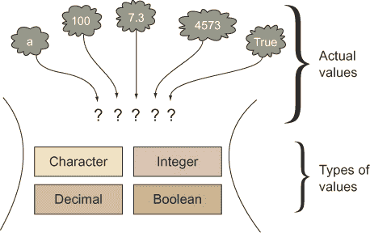

这应该是一个简单的练习。表 2.1 提供了答案。

##### 表 2.1\. 将值与其对应的数据类型匹配

| 字符值 | 整数值 | 小数值 | 布尔型 |
| --- | --- | --- | --- |
| a | 100 | 7.3 | true |
|   | 4573 |   |   |

在前面的练习中，我将您需要存储的数据分类如下：字符型、整型、小数型和布尔型值。这种分类将在您面对选择最合适的原始数据类型来存储值时使您的生活更加简单。例如，要存储整数值，您需要一个能够存储整数值的原始数据类型；要存储小数，您需要一个可以存储小数的原始数据类型。简单，不是吗？

让我们映射原始数据类型可以存储的数据类型，因为这总是很容易分组和记住信息。

|  |
| --- |

##### 注意

布尔型类别与原始数据类型`boolean`或包装类`Boolean`不同。Java 的原始数据类型和类名使用代码字体显示。

|  |
| --- |

原始数据类型可以分为以下类别：布尔型、字符型和数值型（进一步分为整型和浮点型）类型。请查看图 2.2 中的分类。

##### 图 2.2\. 原始数据类型的分类

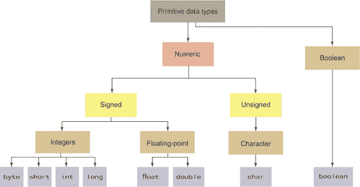

如图 2.2 所示，`char`原始数据类型是一个无符号数值数据类型。它只能存储正整数。其余的数值数据类型（`byte`、`short`、`int`、`long`、`float`和`double`）是有符号数值数据类型（它们可以存储正负值）。图 2.2 中的分类将帮助您进一步将每个数据类型与其可以存储的值关联起来。让我们从布尔类别开始。

#### 2.1.1\. 类别：布尔型

布尔型类别只有一个数据类型：`boolean`。一个`boolean`变量可以存储两个值之一：`true`或`false`。它在只有两种状态可以存在的情况下使用。参见表 2.2 以获取问题及其可能的答案。

##### 表 2.2\. 可以使用`boolean`数据类型存储的合适数据

| 问题 | 可能的答案 |
| --- | --- |
| 你是否购买了考试券？ | 是/否 |
| 你今天登录过你的电子邮件账户吗？ | 是/否 |
| 你今天是否发推文谈论你的热情？ | 是/否 |
| 2001-2002 财年征收的税款 | 好问题！但无法以是/否的形式回答。 |
|  |

##### 考试技巧

在这次考试中，问题测试你选择最适合的数据类型的能力，该条件只能有两种状态：是/否或真/假。这里的正确答案是`boolean`类型。

|  |
| --- |

这里有一些定义`boolean`原始变量的代码：

```
boolean voucherPurchased = true;
boolean examPrepStarted = false;
```

在某些语言中，例如 JavaScript，在使用变量之前不需要定义其类型。在 JavaScript 中，编译器根据你分配给变量的值来定义变量的类型。相比之下，Java 是一种强类型语言。你必须声明一个变量并定义其类型，然后才能为其赋值。图 2.3 说明了定义一个`boolean`变量并为其赋值的过程。

##### 图 2.3\. 定义和赋值原始变量

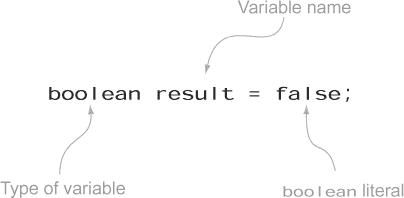

这里要注意的另一点是分配给`boolean`变量的值。我使用了字面值`true`和`false`来初始化`boolean`变量。*字面值*是一个固定值，不需要进一步计算就可以分配给任何变量。`true`和`false`是唯一的两个`boolean`字面值。

|  |
| --- |

##### 注意

`boolean`类型只有两个字面值：`true`和`false`。

|  |
| --- |

#### 2.1.2\. 类别：有符号数值

数值类别定义了两个子类别：整数和浮点数（也称为小数）。让我们从整数开始。

##### 整数类型：byte, int, short, long

当你可以用整数计数一个值时，结果是整数。它包括负数和正数。表 2.3 列出了数据可以存储为整数的一些可能场景。

##### 表 2.3\. 可以归类为数值（非小数）数据类型的数据

| 情况 | 是否可以存储为整数？ |
| --- | --- |
| Facebook 上的朋友数量 | 是 |
| 今天发布的推文数量 | 是 |
| 今天上传用于打印的照片数量 | 是 |
| 你的体温 | 不总是 |

你可以使用`byte`、`short`、`int`和`long`数据类型来存储整数值。等等：为什么你需要这么多类型来存储整数？

每一个都可以存储不同范围的值。较小的类型的好处是明显的：它们在内存中需要的空间更少，并且处理速度更快。表 2.4 列出了所有这些数据类型，以及它们的尺寸和它们可以存储的值的范围。

##### 表 2.4\. 有符号数值 Java 原始数据类型存储的值范围

| 数据类型 | 大小 | 值范围 |
| --- | --- | --- |
| byte | 8 位 | –128 到 127，包括 |
| short | 16 位 | –32,768 到 32,767，包括 |
| int | 32 位 | –2,147,483,648 到 2,147,483,647，包括 |
| long | 64 位 | –9,223,372,036,854,775,808 到 9,223,372,036,854,775,807，包括 |

OCA Java SE 8 程序员 I 考试可能会问你关于可以分配给 `byte` 数据类型的整数范围的问题，但不会包括关于可以存储在 `short`、`int` 或 `long` 数据类型中的整数值范围的问题。不用担心——你不需要记住所有这些数据类型的范围！

这里有一些代码示例，将字面值分配给原始数值变量，这些变量在其可接受范围内：

```
byte num = 100;
short sum = 1240;
int total = 48764;
long population = 214748368;
```

非十进制数字的默认类型是 `int`。要将整数字面值指定为 `long` 值，请添加后缀 `L` 或 `l`（小写的 `L`），如下所示：

```
long fishInSea = 764398609800L;
```

整数字面值有四种类型：二进制、十进制、八进制和十六进制：

+   ***二进制数制—*** 一个基数为 2 的系统，它只使用两个数字，0 和 1。

+   ***八进制数制—*** 一个基数为 8 的系统，它使用数字 0 到 7（总共 8 个数字）。在这里，十进制数字 8 表示为八进制 10，十进制数字 9 表示为 11，依此类推。

+   ***十进制数制—*** 你每天使用的基数为 10 的数制。它基于 10 个数字，从 0 到 9（总共 10 个数字）。

+   ***十六进制数制—*** 一个基数为 16 的系统，它使用数字 0 到 9 和字母 A 到 F（总共 16 个数字和字母）。在这里，数字 10 表示为 A 或 a，11 表示为 B 或 b，12 表示为 C 或 c，13 表示为 D 或 d，14 表示为 E 或 e，15 表示为 F 或 f。

让我们快速看一下如何将十进制数制中的整数转换为其他数制。图 2.4、2.5 和 2.6 展示了如何将十进制数 267 转换为八进制、十六进制和二进制数制。

##### 图 2.4\. 将十进制整数转换为八进制

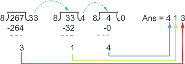

##### 图 2.5\. 将十进制整数转换为十六进制

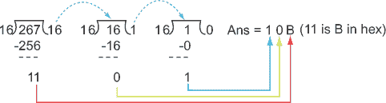

##### 图 2.6\. 将十进制整数转换为二进制

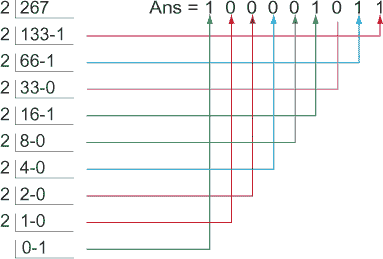

|  |
| --- |

##### 考试技巧

在考试中，你不会要求将数字从十进制数制转换为八进制和十六进制数制，反之亦然。但你可以期待一些问题，这些问题要求你选择有效的整数字面值。图 2.4–2.6 将帮助你更好地理解这些数制，并更长时间地保留这些信息，这反过来又使你能够在考试中正确回答问题。

|  |
| --- |

您可以使用十进制、二进制、八进制和十六进制来分配整数字面值。对于八进制字面值，使用前缀 `0`；对于二进制，使用前缀 `0B` 或 `0b`；对于十六进制，使用前缀 `0X` 或 `0x`。以下是一个每个前缀的示例：

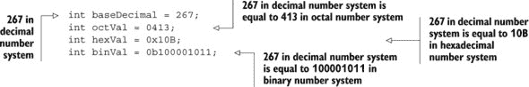

Java 7 引入了将下划线用作字面值一部分的使用。将字面值的单个数字或字母分组可以使它们更易于阅读。下划线对值没有影响。以下是一个有效的代码示例：

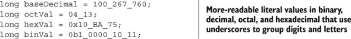

##### 要记住的规则

这里是一份关于在数值字面值中使用下划线的规则快速列表：

+   你可以在前缀 `0` 后面直接放置一个下划线，用于定义八进制字面值。

+   你不能以下划线开始或结束一个字面值。

+   你不能在用于定义二进制和十六进制字面值的前缀 `0b`、`0B`、`0x` 和 `0X` 后面直接放置下划线。

+   你不能在 `L` 后缀（用于标记字面值为 `long`）之前放置下划线。

+   你不能在期望一串数字的位置使用下划线（见以下示例）。

因为你在考试中可能会被问到字面值中下划线的有效和无效使用，让我们看看一些无效的例子：

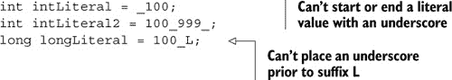

以下代码行将成功编译但在运行时失败：

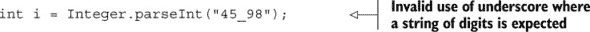

因为 `String` 值可以接受下划线，编译器会编译之前的代码。但运行时会抛出一个异常，指出传递给 `parseInt` 方法的值格式无效。

这里是本章的第一个故事转折练习，供你尝试。它使用了数值字面值中多个下划线的组合。看看你是否能全部答对（答案在附录中）。

##### 故事转折 2.1

让我们使用本节中定义的原始变量 `baseDecimal`、`octVal`、`hexVal` 和 `binVal`，并引入额外的代码来打印所有这些变量的值。确定以下代码的输出：

```
class TwistInTaleNumberSystems {
public static void main (String args[]) {
        int baseDecimal = 267;
        int octVal = 0413;
        int hexVal = 0x10B;
        int binVal = 0b100001011;
        System.out.println (baseDecimal + octVal);
        System.out.println (hexVal + binVal);
    }
}
```

这里有一个快速练习——让我们定义和初始化一些使用下划线作为它们赋值中字面值的前缀的 `long` 原始变量。确定以下哪个正确地完成了这项工作：

```
long var1 = 0_100_267_760;
long var2 = 0_x_4_13;
long var3 = 0b_x10_BA_75;
long var4 = 0b_10000_10_11;
long var5 = 0xa10_AG_75;
long var6 = 0x1_0000_10;
long var7 = 100__12_12;
```

##### 浮点数：float 和 double

当你期望十进制数时，你需要使用浮点数。例如，你能将事件发生的概率定义为整数吗？表 2.5 列出了可能场景，其中对应的数据存储为浮点数。

##### 表 2.5\. 存储为浮点数的数值

| 情况 | 答案是一个浮点数吗？ |
| --- | --- |
| 航天器的轨道力学 | 是（需要非常精确的值） |
| 你朋友请求被接受的概率 | 是；概率介于 0.0（无）和 1.0（确定）之间 |
| 地球围绕太阳旋转的速度 | 是 |
| 里氏震级地震的震级 | 是 |

在 Java 中，你可以使用 `float` 和 `double` 原始数据类型来存储十进制数。`float` 比较节省空间，但可以存储的值范围比 `double` 小。`float` 的精度低于 `double`。即使数值在范围内，`float` 也可能无法准确表示某些数值。同样的限制也适用于 `double`——即使它是一个提供更多精度的数据类型。表 2.6 列出了 `float` 和 `double` 的值大小和范围。

##### 表 2.6\. 十进制数字的值范围

| 数据类型 | 大小 | 值范围 |
| --- | --- | --- |
| float | 32 位 | +/–1.4E–45 到+/–3.4028235E+38，+/–infinity，+/–0，NaN |
| double | 64 位 | +/–4.9E–324 到+/–1.7976931348623157E+308，+/–infinity，+/–0，NaN |

下面是一些实际运行的代码示例：

```
float average = 20.129F;
float orbit = 1765.65f;
double inclination = 120.1762;
```

你注意到在前面代码中初始化变量`average`和`orbit`时使用了后缀`F`和`f`吗？十进制字面量的默认类型是`double`，但通过在十进制字面量值后附加`F`或`f`后缀，你告诉编译器该字面量值应被当作`float`处理，而不是`double`。

你也可以按照以下方式将字面量十进制值分配为科学记数法：

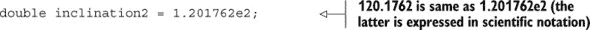

你也可以将后缀`D`或`d`添加到十进制数值中，以指定它是`double`值。因为十进制数的默认类型是`double`，所以使用后缀`D`或`d`是多余的。检查以下代码行：

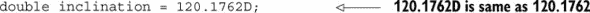

从 Java 7 版本开始，你也可以在浮点字面量值中使用下划线。规则通常与之前提到的数值字面量规则相同；以下规则是针对浮点字面量特定的：

+   你不能在下划线之前放置`D`、`d`、`F`或`f`后缀（这些后缀用于标记浮点字面量为`double`或`float`）。

+   不能在十进制点旁边放置下划线。

让我们看看一些示例，这些示例展示了在浮点字面量值中无效使用下划线的情况：

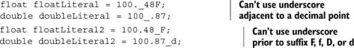

#### 2.1.3\. 类别：字符（无符号整数）

字符类别定义了唯一的数据类型：`char`。`char`是一个无符号整数。它可以存储单个 16 位 Unicode 字符；也就是说，它可以存储几乎所有现有脚本和语言中的字符，包括日语、韩语、中文、德文、法语、德语和西班牙语。因为你的键盘可能没有键来表示所有这些字符，你可以使用`\u0000`（或`0`）的值到最大值`\uffff`（或`65,535`）的值。以下代码显示了将值分配给`char`变量的示例：

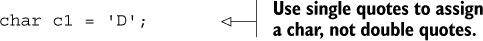

一个非常常见的错误是使用双引号将值分配给`char`。正确的选项是单引号。图 2.7 显示了两个（假设的）程序员保罗和哈里的对话。

##### 图 2.7\. 永远不要使用双引号来分配一个字母作为`char`值。

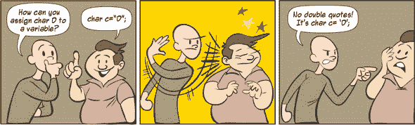

如果尝试使用双引号分配一个`char`，代码将无法编译，并显示以下信息：

```
Type mismatch: cannot convert from String to char
```

|  |
| --- |

##### 考试技巧

永远不要使用双引号将字母分配给`char`变量。双引号用于将值分配给类型为`String`的变量。

|  |
| --- |

在内部，Java 将`char`数据存储为无符号整数值（正整数）。因此，将正整数值分配给`char`是可以接受的，如下所示：

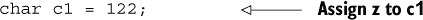

|  |
| --- |

##### 注意

考试将测试你对多种（隐晦的）技术，例如将无符号整数值分配给 `char` 数据类型。但我不建议在实际项目中使用这些技术。请编写可读性和易于维护的代码。

| |
| --- |

整数值 `122` 等价于字母 `z`，但整数值 `122` 不等于 Unicode 值 `\u0122`。前者是十进制数（使用数字 0-9），后者是十六进制数（使用数字 0-9 和字母 a-f——大小写均可）。`\u` 用于标记值作为 Unicode 值。你必须使用引号将 Unicode 值分配给 `char` 变量。以下是一个示例：

```
char c2 = '\u0122';
System.out.println("c1 = " + c1);
System.out.println("c2 = " + c2);
```

图 2.8 展示了在支持 Unicode 字符的系统上运行前面代码的输出。

##### 图 2.8\. 使用整数值 `122` 与 Unicode 值 `\u0122` 分配字符的输出

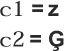

如前所述，`char` 值是无符号整数值，因此如果你尝试将负数分配给一个 `char`，代码将无法编译。以下是一个示例：


但你可以通过强制转换为 `char` 类型来给 `char` 类型分配一个负数，如下所示：

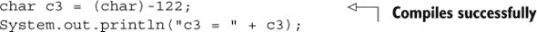

在前面的代码中，注意字面值 `–122` 前面有 `(char)` 前缀。这种做法称为 *类型转换*。类型转换是将一种数据类型强制转换为另一种数据类型。

你只能转换兼容的数据类型。例如，你可以将 `char` 转换为 `int`，反之亦然。但你不能将 `int` 转换为 `boolean` 值或反之亦然。当你将更大的值转换为范围较小的数据类型时，你告诉编译器你知道自己在做什么，因此编译器会通过截断任何可能不适合较小变量的额外位来继续操作。谨慎使用类型转换——它可能不会总是给出正确的转换值。

图 2.9 展示了将值转换为 `c3`（值看起来很奇怪！）的前面代码的输出。

##### 图 2.9\. 分配字符变量负值的输出


Java 中的 `char` 数据类型不分配空间来存储整数的符号。如果你尝试强制将负整数分配给 `char`，符号位将存储为整数值的一部分，这会导致存储意外的值。

| |
| --- |

##### 考试技巧

考试将测试你对 `char` 类型变量可能分配的值的理解，包括分配是否会导致编译错误。不用担心——它不会测试你在将任意整数值分配给 `char` 后实际显示的值！

| |
| --- |

#### 2.1.4\. 对原始数据类型名称的混淆

如果你之前在其他编程语言中工作过，你可能会对 Java 和其他语言中的基本数据类型名称感到困惑。例如，C 定义了一个原始的 `short int` 数据类型。但在 Java 中，`short` 和 `int` 是两个不同的原始数据类型。OCA Java SE 8 程序员 I 考试将测试你识别原始数据类型名称的能力，这些问题答案可能不会立即明显。以下是一个例子：

问题：以下代码的输出是什么？

```
public class MyChar {
    public static void main(String[] args) {
        int myInt = 7;
        bool result = true;
        if (result == true)
            do
                System.out.println(myInt);
            while (myInt > 10);
    }
}
```

1.  它打印 7 一次。

1.  它什么也不打印。

1.  编译错误。

1.  运行时错误。

正确答案是 (c)。这个问题试图通过不使用任何 `if` 构造或 `do`-`while` 循环的复杂代码来欺骗你！正如你所看到的，它使用了一个不正确的数据类型名称 `bool` 来声明和初始化变量 `result`。因此，代码将无法编译。

|  |
| --- |

##### 考试技巧

注意那些使用不正确的基本数据类型名称的问题。例如，Java 中没有 `bool` 基本数据类型。正确的数据类型是 `boolean`。如果你在其他编程语言中工作过，你可能会在尝试记住 Java 中使用的所有基本数据类型的确切名称时感到困惑。记住，只有两种基本数据类型——`int` 和 `char`——被缩短；其余的基本数据类型（`byte`、`short`、`long`、`float` 和 `double`）没有被缩短。

|  |
| --- |

### 2.2\. 标识符

标识符是包、类、接口、方法和变量的名称。虽然识别有效的标识符并没有明确包含在考试目标中，但你可能会遇到类似以下的问题，这些问题将要求你识别有效的和无效的标识符：

问题：以下哪一行代码可以成功编译？

1.  `byte exam_total = 7;`

1.  `int exam-Total = 1090;`

正确答案是 (a)。选项 (b) 是错误的，因为在 Java 标识符的名称中不允许使用连字符。下划线是允许的。

#### 2.2.1\. 有效的和无效的标识符

表 2.7 包含了一组规则，这些规则将帮助你正确地定义有效的（以及无效的）标识符，以及一些示例。

##### 表 2.7\. 有效的和无效标识符的成分

| 有效的标识符的特性 | 无效的标识符的特性 |
| --- | --- |
| 无限制长度 | 与 Java 保留字或关键字拼写相同（见 表 2.8） |
| 以字母（a–z，大写或小写）、货币符号或下划线开头 | 使用特殊字符：!、@、#、%、^、&、*、(、)、'、:、;、、/、\、} |
| 可以使用数字（但不能位于起始位置） | 以 Java 数字（0–9）开头 |
| 可以使用下划线（在任何位置） |   |
| 可以使用货币符号（在任何位置）：¥、$、£、¢、¥ 和其他 |   |
| 有效的标识符的例子 | 无效的标识符的例子 |
| customerValueObject | 7world (标识符不能以数字开头) |
| $rate, £Value, _sine | %value (标识符不能使用特殊字符%) |
| happy2Help, nullValue | Digital!, books@manning (标识符不能使用特殊字符!或@) |
| 常量 | null, true, false, goto (标识符不能与 Java 关键字或保留词同名) |

你不能定义与 Java 关键字或保留词相同的变量名。正如这些名称所暗示的，它们是为特定目的保留的。[表 2.8 列出了不能用作 Java 变量名的 Java 关键字、保留词和字面量。

##### 表 2.8\. 不能用作 Java 变量名的 Java 关键字和保留词

| abstract | default | goto | package | this |
| --- | --- | --- | --- | --- |
| assert | do | if | private | throw |
| boolean | double | implements | protected | throws |
| break | else | import | public | transient |
| byte | enum | instanceof | return | true |
| case | extends | int | short | try |
| catch | false | interface | static | void |
| char | final | long | strictfp | volatile |
| class | finally | native | super | while |
| const | float | new | switch |   |
| continue | for | null | synchronized |   |

让我们通过以下变量声明来对抗确定正确和错误变量时的一些常见错误：

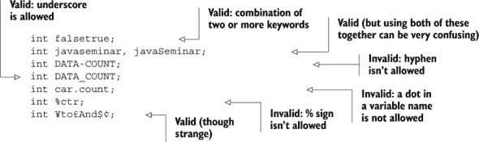

接下来，让我们看看对象引用变量以及它们与原始变量的区别。

### 2.3\. 对象引用变量

|  |
| --- |

[2.1] 声明和初始化变量（包括原始数据类型的转换）

|  |
| --- |
|  |

[2.2] 区分对象引用变量和原始变量

|  |
| --- |

Java 中的变量可以分为两种类型：*原始变量*和*引用变量*。在本节中，除了对引用变量进行简要介绍外，我们还将介绍引用变量和原始变量之间的基本区别。

引用变量也被称为*对象引用变量*或*对象引用*。我在本文中使用这些术语是通用的。

#### 2.3.1\. 什么是对象引用变量？

对象是类的实例，包括预定义和用户定义的类。对于 Java 中的引用类型，变量名计算出的值是存储在内存中变量引用的对象的地址。实际上，对象引用是一个内存地址，它指向存储对象数据的内存区域。

让我们快速定义一个基本的类，`Person`，如下所示：

```
class Person {}
```

当使用`new`运算符实例化对象时，会返回该对象的内存地址值。这个地址通常被分配给引用变量。图 2.10 显示了创建类型为`Person`的引用变量`person`并将其赋值的代码行。

##### 图 2.10\. 引用变量的创建和赋值

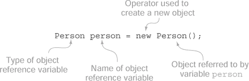

当执行图 2.10 所示的语句时，会发生三件事：

+   创建了一个新的`Person`对象。

+   在栈中创建了一个名为`person`的变量，其值为空（`null`）。

+   变量`person`被分配到对象所在内存地址的值。

图 2.11 包含了一个引用变量及其在内存中所引用的对象的插图。

##### 图 2.11. 内存中一个引用变量及其所引用的对象

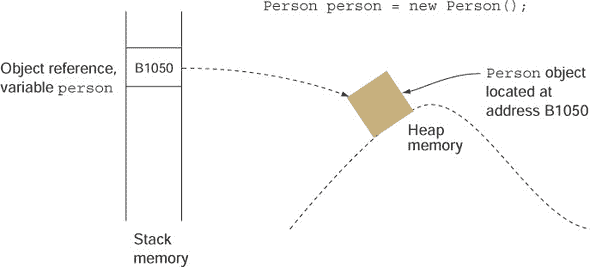

您可以将对象引用变量视为访问对象属性的*把手*。以下类比将帮助您理解对象引用变量、它们所引用的对象以及它们之间的关系。将对象类比为*狗*，将对象引用类比为*皮带*。尽管这个类比可能不会深入分析，以下比较是有效的：

+   未系在狗上的皮带是一个具有`null`值的引用对象变量。

+   没有皮带的狗是一个没有任何对象引用变量引用的 Java 对象。

+   正如一只未拴绳的狗可能会被动物控制部门带走一样，没有被引用变量引用的对象可能会被垃圾回收（由 JVM 从内存中移除）。

+   几条皮带可能系在一只狗上。同样，Java 对象可能被多个对象引用变量引用。

图 2.12 展示了这个类比。

##### 图 2.12. 理解对象的狗皮带类比

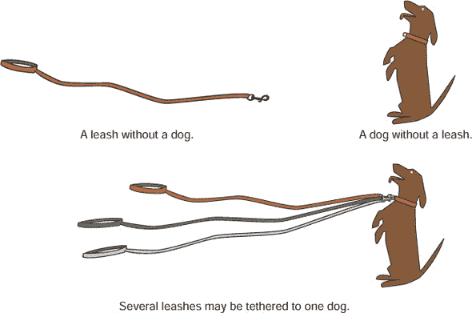

所有类型的对象引用变量的默认值都是`null`。您也可以显式地将`null`值赋给引用变量。以下是一个示例：

```
Person person = null;
```

在这种情况下，引用变量`person`可以比作没有狗的皮带。

|  |
| --- |

##### 注意

所有类型的对象引用变量的字面值都是`null`。

|  |
| --- |

#### 2.3.2. 区分对象引用变量和原始变量

正如约翰·格雷（John Gray，《火星人来自火星，金星人来自金星》一书的作者）所说，男人和女人在本质上是有区别的，原始变量和对象引用变量在多个方面也有区别。基本区别是原始变量存储实际值，而引用变量存储它们所引用的对象的地址。

假设已经定义了一个`Person`类。如果您创建一个`int`变量`a`和一个对象引用变量`person`，它们将在内存中存储它们的值，如图 2.13 所示。

```
int a = 77;
Person person = new Person();
```

##### 图 2.13. 原始变量存储实际值，而对象引用变量存储它们所引用的对象的地址。

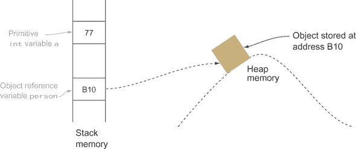

原始变量和对象引用变量之间的重要差异如图 2.14 所示，即一个女孩和一个男孩之间的对话。女孩代表对象引用变量，男孩代表原始变量。（如果你不理解所有这些类比，不要担心。在阅读后续章节的相关主题后，它们会更有意义。）

在下一节中，你将开始使用运算符操作这些变量。

##### 图 2.14\. 对象引用变量和原始变量之间的差异


### 2.4\. 运算符

|  |
| --- |

[3.1] 使用 Java 运算符；包括括号以覆盖运算符优先级

|  |
| --- |

在本节中，你将使用不同类型的运算符——赋值、算术、关系和逻辑——来操作变量的值。你将编写代码来确定两个原语数据类型的相等性。你还将学习如何通过使用括号来修改运算符的默认优先级。对于 OCA Java SE 8 程序员 I 级考试，你应该能够处理表 2.9 中列出的运算符。

##### 表 2.9\. 运算符类型和相关运算符

| 运算符类型 | 运算符 | 目的 |
| --- | --- | --- |
| 赋值 | =, +=, -=, *=, /= | 将值赋给变量 |
| 算术 | +, -, *, /, %, ++, -- | 加、减、乘、除和取模原语 |
| 关系 | <, <=, >, >=, ==, != | 比较原语 |
| 逻辑 | !, &&, &#124;&#124; | 对原语应用 NOT、AND 和 OR 逻辑 |
|  |

##### 注意

并非所有运算符都可以与所有类型的操作数一起使用。例如，你可以确定一个数字是否大于另一个数字，但你不能确定 `true` 是否大于 `false` 或一个数字是否大于 `true`。在学习本考试中所有运算符的使用时，请注意这一点。

|  |
| --- |

#### 2.4.1\. 赋值运算符

你需要为考试准备的赋值运算符是 `=`, `+=`, `-=`, `*=`, 和 `/=`.

简单赋值运算符 `=` 是最常用的运算符。它用于初始化变量并重新分配新值给它们。

`+=`, `-=`, `*=`, 和 `/=` 运算符是带有赋值的加法、减法、乘法和除法的简写形式。`+=` 运算符可以读作“先加后赋”，`-=` 可以读作“先减后赋”。同样，`*=` 可以读作“先乘后赋”，`/=` 可以读作“先除后赋”，`%=` 可以读作“先取模后赋”。如果你将这些运算符应用于两个操作数 `a` 和 `b`，它们可以表示如下：

```
a -= b is equal to a = a – b
a += b is equal to a = a + b
a *= b is equal to a = a * b
a /= b is equal to a = a / b
a %= b is equal to a = a % b
```

让我们看看一些有效的代码行：

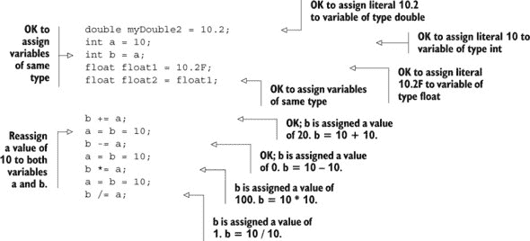

接下来让我们看看一些无效的代码行：

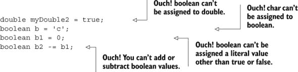

现在我们尝试将可以存储更大范围值的变量挤入范围较短的变量中。尝试以下赋值：

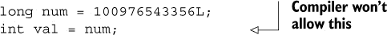

它与图 2.15 中显示的内容类似，其中有人试图强行将更大的值（`long`）挤入较小的容器（`int`）中。

##### 图 2.15\. 将更大的值（`long`）分配给只能存储较小值范围的变量（`int`）

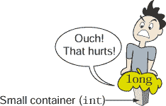

您可以通过显式地将更大的值转换为更小的值，将更大的值分配给只能存储较小范围的变量。这样做，您告诉编译器您知道自己在做什么。在这种情况下，编译器会通过截断任何可能不适合较小变量的额外位来继续操作。小心！虽然截断额外位可以使更大的值适合较小的数据类型，但剩余的位不会表示原始值，并可能产生意外的结果。

将上一个赋值示例（将 `long` 分配给 `int`）与以下示例进行比较，该示例将较小的值（`int`）分配给可以存储较大值范围的变量（`long`）：


`int` 可以轻松地放入 `long` 中，因为足够的空间（如图 2.16 所示）。

##### 图 2.16\. 将较小的值（`int`）分配给可以存储较大值范围的变量（`long`）

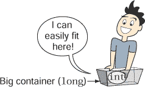

|  |
| --- |

##### 考试技巧

您不能使用赋值运算符将 `boolean` 值分配给类型为 `char`、`byte`、`int`、`short`、`long`、`float` 或 `double` 的变量，反之亦然。

|  |
| --- |

您也可以使用赋值运算符在同一行上分配多个值。请检查以下代码行：

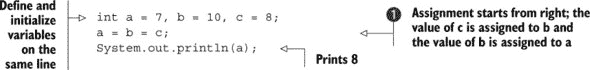

在标记为  的行上，赋值是从右到左开始的。变量 `c` 的值被分配给变量 `b`，而变量 `b`（它已经等于 `c`）的值被分配给变量 `a`。这可以通过第 3 行打印 `8`，而不是 `7` 来证明！

故事转折 2.15 中的下一个故事在变量分配和初始化方面加入了一些转折。让我们看看您是否能识别出错误的地方（答案见附录）。

##### 故事转折 2.2

让我们修改之前章节中使用的 `boolean` 变量的赋值和初始化。检查以下代码初始化并选择错误的答案：

```
public class Foo {
    public static void main (String args[]) {
        boolean b1, b2, b3, b4, b5, b6;    // line 1
        b1 = b2 = b3 = true;               // line 2
        b4 = 0;                            // line 3
        b5 = 'false';                      // line 4
        b6 = yes;                          // line 5
    }
}
```

1.  第 1 行的代码将无法编译。

1.  不能像第 2 行代码那样初始化多个变量。

1.  第 3 行的代码是正确的。

1.  不能将 `'false'` 分配给 `boolean` 变量。

1.  第 5 行的代码是正确的。

#### 2.4.2\. 算术运算符

让我们快速查看每个运算符，以及一个简单的示例，表 2.10 中有介绍。

##### 表 2.10\. 使用算术运算符的示例

| 运算符 | 目的 | 用法 | 答案 |
| --- | --- | --- | --- |
| + | 加法 | 12 + 10 | 22 |
| - | 减法 | 19 – 29 | -10 |
| * | 乘法 | 101 * 45 | 4545 |
| / | 除法（商） | 10 / 6 10.0 / 6.0 | 1 1.6666666666666667 |
| % | 取模（除法的余数） | 10 % 6 10.0 % 6.0 | 4 4.0 |
| ++ | 一元自增运算符；值增加 1 | ++var 或 var++ | 11（假设 var 的值为 10） |
| -- | 一元自减运算符；值减少 1 | --var 或 var-- | 9（假设 var 的值为 10） |
| |

##### 考试技巧

你可以使用一元自增和自减运算符与变量一起使用，但不能与字面量一起使用。如果你这样做，代码将无法编译。

| |
| --- |

当你将加法运算符应用于 `char` 类型的值时，它们的对应 ASCII 值会被相加和相减。以下是一个快速示例（字符 `a` 的 ASCII 值为 97）：


以下代码输出 0：

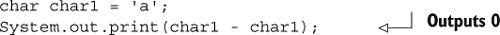

| |
| --- |

##### 考试技巧

你可以使用所有算术运算符与 `char` 原始数据类型一起使用，包括一元自增和自减运算符。

| |
| --- |

##### 算术运算中的数据类型隐式提升

所有 `byte`、`short` 和 `char` 类型的值在用作算术运算的操作数时都会自动提升为 `int` 类型。如果涉及到 `long` 类型的值，那么包括 `int` 值在内的所有值都会提升为 `long` 类型。这解释了为什么你不能将两个 `byte` 类型的值的和赋值给 `short` 类型的变量：


上述代码会因以下错误信息而失败：

```
incompatible types: possible lossy conversion from int to short
short sum = age1 + age2;
                 ^
1 error
```

| |
| --- |

##### 考试技巧

对于 `char`、`byte`、`short` 或 `int` 数据类型的算术运算，所有操作数值都会提升为 `int`。如果算术运算包括 `long` 数据类型，所有操作数值都会提升为 `long`。如果算术运算包括 `float` 或 `double` 数据类型，所有操作数值都会提升为 `double`。

| |
| --- |

但如果你修改上述示例，并将变量 `age1` 和 `age2` 定义为 `final` 变量，那么编译器 *可以保证* 它们的和，值 `30`，可以被赋值给 `short` 类型的变量，而不会丢失精度。在这种情况下，编译器会将 `age1` 和 `age2` 的和赋值给 `sum`。以下是修改后的代码：

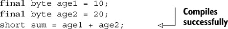

##### ++ 和 --（一元自增和自减运算符）

运算符 `++` 和 `--` 是一元运算符；它们与单个操作数一起工作。它们用于将变量的值增加或减少 `1`。

一元运算符也可以使用前缀和后缀表示法。在 *前缀表示法* 中，运算符出现在其操作数之前：

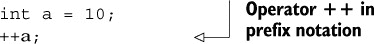

在 *后缀表示法* 中，运算符出现在其操作数之后：

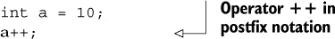

当这些运算符不是表达式的一部分时，后缀和前缀表示法的行为完全相同：

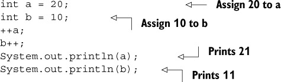

当一元运算符在表达式中使用时，其相对于操作数的放置决定了其值是在表达式评估之前还是之后增加或减少。请看以下代码，其中运算符 `++` 使用了前缀表示法：


在前面的例子中，表达式 `a - ++b` 使用了前缀表示法中的增量运算符 (`++`)。因此，变量 `b` 的值增加到 `11`，然后从 20 中减去，将结果 `9` 赋值给变量 `c`。

当使用后缀表示法与操作数一起使用`++`时，它的值在使用表达式后增加：

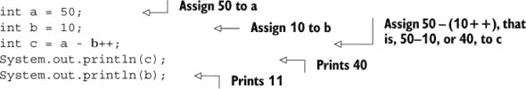

这里有趣的部分是，在两种情况下 `b` 的值都打印为 `11`，因为变量 `b` 的值在它所使用的表达式评估后立即增加（或减少）。

同样的逻辑也适用于单目运算符 `--`。以下是一个示例：

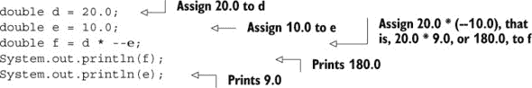

让我们使用后缀递减运算符 (`--`) 并看看会发生什么：

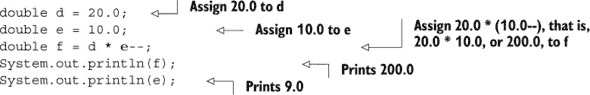

让我们检查一些示例代码，这些代码在同一行代码中使用前缀和后缀表示法的单目增量运算符和递减运算符。你认为以下代码的输出会是什么？

```
int a = 10;
a = a++ + a + a-- - a-- + ++a;
System.out.println(a);
```

此代码的输出是`32`。右侧表达式的评估是从左到右进行的，以下值评估为`32`：

```
a = 10 + 11 + 11 - 10 + 10;
```

表达式的评估从左到右开始。对于前缀单目运算符，其操作数的值在使用表达式之前增加或减少。对于后缀单目运算符，其操作数的值在使用表达式之后增加或减少。图 2.17 说明了前面表达式中发生的情况。

##### 图 2.17\. 具有多处后缀和前缀单目运算符出现的表达式评估

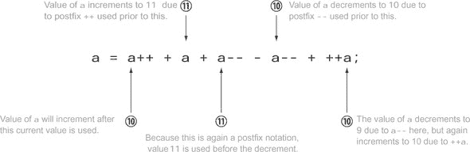

对于考试，您需要很好地理解并练习使用后缀和前缀运算符。除了前面示例中显示的表达式外，您还可以在 `if` 语句、`for` 循环以及 `do-while` 和 `while` 循环的条件中找到它们的使用。

下一个故事转折练习将为您提供在前缀和后缀表示法中使用的单目运算符的实践（答案见附录）。

##### 故事转折 2.3

让我们修改 图 2.17 中使用的表达式，将所有前缀表示法中的单目运算符替换为后缀表示法，反之亦然。因此 `++a` 变为 `a++`，反之亦然。同样，`--a` 变为 `a--`，反之亦然。您的任务是评估修改后的表达式并确定以下代码的输出：

```
int a = 10;
a = ++a + a + --a - --a + a++;
System.out.println (a);
```

尝试通过替换表达式中变量 `a` 的值来形成表达式，并解释每个值，就像在 图 2.17 中为您所做的那样。

#### 2.4.3\. 关系运算符

关系运算符用于检查一个条件。您可以使用这些运算符来确定一个原始值是否等于另一个值，或者它是否小于或大于另一个值。

这些关系运算符可以分为两类：

+   比较大于（`>`, `>=`）和小于（`<`, `<=`）的值

+   比较值（`==`）和不等（`!=`）

`<`, `<=`, `>`, 和 `>=` 运算符适用于所有类型的数字，包括整数（包括`char`）和浮点数，可以进行加法和减法运算。查看以下代码：

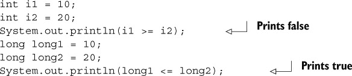

第二类运算符将在下一节中介绍。

| |
| --- |

##### 考试技巧

你不能比较不可比较的值。例如，你不能比较一个`boolean`与一个`int`、一个`char`或一个浮点数。如果你尝试这样做，你的代码将无法编译。

| |
| --- |

##### 比较原始数据类型（使用 == 和 !=）

`==`（等于）和`!=`（不等于）运算符可以用来比较所有类型的原始数据类型：`char`、`byte`、`short`、`int`、`long`、`float`、`double`和`boolean`。如果比较的原始数据类型值相等，`==`运算符返回`boolean`值`true`，否则返回`false`。如果比较的原始数据类型值不相等，`!=`运算符返回`true`，否则返回`false`。对于同一组值，如果`==`返回`true`，则`!=`将返回`false`。听起来很有趣！

查看以下代码：

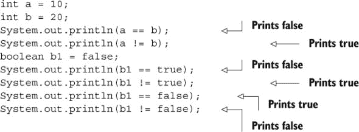

记住，你不能将这些运算符应用于不可比较的类型。在下面的代码片段中，比较一个`int`变量和一个`boolean`变量的代码将无法编译：

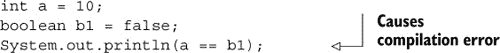

这里是编译错误：

```
incomparable types: int and boolean
System.out.println(a == b1);
                      ^
```

| |
| --- |

##### 考试技巧

关系运算的结果始终是一个`boolean`值。你不能将关系运算的结果赋值给类型为`char`、`int`、`byte`、`short`、`long`、`float`或`double`的变量。

| |
| --- |

##### 使用赋值运算符（=）比较原始数据类型

使用赋值运算符`=`代替相等运算符`==`来比较原始数据类型是一个非常常见的错误。在继续阅读之前，请查看以下代码：

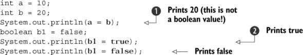

在前面的例子中，并不是在比较变量`a`和`b`。它将变量`b`的值赋给变量`a`，然后打印变量`a`的值，该值为`20`。同样，并不是在比较变量`b1`与布尔字面量`true`。它将布尔字面量`true`赋给变量`b1`，然后打印变量`b1`的值。

| |
| --- |

##### 注意

你不能使用赋值运算符`=`来比较原始数据类型。

| |
| --- |

#### 2.4.4. 逻辑运算符

逻辑运算符用于评估一个或多个表达式。这些表达式应该返回一个`boolean`值。你可以使用逻辑运算符`AND`、`OR`和`NOT`来检查多个条件并相应地执行。以下是一些现实生活中的例子：

+   ***案例 1（针对管理者）——*** 如果客户对交付的项目非常满意，并且你认为你应坐在老板的位置上，请要求晋升！

+   ***案例 2（针对学生）—*** 如果薪资和福利优厚或工作前景出色，则接受工作提议。

+   ***案例 3（针对初级 Java 程序员）—*** 如果对当前工作不满意，则更换工作。

在这些示例案例中，你只有在满足一系列条件的情况下才会做出决定（请求晋升、接受工作提议或更换工作）。在案例 1 中，如果满足所有指定条件，经理才可能请求晋升。在案例 2 中，如果任一条件为真，学生可以接受新的工作。在案例 3 中，如果初级 Java 程序员对当前工作不满意，他们可以更换工作，也就是说，如果指定的条件（对当前工作满意）为假。

如这些示例所示，如果你希望在两个条件都为真时执行任务，请使用逻辑`AND`运算符`&&`。如果你希望在任一条件为真时执行任务，请使用逻辑`OR`运算符`||`。如果你要反转`boolean`值的输出，请使用否定运算符`!`。

现在看看代码的实际应用：

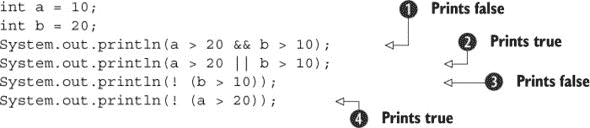

 打印`false`，因为两个条件`a > 20`和`b > 10`都不是`true`。第一个条件(`a > 20`)是`false`。 打印`true`，因为其中之一的条件(`b > 10`)是`true`。 打印`false`，因为指定的条件`b > 10`是`true`。 打印`true`，因为指定的条件`a > 20`是`false`。

表 2.11 将帮助你理解使用这些逻辑运算符的结果。

##### 表 2.11\. 使用逻辑运算符 `AND`、`OR` 和 `NOT` 的 `boolean` 文字值的输出结果

| 运算符 && (AND) | 运算符 &#124;&#124; (OR) | 运算符 ! (NOT) |
| --- | --- | --- |
| true && true → true true && false → false false && true → false false && false → false true && true && false → false | true | | true → true true | | false → true false | | true → true false | | false → false false | | false | | true →true | !true → false !false → true |

下面是这个表的总结：

+   *逻辑* `AND` (*`&&`*)—如果所有操作数都是`true`，则返回`true`；否则返回`false`。

+   *逻辑* `OR` (*`||`*)—如果任一或所有操作数都是`true`，则返回`true`。

+   *逻辑否定（`!`）*—否定`boolean`值。对于`false`返回`true`，反之亦然。

运算符 `|` 和 `&` 也可以用来操作数值的各个位，但在这里不涉及这种用法，因为它不是本次考试的考点。

##### && 和 || 是短路运算符

关于逻辑运算符 `&&` 和 `||` 的另一个有趣点是，它们也被称为*短路*运算符，因为它们通过评估操作数来确定结果的方式。让我们从运算符 `&&` 开始。

`&&` 运算符仅在两个操作数都为 `true` 时返回 `true`。如果此运算符的第一个操作数评估为 `false`，则结果永远不能为 `true`。因此，`&&` 不会评估第二个操作数。同样，如果第一个操作数评估为 `true`，则 `||` 运算符不会评估第二个操作数。

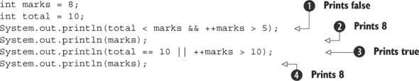

在第一个打印语句  中，因为第一个条件 `total < marks` 评估为 `false`，所以下一个条件 `++marks > 5` 甚至没有被评估。正如你所见 ，`marks` 的输出值仍然是 `8`（它在第 1 行初始化的值）！同样，在下一个比较  中，因为 `total == 10` 评估为 `true`，所以第二个条件 `++marks > 10` 没有被评估。再次，这可以在再次打印 `marks` 的值时得到验证 ，输出为 `8`。

|  |
| --- |

##### 注意

所有关系和逻辑运算符都返回一个 `boolean` 值，该值可以赋给原始 `boolean` 变量。

|  |
| --- |

下一个故事转折的目的是鼓励你玩使用短路运算符的代码。为了确定作为短路运算符操作数的 `boolean` 表达式是否评估，你可以对表达式中所使用的变量应用一元增量运算符（后缀表示法）。比较新变量的值与旧值，以验证表达式是否已评估（答案见附录）。

##### 故事转折 2.4

如你所知，短路运算符 `&&` 和 `||` 如果仅通过评估第一个操作数就可以确定表达式的结果，则可能不会评估它们的操作数。检查以下代码，并圈出你认为将评估的表达式。围绕你认为可能不会执行的表达式画一个方框。（例如，在第 1 行，`a++ > 10` 和 `++b < 30` 都将评估。）

```
class TwistInTaleLLogicalOperators {
    public static void main (String args[]) {
        int a = 10;
        int b = 20;
        int c = 40;
        System.out.println(a++ > 10 || ++b < 30);     // line1
        System.out.println(a > 90 && ++b < 30);
        System.out.println(!(c>20) && a==10 );
        System.out.println(a >= 99 || a <= 33 && b == 10);
        System.out.println(a >= 99 && a <= 33 || b == 10);
    }
}
```

|  |
| --- |

**示例中在真实项目中使用短路运算符 `&&` 的应用**

逻辑运算符 `&&` 常用于代码中，以检查在调用对象引用变量上的方法之前是否已为其分配了值：

```
String name = "hello";
if (name != null && name.length() > 0)
      System.out.println(name.toUpperCase());
```

|  |
| --- |

#### 2.4.5\. 运算符优先级

如果你在一行代码中使用多个操作数和多个运算符会发生什么？哪一个应该被视为“国王”并给予优先权？

别担心。Java 已经为这种情况制定了规则。表 2.12 列出了运算符的优先级：上方的运算符具有最高的优先级，同一组内的运算符具有相同的优先级，并且从左到右进行评估。

##### 表 2.12\. 运算符优先级

| 运算符 | 优先级 |
| --- | --- |
| 后缀 | 表达式++，表达式-- |
| 一元 | ++表达式，--表达式，+表达式，-表达式，! |
| 乘法 | * (乘)，/ (除)，% (余数) |
| 加法 | + (加)，- (减) |
| 关系 | <, >, <=, >= |
| 等于 | ==, != |
| 逻辑与 | && |
| 逻辑或 | &#124;&#124; |
| 赋值 | =, +=, -=, *=, /=, %= |
|  |

##### 注意

表 2.12 仅限于 OCA 考试中的运算符。您可以在[`docs.oracle.com/javase/tutorial/java/nutsandbolts/operators.html`](https://docs.oracle.com/javase/tutorial/java/nutsandbolts/operators.html)访问完整列表。

|  |
| --- |

让我们执行一个使用多个运算符（具有不同优先级）的表达式：

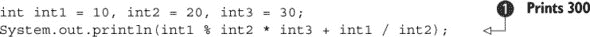

因为这个表达式  定义了多个具有不同优先级的运算符，所以它的评估如下：

```
(((int1 % int2) * int3)) + (int1 / int2)
(((10 % 20) * 30)) + (10 / 20)
( (10       * 30)) + (0)
( 300 )
```

如果您不想以这种方式评估表达式，补救措施很简单：使用括号来覆盖默认的运算符优先级。以下是一个在乘以 `int2` 之前先添加 `int3` 和 `int1` 的示例：

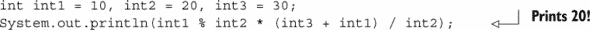

|  |
| --- |

##### 注意

您可以使用括号来覆盖默认的运算符优先级。如果您的表达式定义了多个运算符，并且您不确定您的表达式将如何被评估，请使用括号以您首选的顺序进行评估。内部括号先于外部括号进行评估，遵循经典代数的相同规则。

|  |
| --- |

### 2.5\. 包装类

|  |
| --- |

[2.5] 开发使用包装类（如 Boolean、Double 和 Integer）的代码。

|  |
| --- |

Java 为它的每个原始数据类型定义了一个包装类。包装类用于将原始数据类型包装在对象中，因此它们可以被添加到集合对象中。它们使所有类型都可以像对象实例一样被对待。包装类帮助您编写更干净的代码，易于阅读。对于这次考试，您应该能够编写使用这些包装类的代码。

#### 2.5.1\. 包装类的类层次结构

所有包装类都是**不可变的**——这些类在初始化后不允许对其实例的状态进行更改。它们共享多个使用细节和方法。图 2.18 显示了它们的层次结构。

##### 图 2.18\. 包装类的层次结构

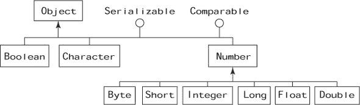

所有数值包装类都扩展了类 `java.lang.Number`。类 `Boolean` 和 `Character` 直接扩展了类 `Object`。所有包装类都实现了接口 `java.io.Serializable` 和 `java.lang.Comparable`。所有这些类都可以被序列化到流中，并且它们的对象定义了一个自然排序顺序。

#### 2.5.2\. 创建包装类对象

您可以通过多种方式创建所有包装类的对象：

+   ***赋值——*** 通过将原始数据类型赋给包装类变量（自动装箱）

+   ***构造函数——*** 通过使用包装类构造函数

+   ***静态方法——*** 通过调用包装类的静态方法，例如，`valueOf()`

例如：

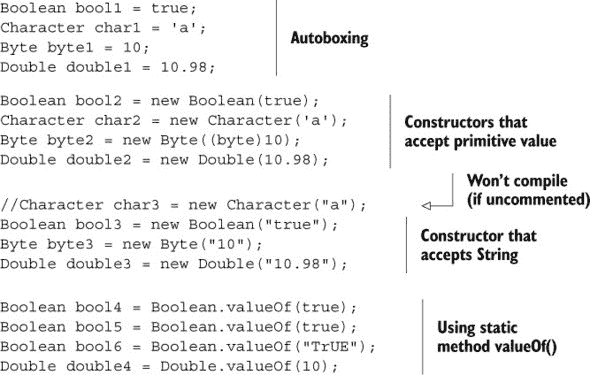

您可以用类似的方式创建其他包装类（`Short`、`Integer`、`Long` 和 `Float`）的对象。所有包装类都定义了构造函数，可以使用相应的原始值或作为 `String` 来创建对象。

另一个值得注意的有趣点是，这些类中没有一个定义默认的无参构造函数。包装类是不可变的。因此，如果它们以后不能被修改，用默认的原始值初始化包装对象是没有意义的。

|  |
| --- |

##### 考试技巧

所有包装类（除了 `Character`）都定义了一个接受表示需要包装的原始值的 `String` 参数的构造函数。请注意考试中包含调用包装类无参构造函数的问题。这些类中没有一个定义无参构造函数。

|  |
| --- |

您可以直接将原始值赋给其包装类类型的引用变量——这要归功于 *自动装箱*。相反，当原始包装类的对象转换为相应的原始值时，这是 *自动拆箱*。我将在下一节详细讨论自动装箱和自动拆箱。

#### 2.5.3\. 从包装类获取原始值

所有包装类都定义了格式为 *primitive*Value() 的方法，其中术语 *primitive* 指的是确切的原始数据类型名称。表 2.13 展示了这些类及其获取相应原始值的方法列表。

##### 表 2.13\. 从包装类获取原始值的方法

| Boolean | Character | Byte, Short, Integer, Long, Float, Double |
| --- | --- | --- |
| booleanValue() | charValue() | byteValue(), shortValue(), intValue(), |
|   |   | longValue(), floatValue(), doubleValue() |

值得注意的是，所有数值包装类都定义了方法来检索它们存储的原始值的值，作为 `byte`、`short`、`int`、`long`、`float` 或 `double`。

|  |
| --- |

##### 考试技巧

所有的六个数值包装类都从它们的共同超类 `Number` 继承了所有六个 *****`Value()` 方法。

|  |
| --- |

#### 2.5.4\. 将字符串值解析为原始类型

要获取与字符串值对应的原始数据类型值，您可以使用静态实用方法 parse*DataType*，其中 *DataType* 指的是返回值的类型。每个包装类（除了 `Character`）都定义了一个将 `String` 解析为相应原始值的方法，如 表 2.14 中所示。

##### 表 2.14\. 包装类中 *parseDataType* 方法的列表

| 类名 | 方法 |
| --- | --- |
| Boolean | public static boolean parseBoolean(String s) |
| 字符 | 没有对应的解析方法 |
| Byte | public static byte parseByte(String s) |
| Short | public static short parseShort (String s) |
| Integer | public static int parseInt(String s) |
| Long | public static long parseLong(String s) |
| Float | public static float parseFloat(String s) |
| Double | public static double parseDouble(String s) |

所有这些解析方法对于无效值都会抛出 `NumberFormatException`。以下是一些示例：

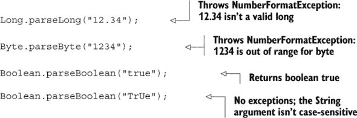

|  |
| --- |

##### 考试技巧

除了`Boolean.parseBoolean()`方法外，所有解析方法（列于表 2.14）都会抛出`NumberFormatException`。此方法返回`false`，当它解析的字符串不等于“true”（不区分大小写比较）时。

| |
| --- |

#### 2.5.5\. 使用 valueOf 方法和包装类构造函数的区别

当`valueOf()`方法传入原始类型或`String`类型的参数时，它返回相应包装类的对象。那么，`valueOf()`方法和这些类的构造函数之间的区别是什么，这些构造函数也接受原始类型和`String`类型的参数？

包装类`Byte`、`Short`、`Integer`和`Long`缓存值在`-128`到`127`范围内的对象。`Character`类缓存值为`0`到`127`的对象。这些类定义了内部静态类，它们在数组中存储原始值`-128`到`127`或`0`到`127`的对象。如果您请求这些类中的任何一个对象，在这个范围内，`valueOf()`方法返回一个指向预定义对象的引用；否则，它创建一个新的对象并返回其引用：

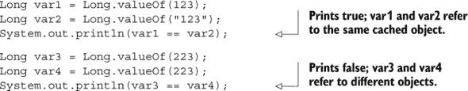

| |
| --- |

##### 考试技巧

包装类`Float`和`Double`不会为任何值范围内的对象缓存。

| |
| --- |

在`Boolean`类的例子中，缓存的实例可以直接访问，因为只有两个：静态常量`Boolean.TRUE`和`Boolean.FALSE`。

#### 2.5.6\. 比较包装类对象

您可以使用`equals`方法或比较运算符（即`==`）来比较包装类对象的相等性。`equals`方法始终比较包装实例存储的原始值，而`==`比较对象引用。如果被比较的变量引用相同的实例，则运算符`==`返回`true`。

参考前面关于`valueOf()`的部分。包装类如`Character`、`Byte`、`Short`、`Integer`和`Long`为值`0`到`127`或`-128`到`127`缓存包装对象。根据您如何初始化包装实例，它们可能或可能不引用相同的实例。以下示例使用构造函数、静态方法`valueOf`和自动装箱（将在下一节中介绍）初始化`Integer`变量。让我们使用`==`比较这些引用：


```
System.out.println(i1 == i2);
System.out.println(i3 == i4);
System.out.println(i4 == i5);
System.out.println(i5 == i6);
```

以下是前面代码的输出：

```
false
true
true
true
```

从前面代码的输出可以看出，使用`valueOf`方法和自动装箱为`int`值`10`创建的`Integer`实例引用了相同的实例。如果在前面代码的这些行中将`==`替换为`equals()`，它们将输出`true`：


但对于使用`==`比较的`int`值`200`创建的`Integer`实例并不适用（因为它们没有存储在`Integer`缓存中）：


再次，如果在前面代码中将`==`替换为`equals()`，所有比较的输出将为`true`。

| |
| --- |

##### 考试技巧

包装类`Boolean`存在缓存实例，用于值`true`和`false`。`Character`类缓存从`0`到`127`的值的实例。`Byte`、`Short`、`Integer`和`Long`类为值`-127`到`128`缓存实例。`Float`和`Double`包装类没有缓存实例。

`equals`方法比较包装实例存储的值。比较运算符`==`比较引用变量——检查它们是否指向同一个实例。

| |
| --- |
| |

**使用 hashCode()和 equals()确定包装类实例的相等性**

包装类实例可以用作 Java 集合框架中的键，与支持键值对的类（如`HashMap`）一起使用。这些类使用`hashCode()`和`equals()`来确定实例的相等性。由于集合框架类（除了`ArrayList`）不在此考试范围内，因此我在本书中没有涉及它们。

| |
| --- |

如果包装实例不是同一类，则不能使用`equals()`或`==`来比较它们的相等性。对于使用`==`比较的实例，代码将无法编译。当使用`equals()`比较时，输出将是`false`：

![130fig01_alt.jpg]

| |
| --- |

##### 考试技巧

值相同的不同包装类对象不相等。使用`equals()`与这样的实例将返回`false`。如果你使用`==`与这样的实例，代码将无法编译。

| |
| --- |

下一节将介绍自动装箱和拆箱，编译器使用这些功能将原始值转换为包装对象，反之亦然。

#### 2.5.7\. 自动装箱和拆箱

*自动装箱*是将原始数据类型自动转换为相应包装类的对象（你*装箱*原始值）。*拆箱*是相反的过程（你*拆箱*原始值），如图 2.19 所示。

##### 图 2.19\. 自动装箱和拆箱

![02fig19_alt.jpg]

包装类频繁地使用自动装箱和拆箱功能：

![130fig02_alt.jpg]

将前面方法的使用与类`Double`定义的以下方法进行比较：

```
public int compareTo(Double anotherDouble)
```

等等——我刚刚提到类`Double`中定义的`compareTo()`方法接受一个`Double`类的对象，而不是一个`double`原始数据类型吗？那么为什么前面的代码可以编译呢？答案是自动装箱。Java 将原始的`double`转换为`Double`类的对象（通过使用`valueOf()`方法），所以它工作正常。Java 编译器在运行时将其转换为以下代码：

```
Double d1 = new Double(12.67D);
System.out.println(d1.compareTo(Double.valueOf(21.68D)));
```

现在检查以下代码（自动装箱的拆箱示例）：

![131fig01_alt.jpg]

在前面的代码中，在`for`循环执行结束时，`total`将被分配一个值为`23.36`的`Double`对象。算术运算符如`+=`不能与对象一起使用。那么你认为代码为什么可以编译呢？在这个例子中，Java 编译器在运行时将前面的代码转换为以下代码：

```
public class Unbox {
    public static void main(String args[]) {
        ArrayList list = new ArrayList();
        list.add(new Double(12.12D));
        list.add(new Double(11.24D));
        Double total = Double.valueOf(0.0D);
        for(Iterator iterator = list.iterator(); iterator.hasNext();) {
            Double d = (Double)iterator.next();
            total = total.doubleValue() + d.doubleValue();
        }
    }
```

在上一节中，我提到包装类是不可变的。那么当你向变量`total`（一个`Double`对象）添加值时会发生什么？在这种情况下，变量`total`引用了一个新的`Double`对象。

| |
| --- |

##### 考试技巧

包装类是不可变的。向包装类变量添加原始值不会修改它所引用的对象的值。包装类变量被分配了一个新的对象。

| |
| --- |

这里还有一个有趣的问题。如果你将`null`作为以下方法的参数传递会发生什么？

```
public int increment(Integer obj) {
    return ++i;
}
```

因为 Java 编译器会调用`obj.intValue()`来获取`obj`的`int`值，所以将`null`传递给`increment()`方法将抛出`NullPointerException`。

| |
| --- |

##### 考试技巧

如果拆箱一个引用包装类变量，该变量引用`null`，将抛出`NullPointerException`。

| |
| --- |

### 2.6. 概述

在本章中，我们首先介绍了 Java 中的基本数据类型，包括每种类型的用途示例及其文字面量。我们还把原始数据类型分为字符类型、整数类型和浮点类型。然后我们讨论了有效和无效 Java 标识符的要素。我们还介绍了原始类型和引用类型之间的区别。

我们讨论了用于操作原始数据类型的运算符（限于 OCA Java SE 8 程序员 I 考试所需的运算符）。我们还介绍了特定运算符可以使用的情况。例如，如果你希望检查一组条件是否为真，你可以使用逻辑运算符。了解每个运算符可以使用的操作数类型也很重要。例如，你不能使用`boolean`操作数与运算符`>`、`>=`、`<=`和`<`一起使用。

我们讨论了包装类，包括它们的类层次结构、创建它们的实例、检索包装类实例存储的基本值、将字符串值解析为基本类型，以及比较包装类实例。在本章末尾，我们介绍了自动装箱和拆箱。

### 2.7. 复习笔记

基本数据类型：

+   Java 定义了八个基本数据类型：`char`、`byte`、`short`、`int`、`long`、`float`、`double`和`boolean`。

+   基本数据类型是最简单的数据类型。

+   基本数据类型是由编程语言预定义的。在 Java 中，用户不能定义基本数据类型。

+   将基本数据类型分类为布尔型、数值型和字符型是有帮助的。

`boolean`数据类型：

+   `boolean`数据类型用于存储只有两种可能值的数。这两种可能的值可以认为是是/否、0/1、真/假，或者任何其他组合。`boolean`可以存储的实际值是`true`和`false`。

+   `true`和`false`是文字面量。

+   文字面量是一个固定值，不需要进一步计算就可以分配给任何变量。

数值数据类型：

+   数值可以存储为整数或小数。

+   `byte`、`short`、`int`和`long`可以用来存储整数。

+   `byte`、`short`、`int`和`long`数据类型分别使用 8、16、32 和 64 位来存储它们的值。

+   `float`和`double`可以用来存储十进制数。

+   `float`和`double`数据类型分别使用 32 和 64 位来存储它们的值。

+   整数的默认类型（即非十进制数）是`int`。

+   要将整数字面值指定为`long`值，请在字面值后添加后缀`L`或`l`。

+   数值可以存储在二进制、八进制、十进制和十六进制数格式中。这次考试不会要求你将一个数字从一个数制转换为另一个数制。

+   十进制数系统中的字面值使用从 0 到 9 的数字（总共 10 个数字）。

+   八进制数系统中的字面值使用从 0 到 7 的数字（总共 8 个数字）。

+   十六进制数系统中的字面值使用从 0 到 9 的数字和从 A 到 F 的字母（总共 16 个数字和字母）。

+   二进制数系统中的字面值使用数字 0 和 1（总共 2 个数字）。

+   八进制数系统中的字面值以前缀`0`开头。例如，八进制数系统中的`0413`在十进制数系统中是`267`。

+   十六进制数系统中的字面值以前缀`0x`开头。例如，十六进制数系统中的`0x10B`在十进制数系统中是`267`。

+   二进制数系统中的字面值以前缀`0b`或`0B`开头。例如，十进制值`267`在二进制系统中是`0B100001011`。

+   从 Java 7 开始，你可以在 Java 字面值中使用下划线来使它们更易于阅读。`0B1_0000_10_11`、`0_413`和`0x10_B`是有效的二进制、八进制和十六进制字面值。

+   十进制数的默认类型是`double`。

+   要将十进制字面值指定为`float`值，请在字面值后添加后缀`F`或`f`。

+   后缀`D`和`d`可以用来标记字面值为`double`值。虽然这样做是允许的，但不是必需的，因为十进制字面值的默认值是`double`。

字符原始数据类型：

+   `char`数据类型可以存储单个 16 位 Unicode 字符；也就是说，它可以存储几乎所有世界现有脚本和语言中的字符。

+   你可以使用从`\u0000`（或 0）到最大`\uffff`（或 65,535 inclusive）的值来存储一个`char`。Unicode 值是在十六进制数系统中定义的。

+   在内部，`char`数据类型以无符号整数值的形式存储（只有正整数）。

+   当你将一个字母分配给`char`时，Java 存储其整数等效值。你可以将一个正整数值分配给`char`而不是字母，例如 122。

+   字面值`122`与 Unicode 值`\u0122`不同。前者是十进制数，后者是十六进制数。

+   单引号，而不是双引号，用于将一个字母分配给`char`变量。

有效的标识符：

+   一个有效的标识符以字母（a–z，大写或小写）、货币符号或下划线开头。其长度没有限制。

+   一个有效的标识符可以包含数字，但不能位于起始位置。

+   一个有效的标识符可以在标识符的任何位置使用下划线和货币符号。

+   一个有效的标识符不能与 Java 关键字有相同的拼写，例如`switch`。

+   一个有效的标识符不能使用任何特殊字符，包括`!`、`@`、`#`、`%`、`^`、`&`、`*`、`(`、`)`、`'`、`:`、`;`、``、`/`、`\`和`}`。

赋值运算符：

+   赋值运算符可以用来为所有类型的变量赋值或重新赋值。

+   变量不能被赋值为不兼容的值。例如，字符和数值不能赋值给`boolean`变量，反之亦然。

+   `+=`和`-=`是加法/减法和赋值的简写形式。

+   `+=`可以读作“先加后赋”，而`-=`可以读作“先减后赋”。

算术运算符：

+   算术运算符不能与`boolean`数据类型一起使用。尝试这样做将使代码无法编译。

+   `++`和`--`是一元递增和递减运算符。这些运算符与单个操作数一起使用。

+   一元运算符可以用前缀或后缀表示法使用。

+   当使用一元运算符`++`和`--`的前缀表示法时，变量的值在变量在表达式中使用前立即增加/减少。

+   当使用一元运算符`++`和`--`的后缀表示法时，变量的值在变量在表达式中使用后立即增加/减少。

+   默认情况下，一元运算符的优先级高于乘法运算符和加法运算符。

关系运算符：

+   关系运算符用于比较值是否相等（`==`）或不相等（`!=`），还用于确定两个数值是否大于（`>`、`>=`）或小于（`<`、`<=`）对方。

+   您不能比较不可比较的值。例如，您不能比较`boolean`与`int`、`char`或浮点数。如果您尝试这样做，您的代码将无法编译。

+   等于（`==`）和不等于（`!=`）运算符可以用来比较所有类型的原始数据类型：`char`、`byte`、`short`、`int`、`long`、`float`、`double`和`boolean`。

+   运算符`==`如果正在比较的原始值相等则返回`true`。

+   运算符`!=`如果正在比较的原始值不相等则返回`true`。

+   关系运算符的结果始终是一个`布尔`值。

逻辑运算符：

+   您可以使用逻辑运算符来确定一组条件是否为真或假，并据此进行操作。

+   逻辑`AND`（`&&`）如果所有操作数都是`true`则返回`true`，否则返回`false`。

+   逻辑`OR`（`||`）如果任何或所有操作数都是`true`则返回`true`。

+   逻辑非（`!`）否定`布尔`值。对于`false`返回`true`，反之亦然。

+   逻辑运算的结果始终是一个 `boolean` 值。

+   逻辑运算符 `&&` 和 `||` 也被称为短路运算符。如果这些运算符可以通过评估第一个操作数来确定表达式的输出，则它们不会评估第二个操作数。

+   只有当两个操作数都为 `true` 时，`&&` 运算符才返回 `true`。如果此运算符的第一个操作数评估为 `false`，则结果永远不会是 `true`。因此，`&&` 不会评估第二个操作数。

+   类似地，如果运算符的任一操作数是 `true`，则 `||` 运算符返回 `true`。如果此运算符的第一个操作数评估为 `true`，则结果永远不会是 `false`。因此，`||` 不会评估第二个操作数。

包装类：

+   包装类用于将原始值包装在对象中，因此可以将它们添加到集合对象中。

+   所有包装类都是不可变的。

+   您可以通过多种方式创建所有包装类的对象：

    +   *赋值*—通过将原始值赋给包装类变量（自动装箱）

    +   *构造函数*—通过使用包装类构造函数

    +   *静态方法*—通过调用包装类的静态方法，如 `valueOf()`

+   所有包装类（除了 `Character`）都定义了一个接受表示需要包装的原始值的 `String` 参数的构造函数。

+   没有包装类定义无参数构造函数。

+   您可以直接将原始值赋给其包装类类型的引用变量，这称为自动装箱。相反，当原始包装类对象转换为相应的原始值时，称为拆箱。

+   所有包装类都定义了格式为 *primitive* Value() 的方法，其中术语 *primitive* 指的是确切的原始数据类型名称。

+   要获取与字符串值对应的原始数据类型值，您可以使用静态实用方法 parse*DataType*，其中 *DataType* 指的是返回值的类型。

+   当传递一个原始类型或 `String` 参数时，`valueOf()` 方法返回相应包装类的对象。

+   您可以通过使用 `equals` 方法或比较运算符 `==` 来比较包装类的对象是否相等。

+   方法 `equals` 总是对比包装实例存储的原始值，而 `==` 比较对象引用。运算符 `==` 如果被比较的变量引用相同的实例，则返回 `true`。

+   在 `Boolean` 类的情况下，由于只有两个实例：静态常量 `Boolean.TRUE` 和 `Boolean.FALSE`，因此缓存的实例可以直接访问。

+   `Character` 类缓存了值为 `0` 到 `127` 的实例。类 `Byte`、`Short`、`Integer` 和 `Long` 缓存值为 `-128` 到 `127` 的实例。对于 `Float` 和 `Double` 包装类没有缓存的实例。

+   包装类是不可变的。将原始值添加到包装类变量不会修改它所引用的对象的值。包装类变量被分配了一个新的对象。

+   解包引用包装器变量，该变量引用`null`，将抛出`NullPointerException`。

### 2.8. 样本考试问题

> **[Q2-1.**
> 
> 给定：
> 
> ```
> int myChar = 97;
> int yourChar = 98;
> System.out.print((char)myChar + (char)yourChar);
> 
> int age = 20;
> System.out.print(" ");
> System.out.print((float)age);
> ```
> 
> 输出是什么？
> 
> 1.  `195 20.0`
> 1.  
> 1.  `195 20`
> 1.  
> 1.  `ab 20.0`
> 1.  
> 1.  `ab 20`
> 1.  
> 1.  编译错误
> 1.  
> 1.  运行时异常
> 1.  
> **Q2-2.**
> 
> 以下代码的正确选项是哪些？
> 
> ```
> public class Prim {                                // line 1
>     public static void main(String[] args) {       // line 2
>         char a = 'a';                              // line 3
>         char b = -10;                              // line 4
>         char c = '1';                              // line 5
>         integer d = 1000;                          // line 6
>         System.out.println(++a + b++ * c - d);     // line 7
>     }                                              // line 8
> }                                                  // line 9
> ```
> 
> 1.  行 4 的代码编译失败。
> 1.  
> 1.  行 5 的代码编译失败。
> 1.  
> 1.  行 6 的代码编译失败。
> 1.  
> 1.  行 7 的代码编译失败。
> 1.  
> **Q2-3.**
> 
> 以下代码的输出是什么？
> 
> ```
> public class Foo {
>     public static void main(String[] args) {
>         int a = 10;
>         long b = 20;
>         short c = 30;
>         System.out.println(++a + b++ * c);
>     }
> }
> ```
> 
> 1.  `611`
> 1.  
> 1.  `641`
> 1.  
> 1.  `930`
> 1.  
> 1.  `960`
> 1.  
> **Q2-4.**
> 
> 给定：
> 
> ```
> Boolean buy = new Boolean(true);
> Boolean sell = new Boolean(true);
> 
> System.out.print(buy == sell);
> boolean buyPrim = buy.booleanValue();
> System.out.print(!buyPrim);
> 
> System.out.print(buy && sell);
> ```
> 
> 输出是什么？
> 
> 1.  `falsefalsefalse`
> 1.  
> 1.  `truefalsetrue`
> 1.  
> 1.  `falsetruetrue`
> 1.  
> 1.  `falsefalsetrue`
> 1.  
> 1.  编译错误
> 1.  
> 1.  运行时异常
> 1.  
> **Q2-5.**
> 
> 以下哪个选项包含正确的代码来声明和初始化存储整数的变量？
> 
> 1.  `bit a = 0;`
> 1.  
> 1.  `integer a2 = 7;`
> 1.  
> 1.  `long a3 = 0x10C;`
> 1.  
> 1.  `short a4 = 0512;`
> 1.  
> 1.  `double a5 = 10;`
> 1.  
> 1.  `byte a7 = -0;`
> 1.  
> 1.  `long a8 = 123456789;`
> 1.  
> **Q2-6.**
> 
> 选择在`// INSERT CODE HERE`处插入的选项，将使以下代码输出值为`11`：
> 
> ```
> public class IncrementNum {
>     public static void main(String[] args) {
>         int ctr = 50;
>         // INSERT CODE HERE
>         System.out.println(ctr % 20);
>     }
> }
> ```
> 
> 1.  `ctr += 1;`
> 1.  
> 1.  `ctr =+ 1;`
> 1.  
> 1.  `++ctr;`
> 1.  
> 1.  `ctr = 1;`
> 1.  
> **Q2-7.**
> 
> 以下代码的输出是什么？
> 
> ```
> int a = 10;
> int b = 20;
> int c = (a * (b + 2)) - 10-4 * ((2*2) - 6;
> System.out.println(c);
> ```
> 
> 1.  `218`
> 1.  
> 1.  `232`
> 1.  
> 1.  `246`
> 1.  
> 1.  编译错误
> 1.  
> **Q2-8.**
> 
> 以下代码的哪些行是正确的？
> 
> ```
> boolean b = false;
> int i = 90;
> System.out.println(i >= b);
> ```
> 
> 1.  代码打印`true`
> 1.  
> 1.  代码打印`false`
> 1.  
> 1.  代码打印`90 >= false`
> 1.  
> 1.  编译错误
> 1.  
> **Q2-9.**
> 
> 检查以下代码并选择正确的选项：
> 
> ```
> public class Prim {                                          // line 1
>     public static void main(String[] args) {                 // line 2
>         int num1 = 12;                                       // line 3
>         float num2 = 17.8f;                                  // line 4
>         boolean eJavaResult = true;                          // line 5
>         boolean returnVal = num1 >= 12 && num2 < 4.567       // line 6
>                              || eJavaResult == true;
>         System.out.println(returnVal);                       // line 7
>     }                                                        // line 8
> }                                                            // line 9
> ```
> 
> 1.  代码打印`false`
> 1.  
> 1.  代码打印`true`
> 1.  
> 1.  如果将行 6 的代码修改为以下内容，代码将打印`true`：
> 1.  
>     ```
>     boolean returnVal = (num1 >= 12 && num2 < 4.567) || eJavaResult == true;
>     ```
>     
> 1.  如果将行 6 的代码修改为以下内容，代码将打印`true`：
> 1.  
>     ```
>     boolean returnVal = num1 >= 12 && (num2 < 4.567 || eJavaResult == false);
>     ```
>     
> **Q2-10.**
> 
> 给定：
> 
> ```
> boolean myBool = false;                               // line 1
> int yourInt = 10;                                     // line 2
> float hisFloat = 19.54f;                              // line 3
> System.out.println(hisFloat = yourInt);               // line 4
> System.out.println(yourInt > 10);                     // line 5
> System.out.println(myBool = false);                   // line 6
> ```
> 
> 结果是什么？
> 
> 1.  ```
>     true
>     true
>     false
>     ```
> 1.  
> 1.  ```
>     10.0
>     false
>     false
>     ```
> 1.  
> 1.  ```
>     false
>     false
>     false
>     ```
> 1.  
> 1.  编译错误

### 2.9. 样本考试问题答案

> **Q2-1.**
> 
> 给定：
> 
> ```
> int myChar = 97;
> int yourChar = 98;
> System.out.print((char)myChar + (char)yourChar);
> 
> int age = 20;
> System.out.print(" ");
> System.out.print((float)age);
> ```
> 
> 输出是什么？
> 
> 1.  **`195 20.0`**
> 1.  
> 1.  `195 20`
> 1.  
> 1.  `ab 20.0`
> 1.  
> 1.  `ab 20`
> 1.  
> 1.  编译错误
> 1.  
> 1.  运行时异常
> 1.  
> 答案：a
> 
> 说明：当使用`char`原始数据类型作为算术运算符的操作数时，其对应的 ASCII 值用于算术运算。尽管`(char)myChar`将`int`变量`myChar`显式转换为`char`类型，但其值`97`用于算术运算。当将字面值`20`显式转换为`float`类型时，它以十进制数的形式输出其值，即`20.0`。
> 
> **Q2-2.**
> 
> 以下代码的正确选项是哪些？
> 
> ```
> public class Prim {                                // line 1
>     public static void main(String[] args) {       // line 2
>         char a = 'a';                              // line 3
>         char b = -10;                              // line 4
>         char c = '1';                              // line 5
> 
>         integer d = 1000;                          // line 6
>         System.out.println(++a + b++ * c - d);     // line 7
>     }                                              // line 8
> }                                                  // line 9
> ```
> 
> 1.  **行 4 的代码编译失败。**
> 1.  
> 1.  行 5 的代码编译失败。
> 1.  
> 1.  **行 6 的代码编译失败。**
> 1.  
> 1.  **行 7 的代码编译失败。**
> 1.  
> 答案：a, c, d
> 
> 说明：选项(a)是正确的。行 4 的代码编译失败，因为你不能在不进行类型转换的情况下将负值赋给原始`char`数据类型。
> 
> 选项(c)是正确的。没有名为“integer”的原始数据类型。有效的数据类型是`int`和`Integer`（一个以大写*I*为特征的包装类）。
> 
> 选项 (d) 是正确的。变量 `d` 在第 7 行未定义，因为它的声明在第 6 行未能编译。因此，使用变量 `d` 的算术表达式 `(++a + b++ * c - d)` 未能编译。在算术表达式中使用 `char` 数据类型的变量 `c` 没有问题。`char` 数据类型在内部存储为无符号整数值，可以在算术表达式中使用。
> 
> **Q2-3.**
> 
> 以下代码的输出是什么？
> 
> ```
> public class Foo {
>     public static void main(String[] args) {
>         int a = 10;
>         long b = 20;
>         short c = 30;
>         System.out.println(++a + b++ * c);
>     }
> }
> ```
> 
> 1.  **`611`**
> 1.  
> 1.  `641`
> 1.  
> 1.  `930`
> 1.  
> 1.  `960`
> 1.  
> 答案：a
> 
> 说明：与变量 `a` 一起使用的前缀增量运算符 (`++`) 将在它被用于表达式 `++a + b++ * c` 之前增加其值。与变量 `b` 一起使用的后缀增量运算符 (`++`) 将在表达式 `++a + b++ * c` 使用其初始值之后增加其值。
> 
> 因此，表达式 `++a + b++ * c` 使用以下值进行评估：
> 
> ```
> 11 + 20 * 30
> ```
> 
> 因为乘法运算符的优先级高于加法运算符，所以 `20` 和 `30` 的值在将结果加到值 `11` 之前被相乘。示例表达式评估如下：
> 
> ```
> (++a + b++ * c)
> = 11 + 20 * 30
> = 11 + 600
> = 611
> ```
> 
> ##### 考试技巧
> ##### 
> 虽然问题 2-2 和 2-3 似乎是在测试你对运算符的理解，但实际上它们测试的是不同的主题。问题 2-2 测试的是原始数据类型的名称。注意！真正的考试有很多这样的问题。一个可能看起来是在测试你对线程的理解的问题，实际上可能是在测试你使用 `do`-`while` 循环的能力！
> 
> |  |
> | --- |
> 
> **Q2-4.**
> 
> 给定：
> 
> ```
> Boolean buy = new Boolean(true);
> Boolean sell = new Boolean(true);
> System.out.print(buy == sell);
> 
> boolean buyPrim = buy.booleanValue();
> System.out.print(!buyPrim);
> 
> System.out.print(buy && sell);
> ```
> 
> 输出是什么？
> 
> 1.  `falsefalsefalse`
> 1.  
> 1.  `truefalsetrue`
> 1.  
> 1.  `falsetruetrue`
> 1.  
> 1.  **`falsefalsetrue`**
> 1.  
> 1.  编译错误
> 1.  
> 1.  运行时异常
> 1.  
> 答案：d
> 
> 说明：使用构造函数创建的 `Boolean` 实例 `buy` 和 `sell`。构造函数不引用缓存中的现有实例；它们创建新的实例。因为比较运算符 `==` 比较的是对象引用，而不是包装实例存储的基本值，所以 `buy == sell` 返回 `false`。
> 
> 可以使用 `booleanValue()` 方法来获取由布尔包装实例存储的基本 `boolean` 值。因此，`buy.booleanValue()` 返回 `false`。因为包装实例可以与算术和逻辑运算符一起使用，所以 `buy && sell` 可以编译，返回 `true`。
> 
> **Q2-5.**
> 
> 以下哪个选项包含正确代码来声明和初始化存储整数的变量？
> 
> 1.  `bit a = 0;`
> 1.  
> 1.  `integer a2 = 7;`
> 1.  
> 1.  **`long a3 = 0x10C;`**
> 1.  
> 1.  **`short a4 = 0512;`**
> 1.  
> 1.  `double a5 = 10;`
> 1.  
> 1.  **`byte a7 = -0;`**
> 1.  
> 1.  **`long a8 = 123456789;`**
> 1.  
> 答案：c, d, f, g
> 
> 说明：选项 (a) 和 (b) 是错误的。Java 中没有名为 `bit` 和 `integer` 的原始数据类型。正确的名称是 `byte` 和 `int`。
> 
> 选项 (c) 是正确的。它将十六进制字面值赋给变量 `a3`。
> 
> 选项 (d) 是正确的。它将八进制字面值赋给变量 `a4`。
> 
> 选项（e）是错误的。它定义了一个类型为`double`的变量，用于存储小数，而不是整数。
> 
> 选项（f）是正确的。`-0`是一个有效的字面量值。
> 
> 选项（g）是正确的。`123456789`是一个有效的整数字面量值，可以被赋给类型为`long`的变量。
> 
> **Q2-6.**
> 
> 选择在`// INSERT CODE HERE`处插入的选项，以使以下代码输出值为`11`：
> 
> ```
> public class IncrementNum {
>     public static void main(String[] args) {
>         int ctr = 50;
>         // INSERT CODE HERE
>         System.out.println(ctr % 20);
>     }
> }
> ```
> 
> 1.  **`ctr += 1;`**
> 1.  
> 1.  `ctr =+ 1;`
> 1.  
> 1.  **`++ctr;`**
> 1.  
> 1.  `ctr = 1;`
> 1.  
> 答案：a, c
> 
> 说明：为了输出`11`的值，变量`ctr`的值应该是`51`，因为`51%20`是`11`。运算符`%`输出除法操作的余数。变量`ctr`的当前值是`50`。可以使用正确的赋值或增量运算符将其增加`1`。
> 
> 选项（b）是错误的。Java 没有定义`=+`运算符。正确的运算符是`+=`。
> 
> 选项（d）是错误的，因为它将变量`result`的值赋为`1`，而不是将其增加`1`。
> 
> **Q2-7.**
> 
> 以下代码的输出是什么？
> 
> ```
> int a = 10;
> int b = 20;
> int c = (a * (b + 2)) - 10-4 * ((2*2) - 6;
> System.out.println(c);
> ```
> 
> 1.  `218`
> 1.  
> 1.  `232`
> 1.  
> 1.  `246`
> 1.  
> 1.  **编译错误**
> 1.  
> 答案：d
> 
> 说明：首先，每次回答任何使用括号来覆盖运算符优先级的题目时，检查开括号的数量是否与闭括号的数量匹配。这段代码将无法编译，因为开括号的数量不匹配闭括号的数量。
> 
> 其次，你可能不需要在真正的考试中回答复杂的表达式。每次看到过于复杂的代码时，都要寻找代码中的其他可能问题。复杂的代码可能被用来分散你的注意力，从而掩盖真正的问题。
> 
> **Q2-8.**
> 
> 以下代码行有什么正确之处？
> 
> ```
> boolean b = false;
> int i = 90;
> System.out.println(i >= b);
> ```
> 
> 1.  代码打印`true`
> 1.  
> 1.  代码打印`false`
> 1.  
> 1.  代码打印`90 >= false`
> 1.  
> 1.  **编译错误**
> 1.  
> 答案：d
> 
> 说明：这段代码将无法编译；因此，它无法执行。你不能比较不可比较的类型，例如`boolean`值与数字。
> 
> **Q2-9.**
> 
> 检查以下代码并选择正确的选项：
> 
> ```
> public class Prim {                                          // line 1
>     public static void main(String[] args) {                 // line 2
>         int num1 = 12;                                       // line 3
>         float num2 = 17.8f;                                  // line 4
> 
>         boolean eJavaResult = true;                          // line 5
>         boolean returnVal = num1 >= 12 && num2 < 4.567       // line 6
>                              || eJavaResult == true;
>         System.out.println(returnVal);                       // line 7
>     }                                                        // line 8
> }                                                            // line 9
> ```
> 
> 1.  代码打印`false`
> 1.  
> 1.  **代码打印`true`**
> 1.  
> 1.  **如果将第 6 行的代码修改为以下内容，代码将打印`true`：**
> 1.  
>     ```
>     boolean returnVal = (num1 >= 12 && num2 < 4.567) || eJavaResult == true;
>     ```
>     
> 1.  如果将第 6 行的代码修改为以下内容，代码将打印`true`：
> 1.  
>     ```
>     boolean returnVal = num1 >= 12 && (num2 < 4.567 || eJavaResult == false);
>     ```
>     
> 答案：b, c
> 
> 说明：选项（a）是错误的，因为代码打印`true`。
> 
> 选项（d）是错误的，因为代码打印`false`。
> 
> 选项（c）中的代码使用括号来指示哪个表达式应该先于其他表达式评估。以下是执行步骤：
> 
> ```
> boolean returnVal = (num1 >= 12 && num2 < 4.567) || eJavaResult == true;
> returnVal = false || eJavaResult == true;
> returnVal = true;
> ```
> 
> 题目中的原始代码没有使用括号来分组表达式。在这种情况下，因为运算符`&&`的优先级高于`||`，表达式`'num1 >= 12 && num2 < 4.567'`将是首先执行的表达式。以下是执行步骤：
> 
> ```
> boolean returnVal = num1 >= 12 && num2 < 4.567 || eJavaResult == true;
> returnVal = false || eJavaResult == true;
> returnVal = true;
> ```
> 
> **Q2-10.**
> 
> 给定：
> 
> ```
> boolean myBool = false;                               // line 1
> int yourInt = 10;                                     // line 2
> float hisFloat = 19.54f;                              // line 3
> System.out.println(hisFloat = yourInt);               // line 4
> System.out.println(yourInt > 10);                     // line 5
> System.out.println(myBool = false);                   // line 6
> ```
> 
> 结果是什么？
> 
> 1.  ```
>     true
>     true
>     false
>     ```
> 1.  
> 1.  10.0 **false** **false**
> 1.  
> 1.  ```
>     false
>     false
>     false
>     ```
> 1.  
> 1.  **编译错误**
> 1.  
> 答案：b
> 
> 解释：表达式 `myBool = false` 使用的是赋值运算符（`=`），而不是比较运算符（`==`）。这个表达式将布尔字面量 `false` 赋值给 `myBool`；它并不是在比较 `false` 和 `myBool`。在考试中要留意类似的（技巧性）赋值，它们可能 *看起来* 是在比较值。
