## 第三章。方法和封装

| 本章涵盖的考试目标 | 你需要了解的内容 |
| --- | --- |
| [1.1] 定义变量的作用域。 | 变量可以有多个作用域：类、实例、方法和局部。在给定作用域中变量的可访问性。 |
| [2.3] 了解如何读取或写入对象字段。 | 可以通过直接访问实例变量和调用方法来读取和写入对象字段。调用对象上方法的正确符号。方法可能或可能不会改变实例变量的值。访问修饰符影响通过引用变量可以调用的实例变量和方法的可访问性。非静态方法不能在未初始化的对象上调用。 |
| [2.4] 解释对象的生命周期（创建、通过重新赋值进行“解引用”和垃圾回收）。 | 对象声明、初始化、可访问性和 Java 垃圾回收器可以收集对象的条件之间的差异。Java 中的垃圾回收。 |
| [6.1] 创建具有参数和返回值的函数；包括重载函数。 | 创建具有正确返回类型和方法参数列表的函数。创建具有相同名称但参数列表不同的函数。 |
| [6.3] 创建和重载构造函数；包括对默认构造函数的影响。 | 正如常规方法一样，构造函数可以重载。默认构造函数与无参数构造函数不同。当没有创建用户定义的构造函数时，Java 定义了一个无参数构造函数。用户定义的构造函数可以重载。 |
| [6.5] 将封装原则应用于类。 | 封装的需求和好处。正确实现封装原则的类的定义。 |
| [6.6] 确定当将它们传递给会更改值的函数时，对象引用和原始值的影响。 | 当传递给方法时，对象引用和原始值被以不同的方式处理。与引用变量不同，当传递给方法时，原始值的值在调用方法中永远不会改变。 |

四处看看，你会发现许多*良好封装的对象*的例子。例如，我们中的大多数人使用银行的 服务，它应用一系列定义良好的流程，使我们能够保护我们的金钱和贵重物品（银行保险库）。银行可能需要我们从我们那里获取输入以执行其某些流程，例如将钱存入我们的账户。但是，银行可能或可能不会告诉我们其他流程的结果；例如，它可能在交易后告诉我们账户余额，但很可能不会告诉我们其为新员工招聘的计划。

在 Java 中，你可以将银行比作一个封装良好的类，而银行流程则对应 Java 方法。在这个类比中，你的钱和贵重物品就像 Java 中的对象字段。你还可以将银行流程所需的输入与 Java 的方法参数进行比较，并将银行流程的结果与 Java 方法的返回值进行比较。最后，你可以将银行在开设账户时执行的步骤集合与 Java 中的构造函数进行比较。

在考试中，你必须回答有关方法和封装的问题。本章将帮助你通过涵盖以下内容来获得正确答案：

+   定义变量的作用域

+   解释对象的生命周期

+   创建具有原始类型和对象参数以及返回值的方法

+   创建重载方法和构造函数

+   读取和写入对象字段

+   在对象上调用方法

+   将封装原则应用于类

让我们开始讨论变量的作用域。

### 3.1\. 变量的作用域

| |
| --- |

[1.1] 定义变量的作用域

| |
| --- |

变量的作用域指定了其生命周期及其可见性。在本节中，我们将介绍变量的作用域，包括它们可访问的域。以下是可用的变量作用域：

+   局部变量（也称为方法局部变量）

+   方法参数（也称为方法参数）

+   实例变量（也称为属性、字段和非静态变量）

+   类变量（也称为静态变量）

通常情况下，变量的作用域在定义它的代码块括号关闭时结束。现在这可能难以理解，但当你通过示例学习后，它将变得更加清晰。让我们从定义局部变量开始。

#### 3.1.1\. 局部变量

*局部变量*是在方法内部定义的。它们可能或可能不在诸如`if-else`结构、循环结构或`switch`语句等代码结构内部定义。通常，你会使用局部变量来存储计算的中间结果。与之前列出的其他三个变量作用域相比，它们的作用域（生命周期）最短。

在以下代码中，局部变量`avg`是在`get-Average()`方法内部定义的：

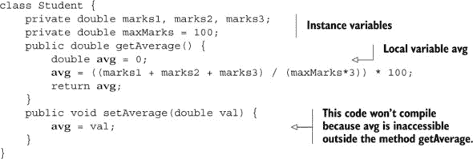

如你所见，在`getAverage`方法中局部定义的变量`avg`不能在它外部，即`setAverage`方法中访问。这个局部变量`avg`的作用域在图 3.1 中有所描述。未阴影区域表示`avg`可访问的区域，而阴影区域表示它不可用的区域。

| |
| --- |

##### 注意

变量的生命周期由其作用域决定。如果变量的作用域仅限于一个方法，那么其生命周期也仅限于该方法。你可能注意到这些术语可以互换使用。

| |
| --- |

##### 图 3.1\. 你只能在`getAverage`方法中访问局部变量 avg。

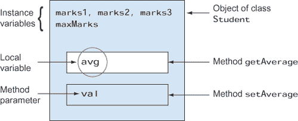

让我们定义另一个变量，`avg`，它是`if`语句块（当`if`条件评估为`true`时执行的代码）的局部变量：

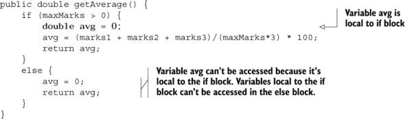

在这种情况下，局部变量`avg`的作用域缩小到`getAverage`方法内定义的`if`-`else`语句的`if`块。这个局部变量`avg`的作用域在图 3.2 中展示，其中无阴影区域表示`avg`可访问的地方，阴影部分表示不可用的地方。

##### 图 3.2\. 局部变量`avg`的作用域是`if`语句的一部分。

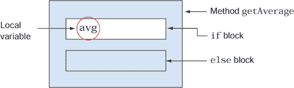

同样，循环变量在循环体外部是不可访问的：

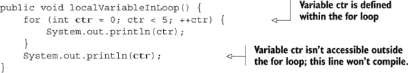

|  |
| --- |

##### 考试技巧

局部变量是 OCA Java SE 8 程序员 I 考试作者们偏爱的主题。你可能会被问到关于继承或异常处理等相对复杂主题的问题，但实际测试的将是你对局部变量作用域的知识。

|  |
| --- |

在声明之前能否访问局部变量？不可以。不允许对局部变量的**前向引用**：

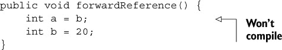

如果你将前例中变量的声明顺序颠倒，代码将可以编译：

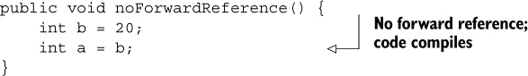

局部变量的作用域取决于其在方法中声明的位置。在循环、`if`-`else`、`switch`构造或代码块（用`{}`标记）内定义的局部变量的作用域仅限于这些构造。在上述构造之外定义的局部变量在整个方法中都是可访问的。

下一个部分将讨论方法参数的作用域。

#### 3.1.2\. 方法参数

在方法签名中接受值的变量被称为**方法参数**。它们只能在定义它们的方法中访问。在以下示例中，为`setTested`方法定义了一个方法参数`val`：

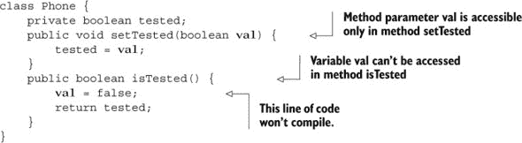

在前面的代码中，你只能在`setTested`方法内访问方法参数`val`。在其他任何方法中都无法访问。

方法参数`val`的作用域在图 3.3 中展示。无阴影区域表示变量可访问的地方，阴影部分表示变量不可用的地方。

##### 图 3.3\. 在方法`setTested`中定义的方法参数`val`的作用域

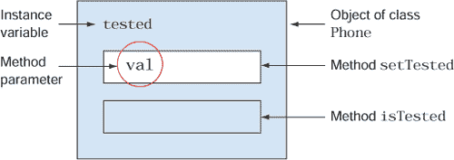

方法参数的作用域可能和局部变量一样长，甚至更长，但它永远不会更短。以下`isPrime`方法定义了一个方法参数`num`和两个局部变量`result`和`ctr`：

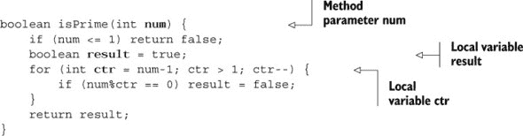

方法参数 `num` 的范围与局部变量 `result` 的范围相同。因为局部变量 `ctr` 的范围仅限于 `for` 块，所以它比方法参数 `num` 短。这三个变量范围的比较在 图 3.4 中显示，其中每个变量的范围（在一个椭圆中定义）由包围它的矩形表示。

##### 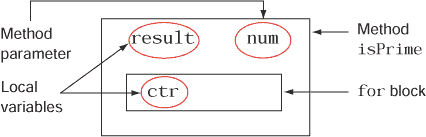


让我们继续讨论实例变量，它们的范围比方法参数更大。

#### 3.1.3. 实例变量

*实例* 是对象的另一个名称。因此，*实例变量* 在对象的生命周期内可用。实例变量在类中声明，位于所有方法之外。它可被类中定义的所有实例（或非静态）方法访问。

在下面的示例中，变量 `tested` 是一个实例变量——它在类 `Phone` 中定义，位于所有方法之外。它可以被类 `Phone` 的所有方法访问：

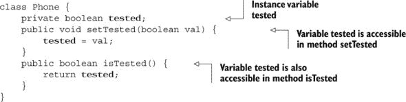

实例变量 `tested` 的范围在 图 3.5 中表示。如图所示，变量 `tested` 可以跨 `Phone` 类的对象访问，由无阴影区域表示。它在 `setTested` 和 `isTested` 方法中可访问。

##### 图 3.5. 实例变量 `tested` 可以跨 `Phone` 类的对象访问。

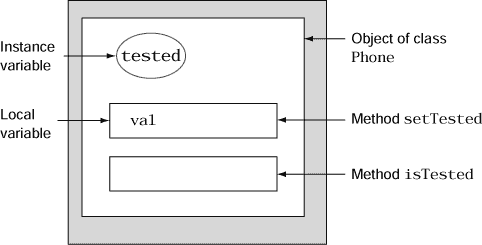

| |
| --- |

##### 考试技巧

实例变量的范围比局部变量或方法参数的范围更长。

| |
| --- |

在下一节中介绍的类变量是所有变量类型中范围最大的。

#### 3.1.4. 类变量

一个 *类变量* 是通过使用关键字 `static` 定义的。类变量属于一个类，而不是属于类的单个对象。类变量在所有对象之间共享——对象没有类变量的单独副本。

您甚至不需要一个对象来访问类变量。您可以使用定义它的类的名称来访问它：

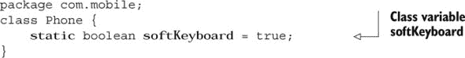

让我们尝试在另一个类中访问这个变量：

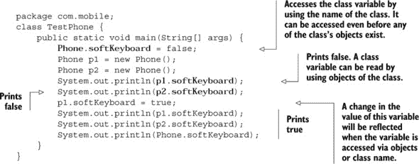

如前述代码所示，类变量 `softKeyboard` 可以通过以下所有方式访问：

+   `Phone.softKeyboard`

+   `p1.softKeyboard`

+   `p2.softKeyboard`

无论您使用类的名称（`Phone`）还是对象的引用（`p1`）来访问类变量，都没有关系。您可以使用它们中的任何一个来更改类变量的值，因为它们都指向单个共享副本。当您使用 `null` 引用来访问静态变量 `softKeyboard` 时，Java 会引用引用变量 `p1` 和 `p2` 的 *类型*（即 `Phone`），而不是它们所引用的对象。因此，使用 `null` 引用访问静态变量不会抛出异常：

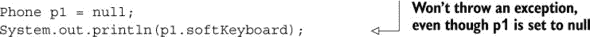

类变量`softKeyboard`的作用域在图 3.6 中展示。如图所示，这个变量的单个副本对所有`Phone`类的对象都是可访问的。即使没有`Phone`实例的存在，`softKeyboard`变量也是可访问的。类变量`softKeyboard`在 JVM 将`Phone`类加载到内存时由 JVM 使其可访问。类变量`softKeyboard`的作用域取决于其访问修饰符和`Phone`类的访问修饰符。因为`Phone`类和类变量`softKeyboard`都是使用默认访问定义的，所以它们只能在包`com.mobile`内访问。

##### 图 3.6。类变量`softKeyboard`的作用域限制在包`com.mobile`内，因为它是在使用默认访问定义的`Phone`类中定义的。类变量`softKeyboard`在`Phone`类的所有对象之间共享并可访问。

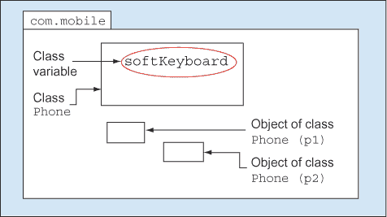

##### 比较不同作用域中变量的使用

这里是对局部变量、方法参数、实例变量和类变量使用的快速比较：

+   局部变量是在方法内定义的，通常用于存储计算的中间结果。

+   方法参数用于将值传递给方法。这些值可以被操作，也可以分配给实例变量。

+   实例变量用于存储对象的状态。这些是需要被多个方法访问的值。

+   类变量用于存储应该由类中所有对象共享的值。

#### 3.1.5。重叠变量作用域

在前面的关于局部变量、方法参数、实例变量和类变量的章节中，你是否注意到一些变量在对象内的多个地方都是可访问的？例如，所有四个变量在方法内的循环中都是可访问的。

这种重叠的作用域在图 3.7 中展示。变量定义在椭圆形中，并且可以在所有方法和块内访问，如它们包围的矩形所示。

##### 图 3.7。变量的作用域可以重叠。

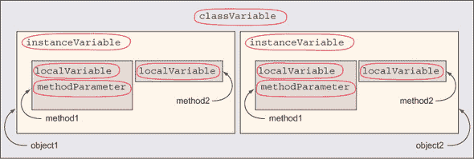

如图 3.7 所示，一个类的`classVariable`实例可以被该类的多个对象（`object1`和`object2`）访问和共享。`object1`和`object2`各自都有自己的实例变量`instanceVariable`的副本，因此`instanceVariable`可以在`object1`的所有方法中访问。当与`object1`和`object2`一起使用时，`method1`和`method2`各自有自己的`localVariable`和`methodParameter`副本。

|  |
| --- |

##### 注意

`instanceVariable`的作用域与在`method1`中定义的`local-Variable`和`methodParameter`的作用域重叠。因此，这三个变量（`instanceVariable`、`localVariable`和`methodParameter`）可以在重叠区域相互访问。但是`instanceVariable`不能在`method1`外部访问`localVariable`和`methodParameter`。

|  |
| --- |

##### 比较变量的作用域

图 3.8 比较了局部变量、方法参数、实例变量和类变量的生命周期。

##### 图 3.8\. 比较所有四个变量的作用域或生命周期

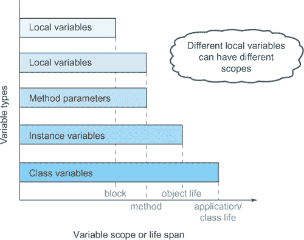

如图 3.8 所示，局部变量的作用域或生命周期最短，类变量的作用域或生命周期最长。

|  |
| --- |

##### 考试提示

不同的局部变量可以有不同的作用域。局部变量的作用域可能短于或等于方法参数的作用域。如果局部变量在方法中的子块（在大括号`{}`内）中声明，则局部变量的作用域小于方法的作用域。这个子块可以是一个`if`语句、一个`switch`构造、一个循环或一个`try`-`catch`块（在第七章中讨论）。

|  |
| --- |

##### 不同作用域中具有相同名称的变量

变量作用域的重叠导致在不同作用域内具有相同名称的变量组合变得有趣。一些规则是必要的，以防止冲突。特别是，你无法在类中定义具有相同名称的`static`变量和实例变量：

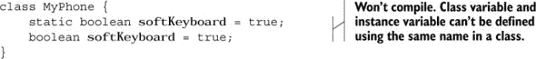

同样，局部变量和方法参数不能具有相同的名称。以下代码定义了一个方法参数和一个局部变量，它们具有相同的名称，因此无法编译：

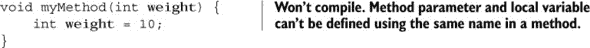

一个类可以定义与实例或类变量具有相同名称的局部变量，也称为*阴影*。以下代码定义了一个类变量和一个局部变量`softKeyboard`，它们具有相同的名称，以及一个实例变量和一个局部变量`phoneNumber`，它们也具有相同的名称，这是可接受的：

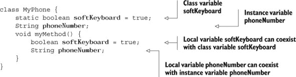

|  |
| --- |

##### 注意

在重叠的作用域中定义具有相同名称的变量可能是一种危险的编码实践。这通常只在非常特定的情况下被接受，例如构造函数和设置器。请编写易于阅读、理解和维护的代码。

|  |
| --- |

当你给一个与实例变量具有相同名称的局部变量赋值时会发生什么？实例变量会反映这个修改后的值吗？这个问题为本章“故事中的第一个转折”练习提供了思考的食物。它应该有助于你记住当你给类中已经存在具有相同名称的实例变量赋值时，给局部变量赋值会发生什么（答案见附录）。

##### 故事中的转折 3.1

类 `Phone` 定义了一个局部变量和一个实例变量，`phoneNumber`，具有相同的名称。检查方法 `setNumber` 的定义。在您的系统上执行该类，并从给定选项中选择类 `TestPhone` 的正确输出：

```
class Phone {
    String phoneNumber = "123456789";
    void setNumber () {
        String phoneNumber;
        phoneNumber = "987654321";
    }
}
class TestPhone {
    public static void main(String[] args) {
        Phone p1 = new Phone();
        p1.setNumber();
        System.out.println (p1.phoneNumber);
    }
}
```

1.  123456789

1.  987654321

1.  无输出

1.  类 `Phone` 将无法编译。

在本节中，你使用了不同作用域中的变量。当变量超出作用域时，它们就不再被剩余的代码访问。在下一节中，你将看到对象是如何创建和变得可访问，然后又变得不可访问的。

### 3.2\. 对象的生命周期

|  |
| --- |

[2.4] 解释对象的生命周期（创建、“通过重新赋值取消引用”和垃圾回收）

|  |
| --- |

OCA Java SE 8 程序员 I 考试将测试你对对象何时创建、何时可访问以及何时可取消引用的理解。考试还将测试你确定特定代码行处可访问对象总数的能力。原始数据类型不是对象，因此在本节中不相关。

与一些其他编程语言，如 C 语言不同，Java 不允许你在创建或销毁对象时自行分配或释放内存。Java 管理分配对象和回收未使用对象占用的内存。

回收未使用内存的任务由 Java 的垃圾回收器处理，它是一个低优先级的线程。它定期运行并释放未使用对象占用的空间。

Java 还提供了一个名为 `finalize` 的方法，该方法对所有类都是可访问的。`finalize` 方法在类 `java.lang.Object` 中定义，这是所有 Java 类的基类。所有 Java 类都可以重写 `finalize` 方法，该方法在对象被垃圾回收之前执行。理论上，你可以使用此方法释放对象使用的资源，尽管这样做并不推荐，因为其执行并不保证会发生。

对象的生命周期从其创建开始，一直持续到它超出作用域或不再被变量引用。当对象可访问时，它可以被变量引用，其他类可以通过调用其方法和访问其变量来使用它。我将在以下子节中详细讨论这些阶段。

#### 3.2.1\. 一个对象诞生

当你使用关键字操作符 `new` 时，对象就会出现。你可以使用此对象初始化一个引用变量。注意声明变量和初始化它的区别。以下是一个 `Person` 类和一个 `ObjectLifeCycle` 类的示例：

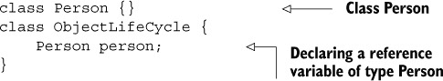

在前面的代码中，类 `ObjectLifeCycle` 中没有创建 `Person` 类的对象；它只声明了一个 `Person` 类型的变量。当引用变量被初始化时，才会创建对象：

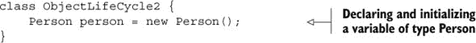

变量声明和对象创建的区别在图 3.9 中得到了说明，你可以将婴儿的名字与引用变量相比，将真正的婴儿与对象相比。图 3.9 中的左框代表变量声明，因为婴儿还没有出生。图 3.9 中的右框代表对象创建。

##### 图 3.9\. 声明引用变量和初始化引用变量的区别

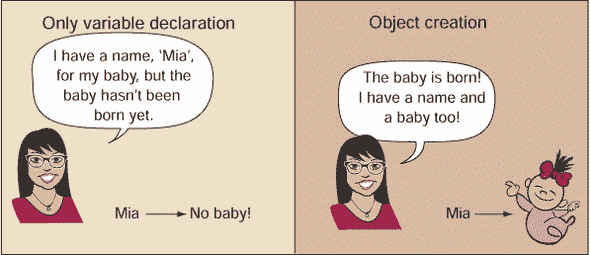

从语法上讲，对象是通过使用`new`运算符创建的。但`String`类在这里是一个特例。`String`引用变量也可以通过使用字符串字面值来初始化：

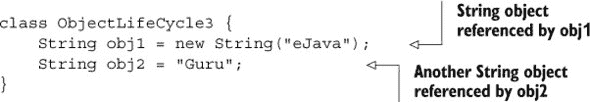

|  |
| --- |

##### 注意

初始化引用变量和实例化不是一回事。初始化引用变量不一定总是导致创建新的实例。在第四章中，我们将详细讲解 JVM 如何将`String` *字面值*池化到*字符串池*中。尽管使用`new`运算符总是创建一个新的`String`对象，但使用`String`字面值来初始化`String`引用变量不一定总是创建一个新的`String`对象。

|  |
| --- |

当你创建一个新对象而没有将其分配给任何引用变量时会发生什么？让我们在类`ObjectLifeCycle2`中创建一个新对象`Person`，但不将其分配给任何引用变量（粗体部分为修改）：

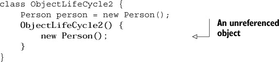

在前面的例子中，创建了一个`Person`类的对象，但无法使用任何引用变量来访问它。以这种方式创建对象将执行类的相关构造函数。

|  |
| --- |

##### 考试技巧

注意在给定代码中创建的实例的数量——那些可以和不可以进行垃圾回收的实例。

|  |
| --- |

在下一节中，你将了解对象创建后会发生什么。

#### 3.2.2\. 对象是可访问的

一旦创建了对象，就可以使用其引用变量来访问它。它将保持可访问状态，直到它超出作用域或其引用变量被显式设置为`null`。此外，如果你将另一个对象重新分配给已初始化的引用变量，则之前的对象将从这个变量中变得不可访问。你可以在其他类和方法中访问和使用对象。

看一下以下`Exam`类的定义：

```
class Exam {
    String name;
    public void setName(String newName) {
        name = newName;
    }
}
```

`ObjectLife1`类声明了一个`Exam`类型的变量，创建了它的对象，调用了它的方法，将其设置为`null`，然后重新初始化它：

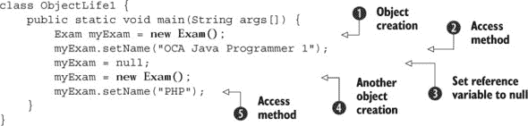

前面的例子使用相同的引用变量`myExam`创建了两个`Exam`类的对象。让我们分析一下例子中发生的情况：

+    创建了一个引用变量`myExam`，并用`Exam`类的对象初始化它。

+    在变量`myExam`引用的对象上调用`setName`方法。

+   ![num-3.jpg] 将值`null`分配给引用变量`myExam`，这样通过`myExam`就无法访问该变量所引用的对象。

+   ![num-4.jpg] 创建了一个新的`Exam`类的对象并将其分配给引用变量`myExam`。

+   ![num-5.jpg] 在方法`main`中创建的第二个`Exam`对象上调用`setName`方法。

当![num-4.jpg] 创建另一个`Exam`类的对象并将其分配给变量`myExam`时，第一个由![num-1.jpg] 创建的对象会发生什么？因为第一个对象无法通过任何变量访问，所以 Java 认为它是垃圾，并认为它应该由 Java 的垃圾回收器送入垃圾箱。如前所述，垃圾回收器是一个低优先级的线程，它回收 Java 中未使用或未引用的对象所占用的空间。

当对象变得不可访问时会发生什么？你将在下一节中找到答案。

#### 3.2.3. 对象不可访问

如果对象超出作用域或通过重新分配被取消引用，它可能变得不可访问。

##### 变量超出作用域

如果对象超出作用域，它可能变得不可访问：

![162fig01_alt.jpg]

在前面的代码中，变量`myExam1`是在`if`块内定义的局部变量。它的作用域从声明它的行开始，直到以闭合花括号![num-1.jpg] 标记的`if`块的末尾。在这个闭合花括号之后，变量`myExam1`所引用的对象不再可访问。它超出作用域，并被 Java 的垃圾回收器标记为符合垃圾回收的条件。同样，变量`myExam2`所引用的对象在以闭合花括号![num-3.jpg] 标记的`else`块末尾变得不可访问。

| |
| --- |

##### 考试技巧

当对象超出作用域时，它将无法被引用，并被标记为垃圾回收。

| |
| --- |

##### 通过重新分配取消引用

已经引用实例的变量可以被分配另一个实例。在这种情况下，较早的实例被取消引用，并符合垃圾回收的条件。让我们用一个修改过的先前代码示例来工作：

![162fig02_alt.jpg]

在前面的代码中，创建了一个`Exam`实例并将其分配给变量`myExam` ![num-1.jpg]。在![num-2.jpg] `myExam`被分配另一个`Exam`实例之前被设置为`null` ![num-3.jpg]。![num-4.jpg] 中的代码重新分配了另一个`Exam`实例给`myExam`，而没有明确将其设置为`null`。同样，在![num-3.jpg] 创建的实例再次被取消引用。在![num-4.jpg] 执行后，两个`MyExam`实例通过重新分配被取消引用，并符合垃圾回收的条件。

在![num-5.jpg]，另一个变量`yourExam`使用`Exam`实例初始化。在![num-6.jpg]，变量`myExam`被分配给变量`yourExam`。这取消了之前分配给`yourExam`的`Exam`实例的引用。

图 3.10 展示了`Exam`实例如何通过变量`myExam`和`yourExam`被引用。使用灰色框突出显示的`Exam`实例代表未引用的对象。

##### 图 3.10\. 对象可以通过变量的重新赋值来解除引用。

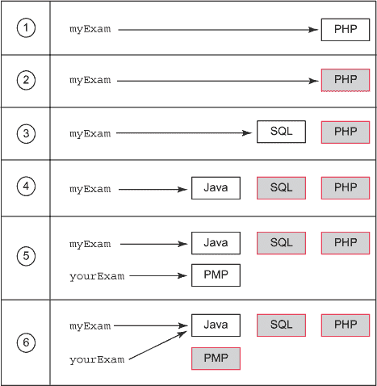

|  |
| --- |

##### 考试技巧

当一个变量被显式设置为`null`或分配给另一个实例或引用变量时，实例通过重新赋值来解除引用。

|  |
| --- |

#### 3.2.4\. 垃圾回收

在 OCA Java SE 8 程序员 I 级考试中，你可能会回答有关具有多个变量声明和初始化的代码的垃圾回收问题。考试可能会询问在特定代码行之后有多少对象有资格进行垃圾回收。

##### 自动内存管理

垃圾回收器是一个低优先级的线程，它在 JVM 中标记有资格进行垃圾回收的对象，然后清除这些对象的内存。它通过程序员不需要自己标记这些实例来实现自动内存管理。

##### 何时进行垃圾回收？

你只能确定哪些对象有资格进行垃圾回收。你永远无法确定特定对象何时会被垃圾回收。用户无法控制或确定垃圾回收器的执行。它由 JVM 控制。

|  |
| --- |

##### 考试技巧

注意那些措辞如“在下一个 GC 周期中哪些对象一定会被收集”的问题，对于这类问题的真正答案永远无法得知。

|  |
| --- |

让我们回顾一下我在第二章中使用的狗和狗绳的类比来定义对象引用变量。在图 3.11 中，你可以将对象引用变量与狗绳以及对象与狗进行比较。回顾以下比较，这将帮助你理解对象的生命周期和垃圾回收：

+   一个未初始化的引用变量可以比作没有狗的狗绳。

+   一个已初始化的引用变量可以比作拴着的狗。

+   一个未引用的对象可以比作未拴的狗。

##### 图 3.11\. 比较对象引用变量和对象与狗绳和拴着的狗以及未拴的狗

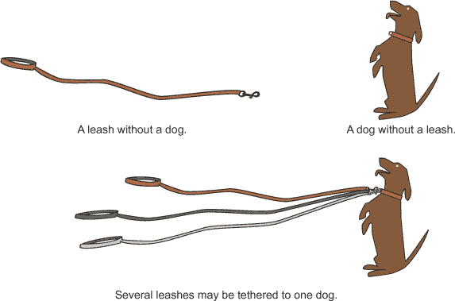

你可以将 Java 的垃圾回收器比作动物控制。动物控制收集未拴狗的方式就像 Java 的垃圾回收器回收未引用对象使用的内存一样。

##### 使用`System.gc()`或`Runtime.getRuntime().gc()`

作为程序员，你不能启动 Java 垃圾回收器的执行。你只能通过调用`System.gc()`或`Runtime.getRuntime().gc()`来请求它启动。但调用此方法并不保证垃圾回收器何时会启动（JVM 甚至可以忽略这个调用）。注意那些询问你在调用`System.gc()`之后有多少实例已被垃圾回收的考试问题。它不会在任何代码行保证任何计数。

##### 垃圾回收引用对象

垃圾回收器还可以从一组引用对象中回收内存。这组变量被称为 *隔离岛*。

一个实例可以被多个变量引用。因此，当你将这些变量之一设置为 `null` 时，实例仍然可以通过其他变量（s）进行引用。但是，没有 *外部引用* 的一组实例符合垃圾回收的条件。让我们通过一个例子来操作：

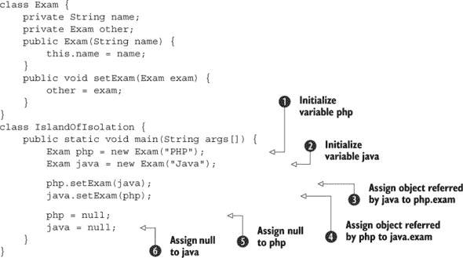

在前面的示例中，一个 `Exam` 实例可以使用其字段 `other` 指向其自身类型的对象。在  和  处，创建了两个变量 `php` 和 `java`，并使用 `Exam` 实例进行初始化。在  处，`java` 被赋值给 `php.other`。在  处，`php` 被赋值给 `java.other`。在  处，当 `php` 被设置为 `null` 时，它所引用的实例 *不* 符合垃圾回收的条件，因为它仍然可以通过 `java.other` 进行引用。在  处，当 `java` 也被设置为 `null` 时，`java` 和 `php` 所引用的对象都符合垃圾回收的条件。如图 图 3.12 所示，尽管这两个对象可以相互引用，但它们在 `main` 方法中不能再被引用。它们形成了一个 *隔离岛*。Java 的垃圾回收器可以确定这样的实例组。

##### 图 3.12\. 没有外部引用的一组实例形成一个隔离岛，符合垃圾回收的条件。

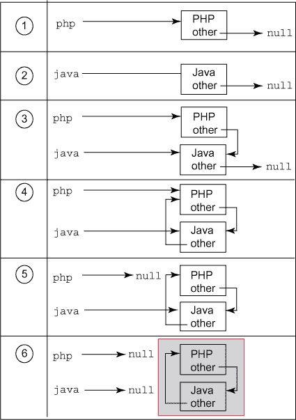

现在你已经熟悉了对象的生命周期，你可以创建接受原始数据类型和对象作为方法参数的方法；这些方法返回一个值，这个值可以是原始数据类型或对象。

### 3.3\. 创建具有参数和返回值的方法

| |
| --- |

[6.1] 创建具有参数和返回值的方法；包括重载方法

| |
| --- |

在本节中，你将处理方法的定义，这些方法可能接受输入参数，也可能不返回任何值。

方法是一组与名称相关的语句。方法用于定义对象的行为。方法可以执行不同的操作，如图 图 3.13 所示。

##### 图 3.13\. 不同类型的方法

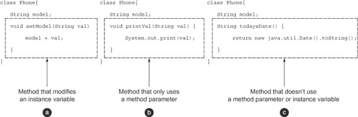

1.  `setModel` 方法可以访问并修改 `Phone` 实例的状态。

1.  `printVal` 方法仅使用传递给它的方法参数。

1.  `todaysDate` 方法初始化一个 `java.util.Date` 实例，并返回其 `String` 表示形式。

在接下来的小节中，你将了解方法组件：

+   返回类型

+   方法参数

+   `return` 语句

+   访问修饰符（在第一章中介绍）

+   非访问修饰符（在第一章中介绍）

图 3.14 展示了一个接受方法参数并定义返回类型和 `return` 语句的方法的代码。

让我们从讨论方法的返回类型开始。

##### 图 3.14\. 接受方法参数并定义返回类型和 `return` 语句的方法示例

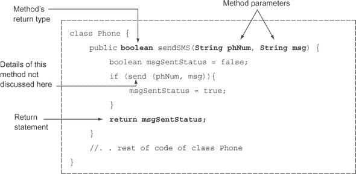

#### 3.3.1\. 方法的返回类型

方法的返回类型声明了方法将返回的值的类型。一个方法可能返回值，也可能不返回值。不返回值的方法具有 `void` 返回类型。方法可以返回一个原始值或任何类的对象。返回类型的名称可以是 Java 中定义的八个原始类型之一、一个类或一个接口。

在以下代码中，方法 `setWeight` 不返回任何值，而方法 `getWeight` 返回一个值：

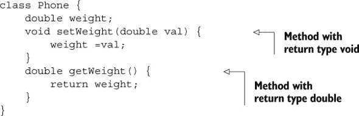

如果一个方法不返回值，你不能将该方法的结果赋给变量。你认为以下使用前面类 `Phone` 的 `TestMethods` 类的输出是什么？


上述代码无法编译，因为方法 `setWeight` 不返回任何值。它的返回类型是 `void`。因为方法 `setWeight` 不返回任何值，所以没有可以赋给变量 `newWeight` 的内容，因此代码无法编译。

如果一个方法返回一个值，调用该方法可能或可能不会费心将方法返回的值存储在变量中。看看以下代码：

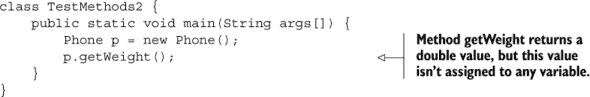

在前面的例子中，方法 `getWeight` 返回的值没有被赋给任何变量，这对 Java 编译器来说不是问题。编译器会愉快地为你编译代码。

|  |
| --- |

##### 考试技巧

你可以选择将方法返回的值赋给变量。如果你没有将方法返回的值赋给变量，这既不是编译错误，也不是运行时异常。

|  |
| --- |

你从方法返回的值必须可以赋值给它被赋值的变量。例如，`Phone` 中的 `getWeight()` 的返回值是 `double`。你可以将 `getWeight()` 的返回值赋给 `double` 类型的变量，但不能赋给 `int` 类型的变量（没有显式转换）。以下是代码：

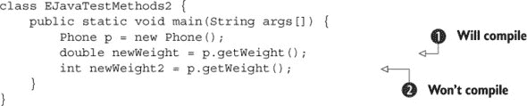

在前面的代码中， 将成功编译，因为方法 `getWeight` 的返回类型是 `double`，而变量 `newWeight` 的类型也是 `double`。但  无法编译，因为从方法 `getWeight` 返回的 `double` 值不能赋给类型为 `int` 的变量 `newWeight2`。你可以通过显式转换使其发生：

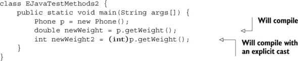

但显式转换不适用于不兼容的数据类型：

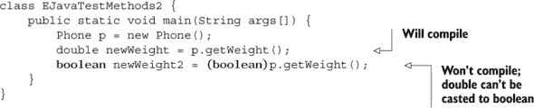

我们已经讨论了如何从方法中传递一个值。要将值传递到方法中，你可以使用方法参数。

#### 3.3.2\. 方法参数

*方法参数*是出现在方法定义中的变量，并指定方法可以接受的数据类型和值的数量。在图 3.15 中，变量`phNum`和`msg`是方法参数。

##### 图 3.15\. 一个接受方法参数并定义返回类型和`return`语句的方法示例

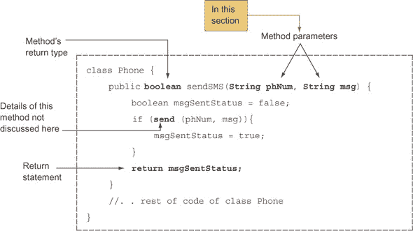

您可以将多个值传递给一个方法作为输入。理论上，没有限制可以定义的方法参数数量，但实际上定义超过三个方法参数并不是一个好主意。使用具有太多方法参数的方法很繁琐，因为您必须多次交叉检查它们的类型和目的，以确保您在正确的位置传递了正确的值。

|  |
| --- |

##### 注意

虽然术语*方法参数*和*方法参数*并不相同，您可能已经注意到许多程序员将它们互换使用。*方法参数*是出现在方法定义中的变量。*方法参数*是在执行方法时传递给方法的实际值。在图 3.15 中，变量`phNum`和`msg`是方法参数。如果您以`sendMsg("123456", "Hello")`的方式执行此方法，那么`String`值`"123456"`和`"Hello"`是方法参数。如您所知，您可以将字面值或变量传递给方法。因此，方法参数可以是字面值或变量。

|  |
| --- |

一个方法可以接受零个或多个方法参数。以下示例接受两个`int`值，并返回它们的平均值作为`double`值：

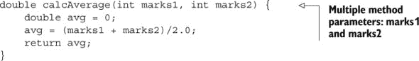

以下示例显示了一个不接受任何方法参数的方法：

```
void printHello() {
    System.out.println("Hello");
}
```

如果一个方法不接受任何参数，则方法名称后面的括号是空的。因为关键字`void`用于指定方法不返回值，您可能会认为使用关键字`void`来指定方法不接受任何方法参数是正确的，但实际上这是不正确的。以下是不接受参数的方法定义无效的示例：

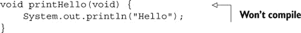

您可以在方法中定义一个可以接受可变参数（varargs）的参数。以下是一个名为`Employee`的类的示例，它定义了一个名为`days-OffWork`的方法，该方法接受可变参数：

```
class Employee {
    public int daysOffWork(int... days) {
        int daysOff = 0;
        for (int i = 0; i < days.length; i++)
            daysOff += days[i];
        return daysOff;
    }
}
```

跟在数据类型后面的省略号（`...`）表示方法参数`days`可以传递一个数组或多个以逗号分隔的值。重新审查前面的代码示例，并注意在`daysOffWork`方法中变量`days`的使用——它就像一个数组。当您为方法定义可变长度参数时，Java 会在幕后创建一个数组来实现它。

在参数列表中，您只能定义一个可变参数，并且它必须是参数列表中的最后一个变量。如果您不遵守这两条规则，您的代码将无法编译：

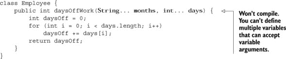

如果你的方法定义了多个方法参数，接受可变参数的变量必须是参数列表中的最后一个：

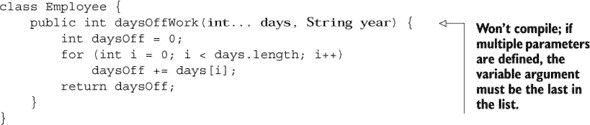

|  |
| --- |

##### 考试技巧

在 OCA 考试中，你可能会被问及不接受任何方法参数的方法的有效返回类型。请注意，没有有效或无效的组合可以传递给方法的方法参数的数量和类型以及它可以返回的值。它们是相互独立的。

|  |
| --- |

你可以向方法传递任何类型和数量的参数，包括基本类型、类的对象或接口引用的对象。

##### 要记住的规则

在定义方法参数时需要注意以下事项：

+   你可以为方法定义多个参数。

+   方法参数可以是基本类型或对象。

+   方法参数之间用逗号分隔。

+   每个方法参数前面都跟着其类型的名称。每个方法参数必须使用其名称显式声明类型。你不能像变量那样先声明类型，然后用逗号分隔参数列表。

#### 3.3.3\. 返回语句

`return`语句用于从方法中退出，无论是否有值。对于定义了返回类型的方法，`return`语句必须立即后跟返回值。对于不返回值的方法，可以使用不带返回值的`return`语句来退出方法。图 3.16 说明了`return`语句的使用。

##### 图 3.16\. 接受方法参数并定义返回类型和`return`语句的方法示例

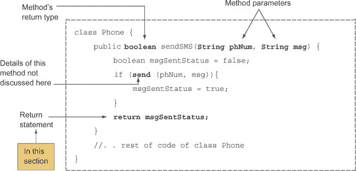

在这个例子中，我们将回顾之前关于方法`calcAverage`的例子，该方法使用`return`语句返回`double`类型的数据：

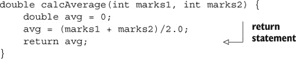

不返回值的方法（返回类型为`void`）不需要定义`return`语句：

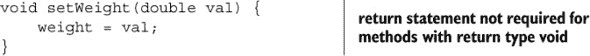

即使方法不返回值，你仍然可以在方法中使用`return`语句。通常这个语句用于定义方法的早期退出：


此外，如果存在，`return`语句必须是方法中最后执行的最后一条语句。`return`语句将控制权从方法中移出，这意味着在它之后定义任何代码都没有意义。编译器将无法编译此类代码：

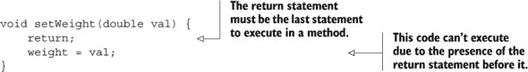

注意，方法中的`return`语句作为最后一条语句和方法中最后执行的最后一条语句之间存在差异。`return`语句不必是方法中的最后一条语句，但它必须是方法中最后执行的最后一条语句：

```
void setWeight(double val) {
    if (val < 0)
        return;
    else
        weight = val;
}
```

在前面的例子中，`return`语句不是这个方法中的最后一条语句。但它对于小于零的方法参数值是最后执行的最后一条语句。

##### 定义返回语句时要记住的规则

定义`return`语句时需要注意以下事项：

+   对于返回值的方法，`return`语句必须立即跟随着一个值。

+   对于不返回值的方法（返回类型为`void`），`return`语句后面不得跟有返回值。

+   如果编译器确定`return`语句不是方法中最后一个执行的语句，则方法将无法编译。

你认为我们已经涵盖了定义方法的所有规则了吗？还没有！你认为你可以在一个类中定义具有相同名称的多个方法吗？你可以，但你需要注意一些额外的规则，这些规则将在下一节中讨论。

### 3.4\. 创建重载方法

|  |
| --- |

[6.1] 创建具有参数和返回值的方法；包括重载方法

|  |
| --- |

*重载方法*是具有相同名称但不同方法参数列表的方法。在本节中，你将学习如何创建和使用重载方法。

想象一下你正在做讲座，需要指导听众使用纸张、智能手机或笔记本电脑（当天他们可用的任何设备）做笔记。一种方法是为听众提供一个如下指令的列表：

+   使用纸张做笔记。

+   使用智能手机做笔记。

+   使用笔记本电脑做笔记。

另一种方法是指导他们“做笔记”，然后提供他们应该使用的纸张、智能手机或笔记本电脑。除了后者方法的简单性之外，它还允许你在不需要记住所有指令列表的情况下，添加其他用于做笔记的媒体（如手、布或墙）。

这种第二种方法，提供一组指令（具有相同的名称）但不同的输入值集，可以与 Java 中的重载方法进行比较，如图 3.17 所示。

再次强调，重载方法是定义在同一个类中，名称相同但方法参数列表不同的方法。如图 3.17 所示，重载方法使得添加具有相似功能但与不同输入值集一起工作的方法变得更加容易。

##### 图 3.17\. 重载方法的真实示例

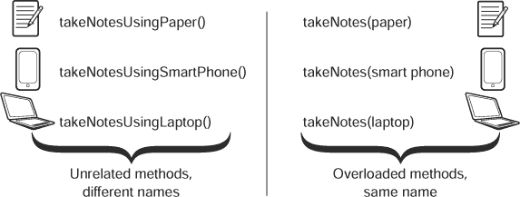

让我们以 Java API 类中的一个常用示例为例：`System.out.println()`。`println`方法接受多种类型的方法参数：

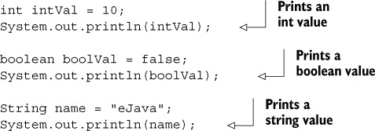

当你使用`println`方法时，你知道你传递给它作为方法参数的任何内容都将打印到控制台。使用像`printlnInt`、`printlnBool`和`printlnString`这样的方法来执行相同的功能不是疯狂的吗？我也这么认为。但观点在不同条件下会改变。有时，你可能会使用特定方法而不是重载，因为这样读起来更清晰，避免了混淆。随着你编写更多代码，你将能够自己判断这些情况。

#### 定义重载方法时需要记住的规则

这里有一些定义超载方法的规则：

+   超载方法必须具有彼此不同的方法参数。

+   超载方法可能或可能不定义不同的返回类型。

+   超载方法可能或可能不定义不同的访问级别。

+   不能仅通过更改返回类型或访问修饰符或两者来定义超载方法。

接下来，我将详细描述前面的规则——有效参数列表、返回类型和访问级别以定义超载方法。

##### 3.4.1\. 参数列表

超载方法接受不同的参数列表。参数列表可以在以下任何方面有所不同：

+   接受的参数数量变化

+   接受的参数类型变化

+   接受的参数位置变化（基于参数类型，而不是变量名）

下面是超载方法 `calcAverage` 的一个示例，它接受不同数量的方法参数：


前面的代码是超载方法最简单形式的示例。你还可以定义参数列表差异在于接受的参数类型的超载方法：


但是，你不能仅仅通过将数组参数转换为可变参数或反之亦然来定义超载方法（除非可变参数或数组项类型保持不变）。在幕后，可变参数被实现为数组。因此，以下超载方法无法编译：


如果它们仅更改传递给它们的参数的位置，则这些方法也是正确超载的：


尽管你可能认为接受的参数完全相同，只是位置不同，但 Java 编译器将它们视为不同的参数列表。编译器可以通过查看你在代码中指定的参数的 *序列* 来理解你想要调用哪个方法实现。因此，前面的代码是超载方法的有效示例。

但是，当你尝试使用可以传递给超载方法两个版本的值来执行此方法时，会出现问题。在这种情况下，代码将无法编译：


在前面的代码中， 定义了接受两个方法参数的方法 `calcAverage`：一个 `double` 和一个 `int`。 定义了超载方法 `calcAverage`，它接受两个方法参数：一个 `int` 和一个 `double`。因为整型字面量可以传递给 `double` 类型的变量，所以字面值 `2` 和 `3` 可以传递给在  和  声明的超载方法中。因为这个方法调用是可疑的，所以  无法编译。

#### 3.4.2\. 返回类型

如果方法仅在返回类型上有所不同，则不能将方法定义为超载方法，因为返回类型不是方法签名的一部分：


前面的代码中的方法不能被称为重载方法。

#### 3.4.3. 访问级别

如果方法仅在访问级别上不同，则不能将它们定义为重载方法：


如果你定义了如前所示的重载 `calcAverage` 方法，代码将无法编译。

在下一节中，你将创建称为构造函数的特殊方法，用于创建类的对象。

### 3.5. 构造函数

|  |
| --- |

[6.3] 创建和重载构造函数；包括对默认构造函数的影响

|  |
| --- |

在本节中，你将创建构造函数，了解默认构造函数和用户定义构造函数之间的区别，并创建重载的构造函数。

当你开设一个新的银行账户时会发生什么？根据你银行提供的服务，你可能会被分配一个新的银行账户号码，提供支票簿，并允许访问银行为你创建的新在线账户。这些详细信息是在设置你的新银行账户时创建并返回给你的。

将这些步骤与 Java 中构造函数的行为进行比较，如图 3.18 所示。

##### 图 3.18. 创建新银行账户时可能执行的一系列步骤。这些步骤可以与 Java 中构造函数的行为进行比较。


*构造函数* 是特殊的方法，用于创建并返回它们定义的类中的对象。构造函数与它们定义的类的名称相同，并且它们不指定返回类型——甚至不是 `void`。

构造函数可以完成以下任务：

+   调用超类的构造函数；这可以是一个隐式或显式调用。

+   使用默认值初始化类的所有实例变量。

构造函数有两种类型：用户定义的构造函数和默认构造函数，我们将在下一节中详细讨论。

#### 3.5.1. 用户定义的构造函数

类的作者对类的定义有完全的控制权。作者可以在类中定义构造函数，也可以不定义。如果作者在类中定义了构造函数，它被称为 *用户定义的构造函数*。这里的词 *用户* 并不指另一个使用这个类的人或类，而是指创建这个类的人。它被称为“用户定义的”，因为它不是由 Java 编译器创建的。

图 3.19 展示了一个名为 `Employee` 的类，它定义了一个构造函数。

##### 图 3.19. 用户 Paul 定义的具有构造函数的类 `Employee`


这是一个创建 `Employee` 类对象的 `Office` 类：


在前面的例子中， 使用关键字 `new` 创建了 `Employee` 类的对象，这触发了 `Employee` 类构造函数的执行。`Office` 类的输出如下：

```
Constructor
```

因为构造函数在创建对象时立即被调用，你可以用它来为类的实例变量分配默认值，如下所示（修改和额外的代码用粗体标出）：


让我们在`Office`类中创建一个`Employee`类的对象，看看是否有任何区别：


前面代码的输出如下：

```
Constructor
20
```

因为构造函数是一个方法，你也可以向它传递方法参数，如下所示（更改的地方用粗体标出）：

```
class Employee {
    String name;
    int age;
    Employee(int newAge, String newName) {
        name = newName;
        age = newAge;
        System.out.println("Constructor");
    }
}
```

你可以通过传递所需的方法参数来在`Office`类中使用这个构造函数，如下所示：

```
class Office {
    public static void main(String args[]) {
        Employee emp = new Employee(30, "Pavni Gupta");
    }
}
```

回顾之前提到的构造函数的使用和声明。请注意，当你创建一个类的对象时，会调用构造函数。构造函数确实有一个隐式的返回类型，即它所定义的类。它创建并返回其类的对象，这就是为什么你不能为构造函数定义返回类型。此外，请注意，你可以使用四个访问级别中的任何一个来定义构造函数。

| |
| --- |

##### 考试技巧

你可以使用所有四个访问级别来定义构造函数：`public`、`protected`、默认和`private`。

| |
| --- |

如果你为构造函数定义一个返回类型会发生什么？Java 会将其视为另一个方法，而不是构造函数，这也意味着当你创建其类的对象时，它不会隐式调用：


在前面的例子中，不会调用在`Employee`类中定义的返回类型为`void`的方法`Employee`。因为方法`Employee`将其返回类型定义为`void`，它不再被视为构造函数。

如果`Employee`类将`Employee`方法的返回类型定义为`void`，Java 如何使用它来创建对象？具有返回类型`void`的方法在`Employee`类中被视为任何其他方法。这个逻辑适用于所有其他数据类型：如果你将构造函数的返回类型定义为任何数据类型——例如`char`、`int`、`String`、`long`、`double`或任何其他类——它将不再被视为构造函数。

如何执行这样的方法？通过显式调用它，如下面的代码所示（修改的代码用粗体标出）：


注意，前面代码中的`Employee`方法就像在`Employee`类中定义的任何其他方法一样被调用。当你创建`Employee`类的对象时，它不会自动被调用。正如前面代码所示，在具有相同名称的类中，允许定义不是构造函数的方法。很有趣。

但请注意，OCA 考试的作者也发现了这一点很有趣，你可能会遇到一些关于这个概念棘手的问题。别担心：有了正确的信息，你肯定能正确回答它们。

| |
| --- |

##### 考试技巧

构造函数不得定义任何返回类型。相反，它创建并返回其定义的类的对象。如果您为构造函数定义了返回类型，它将不再被视为构造函数。相反，它将被视为一个普通方法，即使它与它的类具有相同的名称。

|  |
| --- |

##### 初始化器块与构造函数

*初始化器块*是在类中定义的，而不是作为方法的一部分。它为每个创建的类的对象执行。在以下示例中，类`Employee`定义了一个初始化器块：

![181fig02_alt.jpg]

在以下代码中，类`TestEmp`创建了一个`Employee`类的对象：

![182fig01_alt.jpg]

如果您为类定义了初始化器和构造函数，这两个都会执行。初始化器块将在构造函数之前执行：

![182fig02_alt.jpg]

类`TestEmp`的输出如下：

```
Employee:initializer
Employee:constructor
```

如果一个类定义了多个初始化器块，它们的执行顺序取决于它们在类中的位置。但它们都在类的构造函数之前执行：

![182fig03_alt.jpg]

以下是前面代码的输出：

```
Employee:initializer 1
Employee:initializer 2
Employee:constructor
```

前面的代码示例让您疑惑为什么需要同时有一个初始化器块和一个构造函数，如果它们都在对象的创建时执行？初始化器块用于初始化匿名类的变量。*匿名类*是一种内部类。在没有名称的情况下，匿名类无法定义构造函数，并依赖于初始化器块在创建其类的对象时初始化其变量。由于内部类不在此考试范围内，我将不讨论如何使用初始化器块与匿名内部类一起使用。

初始化器块内可以发生很多操作：它可以创建局部变量。它可以访问并分配实例和静态变量的值。它可以调用方法并定义循环、条件语句和`try`-`catch`-`finally`块。与构造函数不同，初始化器块不能接受方法参数。

|  |
| --- |

##### 注意

循环和条件语句在第五章中介绍，而`try`-`catch`-`finally`块在第七章中介绍。

|  |
| --- |

#### 3.5.2\. 默认构造函数

在前面关于用户定义构造函数的章节中，我讨论了构造函数用于创建对象的方式。如果您在类中没有定义任何构造函数会发生什么？

以下代码是未定义构造函数的`Employee`类的示例：

![183fig01.jpg]

您可以在另一个类（`Office`）中创建此类的对象，如下所示：

![183fig02_alt.jpg]

在这种情况下，哪个方法创建了`Employee`类的对象？图 3.20 显示了当编译一个没有定义任何构造函数的类（`Employee`）时会发生什么。在没有用户定义的构造函数的情况下，Java 插入一个*默认构造函数*。这个构造函数不接受任何方法参数。它调用超类（父类）的构造函数并将所有实例变量赋值为默认值。

##### 图 3.20。当 Java 编译器编译一个没有定义构造函数的类时，编译器会为其创建一个。


| |
| --- |

##### 考试技巧

默认构造函数的可访问性与其类的可访问性相匹配。Java 为公共类创建一个公共默认构造函数。它为具有包级访问权限的类创建一个具有包访问权限的默认构造函数。

| |
| --- |

如果你向`Employee`类添加另一个构造函数，如下例所示，会发生什么？


在这种情况下，在重新编译时，Java 编译器会注意到你在`Employee`类中定义了一个构造函数。它不会为其添加默认构造函数，如图 3.21 所示。

##### 图 3.21。当一个带有构造函数的类被编译时，Java 编译器不会为其添加默认构造函数。


如果没有无参构造函数，以下代码将无法编译：


| |
| --- |

##### 考试技巧

Java 只在没有定义构造函数的情况下定义默认构造函数。如果一个类没有定义构造函数，编译器会为该类添加一个默认的无参构造函数。但是，如果你后来通过向类中添加构造函数来修改类，Java 编译器将移除它最初添加到类中的默认无参构造函数。

| |
| --- |

#### 3.5.3. 重载构造函数

就像你可以在类中重载方法一样，你也可以在类中重载构造函数。*重载构造函数*遵循与上一节中讨论的重载方法相同的规则。以下是一个快速回顾：

+   重载构造函数必须使用不同的参数列表来定义。

+   重载构造函数不能仅通过改变访问级别来定义。

因为构造函数没有定义返回类型，所以定义具有不同返回类型的不合法重载构造函数是没有意义的。

以下是一个定义了四个重载构造函数的`Employee`类的示例：


在前面的代码中，定义了一个不接受任何方法参数的构造函数。定义了另一个接受单个方法参数的构造函数。注意和中定义的构造函数。这两个都接受两个方法参数，`String`和`int`。但是，这两个方法参数在和中的位置不同，这在重载构造函数和方法中是可接受且有效的。

##### 从另一个构造函数调用重载的构造函数

在一个类中定义多个构造函数并跨构造函数重用其功能是很常见的。与可以通过方法名调用的重载方法不同，重载构造函数是通过使用关键字 `this` 调用的——这是一个对所有引用对象本身的隐式引用，对所有对象都是可访问的：


在  的代码创建了一个无参数的构造函数。在 ，这个构造函数通过传递 `null` 和 `0` 的值来调用重载的构造函数。 定义了一个接受两个方法参数的重载构造函数。

因为构造函数是使用其类的名称定义的，所以尝试使用类的名称从另一个构造函数调用构造函数是一个常见的错误：


此外，当你使用关键字 `this` 调用一个重载构造函数时，它必须是你的构造函数中的第一个语句：


你不能在构造函数内部调用两个（或更多）构造函数，因为构造函数的调用必须是构造函数中的第一个语句：


不仅如此：你也不能从你的类中的任何其他方法调用构造函数。类 `Employee` 的其他方法都不能调用其构造函数。

##### 需要记住的规则

这里是一个快速列表，用于记住考试中定义和使用重载构造函数的规则：

+   重载构造函数必须使用不同的参数列表定义。

+   重载构造函数不能仅通过改变访问级别来定义。

+   重载构造函数可以使用不同的访问级别定义。

+   构造函数可以通过使用关键字 `this` 来调用另一个重载的构造函数。

+   构造函数不能使用其类的名称来调用构造函数。

+   如果存在，对另一个构造函数的调用必须是构造函数中的第一个语句。

+   你不能从构造函数中调用多个构造函数。

+   构造函数不能从方法中调用（除了使用 `new` 关键字实例化类）。

故事中的下一个转折点练习在其代码中隐藏了一个重要的概念，只有当你执行修改后的代码时才能了解（答案见附录）。

##### 故事转折点 3.2

让我们修改我在重载构造函数部分使用的类 `Employee` 的定义，如下所示：

```
class Employee {
    String name;
    int age;
    Employee() {
        this ();
    }
    Employee (String newName, int newAge) {
        name = newName;
        age = newAge;
    }
}
```

问题：这段修改后的代码的输出是什么，为什么？

现在你已经看到了如何创建方法和构造函数，以及它们的重载变体，我们将在下一节中转向如何使用所有这些来访问和修改对象字段。

### 3.6\. 访问对象字段

| |
| --- |

[2.3] 了解如何读取或写入对象字段

| |
| --- |

在本节中，你将学习什么是对象字段以及如何读取、初始化和修改它们。你还将学习用于在对象上调用方法的正确符号。访问修饰符还决定了你是否可以在对象上调用方法。

#### 3.6.1\. 什么是对象字段？

*对象字段*是类中定义的实例变量的另一个名称。我经常看到一些认证考生对对象字段是否与类的实例变量相同感到困惑。

下面是一个`Star`类的示例：


在前面的例子中，定义了一个实例变量，`starAge`。定义了一个*setter*方法，`setAge`。*setter*（或*mutator*）方法用于设置变量的值。定义了一个*getter*（或*accessor*）方法，`getAge`。*getter*方法用于检索变量的值。在这个例子中，对象字段是`starAge`，而不是`age`或`newAge`。对象字段的名字不由其*getter*或*setter*方法的名字决定。

|  |
| --- |

**JavaBeans 属性和对象字段**

对象字段名称的混淆原因在于 Java 类也可以用来定义称为*JavaBeans*的视觉或非视觉组件，这些组件用于 Spring、Hibernate 和其他视觉和非视觉环境中。这些类应该定义用于检索和设置视觉组件属性的 getter 和 setter 方法。如果一个视觉 JavaBean 组件定义了一个名为`age`的属性，那么它的 getter 和 setter 方法的名字将是`getAge`和`setAge`。对于 JavaBean，你不必担心用于存储此属性值的变量的名称。在 JavaBean 中，一个对象字段`thisIsMyAge-`可以用来存储其*属性*`age`的值。

注意，我提到的 JavaBeans 不是企业 JavaBeans。企业 JavaBeans 用于用 Java 编写的企业应用程序，这些应用程序在服务器上运行。

|  |
| --- |

#### 3.6.2\. 读取和写入对象字段

OCA Java SE 8 程序员 I 级考试将测试你如何从对象字段中读取值并将它们写入，这可以通过以下任何一种方式完成：

+   使用方法来读取和写入对象字段

+   使用构造函数将值写入对象字段

+   直接访问实例变量以读取和写入对象字段

|  |
| --- |

##### 考试技巧

虽然可以通过直接访问来操作对象字段，但这并不是推荐的做法。这样做会使对象容易受到无效数据的影响。这样的类并没有很好地封装。

|  |
| --- |

此考试目标（2.3）还将测试你对如何为多个对象分配相同对象字段的不同值的理解。让我们从一个例子开始：


在类`Employee`中， 定义了两个对象字段：`name`和`age`。它定义了一个（无参数）构造函数。 将值`22`分配给其字段`age`。此类还定义了一个`setName`方法，其中 将传递给它的值分配给对象字段`name`。`printEmp`方法用于打印对象字段`name`和`age`的值。

以下是一个类的定义，`Office`，它创建了两个`Employee`类的实例，`e1`和`e2`，并为其字段分配值。让我们看看类`Office`的定义：

```
class Office {
    public static void main(String args[]) {
        Employee e1 = new Employee();
        Employee e2 = new Employee();
        e1.name = "Selvan";
        e2.setName("Harry");
        e1.printEmp();
        e2.printEmp();
    }
}
```

这是前面代码的输出：

```
name = Selvan age = 22
name = Harry age = 22
```

图 3.22 定义了对象图（包含对象的名字和类型、对象字段的名称及其对应值），这将有助于您更好地理解前面的输出。

##### 图 3.22\. 类`Employee`的两个对象


您可以通过使用其变量`name`或使用`setName`方法来访问类`Employee`的对象字段名称。以下行代码将值`Selvan`分配给对象`e1`的字段`name`：

```
e1.name = "Selvan";
```

以下行代码使用`setName`方法将值`Harry`分配给对象`e2`的字段`name`：

```
e2.setName("Harry");
```

因为类`Employee`的构造函数将值`22`分配给变量`age`，所以对象`e1`和`e2`都包含相同的值，`22`。

如果您没有为对象字段分配任何值并尝试打印其值会发生什么？如果在写入任何值之前尝试访问或读取它们的值，所有实例变量（对象字段）都将分配它们的默认值：


前面代码的输出如下（对象的默认值为`null`，`int`的默认值为`0`）：

```
name = null age = 0
```

如果您将变量`name`的访问修饰符更改为`private`，如下所示（加粗的修改后的代码），会发生什么？


您无法将对象字段名称的值设置为以下形式：

```
e1.name = "Selvan";
```

这行代码无法编译。相反，它抱怨变量`name`在类`Employee`中具有私有访问权限，并且不能从任何其他类中访问：

```
Office.java:6:  name has private access in Employee
            e1.name = "Selvan";
```

当你在考试中回答从对象字段读取值和写入值的问题时，请注意以下要点：

+   对象字段的访问修饰符

+   用于读取和写入对象字段值的方法的访问修饰符

+   将值分配给对象字段的构造函数

#### 3.6.3\. 在对象上调用方法

您可以使用对象引用变量调用类中定义的方法。在本考试目标中，此考试将特别测试以下内容：

+   调用一个对象引用变量上的方法的正确表示法

+   必须传递给方法的方法参数的正确数量

+   被分配给变量的方法的返回值

Java 使用点符号（`.`）在引用变量上执行方法。假设`Employee`类定义如下：


你可以创建一个`Employee`类的对象，并像这样调用其上的`setName`方法：

```
Employee e1 = new Employee();
e1.setName("Java");
```

以下方法调用在 Java 中是无效的：


当你调用一个方法时，你必须传递给它由它定义的确切数量的方法参数。在`Employee`类的先前定义中，`setName`方法定义了一个类型为`String`的方法参数。你可以将字面值或变量传递给方法，作为方法参数。以下代码调用是正确的：


|  |
| --- |

##### 考试提示

调用一个方法后必须传递值给所有它的方法参数。对于一个定义了一个或多个方法参数的方法，你不能在调用方法后跟`()`来表示它不需要传递值。

|  |
| --- |

如果被调用方法的参数列表在最右侧定义了一个可变参数，你可以使用可变数量的参数来调用该方法。让我们在`Employee`类中添加一个名为`daysOffWork`的方法，它接受一个可变数量的参数（以下为粗体修改）：

```
class Employee {
    private String name;
    public void setName(String val) {
        name = val;
    }
    public int daysOffWork(int... days) {
        int daysOff = 0;
        for (int i = 0; i < days.length; i++)
            daysOff += days[i];
        return daysOff;
    }
```

你可以使用一个可变数量的参数来调用此方法：


上述代码的输出如下：

```
10
6
```

|  |
| --- |

##### 考试提示

接受可变参数的方法可以用不同数量的实际参数来调用。此外，接受可变参数的方法可以用数组代替可变参数来调用。

|  |
| --- |

让我们在`Employee`类中添加一个名为`getName`的方法，它返回一个`String`值（以下为粗体修改）：

```
class Employee {
    private String name;
    public void setName(String val) {
        name = val;
    }

    public String getName() {
        return name;
    }
}
```

你可以将`getName`方法返回的`String`值赋给一个`String`变量或传递给另一个方法，如下所示：


在前面的代码中，`setName`方法的返回类型是`void`；因此，你不能用它来给变量赋值：


此外，你不能将一个方法返回的不兼容值赋给一个变量，如下所示：


你可以通过使用方法或直接访问类的实例变量来读取和写入对象字段。但是，允许类外部访问实例变量不是一个好主意。

在下一节中，你将看到将实例变量暴露在类外部的风险以及一个封装良好的类的益处。

### 3.7\. 将封装原则应用于一个类

|  |
| --- |

[6.5] 将封装原则应用于一个类

|  |
| --- |

如本节标题所示，我们将把封装原则应用于一个类。一个封装良好的对象不会将其内部部分暴露给外部世界。它定义了一组方法，使用户能够与之交互。

作为现实世界的一个例子，你可以将一家银行比作一个封装良好的类。银行不会将其内部部分——例如，其保险库和银行账户——暴露给外界，就像 Java 中封装良好的类不应该将其用于存储对象状态的变量暴露给该对象之外。银行定义一系列程序（如对保险库的密钥访问和提款前的验证）来保护其内部部分的方式，与封装良好的类定义方法来访问其变量的方式非常相似。

#### 3.7.1\. 封装的需求

类的私有成员——其变量和方法——用于隐藏有关类的信息。你为什么需要隐藏类信息呢？将一个类与你自己比较。你希望其他人知道你所有的弱点吗？你希望其他人能够控制你的思想吗？这同样适用于你用 Java 定义的类。一个类可能需要一些变量和方法来存储对象的状态并定义其行为。但它不希望其他所有类都知道这一点。以下是一个快速列表，说明了为什么要封装 Java 对象的状态：

+   为了防止外部对象执行危险操作

+   为了隐藏实现细节，以便实现可以在不影响其他对象的情况下进行第二次更改

+   为了最小化耦合的可能性

让我们用一个例子来工作。以下是`Phone`类的定义：


因为变量`weight`没有被定义为`private`成员，任何其他类（在同一包中）都可以访问它并向其写入任何值，如下所示：


#### 3.7.2\. 应用封装

在上一节中，你可能已经注意到，封装不良的类的对象字段被暴露在类之外。这种方法使用户能够为对象字段分配任意值。

这是否应该被允许？例如，回到 3.7.1 节中讨论的`Phone`类示例，一部电话的重量如何是负值？

让我们通过在`Phone`类中将变量`weight`定义为`private`变量来解决这个问题，如下所示（省略了无关更改）：

```
class Phone {
    private double weight;
}
```

但现在这个变量在`Home`类中将不可访问。让我们定义使用这个变量的方法，这些方法可以在`Phone`类之外访问（加粗处有变化）：


如果方法`setWeight`传递的参数是一个负值或大于 1,000 的值，则它不会将这个值分配给实例变量`weight`。这种行为被称为*使用公共方法公开对象功能*。

让我们看看这个方法是如何在`Home`类中用于将值分配给变量`weight`的：


注意，当类`Home`尝试将变量的值设置为`-12.23`或`77712.23`（超出范围的值）时，这些值不会被分配给`Phone`的私有变量`weight`。它接受`12.23`这个值，它位于定义的范围内。

在 OCA Java SE 8 程序员 I 级考试中，你也可能找到术语“信息隐藏”。*封装*是在类中定义变量和方法的概念。*信息隐藏*起源于封装概念的应用和目的。这些术语也可以互换使用。

|  |
| --- |

##### 考试技巧

术语“封装”和“信息隐藏”可以互换使用。通过仅通过方法公开对象功能，您可以防止您的私有变量被分配任何不符合您要求的价值。创建一个良好封装的类的最佳方法之一是将其实例变量定义为私有变量，并允许通过公共方法访问这些变量。

|  |
| --- |

在下一个“故事转折”练习中，有一个关于确定正确封装的类的隐藏技巧。让我们看看你是否能找到它（答案见附录）。

##### 故事转折 3.3

让我们修改我在本节中用来演示封装原则的类`Phone`的定义。给定以下`Phone`类的定义，以下哪个选项，当替换第 1-3 行的代码时，使其成为一个良好封装的类？

```
class Phone {
    public String model;
    double weight;                                   //LINE1
    public void setWeight(double w) {weight = w;}    //LINE2
    public double getWeight() {return weight;}       //LINE3
}
```

选项：

1.  ```
    public double weight;
    private void setWeight(double w) { weight = w; }
    private double getWeight() {    return weight; }
    ```

1.  b

    ```
    public double weight;
    void setWeight(double w) { weight = w; }
    double getWeight() {    return weight; }
    ```

1.  c

    ```
    public double weight;
    protected void setWeight(double w) { weight = w; }
    protected double getWeight() {    return weight; }
    ```

1.  d

    ```
    public double weight;
    public void setWeight(double w) { weight = w; }
    public double getWeight() {    return weight; }
    ```

1.  以上皆非

良好封装的类不会在其类外部公开其实例变量。当这些类的这些方法修改传递给它们的参数的状态时，会发生什么？这是否是可接受的行为？我将在下一节中讨论会发生什么。

### 3.8\. 将对象和原始数据类型传递给方法

|  |
| --- |

[6.6] 确定当对象引用和原始数据类型被传递到会改变其值的方法时，它们的影响。

|  |
| --- |

在本节中，你将学习将对象引用和原始数据类型传递给方法的区别。你将确定当它们被传递到会改变其值的方法中时，对对象引用和原始数据值的影响。

当对象引用和原始数据类型被传递到方法中时，由于 Java 内部存储这两种数据类型的方式不同，它们的行为方式也不同。让我们从将原始数据类型传递给方法开始。

#### 3.8.1\. 将原始数据类型传递给方法

原始数据类型的值被复制并传递给方法。因此，被复制的值的变量不会改变：


上述代码的输出如下：

```
0
1
0
```

|  |
| --- |

##### 注意

在前面的代码中，方法 `modifyVal` *看似* 接受并修改了传递给它的参数。本书包含此类代码，因为你在考试中可能会看到类似的代码，这些代码不遵循编码或命名约定。但请在实际项目中编写代码时遵循编码约定。

| |
| --- |

方法 `modifyVal`  接受一个类型为 `int` 的方法参数 `a`。在这个方法中，变量 `a` 是方法参数，它持有传递给它的值的副本。方法增加方法参数 `a` 的值并打印其值。

当类 `Office` 调用方法 `modifyVal`  时，它传递了对象字段 `age` 的值的一个副本给它。方法 `modifyVal` 从不访问对象字段 `age`。因此，在执行此方法之后，方法字段 `age` 的值再次打印为 `0`。

如果将类 `Employee` 的定义修改如下（加粗部分为修改）会发生什么：

```
class Employee {
    int age;
    void modifyVal(int age) {
        age = age + 1;

        System.out.println(age);
    }
}
```

类 `Office` 仍然会打印相同的答案，因为方法 `modifyVal` 定义了一个名为 `age` 的方法参数（你还记得本章前面讨论的变量作用域的话题吗？）。请注意以下与将方法参数传递给方法相关的重要点：

+   定义一个与方法参数同名的方法参数（或对象字段）是可以的。但这不是推荐的做法。

+   在一个方法中，方法参数优先于对象字段。当方法 `modifyVal` 指向变量 `age` 时，它指的是方法参数 `age`，而不是实例变量 `age`。要在方法 `modifyVal` 中访问实例变量 `age`，变量名 `age` 需要加上关键字 `this`（`this` 是一个指向对象本身的关键字）。

关键字 `this` 在 第六章 中有详细讨论。

| |
| --- |

##### 考试技巧

当你将原始变量传递给一个方法时，该变量在方法执行后其值保持不变。无论方法是否将原始值重新分配给另一个变量或修改它，值都不会改变。

| |
| --- |

#### 3.8.2\. 将对象引用传递给方法

有两种主要情况：

+   当方法重新分配传递给它的对象引用到另一个变量时

+   当方法修改传递给它的对象引用的状态时

##### 当方法重新分配传递给它们的对象引用时

当你将对象引用传递给一个方法时，该方法可以将其分配给另一个变量。在这种情况下，传递给方法的对象的状态保持不变。当一个方法传递一个引用值时，传递给被调用方法的引用（即内存地址）的一个副本。被调用者可以对其副本做任何操作，而不会改变调用者持有的原始引用。

以下代码示例解释了这一概念。假设你有以下 `Person` 类的定义：

```
class Person {
    private String name;
    Person(String newName) {
        name = newName;
    }
    public String getName() {
        return name;
    }

    public void setName(String val) {
        name = val;
    }
}
```

你认为以下代码的输出是什么？


在前面的代码中， 创建了两个对象引用，`person1` 和 `person2`，这在图 3.23 的第 1 步中得到了说明。方框中的值代表 `Person` 类的对象。 打印出 `John:Paul`——`person1.name` 和 `person2.name` 的值。

##### 图 3.23. `Person` 类的对象，由变量 `person1`、`person2`、`p1` 和 `p2` 引用


然后代码调用 `swap` 方法，并将 `person1` 和 `person2` 所引用的对象传递给它。当这些对象作为参数传递给 `swap` 方法时，方法参数 `p1` 和 `p2` 也引用了这些对象。这种行为在图 3.23 的第 2 步中得到了说明。

`swap` 方法定义了三行代码：

+   `Person temp = p1:` 使得 `temp` 指向 `p1` 所引用的对象

+   `p1 = p:` 使得 `p1` 指向 `p2` 所引用的对象

+   `p2 = temp:` 使得 `p2` 指向 `temp` 所引用的对象

这三个步骤在图 3.24 中有所展示。

##### 图 3.24. 在 `swap` 方法执行过程中变量所引用的对象的变化


如图 3.24 所示，引用变量 `person1` 和 `person2` 仍然引用它们传递给 `swap` 方法的对象。因为 `person1` 和 `person2` 所引用的对象的值没有发生变化，所以上一页的行号  再次打印出 `John:Paul`。

前一段代码的输出如下：

```
John:Paul
John:Paul
```

##### 当方法修改传递给它们的对象引用的状态时

让我们看看一个方法如何改变对象的内部状态，使得修改后的状态可以在调用方法中访问。假设 `Person` 类的定义与之前相同，这里再次列出以方便您阅读：

```
class Person {
    private String name;
    Person(String newName) {
        name = newName;
    }
    public String getName() {
        return name;
    }
    public void setName(String val) {
        name = val;
    }
}
```

以下代码的输出是什么？


前一段代码的输出如下：

```
John
Rodrigue
```

`resetValueOfMemberVariable` 方法接受 `person1` 所引用的对象，并将其赋值给方法参数 `p1`。现在这两个变量，`person1` 和 `p1`，都引用了同一个对象。`p1.setName("Rodrigue")` 修改了 `p1` 所引用的对象的值。因为 `person1` 也引用了同一个对象，所以 `person1.getName()` 在 `main` 方法中返回新的名字，`Rodrigue`。这一系列操作在图 3.25 中得到了展示。

##### 图 3.25. 将对象状态传递给方法 `resetValueOfMember-Variable` 的修改


### 3.9. 概述

我在本章开头讨论了这些变量的作用域：局部变量、方法参数、实例变量和类变量。通常这些变量的作用域会相互重叠。

我还介绍了类的构造函数：用户定义的构造函数和默认构造函数。Java 在没有定义任何构造函数的类中插入一个默认构造函数。你可以修改此类源代码，添加一个构造函数，并重新编译该类。重新编译后，Java 编译器会移除自动生成的构造函数。

我接着介绍了从对象字段读取和写入的子目标。术语 *对象字段* 和 *实例变量* 意义相同，可以互换使用。你可以通过直接访问或使用访问器方法来读取和写入对象字段。我还展示了如何将封装原则应用于类，并解释了这样做为什么有用。

最后，我解释了当它们传递给会改变其值的方法时，引用和原始数据类型的影响。当你将原始值传递给方法时，其值永远不会在调用方法中改变。当你将对象引用变量传递给方法时，其值的变化可能会在调用方法中反映出来——如果被调用方法修改了传递给它的对象字段。如果被调用方法在修改其字段值之前将其方法参数赋值为新的对象引用，则这些更改在调用方法中是不可见的。

### 3.10. 复习笔记

本节列出了本章涵盖的主要要点。

变量的作用域：

+   变量可以有多个作用域：类、实例、局部和方法参数。

+   局部变量是在方法内部定义的。循环变量是在定义它们的循环内部局部有效的。

+   如果局部变量在方法中的子块（在大括号 `{}` 内）中声明，则其作用域小于方法的作用域。这个子块可以是 `if` 语句、`switch` 构造、循环或 `try`-`catch` 块（在第七章中讨论）。

+   局部变量不能在定义它们的函数外部访问。

+   在方法中，局部变量在其声明之前不能被访问。

+   实例变量是在对象内部定义和可访问的。它们对类的所有实例方法都是可访问的。

+   类变量被类中的所有对象共享——即使没有该类的对象，也可以访问它们。

+   方法参数用于在方法中接受参数。它们的范围仅限于定义它们的那个方法。

+   不能使用相同的名称定义方法参数和局部变量。

+   类和实例变量不能使用相同的名称定义。

+   局部和实例变量可以使用相同的名称定义。在方法中，如果存在与实例变量同名的一个局部变量，则局部变量具有优先权。

对象的生命周期：

+   对象的生命周期从初始化开始，一直持续到它超出作用域或不再被变量引用为止。

+   当一个对象存活时，它可以被变量引用，其他类可以通过调用其方法和访问其变量来使用它。

+   声明一个引用对象变量并不等同于创建一个对象。

+   对象使用`new`运算符创建。字符串在编译器中内置了特殊简写。字符串可以使用双引号创建，如`"Hello"`。

+   当一个对象无法再被访问时，它会被标记为可回收垃圾。

+   如果一个对象无法再被任何变量引用，它就会变得不可访问，这通常发生在引用变量被显式设置为`null`或超出作用域时。

+   垃圾收集器也可以从一组引用对象中回收内存。这组变量被称为孤立岛。

+   你只能确定对象是否被标记为垃圾回收。你永远不能确定对象是否已被垃圾回收。

创建带有参数和返回值的方法：

+   方法的返回类型说明了方法将返回的值的类型。

+   你可以为方法定义多个方法参数。

+   方法参数可以是原始类型或类的对象或接口的对象。

+   方法参数由逗号分隔。

+   与局部变量的声明或实例和类字段不同，*每个*方法参数都必须在其类型之前。不允许这样做：`void description(String name, age) {}`。

+   你可以在参数列表中定义一个唯一的可变参数，并且它必须是参数列表中的最后一个变量。如果不遵循这两个规则，你的代码将无法编译。

+   对于返回值的方法，`return`语句必须立即跟一个兼容的值。

+   对于不返回值的方法（返回类型为`void`），`return`语句后面不能跟返回值。

+   如果有代码只能在`return`语句之后执行，类将无法编译。

+   方法可以可选地接受方法参数。

+   方法可以可选地返回一个值。

+   方法通过使用关键字`return`后跟变量名来返回值，其值被传递回调用方法。

+   方法返回的值可能或可能不被分配给变量。如果值被分配给变量，变量类型应与返回值的类型兼容。

+   `return`语句应该是方法中的最后一个语句。在`return`语句之后放置的语句是不可访问的，并且无法编译。

+   一种方法可以接受零个或多个参数，但只能返回零个或一个值。

创建一个覆载方法：

+   覆载的方法接受不同的参数列表。参数列表可以不同

    +   接受参数数量的变化

    +   接受参数类型的变化

    +   接受参数位置的变化

+   如果方法仅在返回类型或访问级别上有所不同，则不能将方法定义为重载方法。

类的构造函数：

+   构造函数是在类中定义的特殊方法，用于创建并返回它们所定义的类的对象。

+   构造函数与类的名称相同，它们不指定返回类型——甚至不是`void`。

+   用户定义的构造函数由开发者定义。

+   如果一个类定义了多个初始化块，它们的执行顺序取决于它们在类中的位置。但它们都在类的构造函数之前执行。

+   默认构造函数由 Java 定义，但前提是开发者没有在类中定义任何构造函数。

+   您可以使用四种访问级别定义构造函数：`public`、`protected`、默认和`private`。

+   默认构造函数的访问性与其类的访问性相匹配。Java 为公共类创建一个公共默认构造函数。它为具有包级访问权限的类创建一个具有包访问权限的默认构造函数。

+   如果您为构造函数定义了返回类型，它将不再被视为构造函数。它将被视为普通方法，即使它与它的类具有相同的名称。

+   初始化块是在类中定义的，而不是作为方法的一部分。它为类创建的每个对象执行。

+   如果您为类定义了初始化块和构造函数，这两个都将执行。初始化块将在构造函数之前执行。

+   与构造函数不同，初始化块不能接受方法参数。

+   初始化块可以创建局部变量。它可以访问和分配实例和静态变量的值。它可以调用方法并定义循环、条件语句和`try`-`catch`-`finally`块。

重载构造函数：

+   一个类也可以定义重载构造函数。

+   重载构造函数必须使用不同的参数列表来定义。

+   重载构造函数不能仅通过改变访问级别来定义。

+   重载构造函数可以使用不同的访问级别来定义。

+   构造函数可以通过使用关键字`this`来调用另一个重载构造函数。

+   构造函数不能通过使用其类名来调用另一个构造函数。

+   如果存在，对另一个构造函数的调用必须是构造函数中的第一条语句。

访问对象字段：

+   对象字段是类中定义的实例变量的另一个名称。

+   对象字段可以通过直接访问变量（如果其访问级别允许）或通过使用返回其值的方法来读取。

+   虽然可以通过直接访问来操作对象字段，但这并不是推荐的做法。这会使对象容易受到无效数据的影响。这样的类没有很好地封装。

+   对象字段可以通过直接访问变量（如果其访问级别允许）或通过使用接受值并将其分配给实例变量的构造函数和方法来写入。

+   你可以使用对象引用变量调用类中定义的方法。

+   你不能在构造函数内部调用两个（或更多）构造函数，因为构造函数的调用必须是构造函数中的第一条语句。

+   调用一个方法时，必须传递正确数量和类型的方法参数。

+   调用一个方法后必须传递所有方法参数的值。对于一个定义了一个或多个方法参数的方法，你不能调用方法后跟 `()` 来表示它不需要传递值。

+   接受可变参数的方法可以用不同数量的实际参数来调用。

将封装原则应用于类：

+   一个封装良好的对象不会将其内部部分暴露在对象外部。它定义了一组定义良好的接口（方法），使用户能够与之交互。

+   一个没有良好封装的类有风险，其变量可能被类的调用者赋予不希望的价值，这可能导致对象的状态不稳定。

+   术语“封装”和“信息隐藏”可以互换使用。

+   要定义一个封装良好的类，将其实例变量定义为私有变量。允许通过方法访问或操作这些变量。

将对象和原始数据类型传递给方法：

+   当对象和原始数据类型被传递给方法时，由于这两种数据类型在 Java 内部存储方式的不同，它们的行为会有所不同。

+   当你将原始变量传递给一个方法时，该变量在方法执行后其值保持不变。这不会改变，无论方法是否将原始值重新分配给另一个变量或修改它。

+   当你将一个对象传递给一个方法时，方法可以通过执行其方法来修改对象的状态。在这种情况下，对象修改后的状态会在调用方法中反映出来。

### 3.11. 样本考试问题

> **Q3-1.**
> 
> 哪个选项定义了一个封装良好的类？
> 
> 1.  ```
>     class Template {
>         public String font;
>     }
>     ```
> 1.  
> 1.  ```
>     class Template2 {
>         public String font;
>         public void setFont(String font) {
>             this.font = font;
>         }
>         public String getFont() {
>             return font;
>         }
>     }
>     ```
> 1.  
> 1.  ```
>     class Template3 {
>         private String font;
>         public String author;
>         public void setFont(String font) {
>             this.font = font;
>         }
>         public String getFont() {
>             return font;
>         }
>         public void setAuthor(String author) {
>             this.author = author;
>         }
>         public String getAuthor() {
>             return author;
>         }
>     }
>     ```
> 1.  
> 1.  以上皆非
> 1.  
> **Q3-2.**
> 
> 检查以下代码并选择正确的选项（s）：
> 
> ```
> public class Person {
>     public int height;
>     public void setHeight(int newHeight) {
>         if (newHeight <= 300)
>             height = newHeight;
>     }
> }
> ```
> 
> 1.  `Person` 的 `height` 永远不能设置为超过 300。
> 1.  
> 1.  上述代码是一个封装良好的类的示例。
> 1.  
> 1.  如果高度验证没有被设置为 300，这个类将会有更好的封装性。
> 1.  
> 1.  **即使类没有良好的封装性，它也可以被其他类继承。**
> 1.  
> **Q3-3.**
> 
> 以下哪个方法正确地接受三个整数作为方法参数，并以浮点数的形式返回它们的和？
> 
> 1.  ```
>     public void addNumbers(byte arg1, int arg2, int arg3) {
>         double sum = arg1 + arg2 + arg3;
>     }
>     ```
> 1.  
> 1.  ```
>     public double subtractNumbers(byte arg1, int arg2, int arg3) {
>         double sum = arg1 + arg2 + arg3;
>         return sum;
>     }
>     ```
> 1.  
> 1.  ```
>     public double numbers(long arg1, byte arg2, double arg3) {
>         return arg1 + arg2 + arg3;
>     }
>     ```
> 1.  
> 1.  ```
>     public float wakaWakaAfrica(long a1, long a2, short a977) {
>         double sum = a1 + a2 + a977;
>         return (float)sum;
>     }
>     ```
> 1.  
> **Q3-4.**
> 
> 以下哪个陈述是正确的？
> 
> 1.  如果方法的返回类型是 `int`，则方法可以返回 `byte` 类型的值。
> 1.  
> 1.  一个方法可能返回也可能不返回值。
> 1.  
> 1.  如果方法的返回类型是 `void`，它可以定义一个不带值的 `return` 语句，如下所示：
> 1.  
>     ```
>     return;
>     ```
>     
> 1.  一个方法可能接受也可能不接受任何方法参数。
> 1.  
> 1.  一个方法必须接受至少一个方法参数或定义其返回类型。
> 1.  
> 1.  返回类型为`String`的方法不能返回`null`。
> 1.  
> **Q3-5.**
> 
> 给定以下`Person`类的定义，
> 
> ```
> class Person {
>     public String name;
>     public int height;
> }
> ```
> 
> 以下代码的输出是什么？
> 
> ```
> class EJavaGuruPassObjects1 {
>     public static void main(String args[]) {
>         Person p = new Person();
>         p.name = "EJava";
>         anotherMethod(p);
>         System.out.println(p.name);
>         someMethod(p);
>         System.out.println(p.name);
>     }
> 
>     static void someMethod(Person p) {
>         p.name = "someMethod";
>         System.out.println(p.name);
>     }
>     static void anotherMethod(Person p) {
>         p = new Person();
>         p.name = "anotherMethod";
>         System.out.println(p.name);
>     }
> }
> ```
> 
> 1.  ```
>     anotherMethod
>     anotherMethod
>     someMethod
>     someMethod
>     ```
> 1.  
> 1.  ```
>     anotherMethod
>     EJava
>     someMethod
>     someMethod
>     ```
> 1.  
> 1.  ```
>     anotherMethod
>     EJava
>     someMethod
>     EJava
>     ```
> 1.  
> 1.  编译错误
> 1.  
> **Q3-6.**
> 
> 以下代码的输出是什么？
> 
> ```
> class EJavaGuruPassPrim {
>     public static void main(String args[]) {
>         int ejg = 10;
>         anotherMethod(ejg);
>         System.out.println(ejg);
>         someMethod(ejg);
>         System.out.println(ejg);
>     }
>     static void someMethod(int val) {
>         ++val;
>         System.out.println(val);
>     }
>     static void anotherMethod(int val) {
>         val = 20;
>         System.out.println(val);
>     }
> }
> ```
> 
> 1.  ```
>     20
>     10
>     11
>     11
>     ```
> 1.  
> 1.  ```
>     20
>     20
>     11
>     10
>     ```
> 1.  
> 1.  ```
>     20
>     10
>     11
>     10
>     ```
> 1.  
> 1.  编译错误
> 1.  
> **Q3-7.**
> 
> 给定以下`eJava`方法的签名，选择正确重载此方法的选项：
> 
> ```
> public String eJava(int age, String name, double duration)
> ```
> 
> 1.  `private String eJava(int val, String firstName, double dur)`
> 1.  
> 1.  `public void eJava(int val1, String val2, double val3)`
> 1.  
> 1.  `String eJava(String name, int age, double duration)`
> 1.  
> 1.  `float eJava(double name, String age, byte duration)`
> 1.  
> 1.  `ArrayList<String> eJava()`
> 1.  
> 1.  `char[] eJava(double numbers)`
> 1.  
> 1.  `String eJava()`
> 1.  
> **Q3-8.**
> 
> 给定以下代码，
> 
> ```
> class Course {
>     void enroll(long duration) {
>         System.out.println("long");
>     }
>     void enroll(int duration) {
>         System.out.println("int");
>     }
>     void enroll(String s) {
>         System.out.println("String");
>     }
>     void enroll(Object o) {
>         System.out.println("Object");
>     }
> }
> ```
> 
> 以下代码的输出是什么？
> 
> ```
> class EJavaGuru {
>     public static void main(String args[]) {
>         Course course = new Course();
>         char c = 10;
>         course.enroll(c);
>         course.enroll("Object");
>     }
> }
> ```
> 
> 1.  编译错误
> 1.  
> 1.  运行时异常
> 1.  
> 1.  ```
>     int
>     String
>     ```
> 1.  
> 1.  ```
>     long
>     Object
>     ```
> 1.  
> **Q3-9.**
> 
> 检查以下代码并选择正确的选项：
> 
> ```
> class EJava {
>     public EJava() {
>         this(7);
>         System.out.println("public");
>     }
>     private EJava(int val) {
>         this("Sunday");
>         System.out.println("private");
>     }
>     protected EJava(String val) {
>         System.out.println("protected");
>     }
> }
> class TestEJava {
>     public static void main(String[] args) {
>         EJava eJava = new EJava();
>     }
> }
> ```
> 
> 1.  `EJava`类定义了三个重载的构造函数。
> 1.  
> 1.  `EJava`类定义了两个重载的构造函数。私有构造函数不计入重载构造函数。
> 1.  
> 1.  不同访问修饰符的构造函数不能相互调用。
> 1.  
> 1.  代码打印以下内容：
> 1.  
>     ```
>     protected
>     private
>     public
>     ```
>     
> 1.  代码打印以下内容：
> 1.  
>     ```
>     public
>     private
>     protected
>     ```
>     
> **Q3-10.**
> 
> 选择错误的选项：
> 
> 1.  如果用户为`public`类定义了一个`private`构造函数，Java 将为该类创建一个`public`的默认构造函数。
> 1.  
> 1.  获取默认构造函数的类没有重载构造函数。
> 1.  
> 1.  用户可以重载类的默认构造函数。
> 1.  
> 1.  以下类有资格获得默认构造函数：
> 1.  
>     ```
>     class EJava {}
>     ```
>     
> 1.  以下类也有资格获得默认构造函数：
> 1.  
>     ```
>     class EJava {
>             void EJava() {}
>     }
>     ```

### 3.12\. 样本考试题目的答案

> **Q3-1.**
> 
> 哪个选项定义了一个封装良好的类？
> 
> 1.  ```
>     class Template {
>         public String font;
>     }
>     ```
> 1.  
> 1.  ```
>     class Template2 {
>         public String font;
>         public void setFont(String font) {
>             this.font = font;
>         }
>         public String getFont() {
>             return font;
>         }
>     }
>     ```
> 1.  
> 1.  ```
>     class Template3 {
>         private String font;
>         public String author;
>         public void setFont(String font) {
>             this.font = font;
>         }
>         public String getFont() {
>             return font;
>         }
>         public void setAuthor(String author) {
>             this.author = author;
>         }
>         public String getAuthor() {
>             return author;
>         }
>     }
>     ```
> 1.  
> 1.  **以上皆非**
> 1.  
> 答案：d
> 
> 说明：选项(a)、(b)和(c)都是错误的，因为它们都定义了一个公共实例变量。一个封装良好的类应该像一个胶囊，将其实例变量隐藏在外部世界之外。您应该通过类的公共方法访问和修改实例变量，以确保外部世界只能访问类允许它访问的变量。通过定义方法为其实例变量赋值，一个类可以控制可以分配给它们的值的范围。
> 
> **Q3-2.**
> 
> 检查以下代码并选择正确的选项：
> 
> ```
> public class Person {
>     public int height;
>     public void setHeight(int newHeight) {
>         if (newHeight <= 300)
>             height = newHeight;
>     }
> }
> ```
> 
> 1.  `Person`的`height`永远不会被设置为超过 300。
> 1.  
> 1.  上述代码是一个封装良好的类的示例。
> 1.  
> 1.  如果高度验证不是设置为 300，类将具有更好的封装性。
> 1.  
> 1.  即使类没有良好的封装性，它也可以被其他类继承。
> 1.  
> 答案：d
> 
> 解释：这个类没有很好地封装，因为它的实例变量 `height` 被定义为 `public` 成员。由于实例变量可以直接被其他类访问，变量并不总是使用 `setHeight` 方法来设置其 `height`。类 `Person` 无法控制可以分配给其公共变量 `height` 的值。
> 
> **Q3-3.**
> 
> 以下哪个方法正确地接受三个整数作为方法参数，并返回它们的和作为浮点数？
> 
> 1.  ```
>     public void addNumbers(byte arg1, int arg2, int arg3) {
>         double sum = arg1 + arg2 + arg3;
>     }
>     ```
> 1.  
> 1.  ```
>     public double subtractNumbers(byte arg1, int arg2, int arg3) {
>         double sum = arg1 + arg2 + arg3;
>         return sum;
>     }
>     ```
> 1.  
> 1.  ```
>     public double numbers(long arg1, byte arg2, double arg3) {
>         return arg1 + arg2 + arg3;
>     }
>     ```
> 1.  
> 1.  ```
>     public float wakaWakaAfrica(long a1, long a2, short a977) {
>         double sum = a1 + a2 + a977;
>         return (float)sum;
>     }
>     ```
> 1.  
>     答案：b, d 解释：选项 (a) 是错误的。问题指定该方法应返回一个十进制数（类型 `double` 或 `float`），但此方法没有返回任何值。选项 (b) 是正确的。此方法接受三个整数值，这些值可以自动转换为整数：`byte`、`int` 和 `int`。它计算这些整数值的总和，并将其作为十进制数（数据类型 `double`）返回。请注意，方法的名称是 `subtractNumbers`，这并不使它成为一个无效选项。实际上，如果你在添加它们，你不会将方法命名为 `subtractNumbers`。但从语法和技术上讲，此选项符合问题的要求，是一个正确的选项。选项 (c) 是错误的。此方法不接受整数作为方法参数。方法参数 `arg3` 的类型是 `double`，这不是整数。选项 (d) 是正确的。尽管方法的名称看起来很奇怪，但它接受正确的参数列表（所有整数）并以正确的数据类型（`float`）返回结果。
>     
> **Q3-4.**
> 
> 以下哪个陈述是正确的？
> 
> 1.  **如果方法的返回类型是 `int`，则方法可以返回 `byte` 类型的值。**
> 1.  
> 1.  **方法可能返回也可能不返回值。**
> 1.  
> 1.  **如果方法的返回类型是 `void`，则可以定义一个没有值的 `return` 语句，如下所示：**
> 1.  
>     ```
>     return;
>     ```
>     
> 1.  **方法可能接受也可能不接受任何方法参数。**
> 1.  
> 1.  方法应至少接受一个方法参数或定义其返回类型。
> 1.  
> 1.  返回类型为 `String` 的方法不能返回 `null`。
> 1.  
> 答案：a, b, c, d
> 
> 解释：选项 (e) 是错误的。无论方法是否返回值，对传递给方法参数的数量没有限制。
> 
> 选项 (f) 是错误的。对于返回原始数据类型的方法，你不能返回 `null` 值。对于返回对象的方法（`String` 是一个类，而不是原始数据类型），你可以返回 `null`。
> 
> **Q3-5.**
> 
> 给定以下 `Person` 类的定义，
> 
> ```
> class Person {
>     public String name;
>     public int height;
> }
> ```
> 
> 以下代码的输出是什么？
> 
> ```
> class EJavaGuruPassObjects1 {
>     public static void main(String args[]) {
>         Person p = new Person();
>         p.name = "EJava";
> 
>         anotherMethod(p);
>         System.out.println(p.name);
>         someMethod(p);
>         System.out.println(p.name);
>     }
>     static void someMethod(Person p) {
>         p.name = "someMethod";
>         System.out.println(p.name);
>     }
>     static void anotherMethod(Person p) {
>         p = new Person();
>         p.name = "anotherMethod";
>         System.out.println(p.name);
>     }
> }
> ```
> 
> 1.  ```
>     anotherMethod
>     anotherMethod
>     someMethod
>     someMethod
>     ```
> 1.  
> 1.  ```
>     anotherMethod
>     EJava
>     someMethod
>     someMethod
>     ```
> 1.  
> 1.  ```
>     anotherMethod
>     EJava
>     someMethod
>     EJava
>     ```
> 1.  
> 1.  编译错误
> 1.  
> 答案：b
> 
> 说明：类 `EJavaGuruPassObject1` 定义了两个方法，`someMethod` 和 `anotherMethod`。方法 `someMethod` 修改了传递给它的对象参数的值。因此，这些更改在方法内部和调用方法（`main` 方法）中都是可见的。但方法 `anotherMethod` 重新分配了传递给它的引用变量。对此对象任何值的更改仅限于此方法。它们不会反映在调用方法（`main` 方法）中。
> 
> **Q3-6.**
> 
> 以下代码的输出是什么？
> 
> ```
> class EJavaGuruPassPrim {
>     public static void main(String args[]) {
>         int ejg = 10;
>         anotherMethod(ejg);
>         System.out.println(ejg);
>         someMethod(ejg);
>         System.out.println(ejg);
>     }
> 
>     static void someMethod(int val) {
>         ++val;
>         System.out.println(val);
>     }
>     static void anotherMethod(int val) {
>         val = 20;
>         System.out.println(val);
>     }
> }
> ```
> 
> 1.  ```
>     20
>     10
>     11
>     11
>     ```
> 1.  
> 1.  ```
>     20
>     20
>     11
>     10
>     ```
> 1.  
> 1.  ```
>     20
>     10
>     11
>     10
>     ```
> 1.  
> 1.  编译错误
> 1.  
> 答案：c
> 
> 说明：当原始数据类型传递给方法时，调用方法中变量的值保持不变。这种行为不依赖于原始值是否被重新分配其他值或通过加法、减法、乘法或其他操作进行修改。
> 
> **Q3-7.**
> 
> 给定方法 `eJava` 的以下签名，选择正确重载此方法的选项：
> 
> ```
> public String eJava(int age, String name, double duration)
> ```
> 
> 1.  `private String eJava(int val, String firstName, double dur)`
> 1.  
> 1.  `public void eJava(int val1, String val2, double val3)`
> 1.  
> 1.  **`String eJava(String name, int age, double duration)`**
> 1.  
> 1.  **`float eJava(double name, String age, byte duration)`**
> 1.  
> 1.  **`ArrayList<String> eJava()`**
> 1.  
> 1.  **`char[] eJava(double numbers)`**
> 1.  
> 1.  **`String eJava()`**
> 1.  
> 答案：c, d, e, f, g
> 
> 说明：选项 (a) 是错误的。重载方法可以更改访问修饰符，但仅更改访问修饰符本身不会使其成为重载方法。此选项还更改了方法参数的名称，但这不会对方法签名造成任何影响。
> 
> 选项 (b) 是错误的。重载方法可以更改方法的返回类型，但更改返回类型不会使其成为重载方法。
> 
> 选项 (c) 是正确的。更改方法参数的类型位置会重载它。
> 
> 选项 (d) 是正确的。更改方法的返回类型和更改方法参数的类型位置会重载它。
> 
> 选项 (e) 是正确的。更改方法的返回类型并在参数列表中进行更改会重载它。
> 
> 选项 (f) 是正确的。更改方法的返回类型并在参数列表中进行更改会重载它。
> 
> 选项 (g) 是正确的。更改参数列表也会重载方法。
> 
> **Q3-8.**
> 
> 给定以下代码，
> 
> ```
> class Course {
>     void enroll(long duration) {
>         System.out.println("long");
>     }
>     void enroll(int duration) {
>         System.out.println("int");
>     }
>     void enroll(String s) {
>         System.out.println("String");
>     }
>     void enroll(Object o) {
>         System.out.println("Object");
>     }
> }
> ```
> 
> 以下代码的输出是什么？
> 
> ```
> class EJavaGuru {
>     public static void main(String args[]) {
>             Course course = new Course();
>             char c = 10;
>             course.enroll(c);
>             course.enroll("Object");
>     }
> }
> ```
> 
> 1.  编译错误
> 1.  
> 1.  运行时异常
> 1.  
> 1.  ```
>     int
>     String
>     ```
> 1.  
> 1.  ```
>     long
>     Object
>     ```
> 1.  
> 答案：c
> 
> 说明：代码中没有编译问题。您可以通过更改方法参数列表中的方法参数类型来重载方法。使用具有基类-派生类关系的数据类型的方法参数（`Object` 和 `String` 类）是可以接受的。使用可以自动转换为对方的数据类型的方法参数（`int` 和 `long`）也是可以接受的。
> 
> 当代码执行 `course.enroll(c)` 时，`char` 可以传递给接受 `int` 和 `long` 参数的两个重载 `enroll` 方法。`char` 被扩展为其最接近的类型——`int`——因此 `course.enroll(c)` 调用接受 `int` 的重载方法，打印 `int`。代码 `course.enroll("Object")` 传递了一个 `String` 值。尽管 `String` 也是 `Object`，但此方法调用传递给它的特定（非通用）类型。因此 `course.enroll("Object")` 调用接受 `String` 的重载方法，打印 `String`。
> 
> **Q3-9.**
> 
> 检查以下代码并选择正确的选项：
> 
> ```
> class EJava {
>     public EJava() {
>         this(7);
>         System.out.println("public");
>     }
>     private EJava(int val) {
>         this("Sunday");
>         System.out.println("private");
>     }
>     protected EJava(String val) {
>         System.out.println("protected");
>     }
> }
> class TestEJava {
>     public static void main(String[] args) {
>         EJava eJava = new EJava();
>     }
> }
> ```
> 
> 1.  **类 `EJava` 定义了三个重载构造函数。**
> 1.  
> 1.  类 `EJava` 定义了两个重载构造函数。私有构造函数不计入重载构造函数。
> 1.  
> 1.  不同访问修饰符的构造函数不能相互调用。
> 1.  
> 1.  **代码打印以下内容：**
> 1.  
>     ```
>     protected
>     private
>     public
>     ```
>     
> 1.  代码打印以下内容：
> 1.  
>     ```
>     public
>     private
>     protected
>     ```
>     
>     答案：a, d 说明：你可以像定义具有不同访问修饰符的重载方法一样定义具有不同访问修饰符的重载构造函数。但仅访问修饰符的变化不能用来定义重载方法或构造函数。`private` 方法或构造函数也被视为重载方法。以下代码行调用 `EJava` 的构造函数，该构造函数不接受任何方法参数：
>     
>     ```
>     EJava eJava = new EJava();
>     ```
>     
>     此类的无参数构造函数调用接受 `int` 参数的构造函数，后者又调用接受 `String` 参数的构造函数。因为具有 `String` 构造函数的构造函数没有调用任何其他方法，它打印 `protected` 并将控制权返回给接受 `int` 参数的构造函数。此构造函数打印 `private` 并将控制权返回给不接受任何方法参数的构造函数。此构造函数打印 `public` 并将控制权返回给 `main` 方法。
>     
> **Q3-10.**
> 
> 选择错误的选项：
> 
> 1.  **如果用户为公共类定义了私有构造函数，Java 会为该类创建一个公共默认构造函数。**
> 1.  
> 1.  获得默认构造函数的类没有重载构造函数。
> 1.  
> 1.  **用户可以重载类的默认构造函数。**
> 1.  
> 1.  以下类符合默认构造函数的条件：
> 1.  
>     ```
>     class EJava {}
>     ```
>     
> 1.  以下类也符合默认构造函数的条件：
> 1.  
>     ```
>     class EJava {
>             void EJava() {}
>     }
>     ```
>     
> 答案：a, c
> 
> 说明：选项 (a) 是错误的。如果用户为具有任何访问修饰符的类定义了构造函数，它就不再是有资格获得默认构造函数的候选者。
> 
> 选项 (b) 是正确的。一个类只有在没有其他构造函数时才会获得默认构造函数。默认或自动构造函数不能与其他构造函数共存。
> 
> 选项 (c) 是错误的。默认构造函数不能与其他构造函数共存。如果用户在类中没有定义任何构造函数，Java 编译器会自动创建一个默认构造函数。如果用户重新打开源代码文件并向类中添加一个构造函数，在重新编译后，将不会为该类创建默认构造函数。
> 
> 选项 (d) 是正确的。因为这个类没有构造函数，Java 会为它创建一个默认构造函数。
> 
> 选项 (e) 同样正确。这个类也没有构造函数，因此它有资格创建一个默认构造函数。以下不是构造函数，因为构造函数的返回类型不是 void：
> 
> ```
> void EJava() {}
> ```
> 
> 它是一个常规且有效的函数，其名称与类名相同。
