## 第四章。Java API 中的选定类和数组

| 本章涵盖的考试目标 | 你需要了解的内容 |
| --- | --- |
| **[9.2]** 创建和操作字符串 | 如何使用`=`（赋值）和`new`运算符初始化 String 变量。使用运算符`=`, `+=`, `!=`, 和`==`与 String 对象。字符串字面量的池化。String 类的字面量值。使用 String 类的方法。不可变的 String 值。所有 String 方法都操作并返回一个新的 String 对象。 |
| **[3.2]** 使用`==`和`equals()`测试字符串与其他对象之间的相等性。 | 如何确定两个 String 对象之间的相等性。使用操作符`==`和方法`equals()`确定 String 对象相等性的区别。 |
| **[9.1]** 使用 StringBuilder 类及其方法操作数据。 | 如何创建 StringBuilder 类以及如何使用它们常用的方法。StringBuilder 类和 String 类的区别。这两个类中定义的具有相似名称的方法的区别。 |
| **[4.1]** 声明、实例化、初始化和使用一维数组。 | 如何使用单步和多步声明、实例化和初始化一维数组，以及每个步骤的注意事项。 |
| **[4.2]** 声明、实例化、初始化和使用多维数组。 | 如何使用单步和多步声明、实例化和初始化多维数组，以及每个步骤的注意事项。访问非对称多维数组中的元素。 |
| **[9.4]** 声明并使用给定类型的 ArrayList。 | 如何声明、创建和使用 ArrayList。使用 ArrayList 而不是数组的优势。使用添加、修改和删除 ArrayList 元素的方法。 |
| **[9.3]** 使用`java.time.LocalDateTime`、`java.time.LocalDate`、`java.time.LocalTime`、`java.time.format.DateTimeFormatter`、`java.time.Period`类创建和操作日历数据。 | 如何使用 LocalDate、LocalTime 和 LocalDateTime 类存储日期和时间。识别实例化日期和时间对象的工厂方法。使用日期和时间类的实例方法。使用 Period 向日期对象添加或减去持续时间（天数、月份或年）。使用 DateTimeFormatter 格式化或解析日期和时间对象。 |

在 OCA Java SE 8 程序员 I 考试中，你将需要回答许多关于如何创建、修改和删除`String`对象、`StringBuilder`对象、数组、`ArrayList`对象和日期/时间对象的问题。为了准备这些问题，在本章中，我将提供有关您将使用的变量以存储这些对象值的见解，以及一些方法定义。这些信息应该有助于您正确应用所有方法。

在本章中，我们将涵盖以下内容：

+   创建和操作`String`和`StringBuilder`对象

+   使用`String`和`StringBuilder`类中的常用方法

+   在单步和多个步骤中创建和使用一维和二维数组

+   访问非对称多维数组中的元素

+   声明、创建和使用 `ArrayList` 以及理解 `ArrayList` 相对于数组的优势

+   使用添加、修改和删除 `ArrayList` 元素的方法

+   使用 `LocalDate`、`LocalTime` 和 `LocalDateTime` 类创建日期和时间对象

+   使用 `Period` 类操作日期对象

+   使用 `DateTimeFormatter` 格式化和解析日期和时间对象

让我们从 `String` 类开始。

### 4.1\. 欢迎来到字符串类世界

| |
| --- |

[9.2] 创建和操作字符串

| |
| --- |
| |

[3.2] 使用 `==` 和 `equals()` 测试字符串与其他对象的相等性

| |
| --- |

在本节中，我们将介绍 `java.lang` 包中定义的 `String` 类。`String` 类表示字符字符串。我们将创建 `String` 类型的对象，并使用其常用方法，包括 `indexOf()`、`substring()`、`replace()`、`charAt()` 等。您还将学习如何确定两个 `String` 对象的相等性。

`String` 类可能是 Java API 中使用最频繁的类。您会发现 Java API 中的每个其他类都使用了这个类的实例。您认为您使用了 `String` 类多少次？不要回答这个问题——这就像试图数你的头发一样。

尽管许多开发者认为 `String` 类是其中最容易处理的之一，但这种看法可能会误导。例如，在 `String` 值 `"Shreya"` 中，您认为 `r` 存储在哪个索引——第二个还是第三个？正确答案是第二个，因为字符串的第一个字母存储在索引 0 而不是索引 1。在本节中，您还将了解关于 `String` 类的许多其他事实。

让我们先创建这个类的新对象。

#### 4.1.1\. 创建字符串对象

您可以通过使用 `new` 操作符或使用 `String` 文字值（双引号内的值）来创建 `String` 类型的对象。您可以使用赋值操作符（`=`）将 `String` 文字值赋给 `String` 引用变量。但您可能已经注意到，Java 在存储和引用这些对象方面存在很大的差异。

让我们使用操作符 `new` 创建两个值为 `"Paul"` 的 `String` 对象：

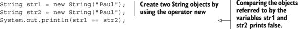

图 4.1 展示了之前的代码。

##### 图 4.1\. 使用操作符 `new` 创建的 `String` 对象始终引用单独的对象，即使它们存储相同的字符序列。


在之前的代码中，比较 `String` 引用变量 `str1` 和 `str2` 输出 `false`。操作符 `==` 比较由变量 `str1` 和 `str2` 指向的对象的地址。尽管这些 `String` 对象存储相同的字符序列，但它们引用的是存储在不同位置上的单独对象。

让我们使用赋值运算符（`=`）初始化两个 `String` 变量，值为 `"Harry"`。图 4.2 展示了变量 `str3` 和 `str4` 以及这些变量所引用的对象。

##### 图 4.2\. 使用赋值运算符（=）创建的 `String` 对象可能指向同一个对象，如果它们存储相同的字符序列。

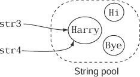

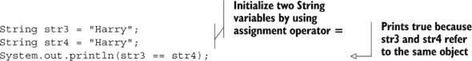

在前面的例子中，即使使用相同的字符序列创建，变量 `str1` 和 `str2` 也指向不同的 `String` 对象。在变量 `str3` 和 `str4` 的情况下，对象是在 `String` 对象池中创建和存储的。在池中创建新对象之前，Java 会搜索具有相似内容的对象。当执行以下代码行时，在 `String` 对象池中没有找到具有值 `"Harry"` 的 `String` 对象：

```
String str3 = "Harry";
```

因此，Java 在变量 `str3` 指向的 `String` 对象池中创建了一个具有值 `"Harry"` 的 `String` 对象。这一动作如图 4.3 所示。

##### 图 4.3\. 当 Java 无法在 `String` 对象池中找到 `String` 时执行的步骤序列

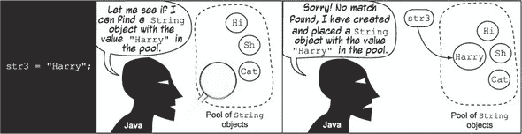

当执行以下代码行时，Java 能够在 `String` 对象池中找到具有值 `"Harry"` 的 `String` 对象：

```
String str4 = "Harry";
```

在这种情况下，Java 不会创建一个新的 `String` 对象，变量 `str4` 指向现有的 `String` 对象 `"Harry"`。如图 4.4 所示，变量 `str3` 和 `str4` 都指向对象池中的同一个 `String` 对象。

##### 图 4.4\. 当 Java 在 *`String`* 对象池中找到 *`String`* 时执行的动作序列


您也可以通过在双引号（`"`）内包围一个值来创建 `String` 对象：


如果找到匹配的值，这些值将从 `String` 常量池中重用。如果没有找到匹配的值，JVM 将创建一个具有指定值的 `String` 对象并将其放置在 `String` 常量池中：

```
String morning1 = "Morning";
System.out.println("Morning" == morning1);
```

将前面的例子与以下例子进行比较，该例子使用 `new` 运算符和（仅）双引号创建 `String` 对象，然后比较它们的引用：

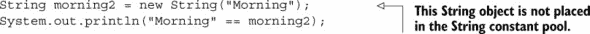

上述代码表明，存在于 `String` 常量池中的 `String` 对象的引用和不存在于 `String` 常量池中的 `String` 对象的引用不指向同一个 `String` 对象，即使它们定义了相同的 `String` 值。

| |
| --- |

##### 注意

术语 *`String` 常量池* 和 *`String` 池* 可以互换使用，并指代同一个 `String` 对象池。因为 `String` 对象是不可变的，所以 `String` 对象池也被称为 *`String` 常量池*。您可能在考试中看到这两个术语中的任何一个。

| |
| --- |

你还可以调用 `String` 类的其他重载构造函数，通过使用 `new` 运算符来创建其对象：

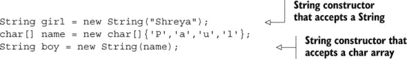

你也可以使用 `StringBuilder` 和 `StringBuffer` 类来创建 `String` 对象：

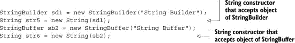

因为 `String` 是一个类，你可以将它赋值为 `null`，如下例所示：

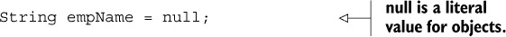

|  |
| --- |

##### 考试技巧

`String` 的默认值是 `null`。

|  |
| --- |

##### 计算 `String` 对象

为了测试你对创建 `String` 对象的各种方式的了解，考试可能会询问你在一块给定的代码中创建了多少个 `String` 对象。计算以下代码中创建的 `String` 对象的总数，假设 `String` 常量池没有定义任何匹配的 `String` 值：

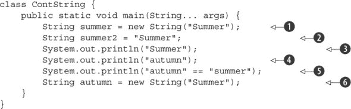

我会一步一步地带你分析代码，计算创建的 `String` 对象的总数：

+   在  的代码中创建了一个值为 `"Summer"` 的新 `String` 对象。此对象没有被放入 `String` 常量池中。

+   在  的代码中创建了一个值为 `"Summer"` 的新 `String` 对象并将其放入 `String` 常量池中。

+   在  的代码中不需要创建任何新的 `String` 对象。它重用了 `String` 常量池中已经存在的值为 `"Summer"` 的 `String` 对象。

+   在  的代码中创建了一个值为 `"autumn"` 的新 `String` 对象并将其放入 `String` 常量池中。

+   在  的代码中，重用了 `String` 常量池中的 `"autumn"` 值。它在 `String` 常量池中创建了一个值为 `"summer"` 的 `String` 对象（注意字母的大小写差异——Java 是大小写敏感的，`"Summer"` 和 `"summer"` 不相同）。

+   在  的代码中创建了一个值为 `"Summer"` 的新 `String` 对象。

之前的代码总共创建了五个 `String` 对象。

|  |
| --- |

##### 考试技巧

如果使用关键字 `new` 创建 `String` 对象，它总是导致创建一个新的 `String` 对象。以这种方式创建的 `String` 对象永远不会被池化。当使用赋值运算符将 `String` 文字赋给变量时，只有当 `String` 常量池中没有找到具有相同值的 `String` 对象时，才会创建一个新的 `String` 对象。

|  |
| --- |

#### 4.1.2\. `String` 类是不可变的

记住 `String` 类不可变的概念是一个重要的要点。一旦创建，`String` 类对象的内部内容就永远不能被修改。`String` 对象的不可变性有助于 JVM 重复使用 `String` 对象，减少内存开销并提高性能。

如前所述，图 4.4 所示，JVM 创建了一个 `String` 对象池，这些对象可以在 JVM 中被多个变量引用。JVM 只能进行这种优化，因为 `String` 是不可变的。`String` 对象可以在多个引用变量之间共享，而不用担心它们值的变化。如果引用变量 `str1` 和 `str2` 指向同一个 `String` 对象值 `"Java"`，则 `str1` 不必担心在其生命周期内，值 `"Java"` 可能会通过变量 `str2` 被更改。

让我们快速看一下这个类的作者是如何实现 `String` 类不可变性的：

+   类 `String` 将其值存储在一个 `private` 类型的字符数组变量中（`char value[]`）。数组的大小固定，一旦初始化就不会增长。

+   这个 `value` 变量在 `String` 类中被标记为 `final`。请注意，`final` 是一个非访问修饰符，`final` 变量只能初始化一次。

+   类 `String` 中定义的任何方法都不会操作数组 `value` 的单个元素。

我将在接下来的章节中详细讨论这些点。

|  |
| --- |

**Java API 类的代码**

为了让您更好地理解 `String`、`StringBuilder` 和 `ArrayList` 类的工作方式，我将解释用于存储这些对象值的变量，以及它们的一些方法定义。我的目的不是让您感到不知所措，而是为了做好准备。考试不会就这个主题提问您，但这些细节将帮助您保留与考试相关的信息，并在实际项目中实现类似的要求。

Java API 中定义的类的源代码包含在 Java 开发工具包（JDK）中。您可以通过解压缩 JDK 安装文件夹中的 src.zip 存档来访问它。

本节剩余部分将讨论 Java API 的作者如何在 `String` 类中实现不可变性。

|  |
| --- |

##### String 使用字符数组来存储其值

下面是 Java 源代码文件（String.java）中 `String` 类的部分定义，包括用于存储 `String` 值字符的数组（相关代码用粗体表示）：

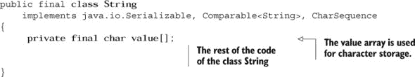

数组的大小是固定的——一旦初始化就不能增长。

让我们创建一个类型为 `String` 的变量 `name` 并看看它是如何内部存储的：

```
String name = "Selvan";
```

图 4.5 展示了类 `String` 及其对象 `name` 的 UML 表示（左边的类图和右边的对象图），其中只有一个相关变量，`value`，它是一个 `char` 类型的数组，用于存储分配给 `String` 的字符序列。

##### 图 4.5\. `String` 类和具有 `String` 实例属性 `value` 的 `String` 对象的 UML 表示

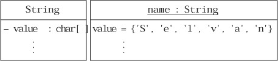

如图 4.5 所示，`String`值`Selvan`存储在一个类型为`char`的数组中。在本章中，我将详细介绍数组以及数组如何将其第一个值存储在位置 0。

图 4.6 展示了`Selvan`如何存储为一个`char`数组。

##### 图 4.6. `String`存储的字符与它们存储的位置的映射

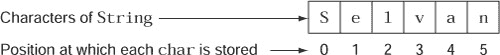

当您请求这个`String`返回位置 4 的字符时，你认为你会得到什么？如果你说是`a`而不是`v`，你就得到了正确答案（如图 4.6 所示）。

##### String 使用 final 变量来存储其值

用于存储`String`对象值的变量`value`被标记为`final`。请回顾一下来自`String.java`类的以下代码片段：


`final`变量的基本特征是它只能初始化一次值。通过将变量`value`标记为`final`，`String`类确保它不能被重新赋值。

##### `String`类的方法不会修改字符数组

尽管我们无法像前一个章节中提到的将值重新赋给`final char`数组，但我们可以重新赋值其单个字符。哇——这难道意味着“字符串是不可变的”这个说法并不完全正确吗？

不，这个说法仍然是正确的。`String`类使用的`char`数组被标记为`private`，这意味着它不能被类外修改。`String`类本身也不会修改这个变量的值。

在`String`类中定义的所有方法，如`substring`、`concat`、`toLower-Case`、`toUpperCase`、`trim`等，*看似*会修改它们被调用的`String`对象的内容，实际上创建并返回一个新的`String`对象，而不是修改现有值。图 4.7 说明了`String`的`replace`方法的局部定义。

##### 图 4.7. `String`类中`replace`方法的局部定义显示了该方法创建并返回一个新的`String`对象，而不是修改它所调用的`String`对象的值。

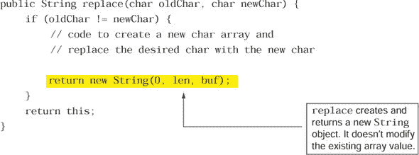

我再次强调，来自`String`类的先前代码将帮助您将理论与代码联系起来，并理解特定概念是如何以及为什么工作的。如果您对某个概念在如何以及为什么工作方面理解得很好，您将能够更长时间地保留这些信息。

|  |
| --- |

##### 考试技巧

字符串是不可变的。一旦初始化，`String`值就不能修改。所有返回修改后的`String`值的`String`方法都返回一个新的带有修改值的`String`对象。原始的`String`值始终保持不变。

|  |
| --- |

#### 4.1.3. `String`类的方法

图 4.8 将考试中的方法分为几类：查询字符位置的方法、似乎修改`String`的方法以及其他方法。

##### 图 4.8. `String`方法的分类

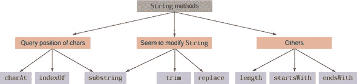

以这种方式对方法进行分类将有助于您更好地理解这些方法。例如，`charAt()`、`indexOf()` 和 `substring()` 方法查询 `String` 中单个字符的位置。`substring()`、`trim()` 和 `replace()` 方法似乎在修改 `String` 的值。

##### charAt()

您可以使用 `charAt(int index)` 方法来检索 `String` 中指定索引处的字符：

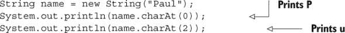

图 4.9 展示了前面的字符串，`Paul`。

##### 图 4.9。`String` 中存储的 `"Paul"` 字符序列及其对应的数组索引位置

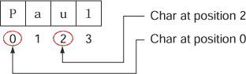

由于最后一个字符放置在索引 3 处，以下代码将在运行时抛出异常：

```
System.out.println(name.charAt(4));
```

|  |
| --- |

##### 注意

作为快速介绍，*运行时异常* 是在代码执行过程中由 Java 运行时环境 (JRE) 确定的编程错误。这些错误是由于不恰当地使用其他代码片段（异常将在第七章中详细讨论）而发生的。前面的代码尝试访问一个不存在的索引位置，因此引发了异常。

|  |
| --- |

##### indexOf()

您可以在 `String` 中搜索 `char` 或 `String` 的出现。如果指定的 `char` 或 `String` 在目标 `String` 中找到，则此方法返回第一个匹配的位置；否则，返回 `-1`：

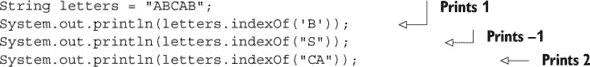

图 4.10 展示了前面的字符串 `ABCAB`。

##### 图 4.10。存储在 `String` 中的 `"ABCAB"` 字符

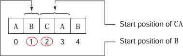

默认情况下，`indexOf()` 方法从目标 `String` 的第一个 `char` 开始搜索。如果您愿意，也可以设置起始位置，如下例所示：

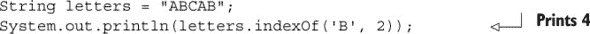

##### substring()

`substring()` 方法有两种形式。第一种返回从您指定的位置到 `String` 结尾的子字符串，如下例所示：

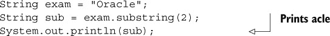

图 4.11 展示了前面的示例。

##### 图 4.11。`String "Oracle"`

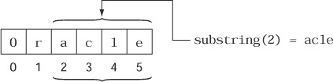

您也可以使用此方法指定结束位置：

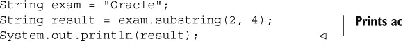

图 4.12 展示了 `String` 值 `"Oracle"`，包括 `substring` 方法的起始点和结束点。

##### 图 4.12。`substring` 方法如何从起始位置查找直到结束位置的指定字符

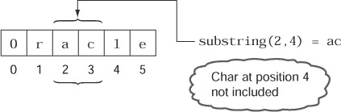

一个有趣的观点是，`substring` 方法不包含结束位置处的字符。在上面的示例中，`result` 被分配了 `ac` 的值（位置 2 和 3 的字符），而不是 `acl`（位置 2、3 和 4 的字符）。这里有一个简单的方法来记住这个规则：

`substring()` 方法返回的 `String` 长度 = 结束索引 - 开始索引

|  |
| --- |

##### 考试提示

`substring` 方法不包含结束位置处的字符在其返回值中。

|  |
| --- |

##### trim()

`trim()`方法通过移除`String`中所有前导和尾随的空白来返回一个新的`String`。空白是空白字符（换行符、空格或制表符）。

让我们定义并打印一个带有前导和尾随空白的`String`。 (在`String`前后打印的冒号确定了`String`的开始和结束。)

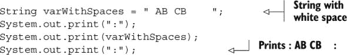

这里还有一个示例，展示了如何去除前导和尾随空白：

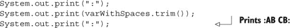

注意，此方法不会移除`String`内部的空格。

##### replace()

此方法将通过用另一个`char`替换所有出现的`char`来返回一个新的`String`。除了指定要替换的`char`外，你还可以指定一个字符序列——一个要替换的`String`：

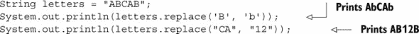

注意在此方法中传递的方法参数的类型：要么是`char`，要么是`String`。你不能混合这些参数类型，如下面的代码所示：

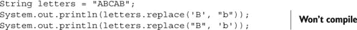

再次注意，此方法不会——或者不能——更改变量`letters`的值。检查以下代码行及其输出：


##### length()

你可以使用`length()`方法来检索`String`的长度。以下是一个展示其使用方法的示例：

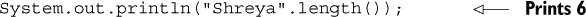

| |
| --- |

##### 考试技巧

`String`的长度比存储其最后一个字符的位置多一个数字。`String "Shreya"`的长度是 6，但它的最后一个字符`a`存储在位置 5，因为位置从 0 开始，而不是 1。

| |
| --- |

##### startsWith() 和 endsWith()

方法`startsWith()`确定一个`String`是否以指定的前缀开始，该前缀指定为`String`。你也可以指定是否要从`String`的开始位置或从特定位置开始搜索。如果找到匹配项，则此方法返回`true`，否则返回`false`：

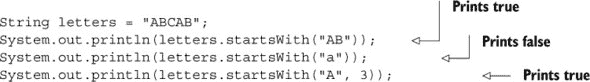

方法`endsWith()`测试一个`String`是否以特定的后缀结束。如果匹配则返回`true`，否则返回`false`：

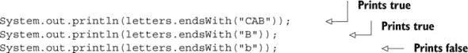

##### 方法链式调用

在一行代码中使用多个`String`方法是一种常见的做法，如下所示：

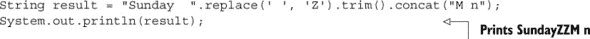

方法是从左到右评估的。在这个例子中，首先执行的方法是`replace`，而不是`concat`。

方法链式调用是考试作者最喜欢的主题之一。你肯定会在 OCA Java SE 8 程序员 I 考试中遇到关于方法链式调用的一个问题。

| |
| --- |

##### 考试技巧

当链式调用时，方法是从左到右评估的。

| |
| --- |

注意，在`String`对象上调用方法链与将相同的操作应用于然后重新分配返回值到同一变量之间有一个区别：

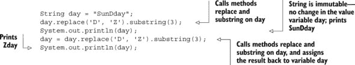

由于`String`对象是不可变的，因此如果你在它们上执行方法，它们的值不会改变。当然，你可以将值重新分配给类型为`String`的引用变量。注意考试中的相关问题。

虽然下一个故事转折练习可能看起来很简单，只有两行代码，但外表可能具有欺骗性（答案见附录）。

##### 故事转折 4.1

让我们修改上一节中使用的一些代码。在您的系统上执行此代码。哪个答案正确显示了其输出？

```
String letters = "ABCAB";
System.out.println(letters.substring(0, 2).startsWith('A'));
```

1.  `true`

1.  `false`

1.  `AB`

1.  `ABC`

1.  编译错误

#### 4.1.4\. 字符串对象和运算符

在这个考试的所有运算符中，您只能使用少数几个与`String`对象一起使用：

+   连接：`+`和`+=`

+   等于：`==`和`!=`

在本节中，我们将介绍连接运算符。我们将在下一节（4.1.5）介绍相等运算符。

连接运算符（`+`和`+=`）对`String`有特殊含义。Java 语言为这些运算符定义了针对`String`的附加功能。您可以使用运算符`+`和`+=`来连接两个`String`值。在幕后，字符串连接是通过使用`StringBuilder`（下一节介绍）或`StringBuffer`（类似于`StringBuilder`）类来实现的。

但请记住，`String`是不可变的。您不能修改任何现有`String`对象的价值。`+`运算符使您能够创建一个新的`String`类对象，其值等于多个`String`连接的值。检查以下代码：

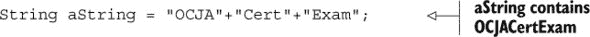

这里还有一个例子：

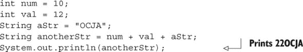

你认为变量`anotherStr`的值为什么是`22OCJA`而不是`1012OCJA`？`+`运算符可以与原始值一起使用，并且表达式`num + val + aStr`是从左到右评估的。以下是 Java 评估该表达式的步骤序列：

+   将操作数`num`和`val`相加得到`22`。

+   将`22`与`OCJA`连接以得到`22OCJA`。

如果您希望将存储在变量`num`和`val`中的数字视为`String`值，请按以下方式修改表达式：


|  |
| --- |

**字符串连接的实用技巧**

在我为 Java 程序员认证做准备的过程中，我学习了在字符串连接中，当连接的值的顺序改变时，输出如何变化。在工作中，这帮助我快速调试了一个将错误值记录到日志文件中的 Java 应用程序。我没有花很长时间就发现，有问题的代码行是`logToFile("Shipped:" + numReceived() + inTransit());`。这些方法单独返回正确的值，但这些方法的返回值没有被相加。它们被作为`String`值*连接*，导致出现意外的输出。

一种解决方案是将`int`加法放在括号内，例如`logToFile("Shipped:"+ (numReceived() + inTransit()));`。此代码将记录文本`"Shipped"`与`num-Received()`和`inTransit()`方法返回的数值总和。

|  |
| --- |

当您使用 `+=` 连接 `String` 值时，请确保您使用的变量已经初始化（并且不包含 `null`）。看看以下代码：

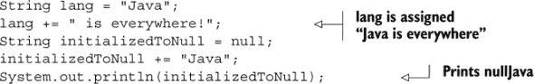

#### 4.1.5\. 确定 `String` 的相等性

比较两个 `String` 值的正确方法是使用 `String` 类中定义的 `equals` 方法。如果与之比较的对象不是 `null`，是一个 `String` 对象，并且表示与它比较的对象相同的字符序列，则此方法返回 `true` 值。

##### `equals` 方法

以下列表展示了 Java API 中类 `String` 中定义的 `equals` 方法的定义方法。

##### 列表 4.1\. 类 `String` 中 `equals` 方法的定义

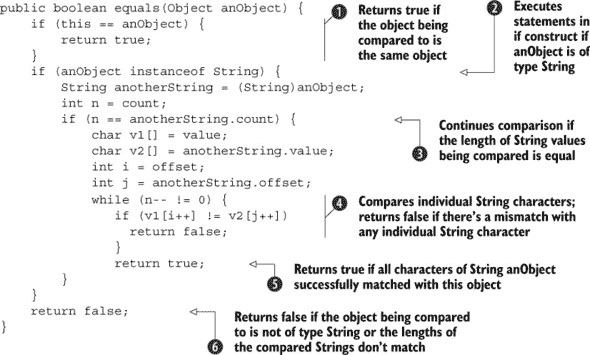

在 列表 4.1 中，`equals` 方法接受一个类型为 `Object` 的方法参数，并返回一个 `boolean` 值。让我们回顾一下由类 `String` 定义的 `equals` 方法：

+    比较对象引用变量。如果引用变量相同，它们引用同一个对象。

+    比较方法参数的类型与该对象。如果传递给此方法的方法参数不是 `String` 类型， 返回 `false`。

+    检查正在比较的 `String` 值的长度是否相等。

+    比较了 `String` 值的各个字符。如果在任何位置找到不匹配，则返回 `false`。如果没有找到不匹配， 返回 `true`。

##### 比较引用变量与实例值

检查以下代码：

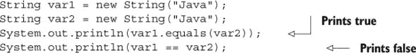

运算符 `==` 比较引用变量，即变量是否引用同一个对象。因此，在之前的代码中 `var1 == var2` 打印 `false`。现在检查以下代码：

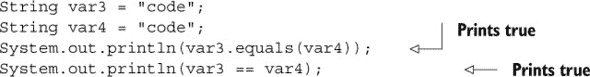

即使使用运算符 `==` 比较 `var3` 和 `var4` 打印 `true`，您也 *永远不要* 使用此运算符来比较 `String` 值。变量 `var3` 和 `var4` 引用同一个在 `String` 对象池中创建和共享的 `String` 对象。（我们已经在本章的 4.1.1 节 中讨论了 `String` 对象池。）即使两个对象存储相同的 `String` 值，运算符 `==` 也不总是会返回 `true`。

|  |
| --- |

##### 考试技巧

运算符 `==` 比较引用变量是否引用同一个对象，而方法 `equals` 比较字符串值是否相等。始终使用 `equals` 方法来比较两个 `String` 的相等性。永远不要使用运算符 `==` 来完成此目的。

|  |
| --- |

您可以使用运算符 `!=` 来比较由 `String` 变量引用的对象的不等性。它是运算符 `==` 的逆运算。让我们比较运算符 `!=` 与运算符 `==` 和方法 `equals()` 的用法：

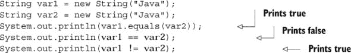

以下示例使用 `!=` 和 `==` 操作符以及 `equals` 方法来比较指向 `String` 常量池中相同对象的 `String` 变量：


如您所见，在先前的两个示例中，`!=` 操作符返回的是 `==` 操作符返回值的相反。

##### `String` 方法返回值的相等性

您认为方法返回的 `String` 值是否存储在 `String` 池中？当使用 `==` 操作符比较它们的变量引用时，它们会返回 `true` 吗？让我们来看看：

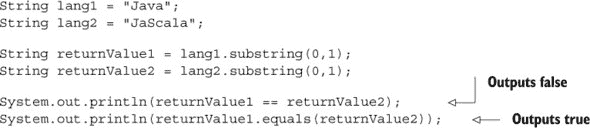

在前面的代码中，对 `lang1.substring()` 和 `lang2.subtring()` 的调用将返回 `"Ja"`。但这些字符串值并没有存储在 `String` 池中。这是因为这些子字符串是使用 `String` 类的 `substring` 方法（以及其他 `String` 方法）中的 `new` 操作符创建的。这可以通过使用 `==` 操作符比较它们的引用变量来确认，它返回 `false`。

| |
| --- |

##### 考试技巧

注意考试中测试您使用 `==` 操作符与 `String` 类方法返回的 `String` 值的问题。因为这些值是使用 `new` 操作符创建的，所以它们不会被放置在 `String` 池中。

| |
| --- |

因为 `String` 是不可变的，所以我们还需要一个可变的字符序列，可以对其进行操作。让我们来看看 OCA Java SE 8 程序员 I 考试中的另一种字符串类型：`StringBuilder`。

### 4.2\. 可变字符串：`StringBuilder`

| |
| --- |

[9.1] 使用 `StringBuilder` 类及其方法操作数据

| |
| --- |

`StringBuilder` 类定义在 `java.lang` 包中，它有一个可变的字符序列。当您处理较大的字符串或经常修改字符串内容时，应使用 `StringBuilder` 类。这样做将提高您代码的性能。与 `StringBuilder` 不同，`String` 类有一个不可变的字符序列。每次您修改由 `String` 类表示的字符串时，您的代码都会创建新的 `String` 对象，而不是修改现有的对象。

| |
| --- |

##### 考试技巧

你可以预期会有关于 `StringBuilder` 类的需求及其与 `String` 类的比较的问题。

| |
| --- |

让我们一起学习 `StringBuilder` 类的方法。因为 `StringBuilder` 代表一个可变的字符序列，所以对 `StringBuilder` 的主要操作与通过在末尾或特定位置添加另一个值、删除字符或更改特定位置的字符来修改其值有关。

#### 4.2.1\. `StringBuilder` 类是可变的

与 `String` 类相比，`StringBuilder` 类使用非 `final char` 数组来存储其值。以下是对类 `AbstractStringBuilder`（`StringBuilder` 类的超类）的部分定义。它包括变量 `value` 和 `count` 的声明，分别用于存储 `StringBuilder` 的值及其长度（相关代码以粗体显示）：

```
abstract class AbstractStringBuilder implements Appendable, CharSequence {
    /**
     * The value is used for character storage.
     */
    char value[];
    /**
     * The count is the number of characters used.
     */
    int count;
//.. rest of the code
}
```

在接下来的几节中讨论 `StringBuilder` 类的方法时，这些信息将很有用。

#### 4.2.2\. 创建 StringBuilder 对象

您可以使用多个重载构造函数创建 `StringBuilder` 类的对象，如下所示：

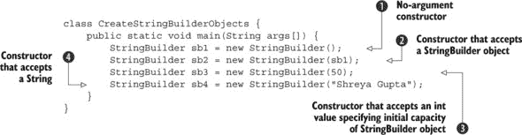

 构造了一个没有任何字符且初始容量为 16 个字符的 `StringBuilder` 对象。 构造了一个包含与传递给它的 `StringBuilder` 对象相同字符集的 `StringBuilder` 对象。 构造了一个没有任何字符且初始容量为 50 个字符的 `StringBuilder` 对象。 构造了一个初始值与 `String` 对象相同的 `StringBuilder` 对象。图 4.13 展示了具有值 `Shreya Gupta` 的 `StringBuilder` 对象 `sb4`。

##### 图 4.13\. `StringBuilder` 对象及其对应的存储位置字符值

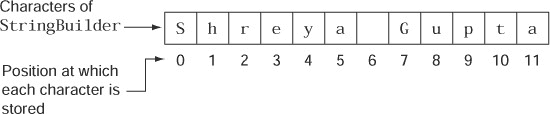

当您使用其默认构造函数创建 `StringBuilder` 对象时，以下代码在幕后执行以初始化在 `StringBuilder` 类本身中定义的数组 `value`：

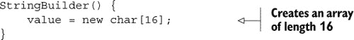

当您通过传递一个 `String` 来创建 `StringBuilder` 对象时，以下代码在幕后执行以初始化数组值：

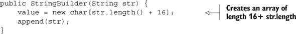

`StringBuilder` 类对象的创建是下一个 Twist in the Tale 练习的基础。在这个练习中，您的任务是查找 Java API 文档或 Java 源代码来回答问题。您可以通过以下几种方式访问 Java API 文档：

+   在线查看[`docs.oracle.com/javase/8/docs/api/`](http://docs.oracle.com/javase/8/docs/api/).

+   从 [`www.oracle.com/technetwork/java/javase/documentation/jdk8-doc-downloads-2133158.html`](http://www.oracle.com/technetwork/java/javase/documentation/jdk8-doc-downloads-2133158.html) 下载到您的系统。接受许可协议并点击 jdk-8u66-docs-all.zip 链接进行下载。（这些链接可能会随着 Oracle 更新其网站而最终更改。）

以下 Twist in the Tale 练习的答案是附录中给出的。

##### Twist in the Tale 4.2

查看 Java API 文档或 Java 源代码文件，并回答以下问题：

以下哪个选项（只有一个正确答案）正确地创建了一个具有默认容量为 16 个字符的 `StringBuilder` 类对象？

1.  `StringBuilder name = StringBuilder.getInstance();`

1.  `StringBuilder name = StringBuilder.createInstance();`

1.  `StringBuilder name = StringBuilder.buildInstance();`

1.  以上均不正确

#### 4.2.3\. `StringBuilder` 类的方法

你会很高兴地了解到，在 `StringBuilder` 类中定义的许多方法与 `String` 类中的版本工作方式完全相同——例如，`charAt`、`indexOf`、`substring` 和 `length` 等方法。我们不会再次讨论 `StringBuilder` 类中的这些方法。在本节中，我们将讨论 `StringBuilder` 类的其他主要方法：`append`、`insert` 和 `delete`。

图 4.14 展示了此类方法的分类。

##### 图 4.14\. `StringBuilder` 方法的分类

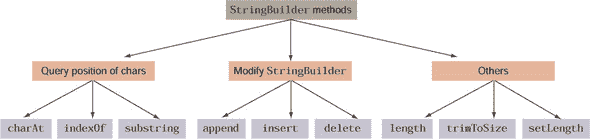

##### append()

`append` 方法将指定的值添加到 `StringBuilder` 对象的现有值末尾。因为你可能想要将来自多个数据类型的数据添加到 `StringBuilder` 对象中，所以该方法被重载，以便它可以接受任何类型的数据。

此方法接受所有原始类型、`String`、`char` 数组以及 `Object` 作为方法参数，如下例所示：

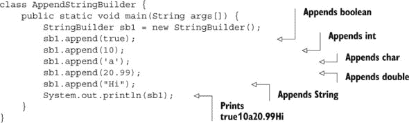

你可以按以下方式附加完整的 `char` 数组、`StringBuilder`、`String` 或其子集：

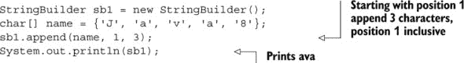

因为方法 `append` 也接受类型为 `Object` 的方法参数，所以你可以传递来自 Java API 或你自定义的任何对象：

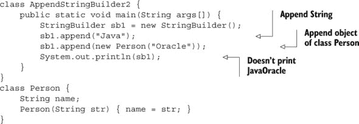

上一段代码的输出是

```
JavaPerson@126b249
```

在这个输出中，跟随 `@` 符号的十六进制值（`126b249`）可能因系统而异。

当你将对象的值附加到 `StringBuilder` 时，`append` 方法会调用静态的 `String.valueOf()` 方法。接受 `Object` 参数的版本，如果参数为 `null`，则返回四字母字符串`null`；否则，它调用其 `toString` 方法。如果 `toString` 方法已被类覆盖，则 `append` 方法会将它返回的 `String` 值添加到目标 `StringBuilder` 对象中。如果没有覆盖 `toString` 方法，则执行类 `Object` 中定义的 `toString` 方法。为了你的信息，类 `Object` 中 `toString` 方法的默认实现返回类的名称，后跟 `@` 字符和对象的哈希码的无符号十六进制表示（由对象的 `hashCode` 方法返回的值）。

|  |
| --- |

##### 考试提示

对于没有覆盖 `toString` 方法的类，`append` 方法会导致将类 `Object` 中定义的方法 `toString` 的默认实现输出附加到（如果参数不是 `null`）。

|  |
| --- |

快速查看 `StringBuilder` 类的 `append` 方法的工作方式很有趣。以下是对接受 `boolean` 参数的 `append` 方法的部分代码列表（如注释中所述）：

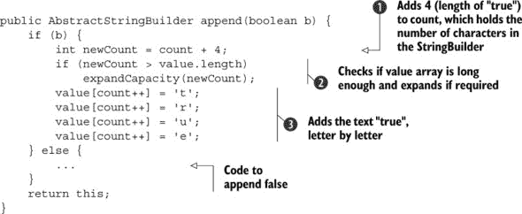

 和  确定数组 `value` 是否可以容纳与布尔字面值 `true` 对应的四个额外字符。在  中，对 `expand-Capacity()` 的调用会增加数组 `value`（用于存储 `StringBuilder` 对象的字符）的容量（如果它不够大）。 将布尔值 `true` 的单个字符添加到数组 `value` 中。

##### `insert()`

`insert` 方法与 `append` 方法一样强大。它也存在多种变体（即：重载方法），可以接受任何数据类型。`append` 和 `insert` 方法之间的主要区别在于，`insert` 方法允许您在特定位置插入所需数据，而 `append` 方法只允许您在 `StringBuilder` 对象的末尾添加所需数据：

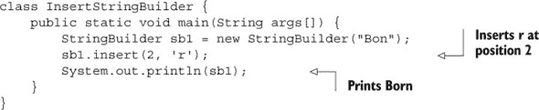

图 4.15 展示了前面的代码。

##### 图 4.15\. 在 `StringBuilder` 中使用 `insert` 方法插入 `char`


与 `String` 对象一样，`StringBuilder` 的第一个字符存储在位置 0。因此，前面的代码在位置 2 插入了字母 `r`，该位置被字母 `n` 占据。您也可以插入完整的 `char` 数组、`StringBuffer`、`String` 或其子集，如下所示：


图 4.16 展示了前面的代码。

##### 图 4.16\. 在 `StringBuilder` 中插入 `String` 的子字符串


| |
| --- |

##### 考试提示

在 `StringBuilder` 中插入值时，请注意起始和结束位置。`StringBuilder` 中定义的 `insert` 方法的多种变体可能会让您感到困惑，因为它们可以用来插入单个或多个字符。

| |
| --- |

##### `delete()` 和 `deleteCharAt()`

`delete` 方法删除指定 `StringBuilder` 的子字符串中的字符。`deleteCharAt` 方法删除指定位置的 `char`。以下是一个显示 `delete` 方法的示例：


 删除位置 2 和 3 的字符。`delete` 方法不会删除位置 4 的字母。图 4.17 展示了前面的代码。

##### 图 4.17\. 方法 `delete(2,4)` 不会删除位置 4 的字符。


方法 `deleteCharAt` 很简单。它删除单个字符，如下所示：


| |
| --- |

##### 考试提示

`deleteCharAt` 和 `insert` 方法的组合可能会相当令人困惑。

| |
| --- |

##### `trim()`

与 `String` 类不同，`StringBuilder` 类没有定义 `trim` 方法。尝试使用此类使用它将阻止您的代码编译。我在这里描述一个不存在的方法的唯一原因是为了避免任何混淆。

##### `reverse()`

如其名所示，`reverse` 方法反转 `StringBuilder` 中字符的顺序：


| |
| --- |

##### 考试提示

您不能使用 `reverse` 方法来反转 `StringBuilder` 的子字符串。

| |
| --- |

##### `replace()`

与在类 String 中定义的`replace`方法不同，类 StringBuilder 中的`replace`方法通过指定位置来替换一系列字符，如下例所示：


图 4.18 显示了在类`String`和`StringBuilder`中定义的`replace`方法的比较。

##### 图 4.18\. 比较`String`（左）和`StringBuilder`（右）中的`replace`方法。`String`中的`replace`方法接受要替换的字符。`StringBuilder`中的`replace`方法接受要替换的位置。


##### subSequence()

除了使用`substring`方法外，您还可以使用`subSequence`方法来检索`StringBuilder`对象的子序列。此方法返回`CharSequence`类型的对象：


`subsequence`方法不会修改`StringBuilder`对象的现有值。

#### 4.2.4\. 关于类 StringBuffer 的简要说明

虽然 OCA Java SE 8 程序员 I 考试目标没有提到类`StringBuffer`，但你可能在 OCA 考试的错误答案列表中看到它。

类`StringBuffer`和`StringBuilder`提供相同的功能，但有一个区别：`StringBuffer`类的方法在必要时是同步的，而`StringBuilder`类的方法不是。这意味着什么？当您使用`StringBuffer`类时，只有多个线程中的一个可以执行您的该方法。这种安排可以防止这些（同步）方法修改的实例变量值出现不一致。但这也引入了额外的开销，因此使用同步方法和`StringBuffer`类会影响您代码的性能。

类`StringBuilder`提供与`StringBuffer`相同的功能，但没有额外的同步方法功能。通常您的代码不会被多个线程访问，因此不需要线程同步的开销。如果您需要从多个线程访问您的代码，请使用`StringBuffer`；否则请使用`StringBuilder`。

### 4.3\. 数组

| |
| --- |

[4.1] 声明、实例化、初始化和使用一维数组

| |
| --- |
| |

[4.2] 声明、实例化、初始化和使用多维数组

| |
| --- |

在本节中，我将介绍一维数组和多维数组的声明、分配和初始化。您将了解原始数据类型数组和对象数组之间的区别。

#### 4.3.1\. 什么是数组？

数组是一个存储值集合的对象。数组本身是对象这一事实往往被忽视。我将重申：数组本身就是一个对象；它存储它所存储数据的引用。数组可以存储两种类型的数据：

+   基本数据类型的集合

+   一组对象集合

原始数据数组存储构成原始值的值集合。（对于原始数据，没有要引用的对象。）对象数组存储值集合，实际上是指向堆内存地址或指针。这些地址指向（引用）数组所存储的对象实例，这意味着对象数组存储引用（到对象），而原始数组存储原始值。

数组的成员定义在连续（连续）的内存位置中，因此提供了改进的访问速度。（如果您能快速访问所有相邻的学生，您应该能够快速访问一个班级的所有学生。）

以下代码创建了一个原始数据数组和对象数组：


我将在稍后讨论创建数组的细节。上一个示例展示了创建数组的一种方法。图 4.19 展示了`intArray`和`objArray`数组。与`intArray`不同，`objArray`存储了对`String`对象的引用。

##### 图 4.19\. `int`原始数据类型数组和`String`对象数组


| |
| --- |

##### 注意

数组是对象，指向原始数据类型或其他对象的集合。

| |
| --- |

在 Java 中，您可以定义一维和多维数组。*一维数组*是一个指向标量值集合的对象。二维（或更多）数组称为*多维数组*。二维数组是指一个集合中的对象，其中每个对象都是一维数组。同样，三维数组是指二维数组的集合，依此类推。图 4.20 描述了一维数组和多维数组（二维和三维）。

##### 图 4.20\. 一维和多维（二维和三维）数组


注意，多维数组可能或可能不包含每行或每列相同数量的元素，如图 4.20 中的二维数组所示。

创建数组涉及三个步骤，如下所示：

+   声明数组

+   分配数组

+   初始化数组元素

您可以通过使用单独的代码行执行前面的步骤或将这些步骤组合在同一行代码中创建数组。让我们从第一种方法开始：在单独的代码行上完成每个步骤。

#### 4.3.2\. 数组声明

数组声明包括数组*类型*和数组*变量*，如图 4.21 所示。数组可以存储的对象类型取决于其类型。数组类型后面跟着一个或多个空方括号对`[]`。

##### 图 4.21\. 数组声明包括数组类型和数组变量


要声明一个数组，指定其类型，然后是数组变量的名称。以下是一个声明`int`和`String`值数组的示例：


方括号对的数量表示数组嵌套的深度。Java 不对数组嵌套的级别设置任何理论上的限制。方括号可以跟在数组类型或其名称之后，如图 4.22 所示。

##### 图 4.22\. 方括号可以跟在变量名称或其类型之后。在多维数组的情况下，它可以跟在两者之后。


| |
| --- |

##### 注意

在数组声明中，将方括号放在类型旁边（如`int[]`或`int[][]`）是首选的，因为它通过显示正在使用的数组类型使代码更容易阅读。

| |
| --- |

数组声明仅创建一个引用`null`的变量，如图 4.23 所示。

##### 图 4.23\. 数组声明创建一个引用`null`的变量。


因为在声明数组时没有创建数组元素，所以使用声明定义数组的大小是不合法的。以下代码无法编译：


数组类型可以是以下任何一种：

+   原始数据类型

+   接口

+   抽象类

+   具体类

我们之前声明了一个`int`原始数据类型的数组和一个具体的类`String`。我将在 4.3.7 节中讨论一些使用抽象类和接口的复杂示例。

| |
| --- |

##### 注意

数组可以是除了`null`之外任何数据类型。

| |
| --- |

#### 4.3.3\. 数组分配

如其名所示，数组分配将为数组的元素分配内存。当你为数组分配内存时，你应该指定其维度，例如数组应存储的元素数量。请注意，一旦分配，数组的尺寸就不能扩展或缩小。以下是一些示例：


因为数组是一个对象，所以使用关键字`new`进行分配，后面跟它存储的值的类型，然后是其尺寸。如果你没有指定数组的尺寸，或者将数组尺寸放在`=`符号的左侧，代码将无法编译，如下所示：


数组的尺寸必须评估为一个`int`类型的值。你不能创建一个其尺寸指定为浮点数的数组。以下代码行无法编译：


Java 接受一个表达式来指定数组的尺寸，只要它评估为一个`int`类型的值。以下都是有效的数组分配：


让我们按照以下方式分配多维数组`multiArr`：


你也可以通过只定义第一个方括号中的尺寸来分配多维数组`multiArr`：


有趣的是要注意，当通过定义单维或两个维度的尺寸来分配多维数组`multiArr`时，所发生的情况之间的差异。这种差异如图 4.24 所示。

##### 图 4.24\. 当使用仅为其一个维度提供值和为其两个维度都提供值来分配二维数组时，数组分配的差异


你不能如下分配一个多维数组：


 无法编译，因为在赋值运算符（`=`）两侧的方括号数量不匹配。编译器要求赋值运算符右侧使用`[][]`，但它只找到了`[]`。 无法编译，因为你不能在不包括第一个方括号中的大小并在第二个方括号中定义大小的情况下分配多维数组。

一旦分配，数组元素将存储它们的默认值。对于存储对象的数组，所有分配的数组元素都存储 `null`。对于存储原始值的数组，默认值取决于它们存储的确切数据类型。

|  |
| --- |

##### 考试技巧

一旦分配，所有数组元素将存储它们的默认值。存储对象的数组元素默认为 `null`。存储原始数据类型的数组元素存储 `0`（对于整数类型 `byte`、`short`、`int`、`long`）；`0.0`（对于十进制类型 `float` 和 `double`）；`false`（对于 `boolean`）；或 `\u0000`（对于 `char` 数据类型）。

|  |
| --- |

#### 4.3.4\. 数组初始化

你可以这样初始化一个数组：


在前面的代码中， 使用 `for` 循环初始化 `intArray` 数组，使其包含所需的值。 在不使用 `for` 循环的情况下初始化单个数组元素。请注意，所有数组对象都使用它们的公共不可变字段 `length` 来访问它们的数组大小。

类似地，可以如下声明、分配和初始化一个 `String` 数组：


当你初始化一个二维数组时，你可以使用嵌套的 `for` 循环来初始化其数组元素。同时请注意，要访问二维数组中的元素，你应该使用两个数组位置值，如下所示：


当你尝试访问一个不存在的数组索引位置时会发生什么？以下代码创建了一个大小为 2 的数组，但试图在索引 3 处访问其数组元素：


之前的代码将抛出运行时异常，`ArrayIndexOutOfBounds-Exception`。对于大小为 2 的数组，唯一有效的索引位置是 0 和 1。其余的所有数组索引位置将在运行时抛出 `ArrayIndexOutOfBoundsException` 异常。

|  |
| --- |

##### 注意

如果你不能立即吸收与异常相关的所有信息，请不要担心。异常将在第七章中详细讲解。章节 7。

|  |
| --- |

Java 编译器不会检查你尝试访问数组元素时的索引位置范围。你可能惊讶地发现，以下代码行将成功编译，尽管它使用了负数组索引值：


虽然前面的代码可以成功编译，但在运行时将抛出`Array-IndexOutOfBoundsException`异常。如果你不传递`char`、`byte`、`short`或`int`数据类型（包装类不在此考试范围内，我也没有包括在内），访问数组元素的代码将无法编译：


| |
| --- |

##### 考试技巧

访问数组索引的代码如果传递了无效的数组索引值，将会抛出运行时异常。访问数组索引的代码如果没有使用`char`、`byte`、`short`或`int`，将无法编译。

| |
| --- |

此外，你不能删除数组位置。对于对象数组，你可以将位置设置为`null`值，但这不会删除数组位置：


 创建了一个`String`类型的数组，并使用四个`String`值进行初始化。 将数组索引 2 的值设置为`null`。 遍历所有数组元素。如下面的输出所示，打印了四个（而不是三个）值：

```
Autumn
Summer
null
Winter
```

#### 4.3.5\. 结合数组声明、分配和初始化

你可以将之前提到的所有数组声明、分配和初始化步骤合并为一步，如下所示：

```
int intArray[] = {0, 1};
String[] strArray = {"Summer", "Winter"};
int multiArray[][] = { {0, 1}, {3, 4, 5} };
```

注意到前面的代码

+   不使用关键字`new`来初始化数组

+   不指定数组的大小

+   使用一对花括号定义一维数组的值，并使用多对花括号定义多维数组的值

数组声明、分配和初始化的所有先前步骤也可以以下这种方式结合：

```
int intArray2[] = new int[]{0, 1};
String[] strArray2 = new String[]{"Summer", "Winter"};
int multiArray2[][] = new int[][]{ {0, 1}, {3, 4, 5}};
```

与第一种方法不同，前面的代码使用关键字`new`来初始化数组。

如果你尝试使用前面提到的方法指定数组的大小，代码将无法编译。以下是一些示例：

```
int intArray2[] = new int[2]{0, 1};
String[] strArray2 = new String[2]{"Summer", "Winter"};
int multiArray2[][] = new int[2][]{ {0, 1}, {3, 4, 5}};
```

| |
| --- |

##### 考试技巧

当你在单一步骤中结合数组声明、分配和初始化时，你不能指定数组的大小。数组的大小通过分配给数组值的数量来计算。

| |
| --- |

另一个需要注意的重要点是，如果你使用两行代码分别声明和初始化数组，你将使用关键字`new`来初始化值。以下代码行是正确的：

```
int intArray[];
intArray = new int[]{0, 1};
```

但你不能错过关键字`new`，并按以下方式初始化你的数组：

```
int intArray[];
intArray = {0, 1};
```

#### 4.3.6\. 非对称多维数组

在本节的开始，我提到多维数组可以是非对称的。数组可以为每一行定义不同数量的列。

以下示例是一个非对称的二维数组：

```
String multiStrArr[][] = new String[][]{
                                        {"A", "B"},
                                        null,
                                        {"Jan", "Feb", "Mar"},
                                    };
```

图 4.25 显示了此非对称数组。

##### 图 4.25\. 非对称数组


如你可能已经注意到的，`multiStrArr[1]`引用了一个`null`值。尝试访问此数组的任何元素，例如`multiStrArr[1][0]`，将抛出异常。这把我们带到了下一个“故事转折”练习（答案在附录中）。

##### 故事转折 4.3

修改前一个例子中使用的部分代码如下：

```
Line1> String multiStrArr[][] = new String[][]{
Line2>                                        {"A", "B"},
Line3>                                        null,
Line4>                                        {"Jan", "Feb", null},
Line5>                                        };
```

以下哪个选项对于前面的代码是正确的？

1.  第 4 行的代码与`{"Jan", "Feb", null, null},`相同。

1.  在`multiStrArr[2][2]`处没有存储值。

1.  在`multiStrArr[1][1]`处没有存储值。

1.  数组`multiStrArr`是不对称的。

#### 4.3.7\. 接口、抽象类和`Object`类的数组

在数组声明部分，我提到数组的类型也可以是接口或抽象类。这些数组的元素存储什么值？让我们看看一些例子。

##### 接口类型

如果数组类型是接口，其元素可以是`null`或者实现了相关接口类型的对象。例如，对于接口`MyInterface`，数组`interfaceArray`可以存储`MyClass1`或`MyClass2`类的对象引用：

```
interface MyInterface {}
class MyClass1 implements MyInterface {}

class MyClass2 implements MyInterface {}
class Test {
MyInterface[] interfaceArray = new MyInterface[]
                                  {
                                      new MyClass1(),
                                      null,
                                      new MyClass2()
                                  };
}
```

##### 抽象类类型

如果数组的类型是`abstract`类，其元素可以是`null`或者扩展相关`abstract`类的具体类的对象：


接下来，我将讨论一个特殊情况，即数组的类型是`Object`。

##### Object

因为所有类都扩展了`java.lang.Object`类，所以类型为`java.lang.Object`的数组的元素可以引用任何对象。以下是一个例子：


是有效的代码。因为数组是一个对象，`java.lang.Object`数组中的元素可以引用另一个数组。图 4.26 说明了之前创建的数组`objArray`。

##### 图 4.26\. `Object`类的数组


#### 4.3.8\. 数组的成员

数组对象有以下`public`成员：

+   `length`—公共变量`length`存储数组的元素数量。

+   `clone()`—此方法覆盖了在`Object`类中定义的`clone`方法，但不抛出检查异常。此方法的返回类型与数组的类型相同。例如，对于类型为`Type[]`的数组，此方法返回`Type[]`。

+   ***继承的方法—*** 从`Object`类继承的方法，除了`clone`方法。

如前所述，`String`类使用`length()`方法来获取其长度。对于数组，你可以使用数组的变量`length`来确定数组元素的个数。在考试中，你可能会被试图使用变量`length`访问`String`的`length`的代码所迷惑。注意访问其长度时使用的正确类和成员组合：

+   `String`—使用`length()`方法获取长度

+   ***数组—*** 使用`length`变量确定元素数量

我有一个记住这个规则很有趣的方法。与数组不同，你会在`String`对象上调用很多方法。所以你使用`length()`方法来获取`String`的长度，使用`length`变量来获取数组的长度。

### 4.4\. `ArrayList`

| |
| --- |

[9.4] 声明和使用指定类型的 ArrayList

|  |
| --- |

在本节中，我将介绍如何使用`ArrayList`，其常用方法和它相对于数组提供的优势。

OCA Java SE 8 程序员 I 考试仅涵盖 Java 集合 API 中的一个类：`ArrayList`。Java 集合 API 中的其余类在 OCP Java SE 8 程序员 II 考试（考试编号 1Z0-809）中涵盖。将此类包含在 Java Associate 考试中的一个原因可能是所有 Java 程序员使用此类的频率。

`ArrayList`是集合框架中最广泛使用的类之一。它提供了由*数组*和*列表*数据结构提供的最佳功能组合。列表中最常用的操作是*向列表添加项目*、*修改列表中的项目*、*从列表中删除项目*和*遍历项目*。

Java 开发者经常问的一个问题是，“为什么我要费心使用`ArrayList`，当我已经在数组中存储了相同类型的对象时？”答案在于`ArrayList`的使用简便性。这是一个重要的问题，本考试包含关于使用`ArrayList`的实际原因的明确问题。

你可以将`ArrayList`与可变数组进行比较。正如你所知，一旦创建，你无法增加或减少数组的大小。另一方面，`ArrayList`在元素添加到或从其中删除时会自动增加或减少大小。此外，与数组不同，你不需要指定初始大小来创建`ArrayList`。

让我们用现实世界中的对象比较`ArrayList`和数组。就像气球在充气或放气时可以增加或减少大小一样，`ArrayList`在添加或从其中删除值时也可以增加或减少大小。一个比较是板球，因为它有一个预定义的大小。一旦创建，就像数组一样，它的大小不能增加或减少。

这里是`ArrayList`的一些其他重要属性：

+   它实现了`List`接口。

+   它允许添加`null`值。

+   它实现了所有列表操作（添加、修改和删除值）。

+   它允许添加重复值。

+   它维护其插入顺序。

+   你可以使用`Iterator`或`ListIterator`遍历`ArrayList`中的项目。

+   它支持泛型，使其类型安全。（你必须使用其声明来声明应添加到`ArrayList`中的元素类型。）

#### 4.4.1\. 创建一个 ArrayList

以下示例展示了如何创建`ArrayList`：


包`java.util`没有隐式导入到你的类中，这意味着导入的是之前定义在`CreateArrayList`类中的`ArrayList`类。要创建一个`ArrayList`，你需要通知 Java 你想要存储在这个对象集合中的对象类型。声明了一个名为`myArrList`的`ArrayList`，它可以存储由类名`String`指定的`String`对象。注意，在的代码中，`String`出现了两次，一次在等号左边，一次在右边。你认为第二个看起来重复吗？恭喜你，Oracle 也同意你的看法。从 Java 版本 7 开始，你可以在等号右边省略对象类型，并按如下方式创建一个`ArrayList`：


许多开发者仍在使用 Java SE 版本 7 之前的版本，所以你很可能会看到一些开发者仍在使用创建`ArrayList`的较老方式。

看看当你执行前面的语句来创建一个`ArrayList`时幕后发生了什么（在 Java 源代码中）。因为你没有向`ArrayList`类的构造函数传递任何参数，所以它的无参构造函数将被执行。检查以下在`ArrayList.java`类中定义的无参构造函数的定义：

```
/**
  * Constructs an empty list with an initial capacity of ten.
  */
public ArrayList() {
    this(10);
}
```

因为你可以使用`ArrayList`来存储任何类型的`Object`，所以`ArrayList`定义了一个类型为`Object[]`的实例变量`elementData`来存储所有单个元素。以下是`ArrayList`类的一个部分代码列表：

```
/**
  * The array buffer into which the elements of the ArrayList are stored.
  * The capacity of the ArrayList is the length of this array buffer.
  */
private transient Object[] elementData;
```

说明了在`ArrayList`对象中显示的`elementData`变量。

##### 图 4.27\. `ArrayList`对象中显示的`elementData`变量


这里是`ArrayList`类（`ArrayList.java`）中构造函数的定义，它初始化之前定义的实例变量`elementData`：

```
/**
  * Constructs an empty list with the specified initial capacity.
  *
  * @param   initialCapacity   the initial capacity of the list
  * @exception IllegalArgumentException if the specified initial capacity
  *            is negative
  */
public ArrayList(int initialCapacity) {
    super();
    if (initialCapacity < 0)
        throw new IllegalArgumentException("Illegal Capacity: "+
                                                   initialCapacity);
    this.elementData = new Object[initialCapacity];
}
```

等一下。你注意到`ArrayList`使用数组来存储其单个元素吗？这让你想知道为什么你需要另一个类，因为它使用了一个你已知如何操作的类型（确切地说，是数组）？简单的答案是，你不想重新发明轮子。

例如，回答以下问题：解码图像时，你更倾向于以下哪个选项？

+   使用字符创建自己的类来解码图像

+   使用提供相同功能的现有类

显然，选择第二个选项是有意义的。如果你使用一个提供相同功能的现有类，你将获得更多的好处，而工作量更少。同样的逻辑也适用于`ArrayList`。它提供了使用数组的所有好处，而没有使用数组的任何缺点。它看起来和表现就像一个可扩展的、可修改的数组。

| |
| --- |

##### 注意

`ArrayList`使用数组来存储其元素。它为你提供了动态数组的函数。

| |
| --- |

在接下来的几节中，我将介绍如何添加、修改、删除和访问 `ArrayList` 的元素。让我们从向 `ArrayList` 添加元素开始。

#### 4.4.2\. 向 ArrayList 添加元素

让我们先通过以下方式向 `ArrayList` 添加 `String` 对象：


你可以向 `ArrayList` 的末尾或指定位置添加一个值。 将元素添加到 `list` 的末尾。 将一个元素添加到 `list` 的位置 2。请注意，`ArrayList` 的第一个元素存储在位置 0。因此，在  处，`String` 文字值 `"three"` 将被插入到位置 2，该位置原本由文字值 `"four"` 占据。当一个值被添加到已经被另一个元素占据的位置时，值会移动一个位置以容纳新添加的值。在这种情况下，文字值 `"four"` 移动到位置 3，为文字值 `"three"` 让出空间（参见 图 4.28）。

##### 图 4.28\. 向 `ArrayList` 添加元素到末尾和指定位置的代码


让我们看看当你向 `ArrayList` 添加一个元素时，幕后发生了什么。以下是 `ArrayList` 类中 `add` 方法的定义：

```
/**
  * Appends the specified element to the end of this list.
  *
  * @param e element to be appended to this list
  * @return <tt>true</tt> (as specified by {@link Collection#add})
  */
public boolean add(E e) {
    ensureCapacity(size + 1);    // Create another array with
                                 // the increased capacity
                                 // and copy existing elements to it.

    elementData[size++] = e;     // Store the newly added variable
                                 // reference at the
                                 // end of the list.
    return true;
}
```

当你将一个元素添加到列表的末尾时，`ArrayList` 首先检查其实例变量 `elementData` 是否在末尾有一个空槽。如果末尾有空槽，它将元素存储在第一个可用的空槽中。如果没有空槽，方法 `ensureCapacity` 会创建一个具有更高容量的新数组，并将现有值复制到这个新创建的数组中。然后，它将新添加的值复制到数组中第一个可用的空槽。

当你在特定位置添加一个元素时，`ArrayList` 会创建一个新的数组（只有当剩余空间不足时），并将所有其他元素插入到你指定的位置之外。如果你指定的位置右侧有任何后续元素，它们会向右移动一个位置。然后，它将新元素添加到请求的位置。

|  |
| --- |

##### 实用技巧

理解一个类以特定方式工作的原因和方法，在认证考试和你的职业生涯中都会大有裨益。这种理解应该有助于你更长时间地保留信息，并帮助你回答认证考试中旨在验证你使用此类实际知识的问题。最后，类的内部工作原理将使你能够在工作场所使用特定类时做出明智的决定，并编写高效的代码。

|  |
| --- |

#### 4.4.3\. 访问 ArrayList 的元素

在我们修改或删除 `ArrayList` 的元素之前，让我们看看如何访问它们。要访问 `ArrayList` 的元素，你可以使用 `get()`、增强型 `for` 循环、`Iterator` 或 `ListIterator`。

以下代码使用增强型`for`循环（访问元素的代码用粗体表示）访问并打印`ArrayList`中的所有元素：


之前代码的输出如下：

```
One
Two
Three
Four
```

 定义了增强型`for`循环来访问`myArrList`中的所有元素。

让我们看看如何使用`ListIterator`遍历`ArrayList`中的所有值：


 获取与`ArrayList myArrList`关联的迭代器。 在迭代器上调用`hasNext`方法来检查`myArrList`中是否存在更多元素。如果其元素存在更多，`hasNext`方法返回`boolean true`值，否则返回`false`。 在迭代器上调用`next`方法从`myArrList`获取下一个项目。

之前的代码打印出与之前代码相同的结果，即使用增强型`for`循环访问`ArrayList`元素的代码。`ListIterator`不包含对`ArrayList`中**当前**元素的引用。`ListIterator`为您提供了一个方法（`hasNext`）来检查是否还有更多元素存在于`ArrayList`中。如果为`true`，您可以使用`next()`方法提取其**下一个**元素。

注意，`ArrayList`保留了其元素的插入顺序。`ListIterator`和增强型`for`循环将按您添加它们的顺序返回元素。

|  |
| --- |

##### 考试提示

`ArrayList`保留了其元素的插入顺序。`Iterator`、`ListIterator`和增强型`for`循环将按它们被添加到`ArrayList`中的顺序返回元素。迭代器（`Iterator`或`ListIterator`）允许您在迭代`ArrayList`时删除元素。在迭代`ArrayList`时使用`for`循环无法删除元素。

|  |
| --- |

#### 4.4.4\. 修改 ArrayList 的元素

您可以通过替换`ArrayList`中的现有元素或修改其所有现有值来修改`ArrayList`。以下代码使用`set`方法替换`ArrayList`中的元素：


之前代码的输出如下：

```
One
One and Half
Three
```

您也可以通过访问其单个元素来修改`ArrayList`中现有的值。由于`String`是不可变的，让我们用`StringBuilder`来尝试一下。以下是代码：


此代码的输出如下：

```
One3
Two3
Three5
```

 访问`myArrList`中的所有元素，并通过将其长度追加到它上来修改元素值。通过再次访问`myArrList`元素来打印修改后的值。

#### 4.4.5\. 删除 ArrayList 的元素

`ArrayList`定义了两个方法来删除其元素，如下所示：

+   `remove(int index)`—此方法从列表中删除指定位置的元素。

+   `remove(Object o)`—此方法从列表中删除指定元素的第一种出现，如果存在的话。

让我们看看一些使用这些删除方法的代码示例：


上一段代码的输出如下：

```
One
Three
Four
One
Four
```

尝试从`myArrList`中移除具有值`"Four"`的`StringBuilder`。由于对象引用比较的方式，指定元素的移除失败。对象是通过它们的`equals()`方法进行比较的，而`StringBuilder`类没有重写这个方法。因此，如果两个`StringBuilder`对象的引用（存储它们的变量）指向同一个对象，则这两个`StringBuilder`对象是相等的。您始终可以在自己的类中重写`equals`方法来改变这种默认行为。以下是一个使用`MyPerson`类的示例：


在处，`MyPerson`类中的`equals`方法重写了`Object`类中的`equals`方法。如果传递给此方法的参数是`null`值，则返回`false`。如果传递给它的对象是具有匹配实例变量`name`值的`MyPerson`对象，则返回`true`。

在处，方法`remove`通过调用方法`equals`比较对象以确定相等性，从而从`myArr-List`中移除名为`Paul`的元素。如前所述，方法`remove`在从`ArrayList`中移除元素之前会调用`equals`方法进行比较。

当从`ArrayList`中移除元素时，剩余的元素会重新排列到它们正确的位置。这种变化是必要的，以便检索所有剩余元素在其正确的新位置。

#### 4.4.6. ArrayList 的其他方法

让我们简要讨论一下在`ArrayList`中定义的其他重要方法。

##### 向 ArrayList 添加多个元素

您可以使用以下重载的`addAll`方法，将多个元素从一个`ArrayList`或任何其他是`Collection`子类的类中添加到另一个`ArrayList`中：

+   `addAll(Collection<? extends E> c)`

+   `addAll(int index, Collection<? extends E> c)`

方法`addAll(Collection<? extends E> c)`将指定集合中的所有元素按指定集合的`Iterator`返回的顺序追加到该列表的末尾。如果您不熟悉泛型，并且这个方法的参数看起来令您感到害怕，请不要担心——集合 API 中的其他类不在这个考试范围内。

方法`addAll(int index, Collection<? extends E> c)`将指定集合中的所有元素插入到该列表的指定位置。

在以下代码示例中，`ArrayList yourArrList`的所有元素从位置 1 开始插入到`ArrayList myArrList`中：


上一段代码的输出如下：

```
One
Three
Four
Two
```

`yourArrList`中的元素不会被移除。现在可以通过`myArrList`引用存储在`yourArrList`中的对象。

如果你修改这些列表中**公共**的对象引用，`myArrList`和`yourArrList`，会发生什么？这里有两种情况：在第一种情况下，你使用任一列表**重新分配**对象引用。在这种情况下，第二个列表中的值将保持不变。在第二种情况下，你**修改**任何公共列表元素的内部结构——在这种情况下，更改将在两个列表中反映出来。

|  |
| --- |

##### 考试技巧

这也是考试出题者最喜欢的主题之一。在考试中，你可能会遇到一个将相同对象引用添加到多个列表中，然后测试你对所有列表中相同对象和引用变量状态理解的问题。如果你对此问题有任何疑问，请参阅关于引用变量的部分（第 2.3 节）。

|  |
| --- |

是时候进行我们的下一个故事转折练习了。让我们修改一下我们在之前的例子中使用的一些代码，看看它如何影响输出（答案见附录）。

##### 故事转折 4.4

以下代码的输出是什么？

```
ArrayList<String> myArrList = new ArrayList<String>();
String one = "One";
String two = new String("Two");
myArrList.add(one);
myArrList.add(two);
ArrayList<String> yourArrList = myArrList;
one.replace("O", "B");
for (String val : myArrList)
    System.out.print(val + ":");
for (String val : yourArrList)
    System.out.print(val + ":");
```

1.  `One:Two:One:Two:`

1.  `Bne:Two:Bne:Two:`

1.  `One:Two:Bne:Two:`

1.  `Bne:Two:One:Two:`

##### 清除 ArrayList 元素

你可以通过调用`clear`来移除`ArrayList`中的所有元素。以下是一个示例：

```
ArrayList<String> myArrList = new ArrayList<String>();
myArrList.add("One");
myArrList.add("Two");
myArrList.clear();
for (String val:myArrList)
    System.out.println(val);
```

之前的代码不会打印任何内容，因为`myArrList`中没有更多元素。

##### 访问单个 ArrayList 元素

在本节中，我们将介绍以下用于访问`ArrayList`元素的`ArrayList`方法：

+   `get(int index)`—此方法返回此列表中指定位置的元素。

+   `size()`—此方法返回此列表中的元素数量。

+   `contains(Object o)`—如果此列表包含指定的元素，则此方法返回`true`。

+   `indexOf(Object o)`—此方法返回此列表中指定元素首次出现的索引，如果此列表不包含该元素，则返回`–1`。

+   `lastIndexOf(Object o)`—此方法返回此列表中指定元素最后一次出现的索引，如果此列表不包含该元素，则返回`–1`。

你可以通过以下方式检索`ArrayList`中特定位置的元素并确定其大小：


在幕后，`get`方法将通过与数组大小进行比较来检查请求的位置是否存在于`ArrayList`中。如果请求的元素不在范围内，`get`方法将在运行时抛出`java.lang.IndexOutOfBoundsException`错误。

剩下的所有三个方法—`contains`、`indexOf`和`lastIndexOf`—要求你对如何确定对象相等性有一个明确且深入的理解。`ArrayList`存储对象，这三个方法将比较你传递给这些方法的值与`ArrayList`中所有元素的值。

默认情况下，如果对象被相同的变量引用（`String` 类是一个例外，它有自己的 `String` 对象池），则认为这些对象是相等的。如果您想根据对象的状态（实例变量的值）来比较对象，请在该类中重写 `equals` 方法。我已经在 4.4.5 节 中通过在 `MyPerson` 类中重写 `equals` 方法，展示了如何确定一个类中对象的相等性，以及当类重写了它的 `equals` 方法时和没有重写时的情况。

让我们看看所有这些方法的用法：


之前代码的输出如下：

```
false
true
-1
1
-1
2
```

查看使用重写了 `equals` 方法的 `MyPerson` 对象列表的相同代码的输出。首先，这是类 `MyPerson` 的定义：


类 `MiscMethodsArrayList4` 的定义如下：


如前述代码的输出所示，`MyPerson` 类中对象的相等性是由其 `equals` 方法中定义的规则确定的。具有相同 `name` 实例变量值的两个 `MyPerson` 类对象被认为是相等的。`myArrList` 存储了 `MyPerson` 类的对象。为了找到目标对象，`myArrList` 将依赖于 `MyPerson` 类的 `equals` 方法给出的输出；它不会比较存储对象和目标对象的引用。

|  |
| --- |

##### 考试技巧

`ArrayList` 可以存储重复的对象值。

|  |
| --- |

##### 克隆 ArrayList

类 `ArrayList` 中定义的 `clone` 方法返回这个 `ArrayList` 实例的 *浅拷贝*。“浅拷贝”意味着此方法创建了一个要克隆的 `ArrayList` 对象的新实例。它的元素引用被复制，但对象本身并没有被复制。

这里有一个例子：


让我们回顾一下之前的代码：

+    将 `myArrList` 引用的对象赋值给 `assignedArrList`。现在变量 `myArrList` 和 `assignedArrList` 引用了相同的对象。

+    将 `myArrList` 引用的对象的副本赋值给 `clonedArrList`。变量 `myArrList` 和 `clonedArrList` 引用了不同的对象。因为 `clone` 方法返回的是 `Object` 类型的值，所以它被转换为 `ArrayList<String-Builder>` 类型以赋值给 `clonedArrList`（如果您不理解这一行，不要担心——类型转换将在 第六章 中介绍）。

+    输出 `true`，因为 `myArrList` 和 `assignedArrList` 引用了相同的对象。

+    输出 `false`，因为 `myArrList` 和 `clonedArrList` 引用了不同的对象，因为 `clone` 方法创建并返回一个新的 `ArrayList` 对象（但具有相同的列表成员）。

+    证明了 `clone` 方法没有复制 `myArrList` 的元素。所有变量引用 `myArrVal`、`AssignedArrVal` 和 `clonedArrVal` 都指向相同的对象。

+   因此， 和  都会打印 `true`。

##### 从 ArrayList 创建数组

您可以使用 `toArray` 方法返回一个包含 `ArrayList` 中所有元素的数组，从第一个元素到最后一个元素。如本章前面所述（参见图 4.27[#ch04fig27] 在 4.4.1 节中），`ArrayList` 使用一个私有变量 `elementData`（一个数组）来存储其自己的值。`toArray` 方法不返回对这个数组的引用。它创建一个新的数组，将 `ArrayList` 的元素复制到其中，然后返回它。

现在是棘手的部分。`ArrayList` 不保留对返回数组的引用，该数组本身也是一个对象。但是，对`ArrayList`中各个元素的引用被复制到返回数组中，并且仍然由`ArrayList`引用。

这意味着，如果您通过交换元素位置或为其元素分配新对象等方式修改返回数组，`ArrayList` 的元素将不会受到影响。但是，如果您修改返回数组（可变）元素的状态，则修改后的元素状态将在 `ArrayList` 中反映出来。

### 4.5. 比较对象是否相等

| |
| --- |

[3.2] 使用 == 和 equals() 测试字符串和其他对象之间的相等性

| |
| --- |

在 4.1 节 中，您看到了类 `String` 如何定义一组规则来确定两个 `String` 值是否相等，以及这些规则如何在 `equals` 方法中编码。同样，任何 Java 类都可以定义一组规则来确定其两个对象是否应该被视为相等。这种比较是通过 `equals` 方法完成的，该方法将在下一节中描述。

#### 4.5.1. 类 java.lang.Object 中的 equals 方法

方法 `equals` 定义在类 `java.lang.Object` 中。所有 Java 类都直接或间接继承了这个类。列表 4.2 包含了类 `java.lang.Object` 中方法 `equals` 的默认实现。

##### 列表 4.2. 类 `java.lang.Object` 中 `equals` 方法的实现

```
public boolean equals(Object obj) {
    return (this == obj);
}
```

如您所见，`equals` 方法的默认实现仅比较两个对象变量是否引用了同一个对象。因为实例变量用于存储对象的状态，所以通常比较实例变量的值来确定两个对象是否应该被视为相等。

#### 4.5.2. 比较用户定义类的对象

让我们以类 `BankAccount` 的一个示例来工作，该类定义了两个实例变量：`acctNumber` 类型为 `String`，`acctType` 类型为 `int`。`equals` 方法比较这些实例变量的值以确定 `BankAccount` 类的两个对象是否相等。

这里是相关的代码：


让我们在以下代码中验证这个 `equals` 方法的功能：


 输出 `false`，因为引用变量 `b1` 和 `b2` 的值不匹配。 输出 `true`，因为引用变量 `b2` 和 `b3` 的值彼此匹配。 将 `String` 类型的对象传递给在 `Bank-Account` 类中定义的 `equals` 方法。如果传递给它的方法参数不是 `BankAccount` 类型，该方法返回 `false`。因此， 输出 `false`。

即使以下实现对于实际使用的类来说不可接受，它仍然是语法正确的：

```
class BankAccount {
    String acctNumber;
    int acctType;
    public boolean equals(Object anObject) {
        return true;
    }
}
```

之前定义的 `equals` 方法对于与 `BankAccount` 类的对象进行比较的任何对象都会返回 `true`，因为它不比较任何值。让我们看看当您使用 `equals()` 方法比较 `String` 类型的对象与 `BankAccount` 类型的对象以及反之亦然时会发生什么：


在前面的代码中， 输出 `true`，但  输出 `false`。`String` 类中的 `equals` 方法仅在比较的对象是一个具有相同字符序列的 `String` 时返回 `true`。

|  |
| --- |

##### 考试提示

在考试中，请注意关于正确实现 `equals` 方法的题目（参考第 4.5.4 节），以比较两个对象，而不是关于简单编译正确的 `equals` 方法的题目。如果您被问及之前示例代码中的 `equals()` 是否可以正确编译，正确答案应该是可以。

|  |
| --- |

#### 4.5.3\. `equals` 方法的错误方法签名

编写接受自身类实例的 `equals` 方法是一个常见的错误。在下面的代码中，`BankAccount` 类没有重写 `equals()`，而是重载了它：


虽然之前的 `equals()` 定义看起来似乎是完美的，但当您尝试将 `BankAccount` 类型的对象（如前述代码所示）添加到 `ArrayList` 并检索时会发生什么？`ArrayList` 类中定义的 `contains` 方法通过调用对象的 `equals` 方法来比较两个对象。它不比较对象引用。

在以下代码中，看看当您将 `Bank-Account` 类型的对象添加到 `ArrayList` 中，然后尝试验证列表是否包含与正在搜索的对象具有相同 `acctNumber` 和 `acctType` 实例变量值的 `BankAccount` 对象时会发生什么：


 和  定义了具有相同状态的 `BankAccount` 类的 `b1` 和 `b2` 对象。 将 `b1` 添加到列表中。 将对象 `b2` 与列表中添加的对象进行比较。

一个`ArrayList`使用`equals`方法来比较两个对象。因为`BankAccount`类没有遵循正确定义（重写）`equals`方法的规则，所以`ArrayList`使用基类`Object`中的`equals`方法，该方法比较对象引用。因为代码没有将`b2`添加到`list`中，所以它打印出`false`。

你认为如果改变`BankAccount`类中`equals`方法的定义，使其接受类型为`Object`的方法参数，之前的代码会输出什么？自己试一试！

|  |
| --- |

##### 考试技巧

`equals`方法定义了一个类型为`Object`的方法参数，其返回类型为`boolean`。当你定义（重写）此方法以比较两个对象时，不要更改方法名、返回类型或方法参数的类型。

|  |
| --- |

#### 4.5.4\. `equals`方法的约定

Java API 定义了`equals`方法的*约定*，当你在任何类中实现它时应该注意。以下合同说明直接来自 Java API 文档：^([1])

> ¹
> 
> Java API 文档中关于`equals`方法的说明可以在 Oracle 网站上找到：[`docs.oracle.com/javase/8/docs/api/java/lang/Object.html#equals(java.lang.Object`](http://docs.oracle.com/javase/8/docs/api/java/lang/Object.html#equals(java.lang.Object)).

`equals`方法在非`null`对象引用上实现了一个等价关系：

+   *它是自反的：对于任何非`null`引用值`x`，`x.equals(x)`应该返回`true`。*

+   *它是对称的：对于任何非`null`引用值`x`和`y`，如果`y.equals(x)`返回`true`，则`x.equals(y)`也应该返回`true`。*

+   *它是传递的：对于任何非`null`引用值`x`、`y`和`z`，如果`x.equals(y)`返回`true`且`y.equals(z)`返回`true`，则`x.equals(z)`应该返回`true`。*

+   *它是一致的：对于任何非`null`引用值`x`和`y`，多次调用`x.equals(y)`应始终返回`true`或始终返回`false`，前提是在对象上用于`equals()`比较的信息没有被修改。*

+   *对于任何非`null`引用值`x`，`x.equals(null)`应该返回`false`。*

根据约定，我们在前面的示例中为`BankAccount`类定义的`equals`方法的定义违反了`equals`方法的约定。再次查看定义：

```
public boolean equals(Object anObject) {
    return true;
}
```

即使将`null`值传递给此方法，此代码也会返回`true`。根据`equals`方法的约定，如果将`null`值传递给`equals`方法，则该方法应返回`false`。

|  |
| --- |

##### 考试技巧

你可能会回答关于 `equals` 方法契约的明确问题。如果一个 `equals` 方法对其传入的 `null` 对象返回 `true`，则违反了契约。此外，如果 `equals` 方法修改了传递给它的方法参数的任何实例变量的值，或者修改了它被调用的对象上的值，它将违反 `equals` 契约。

|  |
| --- |
|  |

**hashCode() 方法**

许多程序员对方法 `hashCode` 在确定对象相等性中的作用感到困惑。`hashCode` 方法不是由 `equals` 方法调用来确定两个对象的相等性的。因为 `hashCode` 方法不在考试范围内，所以我将在这里简要讨论它，以消除对这种方法的任何混淆。

`hashCode` 方法由存储 *键*-*值* 对的集合类（如 `HashMap`）使用，其中 *键* 是一个对象。这些集合类使用 *键* 的 `hashCode` 来高效地搜索相应的 *值*。*键*（一个对象）的 `hashCode` 用于指定一个 *桶* 号，该 *桶* 应该存储其相应的 *值*。两个 *不同* 对象的 `hashCode` 值可以相同。当这些集合类找到正确的 *桶* 时，它们将调用 `equals` 方法来选择正确的 *值* 对象（具有相同的 *键* 值）。即使 *桶* 中只有一个对象，也会调用 `equals` 方法。毕竟，可能会有相同的哈希值但不同的 `equals`，而且没有匹配项可以获取！

根据 Java 文档，当你在你自己的类中重写 `equals` 方法时，你也应该重写 `hashCode` 方法。如果你不这样做，如果你的类作为存储 *键*-*值* 对的集合类（如 `HashMap`）的 *键* 使用，它们的行为将不会如预期。这个方法在本章中没有详细讨论，因为它不在考试范围内。但在你的实际项目中，不要忘记使用 `equals` 方法重写它。

|  |
| --- |

### 4.6\. 处理日历数据

|  |
| --- |

[9.3] 使用 `java.time.LocalDateTime`、`java.time.LocalDate`、`java.time.LocalTime`、`java.time.format.DateTimeFormatter`、`java.time.Period` 类创建和操作日历数据

|  |
| --- |

Java 8 中的新日期和时间 API 简化了日期和时间对象的处理。它包括具有简单和有信息性的方法名称的类和接口。当你在本节中使用 `LocalDate`、`LocalTime`、`LocalDateTime`、`Period` 和 `DateTimeFormatter` 类时，你会注意到这些类定义了具有相似名称（具有相似目的）的方法。表 4.1 列出了方法前缀、其类型及其用途（来自 Oracle Java 文档）。

##### 表 4.1\. Java 8 日期和时间 API 中的方法前缀、类型及其用途

| 前缀 | 方法类型 | 用途 |
| --- | --- | --- |
| of | static | 创建一个实例，其中工厂主要验证输入参数，而不是转换它们。 |
| from | static | 将输入参数转换为目标类的实例，这可能涉及从输入中丢失信息。 |
| parse | static | 将输入字符串解析为目标类的实例。 |
| format | instance | 使用指定的格式化程序将时间对象中的值格式化为字符串。 |
| get | instance | 返回目标对象状态的一部分。 |
| is | instance | 查询目标对象的状态。 |
| with | instance | 返回一个副本的目标对象，其中一个元素已更改；这是 JavaBean 上 set 方法的不可变等效。 |
| plus | instance | 返回添加了时间量的目标对象的一个副本。 |
| minus | instance | 返回从目标对象中减去时间量后的副本。 |
| to | instance | 将此对象转换为另一种类型。 |
| at | instance | 将此对象与另一个对象组合。 |
|  |

##### 注意

前面的表格可能在此点看起来没有增加太多价值。但随着您进入以下部分，您将意识到在日期和时间类中定义的方法名称的相似性。

|  |
| --- |

让我们从`LocalDate`类开始。

#### 4.6.1\. LocalDate

要存储像生日或周年纪念日、参观某个地方或开始工作、学校或大学这样的日期，您不需要存储时间。在这种情况下，`LocalDate`将完美工作。

`LocalDate`可以用来存储没有时间或时区的日期，如 2015-12-27。`LocalDate`实例是不可变的，因此在多线程环境中使用是安全的。

##### 创建`LocalDate`

`LocalDate`构造函数被标记为私有，因此您必须使用其中一个工厂方法来实例化它。静态方法`of()`接受年、月和月份：


|  |
| --- |

##### 注意

在 Java 8 中引入的新日期和时间 API 中，1 月由`int`类型的值`1`表示，而不是`0`。基于旧日历的 API 在 Java 8 中没有改变，仍然使用基于 0 的月份编号。

|  |
| --- |

要从系统时钟获取当前日期，请使用静态方法`now()`：

```
LocalDate date3 =  LocalDate.now();
```

您还可以解析格式为 2016-02-27 的字符串来实例化`LocalDate`。以下是一个示例：

```
LocalDate date2 = LocalDate.parse("2025-08-09");
```

|  |
| --- |

##### 考试提示

如果您向`parse()`或`of()`传递无效值，您将得到`DateTimeParseException`。传递给`parse()`的字符串格式必须正好是 9999-99-99 的格式。传递给`parse()`的月份和日期值必须是两位数字；单个数字被视为无效值。对于值为 1-9 的天和月，传递 01-09。

|  |
| --- |

##### 查询`LocalDate`

您可以使用实例方法如`get`*`XX`*`()`来查询`LocalDate`的年、月和日期值。日期可以查询为月份中的日、周中的日和年中的日。月份值可以检索为枚举常量`Month`或`int`值：

```
LocalDate date = LocalDate.parse("2020-08-30");
System.out.println(date.getDayOfMonth());
System.out.println(date.getDayOfWeek());
System.out.println(date.getDayOfYear());
System.out.println(date.getMonth());
System.out.println(date.getMonthValue());
System.out.println(date.getYear());
```

前面代码的输出如下所示：

```
30
SUNDAY
243
AUGUST
8
2020
```

您可以使用实例方法 `isAfter()` 或 `isBefore()` 来确定一个日期是否在时间上早于或晚于另一个日期：


##### 操作 LocalDate

`LocalDate` 类定义了名为 `minus`*`XX`*`()`、`plus`*`XX`*`()` 和 `with`*`XX`*`()` 的方法来操作日期值。API 架构师使用了使它们的目的明确化的名称。因为 `LocalDate` 是一个不可变类，所以所有的方法都会创建并返回一个副本。`minus`*`XX`*`()` 方法返回一个副本的日期，从其中减去指定的天数、月份或年份：

```
LocalDate bday = LocalDate.of(2052,03,10);
System.out.println(bday.minusDays(10));
System.out.println(bday.minusMonths(2));
System.out.println(bday.minusWeeks(30));
System.out.println(bday.minusYears(1));
```

这里是前面代码的输出：

```
2052-02-29
2052-01-10
2051-08-13
2051-03-10
```

|  |
| --- |

##### 考试提示

`LocalDate` 是不可变的。所有看似操作其值的方法都会返回它被调用的 `LocalDate` 实例的副本。

|  |
| --- |

`plus`*`XX`*`()` 方法在向日期实例添加指定的天数、月份或年份后返回日期实例的副本：

```
LocalDate launchCompany = LocalDate.of(2016,02,29);
System.out.println(launchCompany.plusDays(1));
System.out.println(launchCompany.plusMonths(1));
System.out.println(launchCompany.plusWeeks(7));
System.out.println(launchCompany.plusYears(1));
```

这里是前面代码的输出：

```
2016-03-01
2016-03-29
2016-04-18
2017-02-28
```

|  |
| --- |

##### 考试提示

所有对 `LocalDate` 的添加、减法或替换都考虑闰年。

|  |
| --- |

`with`*`XX`*`()` 方法返回日期实例的副本，替换其中的指定日、月或年：

```
LocalDate firstSex = LocalDate.of(2036,02,28);
System.out.println(firstSex.withDayOfMonth(1));
System.out.println(firstSex.withDayOfYear(1));
System.out.println(firstSex.withMonth(7));
System.out.println(firstSex.withYear(1));
```

前面代码的输出如下所示：

```
2036-02-01
2036-01-01
2036-07-28
0001-02-28
```

##### 转换为其他类型

`LocalDate` 类定义了将其转换为 `LocalDateTime` 和 `long`（表示纪元日期）的方法。

`LocalDate` 类定义了重载的 `atTime()` 实例方法。这些方法将 `LocalDate` 与时间结合，创建并返回 `LocalDateTime`，它存储日期和时间（`LocalDateTime` 类将在下一节中介绍）：

```
LocalDate interviewDate = LocalDate.of(2016,02,28);
System.out.println(interviewDate.atTime(16, 30));
System.out.println(interviewDate.atTime(16, 30, 20));
System.out.println(interviewDate.atTime(16, 30, 20, 300));
System.out.println(interviewDate.atTime(LocalTime.of(16, 30)));
```

这里是前面代码的输出：

```
2016-02-28T16:30
2016-02-28T16:30:20
2016-02-28T16:30:20.000000300
2016-02-28T16:30
```

|  |
| --- |

##### 考试提示

如果您将任何无效的小时、分钟或秒值传递给 `atTime` 方法，它将在运行时抛出 `DateTimeException`。

|  |
| --- |

您可以使用 `toEpochDay()` 方法将 `LocalDate` 转换为 *纪元日期*——从 1970 年 1 月 1 日起的天数计数：

```
LocalDate launchBook = LocalDate.of(2016,2,8);
LocalDate aDate = LocalDate.of(1970,1,8);
System.out.println(launchBook.toEpochDay());
System.out.println(aDate.toEpochDay());
```

这里是前面代码的输出：

```
16839
7
```

|  |
| --- |

##### 注意

在标准日期和时间中，*纪元日期*指的是 1970 年 1 月 1 日 00:00:00 GMT。

|  |
| --- |

#### 4.6.2\. LocalTime

要存储像早餐、会议演讲开始时间或在店销售结束时间这样的时间，您可以使用 `LocalTime`。它以小时-分钟-秒（不带时区）的格式存储时间，并精确到纳秒。因此，您肯定会看到接受纳秒作为方法参数的方法或返回此值的方法。像 `LocalDate` 一样，`LocalTime` 也是不可变的，因此在多线程环境中使用是安全的。

##### 创建 LocalTime

`LocalTime` 构造函数是私有的，因此您必须使用其中一个工厂方法来实例化它。静态方法 `of()` 接受小时、分钟、秒和纳秒：


`of()`方法使用 24 小时制来指定小时值。如果您向`of()`传递超出范围的小时、分钟或秒值，会发生什么？在这种情况下，您将得到一个运行时异常，`DateTimeException`。如果传递给方法的值范围不符合方法的参数类型，您将得到编译错误。以下是一个示例：


|  |
| --- |

##### 考试技巧

`LocalTime`没有定义用于传递上午或下午的方法。使用 0–23 的值来定义小时。如果您向小时、分钟或秒传递超出范围的值，您将得到一个运行时异常。

|  |
| --- |

要从系统时钟获取当前时间，请使用静态方法`now()`：

```
LocalDate date3 =  LocalTime.now();
```

您可以使用`LocalTime`的静态方法`parse()`将字符串解析为`LocalTime`实例。您可以选择传递格式为 15:08:23（小时:分钟:秒）的字符串，或者使用`DateTimeFormatter`（下一节介绍）解析任何文本：

```
LocalTime time = LocalTime.parse("15:08:23");
```

|  |
| --- |

##### 考试技巧

如果您向`parse()`传递无效的字符串值，代码将编译但会抛出运行时异常。如果您没有传递`DateTimeFormatter`，传递给`parse()`的字符串格式必须正好是 99:99:99 的格式。传递给`parse()`的小时和分钟值必须是两位数字；单个数字被视为无效值。对于值为 0–9 的小时和分钟，传递 00–09。

|  |
| --- |

##### 使用本地时间常量

您可以使用`LocalTime`类中的常量来处理预定义的时间：

+   `LocalTime.MIN`—支持的最小时间，即 00:00

+   `LocalTime.MAX`—支持的最大时间，即 23:59:59.999999999

+   `LocalTime.MIDNIGHT`—一天开始的时间，即 00:00

+   `LocalTime.NOON`—中午时间，即 12:00

这是否让你想知道最小时间和午夜时间是否相等？亲自看看吧；以下代码输出`true`：


##### 查询本地时间

您可以使用类似`get`*`XX`*`()`的实例方法查询`LocalTime`的小时、分钟、秒和纳秒。所有这些方法都返回一个`int`值：

```
LocalTime time = LocalTime.of(16, 20, 12, 98547);
System.out.println(time.getHour());
System.out.println(time.getMinute());
System.out.println(time.getSecond());
System.out.println(time.getNano());
```

这里是输出结果：

```
16
20
12
98547
```

|  |
| --- |

##### 考试技巧

查询`LocalTime`的正确方法名是`get-Hour()`、`getMinute()`、`getSecond()`和`getNano()`。注意考试中可能会使用无效的方法名，如*getHours()*, *getMinutes()*, *getSeconds(),* 或 *getNanoSeconds()*。

|  |
| --- |

您可以使用实例方法`isAfter()`和`isBefore()`来检查时间是否在指定时间之后或之前。以下代码输出`true`：


##### 操作本地时间

你可以使用实例方法`minusHours()`、`minusMinutes()`、`minusSeconds()`和`minusNanos()`来创建并返回具有指定时间段减去的`LocalTime`实例的副本。方法名称是自解释的。例如，`minus-Hours(int)`返回一个在指定时间段内减去小时的`LocalTime`实例的副本。以下示例计算并输出 Shreya 应该离开办公室去看电影的时间，假设电影在 21:00 小时开始，通勤到电影院需要 35 分钟：

```
LocalTime movieStartTime = LocalTime.parse("21:00:00");
int commuteMin = 35;
LocalTime shreyaStartTime = movieStartTime.minusMinutes(commuteMin);
System.out.println("Start by " + shreyaStartTime + " from office");
```

以下是前述代码的输出：

```
Start by 20:25 from office
```

| |
| --- |

##### 考试技巧

与`get`*`XXX`*`()`方法不同，`minus`*`XXX`*`()`方法使用复数形式：`getHour()`与`minusHours()`，`getMinute()`与`minusMinutes()`，`getSecond()`与`minusSeconds()`，以及`getNano()`与`minusNanos()`。

| |
| --- |

`plusHours()`、`plusMinutes()`、`plusSeconds()`和`plusNanos()`方法接受`long`值，并将指定的小时、分钟、秒或纳秒添加到时间中，返回其副本作为`LocalTime`。以下示例使用`addSeconds()`和`isAfter()`方法向时间添加秒，并将其与另一个时间进行比较：

```
int worldRecord = 10;
LocalTime raceStartTime = LocalTime.of(8, 10, 55);
LocalTime raceEndTime = LocalTime.of(8, 11, 11);
if (raceStartTime.plusSeconds(worldRecord).isAfter(raceEndTime))
    System.out.println("New world record");
else
    System.out.println("Try harder");
```

前述代码的输出如下：

```
Try harder
```

| |
| --- |

##### 考试技巧

`LocalTime`是不可变的。对其实例调用任何方法都不会修改其值。

| |
| --- |

`withHour()`、`withMinute()`、`withSecond()`和`withNano()`方法接受一个`int`值，并返回一个具有指定值更改的`LocalTime`副本。以下示例创建了一个新的`LocalTime`实例，其分钟值为`00`：

```
LocalTime startTime = LocalTime.of(5, 7, 9);
if (startTime.getMinute() < 30)
    startTime = startTime.withMinute(0);
System.out.println(startTime);
```

以下是输出：

```
05:00:09
```

##### 与其他类型的组合

`LocalTime`类定义了`atDate()`方法，用于将`LocalDate`与自身结合以创建`LocalDateTime`：

```
LocalTime time = LocalTime.of(14, 10, 0);
LocalDate date = LocalDate.of(2016,02,28);
LocalDateTime dateTime = time.atDate(date);
System.out.println(dateTime);
```

以下是输出：

```
2016-02-28T14:10
```

| |
| --- |

##### 考试技巧

`LocalTime`类定义了`atDate()`方法，该方法可以传入一个`LocalDate`实例来创建一个`LocalDateTime`实例。

| |
| --- |

#### 4.6.3\. LocalDateTime

如果你想存储日期和时间（不含时区），请使用`LocalDateTime`类。它存储的值类似于`2050-06-18T14:20:30:908765`（年-月-日**T**小时:分钟:秒:纳秒）。

| |
| --- |

##### 注意

`LocalDateTime`类使用字母*T*在其打印值中分隔日期和时间值。

| |
| --- |

你可以将此类视为`LocalDate`和`Local-Time`类功能的结合。此类定义了与`LocalDate`和`LocalTime`类中定义的类似方法。因此，而不是讨论此类中单个方法，以下是一个涵盖此类重要方法的示例：


在下一节中，你将了解如何使用`Period`类进行日期和时间的计算。

#### 4.6.4\. Period

人们经常谈论年、月或日的周期。使用 Java 8 Date API，你可以使用 `Period` 类来这样做。`Period` 类表示基于日期的年、月和日的时间量，如 2 年、5 个月和 10 天。要处理基于秒和纳秒的时间量，你可以使用 `Duration` 类。

|  |
| --- |

##### 注意

`Duration` 类可以用来存储像 1 小时、36 分钟或 29.4 秒这样的时间量。但这个类在本考试（和本书）中并没有明确介绍。它包含在 OCP Java SE 8 Programmer II 考试中。

|  |
| --- |

你可以从 `LocalDate` 和 `LocalDateTime` 类中添加或减去 `Period` 实例。`Period` 也是一个不可变类，因此在多线程环境中使用是安全的。让我们通过实例化 `Period` 开始吧。

##### 实例化 Period

使用私有构造函数，`Period` 类定义了多个工厂方法来创建其实例。静态方法 `of()`、`ofYears()`、`ofMonths()`、`ofWeeks()` 和 `ofDays()` 接受 `int` 值来创建年、月、周或日的周期：


|  |
| --- |

##### 考试提示

35 天的周期不是存储为 1 个月和 5 天。它的各个元素，即日、月和年，是以初始化的方式存储的。

|  |
| --- |

你也可以通过向所有前面的方法传递负整数来定义负数周期。以下是一个快速示例：


|  |
| --- |

##### 考试提示

你可以定义正数或负数的时间周期。例如，你可以定义代表 15 或 -15 天的 `Period` 实例。

|  |
| --- |

你也可以使用其静态方法 `parse` 通过解析字符串来实例化 `Period`。此方法解析格式为 *PnYnMnD* 或 *PnW* 的字符串值，其中 *n* 代表一个数字，而字母 (*P*, *Y*, *M*, *D*, 和 *W*) 分别代表解析、年、月、日和周。这些字母可以是大写或小写。每个字符串必须以字母 *p* 或 *P* 开头，并且必须包含至少四个部分之一，即年、月、周或日。对于字符串格式 PnW，周的数量乘以 7 以得到天数。你还可以使用 `parse()` 定义负数周期。如果你在传递给 `parse()` 的完整字符串值之前加上负号 (-)，则它应用于所有值。如果你在单个数字之前放置一个负号，则它仅应用于该部分。以下是一些实例化五年周期的示例（注意大小写字母和 + 和 – 符号的使用）：


以下示例定义了不同持续时间的周期：

```
Period p5Yrs7 = Period.parse("P5y1m2d");
Period p5Yrs8 = Period.parse("p9m");
Period p5Yrs9 = Period.parse("P60d");
Period p5Yrs10 = Period.parse("-P5W");
```

当传递给 `System.out.println()` 时，前面代码中的变量将产生以下输出：

```
P5Y1M2D
P9M
P60D
P-35D
```

|  |
| --- |

##### 考试提示

如果你向 `parse()` 传递无效的字符串值，代码将编译但会抛出运行时异常。

|  |
| --- |

你也可以使用静态方法 `between(LocalDate dateInclusive, LocalDate dateExclusive)` 来实例化 `Period`：


|  |
| --- |

##### 考试提示

静态方法`between`接受两个`LocalDate`实例，并返回一个表示两个日期之间年、日和月数的`Period`实例。返回的`Period`中包含第一个日期，但不包含第二个日期。这里有一个快速记住它的方法：周期 = 结束日期 - 开始日期。

|  |
| --- |

##### 使用周期操作`LocalDate`和`LocalDateTime`

在日常生活中，从日期中添加或减去天数、月数或年数是很常见的。`Period`类实现了`TemporalAmount`接口，因此可以使用`LocalDateTime`和`LocalDate`类中定义的`plus()`和`minus()`方法。以下示例向`LocalDate`实例添加一个周期：

```
LocalDate date = LocalDate.of(2052, 01, 31);
System.out.println(date.plus(Period.ofDays(1)));
```

以下是上述代码的输出：

```
2052-02-01
```

当您向任何年份的 1 月 31 日添加一个周期时会发生什么？您会得到 2 月的最后一天还是 3 月的第一天？以下示例向`LocalDateTime`实例添加一个周期：

```
LocalDateTime dateTime = LocalDateTime.parse("2052-01-31T14:18:36");
System.out.println(dateTime.plus(Period.ofMonths(1)));
```

上述代码的输出如下所示：

```
2052-02-29T14:18:36
```

|  |
| --- |

##### 考试技巧

因为`Period`实例可以表示正数或负数周期（如 15 天或-15 天），所以您可以通过调用`plus`方法从`LocalDate`或`LocalDateTime`中减去天数。

|  |
| --- |

类似地，您可以使用`minus()`方法与`LocalDate`和`LocalDateTime`类一起使用，以减去年、月、周或天数：

```
LocalDateTime dateTime = LocalDateTime.parse("2020-01-31T14:18:36");
System.out.println(dateTime.minus(Period.ofYears(2)));

LocalDate date = LocalDate.of(2052, 01, 31);
System.out.println(date.minus(Period.ofWeeks(4)));
```

这里是输出：

```
2018-01-31T14:18:36
2052-01-03
```

##### 查询周期实例

您可以使用实例方法`getYears()`、`getMonths()`和`getDays()`来查询`Period`实例的年、月和日。所有这些方法都返回一个`int`值：

```
Period period = Period.of(2,4,40);
System.out.println(period.getYears());
System.out.println(period.getMonths());
System.out.println(period.getDays());
```

上述代码输出以下内容：

```
2
4
40
```

|  |
| --- |

##### 考试技巧

当您使用超过 31 天的天数或超过 12 个月的月份初始化`Period`实例时，它不会重新计算其年、月或日组件-。

|  |
| --- |

您可以使用`isNegative`和`isZero`方法查询一个`Period`周期的三个单位中是否有任何一个为负。如果三个单位都为零，则`Period`实例为零。`isNegative`方法如果其三个组件中至少有一个是严格负数（<0）则返回`true`：


##### 操作周期

您可以使用实例方法`minus(TemporalAmount)`、`minusDays(long)`、`minusWeeks(long)`、`minusMonths(long)`、`minusYears(long)`和`multipliedBy(int)`来创建并返回具有指定周期减去或修改的`Period`实例的副本。方法名称是自解释的。例如，`minusDays(long)`返回一个从指定天数减去的`Period`实例的副本。您可以使用以下示例在 10 天后向您的朋友发送提醒（限于打印消息）以提醒一个事件，比如生日庆祝活动：

```
LocalDate bday = LocalDate.of(2020, 10, 29);
LocalDate today = LocalDate.now();
Period period10Days = Period.of(0, 0, 10);

if (bday.minus(period10Days).isBefore(today))
    System.out.println("Time to send out reminders to friends");
```

|  |
| --- |

##### 考试技巧

在`Period`类中，`get`*`XXX`*`()`方法和`minus`*`XXX`*`()`方法都使用复数形式：`getYears()`、`minusHours()`。

|  |
| --- |

当你从一个代表一个月的 `Period`（`P1M`）减去一个代表 10 天的 `Period`（`P10D`）时会发生什么？你会得到一个代表 20 天的 `Period` 或一个代表 -1 个月和 10 天的 `Period`？让我们通过以下代码来找出答案，该代码还包括所有 `minus`*`XXX`* 方法的快速示例代码：

```
Period period10Days = Period.of(0, 0, 10);
Period period1Month = Period.of(0, 1, 0);

System.out.println(period10Days.minus(period1Month));
System.out.println(period10Days.minusDays(5));
System.out.println(period10Days.minusMonths(5));
System.out.println(period10Days.minusYears(5));
```

这里是输出：

```
P-1M10D
P5D
P-5M10D
P-5Y10D
```

| |
| --- |

##### 考试技巧

当使用 `minus`*`XXX`*`()` 方法减去 `Period` 实例时，将分别减去各个元素。从 `P1M` 减去 `P10D` 返回 `P1M-10D`，而不是 `P20D`。

| |
| --- |

`Period` 类定义了 `multipliedBy(int)` 方法，该方法将周期中的每个元素乘以整数值：


| |
| --- |

##### 考试技巧

`Period` 类中的 `multipliedBy(int)` 方法用于修改 `Period` 实例的所有元素。`Period` 没有定义 “divideBy()” 方法。`get`*`XXX`*`()` 方法和 `minus`*`XXX`*`()` 方法都使用复数形式 `getYears()`、`minusHours()`。

| |
| --- |

`plus(TemporalAmount)`、`plusDays(long)`、`plusWeeks(long)`、`plusMonths(long)` 和 `plusYears(long)` 方法将 `Period` 实例添加到 `Period` 实例中，并返回修改后的值作为 `Period`。与 `minus`*`XXX`*`()` 方法一样，所有 `plus`*`XXX`*`()` 方法都添加单个元素：

```
Period period5Month = Period.of(0, 5, 0);
Period period10Month = Period.of(0, 10, 0);
Period period10Days = Period.of(0, 0, 10);

System.out.println(period5Month.plus(period10Month));
System.out.println(period10Days.plusDays(35));
System.out.println(period10Days.plusMonths(5));
System.out.println(period10Days.plusYears(5));
```

上述代码的输出如下：

```
P15M
P45D
P5M10D
P5Y10D
```

| |
| --- |

##### 考试技巧

将 10 个月的 `Period` 加到 5 个月的 `Period` 上得到 15 个月，而不是 1 年和 3 个月。

| |
| --- |

`withDays()`、`withMonths()` 和 `withYears()` 方法接受一个 `int` 值，并返回一个具有指定值更改的 `Period` 的副本。

##### 转换到其他类型

`toTotalMonths()` 方法通过将年数乘以 12 并加上月数来返回周期中的总月数：


`Period` 可以作为 `LocalDate` 单参数 `plus()` 和 `minus()` 方法的参数。当你想要给一个特定的日期加上 3 个月和 10 天时会发生什么？每年月份数量是固定的，但每月天数不是。查看 `LocalDate` 源代码中的 `plus()` 和 `minus()` 方法可以看到，年份被转换为月份，并且总是先处理月份再处理天数。

在下一节中，你将使用 `DateTimeFormatter` 类。

#### 4.6.5\. DateTimeFormatter

定义在 `java.time.format` 包中的 `DateTimeFormatter` 类可以用来格式化和解析日期和时间对象。在本节中，你将使用此类使用预定义的常量（如 `ISO_LOCAL_DATE`）、使用模式（如 yyyy-MM-dd）或本地化样式（如 *long* 或 *short*）来格式化或解析日期和时间对象。

格式化或解析日期或时间对象的第一步是访问 `DateTime-Formatter`，然后对日期或时间对象或 `DateTimeFormatter` 调用 `format` 或 `parse` 方法。让我们详细探讨这些步骤，从多种方式实例化或访问 `DateTimeFormatter` 对象开始。

##### 实例化或访问 DateTimeFormatter

你可以通过多种方式实例化或访问 `DateTimeFormatter` 对象：

+   通过调用静态 `of`*`XXX`* 方法，并传递一个 `FormatStyle` 值

+   通过访问 `DateTimeFormatter` 的公共静态字段

+   通过使用静态方法 `ofPattern` 并传递一个字符串值

从第一个选项开始，你可以通过调用其 `of`*`XXX`* 静态方法并传递一个 `FormatStyle` 值（`FormatStyle.FULL`、`FormatStyle.LONG`、`FormatStyle.MEDIUM` 或 `FormatStyle.SHORT`）来实例化一个 `DateTimeFormatter` 以处理日期、时间或日期/时间对象：

```
DateTimeFormatter formatter1 =
                  DateTimeFormatter.ofLocalizedDate(FormatStyle.MEDIUM);
DateTimeFormatter formatter2 =
                  DateTimeFormatter.ofLocalizedTime(FormatStyle.FULL);
DateTimeFormatter formatter3 =
                  DateTimeFormatter.ofLocalizedDateTime(FormatStyle.LONG);
DateTimeFormatter formatter4 =
                  DateTimeFormatter.ofLocalizedDateTime(FormatStyle.SHORT,
                                                        FormatStyle.SHORT);
```

|  |
| --- |

##### 注意

`ofLocalizedDate`、`ofLocalizedTime` 和 `ofLocalizedDateTime` 方法根据代码执行的系统上的区域设置（语言、区域或国家）来格式化日期和时间对象。因此，输出可能会在不同系统之间略有差异。

|  |
| --- |

表 4.2 展示了使用不同的 `Format-Style` 值如何格式化日期或时间对象。

##### 表 4.2\. `FormatStyle` 对日期（例如，2057 年 8 月 11 日）或时间（例如，14 小时 30 分钟和 15 秒）对象格式化影响的示例

| FormatStyle | 示例 |
| --- | --- |
| FormatStyle.FULL | Saturday, August 11, 2057 |
| FormatStyle.LONG | August 11, 2057 |
| FormatStyle.MEDIUM | Aug 11, 2057 |
| FormatStyle.SHORT | 8/11/57 |
| FormatStyle.FULL |   |
| FormatStyle.LONG |   |
| FormatStyle.MEDIUM | 2:30:15 PM |
| FormatStyle.SHORT | 2:30 PM |

你可以通过使用该类的公共和静态字段来访问 `DateTimeFormatter` 对象：

```
DateTimeFormatter formatter5 = DateTimeFormatter.ISO_DATE;
```

表 4.3 列出了与本次考试相关的几个预定义格式化工具。

##### 表 4.3\. `DateTimeFormatter` 类中的预定义格式化工具及其如何格式化日期（例如，2057 年 8 月 11 日）或时间（例如，14 小时 30 分钟和 15 秒）对象的示例

| 预定义格式化工具 | 示例 |
| --- | --- |
| BASIC_ISO_DATE | 20570811 |
| ISO_DATE/ISO_LOCAL_DATE | 2057-08-11 |
| ISO_TIME/ISO_LOCAL_TIME | 14:30:15.312 |
| ISO_DATE_TIME/ISO_LOCAL_DATE_TIME | 2057-08-11T14:30:15.312 |

你可以通过使用静态方法 `ofPattern` 并传递一个字符串值来使用模式（字母和符号）实例化一个 `DateTimeFormatter`：

```
DateTimeFormatter formatter6= DateTimeFormatter.ofPattern("yyyy MM dd");
```

你可以使用前面的代码将日期格式化为 2057 08 11。表 4.4（Table 4.4）列出了可以用来定义此类模式的字母。

##### 表 4.4\. 用于定义 `DateTimeFormatter` 模式的字母及其如何格式化日期（例如，2057 年 8 月 11 日）或时间（例如，14 小时 30 分钟和 15 秒）对象的示例

| 符号 | 含义 | 示例 |
| --- | --- | --- |
| y, Y | 年 | 2057; 57 |
| M | 年中的月份 | 8; 08; Aug; August |
| D | 年内天数 | 223 |
| d | 月份中的天数 | 11 |
| E | 星期几 | Sat |
| e | 本地化星期几 | 7; Sat |
| a | 一天中的上午或下午 | pm |
| h | 上午或下午的时钟小时数 | 03 |
| H | 一天中的小时数 | 14 |
| m | 小时中的分钟数 | 30 |
| s | 分钟的秒数 | 15 |
| ' | 文本转义 |   |
|  |

##### 考试技巧

`DateTimeFormatter` 可以定义规则来格式化或解析日期对象、时间对象或两者。

|  |
| --- |

##### 使用 DateTimeFormatter 格式化日期或时间对象

要格式化日期或时间对象，您可以使用日期/时间对象的实例 `format` 方法或 `DateTimeFormatter` 类的实例 `format` 方法。在幕后，日期和时间对象的 `format` 方法只是调用 `DateTimeFormatter` 的 `format` 方法。表 4.5 列出了可用的 `format` 方法。

|  |
| --- |

##### 注意

`TemporalAccessor` 是一个接口，由 `LocalDate`、`LocalTime` 和 `LocalDateTime` 类实现。在考试中不会明确考察这个接口。

|  |
| --- |

##### 表 4.5\. `LocalDate`、`LocalTime`、`LocalDateTime` 和 `DateTimeFormatter` 类中的 `format` 方法

| 定义于 | 返回类型 | 方法签名和描述 |
| --- | --- | --- |
| LocalDate | String | format(DateTimeFormatter) 使用指定的 DateTimeFormatter 格式化此日期对象 |
| LocalTime | String | format(DateTimeFormatter) 使用指定的 DateTimeFormatter 格式化此时间对象 |
| LocalDateTime | String | format(DateTimeFormatter) 使用指定的 DateTimeFormatter 格式化此日期/时间对象 |
| DateTimeFormatter | String | format(TemporalAccessor) 使用此格式化器格式化日期/时间对象 |
|  |

##### 考试技巧

注意传入实例方法 `format` 的参数数量和类型。当在 `LocalDate`、`LocalTime` 或 `LocalDateTime` 实例上调用 `format` 时，将 `DateTimeFormatter` 实例作为方法参数传递。当在 `DateTimeFormatter` 上调用 `format` 时，将 `LocalDate`、`LocalTime` 或 `LocalDateTime` 实例作为方法参数传递。

|  |
| --- |

`DateTimeFormatter` 中的 `format` 方法使用格式器的规则将日期或时间对象格式化为 `String`。以下示例使用 `FormatStyle` 风格（风格在 表 4.2 中列出）格式化 `LocalDate` 对象：


如果在前面代码中将时间对象（`LocalTime`）而不是日期对象（`LocalDate`）传递给 `format` 方法，会发生什么？它能否编译或成功执行（更改以粗体显示）？


前面的代码可以成功编译，但不会执行。它将抛出一个运行时异常，因为 `formatter` 定义了格式化日期对象的规则（使用 `ofLocalizedDate()` 创建），但其 `format()` 方法接收了一个时间对象。

|  |
| --- |

##### 考试技巧

如果将日期对象传递给定义了格式化时间对象规则的 `DateTimeFormatter` 实例上的 `format` 方法，它将抛出一个运行时异常。

|  |
| --- |

使用 `DateTimeFormatter` 格式化日期和时间对象（这些对象是通过字符串模式创建的）很有趣（但也令人困惑）。注意在模式中使用的字母的大小写。*M* 和 *m* 或 *D* 和 *d* 是不同的。此外，使用模式字母并不指定数字或文本的数量。例如，使用 *Y* 或 *YYYY* 格式化日期对象会返回相同的结果。以下是一些使用不同模式的示例：

```
LocalDate date = LocalDate.of(2057,8,11);
LocalTime time = LocalTime.of(14,30,15);

DateTimeFormatter d1 = DateTimeFormatter.ofPattern("y");
DateTimeFormatter d2 = DateTimeFormatter.ofPattern("YYYY");
DateTimeFormatter d3 = DateTimeFormatter.ofPattern("Y M D");
DateTimeFormatter d4 = DateTimeFormatter.ofPattern("e");

DateTimeFormatter t1 = DateTimeFormatter.ofPattern("H h m s");
DateTimeFormatter t2 = DateTimeFormatter.ofPattern("'Time now:'HH mm a");

System.out.println(d1.format(date));
System.out.println(d2.format(date));
System.out.println(d3.format(date));
System.out.println(d4.format(date));

System.out.println(t1.format(time));
System.out.println(t2.format(time));
```

以下是前面代码的输出：

```
2057
2057
2057 8 223
7
14 2 30 15
Time now:14 30 PM
```

|  |
| --- |

##### 考试技巧

如果你分不清 *M*，*m*，*D* 和 *d*，请记住大写字母代表更长的持续时间。所以 *M* 代表月份，*m* 代表分钟。同样，*D* 代表一年中的某一天；*d* 代表一个月中的某一天。

|  |
| --- |

你也可以通过在日期或时间对象上调用 `format` 方法并将 `DateTimeFormatter` 实例传递给它来格式化日期和时间对象。

|  |
| --- |

##### 备注

如果你访问 Java 的源代码，你会注意到日期和时间类中的 `format` 和 `parse` 方法只是简单地调用 `DateTimeFormatter` 实例上的 `format` 和 `parse` 方法。

|  |
| --- |

##### 使用 DateTimeFormatter 解析日期或时间对象

要解析日期或时间对象，你可以使用日期/时间对象中的静态 `parse` 方法或 `DateTimeFormatter` 类中的实例 `parse` 方法。在幕后，日期/时间对象中的 `parse` 方法只是调用 `DateTimeFormatter` 中的 `parse` 方法。表 4.6 列出了可用的解析方法。

|  |
| --- |

##### 考试技巧

解析方法在 `LocalDate`，`LocalTime` 和 `LocalDateTime` 类中定义为静态方法。`DateTimeFormatter` 类将 `parse` 方法定义为实例方法。

|  |
| --- |

##### 表 4.6\. `LocalDate`，`LocalTime`，`LocalDateTime` 和 `DateTimeFormatter` 类中的 `parse` 方法

| 定义在 | 返回类型 | 方法签名和描述 |
| --- | --- | --- |
| LocalDate | LocalDate | parse(CharSequence) 使用文本字符串（如 2057-08-11）创建 LocalDate 实例，使用 DateTimeFormatter.ISO_LOCAL_DATE 解析 |
| LocalDate | LocalDate | parse(CharSequence, DateTimeFormatter) 使用指定的格式器解析文本创建 LocalDate 实例 |
| LocalTime | LocalTime | parse(CharSequence) 使用文本字符串（如 14:40）创建 LocalTime 实例，使用 Date-TimeFormatter.ISO_LOCAL_TIME 解析 |
| LocalTime | LocalTime | parse(CharSequence, DateTimeFormatter) 使用指定的格式器解析文本创建 LocalTime 实例 |
| LocalDateTime | LocalDateTime | parse(CharSequence) 使用文本字符串（如 2057-08-11T14:40）创建 LocalDateTime 实例，使用 DateTimeFormatter.ISO_LOCAL_DATE_TIME 解析 |
| LocalDateTime | LocalDateTime | parse(CharSequence, DateTimeFormatter) 使用指定的格式器解析文本创建 LocalDateTime 实例 |
| DateTimeFormatter | TemporalAccessor | parse(CharSequence) 使用 DateTimeFormatter 的规则解析文本，返回一个时间对象 |
|  |

##### 考试技巧

当在 `LocalDate`、`LocalTime` 或 `LocalDateTime` 实例上调用 `parse` 方法时，你可能没有指定格式化程序。在这种情况下，分别使用 `DateTimeFormatter.ISO_LOCAL_DATE`、`DateTimeFormatter.ISO_LOCAL_TIME` 和 `DateTimeFormatter.ISO_LOCAL_DATE_TIME` 来解析文本。

|  |
| --- |

让我们使用 `LocalDate`、`LocalTime` 或 `LocalDateTime` 的 `parse` 方法，通过使用 `DateTimeFormatter` 解析字符串值，生成日期或时间对象：

```
DateTimeFormatter d1 = DateTimeFormatter.ofPattern("yyyy-MM-dd");
LocalDate date = LocalDate.parse("2057-01-29", d1 );
```

以下行抛出 `DateTimeParseException`，因为此机制仅在所有组件都存在的情况下才有效。例如，使用“2057-01-29”的 yyyy-MM-dd 模式运行良好。组件顺序无关紧要；因此，使用 dd-yyyy-MM 来解析“29-2057-01”也有效，并得到 2057 年 1 月 29 日：

```
DateTimeFormatter d1 = DateTimeFormatter.ofPattern("yyyy");
LocalDate date = LocalDate.parse("2057", d1);
```

同样，你可以调用 `parse` 方法来创建 `LocalTime` 和 `LocalDateTime` 的实例。

### 4.7\. 摘要

在本章中，你学习了 `String` 类、其属性和方法。由于这是 Java 中使用最频繁的类之一，我将重申，对这一类在特定方法行为原因的理解将大大有助于你成功完成 OCA Java SE 8 程序员 I 考试。

你学习了如何使用操作符 `new` 和赋值操作符（`=`）以及 `String` 文字来初始化 `String` 变量。你还学习了使用这两种方法存储 `String` 对象之间的区别。如果你使用赋值操作符来初始化你的 `String` 变量，它们将存储在一个公共的 `String` 对象池中（也称为 `String` 常量池），可以被其他人使用。这种存储是可能的，因为 `String` 对象是不可变的——也就是说，它们的值不能被更改。

你学习了 `char` 数组如何用于存储 `String` 对象的值。这有助于解释为什么 `charAt()`、`indexOf()` 和 `substring()` 方法在位置 0 而不是位置 1 处搜索 `String` 的第一个字符。我们还回顾了 `replace()`、`trim()` 和 `substring()` 方法，这些方法似乎会修改 `String` 的值，但永远不会这样做，因为 `String` 对象是不可变的。你还学习了 `length()`、`startsWith()` 和 `endsWith()` 方法。

由于并非所有操作符都可以与 `String` 一起使用，你学习了可以与 `String` 一起使用的操作符：`+`、`+=`、`==` 和 `!=`。你还学习了 `String` 的相等性可以使用 `equals` 方法确定。通过使用操作符 `==`，你只能确定两个变量是否都指向同一个对象；它不比较 `String` 存储的值。与其他所有对象类型一样，你可以将 `null` 赋值给 `String` 变量。

您曾使用过`StringBuilder`类，该类定义在`java.lang`包中，用于存储可变字符序列。`StringBuilder`类通常用于存储需要经常修改的字符序列——例如，当您在为数据库应用程序构建查询时。与`String`类一样，`StringBuilder`也使用`char`数组来存储其字符。`StringBuilder`类中定义的许多方法与`String`类中定义的方法完全相同，例如`charAt`、`indexOf`、`substring`和`length`方法。`append`方法用于向`StringBuilder`对象的末尾添加字符。`insert`方法是另一个重要的`StringBuilder`方法，用于在`StringBuilder`对象中指定位置插入单个或多个字符。`StringBuilder`类提供了与`StringBuffer`类相同的功能，但不需要同步的方法提供了额外的特性。

数组是一个存储值集合的对象。数组可以存储原始数据类型的集合或对象的集合。您可以定义一维和多维数组。一维数组是一个指向标量值集合的对象。二维（或更多）数组被称为多维数组。二维数组指的是一个对象集合，其中每个对象都是一个一维数组。同样，三维数组指的是二维数组的集合，依此类推。数组可以一次性或分步声明、分配和初始化。二维数组不需要对称，并且它的每一行可以定义不同数量的成员。您可以定义原始数据类型、接口、抽象类和具体类的数组。所有数组都是对象，并且可以访问从`java.lang.Object`类继承的变量`length`和方法。

`ArrayList` 是一个可调整大小的数组，它提供了数组和 List 数据结构提供的最佳功能组合。您可以使用 `add` 方法向 `ArrayList` 中添加对象。您可以通过使用增强型 `for` 循环或使用 `get()` 方法或迭代器来访问 `ArrayList` 中的对象。`ArrayList` 保留其元素的插入顺序。`ListIterator`、`Iterator` 和增强型 `for` 循环将按它们被添加到 `ArrayList` 中的顺序返回元素。您可以使用 `set` 方法修改 `ArrayList` 的元素。您可以通过使用 `remove` 方法移除 `ArrayList` 的元素，该方法接受元素位置或对象。您还可以使用 `addAll` 方法向 `ArrayList` 中添加多个元素。`ArrayList` 类中定义的 `clone` 方法返回此 `ArrayList` 实例的浅拷贝。"浅拷贝"意味着该方法创建了一个新的 `ArrayList` 实例以进行克隆，但 `ArrayList` 元素没有被复制。

您可以通过重写 `equals` 方法来比较您类中的对象。`equals` 方法在 `java.lang.Object` 类中定义，这是 Java 中所有类的基类。`equals` 方法的默认实现仅比较对象引用是否相等。因为实例变量用于存储对象的状态，所以在 `equals` 方法中比较这些变量的值以确定两个对象是否应该被视为相等是很常见的。Java API 文档为 `equals` 方法定义了一个契约。在考试中，对于 `equals` 方法的给定定义，重要的是要注意编译成功、编译失败以及不遵循契约的 `equals` 方法的区别。

Java 8 的日期和时间 API 简化了您与日期和时间类的工作方式。您使用了 `LocalDate`，它用于存储仅日期的格式 2016-08-14\. `LocalTime` 以 14:09:65:23（小时:分钟:秒:纳秒）的格式存储时间。`LocalDateTime` 类存储日期和时间。`Period` 类用于处理，例如，4 个月或 4 天的持续时间。`DateTimeFormatter` 类用于使用预定义或自定义格式格式化日期和时间。

### 4.8. 复习笔记

本节列出了本章涵盖的主要要点。

`String` 类：

+   `String` 类表示一个不可变的字符序列。

+   您可以使用 `new` 运算符或使用 `String` 文字值与赋值运算符来初始化 `String` 变量。

+   使用不带 `new` 运算符的 `String` 文字创建的 `String` 对象被放置在一个 `String` 对象的 *池* 中。每当 JRE 收到使用赋值运算符初始化 `String` 变量的新请求时，它会检查是否已存在具有相同值的 `String` 对象。如果找到了，它将从池中返回现有 `String` 对象的引用。

+   使用 `new` 运算符创建的 `String` 对象永远不会放置在 `String` 对象的池中。

+   比较运算符 (`==`) 比较的是 `String` 引用，而 `equals` 方法比较的是 `String` 值。

+   类 `String` 中定义的任何方法都不能修改其值。

+   `charAt(int index)` 方法可以检索 `String` 中指定索引处的字符。

+   `indexOf` 方法可以用来在 `String` 中搜索一个 `char` 或 `String` 的出现，从第一个位置或指定的位置开始搜索。

+   `substring` 方法可以用来检索 `String` 对象的一部分。`substring` 方法不包括结束位置处的字符。

+   `trim` 方法将返回一个新的 `String`，通过从 `String` 中移除所有前导和尾随空白字符来实现。此方法不会移除 `String` 中的任何空白字符。

+   您可以使用 `length` 方法来获取 `String` 的长度。

+   `startsWith` 方法确定一个 `String` 是否以指定的 `String` 开头。

+   `endsWith` 方法确定一个 `String` 是否以指定的 `String` 结尾。

+   在单行代码中使用多个 `String` 方法是一种常见的做法。当方法链式调用时，方法是从左到右评估的。

+   您可以使用连接运算符 `+` 和 `+=` 以及比较运算符 `!=` 和 `==` 与 `String` 对象一起使用。

+   Java 语言通过使用运算符 `+` 和 `+=` 提供了对连接 `String` 对象的特殊支持。

+   比较两个 `String` 值是否相等的方法是使用在 `String` 类中定义的 `equals` 方法。如果被比较的对象不是 `null`，并且是一个表示与被比较对象相同字符序列的 `String` 对象，则此方法返回 `true` 值。

+   比较运算符 `==` 判断两个引用变量是否都指向同一个 `String` 对象。因此，它不是比较 `String` 值的正确运算符。

类 `StringBuilder`：

+   类 `StringBuilder` 定义在包 `java.lang` 中，表示一个可变的字符序列。

+   当用户需要经常修改字符序列时，`StringBuilder` 类非常高效。因为它可变，所以不需要创建一个新的 `StringBuilder` 对象就可以修改 `StringBuilder` 对象的值。

+   可以使用其构造函数创建一个 `StringBuilder` 对象，该构造函数可以接受一个 `String` 对象、另一个 `StringBuilder` 对象、一个 `int` 值来指定 `StringBuilder` 的容量，或者不接受任何参数。

+   在`StringBuilder`类中定义的`charAt`、`indexOf`、`substring`和`length`方法与在`String`类中定义的同名方法工作方式相同。

+   `append`方法将指定的值添加到`StringBuilder`对象现有值的末尾。

+   `insert`方法允许您在`StringBuilder`对象的指定位置插入字符。`append`和`insert`方法之间的主要区别在于，`insert`方法允许您在特定位置插入所需数据，而`append`方法只允许您在`StringBuilder`对象的末尾添加所需数据。

+   `delete`方法从指定的`StringBuilder`的子字符串中删除字符。`deleteCharAt`方法删除指定位置的`char`。

+   与`String`类不同，`StringBuilder`类没有定义`trim`方法。

+   `reverse`方法反转`StringBuilder`中字符的顺序。

+   `StringBuilder`类中的`replace`方法通过字符的位置替换一个由其位置确定的字符序列，用另一个`String`替换。

+   除了使用`substring`方法外，您还可以使用`subSequence`方法检索`StringBuilder`对象的子序列。

数组：

+   数组是一个存储值集合的对象。

+   数组本身是一个对象。

+   数组可以存储两种类型的数据——原始数据类型的集合和对象的集合。

+   您可以定义一维和多维数组。

+   一维数组是一个引用集合标量值的对象。

+   二维（或更多）数组被称为多维数组。

+   二维数组指的是一个对象集合，其中每个对象都是一个一维数组。

+   类似地，三维数组指的是二维数组的集合，依此类推。

+   多维数组可能或可能不包含每行或每列相同数量的元素。

+   创建数组涉及三个步骤：数组的声明、数组的分配和数组元素的初始化。

+   数组声明由数组类型、变量名和一个或多个`[]`的出现组成。

+   方括号可以跟在变量名或其类型之后。在多维数组的情况下，它可以跟在两者之后。

+   数组声明创建了一个引用`null`的变量。

+   由于在声明数组时没有创建数组元素，因此不能在声明中定义数组的大小。

+   数组分配为数组的元素分配内存。当你为数组分配内存时，你必须指定其维度，例如数组应存储的元素数量。

+   因为数组是一个对象，所以它使用`new`关键字分配，后面跟存储值的类型，然后是其大小。

+   一旦分配，所有数组元素都存储其默认值。存储对象的数组元素引用 `null`。存储原始数据类型的数组元素存储 `0`（对于整型 `byte`、`short`、`int`、`long`），`0.0`（对于十进制类型 `float` 和 `double`），`false`（对于 `boolean`），或 `/u0000`（对于 `char` 数据）。

+   要访问二维数组中的元素，使用两个数组位置值。

+   你可以将数组声明、分配和初始化的所有步骤合并为单步操作。

+   当你在单步中组合数组声明、分配和初始化时，你不能指定数组的大小。数组的大小通过分配给数组的值的数量来计算。

+   你可以声明和分配一个数组，但可以选择不初始化其元素（例如，`int[] a = new int[5];`）。

+   Java 编译器不会检查你尝试访问数组元素时索引位置的范围。如果请求的索引位置在运行时不属于有效范围，代码将抛出 `ArrayIndexOutOfBounds-Exception` 异常。

+   多维数组可以是非对称的；它可能或可能不为每一行定义相同数量的列。

+   数组的类型也可以是 `interface` 或 `abstract` 类。这样的数组可以用来存储从 `interface` 类型或 `abstract` 类类型继承的类的对象。

+   数组的类型也可以是 `java.lang.Object`。因为所有类都扩展了 `java.lang.Object` 类，所以这个数组的元素可以引用任何对象。

+   所有数组都是对象，并且可以访问变量 `length`，该变量指定数组存储的组件数量。

+   因为所有数组都是对象，所以它们继承并可以访问 `Object` 类的所有方法。

`ArrayList`：

+   `ArrayList` 是集合框架中最广泛使用的类之一。它提供了数组和列表数据结构提供的最佳功能组合。

+   `ArrayList` 类似于可调整大小的数组。

+   与数组不同，你无法指定初始大小来创建 `ArrayList`。

+   `ArrayList` 实现了 `List` 接口，并允许添加 `null` 值。

+   `ArrayList` 实现了所有列表操作（`add`、`modify` 和 `delete` 值）。

+   `ArrayList` 允许添加重复值，并保持其插入顺序。

+   你可以使用 `Iterator`、`ListIterator` 或增强型 `for` 循环来遍历 `ArrayList` 的项目。

+   `ArrayList` 支持泛型，使其类型安全。

+   在内部，`java.lang.Object` 类型的数组用于在 `ArrayList` 中存储数据。

+   你可以通过使用 `add` 方法在 `ArrayList` 的末尾或指定位置添加一个值。

+   一个迭代器（`Iterator` 或 `ListIterator`）允许你在遍历 `ArrayList` 时移除元素。使用 `for` 循环遍历 `ArrayList` 时无法移除元素。

+   `ArrayList`保留其元素的插入顺序。`ListIterator`和增强型`for`循环将按元素添加到`ArrayList`中的顺序返回元素。

+   您可以使用`set`方法通过替换`ArrayList`中的现有元素或修改其现有值来修改`ArrayList`。

+   `remove(int)`从列表中移除指定位置的元素。

+   `remove(Object o)`从列表中移除指定的元素的第一种出现，如果存在的话。

+   您可以使用`addAll`方法从另一个`ArrayList`或任何其他是`Collection`子类的类中添加多个元素到`ArrayList`。

+   您可以通过调用`clear`方法来移除所有的`ArrayList`元素。

+   `get(int index)`返回列表中指定位置的元素。

+   `size()`返回列表中的元素数量。

+   `contains(Object o)`如果列表包含指定的元素，则返回`true`。

+   `indexOf(Object o)`返回列表中指定元素第一次出现的索引，如果列表不包含该元素则返回`-1`。

+   `lastIndexOf(Object o)`返回列表中指定元素最后一次出现的索引，如果列表不包含该元素则返回`-1`。

+   `ArrayList`类中定义的`clone`方法返回此`ArrayList`实例的浅拷贝。*浅拷贝*意味着该方法创建了一个新的`ArrayList`实例以进行克隆，但`ArrayList`元素没有被复制。

+   您可以使用`toArray`方法返回一个包含`ArrayList`中所有元素的数组，从第一个元素到最后一个元素按顺序排列。

比较对象以确定相等性：

+   任何 Java 类都可以定义一组规则来确定两个对象是否应该被视为相等。

+   `equals`方法定义在`java.lang.Object`类中。所有 Java 类直接或间接继承了这个类。

+   `equals`方法的默认实现仅检查两个对象变量是否引用同一个对象。

+   因为实例变量用于存储对象的状态，所以通常比较实例变量的值来确定两个对象是否应该被视为相等。

+   当您在类中重写`equals`方法时，请确保您使用正确的`equals`方法签名。

+   Java API 为`equals`方法定义了一个约定，您在实现任何类中的方法时都应该注意。

+   根据方法`equals`的约定，如果向它传递了一个`null`值，则方法`equals`应该返回`false`。

+   如果`equals`方法修改了传递给它的方法参数的任何实例变量的值，或者修改了它所调用的对象上的值，它将违反约定。

`LocalDate`:

+   `LocalDate`可用于存储没有时间或时区的日期，如 2015-12-27。

+   `LocalDate`实例是不可变的。

+   `LocalDate`构造函数被标记为私有。

+   使用 `LocalDate` 的重载静态方法 `of()` 来实例化它：

    +   `public static LocalDate of(int year, int month, int dayOfMonth)`

    +   `public static LocalDate of(int year, Month month, int dayOfMonth)`

+   当传递给 `of()` 方法的值超出范围时，`of()` 方法将抛出 `DateTimeException`。

+   在 Java 8 中发布的日期类中，1 月用 `int` 值 `1` 表示，而不是 `0`。Java 7 或之前定义的日期类使用 `0` 来表示 1 月。

+   `LocalDate` 的静态方法 `now()` 返回系统时钟的当前日期，作为一个 `LocalDate` 实例。

+   使用 `LocalDate` 的静态方法 `parse()` 解析格式为 2016-02-27 的字符串以实例化 `LocalDate`。

+   如果将无效值传递给 `parse()` 或 `of()`，您将得到 `DateTimeParseException`。传递给 `parse()` 的字符串格式必须正好是 9999-99-99 的格式。传递给 `parse()` 的月份和日期值必须是两位数字；单个数字被视为无效值。对于值为 1–9 的日和月，传递 01–09。

+   您可以使用 `LocalDate` 的实例方法 `get`*`XX`*`()` 来查询 `LocalDate` 的年、月和日期值：

    +   `getDayOfMonth()`

    +   `getDayOfWeek()`

    +   `getDayOfYear()`

    +   `getMonth()`

    +   `getMonthValue()`

    +   `getYear()`

+   `LocalDate` 的实例 `minus`*`XX`*`()` 方法返回从其值中减去指定天数、月份、周或年份后的副本：

    +   `minusDays()`

    +   `minusMonths()`

    +   `minusWeeks()`

    +   `minusYears()`

+   `LocalDate` 是不可变的。所有看似操纵其值的方法都返回调用它的 `LocalDate` 实例的副本。

+   `plus`*`XX`*`()` 方法返回在它上添加了指定天数、月份或年份后的 `LocalDate` 值的副本：

    +   `plusDays()`

    +   `plusMonths()`

    +   `plusWeeks()`

    +   `plusYears()`

+   `with`*`XX`*`()` 方法返回 `LocalDate` 值的副本，其中替换了指定的日、月或年：

    +   `withDayOfMonth()`

    +   `withDayOfYear()`

    +   `withMonth()`

    +   `withYear()`

+   所有对 `LocalDate` 的添加、减去或替换都考虑闰年。

+   尽管前述方法（*添加*、*减去*、*替换*）使用了动词，但它们实际上并没有修改现有的 `LocalDate`——所有这些方法都返回一个应用了请求更改的新实例。

+   `LocalDate` 类定义了重载的 `atTime()` 实例方法。这些方法将 `LocalDate` 与时间结合，创建并返回 `LocalDateTime`，它存储日期和时间。

+   使用 `toEpochDay()` 方法将 `LocalDate` 转换为纪元日期——从 1970 年 1 月 1 日起的天数计数。

`LocalTime`:

+   它以小时-分钟-秒（不带时区）的格式存储时间。

+   它以纳秒精度存储时间。

+   `LocalTime` 是不可变的。

+   您可以使用 `LocalTime` 的静态方法 `of()` 来实例化 `LocalTime`，该方法接受小时、分钟、秒和纳秒。

+   `of()` 方法使用 24 小时制来指定小时值。

+   如果您向 `of()` 方法传递无效的范围值，它将抛出一个运行时异常，`DateTimeException`。

+   `LocalTime` 没有定义传递上午或下午的方法。使用 0–23 的值来定义小时。如果您传递超出范围的值给小时、分钟或秒，您将得到一个运行时异常。

+   要从系统时钟获取当前时间，请使用静态方法 `now()`。

+   您可以使用其静态方法 `parse()` 将字符串解析为 `LocalTime` 实例。您可以选择传递格式为 15:08:23（小时:分钟:秒）的字符串，或者使用 `DateTimeFormatter` 解析任何文本。

+   如果您向 `parse()` 传递无效的字符串值，代码将编译但会抛出一个运行时异常。如果您没有传递 `DateTimeFormatter`，传递给 `parse()` 的字符串的格式必须正好是 99:99:99 的格式。传递给 `parse()` 的小时和分钟值必须是两位数；单个数字被视为无效值。对于值为 0–9 的小时和分钟，传递 00–09。

+   您可以使用 `LocalTime` 类的常量来处理预定义的时间：

    +   `LocalTime.MIN`—支持的最小时间，即 00:00

    +   `LocalTime.MAX`—支持的最大时间，即 23:59:59.999999999

    +   `LocalTime.MIDNIGHT`—一天开始的时间，即 00:00

    +   `LocalTime.NOON`—中午时间，即 12:00

+   您可以使用类似 `get`*`XX`*`()` 的实例方法来查询 `LocalTime` 的时、分、秒和纳秒。所有这些方法都返回一个 `int` 值。

+   查询 `LocalTime` 的正确方法名是 `getHour()`、`getMinute()`、`getSecond()` 和 `getNano()`。注意考试中可能使用无效方法名的情况，如 `getHours()`、`getMinutes()`、`getSeconds()` 或 `getNanoSeconds()`。

+   您可以使用实例方法 `isAfter()` 和 `isBefore()` 来检查时间是否在指定时间之后或之前。

+   您可以使用实例方法 `minusHours()`、`minusMinutes()`、`minusSeconds()` 和 `minusNanos()` 来创建并返回具有指定时间段减去的 `LocalTime` 实例的副本。

+   与 `get`*`XXX`*`()` 方法不同，`minus`*`XXX`*`()` 方法使用复数形式：`getHour()` 对比 `minusHours()`、`getMinute()` 对比 `minusMinutes()`、`getSecond()` 对比 `minusSeconds()`、`getNano()` 对比 `minusNanos()`。

+   `plusHours()`、`plusMinutes()`、`plusSeconds()` 和 `plusNanos()` 方法接受长整型值，并将指定的小时、分钟、秒或纳秒添加到时间中，返回其副本作为 `LocalTime`。

+   `LocalTime` 是不可变的。对实例调用任何方法都不会修改其值。

+   `withHour()`、`withMinute()`、`withSecond()` 和 `withNano()` 方法接受一个 `int` 值，并返回一个具有指定值更改的 `LocalTime` 副本。

+   类 `LocalTime` 定义了 `atDate()` 方法，该方法可以传入一个 `Local-Date` 实例来创建一个 `LocalDateTime` 实例。

`LocalDateTime`:

+   `LocalDateTime` 存储一个值，如 2050-06-18T14:20:30:908765（年-月-日 Th 时:分:秒:纳秒）。

+   `LocalDateTime` 类在其打印值中使用字母 *T* 来分隔日期和时间值。

+   你可以将此类视为提供 `LocalDate` 和 `LocalTime` 类的功能。此类定义了与 `LocalDate` 和 `LocalTime` 类中定义的方法类似的方法。

`Period`：

+   `Period` 类表示基于日期的年、月和日的时间量，例如 2 年、5 个月和 10 天。要处理基于秒和纳秒的时间量，你可以使用 `Duration` 类。

+   你可以从 `LocalDate` 和 `LocalDateTime` 类中添加或减去 `Period` 实例。

+   `Period` 是一个不可变类。

+   `Period` 类定义了多个工厂方法来创建其实例。静态方法 `of()`、`ofYears()`、`ofMonths()`、`ofWeeks()` 和 `ofDays()` 接受 `int` 值来创建年、月、周或日的时间周期。

+   35 天的 `Period` 不是存储为 1 个月和 5 天。它的各个元素，即天数、月份和年份，是以其初始化的方式存储的。

+   你可以定义正数或负数的时间周期。你可以定义表示 15 或 -15 天的 `Period` 实例。

+   你还可以使用其静态方法 `parse` 通过解析字符串来实例化 `Period`。此方法解析格式为 PnYnMnD 或 PnW 的字符串值，其中 *n* 代表一个数字，而字母 (*P*, *Y*, *M*, *D*, 和 *W*) 分别代表解析、年、月、日和周。这些字母可以是小写或大写。每个字符串必须以字母 *p* 或 *P* 开头，并且必须包含至少四个部分之一，即年、月、周或日。

+   如果你向 `parse()` 方法传递无效的字符串值，代码将编译但会抛出运行时异常。

+   你还可以使用静态方法 `between(LocalDate dateInclusive, LocalDate dateExclusive)` 来实例化 `Period`。

+   静态方法 `between` 接受两个 `LocalDate` 实例，并返回一个表示两个日期之间年、日和月数的 `Period` 实例。第一个日期包含在内，但第二个日期在返回的 `Period` 中被排除。

+   `Period` 类实现了 `TemporalAmount` 接口，因此它可以与 `LocalDateTime` 和 `LocalDate` 类中定义的 `plus()` 和 `minus()` 方法一起使用。

+   因为 `Period` 实例可以表示正数或负数周期（例如 15 天或 -15 天），你可以通过调用 `plus` 方法从 `LocalDate` 或 `LocalDateTime` 中减去天数。

+   类似地，你可以使用 `minus()` 方法与 `LocalDate` 和 `LocalDateTime` 类一起使用，以减去年、月、周或日的时间周期。

+   你可以使用实例方法 `getYears()`、`getMonths()` 和 `getDays()` 来查询 `Period` 实例的年、月和日。所有这些方法都返回一个 `int` 值。

+   当你使用超过 31 天或超过 12 个月的日期初始化 `Period` 实例时，它不会重新计算其年、月或日组件。

+   你可以使用 `isNegative` 和 `isZero` 方法查询 `Period` 的三个单位中是否有任何一个为负。如果 `Period` 的所有三个单位都是零，则 `Period` 实例为负。

+   你可以使用实例方法 `minus(TemporalAmount)`，`minusDays(long)`，`minus-Months(long)`，`minusYears(long)` 和 `multipliedBy(int)` 来创建并返回具有指定周期减去或修改的 `Period` 实例的副本。

+   在 `Period` 类中，`get`*`XXX`*`()` 方法和 `minus`*`XXX`*`()` 方法都使用复数形式：`getYears()`，`minusHours()`。

+   当使用 `minus`*`XXX`*`()` 方法减去 `Period` 实例时，其各个元素会被减去。从 P1M 减去 P10D 返回 P1M-10D，而不是 P20D。

+   `Period` 类中的 `multipliedBy(int)` 方法用于修改 `Period` 实例的所有元素。`Period` 没有定义 *divideBy*。

+   将 10 个月的 `Period` 加到 5 个月的 `Period` 上得到 15 个月，而不是 1 年和 3 个月。

+   `toTotalMonths()` 方法通过将年数乘以 12 并加上月数来返回周期中的总月数。

`DateTimeFormatter`

+   定义在 `java.time.format` 包中，`DateTimeFormatter` 类可以用来格式化和解析日期和时间对象。

+   `DateTimeFormatter` 可以定义规则来格式化或解析日期对象、时间对象或两者。

+   你可以通过多种方式实例化或访问 `DateTimeFormatter` 对象：

    +   通过调用静态 `of`*`XXX`* 方法，传递一个 `FormatStyle` 值

    +   通过访问 `DateTimeFormatter` 的公共静态字段

    +   通过使用静态方法 `ofPattern` 并传递一个字符串值

+   使用 `of`*`XXX`* 方法实例化 `DateTimeFormatter` 时，传递一个 `FormatStyle` 值（`FormatStyle.FULL`，`FormatStyle.LONG`，`FormatStyle.MEDIUM` 或 `FormatStyle.SHORT`）。

+   你可以通过使用这个类的公共和静态字段来访问 `DateTimeFormatter` 对象：`BASIC_ISO_DATE`，`ISO_DATE`，`ISO_TIME` 和 `ISO_DATE_TIME`。

+   `DateTimeFormatter` 中的 `format` 方法使用格式器的规则将日期或时间对象格式化为 `String`。

+   要解析日期或时间对象，你可以使用日期/时间对象中的 `parse` 方法或 `DateTimeFormatter` 类中的 `parse` 方法。

### 4.9\. 样本考试问题

> **Q4-1.**
> 
> 以下代码的输出是什么？
> 
> ```
> class EJavaGuruArray {
>     public static void main(String args[]) {
>         int[] arr = new int[5];
>         byte b = 4; char c = 'c'; long longVar = 10;
>         arr[0] = b;
>         arr[1] = c;
>         arr[3] = longVar;
>         System.out.println(arr[0] + arr[1] + arr[2] + arr[3]);
>     }
> }
> ```
> 
> 1.  `4c010`
> 1.  
> 1.  `4c10`
> 1.  
> 1.  `113`
> 1.  
> 1.  `103`
> 1.  
> 1.  编译错误
> 1.  
> **Q4-2.**
> 
> 以下代码的输出是什么？
> 
> ```
> class EJavaGuruArray2 {
>     public static void main(String args[]) {
>         int[] arr1;
>         int[] arr2 = new int[3];
>         char[] arr3 = {'a', 'b'};
>         arr1 = arr2;
>         arr1 = arr3;
>         System.out.println(arr1[0] + ":" + arr1[1]);
>     }
> }
> ```
> 
> 1.  `0:0`
> 1.  
> 1.  `a:b`
> 1.  
> 1.  `0:b`
> 1.  
> 1.  `a:0`
> 1.  
> 1.  编译错误
> 1.  
> **Q4-3.**
> 
> 以下哪些是定义多维 `int` 数组的有效代码行？
> 
> 1.  `int[][] array1 = {{1, 2, 3}, {}, {1, 2,3, 4, 5}};`
> 1.  
> 1.  `int[][] array2 = new array() {{1, 2, 3}, {}, {1, 2,3, 4, 5}};`
> 1.  
> 1.  `int[][] array3 = {1, 2, 3}, {0}, {1, 2,3, 4, 5};`
> 1.  
> 1.  `int[][] array4 = new int[2][];`
> 1.  
> **Q4-4.**
> 
> 以下哪些陈述是正确的？
> 
> 1.  以下代码执行没有错误或异常：
> 1.  
>     ```
>     ArrayList<Long> lst = new ArrayList<>();
>     lst.add(10);
>     ```
>     
> 1.  因为`ArrayList`只存储对象，所以你不能将`ArrayList`的元素传递给`switch`构造。
> 1.  
> 1.  在`ArrayList`上调用`clear()`或`remove()`将移除其所有元素。
> 1.  
> 1.  如果你经常向`ArrayList`添加元素，指定更大的容量将提高代码效率。
> 1.  
> 1.  在`ArrayList`上调用方法`clone()`创建其浅拷贝；也就是说，它不会克隆单个列表元素。
> 1.  
> **Q4-5.**
> 
> 以下哪个陈述是正确的？
> 
> 1.  `ArrayList`提供了一个可调整大小的数组，你可以通过它提供的方法轻松管理。你可以从`ArrayList`中添加和删除元素。
> 1.  
> 1.  `ArrayList`存储的值可以被修改。
> 1.  
> 1.  你可以使用`for`循环、`Iterator`或`ListIterator`遍历`ArrayList`的元素。
> 1.  
> 1.  在你可以在`ArrayList`中存储任何元素之前，`ArrayList`要求你指定元素的总数。
> 1.  
> 1.  `ArrayList`可以存储任何类型的对象。
> 1.  
> **Q4-6.**
> 
> 以下代码的输出是什么？
> 
> ```
> import java.util.*;                                             // line 1
> class EJavaGuruArrayList {                                      // line 2
>     public static void main(String args[]) {                    // line 3
>         ArrayList<String> ejg = new ArrayList<>();              // line 4
>         ejg.add("One");                                         // line 5
>         ejg.add("Two");                                         // line 6
>         System.out.println(ejg.contains(new String("One")));    // line 7
>         System.out.println(ejg.indexOf("Two"));                 // line 8
>         ejg.clear();                                            // line 9
>         System.out.println(ejg);                                // line 10
> 
>         System.out.println(ejg.get(1));                         // line 11
>     }                                                           // line 12
> }                                                               // line 13
> ```
> 
> 1.  第 7 行打印`true`。
> 1.  
> 1.  第 7 行打印`false`。
> 1.  
> 1.  第 8 行打印`-1`。
> 1.  
> 1.  第 8 行打印`1`。
> 1.  
> 1.  第 9 行移除列表`ejg`的所有元素。
> 1.  
> 1.  第 9 行将列表`ejg`设置为`null`。
> 1.  
> 1.  第 10 行打印`null`。
> 1.  
> 1.  第 10 行打印`[]`。
> 1.  
> 1.  第 10 行打印一个类似于`ArrayList@16356`的值。
> 1.  
> 1.  第 11 行抛出异常。
> 1.  
> 1.  第 11 行打印`null`。
> 1.  
> **Q4-7.**
> 
> 以下代码的输出是什么？
> 
> ```
> class EJavaGuruString {
>     public static void main(String args[]) {
>         String ejg1 = new String("E Java");
>         String ejg2 = new String("E Java");
>         String ejg3 = "E Java";
>         String ejg4 = "E Java";
>         do
>             System.out.println(ejg1.equals(ejg2));
>         while (ejg3 == ejg4);
>     }
> }
> ```
> 
> 1.  打印一次`true`
> 1.  
> 1.  打印一次`false`
> 1.  
> 1.  在无限循环中打印`true`
> 1.  
> 1.  在无限循环中打印`false`
> 1.  
> **Q4-8.**
> 
> 以下代码的输出是什么？
> 
> ```
> class EJavaGuruString2 {
>     public static void main(String args[]) {
>         String ejg = "game".replace('a', 'Z').trim().concat("Aa");
>         ejg.substring(0, 2);
>         System.out.println(ejg);
>     }
> }
> ```
> 
> 1.  `gZmeAZ`
> 1.  
> 1.  `gZmeAa`
> 1.  
> 1.  `gZm`
> 1.  
> 1.  `gZ`
> 1.  
> 1.  `game`
> 1.  
> **Q4-9.**
> 
> 以下代码的输出是什么？
> 
> ```
> class EJavaGuruString2 {
>     public static void main(String args[]) {
>         String ejg = "game";
>         ejg.replace('a', 'Z').trim().concat("Aa");
>         ejg.substring(0, 2);
>         System.out.println(ejg);
>     }
> }
> ```
> 
> 1.  `gZmeAZ`
> 1.  
> 1.  `gZmeAa`
> 1.  
> 1.  `gZm`
> 1.  
> 1.  `gZ`
> 1.  
> 1.  `game`
> 1.  
> **Q4-10.**
> 
> 以下代码的输出是什么？
> 
> ```
> class EJavaGuruStringBuilder {
>     public static void main(String args[]) {
>         StringBuilder ejg = new StringBuilder(10 + 2 + "SUN" + 4 + 5);
>         ejg.append(ejg.delete(3, 6));
>         System.out.println(ejg);
>     }
> }
> ```
> 
> 1.  `12S512S5`
> 1.  
> 1.  `12S12S`
> 1.  
> 1.  `1025102S`
> 1.  
> 1.  运行时异常
> 1.  
> **Q4-11.**
> 
> 以下代码的输出是什么？
> 
> ```
> class EJavaGuruStringBuilder2 {
>     public static void main(String args[]) {
>         StringBuilder sb1 = new StringBuilder("123456");
>         sb1.subSequence(2, 4);
>         sb1.deleteCharAt(3);
>         sb1.reverse();
>         System.out.println(sb1);
>     }
> }
> ```
> 
> 1.  `521`
> 1.  
> 1.  运行时异常
> 1.  
> 1.  `65321`
> 1.  
> 1.  `65431`
> 1.  
> **Q4-12.**
> 
> 以下代码的输出是什么？
> 
> ```
> String printDate = LocalDate.parse("2057-08-11")
>                       .format(DateTimeFormatter.ISO_DATE_TIME);
> System.out.println(printDate);
> ```
> 
> 1.  `August 11, 2057T00:00`
> 1.  
> 1.  `Saturday Aug 11,2057T00:00`
> 1.  
> 1.  `08-11-2057T00:00:00`
> 1.  
> 1.  编译错误
> 1.  
> 1.  运行时异常

### 4.10\. 样本考试题目的答案

> **Q4-1.**
> 
> 以下代码的输出是什么？
> 
> ```
> class EJavaGuruArray {
>     public static void main(String args[]) {
>         int[] arr = new int[5];
>         byte b = 4; char c = 'c'; long longVar = 10;
>         arr[0] = b;
>         arr[1] = c;
>         arr[3] = longVar;
>         System.out.println(arr[0] + arr[1] + arr[2] + arr[3]);
>     }
> }
> ```
> 
> 1.  `4c010`
> 1.  
> 1.  `4c10`
> 1.  
> 1.  `113`
> 1.  
> 1.  `103`
> 1.  
> 1.  **编译错误**
> 1.  
> 答案：e
> 
> 解释：这个问题中的代码不会编译，因为
> 
> ```
> arr[3] = longVar;
> ```
> 
> 上一行代码尝试将类型为`long`的值赋给类型为`int`的变量。因为 Java 不支持隐式缩窄转换（例如，在这个例子中，`long`到`int`），赋值失败。此外，此代码试图欺骗你对以下内容的理解：
> 
> +   将`char`值赋给`int`数组元素（`arr[1] = c`）
> +   
> +   将`byte`值添加到`int`数组元素（`arr[0] = b`）
> +   
> +   未分配的`int`数组元素是否分配了默认值（`arr[2]`）
> +   
> +   `arr[0] + arr[1] + arr[2] + arr[3]`打印所有这些值的总和还是连接后的值
> +   
> 在回答 OCA Java SE 8 Java 程序员 I 考试中的问题时，请注意这些策略。如果任何答案选项列出了编译错误或运行时异常，寻找可能导致这些错误的明显代码行。在这个例子中，`arr[3] = longVar` 将导致编译错误。
> 
> **Q4-2.**
> 
> 以下代码的输出是什么？
> 
> ```
> class EJavaGuruArray2 {
>     public static void main(String args[]) {
>         int[] arr1;
>         int[] arr2 = new int[3];
>         char[] arr3 = {'a', 'b'};
>         arr1 = arr2;
>         arr1 = arr3;
>         System.out.println(arr1[0] + ":" + arr1[1]);
>     }
> }
> ```
> 
> 1.  `0:0`
> 1.  
> 1.  `a:b`
> 1.  
> 1.  `0:b`
> 1.  
> 1.  `a:0`
> 1.  
> 1.  **编译错误**
> 1.  
> 答案：e
> 
> 说明：因为 `char` 值可以赋给 `int` 值，你可能会认为 `char` 数组可以赋给 `int` 数组。但我们谈论的是 `int` 和 `char` 原始数组的数组，它们与原始的 `int` 或 `char` 不同。数组本身是引用变量，它指向类似类型的对象集合。
> 
> **Q4-3.**
> 
> 以下哪些是定义多维 `int` 数组的有效代码行？
> 
> 1.  **`int[][] array1 = {{1, 2, 3}, {}, {1, 2,3, 4, 5}};`**
> 1.  
> 1.  `int[][] array2 = new array() {{1, 2, 3}, {}, {1, 2,3, 4, 5}};`
> 1.  
> 1.  `int[][] array3 = {1, 2, 3}, {0}, {1, 2,3, 4, 5};`
> 1.  
> 1.  **`int[][] array4 = new int[2][];`**
> 1.  
> 答案：a, d
> 
> 说明：选项 (b) 是错误的。此行代码无法编译，因为 `new array()` 不是一个有效的代码。与其它类的对象不同，数组不是使用 `new` 关键字后跟 `array` 单词来初始化的。当使用 `new` 关键字初始化数组时，它后面跟的是数组的类型，而不是 `array` 单词。
> 
> 选项 (c) 是错误的。要初始化一个二维数组，所有这些值必须包含在另一对花括号内，如选项 (a) 中的代码所示。
> 
> **Q4-4.**
> 
> 以下哪些陈述是正确的？
> 
> 1.  以下代码执行时没有错误或异常：
> 1.  
>     ```
>     ArrayList<Long> lst = new ArrayList<>();
>     lst.add(10);
>     ```
>     
> 1.  因为 `ArrayList` 只存储对象，所以你不能将 `ArrayList` 的元素传递给 `switch` 结构。
> 1.  
> 1.  在 `ArrayList` 上调用 `clear()` 或 `remove()` 将移除其所有元素。
> 1.  
> 1.  **如果你经常向 `ArrayList` 添加元素，指定更大的容量将提高代码效率。**
> 1.  
> 1.  **在 `ArrayList` 上调用 `clone()` 方法会创建其浅拷贝；也就是说，它不会克隆单个列表元素。**
> 1.  
> 答案：d, e
> 
> 说明：选项 (a) 是错误的。非浮点数值字面量的默认类型是 `int`。你不能将 `int` 添加到 `Long` 类型的 `ArrayList` 中。你可以传递 `Long` 或 `long` 类型的值到其 `add` 方法。
> 
> 选项 (b) 是错误的。从 Java 7 开始，`switch` 也接受 `String` 类型的变量。因为 `String` 可以存储在 `ArrayList` 中，所以可以在 `switch` 结构中使用 `ArrayList` 的元素。
> 
> 选项 (c) 是错误的。只有 `clear()` 会移除 `ArrayList` 的所有元素。
> 
> 选项(d)是正确的。`ArrayList`内部使用数组来存储所有元素。每次你向`ArrayList`添加元素时，它都会检查数组是否可以容纳新值。如果不能，`ArrayList`将创建一个更大的数组，将所有现有值复制到新数组中，然后将新值添加到数组的末尾。如果你经常向`ArrayList`添加元素，那么创建一个具有更大容量的`ArrayList`是有意义的，因为之前的步骤不会为每个`ArrayList`插入重复执行。
> 
> 选项(e)是正确的。在`ArrayList`上调用`clone()`将创建一个单独的引用变量，该变量存储与要克隆的`ArrayList`相同数量的元素。但每个单独的`ArrayList`元素都将引用相同的对象；也就是说，单独的`ArrayList`元素没有被克隆。
> 
> **Q4-5.**
> 
> 以下哪些陈述是正确的？
> 
> 1.  **`ArrayList`提供了一个可调整大小的数组，可以使用它提供的方法轻松管理。你可以从`ArrayList`中添加和删除元素**。
> 1.  
> 1.  **由`ArrayList`存储的值可以被修改**。
> 1.  
> 1.  **你可以使用`for`循环、`Iterator`或`ListIterator`遍历`ArrayList`中的元素**。
> 1.  
> 1.  `ArrayList`要求你在存储任何元素之前指定总元素数。
> 1.  
> 1.  **`ArrayList`可以存储任何类型的对象**。
> 1.  
> 答案：a, b, c, e
> 
> 说明：选项(a)是正确的。开发者可能更喜欢使用`ArrayList`而不是数组，因为它提供了数组和列表的所有好处。例如，你可以轻松地向`ArrayList`中添加或删除元素。
> 
> 选项(b)是正确的。
> 
> 选项(c)是正确的。`ArrayList`可以很容易地通过集合框架类提供的方法进行搜索、排序，并比较其值。
> 
> 选项(d)是不正确的。数组要求你在添加任何元素之前指定总元素数。但你不需要在代码中的任何时间指定你可能会添加到`ArrayList`中的总元素数。
> 
> 选项(e)是正确的。
> 
> **Q4-6.**
> 
> 以下代码的输出是什么？
> 
> ```
> import java.util.*;                                             // line 1
> class EJavaGuruArrayList {                                      // line 2
>     public static void main(String args[]) {                    // line 3
>         ArrayList<String> ejg = new ArrayList<>();              // line 4
>         ejg.add("One");                                         // line 5
>         ejg.add("Two");                                         // line 6
>         System.out.println(ejg.contains(new String("One")));    // line 7
>         System.out.println(ejg.indexOf("Two"));                 // line 8
>         ejg.clear();                                            // line 9
>         System.out.println(ejg);                                // line 10
>         System.out.println(ejg.get(1));                         // line 11
>     }                                                           // line 12
> }                                                               // line 13
> ```
> 
> 1.  **第 7 行打印`true`**。
> 1.  
> 1.  第 7 行打印`false`。
> 1.  
> 1.  第 8 行打印`-1`。
> 1.  
> 1.  **第 8 行打印`1`**。
> 1.  
> 1.  **第 9 行移除了列表`ejg`的所有元素**。
> 1.  
> 1.  第 9 行将`ejg`设置为`null`。
> 1.  
> 1.  第 10 行打印`null`。
> 1.  
> 1.  **第 10 行打印`[]`**。
> 1.  
> 1.  第 10 行打印类似于`ArrayList@16356`的值。
> 1.  
> 1.  **第 11 行抛出异常**。
> 1.  
> 1.  第 11 行打印`null`。
> 1.  
> 答案：a, d, e, h, j
> 
> 说明：第 7 行：`contains`方法接受一个对象并将其与列表中存储的值进行比较。如果方法找到匹配项，则返回`true`，否则返回`false`。此方法使用列表中存储的对象定义的`equals`方法。在示例中，`ArrayList`存储了`String`类的对象，该类已重写`equals`方法。`String`类的`equals`方法比较它存储的值。这就是为什么第 7 行返回值`true`。
> 
> 第 8 行：`indexOf` 方法在找到匹配项时返回元素的索引位置；如果没有找到匹配项，则返回 `-1`。此方法还使用 `equals` 方法在后台比较 `ArrayList` 中的值。因为 `String` 类中的 `equals` 方法比较其值而不是引用变量，所以 `indexOf` 方法在位置 1 找到匹配项。
> 
> 第 9 行：`clear` 方法移除 `ArrayList` 的所有单个元素，因此尝试访问任何早期的 `ArrayList` 元素将抛出运行时异常。它不会将 `ArrayList` 引用变量设置为 `null`。
> 
> 第 10 行：`ArrayList` 已覆盖 `toString` 方法，使其返回一个包含所有元素的列表，这些元素被括号括起来。为了打印每个元素，调用 `toString` 方法以获取其 `String` 表示形式。
> 
> 第 11 行：`clear` 方法移除 `ArrayList` 的所有元素。尝试访问（不存在的）`ArrayList` 元素会抛出运行时 `IndexOutOfBounds-Exception` 异常。
> 
> 这个问题测试你对 `ArrayList` 和确定 `String` 对象相等性的理解。
> 
> **Q4-7.**
> 
> 以下代码的输出是什么？
> 
> ```
> class EJavaGuruString {
>     public static void main(String args[]) {
>         String ejg1 = new String("E Java");
>         String ejg2 = new String("E Java");
>         String ejg3 = "E Java";
>         String ejg4 = "E Java";
>         do
>            System.out.println(ejg1.equals(ejg2));
>         while (ejg3 == ejg4);
>     }
> }
> ```
> 
> 1.  `true` 打印一次
> 1.  
> 1.  `false` 打印一次
> 1.  
> 1.  **`true` 在无限循环中打印**
> 1.  
> 1.  `false` 在无限循环中打印
> 1.  
> 答案：c
> 
> 解释：未使用 `new` 操作符创建的 `String` 对象被放置在一个 `String` 对象池中。因此，变量 `ejg3` 所引用的 `String` 对象被放置在一个 `String` 对象池中。变量 `ejg4` 也是未使用 `new` 操作符定义的。在 Java 为变量 `ejg4` 在 `String` 池中创建另一个 `String` 对象之前，它会查找池中具有相同值的 `String` 对象。因为这个值已经在池中存在，所以它使变量 `ejg4` 指向同一个 `String` 对象。这反过来又使得变量 `ejg3` 和 `ejg4` 指向同一个 `String` 对象。因此，以下两个比较都将返回 `true`：
> 
> +   `ejg3 == ejg4`（比较对象引用）
> +   
> +   `ejg3.equals(ejg4)`（比较对象值）
> +   
> 即使变量 `ejg1` 和 `ejg2` 指向不同的 `String` 对象，但它们定义了相同的值。所以 `ejg1.equals(ejg2)` 也返回 `true`。因为循环条件 `(ejg3==ejg4)` 总是返回 `true`，所以代码在无限循环中打印 `true`。
> 
> **Q4-8.**
> 
> 以下代码的输出是什么？
> 
> ```
> class EJavaGuruString2 {
>     public static void main(String args[]) {
>         String ejg = "game".replace('a', 'Z').trim().concat("Aa");
>         ejg.substring(0, 2);
>         System.out.println(ejg);
>     }
> }
> ```
> 
> 1.  `gZmeAZ`
> 1.  
> 1.  **`gZmeAa`**
> 1.  
> 1.  `gZm`
> 1.  
> 1.  `gZ`
> 1.  
> 1.  `game`
> 1.  
> 答案：b
> 
> 解释：当链式调用时，方法从左到右进行评估。首先执行的是 `replace` 方法，而不是 `concat`。`String` 对象是不可变的。在引用变量 `ejg` 上调用 `substring` 方法不会改变变量的内容。它返回一个 `String` 对象，该对象不被代码中的任何其他变量引用。实际上，`String` 类中定义的任何方法都不会修改对象的自身值。它们都创建并返回新的 `String` 对象。
> 
> **Q4-9.**
> 
> 以下代码的输出是什么？
> 
> ```
> class EJavaGuruString2 {
>     public static void main(String args[]) {
>         String ejg = "game";
>         ejg.replace('a', 'Z').trim().concat("Aa");
>         ejg.substring(0, 2);
>         System.out.println(ejg);
>     }
> }
> ```
> 
> 1.  `gZmeAZ`
> 1.  
> 1.  `gZmeAa`
> 1.  
> 1.  `gZm`
> 1.  
> 1.  `gZ`
> 1.  
> 1.  **`game`**
> 1.  
> 答案：e
> 
> 说明：`String`对象是不可变的。无论你在`String`对象上执行多少方法，其值都不会改变。变量`ejg`被初始化为`String`值`"game"`。这个值不会改变，并且代码打印`game`。
> 
> **Q4-10.**
> 
> 以下代码的输出是什么？
> 
> ```
> class EJavaGuruStringBuilder {
>     public static void main(String args[]) {
>         StringBuilder ejg = new StringBuilder(10 + 2 + "SUN" + 4 + 5);
>         ejg.append(ejg.delete(3, 6));
>         System.out.println(ejg);
>     }
> }
> ```
> 
> 1.  **`12S512S5`**
> 1.  
> 1.  `12S12S`
> 1.  
> 1.  `1025102S`
> 1.  
> 1.  运行时异常
> 1.  
> 答案：a
> 
> 说明：这个问题测试你对运算符、`String`和`StringBuilder`的理解。以下代码行返回`12SUN45`：
> 
> ```
> 10 + 2 + "SUN" + 4 + 5
> ```
> 
> `+`运算符将两个数字相加，但连接最后两个数字。当`+`运算符遇到`String`对象时，它将所有剩余的操作数视为`String`对象。
> 
> 与`String`对象不同，`StringBuilder`对象是可变的。这个类中定义的`append`和`delete`方法会改变它的值。`ejg.delete(3, 6)`修改了`StringBuilder`的现有值为`12S5`。然后，在调用`ejg.append()`时，它将相同的值追加到自身，结果值为`12S512S5`。
> 
> **Q4-11.**
> 
> 以下代码的输出是什么？
> 
> ```
> class EJavaGuruStringBuilder2 {
>     public static void main(String args[]) {
>         StringBuilder sb1 = new StringBuilder("123456");
>         sb1.subSequence(2, 4);
>         sb1.deleteCharAt(3);
>         sb1.reverse();
>         System.out.println(sb1);
>     }
> }
> ```
> 
> 1.  `521`
> 1.  
> 1.  运行时异常
> 1.  
> 1.  **`65321`**
> 1.  
> 1.  `65431`
> 1.  
> 答案：c
> 
> 说明：与`substring`方法一样，`subSequence`方法不会修改`StringBuilder`的内容。因此，变量`sb1`的值仍然是`123456`，即使在执行以下代码行之后：
> 
> ```
> sb1.subSequence(2, 4);
> ```
> 
> `deleteCharAt`方法删除位置 3 处的`char`值。因为位置是从 0 开始的，所以数字 4 被从值`123456`中删除，结果为`12356`。`reverse`方法通过将其值赋给其值的反转表示来修改`StringBuilder`的值。`12356`的反转是`65321`。
> 
> **Q4-12.**
> 
> 以下代码的输出是什么？
> 
> ```
> String printDate = LocalDate.parse("2057-08-11")
>                       .format(DateTimeFormatter.ISO_DATE_TIME);
> System.out.println(printDate);
> ```
> 
> 1.  `August 11, 2057T00:00`
> 1.  
> 1.  `Saturday Aug 11,2057T00:00`
> 1.  
> 1.  `08-11-2057T00:00:00`
> 1.  
> 1.  编译错误
> 1.  
> 1.  **运行时异常**
> 1.  
> 答案：e
> 
> 说明：这个问题中的示例代码调用了`LocalDate.parse()`，传递了一个字符串值但没有`DateTimeFormatter`实例。在这种情况下，文本`2057-08-11`使用`DateTimeFormatter.ISO_LOCAL_DATE`进行解析。`LocalDate.parse()`返回一个`LocalDate`实例。
> 
> 示例代码接着在一个`LocalDate`实例上调用`format`方法，使用`DateTimeFormatter.ISO_DATE_TIME`。代码编译成功，因为`format`方法接受一个`DateTimeFormatter`实例。但是，在运行时抛出异常，因为它试图使用定义日期/时间对象规则的格式化器（`ISO_DATE_TIME`）来格式化`LocalDate`实例。当在`LocalDate`对象中找不到匹配的时间值时，会抛出异常。
> 
> ##### 考试技巧
> ##### 
> `parse` 方法在 `LocalDate`、`LocalTime` 和 `LocalDateTime` 类中被定义为静态方法。`DateTimeFormatter` 类将 `parse` 方法定义为实例方法。但 `format()` 方法则被所有类定义为实例方法。如果调用 `parse()` 和 `format()` 的顺序颠倒，示例代码将无法编译：
> 
> ```
> String printDate = LocalDate.format(DateTimeFormatter.ISO_DATE_TIME)
>                       .parse("2057-08-11");
> ```
> 
> |  |
> | --- |
