## 第五章\. 流程控制

| 本章涵盖的考试目标 | 你需要了解的内容 |
| --- | --- |
| **[3.3]** 创建和使用 if 和 if/else 以及三元结构。 | 如何使用 if、if-else、if-else-if-else 和嵌套 if 结构。使用这些 if 结构时带和不带花括号{}的差异。如何使用三元结构。它与 if 和 if-else 结构相比如何。 |
| **[3.4]** 使用 switch 语句。 | 如何通过向 switch 语句传递正确的参数类型以及 case 和 default 标签来使用 switch 语句。在 switch 语句中使用 break 和 return 语句时代码流的改变。 |
| **[5.1]** 创建和使用 while 循环。 | 如何使用 while 循环，包括确定何时应用 while 循环。 |
| **[5.2]** 创建和使用 for 循环包括增强型 for 循环。 | 如何使用 for 和增强型 for 循环。for 循环和增强型 for 循环的优点和缺点。可能无法使用增强型 for 循环的场景。 |
| **[5.3]** 创建和使用 do/while 循环。 | do/while 循环的创建和使用。每个 do/while 循环至少执行一次，即使其条件在第一次迭代时评估为 false。 |
| **[5.4]** 比较循环结构。 | for、增强型 for、do-while 和 while 循环之间的差异和相似之处。在给定场景或代码片段的情况下，知道哪个循环是最合适的。 |
| **[5.5]** 使用 break 和 continue。 | break 和 continue 语句的使用。break 语句可以在循环和 switch 语句中使用。continue 语句只能用在循环中。使用 break 或 continue 语句时代码流的差异。识别使用 break 和 continue 语句的正确场景。 |

我们每天都会做出多个决定，并且经常需要在多个可选项中做出选择以做出每个决定。这些决定从复杂的，比如在学校选择学习哪些科目或选择哪个职业，到简单的，比如吃什么食物或穿什么衣服。你选择的选择可能会以小或大的方式改变你的人生道路。例如，如果你选择在大学学习医学，你可能会成为一名研究科学家；如果你选择美术，你可能会成为一名画家。但决定晚餐吃意大利面还是披萨不太可能对你的人生产生重大影响。

你也可能重复执行特定的动作集合。这些动作可能从每天吃一个冰淇淋，到打电话给朋友直到接通，到在学校或大学通过考试以获得期望的学位。这些重复也可能改变你的人生道路：你可能会喜欢每天吃冰淇淋，或者享受获得更高学位带来的好处。

在 Java 中，选择语句（`if`和`switch`）和循环语句（`for`、增强型`for`、`while`和`do-while`）用于定义和选择不同的操作路径，以及重复代码行。你使用这些类型的语句来定义代码中的控制流程。

在 OCA Java SE 8 程序员 I 考试中，你将被问及如何定义和控制代码中的流程。为了帮助你准备，我将在本章中介绍以下主题：

+   通过创建和使用`if`、`if-else`、三元和`switch`结构来选择性执行语句

+   创建和使用循环：`while`、`do-while`、`for`和增强型`for`

+   为选择和迭代语句创建嵌套结构

+   比较 do-while、while、for 和增强型 for 循环结构

+   使用`break`和`continue`语句

在 Java 中，你可以通过使用`if`或`switch`结构有条件地执行代码。让我们从`if`结构开始。

### 5.1\. `if`、`if-else`和三元结构

| |
| --- |

[3.3] 创建 if 和 if/else 以及三元结构

| |
| --- |

在本节中，我们将介绍`if`、`if-else`和三元结构。我们将检查当这些结构在有或没有花括号`{}`的情况下使用时会发生什么。我们还将介绍嵌套的`if`、`if-else`和三元结构。

#### 5.1.1\. `if`结构和其变体

`if`结构允许你根据条件的结果在代码中执行一组语句。这个条件必须始终评估为`boolean`或`Boolean`值。你可以指定一组在条件评估为`true`或`false`时要执行的语句。（在许多 Java 书籍中，术语*constructs*和*statements*是可互换的。）

`if`语句的多种形式在图 5.1 中展示：

+   `if`

+   `if-else`

+   `if-else-if-else`

##### 图 5.1\. `if`语句的多种形式：`if`、`if-else`和`if-else-if-else`

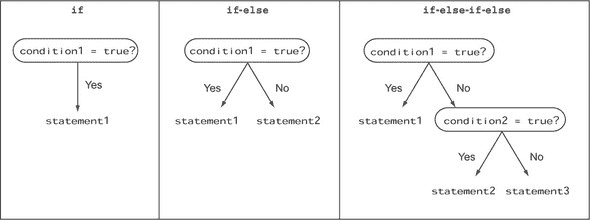

在图 5.1 中，*condition1*和*condition2*指的是一个变量或表达式，它必须评估为`boolean`或`Boolean`值；*statement1、statement2*和*statement3*指的是一行代码或代码块。

| |
| --- |

##### 考试技巧

在 Java 中，`then`不是一个关键字，因此不能与`if`语句一起使用。

| |
| --- |

让我们首先定义一组变量：`score`、`result`、`name`和`file`，如下所示：

```
int score = 100;
String result = "";
String name = "Lion";
java.io.File file = new java.io.File("F");
```

图 5.2 显示了`if`、`if-else`和`if-else-if-else`结构的用法，并通过并排显示代码来比较它们。

##### 图 5.2\. 代码中实现的`if`语句的多种形式

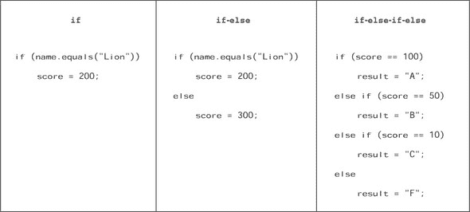

让我们快速浏览图 5.2 中的`if`、`if-else`和`if-else-if-else`语句所使用的代码。在下面的示例代码中，如果条件`name.equals("Lion")`评估为`true`，则将`200`的值赋给变量`score`：

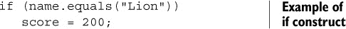

在以下示例中，如果条件`name.equals("Lion")`评估为`true`，则将`200`的值赋给变量`score`。如果这个条件评估为`false`，则将`300`的值赋给变量`score`：

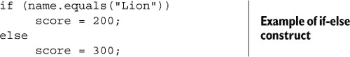

在以下示例中，如果`score`等于`100`，则将`A`的值赋给变量`result`。如果`score`等于`50`，则将`B`的值赋给变量`result`。如果`score`等于`10`，则将`C`的值赋给变量`result`。如果`score`不匹配`100`、`50`或`10`中的任何一个，则将`F`的值赋给变量`result`。`if-else-if-else`结构可以为所有`if`结构使用不同的条件：

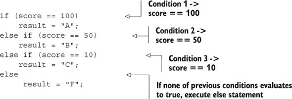

| |
| --- |

##### 注意

本书中的章节使用你在考试中可能看到的代码风格。考试代码风格通常包括在真实项目中不建议使用的实践，如代码缩进不当或为了简洁而省略大括号的使用。本书不鼓励你使用这种晦涩的编码实践。请编写易于阅读、理解和维护的代码。

| |
| --- |

图 5.3 说明了前面的代码，并使几个要点变得清晰：

+   最后一个`else`语句是最后一个`if`结构的一部分，而不是它之前的任何`if`结构。

+   `if-else-if-else`是一种`if-else`结构，其中`else`部分定义了另一个`if`结构。一些其他编程语言，如 Python 和 Shell Script，使用`elif`；Perl 和 Ruby 使用`elsif`；VB 使用`ElseIf`来定义`if-else-if`结构。如果你使用过这些语言中的任何一种，请注意 Java 中的差异。以下代码与前面的代码等价：

    ```
    if (score == 100)
        result = "A";
    else
        if (score == 50)
            result = "B";

        else
            if (score == 10)
                result = "C";
            else
                result="F";
    ```

##### 图 5.3\. `if-else-if-else`代码的执行

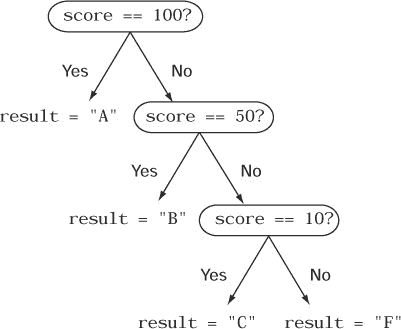

再次注意，前面的任何`if`结构都没有使用`then`来定义如果条件评估为`true`时要执行的代码。与其他编程语言不同，`then`在 Java 中不是一个关键字，也不与`if`结构一起使用。

| |
| --- |

##### 考试技巧

`if-else-if-else`是一种`if-else`结构，其中`else`部分定义了另一个`if`结构。

| |
| --- |

在用作`if`结构条件的`boolean`表达式中，也可以包含一个赋值操作。以下“故事中的转折”练习通过修改`if`语句比较的变量值来增加一个转折。让我们看看你是否能正确回答它（答案见附录）。

##### 故事中的转折 5.1

按照以下方式修改前面示例中使用的代码。这段代码的输出是什么？

```
String result = "1";
int score = 10;
if ((score = score+10) == 100)
    result = "A";
else if ((score = score+29) == 50)
    result = "B";
else if ((score = score+200) == 10)
    result = "C";
else
     result = "F";
System.out.println(result + ":" + score);
```

1.  `A:10`

1.  `C:10`

1.  `A:20`

1.  `B:29`

1.  `C:249`

1.  `F:249`

#### 5.1.2\. 缺少的 else 块

如果你没有为`if`结构定义`else`语句，会发生什么？可以如下定义`if`结构的操作步骤（省略`else`部分）：

```
boolean testValue = false;
if (testValue == true)
    System.out.println("value is true");
```

但你不能为`if`结构定义`else`部分，跳过`if`代码块。以下代码无法编译：

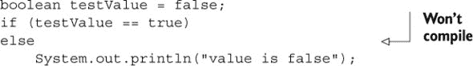

但在`if`之后跟随的空代码块可以很好地工作：

```
boolean testValue = false;
if (testValue == true) {}
else
    System.out.println("value is false");
```

这里还有另一段有趣且奇怪的代码：

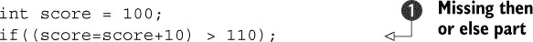

 是一条有效的代码行，即使它没有定义`if`语句的`then`或`else`部分。在这种情况下，`if`条件评估，然后结束。`if`结构没有定义基于此条件结果应该执行的任何代码。

|  |
| --- |

##### 注意

使用`if(testValue==true)`与使用`if(testValue)`相同。同样，`if(testValue==false)`与使用`if(!testValue)`相同。本书包括这两种方法的示例。许多编程初学者发现后者（没有显式的`==`）的方法令人困惑。

|  |
| --- |

#### 5.1.3\. 花括号{}在 if-else 结构中的存在与否的影响

当`if`条件评估为`true`或`false`时，你可以执行单个语句或语句块。`if`块通过将一个或多个语句包含在一对花括号`{}`内来标记。如果没有花括号，`if`块将执行单行代码；如果有花括号包含在块中（使用花括号定义），则可以执行无限多行代码。如果`if`语句中只有一行，则花括号是可选的。

以下代码仅在`if`语句中使用的表达式评估为`true`时，将值`200`赋给变量`score`：

```
String name = "Lion";
int score = 100;
if (name.equals("Lion"))
    score = 200;
```

如果你想要在变量`name`的值等于`Lion`时执行另一行代码，会发生什么？以下代码是否正确？

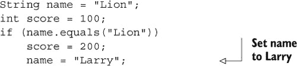

|  |
| --- |

##### 注意

前面的代码是一个很好的例子，说明在现实世界的项目中，你必须使用花括号来编写代码，以避免错误。

|  |
| --- |

如果`if`条件为`true`，则执行`score = 200;`语句。尽管看起来`name = "Larry";`语句似乎是`if`语句的一部分，但实际上它不是。由于缺少花括号`{}`，它将无论`if`条件的结果如何都执行。

|  |
| --- |

##### 考试技巧

在考试中，要注意使用误导性缩进的`if`结构中的代码。如果没有定义代码块（用`{}`标记），则只有跟随`if`结构的语句将被视为其一部分。

|  |
| --- |

如果你为`if`结构定义一个`else`部分，相同的代码会发生什么？

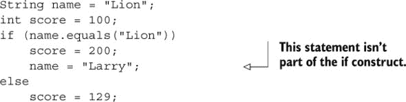

在这种情况下，代码将无法编译。编译器将报告`else`部分在没有`if`语句的情况下被定义。如果你感到困惑，请检查以下代码，其中缩进用于强调`name = "Larry"`行不是`else`结构的一部分：

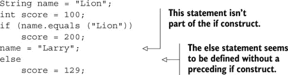

如果你想要为`if`结构执行多个语句，请在代码块中定义它们。你可以通过在花括号`{}`内定义所有这些代码来实现。以下是一个示例：

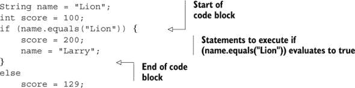

同样，你也可以为`else`部分定义多行代码。以下示例错误地这样做：

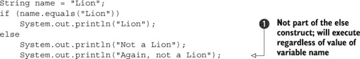

前面代码的输出如下：

```
Lion
Again, not a Lion
```

尽管代码在 *看起来*只有在变量`name`的值与值`Lion`匹配时才会执行，但这并不是事实。它缩进错误，让你误以为它是`else`块的一部分。前面的代码与以下代码（正确缩进）相同：

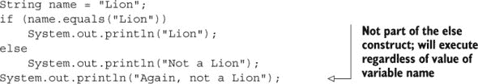

如果你只想在`if`条件评估为`false`时执行前面代码中的最后两个语句，你可以通过使用`{}`来实现：

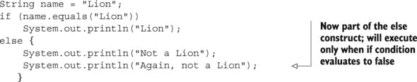

你可以定义另一个语句、结构或循环，在`if`条件下执行，而不使用`{}`，如下所示：

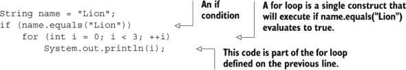

`System.out.println(i)`是`for`循环的一部分，而不是跟在`for`循环后面的一个无关的语句。所以这段代码是正确的，并给出以下输出：

```
0
1
2
```

#### 5.1.4\. 作为参数传递给`if`语句的适当与不适当表达式

在`if`结构中使用的变量或表达式的结果必须评估为`true`或`false`。假设以下变量的定义：

```
int score = 100;
boolean allow = false;
String name = "Lion";
```

让我们看看一些可以作为参数传递给`if`语句的有效变量和表达式的几个例子：

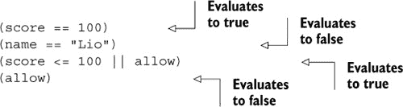

使用`==`来比较两个`String`对象是错误的。如第四章中所述，比较两个`String`对象的正确方式是使用`String`类的`equals`方法。但使用`==`比较两个`String`值是一个有效的表达式，它返回一个`boolean`值，并且可能在考试中使用。

现在是传递赋值操作到`if`结构中的难点部分。你认为以下代码的输出是什么？

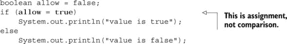

你可能会认为，由于`boolean`变量`allow`的值被设置为`false`，前面代码输出的值是`false`。重新审视代码，注意赋值操作`allow = true`将值`true`赋给`boolean`变量`allow`。此外，它的结果也是一个`boolean`值，这使得它可以作为参数传递给`if`结构。

尽管前面的代码没有语法错误，但存在一个*逻辑错误*——程序逻辑错误。将`boolean`变量与`boolean`字面量值比较的正确代码如下：

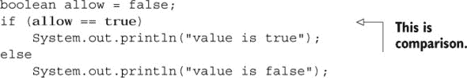

| |
| --- |

##### 考试技巧

在考试中注意使用赋值运算符（`=`）在`if`条件中比较`boolean`值。它不会比较`boolean`值；它会将其赋值。比较`boolean`值的正确运算符是相等运算符（`==`）。

| |
| --- |

#### 5.1.5\. 嵌套的`if`结构

嵌套的`if`结构是在另一个`if`结构内部定义的`if`结构。理论上，嵌套的`if`和`if-else`结构的层数没有限制。

每当遇到嵌套的`if`和`if-else`构造时，您需要小心确定`if`语句的`else`部分。如果前面的语句没有太多意义，请查看以下代码并确定其输出：

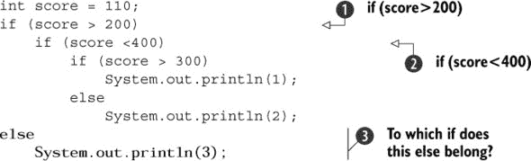

根据代码的缩进方式，您可能会认为处的`else`属于在处定义的`if`。但实际上，它属于在处定义的`if`。以下是正确缩进的代码：

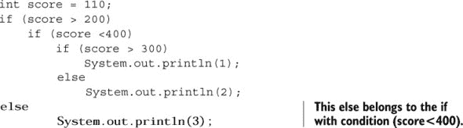

接下来，您需要了解如何执行以下操作：

+   为除了默认分配给它的外部`if`之外的`if`定义一个`else`。

+   确定嵌套`if`构造中`else`属于哪个`if`

这两个任务都很简单。让我们从第一个开始。

##### 为外部的 if 定义 else

关键点是使用花括号，如下所示：


在和处的花括号标记了在处定义的`if`条件(`score > 200`)的开始和结束。因此，处的`else`属于在处定义的`if`。

##### 确定 else 属于哪个 if

如果代码使用花括号来标记`if`或`else`构造的起始和结束，那么确定哪个`else`与哪个`if`匹配可能很简单，正如前文所述。当`if`构造不使用花括号时，不要被代码缩进所迷惑，缩进可能正确也可能不正确。

尝试匹配以下缩进不良的代码中的`if`与其相应的`else`：

```
if (score > 200)
if (score < 400)
if (score > 300)
    System.out.println(1);
else
    System.out.println(2);
else
    System.out.println(3);
```

从内部开始工作，与最内层的`if-else`语句匹配，将每个`else`与其最近的未匹配`if`语句匹配。图 5.4 显示了如何匹配前面代码的`if-else`对，标记为、和![num-3.jpg]。

##### 图 5.4\. 如何匹配缩进不良的`if-else`对

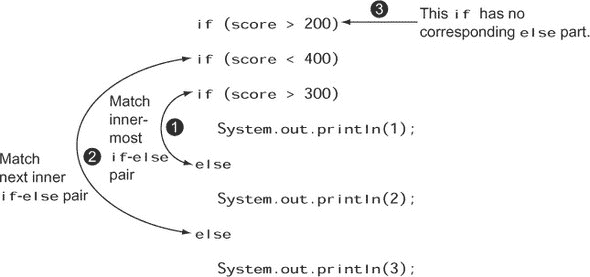

图 5.5 显示了如果代码正确缩进（使用或不使用花括号），匹配`if-else`对变得多么容易。

##### 图 5.5\. 正确的代码缩进（带或不带花括号）使代码更易读。

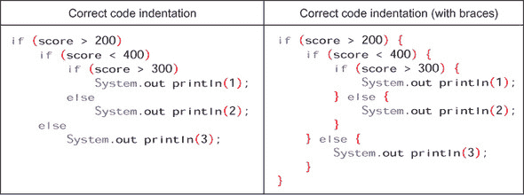

|  |
| --- |

##### 注意

作为良好的编程实践，正确缩进所有代码。同时使用花括号来提高可读性。

|  |
| --- |

您还可以使用三元构造来评估一个表达式，并根据布尔表达式的结果将一个值分配给变量，这将在下一节中介绍。

#### 5.1.6\. 三元构造

您可以使用三元运算符`?:`来定义三元构造。三元构造可以与紧凑的`if-else`构造相媲美，用于根据布尔表达式分配一个值给变量。

##### 正确用法

在下面的示例中，如果表达式`(bill > 2000)`评估为`true`，则变量`discount`被赋予值`15`，否则为`10`：

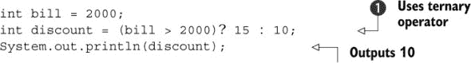

图 5.6 比较了前一个示例中使用的一个三元结构与`if-else`结构。

##### 图 5.6\. 比较三元结构和`if-else`结构

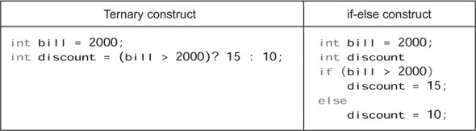

包围布尔表达式的括号是可选的，并且用于提高可读性。没有它们代码也能工作：

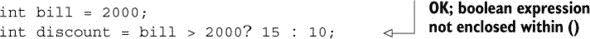

变量`discount`可能或可能不在包含三元运算符的同一语句中声明：

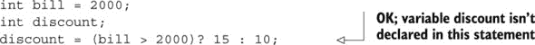

您也可以使用三元运算符将表达式赋值给变量`discount`。以下是修改后的代码：

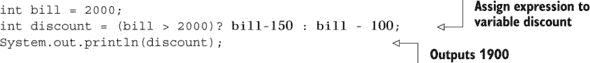

返回值的`方法`也可以用于在三元结构中初始化变量：

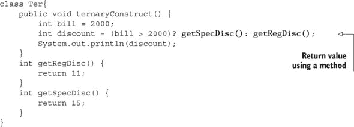

##### 不正确的使用

如果用于评估三元运算符的表达式不返回`boolean`或`Boolean`值，则代码无法编译：

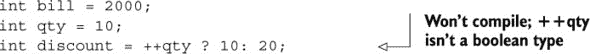

三元运算符的所有三个部分都是必需的：

+   布尔表达式

+   如果布尔表达式评估为`true`时返回的值

+   如果布尔表达式评估为`false`时返回的值

与`if`结构不同，三元运算符不能省略其`else`部分。以下代码无法编译：

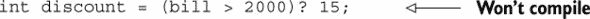

在第三章中，您创建了返回值的`方法`。从这些方法返回的值不需要赋值，但这不适用于三元结构。三元运算符返回的值必须赋给变量，否则代码无法编译：

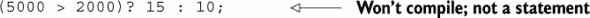

因为三元运算符必须返回值，并将这些值赋给变量，所以它不能包含代码块。以下代码无法编译：

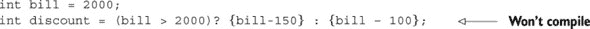

不返回值的`方法`不能用于在三元结构中初始化变量：

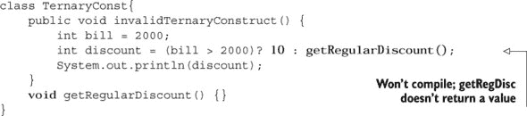

##### 不正确的赋值

在考试中，要注意三元运算符返回的值与所赋变量的兼容性。以下代码无法编译，因为它试图将`long`值赋给`int`变量：

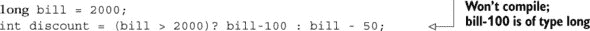

此外，还要注意原始类型和包装类之间的转换。以下代码无法编译，因为`Integer`不能赋给`Long`，反之亦然：

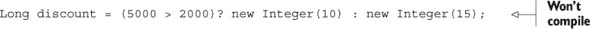

##### 嵌套的三元结构

在以下示例中，三元运算符的`if`部分包含另一个三元运算符。在考试中要注意嵌套的三元结构：

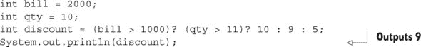

这是一个简单但有效的方法，可以将三元结构拆分并缩进到其组件中，以确定哪个值属于哪个运算符。让我们首先缩进一个简单三元结构，其中其布尔表达式、`if`和`else`值分别放在不同的行上：

```
int discount = (bill > 1000)?
                    10
                    :9;
```

现在，让我们将这种缩进技术应用到本节开头使用的示例中：

```
int bill = 2000;
int qty = 10;
```

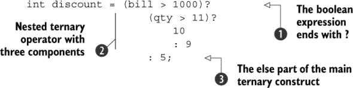

在前面的代码中， 以 `?` 结尾，即 `boolean` 表达式。 中的代码包含了嵌套的三元运算符的所有三个组成部分。如果 中的 `boolean` 表达式返回 `true`，则 中的代码将执行。 中的代码以 `:` 开头，并包含了 中三元运算符的 `else` 部分。

让我们将前面的缩进技术应用到另一个例子中。以下是缩进前的代码：

```
int bill = 2000;
int qty = 10;
int days = 10;
int discount = (bill > 1000)? (qty > 11)? 10 : days > 9? 20 : 30 : 5;
System.out.println(discount);
```

这是具有缩进的相同代码：

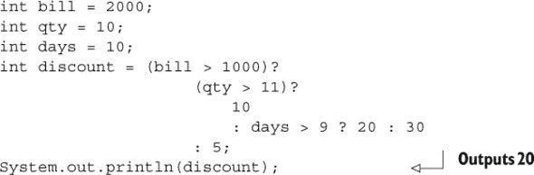

您还可以使用 `switch` 语句有条件地执行代码。尽管 `if-else` 构造和 `switch` 语句都用于选择性地执行语句，但它们的使用方式不同，您将在下一节使用 `switch` 语句时注意到这一点。

### 5.2\. 选择语句

|  |
| --- |

[3.4] 使用选择语句

|  |
| --- |

在本节中，您将学习如何使用 `switch` 语句，并了解它与嵌套的 `if-else` 构造的比较。您将了解传递给 `switch` 标签的值的正确定义，以及在这些标签中正确使用 `break` 语句。

#### 5.2.1\. 创建和使用选择语句

您可以使用 `switch` 语句比较变量的值与多个值。对于这些值中的每一个，您可以定义一组要执行的语句。

以下示例使用 `switch` 语句将变量 `marks` 的值与使用 `case` 关键字定义的文本值 `10`、`20` 和 `30` 进行比较：

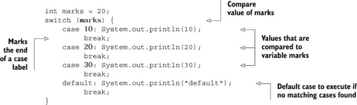

一个 `switch` 语句可以在其 `switch` 块中定义多个 `case` 标签，但只能有一个 `default` 标签。当在 `case` 标签中找不到匹配的值时，将执行 `default` 标签。`break` 语句用于在匹配的 `case` 执行完成后退出 `switch` 语句。

#### 5.2.2\. 将选择语句与多个 if-else 构造进行比较

`switch` 语句可以通过用 `switch` 和多个 `case` 语句替换一系列（看起来相当复杂的）相关 `if-else-if-else` 语句来提高代码的可读性。

检查以下使用 `if-else-if-else` 语句检查 `String` 变量 `day` 的值并显示适当信息的代码：

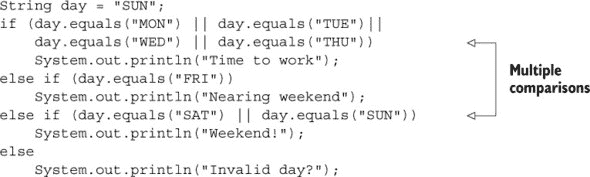

现在检查使用 `switch` 语句实现前面代码的此实现：

```
String day = "SUN";
switch (day) {
    case "MON":
    case "TUE":

    case "WED":
    case "THU": System.out.println("Time to work");
                break;
    case "FRI": System.out.println("Nearing weekend");
                break;
    case "SAT":
    case "SUN": System.out.println("Weekend!");
                break;
    default: System.out.println("Invalid day?");
}
```

前面的两个代码片段执行的功能相同，即比较变量 `day` 的值并打印适当的值。但后者使用 `switch` 语句，代码更简单，更容易阅读和跟踪。

注意，前面的 `switch` 语句没有为所有 `case` 值定义代码。如果变量 `day` 的值匹配 `TUE`，会发生什么？当代码控制进入 `switch` 结构中匹配 `TUE` 的标签时，它将执行直到遇到 `break` 语句或到达 `switch` 语句的末尾的所有代码。

图 5.7 展示了本节示例代码中使用的多个 `if-else-if-else` 语句的执行过程。你可以将其比作一系列的问题和答案，直到找到匹配项或所有条件都被评估。

##### 图 5.7。`if-else-if-else` 结构就像一系列的问题和答案。


与 `if-else-if-else` 结构相反，你可以将 `switch` 语句比作提出一个问题并评估其答案以确定要执行的代码。图 5.8 说明了 `switch` 语句及其 `case` 标签。

##### 图 5.8。`switch` 语句就像提问并采取行动。

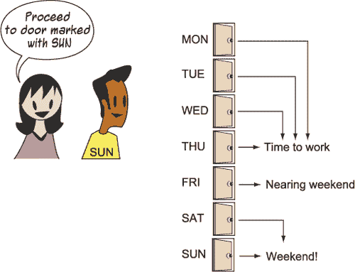

|  |
| --- |

##### 考试技巧

`if-else-if-else` 结构评估所有条件，直到找到匹配项。`switch` 结构将传递给它的参数与它的标签进行比较。

|  |
| --- |

看看你能否在下一个练习中找到转折。提示：它定义了比较 `String` 值的代码（答案可在附录中找到）。

##### 故事中的转折 5.2

按照前一个示例修改代码如下。这段代码的输出是什么？

```
String day = new String("SUN");
switch (day) {
    case "MON":
    case "TUE":
    case "WED":
    case "THU": System.out.println("Time to work");
                break;
    case "FRI": System.out.println("Nearing weekend");
                break;
    case "SAT":
    case "SUN": System.out.println("Weekend!");
                break;
    default: System.out.println("Invalid day?");
}
```

1.  `工作时间`

1.  `接近周末`

1.  `周末！`

1.  `无效的日子？`

#### 5.2.3. 传递给 `switch` 语句的参数

你不能使用 `switch` 语句来比较所有类型的值，例如所有类型的对象和原始数据类型。`switch` 语句可以接受的参数类型有限制。

图 5.9 展示了可以传递给 `switch` 语句和 `if` 结构的参数类型。

##### 图 5.9。可以传递给 `switch` 语句和 `if` 结构的参数类型

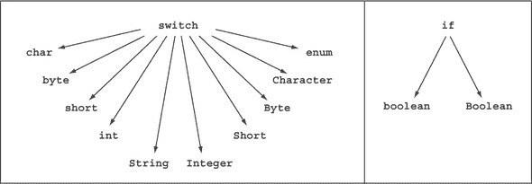

`switch` 语句接受 `char`、`byte`、`short`、`int` 和 `String`（从 Java 7 版本开始）类型的参数。它还接受 `enum`、`Character`、`Byte`、`Integer` 和 `Short` 类型的参数和表达式。由于枚举不是 OCA Java SE 8 程序员 I 考试目标，因此我不会进一步讨论它们。`switch` 语句不接受 `long`、`float` 或 `double` 类型的参数，或除了 `String` 之外的任何对象。

除了将变量传递给 `switch` 语句外，只要表达式返回允许的类型之一，你还可以将表达式传递给 `switch` 语句。以下代码是有效的：

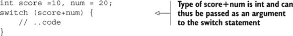

以下代码无法编译，因为 `history` 的类型是 `double`，这是 `switch` 语句不接受的数据类型：

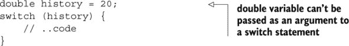

|  |
| --- |

##### 考试技巧

注意考试中试图将原始十进制类型（如`float`或`double`）传递给`switch`语句的问题。试图这样做的方法将无法编译。

|  |
| --- |

对于非原始类型，即`String`和包装类型，`switch`参数不能为`null`，否则会抛出`NullPointerException`：

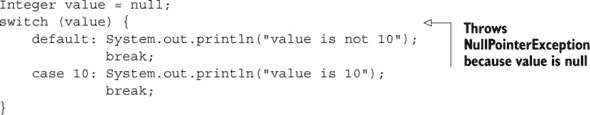

在前面的代码中，如果变量`value`被赋予值`10`，代码将输出`value is 10`。

|  |
| --- |

##### 考试技巧

对于非原始类型，即`String`和包装类型，`switch`参数不能为`null`，否则会抛出`NullPointerException`。

|  |
| --- |

#### 5.2.4\. 传递给 switch 语句标签情况的值

当涉及到可以传递给`switch`语句中`case`标签的值时，你会有一些限制，以下小节将解释。

##### 情况值应该是编译时常量

`case`标签的值必须是编译时常量值；也就是说，该值应该在代码编译时已知：

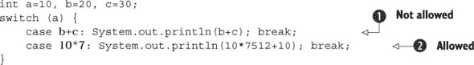

注意，前面代码中在第处定义的`b+c`在编译时无法确定，是不允许的。但第处定义的`10*7`是一个有效的`case`标签值。

你可以在表达式中使用变量，如果它们被标记为`final`，因为一旦初始化，`final`变量的值就不能改变：


因为这里的变量`b`和`c`是`final`变量，所以在处`b+c`的值可以在编译时确定。这使得它成为一个编译时常量值，可以用于`case`标签。

你可能会惊讶地发现，如果你在声明时没有为`final`变量分配值，它不被视为编译时常量：

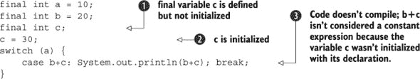

此代码在第行定义了一个`final`变量`c`，但没有初始化它。`final`变量`c`在第行被初始化。因为`final`变量`c`在其声明中没有初始化，所以在处，表达式`b+c`不被视为编译时常量，因此不能用作情况标签。

##### 情况值应该可以分配给传递给`switch`语句的参数

检查以下代码，其中传递给`switch`语句的参数类型是`byte`，而`case`标签值是`float`类型。这样的代码无法编译：

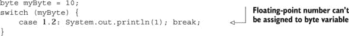

##### 不允许将`null`用作情况标签

尝试将传递给`switch`语句的变量与`null`进行比较的代码无法编译，如下面的代码所示：

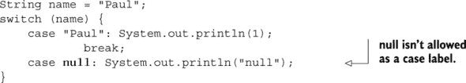

##### 一个代码块可以为多个情况定义

在`switch`语句中为多个`case`标签定义单个代码块是可以接受的，如下面的代码所示：


以下示例代码将在变量`score`的值匹配`100`、`50`和`10`中的任何一个时输出`Average score`。

#### 5.2.5\. 在 `switch` 语句中使用 `break` 语句

在前面的例子中，请注意使用 `break` 语句退出 `switch` 结构，一旦找到匹配的情况。如果没有 `break` 语句，控制将 *直接跳过* 剩余的代码并执行所有 *后续* 的匹配情况对应的代码。

考虑图 5.10 figure 5.10 中显示的示例——一个带有 `break` 语句，另一个不带 `break` 语句。当变量 `score` 的值为 `50` 时，检查此图中的代码流程（使用箭头表示）。

##### 图 5.10\. 带与不带 `break` 语句的 `switch` 语句的代码流程差异


我们（假设的）热情的程序员 Harry 和 Selvan，他们也在准备这次考试，提交了一些他们的代码。你能在以下“故事转折”练习中选择他们的正确代码吗？（答案在附录中。）

##### 故事转折 5.3

在我们两位假设的程序员 Harry 和 Selvan 的以下代码提交中，哪个检查了长变量 `dayCount` 的值并打印出任何与日计数匹配的月份名称？

1.  Harry 的提交：

    ```
    long dayCount = 31;
    if (dayCount == 28 || dayCount == 29)
        System.out.println("Feb");
    else if (dayCount == 30)
        System.out.println("Apr");
    else if (dayCount == 31)
        System.out.println("Jan");
    ```

1.  Selvan 的提交：

    ```
    long dayCount = 31;
    switch (dayCount) {
        case 28:
        case 29: System.out.println("Feb"); break;
        case 30: System.out.println("Apr"); break;
        case 31: System.out.println("Jan"); break;
    }
    ```

在下一节中，我将介绍称为循环语句的迭代语句。就像你每天都想重复“吃冰淇淋”的动作一样，循环用于多次执行相同的代码行。你可以使用 `for` 循环、增强型 `for` (`for`-each) 循环或 `do-while` 和 `while` 循环来重复代码块。让我们从 `for` 循环开始。

### 5.3\. `for` 循环

|  |
| --- |

[5.2] 创建和使用 `for` 循环，包括增强型 `for` 循环

|  |
| --- |

在本节中，我将介绍常规或传统的 `for` 循环。增强型 `for` 循环将在下一节介绍。

`for` 循环通常用于执行一组语句固定次数。它具有以下形式：

```
for (initialization; condition; update) {
     statements;
}
```

这里有一个简单的例子：


前面代码的输出如下：

```
25
50
75
100
125
```

在前面的例子中，位于  的代码将执行五次。它将从变量 `ctr` 的初始值 `1` 开始执行，并且只要变量 `ctr` 的值小于或等于 `5`，就会继续执行。变量 `ctr` 的值在执行位于  的代码后会递增 `1` (`ctr++`)。

位于  的代码将对 `ctr` 值 `1`、`2`、`3`、`4` 和 `5` 执行。因为 `6 <= 5` 评估为 `false`，所以 `for` 循环在执行位于  的代码后完成其执行，不再执行任何进一步的代码。

在前面的例子中，请注意 `for` 循环定义了三种类型的语句，这些语句由分号 (`;`) 分隔，如下所示：

+   初始化语句

+   终止条件

+   更新子句（可执行语句）

这个循环在图 5.11 中用流程图表示。循环体中定义的语句会一直执行，直到终止条件为`false`。

##### 图 5.11\. `for`循环中的控制流程


关于`for`循环，需要注意的一个重要点是更新子句在`for`循环体内部定义的所有语句之后执行。换句话说，你可以将更新子句视为`for`循环中的最后一个语句。初始化部分只执行一次，可以定义多个初始化语句。同样，更新子句也可以定义多个语句。但`for`循环只能有一个终止条件。

在图 5.12 中，我提供了一个代码片段和流程图，以展示语句执行的相应流程，从而解释前面的概念。

##### 图 5.12\. 使用代码示例的`for`循环控制流程


让我们详细探讨`for`循环的初始化块、终止条件和更新子句。

#### 5.3.1\. 初始化块

初始化块只执行一次。`for`循环可以在其初始化块中声明和初始化多个变量，但声明的变量应该是同一类型的。以下代码是有效的：


但你无法在初始化块中声明不同类型的变量。以下代码将无法编译：


尝试在`for`的初始化块外部使用在初始化块中定义的变量是一个常见的编程错误。请注意，初始化块中声明的变量的作用域仅限于`for`块。以下是一个例子：


#### 5.3.2\. 终止条件

终止条件在执行循环体中定义的语句之前对每次迭代进行评估。当终止条件评估为`false`时，`for`循环终止：


终止条件——在这个例子中是`ctr <= 5`——在执行之前被检查。如果条件评估为`false`，控制权转移到。`for`循环可以定义一个精确的终止条件——不多也不少。

#### 5.3.3\. 更新子句

通常，你会使用这个块来操作用于指定终止条件的变量的值。在之前的例子中，我定义了以下代码：

```
++ctr;
```

定义在此块中的代码将在`for`循环体中定义的所有代码之后执行。在以下代码执行后，前面的代码将变量`ctr`的值增加`1`：

```
System.out.println(ctr);
```

终止条件接下来被评估。这个执行会一直持续到终止条件评估为`false`。

你可以在更新子句中定义多个语句，包括对其他方法的调用。唯一的限制是这些语句将按照它们出现的顺序执行，在`for`块中定义的所有语句之后执行。检查以下代码，它在更新块中调用了一个方法：


此代码的输出如下：

```
a
Happy
b
Happy
```

#### 5.3.4\. for 语句的可选部分

`for`语句的三个部分——即初始化块、终止条件和更新子句——都是可选的。但你必须通过只包含分号来指定不包括某个部分。在以下示例中，初始化块不包含任何代码：


移除标记初始化块结束的分号会阻止代码编译：


在以下示例中，终止条件缺失，导致可能无限循环（可能因为可以使用`break`语句或异常来停止）：


再次，如果你移除标记终止条件结束的分号，代码将无法编译：


以下代码在其更新子句中不包含代码，但编译成功：


但移除标记更新子句开始的分号会阻止代码编译：


有趣的是，以下代码是有效的：

```
for(;;)
    System.out.println(1);
```

| |
| --- |

##### 考试技巧

`for`语句的三个部分——初始化块、终止条件和更新子句——都是可选的。缺少终止条件意味着无限循环。

| |
| --- |

#### 5.3.5\. 嵌套 for 循环

如果一个循环包含另一个循环，它们被称为*嵌套循环*。包含另一个循环的循环被称为*外循环*，而被包含的循环被称为*内循环*。理论上，嵌套`for`循环的层级没有限制。

让我们从单级嵌套循环开始。例如，你可以将时钟的时针比作外循环，而分针比作内循环。每个小时可以与外循环的一次迭代相比较，而每分钟可以与内循环的一次迭代相比较。因为一小时有 60 分钟，所以内循环应该在外循环的每次迭代中迭代 60 次。时钟与嵌套循环之间的比较如图 5.13 所示。

##### 图 5.13\. 时钟指针与嵌套循环的比较


你可以使用以下嵌套`for`循环来打印从`1`到`6`小时的每一分钟（`1`到`60`）：


嵌套循环常用于初始化或迭代多维数组。以下代码使用嵌套`for`循环初始化多维数组：


 定义了一个二维数组 `multiArr`。 分配了这个数组，创建了两个行和三个列，并将所有数组成员赋值为默认的 `int` 值 `0`。图 5.14 展示了使用前面的代码初始化后的 `multiArr` 数组。

##### 图 5.14\. 初始化后的数组 `multiArr`


 定义了一个外层 `for` 循环。因为 `multi-Arr.length` 的值为 `2`（如  中第一个下标的值），外层 `for` 循环执行两次，变量 `i` 的值为 `0` 和 `1`。内层 `for` 循环在  中定义。因为 `multiArr` 数组的每一行的长度为 `3`（如  中第二个下标的值），内层循环在外层 `for` 循环的每次迭代中执行三次，变量 `j` 的值为 `0`、`1` 和 `2`。

在下一节中，我将讨论 `for` 循环的另一种风味：*增强型* `for` 循环或 `for`-each 循环。

### 5.4\. 增强型 `for` 循环

| |
| --- |

[5.2] 创建和使用包括增强型 `for` 循环在内的循环

| |
| --- |

增强型 `for` 循环也被称为 *`for`-each* 循环，它相对于常规 `for` 循环提供了一些优势。它也有一些限制。

#### 5.4.1\. 使用增强型 `for` 循环进行迭代

首先，当涉及到遍历集合或数组时，常规 `for` 循环使用起来比较繁琐。即使你想遍历整个集合或列表，也需要创建一个循环变量并指定集合或数组的起始和结束位置。增强型 `for` 循环使得之前提到的常规任务变得非常简单，以下示例展示了对于 `ArrayList myList` 的使用：

```
ArrayList<String> myList= new ArrayList<String>();
myList.add("Java");
myList.add("Loop");
```

以下代码使用常规 `for` 循环遍历此列表：

```
for(Iterator<String> i = myList.iterator(); i.hasNext();)
    System.out.println(i.next());
```

此代码使用增强型 `for` 循环遍历列表 `myList`：

```
for (String val : myList)
    System.out.println(val);
```

你可以将 `for`-each 循环中的冒号（`:`）读作“在”。

`for`-each 循环的实现非常简单：没有代码杂乱，代码易于编写和理解。在上面的例子中，`for`-each 循环被读作“对于集合 `myList` 中的每个元素 `val`，打印 `val` 的值。”

你也可以使用增强型 `for` 循环轻松地遍历 *嵌套集合*。在这个例子中，假设定义了一个包含 `exams`、`levels` 和 `grades` 的 `ArrayList`，如下所示：

```
ArrayList<String> exams= new ArrayList<String>();
exams.add("Java");
exams.add("Oracle");
ArrayList<String> levels= new ArrayList<String>();
levels.add("Basic");
levels.add("Advanced");
ArrayList<String> grades= new ArrayList<String>();
grades.add("Pass");
grades.add("Fail");
```

以下代码创建了一个嵌套的 `ArrayList`，`nestedArrayList`，其中每个元素本身都是一个 `String` 对象的 `ArrayList`：


`nestedArrayList` 可以与多维数组进行比较，如图 5.15 所示。

##### 图 5.15\. `nestedArrayList` 的示意图


可以使用嵌套增强型 `for` 循环遍历嵌套的 `ArrayList nestedArrayList`。以下是相关代码：

```
for (ArrayList<String> nestedListElement : nestedArrayList)
    for (String element : nestedListElement)
        System.out.println(element);
```

这段代码的输出如下：

```
Java
Oracle
Basic
Advanced
Pass
Fail
```

增强型`for`循环再次轻松地用于遍历`*嵌套*`或`*非嵌套*`数组。例如，你可以使用以下代码遍历一个元素数组并计算其总和：

```
int total = 0;
int primeNums[] = {2, 3, 7, 11};
for (int num : primeNums)
    total += num;
```

当你尝试在增强型`for`循环中修改循环变量的值时会发生什么？结果取决于你是在遍历原始值集合还是对象集合。如果你是在遍历原始值数组，由于在增强型`for`循环中原始值是按值传递给循环变量的，因此操作循环变量永远不会改变正在遍历的数组的值。

当你遍历一个对象集合时，集合的值是通过引用传递给循环变量的。因此，如果你通过在它上执行方法来操作循环变量的值，修改后的值将反映在正在遍历的对象集合中：


前面代码的输出是

```
Java
Loop
JavaOracle
LoopOracle
```

让我们修改前面的代码。不是在循环变量`val`上调用`append`方法，而是给它分配另一个`StringBuilder`对象。在这种情况下，正在遍历的数组的原始元素将不会受到影响，将保持不变：


前面代码的输出是

```
Java
Loop
Java
Loop
```

|  |
| --- |

##### 考试技巧

注意使用增强型`for`循环及其循环变量来更改它遍历的集合中元素值的代码。这种行为经常成为考试出题者的思考素材。

|  |
| --- |

#### 5.4.2\. 增强型`for`循环的限制

虽然`for-each`循环是遍历集合和数组的不错选择，但它不能用在某些地方。

##### 不能用于初始化数组并修改其元素

你能否在以下代码中使用增强型`for`循环代替常规`for`循环？


简单的答案是：不可以。虽然你可以在增强型`for`循环外部定义一个计数器，并使用它来初始化和修改数组元素，但这种做法违背了`for-each`循环的目的。在这种情况下，传统的`for`循环更容易使用。

##### 不能用于删除或移除集合的元素

因为`for`循环隐藏了用于遍历集合元素的`*iterator*`，所以你不能用它来移除或删除现有的集合值，因为你不能调用`remove`方法。

如果你将`null`值赋给循环变量，它不会从集合中移除元素：


前面代码的输出是

```
One
Two
One
Two
```

##### 不能在同一个循环中遍历多个集合或数组

虽然使用`for`循环遍历嵌套集合或数组是完全可行的，但你不能在同一个`for`-each 循环中遍历多个集合或数组，因为`for`-each 循环只能创建一个循环变量。与常规`for`循环不同，你无法在`for`-each 循环中定义多个循环变量。

| |
| --- |

##### 考试技巧

使用`for`-each 循环遍历数组和集合。不要用它来初始化、修改或过滤它们。

| |
| --- |

#### 5.4.3. 嵌套增强型 for 循环

首先，处理嵌套集合与处理嵌套循环并不相同。嵌套循环也可以与无关的集合一起工作。

如 5.3.4 节中所述，定义在另一个循环内的循环称为*嵌套循环*。定义自身内部另一个循环的循环称为*外层循环*，而定义在另一个循环内的循环称为*内层循环*。理论上，任何循环的嵌套级别都没有限制，包括增强型`for`循环。

在本节中，我们将使用三个嵌套的增强型`for`循环。你可以将三级嵌套循环比作一个有小时、分钟和秒针的时钟。时钟的秒针每分钟完成一圈。同样，分针每小时完成一圈。这种比较在图 5.16 中显示。

##### 图 5.16. 三手钟与嵌套`for`循环级别的比较


以下是一个嵌套增强型`for`循环的编码示例，我在前一个章节中讨论过：


嵌套循环中的内层循环在其外层循环的每次迭代中执行。前面的例子定义了三个增强型`for`循环：最外层循环在，内层嵌套循环在，最内层循环在。在中的完整最内层循环在其直接外层循环（在中定义）的每次迭代中执行。同样，在中定义的完整内层循环在其直接外层循环（在中定义）的每次迭代中执行。图 5.17 显示了所有这些循环迭代的循环值。

##### 图 5.17. 嵌套`for`循环及其迭代的循环值


上述代码的输出如下：

```
Java:Basic:Pass
Java:Basic:Fail
Java:Advanced:Pass
Java:Advanced:Fail
Oracle:Basic:Pass
Oracle:Basic:Fail
Oracle:Advanced:Pass
Oracle:Advanced:Fail
```

| |
| --- |

##### 考试技巧

嵌套循环在其直接外层循环的每次迭代中执行所有迭代。

| |
| --- |

除了`for`循环之外，考试中的其他循环语句是`while`和`do`-`while`，这些将在下一节中讨论。

### 5.5. 循环和 do-while 循环

| |
| --- |

[5.1] 创建和使用 while 循环

| |
| --- |
| |

[5.3] 创建和使用 do-while 循环

| |
| --- |

你将在本节中学习 `while` 和 `do-while` 循环。这两个循环只要它们的条件评估为 `true` 就会执行一组语句。这两个循环的工作方式相同，除了一个区别：`while` 循环在评估其循环体之前检查其条件，而 `do-while` 循环在执行其循环体中定义的语句之后检查其条件。

这种行为上的差异是否会影响它们的执行？是的，它会影响，在本节中，你将看到这一点。

#### 5.5.1\. `while` 循环

`while` 循环用于反复执行一组语句，只要其条件评估为 `true`。这个循环在开始执行语句之前检查条件。

例如，在著名的快餐连锁店 Superfast Burgers，员工可能被指示只要面包有供应就准备汉堡。在这个例子中，面包的可用性是 `while` 条件，而准备汉堡是 `while` 循环的循环体。你可以用以下代码表示这一点：

```
boolean bunsAvailable = true;
while (bunsAvailable) {
    /* ... prepare burger ...*/
    if (noMoreBuns)
        bunsAvailable = false;
}
```

上述例子仅用于演示目的，因为循环体并没有完全定义。在 `while` 循环中用于检查是否再次执行循环体的条件应该在某个时刻评估为 `false`；否则，循环将无限执行。这个循环变量的值可能被 `while` 循环或另一个方法（如果它是实例或 `static` 变量）更改。

`while` 循环接受 `boolean` 或 `Boolean` 类型的参数。在前面的代码中，循环体检查是否还有面包可用。如果没有面包可用，它将变量 `bunsAvailable` 的值设置为 `false`。由于 `bunsAvailable` 评估为 `false`，循环体在下一个迭代中不会执行。

前面的 `while` 循环的执行过程在 图 5.18 中以简单的流程图的形式展示，以帮助你更好地理解这个概念。

##### 图 5.18\. 描述 `while` 循环中代码流程的流程图


现在，让我们来考察另一个使用 `while` 循环的简单例子：

```
int num = 9;
boolean divisibleBy7 = false;
while (!divisibleBy7) {
    System.out.println(num);
    if (num % 7 == 0) divisibleBy7 = true;
    --num;
}
```

上述代码的输出如下：

```
9
8
7
```

如果你将代码更改为如下（粗体表示更改），会发生什么（更改如下）？

```
int num = 9;
boolean divisibleBy7 = true;
while (divisibleBy7 == false) {
    System.out.println(num);
    if (num % 7 == 0) divisibleBy7 = true;
    --num;
}
```

由于条件 `divisibleBy7==false` 评估为 `false`，代码不会进入循环。

#### 5.5.2\. `do-while` 循环

`do-while` 循环用于反复执行一组语句，直到它所使用的条件评估为 `false`。这个循环在完成其循环体内的所有语句的执行后检查条件。

你可以将这种结构比作一个在启动时显示菜单的软件应用程序。每个菜单选项将执行一系列步骤并重新显示菜单。最后一个菜单选项是“退出”，它将退出应用程序并且不会重新显示菜单：

```
boolean exitSelected = false;
do {
    String selectedOption = displayMenuToUser();
    if (selectedOption.equals("exit"))
        exitSelected = true;
    else
        executeCommand(selectedOption);
} while (exitSelected == false);
```

上述代码用一个简单的流程图表示在 图 5.19，这将帮助你更好地理解代码。

##### 图 5.19\. 流程图显示`do-while`循环中的代码流程


上述示例仅用于演示目的，因为`do-while`循环中使用的方法尚未定义。正如前一个关于`while`循环的章节所讨论的，用于在`do-while`循环中检查是否再次执行循环体的条件应该在某个时刻评估为`false`，否则循环将无限执行。此循环变量的值可以通过`while`循环或另一种方法（如果它是实例或`static`变量）来更改。

| |
| --- |

##### 注意

不要忘记在指定条件后使用分号(`;`)来结束`do-while`循环。即使一些经验丰富的程序员也会忽略这一步！

| |
| --- |

`do-while`循环接受类型为`boolean`或`Boolean`的参数。

让我们修改第 5.5.1 节中使用的示例，使用`do-while`循环而不是`while`循环，如下所示：

```
int num = 9;
boolean divisibleBy7 = false;
do {
    System.out.println(num);
    if (num % 7 == 0) divisibleBy7 = true;
    num--;
} while (divisibleBy7 == false);
```

此代码的输出如下：

```
9
8
7
```

如果你按如下方式更改代码会发生什么（粗体表示更改）？

```
int num = 9;
boolean divisibleBy7 = true;
do {
    System.out.println(num);
    if (num % 7 == 0) divisibleBy7 = true;
    num--;
} while (divisibleBy7 == false);
```

上述代码的输出如下：

```
9
```

`do-while`循环至少执行一次，即使`do-while`循环中指定的条件评估为`false`，因为条件是在执行循环体之后评估的。

#### 5.5.3\. `while`和`do-while`块、表达式和嵌套规则

你可以使用花括号`{}`与`while`和`do-while`循环一起使用，为每次迭代定义要执行的多个代码行。如果不使用花括号，则只有第一行代码被视为`while`或`do-while`循环的一部分，如第 5.1.3 节中指定的`if-else`结构。

同样，定义传递给`while`和`do-while`循环的适当表达式的规则与第 5.1.4 节中的`if-else`结构相同。此外，定义嵌套`while`和`do-while`循环的规则与第 5.1.5 节中的`if-else`结构相同。

### 5.6\. 比较循环结构

| |
| --- |

[5.4] 比较循环结构

| |
| --- |

在本节中，我将讨论以下循环结构之间的差异和相似之处：`do-while`、`while`、`for`和增强型`for`。

#### 5.6.1\. 比较`do-while`和`while`循环

`do-while`和`while`循环都会执行一组语句，直到它们的终止条件评估为`false`。这两个语句之间的唯一区别是`do-while`循环即使在条件评估为`false`的情况下也会执行代码，`do-while`循环在执行语句之后评估终止条件，而`while`循环在执行其语句之前评估终止条件。

这些语句的形式如图 5.20 所示。

##### 图 5.20\. 比较`do-while`和`while`循环


你认为以下代码的输出是什么？


上述代码的输出如下：

```
12
```

你认为以下代码的输出是什么？


上述代码的输出如下：

```
11
```

#### 5.6.2\. 比较 for 循环和增强 for 循环

正规的 `for` 循环虽然使用起来有些繁琐，但比增强的 `for` 循环（如第 5.4.1 节中提到的）功能更强大。

+   增强的 `for` 循环不能用于初始化数组并修改其元素-。

+   增强的 `for` 循环不能用于删除集合的元素。

+   增强的 `for` 循环不能用于在同一个循环中迭代多个集合或数组。

#### 5.6.3\. 比较 for 循环和 while 循环

当你知道迭代次数时，你应该 *尝试* 使用 `for` 循环——例如，当你正在遍历一个集合或数组，或者当你需要执行固定次数的循环，比如 ping 服务器五次时。

当你事先不知道迭代次数，并且迭代次数取决于一个条件为 `true` 时，你应该 *尝试* 使用 `do-while` 或 `while` 循环——例如，当你接受护照续签申请直到没有更多申请人时。在这种情况下，你将不知道在给定的一天有多少申请人提交了他们的申请。

### 5.7\. 循环语句：break 和 continue

|  |
| --- |

[5.5] 使用 break 和 continue

|  |
| --- |

想象一下，你已经定义了一个循环来遍历经理列表，并且你正在寻找至少一个名字以字母 *D* 开头的经理。你希望在找到第一个匹配项后退出循环，但如何做到呢？你可以在循环中使用 `break` 语句来实现这一点。

现在想象一下，你想要遍历笔记本电脑上的所有文件夹，并扫描大于 10 MB 的文件是否有病毒。如果所有这些文件都被发现是安全的，你希望将它们上传到服务器。但如果你想要跳过小于 10 MB 文件大小的 *病毒检查* 和 *文件上传* 步骤，同时仍然处理笔记本电脑上的剩余文件，你可以做到！你可以在循环中使用 `continue` 语句。

在本节中，我将讨论 `break` 和 `continue` 语句，你可以使用这些语句完全退出循环或跳过循环迭代中的剩余语句。在本节的最后，我将讨论带标签的语句。

#### 5.7.1\. break 语句

`break` 语句用于 *退出* 或 *跳出* `for`、`for`-each、`do` 和 `do-while` 循环，以及 `switch` 构造。或者，可以使用 `continue` 语句来跳过当前迭代中的剩余步骤，并从下一个循环迭代开始。

这些语句之间的区别可以通过以下示例最好地展示。你可以使用以下代码来浏览并打印 `String` 数组中的所有值：

```
String[] programmers = {"Paul", "Shreya", "Selvan", "Harry"};
for (String name : programmers) {
    System.out.println(name);
}
```

上述代码的输出如下：

```
Paul
Shreya
Selvan
Harry
```

让我们修改前面的代码，以便在数组值等于 `Shreya` 时退出循环。以下是所需的代码：


上述代码的输出如下：

```
Paul
```

一旦循环遇到 `break`，它就会退出循环。因此，只打印这个数组的第一个值——即 `Paul`。如 `switch` 构造部分的说明中所述，可以在每个 `case` 后定义 `break` 语句，以便一旦找到匹配的 `case`，控制就会退出 `switch` 构造。

前面的代码片段在 图 5.21 中展示，该图显示了执行 `break` 语句时的控制转移。

##### 图 5.21\. 在循环中执行 `break` 语句时的控制流


当你在嵌套循环中使用 `break` 语句时，它会退出内部循环。下一个“故事中的转折”练习将查看一个小代码片段，以了解在嵌套 `for` 循环中使用 `break` 语句时控制如何转移（答案见附录）。

##### 故事中的转折 5.4

将上一个示例中使用的代码修改如下。这段代码的输出是什么？

```
String[] programmers = {"Outer", "Inner"};
for (String outer : programmers) {
    for (String inner : programmers) {
        if (inner.equals("Inner"))
            break;
        System.out.print(inner + ":");
    }
}
```

1.  `外部:外部:`

1.  `外部:内部:外部:内部:`

1.  `外部:`

1.  `外部:内部:`

1.  `内部:内部:`

#### 5.7.2\. `continue` 语句

`continue` 语句用于跳过当前迭代的剩余步骤，并从下一个循环迭代开始。让我们将上一个例子中的 `break` 语句替换为 `continue` 并查看其输出：


上述代码的输出如下：

```
Paul
Selvan
Harry
```

一旦循环遇到 `continue`，它就会退出当前迭代。在这个例子中，它跳过了数组值 `Shreya` 的打印步骤。与 `break` 语句不同，`continue` 不会退出循环——它重新开始下一个循环迭代，打印剩余的数组值（即 `Selvan` 和 `Harry`）。

当你在嵌套循环中使用 `continue` 语句时，它会退出内部循环的当前迭代。

图 5.22 比较了在循环中使用 `break` 和 `continue` 语句时控制如何转移出循环和到下一个迭代。

##### 图 5.22\. 在循环中使用 `break` 和 `continue` 语句时控制流的比较


#### 5.7.3\. 带标签的语句

在 Java 中，你可以给以下类型的语句添加标签：

+   使用 `{}` 定义的代码块

+   所有循环语句（`for`、增强型 `for`、`while`、`do-while`）

+   条件结构（`if` 和 `switch` 语句）

+   表达式

+   作业

+   `return` 语句

+   `try` 块

+   `throws` 语句

这里给出了一个带标签的循环示例：

```
String[] programmers = {"Outer", "Inner"};
outer:
for (int i = 0; i < programmers.length; i++) {
}
```

你不能给声明添加标签。以下带标签的声明无法编译：


有趣的是，前面的声明可以定义在块语句中，如下所示：


##### 带标签的 `break` 语句

你可以使用带标签的 `break` 语句退出外部循环。以下是一个示例：


上述代码的输出是

```
Outer:
```

当此代码执行 `break outer;` 时，控制权转移到标记此代码块结束的文本行。它不会将控制权转移到标签 `outer`。

##### 带标签的 `continue` 语句

你可以使用带标签的 `continue` 语句来跳过外部循环的迭代。以下是一个示例：


上述代码的输出是

```
Paul
Paul
Paul
Paul
```

| |
| --- |

##### 注意

请谨慎使用标签，并且只有当它们 *真正* 增加代码可读性时才使用。

| |
| --- |

### 5.8\. 摘要

我们从本章的开始讲到了选择语句 `if` 和 `switch` 以及三元构造。我们涵盖了 `if` 构造的不同形式。然后我们探讨了 `switch` 构造，它接受包括 `byte`、`char`、`short`、`int` 和 `String` 在内的有限类型的参数。谦逊的 `if-else` 构造可以定义几乎任何简单或复杂的条件集。

你也看到了如何使用所有类型的循环来执行你的代码：`for`、`for`-each、`do` 和 `do-while`。`for`、`do` 和 `do-while` 循环自从 Java 语言首次引入以来一直存在，而增强型 `for` 循环（即 `for`-each 循环）是在 Java 5.0 版本中添加到语言中的。我建议你使用 `for`-each 循环来遍历数组和集合。

在本章末尾，我们探讨了 `break` 和 `continue` 语句。你使用 `break` 语句来 *退出* 或 *跳出* `for`、`for`-each、`do`、`do-while` 或 `switch` 构造。你使用 `continue` 语句来跳过当前迭代的剩余步骤，并从下一个循环迭代开始。

### 5.9\. 复习笔记

`if` 和 `if-else` 构造：

+   `if` 语句允许你根据条件的计算结果执行代码中的一组语句，该条件应该评估为 `boolean` 或 `Boolean` 值。

+   `if` 语句的多种形式是 `if`、`if-else` 和 `if-else-if-else`。

+   `if` 构造不使用关键字 *then* 来定义当 `if` 条件评估为 `true` 时要执行的代码。`if` 构造的 *then* 部分跟在 `if` 条件后面。

+   `if` 构造可能或可能不定义其 `else` 部分。

+   `if` 构造的 `else` 部分不能在没有定义其 *then* 部分的情况下存在。

+   容易与其他编程语言中使用的常见 *if-else* 语法混淆。Java 中不使用 `if-elsif` 和 `if-elseif` 语句来定义 `if-else-if-else` 构造。正确的关键字是 `if` 和 `else`。

+   你可以为相应的 `true` 和 `false` 条件执行单个语句或语句块。一对花括号 `{}` 标记一个语句块。

+   如果 `if` 构造没有使用 `{}` 来定义其 `then` 或 `else` 部分的代码块，则只有第一行代码是 `if` 构造的一部分。

+   将`boolean`变量的赋值也作为参数传递给`if`结构是有效的，因为结果值是`boolean`，这是`if`结构所接受的。

+   从理论上讲，嵌套的`if`和`if-else`结构在层级上没有限制。当使用嵌套的`if-else`结构时，请注意将`else`部分与正确的`if`部分匹配。

三元结构：

+   您可以使用三元运算符`?:`来定义一个紧凑的`if-else`结构，根据布尔表达式为变量赋值。

+   为了提高可读性，布尔表达式的括号是可选的。没有它们代码仍然可以工作。

+   您可以使用三元运算符将字面值或表达式赋给变量。

+   可以使用返回值的`method`来初始化三元结构中的变量。

+   如果用于评估三元运算符的表达式没有返回`boolean`或`Boolean`值，代码将无法编译。

+   三元运算符的所有三个部分都是必需的。

+   三元运算符返回的值必须被分配给变量，否则代码将无法编译。

+   因为三元运算符必须返回值，这些值将被分配给变量，所以它不能包含代码块。

+   不返回值的`method`不能用于在三元结构中初始化变量。

+   三元结构返回的值必须与被赋值的变量类型兼容。

+   三元运算符可以嵌套到任何层级。

`switch`语句：

+   `switch`语句用于将变量的值与多个预定义的值进行比较。

+   `switch`语句接受类型为`char`、`byte`、`short`、`int`和`String`的参数。它还接受包装类参数：`Character`、`Byte`、`Short`、`Integer`和`Enum`。

+   可以将`switch`语句与多个相关的`if-else-if-else`结构进行比较。

+   只要表达式的类型是可接受的数据类型之一，您就可以将表达式作为参数传递给`switch`语句。

+   `case`值应该是编译时常量，可以分配给传递给`switch`语句的参数。

+   `case`值不能是字面值`null`。

+   `case`值可以定义使用字面值的表达式；也就是说，它们可以在编译时评估，就像`7+2`一样。

+   可以定义一个代码块，用于在`switch`语句中执行多个`case`值。

+   一旦找到匹配的`case`并执行了所需的代码语句，`break`语句用于退出`switch`结构。

+   如果没有`break`语句，控制将*贯穿*`switch`语句中剩余的所有`case`值，直到找到第一个`break`语句，按顺序评估`case`语句中的代码。

`for`循环：

+   传统`for`循环通常用于执行一组语句固定次数。

+   `for`循环通过分号(`;`)定义了三种类型的语句：初始化语句、终止条件和更新子句。

+   三个`for`语句中的任何一个——初始化语句、终止条件和更新子句的定义都是可选的。例如，`for (;;);`和`for (;;){}`都是定义`for`循环的有效代码。同样，定义这些语句中的任何一个也是有效的代码。

+   初始化块只执行一次。`for`循环可以在其初始化块中声明和初始化多个变量，但声明的变量应该是同一类型的。

+   终止条件在执行循环体内部的语句之前，对每次迭代只评估一次。

+   `for`循环在终止条件评估为`false`时终止。

+   更新块通常用于增加或减少在初始化块中定义的变量的值。它还可以执行多个其他语句，包括方法调用。

+   嵌套的`for`循环在层级上没有限制。

+   嵌套的`for`循环经常用于处理多维数组。

增强的`for`循环：

+   增强的`for`循环也被称为`for-each`循环。

+   增强的`for`循环在常规`for`循环之上提供了一些好处，但它不如常规`for`循环灵活。

+   增强的`for`循环提供了简单的语法来遍历值集合——一个数组、`ArrayList`或 Java 集合框架中的其他类，这些类存储了值集合。

+   增强的`for`循环不能用于初始化数组并修改其元素。

+   增强的`for`循环不能用于删除集合的元素。

+   增强的`for`循环不能在同一个循环中迭代多个集合或数组。

+   嵌套的增强`for`循环在层级上没有限制。

`while`和`do-while`循环：

+   `while`循环用于在条件评估为`false`之前，持续执行一组语句。这个循环在开始执行语句之前会检查条件。

+   `do-while`循环用于在条件评估为`false`之后，持续执行一组语句。这个循环在完成其循环体内的所有语句的执行后会检查条件。

+   嵌套的`do-while`或`while`循环的层级没有限制。

+   `do-while`循环和`while`循环都可以定义一行代码或一个代码块来执行。后者是通过使用花括号`{}`来定义的。

比较循环结构：

+   `do-while`和`while`循环都会执行一组语句，直到终止条件评估为`false`。这两个语句之间的唯一区别是`do-while`循环至少会执行一次代码，即使条件评估为`false`。

+   正规的`for`循环虽然使用起来有些繁琐，但比增强的`for`循环更强大。

+   增强的`for`循环不能用于初始化数组并修改其元素。增强的`for`循环不能用于删除或移除集合的元素。

+   增强的`for`循环不能在同一个循环中迭代多个集合或数组。

+   当你知道迭代次数时，你应该尝试使用`for`循环——例如，遍历一个集合或数组，或者执行固定次数的循环，比如 ping 服务器五次。

+   当你事先不知道迭代次数，且迭代次数取决于某个条件为真时，你应该尝试使用`do-while`或`while`循环——例如，接受护照更新申请直到所有申请人都被处理。

循环语句（`break`和`continue`）：

+   `break`语句用于*退出*——或*跳出*——`for`、`for`-each、`do`、`do-while`循环和`switch`构造。

+   `continue`语句用于跳过当前迭代的剩余步骤，并从下一个循环迭代开始。`continue`语句与`for`、`for`-each、`do`、`do-while`循环以及`switch`构造一起使用。

+   当你在嵌套循环中使用`break`语句时，它将退出相应的循环。

+   当你在嵌套循环中使用`continue`语句时，它将退出当前循环的迭代。

带标签的语句：

+   你可以在使用大括号`{}`定义的代码块中添加标签，所有循环语句（`for`、增强的`for`、`while`、`do-while`）、条件构造（`if`和`switch`语句）、表达式和赋值、`return`语句、`try`块和`throws`语句。

+   你不能在变量的声明中添加标签。

+   你可以使用带标签的`break`语句退出外层循环。

+   你可以使用带标签的`continue`语句来跳过外层循环的迭代。

### 5.10. 样本考试问题

> **Q5-1.**
> 
> 以下代码的输出是什么？
> 
> ```
> class Loop2 {
>     public static void main(String[] args) {
>         int i = 10;
> 
>         do
>             while (i < 15)
>                 i = i + 20;
>         while (i < 2);
>         System.out.println(i);
>     }
> }
> ```
> 
> 1.  `10`
> 1.  
> 1.  `30`
> 1.  
> 1.  `31`
> 1.  
> 1.  `32`
> 1.  
> **Q5-2.**
> 
> 以下代码的输出是什么？
> 
> ```
> class Loop2 {
>     public static void main(String[] args) {
>         int i = 10;
>         do
>             while (i++ < 15)
>                 i = i + 20;
>         while (i < 2);
>         System.out.println(i);
>     }
> }
> ```
> 
> 1.  `10`
> 1.  
> 1.  `30`
> 1.  
> 1.  `31`
> 1.  
> 1.  `32`
> 1.  
> **Q5-3.**
> 
> 以下哪个陈述是正确的？
> 
> 1.  增强的`for`循环不能在常规`for`循环中使用。
> 1.  
> 1.  增强的`for`循环不能在`while`循环中使用。
> 1.  
> 1.  增强的`for`循环可以在`do-while`循环中使用。
> 1.  
> 1.  增强的`for`循环不能在`switch`构造中使用。
> 1.  
> 1.  所有的上述陈述都是错误的。
> 1.  
> **Q5-4.**
> 
> 以下代码的输出是什么？
> 
> ```
> int a =  10;
> if (a++ > 10) {
>     System.out.println("true");
> }
> {
>     System.out.println("false");
> }
> System.out.println("ABC");
> ```
> 
> 1.  ```
>     true
>     false
>     ABC
>     ```
> 1.  
> 1.  ```
>     false
>     ABC
>     ```
> 1.  
> 1.  ```
>     true
>     ABC
>     ```
> 1.  
> 1.  编译错误
> 1.  
> **Q5-5.**
> 
> 给定以下代码，以下哪条可选代码可以单独替换`//INSERT CODE HERE`行，以便代码成功编译？
> 
> ```
> class EJavaGuru {
>     public static void main(String args[]) {
>         int num = 10;
>         final int num2 = 20;
>         switch (num) {
>             // INSERT CODE HERE
>             break;
>             default: System.out.println("default");
>         }
>     }
> }
> ```
> 
> 1.  `case 10*3: System.out.println(2);`
> 1.  
> 1.  `case num: System.out.println(3);`
> 1.  
> 1.  `case 10/3: System.out.println(4);`
> 1.  
> 1.  `case num2: System.out.println(5);`
> 1.  
> **Q5-6.**
> 
> 以下代码的输出是什么？
> 
> ```
> class EJavaGuru {
>     public static void main(String args[]) {
>         int num = 20;
>         final int num2;
>         num2 = 20;
>         switch (num) {
>             default: System.out.println("default");
>             case num2: System.out.println(4);
>             break;
>         }
>     }
> }
> ```
> 
> 1.  `default`
> 1.  
> 1.  ```
>     default
>     4
>     ```
> 1.  
> 1.  `4`
> 1.  
> 1.  编译错误
> 1.  
> **Q5-7.**
> 
> 以下代码的输出是什么？
> 
> ```
> class EJavaGuru {
>     public static void main(String args[]) {
>         int num = 120;
>         switch (num) {
>             default: System.out.println("default");
>             case 0: System.out.println("case1");
>             case 10*2-20: System.out.println("case2");
>             break;
>         }
>     }
> }
> ```
> 
> 1.  ```
>     default
>     case1
>     case2
>     ```
> 1.  
> 1.  ```
>     case1
>     case2
>     ```
> 1.  
> 1.  `case2`
> 1.  
> 1.  编译错误
> 1.  
> 1.  运行时异常
> 1.  
> **Q5-8.**
> 
> 以下代码的输出是什么？
> 
> ```
> class EJavaGuru3 {
>     public static void main(String args[]) {
>         byte foo = 120;
>         switch (foo) {
>             default: System.out.println("ejavaguru"); break;
>             case 2: System.out.println("e"); break;
>             case 120: System.out.println("ejava");
>             case 121: System.out.println("enum");
>             case 127: System.out.println("guru"); break;
>         }
>     }
> }
> ```
> 
> 1.  ```
>     ejava
>     enum
>     guru
>     ```
> 1.  
> 1.  `ejava`
> 1.  
> 1.  ```
>     ejavaguru
>     e
>     ```
> 1.  
> 1.  ```
>     ejava
>     enum
>     guru
>     ejavaguru
>     ```
> 1.  
> **Q5-9.**
> 
> 以下代码的输出是什么？
> 
> ```
> class EJavaGuru4 {
>     public static void main(String args[]) {
>         boolean myVal = false;
>         if (myVal=true)
>         for (int i = 0; i < 2; i++) System.out.println(i);
>         else System.out.println("else");
>     }
> }
> ```
> 
> 1.  ```
>     else
>     ```
> 1.  
> 1.  ```
>     0
>     1
>     2
>     ```
> 1.  
> 1.  ```
>     0
>     1
>     ```
> 1.  
> 1.  编译错误
> 1.  
> **Q5-10.**
> 
> 以下代码的输出是什么？
> 
> ```
> class EJavaGuru5 {
>     public static void main(String args[]) {
>         int i = 0;
>         for (; i < 2; i=i+5) {
>             if (i < 5) continue;
>             System.out.println(i);
>         }
>         System.out.println(i);
>     }
> }
> ```
> 
> 1.  编译错误
> 1.  
> 1.  ```
>     0
>     5
>     ```
> 1.  
> 1.  ```
>     0
>     5
>     10
>     ```
> 1.  
> 1.  `10`
> 1.  
> 1.  ```
>     0
>     1
>     5
>     ```
> 1.  
> 1.  `5`

### 5.11. 样本考试问题答案

> **Q5-1.**
> 
> 以下代码的输出是什么？
> 
> ```
> class Loop2 {
>     public static void main(String[] args) {
>         int i = 10;
>         do
>             while (i < 15)
>                 i = i + 20;
>         while (i < 2);
>         System.out.println(i);
>     }
> }
> ```
> 
> 1.  `10`
> 1.  
> 1.  **`30`**
> 1.  
> 1.  `31`
> 1.  
> 1.  `32`
> 1.  
> 答案：b
> 
> 解释：`do-while`循环中指定的条件评估为`false`（因为`10<2`评估为`false`）。但是，由于`do-while`循环至少执行一次——其条件在循环结束时检查，因此控制进入`do-while`循环。`while`循环在第一次迭代时评估为`true`，并将`20`加到`i`上，使其变为`30`。`while`循环没有第二次执行。因此，前一段代码执行结束时变量`i`的值是`30`。
> 
> **Q5-2.**
> 
> 以下代码的输出是什么？
> 
> ```
> class Loop2 {
>     public static void main(String[] args) {
>         int i = 10;
>         do
>             while (i++ < 15)
>                 i = i + 20;
>         while (i < 2);
>         System.out.println(i);
>     }
> }
> ```
> 
> 1.  `10`
> 1.  
> 1.  `30`
> 1.  
> 1.  `31`
> 1.  
> 1.  **`32`**
> 1.  
> 答案：d
> 
> 解释：如果你尝试回答问题 5-1，你可能会为这个问题选择相同的答案。我故意使用了相同的问题文本和变量名（略有不同），因为你在 OCA Java SE 8 程序员 I 考试中可能会遇到类似的模式。这个问题包括一个差异：与问题 5-1 不同，它使用后缀一元运算符在`while`条件中。
> 
> `do-while`循环中指定的条件评估为`false`（因为`10<2`评估为`false`）。但是，由于`do-while`循环至少执行一次——其条件在循环结束时检查，因此控制进入`do-while`循环。这个问题打印出`32`，而不是`30`，因为`while`循环中指定的条件（具有增量运算符）执行了两次。
> 
> 在这个问题中，`while`循环的条件执行了两次。对于第一次评估，`i++ < 15`（即`10<15`）返回`true`并将变量`i`的值增加`1`（由于后缀增量运算符）。循环体将`i`的值修改为`31`。第二次条件评估`i++<15`（即`31<15`）为`false`。但是，由于后缀增量运算符，`i`的值增加到`32`。最终打印的值是`32`。
> 
> **Q5-3.**
> 
> 以下哪个陈述是正确的？
> 
> 1.  增强型`for`循环不能在常规`for`循环中使用。
> 1.  
> 1.  增强型`for`循环不能在`while`循环中使用。
> 1.  
> 1.  **增强型`for`循环可以在`do-while`循环中使用。**
> 1.  
> 1.  增强型`for`循环不能在`switch`结构中使用。
> 1.  
> 1.  所有上述陈述都是错误的。
> 1.  
> 答案：c
> 
> 解释：增强型`for`循环可以在所有类型的循环和条件结构中使用。注意答案选项中“可以”和“不能”的使用。注意这些细微的差异很重要。
> 
> **Q5-4.**
> 
> 以下代码的输出是什么？
> 
> ```
> int a =  10;
> if (a++ > 10) {
>     System.out.println("true");
> }
> {
>     System.out.println("false");
> }
> System.out.println("ABC");
> ```
> 
> 1.  ```
>     true
>     false
>     ABC
>     ```
> 1.  
> 1.  ```
>     false
>     ABC
>     ```
> 1.  
> 1.  ```
>     true
>     ABC
>     ```
> 1.  
> 1.  编译错误
> 1.  
> 答案：b
> 
> 说明：首先，代码没有编译错误。这个问题有一个陷阱——以下代码片段不是 `if` 结构的一部分：
> 
> ```
> {
>     System.out.println("false");
> }
> ```
> 
> 因此，无论 `if` 结构中的条件评估为 `true` 或 `false`，都会打印 `false` 值。
> 
> 因为这个代码片段的开闭大括号紧跟在 `if` 结构之后，这会让你认为这个代码片段是 `if` 结构的 `else` 部分。此外，请注意，`if` 结构使用关键字 `else` 来定义 `else` 部分。这个关键字在这个问题中缺失。
> 
> `if` 条件（即 `a++ > 10`）评估为 `false`，因为后缀增量运算符 (`a++`) 在其早期值被使用后立即增加变量 `a` 的值。`10` 不大于 `10`，因此这个条件评估为 `false`。
> 
> **Q5-5.**
> 
> 给定以下代码，以下哪条可选代码行可以单独替换 `//INSERT CODE HERE` 行，从而使代码成功编译？
> 
> ```
> class EJavaGuru {
>     public static void main(String args[]) {
>         int num = 10;
>         final int num2 = 20;
>         switch (num) {
>             // INSERT CODE HERE
>             break;
>             default: System.out.println("default");
>         }
>     }
> }
> ```
> 
> 1.  **`case 10*3: System.out.println(2);`**
> 1.  
> 1.  `case num: System.out.println(3);`
> 1.  
> 1.  **`case 10/3: System.out.println(4);`**
> 1.  
> 1.  **`case num2: System.out.println(5);`**
> 1.  
> 答案：a, c, d
> 
> 说明：选项 (a) 是正确的。编译时常量，包括表达式，可以在 `case` 标签中使用。
> 
> 选项 (b) 是错误的。`case` 标签应该是编译时常量。非 `final` 变量不是编译时常量，因为它可以在类执行过程中重新赋值。尽管前面的类没有给它赋值，但编译器仍然将其视为可变的变量。
> 
> 选项 (c) 是正确的。`case` 标签中指定的值应该可以赋给 `switch` 结构中使用的变量。你可能认为 `10/3` 会返回一个十进制数，这不能赋给变量 `num`，但这个操作会丢弃小数部分，并将 `3` 与变量 `num` 进行比较。
> 
> 选项 (d) 是正确的。变量 `num2` 被定义为 `final` 变量，并在同一行代码中与声明一起赋值。因此，它被认为是编译时常量。
> 
> **Q5-6.**
> 
> 以下代码的输出是什么？
> 
> ```
> class EJavaGuru {
>     public static void main(String args[]) {
>         int num = 20;
>         final int num2;
>         num2 = 20;
>         switch (num) {
>             default: System.out.println("default");
>             case num2: System.out.println(4);
>             break;
>         }
>     }
> }
> ```
> 
> 1.  `default`
> 1.  
> 1.  ```
>     default
>     4
>     ```
> 1.  
> 1.  `4`
> 1.  
> 1.  **编译错误**
> 1.  
> 答案：d
> 
> 说明：该代码将无法编译。`case` 标签需要编译时常量值，而变量 `num2` 不符合这一要求。尽管变量 `num2` 被定义为 `final` 变量，但它的声明中没有为其赋值。代码在声明之后将字面值 `20` 赋予了这个变量，但 Java 编译器不认为这是一个编译时常量。
> 
> **Q5-7.**
> 
> 以下代码的输出是什么？
> 
> ```
> class EJavaGuru {
>     public static void main(String args[]) {
>         int num = 120;
>         switch (num) {
>             default: System.out.println("default");
>             case 0: System.out.println("case1");
> 
>             case 10*2-20: System.out.println("case2");
>             break;
>         }
>     }
> }
> ```
> 
> 1.  ```
>     default
>     case1
>     case2
>     ```
> 1.  
> 1.  ```
>     case1
>     case2
>     ```
> 1.  
> 1.  `case2`
> 1.  
> 1.  **编译错误**
> 1.  
> 1.  运行时异常
> 1.  
> 答案：d
> 
> 说明：用于两个`case`标签的表达式——`0`和`10*2-20`——都评估为常量值`0`。因为不能为`switch`语句定义重复的`case`标签，所以代码将无法编译，并显示错误消息，指出代码定义了重复的`case`标签。
> 
> **Q5-8.**
> 
> 以下代码的输出是什么？
> 
> ```
> class EJavaGuru3 {
>     public static void main(String args[]) {
>         byte foo = 120;
>         switch (foo) {
>             default: System.out.println("ejavaguru"); break;
>             case 2: System.out.println("e"); break;
>             case 120: System.out.println("ejava");
>             case 121: System.out.println("enum");
>             case 127: System.out.println("guru"); break;
>         }
>     }
> }
> ```
> 
> 1.  ```
>     ejava
>     enum
>     guru
>     ```
> 1.  
> 1.  `ejava`
> 1.  
> 1.  ```
>     ejavaguru
>     e
>     ```
> 1.  
> 1.  ```
>     ejava
>     enum
>     guru
>     ejavaguru
>     ```
> 1.  
> 答案：a
> 
> 说明：对于`switch`案例结构，当找到匹配的`case`时，控制进入`case`标签。然后控制会通过剩余的`case`标签传递，直到遇到`break`语句终止。当控制遇到`break`语句或达到`switch`结构的末尾时，控制退出`switch`结构。
> 
> 在这个例子中，找到了与`case`标签`120`匹配的标签。控制执行这个`case`标签的语句，并将`ejava`打印到控制台。因为`break`语句没有终止这个`case`标签，所以控制会传递到`case`标签`121`。控制执行这个`case`标签的语句，并将`enum`打印到控制台。因为`break`语句也没有终止这个`case`标签，所以控制会传递到`case`标签`127`。控制执行这个`case`标签的语句，并将`guru`打印到控制台。这个`case`标签通过`break`语句终止，所以控制退出`switch`结构。
> 
> **Q5-9.**
> 
> 以下代码的输出是什么？
> 
> ```
> class EJavaGuru4 {
>     public static void main(String args[]) {
>         boolean myVal = false;
>         if (myVal=true)
>         for (int i = 0; i < 2; i++) System.out.println(i);
>         else System.out.println("else");
>     }
> }
> ```
> 
> 1.  `else`
> 1.  
> 1.  ```
>     0
>     1
>     2
>     ```
> 1.  
> 1.  ```
>     0
>     1
>     ```
> 1.  
> 1.  编译错误
> 1.  
> 答案：c
> 
> 说明：首先，`if`结构中使用的表达式并不是比较变量`myVal`的值与字面值`true`，而是将字面值`true`赋值给它。赋值运算符（`=`）用于赋值。比较运算符（`==`）用于比较值。因为结果值是一个`boolean`值，编译器不会在`if`结构中的赋值上发出抱怨。
> 
> 代码故意缩进不良，因为你在 OCA Java SE 8 程序员 I 考试中可能会遇到类似的糟糕缩进。`for`循环是`if`结构的一部分，打印`0`和`1`。`else`部分不执行，因为`if`条件评估为`true`。代码没有编译错误。
> 
> **Q5-10.**
> 
> 以下代码的输出是什么？
> 
> ```
> class EJavaGuru5 {
>     public static void main(String args[]) {
>         int i = 0;
>         for (; i < 2; i=i+5) {
>             if (i < 5) continue;
>             System.out.println(i);
>         }
>         System.out.println(i);
>     }
> }
> ```
> 
> 1.  编译错误
> 1.  
> 1.  ```
>     0
>     5
>     ```
> 1.  
> 1.  ```
>     0
>     5
>     10
>     ```
> 1.  
> 1.  `10`
> 1.  
> 1.  ```
>     0
>     1
>     5
>     ```
> 1.  
> 1.  **`5`**
> 1.  
> 答案：f
> 
> 说明：首先，以下代码行没有编译错误：
> 
> ```
> for (; i < 2; i=i+5) {
> ```
> 
> 在`for`循环中使用初始化块是可选的。在这种情况下，使用分号（`;`）来终止它。
> 
> 对于第一次`for`迭代，变量`i`的值为`0`。因为这个值小于`2`，所以以下`if`结构评估为`true`，并执行`continue`语句：
> 
> ```
> if (i < 5) continue;
> ```
> 
> 因为`continue`语句忽略了`for`循环迭代中剩余的所有语句，所以控制台不会打印变量`i`的值，这导致控制台跳转到下一个`for`迭代。在下一个`for`迭代中，变量`i`的值为`5`。`for`循环条件评估为`false`，控制台退出`for`循环。在`for`循环之后，代码打印出变量`i`的值，使用代码`i=i+5`将其增加一次。
