## 第六章。处理继承

| 本章涵盖的考试目标 | 你需要了解的内容 |
| --- | --- |
| [7.1] 描述继承及其好处。 | 需要继承类的原因。如何使用类实现继承。 |
| [7.2] 开发演示多态使用的代码；包括重写和对象类型与引用类型。 | 如何使用类和接口实现多态。如何定义多态或重写方法。如何确定可以用来引用对象的变量的有效类型。如何确定对象的成员之间的差异，哪些是可访问的，以及当使用继承的基类或实现的接口的变量引用对象时会发生什么。 |
| [7.3] 确定何时需要类型转换。 | 类型转换的需要。如何将对象转换到另一个类或接口。 |
| [7.4] 使用 super 和 this 来访问对象和构造函数。 | 如何使用 super 和 this 访问变量、方法和构造函数。如果派生类尝试访问对派生类不可访问的基类变量会发生什么。 |
| [7.5] 使用抽象类和接口。 | 抽象类和接口在实现多态中的作用。 |
| [9.5] 编写一个简单的 Lambda 表达式，该表达式消耗一个 Lambda 谓词表达式 | Lambda 表达式的语法和用法。Predicate 类的使用。 |

所有生物都继承了其父母的特征和行为。苍蝇的后代看起来像苍蝇，狮子后代看起来像狮子。但尽管与父母相似，所有后代都以自己的方式不同和独特。此外，单个动作对不同生物可能有不同的含义。例如，“吃”这个动作对苍蝇和狮子有不同的含义。苍蝇吃花蜜，而狮子吃羚羊。

类似的情况也发生在 Java 中。从父类继承特性和行为的概念可以与类从父类继承变量和方法相比较。以独特的方式与众不同类似于一个类可以同时从父类继承并定义额外的变量和方法。单个动作具有不同含义的情况可以与 Java 中的多态性相比较。

在 OCA Java SE 8 程序员 I 考试中，你将需要回答有关如何实现继承和多态以及如何使用类和接口的问题。因此，本章涵盖了以下内容：

+   理解和实现继承

+   开发演示多态使用的代码

+   区分引用类型和对象类型

+   确定何时需要类型转换

+   使用`super`和`this`来访问对象和构造函数

+   使用抽象类和接口

### 6.1\. 类的继承

|  |
| --- |

[7.1] 描述继承及其好处

|  |
| --- |
|  |

[7.5] 使用抽象类和接口

|  |
| --- |

当我们在面向对象编程语言（如 Java）的上下文中讨论继承时，我们谈论的是一个类如何继承另一个类的属性和行为。从另一个类继承的类也可以定义额外的属性和行为。考试将明确询问继承类的需要以及如何使用类实现继承。

让我们从需要继承类的情况开始。

#### 6.1.1\. 继承类的需要

想象一个组织中的*程序员*和*经理*职位。这两个职位都有一个共同的属性集合，包括姓名、地址和电话号码。这些职位也有不同的属性。程序员可能关注项目的编程语言，而经理可能关注项目状态报告。

假设你需要在办公室存储所有程序员和管理员的详细信息。图 6.1 显示了你可能识别出的程序员和管理员的属性和行为，以及它们作为类的表示。

##### 图 6.1\. 程序员和管理员的属性和行为，以及它们作为类的表示

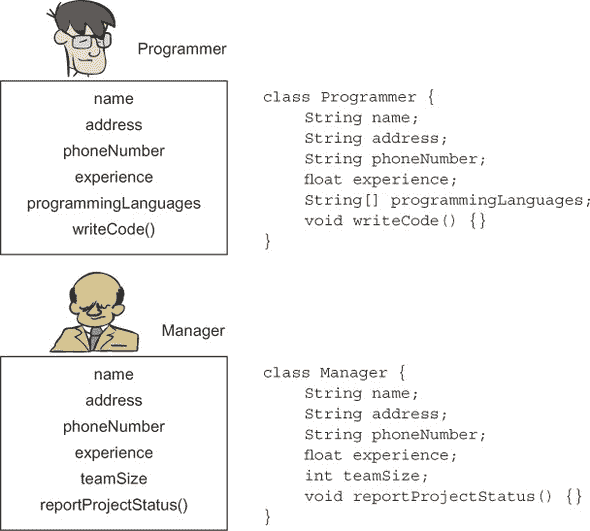

你注意到程序员和管理员类有共同属性，即`name`、`address`、`phoneNumber`和`experience`吗？下一步是将这些共同属性提取到新的位置，并命名为类似*Employee*的东西。这一步在图 6.2 中显示。

##### 图 6.2\. 识别程序员和管理员的共同属性和行为，将它们提取到新的位置，并将其命名为 Employee。

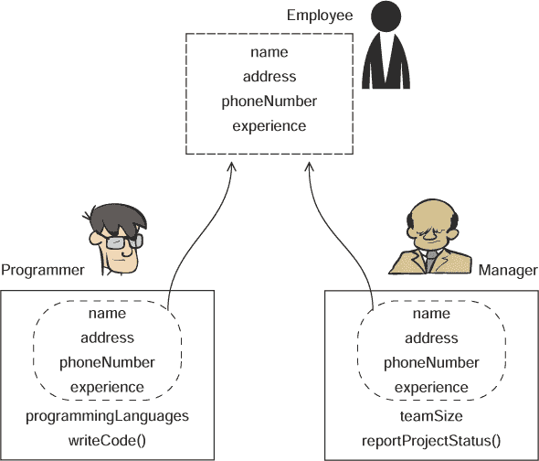

这个新位置，Employee，可以被定义为一个新的类`Employee`，它被`Programmer`和`Manager`类继承。一个类使用关键字`extends`来*继承*一个类，如图 6.3 所示。

##### 图 6.3\. `Programmer`和`Manager`类扩展了`Employee`类。

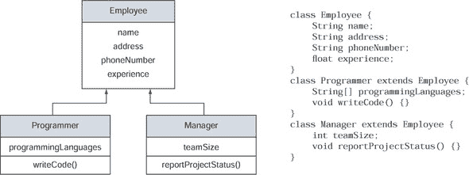

继承一个类也被称为*子类化*。在图 6.3 中，继承的类`Employee`也被称为*超类*、*基类*或*父类*。继承`Employee`类的`Programmer`和`Manager`类被称为*子类*、*派生类*、*扩展类*或*子类*。

你认为为什么需要将共同属性和行为提取到单独的类`Employee`中，并使`Programmer`和`Manager`类继承它？下一节将介绍继承类的益处。

#### 6.1.2\. 益处

你知道在 Java 中，所有类都隐式或显式地继承自 `java.lang.Object` 类吗？扩展一个类提供了多个好处。让我们回顾上一节中使用的示例，以突出继承类的优势。

##### 较小的派生类定义

如果你需要编写更专业的类，例如具有与 `Employee` 类相同常见特性和行为的 `Astronaut` 和 `Doctor` 类，会发生什么？有了 `Employee` 类，你只需定义 `Astronaut` 和 `Doctor` 类特有的变量和方法，并让这些类继承 `Employee`。

图 6.4 是 `Astronaut`、`Doctor`、`Programmer` 和 `Manager` 类的 UML 表示，包括从 `Employee` 类继承和不继承的情况。如图所示，当这些类继承自 `Employee` 类时，它们的定义更小。

##### 图 6.4\. `Astronaut`、`Doctor`、`Programmer` 和 `Manager` 类的大小差异，包括和不包括从 `Employee` 类继承

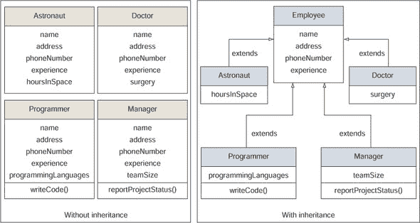

|  |
| --- |

##### 注意

本书使用的示例被简化和泛化，以便你可以专注于正在覆盖的概念。它们没有考虑所有现实世界的场景。例如，在某个特定项目中，宇航员或医生可能不是某个组织的雇员。

|  |
| --- |

##### 修改公共属性和行为容易

如果你的老板介入并告诉你，所有这些专业类——`Astronaut`、`Doctor`、`Programmer` 和 `Manager`——现在都应该有一个属性 `facebookId`，会发生什么？图 6.5 显示，在基类 `Employee` 存在的情况下，你只需将这个变量添加到基类中。如果你没有从 `Employee` 类继承，你需要将变量 `facebookId` 添加到这四个类中的每一个。

##### 图 6.5\. 向所有类添加新的属性 `facebookId`，包括和不包括基类 `Employee`

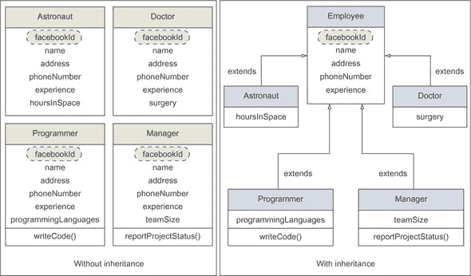

注意，可以从基类 `Employee` 中相对容易地修改和删除公共代码。

##### 可扩展性

与层次树中的基类一起工作的代码可以与后来使用继承添加的所有类一起工作。

假设一个组织需要向所有员工发送邀请，并且它使用以下方法来这样做：

```
class HR {
    void sendInvitation(Employee emp) {
        System.out.println("Send invitation to" +
                                     emp.name + " at " + emp.address);
    }
}
```

因为 `sendInvitation` 方法接受类型为 `Employee` 的参数，所以你也可以传递一个 `Employee` 的子类给它。本质上，这种设计意味着你可以使用之前的方法与后来定义的具有 `Employee` 作为其基类的类一起使用。继承使得代码可扩展。

##### 使用基类中的经过验证的代码

你不需要重新发明轮子。有了继承，子类可以使用基类中的经过验证的代码。

##### 专注于你类的专业行为

继承一个类使你能够专注于定义你类特殊行为的变量和方法。继承让你能够使用基类中已经定义的现有代码，而无需自己定义它。

##### 逻辑结构和分组

当多个类继承一个基类时，这会创建一个逻辑组。例如，请参阅图 6.5。类`Astronaut`、`Doctor`、`Programmer`和`Manager`都被分组为类`Employee`的类型。

| |
| --- |

##### 考试技巧

继承使你能够重用已经由类定义的代码。继承可以通过扩展一个类来实现。

| |
| --- |

下一个部分将解决如何在派生类中直接访问基类继承成员的神秘。

#### 6.1.3\. 派生类在其内部包含其基类的对象

类`Programmer`和`Manager`继承类`Employee`中定义的非私有变量和方法，并直接使用它们，就像它们是在它们自己的类中定义的一样。检查以下代码：

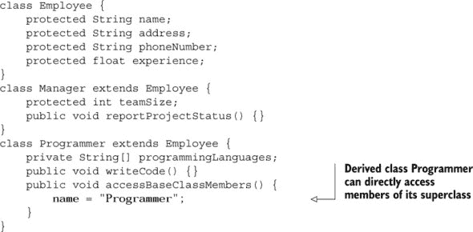

如何让类`Programmer`为在类`Employee`中定义的变量赋值？你可以这样考虑这种安排：当一个类继承另一个类时，它在其内部封装了一个继承类的对象。因此，继承类的所有非私有成员（变量和方法）都对类可用，如图 6.6 所示。

##### 图 6.6\. 派生类的对象可以访问其基类对象的功能。

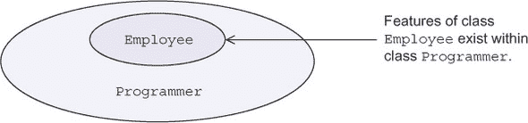

但是派生类不能继承其基类的所有成员。接下来的两个部分将讨论哪些基类成员被派生类继承，哪些不被继承。

#### 6.1.4\. 哪些基类成员被派生类继承？

访问修饰符在确定派生类中基类成员的继承中起着重要作用。派生类只能继承它能看到的。派生类继承其基类的所有非私有成员。派生类继承具有以下可访问级别的基类成员：

+   *默认—*只有当基类和派生类位于同一包中时，具有默认访问权限的成员才可以在派生类中访问。

+   `protected`—具有`protected`访问权限的成员对所有派生类都是可访问的，无论基类和派生类定义在哪个包中。

+   `public`—具有`public`访问权限的成员对所有其他类都是可见的。

| |
| --- |

##### 考试技巧

派生类只能继承它能看到的。

| |
| --- |

#### 6.1.5\. 哪些基类成员不被派生类继承？

派生类不继承以下成员：

+   基类的`private`成员。

+   如果基类和派生类存在于不同的包中，则具有默认访问权限的基类成员。

+   基类构造函数。派生类可以调用基类的构造函数，但它并不继承它们（第 6.5 节 讨论了派生类如何使用隐式引用 `super` 调用基类的构造函数）。

除了继承其基类的属性和行为外，派生类还可以定义额外的属性和行为，如下一节所述。

#### 6.1.6\. 派生类可以定义额外的属性和行为

尽管派生类与它们的基类相似，但它们通常也有差异。派生类可以定义额外的属性和行为。您可能在考试中看到关于派生类如何与其基类不同的明确问题。

快速回顾一下 图 6.5。所有派生类——`Manager`、`Programmer`、`Doctor` 和 `Astronaut`——都定义了额外的变量、方法或两者兼而有之。派生类还可以定义自己的构造函数和 `static` 方法以及变量。派生类还可以 *隐藏* 或 *重写* 它的基类成员。

当派生类定义了一个与基类中定义的名称相同的实例或类变量时，只有这些新变量和方法对使用派生类的代码可见。当派生类通过重新定义方法来为从基类继承的方法定义不同的代码时，此方法被视为一个特殊方法——一个 *重写* 方法。

您可以通过使用具体类或 `abstract` 类作为基类来实现继承，但您应该注意一些重要的区别。这些将在下一节中讨论。

#### 6.1.7\. 抽象基类与具体基类

图 6.2 和 6.3 展示了如何提取 `Programmer` 和 `Manager` 的公共属性和行为，并将这些表示为一个新的类，`Employee`。如果您认为它只是一个分类，而在现实生活中并没有真正的 `Employee` 存在——也就是说，如果所有员工实际上都是 *Programmer* 或 *Manager*，那么您可以将 `Employee` 类定义为 `abstract` 类。这就是 `abstract` 类的本质：它将派生类的公共属性和行为分组，但它阻止自己被实例化。此外，一个 `abstract` 类可以通过将其定义为 `abstract` 方法（一个没有主体的方法）来 *强制* 所有派生类为其行为定义自己的实现。

|  |
| --- |

##### 注意

第 6.6.1 节 包含了抽象类使用示例：它如何强制其派生类实现 `abstract` 方法。

|  |
| --- |

`abstract`类不一定要定义`abstract`方法。但如果`abstract`基类定义了一个或多个`abstract`方法，该类必须被标记为`abstract`，并且所有具体的派生类都必须实现这些`abstract`方法。如果一个派生类没有实现其基类定义的所有`abstract`方法，那么它也需要是一个`abstract`类。

对于考试，你需要记住使用`abstract`基类实现继承的重要要点：

+   你永远不能创建`abstract`类的对象。

+   基类可以定义为`abstract`类，即使它没有定义任何`abstract`方法。

+   派生类应该实现其基类中所有的`abstract`方法。如果不实现，它必须被定义为`abstract`派生类。

+   你可以使用`abstract`基类的变量来引用其派生类的对象（详细讨论见第 6.3 节）。

本章的第一个故事转折练习询问你关于基类和派生类之间的关系（答案见附录）。

##### 故事转折 6.1

修改之前例子中使用的代码如下。以下哪个选项是修改后代码的正确选项？

```
class Employee {
    private String name;
    String address;
    protected String phoneNumber;
    public float experience;
}
class Programmer extends Employee {
    Programmer (String val) {
        name = val;
    }
    String getName() {
        return name;
    }
}
class Office {
    public static void main(String args[]) {
        new Programmer ("Harry").getName();
    }
}
```

1.  `Office`类打印出`Harry`。

1.  派生类`Programmer`不能为其基类`Employee`中定义的变量定义一个 getter 方法。

1.  派生类`Programmer`在其构造函数中不能访问其基类`Employee`中的变量-。

1.  `new Programmer ("Harry").getName();` 并不是创建`Programmer`类对象的正确方式。

1.  编译错误。

##### 要记住的术语和定义

以下是一份你应该记住的术语及其对应定义的列表；它们贯穿整个章节，你将在回答 OCA Java SE 8 程序员 I 考试中关于继承的问题时遇到它们。

+   ***基类***—被另一个类继承的类。在之前的例子中，`Employee`是`Programmer`和`Manager`的*基类*。

    +   *超类*—一个基类也被称为*超类*。

    +   *父类*—基类也被称为*父类*。

+   ***派生类***—从另一个类继承的类。在之前的例子中，`Programmer`和`Manager`是*派生类*。

    +   *子类*—派生类也被称为*子类*。

    +   *扩展类*—派生类也被称为*扩展类*。

    +   *子类*—派生类也被称为*子类*。

+   ***“是”关系***—基类和派生类之间共享的关系。在之前的例子中，`Programmer`是`Employee`的“是”。`Manager`是`Employee`的“是”。因为派生类代表基类的一种特殊类型，所以派生类*是*基类的一种。

+   `extends`—类用来继承另一个类，接口用来继承另一个接口的关键字。

+   `implements`—类用来实现接口的关键字（接口将在下一节中介绍）。

| |
| --- |

##### 注意

术语*base class*、*superclass*和*parent class*可以互换使用。同样，术语*derived class*和*subclass*也可以互换使用。

| |
| --- |

在本节中，你了解到一个`abstract`类可以定义`abstract`方法。让我们更进一步，讨论接口。在下一节中，我们将讨论为什么需要接口以及如何使用它们。

### 6.2\. 使用接口

| |
| --- |

[7.1] 描述继承及其优点

| |
| --- |
| |

[7.5] 使用抽象类和接口

| |
| --- |

我们在生活中经常使用接口。例如，当你称呼某人为*runner*时，你是否关心那个人是否也是一位演说家、一个家长或一个企业家？你只关心那个人是否能够*run*。术语*runner*使你能够通过为每个人打开一个小窗口来访问只适用于那个人作为跑步者能力的操作。只有当那个人支持与跑步相关的特征时，那个人才能被称为跑步者，尽管具体的行为可能取决于个人。

在前面的例子中，你可以将术语*runner*与 Java 接口进行比较，该接口定义了所需的操作*run*。接口可以定义一组行为（方法）和常量。通常，它将行为的实现委托给实现它的类。接口用于引用具有相同行为集的多个相关或不相关的对象。图 6.7 将接口*runner*与一个小的*窗口*与一个对象进行比较，该对象只关注该对象的运行能力。

##### 图 6.7。你可以将一个可以连接多个对象但对其访问有限的用户界面与一个窗口进行比较。

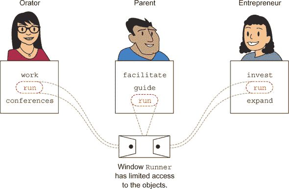

同样，当你使用接口设计应用程序时，你可以使用类似的窗口（也称为*specifications*或*contracts*）来指定你需要从对象中获取的行为，而不关心对象的特定类型。

| |
| --- |

##### 注意

你可以将*contract*与一组由人员相互接受的规定或可交付成果进行比较。合同可能包括一组必须遵守的规定或必须在特定日期前提供的可交付成果。合同通常不包括如何遵守所陈述的规定或如何使可交付成果可访问。它只说明*什么*，而不说明*如何*。同样，接口定义了由实现它的类支持的*什么*行为。

| |
| --- |

将所需行为与其实现分离有许多好处。作为一个应用程序设计者，你可以使用接口来*建立*从对象中所需的行为，从而提高设计的灵活性（可以创建并稍后使用实现接口的新类）。接口使应用程序易于管理、可扩展，并减少由于现有类型更改而传播错误的倾向。

现在想象你之前在应用程序中创建了一个接口。应用程序需要升级，这需要向其一些接口添加额外的行为。在 Java 7 或其早期版本中，这是不可能的。但是，随着 Java 8 的推出，你可以在不破坏现有实现的情况下向接口添加方法。在 Java 8 之前，接口只能定义`抽象`方法。随着 Java 8 的推出，接口可以为其方法定义默认实现（这样就不会阻止实现它的现有类编译）。Java 8 中的接口还可以定义`静态`方法。这种语言变化（向接口添加默认和`静态`方法）的主要原因之一是为了改进过时的 Collections API，特别是基于 Stream 的功能（由 OCP 考试涵盖）。

在本节中，你将了解使用接口的需求和重要性，以及可以在接口中定义的不同类型的方法。你将处理接口成员的隐式和显式属性——它的常量和方法。你还将看到为什么不允许继承多个类，但允许继承多个接口。让我们从接口的需求开始。 

#### 6.2.1\. 使用接口的需求

你需要接口来使多个类能够支持一组行为。让我们以第 6.1 节中使用的示例为例。在这个例子中，`Employee`是基类，`Programmer`和`Manager`类是`Employee`的子类。想象一下，你的老板介入并声明`Programmer`和`Manager`*必须*支持额外的行为，如表 6.1 中列出。

##### 表 6.1\. 需要由`Programmer`和`Manager`类支持的其他行为

| 实体 | 新的预期行为 |
| --- | --- |
| 程序员 | 参加培训 |
| 经理 | 参加培训，进行面试 |

你将如何完成这项任务？你可以采取的一种方法是在`Employee`类中定义所有相关的方法。因为`Programmer`和`Manager`都扩展了`Employee`类，所以它们将能够访问这些方法。但是等等：`Programmer`不需要进行面试的行为；只有`Manager`应该支持进行面试的功能。

另一种明显的方法是在所需的类中定义相关的方法。你可以在 `Manager` 类中定义面试方法，在 `Programmer` 和 `Manager` 类中定义参加培训的方法。再次强调，这并不是一个理想解决方案。如果你的老板后来告诉你，所有参加培训的 `Employee` 都应该接受一个**培训计划**；也就是说，定义“参加培训”行为的方法签名发生了变化？你能为这种行为定义单独的类，并让 `Programmer` 和 `Manager` 类实现它们吗？不，你不能。Java 不允许一个类继承多个类（本章后面的部分将介绍）。

让我们尝试接口。创建两个接口来定义指定的行为：

```
interface Trainable {
    public void attendTraining();
}

interface Interviewer {
    public void conductInterview();
}
```

虽然 Java 不允许一个类从多个类中继承，但它允许一个类实现多个接口。一个类使用 `implements` 关键字来实现接口。在下面的代码中，`Programmer` 和 `Manager` 类实现了相关的接口（修改后的代码用粗体表示）：

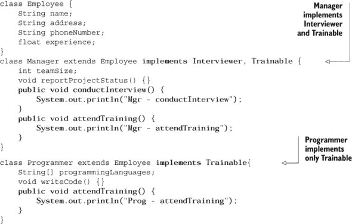

图 6.8 使用 UML 图显示了这些类之间的关系。

##### 图 6.8\. `Employee`、`Programmer` 和 `Manager` 类以及 `Trainable` 和 `Interviewer` 接口之间的关系

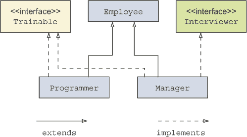

| |
| --- |

##### 注意

在 UML 图中，可以使用带有文本 <<interface>> 的矩形或简单地使用一个圆来表示接口。这两种表示法都很流行；你可能会在各种网站或书籍中看到它们。

| |
| --- |

前面的关系也可以表示如图 6.9 所示，其中接口被定义为圆。

##### 图 6.9\. `Employee`、`Programmer` 和 `Manager` 类以及 `Trainable` 和 `Interviewer` 接口之间的关系，接口用圆表示

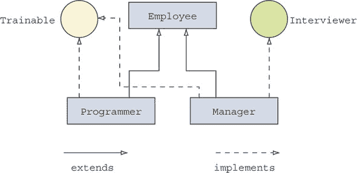

#### 6.2.2\. 定义接口

你可以在接口中定义方法和常量。声明接口很简单，但不要让这种简单性误导你。对于考试来说，了解添加到接口成员中的隐式修饰符非常重要。接口的所有方法都是隐式 `public` 的。接口变量是隐式 `public`、`static` 和 `final` 的。让我们定义一个名为 `Runner` 的接口，它定义了一个 `abstract` 方法 `speed` 和一个变量 `distance`。图 6.10 展示了在编译过程中如何向接口 `Runner` 的成员添加隐式修饰符。

##### 图 6.10\. 接口的所有方法都是隐式公共的。它的变量是隐式公共的、静态的和最终的。

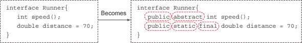

你认为为什么这些隐式修饰符被添加到接口成员中？因为接口用于定义契约，限制对其成员的访问是没有意义的——因此它们隐式为公共。接口不能被实例化，因此其变量的值应在静态上下文中定义和访问，这使得它们隐式为静态。

考试还将测试你对接口声明各个组件的了解，包括访问和非访问修饰符。以下是接口声明组件的完整列表：

+   访问修饰符

+   非访问修饰符

+   接口名称

+   如果接口扩展了任何接口，则所有扩展的接口

+   接口体（变量和方法），包含在一对花括号 `{}` 内

要包含所有可能的组件，让我们修改接口 `Runner` 的声明：

```
public strictfp interface Runner extends Athlete, Walker {}
```

接口 `Runner` 的组件在 图 6.11 中展示。要声明任何接口，*必须* 包含关键字 `interface`、接口名称以及其体，由 `{}` 标记。

##### 图 6.11\. 接口声明的组件

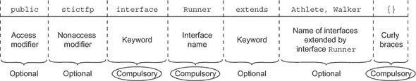

接口的可选和必选组件可以总结如下，见 表 6.2。

##### 表 6.2\. 接口声明的可选和必选组件

| 必选 | 可选 |
| --- | --- |
| 关键字 `interface` | 访问修饰符 |
| 接口名称 | 非访问修饰符 |
| 接口体，由开闭花括号 `{}` 标记 | 关键字 `extends`，以及基接口的名称（与类不同，接口可以扩展多个接口。） |
|  |

##### 考试技巧

接口声明不能包含类名。接口永远不会扩展任何类。

|  |
| --- |

你能定义一个顶级、*受保护的*接口吗？不，你不能。对于考试，你必须知道关于接口声明中每个组件正确值的答案。让我们深入了解这些细微差别。

##### 接口的有效访问修饰符

你可以声明一个 *顶级接口*（不在任何其他类或接口中声明的接口），仅以下访问级别：

+   `public`

+   无修饰符（默认访问）

如果你尝试使用其他访问修饰符（`protected` 或 `private`）声明顶级接口，你的接口将无法编译。以下 `MyInterface` 接口的定义将无法编译：


|  |
| --- |

##### 考试技巧

所有的顶级 Java 类型（类、枚举和接口）只能使用两种访问级别声明：`public` 和默认。内部或嵌套类型可以使用任何访问级别声明。

|  |
| --- |

##### 接口成员的有效访问修饰符

接口的所有成员——变量、方法、内部接口和内部类（是的，一个接口可以在其中定义一个类！）——都是隐式公共的，因为这是它们唯一可以接受的修饰符。使用其他访问修饰符会导致编译错误：

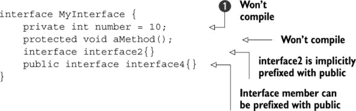

代码在  处编译失败，错误信息如下：

```
illegal combination of modifiers: public and private
    private int number = 10;
```

##### 接口的有效非访问修饰符

你只能使用以下非访问修饰符声明顶级接口：

+   `abstract`

+   `strictfp`

| |
| --- |

##### 注意

`strictfp`关键字确保所有平台上的所有浮点计算结果都是相同的。

| |
| --- |

如果你尝试使用其他非访问修饰符（`final`、`static`、`transient`、`synchronized`或`volatile`）来声明顶级接口，该接口将无法编译。以下所有接口声明都无法编译，因为它们使用了无效的非访问修饰符：

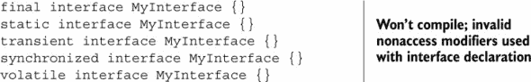

#### 6.2.3\. 接口中的方法类型

Oracle 对 Java 8 中的接口进行了根本性的改变。除了`abstract`方法外，接口还可以定义具有默认实现的方法。它还可以定义`static`方法。以下是一个快速列表，列出了可以在接口中定义的方法类型（在 Java 8 中）：

+   `abstract` 方法

+   默认方法（Java 8 新增）

+   `static` 方法（Java 8 新增）

让我们逐一详细考察这些内容。

| |
| --- |

##### 注意

默认方法也被称为**防御者**或**虚拟扩展方法**。但最常用的术语来指代它们是**默认方法**，因为使用了`default`关键字来识别它们。

| |
| --- |

##### 抽象方法

大多数工作都需要候选人接受面试，面试官可以是 CEO、技术领导或程序员。尽管这些类别中的每一个都支持**面试官**的行为，但它们将以自己的特定方式**`conductInterview`**。

一个`abstract`方法用于**指定**一种行为（方法集），它必须由实现它的类定义。这是另一种表达“一个类**支持**一种行为，但以它喜欢的方式”的方式。在以下示例中，接口`Interviewer`定义了一个`abstract`方法`conductInterview`。

一个`abstract`方法没有方法体：

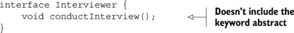

你可以在接口中包含关键字`abstract`来定义一个`abstract`方法。以下对方法`conductInterview`的定义与前面代码中的定义相同：


| |
| --- |

##### 考试技巧

接口方法隐式地是`abstract`的。要定义**默认**或**静态**方法，你必须显式地在接口中用`default`或`static`关键字声明方法。默认和`static`方法在接口中包含它们的实现。

| |
| --- |

当一个类实现包含`abstract`方法的一个接口时，该类必须实现所有方法，否则类无法编译。开发者不能在不破坏现有实现的情况下向接口添加`abstract`方法。这只能通过默认方法来实现。

##### 默认方法

想象一下，你需要在接口`Interviewer`发布后添加一个行为——*提交面试状态*。在没有 Java 7 及其早期版本的情况下，这不可能实现，除非需要为每个现有的具体类提供实现（直接或通过超类）。*默认方法*可以在这里救你。从 Java 8 开始，接口可以通过添加具有默认实现的方法来扩展。实现类可以选择覆盖这些方法以定义它们自己的特定行为。如果它们选择不覆盖它们，则使用接口中的默认实现。默认方法的定义*必须*包含关键字`default`：

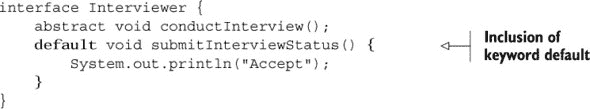

我故意在前面的代码中简化了`submitInterviewStatus()`，以便代码专注于默认方法的定义，而不是其实现细节。

|  |
| --- |

##### Java 8 新增功能

接口方法可以使用*default*方法定义一个实现。

|  |
| --- |

因为前一个方法`submitInterviewStatus`的返回类型是`void`，所以以下对方法`submitInterviewStatus`的定义是有效的：

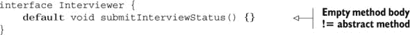

尽管前一个示例中的方法在其主体中未定义任何代码，但它并不等同于一个`abstract`方法。默认方法的声明必须后跟使用`{}`标记的方法体。以下代码无法编译：

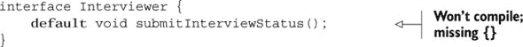

正如常规方法一样，默认方法的返回类型必须与它返回的值的类型匹配。以下代码无法编译：

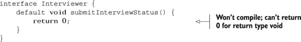

##### 静态方法

回顾前一个章节中使用的`Interviewer`接口。想象一下，你需要一个实用（静态）方法，可以在特定日期和时间预订面试的会议室。在 Java 8 中，你可以向接口添加`static`方法。在 Java 8 之前，接口不允许定义`static`方法。在这种情况下，你需要在一个单独的类中定义所需的`static`方法。这是允许在接口中使用`static`方法的主要原因之一——为了改进过时的 Collections API，该 API 包括一些仅用于定义`static`方法的类（如`Collections`和`Paths`）。

|  |
| --- |

##### 注意

`static`接口方法允许你在它们所属的接口中定义实用方法。

|  |
| --- |

让我们在接口`Interviewer`（加粗）中添加一个`static`方法`bookConferenceRoom`：

```
interface Interviewer {
    abstract void conductInterview();
    default void submitInterviewStatus() {
        System.out.println("Accept");
    }
    static void bookConferenceRoom(LocalDateTime dateTime, int duration) {
        System.out.println("Interview scheduled on:" + dateTime);
        System.out.println("Book conference room for: "+duration + " hrs");
    }
}
```

方法`bookConferenceRoom()`必须通过在调用前加上接口名称来调用。你不能使用类型为`Interviewer`或实现此接口的类的引用变量来调用它。让我们定义实现`Interviewer`接口的类`Manager`和尝试调用`bookConferenceRoom`方法的类`Project`：

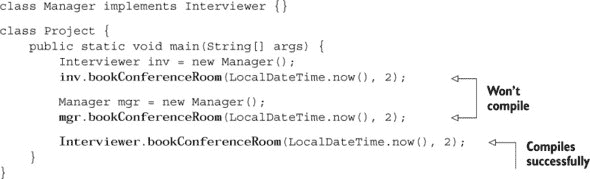

有趣的是，对于`mgr.bookConferenceRoom()`，编译器指出`bookConferenceRoom`方法在`Manager`类型中未定义。

|  |
| --- |

##### 考试技巧

接口中的`static`方法不能使用引用变量调用。它*必须*使用接口名称来调用。

|  |
| --- |

与前面的代码相比，你可以通过使用引用变量或类名来调用在类中定义的`static`方法：

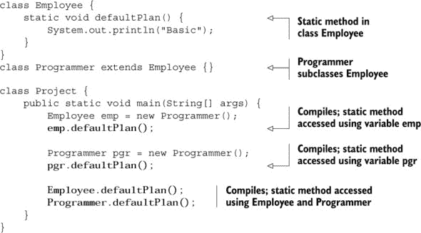

在前面的例子中，`static`方法`defaultPlan`是在`Employee`类中定义的，该类是`Programmer`类的子类。`Project`类定义了类型为`Employee`和`Programmer`的引用变量，并使用`Programmer`实例初始化它们。要执行`defaultPlan()`，你可以使用类型为`Employee`和`Programmer`的引用变量`emp`和`pgr`，或者使用类名：`Employee`或`Programmer`。

|  |
| --- |

##### 考试技巧

与接口不同，如果你在基类中定义一个`static`方法，它可以通过引用变量或类名来访问。

|  |
| --- |

#### 6.2.4\. 实现单个接口

当一个类实现一个接口时，它必须遵循一系列规则。

##### 实现抽象方法

如果一个具体类没有实现它所实现的接口中的`abstract`方法，则无法编译：

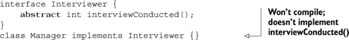

你认为以下代码会编译吗？

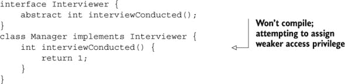

|  |
| --- |

##### 考试技巧

你必须使用显式的访问修饰符`public`来实现接口的`abstract`方法。

|  |
| --- |

当你在类中实现接口方法时，它遵循方法重写规则：

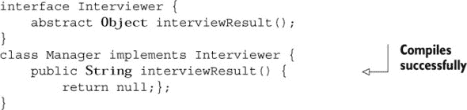

但以下代码无法编译：

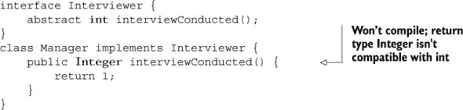

##### 重写默认方法

一个类可能会选择重写它所实现的接口中的默认方法。如果不这样做，将使用接口方法的默认实现。在以下示例中，`Manager`类实现了`Interviewer`接口，但没有重写默认方法`submitInterview-Status()`：

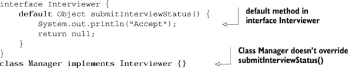

让我们在`Manager`类中重写`submitInterviewStatus()`方法的默认实现。当一个类重写默认方法时，它不使用`default`关键字。同时，它遵循方法重写规则：

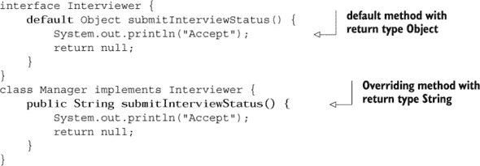

|  |
| --- |

##### 考试技巧

在重写默认方法时，你不可以使用`default`关键字。重写默认方法和常规方法的规则相同。

|  |
| --- |

##### 静态方法

如果一个接口定义了一个`static`方法，实现它的类可以定义一个具有相同名称的`static`方法，但接口中的方法与类中定义的方法无关。在以下示例中，`Manager`类中的`bookConference-Room`方法没有重载或覆盖在`Interviewer`接口中定义的`bookConference-Room`方法。这从这些方法的返回类型（加粗显示）中可以看出：

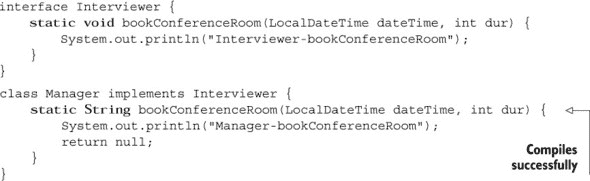

| |
| --- |

##### 考试技巧

类中的`static`方法和它实现的接口之间没有关系。类中的`static`方法不会隐藏或覆盖它实现的接口中的`static`方法。

| |
| --- |

你认为为什么 Java 不允许一个类继承多个类，却允许一个类实现多个接口？我将在下一节详细说明。

#### 6.2.5\. 一个类不能扩展多个类

在 Java 中，一个类不能扩展多个类。让我们通过一个例子来检查原因，其中类`Programmer`*可以*继承两个类：`Employee`和`Philanthropist`。图 6.12 显示了这些类之间的关系以及相应的代码。

##### 图 6.12\. 如果允许一个类扩展多个类会发生什么？

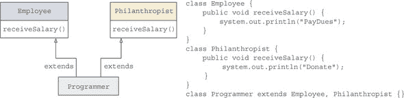

如果`Programmer`类继承了`Employee`和`Philanthropist`中定义的`receiveSalary`方法，你认为`Programmer`会如何处理他们的薪水：缴纳会费（像`Employee`一样）还是捐赠（像`Philanthropist`一样）？你认为以下代码的输出会是什么？

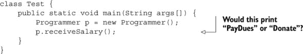

在这种情况下，`Programmer`类可以访问两个具有相同方法签名但不同实现的`receiveSalary`方法，因此无法解析这个方法调用。这就是为什么 Java 不允许类继承多个类的原因。

| |
| --- |

##### 考试技巧

因为派生类可能从多个基类继承相同方法签名的不同实现，Java 不允许多重继承。

| |
| --- |

#### 6.2.6\. 一个类可以实现多个接口

在前面的章节中，我们讨论了类不能继承多个类。但一个类可以实现多个接口。为什么 Java 不允许一个类继承多个类，却允许一个类实现多个接口呢？在 Java 8 之前，接口只能定义`抽象`方法。所以即使一个类从不同的接口继承同名方法，它也没有实现。

但在 Java 8 中，接口也可以定义默认方法——包含实现的方法。因此，当一个类实现多个接口时，它必须遵守一组规则。

| |
| --- |

##### 考试技巧

只有当遵守一组规则时，一个类才能扩展多个接口。

| |
| --- |

##### 实现具有相同常量名称的多个接口

一个类可以实现具有相同常量名称的多个接口，只要对这些接口的调用不是模糊的。在以下示例中，类`Animal`可以成功编译。它没有使用它实现的接口`Moveable`和`Jumpable`中定义的常量`MIN_DISTANCE`：

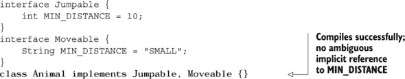

如果你修改了类`Animal`的实现细节，使其引用变量`MIN_DISTANCE`而不在前面加上接口名称，那么它将无法编译：

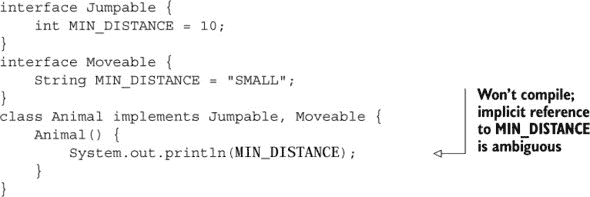

当用接口名称作为前缀时，对`MIN_DISTANCE`的引用就不再模糊了：

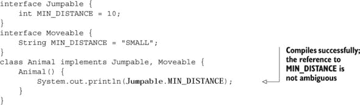

如果对接口（s）中定义的常量的隐式引用不是模糊的，实现接口的类可以引用它，而不需要在前面加上接口名称：

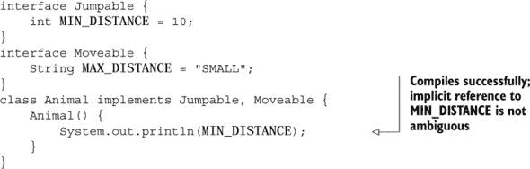

|  |
| --- |

##### 考试技巧

一个类可以实现具有相同常量名称的多个接口，*仅当*对常量的引用不是模糊的时候。

|  |
| --- |

##### 实现具有相同抽象方法名称的多个接口

一个`abstract`方法不定义一个主体。一个类可以扩展多个定义具有相同签名的`abstract`方法的接口是可接受的，因为当一个类实现`abstract`方法时，它似乎实现了所有接口的`abstract`方法：

```
interface Jumpable {
    abstract String currentPosition();
}
interface Moveable {
    abstract String currentPosition();
}
class Animal implements Jumpable, Moveable {
    public String currentPosition() {
        return "Home";
    }
}
```

但是，你不能使一个类扩展多个定义具有相同名称的方法的接口，这些方法似乎不是正确的重载方法组合。如果你将接口`Moveable`中`currentPosition()`方法的返回类型从`String`更改为`void`，类`Animal`将无法编译。它需要实现返回类型不同的`currentPosition`方法，这是不可接受的：

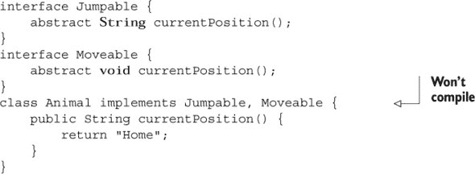

|  |
| --- |

##### 考试技巧

如果具有相同的签名或形成一组重载方法，一个类可以实现具有相同`abstract`方法名称的多个接口。

|  |
| --- |

##### 实现具有相同默认方法名称的多个接口

想象一个名为`Animal`的类，它扩展了多个接口`Moveable`和`Jumpable`，这些接口定义了具有相同名称`relax()`的默认方法。如果类`Animal`没有覆盖`relax()`的默认实现，它将无法编译：

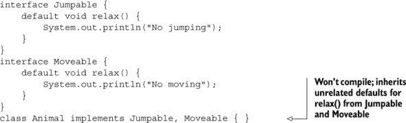

让我们修改前面的代码，以便类`Animal`覆盖`relax()`的默认实现。在这种情况下，它将成功编译：

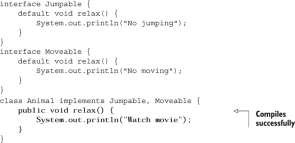

一个类从它实现的接口继承的默认方法必须形成一个正确的重载方法集，否则该类将无法编译：

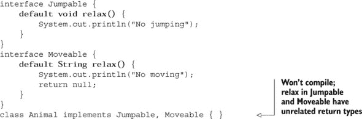

|  |
| --- |

##### 考试技巧

如果一个类覆盖了它的默认实现，它可以实现具有相同默认方法名称和签名的多个接口。

|  |
| --- |

##### 实现具有相同静态方法名称的多个接口

一个类可以实现定义了具有相同名称的 `static` 方法的多个接口，即使它们不符合正确重载或覆盖方法的条件。这是因为它们不会被实现接口的类继承：

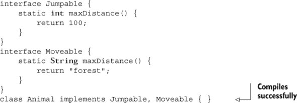

|  |
| --- |

##### 考试提示

一个类可以实现具有相同 `static` 方法名称的多个接口，无论它们的返回类型或签名如何。

|  |
| --- |

#### 6.2.7\. 扩展接口

一个接口可以扩展多个接口。当一个接口扩展另一个接口时，它必须遵循一组规则。

##### 扩展具有相同抽象方法名称的多个接口

一个 `abstract` 方法没有定义方法体。考虑以下代码，其 UML 表示形式如图 6.13 所示。接口 `MyInterface` 将继承哪个 `getName` 方法？`MyInterface` 将继承 `BaseInterface1` 中定义的 `getName` 方法还是 `BaseInterface2` 中定义的？

##### 图 6.13\. 接口 `MyInterface` 扩展了接口 `BaseInterface1` 和 `BaseInterface2`。

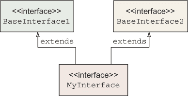

```
interface BaseInterface1 {
    String getName();
}
interface BaseInterface2 {
    String getName();
}
interface MyInterface extends BaseInterface1, BaseInterface2 {}
```

因为 `BaseInterface1` 和 `Base-Interface2` 中定义的 `getName` 方法都没有定义方法体（如图 6.14 所示），所以 `MyInterface` 继承哪个方法的问题是不相关的。接口 `MyInterface` 只能访问一个 `getName` 方法，所有实现 `MyInterface` 的具体类都必须实现此方法。

##### 图 6.14\. 接口中定义的方法没有方法体。

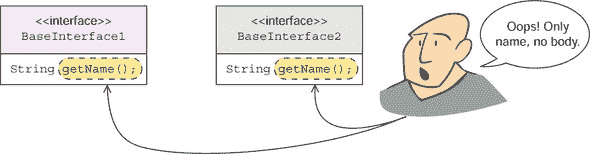

让我们使 `Employee` 类实现接口 `MyInterface`，如下所示：

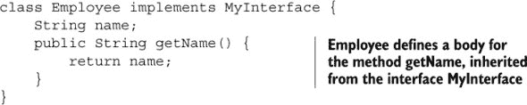

##### 扩展具有相同名称默认方法名称的多个接口

当一个接口扩展多个接口时，Java 确保它不应该为同一个方法继承多个方法实现。在下面的示例中，接口 `MyInterface` 无法编译，因为它从 `BaseInterface1` 和 `BaseInterface2` 类型中继承了与 `getName()` 无关的默认值：

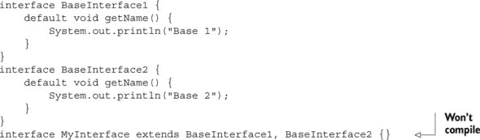

如果你覆盖了 `MyInterface` 中 `getName()` 方法的默认实现，它将能够成功编译：

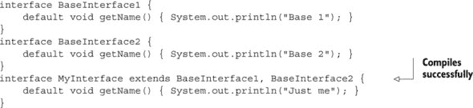

在前面的代码中，`MyInterface` 中的 `getName` 方法可以通过使用 `super` 关键字来引用超接口方法：

+   `BaseInterface1.super.getName();`

+   `BaseInterface2.super.getName();`（如果 `MyInterface` 是同时实现这两个接口的类，这也会起作用。）其他方法也可以用这种方式调用超接口方法。

在多重继承的情况下，这里有三个解决规则：

+   类总是优先：一个在类中实现的方法总是比接口默认方法有优先级。

+   否则，子接口总是优先：在更具体的接口中实现的方法比在更通用的接口（例如，超接口）中定义的方法有优先级。

+   否则，如果存在无法通过先前规则解决的歧义，那么你将遇到之前提到的案例：必须使用`super`关键字指定目标超接口。

| |
| --- |

##### 考试技巧

当一个接口扩展多个接口时，Java 确保它不应该为同一方法继承多个方法实现。

| |
| --- |

##### 使用相同静态方法名称扩展多个接口

接口可以扩展具有相同静态方法名称的多个接口：

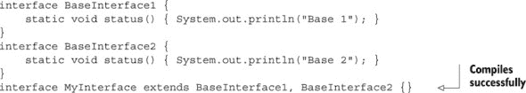

以下代码也可以成功编译，尽管`BaseInterface1`和`BaseInterface2`中`status()`方法的返回类型不相关：

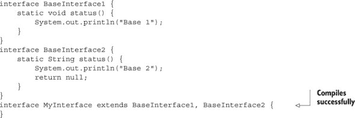

| |
| --- |

##### 考试技巧

接口可以扩展多个接口，这些接口定义了具有相同名称的`static`方法；这些方法的签名并不重要。这是因为`static`方法永远不会被继承，因此不会发生冲突。

| |
| --- |

#### 6.2.8\. 修改接口的现有方法

如果你修改接口中方法的声明会发生什么？因为你可以在一个接口中定义多种类型的方法——`abstract`、默认和`static`——这些修改将具有不同的影响。

修改接口的现有方法可能会破坏实现它的类或扩展它的接口的代码。这些修改必须遵循实现或扩展接口的规则，如前几节详细所述。

在本节中，你将看到当你通过更改接口中方法的类型（`abstract`、默认或`static`）来修改接口时会发生什么。这种更改可能会影响实现接口的类或调用修改后方法的代码。

##### 将静态方法更改为默认或抽象

在接口中，如果你将`static`方法更改为默认方法，实现类将继续编译，但调用该方法的代码将无法编译。如果你将`static`方法更改为`abstract`方法，实现类可能无法编译。代码、更改和结果如图 6.15 所示。

##### 图 6.15\. 当你将接口中的`static`方法更改为默认或`abstract`方法时会发生什么

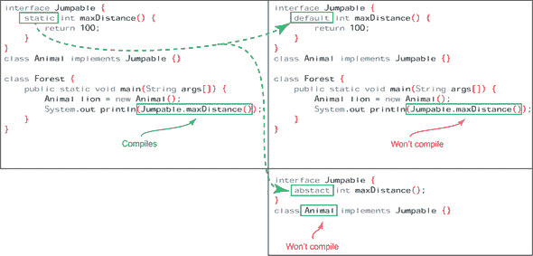

##### 将抽象方法更改为默认或静态

如果你通过将接口的`abstract`方法更改为默认方法来修改接口，调用该方法的代码将继续编译。但如果你将`abstract`方法更改为`static`方法，调用该方法的代码将无法编译。这是因为接口的`static`方法是通过在方法名称前加上接口名称来调用的。代码、修改及其结果如图 6.16 所示。

##### 图 6.16\. 当你将接口中的`abstract`方法更改为默认或`static`方法时会发生什么

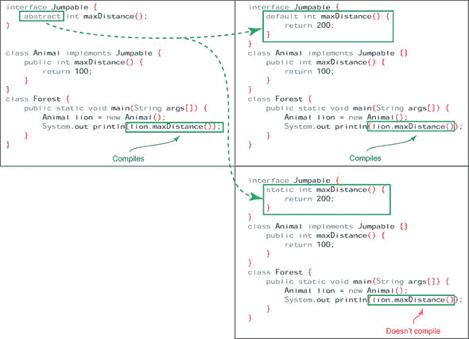

##### 将默认方法更改为抽象或静态

如果你修改了一个接口并将其默认方法更改为`abstract`方法，实现它的类可能会编译失败。如果实现类没有覆盖接口的默认方法，它将无法编译。如果你将接口的默认方法更改为`static`方法，调用该方法的代码将无法编译。代码、更改和结果在图 6.17 中显示。

##### 图 6.17\. 当你将接口中的默认方法更改为`abstract`或`static`方法时会发生什么

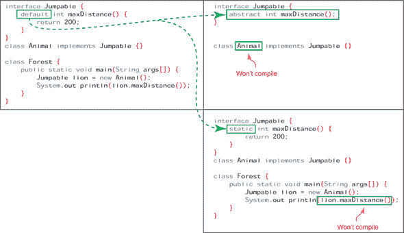

#### 6.2.9\. 接口成员的属性

接口可以定义常量和方法，这些方法隐式地分配了一组属性。

##### 接口常量

正如你已经看到的，接口的变量隐式地是`public`、`final`和`static`。所以以下接口`MyInterface`的定义

```
interface MyInterface {
    int age = 10;
}
```

等价于以下定义：


你必须在接口中初始化所有变量，否则你的代码将无法编译：


##### 接口方法

接口的方法隐式地是`public`的。当你实现一个接口时，你必须使用`public`访问修饰符来实现所有它的方法。实现接口的类不能使接口的方法更加限制性。尽管以下类和接口的定义看起来是可以接受的，但它们并不正确：


以下代码是正确的，并且可以顺利编译：


##### 接口构造函数

与类不同，接口不能定义构造函数。

你可以使用基类的引用变量来引用其派生类的对象。同样，你也可以使用实现它的类的引用变量来引用该类的对象。值得注意的是，这些变量不能访问在派生类或实现接口的类中定义的所有变量和方法。

让我们在下一节中深入探讨这个问题的更多细节。

### 6.3\. 引用变量和对象类型

|  |
| --- |

[7.2] 编写代码以演示多态的使用；包括重写和对象类型与引用类型

|  |
| --- |

对于这个考试目标，你需要理解当你引用一个对象时，*对象引用变量*的类型和被引用的*对象*的类型可能不同。但有一些规则决定了它们可以有多大的不同。这个概念可能需要一段时间才能理解，所以如果你第一次没有理解，不要担心。

就像你可以用名字、姓氏或两者来指代人一样，派生类的对象可以使用以下任何类型的引用变量来引用：

+   ***其自身类型——*** 一个`HRExecutive`类的对象可以使用类型为`HRExecutive`的对象引用变量来引用。

+   ***其超类——*** 如果类 `HRExecutive` 继承了类 `Employee`，则可以使用类型为 `Employee` 的变量来引用 `HRExecutive` 类的对象。如果类 `Employee` 继承了类 `Person`，则也可以使用类型为 `Person` 的变量来引用 `HRExecutive` 类的对象。

+   *实现接口—* 如果类 `HRExecutive` 实现了接口 `Interviewer`，则可以使用类型为 `Interviewer` 的变量来引用 `HRExecutive` 类的对象。

然而，当您尝试使用其自身类型、基类或实现接口的引用变量来访问对象时，会有所不同。让我们从使用其自身类型的变量来访问对象开始。

#### 6.3.1\. 使用派生类变量访问其自身对象

让我们从继承自类 `Employee` 并实现接口 `Interviewer` 的类 `HRExecutive` 的代码开始，如下所示：


下面有一些代码演示了可以使用类型为 `HRExecutive` 的变量来引用 `HRExecutive` 类的对象：


您可以使用类型为 `HRExecutive` 的变量 `hr` 访问在类 `Employee`、类 `HRExecutive` 和接口 `Interviewer` 中定义的字段和方法，如下所示：


当您使用其自身类型来访问 `HRExecutive` 类的对象时，您可以访问在其基类和接口中定义的所有变量和方法——即类 `Employee` 和接口 `Interviewer`。如果将引用变量的类型更改为在下一节中定义的类 `Employee`，您能做同样的事情吗？

#### 6.3.2\. 使用超类变量访问派生类对象

让我们使用类型为 `Employee` 的引用变量来访问类型为 `HRExecutive` 的对象，如下所示：


现在，让我们看看在访问类 `Employee`、类 `HRExecutive` 或接口 `Interviewer` 的成员时，更改引用变量的类型是否会有任何不同。下面的代码能否成功编译？


代码在  处无法编译，因为变量 `emp` 的类型被定义为 `Employee`。想象一下：变量 `emp` 只能看到 `Employee` 对象。因此，它只能访问在类 `Employee` 中定义的变量和方法，如图 6.18 所示。

##### 图 6.18\. 类型为 `Employee` 的变量只能看到在类 `Employee` 中定义的成员。


#### 6.3.3\. 使用实现接口的变量访问派生类对象

这里还有一个有趣的等式：当您将引用变量的类型更改为接口 `Interviewer` 时会发生什么？由于类 `HRExecutive` 实现了 `Interviewer`，因此类型为 `Interviewer` 的变量也可以用来引用 `HRExecutive` 类的对象。请看以下代码：

```
class Office {
    public static void main(String args[]) {
        Interviewer interviewer = new HRExecutive();
    }
}
```

现在尝试使用引用变量`interviewer`（它指向`HRExecutive`类的对象）来访问相同的变量和方法集：


代码在处无法编译，因为变量`interviewer`的类型被定义为`Interviewer`。想象一下：变量`interviewer`只能*访问*接口`Interviewer`中定义的方法，如图 6.19 所示。

##### 图 6.19\. 类型为`Interviewer`的变量只能看到在`Interviewer`接口中定义的成员。


#### 6.3.4\. 需要通过基类或实现接口的变量来访问对象

你可能想知道，为什么你需要基类或实现接口的引用变量来访问派生类的对象，如果变量不能访问派生类对象可用的所有成员。简单的答案是，你可能对派生类的所有成员不感兴趣。

感到困惑？比较以下情况。当你报名参加飞行课程时，你是否关心教练是否会做意大利菜或会游泳？不！你不会关心与飞行无关的特征和行为。这里还有一个例子。在办公室派对上，所有员工都受欢迎，无论他们是程序员、HRExecutive 还是 Manager，如图 6.20 所示。

##### 图 6.20\. 所有类型的员工都可以参加办公室派对。


当你使用类型为`Interviewer`的引用变量访问`HRExecutive`类的对象时，相同的逻辑也适用。当你这样做时，你只关心与`HRExecutive`作为`Interviewer`的能力相关的行为。

这种安排还使得能够创建一个数组（或列表），该数组引用了按公共基类或接口分组的不同类型的对象。以下代码段定义了一个类型为`Interviewer`的数组，并在其中存储了`HRExecutive`和`Manager`类的对象：


类`HRExecutive`扩展了类`Employee`并实现了接口`Interviewer`。因此，你可以将`HRExecutive`对象赋值给以下任何类型的变量：

+   `HRExecutive`

+   `Employee`

+   `Interviewer`

+   `Object`

请注意，这些赋值的逆操作将无法通过编译。首先，你不能使用派生类的引用变量来引用基类的对象。因为派生类的所有成员都不能通过基类的对象访问，这是不允许的。以下语句将无法编译：


因为不能创建接口的对象，所以以下代码行也将无法编译：


现在是时候尝试在你的下一个故事转折练习中添加之前定义的相关类的对象——`Employee`、`Manager` 和 `HRExecutive`——到数组中（答案在附录中）。

##### 故事转折 6.2

给定以下 `Employee`、`Manager` 和 `HRExecutive` 类以及 `Interviewer` 接口的定义，为类 `TwistInTale2` 选择正确的选项：

```
class Employee {}
interface Interviewer {}
class Manager extends Employee implements Interviewer {}
class HRExecutive extends Employee implements Interviewer {}

class TwistInTale2 {
    public static void main (String args[]) {
        Interviewer[] interviewer = new Interviewer[] {
                new Manager(),           // Line 1
                new Employee(),          // Line 2
                new HRExecutive(),       // Line 3
                new Interviewer()        // Line 4
            };
    }
}
```

1.  类 `Manager` 的对象可以被添加到接口 `Interviewer` 的数组中。第 1 行的代码将成功编译。

1.  类 `Employee` 的对象可以被添加到接口 `Interviewer` 的数组中。第 2 行的代码将成功编译。

1.  类 `HRExecutive` 的对象可以被添加到接口 `Interviewer` 的数组中。第 3 行的代码将成功编译。

1.  接口 `Interviewer` 的对象可以被添加到接口 `Interviewer` 的数组中。第 4 行的代码将成功编译。

| |
| --- |

##### 考试技巧

你可能会在考试中看到多个问题，尝试将基类对象分配给派生类引用变量。请注意，派生类可以使用超类引用变量来引用。反之则不允许，并且无法编译。

| |
| --- |

在本节中，你了解到基类或接口的变量无法访问它们所引用的对象的所有成员。不用担心；这可以通过将基类或接口的引用变量转换为它们所引用的对象的确切类型来解决，正如下一节所讨论的。

### 6.4\. 类型转换

| |
| --- |

[7.3] 确定何时需要进行类型转换

| |
| --- |

*类型转换* 是强制使变量表现得像另一个类型的变量的过程。如果一个类与另一个类或接口共享 IS-A 或继承关系，它们的变量可以转换为彼此的类型。

在 第 6.3 节 中，你了解到如果你通过类型为 `Interviewer`（实现接口）或 `Employee`（基类）的变量来引用类 `HRExecutive`（派生类），则无法访问该类的所有成员。在本节中，你将学习如何将类型为 `Interviewer` 的变量转换为类 `HRExecutive` 中定义的变量，以及为什么需要这样做。

#### 6.4.1\. 如何将变量转换为另一种类型

我们将从接口 `Interviewer` 和类 `HRExecutive` 以及 `Manager` 的定义开始：

```
class Employee {}
interface Interviewer {
    public void conductInterview();
}
class HRExecutive extends Employee implements Interviewer {
    String[] specialization;
    public void conductInterview() {
        System.out.println("HRExecutive - conducting interview");
    }
}
class Manager implements Interviewer{
    int teamSize;
    public void conductInterview() {
        System.out.println("Manager - conducting interview");
    }
}
```

创建一个类型为 `Interviewer` 的变量，并将其分配给类型为 `HRExecutive` 的对象（如图 6.21 所示）：

```
Interviewer interviewer = new HRExecutive();
```

##### 图 6.21\. 接口 `Interviewer` 的引用变量指向类 `HRExecutive` 的对象


尝试使用之前的变量访问在类 `HRExecutive` 中定义的变量 `specialization`：


上一行代码将无法编译。编译器知道变量`interviewer`的类型是`Interviewer`，并且接口`Interviewer`没有定义名为`specialization`的任何变量（如图 6.22 所示）。

##### 图 6.22。如果你尝试使用`Interviewer`接口的变量来访问在`HRExecutive`类中定义的变量`specialization`，Java 编译器将不会编译代码。


另一方面，JRE 知道变量`interviewer`所引用的对象是`HRExecutive`类型，因此你可以使用类型转换来绕过 Java 编译器，访问所引用对象的成员，如下所示（也请参见图 6.23）：

```
((HRExecutive)interviewer).specialization = new String[] {"Staffing"};
```

##### 图 6.23。可以使用类型转换通过`Interviewer`接口的变量来访问在`HRExecutive`类中定义的变量`specialization`。


在前面的示例代码中，`(HRExecutive)`放置在变量名`interviewer`之前，以将其转换为`HRExecutive`。一对括号包围了`HRExecutive`，这使 Java 知道你确信所引用的对象是`HRExecutive`类的对象。类型转换是另一种告诉 Java 的方法，“看，我知道实际所引用的对象是`HRExecutive`，尽管我正在使用类型为`Interviewer`的引用变量。”

为了绕过 Java 运算符优先级规则，需要将整个`(HRExecutive)interviewer`标记包围在括号中，根据这些规则，类型转换“运算符”（括号）的优先级低于点“运算符”（用于访问对象字段或调用方法）。

#### 6.4.2. 类型转换的需要

在第 6.3.4 节中，我讨论了使用继承类或实现接口的引用变量来引用派生类对象的需要。我还用一个报名飞行课程的例子来说明，你并不关心教练是否能做意大利菜或是否会游泳。你并不关心与飞行无关的特征和行为。

但考虑一下这种情况，你确实关心你的教练的游泳技巧。想象一下，当你正在上飞行课程时，你的朋友询问你的飞行教练是否也开设游泳课程，如果是的话，你的朋友是否可以报名。在这种情况下，就有必要了解你的飞行教练的游泳技巧。

让我们将这种情况应用到 Java 中。如果你使用任何实现接口或基类的引用变量来访问对象，你将无法访问该对象的所有成员。但是，当出现需要（如前一段所述）时，你可能会选择使用基类型或实现接口的引用变量来访问一些派生类的成员，这些成员不是明确可用的。这就是类型转换发挥作用的地方！

是时候在代码中看到这一点了。以下是一个展示需要类型转换的示例。一个应用程序维护一个面试官列表，根据面试官的类型（`HRExecutive` 或 `Manager`），它执行不同的操作集。如果面试官是 `Manager`，则只有在 `Manager` 的 `teamSize` 值大于 `10` 时，代码才会调用 `conductInterview`。以下是实现此逻辑的代码：


上述代码展示了类型转换的最佳实践，即 `interviewer instanceof Manager`。如果您省略了这个测试，代码可能会抛出 `ClassCastException`（在第 7.5.2 节中详细说明）。

### 6.5\. 使用 this 和 super 访问对象和构造函数

|  |
| --- |

[7.4] 使用 super 和 this 访问对象和构造函数

|  |
| --- |

在本节中，您将使用 `this` 和 `super` 关键字来访问对象和构造函数。`this` 和 `super` 是**隐式**对象引用。这些变量由 JVM 为其内存中的每个对象定义和初始化。

让我们检查每个这些引用变量的能力和用法。

#### 6.5.1\. 对象引用：this

`this` 引用始终指向对象的**自身实例**。任何对象都可以使用 `this` 引用来引用其自身的实例。想想看单词 *me*、*myself* 和 *I*：使用这些单词的人总是指自己，如图 6.24 所示。

##### 图 6.24\. 关键字 `this` 可以与单词 *me*、*myself* 和 *I* 相比。


##### 使用 this 访问变量和方法

您可以使用关键字 `this` 来引用类可访问的所有方法和变量。例如，以下是 `Employee` 类的修改后定义：

```
class Employee {
    String name;
}
```

变量 `name` 可以在扩展了 `Employee` 类的 `Programmer` 类中访问，如下所示：

```
class Programmer extends Employee {
    void accessEmployeeVariables() {
         name = "Programmer";
    }
}
```

因为在 `Programmer` 类中存在 `Employee` 类的成员，所以变量 `name` 可以被 `Programmer` 类的对象访问。变量 `name` 也可以在 `Programmer` 类中按如下方式访问：

```
class Programmer extends Employee {
    void accessEmployeeVariables() {
         this.name = "Programmer";
    }
}
```

只有当方法块中的代码需要区分实例变量和它的局部变量或方法参数时，才需要 `this` 引用。但一些开发者即使在不需要时也会在他们的代码中使用关键字 `this`。有些人使用 `this` 作为区分实例变量和局部变量或方法参数的手段。

图 6.25 展示了 `Employee` 类的构造函数，它使用引用变量 `this` 来区分具有相同名称的局部变量 `name` 和实例变量。

##### 图 6.25\. 使用关键字 `this` 区分方法参数和实例变量


在前面的例子中，类`Employee`定义了一个实例变量`name`。`Employee`类构造函数还定义了一个方法参数`name`，这实际上是在方法块作用域内定义的一个局部变量。因此，在先前定义的`Employee`构造函数的作用域内，存在名称冲突，局部变量将具有优先权（在第 3.1 节中介绍）。在`Employee`类构造函数块的作用域内使用`name`将隐式地引用该方法的参数，而不是实例变量。为了从`Employee`类构造函数的作用域内引用实例变量`name`，你必须使用`this`引用。

##### 使用此方法访问构造函数

你也可以通过使用关键字`this`从另一个构造函数引用一个构造函数。以下是一个例子，其中类`Employee`定义了两个构造函数，第二个构造函数调用了第一个：


要调用默认构造函数（不接受任何方法参数的构造函数），调用`this()`。以下是一个例子：


如果存在，从一个构造函数调用另一个构造函数必须在调用构造函数的第一行代码上完成。

| |
| --- |

##### 考试技巧

`this`指的是使用它的类的实例。`this`可以用来访问派生类中基类的继承成员。

| |
| --- |

##### 在接口中使用关键字 this

在 Java 8 中，你可以在接口的`default`方法中使用关键字`this`来访问其常量和其他默认和`abstract`方法。在以下示例中，接口`Interviewer`定义了一个默认方法`submitInterviewStatus`。此方法使用`this`来访问自身及其常量或方法：

```
interface Interviewer {
    int MIN_SAL = 9999;
    default void submitInterviewStatus() {
        System.out.println(this);
        System.out.println(this.MIN_SAL);
        System.out.println(this.print());
    }
    String print();
}
class Manager implements Interviewer {
    public String print() {
        return("I am " + this);
    }
}
class Foo {
    public static void main(String rags[]) {
        Interviewer m = new Manager();
        m.submitInterviewStatus();
    }
}
```

你可能会看到前面代码的类似输出：

```
Manager@19e0bfd
9999
I am Manager@19e0bfd
```

| |
| --- |

##### 考试技巧

在 Java 8 中，你可以在默认方法中使用关键字`this`来访问接口的方法和常量。

| |
| --- |

你不能使用`this`关键字来访问接口的`static`方法。

#### 6.5.2. 对象引用：super

在上一节中，我讨论了`this`如何指向对象实例本身。同样，`super`也是一个对象引用，但`super`指向类的直接父类或基类。想想看，“我的父母”，“我的基类”：使用这些术语的人总是指他们的直接父母或基类，如图 6.26 所示。

##### 图 6.26。当一个类提到`super`时，它指的是它的直接父类或基类。


##### 使用 super 访问基类的变量和方法

当这些名称之间发生冲突时，可以使用变量引用`super`来访问基类中的变量或方法。这种情况通常发生在派生类定义了与基类具有相同名称的变量和方法时。

这里是一个例子：


前面代码的输出如下：

```
Employee
Programmer
```

同样，你可以使用引用变量 `super` 来访问在基类或父类中定义的同名方法。

##### 使用 super 访问基类构造函数

引用变量 `super` 也可以在派生类中用来引用基类的构造函数。

这里有一个例子，其中基类 `Employee` 定义了一个构造函数，它为其变量分配默认值。其派生类在其自己的构造函数中调用基类构造函数。


代码在  处通过传递引用变量 `name` 和 `address` 调用超类构造函数，它自己接受这些变量。

| |
| --- |

##### 考试技巧

如果存在，派生类构造函数中对超类构造函数的调用必须是派生类构造函数中的第一条语句。否则，编译器会自动插入对 `super();`（无参数构造函数）的调用。

| |
| --- |

##### 在静态方法中使用 super 和 this

关键字 `super` 和 `this` 是隐式对象引用。因为 `static` 方法属于一个类，而不是属于类的对象，所以你无法在 `static` 方法中使用 `this` 和 `super`。尝试这样做的代码将无法编译：


是时候尝试下一个故事转折练习了，使用 `this` 和 `super` 关键字（答案见附录）。

##### 故事转折 6.3

让我们修改 `Employee` 和 `Programmer` 类的定义如下。`TwistInTale3` 类的输出是什么？

```
class Employee {
    String name = "Emp";
    String address = "EmpAddress";
}
class Programmer extends Employee{
    String name = "Prog";
    void printValues() {
        System.out.print(this.name + ":");
        System.out.print(this.address + ":");
        System.out.print(super.name + ":");
        System.out.print(super.address);
    }
}
class TwistInTale3 {
    public static void main(String args[]) {
        new Programmer().printValues();
    }
}
```

1.  `Prog:null:Emp:EmpAddress`

1.  `Prog:EmpAddress:Emp:EmpAddress`

1.  `Prog::Emp:EmpAddress`

1.  编译错误

同样，你也不能在接口中定义的 `static` 方法中使用关键字 `this`：


现在让我们转向一个非常重要的编程概念：多态。在下一节中，你将使用抽象类和接口来实现它。

### 6.6\. 多态

| |
| --- |

[7.5] 使用抽象类和接口

| |
| --- |
| |

[7.2] 开发演示多态使用的代码；包括重写和对象类型与引用类型

| |
| --- |

“多态”这个词的字面意思是“多种形式”。在本章的开头，我使用了一个实际例子来解释多态的含义；同样的动作对不同生物可能具有不同的意义。动作 *吃* 对 *苍蝇* 和 *狮子* 来说有不同的意义。一只 *苍蝇* 可能吃 *花蜜*，而一只 *狮子* 可能吃 *羚羊*。生物对同一动作以独特的方式做出反应可以与 Java 中的多态相提并论。

对于考试，你需要知道 Java 中的多态是什么，为什么需要它，以及如何在代码中实现它。

#### 6.6.1\. 类的多态

当一个类继承另一个类，并且基类和派生类都定义了具有相同方法签名（相同的方法名和方法参数）的方法时，就会出现类多态的情况。正如前文所述，一个对象也可以使用其基类的引用变量来引用。在这种情况下，根据执行方法的对象类型，Java 运行时会执行基类或派生类中定义的方法。

让我们通过`Employee`、`Programmer`和`Manager`这三个类来考虑多态性，其中`Programmer`和`Manager`类继承自`Employee`类。图 6.27 展示了这些类之间的关系。

##### 图 6.27\. `Employee`、`Programmer`和`Manager`类之间的关系


我们首先从`Employee`类开始，它并不确定为了开始一个项目的工作必须做什么（执行`startProjectWork`方法）。因此，`startProjectWork`方法被定义为`abstract`方法，而`Employee`类被定义为`abstract`类，如下所示：


`Programmer`类继承自`Employee`类，这意味着它能够访问在`Employee`中定义的`reachOffice`方法。`Programmer`类还必须实现从`Employee`继承来的`abstract`方法`startProjectWork`。你认为程序员通常会怎样开始一个编程项目的工作？很可能是，程序员会定义类并对它们进行单元测试。这种行为包含在`Programmer`类的定义中，该类实现了`start-ProjectWork`方法，如下所示：

```
class Programmer extends Employee {
    public void startProjectWork() {
        defineClasses();
        unitTestCode();
    }
    private void defineClasses() { System.out.println("define classes"); }
    private void unitTestCode() { System.out.println("unit test code"); }
}
```

我们很幸运还有另一种特殊的员工类型，即经理，他知道如何开始一个项目的工作。你认为经理通常会怎样开始一个编程项目的工作？很可能是，经理会与客户会面，定义项目进度，并分配工作给团队成员。以下是扩展`Employee`类并实现`startProjectWork`方法的`Manager`类的定义：

```
class Manager extends Employee {
    public void startProjectWork() {
        meetingWithCustomer();
        defineProjectSchedule();
        assignRespToTeam();
    }
    private void meetingWithCustomer() {
        System.out.println("meet Customer");
    }
    private void defineProjectSchedule() {
        System.out.println("Project Schedule");
    }
    private void assignRespToTeam() {
        System.out.println("team work starts");
    }
}
```

让我们看看这个方法在不同类型的员工中是如何表现的。以下是相关的代码：


这是代码的输出（为了清晰，添加了空白行）：

```
reached office - Gurgaon, India
reached office - Gurgaon, India

define classes
unit test code

meet Customer
Project Schedule
team work starts
```

在中的代码创建了一个`Programmer`类的对象，并将其分配给一个`Employee`类型的变量。创建了一个`Manager`类的对象，并将其分配给一个`Employee`类型的变量。到目前为止，一切顺利！

现在是复杂的部分。执行了`reachOffice`方法。因为这个方法只在`Employee`类中定义，所以没有混淆，执行了相同的方法，并打印了以下内容：

```
reached office - Gurgaon, India
reached office - Gurgaon, India
```

在处的代码执行`emp1.startProjectWork()`并调用在`Programmer`类中定义的`startProjectWork`方法，因为`emp1`引用的是`Programmer`类的一个对象。以下是这个方法调用的输出：

```
define classes
unit test code
```

在处的代码执行`emp2.startProjectWork()`并调用在`Manager`类中定义的`startProjectWork`方法，因为`emp2`引用的是`Manager`类的一个对象。以下是这个方法调用的输出：

```
meet Customer
Project Schedule
team work starts
```

图 6.28 展示了这段代码。

##### 图 6.28。对象知道自己的类型，并执行它们自己类中定义的覆盖方法，即使使用基类变量来引用它们。


如本节开头所述，多态的有用之处在于对象能够在接收到相同操作时以自己的特定方式行为。在前面的例子中，使用类型为`Employee`的引用变量（`emp1`和`emp2`）来存储`Programmer`和`Manager`类的对象。当在引用变量（`emp1`和`emp2`）上调用相同的操作——即方法调用`startProjectWork`——时，每个方法调用都会导致执行相应类中定义的方法。

##### 多态方法也称为覆盖方法

快速查看以下类`Employee`、`Programmer`和`Manager`（只显示相关代码）中定义的`startProjectWork`方法：


注意，所有这些类中的`startProjectWork`方法名称相同。它们接受相同数量的方法参数，并在三个类`Employee`、`Programmer`和`Manager`中定义相同的返回类型：这是指定覆盖方法的契约。未能使用相同的方法名称、相同的参数列表或相同的返回类型不会将方法标记为覆盖方法。

##### 记住覆盖方法的规则

这里是定义覆盖方法时需要注意的规则集：

+   覆盖方法是由具有继承关系的类和接口定义的。

+   基类中覆盖方法的名称和子类中覆盖方法的名称必须相同。

+   在基类中传递给覆盖方法的参数列表必须与在子类中传递给覆盖方法的参数列表相同。

+   子类中覆盖方法的返回类型可以与基类中覆盖方法的返回类型相同或为其子类。当覆盖方法返回覆盖方法的返回类型的子类时，它被称为*协变返回类型*。

+   在基类中定义的覆盖方法可以是`abstract`方法或非`abstract`方法。

+   派生类只能覆盖非`final`方法。

+   覆盖方法的可访问修饰符可以与被覆盖的方法相同或更少限制，但不能更严格。

##### 多态方法是否总是必须是抽象的？

不，多态方法不总是必须是 `abstract`。你可以将 `Employee` 类定义为具体类，将 `startProjectWork` 方法定义为非 `abstract` 方法，仍然可以得到相同的结果（加粗部分）：

```
class Employee {
    public void reachOffice() {
        System.out.println("reached office - Gurgaon, India");
    }
    public void startProjectWork() {
        System.out.println("procure hardware");
        System.out.println("install software");
    }
}
```

由于其他类的定义（`Programmer`、`Manager` 和 `PolymorphismWithClasses`）没有变化，我没有在这里列出它们。如果你创建了一个 `Employee` 类的对象（不是其任何派生类的对象），你可以如下执行 `startProjectWork` 方法：


|  |
| --- |

##### 考试技巧

要使用类实现多态，你可以在基类中定义 `abstract` 或非 `abstract` 方法，并在派生类中重写它们。

|  |
| --- |

##### 多态能否与重载方法一起工作？

不，多态只与重写方法一起工作。重写方法具有相同数量和类型的参数，而重载方法定义了一个具有不同数量或类型的参数的方法参数列表。

重载方法只有相同的名称；JRE 将它们视为不同的方法。在重写方法的情况下，JRE 根据被调用对象的精确类型在运行时决定调用哪个方法。

是时候进行下一个故事转折练习了。像往常一样，你可以在附录中找到答案。

##### 故事转折 6.4

给定以下 `Employee` 和 `Programmer` 类的定义，以下哪个选项在 `//INSERT CODE HERE//` 处插入将定义 `run` 方法为多态方法？

```
class Employee {
    //INSERT CODE HERE// {
        System.out.println("Emp-run");
        return null;
    }
}
class Programmer extends Employee{
    String run() {
        System.out.println("Programmer-run");
        return null;
    }
}
class TwistInTale4 {
    public static void main(String args[]) {
        new Programmer().run();
    }
}
```

1.  `String run()`

1.  `void run(int meters)`

1.  `void run()`

1.  `int run(String race)`

#### 6.6.2\. 编译时和运行时变量和方法绑定

你可以使用基类的引用变量来引用派生类的对象。但是，Java 访问这些对象的变量和方法的方式有一个主要区别。在继承中，实例变量在编译时绑定，方法在运行时绑定。

|  |
| --- |

##### 注意

*绑定* 指的是解析变量或方法，这些变量或方法将用于引用变量。

|  |
| --- |

检查以下代码：


上述代码的输出如下：

```
Employee
Employee
Employee
Programmer
```

让我们逐步查看代码中发生了什么：

+    创建了一个 `Employee` 类的对象，该对象通过其自身类型的变量引用——`Employee`。

+    创建了一个 `Programmer` 类的对象，该对象通过其基类型的变量引用——`Employee`。

+    访问了在类 `Employee` 中定义的变量 `name` 并打印了 `Employee`。

+    也打印了 `Employee`。变量 `programmer` 的类型是 `Employee`。因为变量在编译时绑定，所以变量 `emp` 所引用的对象的类型并不重要。`programmer.name` 将访问在类 `Employee` 中定义的变量 `name`。

+    打印 `Employee`。因为引用变量 `emp` 的类型和它引用的对象的类型相同（`Employee`），所以在方法调用上没有混淆。

+    打印 `Programmer`。尽管使用 `Employee` 类型的引用调用了 `printName` 方法，但 JRE 知道该方法是在 `Programmer` 对象上调用的，因此执行了 `Programmer` 类中重写的 `printName` 方法。

|  |
| --- |

##### 考试技巧

在考试中要注意使用基类变量来引用派生类对象，然后访问引用对象变量和方法的情况。记住，变量在编译时绑定，而方法在运行时绑定。

|  |
| --- |

#### 6.6.3\. 接口的多态

多态也可以通过接口实现。与类多态不同，接口多态需要一个类实现一个接口。接口多态涉及实现接口的 `abstract` 或默认方法。接口还可以定义静态方法，但静态方法永远不会参与多态。

##### 抽象方法的多态

让我们从例子开始。这里有一个名为 `MobileAppExpert` 的接口，它定义了一个 `abstract` 方法 `deliverMobileApp`：

```
interface MobileAppExpert {
    void deliverMobileApp();
}
```

这里是实现了该接口和 `deliverMobileApp` 方法的 `Programmer` 和 `Manager` 类的简化版本：

```
class Employee {}
class Programmer extends Employee implements MobileAppExpert {
    public void deliverMobileApp() {
        System.out.println("testing complete on real device");
    }
}
class Manager extends Employee implements MobileAppExpert {
    public void deliverMobileApp() {
        System.out.println("QA complete");
        System.out.println("code delivered with release notes");
    }
}
```

两个类和接口之间的关系在 图 6.29 中显示。

##### 图 6.29\. `Employee`、`Programmer` 和 `Manager` 类以及 `MobileAppExpert` 接口之间的关系


在现实世界中，移动应用程序的交付对程序员和管理员有不同的含义。对于*程序员*来说，移动应用程序的交付可能需要完成在真实移动设备上的测试。但对于*管理员*来说，移动应用程序的交付可能意味着完成质量保证过程，并将代码连同任何发布说明一起移交给客户。总之，同一个消息 `deliverMobileApp` 对程序员和管理员来说会导致执行不同的步骤集。

这里有一个名为 `PolymorphismWithInterfaces` 的类，它创建了 `Programmer` 和 `Manager` 类的对象，并调用了 `deliverMobileApp` 方法：


上述代码的输出如下：

```
testing complete on real device
QA complete
code delivered with release notes
```

在 ，变量的类型是 `MobileAppExpert`。因为 `Manager` 和 `Programmer` 类实现了 `MobileAppExpert` 接口，所以也可以使用 `MobileAppExpert` 类型的引用变量来存储 `Programmer` 和 `Manager` 类的对象。

因为这两个类也扩展了 `Employee` 类，所以你可以使用 `Employee` 类型的变量来存储 `Programmer` 和 `Manager` 类的对象。但在这个情况下，你将无法调用 `deliverMobileApp` 方法，因为它对 `Employee` 类不可见。检查以下代码：


让我们看看如果将 `Employee` 类修改为实现 `MobileAppExpert` 接口会发生什么，如下所示：

```
class Employee implements MobileAppExpert {
    // code
}
interface MobileAppExpert {
    // code
}
```

现在，类 `Programmer` 和 `Manager` 只需扩展 `Employee` 类。它们不再需要实现 `MobileAppExpert` 接口，因为它们的基类 `Employee` 实现了它：

```
class Programmer extends Employee {
    // code
}
class Manager extends Employee {
    // code
}
```

通过修改后的代码，展示了类 `Employee`、`Manager` 和 `Programmer` 以及接口 `MobileAppExpert` 之间新的关系，如图 6.30 所示。

##### 图 6.30\. `Employee`、`Manager` 和 `Programmer` 类以及接口 `MobileAppExpert` 之间的修改后的关系


让我们尝试使用 `Employee` 类型的引用变量来访问 `deliverMobileApp` 方法，如下所示：


图 6.31 展示了变量 `expert1` 可以访问的内容。

##### 图 6.31\. 变量 `expert1` 可以访问的内容


|  |
| --- |

##### 考试技巧

当心那些看似参与多态的过度载方法——过度载方法并不参与多态。只有重写的方法——具有相同方法签名的那些方法——才参与多态。

|  |
| --- |

##### 默认方法的多态

当一个类实现了一个定义默认方法的接口时，该类可能或可能不会重写默认方法。在以下示例中，类 `Manager` 重写了接口 `Interviewer` 中定义的默认方法 `submitInterviewStatus`：

```
interface Interviewer {
    default Object submitInterviewStatus() {
        System.out.println("Interviewer:Accept");
        return null;
    }
}
class Manager implements Interviewer {
    public String submitInterviewStatus() {
        System.out.println("Manager:Accept");
        return null;
    }
}

class Project {
    public static void main(String args[]) {
        Interviewer interviewer = new Manager();
        interviewer.submitInterviewStatus();

        Manager mgr = new Manager();
        mgr.submitInterviewStatus();
    }
}
```

这是上述代码的输出：

```
Manager:Accept
Manager:Accept
```

在前面的代码中，尽管 `Project` 类使用接口 `Interviewer` 和 `Manager` 类的引用变量来引用 `Manager` 实例，但 `submitInterviewStatus()` 的调用被委派给了在 `Manager` 类中定义的重写方法。

这里有一个有趣的情况。想象有两个接口，`BaseInterface1` 和 `BaseInterface2`，它们定义了具有相同名称的默认方法，`getName()`。这两个接口被另一个接口 `MyInterface` 扩展，该接口重写了 `getName` 方法。现在，想象一个类 `MyClass` 实现了这三个接口。当你调用 `MyClass` 实例上的 `getName()` 时，输出是什么？它能否编译？

```
interface BaseInterface1 {
    default void getName() { System.out.println("Base 1"); }
}
interface BaseInterface2 {
    default void getName() { System.out.println("Base 2"); }
}
interface MyInterface extends BaseInterface1, BaseInterface2 {
    default void getName() { System.out.println("Just me"); }
}
class MyClass implements BaseInterface1, BaseInterface2, MyInterface {
    public static void main(String ar[]) {
        new MyClass().getName();
    }
}
```

上述代码编译成功并输出 `Just me`。在类 `MyClass` 的声明中使用接口名称 `BaseInterface1` 和 `BaseInterface2` 是多余的（重复的），因为 `MyInterface` 已经扩展了 `BaseInterface1` 和 `Base-Interface2`。所以 `MyClass` 只继承了一个默认方法 `getName` 的实现，而不是三个。它继承的是在接口 `MyInterface` 中定义的 `getName()`。

### 6.7\. 简单的 Lambda 表达式

|  |
| --- |

[9.5] 编写一个简单的 Lambda 表达式，它消费一个 Lambda 断言表达式

|  |
| --- |

本考试包括使用简单的 Lambda 表达式，以便你能够开始使用 Java 中的 *函数式编程风格*。函数式编程使你能够编写声明式代码。它让你定义 *要做什么*，而不是专注于 *如何做*。使用函数式编程，你可以将代码作为参数传递给你的方法。让我们通过比较向方法传递变量或文字值与向它们传递代码来熟悉它。

#### 6.7.1\. 比较向方法传递值与向方法传递代码

假设你需要编写方法来打印一系列数字的值，比如 1 到 10，10 到 20，等等，*而不*需要将参数传递给方法。下面是你可能编写的代码：

```
class NoMethodParameters{
    void print1To10() {
        for (int i = 1; i <= 10; i++)
            System.out.println(i);
    }
    void print10To20() {
        for (int i = 10; i <= 20; i++)
            System.out.println(i);
    }
    void print1To99() {
        for (int i = 1; i <= 99; i++)
            System.out.println(i);
    }
}
```

因为你知道如何为方法定义方法参数，你肯定会认为定义前面代码中的方法是不理智的。所以这里有一个接受方法参数的方法：

```
class WithMethodParameters {
    void printNumbers(int start, int end) {
        for (int i = start; i <= end; i++)
            System.out.println(i);
    }
}
```

下面是如何调用前面代码中定义的打印整数的方法的示例：

```
NoMethodParameters noParameters = new NoMethodParameters();
noParameters.print10To20();
noParameters.print1To99();

WithMethodParameters withParameters = new WithMethodParameters();

withParameters.printNumbers(10, 20);
withParameters.printNumbers(1, 99);
withParameters.printNumbers(100, 200);
withParameters.printNumbers(500, 1000);
```

注意你可以只定义一个方法，`printNumbers`，并用多个值调用它。让我们应用相同的逻辑来定义一个方法，传递代码，这样我们就不需要它的多个实现了。

在使用 Lambda 之前，让我们用一个不使用它们的例子来工作，以突出其优点。以下示例定义了一个类 `Emp`（包含一些实例变量）。它还定义了一个接口 `Validate`，该接口定义了一个 `abstract` 方法 `check`。它的目的是检查 `Emp` 实例的状态并返回一个 `boolean` 值：

```
interface Validate {
    boolean check(Emp emp);
}
class Emp {
    String name;
    int performanceRating;
    double salary;
    Emp(String nm, int rating, double sal) {
        name = nm;
        performanceRating = rating;
        salary = sal;
    }
    public String getName() { return name; }
    public int getPerformanceRating() { return performanceRating; }
    public double getSalary() { return salary; }
    public String toString() {
        return name + ":" + performanceRating + ":" + salary;
    }
}
```

要使用接口 `Validate`（而不使用 Lambda），你可以定义一个实现它的类或定义匿名类。因为匿名类不在这个考试中，我将定义一个实现接口 `Validate` 的类。在以下代码中，类 `ValidatePerformanceRating` 检查一个 `Emp` 实例，如果 `Emp` 实例的 `performanceRating` 大于或等于 5，则返回 `true`：

```
class ValidatePerformanceRating implements Validate{
    public boolean check(Emp emp) {
        return (emp.getPerformanceRating() >= 5);
    }
}
```

如果你想要检查 `Emp` 实例的另一个属性，比如 `name`，你需要另一个类：

```
class ValidateName implements Validate{
    public boolean check(Emp emp) {
        return (emp.getName.startsWith("P"));
    }
}
```

将前面的类——`ValidateName` 和 `ValidatePerformanceRating`——与类 `NoMethodParameters` 中的多个 `print`*`XXX`* 方法进行比较。注意在 `ValidateName` 和 `ValidatePerformanceRating` 类的 `check` 方法中，只是 `boolean` 条件在变化。下面是如何在方法中使用 `ValidateName` 或 `ValidatePerformanceRating` 实例的示例，比如 `filter` 方法：

```
class Test {
    public static void main(String args[]) {
        Emp e1 = new Emp("Shreya", 5, 9999.00);
        Emp e2 = new Emp("Paul", 4, 1234.00);
        Emp e3 = new Emp("Harry", 5, 8769.00);
        Emp e4 = new Emp("Selvan", 1, 2769.00);

        ArrayList<Emp> empArrList = new ArrayList<>();
        empArrList.add(e1);
        empArrList.add(e2);
        empArrList.add(e3);
        empArrList.add(e4);

        filter(empArrList, new ValidatePerformanceRating());
    }
    static void filter(ArrayList<Emp> list, Validate rule) {
        for (Emp e : list) {
            if (rule.check(e)) {
                System.out.println(e);
            }
        }
    }
}
```

在前面的代码中，`filter` 方法接受一个 `Emp` 的 `ArrayList` 并输出那些通过使用接口 `Validate` 的 `check` 方法检查 `Emp` 实例时返回 `true` 的实例。

如前所述，你需要创建多个类（实现接口`Validate`）以使用不同的有效性规则。除了大部分是重复的，它还非常冗长。Lambdas 来拯救！让我们删除`ValidateName`和`ValidatePerformanceRating`类的定义。为了定义验证条件，我们将使用 lambda（修改后的代码用粗体表示）：


在前面的代码中，对接受类型为`Validate`（一个接口）的方法参数的`filter`方法（没有变化）。在![num-1.jpg]处的代码定义了一个 lambda 表达式。它定义了要传递给`filter`方法的代码。将 lambda 表达式映射到`Validate`中的`check`方法签名。`check`方法接受一个方法参数，lambda 表达式也是如此，即`(e)`。`check`方法返回一个`boolean`值，lambda 表达式中的表达式`e.getPerformanceRating() >= 5`也是如此。

| |
| --- |

##### 注意

Lambdas 仅与*功能接口*一起工作——定义了恰好一个`抽象`方法的接口。

| |
| --- |

让我们在下一节深入探讨 lambda 表达式的细节。

#### 6.7.2\. Lambda 表达式的语法

让我们回顾一下之前表达式中使用的 lambda 表达式：

```
Validate validatePerfor = e -> e.getPerformanceRating() >= 5;
```

上述代码仅包含 lambda 表达式的必要部分，如图 6.32 所示。

##### 图 6.32\. 一个 Lambda 表达式及其必要部分


每个 lambda 表达式都有多个可选和必要部分：

+   参数类型（可选）

+   参数名称（必要）

+   箭头（必要）

+   大括号（可选）

+   关键字`return`（可选）

+   Lambda 体（必要）

以下是对前面 lambda 表达式的有效变体（修改用粗体表示）：

```
Validate validate = (e) -> e.getPerformanceRating() >= 5;
Validate validate = (Emp e) -> e.getPerformanceRating() >= 5;
Validate validate = (e) -> { return (e.getPerformanceRating() >= 5); };
```

在考试中，你需要识别无效的 lambda 表达式。lambda 表达式的返回值必须与接口中唯一的`抽象`方法的返回值匹配或兼容。接口`Validate`中的`check`方法声明其返回类型为`boolean`。因此以下将是无效的：


如果你尝试向 lambda 表达式传递错误数量的方法参数，代码将无法编译：


Java 8 为您的方便添加了多个功能接口。本考试仅涵盖其中之一——接口`Predicate`，将在下一节讨论。

#### 6.7.3\. 接口谓词

`Predicate`是一个功能接口。以下是该接口的部分定义：

```
public interface Predicate<T> {
    /**
     * Evaluates this predicate on the given argument.
     *
     * @param t the input argument
     * @return {@code true} if the input argument matches the predicate,
     * otherwise {@code false}
     */
    boolean test(T t);
    // rest of the code
}
```

在前面的代码中，类声明包括`<T>`，这表明`Predicate-`是一个泛型接口，它不受特定类型的限制。它可以与多种类型一起使用。泛型在 OCP Java SE 8 程序员 II 考试中详细讨论。

要在代码中使用 `Predicate`，你的方法必须接受类型为 `Predicate` 的参数，并且必须使用其公共方法 `test` 来评估一个参数。让我们修改 6.7.1 节 中使用的示例，用 `Predicate` 代替 `Validate`（加粗部分）：

```
class Test {
    public static void main(String args[]) {
        Emp e1 = new Emp("Shreya", 5, 9999.00);
        Emp e2 = new Emp("Paul", 4, 1234.00);
        Emp e3 = new Emp("Harry", 5, 8769.00);
        Emp e4 = new Emp("Selvan", 1, 2769.00);

        ArrayList<Emp> empArrList = new ArrayList<>();
        empArrList.add(e1);
        empArrList.add(e2);
        empArrList.add(e3);
        empArrList.add(e4);

        Predicate<Emp> predicate = e -> e.getPerformanceRating() >= 5;
        filter(empArrList, predicate);
    }
    static void filter(ArrayList<Emp> list, Predicate<Emp> rule) {
        for (Emp e : list) {
            if (rule.test(e)) {
                System.out.println(e);
            }
        }
    }
}
```

Java 8 也修改了许多现有的 API 方法，这些方法与函数式接口如 `Predicate` 一起工作。例如，`ArrayList` 类定义了 `removeIf` 方法，该方法接受类型为 `Predicate` 的方法参数。以下示例展示了 `removeIf` 的用法：

```
Emp e1 = new Emp("Shreya", 5, 9999.00);
Emp e2 = new Emp("Paul", 4, 1234.00);
Emp e3 = new Emp("Harry", 5, 8769.00);
Emp e4 = new Emp("Selvan", 1, 2769.00);

ArrayList<Emp> empArrList = new ArrayList<>();
empArrList.add(e1);
empArrList.add(e2);
empArrList.add(e3);
empArrList.add(e4);

for (Emp e : empArrList)
    System.out.println(e);

System.out.println("After deletion..");

empArrList.removeIf(e -> e.getName().startsWith("S"));

for (Emp e : empArrList)
    System.out.println(e);
```

以下是前述代码的输出：

```
Shreya:5:9999.0
Paul:4:1234.0
Harry:5:8769.0
Selvan:1:2769.0
After deletion..
Paul:4:1234.0
Harry:5:8769.0
```

正如你所见，前述代码中 `Predicate` 和 lambda 表达式的使用使你能够以声明式的方式编写代码。

### 6.8. 概述

我们以日常生活中的一个例子开始本章的讨论：所有生物都继承其父母的特点和行为，同样的行为（如 *繁殖*）对不同物种可能有不同的含义。继承使得现有代码可以被重用，并且可以使用类和接口来实现。一个类不能扩展超过一个类，但它可以实现多个接口。继承一个类也称为 *子类化*，被继承的类被称为 *基类* 或 *父类*。继承另一个类或实现接口的类被称为 *派生类* 或 *子类*。

正如使用姓氏或家族名称称呼某人一样，派生类的对象可以用基类或它实现的接口的变量来引用。但是，当你使用基类的变量来引用对象时，该变量只能访问在基类中定义的成员。同样，类型为接口的变量只能访问在该接口中定义的成员。即使有这种限制，你也可能希望使用基类的变量来引用对象，以便与具有共同基类的多个对象一起工作。

相关类的对象——那些具有继承关系的对象——可以被转换为另一个对象。当你希望通过引用对象的变量访问默认情况下不可用的成员时，你可能希望进行类型转换。

关键字 `this` 和 `super` 是对象引用，分别用于访问对象及其基类。你可以使用关键字 `this` 来访问类的变量、方法和构造函数。同样，关键字 `super` 用于访问基类的变量、方法和构造函数。

多态是对象执行在超类或基类中定义的方法的能力，这取决于它们的类型。具有继承关系的类表现出多态性。多态方法应在基类和继承类中定义。

你可以通过使用类或接口来实现多态。在类的多态情况下，基类可以是抽象类或具体类。这里的方法也不一定是 `abstract` 方法。当你使用接口实现多态时，你必须使用接口中的 `abstract` 方法。

Java 8 允许你以声明性方式编写代码。我们涵盖了 lambda 表达式、它们的语法以及 `Predicate` 接口。

### 6.9. 复习笔记

类的继承：

+   一个类可以继承另一个类的属性和行为。

+   一个类可以实现多个接口。

+   一个接口可以继承零个或多个接口。一个接口不能继承一个类。

+   继承使你能够使用现有代码。

+   继承一个类也称为子类化。

+   继承另一个类的类被称为派生类或子类。

+   继承的类被称为父类或基类或超类。

+   基类的私有成员不能在派生类中被继承。

+   如果基类和派生类在同一个包中，派生类只能继承具有默认访问修饰符的成员。

+   一个类使用关键字 `extends` 来继承一个类。

+   一个类使用关键字 `implements` 来实现一个接口。

+   一个类可以实现多个接口，但不能继承多个类。

+   一个 `abstract` 类可以继承一个具体类，一个具体类也可以继承一个 `abstract` 类。

使用接口：

+   接口使用关键字 `extends` 来继承另一个接口。

+   一个接口可以继承多个接口。

+   虽然在 Java 8 中接口可以为它们的方法定义默认实现，但这不是强制的。接口也可以定义 `abstract` 方法。

+   接口的声明不能包含类名。一个接口永远不能继承任何类。

+   所有的顶级 Java 类型（类、枚举和接口）只能使用两种访问级别进行声明：public 和 default。内部或嵌套类型可以使用任何访问级别进行声明。

+   `strictfp` 关键字保证了所有平台上的所有浮点计算结果都是相同的。

+   接口方法隐式地是抽象的。要定义默认或 `static` 方法，必须使用关键字 `default` 或 `static`。

+   接口方法可以通过使用默认方法来定义一个实现。

+   接口中的 `static` 方法不能使用引用变量来调用。它必须使用接口名称来调用。

+   与接口不同，如果你在基类中定义了一个 `static` 方法，它可以通过引用变量或类名来访问。

+   你必须使用显式访问修饰符 `public` 来实现接口中的 `abstract` 方法。

+   在覆盖默认方法时，你不能使用关键字 `default`。覆盖默认方法和常规方法的规则是相同的。

+   类中的`static`方法和它实现的接口之间没有关系。类中的`static`方法不会隐藏或覆盖它实现的接口中的`static`方法。

+   由于派生类可能从多个基类继承对同一方法签名的不同实现，Java 不允许多重继承。

+   如果遵循一组规则，一个类可以扩展多个接口。

    +   一个类只有在引用常量不模糊的情况下，才能实现具有相同常量名称的多个接口。

    +   一个类如果具有相同的签名或形成一组重载的方法集，则可以实现对具有相同`abstract`方法名称的多个接口的实现。

    +   如果一个类覆盖了其默认实现，则它可以实现对具有相同默认方法名称的多个接口的实现。

    +   一个类可以实现对具有相同`static`方法名称的多个接口的实现，无论它们的返回类型或签名如何。

+   当一个接口扩展多个接口时，Java 确保它不会为同一方法继承多个方法实现。

+   接口可以扩展多个定义了具有相同名称的`static`方法的接口；这些方法的签名无关紧要。

+   接口中的变量默认是公开的、最终的和静态的。

+   接口中的方法默认是公开的。

+   接口不能定义任何构造函数。

引用变量和对象类型：

+   通过继承，你也可以使用基类或接口的变量来引用派生类的对象。

+   不能使用派生类的引用变量来引用基类对象。

+   当一个对象被基类的引用变量引用时，该引用变量只能访问在基类中定义的变量和成员。

+   当一个对象被实现接口的类的引用变量引用时，该引用变量只能访问接口中定义的变量和方法。

+   你可能需要使用基类的引用变量来访问派生类的对象，以便将具有共同父类或接口的所有类分组和使用。

转型的需求：

+   转型是将变量强制表现为另一种类型变量的过程。

+   如果类`Manager`扩展了类`Employee`，并且使用类型为`Employee`的引用变量`emp`来引用类`Manager`的对象，`((Manager)emp)`将把变量`emp`转型为`Manager`。

使用`super`和`this`来访问对象和构造函数：

+   关键字`super`和`this`是对象引用。这些变量由 JVM 为内存中的每个对象定义和初始化。

+   `this`引用始终指向对象的*自身实例*。

+   你可以使用关键字`this`来引用类可访问的所有方法和变量。

+   如果一个方法定义了一个与实例变量具有相同名称的局部变量或方法参数，则必须在方法中使用`this`关键字来访问实例变量。

+   你可以使用`this`关键字从一个构造函数调用另一个构造函数。

+   使用 Java 8，你可以在默认方法中使用`this`关键字来访问接口的方法和常量。

+   接口的静态方法不能使用`this`关键字访问。

+   `super`，一个对象引用，指向类的父类或基类。

+   如果存在名称冲突，引用变量`super`可以用来访问基类中的变量或方法。这种情况通常发生在派生类定义了与基类中相同的变量和方法时。

+   引用变量`super`也可以用来在派生类中引用直接父类的构造函数。

类的多态：

+   “多态”一词的字面意思是“多种形式”。

+   在 Java 中，当类之间存在继承关系，并且基类和派生类都定义了具有相同名称的方法时，就会出现多态。

+   多态方法也称为覆盖方法。

+   覆盖方法应定义具有相同名称、相同参数列表和相同方法参数列表的方法。覆盖方法的返回类型可以是相同的，也可以是基类中覆盖方法的返回类型的子类，这称为协变返回类型。

+   覆盖方法的访问修饰符可以是同等或更少的限制，但不能比被覆盖的方法更严格。

+   如果派生类定义了一个与基类中相同名称、相同参数列表和相同返回类型的方法，则称派生类覆盖了基类中的方法。

+   如果在基类中定义的方法在派生类中被重载，那么这两个方法（基类和派生类中的方法）不是多态方法。

+   当使用类实现多态时，基类中定义的方法可能是`abstract`的，也可能不是。

+   当使用接口实现多态时，基接口中定义的方法可以是`abstract`方法，也可以是非`abstract`方法，并具有默认实现。

+   接口中的`Static`方法不参与多态。

简单的 lambda 表达式：

+   Lambda 表达式仅与功能接口一起使用——定义了恰好一个`abstract`方法的接口。

+   每个 lambda 表达式都有多个可选和必填部分：

    +   参数类型（可选）

    +   参数名称（必填）

    +   箭头（必填）

    +   花括号（可选）

    +   关键字`return`（可选）

    +   Lambda 体（必填）

### 6.10. 样例考试问题

> **Q6-1.**
> 
> 以下代码的输出是什么？
> 
> ```
> class Animal {
>     void jump() { System.out.println("Animal"); }
> }
> class Cat extends Animal {
>     void jump(int a) { System.out.println("Cat"); }
> }
> class Rabbit extends Animal {
>     void jump() { System.out.println("Rabbit"); }
> }
> class Circus {
>     public static void main(String args[]) {
>         Animal cat = new Cat();
>         Rabbit rabbit = new Rabbit();
>         cat.jump();
> 
>         rabbit.jump();
>     }
> }
> ```
> 
> 1.  ```
>     Animal
>     Rabbit
>     ```
> 1.  
> 1.  ```
>     Cat
>     Rabbit
>     ```
> 1.  
> 1.  ```
>     Animal
>     Animal
>     ```
> 1.  
> 1.  以上皆非
> 1.  
> **Q6-2.**
> 
> 给定以下代码，选择正确的语句：
> 
> ```
> class Flower {
>     public void fragrance() {System.out.println("Flower"); }
> }
> class Rose {
>     public void fragrance() {System.out.println("Rose"); }
> }
> class Lily {
>     public void fragrance() {System.out.println("Lily"); }
> }
> class Bouquet {
>     public void arrangeFlowers() {
>         Flower f1 = new Rose();
>         Flower f2 = new Lily();
>         f1.fragrance();
>     }
> }
> ```
> 
> 1.  代码的输出是
> 1.  
>     ```
>     Flower
>     ```
>     
> 1.  代码的输出是
> 1.  
>     ```
>     Rose
>     ```
>     
> 1.  代码的输出是
> 1.  
>     ```
>     Lily
>     ```
>     
> 1.  代码无法编译。
> 1.  
> **Q6-3.**
> 
> 检查以下代码，并选择正确的`//INSERT CODE HERE`处的代码声明：
> 
> ```
> interface Movable {
>     void move();
> }
> 
> class Person implements Movable {
>     public void move() { System.out.println("Person move"); }
> }
> class Vehicle implements Movable {
>     public void move() { System.out.println("Vehicle move"); }
> }
> class Test {
>     // INSERT CODE HERE
>         movable.move();
>     }
> }
> ```
> 
> 1.  `void walk(Movable movable) {`
> 1.  
> 1.  `void walk(Person movable) {`
> 1.  
> 1.  `void walk(Vehicle movable) {`
> 1.  
> 1.  `void walk() {`
> 1.  
> **Q6-4.**
> 
> 选择正确的陈述：
> 
> 1.  只有`abstract`类可以作为基类，通过类实现多态。
> 1.  
> 1.  多态方法也被称为重写方法。
> 1.  
> 1.  在多态中，根据对象的精确类型，JVM 在编译时执行适当的方法。
> 1.  
> 1.  以上皆非。
> 1.  
> **Q6-5.**
> 
> 给定以下代码，选择正确的陈述：
> 
> ```
> class Person {}
> class Employee extends Person {}
> class Doctor extends Person {}
> ```
> 
> 1.  代码通过类展示了多态性。
> 1.  
> 1.  代码通过接口展示了多态性。
> 1.  
> 1.  代码通过类和接口展示了多态性。
> 1.  
> 1.  以上皆非。
> 1.  
> **Q6-6.**
> 
> 以下哪些陈述是正确的？
> 
> 1.  继承使您能够重用现有代码。
> 1.  
> 1.  继承使您免于在多个类中修改通用代码。
> 1.  
> 1.  多态向编译器传递特殊指令，以便代码可以在多个平台上运行。
> 1.  
> 1.  多态方法不能抛出异常。
> 1.  
> **Q6-7.**
> 
> 给定以下代码，以下哪些选项是正确的？
> 
> ```
> class Satellite {
>     void orbit() {}
> }
> class Moon extends Satellite {
>     void orbit() {}
> }
> class ArtificialSatellite extends Satellite {
>     void orbit() {}
> }
> ```
> 
> 1.  在`Satellite`、`Moon`和`ArtificialSatellite`类中定义的`orbit`方法是多态的。
> 1.  
> 1.  只有在`Satellite`和`Artificial-Satellite`类中定义的`orbit`方法是多态的。
> 1.  
> 1.  只有在`ArtificialSatellite`类中定义的`orbit`方法是多态的。
> 1.  
> 1.  以上皆非。
> 1.  
> **Q6-8.**
> 
> 检查以下代码：
> 
> ```
> class Programmer {
>     void print() {
>         System.out.println("Programmer - Mala Gupta");
>     }
> }
> class Author extends Programmer {
>     void print() {
>         System.out.println("Author - Mala Gupta");
>     }
> }
> class TestEJava {
>     Programmer a = new Programmer();
>     // INSERT CODE HERE
>     a.print();
>     b.print();
> }
> ```
> 
> 以下哪行代码可以单独插入到`//INSERT CODE HERE`，以使代码的输出如下？
> 
> ```
> Programmer - Mala Gupta
> Author - Mala Gupta
> ```
> 
> 1.  `Programmer b = new Programmer();`
> 1.  
> 1.  `Programmer b = new Author();`
> 1.  
> 1.  `Author b = new Author();`
> 1.  
> 1.  `Author b = new Programmer();`
> 1.  
> 1.  `Programmer b = ((Author)new Programmer());`
> 1.  
> 1.  `Author b = ((Author)new Programmer());`
> 1.  
> **Q6-9.**
> 
> 给定以下代码，以下哪个选项单独应用时可以使代码成功编译？
> 
> ```
> Line1>    interface Employee {}
> Line2>    interface Printable extends Employee {
> Line3>        String print();
> Line4>    }
> Line5>    class Programmer {
> Line6>        String print() { return("Programmer - Mala Gupta"); }
> Line7>    }
> Line8>    class Author extends Programmer implements Printable, Employee {
> Line9>        String print() { return("Author - Mala Gupta"); }
> Line10>   }
> ```
> 
> 1.  在第 2 行将代码修改为`interface Printable{`
> 1.  
> 1.  在第 3 行将`publicStringprint();`修改为`public void print();`
> 1.  
> 1.  在第 6 行和第 9 行将`print`方法的可访问性定义为`public`。
> 1.  
> 1.  在第 8 行修改代码，使其仅实现`Printable`接口。
> 1.  
> **Q6-10.**
> 
> 以下代码的输出是什么？
> 
> ```
> class Base {
>     String var = "EJava";
>     void printVar() {
>         System.out.println(var);
>     }
> }
> class Derived extends Base {
>     String var = "Guru";
>     void printVar() {
>         System.out.println(var);
>     }
> }
> class QReference {
>     public static void main(String[] args) {
>         Base base = new Base();
>         Base derived = new Derived();
>         System.out.println(base.var);
>         System.out.println(derived.var);
>         base.printVar();
>         derived.printVar();
>     }
> }
> ```
> 
> 1.  ```
>     EJava
>     EJava
>     EJava
>     Guru
>     ```
> 1.  
> 1.  ```
>     EJava
>     Guru
>     EJava
>     Guru
>     ```
> 1.  
> 1.  ```
>     EJava
>     EJava
>     EJava
>     EJava
>     ```
> 1.  
> 1.  ```
>     EJava
>     Guru
>     Guru
>     Guru
>     ```

### 6.11. 样本考试问题的答案

> **Q6-1.**
> 
> 以下代码的输出是什么？
> 
> ```
> class Animal {
>     void jump() { System.out.println("Animal"); }
> }
> class Cat extends Animal {
>     void jump(int a) { System.out.println("Cat"); }
> }
> class Rabbit extends Animal {
>     void jump() { System.out.println("Rabbit"); }
> }
> class Circus {
>     public static void main(String args[]) {
>         Animal cat = new Cat();
>         Rabbit rabbit = new Rabbit();
>         cat.jump();
>         rabbit.jump();
>     }
> }
> ```
> 
> 1.  ```
>     Animal
>     Rabbit
>     ```
> 1.  
> 1.  ```
>     Cat
>     Rabbit
>     ```
> 1.  
> 1.  ```
>     Animal
>     Animal
>     ```
> 1.  
> 1.  以上皆非
> 1.  
> 答案：a
> 
> 说明：尽管 `Cat` 和 `Rabbit` 类看起来重写了 `jump` 方法，但 `Cat` 类没有重写 `Animal` 类中定义的 `jump()` 方法。`Cat` 类定义了一个带有 `jump` 方法的参数，这使得它成为一个重载方法，而不是重写方法。因为 `Cat` 类扩展了 `Animal` 类，它有权访问以下两个重载的 `jump` 方法：
> 
> ```
> void jump() { System.out.println("Animal"); }
> void jump(int a) { System.out.println("Cat"); }
> ```
> 
> 以下代码行创建了一个 `Cat` 类的实例并将其赋值给一个 `Animal` 类型的变量：
> 
> ```
> Animal cat = new Cat();
> ```
> 
> 当你调用先前对象的 `jump` 方法时，它执行了没有接受任何方法参数的 `jump` 方法，并打印以下值：
> 
> ```
> Animal
> ```
> 
> 以下代码将打印 `Animal` 而不是 `Cat`：
> 
> ```
> Cat cat = new Cat();
> cat.jump();
> ```
> 
> **Q6-2.**
> 
> 给定以下代码，选择正确的语句：
> 
> ```
> class Flower {
>     public void fragrance() {System.out.println("Flower"); }
> }
> class Rose {
>     public void fragrance() {System.out.println("Rose"); }
> }
> class Lily {
>     public void fragrance() {System.out.println("Lily"); }
> }
> class Bouquet {
>     public void arrangeFlowers() {
>         Flower f1 = new Rose();
>         Flower f2 = new Lily();
>         f1.fragrance();
>     }
> }
> ```
> 
> 1.  代码的输出是
> 1.  
>     ```
>     Flower
>     ```
>     
> 1.  代码的输出是
> 1.  
>     ```
>     Rose
>     ```
>     
> 1.  代码的输出是
> 1.  
>     ```
>     Lily
>     ```
>     
> 1.  **代码无法编译。**
> 1.  
> 答案：d
> 
> 说明：尽管代码似乎使用类实现了多态，但请注意，`Rose` 或 `Lily` 类都没有扩展 `Flower` 类。因此，类型为 `Flower` 的变量不能用来存储 `Rose` 或 `Lily` 类的实例。以下代码行将无法编译：
> 
> ```
> Flower f1 = new Rose();
> Flower f2 = new Lily();
> ```
> 
> **Q6-3.**
> 
> 检查以下代码，并选择在 `//INSERT CODE HERE` 处插入的正确方法声明：
> 
> ```
> interface Movable {
>     void move();
> }
> class Person implements Movable {
>     public void move() { System.out.println("Person move"); }
> }
> class Vehicle implements Movable {
>     public void move() { System.out.println("Vehicle move"); }
> }
> class Test {
>     // INSERT CODE HERE
>         movable.move();
>     }
> }
> ```
> 
> 1.  **`void walk(Movable movable) {`**
> 1.  
> 1.  **`void walk(Person movable) {`**
> 1.  
> 1.  **`void walk(Vehicle movable) {`**
> 1.  
> 1.  `void walk() {`
> 1.  
> 答案：a, b, c
> 
> 说明：你需要在 `Test` 类中插入代码，使得以下代码行能够工作：
> 
> ```
> movable.move();
> ```
> 
> 因此，选项 (d) 是不正确的。因为 `Test` 类没有定义任何实例方法，所以问题中的代码行能够执行的唯一方式是将方法参数 `movable` 传递给 `walk` 方法。
> 
> 选项 (a) 是正确的。因为接口 `Movable` 定义了方法 `move`，所以你可以将它的类型变量传递给 `move` 方法。
> 
> 选项 (b) 是正确的。因为类 `Person` 实现了接口 `Movable` 并定义了方法 `move`，所以你可以将它的类型变量传递给 `walk` 方法。使用这个版本的 `walk` 方法，你可以传递一个 `Person` 类的实例或其任何子类的实例。
> 
> 选项 (c) 是正确的。因为类 `Vehicle` 实现了接口 `Movable` 并定义了方法 `move`，所以你可以将它的类型变量传递给 `walk` 方法。使用这个版本的 `walk` 方法，你可以传递一个 `Vehicle` 类的实例或其任何子类的实例。
> 
> **Q6-4.**
> 
> 选择正确的语句：
> 
> 1.  只有 `abstract` 类可以作为基类来实现类之间的多态。
> 1.  
> 1.  **多态方法也称为重写方法。**
> 1.  
> 1.  在多态中，根据对象的精确类型，JVM 在编译时执行适当的方法。
> 1.  
> 1.  以上皆非。
> 1.  
> 答案：b
> 
> 选项（a）是不正确的。为了使用类实现多态，可以使用`abstract`类或具体类作为基类。
> 
> 选项（c）是不正确的。首先，编译时不会执行任何代码。代码只能在运行时执行。在多态中，确定要执行的确切方法被推迟到运行时，并且由需要调用方法的对象的确切类型决定。
> 
> **Q6-5.**
> 
> 给定以下代码，选择正确的陈述：
> 
> ```
> class Person {}
> class Employee extends Person {}
> class Doctor extends Person {}
> ```
> 
> 1.  代码展示了类多态性。
> 1.  
> 1.  代码展示了接口的多态性。
> 1.  
> 1.  代码展示了类和接口的多态性。
> 1.  
> 1.  **以上都不正确。**
> 1.  
> 答案：d
> 
> 解释：给定的代码在`Person`类中没有定义任何在`Employee`和`Doctor`类中被重新定义或实现的方法。尽管`Employee`和`Doctor`类扩展了`Person`类，但所有三个多态概念或设计原则都是基于方法的，而这些类中缺少这种方法。
> 
> **Q6-6.**
> 
> 以下哪个陈述是正确的？
> 
> 1.  **继承使你能够重用现有代码。**
> 1.  
> 1.  **继承可以让你避免在多个类中修改公共代码。**
> 1.  
> 1.  多态向编译器传递特殊指令，以便代码可以在多个平台上运行。
> 1.  
> 1.  多态方法不能抛出异常。
> 1.  
> 答案：a, b
> 
> 解释：选项（a）是正确的。继承允许你通过扩展一个类来重用现有代码。这样，在基类中已经定义的功能不需要在派生类中重新定义。基类提供的功能可以在派生类中访问，就像它是在派生类中定义的一样。
> 
> 选项（b）是正确的。公共代码可以放在基类中，所有派生类都可以扩展它。如果需要对这部分公共代码进行修改，可以在基类中进行修改。修改后的代码将对所有派生类可用。
> 
> 选项（c）是不正确的。多态不会向编译器传递任何特殊指令以使 Java 代码在多个平台上执行。Java 代码可以在多个平台上执行，因为 Java 编译器编译成虚拟机代码，这是平台无关的。不同的平台实现了这个虚拟机。
> 
> 选项（d）是不正确的。多态方法可以抛出异常。
> 
> **Q6-7.**
> 
> 给定以下代码，哪些选项是正确的？
> 
> ```
> class Satellite {
>     void orbit() {}
> }
> class Moon extends Satellite {
>     void orbit() {}
> }
> class ArtificialSatellite extends Satellite {
>     void orbit() {}
> }
> ```
> 
> 1.  **在`Satellite`、`Moon`和`Artificial-Satellite`类中定义的`orbit`方法是多态的。**
> 1.  
> 1.  只有在`Satellite`和`Artificial-Satellite`类中定义的`orbit`方法是多态的。
> 1.  
> 1.  只有在`ArtificialSatellite`类中定义的`orbit`方法是多态的。
> 1.  
> 1.  以上都不正确。
> 1.  
> 答案：a
> 
> 解释：所有这些选项都定义了类。当在具有继承关系的类中定义具有相同方法签名的类时，这些方法被认为是多态的。
> 
> **Q6-8.**
> 
> 检查以下代码：
> 
> ```
> class Programmer {
>     void print() {
>         System.out.println("Programmer - Mala Gupta");
>     }
> }
> class Author extends Programmer {
>     void print() {
>         System.out.println("Author - Mala Gupta");
>     }
> }
> class TestEJava {
>     Programmer a = new Programmer();
>     // INSERT CODE HERE
>     a.print();
>     b.print();
> }
> ```
> 
> 以下哪行代码可以单独插入到 `//INSERT CODE HERE` 以使代码的输出如下？
> 
> ```
> Programmer - Mala Gupta
> Author - Mala Gupta
> ```
> 
> 1.  `Programmer b = new Programmer();`
> 1.  
> 1.  **`Programmer b = new Author();`**
> 1.  
> 1.  **`Author b = new Author();`**
> 1.  
> 1.  `Author b = new Programmer();`
> 1.  
> 1.  `Programmer b = ((Author)new Programmer());`
> 1.  
> 1.  `Author b = ((Author)new Programmer());`
> 1.  
> 答案：b, c
> 
> 解释：选项 (a) 是错误的。此代码可以编译，但由于引用变量和对象都是 `Programmer` 类型，调用此对象的 `print` 方法将打印 `Programmer - Mala Gupta`，而不是 `Author - Mala Gupta`。
> 
> 选项 (d) 是错误的。不能将基类对象赋值给派生类引用变量。
> 
> 选项 (e) 是错误的。此行代码可以成功编译，但在运行时将因 `ClassCastException` 而失败。基类对象不能被转换为派生类对象。
> 
> 选项 (f) 是错误的。表达式 `((Author)new Programmer())` 在被分配给 `Author` 类型的引用变量之前就被评估了。此行代码也尝试将基类对象 `Programmer` 转换为其派生类对象 `Author`。此代码也可以成功编译，但在运行时将因 `ClassCastException` 而失败。使用 `Author` 类型的引用变量在这里没有区别。这里重要的是 `new` 操作符后面的类型。
> 
> **Q6-9.**
> 
> 给定以下代码，以下哪个选项单独应用后可以使代码成功编译？
> 
> ```
> Line1>    interface Employee {}
> Line2>    interface Printable extends Employee {
> Line3>        String print();
> Line4>    }
> Line5>    class Programmer {
> Line6>        String print() { return("Programmer - Mala Gupta"); }
> Line7>    }
> Line8>     class Author extends Programmer implements Printable, Employee {
> Line9>        String print() { return("Author - Mala Gupta"); }
> Line10>    }
> ```
> 
> 1.  将第 2 行的代码修改为 `interface Printable {`
> 1.  
> 1.  将第 3 行的代码修改为 `public String print();`
> 1.  
> 1.  **在第 6 行和第 9 行将 `print` 方法的访问权限定义为 `public`。**
> 1.  
> 1.  将第 8 行的代码修改为仅实现接口 `Printable`。
> 1.  
> 答案：c
> 
> 解释：接口中的方法默认是 `public` 的。实现接口的非 `abstract` 类必须实现接口中定义的所有方法。在重写或实现方法时，实现的方法的访问权限必须是 `public`。重写的方法不能被赋予比 `public` 弱的访问权限。
> 
> 选项 (a) 是错误的。接口 `Printable` 扩展接口 `Employee` 以及类 `Author` 实现这两个接口时没有问题。
> 
> 选项 (b) 是错误的。在行 3 上添加访问修饰符到 `print` 方法对现有代码没有任何影响。接口中定义的方法默认是 `public` 的。
> 
> 选项 (d) 是错误的。当一个接口扩展另一个接口时，类实现两个接口没有问题。
> 
> **Q6-10.**
> 
> 以下代码的输出是什么？
> 
> ```
> class Base {
>     String var = "EJava";
>     void printVar() {
>         System.out.println(var);
>     }
> }
> class Derived extends Base {
>     String var = "Guru";
>     void printVar() {
>         System.out.println(var);
>     }
> }
> class QReference {
>     public static void main(String[] args) {
> 
>         Base base = new Base();
>         Base derived = new Derived();
>         System.out.println(base.var);
>         System.out.println(derived.var);
>         base.printVar();
>         derived.printVar();
>     }
> }
> ```
> 
> 1.  ```
>     EJava
>     EJava
>     EJava
>     Guru
>     ```
> 1.  
> 1.  ```
>     EJava
>     Guru
>     EJava
>     Guru
>     ```
> 1.  
> 1.  ```
>     EJava
>     EJava
>     EJava
>     EJava
>     ```
> 1.  
> 1.  ```
>     EJava
>     Guru
>     Guru
>     Guru
>     ```
> 1.  
> 答案：a
> 
> 解释：在继承中，实例变量在编译时绑定，而方法在运行时绑定。以下代码行使用类型为 `Base` 的引用变量引用了 `Base` 类的对象。因此，以下两行代码都打印 `EJava`：
> 
> ```
> System.out.println(base.var);
> base.printVar();
> ```
> 
> 但以下代码行使用类型为 `Base` 的引用变量引用了 `Derived` 类的对象：
> 
> ```
> Base derived = new Derived();
> ```
> 
> 因为实例变量在编译时绑定，所以以下代码行访问并打印了在 `Base` 类中定义的实例变量的值：
> 
> ```
> System.out.println(derived.var);    // prints EJava
> ```
> 
> 在 `derived.printVar()` 中，尽管使用类型为 `Base` 的引用调用了 `printVar` 方法，但 JVM 知道该方法是在 `Derived` 对象上调用的，因此执行了 `Derived` 类中重写的 `printVar` 方法。
