## 第七章\. 异常处理

| 本章涵盖的考试目标 | 你需要了解的内容 |
| --- | --- |
| **[8.3]** 描述异常处理的优点。 | 异常处理器需求和优点。 |
| **[8.1]** 区分检查型异常、非检查型异常和错误。 | 检查型异常、RuntimeExceptions 和错误之间的差异和相似之处。这些异常和错误在代码中处理方式上的差异和相似之处。 |
| **[8.2]** 创建 try-catch 块并确定异常如何改变正常程序流程。 | 如何创建 try-catch-finally 块。当封装的代码抛出异常或错误时的代码流程。如何创建嵌套的 try-catch-finally 块。 |
| **[8.4]** 创建并调用一个抛出异常的方法。 | 如何创建抛出异常的方法。覆盖或被覆盖的方法抛出或未抛出异常的规则。当调用方法抛出异常时，如何确定控制流的流程。如何将此应用于没有 try 块抛出异常以及从 try 块（带有适当的和不足的异常处理器）抛出的情况。抛出或未抛出异常的方法调用差异。 |
| **[8.5]** 识别常见的异常类（如 NullPointerException、Arithmetic-Exception、ArrayIndexOutOfBounds-Exception、ClassCastException） | 如何识别可能抛出这些异常的代码，并适当地处理它们。 |

想象一下，你即将登机前往日内瓦参加一个重要的会议。在最后一刻，你得知航班已被取消，因为飞行员感觉不适。幸运的是，航空公司迅速安排了备用飞行员，使得航班能够按照原定时间起飞。多么令人欣慰啊！

这个例子说明了异常条件如何可以修改动作的初始流动，并展示了适当处理这些条件的必要性。在 Java 中，一个异常条件（如飞行员生病）可能会影响正常的代码流程（航空公司航班运营）。在这种情况下，为备用飞行员所做的安排可以比作异常处理器。

根据异常条件的性质，你可能能够完全恢复，也可能不能。例如，如果地震破坏了大部分机场，航空公司管理能否让你的航班起飞？

在考试中，你将针对 Java 代码和异常被问及类似的问题。考虑到这一点，本章涵盖了以下内容：

+   理解和识别代码中出现的异常

+   确定异常如何改变正常程序流程

+   在你的代码中单独处理异常的需求

+   使用`try`-`catch`-`finally`块处理异常

+   区分检查型异常、非检查型异常和错误

+   调用可能抛出异常的方法

+   识别常见的异常类别和类

你可能会觉得本章内容很多，但请记住，我们不会深入探讨太多背景信息，因为我假设你已经知道类和方法、类继承、数组和`ArrayList`的定义和用法。本章的重点是考试目标和关于异常你需要了解的内容。

在本章中，我不会讨论带有多个`catch`子句的`try`语句、使用`try`-with-resources 语句自动关闭资源或创建自定义异常。这些主题将在 Java 认证的下一级别（在 OCP Java SE 8 程序员 II 级考试中）介绍。

### 7.1\. Java 中的异常

| |
| --- |

[8.3] 描述异常处理的优点

| |
| --- |

在本节中，你将了解 Java 中的异常是什么，为什么需要将异常处理与主代码分开，以及它们的优缺点。

#### 7.1.1\. 体验异常

在图 7.1 中，你认为在`ArrayAccess`、`OpenFile`和`MethodAccess`类中加粗的代码有什么共同点吗？

##### 图 7.1\. 体验 Java 中的异常

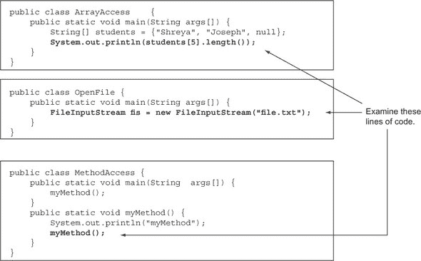

我确信，鉴于本章的标题，这个问题很容易回答。这三个陈述都与抛出异常或错误相关。让我们分别看看它们：

+   *类* `ArrayAccess`—由于数组`students`的长度是`3`，尝试访问数组位置`5`的元素是一个异常条件，如图 7.2 所示。

    ##### 图 7.2\. `ArrayIndexOutOfBoundsException`的例子

    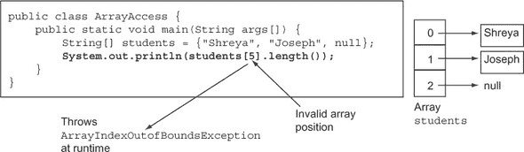

+   *类* `OpenFile`—`FileInputStream`类的构造函数抛出一个检查异常`FileNotFoundException`（如图 7.3 所示）。如果你尝试在不将其包含在`try`块中捕获它，或者标记为由`main`方法抛出（使用`throws`语句），或者捕获这个异常的情况下编译此代码，你的代码将无法编译。（我将在 7.2.3 节中详细讨论检查异常。）

    ##### 图 7.3\. `FileNotFoundException`的例子

    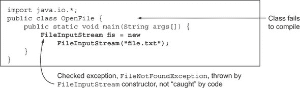

+   *类* `MethodAccess`—如图 7.4 所示，`myMethod`方法递归调用自身，没有指定退出条件。这些递归调用在运行时导致`StackOverflowError`。

    ##### 图 7.4\. `StackOverflowError`的例子

    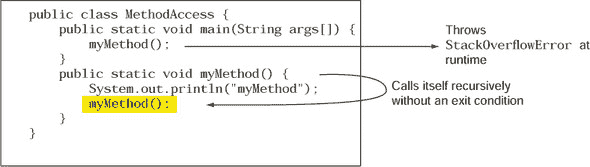

这些异常的例子在 OCA Java SE 8 程序员 I 级考试中很典型。让我们继续前进，探索 Java 中的异常及其处理，以便你能识别出抛出异常的代码并相应地处理它们。

| |
| --- |

**Java 中的文件 I/O**

文件 I/O 在本考试中不涉及，但你可能会在有关异常处理的问题中看到它被提及。在这里，我将简要介绍它，仅限于本考试所需。

文件 I/O 涉及多个类，这些类使你能够从源读取数据并将其写入。这个数据源可以是持久存储、内存，甚至是网络连接。数据可以作为二进制或字符数据的流来读取和写入。一些文件 I/O 类只从源读取数据，一些将数据写入源，还有一些两者都做。

在本章中，您将使用文件 I/O API 中的三个类：`java.io.File`、`java.io.FileInputStream`和`java.io.FileOutputStream`。`File`是对文件和目录路径名的抽象表示。您可以*打开*一个`File`，然后从中读取和写入。`FileInputStream`使用`File`类的对象获取输入字节。它定义了`read`方法来读取字节和`close`方法来关闭此流。`FileOutputStream`是用于将数据写入`File`的输出流。它定义了`write`方法来写入字节和`close`方法来关闭此流。

创建`FileInputStream`或`FileOutputStream`类的对象可能会抛出检查型异常`java.io.FileNotFoundException`。在`FileInputStream`和`FileOutputStream`类中定义的`read`、`write`和`close`方法可能会抛出检查型异常`java.io.IOException`。请注意，`FileNotFoundException`是`IOException`的子类。

| |
| --- |

#### 7.1.2. 为什么单独处理异常？

假设您想在博客网站上发布一些评论。要发表评论，您必须完成以下步骤：

1.  访问博客网站。

1.  登录您的账户。

1.  选择您想要评论的博客。

1.  发布您的评论。

上述列表可能看起来像是一组理想的步骤。在实际情况下，你可能必须验证是否完成了前面的步骤，然后才能进行下一步。修改了前面的步骤。

##### 图 7.5. 在没有单独的异常处理程序的情况下，对抗异常条件时丢失的预期代码流程

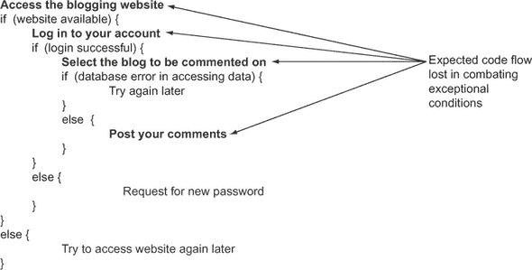

修改后的逻辑(图 7.5)要求代码在用户继续下一步之前检查条件。这种在多个地方检查条件引入了新的步骤，也引入了原始步骤的新执行路径。这些修改后的路径的难点在于，它们可能会使用户对试图完成的任务中涉及的步骤感到困惑。图 7.6 展示了异常处理如何有所帮助。

##### 图 7.6. 将异常处理代码与主代码逻辑分开定义

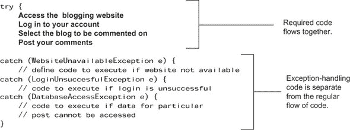

图 7.6 中的代码定义了发布博客评论所需的原始步骤，以及一些异常处理代码。由于异常处理程序是单独定义的，因此关于您需要完成哪些步骤才能在网站上发布评论的任何混淆都得到了澄清。此外，由于适当的异常处理程序，此代码在移动到下一步之前检查步骤完成的情况，没有妥协。

#### 7.1.3\. 异常处理提供其他好处吗？

除了在定义常规程序逻辑和异常处理代码之间分离关注点之外，异常还可以通过提供异常或错误的堆栈跟踪来帮助定位有问题的代码（抛出异常的代码），以及定义它的方法。

| |
| --- |

##### 注意

*堆栈跟踪* 被称为这样是因为它提供了一种回溯堆栈的方法——生成错误的方法调用序列（在 7.2 节 中详细说明）。

| |
| --- |

这里有一个例子：

```
public class Trace {                                   // line 1
    public static void main(String args[]) {           // line 2
        method1();                                     // line 3
    }                                                  // line 4
    public static void method1() {                     // line 5
        method2();                                     // line 6
    }                                                  // line 7

    public static void method2() {                     // line 8
        String[] students = {"Shreya", "Joseph"};      // line 9
        System.out.println(students[5]);               // line 10
    }                                                  // line 11
}                                                      // line 12
```

`method2()` 尝试访问 `students` 数组在索引 `5` 的元素，这是 `students` 数组的无效索引，因此代码在运行时抛出 `ArrayIndexOutOfBoundsException` 异常。图 7.7 展示了抛出此异常时的堆栈跟踪。它包括运行时异常消息和调用抛出异常的代码的方法列表，从应用程序的入口点 `main` 方法开始。您可以将 图 7.7 中的堆栈跟踪指定的行号与代码中的行号进行匹配。

##### 图 7.7\. 追踪运行时抛出异常的代码行

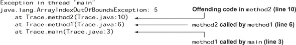

| |
| --- |

##### 注意

堆栈跟踪提供了 JVM 遇到未处理的异常时调用的方法的跟踪。堆栈跟踪是从下往上读取的。在 图 7.7 中，跟踪从 `main` 方法（堆栈跟踪的最后一行）开始，一直延续到包含抛出异常的代码的方法。根据您代码的复杂性，堆栈跟踪可以从几行到几百行代码不等。堆栈跟踪与已处理和未处理的异常都兼容。

| |
| --- |

让我们继续前进，看看异常传播的更多细节，以及创建 `try`-`catch`-`finally` 块来处理代码中的异常。

在深入了解异常处理之前，让我们看看异常的多种形式。

### 7.2\. 异常的分类

| |
| --- |

[8.1] 区分检查型异常、非检查型异常和错误

| |
| --- |

Java 编译器和其运行时以不同的方式处理异常类别。这意味着存在不同的规则来定义抛出异常的方法和处理它们的代码。

在本节中，您将了解 Java 中异常的分类：检查型异常、运行时异常和错误。

#### 7.2.1\. 识别异常类别

如 图 7.8 所示，异常可以分为三大类：

+   检查型异常

+   运行时异常

+   错误

##### 图 7.8\. 异常的分类：检查型异常、运行时异常和错误

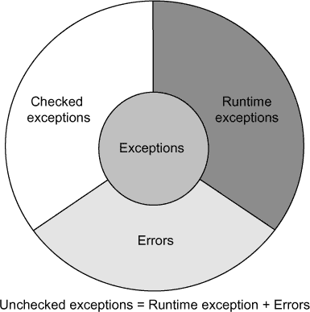

| |
| --- |

##### 注意

运行时异常和错误统称为非检查型异常。

| |
| --- |

在这三种类型中，当涉及到编码和使用方法时，检查异常需要你最多的注意。运行时异常代表编程错误。应该插入检查以防止抛出运行时异常。对于错误，你可以使用的选项很少，因为它们是由 JVM 抛出的。

对于 OCA Java SE 8 程序员 I 考试，对这三种异常类别有一个清晰的理解非常重要，包括它们的相似之处和不同之处。

#### 7.2.2\. 异常类别的类层次结构

异常类别相互关联；它们都扩展了 `java.lang.Throwable` 类（如图 7.9 所示的类层次结构）。

##### 图 7.9\. 异常类别的类层次结构

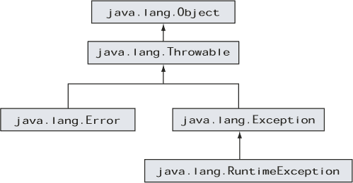

根据它们的类层次结构，以下是异常的分类：

+   *检查异常*—`java.lang.Exception` 及其子类（不包括 `java.lang.RuntimeException` 及其子类）

+   *运行时异常*—`java.lang.RuntimeException` 及其子类

+   *错误*—`java.lang.Error` 及其子类

让我们详细考察这些类别中的每一个。

#### 7.2.3\. 检查异常

当我们谈论异常处理时，*检查* 异常占据了我们的大部分注意力。

什么是检查异常？

+   检查异常是指方法作者预见到但无法直接控制的不容接受的条件 *预见*。例如，`FileNotFoundException` 是一个检查异常。如果代码尝试访问的文件找不到，就会抛出这个异常。一个方法，比如 `readFile()`，可以声明在无法访问目标文件时抛出它。

+   检查异常之所以被称为检查异常，是因为它们在编译时进行检查。如果一个方法调用抛出检查异常，编译器会检查并确保调用方法要么处理该异常，要么声明它将被重新抛出。

+   检查异常是 `java.lang.Exception` 类的子类，但它不是 `java.lang.RuntimeException` 的子类。然而，值得注意的是，`java.lang.RuntimeException` 类本身是 `java.lang.Exception` 类的子类。

|  |
| --- |

##### 考试技巧

在这次考试中，你可能需要选择使用哪种类型的引用变量来在处理程序中存储抛出的检查异常的对象。要正确回答这类问题，请记住，检查异常是 `java.lang.Exception` 的子类，但不是 `java.lang.RuntimeException` 的子类。

|  |
| --- |

检查异常是 API 的一部分，并且有很好的文档记录。以下是一个快速示例，展示了 Java API 中 `java.io.FileInputStream` 类构造函数的声明：

```
public FileInputStream(File file)
                throws FileNotFoundException
```

受检异常是在编写方法时程序员 *预见* 的不可接受的条件。通过将这些异常声明为受检异常，方法的作者让用户意识到可能由其使用引起的异常条件。使用带有受检异常的方法的用户必须相应地处理异常条件。

#### 7.2.4\. 运行时异常

虽然你将花费大部分的时间和精力来应对受检异常，但运行时异常会给你带来最多的麻烦。这尤其在你准备实际项目时更为明显。一些运行时异常的例子包括 `NullPointerException`（最常见的一种）、`ArrayIndexOutOfBoundsException` 和 `ClassCastException`。

什么是运行时异常？

+   运行时异常是编程错误的表示。这些异常通常是由于对代码的不当使用引起的。例如，`NullPointerException` 是一种运行时异常，当一段代码尝试在一个尚未分配对象且指向 `null` 的变量上执行代码时发生。另一个例子是 `ArrayIndexOutOfBoundsException`，当一段代码尝试访问一个不存在位置的数组元素时抛出。

+   运行时异常之所以被称为运行时异常，是因为在方法执行之前无法确定方法调用是否会抛出运行时异常。

+   运行时异常是 `java.lang.RuntimeException` 的子类。

+   在方法签名中声明运行时异常是可选的。是否显式声明它取决于编写代码的人。

| |
| --- |

##### 考试技巧

运行时异常和错误统称为非受检异常。

| |
| --- |

#### 7.2.5\. 错误

无论你是准备考试还是实际项目，你都需要知道 JVM 在何时抛出错误。这些错误被认为是 *严重* 的异常条件，它们不能直接被你的代码控制。

什么是错误？

+   错误是 JVM 由于处理你的代码的环境状态错误而抛出的严重异常。例如，`NoClassDefFound-Error` 是 JVM 在无法找到它应该运行的 `.class` 文件时抛出的错误。`StackOverflowError` 是 JVM 在 Java 程序所需的栈大小超过 JRE 为 Java 应用程序提供的内存时抛出的另一个错误。这个错误也可能由于无限循环或深度嵌套循环而出现。

+   错误是 `java.lang.Error` 类的子类。

+   错误不必是方法签名的一部分。

+   错误可以被异常处理器捕获，但通常不应该这样做。

让我们继续创建抛出异常的方法。

### 7.3\. 创建抛出异常的方法

| |
| --- |

[8.4] 创建并调用抛出异常的方法

| |
| --- |

在本节中，你将探索创建抛出异常的方法的需求。你还将使用`throw`和`throws`关键字来定义抛出异常的方法。

为什么你需要抛出异常的方法？想象一下，你被分配了一个找到特定书籍并阅读和向一班学生解释其内容的任务。所需的顺序如下：

1.  获取指定的书籍。

1.  大声朗读其内容。

1.  向一班学生解释内容。

但如果你找不到指定的书籍会发生什么？没有它，你无法继续执行其他操作，因此你需要向分配任务给你的人报告。这个意外事件（缺失的书籍）阻止了你完成任务。通过报告它，你希望这个请求的发起者采取纠正或替代措施。

让我们将前面的任务编码为`teachClass`方法，如图 7.10 所示，它使用了`throw`语句和`throws`子句。此示例代码仅用于演示目的，因为它使用了`BookNotFoundException`异常以及`locateBook()`、`readBook()`和`explainContents()`方法，这些方法尚未定义。

##### 图 7.10. 使用`throw`和`throws`创建可以抛出异常的方法

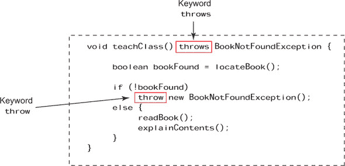

图 7.10 中的代码易于理解。在执行`throw new BookNotFoundException()`代码时，`teachClass()`的执行将停止。JVM 创建了一个`BookNotFoundException`的实例，并将其发送给`teachClass()`的调用者，以便做出替代安排。

`throw`语句用于抛出`BookNotFoundException`的实例。`throws`语句用于`teachClass()`方法的声明中，以表示它可以抛出`BookNotFoundException`。

为什么方法选择抛出异常而不是自己处理？这是调用方法与被调用方法之间的契约。参考图 7.9 中显示的`teachClass()`方法，`teachClass`的调用者希望如果`teachClass()`无法找到指定的书籍，能够得到通知。`teachClass()`方法不处理`BookNotFoundException`，因为它的职责不包括处理缺失的书籍。

前面的例子有助于确定你希望方法抛出异常而不是自己处理的情况。它展示了如何使用和比较`throw`和`throws`语句——用于抛出异常以及表示方法可能抛出异常。示例还展示了当被调用方法没有成功完成并抛出异常时，调用方法可以定义替代代码。除了测试这个逻辑之外，考试还将测试你如何创建和使用抛出检查或非检查异常和错误的方法，以及一些其他规则。

#### 7.3.1. 创建一个抛出检查异常的方法

让我们创建一个简单的方法，它不处理由它抛出的已检查异常，使用`throw`和`throws`语句。`DemoThrowsException`类定义了`readFile()`方法，它在方法声明中包含一个`throws`子句。实际抛出异常是通过`throw`语句完成的：

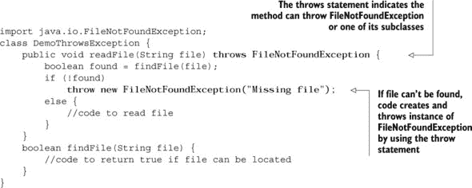

一个方法的`throws`子句可以包含多个以逗号分隔的异常类名。在方法声明中包含运行时异常或错误不是必需的。在文档中提及它们是首选方式。即使没有在`throws`子句中包含，方法仍然可以抛出运行时异常或错误。

| |
| --- |

##### 考试技巧

在语法上，您不一定需要`throw`和`throws`语句的组合来创建抛出异常（已检查或未检查）的方法。您可以用抛出异常的方法来替换`throw`语句。

| |
| --- |

#### 7.3.2\. 处理或声明规则

要使用抛出已检查异常的方法，您必须执行以下操作之一：

+   ***处理异常——*** 将代码放在`try`块中，并*捕获*抛出的异常。

+   ***声明抛出——*** 使用`throws`子句声明要抛出的异常。

+   ***处理和声明——*** 同时实现上述两种选项。

| |
| --- |

##### 考试技巧

处理或声明异常的规则也被称为*处理或声明规则*。要使用抛出已检查异常的方法，您必须处理该异常或声明它将被抛出。但此规则仅适用于已检查异常，不适用于未检查异常。

| |
| --- |

#### 7.3.3\. 创建抛出运行时异常或错误的方法

当创建一个抛出运行时异常或错误的方法时，在`throws`子句中包含异常或错误名称不是必需的。抛出运行时异常或错误的方法不受处理或声明规则的限制。

让我们通过修改前面的示例来观察这个概念的实际应用，使`readFile()`方法在传入`null`值时抛出`NullPointerException`（运行时异常）（本例中代码更改以粗体显示，并在本章的其余部分中显示）：

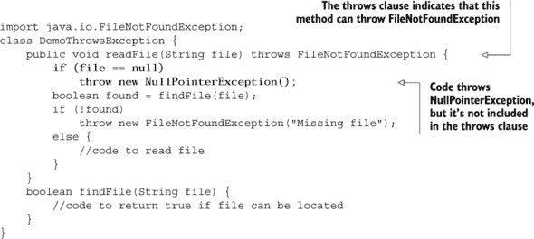

考试可能会通过在一个方法的声明中包含运行时异常和错误的名称，而在另一个方法中省略它们来欺骗您。（您可以在`throws`子句中包含未检查异常的名称，但不必这样做。）假设其余代码保持不变，以下方法声明是正确的：

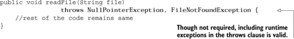

| |
| --- |

##### 考试技巧

在方法声明中添加运行时异常或错误不是必需的。无论其名称是否包含在`throws`子句中，方法都可以抛出运行时异常或错误。

| |
| --- |

#### 7.3.4\. 一个方法可以声明抛出所有类型的异常，即使它没有

在下面的示例中，`ThrowExceptions`类定义了多个方法，这些方法声明抛出不同的异常类型。即使`ThrowExceptions`类的方法不包含可能抛出这些异常的代码，该类也能成功编译：

```
class ThrowExceptions {
    void method1() throws Error {}
    void method2() throws Exception {}
    void method3() throws Throwable {}
    void method4() throws RuntimeException {}
    void method5() throws FileNotFoundException {}
}
```

虽然一个`try`块可以定义一个处理它未抛出的未检查异常的处理程序，但它不能为检查异常（除了`Exception`）这样做：

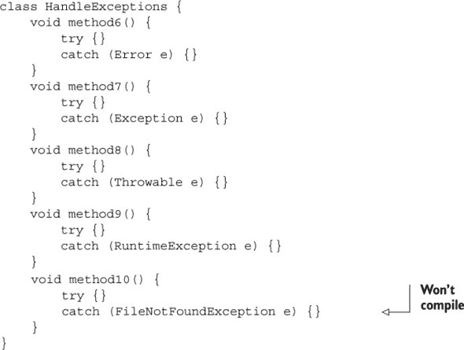

在前面的代码中，`method6()`、`method7()`、`method8()`和`method9()`即使它们的`try`块没有定义代码来抛出由其`catch`块处理的异常，也能编译。但`method10()`不能编译。

| |
| --- |

##### 考试技巧

一个方法可以声明抛出任何类型的异常，无论是检查的还是未检查的，即使它没有这样做。但是，如果`try`块没有抛出该检查异常或使用声明抛出该检查异常的方法，则`try`块不能为检查异常（除了`Exception`）定义一个`catch`块。

| |
| --- |

在下一节中，我们将详细说明抛出异常时会发生什么以及如何处理它。

### 7.4. 抛出异常时会发生什么？

| |
| --- |

[8.2] 创建一个 try-catch 块并确定异常如何改变正常程序流程

| |
| --- |
| |

[8.4] 创建并调用一个抛出异常的方法

| |
| --- |

在本节中，我们将揭示在 Java 中抛出异常时会发生什么。我们将通过几个示例来了解当抛出异常时，代码的正常流程是如何被打断的。我们还将定义一个使用`try-catch-finally`块的替代程序流程，以处理可能抛出异常的代码。

与所有其他 Java 对象一样，异常是一个对象。所有类型的异常都是`java.lang.Throwable`的子类。当一段代码遇到以异常条件形式出现的障碍时，它会创建一个`java.lang.Throwable`类的对象（在运行时，创建一个最合适的子类型对象），并用必要的信息（如其类型、可选的文本描述以及有问题的程序状态）初始化它，然后将它交给 JVM。JVM 通过这个异常发出警报，并寻找可以“处理”这个异常的适当代码块。JVM 记录了它遇到有问题的代码时调用过的所有方法，因此为了找到一个适当的异常处理程序，它会查看所有跟踪的方法调用。

重新审视第 7.1.3 节中提到的`Trace`类及其抛出的`ArrayIndexOutOfBoundsException`异常。图 7.11 说明了`method2`抛出的`ArrayIndexOutOfBoundsException`异常通过所有方法的传播。

##### 图 7.11. 异常通过多个方法调用的传播

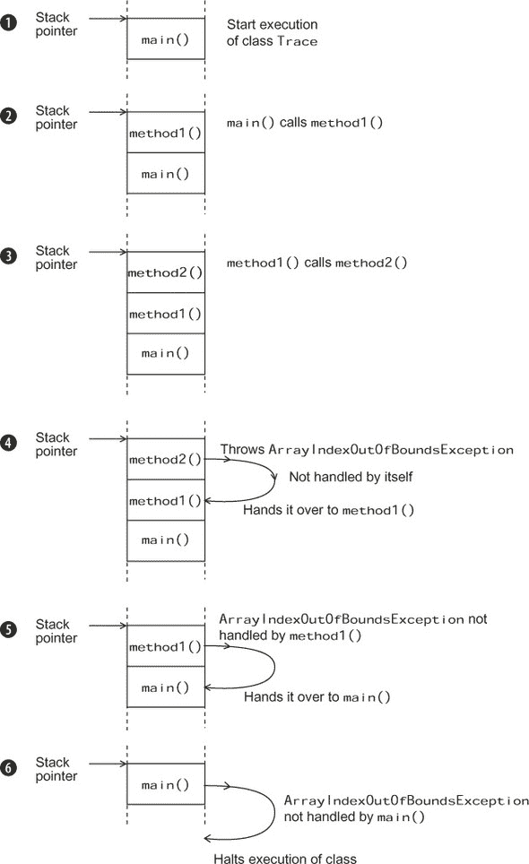

要理解异常如何在方法调用中传播，了解方法调用的工作方式很重要。应用程序从 `main` 方法开始执行，`main` 可能会调用其他方法。当 `main` 调用另一个方法时，被调用的方法应该在其完成执行之前，`main` 才能完成自己的执行。

操作系统（OS）使用一个 *栈* 来跟踪它需要执行的代码。栈是一种列表，其中最后添加到其中的项目是第一个被取出的——后进先出。这个栈使用一个 *栈指针* 来指向操作系统应该执行的指令。

现在你已经掌握了这些基本信息，下面将逐步讨论异常传播，如图 7.11 所示：

1.  当 `main` 方法开始执行时，其指令被推入栈中。

1.  方法 `main` 调用方法 `method1`，并将 `method1` 的指令推入栈中。

1.  `method1` 调用 `method2`；`method2` 的指令被推入栈中。

1.  `method2` 抛出一个异常：`ArrayIndexOutOfBoundsException`。因为 `method2` 没有自己处理这个异常，所以它被传递给了调用它的方法——`method1`。

1.  `method1` 没有为 `ArrayIndexOutOfBounds-Exception` 定义任何异常处理器，所以它将这个异常传递给其调用方法——`main`。

1.  在 `main` 中没有为 `ArrayIndexOutOfBoundsException` 定义异常处理器。因为没有其他方法处理 `ArrayIndexOutOfBounds-Exception`，所以 `Trace` 类的执行停止。

你可以使用 `try`-`catch`-`finally` 块来定义当抛出异常时要执行的代码，如下一节所述。

#### 7.4.1\. 创建 try-catch-finally 块

当你处理异常处理器时，你经常会听到 `try`、`catch` 和 `finally` 这些术语。在你开始使用这些概念之前，我会回答三个简单的问题：

+   *尝试什么？* 首先，你尝试执行你的代码。如果它没有按计划执行，你将使用 `catch` 块来处理异常情况。

+   *捕获什么？* 你捕获 `try` 块内代码产生的异常事件，并通过定义适当的异常处理器来处理事件。

+   *finally 块的作用是什么？* 最后，你执行一组代码，在所有条件下，无论 `try` 块中的代码是否抛出任何异常。

让我们通过一个现实生活中的例子来比较 `try`-`catch`-`finally` 块。想象一下，你在度假期间去漂流。你的教练告诉你，在穿越急流时，你可能会从船上掉入河中。在这种情况下，你应该尝试使用你的浆或向你扔来的绳子回到船上。在划船的时候，你也可能会把浆掉入河中。在这种情况下，你不应该惊慌，应该保持坐姿。无论发生什么，你都在为这项冒险运动付费。

将此与 Java 代码进行比较：

+   你可以将划橡皮筏比作一个其方法 *可能会* 抛出异常的类。

+   穿越急流和划桨是可能会抛出异常的方法。

+   从筏上掉下来和丢弃你的桨是异常情况。

+   回到筏上并且不慌张的步骤是异常处理程序——当出现异常时执行的代码。

+   无论你是否留在船上，你为这项运动支付的费用可以与 `finally` 块相比较。

让我们通过定义适当的类和方法来实现之前的现实生活示例。首先，这里有两个基本的异常类——`FallInRiver-Exception` 和 `DropOarException`——这些异常可以被 `RiverRafting` 类中的方法抛出：

```
class FallInRiverException extends Exception {}
class DropOarException extends Exception {}
```

|  |
| --- |

##### 注意

你可以创建自己的异常——一个自定义异常——通过扩展 `Exception` 类（或其任何子类）。尽管自定义类的创建不在此考试范围内，你可能会在考试中看到创建和使用自定义异常的问题。也许这些问题的存在是因为 Java API 中几乎没有已检查异常出现在这个考试中。考试中的编码问题可能会创建和使用自定义异常。

|  |
| --- |

以下是对类 `RiverRafting` 的定义。它的方法 `crossRapid` 和 `rowRaft` 可能会抛出类型为 `FallInRiverException` 和 `DropOarException` 的异常：


在  处的 `crossRapid` 方法抛出异常 `FallInRiverException`。当你调用此方法时，你应该为此异常定义一个异常处理程序。同样，在  处的 `rowRaft` 方法抛出异常 `DropOarException`。当你调用此方法时，你应该为此异常定义一个异常处理程序。

当你执行可能会抛出 *已检查异常*（不扩展 `RuntimeException` 类的异常）的方法时，应将代码放在 `try` 块中。跟在 `try` 块后面的 `catch` 块应该处理 `try` 块中抛出的所有已检查异常（已检查异常在 7.2.3 节 中详细说明）。

图 7.12 中显示的代码使用了之前定义的 `RiverRafting` 类，并描述了当第 3 行代码（`riverRafting.crossRapid(11);`）抛出类型为 `FallInRiverException` 的异常时的控制流程。

##### 图 7.12\. 抛出异常时的修改后的控制流程

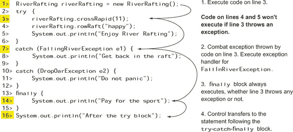

图 7.12 中的示例显示了异常如何改变正常的程序流程。如果第 3 行代码抛出异常（`FallInRiverException`），第 4 行和第 5 行代码将不会执行。在这种情况下，控制权转移到处理 `FallInRiverException` 的代码块。然后控制权转移到 `finally` 块。在 `finally` 块执行完毕后，将执行 `try`-`catch`-`finally` 块之后的代码。前述代码的输出如下：

```
Cross Rapid
Get back in the raft
Pay for the sport
After the try block
```

如果你将之前的示例代码修改如下，第 3 行的代码将不会抛出异常（粗体部分为修改）：

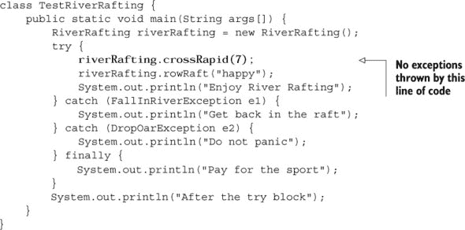

之前代码的输出如下：

```
Cross Rapid
Row Raft
Enjoy River Rafting
Pay for the sport
After the try block
```

你认为如果 `rowRaft` 方法抛出异常，代码的输出会是什么？自己试一试！

| |
| --- |

##### 考试提示

The `finally` block executes regardless of whether the `try` block throws an exception.

| |
| --- |

##### 单个 `try` 块，多个 `catch` 块和一个 `finally` 块

对于 `try` 块，你可以定义多个 `catch` 块，但只能有一个 `finally` 块。多个 `catch` 块用于处理不同类型的异常。`finally` 块用于定义 *清理* 代码——关闭和释放资源（如文件句柄、数据库或网络连接）的代码。

当涉及到代码时，通过观察其运行情况来验证一个概念是有意义的。让我们通过一个简单的例子来了解一下如何使用 `try`-`catch`-`finally` 块。

在以下列表中，`FileInputStream` 类的构造函数可能会抛出 `FileNotFoundException`，在 `FileInputStream` 对象（例如 `fis`）上调用 `read` 方法可能会抛出 `IOException`。

##### 列表 7.1\. 带有多个 `catch` 语句和 `finally` 块的代码流程

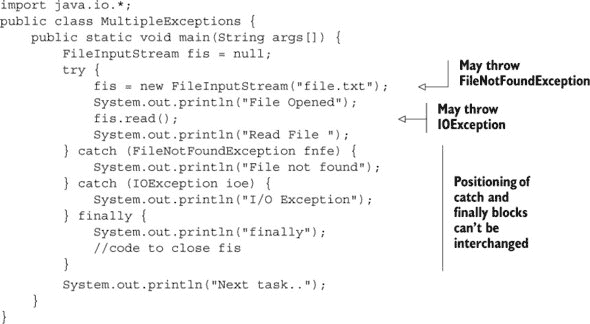

表 7.1 比较了根据系统是否能够打开（和读取）file.txt 而发生的代码输出。

##### 表 7.1\. 当系统无法打开 file.txt 时以及当系统能够打开 file.txt 但无法读取时的代码输出

| 系统无法打开 file.txt 时的输出 | 系统能够打开 file.txt 但无法读取时的输出 |
| --- | --- |
| 文件未找到 finally 下一个任务.. | 文件已打开 文件关闭 异常 finally 下一个任务.. |

在 表 7.1 中描述的任何情况下，`finally` 块都会执行，并在其执行后，控制权转移到 `try-catch` 块之后的语句。以下是 `MultipleExceptions` 类在没有代码抛出异常时的输出：

```
File Opened
Read File
finally
Next task..
```

现在是时候尝试本章的第一个故事转折练习了。当你执行这个练习中的代码时，你会了解当你更改异常处理程序的位置时会发生什么（答案在附录中）。

##### 故事转折 7.1

让我们修改 列表 7.1 中 `finally` 块的位置，看看会发生什么。

假设系统上不存在 file.txt 文件，以下代码的输出是什么？

```
import java.io.*;
public class MultipleExceptions {
    public static void main(String args[]) {
        FileInputStream fis = null;
        try {
            fis = new FileInputStream("file.txt");
            System.out.println("File Opened");
            fis.read();
            System.out.println("Read File");
        } finally {
            System.out.println("finally");

        } catch (FileNotFoundException fnfe) {
            System.out.println("File not found");
        } catch (IOException ioe) {
            System.out.println("File Closing Exception");
        }
        System.out.println("Next task..");
    }
}
```

1.  代码打印

    ```
    File not found
    finally
    Next task..
    ```

1.  代码打印

    ```
    File Opened
    File Closing Exception
    finally
    Next task..
    ```

1.  代码打印 `文件未找到`。

1.  代码无法编译。

#### 7.4.2\. 使用抛出检查异常的方法

要使用抛出 *检查型异常* 的方法，你必须遵循处理或声明规则（第 7.3.2 节）。在以下代码中，类 `TestRiverRafting` 中的 `main` 方法无法编译，因为它没有处理或声明由 `crossRapid` 方法声明的检查型异常 `FallInRiverException`：

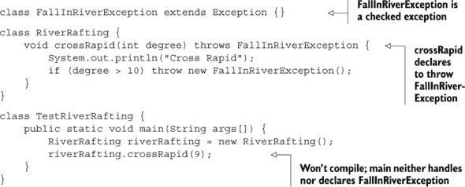

在 `Handle`、`Declare` 和 `HandleAndDeclare` 类中的 `main` 方法能够成功编译，因为它们遵循了处理或声明规则：

```
class Handle {
    public static void main(String args[]) {
        RiverRafting riverRafting = new RiverRafting();
        try {
            riverRafting.crossRapid(9);
        } catch (FallInRiverException e) {
            System.out.println("Exception : " + e);
        }
    }
}
class Declare {
    public static void main(String args[]) throws FallInRiverException {
        RiverRafting riverRafting = new RiverRafting();
        riverRafting.crossRapid(9);
    }
}
class HandleAndDeclare {
    public static void main(String args[]) throws FallInRiverException {
        RiverRafting riverRafting = new RiverRafting();
        try {
            riverRafting.crossRapid(9);
        } catch (FallInRiverException e) {
            System.out.println("Exception : " + e);
        }
    }
}
```

| |
| --- |

##### 考试技巧

要使用抛出 *检查型异常* 的方法，你必须遵循处理或声明规则。

| |
| --- |

#### 7.4.3\. 使用抛出运行时异常的方法

如果一个方法抛出运行时异常，则不需要在方法声明中包含异常名称（尽管允许这样做）。要使用抛出运行时异常的方法，你不需要遵循声明或处理规则。以下是一个示例：

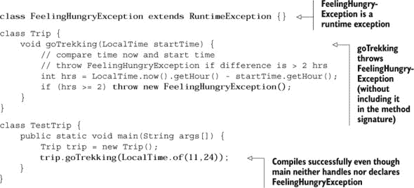

这里还有一个例子。检查以下代码，它抛出一个运行时异常（`ArrayIndexOutOfBoundsException`）：

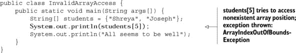

前述代码没有从 `System.out.println("一切看起来都很顺利")` 打印输出。代码执行因尝试输出 `students[5]` 的值而抛出的异常而中断。

可以为前述示例代码中抛出的 `ArrayIndexOutOfBoundsException` 异常创建一个异常处理器，如下所示：

```
public class InvalidArrayAccess {
    public static void main(String args[]) {
        String[] students = {"Shreya", "Joseph"};
        try {
            System.out.println(students[5]);
        } catch (ArrayIndexOutOfBoundsException e){
            System.out.println("Exception");
        }
        System.out.println("All seems to be well");
    }
}
```

之前代码的输出如下：

```
Exception
All seems to be well
```

同样，你可以 *捕获* 检查型异常，你也可以捕获 `Runtime-Exception`。在实际项目中，首选的方法是通过包含适当的检查来避免运行时异常。例如，在之前的代码中，你可以通过使用适当的检查来防止抛出 `ArrayIndexOutOfBoundsException`：

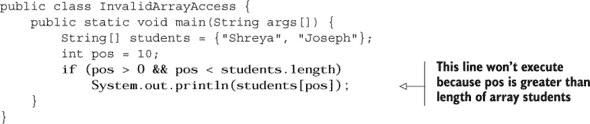

#### 7.4.4\. 使用抛出错误的的方法

错误是 JVM 抛出的严重异常，例如当 JVM 内存不足或找不到类的定义时。你不应该定义代码来处理错误。相反，你应该让 JVM 处理错误。

在本节的剩余部分，我们将探讨一些关于 `try`-`catch`-`finally` 块的常见问题，这些问题常常让认证考生感到困惑。

#### 7.4.5\. 即使 catch 块定义了 return 语句，finally 块也会执行吗？

想象以下场景：一个男孩承诺为他的女朋友买钻石，并带她喝咖啡。女孩询问如果他在购买钻石时遇到异常情况，比如资金不足，会发生什么。让女孩失望的是，男孩回答说他会仍然带她喝咖啡。

你可以将 `try` 块比作购买钻石，将 `finally` 块比作咖啡待遇。无论男孩是否成功购买钻石，女孩都会得到咖啡待遇。图 7.13 展示了这次对话。

##### 图 7.13\. 一点幽默来帮助你记住，`finally`块无论是否抛出异常都会执行


有趣的是，即使`try`块或任何`catch`块中的代码定义了`return`语句，`finally`块也会执行。检查图 7.14 中的代码及其输出，并注意当类`ReturnFromCatchBlock`无法打开 file.txt 时。

##### 图 7.14\. 即使异常处理器定义了`return`语句，`finally`块也会执行。

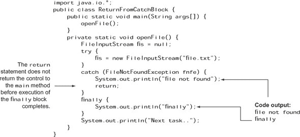

从图 7.14 的代码输出中可以看出，当在`FileNotFoundException`的`catch`处理器中执行`return`语句时，控制流不会返回到`main`方法。它继续执行`finally`块，然后再将控制权转回到`main`方法。注意，控制权不会转移到`try`块后面的`println`语句`"Next task.. "`，因为如前所述，在`catch`块中遇到了`return`语句。

回到那个男生和他女朋友的例子，一些悲剧性的条件，比如地震或龙卷风，可以取消咖啡待遇。同样，在 Java 中也有一些场景，`finally`块不会执行：

+   *应用程序终止—*`try`或`catch`块执行`System.exit`，立即终止应用程序。

+   ***致命错误—*** JVM 或操作系统崩溃。

在考试中，你可能会被问到两个或多个异常处理器的正确顺序。顺序重要吗？看看你自己第 7.4.9 节。

#### 7.4.6\. 如果`catch`和`finally`块都定义了返回语句会发生什么？

在上一节中，你看到即使`catch`块定义了`return`语句，`finally`块也会执行。对于一个定义了`try`-`catch`-`finally`块的方法，如果`catch`和`finally`都返回一个值，调用方法会返回什么？

这里有一个例子：

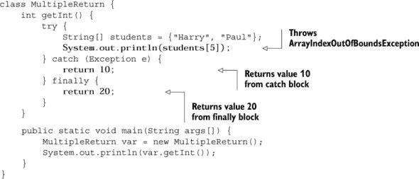

上述代码的输出是

```
20
```

如果`catch`和`finally`块都定义了`return`语句，调用方法将从`finally`块接收一个值。

#### 7.4.7\. 如果`finally`块修改了从`catch`块返回的值会发生什么？

如果`catch`块返回一个原始数据类型，`finally`块不能修改它返回的值。这里有一个例子：

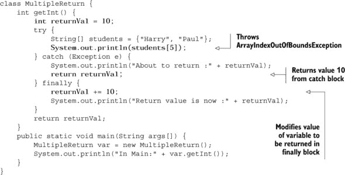

上述代码的输出如下：

```
About to return :10
Return value is now :20
In Main:10
```

即使`finally`块给变量`returnVal`增加了`10`，这个修改后的值也不会返回到`main`方法。在执行`finally`块之前，`catch`块中的控制流会将`returnVal`的值复制并返回，所以当`finally`执行时，返回的值不会被修改。

如果方法返回一个对象，上述代码会以类似的方式行为吗？看看你自己：

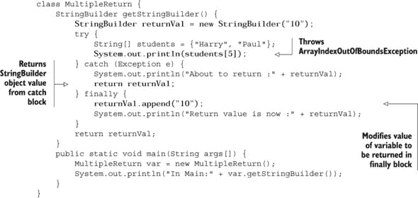

这是上述代码的输出：

```
About to return :10
Return value is now :1010
In Main:1010
```

在这种情况下，`catch` 块返回 `StringBuilder` 类的对象。当 `finally` 块执行时，它可以访问由变量 `returnVal` 指向的对象的值，并且可以修改它。修改后的值返回到 `main` 方法。记住，原始数据类型是按值传递的，而对象是按引用传递的。

|  |
| --- |

##### 考试提示

注意从 `catch` 块返回值并在 `finally` 块中修改它的代码。如果一个 `catch` 块返回一个原始数据类型，`finally` 块不能修改它返回的值。如果一个 `catch` 块返回一个对象，`finally` 块可以修改它返回的对象的状态。

|  |
| --- |

#### 7.4.8\. 一个 try 块是否只能跟随一个 finally 块？

语法上，你可以定义一个可能只跟随一个 `finally` 块的 `try` 块：

```
class NoCatchOnlyFinally {
    public static void main(String args[]) {
        String name = null;
        try {
            System.out.println("Try block : open resource 1");
            System.out.println("Try block : open resource 2");

            System.out.println("in try : " + name.length());
            System.out.println("Try block : close resources");
        } finally {
            System.out.println("finally : close resources");
        }
    }
}
```

以下是前面代码的输出：

```
Try block : open resource 1
Try block : open resource 2
finally : close resources
Exception in thread "main" java.lang.NullPointerException
    at NoCatchOnlyFinally.main(NoCatchOnlyFinally.java:7)
```

因为前面代码中的 `main()` 抛出了一个未检查的异常 `NullPointer-Exception`，所以它编译成功。但如果 `try` 块中声明的代码抛出一个检查异常，则它必须后面跟着一个 `catch` 块，或者定义它的方法必须声明抛出它。

#### 7.4.9\. 在 catch 块中捕获的异常的顺序重要吗？

对于无关的类，顺序并不重要。但对于具有 IS-A 关系的关联类，顺序很重要，因为 `catch` 块是从上到下检查以找到处理给定异常的合适块。

在后一种情况下，如果你在派生类的异常之前尝试捕获基类的异常，你的代码将无法编译。这种行为可能看起来很奇怪，但有一个合理的理由。正如你所知，派生类的对象可以被分配给基类的变量。同样，如果你在派生类之前尝试捕获基类的异常，派生类的异常处理程序将永远无法到达，因此代码将无法编译。

检查 图 7.15 中的代码，它已经通过在 `FileNotFoundException` 的 `catch` 块之前定义 `IOException` 的 `catch` 块而进行了修改。

##### 图 7.15\. 异常处理程序放置的顺序很重要。

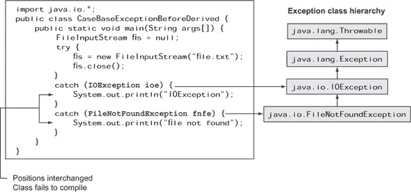

图 7.16 展示了一种有趣的方式来记住顺序的重要性。正如你所知，抛出的异常会寻找合适的异常处理程序，从第一个处理程序开始，一直到最后一个。让我们将抛出的异常比作老虎，将异常处理程序比作允许某些类型的生物进入的门。就像抛出的异常一样，老虎应该从第一个门开始，然后继续到其余的门，直到找到匹配项。

##### 图 7.16\. 一种视觉方式来记住在 `catch` 块中捕获的异常的顺序很重要

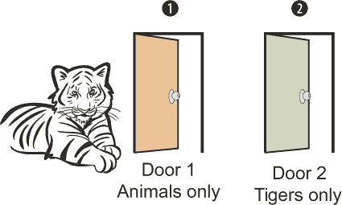

老虎从第一个门开始，允许所有动物进入。哇！老虎进入了第一个门，永远不会到达专为老虎准备的第二个门。在 Java 中，当出现这种情况时，Java 编译器会拒绝编译代码，因为后续的异常处理代码将永远不会执行。如果代码中包含不可达的语句，Java 不会编译代码。

##### 需要记住的规则

这里有一些规则，你需要回答 OCA Java SE 8 程序员 I 考试中的问题：

+   一个`try`块可以后面跟着多个`catch`块，而`catch`块后面可以跟着一个单独的`finally`块。

+   一个`try`块可以后面跟着一个`catch`块或一个`finally`块，或者两者都有。但如果`try`块中的代码抛出一个受检异常，单独的`finally`块是不够的。在这种情况下，你需要捕获受检异常或声明你的方法会抛出它。否则，你的代码无法编译。

+   `try`、`catch`和`finally`块不能独立存在。

+   `finally`块不能出现在`catch`块之前。

+   `finally`块总是执行，无论代码是否抛出异常。

#### 7.4.10\. 我能否重新抛出一个异常或我捕获的错误？

你可以对异常做任何你想做的事情。重新抛出它，将其传递给一个方法，将其赋值给另一个变量，上传到服务器，通过短信发送，等等。检查以下代码：

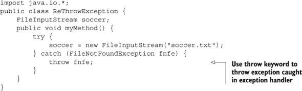

哎呀！之前的代码无法编译，你得到了以下编译错误信息：

```
ReThrowException.java:9: unreported exception java.io.FileNotFoundException; must be caught or declared to be thrown
            throw fnfe;
            ^
```

当你重新抛出一个受检异常时，它会被当作一个常规的抛出的受检异常来处理，这意味着处理受检异常的所有规则都适用于它。在先前的例子中，代码既没有捕获重新抛出的`FileNotFoundException`异常，也没有使用`throw`子句声明方法`myMethod`会抛出它。因此，代码无法编译。

以下（修改后的）代码声明方法`myMethod`会抛出`FileNotFoundException`，并且可以成功编译：

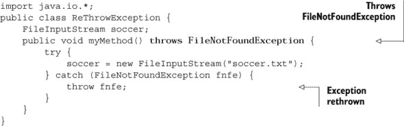

另一个需要注意的有趣点是，之前的代码不适用于`RuntimeException`。你可以重新抛出一个运行时异常，但不需要捕获它，也不需要修改你的方法签名以包含`throws`子句。这个规则简单的原因是`RuntimeException`不是受检异常，它们可能不会被你的代码捕获或声明为抛出（异常类别在第 7.2 节中详细讨论）。

#### 7.4.11\. 我能否声明我的方法抛出一个受检异常而不是处理它？

如果一个方法不希望处理它调用的方法抛出的受检异常，它可以在自己的方法声明中使用`throws`子句来声明抛出这些异常。考察以下示例，其中方法`myMethod`没有包含异常处理器；相反，它使用声明中的`throws`子句重新抛出由`FileInputStream`类的构造函数抛出的`IOException`：

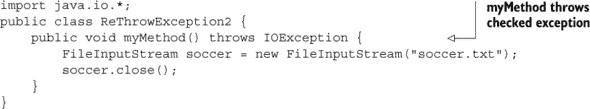

任何调用`myMethod`的方法现在必须要么捕获异常`IOException`，要么在其方法签名中声明它将被重新抛出。

#### 7.4.12\. 我可以创建嵌套循环，那么我也能创建嵌套的`try`-`catch`块吗？

简单的答案是肯定的，你可以在另一个`try`-`catch`-`finally`块内定义一个`try`-`catch`-`finally`块。理论上，`try`-`catch`-`finally`块的嵌套级别没有限制。

在以下示例中，在外部`try`块的`try`和`finally`块中定义了另一组`try`-`catch`块：

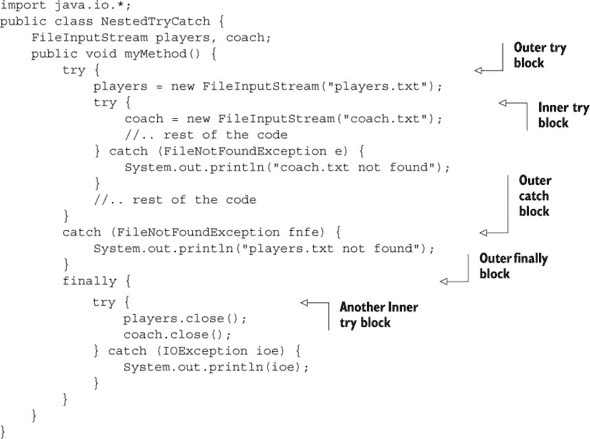

现在来一个 Twist in the Tale 练习，这将测试你对嵌套`try`-`catch`块抛出和捕获的异常的理解。在这个练习中，内部`try`块定义了抛出`NullPointerException`的代码。但内部`try`块没有为这个异常定义异常处理器。外部`try`块会捕获这个异常吗？亲自看看（答案见附录）。

##### Twist in the Tale 7.2

假设你的系统上存在`players.txt`文件，并且如粗体所示，`players`的分配不会抛出任何异常，那么以下代码的输出是什么？

```
import java.io.*;
public class TwistInTaleNestedTryCatch {
    static FileInputStream players, coach;
    public static void main(String args[]) {
        try {
            players = new FileInputStream("players.txt");
            System.out.println("players.txt found");
            try {
                coach.close();
            } catch (IOException e) {
                System.out.println("coach.txt not found");
            }
        } catch (FileNotFoundException fnfe) {
            System.out.println("players.txt not found");
        } catch (NullPointerException ne) {
            System.out.println("NullPointerException");
        }
    }
}
```

1.  代码打印

    ```
    players.txt found
    NullPointerException
    ```

1.  代码打印

    ```
    players.txt found
    coach.txt not found
    ```

1.  代码抛出一个运行时异常。

1.  代码无法编译。

#### 7.4.13\. 我应该处理错误吗？

虽然你可以定义代码来处理错误，但你不应该这样做。相反，你应该让 JVM 处理错误。以下示例显示了如何捕获错误：

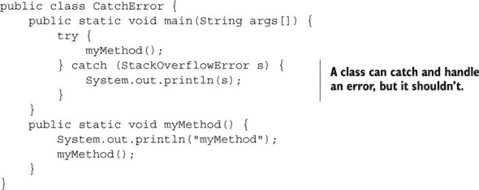

虽然你不应该在代码中处理错误，但如果你这样做会发生什么？处理代码的异常处理器会执行吗？通过回答以下故事中的 Twist in the Tale 练习来亲自看看（答案见附录）。

##### Twist in the Tale 7.3

错误处理块中的代码会执行吗？你认为以下代码的输出是什么？

```
public class TwistInTaleCatchError {
    public static void main(String args[]) {
        try {
            myMethod();
        } catch (StackOverflowError s) {
            for (int i=0; i<2; ++i)
                System.out.println(i);
        }
    }
    public static void myMethod() {
        myMethod();
    }
}
```

1.  ```
    0
    ```

1.  ```
    java.lang.StackOverFlowError
    ```

1.  ```
    0
    1
    ```

1.  ```
    0
    1
    2
    java.lang.StackOverFlowError
    ```

在下一节中，你将处理考试中的特定异常类和错误。

### 7.5\. 常见异常类和类别

|  |
| --- |

[8.5] “识别常见异常类（如 NullPointerException、ArithmeticException、ArrayIndexOutOfBoundsException、ClassCastException）”

|  |
| --- |

在本节中，我们将查看常见的异常类和异常类别。你还将了解这些异常被抛出的场景以及如何处理它们。

对于这次考试，您应该熟悉导致这些常见异常类和类别的情况以及如何处理它们。表 7.2 列出了常见错误和异常。尽管考试具体列出了四个运行时异常，但在考试中您可能会看到其他常见的异常和错误类。

##### 表 7.2. 常见错误和异常

| 运行时异常 | 错误 |
| --- | --- |
| ArrayIndexOutOfBoundsException | ExceptionInInitializerError |
| IndexOutOfBoundsException | StackOverflowError |
| ClassCastException | NoClassDefFoundError |
| IllegalArgumentException | OutOfMemoryError |
| ArithmeticException |   |
| NullPointerException |   |
| NumberFormatException |   |

OCA Java SE 8 程序员 I 级考试目标要求您理解之前提到的哪些错误和异常是由 JVM 抛出的，哪些应该通过程序抛出。从本章前面关于错误的讨论中，您知道错误代表与 JRE 相关的问题，例如`OutOfMemoryError`。作为程序员，您**不应该**抛出或捕获这些错误——让 JVM 处理。运行时异常的定义指出，这些是 JVM 抛出的异常，您不应该在程序中抛出。

让我们逐一详细回顾这些内容。

#### 7.5.1. `ArrayIndexOutOfBoundsException`和`IndexOutOfBoundsException`

如图 7.17 所示，`ArrayIndexOutOfBoundsException`和`IndexOutOfBounds-Exception`是运行时异常，它们之间存在 IS-A 关系。`IndexOutOfBoundsException`是`ArrayIndexOutOfBoundsException`的子类。

#####  类`ArrayIndexOutOfBoundsException`的类层次结构


当一段代码尝试访问超出其边界的数组（数组被访问的位置小于 0 或大于或等于其长度）时，将抛出`ArrayIndexOutOfBoundsException`异常。当一段代码尝试使用非法索引访问列表，如`ArrayList`时，将抛出`IndexOutOfBoundsException`异常。

假设已经定义了一个数组和列表，如下所示：

```
String[] season = {"Spring", "Summer"};
ArrayList<String> exams = new ArrayList<>();
exams.add("SCJP");
exams.add("SCWCD");
```

以下代码行将抛出`ArrayIndexOutOfBoundsException`异常：

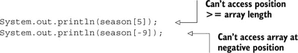

以下代码行将抛出`IndexOutOfBoundsException`异常：


您认为 JVM 为什么承担了抛出这个异常的责任？其中一个主要原因是这个异常直到运行时才知道，并且依赖于代码访问的数组或列表位置。通常，一个变量用于指定这个数组或列表位置，其值可能直到运行时才知道。

|  |
| --- |

##### 注意

当尝试访问无效的数组位置时，将抛出`ArrayIndexOutOfBoundsException`异常。当尝试使用非法索引访问`ArrayList`等列表时，将抛出`IndexOutOfBoundsException`异常。

|  |
| --- |

如果你检查你要尝试访问的索引位置是否大于或等于 `0` 并且小于你的数组或 `ArrayList` 的大小，你可以避免抛出这些异常。

#### 7.5.2\. `ClassCastException`

在我开始讨论这个异常的例子之前，快速看一下 图 7.18 以复习这个异常的类层次结构。

##### 图 7.18\. `ClassCastException` 的类层次结构

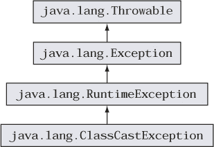

检查下一列表中的代码，其中抛出 `ClassCastException` 的代码行以粗体显示。

##### 列表 7.2\. 抛出 `ClassCastException` 的代码示例


当一个对象在类型转换时失败 IS-A 测试时，会抛出 `ClassCastException`。在先前的例子中，类 `Ink` 是 `ColorInk` 和 `BlackInk` 类的基类。在先前的案例中，JVM 抛出 `ClassCastException`，因为粗体部分的代码试图显式地将 `ColorInk` 类型的对象转换为 `BlackInk` 类型。

注意，此代码行避免了编译错误，因为变量 `inks` 定义了一个类型为 `Ink` 的 `ArrayList`，它可以存储 `Ink` 类型的对象及其所有子类的对象。然后代码正确地添加了允许的对象：一个 `BlackInk` 和一个 `ColorInk`。如果代码定义了一个类型为 `BlackInk` 或 `ColorInk` 的 `ArrayList`，则代码将无法编译，如下所示：

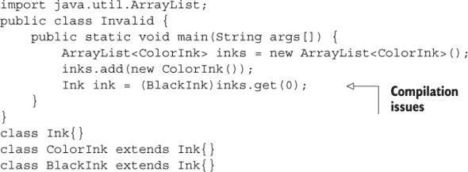

这是之前修改过的代码块抛出的编译错误：

```
Invalid.java:6: inconvertible types
found   : ColorInk
required: BlackInk
        Ink ink = (BlackInk)inks.get(0);
                                    ^
```

你可以在类型转换之前使用 `instanceof` 操作符来验证一个对象是否可以被转换为另一个类。假设 `Ink`、`ColorInk` 和 `BlackInk` 类的定义与先前的例子中相同，以下代码行将避免 `ClassCastException`：

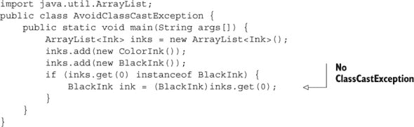

在前面的例子中，条件 (`inks.get(0)instanceofBlackInk`) 评估为 `false`，因此 `if` 语句的 `then` 部分不会执行。

在接下来的 Twist in the Tale 练习中，我将介绍在 列表 7.2 中的类型转换例子中使用的接口（答案见附录）。

##### 故事转折 7.4

让我们介绍一个在 列表 7.2 中使用的接口，并看看它的行为。以下是修改后的代码。检查代码并选择正确的选项：

```
class Ink{}
interface Printable {}
class ColorInk extends Ink implements Printable {}
class BlackInk extends Ink{}

class TwistInTaleCasting {
    public static void main(String args[]) {
        Printable printable = null;
        BlackInk blackInk = new BlackInk();
        printable = (Printable)blackInk;
    }
}
```

1.  `printable = (Printable)blackInk` 将会抛出编译错误

1.  `printable = (Printable)blackInk` 将会抛出运行时异常

1.  `printable = (Printable)blackInk` 将会抛出检查异常

1.  以下代码行将无法编译：

    ```
    printable = blackInk;
    ```

#### 7.5.3\. `IllegalArgumentException`

如同这个异常的名称所暗示的，`IllegalArgumentException` 被抛出以指定一个方法传递了非法或不适当的参数。其类层次结构如图 7.19 所示。

##### 图 7.19\. `IllegalArgumentException` 的类层次结构

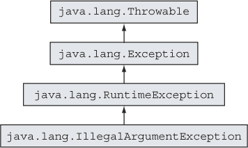

尽管这是一个运行时异常，但程序员通常使用这个异常来验证传递给方法的参数。异常构造函数传递了一个描述性的消息，指定了异常的详细信息。请检查以下代码：

```
public void login(String username, String pwd, int maxLoginAttempt) {
    if (username == null || username.length() < 6)
        throw new IllegalArgumentException
                   ("Login:username can't be shorter than 6 chars");
    if (pwd == null || pwd.length() < 8)
        throw new IllegalArgumentException
                   ("Login: pwd cannot be shorter than 8 chars");
    if (maxLoginAttempt < 0)
        throw new IllegalArgumentException
                   ("Login: Invalid loginattempt val");

    //.. rest of the method code
}
```

之前的方法验证了传递给它的各种方法参数，如果它们不符合方法的要求，则抛出适当的 `IllegalArgumentException`。`IllegalArgumentException` 的每个对象都传递了一个不同的 `String` 消息，简要描述了它。

#### 7.5.4\. `NullPointerException`

如 图 7.20 所示的 `NullPointerException` 是一个典型的异常。

##### 图 7.20\. `NullPointerException` 的类层次结构

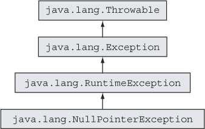

我想象几乎所有 Java 程序员都尝过这个异常的滋味，但让我们来看看它的解释。

如果您尝试通过 `null` 值访问非静态方法或变量，JVM 会抛出这个异常。考试可能会有有趣的代码组合来测试您是否会在特定的代码片段中抛出 `NullPointerException`。关键是确保引用变量已被分配了一个非 `null` 值。特别是，我将讨论以下情况：

+   访问显式分配了 `null` 值的引用变量的成员

+   使用未初始化的局部变量，这可能会 *看似* 抛出 `NullPointerException`

+   尝试访问不存在的数组位置

+   使用分配了 `null` 值的数组元素的成员

让我们从第一种情况开始，其中变量被显式地分配了一个 `null` 值：

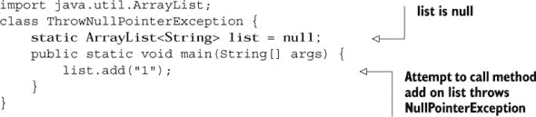

之前的代码尝试访问变量 `list` 上的 `add` 方法，而该变量已被分配了一个 `null` 值。这会抛出一个异常，如下所示：

```
Exception in thread "main" java.lang.NullPointerException
    at ThrowNullPointerException.main(ThrowNullPointerException.java:5)
```

默认情况下，类的 `static` 和实例变量被分配一个 `null` 值。在之前的例子中，`static` 变量 `list` 被显式地分配了一个 `null` 值。为了帮助您澄清代码并避免任何可能的疑问，`list` 被显式地分配了一个 `null` 值。当 `main` 方法尝试在变量 `list` 上执行 `add` 方法时，它会在一个 `null` 值上调用一个方法。这个调用会导致 JVM 抛出一个 `Null-Pointer-Exception`（这是一个 `RuntimeException`）。如果您将变量 `list` 定义为一个实例变量并且没有给它分配一个显式值，您将得到相同的结果（在运行时抛出 `NullPointerException`）。因为 `static` 方法 `main` 无法访问实例变量 `list`，您需要创建 `ThrowNullPointerException` 类的一个对象来访问它：

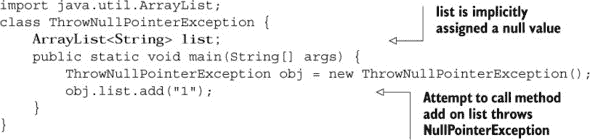

您可以通过在尝试访问对象的成员之前检查该对象是否为 `null` 来防止抛出 `NullPointerException`：

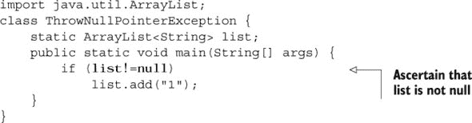

如果您将之前的代码修改如下，会发生什么？它还会抛出 `NullPointerException` 吗？

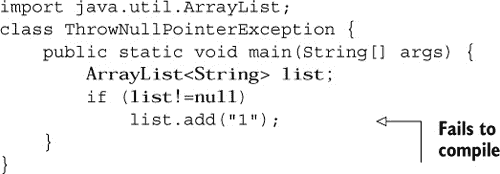

有趣的是，之前的代码无法编译。`list`是在`main`方法内部定义的局部变量，并且默认情况下局部变量没有赋予值——甚至没有`null`值。如果你尝试使用未初始化的局部变量，你的代码将无法编译。在考试中注意类似的问题。

当代码可能抛出`NullPointerException`的另一组条件涉及数组的使用：


在前面的代码中，静态变量`oldLaptops`默认赋予`null`值。它的数组元素既未初始化也未赋予值。尝试访问数组第二个元素的代码将抛出`NullPointerException`。

在以下代码中，变量`newLaptops`的两个数组元素被初始化并赋予默认值`null`。如果你在变量`newLaptops`的第二元素上调用`toString`方法，它将导致抛出`NullPointerException`：

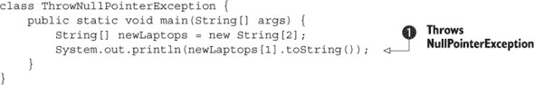

如果你将代码在处进行修改如下，它不会抛出异常——它将打印值`null`。这是因为基于对象的`System.out.println()`重载调用了基于对象的`String.valueOf()`重载，它本身会检查要“打印”的对象是否为`null`，如果是，则输出`null`而不会调用任何`toString()`方法：


| |
| --- |

##### 考试技巧

在考试中，请注意那些尝试使用未初始化局部变量的代码。因为这样的变量甚至没有初始化为`null`值，所以你不能使用`System.out.println`方法打印它们的值。这样的代码*无法*编译。

| |
| --- |

让我们修改之前使用变量`oldLaptops`的代码，并检查你对`NullPointerException`的理解。这里有一个故事转折的动手练习供你完成（答案见附录）。

##### 故事转折 7.5

让我们检查你对`NullPointerException`的理解。这里有一个代码片段。检查代码并选择正确的答案。

```
class TwistInTaleNullPointerException {
    public static void main(String[] args) {
        String[][] oldLaptops =

             { {"Dell", "Toshiba", "Vaio"}, null,
{"IBM"}, new String[10] };
        System.out.println(oldLaptops[0][0]);          // line 1
        System.out.println(oldLaptops[1]);             // line 2
        System.out.println(oldLaptops[3][6]);          // line 3
        System.out.println(oldLaptops[3][0].length()); // line 4
        System.out.println(oldLaptops);                // line 5
    }
}
```

1.  第 1 行的代码将抛出`NullPointerException`

1.  第 1 行和第 3 行的代码将抛出`NullPointerException`

1.  只有第 4 行的代码将抛出`NullPointerException`

1.  第 3 行和第 5 行的代码将抛出`NullPointerException`

#### 7.5.5. `ArithmeticException`

当 JVM 遇到异常数学条件，例如整除以零时，它将抛出`ArithmeticException`（如图 7.21 所示，展示了类层次结构）。请注意，除以 0 与除以 0.0 不同。在本节中，我们将介绍整数和十进制数除以 0 和 0.0 的结果。

##### 图 7.21。`ArithmeticException`的类层次结构

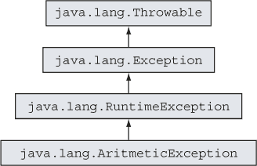

以下总结了`ArithmeticException`的原因：

+   只要只涉及整数，除法将作为整数除法执行。一旦有浮点数，那么所有计算都将在浮点算术中进行（实际上对所有算术运算都适用）。

+   整数除以零会抛出`ArithmeticException`。

+   浮点除以零不会抛出任何异常，而是返回`±Infinity`或`NaN`，具体取决于第一个操作数。

##### 整数除以 0

虽然这个异常的发生可能看起来很简单，但假设可能是错误的。让我们从一个简单且明确的例子开始（这个例子很容易发现）：

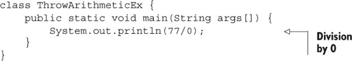

在执行时，前面的代码将抛出一个具有类似消息的`ArithmeticException`：

```
Exception in thread "main" java.lang.ArithmeticException: / by zero
    at ThrowArithmeticEx.main(ThrowArithmeticEx.java:3)
```

这里是一个可能在考试中看到的相对复杂的代码示例。你认为它会抛出`ArithmeticException`吗？你也认为答案像前面的代码一样明显吗？

```
class ThrowArithmeticEx {
    public static void main(String args[]) {
        int a = 10;
        int y = a++;
        int z = y--;

        int x1 = a - 2*y - z;
        int x2 = a - 11;
        int x = x1/ x2;

        System.out.println(x);
    }
}
```

The preceding code throws `ArithmeticException` for the operation `x1/x2` because the value of `x2` is `0`. With the initialization of the variable `y`, the value of variable `a` is incremented by 1, from 10 to 11 (due to the post-fix increment operator). The variable `x2` is initialized with a value that’s equal to 11 and less than a, which is 0.

| |
| --- |

##### 考试技巧

在考试中，要注意整数的除法。如果除数是 0，被除的整数值无关紧要。此类操作将抛出`ArithmeticException`。

| |
| --- |

你认为除以 0 的答案会是什么？你认为以下代码的输出是`1`，`0`，还是`ArithmeticException`？

```
class ThrowArithmeticEx {
    public static void main(String args[]) {
        int x = (int)(7.3/10.6);
        int y = (int)(100.76/123.87);

        int z = x/y;

        System.out.println(x);
    }
}
```

整数除以 0 将导致`ArithmeticException`。因此，前面的代码也将抛出`ArithmeticException`。

| |
| --- |

##### 考试技巧

负数或正整数除以 0 的结果将是`ArithmeticException`。

| |
| --- |

以下是一个除以 0 的显式示例：


| |
| --- |

##### 考试技巧

除以 0 的结果是`ArithmeticException`。

| |
| --- |

##### 小数除以 0

如果你将正小数除以 0，答案是`Infinity`：

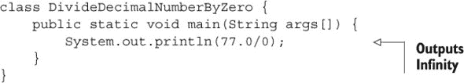

如果你将负小数除以 0，答案是`-Infinity`：

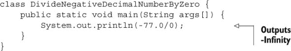

| |
| --- |

##### 考试技巧

如果你将正小数除以 0，结果是`Infinity`。如果你将负小数除以 0，结果是`-Infinity`。

| |
| --- |

这里有一个有趣的问题：你认为 0.0 除以 0 的结果会是什么？这里有一个简短的代码片段：


| |
| --- |

##### 考试技巧

0.0 除以 0 的结果是`NaN`（不是一个数字）。

| |
| --- |

任何包含`NaN`的数学运算结果都是`NaN`。

##### 整数或小数除以 0.0

除以 0 和除以 0.0 的结果并不相同。让我们回顾前面的例子，从本节第一个例子的修改版开始：

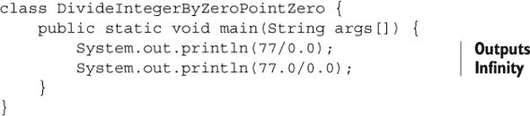

前面的代码不会抛出`ArithmeticException`。它输出`Infinity`。

| |
| --- |

##### 考试技巧

当正整数或小数除以 0.0 时，结果是`Infinity`。

| |
| --- |

这里是另一个修改后的例子：

```
class DivideByZeroPointZero {
    public static void main(String args[]) {
        int a = 10;
        int y = a++;
        int z = y--;

        int x1 = a - 2*y - z;
        int x2 = a - 11;
        double x3 = x2;

        double x = x1/ x3;

        System.out.println(x);
        System.out.println(x1);
        System.out.println(x3);
    }
}
```

以下是前面代码的输出：

```
-Infinity
-17
0.0
```

前面的代码不会抛出 `ArithmeticException`。变量 `x1` 被分配了一个负整数值，即 `-17`。变量 `x2` 被分配了值 `0`。当 `double` 类型的变量 `x3` 使用 `x2` 的值初始化时，它被提升为 `double` 值，将 `0.0` 分配给 `x3`。当一个负整数值除以 `0.0` 时，结果是 `–Infinity`。

|  |
| --- |

##### 考试技巧

当一个负整数或小数除以 `0.0` 时，结果是 `–Infinity`。

|  |
| --- |

#### 7.5.6\. 数值格式异常

如果你尝试将“87”和“9m#”转换为数值，会发生什么？前者值是正确的，但你无法将后者值转换为数值，除非它是一个编码值，直接来自一部詹姆斯·邦德电影，可以转换为任何东西。

如 图 7.22 所示，`NumberFormat-Exception` 是一个运行时异常。它被抛出以指示应用程序尝试将一个字符串（具有不适当的格式）转换为数值类型之一。

##### 图 7.22\. `NumberFormatException` 的类层次结构

![07fig22.jpg]

Java API 中的多个类定义了解析方法。最常用的方法之一是来自 `Integer` 类的 `parseInt` 方法。它用于将 `String` 参数解析为有符号（负数或正数）的十进制整数。以下是一些示例：

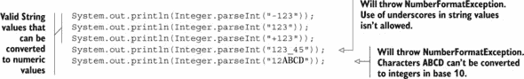

从 Java 7 开始，你可以在数值字面量中使用下划线（_）。但是，你无法在传递给 `parseInt` 方法的 `String` 值中使用它们。字母 `ABCD` 在十进制数制中不使用，但在十六进制数制中可以使用，因此你可以通过指定数制的基数为 `16` 将十六进制字面量值 `"12ABCD"` 转换为十进制数制：


注意，参数 `16` 是传递给 `parseInt` 方法，而不是传递给 `println` 方法。以下将无法编译：


你可以从自己的方法中抛出 `NumberFormatException` 来指示 `String` 值转换为指定数值格式（十进制、八进制、十六进制、二进制）存在问题，并且你可以添加自定义异常消息。这种异常最常见的候选方法是用于将命令行参数（作为 `String` 值接受）转换为数值的方法。请注意，所有命令行参数都作为 `String` 数组以 `String` 值的形式接受。

以下是一个程序抛出 `NumberFormatException` 的示例：


十六进制字面量 `16b` 转换为十进制数制是成功的。但是，十六进制字面量 `65v` 转换为十进制数制失败，并且前面的代码将给出以下输出：

```
363
Exception in thread "main" java.lang.NumberFormatException: 65v cannot be converted to hexadecimal number
    at ThrowNumberFormatException.convertToNum(ThrowNumberFormatException.java:8)
    at ThrowNumberFormatException.main(ThrowNumberFormatException.java:14)
```

现在我们来看一下这次考试中涵盖的一些常见错误。

#### 7.5.7\. 初始化异常

`ExceptionInInitializerError`错误通常由 JVM 在代码中的静态初始化块抛出任何类型的`RuntimeException`时抛出。图 7.23 显示了`ExceptionInInitializer-Error`的类层次结构。

##### 图 7.23\. `ExceptionInInitializerError`的类层次结构


在类中定义一个`static`初始化块，使用关键字`static`，后跟大括号。此块在类中定义，但不在方法中定义。它通常用于在类首次加载时执行代码。以下任何情况引发的运行时异常都会抛出此错误：

+   执行匿名`static`块

+   初始化`static`变量

+   执行一个`static`方法（从前面两个项目中的任何一个调用）

在以下示例中定义的类的`static`初始化块将抛出`NumberFormatException`，当 JVM 尝试加载这个类时，它将抛出`ExceptionInInitializerError`：

```
public class DemoExceptionInInitializerError {
    static {
        int num = Integer.parseInt("sd", 16);
    }
}
```

当 JVM 尝试加载类`DemoExceptionInInitializerError`时，以下是其错误信息：

```
java.lang.ExceptionInInitializerError
Caused by: java.lang.NumberFormatException: For input string: "sd"
    at java.lang.NumberFormatException.forInputString(NumberFormatException.java:48)
    at java.lang.Integer.parseInt(Integer.java:447)
    at DemoExceptionInInitializerError.<clinit>(DemoExceptionInInitializerError.java:3)
```

|  |
| --- |

##### 考试提示

在 OCA Java SE 8 程序员 I 考试中，注意看似简单的代码。前面提到的`DemoExceptionInInitializerError`类看似简单，但它是一个很好的考试问题候选者。正如你所知，当 JVM 尝试加载这个类时，它会抛出`ExceptionInInitializerError`错误。

|  |
| --- |

在以下示例中，静态变量的初始化导致抛出`NullPointerException`。当 JVM 加载这个类时，它将抛出`ExceptionInInitializerError`：

```
public class DemoExceptionInInitializerError1 {
    static String name = null;
    static int nameLength = name.length();
}
```

当 JVM 尝试加载`DemoException-InInitializer-Error1`类时，错误信息如下：

```
java.lang.ExceptionInInitializerError
Caused by: java.lang.NullPointerException
    at DemoExceptionInInitializerError1.<clinit>(DemoExceptionInInitializerError1.java:3)
Exception in thread "main"
```

现在让我们继续讨论由`static`方法抛出的异常，这些方法可能由`static`初始化块调用或用于初始化`static`变量。检查以下代码，其中`MyException`是一个用户定义的`RuntimeException`：


这是`DemoExceptionInInitializerError2`类抛出的错误：

```
java.lang.ExceptionInInitializerError
Caused by: MyException
    at DemoExceptionInInitializerError2.getName(DemoExceptionInInitializerError2.java:4)
    at DemoExceptionInInitializerError2.<clinit>(DemoExceptionInInitializerError2.java:2)
```

你注意到错误`ExceptionInInitializerError`只能由运行时异常引起吗？这当然有合理的理由。

如果静态初始化块抛出错误，它不会从错误中恢复并返回代码以抛出`ExceptionInInitializerError`异常。如果静态初始化块抛出一个受检异常的对象，则无法抛出此错误，因为 Java 编译器足够智能，可以确定这种条件，并且不允许你在静态初始化块中抛出未处理的受检异常。

|  |
| --- |

##### 考试提示

`ExceptionInInitializerError`只能由`RuntimeException`的对象引起。它不能作为`static`初始化块抛出的错误或受检异常的结果发生。

|  |
| --- |

#### 7.5.8\. `StackOverflowError`

`StackOverflowError` 错误扩展了 `Virtual-MachineError`（如图 7.24 所示）。正如其名称所暗示的，你应该将其留给 JVM 管理。

##### 图 7.24\. `StackOverflowError` 的类层次结构


当一个 Java 程序调用自身多次，以至于执行 Java 程序分配的内存栈“溢出”时（“溢出”意味着栈超过了某个大小），JVM 会抛出此错误。检查以下代码，其中方法递归调用自身而没有退出条件：


以下代码抛出了以下错误：

```
Exception in thread "main" java.lang.StackOverflowError
    at DemoStackOverflowError.recursion(DemoStackOverflowError.java:3)
```

#### 7.5.9\. NoClassDefFoundError

如果你未能设置你的类路径，结果 JVM 无法加载你想要访问或执行的类，会发生什么？或者，如果你在编译应用程序之前尝试运行它（因此找不到你试图使用的类的 .class 文件），会发生什么？在这两种情况下，JVM 将抛出 `NoClassDefFoundError`（如图 7.25 所示的类层次结构）。

##### 图 7.25\. `NoClassDefFoundError` 的类层次结构


这是 Java API 文档关于此错误的说明：

> *如果 Java 虚拟机或 `ClassLoader` 实例尝试加载类的定义（作为正常方法调用的一部分或作为使用 `new` 表达式创建新实例的一部分），并且找不到类的定义，则会抛出异常。1*
> 
> > ¹
> > 
> > `NoClassDefFoundError` 的文档可以在 Javadoc 中找到：[`docs.oracle.com/javase/8/docs/api/java/lang/NoClassDefFoundError.html`](http://docs.oracle.com/javase/8/docs/api/java/lang/NoClassDefFoundError.html)。

由于这个特定的错误不是编码问题，我没有为你提供一个编码示例。正如你可以从图 7.25 中的错误层次结构图中看到的，这是一个在运行时由于缺少类文件定义而产生的链接错误。像每个系统错误一样，这个错误不应该由代码处理，而应该完全由 JVM 处理。

| |
| --- |

##### 注意

不要混淆用于加载类的 `Class.forName()` 抛出的异常和 JVM 抛出的 `NoClassDefFoundError`。`Class.forName()` 抛出 `ClassNotFoundException`。

| |
| --- |

#### 7.5.10\. OutOfMemoryError

如果你在应用程序中创建并使用了大量的对象——例如，如果你加载了大量持久数据供应用程序处理，会发生什么？在这种情况下，JVM 可能会在堆上耗尽内存，垃圾收集器可能无法为 JVM 释放更多内存。在这种情况下，JVM 无法在堆上创建更多对象。将抛出 `OutOfMemoryError`（如图 7.26 所示的类层次结构）。

##### 图 7.26\. `OutOfMemoryError` 的类层次结构


无论您在哪个平台上工作，您都将始终与有限的堆大小一起工作，因此您不能在应用程序中创建和使用无限数量的对象。为了解决这个问题，您需要限制应用程序创建的资源或对象数量，或者增加您正在工作的平台上的堆大小。

有许多工具（这些工具超出了本书的范围）可以帮助您监控应用程序中创建的对象数量。

### 7.6. 摘要

在本章中，我们讨论了异常处理的需求，以及将异常处理代码与程序逻辑分开定义的优势。您看到了这种方法如何帮助分离定义常规程序逻辑和异常处理代码的关心点。我们还探讨了实现异常处理代码的代码语法，特别是`try`-`catch`-`finally`块。抛出异常的代码应包含在`try`块中，该块紧随`catch`和/或`finally`块之后。`try`块可以后跟多个`catch`块，但只能有一个`finally`块。`finally`块不能放在`try`块之前。`try`块必须后跟至少一个`catch`或`finally`块。`try`、`catch`和`finally`块不能独立存在。

接下来，我们深入探讨了异常的不同类别：检查异常、运行时或非检查异常、错误。检查异常是`java.lang.Exception`类的子类。非检查异常是`java.lang.RuntimeException`类的子类，而`java.lang.RuntimeException`本身又是`java.lang.Exception`类的子类。错误是`java.lang.Error`类的子类。所有这些异常都是`java.lang.Throwable`类的子类。

检查异常是方法作者预见但不在代码直接控制范围内的不可接受条件。运行时异常代表编程错误——这些错误是由于对其他代码的不当使用而发生的。错误是严重的异常，由 JVM 抛出，是由于处理您的代码的环境状态错误导致的。

在本章的最后几节中，我们讨论了常见异常和错误，例如`NullPointerException`、`IllegalArgumentException`、`StackOverflowError`等。对于这些错误和异常，我解释了它们在代码中可能抛出的条件以及是否应该在异常处理器中显式处理。

### 7.7. 复习笔记

本节列出了本章涵盖的所有部分的要点。

为什么需要单独处理异常：

+   将异常单独处理使您能够一起定义代码的主要逻辑。

+   如果不使用单独的异常处理器，您的代码的主要逻辑将丢失在应对异常条件的过程中。（参见图 7.5 以获取示例。）

+   异常处理器将定义常规程序逻辑与异常处理代码的关注点分开。

+   异常通过提供异常或错误的堆栈跟踪，帮助确定有问题的代码以及定义它的方法。

+   JVM 可能会将未处理的异常的堆栈跟踪发送到 Java 控制台。

异常的分类：

+   异常分为三类：检查型异常、运行时（或非检查型）异常和错误。这三个类别共享 IS-A 关系（继承）。

+   `java.lang.RuntimeException`类的子类被归类为运行时异常。

+   `java.lang.Error`类的子类被归类为错误。

+   如果类的子类不是`java.lang.RuntimeException`的子类，则`java.lang.Exception`的子类被归类为检查型异常。

+   `java.lang.RuntimeException`类是`java.lang.Exception`类的子类。

+   `java.lang.Exception`类是`java.lang.Throwable`类的子类。

+   `java.lang.Error`类也是`java.lang.Throwable`类的子类。

+   `java.lang.Throwable`类继承自`java.lang.Object`类。

检查型异常：

+   检查型异常是方法作者预见但不在代码直接控制范围内的不可接受条件。

+   检查型异常是`java.lang.Exception`类的子类，但不是`java.lang.RuntimeException`的子类。然而，值得注意的是，`java.lang.RuntimeException`类本身也是`java.lang.Exception`类的子类。

+   如果一个方法调用另一个可能抛出检查型异常的方法，那么它必须被包含在一个`try-catch`块中，或者该方法应在方法签名中声明抛出此异常。

运行时异常：

+   运行时异常代表编程错误。这些错误通常是由于对其他代码的不当使用而发生的。例如，`NullPointerException`是一个运行时异常，当一段代码尝试在一个尚未分配对象的变量上执行代码并指向`null`时发生。另一个例子是`ArrayIndexOutOfBoundsException`，当一段代码尝试访问一个列表元素在不存在位置上的数组时抛出。

+   运行时异常是`java.lang.RuntimeException`的子类。

+   即使一个方法可能抛出运行时异常，运行时异常也可能不是方法签名的一部分。

+   运行时异常不一定会被`try-catch`块捕获。

错误：

+   错误是一个严重的异常，由 JVM 在环境状态错误时抛出，该错误处理你的代码。例如，`NoClassDefFoundError`是 JVM 在无法找到它应该运行的`.class`文件时抛出的错误。

+   `StackOverflowError`是另一种错误，当 Java 程序栈所需的内存大小超过 JRE 为 Java 应用程序提供的内存时，JVM 会抛出此错误。此错误通常是由于无限循环或高度嵌套的循环引起的。

+   错误是`java.lang.Error`类的一个子类。

+   错误不必是方法签名的一部分。

+   虽然你可以从语法上处理错误，但当这些错误发生时，你能做的很少。通常，普通程序不被期望从错误中恢复。

创建抛出异常的方法：

+   方法使用`throw`语句抛出异常或错误。

+   方法使用其签名中的`throws`子句来声明它可能会抛出异常。

+   方法可以在其`throws`子句中有多个以逗号分隔的异常类名。在方法声明中包括运行时异常或错误不是必需的。

+   语法上，你不必总是需要一个`throw`和`throws`语句的组合来创建一个抛出异常的方法（受检或非受检）。你可以用一个抛出异常的方法来替换`throw`语句。

+   要使用抛出受检异常的方法，你必须执行以下操作之一：

    +   *处理异常*——将代码放在`try`块中并捕获抛出的异常。

    +   *声明抛出*——使用`throws`子句声明要抛出的异常。

    +   *处理和声明*——同时实现上述两种选项。

+   在创建抛出运行时异常或错误的函数时，包括异常或错误名称在`throws`子句中不是必需的。

+   抛出运行时异常或错误的函数不受处理或声明规则的约束。

+   一种方法可以声明抛出所有类型的异常，即使它实际上并不抛出。但是，如果`try`块没有抛出该受检异常或使用声明抛出该受检异常的方法，则不能为该受检异常（除了`Exception`）定义一个`catch`块。

抛出异常时会发生什么：

+   异常是`java.lang.Throwable`类的一个对象。

+   当一段代码遇到以异常条件形式出现的障碍时，它会创建一个`java.lang.Throwable`子类的对象，用必要的信息（例如其类型和可选的文本描述以及有问题的程序状态）初始化它，并将其交给 JVM。

+   将可能抛出异常的代码放在`try`块中。

+   定义`catch`块以包含在出现异常条件时执行的替代代码。

+   `try`块可以后跟一个或多个`catch`块。

+   `catch`块之后必须跟零个或一个`finally`块。

+   `finally`块无论`try`块中的代码是否抛出异常都会执行。

+   `catch` 块的放置顺序很重要。如果捕获的异常之间存在继承关系，则不能在派生类异常之前捕获基类异常。尝试这样做会导致编译失败。

+   即使一个 `try` 或 `catch` 块定义了 `return` 语句，`finally` 块也会执行。

+   如果 `catch` 和 `finally` 块都定义了 `return` 语句，调用方法将接收到 `finally` 块的值。

+   如果 `catch` 块返回一个原始数据类型，`finally` 块不能修改它返回的值。

+   如果 `catch` 块返回一个对象，`finally` 块可以修改它返回的值。

+   如果 `try` 块中的代码抛出检查型异常，单独的 `finally` 块不足以与 `try` 块一起使用。在这种情况下，你需要捕获检查型异常或在方法签名中定义异常被抛出，否则你的代码将无法编译。

+   `try`、`catch` 和 `finally` 块不能独立存在。

+   `finally` 块不能出现在 `catch` 块之前。

+   你可以在异常处理程序中重新抛出你捕获的错误。

+   你可以处理异常或声明你的方法抛出异常。在后一种情况下，你不需要在代码中处理异常。这适用于检查型异常。

+   你可以创建嵌套的异常处理程序。

+   一个 `try`、`catch` 或 `finally` 块可以定义另一个 `try`-`catch`-`finally` 块。理论上，`try`-`catch`-`finally` 块的嵌套级别没有限制。

常见异常、类别和类：

+   在典型的编程条件下，不应通过编程方式抛出 `ArrayIndexOutOfBoundsException`。

+   JVM 负责抛出此异常的主要原因是此异常直到运行时才知道，并且依赖于代码访问的数组或列表位置。通常，一个变量用于指定此数组或列表位置，其值可能直到运行时才知道。

+   `ClassCastException` 是一个运行时异常。`java.lang.ClassCastException` 继承自 `java.lang.RuntimeException`。

+   当一个对象在将其转换为其他类类型时失败 IS-A 测试时，会抛出 `ClassCastException`。

+   在进行转换之前，你可以使用 `instanceof` 操作符来验证一个对象是否可以被转换为另一个类。

+   `IllegalArgumentException` 是一个运行时异常。`java.lang.Illegal-Argument-Exception` 继承自 `java.lang.RuntimeException`。

+   抛出 `IllegalArgumentException` 以指定方法已被传递非法或不适当的参数。

+   尽管 `IllegalArgumentException` 是一个运行时异常，但程序员通常使用此异常来验证传递给方法的参数，并且异常构造函数会传递一个描述性的消息，指定异常的详细信息。

+   作为程序员，你可以抛出一个`IllegalStateException`来通知调用方法，被请求执行的方法尚未准备好开始执行，或者处于无法执行的状态。

+   `NullPointerException`是一个运行时异常。类`java.lang.NullPointerException`扩展了`java.lang.RuntimeException`。

+   如果你尝试访问一个未初始化的引用变量的方法或变量，JVM 会抛出`NullPointerException`。

+   当 JVM 遇到异常数学条件，如除以零时，它会抛出`ArithmeticException`。

+   在整数除法中，如果除数是 0，被除的整数值无关紧要。此类操作将抛出`ArithmeticException`。

+   负数或正整数除以 0 的结果将是一个`Arithmetic-Exception`。

+   0 除以 0 的结果是一个`ArithmeticException`。

+   如果你将一个正小数除以 0，结果是`Infinity`。如果你将一个负小数除以 0，结果是`-Infinity`。

+   0.0 除以 0 的结果是`NaN`（不是一个数字）。

+   当一个正整数或小数除以 0.0 时，结果是`Infinity`。

+   当一个负整数或小数除以 0.0 时，结果是`–Infinity`。

+   `NumberFormatException`是一个运行时异常。`java.lang.NumberFormatException`扩展了`java.lang.IllegalArgumentException`。`java.lang.IllegalArgumentException`扩展了`java.lang.RuntimeException`。

+   你可以从自己的方法中抛出一个`NumberFormatException`，以指示将`String`值转换为指定数值格式（十进制、八进制、十六进制或二进制）时存在问题。

+   以下任何一种情况引发的运行时异常可能会抛出`ExceptionInInitializerError`：

    +   执行一个匿名的`static`块

    +   初始化一个`static`变量

    +   执行一个`static`方法（从前面两个项目中的任何一个调用）

+   只有运行时异常的对象可以抛出错误`ExceptionInInitializerError`。

+   如果一个`static`初始化块抛出一个检查异常的对象，则不能抛出`ExceptionInInitializerError`，因为 Java 编译器足够智能，可以确定这种条件，并且不允许你从一个`static`初始化块中抛出一个未处理的检查异常。

+   `StackOverflowError`是一个错误。`java.lang.StackOverflowError`扩展了`java.lang.VirtualMachineError`。

+   因为`StackOverflowError`扩展了`VirtualMachineError`，所以它应该由 JVM 管理。

+   当一个 Java 程序调用自身次数过多，以至于执行 Java 程序的内存栈“溢出”时，JVM 会抛出`StackOverflowError`错误。

+   `NoClassDefFoundError`是一个`Error`。`java.lang.NoClassDefFoundError`扩展了`java.lang.LinkageError`。`java.lang.LinkageError`扩展了`java.lang.Error`。

+   当 JVM 或 `ClassLoader` 无法加载创建类对象所需的类定义时，会抛出 `NoClassDefFoundError`。

+   不要混淆用于加载类的 `Class.forName()` 抛出的异常和 JVM 抛出的 `NoClassDefFoundError`。`Class.forName()` 抛出 `ClassNotFoundException`。

+   当 JVM 无法在堆上创建对象且垃圾收集器可能无法为 JVM 释放更多内存时，会抛出 `OutOfMemoryError`。

### 7.8\. 样本考试问题

> **Q7-1.**
> 
> 以下代码的输出是什么：
> 
> ```
> class Course {
>     String courseName;
>     Course() {
>         Course c = new Course();
>         c.courseName = "Oracle";
>     }
> }
> class EJavaGuruPrivate {
>     public static void main(String args[]) {
>         Course c = new Course();
>         c.courseName = "Java";
>         System.out.println(c.courseName);
>     }
> }
> ```
> 
> 1.  代码将打印 `Java`。
> 1.  
> 1.  代码将打印 `Oracle`。
> 1.  
> 1.  代码将无法编译。
> 1.  
> 1.  代码将在运行时抛出异常或错误。
> 1.  
> **Q7-2.**
> 
> 选择正确的选项（s）：
> 
> 1.  你无法处理运行时异常。
> 1.  
> 1.  你不应该处理错误。
> 1.  
> 1.  如果一个方法抛出检查异常，它必须由该方法处理或指定在其 `throws` 子句中。
> 1.  
> 1.  如果一个方法抛出运行时异常，它可以在其 `throws` 子句中包含该异常。
> 1.  
> 1.  运行时异常是检查异常。
> 1.  
> **Q7-3.**
> 
> 检查以下代码并选择正确的选项（s）：
> 
> ```
> class EJavaGuruExcep {
>     public static void main(String args[]) {
>         EJavaGuruExcep var = new EJavaGuruExcep();
>         var.printArrValues(args);
>     }
>     void printArrValues(String[] arr) {
>         try {
>             System.out.println(arr[0] + ":" + arr[1]);
>         } catch (NullPointerException e) {
>             System.out.println("NullPointerException");
>         } catch (IndexOutOfBoundsException e) {
>             System.out.println("IndexOutOfBoundsException");
>         } catch (ArrayIndexOutOfBoundsException e) {
>             System.out.println("ArrayIndexOutOfBoundsException");
> 
>         }
>     }
> }
> ```
> 
> 1.  如果使用以下命令执行类 `EJavaGuruExcep`，它将打印 `NullPointerException`：
> 1.  
>     ```
>     java EJavaGuruExcep
>     ```
>     
> 1.  如果使用以下命令执行类 `EJavaGuruExcep`，它将打印 `IndexOutOfBoundsException`：
> 1.  
>     ```
>     java EJavaGuruExcep
>     ```
>     
> 1.  如果使用以下命令执行类 `EJavaGuruExcep`，它将打印 `ArrayIndexOutOfBoundsException`：
> 1.  
>     ```
>     java EJavaGuruExcep one
>     ```
>     
> 1.  代码将无法编译。
> 1.  
> **Q7-4.**
> 
> 以下代码的输出是什么？
> 
> ```
> class EJava {
>     void method() {
>         try {
>             guru();
>             return;
>         } finally {
>             System.out.println("finally 1");
>         }
>     }
>     void guru() {
>         System.out.println("guru");
>         throw new StackOverflowError();
>     }
>     public static void main(String args[]) {
>         EJava var = new EJava();
>         var.method();
>     }
> }
> ```
> 
> 1.  ```
>     guru
>     finally 1
>     ```
> 1.  
> 1.  ```
>     guru
>     finally 1
>     Exception in thread "main" java.lang.StackOverflowError
>     ```
> 1.  
> 1.  ```
>     guru
>     Exception in thread "main" java.lang.StackOverflowError
>     ```
> 1.  
> 1.  ```
>     guru
>     ```
> 1.  
> 1.  代码无法编译。
> 1.  
> **Q7-5.**
> 
> 以下代码的输出是什么？
> 
> ```
> class Quest5 {
>     public static void main(String args[]) {
>         int arr[] = new int[5];
>         arr = new int[]{1,2,3,4};
> 
>         int x = arr[1]-- + arr[0]-- /arr[0] * arr[4];
>         System.out.println(x);
>     }
> }
> ```
> 
> 1.  代码输出一个值。
> 1.  
> 1.  代码输出一个值后跟一个异常。
> 1.  
> 1.  `ArithmeticException`
> 1.  
> 1.  `NullPointerException`
> 1.  
> 1.  `IndexOutOfBoundsException`
> 1.  
> 1.  `ArrayIndexOutOfBoundsException`
> 1.  
> 1.  编译错误
> 1.  
> 1.  以上皆非
> 1.  
> **Q7-6.**
> 
> 以下哪个方法将无法编译？
> 
> 1.  ```
>     private void method1(String name) {
>         if (name.equals("star"))
>             throw new IllegalArgumentException(name);
>     }
>     ```
> 1.  
> 1.  ```
>     private void method2(int age) {
>         if (age > 30)
>             throw Exception();
>     }
>     ```
> 1.  
> 1.  ```
>     public Object method3(boolean accept) {
>         if (accept)
>             throw new StackOverflowError();
>         else
>             return new StackOverflowError();
>     }
>     ```
> 1.  
> 1.  ```
>     protected double method4() throws Exception {
>         throw new Throwable();
>     }
>     ```
> 1.  
> 1.  ```
>     public double method5() throws Exception {
>         return 0.7;
>     }
>     ```
> 1.  
> **Q7-7.**
> 
> 以下代码的输出是什么？
> 
> ```
>  class TryFinally {
>     int tryAgain() {
>         int a = 10;
>         try {
>             ++a;
>         } finally {
>             a++;
>         }
>         return a;
>     }
>     public static void main(String args[]) {
>         System.out.println(new TryFinally().tryAgain());
>     }
> }
> ```
> 
> 1.  `10`
> 1.  
> 1.  `11`
> 1.  
> 1.  `12`
> 1.  
> 1.  编译错误
> 1.  
> 1.  运行时异常
> 1.  
> **Q7-8.**
> 
> 以下代码的输出是什么？
> 
> ```
> class EJavaBase {
>     void myMethod() throws ExceptionInInitializerError {
>         System.out.println("Base");
>     }
> }
> class EJavaDerived extends EJavaBase {
>     void myMethod() throws RuntimeException {
>         System.out.println("Derived");
>     }
> }
> class EJava3 {
>     public static void main(String args[]) {
>         EJavaBase obj = new EJavaDerived();
>         obj.myMethod();
>     }
> }
> ```
> 
> 1.  ```
>     Base
>     ```
> 1.  
> 1.  ```
>     Derived
>     ```
> 1.  
> 1.  ```
>     Derived
>     Base
>     ```
> 1.  
> 1.  ```
>     Base
>     Derived
>     ```
> 1.  
> 1.  编译错误
> 1.  
> **Q7-9.**
> 
> 以下哪个陈述是正确的？
> 
> 1.  用户定义的类可能不会抛出 `IllegalStateException`。它必须仅由 Java API 类抛出。
> 1.  
> 1.  如果将未初始化的 `String` 类型的实例变量传递给 `System.out.println` 来打印其值，它将抛出 `NullPointerException`。
> 1.  
> 1.  当将无效数字作为 `String` 传递给 Java API 的多个方法以转换为指定的数字格式时，会抛出 `NumberFormatException`。
> 1.  
> 1.  当你的代码中的 `static` 初始化器抛出 `NullPointerException` 时，JVM 可能会抛出 `ExceptionInInitializerError`。
> 1.  
> **Q7-10.**
> 
> 以下代码的输出是什么？
> 
> ```
> class EJava {
>     void foo() {
>         try {
>             String s = null;
>             System.out.println("1");
>             try {
>                 System.out.println(s.length());
>             } catch (NullPointerException e) {
>                 System.out.println("inner");
>             }
>             System.out.println("2");
>         } catch (NullPointerException e) {
>             System.out.println("outer");
>         }
>     }
>     public static void main(String args[]) {
>         EJava obj = new EJava();
>         obj.foo();
>     }
> }
> ```
> 
> 1.  ```
>     1
>     inner
>     2
>     outer
>     ```
> 1.  
> 1.  ```
>     1
>     outer
>     ```
> 1.  
> 1.  ```
>     1
>     inner
>     ```
> 1.  
> 1.  ```
>     1
>     inner
>     2
>     ```

### 7.9\. 样本考试问题答案

> **Q7-1.**
> 
> 以下代码的输出是什么：
> 
> ```
> class Course {
>     String courseName;
>     Course() {
>         Course c = new Course();
>         c.courseName = "Oracle";
>     }
> }
> 
> class EJavaGuruPrivate {
>     public static void main(String args[]) {
>         Course c = new Course();
>         c.courseName = "Java";
>         System.out.println(c.courseName);
>     }
> }
> ```
> 
> 1.  代码将打印 `Java`。
> 1.  
> 1.  代码将打印 `Oracle`。
> 1.  
> 1.  代码将无法编译。
> 1.  
> 1.  **代码将在运行时抛出异常或错误。**
> 1.  
> 答案：d
> 
> 解释：此类将在运行时抛出 `StackOverflowError`。寻找 `StackOverflowError` 的最简单方法是在代码中定位递归方法调用。在问题的代码中，`Course` 类的构造函数创建了一个 `Course` 类的对象，这将再次调用构造函数。因此，这变成了一个递归调用，最终在运行时抛出 `StackOverflowError`。（正如你所知，异常或错误只能在运行时抛出，不能在编译时抛出。）
> 
> **Q7-2.**
> 
> 选择正确的选项：
> 
> 1.  你无法处理运行时异常。
> 1.  
> 1.  **你不应该处理错误。**
> 1.  
> 1.  **如果一个方法抛出检查型异常，它必须由该方法处理或指定在其 `throws` 子句中。**
> 1.  
> 1.  **如果一个方法抛出运行时异常，它可以在其 `throws` 子句中包含该异常。**
> 1.  
> 1.  运行时异常是检查型异常。
> 1.  
> 答案：b, c, d
> 
> 解释：选项 (a) 是不正确的。你可以像处理检查型异常一样处理运行时异常：使用 `try-catch` 块。
> 
> 选项 (b) 是正确的。你不应该在代码中尝试处理错误。或者换句话说，当你的代码抛出错误时，你无法做太多。与其在代码中尝试处理错误，不如解决导致这些错误的代码。例如，`StackOverflowError` 是一个错误，如果你的代码在没有任何退出条件的情况下递归执行方法，它将被抛出。这种重复将消耗栈上的所有空间，并导致 `StackOverflowError`。
> 
> 选项 (c) 是正确的。如果你未能实现这些选项中的任何一个，你的代码将无法编译。
> 
> 选项 (d) 是正确的。运行时异常不需要包含在方法的 `throws` 子句中。通常这种包含是不必要的，但如果你包含了它，你的代码将无任何问题地执行。
> 
> 选项 (e) 是不正确的。运行时异常及其所有子类都不是检查型异常。
> 
> **Q7-3.**
> 
> 检查以下代码并选择正确的选项：
> 
> ```
> class EJavaGuruExcep {
>     public static void main(String args[]) {
>         EJavaGuruExcep var = new EJavaGuruExcep();
>         var.printArrValues(args);
>     }
>     void printArrValues(String[] arr) {
>         try {
>             System.out.println(arr[0] + ":" + arr[1]);
>         } catch (NullPointerException e) {
>             System.out.println("NullPointerException");
>         } catch (IndexOutOfBoundsException e) {
>             System.out.println("IndexOutOfBoundsException");
>         } catch (ArrayIndexOutOfBoundsException e) {
>             System.out.println("ArrayIndexOutOfBoundsException");
>         }
>     }
> }
> ```
> 
> 1.  如果使用以下命令执行类 `EJavaGuruExcep`，它将打印 `NullPointerException`:
> 1.  
>     ```
>     java EJavaGuruExcep
>     ```
>     
> 1.  如果使用以下命令执行类 `EJavaGuruExcep`，它将打印 `IndexOutOfBoundsException`:
> 1.  
>     ```
>     java EJavaGuruExcep
>     ```
>     
> 1.  如果使用以下命令执行类 `EJavaGuruExcep`，它将打印 `ArrayIndexOutOfBoundsException`:
> 1.  
>     ```
>     java EJavaGuruExcep one
>     ```
>     
> 1.  **代码将无法编译。**
> 1.  
> 答案：d
> 
> 解释：回答此问题的关键是要意识到以下两个事实：
> 
> +   异常是类。如果使用异常的基类在 `catch` 块中，它可以捕获其所有派生类的异常。如果你之后尝试捕获其派生类的异常，代码将无法编译。
> +   
> +   `ArrayIndexOutOfBoundsException` 是 `IndexOutOfBoundsException` 的一个派生类。
> +   
> 其余的要点试图让你相信问题基于传递给 `main` 方法的参数。
> 
> **Q7-4.**
> 
> 以下代码的输出是什么？
> 
> ```
> class EJava {
>     void method() {
>         try {
>             guru();
>             return;
>         } finally {
>             System.out.println("finally 1");
>         }
>     }
>     void guru() {
>         System.out.println("guru");
>         throw new StackOverflowError();
>     }
>     public static void main(String args[]) {
>         EJava var = new EJava();
>         var.method();
>     }
> }
> ```
> 
> 1.  ```
>     guru
>     finally 1
>     ```
> 1.  
> 1.  ```
>     guru
>     finally 1
>     Exception in thread "main" java.lang.StackOverflowError
>     ```
> 1.  
> 1.  ```
>     guru
>     Exception in thread "main" java.lang.StackOverflowError
>     ```
> 1.  
> 1.  ```
>     guru
>     ```
> 1.  
> 1.  代码无法编译。
> 1.  
> 答案：b
> 
> 说明：代码中没有编译错误。
> 
> 方法 `guru` 抛出 `StackOverflowError`，这不是一个检查型异常。即使你的代码不应该抛出错误，从语法上讲是可能的。你的代码将成功编译。
> 
> 方法 `guru` 的调用紧随 `return` 关键字之后，本应结束 `method` 方法的执行。但是 `guru` 的调用位于一个 `try-catch` 块中，并包含一个 `finally` 块。由于 `guru` 没有自己处理 `StackOverflowError` 错误，控制流会寻找 `method` 方法中的异常处理器。调用该方法的方法没有处理这个错误，但定义了一个 `finally` 块。然后控制流执行 `finally` 块。由于代码找不到适当的处理器来处理这个错误，错误会传播到 JVM，导致代码突然中断。
> 
> **Q7-5.**
> 
> 以下代码的输出是什么？
> 
> ```
> class Quest5 {
>     public static void main(String args[]) {
>         int arr[] = new int[5];
>         arr = new int[]{1,2,3,4};
> 
>         int x = arr[1]-- + arr[0]-- /arr[0] * arr[4];
>         System.out.println(x);
>     }
> }
> ```
> 
> 1.  代码输出一个值。
> 1.  
> 1.  代码输出一个值后跟一个异常。
> 1.  
> 1.  **`ArithmeticException`**
> 1.  
> 1.  `NullPointerException`
> 1.  
> 1.  `IndexOutOfBoundsException`
> 1.  
> 1.  `ArrayIndexOutOfBoundsException`
> 1.  
> 1.  编译错误
> 1.  
> 1.  以上皆非
> 1.  
> 答案：c
> 
> 说明：除了测试你的异常处理技能外，这个问题还测试了你在运算符优先级方面的能力。代码在尝试评估以下表达式时抛出 `ArithmeticException`：
> 
> ```
> int x = arr[1]-- + arr[0]-- /arr[0] * arr[4];
> ```
> 
> 在执行前面的代码行之前，`arr[1]` 存储的值是 `2`，`arr[0]` 存储的值是 `1`，而 `arr[4]` 没有被初始化。因此尝试访问 `arr[4]` 将导致 `ArrayIndexOutOfBoundsException`。
> 
> 在算术运算中，后缀和前缀增量运算符具有最高的优先级。因此，第一次遍历将此方程简化为
> 
> ```
> int x = 2 + 1 /0 * undefined;
> ```
> 
> 在这里，`*` 和 `/` 具有相同的优先级。除了运算符优先级之外，重要的是从左到右读取相同优先级的操作。这就是为什么在当前表达式中先计算 `/` 而不是 `*`。因此尝试执行 `1/0` 会抛出 `ArithmeticException`。
> 
> **Q7-6.**
> 
> 以下哪个方法无法编译？
> 
> 1.  ```
>     private void method1(String name) {
>         if (name.equals("star"))
>             throw new IllegalArgumentException(name);
>     }
>     ```
> 1.  
> 1.  ```
>     private void method2(int age) {
>         if (age > 30)
>             throw Exception();
>     }
>     ```
> 1.  
> 1.  ```
>     public Object method3(boolean accept) {
>         if (accept)
>             throw new StackOverflowError();
>         else
>             return new StackOverflowError();
>     }
>     ```
> 1.  
> 1.  ```
>     protected double method4() throws Exception {
>         throw new Throwable();
>     }
>     ```
> 1.  
> 1.  ```
>     public double method5() throws Exception {
>         return 0.7;
>     }
>     ```
> 1.  
> 答案：b, d
> 
> 说明：编译成功的代码可能实现不正确。这个问题只询问那些遵循语法规则从而可以编译成功的代码。
> 
> 选项 (a) 的代码可以成功编译。因为 `IllegalArgumentException` 是一个运行时异常，`method1()` 可以抛出它，而无需在它的 `throws` 语句中声明。
> 
> 选项 (b) 的代码无法编译。`method2()` 抛出一个检查型异常，即 `Exception`，但没有在它的 `throws` 语句中声明。
> 
> 尽管选项 (c) 中的代码意义不大，但它可以成功编译。一个方法可以抛出 `StackOverflowError`（一个未检查的异常），而无需将其包含在其方法声明的 `throws` 子句中。
> 
> 选项 (d) 的代码不会编译。如果一个方法声明抛出已检查的异常，其方法体不能抛出更一般的异常。`method4()` 声明抛出 `Exception` 但抛出 `Throwable`，这是不允许的（`Exception` 是 `Throwable` 的子类）。
> 
> 选项 (e) 的代码可以成功编译。如果一个方法声明抛出 `Exception`，它实际上可能不会抛出它。这仅适用于 `Exception`（因为 `RuntimeException` 是它的子类）、运行时异常和错误。
> 
> **Q7-7.**
> 
> 以下代码的输出是什么？
> 
> ```
> class TryFinally {
>     int tryAgain() {
>         int a = 10;
>         try {
>             ++a;
>         } finally {
>             a++;
>         }
>         return a;
>     }
> 
>     public static void main(String args[]) {
>         System.out.println(new TryFinally().tryAgain());
>     }
> }
> ```
> 
> 1.  `10`
> 1.  
> 1.  `11`
> 1.  
> 1.  **`12`**
> 1.  
> 1.  编译错误
> 1.  
> 1.  运行时异常
> 1.  
> 答案：c
> 
> 解释：`try` 块执行，变量 `a` 的值增加到 `11`。此步骤之后是执行 `finally` 块，它也将变量 `a` 的值增加 `1`，变为 `12`。`tryAgain` 方法返回值 `12`，由 `main` 方法打印。
> 
> 代码没有编译问题。一个 `try` 块可以跟一个 `finally` 块，而不需要任何 `catch` 块。即使 `try` 块没有抛出任何异常，它也可以成功编译。以下是一个不会编译的 `try`-`catch` 块的例子，因为它试图 *捕获* 一个 `try` 块永远不会抛出的已检查的异常：
> 
> ```
> try {
>     ++a;
> } catch (java.io.FileNotFoundException e) {
> }
> ```
> 
> **Q7-8.**
> 
> 以下代码的输出是什么？
> 
> ```
> class EJavaBase {
>     void myMethod() throws ExceptionInInitializerError {
>         System.out.println("Base");
>     }
> }
> class EJavaDerived extends EJavaBase {
>     void myMethod() throws RuntimeException {
>         System.out.println("Derived");
>     }
> }
> class EJava3 {
>     public static void main(String args[]) {
>         EJavaBase obj = new EJavaDerived();
>         obj.myMethod();
>     }
> }
> ```
> 
> 1.  `Base`
> 1.  
> 1.  `Derived`
> 1.  
> 1.  `Derived` `Base`
> 1.  
> 1.  ```
>     Base
>     Derived
>     ```
> 1.  
> 1.  编译错误
> 1.  
> 答案：b
> 
> 解释：如果基类方法不抛出异常，则派生类中重写的方法也不能抛出异常的规则仅适用于已检查的异常。它不适用于运行时（未检查）异常或错误。基类或重写的方法可以自由地抛出任何 `error` 或运行时异常。
> 
> **Q7-9.**
> 
> 以下哪个陈述是正确的？
> 
> 1.  用户定义的类不能抛出 `IllegalStateException`。它只能由 Java API 类抛出。
> 1.  
> 1.  如果将未初始化的 `String` 类型的实例变量传递给 `System.out.println` 以打印其值，它将抛出 `NullPointerException`。
> 1.  
> 1.  **`NumberFormatException` 在 Java API 的多个方法中抛出，当将无效数字作为 `String` 传递以转换为指定的数字格式时。**
> 1.  
> 1.  **当你的代码中的 `static` 初始化器抛出 `NullPointerException` 时，JVM 可能会抛出 `ExceptionInInitializerError`**。
> 1.  
> 答案：c, d
> 
> 选项 (a) 是不正确的。用户定义的类可以抛出 Java API 中的任何异常。
> 
> 选项 (b) 是错误的。未初始化的类型为 `String` 的实例变量将被分配一个默认值 `null`。当你将这个变量传递给 `System.out.println` 来打印它时，它会打印 `null`。如果你尝试访问这个 `null` 对象的任何非静态成员（变量或方法），则会抛出 `NullPointerException`。
> 
> **Q7-10.**
> 
> 以下代码的输出是什么？
> 
> ```
> class EJava {
>     void foo() {
>         try {
>             String s = null;
>             System.out.println("1");
>             try {
>                 System.out.println(s.length());
>             } catch (NullPointerException e) {
>                 System.out.println("inner");
>             }
>             System.out.println("2");
> 
>         } catch (NullPointerException e) {
>             System.out.println("outer");
>         }
>     }
>     public static void main(String args[]) {
>         EJava obj = new EJava();
>         obj.foo();
>     }
> }
> ```
> 
> 1.  ```
>     1
>     inner
>     2
>     outer
>     ```
> 1.  
> 1.  ```
>     1
>     outer
>     ```
> 1.  
> 1.  ```
>     1
>     inner
>     ```
> 1.  
> 1.  ```
>     1
>     inner
>     2
>     ```
> 1.  
> 答案：d
> 
> 解释：首先，嵌套的 `try-catch` 语句不会抛出编译错误。
> 
> 因为变量 `s` 没有被初始化，尝试访问其方法 `length()` 将会抛出 `NullPointerException`。内部的 `try-catch` 块处理了这个异常并打印了 `inner`。然后控制权转移到外部 `try-catch` 块的剩余代码，打印了 `2`。因为 `NullPointerException` 已经在内部 `try-catch` 块中被处理，所以它不会被外部 `try-catch` 块处理。
