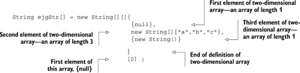
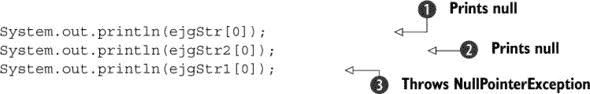

## 第八章. 完整模拟考试

***本章涵盖***

+   完整模拟考试，共 77 题

+   所有模拟考试问题的答案，包括详细的解释和每个考试问题所基于的子目标

在实际考试中，每个问题都会显示你应该选择的正确选项的数量。考试引擎不会允许你选择比这个数字更多的答案选项。如果你尝试这样做，将会显示警告。这个模拟考试中的问题也指定了正确的答案选项数量，以便更接近实际考试。

### 8.1. 模拟考试

> **ME-Q1)**
> 
> 给定以下`Animal`、`Lion`和`Jumpable`类的定义，选择不会导致编译错误或运行时异常的变量赋值组合（选择 2 个选项）。
> 
> ```
> interface Jumpable {}
> class Animal {}
> class Lion extends Animal implements Jumpable {}
> ```
> 
> 1.  `Jumpable var1 = new Jumpable();`
> 1.  
> 1.  `Animal var2 = new Animal();`
> 1.  
> 1.  `Lion var3 = new Animal();`
> 1.  
> 1.  `Jumpable var4 = new Animal();`
> 1.  
> 1.  `Jumpable var5 = new Lion();`
> 1.  
> 1.  `Jumpable var6 = (Jumpable)(new Animal());`
> 1.  
> **ME-Q2)**
> 
> 给定以下代码，如果用以下选项替换`/* INSERT CODE HERE */`，将使代码打印`1`？（选择 1 个选项。）
> 
> ```
> try {
>     String[][] names = {{"Andre", "Mike"}, null, {"Pedro"}};
>     System.out.println (names[2][1].substring(0, 2));
> } catch (/*INSERT CODE HERE*/) {
>     System.out.println(1);
> }
> ```
> 
> 1.  `IndexPositionException e`
> 1.  
> 1.  `NullPointerException e`
> 1.  
> 1.  `ArrayIndexOutOfBoundsException e`
> 1.  
> 1.  `ArrayOutOfBoundsException e`
> 1.  
> **ME-Q3)**
> 
> 以下代码的输出是什么？（选择 1 个选项。）
> 
> ```
> public static void main(String[] args) {
>     int a = 10; String name = null;
>     try {
>         a = name.length();                   //line1
>         a++;                                 //line2
>     } catch (NullPointerException e){
>         ++a;
>         return;
>     } catch (RuntimeException e){
>         a--;
>         return;
>     } finally {
>         System.out.println(a);
>     }
> }
> ```
> 
> 1.  `5`
> 1.  
> 1.  `6`
> 1.  
> 1.  `10`
> 1.  
> 1.  `11`
> 1.  
> 1.  `12`
> 1.  
> 1.  编译错误
> 1.  
> 1.  没有输出
> 1.  
> 1.  运行时异常
> 1.  
> **ME-Q4)**
> 
> 给定以下类定义，
> 
> ```
> class Student { int marks = 10; }
> ```
> 
> 以下代码的输出是什么？（选择 1 个选项。）
> 
> ```
> class Result {
>     public static void main(String... args) {
>         Student s = new Student();
>         switch (s.marks) {
>             default: System.out.println("100");
>             case 10: System.out.println("10");
>             case 98: System.out.println("98");
>         }
>     }
> }
> ```
> 
> 1.  ```
>     100
>     10
>     98
>     ```
> 1.  
> 1.  ```
>     10
>     98
>     ```
> 1.  
> 1.  ```
>     100
>     ```
> 1.  
> 1.  ```
>     10
>     ```
> 1.  
> **ME-Q5)**
> 
> 给定以下代码，以下哪个代码可以用来创建并初始化`ColorPencil`类的对象？（选择 2 个选项。）
> 
> ```
> class Pencil {}
> class ColorPencil extends Pencil {
>     String color;
>     ColorPencil(String color) {this.color = color;}
> }
> ```
> 
> 1.  `ColorPencil var1 = new ColorPencil();`
> 1.  
> 1.  `ColorPencil var2 = new ColorPencil(RED);`
> 1.  
> 1.  `ColorPencil var3 = new ColorPencil("RED");`
> 1.  
> 1.  `Pencil var4 = new ColorPencil("BLUE");`
> 1.  
> **ME-Q6)**
> 
> 以下代码的输出是什么？（选择 1 个选项。）
> 
> ```
> class Doctor {
>     protected int age;
>     protected void setAge(int val) { age = val; }
>     protected int getAge() { return age; }
> }
> class Surgeon extends Doctor {
>     Surgeon(String val) {
>         specialization = val;
>     }
> 
>     String specialization;
>     String getSpecialization() { return specialization; }
> }
> class Hospital {
>     public static void main(String args[]) {
>         Surgeon s1 = new Surgeon("Liver");
>         Surgeon s2 = new Surgeon("Heart");
>         s1.age = 45;
>         System.out.println(s1.age + s2.getSpecialization());
>         System.out.println(s2.age + s1.getSpecialization());
>     }
> }
> ```
> 
> 1.  ```
>     45Heart
>     0Liver
>     ```
> 1.  
> 1.  ```
>     45Liver
>     0Heart
>     ```
> 1.  
> 1.  ```
>     45Liver
>     45Heart
>     ```
> 1.  
> 1.  ```
>     45Heart
>     45Heart
>     ```
> 1.  
> 1.  类无法编译。
> 1.  
> **ME-Q7)**
> 
> 以下代码的输出是什么？（选择 1 个选项。）
> 
> ```
> class RocketScience {
>     public static void main(String args[]) {
>         int a = 0;
>         while (a == a++) {
>             a++;
>             System.out.println(a);
>         }
>     }
> }
> ```
> 
> 1.  `while`循环不会执行；不会打印任何内容。
> 1.  
> 1.  `while`循环将无限执行，从`1`开始打印所有数字。
> 1.  
> 1.  `while`循环将无限执行，从`0`开始打印所有偶数。
> 1.  
> 1.  `while`循环将无限执行，从`2`开始打印所有偶数。
> 1.  
> 1.  `while`循环将无限执行，从`1`开始打印所有奇数。
> 1.  
> 1.  `while`循环将无限执行，从`3`开始打印所有奇数。
> 1.  
> **ME-Q8)**
> 
> 给定以下语句，
> 
> +   `com.ejava`是一个包
> +   
> +   `Person`类定义在`com.ejava`包中
> +   
> +   `Course`类定义在`com.ejava`包中
> +   
> 以下哪个选项正确地导入了 `Person` 和 `Course` 类到 `MyEJava` 类中？（选择 3 个选项。）
> 
> 1.  ```
>     import com.ejava.*;
>     class MyEJava {}
>     ```
> 1.  
> 1.  ```
>     import com.ejava;
>     class MyEJava {}
>     ```
> 1.  
> 1.  ```
>     import com.ejava.Person;
>     import com.ejava.Course;
>     class MyEJava {}
>     ```
> 1.  
> 1.  ```
>     import com.ejava.Person;
>     import com.ejava.*;
>     class MyEJava {}
>     ```
> 1.  
> **ME-Q9)**
> 
> 假设以下 `Animal` 和 `Forest` 类定义在同一个包中，检查代码并选择正确的语句（选择 2 个选项）。
> 
> ```
> line1>    class Animal {
> line2>        public void printKing() {
> line3>            System.out.println("Lion");
> line4>        }
> line5>    }
> 
> line6>    class Forest {
> line7>        public static void main(String... args) {
> line8>            Animal anAnimal = new Animal();
> line9>            anAnimal.printKing();
> line10>        }
> line11>    }
> ```
> 
> 1.  类 `Forest` 打印 `Lion`。
> 1.  
> 1.  如果将第 2 行的代码更改为以下内容，类 `Forest` 将打印 `Lion`：
> 1.  
>     ```
>     private void printKing() {
>     ```
>     
> 1.  如果将第 2 行的代码更改为以下内容，类 `Forest` 将打印 `Lion`：
> 1.  
>     ```
>     void printKing() {
>     ```
>     
> 1.  如果将第 2 行的代码更改为以下内容，类 `Forest` 将打印 `Lion`：
> 1.  
>     ```
>     default void printKing() {
>     ```
>     
> **ME-Q10)**
> 
> 给定以下代码，
> 
> ```
> class MainMethod {
>     public static void main(String... args) {
>         System.out.println(args[0]+":"+ args[2]);
>     }
> }
> ```
> 
> 使用以下命令执行时，其输出是什么？（选择 1 个选项。）
> 
> ```
> java MainMethod 1+2 2*3 4-3 5+1
> ```
> 
> 1.  `java:1+2`
> 1.  
> 1.  `java:3`
> 1.  
> 1.  `MainMethod:2*3`
> 1.  
> 1.  `MainMethod:6`
> 1.  
> 1.  `1+2:2*3`
> 1.  
> 1.  `3:3`
> 1.  
> 1.  `6`
> 1.  
> 1.  `1+2:4-3`
> 1.  
> 1.  `31`
> 1.  
> 1.  `4`
> 1.  
> **ME-Q11)**
> 
> 以下代码的输出是什么？（选择 1 个选项。）
> 
> ```
> interface Moveable {
>     int move(int distance);
> }
> class Person {
>     static int MIN_DISTANCE = 5;
>     int age;
>     float height;
>     boolean result;
>     String name;
> }
> public class EJava {
>     public static void main(String arguments[]) {
>         Person person = new Person();
>         Moveable moveable = (x) -> Person.MIN_DISTANCE + x;
>         System.out.println(person.name + person.height + person.result
>                                        + person.age + moveable.move(20));
>     }
> }
> ```
> 
> 1.  `null0.0false025`
> 1.  
> 1.  `null0false025`
> 1.  
> 1.  `null0.0ffalse025`
> 1.  
> 1.  `0.0false025`
> 1.  
> 1.  `0false025`
> 1.  
> 1.  `0.0ffalse025`
> 1.  
> 1.  `null0.0true025`
> 1.  
> 1.  `0true025`
> 1.  
> 1.  `0.0ftrue025`
> 1.  
> 1.  编译错误
> 1.  
> 1.  运行时异常
> 1.  
> **ME-Q12)**
> 
> 给定以下代码，如果用以下选项替换 `/* INSERT CODE HERE */`，将使代码打印变量 `pagesPerMin` 的值？（选择 1 个选项。）
> 
> ```
> class Printer {
>     int inkLevel;
> }
> class LaserPrinter extends Printer {
>     int pagesPerMin;
>     public static void main(String args[]) {
>         Printer myPrinter = new LaserPrinter();
>         System.out.println(/* INSERT CODE HERE */);
>     }
> }
> ```
> 
> 1.  `(LaserPrinter)myPrinter.pagesPerMin`
> 1.  
> 1.  `myPrinter.pagesPerMin`
> 1.  
> 1.  `LaserPrinter.myPrinter.pagesPerMin`
> 1.  
> 1.  `((LaserPrinter)myPrinter).pagesPerMin`
> 1.  
> **ME-Q13)**
> 
> 以下代码的输出是什么？（选择 1 个选项。）
> 
> ```
> interface Keys {
>     String keypad(String region, int keys);
> }
> public class Handset {
>     public static void main(String... args) {
>         double price;
>         String model;
>         Keys varKeys = (region, keys) ->
>                        {if (keys >= 32)
>                         return region; else return "default";};
>         System.out.println(model + price + varKeys.keypad("AB", 32));
>     }
> }
> ```
> 
> 1.  `null0AB`
> 1.  
> 1.  `null0.0AB`
> 1.  
> 1.  `null0default`
> 1.  
> 1.  `null0.0default`
> 1.  
> 1.  `0`
> 1.  
> 1.  `0.0`
> 1.  
> 1.  编译错误
> 1.  
> **ME-Q14)**
> 
> 以下代码的输出是什么？（选择 1 个选项。）
> 
> ```
> public class Sales {
>     public static void main(String args[]) {
>         int salesPhone = 1;
>         System.out.println(salesPhone++ + ++salesPhone +
>                                                        ++salesPhone);
>     }
> }
> ```
> 
> 1.  `5`
> 1.  
> 1.  `6`
> 1.  
> 1.  `8`
> 1.  
> 1.  `9`
> 1.  
> **ME-Q15)**
> 
> 以下哪个选项定义了编译成功的 Java 类的正确结构？（选择 1 个选项。）
> 
> 1.  ```
>     package com.ejava.guru;
>     package com.ejava.oracle;
>     class MyClass {
>         int age = /* 25 */ 74;
>     }
>     ```
> 1.  
> 1.  ```
>     import com.ejava.guru.*;
>     import com.ejava.oracle.*;
>     package com.ejava;
>     class MyClass {
>         String name = "e" + "Ja /*va*/ v";
>     }
>     ```
> 1.  
> 1.  ```
>     class MyClass {
>         import com.ejava.guru.*;
>     }
>     ```
> 1.  
> 1.  ```
>     class MyClass {
>         int abc;
>         String course = //this is a comment
>                      "eJava";
>     }
>     ```
> 1.  
> 1.  以上皆非
> 1.  
> **ME-Q16)**
> 
> 以下代码的输出是什么？（选择 1 个选项。）
> 
> ```
> class OpPre {
>     public static void main(String... args) {
>         int x = 10;
>         int y = 20;
> 
>         int z = 30;
>         if (x+y%z > (x+(-y)*(-z))) {
>             System.out.println(x + y + z);
>         }
>     }
> }
> ```
> 
> 1.  `60`
> 1.  
> 1.  `59`
> 1.  
> 1.  `61`
> 1.  
> 1.  没有输出。
> 1.  
> 1.  代码无法编译。
> 1.  
> **ME-Q17)**
> 
> 选择变量 `name` 的最合适的定义以及它应该声明的行号，以便以下代码编译成功（选择 1 个选项）。
> 
> ```
> class EJava {
>     // LINE 1
>     public EJava() {
>         System.out.println(name);
>     }
>     void calc() {
>         // LINE 2
>         if (8 > 2) {
>             System.out.println(name);
>         }
>     }
>     public static void main(String... args) {
>         // LINE 3
>         System.out.println(name);
>     }
> }
> ```
> 
> 1.  在第 1 行定义 `static String name;`。
> 1.  
> 1.  在第 1 行定义 `String name;`。
> 1.  
> 1.  在第 2 行定义 `String name;`。
> 1.  
> 1.  在第 3 行定义 `String name;`。
> 1.  
> **ME-Q18)**
> 
> 检查以下代码并选择正确的语句（选择 1 个选项）。
> 
> ```
> line1>    class Emp {
> line2>        Emp mgr = new Emp();
> line3>    }
> line4>    class Office {
> line5>        public static void main(String args[]) {
> line6>            Emp e = null;
> line7>            e = new Emp();
> line8>            e = null;
> line9>        }
> line10>    }
> ```
> 
> 1.  对象 `e` 在第 8 行可被垃圾回收。
> 1.  
> 1.  对象 `e` 在第 9 行可被垃圾回收。
> 1.  
> 1.  对象 `e` 不可被垃圾回收，因为其成员变量 `mgr` 没有设置为 `null`。
> 1.  
> 1.  代码抛出运行时异常，代码执行永远不会到达第 8 行或第 9 行。
> 1.  
> **ME-Q19)**
> 
> 给定以下，
> 
> ```
> long result;
> ```
> 
> 哪些选项是接受两个 `String` 参数和一个 `int` 参数的方法的正确声明，并且其返回值可以赋给变量 `result`？(选择 3 个选项。)
> 
> 1.  `Short myMethod1(String str1, int str2, String str3)`
> 1.  
> 1.  `Int myMethod2(String val1, int val2, String val3)`
> 1.  
> 1.  `Byte myMethod3(String str1, str2, int a)`
> 1.  
> 1.  `Float myMethod4(String val1, val2, int val3)`
> 1.  
> 1.  `Long myMethod5(int str2, String str3, String str1)`
> 1.  
> 1.  `Long myMethod6(String... val1, int val2)`
> 1.  
> 1.  `Short myMethod7(int val1, String... val2)`
> 1.  
> **ME-Q20)**
> 
> 以下哪个选项可以成功编译？(选择 3 个选项。)
> 
> 1.  `int eArr1[] = {10, 23, 10, 2};`
> 1.  
> 1.  `int[] eArr2 = new int[10];`
> 1.  
> 1.  `int[] eArr3 = new int[] {};`
> 1.  
> 1.  `int[] eArr4 = new int[10] {};`
> 1.  
> 1.  `int eArr5[] = new int[2] {10, 20};`
> 1.  
> **ME-Q21)**
> 
> 假设 Oracle 要求你创建一个返回两个 `String` 对象连接值的函数。以下哪个函数可以完成这项任务？(选择 2 个选项。)
> 
> 1.  ```
>     public String add(String 1, String 2) {
>         return str1 + str2;
>     }
>     ```
> 1.  
> 1.  ```
>     private String add(String s1, String s2) {
>         return s1.concat(s2);
>     }
>     ```
> 1.  
> 1.  ```
>     protected String add(String value1, String value2) {
>         return value2.append(value2);
>     }
>     ```
> 1.  
> 1.  ```
>     String subtract(String first, String second) {
>         return first.concat(second.substring(0));
>     }
>     ```
> 1.  
> **ME-Q22)**
> 
> 给定以下，
> 
> ```
> int ctr = 10;
> char[] arrC1 = new char[]{'P','a','u','l'};
> char[] arrC2 = {'H','a','r','r','y'};
> //INSERT CODE HERE
> System.out.println(ctr);
> ```
> 
> 哪些选项，当插入到 `//INSERT CODE HERE` 时，将输出 `14`？(选择 2 个选项。)
> 
> 1.  ```
>     for (char c1 : arrC1) {
>         for (char c2 : arrC2) {
>             if (c2 == 'a') break;
>             ++ctr;
>         }
>     }
>     ```
> 1.  
> 1.  ```
>     for (char c1 : arrC1)
>         for (char c2 : arrC2) {
>             if (c2 == 'a') break;
>             ++ctr;
>         }
>     ```
> 1.  
> 1.  ```
>     for (char c1 : arrC1)
>         for (char c2 : arrC2)
>             if (c2 == 'a') break;
>             ++ctr;
>     ```
> 1.  
> 1.  ```
>     for (char c1 : arrC1) {
>         for (char c2 : arrC2) {
>             if (c2 == 'a') continue;
>             ++ctr;
>         }
>     }
>     ```
> 1.  
> **ME-Q23)**
> 
> 给定以下对类 `ChemistryBook` 的定义，选择正确的语句（选择 2 个选项）。
> 
> ```
> import java.util.ArrayList;
> class ChemistryBook {
>     public void read() {}                //METHOD1
>     public String read() { return null; }     //METHOD2
>     ArrayList read(int a) { return null; }     //METHOD3
> }
> ```
> 
> 1.  标记为 `//METHOD1` 和 `//METHOD2` 的方法是正确重载的方法。
> 1.  
> 1.  标记为 `//METHOD2` 和 `//METHOD3` 的方法是正确重载的方法。
> 1.  
> 1.  标记为 `//METHOD1` 和 `//METHOD3` 的方法是正确重载的方法。
> 1.  
> 1.  所有方法——标记为 `//METHOD1`、`//METHOD2` 和 `//METHOD3` 的方法——都是正确重载的方法。
> 1.  
> **ME-Q24)**
> 
> 给定以下，
> 
> ```
> final class Home {
>     String name;
>     int rooms;
>     //INSERT CONSTRUCTOR HERE
> }
> ```
> 
> 哪些选项，当插入到 `//INSERT CONSTRUCTOR HERE` 时，将为类 `Home` 定义有效的重载构造函数？(选择 3 个选项。)
> 
> 1.  `Home() {}`
> 1.  
> 1.  `Float Home() {}`
> 1.  
> 1.  `protected Home(int rooms) {}`
> 1.  
> 1.  `final Home() {}`
> 1.  
> 1.  `private Home(long name) {}`
> 1.  
> 1.  `float Home(int rooms, String name) {}`
> 1.  
> 1.  `static Home() {}`
> 1.  
> **ME-Q25)**
> 
> 给定以下代码，以下哪个选项，如果用于替换 `// INSERT CODE HERE`，将使代码打印出完全能被 14 整除的数字？(选择 1 个选项。)
> 
> ```
> for (int ctr = 2; ctr <= 30; ++ctr) {
>     if (ctr % 7 != 0)
>         //INSERT CODE HERE
>     if (ctr % 14 == 0)
>         System.out.println(ctr);
> }
> ```
> 
> 1.  `continue;`
> 1.  
> 1.  `exit;`
> 1.  
> 1.  `break;`
> 1.  
> 1.  `end;`
> 1.  
> **ME-Q26)**
> 
> 以下代码的输出是什么？(选择 1 个选项。)
> 
> ```
> import java.util.function.Predicate;
> public class MyCalendar {
>     public static void main(String arguments[]) {
>         Season season1 = new Season();
>         season1.name = "Spring";
> 
>         Season season2 = new Season();
>         season2.name = "Autumn";
> 
>         Predicate<String> aSeason = (s) -> s == "Summer" ?
>                                 season1.name : season2.name;
>         season1 = season2;
>         System.out.println(season1.name);
>         System.out.println(season2.name);
>         System.out.println(aSeason.test(new String("Summer")));
>     }
> }
> class Season {
>     String name;
> }
> ```
> 
> 1.  ```
>     String
>     Autumn
>     false
>     ```
> 1.  
> 1.  ```
>     Spring
>     String
>     false
>     ```
> 1.  
> 1.  ```
>     Autumn
>     Autumn
>     false
>     ```
> 1.  
> 1.  ```
>     Autumn
>     String
>     true
>     ```
> 1.  
> 1.  编译错误
> 1.  
> 1.  运行时异常
> 1.  
> **ME-Q27)**
> 
> 以下代码的哪个说法是正确的？(选择 1 个选项。)
> 
> ```
> class Shoe {}
> class Boot extends Shoe {}
> class ShoeFactory {
>     ShoeFactory(Boot val) {
>         System.out.println("boot");
>     }
>     ShoeFactory(Shoe val) {
>         System.out.println("shoe");
>     }
> }
> ```
> 
> 1.  类 `ShoeFactory` 总共有两个重载构造函数。
> 1.  
> 1.  类 `ShoeFactory` 有三个重载构造函数，两个用户定义构造函数和一个默认构造函数。
> 1.  
> 1.  `ShoeFactory` 类将无法编译。
> 1.  
> 1.  添加以下构造函数将使 `ShoeFactory` 类的构造函数数量增加到 3 个：
> 1.  
>     ```
>     private ShoeFactory (Shoe arg) {}
>     ```
>     
> **ME-Q28)**
> 
> 给定 `ColorPencil` 和 `TestColor` 类的定义，以下哪个选项，如果用于替换 `//INSERT CODE HERE`，将初始化引用变量 `myPencil` 的实例变量 `color` 为字符串字面值 `"RED"`？（选择 1 个选项。）
> 
> ```
> class ColorPencil {
>     String color;
>     ColorPencil(String color) {
>         //INSERT CODE HERE
>     }
> }
> class TestColor {
>     ColorPencil myPencil = new ColorPencil("RED");
> }
> ```
> 
> 1.  `this.color = color;`
> 1.  
> 1.  `color = color;`
> 1.  
> 1.  `color = RED;`
> 1.  
> 1.  `this.color = RED;`
> 1.  
> **ME-Q29)**
> 
> 以下代码的输出是什么？（选择 1 个选项。）
> 
> ```
> class EJavaCourse {
>     String courseName = "Java";
> }
> class University {
>     public static void main(String args[]) {
>         EJavaCourse courses[] = { new EJavaCourse(), new EJavaCourse() };
>         courses[0].courseName = "OCA";
>         for (EJavaCourse c : courses) c = new EJavaCourse();
>         for (EJavaCourse c : courses) System.out.println(c.courseName);
>     }
> }
> ```
> 
> 1.  ```
>     Java
>     Java
>     ```
> 1.  
> 1.  ```
>     OCA
>     Java
>     ```
> 1.  
> 1.  ```
>     OCA
>     OCA
>     ```
> 1.  
> 1.  以上皆非
> 1.  
> **ME-Q30)**
> 
> 以下代码的输出是什么？（选择 1 个选项。）
> 
> ```
> class Phone {
>     static void call() {
>         System.out.println("Call-Phone");
>     }
> 
> }
> class SmartPhone extends Phone{
>     static void call() {
>         System.out.println("Call-SmartPhone");
>     }
> }
> class TestPhones {
>     public static void main(String... args) {
>         Phone phone = new Phone();
>         Phone smartPhone = new SmartPhone();
>         phone.call();
>         smartPhone.call();
>     }
> }
> ```
> 
> 1.  ```
>     Call-Phone
>     Call-Phone
>     ```
> 1.  
> 1.  ```
>     Call-Phone
>     Call-SmartPhone
>     ```
> 1.  
> 1.  ```
>     Call-Phone
>     null
>     ```
> 1.  
> 1.  ```
>     null
>     Call-SmartPhone
>     ```
> 1.  
> **ME-Q31)**
> 
> 给定以下代码，以下哪些语句是正确的？（选择 3 个选项。）
> 
> ```
> class MyExam {
>     void question() {
>         try {
>             question();
>         } catch (StackOverflowError e) {
>             System.out.println("caught");
>         }
>     }
>     public static void main(String args[]) {
>         new MyExam().question();
>     }
> }
> ```
> 
> 1.  代码将打印 `caught`。
> 1.  
> 1.  代码不会打印 `caught`。
> 1.  
> 1.  如果 `StackOverflowError` 是运行时异常，代码将打印 `caught`。
> 1.  
> 1.  如果 `StackOverflowError` 是一个检查型异常，代码将打印 `caught`。
> 1.  
> 1.  如果 `question()` 抛出 `NullPointer-Exception` 异常，代码将打印 `caught`。
> 1.  
> **ME-Q32)**
> 
> `Student` 类被定义为以下形式：
> 
> ```
> public class Student {
>     private String fName;
>     private String lName;
> 
>     public Student(String first, String last) {
>         fName = first; lName = last;
>     }
>     public String getName() { return fName + lName; }
> }
> ```
> 
> 类的创建者后来将方法 `getName` 改变为以下形式：
> 
> ```
> public String getName() {
>     return fName + " " + lName;
> }
> ```
> 
> 这个变化的含义是什么？（选择 2 个选项。）
> 
> 1.  使用 `Student` 类的类将无法编译。
> 1.  
> 1.  使用 `Student` 类的类将无需任何编译问题而工作。
> 1.  
> 1.  `Student` 类是一个封装良好的类的例子。
> 1.  
> 1.  `Student` 类将其实例变量暴露在类外部。
> 1.  
> **ME-Q33)**
> 
> 以下代码的输出是什么？（选择 1 个选项。）
> 
> ```
> class ColorPack {
>     int shadeCount = 12;
>     static int getShadeCount() {
>         return shadeCount;
>     }
> }
> class Artist {
>     public static void main(String args[]) {
>         ColorPack pack1 = new ColorPack();
>         System.out.println(pack1.getShadeCount());
>     }
> }
> ```
> 
> 1.  `10`
> 1.  
> 1.  `12`
> 1.  
> 1.  没有输出
> 1.  
> 1.  编译错误
> 1.  
> **ME-Q34)**
> 
> 保罗定义了他的 `Laptop` 和 `Workshop` 类来升级他的笔记本电脑的内存。你认为他成功了么？以下代码的输出是什么？（选择 1 个选项。）
> 
> ```
> class Laptop {
>     String memory = "1 GB";
> }
> class Workshop {
>     public static void main(String args[]) {
>         Laptop life = new Laptop();
>         repair(life);
> 
>         System.out.println(life.memory);
>     }
>     public static void repair(Laptop laptop) {
>         laptop.memory = "2 GB";
>     }
> }
> ```
> 
> 1.  `1 GB`
> 1.  
> 1.  `2 GB`
> 1.  
> 1.  编译错误
> 1.  
> 1.  运行时异常
> 1.  
> **ME-Q35)**
> 
> 以下代码的输出是什么？（选择 1 个选项。）
> 
> ```
> public class Application {
>     public static void main(String... args) {
>         double price = 10;
>         String model;
>         if (price > 10)
>             model = "Smartphone";
>         else if (price <= 10)
>             model = "landline";
>         System.out.println(model);
>     }
> }
> ```
> 
> 1.  `landline`
> 1.  
> 1.  `Smartphone`
> 1.  
> 1.  没有输出
> 1.  
> 1.  编译错误
> 1.  
> **ME-Q36)**
> 
> 以下代码的输出是什么？（选择 1 个选项。）
> 
> ```
> class EString {
>     public static void main(String args[]) {
>         String eVal = "123456789";
>         System.out.println(eVal.substring(eVal.indexOf("2"),
>         eVal.indexOf("0")).concat("0"));
>     }
> }
> ```
> 
> 1.  `234567890`
> 1.  
> 1.  `34567890`
> 1.  
> 1.  `234456789`
> 1.  
> 1.  `3456789`
> 1.  
> 1.  编译错误
> 1.  
> 1.  运行时异常
> 1.  
> **ME-Q37)**
> 
> 检查以下代码并选择正确的语句（选择 2 个选项）。
> 
> ```
> class Artist {
>     Artist assistant;
> }
> class Studio {
>     public static void main(String... args) {
>         Artist a1 = new Artist();
>         Artist a2 = new Artist();
>         a2.assistant = a1;
>         a2 = null;        // Line 1
>     }
>      // Line 2
> }
> ```
> 
> 1.  至少有两个对象在第 1 行被垃圾回收。
> 1.  
> 1.  至少有一个对象在第 1 行被垃圾回收。
> 1.  
> 1.  第 1 行没有对象被垃圾回收。
> 1.  
> 1.  第 1 行被垃圾回收的对象数量是未知的。
> 1.  
> 1.  至少有两个对象在第 2 行有资格被垃圾回收。
> 1.  
> **ME-Q38)**
> 
> 以下代码的输出是什么？（选择 1 个选项。）
> 
> ```
> class Book {
>     String ISBN;
>     Book(String val) {
>         ISBN = val;
>     }
> }
> class TestEquals {
>     public static void main(String... args) {
>         Book b1 = new Book("1234-4657");
>         Book b2 = new Book("1234-4657");
>         System.out.print(b1.equals(b2) +":");
>         System.out.print(b1 == b2);
>     }
> }
> ```
> 
> 1.  `true:false`
> 1.  
> 1.  `true:true`
> 1.  
> 1.  `false:true`
> 1.  
> 1.  `false:false`
> 1.  
> 1.  编译错误——在`Book`类中没有`equals`方法。
> 1.  
> 1.  运行时异常。
> 1.  
> **ME-Q39)**
> 
> 以下哪个陈述是正确的？（选择 2 个选项。）
> 
> 1.  `StringBuilder sb1 = new StringBuilder()`将创建一个没有字符但具有存储 16 个字符的初始容量的`StringBuilder`对象。
> 1.  
> 1.  `StringBuilder sb1 = new StringBuilder(5*10)`将创建一个具有值`50`的`StringBuilder`对象。
> 1.  
> 1.  与`String`类不同，`StringBuilder`中的`concat`方法会修改`StringBuilder`对象的值。
> 1.  
> 1.  `insert`方法可以用来在`StringBuilder`的开始、结束或指定位置插入字符、数字或`String`。
> 1.  
> **ME-Q40)**
> 
> 给定以下`Animal`类和`Jump`接口的定义，选择正确的数组声明和初始化（选择 3 个选项）。
> 
> ```
> interface Jump {}
> class Animal implements Jump {}
> ```
> 
> 1.  `Jump eJump1[] = {null, new Animal()};`
> 1.  
> 1.  `Jump[] eJump2 = new Animal()[22];`
> 1.  
> 1.  `Jump[] eJump3 = new Jump[10];`
> 1.  
> 1.  `Jump[] eJump4 = new Animal[87];`
> 1.  
> 1.  `Jump[] eJump5 = new Jump()[12];`
> 1.  
> **ME-Q41)**
> 
> 以下代码的输出是什么？（选择 1 个选项。）
> 
> ```
> import java.util.*;
> class EJGArrayL {
>     public static void main(String args[]) {
>         ArrayList<String> seasons = new ArrayList<>();
>         seasons.add(1, "Spring"); seasons.add(2, "Summer");
>         seasons.add(3, "Autumn"); seasons.add(4, "Winter");
>         seasons.remove(2);
> 
>         for (String s : seasons)
>             System.out.print(s + ", ");
>     }
> }
> ```
> 
> 1.  `Spring, Summer, Winter,`
> 1.  
> 1.  `Spring, Autumn, Winter,`
> 1.  
> 1.  `Autumn, Winter,`
> 1.  
> 1.  编译错误
> 1.  
> 1.  运行时异常
> 1.  
> **ME-Q42)**
> 
> 以下代码的输出是什么？（选择 1 个选项。）
> 
> ```
> class EIf {
>     public static void main(String args[]) {
>         bool boolean = false;
>         do {
>             if (boolean = true)
>                 System.out.println("true");
>             else
>                 System.out.println("false");
>         }
>         while(3.3 + 4.7 > 8);    }
> }
> ```
> 
> 1.  该类将打印`true`。
> 1.  
> 1.  该类将打印`false`。
> 1.  
> 1.  如果将`if`条件改为`boolean == true`，则该类将打印`true`。
> 1.  
> 1.  如果将`if`条件改为`boolean != true`，则该类将打印`false`。
> 1.  
> 1.  该类无法编译。
> 1.  
> 1.  运行时异常。
> 1.  
> **ME-Q43)**
> 
> `Whale`（如下定义）成功吃掉了多少条`Fish`？检查以下代码并选择正确的陈述（选择 2 个选项）。
> 
> ```
> class Whale {
>     public static void main(String args[]) {
>         boolean hungry = false;
>         while (hungry=true) {
>             ++Fish.count;
>         }
>         System.out.println(Fish.count);
>     }
> }
> class Fish {
>     static byte count;
> }
> ```
> 
> 1.  代码无法编译。
> 1.  
> 1.  代码不打印任何值。
> 1.  
> 1.  代码打印`0`。
> 1.  
> 1.  将`++Fish.count`改为`Fish.count++`将给出相同的结果。
> 1.  
> **ME-Q44)**
> 
> 给定以下代码，如果用以下哪个选项替换`/* REPLACE CODE HERE */`，将使代码打印出存储在数组`phones`中的位置上的电话名称？（选择 1 个选项。）
> 
> ```
> class Phones {
>     public static void main(String args[]) {
>         String phones[]= {"BlackBerry", "Android", "iPhone"};
> 
>         for (String phone : phones)
>             /* REPLACE CODE HERE */
>     }
> }
> ```
> 
> 1.  `System.out.println(phones.count + ":" + phone);`
> 1.  
> 1.  `System.out.println(phones.counter + ":" + phone);`
> 1.  
> 1.  `System.out.println(phones.getPosition() + ":" + phone);`
> 1.  
> 1.  `System.out.println(phones.getCtr() + ":" + phone);`
> 1.  
> 1.  `System.out.println(phones.getCount() + ":" + phone);`
> 1.  
> 1.  `System.out.println(phones.pos + ":" + phone);`
> 1.  
> 1.  以上皆非
> 1.  
> **ME-Q45)**
> 
> 给定以下代码，
> 
> ```
> Byte b1 = (byte)100;                       // 1
> Integer i1 = (int)200;                     // 2
> Long l1 = (long)300;                       // 3
> Float f1 = (float)b1 + ( 
>      0int)l1;            // 4
> String s1 = 300;                           // 5
> if (s1 == (b1 + i1))                       // 6
>     s1 = (String)500;                      // 7
> else                                       // 8
>     f1 = (int)100;                         // 9
> System.out.println(s1 + ":" + f1);         // 10
> ```
> 
> 输出是什么？选择 1 个选项。
> 
> 1.  代码在第 1、3、4、7 行处失败编译。
> 1.  
> 1.  代码在第 6 行、第 7 行处编译失败。
> 1.  
> 1.  代码在第 7 行、第 9 行处编译失败。
> 1.  
> 1.  代码在第 4 行、第 5 行、第 6 行、第 7 行、第 9 行处编译失败。
> 1.  
> 1.  没有编译错误——输出 `500:300`。
> 1.  
> 1.  没有编译错误——输出 `300:100`。
> 1.  
> 1.  运行时异常。
> 1.  
> **ME-Q46)**
> 
> 以下代码的输出是什么？(选择 1 个选项。)
> 
> ```
> class Book {
>     String ISBN;
>     Book(String val) {
>         ISBN = val;
>     }
>     public boolean equals(Object b) {
>         if (b instanceof Book) {
>             return ((Book)b).ISBN.equals(ISBN);
>         }
> 
>         else
>             return false;
>     }
> }
> 
> class TestEquals {
>     public static void main(String args[]) {
>         Book b1 = new Book("1234-4657");
>         Book b2 = new Book("1234-4657");
>         LocalDate release = null;
>         release = b1.equals(b2) ? b1 == b2? LocalDate.of(2050,12,12):
>         LocalDate.parse("2072-02-01"):LocalDate.parse("9999-09-09");
>         System.out.print(release);
>     }
> }
> ```
> 
> 1.  `2050-12-12`
> 1.  
> 1.  `2072-02-01`
> 1.  
> 1.  `9999-09-09`
> 1.  
> 1.  编译错误
> 1.  
> 1.  运行时异常
> 1.  
> **ME-Q47)**
> 
> 以下代码的输出是什么？(选择 1 个选项。)
> 
> ```
> int a = 10;
> for (; a <= 20; ++a) {
>     if (a%3 == 0) a++; else if (a%2 == 0) a=a*2;
>     System.out.println(a);
> }
> ```
> 
> 1.  ```
>     11
>     13
>     15
>     17
>     19
>     ```
> 1.  
> 1.  ```
>     20
>     ```
> 1.  
> 1.  ```
>     11
>     14
>     17
>     20
>     ```
> 1.  
> 1.  ```
>     40
>     ```
> 1.  
> 1.  编译错误
> 1.  
> **ME-Q48)**
> 
> 给定以下代码，以下哪个选项，如果用于替换 `// INSERT CODE HERE`，将定义一个重载的 `rideWave` 方法？(选择 1 个选项。)
> 
> ```
> class Raft {
>     public String rideWave() { return null; }
>     //INSERT CODE HERE
> }
> ```
> 
> 1.  `public String[] rideWave() { return null; }`
> 1.  
> 1.  `protected void riceWave(int a) {}`
> 1.  
> 1.  `private void rideWave(int value, String value2) {}`
> 1.  
> 1.  `default StringBuilder rideWave (StringBuffer a) { return null; }`
> 1.  
> **ME-Q49)**
> 
> 给定以下代码，以下哪个选项，如果用于替换 `// INSERT CODE HERE`，将正确计算数组 `num` 中所有偶数的总和并将其存储在变量 `sum` 中？(选择 1 个选项。)
> 
> ```
> int num[] = {10, 15, 2, 17};
> int sum = 0;
> for (int number : num) {
>     //INSERT CODE HERE
>     sum += number;
> }
> ```
> 
> 1.  ```
>     if (number % 2 == 0)
>         continue;
>     ```
> 1.  
> 1.  ```
>     if (number % 2 == 0)
>         break;
>     ```
> 1.  
> 1.  ```
>     if (number % 2 != 0)
>         continue;
>     ```
> 1.  
> 1.  ```
>     if (number % 2 != 0)
>         break;
>     ```
> 1.  
> **ME-Q50)**
> 
> 以下代码的输出是什么？(选择 1 个选项。)
> 
> ```
> class Op {
>     public static void main(String... args) {
>         int a = 0;
>         int b = 100;
>         Predicate<Integer> compare = (var) -> var++ == 10;
>         if (!b++ > 100 && compare.test(a)) {
>             System.out.println(a+b);
>         }
>     }
> }
> ```
> 
> 1.  `100`
> 1.  
> 1.  `101`
> 1.  
> 1.  `102`
> 1.  
> 1.  代码编译失败。
> 1.  
> 1.  没有输出。
> 1.  
> **ME-Q51)**
> 
> 选择符合以下规范的选项：创建一个封装良好的类 `Pencil`，其中有一个实例变量 `model`。`model` 的值应在 `Pencil` 外部可访问和修改。(选择 1 个选项。)
> 
> 1.  ```
>     class Pencil {
>         public String model;
>     }
>     ```
> 1.  
> 1.  ```
>     class Pencil {
>         public String model;
>         public String getModel() { return model; }
>         public void setModel(String val) { model = val; }
>     }
>     ```
> 1.  
> 1.  ```
>     class Pencil {
>         private String model;
>         public String getModel() { return model; }
>         public void setModel(String val) { model = val; }
>     }
>     ```
> 1.  
> 1.  ```
>     class Pencil {
>         public String model;
>         private String getModel() { return model; }
>         private void setModel(String val) { model = val; }
>     }
>     ```
> 1.  
> **ME-Q52)**
> 
> 以下代码的输出是什么？(选择 1 个选项。)
> 
> ```
> class Phone {
>     void call() {
>         System.out.println("Call-Phone");
>     }
> }
> class SmartPhone extends Phone{
>     void call() {
>         System.out.println("Call-SmartPhone");
>     }
> }
> class TestPhones {
>     public static void main(String[] args) {
>         Phone phone = new Phone();
>         Phone smartPhone = new SmartPhone();
>         phone.call();
>         smartPhone.call();
>     }
> }
> ```
> 
> 1.  ```
>     Call-Phone
>     Call-Phone
>     ```
> 1.  
> 1.  ```
>     Call-Phone
>     Call-SmartPhone
>     ```
> 1.  
> 1.  ```
>     Call-Phone
>     null
>     ```
> 1.  
> 1.  ```
>     null
>     Call-SmartPhone
>     ```
> 1.  
> **ME-Q53)**
> 
> 以下代码的输出是什么？(选择 1 个选项。)
> 
> ```
> class Phone {
>     String keyboard = "in-built";
> }
> class Tablet extends Phone {
>     boolean playMovie = false;
> }
> class College2 {
>     public static void main(String args[]) {
>         Phone phone = new Tablet();
>         System.out.println(phone.keyboard + ":" + phone.playMovie);
>     }
> }
> ```
> 
> 1.  `in-built:false`
> 1.  
> 1.  `in-built:true`
> 1.  
> 1.  `null:false`
> 1.  
> 1.  `null:true`
> 1.  
> 1.  编译错误
> 1.  
> **ME-Q54)**
> 
> 以下代码的输出是什么？(选择 1 个选项。)
> 
> ```
> public class Wall {
>     public static void main(String args[]) {
>         double area = 10.98;
>         String color;
>         if (area < 5)
>             color = "red";
>         else
>             color = "blue";
>         System.out.println(color);
>     }
> }
> ```
> 
> 1.  `red`
> 1.  
> 1.  `blue`
> 1.  
> 1.  没有输出
> 1.  
> 1.  编译错误
> 1.  
> **ME-Q55)**
> 
> 以下代码的输出是什么？(选择 1 个选项。)
> 
> ```
> class Diary {
>     int pageCount = 100;
>     int getPageCount() {
>         return pageCount;
>     }
>     void setPageCount(int val) {
>         pageCount = val;
>     }
> }
> 
> class ClassRoom {
>     public static void main(String args[]) {
>         System.out.println(new Diary().getPageCount());
>         new Diary().setPageCount(200);
>         System.out.println(new Diary().getPageCount());
>     }
> }
> ```
> 
> 1.  ```
>     100
>     200
>     ```
> 1.  
> 1.  ```
>     100
>     100
>     ```
> 1.  
> 1.  ```
>     200
>     200
>     ```
> 1.  
> 1.  代码编译失败。
> 1.  
> **ME-Q56)**
> 
> 你认为你可以用以下代码购物多少次（即以下代码的输出是什么）？(选择 1 个选项。)
> 
> ```
> class Shopping {
>     public static void main(String args[]) {
>         boolean bankrupt = true;
>         do System.out.println("enjoying shopping"); bankrupt = false;
>         while (!bankrupt);
>     }
> }
> ```
> 
> 1.  代码打印一次 `enjoying shopping`。
> 1.  
> 1.  代码打印两次 `enjoying shopping`。
> 1.  
> 1.  代码在无限循环中打印 `enjoying shopping`。
> 1.  
> 1.  代码编译失败。
> 1.  
> **ME-Q57)**
> 
> 以下哪个选项是定义多维数组的有效选项？(选择 4 个选项。)
> 
> 1.  `String ejg1[][] = new String[1][2];`
> 1.  
> 1.  `String ejg2[][] = new String[][] { {}, {} };`
> 1.  
> 1.  `String ejg3[][] = new String[2][2];`
> 1.  
> 1.  `String ejg4[][] = new String[][]{{null},new String[]{"a","b","c"}, {new String()}};`
> 1.  
> 1.  `String ejg5[][] = new String[][2];`
> 1.  
> 1.  `String ejg6[][] = new String[][]{"A", "B"};`
> 1.  
> 1.  `String ejg7[][] = new String[]{{"A"}, {"B"}};`
> 1.  
> **ME-Q58**
> 
> 以下代码的输出是什么？（选择 1 个选项。）
> 
> ```
> class Laptop {
>     String memory = "1GB";
> }
> class Workshop {
>     public static void main(String args[]) {
>         Laptop life = new Laptop();
>         repair(life);
>         System.out.println(life.memory);
>     }
>     public static void repair(Laptop laptop) {
>         laptop = new Laptop();
>         laptop.memory = "2GB";
>     }
> }
> ```
> 
> 1.  `1 GB`
> 1.  
> 1.  `2 GB`
> 1.  
> 1.  编译错误
> 1.  
> 1.  运行时异常
> 1.  
> **ME-Q59**
> 
> 给定以下代码，以下哪个选项，如果用于替换`//INSERT CODE HERE`，将使类型为`Roamable`的引用变量能够引用`Phone`类的对象？（选择 1 个选项。）
> 
> ```
> interface Roamable{}
> class Phone {}
> class Tablet extends Phone implements Roamable {
>     //INSERT CODE HERE
> }
> ```
> 
> 1.  `Roamable var = new Phone();`
> 1.  
> 1.  `Roamable var = (Roamable)Phone();`
> 1.  
> 1.  `Roamable var = (Roamable)new Phone();`
> 1.  
> 1.  因为接口`Roamable`和类`Phone`没有关联，类型为`Roamable`的引用变量不能引用`Phone`类的对象。
> 1.  
> **ME-Q60**
> 
> 以下代码的输出是什么？（选择 1 个选项。）
> 
> ```
> class Paper {
>     Paper() {
>         this(10);
>         System.out.println("Paper:0");
>     }
>     Paper(int a) { System.out.println("Paper:1"); }
> }
> class PostIt extends Paper {}
> 
> class TestPostIt {
>     public static void main(String[] args) {
>         Paper paper = new PostIt();
>     }
> }
> ```
> 
> 1.  ```
>     Paper:1
>     ```
> 1.  
> 1.  ```
>     Paper:0
>     ```
> 1.  
> 1.  ```
>     Paper:0
>     Paper:1
>     ```
> 1.  
> 1.  ```
>     Paper:1
>     Paper:0
>     ```
> 1.  
> **ME-Q61**
> 
> 检查以下代码并选择正确的陈述（选择 1 个选项）。
> 
> ```
> line1> class StringBuilders {
> line2>     public static void main(String... args) {
> line3>         StringBuilder sb1 = new StringBuilder("eLion");
> line4>         String ejg = null;
> line5>         ejg = sb1.append("X").substring(sb1.indexOf("L"), sb1.indexOf("X"));
> line6>         System.out.println(ejg);
> line7>     }
> line8> }
> ```
> 
> 1.  代码将打印`LionX`。
> 1.  
> 1.  代码将打印`Lion`。
> 1.  
> 1.  如果将第 5 行代码更改为以下内容，代码将打印`Lion`：
> 1.  
>     ```
>     ejg = sb1.append("X").substring(sb1.indexOf('L'), sb1.indexOf('X'));
>     ```
>     
> 1.  只有当第 4 行代码更改为以下内容时，代码才能编译：
> 1.  
>     ```
>     StringBuilder ejg = null;
>     ```
>     
> **ME-Q62**
> 
> 给定以下代码，
> 
> ```
> interface Jumpable {
>     int height = 1;
>     default void worldRecord() {
>         System.out.print(height);
>     }
> }
> interface Moveable {
>     int height = 2;
>     static void worldRecord() {
>         System.out.print(height);
>     }
> }
> 
> class Chair implements Jumpable, Moveable {
>     int height = 3;
>     Chair() {
>         worldRecord();
>     }
>     public static void main(String args[]) {
>         Jumpable j = new Chair();
>         Moveable m = new Chair();
>         Chair c = new Chair();
>     }
> }
> ```
> 
> 输出是什么？选择 1 个选项。
> 
> 1.  `111`
> 1.  
> 1.  `123`
> 1.  
> 1.  `333`
> 1.  
> 1.  `222`
> 1.  
> 1.  编译错误
> 1.  
> 1.  运行时异常
> 1.  
> **ME-Q63**
> 
> 给定以下代码，以下哪个选项，如果用于替换`/* INSERT CODE HERE */`，将使类`Jungle`能够确定引用变量`animal`是否引用了`Lion`类的对象并打印`1`？（选择 1 个选项。）
> 
> ```
> class Animal{ float age; }
> class Lion extends Animal { int claws;}
> class Jungle {
>     public static void main(String args[]) {
>         Animal animal = new Lion();
>         /* INSERT CODE HERE */
>             System.out.println(1);
>     }
> }
> ```
> 
> 1.  `if (animal instanceof Lion)`
> 1.  
> 1.  `if (animal instanceOf Lion)`
> 1.  
> 1.  `if (animal == Lion)`
> 1.  
> 1.  `if (animal = Lion)`
> 1.  
> **ME-Q64**
> 
> 假设文件`Test.java`定义了以下代码，但无法编译，请选择编译失败的原因（选择 2 个选项）。
> 
> ```
> class Person {
>     Person(String value) {}
> }
> class Employee extends Person {}
> 
> class Test {
>     public static void main(String args[]) {
>         Employee e = new Employee();
>     }
> }
> ```
> 
> 1.  类`Person`无法编译。
> 1.  
> 1.  类`Employee`无法编译。
> 1.  
> 1.  默认构造函数只能调用基类的无参构造函数。
> 1.  
> 1.  在类`Test`中创建`Employee`类对象的代码没有将`String`值传递给`Employee`类的构造函数。
> 1.  
> **ME-Q65**
> 
> 检查以下代码并选择正确的陈述（选择 2 个选项）。
> 
> ```
> class Bottle {
>     void Bottle() {}
>     void Bottle(WaterBottle w) {}
> }
> class WaterBottle extends Bottle {}
> ```
> 
> 1.  基类不能在其构造函数中将定义的类的引用变量作为方法参数传递。
> 1.  
> 1.  类编译成功——基类可以使用其派生类的引用变量作为方法参数。
> 1.  
> 1.  类`Bottle`定义了两个重载的构造函数。
> 1.  
> 1.  类`Bottle`只能访问一个构造函数。
> 1.  
> **ME-Q66**
> 
> 给定以下代码，以下哪个选项，如果用于替换`/* INSERT CODE HERE */`，将导致代码打印`110`？（选择 1 个选项。）
> 
> ```
> class Book {
>     private int pages = 100;
> }
> class Magazine extends Book {
>     private int interviews = 2;
>     private int totalPages() { /* INSERT CODE HERE */ }
> 
>     public static void main(String[] args) {
>         System.out.println(new Magazine().totalPages());
>     }
> 
> }
> ```
> 
> 1.  `return super.pages + this.interviews*5;`
> 1.  
> 1.  `return this.pages + this.interviews*5;`
> 1.  
> 1.  `return super.pages + interviews*5;`
> 1.  
> 1.  `return pages + this.interviews*5;`
> 1.  
> 1.  以上皆非
> 1.  
> **ME-Q67)**
> 
> 给定以下代码，
> 
> ```
> class NoInkException extends Exception {}
> class Pen{
>     void write(String val) throws NoInkException {
>         int c = (10 - 7)/ (8 - 2 - 6);
>     }
>     void article() {
>         //INSERT CODE HERE
>     }
> }
> ```
> 
> 在 `//INSERT CODE HERE` 插入以下哪个选项将定义在 `article` 方法中有效使用 `write` 方法？（选择 2 个选项。）
> 
> 1.  ```
>     try {
>         new Pen().write("story");
>     } catch (NoInkException e) {}
>     ```
> 1.  
> 1.  ```
>     try {
>         new Pen().write("story");
>     } finally {}
>     ```
> 1.  
> 1.  ```
>     try {
>         write("story");
>     } catch (Exception e) {}
>     ```
> 1.  
> 1.  ```
>     try {
>         new Pen().write("story");
>     } catch (RuntimeException e) {}
>     ```
> 1.  
> **ME-Q68)**
> 
> 以下代码的输出是什么？（选择 1 个选项。）
> 
> ```
> class EMyMethods {
>     static String name = "m1";
>     void riverRafting() {
>         String name = "m2";
>         if (8 > 2) {
>             String name = "m3";
>             System.out.println(name);
>         }
>     }
>     public static void main(String[] args) {
>         EMyMethods m1 = new EMyMethods();
>         m1.riverRafting();
>     }
> }
> ```
> 
> 1.  `m1`
> 1.  
> 1.  `m2`
> 1.  
> 1.  `m3`
> 1.  
> 1.  代码无法编译。
> 1.  
> **ME-Q69)**
> 
> 以下代码的输出是什么？（选择 1 个选项。）
> 
> ```
> class EBowl {
>     public static void main(String args[]) {
>         String eFood = "Corn";
>         System.out.println(eFood);
>         mix(eFood);
>         System.out.println(eFood);
>     }
>     static void mix(String foodIn) {
>         foodIn.concat("A");
>         foodIn.replace('C', 'B');
>     }
> }
> ```
> 
> 1.  ```
>     Corn
>     BornA
>     ```
> 1.  
> 1.  ```
>     Corn
>     CornA
>     ```
> 1.  
> 1.  ```
>     Corn
>     Born
>     ```
> 1.  
> 1.  ```
>     Corn
>     Corn
>     ```
> 1.  
> **ME-Q70)**
> 
> 以下代码的哪个陈述是正确的？（选择 1 个选项。）
> 
> ```
> class SwJava {
>     public static void main(String args[]) {
>         String[] shapes = {"Circle", "Square", "Triangle"};
>         switch (shapes) {
>             case "Square": System.out.println("Circle"); break;
>             case "Triangle": System.out.println("Square"); break;
>             case "Circle": System.out.println("Triangle"); break;
>         }
>     }
> }
> ```
> 
> 1.  代码打印 `Circle`。
> 1.  
> 1.  代码打印 `Square`。
> 1.  
> 1.  代码打印 `Triangle`。
> 1.  
> 1.  代码打印
> 1.  
>     ```
>     Circle
>     Square
>     Triangle
>     ```
>     
> 1.  代码打印
> 1.  
>     ```
>     Triangle
>     Circle
>     Square
>     ```
>     
> 1.  代码无法编译。
> 1.  
> **ME-Q71)**
> 
> 给定 `Person`、`Father` 和 `Home` 类的定义，以下哪个选项，如果用于替换 `//INSERT CODE HERE`，将导致代码成功编译？（选择 3 个选项。）
> 
> ```
> class Person {}
> class Father extends Person {
>     public void dance() throws ClassCastException {}
> }
> class Home {
>     public static void main(String args[]) {
>         Person p = new Person();
>         try {
>             ((Father)p).dance();
>         }
>         //INSERT CODE HERE
>     }
> }
> ```
> 
> 1.  ```
>     catch (NullPointerException e) {}
>     catch (ClassCastException e) {}
>     catch (Exception e) {}
>     catch (Throwable t) {}
>     ```
> 1.  
> 1.  ```
>     catch (ClassCastException e) {}
>     catch (NullPointerException e) {}
>     catch (Exception e) {}
>     catch (Throwable t) {}
>     ```
> 1.  
> 1.  ```
>     catch (ClassCastException e) {}
>     catch (Exception e) {}
>     catch (NullPointerException e) {}
>     catch (Throwable t) {}
>     ```
> 1.  
> 1.  ```
>     catch (Throwable t) {}
>     catch (Exception e) {}
>     catch (ClassCastException e) {}
>     catch (NullPointerException e) {}
>     ```
> 1.  
> 1.  ```
>     finally {}
>     ```
> 1.  
> **ME-Q72)**
> 
> 以下代码的输出是什么？（选择 1 个选项。）
> 
> ```
> import java.time.*;
> class Camera {
>     public static void main(String args[]) {
>         int hours;
>         LocalDateTime now = LocalDateTime.of(2020, 10, 01, 0 , 0);
>         LocalDate before = now.toLocalDate().minusDays(1);
>         LocalTime after = now.toLocalTime().plusHours(1);
> 
>         while (before.isBefore(after) && hours < 4) {
>             ++hours;
>         }
>         System.out.println("Hours:" + hours);
>     }
> }
> ```
> 
> 1.  代码打印 `Camera:null`。
> 1.  
> 1.  代码打印 `Camera:Adjust settings manually`。
> 1.  
> 1.  代码打印 `Camera:`。
> 1.  
> 1.  代码将无法编译。
> 1.  
> **ME-Q73)**
> 
> 类 `TestEJavaCourse` 的输出，如下定义，为 `300`：
> 
> ```
> class Course {
>     int enrollments;
> }
> class TestEJavaCourse {
>     public static void main(String args[]) {
>         Course c1 = new Course();
>         Course c2 = new Course();
>         c1.enrollments = 100;
>         c2.enrollments = 200;
>         System.out.println(c1.enrollments + c2.enrollments);
>     }
> }
> ```
> 
> 如果将变量 `enrollments` 定义为 `static` 变量，会发生什么？（选择 1 个选项。）
> 
> 1.  输出无变化。`TestEJavaCourse` 打印 `300`。
> 1.  
> 1.  输出有变化。`TestEJavaCourse` 打印 `200`。
> 1.  
> 1.  输出有变化。`TestEJavaCourse` 打印 `400`。
> 1.  
> 1.  类 `TestEJavaCourse` 无法编译。
> 1.  
> **ME-Q74)**
> 
> 以下代码的输出是什么？（选择 1 个选项。）
> 
> ```
> String ejgStr[] = new String[][]{{null},new String[]{"a","b","c"},{new String()}}[0] ;
> String ejgStr1[] = null;
> String ejgStr2[] = {null};
> 
> System.out.println(ejgStr[0]);
> System.out.println(ejgStr2[0]);
> System.out.println(ejgStr1[0]);
> ```
> 
> 1.  ```
>     null
>     NullPointerException
>     ```
> 1.  
> 1.  ```
>     null
>     null
>     NullPointerException
>     ```
> 1.  
> 1.  ```
>     NullPointerException
>     ```
> 1.  
> 1.  ```
>     null
>     null
>     null
>     ```
> 1.  
> **ME-Q75)**
> 
> 检查以下代码并选择正确的陈述（选择 1 个选项）。
> 
> ```
> import java.util.*;
> class Person {}
> class Emp extends Person {}
> 
> class TestArrayList {
>     public static void main(String[] args) {
>         ArrayList<Object> list = new ArrayList<>();
>         list.add(new String("1234"));                 //LINE1
>         list.add(new Person());                       //LINE2
>         list.add(new Emp());                          //LINE3
>         list.add(new String[]{"abcd", "xyz"});        //LINE4
>         list.add(LocalDate.now().plus(1));            //LINE5
>     }
> }
> ```
> 
> 1.  第 1 行的代码无法编译。
> 1.  
> 1.  第 2 行的代码无法编译。
> 1.  
> 1.  第 3 行的代码无法编译。
> 1.  
> 1.  第 4 行的代码无法编译。
> 1.  
> 1.  第 5 行的代码无法编译。
> 1.  
> 1.  以上皆非。
> 1.  
> 1.  从 (a) 到 (e) 的所有选项。
> 1.  
> **ME-Q76)**
> 
> 以下代码的输出是什么？（选择 1 个选项。）
> 
> ```
> public class If2 {
>     public static void main(String args[]) {
>         int a = 10; int b = 20; boolean c = false;
>         if (b > a) if (++a == 10) if (c!=true) System.out.println(1);
>         else System.out.println(2); else System.out.println(3);
>     }
> }
> ```
> 
> 1.  `1`
> 1.  
> 1.  `2`
> 1.  
> 1.  ```
>     3
>     ```
> 1.  
> 1.  无输出
> 1.  
> **ME-Q77)**
> 
> 给定以下代码，
> 
> ```
> interface Movable {
>     default int distance() {
>         return 10;
>     }
> }
> interface Jumpable {
>     default int distance() {
> 
>         return 10;
>     }
> }
> ```
> 
> 哪些选项正确地定义了实现接口 `Movable` 和 `Jumpable` 的类 `Person`？（选择 1 个选项。）
> 
> 1.  ```
>     class Person implements Movable, Jumpable {}
>     ```
> 1.  
> 1.  ```
>     class Person implements Movable, Jumpable {
>         default int distance() {
>             return 10;
>         }
>     }
>     ```
> 1.  
> 1.  ```
>     class Person implements Movable, Jumpable {
>         public int distance() {
>             return 10;
>         }
>     }
>     ```
> 1.  
> 1.  ```
>     class Person implements Movable, Jumpable {
>         public long distance() {
>             return 10;
>         }
>     }
>     ```
> 1.  
> 1.  ```
>     class Person implements Movable, Jumpable {
>         int distance() {
>             return 10;
>         }
>     }
>     ```

### 8.2\. 模拟考试题目的答案

本节包含 第 8.1 节 中所有模拟考试题目的答案。此外，每个问题都由基于的问题目标所引导。

|  |
| --- |

[7.2] 编写代码以演示多态的使用；包括重写和对象类型与引用类型

|  |
| --- |
|  |

[7.3] 确定何时需要类型转换

|  |
| --- |
|  |

[8.5] “识别常见的异常类（如 NullPointerException、ArithmeticException、ArrayIndexOutOfBoundsException、ClassCastException）”

|  |
| --- |

> **ME-Q1)**
> 
> 给定以下`Animal`、`Lion`和`Jumpable`类的定义，选择不会导致编译错误或运行时异常的变量赋值组合（选择 2 个选项）。
> 
> ```
> interface Jumpable {}
> class Animal {}
> class Lion extends Animal implements Jumpable {}
> ```
> 
> 1.  `Jumpable var1 = new Jumpable();`
> 1.  
> 1.   **`Animal var2 = new Animal();`**
> 1.  
> 1.  `Lion var3 = new Animal();`
> 1.  
> 1.  `Jumpable var4 = new Animal();`
> 1.  
> 1.   **`Jumpable var5 = new Lion();`**
> 1.  
> 1.  `Jumpable var6 = (Jumpable)(new Animal());`
> 1.  
> 答案：b, e
> 
> 解释：选项(a)是错误的。一个`interface`不能被实例化。
> 
> 选项(c)是错误的。派生类的引用变量不能用来引用其基类的对象。
> 
> 选项(d)是错误的。类型为`Jumpable`的引用变量不能用来引用`Animal`类的对象，因为`Animal`没有实现`Jumpable`接口。
> 
> 选项(f)是错误的。尽管此行代码可以成功编译，但在运行时将抛出`ClassCastException`。你可以显式地将任何对象转换为接口，即使它没有实现该接口以使代码编译。但如果对象的类没有实现该接口，代码将在运行时抛出`ClassCastException`。
> 
> |  |
> | --- |
> 
> [8.2] 创建一个 try-catch 块并确定异常如何改变正常程序流程
> 
> **ME-Q2)**
> 
> 给定以下代码，如果用以下选项替换`/*INSERT CODE HERE*/`，将使代码打印`1`？（选择 1 个选项。）
> 
> ```
> try {
>     String[][] names = {{"Andre", "Mike"}, null, {"Pedro"}};
>     System.out.println (names[2][1].substring(0, 2));
> } catch (/*INSERT CODE HERE*/) {
>     System.out.println(1);
> }
> ```
> 
> 1.  `IndexPositionException e`
> 1.  
> 1.  `NullPointerException e`
> 1.  
> 1.   **`ArrayIndexOutOfBoundsException e`**
> 1.  
> 1.  `ArrayOutOfBoundsException e`
> 1.  
> 答案：c
> 
> 解释：选项(a)和(d)是错误的，因为 Java API 没有定义任何具有这些名称的异常类。
> 
> 这里是本问题中代码初始化的数组值列表：
> 
> ```
> names[0][0] = "Andre"
> names[0][1] = "Mike"
> names[1] = null
> names[2][0] = "Pedro"
> ```
> 
> 因为数组位置`[2][1]`没有定义，任何尝试访问它的操作都将抛出`ArrayIndexOutOfBoundsException`。
> 
> 尝试访问第二个数组的任何位置（即`names[1][0]`）将抛出`NullPointerException`，因为`names[1]`被设置为`null`。
> 
> |  |
> | --- |
> 
> [8.2] 创建一个 try-catch 块并确定异常如何改变正常程序流程
> 
> **ME-Q3)**
> 
> 以下代码的输出是什么？（选择 1 个选项。）
> 
> ```
> public static void main(String[] args) {
>     int a = 10; String name = null;
>     try {
>         a = name.length();                   //line1
>         a++;                                 //line2
>     } catch (NullPointerException e){
>         ++a;
>         return;
>     } catch (RuntimeException e){
>         a--;
>         return;
>     } finally {
>         System.out.println(a);
>     }
> }
> ```
> 
> 1.  `5`
> 1.  
> 1.  `6`
> 1.  
> 1.  `10`
> 1.  
> 1.   **`11`**
> 1.  
> 1.  `12`
> 1.  
> 1.  编译错误
> 1.  
> 1.  无输出
> 1.  
> 1.  运行时异常
> 1.  
> 答案：d
> 
> 解释：因为变量`name`没有被赋值，所以不能使用它调用实例方法（`length()`）。以下代码行将抛出`NullPointerException`：
> 
> ```
> name.length();
> ```
> 
> 当抛出异常时，控制权转移到异常处理器，跳过了`try`块中剩余代码的执行。因此，在标记为 line2 的注释处的代码(`a++`)没有执行。
> 
> 该代码为`NullPointerException`和`RuntimeException`定义了异常处理器。当抛出异常时，不会执行多个异常处理器。在这种情况下，由于它更具体且定义在`RuntimeException`之前，`NullPointerException`的异常处理器将执行。`NullPointerException`的异常处理器包括以下代码：
> 
> ```
> ++a;
> return;
> ```
> 
> 上述代码将变量`a`的值增加 1；在它退出`main`方法之前，由于调用了`return`语句，它执行了`finally`块，输出了值`11`。即使`catch`块中包含`return`语句，`finally`块也会执行。
> 
> | |
> | --- |
> 
> [3.4] 使用 switch 语句
> 
> **ME-Q4**
> 
> 给定以下类定义，
> 
> ```
> class Student { int marks = 10; }
> ```
> 
> 以下代码的输出是什么？（选择 1 个选项。）
> 
> ```
> class Result {
>     public static void main(String... args) {
>         Student s = new Student();
>         switch (s.marks) {
>             default: System.out.println("100");
>             case 10: System.out.println("10");
>             case 98: System.out.println("98");
>         }
>     }
> }
> ```
> 
> 1.  ```
>     100
>     10
>     98
>     ```
> 1.  
> 1.  
> 1.  
>     ```
>     10
>     98
>     ```
>     
> 1.  ```
>     100
>     ```
> 1.  
> 1.  ```
>     10
>     ```
> 1.  
> 答案：b
> 
> 说明：只有当没有找到匹配值时，`default`情况才会执行。在这种情况下，找到了匹配值`10`，并打印了`case`标签。因为`break`语句没有终止此`case`标签，代码执行将继续并执行`switch`块内的剩余语句，直到`break`语句终止它或它结束。
> 
> | |
> | --- |
> 
> [7.4] 使用 super 和 this 来访问对象和构造函数
> 
> **ME-Q5**
> 
> 给定以下代码，哪个代码可以用来创建并初始化`ColorPencil`类的对象？（选择 2 个选项。）
> 
> ```
> class Pencil {}
> class ColorPencil extends Pencil {
>     String color;
>     ColorPencil(String color) {this.color = color;}
> }
> ```
> 
> 1.  `ColorPencil var1 = new ColorPencil();`
> 1.  
> 1.  `ColorPencil var2 = new ColorPencil(RED);`
> 1.  
> 1.   **`ColorPencil var3 = new ColorPencil("RED");`**
> 1.  
> 1.   **`Pencil var4 = new ColorPencil("BLUE");`**
> 1.  
> 答案：c, d
> 
> 说明：选项(a)是不正确的，因为`new ColorPencil()`试图调用`ColorPencil`类的无参构造函数，而这个构造函数在`ColorPencil`类中未定义。
> 
> 选项(b)是不正确的，因为`new ColorPencil(RED)`试图传递一个未在代码中定义的变量`RED`。
> 
> | |
> | --- |
> 
> [2.3] 了解如何读取或写入对象字段
> 
> **ME-Q6**
> 
> 以下代码的输出是什么？（选择 1 个选项。）
> 
> ```
> class Doctor {
>     protected int age;
>     protected void setAge(int val) { age = val; }
>     protected int getAge() { return age; }
> }
> class Surgeon extends Doctor {
>     Surgeon(String val) {
>         specialization = val;
>     }
>     String specialization;
>     String getSpecialization() { return specialization; }
> }
> class Hospital {
>     public static void main(String args[]) {
>         Surgeon s1 = new Surgeon("Liver");
> 
>         Surgeon s2 = new Surgeon("Heart");
>         s1.age = 45;
>         System.out.println(s1.age + s2.getSpecialization());
>         System.out.println(s2.age + s1.getSpecialization());
>     }
> }
> ```
> 
> 1.  
> 1.  
>     ```
>     45Heart
>     0Liver
>     ```
>     
> 1.  ```
>     45Liver
>     0Heart
>     ```
> 1.  
> 1.  ```
>     45Liver
>     45Heart
>     ```
> 1.  
> 1.  ```
>     45Heart
>     45Heart
>     ```
> 1.  
> 1.  类无法编译。
> 1.  
> 答案：a
> 
> 解释：类 `Surgeon` 的构造函数将 `"Liver"` 和 `"Heart"` 的值赋给对象 `s1` 和 `s2` 的 `specialization` 变量。变量 `age` 在类 `Doctor` 中是 `protected-` 的。此外，类 `Surgeon` 继承了类 `Doctor`。因此，变量 `age` 可以被引用变量 `s1` 和 `s2` 访问。代码将 `45` 的值赋给引用变量 `s1` 的成员变量 `age`。引用变量 `s2` 的 `age` 变量被初始化为 `int` 的默认值，即 `0`。因此，代码打印了选项 (a) 中提到的值。
> 
> |  |
> | --- |
> 
> [3.1] 使用 Java 运算符；包括括号以覆盖运算符优先级
> 
> **ME-Q7)**
> 
> 以下代码的输出是什么？(选择 1 个选项。)
> 
> ```
> class RocketScience {
>     public static void main(String args[]) {
>         int a = 0;
>         while (a == a++) {
>             a++;
>             System.out.println(a);
>         }
>     }
> }
> ```
> 
> 1.  `while` 循环不会执行；什么也不会打印。
> 1.  
> 1.  `while` 循环将无限执行，从 `1` 开始打印所有数字。
> 1.  
> 1.  `while` 循环将无限执行，从 `0` 开始打印所有偶数。
> 1.  
> 1.   **`while` 循环将无限执行，从 `2` 开始打印所有偶数。**
> 1.  
> 1.  `while` 循环将无限执行，从 `1` 开始打印所有奇数。
> 1.  
> 1.  `while` 循环将无限执行，从 `3` 开始打印所有奇数。
> 1.  
> 答案：d
> 
> 解释：`while` 循环将无限执行，因为条件 `a == a++` 总是评估为 `true`。后缀一元运算符将在用于比较表达式后增加变量的值。循环体中的 `a++` 将变量的值增加 `1`。因此，在单个循环中，`a` 的值增加 `2`。
> 
> |  |
> | --- |
> 
> [1.4] 在你的代码中导入其他 Java 包以使其可访问
> 
> **ME-Q8)**
> 
> 给定以下语句，
> 
> +   `com.ejava` 是一个包
> +   
> +   在包 `com.ejava` 中定义了 `Person` 类
> +   
> +   在包 `com.ejava` 中定义了 `Course` 类
> +   
> 以下哪个选项正确地导入了类 `Person` 和 `Course` 到类 `MyEJava` 中？(选择 3 个选项。)
> 
> 1.  
> 1.  
>     ```
>     import com.ejava.*;
>     class MyEJava {}
>     ```
>     
> 1.  ```
>     import com.ejava;
>     class MyEJava {}
>     ```
> 1.  
> 1.  
> 1.  
>     ```
>     import com.ejava.Person;
>     import com.ejava.Course;
>     class MyEJava {}
>     ```
>     
> 1.  
> 1.  
>     ```
>     import com.ejava.Person;
>     import com.ejava.*;
>     class MyEJava {}
>     ```
>     
> 答案：a, c, d
> 
> 解释：选项 (a) 是正确的。语句 `import com.ejava.*;` 导入了类 `MyEJava` 中包 `com.ejava` 的所有公共成员。
> 
> 选项 (b) 是错误的。因为 `com.ejava` 是一个包，要导入该包中定义的所有类，应该在包名后跟 `.*`：
> 
> ```
> import com.ejava.*;
> ```
> 
> 选项 (c) 是正确的。它使用两个单独的 `import` 语句分别导入类 `Person` 和 `Course`，这是正确的。
> 
> 选项 (d) 也是正确的。第一个 `import` 语句仅导入 `MyClass` 中的 `Person` 类。但第二个 `import` 语句从 `com.ejava` 包中导入了 `Person` 和 `Course` 类。在 Java 类中，你可以多次导入同一个类而不会出现问题。此代码是正确的。
> 
> 在 Java 中，`import` 语句使导入的类对 Java 编译器可见，允许导入它的类引用它。在 Java 中，`import` 语句不会将导入的类嵌入到目标类中。
> 
> |  |
> | --- |
> 
> [6.4] 应用访问修饰符
> 
> **ME-Q9)**
> 
> 假设以下类 `Animal` 和 `Forest` 定义在同一个包中，检查代码并选择正确的语句（选择 2 个选项）。
> 
> ```
> line1>    class Animal {
> line2>        public void printKing() {
> line3>            System.out.println("Lion");
> line4>        }
> line5>    }
> 
> line6>    class Forest {
> line7>        public static void main(String... args) {
> line8>            Animal anAnimal = new Animal();
> line9>            anAnimal.printKing();
> line10>        }
> line11>    }
> ```
> 
> 1.   **类 `Forest` 打印 `Lion`。**
> 1.  
> 1.  如果将第 2 行的代码更改为如下所示，类 `Forest` 将打印 `Lion`：
> 1.  
>     ```
>     private void printKing() {
>     ```
>     
> 1.   **如果将第 2 行的代码更改为如下所示，类 `Forest` 将打印 `Lion`:**
> 1.  
>     ```
>     void printKing() {
>     ```
>     
> 1.  如果将第 2 行的代码更改为如下所示，类 `Forest` 将打印 `Lion`：
> 1.  
>     ```
>     default void printKing() {
>     ```
>     
> 答案：a, c
> 
> 说明：选项 (a) 是正确的。代码将成功编译并打印 `Lion`。
> 
> 选项 (b) 是错误的。如果将方法 `printKing` 的访问修饰符更改为 `private`，则代码将无法编译。类中的 `private` 成员不能在类外访问。
> 
> 选项 (c) 是正确的。类 `Animal` 和 `Forest` 定义在同一个包中，因此将方法 `printKing` 的访问修饰符更改为默认访问权限仍然使其在类 `Forest` 中可访问。该类将成功编译并打印 `Lion`。
> 
> 选项 (d) 是错误的。“default” 不是 Java 中的有效访问修饰符或关键字。在 Java 中，默认访问权限通过没有任何显式访问修饰符来标记。此代码将无法编译。
> 
> |  |
> | --- |
> 
> [1.3] 使用主方法创建可执行的 Java 应用程序；从命令行运行 Java 程序；包括控制台输出。
> 
> **ME-Q10)**
> 
> 给定以下代码，
> 
> ```
> class MainMethod {
>     public static void main(String... args) {
>         System.out.println(args[0]+":"+ args[2]);
>     }
> }
> ```
> 
> 如果使用以下命令执行，它的输出是什么？（选择 1 个选项。）
> 
> ```
> java MainMethod 1+2 2*3 4-3 5+1
> ```
> 
> 1.  `java:1+2`
> 1.  
> 1.  `java:3`
> 1.  
> 1.  `MainMethod:2*3`
> 1.  
> 1.  `MainMethod:6`
> 1.  
> 1.  `1+2:2*3`
> 1.  
> 1.  `3:3`
> 1.  
> 1.  `6`
> 1.  
> 1.   **`1+2:4-3`**
> 1.  
> 1.  `31`
> 1.  
> 1.  `4`
> 1.  
> 答案：h
> 
> 说明：此问题测试了多个知识点。
> 
> 1.  *传递给主方法的参数*——关键字 `java` 和类的名称 (`MainMethod`) 并没有作为参数传递给 `main` 方法。跟在类名称后面的参数传递给 `main` 方法。在这种情况下，将四个方法参数传递给 `main` 方法，如下所示：
> 1.  
>     ```
>     args[0]: 1+2
>     args[1]: 2*3
>     args[2]: 4-3
>     args[3]: 5+1
>     ```
>     
> 1.  *传递给主方法的参数类型*—主方法接受类型为 `String` 的参数。所有数值表达式—`1+2`、`2*3`、`5+1` 和 `4-3`—都作为字面 `String` 值传递。当你尝试打印它们的值时，这些表达式不会进行评估。因此，`args[0]` 不会打印为 `3`，而是打印为 `1+2`。
> 1.  
> 1.  *与 `String` 数组元素进行 `+` 操作*—因为传递给 `main` 方法的数组包含所有 `String` 值，使用 `+` 运算符与单个值一起使用将连接其值。如果它们是数值表达式，则不会将值相加。因此，`"1+2"+"4-3"` 不会评估为 `31` 或 `4`。
> 1.  
> |  |
> | --- |
> 
> [2.2] 区分对象引用变量和原始变量
> 
> |  |
> | --- |
> 
> [9.5] 编写一个简单的 Lambda 表达式，该表达式消费一个 Lambda 断言表达式
> 
> **ME-Q11)**
> 
> 以下代码的输出是什么？（选择 1 个选项。）
> 
> ```
> interface Moveable {
>     int move(int distance);
> }
> class Person {
>     static int MIN_DISTANCE = 5;
>     int age;
>     float height;
>     boolean result;
>     String name;
> }
> public class EJava {
>     public static void main(String arguments[]) {
>         Person person = new Person();
>         Moveable moveable = (x) -> Person.MIN_DISTANCE + x;
>         System.out.println(person.name + person.height + person.result
>                                        + person.age + moveable.move(20));
>     }
> }
> ```
> 
> 1.   **`null0.0false025`**
> 1.  
> 1.  `null0false025`
> 1.  
> 1.  `null0.0ffalse025`
> 1.  
> 1.  `0.0false025`
> 1.  
> 1.  `0false025`
> 1.  
> 1.  `0.0ffalse025`
> 1.  
> 1.  `null0.0true025`
> 1.  
> 1.  `0true025`
> 1.  
> 1.  `0.0ftrue025`
> 1.  
> 1.  编译错误
> 1.  
> 1.  运行时异常
> 1.  
> 答案：a
> 
> 说明：如果未显式分配值，则类的实例变量都将分配默认值。以下是原始数据类型和对象的默认值：
> 
> +   `char` -> `\u0000`
> +   
> +   `byte`, `short`, `int` -> `0`
> +   
> +   `long` -> `0L`
> +   
> +   `float` -> `0.0f`
> +   
> +   `double` -> `0.0d`
> +   
> +   `boolean` -> `false`
> +   
> +   对象 -> `null`
> +   
> `Moveable` 是一个函数式接口。示例代码通过使用 Lambda 表达式 `(x) -> Person.MIN _DISTANCE + x` 定义了其函数式方法 `move` 的执行代码。
> 
> 调用 `moveable.move(20)` 将 `20` 作为参数传递给 `move` 方法。它返回 25（`Person.MIN_DISTANCE` 的和，即 5，加上方法参数 `20`）。
> 
> |  |
> | --- |
> 
> [7.3] 确定何时需要类型转换
> 
> **ME-Q12)**
> 
> 给定以下代码，以下哪个选项，如果用于替换 `/* INSERT CODE HERE */`，将使代码打印变量 `pagesPerMin` 的值？（选择 1 个选项。）
> 
> ```
> class Printer {
>     int inkLevel;
> }
> class LaserPrinter extends Printer {
>     int pagesPerMin;
>     public static void main(String args[]) {
>         Printer myPrinter = new LaserPrinter();
>         System.out.println(/* INSERT CODE HERE */);
>     }
> }
> ```
> 
> 1.  (`LaserPrinter)myPrinter.pagesPerMin`
> 1.  
> 1.  `myPrinter.pagesPerMin`
> 1.  
> 1.  `LaserPrinter.myPrinter.pagesPerMin`
> 1.  
> 1.   **`((LaserPrinter)myPrinter).pagesPerMin`**
> 1.  
> 答案：d
> 
> 说明：选项 (a) 是错误的，因为 `(LaserPrinter)` 尝试将 `myPrinter.pagesPerMin`（原始类型 `int` 的变量）转换为 `LaserPrinter`，这是不正确的。此代码无法编译。
> 
> 选项 (b) 是错误的。引用变量 `myPrinter` 的类型是 `Printer`。`myPrinter` 引用了 `LaserPrinter` 类的对象，该类扩展了 `Printer` 类。基类引用变量不能在没有显式转换的情况下访问其子类中定义的变量和方法。
> 
> 选项 (c) 是不正确的。`LaserPrinter.myPrinter` 将 `LaserPrinter` 视为一个变量，尽管在问题的代码中不存在具有此名称的变量。此代码无法编译。
> 
> |  |
> | --- |
> 
> [2.1] 声明和初始化变量（包括原始数据类型的转换）
> 
> |  |
> | --- |
> 
> [9.5] 编写一个简单的 Lambda 表达式，它消费一个 Lambda 断言表达式
> 
> **ME-Q13)**
> 
> 以下代码的输出是什么？（选择一个选项。）
> 
> ```
> interface Keys {
>     String keypad(String region, int keys);
> }
> public class Handset {
>     public static void main(String... args) {
>         double price;
>         String model;
>         Keys varKeys = (region, keys) ->
>                        {if (keys >= 32)
>                         return region; else return "default";};
>         System.out.println(model + price + varKeys.keypad("AB", 32));
>     }
> }
> ```
> 
> 1.  `null0AB`
> 1.  
> 1.  `null0.0AB`
> 1.  
> 1.  `null0default`
> 1.  
> 1.  `null0.0default`
> 1.  
> 1.  `0`
> 1.  
> 1.  `0.0`
> 1.  
> 1.   **编译错误**
> 1.  
> 答案：g
> 
> 解释：局部变量（在方法内部声明的变量）不会使用它们的默认值进行初始化。如果你在初始化之前尝试打印局部变量的值，代码将无法编译。
> 
> 代码中使用的 Lambda 表达式是正确的。
> 
> |  |
> | --- |
> 
> [3.1] 使用 Java 运算符；包括括号来覆盖运算符优先级
> 
> **ME-Q14)**
> 
> 以下代码的输出是什么？（选择一个选项。）
> 
> ```
> public class Sales {
>     public static void main(String args[]) {
>         int salesPhone = 1;
>         System.out.println(salesPhone++ + ++salesPhone +
>                                                        ++salesPhone);
>     }
> }
> ```
> 
> 1.  `5`
> 1.  
> 1.  `6`
> 1.  
> 1.   **`8`**
> 1.  
> 1.  `9`
> 1.  
> 答案：c
> 
> 解释：理解以下规则将使你能够正确回答这个问题：
> 
> +   算术表达式是从左到右进行评估的。
> +   
> +   当一个表达式使用后缀一元增量运算符 (`++`) 时，它的值在用于表达式之后增加。
> +   
> +   当一个表达式使用前缀一元增量运算符 (`++`) 时，它的值在用于表达式之前增加。
> +   
> 变量 `salesPhone` 的初始值是 `1`。让我们逐步评估算术表达式 `salesPhone++ + ++salesPhone + ++salesPhone` 的结果：
> 
> 1.  `salesPhone` 的第一次出现使用后缀表示法中的 `++`，因此它的值在增加 `1` 前被用于表达式。这意味着表达式的结果是
> 1.  
>     ```
>     1 + ++salesPhone + ++salesPhone
>     ```
>     
> 1.  注意，之前使用后缀增量运算符 `++` 已经将 `salesPhone` 的值增加到 `2`。`salesPhone` 的第二次出现使用前缀表示法中的 `++`，因此它的值在增加 `1` 后被用于表达式，值为 `3`。这意味着表达式的结果是
> 1.  
>     ```
>     1 + 3 + ++salesPhone
>     ```
>     
> 1.  `salesPhone` 的第三次出现再次使用前缀表示法中的 `++`，因此它的值在增加 `1` 后被用于表达式，值为 `4`。这意味着表达式的结果是
> 1.  
>     ```
>     1 + 3 + 4
>     ```
>     
>     前面的表达式计算结果为 8。
>     
> |  |
> | --- |
> 
> [1.2] 定义 Java 类的结构
> 
> |  |
> | --- |
> 
> [1.4] 导入其他 Java 包以使它们在代码中可访问
> 
> **ME-Q15)**
> 
> 以下哪个选项定义了编译成功的 Java 类的正确结构？（选择一个选项。）
> 
> 1.  ```
>     package com.ejava.guru;
>     package com.ejava.oracle;
>     class MyClass {
>         int age = /* 25 */ 74;
>     }
>     ```
> 1.  
> 1.  ```
>     import com.ejava.guru.*;
>     import com.ejava.oracle.*;
>     package com.ejava;
>     class MyClass {
>         String name = "e" + "Ja /*va*/ v";
>     }
>     ```
> 1.  
> 1.  ```
>     class MyClass {
>         import com.ejava.guru.*;
>     }
>     ```
> 1.  
> 1.  
> 1.  
>     ```
>     class MyClass {
>         int abc;
>         String course = //this is a comment
>                      "eJava";
>     }
>     ```
>     
> 1.  以上皆非
> 1.  
> 答案：d
> 
> 说明：这个问题需要你了解
> 
> +   正确的注释语法和用法
> +   
> +   `import` 和 `package` 语句的使用
> +   
> 没有代码由于行尾或多行注释而无法编译。以下所有代码行都是有效的：
> 
> ```
> int age = /* 25 */ 74;
> String name = "e" + "Ja /*va*/ v";
> String course = //this is a comment
>                  "eJava";
> ```
> 
> 在前面的代码中，变量 `age` 被分配了整数值 `74`，变量 `name` 被分配了字符串值 `"eJa /*va*/ v"`，而 `course` 被分配了字符串值 `"eJava"`。如果多行注释分隔符放在字符串定义内部，则会被忽略。让我们看看所有选项在 `package` 和 `import` 语句使用上的表现：
> 
> 选项 (a) 是错误的。一个类不能定义多个 `package` 语句。
> 
> 选项 (b) 是错误的。尽管一个类可以在类中导入多个包，但 `package` 语句必须放在 `import` 语句之前。
> 
> 选项 (c) 是错误的。一个类不能在其类体内部定义 `import` 语句。`import` 语句出现在类体之前。
> 
> 选项 (d) 是正确的。在没有任何包信息的情况下，此类成为默认包的一部分。
> 
> |  |
> | --- |
> 
> [3.1] 使用 Java 运算符；包括括号以覆盖运算符优先级
> 
> **ME-Q16)**
> 
> 以下代码的输出是什么？（选择 1 个选项。）
> 
> ```
> class OpPre {
>     public static void main(String... args) {
>         int x = 10;
>         int y = 20;
>         int z = 30;
>         if (x+y%z > (x+(-y)*(-z))) {
>             System.out.println(x + y + z);
>         }
>     }
> }
> ```
> 
> 1.  `60`
> 1.  
> 1.  `59`
> 1.  
> 1.  `61`
> 1.  
> 1.   **无输出。**
> 1.  
> 1.  代码无法编译。
> 1.  
> 答案：d
> 
> 说明：`x+y%z` 计算结果为 `30`；`(x+(y%z))` 和 `(x+(-y)*(-z))` 计算结果为 `610`。`if` 条件返回 `false`，打印 `x`、`y` 和 `z` 之和的代码行不执行。因此，代码没有提供任何输出。
> 
> |  |
> | --- |
> 
> [1.1] 定义变量的作用域
> 
> |  |
> | --- |
> 
> [6.2] 将 `static` 关键字应用于方法和字段
> 
> **ME-Q17)**
> 
> 选择变量 `name` 的最合适的定义以及它应该声明的行号，以便以下代码成功编译（选择 1 个选项）。
> 
> ```
> class EJava {
>     // LINE 1
>     public EJava() {
>         System.out.println(name);
>     }
>     void calc() {
>         // LINE 2
>         if (8 > 2) {
>             System.out.println(name);
>         }
>     }
>     public static void main(String... args) {
>         // LINE 3
>         System.out.println(name);
>     }
> }
> ```
> 
> 1.   **在第 1 行定义 `static String name;`。**
> 1.  
> 1.  在第 1 行定义 `String name;`。
> 1.  
> 1.  在第 2 行定义 `String name;`。
> 1.  
> 1.  在第 3 行定义 `String name;`。
> 1.  
> 答案：a
> 
> 说明：变量 `name` 必须在实例方法 `calc`、类构造函数和 `static` 方法 `main` 中可访问。非 `static` 变量不能被 `static` 方法访问。因此，唯一合适的选项是定义一个 `static` 变量 `name`，它可以被所有者访问：类 `EJava` 的构造函数以及方法 `calc` 和 `main`。
> 
> |  |
> | --- |
> 
> [2.4] 解释一个对象的生命周期（创建、通过重新赋值进行“解引用”和垃圾回收）
> 
> **ME-Q18)**
> 
> 检查以下代码并选择正确的陈述（选择 1 个选项）。
> 
> ```
> line1>    class Emp {
> line2>        Emp mgr = new Emp();
> line3>    }
> 
> line4>    class Office {
> line5>        public static void main(String args[]) {
> line6>            Emp e = null;
> line7>            e = new Emp();
> line8>            e = null;
> line9>        }
> line10>    }
> ```
> 
> 1.  在第 8 行，对象 `e` 指代的对象符合垃圾回收的条件。
> 1.  
> 1.  在第 9 行，对象 `e` 指向的对象符合垃圾收集的条件。
> 1.  
> 1.  由于对象 `e` 的成员变量 `mgr` 没有被设置为 `null`，因此对象 `e` 指向的对象不符合垃圾收集的条件。
> 1.  
> 1.   **代码抛出运行时异常，代码执行永远不会到达第 8 行或第 9 行。**
> 1.  
> 答案：d
> 
> 说明：代码在运行时抛出 `java.lang.StackOverflowError`。第 7 行创建了一个 `Emp` 类的实例。创建 `Emp` 类的对象需要创建一个实例变量 `mgr` 并将其初始化为同一类的对象。正如你所看到的，`Emp` 对象的创建会递归地调用自身（没有退出条件），导致 `java.lang.StackOverflowError`。
> 
> |  |
> | --- |
> 
> [2.5] 开发使用包装类（如 Boolean、Double 和 Integer）的代码。
> 
> |  |
> | --- |
> 
> [6.1] 创建具有参数和返回值的方法；包括重载方法
> 
> **ME-Q19**
> 
> 给定以下，
> 
> ```
> long result;
> ```
> 
> 哪些选项是接受两个 `String` 参数和一个 `int` 参数的方法的正确声明，并且其返回值可以被分配给变量 `result`？（选择 3 个选项。）
> 
> 1.   **`Short myMethod1(String str1, int str2, String str3)`**
> 1.  
> 1.  `Int myMethod2(String val1, int val2, String val3)`
> 1.  
> 1.  `Byte myMethod3(String str1, str2, int a)`
> 1.  
> 1.  `Float myMethod4(String val1, val2, int val3)`
> 1.  
> 1.   **`Long myMethod5(int str2, String str3, String str1)`**
> 1.  
> 1.  `Long myMethod6(String... val1, int val2)`
> 1.  
> 1.   **`Short myMethod7(int val1, String... val2)`**
> 1.  
> 答案：a, e, g
> 
> 说明：方法参数的类型和方法参数的名称的位置无关紧要。你可以接受两个 `String` 变量，然后是一个 `int` 变量，或者是一个 `String` 变量后跟 `int`，然后再是一个 `String`。`int` 变量的名称可以是 `str2`。只要名称是有效的标识符，任何名称都是可接受的。方法返回类型必须可以被分配给类型为 `long` 的变量。
> 
> 选项（a）是正确的。`Short` 实例的值可以被分配给原始类型 `long` 的变量。
> 
> 选项（b）是错误的。它无法编译，因为 Int 没有在 Java API 中定义。`int` 数据类型的正确包装类名是 `Integer`。
> 
> 选项（c）和（d）是错误的。与多个变量的声明不同，这些声明可以由它们的数据类型的一次出现 precede，每个方法参数*必须*由其类型 precede。以下变量的声明是有效的：
> 
> ```
> int aa, bb;
> ```
> 
> 但以下声明中方法参数的声明不是：
> 
> ```
> Byte myMethod3(String str1, str2, int a) { /*code*/ }
> ```
> 
> 选项（e）是正确的。`Long` 实例的值可以被分配给原始类型 `long` 的变量。
> 
> 选项（f）无法编译。如果使用 varargs 定义方法参数，它必须是最后一个。
> 
> 选项 (g) 是正确的。方法参数 `val2`，一个可变参数，可以接受两个 `String` 参数。此外，`method7()` 方法的返回值，一个 `Short` 类型，可以被赋值给 `long` 类型的变量。
> 
> | |
> | --- |
> 
> [4.1] 声明、实例化、初始化和使用一维数组
> 
> **ME-Q20)**
> 
> 以下哪个选项可以成功编译？（选择 3 个选项。）
> 
> 1.   **`int eArr1[] = {10, 23, 10, 2};`**
> 1.  
> 1.   **`int[] eArr2 = new int[10];`**
> 1.  
> 1.   **`int[] eArr3 = new int[] {};`**
> 1.  
> 1.  `int[] eArr4 = new int[10] {};`
> 1.  
> 1.  `int eArr5[] = new int[2] {10, 20};`
> 1.  
> 答案：a, b, c
> 
> 说明：选项 (d) 是不正确的，因为它在 `{}` 中定义了数组的大小，这是不允许的。以下两行代码都是正确的：
> 
> ```
> int[] eArr4 = new int[10];
> int[] eArr4 = new int[]{};
> ```
> 
> 选项 (e) 是不正确的，因为在单行代码中声明、实例化和初始化数组时，不能在方括号中指定数组的大小。
> 
> | |
> | --- |
> 
> [6.1] 创建具有参数和返回值的方法；包括重载方法
> 
> | |
> | --- |
> 
> [9.2] 创建并操作字符串
> 
> **ME-Q21)**
> 
> 假设 Oracle 要求您创建一个返回两个 `String` 对象连接值的 `String` 方法。以下哪个方法可以完成这项工作？（选择 2 个选项。）
> 
> 1.  ```
>     public String add(String 1, String 2) {
>         return str1 + str2;
>     }
>     ```
> 1.  
> 1.  
> 1.  
>     ```
>     private String add(String s1, String s2) {
>         return s1.concat(s2);
>     }
>     ```
>     
> 1.  ```
>     protected String add(String value1, String value2) {
>         return value2.append(value2);
>     }
>     ```
> 1.  
> 1.  
> 1.  
>     ```
>     String subtract(String first, String second) {
>         return first.concat(second.substring(0));
>     }
>     ```
>     
> 答案：b, d
> 
> 说明：选项 (a) 是不正确的。此方法使用无效的标识符名称定义了方法参数。标识符不能以数字开头。
> 
> 选项 (b) 是正确的。方法要求没有提到所需方法的访问修饰符。它可以有任何可访问性。
> 
> 选项 (c) 是不正确的，因为 `String` 类没有定义任何 `append` 方法。
> 
> 选项 (d) 是正确的。尽管方法的名称——`subtract`——不是一个试图连接两个值的方法的合适名称，但它确实完成了所需的工作。
> 
> | |
> | --- |
> 
> [3.3] 创建 if 和 if/else 以及三元构造
> 
> | |
> | --- |
> 
> [5.2] 创建并使用 for 循环，包括增强型 for 循环
> 
> | |
> | --- |
> 
> [5.5] 使用 break 和 continue
> 
> **ME-Q22)**
> 
> 给定以下内容，
> 
> ```
> int ctr = 10;
> char[] arrC1 = new char[]{'P','a','u','l'};
> char[] arrC2 = {'H','a','r','r','y'};
> //INSERT CODE HERE
> System.out.println(ctr);
> ```
> 
> 在 `//INSERT CODE HERE,` 插入哪些选项将输出 `14`？（选择 2 个选项。）
> 
> 1.  
> 1.  
>     ```
>     for (char c1 : arrC1) {
>         for (char c2 : arrC2) {
>             if (c2 == 'a') break;
>             ++ctr;
>         }
>     }
>     ```
>     
> 1.  
> 1.  
>     ```
>     for (char c1 : arrC1)
>         for (char c2 : arrC2) {
>             if (c2 == 'a') break;
>             ++ctr;
>         }
>     ```
>     
> 1.  ```
>     for (char c1 : arrC1)
>         for (char c2 : arrC2)
>             if (c2 == 'a') break;
>             ++ctr;
>     ```
> 1.  
> 1.  ```
>     for (char c1 : arrC1) {
>         for (char c2 : arrC2) {
>             if (c2 == 'a') continue;
>             ++ctr;
>         }
>     }
>     ```
> 1.  
> 答案：a, b
> 
> 说明：选项 (a) 和 (b) 只在外部 `for` 构造中使用 `{}` 的用法上有所不同。您可以使用 `{}` 将要执行的迭代构造（如 `do`、`do`-`while` 和 `for`）中的语句分组。`{}` 也与条件构造（如 `switch` 和 `if`-`else`）一起使用。
> 
> 变量 `ctr` 的初始值为 `10`。数组 `arrC1` 的大小为 4，数组 `arrC2` 的大小为 5，且在第二个位置上为 `'a'`。外循环执行四次。因为 `arrC2` 指向的第二个字符是 `'a'`，内循环将变量 `ctr` 的值增加其第一个元素。内循环不会对第二个元素执行 `++ctr`，因为 `c2=='a'` 返回 `true` 并执行 `break` 语句，从而退出内循环。内循环将 `ctr` 的值增加四次，使其值增加到 `14`。
> 
> 选项 (c) 是错误的。因为内层 `for` 循环没有使用 `{}` 将必须执行的代码行分组，所以 `++ctr` 不是内层 `for` 循环的一部分。
> 
> 选项 (d) 是错误的。代码 `++ctr` 只在完成外层和内层 `for` 循环后执行一次，因为它不是循环结构的一部分。
> 
> |  |
> | --- |
> 
> [6.1] 创建具有参数和返回值的方法；包括重载方法
> 
> **ME-Q23)**
> 
> 给定以下 `ChemistryBook` 类的定义，选择正确的单个语句（选择 2 个选项）：
> 
> ```
> import java.util.ArrayList;
> class ChemistryBook {
>     public void read() {}                //METHOD1
>     public String read() { return null; }     //METHOD2
>     ArrayList read(int a) { return null; }     //METHOD3
> }
> ```
> 
> 1.  标记为 `//METHOD1` 和 `//METHOD2` 的方法是正确重载的方法。
> 1.  
> 1.   **标记为 `//METHOD2` 和 `//METHOD3` 的方法是正确重载的方法。**
> 1.  
> 1.   **标记为 `//METHOD1` 和 `//METHOD3` 的方法是正确重载的方法。**
> 1.  
> 1.  所有方法——标记为 `//METHOD1`、`//METHOD2` 和 `//METHOD3` 的方法——都是正确重载的方法。
> 1.  
> 答案：b, c
> 
> 解释：选项 (a) 和 (d) 是错误的，因为标记为 `//METHOD1` 和 `//METHOD2` 的 `read` 方法仅在返回类型上有所不同，`void` 和 `String`。重载方法不能仅通过改变它们的返回类型来定义；因此，这些方法不符合正确重载方法的条件。
> 
> 注意，标记为 `//METHOD1` 和 `//METHOD2` 的方法同时存在将导致编译错误。
> 
> |  |
> | --- |
> 
> [6.2] 将静态关键字应用于方法和字段
> 
> |  |
> | --- |
> 
> [6.3] 创建和重载构造函数；包括对默认构造函数的影响
> 
> |  |
> | --- |
> 
> [6.4] 应用访问修饰符
> 
> **ME-Q24)**
> 
> 给定以下内容，
> 
> ```
> final class Home {
>     String name;
>     int rooms;
>     //INSERT CONSTRUCTOR HERE
> }
> ```
> 
> 在 `//INSERT CONSTRUCTOR HERE` 插入哪些选项将定义有效的重载构造函数为 `Home` 类？（选择 3 个选项。）
> 
> 1.   **`Home() {}`**
> 1.  
> 1.  `Float Home() {}`
> 1.  
> 1.   **`protected Home(int rooms) {}`**
> 1.  
> 1.  `final Home() {}`
> 1.  
> 1.   **`private Home(long name) {}`**
> 1.  
> 1.  `float Home(int rooms, String name) {}`
> 1.  
> 1.  `static Home() {}`
> 1.  
> 答案：a, c, e
> 
> 说明：构造函数不能定义显式的返回类型。如果你用它来这样做，它就不再是构造函数了。构造函数可以使用任何访问级别定义——私有、默认、受保护和公共——无论用于声明类的访问级别如何。
> 
> 选项 (b) 和 (f) 是错误的，因为它们定义了显式的返回类型：`Float` 或 `float`。这些选项中的代码定义了一个名为 `Home` 的方法，而不是构造函数。
> 
> 选项 (d) 和 (g) 是错误的。代码无法编译，因为构造函数不能使用非访问修饰符 `static`、`abstract` 或 `final` 定义。
> 
> | |
> | --- |
> 
> [3.3] 创建 if 和 if/else 以及三元构造
> 
> | |
> | --- |
> 
> [5.2] 创建和使用 for 循环（包括增强型 for 循环）
> 
> | |
> | --- |
> 
> [5.5] 使用 break 和 continue
> 
> **ME-Q25)**
> 
> 给定以下代码，以下哪个选项，如果用于替换 `//INSERT CODE HERE`，将使代码打印出完全能被 14 整除的数字？（选择一个选项。）
> 
> ```
> for (int ctr = 2; ctr <= 30; ++ctr) {
>     if (ctr % 7 != 0)
>         //INSERT CODE HERE
>     if (ctr % 14 == 0)
>         System.out.println(ctr);
> }
> ```
> 
> 1.   **`continue;`**
> 1.  
> 1.  `exit;`
> 1.  
> 1.  `break;`
> 1.  
> 1.  `end;`
> 1.  
> 答案：a
> 
> 说明：选项 (b) 和 (d) 是错误的，因为 `exit` 和 `end` 在 Java 中不是有效的语句。
> 
> 选项 (c) 是错误的。使用 `break` 将在 `for` 循环的第一个迭代中终止循环，因此不会打印任何输出。
> 
> | |
> | --- |
> 
> [2.1] 声明和初始化变量（包括原始数据类型的转换）
> 
> | |
> | --- |
> 
> [9.5] 编写一个简单的 Lambda 表达式，它消费一个 Lambda 断言表达式
> 
> **ME-Q26)**
> 
> 以下代码的输出是什么？（选择一个选项。）
> 
> ```
> import java.util.function.Predicate;
> public class MyCalendar {
>     public static void main(String arguments[]) {
>         Season season1 = new Season();
>         season1.name = "Spring";
> 
>         Season season2 = new Season();
>         season2.name = "Autumn";
> 
>         Predicate<String> aSeason = (s) -> s == "Summer" ?
>                                 season1.name : season2.name;
> 
>         season1 = season2;
>         System.out.println(season1.name);
>         System.out.println(season2.name);
>         System.out.println(aSeason.test(new String("Summer")));
>     }
> }
> class Season {
>     String name;
> }
> ```
> 
> 1.  ```
>     String
>     Autumn
>     false
>     ```
> 1.  
> 1.  ```
>     Spring
>     String
>     false
>     ```
> 1.  
> 1.  ```
>     Autumn
>     Autumn
>     false
>     ```
> 1.  
> 1.  ```
>     Autumn
>     String
>     true
>     ```
> 1.  
> 1.   **编译错误**
> 1.  
> 1.  运行时异常
> 1.  
> 答案：e
> 
> 说明：函数式接口 `Predicate` 中的函数方法 `test` 的返回类型是 `boolean`。以下 Lambda 表达式试图返回一个 `String` 值，因此代码无法编译：
> 
> ```
> Predicate<String> aSeason = (s) -> s == "Summer" ?
>                            season1.name : season2.name;
> ```
> 
> 此问题还涵盖了另一个重要主题：多个变量引用可以引用相同的实例。假设你将前面的 Lambda 表达式修改如下：
> 
> ```
> Predicate<String> aSeason = (s) -> s == "Summer";
> ```
> 
> 在这种情况下，代码将输出以下内容：
> 
> ```
> Autumn
> Autumn
> false
> ```
> 
> 这是因为多个变量引用可以指向同一个对象。以下代码行定义了一个引用变量 `season1`，它引用了一个对象，其实例变量（`name`）的值被设置为 `Spring`：
> 
> ```
> Season season1 = new Season();
> season1.name = "Spring";
> ```
> 
> 以下代码行定义了一个引用变量 `season2`，它引用了一个对象，其实例变量（`name`）的值被设置为 `Autumn`：
> 
> ```
> Season season2 = new Season();
> season2.name = "Autumn";
> ```
> 
> 以下代码行重新初始化引用变量 `season1` 并将其赋值给由变量 `season2` 指引用的对象：
> 
> ```
> season1 = season2;
> ```
> 
> 现在，变量 `season1` 指向的对象也由变量 `season2` 指向。这两个变量都指向同一个对象——该对象的实例变量值被设置为 `Autumn`。因此，修改后的代码的输出如下：
> 
> ```
> Autumn
> Autumn
> false
> ```
> 
> 快速回顾一下前述输出的原因：使用 `new` 操作符创建的值为 `"Summer"` 的 `String` 对象永远不会被 JVM 池化。在这里，这样的实例通过 `==` 操作符与池化的 `"Summer"` 实例进行比较。
> 
> | |
> | --- |
> 
> [6.3] 创建和重载构造函数；包括对默认构造函数的影响
> 
> **ME-Q27)**
> 
> 以下代码的哪个说法是正确的？(选择 1 个选项。)
> 
> ```
> class Shoe {}
> class Boot extends Shoe {}
> class ShoeFactory {
>     ShoeFactory(Boot val) {
>         System.out.println("boot");
>     }
>     ShoeFactory(Shoe val) {
>         System.out.println("shoe");
>     }
> }
> ```
> 
> 1.   **`ShoeFactory` 类总共有两个重载构造函数。**
> 1.  
> 1.  `ShoeFactory` 类有三个重载构造函数，两个用户定义的构造函数和一个默认构造函数。
> 1.  
> 1.  `ShoeFactory` 类将无法编译。
> 1.  
> 1.  添加以下构造函数将使 `ShoeFactory` 类的构造函数数量增加到 3 个：
> 1.  
>     ```
>     private ShoeFactory (Shoe arg) {}
>     ```
>     
> 答案：a
> 
> 说明：Java 接受基类派生类对象的变化作为定义重载构造函数和方法的唯一标准。
> 
> 选项 (b) 是错误的，因为 Java 不会为已经定义了构造函数的类生成默认构造函数。
> 
> 选项 (c) 是错误的。为这个示例定义的所有类都成功编译。
> 
> 选项 (d) 是错误的。`ShoeFactory` 类已经定义了一个接受类型为 `Shoe` 的方法参数的构造函数。你不能仅仅通过改变其访问修饰符来重载构造函数。
> 
> | |
> | --- |
> 
> [7.4] 使用 super 和 this 访问对象和构造函数
> 
> **ME-Q28)**
> 
> 给定以下 `ColorPencil` 和 `TestColor` 类的定义，哪个选项如果用于替换 `//INSERT CODE HERE`，将初始化引用变量 `myPencil` 的实例变量 `color` 为字符串字面值 `"RED"`？(选择 1 个选项。)
> 
> ```
> class ColorPencil {
>     String color;
>     ColorPencil(String color) {
>         //INSERT CODE HERE
>     }
> }
> class TestColor {
>     ColorPencil myPencil = new ColorPencil("RED");
> }
> ```
> 
> 1.   **`this.color = color;`**
> 1.  
> 1.  `color = color;`
> 1.  
> 1.  `color = RED;`
> 1.  
> 1.  `this.color = RED;`
> 1.  
> 答案：a
> 
> 说明：选项 (b) 是错误的。此行代码将方法参数的值赋给自己。`ColorPencil` 类的构造函数定义了一个与其实例变量同名的方法参数，`color`。在构造函数中访问实例变量时，必须使用关键字 `this` 前缀，否则它将引用方法参数 `color`。
> 
> 选项 (c) 和 (d) 是错误的。它们试图访问未在代码中定义的变量 `RED` 的值。
> 
> | |
> | --- |
> 
> [2.3] 了解如何读取或写入对象字段
> 
> **ME-Q29)**
> 
> 以下代码的输出是什么？(选择 1 个选项。)
> 
> ```
> class EJavaCourse {
>     String courseName = "Java";
> }
> class University {
>     public static void main(String args[]) {
>         EJavaCourse courses[] = { new EJavaCourse(), new EJavaCourse() };
>         courses[0].courseName = "OCA";
>         for (EJavaCourse c : courses) c = new EJavaCourse();
>         for (EJavaCourse c : courses) System.out.println(c.courseName);
>     }
> }
> ```
> 
> 1.  ```
>     Java
>     Java
>     ```
> 1.  
> 1.  
> 1.  
>     ```
>     OCA
>     Java
>     ```
>     
> 1.  ```
>     OCA
>     OCA
>     ```
> 1.  
> 1.  以上皆非
> 1.  
> 答案：b
> 
> 说明：这个问题测试了您对多个概念的理解：如何从对象字段中读取和写入，如何使用数组，增强型`for`循环，以及将值分配给循环变量。
> 
> 代码定义了一个包含两个元素的`EJavaCourse`类数组。变量`courseName`的默认值`Java`被分配给这两个元素中的每一个。`courses[0].courseName = "OCA"`改变了存储在数组位置`0`的对象的`courseName`值。`c = new EJavaCourse()`将一个新的对象分配给循环变量`c`。这个赋值不会重新分配新对象给数组引用变量。`System.out.println(c.courseName)`使用循环变量`c`打印最初由数组存储的`courseName`对象的名称。
> 
> 增强型`for`循环中的循环变量指向数组或列表元素的副本。如果您修改循环变量的状态，修改后的对象状态将在数组中反映出来。但如果您将新对象分配给循环变量，则它不会反映在正在迭代的列表或数组中。您可以将增强型`for`循环变量的这种行为与将对象引用作为参数传递给方法的这种行为进行比较。
> 
> |  |
> | --- |
> 
> [6.2] 将`static`关键字应用于方法和字段
> 
> |  |
> | --- |
> 
> [7.2] 开发演示多态使用的代码；包括重写和对象类型与引用类型
> 
> **ME-Q30)**
> 
> 以下代码的输出是什么？（选择 1 个选项。）
> 
> ```
> class Phone {
>     static void call() {
>         System.out.println("Call-Phone");
>     }
> }
> class SmartPhone extends Phone{
>     static void call() {
>         System.out.println("Call-SmartPhone");
>     }
> }
> class TestPhones {
>     public static void main(String... args) {
>         Phone phone = new Phone();
>         Phone smartPhone = new SmartPhone();
>         phone.call();
>         smartPhone.call();
>     }
> }
> ```
> 
> 1.  
> 1.  
>     ```
>     Call-Phone
>     Call-Phone
>     ```
>     
> 1.  ```
>     Call-Phone
>     Call-SmartPhone
>     ```
> 1.  
> 1.  ```
>     Call-Phone
>     null
>     ```
> 1.  
> 1.  ```
>     null
>     Call-SmartPhone
>     ```
> 1.  
> 答案：a
> 
> 说明：静态方法的调用与引用变量的类型相关联，不依赖于分配给引用变量的对象的类型。静态方法属于类，而不是属于其对象。重新审视以下代码：
> 
> ```
> Phone smartPhone = new SmartPhone();
> smartPhone.call();
> ```
> 
> 在前面的代码中，引用变量`smartPhone`的类型是`Phone`。因为`call`是一个`static`方法，所以`smartPhone.call()`调用在`Phone`类中定义的`call`方法。
> 
> |  |
> | --- |
> 
> [8.1] 区分检查型异常、非检查型异常和错误
> 
> **ME-Q31)**
> 
> 给定以下代码，以下哪些陈述是正确的？（选择 3 个选项。）
> 
> ```
> class MyExam {
>     void question() {
>         try {
>             question();
>         } catch (StackOverflowError e) {
>             System.out.println("caught");
>         }
>     }
>     public static void main(String args[]) {
>         new MyExam().question();
>     }
> }
> ```
> 
> 1.   **代码将打印`caught`。**
> 1.  
> 1.  代码不会打印`caught`。
> 1.  
> 1.   **如果`StackOverflowError`是一个运行时异常，则代码将打印`caught`。**
> 1.  
> 1.   **如果`StackOverflowError`是一个检查型异常，则代码将打印`caught`。**
> 1.  
> 1.  如果`question()`抛出`NullPointer-Exception`异常，则代码将打印`caught`。
> 1.  
> 答案：a, c, d
> 
> 说明：选项（a）是正确的。当遇到`StackOverflowError`时，控制权将传递到异常处理器。因此，它将打印`caught`。
> 
> 选项(c)和(d)是正确的。当抛出相应的检查或运行时异常时，异常处理器会执行。
> 
> 选项(e)是不正确的。`StackOverflow`类的异常处理器无法处理`NullPointerException`类的异常，因为`NullPointerException`不是`StackOverflowError`的父类。
> 
> |  |
> | --- |
> 
> [6.5] 将封装原则应用于一个类
> 
> **ME-Q32)**
> 
> 定义如下`Student`类：
> 
> ```
> public class Student {
>     private String fName;
>     private String lName;
> 
>     public Student(String first, String last) {
>         fName = first; lName = last;
>     }
>     public String getName() { return fName + lName; }
> }
> ```
> 
> 类的创建者后来将`getName`方法更改如下：
> 
> ```
> public String getName() {
>     return fName + " " + lName;
> }
> ```
> 
> 这个变化的含义是什么？（选择 2 个选项。）
> 
> 1.  使用`Student`类的类将无法编译。
> 1.  
> 1.   **使用`Student`类的类将无需任何编译问题地工作。**
> 1.  
> 1.   **`Student`类是一个良好封装的类的例子。**
> 1.  
> 1.  `Student`类将其实例变量暴露在类外部。
> 1.  
> 答案：b, c
> 
> 说明：这是一个良好封装的类的例子。修改后，`getName`方法的签名没有变化。因此，使用此类和方法的任何代码都不会遇到任何编译问题。它的实例变量（`fName`和`lName`）没有被暴露在类外部。它们只能通过一个`public`方法：`getName`来访问。
> 
> | |
> | --- |
> 
> [6.2] 将`static`关键字应用于方法和字段
> 
> **ME-Q33)**
> 
> 以下代码的输出是什么？（选择 1 个选项。）
> 
> ```
> class ColorPack {
>     int shadeCount = 12;
>     static int getShadeCount() {
>         return shadeCount;
>     }
> }
> class Artist {
>     public static void main(String args[]) {
>         ColorPack pack1 = new ColorPack();
>         System.out.println(pack1.getShadeCount());
>     }
> }
> ```
> 
> 1.  `10`
> 1.  
> 1.  `12`
> 1.  
> 1.  没有输出
> 1.  
> 1.   **编译错误**
> 1.  
> 答案：d
> 
> 说明：一个`static`方法无法访问类的非`static`实例变量。因此，`ColorPack`类无法编译。
> 
> |  |
> | --- |
> 
> [6.6] 确定当对象引用和原始值传递给修改它们值的方法时的效果
> 
> **ME-Q34)**
> 
> 保罗定义了他的`Laptop`和`Workshop`类来升级他的笔记本电脑的内存。你认为他成功了么？这段代码的输出是什么？（选择 1 个选项。）
> 
> ```
> class Laptop {
>     String memory = "1 GB";
> }
> class Workshop {
>     public static void main(String args[]) {
>         Laptop life = new Laptop();
>         repair(life);
>         System.out.println(life.memory);
>     }
>     public static void repair(Laptop laptop) {
>         laptop.memory = "2 GB";
>     }
> }
> ```
> 
> 1.  `1 GB`
> 1.  
> 1.   **`2 GB`**
> 1.  
> 1.  编译错误
> 1.  
> 1.  运行时异常
> 1.  
> 答案：b
> 
> 说明：在这个例子中定义的`repair`方法修改了传递给它的方法参数`laptop`的状态。它是通过修改实例变量`memory`的值来做到这一点的。
> 
> 当一个方法修改传递给它的对象引用变量的状态时，所做的更改在调用方法中可见。`repair`方法修改了方法参数`laptop`的状态；这些更改在`main`方法中可见。因此，`main`方法打印出`life.memory`的值为`2 GB`。
> 
> |  |
> | --- |
> 
> [2.1] 声明和初始化变量（包括原始数据类型的转换）
> 
> **ME-Q35)**
> 
> 以下代码的输出是什么？（选择 1 个选项。）
> 
> ```
> public class Application {
>     public static void main(String... args) {
>         double price = 10;
> 
>         String model;
>         if (price > 10)
>             model = "Smartphone";
>         else if (price <= 10)
>             model = "landline";
>         System.out.println(model);
>     }
> }
> ```
> 
> 1.  `landline`
> 1.  
> 1.  `智能手机`
> 1.  
> 1.  没有输出
> 1.  
> 1.   **编译错误**
> 1.  
> 答案：d
> 
> 解释：局部变量没有使用默认值初始化。尝试打印未初始化局部变量值的代码无法编译。
> 
> 在此代码中，局部变量`model`仅被声明，并未初始化。变量`model`的初始化被放置在`if`和`else-if`结构中。如果你在`if`或`else-if`结构中初始化一个变量，编译器无法确定这些条件是否会评估为`true`，从而导致局部变量没有初始化。因为没有`else`在底部，编译器无法判断`if`和`else-if`是否互斥，所以代码无法编译。
> 
> 如果你从之前的代码中移除条件`if (price <= 10)`，代码将成功编译：
> 
> ```
> public class Application {
>     public static void main(String... args) {
>         double price = 10;
>         String model;
>         if (price > 10)
>             model = "Smartphone";
>         else
>             model = "landline";
>         System.out.println(model);
>     }
> }
> ```
> 
> 在此代码中，编译器可以确定局部变量`model`的初始化。
> 
> |  |
> | --- |
> 
> [9.2] 创建和操作字符串
> 
> **ME-Q36)**
> 
> 以下代码的输出是什么？（选择 1 个选项。）
> 
> ```
> class EString {
>     public static void main(String args[]) {
>         String eVal = "123456789";
> 
>         System.out.println(eVal.substring(eVal.indexOf("2"),
>  eVal.indexOf("0")).concat("0"));
>     }
> }
> ```
> 
> 1.  `234567890`
> 1.  
> 1.  `34567890`
> 1.  
> 1.  `234456789`
> 1.  
> 1.  `3456789`
> 1.  
> 1.  编译错误
> 1.  
> 1.   **运行时异常**
> 1.  
> 答案：f
> 
> 解释：当多个方法在单个代码语句上链式调用时，方法从左到右执行，而不是从右到左。`eVal.indexOf("0")`返回一个负值，因为正如你所见，`String eVal`不包含数字`0`。因此，`eVal.substring`传递了一个负的`end`值，这导致运行时异常。
> 
> |  |
> | --- |
> 
> [2.4] 解释对象的生命周期（创建、“通过重新赋值取消引用”和垃圾回收）
> 
> **ME-Q37)**
> 
> 检查以下代码并选择正确的语句（选择 2 个选项）。
> 
> ```
> class Artist {
>     Artist assistant;
> }
> class Studio {
>     public static void main(String... args) {
>         Artist a1 = new Artist();
>         Artist a2 = new Artist();
>         a2.assistant = a1;
>         a2 = null;        // Line 1
>     }
>      // Line 2
> }
> ```
> 
> 1.  在第 1 行至少有两个对象被垃圾回收。
> 1.  
> 1.  在第 1 行至少有一个对象被垃圾回收。
> 1.  
> 1.  在第 1 行没有对象被垃圾回收
> 1.  
> 1.   **在第 1 行被垃圾回收的对象数量是未知的。**
> 1.  
> 1.   **在第 2 行至少有两个对象有资格进行垃圾回收。**
> 1.  
> 答案：d, e
> 
> 解释：选项（a）、（b）和（c）都是错误的。
> 
> 当对象引用被标记为`null`时，对象被标记为垃圾回收。但你不能确定垃圾回收器何时会启动来回收对象。垃圾回收器是一个低优先级的线程，其确切执行时间将取决于操作系统。操作系统会在需要声明未使用空间时启动此线程。你可以确定的是有资格进行垃圾回收的对象数量。你永远不能确定哪些对象已经被垃圾回收，所以任何断言特定数量的对象*已经*被垃圾回收的陈述都是不正确的。
> 
> 选项 (d) 是正确的。如前所述，在任何时间点确切地确定垃圾回收的对象数量是不可能的。
> 
> 选项 (e) 是正确的。如果你标记了这个选项为错误，请重新思考。这个问题是要你选择正确的陈述，这是一个正确的陈述。你可能认为至少有两个对象在第一行已经被标记为垃圾回收，这是正确的。但是因为第二行没有变化，至少还有两个对象仍然符合垃圾回收的条件。
> 
> | |
> | --- |
> 
> [3.2] 使用 `==` 和 `equals()` 方法测试字符串和其他对象之间的相等性
> 
> **ME-Q38)**
> 
> 以下代码的输出是什么？（选择 1 个选项。）
> 
> ```
> class Book {
>     String ISBN;
>     Book(String val) {
>         ISBN = val;
>     }
> }
> class TestEquals {
>     public static void main(String... args) {
>         Book b1 = new Book("1234-4657");
>         Book b2 = new Book("1234-4657");
>         System.out.print(b1.equals(b2) +":");
>         System.out.print(b1 == b2);
>     }
> }
> ```
> 
> 1.  `true:false`
> 1.  
> 1.  `true:true`
> 1.  
> 1.  `false:true`
> 1.  
> 1.   **`false:false`**
> 1.  
> 1.  编译错误——在 `Book` 类中没有 `equals` 方法。
> 1.  
> 1.  运行时异常
> 1.  
> 答案：d
> 
> 说明：比较运算符确定引用变量是否引用同一个对象。因为引用变量 `b1` 和 `b2` 引用了不同的对象，所以 `b1==b2` 打印 `false`。
> 
> `equals` 方法是在 `java.lang.Object` 类中定义的一个 `public` 方法。因为 `Object` 类是 Java 中所有类的超类，所以 `equals` 方法被所有类继承。因此，代码编译成功。基类中 `equals` 方法的默认实现比较对象引用，如果两个引用变量都引用同一个对象，则返回 `true`，否则返回 `false`。
> 
> 因为 `Book` 类没有重写这个方法，所以 `b1.equals(b2)` 调用的是基类 `Object` 中的 `equals` 方法，它返回 `false`。因此，代码打印
> 
> ```
> false:false
> ```
> 
> | |
> | --- |
> 
> [9.1] 使用 `StringBuilder` 类及其方法操作数据
> 
> **ME-Q39)**
> 
> 以下哪些陈述是正确的？（选择 2 个选项。）
> 
> 1.   **`StringBuilder sb1 = new StringBuilder()` 将创建一个没有任何字符但具有存储 16 个字符的初始容量的 `StringBuilder` 对象。**
> 1.  
> 1.  `StringBuilder sb1 = new StringBuilder(5*10)` 将创建一个具有值 `50` 的 `StringBuilder` 对象。
> 1.  
> 1.  与 `String` 类不同，`StringBuilder` 中的 `concat` 方法会修改 `StringBuilder` 对象的值。
> 1.  
> 1.   **`insert` 方法可以用来在 `StringBuilder` 的开始、结束或指定位置插入一个字符、数字或 `String`。**
> 1.  
> 答案：a, d
> 
> 说明：`StringBuilder` 类中没有 `concat` 方法。它定义了一系列 `append` 方法（重载方法）来在 `String-Builder` 对象的末尾添加数据。
> 
> `new StringBuilder(50)` 创建一个没有任何字符但具有存储 50 个字符的初始容量的 `StringBuilder` 对象。
> 
> | |
> | --- |
> 
> [4.1] 声明、实例化、初始化和使用一维数组
> 
> **ME-Q40)**
> 
> 根据以下 `Animal` 类和 `Jump` 接口的定义，选择正确的数组声明和初始化（选择 3 个选项）。
> 
> ```
> interface Jump {}
> class Animal implements Jump {}
> ```
> 
> 1.   **`Jump eJump1[] = {null, new Animal()`**}**`;`**
> 1.  
> 1.  `Jump[] eJump2 = new Animal()[22];`
> 1.  
> 1.   **`Jump[] eJump3 = new Jump[10];`**
> 1.  
> 1.   **`Jump[] eJump4 = new Animal[87];`**
> 1.  
> 1.  `Jump[] eJump5 = new Jump()[12];`
> 1.  
> 答案：a, c, d
> 
> 说明：选项 (b) 是错误的，因为表达式的右侧试图通过括号 `()` 创建 `Animal` 类的单个对象。同时，它还在使用方括号 `[]` 来定义一个数组。这种组合是无效的。
> 
> 选项 (e) 是错误的。除了使用无效的语法初始化数组（如前所述）外，它还试图创建 `Jump` 接口的对象。接口的对象不能被创建。
> 
> |  |
> | --- |
> 
> [9.4] 声明和使用指定类型的 ArrayList
> 
> |  |
> | --- |
> 
> [8.5] “识别常见的异常类（如 NullPointerException、ArithmeticException、ArrayIndexOutOfBoundsException、ClassCastException）”
> 
> **ME-Q41)**
> 
> 以下代码的输出是什么？（选择 1 个选项。）
> 
> ```
> import java.util.*;
> class EJGArrayL {
>     public static void main(String args[]) {
>         ArrayList<String> seasons = new ArrayList<>();
>         seasons.add(1, "Spring"); seasons.add(2, "Summer");
>         seasons.add(3, "Autumn"); seasons.add(4, "Winter");
>         seasons.remove(2);
>         for (String s : seasons)
>             System.out.print(s + ", ");
>     }
> }
> ```
> 
> 1.  `春季，夏季，冬季，`
> 1.  
> 1.  `春季，秋季，冬季，`
> 1.  
> 1.  `秋季，冬季，`
> 1.  
> 1.  编译错误
> 1.  
> 1.   **运行时异常**
> 1.  
> 答案：e
> 
> 说明：代码抛出一个运行时异常，`IndexOutOfBoundsException`，因为 `ArrayList` 正在尝试将其第一个元素插入位置 `0`。在第一次调用 `add` 方法之前，`ArrayList seasons` 的大小是 `0`。因为 `season` 的第一个元素存储在位置 `0`，所以将其第一个元素存储在位置 `1` 的调用将抛出 `RuntimeException`。如果较低位置可用，则 `ArrayList` 的元素不能添加到较高的位置。
> 
> |  |
> | --- |
> 
> [2.1] 声明和初始化变量（包括原始数据类型的转换）
> 
> |  |
> | --- |
> 
> [3.3] 创建 if 和 if/else 以及三元构造
> 
> |  |
> | --- |
> 
> [5.3] 创建和使用 do-while 循环
> 
> **ME-Q42)**
> 
> 以下代码的输出是什么？（选择 1 个选项。）
> 
> ```
> class EIf {
>     public static void main(String args[]) {
>         bool boolean = false;
>         do {
>             if (boolean = true)
>                 System.out.println("true");
>             else
>                 System.out.println("false");
>         }
>         while(3.3 + 4.7 > 8);    }
> }
> ```
> 
> 1.  该类将打印 `true`。
> 1.  
> 1.  该类将打印 `false`。
> 1.  
> 1.  如果将 `if` 条件更改为 `boolean == true`，则该类将打印 `true`。
> 1.  
> 1.  如果将 `if` 条件更改为 `boolean != true`，则该类将打印 `false`。
> 1.  
> 1.   **该类无法编译。**
> 1.  
> 1.  运行时异常
> 1.  
> 答案：e
> 
> 说明：这个问题试图在两个点上欺骗你。首先，Java 中没有 `bool` 数据类型。其次，标识符的名称不能与保留字相同。代码试图使用名称 `boolean` 定义一个类型为 `bool` 的标识符。
> 
> |  |
> | --- |
> 
> [5.1] 创建和使用 while 循环
> 
> **ME-Q43)**
> 
> 有多少条`Fish`被（如下定义的）`Whale`吃掉了？检查以下代码并选择正确的语句（选择 2 个选项）。
> 
> ```
> class Whale {
>     public static void main(String args[]) {
>         boolean hungry = false;
> 
>         while (hungry=true) {
>             ++Fish.count;
>         }
>         System.out.println(Fish.count);
>     }
> }
> class Fish {
>     static byte count;
> }
> ```
> 
> 1.  代码无法编译。
> 1.  
> 1.   **代码没有打印出任何值。**
> 1.  
> 1.  代码打印出`0`。
> 1.  
> 1.   **将`++Fish.count`改为`Fish.count++`将给出相同的结果。**
> 1.  
> 答案：b, d
> 
> 说明：选项（a）是错误的，因为代码编译成功。
> 
> 选项（c）是错误的。这个问题试图通过在`while`结构中赋值时比较`boolean`值来欺骗你。因为`while`循环将值`true`赋给变量`hungry`，它将始终返回`true`，增加变量`count`的值，从而陷入无限循环。
> 
> 选项（d）是正确的，因为当一元增量运算符（`++`）不是表达式的一部分时，后缀和前缀表示法的行为完全相同。
> 
> | |
> | --- |
> 
> [5.2] 创建和使用包括增强型 for 循环在内的循环
> 
> **ME-Q44)**
> 
> 给定以下代码，以下哪个选项，如果用来替换`/* REPLACE CODE HERE */`，将使代码打印出存储在数组`phones`中位置处的电话名称？（选择 1 个选项。）
> 
> ```
> class Phones {
>     public static void main(String args[]) {
>         String phones[]= {"BlackBerry", "Android", "iPhone"};
>         for (String phone : phones)
>             /* REPLACE CODE HERE */
>     }
> }
> ```
> 
> 1.  `System.out.println(phones.count + ":" + phone);`
> 1.  
> 1.  `System.out.println(phones.counter + ":" + phone);`
> 1.  
> 1.  `System.out.println(phones.getPosition() + ":" + phone);`
> 1.  
> 1.  `System.out.println(phones.getCtr() + ":" + phone);`
> 1.  
> 1.  `System.out.println(phones.getCount() + ":" + phone);`
> 1.  
> 1.  `System.out.println(phones.pos + ":" + phone);`
> 1.  
> 1.   **以上都不是**
> 1.  
> 答案：g
> 
> 说明：增强型`for`循环不提供变量来访问它正在迭代的数组的当前位置。这种功能是常规`for`循环所提供的。
> 
> | |
> | --- |
> 
> [2.5] 开发使用包装类（如 Boolean、Double 和 Integer）的代码。
> 
> | |
> | --- |
> 
> [3.2] 使用==和 equals()测试字符串和其他对象之间的相等性
> 
> | |
> | --- |
> 
> [7.3] 确定何时需要类型转换
> 
> | |
> | --- |
> 
> [9.2] 创建和操作字符串
> 
> **ME-Q45)**
> 
> 给定以下代码，
> 
> ```
> Byte b1 = (byte)100;                       // 1
> Integer i1 = (int)200;                     // 2
> Long l1 = (long)300;                       // 3
> Float f1 = (float)b1 + (int)l1;            // 4
> String s1 = 300;                           // 5
> if (s1 == (b1 + i1))                       // 6
>     s1 = (String)500;                      // 7
> else                                       // 8
>     f1 = (int)100;                         // 9
> System.out.println(s1 + ":" + f1);         // 10
> ```
> 
> 输出是什么？选择 1 个选项。
> 
> 1.  代码在第 1 行、第 3 行、第 4 行、第 7 行处编译失败。
> 1.  
> 1.  代码在第 6 行、第 7 行处编译失败。
> 1.  
> 1.  代码在第 7 行、第 9 行处编译失败。
> 1.  
> 1.   **代码在第 4 行、第 5 行、第 6 行、第 7 行、第 9 行处编译失败。**
> 1.  
> 1.  没有编译错误——输出`500:300`。
> 1.  
> 1.  没有编译错误——输出`300:100`。
> 1.  
> 1.  运行时异常
> 1.  
> 答案：d
> 
> 说明：此题测试你对多个概念的理解：
> 
> +   包装类的自动装箱和拆箱
> +   
> +   原始值和包装类之间的区别，例如，从`long`到`int`以及将`Long`转换为`int`的类型转换
> +   
> +   原始值和对象的隐式和显式转换
> +   
> +   由于无效的显式转换而抛出的异常（隐式转换不会抛出任何异常）
> +   
> 第 1、2、3 行的代码不会抛出编译错误或运行时异常。你可以显式地将所有数值原始数据类型相互转换。例如，一个`double`原始值可以隐式转换为`byte`。一个`char`原始值可以显式转换为任何其他数值数据类型：
> 
> ```
> char c = 100;
> Float f = (float)c;
> ```
> 
> 第 4 行的代码将抛出编译错误。代码`(int)l1`不是将原始`long`类型转换为`int`类型。它试图将`Long`对象转换为原始`int`类型。你可以显式地将包装器对象转换为它所包装的类型。
> 
> 第 5 行的代码无法编译，因为你不能使用赋值运算符将`int`值赋给`String`引用变量。你可以使用`String`方法`valueOf()-`，传递一个数值（整数或小数）以返回一个`String`实例。
> 
> 第 6 行的代码无法编译，因为你不能将`String`实例与包装类实例进行比较。
> 
> 第 7 行的代码无法编译。你不能显式地将数值字面量值转换为`String`值。
> 
> 第 9 行的代码无法编译，因为`int`不能转换为`Float`。
> 
> |  |
> | --- |
> 
> [3.2] 使用`==`和`equals()`测试字符串和其他对象之间的相等性
> 
> |  |
> | --- |
> 
> [3.3] 创建 if 和 if/else 以及三元构造
> 
> |  |
> | --- |
> 
> [9.3] 使用 java.time.LocalDateTime、java.time.LocalDate、java.time.LocalTime、java.time.format.DateTimeFormatter、java.time.Period 类创建和操作日历数据
> 
> **ME-Q46)**
> 
> 以下代码的输出是什么？（选择 1 个选项。）
> 
> ```
> class Book {
>     String ISBN;
>     Book(String val) {
>         ISBN = val;
>     }
>     public boolean equals(Object b) {
>         if (b instanceof Book) {
>             return ((Book)b).ISBN.equals(ISBN);
>         }
> 
>         else
>             return false;
>     }
> }
> 
> class TestEquals {
>     public static void main(String args[]) {
>         Book b1 = new Book("1234-4657");
>         Book b2 = new Book("1234-4657");
>         LocalDate release = null;
>         release = b1.equals(b2) ? b1 == b2? LocalDate.of(2050,12,12):
>         LocalDate.parse("2072-02-01"):LocalDate.parse("9999-09-09");
>         System.out.print(release);
>     }
> }
> ```
> 
> 1.  `2050-12-12`
> 1.  
> 1.   **`2072-02-01`**
> 1.  
> 1.  `9999-09-09`
> 1.  
> 1.  编译错误
> 1.  
> 1.  运行时异常
> 1.  
> 答案：b
> 
> 解释：这个问题测试了多个概念：
> 
> +   使用`equals()`和比较运算符`==`来确定对象相等性
> +   
> +   三元运算符的使用
> +   
> +   正确的方法和语法来实例化`LocalDate`
> +   
> 比较运算符确定引用变量是否引用同一对象。因为引用变量`b1`和`b2`引用了不同的对象，所以`b1==b2`将返回`false`。
> 
> 方法`equals`是在类`java.lang.Object`中定义的`public`方法。因为`Object`类是 Java 中所有类的超类，所以`equals`被所有类继承。基类中`equals`的默认实现比较对象引用，如果两个引用变量都指向同一个对象则返回`true`，否则返回`false`。如果一个类重写了这个方法，它将返回一个`boolean`值，这个值取决于在这个类中定义的逻辑。`Book`类重写了`equals`方法，如果与被比较的`Book`对象定义相同的`ISBN`值，则返回`true`。因为两个变量`b1`和`b2`的`ISBN`对象值相同，所以`b1.equals(b2)`返回`true`。
> 
> 这里是三元运算符的语法：
> 
> ```
> variable = booleanValue? returnValueIfTrue : returnValueIfFalse;
> ```
> 
> 三元运算符的所有组成部分都是必需的。与`if`结构不同，在三元运算符中你不能省略`else`部分。这个问题中的代码使用了嵌套的三元运算符。让我们缩进代码，这将使评估表达式变得容易：
> 
> ```
> release = b1.equals(b2) ?
>             b1 == b2?
>                 LocalDate.of(2050,12,12):
>                 LocalDate.parse("2072-02-01"):
>             LocalDate.parse("9999-09-09");
> ```
> 
> 因为`b1.equals(b2)`返回`true`，控制流评估嵌套的三元运算符。因为`b1 == b2`返回`false`，代码返回三元运算符`else`部分中创建的`LocalDate`实例，即`2072-02-01`。
> 
> | |
> | --- |
> 
> [5.2] 创建和使用包括增强型 for 循环在内的循环
> 
> **ME-Q47)**
> 
> 以下代码的输出是什么？（选择 1 个选项。）
> 
> ```
> int a = 10;
> for (; a <= 20; ++a) {
>     if (a%3 == 0) a++; else if (a%2 == 0) a=a*2;
>     System.out.println(a);
> }
> ```
> 
> 1.  ```
>     11
>     13
>     15
>     17
>     19
>     ```
> 1.  
> 1.  
> 1.  
>     ```
>     20
>     ```
>     
> 1.  ```
>     11
>     14
>     17
>     20
>     ```
> 1.  
> 1.  ```
>     40
>     ```
> 1.  
> 1.  编译错误
> 1.  
> 答案：b
> 
> 说明：这个问题需要多个技能：理解`for`循环的声明、使用运算符和使用`if-else`结构。
> 
> 代码中的`for`循环定义正确。这个代码中的`for`循环没有使用其变量初始化块；它以`;`标记其变量初始化块不存在。`if`结构的代码故意不正确，因为你可能在考试中遇到类似的代码。
> 
> 对于`for`循环的第一次迭代，变量`a`的值为`10`。因为`a <= 20`评估为`true`，控制流继续执行`if`结构。这个`if`结构可以正确缩进如下：
> 
> ```
> if (a%3 == 0)
>     a++;
> else if (a%2 == 0)
>     a=a*2;
> ```
> 
> `(a%3 == 0)`的结果为`false`，`(a%2 == 0)`的结果为`true`，因此将`20 (a*2)`的值赋给`a`。下一行打印`a`的值为`20`。
> 
> 循环语句的增量部分（`++a`），将变量`a`的值增加到`21`。对于下一次循环迭代，其条件评估为`false`（`a <= 20`），循环终止。
> 
> | |
> | --- |
> 
> [6.1] 创建具有参数和返回值的函数；包括重载方法
> 
> **ME-Q48)**
> 
> 给定以下代码，以下哪个选项如果用于替换`//INSERT CODE HERE`，将定义一个重载的`rideWave`方法？（选择 1 个选项。）
> 
> ```
> class Raft {
>     public String rideWave() { return null; }
>     //INSERT CODE HERE
> }
> ```
> 
> 1.  `public String[] rideWave() { return null; }`
> 1.  
> 1.  `protected void riceWave(int a) {}`
> 1.  
> 1.   **`private void rideWave(int value, String value2) {}`**
> 1.  
> 1.  `default StringBuilder rideWave (StringBuffer a) { return null; }`
> 1.  
> 答案：c
> 
> 解释：选项(a)是错误的。仅更改方法返回值并不能定义一个有效的重载方法。
> 
> 选项(b)是错误的。这个选项中方法的名称是`riceWave`而不是`rideWave`。重载方法应该有相同的名称。
> 
> 选项(d)是错误的。`default`不是一个有效的访问修饰符。默认修饰符是通过缺少访问修饰符来标记的。
> 
> |  |
> | --- |
> 
> [5.2] 创建和使用包括增强型 for 循环的 for 循环
> 
> |  |
> | --- |
> 
> [5.5] 使用 break 和 continue
> 
> **ME-Q49)**
> 
> 给定以下代码，哪个选项如果用于替换`//INSERT CODE HERE`，将正确计算数组`num`中所有偶数的总和并将其存储在变量`sum`中？(选择一个选项。)
> 
> ```
> int num[] = {10, 15, 2, 17};
> int sum = 0;
> for (int number : num) {
>     //INSERT CODE HERE
>     sum += number;
> }
> ```
> 
> 1.  ```
>     if (number % 2 == 0)
>         continue;
>     ```
> 1.  
> 1.  ```
>     if (number % 2 == 0)
>         break;
>     ```
> 1.  
> 1.  
> 1.  
>     ```
>     if (number % 2 != 0)
>         continue;
>     ```
>     
> 1.  ```
>     if (number % 2 != 0)
>         break;
>     ```
> 1.  
> 答案：c
> 
> 解释：为了找到偶数的总和，首先需要确定一个数字是否是偶数。然后需要将偶数添加到变量`sum`中。
> 
> 选项(c)确定数组元素是否完全可被`2`整除。如果不可以，它将使用`continue`语句跳过`for`循环中的剩余语句，从而从下一个数组元素开始执行`for`循环。如果数组元素可以完全被`2`整除，则`continue`不会执行，并将数组数字添加到变量`sum`中。
> 
> |  |
> | --- |
> 
> [3.1] 使用 Java 运算符；包括括号来覆盖运算符优先级
> 
> |  |
> | --- |
> 
> [9.5] 编写一个简单的 Lambda 表达式，该表达式消费一个 Lambda 谓词表达式
> 
> **ME-Q50)**
> 
> 以下代码的输出是什么？(选择一个选项。)
> 
> ```
> import java.util.function.Predicate;
> class Op {
>     public static void main(String... args) {
> 
>         int a = 0;
>         int b = 100;
>         Predicate<Integer> compare = (var) -> var++ == 10;
>         if (!b++ > 100 && compare.test(a)) {
>             System.out.println(a+b);
>         }
>     }
> }
> ```
> 
> 1.  `100`
> 1.  
> 1.  `101`
> 1.  
> 1.  `102`
> 1.  
> 1.   **代码无法编译。**
> 1.  
> 1.  没有输出。
> 1.  
> 答案：d
> 
> 解释：代码正确地定义了 Lambda 表达式。
> 
> 虽然看起来一元否定运算符`!`被应用于表达式`b++ > 100`，但实际上它是被应用于类型为`int`的变量`b`。因为一元否定运算符`!`不能应用于类型为`int`的变量，所以代码无法编译。正确的`if`条件如下：
> 
> ```
> if (!(b++ > 100) && compare.test(a)) {
> ```
> 
> |  |
> | --- |
> 
> [6.5] 将封装原则应用于类
> 
> **ME-Q51)**
> 
> 选择符合以下规范的选项：创建一个良好封装的类`Pencil`，其中有一个实例变量`model`。`model`的值应该在`Pencil`外部可访问和可修改。(选择一个选项。)
> 
> 1.  ```
>     class Pencil {
>         public String model;
>     }
>     ```
> 1.  
> 1.  ```
>     class Pencil {
>         public String model;
>         public String getModel() { return model; }
>         public void setModel(String val) { model = val; }
>     }
>     ```
> 1.  
> 1.  
> 1.  
>     ```
>     class Pencil {
>         private String model;
>         public String getModel() { return model; }
>         public void setModel(String val) { model = val; }
>     }
>     ```
>     
> 1.  ```
>     class Pencil {
>         public String model;
>         private String getModel() { return model; }
>         private void setModel(String val) { model = val; }
>     }
>     ```
> 1.  
> 答案：c
> 
> 说明：一个良好封装的类的实例变量不应直接在类外访问。它们应通过非 `private` 的 getter 和 setter 方法访问。
> 
> | |
> | --- |
> 
> [7.2] 编写代码以演示多态的使用；包括重写和对象类型与引用类型
> 
> **ME-Q52)**
> 
> 以下代码的输出是什么？（选择一个选项。）
> 
> ```
> class Phone {
>     void call() {
>         System.out.println("Call-Phone");
>     }
> }
> class SmartPhone extends Phone{
>     void call() {
>         System.out.println("Call-SmartPhone");
>     }
> }
> class TestPhones {
>     public static void main(String[] args) {
>         Phone phone = new Phone();
>         Phone smartPhone = new SmartPhone();
>         phone.call();
>         smartPhone.call();
>     }
> }
> ```
> 
> 1.  ```
>     Call-Phone
>     Call-Phone
>     ```
> 1.  
> 1.  
> 1.  
>     ```
>     Call-Phone
>     Call-SmartPhone
>     ```
>     
> 1.  ```
>     Call-Phone
>     null
>     ```
> 1.  
> 1.  ```
>     null
>     Call-SmartPhone
>     ```
> 1.  
> 答案：b
> 
> 说明：方法 `call` 在基类 `Phone` 中定义。此 `call` 方法被派生类 `SmartPhone` 继承并重写。两个引用变量 `phone` 和 `smartphone` 的类型都是 `Phone`。但是，引用变量 `phone` 指向 `Phone` 类的对象，而变量 `smartPhone` 指向 `SmartPhone` 类的对象。当在引用变量 `smartPhone` 上调用 `call` 方法时，它调用的是 `SmartPhone` 类中定义的 `call` 方法，因为对重写方法的调用是在运行时解析的，并且基于调用方法的对象的类型。
> 
> | |
> | --- |
> 
> [7.2] 编写代码以演示多态的使用；包括重写和对象类型与引用类型
> 
> **ME-Q53)**
> 
> 以下代码的输出是什么？（选择一个选项。）
> 
> ```
> class Phone {
>     String keyboard = "in-built";
> }
> class Tablet extends Phone {
>     boolean playMovie = false;
> }
> class College2 {
>     public static void main(String args[]) {
>         Phone phone = new Tablet();
>         System.out.println(phone.keyboard + ":" + phone.playMovie);
>     }
> }
> ```
> 
> 1.  `in-built:false`
> 1.  
> 1.  `in-built:true`
> 1.  
> 1.  `null:false`
> 1.  
> 1.  `null:true`
> 1.  
> 1.   **编译错误**
> 1.  
> 答案：e
> 
> 说明：此代码无法编译。类型为 `Phone` 的对象引用变量 `phone` 可以用来引用其派生类型 `Tablet` 的对象。但是，基类变量不能访问其派生类的变量和方法，除非显式转换为派生类的对象。因此，`phone` 可以访问 `keyboard`，但不能访问 `playMovie`。
> 
> | |
> | --- |
> 
> [2.1] 声明和初始化变量（包括原始数据类型的转换）
> 
> **ME-Q54)**
> 
> 以下代码的输出是什么？（选择一个选项。）
> 
> ```
> public class Wall {
>     public static void main(String args[]) {
>         double area = 10.98;
>         String color;
>         if (area < 5)
>             color = "red";
>         else
>             color = "blue";
>         System.out.println(color);
>     }
> }
> ```
> 
> 1.  `red`
> 1.  
> 1.   **`blue`**
> 1.  
> 1.  无输出
> 1.  
> 1.  编译错误
> 1.  
> 答案：b
> 
> 说明：当你回答一个包含访问局部变量值的问题时，检查它是否已初始化。尝试访问未初始化的局部变量的代码将无法编译。
> 
> 在这个问题中，局部变量 `color` 使用 `if-else` 结构进行初始化。如果另一个局部变量（`area`）的值小于 `5`，则 `color` 将初始化为 `"red"`，否则将初始化为 `"blue"`。因此，无论 `area` 的值如何，`color` 都一定会被初始化。在 `if-else` 结构中，至少会执行两个代码块中的一个，对应于 `if` 和 `else`。代码将成功执行，打印 `blue`。
> 
> 注意使用条件语句初始化局部变量的代码。如果编译器似乎无法保证局部变量的初始化，*尝试访问它的代码*将无法编译。以下是本问题中包含的代码的修改版本（加粗部分为修改），该代码无法编译：
> 
> ```
> public class Wall {
>     public static void main(String args[]) {
>         double area = 10.98;
>         String color;
>         if (area < 5)
>             color = "red";
>         if (area >= 5)
>             color = "blue";
>         System.out.println(color);
>     }
> }
> ```
> 
> |  |
> | --- |
> 
> [2.3] 了解如何读取或写入对象字段
> 
> **ME-Q55)**
> 
> 以下代码的输出是什么？（选择 1 个选项。）
> 
> ```
> class Diary {
>     int pageCount = 100;
>     int getPageCount() {
>         return pageCount;
>     }
>     void setPageCount(int val) {
>         pageCount = val;
>     }
> }
> 
> class ClassRoom {
>     public static void main(String args[]) {
>         System.out.println(new Diary().getPageCount());
>         new Diary().setPageCount(200);
>         System.out.println(new Diary().getPageCount());
>     }
> }
> ```
> 
> 1.  ```
>     100
>     200
>     ```
> 1.  
> 1.  
> 1.  
>     ```
>     100
>     100
>     ```
>     
> 1.  ```
>     200
>     200
>     ```
> 1.  
> 1.  代码无法编译。
> 1.  
> 答案：b
> 
> 说明：类的构造函数创建并返回定义该类的对象。返回的对象可以被分配给引用变量。如果返回的对象没有被分配给任何引用变量，则无法再次访问该对象的任何变量或方法。这就是在`ClassRoom`类中发生的情况。示例中对`getPageCount`和`setPageCount`方法的调用操作的是无关对象。
> 
> |  |
> | --- |
> 
> [5.3] 创建和使用 do-while 循环
> 
> **ME-Q56)**
> 
> 你认为你可以用以下代码（即以下代码的输出是什么）购物多少次？（选择 1 个选项。）
> 
> ```
> class Shopping {
>     public static void main(String args[]) {
>         boolean bankrupt = true;
>         do System.out.println("enjoying shopping"); bankrupt = false;
>         while (!bankrupt);
>     }
> }
> ```
> 
> 1.  代码只打印了一次`enjoying shopping`。
> 1.  
> 1.  代码打印了两次`enjoying shopping`。
> 1.  
> 1.  代码在无限循环中打印`enjoying shopping`。
> 1.  
> 1.   **代码无法编译。**
> 1.  
> 答案：d
> 
> 说明：代码无法编译，因为它试图在`do`和`while`语句之间放置两行代码，而没有使用花括号。
> 
> |  |
> | --- |
> 
> [4.2] 声明、实例化、初始化和使用多维数组
> 
> **ME-Q57)**
> 
> 以下哪些选项是定义多维数组的有效选项？（选择 4 个选项。）
> 
> 1.   **`String ejg1[][] = new String[1][2];`**
> 1.  
> 1.   **`String ejg2[][] = new String[][] { {}, {} };`**
> 1.  
> 1.   **`String ejg3[][] = new String[2][2];`**
> 1.  
> 1.   **`String ejg4[][] = new String[][]{{null},new String[]{"a","b","c"}, {new String()}};`**
> 1.  
> 1.  `String ejg5[][] = new String[][2];`
> 1.  
> 1.  `String ejg6[][] = new String[][]{"A", "B"};`
> 1.  
> 1.  `String ejg7[][] = new String[]{{"A"}, {"B"}};`
> 1.  
> 答案：a, b, c, d
> 
> 说明：选项（a）、（b）、（c）和（d）正确地定义了多维数组。
> 
> 选项（e）是错误的，因为第一个方括号中的大小缺失。
> 
> 选项（f）是错误的。正确的代码必须在右侧使用额外的对 `{}`，如下所示：
> 
> ```
> String ejg6[][] = new String[][]{{"A"}, {"B"}};
> ```
> 
> 选项（g）是错误的。正确的代码必须在右侧使用额外的 []，如下所示：
> 
> ```
> String ejg7[][] = new String[][]{{"A"}, {"B"}};
> ```
> 
> |  |
> | --- |
> 
> [6.6] 确定当它们传递到修改值的函数时，对象引用和原始值的影响
> 
> **ME-Q58)**
> 
> 以下代码的输出是什么？（选择 1 个选项。）
> 
> ```
> class Laptop {
>     String memory = "1GB";
> }
> class Workshop {
>     public static void main(String args[]) {
>         Laptop life = new Laptop();
>         repair(life);
>         System.out.println(life.memory);
>     }
>     public static void repair(Laptop laptop) {
>         laptop = new Laptop();
>         laptop.memory = "2GB";
>     }
> }
> ```
> 
> 1.   **`1 GB`**
> 1.  
> 1.  `2 GB`
> 1.  
> 1.  编译错误
> 1.  
> 1.  运行时异常
> 1.  
> 答案：a
> 
> 解释：在这个例子中定义的 `repair` 方法将一个新的对象分配给传递给它的方法参数 `laptop`。然后它通过将 `1 GB` 分配给其实例变量 `memory` 来修改这个新分配对象的属性。
> 
> 当一个方法重新分配传递给它的对象引用变量时，对其状态的修改在调用方法中是不可见的。这是因为修改是针对一个新的对象进行的，而不是最初传递给这个方法的那个对象。`repair` 方法将一个新的对象分配给传递给它的引用变量 `laptop` 并修改其状态。因此，对方法参数 `laptop` 状态的修改在 `main` 方法中是不可见的，并且它打印 `life.memory` 的值为 `1 GB`。
> 
> | |
> | --- |
> 
> [7.3] 确定何时需要转换
> 
> **ME-Q59)**
> 
> 给定以下代码，以下哪个选项（如果用于替换 `//INSERT CODE HERE`），将使类型为 `Roamable` 的引用变量能够引用 `Phone` 类的对象？（选择 1 个选项。）
> 
> ```
> interface Roamable{}
> class Phone {}
> class Tablet extends Phone implements Roamable {
>     //INSERT CODE HERE
> }
> ```
> 
> 1.  `Roamable var = new Phone();`
> 1.  
> 1.  `Roamable var = (Roamable)Phone();`
> 1.  
> 1.   **`Roamable var = (Roamable)new Phone();`**
> 1.  
> 1.  因为接口 `Roamable` 和类 `Phone` 是无关的，所以类型为 `Roamable` 的引用变量不能引用 `Phone` 类的对象。
> 1.  
> 答案：c
> 
> 解释：选项（a）是错误的。没有显式转换，类型为 `Roamable` 的引用变量不能引用 `Phone` 类的对象。
> 
> 选项（b）是错误的，因为这行代码是无效的，将无法编译。
> 
> 选项（d）是错误的，因为类型为 `Roamable` 的引用变量可以通过显式转换引用 `Phone` 类的对象。
> 
> 注意，尽管选项（c）可以编译，但如果执行它将抛出 `ClassCastException`。
> 
> | |
> | --- |
> 
> [7.4] 使用 super 和 this 访问对象和构造函数
> 
> **ME-Q60)**
> 
> 以下代码的输出是什么？（选择 1 个选项。）
> 
> ```
> class Paper {
>     Paper() {
>         this(10);
>         System.out.println("Paper:0");
>     }
>     Paper(int a) { System.out.println("Paper:1"); }
> }
> class PostIt extends Paper {}
> class TestPostIt {
>     public static void main(String[] args) {
>         Paper paper = new PostIt();
>     }
> }
> ```
> 
> 1.  ```
>     Paper:1
>     ```
> 1.  
> 1.  ```
>     Paper:0
>     ```
> 1.  
> 1.  ```
>     Paper:0
>     Paper:1
>     ```
> 1.  
> 1.  
> 1.  
>     ```
>     Paper:1
>     Paper:0
>     ```
>     
> 答案：d
> 
> 解释：`new PostIt()` 通过调用其编译器提供的无参数构造函数创建 `PostIt` 类的对象。`PostIt` 类的无参数构造函数调用其基类的无参数构造函数，该基类的无参数构造函数调用接受一个 `int` 方法参数的其他构造函数。接受 `int` 参数的构造函数打印 `Paper:1` 然后返回控制权到无参数构造函数。无参数构造函数然后打印 `Paper:0`。
> 
> | |
> | --- |
> 
> [9.1] 使用 StringBuilder 类及其方法操作数据
> 
> **ME-Q61)**
> 
> 检查以下代码并选择正确的陈述（选择 1 个选项）。
> 
> ```
> line1> class StringBuilders {
> line2>     public static void main(String... args) {
> line3>         StringBuilder sb1 = new StringBuilder("eLion");
> line4>         String ejg = null;
> line5>         ejg = sb1.append("X").substring(sb1.indexOf("L"), sb1.indexOf("X"));
> line6>         System.out.println(ejg);
> line7>     }
> line8> }
> ```
> 
> 1.  代码将打印 `LionX`。
> 1.  
> 1.   **代码将打印 `Lion`。**
> 1.  
> 1.  如果将第 5 行代码更改为以下内容，代码将打印 `Lion`：
> 1.  
>     ```
>     ejg = sb1.append("X").substring(sb1.indexOf('L'), sb1.indexOf('X'));
>     ```
>     
> 1.  只有当第 4 行代码更改为以下内容时，代码才能编译：
> 1.  
>     ```
>     StringBuilder ejg = null;
>     ```
>     
> 答案：b
> 
> 解释：选项 (a) 是错误的，选项 (b) 是正确的。`substring` 方法不包含它返回的结果中的结束位置的字符。因此，代码打印 `Lion`。
> 
> 选项 (c) 是错误的。如果按此选项更改第 5 行代码，代码将无法编译。你不能将 `char` 传递给 `StringBuilder` 的 `indexOf` 方法；它接受 `String`。
> 
> 选项 (d) 是错误的，因为代码没有编译问题。
> 
> |  |
> | --- |
> 
> [7.5] 使用抽象类和接口
> 
> **ME-Q62)**
> 
> 给定以下代码，
> 
> ```
> interface Jumpable {
>     int height = 1;
>     default void worldRecord() {
>         System.out.print(height);
>     }
> }
> interface Moveable {
>     int height = 2;
>     static void worldRecord() {
>         System.out.print(height);
>     }
> 
> }
> class Chair implements Jumpable, Moveable {
>     int height = 3;
>     Chair() {
>         worldRecord();
>     }
>     public static void main(String args[]) {
>         Jumpable j = new Chair();
>         Moveable m = new Chair();
>         Chair c = new Chair();
>     }
> }
> ```
> 
> 输出是什么？选择 1 个选项。
> 
> 1.   **`111`**
> 1.  
> 1.  `123`
> 1.  
> 1.  `333`
> 1.  
> 1.  `222`
> 1.  
> 1.  编译错误
> 1.  
> 1.  运行时异常
> 1.  
> 答案：a
> 
> 解释：类 `Chair` 的构造函数调用接口 `Jumpable` 中定义的默认非 `static` 方法。此外，如果只定义了接口 `Moveable` 中的 `static world-Record()` 方法，其调用必须限定（即，`Moveable.worldRecord();`），以便类 `Chair` 能够编译。
> 
> |  |
> | --- |
> 
> [7.3] 确定何时需要类型转换
> 
> **ME-Q63)**
> 
> 给定以下代码，以下哪个选项（如果用于替换 `/* INSERT CODE HERE */`），将使类 `Jungle` 能够确定引用变量 `animal` 是否指向类 `Lion` 的对象并打印 `1`？（选择 1 个选项。）
> 
> ```
> class Animal{ float age; }
> class Lion extends Animal { int claws;}
> class Jungle {
>     public static void main(String args[]) {
>         Animal animal = new Lion();
>         /* INSERT CODE HERE */
>             System.out.println(1);
>     }
> }
> ```
> 
> 1.   **`if (animal instanceof Lion)`**
> 1.  
> 1.  `if (animal instanceOf Lion)`
> 1.  
> 1.  `if (animal == Lion)`
> 1.  
> 1.  `if (animal = Lion)`
> 1.  
> 答案：a
> 
> 解释：选项 (b) 是错误的，因为正确的操作符名称是 `instanceof` 而不是 `instanceOf`（注意大写的 O）。
> 
> 选项 (c) 和 (d) 是错误的。这两行代码都无法编译，因为它们试图将类名比较和赋值给变量，这是不允许的。
> 
> |  |
> | --- |
> 
> [6.3] 创建和重载构造函数；包括对默认构造函数的影响
> 
> **ME-Q64)**
> 
> 假设文件 Test.java，其中定义了以下代码，无法编译，选择编译失败的原因（选择 2 个选项）。
> 
> ```
> class Person {
>     Person(String value) {}
> }
> class Employee extends Person {}
> class Test {
>     public static void main(String args[]) {
>         Employee e = new Employee();
>     }
> }
> ```
> 
> 1.  类 `Person` 编译失败。
> 1.  
> 1.   **类 `Employee` 编译失败。**
> 1.  
> 1.   **默认构造函数只能调用基类的无参数构造函数。**
> 1.  
> 1.  在类 `Test` 中创建 `Employee` 类对象的代码没有将 `String` 值传递给 `Employee` 类的构造函数。
> 1.  
> 答案：b, c
> 
> 解释：类 `Employee` 无法编译，因此类 `Test` 无法使用类型为 `Employee` 的变量，并且编译失败。
> 
> 在尝试编译类 `Employee` 时，Java 编译器为它生成一个默认构造函数，其外观如下：
> 
> ```
> Employee() {
>     super();
> }
> ```
> 
> 注意，派生类的构造函数必须始终调用基类的构造函数。当 Java 为类 `Employee` 生成之前的默认构造函数时，它无法编译，因为基类没有无参构造函数。Java 生成的默认构造函数只能定义对基类无参构造函数的调用。它不能调用其他基类构造函数。
> 
> | |
> | --- |
> 
> [6.3] 创建并重载构造函数；包括对默认构造函数的影响
> 
> **ME-Q65**
> 
> 检查以下代码并选择正确的语句（选择 2 个选项）。
> 
> ```
> class Bottle {
>     void Bottle() {}
>     void Bottle(WaterBottle w) {}
> }
> class WaterBottle extends Bottle {}
> ```
> 
> 1.  基类不能在其构造函数中将定义的类的引用变量作为方法参数传递。
> 1.  
> 1.   **类编译成功——基类可以使用其派生类的引用变量作为方法参数。**
> 1.  
> 1.  类 `Bottle` 定义了两个重载的构造函数。
> 1.  
> 1.   **类 `Bottle` 只能访问一个构造函数。**
> 1.  
> 答案：b, d
> 
> 说明：基类可以使用其派生类的引用变量和对象。请注意，类 `Bottle` 中定义的方法不是构造函数，而是具有名称 `Bottle` 的常规方法。构造函数的返回类型不是 `void`。
> 
> | |
> | --- |
> 
> [7.4] 使用 super 和 this 访问对象和构造函数
> 
> **ME-Q66**
> 
> 给定以下代码，以下哪个选项，如果用于替换 `/* INSERT CODE HERE */`，将导致代码打印 `110`？（选择 1 个选项。）
> 
> ```
> class Book {
>     private int pages = 100;
> }
> class Magazine extends Book {
>     private int interviews = 2;
>     private int totalPages() { /* INSERT CODE HERE */ }
> 
>     public static void main(String[] args) {
>         System.out.println(new Magazine().totalPages());
>     }
> 
> }
> ```
> 
> 1.  `return super.pages + this.interviews*5;`
> 1.  
> 1.  `return this.pages + this.interviews*5;`
> 1.  
> 1.  `return super.pages + interviews*5;`
> 1.  
> 1.  `return pages + this.interviews*5;`
> 1.  
> 1.   **以上皆非**
> 1.  
> 答案：e
> 
> 说明：变量 `pages` 在类 `Book` 中具有 `private` 访问权限，并且不能从类外访问。
> 
> | |
> | --- |
> 
> [8.4] 创建并调用抛出异常的方法
> 
> | |
> | --- |
> 
> [8.5] “识别常见的异常类（如 NullPointerException, ArithmeticException, ArrayIndexOutOfBoundsException, ClassCastException）”
> 
> **ME-Q67**
> 
> 给定以下代码，
> 
> ```
> class NoInkException extends Exception {}
> class Pen{
>     void write(String val) throws NoInkException {
>         int c = (10 - 7)/ (8 - 2 - 6);
>     }
>     void article() {
>         //INSERT CODE HERE
>     }
> }
> ```
> 
> 在 `//INSERT CODE HERE` 插入以下哪个选项，将定义在方法 `article` 中对方法 `write` 的有效使用？（选择 2 个选项。）
> 
> 1.  
> 1.  
>     ```
>     try {
>         new Pen().write("story");
>     } catch (NoInkException e) {}
>     ```
>     
> 1.  ```
>     try {
>         new Pen().write("story");
>     } finally {}
>     ```
> 1.  
> 1.  
> 1.  
>     ```
>     try {
>         write("story");
>     } catch (Exception e) {}
>     ```
>     
> 1.  ```
>     try {
>         new Pen().write("story");
>     } catch (RuntimeException e) {}
>     ```
> 1.  
> 答案：a, c
> 
> 说明：在执行过程中，方法 `write` 将由于除以 0 而始终抛出 `Arithmetic-Exception`（一个 `RuntimeException`）。但是，此方法声明抛出 `NoInkException`，这是一个检查型异常。
> 
> 因为 `NoInkException` 继承自类 `Exception` 而不是 `RuntimeException`，所以 `NoInkException` 是一个检查型异常。当你调用抛出检查型异常的方法时，你可以通过 `try-catch` 块来处理它，或者在方法签名中声明它将被抛出。
> 
> 选项 (a) 是正确的，因为对 `write` 方法的调用被包含在一个 `try` 块中。`try` 块后面跟着一个 `catch` 块，它定义了对 `NoInkException` 异常的处理程序。
> 
> 选项 (b) 是不正确的。对 `write` 方法的调用被包含在一个 `try` 块中，后面跟着一个 `finally` 块。`finally` 块不用于处理异常。
> 
> 选项 (c) 是正确的。因为 `NoInkException` 是 `Exception` 的子类，所以 `Exception` 类的异常处理程序也可以处理 `NoInkException` 异常。
> 
> 选项 (d) 是不正确的。此选项为 `RuntimeException` 类定义了一个异常处理程序。因为 `NoInkException` 不是 `RuntimeException` 的子类，所以此代码不会处理 `NoInkException`。
> 
> |  |
> | --- |
> 
> [1.1] 定义变量的作用域
> 
> **ME-Q68)**
> 
> 以下代码的输出是什么？（选择一个选项。）
> 
> ```
> class EMyMethods {
>     static String name = "m1";
>     void riverRafting() {
>         String name = "m2";
>         if (8 > 2) {
>             String name = "m3";
>             System.out.println(name);
>         }
>     }
>     public static void main(String[] args) {
>         EMyMethods m1 = new EMyMethods();
>         m1.riverRafting();
>     }
> }
> ```
> 
> 1.  `m1`
> 1.  
> 1.  `m2`
> 1.  
> 1.  `m3`
> 1.  
> 1.   **代码无法编译。**
> 1.  
> 答案：d
> 
> 说明：类 `EMyMethods` 定义了三个名为 `name` 的变量：
> 
> +   带有值 `"m1"` 的 `static` 变量 `name`
> +   
> +   方法 `riverRafting` 中的局部变量 `name`，其值为 `"m2"`。
> +   
> +   变量 `name`，在方法 `riverRafting` 的 `if` 块中局部定义，其值为 `"m3"`。
> +   
> 代码由于在方法 `riverRafting` 中定义了两个具有相同名称（`name`）的局部变量而无法编译。如果允许此代码编译，这些局部变量的作用域将重叠——在 `if` 块外部定义的变量 `name` 将可以访问整个方法 `riverRafting`。在 `if` 块内定义的局部变量 `name` 的作用域将限制在 `if` 块内。
> 
> 在 `if` 块内，你认为代码会如何区分这些局部变量？因为没有方法可以做到这一点，所以代码无法编译。
> 
> |  |
> | --- |
> 
> [9.2] 创建和操作字符串
> 
> **ME-Q69)**
> 
> 以下代码的输出是什么？（选择一个选项。）
> 
> ```
> class EBowl {
>     public static void main(String args[]) {
>         String eFood = "Corn";
>         System.out.println(eFood);
>         mix(eFood);
>         System.out.println(eFood);
>     }
>     static void mix(String foodIn) {
>         foodIn.concat("A");
>         foodIn.replace('C', 'B');
>     }
> }
> ```
> 
> 1.  ```
>     Corn
>     BornA
>     ```
> 1.  
> 1.  ```
>     Corn
>     CornA
>     ```
> 1.  
> 1.  ```
>     Corn
>     Born
>     ```
> 1.  
> 1.  
> 1.  
>     ```
>     Corn
>     Corn
>     ```
>     
> 答案：d
> 
> 说明：`String` 对象是不可变的。这意味着使用任何方法都无法更改 `String` 变量的值。在这种情况下，`String` 对象被传递给一个方法，看起来似乎可以，但实际上并没有改变 `String` 的内容。
> 
> |  |
> | --- |
> 
> [3.4] 使用 `switch` 语句
> 
> **ME-Q70)**
> 
> 以下代码的哪个陈述是正确的？（选择一个选项。）
> 
> ```
> class SwJava {
>     public static void main(String args[]) {
>         String[] shapes = {"Circle", "Square", "Triangle"};
> 
>         switch (shapes) {
>             case "Square": System.out.println("Circle"); break;
>             case "Triangle": System.out.println("Square"); break;
>             case "Circle": System.out.println("Triangle"); break;
>         }
>     }
> }
> ```
> 
> 1.  代码打印 `Circle`。
> 1.  
> 1.  代码打印 `Square`。
> 1.  
> 1.  代码打印 `Triangle`。
> 1.  
> 1.  代码打印
> 1.  
>     ```
>     Circle
>     Square
>     Triangle
>     ```
>     
> 1.  代码打印
> 1.  
>     ```
>     Triangle
>     Circle
>     Square
>     ```
>     
> 1.   **代码无法编译。**
> 1.  
> 答案：f
> 
> 解释：这个问题试图欺骗你；它通过传递一个 `String[]` 值给 `switch` 构造，传递一个 `String` 对象数组。代码无法编译，因为数组不是 `switch` 构造的有效参数。如果传递数组 `shapes` 的一个元素（`shapes[0]`、`shapes[1]` 或 `shapes[2]`），代码将可以编译。
> 
> | |
> | --- |
> 
> [8.4] 创建并调用抛出异常的方法
> 
> **ME-Q71)**
> 
> 给定 `Person`、`Father` 和 `Home` 类的定义，以下哪些选项（选择 3 个选项）如果用于替换 `//INSERT CODE HERE`，将导致代码成功编译？
> 
> ```
> class Person {}
> class Father extends Person {
>     public void dance() throws ClassCastException {}
> }
> class Home {
>     public static void main(String args[]) {
>         Person p = new Person();
>         try {
>             ((Father)p).dance();
>         }
>         //INSERT CODE HERE
>     }
> }
> ```
> 
> 1.  
> 1.  
>     ```
>     catch (NullPointerException e) {}
>     catch (ClassCastException e) {}
>     catch (Exception e) {}
>     catch (Throwable t) {}
>     ```
>     
> 1.  
> 1.  
>     ```
>     catch (ClassCastException e) {}
>     catch (NullPointerException e) {}
>     catch (Exception e) {}
>     catch (Throwable t) {}
>     ```
>     
> 1.  ```
>     catch (ClassCastException e) {}
>     catch (Exception e) {}
>     catch (NullPointerException e) {}
>     catch (Throwable t) {}
>     ```
> 1.  
> 1.  ```
>     catch (Throwable t) {}
>     catch (Exception e) {}
>     catch (ClassCastException e) {}
>     catch (NullPointerException e) {}
>     ```
> 1.  
> 1.  
> 1.  
>     ```
>     finally {}
>     ```
>     
> 答案：a, b, e
> 
> 解释：因为 `NullPointerException` 和 `ClassCastException` 不共享基类-派生类关系，所以它们可以相互之前或之后放置。
> 
> `Throwable` 类是 `Exception` 的基类。因此，`Throwable` 类的异常处理器不能放在 `Exception` 类的异常处理器之前。同样，`Exception` 是 `NullPointerException` 和 `ClassCastException` 的基类。因此，`Exception` 类的异常处理器不能放在 `ClassCastException` 或 `NullPointer-Exception` 类的异常处理器之前。
> 
> 选项 (e) 是可以的，因为没有定义要抛出的检查异常。
> 
> | |
> | --- |
> 
> [2.1] 声明和初始化变量（包括原始数据类型的转换）
> 
> | |
> | --- |
> 
> [5.1] 创建和使用 while 循环
> 
> | |
> | --- |
> 
> [9.3] 使用 java.time.LocalDateTime、java.time.LocalDate、java.time.LocalTime、java.time.format.DateTimeFormatter、java.time.Period 类创建和操作日历数据
> 
> **ME-Q72)**
> 
> 以下代码的输出是什么？（选择 1 个选项。）
> 
> ```
> import java.time.*;
> class Camera {
>     public static void main(String args[]) {
>         int hours;
> 
>         LocalDateTime now = LocalDateTime.of(2020, 10, 01, 0 , 0);
>         LocalDate before = now.toLocalDate().minusDays(1);
>         LocalTime after = now.toLocalTime().plusHours(1);
> 
>         while (before.isBefore(after) && hours < 4) {
>             ++hours;
>         }
>         System.out.println("Hours:" + hours);
>     }
> }
> ```
> 
> 1.  代码打印 `Camera:null`。
> 1.  
> 1.  代码打印 `Camera:Adjust settings manually`.
> 1.  
> 1.  代码打印 `Camera:`.
> 1.  
> 1.   **代码无法编译。**
> 1.  
> 答案：d
> 
> 解释：注意变量 `now`、`before` 和 `after` 的类型——它们并不相同。代码无法编译是因为代码 `before.isBefore(after)` 在 `LocalDate` 实例上调用 `isBefore` 方法，并传递一个 `LocalTime` 实例，这是不允许的。
> 
> 局部变量 `hours` 在被引用于 `while` 条件 `(hours < 4)` 之前没有被初始化，这是类无法编译的另一个原因。
> 
> | |
> | --- |
> 
> [6.2] 将静态关键字应用于方法和字段
> 
> **ME-Q73)**
> 
> 定义如下类的 `TestEJavaCourse` 的输出是 `300`：
> 
> ```
> class Course {
>     int enrollments;
> }
> class TestEJavaCourse {
>     public static void main(String args[]) {
>         Course c1 = new Course();
>         Course c2 = new Course();
>         c1.enrollments = 100;
>         c2.enrollments = 200;
>         System.out.println(c1.enrollments + c2.enrollments);
>     }
> }
> ```
> 
> 如果将变量 `enrollments` 定义为 `static` 变量会发生什么？（选择 1 个选项。）
> 
> 1.  输出无变化。`TestEJavaCourse` 打印 `300`。
> 1.  
> 1.  输出变化。`TestEJavaCourse` 打印 `200`。
> 1.  
> 1.   **输出变化。`TestEJavaCourse` 打印 400**。
> 1.  
> 1.  类 `TestEJavaCourse` 编译失败。
> 1.  
> 答案：c
> 
> 解释：将变量 `enrollments` 的定义更改为 `static` 变量后，代码不会在编译时失败。`static` 变量可以使用定义它的类的变量引用来访问。一个类的所有对象共享同一个 `static` 变量的副本。当使用引用变量 `c2` 修改变量 `enrollments` 时，`c1.enrollments` 也等于 `200`。因此，代码打印出 `200 + 200` 的结果，即 `400`。
> 
> |  |
> | --- |
> 
> [4.2] 声明、实例化、初始化和使用多维数组
> 
> **ME-Q74)**
> 
> 以下代码的输出是什么？（选择一个选项。）
> 
> ```
> String ejgStr[] = new String[][]{{null},new String[]{"a","b","c"},{new String()}}[0] ;
> String ejgStr1[] = null;
> String ejgStr2[] = {null};
> 
> System.out.println(ejgStr[0]);
> System.out.println(ejgStr2[0]);
> System.out.println(ejgStr1[0]);
> ```
> 
> 1.  ```
>     null
>     NullPointerException
>     ```
> 1.  
> 1.  
> 1.  
>     ```
>     null
>     null
>     NullPointerException
>     ```
>     
> 1.  ```
>     NullPointerException
>     ```
> 1.  
> 1.  ```
>     null
>     null
>     null
>     Answer: b
>     ```
> 1.  
> 解释：在这段代码中，最棘手的赋值是变量 `ejgStr` 的赋值。以下代码行可能 *看起来*（但实际上并不）将一个二维 `String` 数组赋值给变量 `ejgStr`：
> 
> ```
> String ejgStr[] = new String[][]{{null},new String[]{"a","b","c"},{new String()}}[0] ;
> ```
> 
> 前面的代码将二维 `String` 数组的第一个元素赋值给变量 `ejgStr`。以下缩进的代码将使前面的语句更容易理解：
> 
> 
> 
> 因此，让我们看看简化的赋值：
> 
> ```
> String ejgStr[] = {null};
> String ejgStr1[] = null;
> String ejgStr2[] = {null};
> ```
> 
> 回顾打印数组元素的代码：
> 
> 
> 
> 因为 `ejgStr` 指向长度为 `1` 的数组 (`{null}`)，所以 `ejgStr[0]` 打印 `null`。`ejgStr2` 也指向长度为 `1` 的数组 (`{null}`)，所以 `ejgStr2[0]` 也打印 `null`。`ejgStr1` 指向 `null`，而不是数组。尝试访问 `ejgStr1` 的第一个元素会抛出 `NullPointerException`。
> 
> |  |
> | --- |
> 
> [9.3] 使用 java.time.LocalDateTime、java.time.LocalDate、java.time.LocalTime、java.time.format.DateTimeFormatter、java.time.Period 类创建和操作日历数据
> 
> |  |
> | --- |
> 
> [9.4] 声明并使用指定类型的 ArrayList
> 
> **ME-Q75)**
> 
> 检查以下代码并选择正确的陈述（选择一个选项）。
> 
> ```
> import java.util.*;
> class Person {}
> class Emp extends Person {}
> 
> class TestArrayList {
>     public static void main(String[] args) {
>         ArrayList<Object> list = new ArrayList<>();
>         list.add(new String("1234"));                 //LINE1
>         list.add(new Person());                       //LINE2
>         list.add(new Emp());                          //LINE3
>         list.add(new String[]{"abcd", "xyz"});        //LINE4
>         list.add(LocalDate.now().plus(1));            //LINE5
>     }
> }
> ```
> 
> 1.  第 1 行的代码无法编译。
> 1.  
> 1.  第 2 行的代码无法编译。
> 1.  
> 1.  第 3 行的代码无法编译。
> 1.  
> 1.  第 4 行的代码无法编译。
> 1.  
> 1.   **第 5 行的代码无法编译。**
> 1.  
> 1.  以上皆非。
> 1.  
> 1.  从 (a) 到 (e) 的所有选项。
> 1.  
> 答案：e
> 
> 解释：`ArrayList` 的类型决定了可以添加到其中的对象类型。`ArrayList` 可以添加其派生类的所有对象。选项 (a) 到 (d) 可以编译，因为 `Object` 类是所有 Java 类的超类；在本题中定义的 `ArrayList list` 将接受所有类型的对象，包括数组，因为它们也是对象。
> 
> 尽管可以将`LocalDate`实例添加到`ArrayList`中，但选项(e)中的代码将无法编译。`LocalDate.now()`返回一个`LocalDate`实例。但`LocalDate`类没有定义接受要添加到其中的整数值的`plus()`方法——实际上有一个接受`TemporalAmount`实例的`plus`方法。你可以使用以下任何方法将天数、月份、周或年添加到`LocalDate`，传递`long`值：
> 
> +   `plusDays(long daysToAdd)`
> +   
> +   `plusMonths(long monthsToAdd)`
> +   
> +   `plusWeeks(long weeksToAdd)`
> +   
> +   `plusYears(long yearsToAdd)`
> +   
> 你也可以使用以下方法将天数添加到`LocalDate`，传递一个`Period`实例（`Period`实现了`TemporalAmount`）：
> 
> ```
> plus(TemporalAmount amountToAdd)
> ```
> 
> | |
> | --- |
> 
> [3.3] 创建 if 和 if/else 以及三元构造
> 
> **ME-Q76)**
> 
> 以下代码的输出是什么？（选择 1 个选项。）
> 
> ```
> public class If2 {
>     public static void main(String args[]) {
>         int a = 10; int b = 20; boolean c = false;
>         if (b > a) if (++a == 10) if (c!=true) System.out.println(1);
>         else System.out.println(2); else System.out.println(3);
>     }
> }
> ```
> 
> 1.  `1`
> 1.  
> 1.  `2`
> 1.  
> 1.   **`3`**
> 1.  
> 1.  没有输出
> 1.  
> 答案：c
> 
> 解释：回答关于未缩进的代码问题的关键是缩进它。下面是如何做的：
> 
> ```
> if (b > a)
>     if (++a == 10)
>         if (c!=true)
>             System.out.println(1);
>         else
>             System.out.println(2);
>     else System.out.println(3);
> ```
> 
> 现在代码看起来更简单，更容易理解。记住，最后的`else`语句属于内部`if (++a == 10)`。正如你所见，`if (++a == 10)`评估为`false`，代码将打印`3`。
> 
> | |
> | --- |
> 
> [7.5] 使用抽象类和接口
> 
> **ME-Q77)**
> 
> 给定以下代码，
> 
> ```
> interface Movable {
>     default int distance() {
>         return 10;
>     }
> }
> interface Jumpable {
>     default int distance() {
>         return 10;
>     }
> }
> ```
> 
> 哪些选项正确地定义了实现接口`Movable`和`Jumpable`的类`Person`？（选择 1 个选项。）
> 
> 1.  ```
>     class Person implements Movable, Jumpable {}
>     ```
> 1.  
> 1.  ```
>     class Person implements Movable, Jumpable {
>         default int distance() {
>             return 10;
>         }
>     }
>     ```
> 1.  
> 1.  
> 1.  
>     ```
>     class Person implements Movable, Jumpable {
>         public int distance() {
>             return 10;
>         }
>     }
>     ```
>     
> 1.  ```
>     class Person implements Movable, Jumpable {
>         public long distance() {
>             return 10;
>         }
>     }
>     ```
> 1.  
> 1.  ```
>     class Person implements Movable, Jumpable {
>         int distance() {
>             return 10;
>         }
>     }
>     ```
> 1.  
> 答案：c
> 
> 解释：选项(a)是错误的，因为类`Person`不能实现同时定义了具有相同签名和默认实现的`distance`方法的`Jumpable`和`Movable`这两个接口。类`Person`必须覆盖`distance()`的默认实现以实现这两个接口。
> 
> 选项(b)是错误的。当一个类覆盖从接口继承的方法的默认实现时，它不能使用关键字`default`。这样的代码将无法编译。
> 
> 选项(d)是错误的。返回类型为`long`的`distance()`方法不能覆盖返回类型为`int`的`distance()`方法。
> 
> 选项(e)是错误的，并且这段代码将无法编译。类`Person`试图将`distance()`的访问级别从`public`降低到`default`。
