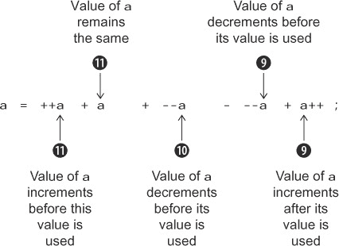
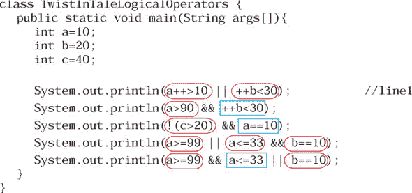
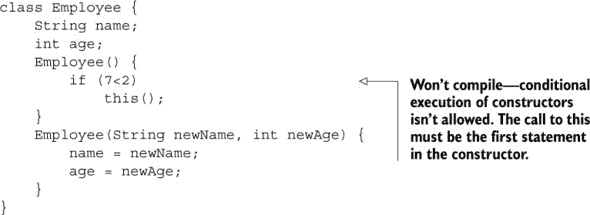
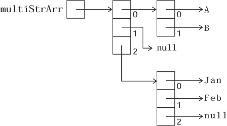
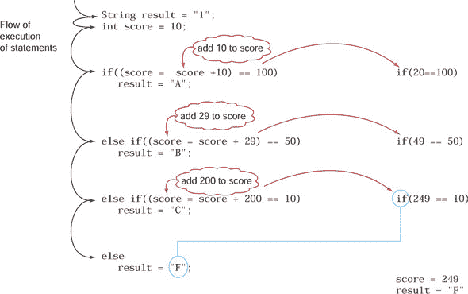
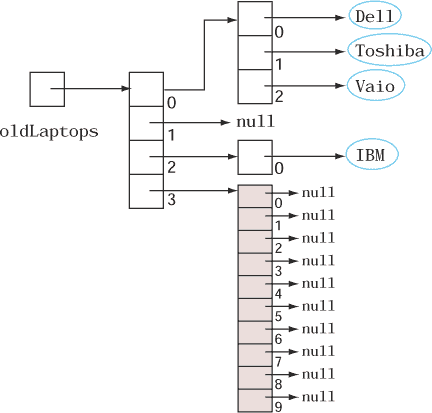

## 附录. 故事中的转折练习答案

第一章至第七章包含多个故事中的转折练习。这些练习的答案以及详细的解释见本附录。每个练习的答案包括以下元素：

+   **目的—** 练习的目标（每个练习试图吸引你注意的转折）

+   **答案—** 正确答案

+   **解释—** 对答案的全面解释

让我们从第一章开始吧。

### A.1 第一章：Java 基础知识

第一章包含四个故事中的转折练习。

#### A.1.1 故事中的转折 1.1

目的：这个练习鼓励你使用 Java 源代码文件的正确内容（类和接口）的组合来练习代码。

答案：c, d

解释：选项（a）和（b）是错误的。

选项（c）是正确的，因为 Java 源代码文件可以定义多个接口和类。

选项（d）是正确的，因为在具有匹配名称的 Java 源代码文件中可以定义`public`接口或类。`public`接口`Printable`不能在 Java 源代码文件 Multiple.java 中定义。它必须在 Printable.java 中定义。

#### A.1.2 故事中的转折 1.2

目的：尽管与故事中的转折 1.1 相似，但这个问题在措辞和意图方面有所不同。它要求你选择单独正确的选项。选择一个单独正确的选项意味着该选项应该单独正确，而不是与其他任何选项结合。你可能在真正的考试中遇到类似的问题。

答案：a, c, d

解释：选项（a）是正确的，而（b）是错误的，因为 Multiple2.java 无法编译。Multiple2.java 不能定义一个`public`类`Car`。

选项（c）是正确的，因为从 Multiple2.java 中删除`public`类`Car`的定义将在 Multiple2.java 中留下一个唯一的`public`接口——`Multiple2`。因为`public`接口`Multiple2`和源代码文件的名称匹配，所以 Multiple2.java 将成功编译。

选项（d）是正确的。将`public`类`Car`更改为非`public`类将在 Multiple2.java 中留下一个唯一的`public`接口——`Multiple2`。因为`public`接口`Multiple2`和源代码文件的名称匹配，所以 Multiple2.java 将成功编译。

选项（e）是错误的。如果你将`public`接口`Multiple2`的访问修饰符更改为非`public`，Multiple2.java 将包含一个`public`类`Car`的定义，这是不允许的。

#### A.1.3 故事中的转折 1.3

目的：这个练习鼓励你执行选项中的代码，以理解方法`main`的正确方法签名以及传递给它的方法参数。

答案：a, b

说明：这个问题中的所有选项都应该使用命令 `javaEJava java one one` 来执行。每个术语的目的如下：

+   术语 1，`java`—用于执行 Java 类

+   术语 2，`EJava`—要执行的类名

+   术语 3，`java`—作为 `main` 方法的第一个参数传递

+   术语 4，`one`—作为 `main` 方法的第二个参数传递

+   术语 5，`one`—作为 `main` 方法的第三个参数传递

要输出 `java one`，`main` 方法应该输出传递给它的第一个参数以及第二个或第三个参数。

选项 (a) 和 (b) 是正确的，因为它们使用了方法 `main` 的正确方法签名。方法参数的名称不必是 `args`。它可以是一个其他有效的标识符。选项 (a) 输出传递给它的第一个和第三个参数的值。选项 (b) 输出传递给它的第一个和第二个参数的值。

选项 (c) 是错误的，因为这个 `main` 方法接受一个二维数组。因此，它不会被当作 *the* `main` 方法处理。

选项 (d) 是错误的，因为这个代码无法编译。方法的访问修饰符（`public`）应该放在其返回类型（`void`）之前；否则，代码无法编译。

#### A.1.4 “故事中的转折”1.4

目的：除了确定可以限制类在包内可见性的正确访问修饰符之外，这个练习还希望你尝试不同的访问修饰符，这些修饰符可以用来声明一个类。

答案：哈里提交的代码。

说明：保罗提交的代码是不正确的，因为当使用 `public` 访问修饰符定义类 `Curtain` 时，它将在包 `building` 外部可访问。

淑瑞亚和塞尔万提交的代码是不正确的，因为类 `Curtain` 是一个顶级类（它不是在另一个类中定义的），因此不能使用 `protected` 和 `private` 访问修饰符来定义。

### A.2 第二章：使用 Java 数据类型

第二章 包含四个“故事中的转折”练习。故事中的转折 2.1 有两部分。

#### A.2.1 “故事中的转折”2.1（第一部分）

目的：默认情况下，`System.out.println()` 会以其十进制基数打印数字。它这样做，无论你使用什么基数数系统来初始化数字。

答案：该代码打印以下输出：

```
534
534
```

说明：程序员经常被类似的问题所迷惑。如果一个变量使用 `0b100001011`（二进制数系统中的数字）赋值，程序员可能会认为 `System.out.println()` 会以二进制数系统打印数字，这是不正确的。默认情况下，`System.out.println()` 会以十进制基数打印数字。所有四个变量 `baseDecimal`、`octVal`、`hexVal` 和 `binVal` 分别代表十进制、八进制、十六进制和二进制数系统中的十进制值 `267`。加法运算将这些值相加并打印 `534` 两次。

你可以使用`Integer`类中的方法以如下方式打印出二进制数系统中的值：

```
System.out.println(Integer.toBinaryString(0b100001011));
```

注意，`Integer`类不在此考试中，你不会就它提出任何问题。这个类仅用于参考。

#### A.2.2 故事中的转折 2.1（第二部分）

目的：Java 7 语言的一个新特性是在字面数值中使用下划线。本练习的目的是帮助你熟悉这个特性，如果你之前没有在字面数值中使用下划线的话。

答案：只有`var1`、`var6`和`var7`正确地定义了字面整数值。

说明：由`var2`定义的字面值`0_x_4_13`是不正确的，因为它在起始的`0`和字母`x`之后使用了下划线，这两者都是不允许的。正确的值是`0x4_13`。

由`var3`定义的字面值`0b_x10_BA_75`是不正确的。你不能在用于定义二进制字面值的`0b`和`0B`前缀之后放置下划线。此外，二进制值只能包含数字`1`和`0`。

由值`var4`定义的字面值`0b_10000_10_11`是不正确的。你不能在用于定义二进制字面值的`0b`和`0B`前缀之后放置下划线。正确的值是`0b10000_10_11`。

由`var5`定义的字面值`0xa10_AG_75`是不正确的，因为它使用了字母`G`，这在十六进制数系统中是不允许的。正确的值是`0xa10_A_75`。

由`var1`定义的字面整数值是有效的。但`0`（用于八进制字面值）是规则的一个例外，即基数前缀不能被下划线孤立（例如，`0x_100_267_760`和`0b_100_110`是无效的表达式）。

#### A.2.3 故事中的转折 2.2

目的：为了加强以下概念：

+   可以在同一行代码中定义多个*相同类型*的变量。

+   变量赋值规则：如果同一行上为多个*相似类型*的变量赋值，赋值从右向左开始。此外，与 C 语言等其他编程语言不同，字面值`0`不能赋给类型为`boolean`的变量。

+   要求你选择错误答案或代码的问题可能会令人困惑。通常，我们首先确定错误的选项，然后选择正确的选项。注意这些问题。

答案：a, b, c, e

说明：选项（a）和（b）是错误的陈述。你可以在同一行上定义多个相同类型的变量。此外，你还可以在同一行代码中为兼容类型的变量赋值。赋值从右向左开始。为了证明这一点，以下代码行将可以编译：

```
int int1;
long long2;
long2 = int1 = 10;
```

但以下代码行将无法编译：

```
int i1;
long l2;
int1 = long2 = 10;
```

在前面代码的最后一行中，字面值`10`被赋值给类型为`long`的变量`long2`，这是可接受的。尝试将变量`long2`的值赋给`int1`会失败，因为这需要显式的转换。

选项 (c) 是一个错误的陈述，因为字面值 `0` 不能赋值给 `boolean` 类型的变量。

选项 (d) 是一个正确的陈述。

选项 (e) 是一个错误的陈述。代码没有定义名为 `yes` 的变量，因此似乎将其视为字面值。Java 没有定义字面值 `yes`，所以代码无法编译。

#### A.2.4 故事中的转折 2.3

目的：这个练习鼓励你

+   尝试使用增量、减量后缀和前缀一元运算符的代码

+   熟悉变量在具有后缀和前缀表示法中多个一元运算符的表达式中的评估方式。

答案：32

说明：实际任务是评估以下表达式：

```
int a = 10;
a = ++a + a + --a - --a + a++;
System.out.println(a);
```

这是实际的任务，因为问题要求你将所有 `++a` 替换为 `a++, --a` 替换为 `a--`，反之亦然。这个表达式在图 A.1 中展示：

##### 图 A.1\. 具有多重一元运算符（后缀和前缀表示法）的表达式评估



#### A.2.5 故事中的转折 2.4

目的：确定使用短路运算符 `&&` 和 `||` 的表达式的操作数是否会评估。

答案：将要执行的操作数用圆圈标出，不会执行的操作数用矩形框起来，见图 A.2。

##### 图 A.2\. 在使用短路运算符 `&&` 和 `||` 的表达式中，被评估的操作数用圆圈标出，未被评估的操作数用矩形框起来。



说明：短路运算符 `&&` 和 `||` 都会评估它们的第一操作数。对于短路运算符 `&&`，如果第一个操作数评估为 `false`，则不会评估第二个操作数。对于短路运算符 `||`，如果第一个操作数评估为 `true`，则不会评估第二个操作数。

对于表达式 `(a++ > 10 || ++b < 30)`，因为 `a++ > 10` 评估为 `false`，两个操作数都将被评估。

对于表达式 `(a > 90 && ++b < 30)`，因为 `a > 90` 评估为 `false`，第二个操作数不会执行。

对于表达式 `(!(c > 20) && a == 10)`，因为 `!(c > 20)` 评估为 `false`，第二个操作数不会执行。

表达式 `(a >= 99 || a <= 33 && b == 10)` 有三个操作数，以及 OR (`||`) 和 AND (`&&`) 短路运算符。因为短路运算符 AND 的运算符优先级高于短路运算符 OR，所以表达式按以下方式评估：

```
(a >= 99 || (a <= 33 && b == 10))
```

评估前面的表达式从评估 `(a <= 33 && b == 10)` 开始。因为 `a <= 33` 评估为 `true`，运算符 `&&` 会评估第二个操作数 `(b == 10)` 以确定 `(a <= 33 && b == 10)` 将返回 `true` 还是 `false`。`a <= 33` 返回 `true`，而 `b == 10` 返回 `false`，所以表达式 `(a <= 33 && b == 10)` 返回 `false`。

原始表达式—`(a >= 99 || (a <= 33 && b == 10))`—现在简化为以下表达式：

```
(a >= 99 || false)
```

短路操作符 OR (`||`)执行其第一个操作数（即使第二个操作数的值已知），评估`a >= 99`。所以对于这个表达式，所有三个操作数都被评估。

表达式`(a >= 99 && a <= 33 || b == 10)`也有三个操作数，以及`OR`和`AND`短路操作符。因为短路操作符`AND`的运算符优先级高于短路操作符`OR`，所以这个表达式按以下方式评估：

```
((a >= 99 && a <= 33) || b == 10 )
```

`a >= 99`评估为`false`，所以下一个操作数`(a <= 33)`不会被评估。因为操作符`||`的第一个操作数`(a >= 99 && a <= 33)`评估为`false`，所以评估`b == 10`。

### A.3 第三章：方法和封装

第三章包括三个故事中的转折练习。

#### A.3.1 故事中的转折 3.1

目的：与这个练习中定义与其实例变量同名局部变量的`TestPhone`类一样，我强烈建议你尝试在类中定义具有相同名称但不同作用域的变量的不同组合。

答案：a

说明：类`Phone`定义了一个名为`phoneNumber`的实例变量。方法`setNumber`也定义了一个局部变量`phoneNumber`并将其局部变量的值赋给它。局部变量会覆盖类中具有相同名称的实例变量。因为实例变量`phoneNumber`的值没有变化，所以`123456789`被打印到`TestPhone`类中定义的`main`方法控制的控制台。

#### A.3.2 故事中的转折 3.2

目的：了解不允许对构造函数进行**递归**或**循环**调用。

答案：代码无法编译，出现以下编译错误信息：

```
Employee.java:4: error: recursive constructor invocation
    Employee() {
    ^
1 error
```

说明：一个方法调用自身被称为**递归**。两个或更多方法以循环方式相互调用被称为**循环方法调用**。

从 Java 版本 1.4.1 开始，Java 编译器不会编译具有**递归**或**循环**构造函数的代码。构造函数用于初始化对象，因此允许对构造函数进行递归调用是没有意义的。你可以初始化对象一次，然后修改它。你不能多次初始化对象。

如果你想知道是否可以从另一个构造函数有条件地调用构造函数，你无法这样做。对构造函数的调用必须是第一条语句：



此外，不允许循环构造函数调用：


之前的例子无法编译，出现以下编译错误信息：

```
Employee.java:8: error: recursive constructor invocation
    Employee(String newName, int newAge) {
    ^
1 error
```

注意，在方法中定义的类似的递归或循环调用不会导致编译错误。

#### A.3.3 故事中的转折 3.3

目的：具有`public`实例变量（s）的类永远不能被指定为良好封装的类。

答案：e

说明：这个问题试图通过定义玩弄方法 `getWeight` 和 `setWeight` 的多个访问修饰符的选项来欺骗你。因为类 `Phone` 的实例变量 `model` 使用 `public` 访问修饰符定义（并且没有提出的选项解决这个问题），它可以在类外访问。所以 `Phone` 不是一个封装良好的类。

### A.4 第四章：Java API 中的选择类和数组

第四章 包含四个“故事中的转折”练习。

#### A.4.1 “故事中的转折”4.1

目的：提醒你注意类 `String` 的重载方法，这些方法可以接受 `char` 或 `String` 或两者，这个练习中的代码向 `startsWith` 方法传递了一个无效的方法参数——一个 `char`。

答案：e

说明：当涉及到 `String` 类时，很容易混淆接受 `char` 或 `String` 值作为方法参数的方法。例如，重载的方法 `indexOf` 可以接受 `String` 和 `char` 值来在 `String` 中搜索目标值。方法 `startsWith` 和 `endsWith` 只接受 `String` 类型的参数。方法 `charAt` 只接受 `int` 类型的参数。因此，这个方法可以传递 `char` 值，这些值被存储为无符号整数值。

#### A.4.2 “故事中的转折”4.2

目的：这个练习有多个目的：

+   为了让你混淆方法名称的使用，这些名称被其他类在 Java API 中用来创建它们的对象。

+   为了鼓励你在使用 Java API 中的类时参考 Java API 文档。Java API 文档是一个广泛的信息和事实来源，这些信息通常不包括在大多数书中（因为实际上不可能做到这一点）。

答案：d

说明：创建具有默认容量 16 个字符的 `StringBuilder` 类对象的正确方法是调用 `StringBuilder` 的无参数构造函数，如下所示：

```
StringBuilder name = StringBuilder();
```

#### A.4.3 “故事中的转折”4.3

目的：识别未初始化的数组元素和不存在数组元素之间的区别。一个多维数组的图示很容易绘制，你可以轻松地参考其不存在或 `null` 的数组元素。这个概念在 图 A.3 中展示。

##### 图 A.3\. 数组 `multiStrArr` 及其元素



答案：b, d

说明：选项(a)是错误的。使用 `{"Jan","Feb",null}` 和 `{"Jan","Feb",null,null}` 初始化数组 `multiStrArr` 的行并不相同。前者定义了 *三个* 数组元素，最后一个数组元素被赋值为 `null`。后者定义了 *四个* 数组元素，最后两个数组元素被赋值为 `null`。

选项(b)是正确的。该位置的数组元素存在，但没有被赋予任何值。它被赋值为 `null`。

选项(c)是错误的。因为 `multiStrArr[1]` 指向 `null`，所以 `multiStrArr[1][1]` 不存在。

选项 (d) 是正确的。如图 A.3 所示，数组 `multiStrArr` 在每一行中定义的元素数量不相等，因此它是不对称的。

#### A.4.4 故事中的转折 4.4

目的：这个练习试图通过使用多个 `ArrayList` 对象、将一个 `ArrayList` 的对象引用赋给另一个，并修改 `ArrayList` 对象的值来欺骗你。`String` 对象是不可变的——你不能改变它们的值。

答案：a

解释：选项 (a) 是正确的，而选项 (b)、(c) 和 (d) 是错误的。`ArrayList` `myArrList` 和 `yourArrList` 包含 `String` 对象。一旦创建，`String` 对象的值就不能修改。

### A.5 第五章：流程控制

第五章 包含四个故事中的转折练习。

#### A.5.1 故事中的转折 5.1

目的：为了强调多个要点：

+   任何类型的变量都可以在 `if` 条件中使用的表达式中（重新）赋值。

+   `if`-`else`-`if` 语句在控制传递给它们时执行每个 `if` 条件，并更改在表达式评估中操作的任何变量的值。

+   用于 `if` 条件的表达式应该评估为 `boolean` 值。

答案：f

解释：本练习中代码语句的执行流程如图 A.4 所示。

##### 图 A.4\. 故事中的转折 5.1 中的代码执行流程



图 A.4 中左侧的箭头显示了此代码片段中语句的执行流程。右侧的 `if` 条件显示了在 `if` 语句中使用的表达式评估后的实际比较值。以下是一个详细的描述：

+   变量 `score` 的初始值是 `10`。第一个条件 `((score = score + 10) == 100)` 将变量 `score` 的值重新赋为 `20`，然后将其与字面整数值 `100` 进行比较。表达式 `20 == 100` 返回 `boolean` 值 `false`。控制不会评估 `if` 构造的 `then` 部分，而是继续评估 `else` 部分中定义的第二个 `if` 条件。

+   第二个条件 `((score = score + 29) == 50)` 将 `29` 添加到变量 `score` 的现有值 `20` 上，然后将新值 `49` 与 `50` 进行比较。表达式 `49 == 50` 再次返回 `false`。控制不会评估 `if` 构造的 `then` 部分，而是继续评估 `else` 部分中定义的第二个 `if` 条件。

+   第三个条件`((score = score + 200) == 10)`将`200`的值加到变量`score`现有的`49`值上，使其变为`249`，并将其与整型字面值`10`进行比较。因为`249 == 10`评估为`false`，控制流移动到`else`部分。`else`部分将字面值`F`赋给变量`result`。在`if-else-if`语句执行结束时，变量`score`被赋予`249`的值，`result`被赋予`F`的值。代码输出`F:249`。

| |
| --- |

##### 考试技巧

这个练习是一个很好的机会来提醒你，这样的赋值总是在它们所属的测试或其他表达式之前执行（即预赋值），除了后增量（即后缀++）。

| |
| --- |

#### A.5.2 故事中的转折 5.2

目的：`switch`结构使用`equals`方法比较其参数的值与`case`值。它不比较变量引用。

答案：c

说明：你可能已经用如下代码回答过问题，该代码打印`false`：

```
String aDay = new String("SUN");
System.out.println(aDay == "SUN");
```

使用赋值运算符（`=`）创建的`String`对象存储在`String`对象池中，但使用`new`运算符创建的`String`对象不存储在`String`对象池中。

当一个`String`对象作为参数传递给`switch`结构时，它不比较对象引用；它使用`equals`方法比较对象值。在问题中显示的代码片段中，找到了与`String`字面值`SUN`的匹配，因此代码打印`Weekend!`，执行`break`语句，并退出块。

#### A.5.3 故事中的转折 5.3

目的：注意传递给`switch`结构的变量的类型。在原始数据类型中，你可以将`byte`、`short`、`char`和`int`类型的变量传递给`switch`结构。可以传递给`switch`结构的其他数据类型有`Byte`、`Short`、`Integer`、`Character`、`enum`和`String`。

这个问题试图将你的注意力从这个简单的基本要求转移到问题的逻辑上。

答案：哈里的提交。

说明：保罗的提交无法编译，因为`switch`结构不接受`long`原始数据类型的参数。

#### A.5.4 故事中的转折 5.4

目的：当在嵌套循环（任何组合的`for`、`do-while`或`while`循环）中使用未标记的`break`语句时，`break`语句将结束`inner loop`的执行，而不是所有嵌套循环。`outer loop`将继续执行，从它的下一个迭代值开始。

答案：a

说明：让我们从`outer loop`的第一次迭代开始。在第一次迭代中，变量`outer`的值是`Outer`。

对于外层循环的第一次迭代，内层循环应该对变量 `inner` 的值 `Outer` 和 `Inner` 执行。对于内层循环的第一次迭代，变量 `inner` 的值是 `Outer`，所以条件 `inner.equals("Inner")` 评估为 `false`，`break` 语句不执行。代码打印变量 `inner` 的值，即 `Outer:`，并开始内层循环的下一个迭代。在内层循环的第二次迭代中，变量 `inner` 的值是 `Inner`，所以条件 `inner.equals("Inner")` 评估为 `true`，`break` 语句执行，结束内层循环的执行，跳过打印变量 `inner` 值的代码。

外层循环从第二次迭代开始执行。在这个迭代中，变量 `outer` 的值是 `Outer`。对于外层循环的迭代，内层循环以与上一段中提到相同的方式执行两次。外层循环的这个迭代再次打印变量 `inner` 的值，当它等于 `Outer` 时。

问题中包含的嵌套循环打印出 `Outer:` 两次：

```
Outer:Outer:
```

### A.6 第六章：使用继承

第六章 包含了四个“故事中的转折”练习。

#### A.6.1 “故事中的转折”6.1

目的：这个问题是一个简单概念（`private` 成员对派生类不可访问）的例子，通过包含试图转移您注意力的代码和选项，使其看起来很复杂。考试中可能会出现类似的问题。

答案：e

说明：代码未能编译，因为类中的 `private` 成员不能在类外访问——甚至不能由其派生类访问。编译器可以检测此类尝试；此代码无法编译。

#### A.6.2 “故事中的转折”6.2

目的：帮助您处理组合

+   数组

+   将派生类的对象赋给基类的引用变量

+   将实现接口的类的对象赋给接口的引用变量

答案：a, c

说明：您需要遵循的规则来为数组元素赋值与您在将对象赋给引用变量时遵循的规则相同。因为数组 `interviewer` 的类型是 `Interviewer`，您可以分配实现此接口的类的对象。`Employee`、`Manager` 和 `HRExecutive` 类以及接口 `Interviewer` 的继承关系如 图 A.5 所示。

##### 图 A.5\. 类 `Employee`、`Manager` 和 `HRExecutive` 以及接口 `Interviewer` 的继承层次结构的 UML 表示


如您在 图 A.5 中所见，类 `Manager` 和 `HRExecutive` 实现了接口 `Interviewer`。类 `Employee` 没有实现接口 `Interviewer`；因此，`Employee` 类的对象不能添加到类型为 `Interviewer` 的数组中。

从这个解释中可以看出，选项(a)和(c)是正确的，选项(b)是不正确的。

选项(d)是不正确的，因为你不能创建接口的对象。选项(d)试图创建接口`Interviewer`的对象。试图创建接口实例的代码将无法编译。

#### A.6.3 故事中的转折 6.3

目的：如果没有与基类或派生类中定义的变量名称冲突，则可以从派生类使用`super`和`this`引用访问变量。如果有冲突，则可以使用`super`引用来访问基类变量。

答案：b

说明：在派生类中，你通常使用隐式引用`super`来引用基类的方法或变量。同样，你通常使用隐式引用`this`来引用同一类中定义的方法或变量。派生类包含其基类的对象，并且可以访问其基类的非`私有`成员。派生类可以使用引用`this`来将其基类的成员作为自己的成员来引用。这种方法只有在派生类中没有定义相同的成员时才是可接受的，也就是说，没有名称冲突。

基类`Employee`定义了两个非`私有`变量，`name`和`address`，这些变量在`Employee`的派生类`Programmer`中是可访问的。类`Programmer`还定义了一个实例变量`name`，因此变量`name`应该使用显式的引用`super`和`this`来引用在`Employee`和`Programmer`类中定义的变量`name`。变量`address`在派生类`Programmer`中可以使用`super`和`this`来引用。

选项(a)是不正确的。派生类`Programmer`可以使用`this.address`来引用在基类中定义的变量`address`。这个值不会打印`null`。

选项(c)是不正确的。从派生类`Programmer`访问时，`this.address`不会打印空白。

选项(d)是不正确的。代码没有编译问题。

#### A.6.4 故事中的转折 6.4

目的：多态方法应该定义一个方法的重写规则。

答案：a

说明：当类或接口共享继承关系时存在多态方法。如果派生类可以定义一个多态方法，则

+   派生类实现了在基类或接口中定义的`抽象`方法

+   派生类覆盖了在基类中定义的非`抽象`方法

选项(b)和(d)是不正确的。如果一个方法定义了不同的参数列表，则不能重写该方法。

选项(c)是不正确的。重写方法的重写类型必须在基类和派生类中相同。

### A.7 第七章：异常处理

第七章 包含了五个故事中的转折练习。

#### A.7.1 故事中的转折 7.1

目的：`finally` 块不能放在 `catch` 块之前。许多程序员将这个问题与在 `switch` 结构中将标签 `default` 放在标签 `case` 之前进行比较。尽管后者方法可行，但 `finally` 和 `catch` 块并不那么灵活。

答案：d

解释：选项 (a)、(b) 和 (c) 是错误的，因为定义在 `catch` 块之前的 `finally` 块的代码无法编译。

#### A.7.2 故事中的转折 7.2

目的：未处理的异常由内部异常处理器传递到外部的 `try-catch` 块以处理。

答案：a

解释：选项 (b)、(c) 和 (d) 是错误的。此问题假设系统上存在一个名为 players.txt 的文本文件，因此以下代码不会抛出 `FileNotFoundException` 异常：

```
players = new FileInputStream("players.txt");
```

为此问题定义的代码在执行以下代码之前没有初始化 `static` 变量 `coach`，这将必然抛出 `NullPointerException`：

```
coach.close();
```

上一行代码定义在内部 `try` 块中，该块没有为 `NullPointerException` 异常定义异常处理器。这个异常被传播到外部的异常处理器块。外部异常处理器 *捕获* 内部 `try` 块抛出的 `NullPointerException` 并执行适当的异常处理器。因此，代码打印以下内容：

```
players.txt found
NullPointerException
```

#### A.7.3 故事中的转折 7.3

目的：确定错误处理的异常代码是否会执行。

答案：b

解释：我们知道通常错误不应该通过程序处理，而应该留给 JVM 处理。此外，你也不能确定所有错误的错误处理代码都会执行。例如，`StackOverFlowError` 的错误处理代码可能会执行，但（正如其名称所暗示的）可能不会为 `VirtualMachineError` 执行。

#### A.7.4 故事中的转折 7.4

目的：`ClassCastException` 是一个运行时异常。正如你所知，运行时异常只能由 JVM 抛出。

答案：b, d

解释：选项 (a) 和 (c) 是错误的，因为代码会抛出 `ClassCastException`，这是一个运行时异常，对于以下代码：

```
printable = (Printable)blackInk;
```

选项 (d) 是正确的，因为 `BlackInk` 类及其任何基类都没有实现 `Printable` 接口。因此，将 `blackInk` 赋值给 `printable` 而不进行显式转换的代码将无法编译。

#### A.7.5 故事中的转折 7.5

目的：尝试访问数组中不存在的位置会抛出 `ArrayIndexOutOfBoundsException`。在存储在数组中的 `null` 值上调用成员会抛出 `NullPointerException`。

答案：c

解释：让我们缩进二维数组 `oldLaptops` 的赋值，以便更容易理解分配给它的值：

```
String[][] oldLaptops = {
                          {"Dell", "Toshiba", "Vaio"},
                           null,
                          {"IBM"},
                           new String[10]
                        };
```

之前的代码导致以下赋值：

```
oldLaptops[0] = {"Dell", "Toshiba", "Vaio"};
oldLaptops[1] = null;
oldLaptops[2] = {"IBM"};
oldLaptops[3] = new String[10];
```

两个维度的 `String` 数组 `oldLaptops` 的示意图显示在 图 A.6 中。

##### 图 A.6\. 数组 `oldLaptops`



如您所见，`oldLaptops[3]` 是一个包含 10 个未初始化的 `String` 对象的数组。数组 `oldLaptops[3]` 的所有成员（从索引位置 `0` 到 `9`）都被分配了一个 `null` 值。第 `4` 行的代码试图在数组 `oldLaptops[0]` 的第一个元素上调用 `length` 方法，该元素是 `null`，从而抛出了 `NullPointerException`。
